# Backport Agent — Detailed Run Report

> This file is generated automatically. It is intended for human analysts and
> AI reasoning models to assess agent performance, decision quality, and LLM behavior.

**Run timestamp**: 2026-05-29T07:48:18.032Z
**Models used**: fast=`mistral/devstral-latest`  powerful=`mistral/magistral-medium-latest`
**Prompt log**: `/Users/rlemeill/Development/backport-agent/run-1780040450958.prompts.jsonl`

---

## Summary (PR body)

## Backport Agent — Sync Report

**Date**: 2026-05-29T07:48:18.032Z
**Upstream ref**: `origin/main`
**Fork ref**: `origin/keypool-live`
**Sync branch**: `sync/upstream-main-2026-05-29`

### Summary

- ✅ Applied: 9
- ⚠️ Needs human review: 1
- ⛔ Blocked (not attempted): 1

### Applied commits

- `2b45b7b7` [high] Remove the VSCode Nightly (SDK) publish workflow; we are just running the regular publish workflow from the SDK branch now. (#11074)
- `75309001` [high] fix: repair vscode nightly publish workflows (#11072)
- `3068fcfe` [high] docs(sdk): note single-file plugin dep limit and pluginPaths dir form (#11076)
- `71b8f43a` [low] Fix OTEL variable bundling (#11092)
- `49e8c1b3` [low] Update CLI to 3.0.14 (#11094)
- `762e3c42` [low] fix(vscode): show Qwen 3.7 Max cache support (#11079)
- `6f609e89` [low] fix: writeDiagnostic for logging ACP output (#11091)
- `9e942fbb` [high] Fix Discord connector registration (#11077)
- `0c90bd9b` [low] feat: add Moonshot Kimi K2.6 model (#11109)

### ⚠️ Human review required

- `33e521e5` fix: SAP AI Core uses AI SDK community provider (CLINE-2307) (#11075)

### Blocked commits (not attempted)

- `33e521e5` [high] — Conflict in files: sdk/packages/llms/src/providers/builtins-runtime.ts, sdk/packages/llms/src/providers/builtins.ts

### Agent decision log

- All commits were processed, with one conflict that could not be resolved automatically.


---

## Agent Workflow Diagram

> Generated by the fast model from the run summary. Evaluate the agent's decision path.

```mermaid
flowchart TD
    A["2b45b7b7<br>Remove the VSCode Nightly (SDK) publish workflow"] -->|high| B[applied ✅]
    C["75309001<br>fix: repair vscode nightly publish workflows"] -->|high| D[applied ✅]
    E["3068fcfe<br>docs(sdk): note single-file plugin dep limit and pluginPaths dir form"] -->|high| F[applied ✅]
    G["71b8f43a<br>Fix OTEL variable bundling"] -->|low| H[applied ✅]
    I["49e8c1b3<br>Update CLI to 3.0.14"] -->|low| J[applied ✅]
    K["762e3c42<br>fix(vscode): show Qwen 3.7 Max cache support"] -->|low| L[applied ✅]
    M[6f609e89<br>fix: writeDiagnostic for logging ACP output] -->|low| N[applied ✅]
    O[9e942fbb<br>Fix Discord connector registration] -->|high| P[applied ✅]
    Q[0c90bd9b<br>feat: add Moonshot Kimi K2.6 model] -->|low| R[applied ✅]
    S[33e521e5<br>Conflict in files: sdk/packages/llms/src/providers/builtins-runtime.ts, sdk/packages/llms/src/providers/builtins.ts] -->|high| T[blocked ⛔]
    S -->|high| U[needs-review ⚠️]

    style A fill:#4CAF50,stroke:#388E3C
    style C fill:#4CAF50,stroke:#388E3C
    style E fill:#4CAF50,stroke:#388E3C
    style G fill:#4CAF50,stroke:#388E3C
    style I fill:#4CAF50,stroke:#388E3C
    style K fill:#4CAF50,stroke:#388E3C
    style M fill:#4CAF50,stroke:#388E3C
    style O fill:#4CAF50,stroke:#388E3C
    style Q fill:#4CAF50,stroke:#388E3C
    style S fill:#FF5722,stroke:#E64A19
    style T fill:#F44336,stroke:#D32F2F
    style U fill:#FF9800,stroke:#F57C00
```



---

## AI Sub-Agent Call Log (8 calls)

> Each entry is one sub-agent invocation. Review prompt/response pairs to assess
> reasoning quality, hallucinations, and decision accuracy.

### Call 1 / 8 — `analyze_commit_for_backport` ✅ OK

| Field | Value |
|---|---|
| **Timestamp** | 2026-05-29T07:41:13.666Z |
| **Tool** | `analyze_commit_for_backport` |
| **Model** | `mistral/devstral-latest` |
| **Duration** | 2472 ms |
| **Tokens in** | 1384 |
| **Tokens out** | 128 |
| **Cost** | $0.000000 |

**Prompt sent to sub-agent:**

```
Commit SHA: 2b45b7b7aa04e12daba5d0bbc0f8aa4dac07c172
Commit message:
Remove the VSCode Nightly (SDK) publish workflow; we are just running the regular publish workflow from the SDK branch now. (#11074)

Changed files (1):
.github/workflows/ext-vscode-publish-nightly-sdk.yml

Diff:
commit 2b45b7b7aa04e12daba5d0bbc0f8aa4dac07c172
Author: Dominic Cooney <dominic.cooney@cline.bot>
Date:   Wed May 27 03:34:25 2026 +0900

    Remove the VSCode Nightly (SDK) publish workflow; we are just running the regular publish workflow from the SDK branch now. (#11074)
---
 .../workflows/ext-vscode-publish-nightly-sdk.yml   | 69 ----------------------
 1 file changed, 69 deletions(-)

diff --git a/.github/workflows/ext-vscode-publish-nightly-sdk.yml b/.github/workflows/ext-vscode-publish-nightly-sdk.yml
deleted file mode 100644
index bebbdcf58..000000000
--- a/.github/workflows/ext-vscode-publish-nightly-sdk.yml
+++ /dev/null
@@ -1,69 +0,0 @@
-# TODO: Fold this workflow's SDK login changes into ext-vscode-publish-nightly.yml
-# and delete this file. Pinned to dpc/sdk-migration-simpler-login while Max is iterating.
-# Owner: Max Paulus
-name: ext-vscode-publish-nightly-sdk
-
-on:
-    schedule:
-        - cron: '0 12 * * *' # 4 AM PST (UTC-8) = 12 UTC
-    workflow_dispatch:
-
-permissions:
-    contents: read
-    packages: write
-    checks: write
-    pull-requests: write
-
-env:
-    # Keep the publish source pinned to one reviewed branch instead of accepting arbitrary refs.
-    SDK_NIGHTLY_REF: dpc/sdk-migration-simpler-login
-
-jobs:
-    publish:
-        name: Publish Cline New SDK Extension Nightly
-        if: github.repository == 'cline/cline' && github.ref == 'refs/heads/main'
-        runs-on: ubuntu-latest
-        environment: PublishNightly
-        defaults:
-          run:
-            working-directory: apps/vscode
-
-        steps:
-            - name: Checkout trusted SDK nightly branch
-              uses: actions/checkout@v4
-              with:
-                  ref: ${{ env.SDK_NIGHTLY_REF }}
-                  lfs: true
-                  persist-credentials: false
-
-            - name: Setup Node.js
-              uses: actions/setup-node@v4
-              with:
-                  # Keep publish environment aligned with test workflow/tooling lockfile expectations.
-                  # Newer LTS (Node 24 / npm 11) can make `npm list` fail with ELSPROBLEMS during vsce packaging.
-                  node-version: 22
-
-            - name: Install root dependencies
-              run: npm ci --include=optional
-
-            - name: Install webview-ui dependencies
-              run: cd webview-ui && npm ci --include=optional
-
-            - name: Install Publishing Tools
-              run: npm install -g @vscode/vsce ovsx
-
-            - name: Publish SDK nightly extension
-              env:
-                  VSCE_PAT: ${{ secrets.VSCE_PAT }}
-                  OVSX_PAT: ${{ secrets.OVSX_PAT }}
-                  TELEMETRY_SERVICE_API_KEY: ${{ secrets.TELEMETRY_SERVICE_API_KEY }}
-                  ERROR_SERVICE_API_KEY: ${{ secrets.ERROR_SERVICE_API_KEY }}
-                  CLINE_ENVIRONMENT: production
-                  # OpenTelemetry production defaults (can be overridden at runtime)
-                  OTEL_TELEMETRY_ENABLED: ${{ secrets.OTEL_TELEMETRY_ENABLED }}
-                  OTEL_LOGS_EXPORTER: otlp
-                  OTEL_METRICS_EXPORTER: otlp
-                  OTEL_EXPORTER_OTLP_PROTOCOL: ${{ secrets.OTEL_EXPORTER_OTLP_PROTOCOL }}
-                  OTEL_EXPORTER_OTLP_ENDPOINT: ${{ secrets.OTEL_EXPORTER_OTLP_ENDPOINT }}
-                  OTEL_EXPORTER_OTLP_HEADERS: ${{ secrets.OTEL_EXPORTER_OTLP_HEADERS }}
-              run: npm run publish:marketplace:nightly

Output the JSON object now.
```

**Response received:**

```
```json
{
  "summary": "This commit removes the VSCode Nightly (SDK) publish workflow, as it is no longer needed since the regular publish workflow from the SDK branch is now being used instead.",
  "keyChanges": [
    "Deletes the GitHub Actions workflow file `.github/workflows/ext-vscode-publish-nightly-sdk.yml`.",
    "Removes a scheduled and manually triggered workflow that published a nightly SDK extension."
  ],
  "backportComplexity": "trivial",
  "semanticRiskFactors": [],
  "recommendation": "apply"
}
```
```

---

### Call 2 / 8 — `analyze_commit_for_backport` ✅ OK

| Field | Value |
|---|---|
| **Timestamp** | 2026-05-29T07:41:15.183Z |
| **Tool** | `analyze_commit_for_backport` |
| **Model** | `mistral/devstral-latest` |
| **Duration** | 1516 ms |
| **Tokens in** | 693 |
| **Tokens out** | 99 |
| **Cost** | $0.000000 |

**Prompt sent to sub-agent:**

```
Commit SHA: 7530900166ab7ee1d7a15040a4eb3ef0d635fad4
Commit message:
fix: repair vscode nightly publish workflows (#11072)

Changed files (1):
.github/workflows/ext-vscode-publish-nightly.yml

Diff:
commit 7530900166ab7ee1d7a15040a4eb3ef0d635fad4
Author: Ara <arafat.da.khan@gmail.com>
Date:   Tue May 26 12:14:25 2026 -0700

    fix: repair vscode nightly publish workflows (#11072)
---
 .github/workflows/ext-vscode-publish-nightly.yml | 1 +
 1 file changed, 1 insertion(+)

diff --git a/.github/workflows/ext-vscode-publish-nightly.yml b/.github/workflows/ext-vscode-publish-nightly.yml
index 647ba01d8..0cf414c3f 100644
--- a/.github/workflows/ext-vscode-publish-nightly.yml
+++ b/.github/workflows/ext-vscode-publish-nightly.yml
@@ -20,6 +20,7 @@ jobs:
     if: github.repository == 'cline/cline' && (github.ref == 'refs/heads/main' || github.ref == 'refs/heads/dpc/sdk-migration-simpler-login')
     permissions:
       contents: read
+      pull-requests: read
     uses: ./.github/workflows/ext-vscode-test.yml
 
   publish:

Output the JSON object now.
```

**Response received:**

```
```json
{
  "summary": "This commit fixes the VSCode nightly publish workflow by adding a missing permission for pull requests. It ensures the workflow has the necessary access to read pull requests during execution.",
  "keyChanges": [
    "Added `pull-requests: read` permission to the workflow job."
  ],
  "backportComplexity": "trivial",
  "semanticRiskFactors": [],
  "recommendation": "apply"
}
```
```

---

### Call 3 / 8 — `analyze_commit_for_backport` ✅ OK

| Field | Value |
|---|---|
| **Timestamp** | 2026-05-29T07:41:17.684Z |
| **Tool** | `analyze_commit_for_backport` |
| **Model** | `mistral/devstral-latest` |
| **Duration** | 2500 ms |
| **Tokens in** | 1295 |
| **Tokens out** | 129 |
| **Cost** | $0.000000 |

**Prompt sent to sub-agent:**

```
Commit SHA: 3068fcfedf4f97bb82f6abf721dd64623f4e480b
Commit message:
docs(sdk): note single-file plugin dep limit and pluginPaths dir form (#11076)
    
    Single-file plugins can only import Node builtins and @cline/*. As soon
    as a plugin needs an npm dep it has to ship as a package. Adds one
    sentence each to the writing-plugins guide (with dependencies in the
    example package.json) and plugin-install (noting pluginPaths accepts a
    package directory for fast iteration).

Changed files (2):
docs/sdk/guides/writing-plugins.mdx
docs/sdk/plugin-install.mdx

Diff:
commit 3068fcfedf4f97bb82f6abf721dd64623f4e480b
Author: Saoud Rizwan <7799382+saoudrizwan@users.noreply.github.com>
Date:   Wed May 27 11:21:08 2026 -0700

    docs(sdk): note single-file plugin dep limit and pluginPaths dir form (#11076)
    
    Single-file plugins can only import Node builtins and @cline/*. As soon
    as a plugin needs an npm dep it has to ship as a package. Adds one
    sentence each to the writing-plugins guide (with dependencies in the
    example package.json) and plugin-install (noting pluginPaths accepts a
    package directory for fast iteration).
---
 docs/sdk/guides/writing-plugins.mdx | 5 ++++-
 docs/sdk/plugin-install.mdx         | 2 +-
 2 files changed, 5 insertions(+), 2 deletions(-)

diff --git a/docs/sdk/guides/writing-plugins.mdx b/docs/sdk/guides/writing-plugins.mdx
index b83a108b0..07f406be5 100644
--- a/docs/sdk/guides/writing-plugins.mdx
+++ b/docs/sdk/guides/writing-plugins.mdx
@@ -257,13 +257,16 @@ Single-file plugins can be installed directly from a file URL:
 cline plugin install https://github.com/your-org/your-repo/blob/main/plugins/github-plugin.ts
 ```
 
-For package or repository distribution, add a `cline` field to your `package.json` that declares entry points. Dependencies under the `@cline/` scope are provided by the host runtime. The installer automatically strips these from the plugin's dependency list before running `npm install`, so declare any `@cline/*` package your plugin imports as an optional peer dependency:
+Single-file plugins can only import Node builtins and `@cline/*`. As soon as you need an npm dependency (`zod`, an HTTP client, etc.) you must ship as a package: a directory with a `package.json` that declares a `cline` field for entry points and your runtime `dependencies`. Dependencies under the `@cline/` scope are provided by the host runtime -- the installer strips these and runs `npm install` for the rest, so declare any `@cline/*` package you import as an optional peer dependency:
 
 ```json
 {
   "cline": {
     "plugins": [{ "paths": ["./github-plugin.ts"], "capabilities": ["tools", "hooks"] }]
   },
+  "dependencies": {
+    "@octokit/rest": "^21.0.0"
+  },
   "peerDependencies": {
     "@cline/sdk": "*"
   },
diff --git a/docs/sdk/plugin-install.mdx b/docs/sdk/plugin-install.mdx
index 8119b7f60..79666c8a1 00644
--- a/docs/sdk/plugin-install.mdx
+++ b/docs/sdk/plugin-install.mdx
@@ -132,7 +132,7 @@ await cline.start({
 })
 ```
 
-Plugin files must export an `AgentPlugin` as the default export.
+Plugin files must export an `AgentPlugin` as the default export. `pluginPaths` also accepts a package directory -- the SDK reads `package.json` and follows the `cline.plugins` entries, so you can `npm install` once inside a package and iterate without re-running `cline plugin install` on every edit.
 
 ### Using `plugins` (Agent Runtime)

Output the JSON object now.
```

**Response received:**

```
```json
{
  "summary": "This commit updates documentation to clarify limitations of single-file plugins (only Node builtins and @cline/* imports allowed) and notes that pluginPaths accepts package directories for faster iteration.",
  "keyChanges": [
    "Added clarification in writing-plugins.mdx that single-file plugins cannot use npm dependencies and must be packaged if they do.",
    "Updated plugin-install.mdx to document that pluginPaths accepts package directories for iterative development."
  ],
  "backportComplexity": "trivial",
  "semanticRiskFactors": [],
  "recommendation": "apply"
}
```
```

---

### Call 4 / 8 — `check_customization_compatibility` ✅ OK

| Field | Value |
|---|---|
| **Timestamp** | 2026-05-29T07:41:22.447Z |
| **Tool** | `check_customization_compatibility` |
| **Model** | `mistral/devstral-latest` |
| **Duration** | 1224 ms |
| **Tokens in** | 1125 |
| **Tokens out** | 77 |
| **Cost** | $0.000000 |

**Prompt sent to sub-agent:**

```
Declared fork customisations:
  1. Pattern: docs/**
     Description: Documentation customizations for TEA-ching

Upstream diff to evaluate:
commit 3068fcfedf4f97bb82f6abf721dd64623f4e480b
Author: Saoud Rizwan <7799382+saoudrizwan@users.noreply.github.com>
Date:   Wed May 27 11:21:08 2026 -0700

    docs(sdk): note single-file plugin dep limit and pluginPaths dir form (#11076)
    
    Single-file plugins can only import Node builtins and @cline/*. As soon
    as a plugin needs an npm dep it has to ship as a package. Adds one
    sentence each to the writing-plugins guide (with dependencies in the
    example package.json) and plugin-install (noting pluginPaths accepts a
    package directory for fast iteration).
---
 docs/sdk/guides/writing-plugins.mdx | 5 ++++-
 docs/sdk/plugin-install.mdx         | 2 +-
 2 files changed, 5 insertions(+), 2 deletions(-)

diff --git a/docs/sdk/guides/writing-plugins.mdx b/docs/sdk/guides/writing-plugins.mdx
index b83a108b0..07f406be5 100644
--- a/docs/sdk/guides/writing-plugins.mdx
+++ b/docs/sdk/guides/writing-plugins.mdx
@@ -257,13 +257,16 @@ Single-file plugins can only import Node builtins and @cline/*. As soon
 cline plugin install https://github.com/your-org/your-repo/blob/main/plugins/github-plugin.ts
 ```
 
-For package or repository distribution, add a `cline` field to your `package.json` that declares entry points. Dependencies under the `@cline/` scope are provided by the host runtime. The installer automatically strips these from the plugin's dependency list before running `npm install`, so declare any `@cline/*` package your plugin imports as an optional peer dependency:
+Single-file plugins can only import Node builtins and `@cline/*`. As soon as you need an npm dependency (`zod`, an HTTP client, etc.) you must ship as a package: a directory with a `package.json` that declares a `cline` field for entry points and your runtime `dependencies`. Dependencies under the `@cline/` scope are provided by the host runtime -- the installer strips these and runs `npm install` for the rest, so declare any `@cline/*` package you import as an optional peer dependency:
 
 ```json
 {
   "cline": {
     "plugins": [{ "paths": ["./github-plugin.ts"], "capabilities": ["tools", "hooks"] }]
   },
+  "dependencies": {
+    "@octokit/rest": "^21.0.0"
+  },
   "peerDependencies": {
     "@cline/sdk": "*"
   },
diff --git a/docs/sdk/plugin-install.mdx b/docs/sdk/plugin-install.mdx
index 8119b7f60..79666c8a1 00644
--- a/docs/sdk/plugin-install.mdx
+++ b/docs/sdk/plugin-install.mdx
@@ -132,7 +132,7 @@ await cline.start({
 })
 ```
 
-Plugin files must export an `AgentPlugin` as the default export.
+Plugin files must export an `AgentPlugin` as the default export. `pluginPaths` also accepts a package directory -- the SDK reads `package.json` and follows the `cline.plugins` entries, so you can `npm install` once inside a package and iterate without re-running `cline plugin install` on every edit.
 
 ### Using `plugins` (Agent Runtime)

Output the JSON object now.
```

**Response received:**

```
```json
{
  "compatible": true,
  "affectedCustomizations": ["docs/**"],
  "semanticConflicts": [],
  "warnings": ["upstream changes modify documentation files that are customised in the fork"],
  "recommendation": "Review the documentation changes to ensure they align with TEA-ching customizations."
}
```
```

---

### Call 5 / 8 — `resolve_conflict_with_ai` ✅ OK

| Field | Value |
|---|---|
| **Timestamp** | 2026-05-29T07:47:40.758Z |
| **Tool** | `resolve_conflict_with_ai` |
| **Model** | `mistral/magistral-medium-latest` |
| **Duration** | 555 ms |
| **Tokens in** | 0 |
| **Tokens out** | 0 |

**Prompt sent to sub-agent:**

```
Resolve the merge conflict in file: sdk/packages/llms/src/providers/builtins-runtime.ts
Upstream commit message: fix: SAP AI Core uses AI SDK community provider (CLINE-2307) (#11075)

--- BASE (common ancestor) ---
import type {
	GatewayProviderFactory,
	GatewayProviderRegistration,
} from "@cline/shared";
import { BUILTIN_SPECS, type ProviderFamily, toManifest } from "./builtins";

const FAMILY_FACTORY_PROMISES = new Map<
	ProviderFamily,
	Promise<GatewayProviderFactory>
>();

async function loadFamilyFactory(
	family: ProviderFamily,
): Promise<GatewayProviderFactory> {
	const cached = FAMILY_FACTORY_PROMISES.get(family);
	if (cached) {
		return cached;
	}

	const promise = (async () => {
		switch (family) {
			case "openai": {
				const module = await import("./ai-sdk");
				return module.createOpenAIProvider;
			}
			case "openai-compatible": {
				const module = await import("./ai-sdk");
				return module.createOpenAICompatibleProvider;
			}
			case "anthropic": {
				const module = await import("./ai-sdk");
				return module.createAnthropicProvider;
			}
			case "google": {
				const module = await import("./ai-sdk");
				return module.createGoogleProvider;
			}
			case "vertex": {
				const module = await import("./ai-sdk");
				return module.createVertexProvider;
			}
			case "bedrock": {
				const module = await import("./ai-sdk");
				return module.createBedrockProvider;
			}
			case "mistral": {
				const module = await import("./ai-sdk");
				return module.createMistralProvider;
			}
			case "claude-code": {
				const module = await import("./ai-sdk");
				return module.createClaudeCodeProvider;
			}
			case "openai-codex": {
				const module = await import("./ai-sdk");
				return module.createOpenAICodexProvider;
			}
			case "opencode": {
				const module = await import("./ai-sdk");
				return module.createOpenCodeProvider;
			}
			case "dify": {
				const module = await import("./ai-sdk");
				return module.createDifyProvider;
			}
			case "keypoollive": {
				const module = await import("./vendors/keypoollive");
				return module.createKeypoolliveProvider;
			}
		}
	})();

	FAMILY_FACTORY_PROMISES.set(family, promise);
	return promise;
}

function resolveRuntimeFamily(
	spec: (typeof BUILTIN_SPECS)[number],
): ProviderFamily {
	if (
		spec.family === "openai" ||
		spec.protocol === "openai-responses" ||
		spec.client === "openai"
	) {
		return "openai";
	}
	return spec.family;
}

export const BUILTIN_PROVIDER_REGISTRATIONS: GatewayProviderRegistration[] =
	BUILTIN_SPECS.map((spec) => ({
		manifest: toManifest(spec),
		defaults: {
			...spec.defaults,
			apiKeyEnv: spec.apiKeyEnv,
			baseUrl: spec.defaults?.baseUrl,
		},
		loadProvider: async () => ({
			createProvider: await loadFamilyFactory(resolveRuntimeFamily(spec)),
		}),
	}));

--- OURS (fork version) ---
import type {
	GatewayProviderFactory,
	GatewayProviderRegistration,
} from "@cline/shared";
import { BUILTIN_SPECS, type ProviderFamily, toManifest } from "./builtins";

const FAMILY_FACTORY_PROMISES = new Map<
	ProviderFamily,
	Promise<GatewayProviderFactory>
>();

async function loadFamilyFactory(
	family: ProviderFamily,
): Promise<GatewayProviderFactory> {
	const cached = FAMILY_FACTORY_PROMISES.get(family);
	if (cached) {
		return cached;
	}

	const promise = (async () => {
		switch (family) {
			case "openai": {
				const module = await import("./ai-sdk");
				return module.createOpenAIProvider;
			}
			case "openai-compatible": {
				const module = await import("./ai-sdk");
				return module.createOpenAICompatibleProvider;
			}
			case "anthropic": {
				const module = await import("./ai-sdk");
				return module.createAnthropicProvider;
			}
			case "google": {
				const module = await import("./ai-sdk");
				return module.createGoogleProvider;
			}
			case "vertex": {
				const module = await import("./ai-sdk");
				return module.createVertexProvider;
			}
			case "bedrock": {
				const module = await import("./ai-sdk");
				return module.createBedrockProvider;
			}
			case "mistral": {
				const module = await import("./ai-sdk");
				return module.createMistralProvider;
			}
			case "claude-code": {
				const module = await import("./ai-sdk");
				return module.createClaudeCodeProvider;
			}
			case "openai-codex": {
				const module = await import("./ai-sdk");
				return module.createOpenAICodexProvider;
			}
			case "opencode": {
				const module = await import("./ai-sdk");
				return module.createOpenCodeProvider;
			}
			case "dify": {
				const module = await import("./ai-sdk");
				return module.createDifyProvider;
			}
			case "keypoollive": {
				const module = await import("./vendors/keypoollive");
				return module.createKeypoolliveProvider;
			}
		}
	})();

	FAMILY_FACTORY_PROMISES.set(family, promise);
	return promise;
}

function resolveRuntimeFamily(
	spec: (typeof BUILTIN_SPECS)[number],
): ProviderFamily {
	if (
		spec.family === "openai" ||
		spec.protocol === "openai-responses" ||
		spec.client === "openai"
	) {
		return "openai";
	}
	return spec.family;
}

export const BUILTIN_PROVIDER_REGISTRATIONS: GatewayProviderRegistration[] =
	BUILTIN_SPECS.map((spec) => ({
		manifest: toManifest(spec),
		defaults: {
			...spec.defaults,
			apiKeyEnv: spec.apiKeyEnv,
			baseUrl: spec.defaults?.baseUrl,
		},
		loadProvider: async () => ({
			createProvider: await loadFamilyFactory(resolveRuntimeFamily(spec)),
		}),
	}));

--- THEIRS (upstream version) ---
import type {
	GatewayProviderFactory,
	GatewayProviderRegistration,
} from "@cline/shared";
import { BUILTIN_SPECS, type ProviderFamily, toManifest } from "./builtins";

const FAMILY_FACTORY_PROMISES = new Map<
	ProviderFamily,
	Promise<GatewayProviderFactory>
>();

async function loadFamilyFactory(
	family: ProviderFamily,
): Promise<GatewayProviderFactory> {
	const cached = FAMILY_FACTORY_PROMISES.get(family);
	if (cached) {
		return cached;
	}

	const promise = (async () => {
		switch (family) {
			case "openai": {
				const module = await import("./ai-sdk");
				return module.createOpenAIProvider;
			}
			case "openai-compatible": {
				const module = await import("./ai-sdk");
				return module.createOpenAICompatibleProvider;
			}
			case "anthropic": {
				const module = await import("./ai-sdk");
				return module.createAnthropicProvider;
			}
			case "google": {
				const module = await import("./ai-sdk");
				return module.createGoogleProvider;
			}
			case "vertex": {
				const module = await import("./ai-sdk");
				return module.createVertexProvider;
			}
			case "bedrock": {
				const module = await import("./ai-sdk");
				return module.createBedrockProvider;
			}
			case "mistral": {
				const module = await import("./ai-sdk");
				return module.createMistralProvider;
			}
			case "claude-code": {
				const module = await import("./ai-sdk");
				return module.createClaudeCodeProvider;
			}
			case "openai-codex": {
				const module = await import("./ai-sdk");
				return module.createOpenAICodexProvider;
			}
			case "opencode": {
				const module = await import("./ai-sdk");
				return module.createOpenCodeProvider;
			}
			case "dify": {
				const module = await import("./ai-sdk");
				return module.createDifyProvider;
			}
			case "sap-ai-core": {
				const module = await import("./ai-sdk");
				return module.createSapAiCoreProvider;
			}
		}
	})();

	FAMILY_FACTORY_PROMISES.set(family, promise);
	return promise;
}

function resolveRuntimeFamily(
	spec: (typeof BUILTIN_SPECS)[number],
): ProviderFamily {
	if (
		spec.family === "openai" ||
		spec.protocol === "openai-responses" ||
		spec.client === "openai"
	) {
		return "openai";
	}
	return spec.family;
}

export const BUILTIN_PROVIDER_REGISTRATIONS: GatewayProviderRegistration[] =
	BUILTIN_SPECS.map((spec) => ({
		manifest: toManifest(spec),
		defaults: {
			...spec.defaults,
			apiKeyEnv: spec.apiKeyEnv,
			baseUrl: spec.defaults?.baseUrl,
		},
		loadProvider: async () => ({
			createProvider: await loadFamilyFactory(resolveRuntimeFamily(spec)),
		}),
	}));

Output the JSON object now.
```

**Response received:**

```
(empty)
```

---

### Call 6 / 8 — `resolve_conflict_with_ai` ❌ Error

| Field | Value |
|---|---|
| **Timestamp** | 2026-05-29T07:47:40.759Z |
| **Tool** | `resolve_conflict_with_ai` |
| **Model** | `mistral/magistral-medium-latest` |
| **Duration** | 0 ms |
| **Error** | Unexpected end of JSON input |

**Prompt sent to sub-agent:**

```
Resolve the merge conflict in file: sdk/packages/llms/src/providers/builtins-runtime.ts
Upstream commit message: fix: SAP AI Core uses AI SDK community provider (CLINE-2307) (#11075)

--- BASE (common ancestor) ---
import type {
	GatewayProviderFactory,
	GatewayProviderRegistration,
} from "@cline/shared";
import { BUILTIN_SPECS, type ProviderFamily, toManifest } from "./builtins";

const FAMILY_FACTORY_PROMISES = new Map<
	ProviderFamily,
	Promise<GatewayProviderFactory>
>();

async function loadFamilyFactory(
	family: ProviderFamily,
): Promise<GatewayProviderFactory> {
	const cached = FAMILY_FACTORY_PROMISES.get(family);
	if (cached) {
		return cached;
	}

	const promise = (async () => {
		switch (family) {
			case "openai": {
				const module = await import("./ai-sdk");
				return module.createOpenAIProvider;
			}
			case "openai-compatible": {
				const module = await import("./ai-sdk");
				return module.createOpenAICompatibleProvider;
			}
			case "anthropic": {
				const module = await import("./ai-sdk");
				return module.createAnthropicProvider;
			}
			case "google": {
				const module = await import("./ai-sdk");
				return module.createGoogleProvider;
			}
			case "vertex": {
				const module = await import("./ai-sdk");
				return module.createVertexProvider;
			}
			case "bedrock": {
				const module = await import("./ai-sdk");
				return module.createBedrockProvider;
			}
			case "mistral": {
				const module = await import("./ai-sdk");
				return module.createMistralProvider;
			}
			case "claude-code": {
				const module = await import("./ai-sdk");
				return module.createClaudeCodeProvider;
			}
			case "openai-codex": {
				const module = await import("./ai-sdk");
				return module.createOpenAICodexProvider;
			}
			case "opencode": {
				const module = await import("./ai-sdk");
				return module.createOpenCodeProvider;
			}
			case "dify": {
				const module = await import("./ai-sdk");
				return module.createDifyProvider;
			}
			case "keypoollive": {
				const module = await import("./vendors/keypoollive");
				return module.createKeypoolliveProvider;
			}
		}
	})();

	FAMILY_FACTORY_PROMISES.set(family, promise);
	return promise;
}

function resolveRuntimeFamily(
	spec: (typeof BUILTIN_SPECS)[number],
): ProviderFamily {
	if (
		spec.family === "openai" ||
		spec.protocol === "openai-responses" ||
		spec.client === "openai"
	) {
		return "openai";
	}
	return spec.family;
}

export const BUILTIN_PROVIDER_REGISTRATIONS: GatewayProviderRegistration[] =
	BUILTIN_SPECS.map((spec) => ({
		manifest: toManifest(spec),
		defaults: {
			...spec.defaults,
			apiKeyEnv: spec.apiKeyEnv,
			baseUrl: spec.defaults?.baseUrl,
		},
		loadProvider: async () => ({
			createProvider: await loadFamilyFactory(resolveRuntimeFamily(spec)),
		}),
	}));

--- OURS (fork version) ---
import type {
	GatewayProviderFactory,
	GatewayProviderRegistration,
} from "@cline/shared";
import { BUILTIN_SPECS, type ProviderFamily, toManifest } from "./builtins";

const FAMILY_FACTORY_PROMISES = new Map<
	ProviderFamily,
	Promise<GatewayProviderFactory>
>();

async function loadFamilyFactory(
	family: ProviderFamily,
): Promise<GatewayProviderFactory> {
	const cached = FAMILY_FACTORY_PROMISES.get(family);
	if (cached) {
		return cached;
	}

	const promise = (async () => {
		switch (family) {
			case "openai": {
				const module = await import("./ai-sdk");
				return module.createOpenAIProvider;
			}
			case "openai-compatible": {
				const module = await import("./ai-sdk");
				return module.createOpenAICompatibleProvider;
			}
			case "anthropic": {
				const module = await import("./ai-sdk");
				return module.createAnthropicProvider;
			}
			case "google": {
				const module = await import("./ai-sdk");
				return module.createGoogleProvider;
			}
			case "vertex": {
				const module = await import("./ai-sdk");
				return module.createVertexProvider;
			}
			case "bedrock": {
				const module = await import("./ai-sdk");
				return module.createBedrockProvider;
			}
			case "mistral": {
				const module = await import("./ai-sdk");
				return module.createMistralProvider;
			}
			case "claude-code": {
				const module = await import("./ai-sdk");
				return module.createClaudeCodeProvider;
			}
			case "openai-codex": {
				const module = await import("./ai-sdk");
				return module.createOpenAICodexProvider;
			}
			case "opencode": {
				const module = await import("./ai-sdk");
				return module.createOpenCodeProvider;
			}
			case "dify": {
				const module = await import("./ai-sdk");
				return module.createDifyProvider;
			}
			case "keypoollive": {
				const module = await import("./vendors/keypoollive");
				return module.createKeypoolliveProvider;
			}
		}
	})();

	FAMILY_FACTORY_PROMISES.set(family, promise);
	return promise;
}

function resolveRuntimeFamily(
	spec: (typeof BUILTIN_SPECS)[number],
): ProviderFamily {
	if (
		spec.family === "openai" ||
		spec.protocol === "openai-responses" ||
		spec.client === "openai"
	) {
		return "openai";
	}
	return spec.family;
}

export const BUILTIN_PROVIDER_REGISTRATIONS: GatewayProviderRegistration[] =
	BUILTIN_SPECS.map((spec) => ({
		manifest: toManifest(spec),
		defaults: {
			...spec.defaults,
			apiKeyEnv: spec.apiKeyEnv,
			baseUrl: spec.defaults?.baseUrl,
		},
		loadProvider: async () => ({
			createProvider: await loadFamilyFactory(resolveRuntimeFamily(spec)),
		}),
	}));

--- THEIRS (upstream version) ---
import type {
	GatewayProviderFactory,
	GatewayProviderRegistration,
} from "@cline/shared";
import { BUILTIN_SPECS, type ProviderFamily, toManifest } from "./builtins";

const FAMILY_FACTORY_PROMISES = new Map<
	ProviderFamily,
	Promise<GatewayProviderFactory>
>();

async function loadFamilyFactory(
	family: ProviderFamily,
): Promise<GatewayProviderFactory> {
	const cached = FAMILY_FACTORY_PROMISES.get(family);
	if (cached) {
		return cached;
	}

	const promise = (async () => {
		switch (family) {
			case "openai": {
				const module = await import("./ai-sdk");
				return module.createOpenAIProvider;
			}
			case "openai-compatible": {
				const module = await import("./ai-sdk");
				return module.createOpenAICompatibleProvider;
			}
			case "anthropic": {
				const module = await import("./ai-sdk");
				return module.createAnthropicProvider;
			}
			case "google": {
				const module = await import("./ai-sdk");
				return module.createGoogleProvider;
			}
			case "vertex": {
				const module = await import("./ai-sdk");
				return module.createVertexProvider;
			}
			case "bedrock": {
				const module = await import("./ai-sdk");
				return module.createBedrockProvider;
			}
			case "mistral": {
				const module = await import("./ai-sdk");
				return module.createMistralProvider;
			}
			case "claude-code": {
				const module = await import("./ai-sdk");
				return module.createClaudeCodeProvider;
			}
			case "openai-codex": {
				const module = await import("./ai-sdk");
				return module.createOpenAICodexProvider;
			}
			case "opencode": {
				const module = await import("./ai-sdk");
				return module.createOpenCodeProvider;
			}
			case "dify": {
				const module = await import("./ai-sdk");
				return module.createDifyProvider;
			}
			case "sap-ai-core": {
				const module = await import("./ai-sdk");
				return module.createSapAiCoreProvider;
			}
		}
	})();

	FAMILY_FACTORY_PROMISES.set(family, promise);
	return promise;
}

function resolveRuntimeFamily(
	spec: (typeof BUILTIN_SPECS)[number],
): ProviderFamily {
	if (
		spec.family === "openai" ||
		spec.protocol === "openai-responses" ||
		spec.client === "openai"
	) {
		return "openai";
	}
	return spec.family;
}

export const BUILTIN_PROVIDER_REGISTRATIONS: GatewayProviderRegistration[] =
	BUILTIN_SPECS.map((spec) => ({
		manifest: toManifest(spec),
		defaults: {
			...spec.defaults,
			apiKeyEnv: spec.apiKeyEnv,
			baseUrl: spec.defaults?.baseUrl,
		},
		loadProvider: async () => ({
			createProvider: await loadFamilyFactory(resolveRuntimeFamily(spec)),
		}),
	}));

Output the JSON object now.
```

**Response received:**

```
(empty)
```

---

### Call 7 / 8 — `resolve_conflict_with_ai` ✅ OK

| Field | Value |
|---|---|
| **Timestamp** | 2026-05-29T07:47:44.557Z |
| **Tool** | `resolve_conflict_with_ai` |
| **Model** | `mistral/magistral-medium-latest` |
| **Duration** | 3797 ms |
| **Tokens in** | 0 |
| **Tokens out** | 0 |

**Prompt sent to sub-agent:**

```
Resolve the merge conflict in file: sdk/packages/llms/src/providers/builtins.ts
Upstream commit message: fix: SAP AI Core uses AI SDK community provider (CLINE-2307) (#11075)

--- BASE (common ancestor) ---
import {
	type GatewayModelCapability,
	type GatewayModelDefinition,
	type GatewayProviderManifest,
	type GatewayProviderMetadata,
	type GatewayProviderSettings,
	getClineEnvironmentConfig,
	type JsonValue,
	type ProviderCapability,
} from "@cline/shared";
import { getGeneratedModelsForProvider } from "../catalog/catalog.generated-access";
import type {
	ModelCollection,
	ModelInfo,
	ProviderClient,
	ProviderProtocol,
} from "../catalog/types";
import { filterOpenAICodexModels } from "./openai-codex-models";
import {
	ANTHROPIC_AND_QWEN_CACHE_ROUTING_METADATA,
	ANTHROPIC_ROUTING_METADATA,
	QWEN_CACHE_ROUTING_METADATA,
} from "./routing/anthropic-compatible";
import { GLM_THINKING_ROUTING_METADATA } from "./routing/glm-thinking";

export const DEFAULT_INTERNAL_OCA_BASE_URL =
	"https://code-internal.aiservice.us-chicago-1.oci.oraclecloud.com/20250206/app/litellm";
export const DEFAULT_EXTERNAL_OCA_BASE_URL =
	"https://code.aiservice.us-chicago-1.oci.oraclecloud.com/20250206/app/litellm";
const OPENAI_CODEX_DEFAULT_MODEL_ID = "gpt-5.4";

export type ProviderFamily =
	| "openai"
	| "openai-compatible"
	| "anthropic"
	| "google"
	| "vertex"
	| "bedrock"
	| "mistral"
	| "claude-code"
	| "openai-codex"
	| "opencode"
	| "dify"
	| "keypoollive";

export interface BuiltinSpec {
	id: string;
	name: string;
	description: string;
	family: ProviderFamily;
	protocol?: ProviderProtocol;
	client?: ProviderClient;
	capabilities?: ProviderCapability[];
	popular?: number;
	modelsProviderId?: string;
	defaultModelId?: string;
	modelsFactory?: () => Record<string, ModelInfo>;
	env?: readonly ("browser" | "node")[];
	apiKeyEnv?: readonly string[];
	modelsSourceUrl?: string;
	docsUrl?: string;
	defaults?: GatewayProviderSettings;
	metadata?: GatewayProviderMetadata;
}

function cloneModels(
	models: Record<string, ModelInfo>,
): Record<string, ModelInfo> {
	return Object.fromEntries(
		Object.entries(models).map(([id, info]) => [id, { ...info }]),
	);
}

function uniqueCapabilities(
	capabilities: readonly ProviderCapability[] | undefined,
): ProviderCapability[] | undefined {
	if (!capabilities?.length) return undefined;
	return [...new Set(capabilities)];
}

function getProviderCapabilities(
	spec: BuiltinSpec,
): ProviderCapability[] | undefined {
	return uniqueCapabilities([
		...(spec.capabilities ?? []),
		...(spec.popular !== undefined ? (["popular"] as const) : []),
	]);
}

function getProviderMetadata(
	spec: BuiltinSpec,
): GatewayProviderMetadata | undefined {
	if (spec.popular === undefined) return spec.metadata;
	return { ...spec.metadata, popularRank: spec.popular };
}

function generatedModels(providerId: string): Record<string, ModelInfo> {
	return cloneModels(getGeneratedModelsForProvider(providerId));
}

function pickAnthropicModel(match: (id: string) => boolean): ModelInfo {
	const entry = Object.entries(generatedModels("anthropic")).find(([id]) =>
		match(id),
	);
	if (entry) {
		return entry[1];
	}
	return {
		id: "sonnet",
		name: "Claude Sonnet",
		capabilities: ["streaming", "reasoning"],
	};
}

function buildClaudeCodeModels(): Record<string, ModelInfo> {
	function toClaudeCodeModel(id: "opus" | "sonnet" | "haiku"): ModelInfo {
		const source =
			id === "opus"
				? pickAnthropicModel((modelId) => modelId.includes("opus"))
				: id === "haiku"
					? pickAnthropicModel((modelId) => modelId.includes("haiku"))
					: pickAnthropicModel((modelId) => modelId.includes("sonnet"));
		return {
			...source,
			id,
			name: `Claude ${id.charAt(0).toUpperCase()}${id.slice(1)}`,
		};
	}

	return {
		opus: toClaudeCodeModel("opus"),
		sonnet: toClaudeCodeModel("sonnet"),
		haiku: toClaudeCodeModel("haiku"),
	};
}

function buildOpenAICodexModels(): Record<string, ModelInfo> {
	return filterOpenAICodexModels(generatedModels("openai-native"));
}

function fallbackModelInfo(id: string, spec?: BuiltinSpec): ModelInfo {
	const info: ModelInfo = {
		id,
		name: id,
	};
	if (spec?.family === "openai-compatible") {
		info.contextWindow = 128_000;
		info.maxInputTokens = 128_000;
		info.capabilities = ["streaming", "tools", "images"];
	}
	if (spec?.id === "qwen" || spec?.id === "qwen-code") {
		info.family = "qwen";
		info.capabilities = ["prompt-cache"];
	}
	return info;
}

function modelInfoToGateway(
	providerId: string,
	info: ModelInfo,
): GatewayModelDefinition {
	const capabilities = new Set<GatewayModelCapability>(["text"]);
	for (const cap of info.capabilities ?? []) {
		switch (cap) {
			case "tools":
				capabilities.add("tools");
				break;
			case "reasoning":
				capabilities.add("reasoning");
				break;
			case "prompt-cache":
				capabilities.add("prompt-cache");
				break;
			case "images":
				capabilities.add("images");
				break;
			case "structured_output":
				capabilities.add("structured-output");
				break;
		}
	}
	const metadata: Record<string, JsonValue | undefined> = {};
	if (info.family) {
		metadata.family = info.family;
	}
	if (info.pricing) {
		metadata.pricing = info.pricing;
	}
	if (info.status) {
		metadata.status = info.status;
	}
	if (info.releaseDate) {
		metadata.releaseDate = info.releaseDate;
	}
	if (typeof info.metadata?.reasoningDefaultOn === "boolean") {
		metadata.reasoningDefaultOn = info.metadata.reasoningDefaultOn;
	}
	return {
		id: info.id,
		name: info.name ?? info.id,
		providerId,
		description: info.description,
		contextWindow: info.contextWindow,
		maxInputTokens: info.maxInputTokens,
		maxOutputTokens: info.maxTokens,
		capabilities: [...capabilities],
		metadata: Object.keys(metadata).length > 0 ? metadata : undefined,
	};
}

function inferProtocol(spec: BuiltinSpec): ProviderProtocol {
	if (spec.client === "openai") {
		return "openai-responses";
	}
	switch (spec.family) {
		case "openai":
			return "openai-responses";
		case "anthropic":
		case "bedrock":
			return "anthropic";
		case "google":
		case "vertex":
			return "gemini";
		default:
			return "openai-chat";
	}
}

function inferClient(spec: BuiltinSpec): ProviderClient {
	if (spec.protocol === "openai-responses") {
		return "openai";
	}
	switch (spec.family) {
		case "openai":
			return "openai";
		case "anthropic":
			return "anthropic";
		case "google":
			return "gemini";
		case "vertex":
			return "vertex";
		case "bedrock":
			return "bedrock";
		case "mistral":
		case "claude-code":
		case "openai-codex":
		case "opencode":
		case "dify":
		case "keypoollive":
			return "custom";
		default:
			return "openai-compatible";
	}
}

const OPENAI_COMPATIBLE_SPECS: BuiltinSpec[] = [
	{
		id: "openai-compatible",
		name: "OpenAI Compatible",
		description: "OpenAI-compatible chat completions endpoint",
		family: "openai-compatible",
		popular: 7,
		capabilities: ["tools"],
		defaultModelId: "gpt-4o",
		apiKeyEnv: ["OPENAI_API_KEY"],
		defaults: { baseUrl: "https://api.openai.com/v1" },
	},
	{
		id: "cline",
		name: "Cline",
		description: "Cline API endpoint",
		family: "openai-compatible",
		popular: 1,
		capabilities: ["reasoning", "prompt-cache", "tools", "oauth"],
		modelsProviderId: "openrouter",
		defaultModelId: "anthropic/claude-sonnet-4.6",
		apiKeyEnv: ["CLINE_API_KEY"],
		defaults: {
			get baseUrl(): string {
				return `${getClineEnvironmentConfig().apiBaseUrl}/api/v1`;
			},
		},
		metadata: ANTHROPIC_AND_QWEN_CACHE_ROUTING_METADATA,
	},
	{
		id: "deepseek",
		name: "DeepSeek",
		description: "Advanced AI models with reasoning capabilities",
		family: "openai-compatible",
		popular: 3,
		capabilities: ["reasoning", "prompt-cache"],
		defaultModelId: "deepseek-v4-flash",
		apiKeyEnv: ["DEEPSEEK_API_KEY"],
		defaults: { baseUrl: "https://api.deepseek.com/v1" },
	},
	{
		id: "xai",
		name: "xAI",
		description: "Creator of Grok AI assistant",
		family: "openai-compatible",
		capabilities: ["reasoning"],
		defaultModelId: "grok-4.20-0309-non-reasoning",
		apiKeyEnv: ["XAI_API_KEY"],
		defaults: { baseUrl: "https://api.x.ai/v1" },
	},
	{
		id: "together",
		name: "Together AI",
		description: "Fast inference for open-source models",
		family: "openai-compatible",
		capabilities: ["reasoning"],
		defaultModelId: "Qwen/Qwen3.5-397B-A17B",
		apiKeyEnv: ["TOGETHER_API_KEY"],
		defaults: { baseUrl: "https://api.together.xyz/v1" },
	},
	{
		id: "fireworks",
		name: "Fireworks AI",
		description: "High-performance inference platform",
		family: "openai-compatible",
		defaultModelId: "accounts/fireworks/models/minimax-m2p5",
		apiKeyEnv: ["FIREWORKS_API_KEY"],
		defaults: { baseUrl: "https://api.fireworks.ai/inference/v1" },
	},
	{
		id: "groq",
		name: "Groq",
		description: "Ultra-fast LPU inference",
		family: "openai-compatible",
		defaultModelId: "moonshotai/kimi-k2-instruct-0905",
		apiKeyEnv: ["GROQ_API_KEY"],
		defaults: { baseUrl: "https://api.groq.com/openai/v1" },
	},
	{
		id: "poolside",
		name: "Poolside",
		description: "OpenAI-compatible code intelligence models",
		family: "openai-compatible",
		capabilities: ["tools", "reasoning"],
		defaultModelId: "poolside/laguna-m.1",
		apiKeyEnv: ["POOLSIDE_API_KEY"],
		defaults: { baseUrl: "https://inference.poolside.ai/v1" },
	},
	{
		id: "cerebras",
		name: "Cerebras",
		description: "Fast inference on Cerebras wafer-scale chips",
		family: "openai-compatible",
		defaultModelId: "zai-glm-4.7",
		apiKeyEnv: ["CEREBRAS_API_KEY"],
		defaults: { baseUrl: "https://api.cerebras.ai/v1" },
	},
	{
		id: "sambanova",
		name: "SambaNova",
		description: "High-performance AI inference",
		family: "openai-compatible",
		apiKeyEnv: ["SAMBANOVA_API_KEY"],
		modelsProviderId: "sambanova",
		defaults: { baseUrl: "https://api.sambanova.ai/v1" },
	},
	{
		id: "nebius",
		name: "Nebius",
		description: "European cloud AI infrastructure",
		family: "openai-compatible",
		defaultModelId: "nvidia/nemotron-3-super-120b-a12b",
		apiKeyEnv: ["NEBIUS_API_KEY"],
		defaults: { baseUrl: "https://api.studio.nebius.ai/v1" },
	},
	{
		id: "baseten",
		name: "Baseten",
		description: "ML inference platform",
		family: "openai-compatible",
		apiKeyEnv: ["BASETEN_API_KEY"],
		modelsProviderId: "baseten",
		defaults: { baseUrl: "https://model-api.baseten.co/v1" },
	},
	{
		id: "requesty",
		name: "Requesty",
		description: "AI router with multiple provider support",
		family: "openai-compatible",
		capabilities: ["reasoning"],
		defaultModelId: "openai/gpt-5.4",
		apiKeyEnv: ["REQUESTY_API_KEY"],
		modelsProviderId: "requesty",
		defaults: { baseUrl: "https://router.requesty.ai/v1" },
	},
	{
		id: "litellm",
		name: "LiteLLM",
		description: "Self-hosted LLM proxy",
		family: "openai-compatible",
		protocol: "openai-responses",
		popular: 8,
		capabilities: ["prompt-cache"],
		defaultModelId: "gpt-5.4",
		apiKeyEnv: ["LITELLM_API_KEY"],
		defaults: { baseUrl: "http://localhost:4000/v1" },
	},
	{
		id: "huggingface",
		name: "Hugging Face",
		description: "Hugging Face inference API",
		family: "openai-compatible",
		defaultModelId: "MiniMaxAI/MiniMax-M2.5",
		apiKeyEnv: ["HF_TOKEN"],
		modelsProviderId: "huggingface",
		defaults: { baseUrl: "https://api-inference.huggingface.co/v1" },
	},
	{
		id: "vercel-ai-gateway",
		name: "Vercel AI Gateway",
		description: "Vercel's AI gateway service",
		family: "openai-compatible",
		capabilities: ["reasoning"],
		defaultModelId: "alibaba/qwen3.6-plus",
		apiKeyEnv: ["AI_GATEWAY_API_KEY"],
		modelsProviderId: "vercel-ai-gateway",
		defaults: { baseUrl: "https://ai-gateway.vercel.sh/v1" },
		metadata: ANTHROPIC_AND_QWEN_CACHE_ROUTING_METADATA,
	},
	{
		id: "v0",
		name: "Vercel V0",
		description:
			"The Vercel provider gives you access to the v0 API, designed for building modern web applications.",
		family: "openai-compatible",
		protocol: "openai-responses",
		capabilities: ["reasoning", "tools"],
		defaultModelId: "v0-1.5-md",
		apiKeyEnv: ["V0_API_KEY"],
		modelsProviderId: "v0",
		defaults: { baseUrl: "https://api.v0.dev/v1" },
	},
	{
		id: "aihubmix",
		name: "AI Hub Mix",
		description: "AI model aggregator",
		family: "openai-compatible",
		defaultModelId: "gpt-4o",
		apiKeyEnv: ["AIHUBMIX_API_KEY"],
		modelsProviderId: "aihubmix",
		defaults: { baseUrl: "https://api.aihubmix.com/v1" },
		metadata: ANTHROPIC_ROUTING_METADATA,
	},
	{
		id: "hicap",
		name: "HiCap",
		description: "HiCap AI platform",
		family: "openai-compatible",
		defaultModelId: "hicap-pro",
		apiKeyEnv: ["HICAP_API_KEY"],
		defaults: { baseUrl: "https://api.hicap.ai/v1" },
	},
	{
		id: "nousResearch",
		name: "Nous Research",
		description: "Open-source AI research lab",
		family: "openai-compatible",
		defaultModelId: "DeepHermes-3-Llama-3-3-70B-Preview",
		apiKeyEnv: ["NOUS_RESEARCH_API_KEY", "NOUSRESEARCH_API_KEY"],
		modelsProviderId: "nousResearch",
		defaults: { baseUrl: "https://inference-api.nousresearch.com/v1" },
	},
	{
		id: "huawei-cloud-maas",
		name: "Huawei Cloud MaaS",
		description: "Huawei's model-as-a-service platform",
		family: "openai-compatible",
		defaultModelId: "DeepSeek-R1",
		apiKeyEnv: ["HUAWEI_CLOUD_MAAS_API_KEY"],
		defaults: {
			baseUrl: "https://infer-modelarts.cn-southwest-2.myhuaweicloud.com/v1",
		},
	},
	{
		id: "qwen",
		name: "Alibaba Qwen",
		description: "Alibaba Qwen platform models",
		family: "openai-compatible",
		capabilities: ["tools", "reasoning"],
		defaultModelId: "qwen-plus-latest",
		apiKeyEnv: ["QWEN_API_KEY"],
		modelsProviderId: "qwen",
		defaults: { baseUrl: "https://dashscope.aliyuncs.com/compatible-mode/v1" },
		metadata: QWEN_CACHE_ROUTING_METADATA,
	},
	{
		id: "qwen-code",
		name: "Alibaba Qwen Code",
		description: "Qwen OAuth coding models",
		family: "openai-compatible",
		capabilities: ["tools", "reasoning"],
		defaultModelId: "qwen3-coder-plus",
		modelsProviderId: "qwen-code",
		defaults: { baseUrl: "https://dashscope.aliyuncs.com/compatible-mode/v1" },
		metadata: QWEN_CACHE_ROUTING_METADATA,
	},
	{
		id: "doubao",
		name: "Doubao",
		description: "Volcengine Ark platform models",
		family: "openai-compatible",
		capabilities: ["tools"],
		defaultModelId: "doubao-1-5-pro-256k-250115",
		apiKeyEnv: ["DOUBAO_API_KEY"],
		modelsProviderId: "doubao",
		defaults: { baseUrl: "https://ark.cn-beijing.volces.com/api/v3" },
	},
	{
		id: "zai",
		name: "Z.AI",
		description: "Z.AI's family of LLMs",
		family: "openai-compatible",
		capabilities: ["reasoning"],
		defaultModelId: "glm-5v-turbo",
		apiKeyEnv: ["ZHIPU_API_KEY"],
		modelsProviderId: "zai",
		defaults: { baseUrl: "https://api.z.ai/api/paas/v4" },
		metadata: GLM_THINKING_ROUTING_METADATA,
	},
	{
		id: "zai-coding-plan",
		name: "Z.AI Coding Plan",
		description: "Z.AI's coding-focused models",
		family: "openai-compatible",
		capabilities: ["reasoning", "tools"],
		defaultModelId: "glm-5v-turbo",
		apiKeyEnv: ["ZHIPU_API_KEY"],
		modelsProviderId: "zai-coding-plan",
		defaults: { baseUrl: "https://api.z.ai/api/coding/paas/v4" },
		metadata: GLM_THINKING_ROUTING_METADATA,
	},
	{
		id: "moonshot",
		name: "Moonshot",
		description: "Moonshot AI Studio models",
		family: "openai-compatible",
		capabilities: ["tools", "reasoning"],
		defaultModelId: "kimi-k2-0905-preview",
		apiKeyEnv: ["MOONSHOT_API_KEY"],
		modelsProviderId: "moonshot",
		defaults: { baseUrl: "https://api.moonshot.ai/v1" },
	},
	{
		id: "wandb",
		name: "W&B by CoreWeave",
		description: "Weights & Biases",
		family: "openai-compatible",
		capabilities: ["reasoning", "prompt-cache", "tools"],
		defaultModelId: "nvidia/NVIDIA-Nemotron-3-Super-120B-A12B-FP8",
		apiKeyEnv: ["WANDB_API_KEY"],
		modelsProviderId: "wandb",
		defaults: { baseUrl: "https://api.inference.wandb.ai/v1" },
	},
	{
		id: "xiaomi",
		name: "Xiaomi",
		description: "Xiaomi",
		family: "openai-compatible",
		protocol: "openai-responses",
		capabilities: ["prompt-cache", "tools", "reasoning"],
		defaultModelId: "mimo-v2-omni",
		apiKeyEnv: ["XIAOMI_API_KEY"],
		modelsProviderId: "xiaomi",
		defaults: { baseUrl: "https://api.xiaomimimo.com/v1" },
	},
	{
		id: "kilo",
		name: "Kilo Gateway",
		description: "Kilo Gateway",
		family: "openai-compatible",
		protocol: "openai-responses",
		capabilities: ["prompt-cache", "reasoning", "tools"],
		defaultModelId: "gpt-4o",
		apiKeyEnv: ["KILO_GATEWAY_API_KEY"],
		modelsProviderId: "kilo",
		defaults: { baseUrl: "https://api.kilo.ai/api/gateway" },
	},
	{
		id: "openrouter",
		name: "OpenRouter",
		description: "OpenRouter AI platform",
		family: "openai-compatible",
		popular: 5,
		capabilities: ["reasoning", "prompt-cache"],
		defaultModelId: "anthropic/claude-sonnet-4.6",
		apiKeyEnv: ["OPENROUTER_API_KEY"],
		modelsProviderId: "openrouter",
		docsUrl: "https://openrouter.ai/models",
		defaults: { baseUrl: "https://openrouter.ai/api/v1" },
		metadata: ANTHROPIC_AND_QWEN_CACHE_ROUTING_METADATA,
	},
	{
		id: "ollama",
		name: "Ollama",
		description: "Ollama Cloud and local LLM hosting",
		family: "openai-compatible",
		popular: 6,
		defaultModelId: "",
		apiKeyEnv: ["OLLAMA_API_KEY"],
		defaults: { baseUrl: "http://localhost:11434/v1" },
		modelsSourceUrl: "http://localhost:11434/api/tags",
	},
	{
		id: "lmstudio",
		name: "LM Studio",
		description: "Local model inference with LM Studio",
		family: "openai-compatible",
		defaultModelId: "",
		apiKeyEnv: ["LMSTUDIO_API_KEY"],
		modelsProviderId: "lmstudio",
		defaults: { baseUrl: "http://localhost:1234/v1" },
		modelsSourceUrl: "http://localhost:1234/v1/models",
	},
	{
		id: "oca",
		name: "Oracle Code Assist",
		description: "Oracle Code Assist (OCA) LiteLLM gateway",
		family: "openai-compatible",
		capabilities: ["reasoning", "prompt-cache", "tools"],
		defaultModelId: "anthropic/claude-3-7-sonnet-20250219",
		apiKeyEnv: ["OCA_API_KEY"],
		modelsProviderId: "oca",
		defaults: { baseUrl: DEFAULT_EXTERNAL_OCA_BASE_URL },
		metadata: ANTHROPIC_ROUTING_METADATA,
	},
	{
		id: "asksage",
		name: "AskSage",
		description: "AskSage platform",
		family: "openai-compatible",
		client: "fetch",
		capabilities: ["tools"],
		defaultModelId: "gpt-4o",
		apiKeyEnv: ["ASKSAGE_API_KEY"],
		modelsFactory: () => ({}),
		defaults: { baseUrl: "https://api.asksage.ai/server" },
	},
];

export const BUILTIN_SPECS: BuiltinSpec[] = [
	{
		id: "openai-native",
		name: "OpenAI",
		description: "Creator of GPT and ChatGPT",
		family: "openai",
		capabilities: ["reasoning"],
		modelsProviderId: "openai-native",
		defaultModelId: "gpt-5.4",
		apiKeyEnv: ["OPENAI_API_KEY"],
		defaults: { baseUrl: "https://api.openai.com/v1" },
	},
	{
		id: "openai-codex",
		name: "OpenAI ChatGPT Subscription",
		description:
			"OpenAI ChatGPT subscription access uses an OAuth device code flow.",
		family: "openai",
		popular: 2,
		capabilities: ["reasoning", "oauth"],
		defaultModelId: OPENAI_CODEX_DEFAULT_MODEL_ID,
		modelsFactory: buildOpenAICodexModels,
		defaults: { baseUrl: "https://chatgpt.com/backend-api/codex" },
		metadata: { usageCostDisplay: "hide" },
	},
	{
		id: "openai-codex-cli",
		name: "OpenAI Codex CLI",
		description: "OpenAI Codex via the local Codex CLI provider",
		family: "openai-codex",
		capabilities: ["reasoning", "provider-tools", "local-auth"],
		defaultModelId: "gpt-5.3-codex",
		modelsProviderId: "openai",
		defaults: { baseUrl: "https://chatgpt.com/backend-api/codex" },
		metadata: { usageCostDisplay: "hide" },
	},
	{
		id: "anthropic",
		name: "Anthropic",
		description: "Creator of Claude, the AI assistant",
		family: "anthropic",
		popular: 4,
		capabilities: ["reasoning", "prompt-cache"],
		defaultModelId: "claude-sonnet-4-6",
		apiKeyEnv: ["ANTHROPIC_API_KEY"],
		modelsProviderId: "anthropic",
		defaults: { baseUrl: "https://api.anthropic.com/v1" },
		metadata: ANTHROPIC_ROUTING_METADATA,
	},
	{
		id: "claude-code",
		name: "Claude Code",
		description: "Use Claude Code SDK with Claude Pro/Max subscription",
		family: "claude-code",
		capabilities: ["reasoning"],
		defaultModelId: "sonnet",
		modelsFactory: buildClaudeCodeModels,
		defaults: { baseUrl: "" },
	},
	{
		id: "gemini",
		name: "Google Gemini",
		description: "Google Gemini API",
		family: "google",
		popular: 9,
		capabilities: ["reasoning", "prompt-cache"],
		defaultModelId: "gemma-4-26b",
		apiKeyEnv: ["GOOGLE_GENERATIVE_AI_API_KEY", "GEMINI_API_KEY"],
		modelsProviderId: "gemini",
		defaults: { baseUrl: "https://generativelanguage.googleapis.com/v1beta" },
	},
	{
		id: "vertex",
		name: "Google Vertex AI",
		description: "Google Cloud Vertex AI",
		family: "vertex",
		capabilities: ["reasoning", "prompt-cache"],
		apiKeyEnv: [
			"GCP_PROJECT_ID",
			"GOOGLE_CLOUD_PROJECT",
			"GOOGLE_APPLICATION_CREDENTIALS",
			"GEMINI_API_KEY",
			"GOOGLE_API_KEY",
			"GOOGLE_VERTEX_PROJECT",
			"GOOGLE_VERTEX_LOCATION",
		],
		modelsProviderId: "vertex",
		metadata: ANTHROPIC_ROUTING_METADATA,
	},
	{
		id: "bedrock",
		name: "AWS Bedrock",
		description: "Amazon Bedrock managed foundation models",
		family: "bedrock",
		popular: 7,
		capabilities: ["reasoning", "prompt-cache"],
		defaultModelId: "minimax.minimax-m2.5",
		apiKeyEnv: [
			"AWS_BEARER_TOKEN_BEDROCK",
			"AWS_REGION",
			"AWS_ACCESS_KEY_ID",
			"AWS_SECRET_ACCESS_KEY",
			"AWS_SESSION_TOKEN",
		],
		modelsProviderId: "bedrock",
		metadata: ANTHROPIC_ROUTING_METADATA,
	},
	{
		id: "mistral",
		name: "Mistral",
		description: "Mistral AI models via AI SDK provider",
		family: "mistral",
		capabilities: ["reasoning"],
		defaultModelId: "mistral-medium-latest",
		apiKeyEnv: ["MISTRAL_API_KEY"],
		modelsFactory: () => ({}),
		defaults: { baseUrl: "https://api.mistral.ai/v1" },
	},
	{
		id: "minimax",
		name: "MiniMax",
		description: "MiniMax models via Anthropic-compatible API",
		family: "anthropic",
		capabilities: ["tools", "reasoning", "prompt-cache"],
		defaultModelId: "MiniMax-M2.5",
		apiKeyEnv: ["MINIMAX_API_KEY"],
		modelsProviderId: "minimax",
		defaults: { baseUrl: "https://api.minimax.io/anthropic" },
		metadata: ANTHROPIC_ROUTING_METADATA,
	},
	{
		id: "opencode",
		name: "OpenCode",
		description: "OpenCode SDK multi-provider runtime",
		family: "opencode",
		capabilities: ["reasoning", "oauth"],
		defaultModelId: "openai/gpt-5.4",
		modelsProviderId: "opencode",
		defaults: { baseUrl: "" },
	},
	{
		id: "dify",
		name: "Dify",
		description: "Dify workflow/application provider via AI SDK",
		family: "dify",
		defaultModelId: "default",
		apiKeyEnv: ["DIFY_API_KEY"],
		modelsFactory: () => ({}),
	},
	{
		id: "keypoollive",
		name: "KeypoolLive",
		description:
			"Key-pool gateway with automatic key rotation. Use modelId 'providerName/modelId' and apiKey 'auto'.",
		family: "keypoollive",
		defaultModelId: "mistral/devstral-latest",
		apiKeyEnv: ["KEYPOOL_LIVE_SECRET"],
		modelsFactory: () => ({}),
	},
	...OPENAI_COMPATIBLE_SPECS,
];

function getModels(spec: BuiltinSpec): Record<string, ModelInfo> {
	if (spec.modelsFactory) {
		return spec.modelsFactory();
	}
	if (spec.modelsProviderId) {
		return generatedModels(spec.modelsProviderId);
	}
	return {};
}

function toModelCollection(spec: BuiltinSpec): ModelCollection {
	const sourceModels = getModels(spec);
	const capabilities = getProviderCapabilities(spec);
	const metadata = getProviderMetadata(spec);
	const models =
		Object.keys(sourceModels).length > 0
			? sourceModels
			: spec.defaultModelId
				? {
						[spec.defaultModelId]: fallbackModelInfo(spec.defaultModelId, spec),
					}
				: {};
	const modelIds = Object.keys(models);
	const defaultModelId = spec.defaultModelId || modelIds[0] || "default";

	return {
		provider: {
			id: spec.id,
			name: spec.name,
			description: spec.description,
			protocol: spec.protocol ?? inferProtocol(spec),
			baseUrl: spec.defaults?.baseUrl,
			modelsSourceUrl: spec.modelsSourceUrl,
			defaultModelId,
			capabilities,
			env: spec.apiKeyEnv ? [...spec.apiKeyEnv] : undefined,
			client: spec.client ?? inferClient(spec),
			source: "system",
			metadata,
		},
		models,
	};
}

export function toManifest(spec: BuiltinSpec): GatewayProviderManifest {
	const collection = toModelCollection(spec);
	const capabilities = getProviderCapabilities(spec);
	const metadata = getProviderMetadata(spec);
	const models = Object.values(collection.models).map((info) =>
		modelInfoToGateway(spec.id, info),
	);
	const resolvedModels =
		models.length > 0
			? models
			: [
					{
						id: collection.provider.defaultModelId || "default",
						name: collection.provider.defaultModelId || "Default",
						providerId: spec.id,
						capabilities: ["text"] as GatewayModelCapability[],
					},
				];

	return {
		id: spec.id,
		name: spec.name,
		description: spec.description,
		defaultModelId:
			collection.provider.defaultModelId || resolvedModels[0]?.id || "default",
		models: resolvedModels,
		capabilities,
		env: spec.env ?? ["browser", "node"],
		api: spec.defaults?.baseUrl,
		apiKeyEnv: spec.apiKeyEnv,
		docsUrl: spec.docsUrl,
		metadata,
	};
}

export const BUILTIN_PROVIDER_COLLECTION_LIST: ModelCollection[] =
	BUILTIN_SPECS.map(toModelCollection);

export const BUILTIN_PROVIDER_COLLECTIONS_BY_ID: Record<
	string,
	ModelCollection
> = Object.fromEntries(
	BUILTIN_PROVIDER_COLLECTION_LIST.map((collection) => [
		collection.provider.id,
		collection,
	]),
);

--- OURS (fork version) ---
import {
	type GatewayModelCapability,
	type GatewayModelDefinition,
	type GatewayProviderManifest,
	type GatewayProviderMetadata,
	type GatewayProviderSettings,
	getClineEnvironmentConfig,
	type JsonValue,
	type ProviderCapability,
} from "@cline/shared";
import { getGeneratedModelsForProvider } from "../catalog/catalog.generated-access";
import type {
	ModelCollection,
	ModelInfo,
	ProviderClient,
	ProviderProtocol,
} from "../catalog/types";
import { filterOpenAICodexModels } from "./openai-codex-models";
import {
	ANTHROPIC_AND_QWEN_CACHE_ROUTING_METADATA,
	ANTHROPIC_ROUTING_METADATA,
	QWEN_CACHE_ROUTING_METADATA,
} from "./routing/anthropic-compatible";
import { GLM_THINKING_ROUTING_METADATA } from "./routing/glm-thinking";

export const DEFAULT_INTERNAL_OCA_BASE_URL =
	"https://code-internal.aiservice.us-chicago-1.oci.oraclecloud.com/20250206/app/litellm";
export const DEFAULT_EXTERNAL_OCA_BASE_URL =
	"https://code.aiservice.us-chicago-1.oci.oraclecloud.com/20250206/app/litellm";
const OPENAI_CODEX_DEFAULT_MODEL_ID = "gpt-5.4";

export type ProviderFamily =
	| "openai"
	| "openai-compatible"
	| "anthropic"
	| "google"
	| "vertex"
	| "bedrock"
	| "mistral"
	| "claude-code"
	| "openai-codex"
	| "opencode"
	| "dify"
	| "keypoollive";

export interface BuiltinSpec {
	id: string;
	name: string;
	description: string;
	family: ProviderFamily;
	protocol?: ProviderProtocol;
	client?: ProviderClient;
	capabilities?: ProviderCapability[];
	popular?: number;
	modelsProviderId?: string;
	defaultModelId?: string;
	modelsFactory?: () => Record<string, ModelInfo>;
	env?: readonly ("browser" | "node")[];
	apiKeyEnv?: readonly string[];
	modelsSourceUrl?: string;
	docsUrl?: string;
	defaults?: GatewayProviderSettings;
	metadata?: GatewayProviderMetadata;
}

function cloneModels(
	models: Record<string, ModelInfo>,
): Record<string, ModelInfo> {
	return Object.fromEntries(
		Object.entries(models).map(([id, info]) => [id, { ...info }]),
	);
}

function uniqueCapabilities(
	capabilities: readonly ProviderCapability[] | undefined,
): ProviderCapability[] | undefined {
	if (!capabilities?.length) return undefined;
	return [...new Set(capabilities)];
}

function getProviderCapabilities(
	spec: BuiltinSpec,
): ProviderCapability[] | undefined {
	return uniqueCapabilities([
		...(spec.capabilities ?? []),
		...(spec.popular !== undefined ? (["popular"] as const) : []),
	]);
}

function getProviderMetadata(
	spec: BuiltinSpec,
): GatewayProviderMetadata | undefined {
	if (spec.popular === undefined) return spec.metadata;
	return { ...spec.metadata, popularRank: spec.popular };
}

function generatedModels(providerId: string): Record<string, ModelInfo> {
	return cloneModels(getGeneratedModelsForProvider(providerId));
}

function pickAnthropicModel(match: (id: string) => boolean): ModelInfo {
	const entry = Object.entries(generatedModels("anthropic")).find(([id]) =>
		match(id),
	);
	if (entry) {
		return entry[1];
	}
	return {
		id: "sonnet",
		name: "Claude Sonnet",
		capabilities: ["streaming", "reasoning"],
	};
}

function buildClaudeCodeModels(): Record<string, ModelInfo> {
	function toClaudeCodeModel(id: "opus" | "sonnet" | "haiku"): ModelInfo {
		const source =
			id === "opus"
				? pickAnthropicModel((modelId) => modelId.includes("opus"))
				: id === "haiku"
					? pickAnthropicModel((modelId) => modelId.includes("haiku"))
					: pickAnthropicModel((modelId) => modelId.includes("sonnet"));
		return {
			...source,
			id,
			name: `Claude ${id.charAt(0).toUpperCase()}${id.slice(1)}`,
		};
	}

	return {
		opus: toClaudeCodeModel("opus"),
		sonnet: toClaudeCodeModel("sonnet"),
		haiku: toClaudeCodeModel("haiku"),
	};
}

function buildOpenAICodexModels(): Record<string, ModelInfo> {
	return filterOpenAICodexModels(generatedModels("openai-native"));
}

function fallbackModelInfo(id: string, spec?: BuiltinSpec): ModelInfo {
	const info: ModelInfo = {
		id,
		name: id,
	};
	if (spec?.family === "openai-compatible") {
		info.contextWindow = 128_000;
		info.maxInputTokens = 128_000;
		info.capabilities = ["streaming", "tools", "images"];
	}
	if (spec?.id === "qwen" || spec?.id === "qwen-code") {
		info.family = "qwen";
		info.capabilities = ["prompt-cache"];
	}
	return info;
}

function modelInfoToGateway(
	providerId: string,
	info: ModelInfo,
): GatewayModelDefinition {
	const capabilities = new Set<GatewayModelCapability>(["text"]);
	for (const cap of info.capabilities ?? []) {
		switch (cap) {
			case "tools":
				capabilities.add("tools");
				break;
			case "reasoning":
				capabilities.add("reasoning");
				break;
			case "prompt-cache":
				capabilities.add("prompt-cache");
				break;
			case "images":
				capabilities.add("images");
				break;
			case "structured_output":
				capabilities.add("structured-output");
				break;
		}
	}
	const metadata: Record<string, JsonValue | undefined> = {};
	if (info.family) {
		metadata.family = info.family;
	}
	if (info.pricing) {
		metadata.pricing = info.pricing;
	}
	if (info.status) {
		metadata.status = info.status;
	}
	if (info.releaseDate) {
		metadata.releaseDate = info.releaseDate;
	}
	if (typeof info.metadata?.reasoningDefaultOn === "boolean") {
		metadata.reasoningDefaultOn = info.metadata.reasoningDefaultOn;
	}
	return {
		id: info.id,
		name: info.name ?? info.id,
		providerId,
		description: info.description,
		contextWindow: info.contextWindow,
		maxInputTokens: info.maxInputTokens,
		maxOutputTokens: info.maxTokens,
		capabilities: [...capabilities],
		metadata: Object.keys(metadata).length > 0 ? metadata : undefined,
	};
}

function inferProtocol(spec: BuiltinSpec): ProviderProtocol {
	if (spec.client === "openai") {
		return "openai-responses";
	}
	switch (spec.family) {
		case "openai":
			return "openai-responses";
		case "anthropic":
		case "bedrock":
			return "anthropic";
		case "google":
		case "vertex":
			return "gemini";
		default:
			return "openai-chat";
	}
}

function inferClient(spec: BuiltinSpec): ProviderClient {
	if (spec.protocol === "openai-responses") {
		return "openai";
	}
	switch (spec.family) {
		case "openai":
			return "openai";
		case "anthropic":
			return "anthropic";
		case "google":
			return "gemini";
		case "vertex":
			return "vertex";
		case "bedrock":
			return "bedrock";
		case "mistral":
		case "claude-code":
		case "openai-codex":
		case "opencode":
		case "dify":
		case "keypoollive":
			return "custom";
		default:
			return "openai-compatible";
	}
}

const OPENAI_COMPATIBLE_SPECS: BuiltinSpec[] = [
	{
		id: "openai-compatible",
		name: "OpenAI Compatible",
		description: "OpenAI-compatible chat completions endpoint",
		family: "openai-compatible",
		popular: 7,
		capabilities: ["tools"],
		defaultModelId: "gpt-4o",
		apiKeyEnv: ["OPENAI_API_KEY"],
		defaults: { baseUrl: "https://api.openai.com/v1" },
	},
	{
		id: "cline",
		name: "Cline",
		description: "Cline API endpoint",
		family: "openai-compatible",
		popular: 1,
		capabilities: ["reasoning", "prompt-cache", "tools", "oauth"],
		modelsProviderId: "openrouter",
		defaultModelId: "anthropic/claude-sonnet-4.6",
		apiKeyEnv: ["CLINE_API_KEY"],
		defaults: {
			get baseUrl(): string {
				return `${getClineEnvironmentConfig().apiBaseUrl}/api/v1`;
			},
		},
		metadata: ANTHROPIC_AND_QWEN_CACHE_ROUTING_METADATA,
	},
	{
		id: "deepseek",
		name: "DeepSeek",
		description: "Advanced AI models with reasoning capabilities",
		family: "openai-compatible",
		popular: 3,
		capabilities: ["reasoning", "prompt-cache"],
		defaultModelId: "deepseek-v4-flash",
		apiKeyEnv: ["DEEPSEEK_API_KEY"],
		defaults: { baseUrl: "https://api.deepseek.com/v1" },
	},
	{
		id: "xai",
		name: "xAI",
		description: "Creator of Grok AI assistant",
		family: "openai-compatible",
		capabilities: ["reasoning"],
		defaultModelId: "grok-4.20-0309-non-reasoning",
		apiKeyEnv: ["XAI_API_KEY"],
		defaults: { baseUrl: "https://api.x.ai/v1" },
	},
	{
		id: "together",
		name: "Together AI",
		description: "Fast inference for open-source models",
		family: "openai-compatible",
		capabilities: ["reasoning"],
		defaultModelId: "Qwen/Qwen3.5-397B-A17B",
		apiKeyEnv: ["TOGETHER_API_KEY"],
		defaults: { baseUrl: "https://api.together.xyz/v1" },
	},
	{
		id: "fireworks",
		name: "Fireworks AI",
		description: "High-performance inference platform",
		family: "openai-compatible",
		defaultModelId: "accounts/fireworks/models/minimax-m2p5",
		apiKeyEnv: ["FIREWORKS_API_KEY"],
		defaults: { baseUrl: "https://api.fireworks.ai/inference/v1" },
	},
	{
		id: "groq",
		name: "Groq",
		description: "Ultra-fast LPU inference",
		family: "openai-compatible",
		defaultModelId: "moonshotai/kimi-k2-instruct-0905",
		apiKeyEnv: ["GROQ_API_KEY"],
		defaults: { baseUrl: "https://api.groq.com/openai/v1" },
	},
	{
		id: "poolside",
		name: "Poolside",
		description: "OpenAI-compatible code intelligence models",
		family: "openai-compatible",
		capabilities: ["tools", "reasoning"],
		defaultModelId: "poolside/laguna-m.1",
		apiKeyEnv: ["POOLSIDE_API_KEY"],
		defaults: { baseUrl: "https://inference.poolside.ai/v1" },
	},
	{
		id: "cerebras",
		name: "Cerebras",
		description: "Fast inference on Cerebras wafer-scale chips",
		family: "openai-compatible",
		defaultModelId: "zai-glm-4.7",
		apiKeyEnv: ["CEREBRAS_API_KEY"],
		defaults: { baseUrl: "https://api.cerebras.ai/v1" },
	},
	{
		id: "sambanova",
		name: "SambaNova",
		description: "High-performance AI inference",
		family: "openai-compatible",
		apiKeyEnv: ["SAMBANOVA_API_KEY"],
		modelsProviderId: "sambanova",
		defaults: { baseUrl: "https://api.sambanova.ai/v1" },
	},
	{
		id: "nebius",
		name: "Nebius",
		description: "European cloud AI infrastructure",
		family: "openai-compatible",
		defaultModelId: "nvidia/nemotron-3-super-120b-a12b",
		apiKeyEnv: ["NEBIUS_API_KEY"],
		defaults: { baseUrl: "https://api.studio.nebius.ai/v1" },
	},
	{
		id: "baseten",
		name: "Baseten",
		description: "ML inference platform",
		family: "openai-compatible",
		apiKeyEnv: ["BASETEN_API_KEY"],
		modelsProviderId: "baseten",
		defaults: { baseUrl: "https://model-api.baseten.co/v1" },
	},
	{
		id: "requesty",
		name: "Requesty",
		description: "AI router with multiple provider support",
		family: "openai-compatible",
		capabilities: ["reasoning"],
		defaultModelId: "openai/gpt-5.4",
		apiKeyEnv: ["REQUESTY_API_KEY"],
		modelsProviderId: "requesty",
		defaults: { baseUrl: "https://router.requesty.ai/v1" },
	},
	{
		id: "litellm",
		name: "LiteLLM",
		description: "Self-hosted LLM proxy",
		family: "openai-compatible",
		protocol: "openai-responses",
		popular: 8,
		capabilities: ["prompt-cache"],
		defaultModelId: "gpt-5.4",
		apiKeyEnv: ["LITELLM_API_KEY"],
		defaults: { baseUrl: "http://localhost:4000/v1" },
	},
	{
		id: "huggingface",
		name: "Hugging Face",
		description: "Hugging Face inference API",
		family: "openai-compatible",
		defaultModelId: "MiniMaxAI/MiniMax-M2.5",
		apiKeyEnv: ["HF_TOKEN"],
		modelsProviderId: "huggingface",
		defaults: { baseUrl: "https://api-inference.huggingface.co/v1" },
	},
	{
		id: "vercel-ai-gateway",
		name: "Vercel AI Gateway",
		description: "Vercel's AI gateway service",
		family: "openai-compatible",
		capabilities: ["reasoning"],
		defaultModelId: "alibaba/qwen3.6-plus",
		apiKeyEnv: ["AI_GATEWAY_API_KEY"],
		modelsProviderId: "vercel-ai-gateway",
		defaults: { baseUrl: "https://ai-gateway.vercel.sh/v1" },
		metadata: ANTHROPIC_AND_QWEN_CACHE_ROUTING_METADATA,
	},
	{
		id: "v0",
		name: "Vercel V0",
		description:
			"The Vercel provider gives you access to the v0 API, designed for building modern web applications.",
		family: "openai-compatible",
		protocol: "openai-responses",
		capabilities: ["reasoning", "tools"],
		defaultModelId: "v0-1.5-md",
		apiKeyEnv: ["V0_API_KEY"],
		modelsProviderId: "v0",
		defaults: { baseUrl: "https://api.v0.dev/v1" },
	},
	{
		id: "aihubmix",
		name: "AI Hub Mix",
		description: "AI model aggregator",
		family: "openai-compatible",
		defaultModelId: "gpt-4o",
		apiKeyEnv: ["AIHUBMIX_API_KEY"],
		modelsProviderId: "aihubmix",
		defaults: { baseUrl: "https://api.aihubmix.com/v1" },
		metadata: ANTHROPIC_ROUTING_METADATA,
	},
	{
		id: "hicap",
		name: "HiCap",
		description: "HiCap AI platform",
		family: "openai-compatible",
		defaultModelId: "hicap-pro",
		apiKeyEnv: ["HICAP_API_KEY"],
		defaults: { baseUrl: "https://api.hicap.ai/v1" },
	},
	{
		id: "nousResearch",
		name: "Nous Research",
		description: "Open-source AI research lab",
		family: "openai-compatible",
		defaultModelId: "DeepHermes-3-Llama-3-3-70B-Preview",
		apiKeyEnv: ["NOUS_RESEARCH_API_KEY", "NOUSRESEARCH_API_KEY"],
		modelsProviderId: "nousResearch",
		defaults: { baseUrl: "https://inference-api.nousresearch.com/v1" },
	},
	{
		id: "huawei-cloud-maas",
		name: "Huawei Cloud MaaS",
		description: "Huawei's model-as-a-service platform",
		family: "openai-compatible",
		defaultModelId: "DeepSeek-R1",
		apiKeyEnv: ["HUAWEI_CLOUD_MAAS_API_KEY"],
		defaults: {
			baseUrl: "https://infer-modelarts.cn-southwest-2.myhuaweicloud.com/v1",
		},
	},
	{
		id: "qwen",
		name: "Alibaba Qwen",
		description: "Alibaba Qwen platform models",
		family: "openai-compatible",
		capabilities: ["tools", "reasoning"],
		defaultModelId: "qwen-plus-latest",
		apiKeyEnv: ["QWEN_API_KEY"],
		modelsProviderId: "qwen",
		defaults: { baseUrl: "https://dashscope.aliyuncs.com/compatible-mode/v1" },
		metadata: QWEN_CACHE_ROUTING_METADATA,
	},
	{
		id: "qwen-code",
		name: "Alibaba Qwen Code",
		description: "Qwen OAuth coding models",
		family: "openai-compatible",
		capabilities: ["tools", "reasoning"],
		defaultModelId: "qwen3-coder-plus",
		modelsProviderId: "qwen-code",
		defaults: { baseUrl: "https://dashscope.aliyuncs.com/compatible-mode/v1" },
		metadata: QWEN_CACHE_ROUTING_METADATA,
	},
	{
		id: "doubao",
		name: "Doubao",
		description: "Volcengine Ark platform models",
		family: "openai-compatible",
		capabilities: ["tools"],
		defaultModelId: "doubao-1-5-pro-256k-250115",
		apiKeyEnv: ["DOUBAO_API_KEY"],
		modelsProviderId: "doubao",
		defaults: { baseUrl: "https://ark.cn-beijing.volces.com/api/v3" },
	},
	{
		id: "zai",
		name: "Z.AI",
		description: "Z.AI's family of LLMs",
		family: "openai-compatible",
		capabilities: ["reasoning"],
		defaultModelId: "glm-5v-turbo",
		apiKeyEnv: ["ZHIPU_API_KEY"],
		modelsProviderId: "zai",
		defaults: { baseUrl: "https://api.z.ai/api/paas/v4" },
		metadata: GLM_THINKING_ROUTING_METADATA,
	},
	{
		id: "zai-coding-plan",
		name: "Z.AI Coding Plan",
		description: "Z.AI's coding-focused models",
		family: "openai-compatible",
		capabilities: ["reasoning", "tools"],
		defaultModelId: "glm-5v-turbo",
		apiKeyEnv: ["ZHIPU_API_KEY"],
		modelsProviderId: "zai-coding-plan",
		defaults: { baseUrl: "https://api.z.ai/api/coding/paas/v4" },
		metadata: GLM_THINKING_ROUTING_METADATA,
	},
	{
		id: "moonshot",
		name: "Moonshot",
		description: "Moonshot AI Studio models",
		family: "openai-compatible",
		capabilities: ["tools", "reasoning"],
		defaultModelId: "kimi-k2-0905-preview",
		apiKeyEnv: ["MOONSHOT_API_KEY"],
		modelsProviderId: "moonshot",
		defaults: { baseUrl: "https://api.moonshot.ai/v1" },
	},
	{
		id: "wandb",
		name: "W&B by CoreWeave",
		description: "Weights & Biases",
		family: "openai-compatible",
		capabilities: ["reasoning", "prompt-cache", "tools"],
		defaultModelId: "nvidia/NVIDIA-Nemotron-3-Super-120B-A12B-FP8",
		apiKeyEnv: ["WANDB_API_KEY"],
		modelsProviderId: "wandb",
		defaults: { baseUrl: "https://api.inference.wandb.ai/v1" },
	},
	{
		id: "xiaomi",
		name: "Xiaomi",
		description: "Xiaomi",
		family: "openai-compatible",
		protocol: "openai-responses",
		capabilities: ["prompt-cache", "tools", "reasoning"],
		defaultModelId: "mimo-v2-omni",
		apiKeyEnv: ["XIAOMI_API_KEY"],
		modelsProviderId: "xiaomi",
		defaults: { baseUrl: "https://api.xiaomimimo.com/v1" },
	},
	{
		id: "kilo",
		name: "Kilo Gateway",
		description: "Kilo Gateway",
		family: "openai-compatible",
		protocol: "openai-responses",
		capabilities: ["prompt-cache", "reasoning", "tools"],
		defaultModelId: "gpt-4o",
		apiKeyEnv: ["KILO_GATEWAY_API_KEY"],
		modelsProviderId: "kilo",
		defaults: { baseUrl: "https://api.kilo.ai/api/gateway" },
	},
	{
		id: "openrouter",
		name: "OpenRouter",
		description: "OpenRouter AI platform",
		family: "openai-compatible",
		popular: 5,
		capabilities: ["reasoning", "prompt-cache"],
		defaultModelId: "anthropic/claude-sonnet-4.6",
		apiKeyEnv: ["OPENROUTER_API_KEY"],
		modelsProviderId: "openrouter",
		docsUrl: "https://openrouter.ai/models",
		defaults: { baseUrl: "https://openrouter.ai/api/v1" },
		metadata: ANTHROPIC_AND_QWEN_CACHE_ROUTING_METADATA,
	},
	{
		id: "ollama",
		name: "Ollama",
		description: "Ollama Cloud and local LLM hosting",
		family: "openai-compatible",
		popular: 6,
		defaultModelId: "",
		apiKeyEnv: ["OLLAMA_API_KEY"],
		defaults: { baseUrl: "http://localhost:11434/v1" },
		modelsSourceUrl: "http://localhost:11434/api/tags",
	},
	{
		id: "lmstudio",
		name: "LM Studio",
		description: "Local model inference with LM Studio",
		family: "openai-compatible",
		defaultModelId: "",
		apiKeyEnv: ["LMSTUDIO_API_KEY"],
		modelsProviderId: "lmstudio",
		defaults: { baseUrl: "http://localhost:1234/v1" },
		modelsSourceUrl: "http://localhost:1234/v1/models",
	},
	{
		id: "oca",
		name: "Oracle Code Assist",
		description: "Oracle Code Assist (OCA) LiteLLM gateway",
		family: "openai-compatible",
		capabilities: ["reasoning", "prompt-cache", "tools"],
		defaultModelId: "anthropic/claude-3-7-sonnet-20250219",
		apiKeyEnv: ["OCA_API_KEY"],
		modelsProviderId: "oca",
		defaults: { baseUrl: DEFAULT_EXTERNAL_OCA_BASE_URL },
		metadata: ANTHROPIC_ROUTING_METADATA,
	},
	{
		id: "asksage",
		name: "AskSage",
		description: "AskSage platform",
		family: "openai-compatible",
		client: "fetch",
		capabilities: ["tools"],
		defaultModelId: "gpt-4o",
		apiKeyEnv: ["ASKSAGE_API_KEY"],
		modelsFactory: () => ({}),
		defaults: { baseUrl: "https://api.asksage.ai/server" },
	},
];

export const BUILTIN_SPECS: BuiltinSpec[] = [
	{
		id: "openai-native",
		name: "OpenAI",
		description: "Creator of GPT and ChatGPT",
		family: "openai",
		capabilities: ["reasoning"],
		modelsProviderId: "openai-native",
		defaultModelId: "gpt-5.4",
		apiKeyEnv: ["OPENAI_API_KEY"],
		defaults: { baseUrl: "https://api.openai.com/v1" },
	},
	{
		id: "openai-codex",
		name: "OpenAI ChatGPT Subscription",
		description:
			"OpenAI ChatGPT subscription access uses an OAuth device code flow.",
		family: "openai",
		popular: 2,
		capabilities: ["reasoning", "oauth"],
		defaultModelId: OPENAI_CODEX_DEFAULT_MODEL_ID,
		modelsFactory: buildOpenAICodexModels,
		defaults: { baseUrl: "https://chatgpt.com/backend-api/codex" },
		metadata: { usageCostDisplay: "hide" },
	},
	{
		id: "openai-codex-cli",
		name: "OpenAI Codex CLI",
		description: "OpenAI Codex via the local Codex CLI provider",
		family: "openai-codex",
		capabilities: ["reasoning", "provider-tools", "local-auth"],
		defaultModelId: "gpt-5.3-codex",
		modelsProviderId: "openai",
		defaults: { baseUrl: "https://chatgpt.com/backend-api/codex" },
		metadata: { usageCostDisplay: "hide" },
	},
	{
		id: "anthropic",
		name: "Anthropic",
		description: "Creator of Claude, the AI assistant",
		family: "anthropic",
		popular: 4,
		capabilities: ["reasoning", "prompt-cache"],
		defaultModelId: "claude-sonnet-4-6",
		apiKeyEnv: ["ANTHROPIC_API_KEY"],
		modelsProviderId: "anthropic",
		defaults: { baseUrl: "https://api.anthropic.com/v1" },
		metadata: ANTHROPIC_ROUTING_METADATA,
	},
	{
		id: "claude-code",
		name: "Claude Code",
		description: "Use Claude Code SDK with Claude Pro/Max subscription",
		family: "claude-code",
		capabilities: ["reasoning"],
		defaultModelId: "sonnet",
		modelsFactory: buildClaudeCodeModels,
		defaults: { baseUrl: "" },
	},
	{
		id: "gemini",
		name: "Google Gemini",
		description: "Google Gemini API",
		family: "google",
		popular: 9,
		capabilities: ["reasoning", "prompt-cache"],
		defaultModelId: "gemma-4-26b",
		apiKeyEnv: ["GOOGLE_GENERATIVE_AI_API_KEY", "GEMINI_API_KEY"],
		modelsProviderId: "gemini",
		defaults: { baseUrl: "https://generativelanguage.googleapis.com/v1beta" },
	},
	{
		id: "vertex",
		name: "Google Vertex AI",
		description: "Google Cloud Vertex AI",
		family: "vertex",
		capabilities: ["reasoning", "prompt-cache"],
		apiKeyEnv: [
			"GCP_PROJECT_ID",
			"GOOGLE_CLOUD_PROJECT",
			"GOOGLE_APPLICATION_CREDENTIALS",
			"GEMINI_API_KEY",
			"GOOGLE_API_KEY",
			"GOOGLE_VERTEX_PROJECT",
			"GOOGLE_VERTEX_LOCATION",
		],
		modelsProviderId: "vertex",
		metadata: ANTHROPIC_ROUTING_METADATA,
	},
	{
		id: "bedrock",
		name: "AWS Bedrock",
		description: "Amazon Bedrock managed foundation models",
		family: "bedrock",
		popular: 7,
		capabilities: ["reasoning", "prompt-cache"],
		defaultModelId: "minimax.minimax-m2.5",
		apiKeyEnv: [
			"AWS_BEARER_TOKEN_BEDROCK",
			"AWS_REGION",
			"AWS_ACCESS_KEY_ID",
			"AWS_SECRET_ACCESS_KEY",
			"AWS_SESSION_TOKEN",
		],
		modelsProviderId: "bedrock",
		metadata: ANTHROPIC_ROUTING_METADATA,
	},
	{
		id: "mistral",
		name: "Mistral",
		description: "Mistral AI models via AI SDK provider",
		family: "mistral",
		capabilities: ["reasoning"],
		defaultModelId: "mistral-medium-latest",
		apiKeyEnv: ["MISTRAL_API_KEY"],
		modelsFactory: () => ({}),
		defaults: { baseUrl: "https://api.mistral.ai/v1" },
	},
	{
		id: "minimax",
		name: "MiniMax",
		description: "MiniMax models via Anthropic-compatible API",
		family: "anthropic",
		capabilities: ["tools", "reasoning", "prompt-cache"],
		defaultModelId: "MiniMax-M2.5",
		apiKeyEnv: ["MINIMAX_API_KEY"],
		modelsProviderId: "minimax",
		defaults: { baseUrl: "https://api.minimax.io/anthropic" },
		metadata: ANTHROPIC_ROUTING_METADATA,
	},
	{
		id: "opencode",
		name: "OpenCode",
		description: "OpenCode SDK multi-provider runtime",
		family: "opencode",
		capabilities: ["reasoning", "oauth"],
		defaultModelId: "openai/gpt-5.4",
		modelsProviderId: "opencode",
		defaults: { baseUrl: "" },
	},
	{
		id: "dify",
		name: "Dify",
		description: "Dify workflow/application provider via AI SDK",
		family: "dify",
		defaultModelId: "default",
		apiKeyEnv: ["DIFY_API_KEY"],
		modelsFactory: () => ({}),
	},
	{
		id: "keypoollive",
		name: "KeypoolLive",
		description:
			"Key-pool gateway with automatic key rotation. Use modelId 'providerName/modelId' and apiKey 'auto'.",
		family: "keypoollive",
		defaultModelId: "mistral/devstral-latest",
		apiKeyEnv: ["KEYPOOL_LIVE_SECRET"],
		modelsFactory: () => ({}),
	},
	...OPENAI_COMPATIBLE_SPECS,
];

function getModels(spec: BuiltinSpec): Record<string, ModelInfo> {
	if (spec.modelsFactory) {
		return spec.modelsFactory();
	}
	if (spec.modelsProviderId) {
		return generatedModels(spec.modelsProviderId);
	}
	return {};
}

function toModelCollection(spec: BuiltinSpec): ModelCollection {
	const sourceModels = getModels(spec);
	const capabilities = getProviderCapabilities(spec);
	const metadata = getProviderMetadata(spec);
	const models =
		Object.keys(sourceModels).length > 0
			? sourceModels
			: spec.defaultModelId
				? {
						[spec.defaultModelId]: fallbackModelInfo(spec.defaultModelId, spec),
					}
				: {};
	const modelIds = Object.keys(models);
	const defaultModelId = spec.defaultModelId || modelIds[0] || "default";

	return {
		provider: {
			id: spec.id,
			name: spec.name,
			description: spec.description,
			protocol: spec.protocol ?? inferProtocol(spec),
			baseUrl: spec.defaults?.baseUrl,
			modelsSourceUrl: spec.modelsSourceUrl,
			defaultModelId,
			capabilities,
			env: spec.apiKeyEnv ? [...spec.apiKeyEnv] : undefined,
			client: spec.client ?? inferClient(spec),
			source: "system",
			metadata,
		},
		models,
	};
}

export function toManifest(spec: BuiltinSpec): GatewayProviderManifest {
	const collection = toModelCollection(spec);
	const capabilities = getProviderCapabilities(spec);
	const metadata = getProviderMetadata(spec);
	const models = Object.values(collection.models).map((info) =>
		modelInfoToGateway(spec.id, info),
	);
	const resolvedModels =
		models.length > 0
			? models
			: [
					{
						id: collection.provider.defaultModelId || "default",
						name: collection.provider.defaultModelId || "Default",
						providerId: spec.id,
						capabilities: ["text"] as GatewayModelCapability[],
					},
				];

	return {
		id: spec.id,
		name: spec.name,
		description: spec.description,
		defaultModelId:
			collection.provider.defaultModelId || resolvedModels[0]?.id || "default",
		models: resolvedModels,
		capabilities,
		env: spec.env ?? ["browser", "node"],
		api: spec.defaults?.baseUrl,
		apiKeyEnv: spec.apiKeyEnv,
		docsUrl: spec.docsUrl,
		metadata,
	};
}

export const BUILTIN_PROVIDER_COLLECTION_LIST: ModelCollection[] =
	BUILTIN_SPECS.map(toModelCollection);

export const BUILTIN_PROVIDER_COLLECTIONS_BY_ID: Record<
	string,
	ModelCollection
> = Object.fromEntries(
	BUILTIN_PROVIDER_COLLECTION_LIST.map((collection) => [
		collection.provider.id,
		collection,
	]),
);

--- THEIRS (upstream version) ---
import {
	type GatewayModelCapability,
	type GatewayModelDefinition,
	type GatewayProviderManifest,
	type GatewayProviderMetadata,
	type GatewayProviderSettings,
	getClineEnvironmentConfig,
	type JsonValue,
	type ProviderCapability,
} from "@cline/shared";
import { getGeneratedModelsForProvider } from "../catalog/catalog.generated-access";
import type {
	ModelCollection,
	ModelInfo,
	ProviderClient,
	ProviderProtocol,
} from "../catalog/types";
import { filterOpenAICodexModels } from "./openai-codex-models";
import {
	ANTHROPIC_AND_QWEN_CACHE_ROUTING_METADATA,
	ANTHROPIC_ROUTING_METADATA,
	QWEN_CACHE_ROUTING_METADATA,
} from "./routing/anthropic-compatible";
import { GLM_THINKING_ROUTING_METADATA } from "./routing/glm-thinking";

export const DEFAULT_INTERNAL_OCA_BASE_URL =
	"https://code-internal.aiservice.us-chicago-1.oci.oraclecloud.com/20250206/app/litellm";
export const DEFAULT_EXTERNAL_OCA_BASE_URL =
	"https://code.aiservice.us-chicago-1.oci.oraclecloud.com/20250206/app/litellm";
const OPENAI_CODEX_DEFAULT_MODEL_ID = "gpt-5.4";

export type ProviderFamily =
	| "openai"
	| "openai-compatible"
	| "anthropic"
	| "google"
	| "vertex"
	| "bedrock"
	| "mistral"
	| "claude-code"
	| "openai-codex"
	| "opencode"
	| "dify"
	| "sap-ai-core";

export interface BuiltinSpec {
	id: string;
	name: string;
	description: string;
	family: ProviderFamily;
	protocol?: ProviderProtocol;
	client?: ProviderClient;
	capabilities?: ProviderCapability[];
	popular?: number;
	modelsProviderId?: string;
	defaultModelId?: string;
	modelsFactory?: () => Record<string, ModelInfo>;
	env?: readonly ("browser" | "node")[];
	apiKeyEnv?: readonly string[];
	modelsSourceUrl?: string;
	docsUrl?: string;
	defaults?: GatewayProviderSettings;
	metadata?: GatewayProviderMetadata;
}

function cloneModels(
	models: Record<string, ModelInfo>,
): Record<string, ModelInfo> {
	return Object.fromEntries(
		Object.entries(models).map(([id, info]) => [id, { ...info }]),
	);
}

function uniqueCapabilities(
	capabilities: readonly ProviderCapability[] | undefined,
): ProviderCapability[] | undefined {
	if (!capabilities?.length) return undefined;
	return [...new Set(capabilities)];
}

function getProviderCapabilities(
	spec: BuiltinSpec,
): ProviderCapability[] | undefined {
	return uniqueCapabilities([
		...(spec.capabilities ?? []),
		...(spec.popular !== undefined ? (["popular"] as const) : []),
	]);
}

function getProviderMetadata(
	spec: BuiltinSpec,
): GatewayProviderMetadata | undefined {
	if (spec.popular === undefined) return spec.metadata;
	return { ...spec.metadata, popularRank: spec.popular };
}

function generatedModels(providerId: string): Record<string, ModelInfo> {
	return cloneModels(getGeneratedModelsForProvider(providerId));
}

function pickAnthropicModel(match: (id: string) => boolean): ModelInfo {
	const entry = Object.entries(generatedModels("anthropic")).find(([id]) =>
		match(id),
	);
	if (entry) {
		return entry[1];
	}
	return {
		id: "sonnet",
		name: "Claude Sonnet",
		capabilities: ["streaming", "reasoning"],
	};
}

function buildClaudeCodeModels(): Record<string, ModelInfo> {
	function toClaudeCodeModel(id: "opus" | "sonnet" | "haiku"): ModelInfo {
		const source =
			id === "opus"
				? pickAnthropicModel((modelId) => modelId.includes("opus"))
				: id === "haiku"
					? pickAnthropicModel((modelId) => modelId.includes("haiku"))
					: pickAnthropicModel((modelId) => modelId.includes("sonnet"));
		return {
			...source,
			id,
			name: `Claude ${id.charAt(0).toUpperCase()}${id.slice(1)}`,
		};
	}

	return {
		opus: toClaudeCodeModel("opus"),
		sonnet: toClaudeCodeModel("sonnet"),
		haiku: toClaudeCodeModel("haiku"),
	};
}

function buildOpenAICodexModels(): Record<string, ModelInfo> {
	return filterOpenAICodexModels(generatedModels("openai-native"));
}

function fallbackModelInfo(id: string, spec?: BuiltinSpec): ModelInfo {
	const info: ModelInfo = {
		id,
		name: id,
	};
	if (spec?.family === "openai-compatible") {
		info.contextWindow = 128_000;
		info.maxInputTokens = 128_000;
		info.capabilities = ["streaming", "tools", "images"];
	}
	if (spec?.id === "qwen" || spec?.id === "qwen-code") {
		info.family = "qwen";
		info.capabilities = ["prompt-cache"];
	}
	return info;
}

function modelInfoToGateway(
	providerId: string,
	info: ModelInfo,
): GatewayModelDefinition {
	const capabilities = new Set<GatewayModelCapability>(["text"]);
	for (const cap of info.capabilities ?? []) {
		switch (cap) {
			case "tools":
				capabilities.add("tools");
				break;
			case "reasoning":
				capabilities.add("reasoning");
				break;
			case "prompt-cache":
				capabilities.add("prompt-cache");
				break;
			case "images":
				capabilities.add("images");
				break;
			case "structured_output":
				capabilities.add("structured-output");
				break;
		}
	}
	const metadata: Record<string, JsonValue | undefined> = {};
	if (info.family) {
		metadata.family = info.family;
	}
	if (info.pricing) {
		metadata.pricing = info.pricing;
	}
	if (info.status) {
		metadata.status = info.status;
	}
	if (info.releaseDate) {
		metadata.releaseDate = info.releaseDate;
	}
	if (typeof info.metadata?.reasoningDefaultOn === "boolean") {
		metadata.reasoningDefaultOn = info.metadata.reasoningDefaultOn;
	}
	return {
		id: info.id,
		name: info.name ?? info.id,
		providerId,
		description: info.description,
		contextWindow: info.contextWindow,
		maxInputTokens: info.maxInputTokens,
		maxOutputTokens: info.maxTokens,
		capabilities: [...capabilities],
		metadata: Object.keys(metadata).length > 0 ? metadata : undefined,
	};
}

function inferProtocol(spec: BuiltinSpec): ProviderProtocol {
	if (spec.client === "openai") {
		return "openai-responses";
	}
	switch (spec.family) {
		case "openai":
			return "openai-responses";
		case "anthropic":
		case "bedrock":
			return "anthropic";
		case "google":
		case "vertex":
			return "gemini";
		default:
			return "openai-chat";
	}
}

function inferClient(spec: BuiltinSpec): ProviderClient {
	if (spec.protocol === "openai-responses") {
		return "openai";
	}
	switch (spec.family) {
		case "openai":
			return "openai";
		case "anthropic":
			return "anthropic";
		case "google":
			return "gemini";
		case "vertex":
			return "vertex";
		case "bedrock":
			return "bedrock";
		case "mistral":
		case "claude-code":
		case "openai-codex":
		case "opencode":
		case "dify":
		case "sap-ai-core":
			return "ai-sdk-community";
		default:
			return "openai-compatible";
	}
}

const OPENAI_COMPATIBLE_SPECS: BuiltinSpec[] = [
	{
		id: "openai-compatible",
		name: "OpenAI Compatible",
		description: "OpenAI-compatible chat completions endpoint",
		family: "openai-compatible",
		popular: 7,
		capabilities: ["tools"],
		defaultModelId: "gpt-4o",
		apiKeyEnv: ["OPENAI_API_KEY"],
		defaults: { baseUrl: "https://api.openai.com/v1" },
	},
	{
		id: "cline",
		name: "Cline",
		description: "Cline API endpoint",
		family: "openai-compatible",
		popular: 1,
		capabilities: ["reasoning", "prompt-cache", "tools", "oauth"],
		modelsProviderId: "openrouter",
		defaultModelId: "anthropic/claude-sonnet-4.6",
		apiKeyEnv: ["CLINE_API_KEY"],
		defaults: {
			get baseUrl(): string {
				return `${getClineEnvironmentConfig().apiBaseUrl}/api/v1`;
			},
		},
		metadata: ANTHROPIC_AND_QWEN_CACHE_ROUTING_METADATA,
	},
	{
		id: "deepseek",
		name: "DeepSeek",
		description: "Advanced AI models with reasoning capabilities",
		family: "openai-compatible",
		popular: 3,
		capabilities: ["reasoning", "prompt-cache"],
		defaultModelId: "deepseek-v4-flash",
		apiKeyEnv: ["DEEPSEEK_API_KEY"],
		defaults: { baseUrl: "https://api.deepseek.com/v1" },
	},
	{
		id: "xai",
		name: "xAI",
		description: "Creator of Grok AI assistant",
		family: "openai-compatible",
		capabilities: ["reasoning"],
		defaultModelId: "grok-4.20-0309-non-reasoning",
		apiKeyEnv: ["XAI_API_KEY"],
		defaults: { baseUrl: "https://api.x.ai/v1" },
	},
	{
		id: "together",
		name: "Together AI",
		description: "Fast inference for open-source models",
		family: "openai-compatible",
		capabilities: ["reasoning"],
		defaultModelId: "Qwen/Qwen3.5-397B-A17B",
		apiKeyEnv: ["TOGETHER_API_KEY"],
		defaults: { baseUrl: "https://api.together.xyz/v1" },
	},
	{
		id: "fireworks",
		name: "Fireworks AI",
		description: "High-performance inference platform",
		family: "openai-compatible",
		defaultModelId: "accounts/fireworks/models/minimax-m2p5",
		apiKeyEnv: ["FIREWORKS_API_KEY"],
		defaults: { baseUrl: "https://api.fireworks.ai/inference/v1" },
	},
	{
		id: "groq",
		name: "Groq",
		description: "Ultra-fast LPU inference",
		family: "openai-compatible",
		defaultModelId: "moonshotai/kimi-k2-instruct-0905",
		apiKeyEnv: ["GROQ_API_KEY"],
		defaults: { baseUrl: "https://api.groq.com/openai/v1" },
	},
	{
		id: "poolside",
		name: "Poolside",
		description: "OpenAI-compatible code intelligence models",
		family: "openai-compatible",
		capabilities: ["tools", "reasoning"],
		defaultModelId: "poolside/laguna-m.1",
		apiKeyEnv: ["POOLSIDE_API_KEY"],
		defaults: { baseUrl: "https://inference.poolside.ai/v1" },
	},
	{
		id: "cerebras",
		name: "Cerebras",
		description: "Fast inference on Cerebras wafer-scale chips",
		family: "openai-compatible",
		defaultModelId: "zai-glm-4.7",
		apiKeyEnv: ["CEREBRAS_API_KEY"],
		defaults: { baseUrl: "https://api.cerebras.ai/v1" },
	},
	{
		id: "sambanova",
		name: "SambaNova",
		description: "High-performance AI inference",
		family: "openai-compatible",
		apiKeyEnv: ["SAMBANOVA_API_KEY"],
		modelsProviderId: "sambanova",
		defaults: { baseUrl: "https://api.sambanova.ai/v1" },
	},
	{
		id: "nebius",
		name: "Nebius",
		description: "European cloud AI infrastructure",
		family: "openai-compatible",
		defaultModelId: "nvidia/nemotron-3-super-120b-a12b",
		apiKeyEnv: ["NEBIUS_API_KEY"],
		defaults: { baseUrl: "https://api.studio.nebius.ai/v1" },
	},
	{
		id: "baseten",
		name: "Baseten",
		description: "ML inference platform",
		family: "openai-compatible",
		apiKeyEnv: ["BASETEN_API_KEY"],
		modelsProviderId: "baseten",
		defaults: { baseUrl: "https://model-api.baseten.co/v1" },
	},
	{
		id: "requesty",
		name: "Requesty",
		description: "AI router with multiple provider support",
		family: "openai-compatible",
		capabilities: ["reasoning"],
		defaultModelId: "openai/gpt-5.4",
		apiKeyEnv: ["REQUESTY_API_KEY"],
		modelsProviderId: "requesty",
		defaults: { baseUrl: "https://router.requesty.ai/v1" },
	},
	{
		id: "litellm",
		name: "LiteLLM",
		description: "Self-hosted LLM proxy",
		family: "openai-compatible",
		protocol: "openai-responses",
		popular: 8,
		capabilities: ["prompt-cache"],
		defaultModelId: "gpt-5.4",
		apiKeyEnv: ["LITELLM_API_KEY"],
		defaults: { baseUrl: "http://localhost:4000/v1" },
	},
	{
		id: "huggingface",
		name: "Hugging Face",
		description: "Hugging Face inference API",
		family: "openai-compatible",
		defaultModelId: "MiniMaxAI/MiniMax-M2.5",
		apiKeyEnv: ["HF_TOKEN"],
		modelsProviderId: "huggingface",
		defaults: { baseUrl: "https://api-inference.huggingface.co/v1" },
	},
	{
		id: "vercel-ai-gateway",
		name: "Vercel AI Gateway",
		description: "Vercel's AI gateway service",
		family: "openai-compatible",
		capabilities: ["reasoning"],
		defaultModelId: "alibaba/qwen3.6-plus",
		apiKeyEnv: ["AI_GATEWAY_API_KEY"],
		modelsProviderId: "vercel-ai-gateway",
		defaults: { baseUrl: "https://ai-gateway.vercel.sh/v1" },
		metadata: ANTHROPIC_AND_QWEN_CACHE_ROUTING_METADATA,
	},
	{
		id: "v0",
		name: "Vercel V0",
		description:
			"The Vercel provider gives you access to the v0 API, designed for building modern web applications.",
		family: "openai-compatible",
		protocol: "openai-responses",
		capabilities: ["reasoning", "tools"],
		defaultModelId: "v0-1.5-md",
		apiKeyEnv: ["V0_API_KEY"],
		modelsProviderId: "v0",
		defaults: { baseUrl: "https://api.v0.dev/v1" },
	},
	{
		id: "aihubmix",
		name: "AI Hub Mix",
		description: "AI model aggregator",
		family: "openai-compatible",
		defaultModelId: "gpt-4o",
		apiKeyEnv: ["AIHUBMIX_API_KEY"],
		modelsProviderId: "aihubmix",
		defaults: { baseUrl: "https://api.aihubmix.com/v1" },
		metadata: ANTHROPIC_ROUTING_METADATA,
	},
	{
		id: "hicap",
		name: "HiCap",
		description: "HiCap AI platform",
		family: "openai-compatible",
		defaultModelId: "hicap-pro",
		apiKeyEnv: ["HICAP_API_KEY"],
		defaults: { baseUrl: "https://api.hicap.ai/v1" },
	},
	{
		id: "nousResearch",
		name: "Nous Research",
		description: "Open-source AI research lab",
		family: "openai-compatible",
		defaultModelId: "DeepHermes-3-Llama-3-3-70B-Preview",
		apiKeyEnv: ["NOUS_RESEARCH_API_KEY", "NOUSRESEARCH_API_KEY"],
		modelsProviderId: "nousResearch",
		defaults: { baseUrl: "https://inference-api.nousresearch.com/v1" },
	},
	{
		id: "huawei-cloud-maas",
		name: "Huawei Cloud MaaS",
		description: "Huawei's model-as-a-service platform",
		family: "openai-compatible",
		defaultModelId: "DeepSeek-R1",
		apiKeyEnv: ["HUAWEI_CLOUD_MAAS_API_KEY"],
		defaults: {
			baseUrl: "https://infer-modelarts.cn-southwest-2.myhuaweicloud.com/v1",
		},
	},
	{
		id: "qwen",
		name: "Alibaba Qwen",
		description: "Alibaba Qwen platform models",
		family: "openai-compatible",
		capabilities: ["tools", "reasoning"],
		defaultModelId: "qwen-plus-latest",
		apiKeyEnv: ["QWEN_API_KEY"],
		modelsProviderId: "qwen",
		defaults: { baseUrl: "https://dashscope.aliyuncs.com/compatible-mode/v1" },
		metadata: QWEN_CACHE_ROUTING_METADATA,
	},
	{
		id: "qwen-code",
		name: "Alibaba Qwen Code",
		description: "Qwen OAuth coding models",
		family: "openai-compatible",
		capabilities: ["tools", "reasoning"],
		defaultModelId: "qwen3-coder-plus",
		modelsProviderId: "qwen-code",
		defaults: { baseUrl: "https://dashscope.aliyuncs.com/compatible-mode/v1" },
		metadata: QWEN_CACHE_ROUTING_METADATA,
	},
	{
		id: "doubao",
		name: "Doubao",
		description: "Volcengine Ark platform models",
		family: "openai-compatible",
		capabilities: ["tools"],
		defaultModelId: "doubao-1-5-pro-256k-250115",
		apiKeyEnv: ["DOUBAO_API_KEY"],
		modelsProviderId: "doubao",
		defaults: { baseUrl: "https://ark.cn-beijing.volces.com/api/v3" },
	},
	{
		id: "zai",
		name: "Z.AI",
		description: "Z.AI's family of LLMs",
		family: "openai-compatible",
		capabilities: ["reasoning"],
		defaultModelId: "glm-5v-turbo",
		apiKeyEnv: ["ZHIPU_API_KEY"],
		modelsProviderId: "zai",
		defaults: { baseUrl: "https://api.z.ai/api/paas/v4" },
		metadata: GLM_THINKING_ROUTING_METADATA,
	},
	{
		id: "zai-coding-plan",
		name: "Z.AI Coding Plan",
		description: "Z.AI's coding-focused models",
		family: "openai-compatible",
		capabilities: ["reasoning", "tools"],
		defaultModelId: "glm-5v-turbo",
		apiKeyEnv: ["ZHIPU_API_KEY"],
		modelsProviderId: "zai-coding-plan",
		defaults: { baseUrl: "https://api.z.ai/api/coding/paas/v4" },
		metadata: GLM_THINKING_ROUTING_METADATA,
	},
	{
		id: "moonshot",
		name: "Moonshot",
		description: "Moonshot AI Studio models",
		family: "openai-compatible",
		capabilities: ["tools", "reasoning"],
		defaultModelId: "kimi-k2-0905-preview",
		apiKeyEnv: ["MOONSHOT_API_KEY"],
		modelsProviderId: "moonshot",
		defaults: { baseUrl: "https://api.moonshot.ai/v1" },
	},
	{
		id: "wandb",
		name: "W&B by CoreWeave",
		description: "Weights & Biases",
		family: "openai-compatible",
		capabilities: ["reasoning", "prompt-cache", "tools"],
		defaultModelId: "nvidia/NVIDIA-Nemotron-3-Super-120B-A12B-FP8",
		apiKeyEnv: ["WANDB_API_KEY"],
		modelsProviderId: "wandb",
		defaults: { baseUrl: "https://api.inference.wandb.ai/v1" },
	},
	{
		id: "xiaomi",
		name: "Xiaomi",
		description: "Xiaomi",
		family: "openai-compatible",
		protocol: "openai-responses",
		capabilities: ["prompt-cache", "tools", "reasoning"],
		defaultModelId: "mimo-v2-omni",
		apiKeyEnv: ["XIAOMI_API_KEY"],
		modelsProviderId: "xiaomi",
		defaults: { baseUrl: "https://api.xiaomimimo.com/v1" },
	},
	{
		id: "kilo",
		name: "Kilo Gateway",
		description: "Kilo Gateway",
		family: "openai-compatible",
		protocol: "openai-responses",
		capabilities: ["prompt-cache", "reasoning", "tools"],
		defaultModelId: "gpt-4o",
		apiKeyEnv: ["KILO_GATEWAY_API_KEY"],
		modelsProviderId: "kilo",
		defaults: { baseUrl: "https://api.kilo.ai/api/gateway" },
	},
	{
		id: "openrouter",
		name: "OpenRouter",
		description: "OpenRouter AI platform",
		family: "openai-compatible",
		popular: 5,
		capabilities: ["reasoning", "prompt-cache"],
		defaultModelId: "anthropic/claude-sonnet-4.6",
		apiKeyEnv: ["OPENROUTER_API_KEY"],
		modelsProviderId: "openrouter",
		docsUrl: "https://openrouter.ai/models",
		defaults: { baseUrl: "https://openrouter.ai/api/v1" },
		metadata: ANTHROPIC_AND_QWEN_CACHE_ROUTING_METADATA,
	},
	{
		id: "ollama",
		name: "Ollama",
		description: "Ollama Cloud and local LLM hosting",
		family: "openai-compatible",
		popular: 6,
		defaultModelId: "",
		apiKeyEnv: ["OLLAMA_API_KEY"],
		defaults: { baseUrl: "http://localhost:11434/v1" },
		modelsSourceUrl: "http://localhost:11434/api/tags",
	},
	{
		id: "lmstudio",
		name: "LM Studio",
		description: "Local model inference with LM Studio",
		family: "openai-compatible",
		defaultModelId: "",
		apiKeyEnv: ["LMSTUDIO_API_KEY"],
		modelsProviderId: "lmstudio",
		defaults: { baseUrl: "http://localhost:1234/v1" },
		modelsSourceUrl: "http://localhost:1234/v1/models",
	},
	{
		id: "oca",
		name: "Oracle Code Assist",
		description: "Oracle Code Assist (OCA) LiteLLM gateway",
		family: "openai-compatible",
		capabilities: ["reasoning", "prompt-cache", "tools"],
		defaultModelId: "anthropic/claude-3-7-sonnet-20250219",
		apiKeyEnv: ["OCA_API_KEY"],
		modelsProviderId: "oca",
		defaults: { baseUrl: DEFAULT_EXTERNAL_OCA_BASE_URL },
		metadata: ANTHROPIC_ROUTING_METADATA,
	},
	{
		id: "asksage",
		name: "AskSage",
		description: "AskSage platform",
		family: "openai-compatible",
		client: "fetch",
		capabilities: ["tools"],
		defaultModelId: "gpt-4o",
		apiKeyEnv: ["ASKSAGE_API_KEY"],
		modelsFactory: () => ({}),
		defaults: { baseUrl: "https://api.asksage.ai/server" },
	},
];

export const BUILTIN_SPECS: BuiltinSpec[] = [
	{
		id: "openai-native",
		name: "OpenAI",
		description: "Creator of GPT and ChatGPT",
		family: "openai",
		capabilities: ["reasoning"],
		modelsProviderId: "openai-native",
		defaultModelId: "gpt-5.4",
		apiKeyEnv: ["OPENAI_API_KEY"],
		defaults: { baseUrl: "https://api.openai.com/v1" },
	},
	{
		id: "openai-codex",
		name: "OpenAI ChatGPT Subscription",
		description:
			"OpenAI ChatGPT subscription access uses an OAuth device code flow.",
		family: "openai",
		popular: 2,
		capabilities: ["reasoning", "oauth"],
		defaultModelId: OPENAI_CODEX_DEFAULT_MODEL_ID,
		modelsFactory: buildOpenAICodexModels,
		defaults: { baseUrl: "https://chatgpt.com/backend-api/codex" },
		metadata: { usageCostDisplay: "hide" },
	},
	{
		id: "openai-codex-cli",
		name: "OpenAI Codex CLI",
		description: "OpenAI Codex via the local Codex CLI provider",
		family: "openai-codex",
		capabilities: ["reasoning", "provider-tools", "local-auth"],
		defaultModelId: "gpt-5.3-codex",
		modelsProviderId: "openai",
		defaults: { baseUrl: "https://chatgpt.com/backend-api/codex" },
		metadata: { usageCostDisplay: "hide" },
	},
	{
		id: "anthropic",
		name: "Anthropic",
		description: "Creator of Claude, the AI assistant",
		family: "anthropic",
		popular: 4,
		capabilities: ["reasoning", "prompt-cache"],
		defaultModelId: "claude-sonnet-4-6",
		apiKeyEnv: ["ANTHROPIC_API_KEY"],
		modelsProviderId: "anthropic",
		defaults: { baseUrl: "https://api.anthropic.com/v1" },
		metadata: ANTHROPIC_ROUTING_METADATA,
	},
	{
		id: "claude-code",
		name: "Claude Code",
		description: "Use Claude Code SDK with Claude Pro/Max subscription",
		family: "claude-code",
		capabilities: ["reasoning"],
		defaultModelId: "sonnet",
		modelsFactory: buildClaudeCodeModels,
		defaults: { baseUrl: "" },
	},
	{
		id: "gemini",
		name: "Google Gemini",
		description: "Google Gemini API",
		family: "google",
		popular: 9,
		capabilities: ["reasoning", "prompt-cache"],
		defaultModelId: "gemma-4-26b",
		apiKeyEnv: ["GOOGLE_GENERATIVE_AI_API_KEY", "GEMINI_API_KEY"],
		modelsProviderId: "gemini",
		defaults: { baseUrl: "https://generativelanguage.googleapis.com/v1beta" },
	},
	{
		id: "vertex",
		name: "Google Vertex AI",
		description: "Google Cloud Vertex AI",
		family: "vertex",
		capabilities: ["reasoning", "prompt-cache"],
		apiKeyEnv: [
			"GCP_PROJECT_ID",
			"GOOGLE_CLOUD_PROJECT",
			"GOOGLE_APPLICATION_CREDENTIALS",
			"GEMINI_API_KEY",
			"GOOGLE_API_KEY",
			"GOOGLE_VERTEX_PROJECT",
			"GOOGLE_VERTEX_LOCATION",
		],
		modelsProviderId: "vertex",
		metadata: ANTHROPIC_ROUTING_METADATA,
	},
	{
		id: "bedrock",
		name: "AWS Bedrock",
		description: "Amazon Bedrock managed foundation models",
		family: "bedrock",
		popular: 7,
		capabilities: ["reasoning", "prompt-cache"],
		defaultModelId: "minimax.minimax-m2.5",
		apiKeyEnv: [
			"AWS_BEARER_TOKEN_BEDROCK",
			"AWS_REGION",
			"AWS_ACCESS_KEY_ID",
			"AWS_SECRET_ACCESS_KEY",
			"AWS_SESSION_TOKEN",
		],
		modelsProviderId: "bedrock",
		metadata: ANTHROPIC_ROUTING_METADATA,
	},
	{
		id: "mistral",
		name: "Mistral",
		description: "Mistral AI models via AI SDK provider",
		family: "mistral",
		capabilities: ["reasoning"],
		defaultModelId: "mistral-medium-latest",
		apiKeyEnv: ["MISTRAL_API_KEY"],
		modelsFactory: () => ({}),
		defaults: { baseUrl: "https://api.mistral.ai/v1" },
	},
	{
		id: "minimax",
		name: "MiniMax",
		description: "MiniMax models via Anthropic-compatible API",
		family: "anthropic",
		capabilities: ["tools", "reasoning", "prompt-cache"],
		defaultModelId: "MiniMax-M2.5",
		apiKeyEnv: ["MINIMAX_API_KEY"],
		modelsProviderId: "minimax",
		defaults: { baseUrl: "https://api.minimax.io/anthropic" },
		metadata: ANTHROPIC_ROUTING_METADATA,
	},
	{
		id: "opencode",
		name: "OpenCode",
		description: "OpenCode SDK multi-provider runtime",
		family: "opencode",
		capabilities: ["reasoning", "oauth"],
		defaultModelId: "openai/gpt-5.4",
		modelsProviderId: "opencode",
		defaults: { baseUrl: "" },
	},
	{
		id: "dify",
		name: "Dify",
		description: "Dify workflow/application provider via AI SDK",
		family: "dify",
		defaultModelId: "default",
		apiKeyEnv: ["DIFY_API_KEY"],
		modelsFactory: () => ({}),
	},
	{
		id: "sapaicore",
		name: "SAP AI Core",
		description: "SAP AI Core inference and orchestration platform",
		family: "sap-ai-core",
		client: "ai-sdk-community",
		capabilities: ["tools", "reasoning", "prompt-cache"],
		defaultModelId: "anthropic--claude-3.5-sonnet",
		apiKeyEnv: ["AICORE_SERVICE_KEY", "VCAP_SERVICES"],
		modelsProviderId: "sapaicore",
		metadata: ANTHROPIC_ROUTING_METADATA,
	},
	...OPENAI_COMPATIBLE_SPECS,
];

function getModels(spec: BuiltinSpec): Record<string, ModelInfo> {
	if (spec.modelsFactory) {
		return spec.modelsFactory();
	}
	if (spec.modelsProviderId) {
		return generatedModels(spec.modelsProviderId);
	}
	return {};
}

function toModelCollection(spec: BuiltinSpec): ModelCollection {
	const sourceModels = getModels(spec);
	const capabilities = getProviderCapabilities(spec);
	const metadata = getProviderMetadata(spec);
	const models =
		Object.keys(sourceModels).length > 0
			? sourceModels
			: spec.defaultModelId
				? {
						[spec.defaultModelId]: fallbackModelInfo(spec.defaultModelId, spec),
					}
				: {};
	const modelIds = Object.keys(models);
	const defaultModelId = spec.defaultModelId || modelIds[0] || "default";

	return {
		provider: {
			id: spec.id,
			name: spec.name,
			description: spec.description,
			protocol: spec.protocol ?? inferProtocol(spec),
			baseUrl: spec.defaults?.baseUrl,
			modelsSourceUrl: spec.modelsSourceUrl,
			defaultModelId,
			capabilities,
			env: spec.apiKeyEnv ? [...spec.apiKeyEnv] : undefined,
			client: spec.client ?? inferClient(spec),
			source: "system",
			metadata,
		},
		models,
	};
}

export function toManifest(spec: BuiltinSpec): GatewayProviderManifest {
	const collection = toModelCollection(spec);
	const capabilities = getProviderCapabilities(spec);
	const metadata = getProviderMetadata(spec);
	const models = Object.values(collection.models).map((info) =>
		modelInfoToGateway(spec.id, info),
	);
	const resolvedModels =
		models.length > 0
			? models
			: [
					{
						id: collection.provider.defaultModelId || "default",
						name: collection.provider.defaultModelId || "Default",
						providerId: spec.id,
						capabilities: ["text"] as GatewayModelCapability[],
					},
				];

	return {
		id: spec.id,
		name: spec.name,
		description: spec.description,
		defaultModelId:
			collection.provider.defaultModelId || resolvedModels[0]?.id || "default",
		models: resolvedModels,
		capabilities,
		env: spec.env ?? ["browser", "node"],
		api: spec.defaults?.baseUrl,
		apiKeyEnv: spec.apiKeyEnv,
		docsUrl: spec.docsUrl,
		metadata,
	};
}

export const BUILTIN_PROVIDER_COLLECTION_LIST: ModelCollection[] =
	BUILTIN_SPECS.map(toModelCollection);

export const BUILTIN_PROVIDER_COLLECTIONS_BY_ID: Record<
	string,
	ModelCollection
> = Object.fromEntries(
	BUILTIN_PROVIDER_COLLECTION_LIST.map((collection) => [
		collection.provider.id,
		collection,
	]),
);

Output the JSON object now.
```

**Response received:**

```
(empty)
```

---

### Call 8 / 8 — `resolve_conflict_with_ai` ❌ Error

| Field | Value |
|---|---|
| **Timestamp** | 2026-05-29T07:47:44.558Z |
| **Tool** | `resolve_conflict_with_ai` |
| **Model** | `mistral/magistral-medium-latest` |
| **Duration** | 0 ms |
| **Error** | Unexpected end of JSON input |

**Prompt sent to sub-agent:**

```
Resolve the merge conflict in file: sdk/packages/llms/src/providers/builtins.ts
Upstream commit message: fix: SAP AI Core uses AI SDK community provider (CLINE-2307) (#11075)

--- BASE (common ancestor) ---
import {
	type GatewayModelCapability,
	type GatewayModelDefinition,
	type GatewayProviderManifest,
	type GatewayProviderMetadata,
	type GatewayProviderSettings,
	getClineEnvironmentConfig,
	type JsonValue,
	type ProviderCapability,
} from "@cline/shared";
import { getGeneratedModelsForProvider } from "../catalog/catalog.generated-access";
import type {
	ModelCollection,
	ModelInfo,
	ProviderClient,
	ProviderProtocol,
} from "../catalog/types";
import { filterOpenAICodexModels } from "./openai-codex-models";
import {
	ANTHROPIC_AND_QWEN_CACHE_ROUTING_METADATA,
	ANTHROPIC_ROUTING_METADATA,
	QWEN_CACHE_ROUTING_METADATA,
} from "./routing/anthropic-compatible";
import { GLM_THINKING_ROUTING_METADATA } from "./routing/glm-thinking";

export const DEFAULT_INTERNAL_OCA_BASE_URL =
	"https://code-internal.aiservice.us-chicago-1.oci.oraclecloud.com/20250206/app/litellm";
export const DEFAULT_EXTERNAL_OCA_BASE_URL =
	"https://code.aiservice.us-chicago-1.oci.oraclecloud.com/20250206/app/litellm";
const OPENAI_CODEX_DEFAULT_MODEL_ID = "gpt-5.4";

export type ProviderFamily =
	| "openai"
	| "openai-compatible"
	| "anthropic"
	| "google"
	| "vertex"
	| "bedrock"
	| "mistral"
	| "claude-code"
	| "openai-codex"
	| "opencode"
	| "dify"
	| "keypoollive";

export interface BuiltinSpec {
	id: string;
	name: string;
	description: string;
	family: ProviderFamily;
	protocol?: ProviderProtocol;
	client?: ProviderClient;
	capabilities?: ProviderCapability[];
	popular?: number;
	modelsProviderId?: string;
	defaultModelId?: string;
	modelsFactory?: () => Record<string, ModelInfo>;
	env?: readonly ("browser" | "node")[];
	apiKeyEnv?: readonly string[];
	modelsSourceUrl?: string;
	docsUrl?: string;
	defaults?: GatewayProviderSettings;
	metadata?: GatewayProviderMetadata;
}

function cloneModels(
	models: Record<string, ModelInfo>,
): Record<string, ModelInfo> {
	return Object.fromEntries(
		Object.entries(models).map(([id, info]) => [id, { ...info }]),
	);
}

function uniqueCapabilities(
	capabilities: readonly ProviderCapability[] | undefined,
): ProviderCapability[] | undefined {
	if (!capabilities?.length) return undefined;
	return [...new Set(capabilities)];
}

function getProviderCapabilities(
	spec: BuiltinSpec,
): ProviderCapability[] | undefined {
	return uniqueCapabilities([
		...(spec.capabilities ?? []),
		...(spec.popular !== undefined ? (["popular"] as const) : []),
	]);
}

function getProviderMetadata(
	spec: BuiltinSpec,
): GatewayProviderMetadata | undefined {
	if (spec.popular === undefined) return spec.metadata;
	return { ...spec.metadata, popularRank: spec.popular };
}

function generatedModels(providerId: string): Record<string, ModelInfo> {
	return cloneModels(getGeneratedModelsForProvider(providerId));
}

function pickAnthropicModel(match: (id: string) => boolean): ModelInfo {
	const entry = Object.entries(generatedModels("anthropic")).find(([id]) =>
		match(id),
	);
	if (entry) {
		return entry[1];
	}
	return {
		id: "sonnet",
		name: "Claude Sonnet",
		capabilities: ["streaming", "reasoning"],
	};
}

function buildClaudeCodeModels(): Record<string, ModelInfo> {
	function toClaudeCodeModel(id: "opus" | "sonnet" | "haiku"): ModelInfo {
		const source =
			id === "opus"
				? pickAnthropicModel((modelId) => modelId.includes("opus"))
				: id === "haiku"
					? pickAnthropicModel((modelId) => modelId.includes("haiku"))
					: pickAnthropicModel((modelId) => modelId.includes("sonnet"));
		return {
			...source,
			id,
			name: `Claude ${id.charAt(0).toUpperCase()}${id.slice(1)}`,
		};
	}

	return {
		opus: toClaudeCodeModel("opus"),
		sonnet: toClaudeCodeModel("sonnet"),
		haiku: toClaudeCodeModel("haiku"),
	};
}

function buildOpenAICodexModels(): Record<string, ModelInfo> {
	return filterOpenAICodexModels(generatedModels("openai-native"));
}

function fallbackModelInfo(id: string, spec?: BuiltinSpec): ModelInfo {
	const info: ModelInfo = {
		id,
		name: id,
	};
	if (spec?.family === "openai-compatible") {
		info.contextWindow = 128_000;
		info.maxInputTokens = 128_000;
		info.capabilities = ["streaming", "tools", "images"];
	}
	if (spec?.id === "qwen" || spec?.id === "qwen-code") {
		info.family = "qwen";
		info.capabilities = ["prompt-cache"];
	}
	return info;
}

function modelInfoToGateway(
	providerId: string,
	info: ModelInfo,
): GatewayModelDefinition {
	const capabilities = new Set<GatewayModelCapability>(["text"]);
	for (const cap of info.capabilities ?? []) {
		switch (cap) {
			case "tools":
				capabilities.add("tools");
				break;
			case "reasoning":
				capabilities.add("reasoning");
				break;
			case "prompt-cache":
				capabilities.add("prompt-cache");
				break;
			case "images":
				capabilities.add("images");
				break;
			case "structured_output":
				capabilities.add("structured-output");
				break;
		}
	}
	const metadata: Record<string, JsonValue | undefined> = {};
	if (info.family) {
		metadata.family = info.family;
	}
	if (info.pricing) {
		metadata.pricing = info.pricing;
	}
	if (info.status) {
		metadata.status = info.status;
	}
	if (info.releaseDate) {
		metadata.releaseDate = info.releaseDate;
	}
	if (typeof info.metadata?.reasoningDefaultOn === "boolean") {
		metadata.reasoningDefaultOn = info.metadata.reasoningDefaultOn;
	}
	return {
		id: info.id,
		name: info.name ?? info.id,
		providerId,
		description: info.description,
		contextWindow: info.contextWindow,
		maxInputTokens: info.maxInputTokens,
		maxOutputTokens: info.maxTokens,
		capabilities: [...capabilities],
		metadata: Object.keys(metadata).length > 0 ? metadata : undefined,
	};
}

function inferProtocol(spec: BuiltinSpec): ProviderProtocol {
	if (spec.client === "openai") {
		return "openai-responses";
	}
	switch (spec.family) {
		case "openai":
			return "openai-responses";
		case "anthropic":
		case "bedrock":
			return "anthropic";
		case "google":
		case "vertex":
			return "gemini";
		default:
			return "openai-chat";
	}
}

function inferClient(spec: BuiltinSpec): ProviderClient {
	if (spec.protocol === "openai-responses") {
		return "openai";
	}
	switch (spec.family) {
		case "openai":
			return "openai";
		case "anthropic":
			return "anthropic";
		case "google":
			return "gemini";
		case "vertex":
			return "vertex";
		case "bedrock":
			return "bedrock";
		case "mistral":
		case "claude-code":
		case "openai-codex":
		case "opencode":
		case "dify":
		case "keypoollive":
			return "custom";
		default:
			return "openai-compatible";
	}
}

const OPENAI_COMPATIBLE_SPECS: BuiltinSpec[] = [
	{
		id: "openai-compatible",
		name: "OpenAI Compatible",
		description: "OpenAI-compatible chat completions endpoint",
		family: "openai-compatible",
		popular: 7,
		capabilities: ["tools"],
		defaultModelId: "gpt-4o",
		apiKeyEnv: ["OPENAI_API_KEY"],
		defaults: { baseUrl: "https://api.openai.com/v1" },
	},
	{
		id: "cline",
		name: "Cline",
		description: "Cline API endpoint",
		family: "openai-compatible",
		popular: 1,
		capabilities: ["reasoning", "prompt-cache", "tools", "oauth"],
		modelsProviderId: "openrouter",
		defaultModelId: "anthropic/claude-sonnet-4.6",
		apiKeyEnv: ["CLINE_API_KEY"],
		defaults: {
			get baseUrl(): string {
				return `${getClineEnvironmentConfig().apiBaseUrl}/api/v1`;
			},
		},
		metadata: ANTHROPIC_AND_QWEN_CACHE_ROUTING_METADATA,
	},
	{
		id: "deepseek",
		name: "DeepSeek",
		description: "Advanced AI models with reasoning capabilities",
		family: "openai-compatible",
		popular: 3,
		capabilities: ["reasoning", "prompt-cache"],
		defaultModelId: "deepseek-v4-flash",
		apiKeyEnv: ["DEEPSEEK_API_KEY"],
		defaults: { baseUrl: "https://api.deepseek.com/v1" },
	},
	{
		id: "xai",
		name: "xAI",
		description: "Creator of Grok AI assistant",
		family: "openai-compatible",
		capabilities: ["reasoning"],
		defaultModelId: "grok-4.20-0309-non-reasoning",
		apiKeyEnv: ["XAI_API_KEY"],
		defaults: { baseUrl: "https://api.x.ai/v1" },
	},
	{
		id: "together",
		name: "Together AI",
		description: "Fast inference for open-source models",
		family: "openai-compatible",
		capabilities: ["reasoning"],
		defaultModelId: "Qwen/Qwen3.5-397B-A17B",
		apiKeyEnv: ["TOGETHER_API_KEY"],
		defaults: { baseUrl: "https://api.together.xyz/v1" },
	},
	{
		id: "fireworks",
		name: "Fireworks AI",
		description: "High-performance inference platform",
		family: "openai-compatible",
		defaultModelId: "accounts/fireworks/models/minimax-m2p5",
		apiKeyEnv: ["FIREWORKS_API_KEY"],
		defaults: { baseUrl: "https://api.fireworks.ai/inference/v1" },
	},
	{
		id: "groq",
		name: "Groq",
		description: "Ultra-fast LPU inference",
		family: "openai-compatible",
		defaultModelId: "moonshotai/kimi-k2-instruct-0905",
		apiKeyEnv: ["GROQ_API_KEY"],
		defaults: { baseUrl: "https://api.groq.com/openai/v1" },
	},
	{
		id: "poolside",
		name: "Poolside",
		description: "OpenAI-compatible code intelligence models",
		family: "openai-compatible",
		capabilities: ["tools", "reasoning"],
		defaultModelId: "poolside/laguna-m.1",
		apiKeyEnv: ["POOLSIDE_API_KEY"],
		defaults: { baseUrl: "https://inference.poolside.ai/v1" },
	},
	{
		id: "cerebras",
		name: "Cerebras",
		description: "Fast inference on Cerebras wafer-scale chips",
		family: "openai-compatible",
		defaultModelId: "zai-glm-4.7",
		apiKeyEnv: ["CEREBRAS_API_KEY"],
		defaults: { baseUrl: "https://api.cerebras.ai/v1" },
	},
	{
		id: "sambanova",
		name: "SambaNova",
		description: "High-performance AI inference",
		family: "openai-compatible",
		apiKeyEnv: ["SAMBANOVA_API_KEY"],
		modelsProviderId: "sambanova",
		defaults: { baseUrl: "https://api.sambanova.ai/v1" },
	},
	{
		id: "nebius",
		name: "Nebius",
		description: "European cloud AI infrastructure",
		family: "openai-compatible",
		defaultModelId: "nvidia/nemotron-3-super-120b-a12b",
		apiKeyEnv: ["NEBIUS_API_KEY"],
		defaults: { baseUrl: "https://api.studio.nebius.ai/v1" },
	},
	{
		id: "baseten",
		name: "Baseten",
		description: "ML inference platform",
		family: "openai-compatible",
		apiKeyEnv: ["BASETEN_API_KEY"],
		modelsProviderId: "baseten",
		defaults: { baseUrl: "https://model-api.baseten.co/v1" },
	},
	{
		id: "requesty",
		name: "Requesty",
		description: "AI router with multiple provider support",
		family: "openai-compatible",
		capabilities: ["reasoning"],
		defaultModelId: "openai/gpt-5.4",
		apiKeyEnv: ["REQUESTY_API_KEY"],
		modelsProviderId: "requesty",
		defaults: { baseUrl: "https://router.requesty.ai/v1" },
	},
	{
		id: "litellm",
		name: "LiteLLM",
		description: "Self-hosted LLM proxy",
		family: "openai-compatible",
		protocol: "openai-responses",
		popular: 8,
		capabilities: ["prompt-cache"],
		defaultModelId: "gpt-5.4",
		apiKeyEnv: ["LITELLM_API_KEY"],
		defaults: { baseUrl: "http://localhost:4000/v1" },
	},
	{
		id: "huggingface",
		name: "Hugging Face",
		description: "Hugging Face inference API",
		family: "openai-compatible",
		defaultModelId: "MiniMaxAI/MiniMax-M2.5",
		apiKeyEnv: ["HF_TOKEN"],
		modelsProviderId: "huggingface",
		defaults: { baseUrl: "https://api-inference.huggingface.co/v1" },
	},
	{
		id: "vercel-ai-gateway",
		name: "Vercel AI Gateway",
		description: "Vercel's AI gateway service",
		family: "openai-compatible",
		capabilities: ["reasoning"],
		defaultModelId: "alibaba/qwen3.6-plus",
		apiKeyEnv: ["AI_GATEWAY_API_KEY"],
		modelsProviderId: "vercel-ai-gateway",
		defaults: { baseUrl: "https://ai-gateway.vercel.sh/v1" },
		metadata: ANTHROPIC_AND_QWEN_CACHE_ROUTING_METADATA,
	},
	{
		id: "v0",
		name: "Vercel V0",
		description:
			"The Vercel provider gives you access to the v0 API, designed for building modern web applications.",
		family: "openai-compatible",
		protocol: "openai-responses",
		capabilities: ["reasoning", "tools"],
		defaultModelId: "v0-1.5-md",
		apiKeyEnv: ["V0_API_KEY"],
		modelsProviderId: "v0",
		defaults: { baseUrl: "https://api.v0.dev/v1" },
	},
	{
		id: "aihubmix",
		name: "AI Hub Mix",
		description: "AI model aggregator",
		family: "openai-compatible",
		defaultModelId: "gpt-4o",
		apiKeyEnv: ["AIHUBMIX_API_KEY"],
		modelsProviderId: "aihubmix",
		defaults: { baseUrl: "https://api.aihubmix.com/v1" },
		metadata: ANTHROPIC_ROUTING_METADATA,
	},
	{
		id: "hicap",
		name: "HiCap",
		description: "HiCap AI platform",
		family: "openai-compatible",
		defaultModelId: "hicap-pro",
		apiKeyEnv: ["HICAP_API_KEY"],
		defaults: { baseUrl: "https://api.hicap.ai/v1" },
	},
	{
		id: "nousResearch",
		name: "Nous Research",
		description: "Open-source AI research lab",
		family: "openai-compatible",
		defaultModelId: "DeepHermes-3-Llama-3-3-70B-Preview",
		apiKeyEnv: ["NOUS_RESEARCH_API_KEY", "NOUSRESEARCH_API_KEY"],
		modelsProviderId: "nousResearch",
		defaults: { baseUrl: "https://inference-api.nousresearch.com/v1" },
	},
	{
		id: "huawei-cloud-maas",
		name: "Huawei Cloud MaaS",
		description: "Huawei's model-as-a-service platform",
		family: "openai-compatible",
		defaultModelId: "DeepSeek-R1",
		apiKeyEnv: ["HUAWEI_CLOUD_MAAS_API_KEY"],
		defaults: {
			baseUrl: "https://infer-modelarts.cn-southwest-2.myhuaweicloud.com/v1",
		},
	},
	{
		id: "qwen",
		name: "Alibaba Qwen",
		description: "Alibaba Qwen platform models",
		family: "openai-compatible",
		capabilities: ["tools", "reasoning"],
		defaultModelId: "qwen-plus-latest",
		apiKeyEnv: ["QWEN_API_KEY"],
		modelsProviderId: "qwen",
		defaults: { baseUrl: "https://dashscope.aliyuncs.com/compatible-mode/v1" },
		metadata: QWEN_CACHE_ROUTING_METADATA,
	},
	{
		id: "qwen-code",
		name: "Alibaba Qwen Code",
		description: "Qwen OAuth coding models",
		family: "openai-compatible",
		capabilities: ["tools", "reasoning"],
		defaultModelId: "qwen3-coder-plus",
		modelsProviderId: "qwen-code",
		defaults: { baseUrl: "https://dashscope.aliyuncs.com/compatible-mode/v1" },
		metadata: QWEN_CACHE_ROUTING_METADATA,
	},
	{
		id: "doubao",
		name: "Doubao",
		description: "Volcengine Ark platform models",
		family: "openai-compatible",
		capabilities: ["tools"],
		defaultModelId: "doubao-1-5-pro-256k-250115",
		apiKeyEnv: ["DOUBAO_API_KEY"],
		modelsProviderId: "doubao",
		defaults: { baseUrl: "https://ark.cn-beijing.volces.com/api/v3" },
	},
	{
		id: "zai",
		name: "Z.AI",
		description: "Z.AI's family of LLMs",
		family: "openai-compatible",
		capabilities: ["reasoning"],
		defaultModelId: "glm-5v-turbo",
		apiKeyEnv: ["ZHIPU_API_KEY"],
		modelsProviderId: "zai",
		defaults: { baseUrl: "https://api.z.ai/api/paas/v4" },
		metadata: GLM_THINKING_ROUTING_METADATA,
	},
	{
		id: "zai-coding-plan",
		name: "Z.AI Coding Plan",
		description: "Z.AI's coding-focused models",
		family: "openai-compatible",
		capabilities: ["reasoning", "tools"],
		defaultModelId: "glm-5v-turbo",
		apiKeyEnv: ["ZHIPU_API_KEY"],
		modelsProviderId: "zai-coding-plan",
		defaults: { baseUrl: "https://api.z.ai/api/coding/paas/v4" },
		metadata: GLM_THINKING_ROUTING_METADATA,
	},
	{
		id: "moonshot",
		name: "Moonshot",
		description: "Moonshot AI Studio models",
		family: "openai-compatible",
		capabilities: ["tools", "reasoning"],
		defaultModelId: "kimi-k2-0905-preview",
		apiKeyEnv: ["MOONSHOT_API_KEY"],
		modelsProviderId: "moonshot",
		defaults: { baseUrl: "https://api.moonshot.ai/v1" },
	},
	{
		id: "wandb",
		name: "W&B by CoreWeave",
		description: "Weights & Biases",
		family: "openai-compatible",
		capabilities: ["reasoning", "prompt-cache", "tools"],
		defaultModelId: "nvidia/NVIDIA-Nemotron-3-Super-120B-A12B-FP8",
		apiKeyEnv: ["WANDB_API_KEY"],
		modelsProviderId: "wandb",
		defaults: { baseUrl: "https://api.inference.wandb.ai/v1" },
	},
	{
		id: "xiaomi",
		name: "Xiaomi",
		description: "Xiaomi",
		family: "openai-compatible",
		protocol: "openai-responses",
		capabilities: ["prompt-cache", "tools", "reasoning"],
		defaultModelId: "mimo-v2-omni",
		apiKeyEnv: ["XIAOMI_API_KEY"],
		modelsProviderId: "xiaomi",
		defaults: { baseUrl: "https://api.xiaomimimo.com/v1" },
	},
	{
		id: "kilo",
		name: "Kilo Gateway",
		description: "Kilo Gateway",
		family: "openai-compatible",
		protocol: "openai-responses",
		capabilities: ["prompt-cache", "reasoning", "tools"],
		defaultModelId: "gpt-4o",
		apiKeyEnv: ["KILO_GATEWAY_API_KEY"],
		modelsProviderId: "kilo",
		defaults: { baseUrl: "https://api.kilo.ai/api/gateway" },
	},
	{
		id: "openrouter",
		name: "OpenRouter",
		description: "OpenRouter AI platform",
		family: "openai-compatible",
		popular: 5,
		capabilities: ["reasoning", "prompt-cache"],
		defaultModelId: "anthropic/claude-sonnet-4.6",
		apiKeyEnv: ["OPENROUTER_API_KEY"],
		modelsProviderId: "openrouter",
		docsUrl: "https://openrouter.ai/models",
		defaults: { baseUrl: "https://openrouter.ai/api/v1" },
		metadata: ANTHROPIC_AND_QWEN_CACHE_ROUTING_METADATA,
	},
	{
		id: "ollama",
		name: "Ollama",
		description: "Ollama Cloud and local LLM hosting",
		family: "openai-compatible",
		popular: 6,
		defaultModelId: "",
		apiKeyEnv: ["OLLAMA_API_KEY"],
		defaults: { baseUrl: "http://localhost:11434/v1" },
		modelsSourceUrl: "http://localhost:11434/api/tags",
	},
	{
		id: "lmstudio",
		name: "LM Studio",
		description: "Local model inference with LM Studio",
		family: "openai-compatible",
		defaultModelId: "",
		apiKeyEnv: ["LMSTUDIO_API_KEY"],
		modelsProviderId: "lmstudio",
		defaults: { baseUrl: "http://localhost:1234/v1" },
		modelsSourceUrl: "http://localhost:1234/v1/models",
	},
	{
		id: "oca",
		name: "Oracle Code Assist",
		description: "Oracle Code Assist (OCA) LiteLLM gateway",
		family: "openai-compatible",
		capabilities: ["reasoning", "prompt-cache", "tools"],
		defaultModelId: "anthropic/claude-3-7-sonnet-20250219",
		apiKeyEnv: ["OCA_API_KEY"],
		modelsProviderId: "oca",
		defaults: { baseUrl: DEFAULT_EXTERNAL_OCA_BASE_URL },
		metadata: ANTHROPIC_ROUTING_METADATA,
	},
	{
		id: "asksage",
		name: "AskSage",
		description: "AskSage platform",
		family: "openai-compatible",
		client: "fetch",
		capabilities: ["tools"],
		defaultModelId: "gpt-4o",
		apiKeyEnv: ["ASKSAGE_API_KEY"],
		modelsFactory: () => ({}),
		defaults: { baseUrl: "https://api.asksage.ai/server" },
	},
];

export const BUILTIN_SPECS: BuiltinSpec[] = [
	{
		id: "openai-native",
		name: "OpenAI",
		description: "Creator of GPT and ChatGPT",
		family: "openai",
		capabilities: ["reasoning"],
		modelsProviderId: "openai-native",
		defaultModelId: "gpt-5.4",
		apiKeyEnv: ["OPENAI_API_KEY"],
		defaults: { baseUrl: "https://api.openai.com/v1" },
	},
	{
		id: "openai-codex",
		name: "OpenAI ChatGPT Subscription",
		description:
			"OpenAI ChatGPT subscription access uses an OAuth device code flow.",
		family: "openai",
		popular: 2,
		capabilities: ["reasoning", "oauth"],
		defaultModelId: OPENAI_CODEX_DEFAULT_MODEL_ID,
		modelsFactory: buildOpenAICodexModels,
		defaults: { baseUrl: "https://chatgpt.com/backend-api/codex" },
		metadata: { usageCostDisplay: "hide" },
	},
	{
		id: "openai-codex-cli",
		name: "OpenAI Codex CLI",
		description: "OpenAI Codex via the local Codex CLI provider",
		family: "openai-codex",
		capabilities: ["reasoning", "provider-tools", "local-auth"],
		defaultModelId: "gpt-5.3-codex",
		modelsProviderId: "openai",
		defaults: { baseUrl: "https://chatgpt.com/backend-api/codex" },
		metadata: { usageCostDisplay: "hide" },
	},
	{
		id: "anthropic",
		name: "Anthropic",
		description: "Creator of Claude, the AI assistant",
		family: "anthropic",
		popular: 4,
		capabilities: ["reasoning", "prompt-cache"],
		defaultModelId: "claude-sonnet-4-6",
		apiKeyEnv: ["ANTHROPIC_API_KEY"],
		modelsProviderId: "anthropic",
		defaults: { baseUrl: "https://api.anthropic.com/v1" },
		metadata: ANTHROPIC_ROUTING_METADATA,
	},
	{
		id: "claude-code",
		name: "Claude Code",
		description: "Use Claude Code SDK with Claude Pro/Max subscription",
		family: "claude-code",
		capabilities: ["reasoning"],
		defaultModelId: "sonnet",
		modelsFactory: buildClaudeCodeModels,
		defaults: { baseUrl: "" },
	},
	{
		id: "gemini",
		name: "Google Gemini",
		description: "Google Gemini API",
		family: "google",
		popular: 9,
		capabilities: ["reasoning", "prompt-cache"],
		defaultModelId: "gemma-4-26b",
		apiKeyEnv: ["GOOGLE_GENERATIVE_AI_API_KEY", "GEMINI_API_KEY"],
		modelsProviderId: "gemini",
		defaults: { baseUrl: "https://generativelanguage.googleapis.com/v1beta" },
	},
	{
		id: "vertex",
		name: "Google Vertex AI",
		description: "Google Cloud Vertex AI",
		family: "vertex",
		capabilities: ["reasoning", "prompt-cache"],
		apiKeyEnv: [
			"GCP_PROJECT_ID",
			"GOOGLE_CLOUD_PROJECT",
			"GOOGLE_APPLICATION_CREDENTIALS",
			"GEMINI_API_KEY",
			"GOOGLE_API_KEY",
			"GOOGLE_VERTEX_PROJECT",
			"GOOGLE_VERTEX_LOCATION",
		],
		modelsProviderId: "vertex",
		metadata: ANTHROPIC_ROUTING_METADATA,
	},
	{
		id: "bedrock",
		name: "AWS Bedrock",
		description: "Amazon Bedrock managed foundation models",
		family: "bedrock",
		popular: 7,
		capabilities: ["reasoning", "prompt-cache"],
		defaultModelId: "minimax.minimax-m2.5",
		apiKeyEnv: [
			"AWS_BEARER_TOKEN_BEDROCK",
			"AWS_REGION",
			"AWS_ACCESS_KEY_ID",
			"AWS_SECRET_ACCESS_KEY",
			"AWS_SESSION_TOKEN",
		],
		modelsProviderId: "bedrock",
		metadata: ANTHROPIC_ROUTING_METADATA,
	},
	{
		id: "mistral",
		name: "Mistral",
		description: "Mistral AI models via AI SDK provider",
		family: "mistral",
		capabilities: ["reasoning"],
		defaultModelId: "mistral-medium-latest",
		apiKeyEnv: ["MISTRAL_API_KEY"],
		modelsFactory: () => ({}),
		defaults: { baseUrl: "https://api.mistral.ai/v1" },
	},
	{
		id: "minimax",
		name: "MiniMax",
		description: "MiniMax models via Anthropic-compatible API",
		family: "anthropic",
		capabilities: ["tools", "reasoning", "prompt-cache"],
		defaultModelId: "MiniMax-M2.5",
		apiKeyEnv: ["MINIMAX_API_KEY"],
		modelsProviderId: "minimax",
		defaults: { baseUrl: "https://api.minimax.io/anthropic" },
		metadata: ANTHROPIC_ROUTING_METADATA,
	},
	{
		id: "opencode",
		name: "OpenCode",
		description: "OpenCode SDK multi-provider runtime",
		family: "opencode",
		capabilities: ["reasoning", "oauth"],
		defaultModelId: "openai/gpt-5.4",
		modelsProviderId: "opencode",
		defaults: { baseUrl: "" },
	},
	{
		id: "dify",
		name: "Dify",
		description: "Dify workflow/application provider via AI SDK",
		family: "dify",
		defaultModelId: "default",
		apiKeyEnv: ["DIFY_API_KEY"],
		modelsFactory: () => ({}),
	},
	{
		id: "keypoollive",
		name: "KeypoolLive",
		description:
			"Key-pool gateway with automatic key rotation. Use modelId 'providerName/modelId' and apiKey 'auto'.",
		family: "keypoollive",
		defaultModelId: "mistral/devstral-latest",
		apiKeyEnv: ["KEYPOOL_LIVE_SECRET"],
		modelsFactory: () => ({}),
	},
	...OPENAI_COMPATIBLE_SPECS,
];

function getModels(spec: BuiltinSpec): Record<string, ModelInfo> {
	if (spec.modelsFactory) {
		return spec.modelsFactory();
	}
	if (spec.modelsProviderId) {
		return generatedModels(spec.modelsProviderId);
	}
	return {};
}

function toModelCollection(spec: BuiltinSpec): ModelCollection {
	const sourceModels = getModels(spec);
	const capabilities = getProviderCapabilities(spec);
	const metadata = getProviderMetadata(spec);
	const models =
		Object.keys(sourceModels).length > 0
			? sourceModels
			: spec.defaultModelId
				? {
						[spec.defaultModelId]: fallbackModelInfo(spec.defaultModelId, spec),
					}
				: {};
	const modelIds = Object.keys(models);
	const defaultModelId = spec.defaultModelId || modelIds[0] || "default";

	return {
		provider: {
			id: spec.id,
			name: spec.name,
			description: spec.description,
			protocol: spec.protocol ?? inferProtocol(spec),
			baseUrl: spec.defaults?.baseUrl,
			modelsSourceUrl: spec.modelsSourceUrl,
			defaultModelId,
			capabilities,
			env: spec.apiKeyEnv ? [...spec.apiKeyEnv] : undefined,
			client: spec.client ?? inferClient(spec),
			source: "system",
			metadata,
		},
		models,
	};
}

export function toManifest(spec: BuiltinSpec): GatewayProviderManifest {
	const collection = toModelCollection(spec);
	const capabilities = getProviderCapabilities(spec);
	const metadata = getProviderMetadata(spec);
	const models = Object.values(collection.models).map((info) =>
		modelInfoToGateway(spec.id, info),
	);
	const resolvedModels =
		models.length > 0
			? models
			: [
					{
						id: collection.provider.defaultModelId || "default",
						name: collection.provider.defaultModelId || "Default",
						providerId: spec.id,
						capabilities: ["text"] as GatewayModelCapability[],
					},
				];

	return {
		id: spec.id,
		name: spec.name,
		description: spec.description,
		defaultModelId:
			collection.provider.defaultModelId || resolvedModels[0]?.id || "default",
		models: resolvedModels,
		capabilities,
		env: spec.env ?? ["browser", "node"],
		api: spec.defaults?.baseUrl,
		apiKeyEnv: spec.apiKeyEnv,
		docsUrl: spec.docsUrl,
		metadata,
	};
}

export const BUILTIN_PROVIDER_COLLECTION_LIST: ModelCollection[] =
	BUILTIN_SPECS.map(toModelCollection);

export const BUILTIN_PROVIDER_COLLECTIONS_BY_ID: Record<
	string,
	ModelCollection
> = Object.fromEntries(
	BUILTIN_PROVIDER_COLLECTION_LIST.map((collection) => [
		collection.provider.id,
		collection,
	]),
);

--- OURS (fork version) ---
import {
	type GatewayModelCapability,
	type GatewayModelDefinition,
	type GatewayProviderManifest,
	type GatewayProviderMetadata,
	type GatewayProviderSettings,
	getClineEnvironmentConfig,
	type JsonValue,
	type ProviderCapability,
} from "@cline/shared";
import { getGeneratedModelsForProvider } from "../catalog/catalog.generated-access";
import type {
	ModelCollection,
	ModelInfo,
	ProviderClient,
	ProviderProtocol,
} from "../catalog/types";
import { filterOpenAICodexModels } from "./openai-codex-models";
import {
	ANTHROPIC_AND_QWEN_CACHE_ROUTING_METADATA,
	ANTHROPIC_ROUTING_METADATA,
	QWEN_CACHE_ROUTING_METADATA,
} from "./routing/anthropic-compatible";
import { GLM_THINKING_ROUTING_METADATA } from "./routing/glm-thinking";

export const DEFAULT_INTERNAL_OCA_BASE_URL =
	"https://code-internal.aiservice.us-chicago-1.oci.oraclecloud.com/20250206/app/litellm";
export const DEFAULT_EXTERNAL_OCA_BASE_URL =
	"https://code.aiservice.us-chicago-1.oci.oraclecloud.com/20250206/app/litellm";
const OPENAI_CODEX_DEFAULT_MODEL_ID = "gpt-5.4";

export type ProviderFamily =
	| "openai"
	| "openai-compatible"
	| "anthropic"
	| "google"
	| "vertex"
	| "bedrock"
	| "mistral"
	| "claude-code"
	| "openai-codex"
	| "opencode"
	| "dify"
	| "keypoollive";

export interface BuiltinSpec {
	id: string;
	name: string;
	description: string;
	family: ProviderFamily;
	protocol?: ProviderProtocol;
	client?: ProviderClient;
	capabilities?: ProviderCapability[];
	popular?: number;
	modelsProviderId?: string;
	defaultModelId?: string;
	modelsFactory?: () => Record<string, ModelInfo>;
	env?: readonly ("browser" | "node")[];
	apiKeyEnv?: readonly string[];
	modelsSourceUrl?: string;
	docsUrl?: string;
	defaults?: GatewayProviderSettings;
	metadata?: GatewayProviderMetadata;
}

function cloneModels(
	models: Record<string, ModelInfo>,
): Record<string, ModelInfo> {
	return Object.fromEntries(
		Object.entries(models).map(([id, info]) => [id, { ...info }]),
	);
}

function uniqueCapabilities(
	capabilities: readonly ProviderCapability[] | undefined,
): ProviderCapability[] | undefined {
	if (!capabilities?.length) return undefined;
	return [...new Set(capabilities)];
}

function getProviderCapabilities(
	spec: BuiltinSpec,
): ProviderCapability[] | undefined {
	return uniqueCapabilities([
		...(spec.capabilities ?? []),
		...(spec.popular !== undefined ? (["popular"] as const) : []),
	]);
}

function getProviderMetadata(
	spec: BuiltinSpec,
): GatewayProviderMetadata | undefined {
	if (spec.popular === undefined) return spec.metadata;
	return { ...spec.metadata, popularRank: spec.popular };
}

function generatedModels(providerId: string): Record<string, ModelInfo> {
	return cloneModels(getGeneratedModelsForProvider(providerId));
}

function pickAnthropicModel(match: (id: string) => boolean): ModelInfo {
	const entry = Object.entries(generatedModels("anthropic")).find(([id]) =>
		match(id),
	);
	if (entry) {
		return entry[1];
	}
	return {
		id: "sonnet",
		name: "Claude Sonnet",
		capabilities: ["streaming", "reasoning"],
	};
}

function buildClaudeCodeModels(): Record<string, ModelInfo> {
	function toClaudeCodeModel(id: "opus" | "sonnet" | "haiku"): ModelInfo {
		const source =
			id === "opus"
				? pickAnthropicModel((modelId) => modelId.includes("opus"))
				: id === "haiku"
					? pickAnthropicModel((modelId) => modelId.includes("haiku"))
					: pickAnthropicModel((modelId) => modelId.includes("sonnet"));
		return {
			...source,
			id,
			name: `Claude ${id.charAt(0).toUpperCase()}${id.slice(1)}`,
		};
	}

	return {
		opus: toClaudeCodeModel("opus"),
		sonnet: toClaudeCodeModel("sonnet"),
		haiku: toClaudeCodeModel("haiku"),
	};
}

function buildOpenAICodexModels(): Record<string, ModelInfo> {
	return filterOpenAICodexModels(generatedModels("openai-native"));
}

function fallbackModelInfo(id: string, spec?: BuiltinSpec): ModelInfo {
	const info: ModelInfo = {
		id,
		name: id,
	};
	if (spec?.family === "openai-compatible") {
		info.contextWindow = 128_000;
		info.maxInputTokens = 128_000;
		info.capabilities = ["streaming", "tools", "images"];
	}
	if (spec?.id === "qwen" || spec?.id === "qwen-code") {
		info.family = "qwen";
		info.capabilities = ["prompt-cache"];
	}
	return info;
}

function modelInfoToGateway(
	providerId: string,
	info: ModelInfo,
): GatewayModelDefinition {
	const capabilities = new Set<GatewayModelCapability>(["text"]);
	for (const cap of info.capabilities ?? []) {
		switch (cap) {
			case "tools":
				capabilities.add("tools");
				break;
			case "reasoning":
				capabilities.add("reasoning");
				break;
			case "prompt-cache":
				capabilities.add("prompt-cache");
				break;
			case "images":
				capabilities.add("images");
				break;
			case "structured_output":
				capabilities.add("structured-output");
				break;
		}
	}
	const metadata: Record<string, JsonValue | undefined> = {};
	if (info.family) {
		metadata.family = info.family;
	}
	if (info.pricing) {
		metadata.pricing = info.pricing;
	}
	if (info.status) {
		metadata.status = info.status;
	}
	if (info.releaseDate) {
		metadata.releaseDate = info.releaseDate;
	}
	if (typeof info.metadata?.reasoningDefaultOn === "boolean") {
		metadata.reasoningDefaultOn = info.metadata.reasoningDefaultOn;
	}
	return {
		id: info.id,
		name: info.name ?? info.id,
		providerId,
		description: info.description,
		contextWindow: info.contextWindow,
		maxInputTokens: info.maxInputTokens,
		maxOutputTokens: info.maxTokens,
		capabilities: [...capabilities],
		metadata: Object.keys(metadata).length > 0 ? metadata : undefined,
	};
}

function inferProtocol(spec: BuiltinSpec): ProviderProtocol {
	if (spec.client === "openai") {
		return "openai-responses";
	}
	switch (spec.family) {
		case "openai":
			return "openai-responses";
		case "anthropic":
		case "bedrock":
			return "anthropic";
		case "google":
		case "vertex":
			return "gemini";
		default:
			return "openai-chat";
	}
}

function inferClient(spec: BuiltinSpec): ProviderClient {
	if (spec.protocol === "openai-responses") {
		return "openai";
	}
	switch (spec.family) {
		case "openai":
			return "openai";
		case "anthropic":
			return "anthropic";
		case "google":
			return "gemini";
		case "vertex":
			return "vertex";
		case "bedrock":
			return "bedrock";
		case "mistral":
		case "claude-code":
		case "openai-codex":
		case "opencode":
		case "dify":
		case "keypoollive":
			return "custom";
		default:
			return "openai-compatible";
	}
}

const OPENAI_COMPATIBLE_SPECS: BuiltinSpec[] = [
	{
		id: "openai-compatible",
		name: "OpenAI Compatible",
		description: "OpenAI-compatible chat completions endpoint",
		family: "openai-compatible",
		popular: 7,
		capabilities: ["tools"],
		defaultModelId: "gpt-4o",
		apiKeyEnv: ["OPENAI_API_KEY"],
		defaults: { baseUrl: "https://api.openai.com/v1" },
	},
	{
		id: "cline",
		name: "Cline",
		description: "Cline API endpoint",
		family: "openai-compatible",
		popular: 1,
		capabilities: ["reasoning", "prompt-cache", "tools", "oauth"],
		modelsProviderId: "openrouter",
		defaultModelId: "anthropic/claude-sonnet-4.6",
		apiKeyEnv: ["CLINE_API_KEY"],
		defaults: {
			get baseUrl(): string {
				return `${getClineEnvironmentConfig().apiBaseUrl}/api/v1`;
			},
		},
		metadata: ANTHROPIC_AND_QWEN_CACHE_ROUTING_METADATA,
	},
	{
		id: "deepseek",
		name: "DeepSeek",
		description: "Advanced AI models with reasoning capabilities",
		family: "openai-compatible",
		popular: 3,
		capabilities: ["reasoning", "prompt-cache"],
		defaultModelId: "deepseek-v4-flash",
		apiKeyEnv: ["DEEPSEEK_API_KEY"],
		defaults: { baseUrl: "https://api.deepseek.com/v1" },
	},
	{
		id: "xai",
		name: "xAI",
		description: "Creator of Grok AI assistant",
		family: "openai-compatible",
		capabilities: ["reasoning"],
		defaultModelId: "grok-4.20-0309-non-reasoning",
		apiKeyEnv: ["XAI_API_KEY"],
		defaults: { baseUrl: "https://api.x.ai/v1" },
	},
	{
		id: "together",
		name: "Together AI",
		description: "Fast inference for open-source models",
		family: "openai-compatible",
		capabilities: ["reasoning"],
		defaultModelId: "Qwen/Qwen3.5-397B-A17B",
		apiKeyEnv: ["TOGETHER_API_KEY"],
		defaults: { baseUrl: "https://api.together.xyz/v1" },
	},
	{
		id: "fireworks",
		name: "Fireworks AI",
		description: "High-performance inference platform",
		family: "openai-compatible",
		defaultModelId: "accounts/fireworks/models/minimax-m2p5",
		apiKeyEnv: ["FIREWORKS_API_KEY"],
		defaults: { baseUrl: "https://api.fireworks.ai/inference/v1" },
	},
	{
		id: "groq",
		name: "Groq",
		description: "Ultra-fast LPU inference",
		family: "openai-compatible",
		defaultModelId: "moonshotai/kimi-k2-instruct-0905",
		apiKeyEnv: ["GROQ_API_KEY"],
		defaults: { baseUrl: "https://api.groq.com/openai/v1" },
	},
	{
		id: "poolside",
		name: "Poolside",
		description: "OpenAI-compatible code intelligence models",
		family: "openai-compatible",
		capabilities: ["tools", "reasoning"],
		defaultModelId: "poolside/laguna-m.1",
		apiKeyEnv: ["POOLSIDE_API_KEY"],
		defaults: { baseUrl: "https://inference.poolside.ai/v1" },
	},
	{
		id: "cerebras",
		name: "Cerebras",
		description: "Fast inference on Cerebras wafer-scale chips",
		family: "openai-compatible",
		defaultModelId: "zai-glm-4.7",
		apiKeyEnv: ["CEREBRAS_API_KEY"],
		defaults: { baseUrl: "https://api.cerebras.ai/v1" },
	},
	{
		id: "sambanova",
		name: "SambaNova",
		description: "High-performance AI inference",
		family: "openai-compatible",
		apiKeyEnv: ["SAMBANOVA_API_KEY"],
		modelsProviderId: "sambanova",
		defaults: { baseUrl: "https://api.sambanova.ai/v1" },
	},
	{
		id: "nebius",
		name: "Nebius",
		description: "European cloud AI infrastructure",
		family: "openai-compatible",
		defaultModelId: "nvidia/nemotron-3-super-120b-a12b",
		apiKeyEnv: ["NEBIUS_API_KEY"],
		defaults: { baseUrl: "https://api.studio.nebius.ai/v1" },
	},
	{
		id: "baseten",
		name: "Baseten",
		description: "ML inference platform",
		family: "openai-compatible",
		apiKeyEnv: ["BASETEN_API_KEY"],
		modelsProviderId: "baseten",
		defaults: { baseUrl: "https://model-api.baseten.co/v1" },
	},
	{
		id: "requesty",
		name: "Requesty",
		description: "AI router with multiple provider support",
		family: "openai-compatible",
		capabilities: ["reasoning"],
		defaultModelId: "openai/gpt-5.4",
		apiKeyEnv: ["REQUESTY_API_KEY"],
		modelsProviderId: "requesty",
		defaults: { baseUrl: "https://router.requesty.ai/v1" },
	},
	{
		id: "litellm",
		name: "LiteLLM",
		description: "Self-hosted LLM proxy",
		family: "openai-compatible",
		protocol: "openai-responses",
		popular: 8,
		capabilities: ["prompt-cache"],
		defaultModelId: "gpt-5.4",
		apiKeyEnv: ["LITELLM_API_KEY"],
		defaults: { baseUrl: "http://localhost:4000/v1" },
	},
	{
		id: "huggingface",
		name: "Hugging Face",
		description: "Hugging Face inference API",
		family: "openai-compatible",
		defaultModelId: "MiniMaxAI/MiniMax-M2.5",
		apiKeyEnv: ["HF_TOKEN"],
		modelsProviderId: "huggingface",
		defaults: { baseUrl: "https://api-inference.huggingface.co/v1" },
	},
	{
		id: "vercel-ai-gateway",
		name: "Vercel AI Gateway",
		description: "Vercel's AI gateway service",
		family: "openai-compatible",
		capabilities: ["reasoning"],
		defaultModelId: "alibaba/qwen3.6-plus",
		apiKeyEnv: ["AI_GATEWAY_API_KEY"],
		modelsProviderId: "vercel-ai-gateway",
		defaults: { baseUrl: "https://ai-gateway.vercel.sh/v1" },
		metadata: ANTHROPIC_AND_QWEN_CACHE_ROUTING_METADATA,
	},
	{
		id: "v0",
		name: "Vercel V0",
		description:
			"The Vercel provider gives you access to the v0 API, designed for building modern web applications.",
		family: "openai-compatible",
		protocol: "openai-responses",
		capabilities: ["reasoning", "tools"],
		defaultModelId: "v0-1.5-md",
		apiKeyEnv: ["V0_API_KEY"],
		modelsProviderId: "v0",
		defaults: { baseUrl: "https://api.v0.dev/v1" },
	},
	{
		id: "aihubmix",
		name: "AI Hub Mix",
		description: "AI model aggregator",
		family: "openai-compatible",
		defaultModelId: "gpt-4o",
		apiKeyEnv: ["AIHUBMIX_API_KEY"],
		modelsProviderId: "aihubmix",
		defaults: { baseUrl: "https://api.aihubmix.com/v1" },
		metadata: ANTHROPIC_ROUTING_METADATA,
	},
	{
		id: "hicap",
		name: "HiCap",
		description: "HiCap AI platform",
		family: "openai-compatible",
		defaultModelId: "hicap-pro",
		apiKeyEnv: ["HICAP_API_KEY"],
		defaults: { baseUrl: "https://api.hicap.ai/v1" },
	},
	{
		id: "nousResearch",
		name: "Nous Research",
		description: "Open-source AI research lab",
		family: "openai-compatible",
		defaultModelId: "DeepHermes-3-Llama-3-3-70B-Preview",
		apiKeyEnv: ["NOUS_RESEARCH_API_KEY", "NOUSRESEARCH_API_KEY"],
		modelsProviderId: "nousResearch",
		defaults: { baseUrl: "https://inference-api.nousresearch.com/v1" },
	},
	{
		id: "huawei-cloud-maas",
		name: "Huawei Cloud MaaS",
		description: "Huawei's model-as-a-service platform",
		family: "openai-compatible",
		defaultModelId: "DeepSeek-R1",
		apiKeyEnv: ["HUAWEI_CLOUD_MAAS_API_KEY"],
		defaults: {
			baseUrl: "https://infer-modelarts.cn-southwest-2.myhuaweicloud.com/v1",
		},
	},
	{
		id: "qwen",
		name: "Alibaba Qwen",
		description: "Alibaba Qwen platform models",
		family: "openai-compatible",
		capabilities: ["tools", "reasoning"],
		defaultModelId: "qwen-plus-latest",
		apiKeyEnv: ["QWEN_API_KEY"],
		modelsProviderId: "qwen",
		defaults: { baseUrl: "https://dashscope.aliyuncs.com/compatible-mode/v1" },
		metadata: QWEN_CACHE_ROUTING_METADATA,
	},
	{
		id: "qwen-code",
		name: "Alibaba Qwen Code",
		description: "Qwen OAuth coding models",
		family: "openai-compatible",
		capabilities: ["tools", "reasoning"],
		defaultModelId: "qwen3-coder-plus",
		modelsProviderId: "qwen-code",
		defaults: { baseUrl: "https://dashscope.aliyuncs.com/compatible-mode/v1" },
		metadata: QWEN_CACHE_ROUTING_METADATA,
	},
	{
		id: "doubao",
		name: "Doubao",
		description: "Volcengine Ark platform models",
		family: "openai-compatible",
		capabilities: ["tools"],
		defaultModelId: "doubao-1-5-pro-256k-250115",
		apiKeyEnv: ["DOUBAO_API_KEY"],
		modelsProviderId: "doubao",
		defaults: { baseUrl: "https://ark.cn-beijing.volces.com/api/v3" },
	},
	{
		id: "zai",
		name: "Z.AI",
		description: "Z.AI's family of LLMs",
		family: "openai-compatible",
		capabilities: ["reasoning"],
		defaultModelId: "glm-5v-turbo",
		apiKeyEnv: ["ZHIPU_API_KEY"],
		modelsProviderId: "zai",
		defaults: { baseUrl: "https://api.z.ai/api/paas/v4" },
		metadata: GLM_THINKING_ROUTING_METADATA,
	},
	{
		id: "zai-coding-plan",
		name: "Z.AI Coding Plan",
		description: "Z.AI's coding-focused models",
		family: "openai-compatible",
		capabilities: ["reasoning", "tools"],
		defaultModelId: "glm-5v-turbo",
		apiKeyEnv: ["ZHIPU_API_KEY"],
		modelsProviderId: "zai-coding-plan",
		defaults: { baseUrl: "https://api.z.ai/api/coding/paas/v4" },
		metadata: GLM_THINKING_ROUTING_METADATA,
	},
	{
		id: "moonshot",
		name: "Moonshot",
		description: "Moonshot AI Studio models",
		family: "openai-compatible",
		capabilities: ["tools", "reasoning"],
		defaultModelId: "kimi-k2-0905-preview",
		apiKeyEnv: ["MOONSHOT_API_KEY"],
		modelsProviderId: "moonshot",
		defaults: { baseUrl: "https://api.moonshot.ai/v1" },
	},
	{
		id: "wandb",
		name: "W&B by CoreWeave",
		description: "Weights & Biases",
		family: "openai-compatible",
		capabilities: ["reasoning", "prompt-cache", "tools"],
		defaultModelId: "nvidia/NVIDIA-Nemotron-3-Super-120B-A12B-FP8",
		apiKeyEnv: ["WANDB_API_KEY"],
		modelsProviderId: "wandb",
		defaults: { baseUrl: "https://api.inference.wandb.ai/v1" },
	},
	{
		id: "xiaomi",
		name: "Xiaomi",
		description: "Xiaomi",
		family: "openai-compatible",
		protocol: "openai-responses",
		capabilities: ["prompt-cache", "tools", "reasoning"],
		defaultModelId: "mimo-v2-omni",
		apiKeyEnv: ["XIAOMI_API_KEY"],
		modelsProviderId: "xiaomi",
		defaults: { baseUrl: "https://api.xiaomimimo.com/v1" },
	},
	{
		id: "kilo",
		name: "Kilo Gateway",
		description: "Kilo Gateway",
		family: "openai-compatible",
		protocol: "openai-responses",
		capabilities: ["prompt-cache", "reasoning", "tools"],
		defaultModelId: "gpt-4o",
		apiKeyEnv: ["KILO_GATEWAY_API_KEY"],
		modelsProviderId: "kilo",
		defaults: { baseUrl: "https://api.kilo.ai/api/gateway" },
	},
	{
		id: "openrouter",
		name: "OpenRouter",
		description: "OpenRouter AI platform",
		family: "openai-compatible",
		popular: 5,
		capabilities: ["reasoning", "prompt-cache"],
		defaultModelId: "anthropic/claude-sonnet-4.6",
		apiKeyEnv: ["OPENROUTER_API_KEY"],
		modelsProviderId: "openrouter",
		docsUrl: "https://openrouter.ai/models",
		defaults: { baseUrl: "https://openrouter.ai/api/v1" },
		metadata: ANTHROPIC_AND_QWEN_CACHE_ROUTING_METADATA,
	},
	{
		id: "ollama",
		name: "Ollama",
		description: "Ollama Cloud and local LLM hosting",
		family: "openai-compatible",
		popular: 6,
		defaultModelId: "",
		apiKeyEnv: ["OLLAMA_API_KEY"],
		defaults: { baseUrl: "http://localhost:11434/v1" },
		modelsSourceUrl: "http://localhost:11434/api/tags",
	},
	{
		id: "lmstudio",
		name: "LM Studio",
		description: "Local model inference with LM Studio",
		family: "openai-compatible",
		defaultModelId: "",
		apiKeyEnv: ["LMSTUDIO_API_KEY"],
		modelsProviderId: "lmstudio",
		defaults: { baseUrl: "http://localhost:1234/v1" },
		modelsSourceUrl: "http://localhost:1234/v1/models",
	},
	{
		id: "oca",
		name: "Oracle Code Assist",
		description: "Oracle Code Assist (OCA) LiteLLM gateway",
		family: "openai-compatible",
		capabilities: ["reasoning", "prompt-cache", "tools"],
		defaultModelId: "anthropic/claude-3-7-sonnet-20250219",
		apiKeyEnv: ["OCA_API_KEY"],
		modelsProviderId: "oca",
		defaults: { baseUrl: DEFAULT_EXTERNAL_OCA_BASE_URL },
		metadata: ANTHROPIC_ROUTING_METADATA,
	},
	{
		id: "asksage",
		name: "AskSage",
		description: "AskSage platform",
		family: "openai-compatible",
		client: "fetch",
		capabilities: ["tools"],
		defaultModelId: "gpt-4o",
		apiKeyEnv: ["ASKSAGE_API_KEY"],
		modelsFactory: () => ({}),
		defaults: { baseUrl: "https://api.asksage.ai/server" },
	},
];

export const BUILTIN_SPECS: BuiltinSpec[] = [
	{
		id: "openai-native",
		name: "OpenAI",
		description: "Creator of GPT and ChatGPT",
		family: "openai",
		capabilities: ["reasoning"],
		modelsProviderId: "openai-native",
		defaultModelId: "gpt-5.4",
		apiKeyEnv: ["OPENAI_API_KEY"],
		defaults: { baseUrl: "https://api.openai.com/v1" },
	},
	{
		id: "openai-codex",
		name: "OpenAI ChatGPT Subscription",
		description:
			"OpenAI ChatGPT subscription access uses an OAuth device code flow.",
		family: "openai",
		popular: 2,
		capabilities: ["reasoning", "oauth"],
		defaultModelId: OPENAI_CODEX_DEFAULT_MODEL_ID,
		modelsFactory: buildOpenAICodexModels,
		defaults: { baseUrl: "https://chatgpt.com/backend-api/codex" },
		metadata: { usageCostDisplay: "hide" },
	},
	{
		id: "openai-codex-cli",
		name: "OpenAI Codex CLI",
		description: "OpenAI Codex via the local Codex CLI provider",
		family: "openai-codex",
		capabilities: ["reasoning", "provider-tools", "local-auth"],
		defaultModelId: "gpt-5.3-codex",
		modelsProviderId: "openai",
		defaults: { baseUrl: "https://chatgpt.com/backend-api/codex" },
		metadata: { usageCostDisplay: "hide" },
	},
	{
		id: "anthropic",
		name: "Anthropic",
		description: "Creator of Claude, the AI assistant",
		family: "anthropic",
		popular: 4,
		capabilities: ["reasoning", "prompt-cache"],
		defaultModelId: "claude-sonnet-4-6",
		apiKeyEnv: ["ANTHROPIC_API_KEY"],
		modelsProviderId: "anthropic",
		defaults: { baseUrl: "https://api.anthropic.com/v1" },
		metadata: ANTHROPIC_ROUTING_METADATA,
	},
	{
		id: "claude-code",
		name: "Claude Code",
		description: "Use Claude Code SDK with Claude Pro/Max subscription",
		family: "claude-code",
		capabilities: ["reasoning"],
		defaultModelId: "sonnet",
		modelsFactory: buildClaudeCodeModels,
		defaults: { baseUrl: "" },
	},
	{
		id: "gemini",
		name: "Google Gemini",
		description: "Google Gemini API",
		family: "google",
		popular: 9,
		capabilities: ["reasoning", "prompt-cache"],
		defaultModelId: "gemma-4-26b",
		apiKeyEnv: ["GOOGLE_GENERATIVE_AI_API_KEY", "GEMINI_API_KEY"],
		modelsProviderId: "gemini",
		defaults: { baseUrl: "https://generativelanguage.googleapis.com/v1beta" },
	},
	{
		id: "vertex",
		name: "Google Vertex AI",
		description: "Google Cloud Vertex AI",
		family: "vertex",
		capabilities: ["reasoning", "prompt-cache"],
		apiKeyEnv: [
			"GCP_PROJECT_ID",
			"GOOGLE_CLOUD_PROJECT",
			"GOOGLE_APPLICATION_CREDENTIALS",
			"GEMINI_API_KEY",
			"GOOGLE_API_KEY",
			"GOOGLE_VERTEX_PROJECT",
			"GOOGLE_VERTEX_LOCATION",
		],
		modelsProviderId: "vertex",
		metadata: ANTHROPIC_ROUTING_METADATA,
	},
	{
		id: "bedrock",
		name: "AWS Bedrock",
		description: "Amazon Bedrock managed foundation models",
		family: "bedrock",
		popular: 7,
		capabilities: ["reasoning", "prompt-cache"],
		defaultModelId: "minimax.minimax-m2.5",
		apiKeyEnv: [
			"AWS_BEARER_TOKEN_BEDROCK",
			"AWS_REGION",
			"AWS_ACCESS_KEY_ID",
			"AWS_SECRET_ACCESS_KEY",
			"AWS_SESSION_TOKEN",
		],
		modelsProviderId: "bedrock",
		metadata: ANTHROPIC_ROUTING_METADATA,
	},
	{
		id: "mistral",
		name: "Mistral",
		description: "Mistral AI models via AI SDK provider",
		family: "mistral",
		capabilities: ["reasoning"],
		defaultModelId: "mistral-medium-latest",
		apiKeyEnv: ["MISTRAL_API_KEY"],
		modelsFactory: () => ({}),
		defaults: { baseUrl: "https://api.mistral.ai/v1" },
	},
	{
		id: "minimax",
		name: "MiniMax",
		description: "MiniMax models via Anthropic-compatible API",
		family: "anthropic",
		capabilities: ["tools", "reasoning", "prompt-cache"],
		defaultModelId: "MiniMax-M2.5",
		apiKeyEnv: ["MINIMAX_API_KEY"],
		modelsProviderId: "minimax",
		defaults: { baseUrl: "https://api.minimax.io/anthropic" },
		metadata: ANTHROPIC_ROUTING_METADATA,
	},
	{
		id: "opencode",
		name: "OpenCode",
		description: "OpenCode SDK multi-provider runtime",
		family: "opencode",
		capabilities: ["reasoning", "oauth"],
		defaultModelId: "openai/gpt-5.4",
		modelsProviderId: "opencode",
		defaults: { baseUrl: "" },
	},
	{
		id: "dify",
		name: "Dify",
		description: "Dify workflow/application provider via AI SDK",
		family: "dify",
		defaultModelId: "default",
		apiKeyEnv: ["DIFY_API_KEY"],
		modelsFactory: () => ({}),
	},
	{
		id: "keypoollive",
		name: "KeypoolLive",
		description:
			"Key-pool gateway with automatic key rotation. Use modelId 'providerName/modelId' and apiKey 'auto'.",
		family: "keypoollive",
		defaultModelId: "mistral/devstral-latest",
		apiKeyEnv: ["KEYPOOL_LIVE_SECRET"],
		modelsFactory: () => ({}),
	},
	...OPENAI_COMPATIBLE_SPECS,
];

function getModels(spec: BuiltinSpec): Record<string, ModelInfo> {
	if (spec.modelsFactory) {
		return spec.modelsFactory();
	}
	if (spec.modelsProviderId) {
		return generatedModels(spec.modelsProviderId);
	}
	return {};
}

function toModelCollection(spec: BuiltinSpec): ModelCollection {
	const sourceModels = getModels(spec);
	const capabilities = getProviderCapabilities(spec);
	const metadata = getProviderMetadata(spec);
	const models =
		Object.keys(sourceModels).length > 0
			? sourceModels
			: spec.defaultModelId
				? {
						[spec.defaultModelId]: fallbackModelInfo(spec.defaultModelId, spec),
					}
				: {};
	const modelIds = Object.keys(models);
	const defaultModelId = spec.defaultModelId || modelIds[0] || "default";

	return {
		provider: {
			id: spec.id,
			name: spec.name,
			description: spec.description,
			protocol: spec.protocol ?? inferProtocol(spec),
			baseUrl: spec.defaults?.baseUrl,
			modelsSourceUrl: spec.modelsSourceUrl,
			defaultModelId,
			capabilities,
			env: spec.apiKeyEnv ? [...spec.apiKeyEnv] : undefined,
			client: spec.client ?? inferClient(spec),
			source: "system",
			metadata,
		},
		models,
	};
}

export function toManifest(spec: BuiltinSpec): GatewayProviderManifest {
	const collection = toModelCollection(spec);
	const capabilities = getProviderCapabilities(spec);
	const metadata = getProviderMetadata(spec);
	const models = Object.values(collection.models).map((info) =>
		modelInfoToGateway(spec.id, info),
	);
	const resolvedModels =
		models.length > 0
			? models
			: [
					{
						id: collection.provider.defaultModelId || "default",
						name: collection.provider.defaultModelId || "Default",
						providerId: spec.id,
						capabilities: ["text"] as GatewayModelCapability[],
					},
				];

	return {
		id: spec.id,
		name: spec.name,
		description: spec.description,
		defaultModelId:
			collection.provider.defaultModelId || resolvedModels[0]?.id || "default",
		models: resolvedModels,
		capabilities,
		env: spec.env ?? ["browser", "node"],
		api: spec.defaults?.baseUrl,
		apiKeyEnv: spec.apiKeyEnv,
		docsUrl: spec.docsUrl,
		metadata,
	};
}

export const BUILTIN_PROVIDER_COLLECTION_LIST: ModelCollection[] =
	BUILTIN_SPECS.map(toModelCollection);

export const BUILTIN_PROVIDER_COLLECTIONS_BY_ID: Record<
	string,
	ModelCollection
> = Object.fromEntries(
	BUILTIN_PROVIDER_COLLECTION_LIST.map((collection) => [
		collection.provider.id,
		collection,
	]),
);

--- THEIRS (upstream version) ---
import {
	type GatewayModelCapability,
	type GatewayModelDefinition,
	type GatewayProviderManifest,
	type GatewayProviderMetadata,
	type GatewayProviderSettings,
	getClineEnvironmentConfig,
	type JsonValue,
	type ProviderCapability,
} from "@cline/shared";
import { getGeneratedModelsForProvider } from "../catalog/catalog.generated-access";
import type {
	ModelCollection,
	ModelInfo,
	ProviderClient,
	ProviderProtocol,
} from "../catalog/types";
import { filterOpenAICodexModels } from "./openai-codex-models";
import {
	ANTHROPIC_AND_QWEN_CACHE_ROUTING_METADATA,
	ANTHROPIC_ROUTING_METADATA,
	QWEN_CACHE_ROUTING_METADATA,
} from "./routing/anthropic-compatible";
import { GLM_THINKING_ROUTING_METADATA } from "./routing/glm-thinking";

export const DEFAULT_INTERNAL_OCA_BASE_URL =
	"https://code-internal.aiservice.us-chicago-1.oci.oraclecloud.com/20250206/app/litellm";
export const DEFAULT_EXTERNAL_OCA_BASE_URL =
	"https://code.aiservice.us-chicago-1.oci.oraclecloud.com/20250206/app/litellm";
const OPENAI_CODEX_DEFAULT_MODEL_ID = "gpt-5.4";

export type ProviderFamily =
	| "openai"
	| "openai-compatible"
	| "anthropic"
	| "google"
	| "vertex"
	| "bedrock"
	| "mistral"
	| "claude-code"
	| "openai-codex"
	| "opencode"
	| "dify"
	| "sap-ai-core";

export interface BuiltinSpec {
	id: string;
	name: string;
	description: string;
	family: ProviderFamily;
	protocol?: ProviderProtocol;
	client?: ProviderClient;
	capabilities?: ProviderCapability[];
	popular?: number;
	modelsProviderId?: string;
	defaultModelId?: string;
	modelsFactory?: () => Record<string, ModelInfo>;
	env?: readonly ("browser" | "node")[];
	apiKeyEnv?: readonly string[];
	modelsSourceUrl?: string;
	docsUrl?: string;
	defaults?: GatewayProviderSettings;
	metadata?: GatewayProviderMetadata;
}

function cloneModels(
	models: Record<string, ModelInfo>,
): Record<string, ModelInfo> {
	return Object.fromEntries(
		Object.entries(models).map(([id, info]) => [id, { ...info }]),
	);
}

function uniqueCapabilities(
	capabilities: readonly ProviderCapability[] | undefined,
): ProviderCapability[] | undefined {
	if (!capabilities?.length) return undefined;
	return [...new Set(capabilities)];
}

function getProviderCapabilities(
	spec: BuiltinSpec,
): ProviderCapability[] | undefined {
	return uniqueCapabilities([
		...(spec.capabilities ?? []),
		...(spec.popular !== undefined ? (["popular"] as const) : []),
	]);
}

function getProviderMetadata(
	spec: BuiltinSpec,
): GatewayProviderMetadata | undefined {
	if (spec.popular === undefined) return spec.metadata;
	return { ...spec.metadata, popularRank: spec.popular };
}

function generatedModels(providerId: string): Record<string, ModelInfo> {
	return cloneModels(getGeneratedModelsForProvider(providerId));
}

function pickAnthropicModel(match: (id: string) => boolean): ModelInfo {
	const entry = Object.entries(generatedModels("anthropic")).find(([id]) =>
		match(id),
	);
	if (entry) {
		return entry[1];
	}
	return {
		id: "sonnet",
		name: "Claude Sonnet",
		capabilities: ["streaming", "reasoning"],
	};
}

function buildClaudeCodeModels(): Record<string, ModelInfo> {
	function toClaudeCodeModel(id: "opus" | "sonnet" | "haiku"): ModelInfo {
		const source =
			id === "opus"
				? pickAnthropicModel((modelId) => modelId.includes("opus"))
				: id === "haiku"
					? pickAnthropicModel((modelId) => modelId.includes("haiku"))
					: pickAnthropicModel((modelId) => modelId.includes("sonnet"));
		return {
			...source,
			id,
			name: `Claude ${id.charAt(0).toUpperCase()}${id.slice(1)}`,
		};
	}

	return {
		opus: toClaudeCodeModel("opus"),
		sonnet: toClaudeCodeModel("sonnet"),
		haiku: toClaudeCodeModel("haiku"),
	};
}

function buildOpenAICodexModels(): Record<string, ModelInfo> {
	return filterOpenAICodexModels(generatedModels("openai-native"));
}

function fallbackModelInfo(id: string, spec?: BuiltinSpec): ModelInfo {
	const info: ModelInfo = {
		id,
		name: id,
	};
	if (spec?.family === "openai-compatible") {
		info.contextWindow = 128_000;
		info.maxInputTokens = 128_000;
		info.capabilities = ["streaming", "tools", "images"];
	}
	if (spec?.id === "qwen" || spec?.id === "qwen-code") {
		info.family = "qwen";
		info.capabilities = ["prompt-cache"];
	}
	return info;
}

function modelInfoToGateway(
	providerId: string,
	info: ModelInfo,
): GatewayModelDefinition {
	const capabilities = new Set<GatewayModelCapability>(["text"]);
	for (const cap of info.capabilities ?? []) {
		switch (cap) {
			case "tools":
				capabilities.add("tools");
				break;
			case "reasoning":
				capabilities.add("reasoning");
				break;
			case "prompt-cache":
				capabilities.add("prompt-cache");
				break;
			case "images":
				capabilities.add("images");
				break;
			case "structured_output":
				capabilities.add("structured-output");
				break;
		}
	}
	const metadata: Record<string, JsonValue | undefined> = {};
	if (info.family) {
		metadata.family = info.family;
	}
	if (info.pricing) {
		metadata.pricing = info.pricing;
	}
	if (info.status) {
		metadata.status = info.status;
	}
	if (info.releaseDate) {
		metadata.releaseDate = info.releaseDate;
	}
	if (typeof info.metadata?.reasoningDefaultOn === "boolean") {
		metadata.reasoningDefaultOn = info.metadata.reasoningDefaultOn;
	}
	return {
		id: info.id,
		name: info.name ?? info.id,
		providerId,
		description: info.description,
		contextWindow: info.contextWindow,
		maxInputTokens: info.maxInputTokens,
		maxOutputTokens: info.maxTokens,
		capabilities: [...capabilities],
		metadata: Object.keys(metadata).length > 0 ? metadata : undefined,
	};
}

function inferProtocol(spec: BuiltinSpec): ProviderProtocol {
	if (spec.client === "openai") {
		return "openai-responses";
	}
	switch (spec.family) {
		case "openai":
			return "openai-responses";
		case "anthropic":
		case "bedrock":
			return "anthropic";
		case "google":
		case "vertex":
			return "gemini";
		default:
			return "openai-chat";
	}
}

function inferClient(spec: BuiltinSpec): ProviderClient {
	if (spec.protocol === "openai-responses") {
		return "openai";
	}
	switch (spec.family) {
		case "openai":
			return "openai";
		case "anthropic":
			return "anthropic";
		case "google":
			return "gemini";
		case "vertex":
			return "vertex";
		case "bedrock":
			return "bedrock";
		case "mistral":
		case "claude-code":
		case "openai-codex":
		case "opencode":
		case "dify":
		case "sap-ai-core":
			return "ai-sdk-community";
		default:
			return "openai-compatible";
	}
}

const OPENAI_COMPATIBLE_SPECS: BuiltinSpec[] = [
	{
		id: "openai-compatible",
		name: "OpenAI Compatible",
		description: "OpenAI-compatible chat completions endpoint",
		family: "openai-compatible",
		popular: 7,
		capabilities: ["tools"],
		defaultModelId: "gpt-4o",
		apiKeyEnv: ["OPENAI_API_KEY"],
		defaults: { baseUrl: "https://api.openai.com/v1" },
	},
	{
		id: "cline",
		name: "Cline",
		description: "Cline API endpoint",
		family: "openai-compatible",
		popular: 1,
		capabilities: ["reasoning", "prompt-cache", "tools", "oauth"],
		modelsProviderId: "openrouter",
		defaultModelId: "anthropic/claude-sonnet-4.6",
		apiKeyEnv: ["CLINE_API_KEY"],
		defaults: {
			get baseUrl(): string {
				return `${getClineEnvironmentConfig().apiBaseUrl}/api/v1`;
			},
		},
		metadata: ANTHROPIC_AND_QWEN_CACHE_ROUTING_METADATA,
	},
	{
		id: "deepseek",
		name: "DeepSeek",
		description: "Advanced AI models with reasoning capabilities",
		family: "openai-compatible",
		popular: 3,
		capabilities: ["reasoning", "prompt-cache"],
		defaultModelId: "deepseek-v4-flash",
		apiKeyEnv: ["DEEPSEEK_API_KEY"],
		defaults: { baseUrl: "https://api.deepseek.com/v1" },
	},
	{
		id: "xai",
		name: "xAI",
		description: "Creator of Grok AI assistant",
		family: "openai-compatible",
		capabilities: ["reasoning"],
		defaultModelId: "grok-4.20-0309-non-reasoning",
		apiKeyEnv: ["XAI_API_KEY"],
		defaults: { baseUrl: "https://api.x.ai/v1" },
	},
	{
		id: "together",
		name: "Together AI",
		description: "Fast inference for open-source models",
		family: "openai-compatible",
		capabilities: ["reasoning"],
		defaultModelId: "Qwen/Qwen3.5-397B-A17B",
		apiKeyEnv: ["TOGETHER_API_KEY"],
		defaults: { baseUrl: "https://api.together.xyz/v1" },
	},
	{
		id: "fireworks",
		name: "Fireworks AI",
		description: "High-performance inference platform",
		family: "openai-compatible",
		defaultModelId: "accounts/fireworks/models/minimax-m2p5",
		apiKeyEnv: ["FIREWORKS_API_KEY"],
		defaults: { baseUrl: "https://api.fireworks.ai/inference/v1" },
	},
	{
		id: "groq",
		name: "Groq",
		description: "Ultra-fast LPU inference",
		family: "openai-compatible",
		defaultModelId: "moonshotai/kimi-k2-instruct-0905",
		apiKeyEnv: ["GROQ_API_KEY"],
		defaults: { baseUrl: "https://api.groq.com/openai/v1" },
	},
	{
		id: "poolside",
		name: "Poolside",
		description: "OpenAI-compatible code intelligence models",
		family: "openai-compatible",
		capabilities: ["tools", "reasoning"],
		defaultModelId: "poolside/laguna-m.1",
		apiKeyEnv: ["POOLSIDE_API_KEY"],
		defaults: { baseUrl: "https://inference.poolside.ai/v1" },
	},
	{
		id: "cerebras",
		name: "Cerebras",
		description: "Fast inference on Cerebras wafer-scale chips",
		family: "openai-compatible",
		defaultModelId: "zai-glm-4.7",
		apiKeyEnv: ["CEREBRAS_API_KEY"],
		defaults: { baseUrl: "https://api.cerebras.ai/v1" },
	},
	{
		id: "sambanova",
		name: "SambaNova",
		description: "High-performance AI inference",
		family: "openai-compatible",
		apiKeyEnv: ["SAMBANOVA_API_KEY"],
		modelsProviderId: "sambanova",
		defaults: { baseUrl: "https://api.sambanova.ai/v1" },
	},
	{
		id: "nebius",
		name: "Nebius",
		description: "European cloud AI infrastructure",
		family: "openai-compatible",
		defaultModelId: "nvidia/nemotron-3-super-120b-a12b",
		apiKeyEnv: ["NEBIUS_API_KEY"],
		defaults: { baseUrl: "https://api.studio.nebius.ai/v1" },
	},
	{
		id: "baseten",
		name: "Baseten",
		description: "ML inference platform",
		family: "openai-compatible",
		apiKeyEnv: ["BASETEN_API_KEY"],
		modelsProviderId: "baseten",
		defaults: { baseUrl: "https://model-api.baseten.co/v1" },
	},
	{
		id: "requesty",
		name: "Requesty",
		description: "AI router with multiple provider support",
		family: "openai-compatible",
		capabilities: ["reasoning"],
		defaultModelId: "openai/gpt-5.4",
		apiKeyEnv: ["REQUESTY_API_KEY"],
		modelsProviderId: "requesty",
		defaults: { baseUrl: "https://router.requesty.ai/v1" },
	},
	{
		id: "litellm",
		name: "LiteLLM",
		description: "Self-hosted LLM proxy",
		family: "openai-compatible",
		protocol: "openai-responses",
		popular: 8,
		capabilities: ["prompt-cache"],
		defaultModelId: "gpt-5.4",
		apiKeyEnv: ["LITELLM_API_KEY"],
		defaults: { baseUrl: "http://localhost:4000/v1" },
	},
	{
		id: "huggingface",
		name: "Hugging Face",
		description: "Hugging Face inference API",
		family: "openai-compatible",
		defaultModelId: "MiniMaxAI/MiniMax-M2.5",
		apiKeyEnv: ["HF_TOKEN"],
		modelsProviderId: "huggingface",
		defaults: { baseUrl: "https://api-inference.huggingface.co/v1" },
	},
	{
		id: "vercel-ai-gateway",
		name: "Vercel AI Gateway",
		description: "Vercel's AI gateway service",
		family: "openai-compatible",
		capabilities: ["reasoning"],
		defaultModelId: "alibaba/qwen3.6-plus",
		apiKeyEnv: ["AI_GATEWAY_API_KEY"],
		modelsProviderId: "vercel-ai-gateway",
		defaults: { baseUrl: "https://ai-gateway.vercel.sh/v1" },
		metadata: ANTHROPIC_AND_QWEN_CACHE_ROUTING_METADATA,
	},
	{
		id: "v0",
		name: "Vercel V0",
		description:
			"The Vercel provider gives you access to the v0 API, designed for building modern web applications.",
		family: "openai-compatible",
		protocol: "openai-responses",
		capabilities: ["reasoning", "tools"],
		defaultModelId: "v0-1.5-md",
		apiKeyEnv: ["V0_API_KEY"],
		modelsProviderId: "v0",
		defaults: { baseUrl: "https://api.v0.dev/v1" },
	},
	{
		id: "aihubmix",
		name: "AI Hub Mix",
		description: "AI model aggregator",
		family: "openai-compatible",
		defaultModelId: "gpt-4o",
		apiKeyEnv: ["AIHUBMIX_API_KEY"],
		modelsProviderId: "aihubmix",
		defaults: { baseUrl: "https://api.aihubmix.com/v1" },
		metadata: ANTHROPIC_ROUTING_METADATA,
	},
	{
		id: "hicap",
		name: "HiCap",
		description: "HiCap AI platform",
		family: "openai-compatible",
		defaultModelId: "hicap-pro",
		apiKeyEnv: ["HICAP_API_KEY"],
		defaults: { baseUrl: "https://api.hicap.ai/v1" },
	},
	{
		id: "nousResearch",
		name: "Nous Research",
		description: "Open-source AI research lab",
		family: "openai-compatible",
		defaultModelId: "DeepHermes-3-Llama-3-3-70B-Preview",
		apiKeyEnv: ["NOUS_RESEARCH_API_KEY", "NOUSRESEARCH_API_KEY"],
		modelsProviderId: "nousResearch",
		defaults: { baseUrl: "https://inference-api.nousresearch.com/v1" },
	},
	{
		id: "huawei-cloud-maas",
		name: "Huawei Cloud MaaS",
		description: "Huawei's model-as-a-service platform",
		family: "openai-compatible",
		defaultModelId: "DeepSeek-R1",
		apiKeyEnv: ["HUAWEI_CLOUD_MAAS_API_KEY"],
		defaults: {
			baseUrl: "https://infer-modelarts.cn-southwest-2.myhuaweicloud.com/v1",
		},
	},
	{
		id: "qwen",
		name: "Alibaba Qwen",
		description: "Alibaba Qwen platform models",
		family: "openai-compatible",
		capabilities: ["tools", "reasoning"],
		defaultModelId: "qwen-plus-latest",
		apiKeyEnv: ["QWEN_API_KEY"],
		modelsProviderId: "qwen",
		defaults: { baseUrl: "https://dashscope.aliyuncs.com/compatible-mode/v1" },
		metadata: QWEN_CACHE_ROUTING_METADATA,
	},
	{
		id: "qwen-code",
		name: "Alibaba Qwen Code",
		description: "Qwen OAuth coding models",
		family: "openai-compatible",
		capabilities: ["tools", "reasoning"],
		defaultModelId: "qwen3-coder-plus",
		modelsProviderId: "qwen-code",
		defaults: { baseUrl: "https://dashscope.aliyuncs.com/compatible-mode/v1" },
		metadata: QWEN_CACHE_ROUTING_METADATA,
	},
	{
		id: "doubao",
		name: "Doubao",
		description: "Volcengine Ark platform models",
		family: "openai-compatible",
		capabilities: ["tools"],
		defaultModelId: "doubao-1-5-pro-256k-250115",
		apiKeyEnv: ["DOUBAO_API_KEY"],
		modelsProviderId: "doubao",
		defaults: { baseUrl: "https://ark.cn-beijing.volces.com/api/v3" },
	},
	{
		id: "zai",
		name: "Z.AI",
		description: "Z.AI's family of LLMs",
		family: "openai-compatible",
		capabilities: ["reasoning"],
		defaultModelId: "glm-5v-turbo",
		apiKeyEnv: ["ZHIPU_API_KEY"],
		modelsProviderId: "zai",
		defaults: { baseUrl: "https://api.z.ai/api/paas/v4" },
		metadata: GLM_THINKING_ROUTING_METADATA,
	},
	{
		id: "zai-coding-plan",
		name: "Z.AI Coding Plan",
		description: "Z.AI's coding-focused models",
		family: "openai-compatible",
		capabilities: ["reasoning", "tools"],
		defaultModelId: "glm-5v-turbo",
		apiKeyEnv: ["ZHIPU_API_KEY"],
		modelsProviderId: "zai-coding-plan",
		defaults: { baseUrl: "https://api.z.ai/api/coding/paas/v4" },
		metadata: GLM_THINKING_ROUTING_METADATA,
	},
	{
		id: "moonshot",
		name: "Moonshot",
		description: "Moonshot AI Studio models",
		family: "openai-compatible",
		capabilities: ["tools", "reasoning"],
		defaultModelId: "kimi-k2-0905-preview",
		apiKeyEnv: ["MOONSHOT_API_KEY"],
		modelsProviderId: "moonshot",
		defaults: { baseUrl: "https://api.moonshot.ai/v1" },
	},
	{
		id: "wandb",
		name: "W&B by CoreWeave",
		description: "Weights & Biases",
		family: "openai-compatible",
		capabilities: ["reasoning", "prompt-cache", "tools"],
		defaultModelId: "nvidia/NVIDIA-Nemotron-3-Super-120B-A12B-FP8",
		apiKeyEnv: ["WANDB_API_KEY"],
		modelsProviderId: "wandb",
		defaults: { baseUrl: "https://api.inference.wandb.ai/v1" },
	},
	{
		id: "xiaomi",
		name: "Xiaomi",
		description: "Xiaomi",
		family: "openai-compatible",
		protocol: "openai-responses",
		capabilities: ["prompt-cache", "tools", "reasoning"],
		defaultModelId: "mimo-v2-omni",
		apiKeyEnv: ["XIAOMI_API_KEY"],
		modelsProviderId: "xiaomi",
		defaults: { baseUrl: "https://api.xiaomimimo.com/v1" },
	},
	{
		id: "kilo",
		name: "Kilo Gateway",
		description: "Kilo Gateway",
		family: "openai-compatible",
		protocol: "openai-responses",
		capabilities: ["prompt-cache", "reasoning", "tools"],
		defaultModelId: "gpt-4o",
		apiKeyEnv: ["KILO_GATEWAY_API_KEY"],
		modelsProviderId: "kilo",
		defaults: { baseUrl: "https://api.kilo.ai/api/gateway" },
	},
	{
		id: "openrouter",
		name: "OpenRouter",
		description: "OpenRouter AI platform",
		family: "openai-compatible",
		popular: 5,
		capabilities: ["reasoning", "prompt-cache"],
		defaultModelId: "anthropic/claude-sonnet-4.6",
		apiKeyEnv: ["OPENROUTER_API_KEY"],
		modelsProviderId: "openrouter",
		docsUrl: "https://openrouter.ai/models",
		defaults: { baseUrl: "https://openrouter.ai/api/v1" },
		metadata: ANTHROPIC_AND_QWEN_CACHE_ROUTING_METADATA,
	},
	{
		id: "ollama",
		name: "Ollama",
		description: "Ollama Cloud and local LLM hosting",
		family: "openai-compatible",
		popular: 6,
		defaultModelId: "",
		apiKeyEnv: ["OLLAMA_API_KEY"],
		defaults: { baseUrl: "http://localhost:11434/v1" },
		modelsSourceUrl: "http://localhost:11434/api/tags",
	},
	{
		id: "lmstudio",
		name: "LM Studio",
		description: "Local model inference with LM Studio",
		family: "openai-compatible",
		defaultModelId: "",
		apiKeyEnv: ["LMSTUDIO_API_KEY"],
		modelsProviderId: "lmstudio",
		defaults: { baseUrl: "http://localhost:1234/v1" },
		modelsSourceUrl: "http://localhost:1234/v1/models",
	},
	{
		id: "oca",
		name: "Oracle Code Assist",
		description: "Oracle Code Assist (OCA) LiteLLM gateway",
		family: "openai-compatible",
		capabilities: ["reasoning", "prompt-cache", "tools"],
		defaultModelId: "anthropic/claude-3-7-sonnet-20250219",
		apiKeyEnv: ["OCA_API_KEY"],
		modelsProviderId: "oca",
		defaults: { baseUrl: DEFAULT_EXTERNAL_OCA_BASE_URL },
		metadata: ANTHROPIC_ROUTING_METADATA,
	},
	{
		id: "asksage",
		name: "AskSage",
		description: "AskSage platform",
		family: "openai-compatible",
		client: "fetch",
		capabilities: ["tools"],
		defaultModelId: "gpt-4o",
		apiKeyEnv: ["ASKSAGE_API_KEY"],
		modelsFactory: () => ({}),
		defaults: { baseUrl: "https://api.asksage.ai/server" },
	},
];

export const BUILTIN_SPECS: BuiltinSpec[] = [
	{
		id: "openai-native",
		name: "OpenAI",
		description: "Creator of GPT and ChatGPT",
		family: "openai",
		capabilities: ["reasoning"],
		modelsProviderId: "openai-native",
		defaultModelId: "gpt-5.4",
		apiKeyEnv: ["OPENAI_API_KEY"],
		defaults: { baseUrl: "https://api.openai.com/v1" },
	},
	{
		id: "openai-codex",
		name: "OpenAI ChatGPT Subscription",
		description:
			"OpenAI ChatGPT subscription access uses an OAuth device code flow.",
		family: "openai",
		popular: 2,
		capabilities: ["reasoning", "oauth"],
		defaultModelId: OPENAI_CODEX_DEFAULT_MODEL_ID,
		modelsFactory: buildOpenAICodexModels,
		defaults: { baseUrl: "https://chatgpt.com/backend-api/codex" },
		metadata: { usageCostDisplay: "hide" },
	},
	{
		id: "openai-codex-cli",
		name: "OpenAI Codex CLI",
		description: "OpenAI Codex via the local Codex CLI provider",
		family: "openai-codex",
		capabilities: ["reasoning", "provider-tools", "local-auth"],
		defaultModelId: "gpt-5.3-codex",
		modelsProviderId: "openai",
		defaults: { baseUrl: "https://chatgpt.com/backend-api/codex" },
		metadata: { usageCostDisplay: "hide" },
	},
	{
		id: "anthropic",
		name: "Anthropic",
		description: "Creator of Claude, the AI assistant",
		family: "anthropic",
		popular: 4,
		capabilities: ["reasoning", "prompt-cache"],
		defaultModelId: "claude-sonnet-4-6",
		apiKeyEnv: ["ANTHROPIC_API_KEY"],
		modelsProviderId: "anthropic",
		defaults: { baseUrl: "https://api.anthropic.com/v1" },
		metadata: ANTHROPIC_ROUTING_METADATA,
	},
	{
		id: "claude-code",
		name: "Claude Code",
		description: "Use Claude Code SDK with Claude Pro/Max subscription",
		family: "claude-code",
		capabilities: ["reasoning"],
		defaultModelId: "sonnet",
		modelsFactory: buildClaudeCodeModels,
		defaults: { baseUrl: "" },
	},
	{
		id: "gemini",
		name: "Google Gemini",
		description: "Google Gemini API",
		family: "google",
		popular: 9,
		capabilities: ["reasoning", "prompt-cache"],
		defaultModelId: "gemma-4-26b",
		apiKeyEnv: ["GOOGLE_GENERATIVE_AI_API_KEY", "GEMINI_API_KEY"],
		modelsProviderId: "gemini",
		defaults: { baseUrl: "https://generativelanguage.googleapis.com/v1beta" },
	},
	{
		id: "vertex",
		name: "Google Vertex AI",
		description: "Google Cloud Vertex AI",
		family: "vertex",
		capabilities: ["reasoning", "prompt-cache"],
		apiKeyEnv: [
			"GCP_PROJECT_ID",
			"GOOGLE_CLOUD_PROJECT",
			"GOOGLE_APPLICATION_CREDENTIALS",
			"GEMINI_API_KEY",
			"GOOGLE_API_KEY",
			"GOOGLE_VERTEX_PROJECT",
			"GOOGLE_VERTEX_LOCATION",
		],
		modelsProviderId: "vertex",
		metadata: ANTHROPIC_ROUTING_METADATA,
	},
	{
		id: "bedrock",
		name: "AWS Bedrock",
		description: "Amazon Bedrock managed foundation models",
		family: "bedrock",
		popular: 7,
		capabilities: ["reasoning", "prompt-cache"],
		defaultModelId: "minimax.minimax-m2.5",
		apiKeyEnv: [
			"AWS_BEARER_TOKEN_BEDROCK",
			"AWS_REGION",
			"AWS_ACCESS_KEY_ID",
			"AWS_SECRET_ACCESS_KEY",
			"AWS_SESSION_TOKEN",
		],
		modelsProviderId: "bedrock",
		metadata: ANTHROPIC_ROUTING_METADATA,
	},
	{
		id: "mistral",
		name: "Mistral",
		description: "Mistral AI models via AI SDK provider",
		family: "mistral",
		capabilities: ["reasoning"],
		defaultModelId: "mistral-medium-latest",
		apiKeyEnv: ["MISTRAL_API_KEY"],
		modelsFactory: () => ({}),
		defaults: { baseUrl: "https://api.mistral.ai/v1" },
	},
	{
		id: "minimax",
		name: "MiniMax",
		description: "MiniMax models via Anthropic-compatible API",
		family: "anthropic",
		capabilities: ["tools", "reasoning", "prompt-cache"],
		defaultModelId: "MiniMax-M2.5",
		apiKeyEnv: ["MINIMAX_API_KEY"],
		modelsProviderId: "minimax",
		defaults: { baseUrl: "https://api.minimax.io/anthropic" },
		metadata: ANTHROPIC_ROUTING_METADATA,
	},
	{
		id: "opencode",
		name: "OpenCode",
		description: "OpenCode SDK multi-provider runtime",
		family: "opencode",
		capabilities: ["reasoning", "oauth"],
		defaultModelId: "openai/gpt-5.4",
		modelsProviderId: "opencode",
		defaults: { baseUrl: "" },
	},
	{
		id: "dify",
		name: "Dify",
		description: "Dify workflow/application provider via AI SDK",
		family: "dify",
		defaultModelId: "default",
		apiKeyEnv: ["DIFY_API_KEY"],
		modelsFactory: () => ({}),
	},
	{
		id: "sapaicore",
		name: "SAP AI Core",
		description: "SAP AI Core inference and orchestration platform",
		family: "sap-ai-core",
		client: "ai-sdk-community",
		capabilities: ["tools", "reasoning", "prompt-cache"],
		defaultModelId: "anthropic--claude-3.5-sonnet",
		apiKeyEnv: ["AICORE_SERVICE_KEY", "VCAP_SERVICES"],
		modelsProviderId: "sapaicore",
		metadata: ANTHROPIC_ROUTING_METADATA,
	},
	...OPENAI_COMPATIBLE_SPECS,
];

function getModels(spec: BuiltinSpec): Record<string, ModelInfo> {
	if (spec.modelsFactory) {
		return spec.modelsFactory();
	}
	if (spec.modelsProviderId) {
		return generatedModels(spec.modelsProviderId);
	}
	return {};
}

function toModelCollection(spec: BuiltinSpec): ModelCollection {
	const sourceModels = getModels(spec);
	const capabilities = getProviderCapabilities(spec);
	const metadata = getProviderMetadata(spec);
	const models =
		Object.keys(sourceModels).length > 0
			? sourceModels
			: spec.defaultModelId
				? {
						[spec.defaultModelId]: fallbackModelInfo(spec.defaultModelId, spec),
					}
				: {};
	const modelIds = Object.keys(models);
	const defaultModelId = spec.defaultModelId || modelIds[0] || "default";

	return {
		provider: {
			id: spec.id,
			name: spec.name,
			description: spec.description,
			protocol: spec.protocol ?? inferProtocol(spec),
			baseUrl: spec.defaults?.baseUrl,
			modelsSourceUrl: spec.modelsSourceUrl,
			defaultModelId,
			capabilities,
			env: spec.apiKeyEnv ? [...spec.apiKeyEnv] : undefined,
			client: spec.client ?? inferClient(spec),
			source: "system",
			metadata,
		},
		models,
	};
}

export function toManifest(spec: BuiltinSpec): GatewayProviderManifest {
	const collection = toModelCollection(spec);
	const capabilities = getProviderCapabilities(spec);
	const metadata = getProviderMetadata(spec);
	const models = Object.values(collection.models).map((info) =>
		modelInfoToGateway(spec.id, info),
	);
	const resolvedModels =
		models.length > 0
			? models
			: [
					{
						id: collection.provider.defaultModelId || "default",
						name: collection.provider.defaultModelId || "Default",
						providerId: spec.id,
						capabilities: ["text"] as GatewayModelCapability[],
					},
				];

	return {
		id: spec.id,
		name: spec.name,
		description: spec.description,
		defaultModelId:
			collection.provider.defaultModelId || resolvedModels[0]?.id || "default",
		models: resolvedModels,
		capabilities,
		env: spec.env ?? ["browser", "node"],
		api: spec.defaults?.baseUrl,
		apiKeyEnv: spec.apiKeyEnv,
		docsUrl: spec.docsUrl,
		metadata,
	};
}

export const BUILTIN_PROVIDER_COLLECTION_LIST: ModelCollection[] =
	BUILTIN_SPECS.map(toModelCollection);

export const BUILTIN_PROVIDER_COLLECTIONS_BY_ID: Record<
	string,
	ModelCollection
> = Object.fromEntries(
	BUILTIN_PROVIDER_COLLECTION_LIST.map((collection) => [
		collection.provider.id,
		collection,
	]),
);

Output the JSON object now.
```

**Response received:**

```
(empty)
```

---

## Performance Summary

**Total AI time**: 12064 ms across 8 call(s)
**Total input tokens**: 4497
**Total output tokens**: 433

| Tool | Calls | Total ms | Avg ms | Input tok | Output tok |
|---|---|---|---|---|---|
| `analyze_commit_for_backport` | 3 | 6488 | 2163 | 3372 | 356 |
| `check_customization_compatibility` | 1 | 1224 | 1224 | 1125 | 77 |
| `resolve_conflict_with_ai` | 4 | 4352 | 1088 | 0 | 0 |
