# Backport Agent — Detailed Run Report

> This file is generated automatically. It is intended for human analysts and
> AI reasoning models to assess agent performance, decision quality, and LLM behavior.

**Run timestamp**: 2026-05-29T08:18:40.130Z
**Models used**: fast=`mistral/codestral-latest`  powerful=`mistral/devstral-latest`
**Prompt log**: `/Users/rlemeill/Development/backport-agent/run-1780042005189.prompts.jsonl`

---

## Summary (PR body)

## Backport Agent — Sync Report

**Date**: 2026-05-29T08:18:40.130Z
**Upstream ref**: `cline/cline.git@main`
**Fork ref**: `TEA-ching/cline@keypool-live`
**Sync branch**: `sync/upstream-main-2026-05-29`

### Summary

- ✅ Applied: 10
- ⚠️ Needs human review: 0
- ⛔ Blocked (not attempted): 0

### Applied commits

- `33e521e5` [high] fix: SAP AI Core uses AI SDK community provider (CLINE-2307) (#11075)
- `0c90bd9b` [medium] feat: add Moonshot Kimi K2.6 model (#11109)
- `f2d692cf` [low] ci: gate ext-jb-test-integration auto-trigger on PR author association (#11108)
- `c2879dba` [high] feat(models): add Claude Opus 4.8 provider support (#11110)
- `e330695c` [low] chore(codeowners): replace @candieduniverse with @dominiccooney (#11111)
- `107f0f83` [low] bump version and update changelog (#11112)
- `854ac75f` [high] feat(cli): bind discord sessions to individual message authors (#11114)
- `81121663` [low] fix(sdk): pin SAP AI provider for smoke install (#11116)
- `38f1c7eb` [high] fix(cli): steer active connector sessions across turn keys (#11115)
- `b87f61f9` [high] fix(cli): stabilize core tests on Windows (#11125)

### Agent decision log

- Resolved conflicts in sdk/packages/llms/src/providers/builtins.ts and sdk/packages/llms/src/providers/builtins-runtime.ts by preserving both the fork's 'keypoollive' provider and the upstream's 'sap-ai-core' provider.


---

## Agent Workflow Diagram

> Generated by the fast model from the run summary. Evaluate the agent's decision path.

```mermaid
flowchart TD
    subgraph Candidate Commits
        33e521e5[33e521e5<br>fix: SAP AI Core uses AI SDK community provider<br>high<br>✅]:::applied
        0c90bd9b[0c90bd9b<br>feat: add Moonshot Kimi K2.6 model<br>medium<br>✅]:::applied
        f2d692cf[f2d692cf<br>ci: gate ext-jb-test-integration auto-trigger on PR author association<br>low<br>✅]:::applied
        c2879dba["c2879dba<br>feat(models): add Claude Opus 4.8 provider support<br>high<br>✅"]:::applied
        e330695c["e330695c<br>chore(codeowners): replace @candieduniverse with @dominiccooney<br>low<br>✅"]:::applied
        107f0f83["107f0f83<br>bump version and update changelog<br>low<br>✅"]:::applied
        854ac75f["854ac75f<br>feat(cli): bind discord sessions to individual message authors<br>high<br>✅"]:::applied
        81121663["81121663<br>fix(sdk): pin SAP AI provider for smoke install<br>low<br>✅"]:::applied
        38f1c7eb["38f1c7eb<br>fix(cli): steer active connector sessions across turn keys<br>high<br>✅"]:::applied
        b87f61f9["b87f61f9<br>fix(cli): stabilize core tests on Windows<br>high<br>✅"]:::applied
    end
    subgraph AI Tools
        resolve_conflict_with_ai_mistral[resolve_conflict_with_ai<br>mistral/devstral-latest<br>3897ms]:::ai
        resolve_conflict_with_ai_mistral2[resolve_conflict_with_ai<br>mistral/devstral-latest<br>31408ms]:::ai
    end
    33e521e5 --> resolve_conflict_with_ai_mistral
    38f1c7eb --> resolve_conflict_with_ai_mistral2
    classDef applied fill:#4CAF50,stroke:#2E7D32,color:#FFFFFF
    classDef ai fill:#2196F3,stroke:#0D47A1,color:#FFFFFF
```



---

## AI Sub-Agent Call Log (2 calls)

> Each entry is one sub-agent invocation. Review prompt/response pairs to assess
> reasoning quality, hallucinations, and decision accuracy.

### Call 1 / 2 — `resolve_conflict_with_ai` ✅ OK

| Field | Value |
|---|---|
| **Timestamp** | 2026-05-29T08:07:31.754Z |
| **Tool** | `resolve_conflict_with_ai` |
| **Model** | `mistral/devstral-latest` |
| **Duration** | 3897 ms |
| **Tokens in** | 644 |
| **Tokens out** | 171 |
| **Cost** | $0.000000 |

**Prompt sent to sub-agent:**

```
Resolve the merge conflict in file: sdk/packages/llms/src/providers/builtins.ts
Upstream commit message: fix: SAP AI Core uses AI SDK community provider (CLINE-2307) (#11075)

Fork customisation context:
The fork uses 'keypoollive' as a provider family, while the upstream uses 'sap-ai-core'. We need to preserve the fork's customization.

--- BASE (common ancestor) ---
export type ProviderFamily =
	| "openai"
	| "openai-compatible"
	| "anthropic"
	| "google"
	| "vertex"
	| "bedrock"
	| "mistral"
	| "claude-code"
	| "openai-codex"
	| "opencode"
	| "dify"
	| "keypoollive";

--- OURS (fork version) ---
export type ProviderFamily =
	| "openai"
	| "openai-compatible"
	| "anthropic"
	| "google"
	| "vertex"
	| "bedrock"
	| "mistral"
	| "claude-code"
	| "openai-codex"
	| "opencode"
	| "dify"
	| "keypoollive";

--- THEIRS (upstream version) ---
export type ProviderFamily =
	| "openai"
	| "openai-compatible"
	| "anthropic"
	| "google"
	| "vertex"
	| "bedrock"
	| "mistral"
	| "claude-code"
	| "openai-codex"
	| "opencode"
	| "dify"
	| "sap-ai-core";

Output the JSON object now.
```

**Response received:**

```
```json
{
  "resolvedContent": "export type ProviderFamily =\n\t| \"openai\"\n\t| \"openai-compatible\"\n\t| \"anthropic\"\n\t| \"google\"\n\t| \"vertex\"\n\t| \"bedrock\"\n\t| \"mistral\"\n\t| \"claude-code\"\n\t| \"openai-codex\"\n\t| \"opencode\"\n\t| \"dify\"\n\t| \"keypoollive\"\n\t| \"sap-ai-core\";",
  "confidence": "high",
  "reasoning": "Preserved the fork's 'keypoollive' provider while adding the upstream's 'sap-ai-core' provider to maintain both customizations and the upstream fix."
}
```
```

---

### Call 2 / 2 — `resolve_conflict_with_ai` ✅ OK

| Field | Value |
|---|---|
| **Timestamp** | 2026-05-29T08:08:39.575Z |
| **Tool** | `resolve_conflict_with_ai` |
| **Model** | `mistral/devstral-latest` |
| **Duration** | 31408 ms |
| **Tokens in** | 2480 |
| **Tokens out** | 1109 |
| **Cost** | $0.000000 |

**Prompt sent to sub-agent:**

```
Resolve the merge conflict in file: sdk/packages/llms/src/providers/builtins-runtime.ts
Upstream commit message: fix: SAP AI Core uses AI SDK community provider (CLINE-2307) (#11075)

Fork customisation context:
The fork uses a custom 'keypoollive' provider, while the upstream uses 'sap-ai-core'. We need to preserve the fork's customization.

--- BASE (common ancestor) ---
import type {
	GatewayProviderFactory,
	GatewayProviderRegistration,
} from "@cline/shared";
import { BUILTIN_SPECS, type ProviderFamily, toManifest } from "./builtins";

const FAMILY_FACTORY_PROMISES = new Map<
	ProviderFamily,
	Promise<GatewayProviderFactory>
>();

async function loadFamilyFactory(
	family: ProviderFamily,
): Promise<GatewayProviderFactory> {
	const cached = FAMILY_FACTORY_PROMISES.get(family);
	if (cached) {
		return cached;
	}

	const promise = (async () => {
		switch (family) {
			case "openai": {
				const module = await import("./ai-sdk");
				return module.createOpenAIProvider;
			}
			case "openai-compatible": {
				const module = await import("./ai-sdk");
				return module.createOpenAICompatibleProvider;
			}
			case "anthropic": {
				const module = await import("./ai-sdk");
				return module.createAnthropicProvider;
			}
			case "google": {
				const module = await import("./ai-sdk");
				return module.createGoogleProvider;
			}
			case "vertex": {
				const module = await import("./ai-sdk");
				return module.createVertexProvider;
			}
			case "bedrock": {
				const module = await import("./ai-sdk");
				return module.createBedrockProvider;
			}
			case "mistral": {
				const module = await import("./ai-sdk");
				return module.createMistralProvider;
			}
			case "claude-code": {
				const module = await import("./ai-sdk");
				return module.createClaudeCodeProvider;
			}
			case "openai-codex": {
				const module = await import("./ai-sdk");
				return module.createOpenAICodexProvider;
			}
			case "opencode": {
				const module = await import("./ai-sdk");
				return module.createOpenCodeProvider;
			}
			case "dify": {
				const module = await import("./ai-sdk");
				return module.createDifyProvider;
			}
			case "keypoollive": {
				const module = await import("./vendors/keypoollive");
				return module.createKeypoolliveProvider;
			}
		}
	})();

	FAMILY_FACTORY_PROMISES.set(family, promise);
	return promise;
}

function resolveRuntimeFamily(
	spec: (typeof BUILTIN_SPECS)[number],
): ProviderFamily {
	if (
		spec.family === "openai" ||
		spec.protocol === "openai-responses" ||
		spec.client === "openai"
	) {
		return "openai";
	}
	return spec.family;
}

export const BUILTIN_PROVIDER_REGISTRATIONS: GatewayProviderRegistration[] =
	BUILTIN_SPECS.map((spec) => ({
		manifest: toManifest(spec),
		defaults: {
			...spec.defaults,
			apiKeyEnv: spec.apiKeyEnv,
			baseUrl: spec.defaults?.baseUrl,
		},
		loadProvider: async () => ({
			createProvider: await loadFamilyFactory(resolveRuntimeFamily(spec)),
		}),
	}));

--- OURS (fork version) ---
import type {
	GatewayProviderFactory,
	GatewayProviderRegistration,
} from "@cline/shared";
import { BUILTIN_SPECS, type ProviderFamily, toManifest } from "./builtins";

const FAMILY_FACTORY_PROMISES = new Map<
	ProviderFamily,
	Promise<GatewayProviderFactory>
>();

async function loadFamilyFactory(
	family: ProviderFamily,
): Promise<GatewayProviderFactory> {
	const cached = FAMILY_FACTORY_PROMISES.get(family);
	if (cached) {
		return cached;
	}

	const promise = (async () => {
		switch (family) {
			case "openai": {
				const module = await import("./ai-sdk");
				return module.createOpenAIProvider;
			}
			case "openai-compatible": {
				const module = await import("./ai-sdk");
				return module.createOpenAICompatibleProvider;
			}
			case "anthropic": {
				const module = await import("./ai-sdk");
				return module.createAnthropicProvider;
			}
			case "google": {
				const module = await import("./ai-sdk");
				return module.createGoogleProvider;
			}
			case "vertex": {
				const module = await import("./ai-sdk");
				return module.createVertexProvider;
			}
			case "bedrock": {
				const module = await import("./ai-sdk");
				return module.createBedrockProvider;
			}
			case "mistral": {
				const module = await import("./ai-sdk");
				return module.createMistralProvider;
			}
			case "claude-code": {
				const module = await import("./ai-sdk");
				return module.createClaudeCodeProvider;
			}
			case "openai-codex": {
				const module = await import("./ai-sdk");
				return module.createOpenAICodexProvider;
			}
			case "opencode": {
				const module = await import("./ai-sdk");
				return module.createOpenCodeProvider;
			}
			case "dify": {
				const module = await import("./ai-sdk");
				return module.createDifyProvider;
			}
			case "keypoollive": {
				const module = await import("./vendors/keypoollive");
				return module.createKeypoolliveProvider;
			}
		}
	})();

	FAMILY_FACTORY_PROMISES.set(family, promise);
	return promise;
}

function resolveRuntimeFamily(
	spec: (typeof BUILTIN_SPECS)[number],
): ProviderFamily {
	if (
		spec.family === "openai" ||
		spec.protocol === "openai-responses" ||
		spec.client === "openai"
	) {
		return "openai";
	}
	return spec.family;
}

export const BUILTIN_PROVIDER_REGISTRATIONS: GatewayProviderRegistration[] =
	BUILTIN_SPECS.map((spec) => ({
		manifest: toManifest(spec),
		defaults: {
			...spec.defaults,
			apiKeyEnv: spec.apiKeyEnv,
			baseUrl: spec.defaults?.baseUrl,
		},
		loadProvider: async () => ({
			createProvider: await loadFamilyFactory(resolveRuntimeFamily(spec)),
		}),
	}));

--- THEIRS (upstream version) ---
import type {
	GatewayProviderFactory,
	GatewayProviderRegistration,
} from "@cline/shared";
import { BUILTIN_SPECS, type ProviderFamily, toManifest } from "./builtins";

const FAMILY_FACTORY_PROMISES = new Map<
	ProviderFamily,
	Promise<GatewayProviderFactory>
>();

async function loadFamilyFactory(
	family: ProviderFamily,
): Promise<GatewayProviderFactory> {
	const cached = FAMILY_FACTORY_PROMISES.get(family);
	if (cached) {
		return cached;
	}

	const promise = (async () => {
		switch (family) {
			case "openai": {
				const module = await import("./ai-sdk");
				return module.createOpenAIProvider;
			}
			case "openai-compatible": {
				const module = await import("./ai-sdk");
				return module.createOpenAICompatibleProvider;
			}
			case "anthropic": {
				const module = await import("./ai-sdk");
				return module.createAnthropicProvider;
			}
			case "google": {
				const module = await import("./ai-sdk");
				return module.createGoogleProvider;
			}
			case "vertex": {
				const module = await import("./ai-sdk");
				return module.createVertexProvider;
			}
			case "bedrock": {
				const module = await import("./ai-sdk");
				return module.createBedrockProvider;
			}
			case "mistral": {
				const module = await import("./ai-sdk");
				return module.createMistralProvider;
			}
			case "claude-code": {
				const module = await import("./ai-sdk");
				return module.createClaudeCodeProvider;
			}
			case "openai-codex": {
				const module = await import("./ai-sdk");
				return module.createOpenAICodexProvider;
			}
			case "opencode": {
				const module = await import("./ai-sdk");
				return module.createOpenCodeProvider;
			}
			case "dify": {
				const module = await import("./ai-sdk");
				return module.createDifyProvider;
			}
			case "sap-ai-core": {
				const module = await import("./ai-sdk");
				return module.createSapAiCoreProvider;
			}
		}
	})();

	FAMILY_FACTORY_PROMISES.set(family, promise);
	return promise;
}

function resolveRuntimeFamily(
	spec: (typeof BUILTIN_SPECS)[number],
): ProviderFamily {
	if (
		spec.family === "openai" ||
		spec.protocol === "openai-responses" ||
		spec.client === "openai"
	) {
		return "openai";
	}
	return spec.family;
}

export const BUILTIN_PROVIDER_REGISTRATIONS: GatewayProviderRegistration[] =
	BUILTIN_SPECS.map((spec) => ({
		manifest: toManifest(spec),
		defaults: {
			...spec.defaults,
			apiKeyEnv: spec.apiKeyEnv,
			baseUrl: spec.defaults?.baseUrl,
		},
		loadProvider: async () => ({
			createProvider: await loadFamilyFactory(resolveRuntimeFamily(spec)),
		}),
	}));

Output the JSON object now.
```

**Response received:**

```
```json
{
  "resolvedContent": "import type {\n\tGatewayProviderFactory,\n\tGatewayProviderRegistration,\n} from \"@cline/shared\";\nimport { BUILTIN_SPECS, type ProviderFamily, toManifest } from \"./builtins\";\n\nconst FAMILY_FACTORY_PROMISES = new Map<\n\tProviderFamily,\n\tPromise<GatewayProviderFactory>\n>();\n\nasync function loadFamilyFactory(\n\tfamily: ProviderFamily,\n): Promise<GatewayProviderFactory> {\n\tconst cached = FAMILY_FACTORY_PROMISES.get(family);\n\tif (cached) {\n\t\treturn cached;\n\t}\n\n\tconst promise = (async () => {\n\t\tswitch (family) {\n\t\t\tcase \"openai\": {\n\t\t\t\tconst module = await import(\"./ai-sdk\");\n\t\t\t\treturn module.createOpenAIProvider;\n\t\t\t}\n\t\t\tcase \"openai-compatible\": {\n\t\t\t\tconst module = await import(\"./ai-sdk\");\n\t\t\t\treturn module.createOpenAICompatibleProvider;\n\t\t\t}\n\t\t\tcase \"anthropic\": {\n\t\t\t\tconst module = await import(\"./ai-sdk\");\n\t\t\t\treturn module.createAnthropicProvider;\n\t\t\t}\n\t\t\tcase \"google\": {\n\t\t\t\tconst module = await import(\"./ai-sdk\");\n\t\t\t\treturn module.createGoogleProvider;\n\t\t\t}\n\t\t\tcase \"vertex\": {\n\t\t\t\tconst module = await import(\"./ai-sdk\");\n\t\t\t\treturn module.createVertexProvider;\n\t\t\t}\n\t\t\tcase \"bedrock\": {\n\t\t\t\tconst module = await import(\"./ai-sdk\");\n\t\t\t\treturn module.createBedrockProvider;\n\t\t\t}\n\t\t\tcase \"mistral\": {\n\t\t\t\tconst module = await import(\"./ai-sdk\");\n\t\t\t\treturn module.createMistralProvider;\n\t\t\t}\n\t\t\tcase \"claude-code\": {\n\t\t\t\tconst module = await import(\"./ai-sdk\");\n\t\t\t\treturn module.createClaudeCodeProvider;\n\t\t\t}\n\t\t\tcase \"openai-codex\": {\n\t\t\t\tconst module = await import(\"./ai-sdk\");\n\t\t\t\treturn module.createOpenAICodexProvider;\n\t\t\t}\n\t\t\tcase \"opencode\": {\n\t\t\t\tconst module = await import(\"./ai-sdk\");\n\t\t\t\treturn module.createOpenCodeProvider;\n\t\t\t}\n\t\t\tcase \"dify\": {\n\t\t\t\tconst module = await import(\"./ai-sdk\");\n\t\t\t\treturn module.createDifyProvider;\n\t\t\t}\n\t\t\tcase \"keypoollive\": {\n\t\t\t\tconst module = await import(\"./vendors/keypoollive\");\n\t\t\t\treturn module.createKeypoolliveProvider;\n\t\t\t}\n\t\t\tcase \"sap-ai-core\": {\n\t\t\t\tconst module = await import(\"./ai-sdk\");\n\t\t\t\treturn module.createSapAiCoreProvider;\n\t\t\t}\n\t\t}\n\t})();\n\n\tFAMILY_FACTORY_PROMISES.set(family, promise);\n\treturn promise;\n}\n\nfunction resolveRuntimeFamily(\n\tspec: (typeof BUILTIN_SPECS)[number],\n): ProviderFamily {\n\tif (\n\t\tspec.family === \"openai\" ||\n\t\tspec.protocol === \"openai-responses\" ||\n\t\tspec.client === \"openai\"\n\t) {\n\t\treturn \"openai\";\n\t}\n\treturn spec.family;\n}\n\nexport const BUILTIN_PROVIDER_REGISTRATIONS: GatewayProviderRegistration[] =\n\tBUILTIN_SPECS.map((spec) => ({\n\t\tmanifest: toManifest(spec),\n\t\tdefaults: {\n\t\t\t...spec.defaults,\n\t\t\tapiKeyEnv: spec.apiKeyEnv,\n\t\t\tbaseUrl: spec.defaults?.baseUrl,\n\t\t},\n\t\tloadProvider: async () => ({\n\t\t\tcreateProvider: await loadFamilyFactory(resolveRuntimeFamily(spec)),\n\t\t}),\n\t}));",
  "confidence": "high",
  "reasoning": "Preserved the fork's 'keypoollive' provider while adding the upstream's 'sap-ai-core' provider, ensuring both customizations and upstream changes are retained."
}
```
```

---

## Performance Summary

**Total AI time**: 35305 ms across 2 call(s)
**Total input tokens**: 3124
**Total output tokens**: 1280

| Tool | Calls | Total ms | Avg ms | Input tok | Output tok |
|---|---|---|---|---|---|
| `resolve_conflict_with_ai` | 2 | 35305 | 17653 | 3124 | 1280 |
