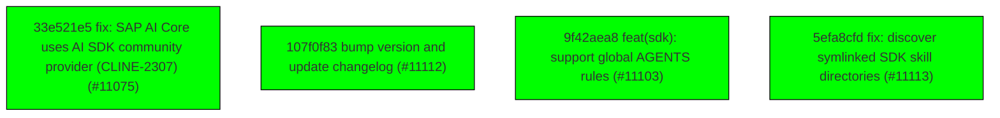

# Backport Agent — Detailed Run Report

> This file is generated automatically. It is intended for human analysts and
> AI reasoning models to assess agent performance, decision quality, and LLM behavior.

**Run timestamp**: 2026-05-29T15:12:12.909Z
**Models used**: fast=`mistral/devstral-latest`  powerful=`openai/gpt-5.5`
**Prompt log**: `/Users/rlemeill/Development/backport-agent/run-1780066891717.prompts.jsonl`

---

## Summary (PR body)

## Backport Agent — Sync Report

**Date**: 2026-05-29T15:12:12.909Z
**Upstream ref**: `main`
**Fork ref**: `keypool-live`
**Sync branch**: `sync/upstream-main-2026-05-29`

### Summary

- ✅ Applied: 4
- ⚠️ Needs human review: 0
- ⛔ Blocked (not attempted): 0

### Applied commits

- `33e521e5` [high] fix: SAP AI Core uses AI SDK community provider (CLINE-2307) (#11075)
- `107f0f83` [low] bump version and update changelog (#11112)
- `9f42aea8` [high] feat(sdk): support global AGENTS rules (#11103)
- `5efa8cfd` [low] fix: discover symlinked SDK skill directories (#11113)

### Agent decision log

- All commits were successfully applied.
- No conflicts were detected.
- No validation tests were run due to command restrictions.


---

## Agent Workflow Diagram

> Generated by the fast model from the run summary. Evaluate the agent's decision path.



---

## AI Sub-Agent Call Log (3 calls)

> Each entry is one sub-agent invocation. Review prompt/response pairs to assess
> reasoning quality, hallucinations, and decision accuracy.

### Call 1 / 3 — `check_customization_compatibility` ✅ OK

| Field | Value |
|---|---|
| **Timestamp** | 2026-05-29T15:05:35.320Z |
| **Tool** | `check_customization_compatibility` |
| **Model** | `mistral/devstral-latest` |
| **Duration** | 3124 ms |
| **Tokens in** | 14858 |
| **Tokens out** | 71 |
| **Cost** | $0.000000 |

**Prompt sent to sub-agent:**

```
Declared fork customisations:
  1. Pattern: sdk/packages/llms/src/providers/builtins-runtime.ts
     Description: Custom provider runtime for keypool-live
  2. Pattern: sdk/packages/llms/src/providers/builtins.ts
     Description: Custom provider definitions for keypool-live

Upstream diff to evaluate:
commit 33e521e551506bbbbeb97f8ffd4b87a036c865cf
Author: Bee <68532117+abeatrix@users.noreply.github.com>
Date:   Wed May 27 20:12:01 2026 -0700

    fix: SAP AI Core uses AI SDK community provider (CLINE-2307) (#11075)
---
 sdk/.gitignore                                     |   3 +
 .../src/tui/components/dialogs/provider-picker.tsx |  36 ++++++
 .../src/tui/utils/provider-config-values.test.ts   |  19 ++++
 .../cli/src/tui/utils/provider-config-values.ts    |  21 ++++
 .../cli/src/tui/views/onboarding/controller.ts     |  30 ++++-
 sdk/apps/cli/src/tui/views/onboarding/fields.ts    |   5 +
 sdk/apps/cli/src/tui/views/onboarding/screens.tsx  |  10 ++
 sdk/apps/cli/src/utils/provider-readiness.test.ts  |  11 ++
 sdk/apps/cli/src/utils/provider-readiness.ts       |   9 +-
 sdk/bun.lock                                       | 123 ++++++++++++++++++++-
 .../providers/provider-config-fields.test.ts       |  19 ++++
 .../services/providers/provider-config-fields.ts   |  45 +++++++-
 .../provider-settings-legacy-migration.test.ts     | 116 +++++++++++++++++++
 .../storage/provider-settings-legacy-migration.ts  |  11 +-
 sdk/packages/llms/CHANGELOG.md                     |   4 +
 sdk/packages/llms/package.json                     |   1 +
 sdk/packages/llms/src/providers/ai-sdk.ts          |   7 ++
 .../llms/src/providers/builtins-runtime.ts         |   4 +
 sdk/packages/llms/src/providers/builtins.ts        |  28 ++---
 sdk/packages/llms/src/providers/compat.ts          |   3 +
 sdk/packages/llms/src/providers/ids.test.ts        |  22 +++-
 .../providers/routing/provider-options-types.ts    |   5 +-
 .../llms/src/providers/vendors/community.test.ts   |  55 +++++++++
 .../llms/src/providers/vendors/community.ts        | 110 ++++++++++++++++++
 24 files changed, 672 insertions(+), 25 deletions(-)

diff --git a/sdk/.gitignore b/sdk/.gitignore
index b592cbb0a..0f7482c4b 100644
--- a/sdk/.gitignore
+++ b/sdk/.gitignore
@@ -42,6 +42,9 @@ pnpm-lock.yaml
 # Session files / User data
 .cline/data
 .cline/tmp
+.cline/**/managed.json
+.cline/**/bundle.json
+
 *.db
 *.db-shm
 *.db-wal
diff --git a/sdk/apps/cli/src/tui/components/dialogs/provider-picker.tsx b/sdk/apps/cli/src/tui/components/dialogs/provider-picker.tsx
index e64c117dc..0a5066533 100644
--- a/sdk/apps/cli/src/tui/components/dialogs/provider-picker.tsx
+++ b/sdk/apps/cli/src/tui/components/dialogs/provider-picker.tsx
@@ -27,6 +27,7 @@ import {
 	getDefaultAwsRegion,
 	type ProviderConfigValues,
 	resolveProviderConfigAwsRegion,
+	resolveProviderConfigSap,
 	updateProviderConfigValue,
 } from "../../utils/provider-config-values";
 import { getProviderSection } from "../../utils/provider-sections";
@@ -316,6 +317,11 @@ const DEFAULT_FIELD_LABELS: Partial<Record<ProviderConfigFieldKey, string>> = {
 	baseUrl: "Base URL",
 	awsRegion: "AWS Region",
 	awsProfile: "AWS Profile Name",
+	sapClientId: "Client ID",
+	sapClientSecret: "Client Secret",
+	sapTokenUrl: "Token URL",
+	sapResourceGroup: "Resource Group",
+	sapDeploymentId: "Deployment ID",
 };
 
 const DEFAULT_FIELD_PLACEHOLDERS: Partial<
@@ -325,6 +331,11 @@ const DEFAULT_FIELD_PLACEHOLDERS: Partial<
 	baseUrl: "",
 	awsRegion: "us-east-1",
 	awsProfile: "default",
+	sapClientId: "sb-...|xsuaa_std!b...",
+	sapClientSecret: "SAP AI Core client secret",
+	sapTokenUrl: "https://<subdomain>.authentication.sap.hana.ondemand.com",
+	sapResourceGroup: "default",
+	sapDeploymentId: "",
 };
 
 /** Render order for cycling focus with Tab. */
@@ -333,6 +344,11 @@ const FIELD_ORDER: ProviderConfigFieldKey[] = [
 	"baseUrl",
 	"apiKey",
 	"awsProfile",
+	"sapClientId",
+	"sapClientSecret",
+	"sapTokenUrl",
+	"sapResourceGroup",
+	"sapDeploymentId",
 ];
 
 export type ProviderConfigInputFields = Partial<
@@ -391,6 +407,19 @@ export function ProviderConfigInputContent(
 			initial.apiKey = existingSettings?.apiKey?.trim() ?? "";
 		if (config.fields.awsProfile)
 			initial.awsProfile = existingSettings?.aws?.profile?.trim() ?? "";
+		if (config.fields.sapClientId)
+			initial.sapClientId = existingSettings?.sap?.clientId?.trim() ?? "";
+		if (config.fields.sapClientSecret)
+			initial.sapClientSecret =
+				existingSettings?.sap?.clientSecret?.trim() ?? "";
+		if (config.fields.sapTokenUrl)
+			initial.sapTokenUrl = existingSettings?.sap?.tokenUrl?.trim() ?? "";
+		if (config.fields.sapResourceGroup)
+			initial.sapResourceGroup =
+				existingSettings?.sap?.resourceGroup?.trim() ?? "default";
+		if (config.fields.sapDeploymentId)
+			initial.sapDeploymentId =
+				existingSettings?.sap?.deploymentId?.trim() ?? "";
 		return initial;
 	});
 
@@ -402,6 +431,12 @@ export function ProviderConfigInputContent(
 		const apiKey = values.apiKey?.trim();
 		const awsProfile = values.awsProfile?.trim();
 		const hasAwsFields = config.fields.awsRegion || config.fields.awsProfile;
+		const hasSapFields =
+			config.fields.sapClientId ||
+			config.fields.sapClientSecret ||
+			config.fields.sapTokenUrl ||
+			config.fields.sapResourceGroup ||
+			config.fields.sapDeploymentId;
 		saveLocalProviderSettings(providerSettingsManager, {
 			providerId,
 			apiKey: config.fields.apiKey ? apiKey : undefined,
@@ -413,6 +448,12 @@ export function ProviderConfigInputContent(
 						profile: apiKey ? undefined : awsProfile || undefined,
 					}
 				: undefined,
+			sap: hasSapFields ? resolveProviderConfigSap(values) : undefined,
 		});
 		resolve(true);
 	};
diff --git a/sdk/apps/cli/src/tui/utils/provider-config-values.test.ts b/sdk/apps/cli/src/tui/utils/provider-config-values.test.ts
index 52b492db4..92b75f69c 100644
--- a/sdk/apps/cli/src/tui/utils/provider-config-values.test.ts
+++ b/sdk/apps/cli/src/tui/utils/provider-config-values.test.ts
@@ -5,6 +5,7 @@ import { afterEach, describe, expect, it } from "vitest";
 import {
 	getDefaultAwsRegion,
 	resolveProviderConfigAwsRegion,
+	resolveProviderConfigSap,
 	updateProviderConfigValue,
 } from "./provider-config-values";
 
@@ -64,4 +65,22 @@ describe("provider config values", () => {
 			}),
 		).toBe("us-west-2");
 	});
+
+	it("resolves SAP AI Core field values into SAP settings", () => {
+		expect(
+			resolveProviderConfigSap({
+				sapClientId: " client ",
+				sapClientSecret: " secret ",
+				sapTokenUrl: " https://auth.example ",
+				sapResourceGroup: " default ",
+				sapDeploymentId: " deployment ",
+			}),
+		).toEqual({
+			clientId: "client",
+			clientSecret: "secret",
+			tokenUrl: "https://auth.example",
+			resourceGroup: "default",
+			deploymentId: "deployment",
+		});
+	});
 });
diff --git a/sdk/apps/cli/src/tui/utils/provider-config-values.ts b/sdk/apps/cli/src/tui/utils/provider-config-values.ts
index 49d819a36..e78a089e1 100644
--- a/sdk/apps/cli/src/tui/utils/provider-config-values.ts
+++ b/sdk/apps/cli/src/tui/utils/provider-config-values.ts
@@ -20,6 +20,27 @@ export function resolveProviderConfigAwsRegion(
 	return values.awsRegion?.trim() || getDefaultAwsRegion(values.awsProfile);
 }
 
+export function resolveProviderConfigSap(values: ProviderConfigValues):
+	| {
+			clientId?: string;
+			clientSecret?: string;
+			tokenUrl?: string;
+			resourceGroup?: string;
+			deploymentId?: string;
+	  }
+	| undefined {
+	const sap = {
+		clientId: values.sapClientId?.trim() || undefined,
+		clientSecret: values.sapClientSecret?.trim() || undefined,
+		tokenUrl: values.sapTokenUrl?.trim() || undefined,
+		resourceGroup: values.sapResourceGroup?.trim() || undefined,
+		deploymentId: values.sapDeploymentId?.trim() || undefined,
+	};
+	return Object.values(sap).some((value) => value !== undefined)
+		? sap
+		: undefined;
+}
+
 export function updateProviderConfigValue(
 	previous: ProviderConfigValues,
 	field: ProviderConfigFieldKey,
diff --git a/sdk/apps/cli/src/tui/views/onboarding/controller.ts b/sdk/apps/cli/src/tui/views/onboarding/controller.ts
index a814813b1..a117780a8 100644
--- a/sdk/apps/cli/src/tui/views/onboarding/controller.ts
+++ b/sdk/apps/cli/src/tui/views/onboarding/controller.ts
@@ -28,13 +28,14 @@ import {
 	useSearchableList,
 } from "../../components/searchable-list";
 import { palette } from "../../palette";
-import { getProviderSection } from "../../utils/provider-sections";
 import {
 	getDefaultAwsRegion,
+	type ProviderConfigValues,
 	resolveProviderConfigAwsRegion,
+	resolveProviderConfigSap,
 	updateProviderConfigValue,
-	type ProviderConfigValues,
 } from "../../utils/provider-config-values";
+import { getProviderSection } from "../../utils/provider-sections";
 import {
 	isOnboardingOAuthProviderId,
 	type OnboardingOAuthProviderId,
@@ -392,6 +393,24 @@ export function useOnboardingController(props: OnboardingControllerProps) {
 			if (config.fields.awsProfile) {
 				initialValues.awsProfile = existing?.aws?.profile?.trim() ?? "";
 			}
+			if (config.fields.sapClientId) {
+				initialValues.sapClientId = existing?.sap?.clientId?.trim() ?? "";
+			}
+			if (config.fields.sapClientSecret) {
+				initialValues.sapClientSecret =
+					existing?.sap?.clientSecret?.trim() ?? "";
+			}
+			if (config.fields.sapTokenUrl) {
+				initialValues.sapTokenUrl = existing?.sap?.tokenUrl?.trim() ?? "";
+			}
+			if (config.fields.sapResourceGroup) {
+				initialValues.sapResourceGroup =
+					existing?.sap?.resourceGroup?.trim() ?? "default";
+			}
+			if (config.fields.sapDeploymentId) {
+				initialValues.sapDeploymentId =
+					existing?.sap?.deploymentId?.trim() ?? "";
+			}
 			setByoValues(initialValues);
 
 			// Focus the first visible field
@@ -426,6 +445,12 @@ export function useOnboardingController(props: OnboardingControllerProps) {
 		const apiKey = byoValues.apiKey?.trim();
 		const awsProfile = byoValues.awsProfile?.trim();
 		const hasAwsFields = byoFields.awsRegion || byoFields.awsProfile;
+		const hasSapFields =
+			byoFields.sapClientId ||
+			byoFields.sapClientSecret ||
+			byoFields.sapTokenUrl ||
+			byoFields.sapResourceGroup ||
+			byoFields.sapDeploymentId;
 
 	saveLocalProviderSettings(providerSettingsManager, {
 			providerId: activeProviderId,
@@ -438,6 +463,12 @@ export function useOnboardingController(props: OnboardingControllerProps) {
 						profile: apiKey ? undefined : awsProfile || undefined,
 					}
 				: undefined,
+			sap: hasSapFields ? resolveProviderConfigSap(byoValues) : undefined,
 		});
 		// Emit a single `user.provider_configured` event mirroring the
 		// `{ provider }` payload shape used by the auth funnel. The save above
diff --git a/sdk/apps/cli/src/tui/views/onboarding/fields.ts b/sdk/apps/cli/src/tui/views/onboarding/fields.ts
index 5973352d2..23c93b42d 100644
--- a/sdk/apps/cli/src/tui/views/onboarding/fields.ts
+++ b/sdk/apps/cli/src/tui/views/onboarding/fields.ts
@@ -6,4 +6,9 @@ export const FIELD_ORDER: ProviderConfigFieldKey[] = [
 	"baseUrl",
 	"apiKey",
 	"awsProfile",
+	"sapClientId",
+	"sapClientSecret",
+	"sapTokenUrl",
+	"sapResourceGroup",
+	"sapDeploymentId",
 ];
diff --git a/sdk/apps/cli/src/tui/views/onboarding/screens.tsx b/sdk/apps/cli/src/tui/views/onboarding/screens.tsx
index a1e3d167c..5a23590e6 100644
--- a/sdk/apps/cli/src/tui/views/onboarding/screens.tsx
+++ b/sdk/apps/cli/src/tui/views/onboarding/screens.tsx
@@ -224,6 +224,11 @@ const DEFAULT_FIELD_LABELS: Partial<Record<ProviderConfigFieldKey, string>> = {
 	baseUrl: "Base URL",
 	awsRegion: "AWS Region",
 	awsProfile: "AWS Profile Name",
+	sapClientId: "Client ID",
+	sapClientSecret: "Client Secret",
+	sapTokenUrl: "Token URL",
+	sapResourceGroup: "Resource Group",
+	sapDeploymentId: "Deployment ID",
 };
 
 const DEFAULT_FIELD_PLACEHOLDERS: Partial<
@@ -233,6 +238,11 @@ const DEFAULT_FIELD_PLACEHOLDERS: Partial<
 	baseUrl: "",
 	awsRegion: "us-east-1",
 	awsProfile: "default",
+	sapClientId: "sb-...|xsuaa_std!b...",
+	sapClientSecret: "SAP AI Core client secret",
+	sapTokenUrl: "https://<subdomain>.authentication.sap.hana.ondemand.com",
+	sapResourceGroup: "default",
+	sapDeploymentId: "",
 };
 
 export function OnboardingProviderConfigScreen(props: {
diff --git a/sdk/apps/cli/src/utils/provider-readiness.test.ts b/sdk/apps/cli/src/tui/utils/provider-readiness.test.ts
index 687b6036d..6536b5c96 100644
--- a/sdk/apps/cli/src/tui/utils/provider-readiness.test.ts
+++ b/sdk/apps/cli/src/tui/utils/provider-readiness.test.ts
@@ -142,6 +142,7 @@ describe("provider readiness", () => {
 		expect(
 			isProviderSettingsUsable("sapaicore", {
 				provider: "sapaicore",
+				baseUrl: "https://api.ai.example.invalid",
 				sap: {
 					clientId: "client",
 					clientSecret: "secret",
@@ -149,6 +150,15 @@ describe("provider readiness", () => {
 				},
 			} satisfies ProviderSettings),
 		).toBe(true);
+		expect(
+			isProviderSettingsUsable("sapaicore", {
+				provider: "sapaicore",
+				sap: {
+					clientId: "client",
+					clientSecret: "secret",
+					tokenUrl: "https://example.com/token",
+				},
+			} satisfies ProviderSettings),
+		).toBe(false);
 	});
 });
diff --git a/sdk/apps/cli/src/utils/provider-readiness.ts b/sdk/apps/cli/src/tui/utils/provider-readiness.ts
index a263e4104..d80441906 100644
--- a/sdk/apps/cli/src/utils/provider-readiness.ts
+++ b/sdk/apps/cli/src/tui/utils/provider-readiness.ts
@@ -45,7 +45,8 @@ function hasSapCredentials(settings: ProviderSettings): boolean {
 	return (
 		hasText(sap?.clientId) &&
 		hasText(sap?.clientSecret) &&
-		hasText(sap?.tokenUrl)
+		hasText(sap?.tokenUrl) &&
+		hasText(settings.baseUrl)
 	);
 }
 
@@ -68,6 +69,9 @@ export function isProviderSettingsUsable(
 			hasAwsRegion(settings)
 		);
 	}
+	if (normalizedProviderId === "sapaicore") {
+		return hasSapCredentials(settings);
+	}
 	if (getPersistedProviderApiKey(normalizedProviderId, settings)) {
 		return true;
 	}
@@ -84,9 +88,6 @@ export function isProviderSettingsUsable(
 	if (normalizedProviderId === "azure") {
 		return hasAzureCredentials(settings);
 	}
-	if (normalizedProviderId === "sapaicore") {
-		return hasSapCredentials(settings);
-	}
 	if (!fields.fields.baseUrl) {
 		return false;
 	}
diff --git a/sdk/bun.lock b/sdk/bun.lock
index e856c356a..f63684ffe 100644
--- a/sdk/bun.lock
+++ b/sdk/bun.lock
@@ -19,7 +19,7 @@
     },
     "apps/cli": {
       "name": "@cline/cli",
-      "version": "3.0.11",
+      "version": "3.0.13",
       "bin": {
         "cline": "src/index.ts",
       },
@@ -350,6 +350,7 @@
         "@ai-sdk/provider": "^3.0.8",
         "@aws-sdk/credential-providers": "^3.922.0",
         "@cline/shared": "workspace:*",
+        "@jerome-benoit/sap-ai-provider": "^4.6.0",
         "@langfuse/otel": "^4.0.0",
         "@opentelemetry/api": "^1.9.0",
         "@opentelemetry/sdk-trace-node": "^2.6.1",
@@ -614,6 +615,10 @@
 
     "@cline/vscode": ["@cline/vscode@workspace:apps/examples/vscode"],
 
+    "@colors/colors": ["@colors/colors", "", {}, "sha512-Ir+AOibqzrIsL6ajt3Rz3LskB7OiMVHqltZmspbW/TJuTVuyOMirVqAkjfY6JISiLHgyNqicAC8AyHHGzNd/dA=="],
+
+    "@dabh/diagnostics": ["@dabh/diagnostics@2.0.8", "", { "dependencies": { "@so-ric/colorspace": "^1.1.6", "enabled": "2.0.x", "kuler": "^2.0.0" } }, "sha512-R4MSXTVnuMzGD7bzHdW2ZhhdPC/igELENcq5IjEverBvq5hn1SXCWcsi6eSsdWP0/Ur+SItRRjAktmdoX/8R/Q=="],
+
     "@date-fns/tz": ["@date-fns/tz@1.5.0", "", {}, "sha512-lwYN/vDPeNRULcepoE/Lo2Pgx+7/RV+SaTUZSh14DUGGKJfw8eMnlWZsxwHBxB/a3AXVNDjL9abuHw1k9FGR+jg=="],
 
     "@dimforge/rapier2d-simd-compat": ["@dimforge/rapier2d-simd-compat@0.17.3", "", {}, "sha512-bijvwWz6NHsNj5e5i1vtd3dU2pDhthSaTUZSh14DUGGKJfw8eMnlWZsxwHBxB/a3AXVNDjL9abuHw1k9FGR+jg=="],
@@ -810,6 +815,8 @@
 
     "@isaacs/cliui": ["@isaacs/cliui@8.0.2", "", { "dependencies": { "string-width": "^5.1.2", "string-width-cjs": "npm:string-width@^4.2.0", "strip-ansi": "^7.0.1", "strip-ansi-cjs": "npm:strip-ansi@^6.0.1", "wrap-ansi": "^8.1.0", "wrap-ansi-cjs": "npm:wrap-ansi@^7.0.0" } }, "sha512-O8jcjabXaleOG9DQ0+ARXWZBTfnP4WNAqzuiJK7ll44AmxGJv/J2M4TPjxjY3znBCfvBXFzucm1twdyFybFqEA=="],
 
+    "@jerome-benoit/sap-ai-provider": ["@jerome-benoit/sap-ai-provider@4.6.9", "", { "dependencies": { "@ai-sdk/provider": "^3.0.10", "@ai-sdk/provider-utils": "^4.0.26", "@sap-ai-sdk/foundation-models": "^2.10.0", "@sap-ai-sdk/orchestration": "^2.10.0", "zod": "^4.4.2" }, "peerDependencies": { "ai": "^5.0.0 || ^6.0.0" } }, "sha512-z+ayDBasD2/PB4iAO6Lp6myQ96KZYjN/gBX3WAisaFKcCeRIsJyzHcBQh26lDu0cpzAybRmI5XUrWzn3nRaqgA=="],
+
     "@jest/expect-utils": ["@jest/expect-utils@29.7.0", "", { "dependencies": { "jest-get-type": "^29.6.3" } }, "sha512-GlsNBWiFQFCVi9QVSx7f5AgMeLxe9YBBcCIVOo46xGKColeNcq5IjEverBvq5hn1SXCWcsi6eSsdWP0/Ur+SItRRjAktmdoX/8R/Q=="],
 
     "@jest/schemas": ["@jest/schemas@29.6.3", "", { "dependencies": { "@sinclair/typebox": "^0.27.8" } }, "sha512-mo5j5X+jIZmJQveBKeS/clAueipV7KgiX1vMgCxam1RNYiqE1w62n0/tJJnHtjW8ZHcQco5gY85jA3mri0L+nSA=="],
@@ -1186,6 +1193,30 @@
 
     "@rolldown/pluginutils": ["@rolldown/pluginutils@1.0.1", "", {}, "sha512-2j9bGt5Jh8hj+vPtgzPtl72j0yRxHAyumoo6TNfAjsLB04UtpSvPbPcDcBMxz7n+9CYB0c1GxQFxYRg2jimqGw=="],
 
+    "@sap-ai-sdk/ai-api": ["@sap-ai-sdk/ai-api@2.11.0", "", { "dependencies": { "@sap-ai-sdk/core": "^2.11.0", "@sap-cloud-sdk/connectivity": "^4.7.0", "@sap-cloud-sdk/util": "^4.7.0" } }, "sha512-KmBSIJfwSv7MlVFbNbZx9RQXT9P2hYvBQKPmAwURXc6Vh+UfNi1F2b45Nt8Yi90z+HFw0lsazgVN5wgav+qFGQ=="],
+
+    "@sap-ai-sdk/core": ["@sap-ai-sdk/core@2.11.0", "", { "dependencies": { "@sap-cloud-sdk/connectivity": "^4.7.0", "@sap-cloud-sdk/http-client": "^4.7.0", "@sap-cloud-sdk/openapi": "^4.7.0", "@sap-cloud-sdk/util": "^4.7.0" } }, "sha512-6xJ0X88vi/eDG159rDs4S/g8Y6Gq9/B4O21oimIPccSJQF7WIB2+2Z4lFKTSBem/5E3FfxqknIZ/5bPX+/6lHA=="],
+
+    "@sap-ai-sdk/foundation-models": ["@sap-ai-sdk/foundation-models@2.11.0", "", { "dependencies": { "@sap-ai-sdk/ai-api": "^2.11.0", "@sap-ai-sdk/core": "^2.11.0", "@sap-cloud-sdk/connectivity": "^4.7.0", "@sap-cloud-sdk/http-client": "^4.7.0", "@sap-cloud-sdk/util": "^4.7.0" } }, "sha512-AYRzR2+RA+9yCGzLymdUjcNPVDosXxHQrbFYNEcGicpYZu/Gy0WOc1GU/FCywfdqa0mGphSRpGCT+eduXLA1pw=="],
+
+    "@sap-ai-sdk/orchestration": ["@sap-ai-sdk/orchestration@2.11.0", "", { "dependencies": { "@sap-ai-sdk/ai-api": "^2.11.0", "@sap-ai-sdk/core": "^2.11.0", "@sap-ai-sdk/prompt-registry": "^2.11.0", "@sap-cloud-sdk/util": "^4.6.0", "yaml": "^2.9.0" } }, "sha512-UR/erV97rtuEUXPGgMeDPmr3Yn2DLF5duQcvd4BleZ4bOSorarIj6igEd8XnBnGpSvcMCIgs5B6J2Vvi7E3+Ag=="],
+
+    "@sap-ai-sdk/prompt-registry": ["@sap-ai-sdk/prompt-registry@2.11.0", "", { "dependencies": { "@sap-ai-sdk/core": "^2.11.0", "zod": "^4.4.3" } }, "sha512-1WrqGjwHltF/aOXoNDPYtvvaprQarPsKZUC0wSMeC6XZokoYvjvHNrltLm1IFygpjTr8yma45JJkKcwV1qzvDg=="],
+
+    "@sap-cloud-sdk/connectivity": ["@sap-cloud-sdk/connectivity@4.7.0", "", { "dependencies": { "@sap-cloud-sdk/resilience": "^4.7.0", "@sap-cloud-sdk/util": "^4.7.0", "@sap/xsenv": "^6.2.0", "@sap/xssec": "^4.13.0", "async-retry": "^1.3.3", "axios": "^1.15.0", "jks-js": "^1.1.6", "jsonwebtoken": "^9.0.3", "safe-stable-stringify": "^2.5.0" } }, "sha512-+EgdTpGi3ZomPuv/ab+bWQIxUfJvownW2MzdYSvX7hkEkmKJfod0O6ja2OqC+OJBLm1TE0JpbJ6AcCkqeZYuOg=="],
+
+    "@sap-cloud-sdk/http-client": ["@sap-cloud-sdk/http-client@4.7.0", "", { "dependencies": { "@sap-cloud-sdk/connectivity": "^4.7.0", "@sap-cloud-sdk/resilience": "^4.7.0", "@sap-cloud-sdk/util": "^4.7.0", "axios": "^1.15.0" } }, "sha512-7+S6ru7SrnyKA2MGimX09oix0EVwmPGcCAz0TRwFZVnglU+VTRmZ8QdcwcVTR26E9YhkR4OVl6EK7jb2Z0OxfQ=="],
+
+    "@sap-cloud-sdk/openapi": ["@sap-cloud-sdk/openapi@4.7.0", "", { "dependencies": { "@sap-cloud-sdk/connectivity": "^4.7.0", "@sap-cloud-sdk/http-client": "^4.7.0", "@sap-cloud-sdk/resilience": "^4.7.0", "@sap-cloud-sdk/util": "^4.7.0", "axios": "^1.15.0" } }, "sha512-OKTEGVScCRsfgL9Lk/bEKcGnyfq0GgruXuZfsxoMbTqbe2f9X/fgHgXIWQEkTuXQplkrSDiNFRyvl0n/ON9Ycg=="],
+
+    "@sap-cloud-sdk/resilience": ["@sap-cloud-sdk/resilience@4.7.0", "", { "dependencies": { "@sap-cloud-sdk/util": "^4.7.0", "async-retry": "^1.3.3", "axios": "^1.15.0", "opossum": "^9.0.0" } }, "sha512-L6PV49nNyZHnTNFbvaufadm+qOhaammXLXkDQmD7WIzMjhiYMqa/obK3NJoohe/kZ7q73jPB2vdLsAqopqTh0A=="],
+
+    "@sap-cloud-sdk/util": ["@sap-cloud-sdk/util@4.7.0", "", { "dependencies": { "axios": "^1.15.0", "logform": "^2.7.0", "voca": "^1.4.1", "winston": "^3.19.0", "winston-transport": "^4.9.0" } }, "sha512-nWJXMdM0Pcx/ipM2+5BvSciQKyCc0LAAO+acCOAQp65SA4HEQ2Odp9yxidY4ijW42TVp3fSMBvGwVjbWWx9Uew=="],
+
+    "@sap/xsenv": ["@sap/xsenv@6.2.1", "", { "dependencies": { "debug": "4.4.3", "node-cache": "^5.1.2", "verror": "1.10.1" } }, "sha512-R1p7VdD3N3jvdkL8av4vLqF+cTQihTz9mCqqF+oa9rVZvgLaCb4ODyZ1dln5/fBgg1OSuch0ESxu3AqZrXVknw=="],
+
+    "@sap/xssec": ["@sap-xssec@4.13.0", "", { "dependencies": { "debug": "^4.4.3", "jwt-decode": "^4" } }, "sha512-8e+bU+OyAIpAGXQanOopZa5YEK+yHKw84dhhihcCotF40MSNFbVHjQ4xM5hf4QndlqDGfXIuvXmoOMuDATa/gA=="],
+
     "@sapphire/async-queue": ["@sapphire/async-queue@1.5.5", "", {}, "sha512-cvGzxbba6sav2zZkH8GPf2oGk9yYoD5V4AtHwIuHhvMXsKf73UT3BOD+azBIW+3wOJ4FhEH7zyaJCFvChjYvMA=="],
 
     "@sapphire/shapeshift": ["@sapphire/shapeshift@4.0.0", "", { "dependencies": { "fast-deep-equal": "^3.1.3", "lodash": "^4.17.21" } }, "sha512-d9dUMWVA7MMiKobL3VpLF8P2aeanRTu6ypG2OIaEv/ZHH/SUQ2iHOVyi5wAPjQ+HmnMuL0whK9ez8I/raWbtIg=="],
@@ -1246,6 +1277,8 @@
 
     "@smithy/util-utf8": ["@smithy/util-utf8@4.3.4", "", { "dependencies": { "@smithy/core": "^3.24.4", "tslib": "^2.6.2" } }, "sha512-s8lfXcv+5C2GjBwGUBqFLgNmhyp9/n4TSKbOzKlIqJ/x0L/zwIxjNBC6DN4xUy59NvOrsiZI1t3tWi4ADUDyNw=="],
 
+    "@so-ric/colorspace": ["@so-ric/colorspace@1.1.6", "", { "dependencies": { "color": "^5.0.2", "text-hex": "1.0.x" } }, "sha512-/KiKkpHNOBgkFJWwJmi4JeNn763Xs9cfrBcaylK1tPypWzyoy2G3l90v9k64kjphl/ZJjPIShFztenRomi8WTg=="],
+
     "@standard-schema/spec": ["@standard-schema/spec@1.1.0", "", {}, "sha512-l2aFy5jALhniG5HgqrD6jXLi/rUWrKvqN/qJx6yoJsgKhblVd+iqqU4RCXavm/jPityDo5TCvKMnpjKnOriy0w=="],
 
     "@streamdown/cjk": ["@streamdown/cjk@1.0.3", "", { "dependencies": { "remark-cjk-friendly": "^2.0.1", "remark-cjk-friendly-gfm-strikethrough": "^2.0.1", "unist-util-visit": "^5.0.0" }, "peerDependencies": { "react": "^18.0.0 || ^19.0.0" } }, "sha512-WRg8HR/gHbBoTgsMd91OKFUClIoDcEFVofJvluvEAyjx3KpU0aGgD9tGDqHkHj14ShoMSkX0IYetWGegTcwIJw=="],
@@ -1470,6 +1503,8 @@
 
     "@types/statuses": ["@types/statuses@2.0.6", "", {}, "sha512-xMAgYwceFhRA2zY+XbEA7mxYbA093wdiW8Vu6gZPGWy9cmOyU9XesH1tNcEWsKFd5Vzrqx5T3D38PWx1FIIXkA=="],
 
+    "@types/triple-beam": ["@types/triple-beam@1.3.5", "", {}, "sha512-6WaYesThRMCl19iryMYP7/x2OVgCtbIVflDGFpWnb9irXI3UjYE4AzmYuiUKY1AJstGijoY+MgUszMgRxIYTYw=="],
+
     "@types/trusted-types": ["@types/trusted-types@2.0.7", "", {}, "sha512-ScaPdn1dQczgbl0QFTeTOmVHFULt394XJgOQNoyVhZ6r2vLnMLJfBPd53SB52T/3G36VI1/g2MZaX0cwDuXsfw=="],
 
     "@types/unist": ["@types/unist@3.0.3", "", {}, "sha512-ko/gIFJRv177XgZsZcBwnqJN5x/Gien8qNOn0D5bQU/zAzVf9Zt3BlcUiLqhV9y4ARk0GbT3tnUiPNgnTXzc/Q=="],
@@ -1580,10 +1615,18 @@
 
     "aria-hidden": ["aria-hidden@1.2.6", "", { "dependencies": { "tslib": "^2.0.0" } }, "sha512-ik3ZgC9dY/lYVVM++OISsaYDeg1tb0VtP5uL3ouh1koGOaUMDPpbFIei4JkFimWUFPn90sbMNMXQAIVOlnYKJA=="],
 
+    "asn1": ["asn1@0.2.6", "", { "dependencies": { "safer-buffer": "~2.1.0" } }, "sha512-ix/FxPn0MDjeyJ7i/yoHGFt/EX6LyNbxSEhPPXODPL+KB0VPk86UYfL0lMdy+KCnv+fmvIzySwaK5COwqVbWTQ=="],
+
+    "assert-plus": ["assert-plus@1.0.0", "", {}, "sha512-NfJ4UzBCcQGLDlQq7nHxH+tv3kyZ0hHQqF5BO6J7tNJeP5do1llPr8dZ8zHonfhAu0PHAdMkSo+8o0wxg9lZWw=="],
+
     "assertion-error": ["assertion-error@2.0.1", "", {}, "sha512-Izi8RQcffqCeNVgFigKli1ssklIbpHnCYc6AknXGYoB6grJqyeby7jv12JUQgmTAnIDnbck1uxksT4dzN3PWBA=="],
 
     "ast-types": ["ast-types@0.16.1", "", { "dependencies": { "tslib": "^2.0.1" } }, "sha512-6t10qk83GOG8p0vKmaCr8eiilZwO171AvbROMtvvNiwrTly62t+7XkA8RdIIVbpMhCASAsxgAzdRSwh6nw/5Dg=="],
 
+    "async": ["async@3.2.6", "", {}, "sha512-htCUDlxyyCLMgaM3xXg0C0LW2xqfuQ6p05pCEIsXuyQ+a1koYKTuBMzRNwmybfLgvJDMd0r1LTn4+E0Ti6C2AA=="],
+
+    "async-retry": ["async-retry@1.3.3", "", { "dependencies": { "retry": "0.13.1" } }, "sha512-wfr/jstw9xNi/0teMHrW7dsz3Lt5ARhYNZ2ewpadnhaIp5mbALhOAP+EAdsC7t4Z6wqsDVv9+W6gm1Dk9mEyw=="],
+
     "asynckit": ["asynckit@0.4.0", "", {}, "sha512-Oei9OH4tRh0YqU3GxhX79dM/mwVgvbZJaSNaRk+bshkj0S5cfHcgYakreBjrHwatXKbz+IoIdYLxrKim2MjW0Q=="],
 
     "atomic-sleep": ["atomic-sleep@1.0.0", "", {}, "sha512-kNOjDqAh7px0XWNI+4QbzoiR/nTkHAWNud2uvnJquD1/x5a7EQZMJT0AczqK0Qn67oY/TTQ1LbUKajZpp3I9tQ=="],
@@ -1686,16 +1729,22 @@
 
     "cliui": ["cliui@8.0.1", "", { "dependencies": { "string-width": "^4.2.0", "strip-ansi": "^6.0.1", "wrap-ansi": "^7.0.0" } }, "sha512-BSeNnyus75C4//NQ9gQt1/csTXyo/8Sb+afLAkzAptFuMsod9HFokGNudZpi/oQV73hnVK+sR+5PVRMd+Dr7YQ=="],
 
+    "clone": ["clone@2.1.2", "", {}, "sha512-3Pe/CF1Nn94hyhIYpjtiLhdCoEoz0DqQ+988E9gmeEdQZlojxnOb74wctFyuwWQHzqyf9X7C7MG8juUpqBJT8w=="],
+
     "clsx": ["clsx@2.1.1", "", {}, "sha512-eYm0QWBtUrBWZWG0d386OGAw16Z995PiOVo2B7bjWSbHedGl5e0ZWaq65kOGgUSNesEIDkB9ISbTg/JK9dhCZA=="],
 
     "cmdk": ["cmdk@1.1.1", "", { "dependencies": { "@radix-ui/react-compose-refs": "^1.1.1", "@radix-ui/react-dialog": "^1.1.6", "@radix-ui/react-id": "^1.1.0", "@radix-ui/react-primitive": "^2.1.1" }, "peerDependencies": { "react": "^18 || ^19 || ^19.0.0-rc", "react-dom": "^18 || ^19 || ^19.0.0-rc" } }, "sha512-Vsv7kFaXm+ptHDMZ7izaRsP70GgrW9NBNGswt9OZaVBLlE0SNpDq8eu/VGXyF9r7M0azK3Wy7OlYXsuyYLFzHg=="],
 
     "code-block-writer": ["code-block-writer@13.0.3", "", {}, "sha512-Oofo0pq3IKnsFtuHqSF7TqBfr71aeyZDVJ0HpmqB7FBM2qEigL0iPONSCZSO9pE9dZTAxANe5XHG9Uy0YMv8cg=="],
 
+    "color": ["color@5.0.3", "", { "dependencies": { "color-convert": "^3.1.3", "color-string": "^2.0.0" } }, "sha512-ezmVcLR3xAVp8kYOm4GS45ZLLgIE6SPAFoduLr6hTDajwb3KZ2F46gulK3XpcwRFb5KKGCSezCBAY4Dw4HsyXA=="],
+
     "color-convert": ["color-convert@2.0.1", "", { "dependencies": { "color-name": "~1.1.4" } }, "sha512-RRECPsj7iu/xb5oKYcsFHSppFNnsj/52OVTRKb4zP5onXwVF3zVmmToNcOfGC+CRDpfK/U584fMg38ZHCaElKQ=="],
 
     "color-name": ["color-name@1.1.4", "", {}, "sha512-dOy+3AuW3a2wNbZHIuMZpTcgjGuLU/uBL/ubcZF9OXbDo8ff4O8yVp5Bf0efS8uEoYo5q4Fx7dY9OgQGXgAsQA=="],
 
+    "color-string": ["color-string@2.1.4", "", { "dependencies": { "color-name": "^2.0.0" } }, "sha512-Bb6Cq8oq0IjDOe8wJmi4JeNn763Xs9cfrBcaylK1tPypWzyoy2G3l90v9k64kjphl/ZJjPIShFztenRomi8WTg=="],
+
     "colorette": ["colorette@2.0.20", "", {}, "sha512-IfEDxwoWIjkeXL1eXcDiow4UbKjhLdq6/EuSVR9GMN7KVH3r9gQ83e73hsz1Nd1T3ijd5xv1wcWRYO+D6kCI2w=="],
 
     "combined-stream": ["combined-stream@1.0.8", "", { "dependencies": { "delayed-stream": "~1.0.0" } }, "sha512-FQN4MRfuJeHf7cBbBMJFXhKSDq+2kAArBlmRBvcvFE5BB1HYKXtSFASDhdlz9zOYwxh8lDdnvmMOe/+5cdoEdg=="],
@@ -1716,6 +1765,8 @@
 
     "cookie-signature": ["cookie-signature@1.2.2", "", {}, "sha512-D76uU73ulSXrD1XF4KE2TMxVVwhsnCgfAyTg9k8P6KGZjlXKrOLe4dJQKI3Bxi5wjesZoFXJWElNWBjPZMbhg=="],
 
+    "core-util-is": ["core-util-is@1.0.2", "", {}, "sha512-3lqz5YjWTYnW6dlDa5TtLaTCcShfar1e40rmcJVwCBJC6mWlFuj0eCHIElmG1g5kyuJ/GD+8Wn4FFCcz4gJPfaQ=="],
+
     "cors": ["cors@2.8.6", "", {}, "sha512-tJtZBBHA6vjIAaF6EnIaq6laBBP9aq/Y3ouVJjEfoHbRBcHBAHYcMh/w8LDrk2PvIMMq8gmopa5D4V8RmbrxGw=="],
 
     "cose-base": ["cose-base@1.0.3", "", { "dependencies": { "layout-base": "^1.0.0" } }, "sha512-s9whTXInMSgAp/NVXVNuVxVKzGH2qck3aQlVHxDCdAEPgtMKwc4Wq6/QKhgdEdgbLSi9rBTAcPoRa6JpiG4ksg=="],
@@ -1878,6 +1929,8 @@
 
     "emoji-regex": ["emoji-regex@10.6.0", "", {}, "sha512-toUI84YS5YmxW219erniWD0CIVOo46xGKColeNcq5IjEverBvq5hn1SXCWcsi6eSsdWP0/Ur+SItRRjAktmdoX/8R/Q=="],
 
+    "enabled": ["enabled@2.0.0", "", {}, "sha512-AKrN98kuwOzMIdAizXGI86UFBoo26CL21UM763y1h/GMSJ4/OHU9k2YlsmBpyScFo/wbLzWQJBMCW4+IO3/+OQ=="],
+
     "encodeurl": ["encodeurl@2.0.0", "", {}, "sha512-Q0n9HRi4m6JuGIV1eFlmvJB7ZEVxu93IrMyiMsGC0lrMJMWzRgx6WGquyfQgZVb31vhGgXnfmPNNXmxnOkRBrg=="],
 
     "enhanced-resolve": ["enhanced-resolve@5.2.2", "", { "dependencies": { "graceful-fs": "^4.2.4", "memory-fs": "^0.5.0", "tapable": "^2.2.1" } }, "sha512-Wix5XxskxKU3w+7ZHkQ3f8e+Ltq8ZU4TgQp0HdF3s9MGLS9lJqbYZxQ8Q2xzJw43K4hxE186dE2rJJ5L53TqNw=="],
@@ -1968,6 +2021,8 @@
 
     "extend": ["extend@3.0.2", "", {}, "sha512-fjquC59cD7CyW6urNXK0FBufkZcoiGG80wTuPujX590cB5Ttln20E2UB4S/WARVqhXffZl2LNgS+gQdPIIim/g=="],
 
+    "extsprintf": ["extsprintf@1.4.1", "", {}, "sha512-Wrk35e8ydCKDj/ArClo1VrPVmN8zph5V4AtHwIuHhvMXsKf73UT3BOD+azBIW+3wOJ4FhEH7zyaJCFvChjYvMA=="],
+
     "fast-deep-equal": ["fast-deep-equal@3.1.3", "", {}, "sha512-f3qQ9oQy9j2AhBe/H9VC91wLmKBCCU/gDOnKNAYG5hswO7BLKj09Hc5HYNz9cGI++xlpDCIgDaitVs03ATR84Q=="],
 
     "fast-equals": ["fast-equals@5.4.0", "", {}, "sha512-jt2DW/aNFNwke7AUd+Z+e6pz39KO5rzdbbFCg2sGafS4mk13MI7Z8O5z9cADNn5lhGODIgLwug6TZO2ctf7kcw=="],
@@ -1994,6 +2049,8 @@
 
     "fdir": ["fdir@6.5.0", "", { "peerDependencies": { "picomatch": "^3 || ^4" }, "optionalPeers": ["picomatch"] }, "sha512-tIbYtZbucOs0BRGqPJkshJUYdL+SDH7dVM8gjy+ERp3WAUjLEFJE+02kanyHtwjWOnwrKYBiwAmM0p4kLJAnXg=="],
 
+    "fecha": ["fecha@4.2.3", "", {}, "sha512-OP2IUU6HeYKJi3i0z4A19kHMQoLvsk3AMzJ4/OHU9k2YlsmBpyScFo/wbLzWQJBMCW4+IO3/+OQ=="],
+
     "fetch-blob": ["fetch-blob@3.2.0", "", { "dependencies": { "node-domexception": "^1.0.0", "web-streams-polyfill": "^3.0.3" } }, "sha512-7yAQpD2UMJzLi1Dqv7qFYnPbaPx7ZfFK6PiIxQ4PfkGPyNyl2Ugx+a/umUonmKqjhM4DnfbMvdX6otXq83soQQ=="],
 
     "figures": ["figures@6.6.0", "", { "dependencies": { "is-unicode-supported": "^2.0.0" } }, "sha512-d+l3qxjSesT4V7v2fh+QnmFnUWv9lSpjarhShNTgBOfA0ttejbQUAlHLitbjkoRiDulW0OPoQPYIGhIC8ohejg=="],
@@ -2012,6 +2069,8 @@
 
     "flatted": ["flatted@3.4.2", "", {}, "sha512-PjDse7RzhcPkIJwy5t7KPWQSZ9cAbzQXcafsetQoD7sOJRQlGikNbx7yZp2OotDnJyrDcbyRq3Ttb18iYOqkxA=="],
 
+    "fn.name": ["fn.name@1.1.0", "", {}, "sha512-GRnmB5gPyJpAhTQdSZTSp9uaPSvl09KoYcMQtsB9rQoOmzs9dH6ffeccH+Z+cv6P68Hu5bC6JjRh4Ah/mHSNRw=="],
+
     "follow-redirects": ["follow-redirects@1.16.0", "", {}, "sha512-y5rN/uOsadFT/JfYwhxRS5R7Qce+g3zG97+JrtFZlC9klX/W5hD7iiLzScI4nZqUS7DNUdhPgw4xI8W2LuXlUw=="],
 
     "foreground-child": ["foreground-child@3.3.1", "", { "dependencies": { "cross-spawn": "^7.0.6", "signal-exit": "^4.0.1" } }, "sha512-gIXjKqtFuWEgzFRJA9WCQeSJLZDjgJUOMCMzxtvFq/37KojM1BFGufqsCy0r4qSQmYLsZYMeyRqzIWOMup03sw=="],
@@ -2224,6 +2283,8 @@
 
     "jiti": ["jiti@2.7.0", "", { "bin": { "jiti": "lib/jiti-cli.mjs" } }, "sha512-AC/7JofJvZGrrneWNaEnJeOLUx+JlGt7tNa0wZiRPT4MY1wmfKjt2+6O2p2uz2+skll8OZZmJMNqeke7kKbNgQ=="],
 
+    "jks-js": ["jks-js@1.1.7", "", { "dependencies": { "node-forge": "^1.4.0", "node-int64": "^0.4.0", "node-rsa": "^1.1.1" } }, "sha512-BeiDRKsAi1NwEwgx2JB/9/0tar5BNGIv+foGm1G5GgiyR35s/iUnfd/BWqYd16mLDD8qTaAVBrIcOOuVqXJZNQ=="],
+
     "jose": ["jose@6.2.3", "", {}, "sha512-YYVDInQKFJfR/xa3ojUTl8c2KoTwiL1R5Wg9YCydwH0x0B9grbzlg5HC7mMjCtUJjbQ/YnGEZIhI5tCgfTb4Hw=="],
 
     "jpeg-js": ["jpeg-js@0.4.4", "", {}, "sha512-WZzeDOEtTOBK4Mdsar0IqEU5sMr3vSV2RqkAIzUEV2BHnUfKGyswWFPFwK5EeDo93K3FohSHbLAjj0s1Wzd+dg=="],
@@ -2258,10 +2319,14 @@
 
     "jsonrepair": ["jsonrepair@3.14.0", "", { "bin": { "jsonrepair": "bin/cli.js" } }, "sha512-tWPGKMZf/8UPim+fcW2EfcQ/d/7aKUrP6IECz9G3Tu6Q5dX0orSleqJ9z6sSw7qrQkjF8/Edo4DvsWBZ8H+HNg=="],
 
+    "jsonwebtoken": ["jsonwebtoken@9.0.3", "", { "dependencies": { "jws": "^4.0.1", "lodash.includes": "^4.3.0", "lodash.isboolean": "^3.0.3", "lodash.isinteger": "^4.0.4", "lodash.isnumber": "^3.0.3", "lodash.isplainobject": "^4.0.6", "lodash.isstring": "^4.0.1", "lodash.once": "^4.0.0", "ms": "^2.1.1", "semver": "^7.5.4" } }, "sha512-MT/xP0CrubFRNLNKvxJ2BYfy53Zkm++5bX9dtuPbqAeQpTVe0MQTFhao8+Cp//EmJp244xt6Drw/GVEGCUj40g=="],
+
     "jwa": ["jwa@2.0.1", "", { "dependencies": { "buffer-equal-constant-time": "^1.0.1", "ecdsa-sig-formatter": "1.0.11", "safe-buffer": "^5.0.1" } }, "sha512-hRF04fqJIP8Abbkq5NKGN0Bbr3JxlQ+qhZufXVr0DvujKy93ZCbXZMHDL4EOtodSbCWxOqR8MS1tXA5hwqCXDg=="],
 
     "jws": ["jws@4.0.1", "", { "dependencies": { "jwa": "^2.0.1", "safe-buffer": "^5.0.1" } }, "sha512-EKI/M/yqPncGUUh44xz0PxSidXFr/+r0pA70+gIYhjv+et7yxM+s29Y+VGDkovRofQem0fs7Uvf4+YmAdyRduA=="],
 
+    "jwt-decode": ["jwt-decode@4.0.0", "", {}, "sha512-+KJGIyHgkGuIq3IEBNftfhW/LfWhXUIY6OmyVWjliu5KH1y0
... [truncated]

Output the JSON object now.
```

**Response received:**

```
```json
{
  "compatible": true,
  "affectedCustomizations": [],
  "semanticConflicts": [],
  "warnings": ["touches shared types used by customised components"],
  "recommendation": "Proceed with the upstream change as it does not directly affect the customised files."
}
```
```

---

### Call 2 / 3 — `check_customization_compatibility` ✅ OK

| Field | Value |
|---|---|
| **Timestamp** | 2026-05-29T15:06:12.194Z |
| **Tool** | `check_customization_compatibility` |
| **Model** | `mistral/devstral-latest` |
| **Duration** | 1752 ms |
| **Tokens in** | 4054 |
| **Tokens out** | 124 |
| **Cost** | $0.000000 |

**Prompt sent to sub-agent:**

```
Declared fork customisations:
  1. Pattern: docs/customization/cline-rules.mdx
     Description: Documentation for customization

Upstream diff to evaluate:
commit 9f42aea85de581ac3a8053726d532f5d5a5463b3
Author: Ara <arafat.da.khan@gmail.com>
Date:   Thu May 28 16:56:55 2026 -0700

    feat(sdk): support global AGENTS rules (#11103)
    
    * feat(sdk): support global AGENTS rules
    
    * fix: address global AGENTS review feedback
    
    * fix: classify global AGENTS by exact path
---
 docs/customization/cline-rules.mdx                 |  4 +-
 .../config/user-instruction-config-loader.test.ts  | 61 +++++++++++++++++++++-
 .../config/user-instruction-config-loader.ts       | 30 ++++++++++-
 sdk/packages/shared/src/storage/index.ts           |  2 +
 sdk/packages/shared/src/storage/paths.test.ts      |  2 +
 sdk/packages/shared/src/storage/paths.ts           |  8 ++-
 6 files changed, 101 insertions(+), 6 deletions(-)

diff --git a/docs/customization/cline-rules.mdx b/docs/customization/cline-rules.mdx
index 700157742..24825e058 100644
--- a/docs/customization/cline-rules.mdx
+++ b/docs/customization/cline-rules.mdx
@@ -26,7 +26,7 @@ Cline recognizes rules from multiple sources, so you can use existing rule files
 | Cline Rules | `.clinerules/` | Primary rule format |
 | Cursor Rules | `.cursorrules` | Automatically detected |
 | Windsurf Rules | `.windsurfrules` | Automatically detected |
-| AGENTS.md | `AGENTS.md` | [Standard format](https://agents.md/) for cross-tool compatibility |
+| AGENTS.md | `AGENTS.md`, `~/.agents/AGENTS.md` | [Standard format](https://agents.md/) for cross-tool compatibility |
 
 All detected rule types appear in the Rules panel, where you can toggle them individually.
 
@@ -37,7 +37,7 @@ Rules can be stored in two locations: your project workspace or globally on your
 
 **Workspace rules** go in `.clinerules/` at your project root. Use these for team standards, project-specific constraints, and anything you want to share with collaborators via version control.
 
-**Global rules** go in your system's Cline Rules directory. Use these for personal preferences that apply across all projects.
+**Global rules** go in your system's Cline Rules directory. Use these for personal preferences that apply across all projects. Cline also reads cross-tool global AGENTS instructions from `~/.agents/AGENTS.md`.
 
 ```text
 your-project/
diff --git a/sdk/packages/core/src/extensions/config/user-instruction-config-loader.test.ts b/sdk/packages/core/src/extensions/config/user-instruction-config-loader.test.ts
index c15dba3c2..524a9cc29 100644
--- a/sdk/packages/core/src/extensions/config/user-instruction-config-loader.test.ts
+++ b/sdk/packages/core/src/extensions/config/user-instruction-config-loader.test.ts
@@ -1,6 +1,10 @@
 import { mkdir, mkdtemp, rm, writeFile } from "node:fs/promises";
-import { tmpdir } from "node:os";
+import { homedir, tmpdir } from "node:os";
 import { join } from "node:path";
+import {
+	resolveGlobalAgentsRulesPath,
+	setHomeDir,
+} from "@cline/shared/storage";
 import { afterEach, describe, expect, it } from "vitest";
 import {
 	createRulesConfigDefinition,
@@ -61,6 +65,11 @@ describe("user instruction config loader", () => {
 				join(workspacePath, ".cline", "rules"),
 			]),
 		);
+		expect(
+			resolveRulesConfigSearchPaths(workspacePath).some((path) =>
+				path.endsWith(join(".agents", "AGENTS.md")),
+			),
+		).toBe(true);
 		const paths = resolveWorkflowsConfigSearchPaths(workspacePath);
 		expect(paths).toContain(join(workspacePath, ".clinerules", "workflows"));
 		expect(paths).toContain(join(workspacePath, ".cline", "workflows"));
@@ -186,6 +195,56 @@ Escalation runbook`,
 		}
 	});
 
+	it("loads global and workspace AGENTS.md rules without clobbering either source", async () => {
+		const tempRoot = await mkdtemp(
+			join(tmpdir(), "core-user-instructions-agents-"),
+		);
+		tempRoots.push(tempRoot);
+
+		const originalHomeDir = process.env.HOME?.trim() || homedir();
+		setHomeDir(join(tempRoot, "home"));
+		const globalAgentsPath = resolveGlobalAgentsRulesPath();
+		const fallbackAgentsDir = join(tempRoot, "other", ".agents");
+		const workspaceRoot = join(tempRoot, "workspace");
+		await mkdir(join(tempRoot, "home", ".agents"), { recursive: true });
+		await mkdir(fallbackAgentsDir, { recursive: true });
+		await mkdir(workspaceRoot, { recursive: true });
+		const fallbackAgentsPath = join(fallbackAgentsDir, "AGENTS.md");
+		const workspaceAgentsPath = join(workspaceRoot, "AGENTS.md");
+		await writeFile(globalAgentsPath, "Use global AGENTS rules.");
+		await writeFile(fallbackAgentsPath, "Use fallback AGENTS rules.");
+		await writeFile(workspaceAgentsPath, "Use workspace AGENTS rules.");
+
+		const watcher = createUserInstructionConfigWatcher({
+			rules: {
+				directories: [
+					globalAgentsPath,
+					workspaceAgentsPath,
+					fallbackAgentsPath,
+				],
+				workspacePath: workspaceRoot,
+			},
+		});
+
+		try {
+			await watcher.start();
+			const rules = watcher.getSnapshot("rule");
+
+			expect(rules.get("global agents.md")?.item.instructions).toBe(
+				"Use global AGENTS rules.",
+			);
+			expect(rules.get("workspace agents.md")?.item.instructions).toBe(
+				"Use workspace AGENTS rules.",
+			);
+			expect(rules.get("agents")?.item.instructions).toBe(
+				"Use fallback AGENTS rules.",
+			);
+		} finally {
+			watcher.stop();
+			setHomeDir(originalHomeDir);
+		}
+	});
+
 	it("loads enterprise-style managed rules, workflows, and skills through the default workspace watcher", async () => {
 		const tempRoot = await mkdtemp(
 			join(tmpdir(), "core-user-instructions-managed-"),
@@ -288,30 +361,26 @@ Use the security review checklist.`,
 			workflows: { workspacePath: tempRoot },
 		});
 
-		try {
-			await watcher.start();
-			const rules = watcher.getSnapshot("rule");
-			const workflows = watcher.getSnapshot("workflow");
-			const skills = watcher.getSnapshot("skill");
+		await watcher.refreshAll();
+		const rules = watcher.getSnapshot("rule");
+		const workflows = watcher.getSnapshot("workflow");
+		const skills = watcher.getSnapshot("skill");
 
-			expect(
-				[...rules.values()].some((rule) =>
-					rule.item.instructions.includes("enterprise policy"),
-				),
-			).toBe(true);
-			expect(
-				[...workflows.values()].some((workflow) =>
-					workflow.item.instructions.includes("triage workflow"),
-				),
-			).toBe(true);
-			expect(
-				[...skills.values()].some((skill) =>
-					skill.item.instructions.includes("security review checklist"),
-				),
-			).toBe(true);
-		} finally {
-			watcher.stop();
-		}
+		expect(
+			[...rules.values()].some((rule) =>
+				rule.item.instructions.includes("enterprise policy"),
+			),
+		).toBe(true);
+		expect(
+			[...workflows.values()].some((workflow) =>
+				workflow.item.instructions.includes("triage workflow"),
+			),
+		).toBe(true);
+		expect(
+			[...skills.values()].some((skill) =>
+				skill.item.instructions.includes("security review checklist"),
+			),
+		).toBe(true);
 	});
 
 	it("lets workspace .cline workflows override legacy .clinerules workflows with the same name", async () => {
@@ -343,17 +412,13 @@ New release workflow.`,
 			workflows: { workspacePath: tempRoot },
 		});
 
-		try {
-			await watcher.start();
-			const workflows = watcher.getSnapshot("workflow");
-			const release = workflows.get("release");
+		await watcher.refreshAll();
+		const workflows = watcher.getSnapshot("workflow");
+		const release = workflows.get("release");
 
-			expect(release?.item.instructions).toBe("New release workflow.");
-			expect(release?.filePath).toBe(
-				join(tempRoot, ".cline", "workflows", "release.md"),
-			);
-		} finally {
-			watcher.stop();
-		}
+		expect(release?.item.instructions).toBe("New release workflow.");
+		expect(release?.filePath).toBe(
+			join(tempRoot, ".cline", "workflows", "release.md"),
+		);
 	});
 });
diff --git a/sdk/packages/core/src/extensions/config/user-instruction-config-loader.ts b/sdk/packages/core/src/extensions/config/user-instruction-config-loader.ts
index 76581b7bd..eff629bef 100644
--- a/sdk/packages/core/src/extensions/config/user-instruction-config-loader.ts
+++ b/sdk/packages/core/src/extensions/config/user-instruction-config-loader.ts
@@ -1,7 +1,9 @@
 import { readdir, readFile, stat } from "node:fs/promises";
-import { basename, dirname, extname, join } from "node:path";
+import { basename, dirname, extname, join, resolve } from "node:path";
 import {
+	AGENTS_RULES_FILE_NAME,
 	RULES_CONFIG_DIRECTORY_NAME,
+	resolveGlobalAgentsRulesPath,
 	resolveRulesConfigSearchPaths as resolveRulesConfigSearchPathsFromShared,
 	resolveSkillsConfigSearchPaths as resolveSkillsConfigSearchPathsFromShared,
 	resolveWorkflowsConfigSearchPaths as resolveWorkflowsConfigSearchPathsFromShared,
@@ -12,6 +14,7 @@ import YAML from "yaml";
 import {
 	type UnifiedConfigDefinition,
 	type UnifiedConfigFileCandidate,
+	type UnifiedConfigFileContext,
 	UnifiedConfigFileWatcher,
 	type UnifiedConfigWatcherEvent,
 } from "./unified-config-file-watcher";
@@ -208,6 +211,29 @@ function parseBooleanField(
 	return value;
 }
 
+function resolveRuleFallbackName(
+	context: UnifiedConfigFileContext<"rule">,
+	workspacePath?: string,
+): string {
+	const fileName = basename(context.filePath);
+	if (fileName.toLowerCase() !== AGENTS_RULES_FILE_NAME.toLowerCase()) {
+		return basename(context.filePath, extname(context.filePath));
+	}
+
+	if (
+		workspacePath &&
+		resolve(context.filePath) === resolve(workspacePath, AGENTS_RULES_FILE_NAME)
+	) {
+		return "Workspace AGENTS.md";
+	}
+
+	if (resolve(context.filePath) === resolve(resolveGlobalAgentsRulesPath())) {
+		return "Global AGENTS.md";
+	}
+
+	return basename(context.filePath, extname(context.filePath));
+}
+
 export function parseSkillConfigFromMarkdown(
 	content: string,
 	fallbackName: string,
@@ -483,7 +509,7 @@ export function createRulesConfigDefinition(
 		parseFile: (context) =>
 			parseRuleConfigFromMarkdown(
 				context.content,
-				basename(context.filePath, extname(context.filePath)),
+				resolveRuleFallbackName(context, options?.workspacePath),
 			),
 		resolveId: (rule) => normalizeName(rule.name),
 	};
diff --git a/sdk/packages/shared/src/storage/index.ts b/sdk/packages/shared/src/storage/index.ts
index 4c6622e27..15a226da2 100644
--- a/sdk/packages/shared/src/storage/index.ts
+++ b/sdk/packages/shared/src/storage/index.ts
@@ -1,6 +1,7 @@
 export { resolveExistingFilePath } from "./path-resolution";
 export {
 	AGENT_CONFIG_DIRECTORY_NAME,
+	AGENTS_RULES_FILE_NAME,
 	CLINE_MCP_SETTINGS_FILE_NAME,
 	type CronSpecsScope,
 	discoverPluginModulePaths,
@@ -23,6 +24,7 @@ export {
 	resolveDbDataDir,
 	resolveDocumentsClineDirectoryPath,
 	resolveDocumentsExtensionPath,
+	resolveGlobalAgentsRulesPath,
 	resolveGlobalCronSpecsDir,
 	resolveGlobalSettingsPath,
 	resolveHooksConfigSearchPaths,
diff --git a/sdk/packages/shared/src/storage/paths.test.ts b/sdk/packages/shared/src/storage/paths.test.ts
index 6c4827527..d7c3c2888 100640
--- a/sdk/packages/shared/src/storage/paths.test.ts
+++ b/sdk/packages/shared/src/storage/paths.test.ts
@@ -8,6 +8,7 @@ import {
 	resolveAgentsConfigDirPath,
 	resolveClineDataDir,
 	resolveDbDataDir,
+	resolveGlobalAgentsRulesPath,
 	resolveGlobalSettingsPath,
 	resolveHooksConfigSearchPaths,
 	resolveMcpSettingsPath,
@@ -153,6 +154,7 @@ describe("storage path resolution", () => {
 
 		expect(resolveRulesConfigSearchPaths()).toEqual(
 			expect.arrayContaining([
+				resolveGlobalAgentsRulesPath(),
 				join("/tmp/home", ".cline", RULES_CONFIG_DIRECTORY_NAME),
 			]),
 		);
diff --git a/sdk/packages/shared/src/storage/paths.ts b/sdk/packages/shared/src/storage/paths.ts
index 3bf9582df..10c0ac10c 100644
--- a/sdk/packages/shared/src/storage/paths.ts
+++ b/sdk/packages/shared/src/storage/paths.ts
@@ -21,6 +21,7 @@ export const SKILLS_CONFIG_DIRECTORY_NAME = "skills";
 export const RULES_CONFIG_DIRECTORY_NAME = "rules";
 export const WORKFLOWS_CONFIG_DIRECTORY_NAME = "workflows";
 export const PLUGINS_DIRECTORY_NAME = "plugins";
+export const AGENTS_RULES_FILE_NAME = "AGENTS.md";
 
 export const CLINE_MCP_SETTINGS_FILE_NAME = "cline_mcp_settings.json";
 
@@ -351,6 +352,10 @@ export function resolveSkillsConfigSearchPaths(
 	]);
 }
 
+export function resolveGlobalAgentsRulesPath(): string {
+	return join(HOME_DIR, LEGACY_AGENT_SKILLS_CONFIG_DIR, AGENTS_RULES_FILE_NAME);
+}
+
 export function resolveRulesConfigSearchPaths(
 	workspacePath?: string,
 ): string[] {
@@ -361,11 +366,11 @@ export function resolveRulesConfigSearchPaths(
 			]
 		: [];
 	const workspaceAgentsFile = workspacePath
-		? [join(workspacePath, "AGENTS.md")]
+		? [join(workspacePath, AGENTS_RULES_FILE_NAME)]
 		: [];
 	return dedupePaths([
 		...workspaceAgentsFile,
 		...wsPaths,
+		resolveGlobalAgentsRulesPath(),
 		join(resolveClineDir(), RULES_CONFIG_DIRECTORY_NAME),
 		resolveDocumentsExtensionPath("Rules"),
 	]);

Output the JSON object now.
```

**Response received:**

```
```json
{
  "compatible": true,
  "affectedCustomizations": ["docs/customization/cline-rules.mdx"],
  "semanticConflicts": [],
  "warnings": ["Upstream change modifies documentation that the fork has customised. Review the updated content in 'docs/customization/cline-rules.mdx' to ensure it aligns with the fork's customization goals."],
  "recommendation": "Review the documentation changes in 'docs/customization/cline-rules.mdx' to ensure they align with the fork's customization goals."
}
```
```

---

### Call 3 / 3 — `resolve_conflict_with_ai` ✅ OK

| Field | Value |
|---|---|
| **Timestamp** | 2026-05-29T15:09:54.933Z |
| **Tool** | `resolve_conflict_with_ai` |
| **Model** | `gemini/gemini-3-flash-preview` |
| **Duration** | 74046 ms |
| **Tokens in** | 8717 |
| **Tokens out** | 9413 |
| **Cost** | $0.000000 |

**Prompt sent to sub-agent:**

```
Resolve the merge conflict in file: sdk/packages/core/src/extensions/config/user-instruction-config-loader.test.ts
Upstream commit message: fix: discover symlinked SDK skill directories (#11113)

--- BASE (common ancestor) ---
import { mkdir, mkdtemp, rm, writeFile } from "node:fs/promises";
import { tmpdir } from "node:os";
import { join } from "node:path";
import { afterEach, describe, expect, it } from "vitest";
import {
	createRulesConfigDefinition,
	createSkillsConfigDefinition,
	createUserInstructionConfigWatcher,
	createWorkflowsConfigDefinition,
	parseRuleConfigFromMarkdown,
	parseSkillConfigFromMarkdown,
	parseWorkflowConfigFromMarkdown,
	resolveRulesConfigSearchPaths,
	resolveSkillsConfigSearchPaths,
	resolveWorkflowsConfigSearchPaths,
	type UserInstructionConfigWatcherEvent,
} from "./user-instruction-config-loader";

const WAIT_TIMEOUT_MS = 4_000;
const WAIT_INTERVAL_MS = 25;

async function waitForEvent(
	events: Array<UserInstructionConfigWatcherEvent>,
	predicate: (event: UserInstructionConfigWatcherEvent) => boolean,
	timeoutMs = WAIT_TIMEOUT_MS,
): Promise<UserInstructionConfigWatcherEvent> {
	const startedAt = Date.now();
	while (Date.now() - startedAt < timeoutMs) {
		const match = events.find(predicate);
		if (match) {
			return match;
		}
		await new Promise((resolve) => setTimeout(resolve, WAIT_INTERVAL_MS));
	}
	throw new Error("Timed out waiting for watcher event.");
}

describe("user instruction config loader", () => {
	const tempRoots: string[] = [];

	afterEach(async () => {
		await Promise.all(
			tempRoots.map((dir) => rm(dir, { recursive: true, force: true })),
		);
		tempRoots.length = 0;
	});

	it("resolves legacy-compatible default search paths", () => {
		const workspacePath = "/repo/demo";
		expect(resolveSkillsConfigSearchPaths(workspacePath)).toEqual(
			expect.arrayContaining([
				join(workspacePath, ".clinerules", "skills"),
				join(workspacePath, ".cline", "skills"),
				join(workspacePath, ".agents", "skills"),
			]),
		);
		expect(resolveRulesConfigSearchPaths(workspacePath)).toEqual(
			expect.arrayContaining([
				join(workspacePath, "AGENTS.md"),
				join(workspacePath, ".clinerules"),
				join(workspacePath, ".cline", "rules"),
			]),
		);
		const paths = resolveWorkflowsConfigSearchPaths(workspacePath);
		expect(paths).toContain(join(workspacePath, ".clinerules", "workflows"));
		expect(paths).toContain(join(workspacePath, ".cline", "workflows"));
		expect(
			paths.some(
				(p) =>
					p.includes("Documents") &&
					p.includes("Cline") &&
					p.includes("Workflows"),
			),
		).toBe(true);
		expect(paths).not.toContain(
			join(process.env.HOME ?? "~", ".cline", "data", "workflows"),
		);
	});

	it("discovers managed plugin instruction roots from workspace .cline manifests", () => {
		const workspacePath = "/repo/demo";
		expect(
			createSkillsConfigDefinition({ workspacePath }).directories,
		).toContain(join(workspacePath, ".cline"));
		expect(
			createRulesConfigDefinition({ workspacePath }).directories,
		).toContain(join(workspacePath, ".cline"));
		expect(
			createWorkflowsConfigDefinition({ workspacePath }).directories,
		).toContain(join(workspacePath, ".cline"));
	});

	it("parses markdown frontmatter for skill, rule, and workflow configs", () => {
		const skill = parseSkillConfigFromMarkdown(
			`---
name: debugging
description: Use structured debugging
disabled: true
---
Follow the debugging checklist.`,
			"fallback",
		);
		expect(skill.name).toBe("debugging");
		expect(skill.description).toBe("Use structured debugging");
		expect(skill.disabled).toBe(true);
		expect(skill.instructions).toBe("Follow the debugging checklist.");

		const rule = parseRuleConfigFromMarkdown(
			`---
name: rule-a
disabled: true
---
Always run tests before merge.`,
			"rule-a",
		);
		expect(rule.name).toBe("rule-a");
		expect(rule.disabled).toBe(true);

		const workflow = parseWorkflowConfigFromMarkdown(
			`---
name: release
disabled: true
---
Document rollout and rollback steps.`,
			"release",
		);
		expect(workflow.name).toBe("release");
		expect(workflow.disabled).toBe(true);
	});

	it("emits typed events for skills, rules, and workflows in one watcher", async () => {
		const tempRoot = await mkdtemp(
			join(tmpdir(), "core-user-instructions-loader-"),
		);
		tempRoots.push(tempRoot);
		const skillsDir = join(tempRoot, "skills");
		const rulesDir = join(tempRoot, "rules");
		const workflowsDir = join(tempRoot, "workflows");
		await mkdir(join(skillsDir, "incident-response"), { recursive: true });
		await mkdir(rulesDir, { recursive: true });
		await mkdir(workflowsDir, { recursive: true });

		await writeFile(
			join(skillsDir, "incident-response", "SKILL.md"),
			`---
name: incident-response
description: Handle incidents fast
---
Escalation runbook`,
		);
		await writeFile(
			join(rulesDir, "default.md"),
			"Keep changes minimal and tested.",
		);
		await writeFile(
			join(workflowsDir, "release.md"),
			"Ship with release checklist.",
		);

		const watcher = createUserInstructionConfigWatcher({
			skills: { directories: [skillsDir] },
			rules: { directories: [rulesDir] },
			workflows: { directories: [workflowsDir] },
		});

		const events: Array<UserInstructionConfigWatcherEvent> = [];
		const unsubscribe = watcher.subscribe((event) => events.push(event));

		try {
			await watcher.refreshAll();
			await waitForEvent(
				events,
				(event) => event.kind === "upsert" && event.record.type === "skill",
			);
			await waitForEvent(
				events,
				(event) => event.kind === "upsert" && event.record.type === "rule",
			);
			await waitForEvent(
				events,
				(event) => event.kind === "upsert" && event.record.type === "workflow",
			);
		} finally {
			unsubscribe();
		}
	});

	it("loads enterprise-style managed rules, workflows, and skills through the default workspace watcher", async () => {
		const tempRoot = await mkdtemp(
			join(tmpdir(), "core-user-instructions-managed-"),
		);
		tempRoots.push(tempRoot);

		const pluginRoot = join(tempRoot, ".cline", "enterprise");
		await mkdir(join(pluginRoot, "workflows"), { recursive: true });
		await mkdir(join(pluginRoot, "skills", "security-review"), {
			recursive: true,
		});
		await writeFile(
			join(pluginRoot, "managed.json"),
			JSON.stringify({ source: "enterprise", version: "1", files: [] }),
		);
		await writeFile(
			join(pluginRoot, "rules.md"),
			`---
name: enterprise-policy
---
Follow enterprise policy.`,
		);
		await writeFile(
			join(pluginRoot, "workflows", "triage.md"),
			`---
name: triage
---
Follow the triage workflow.`,
		);
		await writeFile(
			join(pluginRoot, "skills", "security-review", "SKILL.md"),
			`---
name: security-review
---
Use the security review checklist.`,
		);

		const watcher = createUserInstructionConfigWatcher({
			skills: { workspacePath: tempRoot },
			rules: { workspacePath: tempRoot },
			workflows: { workspacePath: tempRoot },
		});

		await watcher.refreshAll();
		const rules = watcher.getSnapshot("rule");
		const workflows = watcher.getSnapshot("workflow");
		const skills = watcher.getSnapshot("skill");

		expect(
			[...rules.values()].some((rule) =>
				rule.item.instructions.includes("enterprise policy"),
			),
		).toBe(true);
		expect(
			[...workflows.values()].some((workflow) =>
				workflow.item.instructions.includes("triage workflow"),
			),
		).toBe(true);
		expect(
			[...skills.values()].some((skill) =>
				skill.item.instructions.includes("security review checklist"),
			),
		).toBe(true);
	});

	it("lets workspace .cline workflows override legacy .clinerules workflows with the same name", async () => {
		const tempRoot = await mkdtemp(
			join(tmpdir(), "core-user-instructions-workflow-precedence-"),
		);
		tempRoots.push(tempRoot);

		await mkdir(join(tempRoot, ".clinerules", "workflows"), {
			recursive: true,
		});
		await mkdir(join(tempRoot, ".cline", "workflows"), { recursive: true });
		await writeFile(
			join(tempRoot, ".clinerules", "workflows", "release.md"),
			`---
name: release
---
Legacy release workflow.`,
		);
		await writeFile(
			join(tempRoot, ".cline", "workflows", "release.md"),
			`---
name: release
---
New release workflow.`,
		);

		const watcher = createUserInstructionConfigWatcher({
			workflows: { workspacePath: tempRoot },
		});

		await watcher.refreshAll();
		const workflows = watcher.getSnapshot("workflow");
		const release = workflows.get("release");

		expect(release?.item.instructions).toBe("New release workflow.");
		expect(release?.filePath).toBe(
			join(tempRoot, ".cline", "workflows", "release.md"),
		);
	});
});

--- OURS (fork version) ---
import { mkdir, mkdtemp, rm, writeFile } from "node:fs/promises";
import { tmpdir } from "node:os";
import { join } from "node:path";
import { afterEach, describe, expect, it } from "vitest";
import {
	createRulesConfigDefinition,
	createSkillsConfigDefinition,
	createUserInstructionConfigWatcher,
	createWorkflowsConfigDefinition,
	parseRuleConfigFromMarkdown,
	parseSkillConfigFromMarkdown,
	parseWorkflowConfigFromMarkdown,
	resolveRulesConfigSearchPaths,
	resolveSkillsConfigSearchPaths,
	resolveWorkflowsConfigSearchPaths,
	type UserInstructionConfigWatcherEvent,
} from "./user-instruction-config-loader";

const WAIT_TIMEOUT_MS = 4_000;
const WAIT_INTERVAL_MS = 25;

async function waitForEvent(
	events: Array<UserInstructionConfigWatcherEvent>,
	predicate: (event: UserInstructionConfigWatcherEvent) => boolean,
	timeoutMs = WAIT_TIMEOUT_MS,
): Promise<UserInstructionConfigWatcherEvent> {
	const startedAt = Date.now();
	while (Date.now() - startedAt < timeoutMs) {
		const match = events.find(predicate);
		if (match) {
			return match;
		}
		await new Promise((resolve) => setTimeout(resolve, WAIT_INTERVAL_MS));
	}
	throw new Error("Timed out waiting for watcher event.");
}

describe("user instruction config loader", () => {
	const tempRoots: string[] = [];

	afterEach(async () => {
		await Promise.all(
			tempRoots.map((dir) => rm(dir, { recursive: true, force: true })),
		);
		tempRoots.length = 0;
	});

	it("resolves legacy-compatible default search paths", () => {
		const workspacePath = "/repo/demo";
		expect(resolveSkillsConfigSearchPaths(workspacePath)).toEqual(
			expect.arrayContaining([
				join(workspacePath, ".clinerules", "skills"),
				join(workspacePath, ".cline", "skills"),
				join(workspacePath, ".agents", "skills"),
			]),
		);
		expect(resolveRulesConfigSearchPaths(workspacePath)).toEqual(
			expect.arrayContaining([
				join(workspacePath, "AGENTS.md"),
				join(workspacePath, ".clinerules"),
				join(workspacePath, ".cline", "rules"),
			]),
		);
		const paths = resolveWorkflowsConfigSearchPaths(workspacePath);
		expect(paths).toContain(join(workspacePath, ".clinerules", "workflows"));
		expect(paths).toContain(join(workspacePath, ".cline", "workflows"));
		expect(
			paths.some(
				(p) =>
					p.includes("Documents") &&
					p.includes("Cline") &&
					p.includes("Workflows"),
			),
		).toBe(true);
		expect(paths).not.toContain(
			join(process.env.HOME ?? "~", ".cline", "data", "workflows"),
		);
	});

	it("discovers managed plugin instruction roots from workspace .cline manifests", () => {
		const workspacePath = "/repo/demo";
		expect(
			createSkillsConfigDefinition({ workspacePath }).directories,
		).toContain(join(workspacePath, ".cline"));
		expect(
			createRulesConfigDefinition({ workspacePath }).directories,
		).toContain(join(workspacePath, ".cline"));
		expect(
			createWorkflowsConfigDefinition({ workspacePath }).directories,
		).toContain(join(workspacePath, ".cline"));
	});

	it("parses markdown frontmatter for skill, rule, and workflow configs", () => {
		const skill = parseSkillConfigFromMarkdown(
			`---
name: debugging
description: Use structured debugging
disabled: true
---
Follow the debugging checklist.`,
			"fallback",
		);
		expect(skill.name).toBe("debugging");
		expect(skill.description).toBe("Use structured debugging");
		expect(skill.disabled).toBe(true);
		expect(skill.instructions).toBe("Follow the debugging checklist.");

		const rule = parseRuleConfigFromMarkdown(
			`---
name: rule-a
disabled: true
---
Always run tests before merge.`,
			"rule-a",
		);
		expect(rule.name).toBe("rule-a");
		expect(rule.disabled).toBe(true);

		const workflow = parseWorkflowConfigFromMarkdown(
			`---
name: release
disabled: true
---
Document rollout and rollback steps.`,
			"release",
		);
		expect(workflow.name).toBe("release");
		expect(workflow.disabled).toBe(true);
	});

	it("emits typed events for skills, rules, and workflows in one watcher", async () => {
		const tempRoot = await mkdtemp(
			join(tmpdir(), "core-user-instructions-loader-"),
		);
		tempRoots.push(tempRoot);
		const skillsDir = join(tempRoot, "skills");
		const rulesDir = join(tempRoot, "rules");
		const workflowsDir = join(tempRoot, "workflows");
		await mkdir(join(skillsDir, "incident-response"), { recursive: true });
		await mkdir(rulesDir, { recursive: true });
		await mkdir(workflowsDir, { recursive: true });

		await writeFile(
			join(skillsDir, "incident-response", "SKILL.md"),
			`---
name: incident-response
description: Handle incidents fast
---
Escalation runbook`,
		);
		await writeFile(
			join(rulesDir, "default.md"),
			"Keep changes minimal and tested.",
		);
		await writeFile(
			join(workflowsDir, "release.md"),
			"Ship with release checklist.",
		);

		const watcher = createUserInstructionConfigWatcher({
			skills: { directories: [skillsDir] },
			rules: { directories: [rulesDir] },
			workflows: { directories: [workflowsDir] },
		});

		const events: Array<UserInstructionConfigWatcherEvent> = [];
		const unsubscribe = watcher.subscribe((event) => events.push(event));

		try {
			await watcher.refreshAll();
			await waitForEvent(
				events,
				(event) => event.kind === "upsert" && event.record.type === "skill",
			);
			await waitForEvent(
				events,
				(event) => event.kind === "upsert" && event.record.type === "rule",
			);
			await waitForEvent(
				events,
				(event) => event.kind === "upsert" && event.record.type === "workflow",
			);
		} finally {
			unsubscribe();
		}
	});

	it("loads enterprise-style managed rules, workflows, and skills through the default workspace watcher", async () => {
		const tempRoot = await mkdtemp(
			join(tmpdir(), "core-user-instructions-managed-"),
		);
		tempRoots.push(tempRoot);

		const pluginRoot = join(tempRoot, ".cline", "enterprise");
		await mkdir(join(pluginRoot, "workflows"), { recursive: true });
		await mkdir(join(pluginRoot, "skills", "security-review"), {
			recursive: true,
		});
		await writeFile(
			join(pluginRoot, "managed.json"),
			JSON.stringify({ source: "enterprise", version: "1", files: [] }),
		);
		await writeFile(
			join(pluginRoot, "rules.md"),
			`---
name: enterprise-policy
---
Follow enterprise policy.`,
		);
		await writeFile(
			join(pluginRoot, "workflows", "triage.md"),
			`---
name: triage
---
Follow the triage workflow.`,
		);
		await writeFile(
			join(pluginRoot, "skills", "security-review", "SKILL.md"),
			`---
name: security-review
---
Use the security review checklist.`,
		);

		const watcher = createUserInstructionConfigWatcher({
			skills: { workspacePath: tempRoot },
			rules: { workspacePath: tempRoot },
			workflows: { workspacePath: tempRoot },
		});

		await watcher.refreshAll();
		const rules = watcher.getSnapshot("rule");
		const workflows = watcher.getSnapshot("workflow");
		const skills = watcher.getSnapshot("skill");

		expect(
			[...rules.values()].some((rule) =>
				rule.item.instructions.includes("enterprise policy"),
			),
		).toBe(true);
		expect(
			[...workflows.values()].some((workflow) =>
				workflow.item.instructions.includes("triage workflow"),
			),
		).toBe(true);
		expect(
			[...skills.values()].some((skill) =>
				skill.item.instructions.includes("security review checklist"),
			),
		).toBe(true);
	});

	it("lets workspace .cline workflows override legacy .clinerules workflows with the same name", async () => {
		const tempRoot = await mkdtemp(
			join(tmpdir(), "core-user-instructions-workflow-precedence-"),
		);
		tempRoots.push(tempRoot);

		await mkdir(join(tempRoot, ".clinerules", "workflows"), {
			recursive: true,
		});
		await mkdir(join(tempRoot, ".cline", "workflows"), { recursive: true });
		await writeFile(
			join(tempRoot, ".clinerules", "workflows", "release.md"),
			`---
name: release
---
Legacy release workflow.`,
		);
		await writeFile(
			join(tempRoot, ".cline", "workflows", "release.md"),
			`---
name: release
---
New release workflow.`,
		);

		const watcher = createUserInstructionConfigWatcher({
			workflows: { workspacePath: tempRoot },
		});

		await watcher.refreshAll();
		const workflows = watcher.getSnapshot("workflow");
		const release = workflows.get("release");

		expect(release?.item.instructions).toBe("New release workflow.");
		expect(release?.filePath).toBe(
			join(tempRoot, ".cline", "workflows", "release.md"),
		);
	});
});

--- THEIRS (upstream version) ---
import { mkdir, mkdtemp, rm, symlink, writeFile } from "node:fs/promises";
import { homedir, tmpdir } from "node:os";
import { join } from "node:path";
import {
	resolveGlobalAgentsRulesPath,
	setHomeDir,
} from "@cline/shared/storage";
import { afterEach, describe, expect, it } from "vitest";
import {
	createRulesConfigDefinition,
	createSkillsConfigDefinition,
	createUserInstructionConfigWatcher,
	createWorkflowsConfigDefinition,
	parseRuleConfigFromMarkdown,
	parseSkillConfigFromMarkdown,
	parseWorkflowConfigFromMarkdown,
	resolveRulesConfigSearchPaths,
	resolveSkillsConfigSearchPaths,
	resolveWorkflowsConfigSearchPaths,
	type UserInstructionConfigWatcherEvent,
} from "./user-instruction-config-loader";

const WAIT_TIMEOUT_MS = 4_000;
const WAIT_INTERVAL_MS = 25;

async function waitForEvent(
	events: Array<UserInstructionConfigWatcherEvent>,
	predicate: (event: UserInstructionConfigWatcherEvent) => boolean,
	timeoutMs = WAIT_TIMEOUT_MS,
): Promise<UserInstructionConfigWatcherEvent> {
	const startedAt = Date.now();
	while (Date.now() - startedAt < timeoutMs) {
		const match = events.find(predicate);
		if (match) {
			return match;
		}
		await new Promise((resolve) => setTimeout(resolve, WAIT_INTERVAL_MS));
	}
	throw new Error("Timed out waiting for watcher event.");
}

describe("user instruction config loader", () => {
	const tempRoots: string[] = [];

	afterEach(async () => {
		await Promise.all(
			tempRoots.map((dir) => rm(dir, { recursive: true, force: true })),
		);
		tempRoots.length = 0;
	});

	it("resolves legacy-compatible default search paths", () => {
		const workspacePath = "/repo/demo";
		expect(resolveSkillsConfigSearchPaths(workspacePath)).toEqual(
			expect.arrayContaining([
				join(workspacePath, ".clinerules", "skills"),
				join(workspacePath, ".cline", "skills"),
				join(workspacePath, ".agents", "skills"),
			]),
		);
		expect(resolveRulesConfigSearchPaths(workspacePath)).toEqual(
			expect.arrayContaining([
				join(workspacePath, "AGENTS.md"),
				join(workspacePath, ".clinerules"),
				join(workspacePath, ".cline", "rules"),
			]),
		);
		expect(
			resolveRulesConfigSearchPaths(workspacePath).some((path) =>
				path.endsWith(join(".agents", "AGENTS.md")),
			),
		).toBe(true);
		const paths = resolveWorkflowsConfigSearchPaths(workspacePath);
		expect(paths).toContain(join(workspacePath, ".clinerules", "workflows"));
		expect(paths).toContain(join(workspacePath, ".cline", "workflows"));
		expect(
			paths.some(
				(p) =>
					p.includes("Documents") &&
					p.includes("Cline") &&
					p.includes("Workflows"),
			),
		).toBe(true);
		expect(paths).not.toContain(
			join(process.env.HOME ?? "~", ".cline", "data", "workflows"),
		);
	});

	it("discovers managed plugin instruction roots from workspace .cline manifests", () => {
		const workspacePath = "/repo/demo";
		expect(
			createSkillsConfigDefinition({ workspacePath }).directories,
		).toContain(join(workspacePath, ".cline"));
		expect(
			createRulesConfigDefinition({ workspacePath }).directories,
		).toContain(join(workspacePath, ".cline"));
		expect(
			createWorkflowsConfigDefinition({ workspacePath }).directories,
		).toContain(join(workspacePath, ".cline"));
	});

	it("parses markdown frontmatter for skill, rule, and workflow configs", () => {
		const skill = parseSkillConfigFromMarkdown(
			`---
name: debugging
description: Use structured debugging
disabled: true
---
Follow the debugging checklist.`,
			"fallback",
		);
		expect(skill.name).toBe("debugging");
		expect(skill.description).toBe("Use structured debugging");
		expect(skill.disabled).toBe(true);
		expect(skill.instructions).toBe("Follow the debugging checklist.");

		const rule = parseRuleConfigFromMarkdown(
			`---
name: rule-a
disabled: true
---
Always run tests before merge.`,
			"rule-a",
		);
		expect(rule.name).toBe("rule-a");
		expect(rule.disabled).toBe(true);

		const workflow = parseWorkflowConfigFromMarkdown(
			`---
name: release
disabled: true
---
Document rollout and rollback steps.`,
			"release",
		);
		expect(workflow.name).toBe("release");
		expect(workflow.disabled).toBe(true);
	});

	it("emits typed events for skills, rules, and workflows in one watcher", async () => {
		const tempRoot = await mkdtemp(
			join(tmpdir(), "core-user-instructions-loader-"),
		);
		tempRoots.push(tempRoot);
		const skillsDir = join(tempRoot, "skills");
		const rulesDir = join(tempRoot, "rules");
		const workflowsDir = join(tempRoot, "workflows");
		await mkdir(join(skillsDir, "incident-response"), { recursive: true });
		await mkdir(rulesDir, { recursive: true });
		await mkdir(workflowsDir, { recursive: true });

		await writeFile(
			join(skillsDir, "incident-response", "SKILL.md"),
			`---
name: incident-response
description: Handle incidents fast
---
Escalation runbook`,
		);
		await writeFile(
			join(rulesDir, "default.md"),
			"Keep changes minimal and tested.",
		);
		await writeFile(
			join(workflowsDir, "release.md"),
			"Ship with release checklist.",
		);

		const watcher = createUserInstructionConfigWatcher({
			skills: { directories: [skillsDir] },
			rules: { directories: [rulesDir] },
			workflows: { directories: [workflowsDir] },
		});

		const events: Array<UserInstructionConfigWatcherEvent> = [];
		const unsubscribe = watcher.subscribe((event) => events.push(event));

		try {
			await watcher.refreshAll();
			await waitForEvent(
				events,
				(event) => event.kind === "upsert" && event.record.type === "skill",
			);
			await waitForEvent(
				events,
				(event) => event.kind === "upsert" && event.record.type === "rule",
			);
			await waitForEvent(
				events,
				(event) => event.kind === "upsert" && event.record.type === "workflow",
			);
		} finally {
			unsubscribe();
		}
	});

	it("loads global and workspace AGENTS.md rules without clobbering either source", async () => {
		const tempRoot = await mkdtemp(
			join(tmpdir(), "core-user-instructions-agents-"),
		);
		tempRoots.push(tempRoot);

		const originalHomeDir = process.env.HOME?.trim() || homedir();
		setHomeDir(join(tempRoot, "home"));
		const globalAgentsPath = resolveGlobalAgentsRulesPath();
		const fallbackAgentsDir = join(tempRoot, "other", ".agents");
		const workspaceRoot = join(tempRoot, "workspace");
		await mkdir(join(tempRoot, "home", ".agents"), { recursive: true });
		await mkdir(fallbackAgentsDir, { recursive: true });
		await mkdir(workspaceRoot, { recursive: true });
		const fallbackAgentsPath = join(fallbackAgentsDir, "AGENTS.md");
		const workspaceAgentsPath = join(workspaceRoot, "AGENTS.md");
		await writeFile(globalAgentsPath, "Use global AGENTS rules.");
		await writeFile(fallbackAgentsPath, "Use fallback AGENTS rules.");
		await writeFile(workspaceAgentsPath, "Use workspace AGENTS rules.");

		const watcher = createUserInstructionConfigWatcher({
			rules: {
				directories: [
					globalAgentsPath,
					workspaceAgentsPath,
					fallbackAgentsPath,
				],
				workspacePath: workspaceRoot,
			},
		});

		try {
			await watcher.refreshAll();
			const rules = watcher.getSnapshot("rule");

			expect(rules.get("global agents.md")?.item.instructions).toBe(
				"Use global AGENTS rules.",
			);
			expect(rules.get("workspace agents.md")?.item.instructions).toBe(
				"Use workspace AGENTS rules.",
			);
			expect(rules.get("agents")?.item.instructions).toBe(
				"Use fallback AGENTS rules.",
			);
		} finally {
			setHomeDir(originalHomeDir);
		}
	});

	it.skipIf(process.platform === "win32")(
		"discovers skill directories through symlinks",
		async () => {
			const tempRoot = await mkdtemp(
				join(tmpdir(), "core-user-instructions-symlink-skill-"),
			);
			tempRoots.push(tempRoot);
			const skillsDir = join(tempRoot, ".cline", "skills");
			const externalSkillsDir = join(tempRoot, "external-skills");
			const targetSkillDir = join(externalSkillsDir, "data-agent-skill");
			const linkedSkillDir = join(skillsDir, "data-agent-skill");
			await mkdir(targetSkillDir, { recursive: true });
			await mkdir(skillsDir, { recursive: true });
			await writeFile(
				join(targetSkillDir, "SKILL.md"),
				`---
name: data-agent-skill
description: Analyze data
---
Use the data agent skill.`,
			);
			await symlink(targetSkillDir, linkedSkillDir, "dir");

			const watcher = createUserInstructionConfigWatcher({
				skills: { directories: [skillsDir] },
			});

			await watcher.refreshAll();

			expect(
				watcher.getSnapshot("skill").get("data-agent-skill"),
			).toMatchObject({
				item: {
					name: "data-agent-skill",
					description: "Analyze data",
				},
			});
		},
	);

	it.skipIf(process.platform === "win32")(
		"ignores circular symlinks while discovering skill directories",
		async () => {
			const tempRoot = await mkdtemp(
				join(tmpdir(), "core-user-instructions-circular-symlink-skill-"),
			);
			tempRoots.push(tempRoot);
			const skillsDir = join(tempRoot, ".cline", "skills");
			const skillDir = join(skillsDir, "commit");
			const circularLink = join(skillsDir, "loop");
			await mkdir(skillDir, { recursive: true });
			await writeFile(
				join(skillDir, "SKILL.md"),
				`---
name: commit
---
Use conventional commits.`,
			);
			await symlink(circularLink, circularLink, "dir");

			const watcher = createUserInstructionConfigWatcher({
				skills: { directories: [skillsDir] },
			});

			await watcher.refreshAll();

			expect(watcher.getSnapshot("skill").get("commit")).toMatchObject({
				item: {
					name: "commit",
					instructions: "Use conventional commits.",
				},
			});
		},
	);

	it("loads enterprise-style managed rules, workflows, and skills through the default workspace watcher", async () => {
		const tempRoot = await mkdtemp(
			join(tmpdir(), "core-user-instructions-managed-"),
		);
		tempRoots.push(tempRoot);

		const pluginRoot = join(tempRoot, ".cline", "enterprise");
		await mkdir(join(pluginRoot, "workflows"), { recursive: true });
		await mkdir(join(pluginRoot, "skills", "security-review"), {
			recursive: true,
		});
		await writeFile(
			join(pluginRoot, "managed.json"),
			JSON.stringify({ source: "enterprise", version: "1", files: [] }),
		);
		await writeFile(
			join(pluginRoot, "rules.md"),
			`---
name: enterprise-policy
---
Follow enterprise policy.`,
		);
		await writeFile(
			join(pluginRoot, "workflows", "triage.md"),
			`---
name: triage
---
Follow the triage workflow.`,
		);
		await writeFile(
			join(pluginRoot, "skills", "security-review", "SKILL.md"),
			`---
name: security-review
---
Use the security review checklist.`,
		);

		const watcher = createUserInstructionConfigWatcher({
			skills: { workspacePath: tempRoot },
			rules: { workspacePath: tempRoot },
			workflows: { workspacePath: tempRoot },
		});

		await watcher.refreshAll();
		const rules = watcher.getSnapshot("rule");
		const workflows = watcher.getSnapshot("workflow");
		const skills = watcher.getSnapshot("skill");

		expect(
			[...rules.values()].some((rule) =>
				rule.item.instructions.includes("enterprise policy"),
			),
		).toBe(true);
		expect(
			[...workflows.values()].some((workflow) =>
				workflow.item.instructions.includes("triage workflow"),
			),
		).toBe(true);
		expect(
			[...skills.values()].some((skill) =>
				skill.item.instructions.includes("security review checklist"),
			),
		).toBe(true);
	});

	it("lets workspace .cline workflows override legacy .clinerules workflows with the same name", async () => {
		const tempRoot = await mkdtemp(
			join(tmpdir(), "core-user-instructions-workflow-precedence-"),
		);
		tempRoots.push(tempRoot);

		await mkdir(join(tempRoot, ".clinerules", "workflows"), {
			recursive: true,
		});
		await mkdir(join(tempRoot, ".cline", "workflows"), { recursive: true });
		await writeFile(
			join(tempRoot, ".clinerules", "workflows", "release.md"),
			`---
name: release
---
Legacy release workflow.`,
		);
		await writeFile(
			join(tempRoot, ".cline", "workflows", "release.md"),
			`---
name: release
---
New release workflow.`,
		);

		const watcher = createUserInstructionConfigWatcher({
			workflows: { workspacePath: tempRoot },
		});

		await watcher.refreshAll();
		const workflows = watcher.getSnapshot("workflow");
		const release = workflows.get("release");

		expect(release?.item.instructions).toBe("New release workflow.");
		expect(release?.filePath).toBe(
			join(tempRoot, ".cline", "workflows", "release.md"),
		);
	});
});

Output the JSON object now.
```

**Response received:**

```
```json
{
	"resolvedContent": "import { mkdir, mkdtemp, rm, symlink, writeFile } from \"node:fs/promises\";\nimport { homedir, tmpdir } from \"node:os\";\nimport { join } from \"node:path\";\nimport {\n\tresolveGlobalAgentsRulesPath,\n\tsetHomeDir,\n} from \"@cline/shared/storage\";\nimport { afterEach, describe, expect, it } from \"vitest\";\nimport {\n\tcreateRulesConfigDefinition,\n\tcreateSkillsConfigDefinition,\n\tcreateUserInstructionConfigWatcher,\n\tcreateWorkflowsConfigDefinition,\n\tparseRuleConfigFromMarkdown,\n\tparseSkillConfigFromMarkdown,\n\tparseWorkflowConfigFromMarkdown,\n\tresolveRulesConfigSearchPaths,\n\tresolveSkillsConfigSearchPaths,\n\tresolveWorkflowsConfigSearchPaths,\n\ttype UserInstructionConfigWatcherEvent,\n} from \"./user-instruction-config-loader\";\n\nconst WAIT_TIMEOUT_MS = 4_000;\nconst WAIT_INTERVAL_MS = 25;\n\nasync function waitForEvent(\n\tevents: Array<UserInstructionConfigWatcherEvent>,\n\tpredicate: (event: UserInstructionConfigWatcherEvent) => boolean,\n\ttimeoutMs = WAIT_TIMEOUT_MS,\n): Promise<UserInstructionConfigWatcherEvent> {\n\tconst startedAt = Date.now();\n\twhile (Date.now() - startedAt < timeoutMs) {\n\t\tconst match = events.find(predicate);\n\t\tif (match) {\n\t\t\treturn match;\n\t\t}\n\t\tawait new Promise((resolve) => setTimeout(resolve, WAIT_INTERVAL_MS));\n\t}\n\tthrow new Error(\"Timed out waiting for watcher event.\");\n}\n\ndescribe(\"user instruction config loader\", () => {\n\tconst tempRoots: string[] = [];\n\n\tafterEach(async () => {\n\t\tawait Promise.all(\n\t\t\ttempRoots.map((dir) => rm(dir, { recursive: true, force: true })),\n\t\t);\n\t\ttempRoots.length = 0;\n\t});\n\n\tit(\"resolves legacy-compatible default search paths\", () => {\n\t\tconst workspacePath = \"/repo/demo\";\n\t\texpect(resolveSkillsConfigSearchPaths(workspacePath)).toEqual(\n\t\t\texpect.arrayContaining([\n\t\t\t\tjoin(workspacePath, \".clinerules\", \"skills\"),\n\t\t\t\tjoin(workspacePath, \".cline\", \"skills\"),\n\t\t\t\tjoin(workspacePath, \".agents\", \"skills\"),\n\t\t\t]),\n\t\t);\n\t\texpect(resolveRulesConfigSearchPaths(workspacePath)).toEqual(\n\t\t\texpect.arrayContaining([\n\t\t\t\tjoin(workspacePath, \"AGENTS.md\"),\n\t\t\t\tjoin(workspacePath, \".clinerules\"),\n\t\t\t\tjoin(workspacePath, \".cline\", \"rules\"),\n\t\t\t]),\n\t\t);\n\t\texpect(\n\t\t\tresolveRulesConfigSearchPaths(workspacePath).some((path) =>\n\t\t\t\tpath.endsWith(join(\".agents\", \"AGENTS.md\")),\n\t\t\t),\n\t\t).toBe(true);\n\t\tconst paths = resolveWorkflowsConfigSearchPaths(workspacePath);\n\t\texpect(paths).toContain(join(workspacePath, \".clinerules\", \"workflows\"));\n\t\texpect(paths).toContain(join(workspacePath, \".cline\", \"workflows\"));\n\t\texpect(\n\t\t\tpaths.some(\n\t\t\t\t(p) =>\n\t\t\t\t\tp.includes(\"Documents\") &&\n\t\t\t\t\tp.includes(\"Cline\") &&\n\t\t\t\t\tp.includes(\"Workflows\"),\n\t\t\t),\n\t\t).toBe(true);\n\t\texpect(paths).not.toContain(\n\t\t\tjoin(process.env.HOME ?? \"~\", \".cline\", \"data\", \"workflows\"),\n\t\t);\n\t});\n\n\tit(\"discovers managed plugin instruction roots from workspace .cline manifests\", () => {\n\t\tconst workspacePath = \"/repo/demo\";\n\t\texpect(\n\t\t\tcreateSkillsConfigDefinition({ workspacePath }).directories,\n\t\t).toContain(join(workspacePath, \".cline\"));\n\t\texpect(\n\t\t\tcreateRulesConfigDefinition({ workspacePath }).directories,\n\t\t).toContain(join(workspacePath, \".cline\"));\n\t\texpect(\n\t\t\tcreateWorkflowsConfigDefinition({ workspacePath }).directories,\n\t\t).toContain(join(workspacePath, \".cline\"));\n\t});\n\n\tit(\"parses markdown frontmatter for skill, rule, and workflow configs\", () => {\n\t\tconst skill = parseSkillConfigFromMarkdown(\n\t\t\t`---\nname: debugging\ndescription: Use structured debugging\ndisabled: true\n---\nFollow the debugging checklist.`,\n\t\t\t\"fallback\",\n\t\t);\n\t\texpect(skill.name).toBe(\"debugging\");\n\t\texpect(skill.description).toBe(\"Use structured debugging\");\n\t\texpect(skill.disabled).toBe(true);\n\t\texpect(skill.instructions).toBe(\"Follow the debugging checklist.\");\n\n\t\tconst rule = parseRuleConfigFromMarkdown(\n\t\t\t`---\nname: rule-a\ndisabled: true\n---\nAlways run tests before merge.`,\n\t\t\t\"rule-a\",\n\t\t);\n\t\texpect(rule.name).toBe(\"rule-a\");\n\t\texpect(rule.disabled).toBe(true);\n\n\t\tconst workflow = parseWorkflowConfigFromMarkdown(\n\t\t\t`---\nname: release\ndisabled: true\n---\nDocument rollout and rollback steps.`,\n\t\t\t\"release\",\n\t\t);\n\t\texpect(workflow.name).toBe(\"release\");\n\t\texpect(workflow.disabled).toBe(true);\n\t});\n\n\tit(\"emits typed events for skills, rules, and workflows in one watcher\", async () => {\n\t\tconst tempRoot = await mkdtemp(\n\t\t\tjoin(tmpdir(), \"core-user-instructions-loader-\"),\n\t\t);\n\t\ttempRoots.push(tempRoot);\n\t\tconst skillsDir = join(tempRoot, \"skills\");\n\t\tconst rulesDir = join(tempRoot, \"rules\");\n\t\tconst workflowsDir = join(tempRoot, \"workflows\");\n\t\tawait mkdir(join(skillsDir, \"incident-response\"), { recursive: true });\n\t\tawait mkdir(rulesDir, { recursive: true });\n\t\tawait mkdir(workflowsDir, { recursive: true });\n\n\t\tawait writeFile(\n\t\t\tjoin(skillsDir, \"incident-response\", \"SKILL.md\"),\n\t\t\t`---\nname: incident-response\ndescription: Handle incidents fast\n---\nEscalation runbook`,\n\t\t);\n\t\tawait writeFile(\n\t\t\tjoin(rulesDir, \"default.md\"),\n\t\t\t\"Keep changes minimal and tested.\",\n\t\t);\n\t\tawait writeFile(\n\t\t\tjoin(workflowsDir, \"release.md\"),\n\t\t\t\"Ship with release checklist.\",\n\t\t);\n\n\t\tconst watcher = createUserInstructionConfigWatcher({\n\t\t\tskills: { directories: [skillsDir] },\n\t\t\trules: { directories: [rulesDir] },\n\t\t\tworkflows: { directories: [workflowsDir] },\n\t\t});\n\n\t\tconst events: Array<UserInstructionConfigWatcherEvent> = [];\n\t\tconst unsubscribe = watcher.subscribe((event) => events.push(event));\n\n\t\ttry {\n\t\t\tawait watcher.refreshAll();\n\t\t\tawait waitForEvent(\n\t\t\t\tevents,\n\t\t\t\t(event) => event.kind === \"upsert\" && event.record.type === \"skill\",\n\t\t\t);\n\t\t\tawait waitForEvent(\n\t\t\t\tevents,\n\t\t\t\t(event) => event.kind === \"upsert\" && event.record.type === \"rule\",\n\t\t\t);\n\t\t\tawait waitForEvent(\n\t\t\t\tevents,\n\t\t\t\t(event) => event.kind === \"upsert\" && event.record.type === \"workflow\",\n\t\t\t);\n\t\t} finally {\n\t\t\tunsubscribe();\n\t\t}\n\t});\n\n\tit(\"loads global and workspace AGENTS.md rules without clobbering either source\", async () => {\n\t\tconst tempRoot = await mkdtemp(\n\t\t\tjoin(tmpdir(), \"core-user-instructions-agents-\"),\n\t\t);\n\t\ttempRoots.push(tempRoot);\n\n\t\tconst originalHomeDir = process.env.HOME?.trim() || homedir();\n\t\tsetHomeDir(join(tempRoot, \"home\"));\n\t\tconst globalAgentsPath = resolveGlobalAgentsRulesPath();\n\t\tconst fallbackAgentsDir = join(tempRoot, \"other\", \".agents\");\n\t\tconst workspaceRoot = join(tempRoot, \"workspace\");\n\t\tawait mkdir(join(tempRoot, \"home\", \".agents\"), { recursive: true });\n\t\tawait mkdir(fallbackAgentsDir, { recursive: true });\n\t\tawait mkdir(workspaceRoot, { recursive: true });\n\t\tconst fallbackAgentsPath = join(fallbackAgentsDir, \"AGENTS.md\");\n\t\tconst workspaceAgentsPath = join(workspaceRoot, \"AGENTS.md\");\n\t\tawait writeFile(globalAgentsPath, \"Use global AGENTS rules.\");\n\t\tawait writeFile(fallbackAgentsPath, \"Use fallback AGENTS rules.\");\n\t\tawait writeFile(workspaceAgentsPath, \"Use workspace AGENTS rules.\");\n\n\t\tconst watcher = createUserInstructionConfigWatcher({\n\t\t\trules: {\n\t\t\t\tdirectories: [\n\t\t\t\t\tglobalAgentsPath,\n\t\t\t\t\tworkspaceAgentsPath,\n\t\t\t\t\tfallbackAgentsPath,\n\t\t\t\t],\n\t\t\t\tworkspacePath: workspaceRoot,\n\t\t\t},\n\t\t});\n\n\t\ttry {\n\t\t\tawait watcher.refreshAll();\n\t\t\tconst rules = watcher.getSnapshot(\"rule\");\n\n\t\t\texpect(rules.get(\"global agents.md\")?.item.instructions).toBe(\n\t\t\t\t\"Use global AGENTS rules.\",\n\t\t\t);\n\t\t\texpect(rules.get(\"workspace agents.md\")?.item.instructions).toBe(\n\t\t\t\t\"Use workspace AGENTS rules.\",\n\t\t\t);\n\t\t\texpect(rules.get(\"agents\")?.item.instructions).toBe(\n\t\t\t\t\"Use fallback AGENTS rules.\",\n\t\t\t);\n\t\t} finally {\n\t\t\tsetHomeDir(originalHomeDir);\n\t\t}\n\t});\n\n\tit.skipIf(process.platform === \"win32\")(\n\t\t\"discovers skill directories through symlinks\",\n\t\tasync () => {\n\t\t\tconst tempRoot = await mkdtemp(\n\t\t\t\tjoin(tmpdir(), \"core-user-instructions-symlink-skill-\"),\n\t\t\t);\n\t\t\ttempRoots.push(tempRoot);\n\t\t\tconst skillsDir = join(tempRoot, \".cline\", \"skills\");\n\t\t\tconst externalSkillsDir = join(tempRoot, \"external-skills\");\n\t\t\tconst targetSkillDir = join(externalSkillsDir, \"data-agent-skill\");\n\t\t\tconst linkedSkillDir = join(skillsDir, \"data-agent-skill\");\n\t\t\tawait mkdir(targetSkillDir, { recursive: true });\n\t\t\tawait mkdir(skillsDir, { recursive: true });\n\t\t\tawait writeFile(\n\t\t\t\tjoin(targetSkillDir, \"SKILL.md\"),\n\t\t\t\t`---\nname: data-agent-skill\ndescription: Analyze data\n---\nUse the data agent skill.`,\n\t\t\t);\n\t\t\tawait symlink(targetSkillDir, linkedSkillDir, \"dir\");\n\n\t\t\tconst watcher = createUserInstructionConfigWatcher({\n\t\t\t\tskills: { directories: [skillsDir] },\n\t\t\t});\n\n\t\t\tawait watcher.refreshAll();\n\n\t\t\texpect(\n\t\t\t\twatcher.getSnapshot(\"skill\").get(\"data-agent-skill\"),\n\t\t\t).toMatchObject({\n\t\t\t\titem: {\n\t\t\t\t\tname: \"data-agent-skill\",\n\t\t\t\t\tdescription: \"Analyze data\",\n\t\t\t\t},\n\t\t\t});\n\t\t},\n\t);\n\n\tit.skipIf(process.platform === \"win32\")(\n\t\t\"ignores circular symlinks while discovering skill directories\",\n\t\tasync () => {\n\t\t\tconst tempRoot = await mkdtemp(\n\t\t\t\tjoin(tmpdir(), \"core-user-instructions-circular-symlink-skill-\"),\n\t\t\t);\n\t\t\ttempRoots.push(tempRoot);\n\t\t\tconst skillsDir = join(tempRoot, \".cline\", \"skills\");\n\t\t\tconst skillDir = join(skillsDir, \"commit\");\n\t\t\tconst circularLink = join(skillsDir, \"loop\");\n\t\t\tawait mkdir(skillDir, { recursive: true });\n\t\t\tawait writeFile(\n\t\t\t\tjoin(skillDir, \"SKILL.md\"),\n\t\t\t\t`---\nname: commit\n---\nUse conventional commits.`,\n\t\t\t);\n\t\t\tawait symlink(circularLink, circularLink, \"dir\");\n\n\t\t\tconst watcher = createUserInstructionConfigWatcher({\n\t\t\t\tskills: { directories: [skillsDir] },\n\t\t\t});\n\n\t\t\tawait watcher.refreshAll();\n\n\t\t\texpect(watcher.getSnapshot(\"skill\").get(\"commit\")).toMatchObject({\n\t\t\t\titem: {\n\t\t\t\t\tname: \"commit\",\n\t\t\t\t\tinstructions: \"Use conventional commits.\",\n\t\t\t\t},\n\t\t\t});\n\t\t},\n\t);\n\n\tit(\"loads enterprise-style managed rules, workflows, and skills through the default workspace watcher\", async () => {\n\t\tconst tempRoot = await mkdtemp(\n\t\t\tjoin(tmpdir(), \"core-user-instructions-managed-\"),\n\t\t);\n\t\ttempRoots.push(tempRoot);\n\n\t\tconst pluginRoot = join(tempRoot, \".cline\", \"enterprise\");\n\t\tawait mkdir(join(pluginRoot, \"workflows\"), { recursive: true });\n\t\tawait mkdir(join(pluginRoot, \"skills\", \"security-review\"), {\n\t\t\trecursive: true,\n\t\t});\n\t\tawait writeFile(\n\t\t\tjoin(pluginRoot, \"managed.json\"),\n\t\t\tJSON.stringify({ source: \"enterprise\", version: \"1\", files: [] }),\n\t\t);\n\t\tawait writeFile(\n\t\t\tjoin(pluginRoot, \"rules.md\"),\n\t\t\t`---\nname: enterprise-policy\n---\nFollow enterprise policy.`,\n\t\t);\n\t\tawait writeFile(\n\t\t\tjoin(pluginRoot, \"workflows\", \"triage.md\"),\n\t\t\t`---\nname: triage\n---\nFollow the triage workflow.`,\n\t\t);\n\t\tawait writeFile(\n\t\t\tjoin(pluginRoot, \"skills\", \"security-review\", \"SKILL.md\"),\n\t\t\t`---\nname: security-review\n---\nUse the security review checklist.`,\n\t\t);\n\n\t\tconst watcher = createUserInstructionConfigWatcher({\n\t\t\tskills: { workspacePath: tempRoot },\n\t\t\trules: { workspacePath: tempRoot },\n\t\t\tworkflows: { workspacePath: tempRoot },\n\t\t});\n\n\t\tawait watcher.refreshAll();\n\t\tconst rules = watcher.getSnapshot(\"rule\");\n\t\tconst workflows = watcher.getSnapshot(\"workflow\");\n\t\tconst skills = watcher.getSnapshot(\"skill\");\n\n\t\texpect(\n\t\t\t[...rules.values()].some((rule) =>\n\t\t\t\trule.item.instructions.includes(\"enterprise policy\"),\n\t\t\t),\n\t\t).toBe(true);\n\t\texpect(\n\t\t\t[...workflows.values()].some((workflow) =>\n\t\t\t\tworkflow.item.instructions.includes(\"triage workflow\"),\n\t\t\t),\n\t\t).toBe(true);\n\t\texpect(\n\t\t\t[...skills.values()].some((skill) =>\n\t\t\t\tskill.item.instructions.includes(\"security review checklist\"),\n\t\t\t),\n\t\t).toBe(true);\n\t});\n\n\tit(\"lets workspace .cline workflows override legacy .clinerules workflows with the same name\", async () => {\n\t\tconst tempRoot = await mkdtemp(\n\t\t\tjoin(tmpdir(), \"core-user-instructions-workflow-precedence-\"),\n\t\t);\n\t\ttempRoots.push(tempRoot);\n\n\t\tawait mkdir(join(tempRoot, \".clinerules\", \"workflows\"), {\n\t\t\trecursive: true,\n\t\t});\n\t\tawait mkdir(join(tempRoot, \".cline\", \"workflows\"), { recursive: true });\n\t\tawait writeFile(\n\t\t\tjoin(tempRoot, \".clinerules\", \"workflows\", \"release.md\"),\n\t\t\t`---\nname: release\n---\nLegacy release workflow.`,\n\t\t);\n\t\tawait writeFile(\n\t\t\tjoin(tempRoot, \".cline\", \"workflows\", \"release.md\"),\n\t\t\t`---\nname: release\n---\nNew release workflow.`,\n\t\t);\n\n\t\tconst watcher = createUserInstructionConfigWatcher({\n\t\t\tworkflows: { workspacePath: tempRoot },\n\t\t});\n\n\t\tawait watcher.refreshAll();\n\t\tconst workflows = watcher.getSnapshot(\"workflow\");\n\t\tconst release = workflows.get(\"release\");\n\n\t\texpect(release?.item.instructions).toBe(\"New release workflow.\");\n\t\texpect(release?.filePath).toBe(\n\t\t\tjoin(tempRoot, \".cline\", \"workflows\", \"release.md\"),\n\t\t);\n\t});\n});",
	"confidence": "high",
	"reasoning": "The fork version is identical to the common ancestor, so I fully adopted the upstream changes which include new tests for symlink discovery and global rules."
}
```
```

---

## Performance Summary

**Total AI time**: 78922 ms across 3 call(s)
**Total input tokens**: 27629
**Total output tokens**: 9608

| Tool | Calls | Total ms | Avg ms | Input tok | Output tok |
|---|---|---|---|---|---|
| `check_customization_compatibility` | 2 | 4876 | 2438 | 18912 | 195 |
| `resolve_conflict_with_ai` | 1 | 74046 | 74046 | 8717 | 9413 |
