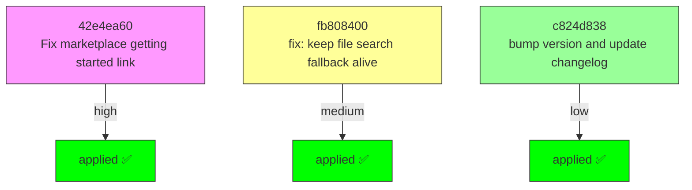

# Backport Agent — Detailed Run Report

> This file is generated automatically. It is intended for human analysts and
> AI reasoning models to assess agent performance, decision quality, and LLM behavior.

**Run timestamp**: 2026-06-01T08:35:56.790Z
**Models used**: fast=`mistral/devstral-latest`  powerful=`openai/gpt-5.5`
**Prompt log**: `/Users/rlemeill/Development/tea-ching-cline/.backport-agent/run-1780302893578.prompts.jsonl`

---

## Summary (PR body)

## Backport Agent — Sync Report

**Date**: 2026-06-01T08:35:56.790Z
**Upstream ref**: `main`
**Fork ref**: `keypool-live`
**Sync branch**: `sync/upstream-main-2026-06-01-0835`

### Summary

- ✅ Applied: 3
- ⚠️ Needs human review: 0
- ⛔ Blocked (not attempted): 0

### Applied commits

- `42e4ea60` [high] Fix marketplace getting started link (#11170)
- `fb808400` [medium] fix: keep file search fallback alive (#11166)
- `c824d838` [low] bump version and update changelog (#11172)

### Agent decision log

- Applied HIGH-risk commit 42e4ea60db61755a8eec3d418ac22810b4ecffc4 after AI compatibility check confirmed no semantic conflicts
- Applied MEDIUM-risk commit fb808400861c16b334eb28919cd55d629f5c1116 after analyze_commit_for_backport returned apply-with-care
- Applied LOW-risk commit c824d8380abff5fc7552416cce2b6a24353bfbec directly
- Validation failed due to allowlist restrictions; marking HIGH-risk commit as validation-failed


---

## Agent Workflow Diagram

> Generated by the fast model from the run summary. Evaluate the agent's decision path.



---

## AI Sub-Agent Call Log (3 calls)

> Each entry is one sub-agent invocation. Review prompt/response pairs to assess
> reasoning quality, hallucinations, and decision accuracy.

### Call 1 / 3 — `check_customization_compatibility` ✅ OK

| Field | Value |
|---|---|
| **Timestamp** | 2026-06-01T08:35:19.914Z |
| **Tool** | `check_customization_compatibility` |
| **Model** | `mistral/devstral-latest` |
| **Duration** | 1946 ms |
| **Tokens in** | 2341 |
| **Tokens out** | 123 |
| **Cost** | $0.000000 |

**Prompt sent to sub-agent:**

```
Declared fork customisations:
  1. Pattern: apps/vscode/README.marketplace.md
     Description: Customized marketplace README with TEA-specific branding and links.
     Current file content (1 file(s)):
      [apps/vscode/README.marketplace.md]
      <div align="center"><sub>
      English | <a href="https://github.com/cline/cline/blob/main/locales/es/README.md" target="_blank">Español</a> | <a href="https://github.com/cline/cline/blob/main/locales/de/README.md" target="_blank">Deutsch</a> | <a href="https://github.com/cline/cline/blob/main/locales/ja/README.md" target="_blank">日本語</a> | <a href="https://github.com/cline/cline/blob/main/locales/zh-cn/README.md" target="_blank">简体中文</a> | <a href="https://github.com/cline/cline/blob/main/locales/zh-tw/README.md" target="_blank">繁體中文</a> | <a href="https://github.com/cline/cline/blob/main/locales/ko/README.md" target="_blank">한국어</a>
      </sub></div>
      
      # Cline
      <div align="center">
      <table>
      <tbody>
      <td align="center">
      <a href="https://marketplace.visualstudio.com/items?itemName=saoudrizwan.claude-dev" target="_blank"><strong>Download on VS Marketplace</strong></a>
      </td>
      <td align="center">
      <a href="https://discord.gg/cline" target="_blank"><strong>Discord</strong></a>
      </td>
      <td align="center">
      <a href="https://www.reddit.com/r/cline/" target="_blank"><strong>r/cline</strong></a>
      </td>
      <td align="center">
      <a href="https://github.com/cline/cline/discussions/categories/feature-requests?discussions_q=is%3Aopen+category%3A%22Feature+Requests%22+sort%3Atop" target="_blank"><strong>Feature Requests</strong></a>
      </td>
      <td align="center">
      <a href="https://docs.cline.bot/getting-started/for-new-coders" target="_blank"><strong>Getting Started</strong></a>
      </td>
      </tbody>
      </table>
      </div>
      
      Meet Cline, an AI assistant that can use your **CLI** a**N**d **E**ditor.
      
      Thanks to [Claude Sonnet's agentic coding capabilities](https://www.anthropic.com/claude/sonnet), Cline can handle complex software development tasks step-by-step. With tools that let him create & edit files, explore large projects, use the browser, and execute terminal commands (after you grant permission), he can assist you in ways that go beyond code completion or tech support. Cline can even use the Model Context Protocol (MCP)
  2. Pattern: docs/docs.json
     Description: Customized documentation redirects and structure for TEA-specific docs.
     Current file content (1 file(s)):
      [docs/docs.json]
      {
      	"$schema": "https://mintlify.com/docs.json",
      	"theme": "mint",
      	"name": "Cline",
      	"description": "AI-powered coding agent for complex work",
      	"colors": {
      		"primary": "#9D4EDD",
      		"light": "#F0E6FF",
      		"dark": "#000000"
      	},
      	"logo": {
      		"light": "/assets/Cline_Logo-complete_black.png",
      		"dark": "/assets/Cline_Logo-complete_white.png"
      	},
      	"favicon": {
      		"light": "/assets/robot_panel_light.png",
      		"dark": "/assets/robot_panel_dark.png"
      	},
      	"background": {
      		"color": {
      			"light": "#fafaf9",
      			"dark": "#0f0f0f"
      		}
      	},
      	"styling": {
      		"eyebrows": "breadcrumbs",
      		"codeblocks": "system",
      		"css": "styles.css"
      	},
      	"appearance": {
      		"default": "system",
      		"strict": false
      	},
      	"fonts": {
      		"family": "Geist Sans"
      	},
      	"navbar": {
      		"links": [
      			{
      				"label": "GitHub",
      				"icon": "github",
      				"href": "https://github.com/cline/cline"
      			},
      			{
      				"label": "Discord",
      				"icon": "discord",
      				"href": "https://discord.gg/cline"
      			}
      		],
      		"primary": {
      			"type": "button",
      			"label": "Install Cline",
      			"href": "https://cline.bot/install?utm_source=website&utm_medium=header"
      		}
      	},
      	"navigation": {
      		"tabs": [
      			{
      				"tab": "Cline",
      				"icon": "robot",
      				"groups": [
      					{
      						"group": "Getting Started",
      						"pages": [
      							"cline-overview",
      							"getting-started/installing-cline",
      							{
      								"group": "Models & Providers",
      								"pages": [
      									"getting-started/authorizing-with-cline",
      									"getting-started/cline-provider",
      									"running-models-locally/overview",
      									{
      										"group": "Cloud Providers",
      										"pages": [
      											"provider-config/qwen",
      											"provider-config/anthropic",
      											{
      												"group": "AWS Bedrock",
      												"pages": [
      													"provider-config/aws-bedrock/api-key",
      													"provider-config/aws-bedrock/iam-credentials",
      													"provider-config/aws-bedrock/cli-profile"
      												]
      											},
      											"provider-config/deepseek",
      											"provider-co

Upstream diff to evaluate:
commit 42e4ea60db61755a8eec3d418ac22810b4ecffc4
Author: morning-verlu <wurslu@gmail.com>
Date:   Mon Jun 1 14:12:08 2026 +0800

    Fix marketplace getting started link (#11170)
    
    Co-authored-by: morning-verlu <258725120+morning-verlu@users.noreply.github.com>
---
 apps/vscode/README.marketplace.md | 2 +-
 docs/docs.json                    | 4 ++++
 2 files changed, 5 insertions(+), 1 deletion(-)

diff --git a/apps/vscode/README.marketplace.md b/apps/vscode/README.marketplace.md
index 893d40b03..08f02ca8a 100644
--- a/apps/vscode/README.marketplace.md
+++ b/apps/vscode/README.marketplace.md
@@ -19,7 +19, fix: keep file search fallback alive (#11166)
 <a href="https://github.com/cline/cline/discussions/categories/feature-requests?discussions_q=is%3Aopen+category%3A%22Feature+Requests%22+sort%3Atop" target="_blank"><strong>Feature Requests</strong></a>
 </td>
 <td align="center">
-<a href="https://docs.cline.bot/getting-started/for-new-coders" target="_blank"><strong>Getting Started</strong></a>
+<a href="https://docs.cline.bot/getting-started/installing-cline" target="_blank"><strong>Getting Started</strong></a>
 </td>
 </tbody>
 </table>
diff --git a/docs/docs.json b/docs/docs.json
index cc7dcd0d7..904780018 100644
--- a/docs/docs.json
+++ b/docs/docs.json
@@ -370,6 +370,10 @@
 			"source": "/getting-started/installing-cline-jetbrains",
 			"destination": "/getting-started/installing-cline"
 		},
+		{
+			"source": "/getting-started/for-new-coders",
+			"destination": "/getting-started/installing-cline"
+		},
 		{
 			"source": "/getting-started/overview",
 			"destination": "/cline-overview"

Output the JSON object now.
```

**Response received:**

````
```json
{
  "compatible": true,
  "affectedCustomizations": [
    "apps/vscode/README.marketplace.md",
    "docs/docs.json"
  ],
  "semanticConflicts": [],
  "warnings": [
    "upstream change updates a link in the marketplace README which is customised in the fork",
    "upstream change adds a redirect in docs.json which is customised in the fork"
  ],
  "recommendation": "Review the link and redirect changes to ensure they align with TEA-specific branding and documentation structure."
}
```
````

---

### Call 2 / 3 — `analyze_commit_for_backport` ✅ OK

| Field | Value |
|---|---|
| **Timestamp** | 2026-06-01T08:35:21.984Z |
| **Tool** | `analyze_commit_for_backport` |
| **Model** | `mistral/devstral-latest` |
| **Duration** | 2067 ms |
| **Tokens in** | 1002 |
| **Tokens out** | 159 |
| **Cost** | $0.000000 |

**Prompt sent to sub-agent:**

```
Commit SHA: 42e4ea60db61755a8eec3d418ac22810b4ecffc4
Commit message:
Fix marketplace getting started link (#11170)

Co-authored-by: morning-verlu <258725120+morning-verlu@users.noreply.github.com>

Changed files (2):
apps/vscode/README.marketplace.md
docs/docs.json

Diff:
commit 42e4ea60db61755a8eec3d418ac22810b4ecffc4
Author: morning-verlu <wurslu@gmail.com>
Date:   Mon Jun 1 14:12:08 2026 +0800

    Fix marketplace getting started link (#11170)
    
    Co-authored-by: morning-verlu <258725120+morning-verlu@users.noreply.github.com>
---
 apps/vscode/README.marketplace.md | 2 +-
 docs/docs.json                    | 4 ++++
 2 files changed, 5 insertions(+), 1 deletion(-)

diff --git a/apps/vscode/README.marketplace.md b/apps/vscode/README.marketplace.md
index 893d40b03..08f02ca8a 100644
--- a/apps/vscode/README.marketplace.md
+++ b/apps/vscode/README.marketplace.md
@@ -19,7 +19,7 @@ English | <a href="https://github.com/cline/cline/blob/main/locales/es/README.md
 <a href="https://github.com/cline/cline/discussions/categories/feature-requests?discussions_q=is%3Aopen+category%3A%22Feature+Requests%22+sort%3Atop" target="_blank"><strong>Feature Requests</strong></a>
 </td>
 <td align="center">
-<a href="https://docs.cline.bot/getting-started/for-new-coders" target="_blank"><strong>Getting Started</strong></a>
+<a href="https://docs.cline.bot/getting-started/installing-cline" target="_blank"><strong>Getting Started</strong></a>
 </td>
 </tbody>
 </table>
diff --git a/docs/docs.json b/docs/docs.json
index cc7dcd0d7..904780018 100644
--- a/docs/docs.json
+++ b/docs/docs.json
@@ -370,6 +370,10 @@
 			"source": "/getting-started/installing-cline-jetbrains",
 			"destination": "/getting-started/installing-cline"
 		},
+		{
+			"source": "/getting-started/for-new-coders",
+			"destination": "/getting-started/installing-cline"
+		},
 		{
 			"source": "/getting-started/overview",
 			"destination": "/cline-overview"

Output the JSON object now.
```

**Response received:**

````
```json
{
  "summary": "This commit fixes a broken marketplace getting started link by updating the URL in the README and adding a redirect rule in the documentation configuration.",
  "keyChanges": [
    "Updated the 'Getting Started' link in apps/vscode/README.marketplace.md from '/getting-started/for-new-coders' to '/getting-started/installing-cline'",
    "Added a redirect rule in docs/docs.json to map the old URL '/getting-started/for-new-coders' to the new URL '/getting-started/installing-cline'"
  ],
  "backportComplexity": "trivial",
  "semanticRiskFactors": [],
  "recommendation": "apply"
}
```
````

---

### Call 3 / 3 — `analyze_commit_for_backport` ✅ OK

| Field | Value |
|---|---|
| **Timestamp** | 2026-06-01T08:35:38.907Z |
| **Tool** | `analyze_commit_for_backport` |
| **Model** | `mistral/devstral-latest` |
| **Duration** | 4762 ms |
| **Tokens in** | 2417 |
| **Tokens out** | 248 |
| **Cost** | $0.000000 |

**Prompt sent to sub-agent:**

```
Commit SHA: fb808400861c16b334eb28919cd55d629f5c1116
Commit message:
fix: keep file search fallback alive (#11166)

Co-authored-by: Saoud Rizwan <7799382+saoudrizwan@users.noreply.github.com>

Changed files (2):
apps/vscode/src/services/search/file-search.ts
apps/vscode/src/test/services/search/file-search.test.ts

Diff:
commit fb808400861c16b334eb28919cd55d629f5c1116
Author: Yufeng He <40085740+he-yufeng@users.noreply.github.com>
Date:   Mon Jun 1 14:28:28 2026 +0800

    fix: keep file search fallback alive (#11166)
    
    Co-authored-by: Saoud Rizwan <7799382+saoudrizwan@users.noreply.github.com>
---
 apps/vscode/src/services/search/file-search.ts     | 42 ++++++++++--
 .../src/test/services/search/file-search.test.ts   | 77 ++++++++++++++++++++++
 2 files changed, 115 insertions(+), 4 deletions(-)

diff --git a/apps/vscode/src/services/search/file-search.ts b/apps/vscode/src/services/search/file-search.ts
index 75a038d20..ad52965de 100644
--- a/apps/vscode/src/services/search/file-search.ts
+++ b/apps/vscode/src/services/search/file-search.ts
@@ -38,7 +38,7 @@ export async function executeRipgrepForFiles(
 	workspacePath: string,
 	limit = 5000,
 ): Promise<{ path: string; type: "file" | "folder"; label?: string }[]> {
-	const rgPath = await getBinaryLocation("rg")
+	const rgPath = await resolveRipgrepPath()
 
 	return new Promise((resolve, reject) => {
 		// Arguments for ripgrep to list files, follow symlinks, include hidden, and exclude common directories
@@ -142,11 +142,45 @@ export async function executeRipgrepForFiles(
 	})
 }
 
+async function resolveRipgrepPath(): Promise<string> {
+	try {
+		return await getBinaryLocation("rg")
+	} catch (error) {
+		const message = error instanceof Error ? error.message : String(error)
+		const fallback = await findSystemRipgrep()
+		Logger.warn(`[file-search] bundled ripgrep unavailable, trying ${fallback}: ${message}`)
+		return fallback
+	}
+}
+
+async function findSystemRipgrep(): Promise<string> {
+	const fallback = process.platform === "win32" ? "rg.exe" : "rg"
+	const candidates =
+		process.platform === "win32" ? [] : ["/usr/bin/rg", "/opt/homebrew/bin/rg", "/usr/local/bin/rg"]
+
+	for (const candidate of candidates) {
+		try {
+			await fs.promises.access(candidate, fs.constants.X_OK)
+			return candidate
+		} catch {
+			// Keep looking; the bare command is the final PATH-based fallback.
+		}
+	}
+
+	return fallback
+}
+
 // Get currently active/open files from VSCode tabs using hostbridge
 async function getActiveFiles(): Promise<Set<string>> {
-	const request = GetOpenTabsRequest.create({})
-	const response = await HostProvider.window.getOpenTabs(request)
-	return new Set(response.paths)
+	try {
+		const request = GetOpenTabsRequest.create({})
+		const response = await HostProvider.window.getOpenTabs(request)
+		return new Set(response.paths)
+	} catch (error) {
+		const message = error instanceof Error ? error.message : String(error)
+		Logger.warn(`[file-search] failed to read open tabs, continuing without active-file boost: ${message}`)
+		return new Set()
+	}
 }
 
 // Maximum number of candidates to ask the host for. The result is filtered &
diff --git a/apps/vscode/src/test/services/search/file-search.test.ts b/apps/vscode/src/test/services/search/file-search.test.ts
index 568b4d5b3..9732d81c2 100644
--- a/apps/vscode/src/test/services/search/file-search.test.ts
+++ b/apps/vscode/src/test/services/search/file-search.test.ts
@@ -28,6 +28,8 @@ describe("File Search", () => {
 		const accessStub = sandbox.stub(fs.promises, "access")
 		accessStub.withArgs("/mock/path/rg").resolves()
 		accessStub.withArgs("/mock/path/rg.exe").resolves()
+		accessStub.withArgs("/mock/path/to/binary/rg").resolves()
+		accessStub.withArgs("/mock/path/to/binary/rg.exe").resolves()
 
 		setVscodeHostProviderMock()
 	})
@@ -163,6 +165,46 @@ describe("File Search", () => {
 			should(err).have.property("name", "RipgrepError")
 			should(err.stderr).match(/No such file or directory/)
 		})
+
+		it("falls back to a system ripgrep when the bundled binary path is missing", async () => {
+			setVscodeHostProviderMock({
+				getBinaryLocation: async () => "/missing/rg",
+			})
+
+			const accessStub = fs.promises.access as sinon.SinonStub
+			accessStub.withArgs("/missing/rg").rejects(new Error("missing"))
+			accessStub.withArgs("/usr/bin/rg", fs.constants.X_OK).resolves()
+
+			const mockStdout = new Readable({
+				read() {
+					this.push("/workspace/src/main.ts\n")
+					this.push(null)
+				},
+			})
+			const mockStderr = new Readable({
+				read() {
+					this.push(null)
+				},
+			})
+
+			spawnStub.returns({
+				stdout: mockStdout,
+				stderr: mockStderr,
+				on: function (event: string, callback: Function) {
+					if (event === "exit") {
+						setImmediate(() => callback(0))
+					}
+					return this
+				},
+				kill: () => {},
+			} as unknown as childProcess.ChildProcess)
+
+			const result = await fileSearch.executeRipgrepForFiles("/workspace", 5000)
+			const expectedPath = process.platform === "win32" ? "src\\main.ts" : "src/main.ts"
+
+			should(spawnStub.firstCall.args[0]).equal(process.platform === "win32" ? "rg.exe" : "/usr/bin/rg")
+			should(result).containDeep([{ path: expectedPath, type: "file", label: "main.ts" }])
+		})
 	})
 
 	describe("searchWorkspaceFiles", () => {
@@ -210,6 +252,41 @@ describe("File Search", () => {
 			should(srcEntries[0]).have.properties({ path: "src", type: "folder" })
 		})
 
+		it("continues search when the host cannot return open tabs", async () => {
+			sandbox.stub(HostProvider.window, "getOpenTabs").rejects(new Error("getOpenTabs unavailable"))
+			sandbox.stub(HostProvider.workspace, "searchWorkspaceItems").rejects({ code: 12, message: "not implemented" })
+
+			const mockStdout = new Readable({
+				read() {
+					this.push("/workspace/src/main.ts\n")
+					this.push(null)
+				},
+			})
+			const mockStderr = new Readable({
+				read() {
+					this.push(null)
+				},
+			})
+
+			spawnStub.returns({
+				stdout: mockStdout,
+				stderr: mockStderr,
+				on: function (event: string, callback: Function) {
+					if (event === "exit") {
+						setImmediate(() => callback(0))
+					}
+					return this
+				},
+				kill: () => {},
+			} as unknown as childProcess.ChildProcess)
+
+			const result = await fileSearch.searchWorkspaceFiles("", "/workspace", 20)
+			const expectedPath = process.platform === "win32" ? "src\\main.ts" : "src/main.ts"
+
+			should(result.source).equal("ripgrep")
+			should(result.items).containDeep([{ path: expectedPath, type: "file", label: "main.ts" }])
+		})
+
 		it("should apply fuzzy matching for non-empty query", async () => {
 			const mockItems: { path: string; type: "file" | "folder"; label?: string }[] = [
 				{ path: "file1.txt", type: "file", label: "file1.txt" }

Output the JSON object now.
```

**Response received:**

````
```json
{
  "summary": "This commit improves the robustness of file search by adding fallback mechanisms for both the ripgrep binary and the active files retrieval. It ensures the search continues even if the bundled ripgrep is missing or the host cannot provide open tabs.",
  "keyChanges": [
    "Introduces `resolveRipgrepPath()` to fall back to system-installed ripgrep if the bundled binary is unavailable.",
    "Adds `findSystemRipgrep()` to locate system ripgrep in common paths (e.g., `/usr/bin/rg`, `/opt/homebrew/bin/rg`).",
    "Wraps `getActiveFiles()` in a try-catch to gracefully handle failures when retrieving open tabs from the host.",
    "Updates tests to verify fallback behavior for both ripgrep and active files retrieval."
  ],
  "backportComplexity": "moderate",
  "semanticRiskFactors": [
    "Introduces new error handling logic that may interact with custom error reporting or logging in the fork.",
    "Changes the binary resolution strategy, which could affect environments with non-standard ripgrep installations."
  ],
  "recommendation": "apply-with-care"
}
```
````

---

## Performance Summary

**Total AI time**: 8775 ms across 3 call(s)
**Total input tokens**: 5760
**Total output tokens**: 530

| Tool | Calls | Total ms | Avg ms | Input tok | Output tok |
|---|---|---|---|---|---|
| `check_customization_compatibility` | 1 | 1946 | 1946 | 2341 | 123 |
| `analyze_commit_for_backport` | 2 | 6829 | 3415 | 3419 | 407 |

## Decision Quality Metrics

> Automated quality signals derived from tool output guards, schema validation,
> hallucination detection, and consensus checks.  Review flagged items manually.

### Commit Analysis Quality

| Metric | Value |
|---|---|
| Total analyze calls | 2 |
| Commits with semantic risk factors | 1 |
| Possible hallucinated references (total) | 0 |

### Compatibility Check Quality

| Metric | Value |
|---|---|
| Total compatibility checks | 1 |
| Checks with file content enrichment | 1 |
| Incompatible results | 0 |

### Audit Event Timeline

| Timestamp | Tool | Event | Details |
|---|---|---|---|
| 08:35:19 | `check_customization_compatibility` | `compatibility_check_complete` | compatible=true, affectedCustomizations=["apps/vscode/README.marketplace.md","do, semanticConflictsCount=0 |
| 08:35:21 | `analyze_commit_for_backport` | `analysis_complete` | sha="42e4ea60db61755a8eec3d418ac22810b4ecffc, recommendation="apply", complexity="trivial" |
| 08:35:25 | `reconcile_ai_assessments` | `no_contradiction` | sha="42e4ea60db61755a8eec3d418ac22810b4ecffc, analyzeRecommendation="apply", compatibilityCompatible=true |
| 08:35:38 | `analyze_commit_for_backport` | `analysis_complete` | sha="fb808400861c16b334eb28919cd55d629f5c111, recommendation="apply-with-care", complexity="moderate" |
