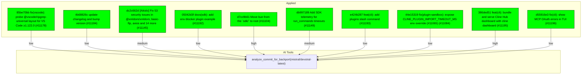

# Backport Agent — Detailed Run Report

> This file is generated automatically. It is intended for human analysts and
> AI reasoning models to assess agent performance, decision quality, and LLM behavior.

**Run timestamp**: 2026-06-02T08:27:09.342Z
**Models used**: fast=`mistral/devstral-latest`  powerful=`openai/gpt-5.5`
**Prompt log**: `/Users/rlemeill/Development/tea-ching-cline/.backport-agent/run-1780388349292.prompts.jsonl`

---

## Summary (PR body)

## Backport Agent — Sync Report

**Date**: 2026-06-02T08:27:09.342Z
**Upstream ref**: `cline/cline.git@main`
**Fork ref**: `TEA-ching/cline@keypool-live`
**Sync branch**: `sync/upstream-main-2026-06-02-0821`

### Summary

- ✅ Applied: 10
- ⚠️ Needs human review: 0
- ⛔ Blocked (not attempted): 0

### Applied commits

- `85be70bb` [low] fix(vscode): probe @vscode/ripgrep-universal layout for VS Code ≥1.122.0 (#11178)
- `4b68826c` [low] update changelog and bump version (#11184)
- `dc2c662d` [medium] [Aikido] Fix 53 security issues in @xmldom/xmldom, basic-ftp, axios and 14 more (#11145)
- `05042d3f` [low] docs(sdk): add env-blocker plugin example (#11192)
- `d7cc9b61` [high] Move bun from the `sdk/` to root (#11104)
- `db997189` [medium] Add SDK telemetry for run_commands timeouts (#11149)
- `e424b287` [low] feat(cli): add plugins slash command (#11193)
- `44e15319` [low] fix(plugin-sandbox): expose CLINE_PLUGIN_IMPORT_TIMEOUT_MS env override (#11065) (#11084)
- `386ded51` [high] feat(cli): bundle and serve Cline Hub dashboard with cline dashboard (#11195)
- `d55916e3` [low] fix(cli): show MCP OAuth errors in TUI (#11196)

### Agent decision log

- All commits were applied successfully without conflicts.
- Validation failed due to blocked commands.


---

## Agent Workflow Diagram

> Generated by the fast model from the run summary. Evaluate the agent's decision path.



---

## AI Sub-Agent Call Log (4 calls)

> Each entry is one sub-agent invocation. Review prompt/response pairs to assess
> reasoning quality, hallucinations, and decision accuracy.

### Call 1 / 4 — `analyze_commit_for_backport` ✅ OK

| Field | Value |
|---|---|
| **Timestamp** | 2026-06-02T08:21:10.492Z |
| **Tool** | `analyze_commit_for_backport` |
| **Model** | `mistral/devstral-latest` |
| **Duration** | 2650 ms |
| **Tokens in** | 795 |
| **Tokens out** | 164 |
| **Cost** | $0.000000 |

**Prompt sent to sub-agent:**

```
Commit SHA: dc2c662de60a69458898b79770473fbb67f372b7
Commit message:
fix(security): update dependencies
    
    * fix(security): update dependencies
    
    * fix: set unbounded axios fetch adapter limits for 1.16.0
    
    ---------
    
    Co-authored-by: aikido-autofix[bot] <119856028+aikido-autofix[bot]@users.noreply.github.com>
    Co-authored-by: TheRealSpencer <spencer@cline.bot>

Changed files (3):
apps/vscode/package-lock.json
apps/vscode/package.json
apps/vscode/src/shared/net.ts

Diff:
commit dc2c662de60a69458898b79770473fbb67f372b7
Author: aikido-autofix[bot] <119856028+aikido-autofix[bot]@users.noreply.github.com>
Date:   Mon Jun 1 10:15:40 2026 -0700

    [Aikido] Fix 53 security issues in @xmldom/xmldom, basic-ftp, axios and 14 more (#11145)
    
    * fix(security): update dependencies
    
    * fix: set unbounded axios fetch adapter limits for 1.16.0
    
    ---------
    
    Co-authored-by: aikido-autofix[bot] <119856028+aikido-autofix[bot]@users.noreply.github.com>
    Co-authored-by: TheRealSpencer <spencer@cline.bot>
---
 apps/vscode/package-lock.json | 255 +++++++++++++++++++++++++-----------------
 apps/vscode/package.json      |   4 +-
 apps/vscode/src/shared/net.ts |   4 +-
 3 files changed, 160 insertions(+), 103 deletions(-)

Output the JSON object now.
```

**Response received:**

````
```json
{
  "summary": "This commit updates dependencies to fix 53 security issues in packages like @xmldom/xmldom, basic-ftp, and axios. It also adjusts the axios fetch adapter limits to be unbounded for version 1.16.0.",
  "keyChanges": [
    "Updated versions of multiple dependencies in package.json and package-lock.json",
    "Modified axios fetch adapter limits in net.ts to remove bounds"
  ],
  "backportComplexity": "moderate",
  "semanticRiskFactors": [
    "Dependency version updates may conflict with customised fork dependencies",
    "Changes to axios adapter limits could affect network behavior in custom implementations"
  ],
  "recommendation": "apply-with-care"
}
```
````

---

### Call 2 / 4 — `analyze_commit_for_backport` ✅ OK

| Field | Value |
|---|---|
| **Timestamp** | 2026-06-02T08:21:16.213Z |
| **Tool** | `analyze_commit_for_backport` |
| **Model** | `mistral/devstral-latest` |
| **Duration** | 5719 ms |
| **Tokens in** | 1250 |
| **Tokens out** | 271 |
| **Cache read** | 288 |
| **Cost** | $0.000000 |

**Prompt sent to sub-agent:**

```
Commit SHA: d7cc9b61557aa0efd962512c16d183f49aa6bf20
Commit message:
Move bun from the `sdk/` to root (#11104)
    
    * Move bun to root
    
    * Fix scripts and pre-commit
    
    * Update scripts
    
    * Update workflows
    
    * Fix cd
    
    * fix pre-commit
    
    * fix cli publish
---
 .github/workflows/cli-publish.yml                  | 18 ++---
 .github/workflows/sdk-publish.yml                  | 18 ++---
 .github/workflows/sdk-test.yml                     |  8 +--
 .husky/pre-commit                                  |  9 +++
 .vscode/tasks.json                                 | 43 ++++++------
 apps/vscode/src/services/search/file-search.ts     |  3 +-
 apps/vscode/src/shared/net.ts                      | 14 ++--
 sdk/bun.lock => bun.lock                           | 78 +++++++++++-----------
 package.json                                       | 63 +++++++++++++++++
 sdk/.husky/pre-commit                              |  9 ---
 sdk/apps/cli/src/connectors/adapters/discord.ts    | 25 +++++--
 .../cli/src/connectors/thread-bindings.test.ts     |  2 +-
 sdk/apps/cli/src/connectors/thread-bindings.ts     |  7 +-
 sdk/apps/cli/src/tui/palette.ts                    |  4 +-
 sdk/apps/cli/src/utils/chat-commands.ts            |  4 +-
 sdk/package.json                                   | 63 -----------------
 sdk/scripts/clean.ts                               |  2 +-
 sdk/scripts/release.ts                             | 17 +++--
 sdk/scripts/version.ts                             |  5 +-
 19 files changed, 207 insertions(+), 185 deletions(-)

Changed files (4):
sdk/bun.lock => bun.lock
package.json
sdk/.husky/pre-commit
sdk/package.json

Diff:
commit d7cc9b61557aa0efd962512c16d183f49aa6bf20
Author: Tomás Barreiro <52393857+BarreiroT@users.noreply.github.com>
Date:   Mon Jun 1 17:29:41 2026 -0300

    Move bun from the `sdk/` to root (#11104)
    
    * Move bun to root
    
    * Fix scripts and pre-commit
    
    * Update scripts
    
    * Update workflows
    
    * Fix cd
    
    * fix pre-commit
    
    * fix cli publish
---
 .github/workflows/cli-publish.yml                  | 18 ++---
 .github/workflows/sdk-publish.yml                  | 18 ++---
 .github/workflows/sdk-test.yml                     |  8 +--
 .husky/pre-commit                                  |  9 +++
 .vscode/tasks.json                                 | 43 ++++++------
 apps/vscode/src/services/search/file-search.ts     |  3 +-
 apps/vscode/src/shared/net.ts                      | 14 ++--
 sdk/bun.lock => bun.lock                           | 78 +++++++++++-----------
 package.json                                       | 63 +++++++++++++++++
 sdk/.husky/pre-commit                              |  9 ---
 sdk/apps/cli/src/connectors/adapters/discord.ts    | 25 +++++--
 .../cli/src/connectors/thread-bindings.test.ts     |  2 +-
 sdk/apps/cli/src/connectors/thread-bindings.ts     |  7 +-
 sdk/apps/cli/src/tui/palette.ts                    |  4 +-
 sdk/apps/cli/src/utils/chat-commands.ts            |  4 +-
 sdk/package.json                                   | 63 -----------------
 sdk/scripts/clean.ts                               |  2 +-
 sdk/scripts/release.ts                             | 17 +++--
 sdk/scripts/version.ts                             |  5 +-
 19 files changed, 207 insertions(+), 185 deletions(-)

Output the JSON object now.
```

**Response received:**

````
```json
{
  "summary": "This commit moves the Bun dependency from the `sdk/` directory to the root of the project. It updates various configuration files, scripts, and workflows to reflect this change, ensuring consistency across the codebase.",
  "keyChanges": [
    "Moved `sdk/bun.lock` to `bun.lock` in the root directory.",
    "Updated `package.json` in the root and removed the redundant `sdk/package.json`.",
    "Modified GitHub workflows (cli-publish, sdk-publish, sdk-test) to adapt to the new structure.",
    "Adjusted scripts (clean, release, version) and pre-commit hooks to work with the new Bun location.",
    "Updated various source files to reflect path changes (e.g., `apps/vscode/src/shared/net.ts`)."
  ],
  "backportComplexity": "moderate",
  "semanticRiskFactors": [
    "Changes file paths and dependencies, which may conflict with customisations in the fork.",
    "Modifies build and publish workflows, which could affect CI/CD pipelines in the fork.",
    "Updates pre-commit hooks, which may require adjustments in the fork's development environment."
  ],
  "recommendation": "review-required"
}
```
````

---

### Call 3 / 4 — `analyze_commit_for_backport` ✅ OK

| Field | Value |
|---|---|
| **Timestamp** | 2026-06-02T08:21:19.963Z |
| **Tool** | `analyze_commit_for_backport` |
| **Model** | `mistral/devstral-latest` |
| **Duration** | 3749 ms |
| **Tokens in** | 1240 |
| **Tokens out** | 259 |
| **Cache read** | 288 |
| **Cost** | $0.000000 |

**Prompt sent to sub-agent:**

```
Commit SHA: db9971890e51d19323288974e94db55feedfeab9
Commit message:
Add SDK telemetry for run_commands timeouts (#11149)
    
    * feat(sdk): add run_commands timeout telemetry
    
    * docs(sdk): document timeout telemetry event
    
    * docs(sdk): move telemetry catalog to core docs
    
    * fix(sdk): omit undefined timeout telemetry fields
    
    * fix(sdk): mark timed out run_commands unsuccessful
    
    * docs(sdk): defer telemetry catalog entry
    
    * fix(sdk): limit run_commands timeout success override
    
    * fix(sdk): tighten timeout telemetry plumbing
---
 .../core/src/extensions/tools/definitions.test.ts  | 216 +++++++++++++++++++++
 .../core/src/extensions/tools/definitions.ts       |  65 +++++++
 .../core/src/extensions/tools/executors/bash.ts    |   6 +-
 sdk/packages/core/src/extensions/tools/helpers.ts  |  12 +-
 .../session-runtime-orchestrator.test.ts           |  12 +-
 .../orchestration/session-runtime-orchestrator.ts  |   2 +
 .../src/services/telemetry/core-events.test.ts     | 118 +++++++++++
 .../core/src/services/telemetry/core-events.ts     |  39 ++++
 .../core/src/services/telemetry/tool-context.ts    |  16 ++
 9 files changed, 483 insertions(+), 3 deletions(-)

Changed files (9):
sdk/packages/core/src/extensions/tools/definitions.test.ts
sdk/packages/core/src/extensions/tools/definitions.ts
sdk/packages/core/src/extensions/tools/executors/bash.ts
sdk/packages/core/src/extensions/tools/helpers.ts
sdk/packages/core/src/runtime/orchestration/session-runtime-orchestrator.test.ts
sdk/packages/core/src/runtime/orchestration/session-runtime-orchestrator.ts
sdk/packages/core/src/services/telemetry/core-events.test.ts
sdk/packages/core/src/services/telemetry/core-events.ts
sdk/packages/core/src/services/telemetry/tool-context.ts

Diff:
commit db9971890e51d19323288974e94db55feedfeab9
Author: Robin Newhouse <robin@cline.bot>
Date:   Mon Jun 1 16:22:04 2026 -0700

    Add SDK telemetry for run_commands timeouts (#11149)
    
    * feat(sdk): add run_commands timeout telemetry
    
    * docs(sdk): document timeout telemetry event
    
    * docs(sdk): move telemetry catalog to core docs
    
    * fix(sdk): omit undefined timeout telemetry fields
    
    * fix(sdk): mark timed out run_commands unsuccessful
    
    * docs(sdk): defer telemetry catalog entry
    
    * fix(sdk): limit run_commands timeout success override
    
    * fix(sdk): tighten timeout telemetry plumbing
---
 .../core/src/extensions/tools/definitions.test.ts  | 216 +++++++++++++++++++++
 .../core/src/extensions/tools/definitions.ts       |  65 +++++++
 .../core/src/extensions/tools/executors/bash.ts    |   6 +-
 sdk/packages/core/src/extensions/tools/helpers.ts  |  12 +-
 .../session-runtime-orchestrator.test.ts           |  12 +-
 .../orchestration/session-runtime-orchestrator.ts  |   2 +
 .../src/services/telemetry/core-events.test.ts     | 118 +++++++++++
 .../core/src/services/telemetry/core-events.ts     |  39 ++++
 .../core/src/services/telemetry/tool-context.ts    |  16 ++
 9 files changed, 483 insertions(+), 3 deletions(-)

Output the JSON object now.
```

**Response received:**

````
```json
{
  "summary": "This commit adds telemetry tracking for run_commands timeouts in the SDK, including new event definitions, telemetry plumbing, and documentation updates. It ensures timeout events are properly marked as unsuccessful and refines the telemetry data structure.",
  "keyChanges": [
    "Introduces new telemetry event definitions for run_commands timeouts in `core-events.ts` and `definitions.ts`",
    "Modifies `bash.ts` and `helpers.ts` to emit timeout telemetry and handle timeout success states",
    "Updates `session-runtime-orchestrator.ts` to mark timed-out commands as unsuccessful",
    "Adds telemetry context handling in `tool-context.ts`",
    "Includes comprehensive test coverage for new telemetry functionality"
  ],
  "backportComplexity": "moderate",
  "semanticRiskFactors": [
    "Introduces new telemetry events that may require fork-specific telemetry handling",
    "Modifies command execution success tracking logic in `session-runtime-orchestrator.ts`",
    "Changes to `helpers.ts` and `bash.ts` could interact with custom command execution flows"
  ],
  "recommendation": "review-required"
}
```
````

---

### Call 4 / 4 — `analyze_commit_for_backport` ✅ OK

| Field | Value |
|---|---|
| **Timestamp** | 2026-06-02T08:21:25.262Z |
| **Tool** | `analyze_commit_for_backport` |
| **Model** | `mistral/devstral-latest` |
| **Duration** | 5298 ms |
| **Tokens in** | 1225 |
| **Tokens out** | 237 |
| **Cache read** | 288 |
| **Cost** | $0.000000 |

**Prompt sent to sub-agent:**

```
Commit SHA: 386ded5126f27a2d71e1de26683930d129bd3e81
Commit message:
feat(cli): bundle and serve Cline Hub dashboard with cline dashboard (#11195)
    
    * feat(cli): bundle and serve Cline Hub dashboard with cline dashboard
    
    Add the @cline/cline-hub workspace dependency to the CLI and build the
    Hub webview as part of CLI packaging. Copy the generated dashboard assets
    into platform-specific CLI distributions so the dashboard is available in
    built artifacts.
    
    Refactor the Cline Hub server startup into an exported function so the CLI
    can start and stop the dashboard server programmatically.
    
    * fix(cli): resolve dashboard webview in wrapper installs
    
    Detect the platform-specific CLI package from the published wrapper layout
    and use its bundled cline-hub webview assets when no explicit dist path is
    set. Add test coverage for resolving assets via CLINE_WRAPPER_PATH.
    
    * patches
    
    * patch
    
    * fix server detachHub on stop
    
    Imported detachHub.
    Changed ClineHubDashboardServer.stop to () => Promise<void>.
    Made stop() idempotent with a stopped guard.
    Clears the health interval.
    Calls server.stop(true).
    Always calls await detachHub(ctx) in a finally, so hub client teardown still happens if the HTTP server stop throws.
    
    ---------
    
    Co-authored-by: Saoud Rizwan <7799382+saoudrizwan@users.noreply.github.com>

Changed files (13):
bun.lock
sdk/apps/cli/bun.mts
sdk/apps/cli/package.json
sdk/apps/cli/script/build.ts
sdk/apps/cli/src/commands/dashboard.test.ts
sdk/apps/cli/src/commands/dashboard.ts
sdk/apps/cli/src/main.test.ts
sdk/apps/cli/src/main.ts
sdk/apps/cline-hub/package.json
sdk/apps/cline-hub/src/server.ts
sdk/apps/cline-hub/src/server/deps.ts
sdk/apps/tsconfig.apps.json
sdk/tsconfig.json

Diff:
commit 386ded5126f27a2d71e1de26683930d129bd3e81
Author: Bee <68532117+abeatrix@users.noreply.github.com>
Date:   Mon Jun 1 17:35:24 2026 -0700

    feat(cli): bundle and serve Cline Hub dashboard with cline dashboard (#11195)
    
    * feat(cli): bundle and serve Cline Hub dashboard with cline dashboard
    
    Add the @cline/cline-hub workspace dependency to the CLI and build the
    Hub webview as part of CLI packaging. Copy the generated dashboard assets
    into platform-specific CLI distributions so the dashboard is available in
    built artifacts.
    
    Refactor the Cline Hub server startup into an exported function so the CLI
    can start and stop the dashboard server programmatically.
    
    * fix(cli): resolve dashboard webview in wrapper installs
    
    Detect the platform-specific CLI package from the published wrapper layout
    and use its bundled cline-hub webview assets when no explicit dist path is
    set. Add test coverage for resolving assets via CLINE_WRAPPER_PATH.
    
    * patches
    
    * patch
    
    * fix server detachHub on stop
    
    Imported detachHub.
    Changed ClineHubDashboardServer.stop to () => Promise<void>.
    Made stop() idempotent with a stopped guard.
    Clears the health interval.
    Calls server.stop(true).
    Always calls await detachHub(ctx) in a finally, so hub client teardown still happens if the HTTP server stop throws.
    
    ---------
    
    Co-authored-by: Saoud Rizwan <7799382+saoudrizwan@users.noreply.github.com>

Output the JSON object now.
```

**Response received:**

````
```json
{
  "summary": "This commit integrates the Cline Hub dashboard into the CLI by bundling its assets during CLI packaging and refactoring the server startup logic for programmatic control. It also fixes asset resolution in wrapper installations and improves server shutdown handling.",
  "keyChanges": [
    "Added @cline/cline-hub as a dependency to the CLI and integrated its build into CLI packaging.",
    "Refactored Cline Hub server startup into an exported function for programmatic control.",
    "Fixed dashboard asset resolution in wrapper installations via CLINE_WRAPPER_PATH.",
    "Improved server shutdown logic with idempotency, health interval cleanup, and proper hub client teardown."
  ],
  "backportComplexity": "complex",
  "semanticRiskFactors": [
    "Introduces new dependency (@cline/cline-hub) which may conflict with fork customisations.",
    "Changes server startup/shutdown behavior which could affect existing integrations.",
    "Modifies asset resolution logic which may break custom packaging or distribution workflows."
  ],
  "recommendation": "review-required"
}
```
````

---

## Performance Summary

**Total AI time**: 17416 ms across 4 call(s)
**Total input tokens**: 4510
**Total output tokens**: 931

| Tool | Calls | Total ms | Avg ms | Input tok | Output tok |
|---|---|---|---|---|---|
| `analyze_commit_for_backport` | 4 | 17416 | 4354 | 4510 | 931 |

## Decision Quality Metrics

> Automated quality signals derived from tool output guards, schema validation,
> hallucination detection, and consensus checks.  Review flagged items manually.

### Commit Analysis Quality

| Metric | Value |
|---|---|
| Total analyze calls | 4 |
| Commits with semantic risk factors | 4 |
| Possible hallucinated references (total) | 1 |

### Audit Event Timeline

| Timestamp | Tool | Event | Details |
|---|---|---|---|
| 08:21:10 | `analyze_commit_for_backport` | `analysis_complete` | sha="dc2c662de60a69458898b79770473fbb67f372b, recommendation="apply-with-care", complexity="moderate" |
| 08:21:16 | `analyze_commit_for_backport` | `hallucination_suspects` | sha="d7cc9b61557aa0efd962512c16d183f49aa6bf2, suspects=["apps/vscode/src/shared/net.ts"] |
| 08:21:16 | `analyze_commit_for_backport` | `analysis_complete` | sha="d7cc9b61557aa0efd962512c16d183f49aa6bf2, recommendation="review-required", complexity="moderate" |
| 08:21:19 | `analyze_commit_for_backport` | `analysis_complete` | sha="db9971890e51d19323288974e94db55feedfeab, recommendation="review-required", complexity="moderate" |
| 08:21:25 | `analyze_commit_for_backport` | `analysis_complete` | sha="386ded5126f27a2d71e1de26683930d129bd3e8, recommendation="review-required", complexity="complex" |
