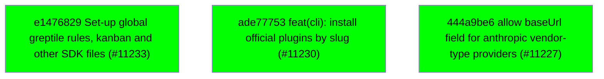

# Backport Agent — Detailed Run Report

> This file is generated automatically. It is intended for human analysts and
> AI reasoning models to assess agent performance, decision quality, and LLM behavior.

**Run timestamp**: 2026-06-03T13:11:10.094Z
**Models used**: fast=`mistral/devstral-latest`  powerful=`openai/gpt-5.5`
**Prompt log**: `/Users/rlemeill/Development/tea-ching-cline/.backport-agent/run-1780492162567.prompts.jsonl`

---

## Summary (PR body)

## Backport Agent — Sync Report

**Date**: 2026-06-03T13:11:10.094Z
**Upstream ref**: `upstream/main`
**Fork ref**: `main`
**Sync branch**: `sync/upstream-main-2026-06-03-1310`

### Summary

- ✅ Applied: 3
- ⚠️ Needs human review: 0
- ⛔ Blocked (not attempted): 0

### Applied commits

- `e1476829` [medium] Set-up global greptile rules, kanban and other SDK files (#11233)
- `ade77753` [low] feat(cli): install official plugins by slug (#11230)
- `444a9be6` [high] allow baseUrl field for anthropic vendor-type providers (#11227)

### Agent decision log

- All commits were applied successfully. No conflicts or validation failures occurred.


---

## Agent Workflow Diagram

> Generated by the fast model from the run summary. Evaluate the agent's decision path.



---

## AI Sub-Agent Call Log (1 call)

> Each entry is one sub-agent invocation. Review prompt/response pairs to assess
> reasoning quality, hallucinations, and decision accuracy.

### Call 1 / 1 — `check_customization_compatibility` ✅ OK

| Field | Value |
|---|---|
| **Timestamp** | 2026-06-03T13:10:38.808Z |
| **Tool** | `check_customization_compatibility` |
| **Model** | `mistral/devstral-latest` |
| **Duration** | 2519 ms |
| **Tokens in** | 2261 |
| **Tokens out** | 70 |
| **Cost** | $0.000000 |

**Prompt sent to sub-agent:**

```
Declared fork customisations:
  1. Pattern: sdk/packages/llms/src/providers/builtins.ts
     Description: Custom provider defaults for keypool-live deployment
     Current file content (1 file(s)):
      [sdk/packages/llms/src/providers/builtins.ts]
      import {
      	type GatewayModelCapability,
      	type GatewayModelDefinition,
      	type GatewayProviderManifest,
      	type GatewayProviderMetadata,
      	type GatewayProviderSettings,
      	getClineEnvironmentConfig,
      	type JsonValue,
      	type ProviderCapability,
      	type ProviderConfigField,
      } from "@cline/shared";
      import { getGeneratedModelsForProvider } from "../catalog/catalog.generated-access";
      import type {
      	ModelCollection,
      	ModelInfo,
      	ProviderClient,
      	ProviderProtocol,
      } from "../catalog/types";
      import { filterOpenAICodexModels } from "./openai-codex-models";
      import {
      	ANTHROPIC_AND_QWEN_CACHE_ROUTING_METADATA,
      	ANTHROPIC_ROUTING_METADATA,
      	QWEN_CACHE_ROUTING_METADATA,
      } from "./routing/anthropic-compatible";
      import { GLM_THINKING_ROUTING_METADATA } from "./routing/glm-thinking";
      
      export const DEFAULT_INTERNAL_OCA_BASE_URL =
      	"https://code-internal.aiservice.us-chicago-1.oci.oraclecloud.com/20250206/app/litellm";
      export const DEFAULT_EXTERNAL_OCA_BASE_URL =
      	"https://code.aiservice.us-chicago-1.oci.oraclecloud.com/20250206/app/litellm";
      const OPENAI_CODEX_DEFAULT_MODEL_ID = "gpt-5.4";
      
      export type ProviderFamily =
      	| "keypoollive"
      	| "openai"
      	| "openai-compatible"
      	| "anthropic"
      	| "google"
      	| "vertex"
      	| "bedrock"
      	| "mistral"
      	| "claude-code"
      	| "openai-codex"
      	| "opencode"
      	| "dify"
      	| "sap-ai-core";
      
      export interface BuiltinSpec {
      	id: string;
      	name: string;
      	description: string;
      	family: ProviderFamily;
      	protocol?: ProviderProtocol;
      	client?: ProviderClient;
      	capabilities?: ProviderCapability[];
      	popular?: number;
      	modelsProviderId?: string;
      	defaultModelId?: string;
      	modelsFactory?: () => Record<string, ModelInfo>;
      	env?: readonly ("browser" | "node")[];
      	apiKeyEnv?: readonly string[];
      	modelsSourceUrl?: string;
      	docsUrl?: string;
      	defaults?: GatewayProviderSettings;
      	configFields?: readonly ProviderConfigField[];
      	metadata?: GatewayProviderMetadata;
      }
      
      const API_KEY_FIELD: ProviderConfigField = {
      	path: "apiKey",
      	label: "API Key",
      	type: "password",
      	placeholder: "Enter API key..."

Upstream diff to evaluate:
commit 444a9be6ec12080a895926cbfcb342b5f5a21955
Author: Max <maxpaulus43@gmail.com>
Date:   Tue Jun 2 20:01:49 2026 -0700

    allow baseUrl field for anthropic vendor-type providers (#11227)
    
    Co-authored-by: Max Paulus 🥪 <max@cline.bot>
---
 sdk/packages/llms/src/providers/builtins.ts        |  2 +-
 .../llms/src/providers/vendors/anthropic.test.ts   | 70 ++++++++++++++++++++++
 .../llms/src/providers/vendors/anthropic.ts        |  1 +
 3 files changed, 72 insertions(+), 1 deletion(-)

diff --git a/sdk/packages/llms/src/providers/builtins.ts b/sdk/packages/llms/src/providers/builtins.ts
index 415925fc5..55c7d19b5 100644
--- a/sdk/packages/llms/src/providers/builtins.ts
+++ b/sdk/packages/llms/src/providers/builtins.ts
@@ -952,7 +952,7 @@ export const BUILTIN_SPECS: BuiltinSpec[] = [
 		defaultModelId: "MiniMax-M2.5",
 		apiKeyEnv: ["MINIMAX_API_KEY"],
 		modelsProviderId: "minimax",
-		defaults: { baseUrl: "https://api.minimax.io/anthropic" },
+		defaults: { baseUrl: "https://api.minimax.io/anthropic/v1" },
 		metadata: ANTHROPIC_ROUTING_METADATA,
 	},
 	{
diff --git a/sdk/packages/llms/src/providers/vendors/anthropic.test.ts b/sdk/packages/llms/src/providers/vendors/anthropic.test.ts
new file mode 100644
index 000000000..da1b19ea1
--- /dev/null
+++ b/sdk/packages/llms/src/providers/vendors/anthropic.test.ts
@@ -0,0 +1,70 @@
+import type {
+	GatewayProviderContext,
+	GatewayResolvedProviderConfig,
+} from "@cline/shared";
+import { beforeEach, describe, expect, it, vi } from "vitest";
+import { createAnthropicProviderModule } from "./anthropic";
+
+const createAnthropicMock = vi.hoisted(() => vi.fn());
+const anthropicModelMock = vi.hoisted(() =>
+	vi.fn((modelId: string) => ({ provider: "anthropic", modelId })),
+);
+
+vi.mock("@ai-sdk/anthropic", () => ({
+	createAnthropic: createAnthropicMock,
+}));
+
+describe("createAnthropicProviderModule", () => {
+	beforeEach(() => {
+		createAnthropicMock.mockReset();
+		createAnthropicMock.mockReturnValue(anthropicModelMock);
+		anthropicModelMock.mockClear();
+	});
+
+	it("passes custom base URLs to Anthropic-compatible providers", async () => {
+		const provider = await createAnthropicProviderModule(
+			config({
+				apiKey: "minimax-api-key",
+				baseUrl: "https://api.minimax.io/anthropic",
+			}),
+			context("minimax"),
+		);
+
+		provider.model("MiniMax-M2.5");
+
+		expect(createAnthropicMock).toHaveBeenCalledWith(
+			expect.objectContaining({
+				apiKey: "minimax-api-key",
+				baseURL: "https://api.minimax.io/anthropic",
+				name: "minimax",
+			}),
+		);
+		expect(anthropicModelMock).toHaveBeenCalledWith("MiniMax-M2.5");
+	});
+});
+
+function config(
+	overrides: Partial<GatewayResolvedProviderConfig>,
+): GatewayResolvedProviderConfig {
+	return {
+		providerId: "minimax",
+		...overrides,
+	};
+}
+
+function context(providerId: string): GatewayProviderContext {
+	return {
+		provider: {
+			id: providerId,
+			name: "MiniMax",
+			defaultModelId: "MiniMax-M2.5",
+			models: [],
+		},
+		model: {
+			providerId,
+			id: "MiniMax-M2.5",
+			name: "MiniMax-M2.5",
+		},
+		config: config({}),
+	};
+}
\ No newline at end of file
diff --git a/sdk/packages/llms/src/providers/vendors/anthropic.ts b/sdk/packages/llms/src/providers/vendors/anthropic.ts
index 9e8bb9236..9d11f74f9 100644
--- a/sdk/packages/llms/src/providers/vendors/anthropic.ts
+++ b/sdk/packages/llms/src/providers/vendors/anthropic.ts
@@ -13,6 +13,7 @@ export async function createAnthropicProviderModule(
 	const apiKey = await resolveApiKey(config);
 	const provider = createAnthropic({
 		apiKey,
+		baseURL: config.baseUrl,
 		headers: config.headers,
 		fetch: config.fetch,
 		name: context.provider.id,

Output the JSON object now.
```

**Response received:**

````
```json
{
  "compatible": true,
  "affectedCustomizations": [],
  "semanticConflicts": [],
  "warnings": ["touches shared types used by customised components"],
  "recommendation": "No action required; the upstream change is compatible with the fork's customisations."
}
```
````

---

## Performance Summary

**Total AI time**: 2519 ms across 1 call(s)
**Total input tokens**: 2261
**Total output tokens**: 70

| Tool | Calls | Total ms | Avg ms | Input tok | Output tok |
|---|---|---|---|---|---|
| `check_customization_compatibility` | 1 | 2519 | 2519 | 2261 | 70 |

## Decision Quality Metrics

> Automated quality signals derived from tool output guards, schema validation,
> hallucination detection, and consensus checks.  Review flagged items manually.

### Compatibility Check Quality

| Metric | Value |
|---|---|
| Total compatibility checks | 1 |
| Checks with file content enrichment | 1 |
| Incompatible results | 0 |

### Audit Event Timeline

| Timestamp | Tool | Event | Details |
|---|---|---|---|
| 13:10:38 | `check_customization_compatibility` | `compatibility_check_complete` | compatible=true, affectedCustomizations=[], semanticConflictsCount=0 |
| 13:10:43 | `reconcile_ai_assessments` | `no_contradiction` | sha="444a9be6ec12080a895926cbfcb342b5f5a2195, analyzeRecommendation="apply", compatibilityCompatible=true |
