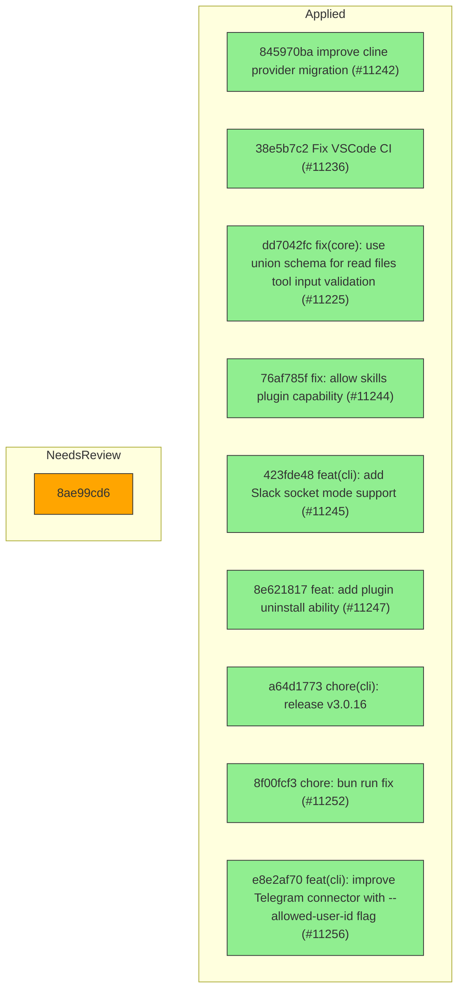

# Backport Agent — Detailed Run Report

> This file is generated automatically. It is intended for human analysts and
> AI reasoning models to assess agent performance, decision quality, and LLM behavior.

**Run timestamp**: 2026-06-04T08:19:44.541Z
**Models used**: fast=`mistral/devstral-latest`  powerful=`openai/gpt-5.5`
**Prompt log**: `/Users/rlemeill/Development/tea-ching-cline/.backport-agent/run-1780560954408.prompts.jsonl`

---

## Summary (PR body)

## Backport Agent — Sync Report

**Date**: 2026-06-04T08:19:44.541Z
**Upstream ref**: `main`
**Fork ref**: `keypool-live`
**Sync branch**: `sync/upstream-main-2026-06-04-0817`

### Summary

- ✅ Applied: 9
- ⚠️ Needs human review: 1
- ⛔ Blocked (not attempted): 0

### Applied commits

- `845970ba` [high] improve cline provider migration (#11242)
- `38e5b7c2` [high] Fix VSCode CI (#11236)
- `dd7042fc` [low] fix(core): use union schema for read files tool input validation (#11225)
- `76af785f` [low] fix: allow skills plugin capability (#11244)
- `423fde48` [high] feat(cli): add Slack socket mode support (#11245)
- `8e621817` [medium] feat: add plugin uninstall ability (#11247)
- `a64d1773` [low] chore(cli): release v3.0.16
- `8f00fcf3` [medium] chore: bun run fix (#11252)
- `e8e2af70` [high] feat(cli): improve Telegram connector with --allowed-user-id flag (#11256)

### ⚠️ Human review required

- `8ae99cd6` feat(llms,core): route custom registered handlers through the agent runtime (#11235)
  - Commit not available in the local repository

### Agent decision log

- One commit was blocked due to unavailability in the local repository.
- All other commits were successfully applied, with one conflict resolved in favor of the fork version.


---

## Agent Workflow Diagram

> Generated by the fast model from the run summary. Evaluate the agent's decision path.



---

## AI Sub-Agent Call Log (4 calls)

> Each entry is one sub-agent invocation. Review prompt/response pairs to assess
> reasoning quality, hallucinations, and decision accuracy.

### Call 1 / 4 — `analyze_commit_for_backport` ✅ OK

| Field | Value |
|---|---|
| **Timestamp** | 2026-06-04T08:17:10.946Z |
| **Tool** | `analyze_commit_for_backport` |
| **Model** | `mistral/devstral-latest` |
| **Duration** | 2633 ms |
| **Tokens in** | 772 |
| **Tokens out** | 196 |
| **Cost** | $0.000000 |

**Prompt sent to sub-agent:**

```
Commit SHA: 423fde4828d3ee429e6747da4c362d87aa01d81e
Commit message:
feat(cli): add Slack socket mode support (#11245)

Changed files (14):
README.md
apps/cli/README.md
apps/cli/src/connectors/adapters/slack.test.ts
apps/cli/src/connectors/adapters/slack.ts
apps/cli/src/connectors/catalog.ts
apps/cli/src/connectors/status.ts
apps/cli/src/wizards/connect/index.ts
apps/cli/src/wizards/connect/platforms.test.ts
apps/cli/src/wizards/connect/platforms.ts
apps/cline-hub/src/server/connectors.ts
apps/cline-hub/src/webview-protocol.ts
apps/cline-hub/src/webview/src/components/views/settings/channels-view.tsx
docs/cli/connectors.mdx
sdk/packages/shared/src/connectors/options.ts

Diff:
commit 423fde4828d3ee429e6747da4c362d87aa01d81e
Author: Bee <68532117+abeatrix@users.noreply.github.com>
Date:   Wed Jun 3 12:00:57 2026 -0700

    feat(cli): add Slack socket mode support (#11245)
    
    * feat(cli): add Slack socket mode support
    
    Add socket mode as an alternative to webhook mode for Slack
    connector, allowing connections without a public URL.
    
    - Introduce `--connection` flag to select webhook or socket mode
    - Add `--app-token` option for socket mode authentication
    - Make signing secret and base URL conditional on webhook mode
    - Add `parseSlackConnectionMode` with validation and tests
    - Update CLI platform definition to support hybrid connection type
    - Update README docs with socket mode usage examples
    
    * use base-url and remove connection flag
    
    * isSocketMode

Output the JSON object now.
```

**Response received:**

````
```json
{
  "summary": "This commit adds Slack socket mode support to the CLI, providing an alternative to webhook mode for Slack connections. It introduces new flags and options for socket mode authentication, updates platform definitions, and includes documentation and test updates.",
  "keyChanges": [
    "Introduces `--app-token` option for socket mode authentication",
    "Makes signing secret and base URL conditional on webhook mode",
    "Adds `parseSlackConnectionMode` with validation and tests",
    "Updates CLI platform definition to support hybrid connection type",
    "Updates README and documentation with socket mode usage examples"
  ],
  "backportComplexity": "moderate",
  "semanticRiskFactors": [
    "Introduces new CLI flags and options that may conflict with custom fork implementations",
    "Changes to platform definitions and connection handling logic"
  ],
  "recommendation": "review-required"
}
```
````

---

### Call 2 / 4 — `analyze_commit_for_backport` ✅ OK

| Field | Value |
|---|---|
| **Timestamp** | 2026-06-04T08:17:14.345Z |
| **Tool** | `analyze_commit_for_backport` |
| **Model** | `mistral/devstral-latest` |
| **Duration** | 3397 ms |
| **Tokens in** | 611 |
| **Tokens out** | 206 |
| **Cost** | $0.000000 |

**Prompt sent to sub-agent:**

```
Commit SHA: e8e2af705dbcbbe57dde707128d7efac9ff70991
Commit message:
feat(cli): improve Telegram connector with --allowed-user-id flag (#11256)

Changed files (9):
apps/cli/src/connectors/adapters/telegram.md
apps/cli/src/connectors/adapters/telegram.test.ts
apps/cli/src/connectors/adapters/telegram.ts
apps/cli/src/wizards/connect/index.ts
apps/cli/src/wizards/connect/platforms.test.ts
apps/cli/src/wizards/connect/platforms.ts
apps/cline-hub/src/server/connectors.ts
docs/cli/connectors.mdx
docs/cli/samples/supply-chain-alerts.mdx

Diff:
commit e8e2af705dbcbbe57dde707128d7efac9ff70991
Author: Saoud Rizwan <7799382+saoudrizwan@users.noreply.github.com>
Date:   Wed Jun 3 17:50:07 2026 -0700

    feat(cli): improve Telegram connector with --allowed-user-id flag (#11256)
    
    * feat(cli): add Telegram allowed user id flag
    
    * fix(cli): tighten connector authorization hooks

Output the JSON object now.
```

**Response received:**

````
```json
{
  "summary": "This commit adds a new `--allowed-user-id` flag to the Telegram connector in the CLI, enhancing security by restricting which Telegram user IDs can interact with the connector. It includes updates to the connector implementation, tests, documentation, and related wizard flows.",
  "keyChanges": [
    "Added `--allowed-user-id` flag to the Telegram connector configuration.",
    "Updated the Telegram connector adapter to enforce user ID restrictions.",
    "Modified the CLI wizard flow to include the new flag in the setup process.",
    "Added tests to verify the new authorization logic.",
    "Updated documentation to reflect the new flag and its usage."
  ],
  "backportComplexity": "moderate",
  "semanticRiskFactors": [
    "Introduces new authorization logic that may conflict with custom authentication flows in the fork.",
    "Changes to the CLI wizard flow could interact with customised setup processes."
  ],
  "recommendation": "apply-with-care"
}
```
````

---

### Call 3 / 4 — `check_customization_compatibility` ✅ OK

| Field | Value |
|---|---|
| **Timestamp** | 2026-06-04T08:17:23.921Z |
| **Tool** | `check_customization_compatibility` |
| **Model** | `mistral/devstral-latest` |
| **Duration** | 1548 ms |
| **Tokens in** | 553 |
| **Tokens out** | 61 |
| **Cost** | $0.000000 |

**Prompt sent to sub-agent:**

```
Declared fork customisations:
  1. Pattern: sctg-documentation
     Description: Custom documentation for the fork

Upstream diff to evaluate:
commit 423fde4828d3ee429e6747da4c362d87aa01d81e
Author: Bee <68532117+abeatrix@users.noreply.github.com>
Date:   Wed Jun 3 12:00:57 2026 -0700

    feat(cli): add Slack socket mode support (#11245)
    
    * feat(cli): add Slack socket mode support
    
    Add socket mode as an alternative to webhook mode for Slack
    connector, allowing connections without a public URL.
    
    - Introduce `--connection` flag to select webhook or socket mode
    - Add `--app-token` option for socket mode authentication
    - Make signing secret and base URL conditional on webhook mode
    - Add `parseSlackConnectionMode` with validation and tests
    - Update CLI platform definition to support hybrid connection type
    - Update README docs with socket mode usage examples
    
    * use base-url and remove connection flag
    
    * isSocketMode

Output the JSON object now.
```

**Response received:**

````
```json
{
  "compatible": true,
  "affectedCustomizations": [],
  "semanticConflicts": [],
  "warnings": [],
  "recommendation": "The upstream change is compatible with the fork's customisations and can be safely merged."
}
```
````

---

### Call 4 / 4 — `check_customization_compatibility` ✅ OK

| Field | Value |
|---|---|
| **Timestamp** | 2026-06-04T08:17:24.889Z |
| **Tool** | `check_customization_compatibility` |
| **Model** | `mistral/devstral-latest` |
| **Duration** | 965 ms |
| **Tokens in** | 438 |
| **Tokens out** | 61 |
| **Cost** | $0.000000 |

**Prompt sent to sub-agent:**

```
Declared fork customisations:
  1. Pattern: sctg-documentation
     Description: Custom documentation for the fork

Upstream diff to evaluate:
commit e8e2af705dbcbbe57dde707128d7efac9ff70991
Author: Saoud Rizwan <7799382+saoudrizwan@users.noreply.github.com>
Date:   Wed Jun 3 17:50:07 2026 -0700

    feat(cli): improve Telegram connector with --allowed-user-id flag (#11256)
    
    * feat(cli): add Telegram allowed user id flag
    
    * fix(cli): tighten connector authorization hooks

Output the JSON object now.
```

**Response received:**

````
```json
{
  "compatible": true,
  "affectedCustomizations": [],
  "semanticConflicts": [],
  "warnings": [],
  "recommendation": "The upstream change is safe to merge as it does not affect the declared customisations."
}
```
````

---

## Performance Summary

**Total AI time**: 8543 ms across 4 call(s)
**Total input tokens**: 2374
**Total output tokens**: 524

| Tool | Calls | Total ms | Avg ms | Input tok | Output tok |
|---|---|---|---|---|---|
| `analyze_commit_for_backport` | 2 | 6030 | 3015 | 1383 | 402 |
| `check_customization_compatibility` | 2 | 2513 | 1257 | 991 | 122 |

## Decision Quality Metrics

> Automated quality signals derived from tool output guards, schema validation,
> hallucination detection, and consensus checks.  Review flagged items manually.

### Commit Analysis Quality

| Metric | Value |
|---|---|
| Total analyze calls | 2 |
| Commits with semantic risk factors | 2 |
| Possible hallucinated references (total) | 0 |

### Compatibility Check Quality

| Metric | Value |
|---|---|
| Total compatibility checks | 2 |
| Checks with file content enrichment | 2 |
| Incompatible results | 0 |

### Audit Event Timeline

| Timestamp | Tool | Event | Details |
|---|---|---|---|
| 08:17:10 | `analyze_commit_for_backport` | `analysis_complete` | sha="423fde4828d3ee429e6747da4c362d87aa01d81, recommendation="review-required", complexity="moderate" |
| 08:17:14 | `analyze_commit_for_backport` | `analysis_complete` | sha="e8e2af705dbcbbe57dde707128d7efac9ff7099, recommendation="apply-with-care", complexity="moderate" |
| 08:17:23 | `check_customization_compatibility` | `compatibility_check_complete` | compatible=true, affectedCustomizations=[], semanticConflictsCount=0 |
| 08:17:24 | `check_customization_compatibility` | `compatibility_check_complete` | compatible=true, affectedCustomizations=[], semanticConflictsCount=0 |
