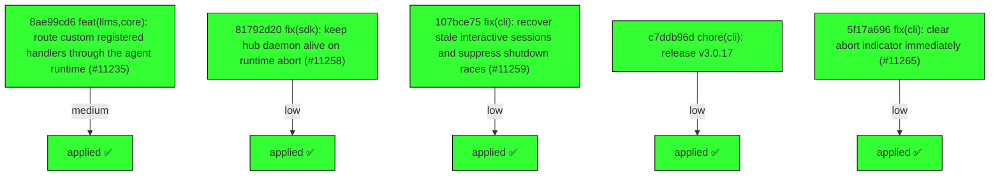

# Backport Agent — Detailed Run Report

> This file is generated automatically. It is intended for human analysts and
> AI reasoning models to assess agent performance, decision quality, and LLM behavior.

**Run timestamp**: 2026-06-04T08:45:29.368Z
**Models used**: fast=`mistral/devstral-latest`  powerful=`openai/gpt-5.5`
**Prompt log**: `/Users/rlemeill/Development/tea-ching-cline/.backport-agent/run-1780562594485.prompts.jsonl`

---

## Summary (PR body)

## Backport Agent — Sync Report

**Date**: 2026-06-04T08:45:29.368Z
**Upstream ref**: `upstream/main`
**Fork ref**: `keypool-live`
**Sync branch**: `sync/upstream-main-2026-06-04-0844`

### Summary

- ✅ Applied: 5
- ⚠️ Needs human review: 0
- ⛔ Blocked (not attempted): 0

### Applied commits

- `8ae99cd6` [medium] feat(llms,core): route custom registered handlers through the agent runtime (#11235)
- `81792d20` [low] fix(sdk): keep hub daemon alive on runtime abort (#11258)
- `107bce75` [low] fix(cli): recover stale interactive sessions and suppress shutdown races (#11259)
- `c7ddb96d` [low] chore(cli): release v3.0.17
- `5f17a696` [low] fix(cli): clear abort indicator immediately (#11265)

### Agent decision log

- All commits were successfully cherry-picked without conflicts.
- Validation failed due to command not being in the allowed list.


---

## Agent Workflow Diagram

> Generated by the fast model from the run summary. Evaluate the agent's decision path.



---

## AI Sub-Agent Call Log (1 call)

> Each entry is one sub-agent invocation. Review prompt/response pairs to assess
> reasoning quality, hallucinations, and decision accuracy.

### Call 1 / 1 — `analyze_commit_for_backport` ✅ OK

| Field | Value |
|---|---|
| **Timestamp** | 2026-06-04T08:44:09.803Z |
| **Tool** | `analyze_commit_for_backport` |
| **Model** | `mistral/devstral-latest` |
| **Duration** | 6005 ms |
| **Tokens in** | 7398 |
| **Tokens out** | 312 |
| **Cost** | $0.000000 |

**Prompt sent to sub-agent:**

```
Commit SHA: 8ae99cd69f9810c5adf847821bea5f19b9ecb284
Commit message:
feat(llms,core): route custom registered handlers through the agent runtime (#11235)
    
    * feat(llms,core): route custom registered handlers through the agent runtime
    
    Expose the handler-registry helpers (hasRegisteredHandler, getRegisteredHandler,
    getRegisteredHandlerAsync, isRegisteredHandlerAsync) from @cline/llms, and have
    core's createAgentModelFromConfig consult the registry: when a handler is
    registered for a provider, build it via createHandler and adapt its ApiHandler
    surface onto the AgentModel contract (the inverse of the gateway's
    toApiStreamChunk).
    
    This lets hosts register provider handlers that need host-only dependencies
    (e.g. a vscode.lm-backed handler) and have them used by the main agent loop,
    not just standalone createHandler callers.
    
    * fix(core): resolve registered handlers lazily and avoid double finish
    
    Address review feedback:
    - createAgentModelFromConfig built the handler eagerly with the sync
      createHandler, which throws for providers registered via registerAsyncHandler.
      The adapter now accepts a handler factory and resolves it on the first stream
      via createHandlerAsync, supporting both sync- and async-registered handlers.
    - Guard the adapter's catch-block finish with sawFinish so a handler that emits
      an explicit done chunk and then throws does not produce two finish events.
    
    * fix(core): preserve thought signatures and finish-reason semantics in adapter
    
    Further review feedback on the ApiHandler -> AgentModel adapter:
    - Reasoning and tool-call thought signatures are now surfaced under
      metadata.thoughtSignature (the key downstream adapters read), instead of being
      stored as metadata.signature / dropped.
    - A done chunk whose incompleteReason indicates max output tokens now maps to
      finish{reason:"max-tokens"} rather than "stop".
    - A turn that ends with tool calls (no explicit done) now terminates as
      finish{reason:"tool-calls"}, matching the gateway/AI-SDK adapters.
    
    * Apply remaining changes
    
    * fix(core): report lazy handler-factory rejection as a finish(error) event
    
    The lazy handler resolution (await source()) ran outside the adapter's
    try/catch, so a rejecting factory (e.g. when the host API is unavailable at
    stream time) escaped as a raw generator exception instead of a terminal
    finish{reason:"error"} event. Move the resolution inside the try block so all
    failure paths converge on the same terminal finish.

Changed files (6):
sdk/packages/core/src/services/llms/apihandler-agent-model-adapter.test.ts
sdk/packages/core/src/services/llms/apihandler-agent-model-adapter.ts
sdk/packages/core/src/services/llms/handler-factory.test.ts
sdk/packages/core/src/services/llms/handler-factory.ts
sdk/packages/llms/src/index.ts
sdk/packages/llms/src/providers.ts

Diff:
commit 8ae99cd69f9810c5adf847821bea5f19b9ecb284
Author: Dominic Cooney <dominic.cooney@cline.bot>
Date:   Thu Jun 4 01:40:59 2026 +0900

    feat(llms,core): route custom registered handlers through the agent runtime (#11235)
    
    * feat(llms,core): route custom registered handlers through the agent runtime
    
    Expose the handler-registry helpers (hasRegisteredHandler, getRegisteredHandler,
    getRegisteredHandlerAsync, isRegisteredHandlerAsync) from @cline/llms, and have
    core's createAgentModelFromConfig consult the registry: when a handler is
    registered for a provider, build it via createHandler and adapt its ApiHandler
    surface onto the AgentModel contract (the inverse of the gateway's
    toApiStreamChunk).
    
    This lets hosts register provider handlers that need host-only dependencies
    (e.g. a vscode.lm-backed handler) and have them used by the main agent loop,
    not just standalone createHandler callers.
    
    * fix(core): resolve registered handlers lazily and avoid double finish
    
    Address review feedback:
    - createAgentModelFromConfig built the handler eagerly with the sync
      createHandler, which throws for providers registered via registerAsyncHandler.
      The adapter now accepts a handler factory and resolves it on the first stream
      via createHandlerAsync, supporting both sync- and async-registered handlers.
    - Guard the adapter's catch-block finish with sawFinish so a handler that emits
      an explicit done chunk and then throws does not produce two finish events.
    
    * fix(core): preserve thought signatures and finish-reason semantics in adapter
    
    Further review feedback on the ApiHandler -> AgentModel adapter:
    - Reasoning and tool-call thought signatures are now surfaced under
      metadata.thoughtSignature (the key downstream adapters read), instead of being
      stored as metadata.signature / dropped.
    - A done chunk whose incompleteReason indicates max output tokens now maps to
      finish{reason:"max-tokens"} rather than "stop".
    - A turn that ends with tool calls (no explicit done) now terminates as
      finish{reason:"tool-calls"}, matching the gateway/AI-SDK adapters.
    
    * Apply remaining changes
    
    * fix(core): report lazy handler-factory rejection as a finish(error) event
    
    The lazy handler resolution (await source()) ran outside the adapter's
    try/catch, so a rejecting factory (e.g. when the host API is unavailable at
    stream time) escaped as a raw generator exception instead of a terminal
    finish{reason:"error"} event. Move the resolution inside the try block so all
    failure paths converge on the same terminal finish.
    
    ---------
    
    Co-authored-by: copilot-swe-agent[bot] <198982749+Copilot@users.noreply.github.com>
---
 .../llms/apihandler-agent-model-adapter.test.ts    | 229 +++++++++++++++++++++
 .../llms/apihandler-agent-model-adapter.ts         | 170 +++++++++++++++
 .../core/src/services/llms/handler-factory.test.ts |  53 +++++
 .../core/src/services/llms/handler-factory.ts      |  26 ++-
 sdk/packages/llms/src/index.ts                     |   4 +
 sdk/packages/llms/src/providers.ts                 |   4 +
 6 files changed, 485 insertions(+), 1 deletion(-)

diff --git a/sdk/packages/core/src/services/llms/apihandler-agent-model-adapter.test.ts b/sdk/packages/core/src/services/llms/apihandler-agent-model-adapter.test.ts
new file mode 100644
index 000000000..449f351d2
--- /dev/null
+++ b/sdk/packages/core/src/services/llms/apihandler-agent-model-adapter.test.ts
@@ -0,0 +1,229 @@
+import type {
+	ApiHandler,
+	ApiStreamChunk,
+	HandlerModelInfo,
+	Message,
+} from "@cline/llms";
+import type { AgentModelEvent, AgentModelRequest } from "@cline/shared";
+import { describe, expect, it, vi } from "vitest";
+import { createAgentModelFromApiHandler } from "./apihandler-agent-model-adapter";
+
+function fakeHandler(
+	chunks: ApiStreamChunk[],
+	opts?: { throwAfter?: number },
+): ApiHandler & { aborts: (AbortSignal | undefined)[] } {
+	const aborts: (AbortSignal | undefined)[] = [];
+	return {
+		aborts,
+		getMessages: () => [],
+		getModel: (): HandlerModelInfo => ({ id: "m", info: { id: "m" } }),
+		setAbortSignal(signal) {
+			aborts.push(signal);
+		},
+		// eslint-disable-next-line require-yield
+		async *createMessage(
+			_system: string,
+			_messages: Message[],
+		): AsyncGenerator<ApiStreamChunk> {
+			let i = 0;
+			for (const chunk of chunks) {
+				if (opts?.throwAfter !== undefined && i === opts.throwAfter) {
+					throw new Error("boom");
+				}
+				yield chunk;
+				i++;
+			}
+		},
+	};
+}
+
+async function collect(
+	stream:
+		| AsyncIterable<AgentModelEvent>
+		| Promise<AsyncIterable<AgentModelEvent>>,
+): Promise<AgentModelEvent[]> {
+	const out: AgentModelEvent[] = [];
+	for await (const event of await stream) {
+		out.push(event);
+	}
+	return out;
+}
+
+const baseRequest: AgentModelRequest = {
+	systemPrompt: "sys",
+	messages: [
+		{
+			id: "1",
+			role: "user",
+			content: [{ type: "text", text: "hi" }],
+			createdAt: 0,
+		},
+	],
+	tools: [],
+};
+
+describe("createAgentModelFromApiHandler", () => {
+	it("maps text + usage chunks to events and appends a finish", async () => {
+		const handler = fakeHandler([
+			{ type: "text", text: "hello", id: "x" },
+			{
+				type: "usage",
+				inputTokens: 10,
+				outputTokens: 5,
+				totalCost: 0.01,
+				id: "x",
+			},
+		]);
+		const model = createAgentModelFromApiHandler(handler);
+		const events = await collect(model.stream(baseRequest));
+
+		expect(events).toEqual([
+			{ type: "text-delta", text: "hello" },
+			{
+				type: "usage",
+				usage: {
+					inputTokens: 10,
+					outputTokens: 5,
+					cacheReadTokens: undefined,
+					cacheWriteTokens: undefined,
+					totalCost: 0.01,
+				},
+			},
+			{ type: "finish", reason: "stop" },
+		]);
+	});
+
+	it("maps tool_calls (object args) to a tool-call-delta event", async () => {
+		const handler = fakeHandler([
+			{
+				type: "tool_calls",
+				id: "x",
+				tool_call: {
+					call_id: "c1",
+					function: { id: "c1", name: "edit", arguments: { path: "a.ts" } },
+				},
+			},
+		]);
+		const model = createAgentModelFromApiHandler(handler);
+		const events = await collect(model.stream(baseRequest));
+
+		expect(events[0]).toEqual({
+			type: "tool-call-delta",
+			toolCallId: "c1",
+			toolName: "edit",
+			inputText: undefined,
+			input: { path: "a.ts" },
+		});
+		// A turn that ends with tool calls terminates as tool-calls, not stop.
+		expect(events.at(-1)).toEqual({ type: "finish", reason: "tool-calls" });
+	});
+
+	it("preserves the thought signature on reasoning and tool-call events", async () => {
+		const handler = fakeHandler([
+			{ type: "reasoning", reasoning: "think", signature: "sig-r", id: "x" },
+			{
+				type: "tool_calls",
+				id: "x",
+				signature: "sig-t",
+				tool_call: { call_id: "c1", function: { name: "edit", arguments: {} } },
+			},
+		]);
+		const model = createAgentModelFromApiHandler(handler);
+		const events = await collect(model.stream(baseRequest));
+
+		const reasoning = events.find((e) => e.type === "reasoning-delta");
+		expect(reasoning?.metadata).toMatchObject({ thoughtSignature: "sig-r" });
+		const toolCall = events.find((e) => e.type === "tool-call-delta");
+		expect(toolCall?.metadata).toMatchObject({ thoughtSignature: "sig-t" });
+	});
+
+	it("maps a done chunk with a max-output-tokens incompleteReason to max-tokens", async () => {
+		const handler = fakeHandler([
+			{
+				type: "done",
+				success: true,
+				incompleteReason: "max_output_tokens",
+				id: "x",
+			},
+		]);
+		const model = createAgentModelFromApiHandler(handler);
+		const events = await collect(model.stream(baseRequest));
+		expect(events.at(-1)).toMatchObject({
+			type: "finish",
+			reason: "max-tokens",
+		});
+	});
+
+	it("does not append a finish when the handler emits a done chunk", async () => {
+		const handler = fakeHandler([
+			{ type: "text", text: "x", id: "x" },
+			{ type: "done", success: true, id: "x" },
+		]);
+		const model = createAgentModelFromApiHandler(handler);
+		const events = await collect(model.stream(baseRequest));
+
+		const finishes = events.filter((e) => e.type === "finish");
+		expect(finishes).toHaveLength(1);
+		expect(finishes[0]).toEqual({
+			type: "finish",
+			reason: "stop",
+			error: undefined,
+		});
+	});
+
+	it("forwards the abort signal to the handler", async () => {
+		const handler = fakeHandler([{ type: "text", text: "x", id: "x" }]);
+		const controller = new AbortController();
+		const model = createAgentModelFromApiHandler(handler);
+		await collect(model.stream({ ...baseRequest, signal: controller.signal }));
+		expect(handler.aborts[0]).toBe(controller.signal);
+	});
+
+	it("emits a finish(error) when the handler throws", async () => {
+		const handler = fakeHandler([{ type: "text", text: "x", id: "x" }], {
+			throwAfter: 0,
+		});
+		const model = createAgentModelFromApiHandler(handler);
+		const events = await collect(model.stream(baseRequest));
+		expect(events.at(-1)).toMatchObject({
+			type: "finish",
+			reason: "error",
+			error: "boom",
+		});
+	});
+
+	it("does not emit a second finish when the handler throws after a done chunk", async () => {
+		// done -> finish, then the handler throws while flushing.
+		const handler = fakeHandler([{ type: "done", success: true, id: "x" }], {
+			throwAfter: 1,
+		});
+		const model = createAgentModelFromApiHandler(handler);
+		const events = await collect(model.stream(baseRequest));
+		const finishes = events.filter((e) => e.type === "finish");
+		expect(finishes).toHaveLength(1);
+		expect(finishes[0]).toMatchObject({ type: "finish", reason: "stop" });
+	});
+
+	it("resolves the handler lazily from an async factory on stream", async () => {
+		const handler = fakeHandler([{ type: "text", text: "lazy", id: "x" }]);
+		const factory = vi.fn(async () => handler);
+		const model = createAgentModelFromApiHandler(factory);
+
+		// Not built until the stream is consumed.
+		expect(factory).not.toHaveBeenCalled();
+		const events = await collect(model.stream(baseRequest));
+		expect(factory).toHaveBeenCalledTimes(1);
+		expect(events[0]).toEqual({ type: "text-delta", text: "lazy" });
+	});
+
+	it("converts a rejecting handler factory into a finish(error) event", async () => {
+		const factory = vi.fn(async () => {
+			throw new Error("no vscode.lm");
+		});
+		const model = createAgentModelFromApiHandler(factory);
+		const events = await collect(model.stream(baseRequest));
+		expect(events).toEqual([
+			{ type: "finish", reason: "error", error: "no vscode.lm" },
+		]);
+	});
+});
diff --git a/sdk/packages/core/src/services/llms/apihandler-agent-model-adapter.ts b/sdk/packages/core/src/services/llms/apihandler-agent-model-adapter.ts
new file mode 100644
index 000000000..81ff89ecc
--- /dev/null
+++ b/sdk/packages/core/src/services/llms/apihandler-agent-model-adapter.ts
@@ -0,0 +1,170 @@
+/**
+ * Adapter: wrap a custom `ApiHandler` (from the `@cline/llms` handler registry)
+ * as an `AgentModel` for the agent runtime.
+ *
+ * The agent runtime builds models via `createAgentModelFromConfig`, which goes
+ * straight to the gateway. Hosts can register provider handlers that need
+ * host-only dependencies (e.g. the VS Code `vscode.lm` API) via
+ * `registerHandler(providerId, factory)`. Those produce an `ApiHandler`
+ * (`createMessage` -> `ApiStreamChunk`), which this adapter converts into the
+ * `AgentModel` contract (`stream` -> `AgentModelEvent`).
+ *
+ * This is the inverse of the gateway's `toApiStreamChunk` in
+ * `@cline/llms` `compat.ts`.
+ */
+
+import type { ApiHandler, ApiStreamChunk } from "@cline/llms";
+import type {
+	AgentModel,
+	AgentModelEvent,
+	AgentModelFinishReason,
+	AgentModelRequest,
+} from "@cline/shared";
+import { agentMessagesToMessages } from "../../runtime/config/agent-message-codec";
+
+type ApiStreamDoneChunk = Extract<ApiStreamChunk, { type: "done" }>;
+
+function toAgentModelEvents(chunk: ApiStreamChunk): AgentModelEvent[] {
+	switch (chunk.type) {
+		case "text":
+			return [{ type: "text-delta", text: chunk.text }];
+		case "reasoning":
+			// Thought signatures are read as `metadata.thoughtSignature` by
+			// downstream adapters (see ai-sdk format), so surface it there.
+			return [
+				{
+					type: "reasoning-delta",
+					text: chunk.reasoning,
+					metadata: chunk.signature
+						? { thoughtSignature: chunk.signature, details: chunk.details }
+						: { details: chunk.details },
+				},
+			];
+		case "tool_calls": {
+			const fn = chunk.tool_call.function;
+			const args = fn.arguments;
+			return [
+				{
+					type: "tool-call-delta",
+					toolCallId: chunk.tool_call.call_id ?? fn.id,
+					toolName: fn.name,
+					inputText: typeof args === "string" ? args : undefined,
+					input: typeof args === "string" ? undefined : args,
+					// Preserve the thought signature so it isn't dropped downstream.
+					...(chunk.signature
+						? { metadata: { thoughtSignature: chunk.signature } }
+						: {}),
+				},
+			];
+		}
+		case "usage":
+			return [
+				{
+					type: "usage",
+					usage: {
+						inputTokens: chunk.inputTokens,
+						outputTokens: chunk.outputTokens,
+						cacheReadTokens: chunk.cacheReadTokens,
+						cacheWriteTokens: chunk.cacheWriteTokens,
+						totalCost: chunk.totalCost,
+					},
+				},
+			];
+		case "done":
+			// `createMessage` streams typically end by returning; a "done" chunk is
+			// optional. Map it to a finish event so the runtime sees a terminal
+			// signal even when the handler emits one explicitly.
+			return [
+				{
+					type: "finish",
+					reason: doneFinishReason(chunk),
+					error: chunk.error,
+				},
+			];
+		default:
+			return [];
+	}
+}
+
+function doneFinishReason(chunk: ApiStreamDoneChunk): AgentModelFinishReason {
+	if (chunk.success === false) {
+		return "error";
+	}
+	if (
+		chunk.incompleteReason === "max_output_tokens" ||
+		chunk.incompleteReason === "max-tokens"
+	) {
+		return "max-tokens";
+	}
+	return "stop";
+}
+
+/**
+ * Resolves the `ApiHandler` to delegate to. A function is supported (and may be
+ * async) so handler construction can be deferred to the first `stream` call —
+ * which is required for providers registered via `registerAsyncHandler`.
+ */
+export type ApiHandlerSource =
+	| ApiHandler
+	| (() => ApiHandler | Promise<ApiHandler>);
+
+/**
+ * Build an `AgentModel` that delegates to a registered `ApiHandler`.
+ */
+export function createAgentModelFromApiHandler(
+	source: ApiHandlerSource,
+): AgentModel {
+	return {
+		async *stream(request: AgentModelRequest): AsyncGenerator<AgentModelEvent> {
+			let sawFinish = false;
+			let sawToolCall = false;
+			try {
+				// Resolving the handler (e.g. `createHandlerAsync`) can reject — for
+				// instance when the host API is unavailable at stream time — so it
+				// happens inside the try block to be reported as a terminal finish.
+				const handler = typeof source === "function" ? await source() : source;
+
+				// Forward the abort signal so cancellation reaches the handler.
+				handler.setAbortSignal?.(request.signal);
+
+				const messages = agentMessagesToMessages(request.messages);
+				const tools = request.tools.map((tool) => ({
+					name: tool.name,
+					description: tool.description,
+					inputSchema: tool.inputSchema,
+				}));
+
+				for await (const chunk of handler.createMessage(
+					request.systemPrompt ?? "",
+					messages,
+					tools,
+				)) {
+					for (const event of toAgentModelEvents(chunk)) {
+						if (event.type === "finish") {
+							sawFinish = true;
+						} else if (event.type === "tool-call-delta") {
+							sawToolCall = true;
+						}
+						yield event;
+					}
+				}
+				if (!sawFinish) {
+					// Terminating with tool calls is a tool-calls turn (matching the
+					// gateway/AI-SDK adapters); otherwise a normal stop.
+					yield {
+						type: "finish",
+						reason: sawToolCall ? "tool-calls" : "stop",
+					};
+				}
+			} catch (error) {
+				if (!sawFinish) {
+					yield {
+						type: "finish",
+						reason: request.signal?.aborted ? "aborted" : "error",
+						error: error instanceof Error ? error.message : String(error),
+					};
+				}
+			}
+		},
+	};
+}
diff --git a/sdk/packages/core/src/services/llms/handler-factory.test.ts b/sdk/packages/core/src/services/llms/handler-factory.test.ts
index 4c02121ee..84298f492 100644
--- a/sdk/packages/core/src/services/llms/handler-factory.test.ts
+++ b/sdk/packages/core/src/services/llms/handler-factory.test.ts
@@ -6,12 +6,19 @@ const gatewayMock = vi.hoisted(() => {
 	return {
 		createAgentModel,
 		createGateway: vi.fn(() => ({ createAgentModel })),
+		// Registry helpers used by createAgentModelFromConfig. Default to "no
+		// registered handler" so existing tests exercise the gateway path.
+		hasRegisteredHandler: vi.fn(() => false),
+		createHandlerAsync: vi.fn(),
 	};\n });\n 
 vi.mock("@cline/llms", () => ({
 	createGateway: gatewayMock.createGateway,
 	MODEL_COLLECTIONS_BY_PROVIDER_ID: {},
+	hasRegisteredHandler: gatewayMock.hasRegisteredHandler,
+	createHandlerAsync: gatewayMock.createHandlerAsync,
+	normalizeProviderId: (id: string) => id,
 }));
 
 describe("createAgentModelFromConfig", () => {
@@ -21,6 +28,9 @@ describe("createAgentModelFromConfig", () => {
 		gatewayMock.createGateway.mockImplementation(() => ({
 			createAgentModel: gatewayMock.createAgentModel,
 		}));
+		gatewayMock.hasRegisteredHandler.mockReset();
+		gatewayMock.hasRegisteredHandler.mockReturnValue(false);
+		gatewayMock.createHandlerAsync.mockReset();
 	});
 
 	it("forwards effective telemetry into the gateway", async () => {
@@ -232,4 +242,47 @@ describe("createAgentModelFromConfig", () => {
 			}),
 		);
 	});
+
+	it("uses a registered handler (adapter) instead of the gateway, building it lazily", async () => {
+		const { createAgentModelFromConfig } = await import("./handler-factory");
+
+		// Pretend a host handler is registered for this provider.
+		gatewayMock.hasRegisteredHandler.mockReturnValue(true);
+		const apiHandler = {
+			getMessages: () => [],
+			getModel: () => ({ id: "vscode-lm", info: { id: "vscode-lm" } }),
+			// eslint-disable-next-line require-yield
+			async *createMessage() {
+				/* no chunks for this assertion */
+			},
+		};
+		// createHandlerAsync resolves both sync- and async-registered handlers.
+		gatewayMock.createHandlerAsync.mockResolvedValue(apiHandler);
+
+		const result = createAgentModelFromConfig(
+			{
+				providerId: "vscode-lm",
+				modelId: "copilot/claude-sonnet",
+				apiKey: "",
+				systemPrompt: "",
+				tools: [],
+			},
+			undefined,
+		);
+
+		// The gateway is not used, and the AgentModel surface is exposed.
+		expect(gatewayMock.createGateway).not.toHaveBeenCalled();
+		expect(typeof result.stream).toBe("function");
+
+		// The handler is resolved lazily — only once the stream is consumed.
+		expect(gatewayMock.createHandlerAsync).not.toHaveBeenCalled();
+		for await (const _ of await result.stream({
+			systemPrompt: "",
+			messages: [],
+			tools: [],
+		})) {
+			// drain
+		}
+		expect(gatewayMock.createHandlerAsync).toHaveBeenCalledTimes(1);
+	});
 });
diff --git a/sdk/packages/core/src/services/llms/handler-factory.ts b/sdk/packages/core/src/services/llms/handler-factory.ts
index 0945a6a21..84cfcb531 100644
--- a/sdk/packages/core/src/services/llms/handler-factory.ts
+++ b/sdk/packages/core/src/services/llms/handler-factory.ts
@@ -1,4 +1,10 @@
-import { createGateway, MODEL_COLLECTIONS_BY_PROVIDER_ID } from "@cline/llms";
+import {
+	createGateway,
+	createHandlerAsync,
+	hasRegisteredHandler,
+	MODEL_COLLECTIONS_BY_PROVIDER_ID,
+	normalizeProviderId,
+} from "@cline/llms";
 import type {
 	AgentConfig,
 	AgentModel,
@@ -7,6 +13,7 @@ import type {
 	ITelemetryService,
 	ModelInfo,
 } from "@cline/shared";
+import { createAgentModelFromApiHandler } from "./apihandler-agent-model-adapter";
 import type { ProviderConfig } from "./provider-settings";
 
 function compactOptions(
@@ -145,6 +152,23 @@ export function createAgentModelFromConfig(
 		logger,
 		extensionContext: config.extensionContext,
 	};
+
+	// Host-registered custom handlers (e.g. VS Code LM, which needs the host's
+	// `vscode.lm` API) are not part of the gateway. When a handler is registered
+	// for this provider, adapt its `ApiHandler` surface onto the `AgentModel`
+	// contract the runtime expects. The handler is built lazily (via
+	// `createHandlerAsync`) on the first stream so that providers registered
+	// with `registerAsyncHandler` resolve correctly.
+	if (
+		hasRegisteredHandler(
+			normalizeProviderId(normalizedProviderConfig.providerId),
+		)
+	) {
+		return createAgentModelFromApiHandler(() =>
+			createHandlerAsync(normalizedProviderConfig),
+		);
+	}
+
 	return createGateway({
 		providerConfigs: [
 			{
diff --git a/sdk/packages/llms/src/index.ts b/sdk/packages/llms/src/index.ts
index 8ea117e3a..dbe57bbef 100644
--- a/sdk/packages/llms/src/index.ts
+++ b/sdk/packages/llms/src/index.ts
@@ -54,7 +54,11 @@ export {
 	BUILT_IN_PROVIDER_IDS,
 	createHandler,
 	createHandlerAsync,
+	getRegisteredHandler,
+	getRegisteredHandlerAsync,
+	hasRegisteredHandler,
 	isBuiltInProviderId,
+	isRegisteredHandlerAsync,
 	normalizeProviderId,
 	registerAsyncHandler,
 	registerHandler,
diff --git a/sdk/packages/llms/src/providers.ts b/sdk/packages/llms/src/providers.ts
index e940a08ad..1b75ea784 100644
--- a/sdk/packages/llms/src/providers.ts
+++ b/sdk/packages/llms/src/providers.ts
@@ -29,6 +29,10 @@ import {
 } from "./providers/types";
 
 export {
+	getRegisteredHandler,
+	getRegisteredHandlerAsync,
+	hasRegisteredHandler,
+	isRegisteredHandlerAsync,
 	registerAsyncHandler,
 	registerHandler,
 } from "./providers/factory-registry";

Output the JSON object now.
```

**Response received:**

````
```json
{
  "summary": "This commit introduces a new adapter to route custom-registered handlers through the agent runtime, allowing hosts to register provider handlers with host-only dependencies (e.g., VS Code LM API) and use them in the main agent loop. It also includes fixes for lazy handler resolution, finish event handling, and semantic preservation of thought signatures and finish reasons.",
  "keyChanges": [
    "Added `createAgentModelFromApiHandler` to adapt `ApiHandler` to `AgentModel` for the agent runtime.",
    "Exposed handler-registry helpers (`hasRegisteredHandler`, `getRegisteredHandler`, etc.) from `@cline/llms`.",
    "Modified `createAgentModelFromConfig` to consult the registry and use the adapter for registered handlers.",
    "Implemented lazy handler resolution to support both sync and async-registered handlers.",
    "Fixed finish event handling to avoid double finish events and preserve thought signatures.",
    "Updated finish reason semantics to match gateway/AI-SDK adapters (e.g., `max-tokens` for max output tokens)."
  ],
  "backportComplexity": "complex",
  "semanticRiskFactors": [
    "Introduces new adapter logic that may conflict with custom `AgentModel` implementations in the fork.",
    "Changes the handler resolution flow, which could affect custom provider integrations.",
    "Modifies finish event semantics, potentially breaking existing behavior in the fork."
  ],
  "recommendation": "review-required"
}
```
````

---

## Performance Summary

**Total AI time**: 6005 ms across 1 call(s)
**Total input tokens**: 7398
**Total output tokens**: 312

| Tool | Calls | Total ms | Avg ms | Input tok | Output tok |
|---|---|---|---|---|---|
| `analyze_commit_for_backport` | 1 | 6005 | 6005 | 7398 | 312 |

## Decision Quality Metrics

> Automated quality signals derived from tool output guards, schema validation,
> hallucination detection, and consensus checks.  Review flagged items manually.

### Commit Analysis Quality

| Metric | Value |
|---|---|
| Total analyze calls | 1 |
| Commits with semantic risk factors | 1 |
| Possible hallucinated references (total) | 0 |

### Audit Event Timeline

| Timestamp | Tool | Event | Details |
|---|---|---|---|
| 08:44:09 | `analyze_commit_for_backport` | `analysis_complete` | sha="8ae99cd69f9810c5adf847821bea5f19b9ecb28, recommendation="review-required", complexity="complex" |
