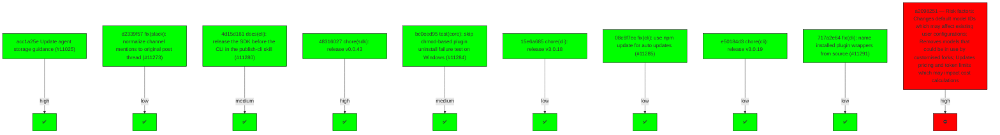

# Backport Agent — Detailed Run Report

> This file is generated automatically. It is intended for human analysts and
> AI reasoning models to assess agent performance, decision quality, and LLM behavior.

**Run timestamp**: 2026-06-05T12:26:02.340Z
**Models used**: fast=`mistral/devstral-latest`  powerful=`openai/gpt-5.5`
**Prompt log**: `/Users/rlemeill/Development/tea-ching-cline/.backport-agent/run-1780661959277.prompts.jsonl`

---

## Summary (PR body)

## Backport Agent — Sync Report

**Date**: 2026-06-05T12:26:02.340Z
**Upstream ref**: `cline/cline.git@main`
**Fork ref**: `TEA-ching/cline@keypool-live`
**Sync branch**: `sync/upstream-main-2026-06-05-1222`

### Summary

- ✅ Applied: 9
- ⚠️ Needs human review: 0
- ⛔ Blocked (not attempted): 1

### Applied commits

- `acc1a25e` [high] Update agent storage guidance (#11025) _(conflict resolved by agent)_
- `d2339f57` [low] fix(slack): normalize channel mentions to original post thread (#11273)
- `4d15d161` [medium] docs(cli): release the SDK before the CLI in the publish-cli skill (#11280)
- `48316027` [high] chore(sdk): release v0.0.43
- `bc0eed95` [medium] test(core): skip chmod-based plugin uninstall failure test on Windows (#11284)
- `15e6a685` [low] chore(cli): release v3.0.18
- `08c6f7ec` [low] fix(cli): use npm update for auto updates (#11285)
- `e50184d3` [low] chore(cli): release v3.0.19
- `717a2e64` [low] fix(cli): name installed plugin wrappers from source (#11291)

### Blocked commits (not attempted)

- `a2098251` [high] — Risk factors: Changes default model IDs which may affect existing user configurations; Removes models that could be in use by customised forks; Updates pricing and token limits which may impact cost calculations

### Agent decision log

- Applied 8 commits: d2339f57f1e7901dba1ae7749f30cb4465bb119b, 4d15d161099de118d31fa153e325dd57255b54b6, 48316027a7846ba1cc977834213970347cb29939, bc0eed950b78cda2fb0c317c8586c01779bc9b47, 15e6a685d60b9b69d29a066a5358e8856463498c, 08c6f7ecbe78785215014d7fd0f7faeff3022978, e50184d316e272524815ef72b8f27d7faff338a5, 717a2e643a07ac275d080db2eadd91be8efe5e06
- Resolved conflict in .clinerules/general.md for commit acc1a25e51c1f4ebab0a4033122229930e54a324
- Blocked 1 commit: a209825116dca469c80af4be53989638dd329f38 due to potential impact on existing configurations


---

## Agent Workflow Diagram

> Generated by the fast model from the run summary. Evaluate the agent's decision path.



---

## AI Sub-Agent Call Log (7 calls)

> Each entry is one sub-agent invocation. Review prompt/response pairs to assess
> reasoning quality, hallucinations, and decision accuracy.

### Call 1 / 7 — `check_customization_compatibility` ✅ OK

| Field | Value |
|---|---|
| **Timestamp** | 2026-06-05T12:20:29.406Z |
| **Tool** | `check_customization_compatibility` |
| **Model** | `mistral/devstral-latest` |
| **Duration** | 6932 ms |
| **Tokens in** | 1681 |
| **Tokens out** | 99 |
| **Cost** | $0.000000 |

**Prompt sent to sub-agent:**

````
Declared fork customisations:
  1. Pattern: backport-agent-infra
     Description: Infrastructure for the backport agent, including rules and documentation.

Upstream diff to evaluate:
commit acc1a25e51c1f4ebab0a4033122229930e54a324
Author: Mahesh Narayan <154434373+mahenarayan@users.noreply.github.com>
Date:   Thu Jun 4 18:53:18 2026 +0200

    Update agent storage guidance (#11025)
---
 .clinerules/general.md          | 22 +++++++++-------------
 .github/copilot-instructions.md |  2 +-
 2 files changed, 10 insertions(+), 14 deletions(-)

diff --git a/.clinerules/general.md b/.clinerules/general.md
index 601ec9d3b..97b408e43 100644
--- a/.clinerules/general.md
+++ b/.clinerules/general.md
@@ -140,12 +140,10 @@ Adding a new key to global state requires updates in multiple places. Missing an
 
 Required steps:
 1. Type definition in `src/shared/storage/state-keys.ts` - Add to `GlobalState` or `Settings` interface
-2. Read from globalState in `src/core/storage/utils/state-helpers.ts`:
-   - Add `const myKey = context.globalState.get<GlobalStateAndSettings["myKey"]>("myKey")` in `readGlobalStateFromDisk()`
-   - Add to the return object: `myKey: myKey ?? defaultValue,
-3. StateManager handles read/write via `setGlobalState()`/`getGlobalStateKey()` after initialization
+2. Add any default value or transform in `src/shared/storage/state-keys.ts` if the key needs one
+3. Read and write the value through `StateManager` (`setGlobalState()` / `getGlobalStateKey()`) after initialization
 
-Common mistake: Adding only the return value without the `context.globalState.get()` call. This compiles but the value is always `undefined` on load.
+Persistent state is file-backed through `StateManager`; do not add new runtime reads or writes against VS Code `ExtensionContext` storage. That storage is only a legacy migration source.
 
 Settings plumbing gotcha: if a key is user-toggleable from settings, wire both controller update paths:
 - `src/core/controller/state/updateSettings.ts` for webview `updateSetting(...)
@@ -159,22 +157,20 @@ Webview toggle gotcha: settings changes must also round-trip back in state paylo
 If this round-trip wiring is missing, the backend value can update but the toggle in webview appears stuck or reverts.
 
 ## StateManager Cache vs Direct globalState Access
-StateManager uses an in-memory cache populated during `StateManager.initialize(context)` in `common.ts`. For most state, use `controller.stateManager.setGlobalState()`/`getGlobalStateKey()`.
+StateManager uses an in-memory cache populated during `StateManager.initialize()` from file-backed storage. For most state, use `controller.stateManager.setGlobalState()`/`getGlobalStateKey()`.
 
-Exception: State needed immediately at extension startup (before cache is ready)
+Exception: host migration code may read legacy VS Code storage before file-backed storage is initialized.
 
-When Window A sets state and immediately opens Window B, the new window's StateManager cache is populated from `context.globalState` during initialization. If you need to read state in Window B right at startup (e.g., in `common.ts` during `initialize()`), read directly from `context.globalState.get()` instead of StateManager's cache.
-
-Example pattern (see `lastShownAnnouncementId` and `worktreeAutoOpenPath`):
+Example pattern:
 ```typescript
 // Writing (normal pattern)
 controller.stateManager.setGlobalState("myKey", value)
 
-// Reading at startup in common.ts (bypass cache)
-const value = context.globalState.get<string>("myKey")
+// Reading after initialization
+const value = controller.stateManager.getGlobalStateKey("myKey")
 ```
 
-This is only needed for cross-window state read during the brief startup window before StateManager cache is fully usable. Normal state access after initialization should use StateManager.
+Use `context.globalState` only in VS Code migration code that copies legacy ExtensionContext values into the shared file-backed stores.
 
 ## ChatRow Cancelled/Interrupted States
 When a ChatRow displays a loading/in-progress state (spinner), you must handle what happens when the task is cancelled. This is non-obvious because cancellation doesn't update the message content—you have to infer it from context.
diff --git a/.github/copilot-instructions.md b/.github/copilot-instructions.md
index 06d443a1f..21289c46a 100644
--- a/.github/copilot-instructions.md
+++ b/.github/copilot-instructions.md
@@ -44,7 +44,7 @@ For Responses API providers: add to `isNextGenModelProvider()` in `src/utils/mod
 Modular: `components/` (shared) + `variants/` (model-specific) + `templates/` (`{{PLACEHOLDER}}`). Variants override components via `componentOverrides` in `config.ts` or custom `template.ts`. XS variant is heavily condensed inline. Always regenerate snapshots after changes.
 
 ## Global State Keys (silent failure risk)
-Adding a key requires: type in `src/shared/storage/state-keys.ts`, read via `context.globalState.get()` in `src/core/storage/utils/state-helpers.ts` `readGlobalStateFromDisk()`, and add to return object. Missing the `.get()` call compiles fine but value is always `undefined`.
+Adding a key requires updating the typed storage definitions in `src/shared/storage/state-keys.ts`; runtime reads and writes should go through `StateManager`, not VS Code `ExtensionContext` storage. Persistent state is file-backed so it works across VS Code, CLI, and JetBrains hosts.
 
 ## Slash Commands (3 places)
 - `src/core/slash-commands/index.ts` — definitions.

Output the JSON object now.
````

**Response received:**

````
```json
{
  "compatible": true,
  "affectedCustomizations": [],
  "semanticConflicts": [],
  "warnings": ["Updates documentation and guidance around agent storage, which may be relevant to the backport-agent-infra customisation if it relies on state management patterns."],
  "recommendation": "Review the updated storage guidance to ensure alignment with the backport-agent-infra customisation, but no immediate action is required."
}
```
````

---

### Call 2 / 7 — `analyze_commit_for_backport` ✅ OK

| Field | Value |
|---|---|
| **Timestamp** | 2026-06-05T12:20:33.245Z |
| **Tool** | `analyze_commit_for_backport` |
| **Model** | `mistral/devstral-latest` |
| **Duration** | 3832 ms |
| **Tokens in** | 1755 |
| **Tokens out** | 171 |
| **Cost** | $0.000000 |

**Prompt sent to sub-agent:**

````
Commit SHA: acc1a25e51c1f4ebab0a4033122229930e54a324
Commit message:
Update agent storage guidance (#11025)

Changed files (2):
.clinerules/general.md
.github/copilot-instructions.md

Diff:
commit acc1a25e51c1f4ebab0a4033122229930e54a324
Author: Mahesh Narayan <154434373+mahenarayan@users.noreply.github.com>
Date:   Thu Jun 4 18:53:18 2026 +0200

    Update agent storage guidance (#11025)
---
 .clinerules/general.md          | 22 +++++++++-------------
 .github/copilot-instructions.md |  2 +-
 2 files changed, 10 insertions(+), 14 deletions(-)

diff --git a/.clinerules/general.md b/.clinerules/general.md
index 601ec9d3b..97b408e43 100644
--- a/.clinerules/general.md
+++ b/.clinerules/general.md
@@ -140,12 +140,10 @@ Adding a new key to global state requires updates in multiple places. Missing an
 
 Required steps:
 1. Type definition in `src/shared/storage/state-keys.ts` - Add to `GlobalState` or `Settings` interface
-2. Read from globalState in `src/core/storage/utils/state-helpers.ts`:
-   - Add `const myKey = context.globalState.get<GlobalStateAndSettings["myKey"]>("myKey")` in `readGlobalStateFromDisk()`
-   - Add to the return object: `myKey: myKey ?? defaultValue,
-3. StateManager handles read/write via `setGlobalState()`/`getGlobalStateKey()` after initialization
+2. Add any default value or transform in `src/shared/storage/state-keys.ts` if the key needs one
+3. Read and write the value through `StateManager` (`setGlobalState()` / `getGlobalStateKey()`) after initialization
 
-Common mistake: Adding only the return value without the `context.globalState.get()` call. This compiles but the value is always `undefined` on load.
+Persistent state is file-backed through `StateManager`; do not add new runtime reads or writes against VS Code `ExtensionContext` storage. That storage is only a legacy migration source.
 
 Settings plumbing gotcha: if a key is user-toggleable from settings, wire both controller update paths:
 - `src/core/controller/state/updateSettings.ts` for webview `updateSetting(...)
@@ -159,22 +157,20 @@ Webview toggle gotcha: settings changes must also round-trip back in state paylo
 If this round-trip wiring is missing, the backend value can update but the toggle in webview appears stuck or reverts.
 
 ## StateManager Cache vs Direct globalState Access
-StateManager uses an in-memory cache populated during `StateManager.initialize(context)` in `common.ts`. For most state, use `controller.stateManager.setGlobalState()`/`getGlobalStateKey()`.
+StateManager uses an in-memory cache populated during `StateManager.initialize()` from file-backed storage. For most state, use `controller.stateManager.setGlobalState()`/`getGlobalStateKey()`.
 
-Exception: State needed immediately at extension startup (before cache is ready)
+Exception: host migration code may read legacy VS Code storage before file-backed storage is initialized.
 
-When Window A sets state and immediately opens Window B, the new window's StateManager cache is populated from `context.globalState` during initialization. If you need to read state in Window B right at startup (e.g., in `common.ts` during `initialize()`), read directly from `context.globalState.get()` instead of StateManager's cache.
-
-Example pattern (see `lastShownAnnouncementId` and `worktreeAutoOpenPath`):
+Example pattern:
 ```typescript
 // Writing (normal pattern)
 controller.stateManager.setGlobalState("myKey", value)
 
-// Reading at startup in common.ts (bypass cache)
-const value = context.globalState.get<string>("myKey")
+// Reading after initialization
+const value = controller.stateManager.getGlobalStateKey("myKey")
 ```
 
-This is only needed for cross-window state read during the brief startup window before StateManager cache is fully usable. Normal state access after initialization should use StateManager.
+Use `context.globalState` only in VS Code migration code that copies legacy ExtensionContext values into the shared file-backed stores.
 
 ## ChatRow Cancelled/Interrupted States
 When a ChatRow displays a loading/in-progress state (spinner), you must handle what happens when the task is cancelled. This is non-obvious because cancellation doesn't update the message content—you have to infer it from context.
diff --git a/.github/copilot-instructions.md b/.github/copilot-instructions.md
index 06d443a1f..21289c46a 100644
--- a/.github/copilot-instructions.md
+++ b/.github/copilot-instructions.md
@@ -44,7 +44,7 @@ For Responses API providers: add to `isNextGenModelProvider()` in `src/utils/mod
 Modular: `components/` (shared) + `variants/` (model-specific) + `templates/` (`{{PLACEHOLDER}}`). Variants override components via `componentOverrides` in `config.ts` or custom `template.ts`. XS variant is heavily condensed inline. Always regenerate snapshots after changes.
 
 ## Global State Keys (silent failure risk)
-Adding a key requires: type in `src/shared/storage/state-keys.ts`, read via `context.globalState.get()` in `src/core/storage/utils/state-helpers.ts` `readGlobalStateFromDisk()`, and add to return object. Missing the `.get()` call compiles fine but value is always `undefined`.
+Adding a key requires updating the typed storage definitions in `src/shared/storage/state-keys.ts`; runtime reads and writes should go through `StateManager`, not VS Code `ExtensionContext` storage. Persistent state is file-backed so it works across VS Code, CLI, and JetBrains hosts.
 
 ## Slash Commands (3 places)
 - `src/core/slash-commands/index.ts` — definitions.

Output the JSON object now.
````

**Response received:**

````
```json
{
  "summary": "This commit updates documentation to clarify the correct usage of StateManager for persistent state storage, emphasizing file-backed storage over direct VS Code ExtensionContext access. It also updates guidance for adding new global state keys.",
  "keyChanges": [
    "Clarifies that StateManager should be used for all persistent state operations, not direct `context.globalState` access.",
    "Updates the steps for adding new global state keys to focus on typed definitions and StateManager usage.",
    "Removes outdated guidance about reading state directly from `context.globalState` during startup.",
    "Updates Copilot instructions to reflect the new StateManager-centric approach."
  ],
  "backportComplexity": "trivial",
  "semanticRiskFactors": [],
  "recommendation": "apply"
}
```
````

---

### Call 3 / 7 — `check_customization_compatibility` ✅ OK

| Field | Value |
|---|---|
| **Timestamp** | 2026-06-05T12:21:22.983Z |
| **Tool** | `check_customization_compatibility` |
| **Model** | `mistral/devstral-latest` |
| **Duration** | 1750 ms |
| **Tokens in** | 4303 |
| **Tokens out** | 61 |
| **Cost** | $0.000000 |

**Prompt sent to sub-agent:**

```
Declared fork customisations:
  1. Pattern: keypoollive-provider
     Description: Custom provider for Keypool Live.

Upstream diff to evaluate:
commit a209825116dca469c80af4be53989638dd329f38
Author: Ahmad Shahzad <107808273+shzdehmd@users.noreply.github.com>
Date:   Thu Jun 4 22:19:26 2026 +0500

    Sync Fireworks AI model registry with current platform offerings (#11173)
    
    * feat: update Fireworks model registry to improve Cline UX for Fireworks API users
    
    The VS Code extension's Fireworks model list was significantly out of
    date compared to the current active models available on the Fireworks
    platform. This commit updates the registry to match the current model
    lineup, ensuring users can select from the latest available models.
    
    Changes:
    - Default model: accounts/fireworks/models/kimi-k2p6 (was kimi-k2p5)
    - SDK default: accounts/fireworks/models/kimi-k2p6 (was minimax-m2p5)
    
    Removed 6 stale/phantom models no longer available:
      - qwen3-vl-30b-a3b-thinking
      - qwen3-vl-30b-a3b-instruct
      - deepseek-v3p2
      - glm-4p7
      - glm-5
      - minimax-m2p1
    
    Added 9 missing models:
      - accounts/fireworks/models/kimi-k2p6
      - accounts/fireworks/routers/kimi-k2p6-turbo
      - accounts/fireworks/models/deepseek-v4-flash
      - accounts/fireworks/models/deepseek-v4-pro
      - accounts/fireworks/models/glm-5p1
      - accounts/fireworks/routers/glm-5p1-fast
      - accounts/fireworks/models/minimax-m2p7
      - accounts/fireworks/models/qwen3p6-plus
      - accounts/fireworks/models/gpt-oss-20b
    
    Fixed metadata for 3 overlapping models:
      - kimi-k2p5: contextWindow 262144 → 256000, maxTokens 16384 → 256000
      - minimax-m2p5: maxTokens 16384 → 196608
      - gpt-oss-120b: maxTokens 16384 → 32768, cacheReadsPrice 0.01 → 0.015
    
    All models now have cacheWritesPrice: 0 because Fireworks does not
    charge a separate rate for prompt cache writes (cache writes are
    billed at the standard input rate, matching the SDK catalog).
    
    Three models remain in the UI but are scheduled for deprecation on
    June 17 and will be removed then:
      - accounts/fireworks/models/kimi-k2p5
      - accounts/fireworks/models/minimax-m2p5
      - accounts/fireworks/models/qwen3p6-plus
    
    Files:
    - apps/vscode/src/shared/api.ts
    - apps/vscode/webview-ui/src/components/settings/__tests__/APIOptions.spec.tsx
    - sdk/packages/llms/src/providers/builtins.ts
    
    * fix: update qwen3p6-plus context window and maxTokens
---
 apps/vscode/src/shared/api.ts                      | 147 +++++++++++++--------
 .../settings/__tests__/APIOptions.spec.tsx         |   2 +-
 sdk/packages/llms/src/providers/builtins.ts        |   2 +-
 3 files changed, 94 insertions(+), 57 deletions(-)

diff --git a/apps/vscode/src/shared/api.ts b/apps/vscode/src/shared/api.ts
index cc249cf4e..bca664f76 100644
--- a/apps/vscode/src/shared/api.ts
+++ b/apps/vscode/src/shared/api.ts
@@ -5004,107 +5004,144 @@ export const mainlandZAiModels = {
 
 // Fireworks AI
 export type FireworksModelId = keyof typeof fireworksModels
-export const fireworksDefaultModelId: FireworksModelId = "accounts/fireworks/models/kimi-k2p5"
+export const fireworksDefaultModelId: FireworksModelId = "accounts/fireworks/models/kimi-k2p6"
 export const fireworksModels = {
 	"accounts/fireworks/models/kimi-k2p5": {
-		maxTokens: 16384,
-		contextWindow: 262144,
+		maxTokens: 256000,
+		contextWindow: 256000,
 		supportsImages: true,
 		supportsPromptCache: true,
 		inputPrice: 0.6,
 		outputPrice: 3,
-		cacheWritesPrice: 0.6,
+		cacheWritesPrice: 0,
 		cacheReadsPrice: 0.1,
 		description:
 			"Moonshot's flagship open agentic model. Kimi K2.5 unifies vision and text, thinking and non-thinking modes, and single-agent and multi-agent execution.",
 	},
-	"accounts/fireworks/models/qwen3-vl-30b-a3b-thinking": {
-		maxTokens: 32768,
-		contextWindow: 262144,
+	"accounts/fireworks/models/kimi-k2p6": {
+		maxTokens: 262000,
+		contextWindow: 262000,
 		supportsImages: true,
 		supportsPromptCache: true,
-		inputPrice: 0.15,
-		outputPrice: 0.6,
-		cacheWritesPrice: 0.15,
-		cacheReadsPrice: 0.07,
+		inputPrice: 0.95,
+		outputPrice: 4,
+		cacheWritesPrice: 0,
+		cacheReadsPrice: 0.16,
 		description:
-			"Reasoning-enabled Qwen3-VL model with strong multimodal understanding, long context support, and function calling.",
+			"Moonshot's latest open agentic model. Kimi K2.6 unifies vision and text, thinking and non-thinking modes, and single-agent and multi-agent execution.",
 	},
-	"accounts/fireworks/models/qwen3-vl-30b-a3b-instruct": {
-		maxTokens: 32768,
-		contextWindow: 262144,
+	"accounts/fireworks/routers/kimi-k2p6-turbo": {
+		maxTokens: 262000,
+		contextWindow: 262000,
 		supportsImages: true,
-		supportsPromptCache: false,
-		inputPrice: 0.15,
-		outputPrice: 0.6,
-		description: "Qwen3-VL instruct model with strong multimodal reasoning, long context support, and function calling.",
+		supportsPromptCache: true,
+		inputPrice: 2,
+		outputPrice: 8,
+		cacheWritesPrice: 0,
+		cacheReadsPrice: 0.3,
+		description:
+			"Kimi K2.6 Turbo router for high-performance agentic workloads with vision and text reasoning.",
 	},
-	"accounts/fireworks/models/deepseek-v3p2": {
-		maxTokens: 16384,
-		contextWindow: 163840,
+	"accounts/fireworks/models/deepseek-v4-flash": {
+		maxTokens: 384000,
+		contextWindow: 1000000,
 		supportsImages: false,
 		supportsPromptCache: true,
-		inputPrice: 0.56,
-		outputPrice: 1.68,
-		cacheWritesPrice: 0.56,
-		cacheReadsPrice: 0.28,
-		description: "DeepSeek V3.2 model tuned for high computational efficiency and strong reasoning and agent performance.",
+		inputPrice: 0.14,
+		outputPrice: 0.28,
+		cacheWritesPrice: 0,
+		cacheReadsPrice: 0.03,
+		description:
+			"DeepSeek V4 Flash is a fast, cost-efficient reasoning model with a 1M context window and strong tool-use capabilities.",
 	},
-	"accounts/fireworks/models/glm-4p7": {
-		maxTokens: 16384,
-		contextWindow: 202752,
+	"accounts/fireworks/models/deepseek-v4-pro": {
+		maxTokens: 384000,
+		contextWindow: 1000000,
 		supportsImages: false,
 		supportsPromptCache: true,
-		inputPrice: 0.6,
-		outputPrice: 2.2,
-		cacheWritesPrice: 0.6,
-		cacheReadsPrice: 0.3,
-		description: "GLM-4.7 is a next-generation general-purpose model optimized for coding, reasoning, and agentic workflows.",
+		inputPrice: 1.74,
+		outputPrice: 3.48,
+		cacheWritesPrice: 0,
+		cacheReadsPrice: 0.145,
+		description:
+			"DeepSeek V4 Pro is a flagship reasoning model with a 1M context window, advanced structured output, and agentic performance.",
 	},
-	"accounts/fireworks/models/glm-5": {
-		maxTokens: 16384,
-		contextWindow: 202752,
+	"accounts/fireworks/models/glm-5p1": {
+		maxTokens: 131072,
+		contextWindow: 202800,
 		supportsImages: false,
 		supportsPromptCache: true,
-		inputPrice: 1.0,
-		outputPrice: 3.2,
-		cacheWritesPrice: 1.0,
-		cacheReadsPrice: 0.2,
-		description: "GLM-5 is Z.ai's flagship reasoning model for complex systems engineering and long-horizon agentic tasks.",
+		inputPrice: 1.4,
+		outputPrice: 4.4,
+		cacheWritesPrice: 0,
+		cacheReadsPrice: 0.26,
+		description: "GLM 5.1 is a next-generation general-purpose model optimized for coding, reasoning, and agentic workflows.",
+	},
+	"accounts/fireworks/routers/glm-5p1-fast": {
+		maxTokens: 131072,
+		contextWindow: 202800,
+		supportsImages: false,
+		supportsPromptCache: true,
+		inputPrice: 2.8,
+		outputPrice: 8.8,
+		cacheWritesPrice: 0,
+		cacheReadsPrice: 0.52,
+		description: "GLM 5.1 Fast router for high-throughput coding, reasoning, and agentic workflows.",
 	},
 	"accounts/fireworks/models/minimax-m2p5": {
-		maxTokens: 16384,
+		maxTokens: 196608,
 		contextWindow: 196608,
 		supportsImages: false,
 		supportsPromptCache: true,
 		inputPrice: 0.3,
 		outputPrice: 1.2,
-		cacheWritesPrice: 0.3,
+		cacheWritesPrice: 0,
 		cacheReadsPrice: 0.03,
 		description: "MiniMax M2.5 is built for state-of-the-art coding, agentic tool use.",
 	},
-	"accounts/fireworks/models/minimax-m2p1": {
-		maxTokens: 16384,
+	"accounts/fireworks/models/minimax-m2p7": {
+		maxTokens: 196608,
 		contextWindow: 196608,
 		supportsImages: false,
 		supportsPromptCache: true,
 		inputPrice: 0.3,
 		outputPrice: 1.2,
-		cacheWritesPrice: 0.3,
-		cacheReadsPrice: 0.03,
-		description:
-			"MiniMax M2.1 is tuned for strong real-world performance across coding, agent-driven, and workflow-heavy tasks.",
+		cacheWritesPrice: 0,
+		cacheReadsPrice: 0.06,
+		description: "MiniMax M2.7 is tuned for strong real-world performance across coding, agent-driven, and workflow-heavy tasks.",
+	},
+	"accounts/fireworks/models/qwen3p6-plus": {
+		maxTokens: 65536,
+		contextWindow: 262144,
+		supportsImages: true,
+		supportsPromptCache: true,
+		inputPrice: 0.5,
+		outputPrice: 3,
+		cacheWritesPrice: 0,
+		cacheReadsPrice: 0.1,
+		description: "Qwen 3.6 Plus with strong multimodal reasoning, long context support, and function calling.",
 	},
 	"accounts/fireworks/models/gpt-oss-120b": {
-		maxTokens: 16384,
+		maxTokens: 32768,
 		contextWindow: 131072,
 		supportsImages: false,
 		supportsPromptCache: true,
 		inputPrice: 0.15,
 		outputPrice: 0.6,
-		cacheWritesPrice: 0.15,
-		cacheReadsPrice: 0.01,
-		description: "OpenAI gpt-oss-120b open-weight model for production and high-reasoning use cases.",
+		cacheWritesPrice: 0,
+		cacheReadsPrice: 0.015,
+		description: "OpenAI GPT OSS 120B open-weight model for production and high-reasoning use cases.",
+	},
+	"accounts/fireworks/models/gpt-oss-20b": {
+		maxTokens: 32768,
+		contextWindow: 131072,
+		supportsImages: false,
+		supportsPromptCache: true,
+		inputPrice: 0.07,
+		outputPrice: 0.3,
+		cacheWritesPrice: 0,
+		cacheReadsPrice: 0.035,
+		description: "OpenAI GPT OSS 20B open-weight model for efficient production and reasoning use cases.",
 	},
 } as const satisfies Record<string, ModelInfo>
 
diff --git a/apps/vscode/webview-ui/src/components/settings/__tests__/APIOptions.spec.tsx b/apps/vscode/webview-ui/src/components/settings/__tests__/APIOptions.spec.tsx
index 00b16cd7f..fb99ce46c 100644
--- a/apps/vscode/webview-ui/src/components/settings/__tests__/APIOptions.spec.tsx
+++ b/apps/vscode/webview-ui/src/components/settings/__tests__/APIOptions.spec.tsx
@@ -138,7 +138,7 @@ describe("ApiOptions Component", () => {
 		)
 		const modelIdSelect = screen.getByLabelText("Model")
 		expect(modelIdSelect).toBeInTheDocument()
-		expect(modelIdSelect).toHaveValue("accounts/fireworks/models/kimi-k2p5")
+		expect(modelIdSelect).toHaveValue("accounts/fireworks/models/kimi-k2p6")
 	})
 
diff --git a/sdk/packages/llms/src/providers/builtins.ts b/sdk/packages/llms/src/providers/builtins.ts
index 55c7d19b5..4491e50c8 100644
--- a/sdk/packages/llms/src/providers/builtins.ts
+++ b/sdk/packages/llms/src/providers/builtins.ts
@@ -493,7 +493, 7 @@ const OPENAI_COMPATIBLE_SPECS: BuiltinSpec[] = [
 		name: "Fireworks AI",
 		description: "High-performance inference platform",
 		family: "openai-compatible",
-		defaultModelId: "accounts/fireworks/models/minimax-m2p5",
+		defaultModelId: "accounts/fireworks/models/kimi-k2p6",
 		apiKeyEnv: ["FIREWORKS_API_KEY"],
 		defaults: { baseUrl: "https://api.fireworks.ai/inference/v1" },
 	},

Output the JSON object now.
```

**Response received:**

````
```json
{
  "compatible": true,
  "affectedCustomizations": [],
  "semanticConflicts": [],
  "warnings": [],
  "recommendation": "The upstream change is safe to merge as it does not affect the declared customisations."
}
```
````

---

### Call 4 / 7 — `analyze_commit_for_backport` ✅ OK

| Field | Value |
|---|---|
| **Timestamp** | 2026-06-05T12:22:06.560Z |
| **Tool** | `analyze_commit_for_backport` |
| **Model** | `mistral/devstral-latest` |
| **Duration** | 5043 ms |
| **Tokens in** | 4411 |
| **Tokens out** | 311 |
| **Cost** | $0.000000 |

**Prompt sent to sub-agent:**

```
Commit SHA: a209825116dca469c80af4be53989638dd329f38
Commit message:
Sync Fireworks AI model registry with current platform offerings (#11173)

Changed files (3):
apps/vscode/src/shared/api.ts
apps/vscode/webview-ui/src/components/settings/__tests__/APIOptions.spec.tsx
sdk/packages/llms/src/providers/builtins.ts

Diff:
commit a209825116dca469c80af4be53989638dd329f38
Author: Ahmad Shahzad <107808273+shzdehmd@users.noreply.github.com>
Date:   Thu Jun 4 22:19:26 2026 +0500

    Sync Fireworks AI model registry with current platform offerings (#11173)
    
    * feat: update Fireworks model registry to improve Cline UX for Fireworks API users
    
    The VS Code extension's Fireworks model list was significantly out of
    date compared to the current active models available on the Fireworks
    platform. This commit updates the registry to match the current model
    lineup, ensuring users can select from the latest available models.
    
    Changes:
    - Default model: accounts/fireworks/models/kimi-k2p6 (was kimi-k2p5)
    - SDK default: accounts/fireworks/models/kimi-k2p6 (was minimax-m2p5)
    
    Removed 6 stale/phantom models no longer available:
      - qwen3-vl-30b-a3b-thinking
      - qwen3-vl-30b-a3b-instruct
      - deepseek-v3p2
      - glm-4p7
      - glm-5
      - minimax-m2p1
    
    Added 9 missing models:
      - accounts/fireworks/models/kimi-k2p6
      - accounts/fireworks/routers/kimi-k2p6-turbo
      - accounts/fireworks/models/deepseek-v4-flash
      - accounts/fireworks/models/deepseek-v4-pro
      - accounts/fireworks/models/glm-5p1
      - accounts/fireworks/routers/glm-5p1-fast
      - accounts/fireworks/models/minimax-m2p7
      - accounts/fireworks/models/qwen3p6-plus
      - accounts/fireworks/models/gpt-oss-20b
    
    Fixed metadata for 3 overlapping models:
      - kimi-k2p5: contextWindow 262144 → 256000, maxTokens 16384 → 256000
      - minimax-m2p5: maxTokens 16384 → 196608
      - gpt-oss-120b: maxTokens 16384 → 32768, cacheReadsPrice 0.01 → 0.015
    
    All models now have cacheWritesPrice: 0 because Fireworks does not
    charge a separate rate for prompt cache writes (cache writes are
    billed at the standard input rate, matching the SDK catalog).
    
    Three models remain in the UI but are scheduled for deprecation on
    June 17 and will be removed then:
      - accounts/fireworks/models/kimi-k2p5
      - accounts/fireworks/models/minimax-m2p5
      - accounts/fireworks/models/qwen3p6-plus
    
    Files:
    - apps/vscode/src/shared/api.ts
    - apps/vscode/webview-ui/src/components/settings/__tests__/APIOptions.spec.tsx
    - sdk/packages/llms/src/providers/builtins.ts
    
    * fix: update qwen3p6-plus context window and maxTokens
---
 apps/vscode/src/shared/api.ts                      | 147 +++++++++++++--------
 .../settings/__tests__/APIOptions.spec.tsx         |   2 +-
 sdk/packages/llms/src/providers/builtins.ts        |   2 +-
 3 files changed, 94 insertions(+), 57 deletions(-)

diff --git a/apps/vscode/src/shared/api.ts b/apps/vscode/src/shared/api.ts
index cc249cf4e..bca664f76 100644
--- a/apps/vscode/src/shared/api.ts
+++ b/apps/vscode/src/shared/api.ts
@@ -5004,107 +5004,144 @@ export const mainlandZAiModels = {
 
 // Fireworks AI
 export type FireworksModelId = keyof typeof fireworksModels
-export const fireworksDefaultModelId: FireworksModelId = "accounts/fireworks/models/kimi-k2p5"
+export const fireworksDefaultModelId: FireworksModelId = "accounts/fireworks/models/kimi-k2p6"
 export const fireworksModels = {
 	"accounts/fireworks/models/kimi-k2p5": {
-		maxTokens: 16384,
-		contextWindow: 262144,
+		maxTokens: 256000,
+		contextWindow: 256000,
 		supportsImages: true,
 		supportsPromptCache: true,
 		inputPrice: 0.6,
 		outputPrice: 3,
-		cacheWritesPrice: 0.6,
+		cacheWritesPrice: 0,
 		cacheReadsPrice: 0.1,
 		description:
 			"Moonshot's flagship open agentic model. Kimi K2.5 unifies vision and text, thinking and non-thinking modes, and single-agent and multi-agent execution.",
 	},
-	"accounts/fireworks/models/qwen3-vl-30b-a3b-thinking": {
-		maxTokens: 32768,
-		contextWindow: 262144,
+	"accounts/fireworks/models/kimi-k2p6": {
+		maxTokens: 262000,
+		contextWindow: 262000,
 		supportsImages: true,
 		supportsPromptCache: true,
-		inputPrice: 0.15,
-		outputPrice: 0.6,
-		cacheWritesPrice: 0.15,
-		cacheReadsPrice: 0.07,
+		inputPrice: 0.95,
+		outputPrice: 4,
+		cacheWritesPrice: 0,
+		cacheReadsPrice: 0.16,
 		description:
-			"Reasoning-enabled Qwen3-VL model with strong multimodal understanding, long context support, and function calling.",
+			"Moonshot's latest open agentic model. Kimi K2.6 unifies vision and text, thinking and non-thinking modes, and single-agent and multi-agent execution.",
 	},
-	"accounts/fireworks/models/qwen3-vl-30b-a3b-instruct": {
-		maxTokens: 32768,
-		contextWindow: 262144,
+	"accounts/fireworks/routers/kimi-k2p6-turbo": {
+		maxTokens: 262000,
+		contextWindow: 262000,
 		supportsImages: true,
-		supportsPromptCache: false,
-		inputPrice: 0.15,
-		outputPrice: 0.6,
-		description: "Qwen3-VL instruct model with strong multimodal reasoning, long context support, and function calling.",
+		supportsPromptCache: true,
+		inputPrice: 2,
+		outputPrice: 8,
+		cacheWritesPrice: 0,
+		cacheReadsPrice: 0.3,
+		description:
+			"Kimi K2.6 Turbo router for high-performance agentic workloads with vision and text reasoning.",
 	},
-	"accounts/fireworks/models/deepseek-v3p2": {
-		maxTokens: 16384,
-		contextWindow: 163840,
+	"accounts/fireworks/models/deepseek-v4-flash": {
+		maxTokens: 384000,
+		contextWindow: 1000000,
 		supportsImages: false,
 		supportsPromptCache: true,
-		inputPrice: 0.56,
-		outputPrice: 1.68,
-		cacheWritesPrice: 0.56,
-		cacheReadsPrice: 0.28,
-		description: "DeepSeek V3.2 model tuned for high computational efficiency and strong reasoning and agent performance.",
+		inputPrice: 0.14,
+		outputPrice: 0.28,
+		cacheWritesPrice: 0,
+		cacheReadsPrice: 0.03,
+		description:
+			"DeepSeek V4 Flash is a fast, cost-efficient reasoning model with a 1M context window and strong tool-use capabilities.",
 	},
-	"accounts/fireworks/models/glm-4p7": {
-		maxTokens: 16384,
-		contextWindow: 202752,
+	"accounts/fireworks/models/deepseek-v4-pro": {
+		maxTokens: 384000,
+		contextWindow: 1000000,
 		supportsImages: false,
 		supportsPromptCache: true,
-		inputPrice: 0.6,
-		outputPrice: 2.2,
-		cacheWritesPrice: 0.6,
-		cacheReadsPrice: 0.3,
-		description: "GLM-4.7 is a next-generation general-purpose model optimized for coding, reasoning, and agentic workflows.",
+		inputPrice: 1.74,
+		outputPrice: 3.48,
+		cacheWritesPrice: 0,
+		cacheReadsPrice: 0.145,
+		description:
+			"DeepSeek V4 Pro is a flagship reasoning model with a 1M context window, advanced structured output, and agentic performance.",
 	},
-	"accounts/fireworks/models/glm-5": {
-		maxTokens: 16384,
-		contextWindow: 202752,
+	"accounts/fireworks/models/glm-5p1": {
+		maxTokens: 131072,
+		contextWindow: 202800,
 		supportsImages: false,
 		supportsPromptCache: true,
-		inputPrice: 1.0,
-		outputPrice: 3.2,
-		cacheWritesPrice: 1.0,
-		cacheReadsPrice: 0.2,
-		description: "GLM-5 is Z.ai's flagship reasoning model for complex systems engineering and long-horizon agentic tasks.",
+		inputPrice: 1.4,
+		outputPrice: 4.4,
+		cacheWritesPrice: 0,
+		cacheReadsPrice: 0.26,
+		description: "GLM 5.1 is a next-generation general-purpose model optimized for coding, reasoning, and agentic workflows.",
+	},
+	"accounts/fireworks/routers/glm-5p1-fast": {
+		maxTokens: 131072,
+		contextWindow: 202800,
+		supportsImages: false,
+		supportsPromptCache: true,
+		inputPrice: 2.8,
+		outputPrice: 8.8,
+		cacheWritesPrice: 0,
+		cacheReadsPrice: 0.52,
+		description: "GLM 5.1 Fast router for high-throughput coding, reasoning, and agentic workflows.",
 	},
 	"accounts/fireworks/models/minimax-m2p5": {
-		maxTokens: 16384,
+		maxTokens: 196608,
 		contextWindow: 196608,
 		supportsImages: false,
 		supportsPromptCache: true,
 		inputPrice: 0.3,
 		outputPrice: 1.2,
-		cacheWritesPrice: 0.3,
+		cacheWritesPrice: 0,
 		cacheReadsPrice: 0.03,
 		description: "MiniMax M2.5 is built for state-of-the-art coding, agentic tool use.",
 	},
-	"accounts/fireworks/models/minimax-m2p1": {
-		maxTokens: 16384,
+	"accounts/fireworks/models/minimax-m2p7": {
+		maxTokens: 196608,
 		contextWindow: 196608,
 		supportsImages: false,
 		supportsPromptCache: true,
 		inputPrice: 0.3,
 		outputPrice: 1.2,
-		cacheWritesPrice: 0.3,
-		cacheReadsPrice: 0.03,
-		description:
-			"MiniMax M2.1 is tuned for strong real-world performance across coding, agent-driven, and workflow-heavy tasks.",
+		cacheWritesPrice: 0,
+		cacheReadsPrice: 0.06,
+		description: "MiniMax M2.7 is tuned for strong real-world performance across coding, agent-driven, and workflow-heavy tasks.",
+	},
+	"accounts/fireworks/models/qwen3p6-plus": {
+		maxTokens: 65536,
+		contextWindow: 262144,
+		supportsImages: true,
+		supportsPromptCache: true,
+		inputPrice: 0.5,
+		outputPrice: 3,
+		cacheWritesPrice: 0,
+		cacheReadsPrice: 0.1,
+		description: "Qwen 3.6 Plus with strong multimodal reasoning, long context support, and function calling.",
 	},
 	"accounts/fireworks/models/gpt-oss-120b": {
-		maxTokens: 16384,
+		maxTokens: 32768,
 		contextWindow: 131072,
 		supportsImages: false,
 		supportsPromptCache: true,
 		inputPrice: 0.15,
 		outputPrice: 0.6,
-		cacheWritesPrice: 0.15,
-		cacheReadsPrice: 0.01,
-		description: "OpenAI gpt-oss-120b open-weight model for production and high-reasoning use cases.",
+		cacheWritesPrice: 0,
+		cacheReadsPrice: 0.015,
+		description: "OpenAI GPT OSS 120B open-weight model for production and high-reasoning use cases.",
+	},
+	"accounts/fireworks/models/gpt-oss-20b": {
+		maxTokens: 32768,
+		contextWindow: 131072,
+		supportsImages: false,
+		supportsPromptCache: true,
+		inputPrice: 0.07,
+		outputPrice: 0.3,
+		cacheWritesPrice: 0,
+		cacheReadsPrice: 0.035,
+		description: "OpenAI GPT OSS 20B open-weight model for efficient production and reasoning use cases.",
 	},
 } as const satisfies Record<string, ModelInfo>
 
diff --git a/apps/vscode/webview-ui/src/components/settings/__tests__/APIOptions.spec.tsx b/apps/vscode/webview-ui/src/components/settings/__tests__/APIOptions.spec.tsx
index 00b16cd7f..fb99ce46c 100644
--- a/apps/vscode/webview-ui/src/components/settings/__tests__/APIOptions.spec.tsx
+++ b/apps/vscode/webview-ui/src/components/settings/__tests__/APIOptions.spec.tsx
@@ -138,7 +138,7 @@ describe("ApiOptions Component", () => {
 		)
 		const modelIdSelect = screen.getByLabelText("Model")
 		expect(modelIdSelect).toBeInTheDocument()
-		expect(modelIdSelect).toHaveValue("accounts/fireworks/models/kimi-k2p5")
+		expect(modelIdSelect).toHaveValue("accounts/fireworks/models/kimi-k2p6")
 	})
 
diff --git a/sdk/packages/llms/src/providers/builtins.ts b/sdk/packages/llms/src/providers/builtins.ts
index 55c7d19b5..4491e50c8 100644
--- a/sdk/packages/llms/src/providers/builtins.ts
+++ b/sdk/packages/llms/src/providers/builtins.ts
@@ -493,7 +493, 7 @@ const OPENAI_COMPATIBLE_SPECS: BuiltinSpec[] = [
 		name: "Fireworks AI",
 		description: "High-performance inference platform",
 		family: "openai-compatible",
-		defaultModelId: "accounts/fireworks/models/minimax-m2p5",
+		defaultModelId: "accounts/fireworks/models/kimi-k2p6",
 		apiKeyEnv: ["FIREWORKS_API_KEY"],
 		defaults: { baseUrl: "https://api.fireworks.ai/inference/v1" },
 	},

Output the JSON object now.
```

**Response received:**

````
```json
{
  "summary": "This commit updates the Fireworks AI model registry to sync with current platform offerings. It adds 9 new models, removes 6 stale models, updates metadata for 3 existing models, and changes the default model from kimi-k2p5 to kimi-k2p6.",
  "keyChanges": [
    "Updated default model from 'accounts/fireworks/models/kimi-k2p5' to 'accounts/fireworks/models/kimi-k2p6'",
    "Added 9 new models (e.g., deepseek-v4-flash, glm-5p1, minimax-m2p7)",
    "Removed 6 stale models (e.g., qwen3-vl-30b-a3b-thinking, deepseek-v3p2)",
    "Fixed metadata for 3 models (e.g., kimi-k2p5 contextWindow and maxTokens)",
    "Set cacheWritesPrice to 0 for all models to match Fireworks billing policy",
    "Updated SDK default model from minimax-m2p5 to kimi-k2p6"
  ],
  "backportComplexity": "moderate",
  "semanticRiskFactors": [
    "Changes default model IDs which may affect existing user configurations",
    "Removes models that could be in use by customised forks",
    "Updates pricing and token limits which may impact cost calculations"
  ],
  "recommendation": "review-required"
}
```
````

---

### Call 5 / 7 — `analyze_commit_for_backport` ✅ OK

| Field | Value |
|---|---|
| **Timestamp** | 2026-06-05T12:24:04.257Z |
| **Tool** | `analyze_commit_for_backport` |
| **Model** | `mistral/devstral-latest` |
| **Duration** | 21483 ms |
| **Tokens in** | 6984 |
| **Tokens out** | 242 |
| **Cost** | $0.000000 |

**Prompt sent to sub-agent:**

````
Commit SHA: 4d15d161099de118d31fa153e325dd57255b54b6
Commit message:
docs(cli): release the SDK before the CLI in the publish-cli skill (#11280)

Changed files (32):
.agents/skills/opentui/SKILL.md
.agents/skills/opentui/references/animation/REFERENCE.md
.agents/skills/opentui/references/components/REFERENCE.md
.agents/skills/opentui/references/components/code-diff.md
.agents/skills/opentui/references/components/containers.md
.agents/skills/opentui/references/components/inputs.md
.agents/skills/opentui/references/components/text-display.md
.agents/skills/opentui/references/core/REFERENCE.md
.agents/skills/opentui/references/core/api.md
.agents/skills/opentui/references/core/configuration.md
.agents/skills/opentui/references/core/gotchas.md
.agents/skills/opentui/references/core/patterns.md
.agents/skills/opentui/references/keyboard/REFERENCE.md
.agents/skills/opentui/references/layout/REFERENCE.md
.agents/skills/opentui/references/layout/patterns.md
.agents/skills/opentui/references/react/REFERENCE.md
.agents/skills/opentui/references/react/api.md
.agents/skills/opentui/references/react/configuration.md
.agents/skills/opentui/references/react/gotchas.md
.agents/skills/opentui/references/react/patterns.md
.agents/skills/opentui/references/solid/REFERENCE.md
.agents/skills/opentui/references/solid/api.md
.agents/skills/opentui/references/solid/configuration.md
.agents/skills/opentui/references/solid/gotchas.md
.agents/skills/opentui/references/solid/patterns.md
.agents/skills/opentui/references/testing/REFERENCE.md
.agents/skills/publish-cli
.claude/skills/opentui
.claude/skills/publish-cli
.cline/skills/publish-cli/SKILL.md
apps/cli/DEVELOPMENT.md
sdk/CHANGELOG.md

Diff:
commit 4d15d161099de118d31fa153e325dd57255b54b6
Author: Saoud Rizwan <7799382+saoudrizwan@users.noreply.github.com>
Date:   Thu Jun 4 12:48:17 2026 -0700

    docs(cli): release the SDK before the CLI in the publish-cli skill (#11280)
    
    * docs(cli): release the SDK before the CLI in the publish-cli skill
    
    Add a Step 0 to the publish-cli skill that gates a CLI release on an SDK
    release when the SDK changed since its last release, and relocate the
    publish-cli skill to the repo root.
    
    Why release the SDK alongside the CLI: the CLI bundles the SDK source via
    workspace:*, so the CLI always ships the latest SDK code, but the hub
    daemon stamps a buildId that defaults to the @cline/core version and a
    running hub is only respawned when that buildId changes. Bumping the
    SDK version forces a stale hub to be retired and respawned with the new code.
    It also keeps SDK releases on a regular cadence in step with the CLI.
    
    Step 0 covers detecting unreleased sdk/packages changes, bumping the
    shared SDK version + llms CHANGELOG, committing to main, kicking off
    sdk-publish.yml on the latest channel, and waiting for it before cutting
    the CLI release. Also fixes the now-stale working-directory note (commands
    run from the repo root, not sdk/) and updates the DEVELOPMENT.md path.
    
    * chore: move opentui skill to repo root
    
    Relocate the opentui TUI skill from apps/cli to the repo root, matching
    the real-dir + symlink convention used by the other root skills (real dir
    in .agents/skills, symlink from .claude/skills).
    
    * docs(sdk): reformat the SDK changelog and move it to sdk/CHANGELOG.md
    
    The changelog covers all SDK packages (they share one version and release
    together), so move it from sdk/packages/llms/ to the SDK root, parallel to
    apps/cli/CHANGELOG.md. Reformat to match the CLI changelog: a titled
    header with flat, version-only sections, newest on top, no dates, and no
    Next Release bucket. The unreleased entry that bucket held is captured
    from commits when the next SDK release is drafted. Update the publish-cli
    skill to draft SDK notes from commits and prepend a ## <version> section
    at sdk/CHANGELOG.md.
---
 .../.agents => .agents}/skills/opentui/SKILL.md    |  0
 .../opentui/references/animation/REFERENCE.md      |  0
 .../opentui/references/components/REFERENCE.md     |  0
 .../opentui/references/components/code-diff.md     |  0
 .../skills/opentui/references/components/containers.md    |  0
 .../skills/opentui/references/components/inputs.md |  0
 .../opentui/references/components/text-display.md  |  0
 .../skills/opentui/references/core/REFERENCE.md    |  0
 .../skills/opentui/references/core/api.md          |  0
 .../opentui/references/core/configuration.md       |  0
 .../skills/opentui/references/core/gotchas.md      |  0
 .../skills/opentui/references/core/patterns.md     |  0
 .../opentui/references/keyboard/REFERENCE.md       |  0
 .../skills/opentui/references/layout/REFERENCE.md  |  0
 .../skills/opentui/references/layout/patterns.md   |  0
 .../skills/opentui/references/react/REFERENCE.md   |  0
 .../skills/opentui/references/react/api.md         |  0
 .../opentui/references/react/configuration.md     |  0
 .../skills/opentui/references/react/gotchas.md     |  0
 .../skills/opentui/references/react/patterns.md    |  0
 .../skills/opentui/references/solid/REFERENCE.md   |  0
 .../skills/opentui/references/solid/api.md         | 0
 .../opentui/references/solid/configuration.md     |  0
 .../skills/opentui/references/solid/gotchas.md     |  0
 .../skills/opentui/references/solid/patterns.md    |  0
 .../skills/opentui/references/testing/REFERENCE.md |  0
 {apps/cli/.agents => .agents}/skills/publish-cli   |  0
 {apps/cli/.claude => .claude}/skills/opentui       |  0
 {apps/cli/.claude => .claude}/skills/publish-cli   |  0
 .../.cline => .cline}/skills/publish-cli/SKILL.md  | 92 +++++++++++++++++++++-
 apps/cli/DEVELOPMENT.md                            |  2 +-
 sdk/{packages/llms => }/CHANGELOG.md               |  6 +-
 32 files changed, 91 insertions(+), 9 deletions(-)

diff --git a/apps/cli/.agents/skills/opentui/SKILL.md b/.agents/skills/opentui/SKILL.md
similarity index 100%
rename from apps/cli/.agents/skills/opentui/SKILL.md
rename to .agents/skills/opentui/SKILL.md
diff --git a/apps/cli/.agents/skills/opentui/references/animation/REFERENCE.md b/.agents/skills/opentui/references/animation/REFERENCE.md
similarity index 100%
rename from apps/cli/.agents/skills/opentui/references/animation/REFERENCE.md
rename to .agents/skills/opentui/references/animation/REFERENCE.md
diff --git a/apps/cli/.agents/skills/opentui/references/components/REFERENCE.md b/.agents/skills/opentui/references/components/REFERENCE.md
similarity index 100%
rename from apps/cli/.agents/skills/opentui/references/components/REFERENCE.md
rename to .agents/skills/opentui/references/components/REFERENCE.md
diff --git a/apps/cli/.agents/skills/opentui/references/components/code-diff.md b/.agents/skills/opentui/references/components/code-diff.md
similarity index 100%
rename from apps/cli/.agents/skills/opentui/references/components/code-diff.md
rename to .agents/skills/opentui/references/components/code-diff.md
diff --git a/apps/cli/.agents/skills/opentui/references/components/containers.md b/.agents/skills/opentui/references/components/containers.md
similarity index 100%
rename from apps/cli/.agents/skills/opentui/references/components/containers.md
rename to .agents/skills/opentui/references/components/containers.md
diff --git a/apps/cli/.agents/skills/opentui/references/components/inputs.md b/.agents/skills/opentui/references/components/inputs.md
similarity index 100%
rename from apps/cli/.agents/skills/opentui/references/components/inputs.md
rename to .agents/skills/opentui/references/components/inputs.md
diff --git a/apps/cli/.agents/skills/opentui/references/components/text-display.md b/.agents/skills/opentui/references/components/text-display.md
similarity index 100%
rename from apps/cli/.agents/skills/opentui/references/components/text-display.md
rename to .agents/skills/opentui/references/components/text-display.md
diff --git a/apps/cli/.agents/skills/opentui/references/core/REFERENCE.md b/.agents/skills/opentui/references/core/REFERENCE.md
similarity index 100%
rename from apps/cli/.agents/skills/opentui/references/core/REFERENCE.md
rename to .agents/skills/opentui/references/core/REFERENCE.md
diff --git a/apps/cli/.agents/skills/opentui/references/core/api.md b/.agents/skills/opentui/references/core/api.md
similarity index 100%
rename from apps/cli/.agents/skills/opentui/references/core/api.md
rename to .agents/skills/opentui/references/core/api.md
diff --git a/apps/cli/.agents/skills/opentui/references/core/configuration.md b/.agents/skills/opentui/references/core/configuration.md
similarity index 100%
rename from apps/cli/.agents/skills/opentui/references/core/configuration.md
rename to .agents/skills/opentui/references/core/configuration.md
diff --git a/apps/cli/.agents/skills/opentui/references/core/gotchas.md b/.agents/skills/opentui/references/core/gotchas.md
similarity index 100%
rename from apps/cli/.agents/skills/opentui/references/core/gotchas.md
rename to .agents/skills/opentui/references/core/gotchas.md
diff --git a/apps/cli/.agents/skills/opentui/references/core/patterns.md b/.agents/skills/opentui/references/core/patterns.md
similarity index 100%
rename from apps/cli/.agents/skills/opentui/references/core/patterns.md
rename to .agents/skills/opentui/references/core/patterns.md
diff --git a/apps/cli/.agents/skills/opentui/references/keyboard/REFERENCE.md b/.agents/skills/opentui/references/keyboard/REFERENCE.md
similarity index 100%
rename from apps/cli/.agents/skills/opentui/references/keyboard/REFERENCE.md
rename to .agents/skills/opentui/references/keyboard/REFERENCE.md
diff --git a/apps/cli/.agents/skills/opentui/references/layout/REFERENCE.md b/.agents/skills/opentui/references/layout/REFERENCE.md
similarity index 100%
rename from apps/cli/.agents/skills/opentui/references/layout/REFERENCE.md
rename to .agents/skills/opentui/references/layout/REFERENCE.md
diff --git a/apps/cli/.agents/skills/opentui/references/layout/patterns.md b/.agents/skills/opentui/references/layout/patterns.md
similarity index 100%
rename from apps/cli/.agents/skills/opentui/references/layout/patterns.md
rename to .agents/skills/opentui/references/layout/patterns.md
diff --git a/apps/cli/.agents/skills/opentui/references/react/REFERENCE.md b/.agents/skills/opentui/references/react/REFERENCE.md
similarity index 100%
rename from apps/cli/.agents/skills/opentui/references/react/REFERENCE.md
rename to .agents/skills/opentui/references/react/REFERENCE.md
diff --git a/apps/cli/.agents/skills/opentui/references/react/api.md b/.agents/skills/opentui/references/react/api.md
similarity index 100%
rename from apps/cli/.agents/skills/opentui/references/react/api.md
rename to .agents/skills/opentui/references/react/api.md
diff --git a/apps/cli/.agents/skills/opentui/references/react/configuration.md b/.agents/skills/opentui/references/react/configuration.md
similarity index 100%
rename from apps/cli/.agents/skills/opentui/references/react/configuration.md
rename to .agents/skills/opentui/references/react/configuration.md
diff --git a/apps/cli/.agents/skills/opentui/references/react/gotchas.md b/.agents/skills/opentui/references/react/gotchas.md
similarity index 100%
rename from apps/cli/.agents/skills/opentui/references/react/gotchas.md
rename to .agents/skills/opentui/references/react/gotchas.md
diff --git a/apps/cli/.agents/skills/opentui/references/react/patterns.md b/.agents/skills/opentui/references/react/patterns.md
similarity index 100%
rename from apps/cli/.agents/skills/opentui/references/react/patterns.md
rename to .agents/skills/opentui/references/react/patterns.md
diff --git a/apps/cli/.agents/skills/opentui/references/solid/REFERENCE.md b/.agents/skills/opentui/references/solid/REFERENCE.md
similarity index 100%
rename from apps/cli/.agents/skills/opentui/references/solid/REFERENCE.md
rename to .agents/skills/opentui/references/solid/REFERENCE.md
diff --git a/apps/cli/.agents/skills/opentui/references/solid/api.md b/.agents/skills/opentui/references/solid/api.md
similarity index 100%
rename from apps/cli/.agents/skills/opentui/references/solid/api.md
rename to .agents/skills/opentui/references/solid/api.md
diff --git a/apps/cli/.agents/skills/opentui/references/solid/configuration.md b/.agents/skills/opentui/references/solid/configuration.md
similarity index 100%
rename from apps/cli/.agents/skills/opentui/references/solid/configuration.md
rename to .agents/skills/opentui/references/solid/configuration.md
diff --git a/apps/cli/.agents/skills/opentui/references/solid/gotchas.md b/.agents/skills/opentui/references/solid/gotchas.md
similarity index 100%
rename from apps/cli/.agents/skills/opentui/references/solid/gotchas.md
rename to .agents/skills/opentui/references/solid/gotchas.md
diff --git a/apps/cli/.agents/skills/opentui/references/solid/patterns.md b/.agents/skills/opentui/references/solid/patterns.md
similarity index 100%
rename from apps/cli/.agents/skills/opentui/references/solid/patterns.md
rename to .agents/skills/opentui/references/solid/patterns.md
diff --git a/apps/cli/.agents/skills/opentui/references/testing/REFERENCE.md b/.agents/skills/opentui/references/testing/REFERENCE.md
similarity index 100%
rename from apps/cli/.agents/skills/opentui/references/testing/REFERENCE.md
rename to .agents/skills/opentui/references/testing/REFERENCE.md
diff --git a/apps/cli/.agents/skills/publish-cli b/.agents/skills/publish-cli
similarity index 100%
rename from apps/cli/.agents/skills/publish-cli
rename to .agents/skills/publish-cli
diff --git a/apps/cli/.claude/skills/opentui b/.claude/skills/opentui
similarity index 100%
rename from apps/cli/.claude/skills/opentui
rename to .claude/skills/opentui
diff --git a/apps/cli/.claude/skills/publish-cli b/.claude/skills/publish-cli
similarity index 100%
rename from apps/cli/.claude/skills/publish-cli
rename to .claude/skills/publish-cli
diff --git a/apps/cli/.cline/skills/publish-cli/SKILL.md b/.cline/skills/publish-cli/SKILL.md
similarity index 51%
rename from apps/cli/.cline/skills/publish-cli/SKILL.md
rename to .cline/skills/publish-cli/SKILL.md
index 29f6a61d9..182fc81ad 100644
--- a/apps/cli/.cline/skills/publish-cli/SKILL.md
+++ b/.cline/skills/publish-cli/SKILL.md
@@ -9,12 +9,13 @@ Use this skill when the user asks to release the CLI, publish `cline`, bump the
 
 The CLI is npm-only. Do not add alternate distribution or signing steps.
 
-> Working directory: this skill lives in the SDK sub-monorepo. Run `cd sdk` (from the repo root) before any of the shell commands below. Paths in commands and instructions (e.g. `apps/cli/package.json`, `bun release cli`) are written relative to `sdk/`.
+> Working directory: run every command below from the repository root. Paths and scripts (e.g. `apps/cli/package.json`, `sdk/packages/`, `bun release cli`, `bun run version`) are written relative to the repo root.
 
 The skill should guide the user through one release preparation flow, then offer the publish path options. The two normal publish paths are GitHub Actions and local publishing from an authenticated machine.
 
 ## Release contract
 
+- SDK prerequisite: the CLI depends on the SDK via `workspace:*` (`@cline/core`, `@cline/shared`, and friends). If the SDK changed since its last release, release the SDK first and wait for it to finish publishing before releasing the CLI. See "Step 0: Release the SDK first if it changed" below.
 - Version source: `apps/cli/package.json`.
 - Main release tag: `cli-vX.Y.Z`, where `X.Y.Z` matches `apps/cli/package.json`.
 - Nightly release version: `X.Y.Z-nightly.TIMESTAMP`.
@@ -30,8 +31,93 @@ The skill should guide the user through one release preparation flow, then offer
 - Always ask before pushing commits or tags.
 - Do not amend commits unless explicitly requested.
 
+## Step 0: Release the SDK first if it changed
+
+Do this before anything else in the Workflow below.
+
+The CLI builds and ships against the SDK source in the monorepo (`workspace:*` for `@cline/core`, `@cline/shared`, and the rest), so a CLI release always contains the latest SDK code whether or not the SDK was released. The build and tests use that source too, not anything from npm. Releasing the SDK alongside the CLI is still worth doing for two reasons:
+
+- Hub freshness. The hub daemon lives in `@cline/core` and stamps a `buildId` that defaults to the `@cline/core` package version (`resolveHubBuildId` in `sdk/packages/core/src/hub/discovery/index.ts`). A running hub is only retired and respawned when that `buildId` changes (`isCompatibleHubRecord` / `retireIncompatibleHub` in `sdk/packages/core/src/hub/daemon/index.ts`). So if the SDK code changed but the version did not, a user who upgrades the CLI keeps talking to their already-running hub, which is still executing the old SDK code. Bumping the SDK version makes the new CLI's `buildId` differ, so the stale hub is detected as incompatible and respawned with the fresh code.
+- Release hygiene. We want regular SDK releases; cutting one whenever we cut a CLI release keeps the published SDK in step with what the CLI ships.
+
+So when the SDK has changed, release it first (which bumps the `@cline/core` version), then cut the CLI release on top of that bump. Leave the CLI's SDK dependency as `workspace:*` — the fix is to release the SDK, not to pin the CLI.
+
+1. Check for unreleased SDK changes.
+
+```sh
+git fetch origin --tags
+git tag --list 'sdk/sdk/v*' 'sdk-v*' --sort=-v:refname | head -1
+git log <last-sdk-tag>..origin/main --oneline --no-merges -- sdk/packages
+```
+
+`sdk/<pkg>/v*` tags are created by the `sdk-publish.yml` workflow; `sdk-v*` tags are created by the local `bun release sdk` helper. Use whichever is newest as the baseline.
+
+If `git log` prints no commits, the SDK is already up to date. Skip the rest of Step 0 and continue with the Workflow below.
+
+If it prints commits, sanity-check the diff (ignore entries that are only the previous version-bump commit's lockfile or generated files), then release the SDK.
+
+2. Decide the SDK version bump.
+
+All SDK packages share one version, read from `sdk/packages/llms/package.json`. Ask whether this is patch, minor, major, or an explicit version. Patch is the default. Do not guess if the user has not made it clear.
+
+3. Draft the SDK release notes and update the changelog.
+
+Draft user-facing notes from the SDK commits found in step 1, translating commit messages into user-facing language (same approach as the CLI release notes below). Prepend a new `## <version>` section with those notes to the top of `sdk/CHANGELOG.md`, using the header format `## <version>` with no date — the same flat, newest-on-top format as `apps/cli/CHANGELOG.md`. This is the SDK changelog (all SDK packages share one version) and it is maintained by hand; the `sdk-publish.yml` workflow does not read it.
+
+4. Bump versions and regenerate.
+
+```sh
+bun run version <version>
+```
+
+This bumps every SDK `package.json` to the new version, regenerates the lockfile and the generated model catalog, formats, and builds. Review the result.
+
+5. Commit and push the bump to `main`.
+
+The `sdk-publish.yml` workflow publishes the version that is committed on `main` and tags that commit, so the bump must land on `main` before the workflow runs.
+
+```sh
+git add -A
+git commit -m "chore(sdk): release v<version>"
+```
+
+Ask before pushing:
+
+```sh
+git push origin HEAD
+```
+
+6. Trigger the SDK publish workflow on the `latest` channel.
+
+```sh
+gh workflow run sdk-publish.yml -f channel=latest -f confirm_publish=publish
+gh run list --workflow=sdk-publish.yml --limit=1 --json databaseId,url,status,createdAt --jq '.[0]'
+```
+
+The workflow runs the SDK tests, publishes `@cline/shared`, `@cline/llms`, `@cline/agents`, `@cline/core`, and `@cline/sdk` to npm with the `latest` dist-tag in dependency order, and pushes `sdk/<pkg>/v<version>` git tags.
+
+7. Wait for the SDK workflow to succeed before starting the CLI release.
+
+```sh
+gh run watch <run-id> --exit-status
+```
+
+Do not start the CLI release until this run has finished successfully. The CLI does not install the SDK from npm, but cutting the CLI release on top of a clean, completed SDK release keeps the two in step: the CLI release commit then sits on top of the `@cline/core` version bump, so the shipped CLI carries the new version that forces a running hub to respawn with the new code, and you are not building a CLI release on top of an SDK release that failed midway.
+
+After the SDK release succeeds, pull `main` so the CLI release is prepared on top of the SDK version bump:
+
+```sh
+git checkout main && git pull --ff-only
+```
+
+Then continue with the Workflow below.
+
+For a local SDK publish from an authenticated machine instead of the workflow, `bun release sdk <version>` exists, but prefer the `sdk-publish.yml` workflow for normal releases so the CLI release can gate on a single GitHub Actions run.
+
 ## Workflow
 
+Complete Step 0 first. Only proceed once the SDK is released (or you confirmed no SDK release was needed).
+
 1. Gather context.
 
 ```sh
@@ -46,10 +132,10 @@ Find the latest CLI tag. If there is no `cli-v*` tag, use the first relevant CLI
 2. Collect release commits.
 
 ```sh
-git log <last-cli-tag>..HEAD --oneline --no-merges -- apps/cli packages scripts .github/workflows/cli-publish.yml
+git log <last-cli-tag>..HEAD --oneline --no-merges -- apps/cli sdk/packages sdk/scripts .github/workflows/cli-publish.yml
 ```
 
-If the release includes broader SDK changes that affect the CLI, also inspect commits outside `apps/cli`.
+The `sdk/packages` commits matter here even though the SDK was released separately in Step 0: the CLI bundles the SDK, so SDK changes ship in this CLI release too. Read those commits and fold anything user-relevant to the CLI into the release notes (provider/model updates, behavior changes, fixes the CLI inherits). Skip SDK changes that are purely internal or have no CLI-visible effect.
 
 3. Draft user-facing release notes.
 
diff --git a/apps/cli/DEVELOPMENT.md b/apps/cli/DEVELOPMENT.md
index 6cdb3f959..4fde2d96b 100644
--- a/apps/cli/DEVELOPMENT.md
+++ b/apps/cli/DEVELOPMENT.md
@@ -416,7 +416,7 @@ Then attach VS Code or Chrome DevTools to `ws://127.0.0.1:6499`.
 
 ## Publishing
 
-The CLI is published as the `cline` wrapper package on npm with platform-specific binaries under `@cline/cli-*`. The release flow lives in the `publish-cli` skill (`apps/cli/.cline/skills/publish-cli/SKILL.md`).
+The CLI is published as the `cline` wrapper package on npm with platform-specific binaries under `@cline/cli-*`. The release flow lives in the `publish-cli` skill (`.cline/skills/publish-cli/SKILL.md` at the repo root).
 
 From the `apps/cli` workspace:
 
diff --git a/sdk/packages/llms/CHANGELOG.md b/sdk/CHANGELOG.md
similarity index 61%
rename from sdk/packages/llms/CHANGELOG.md
rename to sdk/CHANGELOG.md
index 1ac86d0bc..26e2c62eb 100644
--- a/sdk/packages/llms/CHANGELOG.md
+++ b/sdk/CHANGELOG.md
@@ -1,8 +1,4 @@
-# Changelog
-
-## Next Release
-
-- SAP AI Core uses AI SDK community provider @jerome-benoit/sap-ai-provider https://ai-sdk.dev/providers/community-providers/sap-ai
+# Cline SDK Changelog
 
 ## 0.0.42

Output the JSON object now.
````

**Response received:**

````
```json
{
  "summary": "This commit updates the publish-cli skill to ensure the SDK is released before the CLI when SDK changes are detected. It also relocates the opentui skill to the repo root and reformats the SDK changelog to match the CLI changelog format.",
  "keyChanges": [
    "Added Step 0 to the publish-cli skill to gate CLI releases on SDK releases when SDK changes are detected.",
    "Relocated the opentui skill from apps/cli to the repo root.",
    "Reformatted and moved the SDK changelog from sdk/packages/llms/ to sdk/CHANGELOG.md.",
    "Updated the publish-cli skill to draft SDK release notes from commits and prepend a version section to the SDK changelog."
  ],
  "backportComplexity": "moderate",
  "semanticRiskFactors": [
    "Changes the release workflow for the CLI, which may interact with custom release processes in a fork.",
    "Relocates files and directories, which may require adjustments in custom scripts or tooling."
  ],
  "recommendation": "review-required"
}
```
````

---

### Call 6 / 7 — `analyze_commit_for_backport` ✅ OK

| Field | Value |
|---|---|
| **Timestamp** | 2026-06-05T12:24:22.798Z |
| **Tool** | `analyze_commit_for_backport` |
| **Model** | `mistral/devstral-latest` |
| **Duration** | 2673 ms |
| **Tokens in** | 1237 |
| **Tokens out** | 126 |
| **Cost** | $0.000000 |

**Prompt sent to sub-agent:**

```
Commit SHA: bc0eed950b78cda2fb0c317c8586c01779bc9b47
Commit message:
test(core): skip chmod-based plugin uninstall failure test on Windows (#11284)

Changed files (1):
sdk/packages/core/src/services/plugin-uninstall.test.ts

Diff:
commit bc0eed950b78cda2fb0c317c8586c01779bc9b47
Author: Saoud Rizwan <7799382+saoudrizwan@users.noreply.github.com>
Date:   Thu Jun 4 13:34:56 2026 -0700

    test(core): skip chmod-based plugin uninstall failure test on Windows (#11284)
---
 .../core/src/services/plugin-uninstall.test.ts     | 49 ++++++++++++----------
 1 file changed, 27 insertions(+), 22 deletions(-)

diff --git a/sdk/packages/core/src/services/plugin-uninstall.test.ts b/sdk/packages/core/src/services/plugin-uninstall.test.ts
index b4f5aa846..8d278176f 100644
--- a/sdk/packages/core/src/services/plugin-uninstall.test.ts
+++ b/sdk/packages/core/src/services/plugin-uninstall.test.ts
@@ -126,29 +126,34 @@ describe("plugin uninstall service", () => {
 		expect(existsSync(pluginPath)).toBe(false);
 	});
 
-	it("keeps disabled plugin settings if file deletion fails", async () => {
-		const pluginRoot = join(home, ".cline", "plugins");
-		const pluginPath = join(pluginRoot, "locked-plugin.ts");
-		await mkdir(pluginRoot, { recursive: true });
-		await writeFile(
-			pluginPath,
-			"export default { name: 'locked', manifest: { capabilities: ['tools'] } };",
-			"utf8",
-		);
-		writeGlobalSettings({ disabledPlugins: [pluginPath] });
-		chmodSync(pluginRoot, 0o555);
+	// chmod-based deletion failure cannot be simulated on Windows, where read-only
+	// directory permissions do not prevent removing files inside them.
+	it.skipIf(process.platform === "win32")(
+		"keeps disabled plugin settings if file deletion fails",
+		async () => {
+			const pluginRoot = join(home, ".cline", "plugins");
+			const pluginPath = join(pluginRoot, "locked-plugin.ts");
+			await mkdir(pluginRoot, { recursive: true });
+			await writeFile(
+				pluginPath,
+				"export default { name: 'locked', manifest: { capabilities: ['tools'] } };",
+				"utf8",
+			);
+			writeGlobalSettings({ disabledPlugins: [pluginPath] });
+			chmodSync(pluginRoot, 0o555);
 
-		try {
-			await expect(uninstallPlugin({ path: pluginPath })).rejects.toThrow();
-			expect(existsSync(pluginPath)).toBe(true);
-			expect(readGlobalSettings()).toEqual({
-				disabledPlugins: [pluginPath],
-				telemetryOptOut: false,
-			});
-		} finally {
-			chmodSync(pluginRoot, 0o755);
-		}
-	});
+			try {
+				await expect(uninstallPlugin({ path: pluginPath })).rejects.toThrow();
+				expect(existsSync(pluginPath)).toBe(true);
+				expect(readGlobalSettings()).toEqual({
+					disabledPlugins: [pluginPath],
+					telemetryOptOut: false,
+				});
+			} finally {
+				chmodSync(pluginRoot, 0o755);
+			}
+		},
+	);
 
 	it("reports unmatched names clearly", async () => {
 		await expect(uninstallPlugin({ name: "missing-plugin" })).rejects.toThrow(

Output the JSON object now.
```

**Response received:**

````
```json
{
  "summary": "This commit skips a chmod-based plugin uninstall failure test on Windows, as the test relies on Unix-like permission behavior that does not apply to Windows systems.",
  "keyChanges": [
    "Wraps the test case in `it.skipIf(process.platform === \"win32\")` to conditionally skip it on Windows.",
    "Preserves the original test logic for non-Windows platforms."
  ],
  "backportComplexity": "trivial",
  "semanticRiskFactors": [],
  "recommendation": "apply"
}
```
````

---

### Call 7 / 7 — `resolve_conflict_with_ai` ✅ OK

| Field | Value |
|---|---|
| **Timestamp** | 2026-06-05T12:24:55.421Z |
| **Tool** | `resolve_conflict_with_ai` |
| **Model** | `mistral/mistral-medium-latest` |
| **Duration** | 4574 ms |
| **Tokens in** | 970 |
| **Tokens out** | 368 |
| **Cost** | $0.000000 |

**Prompt sent to sub-agent:**

```
Resolve the merge conflict in file: .clinerules/general.md
Upstream commit message: Update agent storage guidance (#11025)

Fork customisation context:
This file contains infrastructure documentation for the backport agent.

--- BASE (common ancestor) ---
## Adding New Global State Keys
Adding a new key to global state requires updates in multiple places. Missing any step causes silent failures.

Required steps:
1. Type definition in `apps/vscode/src/shared/storage/state-keys.ts` - Add to `GlobalState` or `Settings` interface
2. Read from globalState in `apps/vscode/src/core/storage/utils/state-helpers.ts`:
   - Add `const myKey = context.globalState.get<GlobalStateAndSettings["myKey"]>("myKey")` in `readGlobalStateFromDisk()`
   - Add to the return object: `myKey: myKey ?? defaultValue,`
3. StateManager handles read/write via `setGlobalState()`/`getGlobalStateKey()` after initialization

## StateManager Cache vs Direct globalState Access
StateManager uses an in-memory cache populated during `StateManager.initialize(context)` in `apps/vscode/src/common.ts`. For most state, use `controller.stateManager.setGlobalState()`/`getGlobalStateKey()`.

--- OURS (fork version) ---
## Adding New Global State Keys
Adding a new key to global state requires updates in multiple places. Missing any step causes silent failures.

Required steps:
1. Type definition in `apps/vscode/src/shared/storage/state-keys.ts` - Add to `GlobalState` or `Settings` interface
2. Read from globalState in `apps/vscode/src/core/storage/utils/state-helpers.ts`:
   - Add `const myKey = context.globalState.get<GlobalStateAndSettings["myKey"]>("myKey")` in `readGlobalStateFromDisk()`
   - Add to the return object: `myKey: myKey ?? defaultValue,`
3. StateManager handles read/write via `setGlobalState()`/`getGlobalStateKey()` after initialization

## StateManager Cache vs Direct globalState Access
StateManager uses an in-memory cache populated during `StateManager.initialize(context)` in `apps/vscode/src/common.ts`. For most state, use `controller.stateManager.setGlobalState()`/`getGlobalStateKey()`.

--- THEIRS (upstream version) ---
## Adding New Global State Keys
Adding a new key to global state requires updates in multiple places. Missing any step causes silent failures.

Required steps:
1. Type definition in `src/shared/storage/state-keys.ts` - Add to `GlobalState` or `Settings` interface
2. Add any default value or transform in `src/shared/storage/state-keys.ts` if the key needs one
3. Read and write the value through `StateManager` (`setGlobalState()` / `getGlobalStateKey()`) after initialization

Persistent state is file-backed through `StateManager`; do not add new runtime reads or writes against VS Code `ExtensionContext` storage. That storage is only a legacy migration source.

## StateManager Cache vs Direct globalState Access
StateManager uses an in-memory cache populated during `StateManager.initialize()` from file-backed storage. For most state, use `controller.stateManager.setGlobalState()`/`getGlobalStateKey()`.

Output the JSON object now.
```

**Response received:**

````
```json
{
  "resolvedContent": "## Adding New Global State Keys\nAdding a new key to global state requires updates in multiple places. Missing any step causes silent failures.\n\nRequired steps:\n1. Type definition in `apps/vscode/src/shared/storage/state-keys.ts` - Add to `GlobalState` or `Settings` interface\n2. Add any default value or transform in `apps/vscode/src/shared/storage/state-keys.ts` if the key needs one\n3. Read from globalState in `apps/vscode/src/core/storage/utils/state-helpers.ts`:\n   - Add `const myKey = context.globalState.get<GlobalStateAndSettings[\"myKey\"]>(\"myKey\")` in `readGlobalStateFromDisk()`\n   - Add to the return object: `myKey: myKey ?? defaultValue,`\n4. StateManager handles read/write via `setGlobalState()`/`getGlobalStateKey()` after initialization\n\nPersistent state is file-backed through `StateManager`; do not add new runtime reads or writes against VS Code `ExtensionContext` storage. That storage is only a legacy migration source.\n\n## StateManager Cache vs Direct globalState Access\nStateManager uses an in-memory cache populated during `StateManager.initialize(context)` in `apps/vscode/src/common.ts`. For most state, use `controller.stateManager.setGlobalState()`/`getGlobalStateKey()`.",

  "confidence": "high",

  "reasoning": "Merged upstream's improved guidance on default values/transforms and file-backed storage persistence while preserving the fork's custom paths (`apps/vscode/...`) and existing step 3 details about `readGlobalStateFromDisk()`."
}
```
````

---

## Performance Summary

**Total AI time**: 46287 ms across 7 call(s)
**Total input tokens**: 21341
**Total output tokens**: 1378

| Tool | Calls | Total ms | Avg ms | Input tok | Output tok |
|---|---|---|---|---|---|
| `check_customization_compatibility` | 2 | 8682 | 4341 | 5984 | 160 |
| `analyze_commit_for_backport` | 4 | 33031 | 8258 | 14387 | 850 |
| `resolve_conflict_with_ai` | 1 | 4574 | 4574 | 970 | 368 |

## Decision Quality Metrics

> Automated quality signals derived from tool output guards, schema validation,
> hallucination detection, and consensus checks.  Review flagged items manually.

### Conflict Resolution Quality

| Metric | Value |
|---|---|
| Total conflict resolutions | 1 |
| Confidence: high / medium / low | 1 / 0 / 0 |
| Conflict markers detected (guard triggered) | 0 |
| Syntax balance failures | 0 |
| Consensus divergences (if enabled) | 0 |
| Total guard activations | 0 |

### Commit Analysis Quality

| Metric | Value |
|---|---|
| Total analyze calls | 4 |
| Commits with semantic risk factors | 2 |
| Possible hallucinated references (total) | 0 |

### Compatibility Check Quality

| Metric | Value |
|---|---|
| Total compatibility checks | 2 |
| Checks with file content enrichment | 2 |
| Incompatible results | 0 |

### Audit Event Timeline

| Timestamp | Tool | Event | Details |
|---|---|---|---|
| 12:20:29 | `check_customization_compatibility` | `compatibility_check_complete` | compatible=true, affectedCustomizations=[], semanticConflictsCount=0 |
| 12:20:33 | `analyze_commit_for_backport` | `analysis_complete` | sha="acc1a25e51c1f4ebab0a4033122229930e54a32, recommendation="apply", complexity="trivial" |
| 12:20:43 | `reconcile_ai_assessments` | `no_contradiction` | sha="acc1a25e51c1f4ebab0a4033122229930e54a32, analyzeRecommendation="apply", compatibilityCompatible=true |
| 12:21:22 | `check_customization_compatibility` | `compatibility_check_complete` | compatible=true, affectedCustomizations=[], semanticConflictsCount=0 |
| 12:22:06 | `analyze_commit_for_backport` | `analysis_complete` | sha="a209825116dca469c80af4be53989638dd329f3, recommendation="review-required", complexity="moderate" |
| 12:22:13 | `reconcile_ai_assessments` | `no_contradiction` | sha="a209825116dca469c80af4be53989638dd329f3, analyzeRecommendation="review-required", compatibilityCompatible=true |
| 12:24:04 | `analyze_commit_for_backport` | `analysis_complete` | sha="4d15d161099de118d31fa153e325dd57255b54b, recommendation="review-required", complexity="moderate" |
| 12:24:22 | `analyze_commit_for_backport` | `analysis_complete` | sha="bc0eed950b78cda2fb0c317c8586c01779bc9b4, recommendation="apply", complexity="trivial" |
| 12:24:55 | `resolve_conflict_with_ai` | `resolution_complete` | filePath=".clinerules/general.md", modelId="mistral/mistral-medium-latest", label="specialist" |
