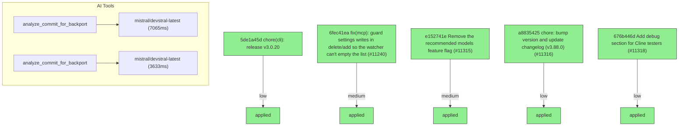

# Backport Agent — Detailed Run Report

> This file is generated automatically. It is intended for human analysts and
> AI reasoning models to assess agent performance, decision quality, and LLM behavior.

**Run timestamp**: 2026-06-05T22:00:38.361Z
**Models used**: fast=`mistral/devstral-latest`  powerful=`openai/gpt-5.5`
**Prompt log**: `/Users/rlemeill/Development/tea-ching-cline/.backport-agent/run-1780696729274.prompts.jsonl`

---

## Summary (PR body)

## Backport Agent — Sync Report

**Date**: 2026-06-05T22:00:38.361Z
**Upstream ref**: `cline/cline.git@main`
**Fork ref**: `TEA-ching/cline@keypool-live`
**Sync branch**: `sync/upstream-main-2026-06-05-2159`

### Summary

- ✅ Applied: 5
- ⚠️ Needs human review: 0
- ⛔ Blocked (not attempted): 0

### Applied commits

- `5de1a45d` [low] chore(cli): release v3.0.20
- `6fec41ea` [medium] fix(mcp): guard settings writes in delete/add so the watcher can't empty the list (#11240)
- `e152741e` [medium] Remove the recommended models feature flag (#11315)
- `a8835425` [low] chore: bump version and update changelog (v3.88.0) (#11316)
- `676b446d` [low] Add debug section for Cline testers (#11318)

### Agent decision log

- All commits were successfully cherry-picked without conflicts.
- Validation failed due to command not being in the allowed list.


---

## Agent Workflow Diagram

> Generated by the fast model from the run summary. Evaluate the agent's decision path.



---

## AI Sub-Agent Call Log (2 calls)

> Each entry is one sub-agent invocation. Review prompt/response pairs to assess
> reasoning quality, hallucinations, and decision accuracy.

### Call 1 / 2 — `analyze_commit_for_backport` ✅ OK

| Field | Value |
|---|---|
| **Timestamp** | 2026-06-05T21:59:53.101Z |
| **Tool** | `analyze_commit_for_backport` |
| **Model** | `mistral/devstral-latest` |
| **Duration** | 7065 ms |
| **Tokens in** | 3601 |
| **Tokens out** | 269 |
| **Cost** | $0.000000 |

**Prompt sent to sub-agent:**

```
Commit SHA: 6fec41ea7025dcbfb702ad1d8a0529d5e704e59d
Commit message:
fix(mcp): guard settings writes in delete/add so the watcher can't empty the list (#11240)
    
    deleteServerRPC and addRemoteServer wrote cline_mcp_settings.json without
    setting isUpdatingClineSettings, so the chokidar settings watcher was not
    suppressed during the plugin's own write. The watcher is configured with
    atomic: true and awaitWriteFinish (stabilityThreshold 100ms); on Windows it
    races the non-atomic writeFile, reads a transient/empty file, and
    readAndValidateMcpSettingsFile() returns { mcpServers: {} }. updateServerConnections({})
    then tears down every in-memory connection, so deleting one MCP server emptied
    the whole list in the UI after navigating away and back (CLINE-2097).
    
    Wrap both methods in the same guard the sibling RPCs already use
    (toggleServerDisabledRPC, toggleToolAutoApproveRPC, updateServerTimeoutRPC):
    set isUpdatingClineSettings = true before the write and clear it on a 300ms
    timer in finally, so the delayed watcher "change" event is skipped. addRemoteServer
    had the same latent omission and is fixed in the same change.
    
    Known tradeoff (pre-existing, unchanged by this fix): the guard is a single
    shared boolean cleared by uncoordinated 300ms timers, so two settings writes
    within 300ms can clear the flag early. Because awaitWriteFinish only emits once
    the file is stable, the worst case there is a redundant reconnect, not the
    empty-list data loss this fixes. A deterministic guard (per-op token or
    content-compare-and-skip in the watcher) is out of scope for this targeted fix.
    
    Adds McpHub.deleteServerRPC.test.ts covering the user-visible symptom (delete
    one of two servers -> remaining server still returned/persisted, list not empty)
    and the guard contract (flag set during write, cleared after 300ms, cleared on
    the not-found error path).

Changed files (2):
apps/vscode/src/services/mcp/McpHub.ts
apps/vscode/src/services/mcp/__tests__/McpHub.deleteServerRPC.test.ts

Diff:
commit 6fec41ea7025dcbfb702ad1d8a0529d5e704e59d
Author: Mikołaj Kondratek <19799111+mkondratek@users.noreply.github.com>
Date:   Fri Jun 5 17:36:04 2026 +0200

    fix(mcp): guard settings writes in delete/add so the watcher can't empty the list (#11240)
    
    deleteServerRPC and addRemoteServer wrote cline_mcp_settings.json without
    setting isUpdatingClineSettings, so the chokidar settings watcher was not
    suppressed during the plugin's own write. The watcher is configured with
    atomic: true and awaitWriteFinish (stabilityThreshold 100ms); on Windows it
    races the non-atomic writeFile, reads a transient/empty file, and
    readAndValidateMcpSettingsFile() returns { mcpServers: {} }. updateServerConnections({})
    then tears down every in-memory connection, so deleting one MCP server emptied
    the whole list in the UI after navigating away and back (CLINE-2097).
    
    Wrap both methods in the same guard the sibling RPCs already use
    (toggleServerDisabledRPC, toggleToolAutoApproveRPC, updateServerTimeoutRPC):
    set isUpdatingClineSettings = true before the write and clear it on a 300ms
    timer in finally, so the delayed watcher "change" event is skipped. addRemoteServer
    had the same latent omission and is fixed in the same change.
    
    Known tradeoff (pre-existing, unchanged by this fix): the guard is a single
    shared boolean cleared by uncoordinated 300ms timers, so two settings writes
    within 300ms can clear the flag early. Because awaitWriteFinish only emits once
    the file is stable, the worst case there is a redundant reconnect, not the
    empty-list data loss this fixes. A deterministic guard (per-op token or
    content-compare-and-skip in the watcher) is out of scope for this targeted fix.
    
    Adds McpHub.deleteServerRPC.test.ts covering the user-visible symptom (delete
    one of two servers -> remaining server still returned/persisted, list not empty)
    and the guard contract (flag set during write, cleared after 300ms, cleared on
    the not-found error path).
---
 apps/vscode/src/services/mcp/McpHub.ts             |  14 +++
 .../mcp/__tests__/McpHub.deleteServerRPC.test.ts   | 133 +++++++++++++++++++++
 2 files changed, 147 insertions(+)

diff --git a/apps/vscode/src/services/mcp/McpHub.ts b/apps/vscode/src/services/mcp/McpHub.ts
index 9d6798fff..080eb2aaa 100644
--- a/apps/vscode/src/services/mcp/McpHub.ts
+++ b/apps/vscode/src/services/mcp/McpHub.ts
@@ -1421,6 +1421,8 @@ export class McpHub {
 	}
 
 	public async addRemoteServer(serverName: string, serverUrl: string, transportType = "streamableHttp"): Promise<McpServer[]> {
+		// Set flag to prevent file watcher from triggering during our update
+		this.isUpdatingClineSettings = true
 		try {
 			const settings = await this.readAndValidateMcpSettingsFile()
 			if (!settings) {
@@ -1468,6 +1470,11 @@ export class McpHub {
 		} catch (error) {
 			Logger.error("Failed to add remote MCP server:", error)
 			throw error
+		} finally {
+			// Clear flag after a delay to ensure file watcher event has been processed
+			setTimeout(() => {
+				this.isUpdatingClineSettings = false
+			}, 300)
 		}
 	}
 
@@ -1477,6 +1484,8 @@ export class McpHub {
 	 * @returns Array of remaining MCP servers
 	 */
 	public async deleteServerRPC(serverName: string): Promise<McpServer[]> {
+		// Set flag to prevent file watcher from triggering during our update
+		this.isUpdatingClineSettings = true
 		try {
 			// Clear OAuth data BEFORE removing from config (while we still have the connection/URL)
 			await this.clearOAuthForConnection(serverName)
@@ -1504,6 +1513,11 @@ export class McpHub {
 		} catch (error) {
 			Logger.error(`Failed to delete MCP server: ${error instanceof Error ? error.message : String(error)}`)
 			throw error
+		} finally {
+			// Clear flag after a delay to ensure file watcher event has been processed
+			setTimeout(() => {
+				this.isUpdatingClineSettings = false
+			}, 300)
 		}
 	}
 
diff --git a/apps/vscode/src/services/mcp/__tests__/McpHub.deleteServerRPC.test.ts b/apps/vscode/src/services/mcp/__tests__/McpHub.deleteServerRPC.test.ts
new file mode 100644
index 000000000..77aee2f9e
--- /dev/null
+++ b/apps/vscode/src/services/mcp/__tests__/McpHub.deleteServerRPC.test.ts
@@ -0,0 +1,133 @@
+import { afterEach, beforeEach, describe, it } from "mocha"
+import "should"
+import * as diskModule from "@core/storage/disk"
+import fs from "fs/promises"
+import os from "os"
+import path from "path"
+import sinon from "sinon"
+import { McpHub } from "../McpHub"
+
+// Regression tests for McpHub.deleteServerRPC(): deleting one server must not
+// empty the list. Tests bypass the constructor's watcher via
+// Object.create(McpHub.prototype), matching McpHub.callTool.test.ts.
+
+type FakeConnection = {
+	server: { name: string; config: string; status: string; disabled: boolean }
+	client: Record<string, unknown>
+	transport: Record<string, unknown>
+}
+
+function makeConnection(name: string): FakeConnection {
+	return {
+		server: {
+			name,
+			config: JSON.stringify({ type: "stdio", command: "test", timeout: 60 }),
+			status: "connected",
+			disabled: false,
+		},
+		client: {},
+		transport: {},
+	}
+}
+
+describe("McpHub.deleteServerRPC", () => {
+	let sandbox: sinon.SinonSandbox
+	let tempDir: string
+	let settingsPath: string
+	let hub: McpHub
+
+	const writeSettings = async (mcpServers: Record<string, unknown>) => {
+		await fs.writeFile(settingsPath, JSON.stringify({ mcpServers }, null, 2))
+	}
+
+	beforeEach(async () => {
+		sandbox = sinon.createSandbox()
+		tempDir = path.join(os.tmpdir(), `mcp-delete-test-${Date.now()}-${Math.random().toString(36).slice(2)}`)
+		await fs.mkdir(tempDir, { recursive: true })
+		settingsPath = path.join(tempDir, "cline_mcp_settings.json")
+		sandbox.stub(diskModule, "getMcpSettingsFilePath").resolves(settingsPath)
+
+		hub = Object.create(McpHub.prototype) as McpHub
+		;(hub as any).getSettingsDirectoryPath = async () => tempDir
+		;(hub as any).isUpdatingClineSettings = false
+		;(hub as any).connections = [makeConnection("alpha"), makeConnection("beta")]
+		// clearOAuthForConnection touches the OAuth manager; stub it out.
+		sandbox.stub(hub as any, "clearOAuthForConnection").resolves()
+		// updateServerConnectionsRPC normally opens real transports; reproduce only
+		// the relevant behavior: drop connections no longer present in the new set.
+		sandbox.stub(hub as any, "updateServerConnectionsRPC").callsFake((...args: unknown[]) => {
+			const newServers = args[0] as Record<string, unknown>
+			;(hub as any).connections = (hub as any).connections.filter((c: FakeConnection) =>
+				Object.hasOwn(newServers, c.server.name),
+			)
+			return Promise.resolve()
+		})
+	})
+
+	afterEach(async () => {
+		sandbox.restore()
+		try {
+			await fs.rm(tempDir, { recursive: true, force: true })
+		} catch {
+			// Ignore cleanup errors
+		}
+	})
+
+	it("returns the remaining servers (not an empty list) after deleting one", async () => {
+		await writeSettings({ alpha: { type: "stdio", command: "a" }, beta: { type: "stdio", command: "b" } })
+
+		const result = await hub.deleteServerRPC("alpha")
+
+		result.should.have.length(1)
+		result.map((s) => s.name).should.deepEqual(["beta"])
+	})
+
+	it("persists the remaining server to the settings file", async () => {
+		await writeSettings({ alpha: { type: "stdio", command: "a" }, beta: { type: "stdio", command: "b" } })
+
+		await hub.deleteServerRPC("alpha")
+
+		const persisted = JSON.parse(await fs.readFile(settingsPath, "utf-8"))
+		Object.keys(persisted.mcpServers).should.deepEqual(["beta"])
+	})
+
+	it("guards the write with isUpdatingClineSettings so the watcher skips its own event", async () => {
+		const clock = sandbox.useFakeTimers()
+		await writeSettings({ alpha: { type: "stdio", command: "a" }, beta: { type: "stdio", command: "b" } })
+
+		// Capture the flag at the moment the settings file is written.
+		let flagDuringWrite: boolean | undefined
+		const realWriteFile = fs.writeFile.bind(fs)
+		sandbox.stub(fs, "writeFile").callsFake((...args: unknown[]) => {
+			flagDuringWrite = (hub as any).isUpdatingClineSettings
+			return (realWriteFile as (...a: unknown[]) => Promise<void>)(...args)
+		})
+
+		await hub.deleteServerRPC("alpha")
+
+		// True during the write and still true immediately after (cleared on a timer).
+		flagDuringWrite!.should.be.true()
+		;(hub as any).isUpdatingClineSettings.should.be.true()
+
+		// The flag is cleared on a 300ms timer so external edits resume.
+		clock.tick(300)
+		;(hub as any).isUpdatingClineSettings.should.be.false()
+	})
+
+	it("throws and still clears the guard when the server is not found", async () => {
+		const clock = sandbox.useFakeTimers()
+		await writeSettings({ beta: { type: "stdio", command: "b" } })
+
+		let threw: Error | undefined
+		try {
+			await hub.deleteServerRPC("missing")
+		} catch (err) {
+			threw = err as Error
+		}
+		;(threw === undefined).should.be.false()
+		threw!.message.should.match(/not found in MCP configuration/)
+
+		clock.tick(300)
+		;(hub as any).isUpdatingClineSettings.should.be.false()
+	})
+})

Output the JSON object now.
```

**Response received:**

````
```json
{
  "summary": "This commit fixes a race condition in MCP server management where the file watcher could read an empty settings file during a write operation, causing all servers to be removed from the UI. It adds a guard flag (`isUpdatingClineSettings`) to suppress the watcher during `deleteServerRPC` and `addRemoteServer` operations, with a 300ms delay before clearing the flag.",
  "keyChanges": [
    "Added `isUpdatingClineSettings = true` before file writes in `addRemoteServer` and `deleteServerRPC`.",
    "Added a `finally` block in both methods to clear the flag after a 300ms delay via `setTimeout`.",
    "Added comprehensive tests for `deleteServerRPC` to verify the fix and guard behavior."
  ],
  "backportComplexity": "moderate",
  "semanticRiskFactors": [
    "Relies on a shared boolean flag with timed clearing, which could interact with custom watcher logic in forks.",
    "Assumes the watcher respects the `isUpdatingClineSettings` flag, which may not be true if the fork modified the watcher behavior."
  ],
  "recommendation": "apply-with-care"
}
```
````

---

### Call 2 / 2 — `analyze_commit_for_backport` ✅ OK

| Field | Value |
|---|---|
| **Timestamp** | 2026-06-05T22:00:18.713Z |
| **Tool** | `analyze_commit_for_backport` |
| **Model** | `mistral/devstral-latest` |
| **Duration** | 3633 ms |
| **Tokens in** | 4046 |
| **Tokens out** | 210 |
| **Cost** | $0.000000 |

**Prompt sent to sub-agent:**

```
Commit SHA: e152741e1d1543ffe11774aa61512c04583bfc4d
Commit message:
Remove the recommended models feature flag (#11315)
    
    * Remove the recommended models feature flag
    
    * Fix recommended model flag CI
    
    ---------
    
    Co-authored-by: Arafatkatze <arafat.da.khan@gmail.com>

Changed files (5):
apps/vscode/src/core/controller/models/__tests__/refreshClineRecommendedModels.test.ts
apps/vscode/src/core/controller/models/refreshClineRecommendedModels.ts
apps/vscode/src/shared/services/feature-flags/feature-flags.ts
apps/vscode/src/test/e2e/fixtures/server/api.ts
apps/vscode/src/test/e2e/fixtures/server/index.ts

Diff:
commit e152741e1d1543ffe11774aa61512c04583bfc4d
Author: Tomás Barreiro <52393857+BarreiroT@users.noreply.github.com>
Date:   Fri Jun 5 12:36:18 2026 -0300

    Remove the recommended models feature flag (#11315)
    
    * Remove the recommended models feature flag
    
    * Fix recommended model flag CI
    
    ---------
    
    Co-authored-by: Arafatkatze <arafat.da.khan@gmail.com>
---
 .../refreshClineRecommendedModels.test.ts          | 26 +--------
 .../models/refreshClineRecommendedModels.ts        | 15 -----
 .../shared/services/feature-flags/feature-flags.ts |  3 -
 apps/vscode/src/test/e2e/fixtures/server/api.ts    | 64 ++++++++++++++++++++++
 apps/vscode/src/test/e2e/fixtures/server/index.ts  | 21 ++++++-
 5 files changed, 86 insertions(+), 43 deletions(-)

diff --git a/apps/vscode/src/core/controller/models/__tests__/refreshClineRecommendedModels.test.ts b/apps/vscode/src/core/controller/models/__tests__/refreshClineRecommendedModels.test.ts
index 658df217f..0172d1e24 100644
--- a/apps/vscode/src/core/controller/models/__tests__/refreshClineRecommendedModels.test.ts
+++ b/apps/vscode/src/core/controller/models/__tests__/refreshClineRecommendedModels.test.ts
@@ -5,9 +5,6 @@ import fs from "fs/promises"
 import { afterEach, beforeEach, describe, it } from "mocha"
 import sinon from "sinon"
 import { ClineEnv, Environment } from "@/config"
-import { getFeatureFlagsService } from "@/services/feature-flags"
-import { CLINE_RECOMMENDED_MODELS_FALLBACK } from "@/shared/cline/recommended-models"
-import { FeatureFlag } from "@/shared/services/feature-flags/feature-flags"
 import { Logger } from "@/shared/services/Logger"
 import { refreshClineRecommendedModels, resetClineRecommendedModelsCacheForTests } from "../refreshClineRecommendedModels"
 
@@ -26,20 +23,7 @@ describe("refreshClineRecommendedModels", () => {
 		sandbox.restore()
 	})
 
-	it("returns hardcoded models and skips upstream fetch when rollout flag is off", async () => {
-		sandbox.stub(getFeatureFlagsService(), "getBooleanFlagEnabled").returns(false)
-		const axiosGetStub = sandbox.stub(axios, "get")
-
-		const result = await refreshClineRecommendedModels()
-
-		expect(result).to.deep.equal(CLINE_RECOMMENDED_MODELS_FALLBACK)
-		expect(axiosGetStub.called).to.equal(false)
-	})
-
-	it("fetches from upstream when rollout flag is on", async () => {
-		sandbox.stub(getFeatureFlagsService(), "getBooleanFlagEnabled").callsFake((flag) => {
-			return flag === FeatureFlag.CLINE_RECOMMENDED_MODELS_UPSTREAM
-		})
+	it("fetches from upstream", async () => {
 		sandbox.stub(ClineEnv, "config").returns({
 			environment: Environment.production,
 			appBaseUrl: "https://app.cline-mock.bot",
@@ -78,10 +62,7 @@ describe("refreshClineRecommendedModels", () => {
 		})
 	})
 
-	it("uses hardcoded models when rollout flag is turned off after upstream cache is populated", async () => {
-		const flagStub = sandbox.stub(getFeatureFlagsService(), "getBooleanFlagEnabled")
-		flagStub.onFirstCall().returns(true)
-		flagStub.onSecondCall().returns(false)
+	it("uses the in-memory cache after upstream cache is populated", async () => {
 		sandbox.stub(ClineEnv, "config").returns({
 			environment: Environment.production,
 			appBaseUrl: "https://app.cline-mock.bot",
@@ -101,7 +82,6 @@ describe("refreshClineRecommendedModels", () => {
 		const secondResult = await refreshClineRecommendedModels()
 
 		expect(axiosGetStub.calledOnce).to.equal(true)
-		expect(firstResult).to.not.deep.equal(CLINE_RECOMMENDED_MODELS_FALLBACK)
-		expect(secondResult).to.deep.equal(CLINE_RECOMMENDED_MODELS_FALLBACK)
+		expect(secondResult).to.deep.equal(firstResult)
 	})
 })
diff --git a/apps/vscode/src/core/controller/models/refreshClineRecommendedModels.ts b/apps/vscode/src/core/controller/models/refreshClineRecommendedModels.ts
index 5e9eb0a08..53de0ee00 100644
--- a/apps/vscode/src/core/controller/models/refreshClineRecommendedModels.ts
+++ b/apps/vscode/src/core/controller/models/refreshClineRecommendedModels.ts
@@ -3,10 +3,7 @@ import axios from "axios"
 import fs from "fs/promises"
 import path from "path"
 import { ClineEnv } from "@/config"
-import { featureFlagsService } from "@/services/feature-flags"
-import { CLINE_RECOMMENDED_MODELS_FALLBACK } from "@/shared/cline/recommended-models"
 import { getAxiosSettings } from "@/shared/net"
-import { FeatureFlag } from "@/shared/services/feature-flags/feature-flags"
 import { Logger } from "@/shared/services/Logger"
 
 export interface ClineRecommendedModelData {
@@ -26,14 +23,6 @@ const RECOMMENDED_MODELS_CACHE_TTL_MS = 60 * 60 * 1000
 let pendingRefresh: Promise<ClineRecommendedModelsData> | null = null
 let inMemoryCache: { data: ClineRecommendedModelsData; timestamp: number } | null = null
 
-function getHardcodedRecommendedModels(): ClineRecommendedModelsData {
-	return CLINE_RECOMMENDED_MODELS_FALLBACK
-}
-
-function useUpstreamRecommendedModels(): boolean {
-	return featureFlagsService.getBooleanFlagEnabled(FeatureFlag.CLINE_RECOMMENDED_MODELS_UPSTREAM)
-}
-
 function normalizeRecommendedModel(raw: unknown): ClineRecommendedModelData | null {
 	if (!raw || typeof raw !== "object") {
 		return null
@@ -80,10 +69,6 @@ function normalizeRecommendedModelsResponse(raw: unknown): ClineRecommendedModel
 }
 
 export async function refreshClineRecommendedModels(): Promise<ClineRecommendedModelsData> {
-	if (!useUpstreamRecommendedModels()) {
-		return getHardcodedRecommendedModels()
-	}
-
 	if (inMemoryCache && Date.now() - inMemoryCache.timestamp <= RECOMMENDED_MODELS_CACHE_TTL_MS) {
 		return inMemoryCache.data
 	}
diff --git a/apps/vscode/src/shared/services/feature-flags/feature-flags.ts b/apps/vscode/src/shared/services/feature-flags/feature-flags.ts
index 8fb5a9577..51a7608b7 100644
--- a/apps/vscode/src/shared/services/feature-flags/feature-flags.ts
+++ b/apps/vscode/src/shared/services/feature-flags/feature-flags.ts
@@ -12,8 +12,6 @@ export enum FeatureFlag {
 	// Feature flag for DB-backed welcome banners (What's New modal)
 	// When off, hardcoded welcome items are shown instead
 	REMOTE_WELCOME_BANNERS = "remote-welcome-banners",
-	// Feature flag for upstream Cline recommended model cards
-	CLINE_RECOMMENDED_MODELS_UPSTREAM = "cline-recommended-models-upstream",
 	// Rollout flag for Cline provider model sourcing:
 	// off => OpenRouter model list, on => Cline endpoint model list.
 	EXTENSION_CLINE_MODELS_ENDPOINT = "extension_cline_models_endpoint",
@@ -28,7 +26,6 @@ export const FeatureFlagDefaultValue: Partial<Record<FeatureFlag, FeatureFlagPay
 	[FeatureFlag.REMOTE_BANNERS]: process.env.E2E_TEST === "true" || process.env.IS_DEV === "true",
 	[FeatureFlag.EXTENSION_REMOTE_BANNERS_TTL]: 24 * 60 * 60 * 1000,
 	[FeatureFlag.REMOTE_WELCOME_BANNERS]: process.env.E2E_TEST === "true" || process.env.IS_DEV === "true",
-	[FeatureFlag.CLINE_RECOMMENDED_MODELS_UPSTREAM]: false,
 	[FeatureFlag.EXTENSION_CLINE_MODELS_ENDPOINT]: false,
 	[FeatureFlag.OPENAI_RESPONSES_WEBSOCKET_MODE]: false,
 }
diff --git a/apps/vscode/src/test/e2e/fixtures/server/api.ts b/apps/vscode/src/test/e2e/fixtures/server/api.ts
index 57cc6df5f..bf9bf67f3 100644
--- a/apps/vscode/src/test/e2e/fixtures/server/api.ts
+++ b/apps/vscode/src/test/e2e/fixtures/server/api.ts
@@ -2,6 +2,8 @@ export const E2E_REGISTERED_MOCK_ENDPOINTS = {
 	"/api/v1": {
 		GET: [
 			"/generation",
+			"/ai/cline/models",
+			"/ai/cline/recommended-models",
 			"/organizations/{orgId}/balance",
 			"/organizations/{orgId}/members/{memberId}/usages",
 			"/organizations/{orgId}/api-keys",
@@ -80,3 +82,65 @@ export const E2E_MOCK_API_RESPONSES = {
 	REPLACE_REQUEST: replace_in_file,
 	EDIT_REQUEST: edit_request,
 }
+
+export const E2E_MOCK_CLINE_RECOMMENDED_MODELS = {
+	free: [
+		{
+			id: "z-ai/glm-5",
+			name: "z-ai/glm-5",
+			description: "Free model for e2e onboarding",
+			tags: [],
+		},
+	],
+	recommended: [
+		{
+			id: "anthropic/claude-sonnet-4.6",
+			name: "anthropic/claude-sonnet-4.6",
+			description: "Recommended model for e2e onboarding",
+			tags: ["BEST"],
+		},
+	],
+}
+
+export const E2E_MOCK_CLINE_MODELS = [
+	{
+		id: "z-ai/glm-5",
+		name: "z-ai/glm-5",
+		description: "Free model for e2e onboarding",
+		context_length: 131_072,
+		top_provider: {
+			max_completion_tokens: 8_192,
+			context_length: 131_072,
+			is_moderated: false,
+		},
+		architecture: {
+			modality: "text->text",
+		},
+		pricing: {
+			prompt: "0",
+			completion: "0",
+		},
+		supported_parameters: [],
+	},
+	{
+		id: "anthropic/claude-sonnet-4.6",
+		name: "anthropic/claude-sonnet-4.6",
+		description: "Recommended model for e2e onboarding",
+		context_length: 200_000,
+		top_provider: {
+			max_completion_tokens: 64_000,
+			context_length: 200_000,
+			is_moderated: false,
+		},
+		architecture: {
+			modality: "text->text",
+		},
+		pricing: {
+			prompt: "0.000003",
+			completion: "0.000015",
+			input_cache_read: "0.0000003",
+			input_cache_write: "0.00000375",
+		},
+		supported_parameters: ["include_reasoning"],
+	},
+]
diff --git a/apps/vscode/src/test/e2e/fixtures/server/index.ts b/apps/vscode/src/test/e2e/fixtures/server/index.ts
index 248fa4b97..ff4faa1fc 100644
--- a/apps/vscode/src/test/e2e/fixtures/server/index.ts
+++ b/apps/vscode/src/test/e2e/fixtures/server/index.ts
@@ -2,7 +2,12 @@ import { createServer, type IncomingMessage, type Server, type ServerResponse }
 import type { Socket } from "node:net"
 import { v4 as uuidv4 } from "uuid"
 import type { BalanceResponse, OrganizationBalanceResponse, UserResponse } from "../../../../shared/ClineAccount"
-import { E2E_MOCK_API_RESPONSES, E2E_REGISTERED_MOCK_ENDPOINTS } from "./api"
+import {
+	E2E_MOCK_API_RESPONSES,
+	E2E_MOCK_CLINE_MODELS,
+	E2E_MOCK_CLINE_RECOMMENDED_MODELS,
+	E2E_REGISTERED_MOCK_ENDPOINTS,
+} from "./api"
 import { ClineDataMock } from "./data"
 
 const E2E_API_SERVER_PORT = 7777
@@ -166,7 +171,11 @@ export class ClineApiServerMock {
 
 			// Authentication middleware
 			const authHeader = req.headers.authorization
-			const isAuthRequired = !path.startsWith("/.test/") && path !== "/health" && path !== "/api/v1/auth/token"
+			const isPublicApiRoute =
+				path === "/api/v1/auth/token" ||
+				path === "/api/v1/ai/cline/models" ||
+				path === "/api/v1/ai/cline/recommended-models"
+			const isAuthRequired = !path.startsWith("/.test/") && path !== "/health" && !isPublicApiRoute
 
 			if (isAuthRequired && (!authHeader || !authHeader.startsWith("Bearer "))) {
 				return sendApiError("Unauthorized", 401)
@@ -215,6 +224,14 @@ export class ClineApiServerMock {
 
 				// API v1 endpoints
 				if (baseRoute === "/api/v1") {
+					if (endpoint === "/ai/cline/recommended-models" && method === "GET") {
+						return sendJson(E2E_MOCK_CLINE_RECOMMENDED_MODELS)
+					}
+
+					if (endpoint === "/ai/cline/models" && method === "GET") {
+						return sendJson({ data: E2E_MOCK_CLINE_MODELS })
+					}
+
 					// User endpoints
 					if (endpoint === "/api/v1/users/me" && method === "GET") {
 						const currentUser = controller.currentUser

Output the JSON object now.
```

**Response received:**

````
```json
{
  "summary": "This commit removes the feature flag for recommended models, simplifying the code by always fetching models from upstream instead of using hardcoded fallbacks. It also updates tests to reflect this behavior change.",
  "keyChanges": [
    "Removed `CLINE_RECOMMENDED_MODELS_UPSTREAM` feature flag from `feature-flags.ts`",
    "Deleted feature flag checks in `refreshClineRecommendedModels.ts` and related hardcoded fallback logic",
    "Updated tests to remove flag-based branching and always expect upstream fetches",
    "Added new mock endpoints for recommended models and model lists in e2e test fixtures"
  ],
  "backportComplexity": "moderate",
  "semanticRiskFactors": [
    "Removes a feature flag that forks may have been using to control model fetching behavior",
    "Changes test expectations which may conflict with custom test implementations"
  ],
  "recommendation": "review-required"
}
```
````

---

## Performance Summary

**Total AI time**: 10698 ms across 2 call(s)
**Total input tokens**: 7647
**Total output tokens**: 479

| Tool | Calls | Total ms | Avg ms | Input tok | Output tok |
|---|---|---|---|---|---|
| `analyze_commit_for_backport` | 2 | 10698 | 5349 | 7647 | 479 |

## Decision Quality Metrics

> Automated quality signals derived from tool output guards, schema validation,
> hallucination detection, and consensus checks.  Review flagged items manually.

### Commit Analysis Quality

| Metric | Value |
|---|---|
| Total analyze calls | 2 |
| Commits with semantic risk factors | 2 |
| Possible hallucinated references (total) | 0 |

### Audit Event Timeline

| Timestamp | Tool | Event | Details |
|---|---|---|---|
| 21:59:53 | `analyze_commit_for_backport` | `analysis_complete` | sha="6fec41ea7025dcbfb702ad1d8a0529d5e704e59, recommendation="apply-with-care", complexity="moderate" |
| 22:00:18 | `analyze_commit_for_backport` | `analysis_complete` | sha="e152741e1d1543ffe11774aa61512c04583bfc4, recommendation="review-required", complexity="moderate" |
