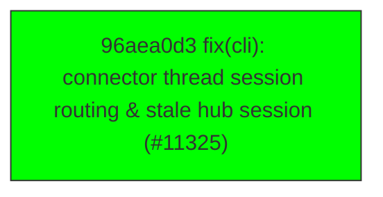

# Backport Agent — Detailed Run Report

> This file is generated automatically. It is intended for human analysts and
> AI reasoning models to assess agent performance, decision quality, and LLM behavior.

**Run timestamp**: 2026-06-06T19:13:29.809Z
**Models used**: fast=`mistral/devstral-latest`  powerful=`openai/gpt-5.5`
**Prompt log**: `/Users/rlemeill/Development/tea-ching-cline/.backport-agent/run-1780773179087.prompts.jsonl`

---

## Summary (PR body)

## Backport Agent — Sync Report

**Date**: 2026-06-06T19:13:29.809Z
**Upstream ref**: `main`
**Fork ref**: `keypool-live`
**Sync branch**: `sync/upstream-main-2026-06-06-1913`

### Summary

- ✅ Applied: 1
- ⚠️ Needs human review: 0
- ⛔ Blocked (not attempted): 0

### Applied commits

- `96aea0d3` [low] fix(cli): connector thread session routing & stale hub session (#11325)

### Agent decision log

- Commit 96aea0d34bb73d7adc10497e16837e16837e5079586444 classified as low risk and applied successfully.

---

## Agent Workflow Diagram

> Generated by the fast model from the run summary. Evaluate the agent's decision path.

---

## AI Sub-Agent Call Log (0 calls)

> Each entry is one sub-agent invocation. Review prompt/response pairs to assess
> reasoning quality, hallucinations, and decision accuracy.

_No AI sub-agent calls were made during this run._

---

## Decision Quality Metrics

> Automated quality signals derived from tool output guards, schema validation,
> hallucination detection, and consensus checks.  Review flagged items manually.
