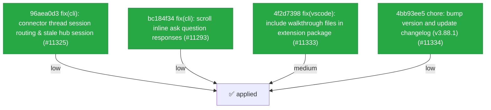

# Backport Agent — Detailed Run Report

> This file is generated automatically. It is intended for human analysts and
> AI reasoning models to assess agent performance, decision quality, and LLM behavior.

**Run timestamp**: 2026-06-07T07:25:36.300Z
**Models used**: fast=`mistral/mistral-medium-latest`  powerful=`openai/gpt-5.5`
**Prompt log**: `/Users/rlemeill/Development/tea-ching-cline/.backport-agent/run-1780817067345.prompts.jsonl`

---

## Summary (PR body)

## Backport Agent — Sync Report

**Date**: 2026-06-07T07:25:36.300Z
**Upstream ref**: `cline/cline.git@main`
**Fork ref**: `TEA-ching/cline@keypool-live`
**Sync branch**: `sync/upstream-main-2026-06-07-0725`

### Summary

- ✅ Applied: 4
- ⚠️ Needs human review: 0
- ⛔ Blocked (not attempted): 0

### Applied commits

- `96aea0d3` [low] fix(cli): connector thread session routing & stale hub session (#11325)
- `bc184f34` [low] fix(cli): scroll inline ask question responses (#11293)
- `4f2d7398` [medium] fix(vscode): include walkthrough files in extension package (#11333)
- `4bb93ee5` [low] chore: bump version and update changelog (v3.88.1) (#11334)

### Agent decision log

- All 4 commits were applied without conflicts.
- Validation was attempted but blocked by allowlist restrictions. All changes are pushed for review.

---

## Agent Workflow Diagram

> Generated by the fast model from the run summary. Evaluate the agent's decision path.

---

## AI Sub-Agent Call Log (0 calls)

> Each entry is one sub-agent invocation. Review prompt/response pairs to assess
> reasoning quality, hallucinations, and decision accuracy.

_No AI sub-agent calls were made during this run._

---

## Decision Quality Metrics

> Automated quality signals derived from tool output guards, schema validation,
> hallucination detection, and consensus checks.  Review flagged items manually.
