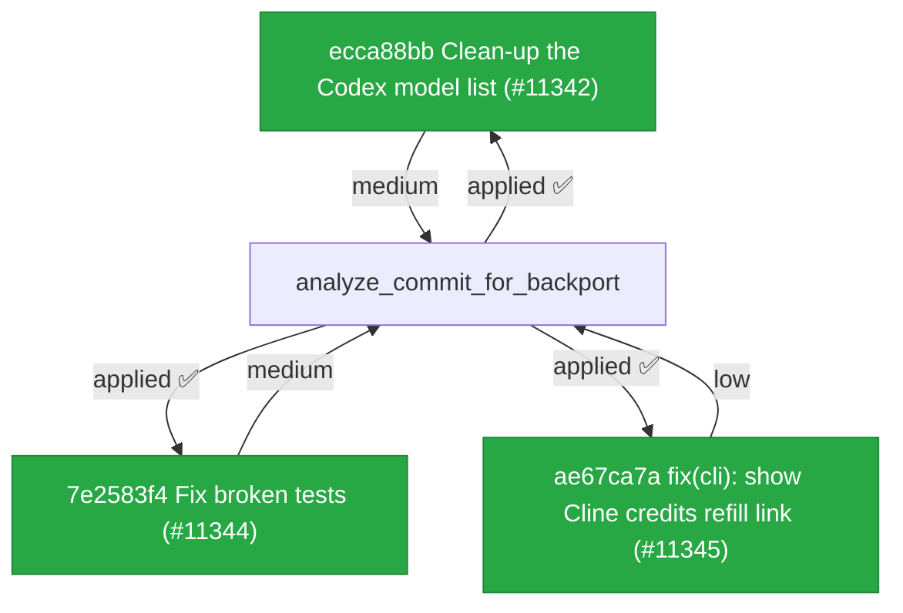

# Backport Agent — Detailed Run Report

> This file is generated automatically. It is intended for human analysts and
> AI reasoning models to assess agent performance, decision quality, and LLM behavior.

**Run timestamp**: 2026-06-08T06:11:31.276Z
**Models used**: fast=`mistral/mistral-medium-latest`  powerful=`openai/gpt-5.5`
**Prompt log**: `/Users/rlemeill/Development/tea-ching-cline/.backport-agent/run-1780899014617.prompts.jsonl`

---

## Summary (PR body)

## Backport Agent — Sync Report

**Date**: 2026-06-08T06:11:31.276Z
**Upstream ref**: `main`
**Fork ref**: `keypool-live`
**Sync branch**: `sync/upstream-main-2026-06-08-0610`

### Summary

- ✅ Applied: 3
- ⚠️ Needs human review: 0
- ⛔ Blocked (not attempted): 0

### Applied commits

- `ecca88bb` [medium] Clean-up the Codex model list (#11342)
- `7e2583f4` [medium] Fix broken tests (#11344)
- `ae67ca7a` [low] fix(cli): show Cline credits refill link (#11345)

### Agent decision log

- All commits were applied cleanly with no conflicts.
- Validation was skipped due to policy restrictions.


---

## Agent Workflow Diagram

> Generated by the fast model from the run summary. Evaluate the agent's decision path.



---

## AI Sub-Agent Call Log (1 call)

> Each entry is one sub-agent invocation. Review prompt/response pairs to assess
> reasoning quality, hallucinations, and decision accuracy.

### Call 1 / 1 — `analyze_commit_for_backport` ✅ OK

| Field | Value |
|---|---|
| **Timestamp** | 2026-06-08T06:10:36.325Z |
| **Tool** | `analyze_commit_for_backport` |
| **Model** | `mistral/mistral-medium-latest` |
| **Duration** | 3187 ms |
| **Tokens in** | 600 |
| **Tokens out** | 232 |
| **Cost** | $0.000000 |

**Prompt sent to sub-agent:**

```
Commit SHA: ecca88bb983392fa2afe9b4351a78b5dad58bcb9
Commit message:
Clean-up the Codex model list (#11342)

This removes deprecated Codex model entries from the allowed set.

Changed files (1):
sdk/packages/llms/src/providers/openai-codex-models.ts

Diff:
diff --git a/sdk/packages/llms/src/providers/openai-codex-models.ts b/sdk/packages/llms/src/providers/openai-codex-models.ts
index 7de5decf2..613b0dcb7 100644
--- a/sdk/packages/llms/src/providers/openai-codex-models.ts
+++ b/sdk/packages/llms/src/providers/openai-codex-models.ts
@@ -2,9 +2,6 @@ import type { ModelInfo } from "../catalog/types";
 
 const OPENAI_CODEX_ALLOWED_MODELS = new Set([
 	"gpt-5.5",
-	"gpt-5.2",
-	"gpt-5.3-codex",
-	"gpt-5.3-codex-spark",
 	"gpt-5.4",
 	"gpt-5.4-mini",
 ]);

Output the JSON object now.
```

**Response received:**

````
```json
{
  "summary": "Removes three deprecated Codex model entries (`gpt-5.2`, `gpt-5.3-codex`, and `gpt-5.3-codex-spark`) from the allowed set in OpenAI Codex model definitions. This is a cleanup commit with no functional impact beyond preventing usage of obsolete models.",

  "keyChanges": [
    "Deleted `gpt-5.2` from `OPENAI_CODEX_ALLOWED_MODELS` Set",
    "Deleted `gpt-5.3-codex` from `OPENAI_CODEX_ALLOWED_MODELS` Set",
    "Deleted `gpt-5.3-codex-spark` from `OPENAI_CODEX_ALLOWED_MODELS` Set"
  ],

  "backportComplexity": "trivial",

  "semanticRiskFactors": [
    "fork may rely on deprecated models for legacy compatibility",
    "custom logic might explicitly check for removed model names"
  ],

  "recommendation": "apply-with-care"
}
```
````

---

## Performance Summary

**Total AI time**: 3187 ms across 1 call(s)
**Total input tokens**: 600
**Total output tokens**: 232

| Tool | Calls | Total ms | Avg ms | Input tok | Output tok |
|---|---|---|---|---|---|
| `analyze_commit_for_backport` | 1 | 3187 | 3187 | 600 | 232 |

## Decision Quality Metrics

> Automated quality signals derived from tool output guards, schema validation,
> hallucination detection, and consensus checks.  Review flagged items manually.

### Commit Analysis Quality

| Metric | Value |
|---|---|
| Total analyze calls | 1 |
| Commits with semantic risk factors | 1 |
| Possible hallucinated references (total) | 0 |

### Audit Event Timeline

| Timestamp | Tool | Event | Details |
|---|---|---|---|
| 06:10:36 | `analyze_commit_for_backport` | `analysis_complete` | sha="ecca88bb983392fa2afe9b4351a78b5dad58bcb, recommendation="apply-with-care", complexity="trivial" |
