# Backport Agent — Detailed Run Report

> This file is generated automatically. It is intended for human analysts and
> AI reasoning models to assess agent performance, decision quality, and LLM behavior.

**Run timestamp**: 2026-06-10T08:10:14.875Z
**Models used**: fast=`mistral/devstral-medium-latest`  powerful=`mistral-medium-3-5`
**Prompt log**: `/Users/rlemeill/Development/tea-ching-cline/.backport-agent/run-1781078380972.prompts.jsonl`

---

## Summary (PR body)

## Backport Agent — Sync Report

**Date**: 2026-06-10T08:10:14.875Z
**Upstream ref**: `upstream/main`
**Fork ref**: `keypool-live`
**Sync branch**: `sync/upstream-main-2026-06-10-0809`

### Summary

- ✅ Applied: 10
- ⚠️ Needs human review: 0
- ⛔ Blocked (not attempted): 0

### Applied commits

- `70303d85` [high] Improve bug report form: rename surface dropdown, add IDE/CLI diagnostics (#11381)
- `1c1ea0bd` [low] chore(deps): bump shell-quote from 1.8.3 to 1.8.4 in /apps/vscode (#11383)
- `3a3ea6ee` [high] Fix MiniMax M3 thinking controls across gateways [ENG-2163] (#11371)
- `f09dab7a` [medium] feat(vscode): add Claude Fable 5 support to VS Code extension (#11384)
- `349a8da7` [medium] feat(sdk): add Claude Fable 5 model support (#11385)
- `c32789f6` [low] chore: bump version and update changelog (v3.89.0) (#11386)
- `2cabb2dd` [high] chore(sdk): release v0.0.45
- `764e9016` [medium] test(core): update legacy migration default to claude-fable-5
- `7e5b8be2` [low] chore(cli): release v3.0.22
- `6cc93c12` [low] Format vscode using biome higher order rules (#11389)

### Agent decision log

- All commits were successfully applied without conflicts.
- Validation was skipped due to command restrictions.


---

## Agent Workflow Diagram

> Generated by the fast model from the run summary. Evaluate the agent's decision path.

```mermaid
flowchart TD
    A["70303d85 Improve bug report form: rename surface dropdown, add IDE/CLI diagnostics (#11381)"] -->|high| B[✅]
    C["1c1ea0bd chore(deps): bump shell-quote from 1.8.3 to 1.8.4 in /apps/vscode (#11383)"] -->|low| D[✅]
    E["3a3ea6ee Fix MiniMax M3 thinking controls across gateways [ENG-2163] (#11371)"] -->|high| F[✅]
    G["f09dab7a feat(vscode): add Claude Fable 5 support to VS Code extension (#11384)"] -->|medium| H[✅]
    I["349a8da7 feat(sdk): add Claude Fable 5 model support (#11385)"] -->|medium| J[✅]
    K["c32789f6 chore: bump version and update changelog (v3.89.0) (#11386)"] -->|low| L[✅]
    M["2cabb2dd chore(sdk): release v0.0.45"] -->|high| N[✅]
    O["764e9016 test(core): update legacy migration default to claude-fable-5"] -->|medium| P[✅]
    Q["7e5b8be2 chore(cli): release v3.0.22"] -->|low| R[✅]
    S["6cc93c12 Format vscode using biome higher order rules (#11389)"] -->|low| T[✅]

    style A fill:#d4f8d4,stroke:#333
    style C fill:#d4f8d4,stroke:#333
    style E fill:#d4f8d4,stroke:#333
    style G fill:#d4f8d4,stroke:#333
    style I fill:#d4f8d4,stroke:#333
    style K fill:#d4f8d4,stroke:#333
    style M fill:#d4f8d4,stroke:#333
    style O fill:#d4f8d4,stroke:#333
    style Q fill:#d4f8d4,stroke:#333
    style S fill:#d4f8d4,stroke:#333

    style B fill:#90EE90,stroke:#333
    style D fill:#90EE90,stroke:#333
    style F fill:#90EE90,stroke:#333
    style H fill:#90EE90,stroke:#333
    style J fill:#90EE90,stroke:#333
    style L fill:#90EE90,stroke:#333
    style N fill:#90EE90,stroke:#333
    style P fill:#90EE90,stroke:#333
    style R fill:#90EE90,stroke:#333
    style T fill:#90EE90,stroke:#333
```



---

## AI Sub-Agent Call Log (5 calls)

> Each entry is one sub-agent invocation. Review prompt/response pairs to assess
> reasoning quality, hallucinations, and decision accuracy.

### Call 1 / 5 — `analyze_commit_for_backport` ✅ OK

| Field | Value |
|---|---|
| **Timestamp** | 2026-06-10T08:00:28.916Z |
| **Tool** | `analyze_commit_for_backport` |
| **Model** | `mistral/devstral-medium-latest` |
| **Duration** | 4100 ms |
| **Tokens in** | 1663 |
| **Tokens out** | 169 |
| **Cost** | $0.000000 |

**Prompt sent to sub-agent:**

```
Commit SHA: 70303d8541b0329d092bd617860df1453356f05d
Commit message:
Improve bug report form: rename surface dropdown, add IDE/CLI diagnostics (#11381)

Changed files (2):
.github/ISSUE_TEMPLATE/bug_report.yml
.github/workflows/repo-label-issues.yml

Diff:
commit 70303d8541b0329d092bd617860df1453356f05d
Author: Mikołaj Kondratek <19799111+mkondratek@users.noreply.github.com>
Date:   Tue Jun 9 18:38:53 2026 +0200

    Improve bug report form: rename surface dropdown, add IDE/CLI diagnostics (#11381)
    
    * Improve bug report form: rename surface dropdown, add IDE/CLI diagnostics
    
    Rename the 'Plugin Type' dropdown to 'Cline Surface' since CLI is not a plugin; the option values keep each choice unambiguous.
    
    Add an 'IDE / CLI Diagnostics' field with per-surface copy-paste steps for About info (VSCode Help/About, JetBrains Help/About Copy button) and a CLI exception using 'cline --version'. System Information is left as-is; minor overlap is acceptable.
    
    * Update repo-label-issues workflow for renamed Cline Surface field
    
    The auto-labeler matches the rendered '### Plugin Type' heading. Since the form label was renamed to 'Cline Surface', update the three regexes so JetBrains/VS Code/CLI labels keep applying.
---
 .github/ISSUE_TEMPLATE/bug_report.yml   | 18 +++++++++++++++---
 .github/workflows/repo-label-issues.yml |  6 +++---
 2 files changed, 18 insertions(+), 6 deletions(-)

diff --git a/.github/ISSUE_TEMPLATE/bug_report.yml b/.github/ISSUE_TEMPLATE/bug_report.yml
index 9b40efb618..b4db8f1ddf 100644
--- a/.github/ISSUE_TEMPLATE/bug_report.yml
+++ b/.github/ISSUE_TEMPLATE/bug_report.yml
@@ -7,10 +7,10 @@ body:
       value: |
         **Important:** All bug reports must be reproducible using Claude Sonnet 4.5. Cline uses complex prompts so less capable models may not work as expected.
   - type: dropdown
-    id: plugin-type
+    id: cline-surface
     attributes:
-      label: Plugin Type
-      description: Which plugin are you reporting a bug for?
+      label: Cline Surface
+      description: Which Cline surface are you reporting a bug for?
       options:
         - VSCode Extension
         - JetBrains Plugin
@@ -59,6 +59,18 @@ body:
       placeholder: 'e.g., cline:anthropic/claude-sonnet-4.5, gemini:gemini-2.5-pro-exp-03-25'
     validations:
       required: false
+  - type: textarea
+    id: ide-diagnostics
+    attributes:
+      label: IDE / CLI Diagnostics
+      description: |
+        Paste the "About" diagnostics for your Cline surface. This captures the IDE build, runtime, and host details we need.
+        - VSCode Extension: open `Help → About` (Windows/Linux) or `Code → About Visual Studio Code` (macOS), then copy the info.
+        - JetBrains Plugin: open `Help → About` (Windows/Linux) or `<IDE name> → About` (macOS), then click `Copy` to grab build, runtime, OS, memory, and cores.
+        - CLI: there is no About dialog. Run `cline --version` and paste the output.
+      placeholder: Paste the copied About info or `cline --version` output here.
+    validations:
+      required: false
   - type: textarea
     id: system-info
     attributes:
diff --git a/.github/workflows/repo-label-issues.yml b/.github/workflows/repo-label-issues.yml
index b3fe29b10a..7c7994d45c 100644
--- a/.github/workflows/repo-label-issues.yml
+++ b/.github/workflows/repo-label-issues.yml
@@ -17,7 +17,7 @@ jobs:
             const labels = context.payload.issue.labels.map(l => l.name);
 
             // Check if JetBrains Plugin is selected
-            if (body.match(/###\s*Plugin Type\s*\n+JetBrains Plugin/i)) {
+            if (body.match(/###\s*Cline Surface\s*\n+JetBrains Plugin/i)) {
               if (!labels.includes('JetBrains')) {
                 await github.rest.issues.addLabels({
                   owner: context.repo.owner,
@@ -29,7 +29,7 @@ jobs:
             }
 
             // Check if VSCode Extension is selected
-            if (body.match(/###\s*Plugin Type\s*\n+VSCode Extension/i)) {
+            if (body.match(/###\s*Cline Surface\s*\n+VSCode Extension/i)) {
               if (!labels.includes('VS Code')) {
                 await github.rest.issues.addLabels({
                   owner: context.repo.owner,
@@ -41,7 +41,7 @@ jobs:
             }
 
             // Check if CLI is selected
-            if (body.match(/###\s*Plugin Type\s*\n+CLI/i)) {
+            if (body.match(/###\s*Cline Surface\s*\n+CLI/i)) {
               if (!labels.includes('CLI')) {
                 await github.rest.issues.addLabels({
                   owner: context.repo.owner,

Output the JSON object now.
```

**Response received:**

````
```json
{
  "summary": "This commit improves the bug report form by renaming the 'Plugin Type' dropdown to 'Cline Surface' and adding a new 'IDE / CLI Diagnostics' field with instructions for collecting surface-specific diagnostic information. It also updates the auto-labeling workflow to match the renamed field.",
  "keyChanges": [
    "Renamed dropdown label from 'Plugin Type' to 'Cline Surface' in bug_report.yml",
    "Added new 'IDE / CLI Diagnostics' textarea field with per-surface instructions",
    "Updated three regex patterns in repo-label-issues.yml to match the new 'Cline Surface' heading"
  ],
  "backportComplexity": "trivial",
  "semanticRiskFactors": [],
  "recommendation": "apply"
}
```
````

---

### Call 2 / 5 — `check_customization_compatibility` ✅ OK

| Field | Value |
|---|---|
| **Timestamp** | 2026-06-10T08:02:41.427Z |
| **Tool** | `check_customization_compatibility` |
| **Model** | `mistral/devstral-medium-latest` |
| **Duration** | 6433 ms |
| **Tokens in** | 11139 |
| **Tokens out** | 77 |
| **Cost** | $0.000000 |

**Prompt sent to sub-agent:**

```
Declared fork customisations:
  1. Pattern: sdk/packages/llms/src/providers/builtins.ts
     Description: Custom provider routing metadata for keypoollive
     Current file content (1 file(s)):
      [sdk/packages/llms/src/providers/builtins.ts]
      import {
      	type GatewayModelCapability,
      	type GatewayModelDefinition,
      	type GatewayProviderManifest,
      	type GatewayProviderMetadata,
      	type GatewayProviderSettings,
      	getClineEnvironmentConfig,
      	type JsonValue,
      	type ProviderCapability,
      	type ProviderConfigField,
      } from "@cline/shared";
      import { getGeneratedModelsForProvider } from "../catalog/catalog.generated-access";
      import type {
      	ModelCollection,
      	ModelInfo,
      	ProviderClient,
      	ProviderProtocol,
      } from "../catalog/types";
      import { filterOpenAICodexModels } from "./openai-codex-models";
      import {
      	ANTHROPIC_AND_QWEN_CACHE_ROUTING_METADATA,
      	ANTHROPIC_ROUTING_METADATA,
      	QWEN_CACHE_ROUTING_METADATA,
      } from "./routing/anthropic-compatible";
      import { GLM_THINKING_ROUTING_METADATA } from "./routing/glm-thinking";
      
      export const DEFAULT_INTERNAL_OCA_BASE_URL =
      	"https://code-internal.aiservice.us-chicago-1.oci.oraclecloud.com/20250206/app/litellm";
      export const DEFAULT_EXTERNAL_OCA_BASE_URL =
      	"https://code.aiservice.us-chicago-1.oci.oraclecloud.com/20250206/app/litellm";
      const OPENAI_CODEX_DEFAULT_MODEL_ID = "gpt-5.4";
      
      export type ProviderFamily =
      	| "keypoollive"
      	| "openai"
      	| "openai-compatible"
      	| "anthropic"
      	| "google"
      	| "vertex"
      	| "bedrock"
      	| "mistral"
      	| "cohere"
      	| "claude-code"
      	| "openai-codex"
      	| "opencode"
      	| "dify"
      	| "sap-ai-core";
      
      export interface BuiltinSpec {
      	id: string;
      	name: string;
      	description: string;
      	family: ProviderFamily;
      	protocol?: ProviderProtocol;
      	client?: ProviderClient;
      	capabilities?: ProviderCapability[];
      	popular?: number;
      	modelsProviderId?: string;
      	defaultModelId?: string;
      	modelsFactory?: () => Record<string, ModelInfo>;
      	env?: readonly ("browser" | "node")[];
      	apiKeyEnv?: readonly string[];
      	modelsSourceUrl?: string;
      	docsUrl?: string;
      	defaults?: GatewayProviderSettings;
      	configFields?: readonly ProviderConfigField[];
      	metadata?: GatewayProviderMetadata;
      }
      
      const API_KEY_FIELD: ProviderConfigField = {
      	path: "apiKey",
      	label: "API Key",
      	type: "password",
      	placeholder: "Enter

Upstream diff to evaluate:
commit 3a3ea6ee964dad8959b2ec82784472ab73fd9995
Author: Robin Newhouse <robin@cline.bot>
Date:   Tue Jun 9 10:53:59 2026 -0700

    Fix MiniMax M3 thinking controls across gateways [ENG-2163] (#11371)
    
    * fix(llms): route MiniMax M3 thinking controls
    
    * test(llms): tighten MiniMax M3 routing scope
    
    * fix(llms): preserve fetch preconnect in MiniMax shim
---
 sdk/packages/llms/src/providers/builtins.test.ts   |  18 ++
 sdk/packages/llms/src/providers/builtins.ts        |   3 +-
 sdk/packages/llms/src/providers/model-facts.ts     |   9 +
 .../llms/src/providers/routing/minimax-thinking.ts |  78 ++++++
 .../src/providers/routing/provider-option-rules.ts |  60 +++++
 .../src/providers/routing/provider-options.test.ts | 258 ++++++++++++++++++++
 .../llms/src/providers/vendors/anthropic.test.ts   |  22 +-
 .../llms/src/providers/vendors/anthropic.ts        |  19 +-
 .../src/providers/vendors/minimax-thinking.test.ts |  69 ++++++
 .../llms/src/providers/vendors/minimax-thinking.ts | 104 ++++++++
 .../tests/provider-live-minimax-routing.test.ts    | 264 +++++++++++++++++++++
 sdk/packages/shared/src/llms/gateway.ts            |   5 +-
 12 files changed, 904 insertions(+), 5 deletions(-)

diff --git a/sdk/packages/llms/src/providers/builtins.test.ts b/sdk/packages/llms/src/providers/builtins.test.ts
index 22b695d395..ba6dbc6213 100644
--- a/sdk/packages/llms/src/providers/builtins.test.ts
+++ b/sdk/packages/llms/src/providers/builtins.test.ts
@@ -116,4 +116,22 @@ describe("built-in provider metadata", () => {
 			}
 		}
 	});
+
+	it("routes direct MiniMax M3 through MiniMax thinking metadata", async () => {
+		await expect(getProvider("minimax")).resolves.toMatchObject({
+			metadata: {
+				routing: {
+					reasoning: {
+						format: "minimax-thinking",
+						routes: [
+							expect.objectContaining({
+								matcher: "model-id",
+								modelId: "MiniMax-M3",
+							}),
+						],
+					},
+				},
+		});
+	});
 });
diff --git a/sdk/packages/llms/src/providers/builtins.ts b/sdk/packages/llms/src/providers/builtins.ts
index 4491e50c8a..b85472cbaa 100644
--- a/sdk/packages/llms/src/providers/builtins.ts
+++ b/sdk/packages/llms/src/providers/builtins.ts
@@ -23,6 +23,7 @@ import {
 	QWEN_CACHE_ROUTING_METADATA,
 } from "./routing/anthropic-compatible";
 import { GLM_THINKING_ROUTING_METADATA } from "./routing/glm-thinking";
+import { MINIMAX_THINKING_ROUTING_METADATA } from "./routing/minimax-thinking";
 
 export const DEFAULT_INTERNAL_OCA_BASE_URL =
 	"https://code-internal.aiservice.us-chicago-1.oci.oraclecloud.com/20250206/app/litellm";
@@ -953,7 +954,7 @@ export const BUILTIN_SPECS: BuiltinSpec[] = [
 		apiKeyEnv: ["MINIMAX_API_KEY"],
 		modelsProviderId: "minimax",
 		defaults: { baseUrl: "https://api.minimax.io/anthropic/v1" },
-		metadata: ANTHROPIC_ROUTING_METADATA,
+		metadata: MINIMAX_THINKING_ROUTING_METADATA,
 	},
 	{
 		id: "opencode",
diff --git a/sdk/packages/llms/src/providers/model-facts.ts b/sdk/packages/llms/src/providers/model-facts.ts
index dd8f5b4076..86d95ca1cf 100644
--- a/sdk/packages/llms/src/providers/model-facts.ts
+++ b/sdk/packages/llms/src/providers/model-facts.ts
@@ -215,6 +215,15 @@ export function isGlmModel(
 	return family.includes("glm") || normalizedModelId(request).includes("glm");
 }
 
+export function isMiniMaxM3Model(
+	request: Pick<GatewayStreamRequest, "modelId">,
+	_context: GatewayProviderContext,
+): boolean {
+	const modelId = normalizedModelId(request);
+
+	return modelId === "minimax-m3" || modelId === "minimax/minimax-m3";
+}
+
 export function isKimiK26Family(context: GatewayProviderContext): boolean {
 	return normalizedFamily(context) === "kimi-k2.6";
 }
diff --git a/sdk/packages/llms/src/providers/routing/minimax-thinking.ts b/sdk/packages/llms/src/providers/routing/minimax-thinking.ts
new file mode 100644
index 0000000000..15c655cd22
--- /dev/null
+++ b/sdk/packages/llms/src/providers/routing/minimax-thinking.ts
@@ -0,0 +1,78 @@
+import type {
+	GatewayProviderMetadata,
+	GatewayStreamRequest,
+} from "@cline/shared";
+import {
+	buildProviderAndAliasPatch,
+	type ProviderOptionsPatch,
+} from "./utils";
+
+export const MINIMAX_THINKING_ROUTING_METADATA: GatewayProviderMetadata = {
+	routing: {
+		promptCache: {
+			format: "anthropic-cache-control",
+			routes: [{ matcher: "anthropic-compatible" }],
+		},
+		reasoning: {
+			format: "minimax-thinking",
+			routes: [
+				{
+					matcher: "model-id",
+					modelId: "MiniMax-M3",
+					requiredCapability: "reasoning",
+				},
+			],
+		},
+	},
+};
+
+function buildMiniMaxThinkingOptions(request: GatewayStreamRequest) {
+	if (request.reasoning?.enabled === true) {
+		return { thinking: { type: "adaptive" } };
+	}
+	if (request.reasoning?.enabled === false) {
+		return { thinking: { type: "disabled" } };
+	}
+	return undefined;
+}
+
+function buildMiniMaxGatewayReasoningOptions(request: GatewayStreamRequest) {
+	if (request.reasoning?.enabled === true) {
+		return { reasoning: { enabled: true } };
+	}
+	if (request.reasoning?.enabled === false) {
+		return { reasoning: { exclude: true } };
+	}
+	return undefined;
+}
+
+export function buildMiniMaxThinkingProviderOptionsPatch(
+	request: GatewayStreamRequest,
+	providerOptionsKey: string,
+): ProviderOptionsPatch | undefined {
+	const thinking = buildMiniMaxThinkingOptions(request);
+	if (!thinking) {
+		return undefined;
+	}
+	return {
+		openaiCompatible: thinking,
+		[request.providerId]: thinking,
+		...(providerOptionsKey !== request.providerId
+			? { [providerOptionsKey]: thinking }
+			: {}),
+	};
+}
+
+export function buildMiniMaxGatewayReasoningProviderOptionsPatch(
+	request: GatewayStreamRequest,
+	providerOptionsKey: string,
+): ProviderOptionsPatch | undefined {
+	const reasoning = buildMiniMaxGatewayReasoningOptions(request);
+	return reasoning
+		? buildProviderAndAliasPatch({
+				providerId: request.providerId,
+				providerOptionsKey,
+				bucketOptions: reasoning,
+			})
+		: undefined;
+}
diff --git a/sdk/packages/llms/src/providers/routing/provider-option-rules.ts b/sdk/packages/llms/src/providers/routing/provider-option-rules.ts
index df13b395fb..fa56e5e061 100644
--- a/sdk/packages/llms/src/providers/routing/provider-option-rules.ts
+++ b/sdk/packages/llms/src/providers/routing/provider-option-rules.ts
@@ -5,6 +5,7 @@ import {
 	isGeminiProModel,
 	isGlmModel,
 	isKimiK26Family as isKimiK26FamilyFact,
+	isMiniMaxM3Model,
 	isMoonshotKimiModelIdFallback,
 	modelReasoningDefaultsOn,
 	providerReasoningRouteMatches,
@@ -16,6 +17,10 @@ import {
 	buildNativeGlmThinkingProviderOptionsPatch,
 	buildRoutedGlmReasoningProviderOptionsPatch,
 } from "./glm-thinking";
+import {
+	buildMiniMaxGatewayReasoningProviderOptionsPatch,
+	buildMiniMaxThinkingProviderOptionsPatch,
+} from "./minimax-thinking";
 import type {
 	MatchedProviderOptionRule,
 	ProviderOptionBuildInput,
@@ -46,6 +51,10 @@ function isDeepSeekModelOrProviderDefault(
 	);
 }
 
+function isMiniMaxM3(input: ProviderOptionMatchInput): boolean {
+	return isMiniMaxM3Model(input.request, input.context);
+}
+
 function isOllamaReasoningDefaultOnDisable(
 	input: ProviderOptionMatchInput,
 ): boolean {
@@ -78,6 +87,16 @@ function hasGlmThinkingProviderRouting(
 	);
 }
 
+function usesMiniMaxThinkingProviderRouting(
+	input: ProviderOptionMatchInput,
+): boolean {
+	return providerReasoningRouteMatches(
+		"minimax-thinking",
+		input.request,
+		input.context,
+	);
+}
+
 function resolveFamilyThinkingType(
 	input: ProviderOptionMatchInput,
 	defaultWhenUnset: "enabled" | "disabled" | undefined,
@@ -267,6 +286,31 @@ const openRouterReasoningRule: ProviderOptionRule = {
 		),
 };
 
+const clineMiniMaxM3GatewayReasoningRule: ProviderOptionRule = {
+	id: "provider.cline.minimax-m3.gateway-reasoning",
+	phase: "provider-reasoning",
+	description:
+		"Cline-routed MiniMax M3 keeps the gateway reasoning shape instead of leaking generic thinking.",
+	applies: (input) => input.request.providerId === "cline" && isMiniMaxM3(input),
+	suppresses: { genericThinking: true, genericEffort: true },
+	build: () => undefined,
+};
+
+const vercelMiniMaxM3GatewayReasoningRule: ProviderOptionRule = {
+	id: "provider.vercel-ai-gateway.minimax-m3.gateway-reasoning",
+	phase: "provider-reasoning",
+	description:
+		"Vercel-routed MiniMax M3 uses the gateway reasoning include/exclude shape.",
+	applies: (input) =>
+		input.request.providerId === "vercel-ai-gateway" && isMiniMaxM3(input),
+	suppresses: { genericThinking: true, genericEffort: true },
+	build: (input) =>
+		buildMiniMaxGatewayReasoningProviderOptionsPatch(
+			input.request,
+			input.providerOptionsKey,
+		),
+};
+
 const geminiThinkingRule: ProviderOptionRule = {
 	id: "provider.google-gemini.thinking-config",
 	phase: "provider",
@@ -403,6 +447,19 @@ const nativeZaiGlmThinkingRule: ProviderOptionRule = {
 		),
 };
 
+const miniMaxThinkingRule: ProviderOptionRule = {
+	id: "provider.routing.minimax-thinking",
+	phase: "model-overlay",
+	description: "Direct MiniMax M3 uses thinking.type adaptive/disabled.",
+	applies: usesMiniMaxThinkingProviderRouting,
+	suppresses: { genericThinking: true, genericEffort: true },
+	build: (input) =>
+		buildMiniMaxThinkingProviderOptionsPatch(
+			input.request,
+			input.providerOptionsKey,
+		),
+};
+
 const routedGlmReasoningRule: ProviderOptionRule = {
 	id: "family.glm.routed-reasoning",
 	phase: "model-overlay",
@@ -437,6 +503,8 @@ export const PROVIDER_OPTION_RULES: ReadonlyArray<ProviderOptionRule> = [
 	genericProviderFanoutRule,
 	clineGatewayReasoningRule,
 	openRouterReasoningRule,
+	clineMiniMaxM3GatewayReasoningRule,
+	vercelMiniMaxM3GatewayReasoningRule,
 	geminiThinkingRule,
 	clineReasoningDisabledThinkingRule,
 	kimiK26ThinkingRule,
@@ -444,6 +512,7 @@ export const PROVIDER_OPTION_RULES: ReadonlyArray<ProviderOptionRule> = [
 	ollamaReasoningDefaultOnDisableRule,
 	nonGlmProviderRoutingSuppressionRule,
 	nativeZaiGlmThinkingRule,
+	miniMaxThinkingRule,
 	routedGlmReasoningRule,
 ];
 
diff --git a/sdk/packages/llms/src/providers/routing/provider-options.test.ts b/sdk/packages/llms/src/providers/routing/provider-options.test.ts
index d0f3187c58..615909be04 100644
--- a/sdk/packages/llms/src/providers/routing/provider-options.test.ts
+++ b/sdk/packages/llms/src/providers/routing/provider-options.test.ts
@@ -4,6 +4,7 @@ import type {
 } from "@cline/shared";
 import { describe, expect, it } from "vitest";
 import { GLM_THINKING_ROUTING_METADATA } from "./glm-thinking";
+import { MINIMAX_THINKING_ROUTING_METADATA } from "./minimax-thinking";
 import {
 	composeAiSdkProviderOptions,
 	mergeProviderOptionPatches,
@@ -1227,6 +1228,263 @@ describe("composeAiSdkProviderOptions: family/provider thinking patches", () =>
 				{ bucket: "openaiCompatible", lacks: ["thinking"] },
 			],
 		},
+		{
+			name: "openrouter MiniMax M3 reasoning enabled -> OpenRouter reasoning shape",
+			request: {
+				providerId: "openrouter",
+				modelId: "minimax/minimax-m3",
+				reasoning: { enabled: true },
+			},
+			context: {
+				family: "minimax",
+				capabilities: ["reasoning"],
+			},
+			expect: [
+				{
+					bucket: "openrouter",
+					has: { reasoning: { enabled: true } },
+					lacks: ["thinking", "effort", "reasoningEffort"],
+				},
+				{
+					bucket: "openaiCompatible",
+					lacks: ["thinking", "reasoning", "effort", "reasoningEffort"],
+				},
+			],
+		},
+		{
+			name: "openrouter MiniMax M3 reasoning disabled -> OpenRouter reasoning.exclude",
+			request: {
+				providerId: "openrouter",
+				modelId: "minimax/minimax-m3",
+				reasoning: { enabled: false },
+			},
+			context: {
+				family: "minimax",
+				capabilities: ["reasoning"],
+			},
+			expect: [
+				{
+					bucket: "openrouter",
+					has: { reasoning: { exclude: true } },
+					lacks: ["thinking"],
+				},
+				{
+					bucket: "openaiCompatible",
+					lacks: ["thinking", "reasoning"],
+				},
+			],
+		},
+		{
+			name: "vercel MiniMax M3 reasoning enabled -> gateway reasoning shape",
+			request: {
+				providerId: "vercel-ai-gateway",
+				modelId: "minimax/minimax-m3",
+				reasoning: { enabled: true, effort: "high" },
+			},
+			context: {
+				family: "minimax",
+				capabilities: ["reasoning"],
+			},
+			expect: [
+				{
+					bucket: "vercel-ai-gateway",
+					has: { reasoning: { enabled: true } },
+					lacks: ["thinking", "effort", "reasoningEffort", "reasoningSummary"],
+				},
+				{
+					bucket: "vercelAiGateway",
+					has: { reasoning: { enabled: true } },
+					lacks: ["thinking", "effort", "reasoningEffort", "reasoningSummary"],
+				},
+			],
+		},
+		{
+			name: "vercel MiniMax M3 reasoning disabled -> gateway reasoning.exclude",
+			request: {
+				providerId: "vercel-ai-gateway",
+				modelId: "minimax/minimax-m3",
+				reasoning: { enabled: false },
+			},
+			context: {
+				family: "minimax",
+				capabilities: ["reasoning"],
+			},
+			expect: [
+				{
+					bucket: "vercel-ai-gateway",
+					has: { reasoning: { exclude: true } },
+					lacks: ["thinking"],
+				},
+				{
+					bucket: "vercelAiGateway",
+					has: { reasoning: { exclude: true } },
+					lacks: ["thinking"],
+				},
+			],
+		},
+		{
+			name: "vercel MiniMax M3 sibling id -> no MiniMax M3 gateway exception",
+			request: {
+				providerId: "vercel-ai-gateway",
+				modelId: "minimax/minimax-m3-pro",
+				reasoning: { enabled: true },
+			},
+			context: {
+				family: "minimax",
+				capabilities: ["reasoning"],
+			},
+			expect: [
+				{
+					bucket: "vercel-ai-gateway",
+					has: { thinking: { type: "adaptive" } },
+					lacks: ["reasoning"],
+				},
+			],
+		},
+		{
+			name: "cline MiniMax M3 reasoning enabled -> gateway reasoning without thinking leak",
+			request: {
+				providerId: "cline",
+				modelId: "minimax/minimax-m3",
+				reasoning: { enabled: true, effort: "high" },
+			},
+			context: {
+				family: "minimax",
+				capabilities: ["reasoning"],
+			},
+			expect: [
+				{
+					bucket: "cline",
+					has: { reasoning: { enabled: true, effort: "high" } },
+					lacks: ["thinking", "effort", "reasoningEffort", "reasoningSummary"],
+				},
+				{
+					bucket: "openaiCompatible",
+					lacks: ["thinking", "reasoning", "effort", "reasoningEffort"],
+				},
+			],
+		},
+		{
+			name: "cline MiniMax M3 reasoning disabled -> gateway reasoning disabled",
+			request: {
+				providerId: "cline",
+				modelId: "minimax/minimax-m3",
+				reasoning: { enabled: false },
+			},
+			context: {
+				family: "minimax",
+				capabilities: ["reasoning"],
+			},
+			expect: [
+				{
+					bucket: "cline",
+					has: { reasoning: { enabled: false } },
+					lacks: ["thinking"],
+				},
+				{
+					bucket: "openaiCompatible",
+					lacks: ["thinking", "reasoning"],
+				},
+			],
+		},
+		{
+			name: "direct MiniMax M3 reasoning disabled -> thinking.type=disabled",
+			request: {
+				providerId: "minimax",
+				modelId: "MiniMax-M3",
+				reasoning: { enabled: false },
+			},
+			context: {
+				family: "minimax",
+				capabilities: ["reasoning"],
+				metadata: MINIMAX_THINKING_ROUTING_METADATA,
+			},
+			expect: [
+				{
+					bucket: "minimax",
+					has: { thinking: { type: "disabled" } },
+					lacks: ["reasoning", "effort", "reasoningEffort", "reasoningSummary"],
+				},
+				{
+					bucket: "openaiCompatible",
+					has: { thinking: { type: "disabled" } },
+					lacks: ["reasoning", "effort", "reasoningEffort", "reasoningSummary"],
+				},
+			],
+		},
+		{
+			name: "direct MiniMax M3 reasoning enabled -> thinking.type=adaptive",
+			request: {
+				providerId: "minimax",
+				modelId: "MiniMax-M3",
+				reasoning: { enabled: true, effort: "high" },
+			},
+			context: {
+				family: "minimax",
+				capabilities: ["reasoning"],
+				metadata: MINIMAX_THINKING_ROUTING_METADATA,
+			},
+			expect: [
+				{
+					bucket: "minimax",
+					has: { thinking: { type: "adaptive" } },
+					lacks: ["reasoning", "effort", "reasoningEffort", "reasoningSummary"],
+				},
+				{
+					bucket: "openaiCompatible",
+					has: { thinking: { type: "adaptive" } },
+					lacks: ["reasoning", "effort", "reasoningEffort", "reasoningSummary"],
+				},
+			],
+		},
+		{
+			name: "direct MiniMax M3 reasoning disabled -> no MiniMax M3 disabled exception",
+			request: {
+				providerId: "minimax",
+				modelId: "MiniMax-M2.7",
+				reasoning: { enabled: false },
+			},
+			context: {
+				family: "minimax",
+				capabilities: ["reasoning"],
+				metadata: MINIMAX_THINKING_ROUTING_METADATA,
+			},
+			expect: [
+				{
+					bucket: "minimax",
+					lacks: ["thinking", "reasoning", "effort", "reasoningEffort"],
+				},
+				{
+					bucket: "openaiCompatible",
+					lacks: ["thinking", "reasoning", "effort", "reasoningEffort"],
+				},
+			],
+		},
 		// Ollama Qwen3: model behavior fact first, documented dynamic fallback second.
 		{
 			name: "ollama metadata reasoningDefaultOn disabled -> reasoningEffort none",
diff --git a/sdk/packages/llms/src/providers/vendors/anthropic.test.ts b/sdk/packages/llms/src/providers/vendors/anthropic.test.ts
index 81da6f7502..4027ef2c3e 100644
--- a/sdk/packages/llms/src/providers/vendors/anthropic.test.ts
+++ b/sdk/packages/llms/src/providers/vendors/anthropic.test.ts
@@ -41,6 +41,26 @@ describe("createAnthropicProviderModule", () => {
 		);
 		expect(anthropicModelMock).toHaveBeenCalledWith("MiniMax-M2.5");
 	});
+
+	it("does not wrap fetch for non-MiniMax Anthropic-compatible providers", async () => {
+		const customFetch = vi.fn<typeof fetch>();
+
+		await createAnthropicProviderModule(
+			config({
+				providerId: "anthropic",
+				apiKey: "anthropic-api-key",
+				fetch: customFetch,
+			}),
+			context("anthropic"),
+		);
+
+		expect(createAnthropicMock).toHaveBeenCalledWith(
+			expect.objectContaining({
+				name: "anthropic",
+				fetch: customFetch,
+			}),
+		);
+	});
 });
 
 function config(
@@ -65,6 +85,6 @@ function context(providerId: string): GatewayProviderContext {
 			id: "MiniMax-M2.5",
 			name: "MiniMax-M2.5",
 		},
-		config: config({}),
+		config: config({ providerId }),
 	};
 }
diff --git a/sdk/packages/llms/src/providers/vendors/anthropic.ts b/sdk/packages/llms/src/providers/vendors/anthropic.ts
index 9d11f74f91..8904206c41 100644
--- a/sdk/packages/llms/src/providers/vendors/anthropic.ts
+++ b/sdk/packages/llms/src/providers/vendors/anthropic.ts
@@ -1,9 +1,15 @@
 import { createAnthropic } from "@ai-sdk/anthropic";
+import type { LanguageModelV3 } from "@ai-sdk/provider";
 import type {
 	GatewayProviderContext,
 	GatewayResolvedProviderConfig,
 } from "@cline/shared";
+import { wrapLanguageModel } from "ai";
 import { resolveApiKey } from "../http";
+import {
+	createMiniMaxThinkingFetch,
+	miniMaxThinkingDisabledMiddleware,
+} from "./minimax-thinking";
 import type { ProviderFactoryResult } from "./types";
 
 export async function createAnthropicProviderModule(
@@ -11,14 +17,23 @@ export async function createAnthropicProviderModule(
 	context: GatewayProviderContext,
 ): Promise<ProviderFactoryResult> {
 	const apiKey = await resolveApiKey(config);
+	const isMiniMax = context.provider.id === "minimax";
 	const provider = createAnthropic({
 		apiKey,
 		baseURL: config.baseUrl,
 		headers: config.headers,
-		fetch: config.fetch,
+		fetch: isMiniMax ? createMiniMaxThinkingFetch(config.fetch) : config.fetch,
 		name: context.provider.id,
 	});
 	return {
-		model: (modelId) => provider(modelId),
+		model: (modelId) => {
+			const model = provider(modelId);
+			return isMiniMax
+				? wrapLanguageModel({
+						model: model as LanguageModelV3,
+						middleware: miniMaxThinkingDisabledMiddleware,
+					})
+				: model;
+		},
 	};
 }
diff --git a/sdk/packages/llms/src/providers/vendors/minimax-thinking.test.ts b/sdk/packages/llms/src/providers/vendors/minimax-thinking.test.ts
new file mode 100644
index 0000000000..4470f5aeaf
--- /dev/null
+++ b/sdk/packages/llms/src/providers/vendors/minimax-thinking.test.ts
@@ -0,0 +1,69 @@
+import { describe, expect, it, vi } from "vitest";
+import {
+	createMiniMaxThinkingFetch,
+	MINIMAX_THINKING_DISABLED_HEADER,
+	miniMaxThinkingDisabledMiddleware,
+} from "./minimax-thinking";
+
+describe("MiniMax thinking shim", () => {
+	it("preserves fetch preconnect when the runtime exposes it", () => {
+		const preconnect = vi.fn();
+		const baseFetch = Object.assign(vi.fn(async () => new Response("{}")), {
+			preconnect,
+		}) as unknown as typeof fetch;
+
+		const wrappedFetch = createMiniMaxThinkingFetch(baseFetch) as typeof fetch & {
+			preconnect?: (url: string) => void;
+		};
+		wrappedFetch.preconnect?.("https://api.minimax.io");
+
+		expect(preconnect).toHaveBeenCalledWith("https://api.minimax.io");
+	});
+
+	it("marks MiniMax requests whose provider options disable thinking", async () => {
+		const result = await miniMaxThinkingDisabledMiddleware.transformParams?.({
+			type: "stream",
+			model: {} as never,
+			params: {
+				providerOptions: {
+					minimax: { thinking: { type: "disabled" } },
+				},
+			} as never,
+		});
+
+		expect(result).toEqual(
+			expect.objectContaining({
+				headers: expect.objectContaining({
+					[MINIMAX_THINKING_DISABLED_HEADER]: "1",
+				}),
+			}),
+		);
+	});
+
+	it("injects explicit disabled thinking and strips the private marker header", async () => {
+		const baseFetch = vi.fn(async () => new Response("{}"));
+		const wrappedFetch = createMiniMaxThinkingFetch(baseFetch);
+
+		await wrappedFetch("https://api.minimax.io/anthropic/v1/messages", {
+			method: "POST",
+			headers: {
+				"content-type": "application/json",
+				[MINIMAX_THINKING_DISABLED_HEADER]: "1",
+			},
+			body: JSON.stringify({
+				model: "MiniMax-M3",
+				messages: [],
+			}),
+		});
+
+		const init = baseFetch.mock.calls[0]?.[1];
+		expect(new Headers(init?.headers).has(MINIMAX_THINKING_DISABLED_HEADER)).toBe(
+			false,
+		);
+		expect(JSON.parse(String(init?.body))).toEqual(
+			expect.objectContaining({
+				thinking: { type: "disabled" },
+			}),
+		);
+	});
+});
diff --git a/sdk/packages/llms/src/providers/vendors/minimax-thinking.ts b/sdk/packages/llms/src/providers/vendors/minimax-thinking.ts
new file mode 100644
index 0000000000..55a865f2f9
--- /dev/null
+++ b/sdk/packages/llms/src/providers/vendors/minimax-thinking.ts
@@ -0,0 +1,104 @@
+import type {
+	LanguageModelV3CallOptions,
+	LanguageModelV3Middleware,
+} from "@ai-sdk/provider";
+
+export const MINIMAX_THINKING_DISABLED_HEADER =
+	"x-cline-minimax-thinking-disabled";
+
+type FetchWithOptionalPreconnect = typeof fetch & {
+	preconnect?: (...args: unknown[]) => unknown;
+};
+
+function getMiniMaxThinkingType(providerOptions: unknown): string | undefined {
+	const options =
+		providerOptions && typeof providerOptions === "object"
+			? (providerOptions as Record<string, unknown>)
+			: {};
+	const minimax =
+		options.minimax && typeof options.minimax === "object"
+			? (options.minimax as Record<string, unknown>)
+			: undefined;
+	const thinking =
+		minimax?.thinking && typeof minimax.thinking === "object"
+			? (minimax.thinking as Record<string, unknown>)
+			: undefined;
+	return typeof thinking?.type === "string" ? thinking.type : undefined;
+}
+
+export const miniMaxThinkingDisabledMiddleware: LanguageModelV3Middleware = {
+	specificationVersion: "v3",
+	transformParams: async ({ params }) => {
+		if (getMiniMaxThinkingType(params.providerOptions) !== "disabled") {
+			return params;
+		}
+
+		return {
+			...params,
+			headers: {
+				...params.headers,
+				[MINIMAX_THINKING_DISABLED_HEADER]: "1",
+			},
+		} satisfies LanguageModelV3CallOptions;
+	},
+};
+
+async function readBody(
+	body: NonNullable<Parameters<typeof fetch>[1]>["body"],
+): Promise<unknown> {
+	if (typeof body === "string") {
+		return JSON.parse(body) as unknown;
+	}
+	if (body instanceof Uint8Array) {
+		return JSON.parse(new TextDecoder().decode(body)) as unknown;
+	}
+	if (body instanceof ArrayBuffer) {
+		return JSON.parse(new TextDecoder().decode(body)) as unknown;
+	}
+	return undefined;
+}
+
+function writeBody(body: unknown): string {
+	return JSON.stringify(body);
+}
+
+export function createMiniMaxThinkingFetch(baseFetch: typeof fetch = fetch) {
+	const wrappedFetch = (async (
+		input: Parameters<typeof fetch>[0],
+		init?: Parameters<typeof fetch>[1],
+	) => {
+		const headers = new Headers(init?.headers);
+		const shouldInject =
+			headers.get(MINIMAX_THINKING_DISABLED_HEADER) === "1";
+		if (!shouldInject) {
+			return baseFetch(input, init);
+		}
+
+		headers.delete(MINIMAX_THINKING_DISABLED_HEADER);
+		const body = await readBody(init?.body);
+		const bodyRecord =
+			body && typeof body === "object" && !Array.isArray(body)
+				? (body as Record<string, unknown>)
+				: undefined;
+		const nextBody =
+			bodyRecord && bodyRecord.thinking === undefined
+				? writeBody({
+						...bodyRecord,
+						thinking: { type: "disabled" },
+					})
+				: init?.body;
+
+		return baseFetch(input, {
+			...init,
+			headers,
+			body: nextBody,
+		});
+	}) as typeof fetch;
+	const sourceFetch = baseFetch as FetchWithOptionalPreconnect;
+	(wrappedFetch as FetchWithOptionalPreconnect).preconnect =
+		typeof sourceFetch.preconnect === "function"
+			? sourceFetch.preconnect.bind(baseFetch)
+			: () => {};
+
+	return wrappedFetch;
+}
diff --git a/sdk/packages/llms/src/tests/provider-live-minimax-routing.test.ts b/sdk/packages/llms/src/tests/provider-live-minimax-routing.test.ts
new file mode 100644
index 0000000000..ea29d06ef7
--- /dev/null
+++ b/sdk/packages/llms/src/tests/provider-live-minimax-routing.test.ts
@@ -0,0 +1,264 @@
+import { describe, expect, it } from "vitest";
+import { createHandlerAsync, type ProviderConfig } from "../providers";
+
+type ReasoningControl = { enabled: boolean };
+
+type LiveCase = {
+	label: string;
+	config: ProviderConfig;
+	expectedBody: Record<string, unknown>;
+	unexpectedBodyKeys?: string[];
+};
+
+type LiveMetrics = {
+	usageSeen: boolean;
+	reasoningChunks: number;
+};
+
+type CapturedRequest = {
+	url: string;
+	body: unknown;
+};
+
+const LIVE_TEST_ENABLED = process.env.LLMS_LIVE_MINIMAX_ROUTING_TESTS === "1";
+const PROVIDER_TIMEOUT_MS = Number(
+	process.env.LLMS_LIVE_PROVIDER_TIMEOUT_MS ?? "120000",
+);
+const DEFAULT_PROMPT =
+	"What is 12*13? Answer with only the number and no explanation.";
+
+function readRequiredEnv(name: string): string {
+	const value = process.env[name]?.trim();
+	if (!value) {
+		throw new Error(`Set ${name} to run MiniMax M3 live routing tests.`);
+	}
+	return value;
+}
+
+function makeConfig(options: {
+	providerId: string;
+	modelId: string;
+	apiKeyEnv: string;
+	reasoning: ReasoningControl;
+	fetch: typeof fetch;
+}): ProviderConfig {
+	return {
+		providerId: options.providerId,
+		modelId: options.modelId,
+		apiKey: readRequiredEnv(options.apiKeyEnv),
+		fetch: options.fetch,
+		thinking: options.reasoning.enabled,
+		maxOutputTokens: 64,
+	};
+}
+
+async function readRequestBody(body: unknown): Promise<Record<string, unknown>> {
+	if (typeof body === "string") {
+		return JSON.parse(body) as Record<string, unknown>;
+	}
+	if (body instanceof Uint8Array) {
+		return JSON.parse(new TextDecoder().decode(body)) as Record<
+			string,
+			unknown
+		>;
+	}
+	if (body instanceof ArrayBuffer) {
+		return JSON.parse(new TextDecoder().decode(body)) as Record<
+			string,
+			unknown
+		>;
+	}
+	return body && typeof body === "object"
+		? (body as Record<string, unknown>)
+		: {};
+}
+
+async function runLiveRequest(config: ProviderConfig): Promise<LiveMetrics> {
+	const handler = await createHandlerAsync(config);
+	const metrics: LiveMetrics = { usageSeen: false, reasoningChunks: 0 };
+	const stream = handler.createMessage("You are concise.", [
+		{ role: "user", content: DEFAULT_PROMPT },
+	]);
+
+	for await (const chunk of stream) {
+		if (chunk.type === "usage") {
+			metrics.usageSeen = true;
+		}
+		if (chunk.type === "reasoning") {
+			metrics.reasoningChunks += 1;
+		}
+		if (chunk.type === "done" && !chunk.success) {
+			throw new Error(chunk.error ?? "done chunk reported success=false");
+		}
+	}
+
+	return metrics;
+}
+
+function buildCases(): LiveCase[] {
+	const cases: LiveCase[] = [];
+	const addCase = (options: {
+		label: string;
+		providerId: string;
+		modelId: string;
+		apiKeyEnv: string;
+		reasoning: ReasoningControl;
+		expectedBody: Record<string, unknown>;
+		unexpectedBodyKeys?: string[];
+	}) => {
+		const captured: CapturedRequest[] = [];
+		const captureFetch: typeof fetch = async (input, init) => {
+			captured.push({ url: String(input), body: init?.body });
+			return fetch(input, init);
+		};
+		const config = makeConfig({ ...options, fetch: captureFetch });
+		cases.push({
+			label: options.label,
+			config: {
+				...config,
+				metadata: {
+					...(config.metadata ?? {}),
+					get capturedRequests() {
+						return captured;
+					},
+				},
+			},
+			expectedBody: options.expectedBody,
+			unexpectedBodyKeys: options.unexpectedBodyKeys,
+		});
+	};
+
+	addCase({
+		label: "direct MiniMax M3 reasoning enabled",
+		providerId: "minimax",
+		modelId: "MiniMax-M3",
+		apiKeyEnv: "MINIMAX_API_KEY",
+		reasoning: { enabled: true },
+		expectedBody: { thinking: { type: "adaptive" } },
+		unexpectedBodyKeys: [
+			"reasoning",
+			"effort",
+			"reasoningEffort",
+			"reasoningSummary",
+		],
+	});
+	addCase({
+		label: "direct MiniMax M3 reasoning disabled",
+		providerId: "minimax",
+		modelId: "MiniMax-M3",
+		apiKeyEnv: "MINIMAX_API_KEY",
+		reasoning: { enabled: false },
+		expectedBody: { thinking: { type: "disabled" } },
+		unexpectedBodyKeys: [
+			"reasoning",
+			"effort",
+			"reasoningEffort",
+			"reasoningSummary",
+		],
+	});
+	addCase({
+		label: "OpenRouter MiniMax M3 reasoning enabled",
+		providerId: "openrouter",
+		modelId: "minimax/minimax-m3",
+		apiKeyEnv: "OPENROUTER_API_KEY",
+		reasoning: { enabled: true },
+		expectedBody: { reasoning: { enabled: true } },
+		unexpectedBodyKeys: ["thinking"],
+	});
+	addCase({
+		label: "OpenRouter MiniMax M3 reasoning disabled",
+		providerId: "openrouter",
+		modelId: "minimax/minimax-m3",
+		apiKeyEnv: "OPENROUTER_API_KEY",
+		reasoning: { enabled: false },
+		expectedBody: { reasoning: { exclude: true } },
+		unexpectedBodyKeys: ["thinking"],
+	});
+	addCase({
+		label: "Vercel AI Gateway MiniMax M3 reasoning enabled",
+		providerId: "vercel-ai-gateway",
+		modelId: "minimax/minimax-m3",
+		apiKeyEnv: "AI_GATEWAY_API_KEY",
+		reasoning: { enabled: true },
+		expectedBody: { reasoning: { enabled: true } },
+		unexpectedBodyKeys: ["thinking"],
+	});
+	addCase({
+		label: "Vercel AI Gateway MiniMax M3 reasoning disabled",
+		providerId: "vercel-ai-gateway",
+		modelId: "minimax/minimax-m3",
+		apiKeyEnv: "AI_GATEWAY_API_KEY",
+		reasoning: { enabled: false },
+		expectedBody: { reasoning: { exclude: true } },
+		unexpectedBodyKeys: ["thinking"],
+	});
+	addCase({
+		label: "Cline Gateway MiniMax M3 reasoning enabled",
+		providerId: "cline",
+		modelId: "minimax/minimax-m3",
+		apiKeyEnv: "CLINE_API_KEY",
+		reasoning: { enabled: true },
+		expectedBody: { reasoning: { enabled: true } },
+		unexpectedBodyKeys: ["thinking"],
+	});
+	addCase({
+		label: "Cline Gateway MiniMax M3 reasoning disabled",
+		providerId: "cline",
+		modelId: "minimax/minimax-m3",
+		apiKeyEnv: "CLINE_API_KEY",
+		reasoning: { enabled: false },
+		expectedBody: { reasoning: { enabled: false } },
+		unexpecte
... [truncated]

Output the JSON object now.
```

**Response received:**

````
```json
{
  "compatible": true,
  "affectedCustomizations": [],
  "semanticConflicts": [],
  "warnings": ["touches shared types used by customised components"],
  "recommendation": "Proceed with the upstream change as it does not affect the customised keypoollive provider routing metadata."
}
```
````

---

### Call 3 / 5 — `analyze_commit_for_backport` ✅ OK

| Field | Value |
|---|---|
| **Timestamp** | 2026-06-10T08:06:47.805Z |
| **Tool** | `analyze_commit_for_backport` |
| **Model** | `mistral/devstral-medium-latest` |
| **Duration** | 3320 ms |
| **Tokens in** | 2382 |
| **Tokens out** | 179 |
| **Cost** | $0.000000 |

**Prompt sent to sub-agent:**

```
Commit SHA: 349a8da75044ae5b4d40b36b4a7e34b143f6c159
Commit message:
feat(sdk): add Claude Fable 5 model support (#11385)

Changed files (2):
sdk/packages/llms/src/catalog/catalog.generated.ts
sdk/packages/llms/src/providers/builtins.test.ts

Diff:
commit 349a8da75044ae5b4d40b36b4a7e34b143f6c159
Author: Saoud Rizwan <7799382+saoudrizwan@users.noreply.github.com>
Date:   Tue Jun 9 11:31:50 2026 -0700

    feat(sdk): add Claude Fable 5 model support (#11385)
---
 sdk/packages/llms/src/catalog/catalog.generated.ts | 64 +++++++++++++++++++++-
 sdk/packages/llms/src/providers/builtins.test.ts   | 45 +++++++++++++++
 2 files changed, 108 insertions(+), 1 deletion(-)

diff --git a/sdk/packages/llms/src/catalog/catalog.generated.ts b/sdk/packages/llms/src/catalog/catalog.generated.ts
index e136e52f44..d1fe4b08dc 100644
--- a/sdk/packages/llms/src/catalog/catalog.generated.ts
+++ b/sdk/packages/llms/src/catalog/catalog.generated.ts
@@ -14,7 +14,7 @@ export const GENERATED_PROVIDER_MODELS: {
 	version: number;
 	providers: Record<string, Record<string, ModelInfo>>;
 } = {
-	version: 1780978764194,
+	version: 1781029304816,
 	providers: {
 		aihubmix: {
 			"glm-5v-turbo": {
@@ -1125,6 +1125,22 @@ export const GENERATED_PROVIDER_MODELS: {
 			},
 		},
 		anthropic: {
+			"claude-fable-5": {
+				id: "claude-fable-5",
+				name: "Claude Fable 5",
+				contextWindow: 1000000,
+				maxInputTokens: 1000000,
+				maxTokens: 128000,
+				capabilities: ["images", "files", "tools", "reasoning", "prompt-cache"],
+				pricing: {
+					input: 10,
+					output: 50,
+					cacheRead: 1,
+					cacheWrite: 12.5,
+				},
+				releaseDate: "2026-06-09",
+				family: "claude-fable",
+			},
 			"claude-opus-4-8": {
 				id: "claude-opus-4-8",
 				name: "Claude Opus 4.8",
@@ -11313,6 +11329,29 @@ export const GENERATED_PROVIDER_MODELS: {
 				},
 				releaseDate: "2026-05-29",
 			},
+			"anthropic/claude-fable-5": {
+				id: "anthropic/claude-fable-5",
+				name: "Claude Fable 5",
+				contextWindow: 1000000,
+				maxInputTokens: 1000000,
+				maxTokens: 128000,
+				capabilities: [
+					"images",
+					"files",
+					"tools",
+					"reasoning",
+					"structured_output",
+					"prompt-cache",
+				],
+				pricing: {
+					input: 10,
+					output: 50,
+					cacheRead: 1,
+					cacheWrite: 12.5,
+				},
+				releaseDate: "2026-06-09",
+				family: "claude",
+			},
 			"anthropic/claude-opus-4.8": {
 				id: "anthropic/claude-opus-4.8",
 				name: "Claude Opus 4.8",
@@ -18015,6 +18054,29 @@ export const GENERATED_PROVIDER_MODELS: {
 			},
 		},
 		"vercel-ai-gateway": {
+			"anthropic/claude-fable-5": {
+				id: "anthropic/claude-fable-5",
+				name: "Claude Fable 5",
+				contextWindow: 1000000,
+				maxInputTokens: 1000000,
+				maxTokens: 128000,
+				capabilities: [
+					"images",
+					"files",
+					"tools",
+					"reasoning",
+					"temperature",
+					"prompt-cache",
+				],
+				pricing: {
+					input: 10,
+					output: 50,
+					cacheRead: 1,
+					cacheWrite: 12.5,
+				},
+				releaseDate: "2026-06-09",
+				family: "claude",
+			},
 			"nvidia/nemotron-3-ultra-550b-a55b": {
 				id: "nvidia/nemotron-3-ultra-550b-a55b",
 				name: "Nemotron 3 Ultra",
diff --git a/sdk/packages/llms/src/providers/builtins.test.ts b/sdk/packages/llms/src/providers/builtins.test.ts
index ba6dbc6213..da5b437954 100644
--- a/sdk/packages/llms/src/providers/builtins.test.ts
+++ b/sdk/packages/llms/src/providers/builtins.test.ts
@@ -97,6 +97,51 @@ describe("built-in provider metadata", () => {
 		);
 	});
 
+	it("includes Claude Fable 5 in Anthropic, OpenRouter, Vercel AI Gateway, and Cline model lists", async () => {
+		const anthropicModels = await getModelsForProvider("anthropic");
+		const openRouterModels = await getModelsForProvider("openrouter");
+		const vercelModels = await getModelsForProvider("vercel-ai-gateway");
+		const clineModels = await getModelsForProvider("cline");
+
+		expect(anthropicModels["claude-fable-5"]).toEqual(
+			expect.objectContaining({
+				name: "Claude Fable 5",
+				contextWindow: 1_000_000,
+				maxTokens: 128_000,
+				capabilities: expect.arrayContaining([
+					"tools",
+					"reasoning",
+					"prompt-cache",
+				]),
+				pricing: expect.objectContaining({
+					input: 10,
+					output: 50,
+					cacheRead: 1,
+					cacheWrite: 12.5,
+				}),
+			}),
+		);
+		expect(openRouterModels["anthropic/claude-fable-5"]).toEqual(
+			expect.objectContaining({
+				id: "anthropic/claude-fable-5",
+				name: "Claude Fable 5",
+				contextWindow: 1_000_000,
+				maxTokens: 128_000,
+			}),
+		);
+		expect(vercelModels["anthropic/claude-fable-5"]).toEqual(
+			expect.objectContaining({
+				id: "anthropic/claude-fable-5",
+				name: "Claude Fable 5",
+				contextWindow: 1_000_000,
+			}),
+		);
+		expect(clineModels["anthropic/claude-fable-5"]).toEqual(
+			openRouterModels["anthropic/claude-fable-5"],
+		);
+		expect(clineModels["anthropic/claude-opus-4.8"]).toBeDefined();
+	});
+
 	it("routes native Z.AI providers through GLM thinking metadata", async () => {
 		for (const providerId of ["zai", "zai-coding-plan"] as const) {
 			await expect(getProvider(providerId)).resolves.toMatchObject({

Output the JSON object now.
```

**Response received:**

````
```json
{
  "summary": "This commit adds support for the Claude Fable 5 model to the SDK's catalog, including model metadata and test coverage. It updates the generated catalog with new model entries for Anthropic, OpenRouter, Vercel AI Gateway, and Cline providers.",
  "keyChanges": [
    "Added 'claude-fable-5' model entry to the Anthropic provider in the generated catalog.",
    "Added 'anthropic/claude-fable-5' model entries for OpenRouter, Vercel AI Gateway, and Cline providers.",
    "Updated the catalog version number.",
    "Added test cases to verify the presence and properties of the new model across providers."
  ],
  "backportComplexity": "trivial",
  "semanticRiskFactors": [],
  "recommendation": "apply"
}
```
````

---

### Call 4 / 5 — `analyze_commit_for_backport` ✅ OK

| Field | Value |
|---|---|
| **Timestamp** | 2026-06-10T08:08:22.658Z |
| **Tool** | `analyze_commit_for_backport` |
| **Model** | `mistral/devstral-medium-latest` |
| **Duration** | 5990 ms |
| **Tokens in** | 6012 |
| **Tokens out** | 247 |
| **Cache read** | 288 |
| **Cost** | $0.000000 |

**Prompt sent to sub-agent:**

```
Commit SHA: 2cabb2ddf6b824face5462ff1da45832a2ed85e2
Commit message:
chore(sdk): release v0.0.45

Changed files (13):
bun.lock
sdk/CHANGELOG.md
sdk/packages/agents/package.json
sdk/packages/core/package.json
sdk/packages/llms/package.json
sdk/packages/llms/src/catalog/catalog.generated.ts
sdk/packages/llms/src/providers/routing/minimax-thinking.ts
sdk/packages/llms/src/providers/routing/provider-option-rules.ts
sdk/packages/llms/src/providers/vendors/minimax-thinking.test.ts
sdk/packages/llms/src/providers/vendors/minimax-thinking.ts
sdk/packages/llms/src/tests/provider-live-minimax-routing.test.ts
sdk/packages/sdk/package.json
sdk/packages/shared/package.json

Diff:
commit 2cabb2ddf6b824face5462ff1da45832a2ed85e2
Author: Saoud Rizwan <7799382+saoudrizwan@users.noreply.github.com>
Date:   Tue Jun 9 11:43:56 2026 -0700

    chore(sdk): release v0.0.45
---
 bun.lock                                             | 20 ++++++++++----------
 sdk/CHANGELOG.md                                     |  5 +++++
 sdk/packages/agents/package.json                     |  2 +-
 sdk/packages/core/package.json                       |  2 +-
 sdk/packages/llms/package.json                       |  2 +-
 sdk/packages/llms/src/catalog/catalog.generated.ts   |  2 +-
 .../llms/src/providers/routing/minimax-thinking.ts   |  5 +----
 .../src/providers/routing/provider-option-rules.ts   |  3 ++-
 .../src/providers/vendors/minimax-thinking.test.ts   | 19 ++++++++++++-------
 .../llms/src/providers/vendors/minimax-thinking.ts   |  3 +--
 .../src/tests/provider-live-minimax-routing.test.ts  |  4 +++-
 sdk/packages/sdk/package.json                        |  2 +-
 sdk/packages/shared/package.json                     |  2 +-
 13 files changed, 40 insertions(+), 31 deletions(-)

diff --git a/bun.lock b/bun.lock
index 9621eed9e0..b5bf07000a 100644
--- a/bun.lock
+++ b/bun.lock
@@ -19,7 +19,7 @@
     },
     "apps/cli": {
       "name": "@cline/cli",
-      "version": "3.0.20",
+      "version": "3.0.21",
       "bin": {
         "cline": "src/index.ts",
       },
@@ -371,7 +371,7 @@
     },
     "sdk/packages/agents": {
       "name": "@cline/agents",
-      "version": "0.0.44",
+      "version": "0.0.45",
       "dependencies": {
         "@cline/llms": "workspace:*",
         "@cline/shared": "workspace:*",
@@ -380,7 +380,7 @@
     },
     "sdk/packages/core": {
       "name": "@cline/core",
-      "version": "0.0.44",
+      "version": "0.0.45",
       "dependencies": {
         "@cline/agents": "workspace:*",
         "@cline/llms": "workspace:*",
@@ -411,7 +411,7 @@
     },
     "sdk/packages/llms": {
       "name": "@cline/llms",
-      "version": "0.0.44",
+      "version": "0.0.45",
       "dependencies": {
         "@ai-sdk/amazon-bedrock": "^4.0.89",
         "@ai-sdk/anthropic": "^3.0.68",
@@ -445,14 +445,14 @@
     },
     "sdk/packages/sdk": {
       "name": "@cline/sdk",
-      "version": "0.0.44",
+      "version": "0.0.45",
       "dependencies": {
         "@cline/core": "workspace:*",
       },
     },
     "sdk/packages/shared": {
       "name": "@cline/shared",
-      "version": "0.0.44",
+      "version": "0.0.45",
       "dependencies": {
         "aws4fetch": "^1.0.20",
         "jsonrepair": "^3.13.2",
@@ -464,7 +464,7 @@
   "packages": {
     "@agentclientprotocol/sdk": ["@agentclientprotocol/sdk@0.16.1", "", { "peerDependencies": { "zod": "^3.25.0 || ^4.0.0" } }, "sha512-1ad+Sc/0sCtZGHthxxvgEUo5Wsbw16I+aF+YwdiLnPwkZG8KAGUEAPK6LM6Pf69lCyJPt1Aomk1d+8oE3C4ZEw=="],
 
-    "@ai-sdk/amazon-bedrock": ["@ai-sdk/amazon-bedrock@4.0.111", "", { "dependencies": { "@ai-sdk/anthropic": "3.0.81", "@ai-sdk/provider": "3.0.10", "@ai-sdk/provider-utils": "4.0.27", "@smithy/eventstream-codec": "^4.0.1", "@smithy/util-utf8": "^4.0.0", "aws4fetch": "^1.0.20" }, "peerDependencies": { "zod": "^3.25.76 || ^4.1.8" } }, "sha512-cH71k96tcnLuq1x3xi0KP384Jxio8qM6VQzHDUfU4OuX2P83FC/pBvksR5YVRm17GdQliAfR1t5o6z1iJRtfpA=="],
+    "@ai-sdk/amazon-bedrock": ["@ai-sdk/amazon-bedrock@4.0.112", "", { "dependencies": { "@ai-sdk/anthropic": "3.0.81", "@ai-sdk/openai": "3.0.67", "@ai-sdk/provider": "3.0.10", "@ai-sdk/provider-utils": "4.0.27", "@smithy/eventstream-codec": "^4.0.1", "@smithy/util-utf8": "^4.0.0", "aws4fetch": "^1.0.20" }, "peerDependencies": { "zod": "^3.25.76 || ^4.1.8" } }, "sha512-PsSh7a6qW+3kQXPs1kD4wDwuZby0t1PIaB6j/1aMKmPFJ5LxcIcULLMF/bjITLt5o/8lc0t6TXIwG0zlhH7uZw=="],
 
     "@ai-sdk/anthropic": ["@ai-sdk/anthropic@3.0.81", "", { "dependencies": { "@ai-sdk/provider": "3.0.10", "@ai-sdk/provider-utils": "4.0.27" }, "peerDependencies": { "zod": "^3.25.76 || ^4.1.8" } }, "sha512-B1JDd9Ugq9R5AgIaW3674lhGCMMYJcPUxnrZh8fzbGojgg4QvHFRv6eZahGQAUsmGHbcf74G9bdSBDLWQGY2GA=="],
 
@@ -1856,7 +1856,7 @@
 
     "csstype": ["csstype@3.2.3", "", {}, "sha512-z1HGKcYy2xA8AGQfwrn0PAy+PB7X/GSj3UVJW9qKyn43xWa+gl5nXmU4qqLMRzWVLFC8KusUX8T/0kCiOYpAIQ=="],
 
-    "cytoscape": ["cytoscape@3.33.4", "", {}, "sha512-HIN5Pmd9MrX9BkV7tDwnOcEJCSFvCpc8X97h3f508J6I5FsqAY65wKOCvgH2CuP42CaahWaz4tuh32SOOIH7ww=="],
+    "cytoscape": ["cytoscape@3.34.0", "", {}, "sha512-62rNSrioXw93uliKFBwjukeQyeWwH2PqDrTac31r2P6464u3AUvTk0xS4LVvT251g7IgkFunrI48ZEZGjywSOg=="],
 
     "cytoscape-cose-bilkent": ["cytoscape-cose-bilkent@4.1.0", "", { "dependencies": { "cose-base": "^1.0.0" }, "peerDependencies": { "cytoscape": "^3.2.0" } }, "sha512-wgQlVIUJF13Quxiv5e1gstZ08rnZj2XaLHGoFMYXz7SkNfCDOOteKBE6SYRfA9WxxI/iBc3ajfDoc6hb/MRAHQ=="],
 
@@ -1996,7 +1996,7 @@
 
     "ee-first": ["ee-first@1.1.1", "", {}, "sha512-WMwm9LhRUo+WUaRN+vRuETqG89IgZphVSNkdFgeb6sS/E4OrDIN7t48CAewSHXc6C8lefD8KKfr5vY61brQlow=="],
 
-    "electron-to-chromium": ["electron-to-chromium@1.5.364", "", {}, "sha512-G/dYE3+AYhyHwzTwg8UbnXf7zqMERYh7l2jJ3QujhFsH8agSYwtnGAR2aZ7f0AakIKJXd5En/Hre4igIUrdlYw=="],
+    "electron-to-chromium": ["electron-to-chromium@1.5.366", "", {}, "sha512-OlRuhb688YTCzzU3gXPLn6nGyd+F+53INE1qaKKlu6kETErE8FYsyDh0XqXEU+uBRn0MpCzz2vfNwORhkap8qg=="],
 
     "embla-carousel": ["embla-carousel@8.6.0", "", {}, "sha512-SjWyZBHJPbqxHOzckOfo8lHisEaJWmwd23XppYFYVh10bU66/Pn5tkVkbkCMZVdbUE5eTCI2nD8OyIP4Z+uwkA=="],
 
@@ -2664,7 +2664,7 @@
 
     "node-pty": ["node-pty@1.2.0-beta.11", "", { "dependencies": { "node-addon-api": "^7.1.0" } }, "sha512-THcUyu1WwdgoIyUvgXOZ70EOMXzheGa0q3tbEb5kUIfKgcpBJ+AJ9Q1kq0bKtYmQzr77usXiTORZTLmAUQlnoQ=="],
 
-    "node-releases": ["node-releases@2.0.46", "", {}, "sha512-GYVXHE2KnrzAfsAjl4uP++evGFCrAU1jta4ubEjIG7YWt/64Gqv66a30yKwWczVjA6j3bM4nBwH7Pk1JmDHaxQ=="],
+    "node-releases": ["node-releases@2.0.47", "", {}, "sha512-Uzmd6LXpouKo8EUK68IjH4+E01w/hXyV3R3g/geCJo+rXLNfh1xucB+LOzYEOQPSiUK3h/xZf0cQGcSsmyL2Og=="],
 
     "node-rsa": ["node-rsa@1.1.1", "", { "dependencies": { "asn1": "^0.2.4" } }, "sha512-Jd4cvbJMryN21r5HgxQOpMEqv+ooke/korixNNK3mGqfGJmy0M77WDDzo/05969+OkMy3XW1UuZsSmW9KQm7Fw=="],
 
diff --git a/sdk/CHANGELOG.md b/sdk/CHANGELOG.md
index e12ab1a8ec..af5a84e1b6 100644
--- a/sdk/CHANGELOG.md
+++ b/sdk/CHANGELOG.md
@@ -1,5 +1,10 @@
 # Cline SDK Changelog
 
+## 0.0.45
+
+- Added support for the Claude Fable 5 model
+- Fixed MiniMax M3 thinking controls so they route correctly across gateways
+
 ## 0.0.44
 
 - Added support for Vertex AI Application Default Credentials (ADC) with tool use
diff --git a/sdk/packages/agents/package.json b/sdk/packages/agents/package.json
index 48587adf9e..3015ac5eb5 100644
--- a/sdk/packages/agents/package.json
+++ b/sdk/packages/agents/package.json
@@ -1,6 +1,6 @@
 {
 	"name": "@cline/agents",
-	"version": "0.0.44",
+	"version": "0.0.45",
 	"repository": {
 		"type": "git",
 		"url": "https://github.com/cline/cline",
diff --git a/sdk/packages/core/package.json b/sdk/packages/core/package.json
index 3ec9a8883e..47a07f7623 100644
--- a/sdk/packages/core/package.json
+++ b/sdk/packages/core/package.json
@@ -1,7 +1,7 @@
 {
 	"name": "@cline/core",
 	"description": "Cline Core SDK for Node Runtime",
-	"version": "0.0.44",
+	"version": "0.0.45",
 	"repository": {
 		"type": "git",
 		"url": "https://github.com/cline/cline",
diff --git a/sdk/packages/llms/package.json b/sdk/packages/llms/package.json
index 1abd3ea0c9..ab3d8d483e 100644
--- a/sdk/packages/llms/package.json
+++ b/sdk/packages/llms/package.json
@@ -1,6 +1,6 @@
 {
 	"name": "@cline/llms",
-	"version": "0.0.44",
+	"version": "0.0.45",
 	"description": "Config-driven SDK for selecting, extending, and instantiating LLM providers and models",
 	"repository": {
 		"type": "git",
diff --git a/sdk/packages/llms/src/catalog/catalog.generated.ts b/sdk/packages/llms/src/catalog/catalog.generated.ts
index d1fe4b08dc..906da51b02 100644
--- a/sdk/packages/llms/src/catalog/catalog.generated.ts
+++ b/sdk/packages/llms/src/catalog/catalog.generated.ts
@@ -14,7 +14,7 @@ export const GENERATED_PROVIDER_MODELS: {
 	version: number;
 	providers: Record<string, Record<string, ModelInfo>>;
 } = {
-	version: 1781029304816,
+	version: 1781030379130,
 	providers: {
 		aihubmix: {
 			"glm-5v-turbo": {
diff --git a/sdk/packages/llms/src/providers/routing/minimax-thinking.ts b/sdk/packages/llms/src/providers/routing/minimax-thinking.ts
index 15c655cd22..3e747e4a9c 100644
--- a/sdk/packages/llms/src/providers/routing/minimax-thinking.ts
+++ b/sdk/packages/llms/src/providers/routing/minimax-thinking.ts
@@ -2,10 +2,7 @@ import type {
 	GatewayProviderMetadata,
 	GatewayStreamRequest,
 } from "@cline/shared";
-import {
-	buildProviderAndAliasPatch,
-	type ProviderOptionsPatch,
-} from "./utils";
+import { buildProviderAndAliasPatch, type ProviderOptionsPatch } from "./utils";
 
 export const MINIMAX_THINKING_ROUTING_METADATA: GatewayProviderMetadata = {
 	routing: {
diff --git a/sdk/packages/llms/src/providers/routing/provider-option-rules.ts b/sdk/packages/llms/src/providers/routing/provider-option-rules.ts
index fa56e5e061..38dc0ae702 100644
--- a/sdk/packages/llms/src/providers/routing/provider-option-rules.ts
+++ b/sdk/packages/llms/src/providers/routing/provider-option-rules.ts
@@ -291,7 +291,8 @@ const clineMiniMaxM3GatewayReasoningRule: ProviderOptionRule = {
 	phase: "provider-reasoning",
 	description:
 		"Cline-routed MiniMax M3 keeps the gateway reasoning shape instead of leaking generic thinking.",
-	applies: (input) => input.request.providerId === "cline" && isMiniMaxM3(input),
+	applies: (input) =>
+		input.request.providerId === "cline" && isMiniMaxM3(input),
 	suppresses: { genericThinking: true, genericEffort: true },
 	build: () => undefined,
 };
diff --git a/sdk/packages/llms/src/providers/vendors/minimax-thinking.test.ts b/sdk/packages/llms/src/providers/vendors/minimax-thinking.test.ts
index 4470f5aeaf..587a975b81 100644
--- a/sdk/packages/llms/src/providers/vendors/minimax-thinking.test.ts
+++ b/sdk/packages/llms/src/providers/vendors/minimax-thinking.test.ts
@@ -8,11 +8,16 @@ import {
 describe("MiniMax thinking shim", () => {
 	it("preserves fetch preconnect when the runtime exposes it", () => {
 		const preconnect = vi.fn();
-		const baseFetch = Object.assign(vi.fn(async () => new Response("{}")), {
-			preconnect,
-		}) as unknown as typeof fetch;
+		const baseFetch = Object.assign(
+			vi.fn(async () => new Response("{}")),
+			{
+				preconnect,
+			},
+		) as unknown as typeof fetch;
 
-		const wrappedFetch = createMiniMaxThinkingFetch(baseFetch) as typeof fetch & {
+		const wrappedFetch = createMiniMaxThinkingFetch(
+			baseFetch,
+		) as typeof fetch & {
 			preconnect?: (url: string) => void;
 		};
 		wrappedFetch.preconnect?.("https://api.minimax.io");
@@ -57,9 +62,9 @@ describe("MiniMax thinking shim", () => {
 		});
 
 		const init = baseFetch.mock.calls[0]?.[1];
-		expect(new Headers(init?.headers).has(MINIMAX_THINKING_DISABLED_HEADER)).toBe(
-			false,
-		);
+		expect(
+			new Headers(init?.headers).has(MINIMAX_THINKING_DISABLED_HEADER),
+		).toBe(false);
 		expect(JSON.parse(String(init?.body))).toEqual(
 			expect.objectContaining({
 				thinking: { type: "disabled" },
diff --git a/sdk/packages/llms/src/providers/vendors/minimax-thinking.ts b/sdk/packages/llms/src/providers/vendors/minimax-thinking.ts
index 55a865f2f9..856792bbf0 100644
--- a/sdk/packages/llms/src/providers/vendors/minimax-thinking.ts
+++ b/sdk/packages/llms/src/providers/vendors/minimax-thinking.ts
@@ -68,8 +68,7 @@ export function createMiniMaxThinkingFetch(baseFetch: typeof fetch = fetch) {
 		init?: Parameters<typeof fetch>[1],
 	) => {
 		const headers = new Headers(init?.headers);
-		const shouldInject =
-			headers.get(MINIMAX_THINKING_DISABLED_HEADER) === "1";
+		const shouldInject = headers.get(MINIMAX_THINKING_DISABLED_HEADER) === "1";
 		if (!shouldInject) {
 			return baseFetch(input, init);
 		}
diff --git a/sdk/packages/llms/src/tests/provider-live-minimax-routing.test.ts b/sdk/packages/llms/src/tests/provider-live-minimax-routing.test.ts
index ea29d06ef7..173e366953 100644
--- a/sdk/packages/llms/src/tests/provider-live-minimax-routing.test.ts
+++ b/sdk/packages/llms/src/tests/provider-live-minimax-routing.test.ts
@@ -52,7 +52,9 @@ function makeConfig(options: {
 	};
 }
 
-async function readRequestBody(body: unknown): Promise<Record<string, unknown>> {
+async function readRequestBody(
+	body: unknown,
+): Promise<Record<string, unknown>> {
 	if (typeof body === "string") {
 		return JSON.parse(body) as Record<string, unknown>;
 	}
diff --git a/sdk/packages/sdk/package.json b/sdk/packages/sdk/package.json
index 337a9c2b5a..e3f1fe35bf 100644
--- a/sdk/packages/sdk/package.json
+++ b/sdk/packages/sdk/package.json
@@ -1,7 +1,7 @@
 {
 	"name": "@cline/sdk",
 	"description": "Cline SDK - user-facing alias for @cline/core",
-	"version": "0.0.44",
+	"version": "0.0.45",
 	"repository": {
 		"type": "git",
 		"url": "https://github.com/cline/cline",
diff --git a/sdk/packages/shared/package.json b/sdk/packages/shared/package.json
index ffb32c6518..035a4ccc9f 100644
--- a/sdk/packages/shared/package.json
+++ b/sdk/packages/shared/package.json
@@ -1,6 +1,6 @@
 {
 	"name": "@cline/shared",
-	"version": "0.0.44",
+	"version": "0.0.45",
 	"description": "Shared utilities, types, and schemas for Cline packages",
 	"repository": {
 		"type": "git",

Output the JSON object now.
```

**Response received:**

````
```json
{
  "summary": "This commit is a version bump to v0.0.45 of the Cline SDK, including updates to package versions, dependency updates, and minor fixes to MiniMax M3 thinking controls for correct gateway routing. It also adds support for the Claude Fable 5 model.",
  "keyChanges": [
    "Version bump for all SDK packages (agents, core, llms, sdk, shared) to 0.0.45",
    "Updated dependency versions in bun.lock (e.g., @ai-sdk/amazon-bedrock, cytoscape, electron-to-chromium, node-releases)",
    "Fixed MiniMax M3 thinking controls to route correctly across gateways",
    "Added support for the Claude Fable 5 model",
    "Updated CHANGELOG.md to reflect new features and fixes"
  ],
  "backportComplexity": "moderate",
  "semanticRiskFactors": [
    "Dependency version updates may introduce compatibility issues with custom forks",
    "Changes to MiniMax routing logic could affect custom implementations relying on previous behavior"
  ],
  "recommendation": "apply-with-care"
}
```
````

---

### Call 5 / 5 — `analyze_commit_for_backport` ✅ OK

| Field | Value |
|---|---|
| **Timestamp** | 2026-06-10T08:08:37.516Z |
| **Tool** | `analyze_commit_for_backport` |
| **Model** | `mistral/devstral-medium-latest` |
| **Duration** | 3149 ms |
| **Tokens in** | 828 |
| **Tokens out** | 137 |
| **Cost** | $0.000000 |

**Prompt sent to sub-agent:**

```
Commit SHA: 764e901693e215da4a527402869bff3186c1c5be
Commit message:
test(core): update legacy migration default to claude-fable-5

Changed files (1):
sdk/packages/core/src/services/storage/provider-settings-legacy-migration.test.ts

Diff:
commit 764e901693e215da4a527402869bff3186c1c5be
Author: Saoud Rizwan <7799382+saoudrizwan@users.noreply.github.com>
Date:   Tue Jun 9 11:55:08 2026 -0700

    test(core): update legacy migration default to claude-fable-5
    
    The Fable 5 PR (#11385) made claude-fable-5 the newest anthropic model,
    which sorts first in the generated catalog. Legacy provider migration
    defaults to the first catalog model, so the migrated default changed from
    claude-opus-4-8 to claude-fable-5. Update the test expectation to match.
---
 .../src/services/storage/provider-settings-legacy-migration.test.ts     | 2 +-
 1 file changed, 1 insertion(+), 1 deletion(-)

diff --git a/sdk/packages/core/src/services/storage/provider-settings-legacy-migration.test.ts b/sdk/packages/core/src/services/storage/provider-settings-legacy-migration.test.ts
index 2d5c616cd1..a5f4cbbb47 1006400
--- a/sdk/packages/core/src/services/storage/provider-settings-legacy-migration.test.ts
+++ b/sdk/packages/core/src/services/storage/provider-settings-legacy-migration.test.ts
@@ -111,7 +111,7 @@ describe("migrateLegacyProviderSettings", () => {
 		);
 		expect(manager.getProviderSettings("anthropic")).toEqual({
 			provider: "anthropic",
-			model: "claude-opus-4-8",
+			model: "claude-fable-5",
 			apiKey: "legacy-key",
 		});
 		expect(manager.read().providers.openai?.tokenSource).toBe("manual");

Output the JSON object now.
```

**Response received:**

````
```json
{
  "summary": "This commit updates a test expectation to reflect a change in the default model for legacy provider migration, from 'claude-opus-4-8' to 'claude-fable-5', due to the introduction of a newer model in the catalog.",
  "keyChanges": [
    "Updates a single test assertion to expect 'claude-fable-5' instead of 'claude-opus-4-8' as the default model after legacy migration."
  ],
  "backportComplexity": "trivial",
  "semanticRiskFactors": [],
  "recommendation": "apply"
}
```
````

---

## Performance Summary

**Total AI time**: 22992 ms across 5 call(s)
**Total input tokens**: 22024
**Total output tokens**: 809

| Tool | Calls | Total ms | Avg ms | Input tok | Output tok |
|---|---|---|---|---|---|
| `analyze_commit_for_backport` | 4 | 16559 | 4140 | 10885 | 732 |
| `check_customization_compatibility` | 1 | 6433 | 6433 | 11139 | 77 |

## Decision Quality Metrics

> Automated quality signals derived from tool output guards, schema validation,
> hallucination detection, and consensus checks.  Review flagged items manually.

### Commit Analysis Quality

| Metric | Value |
|---|---|
| Total analyze calls | 4 |
| Commits with semantic risk factors | 1 |
| Possible hallucinated references (total) | 0 |

### Compatibility Check Quality

| Metric | Value |
|---|---|
| Total compatibility checks | 1 |
| Checks with file content enrichment | 1 |
| Incompatible results | 0 |

### Audit Event Timeline

| Timestamp | Tool | Event | Details |
|---|---|---|---|
| 08:00:28 | `analyze_commit_for_backport` | `analysis_complete` | sha="70303d8541b0329d092bd617860df1453356f05, recommendation="apply", complexity="trivial" |
| 08:02:41 | `check_customization_compatibility` | `compatibility_check_complete` | compatible=true, affectedCustomizations=[], semanticConflictsCount=0 |
| 08:02:51 | `reconcile_ai_assessments` | `no_contradiction` | sha="3a3ea6ee964dad8959b2ec82784472ab73fd999, analyzeRecommendation="apply", compatibilityCompatible=true |
| 08:06:47 | `analyze_commit_for_backport` | `analysis_complete` | sha="349a8da75044ae5b4d40b36b4a7e34b143f6c15, recommendation="apply", complexity="trivial" |
| 08:08:22 | `analyze_commit_for_backport` | `analysis_complete` | sha="2cabb2ddf6b824face5462ff1da45832a2ed85e, recommendation="apply-with-care", complexity="moderate" |
| 08:08:37 | `analyze_commit_for_backport` | `analysis_complete` | sha="764e901693e215da4a527402869bff3186c1c5b, recommendation="apply", complexity="trivial" |
