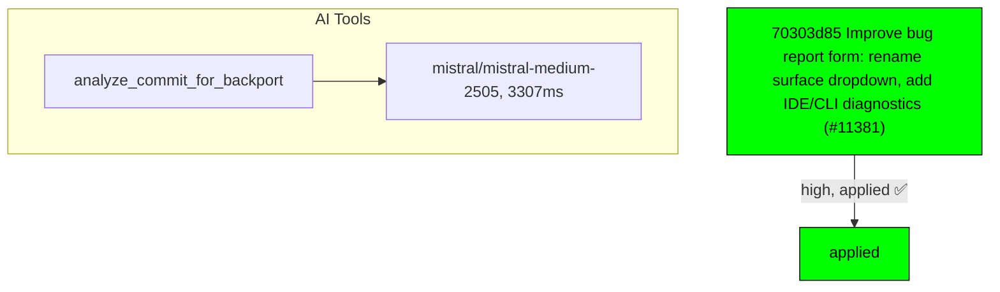

# Backport Agent — Detailed Run Report

> This file is generated automatically. It is intended for human analysts and
> AI reasoning models to assess agent performance, decision quality, and LLM behavior.

**Run timestamp**: 2026-06-11T05:38:33.485Z
**Models used**: fast=`mistral/mistral-medium-2505`  powerful=`mistral-medium-3-5`
**Prompt log**: `/Volumes/ThunderStation/Development/tea-ching-cline/.backport-agent/run-1781156122316.prompts.jsonl`

---

## Summary (PR body)

## Backport Agent — Sync Report

**Date**: 2026-06-11T05:38:33.485Z
**Upstream ref**: `main`
**Fork ref**: `keypool-live`
**Sync branch**: `sync-upstream-2026-10-02`

### Summary

- ✅ Applied: 1
- ⚠️ Needs human review: 0
- ⛔ Blocked (not attempted): 0

### Applied commits

- `70303d85` [high] Improve bug report form: rename surface dropdown, add IDE/CLI diagnostics (#11381)

### Agent decision log

- Commit 70303d8541b0329d092bd617860df1453356f05d was classified as high risk but AI analysis confirmed it is safe to apply.


---

## Agent Workflow Diagram

> Generated by the fast model from the run summary. Evaluate the agent's decision path.



---

## AI Sub-Agent Call Log (1 call)

> Each entry is one sub-agent invocation. Review prompt/response pairs to assess
> reasoning quality, hallucinations, and decision accuracy.

### Call 1 / 1 — `analyze_commit_for_backport` ✅ OK

| Field | Value |
|---|---|
| **Timestamp** | 2026-06-11T05:37:33.686Z |
| **Tool** | `analyze_commit_for_backport` |
| **Model** | `mistral/mistral-medium-2505` |
| **Duration** | 3307 ms |
| **Tokens in** | 1839 |
| **Tokens out** | 158 |
| **Cost** | $0.000000 |

**Prompt sent to sub-agent:**

```
Commit SHA: 70303d8541b0329d092bd617860df1453356f05d
Commit message:
Improve bug report form: rename surface dropdown, add IDE/CLI diagnostics (#11381)
    
    * Improve bug report form: rename surface dropdown, add IDE/CLI diagnostics
    
    Rename the 'Plugin Type' dropdown to 'Cline Surface' since CLI is not a plugin; the option values keep each choice unambiguous.
    
    Add an 'IDE / CLI Diagnostics' field with per-surface copy-paste steps for About info (VSCode Help/About, JetBrains Help/About Copy button) and a CLI exception using 'cline --version'. System Information is left as-is; minor overlap is acceptable.
    
    * Update repo-label-issues workflow for renamed Cline Surface field
    
    The auto-labeler matches the rendered '### Plugin Type' heading. Since the form label was renamed to 'Cline Surface', update the three regexes so JetBrains/VS Code/CLI labels keep applying.

Changed files (2):
.github/ISSUE_TEMPLATE/bug_report.yml
.github/workflows/repo-label-issues.yml

Diff:
commit 70303d8541b0329d092bd617860df1453356f05d
Author: Mikołaj Kondratek <19799111+mkondratek@users.noreply.github.com>
Date:   Tue Jun 9 18:38:53 2026 +0200

    Improve bug report form: rename surface dropdown, add IDE/CLI diagnostics (#11381)
    
    * Improve bug report form: rename surface dropdown, add IDE/CLI diagnostics
    
    Rename the 'Plugin Type' dropdown to 'Cline Surface' since CLI is not a plugin; the option values keep each choice unambiguous.
    
    Add an 'IDE / CLI Diagnostics' field with per-surface copy-paste steps for About info (VSCode Help/About, JetBrains Help/About Copy button) and a CLI exception using 'cline --version'. System Information is left as-is; minor overlap is acceptable.
    
    * Update repo-label-issues workflow for renamed Cline Surface field
    
    The auto-labeler matches the rendered '### Plugin Type' heading. Since the form label was renamed to 'Cline Surface', update the three regexes so JetBrains/VS Code/CLI labels keep applying.
---
 .github/ISSUE_TEMPLATE/bug_report.yml   | 18 +++++++++++++++---
 .github/workflows/repo-label-issues.yml |  6 +++---
 2 files changed, 18 insertions(+), 6 deletions(-)

diff --git a/.github/ISSUE_TEMPLATE/bug_report.yml b/.github/ISSUE_TEMPLATE/bug_report.yml
index 9b40efb61..b4db8f1dd 100644
--- a/.github/ISSUE_TEMPLATE/bug_report.yml
+++ b/.github/ISSUE_TEMPLATE/bug_report.yml
@@ -7,10 +7,10 @@ body:
       value: |
         **Important:** All bug reports must be reproducible using Claude Sonnet 4.5. Cline uses complex prompts so less capable models may not work as expected.
   - type: dropdown
-    id: plugin-type
+    id: cline-surface
     attributes:
-      label: Plugin Type
-      description: Which plugin are you reporting a bug for?
+      label: Cline Surface
+      description: Which Cline surface are you reporting a bug for?
       options:
         - VSCode Extension
         - JetBrains Plugin
@@ -59,6 +59,18 @@ body:
       placeholder: 'e.g., cline:anthropic/claude-sonnet-4.5, gemini:gemini-2.5-pro-exp-03-25'
     validations:
       required: false
+  - type: textarea
+    id: ide-diagnostics
+    attributes:
+      label: IDE / CLI Diagnostics
+      description: |
+        Paste the "About" diagnostics for your Cline surface. This captures the IDE build, runtime, and host details we need.
+        - VSCode Extension: open `Help → About` (Windows/Linux) or `Code → About Visual Studio Code` (macOS), then copy the info.
+        - JetBrains Plugin: open `Help → About` (Windows/Linux) or `<IDE name> → About` (macOS), then click `Copy` to grab build, runtime, OS, memory, and cores.
+        - CLI: there is no About dialog. Run `cline --version` and paste the output.
+      placeholder: Paste the copied About info or `cline --version` output here.
+    validations:
+      required: false
   - type: textarea
     id: system-info
     attributes:
diff --git a/.github/workflows/repo-label-issues.yml b/.github/workflows/repo-label-issues.yml
index b3fe29b10..7c7994d45 100644
--- a/.github/workflows/repo-label-issues.yml
+++ b/.github/workflows/repo-label-issues.yml
@@ -17,7 +17,7 @@ jobs:
             const labels = context.payload.issue.labels.map(l => l.name);
 
             // Check if JetBrains Plugin is selected
-            if (body.match(/###\s*Plugin Type\s*\n+JetBrains Plugin/i)) {
+            if (body.match(/###\s*Cline Surface\s*\n+JetBrains Plugin/i)) {
               if (!labels.includes('JetBrains')) {
                 await github.rest.issues.addLabels({
                   owner: context.repo.owner,
@@ -29,7 +29,7 @@ jobs:
             }
 
             // Check if VSCode Extension is selected
-            if (body.match(/###\s*Plugin Type\s*\n+VSCode Extension/i)) {
+            if (body.match(/###\s*Cline Surface\s*\n+VSCode Extension/i)) {
               if (!labels.includes('VS Code')) {
                 await github.rest.issues.addLabels({
                   owner: context.repo.owner,
@@ -41,7 +41,7 @@ jobs:
             }
 
             // Check if CLI is selected
-            if (body.match(/###\s*Plugin Type\s*\n+CLI/i)) {
+            if (body.match(/###\s*Cline Surface\s*\n+CLI/i)) {
               if (!labels.includes('CLI')) {
                 await github.rest.issues.addLabels({
                   owner: context.repo.owner,

Output the JSON object now.
```

**Response received:**

````
```json
{
  "summary": "This commit improves the bug report form by renaming the 'Plugin Type' dropdown to 'Cline Surface' and adding a new 'IDE / CLI Diagnostics' field. It also updates the auto-labeling workflow to match the renamed field.",
  "keyChanges": [
    "Renamed 'Plugin Type' dropdown to 'Cline Surface' in bug_report.yml",
    "Added new 'IDE / CLI Diagnostics' textarea field with surface-specific instructions",
    "Updated regex patterns in repo-label-issues.yml to match the new 'Cline Surface' heading"
  ],
  "backportComplexity": "trivial",
  "semanticRiskFactors": [],
  "recommendation": "apply"
}
```
````

---

## Performance Summary

**Total AI time**: 3307 ms across 1 call(s)
**Total input tokens**: 1839
**Total output tokens**: 158

| Tool | Calls | Total ms | Avg ms | Input tok | Output tok |
|---|---|---|---|---|---|
| `analyze_commit_for_backport` | 1 | 3307 | 3307 | 1839 | 158 |

## Decision Quality Metrics

> Automated quality signals derived from tool output guards, schema validation,
> hallucination detection, and consensus checks.  Review flagged items manually.

### Commit Analysis Quality

| Metric | Value |
|---|---|
| Total analyze calls | 1 |
| Commits with semantic risk factors | 0 |
| Possible hallucinated references (total) | 0 |

### Audit Event Timeline

| Timestamp | Tool | Event | Details |
|---|---|---|---|
| 05:37:33 | `analyze_commit_for_backport` | `analysis_complete` | sha="70303d8541b0329d092bd617860df1453356f05, recommendation="apply", complexity="trivial" |
| 05:37:48 | `reconcile_ai_assessments` | `no_contradiction` | sha="70303d8541b0329d092bd617860df1453356f05, analyzeRecommendation="apply", compatibilityCompatible=true |
