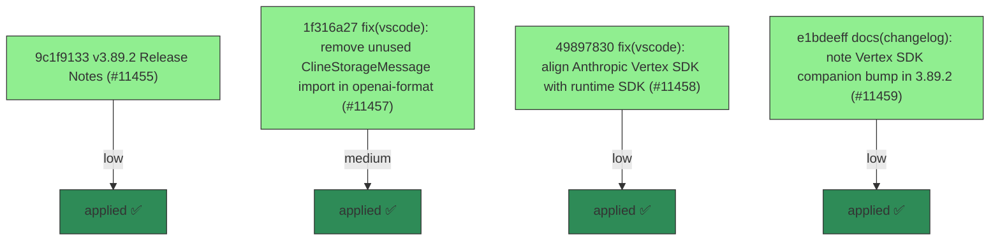

# Backport Agent — Detailed Run Report

> This file is generated automatically. It is intended for human analysts and
> AI reasoning models to assess agent performance, decision quality, and LLM behavior.

**Run timestamp**: 2026-06-11T12:42:41.166Z
**Models used**: fast=`mistral/devstral-medium-latest`  powerful=`openai/gpt-5.5`
**Prompt log**: `/Volumes/ThunderStation/Development/tea-ching-cline/.backport-agent/run-1781181724193.prompts.jsonl`

---

## Summary (PR body)

## Backport Agent — Sync Report

**Date**: 2026-06-11T12:42:41.166Z
**Upstream ref**: `main`
**Fork ref**: `keypool-live`
**Sync branch**: `sync/upstream-main-2026-06-11-1242`

### Summary

- ✅ Applied: 4
- ⚠️ Needs human review: 0
- ⛔ Blocked (not attempted): 0

### Applied commits

- `9c1f9133` [low] v3.89.2 Release Notes (#11455)
- `1f316a27` [medium] fix(vscode): remove unused ClineStorageMessage import in openai-format (#11457)
- `49897830` [low] fix(vscode): align Anthropic Vertex SDK with runtime SDK (#11458)
- `e1bdeeff` [low] docs(changelog): note Vertex SDK companion bump in 3.89.2 (#11459)

### Agent decision log

- All commits applied cleanly; validation blocked by allowlist policy


---

## Agent Workflow Diagram

> Generated by the fast model from the run summary. Evaluate the agent's decision path.



---

## AI Sub-Agent Call Log (1 call)

> Each entry is one sub-agent invocation. Review prompt/response pairs to assess
> reasoning quality, hallucinations, and decision accuracy.

### Call 1 / 1 — `analyze_commit_for_backport` ✅ OK

| Field | Value |
|---|---|
| **Timestamp** | 2026-06-11T12:42:19.945Z |
| **Tool** | `analyze_commit_for_backport` |
| **Model** | `mistral/devstral-medium-latest` |
| **Duration** | 1630 ms |
| **Tokens in** | 840 |
| **Tokens out** | 124 |
| **Cost** | $0.000000 |

**Prompt sent to sub-agent:**

```
Commit SHA: 1f316a2734c0f4611208ebd125e6768436ccf151
Commit message:
fix(vscode): remove unused ClineStorageMessage import in openai-format (#11457)
    
    The SDK 0.50.1 upgrade widened convertToOpenAiMessages to take
    Anthropic.Messages.MessageParam[], which left the ClineStorageMessage
    import referenced only in comments. tsc does not flag unused imports in
    this config, but biome lint does, and it blocked the 3.89.2 publish.

Changed files (1):
apps/vscode/src/core/api/transform/openai-format.ts

Diff:
commit 1f316a2734c0f4611208ebd125e6768436ccf151
Author: Saoud Rizwan <7799382+saoudrizwan@users.noreply.github.com>
Date:   Thu Jun 11 03:52:55 2026 -0700

    fix(vscode): remove unused ClineStorageMessage import in openai-format (#11457)
    
    The SDK 0.50.1 upgrade widened convertToOpenAiMessages to take
    Anthropic.Messages.MessageParam[], which left the ClineStorageMessage
    import referenced only in comments. tsc does not flag unused imports in
    this config, but biome lint does, and it blocked the 3.89.2 publish.
---
 apps/vscode/src/core/api/transform/openai-format.ts | 1 -
 1 file changed, 1 deletion(-)

diff --git a/apps/vscode/src/core/api/transform/openai-format.ts b/apps/vscode/src/core/api/transform/openai-format.ts
index dc1725858..1e8bdefa4 100644
--- a/apps/vscode/src/core/api/transform/openai-format.ts
+++ b/apps/vscode/src/core/api/transform/openai-format.ts
@@ -6,7 +6,6 @@ import {
 	ClineAssistantThinkingBlock,
 	ClineAssistantToolUseBlock,
 	ClineImageContentBlock,
-	ClineStorageMessage,
 	ClineTextContentBlock,
 	ClineUserToolResultContentBlock,
 	getImageDataUrl,

Output the JSON object now.
```

**Response received:**

````
```json
{
  "summary": "This commit removes an unused import of `ClineStorageMessage` from the openai-format.ts file. The import was no longer needed after an SDK upgrade but was still referenced in comments, causing a biome lint error that blocked a release.",
  "keyChanges": [
    "Removed unused import `ClineStorageMessage` from `apps/vscode/src/core/api/transform/openai-format.ts`"
  ],
  "backportComplexity": "trivial",
  "semanticRiskFactors": [],
  "recommendation": "apply"
}
```
````

---

## Performance Summary

**Total AI time**: 1630 ms across 1 call(s)
**Total input tokens**: 840
**Total output tokens**: 124

| Tool | Calls | Total ms | Avg ms | Input tok | Output tok |
|---|---|---|---|---|---|
| `analyze_commit_for_backport` | 1 | 1630 | 1630 | 840 | 124 |

## Decision Quality Metrics

> Automated quality signals derived from tool output guards, schema validation,
> hallucination detection, and consensus checks.  Review flagged items manually.

### Commit Analysis Quality

| Metric | Value |
|---|---|
| Total analyze calls | 1 |
| Commits with semantic risk factors | 0 |
| Possible hallucinated references (total) | 0 |

### Audit Event Timeline

| Timestamp | Tool | Event | Details |
|---|---|---|---|
| 12:42:19 | `analyze_commit_for_backport` | `analysis_complete` | sha="1f316a2734c0f4611208ebd125e6768436ccf15, recommendation="apply", complexity="trivial" |
