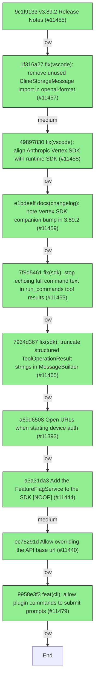

# Backport Agent — Detailed Run Report

> This file is generated automatically. It is intended for human analysts and
> AI reasoning models to assess agent performance, decision quality, and LLM behavior.

**Run timestamp**: 2026-06-12T13:04:28.376Z
**Models used**: fast=`mistral/devstral-medium-latest`  powerful=`openai/gpt-5.5`
**Prompt log**: `/Volumes/ThunderStation/Development/tea-ching-cline/.backport-agent/run-1781269016632.prompts.jsonl`

---

## Summary (PR body)

## Backport Agent — Sync Report

**Date**: 2026-06-12T13:04:28.376Z
**Upstream ref**: `cline/cline.git@main`
**Fork ref**: `TEA-ching/cline@keypool-live`
**Sync branch**: `sync/upstream-main-2026-06-12-125724`

### Summary

- ✅ Applied: 10
- ⚠️ Needs human review: 0
- ⛔ Blocked (not attempted): 0

### Applied commits

- `9c1f9133` [low] v3.89.2 Release Notes (#11455)
- `1f316a27` [medium] fix(vscode): remove unused ClineStorageMessage import in openai-format (#11457)
- `49897830` [low] fix(vscode): align Anthropic Vertex SDK with runtime SDK (#11458)
- `e1bdeeff` [low] docs(changelog): note Vertex SDK companion bump in 3.89.2 (#11459)
- `7f9d5461` [low] fix(sdk): stop echoing full command text in run_commands tool results (#11463) _(conflict resolved by agent)_
- `7934d367` [low] fix(sdk): truncate structured ToolOperationResult strings in MessageBuilder (#11465)
- `a69d6508` [low] Open URLs when starting device auth (#11393)
- `a3a31da3` [medium] Add the FeatureFlagService to the SDK [NOOP] (#11444)
- `ec75291d` [low] Allow overriding the API base url (#11440)
- `9958e3f3` [low] feat(cli): allow plugin commands to submit prompts (#11479)

### Agent decision log

- Created sync branch: sync/upstream-main-2026-06-12-125724
- Applied 10 commits with 1 conflict resolved
- Validation failed due to command not in allowed list

---

## Agent Workflow Diagram

> Generated by the fast model from the run summary. Evaluate the agent's decision path.

---

## AI Sub-Agent Call Log (0 calls)

> Each entry is one sub-agent invocation. Review prompt/response pairs to assess
> reasoning quality, hallucinations, and decision accuracy.

_No AI sub-agent calls were made during this run._

---

## Decision Quality Metrics

> Automated quality signals derived from tool output guards, schema validation,
> hallucination detection, and consensus checks.  Review flagged items manually.
