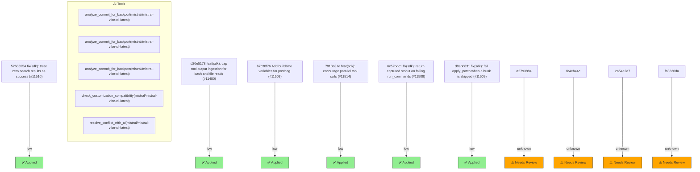

# Backport Agent — Detailed Run Report

> This file is generated automatically. It is intended for human analysts and
> AI reasoning models to assess agent performance, decision quality, and LLM behavior.

**Run timestamp**: 2026-06-13T16:24:21.425Z
**Models used**: fast=`mistral/devstral-medium-latest`  powerful=`mistral/mistral-vibe-cli-latest`
**Prompt log**: `/Users/rlemeill/Development/tea-ching-cline/.backport-agent/run-1781367700136.prompts.jsonl`

---

## Summary (PR body)

## Backport Agent — Sync Report

**Date**: 2026-06-13T16:24:21.425Z
**Upstream ref**: `main`
**Fork ref**: `keypool-live`
**Sync branch**: `sync/upstream-main-2026-06-13-162230`

### Summary

- ✅ Applied: 6
- ⚠️ Needs human review: 4
- ⛔ Blocked (not attempted): 0

### Applied commits

- `d20e5178` [low] feat(sdk): cap tool output ingestion for bash and file reads (#11480) _(conflict resolved by agent)_
- `b7c38f76` [low] Add buildtime variables for posthog (#11503)
- `7810a81e` [low] feat(sdk): encourage parallel tool calls (#11514)
- `52605954` [low] fix(sdk): treat zero search results as success (#11510)
- `6c52bdc1` [low] fix(sdk): return captured stdout on failing run_commands (#11508)
- `d8eb0631` [low] fix(sdk): fail apply_patch when a hunk is skipped (#11509)

### ⚠️ Human review required

- `a2793884` Add feature flag for cline pass (#11500)
  - Conflicted files: apps/cli/src/commands/auth.ts, apps/cli/src/utils/feature-flags.ts, sdk/packages/core/src/services/feature-flags/FeatureFlagsService.test.ts, sdk/packages/core/src/services/feature-flags/FeatureFlagsService.ts, sdk/packages/core/src/services/storage/provider-settings-manager.test.ts, sdk/packages/shared/src/feature-flags.ts
- `fe4eb44c` Unselect the org when selecting Cline Pass (#11501)
  - Conflicted files: apps/cli/src/commands/auth.ts, apps/cli/src/utils/feature-flags.ts, sdk/packages/core/src/services/feature-flags/FeatureFlagsService.test.ts, sdk/packages/core/src/services/feature-flags/FeatureFlagsService.ts, sdk/packages/core/src/services/storage/provider-settings-manager.test.ts, sdk/packages/shared/src/feature-flags.ts
- `2a54e2a7` Add cline pass (#11355)
  - Conflicted files: apps/cli/src/commands/auth.ts, apps/cli/src/utils/feature-flags.ts, sdk/packages/core/src/services/feature-flags/FeatureFlagsService.test.ts, sdk/packages/core/src/services/feature-flags/FeatureFlagsService.ts, sdk/packages/core/src/services/storage/provider-settings-manager.test.ts, sdk/packages/shared/src/feature-flags.ts
- `fa3630da` Add posthog for feature flags on the cli (#11491)
  - Conflicted files: apps/cli/src/commands/auth.ts, apps/cli/src/utils/feature-flags.ts, sdk/packages/core/src/services/feature-flags/FeatureFlagsService.test.ts, sdk/packages/core/src/services/feature-flags/FeatureFlagsService.ts, sdk/packages/core/src/services/storage/provider-settings-manager.test.ts, sdk/packages/shared/src/feature-flags.ts

### Agent decision log

- Aborted cherry-pick for commit d20e517831ef4e800ae124c8fb8a4e9a7824937d due to conflicts
- Resolved conflicts in sdk/packages/core/src/extensions/tools/executors/bash.test.ts
- Applied commit b7c38f76c9428b9ebb3f5d93dc8b7bfb55367a33
- Applied commit 7810a81efe6c6ddbbf39d40ae01a6120bc61c75d
- Applied commit 5260595472038a808e55c8a4e28704ea8a1551d6
- Applied commit 6c52bdc17777c40e23e52d6c90b8e92158255c64
- Applied commit d8eb06318bd673b82da7b3601ed3816e5129e161
- Blocked commits a2793884513f364a2a8c3d1dccbe6f59c2181729, fe4eb44c6bee4c18fd2d75be8e3a36883b204018, 2a54e2a76e38aa355472e401d9c30f14a0b029d7, fa3630da472b681d1c4aa10212a811bde68415b8 due to conflicts


---

## Agent Workflow Diagram

> Generated by the fast model from the run summary. Evaluate the agent's decision path.



---

## AI Sub-Agent Call Log (5 calls)

> Each entry is one sub-agent invocation. Review prompt/response pairs to assess
> reasoning quality, hallucinations, and decision accuracy.

### Call 1 / 5 — `analyze_commit_for_backport` ✅ OK

| Field | Value |
|---|---|
| **Timestamp** | 2026-06-13T16:22:11.648Z |
| **Tool** | `analyze_commit_for_backport` |
| **Model** | `mistral/mistral-vibe-cli-latest` |
| **Duration** | 3422 ms |
| **Tokens in** | 12545 |
| **Tokens out** | 156 |
| **Cost** | $0.000000 |

**Prompt sent to sub-agent:**

```
Commit SHA: fa3630da472b681d1c4aa10212a811bde68415b8
Commit message:
Add posthog for feature flags on the cli (#11491)

Changed files (24):
apps/cli/package.json
apps/cli/src/commands/auth.ts
apps/cli/src/main.test.ts
apps/cli/src/runtime/run-interactive.ts
apps/cli/src/session/session.test.ts
apps/cli/src/session/session.ts
apps/cli/src/tui/cline-account.test.ts
apps/cli/src/tui/cline-account.ts
apps/cli/src/utils/feature-flags.ts
apps/cli/src/utils/telemetry.activation.test.ts
apps/cli/src/utils/telemetry.ts
bun.lock
sdk/packages/core/bun.mts
sdk/packages/core/package.json
sdk/packages/core/src/ClineCore.test.ts
sdk/packages/core/src/ClineCore.ts
sdk/packages/core/src/cline-core/types.ts
sdk/packages/core/src/index.ts
sdk/packages/core/src/services/feature-flags/FeatureFlagsService.test.ts
sdk/packages/core/src/services/feature-flags/FeatureFlagsService.ts
sdk/packages/core/src/services/feature-flags/posthog.ts
sdk/packages/core/src/services/telemetry/index.ts
sdk/packages/core/tsconfig.build.json
sdk/packages/shared/src/feature-flags.ts

Diff:
commit fa3630da472b681d1c4aa10212a811bde68415b8
Author: Tomás Barreiro <52393857+BarreiroT@users.noreply.github.com>
Date:   Fri Jun 12 13:02:50 2026 -0300

    Add posthog for feature flags on the cli (#11491)
    
    * Introduce PostHog as a Feature Flag provider
    
    * Set-up auth after login
    
    * Update the context when something changes in the CLI
    
    * Make the distinctId not be optional
    
    * Dispose of the feature flag service
    
    * Remove the distinctId from the options
    
    * get rid of isSharedClient
    
    * Remove timeoutMs from the posthog options
    
    * Rename functions to not refer cli
    
    * Change the PostHogFeatureFlagsProvider API
---
 apps/cli/package.json                              |  1 +
 apps/cli/src/commands/auth.ts                      |  7 +-
 apps/cli/src/main.test.ts                          |  4 +-
 apps/cli/src/runtime/run-interactive.ts            | 10 +++
 apps/cli/src/session/session.test.ts               |  9 ++
 apps/cli/src/session/session.ts                    | 14 +++-
 apps/cli/src/tui/cline-account.test.ts             | 86 ++++++++++++++++++++
 apps/cli/src/tui/cline-account.ts                  | 12 ++-
 apps/cli/src/utils/feature-flags.ts                | 94 +++++++++++++++++++++
 apps/cli/src/utils/telemetry.activation.test.ts    |  6 +-
 apps/cli/src/utils/telemetry.ts                    |  5 +-
 bun.lock                                           | 14 ++++
 sdk/packages/core/bun.mts                          |  5 ++
 sdk/packages/core/package.json                     | 15 +++-
 sdk/packages/core/src/ClineCore.test.ts            | 25 ------
 sdk/packages/core/src/ClineCore.ts                 | 25 +++---
 sdk/packages/core/src/cline-core/types.ts          |  7 +-
 sdk/packages/core/src/index.ts                     |  3 +-
 .../feature-flags/FeatureFlagsService.test.ts      |  4 +-
 .../services/feature-flags/FeatureFlagsService.ts  | 15 ++--
 .../core/src/services/feature-flags/posthog.ts     | 95 ++++++++++++++++++++++
 sdk/packages/core/src/services/telemetry/index.ts  |  1 +
 sdk/packages/core/tsconfig.build.json              |  3 +-
 sdk/packages/shared/src/feature-flags.ts           | 11 +--
 24 files changed, 401 insertions(+), 70 deletions(-)

diff --git a/apps/cli/package.json b/apps/cli/package.json
index 7cb80d926..592399009 100644
--- a/apps/cli/package.json
+++ b/apps/cli/package.json
@@ -87,6 +87,7 @@
 		"open": "^10.2.0",
 		"opentui-spinner": "^0.0.6",
 		"pino": "^10.3.1",
+		"posthog-node": "^5.8.0",
 		"react": "19.2.4",
 		"react-devtools-core": "^7.0.1",
 		"react-reconciler": "0.32.0",
diff --git a/apps/cli/src/commands/auth.ts b/apps/cli/src/commands/auth.ts
index 09394fb98..ceae9a0f9 100644
--- a/apps/cli/src/commands/auth.ts
+++ b/apps/cli/src/commands/auth.ts
@@ -22,6 +22,7 @@ import {
 	type OAuthCredentials,
 	toProviderApiKey,
 } from "../utils/provider-auth";
+import { identifyTelemetryAccount } from "../utils/telemetry";
 
 export {
 	getPersistedProviderApiKey,
@@ -434,11 +435,15 @@ export async function runAuthProviderCommand(
 		return 1;
 	}
 	try {
-		await loginAndSaveProviderOAuthCredentials(
+		const settings = await loginAndSaveProviderOAuthCredentials(
 			providerSettingsManager,
 			providerId,
 			{ callbacks: createOAuthCallbacks(io) },
 		);
+		identifyTelemetryAccount({
+			id: settings.auth?.accountId,
+			provider: providerId,
+		});
 		io.writeln(
 			`${c.green}You are now logged in to ${c.cyan}${providerId}${c.reset}`,
 		);
diff --git a/apps/cli/src/main.test.ts b/apps/cli/src/main.test.ts
index f8a9cf585..b4b08873a 100644
--- a/apps/cli/src/main.test.ts
+++ b/apps/cli/src/main.test.ts
@@ -101,7 +101,7 @@ const hubRuntimeMocks = vi.hoisted(() => ({
 }));
 const telemetryMocks = vi.hoisted(() => ({
 	captureCliExtensionActivated: vi.fn(),
-	identifyCliTelemetryAccount: vi.fn(),
+	identifyTelemetryAccount: vi.fn(),
 	getCliTelemetryService: vi.fn(),
 	disposeCliTelemetryService: vi.fn(async () => {}),
 }));
@@ -246,7 +246,7 @@ describe("runCli lightweight command dispatch", () => {
 		updateMocks.getPreferredKanbanInstaller.mockReset();
 		updateMocks.getPreferredKanbanInstaller.mockReturnValue(undefined);
 		telemetryMocks.captureCliExtensionActivated.mockReset();
-		telemetryMocks.identifyCliTelemetryAccount.mockReset();
+		telemetryMocks.identifyTelemetryAccount.mockReset();
 		telemetryMocks.getCliTelemetryService.mockReset();
 		telemetryMocks.disposeCliTelemetryService.mockReset();
 		telemetryMocks.disposeCliTelemetryService.mockResolvedValue(undefined);
diff --git a/apps/cli/src/runtime/run-interactive.ts b/apps/cli/src/runtime/run-interactive.ts
index 0b4f9768c..a0c6aabd6 100644
--- a/apps/cli/src/runtime/run-interactive.ts
+++ b/apps/cli/src/runtime/run-interactive.ts
@@ -631,6 +631,16 @@ export async function runInteractive(
 		},
 		onAccountChange: async () => {
 			await sessionRuntime.ensureReady();
+			await loadClineAccountSnapshot({
+				config,
+				clineApiBaseUrl: options?.clineApiBaseUrl,
+			}).catch((error) => {
+				logCliError(
+					config.logger,
+					"Cline account refresh after account change failed",
+					{ error },
+				);
+			});
 			await sessionRuntime.restartWithCurrentMessages();
 		},
 		onResumeSession: async (sessionId: string) => {
diff --git a/apps/cli/src/session/session.test.ts b/apps/cli/src/session/session.test.ts
index e59bfc8f4..66e5d4c0c 100644
--- a/apps/cli/src/session/session.test.ts
+++ b/apps/cli/src/session/session.test.ts
@@ -12,6 +12,8 @@ const createCore = vi.fn();
 const getCliTelemetryService = vi.fn(() => undefined);
 const resolveSessionBackend = vi.fn();
 const listSessionHistoryFromBackend = vi.fn();
+const featureFlagsPoll = vi.fn(async () => {});
+const featureFlagsDispose = vi.fn(async () => {});
 
 vi.mock("@cline/core", async () => {
 	const actual =
@@ -49,6 +51,10 @@ describe("createCliCore", () => {
 		listSessionHistoryFromBackend.mockReset();
 		createCore.mockResolvedValue({
 			runtimeAddress: "127.0.0.1:25463",
+			featureFlags: {
+				poll: featureFlagsPoll,
+				dispose: featureFlagsDispose,
+			},
 			start: vi.fn(),
 			send: vi.fn(),
 			getAccumulatedUsage: vi.fn(),
@@ -68,6 +74,8 @@ describe("createCliCore", () => {
 		delete process.env.CLINE_RPC_ADDRESS;
 		delete process.env.CLINE_SESSION_BACKEND_MODE;
 		delete process.env.CLINE_VCR;
+		featureFlagsPoll.mockClear();
+		featureFlagsDispose.mockClear();
 	});
 
 	afterEach(() => {
@@ -108,6 +116,7 @@ describe("createCliCore", () => {
 				backendMode: expect.anything(),
 			}),
 		);
+		expect(featureFlagsPoll).toHaveBeenCalledTimes(1);
 	});
 
 	it("forces the local backend when requested by the caller", async () => {
diff --git a/apps/cli/src/session/session.ts b/apps/cli/src/session/session.ts
index 29034a757..0056d744a 100644
--- a/apps/cli/src/session/session.ts
+++ b/apps/cli/src/session/session.ts
@@ -15,6 +15,7 @@ import {
 	createCliMessagesArtifactUploader,
 	prepareCliEnterpriseIntegration,
 } from "../utils/enterprise";
+import { getCliFeatureFlagsService } from "../utils/feature-flags";
 import { resolveWorkspaceRoot } from "../utils/helpers";
 import { getCliTelemetryService } from "../utils/telemetry";
 import type { ConversationHistory } from "./export";
@@ -40,6 +41,11 @@ export async function createCliCore(options?: {
 	const cwd = options?.cwd?.trim() || process.cwd();
 	const workspaceRoot =
 		options?.workspaceRoot?.trim() || resolveWorkspaceRoot(cwd);
+	const telemetry = getCliTelemetryService(options?.logger);
+	const featureFlags = getCliFeatureFlagsService({
+		logger: options?.logger,
+		telemetry,
+	});
 	const core = await ClineCore.create({
 		...(explicitBackendMode ? { backendMode: explicitBackendMode } : {}),
 		...(options?.forceLocalBackend !== true
@@ -53,12 +59,18 @@ export async function createCliCore(options?: {
 				}
 			: {}),
 		capabilities: options?.capabilities,
-		telemetry: getCliTelemetryService(options?.logger),
+		telemetry,
+		featureFlags,
 		logger: options?.logger,
 		toolPolicies: options?.toolPolicies,
 		messagesArtifactUploader: createCliMessagesArtifactUploader(),
 		prepare: prepareCliEnterpriseIntegration,
 	});
+	try {
+		await core.featureFlags.poll();
+	} catch (error) {
+		options?.logger?.error?.("Error polling CLI feature flags", { error });
+	}
 	options?.logger?.log("CLI core runtime routing selected", {
 		backendMode: explicitBackendMode ?? "env-managed",
 		rpcAddress: core.runtimeAddress,
diff --git a/apps/cli/src/tui/cline-account.test.ts b/apps/cli/src/tui/cline-account.test.ts
index 3c67a5ffa..94c3fc463 100644
--- a/apps/cli/src/tui/cline-account.test.ts
+++ b/apps/cli/src/tui/cline-account.test.ts
@@ -9,9 +9,15 @@ const coreMocks = vi.hoisted(() => {
 	return {
 		getProviderSettings: vi.fn(),
 		saveProviderSettings: vi.fn(),
+		fetchMe: vi.fn(),
+		fetchBalance: vi.fn(),
+		fetchOrganizationBalance: vi.fn(),
 		serviceOptions,
 	};
 });
+const telemetryMocks = vi.hoisted(() => ({
+	identifyTelemetryAccount: vi.fn(),
+}));
 
 vi.mock("@cline/core", async (importOriginal) => {
 	const actual = await importOriginal<typeof import("@cline/core")>();
@@ -24,6 +30,15 @@ vi.mock("@cline/core", async (importOriginal) => {
 			}) {
 				coreMocks.serviceOptions.push(options);
 			}
+			fetchMe() {
+				return coreMocks.fetchMe();
+			}
+			fetchBalance(userId?: string) {
+				return coreMocks.fetchBalance(userId);
+			}
+			fetchOrganizationBalance(organizationId: string) {
+				return coreMocks.fetchOrganizationBalance(organizationId);
+			}
 		},
 		ProviderSettingsManager: class {
 			getProviderSettings(providerId: string) {
@@ -36,6 +51,10 @@ vi.mock("@cline/core", async (importOriginal) => {
 	};
 });
 
+vi.mock("../utils/telemetry", () => ({
+	identifyTelemetryAccount: telemetryMocks.identifyTelemetryAccount,
+}));
+
 function makeConfig(overrides: Partial<Config> = {}): Config {
 	return {
 		providerId: "cline",
@@ -78,7 +97,11 @@ describe("createClineAccountService", () => {
 		vi.unstubAllGlobals();
 		coreMocks.getProviderSettings.mockReset();
 		coreMocks.saveProviderSettings.mockReset();
+		coreMocks.fetchMe.mockReset();
+		coreMocks.fetchBalance.mockReset();
+		coreMocks.fetchOrganizationBalance.mockReset();
 		coreMocks.serviceOptions.length = 0;
+		telemetryMocks.identifyTelemetryAccount.mockReset();
 	});
 
 	afterEach(() => {
@@ -163,3 +186,66 @@ describe("createClineAccountService", () => {
 		);
 	});
 });
+
+describe("loadClineAccountSnapshot", () => {
+	beforeEach(() => {
+		vi.restoreAllMocks();
+		vi.unstubAllGlobals();
+		coreMocks.getProviderSettings.mockReset();
+		coreMocks.saveProviderSettings.mockReset();
+		coreMocks.fetchMe.mockReset();
+		coreMocks.fetchBalance.mockReset();
+		coreMocks.fetchOrganizationBalance.mockReset();
+		coreMocks.serviceOptions.length = 0;
+		telemetryMocks.identifyTelemetryAccount.mockReset();
+	});
+
+	afterEach(() => {
+		vi.restoreAllMocks();
+		vi.unstubAllGlobals();
+	});
+
+	it("identifies the loaded Cline account for telemetry and feature flags", async () => {
+		coreMocks.getProviderSettings.mockReturnValue({
+			provider: "cline",
+			apiKey: "account-token",
+		});
+		const { loadClineAccountSnapshot } = await import("./cline-account");
+		coreMocks.fetchMe.mockResolvedValue({
+			id: "user-1",
+			email: "user@example.com",
+			displayName: "User One",
+			photoUrl: "",
+			createdAt: "",
+			updatedAt: "",
+			organizations: [
+				{
+					active: true,
+					memberId: "member-1",
+					name: "Acme",
+					organizationId: "org-1",
+					roles: ["member"],
+				},
+			],
+		});
+		coreMocks.fetchBalance.mockResolvedValue({ balance: 10, userId: "user-1" });
+		coreMocks.fetchOrganizationBalance.mockResolvedValue({
+			balance: 20,
+			organizationId: "org-1",
+		});
+
+		await loadClineAccountSnapshot({ config: makeConfig() });
+
+		expect(telemetryMocks.identifyTelemetryAccount).toHaveBeenCalledWith(
+			{
+				id: "user-1",
+				email: "user@example.com",
+				provider: "cline",
+				organizationId: "org-1",
+				organizationName: "Acme",
+				memberId: "member-1",
+			},
+			expect.any(Object),
+		);
+	});
+});
diff --git a/apps/cli/src/tui/cline-account.ts b/apps/cli/src/tui/cline-account.ts
index 0b579160f..6239c1238 100644
--- a/apps/cli/src/tui/cline-account.ts
+++ b/apps/cli/src/tui/cline-account.ts
@@ -14,12 +14,13 @@ import {
 } from "@cline/core";
 import { getClineEnvironmentConfig } from "@cline/shared";
 import { formatCreditBalance, normalizeCreditBalance } from "../utils/output";
+import { identifyTelemetryAccount } from "../utils/telemetry";
 import type { Config } from "../utils/types";
 
 export const CLINE_CREDITS_DASHBOARD_URL =
 	"https://app.cline.bot/dashboard/account?tab=credits";
 
-type ClineAccountConfig = Pick<Config, "apiKey" | "providerId">;
+type ClineAccountConfig = Pick<Config, "apiKey" | "logger" | "providerId">;
 
 export interface ClineAccountSnapshot {
 	user: ClineAccountUser;
@@ -167,6 +168,15 @@ export async function loadClineAccountSnapshot(input: {
 	const displayedBalance = activeOrganization
 		? (organizationBalance?.balance ?? balance.balance)
 		: balance.balance;
+	const accountContext = {
+		id: user.id,
+		email: user.email,
+		provider: "cline",
+		organizationId: activeOrganization?.organizationId,
+		organizationName: activeOrganization?.name,
+		memberId: activeOrganization?.memberId,
+	};
+	identifyTelemetryAccount(accountContext, input.config.logger);
 
 	return {
 		user,
diff --git a/apps/cli/src/utils/feature-flags.ts b/apps/cli/src/utils/feature-flags.ts
new file mode 100644
index 000000000..e89dde2d4
--- /dev/null
+++ b/apps/cli/src/utils/feature-flags.ts
@@ -0,0 +1,94 @@
+import {
+	type BasicLogger,
+	type FeatureFlagsContext,
+	FeatureFlagsService,
+	type ITelemetryService,
+	NoOpFeatureFlagsProvider,
+	registerDisposable,
+	resolveCoreDistinctId,
+} from "@cline/core";
+import {
+	buildClinePostHogClient,
+	PostHogFeatureFlagsProvider,
+} from "@cline/core/services/feature-flags/posthog";
+
+let cliFeatureFlagsContext: FeatureFlagsContext = { clientName: "cline-cli" };
+let cliFeatureFlagsService: FeatureFlagsService | undefined;
+
+function ensureCliDistinctId(): string {
+	const distinctId = cliFeatureFlagsContext.distinctId?.trim();
+	if (distinctId) {
+		return distinctId;
+	}
+	const resolved = resolveCoreDistinctId();
+	cliFeatureFlagsContext.distinctId = resolved;
+	return resolved;
+}
+
+export function getCliFeatureFlagsContext(): FeatureFlagsContext {
+	ensureCliDistinctId();
+	return { ...cliFeatureFlagsContext };
+}
+
+export function getCliFeatureFlagsService(options?: {
+	logger?: BasicLogger;
+	telemetry?: ITelemetryService;
+}): FeatureFlagsService {
+	if (!cliFeatureFlagsService) {
+		const apiKey = process.env.TELEMETRY_SERVICE_API_KEY?.trim();
+		const provider =
+			apiKey &&
+			process.env.IS_TEST !== "true" &&
+			process.env.E2E_TEST !== "true"
+				? new PostHogFeatureFlagsProvider({
+						client: buildClinePostHogClient(apiKey),
+						config: {
+							logger: options?.logger,
+						},
+					})
+				: new NoOpFeatureFlagsProvider();
+
+		cliFeatureFlagsService = new FeatureFlagsService({
+			provider,
+			telemetry: options?.telemetry,
+			logger: options?.logger,
+			context: getCliFeatureFlagsContext(),
+		});
+		registerDisposable(disposeCliFeatureFlagsService);
+	}
+
+	return cliFeatureFlagsService;
+}
+
+export async function disposeCliFeatureFlagsService(): Promise<void> {
+	if (!cliFeatureFlagsService) {
+		return;
+	}
+
+	const current = cliFeatureFlagsService;
+	cliFeatureFlagsService = undefined;
+	await current.dispose();
+}
+
+export async function identifyFeatureFlagsAccount(
+	account: { id?: string; email?: string },
+	logger?: BasicLogger,
+): Promise<void> {
+	const accountId = account.id?.trim();
+	cliFeatureFlagsContext = {
+		...cliFeatureFlagsContext,
+		...(accountId ? { distinctId: accountId, userId: accountId } : {}),
+		...(account.email?.trim() ? { email: account.email.trim() } : {}),
+	};
+
+	if (!cliFeatureFlagsService) {
+		return;
+	}
+
+	cliFeatureFlagsService.setContext(getCliFeatureFlagsContext());
+	try {
+		await cliFeatureFlagsService.poll();
+	} catch (error) {
+		logger?.error?.("Error polling CLI feature flags", { error });
+	}
+}
diff --git a/apps/cli/src/utils/telemetry.activation.test.ts b/apps/cli/src/utils/telemetry.activation.test.ts
index ee3145a06..c59013ccc 100644
--- a/apps/cli/src/utils/telemetry.activation.test.ts
+++ b/apps/cli/src/utils/telemetry.activation.test.ts
@@ -34,7 +34,7 @@ vi.mock("./telemetry", async (importOriginal) => {
 
 import {
 	captureCliExtensionActivated,
-	identifyCliTelemetryAccount,
+	identifyTelemetryAccount,
 } from "./telemetry";
 import { resetCliExtensionActivationForTests } from "./telemetry.test-helpers";
 
@@ -93,7 +93,7 @@ describe("captureCliExtensionActivated", () => {
 	});
 });
 
-describe("identifyCliTelemetryAccount", () => {
+describe("identifyTelemetryAccount", () => {
 	beforeEach(() => {
 		hoisted.identifyAccount.mockClear();
 		hoisted.getCliTelemetryService.mockClear();
@@ -107,7 +107,7 @@ describe("identifyCliTelemetryAccount", () => {
 			memberId: "member-7",
 			provider: "cline",
 		};
-		identifyCliTelemetryAccount(account);
+		identifyTelemetryAccount(account);
 		expect(hoisted.identifyAccount).toHaveBeenCalledWith(undefined, account);
 	});
 });
diff --git a/apps/cli/src/utils/telemetry.ts b/apps/cli/src/utils/telemetry.ts
index 6238f6676..b7251fa30 100644
--- a/apps/cli/src/utils/telemetry.ts
+++ b/apps/cli/src/utils/telemetry.ts
@@ -9,6 +9,7 @@ import {
 	TelemetryLoggerSink,
 } from "@cline/core";
 import { getCliBuildInfo } from "./common";
+import { identifyFeatureFlagsAccount } from "./feature-flags";
 import {
 	markActivationCaptured,
 	wasActivationCaptured,
@@ -102,11 +103,12 @@ export interface CliTelemetryAccountContext {
  * Safe to call multiple times; the latest values win, mirroring the legacy
  * singleton-based behavior.
  */
-export function identifyCliTelemetryAccount(
+export function identifyTelemetryAccount(
 	account: CliTelemetryAccountContext,
 	logger?: BasicLogger,
 ): void {
 	identifyAccount(getCliTelemetryService(logger), account);
+	void identifyFeatureFlagsAccount(account, logger);
 }
 
 /**
@@ -134,6 +136,7 @@ export function captureCliExtensionActivated(
 	const telemetry = getCliTelemetryService(logger);
 	if (account) {
 		identifyAccount(telemetry, account);
+		void identifyFeatureFlagsAccount(account, logger);
 	}
 	captureExtensionActivated(telemetry);
 }
diff --git a/bun.lock b/bun.lock
index ca065f5af..25b7156a1 100644
--- a/bun.lock
+++ b/bun.lock
@@ -45,6 +45,7 @@
         "open": "^10.2.0",
         "opentui-spinner": "^0.0.6",
         "pino": "^10.3.1",
+        "posthog-node": "^5.8.0",
         "react": "19.2.4",
         "react-devtools-core": "^7.0.1",
         "react-reconciler": "0.32.0",
@@ -407,7 +408,14 @@
       },
       "devDependencies": {
         "@types/ws": "^8.18.1",
+        "posthog-node": "^5.8.0",
       },
+      "peerDependencies": {
+        "posthog-node": "^5.8.0",
+      },
+      "optionalPeers": [
+        "posthog-node",
+      ],
     },
     "sdk/packages/llms": {
       "name": "@cline/llms",
@@ -1094,6 +1102,10 @@
 
     "@pkgjs/parseargs": ["@pkgjs/parseargs@0.11.0", "", {}, "sha512-+1VkjdD0QBLPodGrJUeqarH8VAIvQODIbwh9XpP5Syisf7YoQgsJKPNFoqqLQlu+VQ/tVSshMR6loPMn8U+dPg=="],
 
+    "@posthog/core": ["@posthog/core@1.32.3", "", { "dependencies": { "@posthog/types": "1.386.3" } }, "sha512-vwOEMfZvGv5XxNWV7p9I52NSmvFNMhyW2IHpIoUHW5jLkgUrknzJW1H/qxVGSIrNNVQkfsoaDFzDhJdg10pgrA=="],
+
+    "@posthog/types": ["@posthog/types@1.386.3", "", {}, "sha512-LqJoiQi2eyWn7rCUgnn+D+F3Efp6+04o72bjSX6kWHx0nFaYNC/nJuAIRliDTY/X7GPIUAaHAcSjbMI/9wfX1Q=="],
+
     "@protobufjs/aspromise": ["@protobufjs/aspromise@1.1.2", "", {}, "sha512-j+gKExEuLmKwvz3OgROXtrJ2UG2x8Ch2YZUxahh+s1F2HZ+wAceUNLkvy6zKCPVRkU++ZWQrdxsUeQXmcg4uoQ=="],
 
     "@protobufjs/base64": ["@protobufjs/base64@1.1.2", "", {}, "sha512-AZkcAA5vnN/v4PDqKyMR5lx7hZttPDgClv83E//FMNhR2TMcLUhfRUBHCmSl0oi9zMgDDqRUJkSxO3wm85+XLg=="],
@@ -2788,6 +2800,8 @@
 
     "postcss-value-parser": ["postcss-value-parser@4.2.0", "", {}, "sha512-1NNCs6uurfkVbeXG4S8JFT9t19m45ICnif8zWLd5oPSZ50QnwMfK+H3jv408d4jw/7Bttv5axS5IiHoLaVNHeQ=="],
 
+    "posthog-node": ["posthog-node@5.36.17", "", { "dependencies": { "@posthog/core": "1.32.3" }, "peerDependencies": { "rxjs": "^7.0.0" }, "optionalPeers": ["rxjs"] }, "sha512-ed1LT4a9hhiFJizB6XX7dkYYLVPAFHfUpkQSns7BRxoUyhFnvMq15QENKeAOUEKQgPmnaq2I+xNLdAHN0o9eAA=="],
+
     "powershell-utils": ["powershell-utils@0.1.0", "", {}, "sha512-dM0jVuXJPsDN6DvRpea484tCUaMiXWjuCn++HGTqUWzGDjv5tZkEZldAJ/UMlqRYGFrD/etByo4/xOuC/snX2A=="],
 
     "prelude-ls": ["prelude-ls@1.2.1", "", {}, "sha512-vkcDPrRZo1QZLbn5RLGPpg/WmIQ65qoWWhcGKf/b5eplkkarX0m9z8ppCat4mlOqUsWpyNuYgO3VRyrYHSzX5g=="],
diff --git a/sdk/packages/core/bun.mts b/sdk/packages/core/bun.mts
index ff5cdc05e..60695cd55 100644
--- a/sdk/packages/core/bun.mts
+++ b/sdk/packages/core/bun.mts
@@ -50,6 +50,11 @@ const builds: Parameters<typeof Bun.build>[0][] = [
 		outdir: "./dist/services/telemetry",
 		...buildConfig,
 	},
+	{
+		entrypoints: ["./src/services/feature-flags/posthog.ts"],
+		outdir: "./dist/services/feature-flags",
+		...buildConfig,
+	},
 	// The plugin sandbox bootstrap runs in an isolated child process via
 	// SubprocessSandbox and must be emitted as a separate executable entrypoint.
 	{
diff --git a/sdk/packages/core/package.json b/sdk/packages/core/package.json
index a708b0a98..135c8edb3 100644
--- a/sdk/packages/core/package.json
+++ b/sdk/packages/core/package.json
@@ -30,6 +30,10 @@
 		"./telemetry": {
 			"types": "./dist/services/telemetry/index.d.ts",
 			"import": "./dist/services/telemetry/index.js"
+		},
+		"./services/feature-flags/posthog": {
+			"types": "./dist/services/feature-flags/posthog.d.ts",
+			"import": "./dist/services/feature-flags/posthog.js"
 		}
 	},
 	"scripts": {
@@ -67,8 +71,17 @@
 		"yaml": "^2.8.2",
 		"zod": "^4.3.6"
 	},
+	"peerDependencies": {
+		"posthog-node": "^5.8.0"
+	},
+	"peerDependenciesMeta": {
+		"posthog-node": {
+			"optional": true
+		}
+	},
 	"devDependencies": {
-		"@types/ws": "^8.18.1"
+		"@types/ws": "^8.18.1",
+		"posthog-node": "^5.8.0"
 	},
 	"engines": {
 		"node": ">=22"
diff --git a/sdk/packages/core/src/ClineCore.test.ts b/sdk/packages/core/src/ClineCore.test.ts
index 238dc7e6c..957cfc559 100644
--- a/sdk/packages/core/src/ClineCore.test.ts
+++ b/sdk/packages/core/src/ClineCore.test.ts
@@ -332,31 +332,6 @@ describe("ClineCore", () => {
 		expect(coreTelemetry.capture).not.toHaveBeenCalled();
 	});
 
-	it("wraps an injected feature flags provider", async () => {
-		const host = {
-			runtimeAddress: undefined,
-			startSession: vi.fn(),
-			runTurn: vi.fn(),
-			getAccumulatedUsage: vi.fn(),
-			abort: vi.fn(),
-			stopSession: vi.fn(),
-			dispose: vi.fn(),
-			getSession: vi.fn(async () => undefined),
-			listSessions: vi.fn(),
-			deleteSession: vi.fn(),
-			readSessionMessages: vi.fn(),
-			subscribe: vi.fn(() => () => {}),
-			updateSessionModel: vi.fn(),
-		};
-		createRuntimeHostMock.mockResolvedValue(host);
-		const provider = new NoOpFeatureFlagsProvider();
-
-		const core = await ClineCore.create({ featureFlags: provider });
-
-		expect(core.featureFlags.getProvider()).toBe(provider);
-		await core.dispose();
-	});
-
 	it("uses a no-op feature flags provider by default", async () => {
 		const host = {
 			runtimeAddress: undefined,
diff --git a/sdk/packages/core/src/ClineCore.ts b/sdk/packages/core/src/ClineCore.ts
index fa9346c17..7ce63b396 100644
--- a/sdk/packages/core/src/ClineCore.ts
+++ b/sdk/packages/core/src/ClineCore.ts
@@ -200,15 +200,17 @@ export class ClineCore {
 		const normalizedOptions = { ...options, capabilities, distinctId };
 		const host = await createRuntimeHost(normalizedOptions);
 		const automationOptions = normalizeAutomationOptions(options.automation);
-		const featureFlags = new FeatureFlagsService({
-			provider: options.featureFlags ?? new NoOpFeatureFlagsProvider(),
-			telemetry: options.telemetry,
-			logger: options.logger,
-			context: {
-				distinctId,
-				clientName: options.clientName,
-			},
-		});
+		const featureFlags =
+			options.featureFlags ||
+			new FeatureFlagsService({
+				provider: new NoOpFeatureFlagsProvider(),
+				telemetry: options.telemetry,
+				logger: options.logger,
+				context: {
+					distinctId,
+					clientName: options.clientName,
+				},
+			});
 		const core = new ClineCore(
 			host,
 			options.clientName,
@@ -396,11 +398,6 @@ export class ClineCore {
 			await this.automationService?.dispose();
 			await this.host.dispose(...args);
 		} finally {
-			await this.featureFlags.dispose().catch((error) => {
-				this.logger?.error?.("Error disposing feature flags provider", {
-					error,
-				});
-			});
 			this.unsubscribeBootstrapCleanup();
 			const sessionIds = [...this.activeSessionBootstraps.keys()];
 			await Promise.allSettled(
diff --git a/sdk/packages/core/src/cline-core/types.ts b/sdk/packages/core/src/cline-core/types.ts
index abb2be02d..8290ce9db 100644
--- a/sdk/packages/core/src/cline-core/types.ts
+++ b/sdk/packages/core/src/cline-core/types.ts
@@ -3,7 +3,6 @@ import type {
 	AgentConfig,
 	AutomationEventEnvelope,
 	BasicLogger,
-	IFeatureFlagsProvider,
 	ITelemetryService,
 } from "@cline/shared";
 import type { CronEventSuppression } from "../cron/events/cron-event-ingress";
@@ -22,6 +21,7 @@ import type {
 	StartSessionInput,
 	StartSessionResult,
 } from "../runtime/host/runtime-host";
+import type { FeatureFlagsService } from "../services/feature-flags";
 import type { CoreSessionConfig } from "../types/config";
 import type { SessionMessagesArtifactUploader } from "../types/session";
 
@@ -207,11 +207,10 @@ export interface ClineCoreOptions {
 	 */
 	telemetry?: ITelemetryService;
 	/**
-	 * Feature flags provider for this ClineCore instance. Core wraps the provider
-	 * in a cached FeatureFlagsService and exposes it as `cline.featureFlags`.
+	 * Feature flags service for this ClineCore instance.
 	 * If omitted, Core uses a no-op provider with default flag values.
 	 */
-	featureFlags?: IFeatureFlagsProvider;
+	featureFlags?: FeatureFlagsService;
 	/**
 	 * Optional structured logger for core-side operational diagnostics such as
 	 * runtime-host selection and fallback decisions.
diff --git a/sdk/packages/core/src/index.ts b/sdk/packages/core/src/index.ts
index 4b0f1bfb2..ce8947bf9 100644
--- a/sdk/packages/core/src/index.ts
+++ b/sdk/packages/core/src/index.ts
@@ -12,8 +12,8 @@ export type {
 	AgentEvent,
 	AgentExtension as AgentPlugin, // Public-facing alias for extensions
 	AgentExtensionCommand,
-	AgentExtensionCommandResult,
 	AgentExtensionCommand as AgentPluginCommand,
+	AgentExtensionCommandResult,
 	AgentHooks,
 	AgentMode,
 	AgentResult,
@@ -515,6 +515,7 @@ export {
 	SqliteTeamStore,
 	type SqliteTeamStoreOptions,
 } from "./services/storage/team-store";
+export { resolveCoreDistinctId } from "./services/telemetry";
 export type {
 	CaptureCompactionExecutedProperties,
 	CaptureCompactionSkippedProperties,
diff --git a/sdk/packages/core/src/services/feature-flags/FeatureFlagsService.test.ts b/sdk/packages/core/src/services/feature-flags/FeatureFlagsService.test.ts
index 4a08251b4..26c7da63a 100644
--- a/sdk/packages/core/src/services/feature-flags/FeatureFlagsService.test.ts
+++ b/sdk/packages/core/src/services/feature-flags/FeatureFlagsService.test.ts
@@ -1,4 +1,4 @@
-import type { IFeatureFlagsProvider } from "@cline/shared";
+import { FEATURE_FLAGS, type IFeatureFlagsProvider } from "@cline/shared";
 import { beforeEach, describe, expect, it, vi } from "vitest";
 import { FeatureFlagsService } from "./FeatureFlagsService";
 
@@ -41,7 +41,7 @@ describe("FeatureFlagsService", () => {
 		await service.poll("user-1");
 
 		expect(provider.getAllFlagsAndPayloads).toHaveBeenCalledWith({
-			flagKeys: undefined,
+			flagKeys: FEATURE_FLAGS.length > 0 ? FEATURE_FLAGS : undefined,
 			context: {
 				distinctId: "machine-1",
 				clientName: "unit-test",
diff --git a/sdk/packages/core/src/services/feature-flags/FeatureFlagsService.ts b/sdk/packages/core/src/services/feature-flags/FeatureFlagsService.ts
index 7cb918544..b27ec39ee 100644
--- a/sdk/packages/core/src/services/feature-flags/FeatureFlagsService.ts
+++ b/sdk/packages/core/src/services/feature-flags/FeatureFlagsService.ts
@@ -50,26 +50,25 @@ export class FeatureFlagsService {
 		this.context = { ...context };
 	}
 
-	async poll(
-		userId: string | null = this.context.userId ?? null,
-	): Promise<void> {
+	async poll(userId?: string | null): Promise<void> {
+		const resolvedUserId = userId ?? this.context.userId ?? null;
 		const timeNow = Date.now();
 		if (timeNow - this.cacheInfo.updateTime < this.cacheTtlMs) {
-			if (this.cacheInfo.userId === userId) {
+			if (this.cacheInfo.userId === resolvedUserId) {
 				return;
 			}
 		}
 
 		const previousCacheInfo = this.cacheInfo;
-		this.cacheInfo = { updateTime: timeNow, userId: userId || null };
+		this.cacheInfo = { updateTime: timeNow, userId: resolvedUserId || null };
 
 		try {
 			const values = await this.provider.getAllFlagsAndPayloads({
 				flagKeys: FEATURE_FLAGS.length > 0 ? FEATURE_FLAGS : undefined,
-				context: { ...this.context, userId },
+				context: { ...this.context, userId: resolvedUserId },
 			});
 
-			if (this.cacheInfo.userId !== userId) {
+			if (this.cacheInfo.userId !== resolvedUserId) {
 				// A new poll has started with a different userId, so we should not update the cache with the results of this poll
 				return;
 			}
@@ -82,7 +81,7 @@ export class FeatureFlagsService {
 			}
 			this.cache = nextCache;
 		} catch (error) {
-			if (this.cacheInfo.userId !== userId) {
+			if (this.cacheInfo.userId !== resolvedUserId) {
 				// A new poll has started with a different userId, so we should not update the cache with the results of this poll
 				return;
 			}
diff --git a/sdk/packages/core/src/services/feature-flags/posthog.ts b/sdk/packages/core/src/services/feature-flags/posthog.ts
new file mode 100644
index 000000000..d062112c8
--- /dev/null
+++ b/sdk/packages/core/src/services/feature-flags/posthog.ts
@@ -0,0 +1,95 @@
+import type {
+	BasicLogger,
+	FeatureFlagsAndPayloads,
+	FeatureFlagsContext,
+	FeatureFlagsSettings,
+	IFeatureFlagsProvider,
+} from "@cline/shared";
+import { PostHog, type PostHogOptions } from "posthog-node";
+
+export interface PostHogFeatureFlagsProviderConfig {
+	logger?: BasicLogger;
+}
+
+export interface PostHogFeatureFlagsProviderOptions {
+	config: PostHogFeatureFlagsProviderConfig;
+	client: PostHog;
+}
+
+export function buildClinePostHogClient(
+	apiKey: string,
+	options?: PostHogOptions | undefined,
+): PostHog {
+	return new PostHog(apiKey, {
+		host: "https://data.cline.bot",
+		...options,
+	});
+}
+
+export class PostHogFeatureFlagsProvider implements IFeatureFlagsProvider {
+	private readonly client: PostHog;
+	private readonly settings: FeatureFlagsSettings;
+	private readonly logger?: BasicLogger;
+
+	constructor(options: PostHogFeatureFlagsProviderOptions) {
+		if (!options.client) {
+			throw new Error("PostHog client is required for feature flags");
+		}
+
+		this.logger = options.config.logger;
+		this.settings = {
+			enabled: true,
+		};
+
+		this.client = options.client;
+	}
+
+	async getAllFlagsAndPayloads(options: {
+		flagKeys?: readonly string[];
+		context: FeatureFlagsContext;
+	}): Promise<FeatureFlagsAndPayloads | undefined> {
+		if (!this.enabled) {
+			return undefined;
+		}
+
+		const distinctId = this.resolveDistinctId(options.context);
+		if (!distinctId) {
+			this.logger?.log?.(
+				"PostHog feature flags requested without a distinct ID",
+			);
+			return {};
+		}
+
+		try {
+			const result = await this.client.getAllFlagsAndPayloads(distinctId, {
+				flagKeys: options.flagKeys ? [...options.flagKeys] : 
... [truncated]

Output the JSON object now.
```

**Response received:**

```
{
  "summary": "Adds PostHog feature flags integration to CLI, including new service, provider, and telemetry account identification.",
  "keyChanges": [
    "Adds PostHog feature flags provider and service",
    "Integrates feature flags with CLI telemetry",
    "Updates ClineCore to accept FeatureFlagsService",
    "Adds posthog-node dependency",
    "Modifies session and auth flows for account context"
  ],
  "backportComplexity": "moderate",
  "semanticRiskFactors": [
    "Changes ClineCore feature flags API from provider to service",
    "Adds new dependencies (posthog-node)"
  ],
  "recommendation": "apply-with-care"
}
```

---

### Call 2 / 5 — `analyze_commit_for_backport` ✅ OK

| Field | Value |
|---|---|
| **Timestamp** | 2026-06-13T16:22:14.774Z |
| **Tool** | `analyze_commit_for_backport` |
| **Model** | `mistral/mistral-vibe-cli-latest` |
| **Duration** | 3077 ms |
| **Tokens in** | 11724 |
| **Tokens out** | 143 |
| **Cost** | $0.000000 |

**Prompt sent to sub-agent:**

```
Commit SHA: a2793884513f364a2a8c3d1dccbe6f59c2181729
Commit message:
Add feature flag for cline pass (#11500)

Changed files (18):
apps/cli/src/commands/auth.ts
apps/cli/src/connectors/session-runtime.test.ts
apps/cli/src/connectors/session-runtime.ts
apps/cli/src/main.test.ts
apps/cli/src/main.ts
apps/cli/src/tui/components/dialogs/provider-picker.tsx
apps/cli/src/tui/views/onboarding/controller.ts
apps/cli/src/utils/feature-flags.test.ts
apps/cli/src/utils/feature-flags.ts
apps/cli/src/utils/provider-catalog.test.ts
apps/cli/src/utils/provider-catalog.ts
sdk/packages/core/src/services/feature-flags/FeatureFlagsService.test.ts
sdk/packages/core/src/services/feature-flags/FeatureFlagsService.ts
sdk/packages/core/src/services/providers/local-provider-service.test.ts
sdk/packages/core/src/services/providers/local-provider-service.ts
sdk/packages/core/src/services/storage/provider-settings-manager.test.ts
sdk/packages/core/src/services/storage/provider-settings-manager.ts
sdk/packages/shared/src/feature-flags.ts

Diff:
commit a2793884513f364a2a8c3d1dccbe6f59c2181729
Author: Tomás Barreiro <52393857+BarreiroT@users.noreply.github.com>
Date:   Fri Jun 12 20:29:29 2026 -0300

    Add feature flag for cline pass (#11500)
    
    * Centralize OAuth management to the SDK
    
    * Update mock
    
    * Cleanup TUI cline-account logic
    
    * clean save credentails
    
    * Remove unused code
    
    * Reduce mocks
    
    * use normalizeStoredAccessToken
    
    * Add Cline Pass
    
    * Properly read storageProviderId
    
    * Use the name for the model generation
    
    * Use the model for the capabilities lookup
    
    * Fix capability discovery
    
    * Fix getLastUsedProviderSettings
    
    * remove the provider id from the resolveWithSingleFlight return
    
    * Fix tests
    
    * Remove the entry.name check
    
    * Execute model API calls separetely
    
    * Hide Cline Pass pricing
    
    * Display cline-pass only if the feature flag is enabled
    
    * unselect cline pass when the feature flag is off
    
    * Store and read feature flag cache
    
    * Add comment
    
    * Do not return userId
    
    * fix tests
    
    * Revert unrelated changes
---
 apps/cli/src/commands/auth.ts                      |   2 +-
 apps/cli/src/connectors/session-runtime.test.ts    |  49 +++++-
 apps/cli/src/connectors/session-runtime.ts         |   6 +-
 apps/cli/src/main.test.ts                          |  17 +-
 apps/cli/src/main.ts                               |  10 +-
 .../src/tui/components/dialogs/provider-picker.tsx |   2 +-
 apps/cli/src/tui/views/onboarding/controller.ts    |   2 +-
 apps/cli/src/utils/feature-flags.test.ts           |  19 +++
 apps/cli/src/utils/feature-flags.ts                |  19 ++-
 apps/cli/src/utils/provider-catalog.test.ts        |  34 ++++
 apps/cli/src/utils/provider-catalog.ts             |  14 ++
 .../feature-flags/FeatureFlagsService.test.ts      |  69 ++++++++
 .../services/feature-flags/FeatureFlagsService.ts  | 178 ++++++++++++++++++++-
 .../providers/local-provider-service.test.ts       |  16 ++
 .../services/providers/local-provider-service.ts   |  14 +-
 .../storage/provider-settings-manager.test.ts      |  84 ++++++++++
 .../services/storage/provider-settings-manager.ts  |  33 +++-
 sdk/packages/shared/src/feature-flags.ts           |   9 +-
 18 files changed, 552 insertions(+), 25 deletions(-)

diff --git a/apps/cli/src/commands/auth.ts b/apps/cli/src/commands/auth.ts
index ceae9a0f9..3eef24071 100644
--- a/apps/cli/src/commands/auth.ts
+++ b/apps/cli/src/commands/auth.ts
@@ -4,7 +4,6 @@ import {
 	createOAuthClientCallbacks,
 	ensureCustomProvidersLoaded,
 	getProviderAuthHandler,
-	listLocalProviders,
 	loginAndSaveProviderOAuthCredentials,
 	type ProviderSettings,
 	type ProviderSettingsManager,
@@ -22,6 +21,7 @@ import {
 	type OAuthCredentials,
 	toProviderApiKey,
 } from "../utils/provider-auth";
+import { listLocalProviders } from "../utils/provider-catalog";
 import { identifyTelemetryAccount } from "../utils/telemetry";
 
 export {
diff --git a/apps/cli/src/connectors/session-runtime.test.ts b/apps/cli/src/connectors/session-runtime.test.ts
index 089c0f53f..c4a07a75e 100644
--- a/apps/cli/src/connectors/session-runtime.test.ts
+++ b/apps/cli/src/connectors/session-runtime.test.ts
@@ -1,15 +1,17 @@
-import { afterEach, describe, expect, it, vi } from "vitest";
+import { afterEach, beforeEach, describe, expect, it, vi } from "vitest";
 
 const {
 	mockGetLastUsedProviderSettings,
 	mockGetProviderSettings,
 	mockResolveSystemPrompt,
 	mockGetProviderCollection,
+	mockGetBooleanFlagEnabled,
 } = vi.hoisted(() => ({
 	mockGetLastUsedProviderSettings: vi.fn(),
 	mockGetProviderSettings: vi.fn(),
 	mockResolveSystemPrompt: vi.fn(),
 	mockGetProviderCollection: vi.fn(),
+	mockGetBooleanFlagEnabled: vi.fn(),
 }));
 
 vi.mock("@cline/core", async () => {
@@ -18,8 +20,8 @@ vi.mock("@cline/core", async () => {
 	return {
 		...actual,
 		ProviderSettingsManager: class {
-			getLastUsedProviderSettings() {
-				return mockGetLastUsedProviderSettings();
+			getLastUsedProviderSettings(options?: unknown) {
+				return mockGetLastUsedProviderSettings(options);
 			}
 
 			getProviderSettings(providerId: string) {
@@ -43,6 +45,12 @@ vi.mock("../utils/helpers", () => ({
 	resolveWorkspaceRoot: vi.fn((cwd: string) => cwd),
 }));
 
+vi.mock("../utils/feature-flags", () => ({
+	getCliFeatureFlagsService: () => ({
+		getBooleanFlagEnabled: mockGetBooleanFlagEnabled,
+	}),
+}));
+
 vi.mock("../commands/auth", async () => {
 	const actual =
 		await vi.importActual<typeof import("../commands/auth")>(
@@ -57,6 +65,10 @@ vi.mock("../commands/auth", async () => {
 import { buildConnectorStartRequest } from "./session-runtime";
 
 describe("buildConnectorStartRequest", () => {
+	beforeEach(() => {
+		mockGetBooleanFlagEnabled.mockReturnValue(false);
+	});
+
 	afterEach(() => {
 		vi.clearAllMocks();
 		delete process.env.OPENROUTER_API_KEY;
@@ -88,6 +100,37 @@ describe("buildConnectorStartRequest", () => {
 		expect(request.provider).toBe("openrouter");
 		expect(request.apiKey).toBe("env-openrouter-key");
 		expect(request.model).toBe("anthropic/claude-sonnet-4.6");
+		expect(mockGetLastUsedProviderSettings).toHaveBeenCalledWith({
+			isClinePassEnabled: false,
+		});
+	});
+
+	it("uses auth material resolved by provider settings manager", async () => {
+		mockGetLastUsedProviderSettings.mockReturnValue({ provider: "cline-pass" });
+		mockGetProviderSettings.mockReturnValue({
+			provider: "cline-pass",
+			auth: { accessToken: "workos:resolved-token" },
+		});
+		mockGetProviderCollection.mockReturnValue({
+			provider: { env: ["CLINE_API_KEY"] },
+		});
+		mockResolveSystemPrompt.mockResolvedValue("system");
+
+		const request = await buildConnectorStartRequest({
+			options: {
+				cwd: "/tmp/work",
+				mode: "act",
+				enableTools: false,
+			},
+			io: { writeln: vi.fn(), writeErr: vi.fn() },
+			loggerConfig: { enabled: false, level: "info", destination: "stdout" },
+			systemRules: "Rules",
+			defaultModel: "cline-pass/glm-5.1",
+		});
+
+		expect(request.provider).toBe("cline-pass");
+		expect(request.apiKey).toBe("workos:resolved-token");
+		expect(request.model).toBe("cline-pass/glm-5.1");
 	});
 
 	it("uses auth material resolved by provider settings manager", async () => {
diff --git a/apps/cli/src/connectors/session-runtime.ts b/apps/cli/src/connectors/session-runtime.ts
index 04a03e185..030983d7e 100644
--- a/apps/cli/src/connectors/session-runtime.ts
+++ b/apps/cli/src/connectors/session-runtime.ts
@@ -16,6 +16,7 @@ import {
 import type { CliLoggerAdapter } from "../logging/adapter";
 import { resolveSystemPrompt } from "../runtime/prompt";
 import { resolveCliSessionMetadata } from "../utils/enterprise";
+import { getCliFeatureFlagsService } from "../utils/feature-flags";
 import { resolveWorkspaceRoot } from "../utils/helpers";
 import {
 	parseLocalRowMetadata,
@@ -62,7 +63,10 @@ export async function buildConnectorStartRequest(input: {
 }): Promise<ChatStartSessionRequest> {
 	const providerSettingsManager = new ProviderSettingsManager();
 	const lastUsedProviderSettings =
-		providerSettingsManager.getLastUsedProviderSettings();
+		providerSettingsManager.getLastUsedProviderSettings({
+			isClinePassEnabled:
+				getCliFeatureFlagsService().getBooleanFlagEnabled("ext-cline-pass"),
+		});
 	const provider = normalizeProviderId(
 		input.options.provider?.trim() ||
 			lastUsedProviderSettings?.provider ||
diff --git a/apps/cli/src/main.test.ts b/apps/cli/src/main.test.ts
index b4b08873a..1209e93a2 100644
--- a/apps/cli/src/main.test.ts
+++ b/apps/cli/src/main.test.ts
@@ -29,7 +29,9 @@ const authMocks = vi.hoisted(() => ({
 	runAuthCommand: vi.fn(),
 }));
 const providerSettingsMocks = vi.hoisted(() => ({
-	getLastUsedProviderSettings: vi.fn<() => unknown>(() => undefined),
+	getLastUsedProviderSettings: vi.fn<(options?: unknown) => unknown>(
+		() => undefined,
+	),
 	getProviderConfig: vi.fn<(providerId: string, options?: unknown) => unknown>(
 		() => undefined,
 	),
@@ -105,6 +107,9 @@ const telemetryMocks = vi.hoisted(() => ({
 	getCliTelemetryService: vi.fn(),
 	disposeCliTelemetryService: vi.fn(async () => {}),
 }));
+const featureFlagMocks = vi.hoisted(() => ({
+	getBooleanFlagEnabled: vi.fn(() => false),
+}));
 
 function forcePromptModeInput() {
 	Object.defineProperty(process.stdin, "isTTY", {
@@ -148,8 +153,8 @@ vi.mock("@cline/core", () => {
 			stop: vi.fn(),
 		})),
 		ProviderSettingsManager: class {
-			getLastUsedProviderSettings() {
-				return providerSettingsMocks.getLastUsedProviderSettings();
+			getLastUsedProviderSettings(options?: unknown) {
+				return providerSettingsMocks.getLastUsedProviderSettings(options);
 			}
 			getProviderSettings(providerId: string) {
 				return providerSettingsMocks.getProviderSettings(providerId);
@@ -164,6 +169,12 @@ vi.mock("@cline/core", () => {
 	};
 });
 vi.mock("./utils/provider-auth", () => authMocks);
+vi.mock("./utils/feature-flags", () => ({
+	getCliFeatureFlagsService: () => ({
+		getBooleanFlagEnabled: featureFlagMocks.getBooleanFlagEnabled,
+	}),
+	refreshCliFeatureFlagsInBackground: vi.fn(),
+}));
 vi.mock("./runtime/prompt", () => ({
 	resolveSystemPrompt: promptMocks.resolveSystemPrompt,
 }));
diff --git a/apps/cli/src/main.ts b/apps/cli/src/main.ts
index 5e8aced19..d2a6b3a63 100644
--- a/apps/cli/src/main.ts
+++ b/apps/cli/src/main.ts
@@ -19,6 +19,10 @@ import {
 	buildCliCompactionConfig,
 	CLI_COMPACTION_MODE_EXPECTED_TEXT,
 } from "./utils/compaction-mode";
+import {
+	getCliFeatureFlagsService,
+	refreshCliFeatureFlagsInBackground,
+} from "./utils/feature-flags";
 import {
 	configureSandboxEnvironment,
 	normalizeAutoApproveArgs,
@@ -836,8 +840,12 @@ export async function runCli(): Promise<void> {
 	};
 	registerDisposable(stopUserInstructionService);
 	try {
+		refreshCliFeatureFlagsInBackground();
 		const lastUsedProviderSettings =
-			providerSettingsManager.getLastUsedProviderSettings();
+			providerSettingsManager.getLastUsedProviderSettings({
+				isClinePassEnabled:
+					getCliFeatureFlagsService().getBooleanFlagEnabled("ext-cline-pass"),
+			});
 		const provider = normalizeProviderId(
 			args.provider?.trim() || lastUsedProviderSettings?.provider || "cline",
 		);
diff --git a/apps/cli/src/tui/components/dialogs/provider-picker.tsx b/apps/cli/src/tui/components/dialogs/provider-picker.tsx
index a41f25819..d5a8e3ff9 100644
--- a/apps/cli/src/tui/components/dialogs/provider-picker.tsx
+++ b/apps/cli/src/tui/components/dialogs/provider-picker.tsx
@@ -2,7 +2,6 @@ import {
 	completeClineDeviceAuth,
 	getProviderConfigFields,
 	isOAuthProvider,
-	listLocalProviders,
 	loginLocalProvider,
 	type ProviderConfigFieldKey,
 	type ProviderConfigFieldRequirement,
@@ -22,6 +21,7 @@ import {
 	checkCodexCliInstalled,
 	isOpenAICodexCliProvider,
 } from "../../../utils/codex-cli";
+import { listLocalProviders } from "../../../utils/provider-catalog";
 import { palette } from "../../palette";
 import {
 	getDefaultAwsRegion,
diff --git a/apps/cli/src/tui/views/onboarding/controller.ts b/apps/cli/src/tui/views/onboarding/controller.ts
index a40d3a428..2074f20cd 100644
--- a/apps/cli/src/tui/views/onboarding/controller.ts
+++ b/apps/cli/src/tui/views/onboarding/controller.ts
@@ -2,7 +2,6 @@ import {
 	captureProviderConfigured,
 	getLocalProviderModels,
 	getProviderConfigFields,
-	listLocalProviders,
 	type ProviderConfigFieldKey,
 	type ProviderConfigFields,
 	ProviderSettingsManager,
@@ -17,6 +16,7 @@ import {
 	isOpenAICodexCliProvider,
 } from "../../../utils/codex-cli";
 import { getPersistedProviderApiKey } from "../../../utils/provider-auth";
+import { listLocalProviders } from "../../../utils/provider-catalog";
 import { getCliTelemetryService } from "../../../utils/telemetry";
 import {
 	buildClineModelEntries,
diff --git a/apps/cli/src/utils/feature-flags.test.ts b/apps/cli/src/utils/feature-flags.test.ts
new file mode 100644
index 000000000..986eb9643
--- /dev/null
+++ b/apps/cli/src/utils/feature-flags.test.ts
@@ -0,0 +1,19 @@
+import { afterEach, describe, expect, it } from "vitest";
+import {
+	disposeCliFeatureFlagsService,
+	getCliFeatureFlagsService,
+} from "./feature-flags";
+
+describe("CLI feature flags singleton", () => {
+	afterEach(async () => {
+		await disposeCliFeatureFlagsService();
+	});
+
+	it("recreates the singleton after disposal", async () => {
+		const service = getCliFeatureFlagsService();
+
+		await disposeCliFeatureFlagsService();
+
+		expect(getCliFeatureFlagsService()).not.toBe(service);
+	});
+});
diff --git a/apps/cli/src/utils/feature-flags.ts b/apps/cli/src/utils/feature-flags.ts
index e89dde2d4..986604713 100644
--- a/apps/cli/src/utils/feature-flags.ts
+++ b/apps/cli/src/utils/feature-flags.ts
@@ -1,3 +1,4 @@
+import { join } from "node:path";
 import {
 	type BasicLogger,
 	type FeatureFlagsContext,
@@ -11,10 +12,17 @@ import {
 	buildClinePostHogClient,
 	PostHogFeatureFlagsProvider,
 } from "@cline/core/services/feature-flags/posthog";
+import { resolveClineDataDir } from "@cline/shared/storage";
 
 let cliFeatureFlagsContext: FeatureFlagsContext = { clientName: "cline-cli" };
 let cliFeatureFlagsService: FeatureFlagsService | undefined;
 
+const CLI_FEATURE_FLAGS_CACHE_MAX_AGE_MS = 30 * 24 * 60 * 60 * 1000;
+
+function resolveCliFeatureFlagsCachePath(): string {
+	return join(resolveClineDataDir(), "cache", "feature-flags.json");
+}
+
 function ensureCliDistinctId(): string {
 	const distinctId = cliFeatureFlagsContext.distinctId?.trim();
 	if (distinctId) {
@@ -35,7 +43,7 @@ export function getCliFeatureFlagsService(options?: {
 	telemetry?: ITelemetryService;
 }): FeatureFlagsService {
 	if (!cliFeatureFlagsService) {
-		const apiKey = process.env.TELEMETRY_SERVICE_API_KEY?.trim();
+		const apiKey = process.env.TELEMETRY_SERVICE_API_KEY;
 		const provider =
 			apiKey &&
 			process.env.IS_TEST !== "true" &&
@@ -53,6 +61,8 @@ export function getCliFeatureFlagsService(options?: {
 			telemetry: options?.telemetry,
 			logger: options?.logger,
 			context: getCliFeatureFlagsContext(),
+			cacheFilePath: resolveCliFeatureFlagsCachePath(),
+			persistentCacheMaxAgeMs: CLI_FEATURE_FLAGS_CACHE_MAX_AGE_MS,
 		});
 		registerDisposable(disposeCliFeatureFlagsService);
 	}
@@ -60,6 +70,13 @@ export function getCliFeatureFlagsService(options?: {
 	return cliFeatureFlagsService;
 }
 
+export function refreshCliFeatureFlagsInBackground(logger?: BasicLogger): void {
+	const service = getCliFeatureFlagsService({ logger });
+	void service.poll().catch((error) => {
+		logger?.error?.("Error refreshing CLI feature flags", { error });
+	});
+}
+
 export async function disposeCliFeatureFlagsService(): Promise<void> {
 	if (!cliFeatureFlagsService) {
 		return;
diff --git a/apps/cli/src/utils/provider-catalog.test.ts b/apps/cli/src/utils/provider-catalog.test.ts
new file mode 100644
index 000000000..866ed7f91
--- /dev/null
+++ b/apps/cli/src/utils/provider-catalog.test.ts
@@ -0,0 +1,34 @@
+import { describe, expect, it, vi } from "vitest";
+
+const mocks = vi.hoisted(() => ({
+	listLocalProviders: vi.fn(async () => ({ providers: [], settingsPath: "" })),
+	getBooleanFlagEnabled: vi.fn(() => true),
+}));
+
+vi.mock("@cline/core", async (importOriginal) => {
+	const actual = await importOriginal<typeof import("@cline/core")>();
+	return {
+		...actual,
+		listLocalProviders: mocks.listLocalProviders,
+	};
+});
+
+vi.mock("./feature-flags", () => ({
+	getCliFeatureFlagsService: () => ({
+		getBooleanFlagEnabled: mocks.getBooleanFlagEnabled,
+	}),
+}));
+
+describe("listLocalProviders", () => {
+	it("passes the Cline Pass feature flag into the SDK provider list", async () => {
+		const { listLocalProviders } = await import("./provider-catalog");
+		const manager = {} as never;
+
+		await listLocalProviders(manager);
+
+		expect(mocks.getBooleanFlagEnabled).toHaveBeenCalledWith("ext-cline-pass");
+		expect(mocks.listLocalProviders).toHaveBeenCalledWith(manager, {
+			isClinePassEnabled: true,
+		});
+	});
+});
diff --git a/apps/cli/src/utils/provider-catalog.ts b/apps/cli/src/utils/provider-catalog.ts
new file mode 100644
index 000000000..2d6e98ec5
--- /dev/null
+++ b/apps/cli/src/utils/provider-catalog.ts
@@ -0,0 +1,14 @@
+import {
+	listLocalProviders as internalListLocalProviders,
+	type ProviderSettingsManager,
+} from "@cline/core";
+import { getCliFeatureFlagsService } from "./feature-flags";
+
+export async function listLocalProviders(
+	manager: ProviderSettingsManager,
+): ReturnType<typeof internalListLocalProviders> {
+	return await internalListLocalProviders(manager, {
+		isClinePassEnabled:
+			getCliFeatureFlagsService().getBooleanFlagEnabled("ext-cline-pass"),
+	});
+}
diff --git a/sdk/packages/core/src/services/feature-flags/FeatureFlagsService.test.ts b/sdk/packages/core/src/services/feature-flags/FeatureFlagsService.test.ts
index 26c7da63a..8aa7fb039 100644
--- a/sdk/packages/core/src/services/feature-flags/FeatureFlagsService.test.ts
+++ b/sdk/packages/core/src/services/feature-flags/FeatureFlagsService.test.ts
@@ -1,3 +1,6 @@
+import { mkdtempSync, readFileSync, writeFileSync } from "node:fs";
+import { tmpdir } from "node:os";
+import { join } from "node:path";
 import { FEATURE_FLAGS, type IFeatureFlagsProvider } from "@cline/shared";
 import { beforeEach, describe, expect, it, vi } from "vitest";
 import { FeatureFlagsService } from "./FeatureFlagsService";
@@ -104,6 +107,72 @@ describe("FeatureFlagsService", () => {
 		expect(service.getFlagPayload(TEST_PAYLOAD_FLAG)).toBeUndefined();
 	});
 
+	it("hydrates from a persistent cache file before polling", () => {
+		vi.useFakeTimers();
+		vi.setSystemTime(new Date("2026-06-10T10:00:00Z"));
+		const cacheFilePath = join(
+			mkdtempSync(join(tmpdir(), "cline-feature-flags-")),
+			"feature-flags.json",
+		);
+		writeFileSync(
+			cacheFilePath,
+			`${JSON.stringify({
+				version: 1,
+				updatedAt: Date.now(),
+				userId: "user-1",
+				flagsPayload: {
+					featureFlags: { [TEST_BOOLEAN_FLAG]: true },
+					featureFlagPayloads: { [TEST_PAYLOAD_FLAG]: 1234 },
+				},
+			})}\n`,
+			"utf8",
+		);
+
+		const service = new FeatureFlagsService({
+			provider: createProvider(),
+			cacheFilePath,
+			context: { userId: "user-1" },
+		});
+
+		expect(service.getBooleanFlagEnabled(TEST_BOOLEAN_FLAG)).toBe(true);
+		expect(service.getFlagPayload(TEST_PAYLOAD_FLAG)).toBe(1234);
+	});
+
+	it("writes a persistent cache file after polling", async () => {
+		vi.useFakeTimers();
+		vi.setSystemTime(new Date("2026-06-10T10:00:00Z"));
+		const cacheFilePath = join(
+			mkdtempSync(join(tmpdir(), "cline-feature-flags-")),
+			"nested",
+			"feature-flags.json",
+		);
+		const service = new FeatureFlagsService({
+			provider: createProvider(),
+			cacheFilePath,
+		});
+
+		await service.poll("user-1");
+
+		const cache = JSON.parse(readFileSync(cacheFilePath, "utf8")) as {
+			version: number;
+			updatedAt: number;
+			userId: string | null;
+			flagsPayload?: {
+				featureFlags?: Record<string, unknown>;
+				featureFlagPayloads?: Record<string, unknown>;
+			};
+		};
+		expect(cache).toMatchObject({
+			version: 1,
+			updatedAt: Date.now(),
+			userId: "user-1",
+			flagsPayload: {
+				featureFlags: { [TEST_BOOLEAN_FLAG]: true },
+				featureFlagPayloads: { [TEST_PAYLOAD_FLAG]: 1234 },
+			},
+		});
+	});
+
 	it("disposes the provider", async () => {
 		const provider = createProvider();
 		const service = new FeatureFlagsService({ provider });
diff --git a/sdk/packages/core/src/services/feature-flags/FeatureFlagsService.ts b/sdk/packages/core/src/services/feature-flags/FeatureFlagsService.ts
index b27ec39ee..0856f5e8f 100644
--- a/sdk/packages/core/src/services/feature-flags/FeatureFlagsService.ts
+++ b/sdk/packages/core/src/services/feature-flags/FeatureFlagsService.ts
@@ -1,3 +1,5 @@
+import { existsSync, mkdirSync, readFileSync, writeFileSync } from "node:fs";
+import { dirname } from "node:path";
 import type {
 	BasicLogger,
 	FeatureFlagPayload,
@@ -14,6 +16,8 @@ import {
 import { CORE_TELEMETRY_EVENTS } from "../..";
 
 const DEFAULT_CACHE_TTL_MS = 60 * 60 * 1000;
+const DEFAULT_PERSISTENT_CACHE_MAX_AGE_MS = 7 * 24 * 60 * 60 * 1000;
+const FEATURE_FLAGS_CACHE_FILE_VERSION = 1;
 
 type CacheInfo = {
 	updateTime: number;
@@ -21,11 +25,22 @@ type CacheInfo = {
 	flagsPayload?: FeatureFlagsAndPayloads;
 };
 
+export type FeatureFlagsCacheSnapshot = CacheInfo;
+
+interface FeatureFlagsCacheFile {
+	version: typeof FEATURE_FLAGS_CACHE_FILE_VERSION;
+	updatedAt: number;
+	userId: string | null;
+	flagsPayload?: FeatureFlagsAndPayloads;
+}
+
 export interface FeatureFlagsServiceOptions {
 	provider: IFeatureFlagsProvider;
 	telemetry?: ITelemetryService;
 	logger?: BasicLogger;
 	cacheTtlMs?: number;
+	cacheFilePath?: string;
+	persistentCacheMaxAgeMs?: number;
 	context?: FeatureFlagsContext;
 }
 
@@ -34,6 +49,8 @@ export class FeatureFlagsService {
 	private readonly telemetry?: ITelemetryService;
 	private readonly logger?: BasicLogger;
 	private readonly cacheTtlMs: number;
+	private readonly cacheFilePath?: string;
+	private readonly persistentCacheMaxAgeMs: number;
 	private context: FeatureFlagsContext;
 	private cache: Map<FeatureFlag, FeatureFlagPayload | undefined> = new Map();
 	private cacheInfo: CacheInfo = { updateTime: 0, userId: null };
@@ -43,13 +60,34 @@ export class FeatureFlagsService {
 		this.telemetry = options.telemetry;
 		this.logger = options.logger;
 		this.cacheTtlMs = options.cacheTtlMs ?? DEFAULT_CACHE_TTL_MS;
+		this.cacheFilePath = options.cacheFilePath;
+		this.persistentCacheMaxAgeMs =
+			options.persistentCacheMaxAgeMs ?? DEFAULT_PERSISTENT_CACHE_MAX_AGE_MS;
 		this.context = { ...(options.context ?? {}) };
+		this.hydrateFromPersistentCache();
 	}
 
 	setContext(context: FeatureFlagsContext): void {
 		this.context = { ...context };
 	}
 
+	hydrateCache(snapshot: FeatureFlagsCacheSnapshot): void {
+		this.cacheInfo = {
+			updateTime: snapshot.updateTime,
+			userId: snapshot.userId,
+			flagsPayload: snapshot.flagsPayload,
+		};
+		this.rebuildCacheFromSnapshot(snapshot.flagsPayload);
+	}
+
+	getCacheSnapshot(): FeatureFlagsCacheSnapshot {
+		return {
+			updateTime: this.cacheInfo.updateTime,
+			userId: this.cacheInfo.userId,
+			flagsPayload: this.cacheInfo.flagsPayload,
+		};
+	}
+
 	async poll(userId?: string | null): Promise<void> {
 		const resolvedUserId = userId ?? this.context.userId ?? null;
 		const timeNow = Date.now();
@@ -74,12 +112,8 @@ export class FeatureFlagsService {
 			}
 
 			this.cacheInfo.flagsPayload = values;
-			const nextCache = new Map<FeatureFlag, FeatureFlagPayload | undefined>();
-			for (const flag of this.getReturnedFlagKeys(values)) {
-				const payload = this.getFeatureFlag(flag);
-				nextCache.set(flag, payload ?? false);
-			}
-			this.cache = nextCache;
+			this.rebuildCacheFromSnapshot(values);
+			this.writePersistentCache();
 		} catch (error) {
 			if (this.cacheInfo.userId !== resolvedUserId) {
 				// A new poll has started with a different userId, so we should not update the cache with the results of this poll
@@ -94,6 +128,127 @@ export class FeatureFlagsService {
 		}
 	}
 
+	private hydrateFromPersistentCache(): void {
+		const snapshot = this.readPersistentCache();
+		if (snapshot) {
+			this.hydrateCache(snapshot);
+		}
+	}
+
+	private isFeatureFlagPayload(value: unknown): value is FeatureFlagPayload {
+		if (
+			value === null ||
+			typeof value === "string" ||
+			typeof value === "number" ||
+			typeof value === "boolean"
+		) {
+			return true;
+		}
+		if (Array.isArray(value)) {
+			return value.every((entry) => this.isFeatureFlagPayload(entry));
+		}
+		if (typeof value === "object") {
+			return Object.values(value as Record<string, unknown>).every((entry) =>
+				this.isFeatureFlagPayload(entry),
+			);
+		}
+		return false;
+	}
+
+	private readPayloadRecord(
+		value: unknown,
+	): Record<string, FeatureFlagPayload> | undefined {
+		if (!value || typeof value !== "object" || Array.isArray(value)) {
+			return undefined;
+		}
+
+		const entries = Object.entries(value as Record<string, unknown>).filter(
+			([, entryValue]) => this.isFeatureFlagPayload(entryValue),
+		);
+		if (entries.length === 0) {
+			return undefined;
+		}
+
+		const record: Record<string, FeatureFlagPayload> = {};
+		for (const [key, entryValue] of entries) {
+			record[key] = entryValue as FeatureFlagPayload;
+		}
+		return record;
+	}
+
+	private readPersistentCache(): FeatureFlagsCacheSnapshot | undefined {
+		try {
+			if (!this.cacheFilePath || !existsSync(this.cacheFilePath)) {
+				return undefined;
+			}
+
+			const parsed = JSON.parse(
+				readFileSync(this.cacheFilePath, "utf8"),
+			) as unknown;
+			if (!parsed || typeof parsed !== "object") {
+				return undefined;
+			}
+
+			const cache = parsed as Partial<FeatureFlagsCacheFile> & {
+				flagsPayload?: {
+					featureFlags?: unknown;
+					featureFlagPayloads?: unknown;
+				};
+			};
+
+			// We don't validate the userId here because we want to allow falling back to an existing cache even
+			// if the userId hasn't been resolved yet
+			if (
+				cache.version !== FEATURE_FLAGS_CACHE_FILE_VERSION ||
+				typeof cache.updatedAt !== "number" ||
+				!Number.isFinite(cache.updatedAt) ||
+				Date.now() - cache.updatedAt > this.persistentCacheMaxAgeMs
+			) {
+				return undefined;
+			}
+
+			return {
+				updateTime: cache.updatedAt,
+				userId: cache.userId ?? null,
+				flagsPayload: {
+					featureFlags: this.readPayloadRecord(
+						cache.flagsPayload?.featureFlags,
+					),
+					featureFlagPayloads: this.readPayloadRecord(
+						cache.flagsPayload?.featureFlagPayloads,
+					),
+				},
+			};
+		} catch (error) {
+			this.logger?.error?.("Error reading SDK feature flags cache", { error });
+			return undefined;
+		}
+	}
+
+	private writePersistentCache(): void {
+		try {
+			if (!this.cacheFilePath) {
+				return;
+			}
+
+			mkdirSync(dirname(this.cacheFilePath), { recursive: true, mode: 0o700 });
+			const snapshot = this.getCacheSnapshot();
+			const cache: FeatureFlagsCacheFile = {
+				version: FEATURE_FLAGS_CACHE_FILE_VERSION,
+				updatedAt: snapshot.updateTime,
+				userId: snapshot.userId,
+				flagsPayload: snapshot.flagsPayload,
+			};
+			writeFileSync(
+				this.cacheFilePath,
+				`${JSON.stringify(cache, null, 2)}\n`,
+				"utf8",
+			);
+		} catch (error) {
+			this.logger?.error?.("Error writing SDK feature flags cache", { error });
+		}
+	}
+
 	private getReturnedFlagKeys(
 		values: FeatureFlagsAndPayloads | undefined,
 	): FeatureFlag[] {
@@ -105,6 +260,17 @@ export class FeatureFlagsService {
 		];
 	}
 
+	private rebuildCacheFromSnapshot(
+		values: FeatureFlagsAndPayloads | undefined,
+	): void {
+		const nextCache = new Map<FeatureFlag, FeatureFlagPayload | undefined>();
+		for (const flag of this.getReturnedFlagKeys(values)) {
+			const payload = this.getFeatureFlag(flag);
+			nextCache.set(flag, payload ?? false);
+		}
+		this.cache = nextCache;
+	}
+
 	private getFeatureFlag(
 		flagName: FeatureFlag,
 	): FeatureFlagPayload | undefined {
diff --git a/sdk/packages/core/src/services/providers/local-provider-service.test.ts b/sdk/packages/core/src/services/providers/local-provider-service.test.ts
index 9d2dd274f..c33da384a 100644
--- a/sdk/packages/core/src/services/providers/local-provider-service.test.ts
+++ b/sdk/packages/core/src/services/providers/local-provider-service.test.ts
@@ -1090,6 +1090,22 @@ describe("listLocalProviders", () => {
 		expect(ids).toContain("list-provider-b");
 	});
 
+	it("hides Cline Pass when the Cline Pass feature flag is disabled", async () => {
+		const { providers } = await listLocalProviders(manager, {
+			isClinePassEnabled: false,
+		});
+
+		expect(providers.map((p) => p.id)).not.toContain("cline-pass");
+	});
+
+	it("includes Cline Pass when the Cline Pass feature flag is enabled", async () => {
+		const { providers } = await listLocalProviders(manager, {
+			isClinePassEnabled: true,
+		});
+
+		expect(providers.map((p) => p.id)).toContain("cline-pass");
+	});
+
 	it("marks enabled providers correctly", async () => {
 		await addLocalProvider(manager, {
 			providerId: "enabled-check-provider",
diff --git a/sdk/packages/core/src/services/providers/local-provider-service.ts b/sdk/packages/core/src/services/providers/local-provider-service.ts
index 910913b7d..86d4c4b73 100644
--- a/sdk/packages/core/src/services/providers/local-provider-service.ts
+++ b/sdk/packages/core/src/services/providers/local-provider-service.ts
@@ -39,6 +39,12 @@ import {
 
 export { ensureCustomProvidersLoaded } from "./local-provider-registry";
 
+const CLINE_PASS_PROVIDER_ID = "cline-pass";
+
+export interface ListLocalProvidersOptions {
+	isClinePassEnabled?: boolean;
+}
+
 export interface UpdateLocalProviderRequest {
 	providerId: string;
 	name?: string;
@@ -639,6 +645,7 @@ export async function deleteLocalProvider(
 
 export async function listLocalProviders(
 	manager: ProviderSettingsManager,
+	options: ListLocalProvidersOptions = {},
 ): Promise<{ providers: ProviderListItem[]; settingsPath: string }> {
 	const state = manager.read();
 	const ids = LlmsModels.getProviderIds();
@@ -702,7 +709,12 @@ export async function listLocalProviders(
 			a.provider.id.localeCompare(b.provider.id)
 		);
 	});
-	const providers = providerEntries.map((entry) => entry.provider);
+	let providers = providerEntries.map((entry) => entry.provider);
+	if (options.isClinePassEnabled !== true) {
+		providers = providers.filter(
+			(provider) => provider.id !== CLINE_PASS_PROVIDER_ID,
+		);
+	}
 
 	return { providers, settingsPath: manager.getFilePath() };
 }
diff --git a/sdk/packages/core/src/services/storage/provider-settings-manager.test.ts b/sdk/packages/core/src/services/storage/provider-settings-manager.test.ts
index 7010f5ca6..fa9f6c98a 100644
--- a/sdk/packages/core/src/services/storage/provider-settings-manager.test.ts
+++ b/sdk/packages/core/src/services/storage/provider-settings-manager.test.ts
@@ -105,6 +105,90 @@ describe("ProviderSettingsManager", () => {
 		});
 	});
 
+	it("falls back to cline when last-used provider is cline-pass and the feature is disabled", () => {
+		const tempDir = mkdtempSync(
+			path.join(os.tmpdir(), "core-provider-settings-"),
+		);
+		tempDirs.push(tempDir);
+		const filePath = path.join(tempDir, "provider-settings.json");
+		const manager = new ProviderSettingsManager({ filePath });
+
+		manager.saveProviderSettings(
+			{
+				provider: "cline",
+				model: "anthropic/claude-sonnet-4.6",
+				baseUrl: "https://api.example.test",
+				auth: {
+					accessToken: "workos:shared-token",
+					refreshToken: "shared-refresh",
+				},
+			},
+			{ setLastUsed: false, tokenSource: "oauth" },
+		);
+		manager.saveProviderSettings(
+			{
+				provider: "cline-pass",
+				model: "cline-pass/glm-5.1",
+			},
+			{ setLastUsed: true },
+		);
+
+		expect(manager.getLastUsedProviderSettings()).toMatchObject({
+			provider: "cline-pass",
+			model: "cline-pass/glm-5.1",
+		});
+		expect(
+			manager.getLastUsedProviderSettings({ isClinePassEnabled: false }),
+		).toEqual({
+			provider: "cline",
+			model: "anthropic/claude-sonnet-4.6",
+			baseUrl: "https://api.example.test",
+			auth: {
+				accessToken: "workos:shared-token",
+				refreshToken: "shared-refresh",
+			},
+		});
+		expect(
+			manager.getLastUsedProviderConfig({ isClinePassEnabled: false }),
+		).toMatchObject({
+			providerId: "cline",
+			apiKey: "workos:shared-token",
+			baseUrl: "https://api.example.test",
+		});
+	});
+
+	it("returns default cline settings when cline-pass is last-used and no cline settings exist", () => {
+		const tempDir = mkdtempSync(
+			path.join(os.tmpdir(), "core-provider-settings-"),
+		);
+		tempDirs.push(tempDir);
+		const filePath = path.join(tempDir, "provider-settings.json");
+		const manager = new ProviderSettingsManager({ filePath });
+
+		manag
... [truncated]

Output the JSON object now.
```

**Response received:**

```
{
  "summary": "Adds feature flag for Cline Pass, including persistent cache, provider filtering, and fallback logic.",
  "keyChanges": [
    "Adds `ext-cline-pass` feature flag",
    "Implements persistent feature flag cache",
    "Filters `cline-pass` provider based on flag",
    "Falls back to 'cline' when flag disabled",
    "Refactors provider catalog and auth flows"
  ],
  "backportComplexity": "moderate",
  "semanticRiskFactors": [
    "Modifies provider resolution logic",
    "Introduces new SDK service options"
  ],
  "recommendation": "review-required"
}
```

---

### Call 3 / 5 — `analyze_commit_for_backport` ✅ OK

| Field | Value |
|---|---|
| **Timestamp** | 2026-06-13T16:22:20.190Z |
| **Tool** | `analyze_commit_for_backport` |
| **Model** | `mistral/mistral-vibe-cli-latest` |
| **Duration** | 5352 ms |
| **Tokens in** | 11549 |
| **Tokens out** | 189 |
| **Cost** | $0.000000 |

**Prompt sent to sub-agent:**

```
Commit SHA: fe4eb44c6bee4c18fd2d75be8e3a36883b204018
Commit message:
Unselect the org when selecting Cline Pass (#11501)

Changed files (19):
apps/cli/src/runtime/run-interactive.ts
apps/cli/src/tui/cline-account.ts
apps/cli/src/tui/hooks/use-model-selector.tsx
apps/cli/src/tui/root.tsx
apps/vscode/src/core/api/providers/sapaicore.ts
apps/vscode/src/core/api/transform/anthropic-format.ts
apps/vscode/src/core/api/transform/gemini-format.ts
apps/vscode/src/core/api/transform/mistral-format.ts
apps/vscode/src/core/api/transform/o1-format.ts
apps/vscode/src/core/api/transform/ollama-format.ts
apps/vscode/src/core/api/transform/openai-format.ts
apps/vscode/src/core/api/transform/openai-response-format.ts
apps/vscode/src/core/api/transform/r1-format.ts
apps/vscode/src/core/api/transform/vscode-lm-format.ts
apps/vscode/src/core/hooks/precompact-executor.ts
apps/vscode/src/core/storage/disk.ts
apps/vscode/src/core/task/index.ts
apps/vscode/src/integrations/claude-code/message-filter.ts
apps/vscode/src/shared/messages/content.ts

Diff:
commit fe4eb44c6bee4c18fd2d75be8e3a36883b204018
Author: Tomás Barreiro <52393857+BarreiroT@users.noreply.github.com>
Date:   Fri Jun 12 20:44:54 2026 -0300

    Unselect the org when selecting Cline Pass (#11501)
    
    * Centralize OAuth management to the SDK
    
    * Update mock
    
    * Cleanup TUI cline-account logic
    
    * clean save credentails
    
    * Remove unused code
    
    * Reduce mocks
    
    * use normalizeStoredAccessToken
    
    * Add Cline Pass
    
    * Properly read storageProviderId
    
    * Use the name for the model generation
    
    * Use the model for the capabilities lookup
    
    * Fix capability discovery
    
    * Fix getLastUsedProviderSettings
    
    * remove the provider id from the resolveWithSingleFlight return
    
    * Fix tests
    
    * Remove the entry.name check
    
    * Execute model API calls separetely
    
    * Hide Cline Pass pricing
    
    * update model list
    
    * Unselect the org when selecting Cline Pass
    
    * deduplicate onProviderChange calls
    
    ---------
    
    Co-authored-by: Saoud Rizwan <7799382+saoudrizwan@users.noreply.github.com>
---
 apps/cli/src/runtime/run-interactive.ts            |    5 +
 apps/cli/src/tui/cline-account.ts                  |   26 +
 apps/cli/src/tui/hooks/use-model-selector.tsx      |    1 -
 apps/cli/src/tui/root.tsx                          |    1 +
 apps/vscode/src/core/api/providers/sapaicore.ts    |  837 ++---
 .../src/core/api/transform/anthropic-format.ts     |   56 +-
 .../vscode/src/core/api/transform/gemini-format.ts |   71 +-
 .../src/core/api/transform/mistral-format.ts       |   40 +-
 apps/vscode/src/core/api/transform/o1-format.ts    |  164 +-
 .../vscode/src/core/api/transform/ollama-format.ts |  116 +-
 .../vscode/src/core/api/transform/openai-format.ts |  389 +--
 .../core/api/transform/openai-response-format.ts   |  155 +-
 apps/vscode/src/core/api/transform/r1-format.ts    |  198 +-
 .../src/core/api/transform/vscode-lm-format.ts     |  151 +-
 apps/vscode/src/core/hooks/precompact-executor.ts  |  216 +-
 apps/vscode/src/core/storage/disk.ts               |  597 ++--
 apps/vscode/src/core/task/index.ts                 | 3330 ++++++++++++--------
 .../src/integrations/claude-code/message-filter.ts |   24 +-
 apps/vscode/src/shared/messages/content.ts         |  122 +-
 19 files changed, 3829 insertions(+), 2670 deletions(-)

diff --git a/apps/cli/src/runtime/run-interactive.ts b/apps/cli/src/runtime/run-interactive.ts
index a0c6aabd6..ee89db2af 100644
--- a/apps/cli/src/runtime/run-interactive.ts
+++ b/apps/cli/src/runtime/run-interactive.ts
@@ -8,6 +8,7 @@ import type { CliMigrationNotice } from "../kanban-migration/notice";
 import { logCliError } from "../logging/errors";
 import {
 	loadClineAccountSnapshot,
+	onProviderChange,
 	switchClineAccount,
 } from "../tui/cline-account";
 import type {
@@ -611,6 +612,10 @@ export async function runInteractive(
 		},
 		onModelChange: async () => {
 			await sessionRuntime.ensureReady();
+			await onProviderChange({
+				config,
+				providerId: config.providerId,
+			});
 			const existing = providerSettingsManager.getProviderSettings(
 				config.providerId,
 			) ?? {
diff --git a/apps/cli/src/tui/cline-account.ts b/apps/cli/src/tui/cline-account.ts
index 6239c1238..dbea4ce08 100644
--- a/apps/cli/src/tui/cline-account.ts
+++ b/apps/cli/src/tui/cline-account.ts
@@ -22,6 +22,8 @@ export const CLINE_CREDITS_DASHBOARD_URL =
 
 type ClineAccountConfig = Pick<Config, "apiKey" | "logger" | "providerId">;
 
+const CLINE_PASS_PROVIDER_ID = "cline-pass";
+
 export interface ClineAccountSnapshot {
 	user: ClineAccountUser;
 	balance: ClineAccountBalance;
@@ -200,3 +202,27 @@ export async function switchClineAccount(input: {
 	}
 	await service.switchAccount(input.organizationId);
 }
+
+async function onChangeToClinePass(config: ClineAccountConfig) {
+	try {
+		await switchClineAccount({
+			config: config,
+			organizationId: null,
+		});
+	} catch (error) {
+		config.logger?.debug("Failed to switch Cline Pass to personal account", {
+			error,
+		});
+	}
+}
+
+export async function onProviderChange(input: {
+	config: ClineAccountConfig;
+	providerId: string;
+}): Promise<void> {
+	if (input.providerId === CLINE_PASS_PROVIDER_ID) {
+		return onChangeToClinePass(input.config);
+	}
+
+	return;
+}
diff --git a/apps/cli/src/tui/hooks/use-model-selector.tsx b/apps/cli/src/tui/hooks/use-model-selector.tsx
index a409ebe45..3537da8aa 100644
--- a/apps/cli/src/tui/hooks/use-model-selector.tsx
+++ b/apps/cli/src/tui/hooks/use-model-selector.tsx
@@ -179,7 +179,6 @@ async function runProviderChange(
 
 			config.providerId = newProviderId;
 			config.apiKey = newApiKey;
-
 			const resolved = await resolveProviderConfig(
 				newProviderId,
 				{
diff --git a/apps/cli/src/tui/root.tsx b/apps/cli/src/tui/root.tsx
index 36c511e99..ca4cd2e21 100644
--- a/apps/cli/src/tui/root.tsx
+++ b/apps/cli/src/tui/root.tsx
@@ -921,6 +921,7 @@ function App(props: TuiProps) {
 					if (result.reasoningEffort !== undefined) {
 						props.config.reasoningEffort = result.reasoningEffort;
 					}
+
 					handleModelChange().then(() => setAppView("home"));
 				}}
 				onExit={() => {
diff --git a/apps/vscode/src/core/api/providers/sapaicore.ts b/apps/vscode/src/core/api/providers/sapaicore.ts
index 5b46ed117..743c6abd2 100644
--- a/apps/vscode/src/core/api/providers/sapaicore.ts
+++ b/apps/vscode/src/core/api/providers/sapaicore.ts
@@ -1,49 +1,64 @@
-import { Anthropic } from "@anthropic-ai/sdk"
+import type { Anthropic } from "@anthropic-ai/sdk";
 import {
 	type ContentBlock as BedrockContentBlock,
 	ConversationRole as BedrockConversationRole,
 	type Message as BedrockMessage,
-} from "@aws-sdk/client-bedrock-runtime"
-import { ChatMessage, OrchestrationClient, OrchestrationModuleConfig } from "@sap-ai-sdk/orchestration"
-import { HttpDestination, transformServiceBindingToDestination } from "@sap-cloud-sdk/connectivity"
-import { ModelInfo, SapAiCoreModelId, sapAiCoreDefaultModelId, sapAiCoreModels } from "@shared/api"
-import axios from "axios"
-import JSON5 from "json5"
-import OpenAI from "openai"
-import { buildExternalBasicHeaders } from "@/services/EnvUtils"
-import { ClineStorageMessage, getBase64ImageSource } from "@/shared/messages/content"
-import { getAxiosSettings } from "@/shared/net"
-import { Logger } from "@/shared/services/Logger"
-import { ApiHandler, CommonApiHandlerOptions } from "../"
-import { withRetry } from "../retry"
-import { convertToOpenAiMessages } from "../transform/openai-format"
-import { ApiStream } from "../transform/stream"
+} from "@aws-sdk/client-bedrock-runtime";
+import {
+	type ChatMessage,
+	OrchestrationClient,
+	type OrchestrationModuleConfig,
+} from "@sap-ai-sdk/orchestration";
+import {
+	type HttpDestination,
+	transformServiceBindingToDestination,
+} from "@sap-cloud-sdk/connectivity";
+import {
+	type ModelInfo,
+	type SapAiCoreModelId,
+	sapAiCoreDefaultModelId,
+	sapAiCoreModels,
+} from "@shared/api";
+import axios from "axios";
+import JSON5 from "json5";
+import type OpenAI from "openai";
+import { buildExternalBasicHeaders } from "@/services/EnvUtils";
+import {
+	type ClineStorageMessage,
+	getBase64ImageSource,
+} from "@/shared/messages/content";
+import { getAxiosSettings } from "@/shared/net";
+import { Logger } from "@/shared/services/Logger";
+import type { ApiHandler, CommonApiHandlerOptions } from "../";
+import { withRetry } from "../retry";
+import { convertToOpenAiMessages } from "../transform/openai-format";
+import type { ApiStream } from "../transform/stream";
 
 interface SapAiCoreHandlerOptions extends CommonApiHandlerOptions {
-	sapAiCoreClientId?: string
-	sapAiCoreClientSecret?: string
-	sapAiCoreTokenUrl?: string
-	sapAiResourceGroup?: string
-	sapAiCoreBaseUrl?: string
-	apiModelId?: string
-	sapAiCoreUseOrchestrationMode?: boolean
-	thinkingBudgetTokens?: number
-	deploymentId?: string
-	reasoningEffort?: string
+	sapAiCoreClientId?: string;
+	sapAiCoreClientSecret?: string;
+	sapAiCoreTokenUrl?: string;
+	sapAiResourceGroup?: string;
+	sapAiCoreBaseUrl?: string;
+	apiModelId?: string;
+	sapAiCoreUseOrchestrationMode?: boolean;
+	thinkingBudgetTokens?: number;
+	deploymentId?: string;
+	reasoningEffort?: string;
 }
 
 interface Deployment {
-	id: string
-	name: string
+	id: string;
+	name: string;
 }
 
 interface Token {
-	access_token: string
-	expires_in: number
-	scope: string
-	jti: string
-	token_type: string
-	expires_at: number
+	access_token: string;
+	expires_in: number;
+	scope: string;
+	jti: string;
+	token_type: string;
+	expires_at: number;
 }
 
 // Bedrock namespace containing caching-related functions
@@ -51,35 +66,38 @@ namespace Bedrock {
 	// Define cache point type for AWS Bedrock
 	interface CachePointContentBlock {
 		cachePoint: {
-			type: "default"
-		}
+			type: "default";
+		};
 	}
 
 	// Define types for supported content types
-	type SupportedContentType = "text" | "image" | "thinking"
+	type SupportedContentType = "text" | "image" | "thinking";
 
 	interface ContentItem {
-		type: SupportedContentType
-		text?: string
+		type: SupportedContentType;
+		text?: string;
 		source?: {
-			data: string | Buffer | Uint8Array
-			media_type?: string
-		}
+			data: string | Buffer | Uint8Array;
+			media_type?: string;
+		};
 	}
 
 	/**
 	 * Prepares system messages with optional caching support
 	 */
-	export function prepareSystemMessages(systemPrompt: string, enableCaching: boolean): any[] | undefined {
+	export function prepareSystemMessages(
+		systemPrompt: string,
+		enableCaching: boolean,
+	): any[] | undefined {
 		if (!systemPrompt) {
-			return undefined
+			return undefined;
 		}
 
 		if (enableCaching) {
-			return [{ text: systemPrompt }, { cachePoint: { type: "default" } }]
+			return [{ text: systemPrompt }, { cachePoint: { type: "default" } }];
 		}
 
-		return [{ text: systemPrompt }]
+		return [{ text: systemPrompt }];
 	}
 
 	/**
@@ -95,9 +113,12 @@ namespace Bedrock {
 			// Add cachePoint to the last user message and second-to-last user message
 			if (index === lastUserMsgIndex || index === secondLastMsgUserIndex) {
 				// Clone the message to avoid modifying the original
-				const messageWithCache = { ...message }
+				const messageWithCache = { ...message };
 
-				if (messageWithCache.content && Array.isArray(messageWithCache.content)) {
+				if (
+					messageWithCache.content &&
+					Array.isArray(messageWithCache.content)
+				) {
 					// Add cachePoint to the end of the content array
 					messageWithCache.content = [
 						...messageWithCache.content,
@@ -106,104 +127,111 @@ namespace Bedrock {
 								type: "default",
 							},
 						} as CachePointContentBlock, // Properly typed cache point for AWS SDK
-					]
+					];
 				}
 
-				return messageWithCache
+				return messageWithCache;
 			}
 
-			return message
-		})
+			return message;
+		});
 	}
 
 	/**
 	 * Formats messages for models using the Converse API specification
 	 * Used by both Anthropic and Nova models to avoid code duplication
 	 */
-	export function formatMessagesForConverseAPI(messages: ClineStorageMessage[]): BedrockMessage[] {
+	export function formatMessagesForConverseAPI(
+		messages: ClineStorageMessage[],
+	): BedrockMessage[] {
 		return messages.map((message) => {
 			// Determine role (user or assistant)
-			const role = message.role === "user" ? BedrockConversationRole.USER : BedrockConversationRole.ASSISTANT
+			const role =
+				message.role === "user"
+					? BedrockConversationRole.USER
+					: BedrockConversationRole.ASSISTANT;
 
 			// Process content based on type
-			let content: BedrockContentBlock[] = []
+			let content: BedrockContentBlock[] = [];
 
 			if (typeof message.content === "string") {
 				// Simple text content
-				content = [{ text: message.content }]
+				content = [{ text: message.content }];
 			} else if (Array.isArray(message.content)) {
 				// Convert Anthropic content format to Converse API content format
 				const processedContent = message.content
 					.map((item) => {
 						// Text content
 						if (item.type === "text") {
-							return { text: item.text }
+							return { text: item.text };
 						}
 
 						// Image content
 						if (item.type === "image") {
-							return processImageContent(item)
+							return processImageContent(item);
 						}
 
 						// Log unsupported content types for debugging
-						Logger.warn(`Unsupported content type: ${(item as ContentItem).type}`)
-						return null
+						Logger.warn(
+							`Unsupported content type: ${(item as ContentItem).type}`,
+						);
+						return null;
 					})
-					.filter((item): item is BedrockContentBlock => item !== null)
+					.filter((item): item is BedrockContentBlock => item !== null);
 
-				content = processedContent
+				content = processedContent;
 			}
 
 			// Return formatted message
 			return {
 				role,
 				content,
-			}
-		})
+			};
+		});
 	}
 
 	/**
 	 * Processes image content with proper error handling and user notification
 	 */
 	function processImageContent(item: any): BedrockContentBlock | null {
-		let format: "png" | "jpeg" | "gif" | "webp" = "jpeg" // default format
+		let format: "png" | "jpeg" | "gif" | "webp" = "jpeg"; // default format
 
 		// Extract format from media_type if available
 		if (item.source.media_type) {
 			// Extract format from media_type (e.g., "image/jpeg" -> "jpeg")
-			const formatMatch = item.source.media_type.match(/image\/(\w+)/)
+			const formatMatch = item.source.media_type.match(/image\/(\w+)/);
 			if (formatMatch && formatMatch[1]) {
-				const extractedFormat = formatMatch[1]
+				const extractedFormat = formatMatch[1];
 				// Ensure format is one of the allowed values
 				if (["png", "jpeg", "gif", "webp"].includes(extractedFormat)) {
-					format = extractedFormat as "png" | "jpeg" | "gif" | "webp"
+					format = extractedFormat as "png" | "jpeg" | "gif" | "webp";
 				}
 			}
 		}
 
 		// Get image data with improved error handling
 		try {
-			let imageData: string
+			let imageData: string;
 
 			if (typeof item.source.data === "string") {
 				// Keep as base64 string, just clean the data URI prefix if present
-				imageData = item.source.data.replace(/^data:image\/\w+;base64,/, "")
+				imageData = item.source.data.replace(/^data:image\/\w+;base64,/, "");
 			} else if (item.source.data && typeof item.source.data === "object") {
 				// Convert Buffer/Uint8Array to base64 string
 				if (Buffer.isBuffer(item.source.data)) {
-					imageData = item.source.data.toString("base64")
+					imageData = item.source.data.toString("base64");
 				} else {
 					// Assume Uint8Array
-					const buffer = Buffer.from(item.source.data as Uint8Array)
-					imageData = buffer.toString("base64")
+					const buffer = Buffer.from(item.source.data as Uint8Array);
+					imageData = buffer.toString("base64");
 				}
 			} else {
-				throw new Error("Unsupported image data format")
+				throw new Error("Unsupported image data format");
 			}
 
 			// Validate base64 data
 			if (!imageData || imageData.length === 0) {
-				throw new Error("Empty or invalid image data")
+				throw new Error("Empty or invalid image data");
 			}
 
 			return {
@@ -213,14 +241,14 @@ namespace Bedrock {
 						bytes: imageData as any, // Keep as base64 string for Bedrock Converse API compatibility
 					},
 				},
-			}
+			};
 		} catch (error) {
-			Logger.error("Failed to process image content:", error)
+			Logger.error("Failed to process image content:", error);
 			// Return a text content indicating the error instead of null
 			// This ensures users are aware of the issue
 			return {
 				text: `[ERROR: Failed to process image - ${error instanceof Error ? error.message : "Unknown error"}]`,
-			}
+			};
 		}
 	}
 }
@@ -231,50 +259,50 @@ namespace Gemini {
 	 * Process Gemini streaming response with enhanced thinking content support and caching awareness
 	 */
 	export function processStreamChunk(data: any): {
-		text?: string
-		reasoning?: string
+		text?: string;
+		reasoning?: string;
 		usageMetadata?: {
-			promptTokenCount?: number
-			candidatesTokenCount?: number
-			thoughtsTokenCount?: number
-			cachedContentTokenCount?: number
-		}
+			promptTokenCount?: number;
+			candidatesTokenCount?: number;
+			thoughtsTokenCount?: number;
+			cachedContentTokenCount?: number;
+		};
 	} {
-		const result: ReturnType<typeof processStreamChunk> = {}
+		const result: ReturnType<typeof processStreamChunk> = {};
 
 		// Handle thinking content from Gemini's response
-		const candidateForThoughts = data?.candidates?.[0]
-		const partsForThoughts = candidateForThoughts?.content?.parts
-		let thoughts = ""
+		const candidateForThoughts = data?.candidates?.[0];
+		const partsForThoughts = candidateForThoughts?.content?.parts;
+		let thoughts = "";
 
 		if (partsForThoughts) {
 			for (const part of partsForThoughts) {
-				const { thought, text } = part
+				const { thought, text } = part;
 				if (thought && text) {
-					thoughts += text + "\n"
+					thoughts += text + "\n";
 				}
 			}
 		}
 
 		if (thoughts.trim() !== "") {
-			result.reasoning = thoughts.trim()
+			result.reasoning = thoughts.trim();
 		}
 
 		// Handle regular text content
 		if (data.text) {
-			result.text = data.text
+			result.text = data.text;
 		}
 
 		// Handle content parts for non-thought text
 		if (data.candidates && data.candidates[0]?.content?.parts) {
-			let nonThoughtText = ""
+			let nonThoughtText = "";
 			for (const part of data.candidates[0].content.parts) {
 				if (part.text && !part.thought) {
-					nonThoughtText += part.text
+					nonThoughtText += part.text;
 				}
 			}
 			if (nonThoughtText && !result.text) {
-				result.text = nonThoughtText
+				result.text = nonThoughtText;
 			}
 		}
 
@@ -285,35 +313,37 @@ namespace Gemini {
 				candidatesTokenCount: data.usageMetadata.candidatesTokenCount,
 				thoughtsTokenCount: data.usageMetadata.thoughtsTokenCount,
 				cachedContentTokenCount: data.usageMetadata.cachedContentTokenCount,
-			}
+			};
 		}
 
-		return result
+		return result;
 	}
 
-	function convertAnthropicMessageToGemini(message: Anthropic.Messages.MessageParam) {
-		const role = message.role === "assistant" ? "model" : "user"
-		const parts = []
+	function convertAnthropicMessageToGemini(
+		message: Anthropic.Messages.MessageParam,
+	) {
+		const role = message.role === "assistant" ? "model" : "user";
+		const parts = [];
 
 		if (typeof message.content === "string") {
-			parts.push({ text: message.content })
+			parts.push({ text: message.content });
 		} else if (Array.isArray(message.content)) {
 			for (const block of message.content) {
 				if (block.type === "text") {
-					parts.push({ text: block.text })
+					parts.push({ text: block.text });
 				} else if (block.type === "image") {
-					const { mediaType, data } = getBase64ImageSource(block.source)
+					const { mediaType, data } = getBase64ImageSource(block.source);
 					parts.push({
 						inlineData: {
 							mimeType: mediaType,
 							data,
 						},
-					})
+					});
 				}
 			}
 		}
 
-		return { role, parts }
+		return { role, parts };
 	}
 
 	/**
@@ -324,7 +354,7 @@ namespace Gemini {
 		messages: ClineStorageMessage[],
 		model: { id: SapAiCoreModelId; info: ModelInfo },
 	): any {
-		const contents = messages.map(convertAnthropicMessageToGemini)
+		const contents = messages.map(convertAnthropicMessageToGemini);
 
 		const payload = {
 			contents,
@@ -339,7 +369,7 @@ namespace Gemini {
 				maxOutputTokens: model.info.maxTokens,
 				temperature: 0.0,
 			},
-		}
+		};
 
 		// Note: SAP AI Core's Gemini deployment doesn't support thinkingConfig yet
 		// Commenting out until support is added
@@ -351,19 +381,19 @@ namespace Gemini {
 		// 	}
 		// }
 
-		return payload
+		return payload;
 	}
 }
 
 export class SapAiCoreHandler implements ApiHandler {
-	private options: SapAiCoreHandlerOptions
-	private token?: Token
-	private deployments?: Deployment[]
-	private aiCoreDestination?: HttpDestination
-	private destinationExpiresAt?: number
+	private options: SapAiCoreHandlerOptions;
+	private token?: Token;
+	private deployments?: Deployment[];
+	private aiCoreDestination?: HttpDestination;
+	private destinationExpiresAt?: number;
 
 	constructor(options: SapAiCoreHandlerOptions) {
-		this.options = options
+		this.options = options;
 	}
 
 	/**
@@ -372,13 +402,13 @@ export class SapAiCoreHandler implements ApiHandler {
 	 */
 	private chunkToString(chunk: any): string {
 		if (Buffer.isBuffer(chunk)) {
-			return chunk.toString("utf-8")
+			return chunk.toString("utf-8");
 		}
 		if (typeof chunk === "string") {
-			return chunk
+			return chunk;
 		}
 		// Handle comma-separated byte values or other array-like formats
-		return Buffer.from(chunk).toString("utf-8")
+		return Buffer.from(chunk).toString("utf-8");
 	}
 
 	private validateCredentials(): void {
@@ -388,7 +418,9 @@ export class SapAiCoreHandler implements ApiHandler {
 			!this.options.sapAiCoreTokenUrl ||
 			!this.options.sapAiCoreBaseUrl
 		) {
-			throw new Error("Missing required SAP AI Core credentials. Please check your configuration.")
+			throw new Error(
+				"Missing required SAP AI Core credentials. Please check your configuration.",
+			);
 		}
 	}
 
@@ -401,140 +433,165 @@ export class SapAiCoreHandler implements ApiHandler {
 				serviceurls: {
 					AI_API_URL: this.options.sapAiCoreBaseUrl!,
 				},
-			}
+			};
 
 			const destination = await transformServiceBindingToDestination({
 				credentials: aiCoreServiceCredentials,
 				name: "aicore",
 				label: "aicore",
 				tags: ["aicore"],
-			})
+			});
 
 			return {
 				...destination,
 				url: destination.url || this.options.sapAiCoreBaseUrl!,
-			}
+			};
 		} catch (error) {
-			Logger.error("Failed to create AI Core destination:", error)
-			throw new Error(`Unable to create AI Core destination: ${error instanceof Error ? error.message : String(error)}`)
+			Logger.error("Failed to create AI Core destination:", error);
+			throw new Error(
+				`Unable to create AI Core destination: ${error instanceof Error ? error.message : String(error)}`,
+			);
 		}
 	}
 
 	private async authenticate(): Promise<Token> {
-		this.validateCredentials()
+		this.validateCredentials();
 
 		const payload = {
 			grant_type: "client_credentials",
 			client_id: this.options.sapAiCoreClientId,
 			client_secret: this.options.sapAiCoreClientSecret,
-		}
+		};
 
-		const externalHeaders = buildExternalBasicHeaders()
-		const tokenUrl = this.options.sapAiCoreTokenUrl!.replace(/\/+$/, "") + "/oauth/token"
+		const externalHeaders = buildExternalBasicHeaders();
+		const tokenUrl =
+			this.options.sapAiCoreTokenUrl!.replace(/\/+$/, "") + "/oauth/token";
 		const response = await axios.post(tokenUrl, payload, {
-			headers: { ...externalHeaders, "Content-Type": "application/x-www-form-urlencoded" },
+			headers: {
+				...externalHeaders,
+				"Content-Type": "application/x-www-form-urlencoded",
+			},
 			...getAxiosSettings(),
-		})
-		const token = response.data as Token
-		token.expires_at = Date.now() + token.expires_in * 1000
-		return token
+		});
+		const token = response.data as Token;
+		token.expires_at = Date.now() + token.expires_in * 1000;
+		return token;
 	}
 
 	private async getToken(): Promise<string> {
 		if (!this.token || this.token.expires_at < Date.now()) {
-			this.token = await this.authenticate()
+			this.token = await this.authenticate();
 		}
-		return this.token.access_token
+		return this.token.access_token;
 	}
 
 	// TODO: these fallback fetching deployment id methods can be removed in future version if decided that users migration to fetching deployment id in design-time (open SAP AI Core provider UI) considered as completed.
 	private async getAiCoreDeployments(): Promise<Deployment[]> {
-		const token = await this.getToken()
-		const externalHeaders = buildExternalBasicHeaders()
+		const token = await this.getToken();
+		const externalHeaders = buildExternalBasicHeaders();
 		const headers = {
 			...externalHeaders,
 			Authorization: `Bearer ${token}`,
 			"AI-Resource-Group": this.options.sapAiResourceGroup || "default",
 			"Content-Type": "application/json",
 			"AI-Client-Type": "Cline",
-		}
+		};
 
-		const url = `${this.options.sapAiCoreBaseUrl}/v2/lm/deployments?$top=10000&$skip=0`
+		const url = `${this.options.sapAiCoreBaseUrl}/v2/lm/deployments?$top=10000&$skip=0`;
 
 		try {
-			const response = await axios.get(url, { headers, ...getAxiosSettings() })
-			const deployments = response.data.resources
+			const response = await axios.get(url, { headers, ...getAxiosSettings() });
+			const deployments = response.data.resources;
 
 			return deployments
 				.filter((deployment: any) => deployment.targetStatus === "RUNNING")
 				.map((deployment: any) => {
-					const model = deployment.details?.resources?.backend_details?.model
+					const model = deployment.details?.resources?.backend_details?.model;
 					if (!model?.name || !model?.version) {
-						return null // Skip this row
+						return null; // Skip this row
 					}
 					return {
 						id: deployment.id,
 						name: `${model.name}:${model.version}`,
-					}
+					};
 				})
-				.filter((deployment: any) => deployment !== null)
+				.filter((deployment: any) => deployment !== null);
 		} catch (error) {
-			Logger.error("Error fetching deployments:", error)
-			throw new Error("Failed to fetch deployments")
+			Logger.error("Error fetching deployments:", error);
+			throw new Error("Failed to fetch deployments");
 		}
 	}
 
 	private async getDeploymentForModel(modelId: string): Promise<string> {
 		// If deployments are not fetched yet or the model is not found in the fetched deployments, fetch deployments
 		if (!this.deployments || !this.hasDeploymentForModel(modelId)) {
-			this.deployments = await this.getAiCoreDeployments()
+			this.deployments = await this.getAiCoreDeployments();
 		}
 
 		const deployment = this.deployments.find((d) => {
-			const deploymentBaseName = d.name.split(":")[0].toLowerCase()
-			const modelBaseName = modelId.split(":")[0].toLowerCase()
-			return deploymentBaseName === modelBaseName
-		})
+			const deploymentBaseName = d.name.split(":")[0].toLowerCase();
+			const modelBaseName = modelId.split(":")[0].toLowerCase();
+			return deploymentBaseName === modelBaseName;
+		});
 
 		if (!deployment) {
-			throw new Error(`No running deployment found for model ${modelId}`)
+			throw new Error(`No running deployment found for model ${modelId}`);
 		}
 
-		return deployment.id
+		return deployment.id;
 	}
 
 	private hasDeploymentForModel(modelId: string): boolean {
-		return this.deployments?.some((d) => d.name.split(":")[0].toLowerCase() === modelId.split(":")[0].toLowerCase()) ?? false
+		return (
+			this.deployments?.some(
+				(d) =>
+					d.name.split(":")[0].toLowerCase() ===
+					modelId.split(":")[0].toLowerCase(),
+			) ?? false
+		);
 	}
 
 	@withRetry()
-	async *createMessage(systemPrompt: string, messages: ClineStorageMessage[]): ApiStream {
+	async *createMessage(
+		systemPrompt: string,
+		messages: ClineStorageMessage[],
+	): ApiStream {
 		if (this.options.sapAiCoreUseOrchestrationMode) {
-			yield* this.createMessageWithOrchestration(systemPrompt, messages)
+			yield* this.createMessageWithOrchestration(systemPrompt, messages);
 		} else {
-			yield* this.createMessageWithDeployments(systemPrompt, messages)
+			yield* this.createMessageWithDeployments(systemPrompt, messages);
 		}
 	}
 
 	// TODO: support credentials changes after initial setup
 	private async ensureAiCoreEnvSetup() {
-		if (!this.aiCoreDestination || !this.destinationExpiresAt || this.destinationExpiresAt < Date.now()) {
-			this.validateCredentials()
-			this.aiCoreDestination = await this.createAiCoreDestination()
+		if (
+			!this.aiCoreDestination ||
+			!this.destinationExpiresAt ||
+			this.destinationExpiresAt < Date.now()
+		) {
+			this.validateCredentials();
+			this.aiCoreDestination = await this.createAiCoreDestination();
 
 			// Extract expiration from the destination's auth token
-			const expiresIn = this.aiCoreDestination.authTokens?.[0]?.expiresIn
+			const expiresIn = this.aiCoreDestination.authTokens?.[0]?.expiresIn;
 			if (!expiresIn) {
-				throw new Error("Destination is missing required authTokens with expiresIn")
+				throw new Error(
+					"Destination is missing required authTokens with expiresIn",
+				);
 			}
-			this.destinationExpiresAt = Date.now() + Number.parseInt(expiresIn, 10) * 1000
+			this.destinationExpiresAt =
+				Date.now() + Number.parseInt(expiresIn, 10) * 1000;
 		}
 	}
 
-	private async *createMessageWithOrchestration(systemPrompt: string, messages: ClineStorageMessage[]): ApiStream {
+	private async *createMessageWithOrchestration(
+		systemPrompt: string,
+		messages: ClineStorageMessage[],
+	): ApiStream {
 		try {
-			await this.ensureAiCoreEnvSetup()
-			const model = this.getModel()
+			await this.ensureAiCoreEnvSetup();
+			const model = this.getModel();
 
 			const orchestrationConfig: OrchestrationModuleConfig = {
 				promptTemplating: {
@@ -550,7 +607,7 @@ export class SapAiCoreHandler implements ApiHandler {
 						],
 					},
 				},
-			}
+			};
 
 			const orchestrationClient = new OrchestrationClient(
 				orchestrationConfig,
@@ -558,9 +615,9 @@ export class SapAiCoreHandler implements ApiHandler {
 					resourceGroup: this.options.sapAiResourceGroup || "default",
 				},
 				this.aiCoreDestination,
-			)
+			);
 
-			const sapMessages = this.convertMessageParamToSAPMessages(messages)
+			const sapMessages = this.convertMessageParamToSAPMessages(messages);
 
 			// messagesHistory: Contains the conversation context (user/assistant messages).
 			// Unlike the `messages` field that validates input, this does not validate
@@ -568,44 +625,49 @@ export class SapAiCoreHandler implements ApiHandler {
 			// sent directly to the LLM with the Cline system prompt without validation errors.
 			const response = await orchestrationClient.stream({
 				messagesHistory: sapMessages,
-			})
+			});
 
 			for await (const chunk of response.stream.toContentStream()) {
-				yield { type: "text", text: chunk }
+				yield { type: "text", text: chunk };
 			}
 
-			const tokenUsage = response.getTokenUsage()
+			const tokenUsage = response.getTokenUsage();
 			if (tokenUsage) {
 				yield {
 					type: "usage",
 					inputTokens: tokenUsage.prompt_tokens || 0,
 					outputTokens: tokenUsage.completion_tokens || 0,
-				}
+				};
 			}
 		} catch (error) {
-			Logger.error("Error in SAP orchestration mode:", error)
-			throw error
+			Logger.error("Error in SAP orchestration mode:", error);
+			throw error;
 		}
 	}
 
-	private async *createMessageWithDeployments(systemPrompt: string, messages: ClineStorageMessage[]): ApiStream {
-		const token = await this.getToken()
-		const externalHeaders = buildExternalBasicHeaders()
+	private async *createMessageWithDeployments(
+		systemPrompt: string,
+		messages: ClineStorageMessage[],
+	): ApiStream {
+		const token = await this.getToken();
+		const externalHeaders = buildExternalBasicHeaders();
 		const headers = {
 			...externalHeaders,
 			Authorization: `Bearer ${token}`,
 			"AI-Resource-Group": this.options.sapAiResourceGroup || "default",
 			"Content-Type": "application/json",
 			"AI-Client-Type": "Cline",
-		}
+		};
 
-		const model = this.getModel()
-		let deploymentId = this.options.deploymentId
+		const model = this.getModel();
+		let deploymentId = this.options.deploymentId;
 
 		if (!deploymentId) {
 			// Fallback to runtime deployment id fetching for users who haven't opened the SAP provider UI
-			Logger.log(`No pre-configured deployment ID found for model ${model.id}, falling back to runtime fetching`)
-			deploymentId = await this.getDeploymentForModel(model.id)
+			Logger.log(
+				`No pre-configured deployment ID found for mo
... [truncated]

Output the JSON object now.
```

**Response received:**

```
{
  "summary": "Adds Cline Pass provider support and unselects org when switching to it. Includes refactoring of SAP AI Core provider and message formatting.",
  "keyChanges": [
    "Adds Cline Pass provider handling in CLI account logic",
    "Refactors SAP AI Core provider (sapaicore.ts) with formatting improvements",
    "Updates message transform modules (anthropic, gemini, mistral, etc.)",
    "Modifies storage and task handling in VSCode core"
  ],
  "backportComplexity": "complex",
  "semanticRiskFactors": [
    "Introduces new provider (Cline Pass) which may conflict with KeypoolLive",
    "Extensive refactoring in provider and transform layers",
    "Changes in storage/task modules could affect custom integrations"
  ],
  "recommendation": "review-required"
}
```

---

### Call 4 / 5 — `check_customization_compatibility` ✅ OK

| Field | Value |
|---|---|
| **Timestamp** | 2026-06-13T16:22:22.230Z |
| **Tool** | `check_customization_compatibility` |
| **Model** | `mistral/mistral-vibe-cli-latest` |
| **Duration** | 1959 ms |
| **Tokens in** | 11730 |
| **Tokens out** | 81 |
| **Cost** | $0.000000 |

**Prompt sent to sub-agent:**

```
Declared fork customisations:
  1. Pattern: sdk/packages/llms/src/providers/builtins.ts
     Description: Custom provider for keypoollive
     Current file content (1 file(s)):
      [sdk/packages/llms/src/providers/builtins.ts]
      import {
      	type GatewayModelCapability,
      	type GatewayModelDefinition,
      	type GatewayProviderManifest,
      	type GatewayProviderMetadata,
      	type GatewayProviderSettings,
      	getClineEnvironmentConfig,
      	type JsonValue,
      	type ProviderCapability,
      	type ProviderConfigField,
      } from "@cline/shared";
      import { getGeneratedModelsForProvider } from "../catalog/catalog.generated-access";
      import type {
      	ModelCollection,
      	ModelInfo,
      	ProviderClient,
      	ProviderProtocol,
      } from "../catalog/types";
      import { filterOpenAICodexModels } from "./openai-codex-models";
      import {
      	ANTHROPIC_AND_QWEN_CACHE_ROUTING_METADATA,
      	ANTHROPIC_ROUTING_METADATA,
      	QWEN_CACHE_ROUTING_METADATA,
      } from "./routing/anthropic-compatible";
      import { GLM_THINKING_ROUTING_METADATA } from "./routing/glm-thinking";
      import { MINIMAX_THINKING_ROUTING_METADATA } from "./routing/minimax-thinking";
      
      export const DEFAULT_INTERNAL_OCA_BASE_URL =
      	"https://code-internal.aiservice.us-chicago-1.oci.oraclecloud.com/20250206/app/litellm";
      export const DEFAULT_EXTERNAL_OCA_BASE_URL =
      	"https://code.aiservice.us-chicago-1.oci.oraclecloud.com/20250206/app/litellm";
      const OPENAI_CODEX_DEFAULT_MODEL_ID = "gpt-5.4";
      
      export type ProviderFamily =
      	| "keypoollive"
      	| "openai"
      	| "openai-compatible"
      	| "anthropic"
      	| "google"
      	| "vertex"
      	| "bedrock"
      	| "mistral"
      	| "cohere"
      	| "claude-code"
      	| "openai-codex"
      	| "opencode"
      	| "dify"
      	| "sap-ai-core";
      
      export interface BuiltinSpec {
      	id: string;
      	name: string;
      	description: string;
      	family: ProviderFamily;
      	protocol?: ProviderProtocol;
      	client?: ProviderClient;
      	capabilities?: ProviderCapability[];
      	popular?: number;
      	modelsProviderId?: string;
      	defaultModelId?: string;
      	modelsFactory?: () => Record<string, ModelInfo>;
      	env?: readonly ("browser" | "node")[];
      	apiKeyEnv?: readonly string[];
      	modelsSourceUrl?: string;
      	docsUrl?: string;
      	defaults?: GatewayProviderSettings;
      	configFields?: readonly ProviderConfigField[];
      	metadata?: GatewayProviderMetadata;
      }
      
      const API_KEY_FIELD: ProviderConfigField
  2. Pattern: sdk/packages/llms/src/providers/ids.ts
     Description: Custom provider IDs for keypoollive
     Current file content (1 file(s)):
      [sdk/packages/llms/src/providers/ids.ts]
      /**
       * Built-in provider IDs
       *
       * Single source of truth for all built-in provider identifiers.
       * Use BUILT_IN_PROVIDER_IDS for runtime operations (validation, iteration)
       * Use BuiltInProviderId type for compile-time type safety
       */
      export enum BUILT_IN_PROVIDER {
      	// First-party
      	ANTHROPIC = "anthropic",
      	CLAUDE_CODE = "claude-code",
      	CLINE = "cline",
      	// OpenAI variants
      	OPENAI_COMPATIBLE = "openai-compatible",
      	OPENAI_NATIVE = "openai-native",
      	OPENAI_CODEX = "openai-codex",
      	OPENAI_CODEX_CLI = "openai-codex-cli",
      	// CLI / Subscription-based providers
      	OPENCODE = "opencode",
      	// Cloud providers
      	BEDROCK = "bedrock",
      	VERTEX = "vertex",
      	GEMINI = "gemini",
      	// Local/self-hosted
      	OLLAMA = "ollama",
      	LMSTUDIO = "lmstudio",
      	// OpenAI-compatible
      	DEEPSEEK = "deepseek",
      	XAI = "xai",
      	TOGETHER = "together",
      	FIREWORKS = "fireworks",
      	GROQ = "groq",
      	POOLSIDE = "poolside",
      	CEREBRAS = "cerebras",
      	SAMBANOVA = "sambanova",
      	NEBIUS = "nebius",
      	BASETEN = "baseten",
      	REQUESTY = "requesty",
      	LITELLM = "litellm",
      	HUGGINGFACE = "huggingface",
      	VERCEL_AI_GATEWAY = "vercel-ai-gateway",
      	V0 = "v0",
      	AIHUBMIX = "aihubmix",
      	HICAP = "hicap",
      	NOUS_RESEARCH = "nousResearch",
      	HUAWEI_CLOUD_MAAS = "huawei-cloud-maas",
      	WANDB = "wandb",
      	XIAOMI = "xiaomi",
      	KILO = "kilo",
      	ZAI = "zai",
      	ZAI_CODING_PLAN = "zai-coding-plan",
      	// Regional/specialized
      	QWEN = "qwen",
      	QWEN_CODE = "qwen-code",
      	DOUBAO = "doubao",
      	MISTRAL = "mistral",
      	MOONSHOT = "moonshot",
      	ASKSAGE = "asksage",
      	MINIMAX = "minimax",
      	DIFY = "dify",
      	OCA = "oca",
      	SAPAICORE = "sapaicore",
      	// Aggregators
      	OPENROUTER = "openrouter",
      	// Key Pool
      	KEYPOOLLIVE = "keypoollive",
      }
      
      /**
       * Provider ID aliases normalized to canonical built-in IDs.
       *
       * Keep this map as the single source of truth for alias handling.
       */
      export const PROVIDER_ID_ALIASES: Record<string, BUILT_IN_PROVIDER> = {
      	openai: BUILT_IN_PROVIDER.OPENAI_COMPATIBLE,
      	togetherai: BUILT_IN_PROVIDER.TOGETHER,
      	"sap-ai-core": BUILT_IN_PROVIDER.SAPAICORE,
      };

Upstream diff to evaluate:
commit 2a54e2a76e38aa355472e401d9c30f14a0b029d7
Author: Tomás Barreiro <52393857+BarreiroT@users.noreply.github.com>
Date:   Fri Jun 12 19:49:52 2026 -0300

    Add cline pass (#11355)
    
    * Centralize OAuth management to the SDK
    
    * Update mock
    
    * Cleanup TUI cline-account logic
    
    * clean save credentails
    
    * Remove unused code
    
    * Reduce mocks
    
    * use normalizeStoredAccessToken
    
    * Add Cline Pass
    
    * Properly read storageProviderId
    
    * Use the name for the model generation
    
    * Use the model for the capabilities lookup
    
    * Fix capability discovery
    
    * Fix getLastUsedProviderSettings
    
    * remove the provider id from the resolveWithSingleFlight return
    
    * Fix tests
    
    * Remove the entry.name check
    
    * Execute model API calls separetely
    
    * Hide Cline Pass pricing
    
    * update model list
    
    * Address PR feedback
    
    * revert unrelated changes
    
    * Update comment
    
    * Update check
---
 apps/cli/src/connectors/session-runtime.test.ts    |  28 +
 .../interactive/chat-command-runner.test.ts        |   2 +-
 .../core/src/auth/provider-auth-registry.test.ts   |  66 ++-
 .../core/src/auth/provider-auth-registry.ts        |  18 +-
 .../core/src/extensions/plugin/plugin-sandbox.ts   |   2 +-
 .../src/runtime/host/local-runtime-host.test.ts    |  69 ++-
 .../core/src/runtime/host/local-runtime-host.ts    |  26 +-
 .../runtime-oauth-token-manager.test.ts            |  60 +-
 .../orchestration/runtime-oauth-token-manager.ts   |  27 +-
 .../storage/provider-settings-manager.test.ts      |  54 ++
 .../services/storage/provider-settings-manager.ts  |  30 +-
 sdk/packages/llms/scripts/generate-models.ts       |  12 +
 .../llms/src/catalog/catalog-cline-recommended.ts  | 107 ++++
 sdk/packages/llms/src/catalog/catalog-live.test.ts | 100 ++++
 sdk/packages/llms/src/catalog/catalog.generated.ts | 615 +++++++--------------
 sdk/packages/llms/src/providers/builtins.test.ts   |  29 +
 sdk/packages/llms/src/providers/builtins.ts        | 101 +++-
 sdk/packages/llms/src/providers/gateway.test.ts    |   1 +
 sdk/packages/llms/src/providers/ids.test.ts        |  20 +
 sdk/packages/llms/src/providers/ids.ts             |   1 +
 .../src/providers/routing/provider-option-rules.ts |   7 +-
 sdk/packages/shared/src/index.browser.ts           |   1 +
 sdk/packages/shared/src/index.ts                   |   1 +
 sdk/packages/shared/src/prompt/cline.ts            |   3 +-
 sdk/packages/shared/src/providers/utils.ts         |   3 +
 25 files changed, 907 insertions(+), 476 deletions(-)

diff --git a/apps/cli/src/connectors/session-runtime.test.ts b/apps/cli/src/connectors/session-runtime.test.ts
index 627541996..089c0f53f 100644
--- a/apps/cli/src/connectors/session-runtime.test.ts
+++ b/apps/cli/src/connectors/session-runtime.test.ts
@@ -89,4 +89,32 @@ describe("buildConnectorStartRequest", () => {
 		expect(request.apiKey).toBe("env-openrouter-key");
 		expect(request.model).toBe("anthropic/claude-sonnet-4.6");
 	});
+
+	it("uses auth material resolved by provider settings manager", async () => {
+		mockGetLastUsedProviderSettings.mockReturnValue({ provider: "cline-pass" });
+		mockGetProviderSettings.mockReturnValue({
+			provider: "cline-pass",
+			auth: { accessToken: "workos:resolved-token" },
+		});
+		mockGetProviderCollection.mockReturnValue({
+			provider: { env: ["CLINE_API_KEY"] },
+		});
+		mockResolveSystemPrompt.mockResolvedValue("system");
+
+		const request = await buildConnectorStartRequest({
+			options: {
+				cwd: "/tmp/work",
+				mode: "act",
+				enableTools: false,
+			},
+			io: { writeln: vi.fn(), writeErr: vi.fn() },
+			loggerConfig: { enabled: false, level: "info", destination: "stdout" },
+			systemRules: "Rules",
+			defaultModel: "cline-pass/glm-5.1",
+		});
+
+		expect(request.provider).toBe("cline-pass");
+		expect(request.apiKey).toBe("workos:resolved-token");
+		expect(request.model).toBe("cline-pass/glm-5.1");
+	});
 });
diff --git a/apps/cli/src/runtime/interactive/chat-command-runner.test.ts b/apps/cli/src/runtime/interactive/chat-command-runner.test.ts
index b4fc1c8d7..486f9abf6 100644
--- a/apps/cli/src/runtime/interactive/chat-command-runner.test.ts
+++ b/apps/cli/src/runtime/interactive/chat-command-runner.test.ts
@@ -1,8 +1,8 @@
 import { describe, expect, it, vi } from "vitest";
 import {
 	type ChatCommandState,
-	createChatCommandHost,
 	chatCommandHost,
+	createChatCommandHost,
 } from "../../utils/chat-commands";
 import type { Config } from "../../utils/types";
 import {
diff --git a/sdk/packages/core/src/auth/provider-auth-registry.test.ts b/sdk/packages/core/src/auth/provider-auth-registry.test.ts
index f34b48a8a..9d4a6572f 100644
--- a/sdk/packages/core/src/auth/provider-auth-registry.test.ts
+++ b/sdk/packages/core/src/auth/provider-auth-registry.test.ts
@@ -6,6 +6,7 @@ import {
 	getProviderAuthStorageId,
 	isOAuthProvider,
 	loginAndSaveProviderOAuthCredentials,
+	resolveProviderApiKeyFromSettings,
 } from "./provider-auth-registry";
 
 const { loginClineOAuth } = vi.hoisted(() => ({
@@ -34,6 +35,7 @@ describe("provider auth registry", () => {
 
 	it("returns handlers for managed OAuth providers only", () => {
 		expect(getProviderAuthHandler("cline")?.providerId).toBe("cline");
+		expect(getProviderAuthHandler("cline-pass")?.providerId).toBe("cline-pass");
 		expect(getProviderAuthHandler("oca")?.providerId).toBe("oca");
 		expect(getProviderAuthHandler("openai-codex")?.providerId).toBe(
 			"openai-codex",
@@ -44,6 +46,7 @@ describe("provider auth registry", () => {
 
 	it("returns storage provider IDs from handlers", () => {
 		expect(getProviderAuthStorageId("cline")).toBe("cline");
+		expect(getProviderAuthStorageId("cline-pass")).toBe("cline");
 		expect(getProviderAuthStorageId("oca")).toBe("oca");
 		expect(getProviderAuthStorageId("openai-codex")).toBe("openai-codex");
 		expect(getProviderAuthStorageId("openai-codex-cli")).toBeUndefined();
@@ -53,17 +56,78 @@ describe("provider auth registry", () => {
 		expect(formatProviderOAuthApiKey("cline", { access: "abc" })).toBe(
 			"workos:abc",
 		);
+		expect(formatProviderOAuthApiKey("cline-pass", { access: "abc" })).toBe(
+			"workos:abc",
+		);
 		expect(formatProviderOAuthApiKey("cline", { access: "workos:abc" })).toBe(
 			"workos:abc",
 		);
 		expect(
-			getPersistedProviderApiKey("cline", {
+			getPersistedProviderApiKey("cline-pass", {
 				provider: "cline",
 				auth: { accessToken: "abc" },
 			}),
 		).toBe("workos:abc");
 	});
 
+	it("login/save for Cline Pass stores credentials under Cline storage", async () => {
+		loginClineOAuth.mockResolvedValueOnce({
+			access: "new-access",
+			refresh: "new-refresh",
+			expires: 4_000_000_000_000,
+			accountId: "acct-new",
+		});
+		const getProviderSettings = vi.fn().mockReturnValue({
+			provider: "cline",
+			apiKey: "manual-key",
+		});
+		const saveProviderSettings = vi.fn();
+		const manager = {
+			getProviderSettings,
+			saveProviderSettings,
+		} as never;
+
+		const saved = await loginAndSaveProviderOAuthCredentials(
+			manager,
+			"cline-pass",
+			{
+				callbacks: {
+					onAuth: vi.fn(),
+					onPrompt: vi.fn(async () => ""),
+				},
+			},
+		);
+
+		expect(getProviderSettings).toHaveBeenCalledWith("cline");
+		expect(saved).toMatchObject({
+			provider: "cline",
+			apiKey: "manual-key",
+			auth: {
+				accessToken: "workos:new-access",
+				refreshToken: "new-refresh",
+				accountId: "acct-new",
+				expiresAt: 4_000_000_000_000,
+			},
+		});
+		expect(saveProviderSettings).toHaveBeenCalledWith(
+			expect.objectContaining({ provider: "cline" }),
+			{ tokenSource: "oauth" },
+		);
+	});
+
+	it("Cline Pass resolves API keys from Cline storage", () => {
+		const getProviderSettings = vi.fn().mockReturnValue({
+			provider: "cline",
+			auth: { accessToken: "abc" },
+		});
+		const manager = { getProviderSettings } as never;
+
+		expect(resolveProviderApiKeyFromSettings(manager, "cline-pass")).toBe(
+			"workos:abc",
+		);
+		expect(getProviderSettings).toHaveBeenCalledWith("cline");
+	});
+
 	it("login/save stores credentials under handler storageProviderId", async () => {
 		loginClineOAuth.mockResolvedValueOnce({
 			access: "new-access",
diff --git a/sdk/packages/core/src/auth/provider-auth-registry.ts b/sdk/packages/core/src/auth/provider-auth-registry.ts
index f6c2bf30d..c32d27f71 100644
--- a/sdk/packages/core/src/auth/provider-auth-registry.ts
+++ b/sdk/packages/core/src/auth/provider-auth-registry.ts
@@ -197,9 +197,13 @@ function createOAuthHandler(input: {
 	};
 }
 
-const providerAuthHandlers = [
-	createOAuthHandler({
-		providerId: "cline",
+function createClineAuthHandler(input: {
+	providerId: string;
+	storageProviderId?: string;
+}): ProviderAuthHandler {
+	return createOAuthHandler({
+		providerId: input.providerId,
+		storageProviderId: input.storageProviderId,
 		formatAccessToken: formatClineApiKey,
 		normalizeStoredAccessToken: stripClineApiKeyPrefix,
 		login: ({ settings, callbacks, telemetry }) =>
@@ -220,6 +224,14 @@ const providerAuthHandlers = [
 				},
 				{ forceRefresh },
 			),
+	});
+}
+
+const providerAuthHandlers = [
+	createClineAuthHandler({ providerId: "cline" }),
+	createClineAuthHandler({
+		providerId: "cline-pass",
+		storageProviderId: "cline",
 	}),
 	createOAuthHandler({
 		providerId: "oca",
diff --git a/sdk/packages/core/src/extensions/plugin/plugin-sandbox.ts b/sdk/packages/core/src/extensions/plugin/plugin-sandbox.ts
index 29dfb183b..8eb7ba8b8 100644
--- a/sdk/packages/core/src/extensions/plugin/plugin-sandbox.ts
+++ b/sdk/packages/core/src/extensions/plugin/plugin-sandbox.ts
@@ -4,8 +4,8 @@ import { dirname, join } from "node:path";
 import { fileURLToPath } from "node:url";
 import type {
 	AgentConfig,
-	AgentExtensionCommandResult,
 	AgentExtensionAutomationEventType,
+	AgentExtensionCommandResult,
 	AgentExtensionRule,
 	AgentRuntimeHooks,
 	AgentTool,
diff --git a/sdk/packages/core/src/runtime/host/local-runtime-host.test.ts b/sdk/packages/core/src/runtime/host/local-runtime-host.test.ts
index 5389c5445..6f4742200 100644
--- a/sdk/packages/core/src/runtime/host/local-runtime-host.test.ts
+++ b/sdk/packages/core/src/runtime/host/local-runtime-host.test.ts
@@ -294,6 +294,73 @@ describe("LocalRuntimeHost", () => {
 		);
 	});
 
+	it("resolves OAuth credentials before creating the agent", async () => {
+		const sessionId = "sess-oauth-bootstrap";
+		const manifest = createManifest(sessionId);
+		const sessionService = {
+			ensureSessionsDir: vi.fn().mockReturnValue("/tmp/sessions"),
+			createRootSessionWithArtifacts: vi.fn().mockResolvedValue({
+				manifestPath: "/tmp/manifest.json",
+				messagesPath: "/tmp/messages.json",
+				manifest,
+			}),
+			persistSessionMessages: vi.fn(),
+			writeSessionManifest: vi.fn(),
+			listSessions: vi.fn().mockResolvedValue([]),
+			deleteSession: vi.fn().mockResolvedValue({ deleted: true }),
+		};
+		const runtimeBuilder = {
+			build: vi.fn().mockReturnValue({ tools: [], shutdown: vi.fn() }),
+		};
+		const agent = {
+			run: vi.fn().mockResolvedValue(createResult()),
+			continue: vi.fn().mockResolvedValue(createResult()),
+			getMessages: vi.fn().mockReturnValue([]),
+			getAgentId: vi.fn().mockReturnValue("agent-root-1"),
+			getConversationId: vi.fn().mockReturnValue("conv-root-1"),
+			abort: vi.fn(),
+			subscribeEvents: vi.fn().mockReturnValue(() => {}),
+			canStartRun: vi.fn().mockReturnValue(true),
+			shutdown: vi.fn().mockResolvedValue(undefined),
+		};
+		const createAgent = vi.fn(() => agent as never);
+		const oauthTokenManager = {
+			resolveProviderApiKey: vi.fn().mockResolvedValue({
+				apiKey: "workos:resolved-token",
+				refreshed: false,
+			}),
+		};
+		const manager = new RuntimeHostUnderTest({
+			distinctId,
+			sessionService: sessionService as never,
+			runtimeBuilder: runtimeBuilder as never,
+			createAgent,
+			oauthTokenManager: oauthTokenManager as never,
+		});
+
+		await manager.startSession(
+			normalizeStartInput({
+				config: createConfig({
+					sessionId,
+					providerId: "cline-pass",
+					modelId: "cline-pass/glm-5.1",
+					apiKey: undefined,
+				}),
+				prompt: "hello",
+			}),
+		);
+
+		expect(oauthTokenManager.resolveProviderApiKey).toHaveBeenCalledWith({
+			providerId: "cline-pass",
+		});
+		expect(createAgent).toHaveBeenCalledWith(
+			expect.objectContaining({
+				providerId: "cline-pass",
+				apiKey: "workos:resolved-token",
+			}),
+		);
+	});
+
 	it("captures active session lookup misses as handled telemetry", async () => {
 		const adapter = {
 			name: "test",
@@ -4012,7 +4079,6 @@ describe("LocalRuntimeHost", () => {
 			runtimeBuilder,
 			oauthTokenManager: {
 				resolveProviderApiKey: vi.fn().mockResolvedValue({
-					providerId: "openai-codex",
 					apiKey: "oauth-access-new",
 					refreshed: true,
 				}),
@@ -4409,7 +4475,6 @@ describe("LocalRuntimeHost", () => {
 			.fn()
 			.mockResolvedValueOnce(null)
 			.mockResolvedValueOnce({
-				providerId: "openai-codex",
 				apiKey: "oauth-access-new",
 				refreshed: true,
 			});
diff --git a/sdk/packages/core/src/runtime/host/local-runtime-host.ts b/sdk/packages/core/src/runtime/host/local-runtime-host.ts
index 0ab4e8e39..8a6af0a5a 100644
--- a/sdk/packages/core/src/runtime/host/local-runtime-host.ts
+++ b/sdk/packages/core/src/runtime/host/local-runtime-host.ts
@@ -270,6 +270,29 @@ export class LocalRuntimeHost implements RuntimeHost {
 		});
 	}
 
+	private async applyInitialOAuthCredentials(
+		input: StartSessionInput,
+	): Promise<StartSessionInput> {
+		if (input.config.apiKey?.trim()) {
+			return input;
+		}
+
+		const resolved = await this.oauthTokenManager.resolveProviderApiKey({
+			providerId: input.config.providerId,
+		});
+		if (!resolved?.apiKey) {
+			return input;
+		}
+
+		return {
+			...input,
+			config: {
+				...input.config,
+				apiKey: resolved.apiKey,
+			},
+		};
+	}
+
 	// ── Public API ──────────────────────────────────────────────────────
 
 	async startSession(input: StartSessionInput): Promise<StartSessionResult> {
@@ -277,7 +300,8 @@ export class LocalRuntimeHost implements RuntimeHost {
 		const startedAt = nowIso();
 		const requestedSessionId = input.config.sessionId?.trim() ?? "";
 		const sessionId = requestedSessionId || createSessionId();
-		const startInput: StartSessionInput = input;
+		const startInput: StartSessionInput =
+			await this.applyInitialOAuthCredentials(input);
 		const initialMessages = startInput.initialMessages ?? [];
 		const initialUsage =
 			initialMessages.length > 0
diff --git a/sdk/packages/core/src/runtime/orchestration/runtime-oauth-token-manager.test.ts b/sdk/packages/core/src/runtime/orchestration/runtime-oauth-token-manager.test.ts
index a0ee461b3..4a6aac3ea 100644
--- a/sdk/packages/core/src/runtime/orchestration/runtime-oauth-token-manager.test.ts
+++ b/sdk/packages/core/src/runtime/orchestration/runtime-oauth-token-manager.test.ts
@@ -62,7 +62,6 @@ describe("RuntimeOAuthTokenManager", () => {
 		});
 
 		expect(result).toMatchObject({
-			providerId: "openai-codex",
 			apiKey: "access-new",
 			accountId: "acct-new",
 			refreshed: true,
@@ -80,6 +79,65 @@ describe("RuntimeOAuthTokenManager", () => {
 		);
 	});
 
+	it("resolves Cline Pass OAuth using Cline storage and WorkOS formatting", async () => {
+		const getProviderSettings = vi.fn().mockReturnValue({
+			provider: "cline",
+			baseUrl: "https://api.cline.test",
+			auth: {
+				accessToken: "workos:access-old",
+				refreshToken: "refresh-old",
+				expiresAt: Date.now() - 1_000,
+				accountId: "acct-old",
+			},
+		});
+		const saveProviderSettings = vi.fn();
+
+		getValidClineCredentials.mockResolvedValueOnce({
+			access: "access-new",
+			refresh: "refresh-new",
+			expires: 4_000_000_000_000,
+			accountId: "acct-new",
+		});
+
+		const manager = new RuntimeOAuthTokenManager({
+			providerSettingsManager: {
+				getProviderSettings,
+				saveProviderSettings,
+			} as never,
+		});
+
+		const result = await manager.resolveProviderApiKey({
+			providerId: "cline-pass",
+		});
+
+		expect(getProviderSettings).toHaveBeenCalledWith("cline");
+		expect(getValidClineCredentials).toHaveBeenCalledWith(
+			expect.objectContaining({
+				access: "access-old",
+				refresh: "refresh-old",
+			}),
+			expect.objectContaining({ apiBaseUrl: "https://api.cline.test" }),
+			{ forceRefresh: false },
+		);
+		expect(result).toMatchObject({
+			apiKey: "workos:access-new",
+			accountId: "acct-new",
+			refreshed: true,
+		});
+		expect(saveProviderSettings).toHaveBeenCalledWith(
+			expect.objectContaining({
+				provider: "cline",
+				auth: expect.objectContaining({
+					accessToken: "workos:access-new",
+					refreshToken: "refresh-new",
+					accountId: "acct-new",
+					expiresAt: 4_000_000_000_000,
+				}),
+			}),
+			{ setLastUsed: false, tokenSource: "oauth" },
+		);
+	});
+
 	it("throws re-auth required when refresh returns null", async () => {
 		getValidOpenAICodexCredentials.mockResolvedValueOnce(null);
 		const manager = new RuntimeOAuthTokenManager({
diff --git a/sdk/packages/core/src/runtime/orchestration/runtime-oauth-token-manager.ts b/sdk/packages/core/src/runtime/orchestration/runtime-oauth-token-manager.ts
index 9abf3669c..33abf0a17 100644
--- a/sdk/packages/core/src/runtime/orchestration/runtime-oauth-token-manager.ts
+++ b/sdk/packages/core/src/runtime/orchestration/runtime-oauth-token-manager.ts
@@ -40,7 +40,6 @@ export class OAuthReauthRequiredError extends Error {
 }
 
 export type RuntimeOAuthResolution = {
-	providerId: ManagedOAuthProviderId;
 	apiKey: string;
 	accountId?: string;
 	refreshed: boolean;
@@ -71,39 +70,48 @@ export class RuntimeOAuthTokenManager {
 		if (!handler) {
 			return null;
 		}
-		return this.resolveWithSingleFlight(handler.providerId, input.forceRefresh);
+		return this.resolveWithSingleFlight(
+			handler.providerId,
+			handler.storageProviderId,
+			input.forceRefresh,
+		);
 	}
 
 	private async resolveWithSingleFlight(
 		providerId: ManagedOAuthProviderId,
+		storageProviderId: ManagedOAuthProviderId,
 		forceRefresh = false,
 	): Promise<RuntimeOAuthResolution | null> {
-		const currentInFlight = this.refreshInFlight.get(providerId);
+		const currentInFlight = this.refreshInFlight.get(storageProviderId);
 		if (currentInFlight) {
 			return currentInFlight;
 		}
-		const pending = this.resolveProviderApiKeyInternal(providerId, forceRefresh)
+		const pending = this.resolveProviderApiKeyInternal(
+			providerId,
+			storageProviderId,
+			forceRefresh,
+		)
 			.catch((error) => {
 				throw error;
 			})
 			.finally(() => {
-				this.refreshInFlight.delete(providerId);
+				this.refreshInFlight.delete(storageProviderId);
 			});
-		this.refreshInFlight.set(providerId, pending);
+		this.refreshInFlight.set(storageProviderId, pending);
 		return pending;
 	}
 
 	private async resolveProviderApiKeyInternal(
 		providerId: ManagedOAuthProviderId,
+		storageProviderId: ManagedOAuthProviderId,
 		forceRefresh: boolean,
 	): Promise<RuntimeOAuthResolution | null> {
 		const handler = getProviderAuthHandler(providerId);
 		if (!handler) {
 			return null;
 		}
-		const settings = this.providerSettingsManager.getProviderSettings(
-			handler.storageProviderId,
-		);
+		const settings =
+			this.providerSettingsManager.getProviderSettings(storageProviderId);
 		if (!settings) {
 			return null;
 		}
@@ -143,7 +151,6 @@ export class RuntimeOAuthTokenManager {
 		}
 
 		return {
-			providerId,
 			apiKey: handler.getApiKey(nextSettings) ?? nextCredentials.access,
 			accountId: nextCredentials.accountId,
 			refreshed: wasRefreshed,
diff --git a/sdk/packages/core/src/services/storage/provider-settings-manager.test.ts b/sdk/packages/core/src/services/storage/provider-settings-manager.test.ts
index d930f4ab0..7010f5ca6 100644
--- a/sdk/packages/core/src/services/storage/provider-settings-manager.test.ts
+++ b/sdk/packages/core/src/services/storage/provider-settings-manager.test.ts
@@ -51,6 +51,60 @@ describe("ProviderSettingsManager", () => {
 		expect(reloaded.read().providers.anthropic?.tokenSource).toBe("manual");
 	});
 
+	it("resolves auth storage settings for providers registered with a storage provider id", () => {
+		const tempDir = mkdtempSync(
+			path.join(os.tmpdir(), "core-provider-settings-"),
+		);
+		tempDirs.push(tempDir);
+		const filePath = path.join(tempDir, "provider-settings.json");
+		const manager = new ProviderSettingsManager({ filePath });
+
+		manager.saveProviderSettings(
+			{
+				provider: "cline",
+				model: "anthropic/claude-sonnet-4.6",
+				baseUrl: "https://api.example.test",
+				auth: {
+					accessToken: "workos:shared-token",
+					refreshToken: "shared-refresh",
+				},
+			},
+			{ setLastUsed: false, tokenSource: "oauth" },
+		);
+
+		expect(manager.getProviderSettings("cline-pass")).toEqual({
+			provider: "cline-pass",
+			baseUrl: "https://api.example.test",
+			auth: {
+				accessToken: "workos:shared-token",
+				refreshToken: "shared-refresh",
+			},
+		});
+		expect(manager.getProviderConfig("cline-pass")).toMatchObject({
+			providerId: "cline-pass",
+			apiKey: "workos:shared-token",
+			baseUrl: "https://api.example.test",
+		});
+
+		manager.saveProviderSettings(
+			{
+				provider: "cline-pass",
+				model: "cline-pass/glm-5.1",
+			},
+			{ setLastUsed: true },
+		);
+
+		expect(manager.getProviderSettings("cline-pass")).toEqual({
+			provider: "cline-pass",
+			model: "cline-pass/glm-5.1",
+			baseUrl: "https://api.example.test",
+			auth: {
+				accessToken: "workos:shared-token",
+				refreshToken: "shared-refresh",
+			},
+		});
+	});
+
 	it("migrates legacy provider settings during manager construction", () => {
 		const tempDir = mkdtempSync(
 			path.join(os.tmpdir(), "core-provider-settings-"),
diff --git a/sdk/packages/core/src/services/storage/provider-settings-manager.ts b/sdk/packages/core/src/services/storage/provider-settings-manager.ts
index e85bb7d06..db76495bb 100644
--- a/sdk/packages/core/src/services/storage/provider-settings-manager.ts
+++ b/sdk/packages/core/src/services/storage/provider-settings-manager.ts
@@ -8,6 +8,7 @@ import {
 import { basename, dirname } from "node:path";
 import { resolveProviderSettingsPath } from "@cline/shared/storage";
 import { getLiveModelsCatalog } from "../..";
+import { getProviderAuthHandler } from "../../auth/provider-auth-registry";
 import {
 	emptyStoredProviderSettings,
 	type ProviderConfig,
@@ -149,9 +150,34 @@ export class ProviderSettingsManager {
 		return next;
 	}
 
+	private resolveProviderSettings(
+		state: StoredProviderSettings,
+		providerId: string,
+	): ProviderSettings | undefined {
+		const directSettings = state.providers[providerId]?.settings;
+		const authHandler = getProviderAuthHandler(providerId);
+		const storageProviderId = authHandler?.storageProviderId;
+		if (!storageProviderId || storageProviderId === providerId) {
+			return directSettings;
+		}
+
+		const authSettings = state.providers[storageProviderId]?.settings;
+		if (!authSettings) {
+			return directSettings;
+		}
+
+		return ProviderSettingsSchema.parse({
+			...(authSettings.auth ? { auth: authSettings.auth } : {}),
+			...(authSettings.apiKey ? { apiKey: authSettings.apiKey } : {}),
+			...(authSettings.baseUrl ? { baseUrl: authSettings.baseUrl } : {}),
+			...(directSettings ?? {}),
+			provider: providerId,
+		});
+	}
+
 	getProviderSettings(providerId: string): ProviderSettings | undefined {
 		const state = this.read();
-		return state.providers[providerId]?.settings;
+		return this.resolveProviderSettings(state, providerId);
 	}
 
 	getLastUsedProviderSettings(): ProviderSettings | undefined {
@@ -160,7 +186,7 @@ export class ProviderSettingsManager {
 		if (!providerId) {
 			return undefined;
 		}
-		return state.providers[providerId]?.settings;
+		return this.resolveProviderSettings(state, providerId);
 	}
 
 	getProviderConfig(
diff --git a/sdk/packages/llms/scripts/generate-models.ts b/sdk/packages/llms/scripts/generate-models.ts
index c9febc51a..011ae8a73 100644
--- a/sdk/packages/llms/scripts/generate-models.ts
+++ b/sdk/packages/llms/scripts/generate-models.ts
@@ -4,6 +4,7 @@ import { existsSync, mkdirSync, writeFileSync } from "node:fs";
 import { dirname, join } from "node:path";
 import { fileURLToPath } from "node:url";
 import type { ModelInfo } from "@cline/shared";
+import { fetchClineRecommendedProviderModels } from "../src/catalog/catalog-cline-recommended";
 import { loadModelsDevProviderModels } from "./models/generate-models-dev";
 
 const OUTPUT_FILE = "src/catalog/catalog.generated.ts";
@@ -51,6 +52,17 @@ async function generate(): Promise<void> {
 			error instanceof Error ? error : new Error(String(error ?? "unknown"));
 	}
 
+	try {
+		const clineRecommended = await fetchClineRecommendedProviderModels(
+			fetch,
+			providerModels.openrouter || {},
+		);
+		Object.assign(providerModels, clineRecommended);
+	} catch (error) {
+		loadError =
+			error instanceof Error ? error : new Error(String(error ?? "unknown"));
+	}
+
 	if (Object.keys(providerModels).length === 0) {
 		const details = loadError?.message ?? "unknown error";
 		if (existsSync(outputPath)) {
diff --git a/sdk/packages/llms/src/catalog/catalog-cline-recommended.ts b/sdk/packages/llms/src/catalog/catalog-cline-recommended.ts
new file mode 100644
index 000000000..2870c525e
--- /dev/null
+++ b/sdk/packages/llms/src/catalog/catalog-cline-recommended.ts
@@ -0,0 +1,107 @@
+import { getClineEnvironmentConfig } from "@cline/shared";
+import type { ModelInfo } from "./types";
+
+export interface ClineRecommendedModelEntry {
+	id: string;
+	name?: string;
+	description?: string;
+}
+
+export interface ClineRecommendedModelsPayload {
+	clinePass?: ClineRecommendedModelEntry[];
+}
+
+type ModelCapabilities = Pick<
+	ModelInfo,
+	"contextWindow" | "maxInputTokens" | "maxTokens" | "capabilities" | "pricing"
+>;
+
+const CLINE_PASS_PROVIDER_ID = "cline-pass";
+
+const CLINE_PASS_MODEL_DEFAULTS = {
+	contextWindow: 128_000,
+	maxInputTokens: 128_000,
+	maxTokens: 8_192,
+	capabilities: ["tools", "reasoning", "temperature"],
+	pricing: {
+		input: 0,
+		output: 0,
+		cacheRead: 0,
+		cacheWrite: 0,
+	},
+} as const satisfies ModelCapabilities;
+
+function findORModelCapabilities(
+	entry: ClineRecommendedModelEntry,
+	openRouterModels: Record<string, ModelInfo>,
+): ModelCapabilities {
+	if (!openRouterModels) {
+		return CLINE_PASS_MODEL_DEFAULTS;
+	}
+
+	const modelSlug = entry.id.split("/").at(-1) ?? entry.id;
+
+	return openRouterModels[modelSlug] || CLINE_PASS_MODEL_DEFAULTS;
+}
+
+// Cline-Pass models have only the model name (and not the lab),
+// so we need to look-up using glm-5.1 instead of cline-pass/glm-5.1
+function buildModelsNameMap(
+	openrouterModels: Record<string, ModelInfo>,
+): Record<string, ModelInfo> {
+	const nameMap: Record<string, ModelInfo> = {};
+
+	for (const model of Object.values(openrouterModels)) {
+		const modelSlugWithoutProvider = model.id.split("/").at(-1) ?? model.id;
+
+		nameMap[modelSlugWithoutProvider] = model;
+	}
+
+	return nameMap;
+}
+
+export function normalizeClineRecommendedProviderModels(
+	payload: ClineRecommendedModelsPayload,
+	openRouterModels: Record<string, ModelInfo>,
+): Record<string, Record<string, ModelInfo>> {
+	const clinePass = payload.clinePass ?? [];
+	if (clinePass.length === 0) {
+		return {};
+	}
+
+	const models: Record<string, ModelInfo> = {};
+	const openRouterModelsByName = buildModelsNameMap(openRouterModels);
+
+	clinePass.forEach((entry) => {
+		const capabilities = findORModelCapabilities(entry, openRouterModelsByName);
+
+		models[entry.id] = {
+			...capabilities,
+			id: entry.id,
+			name: entry.name,
+			description: entry.description,
+		};
+	});
+
+	if (Object.keys(models).length === 0) {
+		return {};
+	}
+
+	return { [CLINE_PASS_PROVIDER_ID]: models };
+}
+
+export async function fetchClineRecommendedProviderModels(
+	fetcher: typeof fetch = fetch,
+	openRouterModels: Record<string, ModelInfo>,
+): Promise<Record<string, Record<string, ModelInfo>>> {
+	const url = `${getClineEnvironmentConfig().apiBaseUrl}/api/v1/ai/cline/recommended-models`;
+	const response = await fetcher(url);
+	if (!response.ok) {
+		throw new Error(
+			`Failed to load Cline recommended models from ${url}: HTTP ${response.status}`,
+		);
+	}
+
+	const payload = (await response.json()) as ClineRecommendedModelsPayload;
+	return normalizeClineRecommendedProviderModels(payload, openRouterModels);
+}
diff --git a/sdk/packages/llms/src/catalog/catalog-live.test.ts b/sdk/packages/llms/src/catalog/catalog-live.test.ts
index 9ed0de7d6..f22442708 100644
--- a/sdk/packages/llms/src/catalog/catalog-live.test.ts
+++ b/sdk/packages/llms/src/catalog/catalog-live.test.ts
@@ -3,6 +3,7 @@ import {
 	getGeneratedModelsForProvider,
 	getGeneratedProviderModels,
 } from "./catalog.generated-access";
+import { normalizeClineRecommendedProviderModels } from "./catalog-cline-recommended";
 import {
 	fetchModelsDevProviderModels,
 	type ModelsDevPayload,
@@ -11,6 +12,105 @@ import {
 } from "./catalog-live";
 
 describe("models-dev-catalog", () => {
+	it("normalizes Cline recommended clinePass models as a generated provider source", () => {
+		const result = normalizeClineRecommendedProviderModels(
+			{
+				clinePass: [
+					{
+						id: "base-model",
+						name: "Cline Pass Base Model",
+						description: "Included in Cline Pass",
+					},
+					{
+						id: "custom-model",
+						name: "Custom Model",
+					},
+				],
+			},
+			{
+				"base-model": {
+					id: "base-model",
+					name: "OpenRouter Base Model",
+					description: "OpenRouter description",
+					contextWindow: 200_000,
+					maxInputTokens: 180_000,
+					maxTokens: 16_384,
+					capabilities: ["tools", "reasoning", "images"],
+					pricing: { input: 3, output: 15, cacheRead: 0.3, cacheWrite: 3.75 },
+					releaseDate: "2026-01-01",
+					family: "base-family",
+				},
+			},
+		);
+
+		expect(result["cline-pass"]).toEqual({
+			"base-model": {
+				id: "base-model",
+				name: "Cline Pass Base Model",
+				description: "Included in Cline Pass",
+				contextWindow: 200_000,
+				maxInputTokens: 180_000,
+				maxTokens: 16_384,
+				capabilities: ["tools", "reasoning", "images"],
+				pricing: { input: 3, output: 15, cacheRead: 0.3, cacheWrite: 3.75 },
+				releaseDate: "2026-01-01",
+				family: "base-family",
+			},
+			"custom-model": {
+				id: "custom-model",
+				name: "Custom Model",
+				description: undefined,
+				contextWindow: 128_000,
+				maxInputTokens: 128_000,
+				maxTokens: 8_192,
+				capabilities: ["tools", "reasoning", "temperature"],
+				pricing: { input: 0, output: 0, cacheRead: 0, cacheWrite: 0 },
+			},
+		});
+	});
+
+	it("matches Cline recommended clinePass models against OpenRouter model names", () => {
+		const result = normalizeClineRecommendedProviderModels(
+			{
+				clinePass: [
+					{
+						id: "cline-pass/cline-pass/glm-5.1",
+						name: "zai/glm-5.1",
+					},
+				],
+			},
+			{
+				"z-ai/glm-5.1": {
+					id: "z-ai/glm-5.1",
+					name: "GLM 5.1",
+					contextWindow: 256_000,
+					maxInputTokens: 200_000,
+					maxTokens: 32_000,
+					capabilities: ["tools", "reasoning", "temperature"],
+					pricing: { input: 1, output: 2, cacheRead: 0, cacheWrite: 0 },
+				},
+			},
+		);
+
+		expect(
+			result["cline-pass"]?.["cline-pass/cline-pass/glm-5.1"],
+		).toMatchObject({
+			id: "cline-pass/cline-pass/glm-5.1",
+			name: "zai/glm-5.1",
+			contextWindow: 256_000,
+			maxInputTokens: 200_000,
+			maxTokens: 32_000,
+			pricing: { input: 1, output: 2, cacheRead: 0, cacheWrite: 0 },
+		});
+	});
+
+	it("returns no Cline Pass models when clinePass is empty or missing", () => {
+		expect(normalizeClineRecommendedProviderModels({}, {})).toEqual({});
+		expect(
+			normalizeClineRecommendedProviderModels({ clinePass: [] }, {}),
+		).toEqual({});
+	});
+
 
... [truncated]

Output the JSON object now.
```

**Response received:**

```
{
  "compatible": true,
  "affectedCustomizations": [],
  "semanticConflicts": [],
  "warnings": ["New 'cline-pass' provider added upstream; ensure fork does not conflict with its auth/storage handling."],
  "recommendation": "Monitor 'cline-pass' provider integration but no action required for keypoollive customizations."
}
```

---

### Call 5 / 5 — `resolve_conflict_with_ai` ✅ OK

| Field | Value |
|---|---|
| **Timestamp** | 2026-06-13T16:23:33.013Z |
| **Tool** | `resolve_conflict_with_ai` |
| **Model** | `mistral/mistral-vibe-cli-latest` |
| **Duration** | 38869 ms |
| **Tokens in** | 2715 |
| **Tokens out** | 2314 |
| **Cost** | $0.000000 |

**Prompt sent to sub-agent:**

```
Resolve the merge conflict in file: sdk/packages/core/src/extensions/tools/executors/bash.test.ts
Upstream commit message: feat(sdk): cap tool output ingestion for bash and file reads (#11480)

--- BASE (common ancestor) ---
(file did not exist at merge base)

--- OURS (fork version) ---
import type { AgentToolContext } from "@cline/shared";
import { describe, expect, it } from "vitest";
import { createBashExecutor } from "./bash";

const ctx: AgentToolContext = {
	agentId: "agent-1",
	conversationId: "conv-1",
	iteration: 1,
};

function shellQuote(value: string): string {
	if (process.platform === "win32") {
		return `'${value.replaceAll("'", "''")}'`;
	}
	return `'${value.replaceAll("'", `'\\''`)}'`;
}

function shellCommand(value: string): string {
	if (process.platform === "win32") {
		return `& ${shellQuote(value)}`;
	}
	return shellQuote(value);
}

describe("createBashExecutor", () => {
	it("runs a simple command and returns stdout", async () => {
		const bash = createBashExecutor();
		const output = await bash("echo hello", process.cwd(), ctx);
		expect(output.trim()).toBe("hello");
	});

	it("rejects on non-zero exit code", async () => {
		const bash = createBashExecutor();
		await expect(bash("exit 1", process.cwd(), ctx)).rejects.toThrow();
	});

	it("includes stderr in combined output on success", async () => {
		const bash = createBashExecutor({ combineOutput: true });
		const cmd = `${shellCommand(process.execPath)} -e "process.stdout.write('ok'); process.stderr.write('warn')"`;
		const output = await bash(cmd, process.cwd(), ctx);
		expect(output).toContain("ok");
		expect(output).toContain("[stderr]");
		expect(output).toContain("warn");
	});

	it("excludes stderr when combineOutput is false", async () => {
		const bash = createBashExecutor({ combineOutput: false });
		const cmd = `${shellCommand(process.execPath)} -e "process.stdout.write('ok'); process.stderr.write('warn')"`;
		const output = await bash(cmd, process.cwd(), ctx);
		expect(output.trim()).toBe("ok");
	});

	it("rejects on timeout", async () => {
		const bash = createBashExecutor({ timeoutMs: 50 });
		await expect(bash("sleep 10", process.cwd(), ctx)).rejects.toThrow(
			"timed out",
		);
	});

	it("truncates output exceeding maxOutputBytes", async () => {
		const bash = createBashExecutor({ maxOutputBytes: 10 });
		const output = await bash(
			`${shellCommand(process.execPath)} -e "process.stdout.write('a'.repeat(100))"`,
			process.cwd(),
			ctx,
		);
		expect(output).toContain("[Output truncated:");
	});

	it("rejects when abort signal fires", async () => {
		const ac = new AbortController();
		const abortCtx: AgentToolContext = { ...ctx, signal: ac.signal };
		const bash = createBashExecutor();

		setTimeout(() => ac.abort(), 50);
		await expect(bash("sleep 10", process.cwd(), abortCtx)).rejects.toThrow(
			"aborted",
		);
	});
});

describe.runIf(process.platform === "win32")("createWindowsExecutor", () => {
	it("runs structured commands without shell parsing", async () => {
		const executor = createBashExecutor();
		const output = await executor(
			{
				command: process.execPath,
				args: ["-e", "process.stdout.write(process.argv[1])", "argv-ok"],
			},
			process.cwd(),
			ctx,
		);
		expect(output).toBe("argv-ok");
	});

	it("runs string commands through the shell", async () => {
		const executor = createBashExecutor();
		const output = await executor("echo shell-ok", process.cwd(), ctx);
		expect(output.trim()).toBe("shell-ok");
	});
});

--- THEIRS (upstream version) ---
import type { AgentToolContext } from "@cline/shared";
import { describe, expect, it } from "vitest";
import { createBashExecutor } from "./bash";

const ctx: AgentToolContext = {
	agentId: "agent-1",
	conversationId: "conv-1",
	iteration: 1,
};

describe("createBashExecutor", () => {
	it("runs a simple command and returns stdout", async () => {
		const bash = createBashExecutor();
		const output = await bash("echo hello", process.cwd(), ctx);
		expect(output.trim()).toBe("hello");
	});

	it("rejects on non-zero exit code", async () => {
		const bash = createBashExecutor();
		await expect(bash("exit 1", process.cwd(), ctx)).rejects.toThrow();
	});

	it("includes stderr in combined output on success", async () => {
		const bash = createBashExecutor({ combineOutput: true });
		const output = await bash(
			{
				command: process.execPath,
				args: [
					"-e",
					"process.stdout.write('ok'); process.stderr.write('warn')",
				],
			},
			process.cwd(),
			ctx,
		);
		expect(output).toContain("ok");
		expect(output).toContain("[stderr]");
		expect(output).toContain("warn");
	});

	it("excludes stderr when combineOutput is false", async () => {
		const bash = createBashExecutor({ combineOutput: false });
		const output = await bash(
			{
				command: process.execPath,
				args: [
					"-e",
					"process.stdout.write('ok'); process.stderr.write('warn')",
				],
			},
			process.cwd(),
			ctx,
		);
		expect(output.trim()).toBe("ok");
	});

	it("rejects on timeout", async () => {
		const bash = createBashExecutor({ timeoutMs: 50 });
		await expect(bash("sleep 10", process.cwd(), ctx)).rejects.toThrow(
			"timed out",
		);
	});

	it("middle-truncates output exceeding maxOutputBytes, keeping head and tail", async () => {
		const bash = createBashExecutor({ maxOutputBytes: 20 });
		const output = await bash(
			{
				command: process.execPath,
				args: ["-e", "process.stdout.write('HEAD' + 'x'.repeat(100) + 'TAIL')"],
			},
			process.cwd(),
			ctx,
		);
		expect(output).toContain("HEAD");
		expect(output).toContain("TAIL");
		expect(output).toContain("[... output truncated: 108 chars total");
		expect(output.length).toBeLessThan(300);
	});

	it("keeps default-capped output under the MessageBuilder per-result backstop", async () => {
		// MessageBuilder re-truncates tool-result strings over 50_000 chars
		// (session/services/message-builder.ts), which would replace the
		// executor's truncation notice with a generic marker. The default
		// cap plus notice must stay below that.
		const bash = createBashExecutor();
		const output = await bash(
			{
				command: process.execPath,
				args: ["-e", "process.stdout.write('x'.repeat(60_000))"],
			},
			process.cwd(),
			ctx,
		);
		expect(output.length).toBeLessThanOrEqual(50_000);
		expect(output).toContain("output truncated: 60000 chars total");
	});

	it("does not truncate output within maxOutputBytes", async () => {
		const bash = createBashExecutor({ maxOutputBytes: 1000 });
		const payload = "b".repeat(500);
		const output = await bash(
			{
				command: process.execPath,
				args: ["-e", `process.stdout.write('${payload}')`],
			},
			process.cwd(),
			ctx,
		);
		expect(output).toBe(payload);
	});

	it("marks truncation in the error when a failing command floods stderr", async () => {
		const bash = createBashExecutor({ maxOutputBytes: 20 });
		await expect(
			bash(
				{
					command: process.execPath,
					args: [
						"-e",
						"process.stderr.write('ERR' + 'x'.repeat(100) + 'TAIL'); process.exit(1)",
					],
				},
				process.cwd(),
				ctx,
			),
		).rejects.toThrow("output truncated");
	});

	it("keeps the tail of streamed output written in many chunks", async () => {
		const bash = createBashExecutor({ maxOutputBytes: 40 });
		const output = await bash(
			{
				command: process.execPath,
				args: [
					"-e",
					"for (let i = 0; i < 50; i++) process.stdout.write('line' + i + '\\n'); process.stdout.write('FINAL')",
				],
			},
			process.cwd(),
			ctx,
		);
		expect(output).toContain("line0");
		expect(output).toContain("FINAL");
		expect(output).toContain("output truncated");
	});

	it("rejects when abort signal fires", async () => {
		const ac = new AbortController();
		const abortCtx: AgentToolContext = { ...ctx, signal: ac.signal };
		const bash = createBashExecutor();

		setTimeout(() => ac.abort(), 50);
		await expect(bash("sleep 10", process.cwd(), abortCtx)).rejects.toThrow(
			"aborted",
		);
	});
});

describe.runIf(process.platform === "win32")("createWindowsExecutor", () => {
	it("runs structured commands without shell parsing", async () => {
		const executor = createBashExecutor();
		const output = await executor(
			{
				command: process.execPath,
				args: ["-e", "process.stdout.write(process.argv[1])", "argv-ok"],
			},
			process.cwd(),
			ctx,
		);
		expect(output).toBe("argv-ok");
	});

	it("runs string commands through the shell", async () => {
		const executor = createBashExecutor();
		const output = await executor("echo shell-ok", process.cwd(), ctx);
		expect(output.trim()).toBe("shell-ok");
	});
});

Output the JSON object now.
```

**Response received:**

```
{
	"resolvedContent": "import type { AgentToolContext } from \"@cline/shared\";\nimport { describe, expect, it } from \"vitest\";\nimport { createBashExecutor } from \"./bash\";\n\nconst ctx: AgentToolContext = {\n\tagentId: \"agent-1\",\n\tconversationId: \"conv-1\",\n\titeration: 1,\n};\n\nfunction shellQuote(value: string): string {\n\tif (process.platform === \"win32\") {\n\t\treturn `'${value.replaceAll(\"'\", \"''\")}'`;\n\t}\n\treturn `'${value.replaceAll(\"'\", `\\`'\\''`)}'`;\n}\n\nfunction shellCommand(value: string): string {\n\tif (process.platform === \"win32\") {\n\t\treturn `& ${shellQuote(value)}`;\n\t}\n\treturn shellQuote(value);\n}\n\ndescribe(\"createBashExecutor\", () => {\n\tit(\"runs a simple command and returns stdout\", async () => {\n\t\tconst bash = createBashExecutor();\n\t\tconst output = await bash(\"echo hello\", process.cwd(), ctx);\n\t\texpect(output.trim()).toBe(\"hello\");\n\t});\n\n\tit(\"rejects on non-zero exit code\", async () => {\n\t\tconst bash = createBashExecutor();\n\t\tawait expect(bash(\"exit 1\", process.cwd(), ctx)).rejects.toThrow();\n\t});\n\n\tit(\"includes stderr in combined output on success\", async () => {\n\t\tconst bash = createBashExecutor({ combineOutput: true });\n\t\tconst output = await bash(\n\t\t\t{\n\t\t\t\tcommand: process.execPath,\n\t\t\t\targs: [\n\t\t\t\t\t\"-e\",\n\t\t\t\t\t\"process.stdout.write('ok'); process.stderr.write('warn')\",\n\t\t\t\t],\n\t\t\t},\n\t\t\tprocess.cwd(),\n\t\t\tctx,\n\t\t);\n\t\texpect(output).toContain(\"ok\");\n\t\texpect(output).toContain(\"[stderr]\");\n\t\texpect(output).toContain(\"warn\");\n\t});\n\n\tit(\"excludes stderr when combineOutput is false\", async () => {\n\t\tconst bash = createBashExecutor({ combineOutput: false });\n\t\tconst output = await bash(\n\t\t\t{\n\t\t\t\tcommand: process.execPath,\n\t\t\t\targs: [\n\t\t\t\t\t\"-e\",\n\t\t\t\t\t\"process.stdout.write('ok'); process.stderr.write('warn')\",\n\t\t\t\t],\n\t\t\t},\n\t\t\tprocess.cwd(),\n\t\t\tctx,\n\t\t);\n\t\texpect(output.trim()).toBe(\"ok\");\n\t});\n\n\tit(\"rejects on timeout\", async () => {\n\t\tconst bash = createBashExecutor({ timeoutMs: 50 });\n\t\tawait expect(bash(\"sleep 10\", process.cwd(), ctx)).rejects.toThrow(\n\t\t\t\"timed out\",\n\t\t);\n\t});\n\n\tit(\"middle-truncates output exceeding maxOutputBytes, keeping head and tail\", async () => {\n\t\tconst bash = createBashExecutor({ maxOutputBytes: 20 });\n\t\tconst output = await bash(\n\t\t\t{\n\t\t\t\tcommand: process.execPath,\n\t\t\t\targs: [\"-e\", \"process.stdout.write('HEAD' + 'x'.repeat(100) + 'TAIL')\"],\n\t\t\t},\n\t\t\tprocess.cwd(),\n\t\t\tctx,\n\t\t);\n\t\texpect(output).toContain(\"HEAD\");\n\t\texpect(output).toContain(\"TAIL\");\n\t\texpect(output).toContain(\"[... output truncated: 108 chars total\");\n\t\texpect(output.length).toBeLessThan(300);\n\t});\n\n\tit(\"keeps default-capped output under the MessageBuilder per-result backstop\", async () => {\n\t\t// MessageBuilder re-truncates tool-result strings over 50_000 chars\n\t\t// (session/services/message-builder.ts), which would replace the\n\t\t// executor's truncation notice with a generic marker. The default\n\t\t// cap plus notice must stay below that.\n\t\tconst bash = createBashExecutor();\n\t\tconst output = await bash(\n\t\t\t{\n\t\t\t\tcommand: process.execPath,\n\t\t\t\targs: [\"-e\", \"process.stdout.write('x'.repeat(60_000))\"],\n\t\t\t},\n\t\t\tprocess.cwd(),\n\t\t\tctx,\n\t\t);\n\t\texpect(output.length).toBeLessThanOrEqual(50_000);\n\t\texpect(output).toContain(\"output truncated: 60000 chars total\");\n\t});\n\n\tit(\"does not truncate output within maxOutputBytes\", async () => {\n\t\tconst bash = createBashExecutor({ maxOutputBytes: 1000 });\n\t\tconst payload = \"b\".repeat(500);\n\t\tconst output = await bash(\n\t\t\t{\n\t\t\t\tcommand: process.execPath,\n\t\t\t\targs: [\"-e\", `process.stdout.write('${payload}')`],\n\t\t\t},\n\t\t\tprocess.cwd(),\n\t\t\tctx,\n\t\t);\n\t\texpect(output).toBe(payload);\n\t});\n\n\tit(\"marks truncation in the error when a failing command floods stderr\", async () => {\n\t\tconst bash = createBashExecutor({ maxOutputBytes: 20 });\n\t\tawait expect(\n\t\t\tbash(\n\t\t\t\t{\n\t\t\t\t\tcommand: process.execPath,\n\t\t\t\t\targs: [\n\t\t\t\t\t\t\"-e\",\n\t\t\t\t\t\t\"process.stderr.write('ERR' + 'x'.repeat(100) + 'TAIL'); process.exit(1)\",\n\t\t\t\t\t],\n\t\t\t\t},\n\t\t\t\tprocess.cwd(),\n\t\t\t\tctx,\n\t\t\t),\n\t\t).rejects.toThrow(\"output truncated\");\n\t});\n\n\tit(\"keeps the tail of streamed output written in many chunks\", async () => {\n\t\tconst bash = createBashExecutor({ maxOutputBytes: 40 });\n\t\tconst output = await bash(\n\t\t\t{\n\t\t\t\tcommand: process.execPath,\n\t\t\t\targs: [\n\t\t\t\t\t\"-e\",\n\t\t\t\t\t\"for (let i = 0; i < 50; i++) process.stdout.write('line' + i + '\\\\n'); process.stdout.write('FINAL')\",\n\t\t\t\t],\n\t\t\t},\n\t\t\tprocess.cwd(),\n\t\t\tctx,\n\t\t);\n\t\texpect(output).toContain(\"line0\");\n\t\texpect(output).toContain(\"FINAL\");\n\t\texpect(output).toContain(\"output truncated\");\n\t});\n\n\tit(\"truncates output exceeding maxOutputBytes\", async () => {\n\t\tconst bash = createBashExecutor({ maxOutputBytes: 10 });\n\t\tconst output = await bash(\n\t\t\t`${shellCommand(process.execPath)} -e \"process.stdout.write('a'.repeat(100))\"`,\n\t\t\tprocess.cwd(),\n\t\t\tctx,\n\t\t);\n\t\texpect(output).toContain(\"[Output truncated:\");\n\t});\n\n\tit(\"rejects when abort signal fires\", async () => {\n\t\tconst ac = new AbortController();\n\t\tconst abortCtx: AgentToolContext = { ...ctx, signal: ac.signal };\n\t\tconst bash = createBashExecutor();\n\n\t\tsetTimeout(() => ac.abort(), 50);\n\t\tawait expect(bash(\"sleep 10\", process.cwd(), abortCtx)).rejects.toThrow(\n\t\t\t\"aborted\",\n\t\t);\n\t});\n});\n\ndescribe.runIf(process.platform === \"win32\")(\"createWindowsExecutor\", () => {\n\tit(\"runs structured commands without shell parsing\", async () => {\n\t\tconst executor = createBashExecutor();\n\t\tconst output = await executor(\n\t\t\t{\n\t\t\t\tcommand: process.execPath,\n\t\t\t\targs: [\"-e\", \"process.stdout.write(process.argv[1])\", \"argv-ok\"],\n\t\t\t},\n\t\t\tprocess.cwd(),\n\t\t\tctx,\n\t\t);\n\t\texpect(output).toBe(\"argv-ok\");\n\t});\n\n\tit(\"runs string commands through the shell\", async () => {\n\t\tconst executor = createBashExecutor();\n\t\tconst output = await executor(\"echo shell-ok\", process.cwd(), ctx);\n\t\texpect(output.trim()).toBe(\"shell-ok\");\n\t});\n});",
	"confidence": "high",
	"reasoning": "Preserved all fork-specific shell quoting helpers and tests while integrating upstream's enhanced truncation tests and structured command usage."
}
```

---

## Performance Summary

**Total AI time**: 52679 ms across 5 call(s)
**Total input tokens**: 50263
**Total output tokens**: 2883

| Tool | Calls | Total ms | Avg ms | Input tok | Output tok |
|---|---|---|---|---|---|
| `analyze_commit_for_backport` | 3 | 11851 | 3950 | 35818 | 488 |
| `check_customization_compatibility` | 1 | 1959 | 1959 | 11730 | 81 |
| `resolve_conflict_with_ai` | 1 | 38869 | 38869 | 2715 | 2314 |

## Decision Quality Metrics

> Automated quality signals derived from tool output guards, schema validation,
> hallucination detection, and consensus checks.  Review flagged items manually.

### Conflict Resolution Quality

| Metric | Value |
|---|---|
| Total conflict resolutions | 1 |
| Confidence: high / medium / low | 0 / 0 / 1 |
| Conflict markers detected (guard triggered) | 0 |
| Syntax balance failures | 1 |
| Consensus divergences (if enabled) | 0 |
| Total guard activations | 1 |

**Guard details:**

- `resolve_conflict_with_ai` — guards: syntax_issue:Unexpected ')'

### Commit Analysis Quality

| Metric | Value |
|---|---|
| Total analyze calls | 3 |
| Commits with semantic risk factors | 3 |
| Possible hallucinated references (total) | 0 |

### Compatibility Check Quality

| Metric | Value |
|---|---|
| Total compatibility checks | 1 |
| Checks with file content enrichment | 1 |
| Incompatible results | 0 |

### Audit Event Timeline

| Timestamp | Tool | Event | Details |
|---|---|---|---|
| 16:22:11 | `analyze_commit_for_backport` | `analysis_complete` | sha="fa3630da472b681d1c4aa10212a811bde68415b, recommendation="apply-with-care", complexity="moderate" |
| 16:22:14 | `analyze_commit_for_backport` | `analysis_complete` | sha="a2793884513f364a2a8c3d1dccbe6f59c218172, recommendation="review-required", complexity="moderate" |
| 16:22:20 | `analyze_commit_for_backport` | `analysis_complete` | sha="fe4eb44c6bee4c18fd2d75be8e3a36883b20401, recommendation="review-required", complexity="complex" |
| 16:22:22 | `check_customization_compatibility` | `compatibility_check_complete` | compatible=true, affectedCustomizations=[], semanticConflictsCount=0 |
| 16:23:33 | `resolve_conflict_with_ai` | `syntax_validation_failed` | filePath="sdk/packages/core/src/extensions/tools/, modelId="mistral/mistral-vibe-cli-latest", issue="Unexpected ')'" |
| 16:23:33 | `resolve_conflict_with_ai` | `resolution_complete` | filePath="sdk/packages/core/src/extensions/tools/, modelId="mistral/mistral-vibe-cli-latest", label="specialist" |
