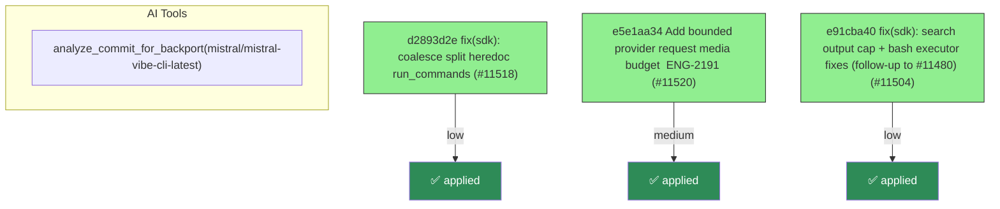

# Backport Agent — Detailed Run Report

> This file is generated automatically. It is intended for human analysts and
> AI reasoning models to assess agent performance, decision quality, and LLM behavior.

**Run timestamp**: 2026-06-15T10:42:25.438Z
**Models used**: fast=`mistral/devstral-medium-latest`  powerful=`mistral/mistral-vibe-cli-latest`
**Prompt log**: `/Users/rlemeill/Development/tea-ching-cline/.backport-agent/run-1781519877676.prompts.jsonl`

---

## Summary (PR body)

## Backport Agent — Sync Report

**Date**: 2026-06-15T10:42:25.438Z
**Upstream ref**: `cline/cline.git@main`
**Fork ref**: `TEA-ching/cline@keypool-live`
**Sync branch**: `sync/upstream-main-2026-06-15-103829`

### Summary

- ✅ Applied: 3
- ⚠️ Needs human review: 0
- ⛔ Blocked (not attempted): 0

### Applied commits

- `d2893d2e` [low] fix(sdk): coalesce split heredoc run_commands (#11518)
- `e5e1aa34` [medium] Add bounded provider request media budget  ENG-2191 (#11520)
- `e91cba40` [low] fix(sdk): search output cap + bash executor fixes (follow-up to #11480) (#11504)

### Agent decision log

- All commits applied successfully
- Validation passed for medium risk level
- Final validation failed due to snapshot mismatches in prompt system integration tests


---

## Agent Workflow Diagram

> Generated by the fast model from the run summary. Evaluate the agent's decision path.



---

## AI Sub-Agent Call Log (1 call)

> Each entry is one sub-agent invocation. Review prompt/response pairs to assess
> reasoning quality, hallucinations, and decision accuracy.

### Call 1 / 1 — `analyze_commit_for_backport` ✅ OK

| Field | Value |
|---|---|
| **Timestamp** | 2026-06-15T10:38:28.739Z |
| **Tool** | `analyze_commit_for_backport` |
| **Model** | `mistral/mistral-vibe-cli-latest` |
| **Duration** | 4981 ms |
| **Tokens in** | 12581 |
| **Tokens out** | 161 |
| **Cost** | $0.000000 |

**Prompt sent to sub-agent:**

```
Commit SHA: e5e1aa345530d26ccba36a1936c6b1796a650fb0
Commit message:
Add bounded provider request media budget  ENG-2191 (#11520)

Changed files (11):
sdk/packages/agents/src/agent-runtime.test.ts
sdk/packages/core/src/session/services/message-builder.test.ts
sdk/packages/core/src/session/services/message-builder.ts
sdk/packages/llms/src/providers/middleware/split-tool-images.test.ts
sdk/packages/llms/src/providers/middleware/split-tool-images.ts
sdk/packages/shared/src/index.browser.ts
sdk/packages/shared/src/index.ts
sdk/packages/shared/src/llms/ai-sdk-format.test.ts
sdk/packages/shared/src/llms/ai-sdk-format.ts
sdk/packages/shared/src/llms/media.test.ts
sdk/packages/shared/src/llms/media.ts

Diff:
commit e5e1aa345530d26ccba36a1936c6b1796a650fb0
Author: Robin Newhouse <robin@cline.bot>
Date:   Sun Jun 14 18:21:12 2026 -0700

    Add bounded provider request media budget  ENG-2191 (#11520)
    
    * fix(sdk): bound provider request media payloads
    
    * fix(sdk): address media review feedback
    
    * fix(sdk): scrub media from error tool results
    
    * chore(sdk): remove media budget docs noise
    
    ---------
    
    Co-authored-by: Saoud Rizwan <7799382+saoudrizwan@users.noreply.github.com>
---
 sdk/packages/agents/src/agent-runtime.test.ts      |   2 +-
 .../src/session/services/message-builder.test.ts   | 245 +++++++++++++
 .../core/src/session/services/message-builder.ts   | 181 +++++++++-
 .../providers/middleware/split-tool-images.test.ts | 347 ++++++++++++++++++-
 .../src/providers/middleware/split-tool-images.ts  | 187 +++++++++-
 sdk/packages/shared/src/index.browser.ts           |  26 ++
 sdk/packages/shared/src/index.ts                   |  26 ++
 sdk/packages/shared/src/llms/ai-sdk-format.test.ts | 378 +++++++++++++++++++--
 sdk/packages/shared/src/llms/ai-sdk-format.ts      | 304 +++++++++++++++--
 sdk/packages/shared/src/llms/media.test.ts         | 118 +++++++
 sdk/packages/shared/src/llms/media.ts              | 378 +++++++++++++++++++++
 11 files changed, 2122 insertions(+), 70 deletions(-)

diff --git a/sdk/packages/agents/src/agent-runtime.test.ts b/sdk/packages/agents/src/agent-runtime.test.ts
index cd20a46b0..8b60036bd 100644
--- a/sdk/packages/agents/src/agent-runtime.test.ts
+++ b/sdk/packages/agents/src/agent-runtime.test.ts
@@ -442,7 +442,7 @@ describe("AgentRuntime", () => {
 	it("preserves structured multimodal tool results for the next model request", async () => {
 		const structuredOutput = [
 			{ type: "text", text: "Successfully read image" },
-			{ type: "image", data: "BASE64DATA", mediaType: "image/jpeg" },
+			{ type: "image", data: "QkFTRTY0REFUQQ==", mediaType: "image/jpeg" },
 		];
 		const model = new ScriptedModel([
 			() => [
diff --git a/sdk/packages/core/src/session/services/message-builder.test.ts b/sdk/packages/core/src/session/services/message-builder.test.ts
index bf6764a3b..0f1eb150c 100644
--- a/sdk/packages/core/src/session/services/message-builder.test.ts
+++ b/sdk/packages/core/src/session/services/message-builder.test.ts
@@ -416,6 +416,10 @@ describe("MessageBuilder with structured ToolOperationResult content", () => {
 		return `${HEAD_MARKER}${filler}${MIDDLE_SENTINEL}${filler}${TAIL_MARKER}`;
 	}
 
+	function imageData(byteLength: number, fill = 1): string {
+		return Buffer.alloc(byteLength, fill).toString("base64");
+	}
+
 	function toolUseMessage(
 		id: string,
 		name: string,
@@ -541,6 +545,247 @@ describe("MessageBuilder with structured ToolOperationResult content", () => {
 		expect(serialized).not.toContain("[outdated");
 	});
 
+	it("omits an oversized read_files image result without corrupting base64", () => {
+		const oversizedImage = imageData(96);
+		const builder = new MessageBuilder(
+			50_000,
+			new Set(["read_files"]),
+			1_000_000,
+			{
+				maxImageEncodedBytes: 48,
+				maxImageDecodedBytes: 48,
+				maxTotalMediaBytes: 512,
+			},
+		);
+		const messages: Message[] = [
+			toolUseMessage("call_1", "read_files", {
+				files: [{ path: "/tmp/large.png" }],
+			}),
+			structuredToolResultMessage("call_1", "read_files", [
+				{
+					query: "/tmp/large.png",
+					result: [
+						"Successfully read image",
+						{
+							type: "image",
+							data: oversizedImage,
+							mediaType: "image/png",
+						},
+					],
+					success: true,
+				},
+			]),
+		];
+
+		const result = builder.buildForApi(messages);
+		const serialized = JSON.stringify(result);
+
+		expect(serialized).toContain(
+			"[media omitted: invalid or exceeds size limit]",
+		);
+		expect(serialized).not.toContain(oversizedImage);
+		expect(serialized).not.toContain("...[truncated");
+		expect(messages).toEqual([
+			messages[0],
+			structuredToolResultMessage("call_1", "read_files", [
+				{
+					query: "/tmp/large.png",
+					result: [
+						"Successfully read image",
+						{
+							type: "image",
+							data: oversizedImage,
+							mediaType: "image/png",
+						},
+					],
+					success: true,
+				},
+			]),
+		]);
+	});
+
+	it("omits oversized custom structured image results even when text truncation is not targeted", () => {
+		const oversizedImage = imageData(96);
+		const builder = new MessageBuilder(
+			50_000,
+			new Set(["read_files"]),
+			1_000_000,
+			{
+				maxImageEncodedBytes: 48,
+				maxImageDecodedBytes: 48,
+				maxTotalMediaBytes: 512,
+			},
+		);
+		const messages: Message[] = [
+			toolUseMessage("call_1", "custom_mcp_tool", {
+				path: "/tmp/large.png",
+			}),
+			structuredToolResultMessage("call_1", "custom_mcp_tool", [
+				{
+					query: "/tmp/large.png",
+					result: {
+						type: "image",
+						data: oversizedImage,
+						mediaType: "image/png",
+					},
+					success: true,
+				},
+			]),
+		];
+
+		const result = builder.buildForApi(messages);
+		const serialized = JSON.stringify(result);
+
+		expect(serialized).toContain(
+			"[media omitted: invalid or exceeds size limit]",
+		);
+		expect(serialized).not.toContain(oversizedImage);
+		expect(serialized).not.toContain("...[truncated");
+	});
+
+	it("omits malformed image-shaped objects instead of counting them as free text", () => {
+		const hiddenPayload = imageData(4096);
+		const builder = new MessageBuilder(
+			50_000,
+			new Set(["read_files"]),
+			1_000_000,
+			{
+				maxImageEncodedBytes: 128,
+				maxImageDecodedBytes: 128,
+				maxTotalMediaBytes: 128,
+			},
+		);
+		const messages: Message[] = [
+			toolUseMessage("call_1", "custom_mcp_tool", {
+				path: "/tmp/malformed.png",
+			}),
+			structuredToolResultMessage("call_1", "custom_mcp_tool", [
+				{
+					query: "/tmp/malformed.png",
+					result: {
+						type: "image",
+						data: hiddenPayload,
+					},
+					success: true,
+				},
+			]),
+		];
+
+		const result = builder.buildForApi(messages);
+		const serialized = JSON.stringify(result);
+
+		expect(serialized).toContain(
+			"[media omitted: invalid or exceeds size limit]",
+		);
+		expect(serialized).not.toContain(hiddenPayload);
+		expect(serialized).not.toContain("...[truncated");
+	});
+
+	it("keeps valid small read_files images as native provider media", () => {
+		const smallImage = imageData(16);
+		const builder = new MessageBuilder(
+			50_000,
+			new Set(["read_files"]),
+			1_000_000,
+			{
+				maxImageEncodedBytes: 128,
+				maxImageDecodedBytes: 128,
+				maxTotalMediaBytes: 128,
+			},
+		);
+		const messages: Message[] = [
+			toolUseMessage("call_1", "read_files", {
+				files: [{ path: "/tmp/small.png" }],
+			}),
+			structuredToolResultMessage("call_1", "read_files", [
+				{
+					query: "/tmp/small.png",
+					result: [
+						"Successfully read image",
+						{
+							type: "image",
+							data: smallImage,
+							mediaType: "image/png",
+						},
+					],
+					success: true,
+				},
+			]),
+		];
+
+		const built = builder.buildForApi(messages);
+		const agentMessages = messagesToAgentMessages(built);
+		const aiSdkMessages = formatMessagesForAiSdk(
+			undefined,
+			agentMessages.map(({ role, content }) => ({
+				role,
+				content,
+			})) as unknown as AiSdkFormatterMessage[],
+		);
+		const serialized = JSON.stringify(aiSdkMessages);
+
+		expect(serialized).toContain('"type":"image-data"');
+		expect(serialized).toContain(smallImage);
+		expect(serialized).not.toContain(
+			"[media omitted: invalid or exceeds size limit]",
+		);
+	});
+
+	it("applies the total media budget across otherwise valid images", () => {
+		const firstImage = imageData(16);
+		const secondImage = imageData(16, 2);
+		const builder = new MessageBuilder(
+			50_000,
+			new Set(["read_files"]),
+			1_000_000,
+			{
+				maxImageEncodedBytes: 128,
+				maxImageDecodedBytes: 128,
+				maxTotalMediaBytes: Buffer.byteLength(firstImage, "utf8"),
+			},
+		);
+		const messages: Message[] = [
+			toolUseMessage("call_1", "read_files", {
+				files: [{ path: "/tmp/a.png" }, { path: "/tmp/b.png" }],
+			}),
+			structuredToolResultMessage("call_1", "read_files", [
+				{
+					query: "/tmp/a.png",
+					result: [
+						"Successfully read image",
+						{
+							type: "image",
+							data: firstImage,
+							mediaType: "image/png",
+						},
+					],
+					success: true,
+				},
+				{
+					query: "/tmp/b.png",
+					result: [
+						"Successfully read image",
+						{
+							type: "image",
+							data: secondImage,
+							mediaType: "image/png",
+						},
+					],
+					success: true,
+				},
+			]),
+		];
+
+		const result = builder.buildForApi(messages);
+		const serialized = JSON.stringify(result);
+
+		expect(serialized).toContain(firstImage);
+		expect(serialized).not.toContain(secondImage);
+		expect(serialized).toContain(
+			"[media omitted: invalid or exceeds size limit]",
+		);
+	});
+
 	it("truncates a huge fetch_web_content structured result", () => {
 		// The web-fetch executor allows responses up to 5MB, so this tool must
 		// be covered by the truncation targets like the other bulk-output tools.
diff --git a/sdk/packages/core/src/session/services/message-builder.ts b/sdk/packages/core/src/session/services/message-builder.ts
index c7c5af0a6..9449b2d21 100644
--- a/sdk/packages/core/src/session/services/message-builder.ts
+++ b/sdk/packages/core/src/session/services/message-builder.ts
@@ -11,10 +11,18 @@
 
 import {
 	type ContentBlock,
+	createMediaBudgetState,
+	IMAGE_OMITTED_PLACEHOLDER,
+	type ImageContent,
+	type MediaBudgetOptions,
+	type MediaBudgetState,
 	type Message,
 	normalizeUserInput,
+	type ResolvedMediaBudget,
+	resolveMediaBudget,
 	type TextContent,
 	type ToolResultContent,
+	validateAndReserveImageMedia,
 } from "@cline/shared";
 
 const DEFAULT_MAX_TOOL_RESULT_CHARS = 50_000;
@@ -72,6 +80,7 @@ export class MessageBuilder {
 		private readonly maxToolResultChars = DEFAULT_MAX_TOOL_RESULT_CHARS,
 		private readonly targetToolNames = TARGET_TOOL_NAMES,
 		private readonly maxTotalTextBytes = DEFAULT_MAX_TOTAL_TEXT_BYTES,
+		private readonly mediaBudget: MediaBudgetOptions = {},
 	) {}
 
 	buildForApi(messages: Message[]): Message[] {
@@ -101,7 +110,8 @@ export class MessageBuilder {
 			return changed ? { ...message, content } : message;
 		});
 
-		return this.truncateToTotalTextBudget(prepared);
+		const mediaLimited = this.applyMediaBudget(prepared);
+		return this.truncateToTotalTextBudget(mediaLimited);
 	}
 
 	private transformBlock(
@@ -957,6 +967,153 @@ export class MessageBuilder {
 		}
 		return candidates.sort((l, r) => r.byteLength - l.byteLength);
 	}
+
+	private applyMediaBudget(messages: Message[]): Message[] {
+		const budget = this.resolveMediaBudget();
+		if (
+			budget.maxImageEncodedBytes === Number.POSITIVE_INFINITY &&
+			budget.maxImageDecodedBytes === Number.POSITIVE_INFINITY &&
+			budget.maxTotalMediaBytes === Number.POSITIVE_INFINITY
+		) {
+			return messages;
+		}
+
+		const state = createMediaBudgetState();
+		let changed = false;
+		const next = messages.map((message) => {
+			if (!Array.isArray(message.content)) {
+				return message;
+			}
+			let contentChanged = false;
+			const content = message.content.map((block) => {
+				const out = this.applyMediaBudgetToBlock(block, budget, state);
+				if (out !== block) {
+					contentChanged = true;
+				}
+				return out;
+			});
+			if (!contentChanged) {
+				return message;
+			}
+			changed = true;
+			return { ...message, content };
+		});
+
+		return changed ? next : messages;
+	}
+
+	private resolveMediaBudget(): ResolvedMediaBudget {
+		return resolveMediaBudget(this.mediaBudget);
+	}
+
+	private applyMediaBudgetToBlock(
+		block: ContentBlock,
+		budget: ResolvedMediaBudget,
+		state: MediaBudgetState,
+	): ContentBlock {
+		if (isImageContentLike(block)) {
+			return this.limitImageContent(block, budget, state);
+		}
+
+		if (block.type !== "tool_result" || typeof block.content === "string") {
+			return block;
+		}
+
+		let changed = false;
+		const content = block.content.map((entry) => {
+			const out = this.applyMediaBudgetToToolResultEntry(entry, budget, state);
+			if (out !== entry) {
+				changed = true;
+			}
+			return out as (typeof block.content)[number];
+		});
+
+		return changed
+			? { ...block, content: content as ToolResultContent["content"] }
+			: block;
+	}
+
+	private applyMediaBudgetToToolResultEntry(
+		entry: unknown,
+		budget: ResolvedMediaBudget,
+		state: MediaBudgetState,
+	): unknown {
+		if (isImageContentLike(entry)) {
+			return this.limitImageContent(entry, budget, state);
+		}
+		if (isStructuredToolResultEntry(entry)) {
+			return this.limitNestedMedia(entry, budget, state);
+		}
+		return entry;
+	}
+
+	private limitNestedMedia(
+		value: unknown,
+		budget: ResolvedMediaBudget,
+		state: MediaBudgetState,
+	): unknown {
+		if (isImageContentLike(value)) {
+			const limited = this.limitImageContent(value, budget, state);
+			return limited.type === "text" ? limited.text : limited;
+		}
+
+		if (Array.isArray(value)) {
+			let changed = false;
+			const next = value.map((item) => {
+				const out = this.limitNestedMedia(item, budget, state);
+				if (out !== item) {
+					changed = true;
+				}
+				return out;
+			});
+			return changed ? next : value;
+		}
+
+		if (value !== null && typeof value === "object") {
+			let changed = false;
+			const next: Record<string, unknown> = {};
+			for (const [key, item] of Object.entries(value)) {
+				const out = this.limitNestedMedia(item, budget, state);
+				if (out !== item) {
+					changed = true;
+				}
+				next[key] = out;
+			}
+			return changed ? next : value;
+		}
+
+		return value;
+	}
+
+	private limitImageContent(
+		image: unknown,
+		budget: ResolvedMediaBudget,
+		state: MediaBudgetState,
+	): ImageContent | TextContent {
+		if (!isImageContentWithData(image)) {
+			return { type: "text", text: IMAGE_OMITTED_PLACEHOLDER };
+		}
+
+		const validation = validateAndReserveImageMedia(
+			image.mediaType,
+			image.data,
+			{
+				maxImageEncodedBytes: budget.maxImageEncodedBytes,
+				maxImageDecodedBytes: budget.maxImageDecodedBytes,
+				maxTotalMediaBytes: budget.maxTotalMediaBytes,
+			},
+			state,
+		);
+		if (!validation.ok) {
+			return { type: "text", text: IMAGE_OMITTED_PLACEHOLDER };
+		}
+
+		return {
+			...image,
+			data: validation.base64,
+			mediaType: validation.mediaType,
+		};
+	}
 }
 
 function utf8ByteLength(text: string): number {
@@ -1042,8 +1199,22 @@ function isStructuredToolResultEntry(entry: unknown): boolean {
 	return type !== "text" && type !== "image" && type !== "file";
 }
 
-function isImageContentLike(value: object): boolean {
-	return (value as { type?: unknown }).type === "image";
+function isImageContentLike(value: unknown): boolean {
+	return (
+		value !== null &&
+		typeof value === "object" &&
+		(value as { type?: unknown }).type === "image"
+	);
+}
+
+function isImageContentWithData(value: unknown): value is ImageContent {
+	return (
+		value !== null &&
+		typeof value === "object" &&
+		(value as { type?: unknown }).type === "image" &&
+		typeof (value as { data?: unknown }).data === "string" &&
+		typeof (value as { mediaType?: unknown }).mediaType === "string"
+	);
 }
 
 function countNestedStringBytes(value: unknown): number {
@@ -1058,7 +1229,7 @@ function countNestedStringBytes(value: unknown): number {
 		return total;
 	}
 	if (value !== null && typeof value === "object") {
-		if (isImageContentLike(value)) {
+		if (isImageContentWithData(value)) {
 			return 0;
 		}
 		let total = 0;
@@ -1091,7 +1262,7 @@ function collectNestedStringCandidates(
 		return;
 	}
 	if (container !== null && typeof container === "object") {
-		if (isImageContentLike(container)) {
+		if (isImageContentWithData(container)) {
 			return;
 		}
 		const record = container as Record<string, unknown>;
diff --git a/sdk/packages/llms/src/providers/middleware/split-tool-images.test.ts b/sdk/packages/llms/src/providers/middleware/split-tool-images.test.ts
index 949dae9ee..d09970af3 100644
--- a/sdk/packages/llms/src/providers/middleware/split-tool-images.test.ts
+++ b/sdk/packages/llms/src/providers/middleware/split-tool-images.test.ts
@@ -9,6 +9,9 @@ import {
 } from "./split-tool-images";
 
 const PLACEHOLDER = "(see following user message for image)";
+const OMITTED_PLACEHOLDER = "[media omitted: invalid or exceeds size limit]";
+const imageData = (byteLength: number, fill = 1) =>
+	Buffer.alloc(byteLength, fill).toString("base64");
 
 describe("rewritePromptToolImages", () => {
 	it("leaves prompts without tool messages unchanged", () => {
@@ -77,7 +80,7 @@ describe("rewritePromptToolImages", () => {
 								{ type: "text", text: "Successfully read image" },
 								{
 									type: "image-data",
-									data: "BASE64IMAGEBYTES",
+									data: "QkFTRTY0SU1BR0VCWVRFUw==",
 									mediaType: "image/jpeg",
 								},
 							],
@@ -115,7 +118,7 @@ describe("rewritePromptToolImages", () => {
 			content: [
 				{
 					type: "file",
-					data: "BASE64IMAGEBYTES",
+					data: "QkFTRTY0SU1BR0VCWVRFUw==",
 					mediaType: "image/jpeg",
 				},
 			],
@@ -136,7 +139,7 @@ describe("rewritePromptToolImages", () => {
 							value: [
 								{
 									type: "file-data",
-									data: "BASE64PDFBYTES",
+									data: "QkFTRTY0UERGQllURVM=",
 									mediaType: "application/pdf",
 									filename: "spec.pdf",
 									providerOptions: {
@@ -158,7 +161,7 @@ describe("rewritePromptToolImages", () => {
 			content: [
 				{
 					type: "file",
-					data: "BASE64PDFBYTES",
+					data: "QkFTRTY0UERGQllURVM=",
 					mediaType: "application/pdf",
 					filename: "spec.pdf",
 					providerOptions: {
@@ -204,6 +207,265 @@ describe("rewritePromptToolImages", () => {
 		});
 	});
 
+	it("omits image-url parts that exceed the aggregate media budget", () => {
+		const prompt: LanguageModelV3Message[] = [
+			{
+				role: "tool",
+				content: [
+					{
+						type: "tool-result",
+						toolCallId: "call_1",
+						toolName: "read_files",
+						output: {
+							type: "content",
+							value: [
+								{ type: "image-url", url: "https://example.com/a.png" },
+								{ type: "image-url", url: "https://example.com/b.png" },
+							],
+						},
+					},
+				],
+			},
+		];
+
+		const out = rewritePromptToolImages(prompt);
+
+		expect(out.mutated).toBe(true);
+		expect(out.prompt).toHaveLength(2);
+		expect(out.prompt[1]).toEqual({
+			role: "user",
+			content: [
+				{
+					type: "file",
+					data: "https://example.com/a.png",
+					mediaType: "image/*",
+				},
+			],
+		});
+		expect(JSON.stringify(out.prompt[0])).toContain(OMITTED_PLACEHOLDER);
+		expect(JSON.stringify(out.prompt[0])).not.toContain(
+			"https://example.com/b.png",
+		);
+	});
+
+	it("omits invalid data URL image-url parts instead of splitting them", () => {
+		const prompt: LanguageModelV3Message[] = [
+			{
+				role: "tool",
+				content: [
+					{
+						type: "tool-result",
+						toolCallId: "call_1",
+						toolName: "read_files",
+						output: {
+							type: "content",
+							value: [
+								{
+									type: "image-url",
+									url: "data:image/png;base64,not-base64",
+								},
+							],
+						},
+					},
+				],
+			},
+		];
+
+		const out = rewritePromptToolImages(prompt);
+
+		expect(out.mutated).toBe(true);
+		expect(out.prompt).toHaveLength(1);
+		expect(JSON.stringify(out.prompt[0])).toContain(OMITTED_PLACEHOLDER);
+		expect(JSON.stringify(out.prompt[0])).not.toContain("not-base64");
+	});
+
+	it("omits unsupported uppercase data URL image-url parts before splitting", () => {
+		const prompt: LanguageModelV3Message[] = [
+			{
+				role: "tool",
+				content: [
+					{
+						type: "tool-result",
+						toolCallId: "call_1",
+						toolName: "read_files",
+						output: {
+							type: "content",
+							value: [
+								{
+									type: "image-url",
+									url: "DATA:image/svg+xml;base64,PHN2Zz4=",
+								},
+							],
+						},
+					},
+				],
+			},
+		];
+
+		const out = rewritePromptToolImages(prompt);
+
+		expect(out.mutated).toBe(true);
+		expect(out.prompt).toHaveLength(1);
+		expect(JSON.stringify(out.prompt[0])).toContain(OMITTED_PLACEHOLDER);
+		expect(JSON.stringify(out.prompt[0])).not.toContain("PHN2Zz4=");
+	});
+
+	it("omits file-url parts that exceed the aggregate media budget", () => {
+		const prompt: LanguageModelV3Message[] = [
+			{
+				role: "tool",
+				content: [
+					{
+						type: "tool-result",
+						toolCallId: "call_1",
+						toolName: "read_files",
+						output: {
+							type: "content",
+							value: [
+								{
+									type: "file-url",
+									url: "https://example.com/a.pdf",
+								},
+								{
+									type: "file-url",
+									url: "https://example.com/b.pdf",
+								},
+							],
+						},
+					},
+				],
+			},
+		];
+
+		const out = rewritePromptToolImages(prompt);
+
+		expect(out.mutated).toBe(true);
+		expect(out.prompt).toHaveLength(2);
+		expect(out.prompt[1]).toEqual({
+			role: "user",
+			content: [
+				{
+					type: "file",
+					data: "https://example.com/a.pdf",
+					mediaType: "application/octet-stream",
+				},
+			],
+		});
+		expect(JSON.stringify(out.prompt[0])).toContain(OMITTED_PLACEHOLDER);
+		expect(JSON.stringify(out.prompt[0])).not.toContain(
+			"https://example.com/b.pdf",
+		);
+	});
+
+	it("omits malformed file-url data URLs instead of splitting them", () => {
+		const prompt: LanguageModelV3Message[] = [
+			{
+				role: "tool",
+				content: [
+					{
+						type: "tool-result",
+						toolCallId: "call_1",
+						toolName: "read_files",
+						output: {
+							type: "content",
+							value: [
+								{
+									type: "file-url",
+									url: "data:application/pdf;base64,not-base64",
+								},
+							],
+						},
+					},
+				],
+			},
+		];
+
+		const out = rewritePromptToolImages(prompt);
+
+		expect(out.mutated).toBe(true);
+		expect(out.prompt).toHaveLength(1);
+		expect(JSON.stringify(out.prompt[0])).toContain(OMITTED_PLACEHOLDER);
+		expect(JSON.stringify(out.prompt[0])).not.toContain("not-base64");
+	});
+
+	it("omits oversized file-data parts instead of splitting them", () => {
+		const oversizedFile = "A".repeat(6 * 1024 * 1024);
+		const prompt: LanguageModelV3Message[] = [
+			{
+				role: "tool",
+				content: [
+					{
+						type: "tool-result",
+						toolCallId: "call_1",
+						toolName: "read_files",
+						output: {
+							type: "content",
+							value: [
+								{
+									type: "file-data",
+									data: oversizedFile,
+									mediaType: "application/pdf",
+								},
+							],
+						},
+					},
+				],
+			},
+		];
+
+		const out = rewritePromptToolImages(prompt);
+
+		expect(out.mutated).toBe(true);
+		expect(out.prompt).toHaveLength(1);
+		expect(JSON.stringify(out.prompt[0])).toContain(OMITTED_PLACEHOLDER);
+		expect(JSON.stringify(out.prompt[0])).not.toContain(oversizedFile);
+	});
+
+	it("replaces invalid image-data with a text placeholder instead of splitting it", () => {
+		const prompt: LanguageModelV3Message[] = [
+			{
+				role: "tool",
+				content: [
+					{
+						type: "tool-result",
+						toolCallId: "call_1",
+						toolName: "read_files",
+						output: {
+							type: "content",
+							value: [
+								{
+									type: "image-data",
+									data: "not-base64",
+									mediaType: "image/png",
+								},
+							],
+						},
+					},
+				],
+			},
+		];
+
+		const out = rewritePromptToolImages(prompt);
+
+		expect(out.mutated).toBe(true);
+		expect(out.prompt).toHaveLength(1);
+		const toolResult = (
+			out.prompt[0] as Extract<LanguageModelV3Message, { role: "tool" }>
+		).content[0];
+		if (toolResult.type !== "tool-result") {
+			throw new Error("expected tool-result");
+		}
+		expect(toolResult.output).toEqual({
+			type: "content",
+			value: [
+				{
+					type: "text",
+					text: "[media omitted: invalid or exceeds size limit]",
+				},
+			],
+		});
+	});
+
 	it("leaves image-file-id parts in place (no FilePart equivalent)", () => {
 		// image-file-id is an OpenAI-specific provider reference. It can't
 		// be expressed as a `LanguageModelV3FilePart`, so we leave it inside
@@ -267,7 +529,7 @@ describe("rewritePromptToolImages", () => {
 								{ type: "text", text: "image 1" },
 								{
 									type: "image-data",
-									data: "AAA",
+									data: "QUFB",
 									mediaType: "image/jpeg",
 								},
 							],
@@ -283,7 +545,7 @@ describe("rewritePromptToolImages", () => {
 								{ type: "text", text: "image 2" },
 								{
 									type: "image-data",
-									data: "BBB",
+									data: "QkJC",
 									mediaType: "image/png",
 								},
 							],
@@ -300,12 +562,71 @@ describe("rewritePromptToolImages", () => {
 		expect(out.prompt[1]).toEqual({
 			role: "user",
 			content: [
-				{ type: "file", data: "AAA", mediaType: "image/jpeg" },
-				{ type: "file", data: "BBB", mediaType: "image/png" },
+				{ type: "file", data: "QUFB", mediaType: "image/jpeg" },
+				{ type: "file", data: "QkJC", mediaType: "image/png" },
 			],
 		});
 	});
 
+	it("omits images that exceed the aggregate media budget in the split backstop", () => {
+		const firstImage = imageData(3_600_000, 1);
+		const secondImage = imageData(3_600_000, 2);
+		const prompt: LanguageModelV3Message[] = [
+			{
+				role: "tool",
+				content: [
+					{
+						type: "tool-result",
+						toolCallId: "call_1",
+						toolName: "read_files",
+						output: {
+							type: "content",
+							value: [
+								{ type: "text", text: "image 1" },
+								{
+									type: "image-data",
+									data: firstImage,
+									mediaType: "image/png",
+								},
+							],
+						},
+					},
+					{
+						type: "tool-result",
+						toolCallId: "call_2",
+						toolName: "read_files",
+						output: {
+							type: "content",
+							value: [
+								{ type: "text", text: "image 2" },
+								{
+									type: "image-data",
+									data: secondImage,
+									mediaType: "image/png",
+								},
+							],
+						},
+					},
+				],
+			},
+		];
+
+		const out = rewritePromptToolImages(prompt);
+
+		expect(out.mutated).toBe(true);
+		expect(out.prompt).toHaveLength(2);
+		expect(out.prompt[1]).toEqual({
+			role: "user",
+			content: [{ type: "file", data: firstImage, mediaType: "image/png" }],
+		});
+		const toolMessage = out.prompt[0];
+		if (toolMessage.role !== "tool") {
+			throw new Error("expected tool message");
+		}
+		expect(JSON.stringify(toolMessage)).toContain(OMITTED_PLACEHOLDER);
+		expect(JSON.stringify(toolMessage)).not.toContain(secondImage);
+	});
+
 	it("handles multiple separate tool messages in the same prompt", () => {
 		const prompt: LanguageModelV3Message[] = [
 			{
@@ -334,7 +655,7 @@ describe("rewritePromptToolImages", () => {
 							type: "content",
 							value: [
 								{ type: "text", text: "first" },
-								{ type: "image-data", data: "AAA", mediaType: "image/jpeg" },
+								{ type: "image-data", data: "QUFB", mediaType: "image/jpeg" },
 							],
 						},
 					},
@@ -362,7 +683,7 @@ describe("rewritePromptToolImages", () => {
 							type: "content",
 							value: [
 								{ type: "text", text: "second" },
-								{ type: "image-data", data: "BBB", mediaType: "image/png" },
+								{ type: "image-data", data: "QkJC", mediaType: "image/png" },
 							],
 						},
 					},
@@ -392,7 +713,7 @@ describe("rewritePromptToolImages", () => {
 							type: "content",
 							value: [
 								{ type: "text", text: "before" },
-								{ type: "image-data", data: "AAA", mediaType: "image/jpeg" },
+								{ type: "image-data", data: "QUFB", mediaType: "image/jpeg" },
 							],
 						},
 					},
@@ -448,7 +769,7 @@ describe("splitToolImagesMiddleware", () => {
 								type: "content",
 								value: [
 									{ type: "text", text: "ok" },
-									{ type: "image-data", data: "AAA", mediaType: "image/jpeg" },
+									{ type: "image-data", data: "QUFB", mediaType: "image/jpeg" },
 								],
 							},
 						},
@@ -481,7 +802,7 @@ describe("splitToolImagesMiddleware", () => {
 							output: {
 								type: "content",
 								value: [
-									{ type: "image-data", data: "AAA", mediaType: "image/jpeg" },
+									{ type: "image-data", data: "QUFB", mediaType: "image/jpeg" },
 								],
 							},
 						},
diff --git a/sdk/packages/llms/src/providers/middleware/split-tool-images.ts b/sdk/packages/llms/src/providers/middleware/split-tool-images.ts
index 51f0ec7b8..167533963 100644
--- a/sdk/packages/llms/src/providers/middleware/split-tool-images.ts
+++ b/sdk/packages/llms/src/providers/middleware/split-tool-images.ts
@@ -52,6 +52,16 @@ import type {
 	LanguageModelV3ToolResultOutput,
 	LanguageModelV3ToolResultPart,
 } from "@ai-sdk/provider";
+import {
+	createMediaBudgetState,
+	DEFAULT_MAX_IMAGE_DECODED_BYTES,
+	DEFAULT_MAX_IMAGE_ENCODED_BYTES,
+	IMAGE_OMITTED_PLACEHOLDER,
+	isCanonicalBase64,
+	type MediaBudgetState,
+	reserveImageMediaBytes,
+	validateAndReserveImageMedia,
+} from "@cline/shared";
 
 const IMAGE_PLACEHOLDER = "(see following user message for image)";
 
@@ -162,6 +172,107 @@ interface SplitResult {
 	media: LanguageModelV3FilePart[];
 }
 
+function imageOmittedTextPart(): LanguageModelV3TextPart {
+	return {
+		type: "text",
+		text: IMAGE_OMITTED_PLACEHOLDER,
+	};
+}
+
+function reserveUnknownUrlMediaBudget(
+	url: string,
+	mediaState: MediaBudgetState,
+): boolean {
+	let parsed: URL;
+	try {
+		parsed = new URL(url);
+	} catch {
+		return false;
+	}
+
+	if (parsed.protocol === "data:") {
+		const commaIndex = url.indexOf(",");
+		if (commaIndex === -1) {
+			return false;
+		}
+		const metadata = url.slice("data:".length, commaIndex).toLowerCase();
+		if (!metadata.endsWith(";base64")) {
+			return false;
+		}
+		const base64 = url.slice(commaIndex + 1);
+		if (!isCanonicalBase64(base64)) {
+			return false;
+		}
+		return (
+			reserveImageMediaBytes(
+				base64.length,
+				0,
+				{
+					maxImageEncodedBytes: DEFAULT_MAX_IMAGE_ENCODED_BYTES,
+					maxImageDecodedBytes: DEFAULT_MAX_IMAGE_DECODED_BYTES,
+				},
+				mediaState,
+			) === null
+		);
+	}
+
+	if (parsed.protocol !== "http:" && parsed.protocol !== "https:") {
+		return false;
+	}
+
+	// Remote URL byte size is unknown at formatting time, so charge the
+	// conservative per-image cap instead of letting URL media count as free.
+	return (
+		reserveImageMediaBytes(
+			DEFAULT_MAX_IMAGE_ENCODED_BYTES,
+			0,
+			{
+				maxImageEncodedBytes: DEFAULT_MAX_IMAGE_ENCODED_BYTES,
+				maxImageDecodedBytes: DEFAULT_MAX_IMAGE_DECODED_BYTES,
+			},
+			mediaState,
+		) === null
+	);
+}
+
+function isDataUrl(url: string): boolean {
+	try {
+		return new URL(url).protocol === "data:";
+	} catch {
+		return false;
+	}
+}
+
+function estimateMediaDataEncodedBytes(data: unknown): number {
+	if (typeof data === "string") {
+		return data.length;
+	}
+	if (data instanceof Uint8Array) {
+		return data.byteLength;
+	}
+	if (data instanceof ArrayBuffer) {
+		return data.byteLength;
+	}
+	return Number.POSITIVE_INFINITY;
+}
+
+function reserveGenericMediaDataBudget(
+	data: unknown,
+	mediaState: MediaBudgetState,
+): boolean {
+	return (
+		reserveImageMediaBytes(
+			estimateMediaDataEncodedBytes(data),
+			0,
+			{
+				maxImageEncodedBytes: DEFAULT_MAX_IMAGE_ENCODED_BYTES,
+				maxImageDecodedBytes: DEFAULT_MAX_IMAGE_DECODED_BYTES,
+			},
+			mediaState,
+		) === null
+	);
+}
+
 /**
  * Split a tool-result `output` of type `'content'` into:
  *   - a `stripped` output where every media part is replaced by a
@@ -173,31 +284,96 @@ interface SplitResult {
  */
 function splitContentOutputMedia(
 	output: LanguageModelV3ToolResultOutput,
+	mediaState: MediaBudgetState,
 ): SplitResult | null {
 	if (output.type !== "content") {
 		return null;
 	}
 	const media: LanguageModelV3FilePart[] = [];
 	const newValue: ContentOutput["value"] = [];
+	let mutated = 
... [truncated]

Output the JSON object now.
```

**Response received:**

```
{
  "summary": "Adds bounded media budget for provider requests, introducing image size validation and budget tracking across message building and tool image splitting.",
  "keyChanges": [
    "New media budget system in shared/llms/media.ts",
    "MessageBuilder applies media budget to images",
    "split-tool-images middleware omits oversized media",
    "Adds IMAGE_OMITTED_PLACEHOLDER for invalid/oversized media",
    "Extensive test coverage for media budget enforcement"
  ],
  "backportComplexity": "moderate",
  "semanticRiskFactors": [
    "Introduces new media budget API in shared package",
    "Changes message serialization behavior for images"
  ],
  "recommendation": "apply-with-care"
}
```

---

## Performance Summary

**Total AI time**: 4981 ms across 1 call(s)
**Total input tokens**: 12581
**Total output tokens**: 161

| Tool | Calls | Total ms | Avg ms | Input tok | Output tok |
|---|---|---|---|---|---|
| `analyze_commit_for_backport` | 1 | 4981 | 4981 | 12581 | 161 |

## Decision Quality Metrics

> Automated quality signals derived from tool output guards, schema validation,
> hallucination detection, and consensus checks.  Review flagged items manually.

### Commit Analysis Quality

| Metric | Value |
|---|---|
| Total analyze calls | 1 |
| Commits with semantic risk factors | 1 |
| Possible hallucinated references (total) | 1 |

### Audit Event Timeline

| Timestamp | Tool | Event | Details |
|---|---|---|---|
| 10:38:28 | `analyze_commit_for_backport` | `hallucination_suspects` | sha="e5e1aa345530d26ccba36a1936c6b1796a650fb, suspects=["shared/llms/media.ts"] |
| 10:38:28 | `analyze_commit_for_backport` | `analysis_complete` | sha="e5e1aa345530d26ccba36a1936c6b1796a650fb, recommendation="apply-with-care", complexity="moderate" |
