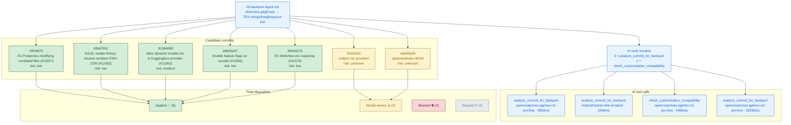

# Backport Agent — Detailed Run Report

> This file is generated automatically. It is intended for human analysts and
> AI reasoning models to assess agent performance, decision quality, and LLM behavior.

**Run timestamp**: 2026-06-16T05:17:38.820Z
**Models used**: fast=`openrouter/nex-agi/nex-n2-pro:free`  powerful=`mistral/mistral-vibe-cli-latest`
**Prompt log**: `/Users/rlemeill/Development/tea-ching-cline/.backport-agent/run-1781586019744.prompts.jsonl`

---

## Summary (PR body)

## Backport Agent — Sync Report

**Date**: 2026-06-16T05:17:38.820Z
**Upstream ref**: `cline/cline.git@main (upstream/main ebb05ed96339dfa538793afb015e593716ded670)`
**Fork ref**: `TEA-ching/cline@keypool-live (origin/keypool-live 785c8e40f953391967fa347ab926388fd97dd73b)`
**Sync branch**: `sync/upstream-main-2026-06-16-050506`

### Summary

- ✅ Applied: 5
- ⚠️ Needs human review: 2
- ⛔ Blocked (not attempted): 0

### Applied commits

- `40fc8879` [low] Fix Postprotos modifying unrelated files (#11557) _(conflict resolved by agent)_
- `6364792c` [low] fix(cli): isolate history resume renderer ENG-2190 (#11502)
- `81384089` [medium] allow dynamic models ids in huggingface provider (#11563)
- `a6500a07` [low] Enable feature flags on vscode (#11566)
- `8d03d176` [low] Fix WebView env replacing (#11574)

### ⚠️ Human review required

- `32b3cfc0` fix hugging face url (#11567)
  - High-risk customization-zone commit touched sdk/packages/llms/src/providers/builtins.ts. Compatibility check was compatible with no semantic conflicts, but analyze/reconcile remained review-required because the same customized provider file was modified.
- `ebb05ed9` feat: add MCP support to plugins (#11516)
  - Medium-risk plugin MCP feature; analyze_commit_for_backport recommended review-required due complex plugin MCP settings sync and plugin toggle behavior changes.

### Agent decision log

- Recorded all 7 candidate SHAs from list_candidate_commits and accounted for every SHA in commitResults.
- Processed commits lowest-risk first: low-risk commits first, then medium-risk commits, then the high-risk customization-zone commit.
- For medium-risk commit 81384089, analyze_commit_for_backport returned apply-with-care; proceeded with cherry-pick per workflow.
- For high-risk commit 32b3cfc0, mandatory check_customization_compatibility returned compatible with no semantic conflicts; analyze_commit_for_backport returned review-required due touching sdk/packages/llms/src/providers/builtins.ts; reconcile returned review-required. No genuine semantic conflict was identified, so the commit was attempted and cherry-picked cleanly.
- For medium-risk commit ebb05ed9, analyze_commit_for_backport returned review-required because plugin MCP settings sync is complex; proceeded with cherry-pick per medium-risk workflow.
- Low-risk commit 40fc8879 conflicted only in apps/vscode/package.json on the postprotos script. Resolved by preserving the fork version (postprotos: exit 0) to avoid reintroducing upstream post-proto formatting side effects, then staged and continued the cherry-pick.
- High-risk validation suite reported allPassed:true, though bun install emitted dependency-resolution warnings/errors in its output. Final validation failed at bun run build:models because @cline/llms could not resolve @cline/shared.
- find_existing_sync_pr could not complete because GITHUB_TOKEN is not set, so PR creation may also require that token.


---

## Agent Workflow Diagram

> Generated by the fast model from the run summary. Evaluate the agent's decision path.



---

## AI Sub-Agent Call Log (4 calls)

> Each entry is one sub-agent invocation. Review prompt/response pairs to assess
> reasoning quality, hallucinations, and decision accuracy.

### Call 1 / 4 — `analyze_commit_for_backport` ✅ OK

| Field | Value |
|---|---|
| **Timestamp** | 2026-06-16T05:03:40.177Z |
| **Tool** | `analyze_commit_for_backport` |
| **Model** | `openrouter/nex-agi/nex-n2-pro:free` |
| **Duration** | 5956 ms |
| **Tokens in** | 5051 |
| **Tokens out** | 466 |
| **Cost** | $0.000000 |

**Prompt sent to sub-agent:**

```
Commit SHA: 81384089c4fed5d81b85fb84c4880f0453be7ea3
Commit message:
allow dynamic models ids in huggingface provider (#11563)

Co-authored-by: Max Paulus 🥪 <max@cline.bot>

Changed files (2):
apps/vscode/src/core/api/providers/__tests__/huggingface.test.ts
apps/vscode/src/core/api/providers/huggingface.ts

Diff:
commit 81384089c4fed5d81b85fb84c4880f0453be7ea3
Author: Max <maxpaulus43@gmail.com>
Date:   Mon Jun 15 10:22:31 2026 -0700

    allow dynamic models ids in huggingface provider (#11563)
    
    Co-authored-by: Max Paulus 🥪 <max@cline.bot>
---
 .../api/providers/__tests__/huggingface.test.ts    |  43 +++++++
 apps/vscode/src/core/api/providers/huggingface.ts  | 137 ++++++++++++---------
 2 files changed, 121 insertions(+), 59 deletions(-)

diff --git a/apps/vscode/src/core/api/providers/__tests__/huggingface.test.ts b/apps/vscode/src/core/api/providers/__tests__/huggingface.test.ts
new file mode 100644
index 000000000..c9e2cc34d
--- /dev/null
+++ b/apps/vscode/src/core/api/providers/__tests__/huggingface.test.ts
@@ -0,0 +1,43 @@
+import "should";
+import {
+	huggingFaceDefaultModelId,
+	huggingFaceModels,
+} from "../../../../shared/api";
+import { HuggingFaceHandler } from "../huggingface";
+
+describe("HuggingFaceHandler", () => {
+	it("uses dynamic Hugging Face model info for models outside the static list", () => {
+		const modelInfo = {
+			maxTokens: 8192,
+			contextWindow: 128_000,
+			supportsImages: false,
+			supportsPromptCache: false,
+			inputPrice: 0,
+			outputPrice: 0,
+			description: "Available on providers: test-provider",
+		};
+
+		const handler = new HuggingFaceHandler({
+			huggingFaceApiKey: "test-api-key",
+			huggingFaceModelId: "Qwen/Qwen3-Coder-480B-A35B-Instruct",
+			huggingFaceModelInfo: modelInfo,
+		});
+
+		handler.getModel().should.deepEqual({
+			id: "Qwen/Qwen3-Coder-480B-A35B-Instruct",
+			info: modelInfo,
+		});
+	});
+
+	it("preserves unknown model IDs when model info is unavailable", () => {
+		const handler = new HuggingFaceHandler({
+			huggingFaceApiKey: "test-api-key",
+			huggingFaceModelId: "Qwen/Qwen3-Coder-480B-A35B-Instruct",
+		});
+
+		handler.getModel().should.deepEqual({
+			id: "Qwen/Qwen3-Coder-480B-A35B-Instruct",
+			info: huggingFaceModels[huggingFaceDefaultModelId],
+		});
+	});
+});
diff --git a/apps/vscode/src/core/api/providers/huggingface.ts b/apps/vscode/src/core/api/providers/huggingface.ts
index 69c36207b..ca777ac6f 100644
--- a/apps/vscode/src/core/api/providers/huggingface.ts
+++ b/apps/vscode/src/core/api/providers/huggingface.ts
@@ -1,56 +1,66 @@
-import { HuggingFaceModelId, huggingFaceDefaultModelId, huggingFaceModels, ModelInfo } from "@shared/api"
-import { calculateApiCostOpenAI } from "@utils/cost"
-import OpenAI from "openai"
-import type { ChatCompletionTool as OpenAITool } from "openai/resources/chat/completions"
-import { ClineStorageMessage } from "@/shared/messages/content"
-import { createOpenAIClient } from "@/shared/net"
-import { ApiHandler, CommonApiHandlerOptions } from "../"
-import { withRetry } from "../retry"
-import { convertToOpenAiMessages } from "../transform/openai-format"
-import { ApiStream } from "../transform/stream"
-import { getOpenAIToolParams, ToolCallProcessor } from "../transform/tool-call-processor"
+import {
+	huggingFaceDefaultModelId,
+	huggingFaceModels,
+	type ModelInfo,
+} from "@shared/api";
+import { calculateApiCostOpenAI } from "@utils/cost";
+import type OpenAI from "openai";
+import type { ChatCompletionTool as OpenAITool } from "openai/resources/chat/completions";
+import type { ClineStorageMessage } from "@/shared/messages/content";
+import { createOpenAIClient } from "@/shared/net";
+import type { ApiHandler, CommonApiHandlerOptions } from "../";
+import { withRetry } from "../retry";
+import { convertToOpenAiMessages } from "../transform/openai-format";
+import type { ApiStream } from "../transform/stream";
+import {
+	getOpenAIToolParams,
+	ToolCallProcessor,
+} from "../transform/tool-call-processor";
 
 interface HuggingFaceHandlerOptions extends CommonApiHandlerOptions {
-	huggingFaceApiKey?: string
-	huggingFaceModelId?: string
-	huggingFaceModelInfo?: ModelInfo
+	huggingFaceApiKey?: string;
+	huggingFaceModelId?: string;
+	huggingFaceModelInfo?: ModelInfo;
 }
 
 export class HuggingFaceHandler implements ApiHandler {
-	private options: HuggingFaceHandlerOptions
-	private client: OpenAI | undefined
-	private cachedModel: { id: HuggingFaceModelId; info: ModelInfo } | undefined
+	private options: HuggingFaceHandlerOptions;
+	private client: OpenAI | undefined;
+	private cachedModel: { id: string; info: ModelInfo } | undefined;
 
 	constructor(options: HuggingFaceHandlerOptions) {
-		this.options = options
+		this.options = options;
 	}
 
 	private ensureClient(): OpenAI {
 		if (!this.client) {
 			if (!this.options.huggingFaceApiKey) {
-				throw new Error("Hugging Face API key is required")
+				throw new Error("Hugging Face API key is required");
 			}
 
 			try {
 				this.client = createOpenAIClient({
 					baseURL: "https://router.huggingface.co/v1",
 					apiKey: this.options.huggingFaceApiKey,
-				})
+				});
 			} catch (error: any) {
-				throw new Error(`Error creating Hugging Face client: ${error.message}`)
+				throw new Error(`Error creating Hugging Face client: ${error.message}`);
 			}
 		}
-		return this.client
+		return this.client;
 	}
 
-	private async *yieldUsage(info: ModelInfo, usage: OpenAI.Completions.CompletionUsage | undefined): ApiStream {
+	private async *yieldUsage(
+		info: ModelInfo,
+		usage: OpenAI.Completions.CompletionUsage | undefined,
+	): ApiStream {
 		if (!usage) {
-			return
+			return;
 		}
 
-		const inputTokens = usage.prompt_tokens || 0
-		const outputTokens = usage.completion_tokens || 0
-		const totalCost = calculateApiCostOpenAI(info, inputTokens, outputTokens)
+		const inputTokens = usage.prompt_tokens || 0;
+		const outputTokens = usage.completion_tokens || 0;
+		const totalCost = calculateApiCostOpenAI(info, inputTokens, outputTokens);
 
 		const usageData = {
 			type: "usage" as const,
@@ -59,21 +69,25 @@ export class HuggingFaceHandler implements ApiHandler {
 			cacheWriteTokens: 0,
 			cacheReadTokens: 0,
 			totalCost: totalCost,
-		}
+		};
 
-		yield usageData
+		yield usageData;
 	}
 
 	@withRetry()
-	async *createMessage(systemPrompt: string, messages: ClineStorageMessage[], tools?: OpenAITool[]): ApiStream {
+	async *createMessage(
+		systemPrompt: string,
+		messages: ClineStorageMessage[],
+		tools?: OpenAITool[],
+	): ApiStream {
 		try {
-			const client = this.ensureClient()
-			const model = this.getModel()
+			const client = this.ensureClient();
+			const model = this.getModel();
 
 			const openAiMessages: OpenAI.Chat.ChatCompletionMessageParam[] = [
 				{ role: "system", content: systemPrompt },
 				...convertToOpenAiMessages(messages),
-			]
+			];
 
 			const requestParams = {
 				model: model.id,
@@ -83,66 +97,71 @@ export class HuggingFaceHandler implements ApiHandler {
 				stream_options: { include_usage: true },
 				temperature: 0,
 				...getOpenAIToolParams(tools),
-			}
+			};
 
-			const toolCallProcessor = new ToolCallProcessor()
-			const stream = (await client.chat.completions.create(requestParams)) as any
+			const toolCallProcessor = new ToolCallProcessor();
+			const stream = (await client.chat.completions.create(
+				requestParams,
+			)) as any;
 
-			let _chunkCount = 0
-			let _totalContent = ""
+			let _chunkCount = 0;
+			let _totalContent = "";
 
 			for await (const chunk of stream) {
-				_chunkCount++
-				const delta = chunk.choices?.[0]?.delta
+				_chunkCount++;
+				const delta = chunk.choices?.[0]?.delta;
 				if (delta?.content) {
-					_totalContent += delta.content
+					_totalContent += delta.content;
 
 					yield {
 						type: "text",
 						text: delta.content,
-					}
+					};
 				}
 
 				if (delta?.tool_calls) {
-					yield* toolCallProcessor.processToolCallDeltas(delta.tool_calls)
+					yield* toolCallProcessor.processToolCallDeltas(delta.tool_calls);
 				}
 
 				if (chunk.usage) {
-					yield* this.yieldUsage(model.info, chunk.usage)
+					yield* this.yieldUsage(model.info, chunk.usage);
 				}
 			}
 		} catch (error: any) {
-			throw error
+			throw error;
 		}
 	}
 
-	getModel(): { id: HuggingFaceModelId; info: ModelInfo } {
+	getModel(): { id: string; info: ModelInfo } {
 		// Return cached model if available
 		if (this.cachedModel) {
-			return this.cachedModel
+			return this.cachedModel;
 		}
 
-		const modelId = this.options.huggingFaceModelId
-
-		// List all available models for debugging
-		const _availableModels = Object.keys(huggingFaceModels)
-		let result: { id: HuggingFaceModelId; info: ModelInfo }
+		const modelId = this.options.huggingFaceModelId;
+		let result: { id: string; info: ModelInfo };
 
 		if (modelId && modelId in huggingFaceModels) {
-			const id = modelId as HuggingFaceModelId
-			const modelInfo = huggingFaceModels[id]
-			result = { id, info: modelInfo }
+			const id = modelId as keyof typeof huggingFaceModels;
+			const modelInfo = huggingFaceModels[id];
+			result = { id, info: modelInfo };
+		} else if (modelId) {
+			const defaultInfo = huggingFaceModels[huggingFaceDefaultModelId];
+			result = {
+				id: modelId,
+				info: this.options.huggingFaceModelInfo || defaultInfo,
+			};
 		} else {
-			const defaultInfo = huggingFaceModels[huggingFaceDefaultModelId]
+			const defaultInfo = huggingFaceModels[huggingFaceDefaultModelId];
 			result = {
 				id: huggingFaceDefaultModelId,
 				info: defaultInfo,
-			}
+			};
 		}
 
 		// Cache the result for future calls
-		this.cachedModel = result
+		this.cachedModel = result;
 
-		return result
+		return result;
 	}
 }

Output the JSON object now.
```

**Response received:**

```
{
  "summary": "Provider-only change allowing Hugging Face model IDs outside the static list, with tests. It does not directly touch listed fork customization zones, but changes the provider model return type and option behavior.",
  "keyChanges": [
    "Adds dynamic Hugging Face model ID support.",
    "Uses optional huggingFaceModelInfo for unknown models.",
    "Falls back to default model metadata when unavailable.",
    "Changes getModel return type from enum ID to string.",
    "Adds focused HuggingFaceHandler tests."
  ],
  "backportComplexity": "moderate",
  "semanticRiskFactors": [
    "Changes getModel return type from HuggingFaceModelId to string.",
    "May affect callers expecting only statically registered model IDs.",
    "New optional provider option may need alignment with fork provider construction."
  ],
  "recommendation": "apply-with-care"
}
```

---

### Call 2 / 4 — `analyze_commit_for_backport` ✅ OK

| Field | Value |
|---|---|
| **Timestamp** | 2026-06-16T05:03:42.704Z |
| **Tool** | `analyze_commit_for_backport` |
| **Model** | `mistral/mistral-vibe-cli-latest` |
| **Duration** | 2468 ms |
| **Tokens in** | 12213 |
| **Tokens out** | 145 |
| **Cost** | $0.000000 |

**Prompt sent to sub-agent:**

```
Commit SHA: ebb05ed96339dfa538793afb015e593716ded670
Commit message:
feat: add MCP support to plugins (#11516)

* feat: add MCP support to plugins

* fix: address plugin MCP review comments

* feat: sync plugin MCP servers to settings

* fix: tighten plugin MCP settings behavior

* fix: isolate plugin MCP sync failures

* fix: prune plugin MCP cleanup paths

* fix: surface plugin MCP re-enable failures

* fix: surface plugin MCP install sync failures

* fix: order plugin MCP state transitions

Changed files (30):
apps/cli/src/commands/plugin.test.ts
apps/cli/src/commands/plugin.ts
apps/cli/src/runtime/interactive/config-data.test.ts
apps/cli/src/runtime/interactive/config-data.ts
apps/cli/src/tui/components/dialogs/mcp-manager-dialog.test.ts
apps/cli/src/tui/components/dialogs/mcp-manager-dialog.tsx
apps/cli/src/tui/hooks/use-mcp-manager.tsx
apps/cli/src/tui/interactive-config.ts
apps/cli/src/tui/views/config-view-helpers.ts
apps/cli/src/tui/views/config-view.test.ts
apps/cli/src/tui/views/config-view.tsx
sdk/packages/core/src/extensions/mcp/index.ts
sdk/packages/core/src/extensions/mcp/plugin-server-registration.test.ts
sdk/packages/core/src/extensions/mcp/plugin-server-registration.ts
sdk/packages/core/src/extensions/plugin/plugin-sandbox-bootstrap.ts
sdk/packages/core/src/extensions/plugin/plugin-sandbox.test.ts
sdk/packages/core/src/extensions/plugin/plugin-sandbox.ts
sdk/packages/core/src/index.ts
sdk/packages/core/src/runtime/orchestration/session-runtime-orchestrator.test.ts
sdk/packages/core/src/runtime/orchestration/session-runtime-orchestrator.ts
sdk/packages/core/src/services/local-runtime-bootstrap.test.ts
sdk/packages/core/src/services/plugin-mcp-settings.test.ts
sdk/packages/core/src/services/plugin-mcp-settings.ts
sdk/packages/core/src/services/plugin-tools.ts
sdk/packages/core/src/services/plugin-uninstall.test.ts
sdk/packages/core/src/services/plugin-uninstall.ts
sdk/packages/shared/src/extensions/contribution-registry.test.ts
sdk/packages/shared/src/extensions/contribution-registry.ts
sdk/packages/shared/src/index.browser.ts
sdk/packages/shared/src/index.ts

Diff:
commit ebb05ed96339dfa538793afb015e593716ded670
Author: Saoud Rizwan <7799382+saoudrizwan@users.noreply.github.com>
Date:   Mon Jun 15 19:44:46 2026 -0700

    feat: add MCP support to plugins (#11516)
    
    * feat: add MCP support to plugins
    
    * fix: address plugin MCP review comments
    
    * feat: sync plugin MCP servers to settings
    
    * fix: tighten plugin MCP settings behavior
    
    * fix: isolate plugin MCP sync failures
    
    * fix: prune plugin MCP cleanup paths
    
    * fix: surface plugin MCP re-enable failures
    
    * fix: surface plugin MCP install sync failures
    
    * fix: order plugin MCP state transitions
---
 apps/cli/src/commands/plugin.test.ts               |  50 ++
 apps/cli/src/commands/plugin.ts                    |  23 +-
 .../src/runtime/interactive/config-data.test.ts    | 245 ++++++++-
 apps/cli/src/runtime/interactive/config-data.ts    |  29 +-
 .../components/dialogs/mcp-manager-dialog.test.ts  |  44 +-
 .../tui/components/dialogs/mcp-manager-dialog.tsx  |  15 +
 apps/cli/src/tui/hooks/use-mcp-manager.tsx         |   1 +
 apps/cli/src/tui/interactive-config.ts             |  28 +-
 apps/cli/src/tui/views/config-view-helpers.ts      |  12 +
 apps/cli/src/tui/views/config-view.test.ts         |  12 +
 apps/cli/src/tui/views/config-view.tsx             |  46 +-
 sdk/packages/core/src/extensions/mcp/index.ts      |   5 +
 .../mcp/plugin-server-registration.test.ts         | 104 ++++
 .../extensions/mcp/plugin-server-registration.ts   | 260 ++++++++++
 .../extensions/plugin/plugin-sandbox-bootstrap.ts  |   7 +
 .../src/extensions/plugin/plugin-sandbox.test.ts   |   1 +
 .../core/src/extensions/plugin/plugin-sandbox.ts   |   7 +
 sdk/packages/core/src/index.ts                     |  11 +
 .../session-runtime-orchestrator.test.ts           |  39 ++
 .../orchestration/session-runtime-orchestrator.ts  |  44 +-
 .../src/services/local-runtime-bootstrap.test.ts   |   2 +
 .../core/src/services/plugin-mcp-settings.test.ts  | 570 +++++++++++++++++++++
 .../core/src/services/plugin-mcp-settings.ts       | 544 ++++++++++++++++++++
 sdk/packages/core/src/services/plugin-tools.ts     |  57 ++-
 .../core/src/services/plugin-uninstall.test.ts     |  55 ++
 sdk/packages/core/src/services/plugin-uninstall.ts |   5 +
 .../src/extensions/contribution-registry.test.ts   |  34 ++
 .../shared/src/extensions/contribution-registry.ts | 141 ++++-
 sdk/packages/shared/src/index.browser.ts           |   7 +
 sdk/packages/shared/src/index.ts                   |   7 +
 30 files changed, 2350 insertions(+), 55 deletions(-)

diff --git a/apps/cli/src/commands/plugin.test.ts b/apps/cli/src/commands/plugin.test.ts
index 16a453bcd..7c9b49fb1 100644
--- a/apps/cli/src/commands/plugin.test.ts
+++ b/apps/cli/src/commands/plugin.test.ts
@@ -681,6 +681,56 @@ describe("plugin install command", () => {
 		}
 	});
 
+	it("warns when plugin MCP settings sync fails after install", async () => {
+		const source = join(root, "mcp-plugin.js");
+		writeFileSync(
+			source,
+			`
+export default {
+  name: "mcp-plugin",
+  manifest: { capabilities: ["mcp"] },
+  setup(api) {
+    api.registerMcpServer({
+      name: "mcp-plugin",
+      transport: { type: "streamableHttp", url: "https://example.com/mcp" },
+    })
+  },
+}
+`,
+			"utf8",
+		);
+		const blockedDirectory = join(root, "not-a-directory");
+		writeFileSync(blockedDirectory, "file", "utf8");
+		const originalSettingsPath = process.env.CLINE_MCP_SETTINGS_PATH;
+		process.env.CLINE_MCP_SETTINGS_PATH = join(
+			blockedDirectory,
+			"cline_mcp_settings.json",
+		);
+		const output: string[] = [];
+		try {
+			const code = await runPluginInstallCommand({
+				source,
+				io: {
+					writeln: (text = "") => output.push(text),
+					writeErr: (text) => output.push(text),
+				},
+			});
+
+			expect(code).toBe(0);
+			expect(output.join("\n")).toContain("Installed plugin from");
+			expect(output.join("\n")).toContain(
+				"Warning: failed to sync plugin MCP servers",
+			);
+			expect(output.join("\n")).toContain("mcp-plugin");
+		} finally {
+			if (originalSettingsPath === undefined) {
+				delete process.env.CLINE_MCP_SETTINGS_PATH;
+			} else {
+				process.env.CLINE_MCP_SETTINGS_PATH = originalSettingsPath;
+			}
+		}
+	});
+
 	it("prints JSON output for official plugin installs", async () => {
 		const officialPluginsRepo = await createOfficialPluginsRepo({
 			"json-plugin": {
diff --git a/apps/cli/src/commands/plugin.ts b/apps/cli/src/commands/plugin.ts
index 264cb3826..105565b84 100644
--- a/apps/cli/src/commands/plugin.ts
+++ b/apps/cli/src/commands/plugin.ts
@@ -21,7 +21,12 @@ import {
 	resolve,
 	sep,
 } from "node:path";
-import { type PluginUninstallOptions, uninstallPlugin } from "@cline/core";
+import {
+	type PluginMcpSettingsSyncResult,
+	type PluginUninstallOptions,
+	syncPluginMcpServersToSettings,
+	uninstallPlugin,
+} from "@cline/core";
 import {
 	isPluginModulePath,
 	resolveClineDir,
@@ -42,6 +47,7 @@ export interface PluginInstallResult {
 	source: string;
 	installPath: string;
 	entryPaths: string[];
+	mcpSyncFailures: PluginMcpSettingsSyncResult["failures"];
 }
 
 export interface PluginInstallIo {
@@ -1071,11 +1077,19 @@ export async function installPlugin(
 		}
 
 		replaceInstallPath(stagingRoot, installPath, force);
-		return {
+		const result = {
 			source,
 			installPath,
 			entryPaths: entryPaths.map((entry) => resolve(installPath, entry)),
+			mcpSyncFailures: [] as PluginMcpSettingsSyncResult["failures"],
 		};
+		const syncResult = await syncPluginMcpServersToSettings({
+			pluginPaths: result.entryPaths,
+			cwd,
+			workspacePath: cwd,
+		});
+		result.mcpSyncFailures = syncResult.failures;
+		return result;
 	} catch (error) {
 		rmSync(stagingRoot, { recursive: true, force: true });
 		throw error;
@@ -1093,6 +1107,11 @@ export async function runPluginInstallCommand(
 		}
 		options.io?.writeln(`Installed plugin from ${result.source}`);
 		options.io?.writeln(`  Path: ${result.installPath}`);
+		for (const failure of result.mcpSyncFailures) {
+			options.io?.writeErr(
+				`Warning: failed to sync plugin MCP servers for ${failure.pluginName ?? failure.pluginPath}: ${failure.message}`,
+			);
+		}
 		return 0;
 	} catch (error) {
 		const message = error instanceof Error ? error.message : String(error);
diff --git a/apps/cli/src/runtime/interactive/config-data.test.ts b/apps/cli/src/runtime/interactive/config-data.test.ts
index d003d5acd..e46f774be 100644
--- a/apps/cli/src/runtime/interactive/config-data.test.ts
+++ b/apps/cli/src/runtime/interactive/config-data.test.ts
@@ -1,4 +1,11 @@
-import { mkdir, mkdtemp, readFile, rm, writeFile } from "node:fs/promises";
+import {
+	chmod,
+	mkdir,
+	mkdtemp,
+	readFile,
+	rm,
+	writeFile,
+} from "node:fs/promises";
 import { tmpdir } from "node:os";
 import { join } from "node:path";
 import type { UserInstructionConfigService } from "@cline/core";
@@ -43,9 +50,17 @@ describe("interactive config data loader", () => {
 	};
 
 	afterEach(async () => {
-		process.env.CLINE_GLOBAL_SETTINGS_PATH =
-			envSnapshot.CLINE_GLOBAL_SETTINGS_PATH;
-		process.env.CLINE_MCP_SETTINGS_PATH = envSnapshot.CLINE_MCP_SETTINGS_PATH;
+		if (envSnapshot.CLINE_GLOBAL_SETTINGS_PATH === undefined) {
+			delete process.env.CLINE_GLOBAL_SETTINGS_PATH;
+		} else {
+			process.env.CLINE_GLOBAL_SETTINGS_PATH =
+				envSnapshot.CLINE_GLOBAL_SETTINGS_PATH;
+		}
+		if (envSnapshot.CLINE_MCP_SETTINGS_PATH === undefined) {
+			delete process.env.CLINE_MCP_SETTINGS_PATH;
+		} else {
+			process.env.CLINE_MCP_SETTINGS_PATH = envSnapshot.CLINE_MCP_SETTINGS_PATH;
+		}
 		await Promise.all(
 			tempRoots.map((dir) => rm(dir, { recursive: true, force: true })),
 		);
@@ -76,6 +91,28 @@ describe("interactive config data loader", () => {
 		return pluginPath;
 	}
 
+	async function writeMcpSettingsPlugin(tempRoot: string): Promise<string> {
+		const pluginsDir = join(tempRoot, ".cline", "plugins");
+		await mkdir(pluginsDir, { recursive: true });
+		const pluginPath = join(pluginsDir, "settings-mcp-plugin.js");
+		await writeFile(
+			pluginPath,
+			[
+				"export default {",
+				"  name: 'settings-mcp-plugin',",
+				"  manifest: { capabilities: ['mcp'] },",
+				"  setup(api) {",
+				"    api.registerMcpServer({",
+				"      name: 'smoke',",
+				"      transport: { type: 'stdio', command: process.execPath, args: ['-e', 'process.exit(0)'] },",
+				"    });",
+				"  },",
+				"};",
+			].join("\n"),
+		);
+		return pluginPath;
+	}
+
 	it("toggles a skill item to the opposite enabled state and refreshes before reload", async () => {
 		const tempRoot = await mkdtemp(join(tmpdir(), "cli-config-data-"));
 		tempRoots.push(tempRoot);
@@ -311,6 +348,70 @@ Find installable skills.`,
 		).toBe(true);
 	});
 
+	it("loads plugin-owned MCP servers from settings", async () => {
+		const tempRoot = await mkdtemp(join(tmpdir(), "cli-config-data-"));
+		tempRoots.push(tempRoot);
+		const settingsPath = join(tempRoot, "cline_mcp_settings.json");
+		process.env.CLINE_MCP_SETTINGS_PATH = settingsPath;
+		const pluginPath = await writeMcpSettingsPlugin(tempRoot);
+		await writeFile(
+			settingsPath,
+			`${JSON.stringify(
+				{
+					mcpServers: {
+						smoke: {
+							transport: {
+								type: "stdio",
+								command: process.execPath,
+								args: ["-e", "process.exit(0)"],
+							},
+							metadata: {
+								source: "plugin",
+								pluginName: "settings-mcp-plugin",
+								pluginPath,
+							},
+						},
+					},
+				},
+				null,
+				2,
+			)}\n`,
+		);
+		const loader = createInteractiveConfigDataLoader({
+			config: createConfig(tempRoot),
+		});
+
+		const data = await loader.loadConfigData({ includePluginTools: true });
+
+		expect(
+			data.mcp.some(
+				(item) =>
+					item.name === "smoke" &&
+					item.pluginName === "settings-mcp-plugin" &&
+					item.pluginPath === pluginPath &&
+					item.kind === "mcp",
+			),
+		).toBe(true);
+	});
+
+	it("does not load plugin MCP rows directly from plugin diagnostics", async () => {
+		const tempRoot = await mkdtemp(join(tmpdir(), "cli-config-data-"));
+		tempRoots.push(tempRoot);
+		process.env.CLINE_GLOBAL_SETTINGS_PATH = join(
+			tempRoot,
+			"global-settings.json",
+		);
+		const pluginPath = await writeMcpSettingsPlugin(tempRoot);
+		const loader = createInteractiveConfigDataLoader({
+			config: createConfig(tempRoot),
+		});
+
+		const data = await loader.loadConfigData({ includePluginTools: true });
+
+		expect(data.plugins.some((item) => item.path === pluginPath)).toBe(true);
+		expect(data.mcp.some((item) => item.pluginPath === pluginPath)).toBe(false);
+	});
+
 	it("keeps failed plugins visible with their load error", async () => {
 		const tempRoot = await mkdtemp(join(tmpdir(), "cli-config-data-"));
 		tempRoots.push(tempRoot);
@@ -731,6 +832,142 @@ Review with the bundled skill.`,
 		).toBe(false);
 	});
 
+	it("disables and re-syncs plugin-owned MCP servers when toggling plugins", async () => {
+		const tempRoot = await mkdtemp(join(tmpdir(), "cli-config-data-"));
+		tempRoots.push(tempRoot);
+		const settingsPath = join(tempRoot, "cline_mcp_settings.json");
+		process.env.CLINE_GLOBAL_SETTINGS_PATH = join(
+			tempRoot,
+			"global-settings.json",
+		);
+		process.env.CLINE_MCP_SETTINGS_PATH = settingsPath;
+		const pluginPath = await writeMcpSettingsPlugin(tempRoot);
+		await writeFile(
+			settingsPath,
+			`${JSON.stringify(
+				{
+					mcpServers: {
+						smoke: {
+							transport: {
+								type: "stdio",
+								command: process.execPath,
+								args: ["-e", "process.exit(0)"],
+							},
+							oauth: {
+								tokens: {
+									access_token: "token",
+								},
+							},
+							metadata: {
+								source: "plugin",
+								pluginName: "settings-mcp-plugin",
+								pluginPath,
+							},
+						},
+					},
+				},
+				null,
+				2,
+			)}\n`,
+		);
+		const loader = createInteractiveConfigDataLoader({
+			config: createConfig(tempRoot),
+		});
+		const item: InteractiveConfigItem = {
+			id: pluginPath,
+			name: "settings-mcp-plugin",
+			path: pluginPath,
+			enabled: true,
+			source: "workspace-plugin",
+			kind: "plugin",
+		};
+
+		await loader.onToggleConfigItem(item);
+		let settings = JSON.parse(await readFile(settingsPath, "utf8")) as {
+			mcpServers?: Record<
+				string,
+				{ disabled?: boolean; oauth?: { tokens?: Record<string, string> } }
+			>;
+		};
+		expect(settings.mcpServers?.smoke?.disabled).toBe(true);
+		expect(settings.mcpServers?.smoke?.oauth?.tokens?.access_token).toBe(
+			"token",
+		);
+
+		await loader.onToggleConfigItem({ ...item, enabled: false });
+		settings = JSON.parse(await readFile(settingsPath, "utf8")) as {
+			mcpServers?: Record<
+				string,
+				{ disabled?: boolean; oauth?: { tokens?: Record<string, string> } }
+			>;
+		};
+		expect(settings.mcpServers?.smoke?.disabled).toBeUndefined();
+		expect(settings.mcpServers?.smoke?.oauth?.tokens?.access_token).toBe(
+			"token",
+		);
+	});
+
+	it.skipIf(process.platform === "win32")(
+		"does not mark plugin disabled when MCP disable write fails",
+		async () => {
+			const tempRoot = await mkdtemp(join(tmpdir(), "cli-config-data-"));
+			tempRoots.push(tempRoot);
+			const settingsPath = join(tempRoot, "cline_mcp_settings.json");
+			const globalSettingsPath = join(tempRoot, "global-settings.json");
+			process.env.CLINE_GLOBAL_SETTINGS_PATH = globalSettingsPath;
+			process.env.CLINE_MCP_SETTINGS_PATH = settingsPath;
+			const pluginPath = await writeMcpSettingsPlugin(tempRoot);
+			await writeFile(
+				settingsPath,
+				`${JSON.stringify(
+					{
+						mcpServers: {
+							smoke: {
+								transport: {
+									type: "stdio",
+									command: process.execPath,
+									args: ["-e", "process.exit(0)"],
+								},
+								metadata: {
+									source: "plugin",
+									pluginName: "settings-mcp-plugin",
+									pluginPath,
+								},
+							},
+						},
+					},
+					null,
+					2,
+				)}\n`,
+			);
+			await chmod(settingsPath, 0o444);
+			const loader = createInteractiveConfigDataLoader({
+				config: createConfig(tempRoot),
+			});
+
+			try {
+				await expect(
+					loader.onToggleConfigItem({
+						id: pluginPath,
+						name: "settings-mcp-plugin",
+						path: pluginPath,
+						enabled: true,
+						source: "workspace-plugin",
+						kind: "plugin",
+					}),
+				).rejects.toThrow();
+			} finally {
+				await chmod(settingsPath, 0o644);
+			}
+
+			await expect(readFile(globalSettingsPath, "utf8")).rejects.toThrow();
+			const settings = JSON.parse(await readFile(settingsPath, "utf8")) as {
+				mcpServers?: Record<string, { disabled?: boolean }>;
+			};
+			expect(settings.mcpServers?.smoke?.disabled).toBeUndefined();
+		},
+	);
+
 	it("surfaces MCP OAuth status and errors", async () => {
 		const tempRoot = await mkdtemp(join(tmpdir(), "cli-config-data-"));
 		tempRoots.push(tempRoot);
diff --git a/apps/cli/src/runtime/interactive/config-data.ts b/apps/cli/src/runtime/interactive/config-data.ts
index 70a02230c..7d05961c0 100644
--- a/apps/cli/src/runtime/interactive/config-data.ts
+++ b/apps/cli/src/runtime/interactive/config-data.ts
@@ -1,7 +1,9 @@
 import {
 	createCoreSettingsService,
+	disablePluginMcpServersInSettings,
 	setDisabledPlugin,
 	setDisabledTools,
+	syncPluginMcpServersToSettings,
 	type UserInstructionConfigService,
 	uninstallPlugin,
 } from "@cline/core";
@@ -70,7 +72,32 @@ export function createInteractiveConfigDataLoader(input: {
 		}
 
 		if (item.kind === "plugin" && typeof item.enabled === "boolean") {
-			setDisabledPlugin(item.path, item.enabled);
+			if (item.enabled) {
+				disablePluginMcpServersInSettings({ pluginPaths: [item.path] });
+				setDisabledPlugin(item.path, true);
+			} else {
+				const ownedMcpMutations = disablePluginMcpServersInSettings({
+					pluginPaths: [item.path],
+				});
+				const result = await syncPluginMcpServersToSettings({
+					pluginPaths: [item.path],
+					cwd: input.config.cwd,
+					workspacePath: workspaceRoot(),
+					providerId: input.config.providerId,
+					modelId: input.config.modelId,
+				});
+				if (ownedMcpMutations.length > 0 && result.failures.length > 0) {
+					throw new Error(
+						`Failed to sync plugin MCP servers: ${result.failures
+							.map((failure) => {
+								const plugin = failure.pluginName ?? failure.pluginPath;
+								return `${plugin}: ${failure.message}`;
+							})
+							.join("; ")}`,
+					);
+				}
+				setDisabledPlugin(item.path, false);
+			}
 			return undefined;
 		}
 
diff --git a/apps/cli/src/tui/components/dialogs/mcp-manager-dialog.test.ts b/apps/cli/src/tui/components/dialogs/mcp-manager-dialog.test.ts
index 3fe1526e9..cbb0557c5 100644
--- a/apps/cli/src/tui/components/dialogs/mcp-manager-dialog.test.ts
+++ b/apps/cli/src/tui/components/dialogs/mcp-manager-dialog.test.ts
@@ -58,7 +58,11 @@ describe("mcp manager dialog helpers", () => {
 	};
 
 	afterEach(async () => {
-		process.env.CLINE_MCP_SETTINGS_PATH = envSnapshot.CLINE_MCP_SETTINGS_PATH;
+		if (envSnapshot.CLINE_MCP_SETTINGS_PATH === undefined) {
+			delete process.env.CLINE_MCP_SETTINGS_PATH;
+		} else {
+			process.env.CLINE_MCP_SETTINGS_PATH = envSnapshot.CLINE_MCP_SETTINGS_PATH;
+		}
 		await Promise.all(
 			tempRoots.map((directory) =>
 				rm(directory, { recursive: true, force: true }),
@@ -107,6 +111,44 @@ describe("mcp manager dialog helpers", () => {
 		).toBeUndefined();
 	});
 
+	it("does not toggle plugin-owned servers", async () => {
+		const tempRoot = await mkdtemp(join(tmpdir(), "cli-mcp-manager-"));
+		tempRoots.push(tempRoot);
+		const settingsPath = join(tempRoot, "cline_mcp_settings.json");
+		await writeFile(
+			settingsPath,
+			`${JSON.stringify(
+				{
+					mcpServers: {
+						docs: {
+							transport: {
+								type: "stdio",
+								command: "node",
+							},
+						},
+					},
+				},
+				null,
+				2,
+			)}\n`,
+		);
+
+		const result = toggleMcpServer({
+			name: "docs",
+			path: settingsPath,
+			enabled: true,
+			pluginName: "repo-docs",
+		});
+
+		expect(result.ok).toBe(false);
+		if (!result.ok) {
+			expect(result.message).toContain('managed by plugin "repo-docs"');
+		}
+		expect((await readSettings(settingsPath)).mcpServers?.docs?.disabled).toBe(
+			undefined,
+		);
+	});
+
 	it("returns a visible error message when toggling fails", async () => {
 		const tempRoot = await mkdtemp(join(tmpdir(), "cli-mcp-manager-"));
 		tempRoots.push(tempRoot);
diff --git a/apps/cli/src/tui/components/dialogs/mcp-manager-dialog.tsx b/apps/cli/src/tui/components/dialogs/mcp-manager-dialog.tsx
index f5ac0a509..d747ebe6b 100644
--- a/apps/cli/src/tui/components/dialogs/mcp-manager-dialog.tsx
+++ b/apps/cli/src/tui/components/dialogs/mcp-manager-dialog.tsx
@@ -13,6 +13,7 @@ export interface McpEntry {
 	enabled?: boolean;
 	description?: string;
 	lastError?: string;
+	pluginName?: string;
 }
 
 export type McpServerToggleResult =
@@ -36,6 +37,12 @@ export function getMcpManagerEntryStatus(
 }
 
 export function toggleMcpServer(server: McpEntry): McpServerToggleResult {
+	if (server.pluginName) {
+		return {
+			ok: false,
+			message: `MCP server "${server.name}" is managed by plugin "${server.pluginName}". Disable the plugin to disable this server.`,
+		};
+	}
 	try {
 		const currentlyEnabled = server.enabled !== false;
 		setMcpServerDisabled({
@@ -71,6 +78,7 @@ export function McpManagerContent(
 	const settingsPath = servers[0]?.path ?? resolveDefaultMcpSettingsPath();
 	const itemCount = servers.length;
 	const selectedServer = servers[selected];
+	const hasPluginOwnedServers = servers.some((server) => server.pluginName);
 
 	useDialogKeyboard((key) => {
 		if (key.name === "escape") {
@@ -150,6 +158,7 @@ export function McpManagerContent(
 									{isSel ? "\u25b8 " : "  "}
 									{enabledIcon}
 									{srv.name}
+									{srv.pluginName ? " *" : ""}
 								</text>
 								{status && (
 									<text fg={srv.lastError ? palette.error : "gray"}>
@@ -184,6 +193,12 @@ export function McpManagerContent(
 				</box>
 			)}
 
+			{hasPluginOwnedServers && (
+				<text fg="gray" marginTop={1}>
+					* managed by plugin; disable the plugin to disable the server.
+				</text>
+			)}
+
 			<text fg="gray" marginTop={1}>
 				<em>{getMcpManagerFooterText(servers.length > 0)}</em>
 			</text>
diff --git a/apps/cli/src/tui/hooks/use-mcp-manager.tsx b/apps/cli/src/tui/hooks/use-mcp-manager.tsx
index 82f135684..70de5ad6f 100644
--- a/apps/cli/src/tui/hooks/use-mcp-manager.tsx
+++ b/apps/cli/src/tui/hooks/use-mcp-manager.tsx
@@ -17,6 +17,7 @@ function toMcpEntries(items: InteractiveConfigItem[]): McpEntry[] {
 		enabled: item.enabled,
 		description: item.description,
 		lastError: item.loadError,
+		pluginName: item.pluginName,
 	}));
 }
 
diff --git a/apps/cli/src/tui/interactive-config.ts b/apps/cli/src/tui/interactive-config.ts
index ee9b62c59..912a9e9ae 100644
--- a/apps/cli/src/tui/interactive-config.ts
+++ b/apps/cli/src/tui/interactive-config.ts
@@ -86,6 +86,7 @@ export interface InteractiveConfigData {
 	mcp: InteractiveConfigItem[];
 	tools: InteractiveConfigItem[];
 	workflowSlashCommands: InteractiveSlashCommand[];
+	pluginDiagnosticsLoaded?: boolean;
 }
 
 export interface LoadInteractiveConfigDataOptions {
@@ -93,12 +94,14 @@ export interface LoadInteractiveConfigDataOptions {
 }
 
 export function isToggleableInteractiveConfigItem(
-	item: Pick<InteractiveConfigItem, "kind" | "source">,
+	item: Pick<InteractiveConfigItem, "kind" | "source" | "pluginName">,
 ): boolean {
+	if (item.kind === "mcp") {
+		return !item.pluginName;
+	}
 	return (
 		item.kind === "skill" ||
 		item.kind === "plugin" ||
-		item.kind === "mcp" ||
 		item.source === "builtin" ||
 		item.source === "workspace-plugin" ||
 		item.source === "global-plugin"
@@ -242,9 +245,10 @@ function readPackageName(packageJsonPath: string): string | undefined {
 	}
 }
 
-function getPluginDisplayName(filePath: string): string {
+function getPluginDisplayName(filePath: string, searchRoot: string): string {
 	let current = dirname(filePath);
-	for (let depth = 0; depth < 4; depth++) {
+	const root = resolve(searchRoot);
+	while (isPathWithin(root, current)) {
 		const packageJsonPath = join(current, "package.json");
 		if (existsSync(packageJsonPath)) {
 			const packageName = readPackageName(packageJsonPath);
@@ -384,7 +388,7 @@ export async function loadInteractiveConfigData(input: {
 			for (const filePath of discoverPluginModulePaths(directory)) {
 				plugins.push({
 					id: filePath,
-					name: getPluginDisplayName(filePath),
+					name: getPluginDisplayName(filePath, directory),
 					path: filePath,
 					enabled: !disabledPlugins.has(filePath),
 					kind: "plugin",
@@ -458,6 +462,16 @@ export async function loadInteractiveConfigData(input: {
 			for (const registration of resolveMcpServerRegistrations({
 				filePath: mcpSettingsPath,
 			})) {
+				const pluginName =
+					registration.metadata?.source === "plugin" &&
+					typeof registration.metadata.pluginName === "string"
+						? registration.metadata.pluginName
+						: undefined;
+				const pluginPath =
+					registration.metadata?.source === "plugin" &&
+					typeof registration.metadata.pluginPath === "string"
+						? registration.metadata.pluginPath
+						: undefined;
 				mcp.push({
 					id: registration.name,
 					name: registration.name,
@@ -467,6 +481,8 @@ export async function loadInteractiveConfigData(input: {
 					source: detectSource(mcpSettingsPath, input.workspaceRoot),
 					description: getMcpDescription(registration),
 					loadError: registration.oauth?.lastError,
+					pluginName,
+					pluginPath,
 				});
 			}
 		} catch {
@@ -514,6 +530,7 @@ export async function loadInteractiveConfigData(input: {
 					toolNames: [pluginTool.name],
 					configKind: "tool",
 					pluginName: pluginTool.pluginName,
+					pluginPath: pluginTool.path,
 					source: pluginTool.source,
 					description: pluginTool.description,
 				});
@@ -533,5 +550,6 @@ export async function loadInteractiveConfigData(input: {
 		mcp: toSorted(mcp.filter((item) => existsSync(item.path))),
 		tools: toSorted(tools),
 		workflowSlashCommands,
+		pluginDiagnosticsLoaded: input.includePluginTools !== false,
 	};
 }
diff --git a/apps/cli/src/tui/views/config-view-helpers.ts b/apps/cli/src/tui/views/config-view-helpers.ts
index dd005f7dd..0a4c4b55e 100644
--- a/apps/cli/src/tui/views/config-view-helpers.ts
+++ b/apps/cli/src/tui/views/config-view-helpers.ts
@@ -229,3 +229,15 @@ export function getConfigFooterText({
 export function getConfigItemDisplayName(name: string): string {
 	return name;
 }
+
+export function getPluginDiagnosticsLoadingText(
+	tab: InteractiveConfigTab,
+): string | undefined {
+	if (tab === "tools") {
+		return "Loading plugin tools...";
+	}
+	if (tab === "plugins") {
+		return "Loading plugin diagnostics...";
+	}
+	return undefined;
+}
diff --git a/apps/cli/src/tui/views/config-view.test.ts b/apps/cli/src/tui/views/config-view.test.ts
index 66883072e..169722388 100644
--- a/apps/cli/src/tui/views/config-view.test.ts
+++ b/apps/cli/src/tui/views/config-view.test.ts
@@ -59,6 +59,18 @@ describe("config view helpers", () => {
 		expect(isToggleableConfigItem(createItem({ kind: "mcp" }))).toBe(true);
 	});
 
+	it("does not treat plugin MCP rows as toggleable", () => {
+		expect(
+			isToggleableConfigItem(
+				createItem({
+					kind: "mcp",
+					pluginName: "plugin",
+					source: "workspace-plugin",
+				}),
+			),
+		).toBe(false);
+	});
+
 	it("resolves Enter/Tab on a skill row to details", () => {
 		const skill = createItem({
 			kind: "skill",
diff --git a/apps/cli/src/tui/views/config-view.tsx b/apps/cli/src/tui/views/config-view.tsx
index 55411d8fc..30a34bb3f 100644
--- a/apps/cli/src/tui/views/config-view.tsx
+++ b/apps/cli/src/tui/views/config-view.tsx
@@ -25,6 +25,7 @@ import {
 	getConfigFooterText,
 	getConfigItemDisplayName,
 	getConfigTabs,
+	getPluginDiagnosticsLoadingText,
 	isInlineConfigAction,
 	isToggleableConfigItem,
 	resolveActiveConfigItems,
@@ -198,6 +199,7 @@ function appendToolGroupRows(
 			rightLabel: `${enabledCount}/${groupItems.length} tools enabled`,
 			indent: 2,
 		});
+
 		for (const item of sortBySourceThenName(groupItems)) {
 			rows.push({
 				kind: "ext",
@@ -245,17 +247,24 @@ function appendToolRows(
 		appendExtRows(rows, builtinTools);
 	}
 
-	const pluginGroups = groupToolItems(items.filter((item) => item.pluginName));
+	const pluginToolItems = items.filter((item) => item.pluginName);
+	const pluginGroups = groupToolItems(pluginToolItems);
 	if (pluginGroups.length > 0) {
 		rows.push({ kind: "head", label: "Plugins" });
 		appendToolGroupRows(
 			rows,
 			pluginGroups,
-			getSharedToolNames(items.filter((item) => item.pluginName)),
+			getSharedToolNames(pluginToolItems),
 		);
 	}
 }
 
+function hasPluginDiagnostics(data: InteractiveConfigData): boolean {
+	return (
+		data.pluginDiagnosticsLoaded || data.tools.some((item) => item.pluginName)
+	);
+}
+
 function appendSkillRows(
 	rows: ConfigRow[],
 	items: InteractiveConfigItem[],
@@ -305,11 +314,18 @@ function withOptimisticToggle(
 		).filter(Boolean),
 	);
 	const updateItems = (items: InteractiveConfigItem[]) =>
-		items.map((candidate) =>
-			matchesItem(candidate)
-				? { ...candidate, enabled: nextEnabled }
-				: candidate,
-		);
+		items.map((candidate) => {
+			if (matchesItem(candidate)) {
+				return { ...candidate, enabled: nextEnabled };
+			}
+			if (
+				item.kind === "plugin" &&
+				(candidate.path === item.path || candidate.pluginPath === item.path)
+			) {
+				return { ...candidate, enabled: nextEnabled };
+			}
+			return candidate;
+		});
 	const updateTools = (items: InteractiveConfigItem[]) =>
 		items.map((candidate) => {
 			if (matchesItem(candidate)) {
@@ -381,7 +397,7 @@ export function ConfigPanelContent(props: ConfigPanelProps) {
 	);
 	const [configData, setConfigData] = useState(props.configData);
 	const [pluginToolsLoaded, setPluginToolsLoaded] = useState(
-		props.configData.tools.some((item) => item.pluginName),
+		hasPluginDiagnostics(props.configData),
 	);
 	const [pluginToolsLoading, setPluginToolsLoading] = useState(false);
 	const [pluginToolsError, setPluginToolsError] = useState<
@@ -465,10 +481,11 @@ export function ConfigPanelContent(props: ConfigPanelProps) {
 				});
 			} else if (activeTab === "tools") {
 				appendToolRows(r, activeItems);
-				if (pluginToolsLoading) {
+				const loadingText = getPluginDiagnosticsLoadingText(activeTab);
+				if (pluginToolsLoading && loadingText) {
 					r.push({
 						kind: "detail",
-						text: "Loading plugin tools...",
+						text: loadingText,
 					});
 				}
 				if (pluginToolsError) {
@@ -499,9 +516,10 @@ export function ConfigPanelContent(props: ConfigPanelProps) {
 					});
 				}
 				if (activeTab === "plugins" && pluginToolsLoading) {
+					const loadingText = getPluginDiagnosticsLoadingText(activeTab);
 					r.push({
 						kind: "detail",
-						text: "Loading plugin diagnostics...",
+						text: loadingText ?? "Loading plugin diagnostics...",
 					});
 				}
 				if (activeTab === "plugins" && pluginToolsError) {
@@ -549,15 +567,13 @@ export function ConfigPanelContent(props: ConfigPanelProps) {
 			});
 			if (nextData) {
 				setConfigData(nextData);
-				setPluginToolsLoaded(nextData.tools.some((tool) => tool.pluginName));
+				setPluginToolsLoaded(hasPluginDiagnostics(nextData));
 			} else if (item.kind === "plugin" && loadConfigData) {
 				const refreshedData = await loadConfigData({
 					includePluginTools: true,
 				});
 				setConfigData(refreshedData);
-				setPluginToolsLoaded(
-					refreshedData.tools.some((tool) => tool.pluginName),
-				);
+				setPluginToolsLoaded(hasPluginDiagnostics(refreshedData));
 				setPluginToolsError(undefined);
 			}
 		} catch (error) {
diff --git a/sdk/packages/core/src/extensions/mcp/index.ts b/sdk/packages/core/src/extensions/mcp/index.ts
index b68d13a2e..d2a18a5d2 100644
--- a/sdk/packages/core/src/extensions/mcp/index.ts
+++ b/sdk/packages/core/src/extensions/mcp/index.ts
@@ -25,6 +25,11 @@ export type {
 	McpOAuthProviderContext,
 } from "./oauth";
 export { authorizeMcpServerOAuth } from "./oauth";
+export type { PluginMcpServerResolution } from "./plugin-server-registration";
+export {
+	normalizePluginMcpServerRegistration,
+	resolvePluginMcpServerRegistrations,
+} from "./plugin-server-registration";
 export type {
 	CreateDisabledMcpToolPoliciesOptions,
 	CreateDisabledMcpToolPolicyOptions,
diff --git a/sdk/packages/core/src/extensions/mcp/plugin-server-registration.test.ts b/sdk/packages/core/src/extensions/mcp/plugin-server-registration.test.ts
new file mode 100644
index 000000000..eaee72752
--- /dev/null
+++ b/sdk/packages/core/src/extensions/mcp/plugin-server-registration.test.ts
@@ -0,0 +1,104 @@
+import { describe, expect, it } from "vitest";
+import { normalizePluginMcpServerRegistration } from "./plugin-server-registration";
+
+describe("plugin MCP server registration", () => {
+	it("normalizes streamable HTTP plugin MCP servers", () => {
+		const result = normalizePluginMcpServerRegistration({
+			name: "remote",
+			transport: {
+				type: "streamableHttp",
+				url: "https://example.com/mcp",
+				headers: {
+					Authorization: "Bearer token",
+				},
+			},
+		});
+
+		expect(result.loadError).toBeUndefined();
+		expect(result.registration).toEqual({
+			name: "remote",
+			transport: {
+				type: "streamableHttp",
+				url: "https://example.com/mcp",
+				headers: {
+					Authorization: "Bearer token",
+				},
+			},
+		});
+	});
+
+	it("normalizes SSE plugin MCP servers", () => {
+		const result = normalizePluginMcpServerRegistration({
+			name: "remote-sse",
+			transport: {
+				type: "sse",
+				url: "https://example.com/sse",
+			},
+		});
+
+		expect(result.loadError).toBeUndefined();
+		expect(result.registration).toEqual({
+			name: "remote-sse",
+			transport: {
+				type: "sse",
+				
... [truncated]

Output the JSON object now.
```

**Response received:**

```
{"summary": "Adds MCP support to plugins, enabling plugin-owned MCP servers with sync to settings, toggle management, and error handling.", "keyChanges": ["Plugin MCP server registration and normalization", "Sync plugin MCP servers to settings on install/toggle", "Disable plugin MCP servers when plugin is disabled", "UI indicators for plugin-managed MCP servers", "Error handling for MCP sync failures"], "backportComplexity": "complex", "semanticRiskFactors": ["Introduces new plugin MCP settings sync mechanism", "Modifies plugin toggle behavior to handle MCP servers", "Adds new fields (pluginName, pluginPath) to MCP/config items"], "recommendation": "review-required"}
```

---

### Call 3 / 4 — `check_customization_compatibility` ✅ OK

| Field | Value |
|---|---|
| **Timestamp** | 2026-06-16T05:03:48.231Z |
| **Tool** | `check_customization_compatibility` |
| **Model** | `openrouter/nex-agi/nex-n2-pro:free` |
| **Duration** | 5466 ms |
| **Tokens in** | 9187 |
| **Tokens out** | 432 |
| **Cost** | $0.000000 |

**Prompt sent to sub-agent:**

```
Declared fork customisations:
  1. Pattern: apps/vscode/src/core/keypoollive/**
     Description: Ajoute le fournisseur KeypoolLive : accès à un coffre-fort de clés API chiffré (AiVault), gestion de pool de clés (KeyPool), rotation automatique, suivi d'utilisation via SQLite (KeypoolUsageDb), et gestion de session (SessionKeyManager). Le fournisseur est enregistré dans la chaîne complète : shared/api.ts → proto/cline/models.proto → api-configuration-conversion.ts → provider-keys.ts → providers.json → ApiOptions.tsx → core/api/index.ts. Il expose en plus quatre RPC gRPC dédiés (keypoolGetVaultModels, keypoolRotateKey, keypoolGetUsageStats, keypoolGetErrorStats) et une gestion native du context window.
  2. Pattern: apps/vscode/src/core/api/providers/keypoollive.ts
     Description: Ajoute le fournisseur KeypoolLive : accès à un coffre-fort de clés API chiffré (AiVault), gestion de pool de clés (KeyPool), rotation automatique, suivi d'utilisation via SQLite (KeypoolUsageDb), et gestion de session (SessionKeyManager). Le fournisseur est enregistré dans la chaîne complète : shared/api.ts → proto/cline/models.proto → api-configuration-conversion.ts → provider-keys.ts → providers.json → ApiOptions.tsx → core/api/index.ts. Il expose en plus quatre RPC gRPC dédiés (keypoolGetVaultModels, keypoolRotateKey, keypoolGetUsageStats, keypoolGetErrorStats) et une gestion native du context window.
     Current file content (1 file(s)):
      [apps/vscode/src/core/api/providers/keypoollive.ts]
      // KeypoolLive — API Handler: delegates to ephemeral Anthropic/OpenAI/Gemini handlers
      // © 2026 Ronan LE MEILLAT — MIT License
      
      import type { OpenAiCompatibleModelInfo } from "@shared/api";
      import { getCachedVaultModel, loadAiVault } from "@/core/keypoollive/AiVault";
      import { KeypoolLog } from "@/core/keypoollive/KeypoolLog";
      import { KeypoolUsageDb } from "@/core/keypoollive/KeypoolUsageDb";
      import { markKeyAsUsed } from "@/core/keypoollive/KeyPool";
      import {
      	configureSessionKeyManager,
      	getSessionApiConfig,
      	rotateSessionKey,
      } from "@/core/keypoollive/SessionKeyManager";
      import type { AiProtocol, ResolvedApiConfig } from "@/core/keypoollive/types";
      import type { ClineStorageMessage } from "@/shared/messages/content";
      import type { ClineTool } from "@/shared/tools";
      import { Logger } from "@/shared/services/Logger";
      import type {
      	ApiHandler,
      	ApiHandlerModel,
      	CommonApiHandlerOptions,
      } from "../index";
      import type { ApiStream } from "../transform/stream";
      import { AnthropicHandler } from "./anthropic";
      import { CohereHandler } from "./cohere";
      import { GeminiHandler } from "./gemini";
      import { MistralHandler } from "./mistral";
      import { OpenAiHandler } from "./openai";
      
      /**
       * Maps an AiProtocol to the correct Cloudflare AI Gateway provider slug.
       * Cloudflare uses 'google-ai-studio' for Gemini (not 'gemini').
       *
       * @param protocol - The AI protocol to map (e.g., "gemini", "anthropic")
       * @param fallback - Fallback value if protocol is not recognized
       * @returns Cloudflare AI Gateway slug for the given protocol
       */
      function toCfGatewaySlug(protocol: AiProtocol, fallback: string): string {
      	switch (protocol) {
      		case "gemini":
      			return "google-ai-studio";
      		case "anthropic":
      			return "anthropic";
      		case "openai":
      			return "openai";
      		case "cohere":
      			return "cohere";
      		case "mistral":
      			return "mistral";
      		default:
      			return fallback;
      	}
      }
      
      const KEYPOOLLIVE_SESSION_ID = "kpl-global";
      
      /**
       * Returns first 6 chars + "..." + last 6 chars of an API key for s
  3. Pattern: apps/vscode/src/core/api/providers/__tests__/keypoollive.test.ts
     Description: Ajoute le fournisseur KeypoolLive : accès à un coffre-fort de clés API chiffré (AiVault), gestion de pool de clés (KeyPool), rotation automatique, suivi d'utilisation via SQLite (KeypoolUsageDb), et gestion de session (SessionKeyManager). Le fournisseur est enregistré dans la chaîne complète : shared/api.ts → proto/cline/models.proto → api-configuration-conversion.ts → provider-keys.ts → providers.json → ApiOptions.tsx → core/api/index.ts. Il expose en plus quatre RPC gRPC dédiés (keypoolGetVaultModels, keypoolRotateKey, keypoolGetUsageStats, keypoolGetErrorStats) et une gestion native du context window.
     Current file content (1 file(s)):
      [apps/vscode/src/core/api/providers/__tests__/keypoollive.test.ts]
      // Tests for KeypoolLiveHandler.getModel() — the entry point that reported context sizes to Cline.
      // Two regressions are covered:
      // 1. Field name mismatch: getModel() read `model.contextLength` (doesn't exist) instead of
      //    `model.contextWindow`, so contextWindow was always the 128000 fallback.
      // 2. Cold-start: getModel() relied on resolvedConfig which is only set after createMessage().
      //    Before any message, the model picker always received 128000 regardless of vault content.
      
      import { afterEach, beforeEach, describe, it } from "mocha"
      import "should"
      import * as sinon from "sinon"
      import { clearVaultCache } from "@/core/keypoollive/AiVault"
      import { resetKeyPool } from "@/core/keypoollive/KeyPool"
      import type { ResolvedApiConfig } from "@/core/keypoollive/types"
      import { mockFetchForTesting } from "@/shared/net"
      import { KeypoolLiveHandler } from "../keypoollive"
      
      function makeHandler(modelId = "gemini/gemini-2.5-pro"): KeypoolLiveHandler {
      	return new KeypoolLiveHandler({ apiModelId: modelId })
      }
      
      function injectResolvedConfig(handler: KeypoolLiveHandler, config: ResolvedApiConfig): void {
      	;(handler as any).resolvedConfig = config
      }
      
      async function encryptConfig(config: object, pass: string): Promise<string> {
      	const enc = new TextEncoder()
      	const salt = new Uint8Array([1, 2, 3, 4, 5, 6, 7, 8])
      	const keyMaterial = await crypto.subtle.importKey("raw", enc.encode(pass), "PBKDF2", false, ["deriveBits"])
      	const derived = await crypto.subtle.deriveBits(
      		{ name: "PBKDF2", hash: "SHA-256", salt, iterations: 100000 },
      		keyMaterial,
      		(32 + 16) * 8,
      	)
      	const keyBytes = new Uint8Array(derived, 0, 32)
      	const iv = new Uint8Array(derived, 32, 16)
      	const cryptoKey = await crypto.subtle.importKey("raw", keyBytes, { name: "AES-CBC" }, false, ["encrypt"])
      	const ciphertext = await crypto.subtle.encrypt({ name: "AES-CBC", iv }, cryptoKey, enc.encode(JSON.stringify(config)))
      	const combined = new Uint8Array(16 + ciphertext.byteLength)
      	combined.set(enc.encode("Salted
  4. Pattern: apps/vscode/src/core/controller/models/keypoolGetVaultModels.ts
     Description: Ajoute le fournisseur KeypoolLive : accès à un coffre-fort de clés API chiffré (AiVault), gestion de pool de clés (KeyPool), rotation automatique, suivi d'utilisation via SQLite (KeypoolUsageDb), et gestion de session (SessionKeyManager). Le fournisseur est enregistré dans la chaîne complète : shared/api.ts → proto/cline/models.proto → api-configuration-conversion.ts → provider-keys.ts → providers.json → ApiOptions.tsx → core/api/index.ts. Il expose en plus quatre RPC gRPC dédiés (keypoolGetVaultModels, keypoolRotateKey, keypoolGetUsageStats, keypoolGetErrorStats) et une gestion native du context window.
     Current file content (1 file(s)):
      [apps/vscode/src/core/controller/models/keypoolGetVaultModels.ts]
      // KeypoolLive — handler: keypoolGetVaultModels
      // © 2026 Ronan LE MEILLAT — MIT License
      
      import { EmptyRequest } from "@shared/proto/cline/common"
      import { KeypoolVaultModel, KeypoolVaultModelsResponse } from "@shared/proto/cline/models"
      import { loadAiVault } from "@/core/keypoollive/AiVault"
      import { buildModelDescriptions } from "@/core/keypoollive/KeyPool"
      import { Logger } from "@/shared/services/Logger"
      import type { Controller } from ".."
      
      /**
       * Returns the list of models available in the KeypoolLive vault.
       */
      export async function keypoolGetVaultModels(controller: Controller, _request: EmptyRequest): Promise<KeypoolVaultModelsResponse> {
      	try {
      		const apiConfig = controller.stateManager.getApiConfiguration()
      		const vaultUrl = apiConfig.keypoolliveVaultUrl
      		const secret = apiConfig.keypoolliveSecret
      
      		if (!vaultUrl || !secret) {
      			return KeypoolVaultModelsResponse.create({ models: [] })
      		}
      
      		// Inject the secret so loadAiVault can read process.env.KEYPOOL_LIVE_SECRET
      		process.env.KEYPOOL_LIVE_SECRET = secret
      		const vault = await loadAiVault(vaultUrl)
      		const kplConfig = {
      			vaultUrl,
      			secret,
      			useGateway: apiConfig.keypoolliveUseGateway ?? false,
      			gatewaySecret: apiConfig.keypoolliveGatewaySecret,
      			gatewayId: apiConfig.keypoolliveGatewayId,
      			gatewayCacheSkip: apiConfig.keypoolliveGatewayCacheSkip ?? false,
      		}
      
      		const descriptions = buildModelDescriptions(vault, kplConfig)
      		const models: KeypoolVaultModel[] = descriptions.map((d) =>
      			KeypoolVaultModel.create({
      				vaultProviderName: d.vaultProviderName,
      				vaultModelId: d.vaultModelId,
      				title: d.title,
      				combinedId: `${d.vaultProviderName}/${d.vaultModelId}`,
      				clineProvider: d.clineProvider ?? undefined,
      				contextWindow: d.contextWindow,
      				maxOutputTokens: d.maxOutputTokens,
      				supportsImages: d.supportsImages,
      				supportsPromptCache: d.supportsPromptCache,
      			}),
      		)
      
      		return KeypoolVaultModelsResponse.create({ models })
      	} catch (err) {
      		Logger.error("[keypoolGetV
  5. Pattern: apps/vscode/src/core/controller/models/keypoolRotateKey.ts
     Description: Ajoute le fournisseur KeypoolLive : accès à un coffre-fort de clés API chiffré (AiVault), gestion de pool de clés (KeyPool), rotation automatique, suivi d'utilisation via SQLite (KeypoolUsageDb), et gestion de session (SessionKeyManager). Le fournisseur est enregistré dans la chaîne complète : shared/api.ts → proto/cline/models.proto → api-configuration-conversion.ts → provider-keys.ts → providers.json → ApiOptions.tsx → core/api/index.ts. Il expose en plus quatre RPC gRPC dédiés (keypoolGetVaultModels, keypoolRotateKey, keypoolGetUsageStats, keypoolGetErrorStats) et une gestion native du context window.
     Current file content (1 file(s)):
      [apps/vscode/src/core/controller/models/keypoolRotateKey.ts]
      // KeypoolLive — handler: keypoolRotateKey
      // © 2026 Ronan LE MEILLAT — MIT License
      
      import { KeypoolRotateKeyRequest, KeypoolRotateKeyResponse } from "@shared/proto/cline/models"
      import { configureSessionKeyManager, rotateSessionKey } from "@/core/keypoollive/SessionKeyManager"
      import { Logger } from "@/shared/services/Logger"
      import type { Controller } from ".."
      
      const KEYPOOLLIVE_SESSION_ID = "kpl-global"
      
      /**
       * Manually rotates the active key for the current KeypoolLive session.
       */
      export async function keypoolRotateKey(
      	controller: Controller,
      	request: KeypoolRotateKeyRequest,
      ): Promise<KeypoolRotateKeyResponse> {
      	try {
      		// configureSessionKeyManager is normally called in KeypoolLiveHandler constructor,
      		// but the handler may not have been instantiated yet (no task started).
      		// Read the vault URL directly from the persisted config as a fallback.
      		const apiConfig = controller.stateManager.getApiConfiguration()
      		if (apiConfig.keypoolliveVaultUrl) {
      			if (apiConfig.keypoolliveSecret) {
      				process.env.KEYPOOL_LIVE_SECRET = apiConfig.keypoolliveSecret
      			}
      			configureSessionKeyManager(apiConfig.keypoolliveVaultUrl)
      		}
      
      		const resolved = await rotateSessionKey(
      			KEYPOOLLIVE_SESSION_ID,
      			request.providerName,
      			request.modelId || undefined,
      			"user_request",
      		)
      
      		if (!resolved) {
      			return KeypoolRotateKeyResponse.create({
      				success: false,
      				error: "No available key found for the requested provider/model",
      			})
      		}
      
      		const hint = `${resolved.apiKey.slice(0, 6)}...${resolved.apiKey.slice(-6)}`
      		try {
      			// eslint-disable-next-line @typescript-eslint/no-require-imports
      			const vsc = require("vscode") as typeof import("vscode")
      			vsc.window.showInformationMessage(`[KeypoolLive] Key rotated — owner: ${resolved.keyOwner} | key: ${hint}`)
      		} catch {
      			// standalone mode, vscode unavailable
      		}
      		return KeypoolRotateKeyResponse.create({
      			success: true,
      			newKeyHint: hint,
      			newKeyOwner: resolved.keyOwner,
      		})
      	} catch (err) {
      		Logg
  6. Pattern: apps/vscode/src/core/controller/models/keypoolGetUsageStats.ts
     Description: Ajoute le fournisseur KeypoolLive : accès à un coffre-fort de clés API chiffré (AiVault), gestion de pool de clés (KeyPool), rotation automatique, suivi d'utilisation via SQLite (KeypoolUsageDb), et gestion de session (SessionKeyManager). Le fournisseur est enregistré dans la chaîne complète : shared/api.ts → proto/cline/models.proto → api-configuration-conversion.ts → provider-keys.ts → providers.json → ApiOptions.tsx → core/api/index.ts. Il expose en plus quatre RPC gRPC dédiés (keypoolGetVaultModels, keypoolRotateKey, keypoolGetUsageStats, keypoolGetErrorStats) et une gestion native du context window.
     Current file content (1 file(s)):
      [apps/vscode/src/core/controller/models/keypoolGetUsageStats.ts]
      // KeypoolLive — handler: keypoolGetUsageStats
      // © 2026 Ronan LE MEILLAT — MIT License
      
      import { KeypoolStatsRequest, KeypoolUsageStat, KeypoolUsageStatsResponse } from "@shared/proto/cline/models"
      import { KeypoolUsageDb, UsagePeriod } from "@/core/keypoollive/KeypoolUsageDb"
      import { Logger } from "@/shared/services/Logger"
      import type { Controller } from ".."
      
      const VALID_PERIODS: UsagePeriod[] = ["hour", "day", "week", "month"]
      
      function toPeriod(raw: string): UsagePeriod {
      	if (VALID_PERIODS.includes(raw as UsagePeriod)) {
      		return raw as UsagePeriod
      	}
      	return "day"
      }
      
      /**
       * Returns per-key usage statistics for the requested time period.
       */
      export async function keypoolGetUsageStats(
      	_controller: Controller,
      	request: KeypoolStatsRequest,
      ): Promise<KeypoolUsageStatsResponse> {
      	try {
      		const period = toPeriod(request.period)
      		const rows = KeypoolUsageDb.getUsageStats(period)
      		const stats: KeypoolUsageStat[] = rows.map((r) =>
      			KeypoolUsageStat.create({
      				periodLabel: r.period,
      				provider: r.provider,
      				keyOwner: r.keyOwner,
      				keyHint: r.keyHint,
      				promptTokens: r.promptTokens,
      				completionTokens: r.completionTokens,
      				requestCount: r.requestCount,
      			}),
      		)
      		return KeypoolUsageStatsResponse.create({ stats })
      	} catch (err) {
      		Logger.error("[keypoolGetUsageStats] Failed to fetch usage stats:", err)
      		return KeypoolUsageStatsResponse.create({ stats: [] })
      	}
      }
      
  7. Pattern: apps/vscode/src/core/controller/models/keypoolGetErrorStats.ts
     Description: Ajoute le fournisseur KeypoolLive : accès à un coffre-fort de clés API chiffré (AiVault), gestion de pool de clés (KeyPool), rotation automatique, suivi d'utilisation via SQLite (KeypoolUsageDb), et gestion de session (SessionKeyManager). Le fournisseur est enregistré dans la chaîne complète : shared/api.ts → proto/cline/models.proto → api-configuration-conversion.ts → provider-keys.ts → providers.json → ApiOptions.tsx → core/api/index.ts. Il expose en plus quatre RPC gRPC dédiés (keypoolGetVaultModels, keypoolRotateKey, keypoolGetUsageStats, keypoolGetErrorStats) et une gestion native du context window.
     Current file content (1 file(s)):
      [apps/vscode/src/core/controller/models/keypoolGetErrorStats.ts]
      // KeypoolLive — handler: keypoolGetErrorStats
      // © 2026 Ronan LE MEILLAT — MIT License
      
      import { KeypoolErrorStat, KeypoolErrorStatsResponse, KeypoolStatsRequest } from "@shared/proto/cline/models"
      import { KeypoolUsageDb, UsagePeriod } from "@/core/keypoollive/KeypoolUsageDb"
      import { Logger } from "@/shared/services/Logger"
      import type { Controller } from ".."
      
      const VALID_PERIODS: UsagePeriod[] = ["hour", "day", "week", "month"]
      
      function toPeriod(raw: string): UsagePeriod {
      	if (VALID_PERIODS.includes(raw as UsagePeriod)) {
      		return raw as UsagePeriod
      	}
      	return "day"
      }
      
      /**
       * Returns per-key error statistics for the requested time period.
       */
      export async function keypoolGetErrorStats(
      	_controller: Controller,
      	request: KeypoolStatsRequest,
      ): Promise<KeypoolErrorStatsResponse> {
      	try {
      		const period = toPeriod(request.period)
      		const rows = KeypoolUsageDb.getErrorStats()
      		const stats: KeypoolErrorStat[] = rows.map((r) =>
      			KeypoolErrorStat.create({
      				provider: r.provider,
      				keyOwner: r.keyOwner,
      				keyHint: r.keyHint,
      				totalRequests: r.totalRequests,
      				errorCount: r.errorCount,
      				errorRate: r.errorRate,
      				lastErrorCode: r.lastErrorCode !== null ? r.lastErrorCode : undefined,
      			}),
      		)
      		return KeypoolErrorStatsResponse.create({ stats })
      	} catch (err) {
      		Logger.error("[keypoolGetErrorStats] Failed to fetch error stats:", err)
      		return KeypoolErrorStatsResponse.create({ stats: [] })
      	}
      }
      
  8. Pattern: apps/vscode/src/test/core/keypoollive/**
     Description: Ajoute le fournisseur KeypoolLive : accès à un coffre-fort de clés API chiffré (AiVault), gestion de pool de clés (KeyPool), rotation automatique, suivi d'utilisation via SQLite (KeypoolUsageDb), et gestion de session (SessionKeyManager). Le fournisseur est enregistré dans la chaîne complète : shared/api.ts → proto/cline/models.proto → api-configuration-conversion.ts → provider-keys.ts → providers.json → ApiOptions.tsx → core/api/index.ts. Il expose en plus quatre RPC gRPC dédiés (keypoolGetVaultModels, keypoolRotateKey, keypoolGetUsageStats, keypoolGetErrorStats) et une gestion native du context window.
  9. Pattern: sdk/packages/llms/src/providers/vendors/keypoollive.ts
     Description: Ajoute le fournisseur KeypoolLive : accès à un coffre-fort de clés API chiffré (AiVault), gestion de pool de clés (KeyPool), rotation automatique, suivi d'utilisation via SQLite (KeypoolUsageDb), et gestion de session (SessionKeyManager). Le fournisseur est enregistré dans la chaîne complète : shared/api.ts → proto/cline/models.proto → api-configuration-conversion.ts → provider-keys.ts → providers.json → ApiOptions.tsx → core/api/index.ts. Il expose en plus quatre RPC gRPC dédiés (keypoolGetVaultModels, keypoolRotateKey, keypoolGetUsageStats, keypoolGetErrorStats) et une gestion native du context window.
     Current file content (1 file(s)):
      [sdk/packages/llms/src/providers/vendors/keypoollive.ts]
      /**
       * KeypoolLive provider — automatic key rotation from an AES-256-CBC encrypted vault.
       *
       * This provider enables automatic API key rotation for AI services by loading keys from
       * an encrypted vault. It supports multiple AI protocols (OpenAI, Anthropic, Gemini) and
       * implements intelligent key management with failure tracking and round-robin rotation.
       *
       * Usage:
       *   providerId: "keypoollive"
       *   modelId:    "mistral/devstral-latest"   (format: "<vaultProviderName>/<modelId>")
       *   apiKey:     "auto"                       (load from KEYPOOL_VAULT_URL + KEYPOOL_LIVE_SECRET)
       *              or a literal key string       (use directly without vault)
       *
       * Environment variables (when apiKey === "auto"):
       *   KEYPOOL_VAULT_URL      — URL or file:// path to the encrypted vault
       *   KEYPOOL_LIVE_SECRET    — decryption password
       *
       * © 2026 Ronan LE MEILLAT — MIT License
       */
      
      import type {
      	AgentModelEvent,
      	GatewayModelCapability,
      	GatewayProvider,
      	GatewayProviderContext,
      	GatewayProviderFactory,
      	GatewayResolvedProviderConfig,
      	GatewayStreamRequest,
      } from "@cline/shared";
      import type { CrawlerKeyResolver, ResolvedCrawlerConfig } from "@cline/shared";
      
      /**
       * KeypoolLive is a sophisticated API key management system that provides:
       * 1. Automatic key rotation from encrypted vaults
       * 2. Intelligent key selection based on usage patterns and health status
       * 3. Failure detection and cooldown mechanisms
       * 4. Usage tracking and reporting
       * 5. Support for multiple AI protocols and crawler services
       *
       * The system is designed to maximize API availability and minimize costs by:
       * - Distributing requests across multiple keys
       * - Automatically detecting and rotating failed keys
       * - Tracking usage statistics to balance load
       * - Persisting state between sessions
       *
       * Maintenance notes for external contributors:
       * - This module is intentionally stateful. The maps below cache key health and
       *   round-robin positions in memory, while a small JSON state file preserves
  10. Pattern: sdk/packages/llms/src/providers/ids.ts
     Description: Ajoute le fournisseur KeypoolLive : accès à un coffre-fort de clés API chiffré (AiVault), gestion de pool de clés (KeyPool), rotation automatique, suivi d'utilisation via SQLite (KeypoolUsageDb), et gestion de session (SessionKeyManager). Le fournisseur est enregistré dans la chaîne complète : shared/api.ts → proto/cline/models.proto → api-configuration-conversion.ts → provider-keys.ts → providers.json → ApiOptions.tsx → core/api/index.ts. Il expose en plus quatre RPC gRPC dédiés (keypoolGetVaultModels, keypoolRotateKey, keypoolGetUsageStats, keypoolGetErrorStats) et une gestion native du context window.
     Current file content (1 file(s)):
      [sdk/packages/llms/src/providers/ids.ts]
      /**
       * Built-in provider IDs
       *
       * Single source of truth for all built-in provider identifiers.
       * Use BUILT_IN_PROVIDER_IDS for runtime operations (validation, iteration)
       * Use BuiltInProviderId type for compile-time type safety
       */
      export enum BUILT_IN_PROVIDER {
      	// First-party
      	ANTHROPIC = "anthropic",
      	CLAUDE_CODE = "claude-code",
      	CLINE = "cline",
      	CLINE_PASS = "cline-pass",
      	// OpenAI variants
      	OPENAI_COMPATIBLE = "openai-compatible",
      	OPENAI_NATIVE = "openai-native",
      	OPENAI_CODEX = "openai-codex",
      	OPENAI_CODEX_CLI = "openai-codex-cli",
      	// CLI / Subscription-based providers
      	OPENCODE = "opencode",
      	// Cloud providers
      	BEDROCK = "bedrock",
      	VERTEX = "vertex",
      	GEMINI = "gemini",
      	// Local/self-hosted
      	OLLAMA = "ollama",
      	LMSTUDIO = "lmstudio",
      	// OpenAI-compatible
      	DEEPSEEK = "deepseek",
      	XAI = "xai",
      	TOGETHER = "together",
      	FIREWORKS = "fireworks",
      	GROQ = "groq",
      	POOLSIDE = "poolside",
      	CEREBRAS = "cerebras",
      	SAMBANOVA = "sambanova",
      	NEBIUS = "nebius",
      	BASETEN = "baseten",
      	REQUESTY = "requesty",
      	LITELLM = "litellm",
      	HUGGINGFACE = "huggingface",
      	VERCEL_AI_GATEWAY = "vercel-ai-gateway",
      	V0 = "v0",
      	AIHUBMIX = "aihubmix",
      	HICAP = "hicap",
      	NOUS_RESEARCH = "nousResearch",
      	HUAWEI_CLOUD_MAAS = "huawei-cloud-maas",
      	WANDB = "wandb",
      	XIAOMI = "xiaomi",
      	KILO = "kilo",
      	ZAI = "zai",
      	ZAI_CODING_PLAN = "zai-coding-plan",
      	// Regional/specialized
      	QWEN = "qwen",
      	QWEN_CODE = "qwen-code",
      	DOUBAO = "doubao",
      	MISTRAL = "mistral",
      	MOONSHOT = "moonshot",
      	ASKSAGE = "asksage",
      	MINIMAX = "minimax",
      	DIFY = "dify",
      	OCA = "oca",
      	SAPAICORE = "sapaicore",
      	// Aggregators
      	OPENROUTER = "openrouter",
      	// Key Pool
      	KEYPOOLLIVE = "keypoollive",
      }
      
      /**
       * Provider ID aliases normalized to canonical built-in IDs.
       *
       * Keep this map as the single source of truth for alias handling.
       */
      export const PROVIDER_ID_ALIASES: Record<string, BUILT_IN_PROVIDER> = {
      	openai: BUILT_IN_PROVIDER.OPENAI_COMPATIBLE,
      	togetherai: BUILT_IN_PROVIDER.TOGETHER,
      	"sap-ai-core": BUI
  11. Pattern: sdk/packages/llms/src/providers/builtins.ts
     Description: Ajoute le fournisseur KeypoolLive : accès à un coffre-fort de clés API chiffré (AiVault), gestion de pool de clés (KeyPool), rotation automatique, suivi d'utilisation via SQLite (KeypoolUsageDb), et gestion de session (SessionKeyManager). Le fournisseur est enregistré dans la chaîne complète : shared/api.ts → proto/cline/models.proto → api-configuration-conversion.ts → provider-keys.ts → providers.json → ApiOptions.tsx → core/api/index.ts. Il expose en plus quatre RPC gRPC dédiés (keypoolGetVaultModels, keypoolRotateKey, keypoolGetUsageStats, keypoolGetErrorStats) et une gestion native du context window.
     Current file content (1 file(s)):
      [sdk/packages/llms/src/providers/builtins.ts]
      import {
      	type GatewayModelCapability,
      	type GatewayModelDefinition,
      	type GatewayProviderManifest,
      	type GatewayProviderMetadata,
      	type GatewayProviderSettings,
      	getClineEnvironmentConfig,
      	type JsonValue,
      	type ProviderCapability,
      	type ProviderConfigField,
      } from "@cline/shared";
      import { getGeneratedModelsForProvider } from "../catalog/catalog.generated-access";
      import type {
      	ModelCollection,
      	ModelInfo,
      	ProviderClient,
      	ProviderProtocol,
      } from "../catalog/types";
      import { filterOpenAICodexModels } from "./openai-codex-models";
      import {
      	ANTHROPIC_AND_QWEN_CACHE_ROUTING_METADATA,
      	ANTHROPIC_ROUTING_METADATA,
      	QWEN_CACHE_ROUTING_METADATA,
      } from "./routing/anthropic-compatible";
      import { GLM_THINKING_ROUTING_METADATA } from "./routing/glm-thinking";
      import { MINIMAX_THINKING_ROUTING_METADATA } from "./routing/minimax-thinking";
      
      export const DEFAULT_INTERNAL_OCA_BASE_URL =
      	"https://code-internal.aiservice.us-chicago-1.oci.oraclecloud.com/20250206/app/litellm";
      export const DEFAULT_EXTERNAL_OCA_BASE_URL =
      	"https://code.aiservice.us-chicago-1.oci.oraclecloud.com/20250206/app/litellm";
      const CLINE_DEFAULT_MODEL_ID = "anthropic/claude-sonnet-4.6";
      const CLINE_PASS_PROVIDER_ID = "cline-pass";
      const OPENAI_CODEX_DEFAULT_MODEL_ID = "gpt-5.4";
      
      export type ProviderFamily =
      	| "keypoollive"
      	| "openai"
      	| "openai-compatible"
      	| "anthropic"
      	| "google"
      	| "vertex"
      	| "bedrock"
      	| "mistral"
      	| "cohere"
      	| "claude-code"
      	| "openai-codex"
      	| "opencode"
      	| "dify"
      	| "sap-ai-core";
      
      export interface BuiltinSpec {
      	id: string;
      	name: string;
      	description: string;
      	family: ProviderFamily;
      	protocol?: ProviderProtocol;
      	client?: ProviderClient;
      	capabilities?: ProviderCapability[];
      	popular?: number;
      	modelsProviderId?: string;
      	defaultModelId?: string;
      	modelsFactory?: () => Record<string, ModelInfo>;
      	env?: readonly ("browser" | "node")[];
      	apiKeyEnv?: readonly string[];
      	modelsSourceUrl?: string;
      	docsUrl?: string;
      	defaults?: GatewayProviderSettings;
      	configFields?: reado
  12. Pattern: sdk/packages/llms/src/providers/builtins-runtime.ts
     Description: Ajoute le fournisseur KeypoolLive : accès à un coffre-fort de clés API chiffré (AiVault), gestion de pool de clés (KeyPool), rotation automatique, suivi d'utilisation via SQLite (KeypoolUsageDb), et gestion de session (SessionKeyManager). Le fournisseur est enregistré dans la chaîne complète : shared/api.ts → proto/cline/models.proto → api-configuration-conversion.ts → provider-keys.ts → providers.json → ApiOptions.tsx → core/api/index.ts. Il expose en plus quatre RPC gRPC dédiés (keypoolGetVaultModels, keypoolRotateKey, keypoolGetUsageStats, keypoolGetErrorStats) et une gestion native du context window.
     Current file content (1 file(s)):
      [sdk/packages/llms/src/providers/builtins-runtime.ts]
      import type {
      	GatewayProviderFactory,
      	GatewayProviderRegistration,
      } from "@cline/shared";
      import { BUILTIN_SPECS, type ProviderFamily, toManifest } from "./builtins";
      
      const FAMILY_FACTORY_PROMISES = new Map<
      	ProviderFamily,
      	Promise<GatewayProviderFactory>
      >();
      
      async function loadFamilyFactory(
      	family: ProviderFamily,
      ): Promise<GatewayProviderFactory> {
      	const cached = FAMILY_FACTORY_PROMISES.get(family);
      	if (cached) {
      		return cached;
      	}
      
      	const promise = (async () => {
      		switch (family) {
      			case "openai": {
      				const module = await import("./ai-sdk");
      				return module.createOpenAIProvider;
      			}
      			case "openai-compatible": {
      				const module = await import("./ai-sdk");
      				return module.createOpenAICompatibleProvider;
      			}
      			case "anthropic": {
      				const module = await import("./ai-sdk");
      				return module.createAnthropicProvider;
      			}
      			case "google": {
      				const module = await import("./ai-sdk");
      				return module.createGoogleProvider;
      			}
      			case "vertex": {
      				const module = await import("./ai-sdk");
      				return module.createVertexProvider;
      			}
      			case "bedrock": {
      				const module = await import("./ai-sdk");
      				return module.createBedrockProvider;
      			}
      			case "mistral": {
      				const module = await import("./ai-sdk");
      				return module.createMistralProvider;
      			}
      			case "cohere": {
      				const module = await import("./ai-sdk");
      				return module.createCohereProvider;
      			}
      			case "claude-code": {
      				const module = await import("./ai-sdk");
      				return module.createClaudeCodeProvider;
      			}
      			case "openai-codex": {
      				const module = await import("./ai-sdk");
      				return module.createOpenAICodexProvider;
      			}
      			case "opencode": {
      				const module = await import("./ai-sdk");
      				return module.createOpenCodeProvider;
      			}
      			case "dify": {
      				const module = await import("./ai-sdk");
      				return module.createDifyProvider;
      			}
      			case "keypoollive": {
      				const module = await import("./vendors/keypoollive");
      				return module.createKeypoolliveProvid

Upstream diff to evaluate:
commit 32b3cfc081a9e4dd5e18ed94caf12da0710d9531
Author: Max <maxpaulus43@gmail.com>
Date:   Mon Jun 15 14:26:47 2026 -0700

    fix hugging face url (#11567)
    
    hugging face inference url was incorrect
    
    Co-authored-by: Max Paulus 🥪 <max@cline.bot>
---
 sdk/packages/llms/src/providers/builtins.test.ts | 6 ++++++
 sdk/packages/llms/src/providers/builtins.ts      | 2 +-
 2 files changed, 7 insertions(+), 1 deletion(-)

diff --git a/sdk/packages/llms/src/providers/builtins.test.ts b/sdk/packages/llms/src/providers/builtins.test.ts
index 1c665f13e..c56dda2b0 100644
--- a/sdk/packages/llms/src/providers/builtins.test.ts
+++ b/sdk/packages/llms/src/providers/builtins.test.ts
@@ -90,6 +90,12 @@ describe("built-in provider metadata", () => {
 		});
 	});
 
+	it("uses the current Hugging Face router endpoint", async () => {
+		await expect(getProvider("huggingface")).resolves.toMatchObject({
+			baseUrl: "https://router.huggingface.co/v1",
+		});
+	});
+
 	it("derives ChatGPT subscription models from the generated OpenAI catalog", async () => {
 		const chatGptModels = await getModelsForProvider("openai-codex");
 		const openAiModels = await getModelsForProvider("openai-native");
diff --git a/sdk/packages/llms/src/providers/builtins.ts b/sdk/packages/llms/src/providers/builtins.ts
index 12889fe64..acc27ae8d 100644
--- a/sdk/packages/llms/src/providers/builtins.ts
+++ b/sdk/packages/llms/src/providers/builtins.ts
@@ -633,7 +633,7 @@ const OPENAI_COMPATIBLE_SPECS: BuiltinSpec[] = [
 		defaultModelId: "MiniMaxAI/MiniMax-M2.5",
 		apiKeyEnv: ["HF_TOKEN"],
 		modelsProviderId: "huggingface",
-		defaults: { baseUrl: "https://api-inference.huggingface.co/v1" },
+		defaults: { baseUrl: "https://router.huggingface.co/v1" },
 	},
 	{
 		id: "vercel-ai-gateway",

Output the JSON object now.
```

**Response received:**

```
{
  "compatible": true,
  "affectedCustomizations": [
    "sdk/packages/llms/src/providers/builtins.ts KeypoolLive provider registration"
  ],
  "semanticConflicts": [],
  "warnings": [
    "Upstream modified sdk/packages/llms/src/providers/builtins.ts; verify KeypoolLive entries remain intact."
  ],
  "recommendation": "Merge the Hugging Face URL fix, then run provider metadata tests to confirm KeypoolLive registration was not disturbed."
}
```

---

### Call 4 / 4 — `analyze_commit_for_backport` ✅ OK

| Field | Value |
|---|---|
| **Timestamp** | 2026-06-16T05:04:16.560Z |
| **Tool** | `analyze_commit_for_backport` |
| **Model** | `openrouter/nex-agi/nex-n2-pro:free` |
| **Duration** | 28293 ms |
| **Tokens in** | 2728 |
| **Tokens out** | 346 |
| **Cost** | $0.000000 |

**Prompt sent to sub-agent:**

```
Commit SHA: 32b3cfc081a9e4dd5e18ed94caf12da0710d9531
Commit message:
fix hugging face url (#11567)

hugging face inference url was incorrect

Co-authored-by: Max Paulus 🥪 <max@cline.bot>

Changed files (2):
sdk/packages/llms/src/providers/builtins.test.ts
sdk/packages/llms/src/providers/builtins.ts

Diff:
commit 32b3cfc081a9e4dd5e18ed94caf12da0710d9531
Author: Max <maxpaulus43@gmail.com>
Date:   Mon Jun 15 14:26:47 2026 -0700

    fix hugging face url (#11567)
    
    hugging face inference url was incorrect
    
    Co-authored-by: Max Paulus 🥪 <max@cline.bot>
---
 sdk/packages/llms/src/providers/builtins.test.ts | 6 ++++++
 sdk/packages/llms/src/providers/builtins.ts      | 2 +-
 2 files changed, 7 insertions(+), 1 deletion(-)

diff --git a/sdk/packages/llms/src/providers/builtins.test.ts b/sdk/packages/llms/src/providers/builtins.test.ts
index 1c665f13e..c56dda2b0 100644
--- a/sdk/packages/llms/src/providers/builtins.test.ts
+++ b/sdk/packages/llms/src/providers/builtins.test.ts
@@ -90,6 +90,12 @@ describe("built-in provider metadata", () => {
 		});
 	});
 
+	it("uses the current Hugging Face router endpoint", async () => {
+		await expect(getProvider("huggingface")).resolves.toMatchObject({
+			baseUrl: "https://router.huggingface.co/v1",
+		});
+	});
+
 	it("derives ChatGPT subscription models from the generated OpenAI catalog", async () => {
 		const chatGptModels = await getModelsForProvider("openai-codex");
 		const openAiModels = await getModelsForProvider("openai-native");
diff --git a/sdk/packages/llms/src/providers/builtins.ts b/sdk/packages/llms/src/providers/builtins.ts
index 12889fe64..acc27ae8d 100644
--- a/sdk/packages/llms/src/providers/builtins.ts
+++ b/sdk/packages/llms/src/providers/builtins.ts
@@ -633,7 +633,7 @@ const OPENAI_COMPATIBLE_SPECS: BuiltinSpec[] = [
 		defaultModelId: "MiniMaxAI/MiniMax-M2.5",
 		apiKeyEnv: ["HF_TOKEN"],
 		modelsProviderId: "huggingface",
-		defaults: { baseUrl: "https://api-inference.huggingface.co/v1" },
+		defaults: { baseUrl: "https://router.huggingface.co/v1" },
 	},
 	{
 		id: "vercel-ai-gateway",

Output the JSON object now.
```

**Response received:**

```
{"summary":"Updates Hugging Face built-in provider base URL to the current router endpoint and adds a regression test. The change touches sdk/packages/llms/src/providers/builtins.ts, which is in a customized provider zone.","keyChanges":["Changes Hugging Face baseUrl to router.huggingface.co/v1.","Adds test asserting Hugging Face provider metadata."],"backportComplexity":"moderate","semanticRiskFactors":["Touches customized provider builtins file used by KeypoolLive integration.","Potential conflict if fork already adjusted Hugging Face URLs."],"recommendation":"review-required"}
```

---

## Performance Summary

**Total AI time**: 42183 ms across 4 call(s)
**Total input tokens**: 29179
**Total output tokens**: 1389

| Tool | Calls | Total ms | Avg ms | Input tok | Output tok |
|---|---|---|---|---|---|
| `analyze_commit_for_backport` | 3 | 36717 | 12239 | 19992 | 957 |
| `check_customization_compatibility` | 1 | 5466 | 5466 | 9187 | 432 |

## Decision Quality Metrics

> Automated quality signals derived from tool output guards, schema validation,
> hallucination detection, and consensus checks.  Review flagged items manually.

### Commit Analysis Quality

| Metric | Value |
|---|---|
| Total analyze calls | 3 |
| Commits with semantic risk factors | 3 |
| Possible hallucinated references (total) | 1 |

### Compatibility Check Quality

| Metric | Value |
|---|---|
| Total compatibility checks | 1 |
| Checks with file content enrichment | 1 |
| Incompatible results | 0 |

### Audit Event Timeline

| Timestamp | Tool | Event | Details |
|---|---|---|---|
| 05:03:40 | `analyze_commit_for_backport` | `analysis_complete` | sha="81384089c4fed5d81b85fb84c4880f0453be7ea, recommendation="apply-with-care", complexity="moderate" |
| 05:03:42 | `analyze_commit_for_backport` | `analysis_complete` | sha="ebb05ed96339dfa538793afb015e593716ded67, recommendation="review-required", complexity="complex" |
| 05:03:48 | `check_customization_compatibility` | `compatibility_check_complete` | compatible=true, affectedCustomizations=["sdk/packages/llms/src/providers/builti, semanticConflictsCount=0 |
| 05:04:16 | `analyze_commit_for_backport` | `hallucination_suspects` | sha="32b3cfc081a9e4dd5e18ed94caf12da0710d953, suspects=["router.huggingface.c"] |
| 05:04:16 | `analyze_commit_for_backport` | `analysis_complete` | sha="32b3cfc081a9e4dd5e18ed94caf12da0710d953, recommendation="review-required", complexity="moderate" |
| 05:04:54 | `reconcile_ai_assessments` | `no_contradiction` | sha="32b3cfc081a9e4dd5e18ed94caf12da0710d953, analyzeRecommendation="review-required", compatibilityCompatible=true |
