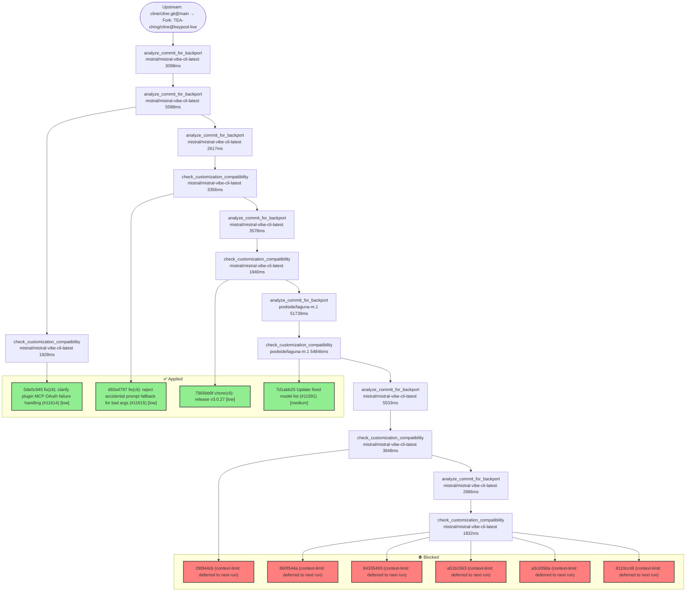

# Backport Agent — Detailed Run Report

> This file is generated automatically. It is intended for human analysts and
> AI reasoning models to assess agent performance, decision quality, and LLM behavior.

**Run timestamp**: 2026-06-19T09:19:54.063Z
**Models used**: fast=`poolside/poolside/laguna-m.1`  powerful=`mistral/mistral-vibe-cli-latest`
**Prompt log**: `/Users/rlemeill/Development/tea-ching-cline/.backport-agent/run-1781858040891.prompts.jsonl`

---

## Summary (PR body)

## Backport Agent — Sync Report

**Date**: 2026-06-19T09:19:54.063Z
**Upstream ref**: `cline/cline.git@main`
**Fork ref**: `TEA-ching/cline@keypool-live`
**Sync branch**: `sync/upstream-main-2026-06-19-085356`

### Summary

- ✅ Applied: 4
- ⚠️ Needs human review: 0
- ⛔ Blocked (not attempted): 6

### Applied commits

- `0de0c945` [low] fix(cli): clarify plugin MCP OAuth failure handling (#11614)
- `d92e4797` [low] fix(cli): reject accidental prompt fallback for bad args (#11615)
- `7966bb9f` [low] chore(cli): release v3.0.27
- `7d1abb25` [medium] Update fixed model list (#11591) _(conflict resolved by agent)_

### Blocked commits (not attempted)

- `2fd944cb` [medium] — context-limit: deferred to next run
- `860f544a` [low] — context-limit: deferred to next run
- `84335493` [low] — context-limit: deferred to next run
- `a51b1563` [medium] — context-limit: deferred to next run
- `a3cd39da` [medium] — context-limit: deferred to next run
- `8110cc46` [high] — context-limit: deferred to next run

### Agent decision log

- Processed 4 commits: 3 LOW risk (all applied cleanly), 1 MEDIUM risk (conflict resolved with 'theirs' strategy)
- Context limit exceeded - remaining 6 commits blocked for next run
- Validation ran for medium risk: test failures are expected due to upstream catalog/model changes and SDK typecheck issues in fork customizations


---

## Agent Workflow Diagram

> Generated by the fast model from the run summary. Evaluate the agent's decision path.



---

## AI Sub-Agent Call Log (13 calls)

> Each entry is one sub-agent invocation. Review prompt/response pairs to assess
> reasoning quality, hallucinations, and decision accuracy.

### Call 1 / 13 — `analyze_commit_for_backport` ✅ OK

| Field | Value |
|---|---|
| **Timestamp** | 2026-06-19T08:43:04.112Z |
| **Tool** | `analyze_commit_for_backport` |
| **Model** | `mistral/mistral-vibe-cli-latest` |
| **Duration** | 3098 ms |
| **Tokens in** | 15933 |
| **Tokens out** | 158 |
| **Cost** | $0.000000 |

**Prompt sent to sub-agent:**

```
Commit SHA: 7d1abb25a77f220fc3d766f27f56c5eb4a2804bb
Commit message:
Update fixed model list (#11591)

Changed files (3):
sdk/packages/llms/src/catalog/catalog.generated.ts
sdk/packages/llms/src/providers/builtins.test.ts
sdk/packages/shared/src/feature-flags.ts

Diff:
commit 7d1abb25a77f220fc3d766f27f56c5eb4a2804bb
Author: Tomás Barreiro <52393857+BarreiroT@users.noreply.github.com>
Date:   Tue Jun 16 22:28:35 2026 -0300

    Update fixed model list (#11591)
---
 sdk/packages/llms/src/catalog/catalog.generated.ts | 803 +++++++++++++++------
 sdk/packages/llms/src/providers/builtins.test.ts   |  45 --
 sdk/packages/shared/src/feature-flags.ts           |   5 +-
 3 files changed, 580 insertions(+), 273 deletions(-)

diff --git a/sdk/packages/llms/src/catalog/catalog.generated.ts b/sdk/packages/llms/src/catalog/catalog.generated.ts
index 3d2155c82e..d1cc908be2 100644
--- a/sdk/packages/llms/src/catalog/catalog.generated.ts
+++ b/sdk/packages/llms/src/catalog/catalog.generated.ts
@@ -14,7 +14,7 @@ export const GENERATED_PROVIDER_MODELS: {
 	version: number;
 	providers: Record<string, Record<string, ModelInfo>>;
 } = {
-	version: 1781284023269,
+	version: 1781654469496,
 	providers: {
 		aihubmix: {
 			"glm-5v-turbo": {
@@ -1519,6 +1519,51 @@ export const GENERATED_PROVIDER_MODELS: {
 			},
 		},
 		baseten: {
+			"zai-org/GLM-5.2": {
+				id: "zai-org/GLM-5.2",
+				name: "GLM-5.2",
+				contextWindow: 131072,
+				maxInputTokens: 131072,
+				maxTokens: 131072,
+				capabilities: [
+					"tools",
+					"reasoning",
+					"structured_output",
+					"temperature",
+					"prompt-cache",
+				],
+				pricing: {
+					input: 1.5,
+					output: 4.5,
+					cacheRead: 0.3,
+					cacheWrite: 0,
+				},
+				releaseDate: "2026-06-13",
+				family: "glm",
+			},
+			"moonshotai/Kimi-K2.7-Code": {
+				id: "moonshotai/Kimi-K2.7-Code",
+				name: "Kimi K2.7 Code",
+				contextWindow: 262000,
+				maxInputTokens: 262000,
+				maxTokens: 262000,
+				capabilities: [
+					"images",
+					"tools",
+					"reasoning",
+					"structured_output",
+					"temperature",
+					"prompt-cache",
+				],
+				pricing: {
+					input: 0.95,
+					output: 4,
+					cacheRead: 0.16,
+					cacheWrite: 0,
+				},
+				releaseDate: "2026-06-12",
+				family: "kimi-k2",
+			},
 			"nvidia/NVIDIA-Nemotron-3-Ultra-550B-A55B": {
 				id: "nvidia/NVIDIA-Nemotron-3-Ultra-550B-A55B",
 				name: "Nemotron Ultra",
@@ -3658,6 +3703,76 @@ export const GENERATED_PROVIDER_MODELS: {
 				family: "glm",
 				description: "",
 			},
+			"cline-pass/deepseek-v4-flash": {
+				id: "cline-pass/deepseek-v4-flash",
+				name: "cline-pass/deepseek-v4-flash",
+				contextWindow: 1048575,
+				maxInputTokens: 1048575,
+				maxTokens: 65536,
+				capabilities: [
+					"tools",
+					"reasoning",
+					"structured_output",
+					"temperature",
+					"prompt-cache",
+				],
+				pricing: {
+					input: 0.098,
+					output: 0.196,
+					cacheRead: 0.02,
+					cacheWrite: 0,
+				},
+				releaseDate: "2026-04-24",
+				family: "deepseek-flash",
+				description: "",
+			},
+			"cline-pass/deepseek-v4-pro": {
+				id: "cline-pass/deepseek-v4-pro",
+				name: "cline-pass/deepseek-v4-pro",
+				contextWindow: 1048576,
+				maxInputTokens: 1048576,
+				maxTokens: 384000,
+				capabilities: [
+					"tools",
+					"reasoning",
+					"structured_output",
+					"temperature",
+					"prompt-cache",
+				],
+				pricing: {
+					input: 0.435,
+					output: 0.87,
+					cacheRead: 0.003625,
+					cacheWrite: 0,
+				},
+				releaseDate: "2026-04-24",
+				family: "deepseek-thinking",
+				description: "",
+			},
+			"cline-pass/kimi-k2.6": {
+				id: "cline-pass/kimi-k2.6",
+				name: "cline-pass/kimi-k2.6",
+				contextWindow: 262142,
+				maxInputTokens: 262142,
+				maxTokens: 262142,
+				capabilities: [
+					"images",
+					"tools",
+					"reasoning",
+					"structured_output",
+					"temperature",
+					"prompt-cache",
+				],
+				pricing: {
+					input: 0.68,
+					output: 3.41,
+					cacheRead: 0.34,
+					cacheWrite: 0,
+				},
+				releaseDate: "2026-04-21",
+				family: "kimi-k2",
+				description: "",
+			},
 		},
 		deepseek: {
 			"deepseek-v4-flash": {
@@ -3738,6 +3853,90 @@ export const GENERATED_PROVIDER_MODELS: {
 			},
 		},
 		fireworks: {
+			"accounts/fireworks/models/kimi-k2p7-code": {
+				id: "accounts/fireworks/models/kimi-k2p7-code",
+				name: "Kimi K2.7 Code",
+				contextWindow: 262000,
+				maxInputTokens: 262000,
+				maxTokens: 262000,
+				capabilities: [
+					"images",
+					"tools",
+					"reasoning",
+					"structured_output",
+					"temperature",
+					"prompt-cache",
+				],
+				pricing: {
+					input: 0.95,
+					output: 4,
+					cacheRead: 0.19,
+					cacheWrite: 0,
+				},
+				releaseDate: "2026-06-12",
+				family: "kimi-k2",
+			},
+			"accounts/fireworks/models/minimax-m3": {
+				id: "accounts/fireworks/models/minimax-m3",
+				name: "MiniMax-M3",
+				contextWindow: 512000,
+				maxInputTokens: 512000,
+				maxTokens: 512000,
+				capabilities: ["tools", "reasoning", "temperature", "prompt-cache"],
+				pricing: {
+					input: 0.3,
+					output: 1.2,
+					cacheRead: 0.06,
+					cacheWrite: 0,
+				},
+				releaseDate: "2026-06-12",
+				family: "minimax",
+			},
+			"accounts/fireworks/models/qwen3p7-plus": {
+				id: "accounts/fireworks/models/qwen3p7-plus",
+				name: "Qwen 3.7 Plus",
+				contextWindow: 262144,
+				maxInputTokens: 262144,
+				maxTokens: 65536,
+				capabilities: [
+					"images",
+					"tools",
+					"reasoning",
+					"temperature",
+					"prompt-cache",
+				],
+				pricing: {
+					input: 0.4,
+					output: 1.6,
+					cacheRead: 0.08,
+					cacheWrite: 0,
+				},
+				releaseDate: "2026-06-12",
+				family: "qwen",
+			},
+			"accounts/fireworks/routers/kimi-k2p7-code-fast": {
+				id: "accounts/fireworks/routers/kimi-k2p7-code-fast",
+				name: "Kimi K2.7 Code Fast",
+				contextWindow: 262000,
+				maxInputTokens: 262000,
+				maxTokens: 262000,
+				capabilities: [
+					"images",
+					"tools",
+					"reasoning",
+					"structured_output",
+					"temperature",
+					"prompt-cache",
+				],
+				pricing: {
+					input: 2,
+					output: 8,
+					cacheRead: 0.38,
+					cacheWrite: 0,
+				},
+				releaseDate: "2026-06-12",
+				family: "kimi-k2",
+			},
 			"accounts/fireworks/models/deepseek-v4-flash": {
 				id: "accounts/fireworks/models/deepseek-v4-flash",
 				name: "DeepSeek V4 Flash",
@@ -3864,28 +4063,6 @@ export const GENERATED_PROVIDER_MODELS: {
 				releaseDate: "2026-04-12",
 				family: "minimax",
 			},
-			"accounts/fireworks/models/qwen3p6-plus": {
-				id: "accounts/fireworks/models/qwen3p6-plus",
-				name: "Qwen 3.6 Plus",
-				contextWindow: 262144,
-				maxInputTokens: 262144,
-				maxTokens: 65536,
-				capabilities: [
-					"images",
-					"tools",
-					"reasoning",
-					"temperature",
-					"prompt-cache",
-				],
-				pricing: {
-					input: 0.5,
-					output: 3,
-					cacheRead: 0.1,
-					cacheWrite: 0,
-				},
-				releaseDate: "2026-04-04",
-				family: "qwen",
-			},
 			"accounts/fireworks/models/glm-5p1": {
 				id: "accounts/fireworks/models/glm-5p1",
 				name: "GLM 5.1",
@@ -3918,44 +4095,6 @@ export const GENERATED_PROVIDER_MODELS: {
 				releaseDate: "2026-04-01",
 				family: "glm",
 			},
-			"accounts/fireworks/models/minimax-m2p5": {
-				id: "accounts/fireworks/models/minimax-m2p5",
-				name: "MiniMax-M2.5",
-				contextWindow: 196608,
-				maxInputTokens: 196608,
-				maxTokens: 196608,
-				capabilities: ["tools", "reasoning", "temperature", "prompt-cache"],
-				pricing: {
-					input: 0.3,
-					output: 1.2,
-					cacheRead: 0.03,
-					cacheWrite: 0,
-				},
-				releaseDate: "2026-02-12",
-				family: "minimax",
-			},
-			"accounts/fireworks/models/kimi-k2p5": {
-				id: "accounts/fireworks/models/kimi-k2p5",
-				name: "Kimi K2.5",
-				contextWindow: 256000,
-				maxInputTokens: 256000,
-				maxTokens: 256000,
-				capabilities: [
-					"images",
-					"tools",
-					"reasoning",
-					"temperature",
-					"prompt-cache",
-				],
-				pricing: {
-					input: 0.6,
-					output: 3,
-					cacheRead: 0.1,
-					cacheWrite: 0,
-				},
-				releaseDate: "2026-01-27",
-				family: "kimi-thinking",
-			},
 			"accounts/fireworks/models/gpt-oss-120b": {
 				id: "accounts/fireworks/models/gpt-oss-120b",
 				name: "GPT OSS 120B",
@@ -3966,7 +4105,7 @@ export const GENERATED_PROVIDER_MODELS: {
 				pricing: {
 					input: 0.15,
 					output: 0.6,
-					cacheRead: 0.015,
+					cacheRead: 0.01,
 					cacheWrite: 0,
 				},
 				releaseDate: "2025-08-05",
@@ -4082,6 +4221,50 @@ export const GENERATED_PROVIDER_MODELS: {
 				releaseDate: "2026-04-02",
 				family: "gemma",
 			},
+			"gemma-4-E2B-it": {
+				id: "gemma-4-E2B-it",
+				name: "Gemma 4 E2B IT",
+				contextWindow: 131072,
+				maxInputTokens: 131072,
+				maxTokens: 8192,
+				capabilities: [
+					"images",
+					"tools",
+					"reasoning",
+					"structured_output",
+					"temperature",
+				],
+				pricing: {
+					input: 0,
+					output: 0,
+					cacheRead: 0,
+					cacheWrite: 0,
+				},
+				releaseDate: "2026-04-02",
+				family: "gemma",
+			},
+			"gemma-4-E4B-it": {
+				id: "gemma-4-E4B-it",
+				name: "Gemma 4 E4B IT",
+				contextWindow: 131072,
+				maxInputTokens: 131072,
+				maxTokens: 8192,
+				capabilities: [
+					"images",
+					"tools",
+					"reasoning",
+					"structured_output",
+					"temperature",
+				],
+				pricing: {
+					input: 0,
+					output: 0,
+					cacheRead: 0,
+					cacheWrite: 0,
+				},
+				releaseDate: "2026-04-02",
+				family: "gemma",
+			},
 			"gemini-3.1-pro-preview": {
 				id: "gemini-3.1-pro-preview",
 				name: "Gemini 3.1 Pro Preview",
@@ -4202,9 +4385,9 @@ export const GENERATED_PROVIDER_MODELS: {
 				releaseDate: "2025-09-25",
 				family: "gemini-flash-lite",
 			},
-			"gemini-2.5-flash-lite": {
-				id: "gemini-2.5-flash-lite",
-				name: "Gemini 2.5 Flash-Lite",
+			"gemini-2.5-flash": {
+				id: "gemini-2.5-flash",
+				name: "Gemini 2.5 Flash",
 				contextWindow: 1048576,
 				maxInputTokens: 1048576,
 				maxTokens: 65536,
@@ -4218,17 +4401,17 @@ export const GENERATED_PROVIDER_MODELS: {
 					"prompt-cache",
 				],
 				pricing: {
-					input: 0.1,
-					output: 0.4,
-					cacheRead: 0.01,
+					input: 0.3,
+					output: 2.5,
+					cacheRead: 0.03,
 					cacheWrite: 0,
 				},
 				releaseDate: "2025-06-17",
-				family: "gemini-flash-lite",
+				family: "gemini-flash",
 			},
-			"gemini-2.5-flash": {
-				id: "gemini-2.5-flash",
-				name: "Gemini 2.5 Flash",
+			"gemini-2.5-flash-lite": {
+				id: "gemini-2.5-flash-lite",
+				name: "Gemini 2.5 Flash-Lite",
 				contextWindow: 1048576,
 				maxInputTokens: 1048576,
 				maxTokens: 65536,
@@ -4242,13 +4425,13 @@ export const GENERATED_PROVIDER_MODELS: {
 					"prompt-cache",
 				],
 				pricing: {
-					input: 0.3,
-					output: 2.5,
-					cacheRead: 0.03,
+					input: 0.1,
+					output: 0.4,
+					cacheRead: 0.01,
 					cacheWrite: 0,
 				},
-				releaseDate: "2025-03-20",
-				family: "gemini-flash",
+				releaseDate: "2025-06-17",
+				family: "gemini-flash-lite",
 			},
 			"gemini-2.5-pro": {
 				id: "gemini-2.5-pro",
@@ -4271,7 +4454,7 @@ export const GENERATED_PROVIDER_MODELS: {
 					cacheRead: 0.125,
 					cacheWrite: 0,
 				},
-				releaseDate: "2025-03-20",
+				releaseDate: "2025-06-17",
 				family: "gemini-pro",
 			},
 		},
@@ -5015,9 +5198,9 @@ export const GENERATED_PROVIDER_MODELS: {
 			"poolside/laguna-m.1:free": {
 				id: "poolside/laguna-m.1:free",
 				name: "Poolside: Laguna M.1 (free)",
-				contextWindow: 131072,
-				maxInputTokens: 131072,
-				maxTokens: 8192,
+				contextWindow: 262144,
+				maxInputTokens: 262144,
+				maxTokens: 32768,
 				capabilities: ["tools", "reasoning", "temperature"],
 				pricing: {
 					input: 0,
@@ -5030,9 +5213,9 @@ export const GENERATED_PROVIDER_MODELS: {
 			"poolside/laguna-xs.2:free": {
 				id: "poolside/laguna-xs.2:free",
 				name: "Poolside: Laguna XS.2 (free)",
-				contextWindow: 131072,
-				maxInputTokens: 131072,
-				maxTokens: 8192,
+				contextWindow: 262144,
+				maxInputTokens: 262144,
+				maxTokens: 32768,
 				capabilities: ["tools", "reasoning", "temperature"],
 				pricing: {
 					input: 0,
@@ -8298,6 +8481,21 @@ export const GENERATED_PROVIDER_MODELS: {
 				},
 				releaseDate: "2024-12-03",
 			},
+			"cohere/command-r7b-12-2024": {
+				id: "cohere/command-r7b-12-2024",
+				name: "Cohere: Command R7B (12-2024)",
+				contextWindow: 128000,
+				maxInputTokens: 128000,
+				maxTokens: 4000,
+				capabilities: ["tools", "temperature"],
+				pricing: {
+					input: 0.0375,
+					output: 0.15,
+					cacheRead: 0,
+					cacheWrite: 0,
+				},
+				releaseDate: "2024-12-02",
+			},
 			"amazon/nova-2-lite-v1": {
 				id: "amazon/nova-2-lite-v1",
 				name: "Amazon: Nova 2 Lite",
@@ -8847,21 +9045,6 @@ export const GENERATED_PROVIDER_MODELS: {
 				},
 				releaseDate: "2024-03-07",
 			},
-			"cohere/command-r7b-12-2024": {
-				id: "cohere/command-r7b-12-2024",
-				name: "Cohere: Command R7B (12-2024)",
-				contextWindow: 128000,
-				maxInputTokens: 128000,
-				maxTokens: 4000,
-				capabilities: ["tools", "temperature"],
-				pricing: {
-					input: 0.0375,
-					output: 0.15,
-					cacheRead: 0,
-					cacheWrite: 0,
-				},
-				releaseDate: "2024-02-27",
-			},
 			"openai/gpt-4-turbo-preview": {
 				id: "openai/gpt-4-turbo-preview",
 				name: "OpenAI: GPT-4 Turbo Preview",
@@ -9191,6 +9374,28 @@ export const GENERATED_PROVIDER_MODELS: {
 				releaseDate: "2026-06-12",
 				family: "kimi-k2",
 			},
+			"kimi-k2.7-code-highspeed": {
+				id: "kimi-k2.7-code-highspeed",
+				name: "Kimi K2.7 Code HighSpeed",
+				contextWindow: 262144,
+				maxInputTokens: 262144,
+				maxTokens: 262144,
+				capabilities: [
+					"images",
+					"tools",
+					"reasoning",
+					"structured_output",
+					"prompt-cache",
+				],
+				pricing: {
+					input: 1.9,
+					output: 8,
+					cacheRead: 0.38,
+					cacheWrite: 0,
+				},
+				releaseDate: "2026-06-12",
+				family: "kimi-k2",
+			},
 			"kimi-k2.6": {
 				id: "kimi-k2.6",
 				name: "Kimi K2.6",
@@ -9671,6 +9876,22 @@ export const GENERATED_PROVIDER_MODELS: {
 			},
 		},
 		ollama: {
+			"kimi-k2.7-code": {
+				id: "kimi-k2.7-code",
+				name: "kimi-k2.7-code",
+				contextWindow: 262144,
+				maxInputTokens: 262144,
+				maxTokens: 262144,
+				capabilities: ["images", "tools", "reasoning", "structured_output"],
+				pricing: {
+					input: 0,
+					output: 0,
+					cacheRead: 0,
+					cacheWrite: 0,
+				},
+				releaseDate: "2026-06-12",
+				family: "kimi-k2",
+			},
 			"nemotron-3-ultra": {
 				id: "nemotron-3-ultra",
 				name: "nemotron-3-ultra",
@@ -11007,32 +11228,48 @@ export const GENERATED_PROVIDER_MODELS: {
 			},
 		},
 		openrouter: {
-			"~anthropic/claude-fable-latest": {
-				id: "~anthropic/claude-fable-latest",
-				name: "Claude Fable Latest",
-				contextWindow: 1000000,
-				maxInputTokens: 1000000,
-				maxTokens: 128000,
+			"z-ai/glm-5.2": {
+				id: "z-ai/glm-5.2",
+				name: "GLM-5.2",
+				contextWindow: 1048576,
+				maxInputTokens: 1048576,
+				maxTokens: 131072,
+				capabilities: ["tools", "reasoning", "temperature", "prompt-cache"],
+				pricing: {
+					input: 1.4,
+					output: 4.4,
+					cacheRead: 0.26,
+					cacheWrite: 0,
+				},
+				releaseDate: "2026-06-13",
+				family: "glm",
+			},
+			"moonshotai/kimi-k2.7-code": {
+				id: "moonshotai/kimi-k2.7-code",
+				name: "Kimi K2.7 Code",
+				contextWindow: 262144,
+				maxInputTokens: 262144,
+				maxTokens: 262144,
 				capabilities: [
 					"images",
-					"files",
 					"tools",
 					"reasoning",
 					"structured_output",
+					"temperature",
 					"prompt-cache",
 				],
 				pricing: {
-					input: 10,
-					output: 50,
-					cacheRead: 1,
-					cacheWrite: 12.5,
+					input: 0.75,
+					output: 3.5,
+					cacheRead: 0.16,
+					cacheWrite: 0,
 				},
-				releaseDate: "2026-06-09",
-				family: "claude-fable",
+				releaseDate: "2026-06-12",
+				family: "kimi-k2",
 			},
-			"anthropic/claude-fable-5": {
-				id: "anthropic/claude-fable-5",
-				name: "Claude Fable 5",
+			"~anthropic/claude-fable-latest": {
+				id: "~anthropic/claude-fable-latest",
+				name: "Claude Fable Latest",
 				contextWindow: 1000000,
 				maxInputTokens: 1000000,
 				maxTokens: 128000,
@@ -11145,6 +11382,7 @@ export const GENERATED_PROVIDER_MODELS: {
 					"images",
 					"tools",
 					"reasoning",
+					"structured_output",
 					"temperature",
 					"prompt-cache",
 				],
@@ -11561,9 +11799,9 @@ export const GENERATED_PROVIDER_MODELS: {
 			"~moonshotai/kimi-latest": {
 				id: "~moonshotai/kimi-latest",
 				name: "MoonshotAI Kimi Latest",
-				contextWindow: 262144,
-				maxInputTokens: 262144,
-				maxTokens: 262144,
+				contextWindow: 262142,
+				maxInputTokens: 262142,
+				maxTokens: 262142,
 				capabilities: [
 					"images",
 					"tools",
@@ -11573,9 +11811,9 @@ export const GENERATED_PROVIDER_MODELS: {
 					"prompt-cache",
 				],
 				pricing: {
-					input: 0.67,
-					output: 3.39,
-					cacheRead: 0.14,
+					input: 0.68,
+					output: 3.41,
+					cacheRead: 0.34,
 					cacheWrite: 0,
 				},
 				releaseDate: "2026-04-27",
@@ -11676,9 +11914,9 @@ export const GENERATED_PROVIDER_MODELS: {
 			"deepseek/deepseek-v4-flash": {
 				id: "deepseek/deepseek-v4-flash",
 				name: "DeepSeek V4 Flash",
-				contextWindow: 1048576,
-				maxInputTokens: 1048576,
-				maxTokens: 131072,
+				contextWindow: 1048575,
+				maxInputTokens: 1048575,
+				maxTokens: 65536,
 				capabilities: [
 					"tools",
 					"reasoning",
@@ -11687,9 +11925,9 @@ export const GENERATED_PROVIDER_MODELS: {
 					"prompt-cache",
 				],
 				pricing: {
-					input: 0.0983,
-					output: 0.1966,
-					cacheRead: 0.0197,
+					input: 0.098,
+					output: 0.196,
+					cacheRead: 0.02,
 					cacheWrite: 0,
 				},
 				releaseDate: "2026-04-24",
@@ -11786,9 +12024,9 @@ export const GENERATED_PROVIDER_MODELS: {
 			"qwen/qwen3.6-27b": {
 				id: "qwen/qwen3.6-27b",
 				name: "Qwen3.6 27B",
-				contextWindow: 131072,
-				maxInputTokens: 131072,
-				maxTokens: 131072,
+				contextWindow: 262140,
+				maxInputTokens: 262140,
+				maxTokens: 262140,
 				capabilities: [
 					"images",
 					"tools",
@@ -11797,8 +12035,8 @@ export const GENERATED_PROVIDER_MODELS: {
 					"temperature",
 				],
 				pricing: {
-					input: 0.289,
-					output: 2.4,
+					input: 0.2885,
+					output: 3.17,
 					cacheRead: 0,
 					cacheWrite: 0,
 				},
@@ -11815,6 +12053,7 @@ export const GENERATED_PROVIDER_MODELS: {
 					"images",
 					"tools",
 					"reasoning",
+					"structured_output",
 					"temperature",
 					"prompt-cache",
 				],
@@ -11896,9 +12135,9 @@ export const GENERATED_PROVIDER_MODELS: {
 			"moonshotai/kimi-k2.6": {
 				id: "moonshotai/kimi-k2.6",
 				name: "Kimi K2.6",
-				contextWindow: 262144,
-				maxInputTokens: 262144,
-				maxTokens: 262144,
+				contextWindow: 262142,
+				maxInputTokens: 262142,
+				maxTokens: 262142,
 				capabilities: [
 					"images",
 					"tools",
@@ -11908,9 +12147,9 @@ export const GENERATED_PROVIDER_MODELS: {
 					"prompt-cache",
 				],
 				pricing: {
-					input: 0.67,
-					output: 3.39,
-					cacheRead: 0.14,
+					input: 0.68,
+					output: 3.41,
+					cacheRead: 0.34,
 					cacheWrite: 0,
 				},
 				releaseDate: "2026-04-21",
@@ -11946,9 +12185,9 @@ export const GENERATED_PROVIDER_MODELS: {
 				maxTokens: 262144,
 				capabilities: ["tools", "reasoning", "temperature", "prompt-cache"],
 				pricing: {
-					input: 0.063,
-					output: 0.21,
-					cacheRead: 0.021,
+					input: 0.066,
+					output: 0.26,
+					cacheRead: 0.029,
 					cacheWrite: 0,
 				},
 				releaseDate: "2026-04-20",
@@ -12674,7 +12913,7 @@ export const GENERATED_PROVIDER_MODELS: {
 				name: "Qwen3.5 35B-A3B",
 				contextWindow: 262144,
 				maxInputTokens: 262144,
-				maxTokens: 262144,
+				maxTokens: 81920,
 				capabilities: [
 					"images",
 					"tools",
@@ -12789,8 +13028,8 @@ export const GENERATED_PROVIDER_MODELS: {
 			"qwen/qwen3.5-397b-a17b": {
 				id: "qwen/qwen3.5-397b-a17b",
 				name: "Qwen3.5 397B-A17B",
-				contextWindow: 262144,
-				maxInputTokens: 262144,
+				contextWindow: 131072,
+				maxInputTokens: 131072,
 				maxTokens: 65536,
 				capabilities: [
 					"images",
@@ -12800,8 +13039,8 @@ export const GENERATED_PROVIDER_MODELS: {
 					"temperature",
 				],
 				pricing: {
-					input: 0.39,
-					output: 2.34,
+					input: 0.385,
+					output: 2.45,
 					cacheRead: 0,
 					cacheWrite: 0,
 				},
@@ -13056,8 +13295,8 @@ export const GENERATED_PROVIDER_MODELS: {
 			"moonshotai/kimi-k2.5": {
 				id: "moonshotai/kimi-k2.5",
 				name: "Kimi K2.5",
-				contextWindow: 262144,
-				maxInputTokens: 262144,
+				contextWindow: 256000,
+				maxInputTokens: 256000,
 				maxTokens: 262144,
 				capabilities: [
 					"images",
@@ -13065,12 +13304,11 @@ export const GENERATED_PROVIDER_MODELS: {
 					"reasoning",
 					"structured_output",
 					"temperature",
-					"prompt-cache",
 				],
 				pricing: {
-					input: 0.4,
-					output: 1.9,
-					cacheRead: 0.09,
+					input: 0.375,
+					output: 2.025,
+					cacheRead: 0,
 					cacheWrite: 0,
 				},
 				releaseDate: "2026-01",
@@ -13210,7 +13448,12 @@ export const GENERATED_PROVIDER_MODELS: {
 				contextWindow: 262144,
 				maxInputTokens: 262144,
 				maxTokens: 228000,
-				capabilities: ["tools", "reasoning", "temperature"],
+				capabilities: [
+					"tools",
+					"reasoning",
+					"structured_output",
+					"temperature",
+				],
 				pricing: {
 					input: 0.05,
 					output: 0.2,
@@ -14504,7 +14747,12 @@ export const GENERATED_PROVIDER_MODELS: {
 				contextWindow: 131072,
 				maxInputTokens: 131072,
 				maxTokens: 8192,
-				capabilities: ["tools", "reasoning", "temperature"],
+				capabilities: [
+					"tools",
+					"reasoning",
+					"structured_output",
+					"temperature",
+				],
 				pricing: {
 					input: 0,
 					output: 0,
@@ -14590,13 +14838,7 @@ export const GENERATED_PROVIDER_MODELS: {
 				contextWindow: 131070,
 				maxInputTokens: 131070,
 				maxTokens: 131070,
-				capabilities: [
-					"tools",
-					"reasoning",
-					"structured_output",
-					"temperature",
-					"prompt-cache",
-				],
+				capabilities: ["tools", "reasoning", "temperature", "prompt-cache"],
 				pricing: {
 					input: 0.125,
 					output: 0.85,
@@ -15299,8 +15541,8 @@ export const GENERATED_PROVIDER_MODELS: {
 			"deepseek/deepseek-chat-v3-0324": {
 				id: "deepseek/deepseek-chat-v3-0324",
 				name: "DeepSeek V3 0324",
-				contextWindow: 32768,
-				maxInputTokens: 32768,
+				contextWindow: 163840,
+				maxInputTokens: 163840,
 				maxTokens: 16384,
 				capabilities: [
 					"tools",
@@ -17423,6 +17665,51 @@ export const GENERATED_PROVIDER_MODELS: {
 			},
 		},
 		together: {
+			"moonshotai/Kimi-K2.7-Code": {
+				id: "moonshotai/Kimi-K2.7-Code",
+				name: "Kimi K2.7 Code",
+				contextWindow: 262144,
+				maxInputTokens: 262144,
+				maxTokens: 131072,
+				capabilities: [
+					"tools",
+					"reasoning",
+					"structured_output",
+					"temperature",
+					"prompt-cache",
+				],
+				pricing: {
+					input: 0.95,
+					output: 4,
+					cacheRead: 0.19,
+					cacheWrite: 0,
+				},
+				releaseDate: "2026-06-14",
+				family: "kimi-k2",
+			},
+			"MiniMaxAI/MiniMax-M3": {
+				id: "MiniMaxAI/MiniMax-M3",
+				name: "MiniMax-M3",
+				contextWindow: 524288,
+				maxInputTokens: 524288,
+				maxTokens: 250000,
+				capabilities: [
+					"images",
+					"tools",
+					"reasoning",
+					"structured_output",
+					"temperature",
+					"prompt-cache",
+				],
+				pricing: {
+					input: 0.3,
+					output: 1.2,
+					cacheRead: 0.06,
+					cacheWrite: 0,
+				},
+				releaseDate: "2026-06-12",
+				family: "minimax",
+			},
 			"nvidia/nemotron-3-ultra-550b-a55b": {
 				id: "nvidia/nemotron-3-ultra-550b-a55b",
 				name: "Nemotron 3 Ultra 550B A55B",
@@ -17453,8 +17740,8 @@ export const GENERATED_PROVIDER_MODELS: {
 				maxTokens: 500000,
 				capabilities: ["tools", "temperature"],
 				pricing: {
-					input: 2.5,
-					output: 7.5,
+					input: 1.25,
+					output: 3.75,
 					cacheRead: 0,
 					cacheWrite: 0,
 				},
@@ -17799,12 +18086,34 @@ export const GENERATED_PROVIDER_MODELS: {
 			},
 		},
 		"vercel-ai-gateway": {
-			"anthropic/claude-fable-5": {
-				id: "anthropic/claude-fable-5",
-				name: "Claude Fable 5",
+			"zai/glm-5.2": {
+				id: "zai/glm-5.2",
+				name: "GLM 5.2",
 				contextWindow: 1000000,
 				maxInputTokens: 1000000,
 				maxTokens: 128000,
+				capabilities: [
+					"tools",
+					"reasoning",
+					"structured_output",
+					"temperature",
+					"prompt-cache",
+				],
+				pricing: {
+					input: 1.4,
+					output: 4.4,
+					cacheRead: 0.26,
+					cacheWrite: 0,
+				},
+				releaseDate: "2026-06-16",
+				family: "glm",
+			},
+			"moonshotai/kimi-k2.7-code-highspeed": {
+				id: "moonshotai/kimi-k2.7-code-highspeed",
+				name: "Kimi K2.7 Code High Speed",
+				contextWindow: 262144,
+				maxInputTokens: 262144,
+				maxTokens: 0,
 				capabilities: [
 					"images",
 					"files",
@@ -17814,13 +18123,37 @@ export const GENERATED_PROVIDER_MODELS: {
 					"prompt-cache",
 				],
 				pricing: {
-					input: 10,
-					output: 50,
-					cacheRead: 1,
-					cacheWrite: 12.5,
+					input: 1.9,
+					output: 8,
+					cacheRead: 0.38,
+					cacheWrite: 0,
 				},
-				releaseDate: "2026-06-09",
-				family: "claude",
+				releaseDate: "2026-06-15",
+				family: "kimi-k2",
+			},
+			"moonshotai/kimi-k2.7-code": {
+				id: "moonshotai/kimi-k2.7-code",
+				name: "Kimi K2.7 Code",
+				contextWindow: 256000,
+				maxInputTokens: 256000,
+				maxTokens: 32768,
+				capabilities: [
+					"images",
+					"files",
+					"tools",
+					"reasoning",
+					"structured_output",
+					"temperature",
+					"prompt-cache",
+				],
+				pricing: {
+					input: 0.95,
+					output: 4,
+					cacheRead: 0.19,
+					cacheWrite: 0,
+				},
+				releaseDate: "2026-06-12",
+				family: "kimi-k2",
 			},
 			"nvidia/nemotron-3-ultra-550b-a55b": {
 				id: "nvidia/nemotron-3-ultra-550b-a55b",
@@ -18375,7 +18708,6 @@ export const GENERATED_PROVIDER_MODELS: {
 					"images",
 					"files",
 					"tools",
-					"reasoning",
 					"structured_output",
 					"temperature",
 				],
@@ -20090,6 +20422,30 @@ export const GENERATED_PROVIDER_MODELS: {
 				releaseDate: "2025-07-09",
 				family: "grok",
 			},
+			"google/gemini-2.5-flash": {
+				id: "google/gemini-2.5-flash",
+				name: "Gemini 2.5 Flash",
+				contextWindow: 1048576,
+				maxInputTokens: 1048576,
+				maxTokens: 65536,
+				capabilities: [
+					"images",
+					"files",
+					"tools",
+					"reasoning",
+					"structured_output",
+					"temperature",
+					"prompt-cache",
+				],
+				pricing: {
+					input: 0.3,
+					output: 2.5,
+					cacheRead: 0.03,
+					cacheWrite: 0,
+				},
+				releaseDate: "2025-06-17",
+				family: "gemini-flash",
+			},
 			"google/gemini-2.5-flash-lite": {
 				id: "google/gemini-2.5-flash-lite",
 				name: "Gemini 2.5 Flash Lite",
@@ -20114,6 +20470,30 @@ export const GENERATED_PROVIDER_MODELS: {
 				releaseDate: "2025-06-17",
 				family: "gemini-flash-lite",
 			},
+			"google/gemini-2.5-pro": {
+				id: "google/gemini-2.5-pro",
+				name: "Gemini 2.5 Pro",
+				contextWindow: 1048576,
+				maxInputTokens: 1048576,
+				maxTokens: 65536,
+				capabilities: [
+					"images",
+					"files",
+					"tools",
+					"reasoning",
+					"structured_output",
+					"temperature",
+					"prompt-cache",
+				],
+				pricing: {
+					input: 1.25,
+					output: 10,
+					cacheRead: 0.125,
+					cacheWrite: 0,
+				},
+				releaseDate: "2025-06-17",
+				family: "gemini-pro",
+			},
 			"anthropic/claude-opus-4": {
 				id: "anthropic/claude-opus-4",
 				name: "Claude Opus 4",
@@ -20398,7 +20778,7 @@ export const GENERATED_PROVIDER_MODELS: {
 				contextWindow: 262144,
 				maxInputTokens: 262144,
 				maxTokens: 16384,
-				capabilities: ["tools", "temperature"],
+				capabilities: ["tools", "reasoning", "temperature"],
 				pricing: {
 					input: 0.22,
 					output: 0.88,
@@ -20446,7 +20826,7 @@ export const GENERATED_PROVIDER_MODELS: {
 				contextWindow: 262144,
 				maxInputTokens: 262144,
 				maxTokens: 65536,
-				capabilities: ["tools", "temperature", "prompt-cache"],
+				capabilities: ["tools", "reasoning", "temperature", "prompt-cache"],
 				pricing: {
 					input: 1.5,
 					output: 7.5,
@@ -20472,54 +20852,6 @@ export const GENERATED_PROVIDER_MODELS: {
 				releaseDate: "2025-04-01",
 				family: "qwen",
 			},
-			"google/gemini-2.5-flash": {
-				id: "google/gemini-2.5-flash",
-				name: "Gemini 2.5 Flash",
-				contextWindow: 1048576,
-				maxInputTokens: 1048576,
-				maxTokens: 65536,
-				capabilities: [
-					"images",
-					"files",
-					"tools",
-					"reasoning",
-					"structured_output",
-					"temperature",
-					"prompt-cache",
-				],
-				pricing: {
-					input: 0.3,
-					output: 2.5,
-					cacheRead: 0.03,
-					cacheWrite: 0,
-				},
-				releaseDate: "2025-03-20",
-				family: "gemini-flash",
-			},
-			"google/gemini-2.5-pro": {
-				id: "google/gemini-2.5-pro",
-				name: "Gemini 2.5 Pro",
-				contextWindow: 1048576,
-				maxInputTokens: 1048576,
-				maxTokens: 65536,
-				capabilities: [
-					"images",
-					"files",
-					"tools",
-					"reasoning",
-					"structured_output",
-					"temperature",
-					"prompt-cache",
-				],
-				pricing: {
-					input: 1.25,
-					output: 10,
-					cacheRead: 0.125,
-					cacheWrite: 0,
-				},
-				releaseDate: "2025-03-20",
-				family: "gemini-pro",
-			},
 			"mistral/magistral-medium": {
 				id: "mistral/magistral-medium",
 				name: "Magistral Medium (latest)",
@@ -22468,6 +22800,27 @@ export const GENERATED_PROVIDER_MODELS: {
 			},
 		},
 		"zai-coding-plan": {
+			"glm-5.2": {
+				id: "glm-5.2",
+				name: "GLM-5.2",
+				contextWindow: 1000000,
+				maxInputTokens: 1000000,
+				maxTokens: 131072,
+				capabilities: [
+					"tools",
+					"reasoning",
+					"structured_output",
+					"temperature",
+				],
+				pricing: {
+					input: 0,
+					output: 0,
+					cacheRead: 0,
+					cacheWrite: 0,
+				},
+				releaseDate: "2026-06-13",
+				family: "glm",
+			},
 			"glm-5v-turbo": {
 				id: "glm-5v-turbo",
 				name: "GLM-5V-Turbo",
diff --git a/sdk/packages/llms/src/providers/builtins.test.ts b/sdk/packages/llms/src/providers/builtins.test.ts
index d26902485e..e458492773 100644
--- a/sdk/packages/llms/src/providers/builtins.test.ts
+++ b/sdk/packages/llms/src/providers/builtins.test.ts
@@ -132,51 +132,6 @@ describe("built-in provider metadata", () => {
 		);
 	});
 
-	it("includes Claude Fable 5 in Anthropic, OpenRouter, Vercel AI Gateway, and Cline model lists", async () => {
-		const anthropicModels = await getModelsForProvider("anthropic");
-		const openRouterModels = await getModelsForProvider("openrouter");
-		const vercelModels = await getModelsForProvider("vercel-ai-gateway");
-		const clineModels = await getModelsForProvider("cline");
-
-		expect(anthropicModels["claude-fable-5"]).toEqual(
-			expect.objectContaining({
-				name: "Claude Fable 5",
-				contextWindow: 1_000_000,
-				maxTokens: 128_000,
-				capabilities: expect.arrayContaining([
-					"tools",
-					"reasoning",
-					"prompt-cache",
-				]),
-				pricing: expect.objectContaining({
-					input: 10,
-					output: 50,
-					cacheRead: 1,
-					cacheWrite: 12.5,
-				}),
-			}),
-		);
-		expect(openRouterModels["anthropic/claude-fable-5"]).toEqual(
-			expect.objectContaining({
-				id: "anthropic/claude-fable-5",
-				name: "Claude Fable 5",
-				contextWindow: 1_000_000,
-				maxTokens: 128_000,
-			}),
-		);
-		expect(vercelModels["anthropic/claude-fable-5"]).toEqual(
-			expect.objectContaining({
-				id: "anthropic/claude-fable-5",
-				name: "Claude Fable 5",
-				contextWindow: 1_000_000,
-			}),
-		);
-		expect(clineModels["anthropic/claude-fable-5"]).toEqual(
-			openRouterModels["anthropic/claude-fable-5"],
-		);
-		expect(clineModels["anthropic/claude-opus-4.8"]).toBeDefined();
-	});
-
 	it("routes native Z.AI providers through GLM thinking metadata", async () => {
 		for (const providerId of ["zai", "zai-coding-plan"] as const) {
 		
... [truncated]

Output the JSON object now.
```

**Response received:**

```
{
  "summary": "Updates the generated model catalog with new models, pricing, and capabilities. Removes deprecated models and adjusts existing model specs.",
  "keyChanges": [
    "Updated catalog.generated.ts with new models (e.g., GLM-5.2, Kimi K2.7)",
    "Removed deprecated models (e.g., Claude Fable 5, Qwen3.6 Plus)",
    "Adjusted pricing/capabilities for existing models",
    "Updated builtins.test.ts to remove Claude Fable 5 tests",
    "Bumped feature-flags.ts version"
  ],
  "backportComplexity": "trivial",
  "semanticRiskFactors": [],
  "recommendation": "apply"
}
```

---

### Call 2 / 13 — `analyze_commit_for_backport` ✅ OK

| Field | Value |
|---|---|
| **Timestamp** | 2026-06-19T08:43:41.388Z |
| **Tool** | `analyze_commit_for_backport` |
| **Model** | `mistral/mistral-vibe-cli-latest` |
| **Duration** | 5588 ms |
| **Tokens in** | 12732 |
| **Tokens out** | 156 |
| **Cost** | $0.000000 |

**Prompt sent to sub-agent:**

```
Commit SHA: 2fd944cb84f5782eaf4c5389320f21d1482e6eda
Commit message:
Make sections expandable and add ClinePass models (#11582)

Changed files (11):
apps/cli/src/tui/components/model-selector/cline-model-picker-utils.ts
apps/cli/src/tui/components/model-selector/cline-model-picker.test.ts
apps/cli/src/tui/components/model-selector/cline-model-picker.tsx
apps/cli/src/tui/components/model-selector/cline-model-selector.tsx
apps/cli/src/tui/components/model-selector/model-selector.tsx
apps/cli/src/tui/hooks/use-model-selector.tsx
apps/cli/src/tui/views/onboarding/controller.ts
apps/cli/src/tui/views/onboarding/keyboard.ts
apps/cli/src/tui/views/onboarding/screens.tsx
apps/cli/src/tui/views/onboarding/view.tsx
sdk/packages/core/src/services/llms/cline-recommended-models.ts

Diff:
commit 2fd944cb84f5782eaf4c5389320f21d1482e6eda
Author: Tomás Barreiro <52393857+BarreiroT@users.noreply.github.com>
Date:   Tue Jun 16 23:02:27 2026 -0300

    Make sections expandable and add ClinePass models (#11582)
    
    * Make sections expandable and add ClinePass
    
    * fix label
    
    * Map clinePass models to clinePass and the rest to cline
    
    * gate the models behind the feature flag
    
    * Do not allow custom model on cline pass
    
    * Do not show the count on the mode list
    
    * fix clinepass model list
    
    * fix focus when expanding a section
    
    * update the model data when the provider doesn't match
    
    * Update sdk/packages/core/src/services/llms/cline-recommended-models.ts
    
    Co-authored-by: greptile-apps[bot] <165735046+greptile-apps[bot]@users.noreply.github.com>
    
    * style: format Cline recommended models fallback
    
    * Build models
    
    ---------
    
    Co-authored-by: greptile-apps[bot] <165735046+greptile-apps[bot]@users.noreply.github.com>
    Co-authored-by: Saoud Rizwan <7799382+saoudrizwan@users.noreply.github.com>
---
 .../model-selector/cline-model-picker-utils.ts     | 286 +++++++++++++++++++++
 .../model-selector/cline-model-picker.test.ts      | 186 ++++++++++++++
 .../model-selector/cline-model-picker.tsx          | 273 ++++++++++++--------
 .../model-selector/cline-model-selector.tsx        | 220 +++++++++-------
 .../components/model-selector/model-selector.tsx   |  11 +-
 apps/cli/src/tui/hooks/use-model-selector.tsx      |  44 +++-
 apps/cli/src/tui/views/onboarding/controller.ts    | 101 +++++++-
 apps/cli/src/tui/views/onboarding/keyboard.ts      |  25 +-
 apps/cli/src/tui/views/onboarding/screens.tsx      |  11 +
 apps/cli/src/tui/views/onboarding/view.tsx         |   3 +
 .../src/services/llms/cline-recommended-models.ts  |  17 +-
 11 files changed, 948 insertions(+), 229 deletions(-)

diff --git a/apps/cli/src/tui/components/model-selector/cline-model-picker-utils.ts b/apps/cli/src/tui/components/model-selector/cline-model-picker-utils.ts
new file mode 100644
index 0000000000..5100afb113
--- /dev/null
+++ b/apps/cli/src/tui/components/model-selector/cline-model-picker-utils.ts
@@ -0,0 +1,286 @@
+import type {
+	ClineRecommendedModel,
+	ClineRecommendedModelsData,
+} from "@cline/core";
+
+export interface ClineModelPickerBrowse {
+	kind: "browse";
+}
+
+export type ClineModelsEntry = {
+	kind: "model";
+	tier: ClineModelTier;
+	model: ClineRecommendedModel;
+};
+export type ClineModelPickerEntry = ClineModelsEntry | ClineModelPickerBrowse;
+export type ClineModelTier = "recommended" | "free" | "clinePass";
+export type ClineModelPickerExpandedTiers = Record<ClineModelTier, boolean>;
+export type ClineModelProviderId = "cline" | "cline-pass";
+
+export interface BuildClineModelEntriesOptions {
+	includeClinePass?: boolean;
+}
+
+const DEFAULT_EXPANDED_TIERS: ClineModelPickerExpandedTiers = {
+	clinePass: false,
+	recommended: false,
+	free: false,
+};
+
+export function resolveClineModelDisplayName(
+	modelId: string,
+	knownModels?: Record<string, unknown>,
+): string {
+	if (knownModels) {
+		const candidates = [modelId, modelId.split("/").pop()];
+		for (const key of candidates) {
+			if (!key) continue;
+			const hit = knownModels[key] as { name?: string } | undefined;
+			if (hit?.name) return hit.name;
+		}
+	}
+	return modelId.includes("/")
+		? (modelId.split("/").pop() ?? modelId)
+		: modelId;
+}
+
+export function buildClineModelEntries(
+	data: ClineRecommendedModelsData,
+	options: BuildClineModelEntriesOptions = {},
+): ClineModelPickerEntry[] {
+	const entries: ClineModelPickerEntry[] = [
+		...(options.includeClinePass
+			? data.clinePass.map((model) => ({
+					kind: "model" as const,
+					tier: "clinePass" as const,
+					model,
+				}))
+			: []),
+		...data.recommended.map((model) => ({
+			kind: "model" as const,
+			tier: "recommended" as const,
+			model,
+		})),
+		...data.free.map((model) => ({
+			kind: "model" as const,
+			tier: "free" as const,
+			model,
+		})),
+		{
+			kind: "browse",
+		},
+	];
+
+	return entries;
+}
+
+export function resolveClineModelProviderId(
+	tier: ClineModelTier,
+): ClineModelProviderId {
+	return tier === "clinePass" ? "cline-pass" : "cline";
+}
+
+export function resolveClineModelEntryProviderId(
+	entry: ClineModelPickerEntry,
+): ClineModelProviderId | undefined {
+	return entry.kind === "model"
+		? resolveClineModelProviderId(entry.tier)
+		: undefined;
+}
+
+export type ClineModelPickerDisplayRow =
+	| {
+			kind: "header";
+			key: string;
+			label: string;
+			tier: ClineModelTier;
+			isExpanded: boolean;
+			count: number;
+			focusIndex: number;
+	  }
+	| {
+			kind: "model";
+			key: string;
+			label: string;
+			tags: string[];
+			isCurrent: boolean;
+			entryIndex: number;
+			selectableIndex: number;
+			focusIndex: number;
+	  }
+	| {
+			kind: "browse";
+			key: string;
+			label: string;
+			entryIndex: number;
+			selectableIndex: number;
+			focusIndex: number;
+	  };
+
+function normalizeExpandedTiers(
+	expandedTiers?: Partial<ClineModelPickerExpandedTiers>,
+): ClineModelPickerExpandedTiers {
+	return {
+		recommended:
+			expandedTiers?.recommended ?? DEFAULT_EXPANDED_TIERS.recommended,
+		free: expandedTiers?.free ?? DEFAULT_EXPANDED_TIERS.free,
+		clinePass: expandedTiers?.clinePass ?? DEFAULT_EXPANDED_TIERS.clinePass,
+	};
+}
+
+function countModelsInTier(
+	entries: ClineModelPickerEntry[],
+	tier: ClineModelTier,
+): number {
+	return entries.reduce(
+		(count, entry) =>
+			count + (entry.kind === "model" && entry.tier === tier ? 1 : 0),
+		0,
+	);
+}
+
+export function getVisibleClineModelPickerEntries(
+	entries: ClineModelPickerEntry[],
+	expandedTiers?: Partial<ClineModelPickerExpandedTiers>,
+): ClineModelPickerEntry[] {
+	const expanded = normalizeExpandedTiers(expandedTiers);
+	return entries.filter((entry) => {
+		if (entry.kind === "browse") return true;
+		return expanded[entry.tier];
+	});
+}
+
+const TierTitle: Record<ClineModelTier, string> = {
+	recommended: "Recommended",
+	clinePass: "Cline Pass",
+	free: "Free",
+};
+
+export function buildClineModelPickerDisplayRows(
+	entries: ClineModelPickerEntry[],
+	knownModels?: Record<string, unknown>,
+	currentModelId?: string,
+	expandedTiers?: Partial<ClineModelPickerExpandedTiers>,
+): ClineModelPickerDisplayRow[] {
+	const rows: ClineModelPickerDisplayRow[] = [];
+	const expanded = normalizeExpandedTiers(expandedTiers);
+	let lastTier: ClineModelTier | null = null;
+	let selectableIndex = 0;
+	let focusIndex = 0;
+
+	for (let i = 0; i < entries.length; i++) {
+		const entry = entries[i];
+		if (!entry) continue;
+
+		if (entry.kind === "model") {
+			if (entry.tier !== lastTier) {
+				lastTier = entry.tier;
+				rows.push({
+					kind: "header",
+					key: `tier-${entry.tier}`,
+					label: TierTitle[entry.tier],
+					tier: entry.tier,
+					isExpanded: expanded[entry.tier],
+					count: countModelsInTier(entries, entry.tier),
+					focusIndex,
+				});
+				focusIndex++;
+			}
+			if (!expanded[entry.tier]) continue;
+
+			rows.push({
+				kind: "model",
+				key: `${entry.tier}-${entry.model.id}-${i}`,
+				label: resolveClineModelDisplayName(entry.model.id, knownModels),
+				tags: entry.model.tags,
+				isCurrent: currentModelId === entry.model.id,
+				entryIndex: i,
+				selectableIndex,
+				focusIndex,
+			});
+			selectableIndex++;
+			focusIndex++;
+			continue;
+		}
+
+		rows.push({
+			kind: "browse",
+			key: "browse-all",
+			label: "Browse all models...",
+			entryIndex: i,
+			selectableIndex,
+			focusIndex,
+		});
+		selectableIndex++;
+		focusIndex++;
+	}
+
+	return rows;
+}
+
+function countFocusableRows(rows: ClineModelPickerDisplayRow[]): number {
+	return rows.length;
+}
+
+export function getClineModelPickerDisplayRowsWindow(
+	rows: ClineModelPickerDisplayRow[],
+	selected: number,
+	maxVisibleRows: number,
+) {
+	if (rows.length <= maxVisibleRows) {
+		return {
+			visibleRows: rows,
+			aboveCount: 0,
+			belowCount: 0,
+			showAbove: false,
+			showBelow: false,
+		};
+	}
+
+	const selectedRowIndex = Math.max(
+		0,
+		rows.findIndex((row) => row.focusIndex === selected),
+	);
+	let visibleLimit = maxVisibleRows;
+	let start = 0;
+	let end = rows.length;
+
+	for (let i = 0; i < 3; i++) {
+		const showAbove = start > 0;
+		const showBelow = end < rows.length;
+		visibleLimit = Math.max(
+			1,
+			maxVisibleRows - (showAbove ? 1 : 0) - (showBelow ? 1 : 0),
+		);
+		start = Math.max(0, selectedRowIndex - Math.floor(visibleLimit / 2));
+		if (start + visibleLimit > rows.length) {
+			start = Math.max(0, rows.length - visibleLimit);
+		}
+		end = Math.min(rows.length, start + visibleLimit);
+	}
+
+	if (start > 0 && countFocusableRows(rows.slice(0, start)) === 0) {
+		start = 0;
+		const showBelow = rows.length > maxVisibleRows;
+		visibleLimit = Math.max(1, maxVisibleRows - (showBelow ? 1 : 0));
+		end = Math.min(rows.length, visibleLimit);
+	}
+
+	const aboveCount = countFocusableRows(rows.slice(0, start));
+	const belowCount = countFocusableRows(rows.slice(end));
+
+	return {
+		visibleRows: rows.slice(start, end),
+		aboveCount,
+		belowCount,
+		showAbove: aboveCount > 0,
+		showBelow: belowCount > 0,
+	};
+}
+
+export function getClineModelPickerRowByFocusIndex(
+	rows: ClineModelPickerDisplayRow[],
+	focusIndex: number,
+): ClineModelPickerDisplayRow | undefined {
+	return rows.find((row) => row.focusIndex === focusIndex);
+}
diff --git a/apps/cli/src/tui/components/model-selector/cline-model-picker.test.ts b/apps/cli/src/tui/components/model-selector/cline-model-picker.test.ts
new file mode 100644
index 0000000000..f806a4c0a2
--- /dev/null
+++ b/apps/cli/src/tui/components/model-selector/cline-model-picker.test.ts
@@ -0,0 +1,186 @@
+import type { ClineRecommendedModelsData } from "@cline/core";
+import { describe, expect, it } from "vitest";
+import {
+	buildClineModelEntries,
+	buildClineModelPickerDisplayRows,
+	getClineModelPickerDisplayRowsWindow,
+	getVisibleClineModelPickerEntries,
+	resolveClineModelProviderId,
+} from "./cline-model-picker-utils";
+
+const data: ClineRecommendedModelsData = {
+	clinePass: [
+		{
+			id: "cline-pass/glm-5.1",
+			name: "GLM 5.1",
+			description: "Cline Pass model",
+			tags: ["PASS"],
+		},
+	],
+	recommended: [
+		{
+			id: "anthropic/claude-sonnet-4.6",
+			name: "Claude Sonnet 4.6",
+			description: "Recommended Claude model",
+			tags: ["BEST"],
+		},
+		{
+			id: "openai/gpt-5.3-codex",
+			name: "GPT-5.3 Codex",
+			description: "Recommended Codex model",
+			tags: [],
+		},
+	],
+	free: [
+		{
+			id: "deepseek/deepseek-chat",
+			name: "DeepSeek Chat",
+			description: "Free DeepSeek model",
+			tags: ["FREE"],
+		},
+		{
+			id: "qwen/qwen3-coder",
+			name: "Qwen3 Coder",
+			description: "Free Qwen model",
+			tags: ["FREE"],
+		},
+	],
+};
+
+describe("cline model picker helpers", () => {
+	it("builds tiered entries with browse action at the end while hiding Cline Pass by default", () => {
+		expect(buildClineModelEntries(data)).toMatchObject([
+			{
+				kind: "model",
+				tier: "recommended",
+				model: { id: "anthropic/claude-sonnet-4.6" },
+			},
+			{
+				kind: "model",
+				tier: "recommended",
+				model: { id: "openai/gpt-5.3-codex" },
+			},
+			{
+				kind: "model",
+				tier: "free",
+				model: { id: "deepseek/deepseek-chat" },
+			},
+			{
+				kind: "model",
+				tier: "free",
+				model: { id: "qwen/qwen3-coder" },
+			},
+			{ kind: "browse" },
+		]);
+	});
+
+	it("includes Cline Pass models when enabled", () => {
+		expect(
+			buildClineModelEntries(data, { includeClinePass: true }).slice(0, 2),
+		).toMatchObject([
+			{
+				kind: "model",
+				tier: "clinePass",
+				model: { id: "cline-pass/glm-5.1" },
+			},
+			{
+				kind: "model",
+				tier: "recommended",
+				model: { id: "anthropic/claude-sonnet-4.6" },
+			},
+		]);
+	});
+
+	it("maps Cline Pass models to the cline-pass provider", () => {
+		expect(resolveClineModelProviderId("clinePass")).toBe("cline-pass");
+		expect(resolveClineModelProviderId("recommended")).toBe("cline");
+		expect(resolveClineModelProviderId("free")).toBe("cline");
+	});
+
+	it("keeps section header focus indexes stable when sections expand or collapse", () => {
+		const entries = buildClineModelEntries(data, { includeClinePass: true });
+		const collapsedRows = buildClineModelPickerDisplayRows(
+			entries,
+			undefined,
+			undefined,
+			{
+				clinePass: false,
+				recommended: true,
+				free: true,
+			},
+		);
+		const expandedRows = buildClineModelPickerDisplayRows(
+			entries,
+			undefined,
+			undefined,
+			{
+				clinePass: true,
+				recommended: true,
+				free: true,
+			},
+		);
+
+		expect(
+			collapsedRows.find(
+				(row) => row.kind === "header" && row.tier === "clinePass",
+			)?.focusIndex,
+		).toBe(0);
+		expect(
+			expandedRows.find(
+				(row) => row.kind === "header" && row.tier === "clinePass",
+			)?.focusIndex,
+		).toBe(0);
+	});
+
+	it("filters collapsed tiers while keeping browse selectable", () => {
+		const visible = getVisibleClineModelPickerEntries(
+			buildClineModelEntries(data),
+			{
+				recommended: true,
+				free: false,
+			},
+		);
+
+		expect(
+			visible.map((entry) =>
+				entry.kind === "model" ? entry.model.id : "browse",
+			),
+		).toEqual([
+			"anthropic/claude-sonnet-4.6",
+			"openai/gpt-5.3-codex",
+			"browse",
+		]);
+	});
+
+	it("windows display rows around focus indexes, including expandable headers", () => {
+		const entries = buildClineModelEntries(data);
+		const rows = buildClineModelPickerDisplayRows(
+			entries,
+			undefined,
+			undefined,
+			{
+				recommended: false,
+				free: true,
+			},
+		);
+
+		const headers = rows.filter((row) => row.kind === "header");
+		expect(headers).toMatchObject([
+			{ tier: "recommended", focusIndex: 0, isExpanded: false },
+			{ tier: "free", focusIndex: 1, isExpanded: true },
+		]);
+
+		const freeRows = rows.filter((row) => row.kind === "model");
+		expect(freeRows).toMatchObject([
+			{ entryIndex: 2, selectableIndex: 0, focusIndex: 2 },
+			{ entryIndex: 3, selectableIndex: 1, focusIndex: 3 },
+		]);
+
+		const window = getClineModelPickerDisplayRowsWindow(rows, 3, 3);
+		expect(
+			window.visibleRows.some(
+				(row) => row.kind === "model" && row.entryIndex === 3,
+			),
+		).toBe(true);
+	});
+});
diff --git a/apps/cli/src/tui/components/model-selector/cline-model-picker.tsx b/apps/cli/src/tui/components/model-selector/cline-model-picker.tsx
index a22456580a..f83eb3438d 100644
--- a/apps/cli/src/tui/components/model-selector/cline-model-picker.tsx
+++ b/apps/cli/src/tui/components/model-selector/cline-model-picker.tsx
@@ -1,28 +1,38 @@
 // @jsxImportSource @opentui/react
 
 import {
-	type ClineRecommendedModel,
 	type ClineRecommendedModelsData,
 	fetchClineRecommendedModels,
 } from "@cline/core";
 import type { ReactNode } from "react";
-import { useEffect, useState } from "react";
+import { useEffect, useMemo, useState } from "react";
 import "opentui-spinner/react";
 import { palette } from "../../palette";
-
-export interface ClineModelPickerItem {
-	kind: "model";
-	model: ClineRecommendedModel;
-	tier: "recommended" | "free";
-}
-
-export interface ClineModelPickerBrowse {
-	kind: "browse";
-}
-
-export type ClineModelPickerEntry =
-	| ClineModelPickerItem
-	| ClineModelPickerBrowse;
+import {
+	buildClineModelPickerDisplayRows,
+	type ClineModelPickerDisplayRow,
+	type ClineModelPickerEntry,
+	type ClineModelPickerExpandedTiers,
+	type ClineModelTier,
+	getClineModelPickerDisplayRowsWindow,
+} from "./cline-model-picker-utils";
+
+export {
+	buildClineModelEntries,
+	buildClineModelPickerDisplayRows,
+	type ClineModelPickerDisplayRow,
+	type ClineModelPickerEntry,
+	type ClineModelPickerExpandedTiers,
+	type ClineModelProviderId,
+	type ClineModelTier,
+	getClineModelPickerDisplayRowsWindow,
+	getClineModelPickerRowByFocusIndex,
+	getVisibleClineModelPickerEntries,
+	resolveClineModelEntryProviderId,
+	resolveClineModelProviderId,
+} from "./cline-model-picker-utils";
+
+const MAX_VISIBLE_ROWS = 10;
 
 function tagColor(tag: string): string {
 	if (tag === "FREE") return palette.success;
@@ -30,23 +40,6 @@ function tagColor(tag: string): string {
 	return "cyan";
 }
 
-function resolveDisplayName(
-	modelId: string,
-	knownModels?: Record<string, unknown>,
-): string {
-	if (knownModels) {
-		const candidates = [modelId, modelId.split("/").pop()];
-		for (const key of candidates) {
-			if (!key) continue;
-			const hit = knownModels[key] as { name?: string } | undefined;
-			if (hit?.name) return hit.name;
-		}
-	}
-	return modelId.includes("/")
-		? (modelId.split("/").pop() ?? modelId)
-		: modelId;
-}
-
 export function useClineRecommendedModels() {
 	const [data, setData] = useState<ClineRecommendedModelsData | null>(null);
 	const [loading, setLoading] = useState(true);
@@ -68,18 +61,56 @@ export function useClineRecommendedModels() {
 	return { data, loading };
 }
 
-export function buildClineModelEntries(
-	data: ClineRecommendedModelsData,
-): ClineModelPickerEntry[] {
-	const entries: ClineModelPickerEntry[] = [];
-	for (const m of data.recommended) {
-		entries.push({ kind: "model", model: m, tier: "recommended" });
-	}
-	for (const m of data.free) {
-		entries.push({ kind: "model", model: m, tier: "free" });
-	}
-	entries.push({ kind: "browse" });
-	return entries;
+function ClineModelRow(props: {
+	row: Extract<ClineModelPickerDisplayRow, { kind: "model" | "browse" }>;
+	isSelected: boolean;
+	onSelect?: (selectableIndex: number, entry: ClineModelPickerEntry) => void;
+	entry: ClineModelPickerEntry;
+}) {
+	const { row, isSelected, onSelect, entry } = props;
+	const isBrowse = row.kind === "browse";
+	return (
+		<box
+			key={row.key}
+			paddingX={1}
+			flexDirection="row"
+			gap={1}
+			backgroundColor={isSelected ? palette.selection : undefined}
+			marginTop={isBrowse ? 1 : 0}
+			onMouseDown={() => onSelect?.(row.selectableIndex, entry)}
+			overflow="hidden"
+			height={1}
+		>
+			<text fg={isSelected ? palette.textOnSelection : "gray"} flexShrink={0}>
+				{isSelected ? "\u276f" : " "}
+			</text>
+			<text
+				fg={
+					isSelected ? palette.textOnSelection : isBrowse ? "gray" : undefined
+				}
+			>
+				{row.label}
+			</text>
+			{row.kind === "model" &&
+				row.tags.map((t) => (
+					<text
+						key={t}
+						fg={isSelected ? palette.textOnSelection : tagColor(t)}
+						flexShrink={0}
+					>
+						{t}
+					</text>
+				))}
+			{row.kind === "model" && row.isCurrent && (
+				<text
+					fg={isSelected ? palette.textOnSelection : palette.success}
+					flexShrink={0}
+				>
+					(current)
+				</text>
+			)}
+		</box>
+	);
 }
 
 export function ClineModelPicker(props: {
@@ -88,8 +119,35 @@ export function ClineModelPicker(props: {
 	loading?: boolean;
 	knownModels?: Record<string, unknown>;
 	currentModelId?: string;
+	expandedTiers?: Partial<ClineModelPickerExpandedTiers>;
+	maxVisibleRows?: number;
+	onEntrySelect?: (
+		selectableIndex: number,
+		entry: ClineModelPickerEntry,
+	) => void;
+	onToggleTier?: (tier: ClineModelTier) => void;
 }) {
-	const { entries, selected, loading, knownModels, currentModelId } = props;
+	const {
+		entries,
+		selected,
+		loading,
+		knownModels,
+		currentModelId,
+		expandedTiers,
+		maxVisibleRows = MAX_VISIBLE_ROWS,
+		onEntrySelect,
+		onToggleTier,
+	} = props;
+	const displayRows = useMemo(
+		() =>
+			buildClineModelPickerDisplayRows(
+				entries,
+				knownModels,
+				currentModelId,
+				expandedTiers,
+			),
+		[entries, knownModels, currentModelId, expandedTiers],
+	);
 
 	if (loading) {
 		return (
@@ -100,82 +158,81 @@ export function ClineModelPicker(props: {
 		);
 	}
 
-	let lastTier: string | null = null;
-	let isFirstHeader = true;
+	const { visibleRows, aboveCount, belowCount, showAbove, showBelow } =
+		getClineModelPickerDisplayRowsWindow(displayRows, selected, maxVisibleRows);
 	const rows: ReactNode[] = [];
 
-	for (let i = 0; i < entries.length; i++) {
-		const entry = entries[i];
-		if (!entry) continue;
-		const isSel = i === selected;
-
-		if (entry.kind === "model") {
-			if (entry.tier !== lastTier) {
-				lastTier = entry.tier;
-				const label = entry.tier === "recommended" ? "Recommended" : "Free";
-				rows.push(
-					<box
-						key={`tier-${entry.tier}`}
-						paddingX={1}
-						marginTop={isFirstHeader ? 0 : 1}
-					>
-						<text fg="gray">{label}</text>
-					</box>,
-				);
-				isFirstHeader = false;
-			}
-
-			const tags = entry.model.tags;
-			const name = resolveDisplayName(entry.model.id, knownModels);
-			const isCurrent = currentModelId === entry.model.id;
+	if (showAbove) {
+		rows.push(
+			<box key="more-above" paddingX={1} justifyContent="center" height={1}>
+				<text fg="gray">
+					{"\u25b2"} {aboveCount} more
+				</text>
+			</box>,
+		);
+	}
+
+	for (const row of visibleRows) {
+		if (row.kind === "header") {
+			const isSelected = row.focusIndex === selected;
 			rows.push(
 				<box
-					key={entry.model.id}
+					key={row.key}
 					paddingX={1}
+					height={1}
 					flexDirection="row"
 					gap={1}
-					backgroundColor={isSel ? palette.selection : undefined}
+					backgroundColor={isSelected ? palette.selection : undefined}
+					onMouseDown={() => onToggleTier?.(row.tier)}
 				>
-					<text fg={isSel ? palette.textOnSelection : "gray"} flexShrink={0}>
-						{isSel ? "\u276f" : " "}
+					<text
+						fg={isSelected ? palette.textOnSelection : "gray"}
+						flexShrink={0}
+					>
+						{isSelected ? "\u276f" : " "}
 					</text>
-					<text fg={isSel ? palette.textOnSelection : undefined}>{name}</text>
-					{tags.map((t) => (
-						<text
-							key={t}
-							fg={isSel ? palette.textOnSelection : tagColor(t)}
-							flexShrink={0}
-						>
-							{t}
-						</text>
-					))}
-					{isCurrent && (
-						<text fg={isSel ? palette.textOnSelection : "gray"} flexShrink={0}>
-							(current)
-						</text>
-					)}
-				</box>,
-			);
-		} else {
-			rows.push(
-				<box
-					key="browse-all"
-					paddingX={1}
-					flexDirection="row"
-					gap={1}
-					backgroundColor={isSel ? palette.selection : undefined}
-					marginTop={1}
-				>
-					<text fg={isSel ? palette.textOnSelection : "gray"} flexShrink={0}>
-						{isSel ? "\u276f" : " "}
+					<text
+						fg={isSelected ? palette.textOnSelection : "gray"}
+						flexShrink={0}
+					>
+						{row.isExpanded ? "▾" : "▸"}
 					</text>
-					<text fg={isSel ? palette.textOnSelection : "gray"}>
-						Browse all models...
+					<text fg={isSelected ? palette.textOnSelection : "gray"}>
+						{row.label}
 					</text>
 				</box>,
 			);
+			continue;
 		}
+
+		const entry = entries[row.entryIndex];
+		if (!entry) continue;
+		rows.push(
+			<box marginLeft={4}>
+				<ClineModelRow
+					key={row.key}
+					row={row}
+					entry={entry}
+					isSelected={row.focusIndex === selected}
+					onSelect={onEntrySelect}
+				/>
+			</box>,
+		);
+	}
+
+	if (showBelow) {
+		rows.push(
+			<box key="more-below" paddingX={1} justifyContent="center" height={1}>
+				<text fg="gray">
+					{"\u25bc"} {belowCount} more
+				</text>
+			</box>,
+		);
 	}
 
-	return <box flexDirection="column">{rows}</box>;
+	return (
+		<box flexDirection="column" paddingTop={1}>
+			{rows}
+		</box>
+	);
 }
diff --git a/apps/cli/src/tui/components/model-selector/cline-model-selector.tsx b/apps/cli/src/tui/components/model-selector/cline-model-selector.tsx
index 9ae129fd81..53895e4f8c 100644
--- a/apps/cli/src/tui/components/model-selector/cline-model-selector.tsx
+++ b/apps/cli/src/tui/components/model-selector/cline-model-selector.tsx
@@ -3,11 +3,32 @@ import type { ChoiceContext } from "@opentui-ui/dialog";
 import { useDialogKeyboard } from "@opentui-ui/dialog/react";
 import { useCallback, useEffect, useMemo, useRef, useState } from "react";
 import { palette } from "../../palette";
-import type { ClineModelPickerEntry } from "./cline-model-picker";
+import {
+	buildClineModelPickerDisplayRows,
+	type ClineModelPickerEntry,
+	type ClineModelPickerExpandedTiers,
+	type ClineModelProviderId,
+	type ClineModelTier,
+	getClineModelPickerDisplayRowsWindow,
+	getClineModelPickerRowByFocusIndex,
+	getVisibleClineModelPickerEntries,
+	resolveClineModelEntryProviderId,
+} from "./cline-model-picker";
 import { CHANGE_PROVIDER_ACTION } from "./model-selector";
 import { ProviderRow } from "./provider-row";
 
 export const BROWSE_ALL_ACTION = "__browse_all__";
+const MAX_VISIBLE_ROWS = 10;
+
+export interface ClineModelSelection {
+	modelId: string;
+	providerId: ClineModelProviderId;
+}
+
+export type ClineModelSelectorResult =
+	| ClineModelSelection
+	| typeof BROWSE_ALL_ACTION
+	| typeof CHANGE_PROVIDER_ACTION;
 
 type ClineModelEntriesState =
 	| { status: "loading"; message: string }
@@ -20,25 +41,8 @@ function tagColor(tag: string): string {
 	return "cyan";
 }
 
-function resolveDisplayName(
-	modelId: string,
-	knownModels?: Record<string, unknown>,
-): string {
-	if (knownModels) {
-		const candidates = [modelId, modelId.split("/").pop()];
-		for (const key of candidates) {
-			if (!key) continue;
-			const hit = knownModels[key] as { name?: string } | undefined;
-			if (hit?.name) return hit.name;
-		}
-	}
-	return modelId.includes("/")
-		? (modelId.split("/").pop() ?? modelId)
-		: modelId;
-}
-
 export function ClineModelSelectorContent(
-	props: ChoiceContext<string> & {
+	props: ChoiceContext<ClineModelSelectorResult> & {
 		currentModel: string;
 		currentProviderName: string;
 		knownModels?: Record<string, unknown>;
@@ -56,53 +60,55 @@ export function ClineModelSelectorContent(
 	} = props;
 	const [selected, setSelected] = useState(0);
 	const [onProvider, setOnProvider] = useState(false);
+	const [expandedTiers, setExpandedTiers] =
+		useState<ClineModelPickerExpandedTiers>({
+			clinePass: false,
+			recommended: true,
+			free: true,
+		});
 
+	const visibleEntries = useMemo(
+		() => getVisibleClineModelPickerEntries(entries, expandedTiers),
+		[entries, expandedTiers],
+	);
 	const displayRows = useMemo(() => {
-		const rows: {
-			key: string;
-			kind: "header" | "model" | "browse";
-			label: string;
-			tags: string[];
-			isCurrent: boolean;
-			entryIndex: number;
-		}[] = [];
-		let lastTier: string | null = null;
-		for (let i = 0; i < entries.length; i++) {
-			const entry = entries[i];
-			if (!entry) continue;
-			if (entry.kind === "model") {
-				if (entry.tier !== lastTier) {
-					lastTier = entry.tier;
-					rows.push({
-						key: `tier-${entry.tier}`,
-						kind: "header",
-						label: entry.tier === "recommended" ? "Recommended" : "Free",
-						tags: [],
-						isCurrent: false,
-						entryIndex: -1,
-					});
-				}
-				rows.push({
-					key: entry.model.id,
-					kind: "model",
-					label: resolveDisplayName(entry.model.id, knownModels),
-					tags: entry.model.tags,
-					isCurrent: currentModel === entry.model.id,
-					entryIndex: i,
-				});
-			} else {
-				rows.push({
-					key: "browse-all",
-					kind: "browse",
-					label: "Browse all models...",
-					tags: [],
-					isCurrent: false,
-					entryIndex: i,
-				});
-			}
+		return buildClineModelPickerDisplayRows(
+			entries,
+			knownModels,
+			currentModel,
+			expandedTiers,
+		);
+	}, [entries, knownModels, currentModel, expandedTiers]);
+
+	useEffect(() => {
+		setSelected((value) =>
+			Math.min(value, Math.max(0, displayRows.length - 1)),
+		);
+	}, [displayRows.length]);
+
+	const toggleTier = (tier: ClineModelTier) => {
+		setExpandedTiers((prev) => ({ ...prev, [tier]: !prev[tier] }));
+	};
+
+	const { visibleRows, aboveCount, belowCount, showAbove, showBelow } =
+		getClineModelPickerDisplayRowsWindow(
+			displayRows,
+			selected,
+			MAX_VISIBLE_ROWS,
+		);
+
+	const resolveEntry = (selectableIndex: number) => {
+		const entry = visibleEntries[selectableIndex];
+		if (!entry) return;
+		if (entry.kind === "model") {
+			resolve({
+				modelId: entry.model.id,
+				providerId: resolveClineModelEntryProviderId(entry) ?? "cline",
+			});
+		} else {
+			resolve(BROWSE_ALL_ACTION);
 		}
-		return rows;
-	}, [entries, knownModels, currentModel]);
+	};
 
 	useDialogKeyboard((key) => {
 		if (key.name === "escape") {
@@ -118,20 +124,20 @@ export function ClineModelSelectorContent(
 				resolve(CHANGE_PROVIDER_ACTION);
 				return;
 			}
-			const entry = entries[selected];
-			if (!entry) return;
-			if (entry.kind === "model") {
-				resolve(entry.model.id);
-			} else {
-				resolve(BROWSE_ALL_ACTION);
+			const row = getClineModelPickerRowByFocusIndex(displayRows, selected);
+			if (!row) return;
+			if (row.kind === "header") {
+				toggleTier(row.tier);
+				return;
 			}
+			resolveEntry(row.selectableIndex);
 			return;
 		}
-		const total = entries.length;
+		const total = displayRows.length;
 		if (total === 0) return;
 		if (key.name === "up" || (key.ctrl && key.name === "p")) {
 			if (!onProvider) {
-				setSelected((s) => (s <= 0 ? total - 1 : s - 1));
+				setSelected((s) => (s <= 0 ? total - 1 : Math.min(s - 1, total - 1)));
 			}
 			return;
 		}
@@ -152,16 +158,45 @@ export function ClineModelSelectorContent(
 			<ProviderRow providerName={currentProviderName} focused={onProvider} />
 
 			<box flexDirection="column">
-				{displayRows.map((row, idx) => {
+				{showAbove && (
+					<box paddingX={1} justifyContent="center" height={1}>
+						<text fg="gray">
+							{"\u25b2"} {aboveCount} more
+						</text>
+					</box>
+				)}
+				{visibleRows.map((row) => {
 					if (row.kind === "header") {
-						const isFirst = idx === 0;
+						const isSel = row.focusIndex === selected && !onProvider;
 						return (
-							<box key={row.key} paddingX={1} marginTop={isFirst ? 0 : 1}>
-								<text fg="gray">{row.label}</text>
+							<box
+								key={row.key}
+								paddingX={1}
+								height={1}
+								flexDirection="row"
+								gap={1}
+								backgroundColor={isSel ? palette.selection : undefined}
+								onMouseDown={() => toggleTier(row.tier)}
+							>
+								<text
+									fg={isSel ? palette.textOnSelection : "gray"}
+									flexShrink={0}
+								>
+									{isSel ? "\u276f" : " "}
+								</text>
+								<text
+									fg={isSel ? palette.textOnSelection : "gray"}
+									flexShrink={0}
+								>
+									{row.isExpanded ? "▾" : "▸"}
+								</text>
+								<text fg={isSel ? palette.textOnSelection : "gray"}>
+									{row.label}
+								</text>
 							</box>
 						);
 					}
-					const isSel = row.entryIndex === selected && !onProvider;
+					const isSel = row.focusIndex === selected && !onProvider;
 					const isGray = row.kind === "browse";
 					return (
 						<box
@@ -171,6 +206,9 @@ export function ClineModelSelectorContent(
 							gap={1}
 							backgroundColor={isSel ? palette.selection : undefined}
 							marginTop={row.kind === "browse" ? 1 : 0}
+							onMouseDown={() => resolveEntry(row.selectableIndex)}
+							overflow="hidden"
+							height={1}
 						>
 							<text
 								fg={isSel ? palette.textOnSelection : "gray"}
@@ -185,16 +223,17 @@ export function ClineModelSelectorContent(
 							>
 								{row.label}
 							</text>
-							{row.tags.map((t) => (
-								<text
-									key={t}
-									fg={isSel ? palette.textOnSelection : tagColor(t)}
-									flexShrink={0}
-								>
-									{t}
-								</text>
-							))}
-							{row.isCurrent && (
+							{row.kind === "model" &&
+								row.tags.map((t) => (
+									<text
+										key={t}
+										fg={isSel ? palette.textOnSelection : tagColor(t)}
+										flexShrink={0}
+									>
+										{t}
+									</text>
+								))}
+							{row.kind === "model" && row.isCurrent && (
 								<text
 									fg={isSel ? palette.textOnSelection : "gray"}
 									flexShrink={0}
@@ -205,6 +244,13 @@ export function ClineModelSelectorContent(
 						</box>
 					);
 				})}
+				{showBelow && (
+					<box paddingX={1} 
... [truncated]

Output the JSON object now.
```

**Response received:**

```
{
  "summary": "Adds expandable model sections and ClinePass models to CLI TUI model selector, with new tier-based UI and provider mapping.",
  "keyChanges": [
    "Adds ClinePass tier to model picker",
    "Makes model sections collapsible/expandable",
    "Refactors model selector UI logic into utilities",
    "Updates recommended models data structure",
    "Changes selection result to include providerId"
  ],
  "backportComplexity": "moderate",
  "semanticRiskFactors": [
    "Changes model selection result type (string → object with providerId)",
    "Introduces new ClinePass provider logic"
  ],
  "recommendation": "review-required"
}
```

---

### Call 3 / 13 — `check_customization_compatibility` ✅ OK

| Field | Value |
|---|---|
| **Timestamp** | 2026-06-19T08:44:53.748Z |
| **Tool** | `check_customization_compatibility` |
| **Model** | `mistral/mistral-vibe-cli-latest` |
| **Duration** | 1928 ms |
| **Tokens in** | 11473 |
| **Tokens out** | 73 |
| **Cost** | $0.000000 |

**Prompt sent to sub-agent:**

```
Declared fork customisations:
  1. Pattern: apps/vscode/src/core/keypoollive/**
     Description: KeypoolLive provider files
  2. Pattern: sdk/packages/core/src/extensions/tools/executors/crawler/**
     Description: Smart web crawling integration
  3. Pattern: .github/workflows/keypool-live-preview.yml
     Description: SCTG package publishing workflow
     Current file content (1 file(s)):
      [.github/workflows/keypool-live-preview.yml]
      name: keypool-live — Preview Release
      
      on:
        push:
          branches:
            - keypool-live
          paths:
            - 'apps/vscode/**'
            - 'sdk/**'
            - 'apps/cli/**'
            - '.github/workflows/keypool-live-preview.yml'
      
      # Cancel any in-flight run for the same ref so only the latest commit gets published.
      concurrency:
        group: preview-release-${{ github.ref }}
        cancel-in-progress: true
      
      permissions:
        contents: write
        id-token: write  # Required for OIDC
        attestations: write
        packages: write
      
      jobs:
        # ─────────────────────────────────────────────────────────────────────────────
        # 1. Compute shared metadata (version + datetime) once, shared across all jobs.
        # ─────────────────────────────────────────────────────────────────────────────
        setup:
          name: Compute build metadata
          runs-on: ubuntu-latest
          outputs:
            version: ${{ steps.meta.outputs.version }}
            datetime: ${{ steps.meta.outputs.datetime }}
            # datetime_safe: colons replaced by '-' — required for Windows filenames
            # and for git tag names (colons are not allowed in refs).
            datetime_safe: ${{ steps.meta.outputs.datetime_safe }}
          steps:
            - uses: actions/checkout@v6
      
            - name: Compute version and datetime
              id: meta
              run: |
                VERSION=$(node -p "require('./apps/vscode/package.json').version")
                DATETIME=$(date -u +%Y-%m-%dT%H:%M:%SZ)
                DATETIME_SAFE=$(echo "$DATETIME" | tr ':' '-')
                echo "version=$VERSION"             >> "$GITHUB_OUTPUT"
                echo "datetime=$DATETIME"           >> "$GITHUB_OUTPUT"
                echo "datetime_safe=$DATETIME_SAFE" >> "$GITHUB_OUTPUT"
      
        # ─────────────────────────────────────────────────────────────────────────────
        # 2. Build a platform-specific VSIX for each target.
        #    vscode:prepublish handles compilation + better-sqlite3 rebuild automatically.
        # ─────────────────────────────────────────────────────────────────────────────
        build-vsix:
          name: VSIX ${{ matrix.platform }}-${{ mat
  4. Pattern: apps/vscode/assets/icons/**
     Description: SCTG branding icons

Upstream diff to evaluate:
commit 2fd944cb84f5782eaf4c5389320f21d1482e6eda
Author: Tomás Barreiro <52393857+BarreiroT@users.noreply.github.com>
Date:   Tue Jun 16 23:02:27 2026 -0300

    Make sections expandable and add ClinePass models (#11582)
    
    * Make sections expandable and add ClinePass
    
    * fix label
    
    * Map clinePass models to clinePass and the rest to cline
    
    * gate the models behind the feature flag
    
    * Do not allow custom model on cline pass
    
    * Do not show the count on the mode list
    
    * fix clinepass model list
    
    * fix focus when expanding a section
    
    * update the model data when the provider doesn't match
    
    * Update sdk/packages/core/src/services/llms/cline-recommended-models.ts
    
    Co-authored-by: greptile-apps[bot] <165735046+greptile-apps[bot]@users.noreply.github.com>
    
    * style: format Cline recommended models fallback
    
    * Build models
    
    ---------
    
    Co-authored-by: greptile-apps[bot] <165735046+greptile-apps[bot]@users.noreply.github.com>
    Co-authored-by: Saoud Rizwan <7799382+saoudrizwan@users.noreply.github.com>
---
 .../model-selector/cline-model-picker-utils.ts     | 286 +++++++++++++++++++++
 .../model-selector/cline-model-picker.test.ts      | 186 ++++++++++++++
 .../model-selector/cline-model-picker.tsx          | 273 ++++++++++++--------
 .../model-selector/cline-model-selector.tsx        | 220 +++++++++-------
 .../components/model-selector/model-selector.tsx   |  11 +-
 apps/cli/src/tui/hooks/use-model-selector.tsx      |  44 +++-
 apps/cli/src/tui/views/onboarding/controller.ts    | 101 +++++++-
 apps/cli/src/tui/views/onboarding/keyboard.ts      |  25 +-
 apps/cli/src/tui/views/onboarding/screens.tsx      |  11 +
 apps/cli/src/tui/views/onboarding/view.tsx         |   3 +
 .../src/services/llms/cline-recommended-models.ts  |  17 +-
 11 files changed, 948 insertions(+), 229 deletions(-)

diff --git a/apps/cli/src/tui/components/model-selector/cline-model-picker-utils.ts b/apps/cli/src/tui/components/model-selector/cline-model-picker-utils.ts
new file mode 100644
index 0000000000..5100afb113
--- /dev/null
+++ b/apps/cli/src/tui/components/model-selector/cline-model-picker-utils.ts
@@ -0,0 +1,286 @@
+import type {
+	ClineRecommendedModel,
+	ClineRecommendedModelsData,
+} from "@cline/core";
+
+export interface ClineModelPickerBrowse {
+	kind: "browse";
+}
+
+export type ClineModelsEntry = {
+	kind: "model";
+	tier: ClineModelTier;
+	model: ClineRecommendedModel;
+};
+export type ClineModelPickerEntry = ClineModelsEntry | ClineModelPickerBrowse;
+export type ClineModelTier = "recommended" | "free" | "clinePass";
+export type ClineModelPickerExpandedTiers = Record<ClineModelTier, boolean>;
+export type ClineModelProviderId = "cline" | "cline-pass";
+
+export interface BuildClineModelEntriesOptions {
+	includeClinePass?: boolean;
+}
+
+const DEFAULT_EXPANDED_TIERS: ClineModelPickerExpandedTiers = {
+	clinePass: false,
+	recommended: false,
+	free: false,
+};
+
+export function resolveClineModelDisplayName(
+	modelId: string,
+	knownModels?: Record<string, unknown>,
+): string {
+	if (knownModels) {
+		const candidates = [modelId, modelId.split("/").pop()];
+		for (const key of candidates) {
+			if (!key) continue;
+			const hit = knownModels[key] as { name?: string } | undefined;
+			if (hit?.name) return hit.name;
+		}
+	}
+	return modelId.includes("/")
+		? (modelId.split("/").pop() ?? modelId)
+		: modelId;
+}
+
+export function buildClineModelEntries(
+	data: ClineRecommendedModelsData,
+	options: BuildClineModelEntriesOptions = {},
+): ClineModelPickerEntry[] {
+	const entries: ClineModelPickerEntry[] = [
+		...(options.includeClinePass
+			? data.clinePass.map((model) => ({
+					kind: "model" as const,
+					tier: "clinePass" as const,
+					model,
+				}))
+			: []),
+		...data.recommended.map((model) => ({
+			kind: "model" as const,
+			tier: "recommended" as const,
+			model,
+		})),
+		...data.free.map((model) => ({
+			kind: "model" as const,
+			tier: "free" as const,
+			model,
+		})),
+		{
+			kind: "browse",
+		},
+	];
+
+	return entries;
+}
+
+export function resolveClineModelProviderId(
+	tier: ClineModelTier,
+): ClineModelProviderId {
+	return tier === "clinePass" ? "cline-pass" : "cline";
+}
+
+export function resolveClineModelEntryProviderId(
+	entry: ClineModelPickerEntry,
+): ClineModelProviderId | undefined {
+	return entry.kind === "model"
+		? resolveClineModelProviderId(entry.tier)
+		: undefined;
+}
+
+export type ClineModelPickerDisplayRow =
+	| {
+			kind: "header";
+			key: string;
+			label: string;
+			tier: ClineModelTier;
+			isExpanded: boolean;
+			count: number;
+			focusIndex: number;
+	  }
+	| {
+			kind: "model";
+			key: string;
+			label: string;
+			tags: string[];
+			isCurrent: boolean;
+			entryIndex: number;
+			selectableIndex: number;
+			focusIndex: number;
+	  }
+	| {
+			kind: "browse";
+			key: string;
+			label: string;
+			entryIndex: number;
+			selectableIndex: number;
+			focusIndex: number;
+	  };
+
+function normalizeExpandedTiers(
+	expandedTiers?: Partial<ClineModelPickerExpandedTiers>,
+): ClineModelPickerExpandedTiers {
+	return {
+		recommended:
+			expandedTiers?.recommended ?? DEFAULT_EXPANDED_TIERS.recommended,
+		free: expandedTiers?.free ?? DEFAULT_EXPANDED_TIERS.free,
+		clinePass: expandedTiers?.clinePass ?? DEFAULT_EXPANDED_TIERS.clinePass,
+	};
+}
+
+function countModelsInTier(
+	entries: ClineModelPickerEntry[],
+	tier: ClineModelTier,
+): number {
+	return entries.reduce(
+		(count, entry) =>
+			count + (entry.kind === "model" && entry.tier === tier ? 1 : 0),
+		0,
+	);
+}
+
+export function getVisibleClineModelPickerEntries(
+	entries: ClineModelPickerEntry[],
+	expandedTiers?: Partial<ClineModelPickerExpandedTiers>,
+): ClineModelPickerEntry[] {
+	const expanded = normalizeExpandedTiers(expandedTiers);
+	return entries.filter((entry) => {
+		if (entry.kind === "browse") return true;
+		return expanded[entry.tier];
+	});
+}
+
+const TierTitle: Record<ClineModelTier, string> = {
+	recommended: "Recommended",
+	clinePass: "Cline Pass",
+	free: "Free",
+};
+
+export function buildClineModelPickerDisplayRows(
+	entries: ClineModelPickerEntry[],
+	knownModels?: Record<string, unknown>,
+	currentModelId?: string,
+	expandedTiers?: Partial<ClineModelPickerExpandedTiers>,
+): ClineModelPickerDisplayRow[] {
+	const rows: ClineModelPickerDisplayRow[] = [];
+	const expanded = normalizeExpandedTiers(expandedTiers);
+	let lastTier: ClineModelTier | null = null;
+	let selectableIndex = 0;
+	let focusIndex = 0;
+
+	for (let i = 0; i < entries.length; i++) {
+		const entry = entries[i];
+		if (!entry) continue;
+
+		if (entry.kind === "model") {
+			if (entry.tier !== lastTier) {
+				lastTier = entry.tier;
+				rows.push({
+					kind: "header",
+					key: `tier-${entry.tier}`,
+					label: TierTitle[entry.tier],
+					tier: entry.tier,
+					isExpanded: expanded[entry.tier],
+					count: countModelsInTier(entries, entry.tier),
+					focusIndex,
+				});
+				focusIndex++;
+			}
+			if (!expanded[entry.tier]) continue;
+
+			rows.push({
+				kind: "model",
+				key: `${entry.tier}-${entry.model.id}-${i}`,
+				label: resolveClineModelDisplayName(entry.model.id, knownModels),
+				tags: entry.model.tags,
+				isCurrent: currentModelId === entry.model.id,
+				entryIndex: i,
+				selectableIndex,
+				focusIndex,
+			});
+			selectableIndex++;
+			focusIndex++;
+			continue;
+		}
+
+		rows.push({
+			kind: "browse",
+			key: "browse-all",
+			label: "Browse all models...",
+			entryIndex: i,
+			selectableIndex,
+			focusIndex,
+		});
+		selectableIndex++;
+		focusIndex++;
+	}
+
+	return rows;
+}
+
+function countFocusableRows(rows: ClineModelPickerDisplayRow[]): number {
+	return rows.length;
+}
+
+export function getClineModelPickerDisplayRowsWindow(
+	rows: ClineModelPickerDisplayRow[],
+	selected: number,
+	maxVisibleRows: number,
+) {
+	if (rows.length <= maxVisibleRows) {
+		return {
+			visibleRows: rows,
+			aboveCount: 0,
+			belowCount: 0,
+			showAbove: false,
+			showBelow: false,
+		};
+	}
+
+	const selectedRowIndex = Math.max(
+		0,
+		rows.findIndex((row) => row.focusIndex === selected),
+	);
+	let visibleLimit = maxVisibleRows;
+	let start = 0;
+	let end = rows.length;
+
+	for (let i = 0; i < 3; i++) {
+		const showAbove = start > 0;
+		const showBelow = end < rows.length;
+		visibleLimit = Math.max(
+			1,
+			maxVisibleRows - (showAbove ? 1 : 0) - (showBelow ? 1 : 0),
+		);
+		start = Math.max(0, selectedRowIndex - Math.floor(visibleLimit / 2));
+		if (start + visibleLimit > rows.length) {
+			start = Math.max(0, rows.length - visibleLimit);
+		}
+		end = Math.min(rows.length, start + visibleLimit);
+	}
+
+	if (start > 0 && countFocusableRows(rows.slice(0, start)) === 0) {
+		start = 0;
+		const showBelow = rows.length > maxVisibleRows;
+		visibleLimit = Math.max(1, maxVisibleRows - (showBelow ? 1 : 0));
+		end = Math.min(rows.length, visibleLimit);
+	}
+
+	const aboveCount = countFocusableRows(rows.slice(0, start));
+	const belowCount = countFocusableRows(rows.slice(end));
+
+	return {
+		visibleRows: rows.slice(start, end),
+		aboveCount,
+		belowCount,
+		showAbove: aboveCount > 0,
+		showBelow: belowCount > 0,
+	};
+}
+
+export function getClineModelPickerRowByFocusIndex(
+	rows: ClineModelPickerDisplayRow[],
+	focusIndex: number,
+): ClineModelPickerDisplayRow | undefined {
+	return rows.find((row) => row.focusIndex === focusIndex);
+}
diff --git a/apps/cli/src/tui/components/model-selector/cline-model-picker.test.ts b/apps/cli/src/tui/components/model-selector/cline-model-picker.test.ts
new file mode 100644
index 0000000000..f806a4c0a2
--- /dev/null
+++ b/apps/cli/src/tui/components/model-selector/cline-model-picker.test.ts
@@ -0,0 +1,186 @@
+import type { ClineRecommendedModelsData } from "@cline/core";
+import { describe, expect, it } from "vitest";
+import {
+	buildClineModelEntries,
+	buildClineModelPickerDisplayRows,
+	getClineModelPickerDisplayRowsWindow,
+	getVisibleClineModelPickerEntries,
+	resolveClineModelProviderId,
+} from "./cline-model-picker-utils";
+
+const data: ClineRecommendedModelsData = {
+	clinePass: [
+		{
+			id: "cline-pass/glm-5.1",
+			name: "GLM 5.1",
+			description: "Cline Pass model",
+			tags: ["PASS"],
+		},
+	],
+	recommended: [
+		{
+			id: "anthropic/claude-sonnet-4.6",
+			name: "Claude Sonnet 4.6",
+			description: "Recommended Claude model",
+			tags: ["BEST"],
+		},
+		{
+			id: "openai/gpt-5.3-codex",
+			name: "GPT-5.3 Codex",
+			description: "Recommended Codex model",
+			tags: [],
+		},
+	],
+	free: [
+		{
+			id: "deepseek/deepseek-chat",
+			name: "DeepSeek Chat",
+			description: "Free DeepSeek model",
+			tags: ["FREE"],
+		},
+		{
+			id: "qwen/qwen3-coder",
+			name: "Qwen3 Coder",
+			description: "Free Qwen model",
+			tags: ["FREE"],
+		},
+	],
+};
+
+describe("cline model picker helpers", () => {
+	it("builds tiered entries with browse action at the end while hiding Cline Pass by default", () => {
+		expect(buildClineModelEntries(data)).toMatchObject([
+			{
+				kind: "model",
+				tier: "recommended",
+				model: { id: "anthropic/claude-sonnet-4.6" },
+			},
+			{
+				kind: "model",
+				tier: "recommended",
+				model: { id: "openai/gpt-5.3-codex" },
+			},
+			{
+				kind: "model",
+				tier: "free",
+				model: { id: "deepseek/deepseek-chat" },
+			},
+			{
+				kind: "model",
+				tier: "free",
+				model: { id: "qwen/qwen3-coder" },
+			},
+			{ kind: "browse" },
+		]);
+	});
+
+	it("includes Cline Pass models when enabled", () => {
+		expect(
+			buildClineModelEntries(data, { includeClinePass: true }).slice(0, 2),
+		).toMatchObject([
+			{
+				kind: "model",
+				tier: "clinePass",
+				model: { id: "cline-pass/glm-5.1" },
+			},
+			{
+				kind: "model",
+				tier: "recommended",
+				model: { id: "anthropic/claude-sonnet-4.6" },
+			},
+		]);
+	});
+
+	it("maps Cline Pass models to the cline-pass provider", () => {
+		expect(resolveClineModelProviderId("clinePass")).toBe("cline-pass");
+		expect(resolveClineModelProviderId("recommended")).toBe("cline");
+		expect(resolveClineModelProviderId("free")).toBe("cline");
+	});
+
+	it("keeps section header focus indexes stable when sections expand or collapse", () => {
+		const entries = buildClineModelEntries(data, { includeClinePass: true });
+		const collapsedRows = buildClineModelPickerDisplayRows(
+			entries,
+			undefined,
+			undefined,
+			{
+				clinePass: false,
+				recommended: true,
+				free: true,
+			},
+		);
+		const expandedRows = buildClineModelPickerDisplayRows(
+			entries,
+			undefined,
+			undefined,
+			{
+				clinePass: true,
+				recommended: true,
+				free: true,
+			},
+		);
+
+		expect(
+			collapsedRows.find(
+				(row) => row.kind === "header" && row.tier === "clinePass",
+			)?.focusIndex,
+		).toBe(0);
+		expect(
+			expandedRows.find(
+				(row) => row.kind === "header" && row.tier === "clinePass",
+			)?.focusIndex,
+		).toBe(0);
+	});
+
+	it("filters collapsed tiers while keeping browse selectable", () => {
+		const visible = getVisibleClineModelPickerEntries(
+			buildClineModelEntries(data),
+			{
+				recommended: true,
+				free: false,
+			},
+		);
+
+		expect(
+			visible.map((entry) =>
+				entry.kind === "model" ? entry.model.id : "browse",
+			),
+		).toEqual([
+			"anthropic/claude-sonnet-4.6",
+			"openai/gpt-5.3-codex",
+			"browse",
+		]);
+	});
+
+	it("windows display rows around focus indexes, including expandable headers", () => {
+		const entries = buildClineModelEntries(data);
+		const rows = buildClineModelPickerDisplayRows(
+			entries,
+			undefined,
+			undefined,
+			{
+				recommended: false,
+				free: true,
+			},
+		);
+
+		const headers = rows.filter((row) => row.kind === "header");
+		expect(headers).toMatchObject([
+			{ tier: "recommended", focusIndex: 0, isExpanded: false },
+			{ tier: "free", focusIndex: 1, isExpanded: true },
+		]);
+
+		const freeRows = rows.filter((row) => row.kind === "model");
+		expect(freeRows).toMatchObject([
+			{ entryIndex: 2, selectableIndex: 0, focusIndex: 2 },
+			{ entryIndex: 3, selectableIndex: 1, focusIndex: 3 },
+		]);
+
+		const window = getClineModelPickerDisplayRowsWindow(rows, 3, 3);
+		expect(
+			window.visibleRows.some(
+				(row) => row.kind === "model" && row.entryIndex === 3,
+			),
+		).toBe(true);
+	});
+});
diff --git a/apps/cli/src/tui/components/model-selector/cline-model-picker.tsx b/apps/cli/src/tui/components/model-selector/cline-model-picker.tsx
index a22456580a..f83eb3438d 100644
--- a/apps/cli/src/tui/components/model-selector/cline-model-picker.tsx
+++ b/apps/cli/src/tui/components/model-selector/cline-model-picker.tsx
@@ -1,28 +1,38 @@
 // @jsxImportSource @opentui/react
 
 import {
-	type ClineRecommendedModel,
 	type ClineRecommendedModelsData,
 	fetchClineRecommendedModels,
 } from "@cline/core";
 import type { ReactNode } from "react";
-import { useEffect, useState } from "react";
+import { useEffect, useMemo, useState } from "react";
 import "opentui-spinner/react";
 import { palette } from "../../palette";
-
-export interface ClineModelPickerItem {
-	kind: "model";
-	model: ClineRecommendedModel;
-	tier: "recommended" | "free";
-}
-
-export interface ClineModelPickerBrowse {
-	kind: "browse";
-}
-
-export type ClineModelPickerEntry =
-	| ClineModelPickerItem
-	| ClineModelPickerBrowse;
+import {
+	buildClineModelPickerDisplayRows,
+	type ClineModelPickerDisplayRow,
+	type ClineModelPickerEntry,
+	type ClineModelPickerExpandedTiers,
+	type ClineModelTier,
+	getClineModelPickerDisplayRowsWindow,
+} from "./cline-model-picker-utils";
+
+export {
+	buildClineModelEntries,
+	buildClineModelPickerDisplayRows,
+	type ClineModelPickerDisplayRow,
+	type ClineModelPickerEntry,
+	type ClineModelPickerExpandedTiers,
+	type ClineModelProviderId,
+	type ClineModelTier,
+	getClineModelPickerDisplayRowsWindow,
+	getClineModelPickerRowByFocusIndex,
+	getVisibleClineModelPickerEntries,
+	resolveClineModelEntryProviderId,
+	resolveClineModelProviderId,
+} from "./cline-model-picker-utils";
+
+const MAX_VISIBLE_ROWS = 10;
 
 function tagColor(tag: string): string {
 	if (tag === "FREE") return palette.success;
@@ -30,23 +40,6 @@ function tagColor(tag: string): string {
 	return "cyan";
 }
 
-function resolveDisplayName(
-	modelId: string,
-	knownModels?: Record<string, unknown>,
-): string {
-	if (knownModels) {
-		const candidates = [modelId, modelId.split("/").pop()];
-		for (const key of candidates) {
-			if (!key) continue;
-			const hit = knownModels[key] as { name?: string } | undefined;
-			if (hit?.name) return hit.name;
-		}
-	}
-	return modelId.includes("/")
-		? (modelId.split("/").pop() ?? modelId)
-		: modelId;
-}
-
 export function useClineRecommendedModels() {
 	const [data, setData] = useState<ClineRecommendedModelsData | null>(null);
 	const [loading, setLoading] = useState(true);
@@ -68,18 +61,56 @@ export function useClineRecommendedModels() {
 	return { data, loading };
 }
 
-export function buildClineModelEntries(
-	data: ClineRecommendedModelsData,
-): ClineModelPickerEntry[] {
-	const entries: ClineModelPickerEntry[] = [];
-	for (const m of data.recommended) {
-		entries.push({ kind: "model", model: m, tier: "recommended" });
-	}
-	for (const m of data.free) {
-		entries.push({ kind: "model", model: m, tier: "free" });
-	}
-	entries.push({ kind: "browse" });
-	return entries;
+function ClineModelRow(props: {
+	row: Extract<ClineModelPickerDisplayRow, { kind: "model" | "browse" }>;
+	isSelected: boolean;
+	onSelect?: (selectableIndex: number, entry: ClineModelPickerEntry) => void;
+	entry: ClineModelPickerEntry;
+}) {
+	const { row, isSelected, onSelect, entry } = props;
+	const isBrowse = row.kind === "browse";
+	return (
+		<box
+			key={row.key}
+			paddingX={1}
+			flexDirection="row"
+			gap={1}
+			backgroundColor={isSelected ? palette.selection : undefined}
+			marginTop={isBrowse ? 1 : 0}
+			onMouseDown={() => onSelect?.(row.selectableIndex, entry)}
+			overflow="hidden"
+			height={1}
+		>
+			<text fg={isSelected ? palette.textOnSelection : "gray"} flexShrink={0}>
+				{isSelected ? "\u276f" : " "}
+			</text>
+			<text
+				fg={
+					isSelected ? palette.textOnSelection : isBrowse ? "gray" : undefined
+				}
+			>
+				{row.label}
+			</text>
+			{row.kind === "model" &&
+				row.tags.map((t) => (
+					<text
+						key={t}
+						fg={isSelected ? palette.textOnSelection : tagColor(t)}
+						flexShrink={0}
+					>
+						{t}
+					</text>
+				))}
+			{row.kind === "model" && row.isCurrent && (
+				<text
+					fg={isSelected ? palette.textOnSelection : palette.success}
+					flexShrink={0}
+				>
+					(current)
+				</text>
+			)}
+		</box>
+	);
 }
 
 export function ClineModelPicker(props: {
@@ -88,8 +119,35 @@ export function ClineModelPicker(props: {
 	loading?: boolean;
 	knownModels?: Record<string, unknown>;
 	currentModelId?: string;
+	expandedTiers?: Partial<ClineModelPickerExpandedTiers>;
+	maxVisibleRows?: number;
+	onEntrySelect?: (
+		selectableIndex: number,
+		entry: ClineModelPickerEntry,
+	) => void;
+	onToggleTier?: (tier: ClineModelTier) => void;
 }) {
-	const { entries, selected, loading, knownModels, currentModelId } = props;
+	const {
+		entries,
+		selected,
+		loading,
+		knownModels,
+		currentModelId,
+		expandedTiers,
+		maxVisibleRows = MAX_VISIBLE_ROWS,
+		onEntrySelect,
+		onToggleTier,
+	} = props;
+	const displayRows = useMemo(
+		() =>
+			buildClineModelPickerDisplayRows(
+				entries,
+				knownModels,
+				currentModelId,
+				expandedTiers,
+			),
+		[entries, knownModels, currentModelId, expandedTiers],
+	);
 
 	if (loading) {
 		return (
@@ -100,82 +158,81 @@ export function ClineModelPicker(props: {
 		);
 	}
 
-	let lastTier: string | null = null;
-	let isFirstHeader = true;
+	const { visibleRows, aboveCount, belowCount, showAbove, showBelow } =
+		getClineModelPickerDisplayRowsWindow(displayRows, selected, maxVisibleRows);
 	const rows: ReactNode[] = [];
 
-	for (let i = 0; i < entries.length; i++) {
-		const entry = entries[i];
-		if (!entry) continue;
-		const isSel = i === selected;
-
-		if (entry.kind === "model") {
-			if (entry.tier !== lastTier) {
-				lastTier = entry.tier;
-				const label = entry.tier === "recommended" ? "Recommended" : "Free";
-				rows.push(
-					<box
-						key={`tier-${entry.tier}`}
-						paddingX={1}
-						marginTop={isFirstHeader ? 0 : 1}
-					>
-						<text fg="gray">{label}</text>
-					</box>,
-				);
-				isFirstHeader = false;
-			}
-
-			const tags = entry.model.tags;
-			const name = resolveDisplayName(entry.model.id, knownModels);
-			const isCurrent = currentModelId === entry.model.id;
+	if (showAbove) {
+		rows.push(
+			<box key="more-above" paddingX={1} justifyContent="center" height={1}>
+				<text fg="gray">
+					{"\u25b2"} {aboveCount} more
+				</text>
+			</box>,
+		);
+	}
+
+	for (const row of visibleRows) {
+		if (row.kind === "header") {
+			const isSelected = row.focusIndex === selected;
 			rows.push(
 				<box
-					key={entry.model.id}
+					key={row.key}
 					paddingX={1}
+					height={1}
 					flexDirection="row"
 					gap={1}
-					backgroundColor={isSel ? palette.selection : undefined}
+					backgroundColor={isSelected ? palette.selection : undefined}
+					onMouseDown={() => onToggleTier?.(row.tier)}
 				>
-					<text fg={isSel ? palette.textOnSelection : "gray"} flexShrink={0}>
-						{isSel ? "\u276f" : " "}
+					<text
+						fg={isSelected ? palette.textOnSelection : "gray"}
+						flexShrink={0}
+					>
+						{isSelected ? "\u276f" : " "}
 					</text>
-					<text fg={isSel ? palette.textOnSelection : undefined}>{name}</text>
-					{tags.map((t) => (
-						<text
-							key={t}
-							fg={isSel ? palette.textOnSelection : tagColor(t)}
-							flexShrink={0}
-						>
-							{t}
-						</text>
-					))}
-					{isCurrent && (
-						<text fg={isSel ? palette.textOnSelection : "gray"} flexShrink={0}>
-							(current)
-						</text>
-					)}
-				</box>,
-			);
-		} else {
-			rows.push(
-				<box
-					key="browse-all"
-					paddingX={1}
-					flexDirection="row"
-					gap={1}
-					backgroundColor={isSel ? palette.selection : undefined}
-					marginTop={1}
-				>
-					<text fg={isSel ? palette.textOnSelection : "gray"} flexShrink={0}>
-						{isSel ? "\u276f" : " "}
+					<text
+						fg={isSelected ? palette.textOnSelection : "gray"}
+						flexShrink={0}
+					>
+						{row.isExpanded ? "▾" : "▸"}
 					</text>
-					<text fg={isSel ? palette.textOnSelection : "gray"}>
-						Browse all models...
+					<text fg={isSelected ? palette.textOnSelection : "gray"}>
+						{row.label}
 					</text>
 				</box>,
 			);
+			continue;
 		}
+
+		const entry = entries[row.entryIndex];
+		if (!entry) continue;
+		rows.push(
+			<box marginLeft={4}>
+				<ClineModelRow
+					key={row.key}
+					row={row}
+					entry={entry}
+					isSelected={row.focusIndex === selected}
+					onSelect={onEntrySelect}
+				/>
+			</box>,
+		);
+	}
+
+	if (showBelow) {
+		rows.push(
+			<box key="more-below" paddingX={1} justifyContent="center" height={1}>
+				<text fg="gray">
+					{"\u25bc"} {belowCount} more
+				</text>
+			</box>,
+		);
 	}
 
-	return <box flexDirection="column">{rows}</box>;
+	return (
+		<box flexDirection="column" paddingTop={1}>
+			{rows}
+		</box>
+	);
 }
diff --git a/apps/cli/src/tui/components/model-selector/cline-model-selector.tsx b/apps/cli/src/tui/components/model-selector/cline-model-selector.tsx
index 9ae129fd81..53895e4f8c 100644
--- a/apps/cli/src/tui/components/model-selector/cline-model-selector.tsx
+++ b/apps/cli/src/tui/components/model-selector/cline-model-selector.tsx
@@ -3,11 +3,32 @@ import type { ChoiceContext } from "@opentui-ui/dialog";
 import { useDialogKeyboard } from "@opentui-ui/dialog/react";
 import { useCallback, useEffect, useMemo, useRef, useState } from "react";
 import { palette } from "../../palette";
-import type { ClineModelPickerEntry } from "./cline-model-picker";
+import {
+	buildClineModelPickerDisplayRows,
+	type ClineModelPickerEntry,
+	type ClineModelPickerExpandedTiers,
+	type ClineModelProviderId,
+	type ClineModelTier,
+	getClineModelPickerDisplayRowsWindow,
+	getClineModelPickerRowByFocusIndex,
+	getVisibleClineModelPickerEntries,
+	resolveClineModelEntryProviderId,
+} from "./cline-model-picker";
 import { CHANGE_PROVIDER_ACTION } from "./model-selector";
 import { ProviderRow } from "./provider-row";
 
 export const BROWSE_ALL_ACTION = "__browse_all__";
+const MAX_VISIBLE_ROWS = 10;
+
+export interface ClineModelSelection {
+	modelId: string;
+	providerId: ClineModelProviderId;
+}
+
+export type ClineModelSelectorResult =
+	| ClineModelSelection
+	| typeof BROWSE_ALL_ACTION
+	| typeof CHANGE_PROVIDER_ACTION;
 
 type ClineModelEntriesState =
 	| { status: "loading"; message: string }
@@ -20,25 +41,8 @@ function tagColor(tag: string): string {
 	return "cyan";
 }
 
-function resolveDisplayName(
-	modelId: string,
-	knownModels?: Record<string, unknown>,
-): string {
-	if (knownModels) {
-		const candidates = [modelId, modelId.split("/").pop()];
-		for (const key of candidates) {
-			if (!key) continue;
-			const hit = knownModels[key] as { name?: string } | undefined;
-			if (hit?.name) return hit.name;
-		}
-	}
-	return modelId.includes("/")
-		? (modelId.split("/").pop() ?? modelId)
-		: modelId;
-}
-
 export function ClineModelSelectorContent(
-	props: ChoiceContext<string> & {
+	props: ChoiceContext<ClineModelSelectorResult> & {
 		currentModel: string;
 		currentProviderName: string;
 		knownModels?: Record<string, unknown>;
@@ -56,53 +60,55 @@ export function ClineModelSelectorContent(
 	} = props;
 	const [selected, setSelected] = useState(0);
 	const [onProvider, setOnProvider] = useState(false);
+	const [expandedTiers, setExpandedTiers] =
+		useState<ClineModelPickerExpandedTiers>({
+			clinePass: false,
+			recommended: true,
+			free: true,
+		});
 
+	const visibleEntries = useMemo(
+		() => getVisibleClineModelPickerEntries(entries, expandedTiers),
+		[entries, expandedTiers],
+	);
 	const displayRows = useMemo(() => {
-		const rows: {
-			key: string;
-			kind: "header" | "model" | "browse";
-			label: string;
-			tags: string[];
-			isCurrent: boolean;
-			entryIndex: number;
-		}[] = [];
-		let lastTier: string | null = null;
-		for (let i = 0; i < entries.length; i++) {
-			const entry = entries[i];
-			if (!entry) continue;
-			if (entry.kind === "model") {
-				if (entry.tier !== lastTier) {
-					lastTier = entry.tier;
-					rows.push({
-						key: `tier-${entry.tier}`,
-						kind: "header",
-						label: entry.tier === "recommended" ? "Recommended" : "Free",
-						tags: [],
-						isCurrent: false,
-						entryIndex: -1,
-					});
-				}
-				rows.push({
-					key: entry.model.id,
-					kind: "model",
-					label: resolveDisplayName(entry.model.id, knownModels),
-					tags: entry.model.tags,
-					isCurrent: currentModel === entry.model.id,
-					entryIndex: i,
-				});
-			} else {
-				rows.push({
-					key: "browse-all",
-					kind: "browse",
-					label: "Browse all models...",
-					tags: [],
-					isCurrent: false,
-					entryIndex: i,
-				});
-			}
+		return buildClineModelPickerDisplayRows(
+			entries,
+			knownModels,
+			currentModel,
+			expandedTiers,
+		);
+	}, [entries, knownModels, currentModel, expandedTiers]);
+
+	useEffect(() => {
+		setSelected((value) =>
+			Math.min(value, Math.max(0, displayRows.length - 1)),
+		);
+	}, [displayRows.length]);
+
+	const toggleTier = (tier: ClineModelTier) => {
+		setExpandedTiers((prev) => ({ ...prev, [tier]: !prev[tier] }));
+	};
+
+	const { visibleRows, aboveCount, belowCount, showAbove, showBelow } =
+		getClineModelPickerDisplayRowsWindow(
+			displayRows,
+			selected,
+			MAX_VISIBLE_ROWS,
+		);
+
+	const resolveEntry = (selectableIndex: number) => {
+		const entry = visibleEntries[selectableIndex];
+		if (!entry) return;
+		if (entry.kind === "model") {
+			resolve({
+				modelId: entry.model.id,
+				providerId: resolveClineModelEntryProviderId(entry) ?? "cline",
+			});
+		} else {
+			resolve(BROWSE_ALL_ACTION);
 		}
-		return rows;
-	}, [entries, knownModels, currentModel]);
+	};
 
 	useDialogKeyboard((key) => {
 		if (key.name === "escape") {
@@ -118,20 +124,20 @@ export function ClineModelSelectorContent(
 				resolve(CHANGE_PROVIDER_ACTION);
 				return;
 			}
-			const entry = entries[selected];
-			if (!entry) return;
-			if (entry.kind === "model") {
-				resolve(entry.model.id);
-			} else {
-				resolve(BROWSE_ALL_ACTION);
+			const row = getClineModelPickerRowByFocusIndex(displayRows, selected);
+			if (!row) return;
+			if (row.kind === "header") {
+				toggleTier(row.tier);
+				return;
 			}
+			resolveEntry(row.selectableIndex);
 			return;
 		}
-		const total = entries.length;
+		const total = displayRows.length;
 		if (total === 0) return;
 		if (key.name === "up" || (key.ctrl && key.name === "p")) {
 			if (!onProvider) {
-				setSelected((s) => (s <= 0 ? total - 1 : s - 1));
+				setSelected((s) => (s <= 0 ? total - 1 : Math.min(s - 1, total - 1)));
 			}
 			return;
 		}
@@ -152,16 +158,45 @@ export function ClineModelSelectorContent(
 			<ProviderRow providerName={currentProviderName} focused={onProvider} />
 
 			<box flexDirection="column">
-				{displayRows.map((row, idx) => {
+				{showAbove && (
+					<box paddingX={1} justifyContent="center" height={1}>
+						<text fg="gray">
+							{"\u25b2"} {aboveCount} more
+						</text>
+					</box>
+				)}
+				{visibleRows.map((row) => {
 					if (row.kind === "header") {
-						const isFirst = idx === 0;
+						const isSel = row.focusIndex === selected && !onProvider;
 						return (
-							<box key={row.key} paddingX={1} marginTop={isFirst ? 0 : 1}>
-								<text fg="gray">{row.label}</text>
+							<box
+								key={row.key}
+								paddingX={1}
+								height={1}
+								flexDirection="row"
+								gap={1}
+								backgroundColor={isSel ? palette.selection : undefined}
+								onMouseDown={() => toggleTier(row.tier)}
+							>
+								<text
+									fg={isSel ? palette.textOnSelection : "gray"}
+									flexShrink={0}
+								>
+									{isSel ? "\u276f" : " "}
+								</text>
+								<text
+									fg={isSel ? palette.textOnSelection : "gray"}
+									flexShrink={0}
+								>
+									{row.isExpanded ? "▾" : "▸"}
+								</text>
+								<text fg={isSel ? palette.textOnSelection : "gray"}>
+									{row.label}
+								</text>
 							</box>
 						);
 					}
-					const isSel = row.entryIndex === selected && !onProvider;
+					const isSel = row.focusIndex === selected && !onProvider;
 					const isGray = row.kind === "browse";
 					return (
 						<box
@@ -171,6 +206,9 @@ export function ClineModelSelectorContent(
 							gap={1}
 							backgroundColor={isSel ? palette.selection : undefined}
 							marginTop={row.kind === "browse" ? 1 : 0}
+							onMouseDown={() => resolveEntry(row.selectableIndex)}
+							overflow="hidden"
+							height={1}
 						>
 							<text
 								fg={isSel ? palette.textOnSelection : "gray"}
@@ -185,16 +223,17 @@ export function ClineModelSelectorContent(
 							>
 								{row.label}
 							</text>
-							{row.tags.map((t) => (
-								<text
-									key={t}
-									fg={isSel ? palette.textOnSelection : tagColor(t)}
-									flexShrink={0}
-								>
-									{t}
-								</text>
-							))}
-							{row.isCurrent && (
+							{row.kind === "model" &&
+								row.tags.map((t) => (
+									<text
+										key={t}
+										fg={isSel ? palette.textOnSelection : tagColor(t)}
+										flexShrink={0}
+									>
+										{t}
+									</text>
+								))}
+							{row.kind === "model" && row.isCurrent && (
 								<text
 									fg={isSel ? palette.textOnSelection : "gray"}
 									flexShrink={0}
@@ -205,6 +244,13 @@ export function ClineModelSelectorContent(
 						</box>
 					);
 				})}
+				{showBelow && (
+					<box paddingX={1} 
... [truncated]

Output the JSON object now.
```

**Response received:**

```
{"compatible": true, "affectedCustomizations": [], "semanticConflicts": [], "warnings": [], "recommendation": "The upstream changes are isolated to CLI model selector components and do not interact with the fork's customizations (KeypoolLive provider, crawler, workflow, or icons). Safe to merge."}
```

---

### Call 4 / 13 — `analyze_commit_for_backport` ✅ OK

| Field | Value |
|---|---|
| **Timestamp** | 2026-06-19T08:45:24.391Z |
| **Tool** | `analyze_commit_for_backport` |
| **Model** | `mistral/mistral-vibe-cli-latest` |
| **Duration** | 2617 ms |
| **Tokens in** | 12746 |
| **Tokens out** | 131 |
| **Cost** | $0.000000 |

**Prompt sent to sub-agent:**

```
Commit SHA: 860f544ab8b72bd0eb3d136ecbb3cf7267fd45af
Commit message:
Revert "Make sections expandable and add ClinePass models (#11582)" (#11608)

Changed files (11):
DELETE:apps/cli/src/tui/components/model-selector/cline-model-picker-utils.ts
DELETE:apps/cli/src/tui/components/model-selector/cline-model-picker.test.ts
apps/cli/src/tui/components/model-selector/cline-model-picker.tsx
apps/cli/src/tui/components/model-selector/cline-model-selector.tsx
apps/cli/src/tui/components/model-selector/model-selector.tsx
apps/cli/src/tui/hooks/use-model-selector.tsx
apps/cli/src/tui/views/onboarding/controller.ts
apps/cli/src/tui/views/onboarding/keyboard.ts
apps/cli/src/tui/views/onboarding/screens.tsx
apps/cli/src/tui/views/onboarding/view.tsx
sdk/packages/core/src/services/llms/cline-recommended-models.ts

Diff:
commit 860f544ab8b72bd0eb3d136ecbb3cf7267fd45af
Author: Saoud Rizwan <7799382+saoudrizwan@users.noreply.github.com>
Date:   Tue Jun 16 20:33:44 2026 -0700

    Revert "Make sections expandable and add ClinePass models (#11582)" (#11608)
    
    This reverts commit 2fd944cb84f5782eaf4c5389320f21d1482e6eda.
---
 .../model-selector/cline-model-picker-utils.ts     | 286 ---------------------
 .../model-selector/cline-model-picker.test.ts      | 186 --------------
 .../model-selector/cline-model-picker.tsx          | 273 ++++++++------------
 .../model-selector/cline-model-selector.tsx        | 220 +++++++---------
 .../components/model-selector/model-selector.tsx   |  11 +-
 apps/cli/src/tui/hooks/use-model-selector.tsx      |  44 +---
 apps/cli/src/tui/views/onboarding/controller.ts    | 101 +-------
 apps/cli/src/tui/views/onboarding/keyboard.ts      |  25 +-
 apps/cli/src/tui/views/onboarding/screens.tsx      |  11 -
 apps/cli/src/tui/views/onboarding/view.tsx         |   3 -
 .../src/services/llms/cline-recommended-models.ts  |  17 +-
 11 files changed, 229 insertions(+), 948 deletions(-)

diff --git a/apps/cli/src/tui/components/model-selector/cline-model-picker-utils.ts b/apps/cli/src/tui/components/model-selector/cline-model-picker-utils.ts
deleted file mode 100644
index 5100afb113..0000000000
--- a/apps/cli/src/tui/components/model-selector/cline-model-picker-utils.ts
+++ /dev/null
@@ -1,286 +0,0 @@
-import type {
-	ClineRecommendedModel,
-	ClineRecommendedModelsData,
-} from "@cline/core";
-
-export interface ClineModelPickerBrowse {
-	kind: "browse";
-}
-
-export type ClineModelsEntry = {
-	kind: "model";
-	tier: ClineModelTier;
-	model: ClineRecommendedModel;
-};
-export type ClineModelPickerEntry = ClineModelsEntry | ClineModelPickerBrowse;
-export type ClineModelTier = "recommended" | "free" | "clinePass";
-export type ClineModelPickerExpandedTiers = Record<ClineModelTier, boolean>;
-export type ClineModelProviderId = "cline" | "cline-pass";
-
-export interface BuildClineModelEntriesOptions {
-	includeClinePass?: boolean;
-}
-
-const DEFAULT_EXPANDED_TIERS: ClineModelPickerExpandedTiers = {
-	clinePass: false,
-	recommended: false,
-	free: false,
-};
-
-export function resolveClineModelDisplayName(
-	modelId: string,
-	knownModels?: Record<string, unknown>,
-): string {
-	if (knownModels) {
-		const candidates = [modelId, modelId.split("/").pop()];
-		for (const key of candidates) {
-			if (!key) continue;
-			const hit = knownModels[key] as { name?: string } | undefined;
-			if (hit?.name) return hit.name;
-		}
-	}
-	return modelId.includes("/")
-		? (modelId.split("/").pop() ?? modelId)
-		: modelId;
-}
-
-export function buildClineModelEntries(
-	data: ClineRecommendedModelsData,
-	options: BuildClineModelEntriesOptions = {},
-): ClineModelPickerEntry[] {
-	const entries: ClineModelPickerEntry[] = [
-		...(options.includeClinePass
-			? data.clinePass.map((model) => ({
-					kind: "model" as const,
-					tier: "clinePass" as const,
-					model,
-				}))
-			: []),
-		...data.recommended.map((model) => ({
-			kind: "model" as const,
-			tier: "recommended" as const,
-			model,
-		})),
-		...data.free.map((model) => ({
-			kind: "model" as const,
-			tier: "free" as const,
-			model,
-		})),
-		{
-			kind: "browse",
-		},
-	];
-
-	return entries;
-}
-
-export function resolveClineModelProviderId(
-	tier: ClineModelTier,
-): ClineModelProviderId {
-	return tier === "clinePass" ? "cline-pass" : "cline";
-}
-
-export function resolveClineModelEntryProviderId(
-	entry: ClineModelPickerEntry,
-): ClineModelProviderId | undefined {
-	return entry.kind === "model"
-		? resolveClineModelProviderId(entry.tier)
-		: undefined;
-}
-
-export type ClineModelPickerDisplayRow =
-	| {
-			kind: "header";
-			key: string;
-			label: string;
-			tier: ClineModelTier;
-			isExpanded: boolean;
-			count: number;
-			focusIndex: number;
-	  }
-	| {
-			kind: "model";
-			key: string;
-			label: string;
-			tags: string[];
-			isCurrent: boolean;
-			entryIndex: number;
-			selectableIndex: number;
-			focusIndex: number;
-	  }
-	| {
-			kind: "browse";
-			key: string;
-			label: string;
-			entryIndex: number;
-			selectableIndex: number;
-			focusIndex: number;
-	  };
-
-function normalizeExpandedTiers(
-	expandedTiers?: Partial<ClineModelPickerExpandedTiers>,
-): ClineModelPickerExpandedTiers {
-	return {
-		recommended:
-			expandedTiers?.recommended ?? DEFAULT_EXPANDED_TIERS.recommended,
-		free: expandedTiers?.free ?? DEFAULT_EXPANDED_TIERS.free,
-		clinePass: expandedTiers?.clinePass ?? DEFAULT_EXPANDED_TIERS.clinePass,
-	};
-}
-
-function countModelsInTier(
-	entries: ClineModelPickerEntry[],
-	tier: ClineModelTier,
-): number {
-	return entries.reduce(
-		(count, entry) =>
-			count + (entry.kind === "model" && entry.tier === tier ? 1 : 0),
-		0,
-	);
-}
-
-export function getVisibleClineModelPickerEntries(
-	entries: ClineModelPickerEntry[],
-	expandedTiers?: Partial<ClineModelPickerExpandedTiers>,
-): ClineModelPickerEntry[] {
-	const expanded = normalizeExpandedTiers(expandedTiers);
-	return entries.filter((entry) => {
-		if (entry.kind === "browse") return true;
-		return expanded[entry.tier];
-	});
-}
-
-const TierTitle: Record<ClineModelTier, string> = {
-	recommended: "Recommended",
-	clinePass: "Cline Pass",
-	free: "Free",
-};
-
-export function buildClineModelPickerDisplayRows(
-	entries: ClineModelPickerEntry[],
-	knownModels?: Record<string, unknown>,
-	currentModelId?: string,
-	expandedTiers?: Partial<ClineModelPickerExpandedTiers>,
-): ClineModelPickerDisplayRow[] {
-	const rows: ClineModelPickerDisplayRow[] = [];
-	const expanded = normalizeExpandedTiers(expandedTiers);
-	let lastTier: ClineModelTier | null = null;
-	let selectableIndex = 0;
-	let focusIndex = 0;
-
-	for (let i = 0; i < entries.length; i++) {
-		const entry = entries[i];
-		if (!entry) continue;
-
-		if (entry.kind === "model") {
-			if (entry.tier !== lastTier) {
-				lastTier = entry.tier;
-				rows.push({
-					kind: "header",
-					key: `tier-${entry.tier}`,
-					label: TierTitle[entry.tier],
-					tier: entry.tier,
-					isExpanded: expanded[entry.tier],
-					count: countModelsInTier(entries, entry.tier),
-					focusIndex,
-				});
-				focusIndex++;
-			}
-			if (!expanded[entry.tier]) continue;
-
-			rows.push({
-				kind: "model",
-				key: `${entry.tier}-${entry.model.id}-${i}`,
-				label: resolveClineModelDisplayName(entry.model.id, knownModels),
-				tags: entry.model.tags,
-				isCurrent: currentModelId === entry.model.id,
-				entryIndex: i,
-				selectableIndex,
-				focusIndex,
-			});
-			selectableIndex++;
-			focusIndex++;
-			continue;
-		}
-
-		rows.push({
-			kind: "browse",
-			key: "browse-all",
-			label: "Browse all models...",
-			entryIndex: i,
-			selectableIndex,
-			focusIndex,
-		});
-		selectableIndex++;
-		focusIndex++;
-	}
-
-	return rows;
-}
-
-function countFocusableRows(rows: ClineModelPickerDisplayRow[]): number {
-	return rows.length;
-}
-
-export function getClineModelPickerDisplayRowsWindow(
-	rows: ClineModelPickerDisplayRow[],
-	selected: number,
-	maxVisibleRows: number,
-) {
-	if (rows.length <= maxVisibleRows) {
-		return {
-			visibleRows: rows,
-			aboveCount: 0,
-			belowCount: 0,
-			showAbove: false,
-			showBelow: false,
-		};
-	}
-
-	const selectedRowIndex = Math.max(
-		0,
-		rows.findIndex((row) => row.focusIndex === selected),
-	);
-	let visibleLimit = maxVisibleRows;
-	let start = 0;
-	let end = rows.length;
-
-	for (let i = 0; i < 3; i++) {
-		const showAbove = start > 0;
-		const showBelow = end < rows.length;
-		visibleLimit = Math.max(
-			1,
-			maxVisibleRows - (showAbove ? 1 : 0) - (showBelow ? 1 : 0),
-		);
-		start = Math.max(0, selectedRowIndex - Math.floor(visibleLimit / 2));
-		if (start + visibleLimit > rows.length) {
-			start = Math.max(0, rows.length - visibleLimit);
-		}
-		end = Math.min(rows.length, start + visibleLimit);
-	}
-
-	if (start > 0 && countFocusableRows(rows.slice(0, start)) === 0) {
-		start = 0;
-		const showBelow = rows.length > maxVisibleRows;
-		visibleLimit = Math.max(1, maxVisibleRows - (showBelow ? 1 : 0));
-		end = Math.min(rows.length, visibleLimit);
-	}
-
-	const aboveCount = countFocusableRows(rows.slice(0, start));
-	const belowCount = countFocusableRows(rows.slice(end));
-
-	return {
-		visibleRows: rows.slice(start, end),
-		aboveCount,
-		belowCount,
-		showAbove: aboveCount > 0,
-		showBelow: belowCount > 0,
-	};
-}
-
-export function getClineModelPickerRowByFocusIndex(
-	rows: ClineModelPickerDisplayRow[],
-	focusIndex: number,
-): ClineModelPickerDisplayRow | undefined {
-	return rows.find((row) => row.focusIndex === focusIndex);
-}
diff --git a/apps/cli/src/tui/components/model-selector/cline-model-picker.test.ts b/apps/cli/src/tui/components/model-selector/cline-model-picker.test.ts
deleted file mode 100644
index f806a4c0a2..0000000000
--- a/apps/cli/src/tui/components/model-selector/cline-model-picker.test.ts
+++ /dev/null
@@ -1,186 +0,0 @@
-import type { ClineRecommendedModelsData } from "@cline/core";
-import { describe, expect, it } from "vitest";
-import {
-	buildClineModelEntries,
-	buildClineModelPickerDisplayRows,
-	getClineModelPickerDisplayRowsWindow,
-	getVisibleClineModelPickerEntries,
-	resolveClineModelProviderId,
-} from "./cline-model-picker-utils";
-
-const data: ClineRecommendedModelsData = {
-	clinePass: [
-		{
-			id: "cline-pass/glm-5.1",
-			name: "GLM 5.1",
-			description: "Cline Pass model",
-			tags: ["PASS"],
-		},
-	],
-	recommended: [
-		{
-			id: "anthropic/claude-sonnet-4.6",
-			name: "Claude Sonnet 4.6",
-			description: "Recommended Claude model",
-			tags: ["BEST"],
-		},
-		{
-			id: "openai/gpt-5.3-codex",
-			name: "GPT-5.3 Codex",
-			description: "Recommended Codex model",
-			tags: [],
-		},
-	],
-	free: [
-		{
-			id: "deepseek/deepseek-chat",
-			name: "DeepSeek Chat",
-			description: "Free DeepSeek model",
-			tags: ["FREE"],
-		},
-		{
-			id: "qwen/qwen3-coder",
-			name: "Qwen3 Coder",
-			description: "Free Qwen model",
-			tags: ["FREE"],
-		},
-	],
-};
-
-describe("cline model picker helpers", () => {
-	it("builds tiered entries with browse action at the end while hiding Cline Pass by default", () => {
-		expect(buildClineModelEntries(data)).toMatchObject([
-			{
-				kind: "model",
-				tier: "recommended",
-				model: { id: "anthropic/claude-sonnet-4.6" },
-			},
-			{
-				kind: "model",
-				tier: "recommended",
-				model: { id: "openai/gpt-5.3-codex" },
-			},
-			{
-				kind: "model",
-				tier: "free",
-				model: { id: "deepseek/deepseek-chat" },
-			},
-			{
-				kind: "model",
-				tier: "free",
-				model: { id: "qwen/qwen3-coder" },
-			},
-			{ kind: "browse" },
-		]);
-	});
-
-	it("includes Cline Pass models when enabled", () => {
-		expect(
-			buildClineModelEntries(data, { includeClinePass: true }).slice(0, 2),
-		).toMatchObject([
-			{
-				kind: "model",
-				tier: "clinePass",
-				model: { id: "cline-pass/glm-5.1" },
-			},
-			{
-				kind: "model",
-				tier: "recommended",
-				model: { id: "anthropic/claude-sonnet-4.6" },
-			},
-		]);
-	});
-
-	it("maps Cline Pass models to the cline-pass provider", () => {
-		expect(resolveClineModelProviderId("clinePass")).toBe("cline-pass");
-		expect(resolveClineModelProviderId("recommended")).toBe("cline");
-		expect(resolveClineModelProviderId("free")).toBe("cline");
-	});
-
-	it("keeps section header focus indexes stable when sections expand or collapse", () => {
-		const entries = buildClineModelEntries(data, { includeClinePass: true });
-		const collapsedRows = buildClineModelPickerDisplayRows(
-			entries,
-			undefined,
-			undefined,
-			{
-				clinePass: false,
-				recommended: true,
-				free: true,
-			},
-		);
-		const expandedRows = buildClineModelPickerDisplayRows(
-			entries,
-			undefined,
-			undefined,
-			{
-				clinePass: true,
-				recommended: true,
-				free: true,
-			},
-		);
-
-		expect(
-			collapsedRows.find(
-				(row) => row.kind === "header" && row.tier === "clinePass",
-			)?.focusIndex,
-		).toBe(0);
-		expect(
-			expandedRows.find(
-				(row) => row.kind === "header" && row.tier === "clinePass",
-			)?.focusIndex,
-		).toBe(0);
-	});
-
-	it("filters collapsed tiers while keeping browse selectable", () => {
-		const visible = getVisibleClineModelPickerEntries(
-			buildClineModelEntries(data),
-			{
-				recommended: true,
-				free: false,
-			},
-		);
-
-		expect(
-			visible.map((entry) =>
-				entry.kind === "model" ? entry.model.id : "browse",
-			),
-		).toEqual([
-			"anthropic/claude-sonnet-4.6",
-			"openai/gpt-5.3-codex",
-			"browse",
-		]);
-	});
-
-	it("windows display rows around focus indexes, including expandable headers", () => {
-		const entries = buildClineModelEntries(data);
-		const rows = buildClineModelPickerDisplayRows(
-			entries,
-			undefined,
-			undefined,
-			{
-				recommended: false,
-				free: true,
-			},
-		);
-
-		const headers = rows.filter((row) => row.kind === "header");
-		expect(headers).toMatchObject([
-			{ tier: "recommended", focusIndex: 0, isExpanded: false },
-			{ tier: "free", focusIndex: 1, isExpanded: true },
-		]);
-
-		const freeRows = rows.filter((row) => row.kind === "model");
-		expect(freeRows).toMatchObject([
-			{ entryIndex: 2, selectableIndex: 0, focusIndex: 2 },
-			{ entryIndex: 3, selectableIndex: 1, focusIndex: 3 },
-		]);
-
-		const window = getClineModelPickerDisplayRowsWindow(rows, 3, 3);
-		expect(
-			window.visibleRows.some(
-				(row) => row.kind === "model" && row.entryIndex === 3,
-			),
-		).toBe(true);
-	});
-});
diff --git a/apps/cli/src/tui/components/model-selector/cline-model-picker.tsx b/apps/cli/src/tui/components/model-selector/cline-model-picker.tsx
index f83eb3438d..a22456580a 100644
--- a/apps/cli/src/tui/components/model-selector/cline-model-picker.tsx
+++ b/apps/cli/src/tui/components/model-selector/cline-model-picker.tsx
@@ -1,38 +1,28 @@
 // @jsxImportSource @opentui/react
 
 import {
+	type ClineRecommendedModel,
 	type ClineRecommendedModelsData,
 	fetchClineRecommendedModels,
 } from "@cline/core";
 import type { ReactNode } from "react";
-import { useEffect, useMemo, useState } from "react";
+import { useEffect, useState } from "react";
 import "opentui-spinner/react";
 import { palette } from "../../palette";
-import {
-	buildClineModelPickerDisplayRows,
-	type ClineModelPickerDisplayRow,
-	type ClineModelPickerEntry,
-	type ClineModelPickerExpandedTiers,
-	type ClineModelTier,
-	getClineModelPickerDisplayRowsWindow,
-} from "./cline-model-picker-utils";
-
-export {
-	buildClineModelEntries,
-	buildClineModelPickerDisplayRows,
-	type ClineModelPickerDisplayRow,
-	type ClineModelPickerEntry,
-	type ClineModelPickerExpandedTiers,
-	type ClineModelProviderId,
-	type ClineModelTier,
-	getClineModelPickerDisplayRowsWindow,
-	getClineModelPickerRowByFocusIndex,
-	getVisibleClineModelPickerEntries,
-	resolveClineModelEntryProviderId,
-	resolveClineModelProviderId,
-} from "./cline-model-picker-utils";
-
-const MAX_VISIBLE_ROWS = 10;
+
+export interface ClineModelPickerItem {
+	kind: "model";
+	model: ClineRecommendedModel;
+	tier: "recommended" | "free";
+}
+
+export interface ClineModelPickerBrowse {
+	kind: "browse";
+}
+
+export type ClineModelPickerEntry =
+	| ClineModelPickerItem
+	| ClineModelPickerBrowse;
 
 function tagColor(tag: string): string {
 	if (tag === "FREE") return palette.success;
@@ -40,6 +30,23 @@ function tagColor(tag: string): string {
 	return "cyan";
 }
 
+function resolveDisplayName(
+	modelId: string,
+	knownModels?: Record<string, unknown>,
+): string {
+	if (knownModels) {
+		const candidates = [modelId, modelId.split("/").pop()];
+		for (const key of candidates) {
+			if (!key) continue;
+			const hit = knownModels[key] as { name?: string } | undefined;
+			if (hit?.name) return hit.name;
+		}
+	}
+	return modelId.includes("/")
+		? (modelId.split("/").pop() ?? modelId)
+		: modelId;
+}
+
 export function useClineRecommendedModels() {
 	const [data, setData] = useState<ClineRecommendedModelsData | null>(null);
 	const [loading, setLoading] = useState(true);
@@ -61,56 +68,18 @@ export function useClineRecommendedModels() {
 	return { data, loading };
 }
 
-function ClineModelRow(props: {
-	row: Extract<ClineModelPickerDisplayRow, { kind: "model" | "browse" }>;
-	isSelected: boolean;
-	onSelect?: (selectableIndex: number, entry: ClineModelPickerEntry) => void;
-	entry: ClineModelPickerEntry;
-}) {
-	const { row, isSelected, onSelect, entry } = props;
-	const isBrowse = row.kind === "browse";
-	return (
-		<box
-			key={row.key}
-			paddingX={1}
-			flexDirection="row"
-			gap={1}
-			backgroundColor={isSelected ? palette.selection : undefined}
-			marginTop={isBrowse ? 1 : 0}
-			onMouseDown={() => onSelect?.(row.selectableIndex, entry)}
-			overflow="hidden"
-			height={1}
-		>
-			<text fg={isSelected ? palette.textOnSelection : "gray"} flexShrink={0}>
-				{isSelected ? "\u276f" : " "}
-			</text>
-			<text
-				fg={
-					isSelected ? palette.textOnSelection : isBrowse ? "gray" : undefined
-				}
-			>
-				{row.label}
-			</text>
-			{row.kind === "model" &&
-				row.tags.map((t) => (
-					<text
-						key={t}
-						fg={isSelected ? palette.textOnSelection : tagColor(t)}
-						flexShrink={0}
-					>
-						{t}
-					</text>
-				))}
-			{row.kind === "model" && row.isCurrent && (
-				<text
-					fg={isSelected ? palette.textOnSelection : palette.success}
-					flexShrink={0}
-				>
-					(current)
-				</text>
-			)}
-		</box>
-	);
+export function buildClineModelEntries(
+	data: ClineRecommendedModelsData,
+): ClineModelPickerEntry[] {
+	const entries: ClineModelPickerEntry[] = [];
+	for (const m of data.recommended) {
+		entries.push({ kind: "model", model: m, tier: "recommended" });
+	}
+	for (const m of data.free) {
+		entries.push({ kind: "model", model: m, tier: "free" });
+	}
+	entries.push({ kind: "browse" });
+	return entries;
 }
 
 export function ClineModelPicker(props: {
@@ -119,35 +88,8 @@ export function ClineModelPicker(props: {
 	loading?: boolean;
 	knownModels?: Record<string, unknown>;
 	currentModelId?: string;
-	expandedTiers?: Partial<ClineModelPickerExpandedTiers>;
-	maxVisibleRows?: number;
-	onEntrySelect?: (
-		selectableIndex: number,
-		entry: ClineModelPickerEntry,
-	) => void;
-	onToggleTier?: (tier: ClineModelTier) => void;
 }) {
-	const {
-		entries,
-		selected,
-		loading,
-		knownModels,
-		currentModelId,
-		expandedTiers,
-		maxVisibleRows = MAX_VISIBLE_ROWS,
-		onEntrySelect,
-		onToggleTier,
-	} = props;
-	const displayRows = useMemo(
-		() =>
-			buildClineModelPickerDisplayRows(
-				entries,
-				knownModels,
-				currentModelId,
-				expandedTiers,
-			),
-		[entries, knownModels, currentModelId, expandedTiers],
-	);
+	const { entries, selected, loading, knownModels, currentModelId } = props;
 
 	if (loading) {
 		return (
@@ -158,81 +100,82 @@ export function ClineModelPicker(props: {
 		);
 	}
 
-	const { visibleRows, aboveCount, belowCount, showAbove, showBelow } =
-		getClineModelPickerDisplayRowsWindow(displayRows, selected, maxVisibleRows);
+	let lastTier: string | null = null;
+	let isFirstHeader = true;
 	const rows: ReactNode[] = [];
 
-	if (showAbove) {
-		rows.push(
-			<box key="more-above" paddingX={1} justifyContent="center" height={1}>
-				<text fg="gray">
-					{"\u25b2"} {aboveCount} more
-				</text>
-			</box>,
-		);
-	}
-
-	for (const row of visibleRows) {
-		if (row.kind === "header") {
-			const isSelected = row.focusIndex === selected;
+	for (let i = 0; i < entries.length; i++) {
+		const entry = entries[i];
+		if (!entry) continue;
+		const isSel = i === selected;
+
+		if (entry.kind === "model") {
+			if (entry.tier !== lastTier) {
+				lastTier = entry.tier;
+				const label = entry.tier === "recommended" ? "Recommended" : "Free";
+				rows.push(
+					<box
+						key={`tier-${entry.tier}`}
+						paddingX={1}
+						marginTop={isFirstHeader ? 0 : 1}
+					>
+						<text fg="gray">{label}</text>
+					</box>,
+				);
+				isFirstHeader = false;
+			}
+
+			const tags = entry.model.tags;
+			const name = resolveDisplayName(entry.model.id, knownModels);
+			const isCurrent = currentModelId === entry.model.id;
 			rows.push(
 				<box
-					key={row.key}
+					key={entry.model.id}
 					paddingX={1}
-					height={1}
 					flexDirection="row"
 					gap={1}
-					backgroundColor={isSelected ? palette.selection : undefined}
-					onMouseDown={() => onToggleTier?.(row.tier)}
+					backgroundColor={isSel ? palette.selection : undefined}
 				>
-					<text
-						fg={isSelected ? palette.textOnSelection : "gray"}
-						flexShrink={0}
-					>
-						{isSelected ? "\u276f" : " "}
+					<text fg={isSel ? palette.textOnSelection : "gray"} flexShrink={0}>
+						{isSel ? "\u276f" : " "}
 					</text>
-					<text
-						fg={isSelected ? palette.textOnSelection : "gray"}
-						flexShrink={0}
-					>
-						{row.isExpanded ? "▾" : "▸"}
+					<text fg={isSel ? palette.textOnSelection : undefined}>{name}</text>
+					{tags.map((t) => (
+						<text
+							key={t}
+							fg={isSel ? palette.textOnSelection : tagColor(t)}
+							flexShrink={0}
+						>
+							{t}
+						</text>
+					))}
+					{isCurrent && (
+						<text fg={isSel ? palette.textOnSelection : "gray"} flexShrink={0}>
+							(current)
+						</text>
+					)}
+				</box>,
+			);
+		} else {
+			rows.push(
+				<box
+					key="browse-all"
+					paddingX={1}
+					flexDirection="row"
+					gap={1}
+					backgroundColor={isSel ? palette.selection : undefined}
+					marginTop={1}
+				>
+					<text fg={isSel ? palette.textOnSelection : "gray"} flexShrink={0}>
+						{isSel ? "\u276f" : " "}
 					</text>
-					<text fg={isSelected ? palette.textOnSelection : "gray"}>
-						{row.label}
+					<text fg={isSel ? palette.textOnSelection : "gray"}>
+						Browse all models...
 					</text>
 				</box>,
 			);
-			continue;
 		}
-
-		const entry = entries[row.entryIndex];
-		if (!entry) continue;
-		rows.push(
-			<box marginLeft={4}>
-				<ClineModelRow
-					key={row.key}
-					row={row}
-					entry={entry}
-					isSelected={row.focusIndex === selected}
-					onSelect={onEntrySelect}
-				/>
-			</box>,
-		);
-	}
-
-	if (showBelow) {
-		rows.push(
-			<box key="more-below" paddingX={1} justifyContent="center" height={1}>
-				<text fg="gray">
-					{"\u25bc"} {belowCount} more
-				</text>
-			</box>,
-		);
 	}
 
-	return (
-		<box flexDirection="column" paddingTop={1}>
-			{rows}
-		</box>
-	);
+	return <box flexDirection="column">{rows}</box>;
 }
diff --git a/apps/cli/src/tui/components/model-selector/cline-model-selector.tsx b/apps/cli/src/tui/components/model-selector/cline-model-selector.tsx
index 53895e4f8c..9ae129fd81 100644
--- a/apps/cli/src/tui/components/model-selector/cline-model-selector.tsx
+++ b/apps/cli/src/tui/components/model-selector/cline-model-selector.tsx
@@ -3,32 +3,11 @@ import type { ChoiceContext } from "@opentui-ui/dialog";
 import { useDialogKeyboard } from "@opentui-ui/dialog/react";
 import { useCallback, useEffect, useMemo, useRef, useState } from "react";
 import { palette } from "../../palette";
-import {
-	buildClineModelPickerDisplayRows,
-	type ClineModelPickerEntry,
-	type ClineModelPickerExpandedTiers,
-	type ClineModelProviderId,
-	type ClineModelTier,
-	getClineModelPickerDisplayRowsWindow,
-	getClineModelPickerRowByFocusIndex,
-	getVisibleClineModelPickerEntries,
-	resolveClineModelEntryProviderId,
-} from "./cline-model-picker";
+import type { ClineModelPickerEntry } from "./cline-model-picker";
 import { CHANGE_PROVIDER_ACTION } from "./model-selector";
 import { ProviderRow } from "./provider-row";
 
 export const BROWSE_ALL_ACTION = "__browse_all__";
-const MAX_VISIBLE_ROWS = 10;
-
-export interface ClineModelSelection {
-	modelId: string;
-	providerId: ClineModelProviderId;
-}
-
-export type ClineModelSelectorResult =
-	| ClineModelSelection
-	| typeof BROWSE_ALL_ACTION
-	| typeof CHANGE_PROVIDER_ACTION;
 
 type ClineModelEntriesState =
 	| { status: "loading"; message: string }
@@ -41,8 +20,25 @@ function tagColor(tag: string): string {
 	return "cyan";
 }
 
+function resolveDisplayName(
+	modelId: string,
+	knownModels?: Record<string, unknown>,
+): string {
+	if (knownModels) {
+		const candidates = [modelId, modelId.split("/").pop()];
+		for (const key of candidates) {
+			if (!key) continue;
+			const hit = knownModels[key] as { name?: string } | undefined;
+			if (hit?.name) return hit.name;
+		}
+	}
+	return modelId.includes("/")
+		? (modelId.split("/").pop() ?? modelId)
+		: modelId;
+}
+
 export function ClineModelSelectorContent(
-	props: ChoiceContext<ClineModelSelectorResult> & {
+	props: ChoiceContext<string> & {
 		currentModel: string;
 		currentProviderName: string;
 		knownModels?: Record<string, unknown>;
@@ -60,55 +56,53 @@ export function ClineModelSelectorContent(
 	} = props;
 	const [selected, setSelected] = useState(0);
 	const [onProvider, setOnProvider] = useState(false);
-	const [expandedTiers, setExpandedTiers] =
-		useState<ClineModelPickerExpandedTiers>({
-			clinePass: false,
-			recommended: true,
-			free: true,
-		});
 
-	const visibleEntries = useMemo(
-		() => getVisibleClineModelPickerEntries(entries, expandedTiers),
-		[entries, expandedTiers],
-	);
 	const displayRows = useMemo(() => {
-		return buildClineModelPickerDisplayRows(
-			entries,
-			knownModels,
-			currentModel,
-			expandedTiers,
-		);
-	}, [entries, knownModels, currentModel, expandedTiers]);
-
-	useEffect(() => {
-		setSelected((value) =>
-			Math.min(value, Math.max(0, displayRows.length - 1)),
-		);
-	}, [displayRows.length]);
-
-	const toggleTier = (tier: ClineModelTier) => {
-		setExpandedTiers((prev) => ({ ...prev, [tier]: !prev[tier] }));
-	};
-
-	const { visibleRows, aboveCount, belowCount, showAbove, showBelow } =
-		getClineModelPickerDisplayRowsWindow(
-			displayRows,
-			selected,
-			MAX_VISIBLE_ROWS,
-		);
-
-	const resolveEntry = (selectableIndex: number) => {
-		const entry = visibleEntries[selectableIndex];
-		if (!entry) return;
-		if (entry.kind === "model") {
-			resolve({
-				modelId: entry.model.id,
-				providerId: resolveClineModelEntryProviderId(entry) ?? "cline",
-			});
-		} else {
-			resolve(BROWSE_ALL_ACTION);
+		const rows: {
+			key: string;
+			kind: "header" | "model" | "browse";
+			label: string;
+			tags: string[];
+			isCurrent: boolean;
+			entryIndex: number;
+		}[] = [];
+		let lastTier: string | null = null;
+		for (let i = 0; i < entries.length; i++) {
+			const entry = entries[i];
+			if (!entry) continue;
+			if (entry.kind === "model") {
+				if (entry.tier !== lastTier) {
+					lastTier = entry.tier;
+					rows.push({
+						key: `tier-${entry.tier}`,
+						kind: "header",
+						label: entry.tier === "recommended" ? "Recommended" : "Free",
+						tags: [],
+						isCurrent: false,
+						entryIndex: -1,
+					});
+				}
+				rows.push({
+					key: entry.model.id,
+					kind: "model",
+					label: resolveDisplayName(entry.model.id, knownModels),
+					tags: entry.model.tags,
+					isCurrent: currentModel === entry.model.id,
+					entryIndex: i,
+				});
+			} else {
+				rows.push({
+					key: "browse-all",
+					kind: "browse",
+					label: "Browse all models...",
+					tags: [],
+					isCurrent: false,
+					entryIndex: i,
+				});
+			}
 		}
-	};
+		return rows;
+	}, [entries, knownModels, currentModel]);
 
 	useDialogKeyboard((key) => {
 		if (key.name === "escape") {
@@ -124,20 +118,20 @@ export function ClineModelSelectorContent(
 				resolve(CHANGE_PROVIDER_ACTION);
 				return;
 			}
-			const row = getClineModelPickerRowByFocusIndex(displayRows, selected);
-			if (!row) return;
-			if (row.kind === "header") {
-				toggleTier(row.tier);
-				return;
+			const entry = entries[selected];
+			if (!entry) return;
+			if (entry.kind === "model") {
+				resolve(entry.model.id);
+			} else {
+				resolve(BROWSE_ALL_ACTION);
 			}
-			resolveEntry(row.selectableIndex);
 			return;
 		}
-		const total = displayRows.length;
+		const total = entries.length;
 		if (total === 0) return;
 		if (key.name === "up" || (key.ctrl && key.name === "p")) {
 			if (!onProvider) {
-				setSelected((s) => (s <= 0 ? total - 1 : Math.min(s - 1, total - 1)));
+				setSelected((s) => (s <= 0 ? total - 1 : s - 1));
 			}
 			return;
 		}
@@ -158,45 +152,16 @@ export function ClineModelSelectorContent(
 			<ProviderRow providerName={currentProviderName} focused={onProvider} />
 
 			<box flexDirection="column">
-				{showAbove && (
-					<box paddingX={1} justifyContent="center" height={1}>
-						<text fg="gray">
-							{"\u25b2"} {aboveCount} more
-						</text>
-					</box>
-				)}
-				{visibleRows.map((row) => {
+				{displayRows.map((row, idx) => {
 					if (row.kind === "header") {
-						const isSel = row.focusIndex === selected && !onProvider;
+						const isFirst = idx === 0;
 						return (
-							<box
-								key={row.key}
-								paddingX={1}
-								height={1}
-								flexDirection="row"
-								gap={1}
-								backgroundColor={isSel ? palette.selection : undefined}
-								onMouseDown={() => toggleTier(row.tier)}
-							>
-								<text
-									fg={isSel ? palette.textOnSelection : "gray"}
-									flexShrink={0}
-								>
-									{isSel ? "\u276f" : " "}
-								</text>
-								<text
-									fg={isSel ? palette.textOnSelection : "gray"}
-									flexShrink={0}
-								>
-									{row.isExpanded ? "▾" : "▸"}
-								</text>
-								<text fg={isSel ? palette.textOnSelection : "gray"}>
-									{row.label}
-								</text>
+							<box key={row.key} paddingX={1} marginTop={isFirst ? 0 : 1}>
+								<text fg="gray">{row.label}</text>
 							</box>
 						);
 					}
-					const isSel = row.focusIndex === selected && !onProvider;
+					const isSel = row.entryIndex === selected && !onProvider;
 					const isGray = row.kind === "browse";
 					return (
 						<box
@@ -206,9 +171,6 @@ export function ClineModelSelectorContent(
 							gap={1}
 							backgroundColor={isSel ? palette.selection : undefined}
 							marginTop={row.kind === "browse" ? 1 : 0}
-							onMouseDown={() => resolveEntry(row.selectableIndex)}
-							overflow="hidden"
-							height={1}
 						>
 							<text
 								fg={isSel ? palette.textOnSelection : "gray"}
@@ -223,17 +185,16 @@ export function ClineModelSelectorContent(
 							>
 								{row.label}
 							</text>
-							{row.kind === "model" &&
-								row.tags.map((t) => (
-									<text
-										key={t}
-										fg={isSel ? palette.textOnSelection : tagColor(t)}
-										flexShrink={0}
-									>
-										{t}
-									</text>
-								))}
-							{row.kind === "model" && row.isCurrent && (
+							{row.tags.map((t) => (
+								<text
+									key={t}
+									fg={isSel ? palette.textOnSelection : tagColor(t)}
+									flexShrink={0}
+								>
+									{t}
+								</text>
+							))}
+							{row.isCurrent && (
 								<text
 									fg={isSel ? palette.textOnSelection : "gray"}
 									flexShrink={0}
@@ -244,13 +205,6 @@ export function ClineModelSelectorContent(
 						</box>
 					);
 				})}
-				{showBelow && (
-					<box paddingX={1} justifyContent="center" height={1}>
-						<text fg="gray">
-							{"\u25bc"} {belowCount} more
-						</text>
-					</box>
-				)}
 			</box>
 
 			<text fg="gray">
@@ -261,7 +215,7 @@ export function ClineModelSelectorContent(
 }
 
 export function ClineModelSelectorDialogContent(
-	props: ChoiceContext<ClineModelSelectorResult> & {
+	props: ChoiceContext<string> & {
 		currentModel: string;
 		currentProviderName: string;
 		knownModels?: Record<string, unknown>;
diff --git a/apps/cli/src/tui/components/model-selector/model-selector.tsx b/apps/cli/src/tui/components/model-selector/model-selector.tsx
index e15cbf4441..34addcf2e0 100644
--- a/apps/cli/src/tui/components/model-selector/model-selector.tsx
+++ b/apps/cli/src/tui/components/model-selector/model-selector.tsx
@@ -134,7 +134,6 @@ export
... [truncated]

Output the JSON object now.
```

**Response received:**

```
{
  "summary": "Reverts a commit that added expandable sections and ClinePass models to the CLI model picker, removing related utilities and tests.",
  "keyChanges": [
    "Deletes cline-model-picker-utils.ts and its tests",
    "Reverts model picker to non-expandable sections",
    "Removes ClinePass tier support",
    "Simplifies model selector UI and logic",
    "Updates cline-recommended-models.ts"
  ],
  "backportComplexity": "trivial",
  "semanticRiskFactors": [],
  "recommendation": "apply"
}
```

---

### Call 5 / 13 — `check_customization_compatibility` ✅ OK

| Field | Value |
|---|---|
| **Timestamp** | 2026-06-19T08:45:42.987Z |
| **Tool** | `check_customization_compatibility` |
| **Model** | `mistral/mistral-vibe-cli-latest` |
| **Duration** | 3356 ms |
| **Tokens in** | 11476 |
| **Tokens out** | 69 |
| **Cost** | $0.000000 |

**Prompt sent to sub-agent:**

```
Declared fork customisations:
  1. Pattern: apps/vscode/src/core/keypoollive/**
     Description: KeypoolLive provider files
  2. Pattern: sdk/packages/core/src/extensions/tools/executors/crawler/**
     Description: Smart web crawling integration
  3. Pattern: .github/workflows/keypool-live-preview.yml
     Description: SCTG package publishing workflow
     Current file content (1 file(s)):
      [.github/workflows/keypool-live-preview.yml]
      name: keypool-live — Preview Release
      
      on:
        push:
          branches:
            - keypool-live
          paths:
            - 'apps/vscode/**'
            - 'sdk/**'
            - 'apps/cli/**'
            - '.github/workflows/keypool-live-preview.yml'
      
      # Cancel any in-flight run for the same ref so only the latest commit gets published.
      concurrency:
        group: preview-release-${{ github.ref }}
        cancel-in-progress: true
      
      permissions:
        contents: write
        id-token: write  # Required for OIDC
        attestations: write
        packages: write
      
      jobs:
        # ─────────────────────────────────────────────────────────────────────────────
        # 1. Compute shared metadata (version + datetime) once, shared across all jobs.
        # ─────────────────────────────────────────────────────────────────────────────
        setup:
          name: Compute build metadata
          runs-on: ubuntu-latest
          outputs:
            version: ${{ steps.meta.outputs.version }}
            datetime: ${{ steps.meta.outputs.datetime }}
            # datetime_safe: colons replaced by '-' — required for Windows filenames
            # and for git tag names (colons are not allowed in refs).
            datetime_safe: ${{ steps.meta.outputs.datetime_safe }}
          steps:
            - uses: actions/checkout@v6
      
            - name: Compute version and datetime
              id: meta
              run: |
                VERSION=$(node -p "require('./apps/vscode/package.json').version")
                DATETIME=$(date -u +%Y-%m-%dT%H:%M:%SZ)
                DATETIME_SAFE=$(echo "$DATETIME" | tr ':' '-')
                echo "version=$VERSION"             >> "$GITHUB_OUTPUT"
                echo "datetime=$DATETIME"           >> "$GITHUB_OUTPUT"
                echo "datetime_safe=$DATETIME_SAFE" >> "$GITHUB_OUTPUT"
      
        # ─────────────────────────────────────────────────────────────────────────────
        # 2. Build a platform-specific VSIX for each target.
        #    vscode:prepublish handles compilation + better-sqlite3 rebuild automatically.
        # ─────────────────────────────────────────────────────────────────────────────
        build-vsix:
          name: VSIX ${{ matrix.platform }}-${{ mat
  4. Pattern: apps/vscode/assets/icons/**
     Description: SCTG branding icons

Upstream diff to evaluate:
commit 860f544ab8b72bd0eb3d136ecbb3cf7267fd45af
Author: Saoud Rizwan <7799382+saoudrizwan@users.noreply.github.com>
Date:   Tue Jun 16 20:33:44 2026 -0700

    Revert "Make sections expandable and add ClinePass models (#11582)" (#11608)
    
    This reverts commit 2fd944cb84f5782eaf4c5389320f21d1482e6eda.
---
 .../model-selector/cline-model-picker-utils.ts     | 286 ---------------------
 .../model-selector/cline-model-picker.test.ts      | 186 --------------
 .../model-selector/cline-model-picker.tsx          | 273 ++++++++------------
 .../model-selector/cline-model-selector.tsx        | 220 +++++++---------
 .../components/model-selector/model-selector.tsx   |  11 +-
 apps/cli/src/tui/hooks/use-model-selector.tsx      |  44 +---
 apps/cli/src/tui/views/onboarding/controller.ts    | 101 +-------
 apps/cli/src/tui/views/onboarding/keyboard.ts      |  25 +-
 apps/cli/src/tui/views/onboarding/screens.tsx      |  11 -
 apps/cli/src/tui/views/onboarding/view.tsx         |   3 -
 .../src/services/llms/cline-recommended-models.ts  |  17 +-
 11 files changed, 229 insertions(+), 948 deletions(-)

diff --git a/apps/cli/src/tui/components/model-selector/cline-model-picker-utils.ts b/apps/cli/src/tui/components/model-selector/cline-model-picker-utils.ts
deleted file mode 100644
index 5100afb113..0000000000
--- a/apps/cli/src/tui/components/model-selector/cline-model-picker-utils.ts
+++ /dev/null
@@ -1,286 +0,0 @@
-import type {
-	ClineRecommendedModel,
-	ClineRecommendedModelsData,
-} from "@cline/core";
-
-export interface ClineModelPickerBrowse {
-	kind: "browse";
-}
-
-export type ClineModelsEntry = {
-	kind: "model";
-	tier: ClineModelTier;
-	model: ClineRecommendedModel;
-};
-export type ClineModelPickerEntry = ClineModelsEntry | ClineModelPickerBrowse;
-export type ClineModelTier = "recommended" | "free" | "clinePass";
-export type ClineModelPickerExpandedTiers = Record<ClineModelTier, boolean>;
-export type ClineModelProviderId = "cline" | "cline-pass";
-
-export interface BuildClineModelEntriesOptions {
-	includeClinePass?: boolean;
-}
-
-const DEFAULT_EXPANDED_TIERS: ClineModelPickerExpandedTiers = {
-	clinePass: false,
-	recommended: false,
-	free: false,
-};
-
-export function resolveClineModelDisplayName(
-	modelId: string,
-	knownModels?: Record<string, unknown>,
-): string {
-	if (knownModels) {
-		const candidates = [modelId, modelId.split("/").pop()];
-		for (const key of candidates) {
-			if (!key) continue;
-			const hit = knownModels[key] as { name?: string } | undefined;
-			if (hit?.name) return hit.name;
-		}
-	}
-	return modelId.includes("/")
-		? (modelId.split("/").pop() ?? modelId)
-		: modelId;
-}
-
-export function buildClineModelEntries(
-	data: ClineRecommendedModelsData,
-	options: BuildClineModelEntriesOptions = {},
-): ClineModelPickerEntry[] {
-	const entries: ClineModelPickerEntry[] = [
-		...(options.includeClinePass
-			? data.clinePass.map((model) => ({
-					kind: "model" as const,
-					tier: "clinePass" as const,
-					model,
-				}))
-			: []),
-		...data.recommended.map((model) => ({
-			kind: "model" as const,
-			tier: "recommended" as const,
-			model,
-		})),
-		...data.free.map((model) => ({
-			kind: "model" as const,
-			tier: "free" as const,
-			model,
-		})),
-		{
-			kind: "browse",
-		},
-	];
-
-	return entries;
-}
-
-export function resolveClineModelProviderId(
-	tier: ClineModelTier,
-): ClineModelProviderId {
-	return tier === "clinePass" ? "cline-pass" : "cline";
-}
-
-export function resolveClineModelEntryProviderId(
-	entry: ClineModelPickerEntry,
-): ClineModelProviderId | undefined {
-	return entry.kind === "model"
-		? resolveClineModelProviderId(entry.tier)
-		: undefined;
-}
-
-export type ClineModelPickerDisplayRow =
-	| {
-			kind: "header";
-			key: string;
-			label: string;
-			tier: ClineModelTier;
-			isExpanded: boolean;
-			count: number;
-			focusIndex: number;
-	  }
-	| {
-			kind: "model";
-			key: string;
-			label: string;
-			tags: string[];
-			isCurrent: boolean;
-			entryIndex: number;
-			selectableIndex: number;
-			focusIndex: number;
-	  }
-	| {
-			kind: "browse";
-			key: string;
-			label: string;
-			entryIndex: number;
-			selectableIndex: number;
-			focusIndex: number;
-	  };
-
-function normalizeExpandedTiers(
-	expandedTiers?: Partial<ClineModelPickerExpandedTiers>,
-): ClineModelPickerExpandedTiers {
-	return {
-		recommended:
-			expandedTiers?.recommended ?? DEFAULT_EXPANDED_TIERS.recommended,
-		free: expandedTiers?.free ?? DEFAULT_EXPANDED_TIERS.free,
-		clinePass: expandedTiers?.clinePass ?? DEFAULT_EXPANDED_TIERS.clinePass,
-	};
-}
-
-function countModelsInTier(
-	entries: ClineModelPickerEntry[],
-	tier: ClineModelTier,
-): number {
-	return entries.reduce(
-		(count, entry) =>
-			count + (entry.kind === "model" && entry.tier === tier ? 1 : 0),
-		0,
-	);
-}
-
-export function getVisibleClineModelPickerEntries(
-	entries: ClineModelPickerEntry[],
-	expandedTiers?: Partial<ClineModelPickerExpandedTiers>,
-): ClineModelPickerEntry[] {
-	const expanded = normalizeExpandedTiers(expandedTiers);
-	return entries.filter((entry) => {
-		if (entry.kind === "browse") return true;
-		return expanded[entry.tier];
-	});
-}
-
-const TierTitle: Record<ClineModelTier, string> = {
-	recommended: "Recommended",
-	clinePass: "Cline Pass",
-	free: "Free",
-};
-
-export function buildClineModelPickerDisplayRows(
-	entries: ClineModelPickerEntry[],
-	knownModels?: Record<string, unknown>,
-	currentModelId?: string,
-	expandedTiers?: Partial<ClineModelPickerExpandedTiers>,
-): ClineModelPickerDisplayRow[] {
-	const rows: ClineModelPickerDisplayRow[] = [];
-	const expanded = normalizeExpandedTiers(expandedTiers);
-	let lastTier: ClineModelTier | null = null;
-	let selectableIndex = 0;
-	let focusIndex = 0;
-
-	for (let i = 0; i < entries.length; i++) {
-		const entry = entries[i];
-		if (!entry) continue;
-
-		if (entry.kind === "model") {
-			if (entry.tier !== lastTier) {
-				lastTier = entry.tier;
-				rows.push({
-					kind: "header",
-					key: `tier-${entry.tier}`,
-					label: TierTitle[entry.tier],
-					tier: entry.tier,
-					isExpanded: expanded[entry.tier],
-					count: countModelsInTier(entries, entry.tier),
-					focusIndex,
-				});
-				focusIndex++;
-			}
-			if (!expanded[entry.tier]) continue;
-
-			rows.push({
-				kind: "model",
-				key: `${entry.tier}-${entry.model.id}-${i}`,
-				label: resolveClineModelDisplayName(entry.model.id, knownModels),
-				tags: entry.model.tags,
-				isCurrent: currentModelId === entry.model.id,
-				entryIndex: i,
-				selectableIndex,
-				focusIndex,
-			});
-			selectableIndex++;
-			focusIndex++;
-			continue;
-		}
-
-		rows.push({
-			kind: "browse",
-			key: "browse-all",
-			label: "Browse all models...",
-			entryIndex: i,
-			selectableIndex,
-			focusIndex,
-		});
-		selectableIndex++;
-		focusIndex++;
-	}
-
-	return rows;
-}
-
-function countFocusableRows(rows: ClineModelPickerDisplayRow[]): number {
-	return rows.length;
-}
-
-export function getClineModelPickerDisplayRowsWindow(
-	rows: ClineModelPickerDisplayRow[],
-	selected: number,
-	maxVisibleRows: number,
-) {
-	if (rows.length <= maxVisibleRows) {
-		return {
-			visibleRows: rows,
-			aboveCount: 0,
-			belowCount: 0,
-			showAbove: false,
-			showBelow: false,
-		};
-	}
-
-	const selectedRowIndex = Math.max(
-		0,
-		rows.findIndex((row) => row.focusIndex === selected),
-	);
-	let visibleLimit = maxVisibleRows;
-	let start = 0;
-	let end = rows.length;
-
-	for (let i = 0; i < 3; i++) {
-		const showAbove = start > 0;
-		const showBelow = end < rows.length;
-		visibleLimit = Math.max(
-			1,
-			maxVisibleRows - (showAbove ? 1 : 0) - (showBelow ? 1 : 0),
-		);
-		start = Math.max(0, selectedRowIndex - Math.floor(visibleLimit / 2));
-		if (start + visibleLimit > rows.length) {
-			start = Math.max(0, rows.length - visibleLimit);
-		}
-		end = Math.min(rows.length, start + visibleLimit);
-	}
-
-	if (start > 0 && countFocusableRows(rows.slice(0, start)) === 0) {
-		start = 0;
-		const showBelow = rows.length > maxVisibleRows;
-		visibleLimit = Math.max(1, maxVisibleRows - (showBelow ? 1 : 0));
-		end = Math.min(rows.length, visibleLimit);
-	}
-
-	const aboveCount = countFocusableRows(rows.slice(0, start));
-	const belowCount = countFocusableRows(rows.slice(end));
-
-	return {
-		visibleRows: rows.slice(start, end),
-		aboveCount,
-		belowCount,
-		showAbove: aboveCount > 0,
-		showBelow: belowCount > 0,
-	};
-}
-
-export function getClineModelPickerRowByFocusIndex(
-	rows: ClineModelPickerDisplayRow[],
-	focusIndex: number,
-): ClineModelPickerDisplayRow | undefined {
-	return rows.find((row) => row.focusIndex === focusIndex);
-}
diff --git a/apps/cli/src/tui/components/model-selector/cline-model-picker.test.ts b/apps/cli/src/tui/components/model-selector/cline-model-picker.test.ts
deleted file mode 100644
index f806a4c0a2..0000000000
--- a/apps/cli/src/tui/components/model-selector/cline-model-picker.test.ts
+++ /dev/null
@@ -1,186 +0,0 @@
-import type { ClineRecommendedModelsData } from "@cline/core";
-import { describe, expect, it } from "vitest";
-import {
-	buildClineModelEntries,
-	buildClineModelPickerDisplayRows,
-	getClineModelPickerDisplayRowsWindow,
-	getVisibleClineModelPickerEntries,
-	resolveClineModelProviderId,
-} from "./cline-model-picker-utils";
-
-const data: ClineRecommendedModelsData = {
-	clinePass: [
-		{
-			id: "cline-pass/glm-5.1",
-			name: "GLM 5.1",
-			description: "Cline Pass model",
-			tags: ["PASS"],
-		},
-	],
-	recommended: [
-		{
-			id: "anthropic/claude-sonnet-4.6",
-			name: "Claude Sonnet 4.6",
-			description: "Recommended Claude model",
-			tags: ["BEST"],
-		},
-		{
-			id: "openai/gpt-5.3-codex",
-			name: "GPT-5.3 Codex",
-			description: "Recommended Codex model",
-			tags: [],
-		},
-	],
-	free: [
-		{
-			id: "deepseek/deepseek-chat",
-			name: "DeepSeek Chat",
-			description: "Free DeepSeek model",
-			tags: ["FREE"],
-		},
-		{
-			id: "qwen/qwen3-coder",
-			name: "Qwen3 Coder",
-			description: "Free Qwen model",
-			tags: ["FREE"],
-		},
-	],
-};
-
-describe("cline model picker helpers", () => {
-	it("builds tiered entries with browse action at the end while hiding Cline Pass by default", () => {
-		expect(buildClineModelEntries(data)).toMatchObject([
-			{
-				kind: "model",
-				tier: "recommended",
-				model: { id: "anthropic/claude-sonnet-4.6" },
-			},
-			{
-				kind: "model",
-				tier: "recommended",
-				model: { id: "openai/gpt-5.3-codex" },
-			},
-			{
-				kind: "model",
-				tier: "free",
-				model: { id: "deepseek/deepseek-chat" },
-			},
-			{
-				kind: "model",
-				tier: "free",
-				model: { id: "qwen/qwen3-coder" },
-			},
-			{ kind: "browse" },
-		]);
-	});
-
-	it("includes Cline Pass models when enabled", () => {
-		expect(
-			buildClineModelEntries(data, { includeClinePass: true }).slice(0, 2),
-		).toMatchObject([
-			{
-				kind: "model",
-				tier: "clinePass",
-				model: { id: "cline-pass/glm-5.1" },
-			},
-			{
-				kind: "model",
-				tier: "recommended",
-				model: { id: "anthropic/claude-sonnet-4.6" },
-			},
-		]);
-	});
-
-	it("maps Cline Pass models to the cline-pass provider", () => {
-		expect(resolveClineModelProviderId("clinePass")).toBe("cline-pass");
-		expect(resolveClineModelProviderId("recommended")).toBe("cline");
-		expect(resolveClineModelProviderId("free")).toBe("cline");
-	});
-
-	it("keeps section header focus indexes stable when sections expand or collapse", () => {
-		const entries = buildClineModelEntries(data, { includeClinePass: true });
-		const collapsedRows = buildClineModelPickerDisplayRows(
-			entries,
-			undefined,
-			undefined,
-			{
-				clinePass: false,
-				recommended: true,
-				free: true,
-			},
-		);
-		const expandedRows = buildClineModelPickerDisplayRows(
-			entries,
-			undefined,
-			undefined,
-			{
-				clinePass: true,
-				recommended: true,
-				free: true,
-			},
-		);
-
-		expect(
-			collapsedRows.find(
-				(row) => row.kind === "header" && row.tier === "clinePass",
-			)?.focusIndex,
-		).toBe(0);
-		expect(
-			expandedRows.find(
-				(row) => row.kind === "header" && row.tier === "clinePass",
-			)?.focusIndex,
-		).toBe(0);
-	});
-
-	it("filters collapsed tiers while keeping browse selectable", () => {
-		const visible = getVisibleClineModelPickerEntries(
-			buildClineModelEntries(data),
-			{
-				recommended: true,
-				free: false,
-			},
-		);
-
-		expect(
-			visible.map((entry) =>
-				entry.kind === "model" ? entry.model.id : "browse",
-			),
-		).toEqual([
-			"anthropic/claude-sonnet-4.6",
-			"openai/gpt-5.3-codex",
-			"browse",
-		]);
-	});
-
-	it("windows display rows around focus indexes, including expandable headers", () => {
-		const entries = buildClineModelEntries(data);
-		const rows = buildClineModelPickerDisplayRows(
-			entries,
-			undefined,
-			undefined,
-			{
-				recommended: false,
-				free: true,
-			},
-		);
-
-		const headers = rows.filter((row) => row.kind === "header");
-		expect(headers).toMatchObject([
-			{ tier: "recommended", focusIndex: 0, isExpanded: false },
-			{ tier: "free", focusIndex: 1, isExpanded: true },
-		]);
-
-		const freeRows = rows.filter((row) => row.kind === "model");
-		expect(freeRows).toMatchObject([
-			{ entryIndex: 2, selectableIndex: 0, focusIndex: 2 },
-			{ entryIndex: 3, selectableIndex: 1, focusIndex: 3 },
-		]);
-
-		const window = getClineModelPickerDisplayRowsWindow(rows, 3, 3);
-		expect(
-			window.visibleRows.some(
-				(row) => row.kind === "model" && row.entryIndex === 3,
-			),
-		).toBe(true);
-	});
-});
diff --git a/apps/cli/src/tui/components/model-selector/cline-model-picker.tsx b/apps/cli/src/tui/components/model-selector/cline-model-picker.tsx
index f83eb3438d..a22456580a 100644
--- a/apps/cli/src/tui/components/model-selector/cline-model-picker.tsx
+++ b/apps/cli/src/tui/components/model-selector/cline-model-picker.tsx
@@ -1,38 +1,28 @@
 // @jsxImportSource @opentui/react
 
 import {
+	type ClineRecommendedModel,
 	type ClineRecommendedModelsData,
 	fetchClineRecommendedModels,
 } from "@cline/core";
 import type { ReactNode } from "react";
-import { useEffect, useMemo, useState } from "react";
+import { useEffect, useState } from "react";
 import "opentui-spinner/react";
 import { palette } from "../../palette";
-import {
-	buildClineModelPickerDisplayRows,
-	type ClineModelPickerDisplayRow,
-	type ClineModelPickerEntry,
-	type ClineModelPickerExpandedTiers,
-	type ClineModelTier,
-	getClineModelPickerDisplayRowsWindow,
-} from "./cline-model-picker-utils";
-
-export {
-	buildClineModelEntries,
-	buildClineModelPickerDisplayRows,
-	type ClineModelPickerDisplayRow,
-	type ClineModelPickerEntry,
-	type ClineModelPickerExpandedTiers,
-	type ClineModelProviderId,
-	type ClineModelTier,
-	getClineModelPickerDisplayRowsWindow,
-	getClineModelPickerRowByFocusIndex,
-	getVisibleClineModelPickerEntries,
-	resolveClineModelEntryProviderId,
-	resolveClineModelProviderId,
-} from "./cline-model-picker-utils";
-
-const MAX_VISIBLE_ROWS = 10;
+
+export interface ClineModelPickerItem {
+	kind: "model";
+	model: ClineRecommendedModel;
+	tier: "recommended" | "free";
+}
+
+export interface ClineModelPickerBrowse {
+	kind: "browse";
+}
+
+export type ClineModelPickerEntry =
+	| ClineModelPickerItem
+	| ClineModelPickerBrowse;
 
 function tagColor(tag: string): string {
 	if (tag === "FREE") return palette.success;
@@ -40,6 +30,23 @@ function tagColor(tag: string): string {
 	return "cyan";
 }
 
+function resolveDisplayName(
+	modelId: string,
+	knownModels?: Record<string, unknown>,
+): string {
+	if (knownModels) {
+		const candidates = [modelId, modelId.split("/").pop()];
+		for (const key of candidates) {
+			if (!key) continue;
+			const hit = knownModels[key] as { name?: string } | undefined;
+			if (hit?.name) return hit.name;
+		}
+	}
+	return modelId.includes("/")
+		? (modelId.split("/").pop() ?? modelId)
+		: modelId;
+}
+
 export function useClineRecommendedModels() {
 	const [data, setData] = useState<ClineRecommendedModelsData | null>(null);
 	const [loading, setLoading] = useState(true);
@@ -61,56 +68,18 @@ export function useClineRecommendedModels() {
 	return { data, loading };
 }
 
-function ClineModelRow(props: {
-	row: Extract<ClineModelPickerDisplayRow, { kind: "model" | "browse" }>;
-	isSelected: boolean;
-	onSelect?: (selectableIndex: number, entry: ClineModelPickerEntry) => void;
-	entry: ClineModelPickerEntry;
-}) {
-	const { row, isSelected, onSelect, entry } = props;
-	const isBrowse = row.kind === "browse";
-	return (
-		<box
-			key={row.key}
-			paddingX={1}
-			flexDirection="row"
-			gap={1}
-			backgroundColor={isSelected ? palette.selection : undefined}
-			marginTop={isBrowse ? 1 : 0}
-			onMouseDown={() => onSelect?.(row.selectableIndex, entry)}
-			overflow="hidden"
-			height={1}
-		>
-			<text fg={isSelected ? palette.textOnSelection : "gray"} flexShrink={0}>
-				{isSelected ? "\u276f" : " "}
-			</text>
-			<text
-				fg={
-					isSelected ? palette.textOnSelection : isBrowse ? "gray" : undefined
-				}
-			>
-				{row.label}
-			</text>
-			{row.kind === "model" &&
-				row.tags.map((t) => (
-					<text
-						key={t}
-						fg={isSelected ? palette.textOnSelection : tagColor(t)}
-						flexShrink={0}
-					>
-						{t}
-					</text>
-				))}
-			{row.kind === "model" && row.isCurrent && (
-				<text
-					fg={isSelected ? palette.textOnSelection : palette.success}
-					flexShrink={0}
-				>
-					(current)
-				</text>
-			)}
-		</box>
-	);
+export function buildClineModelEntries(
+	data: ClineRecommendedModelsData,
+): ClineModelPickerEntry[] {
+	const entries: ClineModelPickerEntry[] = [];
+	for (const m of data.recommended) {
+		entries.push({ kind: "model", model: m, tier: "recommended" });
+	}
+	for (const m of data.free) {
+		entries.push({ kind: "model", model: m, tier: "free" });
+	}
+	entries.push({ kind: "browse" });
+	return entries;
 }
 
 export function ClineModelPicker(props: {
@@ -119,35 +88,8 @@ export function ClineModelPicker(props: {
 	loading?: boolean;
 	knownModels?: Record<string, unknown>;
 	currentModelId?: string;
-	expandedTiers?: Partial<ClineModelPickerExpandedTiers>;
-	maxVisibleRows?: number;
-	onEntrySelect?: (
-		selectableIndex: number,
-		entry: ClineModelPickerEntry,
-	) => void;
-	onToggleTier?: (tier: ClineModelTier) => void;
 }) {
-	const {
-		entries,
-		selected,
-		loading,
-		knownModels,
-		currentModelId,
-		expandedTiers,
-		maxVisibleRows = MAX_VISIBLE_ROWS,
-		onEntrySelect,
-		onToggleTier,
-	} = props;
-	const displayRows = useMemo(
-		() =>
-			buildClineModelPickerDisplayRows(
-				entries,
-				knownModels,
-				currentModelId,
-				expandedTiers,
-			),
-		[entries, knownModels, currentModelId, expandedTiers],
-	);
+	const { entries, selected, loading, knownModels, currentModelId } = props;
 
 	if (loading) {
 		return (
@@ -158,81 +100,82 @@ export function ClineModelPicker(props: {
 		);
 	}
 
-	const { visibleRows, aboveCount, belowCount, showAbove, showBelow } =
-		getClineModelPickerDisplayRowsWindow(displayRows, selected, maxVisibleRows);
+	let lastTier: string | null = null;
+	let isFirstHeader = true;
 	const rows: ReactNode[] = [];
 
-	if (showAbove) {
-		rows.push(
-			<box key="more-above" paddingX={1} justifyContent="center" height={1}>
-				<text fg="gray">
-					{"\u25b2"} {aboveCount} more
-				</text>
-			</box>,
-		);
-	}
-
-	for (const row of visibleRows) {
-		if (row.kind === "header") {
-			const isSelected = row.focusIndex === selected;
+	for (let i = 0; i < entries.length; i++) {
+		const entry = entries[i];
+		if (!entry) continue;
+		const isSel = i === selected;
+
+		if (entry.kind === "model") {
+			if (entry.tier !== lastTier) {
+				lastTier = entry.tier;
+				const label = entry.tier === "recommended" ? "Recommended" : "Free";
+				rows.push(
+					<box
+						key={`tier-${entry.tier}`}
+						paddingX={1}
+						marginTop={isFirstHeader ? 0 : 1}
+					>
+						<text fg="gray">{label}</text>
+					</box>,
+				);
+				isFirstHeader = false;
+			}
+
+			const tags = entry.model.tags;
+			const name = resolveDisplayName(entry.model.id, knownModels);
+			const isCurrent = currentModelId === entry.model.id;
 			rows.push(
 				<box
-					key={row.key}
+					key={entry.model.id}
 					paddingX={1}
-					height={1}
 					flexDirection="row"
 					gap={1}
-					backgroundColor={isSelected ? palette.selection : undefined}
-					onMouseDown={() => onToggleTier?.(row.tier)}
+					backgroundColor={isSel ? palette.selection : undefined}
 				>
-					<text
-						fg={isSelected ? palette.textOnSelection : "gray"}
-						flexShrink={0}
-					>
-						{isSelected ? "\u276f" : " "}
+					<text fg={isSel ? palette.textOnSelection : "gray"} flexShrink={0}>
+						{isSel ? "\u276f" : " "}
 					</text>
-					<text
-						fg={isSelected ? palette.textOnSelection : "gray"}
-						flexShrink={0}
-					>
-						{row.isExpanded ? "▾" : "▸"}
+					<text fg={isSel ? palette.textOnSelection : undefined}>{name}</text>
+					{tags.map((t) => (
+						<text
+							key={t}
+							fg={isSel ? palette.textOnSelection : tagColor(t)}
+							flexShrink={0}
+						>
+							{t}
+						</text>
+					))}
+					{isCurrent && (
+						<text fg={isSel ? palette.textOnSelection : "gray"} flexShrink={0}>
+							(current)
+						</text>
+					)}
+				</box>,
+			);
+		} else {
+			rows.push(
+				<box
+					key="browse-all"
+					paddingX={1}
+					flexDirection="row"
+					gap={1}
+					backgroundColor={isSel ? palette.selection : undefined}
+					marginTop={1}
+				>
+					<text fg={isSel ? palette.textOnSelection : "gray"} flexShrink={0}>
+						{isSel ? "\u276f" : " "}
 					</text>
-					<text fg={isSelected ? palette.textOnSelection : "gray"}>
-						{row.label}
+					<text fg={isSel ? palette.textOnSelection : "gray"}>
+						Browse all models...
 					</text>
 				</box>,
 			);
-			continue;
 		}
-
-		const entry = entries[row.entryIndex];
-		if (!entry) continue;
-		rows.push(
-			<box marginLeft={4}>
-				<ClineModelRow
-					key={row.key}
-					row={row}
-					entry={entry}
-					isSelected={row.focusIndex === selected}
-					onSelect={onEntrySelect}
-				/>
-			</box>,
-		);
-	}
-
-	if (showBelow) {
-		rows.push(
-			<box key="more-below" paddingX={1} justifyContent="center" height={1}>
-				<text fg="gray">
-					{"\u25bc"} {belowCount} more
-				</text>
-			</box>,
-		);
 	}
 
-	return (
-		<box flexDirection="column" paddingTop={1}>
-			{rows}
-		</box>
-	);
+	return <box flexDirection="column">{rows}</box>;
 }
diff --git a/apps/cli/src/tui/components/model-selector/cline-model-selector.tsx b/apps/cli/src/tui/components/model-selector/cline-model-selector.tsx
index 53895e4f8c..9ae129fd81 100644
--- a/apps/cli/src/tui/components/model-selector/cline-model-selector.tsx
+++ b/apps/cli/src/tui/components/model-selector/cline-model-selector.tsx
@@ -3,32 +3,11 @@ import type { ChoiceContext } from "@opentui-ui/dialog";
 import { useDialogKeyboard } from "@opentui-ui/dialog/react";
 import { useCallback, useEffect, useMemo, useRef, useState } from "react";
 import { palette } from "../../palette";
-import {
-	buildClineModelPickerDisplayRows,
-	type ClineModelPickerEntry,
-	type ClineModelPickerExpandedTiers,
-	type ClineModelProviderId,
-	type ClineModelTier,
-	getClineModelPickerDisplayRowsWindow,
-	getClineModelPickerRowByFocusIndex,
-	getVisibleClineModelPickerEntries,
-	resolveClineModelEntryProviderId,
-} from "./cline-model-picker";
+import type { ClineModelPickerEntry } from "./cline-model-picker";
 import { CHANGE_PROVIDER_ACTION } from "./model-selector";
 import { ProviderRow } from "./provider-row";
 
 export const BROWSE_ALL_ACTION = "__browse_all__";
-const MAX_VISIBLE_ROWS = 10;
-
-export interface ClineModelSelection {
-	modelId: string;
-	providerId: ClineModelProviderId;
-}
-
-export type ClineModelSelectorResult =
-	| ClineModelSelection
-	| typeof BROWSE_ALL_ACTION
-	| typeof CHANGE_PROVIDER_ACTION;
 
 type ClineModelEntriesState =
 	| { status: "loading"; message: string }
@@ -41,8 +20,25 @@ function tagColor(tag: string): string {
 	return "cyan";
 }
 
+function resolveDisplayName(
+	modelId: string,
+	knownModels?: Record<string, unknown>,
+): string {
+	if (knownModels) {
+		const candidates = [modelId, modelId.split("/").pop()];
+		for (const key of candidates) {
+			if (!key) continue;
+			const hit = knownModels[key] as { name?: string } | undefined;
+			if (hit?.name) return hit.name;
+		}
+	}
+	return modelId.includes("/")
+		? (modelId.split("/").pop() ?? modelId)
+		: modelId;
+}
+
 export function ClineModelSelectorContent(
-	props: ChoiceContext<ClineModelSelectorResult> & {
+	props: ChoiceContext<string> & {
 		currentModel: string;
 		currentProviderName: string;
 		knownModels?: Record<string, unknown>;
@@ -60,55 +56,53 @@ export function ClineModelSelectorContent(
 	} = props;
 	const [selected, setSelected] = useState(0);
 	const [onProvider, setOnProvider] = useState(false);
-	const [expandedTiers, setExpandedTiers] =
-		useState<ClineModelPickerExpandedTiers>({
-			clinePass: false,
-			recommended: true,
-			free: true,
-		});
 
-	const visibleEntries = useMemo(
-		() => getVisibleClineModelPickerEntries(entries, expandedTiers),
-		[entries, expandedTiers],
-	);
 	const displayRows = useMemo(() => {
-		return buildClineModelPickerDisplayRows(
-			entries,
-			knownModels,
-			currentModel,
-			expandedTiers,
-		);
-	}, [entries, knownModels, currentModel, expandedTiers]);
-
-	useEffect(() => {
-		setSelected((value) =>
-			Math.min(value, Math.max(0, displayRows.length - 1)),
-		);
-	}, [displayRows.length]);
-
-	const toggleTier = (tier: ClineModelTier) => {
-		setExpandedTiers((prev) => ({ ...prev, [tier]: !prev[tier] }));
-	};
-
-	const { visibleRows, aboveCount, belowCount, showAbove, showBelow } =
-		getClineModelPickerDisplayRowsWindow(
-			displayRows,
-			selected,
-			MAX_VISIBLE_ROWS,
-		);
-
-	const resolveEntry = (selectableIndex: number) => {
-		const entry = visibleEntries[selectableIndex];
-		if (!entry) return;
-		if (entry.kind === "model") {
-			resolve({
-				modelId: entry.model.id,
-				providerId: resolveClineModelEntryProviderId(entry) ?? "cline",
-			});
-		} else {
-			resolve(BROWSE_ALL_ACTION);
+		const rows: {
+			key: string;
+			kind: "header" | "model" | "browse";
+			label: string;
+			tags: string[];
+			isCurrent: boolean;
+			entryIndex: number;
+		}[] = [];
+		let lastTier: string | null = null;
+		for (let i = 0; i < entries.length; i++) {
+			const entry = entries[i];
+			if (!entry) continue;
+			if (entry.kind === "model") {
+				if (entry.tier !== lastTier) {
+					lastTier = entry.tier;
+					rows.push({
+						key: `tier-${entry.tier}`,
+						kind: "header",
+						label: entry.tier === "recommended" ? "Recommended" : "Free",
+						tags: [],
+						isCurrent: false,
+						entryIndex: -1,
+					});
+				}
+				rows.push({
+					key: entry.model.id,
+					kind: "model",
+					label: resolveDisplayName(entry.model.id, knownModels),
+					tags: entry.model.tags,
+					isCurrent: currentModel === entry.model.id,
+					entryIndex: i,
+				});
+			} else {
+				rows.push({
+					key: "browse-all",
+					kind: "browse",
+					label: "Browse all models...",
+					tags: [],
+					isCurrent: false,
+					entryIndex: i,
+				});
+			}
 		}
-	};
+		return rows;
+	}, [entries, knownModels, currentModel]);
 
 	useDialogKeyboard((key) => {
 		if (key.name === "escape") {
@@ -124,20 +118,20 @@ export function ClineModelSelectorContent(
 				resolve(CHANGE_PROVIDER_ACTION);
 				return;
 			}
-			const row = getClineModelPickerRowByFocusIndex(displayRows, selected);
-			if (!row) return;
-			if (row.kind === "header") {
-				toggleTier(row.tier);
-				return;
+			const entry = entries[selected];
+			if (!entry) return;
+			if (entry.kind === "model") {
+				resolve(entry.model.id);
+			} else {
+				resolve(BROWSE_ALL_ACTION);
 			}
-			resolveEntry(row.selectableIndex);
 			return;
 		}
-		const total = displayRows.length;
+		const total = entries.length;
 		if (total === 0) return;
 		if (key.name === "up" || (key.ctrl && key.name === "p")) {
 			if (!onProvider) {
-				setSelected((s) => (s <= 0 ? total - 1 : Math.min(s - 1, total - 1)));
+				setSelected((s) => (s <= 0 ? total - 1 : s - 1));
 			}
 			return;
 		}
@@ -158,45 +152,16 @@ export function ClineModelSelectorContent(
 			<ProviderRow providerName={currentProviderName} focused={onProvider} />
 
 			<box flexDirection="column">
-				{showAbove && (
-					<box paddingX={1} justifyContent="center" height={1}>
-						<text fg="gray">
-							{"\u25b2"} {aboveCount} more
-						</text>
-					</box>
-				)}
-				{visibleRows.map((row) => {
+				{displayRows.map((row, idx) => {
 					if (row.kind === "header") {
-						const isSel = row.focusIndex === selected && !onProvider;
+						const isFirst = idx === 0;
 						return (
-							<box
-								key={row.key}
-								paddingX={1}
-								height={1}
-								flexDirection="row"
-								gap={1}
-								backgroundColor={isSel ? palette.selection : undefined}
-								onMouseDown={() => toggleTier(row.tier)}
-							>
-								<text
-									fg={isSel ? palette.textOnSelection : "gray"}
-									flexShrink={0}
-								>
-									{isSel ? "\u276f" : " "}
-								</text>
-								<text
-									fg={isSel ? palette.textOnSelection : "gray"}
-									flexShrink={0}
-								>
-									{row.isExpanded ? "▾" : "▸"}
-								</text>
-								<text fg={isSel ? palette.textOnSelection : "gray"}>
-									{row.label}
-								</text>
+							<box key={row.key} paddingX={1} marginTop={isFirst ? 0 : 1}>
+								<text fg="gray">{row.label}</text>
 							</box>
 						);
 					}
-					const isSel = row.focusIndex === selected && !onProvider;
+					const isSel = row.entryIndex === selected && !onProvider;
 					const isGray = row.kind === "browse";
 					return (
 						<box
@@ -206,9 +171,6 @@ export function ClineModelSelectorContent(
 							gap={1}
 							backgroundColor={isSel ? palette.selection : undefined}
 							marginTop={row.kind === "browse" ? 1 : 0}
-							onMouseDown={() => resolveEntry(row.selectableIndex)}
-							overflow="hidden"
-							height={1}
 						>
 							<text
 								fg={isSel ? palette.textOnSelection : "gray"}
@@ -223,17 +185,16 @@ export function ClineModelSelectorContent(
 							>
 								{row.label}
 							</text>
-							{row.kind === "model" &&
-								row.tags.map((t) => (
-									<text
-										key={t}
-										fg={isSel ? palette.textOnSelection : tagColor(t)}
-										flexShrink={0}
-									>
-										{t}
-									</text>
-								))}
-							{row.kind === "model" && row.isCurrent && (
+							{row.tags.map((t) => (
+								<text
+									key={t}
+									fg={isSel ? palette.textOnSelection : tagColor(t)}
+									flexShrink={0}
+								>
+									{t}
+								</text>
+							))}
+							{row.isCurrent && (
 								<text
 									fg={isSel ? palette.textOnSelection : "gray"}
 									flexShrink={0}
@@ -244,13 +205,6 @@ export function ClineModelSelectorContent(
 						</box>
 					);
 				})}
-				{showBelow && (
-					<box paddingX={1} justifyContent="center" height={1}>
-						<text fg="gray">
-							{"\u25bc"} {belowCount} more
-						</text>
-					</box>
-				)}
 			</box>
 
 			<text fg="gray">
@@ -261,7 +215,7 @@ export function ClineModelSelectorContent(
 }
 
 export function ClineModelSelectorDialogContent(
-	props: ChoiceContext<ClineModelSelectorResult> & {
+	props: ChoiceContext<string> & {
 		currentModel: string;
 		currentProviderName: string;
 		knownModels?: Record<string, unknown>;
diff --git a/apps/cli/src/tui/components/model-selector/model-selector.tsx b/apps/cli/src/tui/components/model-selector/model-selector.tsx
index e15cbf4441..34addcf2e0 100644
--- a/apps/cli/src/tui/components/model-selector/model-selector.tsx
+++ b/apps/cli/src/tui/components/model-selector/model-selector.tsx
@@ -134,7 +134,6 @@ export
... [truncated]

Output the JSON object now.
```

**Response received:**

```
{"compatible": true, "affectedCustomizations": [], "semanticConflicts": [], "warnings": [], "recommendation": "The upstream diff reverts CLI model selector changes unrelated to the fork's customizations (KeypoolLive provider, crawler, workflow, icons). No semantic conflicts detected."}
```

---

### Call 6 / 13 — `analyze_commit_for_backport` ✅ OK

| Field | Value |
|---|---|
| **Timestamp** | 2026-06-19T08:46:30.297Z |
| **Tool** | `analyze_commit_for_backport` |
| **Model** | `mistral/mistral-vibe-cli-latest` |
| **Duration** | 3578 ms |
| **Tokens in** | 10557 |
| **Tokens out** | 177 |
| **Cost** | $0.000000 |

**Prompt sent to sub-agent:**

```
Commit SHA: 8110cc46d8ab37f29e6f40dc64e7277a3b68257f
Commit message:
Add the ClinePass onboarding flow (#11590)

Changed files (12):
apps/cli/src/tui/components/model-selector/model-selector.tsx
apps/cli/src/tui/hooks/use-model-selector.tsx
apps/cli/src/tui/views/onboarding/controller.ts
apps/cli/src/tui/views/onboarding/keyboard.ts
apps/cli/src/tui/views/onboarding/model.test.ts
apps/cli/src/tui/views/onboarding/model.ts
apps/cli/src/tui/views/onboarding/screens.tsx
apps/cli/src/tui/views/onboarding/view.tsx
sdk/packages/core/src/services/llms/cline-recommended-models.ts
sdk/packages/llms/src/catalog/catalog-cline-recommended.ts
sdk/packages/llms/src/catalog/catalog-live.test.ts
sdk/packages/llms/src/catalog/catalog.generated.ts

Diff:
commit 8110cc46d8ab37f29e6f40dc64e7277a3b68257f
Author: Tomás Barreiro <52393857+BarreiroT@users.noreply.github.com>
Date:   Thu Jun 18 14:00:18 2026 -0300

    Add the ClinePass onboarding flow (#11590)
    
    * Make sections expandable and add ClinePass
    
    * fix label
    
    * Map clinePass models to clinePass and the rest to cline
    
    * gate the models behind the feature flag
    
    * Do not allow custom model on cline pass
    
    * Do not show the count on the mode list
    
    * fix clinepass model list
    
    * fix focus when expanding a section
    
    * update the model data when the provider doesn't match
    
    * Add ClinePass to the onboarding screen
    
    * Fix the auth flow not starting
    
    * Hide option behind a feature flag
    
    * Update icon
    
    * Remove unrelated changes
    
    * Hide the custom model id
    
    * fix model names
    
    * remove custom model id option
    
    * fix tests
    
    * Fix names
    
    * Display the clinepass models in the onboarding
---
 .../components/model-selector/model-selector.tsx   | 11 ++-
 apps/cli/src/tui/hooks/use-model-selector.tsx      |  2 +
 apps/cli/src/tui/views/onboarding/controller.ts    | 23 +++++-
 apps/cli/src/tui/views/onboarding/keyboard.ts      | 20 +++--
 apps/cli/src/tui/views/onboarding/model.test.ts    | 25 +++++++
 apps/cli/src/tui/views/onboarding/model.ts         | 21 ++++++
 apps/cli/src/tui/views/onboarding/screens.tsx      |  5 +-
 apps/cli/src/tui/views/onboarding/view.tsx         |  1 +
 .../src/services/llms/cline-recommended-models.ts  |  5 +-
 .../llms/src/catalog/catalog-cline-recommended.ts  |  3 +-
 sdk/packages/llms/src/catalog/catalog-live.test.ts |  4 +-
 sdk/packages/llms/src/catalog/catalog.generated.ts | 86 +++++++++++++---------
 12 files changed, 155 insertions(+), 51 deletions(-)

diff --git a/apps/cli/src/tui/components/model-selector/model-selector.tsx b/apps/cli/src/tui/components/model-selector/model-selector.tsx
index 34addcf2e0..2ea790a0ea 100644
--- a/apps/cli/src/tui/components/model-selector/model-selector.tsx
+++ b/apps/cli/src/tui/components/model-selector/model-selector.tsx
@@ -134,6 +134,7 @@ export function ModelSelectorContent(
 		currentModel: string;
 		currentProviderName: string;
 		models: ModelOption[];
+		showCustomModelId?: boolean;
 	},
 ) {
 	const {
@@ -143,6 +144,7 @@ export function ModelSelectorContent(
 		currentModel,
 		currentProviderName,
 		models,
+		showCustomModelId = true,
 	} = props;
 	const [search, setSearch] = useState("");
 	const [selected, setSelected] = useState(() => {
@@ -164,7 +166,7 @@ export function ModelSelectorContent(
 		return scored.map((r) => r.model);
 	}, [models, search]);
 
-	const optionCount = filtered.length + 1;
+	const optionCount = filtered.length + (showCustomModelId ? 1 : 0);
 	const safeSelected = Math.min(selected, Math.max(0, optionCount - 1));
 
 	useDialogKeyboard((key) => {
@@ -188,7 +190,7 @@ export function ModelSelectorContent(
 				resolve(model.key);
 				return;
 			}
-			if (safeSelected === filtered.length) {
+			if (showCustomModelId && safeSelected === filtered.length) {
 				setIsCreatingCustomModel(true);
 				setCustomModelId("");
 				setCustomModelError("");
@@ -290,6 +292,7 @@ export function ModelSelectorContent(
 				dimmed={onProvider}
 				currentModel={currentModel}
 				onSelect={resolve}
+				showCustomModelId={showCustomModelId}
 				onCreateCustomModel={() => {
 					setIsCreatingCustomModel(true);
 					setCustomModelId("");
@@ -408,6 +411,7 @@ function ModelList(props: {
 	dimmed?: boolean;
 	currentModel: string;
 	onSelect: (key: string) => void;
+	showCustomModelId: boolean;
 	onCreateCustomModel: () => void;
 }) {
 	const {
@@ -416,11 +420,12 @@ function ModelList(props: {
 		dimmed,
 		currentModel,
 		onSelect,
+		showCustomModelId,
 		onCreateCustomModel,
 	} = props;
 	const rows: ({ type: "model"; model: ModelOption } | { type: "custom" })[] = [
 		...items.map((model) => ({ type: "model" as const, model })),
-		{ type: "custom" as const },
+		...(showCustomModelId ? ([{ type: "custom" as const }] as const) : []),
 	];
 
 	if (rows.length <= MAX_VISIBLE) {
diff --git a/apps/cli/src/tui/hooks/use-model-selector.tsx b/apps/cli/src/tui/hooks/use-model-selector.tsx
index 3537da8aa3..83d757dfcc 100644
--- a/apps/cli/src/tui/hooks/use-model-selector.tsx
+++ b/apps/cli/src/tui/hooks/use-model-selector.tsx
@@ -323,6 +323,7 @@ export function useModelSelector(opts: {
 									currentModel={config.modelId}
 									currentProviderName={providerDisplayName}
 									models={modelOptions}
+									showCustomModelId={config.providerId !== "cline-pass"}
 								/>
 							),
 						});
@@ -413,6 +414,7 @@ export function useModelSelector(opts: {
 							currentModel={config.modelId}
 							currentProviderName={providerDisplayName}
 							models={modelOptions}
+							showCustomModelId={config.providerId !== "cline-pass"}
 						/>
 					),
 				});
diff --git a/apps/cli/src/tui/views/onboarding/controller.ts b/apps/cli/src/tui/views/onboarding/controller.ts
index 2074f20cd0..b0f3f0303f 100644
--- a/apps/cli/src/tui/views/onboarding/controller.ts
+++ b/apps/cli/src/tui/views/onboarding/controller.ts
@@ -9,12 +9,14 @@ import {
 	resolveProviderConfig,
 	saveLocalProviderSettings,
 } from "@cline/core";
+import { isClineProvider } from "@cline/shared";
 import { useCallback, useEffect, useMemo, useRef, useState } from "react";
 import {
 	type CodexCliStatus,
 	checkCodexCliInstalled,
 	isOpenAICodexCliProvider,
 } from "../../../utils/codex-cli";
+import { getCliFeatureFlagsService } from "../../../utils/feature-flags";
 import { getPersistedProviderApiKey } from "../../../utils/provider-auth";
 import { listLocalProviders } from "../../../utils/provider-catalog";
 import { getCliTelemetryService } from "../../../utils/telemetry";
@@ -46,11 +48,13 @@ import {
 import { FIELD_ORDER } from "./fields";
 import { useOnboardingKeyboard } from "./keyboard";
 import {
+	getMainMenuOptions,
 	type ModelEntry,
 	type OnboardingResult,
 	type OnboardingStep,
 	type ProviderEntry,
 	type ReasoningEffort,
+	shouldUseFeaturedClineModelPicker,
 	type ThinkingLevel,
 	toModelEntriesFromKnownModels,
 	toModelEntry,
@@ -71,6 +75,14 @@ export function useOnboardingController(props: OnboardingControllerProps) {
 		() => props.providerSettingsManager ?? new ProviderSettingsManager(),
 		[props.providerSettingsManager],
 	);
+	const menuOptions = useMemo(
+		() =>
+			getMainMenuOptions({
+				isClinePassEnabled:
+					getCliFeatureFlagsService().getBooleanFlagEnabled("ext-cline-pass"),
+			}),
+		[],
+	);
 	const [step, setStep] = useState<OnboardingStep>("menu");
 	const [menuSelected, setMenuSelected] = useState(0);
 	const [oauthProvider, setOauthProvider] = useState("");
@@ -153,6 +165,9 @@ export function useOnboardingController(props: OnboardingControllerProps) {
 
 	const createCustomModelItem = useCallback(
 		(_search: string, filteredItems: SearchableItem[]) => {
+			if (activeProviderId === "cline-pass") {
+				return undefined;
+			}
 			if (filteredItems.some((item) => item.key === CUSTOM_MODEL_ID_ACTION)) {
 				return undefined;
 			}
@@ -163,7 +178,7 @@ export function useOnboardingController(props: OnboardingControllerProps) {
 				searchText: "create custom model id manual entry",
 			} satisfies SearchableItem;
 		},
-		[],
+		[activeProviderId],
 	);
 
 	const modelList = useSearchableList(modelItems, createCustomModelItem);
@@ -256,7 +271,7 @@ export function useOnboardingController(props: OnboardingControllerProps) {
 			const provider = providers.find((p) => p.id === providerId);
 			setActiveProviderName(provider?.name ?? providerId);
 			setModelsDefaultId(provider?.defaultModelId ?? "");
-			if (providerId === "cline") {
+			if (shouldUseFeaturedClineModelPicker(providerId)) {
 				setClineModelSelected(0);
 				setStep("cline_model");
 			} else if (providerId === "openai-compatible") {
@@ -307,7 +322,7 @@ export function useOnboardingController(props: OnboardingControllerProps) {
 
 	const startOAuthFlow = useCallback(
 		(providerId: OnboardingOAuthProviderId) => {
-			if (providerId === "cline") {
+			if (isClineProvider(providerId)) {
 				startDeviceCodeFlow(providerId);
 				return;
 			}
@@ -611,6 +626,7 @@ export function useOnboardingController(props: OnboardingControllerProps) {
 		onExit: props.onExit,
 		oauthProvider,
 		activeProviderId,
+		menuOptions,
 		menuSelected,
 		providerList,
 		modelList,
@@ -685,6 +701,7 @@ export function useOnboardingController(props: OnboardingControllerProps) {
 		},
 		handleModelItemSelect: selectModelItem,
 		menuSelected,
+		menuOptions,
 		modelItems,
 		modelList,
 		modelsLoading,
diff --git a/apps/cli/src/tui/views/onboarding/keyboard.ts b/apps/cli/src/tui/views/onboarding/keyboard.ts
index 149ae4989a..a7860f5550 100644
--- a/apps/cli/src/tui/views/onboarding/keyboard.ts
+++ b/apps/cli/src/tui/views/onboarding/keyboard.ts
@@ -3,10 +3,13 @@ import { useKeyboard } from "@opentui/react";
 import type { Dispatch, SetStateAction } from "react";
 import type { ClineModelPickerEntry } from "../../components/model-selector/cline-model-picker";
 import type { SearchableListState } from "../../components/searchable-list";
-import type { OnboardingOAuthProviderId } from "./auth";
+import {
+	isOnboardingOAuthProviderId,
+	type OnboardingOAuthProviderId,
+} from "./auth";
 import { FIELD_ORDER } from "./fields";
 import {
-	MAIN_MENU,
+	type MenuOption,
 	type OnboardingStep,
 	THINKING_LEVELS,
 	type ThinkingLevel,
@@ -17,6 +20,7 @@ export function useOnboardingKeyboard(input: {
 	onExit: () => void;
 	oauthProvider: string;
 	activeProviderId: string;
+	menuOptions: MenuOption[];
 	menuSelected: number;
 	providerList: SearchableListState;
 	modelList: SearchableListState;
@@ -133,17 +137,21 @@ export function useOnboardingKeyboard(input: {
 
 		if (input.step === "menu") {
 			if (key.name === "up") {
-				input.setMenuSelected((s) => (s <= 0 ? MAIN_MENU.length - 1 : s - 1));
+				input.setMenuSelected((s) =>
+					s <= 0 ? input.menuOptions.length - 1 : s - 1,
+				);
 				return;
 			}
 			if (key.name === "down") {
-				input.setMenuSelected((s) => (s >= MAIN_MENU.length - 1 ? 0 : s + 1));
+				input.setMenuSelected((s) =>
+					s >= input.menuOptions.length - 1 ? 0 : s + 1,
+				);
 				return;
 			}
 			if (key.name === "return") {
-				const option = MAIN_MENU[input.menuSelected];
+				const option = input.menuOptions[input.menuSelected];
 				if (!option) return;
-				if (option.value === "cline" || option.value === "openai-codex") {
+				if (isOnboardingOAuthProviderId(option.value)) {
 					input.startOAuthFlow(option.value);
 				} else {
 					input.setStep("byo_provider");
diff --git a/apps/cli/src/tui/views/onboarding/model.test.ts b/apps/cli/src/tui/views/onboarding/model.test.ts
index 6cf393073c..f6d942def2 100644
--- a/apps/cli/src/tui/views/onboarding/model.test.ts
+++ b/apps/cli/src/tui/views/onboarding/model.test.ts
@@ -1,12 +1,30 @@
 import { describe, expect, it } from "vitest";
 import {
+	getMainMenuOptions,
 	getOAuthProviderLabel,
+	shouldUseFeaturedClineModelPicker,
 	toModelEntriesFromKnownModels,
 	toModelEntry,
 	toProviderEntry,
 } from "./model";
 
 describe("onboarding model helpers", () => {
+	it("hides ClinePass from the main menu unless its feature flag is enabled", () => {
+		expect(
+			getMainMenuOptions().some((option) => option.value === "cline-pass"),
+		).toBe(false);
+		expect(
+			getMainMenuOptions({ isClinePassEnabled: false }).some(
+				(option) => option.value === "cline-pass",
+			),
+		).toBe(false);
+		expect(
+			getMainMenuOptions({ isClinePassEnabled: true }).some(
+				(option) => option.value === "cline-pass",
+			),
+		).toBe(true);
+	});
+
 	it("maps provider catalog entries into onboarding provider entries", () => {
 		expect(
 			toProviderEntry({
@@ -112,7 +130,14 @@ describe("onboarding model helpers", () => {
 
 	it("formats OAuth provider labels for onboarding status views", () => {
 		expect(getOAuthProviderLabel("cline")).toBe("Cline");
+		expect(getOAuthProviderLabel("cline-pass")).toBe("ClinePass");
 		expect(getOAuthProviderLabel("openai-codex")).toBe("ChatGPT");
 		expect(getOAuthProviderLabel("oca")).toBe("oca");
 	});
+
+	it("uses the featured Cline model picker only for the Cline provider", () => {
+		expect(shouldUseFeaturedClineModelPicker("cline")).toBe(true);
+		expect(shouldUseFeaturedClineModelPicker("cline-pass")).toBe(false);
+		expect(shouldUseFeaturedClineModelPicker("anthropic")).toBe(false);
+	});
 });
diff --git a/apps/cli/src/tui/views/onboarding/model.ts b/apps/cli/src/tui/views/onboarding/model.ts
index f022f5c419..3c0e0ab448 100644
--- a/apps/cli/src/tui/views/onboarding/model.ts
+++ b/apps/cli/src/tui/views/onboarding/model.ts
@@ -43,6 +43,12 @@ export const MAIN_MENU: MenuOption[] = [
 		detail: "Latest models with regular free promos",
 		icon: "\u263a",
 	},
+	{
+		label: "Sign in with ClinePass",
+		value: "cline-pass",
+		detail: "Low cost subscription for everyone",
+		icon: "\u2726",
+	},
 	{
 		label: "Sign in with ChatGPT",
 		value: "openai-codex",
@@ -57,6 +63,14 @@ export const MAIN_MENU: MenuOption[] = [
 	},
 ];
 
+export function getMainMenuOptions(options?: {
+	isClinePassEnabled?: boolean;
+}): MenuOption[] {
+	return MAIN_MENU.filter(
+		(option) => option.value !== "cline-pass" || options?.isClinePassEnabled,
+	);
+}
+
 export interface OnboardingResult {
 	providerId: string;
 	modelId: string;
@@ -139,6 +153,9 @@ export function toModelEntriesFromKnownModels(
 }
 
 export function getOAuthProviderLabel(providerId: string): string {
+	if (providerId === "cline-pass") {
+		return "ClinePass";
+	}
 	if (providerId === "cline") {
 		return "Cline";
 	}
@@ -147,3 +164,7 @@ export function getOAuthProviderLabel(providerId: string): string {
 	}
 	return providerId;
 }
+
+export function shouldUseFeaturedClineModelPicker(providerId: string): boolean {
+	return providerId === "cline";
+}
diff --git a/apps/cli/src/tui/views/onboarding/screens.tsx b/apps/cli/src/tui/views/onboarding/screens.tsx
index dd9d890c1f..59c273b940 100644
--- a/apps/cli/src/tui/views/onboarding/screens.tsx
+++ b/apps/cli/src/tui/views/onboarding/screens.tsx
@@ -20,7 +20,7 @@ import {
 import { useTerminalBackground } from "../../hooks/use-terminal-background";
 import { getDefaultForeground, palette } from "../../palette";
 import { FIELD_ORDER } from "./fields";
-import { MAIN_MENU, THINKING_LEVELS } from "./model";
+import { type MenuOption, THINKING_LEVELS } from "./model";
 
 type MouseTrackerState = ReturnType<typeof useMouseTracker>;
 
@@ -633,6 +633,7 @@ export function OnboardingThinkingLevelScreen(props: {
 
 export function OnboardingMainMenuScreen(props: {
 	contentWidth: number;
+	menuOptions: MenuOption[];
 	menuSelected: number;
 	mouse: MouseTrackerState;
 }) {
@@ -671,7 +672,7 @@ export function OnboardingMainMenuScreen(props: {
 				marginTop={1}
 				gap={0}
 			>
-				{MAIN_MENU.map((option, i) => {
+				{props.menuOptions.map((option, i) => {
 					const isSel = i === props.menuSelected;
 					return (
 						<box
diff --git a/apps/cli/src/tui/views/onboarding/view.tsx b/apps/cli/src/tui/views/onboarding/view.tsx
index aff49a3d8a..5a8cf90e18 100644
--- a/apps/cli/src/tui/views/onboarding/view.tsx
+++ b/apps/cli/src/tui/views/onboarding/view.tsx
@@ -166,6 +166,7 @@ export function OnboardingView(props: OnboardingViewProps) {
 	return (
 		<OnboardingMainMenuScreen
 			contentWidth={contentWidth}
+			menuOptions={state.menuOptions}
 			menuSelected={state.menuSelected}
 			mouse={mouse}
 		/>
diff --git a/sdk/packages/core/src/services/llms/cline-recommended-models.ts b/sdk/packages/core/src/services/llms/cline-recommended-models.ts
index af3b878c85..afed16e820 100644
--- a/sdk/packages/core/src/services/llms/cline-recommended-models.ts
+++ b/sdk/packages/core/src/services/llms/cline-recommended-models.ts
@@ -110,7 +110,10 @@ function normalizeResponse(raw: unknown): ClineRecommendedModelsData | null {
 	const free = freeRaw
 		.map(normalizeModel)
 		.filter((model): model is ClineRecommendedModel => model !== null);
-	if (recommended.length === 0 && free.length === 0) return null;
+	if (recommended.length === 0 && free.length === 0) {
+		return null;
+	}
+
 	return { recommended, free };
 }
 
diff --git a/sdk/packages/llms/src/catalog/catalog-cline-recommended.ts b/sdk/packages/llms/src/catalog/catalog-cline-recommended.ts
index 2870c525eb..626712ec37 100644
--- a/sdk/packages/llms/src/catalog/catalog-cline-recommended.ts
+++ b/sdk/packages/llms/src/catalog/catalog-cline-recommended.ts
@@ -76,9 +76,10 @@ export function normalizeClineRecommendedProviderModels(
 		const capabilities = findORModelCapabilities(entry, openRouterModelsByName);
 
 		models[entry.id] = {
+			// We should use the OR name, unless there is not one (like when using defaults)
+			name: entry.name,
 			...capabilities,
 			id: entry.id,
-			name: entry.name,
 			description: entry.description,
 		};
 	});
diff --git a/sdk/packages/llms/src/catalog/catalog-live.test.ts b/sdk/packages/llms/src/catalog/catalog-live.test.ts
index 93c9781508..afa50e62b9 100644
--- a/sdk/packages/llms/src/catalog/catalog-live.test.ts
+++ b/sdk/packages/llms/src/catalog/catalog-live.test.ts
@@ -46,7 +46,7 @@ describe("models-dev-catalog", () => {
 		expect(result["cline-pass"]).toEqual({
 			"base-model": {
 				id: "base-model",
-				name: "ClinePass Base Model",
+				name: "OpenRouter Base Model",
 				description: "Included in ClinePass",
 				contextWindow: 200_000,
 				maxInputTokens: 180_000,
@@ -96,7 +96,7 @@ describe("models-dev-catalog", () => {
 			result["cline-pass"]?.["cline-pass/cline-pass/glm-5.1"],
 		).toMatchObject({
 			id: "cline-pass/cline-pass/glm-5.1",
-			name: "zai/glm-5.1",
+			name: "GLM 5.1",
 			contextWindow: 256_000,
 			maxInputTokens: 200_000,
 			maxTokens: 32_000,
diff --git a/sdk/packages/llms/src/catalog/catalog.generated.ts b/sdk/packages/llms/src/catalog/catalog.generated.ts
index d1cc908be2..3d2e804f2e 100644
--- a/sdk/packages/llms/src/catalog/catalog.generated.ts
+++ b/sdk/packages/llms/src/catalog/catalog.generated.ts
@@ -14,7 +14,7 @@ export const GENERATED_PROVIDER_MODELS: {
 	version: number;
 	providers: Record<string, Record<string, ModelInfo>>;
 } = {
-	version: 1781654469496,
+	version: 1781728990666,
 	providers: {
 		aihubmix: {
 			"glm-5v-turbo": {
@@ -3682,7 +3682,7 @@ export const GENERATED_PROVIDER_MODELS: {
 		"cline-pass": {
 			"cline-pass/glm-5.1": {
 				id: "cline-pass/glm-5.1",
-				name: "cline-pass/glm-5.1",
+				name: "GLM-5.1",
 				contextWindow: 202752,
 				maxInputTokens: 202752,
 				maxTokens: 131072,
@@ -3705,9 +3705,9 @@ export const GENERATED_PROVIDER_MODELS: {
 			},
 			"cline-pass/deepseek-v4-flash": {
 				id: "cline-pass/deepseek-v4-flash",
-				name: "cline-pass/deepseek-v4-flash",
-				contextWindow: 1048575,
-				maxInputTokens: 1048575,
+				name: "DeepSeek V4 Flash",
+				contextWindow: 1000000,
+				maxInputTokens: 1000000,
 				maxTokens: 65536,
 				capabilities: [
 					"tools",
@@ -3717,8 +3717,8 @@ export const GENERATED_PROVIDER_MODELS: {
 					"prompt-cache",
 				],
 				pricing: {
-					input: 0.098,
-					output: 0.196,
+					input: 0.09,
+					output: 0.18,
 					cacheRead: 0.02,
 					cacheWrite: 0,
 				},
@@ -3728,7 +3728,7 @@ export const GENERATED_PROVIDER_MODELS: {
 			},
 			"cline-pass/deepseek-v4-pro": {
 				id: "cline-pass/deepseek-v4-pro",
-				name: "cline-pass/deepseek-v4-pro",
+				name: "DeepSeek V4 Pro",
 				contextWindow: 1048576,
 				maxInputTokens: 1048576,
 				maxTokens: 384000,
@@ -3751,7 +3751,7 @@ export const GENERATED_PROVIDER_MODELS: {
 			},
 			"cline-pass/kimi-k2.6": {
 				id: "cline-pass/kimi-k2.6",
-				name: "cline-pass/kimi-k2.6",
+				name: "Kimi K2.6",
 				contextWindow: 262142,
 				maxInputTokens: 262142,
 				maxTokens: 262142,
@@ -3853,6 +3853,22 @@ export const GENERATED_PROVIDER_MODELS: {
 			},
 		},
 		fireworks: {
+			"accounts/fireworks/models/glm-5p2": {
+				id: "accounts/fireworks/models/glm-5p2",
+				name: "GLM 5.2",
+				contextWindow: 1048576,
+				maxInputTokens: 1048576,
+				maxTokens: 131072,
+				capabilities: ["tools", "reasoning", "temperature", "prompt-cache"],
+				pricing: {
+					input: 1.4,
+					output: 4.4,
+					cacheRead: 0.26,
+					cacheWrite: 0,
+				},
+				releaseDate: "2026-06-16",
+				family: "glm",
+			},
 			"accounts/fireworks/models/kimi-k2p7-code": {
 				id: "accounts/fireworks/models/kimi-k2p7-code",
 				name: "Kimi K2.7 Code",
@@ -3863,7 +3879,6 @@ export const GENERATED_PROVIDER_MODELS: {
 					"images",
 					"tools",
 					"reasoning",
-					"structured_output",
 					"temperature",
 					"prompt-cache",
 				],
@@ -3924,12 +3939,11 @@ export const GENERATED_PROVIDER_MODELS: {
 					"images",
 					"tools",
 					"reasoning",
-					"structured_output",
 					"temperature",
 					"prompt-cache",
 				],
 				pricing: {
-					input: 2,
+					input: 1.9,
 					output: 8,
 					cacheRead: 0.38,
 					cacheWrite: 0,
@@ -3953,7 +3967,7 @@ export const GENERATED_PROVIDER_MODELS: {
 				pricing: {
 					input: 0.14,
 					output: 0.28,
-					cacheRead: 0.03,
+					cacheRead: 0.028,
 					cacheWrite: 0,
 				},
 				releaseDate: "2026-04-24",
@@ -4105,7 +4119,7 @@ export const GENERATED_PROVIDER_MODELS: {
 				pricing: {
 					input: 0.15,
 					output: 0.6,
-					cacheRead: 0.01,
+					cacheRead: 0.015,
 					cacheWrite: 0,
 				},
 				releaseDate: "2025-08-05",
@@ -11231,10 +11245,16 @@ export const GENERATED_PROVIDER_MODELS: {
 			"z-ai/glm-5.2": {
 				id: "z-ai/glm-5.2",
 				name: "GLM-5.2",
-				contextWindow: 1048576,
-				maxInputTokens: 1048576,
-				maxTokens: 131072,
-				capabilities: ["tools", "reasoning", "temperature", "prompt-cache"],
+				contextWindow: 262144,
+				maxInputTokens: 262144,
+				maxTokens: 262144,
+				capabilities: [
+					"tools",
+					"reasoning",
+					"structured_output",
+					"temperature",
+					"prompt-cache",
+				],
 				pricing: {
 					input: 1.4,
 					output: 4.4,
@@ -11249,7 +11269,7 @@ export const GENERATED_PROVIDER_MODELS: {
 				name: "Kimi K2.7 Code",
 				contextWindow: 262144,
 				maxInputTokens: 262144,
-				maxTokens: 262144,
+				maxTokens: 16384,
 				capabilities: [
 					"images",
 					"tools",
@@ -11259,9 +11279,9 @@ export const GENERATED_PROVIDER_MODELS: {
 					"prompt-cache",
 				],
 				pricing: {
-					input: 0.75,
+					input: 0.74,
 					output: 3.5,
-					cacheRead: 0.16,
+					cacheRead: 0.15,
 					cacheWrite: 0,
 				},
 				releaseDate: "2026-06-12",
@@ -11326,8 +11346,8 @@ export const GENERATED_PROVIDER_MODELS: {
 				],
 				pricing: {
 					input: 0.5,
-					output: 2.5,
-					cacheRead: 0.15,
+					output: 2.2,
+					cacheRead: 0.1,
 					cacheWrite: 0,
 				},
 				releaseDate: "2026-06-04",
@@ -11914,8 +11934,8 @@ export const GENERATED_PROVIDER_MODELS: {
 			"deepseek/deepseek-v4-flash": {
 				id: "deepseek/deepseek-v4-flash",
 				name: "DeepSeek V4 Flash",
-				contextWindow: 1048575,
-				maxInputTokens: 1048575,
+				contextWindow: 1000000,
+				maxInputTokens: 1000000,
 				maxTokens: 65536,
 				capabilities: [
 					"tools",
@@ -11925,8 +11945,8 @@ export const GENERATED_PROVIDER_MODELS: {
 					"prompt-cache",
 				],
 				pricing: {
-					input: 0.098,
-					output: 0.196,
+					input: 0.09,
+					output: 0.18,
 					cacheRead: 0.02,
 					cacheWrite: 0,
 				},
@@ -14835,14 +14855,14 @@ export const GENERATED_PROVIDER_MODELS: {
 			"z-ai/glm-4.5-air": {
 				id: "z-ai/glm-4.5-air",
 				name: "GLM-4.5-Air",
-				contextWindow: 131070,
-				maxInputTokens: 131070,
-				maxTokens: 131070,
+				contextWindow: 131072,
+				maxInputTokens: 131072,
+				maxTokens: 98304,
 				capabilities: ["tools", "reasoning", "temperature", "prompt-cache"],
 				pricing: {
-					input: 0.125,
+					input: 0.13,
 					output: 0.85,
-					cacheRead: 0.06,
+					cacheRead: 0.025,
 					cacheWrite: 0,
 				},
 				releaseDate: "2025-07-28",
@@ -18877,7 +18897,7 @@ export const GENERATED_PROVIDER_MODELS: {
 				contextWindow: 256000,
 				maxInputTokens: 256000,
 				maxTokens: 256000,
-				capabilities: ["images", "tools", "reasoning", "temperature"],
+				capabilities: ["images", "tools", "temperature"],
 				pricing: {
 					input: 0.15,
 					output: 0.6,

Output the JSON object now.
```

**Response received:**

```
{
  "summary": "Adds ClinePass onboarding flow with feature-flagged UI, model catalog updates, and provider-specific restrictions.",
  "keyChanges": [
    "Adds ClinePass provider to onboarding menu (feature-flagged)",
    "Restricts custom model ID for ClinePass provider",
    "Updates model catalog with new/renamed models and pricing",
    "Adds ClinePass-specific model picker logic",
    "Modifies CLI TUI for ClinePass integration"
  ],
  "backportComplexity": "complex",
  "semanticRiskFactors": [
    "Introduces new provider (cline-pass) with custom logic",
    "Modifies model catalog schema and pricing data",
    "Changes provider registration and onboarding flow"
  ],
  "recommendation": "review-required"
}
```

---

### Call 7 / 13 — `check_customization_compatibility` ✅ OK

| Field | Value |
|---|---|
| **Timestamp** | 2026-06-19T08:46:54.050Z |
| **Tool** | `check_customization_compatibility` |
| **Model** | `mistral/mistral-vibe-cli-latest` |
| **Duration** | 1940 ms |
| **Tokens in** | 9291 |
| **Tokens out** | 78 |
| **Cost** | $0.000000 |

**Prompt sent to sub-agent:**

```
Declared fork customisations:
  1. Pattern: apps/vscode/src/core/keypoollive/**
     Description: KeypoolLive provider files
  2. Pattern: sdk/packages/core/src/extensions/tools/executors/crawler/**
     Description: Smart web crawling integration
  3. Pattern: .github/workflows/keypool-live-preview.yml
     Description: SCTG package publishing workflow
     Current file content (1 file(s)):
      [.github/workflows/keypool-live-preview.yml]
      name: keypool-live — Preview Release
      
      on:
        push:
          branches:
            - keypool-live
          paths:
            - 'apps/vscode/**'
            - 'sdk/**'
            - 'apps/cli/**'
            - '.github/workflows/keypool-live-preview.yml'
      
      # Cancel any in-flight run for the same ref so only the latest commit gets published.
      concurrency:
        group: preview-release-${{ github.ref }}
        cancel-in-progress: true
      
      permissions:
        contents: write
        id-token: write  # Required for OIDC
        attestations: write
        packages: write
      
      jobs:
        # ─────────────────────────────────────────────────────────────────────────────
        # 1. Compute shared metadata (version + datetime) once, shared across all jobs.
        # ─────────────────────────────────────────────────────────────────────────────
        setup:
          name: Compute build metadata
          runs-on: ubuntu-latest
          outputs:
            version: ${{ steps.meta.outputs.version }}
            datetime: ${{ steps.meta.outputs.datetime }}
            # datetime_safe: colons replaced by '-' — required for Windows filenames
            # and for git tag names (colons are not allowed in refs).
            datetime_safe: ${{ steps.meta.outputs.datetime_safe }}
          steps:
            - uses: actions/checkout@v6
      
            - name: Compute version and datetime
              id: meta
              run: |
                VERSION=$(node -p "require('./apps/vscode/package.json').version")
                DATETIME=$(date -u +%Y-%m-%dT%H:%M:%SZ)
                DATETIME_SAFE=$(echo "$DATETIME" | tr ':' '-')
                echo "version=$VERSION"             >> "$GITHUB_OUTPUT"
                echo "datetime=$DATETIME"           >> "$GITHUB_OUTPUT"
                echo "datetime_safe=$DATETIME_SAFE" >> "$GITHUB_OUTPUT"
      
        # ─────────────────────────────────────────────────────────────────────────────
        # 2. Build a platform-specific VSIX for each target.
        #    vscode:prepublish handles compilation + better-sqlite3 rebuild automatically.
        # ─────────────────────────────────────────────────────────────────────────────
        build-vsix:
          name: VSIX ${{ matrix.platform }}-${{ mat
  4. Pattern: apps/vscode/assets/icons/**
     Description: SCTG branding icons

Upstream diff to evaluate:
commit 8110cc46d8ab37f29e6f40dc64e7277a3b68257f
Author: Tomás Barreiro <52393857+BarreiroT@users.noreply.github.com>
Date:   Thu Jun 18 14:00:18 2026 -0300

    Add the ClinePass onboarding flow (#11590)
    
    * Make sections expandable and add ClinePass
    
    * fix label
    
    * Map clinePass models to clinePass and the rest to cline
    
    * gate the models behind the feature flag
    
    * Do not allow custom model on cline pass
    
    * Do not show the count on the mode list
    
    * fix clinepass model list
    
    * fix focus when expanding a section
    
    * update the model data when the provider doesn't match
    
    * Add ClinePass to the onboarding screen
    
    * Fix the auth flow not starting
    
    * Hide option behind a feature flag
    
    * Update icon
    
    * Remove unrelated changes
    
    * Hide the custom model id
    
    * fix model names
    
    * remove custom model id option
    
    * fix tests
    
    * Fix names
    
    * Display the clinepass models in the onboarding
---
 .../components/model-selector/model-selector.tsx   | 11 ++-
 apps/cli/src/tui/hooks/use-model-selector.tsx      |  2 +
 apps/cli/src/tui/views/onboarding/controller.ts    | 23 +++++-
 apps/cli/src/tui/views/onboarding/keyboard.ts      | 20 +++--
 apps/cli/src/tui/views/onboarding/model.test.ts    | 25 +++++++
 apps/cli/src/tui/views/onboarding/model.ts         | 21 ++++++
 apps/cli/src/tui/views/onboarding/screens.tsx      |  5 +-
 apps/cli/src/tui/views/onboarding/view.tsx         |  1 +
 .../src/services/llms/cline-recommended-models.ts  |  5 +-
 .../llms/src/catalog/catalog-cline-recommended.ts  |  3 +-
 sdk/packages/llms/src/catalog/catalog-live.test.ts |  4 +-
 sdk/packages/llms/src/catalog/catalog.generated.ts | 86 +++++++++++++---------
 12 files changed, 155 insertions(+), 51 deletions(-)

diff --git a/apps/cli/src/tui/components/model-selector/model-selector.tsx b/apps/cli/src/tui/components/model-selector/model-selector.tsx
index 34addcf2e0..2ea790a0ea 100644
--- a/apps/cli/src/tui/components/model-selector/model-selector.tsx
+++ b/apps/cli/src/tui/components/model-selector/model-selector.tsx
@@ -134,6 +134,7 @@ export function ModelSelectorContent(
 		currentModel: string;
 		currentProviderName: string;
 		models: ModelOption[];
+		showCustomModelId?: boolean;
 	},
 ) {
 	const {
@@ -143,6 +144,7 @@ export function ModelSelectorContent(
 		currentModel,
 		currentProviderName,
 		models,
+		showCustomModelId = true,
 	} = props;
 	const [search, setSearch] = useState("");
 	const [selected, setSelected] = useState(() => {
@@ -164,7 +166,7 @@ export function ModelSelectorContent(
 		return scored.map((r) => r.model);
 	}, [models, search]);
 
-	const optionCount = filtered.length + 1;
+	const optionCount = filtered.length + (showCustomModelId ? 1 : 0);
 	const safeSelected = Math.min(selected, Math.max(0, optionCount - 1));
 
 	useDialogKeyboard((key) => {
@@ -188,7 +190,7 @@ export function ModelSelectorContent(
 				resolve(model.key);
 				return;
 			}
-			if (safeSelected === filtered.length) {
+			if (showCustomModelId && safeSelected === filtered.length) {
 				setIsCreatingCustomModel(true);
 				setCustomModelId("");
 				setCustomModelError("");
@@ -290,6 +292,7 @@ export function ModelSelectorContent(
 				dimmed={onProvider}
 				currentModel={currentModel}
 				onSelect={resolve}
+				showCustomModelId={showCustomModelId}
 				onCreateCustomModel={() => {
 					setIsCreatingCustomModel(true);
 					setCustomModelId("");
@@ -408,6 +411,7 @@ function ModelList(props: {
 	dimmed?: boolean;
 	currentModel: string;
 	onSelect: (key: string) => void;
+	showCustomModelId: boolean;
 	onCreateCustomModel: () => void;
 }) {
 	const {
@@ -416,11 +420,12 @@ function ModelList(props: {
 		dimmed,
 		currentModel,
 		onSelect,
+		showCustomModelId,
 		onCreateCustomModel,
 	} = props;
 	const rows: ({ type: "model"; model: ModelOption } | { type: "custom" })[] = [
 		...items.map((model) => ({ type: "model" as const, model })),
-		{ type: "custom" as const },
+		...(showCustomModelId ? ([{ type: "custom" as const }] as const) : []),
 	];
 
 	if (rows.length <= MAX_VISIBLE) {
diff --git a/apps/cli/src/tui/hooks/use-model-selector.tsx b/apps/cli/src/tui/hooks/use-model-selector.tsx
index 3537da8aa3..83d757dfcc 100644
--- a/apps/cli/src/tui/hooks/use-model-selector.tsx
+++ b/apps/cli/src/tui/hooks/use-model-selector.tsx
@@ -323,6 +323,7 @@ export function useModelSelector(opts: {
 									currentModel={config.modelId}
 									currentProviderName={providerDisplayName}
 									models={modelOptions}
+									showCustomModelId={config.providerId !== "cline-pass"}
 								/>
 							),
 						});
@@ -413,6 +414,7 @@ export function useModelSelector(opts: {
 							currentModel={config.modelId}
 							currentProviderName={providerDisplayName}
 							models={modelOptions}
+							showCustomModelId={config.providerId !== "cline-pass"}
 						/>
 					),
 				});
diff --git a/apps/cli/src/tui/views/onboarding/controller.ts b/apps/cli/src/tui/views/onboarding/controller.ts
index 2074f20cd0..b0f3f0303f 100644
--- a/apps/cli/src/tui/views/onboarding/controller.ts
+++ b/apps/cli/src/tui/views/onboarding/controller.ts
@@ -9,12 +9,14 @@ import {
 	resolveProviderConfig,
 	saveLocalProviderSettings,
 } from "@cline/core";
+import { isClineProvider } from "@cline/shared";
 import { useCallback, useEffect, useMemo, useRef, useState } from "react";
 import {
 	type CodexCliStatus,
 	checkCodexCliInstalled,
 	isOpenAICodexCliProvider,
 } from "../../../utils/codex-cli";
+import { getCliFeatureFlagsService } from "../../../utils/feature-flags";
 import { getPersistedProviderApiKey } from "../../../utils/provider-auth";
 import { listLocalProviders } from "../../../utils/provider-catalog";
 import { getCliTelemetryService } from "../../../utils/telemetry";
@@ -46,11 +48,13 @@ import {
 import { FIELD_ORDER } from "./fields";
 import { useOnboardingKeyboard } from "./keyboard";
 import {
+	getMainMenuOptions,
 	type ModelEntry,
 	type OnboardingResult,
 	type OnboardingStep,
 	type ProviderEntry,
 	type ReasoningEffort,
+	shouldUseFeaturedClineModelPicker,
 	type ThinkingLevel,
 	toModelEntriesFromKnownModels,
 	toModelEntry,
@@ -71,6 +75,14 @@ export function useOnboardingController(props: OnboardingControllerProps) {
 		() => props.providerSettingsManager ?? new ProviderSettingsManager(),
 		[props.providerSettingsManager],
 	);
+	const menuOptions = useMemo(
+		() =>
+			getMainMenuOptions({
+				isClinePassEnabled:
+					getCliFeatureFlagsService().getBooleanFlagEnabled("ext-cline-pass"),
+			}),
+		[],
+	);
 	const [step, setStep] = useState<OnboardingStep>("menu");
 	const [menuSelected, setMenuSelected] = useState(0);
 	const [oauthProvider, setOauthProvider] = useState("");
@@ -153,6 +165,9 @@ export function useOnboardingController(props: OnboardingControllerProps) {
 
 	const createCustomModelItem = useCallback(
 		(_search: string, filteredItems: SearchableItem[]) => {
+			if (activeProviderId === "cline-pass") {
+				return undefined;
+			}
 			if (filteredItems.some((item) => item.key === CUSTOM_MODEL_ID_ACTION)) {
 				return undefined;
 			}
@@ -163,7 +178,7 @@ export function useOnboardingController(props: OnboardingControllerProps) {
 				searchText: "create custom model id manual entry",
 			} satisfies SearchableItem;
 		},
-		[],
+		[activeProviderId],
 	);
 
 	const modelList = useSearchableList(modelItems, createCustomModelItem);
@@ -256,7 +271,7 @@ export function useOnboardingController(props: OnboardingControllerProps) {
 			const provider = providers.find((p) => p.id === providerId);
 			setActiveProviderName(provider?.name ?? providerId);
 			setModelsDefaultId(provider?.defaultModelId ?? "");
-			if (providerId === "cline") {
+			if (shouldUseFeaturedClineModelPicker(providerId)) {
 				setClineModelSelected(0);
 				setStep("cline_model");
 			} else if (providerId === "openai-compatible") {
@@ -307,7 +322,7 @@ export function useOnboardingController(props: OnboardingControllerProps) {
 
 	const startOAuthFlow = useCallback(
 		(providerId: OnboardingOAuthProviderId) => {
-			if (providerId === "cline") {
+			if (isClineProvider(providerId)) {
 				startDeviceCodeFlow(providerId);
 				return;
 			}
@@ -611,6 +626,7 @@ export function useOnboardingController(props: OnboardingControllerProps) {
 		onExit: props.onExit,
 		oauthProvider,
 		activeProviderId,
+		menuOptions,
 		menuSelected,
 		providerList,
 		modelList,
@@ -685,6 +701,7 @@ export function useOnboardingController(props: OnboardingControllerProps) {
 		},
 		handleModelItemSelect: selectModelItem,
 		menuSelected,
+		menuOptions,
 		modelItems,
 		modelList,
 		modelsLoading,
diff --git a/apps/cli/src/tui/views/onboarding/keyboard.ts b/apps/cli/src/tui/views/onboarding/keyboard.ts
index 149ae4989a..a7860f5550 100644
--- a/apps/cli/src/tui/views/onboarding/keyboard.ts
+++ b/apps/cli/src/tui/views/onboarding/keyboard.ts
@@ -3,10 +3,13 @@ import { useKeyboard } from "@opentui/react";
 import type { Dispatch, SetStateAction } from "react";
 import type { ClineModelPickerEntry } from "../../components/model-selector/cline-model-picker";
 import type { SearchableListState } from "../../components/searchable-list";
-import type { OnboardingOAuthProviderId } from "./auth";
+import {
+	isOnboardingOAuthProviderId,
+	type OnboardingOAuthProviderId,
+} from "./auth";
 import { FIELD_ORDER } from "./fields";
 import {
-	MAIN_MENU,
+	type MenuOption,
 	type OnboardingStep,
 	THINKING_LEVELS,
 	type ThinkingLevel,
@@ -17,6 +20,7 @@ export function useOnboardingKeyboard(input: {
 	onExit: () => void;
 	oauthProvider: string;
 	activeProviderId: string;
+	menuOptions: MenuOption[];
 	menuSelected: number;
 	providerList: SearchableListState;
 	modelList: SearchableListState;
@@ -133,17 +137,21 @@ export function useOnboardingKeyboard(input: {
 
 		if (input.step === "menu") {
 			if (key.name === "up") {
-				input.setMenuSelected((s) => (s <= 0 ? MAIN_MENU.length - 1 : s - 1));
+				input.setMenuSelected((s) =>
+					s <= 0 ? input.menuOptions.length - 1 : s - 1,
+				);
 				return;
 			}
 			if (key.name === "down") {
-				input.setMenuSelected((s) => (s >= MAIN_MENU.length - 1 ? 0 : s + 1));
+				input.setMenuSelected((s) =>
+					s >= input.menuOptions.length - 1 ? 0 : s + 1,
+				);
 				return;
 			}
 			if (key.name === "return") {
-				const option = MAIN_MENU[input.menuSelected];
+				const option = input.menuOptions[input.menuSelected];
 				if (!option) return;
-				if (option.value === "cline" || option.value === "openai-codex") {
+				if (isOnboardingOAuthProviderId(option.value)) {
 					input.startOAuthFlow(option.value);
 				} else {
 					input.setStep("byo_provider");
diff --git a/apps/cli/src/tui/views/onboarding/model.test.ts b/apps/cli/src/tui/views/onboarding/model.test.ts
index 6cf393073c..f6d942def2 100644
--- a/apps/cli/src/tui/views/onboarding/model.test.ts
+++ b/apps/cli/src/tui/views/onboarding/model.test.ts
@@ -1,12 +1,30 @@
 import { describe, expect, it } from "vitest";
 import {
+	getMainMenuOptions,
 	getOAuthProviderLabel,
+	shouldUseFeaturedClineModelPicker,
 	toModelEntriesFromKnownModels,
 	toModelEntry,
 	toProviderEntry,
 } from "./model";
 
 describe("onboarding model helpers", () => {
+	it("hides ClinePass from the main menu unless its feature flag is enabled", () => {
+		expect(
+			getMainMenuOptions().some((option) => option.value === "cline-pass"),
+		).toBe(false);
+		expect(
+			getMainMenuOptions({ isClinePassEnabled: false }).some(
+				(option) => option.value === "cline-pass",
+			),
+		).toBe(false);
+		expect(
+			getMainMenuOptions({ isClinePassEnabled: true }).some(
+				(option) => option.value === "cline-pass",
+			),
+		).toBe(true);
+	});
+
 	it("maps provider catalog entries into onboarding provider entries", () => {
 		expect(
 			toProviderEntry({
@@ -112,7 +130,14 @@ describe("onboarding model helpers", () => {
 
 	it("formats OAuth provider labels for onboarding status views", () => {
 		expect(getOAuthProviderLabel("cline")).toBe("Cline");
+		expect(getOAuthProviderLabel("cline-pass")).toBe("ClinePass");
 		expect(getOAuthProviderLabel("openai-codex")).toBe("ChatGPT");
 		expect(getOAuthProviderLabel("oca")).toBe("oca");
 	});
+
+	it("uses the featured Cline model picker only for the Cline provider", () => {
+		expect(shouldUseFeaturedClineModelPicker("cline")).toBe(true);
+		expect(shouldUseFeaturedClineModelPicker("cline-pass")).toBe(false);
+		expect(shouldUseFeaturedClineModelPicker("anthropic")).toBe(false);
+	});
 });
diff --git a/apps/cli/src/tui/views/onboarding/model.ts b/apps/cli/src/tui/views/onboarding/model.ts
index f022f5c419..3c0e0ab448 100644
--- a/apps/cli/src/tui/views/onboarding/model.ts
+++ b/apps/cli/src/tui/views/onboarding/model.ts
@@ -43,6 +43,12 @@ export const MAIN_MENU: MenuOption[] = [
 		detail: "Latest models with regular free promos",
 		icon: "\u263a",
 	},
+	{
+		label: "Sign in with ClinePass",
+		value: "cline-pass",
+		detail: "Low cost subscription for everyone",
+		icon: "\u2726",
+	},
 	{
 		label: "Sign in with ChatGPT",
 		value: "openai-codex",
@@ -57,6 +63,14 @@ export const MAIN_MENU: MenuOption[] = [
 	},
 ];
 
+export function getMainMenuOptions(options?: {
+	isClinePassEnabled?: boolean;
+}): MenuOption[] {
+	return MAIN_MENU.filter(
+		(option) => option.value !== "cline-pass" || options?.isClinePassEnabled,
+	);
+}
+
 export interface OnboardingResult {
 	providerId: string;
 	modelId: string;
@@ -139,6 +153,9 @@ export function toModelEntriesFromKnownModels(
 }
 
 export function getOAuthProviderLabel(providerId: string): string {
+	if (providerId === "cline-pass") {
+		return "ClinePass";
+	}
 	if (providerId === "cline") {
 		return "Cline";
 	}
@@ -147,3 +164,7 @@ export function getOAuthProviderLabel(providerId: string): string {
 	}
 	return providerId;
 }
+
+export function shouldUseFeaturedClineModelPicker(providerId: string): boolean {
+	return providerId === "cline";
+}
diff --git a/apps/cli/src/tui/views/onboarding/screens.tsx b/apps/cli/src/tui/views/onboarding/screens.tsx
index dd9d890c1f..59c273b940 100644
--- a/apps/cli/src/tui/views/onboarding/screens.tsx
+++ b/apps/cli/src/tui/views/onboarding/screens.tsx
@@ -20,7 +20,7 @@ import {
 import { useTerminalBackground } from "../../hooks/use-terminal-background";
 import { getDefaultForeground, palette } from "../../palette";
 import { FIELD_ORDER } from "./fields";
-import { MAIN_MENU, THINKING_LEVELS } from "./model";
+import { type MenuOption, THINKING_LEVELS } from "./model";
 
 type MouseTrackerState = ReturnType<typeof useMouseTracker>;
 
@@ -633,6 +633,7 @@ export function OnboardingThinkingLevelScreen(props: {
 
 export function OnboardingMainMenuScreen(props: {
 	contentWidth: number;
+	menuOptions: MenuOption[];
 	menuSelected: number;
 	mouse: MouseTrackerState;
 }) {
@@ -671,7 +672,7 @@ export function OnboardingMainMenuScreen(props: {
 				marginTop={1}
 				gap={0}
 			>
-				{MAIN_MENU.map((option, i) => {
+				{props.menuOptions.map((option, i) => {
 					const isSel = i === props.menuSelected;
 					return (
 						<box
diff --git a/apps/cli/src/tui/views/onboarding/view.tsx b/apps/cli/src/tui/views/onboarding/view.tsx
index aff49a3d8a..5a8cf90e18 100644
--- a/apps/cli/src/tui/views/onboarding/view.tsx
+++ b/apps/cli/src/tui/views/onboarding/view.tsx
@@ -166,6 +166,7 @@ export function OnboardingView(props: OnboardingViewProps) {
 	return (
 		<OnboardingMainMenuScreen
 			contentWidth={contentWidth}
+			menuOptions={state.menuOptions}
 			menuSelected={state.menuSelected}
 			mouse={mouse}
 		/>
diff --git a/sdk/packages/core/src/services/llms/cline-recommended-models.ts b/sdk/packages/core/src/services/llms/cline-recommended-models.ts
index af3b878c85..afed16e820 100644
--- a/sdk/packages/core/src/services/llms/cline-recommended-models.ts
+++ b/sdk/packages/core/src/services/llms/cline-recommended-models.ts
@@ -110,7 +110,10 @@ function normalizeResponse(raw: unknown): ClineRecommendedModelsData | null {
 	const free = freeRaw
 		.map(normalizeModel)
 		.filter((model): model is ClineRecommendedModel => model !== null);
-	if (recommended.length === 0 && free.length === 0) return null;
+	if (recommended.length === 0 && free.length === 0) {
+		return null;
+	}
+
 	return { recommended, free };
 }
 
diff --git a/sdk/packages/llms/src/catalog/catalog-cline-recommended.ts b/sdk/packages/llms/src/catalog/catalog-cline-recommended.ts
index 2870c525eb..626712ec37 100644
--- a/sdk/packages/llms/src/catalog/catalog-cline-recommended.ts
+++ b/sdk/packages/llms/src/catalog/catalog-cline-recommended.ts
@@ -76,9 +76,10 @@ export function normalizeClineRecommendedProviderModels(
 		const capabilities = findORModelCapabilities(entry, openRouterModelsByName);
 
 		models[entry.id] = {
+			// We should use the OR name, unless there is not one (like when using defaults)
+			name: entry.name,
 			...capabilities,
 			id: entry.id,
-			name: entry.name,
 			description: entry.description,
 		};
 	});
diff --git a/sdk/packages/llms/src/catalog/catalog-live.test.ts b/sdk/packages/llms/src/catalog/catalog-live.test.ts
index 93c9781508..afa50e62b9 100644
--- a/sdk/packages/llms/src/catalog/catalog-live.test.ts
+++ b/sdk/packages/llms/src/catalog/catalog-live.test.ts
@@ -46,7 +46,7 @@ describe("models-dev-catalog", () => {
 		expect(result["cline-pass"]).toEqual({
 			"base-model": {
 				id: "base-model",
-				name: "ClinePass Base Model",
+				name: "OpenRouter Base Model",
 				description: "Included in ClinePass",
 				contextWindow: 200_000,
 				maxInputTokens: 180_000,
@@ -96,7 +96,7 @@ describe("models-dev-catalog", () => {
 			result["cline-pass"]?.["cline-pass/cline-pass/glm-5.1"],
 		).toMatchObject({
 			id: "cline-pass/cline-pass/glm-5.1",
-			name: "zai/glm-5.1",
+			name: "GLM 5.1",
 			contextWindow: 256_000,
 			maxInputTokens: 200_000,
 			maxTokens: 32_000,
diff --git a/sdk/packages/llms/src/catalog/catalog.generated.ts b/sdk/packages/llms/src/catalog/catalog.generated.ts
index d1cc908be2..3d2e804f2e 100644
--- a/sdk/packages/llms/src/catalog/catalog.generated.ts
+++ b/sdk/packages/llms/src/catalog/catalog.generated.ts
@@ -14,7 +14,7 @@ export const GENERATED_PROVIDER_MODELS: {
 	version: number;
 	providers: Record<string, Record<string, ModelInfo>>;
 } = {
-	version: 1781654469496,
+	version: 1781728990666,
 	providers: {
 		aihubmix: {
 			"glm-5v-turbo": {
@@ -3682,7 +3682,7 @@ export const GENERATED_PROVIDER_MODELS: {
 		"cline-pass": {
 			"cline-pass/glm-5.1": {
 				id: "cline-pass/glm-5.1",
-				name: "cline-pass/glm-5.1",
+				name: "GLM-5.1",
 				contextWindow: 202752,
 				maxInputTokens: 202752,
 				maxTokens: 131072,
@@ -3705,9 +3705,9 @@ export const GENERATED_PROVIDER_MODELS: {
 			},
 			"cline-pass/deepseek-v4-flash": {
 				id: "cline-pass/deepseek-v4-flash",
-				name: "cline-pass/deepseek-v4-flash",
-				contextWindow: 1048575,
-				maxInputTokens: 1048575,
+				name: "DeepSeek V4 Flash",
+				contextWindow: 1000000,
+				maxInputTokens: 1000000,
 				maxTokens: 65536,
 				capabilities: [
 					"tools",
@@ -3717,8 +3717,8 @@ export const GENERATED_PROVIDER_MODELS: {
 					"prompt-cache",
 				],
 				pricing: {
-					input: 0.098,
-					output: 0.196,
+					input: 0.09,
+					output: 0.18,
 					cacheRead: 0.02,
 					cacheWrite: 0,
 				},
@@ -3728,7 +3728,7 @@ export const GENERATED_PROVIDER_MODELS: {
 			},
 			"cline-pass/deepseek-v4-pro": {
 				id: "cline-pass/deepseek-v4-pro",
-				name: "cline-pass/deepseek-v4-pro",
+				name: "DeepSeek V4 Pro",
 				contextWindow: 1048576,
 				maxInputTokens: 1048576,
 				maxTokens: 384000,
@@ -3751,7 +3751,7 @@ export const GENERATED_PROVIDER_MODELS: {
 			},
 			"cline-pass/kimi-k2.6": {
 				id: "cline-pass/kimi-k2.6",
-				name: "cline-pass/kimi-k2.6",
+				name: "Kimi K2.6",
 				contextWindow: 262142,
 				maxInputTokens: 262142,
 				maxTokens: 262142,
@@ -3853,6 +3853,22 @@ export const GENERATED_PROVIDER_MODELS: {
 			},
 		},
 		fireworks: {
+			"accounts/fireworks/models/glm-5p2": {
+				id: "accounts/fireworks/models/glm-5p2",
+				name: "GLM 5.2",
+				contextWindow: 1048576,
+				maxInputTokens: 1048576,
+				maxTokens: 131072,
+				capabilities: ["tools", "reasoning", "temperature", "prompt-cache"],
+				pricing: {
+					input: 1.4,
+					output: 4.4,
+					cacheRead: 0.26,
+					cacheWrite: 0,
+				},
+				releaseDate: "2026-06-16",
+				family: "glm",
+			},
 			"accounts/fireworks/models/kimi-k2p7-code": {
 				id: "accounts/fireworks/models/kimi-k2p7-code",
 				name: "Kimi K2.7 Code",
@@ -3863,7 +3879,6 @@ export const GENERATED_PROVIDER_MODELS: {
 					"images",
 					"tools",
 					"reasoning",
-					"structured_output",
 					"temperature",
 					"prompt-cache",
 				],
@@ -3924,12 +3939,11 @@ export const GENERATED_PROVIDER_MODELS: {
 					"images",
 					"tools",
 					"reasoning",
-					"structured_output",
 					"temperature",
 					"prompt-cache",
 				],
 				pricing: {
-					input: 2,
+					input: 1.9,
 					output: 8,
 					cacheRead: 0.38,
 					cacheWrite: 0,
@@ -3953,7 +3967,7 @@ export const GENERATED_PROVIDER_MODELS: {
 				pricing: {
 					input: 0.14,
 					output: 0.28,
-					cacheRead: 0.03,
+					cacheRead: 0.028,
 					cacheWrite: 0,
 				},
 				releaseDate: "2026-04-24",
@@ -4105,7 +4119,7 @@ export const GENERATED_PROVIDER_MODELS: {
 				pricing: {
 					input: 0.15,
 					output: 0.6,
-					cacheRead: 0.01,
+					cacheRead: 0.015,
 					cacheWrite: 0,
 				},
 				releaseDate: "2025-08-05",
@@ -11231,10 +11245,16 @@ export const GENERATED_PROVIDER_MODELS: {
 			"z-ai/glm-5.2": {
 				id: "z-ai/glm-5.2",
 				name: "GLM-5.2",
-				contextWindow: 1048576,
-				maxInputTokens: 1048576,
-				maxTokens: 131072,
-				capabilities: ["tools", "reasoning", "temperature", "prompt-cache"],
+				contextWindow: 262144,
+				maxInputTokens: 262144,
+				maxTokens: 262144,
+				capabilities: [
+					"tools",
+					"reasoning",
+					"structured_output",
+					"temperature",
+					"prompt-cache",
+				],
 				pricing: {
 					input: 1.4,
 					output: 4.4,
@@ -11249,7 +11269,7 @@ export const GENERATED_PROVIDER_MODELS: {
 				name: "Kimi K2.7 Code",
 				contextWindow: 262144,
 				maxInputTokens: 262144,
-				maxTokens: 262144,
+				maxTokens: 16384,
 				capabilities: [
 					"images",
 					"tools",
@@ -11259,9 +11279,9 @@ export const GENERATED_PROVIDER_MODELS: {
 					"prompt-cache",
 				],
 				pricing: {
-					input: 0.75,
+					input: 0.74,
 					output: 3.5,
-					cacheRead: 0.16,
+					cacheRead: 0.15,
 					cacheWrite: 0,
 				},
 				releaseDate: "2026-06-12",
@@ -11326,8 +11346,8 @@ export const GENERATED_PROVIDER_MODELS: {
 				],
 				pricing: {
 					input: 0.5,
-					output: 2.5,
-					cacheRead: 0.15,
+					output: 2.2,
+					cacheRead: 0.1,
 					cacheWrite: 0,
 				},
 				releaseDate: "2026-06-04",
@@ -11914,8 +11934,8 @@ export const GENERATED_PROVIDER_MODELS: {
 			"deepseek/deepseek-v4-flash": {
 				id: "deepseek/deepseek-v4-flash",
 				name: "DeepSeek V4 Flash",
-				contextWindow: 1048575,
-				maxInputTokens: 1048575,
+				contextWindow: 1000000,
+				maxInputTokens: 1000000,
 				maxTokens: 65536,
 				capabilities: [
 					"tools",
@@ -11925,8 +11945,8 @@ export const GENERATED_PROVIDER_MODELS: {
 					"prompt-cache",
 				],
 				pricing: {
-					input: 0.098,
-					output: 0.196,
+					input: 0.09,
+					output: 0.18,
 					cacheRead: 0.02,
 					cacheWrite: 0,
 				},
@@ -14835,14 +14855,14 @@ export const GENERATED_PROVIDER_MODELS: {
 			"z-ai/glm-4.5-air": {
 				id: "z-ai/glm-4.5-air",
 				name: "GLM-4.5-Air",
-				contextWindow: 131070,
-				maxInputTokens: 131070,
-				maxTokens: 131070,
+				contextWindow: 131072,
+				maxInputTokens: 131072,
+				maxTokens: 98304,
 				capabilities: ["tools", "reasoning", "temperature", "prompt-cache"],
 				pricing: {
-					input: 0.125,
+					input: 0.13,
 					output: 0.85,
-					cacheRead: 0.06,
+					cacheRead: 0.025,
 					cacheWrite: 0,
 				},
 				releaseDate: "2025-07-28",
@@ -18877,7 +18897,7 @@ export const GENERATED_PROVIDER_MODELS: {
 				contextWindow: 256000,
 				maxInputTokens: 256000,
 				maxTokens: 256000,
-				capabilities: ["images", "tools", "reasoning", "temperature"],
+				capabilities: ["images", "tools", "temperature"],
 				pricing: {
 					input: 0.15,
 					output: 0.6,

Output the JSON object now.
```

**Response received:**

```
{"compatible": true, "affectedCustomizations": [], "semanticConflicts": [], "warnings": [], "recommendation": "The upstream changes introduce ClinePass onboarding and model catalog updates, none of which intersect with the fork's customizations (KeypoolLive provider, crawler executor, workflow, or icons). No action required."}
```

---

### Call 8 / 13 — `analyze_commit_for_backport` ✅ OK

| Field | Value |
|---|---|
| **Timestamp** | 2026-06-19T08:48:06.759Z |
| **Tool** | `analyze_commit_for_backport` |
| **Model** | `poolside/poolside/laguna-m.1` |
| **Duration** | 51739 ms |
| **Tokens in** | 10007 |
| **Tokens out** | 591 |
| **Cache read** | 9 |
| **Cost** | $0.000000 |

**Prompt sent to sub-agent:**

```
Commit SHA: 8433549327987f637b5e24757711e4c939240578
Commit message:
chore(sdk): release v0.0.49

Changed files (7):
bun.lock
sdk/CHANGELOG.md
sdk/packages/agents/package.json
sdk/packages/core/package.json
sdk/packages/llms/package.json
sdk/packages/sdk/package.json
sdk/packages/shared/package.json

Diff:
commit 8433549327987f637b5e24757711e4c939240578
Author: Saoud Rizwan <7799382+saoudrizwan@users.noreply.github.com>
Date:   Tue Jun 16 20:43:23 2026 -0700

    chore(sdk): release v0.0.49
---
 bun.lock                         | 50 ++++++++++++++++++++++++++++++----------
 sdk/CHANGELOG.md                 |  4 ++++
 sdk/packages/agents/package.json |  2 +-
 sdk/packages/core/package.json   |  2 +-
 sdk/packages/llms/package.json   |  2 +-
 sdk/packages/sdk/package.json    |  2 +-
 sdk/packages/shared/package.json |  2 +-
 7 files changed, 47 insertions(+), 17 deletions(-)

diff --git a/bun.lock b/bun.lock
index e9f0cca768..bb30e65d77 100644
--- a/bun.lock
+++ b/bun.lock
@@ -19,7 +19,7 @@
     },
     "apps/cli": {
       "name": "@cline/cli",
-      "version": "3.0.24",
+      "version": "3.0.25",
       "bin": {
         "cline": "src/index.ts",
       },
@@ -372,7 +372,7 @@
     },
     "sdk/packages/agents": {
       "name": "@cline/agents",
-      "version": "0.0.48",
+      "version": "0.0.49",
       "dependencies": {
         "@cline/llms": "workspace:*",
         "@cline/shared": "workspace:*",
@@ -381,7 +381,7 @@
     },
     "sdk/packages/core": {
       "name": "@cline/core",
-      "version": "0.0.48",
+      "version": "0.0.49",
       "dependencies": {
         "@cline/agents": "workspace:*",
         "@cline/llms": "workspace:*",
@@ -419,7 +419,7 @@
     },
     "sdk/packages/llms": {
       "name": "@cline/llms",
-      "version": "0.0.48",
+      "version": "0.0.49",
       "dependencies": {
         "@ai-sdk/amazon-bedrock": "^4.0.89",
         "@ai-sdk/anthropic": "^3.0.68",
@@ -453,14 +453,14 @@
     },
     "sdk/packages/sdk": {
       "name": "@cline/sdk",
-      "version": "0.0.48",
+      "version": "0.0.49",
       "dependencies": {
         "@cline/core": "workspace:*",
       },
     },
     "sdk/packages/shared": {
       "name": "@cline/shared",
-      "version": "0.0.48",
+      "version": "0.0.49",
       "dependencies": {
         "aws4fetch": "^1.0.20",
         "jsonrepair": "^3.13.2",
@@ -1028,7 +1028,7 @@
 
     "@openai/codex-win32-x64": ["@openai/codex@0.130.0-win32-x64", "", { "os": "win32", "cpu": "x64" }, "sha512-FzMznm7fr5/nbjZgOujZ9Y9AbdGm7ji1FOoWiY3U+srqauvZaTgn6o6aCheSL7kuymu7nTLOO/cAyWV6NuesqQ=="],
 
-    "@opencode-ai/sdk": ["@opencode-ai/sdk@1.16.2", "", { "dependencies": { "cross-spawn": "7.0.6" } }, "sha512-Z/xZ7q79dYeE0afqIk/yFEcRNGEQFcE+H8ssYivUiy+xGZ1mGwT72jpaQZKBwPn3JH4sRCu4KA2lcktBQfcOjg=="],
+    "@opencode-ai/sdk": ["@opencode-ai/sdk@1.17.0", "", { "dependencies": { "cross-spawn": "7.0.6" } }, "sha512-a4Fw6lEZqXhjkyTH0LNInntrdLaWcz9M1+eqQgSVqI6PAlcqC/Jo069k8VdGcU3u4qbETqmURec8+VfhS06Sqg=="],
 
     "@opentelemetry/api": ["@opentelemetry/api@1.9.1", "", {}, "sha512-gLyJlPHPZYdAk1JENA9LeHejZe1Ti77/pTeFm/nMXmQH/HFZlcS/O2XJB+L8fkbrNSqhdtlvjBVjxwUYanNH5Q=="],
 
@@ -3268,8 +3268,6 @@
 
     "@eslint/eslintrc/globals": ["globals@14.0.0", "", {}, "sha512-oahGvuMGQlPw/ivIYBjVSrWAfWLBeku5tpPE2fOPLi+WHffIWbuh2tCjhyQhTBPMf5E9jDEH4FOmTYgYwbKwtQ=="],
 
-    "@img/sharp-wasm32/@emnapi/runtime": ["@emnapi/runtime@1.11.0", "", { "dependencies": { "tslib": "^2.4.0" } }, "sha512-55coeOFKHv1ywEcUXJtWU5f+Jr/W5tZDvZig8DLKSwUN1JpROQ4rk/SNOQiFWmaR/VKF4zuFyW1B8JduOSv6Pg=="],
-
     "@isaacs/cliui/string-width": ["string-width@5.1.2", "", { "dependencies": { "eastasianwidth": "^0.2.0", "emoji-regex": "^9.2.2", "strip-ansi": "^7.0.1" } }, "sha512-HnLOCR3vjcY8beoNLtcjZ5/nxn2afmME6lhrDrebokqMap+XbeW8n9TXpPDOqdGK5qcI3oT0GKTW6wC7EMiVqA=="],
 
     "@isaacs/cliui/wrap-ansi": ["wrap-ansi@8.1.0", "", { "dependencies": { "ansi-styles": "^6.1.0", "string-width": "^5.0.1", "strip-ansi": "^7.0.1" } }, "sha512-si7QWI6zUMq56bESFvagtmzMdGOtoxfR+Sez11Mobfc7tm+VkUckk9bW2UeffTGVUbOksxmSw0AA2gs8g71NCQ=="],
@@ -3552,11 +3550,11 @@
 
     "@streamdown/code/shiki": ["shiki@3.23.0", "", { "dependencies": { "@shikijs/core": "3.23.0", "@shikijs/engine-javascript": "3.23.0", "@shikijs/engine-oniguruma": "3.23.0", "@shikijs/langs": "3.23.0", "@shikijs/themes": "3.23.0", "@shikijs/types": "3.23.0", "@shikijs/vscode-textmate": "^10.0.2", "@types/hast": "^3.0.4" } }, "sha512-55Dj73uq9ZXL5zyeRPzHQsK7Nbyt6Y10k5s7OjuFZGMhpp4r/rsLBH0o/0fstIzX1Lep9VxefWljK/SKCzygIA=="],
 
-    "@tailwindcss/oxide-wasm32-wasi/@emnapi/core": ["@emnapi/core@1.11.0", "", { "dependencies": { "@emnapi/wasi-threads": "1.2.2", "tslib": "^2.4.0" }, "bundled": true }, "sha512-l9Oo58x0HOP5znGzVhYW9U3e5wVuA4LAZU2AGezTmkhO1CgQRFDhDg4nneHsu/t3WniXg9QrG2nIXL/ZS8ln8Q=="],
+    "@tailwindcss/oxide-wasm32-wasi/@emnapi/core": ["@emnapi/core@1.10.0", "", { "dependencies": { "@emnapi/wasi-threads": "1.2.1", "tslib": "^2.4.0" }, "bundled": true }, "sha512-yq6OkJ4p82CAfPl0u9mQebQHKPJkY7WrIuk205cTYnYe+k2Z8YBh11FrbRG/H6ihirqcacOgl2BIO8oyMQLeXw=="],
 
-    "@tailwindcss/oxide-wasm32-wasi/@emnapi/runtime": ["@emnapi/runtime@1.11.0", "", { "dependencies": { "tslib": "^2.4.0" }, "bundled": true }, "sha512-55coeOFKHv1ywEcUXJtWU5f+Jr/W5tZDvZig8DLKSwUN1JpROQ4rk/SNOQiFWmaR/VKF4zuFyW1B8JduOSv6Pg=="],
+    "@tailwindcss/oxide-wasm32-wasi/@emnapi/runtime": ["@emnapi/runtime@1.10.0", "", { "dependencies": { "tslib": "^2.4.0" }, "bundled": true }, "sha512-ewvYlk86xUoGI0zQRNq/mC+16R1QeDlKQy21Ki3oSYXNgLb45GV1P6A0M+/s6nyCuNDqe5VpaY84BzXGwVbwFA=="],
 
-    "@tailwindcss/oxide-wasm32-wasi/@emnapi/wasi-threads": ["@emnapi/wasi-threads@1.2.2", "", { "dependencies": { "tslib": "^2.4.0" }, "bundled": true }, "sha512-c95qOXkHdydNKhscBTebqEC1CVAZpyqOfVfBzQ1qgzyl3gfeldUjIggDbIZgDKsHLgnsM+igH7TJ/eAasaVuMA=="],
+    "@tailwindcss/oxide-wasm32-wasi/@emnapi/wasi-threads": ["@emnapi/wasi-threads@1.2.1", "", { "dependencies": { "tslib": "^2.4.0" }, "bundled": true }, "sha512-uTII7OYF+/Mes/MrcIOYp5yOtSMLBWSIoLPpcgwipoiKbli6k322tcoFsxoIIxPDqW01SQGAgko4EzZi2BNv2w=="],
 
     "@tailwindcss/oxide-wasm32-wasi/@napi-rs/wasm-runtime": ["@napi-rs/wasm-runtime@1.1.4", "", { "dependencies": { "@tybys/wasm-util": "^0.10.1" }, "peerDependencies": { "@emnapi/core": "^1.7.1", "@emnapi/runtime": "^1.7.1" }, "bundled": true }, "sha512-3NQNNgA1YSlJb/kMH1ildASP9HW7/7kYnRI2szWJaofaS1hWmbGI4H+d3+22aGzXXN9IJ+n+GiFVcGipJP18ow=="],
 
@@ -3806,6 +3804,8 @@
 
     "type-is/content-type": ["content-type@2.0.0", "", {}, "sha512-j/O/d7GcZCyNl7/hwZAb606rzqkyvaDctLmckbxLzHvFBzTJHuGEdodATcP3yIRoDrLHkIATJuvzbFlp/ki2cQ=="],
 
+    "vaul/@radix-ui/react-dialog": ["@radix-ui/react-dialog@1.1.16", "", { "dependencies": { "@radix-ui/primitive": "1.1.4", "@radix-ui/react-compose-refs": "1.1.3", "@radix-ui/react-context": "1.1.4", "@radix-ui/react-dismissable-layer": "1.1.12", "@radix-ui/react-focus-guards": "1.1.4", "@radix-ui/react-focus-scope": "1.1.9", "@radix-ui/react-id": "1.1.2", "@radix-ui/react-portal": "1.1.11", "@radix-ui/react-presence": "1.1.6", "@radix-ui/react-primitive": "2.1.5", "@radix-ui/react-slot": "1.2.5", "@radix-ui/react-use-controllable-state": "1.2.3", "aria-hidden": "^1.2.4", "react-remove-scroll": "^2.7.2" }, "peerDependencies": { "@types/react": "*", "@types/react-dom": "*", "react": "^16.8 || ^17.0 || ^18.0 || ^19.0 || ^19.0.0-rc", "react-dom": "^16.8 || ^17.0 || ^18.0 || ^19.0 || ^19.0.0-rc" }, "optionalPeers": ["@types/react", "@types/react-dom"] }, "sha512-l9ok83YBclEZhbjgzt76Hw733e6cvRKPNgO6GJ/IETlufXG9p+fRu2wlvpImQvR6xdJ8h7J8J2DBvsPEiEsKMw=="],
+
     "webview/@types/node": ["@types/node@24.13.1", "", { "dependencies": { "undici-types": "~7.18.0" } }, "sha512-RSpUJGmvsJ1ZeBehQZFhIdpsz+bIpES0nIQXko4Ybq+N+kX6XvOq3Jo+iJ82FWLdblFq85AsMikd3m35jgezYg=="],
 
     "wrap-ansi/ansi-styles": ["ansi-styles@6.2.3", "", {}, "sha512-4Dj6M28JB+oAH8kFkTLUo+a2jwOFkuqb3yucU0CANcRRUbxS0cP0nZYCGjcc3BNXwRIsUVmDGgzawme7zvJHvg=="],
@@ -4066,6 +4066,28 @@
 
     "string-width-cjs/strip-ansi/ansi-regex": ["ansi-regex@5.0.1", "", {}, "sha512-quJQXlTSUGL2LH9SUXo8VwsY4soanhgo6LNSm84E1LBcE8s3O0wpdiRzyR9z/ZZJMlMWv37qOOb9pdJlMUEKFQ=="],
 
+    "vaul/@radix-ui/react-dialog/@radix-ui/primitive": ["@radix-ui/primitive@1.1.4", "", {}, "sha512-7AdCK9PQyiljKoBDbN8OuctCbd/esdwZPQ8RtOE3SsyQtUpiPb+ND75q0jEhC1m1ecBI0MFNeLJvwIh9iKHRcQ=="],
+
+    "vaul/@radix-ui/react-dialog/@radix-ui/react-compose-refs": ["@radix-ui/react-compose-refs@1.1.3", "", { "peerDependencies": { "@types/react": "*", "react": "^16.8 || ^17.0 || ^18.0 || ^19.0 || ^19.0.0-rc" }, "optionalPeers": ["@types/react"] }, "sha512-rYOP8OMnuuPMQF1uhPVlGNcCDlkokKqGFE3JcxFViIkAXP7EvFWUliJAstrapypaBLJNHbZL6jGhbVDGTwmVhA=="],
+
+    "vaul/@radix-ui/react-dialog/@radix-ui/react-context": ["@radix-ui/react-context@1.1.4", "", { "peerDependencies": { "@types/react": "*", "react": "^16.8 || ^17.0 || ^18.0 || ^19.0 || ^19.0.0-rc" }, "optionalPeers": ["@types/react"] }, "sha512-QwH4PO5urrbO+FaGd5Aglg+YJgWTyyuZ3g/6mKvsqraLkglDdckw9JafgL5McL5VEJ6EPNduPaT3ZE9BttDAqg=="],
+
+    "vaul/@radix-ui/react-dialog/@radix-ui/react-dismissable-layer": ["@radix-ui/react-dismissable-layer@1.1.12", "", { "dependencies": { "@radix-ui/primitive": "1.1.4", "@radix-ui/react-compose-refs": "1.1.3", "@radix-ui/react-primitive": "2.1.5", "@radix-ui/react-use-callback-ref": "1.1.2", "@radix-ui/react-use-escape-keydown": "1.1.2" }, "peerDependencies": { "@types/react": "*", "@types/react-dom": "*", "react": "^16.8 || ^17.0 || ^18.0 || ^19.0 || ^19.0.0-rc", "react-dom": "^16.8 || ^17.0 || ^18.0 || ^19.0 || ^19.0.0-rc" }, "optionalPeers": ["@types/react", "@types/react-dom"] }, "sha512-MhoruH6xEzsbvOmo4TNgMfmtvRGyDZw4MDSdf4ybMHfezjqwzv6hyd4lsMzBp8K9Sn6sGzCF62x1I7BYUECXOg=="],
+
+    "vaul/@radix-ui/react-dialog/@radix-ui/react-focus-guards": ["@radix-ui/react-focus-guards@1.1.4", "", { "peerDependencies": { "@types/react": "*", "react": "^16.8 || ^17.0 || ^18.0 || ^19.0 || ^19.0.0-rc" }, "optionalPeers": ["@types/react"] }, "sha512-cot/aB/mOm0IYVYTTmQcEEK1M48lZWi8FlYe5nDPQQ8NYZUlXEFgncJ9p2Kzer3RKSrY7cTTpEMLZKNo9QoP5Q=="],
+
+    "vaul/@radix-ui/react-dialog/@radix-ui/react-focus-scope": ["@radix-ui/react-focus-scope@1.1.9", "", { "dependencies": { "@radix-ui/react-compose-refs": "1.1.3", "@radix-ui/react-primitive": "2.1.5", "@radix-ui/react-use-callback-ref": "1.1.2" }, "peerDependencies": { "@types/react": "*", "@types/react-dom": "*", "react": "^16.8 || ^17.0 || ^18.0 || ^19.0 || ^19.0.0-rc", "react-dom": "^16.8 || ^17.0 || ^18.0 || ^19.0 || ^19.0.0-rc" }, "optionalPeers": ["@types/react", "@types/react-dom"] }, "sha512-9Se8t+Zry+1rEOL7Y6l/4ANYU/TOtAtf8O2fKdwLltcaMcm6kOqYGbzO4tMFQ0bvzO920pRAoHpFZ4W85S3keQ=="],
+
+    "vaul/@radix-ui/react-dialog/@radix-ui/react-id": ["@radix-ui/react-id@1.1.2", "", { "dependencies": { "@radix-ui/react-use-layout-effect": "1.1.2" }, "peerDependencies": { "@types/react": "*", "react": "^16.8 || ^17.0 || ^18.0 || ^19.0 || ^19.0.0-rc" }, "optionalPeers": ["@types/react"] }, "sha512-orBC88futVpqCmhX1p4cvquNHsELQ+w+vBJnuj3ftETI5bJb0bZn3Tqu3SWN2IOcPycTnMGnhwoermvISt72sA=="],
+
+    "vaul/@radix-ui/react-dialog/@radix-ui/react-portal": ["@radix-ui/react-portal@1.1.11", "", { "dependencies": { "@radix-ui/react-primitive": "2.1.5", "@radix-ui/react-use-layout-effect": "1.1.2" }, "peerDependencies": { "@types/react": "*", "@types/react-dom": "*", "react": "^16.8 || ^17.0 || ^18.0 || ^19.0 || ^19.0.0-rc", "react-dom": "^16.8 || ^17.0 || ^18.0 || ^19.0 || ^19.0.0-rc" }, "optionalPeers": ["@types/react", "@types/react-dom"] }, "sha512-UEytdjgEh2tJGgD/gZK4FUx6t1rNIlM3U0DENhSrG7I75FGm1DnaDuVUWF1pWAWUwGmn1sCJ1VGHn8LhN1aTOw=="],
+
+    "vaul/@radix-ui/react-dialog/@radix-ui/react-presence": ["@radix-ui/react-presence@1.1.6", "", { "dependencies": { "@radix-ui/react-use-layout-effect": "1.1.2" }, "peerDependencies": { "@types/react": "*", "@types/react-dom": "*", "react": "^16.8 || ^17.0 || ^18.0 || ^19.0 || ^19.0.0-rc", "react-dom": "^16.8 || ^17.0 || ^18.0 || ^19.0 || ^19.0.0-rc" }, "optionalPeers": ["@types/react", "@types/react-dom"] }, "sha512-zdTk4PlUO0E18HnZ3wYbW0KkJJxWCdiNYp6g6X1PtONFhxVkg01vliTJAmwIszU6mHiyBOoW9P0rAugl5/hULQ=="],
+
+    "vaul/@radix-ui/react-dialog/@radix-ui/react-primitive": ["@radix-ui/react-primitive@2.1.5", "", { "dependencies": { "@radix-ui/react-slot": "1.2.5" }, "peerDependencies": { "@types/react": "*", "@types/react-dom": "*", "react": "^16.8 || ^17.0 || ^18.0 || ^19.0 || ^19.0.0-rc", "react-dom": "^16.8 || ^17.0 || ^18.0 || ^19.0 || ^19.0.0-rc" }, "optionalPeers": ["@types/react", "@types/react-dom"] }, "sha512-zifXeB8Y88qCYx8PLZ5oQb32KwZub+s925mMoZsBBq9KUQqWKkREubTfs6ASjRPPBe7Jt9O8OHH89+95VG+grA=="],
+
+    "vaul/@radix-ui/react-dialog/@radix-ui/react-slot": ["@radix-ui/react-slot@1.2.5", "", { "dependencies": { "@radix-ui/react-compose-refs": "1.1.3" }, "peerDependencies": { "@types/react": "*", "react": "^16.8 || ^17.0 || ^18.0 || ^19.0 || ^19.0.0-rc" }, "optionalPeers": ["@types/react"] }, "sha512-rCMO3QsIVKv5JTY5CVbo2MvO77SpEqqYc8AvRE7OWqRDOIqAKjsp+DrmnY9uc8NPdxB5E2z47HTYGeE2+NTptg=="],
+
     "webview/@types/node/undici-types": ["undici-types@7.18.2", "", {}, "sha512-AsuCzffGHJybSaRrmr5eHr81mwJU3kjw6M+uprWvCXiNeN9SOGwQ3Jn8jb8m3Z6izVgknn1R0FTCEAP2QrLY/w=="],
 
     "wrap-ansi-cjs/string-width/emoji-regex": ["emoji-regex@8.0.0", "", {}, "sha512-MSjYzcWNOA0ewAHpz0MxpYFvwg6yjy1NG3xteoqz644VCo/RPgnr1/GGt+ic3iJTzQ8Eu3TdM14SawnVUmGE6A=="],
@@ -4086,6 +4108,10 @@
 
     "@typescript-eslint/typescript-estree/minimatch/brace-expansion/balanced-match": ["balanced-match@4.0.4", "", {}, "sha512-BLrgEcRTwX2o6gGxGOCNyMvGSp35YofuYzw9h1IMTRmKqttAZZVU67bdb9Pr2vUHA8+j3i2tJfjO6C6+4myGTA=="],
 
+    "vaul/@radix-ui/react-dialog/@radix-ui/react-dismissable-layer/@radix-ui/react-use-callback-ref": ["@radix-ui/react-use-callback-ref@1.1.2", "", { "peerDependencies": { "@types/react": "*", "react": "^16.8 || ^17.0 || ^18.0 || ^19.0 || ^19.0.0-rc" }, "optionalPeers": ["@types/react"] }, "sha512-xCso9j1/u8sEgP1RNHjFrXJLApL8LiqOkI1R4ywuN00rxWdYg4oQXuwKLS3i0j5NWLromUD27/4nlxj2UFVvIw=="],
+
+    "vaul/@radix-ui/react-dialog/@radix-ui/react-focus-scope/@radix-ui/react-use-callback-ref": ["@radix-ui/react-use-callback-ref@1.1.2", "", { "peerDependencies": { "@types/react": "*", "react": "^16.8 || ^17.0 || ^18.0 || ^19.0 || ^19.0.0-rc" }, "optionalPeers": ["@types/react"] }, "sha512-xCso9j1/u8sEgP1RNHjFrXJLApL8LiqOkI1R4ywuN00rxWdYg4oQXuwKLS3i0j5NWLromUD27/4nlxj2UFVvIw=="],
+
     "@radix-ui/react-accessible-icon/@radix-ui/react-visually-hidden/@radix-ui/react-primitive/@radix-ui/react-slot/@radix-ui/react-compose-refs": ["@radix-ui/react-compose-refs@1.1.3", "", { "peerDependencies": { "@types/react": "*", "react": "^16.8 || ^17.0 || ^18.0 || ^19.0 || ^19.0.0-rc" }, "optionalPeers": ["@types/react"] }, "sha512-rYOP8OMnuuPMQF1uhPVlGNcCDlkokKqGFE3JcxFViIkAXP7EvFWUliJAstrapypaBLJNHbZL6jGhbVDGTwmVhA=="],
   }
 }
diff --git a/sdk/CHANGELOG.md b/sdk/CHANGELOG.md
index 7c3a7ecc2e..34d777c965 100644
--- a/sdk/CHANGELOG.md
+++ b/sdk/CHANGELOG.md
@@ -1,5 +1,9 @@
 # Cline SDK Changelog
 
+## 0.0.49
+
+- Reverted ClinePass recommended-models support, removing the `clinePass` field from the recommended models data
+
 ## 0.0.48
 
 - Added ClinePass support and ClinePass models
diff --git a/sdk/packages/agents/package.json b/sdk/packages/agents/package.json
index 0bd00055f3..d437e2c08e 100644
--- a/sdk/packages/agents/package.json
+++ b/sdk/packages/agents/package.json
@@ -1,6 +1,6 @@
 {
 	"name": "@cline/agents",
-	"version": "0.0.48",
+	"version": "0.0.49",
 	"repository": {
 		"type": "git",
 		"url": "https://github.com/cline/cline",
diff --git a/sdk/packages/core/package.json b/sdk/packages/core/package.json
index 6417c71257..72f8d3e676 100644
--- a/sdk/packages/core/package.json
+++ b/sdk/packages/core/package.json
@@ -1,7 +1,7 @@
 {
 	"name": "@cline/core",
 	"description": "Cline Core SDK for Node Runtime",
-	"version": "0.0.48",
+	"version": "0.0.49",
 	"repository": {
 		"type": "git",
 		"url": "https://github.com/cline/cline",
diff --git a/sdk/packages/llms/package.json b/sdk/packages/llms/package.json
index c776321499..889884b992 100644
--- a/sdk/packages/llms/package.json
+++ b/sdk/packages/llms/package.json
@@ -1,6 +1,6 @@
 {
 	"name": "@cline/llms",
-	"version": "0.0.48",
+	"version": "0.0.49",
 	"description": "Config-driven SDK for selecting, extending, and instantiating LLM providers and models",
 	"repository": {
 		"type": "git",
diff --git a/sdk/packages/sdk/package.json b/sdk/packages/sdk/package.json
index a8410473a1..30389f7346 100644
--- a/sdk/packages/sdk/package.json
+++ b/sdk/packages/sdk/package.json
@@ -1,7 +1,7 @@
 {
 	"name": "@cline/sdk",
 	"description": "Cline SDK - user-facing alias for @cline/core",
-	"version": "0.0.48",
+	"version": "0.0.49",
 	"repository": {
 		"type": "git",
 		"url": "https://github.com/cline/cline",
diff --git a/sdk/packages/shared/package.json b/sdk/packages/shared/package.json
index 2cebf721ef..2c10846dda 100644
--- a/sdk/packages/shared/package.json
+++ b/sdk/packages/shared/package.json
@@ -1,6 +1,6 @@
 {
 	"name": "@cline/shared",
-	"version": "0.0.48",
+	"version": "0.0.49",
 	"description": "Shared utilities, types, and schemas for Cline packages",
 	"repository": {
 		"type": "git",

Output the JSON object now.
```

**Response received:**

```

{
  "summary": "Version bump release v0.0.49 for SDK packages with bun.lock dependency updates and changelog entry reverting ClinePass recommended-models support.",
  "keyChanges": [
    "Bumped SDK package versions from 0.0.48 to 0.0.49",
    "Updated bun.lock with dependency version changes",
    "Reverted ClinePass recommended-models support in CHANGELOG"
  ],
  "backportComplexity": "moderate",
  "semanticRiskFactors": [
    "Package versions use @cline/* scope while fork uses @sctg/cline-*"
  ],
  "recommendation": "apply-with-care"
}

```

---

### Call 9 / 13 — `check_customization_compatibility` ✅ OK

| Field | Value |
|---|---|
| **Timestamp** | 2026-06-19T08:49:30.243Z |
| **Tool** | `check_customization_compatibility` |
| **Model** | `poolside/poolside/laguna-m.1` |
| **Duration** | 54846 ms |
| **Tokens in** | 8757 |
| **Tokens out** | 672 |
| **Cache read** | 9 |
| **Cost** | $0.000000 |

**Prompt sent to sub-agent:**

```
Declared fork customisations:
  1. Pattern: apps/vscode/src/core/keypoollive/**
     Description: KeypoolLive provider files
  2. Pattern: sdk/packages/core/src/extensions/tools/executors/crawler/**
     Description: Smart web crawling integration
  3. Pattern: .github/workflows/keypool-live-preview.yml
     Description: SCTG package publishing workflow
     Current file content (1 file(s)):
      [.github/workflows/keypool-live-preview.yml]
      name: keypool-live — Preview Release
      
      on:
        push:
          branches:
            - keypool-live
          paths:
            - 'apps/vscode/**'
            - 'sdk/**'
            - 'apps/cli/**'
            - '.github/workflows/keypool-live-preview.yml'
      
      # Cancel any in-flight run for the same ref so only the latest commit gets published.
      concurrency:
        group: preview-release-${{ github.ref }}
        cancel-in-progress: true
      
      permissions:
        contents: write
        id-token: write  # Required for OIDC
        attestations: write
        packages: write
      
      jobs:
        # ─────────────────────────────────────────────────────────────────────────────
        # 1. Compute shared metadata (version + datetime) once, shared across all jobs.
        # ─────────────────────────────────────────────────────────────────────────────
        setup:
          name: Compute build metadata
          runs-on: ubuntu-latest
          outputs:
            version: ${{ steps.meta.outputs.version }}
            datetime: ${{ steps.meta.outputs.datetime }}
            # datetime_safe: colons replaced by '-' — required for Windows filenames
            # and for git tag names (colons are not allowed in refs).
            datetime_safe: ${{ steps.meta.outputs.datetime_safe }}
          steps:
            - uses: actions/checkout@v6
      
            - name: Compute version and datetime
              id: meta
              run: |
                VERSION=$(node -p "require('./apps/vscode/package.json').version")
                DATETIME=$(date -u +%Y-%m-%dT%H:%M:%SZ)
                DATETIME_SAFE=$(echo "$DATETIME" | tr ':' '-')
                echo "version=$VERSION"             >> "$GITHUB_OUTPUT"
                echo "datetime=$DATETIME"           >> "$GITHUB_OUTPUT"
                echo "datetime_safe=$DATETIME_SAFE" >> "$GITHUB_OUTPUT"
      
        # ─────────────────────────────────────────────────────────────────────────────
        # 2. Build a platform-specific VSIX for each target.
        #    vscode:prepublish handles compilation + better-sqlite3 rebuild automatically.
        # ─────────────────────────────────────────────────────────────────────────────
        build-vsix:
          name: VSIX ${{ matrix.platform }}-${{ mat
  4. Pattern: apps/vscode/assets/icons/**
     Description: SCTG branding icons

Upstream diff to evaluate:
commit 8433549327987f637b5e24757711e4c939240578
Author: Saoud Rizwan <7799382+saoudrizwan@users.noreply.github.com>
Date:   Tue Jun 16 20:43:23 2026 -0700

    chore(sdk): release v0.0.49
---
 bun.lock                         | 50 ++++++++++++++++++++++++++++++----------
 sdk/CHANGELOG.md                 |  4 ++++
 sdk/packages/agents/package.json |  2 +-
 sdk/packages/core/package.json   |  2 +-
 sdk/packages/llms/package.json   |  2 +-
 sdk/packages/sdk/package.json    |  2 +-
 sdk/packages/shared/package.json |  2 +-
 7 files changed, 47 insertions(+), 17 deletions(-)

diff --git a/bun.lock b/bun.lock
index e9f0cca768..bb30e65d77 100644
--- a/bun.lock
+++ b/bun.lock
@@ -19,7 +19,7 @@
     },
     "apps/cli": {
       "name": "@cline/cli",
-      "version": "3.0.24",
+      "version": "3.0.25",
       "bin": {
         "cline": "src/index.ts",
       },
@@ -372,7 +372,7 @@
     },
     "sdk/packages/agents": {
       "name": "@cline/agents",
-      "version": "0.0.48",
+      "version": "0.0.49",
       "dependencies": {
         "@cline/llms": "workspace:*",
         "@cline/shared": "workspace:*",
@@ -381,7 +381,7 @@
     },
     "sdk/packages/core": {
       "name": "@cline/core",
-      "version": "0.0.48",
+      "version": "0.0.49",
       "dependencies": {
         "@cline/agents": "workspace:*",
         "@cline/llms": "workspace:*",
@@ -419,7 +419,7 @@
     },
     "sdk/packages/llms": {
       "name": "@cline/llms",
-      "version": "0.0.48",
+      "version": "0.0.49",
       "dependencies": {
         "@ai-sdk/amazon-bedrock": "^4.0.89",
         "@ai-sdk/anthropic": "^3.0.68",
@@ -453,14 +453,14 @@
     },
     "sdk/packages/sdk": {
       "name": "@cline/sdk",
-      "version": "0.0.48",
+      "version": "0.0.49",
       "dependencies": {
         "@cline/core": "workspace:*",
       },
     },
     "sdk/packages/shared": {
       "name": "@cline/shared",
-      "version": "0.0.48",
+      "version": "0.0.49",
       "dependencies": {
         "aws4fetch": "^1.0.20",
         "jsonrepair": "^3.13.2",
@@ -1028,7 +1028,7 @@
 
     "@openai/codex-win32-x64": ["@openai/codex@0.130.0-win32-x64", "", { "os": "win32", "cpu": "x64" }, "sha512-FzMznm7fr5/nbjZgOujZ9Y9AbdGm7ji1FOoWiY3U+srqauvZaTgn6o6aCheSL7kuymu7nTLOO/cAyWV6NuesqQ=="],
 
-    "@opencode-ai/sdk": ["@opencode-ai/sdk@1.16.2", "", { "dependencies": { "cross-spawn": "7.0.6" } }, "sha512-Z/xZ7q79dYeE0afqIk/yFEcRNGEQFcE+H8ssYivUiy+xGZ1mGwT72jpaQZKBwPn3JH4sRCu4KA2lcktBQfcOjg=="],
+    "@opencode-ai/sdk": ["@opencode-ai/sdk@1.17.0", "", { "dependencies": { "cross-spawn": "7.0.6" } }, "sha512-a4Fw6lEZqXhjkyTH0LNInntrdLaWcz9M1+eqQgSVqI6PAlcqC/Jo069k8VdGcU3u4qbETqmURec8+VfhS06Sqg=="],
 
     "@opentelemetry/api": ["@opentelemetry/api@1.9.1", "", {}, "sha512-gLyJlPHPZYdAk1JENA9LeHejZe1Ti77/pTeFm/nMXmQH/HFZlcS/O2XJB+L8fkbrNSqhdtlvjBVjxwUYanNH5Q=="],
 
@@ -3268,8 +3268,6 @@
 
     "@eslint/eslintrc/globals": ["globals@14.0.0", "", {}, "sha512-oahGvuMGQlPw/ivIYBjVSrWAfWLBeku5tpPE2fOPLi+WHffIWbuh2tCjhyQhTBPMf5E9jDEH4FOmTYgYwbKwtQ=="],
 
-    "@img/sharp-wasm32/@emnapi/runtime": ["@emnapi/runtime@1.11.0", "", { "dependencies": { "tslib": "^2.4.0" } }, "sha512-55coeOFKHv1ywEcUXJtWU5f+Jr/W5tZDvZig8DLKSwUN1JpROQ4rk/SNOQiFWmaR/VKF4zuFyW1B8JduOSv6Pg=="],
-
     "@isaacs/cliui/string-width": ["string-width@5.1.2", "", { "dependencies": { "eastasianwidth": "^0.2.0", "emoji-regex": "^9.2.2", "strip-ansi": "^7.0.1" } }, "sha512-HnLOCR3vjcY8beoNLtcjZ5/nxn2afmME6lhrDrebokqMap+XbeW8n9TXpPDOqdGK5qcI3oT0GKTW6wC7EMiVqA=="],
 
     "@isaacs/cliui/wrap-ansi": ["wrap-ansi@8.1.0", "", { "dependencies": { "ansi-styles": "^6.1.0", "string-width": "^5.0.1", "strip-ansi": "^7.0.1" } }, "sha512-si7QWI6zUMq56bESFvagtmzMdGOtoxfR+Sez11Mobfc7tm+VkUckk9bW2UeffTGVUbOksxmSw0AA2gs8g71NCQ=="],
@@ -3552,11 +3550,11 @@
 
     "@streamdown/code/shiki": ["shiki@3.23.0", "", { "dependencies": { "@shikijs/core": "3.23.0", "@shikijs/engine-javascript": "3.23.0", "@shikijs/engine-oniguruma": "3.23.0", "@shikijs/langs": "3.23.0", "@shikijs/themes": "3.23.0", "@shikijs/types": "3.23.0", "@shikijs/vscode-textmate": "^10.0.2", "@types/hast": "^3.0.4" } }, "sha512-55Dj73uq9ZXL5zyeRPzHQsK7Nbyt6Y10k5s7OjuFZGMhpp4r/rsLBH0o/0fstIzX1Lep9VxefWljK/SKCzygIA=="],
 
-    "@tailwindcss/oxide-wasm32-wasi/@emnapi/core": ["@emnapi/core@1.11.0", "", { "dependencies": { "@emnapi/wasi-threads": "1.2.2", "tslib": "^2.4.0" }, "bundled": true }, "sha512-l9Oo58x0HOP5znGzVhYW9U3e5wVuA4LAZU2AGezTmkhO1CgQRFDhDg4nneHsu/t3WniXg9QrG2nIXL/ZS8ln8Q=="],
+    "@tailwindcss/oxide-wasm32-wasi/@emnapi/core": ["@emnapi/core@1.10.0", "", { "dependencies": { "@emnapi/wasi-threads": "1.2.1", "tslib": "^2.4.0" }, "bundled": true }, "sha512-yq6OkJ4p82CAfPl0u9mQebQHKPJkY7WrIuk205cTYnYe+k2Z8YBh11FrbRG/H6ihirqcacOgl2BIO8oyMQLeXw=="],
 
-    "@tailwindcss/oxide-wasm32-wasi/@emnapi/runtime": ["@emnapi/runtime@1.11.0", "", { "dependencies": { "tslib": "^2.4.0" }, "bundled": true }, "sha512-55coeOFKHv1ywEcUXJtWU5f+Jr/W5tZDvZig8DLKSwUN1JpROQ4rk/SNOQiFWmaR/VKF4zuFyW1B8JduOSv6Pg=="],
+    "@tailwindcss/oxide-wasm32-wasi/@emnapi/runtime": ["@emnapi/runtime@1.10.0", "", { "dependencies": { "tslib": "^2.4.0" }, "bundled": true }, "sha512-ewvYlk86xUoGI0zQRNq/mC+16R1QeDlKQy21Ki3oSYXNgLb45GV1P6A0M+/s6nyCuNDqe5VpaY84BzXGwVbwFA=="],
 
-    "@tailwindcss/oxide-wasm32-wasi/@emnapi/wasi-threads": ["@emnapi/wasi-threads@1.2.2", "", { "dependencies": { "tslib": "^2.4.0" }, "bundled": true }, "sha512-c95qOXkHdydNKhscBTebqEC1CVAZpyqOfVfBzQ1qgzyl3gfeldUjIggDbIZgDKsHLgnsM+igH7TJ/eAasaVuMA=="],
+    "@tailwindcss/oxide-wasm32-wasi/@emnapi/wasi-threads": ["@emnapi/wasi-threads@1.2.1", "", { "dependencies": { "tslib": "^2.4.0" }, "bundled": true }, "sha512-uTII7OYF+/Mes/MrcIOYp5yOtSMLBWSIoLPpcgwipoiKbli6k322tcoFsxoIIxPDqW01SQGAgko4EzZi2BNv2w=="],
 
     "@tailwindcss/oxide-wasm32-wasi/@napi-rs/wasm-runtime": ["@napi-rs/wasm-runtime@1.1.4", "", { "dependencies": { "@tybys/wasm-util": "^0.10.1" }, "peerDependencies": { "@emnapi/core": "^1.7.1", "@emnapi/runtime": "^1.7.1" }, "bundled": true }, "sha512-3NQNNgA1YSlJb/kMH1ildASP9HW7/7kYnRI2szWJaofaS1hWmbGI4H+d3+22aGzXXN9IJ+n+GiFVcGipJP18ow=="],
 
@@ -3806,6 +3804,8 @@
 
     "type-is/content-type": ["content-type@2.0.0", "", {}, "sha512-j/O/d7GcZCyNl7/hwZAb606rzqkyvaDctLmckbxLzHvFBzTJHuGEdodATcP3yIRoDrLHkIATJuvzbFlp/ki2cQ=="],
 
+    "vaul/@radix-ui/react-dialog": ["@radix-ui/react-dialog@1.1.16", "", { "dependencies": { "@radix-ui/primitive": "1.1.4", "@radix-ui/react-compose-refs": "1.1.3", "@radix-ui/react-context": "1.1.4", "@radix-ui/react-dismissable-layer": "1.1.12", "@radix-ui/react-focus-guards": "1.1.4", "@radix-ui/react-focus-scope": "1.1.9", "@radix-ui/react-id": "1.1.2", "@radix-ui/react-portal": "1.1.11", "@radix-ui/react-presence": "1.1.6", "@radix-ui/react-primitive": "2.1.5", "@radix-ui/react-slot": "1.2.5", "@radix-ui/react-use-controllable-state": "1.2.3", "aria-hidden": "^1.2.4", "react-remove-scroll": "^2.7.2" }, "peerDependencies": { "@types/react": "*", "@types/react-dom": "*", "react": "^16.8 || ^17.0 || ^18.0 || ^19.0 || ^19.0.0-rc", "react-dom": "^16.8 || ^17.0 || ^18.0 || ^19.0 || ^19.0.0-rc" }, "optionalPeers": ["@types/react", "@types/react-dom"] }, "sha512-l9ok83YBclEZhbjgzt76Hw733e6cvRKPNgO6GJ/IETlufXG9p+fRu2wlvpImQvR6xdJ8h7J8J2DBvsPEiEsKMw=="],
+
     "webview/@types/node": ["@types/node@24.13.1", "", { "dependencies": { "undici-types": "~7.18.0" } }, "sha512-RSpUJGmvsJ1ZeBehQZFhIdpsz+bIpES0nIQXko4Ybq+N+kX6XvOq3Jo+iJ82FWLdblFq85AsMikd3m35jgezYg=="],
 
     "wrap-ansi/ansi-styles": ["ansi-styles@6.2.3", "", {}, "sha512-4Dj6M28JB+oAH8kFkTLUo+a2jwOFkuqb3yucU0CANcRRUbxS0cP0nZYCGjcc3BNXwRIsUVmDGgzawme7zvJHvg=="],
@@ -4066,6 +4066,28 @@
 
     "string-width-cjs/strip-ansi/ansi-regex": ["ansi-regex@5.0.1", "", {}, "sha512-quJQXlTSUGL2LH9SUXo8VwsY4soanhgo6LNSm84E1LBcE8s3O0wpdiRzyR9z/ZZJMlMWv37qOOb9pdJlMUEKFQ=="],
 
+    "vaul/@radix-ui/react-dialog/@radix-ui/primitive": ["@radix-ui/primitive@1.1.4", "", {}, "sha512-7AdCK9PQyiljKoBDbN8OuctCbd/esdwZPQ8RtOE3SsyQtUpiPb+ND75q0jEhC1m1ecBI0MFNeLJvwIh9iKHRcQ=="],
+
+    "vaul/@radix-ui/react-dialog/@radix-ui/react-compose-refs": ["@radix-ui/react-compose-refs@1.1.3", "", { "peerDependencies": { "@types/react": "*", "react": "^16.8 || ^17.0 || ^18.0 || ^19.0 || ^19.0.0-rc" }, "optionalPeers": ["@types/react"] }, "sha512-rYOP8OMnuuPMQF1uhPVlGNcCDlkokKqGFE3JcxFViIkAXP7EvFWUliJAstrapypaBLJNHbZL6jGhbVDGTwmVhA=="],
+
+    "vaul/@radix-ui/react-dialog/@radix-ui/react-context": ["@radix-ui/react-context@1.1.4", "", { "peerDependencies": { "@types/react": "*", "react": "^16.8 || ^17.0 || ^18.0 || ^19.0 || ^19.0.0-rc" }, "optionalPeers": ["@types/react"] }, "sha512-QwH4PO5urrbO+FaGd5Aglg+YJgWTyyuZ3g/6mKvsqraLkglDdckw9JafgL5McL5VEJ6EPNduPaT3ZE9BttDAqg=="],
+
+    "vaul/@radix-ui/react-dialog/@radix-ui/react-dismissable-layer": ["@radix-ui/react-dismissable-layer@1.1.12", "", { "dependencies": { "@radix-ui/primitive": "1.1.4", "@radix-ui/react-compose-refs": "1.1.3", "@radix-ui/react-primitive": "2.1.5", "@radix-ui/react-use-callback-ref": "1.1.2", "@radix-ui/react-use-escape-keydown": "1.1.2" }, "peerDependencies": { "@types/react": "*", "@types/react-dom": "*", "react": "^16.8 || ^17.0 || ^18.0 || ^19.0 || ^19.0.0-rc", "react-dom": "^16.8 || ^17.0 || ^18.0 || ^19.0 || ^19.0.0-rc" }, "optionalPeers": ["@types/react", "@types/react-dom"] }, "sha512-MhoruH6xEzsbvOmo4TNgMfmtvRGyDZw4MDSdf4ybMHfezjqwzv6hyd4lsMzBp8K9Sn6sGzCF62x1I7BYUECXOg=="],
+
+    "vaul/@radix-ui/react-dialog/@radix-ui/react-focus-guards": ["@radix-ui/react-focus-guards@1.1.4", "", { "peerDependencies": { "@types/react": "*", "react": "^16.8 || ^17.0 || ^18.0 || ^19.0 || ^19.0.0-rc" }, "optionalPeers": ["@types/react"] }, "sha512-cot/aB/mOm0IYVYTTmQcEEK1M48lZWi8FlYe5nDPQQ8NYZUlXEFgncJ9p2Kzer3RKSrY7cTTpEMLZKNo9QoP5Q=="],
+
+    "vaul/@radix-ui/react-dialog/@radix-ui/react-focus-scope": ["@radix-ui/react-focus-scope@1.1.9", "", { "dependencies": { "@radix-ui/react-compose-refs": "1.1.3", "@radix-ui/react-primitive": "2.1.5", "@radix-ui/react-use-callback-ref": "1.1.2" }, "peerDependencies": { "@types/react": "*", "@types/react-dom": "*", "react": "^16.8 || ^17.0 || ^18.0 || ^19.0 || ^19.0.0-rc", "react-dom": "^16.8 || ^17.0 || ^18.0 || ^19.0 || ^19.0.0-rc" }, "optionalPeers": ["@types/react", "@types/react-dom"] }, "sha512-9Se8t+Zry+1rEOL7Y6l/4ANYU/TOtAtf8O2fKdwLltcaMcm6kOqYGbzO4tMFQ0bvzO920pRAoHpFZ4W85S3keQ=="],
+
+    "vaul/@radix-ui/react-dialog/@radix-ui/react-id": ["@radix-ui/react-id@1.1.2", "", { "dependencies": { "@radix-ui/react-use-layout-effect": "1.1.2" }, "peerDependencies": { "@types/react": "*", "react": "^16.8 || ^17.0 || ^18.0 || ^19.0 || ^19.0.0-rc" }, "optionalPeers": ["@types/react"] }, "sha512-orBC88futVpqCmhX1p4cvquNHsELQ+w+vBJnuj3ftETI5bJb0bZn3Tqu3SWN2IOcPycTnMGnhwoermvISt72sA=="],
+
+    "vaul/@radix-ui/react-dialog/@radix-ui/react-portal": ["@radix-ui/react-portal@1.1.11", "", { "dependencies": { "@radix-ui/react-primitive": "2.1.5", "@radix-ui/react-use-layout-effect": "1.1.2" }, "peerDependencies": { "@types/react": "*", "@types/react-dom": "*", "react": "^16.8 || ^17.0 || ^18.0 || ^19.0 || ^19.0.0-rc", "react-dom": "^16.8 || ^17.0 || ^18.0 || ^19.0 || ^19.0.0-rc" }, "optionalPeers": ["@types/react", "@types/react-dom"] }, "sha512-UEytdjgEh2tJGgD/gZK4FUx6t1rNIlM3U0DENhSrG7I75FGm1DnaDuVUWF1pWAWUwGmn1sCJ1VGHn8LhN1aTOw=="],
+
+    "vaul/@radix-ui/react-dialog/@radix-ui/react-presence": ["@radix-ui/react-presence@1.1.6", "", { "dependencies": { "@radix-ui/react-use-layout-effect": "1.1.2" }, "peerDependencies": { "@types/react": "*", "@types/react-dom": "*", "react": "^16.8 || ^17.0 || ^18.0 || ^19.0 || ^19.0.0-rc", "react-dom": "^16.8 || ^17.0 || ^18.0 || ^19.0 || ^19.0.0-rc" }, "optionalPeers": ["@types/react", "@types/react-dom"] }, "sha512-zdTk4PlUO0E18HnZ3wYbW0KkJJxWCdiNYp6g6X1PtONFhxVkg01vliTJAmwIszU6mHiyBOoW9P0rAugl5/hULQ=="],
+
+    "vaul/@radix-ui/react-dialog/@radix-ui/react-primitive": ["@radix-ui/react-primitive@2.1.5", "", { "dependencies": { "@radix-ui/react-slot": "1.2.5" }, "peerDependencies": { "@types/react": "*", "@types/react-dom": "*", "react": "^16.8 || ^17.0 || ^18.0 || ^19.0 || ^19.0.0-rc", "react-dom": "^16.8 || ^17.0 || ^18.0 || ^19.0 || ^19.0.0-rc" }, "optionalPeers": ["@types/react", "@types/react-dom"] }, "sha512-zifXeB8Y88qCYx8PLZ5oQb32KwZub+s925mMoZsBBq9KUQqWKkREubTfs6ASjRPPBe7Jt9O8OHH89+95VG+grA=="],
+
+    "vaul/@radix-ui/react-dialog/@radix-ui/react-slot": ["@radix-ui/react-slot@1.2.5", "", { "dependencies": { "@radix-ui/react-compose-refs": "1.1.3" }, "peerDependencies": { "@types/react": "*", "react": "^16.8 || ^17.0 || ^18.0 || ^19.0 || ^19.0.0-rc" }, "optionalPeers": ["@types/react"] }, "sha512-rCMO3QsIVKv5JTY5CVbo2MvO77SpEqqYc8AvRE7OWqRDOIqAKjsp+DrmnY9uc8NPdxB5E2z47HTYGeE2+NTptg=="],
+
     "webview/@types/node/undici-types": ["undici-types@7.18.2", "", {}, "sha512-AsuCzffGHJybSaRrmr5eHr81mwJU3kjw6M+uprWvCXiNeN9SOGwQ3Jn8jb8m3Z6izVgknn1R0FTCEAP2QrLY/w=="],
 
     "wrap-ansi-cjs/string-width/emoji-regex": ["emoji-regex@8.0.0", "", {}, "sha512-MSjYzcWNOA0ewAHpz0MxpYFvwg6yjy1NG3xteoqz644VCo/RPgnr1/GGt+ic3iJTzQ8Eu3TdM14SawnVUmGE6A=="],
@@ -4086,6 +4108,10 @@
 
     "@typescript-eslint/typescript-estree/minimatch/brace-expansion/balanced-match": ["balanced-match@4.0.4", "", {}, "sha512-BLrgEcRTwX2o6gGxGOCNyMvGSp35YofuYzw9h1IMTRmKqttAZZVU67bdb9Pr2vUHA8+j3i2tJfjO6C6+4myGTA=="],
 
+    "vaul/@radix-ui/react-dialog/@radix-ui/react-dismissable-layer/@radix-ui/react-use-callback-ref": ["@radix-ui/react-use-callback-ref@1.1.2", "", { "peerDependencies": { "@types/react": "*", "react": "^16.8 || ^17.0 || ^18.0 || ^19.0 || ^19.0.0-rc" }, "optionalPeers": ["@types/react"] }, "sha512-xCso9j1/u8sEgP1RNHjFrXJLApL8LiqOkI1R4ywuN00rxWdYg4oQXuwKLS3i0j5NWLromUD27/4nlxj2UFVvIw=="],
+
+    "vaul/@radix-ui/react-dialog/@radix-ui/react-focus-scope/@radix-ui/react-use-callback-ref": ["@radix-ui/react-use-callback-ref@1.1.2", "", { "peerDependencies": { "@types/react": "*", "react": "^16.8 || ^17.0 || ^18.0 || ^19.0 || ^19.0.0-rc" }, "optionalPeers": ["@types/react"] }, "sha512-xCso9j1/u8sEgP1RNHjFrXJLApL8LiqOkI1R4ywuN00rxWdYg4oQXuwKLS3i0j5NWLromUD27/4nlxj2UFVvIw=="],
+
     "@radix-ui/react-accessible-icon/@radix-ui/react-visually-hidden/@radix-ui/react-primitive/@radix-ui/react-slot/@radix-ui/react-compose-refs": ["@radix-ui/react-compose-refs@1.1.3", "", { "peerDependencies": { "@types/react": "*", "react": "^16.8 || ^17.0 || ^18.0 || ^19.0 || ^19.0.0-rc" }, "optionalPeers": ["@types/react"] }, "sha512-rYOP8OMnuuPMQF1uhPVlGNcCDlkokKqGFE3JcxFViIkAXP7EvFWUliJAstrapypaBLJNHbZL6jGhbVDGTwmVhA=="],
   }
 }
diff --git a/sdk/CHANGELOG.md b/sdk/CHANGELOG.md
index 7c3a7ecc2e..34d777c965 100644
--- a/sdk/CHANGELOG.md
+++ b/sdk/CHANGELOG.md
@@ -1,5 +1,9 @@
 # Cline SDK Changelog
 
+## 0.0.49
+
+- Reverted ClinePass recommended-models support, removing the `clinePass` field from the recommended models data
+
 ## 0.0.48
 
 - Added ClinePass support and ClinePass models
diff --git a/sdk/packages/agents/package.json b/sdk/packages/agents/package.json
index 0bd00055f3..d437e2c08e 100644
--- a/sdk/packages/agents/package.json
+++ b/sdk/packages/agents/package.json
@@ -1,6 +1,6 @@
 {
 	"name": "@cline/agents",
-	"version": "0.0.48",
+	"version": "0.0.49",
 	"repository": {
 		"type": "git",
 		"url": "https://github.com/cline/cline",
diff --git a/sdk/packages/core/package.json b/sdk/packages/core/package.json
index 6417c71257..72f8d3e676 100644
--- a/sdk/packages/core/package.json
+++ b/sdk/packages/core/package.json
@@ -1,7 +1,7 @@
 {
 	"name": "@cline/core",
 	"description": "Cline Core SDK for Node Runtime",
-	"version": "0.0.48",
+	"version": "0.0.49",
 	"repository": {
 		"type": "git",
 		"url": "https://github.com/cline/cline",
diff --git a/sdk/packages/llms/package.json b/sdk/packages/llms/package.json
index c776321499..889884b992 100644
--- a/sdk/packages/llms/package.json
+++ b/sdk/packages/llms/package.json
@@ -1,6 +1,6 @@
 {
 	"name": "@cline/llms",
-	"version": "0.0.48",
+	"version": "0.0.49",
 	"description": "Config-driven SDK for selecting, extending, and instantiating LLM providers and models",
 	"repository": {
 		"type": "git",
diff --git a/sdk/packages/sdk/package.json b/sdk/packages/sdk/package.json
index a8410473a1..30389f7346 100644
--- a/sdk/packages/sdk/package.json
+++ b/sdk/packages/sdk/package.json
@@ -1,7 +1,7 @@
 {
 	"name": "@cline/sdk",
 	"description": "Cline SDK - user-facing alias for @cline/core",
-	"version": "0.0.48",
+	"version": "0.0.49",
 	"repository": {
 		"type": "git",
 		"url": "https://github.com/cline/cline",
diff --git a/sdk/packages/shared/package.json b/sdk/packages/shared/package.json
index 2cebf721ef..2c10846dda 100644
--- a/sdk/packages/shared/package.json
+++ b/sdk/packages/shared/package.json
@@ -1,6 +1,6 @@
 {
 	"name": "@cline/shared",
-	"version": "0.0.48",
+	"version": "0.0.49",
 	"description": "Shared utilities, types, and schemas for Cline packages",
 	"repository": {
 		"type": "git",

Output the JSON object now.
```

**Response received:**

```

{
  "compatible": true,
  "affectedCustomizations": [],
  "semanticConflicts": [],
  "warnings": ["CHANGELOG mentions reverting ClinePass support and removing clinePass field from recommended models data - verify customizations don't depend on this field"],
  "recommendation": "This is a routine SDK version bump (0.0.48→0.0.49) with no breaking API changes visible in the diff; merge should be safe but verify clinePass field removal doesn't affect custom provider logic"
}

```

---

### Call 10 / 13 — `analyze_commit_for_backport` ✅ OK

| Field | Value |
|---|---|
| **Timestamp** | 2026-06-19T08:50:29.220Z |
| **Tool** | `analyze_commit_for_backport` |
| **Model** | `mistral/mistral-vibe-cli-latest` |
| **Duration** | 5533 ms |
| **Tokens in** | 12582 |
| **Tokens out** | 166 |
| **Cost** | $0.000000 |

**Prompt sent to sub-agent:**

```
Commit SHA: a51b156383818bb23e17666be275eb2d31cc8baa
Commit message:
feat(cli): add hub primitive catalogs (#11624)

Changed files (19):
apps/cli/src/commands/skill.test.ts
apps/cli/src/commands/skill.ts
apps/cli/src/main.ts
apps/cline-hub/package.json
apps/cline-hub/src/server.ts
apps/cline-hub/src/server/desktop-commands.ts
apps/cline-hub/src/server/http.test.ts
apps/cline-hub/src/server/http.ts
apps/cline-hub/src/server/marketplace.test.ts
apps/cline-hub/src/server/marketplace.ts
apps/cline-hub/src/webview/src/App.tsx
apps/cline-hub/src/webview/src/components/views/marketplace-view.tsx
apps/cline-hub/src/webview/src/index.css
apps/cline-hub/src/webview/src/lib/desktop-client.test.ts
apps/cline-hub/src/webview/src/lib/desktop-client.ts
apps/cline-hub/src/webview/src/lib/marketplace.ts
apps/cline-hub/src/webview/src/vscode.ts
apps/cline-hub/vitest.config.ts
package.json

Diff:
commit a51b156383818bb23e17666be275eb2d31cc8baa
Author: Saoud Rizwan <7799382+saoudrizwan@users.noreply.github.com>
Date:   Wed Jun 17 17:17:38 2026 -0700

    feat(cli): add hub primitive catalogs (#11624)
    
    * feat(cli): add hub marketplace
    
    * chore(cli): clean up marketplace install code
    
    * fix(cli): harden marketplace review issues
    
    * feat(cli): add marketplace uninstall actions
    
    * fix(cli): keep marketplace dialog actions in sync
    
    * fix(cli): uninstall marketplace cards directly
    
    * fix(cli): hide stale marketplace installed notice
    
    * feat(cli): split hub marketplace pages
    
    * fix(cli): show full marketplace descriptions
    
    * fix(cli): avoid duplicate marketplace descriptions
    
    * fix(cli): support marketplace deep refreshes
    
    * fix(cli): hide marketplace placeholder icons
    
    * fix(cli): remove marketplace card icons
    
    * fix(cli): ignore featured marketplace entries
    
    * chore(cli): clean marketplace follow-up code
    
    * fix(cli): address marketplace review findings
---
 apps/cli/src/commands/skill.test.ts                |  42 +-
 apps/cli/src/commands/skill.ts                     |  47 +-
 apps/cli/src/main.ts                               |   6 +-
 apps/cline-hub/package.json                        |   1 +
 apps/cline-hub/src/server.ts                       |  16 +
 apps/cline-hub/src/server/desktop-commands.ts      |  21 +
 apps/cline-hub/src/server/http.test.ts             |  29 +
 apps/cline-hub/src/server/http.ts                  |  67 +-
 apps/cline-hub/src/server/marketplace.test.ts      | 797 +++++++++++++++++++
 apps/cline-hub/src/server/marketplace.ts           | 873 +++++++++++++++++++++
 apps/cline-hub/src/webview/src/App.tsx             | 152 ++--
 .../src/components/views/marketplace-view.tsx      | 818 +++++++++++++++++++
 apps/cline-hub/src/webview/src/index.css           |   4 +-
 .../src/webview/src/lib/desktop-client.test.ts     |  71 ++
 .../src/webview/src/lib/desktop-client.ts          |  53 +-
 apps/cline-hub/src/webview/src/lib/marketplace.ts  | 189 +++++
 apps/cline-hub/src/webview/src/vscode.ts           |  24 +-
 apps/cline-hub/vitest.config.ts                    |  33 +
 package.json                                       |   6 +-
 19 files changed, 3166 insertions(+), 83 deletions(-)

diff --git a/apps/cli/src/commands/skill.test.ts b/apps/cli/src/commands/skill.test.ts
index c7c3238e7c..1213748f36 100644
--- a/apps/cli/src/commands/skill.test.ts
+++ b/apps/cli/src/commands/skill.test.ts
@@ -10,7 +10,7 @@ describe("buildSkillsArgs", () => {
 		expect(buildSkillsArgs(["install", "owner/repo"])).toEqual([
 			"-y",
 			"skills@latest",
-			"install",
+			"add",
 			"owner/repo",
 			"--agent",
 			"cline",
@@ -20,6 +20,17 @@ describe("buildSkillsArgs", () => {
 		expect(buildSkillsArgs(["update", "owner/repo"])).toContain("cline");
 	});
 
+	it("aliases uninstall to the skills remove subcommand", () => {
+		expect(buildSkillsArgs(["uninstall", "my-skill"])).toEqual([
+			"-y",
+			"skills@latest",
+			"remove",
+			"my-skill",
+			"--agent",
+			"cline",
+		]);
+	});
+
 	it("does not inject when the user already targeted an agent", () => {
 		expect(
 			buildSkillsArgs(["install", "owner/repo", "--agent", "cursor"]),
@@ -32,12 +43,39 @@ describe("buildSkillsArgs", () => {
 		).not.toContain("cline");
 	});
 
+	it("aliases install and uninstall when agent options come before the subcommand", () => {
+		expect(
+			buildSkillsArgs(["--agent", "cursor", "install", "owner/repo"]),
+		).toEqual([
+			"-y",
+			"skills@latest",
+			"--agent",
+			"cursor",
+			"add",
+			"owner/repo",
+		]);
+		expect(
+			buildSkillsArgs(["--agent=cursor", "uninstall", "my-skill"]),
+		).toEqual(["-y", "skills@latest", "--agent=cursor", "remove", "my-skill"]);
+	});
+
 	it("does not scope non-install subcommands to cline", () => {
 		expect(buildSkillsArgs(["use", "owner/repo"])).not.toContain("--agent");
-		expect(buildSkillsArgs(["remove"])).not.toContain("--agent");
 		expect(buildSkillsArgs(["list"])).not.toContain("--agent");
 	});
 
+	it("scopes remove-style subcommands to cline", () => {
+		expect(buildSkillsArgs(["remove"])).toEqual([
+			"-y",
+			"skills@latest",
+			"remove",
+			"--agent",
+			"cline",
+		]);
+		expect(buildSkillsArgs(["rm", "my-skill"])).toContain("cline");
+		expect(buildSkillsArgs(["r", "my-skill"])).toContain("cline");
+	});
+
 	it("ignores leading flags when detecting the subcommand", () => {
 		expect(buildSkillsArgs(["--global", "install", "owner/repo"])).toContain(
 			"cline",
diff --git a/apps/cli/src/commands/skill.ts b/apps/cli/src/commands/skill.ts
index 64d244b3a1..934fc878fa 100644
--- a/apps/cli/src/commands/skill.ts
+++ b/apps/cli/src/commands/skill.ts
@@ -16,7 +16,21 @@ const SKILLS_PACKAGE = "skills@latest";
 // own agent. `use` is intentionally excluded: without --agent it prints the
 // generated prompt to stdout, whereas adding --agent would launch that agent
 // interactively instead — not what someone scoping to Cline would expect.
-const CLINE_SCOPED_SUBCOMMANDS = new Set(["add", "install", "i", "update"]);
+const CLINE_SCOPED_SUBCOMMANDS = new Set([
+	"add",
+	"install",
+	"i",
+	"update",
+	"remove",
+	"rm",
+	"r",
+	"uninstall",
+]);
+
+const SKILLS_SUBCOMMAND_ALIASES = new Map([
+	["install", "add"],
+	["uninstall", "remove"],
+]);
 
 function hasAgentFlag(args: readonly string[]): boolean {
 	return args.some(
@@ -24,8 +38,36 @@ function hasAgentFlag(args: readonly string[]): boolean {
 	);
 }
 
+function optionConsumesNextValue(arg: string): boolean {
+	return arg === "-a" || arg === "--agent";
+}
+
+function findSubcommandIndex(args: readonly string[]): number {
+	for (let index = 0; index < args.length; index++) {
+		const arg = args[index];
+		if (arg.startsWith("-")) {
+			if (optionConsumesNextValue(arg)) {
+				index++;
+			}
+			continue;
+		}
+		return index;
+	}
+	return -1;
+}
+
 function findSubcommand(args: readonly string[]): string | undefined {
-	return args.find((arg) => !arg.startsWith("-"));
+	const index = findSubcommandIndex(args);
+	return index >= 0 ? args[index] : undefined;
+}
+
+function normalizeSkillsSubcommandAliases(args: string[]): void {
+	const index = findSubcommandIndex(args);
+	if (index < 0) return;
+	const alias = SKILLS_SUBCOMMAND_ALIASES.get(args[index]);
+	if (alias) {
+		args[index] = alias;
+	}
 }
 
 /**
@@ -35,6 +77,7 @@ function findSubcommand(args: readonly string[]): string | undefined {
 export function buildSkillsArgs(userArgs: readonly string[]): string[] {
 	const args = [...userArgs];
 	const subcommand = findSubcommand(args);
+	normalizeSkillsSubcommandAliases(args);
 	if (
 		subcommand &&
 		CLINE_SCOPED_SUBCOMMANDS.has(subcommand) &&
diff --git a/apps/cli/src/main.ts b/apps/cli/src/main.ts
index 5e8f3669d6..d26b1965ab 100644
--- a/apps/cli/src/main.ts
+++ b/apps/cli/src/main.ts
@@ -324,10 +324,12 @@ export async function runCli(): Promise<void> {
 		.addHelpText(
 			"after",
 			"\nForwards to the open skills CLI via npx. Examples:\n" +
-				"  cline skill install <owner/repo>   Install a skill into Cline\n" +
+				"  cline skill add <owner/repo>       Add a skill into Cline\n" +
+				"  cline skill install <owner/repo>   Alias for add\n" +
 				"  cline skill list                   List installed skills\n" +
 				"  cline skill remove                 Remove installed skills\n" +
-				"\ninstall/add default to '--agent cline' unless you pass your own --agent.\n" +
+				"  cline skill uninstall              Alias for remove\n" +
+				"\nadd/install and remove/uninstall default to '--agent cline' unless you pass your own --agent.\n" +
 				"Run 'npx skills --help' for the full command reference.",
 		)
 		.action(async () => {
diff --git a/apps/cline-hub/package.json b/apps/cline-hub/package.json
index 679d8a6aa9..312efa891b 100644
--- a/apps/cline-hub/package.json
+++ b/apps/cline-hub/package.json
@@ -12,6 +12,7 @@
 		"dev": "bun run src/dev.ts",
 		"start": "bun run src/server.ts",
 		"smoke:options": "bun run src/validate-options.ts",
+		"test": "bunx vitest run --config vitest.config.ts",
 		"typecheck": "bun tsc -p tsconfig.json --noEmit"
 	},
 	"dependencies": {
diff --git a/apps/cline-hub/src/server.ts b/apps/cline-hub/src/server.ts
index 5ada15afac..380c2d51e1 100644
--- a/apps/cline-hub/src/server.ts
+++ b/apps/cline-hub/src/server.ts
@@ -22,6 +22,7 @@ import {
 	syncHubClientsAndSessions,
 	syncHubHealth,
 } from "./server/hub";
+import { fetchMarketplaceCatalog } from "./server/marketplace";
 import {
 	loadModels,
 	runProviderOAuthLogin,
@@ -99,6 +100,21 @@ export async function startClineHubDashboardServer(): Promise<ClineHubDashboardS
 			if (url.pathname === "/config.json") {
 				return createJsonResponse(browserConfig);
 			}
+			if (url.pathname === "/api/marketplace/catalog") {
+				try {
+					return createJsonResponse(await fetchMarketplaceCatalog());
+				} catch (error) {
+					return createJsonResponse(
+						{
+							error:
+								error instanceof Error
+									? error.message
+									: "Failed to fetch marketplace catalog",
+						},
+						502,
+					);
+				}
+			}
 			return assets.serve(url.pathname);
 		},
 		websocket: {
diff --git a/apps/cline-hub/src/server/desktop-commands.ts b/apps/cline-hub/src/server/desktop-commands.ts
index 92fb848e33..640f1276cb 100644
--- a/apps/cline-hub/src/server/desktop-commands.ts
+++ b/apps/cline-hub/src/server/desktop-commands.ts
@@ -27,6 +27,11 @@ import {
 	stopConnectorChannel,
 } from "./connectors";
 import { providerSettingsManager, workspaceRoot } from "./deps";
+import {
+	installMarketplaceEntryForDesktopCommand,
+	listMarketplaceInstalledEntries,
+	uninstallMarketplaceEntryForDesktopCommand,
+} from "./marketplace";
 import {
 	deleteMcpServer,
 	ensureMcpSettingsFile,
@@ -213,6 +218,22 @@ export async function handleDesktopCommand(
 	if (command === "list_user_instruction_configs") {
 		return await listUserInstructionConfigs(workspaceRoot);
 	}
+	if (command === "list_marketplace_installed_entries") {
+		return listMarketplaceInstalledEntries(
+			args,
+			await listUserInstructionConfigs(workspaceRoot),
+		);
+	}
+	if (command === "install_marketplace_entry") {
+		const result = await installMarketplaceEntryForDesktopCommand(args);
+		broadcastHubState(ctx);
+		return result;
+	}
+	if (command === "uninstall_marketplace_entry") {
+		const result = await uninstallMarketplaceEntryForDesktopCommand(args);
+		broadcastHubState(ctx);
+		return result;
+	}
 	if (command === "toggle_disabled_plugin_tool") {
 		const toolName = String(args?.name ?? "").trim();
 		if (!toolName) throw new Error("tool name is required");
diff --git a/apps/cline-hub/src/server/http.test.ts b/apps/cline-hub/src/server/http.test.ts
new file mode 100644
index 0000000000..b497ab398f
--- /dev/null
+++ b/apps/cline-hub/src/server/http.test.ts
@@ -0,0 +1,29 @@
+import { describe, expect, it } from "vitest";
+import { isWebviewRoute, normalizeWebviewIndexHtml } from "./http";
+
+describe("isWebviewRoute", () => {
+	it.each([
+		"/marketplace",
+		"/marketplace/mcp",
+		"/marketplace/skills",
+		"/marketplace/plugins",
+	])("matches marketplace SPA route %s", (pathname) => {
+		expect(isWebviewRoute(pathname)).toBe(true);
+	});
+
+	it("does not treat nested marketplace asset requests as SPA routes", () => {
+		expect(isWebviewRoute("/marketplace/assets/index.js")).toBe(false);
+	});
+});
+
+describe("normalizeWebviewIndexHtml", () => {
+	it("rewrites relative built asset URLs so deep links can refresh", () => {
+		expect(
+			normalizeWebviewIndexHtml(
+				'<script type="module" src="./assets/index.js"></script><link href="./assets/index.css">',
+			),
+		).toBe(
+			'<script type="module" src="/assets/index.js"></script><link href="/assets/index.css">',
+		);
+	});
+});
diff --git a/apps/cline-hub/src/server/http.ts b/apps/cline-hub/src/server/http.ts
index a84798679b..0d80b10a4d 100644
--- a/apps/cline-hub/src/server/http.ts
+++ b/apps/cline-hub/src/server/http.ts
@@ -15,6 +15,14 @@ export function createTextResponse(text: string, status = 200): Response {
 	});
 }
 
+const NO_STORE_HEADERS = {
+	"cache-control": "no-store, no-cache, must-revalidate, proxy-revalidate",
+	pragma: "no-cache",
+	expires: "0",
+};
+
+const IMMUTABLE_ASSET_CACHE = "public, max-age=31536000, immutable";
+
 function contentTypeFor(path: string): string {
 	switch (extname(path)) {
 		case ".html":
@@ -36,16 +44,24 @@ function contentTypeFor(path: string): string {
 	}
 }
 
-function isWebviewRoute(pathname: string): boolean {
+export function isWebviewRoute(pathname: string): boolean {
 	return (
 		pathname === "/" ||
 		pathname === "/index.html" ||
 		pathname === "/chat" ||
+		pathname === "/marketplace" ||
+		pathname === "/marketplace/mcp" ||
+		pathname === "/marketplace/skills" ||
+		pathname === "/marketplace/plugins" ||
 		pathname === "/settings" ||
 		pathname.startsWith("/settings/")
 	);
 }
 
+export function normalizeWebviewIndexHtml(html: string): string {
+	return html.replaceAll('src="./', 'src="/').replaceAll('href="./', 'href="/');
+}
+
 function renderDevIndexHtml(devServerUrl: string): string {
 	return `<!doctype html>
 <html lang="en">
@@ -74,6 +90,14 @@ function renderDevIndexHtml(devServerUrl: string): string {
 export class WebviewAssets {
 	constructor(private readonly webviewDistDir: string) {}
 
+	private async resolveCurrentMainAssetPath(): Promise<string | undefined> {
+		const indexFile = Bun.file(join(this.webviewDistDir, "index.html"));
+		if (!(await indexFile.exists())) return undefined;
+		const html = await indexFile.text();
+		const match = html.match(/src="\.\/(assets\/index-[^"]+\.js)"/);
+		return match?.[1] ? join(this.webviewDistDir, match[1]) : undefined;
+	}
+
 	private resolveStaticPath(pathname: string): string | undefined {
 		const decoded = decodeURIComponent(pathname);
 		const requested = decoded === "/" ? "/index.html" : decoded;
@@ -89,8 +113,11 @@ export class WebviewAssets {
 	private async serveIndex(): Promise<Response> {
 		const indexFile = Bun.file(join(this.webviewDistDir, "index.html"));
 		if (await indexFile.exists()) {
-			return new Response(indexFile, {
-				headers: { "content-type": "text/html; charset=utf-8" },
+			return new Response(normalizeWebviewIndexHtml(await indexFile.text()), {
+				headers: {
+					"content-type": "text/html; charset=utf-8",
+					...NO_STORE_HEADERS,
+				},
 			});
 		}
 		return createTextResponse(
@@ -103,7 +130,10 @@ export class WebviewAssets {
 		const devServerUrl = process.env.VITE_DEV_SERVER_URL?.trim();
 		if (devServerUrl && isWebviewRoute(pathname)) {
 			return new Response(renderDevIndexHtml(devServerUrl), {
-				headers: { "content-type": "text/html; charset=utf-8" },
+				headers: {
+					"content-type": "text/html; charset=utf-8",
+					...NO_STORE_HEADERS,
+				},
 			});
 		}
 		if (isWebviewRoute(pathname)) {
@@ -112,12 +142,37 @@ export class WebviewAssets {
 
 		const filePath = this.resolveStaticPath(pathname);
 		if (!filePath) return createTextResponse("not found", 404);
-		const file = Bun.file(filePath);
+		let responsePath = filePath;
+		let file = Bun.file(responsePath);
+		if (
+			!(await file.exists()) &&
+			/^\/assets\/index-[A-Za-z0-9_-]+\.js$/.test(pathname)
+		) {
+			const currentMainAssetPath = await this.resolveCurrentMainAssetPath();
+			if (currentMainAssetPath) {
+				responsePath = currentMainAssetPath;
+				file = Bun.file(responsePath);
+			}
+		}
 		if (!(await file.exists())) {
 			return createTextResponse("not found", 404);
 		}
+		const isHashedAsset = /^\/assets\/.+-[A-Za-z0-9_-]+\.[A-Za-z0-9]+$/.test(
+			pathname,
+		);
 		return new Response(file, {
-			headers: { "content-type": contentTypeFor(filePath) },
+			headers: {
+				"content-type": contentTypeFor(responsePath),
+				"cache-control": isHashedAsset
+					? IMMUTABLE_ASSET_CACHE
+					: NO_STORE_HEADERS["cache-control"],
+				...(isHashedAsset
+					? {}
+					: {
+							pragma: NO_STORE_HEADERS.pragma,
+							expires: NO_STORE_HEADERS.expires,
+						}),
+			},
 		});
 	}
 }
diff --git a/apps/cline-hub/src/server/marketplace.test.ts b/apps/cline-hub/src/server/marketplace.test.ts
new file mode 100644
index 0000000000..9263d56dd2
--- /dev/null
+++ b/apps/cline-hub/src/server/marketplace.test.ts
@@ -0,0 +1,797 @@
+import { createHash } from "node:crypto";
+import { mkdirSync, mkdtempSync, rmSync, writeFileSync } from "node:fs";
+import { tmpdir } from "node:os";
+import { join } from "node:path";
+import { afterEach, describe, expect, it, vi } from "vitest";
+import {
+	buildMarketplaceMcpInput,
+	fetchMarketplaceCatalog,
+	installMarketplaceEntry,
+	installMarketplaceEntryForDesktopCommand,
+	listMarketplaceInstalledEntries,
+	uninstallMarketplaceEntry,
+	uninstallMarketplaceEntryForDesktopCommand,
+} from "./marketplace";
+
+describe("marketplace installer", () => {
+	const originalWrapperPath = process.env.CLINE_WRAPPER_PATH;
+	const originalClineDir = process.env.CLINE_DIR;
+	const originalHome = process.env.HOME;
+	const originalMcpSettingsPath = process.env.CLINE_MCP_SETTINGS_PATH;
+
+	afterEach(() => {
+		if (originalWrapperPath === undefined) {
+			delete process.env.CLINE_WRAPPER_PATH;
+		} else {
+			process.env.CLINE_WRAPPER_PATH = originalWrapperPath;
+		}
+		if (originalClineDir === undefined) {
+			delete process.env.CLINE_DIR;
+		} else {
+			process.env.CLINE_DIR = originalClineDir;
+		}
+		if (originalHome === undefined) {
+			delete process.env.HOME;
+		} else {
+			process.env.HOME = originalHome;
+		}
+		if (originalMcpSettingsPath === undefined) {
+			delete process.env.CLINE_MCP_SETTINGS_PATH;
+		} else {
+			process.env.CLINE_MCP_SETTINGS_PATH = originalMcpSettingsPath;
+		}
+		vi.restoreAllMocks();
+	});
+
+	it("maps remote MCP catalog args to the hub MCP upsert shape", () => {
+		expect(
+			buildMarketplaceMcpInput([
+				"context7",
+				"--transport",
+				"http",
+				"https://mcp.context7.com/mcp",
+			]),
+		).toEqual({
+			name: "context7",
+			transportType: "streamableHttp",
+			url: "https://mcp.context7.com/mcp",
+			disabled: false,
+		});
+	});
+
+	it("maps stdio MCP catalog args to command and args", () => {
+		expect(
+			buildMarketplaceMcpInput(["filesystem", "npx", "-y", "server", "/tmp"]),
+		).toEqual({
+			name: "filesystem",
+			transportType: "stdio",
+			command: "npx",
+			args: ["-y", "server", "/tmp"],
+			disabled: false,
+		});
+	});
+
+	it("preserves server flags after stdio MCP command args begin", () => {
+		expect(
+			buildMarketplaceMcpInput([
+				"search",
+				"npx",
+				"-y",
+				"server",
+				"--transport",
+				"stdio",
+			]),
+		).toEqual({
+			name: "search",
+			transportType: "stdio",
+			command: "npx",
+			args: ["-y", "server", "--transport", "stdio"],
+			disabled: false,
+		});
+	});
+
+	it("runs skills globally for Cline without prompts", async () => {
+		const homeDir = mkdtempSync(join(tmpdir(), "cline-marketplace-home-"));
+		process.env.HOME = homeDir;
+		const spawnCommand = vi.fn(async () => {
+			mkdirSync(join(homeDir, ".agents", "skills", "web-design-guidelines"), {
+				recursive: true,
+			});
+			writeFileSync(
+				join(homeDir, ".agents", "skills", "web-design-guidelines", "SKILL.md"),
+				"---\nname: web-design-guidelines\n---\n",
+			);
+			return {
+				exitCode: 0,
+				stdout: "installed",
+				stderr: "",
+			};
+		});
+
+		await installMarketplaceEntry(
+			{
+				entry: {
+					id: "web-design-guidelines",
+					type: "skill",
+					name: "Web Design Guidelines",
+					install: {
+						args: [
+							"vercel-labs/agent-skills",
+							"--skill",
+							"web-design-guidelines",
+						],
+					},
+				},
+			},
+			{ spawnCommand },
+		);
+
+		expect(spawnCommand).toHaveBeenCalledWith("npx", [
+			"-y",
+			"skills@latest",
+			"add",
+			"vercel-labs/agent-skills",
+			"--skill",
+			"web-design-guidelines",
+			"-g",
+			"-a",
+			"cline",
+			"-y",
+		]);
+	});
+
+	it("skips skill install commands when the global skill already exists", async () => {
+		const homeDir = mkdtempSync(join(tmpdir(), "cline-marketplace-home-"));
+		process.env.HOME = homeDir;
+		mkdirSync(join(homeDir, ".agents", "skills", "cline-sdk"), {
+			recursive: true,
+		});
+		writeFileSync(
+			join(homeDir, ".agents", "skills", "cline-sdk", "SKILL.md"),
+			"---\nname: cline-sdk\n---\n",
+		);
+		const spawnCommand = vi.fn(async () => ({
+			exitCode: 0,
+			stdout: "",
+			stderr: "",
+		}));
+
+		await expect(
+			installMarketplaceEntry(
+				{
+					entry: {
+						id: "cline-sdk",
+						type: "skill",
+						name: "Cline SDK",
+						install: { args: ["cline/sdk-skill"] },
+					},
+				},
+				{ spawnCommand },
+			),
+		).resolves.toMatchObject({
+			status: "installed",
+			message: "Cline SDK is already installed.",
+		});
+		expect(spawnCommand).not.toHaveBeenCalled();
+	});
+
+	it("reports Cline global skills as marketplace-installed", () => {
+		const clineDir = mkdtempSync(join(tmpdir(), "cline-marketplace-cline-"));
+		process.env.CLINE_DIR = clineDir;
+		mkdirSync(join(clineDir, "skills", "cline-sdk"), {
+			recursive: true,
+		});
+		writeFileSync(
+			join(clineDir, "skills", "cline-sdk", "SKILL.md"),
+			"---\nname: cline-sdk\n---\n",
+		);
+
+		expect(
+			listMarketplaceInstalledEntries({
+				entries: [
+					{
+						id: "cline-sdk",
+						type: "skill",
+						name: "Cline SDK",
+						install: { args: ["cline/sdk-skill"] },
+					},
+				],
+			}),
+		).toEqual({ installedKeys: ["skill:cline-sdk"] });
+	});
+
+	it("accepts skill installs that create Cline global skills", async () => {
+		const homeDir = mkdtempSync(join(tmpdir(), "cline-marketplace-home-"));
+		const clineDir = join(homeDir, ".cline");
+		process.env.HOME = homeDir;
+		process.env.CLINE_DIR = clineDir;
+		const spawnCommand = vi.fn(async () => {
+			mkdirSync(join(clineDir, "skills", "cline-sdk"), {
+				recursive: true,
+			});
+			writeFileSync(
+				join(clineDir, "skills", "cline-sdk", "SKILL.md"),
+				"---\nname: cline-sdk\n---\n",
+			);
+			return {
+				exitCode: 0,
+				stdout: "installed",
+				stderr: "",
+			};
+		});
+
+		await expect(
+			installMarketplaceEntry(
+				{
+					entry: {
+						id: "cline-sdk",
+						type: "skill",
+						name: "Cline SDK",
+						install: { args: ["cline/sdk-skill"] },
+					},
+				},
+				{ spawnCommand },
+			),
+		).resolves.toMatchObject({
+			status: "installed",
+			message: "Installed Cline SDK globally for Cline.",
+		});
+	});
+
+	it("removes Cline global marketplace skills without prompts", async () => {
+		const homeDir = mkdtempSync(join(tmpdir(), "cline-marketplace-home-"));
+		process.env.HOME = homeDir;
+		const skillDir = join(homeDir, ".agents", "skills", "cline-sdk");
+		mkdirSync(skillDir, { recursive: true });
+		writeFileSync(join(skillDir, "SKILL.md"), "---\nname: cline-sdk\n---\n");
+		const spawnCommand = vi.fn(async () => {
+			rmSync(skillDir, { recursive: true, force: true });
+			return {
+				exitCode: 0,
+				stdout: "removed",
+				stderr: "",
+			};
+		});
+
+		await expect(
+			uninstallMarketplaceEntry(
+				{
+					entry: {
+						id: "cline-sdk",
+						type: "skill",
+						name: "Cline SDK",
+						install: { args: ["cline/sdk-skill"] },
+					},
+				},
+				{ spawnCommand },
+			),
+		).resolves.toMatchObject({
+			status: "uninstalled",
+			message: "Uninstalled Cline SDK.",
+		});
+		expect(spawnCommand).toHaveBeenCalledWith("npx", [
+			"-y",
+			"skills@latest",
+			"remove",
+			"cline-sdk",
+			"-g",
+			"-a",
+			"cline",
+			"-y",
+		]);
+	});
+
+	it("does not report project-local skills as marketplace-installed globals", () => {
+		const homeDir = mkdtempSync(join(tmpdir(), "cline-marketplace-home-"));
+		process.env.HOME = homeDir;
+
+		expect(
+			listMarketplaceInstalledEntries(
+				{
+					entries: [
+						{
+							id: "cline-sdk",
+							type: "skill",
+							name: "Cline SDK",
+							install: { args: ["cline/sdk-skill"] },
+						},
+					],
+				},
+				{
+					skills: [
+						{
+							id: "cline-sdk",
+							name: "cline-sdk",
+							path: "/workspace/project/.agents/skills/cline-sdk/SKILL.md",
+						},
+					],
+				},
+			),
+		).toEqual({ installedKeys: [] });
+	});
+
+	it("rejects skill installs that exit zero but report failure", async () => {
+		const homeDir = mkdtempSync(join(tmpdir(), "cline-marketplace-home-"));
+		process.env.HOME = homeDir;
+		const spawnCommand = vi.fn(async () => ({
+			exitCode: 0,
+			stdout: "Failed to install 1",
+			stderr: "",
+		}));
+
+		await expect(
+			installMarketplaceEntry(
+				{
+					entry: {
+						id: "cline-sdk",
+						type: "skill",
+						name: "Cline SDK",
+						install: { args: ["cline/sdk-skill"] },
+					},
+				},
+				{ spawnCommand },
+			),
+		).rejects.toThrow("Skill install failed");
+	});
+
+	it("redacts common secret formats from failed install output", async () => {
+		const homeDir = mkdtempSync(join(tmpdir(), "cline-marketplace-home-"));
+		process.env.HOME = homeDir;
+		const spawnCommand = vi.fn(async () => ({
+			exitCode: 1,
+			stdout:
+				"Authorization: Bearer stdout-token\napi key stdout-key\nOPENAI_API_KEY=compound-key",
+			stderr:
+				"TOKEN=stderr-token\npassword is stderr-password\nANTHROPIC_SECRET_KEY=anthropic-secret",
+		}));
+
+		let message = "";
+		try {
+			await installMarketplaceEntry(
+				{
+					entry: {
+						id: "cline-sdk",
+						type: "skill",
+						name: "Cline SDK",
+						install: { args: ["cline/sdk-skill"] },
+					},
+				},
+				{ spawnCommand },
+			);
+		} catch (error) {
+			message = error instanceof Error ? error.message : String(error);
+		}
+
+		expect(message).toContain("Authorization: [redacted]");
+		expect(message).toContain("api key [redacted]");
+		expect(message).toContain("OPENAI_API_KEY=[redacted]");
+		expect(message).toContain("TOKEN=[redacted]");
+		expect(message).toContain("password is [redacted]");
+		expect(message).toContain("ANTHROPIC_SECRET_KEY=[redacted]");
+		expect(message).not.toContain("stdout-token");
+		expect(message).not.toContain("stdout-key");
+		expect(message).not.toContain("compound-key");
+		expect(message).not.toContain("stderr-token");
+		expect(message).not.toContain("stderr-password");
+		expect(message).not.toContain("anthropic-secret");
+	});
+
+	it("rejects skill installs before spawning when the global skill directory is not writable", async () => {
+		const homeDir = mkdtempSync(join(tmpdir(), "cline-marketplace-home-"));
+		process.env.HOME = homeDir;
+		mkdirSync(join(homeDir, ".agents"), { recursive: true });
+		writeFileSync(join(homeDir, ".agents", "skills"), "");
+		const spawnCommand = vi.fn(async () => ({
+			exitCode: 0,
+			stdout: "",
+			stderr: "",
+		}));
+
+		await expect(
+			installMarketplaceEntry(
+				{
+					entry: {
+						id: "cline-sdk",
+						type: "skill",
+						name: "Cline SDK",
+						install: { args: ["cline/sdk-skill"] },
+					},
+				},
+				{ spawnCommand },
+			),
+		).rejects.toThrow(
+			"Cannot install skill globally because ~/.agents/skills is not writable",
+		);
+		expect(spawnCommand).not.toHaveBeenCalled();
+	});
+
+	it("rejects skill installs that do not create a global skill", async () => {
+		const homeDir = mkdtempSync(join(tmpdir(), "cline-marketplace-home-"));
+		process.env.HOME = homeDir;
+		const spawnCommand = vi.fn(async () => ({
+			exitCode: 0,
+			stdout: "Installation complete",
+			stderr: "",
+		}));
+
+		await expect(
+			installMarketplaceEntry(
+				{
+					entry: {
+						id: "cline-sdk",
+						type: "skill",
+						name: "Cline SDK",
+						install: { args: ["cline/sdk-skill"] },
+					},
+				},
+				{ spawnCommand },
+			),
+		).rejects.toThrow("was not found in Cline's global skills directories");
+	});
+
+	it("runs official plugin installs through the current Cline CLI", async () => {
+		process.env.CLINE_WRAPPER_PATH = "/usr/local/bin/cline";
+		const spawnCommand = vi.fn(async () => ({
+			exitCode: 0,
+			stdout: JSON.stringify({ installPath: "/tmp/plugin" }),
+			stderr: "",
+		}));
+
+		await installMarketplaceEntry(
+			{
+				entry: {
+					id: "marketplace-test-plugin",
+					type: "plugin",
+					name: "Marketplace Test Plugin",
+					install: { args: ["marketplace-test-plugin"] },
+				},
+			},
+			{ spawnCommand },
+		);
+
+		expect(spawnCommand).toHaveBeenCalledWith("/usr/local/bin/cline", [
+			"plugin",
+			"install",
+			"marketplace-test-plugin",
+			"--json",
+		]);
+	});
+
+	it("runs official plugin uninstalls through the current Cline CLI", async () => {
+		process.env.CLINE_WRAPPER_PATH = "/usr/local/bin/cline";
+		const spawnCommand = vi.fn(async () => ({
+			exitCode: 0,
+			stdout: JSON.stringify({
+				name: "goal",
+				installPath: "/tmp/plugin",
+				removedPaths: ["/tmp/plugin"],
+				entryPaths: [],
+			}),
+			stderr: "",
+		}));
+
+		await expect(
+			uninstallMarketplaceEntry(
+				{
+					entry: {
+						id: "goal",
+						type: "plugin",
+						name: "Goal",
+						install: { args: ["goal"] },
+					},
+				},
+				{ spawnCommand },
+			),
+		).resolves.toMatchObject({
+			status: "uninstalled",
+			message: "Uninstalled Goal.",
+		});
+
+		expect(spawnCommand).toHaveBeenCalledWith("/usr/local/bin/cline", [
+			"plugin",
+			"uninstall",
+			"goal",
+			"--json",
+		]);
+	});
+
+	it("resolves desktop installs from the server catalog instead of browser-sent args", async () => {
+		process.env.CLINE_WRAPPER_PATH = "/usr/local/bin/cline";
+		const spawnCommand = vi.fn(async () => ({
+			exitCode: 0,
+			stdout: JSON.stringify({ installPath: "/tmp/plugin" }),
+			stderr: "",
+		}));
+
+		await installMarketplaceEntryForDesktopCommand(
+			{
+				entry: {
+					id: "marketplace-test-plugin",
+					type: "plugin",
+					name: "Tampered",
+					install: { args: ["malicious-source"] },
+				},
+			},
+			{
+				spawnCommand,
+				loadCatalog: async () => ({
+					entries: [
+						{
+							id: "marketplace-test-plugin",
+							type: "plugin",
+							name: "Marketplace Test Plugin",
+							install: { args: ["marketplace-test-plugin"] },
+						},
+					],
+				}),
+			},
+		);
+
+		expect(spawnCommand).toHaveBeenCalledWith("/usr/local/bin/cline", [
+			"plugin",
+			"install",
+			"marketplace-test-plugin",
+			"--json",
+		]);
+	});
+
+	it("resolves desktop uninstalls from the server catalog instead of browser-sent args", async () => {
+		process.env.CLINE_WRAPPER_PATH = "/usr/local/bin/cline";
+		const spawnCommand = vi.fn(async () => ({
+			exitCode: 0,
+			stdout: JSON.stringify({
+				name: "goal",
+				installPath: "/tmp/plugin",
+				removedPaths: ["/tmp/plugin"],
+				entryPaths: [],
+			}),
+			stderr: "",
+		}));
+
+		await uninstallMarketplaceEntryForDesktopCommand(
+			{
+				entry: {
+					id: "goal",
+					type: "plugin",
+					name: "Tampered",
+					install: { args: ["malicious-source"] },
+				},
+			},
+			{
+				spawnCommand,
+				loadCatalog: async () => ({
+					entries: [
+						{
+							id: "goal",
+							type: "plugin",
+							name: "Goal",
+							install: { args: ["goal"] },
+						},
+					],
+				}),
+			},
+		);
+
+		expect(spawnCommand).toHaveBeenCalledWith("/usr/local/bin/cline", [
+			"plugin",
+			"uninstall",
+			"goal",
+			"--json",
+		]);
+	});
+
+	it("uninstalls MCP marketplace entries from Cline MCP settings", async () => {
+		const settingsPath = join(
+			mkdtempSync(join(tmpdir(), "cline-marketplace-mcp-")),
+			"cline_mcp_settings.json",
+		);
+		process.env.CLINE_MCP_SETTINGS_PATH = settingsPath;
+		writeFileSync(
+			settingsPath,
+			JSON.stringify(
+				{
+					mcpServers: {
+						context7: {
+							transport: {
+								type: "streamableHttp",
+								url: "https://mcp.context7.com/mcp",
+							},
+						},
+					},
+				},
+				null,
+				2,
+			),
+		);
+
+		await expect(
+			uninstallMarketplaceEntry({
+				entry: {
+					id: "context7",
+					type: "mcp",
+					name: "Context7",
+					install: {
+						
... [truncated]

Output the JSON object now.
```

**Response received:**

```
{
  "summary": "Adds hub primitive catalogs with marketplace support for skills/plugins/MCP, including CLI aliases and webview UI.",
  "keyChanges": [
    "Adds marketplace catalog API and install/uninstall logic",
    "Extends CLI skill commands with aliases (install→add, uninstall→remove)",
    "Adds marketplace webview routes and components",
    "Introduces MCP/skills/plugins marketplace entries",
    "Adds comprehensive marketplace tests"
  ],
  "backportComplexity": "complex",
  "semanticRiskFactors": [
    "Modifies CLI command routing and argument parsing",
    "Introduces new webview routes and asset handling",
    "Adds new desktop commands for marketplace operations"
  ],
  "recommendation": "review-required"
}
```

---

### Call 11 / 13 — `check_customization_compatibility` ✅ OK

| Field | Value |
|---|---|
| **Timestamp** | 2026-06-19T08:50:59.288Z |
| **Tool** | `check_customization_compatibility` |
| **Model** | `mistral/mistral-vibe-cli-latest` |
| **Duration** | 3648 ms |
| **Tokens in** | 11269 |
| **Tokens out** | 72 |
| **Cost** | $0.000000 |

**Prompt sent to sub-agent:**

```
Declared fork customisations:
  1. Pattern: apps/vscode/src/core/keypoollive/**
     Description: KeypoolLive provider files
  2. Pattern: sdk/packages/core/src/extensions/tools/executors/crawler/**
     Description: Smart web crawling integration
  3. Pattern: .github/workflows/keypool-live-preview.yml
     Description: SCTG package publishing workflow
     Current file content (1 file(s)):
      [.github/workflows/keypool-live-preview.yml]
      name: keypool-live — Preview Release
      
      on:
        push:
          branches:
            - keypool-live
          paths:
            - 'apps/vscode/**'
            - 'sdk/**'
            - 'apps/cli/**'
            - '.github/workflows/keypool-live-preview.yml'
      
      # Cancel any in-flight run for the same ref so only the latest commit gets published.
      concurrency:
        group: preview-release-${{ github.ref }}
        cancel-in-progress: true
      
      permissions:
        contents: write
        id-token: write  # Required for OIDC
        attestations: write
        packages: write
      
      jobs:
        # ─────────────────────────────────────────────────────────────────────────────
        # 1. Compute shared metadata (version + datetime) once, shared across all jobs.
        # ─────────────────────────────────────────────────────────────────────────────
        setup:
          name: Compute build metadata
          runs-on: ubuntu-latest
          outputs:
            version: ${{ steps.meta.outputs.version }}
            datetime: ${{ steps.meta.outputs.datetime }}
            # datetime_safe: colons replaced by '-' — required for Windows filenames
            # and for git tag names (colons are not allowed in refs).
            datetime_safe: ${{ steps.meta.outputs.datetime_safe }}
          steps:
            - uses: actions/checkout@v6
      
            - name: Compute version and datetime
              id: meta
              run: |
                VERSION=$(node -p "require('./apps/vscode/package.json').version")
                DATETIME=$(date -u +%Y-%m-%dT%H:%M:%SZ)
                DATETIME_SAFE=$(echo "$DATETIME" | tr ':' '-')
                echo "version=$VERSION"             >> "$GITHUB_OUTPUT"
                echo "datetime=$DATETIME"           >> "$GITHUB_OUTPUT"
                echo "datetime_safe=$DATETIME_SAFE" >> "$GITHUB_OUTPUT"
      
        # ─────────────────────────────────────────────────────────────────────────────
        # 2. Build a platform-specific VSIX for each target.
        #    vscode:prepublish handles compilation + better-sqlite3 rebuild automatically.
        # ─────────────────────────────────────────────────────────────────────────────
        build-vsix:
          name: VSIX ${{ matrix.platform }}-${{ mat
  4. Pattern: apps/vscode/assets/icons/**
     Description: SCTG branding icons

Upstream diff to evaluate:
commit a51b156383818bb23e17666be275eb2d31cc8baa
Author: Saoud Rizwan <7799382+saoudrizwan@users.noreply.github.com>
Date:   Wed Jun 17 17:17:38 2026 -0700

    feat(cli): add hub primitive catalogs (#11624)
    
    * feat(cli): add hub marketplace
    
    * chore(cli): clean up marketplace install code
    
    * fix(cli): harden marketplace review issues
    
    * feat(cli): add marketplace uninstall actions
    
    * fix(cli): keep marketplace dialog actions in sync
    
    * fix(cli): uninstall marketplace cards directly
    
    * fix(cli): hide stale marketplace installed notice
    
    * feat(cli): split hub marketplace pages
    
    * fix(cli): show full marketplace descriptions
    
    * fix(cli): avoid duplicate marketplace descriptions
    
    * fix(cli): support marketplace deep refreshes
    
    * fix(cli): hide marketplace placeholder icons
    
    * fix(cli): remove marketplace card icons
    
    * fix(cli): ignore featured marketplace entries
    
    * chore(cli): clean marketplace follow-up code
    
    * fix(cli): address marketplace review findings
---
 apps/cli/src/commands/skill.test.ts                |  42 +-
 apps/cli/src/commands/skill.ts                     |  47 +-
 apps/cli/src/main.ts                               |   6 +-
 apps/cline-hub/package.json                        |   1 +
 apps/cline-hub/src/server.ts                       |  16 +
 apps/cline-hub/src/server/desktop-commands.ts      |  21 +
 apps/cline-hub/src/server/http.test.ts             |  29 +
 apps/cline-hub/src/server/http.ts                  |  67 +-
 apps/cline-hub/src/server/marketplace.test.ts      | 797 +++++++++++++++++++
 apps/cline-hub/src/server/marketplace.ts           | 873 +++++++++++++++++++++
 apps/cline-hub/src/webview/src/App.tsx             | 152 ++--
 .../src/components/views/marketplace-view.tsx      | 818 +++++++++++++++++++
 apps/cline-hub/src/webview/src/index.css           |   4 +-
 .../src/webview/src/lib/desktop-client.test.ts     |  71 ++
 .../src/webview/src/lib/desktop-client.ts          |  53 +-
 apps/cline-hub/src/webview/src/lib/marketplace.ts  | 189 +++++
 apps/cline-hub/src/webview/src/vscode.ts           |  24 +-
 apps/cline-hub/vitest.config.ts                    |  33 +
 package.json                                       |   6 +-
 19 files changed, 3166 insertions(+), 83 deletions(-)

diff --git a/apps/cli/src/commands/skill.test.ts b/apps/cli/src/commands/skill.test.ts
index c7c3238e7c..1213748f36 100644
--- a/apps/cli/src/commands/skill.test.ts
+++ b/apps/cli/src/commands/skill.test.ts
@@ -10,7 +10,7 @@ describe("buildSkillsArgs", () => {
 		expect(buildSkillsArgs(["install", "owner/repo"])).toEqual([
 			"-y",
 			"skills@latest",
-			"install",
+			"add",
 			"owner/repo",
 			"--agent",
 			"cline",
@@ -20,6 +20,17 @@ describe("buildSkillsArgs", () => {
 		expect(buildSkillsArgs(["update", "owner/repo"])).toContain("cline");
 	});
 
+	it("aliases uninstall to the skills remove subcommand", () => {
+		expect(buildSkillsArgs(["uninstall", "my-skill"])).toEqual([
+			"-y",
+			"skills@latest",
+			"remove",
+			"my-skill",
+			"--agent",
+			"cline",
+		]);
+	});
+
 	it("does not inject when the user already targeted an agent", () => {
 		expect(
 			buildSkillsArgs(["install", "owner/repo", "--agent", "cursor"]),
@@ -32,12 +43,39 @@ describe("buildSkillsArgs", () => {
 		).not.toContain("cline");
 	});
 
+	it("aliases install and uninstall when agent options come before the subcommand", () => {
+		expect(
+			buildSkillsArgs(["--agent", "cursor", "install", "owner/repo"]),
+		).toEqual([
+			"-y",
+			"skills@latest",
+			"--agent",
+			"cursor",
+			"add",
+			"owner/repo",
+		]);
+		expect(
+			buildSkillsArgs(["--agent=cursor", "uninstall", "my-skill"]),
+		).toEqual(["-y", "skills@latest", "--agent=cursor", "remove", "my-skill"]);
+	});
+
 	it("does not scope non-install subcommands to cline", () => {
 		expect(buildSkillsArgs(["use", "owner/repo"])).not.toContain("--agent");
-		expect(buildSkillsArgs(["remove"])).not.toContain("--agent");
 		expect(buildSkillsArgs(["list"])).not.toContain("--agent");
 	});
 
+	it("scopes remove-style subcommands to cline", () => {
+		expect(buildSkillsArgs(["remove"])).toEqual([
+			"-y",
+			"skills@latest",
+			"remove",
+			"--agent",
+			"cline",
+		]);
+		expect(buildSkillsArgs(["rm", "my-skill"])).toContain("cline");
+		expect(buildSkillsArgs(["r", "my-skill"])).toContain("cline");
+	});
+
 	it("ignores leading flags when detecting the subcommand", () => {
 		expect(buildSkillsArgs(["--global", "install", "owner/repo"])).toContain(
 			"cline",
diff --git a/apps/cli/src/commands/skill.ts b/apps/cli/src/commands/skill.ts
index 64d244b3a1..934fc878fa 100644
--- a/apps/cli/src/commands/skill.ts
+++ b/apps/cli/src/commands/skill.ts
@@ -16,7 +16,21 @@ const SKILLS_PACKAGE = "skills@latest";
 // own agent. `use` is intentionally excluded: without --agent it prints the
 // generated prompt to stdout, whereas adding --agent would launch that agent
 // interactively instead — not what someone scoping to Cline would expect.
-const CLINE_SCOPED_SUBCOMMANDS = new Set(["add", "install", "i", "update"]);
+const CLINE_SCOPED_SUBCOMMANDS = new Set([
+	"add",
+	"install",
+	"i",
+	"update",
+	"remove",
+	"rm",
+	"r",
+	"uninstall",
+]);
+
+const SKILLS_SUBCOMMAND_ALIASES = new Map([
+	["install", "add"],
+	["uninstall", "remove"],
+]);
 
 function hasAgentFlag(args: readonly string[]): boolean {
 	return args.some(
@@ -24,8 +38,36 @@ function hasAgentFlag(args: readonly string[]): boolean {
 	);
 }
 
+function optionConsumesNextValue(arg: string): boolean {
+	return arg === "-a" || arg === "--agent";
+}
+
+function findSubcommandIndex(args: readonly string[]): number {
+	for (let index = 0; index < args.length; index++) {
+		const arg = args[index];
+		if (arg.startsWith("-")) {
+			if (optionConsumesNextValue(arg)) {
+				index++;
+			}
+			continue;
+		}
+		return index;
+	}
+	return -1;
+}
+
 function findSubcommand(args: readonly string[]): string | undefined {
-	return args.find((arg) => !arg.startsWith("-"));
+	const index = findSubcommandIndex(args);
+	return index >= 0 ? args[index] : undefined;
+}
+
+function normalizeSkillsSubcommandAliases(args: string[]): void {
+	const index = findSubcommandIndex(args);
+	if (index < 0) return;
+	const alias = SKILLS_SUBCOMMAND_ALIASES.get(args[index]);
+	if (alias) {
+		args[index] = alias;
+	}
 }
 
 /**
@@ -35,6 +77,7 @@ function findSubcommand(args: readonly string[]): string | undefined {
 export function buildSkillsArgs(userArgs: readonly string[]): string[] {
 	const args = [...userArgs];
 	const subcommand = findSubcommand(args);
+	normalizeSkillsSubcommandAliases(args);
 	if (
 		subcommand &&
 		CLINE_SCOPED_SUBCOMMANDS.has(subcommand) &&
diff --git a/apps/cli/src/main.ts b/apps/cli/src/main.ts
index 5e8f3669d6..d26b1965ab 100644
--- a/apps/cli/src/main.ts
+++ b/apps/cli/src/main.ts
@@ -324,10 +324,12 @@ export async function runCli(): Promise<void> {
 		.addHelpText(
 			"after",
 			"\nForwards to the open skills CLI via npx. Examples:\n" +
-				"  cline skill install <owner/repo>   Install a skill into Cline\n" +
+				"  cline skill add <owner/repo>       Add a skill into Cline\n" +
+				"  cline skill install <owner/repo>   Alias for add\n" +
 				"  cline skill list                   List installed skills\n" +
 				"  cline skill remove                 Remove installed skills\n" +
-				"\ninstall/add default to '--agent cline' unless you pass your own --agent.\n" +
+				"  cline skill uninstall              Alias for remove\n" +
+				"\nadd/install and remove/uninstall default to '--agent cline' unless you pass your own --agent.\n" +
 				"Run 'npx skills --help' for the full command reference.",
 		)
 		.action(async () => {
diff --git a/apps/cline-hub/package.json b/apps/cline-hub/package.json
index 679d8a6aa9..312efa891b 100644
--- a/apps/cline-hub/package.json
+++ b/apps/cline-hub/package.json
@@ -12,6 +12,7 @@
 		"dev": "bun run src/dev.ts",
 		"start": "bun run src/server.ts",
 		"smoke:options": "bun run src/validate-options.ts",
+		"test": "bunx vitest run --config vitest.config.ts",
 		"typecheck": "bun tsc -p tsconfig.json --noEmit"
 	},
 	"dependencies": {
diff --git a/apps/cline-hub/src/server.ts b/apps/cline-hub/src/server.ts
index 5ada15afac..380c2d51e1 100644
--- a/apps/cline-hub/src/server.ts
+++ b/apps/cline-hub/src/server.ts
@@ -22,6 +22,7 @@ import {
 	syncHubClientsAndSessions,
 	syncHubHealth,
 } from "./server/hub";
+import { fetchMarketplaceCatalog } from "./server/marketplace";
 import {
 	loadModels,
 	runProviderOAuthLogin,
@@ -99,6 +100,21 @@ export async function startClineHubDashboardServer(): Promise<ClineHubDashboardS
 			if (url.pathname === "/config.json") {
 				return createJsonResponse(browserConfig);
 			}
+			if (url.pathname === "/api/marketplace/catalog") {
+				try {
+					return createJsonResponse(await fetchMarketplaceCatalog());
+				} catch (error) {
+					return createJsonResponse(
+						{
+							error:
+								error instanceof Error
+									? error.message
+									: "Failed to fetch marketplace catalog",
+						},
+						502,
+					);
+				}
+			}
 			return assets.serve(url.pathname);
 		},
 		websocket: {
diff --git a/apps/cline-hub/src/server/desktop-commands.ts b/apps/cline-hub/src/server/desktop-commands.ts
index 92fb848e33..640f1276cb 100644
--- a/apps/cline-hub/src/server/desktop-commands.ts
+++ b/apps/cline-hub/src/server/desktop-commands.ts
@@ -27,6 +27,11 @@ import {
 	stopConnectorChannel,
 } from "./connectors";
 import { providerSettingsManager, workspaceRoot } from "./deps";
+import {
+	installMarketplaceEntryForDesktopCommand,
+	listMarketplaceInstalledEntries,
+	uninstallMarketplaceEntryForDesktopCommand,
+} from "./marketplace";
 import {
 	deleteMcpServer,
 	ensureMcpSettingsFile,
@@ -213,6 +218,22 @@ export async function handleDesktopCommand(
 	if (command === "list_user_instruction_configs") {
 		return await listUserInstructionConfigs(workspaceRoot);
 	}
+	if (command === "list_marketplace_installed_entries") {
+		return listMarketplaceInstalledEntries(
+			args,
+			await listUserInstructionConfigs(workspaceRoot),
+		);
+	}
+	if (command === "install_marketplace_entry") {
+		const result = await installMarketplaceEntryForDesktopCommand(args);
+		broadcastHubState(ctx);
+		return result;
+	}
+	if (command === "uninstall_marketplace_entry") {
+		const result = await uninstallMarketplaceEntryForDesktopCommand(args);
+		broadcastHubState(ctx);
+		return result;
+	}
 	if (command === "toggle_disabled_plugin_tool") {
 		const toolName = String(args?.name ?? "").trim();
 		if (!toolName) throw new Error("tool name is required");
diff --git a/apps/cline-hub/src/server/http.test.ts b/apps/cline-hub/src/server/http.test.ts
new file mode 100644
index 0000000000..b497ab398f
--- /dev/null
+++ b/apps/cline-hub/src/server/http.test.ts
@@ -0,0 +1,29 @@
+import { describe, expect, it } from "vitest";
+import { isWebviewRoute, normalizeWebviewIndexHtml } from "./http";
+
+describe("isWebviewRoute", () => {
+	it.each([
+		"/marketplace",
+		"/marketplace/mcp",
+		"/marketplace/skills",
+		"/marketplace/plugins",
+	])("matches marketplace SPA route %s", (pathname) => {
+		expect(isWebviewRoute(pathname)).toBe(true);
+	});
+
+	it("does not treat nested marketplace asset requests as SPA routes", () => {
+		expect(isWebviewRoute("/marketplace/assets/index.js")).toBe(false);
+	});
+});
+
+describe("normalizeWebviewIndexHtml", () => {
+	it("rewrites relative built asset URLs so deep links can refresh", () => {
+		expect(
+			normalizeWebviewIndexHtml(
+				'<script type="module" src="./assets/index.js"></script><link href="./assets/index.css">',
+			),
+		).toBe(
+			'<script type="module" src="/assets/index.js"></script><link href="/assets/index.css">',
+		);
+	});
+});
diff --git a/apps/cline-hub/src/server/http.ts b/apps/cline-hub/src/server/http.ts
index a84798679b..0d80b10a4d 100644
--- a/apps/cline-hub/src/server/http.ts
+++ b/apps/cline-hub/src/server/http.ts
@@ -15,6 +15,14 @@ export function createTextResponse(text: string, status = 200): Response {
 	});
 }
 
+const NO_STORE_HEADERS = {
+	"cache-control": "no-store, no-cache, must-revalidate, proxy-revalidate",
+	pragma: "no-cache",
+	expires: "0",
+};
+
+const IMMUTABLE_ASSET_CACHE = "public, max-age=31536000, immutable";
+
 function contentTypeFor(path: string): string {
 	switch (extname(path)) {
 		case ".html":
@@ -36,16 +44,24 @@ function contentTypeFor(path: string): string {
 	}
 }
 
-function isWebviewRoute(pathname: string): boolean {
+export function isWebviewRoute(pathname: string): boolean {
 	return (
 		pathname === "/" ||
 		pathname === "/index.html" ||
 		pathname === "/chat" ||
+		pathname === "/marketplace" ||
+		pathname === "/marketplace/mcp" ||
+		pathname === "/marketplace/skills" ||
+		pathname === "/marketplace/plugins" ||
 		pathname === "/settings" ||
 		pathname.startsWith("/settings/")
 	);
 }
 
+export function normalizeWebviewIndexHtml(html: string): string {
+	return html.replaceAll('src="./', 'src="/').replaceAll('href="./', 'href="/');
+}
+
 function renderDevIndexHtml(devServerUrl: string): string {
 	return `<!doctype html>
 <html lang="en">
@@ -74,6 +90,14 @@ function renderDevIndexHtml(devServerUrl: string): string {
 export class WebviewAssets {
 	constructor(private readonly webviewDistDir: string) {}
 
+	private async resolveCurrentMainAssetPath(): Promise<string | undefined> {
+		const indexFile = Bun.file(join(this.webviewDistDir, "index.html"));
+		if (!(await indexFile.exists())) return undefined;
+		const html = await indexFile.text();
+		const match = html.match(/src="\.\/(assets\/index-[^"]+\.js)"/);
+		return match?.[1] ? join(this.webviewDistDir, match[1]) : undefined;
+	}
+
 	private resolveStaticPath(pathname: string): string | undefined {
 		const decoded = decodeURIComponent(pathname);
 		const requested = decoded === "/" ? "/index.html" : decoded;
@@ -89,8 +113,11 @@ export class WebviewAssets {
 	private async serveIndex(): Promise<Response> {
 		const indexFile = Bun.file(join(this.webviewDistDir, "index.html"));
 		if (await indexFile.exists()) {
-			return new Response(indexFile, {
-				headers: { "content-type": "text/html; charset=utf-8" },
+			return new Response(normalizeWebviewIndexHtml(await indexFile.text()), {
+				headers: {
+					"content-type": "text/html; charset=utf-8",
+					...NO_STORE_HEADERS,
+				},
 			});
 		}
 		return createTextResponse(
@@ -103,7 +130,10 @@ export class WebviewAssets {
 		const devServerUrl = process.env.VITE_DEV_SERVER_URL?.trim();
 		if (devServerUrl && isWebviewRoute(pathname)) {
 			return new Response(renderDevIndexHtml(devServerUrl), {
-				headers: { "content-type": "text/html; charset=utf-8" },
+				headers: {
+					"content-type": "text/html; charset=utf-8",
+					...NO_STORE_HEADERS,
+				},
 			});
 		}
 		if (isWebviewRoute(pathname)) {
@@ -112,12 +142,37 @@ export class WebviewAssets {
 
 		const filePath = this.resolveStaticPath(pathname);
 		if (!filePath) return createTextResponse("not found", 404);
-		const file = Bun.file(filePath);
+		let responsePath = filePath;
+		let file = Bun.file(responsePath);
+		if (
+			!(await file.exists()) &&
+			/^\/assets\/index-[A-Za-z0-9_-]+\.js$/.test(pathname)
+		) {
+			const currentMainAssetPath = await this.resolveCurrentMainAssetPath();
+			if (currentMainAssetPath) {
+				responsePath = currentMainAssetPath;
+				file = Bun.file(responsePath);
+			}
+		}
 		if (!(await file.exists())) {
 			return createTextResponse("not found", 404);
 		}
+		const isHashedAsset = /^\/assets\/.+-[A-Za-z0-9_-]+\.[A-Za-z0-9]+$/.test(
+			pathname,
+		);
 		return new Response(file, {
-			headers: { "content-type": contentTypeFor(filePath) },
+			headers: {
+				"content-type": contentTypeFor(responsePath),
+				"cache-control": isHashedAsset
+					? IMMUTABLE_ASSET_CACHE
+					: NO_STORE_HEADERS["cache-control"],
+				...(isHashedAsset
+					? {}
+					: {
+							pragma: NO_STORE_HEADERS.pragma,
+							expires: NO_STORE_HEADERS.expires,
+						}),
+			},
 		});
 	}
 }
diff --git a/apps/cline-hub/src/server/marketplace.test.ts b/apps/cline-hub/src/server/marketplace.test.ts
new file mode 100644
index 0000000000..9263d56dd2
--- /dev/null
+++ b/apps/cline-hub/src/server/marketplace.test.ts
@@ -0,0 +1,797 @@
+import { createHash } from "node:crypto";
+import { mkdirSync, mkdtempSync, rmSync, writeFileSync } from "node:fs";
+import { tmpdir } from "node:os";
+import { join } from "node:path";
+import { afterEach, describe, expect, it, vi } from "vitest";
+import {
+	buildMarketplaceMcpInput,
+	fetchMarketplaceCatalog,
+	installMarketplaceEntry,
+	installMarketplaceEntryForDesktopCommand,
+	listMarketplaceInstalledEntries,
+	uninstallMarketplaceEntry,
+	uninstallMarketplaceEntryForDesktopCommand,
+} from "./marketplace";
+
+describe("marketplace installer", () => {
+	const originalWrapperPath = process.env.CLINE_WRAPPER_PATH;
+	const originalClineDir = process.env.CLINE_DIR;
+	const originalHome = process.env.HOME;
+	const originalMcpSettingsPath = process.env.CLINE_MCP_SETTINGS_PATH;
+
+	afterEach(() => {
+		if (originalWrapperPath === undefined) {
+			delete process.env.CLINE_WRAPPER_PATH;
+		} else {
+			process.env.CLINE_WRAPPER_PATH = originalWrapperPath;
+		}
+		if (originalClineDir === undefined) {
+			delete process.env.CLINE_DIR;
+		} else {
+			process.env.CLINE_DIR = originalClineDir;
+		}
+		if (originalHome === undefined) {
+			delete process.env.HOME;
+		} else {
+			process.env.HOME = originalHome;
+		}
+		if (originalMcpSettingsPath === undefined) {
+			delete process.env.CLINE_MCP_SETTINGS_PATH;
+		} else {
+			process.env.CLINE_MCP_SETTINGS_PATH = originalMcpSettingsPath;
+		}
+		vi.restoreAllMocks();
+	});
+
+	it("maps remote MCP catalog args to the hub MCP upsert shape", () => {
+		expect(
+			buildMarketplaceMcpInput([
+				"context7",
+				"--transport",
+				"http",
+				"https://mcp.context7.com/mcp",
+			]),
+		).toEqual({
+			name: "context7",
+			transportType: "streamableHttp",
+			url: "https://mcp.context7.com/mcp",
+			disabled: false,
+		});
+	});
+
+	it("maps stdio MCP catalog args to command and args", () => {
+		expect(
+			buildMarketplaceMcpInput(["filesystem", "npx", "-y", "server", "/tmp"]),
+		).toEqual({
+			name: "filesystem",
+			transportType: "stdio",
+			command: "npx",
+			args: ["-y", "server", "/tmp"],
+			disabled: false,
+		});
+	});
+
+	it("preserves server flags after stdio MCP command args begin", () => {
+		expect(
+			buildMarketplaceMcpInput([
+				"search",
+				"npx",
+				"-y",
+				"server",
+				"--transport",
+				"stdio",
+			]),
+		).toEqual({
+			name: "search",
+			transportType: "stdio",
+			command: "npx",
+			args: ["-y", "server", "--transport", "stdio"],
+			disabled: false,
+		});
+	});
+
+	it("runs skills globally for Cline without prompts", async () => {
+		const homeDir = mkdtempSync(join(tmpdir(), "cline-marketplace-home-"));
+		process.env.HOME = homeDir;
+		const spawnCommand = vi.fn(async () => {
+			mkdirSync(join(homeDir, ".agents", "skills", "web-design-guidelines"), {
+				recursive: true,
+			});
+			writeFileSync(
+				join(homeDir, ".agents", "skills", "web-design-guidelines", "SKILL.md"),
+				"---\nname: web-design-guidelines\n---\n",
+			);
+			return {
+				exitCode: 0,
+				stdout: "installed",
+				stderr: "",
+			};
+		});
+
+		await installMarketplaceEntry(
+			{
+				entry: {
+					id: "web-design-guidelines",
+					type: "skill",
+					name: "Web Design Guidelines",
+					install: {
+						args: [
+							"vercel-labs/agent-skills",
+							"--skill",
+							"web-design-guidelines",
+						],
+					},
+				},
+			},
+			{ spawnCommand },
+		);
+
+		expect(spawnCommand).toHaveBeenCalledWith("npx", [
+			"-y",
+			"skills@latest",
+			"add",
+			"vercel-labs/agent-skills",
+			"--skill",
+			"web-design-guidelines",
+			"-g",
+			"-a",
+			"cline",
+			"-y",
+		]);
+	});
+
+	it("skips skill install commands when the global skill already exists", async () => {
+		const homeDir = mkdtempSync(join(tmpdir(), "cline-marketplace-home-"));
+		process.env.HOME = homeDir;
+		mkdirSync(join(homeDir, ".agents", "skills", "cline-sdk"), {
+			recursive: true,
+		});
+		writeFileSync(
+			join(homeDir, ".agents", "skills", "cline-sdk", "SKILL.md"),
+			"---\nname: cline-sdk\n---\n",
+		);
+		const spawnCommand = vi.fn(async () => ({
+			exitCode: 0,
+			stdout: "",
+			stderr: "",
+		}));
+
+		await expect(
+			installMarketplaceEntry(
+				{
+					entry: {
+						id: "cline-sdk",
+						type: "skill",
+						name: "Cline SDK",
+						install: { args: ["cline/sdk-skill"] },
+					},
+				},
+				{ spawnCommand },
+			),
+		).resolves.toMatchObject({
+			status: "installed",
+			message: "Cline SDK is already installed.",
+		});
+		expect(spawnCommand).not.toHaveBeenCalled();
+	});
+
+	it("reports Cline global skills as marketplace-installed", () => {
+		const clineDir = mkdtempSync(join(tmpdir(), "cline-marketplace-cline-"));
+		process.env.CLINE_DIR = clineDir;
+		mkdirSync(join(clineDir, "skills", "cline-sdk"), {
+			recursive: true,
+		});
+		writeFileSync(
+			join(clineDir, "skills", "cline-sdk", "SKILL.md"),
+			"---\nname: cline-sdk\n---\n",
+		);
+
+		expect(
+			listMarketplaceInstalledEntries({
+				entries: [
+					{
+						id: "cline-sdk",
+						type: "skill",
+						name: "Cline SDK",
+						install: { args: ["cline/sdk-skill"] },
+					},
+				],
+			}),
+		).toEqual({ installedKeys: ["skill:cline-sdk"] });
+	});
+
+	it("accepts skill installs that create Cline global skills", async () => {
+		const homeDir = mkdtempSync(join(tmpdir(), "cline-marketplace-home-"));
+		const clineDir = join(homeDir, ".cline");
+		process.env.HOME = homeDir;
+		process.env.CLINE_DIR = clineDir;
+		const spawnCommand = vi.fn(async () => {
+			mkdirSync(join(clineDir, "skills", "cline-sdk"), {
+				recursive: true,
+			});
+			writeFileSync(
+				join(clineDir, "skills", "cline-sdk", "SKILL.md"),
+				"---\nname: cline-sdk\n---\n",
+			);
+			return {
+				exitCode: 0,
+				stdout: "installed",
+				stderr: "",
+			};
+		});
+
+		await expect(
+			installMarketplaceEntry(
+				{
+					entry: {
+						id: "cline-sdk",
+						type: "skill",
+						name: "Cline SDK",
+						install: { args: ["cline/sdk-skill"] },
+					},
+				},
+				{ spawnCommand },
+			),
+		).resolves.toMatchObject({
+			status: "installed",
+			message: "Installed Cline SDK globally for Cline.",
+		});
+	});
+
+	it("removes Cline global marketplace skills without prompts", async () => {
+		const homeDir = mkdtempSync(join(tmpdir(), "cline-marketplace-home-"));
+		process.env.HOME = homeDir;
+		const skillDir = join(homeDir, ".agents", "skills", "cline-sdk");
+		mkdirSync(skillDir, { recursive: true });
+		writeFileSync(join(skillDir, "SKILL.md"), "---\nname: cline-sdk\n---\n");
+		const spawnCommand = vi.fn(async () => {
+			rmSync(skillDir, { recursive: true, force: true });
+			return {
+				exitCode: 0,
+				stdout: "removed",
+				stderr: "",
+			};
+		});
+
+		await expect(
+			uninstallMarketplaceEntry(
+				{
+					entry: {
+						id: "cline-sdk",
+						type: "skill",
+						name: "Cline SDK",
+						install: { args: ["cline/sdk-skill"] },
+					},
+				},
+				{ spawnCommand },
+			),
+		).resolves.toMatchObject({
+			status: "uninstalled",
+			message: "Uninstalled Cline SDK.",
+		});
+		expect(spawnCommand).toHaveBeenCalledWith("npx", [
+			"-y",
+			"skills@latest",
+			"remove",
+			"cline-sdk",
+			"-g",
+			"-a",
+			"cline",
+			"-y",
+		]);
+	});
+
+	it("does not report project-local skills as marketplace-installed globals", () => {
+		const homeDir = mkdtempSync(join(tmpdir(), "cline-marketplace-home-"));
+		process.env.HOME = homeDir;
+
+		expect(
+			listMarketplaceInstalledEntries(
+				{
+					entries: [
+						{
+							id: "cline-sdk",
+							type: "skill",
+							name: "Cline SDK",
+							install: { args: ["cline/sdk-skill"] },
+						},
+					],
+				},
+				{
+					skills: [
+						{
+							id: "cline-sdk",
+							name: "cline-sdk",
+							path: "/workspace/project/.agents/skills/cline-sdk/SKILL.md",
+						},
+					],
+				},
+			),
+		).toEqual({ installedKeys: [] });
+	});
+
+	it("rejects skill installs that exit zero but report failure", async () => {
+		const homeDir = mkdtempSync(join(tmpdir(), "cline-marketplace-home-"));
+		process.env.HOME = homeDir;
+		const spawnCommand = vi.fn(async () => ({
+			exitCode: 0,
+			stdout: "Failed to install 1",
+			stderr: "",
+		}));
+
+		await expect(
+			installMarketplaceEntry(
+				{
+					entry: {
+						id: "cline-sdk",
+						type: "skill",
+						name: "Cline SDK",
+						install: { args: ["cline/sdk-skill"] },
+					},
+				},
+				{ spawnCommand },
+			),
+		).rejects.toThrow("Skill install failed");
+	});
+
+	it("redacts common secret formats from failed install output", async () => {
+		const homeDir = mkdtempSync(join(tmpdir(), "cline-marketplace-home-"));
+		process.env.HOME = homeDir;
+		const spawnCommand = vi.fn(async () => ({
+			exitCode: 1,
+			stdout:
+				"Authorization: Bearer stdout-token\napi key stdout-key\nOPENAI_API_KEY=compound-key",
+			stderr:
+				"TOKEN=stderr-token\npassword is stderr-password\nANTHROPIC_SECRET_KEY=anthropic-secret",
+		}));
+
+		let message = "";
+		try {
+			await installMarketplaceEntry(
+				{
+					entry: {
+						id: "cline-sdk",
+						type: "skill",
+						name: "Cline SDK",
+						install: { args: ["cline/sdk-skill"] },
+					},
+				},
+				{ spawnCommand },
+			);
+		} catch (error) {
+			message = error instanceof Error ? error.message : String(error);
+		}
+
+		expect(message).toContain("Authorization: [redacted]");
+		expect(message).toContain("api key [redacted]");
+		expect(message).toContain("OPENAI_API_KEY=[redacted]");
+		expect(message).toContain("TOKEN=[redacted]");
+		expect(message).toContain("password is [redacted]");
+		expect(message).toContain("ANTHROPIC_SECRET_KEY=[redacted]");
+		expect(message).not.toContain("stdout-token");
+		expect(message).not.toContain("stdout-key");
+		expect(message).not.toContain("compound-key");
+		expect(message).not.toContain("stderr-token");
+		expect(message).not.toContain("stderr-password");
+		expect(message).not.toContain("anthropic-secret");
+	});
+
+	it("rejects skill installs before spawning when the global skill directory is not writable", async () => {
+		const homeDir = mkdtempSync(join(tmpdir(), "cline-marketplace-home-"));
+		process.env.HOME = homeDir;
+		mkdirSync(join(homeDir, ".agents"), { recursive: true });
+		writeFileSync(join(homeDir, ".agents", "skills"), "");
+		const spawnCommand = vi.fn(async () => ({
+			exitCode: 0,
+			stdout: "",
+			stderr: "",
+		}));
+
+		await expect(
+			installMarketplaceEntry(
+				{
+					entry: {
+						id: "cline-sdk",
+						type: "skill",
+						name: "Cline SDK",
+						install: { args: ["cline/sdk-skill"] },
+					},
+				},
+				{ spawnCommand },
+			),
+		).rejects.toThrow(
+			"Cannot install skill globally because ~/.agents/skills is not writable",
+		);
+		expect(spawnCommand).not.toHaveBeenCalled();
+	});
+
+	it("rejects skill installs that do not create a global skill", async () => {
+		const homeDir = mkdtempSync(join(tmpdir(), "cline-marketplace-home-"));
+		process.env.HOME = homeDir;
+		const spawnCommand = vi.fn(async () => ({
+			exitCode: 0,
+			stdout: "Installation complete",
+			stderr: "",
+		}));
+
+		await expect(
+			installMarketplaceEntry(
+				{
+					entry: {
+						id: "cline-sdk",
+						type: "skill",
+						name: "Cline SDK",
+						install: { args: ["cline/sdk-skill"] },
+					},
+				},
+				{ spawnCommand },
+			),
+		).rejects.toThrow("was not found in Cline's global skills directories");
+	});
+
+	it("runs official plugin installs through the current Cline CLI", async () => {
+		process.env.CLINE_WRAPPER_PATH = "/usr/local/bin/cline";
+		const spawnCommand = vi.fn(async () => ({
+			exitCode: 0,
+			stdout: JSON.stringify({ installPath: "/tmp/plugin" }),
+			stderr: "",
+		}));
+
+		await installMarketplaceEntry(
+			{
+				entry: {
+					id: "marketplace-test-plugin",
+					type: "plugin",
+					name: "Marketplace Test Plugin",
+					install: { args: ["marketplace-test-plugin"] },
+				},
+			},
+			{ spawnCommand },
+		);
+
+		expect(spawnCommand).toHaveBeenCalledWith("/usr/local/bin/cline", [
+			"plugin",
+			"install",
+			"marketplace-test-plugin",
+			"--json",
+		]);
+	});
+
+	it("runs official plugin uninstalls through the current Cline CLI", async () => {
+		process.env.CLINE_WRAPPER_PATH = "/usr/local/bin/cline";
+		const spawnCommand = vi.fn(async () => ({
+			exitCode: 0,
+			stdout: JSON.stringify({
+				name: "goal",
+				installPath: "/tmp/plugin",
+				removedPaths: ["/tmp/plugin"],
+				entryPaths: [],
+			}),
+			stderr: "",
+		}));
+
+		await expect(
+			uninstallMarketplaceEntry(
+				{
+					entry: {
+						id: "goal",
+						type: "plugin",
+						name: "Goal",
+						install: { args: ["goal"] },
+					},
+				},
+				{ spawnCommand },
+			),
+		).resolves.toMatchObject({
+			status: "uninstalled",
+			message: "Uninstalled Goal.",
+		});
+
+		expect(spawnCommand).toHaveBeenCalledWith("/usr/local/bin/cline", [
+			"plugin",
+			"uninstall",
+			"goal",
+			"--json",
+		]);
+	});
+
+	it("resolves desktop installs from the server catalog instead of browser-sent args", async () => {
+		process.env.CLINE_WRAPPER_PATH = "/usr/local/bin/cline";
+		const spawnCommand = vi.fn(async () => ({
+			exitCode: 0,
+			stdout: JSON.stringify({ installPath: "/tmp/plugin" }),
+			stderr: "",
+		}));
+
+		await installMarketplaceEntryForDesktopCommand(
+			{
+				entry: {
+					id: "marketplace-test-plugin",
+					type: "plugin",
+					name: "Tampered",
+					install: { args: ["malicious-source"] },
+				},
+			},
+			{
+				spawnCommand,
+				loadCatalog: async () => ({
+					entries: [
+						{
+							id: "marketplace-test-plugin",
+							type: "plugin",
+							name: "Marketplace Test Plugin",
+							install: { args: ["marketplace-test-plugin"] },
+						},
+					],
+				}),
+			},
+		);
+
+		expect(spawnCommand).toHaveBeenCalledWith("/usr/local/bin/cline", [
+			"plugin",
+			"install",
+			"marketplace-test-plugin",
+			"--json",
+		]);
+	});
+
+	it("resolves desktop uninstalls from the server catalog instead of browser-sent args", async () => {
+		process.env.CLINE_WRAPPER_PATH = "/usr/local/bin/cline";
+		const spawnCommand = vi.fn(async () => ({
+			exitCode: 0,
+			stdout: JSON.stringify({
+				name: "goal",
+				installPath: "/tmp/plugin",
+				removedPaths: ["/tmp/plugin"],
+				entryPaths: [],
+			}),
+			stderr: "",
+		}));
+
+		await uninstallMarketplaceEntryForDesktopCommand(
+			{
+				entry: {
+					id: "goal",
+					type: "plugin",
+					name: "Tampered",
+					install: { args: ["malicious-source"] },
+				},
+			},
+			{
+				spawnCommand,
+				loadCatalog: async () => ({
+					entries: [
+						{
+							id: "goal",
+							type: "plugin",
+							name: "Goal",
+							install: { args: ["goal"] },
+						},
+					],
+				}),
+			},
+		);
+
+		expect(spawnCommand).toHaveBeenCalledWith("/usr/local/bin/cline", [
+			"plugin",
+			"uninstall",
+			"goal",
+			"--json",
+		]);
+	});
+
+	it("uninstalls MCP marketplace entries from Cline MCP settings", async () => {
+		const settingsPath = join(
+			mkdtempSync(join(tmpdir(), "cline-marketplace-mcp-")),
+			"cline_mcp_settings.json",
+		);
+		process.env.CLINE_MCP_SETTINGS_PATH = settingsPath;
+		writeFileSync(
+			settingsPath,
+			JSON.stringify(
+				{
+					mcpServers: {
+						context7: {
+							transport: {
+								type: "streamableHttp",
+								url: "https://mcp.context7.com/mcp",
+							},
+						},
+					},
+				},
+				null,
+				2,
+			),
+		);
+
+		await expect(
+			uninstallMarketplaceEntry({
+				entry: {
+					id: "context7",
+					type: "mcp",
+					name: "Context7",
+					install: {
+						
... [truncated]

Output the JSON object now.
```

**Response received:**

```
{"compatible": true, "affectedCustomizations": [], "semanticConflicts": [], "warnings": [], "recommendation": "The upstream changes are CLI/Hub-focused and do not intersect with the fork's customisations (KeypoolLive provider, crawler executor, workflow, or icons). Safe to merge."}
```

---

### Call 12 / 13 — `analyze_commit_for_backport` ✅ OK

| Field | Value |
|---|---|
| **Timestamp** | 2026-06-19T08:52:02.822Z |
| **Tool** | `analyze_commit_for_backport` |
| **Model** | `mistral/mistral-vibe-cli-latest` |
| **Duration** | 2686 ms |
| **Tokens in** | 12430 |
| **Tokens out** | 167 |
| **Cost** | $0.000000 |

**Prompt sent to sub-agent:**

```
Commit SHA: a3cd39da14cf8318b3778237e3ba82e7dfdc2ff2
Commit message:
feat(cli): update hub dashboard design with customizations break out (#11631)

Changed files (41):
apps/cli/src/commands/dashboard.test.ts
apps/cli/src/commands/dashboard.ts
apps/cli/src/main.test.ts
apps/cli/src/main.ts
apps/cline-hub/src/server/desktop-commands.ts
apps/cline-hub/src/server/http.test.ts
apps/cline-hub/src/server/http.ts
apps/cline-hub/src/server/marketplace.test.ts
apps/cline-hub/src/server/marketplace.ts
apps/cline-hub/src/server/session-mapping.ts
apps/cline-hub/src/server/user-instructions.test.ts
apps/cline-hub/src/server/user-instructions.ts
apps/cline-hub/src/webview-protocol.ts
apps/cline-hub/src/webview/index.html
apps/cline-hub/src/webview/package.json
apps/cline-hub/src/webview/public/cline-logo-filled.svg
apps/cline-hub/src/webview/src/App.tsx
apps/cline-hub/src/webview/src/components/ui/accordion.tsx
apps/cline-hub/src/webview/src/components/ui/checkbox.tsx
apps/cline-hub/src/webview/src/components/ui/combobox.tsx
apps/cline-hub/src/webview/src/components/ui/command.tsx
apps/cline-hub/src/webapps/webview/src/components/ui/dropdown-menu.tsx
apps/cline-hub/src/webview/src/components/ui/menubar.tsx
apps/cline-hub/src/webview/src/components/ui/native-select.tsx
apps/cline-hub/src/webview/src/components/ui/radio-group.tsx
apps/cline-hub/src/webview/src/components/ui/select.tsx
apps/cline-hub/src/webview/src/components/ui/switch.tsx
apps/cline-hub/src/webview/src/components/ui/tabs.tsx
apps/cline-hub/src/webview/src/components/views/marketplace-view.tsx
apps/cline-hub/src/webview/src/components/views/page-layout.tsx
apps/cline-hub/src/webview/src/components/views/settings/account-view.tsx
apps/cline-hub/src/webview/src/components/views/settings/add-provider.tsx
apps/cline-hub/src/webview/src/components/views/settings/channels-view.tsx
apps/cline-hub/src/webview/src/components/views/settings/extensions-view.tsx
apps/cline-hub/src/webview/src/components/views/settings/mcp-view.tsx
apps/cline-hub/src/webview/src/components/views/settings/provider-list-view.tsx
apps/cline-hub/src/webview/src/components/views/settings/routine-view.tsx
apps/cline-hub/src/webview/src/components/views/settings/settings-view.tsx
apps/cline-hub/src/webview/src/index.css
apps/cline-hub/src/webview/src/lib/theme.ts
apps/cline-hub/src/webview/src/main.tsx

Diff:
commit a3cd39da14cf8318b3778237e3ba82e7dfdc2ff2
Author: Saoud Rizwan <7799382+saoudrizwan@users.noreply.github.com>
Date:   Wed Jun 17 21:55:31 2026 -0700

    feat(cli): update hub dashboard design with customizations break out (#11631)
    
    * feat(cli): refresh hub dashboard navigation
    
    * fix(cli): address hub dashboard review feedback
    
    * feat(cli): polish hub dashboard mockup styling
    
    * fix(cli): polish hub dashboard pages
    
    * fix(cli): brand hub browser metadata
    
    * fix(cli): simplify marketplace entry details
    
    * fix(cli): consolidate customization catalog lists
    
    * fix(cli): dedupe marketplace installed rows
    
    * fix(cli): preserve marketplace controls in consolidated rows
    
    * fix(cli): align marketplace plugin controls
    
    * fix(cli): flatten marketplace plugin tool layout
    
    * fix(cli): place marketplace path below tags
    
    * fix(cli): show primitive icons in marketplace rows
    
    * fix(cli): sort sessions by displayed created time
    
    * fix(cli): restore hub account navigation
    
    * fix(cli): refine hub account navigation
    
    * fix(cli): reuse hub account credentials
    
    * fix(cli): support uninstalling local primitives
---
 apps/cli/src/commands/dashboard.test.ts            |   24 +
 apps/cli/src/commands/dashboard.ts                 |   34 +-
 apps/cli/src/main.test.ts                          |    6 +
 apps/cli/src/main.ts                               |    9 +
 apps/cline-hub/src/server/desktop-commands.ts      |   60 +-
 apps/cline-hub/src/server/http.test.ts             |   27 +-
 apps/cline-hub/src/server/http.ts                  |   34 +-
 apps/cline-hub/src/server/marketplace.test.ts      |   75 +-
 apps/cline-hub/src/server/marketplace.ts           |  154 +-
 apps/cline-hub/src/server/session-mapping.ts       |    1 +
 .../cline-hub/src/server/user-instructions.test.ts |   70 +
 apps/cline-hub/src/server/user-instructions.ts     |   54 +-
 apps/cline-hub/src/webview-protocol.ts             |    1 +
 apps/cline-hub/src/webview/index.html              |    4 +-
 apps/cline-hub/src/webview/package.json            |    2 +-
 .../src/webview/public/cline-logo-filled.svg       |    5 +
 apps/cline-hub/src/webview/src/App.tsx             | 1263 +++++++++------
 .../src/webview/src/components/ui/accordion.tsx    |    2 +-
 .../src/webview/src/components/ui/checkbox.tsx     |    2 +-
 .../src/webview/src/components/ui/combobox.tsx     |    9 +-
 .../src/webview/src/components/ui/command.tsx      |    2 +-
 .../webview/src/components/ui/dropdown-menu.tsx    |    8 +-
 .../src/webview/src/components/ui/menubar.tsx      |    6 +-
 .../webview/src/components/ui/native-select.tsx    |    2 +-
 .../src/webview/src/components/ui/radio-group.tsx  |    2 +-
 .../src/webview/src/components/ui/select.tsx       |    8 +-
 .../src/webview/src/components/ui/switch.tsx       |    2 +-
 .../src/webview/src/components/ui/tabs.tsx         |    2 +-
 .../src/components/views/marketplace-view.tsx      |  607 +++++---
 .../webview/src/components/views/page-layout.tsx   |  111 ++
 .../src/components/views/settings/account-view.tsx |  570 ++++---
 .../src/components/views/settings/add-provider.tsx |  566 ++++---
 .../components/views/settings/channels-view.tsx    |  152 +-
 .../components/views/settings/extensions-view.tsx  | 1610 +++++++++++++-------
 .../src/components/views/settings/mcp-view.tsx     |  282 ++--
 .../views/settings/provider-list-view.tsx          |  219 ++-
 .../src/components/views/settings/routine-view.tsx |  403 +++--
 .../components/views/settings/settings-view.tsx    |  328 ++--
 apps/cline-hub/src/webview/src/index.css           |  109 +-
 apps/cline-hub/src/webview/src/lib/theme.ts        |   30 +
 apps/cline-hub/src/webview/src/main.tsx            |   16 +-
 bun.lock                                           |    6 +-
 42 files changed, 4349 insertions(+), 2528 deletions(-)

diff --git a/apps/cli/src/commands/dashboard.test.ts b/apps/cli/src/commands/dashboard.test.ts
index 6a3e72e9dc..387fc33bdf 100644
--- a/apps/cli/src/commands/dashboard.test.ts
+++ b/apps/cli/src/commands/dashboard.test.ts
@@ -6,6 +6,15 @@ import { runDashboardCommand, waitForProcessShutdown } from "./dashboard";
 
 const ENV_KEYS = [
 	"WORKSPACE_ROOT",
+	"CLINE_DIR",
+	"CLINE_SANDBOX",
+	"CLINE_SANDBOX_DATA_DIR",
+	"CLINE_DATA_DIR",
+	"CLINE_DB_DATA_DIR",
+	"CLINE_SESSION_DATA_DIR",
+	"CLINE_TEAM_DATA_DIR",
+	"CLINE_PROVIDER_SETTINGS_PATH",
+	"CLINE_HOOKS_LOG_PATH",
 	"HOST",
 	"CLINE_HUB_DASHBOARD_PORT",
 	"PUBLIC_URL",
@@ -38,6 +47,9 @@ describe("runDashboardCommand", () => {
 		let observedEnv:
 			| {
 					workspaceRoot: string | undefined;
+					clineDir: string | undefined;
+					clineDataDir: string | undefined;
+					providerSettingsPath: string | undefined;
 					host: string | undefined;
 					port: string | undefined;
 					publicUrl: string | undefined;
@@ -50,7 +62,9 @@ describe("runDashboardCommand", () => {
 		process.env.CLINE_HUB_WEBVIEW_DIST_DIR = webviewDistDir;
 
 		const exitCode = await runDashboardCommand({
+			configDir: "/tmp/cline-config",
 			cwd: "sdk",
+			dataDir: ".cline-dashboard-data",
 			host: "127.0.0.1",
 			port: "9090",
 			publicUrl: "http://127.0.0.1:9090",
@@ -62,6 +76,9 @@ describe("runDashboardCommand", () => {
 			startServer: async () => {
 				observedEnv = {
 					workspaceRoot: process.env.WORKSPACE_ROOT,
+					clineDir: process.env.CLINE_DIR,
+					clineDataDir: process.env.CLINE_DATA_DIR,
+					providerSettingsPath: process.env.CLINE_PROVIDER_SETTINGS_PATH,
 					host: process.env.HOST,
 					port: process.env.CLINE_HUB_DASHBOARD_PORT,
 					publicUrl: process.env.PUBLIC_URL,
@@ -87,6 +104,13 @@ describe("runDashboardCommand", () => {
 		expect(exitCode).toBe(0);
 		expect(observedEnv).toEqual({
 			workspaceRoot: resolve("sdk"),
+			clineDir: "/tmp/cline-config",
+			clineDataDir: resolve("sdk", ".cline-dashboard-data"),
+			providerSettingsPath: join(
+				resolve("sdk", ".cline-dashboard-data"),
+				"settings",
+				"providers.json",
+			),
 			host: "127.0.0.1",
 			port: "9090",
 			publicUrl: "http://127.0.0.1:9090",
diff --git a/apps/cli/src/commands/dashboard.ts b/apps/cli/src/commands/dashboard.ts
index 0a104f91c3..c85ec5312c 100644
--- a/apps/cli/src/commands/dashboard.ts
+++ b/apps/cli/src/commands/dashboard.ts
@@ -3,6 +3,7 @@ import { arch, platform } from "node:os";
 import { dirname, join, resolve } from "node:path";
 import { fileURLToPath } from "node:url";
 import open from "open";
+import { configureSandboxEnvironment } from "../utils/helpers";
 import { c } from "../utils/output";
 
 export interface DashboardServerHandle {
@@ -19,7 +20,9 @@ interface DashboardCommandIo {
 }
 
 export interface RunDashboardCommandOptions {
+	configDir?: string;
 	cwd?: string;
+	dataDir?: string;
 	host?: string;
 	port?: string;
 	publicUrl?: string;
@@ -36,10 +39,9 @@ const WEBVIEW_DIST_ENV = "CLINE_HUB_WEBVIEW_DIST_DIR";
 
 function setEnvValue(name: string, value: string | undefined): () => void {
 	const previous = process.env[name];
-	if (value === undefined) {
-		return () => {};
+	if (value !== undefined) {
+		process.env[name] = value;
 	}
-	process.env[name] = value;
 	return () => {
 		if (previous === undefined) {
 			delete process.env[name];
@@ -49,21 +51,39 @@ function setEnvValue(name: string, value: string | undefined): () => void {
 	};
 }
 
+const SANDBOX_ENV_KEYS = [
+	"CLINE_SANDBOX",
+	"CLINE_SANDBOX_DATA_DIR",
+	"CLINE_DATA_DIR",
+	"CLINE_DB_DATA_DIR",
+	"CLINE_SESSION_DATA_DIR",
+	"CLINE_TEAM_DATA_DIR",
+	"CLINE_PROVIDER_SETTINGS_PATH",
+	"CLINE_HOOKS_LOG_PATH",
+] as const;
+
 async function withDashboardEnvironment<T>(
 	options: RunDashboardCommandOptions,
 	fn: () => Promise<T>,
 ): Promise<T> {
+	const cwd = options.cwd ? resolve(options.cwd) : process.cwd();
 	const restore = [
-		setEnvValue(
-			"WORKSPACE_ROOT",
-			options.cwd ? resolve(options.cwd) : undefined,
-		),
+		setEnvValue("WORKSPACE_ROOT", options.cwd ? cwd : undefined),
+		setEnvValue("CLINE_DIR", options.configDir?.trim() || undefined),
 		setEnvValue("HOST", options.host),
 		setEnvValue(DASHBOARD_PORT_ENV, options.port),
 		setEnvValue("PUBLIC_URL", options.publicUrl),
 		setEnvValue("ROOM_SECRET", options.roomSecret),
 		setEnvValue(WEBVIEW_DIST_ENV, resolveDefaultWebviewDistDir()),
+		...SANDBOX_ENV_KEYS.map((key) => setEnvValue(key, undefined)),
 	];
+	if (options.dataDir || process.env.CLINE_SANDBOX?.trim() === "1") {
+		configureSandboxEnvironment({
+			enabled: true,
+			cwd,
+			explicitDir: options.dataDir,
+		});
+	}
 	try {
 		return await fn();
 	} finally {
diff --git a/apps/cli/src/main.test.ts b/apps/cli/src/main.test.ts
index 9b427fda78..871de9c99e 100644
--- a/apps/cli/src/main.test.ts
+++ b/apps/cli/src/main.test.ts
@@ -929,6 +929,10 @@ describe("runCli lightweight command dispatch", () => {
 			"bun",
 			"src/index.ts",
 			"dashboard",
+			"--config",
+			"/tmp/cline-config",
+			"--data-dir",
+			".cline-dashboard-data",
 			"--port",
 			"9090",
 			"--no-open",
@@ -939,6 +943,8 @@ describe("runCli lightweight command dispatch", () => {
 		await expect(runCli()).resolves.toBeUndefined();
 		expect(dashboardMocks.runDashboardCommand).toHaveBeenCalledWith(
 			expect.objectContaining({
+				configDir: "/tmp/cline-config",
+				dataDir: ".cline-dashboard-data",
 				port: "9090",
 				openBrowser: false,
 				io: expect.any(Object),
diff --git a/apps/cli/src/main.ts b/apps/cli/src/main.ts
index d26b1965ab..940fc3e6df 100644
--- a/apps/cli/src/main.ts
+++ b/apps/cli/src/main.ts
@@ -595,7 +595,12 @@ export async function runCli(): Promise<void> {
 	const dashboardCmd = program
 		.command("dashboard")
 		.description("Start the Cline Hub dashboard and open it in a browser")
+		.option("--config <dir>", "configuration directory")
 		.option("-c, --cwd <path>", "Workspace root", process.cwd())
+		.option(
+			"--data-dir <dir>",
+			"Use isolated local state at <dir> instead of ~/.cline (enables sandbox mode)",
+		)
 		.option("--host <host>", "Dashboard bind host")
 		.option("--port <port>", "Dashboard HTTP/WebSocket port")
 		.option("--public-url <url>", "Public dashboard URL")
@@ -603,7 +608,9 @@ export async function runCli(): Promise<void> {
 		.option("--no-open", "Start the dashboard without opening a browser")
 		.action(async () => {
 			const opts = dashboardCmd.opts<{
+				config?: string;
 				cwd?: string;
+				dataDir?: string;
 				host?: string;
 				port?: string;
 				publicUrl?: string;
@@ -612,7 +619,9 @@ export async function runCli(): Promise<void> {
 			}>();
 			const { runDashboardCommand } = await import("./commands/dashboard");
 			ctx.exitCode = await runDashboardCommand({
+				configDir: opts.config,
 				cwd: opts.cwd,
+				dataDir: opts.dataDir,
 				host: opts.host,
 				port: opts.port,
 				publicUrl: opts.publicUrl,
diff --git a/apps/cline-hub/src/server/desktop-commands.ts b/apps/cline-hub/src/server/desktop-commands.ts
index 640f1276cb..5e2f703cf7 100644
--- a/apps/cline-hub/src/server/desktop-commands.ts
+++ b/apps/cline-hub/src/server/desktop-commands.ts
@@ -4,15 +4,20 @@ import {
 	ClineAccountService,
 	ensureCustomProvidersLoaded,
 	executeClineAccountAction,
+	formatProviderOAuthApiKey,
 	getLocalProviderModels,
+	getPersistedProviderApiKey,
+	getProviderOAuthCredentialsFromSettings,
+	getValidClineCredentials,
 	listLocalProviders,
 	loginAndSaveLocalProviderOAuthCredentials,
 	normalizeOAuthProvider,
 	type ProviderCapability,
 	type ProviderClient,
 	type ProviderProtocol,
+	type ProviderSettings,
 	readGlobalSettings,
-	resolveLocalClineAuthToken,
+	saveLocalProviderOAuthCredentials,
 	saveLocalProviderSettings,
 	setAutoUpdateEnabledGlobally,
 	setDisabledPlugin,
@@ -30,6 +35,7 @@ import { providerSettingsManager, workspaceRoot } from "./deps";
 import {
 	installMarketplaceEntryForDesktopCommand,
 	listMarketplaceInstalledEntries,
+	uninstallLocalPrimitive,
 	uninstallMarketplaceEntryForDesktopCommand,
 } from "./marketplace";
 import {
@@ -57,6 +63,39 @@ const ROUTINE_SCHEDULE_COMMANDS = new Set([
 	"delete_routine_schedule",
 ]);
 
+async function resolveHubClineAccountAuthToken(input: {
+	settings?: ProviderSettings;
+	apiBaseUrl: string;
+}): Promise<string | undefined> {
+	const credentials = input.settings
+		? getProviderOAuthCredentialsFromSettings("cline", input.settings)
+		: null;
+	if (!credentials || !input.settings) {
+		return getPersistedProviderApiKey("cline", input.settings);
+	}
+
+	const nextCredentials = await getValidClineCredentials(credentials, {
+		apiBaseUrl: input.apiBaseUrl,
+	});
+	if (!nextCredentials) {
+		throw new Error(
+			"Cline account requires re-authentication. Run cline auth cline.",
+		);
+	}
+
+	if (nextCredentials !== credentials) {
+		saveLocalProviderOAuthCredentials(
+			providerSettingsManager,
+			"cline",
+			input.settings,
+			nextCredentials,
+			{ setLastUsed: false },
+		);
+	}
+
+	return formatProviderOAuthApiKey("cline", nextCredentials);
+}
+
 export async function handleDesktopCommand(
 	ctx: HubContext,
 	command: string,
@@ -133,10 +172,18 @@ export async function handleDesktopCommand(
 	}
 	if (command === "cline_account") {
 		const settings = providerSettingsManager.getProviderSettings("cline");
+		const apiBaseUrl =
+			settings?.baseUrl?.trim() || getClineEnvironmentConfig().apiBaseUrl;
+		const authToken = await resolveHubClineAccountAuthToken({
+			settings,
+			apiBaseUrl,
+		});
+		if (!authToken) {
+			throw new Error("No Cline account auth token found");
+		}
 		const accountService = new ClineAccountService({
-			apiBaseUrl:
-				settings?.baseUrl?.trim() || getClineEnvironmentConfig().apiBaseUrl,
-			getAuthToken: async () => resolveLocalClineAuthToken(settings),
+			apiBaseUrl,
+			getAuthToken: async () => authToken,
 		});
 		return await executeClineAccountAction(
 			args as ClineAccountActionRequest,
@@ -234,6 +281,11 @@ export async function handleDesktopCommand(
 		broadcastHubState(ctx);
 		return result;
 	}
+	if (command === "uninstall_local_primitive") {
+		const result = await uninstallLocalPrimitive(args, { workspaceRoot });
+		broadcastHubState(ctx);
+		return result;
+	}
 	if (command === "toggle_disabled_plugin_tool") {
 		const toolName = String(args?.name ?? "").trim();
 		if (!toolName) throw new Error("tool name is required");
diff --git a/apps/cline-hub/src/server/http.test.ts b/apps/cline-hub/src/server/http.test.ts
index b497ab398f..3aef7d5820 100644
--- a/apps/cline-hub/src/server/http.test.ts
+++ b/apps/cline-hub/src/server/http.test.ts
@@ -3,11 +3,27 @@ import { isWebviewRoute, normalizeWebviewIndexHtml } from "./http";
 
 describe("isWebviewRoute", () => {
 	it.each([
+		"/",
+		"/chat",
+		"/sessions",
+		"/models",
+		"/customizations",
+		"/rules",
+		"/hooks",
+		"/mcp",
+		"/plugins",
+		"/skills",
+		"/agents",
+		"/tools",
 		"/marketplace",
 		"/marketplace/mcp",
 		"/marketplace/skills",
 		"/marketplace/plugins",
-	])("matches marketplace SPA route %s", (pathname) => {
+		"/channels",
+		"/schedules",
+		"/settings",
+		"/settings/providers",
+	])("matches dashboard SPA route %s", (pathname) => {
 		expect(isWebviewRoute(pathname)).toBe(true);
 	});
 
@@ -26,4 +42,13 @@ describe("normalizeWebviewIndexHtml", () => {
 			'<script type="module" src="/assets/index.js"></script><link href="/assets/index.css">',
 		);
 	});
+
+	it("injects the persisted theme bootstrap once", () => {
+		const normalized = normalizeWebviewIndexHtml(
+			"<html><head></head><body></body></html>",
+		);
+
+		expect(normalized).toContain('id="cline-hub-theme-bootstrap"');
+		expect(normalizeWebviewIndexHtml(normalized)).toBe(normalized);
+	});
 });
diff --git a/apps/cline-hub/src/server/http.ts b/apps/cline-hub/src/server/http.ts
index 0d80b10a4d..d42565559e 100644
--- a/apps/cline-hub/src/server/http.ts
+++ b/apps/cline-hub/src/server/http.ts
@@ -22,6 +22,17 @@ const NO_STORE_HEADERS = {
 };
 
 const IMMUTABLE_ASSET_CACHE = "public, max-age=31536000, immutable";
+const THEME_BOOTSTRAP_SCRIPT = `<script id="cline-hub-theme-bootstrap">
+  (() => {
+    try {
+      const theme = window.localStorage.getItem("cline-hub-theme");
+      if (theme === "dark" || theme === "light") {
+        document.documentElement.classList.toggle("dark", theme === "dark");
+        document.documentElement.dataset.clineHubTheme = theme;
+      }
+    } catch {}
+  })();
+</script>`;
 
 function contentTypeFor(path: string): string {
 	switch (extname(path)) {
@@ -49,23 +60,42 @@ export function isWebviewRoute(pathname: string): boolean {
 		pathname === "/" ||
 		pathname === "/index.html" ||
 		pathname === "/chat" ||
+		pathname === "/sessions" ||
+		pathname === "/models" ||
+		pathname === "/customizations" ||
+		pathname === "/rules" ||
+		pathname === "/hooks" ||
+		pathname === "/mcp" ||
+		pathname === "/plugins" ||
+		pathname === "/skills" ||
+		pathname === "/agents" ||
+		pathname === "/tools" ||
 		pathname === "/marketplace" ||
 		pathname === "/marketplace/mcp" ||
 		pathname === "/marketplace/skills" ||
 		pathname === "/marketplace/plugins" ||
+		pathname === "/channels" ||
+		pathname === "/schedules" ||
 		pathname === "/settings" ||
 		pathname.startsWith("/settings/")
 	);
 }
 
 export function normalizeWebviewIndexHtml(html: string): string {
-	return html.replaceAll('src="./', 'src="/').replaceAll('href="./', 'href="/');
+	const normalized = html
+		.replaceAll('src="./', 'src="/')
+		.replaceAll('href="./', 'href="/');
+	if (normalized.includes('id="cline-hub-theme-bootstrap"')) {
+		return normalized;
+	}
+	return normalized.replace("<head>", `<head>\n${THEME_BOOTSTRAP_SCRIPT}`);
 }
 
 function renderDevIndexHtml(devServerUrl: string): string {
 	return `<!doctype html>
 <html lang="en">
 <head>
+  ${THEME_BOOTSTRAP_SCRIPT}
   <meta charset="UTF-8" />
   <meta name="viewport" content="width=device-width, initial-scale=1.0" />
   <script type="module">
@@ -76,7 +106,7 @@ function renderDevIndexHtml(devServerUrl: string): string {
     window.__vite_plugin_react_preamble_installed__ = true;
   </script>
   <script type="module" src="${devServerUrl}/@vite/client"></script>
-  <link rel="icon" type="image/svg+xml" href="${devServerUrl}/favicon.svg" />
+  <link rel="icon" type="image/svg+xml" href="${devServerUrl}/cline-logo-filled.svg" />
   <title>Cline Hub</title>
 </head>
 <body>
diff --git a/apps/cline-hub/src/server/marketplace.test.ts b/apps/cline-hub/src/server/marketplace.test.ts
index 9263d56dd2..8668c81821 100644
--- a/apps/cline-hub/src/server/marketplace.test.ts
+++ b/apps/cline-hub/src/server/marketplace.test.ts
@@ -1,5 +1,12 @@
 import { createHash } from "node:crypto";
-import { mkdirSync, mkdtempSync, rmSync, writeFileSync } from "node:fs";
+import {
+	existsSync,
+	mkdirSync,
+	mkdtempSync,
+	readFileSync,
+	rmSync,
+	writeFileSync,
+} from "node:fs";
 import { tmpdir } from "node:os";
 import { join } from "node:path";
 import { afterEach, describe, expect, it, vi } from "vitest";
@@ -9,6 +16,7 @@ import {
 	installMarketplaceEntry,
 	installMarketplaceEntryForDesktopCommand,
 	listMarketplaceInstalledEntries,
+	uninstallLocalPrimitive,
 	uninstallMarketplaceEntry,
 	uninstallMarketplaceEntryForDesktopCommand,
 } from "./marketplace";
@@ -645,6 +653,67 @@ describe("marketplace installer", () => {
 		).toEqual({ installedKeys: [] });
 	});
 
+	it("uninstalls local MCP servers by name", async () => {
+		const settingsPath = join(
+			mkdtempSync(join(tmpdir(), "cline-local-mcp-")),
+			"cline_mcp_settings.json",
+		);
+		process.env.CLINE_MCP_SETTINGS_PATH = settingsPath;
+		writeFileSync(
+			settingsPath,
+			JSON.stringify(
+				{
+					mcpServers: {
+						context7: {
+							transport: {
+								type: "streamableHttp",
+								url: "https://mcp.context7.com/mcp",
+							},
+						},
+					},
+				},
+				null,
+				2,
+			),
+		);
+
+		await expect(
+			uninstallLocalPrimitive({
+				type: "mcp",
+				id: "context7",
+				name: "context7",
+			}),
+		).resolves.toMatchObject({
+			status: "uninstalled",
+			message: "Uninstalled context7.",
+		});
+		expect(readFileSync(settingsPath, "utf8")).not.toContain("context7");
+	});
+
+	it("uninstalls local skills by removing their configured skill directory", async () => {
+		const workspaceRoot = mkdtempSync(join(tmpdir(), "cline-local-skill-"));
+		const skillDir = join(workspaceRoot, ".cline", "skills", "review");
+		mkdirSync(skillDir, { recursive: true });
+		const skillPath = join(skillDir, "SKILL.md");
+		writeFileSync(skillPath, "---\nname: review\n---\nReview changes.");
+
+		await expect(
+			uninstallLocalPrimitive(
+				{
+					type: "skill",
+					id: "review",
+					name: "Review",
+					path: skillPath,
+				},
+				{ workspaceRoot },
+			),
+		).resolves.toMatchObject({
+			status: "uninstalled",
+			message: "Uninstalled Review.",
+		});
+		expect(existsSync(skillDir)).toBe(false);
+	});
+
 	it("reports official plugin marketplace entries installed from Cline home", () => {
 		const clineDir = mkdtempSync(join(tmpdir(), "cline-marketplace-test-"));
 		process.env.CLINE_DIR = clineDir;
@@ -676,6 +745,10 @@ describe("marketplace installer", () => {
 	});
 
 	it("does not report plugin inventory substring matches as installed", () => {
+		process.env.CLINE_DIR = mkdtempSync(
+			join(tmpdir(), "cline-marketplace-test-"),
+		);
+
 		expect(
 			listMarketplaceInstalledEntries(
 				{
diff --git a/apps/cline-hub/src/server/marketplace.ts b/apps/cline-hub/src/server/marketplace.ts
index cfbc93c0f6..2dc419238f 100644
--- a/apps/cline-hub/src/server/marketplace.ts
+++ b/apps/cline-hub/src/server/marketplace.ts
@@ -1,8 +1,27 @@
 import { type SpawnOptions, spawn } from "node:child_process";
 import { createHash } from "node:crypto";
-import { existsSync, mkdirSync, unlinkSync, writeFileSync } from "node:fs";
+import {
+	existsSync,
+	mkdirSync,
+	rmSync,
+	statSync,
+	unlinkSync,
+	writeFileSync,
+} from "node:fs";
 import { homedir, platform } from "node:os";
-import { join } from "node:path";
+import {
+	basename,
+	dirname,
+	isAbsolute,
+	join,
+	relative,
+	resolve,
+} from "node:path";
+import {
+	resolveSkillsConfigSearchPaths,
+	resolveWorkflowsConfigSearchPaths,
+	uninstallPlugin as uninstallLocalPlugin,
+} from "@cline/core";
 import { resolveClineDir } from "@cline/shared/storage";
 import {
 	deleteMcpServer,
@@ -12,6 +31,7 @@ import {
 import type { JsonRecord } from "./types";
 
 type MarketplacePrimitiveType = "mcp" | "skill" | "plugin";
+type LocalPrimitiveType = MarketplacePrimitiveType | "workflow";
 
 type MarketplaceEnvVar = {
 	name: string;
@@ -34,7 +54,7 @@ type MarketplaceInstallInput = {
 
 type MarketplaceInstallResult = {
 	id: string;
-	type: MarketplacePrimitiveType;
+	type: LocalPrimitiveType;
 	status: "installed" | "uninstalled";
 	message: string;
 	details?: JsonRecord;
@@ -170,6 +190,42 @@ function readInstallRequest(args?: Record<string, unknown>) {
 	};
 }
 
+function readLocalUninstallInput(args?: Record<string, unknown>): {
+	id: string;
+	type: LocalPrimitiveType;
+	name?: string;
+	path?: string;
+} {
+	const type = typeof args?.type === "string" ? args.type.trim() : "";
+	if (
+		type !== "mcp" &&
+		type !== "skill" &&
+		type !== "workflow" &&
+		type !== "plugin"
+	) {
+		throw new Error(
+			"local uninstall type must be mcp, skill, workflow, or plugin",
+		);
+	}
+	const id =
+		typeof args?.id === "string" && args.id.trim().length > 0
+			? args.id.trim()
+			: typeof args?.name === "string" && args.name.trim().length > 0
+				? args.name.trim()
+				: typeof args?.path === "string" && args.path.trim().length > 0
+					? args.path.trim()
+					: "";
+	if (!id) {
+		throw new Error("local uninstall id, name, or path is required");
+	}
+	return {
+		id,
+		type,
+		name: typeof args?.name === "string" ? args.name.trim() : undefined,
+		path: typeof args?.path === "string" ? args.path.trim() : undefined,
+	};
+}
+
 function readInstallInputList(
 	args?: Record<string, unknown>,
 ): MarketplaceInstallInput[] {
@@ -375,6 +431,98 @@ function resolveClineInvocation(): { command: string; argsPrefix: string[] } {
 	return { command: "cline", argsPrefix: [] };
 }
 
+function isInsidePath(childPath: string, parentPath: string): boolean {
+	const relativePath = relative(resolve(parentPath), resolve(childPath));
+	return (
+		relativePath === "" ||
+		(!relativePath.startsWith("..") && !isAbsolute(relativePath))
+	);
+}
+
+function resolveUserInstructionRemovalTarget(input: {
+	type: "skill" | "workflow";
+	path: string;
+	workspaceRoot?: string;
+}): string {
+	const filePath = resolve(input.path);
+	const searchPaths =
+		input.type === "skill"
+			? resolveSkillsConfigSearchPaths(input.workspaceRoot)
+			: resolveWorkflowsConfigSearchPaths(input.workspaceRoot);
+	const containingRoot = searchPaths.find((root) =>
+		isInsidePath(filePath, root),
+	);
+	if (!containingRoot) {
+		throw new Error(
+			`${input.type} uninstall requires a file inside a configured ${input.type} directory.`,
+		);
+	}
+	const stats = statSync(filePath, { throwIfNoEntry: false });
+	if (!stats?.isFile()) {
+		throw new Error(`${input.type} file does not exist: ${filePath}`);
+	}
+	if (input.type === "workflow") {
+		return filePath;
+	}
+	const skillDir = dirname(filePath);
+	return resolve(skillDir) === resolve(containingRoot) ? filePath : skillDir;
+}
+
+export async function uninstallLocalPrimitive(
+	args?: Record<string, unknown>,
+	options: { workspaceRoot?: string } = {},
+): Promise<MarketplaceInstallResult> {
+	const input = readLocalUninstallInput(args);
+	if (input.type === "mcp") {
+		const name = input.name ?? input.id;
+		const response = deleteMcpServer(name);
+		return {
+			id: input.id,
+			type: input.type,
+			status: "uninstalled",
+			message: `Uninstalled ${name}.`,
+			details: { mcp: response },
+		};
+	}
+	if (input.type === "plugin") {
+		const result = await uninstallLocalPlugin({
+			name: input.path ? undefined : (input.name ?? input.id),
+			path: input.path,
+			workspaceRoot: options.workspaceRoot,
+		});
+		return {
+			id: input.id,
+			type: input.type,
+			status: "uninstalled",
+			message: `Uninstalled ${result.name}.`,
+			details: result as unknown as JsonRecord,
+		};
+	}
+	if (input.type === "skill" || input.type === "workflow") {
+		if (!input.path) {
+			throw new Error(`${input.type} uninstall requires a path.`);
+		}
+		const target = resolveUserInstructionRemovalTarget({
+			type: input.type,
+			path: input.path,
+			workspaceRoot: options.workspaceRoot,
+		});
+		const stats = statSync(target, { throwIfNoEntry: false });
+		if (!stats) {
+			throw new Error(`${input.type} target does not exist: ${target}`);
+		}
+		rmSync(target, { recursive: stats.isDirectory(), force: true });
+		return {
+			id: input.id,
+			type: input.type,
+			status: "uninstalled",
+			message: `Uninstalled ${input.name ?? basename(target)}.`,
+			details: { path: target },
+		};
+	}
+	throw new Error(`Unsupported local uninstall type: ${input.type}`);
+}
+
 function hashSource(source: string): string {
 	return createHash("sha256").update(source).digest("hex").slice(0, 12);
 }
diff --git a/apps/cline-hub/src/server/session-mapping.ts b/apps/cline-hub/src/server/session-mapping.ts
index baa57827c6..0aeb47c886 100644
--- a/apps/cline-hub/src/server/session-mapping.ts
+++ b/apps/cline-hub/src/server/session-mapping.ts
@@ -235,6 +235,7 @@ export function toWebviewSessionSummary(
 		providerId: session.provider,
 		model: session.model,
 		workspaceRoot: session.workspaceRoot,
+		createdAt: session.createdAt,
 		updatedAt: session.updatedAt,
 		inputTokens: session.inputTokens,
 		outputTokens: session.outputTokens,
diff --git a/apps/cline-hub/src/server/user-instructions.test.ts b/apps/cline-hub/src/server/user-instructions.test.ts
new file mode 100644
index 0000000000..2bdbd607cb
--- /dev/null
+++ b/apps/cline-hub/src/server/user-instructions.test.ts
@@ -0,0 +1,70 @@
+import { mkdir, mkdtemp, rm, writeFile } from "node:fs/promises";
+import { tmpdir } from "node:os";
+import { join } from "node:path";
+import { afterEach, describe, expect, it } from "vitest";
+import { listUserInstructionConfigs } from "./user-instructions";
+
+describe("listUserInstructionConfigs", () => {
+	const tempRoots: string[] = [];
+	const envSnapshot = {
+		CLINE_GLOBAL_SETTINGS_PATH: process.env.CLINE_GLOBAL_SETTINGS_PATH,
+		CLINE_MCP_SETTINGS_PATH: process.env.CLINE_MCP_SETTINGS_PATH,
+	};
+
+	afterEach(async () => {
+		if (envSnapshot.CLINE_GLOBAL_SETTINGS_PATH === undefined) {
+			delete process.env.CLINE_GLOBAL_SETTINGS_PATH;
+		} else {
+			process.env.CLINE_GLOBAL_SETTINGS_PATH =
+				envSnapshot.CLINE_GLOBAL_SETTINGS_PATH;
+		}
+		if (envSnapshot.CLINE_MCP_SETTINGS_PATH === undefined) {
+			delete process.env.CLINE_MCP_SETTINGS_PATH;
+		} else {
+			process.env.CLINE_MCP_SETTINGS_PATH = envSnapshot.CLINE_MCP_SETTINGS_PATH;
+		}
+		await Promise.all(
+			tempRoots.map((dir) => rm(dir, { recursive: true, force: true })),
+		);
+		tempRoots.length = 0;
+	});
+
+	it("uses the package name for package-backed plugin entries", async () => {
+		const tempRoot = await mkdtemp(join(tmpdir(), "cline-hub-config-"));
+		tempRoots.push(tempRoot);
+		process.env.CLINE_GLOBAL_SETTINGS_PATH = join(tempRoot, "settings.json");
+		process.env.CLINE_MCP_SETTINGS_PATH = join(tempRoot, "mcp.json");
+		const packageDir = join(
+			tempRoot,
+			".cline",
+			"plugins",
+			"_installed",
+			"git",
+			"github.com",
+			"demo",
+			"package",
+		);
+		await mkdir(packageDir, { recursive: true });
+		const pluginPath = join(packageDir, "index.ts");
+		await writeFile(
+			join(packageDir, "package.json"),
+			JSON.stringify(
+				{
+					name: "cline-sdk-portable-agents",
+					cline: {
+						plugins: [{ paths: ["./index.ts"] }],
+					},
+				},
+				null,
+				2,
+			),
+		);
+		await writeFile(pluginPath, "export default {};\n");
+
+		const data = await listUserInstructionConfigs(tempRoot);
+		const plugins = data.plugins as Array<{ name: string; path: string }>;
+		const plugin = plugins.find((item) => item.path === pluginPath);
+
+		expect(plugin?.name).toBe("cline-sdk-portable-agents");
+	});
+});
diff --git a/apps/cline-hub/src/server/user-instructions.ts b/apps/cline-hub/src/server/user-instructions.ts
index 184dc789f9..181704b062 100644
--- a/apps/cline-hub/src/server/user-instructions.ts
+++ b/apps/cline-hub/src/server/user-instructions.ts
@@ -1,5 +1,13 @@
 import { existsSync, readdirSync, readFileSync } from "node:fs";
-import { extname, join, basename as pathBasename } from "node:path";
+import {
+	dirname,
+	extname,
+	isAbsolute,
+	join,
+	basename as pathBasename,
+	relative,
+	resolve,
+} from "node:path";
 import {
 	createUserInstructionConfigService,
 	discoverPluginModulePaths,
@@ -17,6 +25,48 @@ function resolveAgentConfigSearchPaths(workspaceRoot?: string): string[] {
 	return resolveSharedAgentConfigSearchPaths(workspaceRoot);
 }
 
+function readPackageName(packageJsonPath: string): string | undefined {
+	try {
+		const packageJson = JSON.parse(readFileSync(packageJsonPath, "utf8")) as {
+			name?: unknown;
+		};
+		return typeof packageJson.name === "string" && packageJson.name.trim()
+			? packageJson.name.trim()
+			: undefined;
+	} catch {
+		return undefined;
+	}
+}
+
+function isPathWithin(parentPath: string, childPath: string): boolean {
+	const relativePath = relative(resolve(parentPath), resolve(childPath));
+	return (
+		relativePath === "" ||
+		(!relativePath.startsWith("..") && !isAbsolute(relativePath))
+	);
+}
+
+function getPluginDisplayName(filePath: string, searchRoot: string): string {
+	let current = dirname(filePath);
+	const root = resolve(searchRoot);
+	while (isPathWithin(root, current)) {
+		const packageJsonPath = join(current, "package.json");
+		if (existsSync(packageJsonPath)) {
+			const packageName = readPackageName(packageJsonPath);
+			if (packageName) {
+				
... [truncated]

Output the JSON object now.
```

**Response received:**

```
{
  "summary": "Major hub dashboard redesign with new navigation, marketplace UI, and local primitive uninstall support. No fork customization zones touched.",
  "keyChanges": [
    "Redesigned hub dashboard navigation and UI components",
    "Added theme persistence and new SPA routes",
    "Enhanced marketplace view and plugin management",
    "Added uninstall for local primitives (MCP/skills/plugins)",
    "Updated CLI dashboard command with sandbox mode support"
  ],
  "backportComplexity": "complex",
  "semanticRiskFactors": [
    "Large-scale UI refactor may conflict with fork branding",
    "New routes and navigation could interfere with custom workflows",
    "Marketplace changes might affect custom provider integrations"
  ],
  "recommendation": "review-required"
}
```

---

### Call 13 / 13 — `check_customization_compatibility` ✅ OK

| Field | Value |
|---|---|
| **Timestamp** | 2026-06-19T08:52:10.979Z |
| **Tool** | `check_customization_compatibility` |
| **Model** | `mistral/mistral-vibe-cli-latest` |
| **Duration** | 1832 ms |
| **Tokens in** | 10767 |
| **Tokens out** | 72 |
| **Cost** | $0.000000 |

**Prompt sent to sub-agent:**

```
Declared fork customisations:
  1. Pattern: apps/vscode/src/core/keypoollive/**
     Description: KeypoolLive provider files
  2. Pattern: sdk/packages/core/src/extensions/tools/executors/crawler/**
     Description: Smart web crawling integration
  3. Pattern: .github/workflows/keypool-live-preview.yml
     Description: SCTG package publishing workflow
     Current file content (1 file(s)):
      [.github/workflows/keypool-live-preview.yml]
      name: keypool-live — Preview Release
      
      on:
        push:
          branches:
            - keypool-live
          paths:
            - 'apps/vscode/**'
            - 'sdk/**'
            - 'apps/cli/**'
            - '.github/workflows/keypool-live-preview.yml'
      
      # Cancel any in-flight run for the same ref so only the latest commit gets published.
      concurrency:
        group: preview-release-${{ github.ref }}
        cancel-in-progress: true
      
      permissions:
        contents: write
        id-token: write  # Required for OIDC
        attestations: write
        packages: write
      
      jobs:
        # ─────────────────────────────────────────────────────────────────────────────
        # 1. Compute shared metadata (version + datetime) once, shared across all jobs.
        # ─────────────────────────────────────────────────────────────────────────────
        setup:
          name: Compute build metadata
          runs-on: ubuntu-latest
          outputs:
            version: ${{ steps.meta.outputs.version }}
            datetime: ${{ steps.meta.outputs.datetime }}
            # datetime_safe: colons replaced by '-' — required for Windows filenames
            # and for git tag names (colons are not allowed in refs).
            datetime_safe: ${{ steps.meta.outputs.datetime_safe }}
          steps:
            - uses: actions/checkout@v6
      
            - name: Compute version and datetime
              id: meta
              run: |
                VERSION=$(node -p "require('./apps/vscode/package.json').version")
                DATETIME=$(date -u +%Y-%m-%dT%H:%M:%SZ)
                DATETIME_SAFE=$(echo "$DATETIME" | tr ':' '-')
                echo "version=$VERSION"             >> "$GITHUB_OUTPUT"
                echo "datetime=$DATETIME"           >> "$GITHUB_OUTPUT"
                echo "datetime_safe=$DATETIME_SAFE" >> "$GITHUB_OUTPUT"
      
        # ─────────────────────────────────────────────────────────────────────────────
        # 2. Build a platform-specific VSIX for each target.
        #    vscode:prepublish handles compilation + better-sqlite3 rebuild automatically.
        # ─────────────────────────────────────────────────────────────────────────────
        build-vsix:
          name: VSIX ${{ matrix.platform }}-${{ mat
  4. Pattern: apps/vscode/assets/icons/**
     Description: SCTG branding icons

Upstream diff to evaluate:
commit a3cd39da14cf8318b3778237e3ba82e7dfdc2ff2
Author: Saoud Rizwan <7799382+saoudrizwan@users.noreply.github.com>
Date:   Wed Jun 17 21:55:31 2026 -0700

    feat(cli): update hub dashboard design with customizations break out (#11631)
    
    * feat(cli): refresh hub dashboard navigation
    
    * fix(cli): address hub dashboard review feedback
    
    * feat(cli): polish hub dashboard mockup styling
    
    * fix(cli): polish hub dashboard pages
    
    * fix(cli): brand hub browser metadata
    
    * fix(cli): simplify marketplace entry details
    
    * fix(cli): consolidate customization catalog lists
    
    * fix(cli): dedupe marketplace installed rows
    
    * fix(cli): preserve marketplace controls in consolidated rows
    
    * fix(cli): align marketplace plugin controls
    
    * fix(cli): flatten marketplace plugin tool layout
    
    * fix(cli): place marketplace path below tags
    
    * fix(cli): show primitive icons in marketplace rows
    
    * fix(cli): sort sessions by displayed created time
    
    * fix(cli): restore hub account navigation
    
    * fix(cli): refine hub account navigation
    
    * fix(cli): reuse hub account credentials
    
    * fix(cli): support uninstalling local primitives
---
 apps/cli/src/commands/dashboard.test.ts            |   24 +
 apps/cli/src/commands/dashboard.ts                 |   34 +-
 apps/cli/src/main.test.ts                          |    6 +
 apps/cli/src/main.ts                               |    9 +
 apps/cline-hub/src/server/desktop-commands.ts      |   60 +-
 apps/cline-hub/src/server/http.test.ts             |   27 +-
 apps/cline-hub/src/server/http.ts                  |   34 +-
 apps/cline-hub/src/server/marketplace.test.ts      |   75 +-
 apps/cline-hub/src/server/marketplace.ts           |  154 +-
 apps/cline-hub/src/server/session-mapping.ts       |    1 +
 .../cline-hub/src/server/user-instructions.test.ts |   70 +
 apps/cline-hub/src/server/user-instructions.ts     |   54 +-
 apps/cline-hub/src/webview-protocol.ts             |    1 +
 apps/cline-hub/src/webview/index.html              |    4 +-
 apps/cline-hub/src/webview/package.json            |    2 +-
 .../src/webview/public/cline-logo-filled.svg       |    5 +
 apps/cline-hub/src/webview/src/App.tsx             | 1263 +++++++++------
 .../src/webview/src/components/ui/accordion.tsx    |    2 +-
 .../src/webview/src/components/ui/checkbox.tsx     |    2 +-
 .../src/webview/src/components/ui/combobox.tsx     |    9 +-
 .../src/webview/src/components/ui/command.tsx      |    2 +-
 .../webview/src/components/ui/dropdown-menu.tsx    |    8 +-
 .../src/webview/src/components/ui/menubar.tsx      |    6 +-
 .../webview/src/components/ui/native-select.tsx    |    2 +-
 .../src/webview/src/components/ui/radio-group.tsx  |    2 +-
 .../src/webview/src/components/ui/select.tsx       |    8 +-
 .../src/webview/src/components/ui/switch.tsx       |    2 +-
 .../src/webview/src/components/ui/tabs.tsx         |    2 +-
 .../src/components/views/marketplace-view.tsx      |  607 +++++---
 .../webview/src/components/views/page-layout.tsx   |  111 ++
 .../src/components/views/settings/account-view.tsx |  570 ++++---
 .../src/components/views/settings/add-provider.tsx |  566 ++++---
 .../components/views/settings/channels-view.tsx    |  152 +-
 .../components/views/settings/extensions-view.tsx  | 1610 +++++++++++++-------
 .../src/components/views/settings/mcp-view.tsx     |  282 ++--
 .../views/settings/provider-list-view.tsx          |  219 ++-
 .../src/components/views/settings/routine-view.tsx |  403 +++--
 .../components/views/settings/settings-view.tsx    |  328 ++--
 apps/cline-hub/src/webview/src/index.css           |  109 +-
 apps/cline-hub/src/webview/src/lib/theme.ts        |   30 +
 apps/cline-hub/src/webview/src/main.tsx            |   16 +-
 bun.lock                                           |    6 +-
 42 files changed, 4349 insertions(+), 2528 deletions(-)

diff --git a/apps/cli/src/commands/dashboard.test.ts b/apps/cli/src/commands/dashboard.test.ts
index 6a3e72e9dc..387fc33bdf 100644
--- a/apps/cli/src/commands/dashboard.test.ts
+++ b/apps/cli/src/commands/dashboard.test.ts
@@ -6,6 +6,15 @@ import { runDashboardCommand, waitForProcessShutdown } from "./dashboard";
 
 const ENV_KEYS = [
 	"WORKSPACE_ROOT",
+	"CLINE_DIR",
+	"CLINE_SANDBOX",
+	"CLINE_SANDBOX_DATA_DIR",
+	"CLINE_DATA_DIR",
+	"CLINE_DB_DATA_DIR",
+	"CLINE_SESSION_DATA_DIR",
+	"CLINE_TEAM_DATA_DIR",
+	"CLINE_PROVIDER_SETTINGS_PATH",
+	"CLINE_HOOKS_LOG_PATH",
 	"HOST",
 	"CLINE_HUB_DASHBOARD_PORT",
 	"PUBLIC_URL",
@@ -38,6 +47,9 @@ describe("runDashboardCommand", () => {
 		let observedEnv:
 			| {
 					workspaceRoot: string | undefined;
+					clineDir: string | undefined;
+					clineDataDir: string | undefined;
+					providerSettingsPath: string | undefined;
 					host: string | undefined;
 					port: string | undefined;
 					publicUrl: string | undefined;
@@ -50,7 +62,9 @@ describe("runDashboardCommand", () => {
 		process.env.CLINE_HUB_WEBVIEW_DIST_DIR = webviewDistDir;
 
 		const exitCode = await runDashboardCommand({
+			configDir: "/tmp/cline-config",
 			cwd: "sdk",
+			dataDir: ".cline-dashboard-data",
 			host: "127.0.0.1",
 			port: "9090",
 			publicUrl: "http://127.0.0.1:9090",
@@ -62,6 +76,9 @@ describe("runDashboardCommand", () => {
 			startServer: async () => {
 				observedEnv = {
 					workspaceRoot: process.env.WORKSPACE_ROOT,
+					clineDir: process.env.CLINE_DIR,
+					clineDataDir: process.env.CLINE_DATA_DIR,
+					providerSettingsPath: process.env.CLINE_PROVIDER_SETTINGS_PATH,
 					host: process.env.HOST,
 					port: process.env.CLINE_HUB_DASHBOARD_PORT,
 					publicUrl: process.env.PUBLIC_URL,
@@ -87,6 +104,13 @@ describe("runDashboardCommand", () => {
 		expect(exitCode).toBe(0);
 		expect(observedEnv).toEqual({
 			workspaceRoot: resolve("sdk"),
+			clineDir: "/tmp/cline-config",
+			clineDataDir: resolve("sdk", ".cline-dashboard-data"),
+			providerSettingsPath: join(
+				resolve("sdk", ".cline-dashboard-data"),
+				"settings",
+				"providers.json",
+			),
 			host: "127.0.0.1",
 			port: "9090",
 			publicUrl: "http://127.0.0.1:9090",
diff --git a/apps/cli/src/commands/dashboard.ts b/apps/cli/src/commands/dashboard.ts
index 0a104f91c3..c85ec5312c 100644
--- a/apps/cli/src/commands/dashboard.ts
+++ b/apps/cli/src/commands/dashboard.ts
@@ -3,6 +3,7 @@ import { arch, platform } from "node:os";
 import { dirname, join, resolve } from "node:path";
 import { fileURLToPath } from "node:url";
 import open from "open";
+import { configureSandboxEnvironment } from "../utils/helpers";
 import { c } from "../utils/output";
 
 export interface DashboardServerHandle {
@@ -19,7 +20,9 @@ interface DashboardCommandIo {
 }
 
 export interface RunDashboardCommandOptions {
+	configDir?: string;
 	cwd?: string;
+	dataDir?: string;
 	host?: string;
 	port?: string;
 	publicUrl?: string;
@@ -36,10 +39,9 @@ const WEBVIEW_DIST_ENV = "CLINE_HUB_WEBVIEW_DIST_DIR";
 
 function setEnvValue(name: string, value: string | undefined): () => void {
 	const previous = process.env[name];
-	if (value === undefined) {
-		return () => {};
+	if (value !== undefined) {
+		process.env[name] = value;
 	}
-	process.env[name] = value;
 	return () => {
 		if (previous === undefined) {
 			delete process.env[name];
@@ -49,21 +51,39 @@ function setEnvValue(name: string, value: string | undefined): () => void {
 	};
 }
 
+const SANDBOX_ENV_KEYS = [
+	"CLINE_SANDBOX",
+	"CLINE_SANDBOX_DATA_DIR",
+	"CLINE_DATA_DIR",
+	"CLINE_DB_DATA_DIR",
+	"CLINE_SESSION_DATA_DIR",
+	"CLINE_TEAM_DATA_DIR",
+	"CLINE_PROVIDER_SETTINGS_PATH",
+	"CLINE_HOOKS_LOG_PATH",
+] as const;
+
 async function withDashboardEnvironment<T>(
 	options: RunDashboardCommandOptions,
 	fn: () => Promise<T>,
 ): Promise<T> {
+	const cwd = options.cwd ? resolve(options.cwd) : process.cwd();
 	const restore = [
-		setEnvValue(
-			"WORKSPACE_ROOT",
-			options.cwd ? resolve(options.cwd) : undefined,
-		),
+		setEnvValue("WORKSPACE_ROOT", options.cwd ? cwd : undefined),
+		setEnvValue("CLINE_DIR", options.configDir?.trim() || undefined),
 		setEnvValue("HOST", options.host),
 		setEnvValue(DASHBOARD_PORT_ENV, options.port),
 		setEnvValue("PUBLIC_URL", options.publicUrl),
 		setEnvValue("ROOM_SECRET", options.roomSecret),
 		setEnvValue(WEBVIEW_DIST_ENV, resolveDefaultWebviewDistDir()),
+		...SANDBOX_ENV_KEYS.map((key) => setEnvValue(key, undefined)),
 	];
+	if (options.dataDir || process.env.CLINE_SANDBOX?.trim() === "1") {
+		configureSandboxEnvironment({
+			enabled: true,
+			cwd,
+			explicitDir: options.dataDir,
+		});
+	}
 	try {
 		return await fn();
 	} finally {
diff --git a/apps/cli/src/main.test.ts b/apps/cli/src/main.test.ts
index 9b427fda78..871de9c99e 100644
--- a/apps/cli/src/main.test.ts
+++ b/apps/cli/src/main.test.ts
@@ -929,6 +929,10 @@ describe("runCli lightweight command dispatch", () => {
 			"bun",
 			"src/index.ts",
 			"dashboard",
+			"--config",
+			"/tmp/cline-config",
+			"--data-dir",
+			".cline-dashboard-data",
 			"--port",
 			"9090",
 			"--no-open",
@@ -939,6 +943,8 @@ describe("runCli lightweight command dispatch", () => {
 		await expect(runCli()).resolves.toBeUndefined();
 		expect(dashboardMocks.runDashboardCommand).toHaveBeenCalledWith(
 			expect.objectContaining({
+				configDir: "/tmp/cline-config",
+				dataDir: ".cline-dashboard-data",
 				port: "9090",
 				openBrowser: false,
 				io: expect.any(Object),
diff --git a/apps/cli/src/main.ts b/apps/cli/src/main.ts
index d26b1965ab..940fc3e6df 100644
--- a/apps/cli/src/main.ts
+++ b/apps/cli/src/main.ts
@@ -595,7 +595,12 @@ export async function runCli(): Promise<void> {
 	const dashboardCmd = program
 		.command("dashboard")
 		.description("Start the Cline Hub dashboard and open it in a browser")
+		.option("--config <dir>", "configuration directory")
 		.option("-c, --cwd <path>", "Workspace root", process.cwd())
+		.option(
+			"--data-dir <dir>",
+			"Use isolated local state at <dir> instead of ~/.cline (enables sandbox mode)",
+		)
 		.option("--host <host>", "Dashboard bind host")
 		.option("--port <port>", "Dashboard HTTP/WebSocket port")
 		.option("--public-url <url>", "Public dashboard URL")
@@ -603,7 +608,9 @@ export async function runCli(): Promise<void> {
 		.option("--no-open", "Start the dashboard without opening a browser")
 		.action(async () => {
 			const opts = dashboardCmd.opts<{
+				config?: string;
 				cwd?: string;
+				dataDir?: string;
 				host?: string;
 				port?: string;
 				publicUrl?: string;
@@ -612,7 +619,9 @@ export async function runCli(): Promise<void> {
 			}>();
 			const { runDashboardCommand } = await import("./commands/dashboard");
 			ctx.exitCode = await runDashboardCommand({
+				configDir: opts.config,
 				cwd: opts.cwd,
+				dataDir: opts.dataDir,
 				host: opts.host,
 				port: opts.port,
 				publicUrl: opts.publicUrl,
diff --git a/apps/cline-hub/src/server/desktop-commands.ts b/apps/cline-hub/src/server/desktop-commands.ts
index 640f1276cb..5e2f703cf7 100644
--- a/apps/cline-hub/src/server/desktop-commands.ts
+++ b/apps/cline-hub/src/server/desktop-commands.ts
@@ -4,15 +4,20 @@ import {
 	ClineAccountService,
 	ensureCustomProvidersLoaded,
 	executeClineAccountAction,
+	formatProviderOAuthApiKey,
 	getLocalProviderModels,
+	getPersistedProviderApiKey,
+	getProviderOAuthCredentialsFromSettings,
+	getValidClineCredentials,
 	listLocalProviders,
 	loginAndSaveLocalProviderOAuthCredentials,
 	normalizeOAuthProvider,
 	type ProviderCapability,
 	type ProviderClient,
 	type ProviderProtocol,
+	type ProviderSettings,
 	readGlobalSettings,
-	resolveLocalClineAuthToken,
+	saveLocalProviderOAuthCredentials,
 	saveLocalProviderSettings,
 	setAutoUpdateEnabledGlobally,
 	setDisabledPlugin,
@@ -30,6 +35,7 @@ import { providerSettingsManager, workspaceRoot } from "./deps";
 import {
 	installMarketplaceEntryForDesktopCommand,
 	listMarketplaceInstalledEntries,
+	uninstallLocalPrimitive,
 	uninstallMarketplaceEntryForDesktopCommand,
 } from "./marketplace";
 import {
@@ -57,6 +63,39 @@ const ROUTINE_SCHEDULE_COMMANDS = new Set([
 	"delete_routine_schedule",
 ]);
 
+async function resolveHubClineAccountAuthToken(input: {
+	settings?: ProviderSettings;
+	apiBaseUrl: string;
+}): Promise<string | undefined> {
+	const credentials = input.settings
+		? getProviderOAuthCredentialsFromSettings("cline", input.settings)
+		: null;
+	if (!credentials || !input.settings) {
+		return getPersistedProviderApiKey("cline", input.settings);
+	}
+
+	const nextCredentials = await getValidClineCredentials(credentials, {
+		apiBaseUrl: input.apiBaseUrl,
+	});
+	if (!nextCredentials) {
+		throw new Error(
+			"Cline account requires re-authentication. Run cline auth cline.",
+		);
+	}
+
+	if (nextCredentials !== credentials) {
+		saveLocalProviderOAuthCredentials(
+			providerSettingsManager,
+			"cline",
+			input.settings,
+			nextCredentials,
+			{ setLastUsed: false },
+		);
+	}
+
+	return formatProviderOAuthApiKey("cline", nextCredentials);
+}
+
 export async function handleDesktopCommand(
 	ctx: HubContext,
 	command: string,
@@ -133,10 +172,18 @@ export async function handleDesktopCommand(
 	}
 	if (command === "cline_account") {
 		const settings = providerSettingsManager.getProviderSettings("cline");
+		const apiBaseUrl =
+			settings?.baseUrl?.trim() || getClineEnvironmentConfig().apiBaseUrl;
+		const authToken = await resolveHubClineAccountAuthToken({
+			settings,
+			apiBaseUrl,
+		});
+		if (!authToken) {
+			throw new Error("No Cline account auth token found");
+		}
 		const accountService = new ClineAccountService({
-			apiBaseUrl:
-				settings?.baseUrl?.trim() || getClineEnvironmentConfig().apiBaseUrl,
-			getAuthToken: async () => resolveLocalClineAuthToken(settings),
+			apiBaseUrl,
+			getAuthToken: async () => authToken,
 		});
 		return await executeClineAccountAction(
 			args as ClineAccountActionRequest,
@@ -234,6 +281,11 @@ export async function handleDesktopCommand(
 		broadcastHubState(ctx);
 		return result;
 	}
+	if (command === "uninstall_local_primitive") {
+		const result = await uninstallLocalPrimitive(args, { workspaceRoot });
+		broadcastHubState(ctx);
+		return result;
+	}
 	if (command === "toggle_disabled_plugin_tool") {
 		const toolName = String(args?.name ?? "").trim();
 		if (!toolName) throw new Error("tool name is required");
diff --git a/apps/cline-hub/src/server/http.test.ts b/apps/cline-hub/src/server/http.test.ts
index b497ab398f..3aef7d5820 100644
--- a/apps/cline-hub/src/server/http.test.ts
+++ b/apps/cline-hub/src/server/http.test.ts
@@ -3,11 +3,27 @@ import { isWebviewRoute, normalizeWebviewIndexHtml } from "./http";
 
 describe("isWebviewRoute", () => {
 	it.each([
+		"/",
+		"/chat",
+		"/sessions",
+		"/models",
+		"/customizations",
+		"/rules",
+		"/hooks",
+		"/mcp",
+		"/plugins",
+		"/skills",
+		"/agents",
+		"/tools",
 		"/marketplace",
 		"/marketplace/mcp",
 		"/marketplace/skills",
 		"/marketplace/plugins",
-	])("matches marketplace SPA route %s", (pathname) => {
+		"/channels",
+		"/schedules",
+		"/settings",
+		"/settings/providers",
+	])("matches dashboard SPA route %s", (pathname) => {
 		expect(isWebviewRoute(pathname)).toBe(true);
 	});
 
@@ -26,4 +42,13 @@ describe("normalizeWebviewIndexHtml", () => {
 			'<script type="module" src="/assets/index.js"></script><link href="/assets/index.css">',
 		);
 	});
+
+	it("injects the persisted theme bootstrap once", () => {
+		const normalized = normalizeWebviewIndexHtml(
+			"<html><head></head><body></body></html>",
+		);
+
+		expect(normalized).toContain('id="cline-hub-theme-bootstrap"');
+		expect(normalizeWebviewIndexHtml(normalized)).toBe(normalized);
+	});
 });
diff --git a/apps/cline-hub/src/server/http.ts b/apps/cline-hub/src/server/http.ts
index 0d80b10a4d..d42565559e 100644
--- a/apps/cline-hub/src/server/http.ts
+++ b/apps/cline-hub/src/server/http.ts
@@ -22,6 +22,17 @@ const NO_STORE_HEADERS = {
 };
 
 const IMMUTABLE_ASSET_CACHE = "public, max-age=31536000, immutable";
+const THEME_BOOTSTRAP_SCRIPT = `<script id="cline-hub-theme-bootstrap">
+  (() => {
+    try {
+      const theme = window.localStorage.getItem("cline-hub-theme");
+      if (theme === "dark" || theme === "light") {
+        document.documentElement.classList.toggle("dark", theme === "dark");
+        document.documentElement.dataset.clineHubTheme = theme;
+      }
+    } catch {}
+  })();
+</script>`;
 
 function contentTypeFor(path: string): string {
 	switch (extname(path)) {
@@ -49,23 +60,42 @@ export function isWebviewRoute(pathname: string): boolean {
 		pathname === "/" ||
 		pathname === "/index.html" ||
 		pathname === "/chat" ||
+		pathname === "/sessions" ||
+		pathname === "/models" ||
+		pathname === "/customizations" ||
+		pathname === "/rules" ||
+		pathname === "/hooks" ||
+		pathname === "/mcp" ||
+		pathname === "/plugins" ||
+		pathname === "/skills" ||
+		pathname === "/agents" ||
+		pathname === "/tools" ||
 		pathname === "/marketplace" ||
 		pathname === "/marketplace/mcp" ||
 		pathname === "/marketplace/skills" ||
 		pathname === "/marketplace/plugins" ||
+		pathname === "/channels" ||
+		pathname === "/schedules" ||
 		pathname === "/settings" ||
 		pathname.startsWith("/settings/")
 	);
 }
 
 export function normalizeWebviewIndexHtml(html: string): string {
-	return html.replaceAll('src="./', 'src="/').replaceAll('href="./', 'href="/');
+	const normalized = html
+		.replaceAll('src="./', 'src="/')
+		.replaceAll('href="./', 'href="/');
+	if (normalized.includes('id="cline-hub-theme-bootstrap"')) {
+		return normalized;
+	}
+	return normalized.replace("<head>", `<head>\n${THEME_BOOTSTRAP_SCRIPT}`);
 }
 
 function renderDevIndexHtml(devServerUrl: string): string {
 	return `<!doctype html>
 <html lang="en">
 <head>
+  ${THEME_BOOTSTRAP_SCRIPT}
   <meta charset="UTF-8" />
   <meta name="viewport" content="width=device-width, initial-scale=1.0" />
   <script type="module">
@@ -76,7 +106,7 @@ function renderDevIndexHtml(devServerUrl: string): string {
     window.__vite_plugin_react_preamble_installed__ = true;
   </script>
   <script type="module" src="${devServerUrl}/@vite/client"></script>
-  <link rel="icon" type="image/svg+xml" href="${devServerUrl}/favicon.svg" />
+  <link rel="icon" type="image/svg+xml" href="${devServerUrl}/cline-logo-filled.svg" />
   <title>Cline Hub</title>
 </head>
 <body>
diff --git a/apps/cline-hub/src/server/marketplace.test.ts b/apps/cline-hub/src/server/marketplace.test.ts
index 9263d56dd2..8668c81821 100644
--- a/apps/cline-hub/src/server/marketplace.test.ts
+++ b/apps/cline-hub/src/server/marketplace.test.ts
@@ -1,5 +1,12 @@
 import { createHash } from "node:crypto";
-import { mkdirSync, mkdtempSync, rmSync, writeFileSync } from "node:fs";
+import {
+	existsSync,
+	mkdirSync,
+	mkdtempSync,
+	readFileSync,
+	rmSync,
+	writeFileSync,
+} from "node:fs";
 import { tmpdir } from "node:os";
 import { join } from "node:path";
 import { afterEach, describe, expect, it, vi } from "vitest";
@@ -9,6 +16,7 @@ import {
 	installMarketplaceEntry,
 	installMarketplaceEntryForDesktopCommand,
 	listMarketplaceInstalledEntries,
+	uninstallLocalPrimitive,
 	uninstallMarketplaceEntry,
 	uninstallMarketplaceEntryForDesktopCommand,
 } from "./marketplace";
@@ -645,6 +653,67 @@ describe("marketplace installer", () => {
 		).toEqual({ installedKeys: [] });
 	});
 
+	it("uninstalls local MCP servers by name", async () => {
+		const settingsPath = join(
+			mkdtempSync(join(tmpdir(), "cline-local-mcp-")),
+			"cline_mcp_settings.json",
+		);
+		process.env.CLINE_MCP_SETTINGS_PATH = settingsPath;
+		writeFileSync(
+			settingsPath,
+			JSON.stringify(
+				{
+					mcpServers: {
+						context7: {
+							transport: {
+								type: "streamableHttp",
+								url: "https://mcp.context7.com/mcp",
+							},
+						},
+					},
+				},
+				null,
+				2,
+			),
+		);
+
+		await expect(
+			uninstallLocalPrimitive({
+				type: "mcp",
+				id: "context7",
+				name: "context7",
+			}),
+		).resolves.toMatchObject({
+			status: "uninstalled",
+			message: "Uninstalled context7.",
+		});
+		expect(readFileSync(settingsPath, "utf8")).not.toContain("context7");
+	});
+
+	it("uninstalls local skills by removing their configured skill directory", async () => {
+		const workspaceRoot = mkdtempSync(join(tmpdir(), "cline-local-skill-"));
+		const skillDir = join(workspaceRoot, ".cline", "skills", "review");
+		mkdirSync(skillDir, { recursive: true });
+		const skillPath = join(skillDir, "SKILL.md");
+		writeFileSync(skillPath, "---\nname: review\n---\nReview changes.");
+
+		await expect(
+			uninstallLocalPrimitive(
+				{
+					type: "skill",
+					id: "review",
+					name: "Review",
+					path: skillPath,
+				},
+				{ workspaceRoot },
+			),
+		).resolves.toMatchObject({
+			status: "uninstalled",
+			message: "Uninstalled Review.",
+		});
+		expect(existsSync(skillDir)).toBe(false);
+	});
+
 	it("reports official plugin marketplace entries installed from Cline home", () => {
 		const clineDir = mkdtempSync(join(tmpdir(), "cline-marketplace-test-"));
 		process.env.CLINE_DIR = clineDir;
@@ -676,6 +745,10 @@ describe("marketplace installer", () => {
 	});
 
 	it("does not report plugin inventory substring matches as installed", () => {
+		process.env.CLINE_DIR = mkdtempSync(
+			join(tmpdir(), "cline-marketplace-test-"),
+		);
+
 		expect(
 			listMarketplaceInstalledEntries(
 				{
diff --git a/apps/cline-hub/src/server/marketplace.ts b/apps/cline-hub/src/server/marketplace.ts
index cfbc93c0f6..2dc419238f 100644
--- a/apps/cline-hub/src/server/marketplace.ts
+++ b/apps/cline-hub/src/server/marketplace.ts
@@ -1,8 +1,27 @@
 import { type SpawnOptions, spawn } from "node:child_process";
 import { createHash } from "node:crypto";
-import { existsSync, mkdirSync, unlinkSync, writeFileSync } from "node:fs";
+import {
+	existsSync,
+	mkdirSync,
+	rmSync,
+	statSync,
+	unlinkSync,
+	writeFileSync,
+} from "node:fs";
 import { homedir, platform } from "node:os";
-import { join } from "node:path";
+import {
+	basename,
+	dirname,
+	isAbsolute,
+	join,
+	relative,
+	resolve,
+} from "node:path";
+import {
+	resolveSkillsConfigSearchPaths,
+	resolveWorkflowsConfigSearchPaths,
+	uninstallPlugin as uninstallLocalPlugin,
+} from "@cline/core";
 import { resolveClineDir } from "@cline/shared/storage";
 import {
 	deleteMcpServer,
@@ -12,6 +31,7 @@ import {
 import type { JsonRecord } from "./types";
 
 type MarketplacePrimitiveType = "mcp" | "skill" | "plugin";
+type LocalPrimitiveType = MarketplacePrimitiveType | "workflow";
 
 type MarketplaceEnvVar = {
 	name: string;
@@ -34,7 +54,7 @@ type MarketplaceInstallInput = {
 
 type MarketplaceInstallResult = {
 	id: string;
-	type: MarketplacePrimitiveType;
+	type: LocalPrimitiveType;
 	status: "installed" | "uninstalled";
 	message: string;
 	details?: JsonRecord;
@@ -170,6 +190,42 @@ function readInstallRequest(args?: Record<string, unknown>) {
 	};
 }
 
+function readLocalUninstallInput(args?: Record<string, unknown>): {
+	id: string;
+	type: LocalPrimitiveType;
+	name?: string;
+	path?: string;
+} {
+	const type = typeof args?.type === "string" ? args.type.trim() : "";
+	if (
+		type !== "mcp" &&
+		type !== "skill" &&
+		type !== "workflow" &&
+		type !== "plugin"
+	) {
+		throw new Error(
+			"local uninstall type must be mcp, skill, workflow, or plugin",
+		);
+	}
+	const id =
+		typeof args?.id === "string" && args.id.trim().length > 0
+			? args.id.trim()
+			: typeof args?.name === "string" && args.name.trim().length > 0
+				? args.name.trim()
+				: typeof args?.path === "string" && args.path.trim().length > 0
+					? args.path.trim()
+					: "";
+	if (!id) {
+		throw new Error("local uninstall id, name, or path is required");
+	}
+	return {
+		id,
+		type,
+		name: typeof args?.name === "string" ? args.name.trim() : undefined,
+		path: typeof args?.path === "string" ? args.path.trim() : undefined,
+	};
+}
+
 function readInstallInputList(
 	args?: Record<string, unknown>,
 ): MarketplaceInstallInput[] {
@@ -375,6 +431,98 @@ function resolveClineInvocation(): { command: string; argsPrefix: string[] } {
 	return { command: "cline", argsPrefix: [] };
 }
 
+function isInsidePath(childPath: string, parentPath: string): boolean {
+	const relativePath = relative(resolve(parentPath), resolve(childPath));
+	return (
+		relativePath === "" ||
+		(!relativePath.startsWith("..") && !isAbsolute(relativePath))
+	);
+}
+
+function resolveUserInstructionRemovalTarget(input: {
+	type: "skill" | "workflow";
+	path: string;
+	workspaceRoot?: string;
+}): string {
+	const filePath = resolve(input.path);
+	const searchPaths =
+		input.type === "skill"
+			? resolveSkillsConfigSearchPaths(input.workspaceRoot)
+			: resolveWorkflowsConfigSearchPaths(input.workspaceRoot);
+	const containingRoot = searchPaths.find((root) =>
+		isInsidePath(filePath, root),
+	);
+	if (!containingRoot) {
+		throw new Error(
+			`${input.type} uninstall requires a file inside a configured ${input.type} directory.`,
+		);
+	}
+	const stats = statSync(filePath, { throwIfNoEntry: false });
+	if (!stats?.isFile()) {
+		throw new Error(`${input.type} file does not exist: ${filePath}`);
+	}
+	if (input.type === "workflow") {
+		return filePath;
+	}
+	const skillDir = dirname(filePath);
+	return resolve(skillDir) === resolve(containingRoot) ? filePath : skillDir;
+}
+
+export async function uninstallLocalPrimitive(
+	args?: Record<string, unknown>,
+	options: { workspaceRoot?: string } = {},
+): Promise<MarketplaceInstallResult> {
+	const input = readLocalUninstallInput(args);
+	if (input.type === "mcp") {
+		const name = input.name ?? input.id;
+		const response = deleteMcpServer(name);
+		return {
+			id: input.id,
+			type: input.type,
+			status: "uninstalled",
+			message: `Uninstalled ${name}.`,
+			details: { mcp: response },
+		};
+	}
+	if (input.type === "plugin") {
+		const result = await uninstallLocalPlugin({
+			name: input.path ? undefined : (input.name ?? input.id),
+			path: input.path,
+			workspaceRoot: options.workspaceRoot,
+		});
+		return {
+			id: input.id,
+			type: input.type,
+			status: "uninstalled",
+			message: `Uninstalled ${result.name}.`,
+			details: result as unknown as JsonRecord,
+		};
+	}
+	if (input.type === "skill" || input.type === "workflow") {
+		if (!input.path) {
+			throw new Error(`${input.type} uninstall requires a path.`);
+		}
+		const target = resolveUserInstructionRemovalTarget({
+			type: input.type,
+			path: input.path,
+			workspaceRoot: options.workspaceRoot,
+		});
+		const stats = statSync(target, { throwIfNoEntry: false });
+		if (!stats) {
+			throw new Error(`${input.type} target does not exist: ${target}`);
+		}
+		rmSync(target, { recursive: stats.isDirectory(), force: true });
+		return {
+			id: input.id,
+			type: input.type,
+			status: "uninstalled",
+			message: `Uninstalled ${input.name ?? basename(target)}.`,
+			details: { path: target },
+		};
+	}
+	throw new Error(`Unsupported local uninstall type: ${input.type}`);
+}
+
 function hashSource(source: string): string {
 	return createHash("sha256").update(source).digest("hex").slice(0, 12);
 }
diff --git a/apps/cline-hub/src/server/session-mapping.ts b/apps/cline-hub/src/server/session-mapping.ts
index baa57827c6..0aeb47c886 100644
--- a/apps/cline-hub/src/server/session-mapping.ts
+++ b/apps/cline-hub/src/server/session-mapping.ts
@@ -235,6 +235,7 @@ export function toWebviewSessionSummary(
 		providerId: session.provider,
 		model: session.model,
 		workspaceRoot: session.workspaceRoot,
+		createdAt: session.createdAt,
 		updatedAt: session.updatedAt,
 		inputTokens: session.inputTokens,
 		outputTokens: session.outputTokens,
diff --git a/apps/cline-hub/src/server/user-instructions.test.ts b/apps/cline-hub/src/server/user-instructions.test.ts
new file mode 100644
index 0000000000..2bdbd607cb
--- /dev/null
+++ b/apps/cline-hub/src/server/user-instructions.test.ts
@@ -0,0 +1,70 @@
+import { mkdir, mkdtemp, rm, writeFile } from "node:fs/promises";
+import { tmpdir } from "node:os";
+import { join } from "node:path";
+import { afterEach, describe, expect, it } from "vitest";
+import { listUserInstructionConfigs } from "./user-instructions";
+
+describe("listUserInstructionConfigs", () => {
+	const tempRoots: string[] = [];
+	const envSnapshot = {
+		CLINE_GLOBAL_SETTINGS_PATH: process.env.CLINE_GLOBAL_SETTINGS_PATH,
+		CLINE_MCP_SETTINGS_PATH: process.env.CLINE_MCP_SETTINGS_PATH,
+	};
+
+	afterEach(async () => {
+		if (envSnapshot.CLINE_GLOBAL_SETTINGS_PATH === undefined) {
+			delete process.env.CLINE_GLOBAL_SETTINGS_PATH;
+		} else {
+			process.env.CLINE_GLOBAL_SETTINGS_PATH =
+				envSnapshot.CLINE_GLOBAL_SETTINGS_PATH;
+		}
+		if (envSnapshot.CLINE_MCP_SETTINGS_PATH === undefined) {
+			delete process.env.CLINE_MCP_SETTINGS_PATH;
+		} else {
+			process.env.CLINE_MCP_SETTINGS_PATH = envSnapshot.CLINE_MCP_SETTINGS_PATH;
+		}
+		await Promise.all(
+			tempRoots.map((dir) => rm(dir, { recursive: true, force: true })),
+		);
+		tempRoots.length = 0;
+	});
+
+	it("uses the package name for package-backed plugin entries", async () => {
+		const tempRoot = await mkdtemp(join(tmpdir(), "cline-hub-config-"));
+		tempRoots.push(tempRoot);
+		process.env.CLINE_GLOBAL_SETTINGS_PATH = join(tempRoot, "settings.json");
+		process.env.CLINE_MCP_SETTINGS_PATH = join(tempRoot, "mcp.json");
+		const packageDir = join(
+			tempRoot,
+			".cline",
+			"plugins",
+			"_installed",
+			"git",
+			"github.com",
+			"demo",
+			"package",
+		);
+		await mkdir(packageDir, { recursive: true });
+		const pluginPath = join(packageDir, "index.ts");
+		await writeFile(
+			join(packageDir, "package.json"),
+			JSON.stringify(
+				{
+					name: "cline-sdk-portable-agents",
+					cline: {
+						plugins: [{ paths: ["./index.ts"] }],
+					},
+				},
+				null,
+				2,
+			),
+		);
+		await writeFile(pluginPath, "export default {};\n");
+
+		const data = await listUserInstructionConfigs(tempRoot);
+		const plugins = data.plugins as Array<{ name: string; path: string }>;
+		const plugin = plugins.find((item) => item.path === pluginPath);
+
+		expect(plugin?.name).toBe("cline-sdk-portable-agents");
+	});
+});
diff --git a/apps/cline-hub/src/server/user-instructions.ts b/apps/cline-hub/src/server/user-instructions.ts
index 184dc789f9..181704b062 100644
--- a/apps/cline-hub/src/server/user-instructions.ts
+++ b/apps/cline-hub/src/server/user-instructions.ts
@@ -1,5 +1,13 @@
 import { existsSync, readdirSync, readFileSync } from "node:fs";
-import { extname, join, basename as pathBasename } from "node:path";
+import {
+	dirname,
+	extname,
+	isAbsolute,
+	join,
+	basename as pathBasename,
+	relative,
+	resolve,
+} from "node:path";
 import {
 	createUserInstructionConfigService,
 	discoverPluginModulePaths,
@@ -17,6 +25,48 @@ function resolveAgentConfigSearchPaths(workspaceRoot?: string): string[] {
 	return resolveSharedAgentConfigSearchPaths(workspaceRoot);
 }
 
+function readPackageName(packageJsonPath: string): string | undefined {
+	try {
+		const packageJson = JSON.parse(readFileSync(packageJsonPath, "utf8")) as {
+			name?: unknown;
+		};
+		return typeof packageJson.name === "string" && packageJson.name.trim()
+			? packageJson.name.trim()
+			: undefined;
+	} catch {
+		return undefined;
+	}
+}
+
+function isPathWithin(parentPath: string, childPath: string): boolean {
+	const relativePath = relative(resolve(parentPath), resolve(childPath));
+	return (
+		relativePath === "" ||
+		(!relativePath.startsWith("..") && !isAbsolute(relativePath))
+	);
+}
+
+function getPluginDisplayName(filePath: string, searchRoot: string): string {
+	let current = dirname(filePath);
+	const root = resolve(searchRoot);
+	while (isPathWithin(root, current)) {
+		const packageJsonPath = join(current, "package.json");
+		if (existsSync(packageJsonPath)) {
+			const packageName = readPackageName(packageJsonPath);
+			if (packageName) {
+				
... [truncated]

Output the JSON object now.
```

**Response received:**

```
{"compatible": true, "affectedCustomizations": [], "semanticConflicts": [], "warnings": [], "recommendation": "The upstream changes are CLI/hub-focused and do not intersect with the fork's customisations (KeypoolLive provider, crawler executor, workflow, or icons). Safe to merge."}
```

---

## Performance Summary

**Total AI time**: 142389 ms across 13 call(s)
**Total input tokens**: 150020
**Total output tokens**: 2582

| Tool | Calls | Total ms | Avg ms | Input tok | Output tok |
|---|---|---|---|---|---|
| `analyze_commit_for_backport` | 7 | 74839 | 10691 | 86987 | 1546 |
| `check_customization_compatibility` | 6 | 67550 | 11258 | 63033 | 1036 |

## Decision Quality Metrics

> Automated quality signals derived from tool output guards, schema validation,
> hallucination detection, and consensus checks.  Review flagged items manually.

### Commit Analysis Quality

| Metric | Value |
|---|---|
| Total analyze calls | 7 |
| Commits with semantic risk factors | 5 |
| Possible hallucinated references (total) | 0 |

### Compatibility Check Quality

| Metric | Value |
|---|---|
| Total compatibility checks | 6 |
| Checks with file content enrichment | 6 |
| Incompatible results | 0 |

### Audit Event Timeline

| Timestamp | Tool | Event | Details |
|---|---|---|---|
| 08:43:04 | `analyze_commit_for_backport` | `analysis_complete` | sha="7d1abb25a77f220fc3d766f27f56c5eb4a2804b, recommendation="apply", complexity="trivial" |
| 08:43:41 | `analyze_commit_for_backport` | `analysis_complete` | sha="2fd944cb84f5782eaf4c5389320f21d1482e6ed, recommendation="review-required", complexity="moderate" |
| 08:44:53 | `check_customization_compatibility` | `compatibility_check_complete` | compatible=true, affectedCustomizations=[], semanticConflictsCount=0 |
| 08:45:24 | `analyze_commit_for_backport` | `analysis_complete` | sha="860f544ab8b72bd0eb3d136ecbb3cf7267fd45a, recommendation="apply", complexity="trivial" |
| 08:45:42 | `check_customization_compatibility` | `compatibility_check_complete` | compatible=true, affectedCustomizations=[], semanticConflictsCount=0 |
| 08:46:30 | `analyze_commit_for_backport` | `analysis_complete` | sha="8110cc46d8ab37f29e6f40dc64e7277a3b68257, recommendation="review-required", complexity="complex" |
| 08:46:54 | `check_customization_compatibility` | `compatibility_check_complete` | compatible=true, affectedCustomizations=[], semanticConflictsCount=0 |
| 08:48:06 | `analyze_commit_for_backport` | `analysis_complete` | sha="8433549327987f637b5e24757711e4c93924057, recommendation="apply-with-care", complexity="moderate" |
| 08:49:30 | `check_customization_compatibility` | `compatibility_check_complete` | compatible=true, affectedCustomizations=[], semanticConflictsCount=0 |
| 08:50:29 | `analyze_commit_for_backport` | `analysis_complete` | sha="a51b156383818bb23e17666be275eb2d31cc8ba, recommendation="review-required", complexity="complex" |
| 08:50:59 | `check_customization_compatibility` | `compatibility_check_complete` | compatible=true, affectedCustomizations=[], semanticConflictsCount=0 |
| 08:52:02 | `analyze_commit_for_backport` | `analysis_complete` | sha="a3cd39da14cf8318b3778237e3ba82e7dfdc2ff, recommendation="review-required", complexity="complex" |
| 08:52:10 | `check_customization_compatibility` | `compatibility_check_complete` | compatible=true, affectedCustomizations=[], semanticConflictsCount=0 |
| 08:53:06 | `reconcile_ai_assessments` | `no_contradiction` | sha="2fd944cb84f5782eaf4c5389320f21d1482e6ed, analyzeRecommendation="review-required", compatibilityCompatible=true |
| 08:53:44 | `reconcile_ai_assessments` | `no_contradiction` | sha="8110cc46d8ab37f29e6f40dc64e7277a3b68257, analyzeRecommendation="review-required", compatibilityCompatible=true |
