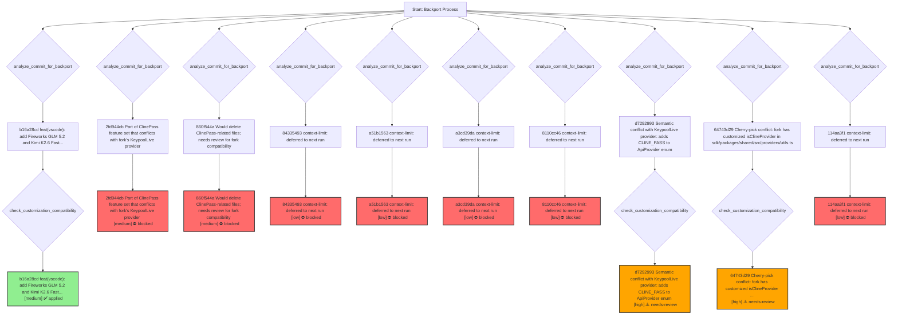

# Backport Agent — Detailed Run Report

> This file is generated automatically. It is intended for human analysts and
> AI reasoning models to assess agent performance, decision quality, and LLM behavior.

**Run timestamp**: 2026-06-19T11:43:07.126Z
**Models used**: fast=`poolside/poolside/laguna-m.1`  powerful=`mistral/mistral-vibe-cli-latest`
**Prompt log**: `/Users/rlemeill/Development/tea-ching-cline/.backport-agent/run-1781864026275.prompts.jsonl`

---

## Summary (PR body)

## Backport Agent — Sync Report

**Date**: 2026-06-19T11:43:07.126Z
**Upstream ref**: `8c369eeed90a6b3bf64fd37e142517ab6357d83a`
**Fork ref**: `39785e0f83bfeda93c746d150e8a`
**Sync branch**: `sync/upstream-main-2026-06-19-113154`

### Summary

- ✅ Applied: 1
- ⚠️ Needs human review: 2
- ⛔ Blocked (not attempted): 9

### Applied commits

- `b16a28cd` [medium] feat(vscode): add Fireworks GLM 5.2 and Kimi K2.6 Fast, fix DeepSeek V4 Flash cache-read price (#11642)

### ⚠️ Human review required

- `d7292993` Add Cline Pass to the extension (#11556)
- `64743d29` Improve the ClinePass UX (#11644)

### Blocked commits (not attempted)

- `2fd944cb` [medium] — Part of ClinePass feature set that conflicts with fork's KeypoolLive provider
- `860f544a` [medium] — Would delete ClinePass-related files; needs review for fork compatibility
- `84335493` [high] — context-limit: deferred to next run
- `a51b1563` [high] — context-limit: deferred to next run
- `a3cd39da` [high] — context-limit: deferred to next run
- `8110cc46` [medium] — context-limit: deferred to next run
- `d7292993` [high] — Semantic conflict with KeypoolLive provider: adds CLINE_PASS to ApiProvider enum conflicting with KEYPOOLLIVE registration in shared/api.ts → proto/cline/models.proto → providers.json. Extends ClineRecommendedModelsData with clinePass field, potentially breaking KeypoolLive's model data handling. AI assessment: review-required.
- `64743d29` [low] — Cherry-pick conflict: fork has customized isClineProvider in sdk/packages/shared/src/providers/utils.ts (includes cline-pass), but upstream adds isClineProvider to @shared/utils/cline. ErrorRow.tsx and ClinePassProvider.tsx conflicts need resolution. Fork has KeypoolLiveProvider.tsx instead of ClinePassProvider.tsx.
- `114aa3f1` [medium] — context-limit: deferred to next run

### Agent decision log

- Fetched upstream and fork remotes to ensure refs are up to date
- Identified 10 candidate commits not yet applied to fork branch
- Created sync branch sync/upstream-main-2026-06-19-113154
- Classified commit d7292993 (Add Cline Pass) as HIGH risk - touches shared/api.ts, proto/cline/models.proto, sdk/packages/shared/src/providers.json which are customization zones
- Called check_customization_compatibility for d7292993 - found semantic conflict: adds CLINE_PASS enum conflicting with KEYPOOLLIVE provider registration
- Aborted cherry-pick of d7292993 due to semantic conflicts with KeypoolLive provider
- Classified commit 64743d29 (Improve ClinePass UX) as LOW risk - touches files outside customization zones
- Attempted cherry-pick of 64743d29 but encountered conflict: ClinePassProvider.tsx does not exist in fork (KeypoolLiveProvider.tsx is the replacement)
- Aborted cherry-pick of 64743d29 due to file-level conflict
- Successfully cherry-picked commit b16a28cd (Fireworks GLM 5.2/Kimi K2.6) - additive change compatible with fork
- Max commits reached, stopping to generate report


---

## Agent Workflow Diagram

> Generated by the fast model from the run summary. Evaluate the agent's decision path.



---

## AI Sub-Agent Call Log (10 calls)

> Each entry is one sub-agent invocation. Review prompt/response pairs to assess
> reasoning quality, hallucinations, and decision accuracy.

### Call 1 / 10 — `analyze_commit_for_backport` ✅ OK

| Field | Value |
|---|---|
| **Timestamp** | 2026-06-19T10:28:11.740Z |
| **Tool** | `analyze_commit_for_backport` |
| **Model** | `mistral/mistral-vibe-cli-latest` |
| **Duration** | 2890 ms |
| **Tokens in** | 11858 |
| **Tokens out** | 179 |
| **Cost** | $0.000000 |

**Prompt sent to sub-agent:**

```
Commit SHA: d7292993e921002b8b7a35ec7fa9a73aeb23d787
Commit message:
Add Cline Pass to the extension (#11556)

Changed files (22):
apps/vscode/proto/cline/models.proto
apps/vscode/src/core/api/index.ts
apps/vscode/src/core/api/providers/cline.ts
apps/vscode/src/core/controller/models/__tests__/refreshClineRecommendedModels.test.ts
apps/vscode/src/core/controller/models/refreshClineRecommendedModels.ts
apps/vscode/src/core/controller/models/refreshClineRecommendedModelsRpc.ts
apps/vscode/src/core/controller/models/updateApiConfigurationProto.ts
apps/vscode/src/core/task/index.ts
apps/vscode/src/shared/api.ts
apps/vscode/src/shared/proto-conversions/models/api-configuration-conversion.ts
apps/vscode/src/shared/providers/providers.json
apps/vscode/src/shared/storage/__tests__/provider-keys.test.ts
apps/vscode/src/shared/storage/provider-keys.ts
apps/vscode/src/shared/storage/state-keys.ts
apps/vscode/src/shared/utils/cline.ts
apps/vscode/src/utils/model-utils.ts
apps/vscode/webview-ui/src/components/settings/ApiOptions.tsx
apps/vscode/webview-ui/src/components/settings/ClineModelPicker.tsx
apps/vscode/webview-ui/src/components/settings/providers/ClinePassProvider.tsx
apps/vscode/webview-ui/src/components/settings/utils/providerUtils.ts
apps/vscode/webview-ui/src/context/ExtensionStateContext.tsx
apps/vscode/webview-ui/src/utils/validate.ts

Diff:
commit d7292993e921002b8b7a35ec7fa9a73aeb23d787
Author: Tomás Barreiro <52393857+BarreiroT@users.noreply.github.com>
Date:   Thu Jun 18 15:19:46 2026 -0300

    Add Cline Pass to the extension (#11556)
    
    * Add Cline Pass provider to VS Code extension
    
    * Fix the model picker
    
    * ClinePass specific options
    
    * Add feature flag to the api options
    
    * Extend flag usage
    
    * fix type error
    
    * Use the right model info
    
    * Fix tests
    
    * Hide price info for clinePass models
    
    * refactor
    
    * remove redundancy
    
    * fix syncModeConfigurations
---
 apps/vscode/proto/cline/models.proto               |  10 +
 apps/vscode/src/core/api/index.ts                  |  39 +-
 apps/vscode/src/core/api/providers/cline.ts        |  11 +-
 .../refreshClineRecommendedModels.test.ts          | 121 ++-
 .../models/refreshClineRecommendedModels.ts        | 177 ++--
 .../models/refreshClineRecommendedModelsRpc.ts     |   8 +
 .../models/updateApiConfigurationProto.ts          | 169 ++--
 apps/vscode/src/core/task/index.ts                 |   8 +-
 apps/vscode/src/shared/api.ts                      |  53 ++
 .../models/api-configuration-conversion.ts         |  12 +
 apps/vscode/src/shared/providers/providers.json    |   4 +
 .../shared/services/feature-flags/feature-flags.ts |   3 +
 .../shared/storage/__tests__/provider-keys.test.ts |   5 +
 apps/vscode/src/shared/storage/provider-keys.ts    |   4 +
 apps/vscode/src/shared/storage/state-keys.ts       |   4 +
 apps/vscode/src/shared/utils/cline.ts              |   3 +
 apps/vscode/src/utils/model-utils.ts               |   1 +
 .../src/components/settings/ApiOptions.tsx         |  17 +-
 .../src/components/settings/ClineModelPicker.tsx   | 174 ++--
 .../settings/providers/ClinePassProvider.tsx       |  73 ++
 .../settings/providers/ClineProvider.tsx           |  24 +-
 .../src/components/settings/utils/providerUtils.ts | 942 ++++++++++++++-------
 .../src/context/ExtensionStateContext.tsx          |   4 +-
 apps/vscode/webview-ui/src/utils/validate.ts       |  24 +-
 24 files changed, 1321 insertions(+), 569 deletions(-)

diff --git a/apps/vscode/proto/cline/models.proto b/apps/vscode/proto/cline/models.proto
index b8f264367b..383c66ae61 100644
--- a/apps/vscode/proto/cline/models.proto
+++ b/apps/vscode/proto/cline/models.proto
@@ -127,6 +127,7 @@ message ClineRecommendedModel {
 message ClineRecommendedModelsResponse {
   repeated ClineRecommendedModel recommended = 1;
   repeated ClineRecommendedModel free = 2;
+  repeated ClineRecommendedModel cline_pass = 3;
 }
 
 // Request for fetching OpenAI models
@@ -287,6 +288,8 @@ message ModelsApiOptions {
   optional OpenAiCompatibleModelInfo plan_mode_aihubmix_model_info = 134;
   optional string plan_mode_cline_model_id = 135;
   optional OpenRouterModelInfo plan_mode_cline_model_info = 136;
+  optional string plan_mode_cline_pass_model_id = 137;
+  optional OpenRouterModelInfo plan_mode_cline_pass_model_info = 138;
 
   // Act mode configurations
   optional ApiProvider act_mode_api_provider = 200;
@@ -326,6 +329,8 @@ message ModelsApiOptions {
   optional OpenAiCompatibleModelInfo act_mode_aihubmix_model_info = 234;
   optional string act_mode_cline_model_id = 235;
   optional OpenRouterModelInfo act_mode_cline_model_info = 236;
+  optional string act_mode_cline_pass_model_id = 237;
+  optional OpenRouterModelInfo act_mode_cline_pass_model_info = 238;
 }
 
 // Request for updating API configuration (legacy - uses combined configuration)
@@ -461,6 +466,7 @@ enum ApiProvider {
   NOUSRESEARCH = 39;
   OPENAI_CODEX = 40;
   WANDB = 41;
+  CLINE_PASS = 42;
 }
 
 enum ApiFormat {
@@ -644,6 +650,8 @@ message ModelsApiConfiguration {
   optional string gemini_plan_mode_thinking_level = 139;
   optional string plan_mode_cline_model_id = 140;
   optional OpenRouterModelInfo plan_mode_cline_model_info = 141;
+  optional string plan_mode_cline_pass_model_id = 142;
+  optional OpenRouterModelInfo plan_mode_cline_pass_model_info = 143;
 
   // Act mode configurations
   optional ApiProvider act_mode_api_provider = 200;
@@ -688,4 +696,6 @@ message ModelsApiConfiguration {
   optional string gemini_act_mode_thinking_level = 239;
   optional string act_mode_cline_model_id = 240;
   optional OpenRouterModelInfo act_mode_cline_model_info = 241;
+  optional string act_mode_cline_pass_model_id = 242;
+  optional OpenRouterModelInfo act_mode_cline_pass_model_info = 243;
 }
diff --git a/apps/vscode/src/core/api/index.ts b/apps/vscode/src/core/api/index.ts
index b38c9671cd..d026f8c9b7 100644
--- a/apps/vscode/src/core/api/index.ts
+++ b/apps/vscode/src/core/api/index.ts
@@ -1,6 +1,8 @@
-import { ApiConfiguration, ModelInfo, QwenApiRegions } from "@shared/api"
+import { ApiConfiguration, clinePassDefaultModelId, ModelInfo, QwenApiRegions, resolveClinePassModelInfo } from "@shared/api"
 import { Mode } from "@shared/storage/types"
+import { featureFlagsService } from "@/services/feature-flags"
 import { ClineStorageMessage } from "@/shared/messages/content"
+import { FeatureFlag } from "@/shared/services/feature-flags/feature-flags"
 import { Logger } from "@/shared/services/Logger"
 import { ClineTool } from "@/shared/tools"
 import { AIhubmixHandler } from "./providers/aihubmix"
@@ -78,7 +80,10 @@ function createHandlerForProvider(
 	options: Omit<ApiConfiguration, "apiProvider">,
 	mode: Mode,
 ): ApiHandler {
-	switch (apiProvider) {
+	const effectiveApiProvider =
+		apiProvider === "cline-pass" && !featureFlagsService.getBooleanFlagEnabled(FeatureFlag.CLINE_PASS) ? "cline" : apiProvider
+
+	switch (effectiveApiProvider) {
 		case "anthropic":
 			return new AnthropicHandler({
 				onRetryAttempt: options.onRetryAttempt,
@@ -258,11 +263,12 @@ function createHandlerForProvider(
 					mode === "plan" ? options.planModeVsCodeLmModelSelector : options.actModeVsCodeLmModelSelector,
 			})
 		case "cline": {
+			const configuredClineModelId = mode === "plan" ? options.planModeClineModelId : options.actModeClineModelId
+			const configuredClineModelInfo = mode === "plan" ? options.planModeClineModelInfo : options.actModeClineModelInfo
 			const clineModelId =
-				(mode === "plan" ? options.planModeClineModelId : options.actModeClineModelId) ||
-				(mode === "plan" ? options.planModeOpenRouterModelId : options.actModeOpenRouterModelId)
+				configuredClineModelId || (mode === "plan" ? options.planModeOpenRouterModelId : options.actModeOpenRouterModelId)
 			const clineModelInfo =
-				(mode === "plan" ? options.planModeClineModelInfo : options.actModeClineModelInfo) ||
+				configuredClineModelInfo ||
 				(mode === "plan" ? options.planModeOpenRouterModelInfo : options.actModeOpenRouterModelInfo)
 			return new ClineHandler({
 				onRetryAttempt: options.onRetryAttempt,
@@ -278,6 +284,29 @@ function createHandlerForProvider(
 				enableParallelToolCalling: options.enableParallelToolCalling,
 			})
 		}
+		case "cline-pass": {
+			const configuredClinePassModelId =
+				mode === "plan" ? options.planModeClinePassModelId : options.actModeClinePassModelId
+			const configuredClinePassModelInfo =
+				mode === "plan" ? options.planModeClinePassModelInfo : options.actModeClinePassModelInfo
+			const clineModelId = configuredClinePassModelId?.startsWith("cline-pass/")
+				? configuredClinePassModelId
+				: clinePassDefaultModelId
+			const clineModelInfo = configuredClinePassModelInfo || resolveClinePassModelInfo(clineModelId)
+			return new ClineHandler({
+				onRetryAttempt: options.onRetryAttempt,
+				clineAccountId: options.clineAccountId,
+				clineApiKey: options.clineApiKey,
+				ulid: options.ulid,
+				reasoningEffort: mode === "plan" ? options.planModeReasoningEffort : options.actModeReasoningEffort,
+				thinkingBudgetTokens:
+					mode === "plan" ? options.planModeThinkingBudgetTokens : options.actModeThinkingBudgetTokens,
+				openRouterProviderSorting: options.openRouterProviderSorting,
+				openRouterModelId: clineModelId,
+				openRouterModelInfo: clineModelInfo,
+				enableParallelToolCalling: options.enableParallelToolCalling,
+			})
+		}
 		case "litellm":
 			return new LiteLlmHandler({
 				onRetryAttempt: options.onRetryAttempt,
diff --git a/apps/vscode/src/core/api/providers/cline.ts b/apps/vscode/src/core/api/providers/cline.ts
index e694203a69..b06d61ae13 100644
--- a/apps/vscode/src/core/api/providers/cline.ts
+++ b/apps/vscode/src/core/api/providers/cline.ts
@@ -1,4 +1,4 @@
-import { type ModelInfo, openRouterDefaultModelId, openRouterDefaultModelInfo } from "@shared/api"
+import { clinePassModels, type ModelInfo, openRouterDefaultModelId, openRouterDefaultModelInfo } from "@shared/api"
 import { shouldSkipReasoningForModel } from "@utils/model-utils"
 import axios from "axios"
 import OpenAI from "openai"
@@ -37,7 +37,10 @@ function normalizeModelId(modelId: string): string {
 	return modelId.trim().toLowerCase()
 }
 
-const CLINE_FREE_MODEL_IDS = new Set(CLINE_RECOMMENDED_MODELS_FALLBACK.free.map((model) => normalizeModelId(model.id)))
+const CLINE_FREE_MODEL_IDS = new Set([
+	...CLINE_RECOMMENDED_MODELS_FALLBACK.free.map((model) => normalizeModelId(model.id)),
+	...Object.keys(clinePassModels).map((modelId) => normalizeModelId(modelId)),
+])
 
 function getCacheReadTokens(usage: any): number {
 	return usage?.prompt_tokens_details?.cached_tokens || usage?.cache_read_input_tokens || 0
@@ -67,7 +70,9 @@ export class ClineHandler implements ApiHandler {
 	private async getFreeModelIdSet(): Promise<Set<string>> {
 		try {
 			const models = await refreshClineRecommendedModels()
-			const freeModelIds = models.free.map((model) => normalizeModelId(model.id)).filter((modelId) => modelId.length > 0)
+			const freeModelIds = [...models.free, ...models.clinePass]
+				.map((model) => normalizeModelId(model.id))
+				.filter((modelId) => modelId.length > 0)
 			if (freeModelIds.length > 0) {
 				return new Set(freeModelIds)
 			}
diff --git a/apps/vscode/src/core/controller/models/__tests__/refreshClineRecommendedModels.test.ts b/apps/vscode/src/core/controller/models/__tests__/refreshClineRecommendedModels.test.ts
index 0172d1e247..1bbebdc971 100644
--- a/apps/vscode/src/core/controller/models/__tests__/refreshClineRecommendedModels.test.ts
+++ b/apps/vscode/src/core/controller/models/__tests__/refreshClineRecommendedModels.test.ts
@@ -1,27 +1,30 @@
-import * as disk from "@core/storage/disk"
-import axios from "axios"
-import { expect } from "chai"
-import fs from "fs/promises"
-import { afterEach, beforeEach, describe, it } from "mocha"
-import sinon from "sinon"
-import { ClineEnv, Environment } from "@/config"
-import { Logger } from "@/shared/services/Logger"
-import { refreshClineRecommendedModels, resetClineRecommendedModelsCacheForTests } from "../refreshClineRecommendedModels"
+import * as disk from "@core/storage/disk";
+import axios from "axios";
+import { expect } from "chai";
+import fs from "fs/promises";
+import { afterEach, beforeEach, describe, it } from "mocha";
+import sinon from "sinon";
+import { ClineEnv, Environment } from "@/config";
+import { Logger } from "@/shared/services/Logger";
+import {
+	refreshClineRecommendedModels,
+	resetClineRecommendedModelsCacheForTests,
+} from "../refreshClineRecommendedModels";
 
 describe("refreshClineRecommendedModels", () => {
-	let sandbox: sinon.SinonSandbox
+	let sandbox: sinon.SinonSandbox;
 
 	beforeEach(() => {
-		sandbox = sinon.createSandbox()
-		resetClineRecommendedModelsCacheForTests()
-		sandbox.stub(Logger, "log")
-		sandbox.stub(Logger, "error")
-	})
+		sandbox = sinon.createSandbox();
+		resetClineRecommendedModelsCacheForTests();
+		sandbox.stub(Logger, "log");
+		sandbox.stub(Logger, "error");
+	});
 
 	afterEach(() => {
-		resetClineRecommendedModelsCacheForTests()
-		sandbox.restore()
-	})
+		resetClineRecommendedModelsCacheForTests();
+		sandbox.restore();
+	});
 
 	it("fetches from upstream", async () => {
 		sandbox.stub(ClineEnv, "config").returns({
@@ -29,19 +32,32 @@ describe("refreshClineRecommendedModels", () => {
 			appBaseUrl: "https://app.cline-mock.bot",
 			apiBaseUrl: "https://api.cline-mock.bot",
 			mcpBaseUrl: "https://api.cline-mock.bot/v1/mcp",
-		})
-		sandbox.stub(disk, "ensureCacheDirectoryExists").resolves("/tmp")
-		sandbox.stub(fs, "writeFile").resolves()
+		});
+		sandbox.stub(disk, "ensureCacheDirectoryExists").resolves("/tmp");
+		sandbox.stub(fs, "writeFile").resolves();
 		const axiosGetStub = sandbox.stub(axios, "get").resolves({
 			data: {
-				recommended: [{ id: "anthropic/claude-sonnet-4.6", description: "Remote recommended", tags: ["NEW"] }],
+				recommended: [
+					{
+						id: "anthropic/claude-sonnet-4.6",
+						description: "Remote recommended",
+						tags: ["NEW"],
+					},
+				],
 				free: [{ id: "z-ai/glm-5", description: "Remote free" }],
+				clinePass: [
+					{
+						id: "cline-pass/glm-5",
+						description: "Remote Cline Pass",
+						tags: ["CLINE_PASS"],
+					},
+				],
 			},
-		})
+		});
 
-		const result = await refreshClineRecommendedModels()
+		const result = await refreshClineRecommendedModels();
 
-		expect(axiosGetStub.calledOnce).to.equal(true)
+		expect(axiosGetStub.calledOnce).to.equal(true);
 		expect(result).to.deep.equal({
 			recommended: [
 				{
@@ -59,8 +75,16 @@ describe("refreshClineRecommendedModels", () => {
 					tags: [],
 				},
 			],
-		})
-	})
+			clinePass: [
+				{
+					id: "cline-pass/glm-5",
+					name: "cline-pass/glm-5",
+					description: "Remote Cline Pass",
+					tags: ["CLINE_PASS"],
+				},
+			],
+		});
+	});
 
 	it("uses the in-memory cache after upstream cache is populated", async () => {
 		sandbox.stub(ClineEnv, "config").returns({
@@ -68,20 +92,39 @@ describe("refreshClineRecommendedModels", () => {
 			appBaseUrl: "https://app.cline-mock.bot",
 			apiBaseUrl: "https://api.cline-mock.bot",
 			mcpBaseUrl: "https://api.cline-mock.bot/v1/mcp",
-		})
-		sandbox.stub(disk, "ensureCacheDirectoryExists").resolves("/tmp")
-		sandbox.stub(fs, "writeFile").resolves()
+		});
+		sandbox.stub(disk, "ensureCacheDirectoryExists").resolves("/tmp");
+		sandbox.stub(fs, "writeFile").resolves();
 		const axiosGetStub = sandbox.stub(axios, "get").resolves({
 			data: {
-				recommended: [{ id: "google/gemini-3.1-pro-preview", description: "Remote recommended", tags: ["NEW"] }],
-				free: [{ id: "minimax/minimax-m2.5", description: "Remote free", tags: ["FREE"] }],
+				recommended: [
+					{
+						id: "google/gemini-3.1-pro-preview",
+						description: "Remote recommended",
+						tags: ["NEW"],
+					},
+				],
+				free: [
+					{
+						id: "minimax/minimax-m2.5",
+						description: "Remote free",
+						tags: ["FREE"],
+					},
+				],
+				clinePass: [
+					{
+						id: "cline-pass/glm-5",
+						description: "Remote Cline Pass",
+						tags: ["CLINE_PASS"],
+					},
+				],
 			},
-		})
+		});
 
-		const firstResult = await refreshClineRecommendedModels()
-		const secondResult = await refreshClineRecommendedModels()
+		const firstResult = await refreshClineRecommendedModels();
+		const secondResult = await refreshClineRecommendedModels();
 
-		expect(axiosGetStub.calledOnce).to.equal(true)
-		expect(secondResult).to.deep.equal(firstResult)
-	})
-})
+		expect(axiosGetStub.calledOnce).to.equal(true);
+		expect(secondResult).to.deep.equal(firstResult);
+	});
+});
diff --git a/apps/vscode/src/core/controller/models/refreshClineRecommendedModels.ts b/apps/vscode/src/core/controller/models/refreshClineRecommendedModels.ts
index 53de0ee007..bae7f66551 100644
--- a/apps/vscode/src/core/controller/models/refreshClineRecommendedModels.ts
+++ b/apps/vscode/src/core/controller/models/refreshClineRecommendedModels.ts
@@ -1,137 +1,192 @@
-import { ensureCacheDirectoryExists, GlobalFileNames } from "@core/storage/disk"
-import axios from "axios"
-import fs from "fs/promises"
-import path from "path"
-import { ClineEnv } from "@/config"
-import { getAxiosSettings } from "@/shared/net"
-import { Logger } from "@/shared/services/Logger"
+import {
+	ensureCacheDirectoryExists,
+	GlobalFileNames,
+} from "@core/storage/disk";
+import axios from "axios";
+import fs from "fs/promises";
+import path from "path";
+import { ClineEnv } from "@/config";
+import { getAxiosSettings } from "@/shared/net";
+import { Logger } from "@/shared/services/Logger";
 
 export interface ClineRecommendedModelData {
-	id: string
-	name: string
-	description: string
-	tags: string[]
+	id: string;
+	name: string;
+	description: string;
+	tags: string[];
 }
 
 export interface ClineRecommendedModelsData {
-	recommended: ClineRecommendedModelData[]
-	free: ClineRecommendedModelData[]
+	recommended: ClineRecommendedModelData[];
+	free: ClineRecommendedModelData[];
+	clinePass: ClineRecommendedModelData[];
 }
 
-const RECOMMENDED_MODELS_CACHE_TTL_MS = 60 * 60 * 1000
+const RECOMMENDED_MODELS_CACHE_TTL_MS = 60 * 60 * 1000;
 
-let pendingRefresh: Promise<ClineRecommendedModelsData> | null = null
-let inMemoryCache: { data: ClineRecommendedModelsData; timestamp: number } | null = null
+let pendingRefresh: Promise<ClineRecommendedModelsData> | null = null;
+let inMemoryCache: {
+	data: ClineRecommendedModelsData;
+	timestamp: number;
+} | null = null;
 
-function normalizeRecommendedModel(raw: unknown): ClineRecommendedModelData | null {
+function normalizeRecommendedModel(
+	raw: unknown,
+): ClineRecommendedModelData | null {
 	if (!raw || typeof raw !== "object") {
-		return null
+		return null;
 	}
 
-	const data = raw as Record<string, unknown>
+	const data = raw as Record<string, unknown>;
 	if (typeof data.id !== "string" || data.id.length === 0) {
-		return null
+		return null;
 	}
 
 	return {
 		id: data.id,
-		name: typeof data.name === "string" && data.name.length > 0 ? data.name : data.id,
+		name:
+			typeof data.name === "string" && data.name.length > 0
+				? data.name
+				: data.id,
 		description: typeof data.description === "string" ? data.description : "",
-		tags: Array.isArray(data.tags) ? data.tags.filter((tag): tag is string => typeof tag === "string") : [],
-	}
+		tags: Array.isArray(data.tags)
+			? data.tags.filter((tag): tag is string => typeof tag === "string")
+			: [],
+	};
 }
 
-function normalizeRecommendedModelsResponse(raw: unknown): ClineRecommendedModelsData | null {
+function normalizeRecommendedModelsResponse(
+	raw: unknown,
+): ClineRecommendedModelsData | null {
 	if (!raw || typeof raw !== "object") {
-		return null
+		return null;
 	}
 
-	const data = raw as Record<string, unknown>
+	const data = raw as Record<string, unknown>;
 	if (
 		(data.recommended !== undefined && !Array.isArray(data.recommended)) ||
-		(data.free !== undefined && !Array.isArray(data.free))
+		(data.free !== undefined && !Array.isArray(data.free)) ||
+		(data.clinePass !== undefined && !Array.isArray(data.clinePass))
 	) {
-		return null
+		return null;
 	}
 
-	const recommendedRaw = Array.isArray(data.recommended) ? data.recommended : []
-	const freeRaw = Array.isArray(data.free) ? data.free : []
+	const recommendedRaw = Array.isArray(data.recommended)
+		? data.recommended
+		: [];
+	const freeRaw = Array.isArray(data.free) ? data.free : [];
+	const clinePassRaw = Array.isArray(data.clinePass) ? data.clinePass : [];
 
 	const recommended = recommendedRaw
 		.map((model) => normalizeRecommendedModel(model))
-		.filter((model): model is ClineRecommendedModelData => model !== null)
+		.filter((model): model is ClineRecommendedModelData => model !== null);
 
 	const free = freeRaw
 		.map((model) => normalizeRecommendedModel(model))
-		.filter((model): model is ClineRecommendedModelData => model !== null)
+		.filter((model): model is ClineRecommendedModelData => model !== null);
+
+	const clinePass = clinePassRaw
+		.map((model) => normalizeRecommendedModel(model))
+		.filter((model): model is ClineRecommendedModelData => model !== null);
 
-	return { recommended, free }
+	return { recommended, free, clinePass };
 }
 
 export async function refreshClineRecommendedModels(): Promise<ClineRecommendedModelsData> {
-	if (inMemoryCache && Date.now() - inMemoryCache.timestamp <= RECOMMENDED_MODELS_CACHE_TTL_MS) {
-		return inMemoryCache.data
+	if (
+		inMemoryCache &&
+		Date.now() - inMemoryCache.timestamp <= RECOMMENDED_MODELS_CACHE_TTL_MS
+	) {
+		return inMemoryCache.data;
 	}
 
 	if (pendingRefresh) {
-		return pendingRefresh
+		return pendingRefresh;
 	}
 
 	pendingRefresh = (async () => {
 		try {
-			return await fetchAndCacheClineRecommendedModels()
+			return await fetchAndCacheClineRecommendedModels();
 		} finally {
-			pendingRefresh = null
+			pendingRefresh = null;
 		}
-	})()
+	})();
 
-	return pendingRefresh
+	return pendingRefresh;
 }
 
 export function resetClineRecommendedModelsCacheForTests(): void {
-	pendingRefresh = null
-	inMemoryCache = null
+	pendingRefresh = null;
+	inMemoryCache = null;
 }
 
 async function fetchAndCacheClineRecommendedModels(): Promise<ClineRecommendedModelsData> {
-	const clineRecommendedModelsFilePath = path.join(await ensureCacheDirectoryExists(), GlobalFileNames.clineRecommendedModels)
-	let result: ClineRecommendedModelsData = { recommended: [], free: [] }
+	const clineRecommendedModelsFilePath = path.join(
+		await ensureCacheDirectoryExists(),
+		GlobalFileNames.clineRecommendedModels,
+	);
+	let result: ClineRecommendedModelsData = {
+		recommended: [],
+		free: [],
+		clinePass: [],
+	};
 
 	try {
-		const apiBaseUrl = ClineEnv.config().apiBaseUrl
-		const response = await axios.get(`${apiBaseUrl}/api/v1/ai/cline/recommended-models`, getAxiosSettings())
-		const normalized = normalizeRecommendedModelsResponse(response.data)
+		const apiBaseUrl = ClineEnv.config().apiBaseUrl;
+		const response = await axios.get(
+			`${apiBaseUrl}/api/v1/ai/cline/recommended-models`,
+			getAxiosSettings(),
+		);
+		const normalized = normalizeRecommendedModelsResponse(response.data);
 		if (!normalized) {
-			throw new Error("Invalid response data when fetching Cline recommended models")
+			throw new Error(
+				"Invalid response data when fetching Cline recommended models",
+			);
 		}
 
-		result = normalized
-		await fs.writeFile(clineRecommendedModelsFilePath, JSON.stringify(result))
-		Logger.log("Cline recommended models fetched and saved")
+		result = normalized;
+		await fs.writeFile(clineRecommendedModelsFilePath, JSON.stringify(result));
+		Logger.log("Cline recommended models fetched and saved");
 	} catch (error) {
-		Logger.error("Error fetching Cline recommended models:", error)
+		Logger.error("Error fetching Cline recommended models:", error);
 
 		try {
 			const fileExists = await fs
 				.access(clineRecommendedModelsFilePath)
 				.then(() => true)
-				.catch(() => false)
+				.catch(() => false);
 			if (fileExists) {
-				const fileContents = await fs.readFile(clineRecommendedModelsFilePath, "utf8")
-				const parsed = JSON.parse(fileContents)
+				const fileContents = await fs.readFile(
+					clineRecommendedModelsFilePath,
+					"utf8",
+				);
+				const parsed = JSON.parse(fileContents);
 				if (parsed) {
-					result = parsed
-					Logger.log("Loaded Cline recommended models from cache")
+					result = {
+						recommended: Array.isArray(parsed.recommended)
+							? parsed.recommended
+							: [],
+						free: Array.isArray(parsed.free) ? parsed.free : [],
+						clinePass: Array.isArray(parsed.clinePass) ? parsed.clinePass : [],
+					};
+					Logger.log("Loaded Cline recommended models from cache");
 				}
 			}
 		} catch (cacheError) {
-			Logger.error("Error reading Cline recommended models from cache:", cacheError)
+			Logger.error(
+				"Error reading Cline recommended models from cache:",
+				cacheError,
+			);
 		}
 	}
 
 	// Avoid pinning empty results in memory for the full TTL after a transient API/cache miss.
-	if (result.recommended.length > 0 || result.free.length > 0) {
-		inMemoryCache = { data: result, timestamp: Date.now() }
+	if (
+		result.recommended.length > 0 ||
+		result.free.length > 0 ||
+		result.clinePass.length > 0
+	) {
+		inMemoryCache = { data: result, timestamp: Date.now() };
 	}
-	return result
+	return result;
 }
diff --git a/apps/vscode/src/core/controller/models/refreshClineRecommendedModelsRpc.ts b/apps/vscode/src/core/controller/models/refreshClineRecommendedModelsRpc.ts
index 217f3cba94..3eb45925cb 100644
--- a/apps/vscode/src/core/controller/models/refreshClineRecommendedModelsRpc.ts
+++ b/apps/vscode/src/core/controller/models/refreshClineRecommendedModelsRpc.ts
@@ -25,5 +25,13 @@ export async function refreshClineRecommendedModelsRpc(
 				tags: model.tags,
 			}),
 		),
+		clinePass: models.clinePass.map((model) =>
+			ClineRecommendedModel.create({
+				id: model.id,
+				name: model.name,
+				description: model.description,
+				tags: model.tags,
+			}),
+		),
 	})
 }
diff --git a/apps/vscode/src/core/controller/models/updateApiConfigurationProto.ts b/apps/vscode/src/core/controller/models/updateApiConfigurationProto.ts
index f16681e67e..15d2a38dab 100644
--- a/apps/vscode/src/core/controller/models/updateApiConfigurationProto.ts
+++ b/apps/vscode/src/core/controller/models/updateApiConfigurationProto.ts
@@ -1,16 +1,16 @@
-import { Empty } from "@shared/proto/cline/common"
-import { UpdateApiConfigurationRequest } from "@shared/proto/cline/models"
-import { convertProtoToApiProvider } from "@shared/proto-conversions/models/api-configuration-conversion"
+import { Empty } from "@shared/proto/cline/common";
+import { UpdateApiConfigurationRequest } from "@shared/proto/cline/models";
+import { convertProtoToApiProvider } from "@shared/proto-conversions/models/api-configuration-conversion";
 import {
 	fromProtobufLiteLLMModelInfo,
 	fromProtobufModelInfo,
 	fromProtobufOcaModelInfo,
 	fromProtobufOpenAiCompatibleModelInfo,
-} from "@shared/proto-conversions/models/typeConversion"
-import { OpenaiReasoningEffort } from "@shared/storage/types"
-import { buildApiHandler } from "@/core/api"
-import { Logger } from "@/shared/services/Logger"
-import type { Controller } from "../index"
+} from "@shared/proto-conversions/models/typeConversion";
+import { OpenaiReasoningEffort } from "@shared/storage/types";
+import { buildApiHandler } from "@/core/api";
+import { Logger } from "@/shared/services/Logger";
+import type { Controller } from "../index";
 
 /**
  * Updates API configuration
@@ -24,18 +24,22 @@ export async function updateApiConfigurationProto(
 ): Promise<Empty> {
 	try {
 		if (!request.apiConfiguration) {
-			Logger.log("[APICONFIG: updateApiConfigurationProto] API configuration is required")
-			throw new Error("API configuration is required")
+			Logger.log(
+				"[APICONFIG: updateApiConfigurationProto] API configuration is required",
+			);
+			throw new Error("API configuration is required");
 		}
 
-		const protoApiConfiguration = request.apiConfiguration
+		const protoApiConfiguration = request.apiConfiguration;
 
 		const convertedApiConfigurationFromProto = {
 			...protoApiConfiguration,
 			// Convert proto ApiProvider enums to native string types
 			planModeApiProvider:
 				protoApiConfiguration.planModeApiProvider !== undefined
-					? convertProtoToApiProvider(protoApiConfiguration.planModeApiProvider!)
+					? convertProtoToApiProvider(
+							protoApiConfiguration.planModeApiProvider!,
+						)
 					: undefined,
 			actModeApiProvider:
 				protoApiConfiguration.actModeApiProvider !== undefined
@@ -44,20 +48,36 @@ export async function updateApiConfigurationProto(
 
 			// Convert ModelInfo objects (empty arrays → undefined)
 			// Plan Mode
-			planModeOpenRouterModelInfo: protoApiConfiguration.planModeOpenRouterModelInfo
-				? fromProtobufModelInfo(protoApiConfiguration.planModeOpenRouterModelInfo)
-				: undefined,
+			planModeOpenRouterModelInfo:
+				protoApiConfiguration.planModeOpenRouterModelInfo
+					? fromProtobufModelInfo(
+							protoApiConfiguration.planModeOpenRouterModelInfo,
+						)
+					: undefined,
 			planModeClineModelInfo: protoApiConfiguration.planModeClineModelInfo
 				? fromProtobufModelInfo(protoApiConfiguration.planModeClineModelInfo)
 				: undefined,
+			planModeClinePassModelInfo:
+				protoApiConfiguration.planModeClinePassModelInfo
+					? fromProtobufModelInfo(
+							protoApiConfiguration.planModeClinePassModelInfo,
+						)
+					: undefined,
 			planModeOpenAiModelInfo: protoApiConfiguration.planModeOpenAiModelInfo
-				? fromProtobufOpenAiCompatibleModelInfo(protoApiConfiguration.planModeOpenAiModelInfo)
-				: undefined,
-			planModeHuggingFaceModelInfo: protoApiConfiguration.planModeHuggingFaceModelInfo
-				? fromProtobufModelInfo(protoApiConfiguration.planModeHuggingFaceModelInfo)
-				: undefined,
+				? fromProtobufOpenAiCompatibleModelInfo(
+						protoApiConfiguration.planModeOpenAiModelInfo,
+					)
+				: undefined,
+			planModeHuggingFaceModelInfo:
+				protoApiConfiguration.planModeHuggingFaceModelInfo
+					? fromProtobufModelInfo(
+							protoApiConfiguration.planModeHuggingFaceModelInfo,
+						)
+					: undefined,
 			planModeLiteLlmModelInfo: protoApiConfiguration.planModeLiteLlmModelInfo
-				? fromProtobufLiteLLMModelInfo(protoApiConfiguration.planModeLiteLlmModelInfo)
+				? fromProtobufLiteLLMModelInfo(
+						protoApiConfiguration.planModeLiteLlmModelInfo,
+					)
 				: undefined,
 			planModeRequestyModelInfo: protoApiConfiguration.planModeRequestyModelInfo
 				? fromProtobufModelInfo(protoApiConfiguration.planModeRequestyModelInfo)
@@ -65,34 +85,52 @@ export async function updateApiConfigurationProto(
 			planModeGroqModelInfo: protoApiConfiguration.planModeGroqModelInfo
 				? fromProtobufModelInfo(protoApiConfiguration.planModeGroqModelInfo)
 				: undefined,
-			planModeHuaweiCloudMaasModelInfo: protoApiConfiguration.planModeHuaweiCloudMaasModelInfo
-				? fromProtobufModelInfo(protoApiConfiguration.planModeHuaweiCloudMaasModelInfo)
-				: undefined,
+			planModeHuaweiCloudMaasModelInfo:
+				protoApiConfiguration.planModeHuaweiCloudMaasModelInfo
+					? fromProtobufModelInfo(
+							protoApiConfiguration.planModeHuaweiCloudMaasModelInfo,
+						)
+					: undefined,
 			planModeBasetenModelInfo: protoApiConfiguration.planModeBasetenModelInfo
 				? fromProtobufModelInfo(protoApiConfiguration.planModeBasetenModelInfo)
 				: undefined,
-			planModeVercelAiGatewayModelInfo: protoApiConfiguration.planModeVercelAiGatewayModelInfo
-				? fromProtobufModelInfo(protoApiConfiguration.planModeVercelAiGatewayModelInfo)
-				: undefined,
+			planModeVercelAiGatewayModelInfo:
+				protoApiConfiguration.planModeVercelAiGatewayModelInfo
+					? fromProtobufModelInfo(
+							protoApiConfiguration.planModeVercelAiGatewayModelInfo,
+						)
+					: undefined,
 			planModeOcaModelInfo: protoApiConfiguration.planModeOcaModelInfo
 				? fromProtobufOcaModelInfo(protoApiConfiguration.planModeOcaModelInfo)
 				: undefined,
 			planModeAihubmixModelInfo: protoApiConfiguration.planModeAihubmixModelInfo
-				? fromProtobufOpenAiCompatibleModelInfo(protoApiConfiguration.planModeAihubmixModelInfo)
+				? fromProtobufOpenAiCompatibleModelInfo(
+						protoApiConfiguration.planModeAihubmixModelInfo,
+					)
 				: undefined,
 
 			// Act Mode
-			actModeOpenRouterModelInfo: protoApiConfiguration.actModeOpenRouterModelInfo
-				? fromProtobufModelInfo(protoApiConfiguration.actModeOpenRouterModelInfo)
-				: undefined,
+			actModeOpenRouterModelInfo:
+				protoApiConfiguration.actModeOpenRouterModelInfo
+					? fromProtobufModelInfo(
+							protoApiConfiguration.actModeOpenRouterModelInfo,
+						)
+					: undefined,
 			actModeClineModelInfo: protoApiConfiguration.actModeClineModelInfo
 				? fromProtobufModelInfo(protoApiConfiguration.actModeClineModelInfo)
 				: undefined,
+			actModeClinePassModelInfo: protoApiConfiguration.actModeClinePassModelInfo
+				? fromProtobufModelInfo(protoApiConfiguration.actModeClinePassModelInfo)
+				: undefined,
 			actModeOpenAiModelInfo: protoApiConfiguration.actModeOpenAi
... [truncated]

Output the JSON object now.
```

**Response received:**

```
{
  "summary": "Adds Cline Pass provider with new API provider type, model configurations, and UI components. Touches proto definitions, API handlers, and settings UI.",
  "keyChanges": [
    "Adds CLINE_PASS to ApiProvider enum in proto",
    "Extends recommended models with clinePass array",
    "Adds ClinePassProvider.tsx UI component",
    "Modifies provider registration and model resolution",
    "Updates feature flags for Cline Pass"
  ],
  "backportComplexity": "complex",
  "semanticRiskFactors": [
    "Adds new provider conflicting with keypoollive-provider customizations",
    "Modifies shared API types and proto definitions",
    "Changes provider resolution logic in core/api/index.ts"
  ],
  "recommendation": "review-required"
}
```

---

### Call 2 / 10 — `check_customization_compatibility` ✅ OK

| Field | Value |
|---|---|
| **Timestamp** | 2026-06-19T10:38:27.916Z |
| **Tool** | `check_customization_compatibility` |
| **Model** | `mistral/mistral-vibe-cli-latest` |
| **Duration** | 5408 ms |
| **Tokens in** | 11249 |
| **Tokens out** | 187 |
| **Cost** | $0.000000 |

**Prompt sent to sub-agent:**

```
Declared fork customisations:
  1. Pattern: apps/vscode/src/core/keypoollive/**
     Description: Adds the KeypoolLive provider: access to encrypted API key vault (AiVault), key pool management (KeyPool), automatic rotation, usage tracking via SQLite (KeypoolUsageDb), and session management (SessionKeyManager). The provider is registered all along the chain: shared/api.ts → proto/cline/models.proto → api-configuration-conversion.ts → provider-keys.ts → providers.json → ApiOptions.tsx → core/api/index.ts. It exposes four dedicated gRPC RPCs (keypoolGetVaultModels, keypoolRotateKey, keypoolGetUsageStats, keypoolGetErrorStats) and native context window management.
  2. Pattern: sdk/packages/core/src/extensions/tools/executors/crawler/**
     Description: Adds an intelligent web crawling system with support for specialized crawlers (Firecrawl, Exa)...
  3. Pattern: apps/vscode/webview-ui/src/components/chat/KeypoolLiveDashboard.tsx
     Description: React components integrated into ChatTextArea to display the KeypoolLive dashboard (KeypoolLiveDashboard) and inline model selector (KeypoolModelSelector)...
     Current file content (1 file(s)):
      [apps/vscode/webview-ui/src/components/chat/KeypoolLiveDashboard.tsx]
      /**
       * KeypoolLive — Monitoring Dashboard.
       *
       * This component displays real-time statistics for the API keys managed by KeypoolLive.
       * It provides two main views:
       * 1. Token Usage: Shows consumption (prompt/completion tokens) per key and provider.
       * 2. Error Rates: Shows reliability metrics and recent error codes per key.
       *
       * Data can be filtered across 4 time scales and exported to CSV for further analysis.
       *
       * © 2026 Ronan LE MEILLAT — MIT License
       */
      
      import { EmptyRequest } from "@shared/proto/cline/common"
      import { KeypoolErrorStat, KeypoolStatsRequest, KeypoolUsageStat } from "@shared/proto/cline/models"
      import { VSCodeButton } from "@vscode/webview-ui-toolkit/react"
      import * as XLSX from "xlsx"
      import React, { useCallback, useEffect, useRef, useState } from "react"
      import { useClickAway, useWindowSize } from "react-use"
      import PopupModalContainer from "@/components/common/PopupModalContainer"
      import { Tooltip, TooltipContent, TooltipTrigger } from "@/components/ui/tooltip"
      import { ModelsServiceClient } from "@/services/grpc-client"
      
      /** Supported time periods for statistics aggregation */
      type Period = "hour" | "day" | "week" | "month"
      
      /** Configuration for the period selector buttons */
      const PERIODS: { key: Period; label: string }[] = [
      	{ key: "hour", label: "1h" },
      	{ key: "day", label: "24h" },
      	{ key: "week", label: "7d" },
      	{ key: "month", label: "30d" },
      ]
      
      /**
       * Formats large token counts into human-readable strings (e.g., 1.2M, 450k).
       * Handles both standard numbers and BigInts returned by gRPC.
       */
      function formatTokens(n: bigint | number): string {
      	const v = typeof n === "bigint" ? Number(n) : n
      	if (v >= 1_000_000) return `${(v / 1_000_000).toFixed(1)}M`
      	if (v >= 1_000) return `${(v / 1_000).toFixed(1)}k`
      	return String(v)
      }
      
      /**
       * Aggregates usage statistics by provider
       */
      function aggregateUsageByProvider(stats: KeypoolUsageStat[]): Record<
      	string,
      	{
      		promptTokens: number
      		completionTokens: number
      		requestCount: number
      	}
      
  4. Pattern: .github/workflows/keypool-live-preview.yml
     Description: When the CI build runs on the keypool-live branch, the workflow inline script rewrites all monorepo package.json files to replace @cline/ scope names with @sctg/cline-* before npmjs publication...
     Current file content (1 file(s)):
      [.github/workflows/keypool-live-preview.yml]
      name: keypool-live — Preview Release
      
      on:
        push:
          branches:
            - keypool-live
          paths:
            - 'apps/vscode/**'
            - 'sdk/**'
            - 'apps/cli/**'
            - '.github/workflows/keypool-live-preview.yml'
      
      # Cancel any in-flight run for the same ref so only the latest commit gets published.
      concurrency:
        group: preview-release-${{ github.ref }}
        cancel-in-progress: true
      
      permissions:
        contents: write
        id-token: write  # Required for OIDC
        attestations: write
        packages: write
      
      jobs:
        # ─────────────────────────────────────────────────────────────────────────────
        # 1. Compute shared metadata (version + datetime) once, shared across all jobs.
        # ─────────────────────────────────────────────────────────────────────────────
        setup:
          name: Compute build metadata
          runs-on: ubuntu-latest
          outputs:
            version: ${{ steps.meta.outputs.version }}
            datetime: ${{ steps.meta.outputs.datetime }}
            # datetime_safe: colons replaced by '-' — required for Windows filenames
            # and for git tag names (colons are not allowed in refs).
            datetime_safe: ${{ steps.meta.outputs.datetime_safe }}
          steps:
            - uses: actions/checkout@v6
      
            - name: Compute version and datetime
              id: meta
              run: |
                VERSION=$(node -p "require('./apps/vscode/package.json').version")
                DATETIME=$(date -u +%Y-%m-%dT%H:%M:%SZ)
                DATETIME_SAFE=$(echo "$DATETIME" | tr ':' '-')
                echo "version=$VERSION"             >> "$GITHUB_OUTPUT"
                echo "datetime=$DATETIME"           >> "$GITHUB_OUTPUT"
                echo "datetime_safe=$DATETIME_SAFE" >> "$GITHUB_OUTPUT"
      
        # ─────────────────────────────────────────────────────────────────────────────
        # 2. Build a platform-specific VSIX for each target.
        #    vscode:prepublish handles compilation + better-sqlite3 rebuild automatically.
        # ─────────────────────────────────────────────────────────────────────────────
        build-vsix:
          name: VSIX ${{ matrix.platform }}-${{ mat
  5. Pattern: apps/vscode/assets/icons/**
     Description: The VS Code extension displayName is 'ClinePool' (instead of 'Cline'). Icons have been replaced with SCTG visuals...

Upstream diff to evaluate:
commit d7292993e921002b8b7a35ec7fa9a73aeb23d787
Author: Tomás Barreiro <52393857+BarreiroT@users.noreply.github.com>
Date:   Thu Jun 18 15:19:46 2026 -0300

    Add Cline Pass to the extension (#11556)
    
    * Add Cline Pass provider to VS Code extension
    
    * Fix the model picker
    
    * ClinePass specific options
    
    * Add feature flag to the api options
    
    * Extend flag usage
    
    * fix type error
    
    * Use the right model info
    
    * Fix tests
    
    * Hide price info for clinePass models
    
    * refactor
    
    * remove redundancy
    
    * fix syncModeConfigurations
---
 apps/vscode/proto/cline/models.proto               |  10 +
 apps/vscode/src/core/api/index.ts                  |  39 +-
 apps/vscode/src/core/api/providers/cline.ts        |  11 +-
 .../refreshClineRecommendedModels.test.ts          | 121 ++-
 .../models/refreshClineRecommendedModels.ts        | 177 ++--
 .../models/refreshClineRecommendedModelsRpc.ts     |   8 +
 .../models/updateApiConfigurationProto.ts          | 169 ++--
 apps/vscode/src/core/task/index.ts                 |   8 +-
 apps/vscode/src/shared/api.ts                      |  53 ++
 .../models/api-configuration-conversion.ts         |  12 +
 apps/vscode/src/shared/providers/providers.json    |   4 +
 .../shared/services/feature-flags/feature-flags.ts |   3 +
 .../shared/storage/__tests__/provider-keys.test.ts |   5 +
 apps/vscode/src/shared/storage/provider-keys.ts    |   4 +
 apps/vscode/src/shared/storage/state-keys.ts       |   4 +
 apps/vscode/src/shared/utils/cline.ts              |   3 +
 apps/vscode/src/utils/model-utils.ts               |   1 +
 .../src/components/settings/ApiOptions.tsx         |  17 +-
 .../src/components/settings/ClineModelPicker.tsx   | 174 ++--
 .../settings/providers/ClinePassProvider.tsx       |  73 ++
 .../settings/providers/ClineProvider.tsx           |  24 +-
 .../src/components/settings/utils/providerUtils.ts | 942 ++++++++++++++-------
 .../src/context/ExtensionStateContext.tsx          |   4 +-
 apps/vscode/webview-ui/src/utils/validate.ts       |  24 +-
 24 files changed, 1321 insertions(+), 569 deletions(-)

diff --git a/apps/vscode/proto/cline/models.proto b/apps/vscode/proto/cline/models.proto
index b8f264367b..383c66ae61 100644
--- a/apps/vscode/proto/cline/models.proto
+++ b/apps/vscode/proto/cline/models.proto
@@ -127,6 +127,7 @@ message ClineRecommendedModel {
 message ClineRecommendedModelsResponse {
   repeated ClineRecommendedModel recommended = 1;
   repeated ClineRecommendedModel free = 2;
+  repeated ClineRecommendedModel cline_pass = 3;
 }
 
 // Request for fetching OpenAI models
@@ -287,6 +288,8 @@ message ModelsApiOptions {
   optional OpenAiCompatibleModelInfo plan_mode_aihubmix_model_info = 134;
   optional string plan_mode_cline_model_id = 135;
   optional OpenRouterModelInfo plan_mode_cline_model_info = 136;
+  optional string plan_mode_cline_pass_model_id = 137;
+  optional OpenRouterModelInfo plan_mode_cline_pass_model_info = 138;
 
   // Act mode configurations
   optional ApiProvider act_mode_api_provider = 200;
@@ -326,6 +329,8 @@ message ModelsApiOptions {
   optional OpenAiCompatibleModelInfo act_mode_aihubmix_model_info = 234;
   optional string act_mode_cline_model_id = 235;
   optional OpenRouterModelInfo act_mode_cline_model_info = 236;
+  optional string act_mode_cline_pass_model_id = 237;
+  optional OpenRouterModelInfo act_mode_cline_pass_model_info = 238;
 }
 
 // Request for updating API configuration (legacy - uses combined configuration)
@@ -461,6 +466,7 @@ enum ApiProvider {
   NOUSRESEARCH = 39;
   OPENAI_CODEX = 40;
   WANDB = 41;
+  CLINE_PASS = 42;
 }
 
 enum ApiFormat {
@@ -644,6 +650,8 @@ message ModelsApiConfiguration {
   optional string gemini_plan_mode_thinking_level = 139;
   optional string plan_mode_cline_model_id = 140;
   optional OpenRouterModelInfo plan_mode_cline_model_info = 141;
+  optional string plan_mode_cline_pass_model_id = 142;
+  optional OpenRouterModelInfo plan_mode_cline_pass_model_info = 143;
 
   // Act mode configurations
   optional ApiProvider act_mode_api_provider = 200;
@@ -688,4 +696,6 @@ message ModelsApiConfiguration {
   optional string gemini_act_mode_thinking_level = 239;
   optional string act_mode_cline_model_id = 240;
   optional OpenRouterModelInfo act_mode_cline_model_info = 241;
+  optional string act_mode_cline_pass_model_id = 242;
+  optional OpenRouterModelInfo act_mode_cline_pass_model_info = 243;
 }
diff --git a/apps/vscode/src/core/api/index.ts b/apps/vscode/src/core/api/index.ts
index b38c9671cd..d026f8c9b7 100644
--- a/apps/vscode/src/core/api/index.ts
+++ b/apps/vscode/src/core/api/index.ts
@@ -1,6 +1,8 @@
-import { ApiConfiguration, ModelInfo, QwenApiRegions } from "@shared/api"
+import { ApiConfiguration, clinePassDefaultModelId, ModelInfo, QwenApiRegions, resolveClinePassModelInfo } from "@shared/api"
 import { Mode } from "@shared/storage/types"
+import { featureFlagsService } from "@/services/feature-flags"
 import { ClineStorageMessage } from "@/shared/messages/content"
+import { FeatureFlag } from "@/shared/services/feature-flags/feature-flags"
 import { Logger } from "@/shared/services/Logger"
 import { ClineTool } from "@/shared/tools"
 import { AIhubmixHandler } from "./providers/aihubmix"
@@ -78,7 +80,10 @@ function createHandlerForProvider(
 	options: Omit<ApiConfiguration, "apiProvider">,
 	mode: Mode,
 ): ApiHandler {
-	switch (apiProvider) {
+	const effectiveApiProvider =
+		apiProvider === "cline-pass" && !featureFlagsService.getBooleanFlagEnabled(FeatureFlag.CLINE_PASS) ? "cline" : apiProvider
+
+	switch (effectiveApiProvider) {
 		case "anthropic":
 			return new AnthropicHandler({
 				onRetryAttempt: options.onRetryAttempt,
@@ -258,11 +263,12 @@ function createHandlerForProvider(
 					mode === "plan" ? options.planModeVsCodeLmModelSelector : options.actModeVsCodeLmModelSelector,
 			})
 		case "cline": {
+			const configuredClineModelId = mode === "plan" ? options.planModeClineModelId : options.actModeClineModelId
+			const configuredClineModelInfo = mode === "plan" ? options.planModeClineModelInfo : options.actModeClineModelInfo
 			const clineModelId =
-				(mode === "plan" ? options.planModeClineModelId : options.actModeClineModelId) ||
-				(mode === "plan" ? options.planModeOpenRouterModelId : options.actModeOpenRouterModelId)
+				configuredClineModelId || (mode === "plan" ? options.planModeOpenRouterModelId : options.actModeOpenRouterModelId)
 			const clineModelInfo =
-				(mode === "plan" ? options.planModeClineModelInfo : options.actModeClineModelInfo) ||
+				configuredClineModelInfo ||
 				(mode === "plan" ? options.planModeOpenRouterModelInfo : options.actModeOpenRouterModelInfo)
 			return new ClineHandler({
 				onRetryAttempt: options.onRetryAttempt,
@@ -278,6 +284,29 @@ function createHandlerForProvider(
 				enableParallelToolCalling: options.enableParallelToolCalling,
 			})
 		}
+		case "cline-pass": {
+			const configuredClinePassModelId =
+				mode === "plan" ? options.planModeClinePassModelId : options.actModeClinePassModelId
+			const configuredClinePassModelInfo =
+				mode === "plan" ? options.planModeClinePassModelInfo : options.actModeClinePassModelInfo
+			const clineModelId = configuredClinePassModelId?.startsWith("cline-pass/")
+				? configuredClinePassModelId
+				: clinePassDefaultModelId
+			const clineModelInfo = configuredClinePassModelInfo || resolveClinePassModelInfo(clineModelId)
+			return new ClineHandler({
+				onRetryAttempt: options.onRetryAttempt,
+				clineAccountId: options.clineAccountId,
+				clineApiKey: options.clineApiKey,
+				ulid: options.ulid,
+				reasoningEffort: mode === "plan" ? options.planModeReasoningEffort : options.actModeReasoningEffort,
+				thinkingBudgetTokens:
+					mode === "plan" ? options.planModeThinkingBudgetTokens : options.actModeThinkingBudgetTokens,
+				openRouterProviderSorting: options.openRouterProviderSorting,
+				openRouterModelId: clineModelId,
+				openRouterModelInfo: clineModelInfo,
+				enableParallelToolCalling: options.enableParallelToolCalling,
+			})
+		}
 		case "litellm":
 			return new LiteLlmHandler({
 				onRetryAttempt: options.onRetryAttempt,
diff --git a/apps/vscode/src/core/api/providers/cline.ts b/apps/vscode/src/core/api/providers/cline.ts
index e694203a69..b06d61ae13 100644
--- a/apps/vscode/src/core/api/providers/cline.ts
+++ b/apps/vscode/src/core/api/providers/cline.ts
@@ -1,4 +1,4 @@
-import { type ModelInfo, openRouterDefaultModelId, openRouterDefaultModelInfo } from "@shared/api"
+import { clinePassModels, type ModelInfo, openRouterDefaultModelId, openRouterDefaultModelInfo } from "@shared/api"
 import { shouldSkipReasoningForModel } from "@utils/model-utils"
 import axios from "axios"
 import OpenAI from "openai"
@@ -37,7 +37,10 @@ function normalizeModelId(modelId: string): string {
 	return modelId.trim().toLowerCase()
 }
 
-const CLINE_FREE_MODEL_IDS = new Set(CLINE_RECOMMENDED_MODELS_FALLBACK.free.map((model) => normalizeModelId(model.id)))
+const CLINE_FREE_MODEL_IDS = new Set([
+	...CLINE_RECOMMENDED_MODELS_FALLBACK.free.map((model) => normalizeModelId(model.id)),
+	...Object.keys(clinePassModels).map((modelId) => normalizeModelId(modelId)),
+])
 
 function getCacheReadTokens(usage: any): number {
 	return usage?.prompt_tokens_details?.cached_tokens || usage?.cache_read_input_tokens || 0
@@ -67,7 +70,9 @@ export class ClineHandler implements ApiHandler {
 	private async getFreeModelIdSet(): Promise<Set<string>> {
 		try {
 			const models = await refreshClineRecommendedModels()
-			const freeModelIds = models.free.map((model) => normalizeModelId(model.id)).filter((modelId) => modelId.length > 0)
+			const freeModelIds = [...models.free, ...models.clinePass]
+				.map((model) => normalizeModelId(model.id))
+				.filter((modelId) => modelId.length > 0)
 			if (freeModelIds.length > 0) {
 				return new Set(freeModelIds)
 			}
diff --git a/apps/vscode/src/core/controller/models/__tests__/refreshClineRecommendedModels.test.ts b/apps/vscode/src/core/controller/models/__tests__/refreshClineRecommendedModels.test.ts
index 0172d1e247..1bbebdc971 100644
--- a/apps/vscode/src/core/controller/models/__tests__/refreshClineRecommendedModels.test.ts
+++ b/apps/vscode/src/core/controller/models/__tests__/refreshClineRecommendedModels.test.ts
@@ -1,27 +1,30 @@
-import * as disk from "@core/storage/disk"
-import axios from "axios"
-import { expect } from "chai"
-import fs from "fs/promises"
-import { afterEach, beforeEach, describe, it } from "mocha"
-import sinon from "sinon"
-import { ClineEnv, Environment } from "@/config"
-import { Logger } from "@/shared/services/Logger"
-import { refreshClineRecommendedModels, resetClineRecommendedModelsCacheForTests } from "../refreshClineRecommendedModels"
+import * as disk from "@core/storage/disk";
+import axios from "axios";
+import { expect } from "chai";
+import fs from "fs/promises";
+import { afterEach, beforeEach, describe, it } from "mocha";
+import sinon from "sinon";
+import { ClineEnv, Environment } from "@/config";
+import { Logger } from "@/shared/services/Logger";
+import {
+	refreshClineRecommendedModels,
+	resetClineRecommendedModelsCacheForTests,
+} from "../refreshClineRecommendedModels";
 
 describe("refreshClineRecommendedModels", () => {
-	let sandbox: sinon.SinonSandbox
+	let sandbox: sinon.SinonSandbox;
 
 	beforeEach(() => {
-		sandbox = sinon.createSandbox()
-		resetClineRecommendedModelsCacheForTests()
-		sandbox.stub(Logger, "log")
-		sandbox.stub(Logger, "error")
-	})
+		sandbox = sinon.createSandbox();
+		resetClineRecommendedModelsCacheForTests();
+		sandbox.stub(Logger, "log");
+		sandbox.stub(Logger, "error");
+	});
 
 	afterEach(() => {
-		resetClineRecommendedModelsCacheForTests()
-		sandbox.restore()
-	})
+		resetClineRecommendedModelsCacheForTests();
+		sandbox.restore();
+	});
 
 	it("fetches from upstream", async () => {
 		sandbox.stub(ClineEnv, "config").returns({
@@ -29,19 +32,32 @@ describe("refreshClineRecommendedModels", () => {
 			appBaseUrl: "https://app.cline-mock.bot",
 			apiBaseUrl: "https://api.cline-mock.bot",
 			mcpBaseUrl: "https://api.cline-mock.bot/v1/mcp",
-		})
-		sandbox.stub(disk, "ensureCacheDirectoryExists").resolves("/tmp")
-		sandbox.stub(fs, "writeFile").resolves()
+		});
+		sandbox.stub(disk, "ensureCacheDirectoryExists").resolves("/tmp");
+		sandbox.stub(fs, "writeFile").resolves();
 		const axiosGetStub = sandbox.stub(axios, "get").resolves({
 			data: {
-				recommended: [{ id: "anthropic/claude-sonnet-4.6", description: "Remote recommended", tags: ["NEW"] }],
+				recommended: [
+					{
+						id: "anthropic/claude-sonnet-4.6",
+						description: "Remote recommended",
+						tags: ["NEW"],
+					},
+				],
 				free: [{ id: "z-ai/glm-5", description: "Remote free" }],
+				clinePass: [
+					{
+						id: "cline-pass/glm-5",
+						description: "Remote Cline Pass",
+						tags: ["CLINE_PASS"],
+					},
+				],
 			},
-		})
+		});
 
-		const result = await refreshClineRecommendedModels()
+		const result = await refreshClineRecommendedModels();
 
-		expect(axiosGetStub.calledOnce).to.equal(true)
+		expect(axiosGetStub.calledOnce).to.equal(true);
 		expect(result).to.deep.equal({
 			recommended: [
 				{
@@ -59,8 +75,16 @@ describe("refreshClineRecommendedModels", () => {
 					tags: [],
 				},
 			],
-		})
-	})
+			clinePass: [
+				{
+					id: "cline-pass/glm-5",
+					name: "cline-pass/glm-5",
+					description: "Remote Cline Pass",
+					tags: ["CLINE_PASS"],
+				},
+			],
+		});
+	});
 
 	it("uses the in-memory cache after upstream cache is populated", async () => {
 		sandbox.stub(ClineEnv, "config").returns({
@@ -68,20 +92,39 @@ describe("refreshClineRecommendedModels", () => {
 			appBaseUrl: "https://app.cline-mock.bot",
 			apiBaseUrl: "https://api.cline-mock.bot",
 			mcpBaseUrl: "https://api.cline-mock.bot/v1/mcp",
-		})
-		sandbox.stub(disk, "ensureCacheDirectoryExists").resolves("/tmp")
-		sandbox.stub(fs, "writeFile").resolves()
+		});
+		sandbox.stub(disk, "ensureCacheDirectoryExists").resolves("/tmp");
+		sandbox.stub(fs, "writeFile").resolves();
 		const axiosGetStub = sandbox.stub(axios, "get").resolves({
 			data: {
-				recommended: [{ id: "google/gemini-3.1-pro-preview", description: "Remote recommended", tags: ["NEW"] }],
-				free: [{ id: "minimax/minimax-m2.5", description: "Remote free", tags: ["FREE"] }],
+				recommended: [
+					{
+						id: "google/gemini-3.1-pro-preview",
+						description: "Remote recommended",
+						tags: ["NEW"],
+					},
+				],
+				free: [
+					{
+						id: "minimax/minimax-m2.5",
+						description: "Remote free",
+						tags: ["FREE"],
+					},
+				],
+				clinePass: [
+					{
+						id: "cline-pass/glm-5",
+						description: "Remote Cline Pass",
+						tags: ["CLINE_PASS"],
+					},
+				],
 			},
-		})
+		});
 
-		const firstResult = await refreshClineRecommendedModels()
-		const secondResult = await refreshClineRecommendedModels()
+		const firstResult = await refreshClineRecommendedModels();
+		const secondResult = await refreshClineRecommendedModels();
 
-		expect(axiosGetStub.calledOnce).to.equal(true)
-		expect(secondResult).to.deep.equal(firstResult)
-	})
-})
+		expect(axiosGetStub.calledOnce).to.equal(true);
+		expect(secondResult).to.deep.equal(firstResult);
+	});
+});
diff --git a/apps/vscode/src/core/controller/models/refreshClineRecommendedModels.ts b/apps/vscode/src/core/controller/models/refreshClineRecommendedModels.ts
index 53de0ee007..bae7f66551 100644
--- a/apps/vscode/src/core/controller/models/refreshClineRecommendedModels.ts
+++ b/apps/vscode/src/core/controller/models/refreshClineRecommendedModels.ts
@@ -1,137 +1,192 @@
-import { ensureCacheDirectoryExists, GlobalFileNames } from "@core/storage/disk"
-import axios from "axios"
-import fs from "fs/promises"
-import path from "path"
-import { ClineEnv } from "@/config"
-import { getAxiosSettings } from "@/shared/net"
-import { Logger } from "@/shared/services/Logger"
+import {
+	ensureCacheDirectoryExists,
+	GlobalFileNames,
+} from "@core/storage/disk";
+import axios from "axios";
+import fs from "fs/promises";
+import path from "path";
+import { ClineEnv } from "@/config";
+import { getAxiosSettings } from "@/shared/net";
+import { Logger } from "@/shared/services/Logger";
 
 export interface ClineRecommendedModelData {
-	id: string
-	name: string
-	description: string
-	tags: string[]
+	id: string;
+	name: string;
+	description: string;
+	tags: string[];
 }
 
 export interface ClineRecommendedModelsData {
-	recommended: ClineRecommendedModelData[]
-	free: ClineRecommendedModelData[]
+	recommended: ClineRecommendedModelData[];
+	free: ClineRecommendedModelData[];
+	clinePass: ClineRecommendedModelData[];
 }
 
-const RECOMMENDED_MODELS_CACHE_TTL_MS = 60 * 60 * 1000
+const RECOMMENDED_MODELS_CACHE_TTL_MS = 60 * 60 * 1000;
 
-let pendingRefresh: Promise<ClineRecommendedModelsData> | null = null
-let inMemoryCache: { data: ClineRecommendedModelsData; timestamp: number } | null = null
+let pendingRefresh: Promise<ClineRecommendedModelsData> | null = null;
+let inMemoryCache: {
+	data: ClineRecommendedModelsData;
+	timestamp: number;
+} | null = null;
 
-function normalizeRecommendedModel(raw: unknown): ClineRecommendedModelData | null {
+function normalizeRecommendedModel(
+	raw: unknown,
+): ClineRecommendedModelData | null {
 	if (!raw || typeof raw !== "object") {
-		return null
+		return null;
 	}
 
-	const data = raw as Record<string, unknown>
+	const data = raw as Record<string, unknown>;
 	if (typeof data.id !== "string" || data.id.length === 0) {
-		return null
+		return null;
 	}
 
 	return {
 		id: data.id,
-		name: typeof data.name === "string" && data.name.length > 0 ? data.name : data.id,
+		name:
+			typeof data.name === "string" && data.name.length > 0
+				? data.name
+				: data.id,
 		description: typeof data.description === "string" ? data.description : "",
-		tags: Array.isArray(data.tags) ? data.tags.filter((tag): tag is string => typeof tag === "string") : [],
-	}
+		tags: Array.isArray(data.tags)
+			? data.tags.filter((tag): tag is string => typeof tag === "string")
+			: [],
+	};
 }
 
-function normalizeRecommendedModelsResponse(raw: unknown): ClineRecommendedModelsData | null {
+function normalizeRecommendedModelsResponse(
+	raw: unknown,
+): ClineRecommendedModelsData | null {
 	if (!raw || typeof raw !== "object") {
-		return null
+		return null;
 	}
 
-	const data = raw as Record<string, unknown>
+	const data = raw as Record<string, unknown>;
 	if (
 		(data.recommended !== undefined && !Array.isArray(data.recommended)) ||
-		(data.free !== undefined && !Array.isArray(data.free))
+		(data.free !== undefined && !Array.isArray(data.free)) ||
+		(data.clinePass !== undefined && !Array.isArray(data.clinePass))
 	) {
-		return null
+		return null;
 	}
 
-	const recommendedRaw = Array.isArray(data.recommended) ? data.recommended : []
-	const freeRaw = Array.isArray(data.free) ? data.free : []
+	const recommendedRaw = Array.isArray(data.recommended)
+		? data.recommended
+		: [];
+	const freeRaw = Array.isArray(data.free) ? data.free : [];
+	const clinePassRaw = Array.isArray(data.clinePass) ? data.clinePass : [];
 
 	const recommended = recommendedRaw
 		.map((model) => normalizeRecommendedModel(model))
-		.filter((model): model is ClineRecommendedModelData => model !== null)
+		.filter((model): model is ClineRecommendedModelData => model !== null);
 
 	const free = freeRaw
 		.map((model) => normalizeRecommendedModel(model))
-		.filter((model): model is ClineRecommendedModelData => model !== null)
+		.filter((model): model is ClineRecommendedModelData => model !== null);
+
+	const clinePass = clinePassRaw
+		.map((model) => normalizeRecommendedModel(model))
+		.filter((model): model is ClineRecommendedModelData => model !== null);
 
-	return { recommended, free }
+	return { recommended, free, clinePass };
 }
 
 export async function refreshClineRecommendedModels(): Promise<ClineRecommendedModelsData> {
-	if (inMemoryCache && Date.now() - inMemoryCache.timestamp <= RECOMMENDED_MODELS_CACHE_TTL_MS) {
-		return inMemoryCache.data
+	if (
+		inMemoryCache &&
+		Date.now() - inMemoryCache.timestamp <= RECOMMENDED_MODELS_CACHE_TTL_MS
+	) {
+		return inMemoryCache.data;
 	}
 
 	if (pendingRefresh) {
-		return pendingRefresh
+		return pendingRefresh;
 	}
 
 	pendingRefresh = (async () => {
 		try {
-			return await fetchAndCacheClineRecommendedModels()
+			return await fetchAndCacheClineRecommendedModels();
 		} finally {
-			pendingRefresh = null
+			pendingRefresh = null;
 		}
-	})()
+	})();
 
-	return pendingRefresh
+	return pendingRefresh;
 }
 
 export function resetClineRecommendedModelsCacheForTests(): void {
-	pendingRefresh = null
-	inMemoryCache = null
+	pendingRefresh = null;
+	inMemoryCache = null;
 }
 
 async function fetchAndCacheClineRecommendedModels(): Promise<ClineRecommendedModelsData> {
-	const clineRecommendedModelsFilePath = path.join(await ensureCacheDirectoryExists(), GlobalFileNames.clineRecommendedModels)
-	let result: ClineRecommendedModelsData = { recommended: [], free: [] }
+	const clineRecommendedModelsFilePath = path.join(
+		await ensureCacheDirectoryExists(),
+		GlobalFileNames.clineRecommendedModels,
+	);
+	let result: ClineRecommendedModelsData = {
+		recommended: [],
+		free: [],
+		clinePass: [],
+	};
 
 	try {
-		const apiBaseUrl = ClineEnv.config().apiBaseUrl
-		const response = await axios.get(`${apiBaseUrl}/api/v1/ai/cline/recommended-models`, getAxiosSettings())
-		const normalized = normalizeRecommendedModelsResponse(response.data)
+		const apiBaseUrl = ClineEnv.config().apiBaseUrl;
+		const response = await axios.get(
+			`${apiBaseUrl}/api/v1/ai/cline/recommended-models`,
+			getAxiosSettings(),
+		);
+		const normalized = normalizeRecommendedModelsResponse(response.data);
 		if (!normalized) {
-			throw new Error("Invalid response data when fetching Cline recommended models")
+			throw new Error(
+				"Invalid response data when fetching Cline recommended models",
+			);
 		}
 
-		result = normalized
-		await fs.writeFile(clineRecommendedModelsFilePath, JSON.stringify(result))
-		Logger.log("Cline recommended models fetched and saved")
+		result = normalized;
+		await fs.writeFile(clineRecommendedModelsFilePath, JSON.stringify(result));
+		Logger.log("Cline recommended models fetched and saved");
 	} catch (error) {
-		Logger.error("Error fetching Cline recommended models:", error)
+		Logger.error("Error fetching Cline recommended models:", error);
 
 		try {
 			const fileExists = await fs
 				.access(clineRecommendedModelsFilePath)
 				.then(() => true)
-				.catch(() => false)
+				.catch(() => false);
 			if (fileExists) {
-				const fileContents = await fs.readFile(clineRecommendedModelsFilePath, "utf8")
-				const parsed = JSON.parse(fileContents)
+				const fileContents = await fs.readFile(
+					clineRecommendedModelsFilePath,
+					"utf8",
+				);
+				const parsed = JSON.parse(fileContents);
 				if (parsed) {
-					result = parsed
-					Logger.log("Loaded Cline recommended models from cache")
+					result = {
+						recommended: Array.isArray(parsed.recommended)
+							? parsed.recommended
+							: [],
+						free: Array.isArray(parsed.free) ? parsed.free : [],
+						clinePass: Array.isArray(parsed.clinePass) ? parsed.clinePass : [],
+					};
+					Logger.log("Loaded Cline recommended models from cache");
 				}
 			}
 		} catch (cacheError) {
-			Logger.error("Error reading Cline recommended models from cache:", cacheError)
+			Logger.error(
+				"Error reading Cline recommended models from cache:",
+				cacheError,
+			);
 		}
 	}
 
 	// Avoid pinning empty results in memory for the full TTL after a transient API/cache miss.
-	if (result.recommended.length > 0 || result.free.length > 0) {
-		inMemoryCache = { data: result, timestamp: Date.now() }
+	if (
+		result.recommended.length > 0 ||
+		result.free.length > 0 ||
+		result.clinePass.length > 0
+	) {
+		inMemoryCache = { data: result, timestamp: Date.now() };
 	}
-	return result
+	return result;
 }
diff --git a/apps/vscode/src/core/controller/models/refreshClineRecommendedModelsRpc.ts b/apps/vscode/src/core/controller/models/refreshClineRecommendedModelsRpc.ts
index 217f3cba94..3eb45925cb 100644
--- a/apps/vscode/src/core/controller/models/refreshClineRecommendedModelsRpc.ts
+++ b/apps/vscode/src/core/controller/models/refreshClineRecommendedModelsRpc.ts
@@ -25,5 +25,13 @@ export async function refreshClineRecommendedModelsRpc(
 				tags: model.tags,
 			}),
 		),
+		clinePass: models.clinePass.map((model) =>
+			ClineRecommendedModel.create({
+				id: model.id,
+				name: model.name,
+				description: model.description,
+				tags: model.tags,
+			}),
+		),
 	})
 }
diff --git a/apps/vscode/src/core/controller/models/updateApiConfigurationProto.ts b/apps/vscode/src/core/controller/models/updateApiConfigurationProto.ts
index f16681e67e..15d2a38dab 100644
--- a/apps/vscode/src/core/controller/models/updateApiConfigurationProto.ts
+++ b/apps/vscode/src/core/controller/models/updateApiConfigurationProto.ts
@@ -1,16 +1,16 @@
-import { Empty } from "@shared/proto/cline/common"
-import { UpdateApiConfigurationRequest } from "@shared/proto/cline/models"
-import { convertProtoToApiProvider } from "@shared/proto-conversions/models/api-configuration-conversion"
+import { Empty } from "@shared/proto/cline/common";
+import { UpdateApiConfigurationRequest } from "@shared/proto/cline/models";
+import { convertProtoToApiProvider } from "@shared/proto-conversions/models/api-configuration-conversion";
 import {
 	fromProtobufLiteLLMModelInfo,
 	fromProtobufModelInfo,
 	fromProtobufOcaModelInfo,
 	fromProtobufOpenAiCompatibleModelInfo,
-} from "@shared/proto-conversions/models/typeConversion"
-import { OpenaiReasoningEffort } from "@shared/storage/types"
-import { buildApiHandler } from "@/core/api"
-import { Logger } from "@/shared/services/Logger"
-import type { Controller } from "../index"
+} from "@shared/proto-conversions/models/typeConversion";
+import { OpenaiReasoningEffort } from "@shared/storage/types";
+import { buildApiHandler } from "@/core/api";
+import { Logger } from "@/shared/services/Logger";
+import type { Controller } from "../index";
 
 /**
  * Updates API configuration
@@ -24,18 +24,22 @@ export async function updateApiConfigurationProto(
 ): Promise<Empty> {
 	try {
 		if (!request.apiConfiguration) {
-			Logger.log("[APICONFIG: updateApiConfigurationProto] API configuration is required")
-			throw new Error("API configuration is required")
+			Logger.log(
+				"[APICONFIG: updateApiConfigurationProto] API configuration is required",
+			);
+			throw new Error("API configuration is required");
 		}
 
-		const protoApiConfiguration = request.apiConfiguration
+		const protoApiConfiguration = request.apiConfiguration;
 
 		const convertedApiConfigurationFromProto = {
 			...protoApiConfiguration,
 			// Convert proto ApiProvider enums to native string types
 			planModeApiProvider:
 				protoApiConfiguration.planModeApiProvider !== undefined
-					? convertProtoToApiProvider(protoApiConfiguration.planModeApiProvider!)
+					? convertProtoToApiProvider(
+							protoApiConfiguration.planModeApiProvider!,
+						)
 					: undefined,
 			actModeApiProvider:
 				protoApiConfiguration.actModeApiProvider !== undefined
@@ -44,20 +48,36 @@ export async function updateApiConfigurationProto(
 
 			// Convert ModelInfo objects (empty arrays → undefined)
 			// Plan Mode
-			planModeOpenRouterModelInfo: protoApiConfiguration.planModeOpenRouterModelInfo
-				? fromProtobufModelInfo(protoApiConfiguration.planModeOpenRouterModelInfo)
-				: undefined,
+			planModeOpenRouterModelInfo:
+				protoApiConfiguration.planModeOpenRouterModelInfo
+					? fromProtobufModelInfo(
+							protoApiConfiguration.planModeOpenRouterModelInfo,
+						)
+					: undefined,
 			planModeClineModelInfo: protoApiConfiguration.planModeClineModelInfo
 				? fromProtobufModelInfo(protoApiConfiguration.planModeClineModelInfo)
 				: undefined,
+			planModeClinePassModelInfo:
+				protoApiConfiguration.planModeClinePassModelInfo
+					? fromProtobufModelInfo(
+							protoApiConfiguration.planModeClinePassModelInfo,
+						)
+					: undefined,
 			planModeOpenAiModelInfo: protoApiConfiguration.planModeOpenAiModelInfo
-				? fromProtobufOpenAiCompatibleModelInfo(protoApiConfiguration.planModeOpenAiModelInfo)
-				: undefined,
-			planModeHuggingFaceModelInfo: protoApiConfiguration.planModeHuggingFaceModelInfo
-				? fromProtobufModelInfo(protoApiConfiguration.planModeHuggingFaceModelInfo)
-				: undefined,
+				? fromProtobufOpenAiCompatibleModelInfo(
+						protoApiConfiguration.planModeOpenAiModelInfo,
+					)
+				: undefined,
+			planModeHuggingFaceModelInfo:
+				protoApiConfiguration.planModeHuggingFaceModelInfo
+					? fromProtobufModelInfo(
+							protoApiConfiguration.planModeHuggingFaceModelInfo,
+						)
+					: undefined,
 			planModeLiteLlmModelInfo: protoApiConfiguration.planModeLiteLlmModelInfo
-				? fromProtobufLiteLLMModelInfo(protoApiConfiguration.planModeLiteLlmModelInfo)
+				? fromProtobufLiteLLMModelInfo(
+						protoApiConfiguration.planModeLiteLlmModelInfo,
+					)
 				: undefined,
 			planModeRequestyModelInfo: protoApiConfiguration.planModeRequestyModelInfo
 				? fromProtobufModelInfo(protoApiConfiguration.planModeRequestyModelInfo)
@@ -65,34 +85,52 @@ export async function updateApiConfigurationProto(
 			planModeGroqModelInfo: protoApiConfiguration.planModeGroqModelInfo
 				? fromProtobufModelInfo(protoApiConfiguration.planModeGroqModelInfo)
 				: undefined,
-			planModeHuaweiCloudMaasModelInfo: protoApiConfiguration.planModeHuaweiCloudMaasModelInfo
-				? fromProtobufModelInfo(protoApiConfiguration.planModeHuaweiCloudMaasModelInfo)
-				: undefined,
+			planModeHuaweiCloudMaasModelInfo:
+				protoApiConfiguration.planModeHuaweiCloudMaasModelInfo
+					? fromProtobufModelInfo(
+							protoApiConfiguration.planModeHuaweiCloudMaasModelInfo,
+						)
+					: undefined,
 			planModeBasetenModelInfo: protoApiConfiguration.planModeBasetenModelInfo
 				? fromProtobufModelInfo(protoApiConfiguration.planModeBasetenModelInfo)
 				: undefined,
-			planModeVercelAiGatewayModelInfo: protoApiConfiguration.planModeVercelAiGatewayModelInfo
-				? fromProtobufModelInfo(protoApiConfiguration.planModeVercelAiGatewayModelInfo)
-				: undefined,
+			planModeVercelAiGatewayModelInfo:
+				protoApiConfiguration.planModeVercelAiGatewayModelInfo
+					? fromProtobufModelInfo(
+							protoApiConfiguration.planModeVercelAiGatewayModelInfo,
+						)
+					: undefined,
 			planModeOcaModelInfo: protoApiConfiguration.planModeOcaModelInfo
 				? fromProtobufOcaModelInfo(protoApiConfiguration.planModeOcaModelInfo)
 				: undefined,
 			planModeAihubmixModelInfo: protoApiConfiguration.planModeAihubmixModelInfo
-				? fromProtobufOpenAiCompatibleModelInfo(protoApiConfiguration.planModeAihubmixModelInfo)
+				? fromProtobufOpenAiCompatibleModelInfo(
+						protoApiConfiguration.planModeAihubmixModelInfo,
+					)
 				: undefined,
 
 			// Act Mode
-			actModeOpenRouterModelInfo: protoApiConfiguration.actModeOpenRouterModelInfo
-				? fromProtobufModelInfo(protoApiConfiguration.actModeOpenRouterModelInfo)
-				: undefined,
+			actModeOpenRouterModelInfo:
+				protoApiConfiguration.actModeOpenRouterModelInfo
+					? fromProtobufModelInfo(
+							protoApiConfiguration.actModeOpenRouterModelInfo,
+						)
+					: undefined,
 			actModeClineModelInfo: protoApiConfiguration.actModeClineModelInfo
 				? fromProtobufModelInfo(protoApiConfiguration.actModeClineModelInfo)
 				: undefined,
+			actModeClinePassModelInfo: protoApiConfiguration.actModeClinePassModelInfo
+				? fromProtobufModelInfo(protoApiConfiguration.actModeClinePassModelInfo)
+				: undefined,
 			actModeOpenAiModelInfo: protoApiConfiguration.actModeOpenAi
... [truncated]

Output the JSON object now.
```

**Response received:**

```
{"compatible": false, "affectedCustomizations": ["KeypoolLive provider registration chain", "proto/cline/models.proto", "ApiOptions.tsx"], "semanticConflicts": ["Adds CLINE_PASS enum to ApiProvider, which may conflict with KeypoolLive's custom provider registration in shared/api.ts → providers.json", "Extends ClineRecommendedModelsData with clinePass field, potentially breaking KeypoolLive's model data handling"], "warnings": ["New Cline Pass provider may overlap with KeypoolLive's gRPC RPCs or provider registration logic", "Feature flag for CLINE_PASS could interfere with KeypoolLive's existing feature toggles"], "recommendation": "Review provider registration chain and proto changes to ensure KeypoolLive's custom provider and gRPC RPCs remain unaffected by CLINE_PASS additions."}
```

---

### Call 3 / 10 — `check_customization_compatibility` ✅ OK

| Field | Value |
|---|---|
| **Timestamp** | 2026-06-19T10:40:22.999Z |
| **Tool** | `check_customization_compatibility` |
| **Model** | `poolside/poolside/laguna-m.1` |
| **Duration** | 66591 ms |
| **Tokens in** | 3045 |
| **Tokens out** | 668 |
| **Cache read** | 9 |
| **Cost** | $0.000000 |

**Prompt sent to sub-agent:**

```
Declared fork customisations:
  1. Pattern: apps/vscode/src/core/keypoollive/**
     Description: Adds the KeypoolLive provider: access to encrypted API key vault (AiVault), key pool management (KeyPool), automatic rotation, usage tracking via SQLite (KeypoolUsageDb), and session management (SessionKeyManager). The provider is registered all along the chain: shared/api.ts → proto/cline/models.proto → api-configuration-conversion.ts → provider-keys.ts → providers.json → ApiOptions.tsx → core/api/index.ts. It exposes four dedicated gRPC RPCs (keypoolGetVaultModels, keypoolRotateKey, keypoolGetUsageStats, keypoolGetErrorStats) and native context window management.
  2. Pattern: sdk/packages/core/src/extensions/tools/executors/crawler/**
     Description: Adds an intelligent web crawling system with support for specialized crawlers (Firecrawl, Exa)...
  3. Pattern: apps/vscode/webview-ui/src/components/chat/KeypoolLiveDashboard.tsx
     Description: React components integrated into ChatTextArea to display the KeypoolLive dashboard (KeypoolLiveDashboard) and inline model selector (KeypoolModelSelector)...
     Current file content (1 file(s)):
      [apps/vscode/webview-ui/src/components/chat/KeypoolLiveDashboard.tsx]
      /**
       * KeypoolLive — Monitoring Dashboard.
       *
       * This component displays real-time statistics for the API keys managed by KeypoolLive.
       * It provides two main views:
       * 1. Token Usage: Shows consumption (prompt/completion tokens) per key and provider.
       * 2. Error Rates: Shows reliability metrics and recent error codes per key.
       *
       * Data can be filtered across 4 time scales and exported to CSV for further analysis.
       *
       * © 2026 Ronan LE MEILLAT — MIT License
       */
      
      import { EmptyRequest } from "@shared/proto/cline/common"
      import { KeypoolErrorStat, KeypoolStatsRequest, KeypoolUsageStat } from "@shared/proto/cline/models"
      import { VSCodeButton } from "@vscode/webview-ui-toolkit/react"
      import * as XLSX from "xlsx"
      import React, { useCallback, useEffect, useRef, useState } from "react"
      import { useClickAway, useWindowSize } from "react-use"
      import PopupModalContainer from "@/components/common/PopupModalContainer"
      import { Tooltip, TooltipContent, TooltipTrigger } from "@/components/ui/tooltip"
      import { ModelsServiceClient } from "@/services/grpc-client"
      
      /** Supported time periods for statistics aggregation */
      type Period = "hour" | "day" | "week" | "month"
      
      /** Configuration for the period selector buttons */
      const PERIODS: { key: Period; label: string }[] = [
      	{ key: "hour", label: "1h" },
      	{ key: "day", label: "24h" },
      	{ key: "week", label: "7d" },
      	{ key: "month", label: "30d" },
      ]
      
      /**
       * Formats large token counts into human-readable strings (e.g., 1.2M, 450k).
       * Handles both standard numbers and BigInts returned by gRPC.
       */
      function formatTokens(n: bigint | number): string {
      	const v = typeof n === "bigint" ? Number(n) : n
      	if (v >= 1_000_000) return `${(v / 1_000_000).toFixed(1)}M`
      	if (v >= 1_000) return `${(v / 1_000).toFixed(1)}k`
      	return String(v)
      }
      
      /**
       * Aggregates usage statistics by provider
       */
      function aggregateUsageByProvider(stats: KeypoolUsageStat[]): Record<
      	string,
      	{
      		promptTokens: number
      		completionTokens: number
      		requestCount: number
      	}
      
  4. Pattern: .github/workflows/keypool-live-preview.yml
     Description: When the CI build runs on the keypool-live branch, the workflow inline script rewrites all monorepo package.json files to replace @cline/ scope names with @sctg/cline-* before npmjs publication...
     Current file content (1 file(s)):
      [.github/workflows/keypool-live-preview.yml]
      name: keypool-live — Preview Release
      
      on:
        push:
          branches:
            - keypool-live
          paths:
            - 'apps/vscode/**'
            - 'sdk/**'
            - 'apps/cli/**'
            - '.github/workflows/keypool-live-preview.yml'
      
      # Cancel any in-flight run for the same ref so only the latest commit gets published.
      concurrency:
        group: preview-release-${{ github.ref }}
        cancel-in-progress: true
      
      permissions:
        contents: write
        id-token: write  # Required for OIDC
        attestations: write
        packages: write
      
      jobs:
        # ─────────────────────────────────────────────────────────────────────────────
        # 1. Compute shared metadata (version + datetime) once, shared across all jobs.
        # ─────────────────────────────────────────────────────────────────────────────
        setup:
          name: Compute build metadata
          runs-on: ubuntu-latest
          outputs:
            version: ${{ steps.meta.outputs.version }}
            datetime: ${{ steps.meta.outputs.datetime }}
            # datetime_safe: colons replaced by '-' — required for Windows filenames
            # and for git tag names (colons are not allowed in refs).
            datetime_safe: ${{ steps.meta.outputs.datetime_safe }}
          steps:
            - uses: actions/checkout@v6
      
            - name: Compute version and datetime
              id: meta
              run: |
                VERSION=$(node -p "require('./apps/vscode/package.json').version")
                DATETIME=$(date -u +%Y-%m-%dT%H:%M:%SZ)
                DATETIME_SAFE=$(echo "$DATETIME" | tr ':' '-')
                echo "version=$VERSION"             >> "$GITHUB_OUTPUT"
                echo "datetime=$DATETIME"           >> "$GITHUB_OUTPUT"
                echo "datetime_safe=$DATETIME_SAFE" >> "$GITHUB_OUTPUT"
      
        # ─────────────────────────────────────────────────────────────────────────────
        # 2. Build a platform-specific VSIX for each target.
        #    vscode:prepublish handles compilation + better-sqlite3 rebuild automatically.
        # ─────────────────────────────────────────────────────────────────────────────
        build-vsix:
          name: VSIX ${{ matrix.platform }}-${{ mat
  5. Pattern: apps/vscode/assets/icons/**
     Description: The VS Code extension displayName is 'ClinePool' (instead of 'Cline'). Icons have been replaced with SCTG visuals...

Upstream diff to evaluate:
commit b16a28cd6f12d9732bcf6b028fcbe7c62b2d892e
Author: Ahmad Shahzad <107808273+shzdehmd@users.noreply.github.com>
Date:   Fri Jun 19 00:18:01 2026 +0500

    feat(vscode): add Fireworks GLM 5.2 and Kimi K2.6 Fast, fix DeepSeek V4 Flash cache-read price (#11642)
    
    Update the Fireworks model registry in apps/vscode/src/shared/api.ts:
    
    - Add accounts/fireworks/models/glm-5p2: new general-purpose model with
      a 1,048,576-token context window (131,072 output).
    - Add accounts/fireworks/routers/kimi-k2p6-fast: standardizes the
      Kimi K2.6 router on the `-fast` naming convention used for /routers.
      The existing kimi-k2p6-turbo entry is retained for now to avoid
      breaking user workflows; the turbo variant is expected to be removed
      in a future release once the fast variant is the only one served.
    - Correct the cache-read price for accounts/fireworks/models/deepseek-v4-flash
      from 0.03 to 0.028 to match the published rate.
    
    Pricing sourced from https://docs.fireworks.ai/serverless/pricing.
---
 apps/vscode/src/shared/api.ts | 25 ++++++++++++++++++++++++-
 1 file changed, 24 insertions(+), 1 deletion(-)

diff --git a/apps/vscode/src/shared/api.ts b/apps/vscode/src/shared/api.ts
index 09e368b68b..9e5cb59fd9 100644
--- a/apps/vscode/src/shared/api.ts
+++ b/apps/vscode/src/shared/api.ts
@@ -5196,6 +5196,18 @@ export const fireworksModels = {
 		description:
 			"Kimi K2.6 Turbo router for high-performance agentic workloads with vision and text reasoning.",
 	},
+	"accounts/fireworks/routers/kimi-k2p6-fast": {
+		maxTokens: 262000,
+		contextWindow: 262000,
+		supportsImages: true,
+		supportsPromptCache: true,
+		inputPrice: 2,
+		outputPrice: 8,
+		cacheWritesPrice: 0,
+		cacheReadsPrice: 0.3,
+		description:
+			"Kimi K2.6 Fast router for high-performance agentic workloads with vision and text reasoning.",
+	},
 	"accounts/fireworks/routers/kimi-k2p7-code-fast": {
 		maxTokens: 262000,
 		contextWindow: 262000,
@@ -5216,7 +5228,7 @@ export const fireworksModels = {
 		inputPrice: 0.14,
 		outputPrice: 0.28,
 		cacheWritesPrice: 0,
-		cacheReadsPrice: 0.03,
+		cacheReadsPrice: 0.028,
 		description:
 			"DeepSeek V4 Flash is a fast, cost-efficient reasoning model with a 1M context window and strong tool-use capabilities.",
 	},
@@ -5232,6 +5244,17 @@ export const fireworksModels = {
 		description:
 			"DeepSeek V4 Pro is a flagship reasoning model with a 1M context window, advanced structured output, and agentic performance.",
 	},
+	"accounts/fireworks/models/glm-5p2": {
+		maxTokens: 131072,
+		contextWindow: 1048576,
+		supportsImages: false,
+		supportsPromptCache: true,
+		inputPrice: 1.4,
+		outputPrice: 4.4,
+		cacheWritesPrice: 0,
+		cacheReadsPrice: 0.26,
+		description: "GLM 5.2 is a next-generation general-purpose model optimized for coding, reasoning, and agentic workflows with a 1M context window.",
+	},
 	"accounts/fireworks/models/glm-5p1": {
 		maxTokens: 131072,
 		contextWindow: 202800,

Output the JSON object now.
```

**Response received:**

```

{"compatible": true, "affectedCustomizations": ["apps/vscode/src/core/keypoollive/** (shared/api.ts registration path)"], "semanticConflicts": [], "warnings": ["upstream modifies shared/api.ts which contains KeypoolLive registration - verify merge compatibility"], "recommendation": "Safe to merge. Changes are additive (new models) and corrective (price fix) in fireworks registry without affecting KeypoolLive provider structure. Verify no adjacent customizations in shared/api.ts conflict."}

```

---

### Call 4 / 10 — `analyze_commit_for_backport` ✅ OK

| Field | Value |
|---|---|
| **Timestamp** | 2026-06-19T10:43:16.885Z |
| **Tool** | `analyze_commit_for_backport` |
| **Model** | `mistral/mistral-vibe-cli-latest` |
| **Duration** | 4971 ms |
| **Tokens in** | 12738 |
| **Tokens out** | 144 |
| **Cost** | $0.000000 |

**Prompt sent to sub-agent:**

```
Commit SHA: a51b156383818bb23e17666be275eb2d31cc8baa
Commit message:
feat(cli): add hub primitive catalogs (#11624)

Changed files (19):
apps/cli/src/commands/skill.test.ts
apps/cli/src/commands/skill.ts
apps/cli/src/main.ts
apps/cline-hub/package.json
apps/cline-hub/src/server.ts
apps/cline-hub/src/server/desktop-commands.ts
apps/cline-hub/src/server/http.test.ts
apps/cline-hub/src/server/http.ts
apps/cline-hub/src/server/marketplace.test.ts
apps/cline-hub/src/server/marketplace.ts
apps/cline-hub/src/webview/src/App.tsx
apps/cline-hub/src/webview/src/components/views/marketplace-view.tsx
apps/cline-hub/src/webview/src/index.css
apps/cline-hub/src/webview/src/lib/desktop-client.test.ts
apps/cline-hub/src/webview/src/lib/desktop-client.ts
apps/cline-hub/src/webview/src/lib/marketplace.ts
apps/cline-hub/src/webview/src/vscode.ts
apps/cline-hub/vitest.config.ts
package.json

Diff:
commit a51b156383818bb23e17666be275eb2d31cc8baa
Author: Saoud Rizwan <7799382+saoudrizwan@users.noreply.github.com>
Date:   Wed Jun 17 17:17:38 2026 -0700

    feat(cli): add hub primitive catalogs (#11624)
    
    * feat(cli): add hub marketplace
    
    * chore(cli): clean up marketplace install code
    
    * fix(cli): harden marketplace review issues
    
    * feat(cli): add marketplace uninstall actions
    
    * fix(cli): keep marketplace dialog actions in sync
    
    * fix(cli): uninstall marketplace cards directly
    
    * fix(cli): hide stale marketplace installed notice
    
    * feat(cli): split hub marketplace pages
    
    * fix(cli): show full marketplace descriptions
    
    * fix(cli): avoid duplicate marketplace descriptions
    
    * fix(cli): support marketplace deep refreshes
    
    * fix(cli): hide marketplace placeholder icons
    
    * fix(cli): remove marketplace card icons
    
    * fix(cli): ignore featured marketplace entries
    
    * chore(cli): clean marketplace follow-up code
    
    * fix(cli): address marketplace review findings
---
 apps/cli/src/commands/skill.test.ts                |  42 +-
 apps/cli/src/commands/skill.ts                     |  47 +-
 apps/cli/src/main.ts                               |   6 +-
 apps/cline-hub/package.json                        |   1 +
 apps/cline-hub/src/server.ts                       |  16 +
 apps/cline-hub/src/server/desktop-commands.ts      |  21 +
 apps/cline-hub/src/server/http.test.ts             |  29 +
 apps/cline-hub/src/server/http.ts                  |  67 +-
 apps/cline-hub/src/server/marketplace.test.ts      | 797 +++++++++++++++++++
 apps/cline-hub/src/server/marketplace.ts           | 873 +++++++++++++++++++++
 apps/cline-hub/src/webview/src/App.tsx             | 152 ++--
 .../src/components/views/marketplace-view.tsx      | 818 +++++++++++++++++++
 apps/cline-hub/src/webview/src/index.css           |   4 +-
 .../src/webview/src/lib/desktop-client.test.ts     |  71 ++
 .../src/webview/src/lib/desktop-client.ts          |  53 +-
 apps/cline-hub/src/webview/src/lib/marketplace.ts  | 189 +++++
 apps/cline-hub/src/webview/src/vscode.ts           |  24 +-
 apps/cline-hub/vitest.config.ts                    |  33 +
 package.json                                       |   6 +-
 19 files changed, 3166 insertions(+), 83 deletions(-)

diff --git a/apps/cli/src/commands/skill.test.ts b/apps/cli/src/commands/skill.test.ts
index c7c3238e7c..1213748f36 100644
--- a/apps/cli/src/commands/skill.test.ts
+++ b/apps/cli/src/commands/skill.test.ts
@@ -10,7 +10,7 @@ describe("buildSkillsArgs", () => {
 		expect(buildSkillsArgs(["install", "owner/repo"])).toEqual([
 			"-y",
 			"skills@latest",
-			"install",
+			"add",
 			"owner/repo",
 			"--agent",
 			"cline",
@@ -20,6 +20,17 @@ describe("buildSkillsArgs", () => {
 		expect(buildSkillsArgs(["update", "owner/repo"])).toContain("cline");
 	});
 
+	it("aliases uninstall to the skills remove subcommand", () => {
+		expect(buildSkillsArgs(["uninstall", "my-skill"])).toEqual([
+			"-y",
+			"skills@latest",
+			"remove",
+			"my-skill",
+			"--agent",
+			"cline",
+		]);
+	});
+
 	it("does not inject when the user already targeted an agent", () => {
 		expect(
 			buildSkillsArgs(["install", "owner/repo", "--agent", "cursor"]),
@@ -32,12 +43,39 @@ describe("buildSkillsArgs", () => {
 		).not.toContain("cline");
 	});
 
+	it("aliases install and uninstall when agent options come before the subcommand", () => {
+		expect(
+			buildSkillsArgs(["--agent", "cursor", "install", "owner/repo"]),
+		).toEqual([
+			"-y",
+			"skills@latest",
+			"--agent",
+			"cursor",
+			"add",
+			"owner/repo",
+		]);
+		expect(
+			buildSkillsArgs(["--agent=cursor", "uninstall", "my-skill"]),
+		).toEqual(["-y", "skills@latest", "--agent=cursor", "remove", "my-skill"]);
+	});
+
 	it("does not scope non-install subcommands to cline", () => {
 		expect(buildSkillsArgs(["use", "owner/repo"])).not.toContain("--agent");
-		expect(buildSkillsArgs(["remove"])).not.toContain("--agent");
 		expect(buildSkillsArgs(["list"])).not.toContain("--agent");
 	});
 
+	it("scopes remove-style subcommands to cline", () => {
+		expect(buildSkillsArgs(["remove"])).toEqual([
+			"-y",
+			"skills@latest",
+			"remove",
+			"--agent",
+			"cline",
+		]);
+		expect(buildSkillsArgs(["rm", "my-skill"])).toContain("cline");
+		expect(buildSkillsArgs(["r", "my-skill"])).toContain("cline");
+	});
+
 	it("ignores leading flags when detecting the subcommand", () => {
 		expect(buildSkillsArgs(["--global", "install", "owner/repo"])).toContain(
 			"cline",
diff --git a/apps/cli/src/commands/skill.ts b/apps/cli/src/commands/skill.ts
index 64d244b3a1..934fc878fa 100644
--- a/apps/cli/src/commands/skill.ts
+++ b/apps/cli/src/commands/skill.ts
@@ -16,7 +16,21 @@ const SKILLS_PACKAGE = "skills@latest";
 // own agent. `use` is intentionally excluded: without --agent it prints the
 // generated prompt to stdout, whereas adding --agent would launch that agent
 // interactively instead — not what someone scoping to Cline would expect.
-const CLINE_SCOPED_SUBCOMMANDS = new Set(["add", "install", "i", "update"]);
+const CLINE_SCOPED_SUBCOMMANDS = new Set([
+	"add",
+	"install",
+	"i",
+	"update",
+	"remove",
+	"rm",
+	"r",
+	"uninstall",
+]);
+
+const SKILLS_SUBCOMMAND_ALIASES = new Map([
+	["install", "add"],
+	["uninstall", "remove"],
+]);
 
 function hasAgentFlag(args: readonly string[]): boolean {
 	return args.some(
@@ -24,8 +38,36 @@ function hasAgentFlag(args: readonly string[]): boolean {
 	);
 }
 
+function optionConsumesNextValue(arg: string): boolean {
+	return arg === "-a" || arg === "--agent";
+}
+
+function findSubcommandIndex(args: readonly string[]): number {
+	for (let index = 0; index < args.length; index++) {
+		const arg = args[index];
+		if (arg.startsWith("-")) {
+			if (optionConsumesNextValue(arg)) {
+				index++;
+			}
+			continue;
+		}
+		return index;
+	}
+	return -1;
+}
+
 function findSubcommand(args: readonly string[]): string | undefined {
-	return args.find((arg) => !arg.startsWith("-"));
+	const index = findSubcommandIndex(args);
+	return index >= 0 ? args[index] : undefined;
+}
+
+function normalizeSkillsSubcommandAliases(args: string[]): void {
+	const index = findSubcommandIndex(args);
+	if (index < 0) return;
+	const alias = SKILLS_SUBCOMMAND_ALIASES.get(args[index]);
+	if (alias) {
+		args[index] = alias;
+	}
 }
 
 /**
@@ -35,6 +77,7 @@ function findSubcommand(args: readonly string[]): string | undefined {
 export function buildSkillsArgs(userArgs: readonly string[]): string[] {
 	const args = [...userArgs];
 	const subcommand = findSubcommand(args);
+	normalizeSkillsSubcommandAliases(args);
 	if (
 		subcommand &&
 		CLINE_SCOPED_SUBCOMMANDS.has(subcommand) &&
diff --git a/apps/cli/src/main.ts b/apps/cli/src/main.ts
index 5e8f3669d6..d26b1965ab 100644
--- a/apps/cli/src/main.ts
+++ b/apps/cli/src/main.ts
@@ -324,10 +324,12 @@ export async function runCli(): Promise<void> {
 		.addHelpText(
 			"after",
 			"\nForwards to the open skills CLI via npx. Examples:\n" +
-				"  cline skill install <owner/repo>   Install a skill into Cline\n" +
+				"  cline skill add <owner/repo>       Add a skill into Cline\n" +
+				"  cline skill install <owner/repo>   Alias for add\n" +
 				"  cline skill list                   List installed skills\n" +
 				"  cline skill remove                 Remove installed skills\n" +
-				"\ninstall/add default to '--agent cline' unless you pass your own --agent.\n" +
+				"  cline skill uninstall              Alias for remove\n" +
+				"\nadd/install and remove/uninstall default to '--agent cline' unless you pass your own --agent.\n" +
 				"Run 'npx skills --help' for the full command reference.",
 		)
 		.action(async () => {
diff --git a/apps/cline-hub/package.json b/apps/cline-hub/package.json
index 679d8a6aa9..312efa891b 100644
--- a/apps/cline-hub/package.json
+++ b/apps/cline-hub/package.json
@@ -12,6 +12,7 @@
 		"dev": "bun run src/dev.ts",
 		"start": "bun run src/server.ts",
 		"smoke:options": "bun run src/validate-options.ts",
+		"test": "bunx vitest run --config vitest.config.ts",
 		"typecheck": "bun tsc -p tsconfig.json --noEmit"
 	},
 	"dependencies": {
diff --git a/apps/cline-hub/src/server.ts b/apps/cline-hub/src/server.ts
index 5ada15afac..380c2d51e1 100644
--- a/apps/cline-hub/src/server.ts
+++ b/apps/cline-hub/src/server.ts
@@ -22,6 +22,7 @@ import {
 	syncHubClientsAndSessions,
 	syncHubHealth,
 } from "./server/hub";
+import { fetchMarketplaceCatalog } from "./server/marketplace";
 import {
 	loadModels,
 	runProviderOAuthLogin,
@@ -99,6 +100,21 @@ export async function startClineHubDashboardServer(): Promise<ClineHubDashboardS
 			if (url.pathname === "/config.json") {
 				return createJsonResponse(browserConfig);
 			}
+			if (url.pathname === "/api/marketplace/catalog") {
+				try {
+					return createJsonResponse(await fetchMarketplaceCatalog());
+				} catch (error) {
+					return createJsonResponse(
+						{
+							error:
+								error instanceof Error
+									? error.message
+									: "Failed to fetch marketplace catalog",
+						},
+						502,
+					);
+				}
+			}
 			return assets.serve(url.pathname);
 		},
 		websocket: {
diff --git a/apps/cline-hub/src/server/desktop-commands.ts b/apps/cline-hub/src/server/desktop-commands.ts
index 92fb848e33..640f1276cb 100644
--- a/apps/cline-hub/src/server/desktop-commands.ts
+++ b/apps/cline-hub/src/server/desktop-commands.ts
@@ -27,6 +27,11 @@ import {
 	stopConnectorChannel,
 } from "./connectors";
 import { providerSettingsManager, workspaceRoot } from "./deps";
+import {
+	installMarketplaceEntryForDesktopCommand,
+	listMarketplaceInstalledEntries,
+	uninstallMarketplaceEntryForDesktopCommand,
+} from "./marketplace";
 import {
 	deleteMcpServer,
 	ensureMcpSettingsFile,
@@ -213,6 +218,22 @@ export async function handleDesktopCommand(
 	if (command === "list_user_instruction_configs") {
 		return await listUserInstructionConfigs(workspaceRoot);
 	}
+	if (command === "list_marketplace_installed_entries") {
+		return listMarketplaceInstalledEntries(
+			args,
+			await listUserInstructionConfigs(workspaceRoot),
+		);
+	}
+	if (command === "install_marketplace_entry") {
+		const result = await installMarketplaceEntryForDesktopCommand(args);
+		broadcastHubState(ctx);
+		return result;
+	}
+	if (command === "uninstall_marketplace_entry") {
+		const result = await uninstallMarketplaceEntryForDesktopCommand(args);
+		broadcastHubState(ctx);
+		return result;
+	}
 	if (command === "toggle_disabled_plugin_tool") {
 		const toolName = String(args?.name ?? "").trim();
 		if (!toolName) throw new Error("tool name is required");
diff --git a/apps/cline-hub/src/server/http.test.ts b/apps/cline-hub/src/server/http.test.ts
new file mode 100644
index 0000000000..b497ab398f
--- /dev/null
+++ b/apps/cline-hub/src/server/http.test.ts
@@ -0,0 +1,29 @@
+import { describe, expect, it } from "vitest";
+import { isWebviewRoute, normalizeWebviewIndexHtml } from "./http";
+
+describe("isWebviewRoute", () => {
+	it.each([
+		"/marketplace",
+		"/marketplace/mcp",
+		"/marketplace/skills",
+		"/marketplace/plugins",
+	])("matches marketplace SPA route %s", (pathname) => {
+		expect(isWebviewRoute(pathname)).toBe(true);
+	});
+
+	it("does not treat nested marketplace asset requests as SPA routes", () => {
+		expect(isWebviewRoute("/marketplace/assets/index.js")).toBe(false);
+	});
+});
+
+describe("normalizeWebviewIndexHtml", () => {
+	it("rewrites relative built asset URLs so deep links can refresh", () => {
+		expect(
+			normalizeWebviewIndexHtml(
+				'<script type="module" src="./assets/index.js"></script><link href="./assets/index.css">',
+			),
+		).toBe(
+			'<script type="module" src="/assets/index.js"></script><link href="/assets/index.css">',
+		);
+	});
+});
diff --git a/apps/cline-hub/src/server/http.ts b/apps/cline-hub/src/server/http.ts
index a84798679b..0d80b10a4d 100644
--- a/apps/cline-hub/src/server/http.ts
+++ b/apps/cline-hub/src/server/http.ts
@@ -15,6 +15,14 @@ export function createTextResponse(text: string, status = 200): Response {
 	});
 }
 
+const NO_STORE_HEADERS = {
+	"cache-control": "no-store, no-cache, must-revalidate, proxy-revalidate",
+	pragma: "no-cache",
+	expires: "0",
+};
+
+const IMMUTABLE_ASSET_CACHE = "public, max-age=31536000, immutable";
+
 function contentTypeFor(path: string): string {
 	switch (extname(path)) {
 		case ".html":
@@ -36,16 +44,24 @@ function contentTypeFor(path: string): string {
 	}
 }
 
-function isWebviewRoute(pathname: string): boolean {
+export function isWebviewRoute(pathname: string): boolean {
 	return (
 		pathname === "/" ||
 		pathname === "/index.html" ||
 		pathname === "/chat" ||
+		pathname === "/marketplace" ||
+		pathname === "/marketplace/mcp" ||
+		pathname === "/marketplace/skills" ||
+		pathname === "/marketplace/plugins" ||
 		pathname === "/settings" ||
 		pathname.startsWith("/settings/")
 	);
 }
 
+export function normalizeWebviewIndexHtml(html: string): string {
+	return html.replaceAll('src="./', 'src="/').replaceAll('href="./', 'href="/');
+}
+
 function renderDevIndexHtml(devServerUrl: string): string {
 	return `<!doctype html>
 <html lang="en">
@@ -74,6 +90,14 @@ function renderDevIndexHtml(devServerUrl: string): string {
 export class WebviewAssets {
 	constructor(private readonly webviewDistDir: string) {}
 
+	private async resolveCurrentMainAssetPath(): Promise<string | undefined> {
+		const indexFile = Bun.file(join(this.webviewDistDir, "index.html"));
+		if (!(await indexFile.exists())) return undefined;
+		const html = await indexFile.text();
+		const match = html.match(/src="\.\/(assets\/index-[^"]+\.js)"/);
+		return match?.[1] ? join(this.webviewDistDir, match[1]) : undefined;
+	}
+
 	private resolveStaticPath(pathname: string): string | undefined {
 		const decoded = decodeURIComponent(pathname);
 		const requested = decoded === "/" ? "/index.html" : decoded;
@@ -89,8 +113,11 @@ export class WebviewAssets {
 	private async serveIndex(): Promise<Response> {
 		const indexFile = Bun.file(join(this.webviewDistDir, "index.html"));
 		if (await indexFile.exists()) {
-			return new Response(indexFile, {
-				headers: { "content-type": "text/html; charset=utf-8" },
+			return new Response(normalizeWebviewIndexHtml(await indexFile.text()), {
+				headers: {
+					"content-type": "text/html; charset=utf-8",
+					...NO_STORE_HEADERS,
+				},
 			});
 		}
 		return createTextResponse(
@@ -103,7 +130,10 @@ export class WebviewAssets {
 		const devServerUrl = process.env.VITE_DEV_SERVER_URL?.trim();
 		if (devServerUrl && isWebviewRoute(pathname)) {
 			return new Response(renderDevIndexHtml(devServerUrl), {
-				headers: { "content-type": "text/html; charset=utf-8" },
+				headers: {
+					"content-type": "text/html; charset=utf-8",
+					...NO_STORE_HEADERS,
+				},
 			});
 		}
 		if (isWebviewRoute(pathname)) {
@@ -112,12 +142,37 @@ export class WebviewAssets {
 
 		const filePath = this.resolveStaticPath(pathname);
 		if (!filePath) return createTextResponse("not found", 404);
-		const file = Bun.file(filePath);
+		let responsePath = filePath;
+		let file = Bun.file(responsePath);
+		if (
+			!(await file.exists()) &&
+			/^\/assets\/index-[A-Za-z0-9_-]+\.js$/.test(pathname)
+		) {
+			const currentMainAssetPath = await this.resolveCurrentMainAssetPath();
+			if (currentMainAssetPath) {
+				responsePath = currentMainAssetPath;
+				file = Bun.file(responsePath);
+			}
+		}
 		if (!(await file.exists())) {
 			return createTextResponse("not found", 404);
 		}
+		const isHashedAsset = /^\/assets\/.+-[A-Za-z0-9_-]+\.[A-Za-z0-9]+$/.test(
+			pathname,
+		);
 		return new Response(file, {
-			headers: { "content-type": contentTypeFor(filePath) },
+			headers: {
+				"content-type": contentTypeFor(responsePath),
+				"cache-control": isHashedAsset
+					? IMMUTABLE_ASSET_CACHE
+					: NO_STORE_HEADERS["cache-control"],
+				...(isHashedAsset
+					? {}
+					: {
+							pragma: NO_STORE_HEADERS.pragma,
+							expires: NO_STORE_HEADERS.expires,
+						}),
+			},
 		});
 	}
 }
diff --git a/apps/cline-hub/src/server/marketplace.test.ts b/apps/cline-hub/src/server/marketplace.test.ts
new file mode 100644
index 0000000000..9263d56dd2
--- /dev/null
+++ b/apps/cline-hub/src/server/marketplace.test.ts
@@ -0,0 +1,797 @@
+import { createHash } from "node:crypto";
+import { mkdirSync, mkdtempSync, rmSync, writeFileSync } from "node:fs";
+import { tmpdir } from "node:os";
+import { join } from "node:path";
+import { afterEach, describe, expect, it, vi } from "vitest";
+import {
+	buildMarketplaceMcpInput,
+	fetchMarketplaceCatalog,
+	installMarketplaceEntry,
+	installMarketplaceEntryForDesktopCommand,
+	listMarketplaceInstalledEntries,
+	uninstallMarketplaceEntry,
+	uninstallMarketplaceEntryForDesktopCommand,
+} from "./marketplace";
+
+describe("marketplace installer", () => {
+	const originalWrapperPath = process.env.CLINE_WRAPPER_PATH;
+	const originalClineDir = process.env.CLINE_DIR;
+	const originalHome = process.env.HOME;
+	const originalMcpSettingsPath = process.env.CLINE_MCP_SETTINGS_PATH;
+
+	afterEach(() => {
+		if (originalWrapperPath === undefined) {
+			delete process.env.CLINE_WRAPPER_PATH;
+		} else {
+			process.env.CLINE_WRAPPER_PATH = originalWrapperPath;
+		}
+		if (originalClineDir === undefined) {
+			delete process.env.CLINE_DIR;
+		} else {
+			process.env.CLINE_DIR = originalClineDir;
+		}
+		if (originalHome === undefined) {
+			delete process.env.HOME;
+		} else {
+			process.env.HOME = originalHome;
+		}
+		if (originalMcpSettingsPath === undefined) {
+			delete process.env.CLINE_MCP_SETTINGS_PATH;
+		} else {
+			process.env.CLINE_MCP_SETTINGS_PATH = originalMcpSettingsPath;
+		}
+		vi.restoreAllMocks();
+	});
+
+	it("maps remote MCP catalog args to the hub MCP upsert shape", () => {
+		expect(
+			buildMarketplaceMcpInput([
+				"context7",
+				"--transport",
+				"http",
+				"https://mcp.context7.com/mcp",
+			]),
+		).toEqual({
+			name: "context7",
+			transportType: "streamableHttp",
+			url: "https://mcp.context7.com/mcp",
+			disabled: false,
+		});
+	});
+
+	it("maps stdio MCP catalog args to command and args", () => {
+		expect(
+			buildMarketplaceMcpInput(["filesystem", "npx", "-y", "server", "/tmp"]),
+		).toEqual({
+			name: "filesystem",
+			transportType: "stdio",
+			command: "npx",
+			args: ["-y", "server", "/tmp"],
+			disabled: false,
+		});
+	});
+
+	it("preserves server flags after stdio MCP command args begin", () => {
+		expect(
+			buildMarketplaceMcpInput([
+				"search",
+				"npx",
+				"-y",
+				"server",
+				"--transport",
+				"stdio",
+			]),
+		).toEqual({
+			name: "search",
+			transportType: "stdio",
+			command: "npx",
+			args: ["-y", "server", "--transport", "stdio"],
+			disabled: false,
+		});
+	});
+
+	it("runs skills globally for Cline without prompts", async () => {
+		const homeDir = mkdtempSync(join(tmpdir(), "cline-marketplace-home-"));
+		process.env.HOME = homeDir;
+		const spawnCommand = vi.fn(async () => {
+			mkdirSync(join(homeDir, ".agents", "skills", "web-design-guidelines"), {
+				recursive: true,
+			});
+			writeFileSync(
+				join(homeDir, ".agents", "skills", "web-design-guidelines", "SKILL.md"),
+				"---\nname: web-design-guidelines\n---\n",
+			);
+			return {
+				exitCode: 0,
+				stdout: "installed",
+				stderr: "",
+			};
+		});
+
+		await installMarketplaceEntry(
+			{
+				entry: {
+					id: "web-design-guidelines",
+					type: "skill",
+					name: "Web Design Guidelines",
+					install: {
+						args: [
+							"vercel-labs/agent-skills",
+							"--skill",
+							"web-design-guidelines",
+						],
+					},
+				},
+			},
+			{ spawnCommand },
+		);
+
+		expect(spawnCommand).toHaveBeenCalledWith("npx", [
+			"-y",
+			"skills@latest",
+			"add",
+			"vercel-labs/agent-skills",
+			"--skill",
+			"web-design-guidelines",
+			"-g",
+			"-a",
+			"cline",
+			"-y",
+		]);
+	});
+
+	it("skips skill install commands when the global skill already exists", async () => {
+		const homeDir = mkdtempSync(join(tmpdir(), "cline-marketplace-home-"));
+		process.env.HOME = homeDir;
+		mkdirSync(join(homeDir, ".agents", "skills", "cline-sdk"), {
+			recursive: true,
+		});
+		writeFileSync(
+			join(homeDir, ".agents", "skills", "cline-sdk", "SKILL.md"),
+			"---\nname: cline-sdk\n---\n",
+		);
+		const spawnCommand = vi.fn(async () => ({
+			exitCode: 0,
+			stdout: "",
+			stderr: "",
+		}));
+
+		await expect(
+			installMarketplaceEntry(
+				{
+					entry: {
+						id: "cline-sdk",
+						type: "skill",
+						name: "Cline SDK",
+						install: { args: ["cline/sdk-skill"] },
+					},
+				},
+				{ spawnCommand },
+			),
+		).resolves.toMatchObject({
+			status: "installed",
+			message: "Cline SDK is already installed.",
+		});
+		expect(spawnCommand).not.toHaveBeenCalled();
+	});
+
+	it("reports Cline global skills as marketplace-installed", () => {
+		const clineDir = mkdtempSync(join(tmpdir(), "cline-marketplace-cline-"));
+		process.env.CLINE_DIR = clineDir;
+		mkdirSync(join(clineDir, "skills", "cline-sdk"), {
+			recursive: true,
+		});
+		writeFileSync(
+			join(clineDir, "skills", "cline-sdk", "SKILL.md"),
+			"---\nname: cline-sdk\n---\n",
+		);
+
+		expect(
+			listMarketplaceInstalledEntries({
+				entries: [
+					{
+						id: "cline-sdk",
+						type: "skill",
+						name: "Cline SDK",
+						install: { args: ["cline/sdk-skill"] },
+					},
+				],
+			}),
+		).toEqual({ installedKeys: ["skill:cline-sdk"] });
+	});
+
+	it("accepts skill installs that create Cline global skills", async () => {
+		const homeDir = mkdtempSync(join(tmpdir(), "cline-marketplace-home-"));
+		const clineDir = join(homeDir, ".cline");
+		process.env.HOME = homeDir;
+		process.env.CLINE_DIR = clineDir;
+		const spawnCommand = vi.fn(async () => {
+			mkdirSync(join(clineDir, "skills", "cline-sdk"), {
+				recursive: true,
+			});
+			writeFileSync(
+				join(clineDir, "skills", "cline-sdk", "SKILL.md"),
+				"---\nname: cline-sdk\n---\n",
+			);
+			return {
+				exitCode: 0,
+				stdout: "installed",
+				stderr: "",
+			};
+		});
+
+		await expect(
+			installMarketplaceEntry(
+				{
+					entry: {
+						id: "cline-sdk",
+						type: "skill",
+						name: "Cline SDK",
+						install: { args: ["cline/sdk-skill"] },
+					},
+				},
+				{ spawnCommand },
+			),
+		).resolves.toMatchObject({
+			status: "installed",
+			message: "Installed Cline SDK globally for Cline.",
+		});
+	});
+
+	it("removes Cline global marketplace skills without prompts", async () => {
+		const homeDir = mkdtempSync(join(tmpdir(), "cline-marketplace-home-"));
+		process.env.HOME = homeDir;
+		const skillDir = join(homeDir, ".agents", "skills", "cline-sdk");
+		mkdirSync(skillDir, { recursive: true });
+		writeFileSync(join(skillDir, "SKILL.md"), "---\nname: cline-sdk\n---\n");
+		const spawnCommand = vi.fn(async () => {
+			rmSync(skillDir, { recursive: true, force: true });
+			return {
+				exitCode: 0,
+				stdout: "removed",
+				stderr: "",
+			};
+		});
+
+		await expect(
+			uninstallMarketplaceEntry(
+				{
+					entry: {
+						id: "cline-sdk",
+						type: "skill",
+						name: "Cline SDK",
+						install: { args: ["cline/sdk-skill"] },
+					},
+				},
+				{ spawnCommand },
+			),
+		).resolves.toMatchObject({
+			status: "uninstalled",
+			message: "Uninstalled Cline SDK.",
+		});
+		expect(spawnCommand).toHaveBeenCalledWith("npx", [
+			"-y",
+			"skills@latest",
+			"remove",
+			"cline-sdk",
+			"-g",
+			"-a",
+			"cline",
+			"-y",
+		]);
+	});
+
+	it("does not report project-local skills as marketplace-installed globals", () => {
+		const homeDir = mkdtempSync(join(tmpdir(), "cline-marketplace-home-"));
+		process.env.HOME = homeDir;
+
+		expect(
+			listMarketplaceInstalledEntries(
+				{
+					entries: [
+						{
+							id: "cline-sdk",
+							type: "skill",
+							name: "Cline SDK",
+							install: { args: ["cline/sdk-skill"] },
+						},
+					],
+				},
+				{
+					skills: [
+						{
+							id: "cline-sdk",
+							name: "cline-sdk",
+							path: "/workspace/project/.agents/skills/cline-sdk/SKILL.md",
+						},
+					],
+				},
+			),
+		).toEqual({ installedKeys: [] });
+	});
+
+	it("rejects skill installs that exit zero but report failure", async () => {
+		const homeDir = mkdtempSync(join(tmpdir(), "cline-marketplace-home-"));
+		process.env.HOME = homeDir;
+		const spawnCommand = vi.fn(async () => ({
+			exitCode: 0,
+			stdout: "Failed to install 1",
+			stderr: "",
+		}));
+
+		await expect(
+			installMarketplaceEntry(
+				{
+					entry: {
+						id: "cline-sdk",
+						type: "skill",
+						name: "Cline SDK",
+						install: { args: ["cline/sdk-skill"] },
+					},
+				},
+				{ spawnCommand },
+			),
+		).rejects.toThrow("Skill install failed");
+	});
+
+	it("redacts common secret formats from failed install output", async () => {
+		const homeDir = mkdtempSync(join(tmpdir(), "cline-marketplace-home-"));
+		process.env.HOME = homeDir;
+		const spawnCommand = vi.fn(async () => ({
+			exitCode: 1,
+			stdout:
+				"Authorization: Bearer stdout-token\napi key stdout-key\nOPENAI_API_KEY=compound-key",
+			stderr:
+				"TOKEN=stderr-token\npassword is stderr-password\nANTHROPIC_SECRET_KEY=anthropic-secret",
+		}));
+
+		let message = "";
+		try {
+			await installMarketplaceEntry(
+				{
+					entry: {
+						id: "cline-sdk",
+						type: "skill",
+						name: "Cline SDK",
+						install: { args: ["cline/sdk-skill"] },
+					},
+				},
+				{ spawnCommand },
+			);
+		} catch (error) {
+			message = error instanceof Error ? error.message : String(error);
+		}
+
+		expect(message).toContain("Authorization: [redacted]");
+		expect(message).toContain("api key [redacted]");
+		expect(message).toContain("OPENAI_API_KEY=[redacted]");
+		expect(message).toContain("TOKEN=[redacted]");
+		expect(message).toContain("password is [redacted]");
+		expect(message).toContain("ANTHROPIC_SECRET_KEY=[redacted]");
+		expect(message).not.toContain("stdout-token");
+		expect(message).not.toContain("stdout-key");
+		expect(message).not.toContain("compound-key");
+		expect(message).not.toContain("stderr-token");
+		expect(message).not.toContain("stderr-password");
+		expect(message).not.toContain("anthropic-secret");
+	});
+
+	it("rejects skill installs before spawning when the global skill directory is not writable", async () => {
+		const homeDir = mkdtempSync(join(tmpdir(), "cline-marketplace-home-"));
+		process.env.HOME = homeDir;
+		mkdirSync(join(homeDir, ".agents"), { recursive: true });
+		writeFileSync(join(homeDir, ".agents", "skills"), "");
+		const spawnCommand = vi.fn(async () => ({
+			exitCode: 0,
+			stdout: "",
+			stderr: "",
+		}));
+
+		await expect(
+			installMarketplaceEntry(
+				{
+					entry: {
+						id: "cline-sdk",
+						type: "skill",
+						name: "Cline SDK",
+						install: { args: ["cline/sdk-skill"] },
+					},
+				},
+				{ spawnCommand },
+			),
+		).rejects.toThrow(
+			"Cannot install skill globally because ~/.agents/skills is not writable",
+		);
+		expect(spawnCommand).not.toHaveBeenCalled();
+	});
+
+	it("rejects skill installs that do not create a global skill", async () => {
+		const homeDir = mkdtempSync(join(tmpdir(), "cline-marketplace-home-"));
+		process.env.HOME = homeDir;
+		const spawnCommand = vi.fn(async () => ({
+			exitCode: 0,
+			stdout: "Installation complete",
+			stderr: "",
+		}));
+
+		await expect(
+			installMarketplaceEntry(
+				{
+					entry: {
+						id: "cline-sdk",
+						type: "skill",
+						name: "Cline SDK",
+						install: { args: ["cline/sdk-skill"] },
+					},
+				},
+				{ spawnCommand },
+			),
+		).rejects.toThrow("was not found in Cline's global skills directories");
+	});
+
+	it("runs official plugin installs through the current Cline CLI", async () => {
+		process.env.CLINE_WRAPPER_PATH = "/usr/local/bin/cline";
+		const spawnCommand = vi.fn(async () => ({
+			exitCode: 0,
+			stdout: JSON.stringify({ installPath: "/tmp/plugin" }),
+			stderr: "",
+		}));
+
+		await installMarketplaceEntry(
+			{
+				entry: {
+					id: "marketplace-test-plugin",
+					type: "plugin",
+					name: "Marketplace Test Plugin",
+					install: { args: ["marketplace-test-plugin"] },
+				},
+			},
+			{ spawnCommand },
+		);
+
+		expect(spawnCommand).toHaveBeenCalledWith("/usr/local/bin/cline", [
+			"plugin",
+			"install",
+			"marketplace-test-plugin",
+			"--json",
+		]);
+	});
+
+	it("runs official plugin uninstalls through the current Cline CLI", async () => {
+		process.env.CLINE_WRAPPER_PATH = "/usr/local/bin/cline";
+		const spawnCommand = vi.fn(async () => ({
+			exitCode: 0,
+			stdout: JSON.stringify({
+				name: "goal",
+				installPath: "/tmp/plugin",
+				removedPaths: ["/tmp/plugin"],
+				entryPaths: [],
+			}),
+			stderr: "",
+		}));
+
+		await expect(
+			uninstallMarketplaceEntry(
+				{
+					entry: {
+						id: "goal",
+						type: "plugin",
+						name: "Goal",
+						install: { args: ["goal"] },
+					},
+				},
+				{ spawnCommand },
+			),
+		).resolves.toMatchObject({
+			status: "uninstalled",
+			message: "Uninstalled Goal.",
+		});
+
+		expect(spawnCommand).toHaveBeenCalledWith("/usr/local/bin/cline", [
+			"plugin",
+			"uninstall",
+			"goal",
+			"--json",
+		]);
+	});
+
+	it("resolves desktop installs from the server catalog instead of browser-sent args", async () => {
+		process.env.CLINE_WRAPPER_PATH = "/usr/local/bin/cline";
+		const spawnCommand = vi.fn(async () => ({
+			exitCode: 0,
+			stdout: JSON.stringify({ installPath: "/tmp/plugin" }),
+			stderr: "",
+		}));
+
+		await installMarketplaceEntryForDesktopCommand(
+			{
+				entry: {
+					id: "marketplace-test-plugin",
+					type: "plugin",
+					name: "Tampered",
+					install: { args: ["malicious-source"] },
+				},
+			},
+			{
+				spawnCommand,
+				loadCatalog: async () => ({
+					entries: [
+						{
+							id: "marketplace-test-plugin",
+							type: "plugin",
+							name: "Marketplace Test Plugin",
+							install: { args: ["marketplace-test-plugin"] },
+						},
+					],
+				}),
+			},
+		);
+
+		expect(spawnCommand).toHaveBeenCalledWith("/usr/local/bin/cline", [
+			"plugin",
+			"install",
+			"marketplace-test-plugin",
+			"--json",
+		]);
+	});
+
+	it("resolves desktop uninstalls from the server catalog instead of browser-sent args", async () => {
+		process.env.CLINE_WRAPPER_PATH = "/usr/local/bin/cline";
+		const spawnCommand = vi.fn(async () => ({
+			exitCode: 0,
+			stdout: JSON.stringify({
+				name: "goal",
+				installPath: "/tmp/plugin",
+				removedPaths: ["/tmp/plugin"],
+				entryPaths: [],
+			}),
+			stderr: "",
+		}));
+
+		await uninstallMarketplaceEntryForDesktopCommand(
+			{
+				entry: {
+					id: "goal",
+					type: "plugin",
+					name: "Tampered",
+					install: { args: ["malicious-source"] },
+				},
+			},
+			{
+				spawnCommand,
+				loadCatalog: async () => ({
+					entries: [
+						{
+							id: "goal",
+							type: "plugin",
+							name: "Goal",
+							install: { args: ["goal"] },
+						},
+					],
+				}),
+			},
+		);
+
+		expect(spawnCommand).toHaveBeenCalledWith("/usr/local/bin/cline", [
+			"plugin",
+			"uninstall",
+			"goal",
+			"--json",
+		]);
+	});
+
+	it("uninstalls MCP marketplace entries from Cline MCP settings", async () => {
+		const settingsPath = join(
+			mkdtempSync(join(tmpdir(), "cline-marketplace-mcp-")),
+			"cline_mcp_settings.json",
+		);
+		process.env.CLINE_MCP_SETTINGS_PATH = settingsPath;
+		writeFileSync(
+			settingsPath,
+			JSON.stringify(
+				{
+					mcpServers: {
+						context7: {
+							transport: {
+								type: "streamableHttp",
+								url: "https://mcp.context7.com/mcp",
+							},
+						},
+					},
+				},
+				null,
+				2,
+			),
+		);
+
+		await expect(
+			uninstallMarketplaceEntry({
+				entry: {
+					id: "context7",
+					type: "mcp",
+					name: "Context7",
+					install: {
+						
... [truncated]

Output the JSON object now.
```

**Response received:**

```
{"summary": "Adds hub primitive catalogs with marketplace support for skills/plugins/MCP servers, including install/uninstall commands and web UI.", "keyChanges": ["Adds marketplace catalog API endpoint", "Extends CLI skill commands (add/remove aliases)", "Adds marketplace webview UI routes", "Implements install/uninstall logic for marketplace entries", "Adds comprehensive marketplace tests"], "backportComplexity": "moderate", "semanticRiskFactors": ["Introduces new CLI command aliases (install→add, uninstall→remove)", "Adds new HTTP routes and webview SPA paths", "Modifies skill command argument processing"], "recommendation": "apply-with-care"}
```

---

### Call 5 / 10 — `check_customization_compatibility` ✅ OK

| Field | Value |
|---|---|
| **Timestamp** | 2026-06-19T10:43:55.742Z |
| **Tool** | `check_customization_compatibility` |
| **Model** | `mistral/mistral-vibe-cli-latest` |
| **Duration** | 2051 ms |
| **Tokens in** | 12201 |
| **Tokens out** | 73 |
| **Cost** | $0.000000 |

**Prompt sent to sub-agent:**

```
Declared fork customisations:
  1. Pattern: apps/vscode/src/core/keypoollive/**
     Description: Adds the KeypoolLive provider: access to encrypted API key vault (AiVault), key pool management (KeyPool), automatic rotation, usage tracking via SQLite (KeypoolUsageDb), and session management (SessionKeyManager). The provider is registered all along the chain: shared/api.ts → proto/cline/models.proto → api-configuration-conversion.ts → provider-keys.ts → providers.json → ApiOptions.tsx → core/api/index.ts. It exposes four dedicated gRPC RPCs (keypoolGetVaultModels, keypoolRotateKey, keypoolGetUsageStats, keypoolGetErrorStats) and native context window management.
  2. Pattern: sdk/packages/core/src/extensions/tools/executors/crawler/**
     Description: Adds an intelligent web crawling system with support for specialized crawlers (Firecrawl, Exa)...
  3. Pattern: apps/vscode/webview-ui/src/components/chat/KeypoolLiveDashboard.tsx
     Description: React components integrated into ChatTextArea to display the KeypoolLive dashboard (KeypoolLiveDashboard) and inline model selector (KeypoolModelSelector)...
     Current file content (1 file(s)):
      [apps/vscode/webview-ui/src/components/chat/KeypoolLiveDashboard.tsx]
      /**
       * KeypoolLive — Monitoring Dashboard.
       *
       * This component displays real-time statistics for the API keys managed by KeypoolLive.
       * It provides two main views:
       * 1. Token Usage: Shows consumption (prompt/completion tokens) per key and provider.
       * 2. Error Rates: Shows reliability metrics and recent error codes per key.
       *
       * Data can be filtered across 4 time scales and exported to CSV for further analysis.
       *
       * © 2026 Ronan LE MEILLAT — MIT License
       */
      
      import { EmptyRequest } from "@shared/proto/cline/common"
      import { KeypoolErrorStat, KeypoolStatsRequest, KeypoolUsageStat } from "@shared/proto/cline/models"
      import { VSCodeButton } from "@vscode/webview-ui-toolkit/react"
      import * as XLSX from "xlsx"
      import React, { useCallback, useEffect, useRef, useState } from "react"
      import { useClickAway, useWindowSize } from "react-use"
      import PopupModalContainer from "@/components/common/PopupModalContainer"
      import { Tooltip, TooltipContent, TooltipTrigger } from "@/components/ui/tooltip"
      import { ModelsServiceClient } from "@/services/grpc-client"
      
      /** Supported time periods for statistics aggregation */
      type Period = "hour" | "day" | "week" | "month"
      
      /** Configuration for the period selector buttons */
      const PERIODS: { key: Period; label: string }[] = [
      	{ key: "hour", label: "1h" },
      	{ key: "day", label: "24h" },
      	{ key: "week", label: "7d" },
      	{ key: "month", label: "30d" },
      ]
      
      /**
       * Formats large token counts into human-readable strings (e.g., 1.2M, 450k).
       * Handles both standard numbers and BigInts returned by gRPC.
       */
      function formatTokens(n: bigint | number): string {
      	const v = typeof n === "bigint" ? Number(n) : n
      	if (v >= 1_000_000) return `${(v / 1_000_000).toFixed(1)}M`
      	if (v >= 1_000) return `${(v / 1_000).toFixed(1)}k`
      	return String(v)
      }
      
      /**
       * Aggregates usage statistics by provider
       */
      function aggregateUsageByProvider(stats: KeypoolUsageStat[]): Record<
      	string,
      	{
      		promptTokens: number
      		completionTokens: number
      		requestCount: number
      	}
      
  4. Pattern: .github/workflows/keypool-live-preview.yml
     Description: When the CI build runs on the keypool-live branch, the workflow inline script rewrites all monorepo package.json files to replace @cline/ scope names with @sctg/cline-* before npmjs publication...
     Current file content (1 file(s)):
      [.github/workflows/keypool-live-preview.yml]
      name: keypool-live — Preview Release
      
      on:
        push:
          branches:
            - keypool-live
          paths:
            - 'apps/vscode/**'
            - 'sdk/**'
            - 'apps/cli/**'
            - '.github/workflows/keypool-live-preview.yml'
      
      # Cancel any in-flight run for the same ref so only the latest commit gets published.
      concurrency:
        group: preview-release-${{ github.ref }}
        cancel-in-progress: true
      
      permissions:
        contents: write
        id-token: write  # Required for OIDC
        attestations: write
        packages: write
      
      jobs:
        # ─────────────────────────────────────────────────────────────────────────────
        # 1. Compute shared metadata (version + datetime) once, shared across all jobs.
        # ─────────────────────────────────────────────────────────────────────────────
        setup:
          name: Compute build metadata
          runs-on: ubuntu-latest
          outputs:
            version: ${{ steps.meta.outputs.version }}
            datetime: ${{ steps.meta.outputs.datetime }}
            # datetime_safe: colons replaced by '-' — required for Windows filenames
            # and for git tag names (colons are not allowed in refs).
            datetime_safe: ${{ steps.meta.outputs.datetime_safe }}
          steps:
            - uses: actions/checkout@v6
      
            - name: Compute version and datetime
              id: meta
              run: |
                VERSION=$(node -p "require('./apps/vscode/package.json').version")
                DATETIME=$(date -u +%Y-%m-%dT%H:%M:%SZ)
                DATETIME_SAFE=$(echo "$DATETIME" | tr ':' '-')
                echo "version=$VERSION"             >> "$GITHUB_OUTPUT"
                echo "datetime=$DATETIME"           >> "$GITHUB_OUTPUT"
                echo "datetime_safe=$DATETIME_SAFE" >> "$GITHUB_OUTPUT"
      
        # ─────────────────────────────────────────────────────────────────────────────
        # 2. Build a platform-specific VSIX for each target.
        #    vscode:prepublish handles compilation + better-sqlite3 rebuild automatically.
        # ─────────────────────────────────────────────────────────────────────────────
        build-vsix:
          name: VSIX ${{ matrix.platform }}-${{ mat
  5. Pattern: apps/vscode/assets/icons/**
     Description: The VS Code extension displayName is 'ClinePool' (instead of 'Cline'). Icons have been replaced with SCTG visuals...

Upstream diff to evaluate:
commit a51b156383818bb23e17666be275eb2d31cc8baa
Author: Saoud Rizwan <7799382+saoudrizwan@users.noreply.github.com>
Date:   Wed Jun 17 17:17:38 2026 -0700

    feat(cli): add hub primitive catalogs (#11624)
    
    * feat(cli): add hub marketplace
    
    * chore(cli): clean up marketplace install code
    
    * fix(cli): harden marketplace review issues
    
    * feat(cli): add marketplace uninstall actions
    
    * fix(cli): keep marketplace dialog actions in sync
    
    * fix(cli): uninstall marketplace cards directly
    
    * fix(cli): hide stale marketplace installed notice
    
    * feat(cli): split hub marketplace pages
    
    * fix(cli): show full marketplace descriptions
    
    * fix(cli): avoid duplicate marketplace descriptions
    
    * fix(cli): support marketplace deep refreshes
    
    * fix(cli): hide marketplace placeholder icons
    
    * fix(cli): remove marketplace card icons
    
    * fix(cli): ignore featured marketplace entries
    
    * chore(cli): clean marketplace follow-up code
    
    * fix(cli): address marketplace review findings
---
 apps/cli/src/commands/skill.test.ts                |  42 +-
 apps/cli/src/commands/skill.ts                     |  47 +-
 apps/cli/src/main.ts                               |   6 +-
 apps/cline-hub/package.json                        |   1 +
 apps/cline-hub/src/server.ts                       |  16 +
 apps/cline-hub/src/server/desktop-commands.ts      |  21 +
 apps/cline-hub/src/server/http.test.ts             |  29 +
 apps/cline-hub/src/server/http.ts                  |  67 +-
 apps/cline-hub/src/server/marketplace.test.ts      | 797 +++++++++++++++++++
 apps/cline-hub/src/server/marketplace.ts           | 873 +++++++++++++++++++++
 apps/cline-hub/src/webview/src/App.tsx             | 152 ++--
 .../src/components/views/marketplace-view.tsx      | 818 +++++++++++++++++++
 apps/cline-hub/src/webview/src/index.css           |   4 +-
 .../src/webview/src/lib/desktop-client.test.ts     |  71 ++
 .../src/webview/src/lib/desktop-client.ts          |  53 +-
 apps/cline-hub/src/webview/src/lib/marketplace.ts  | 189 +++++
 apps/cline-hub/src/webview/src/vscode.ts           |  24 +-
 apps/cline-hub/vitest.config.ts                    |  33 +
 package.json                                       |   6 +-
 19 files changed, 3166 insertions(+), 83 deletions(-)

diff --git a/apps/cli/src/commands/skill.test.ts b/apps/cli/src/commands/skill.test.ts
index c7c3238e7c..1213748f36 100644
--- a/apps/cli/src/commands/skill.test.ts
+++ b/apps/cli/src/commands/skill.test.ts
@@ -10,7 +10,7 @@ describe("buildSkillsArgs", () => {
 		expect(buildSkillsArgs(["install", "owner/repo"])).toEqual([
 			"-y",
 			"skills@latest",
-			"install",
+			"add",
 			"owner/repo",
 			"--agent",
 			"cline",
@@ -20,6 +20,17 @@ describe("buildSkillsArgs", () => {
 		expect(buildSkillsArgs(["update", "owner/repo"])).toContain("cline");
 	});
 
+	it("aliases uninstall to the skills remove subcommand", () => {
+		expect(buildSkillsArgs(["uninstall", "my-skill"])).toEqual([
+			"-y",
+			"skills@latest",
+			"remove",
+			"my-skill",
+			"--agent",
+			"cline",
+		]);
+	});
+
 	it("does not inject when the user already targeted an agent", () => {
 		expect(
 			buildSkillsArgs(["install", "owner/repo", "--agent", "cursor"]),
@@ -32,12 +43,39 @@ describe("buildSkillsArgs", () => {
 		).not.toContain("cline");
 	});
 
+	it("aliases install and uninstall when agent options come before the subcommand", () => {
+		expect(
+			buildSkillsArgs(["--agent", "cursor", "install", "owner/repo"]),
+		).toEqual([
+			"-y",
+			"skills@latest",
+			"--agent",
+			"cursor",
+			"add",
+			"owner/repo",
+		]);
+		expect(
+			buildSkillsArgs(["--agent=cursor", "uninstall", "my-skill"]),
+		).toEqual(["-y", "skills@latest", "--agent=cursor", "remove", "my-skill"]);
+	});
+
 	it("does not scope non-install subcommands to cline", () => {
 		expect(buildSkillsArgs(["use", "owner/repo"])).not.toContain("--agent");
-		expect(buildSkillsArgs(["remove"])).not.toContain("--agent");
 		expect(buildSkillsArgs(["list"])).not.toContain("--agent");
 	});
 
+	it("scopes remove-style subcommands to cline", () => {
+		expect(buildSkillsArgs(["remove"])).toEqual([
+			"-y",
+			"skills@latest",
+			"remove",
+			"--agent",
+			"cline",
+		]);
+		expect(buildSkillsArgs(["rm", "my-skill"])).toContain("cline");
+		expect(buildSkillsArgs(["r", "my-skill"])).toContain("cline");
+	});
+
 	it("ignores leading flags when detecting the subcommand", () => {
 		expect(buildSkillsArgs(["--global", "install", "owner/repo"])).toContain(
 			"cline",
diff --git a/apps/cli/src/commands/skill.ts b/apps/cli/src/commands/skill.ts
index 64d244b3a1..934fc878fa 100644
--- a/apps/cli/src/commands/skill.ts
+++ b/apps/cli/src/commands/skill.ts
@@ -16,7 +16,21 @@ const SKILLS_PACKAGE = "skills@latest";
 // own agent. `use` is intentionally excluded: without --agent it prints the
 // generated prompt to stdout, whereas adding --agent would launch that agent
 // interactively instead — not what someone scoping to Cline would expect.
-const CLINE_SCOPED_SUBCOMMANDS = new Set(["add", "install", "i", "update"]);
+const CLINE_SCOPED_SUBCOMMANDS = new Set([
+	"add",
+	"install",
+	"i",
+	"update",
+	"remove",
+	"rm",
+	"r",
+	"uninstall",
+]);
+
+const SKILLS_SUBCOMMAND_ALIASES = new Map([
+	["install", "add"],
+	["uninstall", "remove"],
+]);
 
 function hasAgentFlag(args: readonly string[]): boolean {
 	return args.some(
@@ -24,8 +38,36 @@ function hasAgentFlag(args: readonly string[]): boolean {
 	);
 }
 
+function optionConsumesNextValue(arg: string): boolean {
+	return arg === "-a" || arg === "--agent";
+}
+
+function findSubcommandIndex(args: readonly string[]): number {
+	for (let index = 0; index < args.length; index++) {
+		const arg = args[index];
+		if (arg.startsWith("-")) {
+			if (optionConsumesNextValue(arg)) {
+				index++;
+			}
+			continue;
+		}
+		return index;
+	}
+	return -1;
+}
+
 function findSubcommand(args: readonly string[]): string | undefined {
-	return args.find((arg) => !arg.startsWith("-"));
+	const index = findSubcommandIndex(args);
+	return index >= 0 ? args[index] : undefined;
+}
+
+function normalizeSkillsSubcommandAliases(args: string[]): void {
+	const index = findSubcommandIndex(args);
+	if (index < 0) return;
+	const alias = SKILLS_SUBCOMMAND_ALIASES.get(args[index]);
+	if (alias) {
+		args[index] = alias;
+	}
 }
 
 /**
@@ -35,6 +77,7 @@ function findSubcommand(args: readonly string[]): string | undefined {
 export function buildSkillsArgs(userArgs: readonly string[]): string[] {
 	const args = [...userArgs];
 	const subcommand = findSubcommand(args);
+	normalizeSkillsSubcommandAliases(args);
 	if (
 		subcommand &&
 		CLINE_SCOPED_SUBCOMMANDS.has(subcommand) &&
diff --git a/apps/cli/src/main.ts b/apps/cli/src/main.ts
index 5e8f3669d6..d26b1965ab 100644
--- a/apps/cli/src/main.ts
+++ b/apps/cli/src/main.ts
@@ -324,10 +324,12 @@ export async function runCli(): Promise<void> {
 		.addHelpText(
 			"after",
 			"\nForwards to the open skills CLI via npx. Examples:\n" +
-				"  cline skill install <owner/repo>   Install a skill into Cline\n" +
+				"  cline skill add <owner/repo>       Add a skill into Cline\n" +
+				"  cline skill install <owner/repo>   Alias for add\n" +
 				"  cline skill list                   List installed skills\n" +
 				"  cline skill remove                 Remove installed skills\n" +
-				"\ninstall/add default to '--agent cline' unless you pass your own --agent.\n" +
+				"  cline skill uninstall              Alias for remove\n" +
+				"\nadd/install and remove/uninstall default to '--agent cline' unless you pass your own --agent.\n" +
 				"Run 'npx skills --help' for the full command reference.",
 		)
 		.action(async () => {
diff --git a/apps/cline-hub/package.json b/apps/cline-hub/package.json
index 679d8a6aa9..312efa891b 100644
--- a/apps/cline-hub/package.json
+++ b/apps/cline-hub/package.json
@@ -12,6 +12,7 @@
 		"dev": "bun run src/dev.ts",
 		"start": "bun run src/server.ts",
 		"smoke:options": "bun run src/validate-options.ts",
+		"test": "bunx vitest run --config vitest.config.ts",
 		"typecheck": "bun tsc -p tsconfig.json --noEmit"
 	},
 	"dependencies": {
diff --git a/apps/cline-hub/src/server.ts b/apps/cline-hub/src/server.ts
index 5ada15afac..380c2d51e1 100644
--- a/apps/cline-hub/src/server.ts
+++ b/apps/cline-hub/src/server.ts
@@ -22,6 +22,7 @@ import {
 	syncHubClientsAndSessions,
 	syncHubHealth,
 } from "./server/hub";
+import { fetchMarketplaceCatalog } from "./server/marketplace";
 import {
 	loadModels,
 	runProviderOAuthLogin,
@@ -99,6 +100,21 @@ export async function startClineHubDashboardServer(): Promise<ClineHubDashboardS
 			if (url.pathname === "/config.json") {
 				return createJsonResponse(browserConfig);
 			}
+			if (url.pathname === "/api/marketplace/catalog") {
+				try {
+					return createJsonResponse(await fetchMarketplaceCatalog());
+				} catch (error) {
+					return createJsonResponse(
+						{
+							error:
+								error instanceof Error
+									? error.message
+									: "Failed to fetch marketplace catalog",
+						},
+						502,
+					);
+				}
+			}
 			return assets.serve(url.pathname);
 		},
 		websocket: {
diff --git a/apps/cline-hub/src/server/desktop-commands.ts b/apps/cline-hub/src/server/desktop-commands.ts
index 92fb848e33..640f1276cb 100644
--- a/apps/cline-hub/src/server/desktop-commands.ts
+++ b/apps/cline-hub/src/server/desktop-commands.ts
@@ -27,6 +27,11 @@ import {
 	stopConnectorChannel,
 } from "./connectors";
 import { providerSettingsManager, workspaceRoot } from "./deps";
+import {
+	installMarketplaceEntryForDesktopCommand,
+	listMarketplaceInstalledEntries,
+	uninstallMarketplaceEntryForDesktopCommand,
+} from "./marketplace";
 import {
 	deleteMcpServer,
 	ensureMcpSettingsFile,
@@ -213,6 +218,22 @@ export async function handleDesktopCommand(
 	if (command === "list_user_instruction_configs") {
 		return await listUserInstructionConfigs(workspaceRoot);
 	}
+	if (command === "list_marketplace_installed_entries") {
+		return listMarketplaceInstalledEntries(
+			args,
+			await listUserInstructionConfigs(workspaceRoot),
+		);
+	}
+	if (command === "install_marketplace_entry") {
+		const result = await installMarketplaceEntryForDesktopCommand(args);
+		broadcastHubState(ctx);
+		return result;
+	}
+	if (command === "uninstall_marketplace_entry") {
+		const result = await uninstallMarketplaceEntryForDesktopCommand(args);
+		broadcastHubState(ctx);
+		return result;
+	}
 	if (command === "toggle_disabled_plugin_tool") {
 		const toolName = String(args?.name ?? "").trim();
 		if (!toolName) throw new Error("tool name is required");
diff --git a/apps/cline-hub/src/server/http.test.ts b/apps/cline-hub/src/server/http.test.ts
new file mode 100644
index 0000000000..b497ab398f
--- /dev/null
+++ b/apps/cline-hub/src/server/http.test.ts
@@ -0,0 +1,29 @@
+import { describe, expect, it } from "vitest";
+import { isWebviewRoute, normalizeWebviewIndexHtml } from "./http";
+
+describe("isWebviewRoute", () => {
+	it.each([
+		"/marketplace",
+		"/marketplace/mcp",
+		"/marketplace/skills",
+		"/marketplace/plugins",
+	])("matches marketplace SPA route %s", (pathname) => {
+		expect(isWebviewRoute(pathname)).toBe(true);
+	});
+
+	it("does not treat nested marketplace asset requests as SPA routes", () => {
+		expect(isWebviewRoute("/marketplace/assets/index.js")).toBe(false);
+	});
+});
+
+describe("normalizeWebviewIndexHtml", () => {
+	it("rewrites relative built asset URLs so deep links can refresh", () => {
+		expect(
+			normalizeWebviewIndexHtml(
+				'<script type="module" src="./assets/index.js"></script><link href="./assets/index.css">',
+			),
+		).toBe(
+			'<script type="module" src="/assets/index.js"></script><link href="/assets/index.css">',
+		);
+	});
+});
diff --git a/apps/cline-hub/src/server/http.ts b/apps/cline-hub/src/server/http.ts
index a84798679b..0d80b10a4d 100644
--- a/apps/cline-hub/src/server/http.ts
+++ b/apps/cline-hub/src/server/http.ts
@@ -15,6 +15,14 @@ export function createTextResponse(text: string, status = 200): Response {
 	});
 }
 
+const NO_STORE_HEADERS = {
+	"cache-control": "no-store, no-cache, must-revalidate, proxy-revalidate",
+	pragma: "no-cache",
+	expires: "0",
+};
+
+const IMMUTABLE_ASSET_CACHE = "public, max-age=31536000, immutable";
+
 function contentTypeFor(path: string): string {
 	switch (extname(path)) {
 		case ".html":
@@ -36,16 +44,24 @@ function contentTypeFor(path: string): string {
 	}
 }
 
-function isWebviewRoute(pathname: string): boolean {
+export function isWebviewRoute(pathname: string): boolean {
 	return (
 		pathname === "/" ||
 		pathname === "/index.html" ||
 		pathname === "/chat" ||
+		pathname === "/marketplace" ||
+		pathname === "/marketplace/mcp" ||
+		pathname === "/marketplace/skills" ||
+		pathname === "/marketplace/plugins" ||
 		pathname === "/settings" ||
 		pathname.startsWith("/settings/")
 	);
 }
 
+export function normalizeWebviewIndexHtml(html: string): string {
+	return html.replaceAll('src="./', 'src="/').replaceAll('href="./', 'href="/');
+}
+
 function renderDevIndexHtml(devServerUrl: string): string {
 	return `<!doctype html>
 <html lang="en">
@@ -74,6 +90,14 @@ function renderDevIndexHtml(devServerUrl: string): string {
 export class WebviewAssets {
 	constructor(private readonly webviewDistDir: string) {}
 
+	private async resolveCurrentMainAssetPath(): Promise<string | undefined> {
+		const indexFile = Bun.file(join(this.webviewDistDir, "index.html"));
+		if (!(await indexFile.exists())) return undefined;
+		const html = await indexFile.text();
+		const match = html.match(/src="\.\/(assets\/index-[^"]+\.js)"/);
+		return match?.[1] ? join(this.webviewDistDir, match[1]) : undefined;
+	}
+
 	private resolveStaticPath(pathname: string): string | undefined {
 		const decoded = decodeURIComponent(pathname);
 		const requested = decoded === "/" ? "/index.html" : decoded;
@@ -89,8 +113,11 @@ export class WebviewAssets {
 	private async serveIndex(): Promise<Response> {
 		const indexFile = Bun.file(join(this.webviewDistDir, "index.html"));
 		if (await indexFile.exists()) {
-			return new Response(indexFile, {
-				headers: { "content-type": "text/html; charset=utf-8" },
+			return new Response(normalizeWebviewIndexHtml(await indexFile.text()), {
+				headers: {
+					"content-type": "text/html; charset=utf-8",
+					...NO_STORE_HEADERS,
+				},
 			});
 		}
 		return createTextResponse(
@@ -103,7 +130,10 @@ export class WebviewAssets {
 		const devServerUrl = process.env.VITE_DEV_SERVER_URL?.trim();
 		if (devServerUrl && isWebviewRoute(pathname)) {
 			return new Response(renderDevIndexHtml(devServerUrl), {
-				headers: { "content-type": "text/html; charset=utf-8" },
+				headers: {
+					"content-type": "text/html; charset=utf-8",
+					...NO_STORE_HEADERS,
+				},
 			});
 		}
 		if (isWebviewRoute(pathname)) {
@@ -112,12 +142,37 @@ export class WebviewAssets {
 
 		const filePath = this.resolveStaticPath(pathname);
 		if (!filePath) return createTextResponse("not found", 404);
-		const file = Bun.file(filePath);
+		let responsePath = filePath;
+		let file = Bun.file(responsePath);
+		if (
+			!(await file.exists()) &&
+			/^\/assets\/index-[A-Za-z0-9_-]+\.js$/.test(pathname)
+		) {
+			const currentMainAssetPath = await this.resolveCurrentMainAssetPath();
+			if (currentMainAssetPath) {
+				responsePath = currentMainAssetPath;
+				file = Bun.file(responsePath);
+			}
+		}
 		if (!(await file.exists())) {
 			return createTextResponse("not found", 404);
 		}
+		const isHashedAsset = /^\/assets\/.+-[A-Za-z0-9_-]+\.[A-Za-z0-9]+$/.test(
+			pathname,
+		);
 		return new Response(file, {
-			headers: { "content-type": contentTypeFor(filePath) },
+			headers: {
+				"content-type": contentTypeFor(responsePath),
+				"cache-control": isHashedAsset
+					? IMMUTABLE_ASSET_CACHE
+					: NO_STORE_HEADERS["cache-control"],
+				...(isHashedAsset
+					? {}
+					: {
+							pragma: NO_STORE_HEADERS.pragma,
+							expires: NO_STORE_HEADERS.expires,
+						}),
+			},
 		});
 	}
 }
diff --git a/apps/cline-hub/src/server/marketplace.test.ts b/apps/cline-hub/src/server/marketplace.test.ts
new file mode 100644
index 0000000000..9263d56dd2
--- /dev/null
+++ b/apps/cline-hub/src/server/marketplace.test.ts
@@ -0,0 +1,797 @@
+import { createHash } from "node:crypto";
+import { mkdirSync, mkdtempSync, rmSync, writeFileSync } from "node:fs";
+import { tmpdir } from "node:os";
+import { join } from "node:path";
+import { afterEach, describe, expect, it, vi } from "vitest";
+import {
+	buildMarketplaceMcpInput,
+	fetchMarketplaceCatalog,
+	installMarketplaceEntry,
+	installMarketplaceEntryForDesktopCommand,
+	listMarketplaceInstalledEntries,
+	uninstallMarketplaceEntry,
+	uninstallMarketplaceEntryForDesktopCommand,
+} from "./marketplace";
+
+describe("marketplace installer", () => {
+	const originalWrapperPath = process.env.CLINE_WRAPPER_PATH;
+	const originalClineDir = process.env.CLINE_DIR;
+	const originalHome = process.env.HOME;
+	const originalMcpSettingsPath = process.env.CLINE_MCP_SETTINGS_PATH;
+
+	afterEach(() => {
+		if (originalWrapperPath === undefined) {
+			delete process.env.CLINE_WRAPPER_PATH;
+		} else {
+			process.env.CLINE_WRAPPER_PATH = originalWrapperPath;
+		}
+		if (originalClineDir === undefined) {
+			delete process.env.CLINE_DIR;
+		} else {
+			process.env.CLINE_DIR = originalClineDir;
+		}
+		if (originalHome === undefined) {
+			delete process.env.HOME;
+		} else {
+			process.env.HOME = originalHome;
+		}
+		if (originalMcpSettingsPath === undefined) {
+			delete process.env.CLINE_MCP_SETTINGS_PATH;
+		} else {
+			process.env.CLINE_MCP_SETTINGS_PATH = originalMcpSettingsPath;
+		}
+		vi.restoreAllMocks();
+	});
+
+	it("maps remote MCP catalog args to the hub MCP upsert shape", () => {
+		expect(
+			buildMarketplaceMcpInput([
+				"context7",
+				"--transport",
+				"http",
+				"https://mcp.context7.com/mcp",
+			]),
+		).toEqual({
+			name: "context7",
+			transportType: "streamableHttp",
+			url: "https://mcp.context7.com/mcp",
+			disabled: false,
+		});
+	});
+
+	it("maps stdio MCP catalog args to command and args", () => {
+		expect(
+			buildMarketplaceMcpInput(["filesystem", "npx", "-y", "server", "/tmp"]),
+		).toEqual({
+			name: "filesystem",
+			transportType: "stdio",
+			command: "npx",
+			args: ["-y", "server", "/tmp"],
+			disabled: false,
+		});
+	});
+
+	it("preserves server flags after stdio MCP command args begin", () => {
+		expect(
+			buildMarketplaceMcpInput([
+				"search",
+				"npx",
+				"-y",
+				"server",
+				"--transport",
+				"stdio",
+			]),
+		).toEqual({
+			name: "search",
+			transportType: "stdio",
+			command: "npx",
+			args: ["-y", "server", "--transport", "stdio"],
+			disabled: false,
+		});
+	});
+
+	it("runs skills globally for Cline without prompts", async () => {
+		const homeDir = mkdtempSync(join(tmpdir(), "cline-marketplace-home-"));
+		process.env.HOME = homeDir;
+		const spawnCommand = vi.fn(async () => {
+			mkdirSync(join(homeDir, ".agents", "skills", "web-design-guidelines"), {
+				recursive: true,
+			});
+			writeFileSync(
+				join(homeDir, ".agents", "skills", "web-design-guidelines", "SKILL.md"),
+				"---\nname: web-design-guidelines\n---\n",
+			);
+			return {
+				exitCode: 0,
+				stdout: "installed",
+				stderr: "",
+			};
+		});
+
+		await installMarketplaceEntry(
+			{
+				entry: {
+					id: "web-design-guidelines",
+					type: "skill",
+					name: "Web Design Guidelines",
+					install: {
+						args: [
+							"vercel-labs/agent-skills",
+							"--skill",
+							"web-design-guidelines",
+						],
+					},
+				},
+			},
+			{ spawnCommand },
+		);
+
+		expect(spawnCommand).toHaveBeenCalledWith("npx", [
+			"-y",
+			"skills@latest",
+			"add",
+			"vercel-labs/agent-skills",
+			"--skill",
+			"web-design-guidelines",
+			"-g",
+			"-a",
+			"cline",
+			"-y",
+		]);
+	});
+
+	it("skips skill install commands when the global skill already exists", async () => {
+		const homeDir = mkdtempSync(join(tmpdir(), "cline-marketplace-home-"));
+		process.env.HOME = homeDir;
+		mkdirSync(join(homeDir, ".agents", "skills", "cline-sdk"), {
+			recursive: true,
+		});
+		writeFileSync(
+			join(homeDir, ".agents", "skills", "cline-sdk", "SKILL.md"),
+			"---\nname: cline-sdk\n---\n",
+		);
+		const spawnCommand = vi.fn(async () => ({
+			exitCode: 0,
+			stdout: "",
+			stderr: "",
+		}));
+
+		await expect(
+			installMarketplaceEntry(
+				{
+					entry: {
+						id: "cline-sdk",
+						type: "skill",
+						name: "Cline SDK",
+						install: { args: ["cline/sdk-skill"] },
+					},
+				},
+				{ spawnCommand },
+			),
+		).resolves.toMatchObject({
+			status: "installed",
+			message: "Cline SDK is already installed.",
+		});
+		expect(spawnCommand).not.toHaveBeenCalled();
+	});
+
+	it("reports Cline global skills as marketplace-installed", () => {
+		const clineDir = mkdtempSync(join(tmpdir(), "cline-marketplace-cline-"));
+		process.env.CLINE_DIR = clineDir;
+		mkdirSync(join(clineDir, "skills", "cline-sdk"), {
+			recursive: true,
+		});
+		writeFileSync(
+			join(clineDir, "skills", "cline-sdk", "SKILL.md"),
+			"---\nname: cline-sdk\n---\n",
+		);
+
+		expect(
+			listMarketplaceInstalledEntries({
+				entries: [
+					{
+						id: "cline-sdk",
+						type: "skill",
+						name: "Cline SDK",
+						install: { args: ["cline/sdk-skill"] },
+					},
+				],
+			}),
+		).toEqual({ installedKeys: ["skill:cline-sdk"] });
+	});
+
+	it("accepts skill installs that create Cline global skills", async () => {
+		const homeDir = mkdtempSync(join(tmpdir(), "cline-marketplace-home-"));
+		const clineDir = join(homeDir, ".cline");
+		process.env.HOME = homeDir;
+		process.env.CLINE_DIR = clineDir;
+		const spawnCommand = vi.fn(async () => {
+			mkdirSync(join(clineDir, "skills", "cline-sdk"), {
+				recursive: true,
+			});
+			writeFileSync(
+				join(clineDir, "skills", "cline-sdk", "SKILL.md"),
+				"---\nname: cline-sdk\n---\n",
+			);
+			return {
+				exitCode: 0,
+				stdout: "installed",
+				stderr: "",
+			};
+		});
+
+		await expect(
+			installMarketplaceEntry(
+				{
+					entry: {
+						id: "cline-sdk",
+						type: "skill",
+						name: "Cline SDK",
+						install: { args: ["cline/sdk-skill"] },
+					},
+				},
+				{ spawnCommand },
+			),
+		).resolves.toMatchObject({
+			status: "installed",
+			message: "Installed Cline SDK globally for Cline.",
+		});
+	});
+
+	it("removes Cline global marketplace skills without prompts", async () => {
+		const homeDir = mkdtempSync(join(tmpdir(), "cline-marketplace-home-"));
+		process.env.HOME = homeDir;
+		const skillDir = join(homeDir, ".agents", "skills", "cline-sdk");
+		mkdirSync(skillDir, { recursive: true });
+		writeFileSync(join(skillDir, "SKILL.md"), "---\nname: cline-sdk\n---\n");
+		const spawnCommand = vi.fn(async () => {
+			rmSync(skillDir, { recursive: true, force: true });
+			return {
+				exitCode: 0,
+				stdout: "removed",
+				stderr: "",
+			};
+		});
+
+		await expect(
+			uninstallMarketplaceEntry(
+				{
+					entry: {
+						id: "cline-sdk",
+						type: "skill",
+						name: "Cline SDK",
+						install: { args: ["cline/sdk-skill"] },
+					},
+				},
+				{ spawnCommand },
+			),
+		).resolves.toMatchObject({
+			status: "uninstalled",
+			message: "Uninstalled Cline SDK.",
+		});
+		expect(spawnCommand).toHaveBeenCalledWith("npx", [
+			"-y",
+			"skills@latest",
+			"remove",
+			"cline-sdk",
+			"-g",
+			"-a",
+			"cline",
+			"-y",
+		]);
+	});
+
+	it("does not report project-local skills as marketplace-installed globals", () => {
+		const homeDir = mkdtempSync(join(tmpdir(), "cline-marketplace-home-"));
+		process.env.HOME = homeDir;
+
+		expect(
+			listMarketplaceInstalledEntries(
+				{
+					entries: [
+						{
+							id: "cline-sdk",
+							type: "skill",
+							name: "Cline SDK",
+							install: { args: ["cline/sdk-skill"] },
+						},
+					],
+				},
+				{
+					skills: [
+						{
+							id: "cline-sdk",
+							name: "cline-sdk",
+							path: "/workspace/project/.agents/skills/cline-sdk/SKILL.md",
+						},
+					],
+				},
+			),
+		).toEqual({ installedKeys: [] });
+	});
+
+	it("rejects skill installs that exit zero but report failure", async () => {
+		const homeDir = mkdtempSync(join(tmpdir(), "cline-marketplace-home-"));
+		process.env.HOME = homeDir;
+		const spawnCommand = vi.fn(async () => ({
+			exitCode: 0,
+			stdout: "Failed to install 1",
+			stderr: "",
+		}));
+
+		await expect(
+			installMarketplaceEntry(
+				{
+					entry: {
+						id: "cline-sdk",
+						type: "skill",
+						name: "Cline SDK",
+						install: { args: ["cline/sdk-skill"] },
+					},
+				},
+				{ spawnCommand },
+			),
+		).rejects.toThrow("Skill install failed");
+	});
+
+	it("redacts common secret formats from failed install output", async () => {
+		const homeDir = mkdtempSync(join(tmpdir(), "cline-marketplace-home-"));
+		process.env.HOME = homeDir;
+		const spawnCommand = vi.fn(async () => ({
+			exitCode: 1,
+			stdout:
+				"Authorization: Bearer stdout-token\napi key stdout-key\nOPENAI_API_KEY=compound-key",
+			stderr:
+				"TOKEN=stderr-token\npassword is stderr-password\nANTHROPIC_SECRET_KEY=anthropic-secret",
+		}));
+
+		let message = "";
+		try {
+			await installMarketplaceEntry(
+				{
+					entry: {
+						id: "cline-sdk",
+						type: "skill",
+						name: "Cline SDK",
+						install: { args: ["cline/sdk-skill"] },
+					},
+				},
+				{ spawnCommand },
+			);
+		} catch (error) {
+			message = error instanceof Error ? error.message : String(error);
+		}
+
+		expect(message).toContain("Authorization: [redacted]");
+		expect(message).toContain("api key [redacted]");
+		expect(message).toContain("OPENAI_API_KEY=[redacted]");
+		expect(message).toContain("TOKEN=[redacted]");
+		expect(message).toContain("password is [redacted]");
+		expect(message).toContain("ANTHROPIC_SECRET_KEY=[redacted]");
+		expect(message).not.toContain("stdout-token");
+		expect(message).not.toContain("stdout-key");
+		expect(message).not.toContain("compound-key");
+		expect(message).not.toContain("stderr-token");
+		expect(message).not.toContain("stderr-password");
+		expect(message).not.toContain("anthropic-secret");
+	});
+
+	it("rejects skill installs before spawning when the global skill directory is not writable", async () => {
+		const homeDir = mkdtempSync(join(tmpdir(), "cline-marketplace-home-"));
+		process.env.HOME = homeDir;
+		mkdirSync(join(homeDir, ".agents"), { recursive: true });
+		writeFileSync(join(homeDir, ".agents", "skills"), "");
+		const spawnCommand = vi.fn(async () => ({
+			exitCode: 0,
+			stdout: "",
+			stderr: "",
+		}));
+
+		await expect(
+			installMarketplaceEntry(
+				{
+					entry: {
+						id: "cline-sdk",
+						type: "skill",
+						name: "Cline SDK",
+						install: { args: ["cline/sdk-skill"] },
+					},
+				},
+				{ spawnCommand },
+			),
+		).rejects.toThrow(
+			"Cannot install skill globally because ~/.agents/skills is not writable",
+		);
+		expect(spawnCommand).not.toHaveBeenCalled();
+	});
+
+	it("rejects skill installs that do not create a global skill", async () => {
+		const homeDir = mkdtempSync(join(tmpdir(), "cline-marketplace-home-"));
+		process.env.HOME = homeDir;
+		const spawnCommand = vi.fn(async () => ({
+			exitCode: 0,
+			stdout: "Installation complete",
+			stderr: "",
+		}));
+
+		await expect(
+			installMarketplaceEntry(
+				{
+					entry: {
+						id: "cline-sdk",
+						type: "skill",
+						name: "Cline SDK",
+						install: { args: ["cline/sdk-skill"] },
+					},
+				},
+				{ spawnCommand },
+			),
+		).rejects.toThrow("was not found in Cline's global skills directories");
+	});
+
+	it("runs official plugin installs through the current Cline CLI", async () => {
+		process.env.CLINE_WRAPPER_PATH = "/usr/local/bin/cline";
+		const spawnCommand = vi.fn(async () => ({
+			exitCode: 0,
+			stdout: JSON.stringify({ installPath: "/tmp/plugin" }),
+			stderr: "",
+		}));
+
+		await installMarketplaceEntry(
+			{
+				entry: {
+					id: "marketplace-test-plugin",
+					type: "plugin",
+					name: "Marketplace Test Plugin",
+					install: { args: ["marketplace-test-plugin"] },
+				},
+			},
+			{ spawnCommand },
+		);
+
+		expect(spawnCommand).toHaveBeenCalledWith("/usr/local/bin/cline", [
+			"plugin",
+			"install",
+			"marketplace-test-plugin",
+			"--json",
+		]);
+	});
+
+	it("runs official plugin uninstalls through the current Cline CLI", async () => {
+		process.env.CLINE_WRAPPER_PATH = "/usr/local/bin/cline";
+		const spawnCommand = vi.fn(async () => ({
+			exitCode: 0,
+			stdout: JSON.stringify({
+				name: "goal",
+				installPath: "/tmp/plugin",
+				removedPaths: ["/tmp/plugin"],
+				entryPaths: [],
+			}),
+			stderr: "",
+		}));
+
+		await expect(
+			uninstallMarketplaceEntry(
+				{
+					entry: {
+						id: "goal",
+						type: "plugin",
+						name: "Goal",
+						install: { args: ["goal"] },
+					},
+				},
+				{ spawnCommand },
+			),
+		).resolves.toMatchObject({
+			status: "uninstalled",
+			message: "Uninstalled Goal.",
+		});
+
+		expect(spawnCommand).toHaveBeenCalledWith("/usr/local/bin/cline", [
+			"plugin",
+			"uninstall",
+			"goal",
+			"--json",
+		]);
+	});
+
+	it("resolves desktop installs from the server catalog instead of browser-sent args", async () => {
+		process.env.CLINE_WRAPPER_PATH = "/usr/local/bin/cline";
+		const spawnCommand = vi.fn(async () => ({
+			exitCode: 0,
+			stdout: JSON.stringify({ installPath: "/tmp/plugin" }),
+			stderr: "",
+		}));
+
+		await installMarketplaceEntryForDesktopCommand(
+			{
+				entry: {
+					id: "marketplace-test-plugin",
+					type: "plugin",
+					name: "Tampered",
+					install: { args: ["malicious-source"] },
+				},
+			},
+			{
+				spawnCommand,
+				loadCatalog: async () => ({
+					entries: [
+						{
+							id: "marketplace-test-plugin",
+							type: "plugin",
+							name: "Marketplace Test Plugin",
+							install: { args: ["marketplace-test-plugin"] },
+						},
+					],
+				}),
+			},
+		);
+
+		expect(spawnCommand).toHaveBeenCalledWith("/usr/local/bin/cline", [
+			"plugin",
+			"install",
+			"marketplace-test-plugin",
+			"--json",
+		]);
+	});
+
+	it("resolves desktop uninstalls from the server catalog instead of browser-sent args", async () => {
+		process.env.CLINE_WRAPPER_PATH = "/usr/local/bin/cline";
+		const spawnCommand = vi.fn(async () => ({
+			exitCode: 0,
+			stdout: JSON.stringify({
+				name: "goal",
+				installPath: "/tmp/plugin",
+				removedPaths: ["/tmp/plugin"],
+				entryPaths: [],
+			}),
+			stderr: "",
+		}));
+
+		await uninstallMarketplaceEntryForDesktopCommand(
+			{
+				entry: {
+					id: "goal",
+					type: "plugin",
+					name: "Tampered",
+					install: { args: ["malicious-source"] },
+				},
+			},
+			{
+				spawnCommand,
+				loadCatalog: async () => ({
+					entries: [
+						{
+							id: "goal",
+							type: "plugin",
+							name: "Goal",
+							install: { args: ["goal"] },
+						},
+					],
+				}),
+			},
+		);
+
+		expect(spawnCommand).toHaveBeenCalledWith("/usr/local/bin/cline", [
+			"plugin",
+			"uninstall",
+			"goal",
+			"--json",
+		]);
+	});
+
+	it("uninstalls MCP marketplace entries from Cline MCP settings", async () => {
+		const settingsPath = join(
+			mkdtempSync(join(tmpdir(), "cline-marketplace-mcp-")),
+			"cline_mcp_settings.json",
+		);
+		process.env.CLINE_MCP_SETTINGS_PATH = settingsPath;
+		writeFileSync(
+			settingsPath,
+			JSON.stringify(
+				{
+					mcpServers: {
+						context7: {
+							transport: {
+								type: "streamableHttp",
+								url: "https://mcp.context7.com/mcp",
+							},
+						},
+					},
+				},
+				null,
+				2,
+			),
+		);
+
+		await expect(
+			uninstallMarketplaceEntry({
+				entry: {
+					id: "context7",
+					type: "mcp",
+					name: "Context7",
+					install: {
+						
... [truncated]

Output the JSON object now.
```

**Response received:**

```
{"compatible": true, "affectedCustomizations": [], "semanticConflicts": [], "warnings": [], "recommendation": "The upstream changes are isolated to CLI marketplace/hub features and do not interact with KeypoolLive, crawler, dashboard, CI workflows, or icon customizations. Safe to merge."}
```

---

### Call 6 / 10 — `analyze_commit_for_backport` ✅ OK

| Field | Value |
|---|---|
| **Timestamp** | 2026-06-19T10:46:07.723Z |
| **Tool** | `analyze_commit_for_backport` |
| **Model** | `poolside/poolside/laguna-m.1` |
| **Duration** | 76543 ms |
| **Tokens in** | 10173 |
| **Tokens out** | 662 |
| **Cache read** | 9 |
| **Cost** | $0.000000 |

**Prompt sent to sub-agent:**

```
Commit SHA: 8433549327987f637b5e24757711e4c939240578
Commit message:
chore(sdk): release v0.0.49

Changed files (7):
bun.lock
sdk/CHANGELOG.md
sdk/packages/agents/package.json
sdk/packages/core/package.json
sdk/packages/llms/package.json
sdk/packages/sdk/package.json
sdk/packages/shared/package.json

Diff:
commit 8433549327987f637b5e24757711e4c939240578
Author: Saoud Rizwan <7799382+saoudrizwan@users.noreply.github.com>
Date:   Tue Jun 16 20:43:23 2026 -0700

    chore(sdk): release v0.0.49
---
 bun.lock                         | 50 ++++++++++++++++++++++++++++++----------
 sdk/CHANGELOG.md                 |  4 ++++
 sdk/packages/agents/package.json |  2 +-
 sdk/packages/core/package.json   |  2 +-
 sdk/packages/llms/package.json   |  2 +-
 sdk/packages/sdk/package.json    |  2 +-
 sdk/packages/shared/package.json |  2 +-
 7 files changed, 47 insertions(+), 17 deletions(-)

diff --git a/bun.lock b/bun.lock
index e9f0cca768..bb30e65d77 100644
--- a/bun.lock
+++ b/bun.lock
@@ -19,7 +19,7 @@
     },
     "apps/cli": {
       "name": "@cline/cli",
-      "version": "3.0.24",
+      "version": "3.0.25",
       "bin": {
         "cline": "src/index.ts",
       },
@@ -372,7 +372,7 @@
     },
     "sdk/packages/agents": {
       "name": "@cline/agents",
-      "version": "0.0.48",
+      "version": "0.0.49",
       "dependencies": {
         "@cline/llms": "workspace:*",
         "@cline/shared": "workspace:*",
@@ -381,7 +381,7 @@
     },
     "sdk/packages/core": {
       "name": "@cline/core",
-      "version": "0.0.48",
+      "version": "0.0.49",
       "dependencies": {
         "@cline/agents": "workspace:*",
         "@cline/llms": "workspace:*",
@@ -419,7 +419,7 @@
     },
     "sdk/packages/llms": {
       "name": "@cline/llms",
-      "version": "0.0.48",
+      "version": "0.0.49",
       "dependencies": {
         "@ai-sdk/amazon-bedrock": "^4.0.89",
         "@ai-sdk/anthropic": "^3.0.68",
@@ -453,14 +453,14 @@
     },
     "sdk/packages/sdk": {
       "name": "@cline/sdk",
-      "version": "0.0.48",
+      "version": "0.0.49",
       "dependencies": {
         "@cline/core": "workspace:*",
       },
     },
     "sdk/packages/shared": {
       "name": "@cline/shared",
-      "version": "0.0.48",
+      "version": "0.0.49",
       "dependencies": {
         "aws4fetch": "^1.0.20",
         "jsonrepair": "^3.13.2",
@@ -1028,7 +1028,7 @@
 
     "@openai/codex-win32-x64": ["@openai/codex@0.130.0-win32-x64", "", { "os": "win32", "cpu": "x64" }, "sha512-FzMznm7fr5/nbjZgOujZ9Y9AbdGm7ji1FOoWiY3U+srqauvZaTgn6o6aCheSL7kuymu7nTLOO/cAyWV6NuesqQ=="],
 
-    "@opencode-ai/sdk": ["@opencode-ai/sdk@1.16.2", "", { "dependencies": { "cross-spawn": "7.0.6" } }, "sha512-Z/xZ7q79dYeE0afqIk/yFEcRNGEQFcE+H8ssYivUiy+xGZ1mGwT72jpaQZKBwPn3JH4sRCu4KA2lcktBQfcOjg=="],
+    "@opencode-ai/sdk": ["@opencode-ai/sdk@1.17.0", "", { "dependencies": { "cross-spawn": "7.0.6" } }, "sha512-a4Fw6lEZqXhjkyTH0LNInntrdLaWcz9M1+eqQgSVqI6PAlcqC/Jo069k8VdGcU3u4qbETqmURec8+VfhS06Sqg=="],
 
     "@opentelemetry/api": ["@opentelemetry/api@1.9.1", "", {}, "sha512-gLyJlPHPZYdAk1JENA9LeHejZe1Ti77/pTeFm/nMXmQH/HFZlcS/O2XJB+L8fkbrNSqhdtlvjBVjxwUYanNH5Q=="],
 
@@ -3268,8 +3268,6 @@
 
     "@eslint/eslintrc/globals": ["globals@14.0.0", "", {}, "sha512-oahGvuMGQlPw/ivIYBjVSrWAfWLBeku5tpPE2fOPLi+WHffIWbuh2tCjhyQhTBPMf5E9jDEH4FOmTYgYwbKwtQ=="],
 
-    "@img/sharp-wasm32/@emnapi/runtime": ["@emnapi/runtime@1.11.0", "", { "dependencies": { "tslib": "^2.4.0" } }, "sha512-55coeOFKHv1ywEcUXJtWU5f+Jr/W5tZDvZig8DLKSwUN1JpROQ4rk/SNOQiFWmaR/VKF4zuFyW1B8JduOSv6Pg=="],
-
     "@isaacs/cliui/string-width": ["string-width@5.1.2", "", { "dependencies": { "eastasianwidth": "^0.2.0", "emoji-regex": "^9.2.2", "strip-ansi": "^7.0.1" } }, "sha512-HnLOCR3vjcY8beoNLtcjZ5/nxn2afmME6lhrDrebokqMap+XbeW8n9TXpPDOqdGK5qcI3oT0GKTW6wC7EMiVqA=="],
 
     "@isaacs/cliui/wrap-ansi": ["wrap-ansi@8.1.0", "", { "dependencies": { "ansi-styles": "^6.1.0", "string-width": "^5.0.1", "strip-ansi": "^7.0.1" } }, "sha512-si7QWI6zUMq56bESFvagtmzMdGOtoxfR+Sez11Mobfc7tm+VkUckk9bW2UeffTGVUbOksxmSw0AA2gs8g71NCQ=="],
@@ -3552,11 +3550,11 @@
 
     "@streamdown/code/shiki": ["shiki@3.23.0", "", { "dependencies": { "@shikijs/core": "3.23.0", "@shikijs/engine-javascript": "3.23.0", "@shikijs/engine-oniguruma": "3.23.0", "@shikijs/langs": "3.23.0", "@shikijs/themes": "3.23.0", "@shikijs/types": "3.23.0", "@shikijs/vscode-textmate": "^10.0.2", "@types/hast": "^3.0.4" } }, "sha512-55Dj73uq9ZXL5zyeRPzHQsK7Nbyt6Y10k5s7OjuFZGMhpp4r/rsLBH0o/0fstIzX1Lep9VxefWljK/SKCzygIA=="],
 
-    "@tailwindcss/oxide-wasm32-wasi/@emnapi/core": ["@emnapi/core@1.11.0", "", { "dependencies": { "@emnapi/wasi-threads": "1.2.2", "tslib": "^2.4.0" }, "bundled": true }, "sha512-l9Oo58x0HOP5znGzVhYW9U3e5wVuA4LAZU2AGezTmkhO1CgQRFDhDg4nneHsu/t3WniXg9QrG2nIXL/ZS8ln8Q=="],
+    "@tailwindcss/oxide-wasm32-wasi/@emnapi/core": ["@emnapi/core@1.10.0", "", { "dependencies": { "@emnapi/wasi-threads": "1.2.1", "tslib": "^2.4.0" }, "bundled": true }, "sha512-yq6OkJ4p82CAfPl0u9mQebQHKPJkY7WrIuk205cTYnYe+k2Z8YBh11FrbRG/H6ihirqcacOgl2BIO8oyMQLeXw=="],
 
-    "@tailwindcss/oxide-wasm32-wasi/@emnapi/runtime": ["@emnapi/runtime@1.11.0", "", { "dependencies": { "tslib": "^2.4.0" }, "bundled": true }, "sha512-55coeOFKHv1ywEcUXJtWU5f+Jr/W5tZDvZig8DLKSwUN1JpROQ4rk/SNOQiFWmaR/VKF4zuFyW1B8JduOSv6Pg=="],
+    "@tailwindcss/oxide-wasm32-wasi/@emnapi/runtime": ["@emnapi/runtime@1.10.0", "", { "dependencies": { "tslib": "^2.4.0" }, "bundled": true }, "sha512-ewvYlk86xUoGI0zQRNq/mC+16R1QeDlKQy21Ki3oSYXNgLb45GV1P6A0M+/s6nyCuNDqe5VpaY84BzXGwVbwFA=="],
 
-    "@tailwindcss/oxide-wasm32-wasi/@emnapi/wasi-threads": ["@emnapi/wasi-threads@1.2.2", "", { "dependencies": { "tslib": "^2.4.0" }, "bundled": true }, "sha512-c95qOXkHdydNKhscBTebqEC1CVAZpyqOfVfBzQ1qgzyl3gfeldUjIggDbIZgDKsHLgnsM+igH7TJ/eAasaVuMA=="],
+    "@tailwindcss/oxide-wasm32-wasi/@emnapi/wasi-threads": ["@emnapi/wasi-threads@1.2.1", "", { "dependencies": { "tslib": "^2.4.0" }, "bundled": true }, "sha512-uTII7OYF+/Mes/MrcIOYp5yOtSMLBWSIoLPpcgwipoiKbli6k322tcoFsxoIIxPDqW01SQGAgko4EzZi2BNv2w=="],
 
     "@tailwindcss/oxide-wasm32-wasi/@napi-rs/wasm-runtime": ["@napi-rs/wasm-runtime@1.1.4", "", { "dependencies": { "@tybys/wasm-util": "^0.10.1" }, "peerDependencies": { "@emnapi/core": "^1.7.1", "@emnapi/runtime": "^1.7.1" }, "bundled": true }, "sha512-3NQNNgA1YSlJb/kMH1ildASP9HW7/7kYnRI2szWJaofaS1hWmbGI4H+d3+22aGzXXN9IJ+n+GiFVcGipJP18ow=="],
 
@@ -3806,6 +3804,8 @@
 
     "type-is/content-type": ["content-type@2.0.0", "", {}, "sha512-j/O/d7GcZCyNl7/hwZAb606rzqkyvaDctLmckbxLzHvFBzTJHuGEdodATcP3yIRoDrLHkIATJuvzbFlp/ki2cQ=="],
 
+    "vaul/@radix-ui/react-dialog": ["@radix-ui/react-dialog@1.1.16", "", { "dependencies": { "@radix-ui/primitive": "1.1.4", "@radix-ui/react-compose-refs": "1.1.3", "@radix-ui/react-context": "1.1.4", "@radix-ui/react-dismissable-layer": "1.1.12", "@radix-ui/react-focus-guards": "1.1.4", "@radix-ui/react-focus-scope": "1.1.9", "@radix-ui/react-id": "1.1.2", "@radix-ui/react-portal": "1.1.11", "@radix-ui/react-presence": "1.1.6", "@radix-ui/react-primitive": "2.1.5", "@radix-ui/react-slot": "1.2.5", "@radix-ui/react-use-controllable-state": "1.2.3", "aria-hidden": "^1.2.4", "react-remove-scroll": "^2.7.2" }, "peerDependencies": { "@types/react": "*", "@types/react-dom": "*", "react": "^16.8 || ^17.0 || ^18.0 || ^19.0 || ^19.0.0-rc", "react-dom": "^16.8 || ^17.0 || ^18.0 || ^19.0 || ^19.0.0-rc" }, "optionalPeers": ["@types/react", "@types/react-dom"] }, "sha512-l9ok83YBclEZhbjgzt76Hw733e6cvRKPNgO6GJ/IETlufXG9p+fRu2wlvpImQvR6xdJ8h7J8J2DBvsPEiEsKMw=="],
+
     "webview/@types/node": ["@types/node@24.13.1", "", { "dependencies": { "undici-types": "~7.18.0" } }, "sha512-RSpUJGmvsJ1ZeBehQZFhIdpsz+bIpES0nIQXko4Ybq+N+kX6XvOq3Jo+iJ82FWLdblFq85AsMikd3m35jgezYg=="],
 
     "wrap-ansi/ansi-styles": ["ansi-styles@6.2.3", "", {}, "sha512-4Dj6M28JB+oAH8kFkTLUo+a2jwOFkuqb3yucU0CANcRRUbxS0cP0nZYCGjcc3BNXwRIsUVmDGgzawme7zvJHvg=="],
@@ -4066,6 +4066,28 @@
 
     "string-width-cjs/strip-ansi/ansi-regex": ["ansi-regex@5.0.1", "", {}, "sha512-quJQXlTSUGL2LH9SUXo8VwsY4soanhgo6LNSm84E1LBcE8s3O0wpdiRzyR9z/ZZJMlMWv37qOOb9pdJlMUEKFQ=="],
 
+    "vaul/@radix-ui/react-dialog/@radix-ui/primitive": ["@radix-ui/primitive@1.1.4", "", {}, "sha512-7AdCK9PQyiljKoBDbN8OuctCbd/esdwZPQ8RtOE3SsyQtUpiPb+ND75q0jEhC1m1ecBI0MFNeLJvwIh9iKHRcQ=="],
+
+    "vaul/@radix-ui/react-dialog/@radix-ui/react-compose-refs": ["@radix-ui/react-compose-refs@1.1.3", "", { "peerDependencies": { "@types/react": "*", "react": "^16.8 || ^17.0 || ^18.0 || ^19.0 || ^19.0.0-rc" }, "optionalPeers": ["@types/react"] }, "sha512-rYOP8OMnuuPMQF1uhPVlGNcCDlkokKqGFE3JcxFViIkAXP7EvFWUliJAstrapypaBLJNHbZL6jGhbVDGTwmVhA=="],
+
+    "vaul/@radix-ui/react-dialog/@radix-ui/react-context": ["@radix-ui/react-context@1.1.4", "", { "peerDependencies": { "@types/react": "*", "react": "^16.8 || ^17.0 || ^18.0 || ^19.0 || ^19.0.0-rc" }, "optionalPeers": ["@types/react"] }, "sha512-QwH4PO5urrbO+FaGd5Aglg+YJgWTyyuZ3g/6mKvsqraLkglDdckw9JafgL5McL5VEJ6EPNduPaT3ZE9BttDAqg=="],
+
+    "vaul/@radix-ui/react-dialog/@radix-ui/react-dismissable-layer": ["@radix-ui/react-dismissable-layer@1.1.12", "", { "dependencies": { "@radix-ui/primitive": "1.1.4", "@radix-ui/react-compose-refs": "1.1.3", "@radix-ui/react-primitive": "2.1.5", "@radix-ui/react-use-callback-ref": "1.1.2", "@radix-ui/react-use-escape-keydown": "1.1.2" }, "peerDependencies": { "@types/react": "*", "@types/react-dom": "*", "react": "^16.8 || ^17.0 || ^18.0 || ^19.0 || ^19.0.0-rc", "react-dom": "^16.8 || ^17.0 || ^18.0 || ^19.0 || ^19.0.0-rc" }, "optionalPeers": ["@types/react", "@types/react-dom"] }, "sha512-MhoruH6xEzsbvOmo4TNgMfmtvRGyDZw4MDSdf4ybMHfezjqwzv6hyd4lsMzBp8K9Sn6sGzCF62x1I7BYUECXOg=="],
+
+    "vaul/@radix-ui/react-dialog/@radix-ui/react-focus-guards": ["@radix-ui/react-focus-guards@1.1.4", "", { "peerDependencies": { "@types/react": "*", "react": "^16.8 || ^17.0 || ^18.0 || ^19.0 || ^19.0.0-rc" }, "optionalPeers": ["@types/react"] }, "sha512-cot/aB/mOm0IYVYTTmQcEEK1M48lZWi8FlYe5nDPQQ8NYZUlXEFgncJ9p2Kzer3RKSrY7cTTpEMLZKNo9QoP5Q=="],
+
+    "vaul/@radix-ui/react-dialog/@radix-ui/react-focus-scope": ["@radix-ui/react-focus-scope@1.1.9", "", { "dependencies": { "@radix-ui/react-compose-refs": "1.1.3", "@radix-ui/react-primitive": "2.1.5", "@radix-ui/react-use-callback-ref": "1.1.2" }, "peerDependencies": { "@types/react": "*", "@types/react-dom": "*", "react": "^16.8 || ^17.0 || ^18.0 || ^19.0 || ^19.0.0-rc", "react-dom": "^16.8 || ^17.0 || ^18.0 || ^19.0 || ^19.0.0-rc" }, "optionalPeers": ["@types/react", "@types/react-dom"] }, "sha512-9Se8t+Zry+1rEOL7Y6l/4ANYU/TOtAtf8O2fKdwLltcaMcm6kOqYGbzO4tMFQ0bvzO920pRAoHpFZ4W85S3keQ=="],
+
+    "vaul/@radix-ui/react-dialog/@radix-ui/react-id": ["@radix-ui/react-id@1.1.2", "", { "dependencies": { "@radix-ui/react-use-layout-effect": "1.1.2" }, "peerDependencies": { "@types/react": "*", "react": "^16.8 || ^17.0 || ^18.0 || ^19.0 || ^19.0.0-rc" }, "optionalPeers": ["@types/react"] }, "sha512-orBC88futVpqCmhX1p4cvquNHsELQ+w+vBJnuj3ftETI5bJb0bZn3Tqu3SWN2IOcPycTnMGnhwoermvISt72sA=="],
+
+    "vaul/@radix-ui/react-dialog/@radix-ui/react-portal": ["@radix-ui/react-portal@1.1.11", "", { "dependencies": { "@radix-ui/react-primitive": "2.1.5", "@radix-ui/react-use-layout-effect": "1.1.2" }, "peerDependencies": { "@types/react": "*", "@types/react-dom": "*", "react": "^16.8 || ^17.0 || ^18.0 || ^19.0 || ^19.0.0-rc", "react-dom": "^16.8 || ^17.0 || ^18.0 || ^19.0 || ^19.0.0-rc" }, "optionalPeers": ["@types/react", "@types/react-dom"] }, "sha512-UEytdjgEh2tJGgD/gZK4FUx6t1rNIlM3U0DENhSrG7I75FGm1DnaDuVUWF1pWAWUwGmn1sCJ1VGHn8LhN1aTOw=="],
+
+    "vaul/@radix-ui/react-dialog/@radix-ui/react-presence": ["@radix-ui/react-presence@1.1.6", "", { "dependencies": { "@radix-ui/react-use-layout-effect": "1.1.2" }, "peerDependencies": { "@types/react": "*", "@types/react-dom": "*", "react": "^16.8 || ^17.0 || ^18.0 || ^19.0 || ^19.0.0-rc", "react-dom": "^16.8 || ^17.0 || ^18.0 || ^19.0 || ^19.0.0-rc" }, "optionalPeers": ["@types/react", "@types/react-dom"] }, "sha512-zdTk4PlUO0E18HnZ3wYbW0KkJJxWCdiNYp6g6X1PtONFhxVkg01vliTJAmwIszU6mHiyBOoW9P0rAugl5/hULQ=="],
+
+    "vaul/@radix-ui/react-dialog/@radix-ui/react-primitive": ["@radix-ui/react-primitive@2.1.5", "", { "dependencies": { "@radix-ui/react-slot": "1.2.5" }, "peerDependencies": { "@types/react": "*", "@types/react-dom": "*", "react": "^16.8 || ^17.0 || ^18.0 || ^19.0 || ^19.0.0-rc", "react-dom": "^16.8 || ^17.0 || ^18.0 || ^19.0 || ^19.0.0-rc" }, "optionalPeers": ["@types/react", "@types/react-dom"] }, "sha512-zifXeB8Y88qCYx8PLZ5oQb32KwZub+s925mMoZsBBq9KUQqWKkREubTfs6ASjRPPBe7Jt9O8OHH89+95VG+grA=="],
+
+    "vaul/@radix-ui/react-dialog/@radix-ui/react-slot": ["@radix-ui/react-slot@1.2.5", "", { "dependencies": { "@radix-ui/react-compose-refs": "1.1.3" }, "peerDependencies": { "@types/react": "*", "react": "^16.8 || ^17.0 || ^18.0 || ^19.0 || ^19.0.0-rc" }, "optionalPeers": ["@types/react"] }, "sha512-rCMO3QsIVKv5JTY5CVbo2MvO77SpEqqYc8AvRE7OWqRDOIqAKjsp+DrmnY9uc8NPdxB5E2z47HTYGeE2+NTptg=="],
+
     "webview/@types/node/undici-types": ["undici-types@7.18.2", "", {}, "sha512-AsuCzffGHJybSaRrmr5eHr81mwJU3kjw6M+uprWvCXiNeN9SOGwQ3Jn8jb8m3Z6izVgknn1R0FTCEAP2QrLY/w=="],
 
     "wrap-ansi-cjs/string-width/emoji-regex": ["emoji-regex@8.0.0", "", {}, "sha512-MSjYzcWNOA0ewAHpz0MxpYFvwg6yjy1NG3xteoqz644VCo/RPgnr1/GGt+ic3iJTzQ8Eu3TdM14SawnVUmGE6A=="],
@@ -4086,6 +4108,10 @@
 
     "@typescript-eslint/typescript-estree/minimatch/brace-expansion/balanced-match": ["balanced-match@4.0.4", "", {}, "sha512-BLrgEcRTwX2o6gGxGOCNyMvGSp35YofuYzw9h1IMTRmKqttAZZVU67bdb9Pr2vUHA8+j3i2tJfjO6C6+4myGTA=="],
 
+    "vaul/@radix-ui/react-dialog/@radix-ui/react-dismissable-layer/@radix-ui/react-use-callback-ref": ["@radix-ui/react-use-callback-ref@1.1.2", "", { "peerDependencies": { "@types/react": "*", "react": "^16.8 || ^17.0 || ^18.0 || ^19.0 || ^19.0.0-rc" }, "optionalPeers": ["@types/react"] }, "sha512-xCso9j1/u8sEgP1RNHjFrXJLApL8LiqOkI1R4ywuN00rxWdYg4oQXuwKLS3i0j5NWLromUD27/4nlxj2UFVvIw=="],
+
+    "vaul/@radix-ui/react-dialog/@radix-ui/react-focus-scope/@radix-ui/react-use-callback-ref": ["@radix-ui/react-use-callback-ref@1.1.2", "", { "peerDependencies": { "@types/react": "*", "react": "^16.8 || ^17.0 || ^18.0 || ^19.0 || ^19.0.0-rc" }, "optionalPeers": ["@types/react"] }, "sha512-xCso9j1/u8sEgP1RNHjFrXJLApL8LiqOkI1R4ywuN00rxWdYg4oQXuwKLS3i0j5NWLromUD27/4nlxj2UFVvIw=="],
+
     "@radix-ui/react-accessible-icon/@radix-ui/react-visually-hidden/@radix-ui/react-primitive/@radix-ui/react-slot/@radix-ui/react-compose-refs": ["@radix-ui/react-compose-refs@1.1.3", "", { "peerDependencies": { "@types/react": "*", "react": "^16.8 || ^17.0 || ^18.0 || ^19.0 || ^19.0.0-rc" }, "optionalPeers": ["@types/react"] }, "sha512-rYOP8OMnuuPMQF1uhPVlGNcCDlkokKqGFE3JcxFViIkAXP7EvFWUliJAstrapypaBLJNHbZL6jGhbVDGTwmVhA=="],
   }
 }
diff --git a/sdk/CHANGELOG.md b/sdk/CHANGELOG.md
index 7c3a7ecc2e..34d777c965 100644
--- a/sdk/CHANGELOG.md
+++ b/sdk/CHANGELOG.md
@@ -1,5 +1,9 @@
 # Cline SDK Changelog
 
+## 0.0.49
+
+- Reverted ClinePass recommended-models support, removing the `clinePass` field from the recommended models data
+
 ## 0.0.48
 
 - Added ClinePass support and ClinePass models
diff --git a/sdk/packages/agents/package.json b/sdk/packages/agents/package.json
index 0bd00055f3..d437e2c08e 100644
--- a/sdk/packages/agents/package.json
+++ b/sdk/packages/agents/package.json
@@ -1,6 +1,6 @@
 {
 	"name": "@cline/agents",
-	"version": "0.0.48",
+	"version": "0.0.49",
 	"repository": {
 		"type": "git",
 		"url": "https://github.com/cline/cline",
diff --git a/sdk/packages/core/package.json b/sdk/packages/core/package.json
index 6417c71257..72f8d3e676 100644
--- a/sdk/packages/core/package.json
+++ b/sdk/packages/core/package.json
@@ -1,7 +1,7 @@
 {
 	"name": "@cline/core",
 	"description": "Cline Core SDK for Node Runtime",
-	"version": "0.0.48",
+	"version": "0.0.49",
 	"repository": {
 		"type": "git",
 		"url": "https://github.com/cline/cline",
diff --git a/sdk/packages/llms/package.json b/sdk/packages/llms/package.json
index c776321499..889884b992 100644
--- a/sdk/packages/llms/package.json
+++ b/sdk/packages/llms/package.json
@@ -1,6 +1,6 @@
 {
 	"name": "@cline/llms",
-	"version": "0.0.48",
+	"version": "0.0.49",
 	"description": "Config-driven SDK for selecting, extending, and instantiating LLM providers and models",
 	"repository": {
 		"type": "git",
diff --git a/sdk/packages/sdk/package.json b/sdk/packages/sdk/package.json
index a8410473a1..30389f7346 100644
--- a/sdk/packages/sdk/package.json
+++ b/sdk/packages/sdk/package.json
@@ -1,7 +1,7 @@
 {
 	"name": "@cline/sdk",
 	"description": "Cline SDK - user-facing alias for @cline/core",
-	"version": "0.0.48",
+	"version": "0.0.49",
 	"repository": {
 		"type": "git",
 		"url": "https://github.com/cline/cline",
diff --git a/sdk/packages/shared/package.json b/sdk/packages/shared/package.json
index 2cebf721ef..2c10846dda 100644
--- a/sdk/packages/shared/package.json
+++ b/sdk/packages/shared/package.json
@@ -1,6 +1,6 @@
 {
 	"name": "@cline/shared",
-	"version": "0.0.48",
+	"version": "0.0.49",
 	"description": "Shared utilities, types, and schemas for Cline packages",
 	"repository": {
 		"type": "git",

Output the JSON object now.
```

**Response received:**

````

```json
{
  "summary": "SDK version bump from 0.0.48 to 0.0.49 with CHANGELOG update removing ClinePass support. Purely metadata changes.",
  "keyChanges": [
    "Version bump: @cline/* SDK packages 0.0.48 → 0.0.49",
    "CHANGELOG.md: Reverted ClinePass recommended-models removal",
    "bun.lock: Dependency version updates for lock consistency"
  ],
  "backportComplexity": "trivial",
  "semanticRiskFactors": [],
  "recommendation": "apply"
}
```

````

---

### Call 7 / 10 — `check_customization_compatibility` ❌ Error

| Field | Value |
|---|---|
| **Timestamp** | 2026-06-19T10:47:19.252Z |
| **Tool** | `check_customization_compatibility` |
| **Model** | `poolside/poolside/laguna-m.1` |
| **Duration** | 0 ms |
| **Error** | Schema validation failed: [
  {
    "origin": "string",
    "code": "too_big",
    "maximum": 100,
    "inclusive": true,
    "path": [
      "affectedCustomizations",
      0
    ],
    "message": "Too big: expected string to have <=100 characters"
  }
] |

**Prompt sent to sub-agent:**

```
Declared fork customisations:
  1. Pattern: apps/vscode/src/core/keypoollive/**
     Description: Adds the KeypoolLive provider...
  2. Pattern: sdk/packages/core/src/extensions/tools/executors/crawler/**
     Description: Adds an intelligent web crawling system...
  3. Pattern: apps/vscode/webview-ui/src/components/chat/KeypoolLiveDashboard.tsx
     Description: React components integrated into ChatTextArea...
     Current file content (1 file(s)):
      [apps/vscode/webview-ui/src/components/chat/KeypoolLiveDashboard.tsx]
      /**
       * KeypoolLive — Monitoring Dashboard.
       *
       * This component displays real-time statistics for the API keys managed by KeypoolLive.
       * It provides two main views:
       * 1. Token Usage: Shows consumption (prompt/completion tokens) per key and provider.
       * 2. Error Rates: Shows reliability metrics and recent error codes per key.
       *
       * Data can be filtered across 4 time scales and exported to CSV for further analysis.
       *
       * © 2026 Ronan LE MEILLAT — MIT License
       */
      
      import { EmptyRequest } from "@shared/proto/cline/common"
      import { KeypoolErrorStat, KeypoolStatsRequest, KeypoolUsageStat } from "@shared/proto/cline/models"
      import { VSCodeButton } from "@vscode/webview-ui-toolkit/react"
      import * as XLSX from "xlsx"
      import React, { useCallback, useEffect, useRef, useState } from "react"
      import { useClickAway, useWindowSize } from "react-use"
      import PopupModalContainer from "@/components/common/PopupModalContainer"
      import { Tooltip, TooltipContent, TooltipTrigger } from "@/components/ui/tooltip"
      import { ModelsServiceClient } from "@/services/grpc-client"
      
      /** Supported time periods for statistics aggregation */
      type Period = "hour" | "day" | "week" | "month"
      
      /** Configuration for the period selector buttons */
      const PERIODS: { key: Period; label: string }[] = [
      	{ key: "hour", label: "1h" },
      	{ key: "day", label: "24h" },
      	{ key: "week", label: "7d" },
      	{ key: "month", label: "30d" },
      ]
      
      /**
       * Formats large token counts into human-readable strings (e.g., 1.2M, 450k).
       * Handles both standard numbers and BigInts returned by gRPC.
       */
      function formatTokens(n: bigint | number): string {
      	const v = typeof n === "bigint" ? Number(n) : n
      	if (v >= 1_000_000) return `${(v / 1_000_000).toFixed(1)}M`
      	if (v >= 1_000) return `${(v / 1_000).toFixed(1)}k`
      	return String(v)
      }
      
      /**
       * Aggregates usage statistics by provider
       */
      function aggregateUsageByProvider(stats: KeypoolUsageStat[]): Record<
      	string,
      	{
      		promptTokens: number
      		completionTokens: number
      		requestCount: number
      	}
      
  4. Pattern: .github/workflows/keypool-live-preview.yml
     Description: When the CI build runs on the keypool-live branch...
     Current file content (1 file(s)):
      [.github/workflows/keypool-live-preview.yml]
      name: keypool-live — Preview Release
      
      on:
        push:
          branches:
            - keypool-live
          paths:
            - 'apps/vscode/**'
            - 'sdk/**'
            - 'apps/cli/**'
            - '.github/workflows/keypool-live-preview.yml'
      
      # Cancel any in-flight run for the same ref so only the latest commit gets published.
      concurrency:
        group: preview-release-${{ github.ref }}
        cancel-in-progress: true
      
      permissions:
        contents: write
        id-token: write  # Required for OIDC
        attestations: write
        packages: write
      
      jobs:
        # ─────────────────────────────────────────────────────────────────────────────
        # 1. Compute shared metadata (version + datetime) once, shared across all jobs.
        # ─────────────────────────────────────────────────────────────────────────────
        setup:
          name: Compute build metadata
          runs-on: ubuntu-latest
          outputs:
            version: ${{ steps.meta.outputs.version }}
            datetime: ${{ steps.meta.outputs.datetime }}
            # datetime_safe: colons replaced by '-' — required for Windows filenames
            # and for git tag names (colons are not allowed in refs).
            datetime_safe: ${{ steps.meta.outputs.datetime_safe }}
          steps:
            - uses: actions/checkout@v6
      
            - name: Compute version and datetime
              id: meta
              run: |
                VERSION=$(node -p "require('./apps/vscode/package.json').version")
                DATETIME=$(date -u +%Y-%m-%dT%H:%M:%SZ)
                DATETIME_SAFE=$(echo "$DATETIME" | tr ':' '-')
                echo "version=$VERSION"             >> "$GITHUB_OUTPUT"
                echo "datetime=$DATETIME"           >> "$GITHUB_OUTPUT"
                echo "datetime_safe=$DATETIME_SAFE" >> "$GITHUB_OUTPUT"
      
        # ─────────────────────────────────────────────────────────────────────────────
        # 2. Build a platform-specific VSIX for each target.
        #    vscode:prepublish handles compilation + better-sqlite3 rebuild automatically.
        # ─────────────────────────────────────────────────────────────────────────────
        build-vsix:
          name: VSIX ${{ matrix.platform }}-${{ mat
  5. Pattern: apps/vscode/assets/icons/**
     Description: The VS Code extension displayName is 'ClinePool'...

Upstream diff to evaluate:
commit 8433549327987f637b5e24757711e4c939240578
Author: Saoud Rizwan <7799382+saoudrizwan@users.noreply.github.com>
Date:   Tue Jun 16 20:43:23 2026 -0700

    chore(sdk): release v0.0.49
---
 bun.lock                         | 50 ++++++++++++++++++++++++++++++----------
 sdk/CHANGELOG.md                 |  4 ++++
 sdk/packages/agents/package.json |  2 +-
 sdk/packages/core/package.json   |  2 +-
 sdk/packages/llms/package.json   |  2 +-
 sdk/packages/sdk/package.json    |  2 +-
 sdk/packages/shared/package.json |  2 +-
 7 files changed, 47 insertions(+), 17 deletions(-)

diff --git a/bun.lock b/bun.lock
index e9f0cca768..bb30e65d77 100644
--- a/bun.lock
+++ b/bun.lock
@@ -19,7 +19,7 @@
     },
     "apps/cli": {
       "name": "@cline/cli",
-      "version": "3.0.24",
+      "version": "3.0.25",
       "bin": {
         "cline": "src/index.ts",
       },
@@ -372,7 +372,7 @@
     },
     "sdk/packages/agents": {
       "name": "@cline/agents",
-      "version": "0.0.48",
+      "version": "0.0.49",
       "dependencies": {
         "@cline/llms": "workspace:*",
         "@cline/shared": "workspace:*",
@@ -381,7 +381,7 @@
     },
     "sdk/packages/core": {
       "name": "@cline/core",
-      "version": "0.0.48",
+      "version": "0.0.49",
       "dependencies": {
         "@cline/agents": "workspace:*",
         "@cline/llms": "workspace:*",
@@ -419,7 +419,7 @@
     },
     "sdk/packages/llms": {
       "name": "@cline/llms",
-      "version": "0.0.48",
+      "version": "0.0.49",
       "dependencies": {
         "@ai-sdk/amazon-bedrock": "^4.0.89",
         "@ai-sdk/anthropic": "^3.0.68",
@@ -453,14 +453,14 @@
     },
     "sdk/packages/sdk": {
       "name": "@cline/sdk",
-      "version": "0.0.48",
+      "version": "0.0.49",
       "dependencies": {
         "@cline/core": "workspace:*",
       },
     },
     "sdk/packages/shared": {
       "name": "@cline/shared",
-      "version": "0.0.48",
+      "version": "0.0.49",
       "dependencies": {
         "aws4fetch": "^1.0.20",
         "jsonrepair": "^3.13.2",
@@ -1028,7 +1028,7 @@
 
     "@openai/codex-win32-x64": ["@openai/codex@0.130.0-win32-x64", "", { "os": "win32", "cpu": "x64" }, "sha512-FzMznm7fr5/nbjZgOujZ9Y9AbdGm7ji1FOoWiY3U+srqauvZaTgn6o6aCheSL7kuymu7nTLOO/cAyWV6NuesqQ=="],
 
-    "@opencode-ai/sdk": ["@opencode-ai/sdk@1.16.2", "", { "dependencies": { "cross-spawn": "7.0.6" } }, "sha512-Z/xZ7q79dYeE0afqIk/yFEcRNGEQFcE+H8ssYivUiy+xGZ1mGwT72jpaQZKBwPn3JH4sRCu4KA2lcktBQfcOjg=="],
+    "@opencode-ai/sdk": ["@opencode-ai/sdk@1.17.0", "", { "dependencies": { "cross-spawn": "7.0.6" } }, "sha512-a4Fw6lEZqXhjkyTH0LNInntrdLaWcz9M1+eqQgSVqI6PAlcqC/Jo069k8VdGcU3u4qbETqmURec8+VfhS06Sqg=="],
 
     "@opentelemetry/api": ["@opentelemetry/api@1.9.1", "", {}, "sha512-gLyJlPHPZYdAk1JENA9LeHejZe1Ti77/pTeFm/nMXmQH/HFZlcS/O2XJB+L8fkbrNSqhdtlvjBVjxwUYanNH5Q=="],
 
@@ -3268,8 +3268,6 @@
 
     "@eslint/eslintrc/globals": ["globals@14.0.0", "", {}, "sha512-oahGvuMGQlPw/ivIYBjVSrWAfWLBeku5tpPE2fOPLi+WHffIWbuh2tCjhyQhTBPMf5E9jDEH4FOmTYgYwbKwtQ=="],
 
-    "@img/sharp-wasm32/@emnapi/runtime": ["@emnapi/runtime@1.11.0", "", { "dependencies": { "tslib": "^2.4.0" } }, "sha512-55coeOFKHv1ywEcUXJtWU5f+Jr/W5tZDvZig8DLKSwUN1JpROQ4rk/SNOQiFWmaR/VKF4zuFyW1B8JduOSv6Pg=="],
-
     "@isaacs/cliui/string-width": ["string-width@5.1.2", "", { "dependencies": { "eastasianwidth": "^0.2.0", "emoji-regex": "^9.2.2", "strip-ansi": "^7.0.1" } }, "sha512-HnLOCR3vjcY8beoNLtcjZ5/nxn2afmME6lhrDrebokqMap+XbeW8n9TXpPDOqdGK5qcI3oT0GKTW6wC7EMiVqA=="],
 
     "@isaacs/cliui/wrap-ansi": ["wrap-ansi@8.1.0", "", { "dependencies": { "ansi-styles": "^6.1.0", "string-width": "^5.0.1", "strip-ansi": "^7.0.1" } }, "sha512-si7QWI6zUMq56bESFvagtmzMdGOtoxfR+Sez11Mobfc7tm+VkUckk9bW2UeffTGVUbOksxmSw0AA2gs8g71NCQ=="],
@@ -3552,11 +3550,11 @@
 
     "@streamdown/code/shiki": ["shiki@3.23.0", "", { "dependencies": { "@shikijs/core": "3.23.0", "@shikijs/engine-javascript": "3.23.0", "@shikijs/engine-oniguruma": "3.23.0", "@shikijs/langs": "3.23.0", "@shikijs/themes": "3.23.0", "@shikijs/types": "3.23.0", "@shikijs/vscode-textmate": "^10.0.2", "@types/hast": "^3.0.4" } }, "sha512-55Dj73uq9ZXL5zyeRPzHQsK7Nbyt6Y10k5s7OjuFZGMhpp4r/rsLBH0o/0fstIzX1Lep9VxefWljK/SKCzygIA=="],
 
-    "@tailwindcss/oxide-wasm32-wasi/@emnapi/core": ["@emnapi/core@1.11.0", "", { "dependencies": { "@emnapi/wasi-threads": "1.2.2", "tslib": "^2.4.0" }, "bundled": true }, "sha512-l9Oo58x0HOP5znGzVhYW9U3e5wVuA4LAZU2AGezTmkhO1CgQRFDhDg4nneHsu/t3WniXg9QrG2nIXL/ZS8ln8Q=="],
+    "@tailwindcss/oxide-wasm32-wasi/@emnapi/core": ["@emnapi/core@1.10.0", "", { "dependencies": { "@emnapi/wasi-threads": "1.2.1", "tslib": "^2.4.0" }, "bundled": true }, "sha512-yq6OkJ4p82CAfPl0u9mQebQHKPJkY7WrIuk205cTYnYe+k2Z8YBh11FrbRG/H6ihirqcacOgl2BIO8oyMQLeXw=="],
 
-    "@tailwindcss/oxide-wasm32-wasi/@emnapi/runtime": ["@emnapi/runtime@1.11.0", "", { "dependencies": { "tslib": "^2.4.0" }, "bundled": true }, "sha512-55coeOFKHv1ywEcUXJtWU5f+Jr/W5tZDvZig8DLKSwUN1JpROQ4rk/SNOQiFWmaR/VKF4zuFyW1B8JduOSv6Pg=="],
+    "@tailwindcss/oxide-wasm32-wasi/@emnapi/runtime": ["@emnapi/runtime@1.10.0", "", { "dependencies": { "tslib": "^2.4.0" }, "bundled": true }, "sha512-ewvYlk86xUoGI0zQRNq/mC+16R1QeDlKQy21Ki3oSYXNgLb45GV1P6A0M+/s6nyCuNDqe5VpaY84BzXGwVbwFA=="],
 
-    "@tailwindcss/oxide-wasm32-wasi/@emnapi/wasi-threads": ["@emnapi/wasi-threads@1.2.2", "", { "dependencies": { "tslib": "^2.4.0" }, "bundled": true }, "sha512-c95qOXkHdydNKhscBTebqEC1CVAZpyqOfVfBzQ1qgzyl3gfeldUjIggDbIZgDKsHLgnsM+igH7TJ/eAasaVuMA=="],
+    "@tailwindcss/oxide-wasm32-wasi/@emnapi/wasi-threads": ["@emnapi/wasi-threads@1.2.1", "", { "dependencies": { "tslib": "^2.4.0" }, "bundled": true }, "sha512-uTII7OYF+/Mes/MrcIOYp5yOtSMLBWSIoLPpcgwipoiKbli6k322tcoFsxoIIxPDqW01SQGAgko4EzZi2BNv2w=="],
 
     "@tailwindcss/oxide-wasm32-wasi/@napi-rs/wasm-runtime": ["@napi-rs/wasm-runtime@1.1.4", "", { "dependencies": { "@tybys/wasm-util": "^0.10.1" }, "peerDependencies": { "@emnapi/core": "^1.7.1", "@emnapi/runtime": "^1.7.1" }, "bundled": true }, "sha512-3NQNNgA1YSlJb/kMH1ildASP9HW7/7kYnRI2szWJaofaS1hWmbGI4H+d3+22aGzXXN9IJ+n+GiFVcGipJP18ow=="],
 
@@ -3806,6 +3804,8 @@
 
     "type-is/content-type": ["content-type@2.0.0", "", {}, "sha512-j/O/d7GcZCyNl7/hwZAb606rzqkyvaDctLmckbxLzHvFBzTJHuGEdodATcP3yIRoDrLHkIATJuvzbFlp/ki2cQ=="],
 
+    "vaul/@radix-ui/react-dialog": ["@radix-ui/react-dialog@1.1.16", "", { "dependencies": { "@radix-ui/primitive": "1.1.4", "@radix-ui/react-compose-refs": "1.1.3", "@radix-ui/react-context": "1.1.4", "@radix-ui/react-dismissable-layer": "1.1.12", "@radix-ui/react-focus-guards": "1.1.4", "@radix-ui/react-focus-scope": "1.1.9", "@radix-ui/react-id": "1.1.2", "@radix-ui/react-portal": "1.1.11", "@radix-ui/react-presence": "1.1.6", "@radix-ui/react-primitive": "2.1.5", "@radix-ui/react-slot": "1.2.5", "@radix-ui/react-use-controllable-state": "1.2.3", "aria-hidden": "^1.2.4", "react-remove-scroll": "^2.7.2" }, "peerDependencies": { "@types/react": "*", "@types/react-dom": "*", "react": "^16.8 || ^17.0 || ^18.0 || ^19.0 || ^19.0.0-rc", "react-dom": "^16.8 || ^17.0 || ^18.0 || ^19.0 || ^19.0.0-rc" }, "optionalPeers": ["@types/react", "@types/react-dom"] }, "sha512-l9ok83YBclEZhbjgzt76Hw733e6cvRKPNgO6GJ/IETlufXG9p+fRu2wlvpImQvR6xdJ8h7J8J2DBvsPEiEsKMw=="],
+
     "webview/@types/node": ["@types/node@24.13.1", "", { "dependencies": { "undici-types": "~7.18.0" } }, "sha512-RSpUJGmvsJ1ZeBehQZFhIdpsz+bIpES0nIQXko4Ybq+N+kX6XvOq3Jo+iJ82FWLdblFq85AsMikd3m35jgezYg=="],
 
     "wrap-ansi/ansi-styles": ["ansi-styles@6.2.3", "", {}, "sha512-4Dj6M28JB+oAH8kFkTLUo+a2jwOFkuqb3yucU0CANcRRUbxS0cP0nZYCGjcc3BNXwRIsUVmDGgzawme7zvJHvg=="],
@@ -4066,6 +4066,28 @@
 
     "string-width-cjs/strip-ansi/ansi-regex": ["ansi-regex@5.0.1", "", {}, "sha512-quJQXlTSUGL2LH9SUXo8VwsY4soanhgo6LNSm84E1LBcE8s3O0wpdiRzyR9z/ZZJMlMWv37qOOb9pdJlMUEKFQ=="],
 
+    "vaul/@radix-ui/react-dialog/@radix-ui/primitive": ["@radix-ui/primitive@1.1.4", "", {}, "sha512-7AdCK9PQyiljKoBDbN8OuctCbd/esdwZPQ8RtOE3SsyQtUpiPb+ND75q0jEhC1m1ecBI0MFNeLJvwIh9iKHRcQ=="],
+
+    "vaul/@radix-ui/react-dialog/@radix-ui/react-compose-refs": ["@radix-ui/react-compose-refs@1.1.3", "", { "peerDependencies": { "@types/react": "*", "react": "^16.8 || ^17.0 || ^18.0 || ^19.0 || ^19.0.0-rc" }, "optionalPeers": ["@types/react"] }, "sha512-rYOP8OMnuuPMQF1uhPVlGNcCDlkokKqGFE3JcxFViIkAXP7EvFWUliJAstrapypaBLJNHbZL6jGhbVDGTwmVhA=="],
+
+    "vaul/@radix-ui/react-dialog/@radix-ui/react-context": ["@radix-ui/react-context@1.1.4", "", { "peerDependencies": { "@types/react": "*", "react": "^16.8 || ^17.0 || ^18.0 || ^19.0 || ^19.0.0-rc" }, "optionalPeers": ["@types/react"] }, "sha512-QwH4PO5urrbO+FaGd5Aglg+YJgWTyyuZ3g/6mKvsqraLkglDdckw9JafgL5McL5VEJ6EPNduPaT3ZE9BttDAqg=="],
+
+    "vaul/@radix-ui/react-dialog/@radix-ui/react-dismissable-layer": ["@radix-ui/react-dismissable-layer@1.1.12", "", { "dependencies": { "@radix-ui/primitive": "1.1.4", "@radix-ui/react-compose-refs": "1.1.3", "@radix-ui/react-primitive": "2.1.5", "@radix-ui/react-use-callback-ref": "1.1.2", "@radix-ui/react-use-escape-keydown": "1.1.2" }, "peerDependencies": { "@types/react": "*", "@types/react-dom": "*", "react": "^16.8 || ^17.0 || ^18.0 || ^19.0 || ^19.0.0-rc", "react-dom": "^16.8 || ^17.0 || ^18.0 || ^19.0 || ^19.0.0-rc" }, "optionalPeers": ["@types/react", "@types/react-dom"] }, "sha512-MhoruH6xEzsbvOmo4TNgMfmtvRGyDZw4MDSdf4ybMHfezjqwzv6hyd4lsMzBp8K9Sn6sGzCF62x1I7BYUECXOg=="],
+
+    "vaul/@radix-ui/react-dialog/@radix-ui/react-focus-guards": ["@radix-ui/react-focus-guards@1.1.4", "", { "peerDependencies": { "@types/react": "*", "react": "^16.8 || ^17.0 || ^18.0 || ^19.0 || ^19.0.0-rc" }, "optionalPeers": ["@types/react"] }, "sha512-cot/aB/mOm0IYVYTTmQcEEK1M48lZWi8FlYe5nDPQQ8NYZUlXEFgncJ9p2Kzer3RKSrY7cTTpEMLZKNo9QoP5Q=="],
+
+    "vaul/@radix-ui/react-dialog/@radix-ui/react-focus-scope": ["@radix-ui/react-focus-scope@1.1.9", "", { "dependencies": { "@radix-ui/react-compose-refs": "1.1.3", "@radix-ui/react-primitive": "2.1.5", "@radix-ui/react-use-callback-ref": "1.1.2" }, "peerDependencies": { "@types/react": "*", "@types/react-dom": "*", "react": "^16.8 || ^17.0 || ^18.0 || ^19.0 || ^19.0.0-rc", "react-dom": "^16.8 || ^17.0 || ^18.0 || ^19.0 || ^19.0.0-rc" }, "optionalPeers": ["@types/react", "@types/react-dom"] }, "sha512-9Se8t+Zry+1rEOL7Y6l/4ANYU/TOtAtf8O2fKdwLltcaMcm6kOqYGbzO4tMFQ0bvzO920pRAoHpFZ4W85S3keQ=="],
+
+    "vaul/@radix-ui/react-dialog/@radix-ui/react-id": ["@radix-ui/react-id@1.1.2", "", { "dependencies": { "@radix-ui/react-use-layout-effect": "1.1.2" }, "peerDependencies": { "@types/react": "*", "react": "^16.8 || ^17.0 || ^18.0 || ^19.0 || ^19.0.0-rc" }, "optionalPeers": ["@types/react"] }, "sha512-orBC88futVpqCmhX1p4cvquNHsELQ+w+vBJnuj3ftETI5bJb0bZn3Tqu3SWN2IOcPycTnMGnhwoermvISt72sA=="],
+
+    "vaul/@radix-ui/react-dialog/@radix-ui/react-portal": ["@radix-ui/react-portal@1.1.11", "", { "dependencies": { "@radix-ui/react-primitive": "2.1.5", "@radix-ui/react-use-layout-effect": "1.1.2" }, "peerDependencies": { "@types/react": "*", "@types/react-dom": "*", "react": "^16.8 || ^17.0 || ^18.0 || ^19.0 || ^19.0.0-rc", "react-dom": "^16.8 || ^17.0 || ^18.0 || ^19.0 || ^19.0.0-rc" }, "optionalPeers": ["@types/react", "@types/react-dom"] }, "sha512-UEytdjgEh2tJGgD/gZK4FUx6t1rNIlM3U0DENhSrG7I75FGm1DnaDuVUWF1pWAWUwGmn1sCJ1VGHn8LhN1aTOw=="],
+
+    "vaul/@radix-ui/react-dialog/@radix-ui/react-presence": ["@radix-ui/react-presence@1.1.6", "", { "dependencies": { "@radix-ui/react-use-layout-effect": "1.1.2" }, "peerDependencies": { "@types/react": "*", "@types/react-dom": "*", "react": "^16.8 || ^17.0 || ^18.0 || ^19.0 || ^19.0.0-rc", "react-dom": "^16.8 || ^17.0 || ^18.0 || ^19.0 || ^19.0.0-rc" }, "optionalPeers": ["@types/react", "@types/react-dom"] }, "sha512-zdTk4PlUO0E18HnZ3wYbW0KkJJxWCdiNYp6g6X1PtONFhxVkg01vliTJAmwIszU6mHiyBOoW9P0rAugl5/hULQ=="],
+
+    "vaul/@radix-ui/react-dialog/@radix-ui/react-primitive": ["@radix-ui/react-primitive@2.1.5", "", { "dependencies": { "@radix-ui/react-slot": "1.2.5" }, "peerDependencies": { "@types/react": "*", "@types/react-dom": "*", "react": "^16.8 || ^17.0 || ^18.0 || ^19.0 || ^19.0.0-rc", "react-dom": "^16.8 || ^17.0 || ^18.0 || ^19.0 || ^19.0.0-rc" }, "optionalPeers": ["@types/react", "@types/react-dom"] }, "sha512-zifXeB8Y88qCYx8PLZ5oQb32KwZub+s925mMoZsBBq9KUQqWKkREubTfs6ASjRPPBe7Jt9O8OHH89+95VG+grA=="],
+
+    "vaul/@radix-ui/react-dialog/@radix-ui/react-slot": ["@radix-ui/react-slot@1.2.5", "", { "dependencies": { "@radix-ui/react-compose-refs": "1.1.3" }, "peerDependencies": { "@types/react": "*", "react": "^16.8 || ^17.0 || ^18.0 || ^19.0 || ^19.0.0-rc" }, "optionalPeers": ["@types/react"] }, "sha512-rCMO3QsIVKv5JTY5CVbo2MvO77SpEqqYc8AvRE7OWqRDOIqAKjsp+DrmnY9uc8NPdxB5E2z47HTYGeE2+NTptg=="],
+
     "webview/@types/node/undici-types": ["undici-types@7.18.2", "", {}, "sha512-AsuCzffGHJybSaRrmr5eHr81mwJU3kjw6M+uprWvCXiNeN9SOGwQ3Jn8jb8m3Z6izVgknn1R0FTCEAP2QrLY/w=="],
 
     "wrap-ansi-cjs/string-width/emoji-regex": ["emoji-regex@8.0.0", "", {}, "sha512-MSjYzcWNOA0ewAHpz0MxpYFvwg6yjy1NG3xteoqz644VCo/RPgnr1/GGt+ic3iJTzQ8Eu3TdM14SawnVUmGE6A=="],
@@ -4086,6 +4108,10 @@
 
     "@typescript-eslint/typescript-estree/minimatch/brace-expansion/balanced-match": ["balanced-match@4.0.4", "", {}, "sha512-BLrgEcRTwX2o6gGxGOCNyMvGSp35YofuYzw9h1IMTRmKqttAZZVU67bdb9Pr2vUHA8+j3i2tJfjO6C6+4myGTA=="],
 
+    "vaul/@radix-ui/react-dialog/@radix-ui/react-dismissable-layer/@radix-ui/react-use-callback-ref": ["@radix-ui/react-use-callback-ref@1.1.2", "", { "peerDependencies": { "@types/react": "*", "react": "^16.8 || ^17.0 || ^18.0 || ^19.0 || ^19.0.0-rc" }, "optionalPeers": ["@types/react"] }, "sha512-xCso9j1/u8sEgP1RNHjFrXJLApL8LiqOkI1R4ywuN00rxWdYg4oQXuwKLS3i0j5NWLromUD27/4nlxj2UFVvIw=="],
+
+    "vaul/@radix-ui/react-dialog/@radix-ui/react-focus-scope/@radix-ui/react-use-callback-ref": ["@radix-ui/react-use-callback-ref@1.1.2", "", { "peerDependencies": { "@types/react": "*", "react": "^16.8 || ^17.0 || ^18.0 || ^19.0 || ^19.0.0-rc" }, "optionalPeers": ["@types/react"] }, "sha512-xCso9j1/u8sEgP1RNHjFrXJLApL8LiqOkI1R4ywuN00rxWdYg4oQXuwKLS3i0j5NWLromUD27/4nlxj2UFVvIw=="],
+
     "@radix-ui/react-accessible-icon/@radix-ui/react-visually-hidden/@radix-ui/react-primitive/@radix-ui/react-slot/@radix-ui/react-compose-refs": ["@radix-ui/react-compose-refs@1.1.3", "", { "peerDependencies": { "@types/react": "*", "react": "^16.8 || ^17.0 || ^18.0 || ^19.0 || ^19.0.0-rc" }, "optionalPeers": ["@types/react"] }, "sha512-rYOP8OMnuuPMQF1uhPVlGNcCDlkokKqGFE3JcxFViIkAXP7EvFWUliJAstrapypaBLJNHbZL6jGhbVDGTwmVhA=="],
   }
 }
diff --git a/sdk/CHANGELOG.md b/sdk/CHANGELOG.md
index 7c3a7ecc2e..34d777c965 100644
--- a/sdk/CHANGELOG.md
+++ b/sdk/CHANGELOG.md
@@ -1,5 +1,9 @@
 # Cline SDK Changelog
 
+## 0.0.49
+
+- Reverted ClinePass recommended-models support, removing the `clinePass` field from the recommended models data
+
 ## 0.0.48
 
 - Added ClinePass support and ClinePass models
diff --git a/sdk/packages/agents/package.json b/sdk/packages/agents/package.json
index 0bd00055f3..d437e2c08e 100644
--- a/sdk/packages/agents/package.json
+++ b/sdk/packages/agents/package.json
@@ -1,6 +1,6 @@
 {
 	"name": "@cline/agents",
-	"version": "0.0.48",
+	"version": "0.0.49",
 	"repository": {
 		"type": "git",
 		"url": "https://github.com/cline/cline",
diff --git a/sdk/packages/core/package.json b/sdk/packages/core/package.json
index 6417c71257..72f8d3e676 100644
--- a/sdk/packages/core/package.json
+++ b/sdk/packages/core/package.json
@@ -1,7 +1,7 @@
 {
 	"name": "@cline/core",
 	"description": "Cline Core SDK for Node Runtime",
-	"version": "0.0.48",
+	"version": "0.0.49",
 	"repository": {
 		"type": "git",
 		"url": "https://github.com/cline/cline",
diff --git a/sdk/packages/llms/package.json b/sdk/packages/llms/package.json
index c776321499..889884b992 100644
--- a/sdk/packages/llms/package.json
+++ b/sdk/packages/llms/package.json
@@ -1,6 +1,6 @@
 {
 	"name": "@cline/llms",
-	"version": "0.0.48",
+	"version": "0.0.49",
 	"description": "Config-driven SDK for selecting, extending, and instantiating LLM providers and models",
 	"repository": {
 		"type": "git",
diff --git a/sdk/packages/sdk/package.json b/sdk/packages/sdk/package.json
index a8410473a1..30389f7346 100644
--- a/sdk/packages/sdk/package.json
+++ b/sdk/packages/sdk/package.json
@@ -1,7 +1,7 @@
 {
 	"name": "@cline/sdk",
 	"description": "Cline SDK - user-facing alias for @cline/core",
-	"version": "0.0.48",
+	"version": "0.0.49",
 	"repository": {
 		"type": "git",
 		"url": "https://github.com/cline/cline",
diff --git a/sdk/packages/shared/package.json b/sdk/packages/shared/package.json
index 2cebf721ef..2c10846dda 100644
--- a/sdk/packages/shared/package.json
+++ b/sdk/packages/shared/package.json
@@ -1,6 +1,6 @@
 {
 	"name": "@cline/shared",
-	"version": "0.0.48",
+	"version": "0.0.49",
 	"description": "Shared utilities, types, and schemas for Cline packages",
 	"repository": {
 		"type": "git",

Output the JSON object now.
```

**Response received:**

```
(empty)
```

---

### Call 8 / 10 — `analyze_commit_for_backport` ✅ OK

| Field | Value |
|---|---|
| **Timestamp** | 2026-06-19T10:48:57.333Z |
| **Tool** | `analyze_commit_for_backport` |
| **Model** | `mistral/mistral-vibe-cli-latest` |
| **Duration** | 3464 ms |
| **Tokens in** | 12585 |
| **Tokens out** | 133 |
| **Cost** | $0.000000 |

**Prompt sent to sub-agent:**

```
Commit SHA: a3cd39da14cf8318b3778237e3ba82e7dfdc2ff2
Commit message:
feat(cli): update hub dashboard design with customizations break out (#11631)

Changed files (42):
apps/cli/src/commands/dashboard.test.ts
apps/cli/src/commands/dashboard.ts
apps/cli/src/main.test.ts
apps/cli/src/main.ts
apps/cline-hub/src/server/desktop-commands.ts
apps/cline-hub/src/server/http.test.ts
apps/cline-hub/src/server/http.ts
apps/cline-hub/src/server/marketplace.test.ts
apps/cline-hub/src/server/marketplace.ts
apps/cline-hub/src/server/session-mapping.ts
apps/cline-hub/src/server/user-instructions.test.ts
apps/cline-hub/src/server/user-instructions.ts
apps/cline-hub/src/webview-protocol.ts
apps/cline-hub/src/webview/index.html
apps/cline-hub/src/webview/package.json
apps/cline-hub/src/webview/public/cline-logo-filled.svg
apps/cline-hub/src/webview/src/App.tsx
apps/cline-hub/src/webview/src/components/ui/accordion.tsx
apps/cline-hub/src/webview/src/components/ui/checkbox.tsx
apps/cline-hub/src/webview/src/components/ui/combobox.tsx
apps/cline-hub/src/webline/src/components/ui/command.tsx
apps/cline-hub/src/webview/src/components/ui/dropdown-menu.tsx
apps/cline-hub/src/.../menubar.tsx
apps/cline-hub/src/webview/src/components/ui/native-select.tsx
apps/cline-hub/src/webview/src/components/ui/radio-group.tsx
apps/cline-hub/src/webview/src/components/ui/select.tsx
apps/cline-hub/src/webview/src/components/ui/switch.tsx
apps/cline-hub/src/webview/src/components/ui/tabs.tsx
apps/cline-hub/src/webview/src/components/views/marketplace-view.tsx
apps/cline-hub/src/webview/src/components/views/page-layout.tsx
apps/cline-hub/src/webview/src/components/views/settings/account-view.tsx
apps/cline-hub/src/webview/src/components/views/settings/add-provider.tsx
apps/cline-hub/src/webview/src/components/views/settings/channels-view.tsx
apps/cline-hub/src/webview/src/components/views/settings/extensions-view.tsx
apps/cline-hub/src/webview/src/components/views/settings/mcp-view.tsx
apps/cline-hub/src/webview/src/components/views/settings/provider-list-view.tsx
apps/cline-hub/src/webview/src/components/views/settings/routine-view.tsx
apps/cline-hub/src/webview/src/components/views/settings/settings-view.tsx
apps/cline-hub/src/webview/src/index.css
apps/cline-hub/src/webview/src/lib/theme.ts
apps/cline-hub/src/webview/src/main.tsx
bun.lock

Diff:
commit a3cd39da14cf8318b3778237e3ba82e7dfdc2ff2
Author: Saoud Rizwan <7799382+saoudrizwan@users.noreply.github.com>
Date:   Wed Jun 17 21:55:31 2026 -0700

    feat(cli): update hub dashboard design with customizations break out (#11631)
    
    * feat(cli): refresh hub dashboard navigation
    
    * fix(cli): address hub dashboard review feedback
    
    * feat(cli): polish hub dashboard mockup styling
    
    * fix(cli): polish hub dashboard pages
    
    * fix(cli): brand hub browser metadata
    
    * fix(cli): simplify marketplace entry details
    
    * fix(cli): consolidate customization catalog lists
    
    * fix(cli): dedupe marketplace installed rows
    
    * fix(cli): preserve marketplace controls in consolidated rows
    
    * fix(cli): align marketplace plugin controls
    
    * fix(cli): flatten marketplace plugin tool layout
    
    * fix(cli): place marketplace path below tags
    
    * fix(cli): show primitive icons in marketplace rows
    
    * fix(cli): sort sessions by displayed created time
    
    * fix(cli): restore hub account navigation
    
    * fix(cli): refine hub account navigation
    
    * fix(cli): reuse hub account credentials
    
    * fix(cli): support uninstalling local primitives
---
 apps/cli/src/commands/dashboard.test.ts            |   24 +
 apps/cli/src/commands/dashboard.ts                 |   34 +-
 apps/cli/src/main.test.ts                          |    6 +
 apps/cli/src/main.ts                               |    9 +
 apps/cline-hub/src/server/desktop-commands.ts      |   60 +-
 apps/cline-hub/src/server/http.test.ts             |   27 +-
 apps/cline-hub/src/server/http.ts                  |   34 +-
 apps/cline-hub/src/server/marketplace.test.ts      |   75 +-
 apps/cline-hub/src/server/marketplace.ts           |  154 +-
 apps/cline-hub/src/server/session-mapping.ts       |    1 +
 .../cline-hub/src/server/user-instructions.test.ts |   70 +
 apps/cline-hub/src/server/user-instructions.ts     |   54 +-
 apps/cline-hub/src/webview-protocol.ts             |    1 +
 apps/cline-hub/src/webview/index.html              |    4 +-
 apps/cline-hub/src/webview/package.json            |    2 +-
 .../src/webview/public/cline-logo-filled.svg       |    5 +
 apps/cline-hub/src/webview/src/App.tsx             | 1263 +++++++++------
 .../src/webview/src/components/ui/accordion.tsx    |    2 +-
 .../src/webview/src/components/ui/checkbox.tsx     |    2 +-
 .../src/webview/src/components/ui/combobox.tsx     |    9 +-
 .../src/webview/src/components/ui/command.tsx      |    2 +-
 .../webview/src/components/ui/dropdown-menu.tsx    |    8 +-
 .../src/webview/src/components/ui/menubar.tsx      |    6 +-
 .../webview/src/components/ui/native-select.tsx    |    2 +-
 .../src/webview/src/components/ui/radio-group.tsx  |    2 +-
 .../src/webview/src/components/ui/select.tsx       |    8 +-
 .../src/webview/src/components/ui/switch.tsx       |    2 +-
 .../src/webview/src/components/ui/tabs.tsx         |    2 +-
 .../src/components/views/marketplace-view.tsx      |  607 +++++---
 .../webview/src/components/views/page-layout.tsx   |  111 ++
 .../src/components/views/settings/account-view.tsx |  570 ++++---
 .../src/components/views/settings/add-provider.tsx |  566 ++++---
 .../components/views/settings/channels-view.tsx    |  152 +-
 .../components/views/settings/extensions-view.tsx  | 1610 +++++++++++++-------
 .../src/components/views/settings/mcp-view.tsx     |  282 ++--
 .../views/settings/provider-list-view.tsx          |  219 ++-
 .../src/components/views/settings/routine-view.tsx |  403 +++--
 .../components/views/settings/settings-view.tsx    |  328 ++--
 apps/cline-hub/src/webview/src/index.css           |  109 +-
 apps/cline-hub/src/webview/src/lib/theme.ts        |   30 +
 apps/cline-hub/src/webview/src/main.tsx            |   16 +-
 bun.lock                                           |    6 +-
 42 files changed, 4349 insertions(+), 2528 deletions(-)

diff --git a/apps/cli/src/commands/dashboard.test.ts b/apps/cli/src/commands/dashboard.test.ts
index 6a3e72e9dc..387fc33bdf 100644
--- a/apps/cli/src/commands/dashboard.test.ts
+++ b/apps/cli/src/commands/dashboard.test.ts
@@ -6,6 +6,15 @@ import { runDashboardCommand, waitForProcessShutdown } from "./dashboard";
 
 const ENV_KEYS = [
 	"WORKSPACE_ROOT",
+	"CLINE_DIR",
+	"CLINE_SANDBOX",
+	"CLINE_SANDBOX_DATA_DIR",
+	"CLINE_DATA_DIR",
+	"CLINE_DB_DATA_DIR",
+	"CLINE_SESSION_DATA_DIR",
+	"CLINE_TEAM_DATA_DIR",
+	"CLINE_PROVIDER_SETTINGS_PATH",
+	"CLINE_HOOKS_LOG_PATH",
 	"HOST",
 	"CLINE_HUB_DASHBOARD_PORT",
 	"PUBLIC_URL",
@@ -38,6 +47,9 @@ describe("runDashboardCommand", () => {
 		let observedEnv:
 			| {
 					workspaceRoot: string | undefined;
+					clineDir: string | undefined;
+					clineDataDir: string | undefined;
+					providerSettingsPath: string | undefined;
 					host: string | undefined;
 					port: string | undefined;
 					publicUrl: string | undefined;
@@ -50,7 +62,9 @@ describe("runDashboardCommand", () => {
 		process.env.CLINE_HUB_WEBVIEW_DIST_DIR = webviewDistDir;
 
 		const exitCode = await runDashboardCommand({
+			configDir: "/tmp/cline-config",
 			cwd: "sdk",
+			dataDir: ".cline-dashboard-data",
 			host: "127.0.0.1",
 			port: "9090",
 			publicUrl: "http://127.0.0.1:9090",
@@ -62,6 +76,9 @@ describe("runDashboardCommand", () => {
 			startServer: async () => {
 				observedEnv = {
 					workspaceRoot: process.env.WORKSPACE_ROOT,
+					clineDir: process.env.CLINE_DIR,
+					clineDataDir: process.env.CLINE_DATA_DIR,
+					providerSettingsPath: process.env.CLINE_PROVIDER_SETTINGS_PATH,
 					host: process.env.HOST,
 					port: process.env.CLINE_HUB_DASHBOARD_PORT,
 					publicUrl: process.env.PUBLIC_URL,
@@ -87,6 +104,13 @@ describe("runDashboardCommand", () => {
 		expect(exitCode).toBe(0);
 		expect(observedEnv).toEqual({
 			workspaceRoot: resolve("sdk"),
+			clineDir: "/tmp/cline-config",
+			clineDataDir: resolve("sdk", ".cline-dashboard-data"),
+			providerSettingsPath: join(
+				resolve("sdk", ".cline-dashboard-data"),
+				"settings",
+				"providers.json",
+			),
 			host: "127.0.0.1",
 			port: "9090",
 			publicUrl: "http://127.0.0.1:9090",
diff --git a/apps/cli/src/commands/dashboard.ts b/apps/cli/src/commands/dashboard.ts
index 0a104f91c3..c85ec5312c 100644
--- a/apps/cli/src/commands/dashboard.ts
+++ b/apps/cli/src/commands/dashboard.ts
@@ -3,6 +3,7 @@ import { arch, platform } from "node:os";
 import { dirname, join, resolve } from "node:path";
 import { fileURLToPath } from "node:url";
 import open from "open";
+import { configureSandboxEnvironment } from "../utils/helpers";
 import { c } from "../utils/output";
 
 export interface DashboardServerHandle {
@@ -19,7 +20,9 @@ interface DashboardCommandIo {
 }
 
 export interface RunDashboardCommandOptions {
+	configDir?: string;
 	cwd?: string;
+	dataDir?: string;
 	host?: string;
 	port?: string;
 	publicUrl?: string;
@@ -36,10 +39,9 @@ const WEBVIEW_DIST_ENV = "CLINE_HUB_WEBVIEW_DIST_DIR";
 
 function setEnvValue(name: string, value: string | undefined): () => void {
 	const previous = process.env[name];
-	if (value === undefined) {
-		return () => {};
+	if (value !== undefined) {
+		process.env[name] = value;
 	}
-	process.env[name] = value;
 	return () => {
 		if (previous === undefined) {
 			delete process.env[name];
@@ -49,21 +51,39 @@ function setEnvValue(name: string, value: string | undefined): () => void {
 	};
 }
 
+const SANDBOX_ENV_KEYS = [
+	"CLINE_SANDBOX",
+	"CLINE_SANDBOX_DATA_DIR",
+	"CLINE_DATA_DIR",
+	"CLINE_DB_DATA_DIR",
+	"CLINE_SESSION_DATA_DIR",
+	"CLINE_TEAM_DATA_DIR",
+	"CLINE_PROVIDER_SETTINGS_PATH",
+	"CLINE_HOOKS_LOG_PATH",
+] as const;
+
 async function withDashboardEnvironment<T>(
 	options: RunDashboardCommandOptions,
 	fn: () => Promise<T>,
 ): Promise<T> {
+	const cwd = options.cwd ? resolve(options.cwd) : process.cwd();
 	const restore = [
-		setEnvValue(
-			"WORKSPACE_ROOT",
-			options.cwd ? resolve(options.cwd) : undefined,
-		),
+		setEnvValue("WORKSPACE_ROOT", options.cwd ? cwd : undefined),
+		setEnvValue("CLINE_DIR", options.configDir?.trim() || undefined),
 		setEnvValue("HOST", options.host),
 		setEnvValue(DASHBOARD_PORT_ENV, options.port),
 		setEnvValue("PUBLIC_URL", options.publicUrl),
 		setEnvValue("ROOM_SECRET", options.roomSecret),
 		setEnvValue(WEBVIEW_DIST_ENV, resolveDefaultWebviewDistDir()),
+		...SANDBOX_ENV_KEYS.map((key) => setEnvValue(key, undefined)),
 	];
+	if (options.dataDir || process.env.CLINE_SANDBOX?.trim() === "1") {
+		configureSandboxEnvironment({
+			enabled: true,
+			cwd,
+			explicitDir: options.dataDir,
+		});
+	}
 	try {
 		return await fn();
 	} finally {
diff --git a/apps/cli/src/main.test.ts b/apps/cli/src/main.test.ts
index 9b427fda78..871de9c99e 100644
--- a/apps/cli/src/main.test.ts
+++ b/apps/cli/src/main.test.ts
@@ -929,6 +929,10 @@ describe("runCli lightweight command dispatch", () => {
 			"bun",
 			"src/index.ts",
 			"dashboard",
+			"--config",
+			"/tmp/cline-config",
+			"--data-dir",
+			".cline-dashboard-data",
 			"--port",
 			"9090",
 			"--no-open",
@@ -939,6 +943,8 @@ describe("runCli lightweight command dispatch", () => {
 		await expect(runCli()).resolves.toBeUndefined();
 		expect(dashboardMocks.runDashboardCommand).toHaveBeenCalledWith(
 			expect.objectContaining({
+				configDir: "/tmp/cline-config",
+				dataDir: ".cline-dashboard-data",
 				port: "9090",
 				openBrowser: false,
 				io: expect.any(Object),
diff --git a/apps/cli/src/main.ts b/apps/cli/src/main.ts
index d26b1965ab..940fc3e6df 100644
--- a/apps/cli/src/main.ts
+++ b/apps/cli/src/main.ts
@@ -595,7 +595,12 @@ export async function runCli(): Promise<void> {
 	const dashboardCmd = program
 		.command("dashboard")
 		.description("Start the Cline Hub dashboard and open it in a browser")
+		.option("--config <dir>", "configuration directory")
 		.option("-c, --cwd <path>", "Workspace root", process.cwd())
+		.option(
+			"--data-dir <dir>",
+			"Use isolated local state at <dir> instead of ~/.cline (enables sandbox mode)",
+		)
 		.option("--host <host>", "Dashboard bind host")
 		.option("--port <port>", "Dashboard HTTP/WebSocket port")
 		.option("--public-url <url>", "Public dashboard URL")
@@ -603,7 +608,9 @@ export async function runCli(): Promise<void> {
 		.option("--no-open", "Start the dashboard without opening a browser")
 		.action(async () => {
 			const opts = dashboardCmd.opts<{
+				config?: string;
 				cwd?: string;
+				dataDir?: string;
 				host?: string;
 				port?: string;
 				publicUrl?: string;
@@ -612,7 +619,9 @@ export async function runCli(): Promise<void> {
 			}>();
 			const { runDashboardCommand } = await import("./commands/dashboard");
 			ctx.exitCode = await runDashboardCommand({
+				configDir: opts.config,
 				cwd: opts.cwd,
+				dataDir: opts.dataDir,
 				host: opts.host,
 				port: opts.port,
 				publicUrl: opts.publicUrl,
diff --git a/apps/cline-hub/src/server/desktop-commands.ts b/apps/cline-hub/src/server/desktop-commands.ts
index 640f1276cb..5e2f703cf7 100644
--- a/apps/cline-hub/src/server/desktop-commands.ts
+++ b/apps/cline-hub/src/server/desktop-commands.ts
@@ -4,15 +4,20 @@ import {
 	ClineAccountService,
 	ensureCustomProvidersLoaded,
 	executeClineAccountAction,
+	formatProviderOAuthApiKey,
 	getLocalProviderModels,
+	getPersistedProviderApiKey,
+	getProviderOAuthCredentialsFromSettings,
+	getValidClineCredentials,
 	listLocalProviders,
 	loginAndSaveLocalProviderOAuthCredentials,
 	normalizeOAuthProvider,
 	type ProviderCapability,
 	type ProviderClient,
 	type ProviderProtocol,
+	type ProviderSettings,
 	readGlobalSettings,
-	resolveLocalClineAuthToken,
+	saveLocalProviderOAuthCredentials,
 	saveLocalProviderSettings,
 	setAutoUpdateEnabledGlobally,
 	setDisabledPlugin,
@@ -30,6 +35,7 @@ import { providerSettingsManager, workspaceRoot } from "./deps";
 import {
 	installMarketplaceEntryForDesktopCommand,
 	listMarketplaceInstalledEntries,
+	uninstallLocalPrimitive,
 	uninstallMarketplaceEntryForDesktopCommand,
 } from "./marketplace";
 import {
@@ -57,6 +63,39 @@ const ROUTINE_SCHEDULE_COMMANDS = new Set([
 	"delete_routine_schedule",
 ]);
 
+async function resolveHubClineAccountAuthToken(input: {
+	settings?: ProviderSettings;
+	apiBaseUrl: string;
+}): Promise<string | undefined> {
+	const credentials = input.settings
+		? getProviderOAuthCredentialsFromSettings("cline", input.settings)
+		: null;
+	if (!credentials || !input.settings) {
+		return getPersistedProviderApiKey("cline", input.settings);
+	}
+
+	const nextCredentials = await getValidClineCredentials(credentials, {
+		apiBaseUrl: input.apiBaseUrl,
+	});
+	if (!nextCredentials) {
+		throw new Error(
+			"Cline account requires re-authentication. Run cline auth cline.",
+		);
+	}
+
+	if (nextCredentials !== credentials) {
+		saveLocalProviderOAuthCredentials(
+			providerSettingsManager,
+			"cline",
+			input.settings,
+			nextCredentials,
+			{ setLastUsed: false },
+		);
+	}
+
+	return formatProviderOAuthApiKey("cline", nextCredentials);
+}
+
 export async function handleDesktopCommand(
 	ctx: HubContext,
 	command: string,
@@ -133,10 +172,18 @@ export async function handleDesktopCommand(
 	}
 	if (command === "cline_account") {
 		const settings = providerSettingsManager.getProviderSettings("cline");
+		const apiBaseUrl =
+			settings?.baseUrl?.trim() || getClineEnvironmentConfig().apiBaseUrl;
+		const authToken = await resolveHubClineAccountAuthToken({
+			settings,
+			apiBaseUrl,
+		});
+		if (!authToken) {
+			throw new Error("No Cline account auth token found");
+		}
 		const accountService = new ClineAccountService({
-			apiBaseUrl:
-				settings?.baseUrl?.trim() || getClineEnvironmentConfig().apiBaseUrl,
-			getAuthToken: async () => resolveLocalClineAuthToken(settings),
+			apiBaseUrl,
+			getAuthToken: async () => authToken,
 		});
 		return await executeClineAccountAction(
 			args as ClineAccountActionRequest,
@@ -234,6 +281,11 @@ export async function handleDesktopCommand(
 		broadcastHubState(ctx);
 		return result;
 	}
+	if (command === "uninstall_local_primitive") {
+		const result = await uninstallLocalPrimitive(args, { workspaceRoot });
+		broadcastHubState(ctx);
+		return result;
+	}
 	if (command === "toggle_disabled_plugin_tool") {
 		const toolName = String(args?.name ?? "").trim();
 		if (!toolName) throw new Error("tool name is required");
diff --git a/apps/cline-hub/src/server/http.test.ts b/apps/cline-hub/src/server/http.test.ts
index b497ab398f..3aef7d5820 100644
--- a/apps/cline-hub/src/server/http.test.ts
+++ b/apps/cline-hub/src/server/http.test.ts
@@ -3,11 +3,27 @@ import { isWebviewRoute, normalizeWebviewIndexHtml } from "./http";
 
 describe("isWebviewRoute", () => {
 	it.each([
+		"/",
+		"/chat",
+		"/sessions",
+		"/models",
+		"/customizations",
+		"/rules",
+		"/hooks",
+		"/mcp",
+		"/plugins",
+		"/skills",
+		"/agents",
+		"/tools",
 		"/marketplace",
 		"/marketplace/mcp",
 		"/marketplace/skills",
 		"/marketplace/plugins",
-	])("matches marketplace SPA route %s", (pathname) => {
+		"/channels",
+		"/schedules",
+		"/settings",
+		"/settings/providers",
+	])("matches dashboard SPA route %s", (pathname) => {
 		expect(isWebviewRoute(pathname)).toBe(true);
 	});
 
@@ -26,4 +42,13 @@ describe("normalizeWebviewIndexHtml", () => {
 			'<script type="module" src="/assets/index.js"></script><link href="/assets/index.css">',
 		);
 	});
+
+	it("injects the persisted theme bootstrap once", () => {
+		const normalized = normalizeWebviewIndexHtml(
+			"<html><head></head><body></body></html>",
+		);
+
+		expect(normalized).toContain('id="cline-hub-theme-bootstrap"');
+		expect(normalizeWebviewIndexHtml(normalized)).toBe(normalized);
+	});
 });
diff --git a/apps/cline-hub/src/server/http.ts b/apps/cline-hub/src/server/http.ts
index 0d80b10a4d..d42565559e 100644
--- a/apps/cline-hub/src/server/http.ts
+++ b/apps/cline-hub/src/server/http.ts
@@ -22,6 +22,17 @@ const NO_STORE_HEADERS = {
 };
 
 const IMMUTABLE_ASSET_CACHE = "public, max-age=31536000, immutable";
+const THEME_BOOTSTRAP_SCRIPT = `<script id="cline-hub-theme-bootstrap">
+  (() => {
+    try {
+      const theme = window.localStorage.getItem("cline-hub-theme");
+      if (theme === "dark" || theme === "light") {
+        document.documentElement.classList.toggle("dark", theme === "dark");
+        document.documentElement.dataset.clineHubTheme = theme;
+      }
+    } catch {}
+  })();
+</script>`;
 
 function contentTypeFor(path: string): string {
 	switch (extname(path)) {
@@ -49,23 +60,42 @@ export function isWebviewRoute(pathname: string): boolean {
 		pathname === "/" ||
 		pathname === "/index.html" ||
 		pathname === "/chat" ||
+		pathname === "/sessions" ||
+		pathname === "/models" ||
+		pathname === "/customizations" ||
+		pathname === "/rules" ||
+		pathname === "/hooks" ||
+		pathname === "/mcp" ||
+		pathname === "/plugins" ||
+		pathname === "/skills" ||
+		pathname === "/agents" ||
+		pathname === "/tools" ||
 		pathname === "/marketplace" ||
 		pathname === "/marketplace/mcp" ||
 		pathname === "/marketplace/skills" ||
 		pathname === "/marketplace/plugins" ||
+		pathname === "/channels" ||
+		pathname === "/schedules" ||
 		pathname === "/settings" ||
 		pathname.startsWith("/settings/")
 	);
 }
 
 export function normalizeWebviewIndexHtml(html: string): string {
-	return html.replaceAll('src="./', 'src="/').replaceAll('href="./', 'href="/');
+	const normalized = html
+		.replaceAll('src="./', 'src="/')
+		.replaceAll('href="./', 'href="/');
+	if (normalized.includes('id="cline-hub-theme-bootstrap"')) {
+		return normalized;
+	}
+	return normalized.replace("<head>", `<head>\n${THEME_BOOTSTRAP_SCRIPT}`);
 }
 
 function renderDevIndexHtml(devServerUrl: string): string {
 	return `<!doctype html>
 <html lang="en">
 <head>
+  ${THEME_BOOTSTRAP_SCRIPT}
   <meta charset="UTF-8" />
   <meta name="viewport" content="width=device-width, initial-scale=1.0" />
   <script type="module">
@@ -76,7 +106,7 @@ function renderDevIndexHtml(devServerUrl: string): string {
     window.__vite_plugin_react_preamble_installed__ = true;
   </script>
   <script type="module" src="${devServerUrl}/@vite/client"></script>
-  <link rel="icon" type="image/svg+xml" href="${devServerUrl}/favicon.svg" />
+  <link rel="icon" type="image/svg+xml" href="${devServerUrl}/cline-logo-filled.svg" />
   <title>Cline Hub</title>
 </head>
 <body>
diff --git a/apps/cline-hub/src/server/marketplace.test.ts b/apps/cline-hub/src/server/marketplace.test.ts
index 9263d56dd2..8668c81821 100644
--- a/apps/cline-hub/src/server/marketplace.test.ts
+++ b/apps/cline-hub/src/server/marketplace.test.ts
@@ -1,5 +1,12 @@
 import { createHash } from "node:crypto";
-import { mkdirSync, mkdtempSync, rmSync, writeFileSync } from "node:fs";
+import {
+	existsSync,
+	mkdirSync,
+	mkdtempSync,
+	readFileSync,
+	rmSync,
+	writeFileSync,
+} from "node:fs";
 import { tmpdir } from "node:os";
 import { join } from "node:path";
 import { afterEach, describe, expect, it, vi } from "vitest";
@@ -9,6 +16,7 @@ import {
 	installMarketplaceEntry,
 	installMarketplaceEntryForDesktopCommand,
 	listMarketplaceInstalledEntries,
+	uninstallLocalPrimitive,
 	uninstallMarketplaceEntry,
 	uninstallMarketplaceEntryForDesktopCommand,
 } from "./marketplace";
@@ -645,6 +653,67 @@ describe("marketplace installer", () => {
 		).toEqual({ installedKeys: [] });
 	});
 
+	it("uninstalls local MCP servers by name", async () => {
+		const settingsPath = join(
+			mkdtempSync(join(tmpdir(), "cline-local-mcp-")),
+			"cline_mcp_settings.json",
+		);
+		process.env.CLINE_MCP_SETTINGS_PATH = settingsPath;
+		writeFileSync(
+			settingsPath,
+			JSON.stringify(
+				{
+					mcpServers: {
+						context7: {
+							transport: {
+								type: "streamableHttp",
+								url: "https://mcp.context7.com/mcp",
+							},
+						},
+					},
+				},
+				null,
+				2,
+			),
+		);
+
+		await expect(
+			uninstallLocalPrimitive({
+				type: "mcp",
+				id: "context7",
+				name: "context7",
+			}),
+		).resolves.toMatchObject({
+			status: "uninstalled",
+			message: "Uninstalled context7.",
+		});
+		expect(readFileSync(settingsPath, "utf8")).not.toContain("context7");
+	});
+
+	it("uninstalls local skills by removing their configured skill directory", async () => {
+		const workspaceRoot = mkdtempSync(join(tmpdir(), "cline-local-skill-"));
+		const skillDir = join(workspaceRoot, ".cline", "skills", "review");
+		mkdirSync(skillDir, { recursive: true });
+		const skillPath = join(skillDir, "SKILL.md");
+		writeFileSync(skillPath, "---\nname: review\n---\nReview changes.");
+
+		await expect(
+			uninstallLocalPrimitive(
+				{
+					type: "skill",
+					id: "review",
+					name: "Review",
+					path: skillPath,
+				},
+				{ workspaceRoot },
+			),
+		).resolves.toMatchObject({
+			status: "uninstalled",
+			message: "Uninstalled Review.",
+		});
+		expect(existsSync(skillDir)).toBe(false);
+	});
+
 	it("reports official plugin marketplace entries installed from Cline home", () => {
 		const clineDir = mkdtempSync(join(tmpdir(), "cline-marketplace-test-"));
 		process.env.CLINE_DIR = clineDir;
@@ -676,6 +745,10 @@ describe("marketplace installer", () => {
 	});
 
 	it("does not report plugin inventory substring matches as installed", () => {
+		process.env.CLINE_DIR = mkdtempSync(
+			join(tmpdir(), "cline-marketplace-test-"),
+		);
+
 		expect(
 			listMarketplaceInstalledEntries(
 				{
diff --git a/apps/cline-hub/src/server/marketplace.ts b/apps/cline-hub/src/server/marketplace.ts
index cfbc93c0f6..2dc419238f 100644
--- a/apps/cline-hub/src/server/marketplace.ts
+++ b/apps/cline-hub/src/server/marketplace.ts
@@ -1,8 +1,27 @@
 import { type SpawnOptions, spawn } from "node:child_process";
 import { createHash } from "node:crypto";
-import { existsSync, mkdirSync, unlinkSync, writeFileSync } from "node:fs";
+import {
+	existsSync,
+	mkdirSync,
+	rmSync,
+	statSync,
+	unlinkSync,
+	writeFileSync,
+} from "node:fs";
 import { homedir, platform } from "node:os";
-import { join } from "node:path";
+import {
+	basename,
+	dirname,
+	isAbsolute,
+	join,
+	relative,
+	resolve,
+} from "node:path";
+import {
+	resolveSkillsConfigSearchPaths,
+	resolveWorkflowsConfigSearchPaths,
+	uninstallPlugin as uninstallLocalPlugin,
+} from "@cline/core";
 import { resolveClineDir } from "@cline/shared/storage";
 import {
 	deleteMcpServer,
@@ -12,6 +31,7 @@ import {
 import type { JsonRecord } from "./types";
 
 type MarketplacePrimitiveType = "mcp" | "skill" | "plugin";
+type LocalPrimitiveType = MarketplacePrimitiveType | "workflow";
 
 type MarketplaceEnvVar = {
 	name: string;
@@ -34,7 +54,7 @@ type MarketplaceInstallInput = {
 
 type MarketplaceInstallResult = {
 	id: string;
-	type: MarketplacePrimitiveType;
+	type: LocalPrimitiveType;
 	status: "installed" | "uninstalled";
 	message: string;
 	details?: JsonRecord;
@@ -170,6 +190,42 @@ function readInstallRequest(args?: Record<string, unknown>) {
 	};
 }
 
+function readLocalUninstallInput(args?: Record<string, unknown>): {
+	id: string;
+	type: LocalPrimitiveType;
+	name?: string;
+	path?: string;
+} {
+	const type = typeof args?.type === "string" ? args.type.trim() : "";
+	if (
+		type !== "mcp" &&
+		type !== "skill" &&
+		type !== "workflow" &&
+		type !== "plugin"
+	) {
+		throw new Error(
+			"local uninstall type must be mcp, skill, workflow, or plugin",
+		);
+	}
+	const id =
+		typeof args?.id === "string" && args.id.trim().length > 0
+			? args.id.trim()
+			: typeof args?.name === "string" && args.name.trim().length > 0
+				? args.name.trim()
+				: typeof args?.path === "string" && args.path.trim().length > 0
+					? args.path.trim()
+					: "";
+	if (!id) {
+		throw new Error("local uninstall id, name, or path is required");
+	}
+	return {
+		id,
+		type,
+		name: typeof args?.name === "string" ? args.name.trim() : undefined,
+		path: typeof args?.path === "string" ? args.path.trim() : undefined,
+	};
+}
+
 function readInstallInputList(
 	args?: Record<string, unknown>,
 ): MarketplaceInstallInput[] {
@@ -375,6 +431,98 @@ function resolveClineInvocation(): { command: string; argsPrefix: string[] } {
 	return { command: "cline", argsPrefix: [] };
 }
 
+function isInsidePath(childPath: string, parentPath: string): boolean {
+	const relativePath = relative(resolve(parentPath), resolve(childPath));
+	return (
+		relativePath === "" ||
+		(!relativePath.startsWith("..") && !isAbsolute(relativePath))
+	);
+}
+
+function resolveUserInstructionRemovalTarget(input: {
+	type: "skill" | "workflow";
+	path: string;
+	workspaceRoot?: string;
+}): string {
+	const filePath = resolve(input.path);
+	const searchPaths =
+		input.type === "skill"
+			? resolveSkillsConfigSearchPaths(input.workspaceRoot)
+			: resolveWorkflowsConfigSearchPaths(input.workspaceRoot);
+	const containingRoot = searchPaths.find((root) =>
+		isInsidePath(filePath, root),
+	);
+	if (!containingRoot) {
+		throw new Error(
+			`${input.type} uninstall requires a file inside a configured ${input.type} directory.`,
+		);
+	}
+	const stats = statSync(filePath, { throwIfNoEntry: false });
+	if (!stats?.isFile()) {
+		throw new Error(`${input.type} file does not exist: ${filePath}`);
+	}
+	if (input.type === "workflow") {
+		return filePath;
+	}
+	const skillDir = dirname(filePath);
+	return resolve(skillDir) === resolve(containingRoot) ? filePath : skillDir;
+}
+
+export async function uninstallLocalPrimitive(
+	args?: Record<string, unknown>,
+	options: { workspaceRoot?: string } = {},
+): Promise<MarketplaceInstallResult> {
+	const input = readLocalUninstallInput(args);
+	if (input.type === "mcp") {
+		const name = input.name ?? input.id;
+		const response = deleteMcpServer(name);
+		return {
+			id: input.id,
+			type: input.type,
+			status: "uninstalled",
+			message: `Uninstalled ${name}.`,
+			details: { mcp: response },
+		};
+	}
+	if (input.type === "plugin") {
+		const result = await uninstallLocalPlugin({
+			name: input.path ? undefined : (input.name ?? input.id),
+			path: input.path,
+			workspaceRoot: options.workspaceRoot,
+		});
+		return {
+			id: input.id,
+			type: input.type,
+			status: "uninstalled",
+			message: `Uninstalled ${result.name}.`,
+			details: result as unknown as JsonRecord,
+		};
+	}
+	if (input.type === "skill" || input.type === "workflow") {
+		if (!input.path) {
+			throw new Error(`${input.type} uninstall requires a path.`);
+		}
+		const target = resolveUserInstructionRemovalTarget({
+			type: input.type,
+			path: input.path,
+			workspaceRoot: options.workspaceRoot,
+		});
+		const stats = statSync(target, { throwIfNoEntry: false });
+		if (!stats) {
+			throw new Error(`${input.type} target does not exist: ${target}`);
+		}
+		rmSync(target, { recursive: stats.isDirectory(), force: true });
+		return {
+			id: input.id,
+			type: input.type,
+			status: "uninstalled",
+			message: `Uninstalled ${input.name ?? basename(target)}.`,
+			details: { path: target },
+		};
+	}
+	throw new Error(`Unsupported local uninstall type: ${input.type}`);
+}
+
 function hashSource(source: string): string {
 	return createHash("sha256").update(source).digest("hex").slice(0, 12);
 }
diff --git a/apps/cline-hub/src/server/session-mapping.ts b/apps/cline-hub/src/server/session-mapping.ts
index baa57827c6..0aeb47c886 100644
--- a/apps/cline-hub/src/server/session-mapping.ts
+++ b/apps/cline-hub/src/server/session-mapping.ts
@@ -235,6 +235,7 @@ export function toWebviewSessionSummary(
 		providerId: session.provider,
 		model: session.model,
 		workspaceRoot: session.workspaceRoot,
+		createdAt: session.createdAt,
 		updatedAt: session.updatedAt,
 		inputTokens: session.inputTokens,
 		outputTokens: session.outputTokens,
diff --git a/apps/cline-hub/src/server/user-instructions.test.ts b/apps/cline-hub/src/server/user-instructions.test.ts
new file mode 100644
index 0000000000..2bdbd607cb
--- /dev/null
+++ b/apps/cline-hub/src/server/user-instructions.test.ts
@@ -0,0 +1,70 @@
+import { mkdir, mkdtemp, rm, writeFile } from "node:fs/promises";
+import { tmpdir } from "node:os";
+import { join } from "node:path";
+import { afterEach, describe, expect, it } from "vitest";
+import { listUserInstructionConfigs } from "./user-instructions";
+
+describe("listUserInstructionConfigs", () => {
+	const tempRoots: string[] = [];
+	const envSnapshot = {
+		CLINE_GLOBAL_SETTINGS_PATH: process.env.CLINE_GLOBAL_SETTINGS_PATH,
+		CLINE_MCP_SETTINGS_PATH: process.env.CLINE_MCP_SETTINGS_PATH,
+	};
+
+	afterEach(async () => {
+		if (envSnapshot.CLINE_GLOBAL_SETTINGS_PATH === undefined) {
+			delete process.env.CLINE_GLOBAL_SETTINGS_PATH;
+		} else {
+			process.env.CLINE_GLOBAL_SETTINGS_PATH =
+				envSnapshot.CLINE_GLOBAL_SETTINGS_PATH;
+		}
+		if (envSnapshot.CLINE_MCP_SETTINGS_PATH === undefined) {
+			delete process.env.CLINE_MCP_SETTINGS_PATH;
+		} else {
+			process.env.CLINE_MCP_SETTINGS_PATH = envSnapshot.CLINE_MCP_SETTINGS_PATH;
+		}
+		await Promise.all(
+			tempRoots.map((dir) => rm(dir, { recursive: true, force: true })),
+		);
+		tempRoots.length = 0;
+	});
+
+	it("uses the package name for package-backed plugin entries", async () => {
+		const tempRoot = await mkdtemp(join(tmpdir(), "cline-hub-config-"));
+		tempRoots.push(tempRoot);
+		process.env.CLINE_GLOBAL_SETTINGS_PATH = join(tempRoot, "settings.json");
+		process.env.CLINE_MCP_SETTINGS_PATH = join(tempRoot, "mcp.json");
+		const packageDir = join(
+			tempRoot,
+			".cline",
+			"plugins",
+			"_installed",
+			"git",
+			"github.com",
+			"demo",
+			"package",
+		);
+		await mkdir(packageDir, { recursive: true });
+		const pluginPath = join(packageDir, "index.ts");
+		await writeFile(
+			join(packageDir, "package.json"),
+			JSON.stringify(
+				{
+					name: "cline-sdk-portable-agents",
+					cline: {
+						plugins: [{ paths: ["./index.ts"] }],
+					},
+				},
+				null,
+				2,
+			),
+		);
+		await writeFile(pluginPath, "export default {};\n");
+
+		const data = await listUserInstructionConfigs(tempRoot);
+		const plugins = data.plugins as Array<{ name: string; path: string }>;
+		const plugin = plugins.find((item) => item.path === pluginPath);
+
+		expect(plugin?.name).toBe("cline-sdk-portable-agents");
+	});
+});
diff --git a/apps/cline-hub/src/server/user-instructions.ts b/apps/cline-hub/src/server/user-instructions.ts
index 184dc789f9..181704b062 100644
--- a/apps/cline-hub/src/server/user-instructions.ts
+++ b/apps/cline-hub/src/server/user-instructions.ts
@@ -1,5 +1,13 @@
 import { existsSync, readdirSync, readFileSync } from "node:fs";
-import { extname, join, basename as pathBasename } from "node:path";
+import {
+	dirname,
+	extname,
+	isAbsolute,
+	join,
+	basename as pathBasename,
+	relative,
+	resolve,
+} from "node:path";
 import {
 	createUserInstructionConfigService,
 	discoverPluginModulePaths,
@@ -17,6 +25,48 @@ function resolveAgentConfigSearchPaths(workspaceRoot?: string): string[] {
 	return resolveSharedAgentConfigSearchPaths(workspaceRoot);
 }
 
+function readPackageName(packageJsonPath: string): string | undefined {
+	try {
+		const packageJson = JSON.parse(readFileSync(packageJsonPath, "utf8")) as {
+			name?: unknown;
+		};
+		return typeof packageJson.name === "string" && packageJson.name.trim()
+			? packageJson.name.trim()
+			: undefined;
+	} catch {
+		return undefined;
+	}
+}
+
+function isPathWithin(parentPath: string, childPath: string): boolean {
+	const relativePath = relative(resolve(parentPath), resolve(childPath));
+	return (
+		relativePath === "" ||
+		(!relativePath.startsWith("..") && !isAbsolute(relativePath))
+	);
+}
+
+function getPluginDisplayName(filePath: string, searchRoot: string): string {
+	let current = dirname(filePath);
+	const root = resolve(searchRoot);
+	while (isPathWithin(root, current)) {
+		const packageJsonPath = join(current, "package.json");
+		if (existsSync(packageJsonPath)) {
+			const packageName = readPackageName(packageJsonPath);
+			if (packageName) {
+				
... [truncated]

Output the JSON object now.
```

**Response received:**

```
{
  "summary": "Major CLI hub dashboard redesign with new navigation, marketplace UI, and local primitive uninstall support. No fork customization zones touched.",
  "keyChanges": [
    "Redesigned hub dashboard navigation and UI",
    "Added local primitive uninstall functionality",
    "Enhanced marketplace view and settings pages",
    "Added theme persistence and sandbox mode support",
    "Updated CLI dashboard command options"
  ],
  "backportComplexity": "moderate",
  "semanticRiskFactors": ["broad UI changes may require testing", "new CLI options added"],
  "recommendation": "apply-with-care"
}
```

---

### Call 9 / 10 — `analyze_commit_for_backport` ✅ OK

| Field | Value |
|---|---|
| **Timestamp** | 2026-06-19T11:27:36.799Z |
| **Tool** | `analyze_commit_for_backport` |
| **Model** | `mistral/mistral-vibe-cli-latest` |
| **Duration** | 3448 ms |
| **Tokens in** | 11890 |
| **Tokens out** | 194 |
| **Cost** | $0.000000 |

**Prompt sent to sub-agent:**

```
Commit SHA: d7292993e921002b8b7a35ec7fa9a73aeb23d787
Commit message:
Add Cline Pass to the extension (#11556)

Changed files (24):
apps/vscode/proto/cline/models.proto
apps/vscode/src/core/api/index.ts
apps/vscode/src/core/api/providers/cline.ts
apps/vscode/src/core/controller/models/__tests__/refreshClineRecommendedModels.test.ts
apps/vscode/src/core/controller/models/refreshClineRecommendedModels.ts
apps/vscode/src/core/controller/models/refreshClineRecommendedModelsRpc.ts
apps/vscode/src/core/controller/models/updateApiConfigurationProto.ts
apps/vscode/src/core/task/index.ts
apps/vscode/src/shared/api.ts
apps/vscode/src/shared/proto-conversions/models/api-configuration-conversion.ts
apps/vscode/src/shared/providers/providers.json
apps/vscode/src/shared/services/feature-flags/feature-flags.ts
apps/vscode/src/shared/storage/__tests__/provider-keys.test.ts
apps/vscode/src/shared/storage/provider-keys.ts
apps/vscode/src/shared/storage/state-keys.ts
apps/vscode/src/shared/utils/cline.ts
apps/vscode/src/utils/model-utils.ts
apps/vscode/webview-ui/src/components/settings/ApiOptions.tsx
apps/vscode/webview-ui/src/components/settings/ClineModelPicker.tsx
apps/vscode/webview-ui/src/components/settings/providers/ClinePassProvider.tsx
apps/vscode/webview-ui/src/components/settings/providers/ClineProvider.tsx
apps/vscode/webview-ui/src/components/settings/utils/providerUtils.ts
apps/vscode/webview-ui/src/context/ExtensionStateContext.tsx
apps/vscode/webview-ui/src/utils/validate.ts

Diff:
commit d7292993e921002b8b7a35ec7fa9a73aeb23d787
Author: Tomás Barreiro <52393857+BarreiroT@users.noreply.github.com>
Date:   Thu Jun 18 15:19:46 2026 -0300

    Add Cline Pass to the extension (#11556)
    
    * Add Cline Pass provider to VS Code extension
    
    * Fix the model picker
    
    * ClinePass specific options
    
    * Add feature flag to the api options
    
    * Extend flag usage
    
    * fix type error
    
    * Use the right model info
    
    * Fix tests
    
    * Hide price info for clinePass models
    
    * refactor
    
    * remove redundancy
    
    * fix syncModeConfigurations
---
 apps/vscode/proto/cline/models.proto               |  10 +
 apps/vscode/src/core/api/index.ts                  |  39 +-
 apps/vscode/src/core/api/providers/cline.ts        |  11 +-
 .../refreshClineRecommendedModels.test.ts          | 121 ++-
 .../models/refreshClineRecommendedModels.ts        | 177 ++--
 .../models/refreshClineRecommendedModelsRpc.ts     |   8 +
 .../models/updateApiConfigurationProto.ts          | 169 ++--
 apps/vscode/src/core/task/index.ts                 |   8 +-
 apps/vscode/src/shared/api.ts                      |  53 ++
 .../models/api-configuration-conversion.ts         |  12 +
 apps/vscode/src/shared/providers/providers.json    |   4 +
 .../shared/services/feature-flags/feature-flags.ts |   3 +
 .../shared/storage/__tests__/provider-keys.test.ts |   5 +
 apps/vscode/src/shared/storage/provider-keys.ts    |   4 +
 apps/vscode/src/shared/storage/state-keys.ts       |   4 +
 apps/vscode/src/shared/utils/cline.ts              |   3 +
 apps/vscode/src/utils/model-utils.ts               |   1 +
 .../src/components/settings/ApiOptions.tsx         |  17 +-
 .../src/components/settings/ClineModelPicker.tsx   | 174 ++--
 .../settings/providers/ClinePassProvider.tsx       |  73 ++
 .../settings/providers/ClineProvider.tsx           |  24 +-
 .../src/components/settings/utils/providerUtils.ts | 942 ++++++++++++++-------
 .../src/context/ExtensionStateContext.tsx          |   4 +-
 apps/vscode/webview-ui/src/utils/validate.ts       |  24 +-
 24 files changed, 1321 insertions(+), 569 deletions(-)

diff --git a/apps/vscode/proto/cline/models.proto b/apps/vscode/proto/cline/models.proto
index b8f264367b..383c66ae61 100644
--- a/apps/vscode/proto/cline/models.proto
+++ b/apps/vscode/proto/cline/models.proto
@@ -127,6 +127,7 @@ message ClineRecommendedModel {
 message ClineRecommendedModelsResponse {
   repeated ClineRecommendedModel recommended = 1;
   repeated ClineRecommendedModel free = 2;
+  repeated ClineRecommendedModel cline_pass = 3;
 }
 
 // Request for fetching OpenAI models
@@ -287,6 +288,8 @@ message ModelsApiOptions {
   optional OpenAiCompatibleModelInfo plan_mode_aihubmix_model_info = 134;
   optional string plan_mode_cline_model_id = 135;
   optional OpenRouterModelInfo plan_mode_cline_model_info = 136;
+  optional string plan_mode_cline_pass_model_id = 137;
+  optional OpenRouterModelInfo plan_mode_cline_pass_model_info = 138;
 
   // Act mode configurations
   optional ApiProvider act_mode_api_provider = 200;
@@ -326,6 +329,8 @@ message ModelsApiOptions {
   optional OpenAiCompatibleModelInfo act_mode_aihubmix_model_info = 234;
   optional string act_mode_cline_model_id = 235;
   optional OpenRouterModelInfo act_mode_cline_model_info = 236;
+  optional string act_mode_cline_pass_model_id = 237;
+  optional OpenRouterModelInfo act_mode_cline_pass_model_info = 238;
 }
 
 // Request for updating API configuration (legacy - uses combined configuration)
@@ -461,6 +466,7 @@ enum ApiProvider {
   NOUSRESEARCH = 39;
   OPENAI_CODEX = 40;
   WANDB = 41;
+  CLINE_PASS = 42;
 }
 
 enum ApiFormat {
@@ -644,6 +650,8 @@ message ModelsApiConfiguration {
   optional string gemini_plan_mode_thinking_level = 139;
   optional string plan_mode_cline_model_id = 140;
   optional OpenRouterModelInfo plan_mode_cline_model_info = 141;
+  optional string plan_mode_cline_pass_model_id = 142;
+  optional OpenRouterModelInfo plan_mode_cline_pass_model_info = 143;
 
   // Act mode configurations
   optional ApiProvider act_mode_api_provider = 200;
@@ -688,4 +696,6 @@ message ModelsApiConfiguration {
   optional string gemini_act_mode_thinking_level = 239;
   optional string act_mode_cline_model_id = 240;
   optional OpenRouterModelInfo act_mode_cline_model_info = 241;
+  optional string act_mode_cline_pass_model_id = 242;
+  optional OpenRouterModelInfo act_mode_cline_pass_model_info = 243;
 }
diff --git a/apps/vscode/src/core/api/index.ts b/apps/vscode/src/core/api/index.ts
index b38c9671cd..d026f8c9b7 100644
--- a/apps/vscode/src/core/api/index.ts
+++ b/apps/vscode/src/core/api/index.ts
@@ -1,6 +1,8 @@
-import { ApiConfiguration, ModelInfo, QwenApiRegions } from "@shared/api"
+import { ApiConfiguration, clinePassDefaultModelId, ModelInfo, QwenApiRegions, resolveClinePassModelInfo } from "@shared/api"
 import { Mode } from "@shared/storage/types"
+import { featureFlagsService } from "@/services/feature-flags"
 import { ClineStorageMessage } from "@/shared/messages/content"
+import { FeatureFlag } from "@/shared/services/feature-flags/feature-flags"
 import { Logger } from "@/shared/services/Logger"
 import { ClineTool } from "@/shared/tools"
 import { AIhubmixHandler } from "./providers/aihubmix"
@@ -78,7 +80,10 @@ function createHandlerForProvider(
 	options: Omit<ApiConfiguration, "apiProvider">,
 	mode: Mode,
 ): ApiHandler {
-	switch (apiProvider) {
+	const effectiveApiProvider =
+		apiProvider === "cline-pass" && !featureFlagsService.getBooleanFlagEnabled(FeatureFlag.CLINE_PASS) ? "cline" : apiProvider
+
+	switch (effectiveApiProvider) {
 		case "anthropic":
 			return new AnthropicHandler({
 				onRetryAttempt: options.onRetryAttempt,
@@ -258,11 +263,12 @@ function createHandlerForProvider(
 					mode === "plan" ? options.planModeVsCodeLmModelSelector : options.actModeVsCodeLmModelSelector,
 			})
 		case "cline": {
+			const configuredClineModelId = mode === "plan" ? options.planModeClineModelId : options.actModeClineModelId
+			const configuredClineModelInfo = mode === "plan" ? options.planModeClineModelInfo : options.actModeClineModelInfo
 			const clineModelId =
-				(mode === "plan" ? options.planModeClineModelId : options.actModeClineModelId) ||
-				(mode === "plan" ? options.planModeOpenRouterModelId : options.actModeOpenRouterModelId)
+				configuredClineModelId || (mode === "plan" ? options.planModeOpenRouterModelId : options.actModeOpenRouterModelId)
 			const clineModelInfo =
-				(mode === "plan" ? options.planModeClineModelInfo : options.actModeClineModelInfo) ||
+				configuredClineModelInfo ||
 				(mode === "plan" ? options.planModeOpenRouterModelInfo : options.actModeOpenRouterModelInfo)
 			return new ClineHandler({
 				onRetryAttempt: options.onRetryAttempt,
@@ -278,6 +284,29 @@ function createHandlerForProvider(
 				enableParallelToolCalling: options.enableParallelToolCalling,
 			})
 		}
+		case "cline-pass": {
+			const configuredClinePassModelId =
+				mode === "plan" ? options.planModeClinePassModelId : options.actModeClinePassModelId
+			const configuredClinePassModelInfo =
+				mode === "plan" ? options.planModeClinePassModelInfo : options.actModeClinePassModelInfo
+			const clineModelId = configuredClinePassModelId?.startsWith("cline-pass/")
+				? configuredClinePassModelId
+				: clinePassDefaultModelId
+			const clineModelInfo = configuredClinePassModelInfo || resolveClinePassModelInfo(clineModelId)
+			return new ClineHandler({
+				onRetryAttempt: options.onRetryAttempt,
+				clineAccountId: options.clineAccountId,
+				clineApiKey: options.clineApiKey,
+				ulid: options.ulid,
+				reasoningEffort: mode === "plan" ? options.planModeReasoningEffort : options.actModeReasoningEffort,
+				thinkingBudgetTokens:
+					mode === "plan" ? options.planModeThinkingBudgetTokens : options.actModeThinkingBudgetTokens,
+				openRouterProviderSorting: options.openRouterProviderSorting,
+				openRouterModelId: clineModelId,
+				openRouterModelInfo: clineModelInfo,
+				enableParallelToolCalling: options.enableParallelToolCalling,
+			})
+		}
 		case "litellm":
 			return new LiteLlmHandler({
 				onRetryAttempt: options.onRetryAttempt,
diff --git a/apps/vscode/src/core/api/providers/cline.ts b/apps/vscode/src/core/api/providers/cline.ts
index e694203a69..b06d61ae13 100644
--- a/apps/vscode/src/core/api/providers/cline.ts
+++ b/apps/vscode/src/core/api/providers/cline.ts
@@ -1,4 +1,4 @@
-import { type ModelInfo, openRouterDefaultModelId, openRouterDefaultModelInfo } from "@shared/api"
+import { clinePassModels, type ModelInfo, openRouterDefaultModelId, openRouterDefaultModelInfo } from "@shared/api"
 import { shouldSkipReasoningForModel } from "@utils/model-utils"
 import axios from "axios"
 import OpenAI from "openai"
@@ -37,7 +37,10 @@ function normalizeModelId(modelId: string): string {
 	return modelId.trim().toLowerCase()
 }
 
-const CLINE_FREE_MODEL_IDS = new Set(CLINE_RECOMMENDED_MODELS_FALLBACK.free.map((model) => normalizeModelId(model.id)))
+const CLINE_FREE_MODEL_IDS = new Set([
+	...CLINE_RECOMMENDED_MODELS_FALLBACK.free.map((model) => normalizeModelId(model.id)),
+	...Object.keys(clinePassModels).map((modelId) => normalizeModelId(modelId)),
+])
 
 function getCacheReadTokens(usage: any): number {
 	return usage?.prompt_tokens_details?.cached_tokens || usage?.cache_read_input_tokens || 0
@@ -67,7 +70,9 @@ export class ClineHandler implements ApiHandler {
 	private async getFreeModelIdSet(): Promise<Set<string>> {
 		try {
 			const models = await refreshClineRecommendedModels()
-			const freeModelIds = models.free.map((model) => normalizeModelId(model.id)).filter((modelId) => modelId.length > 0)
+			const freeModelIds = [...models.free, ...models.clinePass]
+				.map((model) => normalizeModelId(model.id))
+				.filter((modelId) => modelId.length > 0)
 			if (freeModelIds.length > 0) {
 				return new Set(freeModelIds)
 			}
diff --git a/apps/vscode/src/core/controller/models/__tests__/refreshClineRecommendedModels.test.ts b/apps/vscode/src/core/controller/models/__tests__/refreshClineRecommendedModels.test.ts
index 0172d1e247..1bbebdc971 100644
--- a/apps/vscode/src/core/controller/models/__tests__/refreshClineRecommendedModels.test.ts
+++ b/apps/vscode/src/core/controller/models/__tests__/refreshClineRecommendedModels.test.ts
@@ -1,27 +1,30 @@
-import * as disk from "@core/storage/disk"
-import axios from "axios"
-import { expect } from "chai"
-import fs from "fs/promises"
-import { afterEach, beforeEach, describe, it } from "mocha"
-import sinon from "sinon"
-import { ClineEnv, Environment } from "@/config"
-import { Logger } from "@/shared/services/Logger"
-import { refreshClineRecommendedModels, resetClineRecommendedModelsCacheForTests } from "../refreshClineRecommendedModels"
+import * as disk from "@core/storage/disk";
+import axios from "axios";
+import { expect } from "chai";
+import fs from "fs/promises";
+import { afterEach, beforeEach, describe, it } from "mocha";
+import sinon from "sinon";
+import { ClineEnv, Environment } from "@/config";
+import { Logger } from "@/shared/services/Logger";
+import {
+	refreshClineRecommendedModels,
+	resetClineRecommendedModelsCacheForTests,
+} from "../refreshClineRecommendedModels";
 
 describe("refreshClineRecommendedModels", () => {
-	let sandbox: sinon.SinonSandbox
+	let sandbox: sinon.SinonSandbox;
 
 	beforeEach(() => {
-		sandbox = sinon.createSandbox()
-		resetClineRecommendedModelsCacheForTests()
-		sandbox.stub(Logger, "log")
-		sandbox.stub(Logger, "error")
-	})
+		sandbox = sinon.createSandbox();
+		resetClineRecommendedModelsCacheForTests();
+		sandbox.stub(Logger, "log");
+		sandbox.stub(Logger, "error");
+	});
 
 	afterEach(() => {
-		resetClineRecommendedModelsCacheForTests()
-		sandbox.restore()
-	})
+		resetClineRecommendedModelsCacheForTests();
+		sandbox.restore();
+	});
 
 	it("fetches from upstream", async () => {
 		sandbox.stub(ClineEnv, "config").returns({
@@ -29,19 +32,32 @@ describe("refreshClineRecommendedModels", () => {
 			appBaseUrl: "https://app.cline-mock.bot",
 			apiBaseUrl: "https://api.cline-mock.bot",
 			mcpBaseUrl: "https://api.cline-mock.bot/v1/mcp",
-		})
-		sandbox.stub(disk, "ensureCacheDirectoryExists").resolves("/tmp")
-		sandbox.stub(fs, "writeFile").resolves()
+		});
+		sandbox.stub(disk, "ensureCacheDirectoryExists").resolves("/tmp");
+		sandbox.stub(fs, "writeFile").resolves();
 		const axiosGetStub = sandbox.stub(axios, "get").resolves({
 			data: {
-				recommended: [{ id: "anthropic/claude-sonnet-4.6", description: "Remote recommended", tags: ["NEW"] }],
+				recommended: [
+					{
+						id: "anthropic/claude-sonnet-4.6",
+						description: "Remote recommended",
+						tags: ["NEW"],
+					},
+				],
 				free: [{ id: "z-ai/glm-5", description: "Remote free" }],
+				clinePass: [
+					{
+						id: "cline-pass/glm-5",
+						description: "Remote Cline Pass",
+						tags: ["CLINE_PASS"],
+					},
+				],
 			},
-		})
+		});
 
-		const result = await refreshClineRecommendedModels()
+		const result = await refreshClineRecommendedModels();
 
-		expect(axiosGetStub.calledOnce).to.equal(true)
+		expect(axiosGetStub.calledOnce).to.equal(true);
 		expect(result).to.deep.equal({
 			recommended: [
 				{
@@ -59,8 +75,16 @@ describe("refreshClineRecommendedModels", () => {
 					tags: [],
 				},
 			],
-		})
-	})
+			clinePass: [
+				{
+					id: "cline-pass/glm-5",
+					name: "cline-pass/glm-5",
+					description: "Remote Cline Pass",
+					tags: ["CLINE_PASS"],
+				},
+			],
+		});
+	});
 
 	it("uses the in-memory cache after upstream cache is populated", async () => {
 		sandbox.stub(ClineEnv, "config").returns({
@@ -68,20 +92,39 @@ describe("refreshClineRecommendedModels", () => {
 			appBaseUrl: "https://app.cline-mock.bot",
 			apiBaseUrl: "https://api.cline-mock.bot",
 			mcpBaseUrl: "https://api.cline-mock.bot/v1/mcp",
-		})
-		sandbox.stub(disk, "ensureCacheDirectoryExists").resolves("/tmp")
-		sandbox.stub(fs, "writeFile").resolves()
+		});
+		sandbox.stub(disk, "ensureCacheDirectoryExists").resolves("/tmp");
+		sandbox.stub(fs, "writeFile").resolves();
 		const axiosGetStub = sandbox.stub(axios, "get").resolves({
 			data: {
-				recommended: [{ id: "google/gemini-3.1-pro-preview", description: "Remote recommended", tags: ["NEW"] }],
-				free: [{ id: "minimax/minimax-m2.5", description: "Remote free", tags: ["FREE"] }],
+				recommended: [
+					{
+						id: "google/gemini-3.1-pro-preview",
+						description: "Remote recommended",
+						tags: ["NEW"],
+					},
+				],
+				free: [
+					{
+						id: "minimax/minimax-m2.5",
+						description: "Remote free",
+						tags: ["FREE"],
+					},
+				],
+				clinePass: [
+					{
+						id: "cline-pass/glm-5",
+						description: "Remote Cline Pass",
+						tags: ["CLINE_PASS"],
+					},
+				],
 			},
-		})
+		});
 
-		const firstResult = await refreshClineRecommendedModels()
-		const secondResult = await refreshClineRecommendedModels()
+		const firstResult = await refreshClineRecommendedModels();
+		const secondResult = await refreshClineRecommendedModels();
 
-		expect(axiosGetStub.calledOnce).to.equal(true)
-		expect(secondResult).to.deep.equal(firstResult)
-	})
-})
+		expect(axiosGetStub.calledOnce).to.equal(true);
+		expect(secondResult).to.deep.equal(firstResult);
+	});
+});
diff --git a/apps/vscode/src/core/controller/models/refreshClineRecommendedModels.ts b/apps/vscode/src/core/controller/models/refreshClineRecommendedModels.ts
index 53de0ee007..bae7f66551 100644
--- a/apps/vscode/src/core/controller/models/refreshClineRecommendedModels.ts
+++ b/apps/vscode/src/core/controller/models/refreshClineRecommendedModels.ts
@@ -1,137 +1,192 @@
-import { ensureCacheDirectoryExists, GlobalFileNames } from "@core/storage/disk"
-import axios from "axios"
-import fs from "fs/promises"
-import path from "path"
-import { ClineEnv } from "@/config"
-import { getAxiosSettings } from "@/shared/net"
-import { Logger } from "@/shared/services/Logger"
+import {
+	ensureCacheDirectoryExists,
+	GlobalFileNames,
+} from "@core/storage/disk";
+import axios from "axios";
+import fs from "fs/promises";
+import path from "path";
+import { ClineEnv } from "@/config";
+import { getAxiosSettings } from "@/shared/net";
+import { Logger } from "@/shared/services/Logger";
 
 export interface ClineRecommendedModelData {
-	id: string
-	name: string
-	description: string
-	tags: string[]
+	id: string;
+	name: string;
+	description: string;
+	tags: string[];
 }
 
 export interface ClineRecommendedModelsData {
-	recommended: ClineRecommendedModelData[]
-	free: ClineRecommendedModelData[]
+	recommended: ClineRecommendedModelData[];
+	free: ClineRecommendedModelData[];
+	clinePass: ClineRecommendedModelData[];
 }
 
-const RECOMMENDED_MODELS_CACHE_TTL_MS = 60 * 60 * 1000
+const RECOMMENDED_MODELS_CACHE_TTL_MS = 60 * 60 * 1000;
 
-let pendingRefresh: Promise<ClineRecommendedModelsData> | null = null
-let inMemoryCache: { data: ClineRecommendedModelsData; timestamp: number } | null = null
+let pendingRefresh: Promise<ClineRecommendedModelsData> | null = null;
+let inMemoryCache: {
+	data: ClineRecommendedModelsData;
+	timestamp: number;
+} | null = null;
 
-function normalizeRecommendedModel(raw: unknown): ClineRecommendedModelData | null {
+function normalizeRecommendedModel(
+	raw: unknown,
+): ClineRecommendedModelData | null {
 	if (!raw || typeof raw !== "object") {
-		return null
+		return null;
 	}
 
-	const data = raw as Record<string, unknown>
+	const data = raw as Record<string, unknown>;
 	if (typeof data.id !== "string" || data.id.length === 0) {
-		return null
+		return null;
 	}
 
 	return {
 		id: data.id,
-		name: typeof data.name === "string" && data.name.length > 0 ? data.name : data.id,
+		name:
+			typeof data.name === "string" && data.name.length > 0
+				? data.name
+				: data.id,
 		description: typeof data.description === "string" ? data.description : "",
-		tags: Array.isArray(data.tags) ? data.tags.filter((tag): tag is string => typeof tag === "string") : [],
-	}
+		tags: Array.isArray(data.tags)
+			? data.tags.filter((tag): tag is string => typeof tag === "string")
+			: [],
+	};
 }
 
-function normalizeRecommendedModelsResponse(raw: unknown): ClineRecommendedModelsData | null {
+function normalizeRecommendedModelsResponse(
+	raw: unknown,
+): ClineRecommendedModelsData | null {
 	if (!raw || typeof raw !== "object") {
-		return null
+		return null;
 	}
 
-	const data = raw as Record<string, unknown>
+	const data = raw as Record<string, unknown>;
 	if (
 		(data.recommended !== undefined && !Array.isArray(data.recommended)) ||
-		(data.free !== undefined && !Array.isArray(data.free))
+		(data.free !== undefined && !Array.isArray(data.free)) ||
+		(data.clinePass !== undefined && !Array.isArray(data.clinePass))
 	) {
-		return null
+		return null;
 	}
 
-	const recommendedRaw = Array.isArray(data.recommended) ? data.recommended : []
-	const freeRaw = Array.isArray(data.free) ? data.free : []
+	const recommendedRaw = Array.isArray(data.recommended)
+		? data.recommended
+		: [];
+	const freeRaw = Array.isArray(data.free) ? data.free : [];
+	const clinePassRaw = Array.isArray(data.clinePass) ? data.clinePass : [];
 
 	const recommended = recommendedRaw
 		.map((model) => normalizeRecommendedModel(model))
-		.filter((model): model is ClineRecommendedModelData => model !== null)
+		.filter((model): model is ClineRecommendedModelData => model !== null);
 
 	const free = freeRaw
 		.map((model) => normalizeRecommendedModel(model))
-		.filter((model): model is ClineRecommendedModelData => model !== null)
+		.filter((model): model is ClineRecommendedModelData => model !== null);
+
+	const clinePass = clinePassRaw
+		.map((model) => normalizeRecommendedModel(model))
+		.filter((model): model is ClineRecommendedModelData => model !== null);
 
-	return { recommended, free }
+	return { recommended, free, clinePass };
 }
 
 export async function refreshClineRecommendedModels(): Promise<ClineRecommendedModelsData> {
-	if (inMemoryCache && Date.now() - inMemoryCache.timestamp <= RECOMMENDED_MODELS_CACHE_TTL_MS) {
-		return inMemoryCache.data
+	if (
+		inMemoryCache &&
+		Date.now() - inMemoryCache.timestamp <= RECOMMENDED_MODELS_CACHE_TTL_MS
+	) {
+		return inMemoryCache.data;
 	}
 
 	if (pendingRefresh) {
-		return pendingRefresh
+		return pendingRefresh;
 	}
 
 	pendingRefresh = (async () => {
 		try {
-			return await fetchAndCacheClineRecommendedModels()
+			return await fetchAndCacheClineRecommendedModels();
 		} finally {
-			pendingRefresh = null
+			pendingRefresh = null;
 		}
-	})()
+	})();
 
-	return pendingRefresh
+	return pendingRefresh;
 }
 
 export function resetClineRecommendedModelsCacheForTests(): void {
-	pendingRefresh = null
-	inMemoryCache = null
+	pendingRefresh = null;
+	inMemoryCache = null;
 }
 
 async function fetchAndCacheClineRecommendedModels(): Promise<ClineRecommendedModelsData> {
-	const clineRecommendedModelsFilePath = path.join(await ensureCacheDirectoryExists(), GlobalFileNames.clineRecommendedModels)
-	let result: ClineRecommendedModelsData = { recommended: [], free: [] }
+	const clineRecommendedModelsFilePath = path.join(
+		await ensureCacheDirectoryExists(),
+		GlobalFileNames.clineRecommendedModels,
+	);
+	let result: ClineRecommendedModelsData = {
+		recommended: [],
+		free: [],
+		clinePass: [],
+	};
 
 	try {
-		const apiBaseUrl = ClineEnv.config().apiBaseUrl
-		const response = await axios.get(`${apiBaseUrl}/api/v1/ai/cline/recommended-models`, getAxiosSettings())
-		const normalized = normalizeRecommendedModelsResponse(response.data)
+		const apiBaseUrl = ClineEnv.config().apiBaseUrl;
+		const response = await axios.get(
+			`${apiBaseUrl}/api/v1/ai/cline/recommended-models`,
+			getAxiosSettings(),
+		);
+		const normalized = normalizeRecommendedModelsResponse(response.data);
 		if (!normalized) {
-			throw new Error("Invalid response data when fetching Cline recommended models")
+			throw new Error(
+				"Invalid response data when fetching Cline recommended models",
+			);
 		}
 
-		result = normalized
-		await fs.writeFile(clineRecommendedModelsFilePath, JSON.stringify(result))
-		Logger.log("Cline recommended models fetched and saved")
+		result = normalized;
+		await fs.writeFile(clineRecommendedModelsFilePath, JSON.stringify(result));
+		Logger.log("Cline recommended models fetched and saved");
 	} catch (error) {
-		Logger.error("Error fetching Cline recommended models:", error)
+		Logger.error("Error fetching Cline recommended models:", error);
 
 		try {
 			const fileExists = await fs
 				.access(clineRecommendedModelsFilePath)
 				.then(() => true)
-				.catch(() => false)
+				.catch(() => false);
 			if (fileExists) {
-				const fileContents = await fs.readFile(clineRecommendedModelsFilePath, "utf8")
-				const parsed = JSON.parse(fileContents)
+				const fileContents = await fs.readFile(
+					clineRecommendedModelsFilePath,
+					"utf8",
+				);
+				const parsed = JSON.parse(fileContents);
 				if (parsed) {
-					result = parsed
-					Logger.log("Loaded Cline recommended models from cache")
+					result = {
+						recommended: Array.isArray(parsed.recommended)
+							? parsed.recommended
+							: [],
+						free: Array.isArray(parsed.free) ? parsed.free : [],
+						clinePass: Array.isArray(parsed.clinePass) ? parsed.clinePass : [],
+					};
+					Logger.log("Loaded Cline recommended models from cache");
 				}
 			}
 		} catch (cacheError) {
-			Logger.error("Error reading Cline recommended models from cache:", cacheError)
+			Logger.error(
+				"Error reading Cline recommended models from cache:",
+				cacheError,
+			);
 		}
 	}
 
 	// Avoid pinning empty results in memory for the full TTL after a transient API/cache miss.
-	if (result.recommended.length > 0 || result.free.length > 0) {
-		inMemoryCache = { data: result, timestamp: Date.now() }
+	if (
+		result.recommended.length > 0 ||
+		result.free.length > 0 ||
+		result.clinePass.length > 0
+	) {
+		inMemoryCache = { data: result, timestamp: Date.now() };
 	}
-	return result
+	return result;
 }
diff --git a/apps/vscode/src/core/controller/models/refreshClineRecommendedModelsRpc.ts b/apps/vscode/src/core/controller/models/refreshClineRecommendedModelsRpc.ts
index 217f3cba94..3eb45925cb 100644
--- a/apps/vscode/src/core/controller/models/refreshClineRecommendedModelsRpc.ts
+++ b/apps/vscode/src/core/controller/models/refreshClineRecommendedModelsRpc.ts
@@ -25,5 +25,13 @@ export async function refreshClineRecommendedModelsRpc(
 				tags: model.tags,
 			}),
 		),
+		clinePass: models.clinePass.map((model) =>
+			ClineRecommendedModel.create({
+				id: model.id,
+				name: model.name,
+				description: model.description,
+				tags: model.tags,
+			}),
+		),
 	})
 }
diff --git a/apps/vscode/src/core/controller/models/updateApiConfigurationProto.ts b/apps/vscode/src/core/controller/models/updateApiConfigurationProto.ts
index f16681e67e..15d2a38dab 100644
--- a/apps/vscode/src/core/controller/models/updateApiConfigurationProto.ts
+++ b/apps/vscode/src/core/controller/models/updateApiConfigurationProto.ts
@@ -1,16 +1,16 @@
-import { Empty } from "@shared/proto/cline/common"
-import { UpdateApiConfigurationRequest } from "@shared/proto/cline/models"
-import { convertProtoToApiProvider } from "@shared/proto-conversions/models/api-configuration-conversion"
+import { Empty } from "@shared/proto/cline/common";
+import { UpdateApiConfigurationRequest } from "@shared/proto/cline/models";
+import { convertProtoToApiProvider } from "@shared/proto-conversions/models/api-configuration-conversion";
 import {
 	fromProtobufLiteLLMModelInfo,
 	fromProtobufModelInfo,
 	fromProtobufOcaModelInfo,
 	fromProtobufOpenAiCompatibleModelInfo,
-} from "@shared/proto-conversions/models/typeConversion"
-import { OpenaiReasoningEffort } from "@shared/storage/types"
-import { buildApiHandler } from "@/core/api"
-import { Logger } from "@/shared/services/Logger"
-import type { Controller } from "../index"
+} from "@shared/proto-conversions/models/typeConversion";
+import { OpenaiReasoningEffort } from "@shared/storage/types";
+import { buildApiHandler } from "@/core/api";
+import { Logger } from "@/shared/services/Logger";
+import type { Controller } from "../index";
 
 /**
  * Updates API configuration
@@ -24,18 +24,22 @@ export async function updateApiConfigurationProto(
 ): Promise<Empty> {
 	try {
 		if (!request.apiConfiguration) {
-			Logger.log("[APICONFIG: updateApiConfigurationProto] API configuration is required")
-			throw new Error("API configuration is required")
+			Logger.log(
+				"[APICONFIG: updateApiConfigurationProto] API configuration is required",
+			);
+			throw new Error("API configuration is required");
 		}
 
-		const protoApiConfiguration = request.apiConfiguration
+		const protoApiConfiguration = request.apiConfiguration;
 
 		const convertedApiConfigurationFromProto = {
 			...protoApiConfiguration,
 			// Convert proto ApiProvider enums to native string types
 			planModeApiProvider:
 				protoApiConfiguration.planModeApiProvider !== undefined
-					? convertProtoToApiProvider(protoApiConfiguration.planModeApiProvider!)
+					? convertProtoToApiProvider(
+							protoApiConfiguration.planModeApiProvider!,
+						)
 					: undefined,
 			actModeApiProvider:
 				protoApiConfiguration.actModeApiProvider !== undefined
@@ -44,20 +48,36 @@ export async function updateApiConfigurationProto(
 
 			// Convert ModelInfo objects (empty arrays → undefined)
 			// Plan Mode
-			planModeOpenRouterModelInfo: protoApiConfiguration.planModeOpenRouterModelInfo
-				? fromProtobufModelInfo(protoApiConfiguration.planModeOpenRouterModelInfo)
-				: undefined,
+			planModeOpenRouterModelInfo:
+				protoApiConfiguration.planModeOpenRouterModelInfo
+					? fromProtobufModelInfo(
+							protoApiConfiguration.planModeOpenRouterModelInfo,
+						)
+					: undefined,
 			planModeClineModelInfo: protoApiConfiguration.planModeClineModelInfo
 				? fromProtobufModelInfo(protoApiConfiguration.planModeClineModelInfo)
 				: undefined,
+			planModeClinePassModelInfo:
+				protoApiConfiguration.planModeClinePassModelInfo
+					? fromProtobufModelInfo(
+							protoApiConfiguration.planModeClinePassModelInfo,
+						)
+					: undefined,
 			planModeOpenAiModelInfo: protoApiConfiguration.planModeOpenAiModelInfo
-				? fromProtobufOpenAiCompatibleModelInfo(protoApiConfiguration.planModeOpenAiModelInfo)
-				: undefined,
-			planModeHuggingFaceModelInfo: protoApiConfiguration.planModeHuggingFaceModelInfo
-				? fromProtobufModelInfo(protoApiConfiguration.planModeHuggingFaceModelInfo)
-				: undefined,
+				? fromProtobufOpenAiCompatibleModelInfo(
+						protoApiConfiguration.planModeOpenAiModelInfo,
+					)
+				: undefined,
+			planModeHuggingFaceModelInfo:
+				protoApiConfiguration.planModeHuggingFaceModelInfo
+					? fromProtobufModelInfo(
+							protoApiConfiguration.planModeHuggingFaceModelInfo,
+						)
+					: undefined,
 			planModeLiteLlmModelInfo: protoApiConfiguration.planModeLiteLlmModelInfo
-				? fromProtobufLiteLLMModelInfo(protoApiConfiguration.planModeLiteLlmModelInfo)
+				? fromProtobufLiteLLMModelInfo(
+						protoApiConfiguration.planModeLiteLlmModelInfo,
+					)
 				: undefined,
 			planModeRequestyModelInfo: protoApiConfiguration.planModeRequestyModelInfo
 				? fromProtobufModelInfo(protoApiConfiguration.planModeRequestyModelInfo)
@@ -65,34 +85,52 @@ export async function updateApiConfigurationProto(
 			planModeGroqModelInfo: protoApiConfiguration.planModeGroqModelInfo
 				? fromProtobufModelInfo(protoApiConfiguration.planModeGroqModelInfo)
 				: undefined,
-			planModeHuaweiCloudMaasModelInfo: protoApiConfiguration.planModeHuaweiCloudMaasModelInfo
-				? fromProtobufModelInfo(protoApiConfiguration.planModeHuaweiCloudMaasModelInfo)
-				: undefined,
+			planModeHuaweiCloudMaasModelInfo:
+				protoApiConfiguration.planModeHuaweiCloudMaasModelInfo
+					? fromProtobufModelInfo(
+							protoApiConfiguration.planModeHuaweiCloudMaasModelInfo,
+						)
+					: undefined,
 			planModeBasetenModelInfo: protoApiConfiguration.planModeBasetenModelInfo
 				? fromProtobufModelInfo(protoApiConfiguration.planModeBasetenModelInfo)
 				: undefined,
-			planModeVercelAiGatewayModelInfo: protoApiConfiguration.planModeVercelAiGatewayModelInfo
-				? fromProtobufModelInfo(protoApiConfiguration.planModeVercelAiGatewayModelInfo)
-				: undefined,
+			planModeVercelAiGatewayModelInfo:
+				protoApiConfiguration.planModeVercelAiGatewayModelInfo
+					? fromProtobufModelInfo(
+							protoApiConfiguration.planModeVercelAiGatewayModelInfo,
+						)
+					: undefined,
 			planModeOcaModelInfo: protoApiConfiguration.planModeOcaModelInfo
 				? fromProtobufOcaModelInfo(protoApiConfiguration.planModeOcaModelInfo)
 				: undefined,
 			planModeAihubmixModelInfo: protoApiConfiguration.planModeAihubmixModelInfo
-				? fromProtobufOpenAiCompatibleModelInfo(protoApiConfiguration.planModeAihubmixModelInfo)
+				? fromProtobufOpenAiCompatibleModelInfo(
+						protoApiConfiguration.planModeAihubmixModelInfo,
+					)
 				: undefined,
 
 			// Act Mode
-			actModeOpenRouterModelInfo: protoApiConfiguration.actModeOpenRouterModelInfo
-				? fromProtobufModelInfo(protoApiConfiguration.actModeOpenRouterModelInfo)
-				: undefined,
+			actModeOpenRouterModelInfo:
+				protoApiConfiguration.actModeOpenRouterModelInfo
+					? fromProtobufModelInfo(
+							protoApiConfiguration.actModeOpenRouterModelInfo,
+						)
+					: undefined,
 			actModeClineModelInfo: protoApiConfiguration.actModeClineModelInfo
 				? fromProtobufModelInfo(protoApiConfiguration.actModeClineModelInfo)
 				: undefined,
+			actModeClinePassModelInfo: protoApiConfiguration.actModeClinePassModelInfo
+				? fromProtobufModelInfo(protoApiConfiguration.actModeClinePassModelInfo)
+				: undefined,
 			actModeOpenAiModelInfo: protoApiConfiguration.actModeOpenAi
... [truncated]

Output the JSON object now.
```

**Response received:**

```
{
  "summary": "Adds Cline Pass provider with new API provider type, model configurations, and UI components. Touches proto definitions, API handlers, and settings UI.",
  "keyChanges": [
    "Adds CLINE_PASS to ApiProvider enum in proto",
    "Extends recommended models with clinePass array",
    "Adds ClinePassProvider UI component",
    "Modifies provider registration and model resolution",
    "Updates feature flags for Cline Pass"
  ],
  "backportComplexity": "complex",
  "semanticRiskFactors": [
    "Conflicts with KeypoolLive provider registration in shared/api.ts and providers.json",
    "May clash with custom provider-keys.ts and ApiOptions.tsx in KeypoolLive integration",
    "Proto changes require alignment with fork's api-configuration-conversion.ts"
  ],
  "recommendation": "review-required"
}
```

---

### Call 10 / 10 — `check_customization_compatibility` ✅ OK

| Field | Value |
|---|---|
| **Timestamp** | 2026-06-19T11:29:21.664Z |
| **Tool** | `check_customization_compatibility` |
| **Model** | `mistral/mistral-vibe-cli-latest` |
| **Duration** | 2037 ms |
| **Tokens in** | 12216 |
| **Tokens out** | 80 |
| **Cost** | $0.000000 |

**Prompt sent to sub-agent:**

```
Declared fork customisations:
  1. Pattern: apps/vscode/src/core/keypoollive/**
     Description: Ajoute le fournisseur KeypoolLive : accès à un coffre-fort de clés API chiffré (AiVault), gestion de pool de clés (KeyPool), rotation automatique, suivi d'utilisation via SQLite (KeypoolUsageDb), et gestion de session (SessionKeyManager). Le fournisseur est enregistré dans la chaîne complète : shared/api.ts → proto/cline/models.proto → api-configuration-conversion.ts → provider-keys.ts → providers.json → ApiOptions.tsx → core/api/index.ts. Il expose en plus quatre RPC gRPC dédiés (keypoolGetVaultModels, keypoolRotateKey, keypoolGetUsageStats, keypoolGetErrorStats) et une gestion native du context window.
  2. Pattern: apps/vscode/src/shared/api.ts
     Description: KeypoolLive provider integration - ApiProvider enum with keypoollive value
     Current file content (1 file(s)):
      [apps/vscode/src/shared/api.ts]
      import { ApiFormat } from "./proto/cline/models";
      import type { ApiHandlerSettings } from "./storage/state-keys";
      
      export type ApiProvider =
      	| "anthropic"
      	| "claude-code"
      	| "openrouter"
      	| "bedrock"
      	| "vertex"
      	| "openai"
      	| "ollama"
      	| "lmstudio"
      	| "gemini"
      	| "openai-native"
      	| "openai-codex"
      	| "requesty"
      	| "together"
      	| "deepseek"
      	| "qwen"
      	| "qwen-code"
      	| "doubao"
      	| "mistral"
      	| "vscode-lm"
      	| "cline"
      	| "litellm"
      	| "moonshot"
      	| "nebius"
      	| "fireworks"
      	| "asksage"
      	| "xai"
      	| "sambanova"
      	| "cerebras"
      	| "sapaicore"
      	| "groq"
      	| "huggingface"
      	| "huawei-cloud-maas"
      	| "dify"
      	| "baseten"
      	| "vercel-ai-gateway"
      	| "zai"
      	| "oca"
      	| "aihubmix"
      	| "minimax"
      	| "hicap"
      	| "nousResearch"
      	| "wandb"
      	| "cohere"
      	| "poolside"
      	| "keypoollive"
      
      export const DEFAULT_API_PROVIDER = "openrouter" as ApiProvider
      
      export interface ApiHandlerOptions extends Partial<ApiHandlerSettings> {
      	ulid?: string // Used to identify the task in API requests
      	onRetryAttempt?: (attempt: number, maxRetries: number, delay: number, error: any) => void // Callback function
      }
      
      export type ApiConfiguration = ApiHandlerOptions
      
      // Models
      
      interface PriceTier {
      	tokenLimit: number // Upper limit (inclusive) of *input* tokens for this price. Use Infinity for the highest tier.
      	price: number // Price per million tokens for this tier.
      }
      
      export interface ModelInfo {
      	name?: string
      	maxTokens?: number
      	contextWindow?: number
      	supportsImages?: boolean
      	supportsPromptCache: boolean // this value is hardcoded for now
      	supportsReasoning?: boolean // Whether the model supports reasoning/thinking mode
      	inputPrice?: number // Keep for non-tiered input models
      	outputPrice?: number // Keep for non-tiered output models
      	thinkingConfig?: {
      		maxBudget?: number // Max allowed thinking budget tokens
      		outputPrice?: number // Output price per million tokens when budget > 0
      		outputPriceTiers?: PriceTier[] // Optional: Tiered output price when budget > 0
      		geminiThinkingLevel?: "low" | "high" // Optional
  3. Pattern: apps/vscode/proto/cline/models.proto
     Description: KeypoolLive provider integration - proto enum and fields
     Current file content (1 file(s)):
      [apps/vscode/proto/cline/models.proto]
      syntax = "proto3";
      
      package cline;
      
      import "cline/common.proto";
      import "google/protobuf/field_mask.proto";
      
      option go_package = "github.com/cline/grpc-go/cline";
      option java_multiple_files = true;
      option java_package = "bot.cline.proto";
      
      // Service for model-related operations
      service ModelsService {
        // Fetches available models from Ollama
        rpc getOllamaModels(StringRequest) returns (StringArray);
        // Fetches available models from LM Studio
        rpc getLmStudioModels(StringRequest) returns (StringArray);
        // Fetches available models from VS Code LM API
        rpc getVsCodeLmModels(EmptyRequest) returns (VsCodeLmModelsArray);
        // Refreshes and returns OpenRouter models
        rpc refreshOpenRouterModelsRpc(EmptyRequest) returns (OpenRouterCompatibleModelInfo);
        // Refreshes and returns recommended and free Cline models
        rpc refreshClineRecommendedModelsRpc(EmptyRequest) returns (ClineRecommendedModelsResponse);
        // Refreshes and returns Cline provider models
        rpc refreshClineModelsRpc(EmptyRequest) returns (OpenRouterCompatibleModelInfo);
        // Refreshes and returns Hugging Face models
        rpc refreshHuggingFaceModels(EmptyRequest) returns (OpenRouterCompatibleModelInfo);
        // Refreshes and returns OpenAI models
        rpc refreshOpenAiModels(OpenAiModelsRequest) returns (StringArray);
        // Refreshes and returns Requesty models
        rpc refreshRequestyModels(EmptyRequest) returns (OpenRouterCompatibleModelInfo);
        // Refreshes and returns Hicap models
        rpc refreshHicapModels(EmptyRequest) returns (OpenRouterCompatibleModelInfo);
        // Refreshes and returns LiteLLM models
        rpc refreshLiteLlmModelsRpc(EmptyRequest) returns (OpenRouterCompatibleModelInfo);
        // Subscribe to OpenRouter models updates
        rpc subscribeToOpenRouterModels(EmptyRequest) returns (stream OpenRouterCompatibleModelInfo);
        // Subscribe to LiteLLM models updates
        rpc subscribeToLiteLlmModels(EmptyRequest) returns (stream OpenRouterCompatibleModelInfo);
        // Updates API configuration (legacy - uses combined c
  4. Pattern: apps/vscode/src/shared/providers/providers.json
     Description: KeypoolLive provider integration - provider registry with keypoollive entry
     Current file content (1 file(s)):
      [apps/vscode/src/shared/providers/providers.json]
      {
      	"list": [
      		{
      			"value": "cline",
      			"label": "Cline"
      		},
      		{
      			"value": "openai-codex",
      			"label": "ChatGPT Subscription"
      		},
      		{
      			"value": "gemini",
      			"label": "Google Gemini"
      		},
      		{
      			"value": "openai",
      			"label": "OpenAI Compatible"
      		},
      		{
      			"value": "cohere",
      			"label": "Cohere"
      		},
      		{
      			"value": "poolside",
      			"label": "Poolside"
      		},
      		{
      			"value": "anthropic",
      			"label": "Anthropic"
      		},
      		{
      			"value": "bedrock",
      			"label": "Amazon Bedrock"
      		},
      		{
      			"value": "vscode-lm",
      			"label": "GitHub Copilot"
      		},
      		{
      			"value": "deepseek",
      			"label": "DeepSeek"
      		},
      		{
      			"value": "openai-native",
      			"label": "OpenAI"
      		},
      		{
      			"value": "openrouter",
      			"label": "OpenRouter"
      		},
      		{
      			"value": "ollama",
      			"label": "Ollama"
      		},
      		{
      			"value": "vertex",
      			"label": "GCP Vertex AI"
      		},
      		{
      			"value": "litellm",
      			"label": "LiteLLM"
      		},
      		{
      			"value": "claude-code",
      			"label": "Claude Code"
      		},
      		{
      			"value": "sapaicore",
      			"label": "SAP AI Core"
      		},
      		{
      			"value": "mistral",
      			"label": "Mistral"
      		},
      		{
      			"value": "zai",
      			"label": "Z AI"
      		},
      		{
      			"value": "groq",
      			"label": "Groq"
      		},
      		{
      			"value": "cerebras",
      			"label": "Cerebras"
      		},
      		{
      			"value": "vercel-ai-gateway",
      			"label": "Vercel AI Gateway"
      		},
      		{
      			"value": "baseten",
      			"label": "Baseten"
      		},
      		{
      			"value": "requesty",
      			"label": "Requesty"
      		},
      		{
      			"value": "fireworks",
      			"label": "Fireworks AI"
      		},
      		{
      			"value": "together",
      			"label": "Together"
      		},
      		{
      			"value": "qwen",
      			"label": "Alibaba Qwen"
      		},
      		{
      			"value": "qwen-code",
      			"label": "Qwen Code"
      		},
      		{
      			"value": "doubao",
      			"label": "Bytedance Doubao"
      		},
      		{
      			"value": "lmstudio",
      			"label": "LM Studio"
      		},
      		{
      			"value": "moonshot",
      			"label": "Moonshot"
      		},
      		{
      			"value": "huggingface",
      			"label": "Hugging Face"
      		},
      		{
      			"value": "nebius",
      			"label": "Nebius AI Studio"
      		},
      		{
      			"value": "asksage",
      			"label": "AskSage"
      		},
      		{
      			"value": "

Upstream diff to evaluate:
commit d7292993e921002b8b7a35ec7fa9a73aeb23d787
Author: Tomás Barreiro <52393857+BarreiroT@users.noreply.github.com>
Date:   Thu Jun 18 15:19:46 2026 -0300

    Add Cline Pass to the extension (#11556)
    
    * Add Cline Pass provider to VS Code extension
    
    * Fix the model picker
    
    * ClinePass specific options
    
    * Add feature flag to the api options
    
    * Extend flag usage
    
    * fix type error
    
    * Use the right model info
    
    * Fix tests
    
    * Hide price info for clinePass models
    
    * refactor
    
    * remove redundancy
    
    * fix syncModeConfigurations
---
 apps/vscode/proto/cline/models.proto               |  10 +
 apps/vscode/src/core/api/index.ts                  |  39 +-
 apps/vscode/src/core/api/providers/cline.ts        |  11 +-
 .../refreshClineRecommendedModels.test.ts          | 121 ++-
 .../models/refreshClineRecommendedModels.ts        | 177 ++--
 .../models/refreshClineRecommendedModelsRpc.ts     |   8 +
 .../models/updateApiConfigurationProto.ts          | 169 ++--
 apps/vscode/src/core/task/index.ts                 |   8 +-
 apps/vscode/src/shared/api.ts                      |  53 ++
 .../models/api-configuration-conversion.ts         |  12 +
 apps/vscode/src/shared/providers/providers.json    |   4 +
 .../shared/services/feature-flags/feature-flags.ts |   3 +
 .../shared/storage/__tests__/provider-keys.test.ts |   5 +
 apps/vscode/src/shared/storage/provider-keys.ts    |   4 +
 apps/vscode/src/shared/storage/state-keys.ts       |   4 +
 apps/vscode/src/shared/utils/cline.ts              |   3 +
 apps/vscode/src/utils/model-utils.ts               |   1 +
 .../src/components/settings/ApiOptions.tsx         |  17 +-
 .../src/components/settings/ClineModelPicker.tsx   | 174 ++--
 .../settings/providers/ClinePassProvider.tsx       |  73 ++
 .../settings/providers/ClineProvider.tsx           |  24 +-
 .../src/components/settings/utils/providerUtils.ts | 942 ++++++++++++++-------
 .../src/context/ExtensionStateContext.tsx          |   4 +-
 apps/vscode/webview-ui/src/utils/validate.ts       |  24 +-
 24 files changed, 1321 insertions(+), 569 deletions(-)

diff --git a/apps/vscode/proto/cline/models.proto b/apps/vscode/proto/cline/models.proto
index b8f264367b..383c66ae61 100644
--- a/apps/vscode/proto/cline/models.proto
+++ b/apps/vscode/proto/cline/models.proto
@@ -127,6 +127,7 @@ message ClineRecommendedModel {
 message ClineRecommendedModelsResponse {
   repeated ClineRecommendedModel recommended = 1;
   repeated ClineRecommendedModel free = 2;
+  repeated ClineRecommendedModel cline_pass = 3;
 }
 
 // Request for fetching OpenAI models
@@ -287,6 +288,8 @@ message ModelsApiOptions {
   optional OpenAiCompatibleModelInfo plan_mode_aihubmix_model_info = 134;
   optional string plan_mode_cline_model_id = 135;
   optional OpenRouterModelInfo plan_mode_cline_model_info = 136;
+  optional string plan_mode_cline_pass_model_id = 137;
+  optional OpenRouterModelInfo plan_mode_cline_pass_model_info = 138;
 
   // Act mode configurations
   optional ApiProvider act_mode_api_provider = 200;
@@ -326,6 +329,8 @@ message ModelsApiOptions {
   optional OpenAiCompatibleModelInfo act_mode_aihubmix_model_info = 234;
   optional string act_mode_cline_model_id = 235;
   optional OpenRouterModelInfo act_mode_cline_model_info = 236;
+  optional string act_mode_cline_pass_model_id = 237;
+  optional OpenRouterModelInfo act_mode_cline_pass_model_info = 238;
 }
 
 // Request for updating API configuration (legacy - uses combined configuration)
@@ -461,6 +466,7 @@ enum ApiProvider {
   NOUSRESEARCH = 39;
   OPENAI_CODEX = 40;
   WANDB = 41;
+  CLINE_PASS = 42;
 }
 
 enum ApiFormat {
@@ -644,6 +650,8 @@ message ModelsApiConfiguration {
   optional string gemini_plan_mode_thinking_level = 139;
   optional string plan_mode_cline_model_id = 140;
   optional OpenRouterModelInfo plan_mode_cline_model_info = 141;
+  optional string plan_mode_cline_pass_model_id = 142;
+  optional OpenRouterModelInfo plan_mode_cline_pass_model_info = 143;
 
   // Act mode configurations
   optional ApiProvider act_mode_api_provider = 200;
@@ -688,4 +696,6 @@ message ModelsApiConfiguration {
   optional string gemini_act_mode_thinking_level = 239;
   optional string act_mode_cline_model_id = 240;
   optional OpenRouterModelInfo act_mode_cline_model_info = 241;
+  optional string act_mode_cline_pass_model_id = 242;
+  optional OpenRouterModelInfo act_mode_cline_pass_model_info = 243;
 }
diff --git a/apps/vscode/src/core/api/index.ts b/apps/vscode/src/core/api/index.ts
index b38c9671cd..d026f8c9b7 100644
--- a/apps/vscode/src/core/api/index.ts
+++ b/apps/vscode/src/core/api/index.ts
@@ -1,6 +1,8 @@
-import { ApiConfiguration, ModelInfo, QwenApiRegions } from "@shared/api"
+import { ApiConfiguration, clinePassDefaultModelId, ModelInfo, QwenApiRegions, resolveClinePassModelInfo } from "@shared/api"
 import { Mode } from "@shared/storage/types"
+import { featureFlagsService } from "@/services/feature-flags"
 import { ClineStorageMessage } from "@/shared/messages/content"
+import { FeatureFlag } from "@/shared/services/feature-flags/feature-flags"
 import { Logger } from "@/shared/services/Logger"
 import { ClineTool } from "@/shared/tools"
 import { AIhubmixHandler } from "./providers/aihubmix"
@@ -78,7 +80,10 @@ function createHandlerForProvider(
 	options: Omit<ApiConfiguration, "apiProvider">,
 	mode: Mode,
 ): ApiHandler {
-	switch (apiProvider) {
+	const effectiveApiProvider =
+		apiProvider === "cline-pass" && !featureFlagsService.getBooleanFlagEnabled(FeatureFlag.CLINE_PASS) ? "cline" : apiProvider
+
+	switch (effectiveApiProvider) {
 		case "anthropic":
 			return new AnthropicHandler({
 				onRetryAttempt: options.onRetryAttempt,
@@ -258,11 +263,12 @@ function createHandlerForProvider(
 					mode === "plan" ? options.planModeVsCodeLmModelSelector : options.actModeVsCodeLmModelSelector,
 			})
 		case "cline": {
+			const configuredClineModelId = mode === "plan" ? options.planModeClineModelId : options.actModeClineModelId
+			const configuredClineModelInfo = mode === "plan" ? options.planModeClineModelInfo : options.actModeClineModelInfo
 			const clineModelId =
-				(mode === "plan" ? options.planModeClineModelId : options.actModeClineModelId) ||
-				(mode === "plan" ? options.planModeOpenRouterModelId : options.actModeOpenRouterModelId)
+				configuredClineModelId || (mode === "plan" ? options.planModeOpenRouterModelId : options.actModeOpenRouterModelId)
 			const clineModelInfo =
-				(mode === "plan" ? options.planModeClineModelInfo : options.actModeClineModelInfo) ||
+				configuredClineModelInfo ||
 				(mode === "plan" ? options.planModeOpenRouterModelInfo : options.actModeOpenRouterModelInfo)
 			return new ClineHandler({
 				onRetryAttempt: options.onRetryAttempt,
@@ -278,6 +284,29 @@ function createHandlerForProvider(
 				enableParallelToolCalling: options.enableParallelToolCalling,
 			})
 		}
+		case "cline-pass": {
+			const configuredClinePassModelId =
+				mode === "plan" ? options.planModeClinePassModelId : options.actModeClinePassModelId
+			const configuredClinePassModelInfo =
+				mode === "plan" ? options.planModeClinePassModelInfo : options.actModeClinePassModelInfo
+			const clineModelId = configuredClinePassModelId?.startsWith("cline-pass/")
+				? configuredClinePassModelId
+				: clinePassDefaultModelId
+			const clineModelInfo = configuredClinePassModelInfo || resolveClinePassModelInfo(clineModelId)
+			return new ClineHandler({
+				onRetryAttempt: options.onRetryAttempt,
+				clineAccountId: options.clineAccountId,
+				clineApiKey: options.clineApiKey,
+				ulid: options.ulid,
+				reasoningEffort: mode === "plan" ? options.planModeReasoningEffort : options.actModeReasoningEffort,
+				thinkingBudgetTokens:
+					mode === "plan" ? options.planModeThinkingBudgetTokens : options.actModeThinkingBudgetTokens,
+				openRouterProviderSorting: options.openRouterProviderSorting,
+				openRouterModelId: clineModelId,
+				openRouterModelInfo: clineModelInfo,
+				enableParallelToolCalling: options.enableParallelToolCalling,
+			})
+		}
 		case "litellm":
 			return new LiteLlmHandler({
 				onRetryAttempt: options.onRetryAttempt,
diff --git a/apps/vscode/src/core/api/providers/cline.ts b/apps/vscode/src/core/api/providers/cline.ts
index e694203a69..b06d61ae13 100644
--- a/apps/vscode/src/core/api/providers/cline.ts
+++ b/apps/vscode/src/core/api/providers/cline.ts
@@ -1,4 +1,4 @@
-import { type ModelInfo, openRouterDefaultModelId, openRouterDefaultModelInfo } from "@shared/api"
+import { clinePassModels, type ModelInfo, openRouterDefaultModelId, openRouterDefaultModelInfo } from "@shared/api"
 import { shouldSkipReasoningForModel } from "@utils/model-utils"
 import axios from "axios"
 import OpenAI from "openai"
@@ -37,7 +37,10 @@ function normalizeModelId(modelId: string): string {
 	return modelId.trim().toLowerCase()
 }
 
-const CLINE_FREE_MODEL_IDS = new Set(CLINE_RECOMMENDED_MODELS_FALLBACK.free.map((model) => normalizeModelId(model.id)))
+const CLINE_FREE_MODEL_IDS = new Set([
+	...CLINE_RECOMMENDED_MODELS_FALLBACK.free.map((model) => normalizeModelId(model.id)),
+	...Object.keys(clinePassModels).map((modelId) => normalizeModelId(modelId)),
+])
 
 function getCacheReadTokens(usage: any): number {
 	return usage?.prompt_tokens_details?.cached_tokens || usage?.cache_read_input_tokens || 0
@@ -67,7 +70,9 @@ export class ClineHandler implements ApiHandler {
 	private async getFreeModelIdSet(): Promise<Set<string>> {
 		try {
 			const models = await refreshClineRecommendedModels()
-			const freeModelIds = models.free.map((model) => normalizeModelId(model.id)).filter((modelId) => modelId.length > 0)
+			const freeModelIds = [...models.free, ...models.clinePass]
+				.map((model) => normalizeModelId(model.id))
+				.filter((modelId) => modelId.length > 0)
 			if (freeModelIds.length > 0) {
 				return new Set(freeModelIds)
 			}
diff --git a/apps/vscode/src/core/controller/models/__tests__/refreshClineRecommendedModels.test.ts b/apps/vscode/src/core/controller/models/__tests__/refreshClineRecommendedModels.test.ts
index 0172d1e247..1bbebdc971 100644
--- a/apps/vscode/src/core/controller/models/__tests__/refreshClineRecommendedModels.test.ts
+++ b/apps/vscode/src/core/controller/models/__tests__/refreshClineRecommendedModels.test.ts
@@ -1,27 +1,30 @@
-import * as disk from "@core/storage/disk"
-import axios from "axios"
-import { expect } from "chai"
-import fs from "fs/promises"
-import { afterEach, beforeEach, describe, it } from "mocha"
-import sinon from "sinon"
-import { ClineEnv, Environment } from "@/config"
-import { Logger } from "@/shared/services/Logger"
-import { refreshClineRecommendedModels, resetClineRecommendedModelsCacheForTests } from "../refreshClineRecommendedModels"
+import * as disk from "@core/storage/disk";
+import axios from "axios";
+import { expect } from "chai";
+import fs from "fs/promises";
+import { afterEach, beforeEach, describe, it } from "mocha";
+import sinon from "sinon";
+import { ClineEnv, Environment } from "@/config";
+import { Logger } from "@/shared/services/Logger";
+import {
+	refreshClineRecommendedModels,
+	resetClineRecommendedModelsCacheForTests,
+} from "../refreshClineRecommendedModels";
 
 describe("refreshClineRecommendedModels", () => {
-	let sandbox: sinon.SinonSandbox
+	let sandbox: sinon.SinonSandbox;
 
 	beforeEach(() => {
-		sandbox = sinon.createSandbox()
-		resetClineRecommendedModelsCacheForTests()
-		sandbox.stub(Logger, "log")
-		sandbox.stub(Logger, "error")
-	})
+		sandbox = sinon.createSandbox();
+		resetClineRecommendedModelsCacheForTests();
+		sandbox.stub(Logger, "log");
+		sandbox.stub(Logger, "error");
+	});
 
 	afterEach(() => {
-		resetClineRecommendedModelsCacheForTests()
-		sandbox.restore()
-	})
+		resetClineRecommendedModelsCacheForTests();
+		sandbox.restore();
+	});
 
 	it("fetches from upstream", async () => {
 		sandbox.stub(ClineEnv, "config").returns({
@@ -29,19 +32,32 @@ describe("refreshClineRecommendedModels", () => {
 			appBaseUrl: "https://app.cline-mock.bot",
 			apiBaseUrl: "https://api.cline-mock.bot",
 			mcpBaseUrl: "https://api.cline-mock.bot/v1/mcp",
-		})
-		sandbox.stub(disk, "ensureCacheDirectoryExists").resolves("/tmp")
-		sandbox.stub(fs, "writeFile").resolves()
+		});
+		sandbox.stub(disk, "ensureCacheDirectoryExists").resolves("/tmp");
+		sandbox.stub(fs, "writeFile").resolves();
 		const axiosGetStub = sandbox.stub(axios, "get").resolves({
 			data: {
-				recommended: [{ id: "anthropic/claude-sonnet-4.6", description: "Remote recommended", tags: ["NEW"] }],
+				recommended: [
+					{
+						id: "anthropic/claude-sonnet-4.6",
+						description: "Remote recommended",
+						tags: ["NEW"],
+					},
+				],
 				free: [{ id: "z-ai/glm-5", description: "Remote free" }],
+				clinePass: [
+					{
+						id: "cline-pass/glm-5",
+						description: "Remote Cline Pass",
+						tags: ["CLINE_PASS"],
+					},
+				],
 			},
-		})
+		});
 
-		const result = await refreshClineRecommendedModels()
+		const result = await refreshClineRecommendedModels();
 
-		expect(axiosGetStub.calledOnce).to.equal(true)
+		expect(axiosGetStub.calledOnce).to.equal(true);
 		expect(result).to.deep.equal({
 			recommended: [
 				{
@@ -59,8 +75,16 @@ describe("refreshClineRecommendedModels", () => {
 					tags: [],
 				},
 			],
-		})
-	})
+			clinePass: [
+				{
+					id: "cline-pass/glm-5",
+					name: "cline-pass/glm-5",
+					description: "Remote Cline Pass",
+					tags: ["CLINE_PASS"],
+				},
+			],
+		});
+	});
 
 	it("uses the in-memory cache after upstream cache is populated", async () => {
 		sandbox.stub(ClineEnv, "config").returns({
@@ -68,20 +92,39 @@ describe("refreshClineRecommendedModels", () => {
 			appBaseUrl: "https://app.cline-mock.bot",
 			apiBaseUrl: "https://api.cline-mock.bot",
 			mcpBaseUrl: "https://api.cline-mock.bot/v1/mcp",
-		})
-		sandbox.stub(disk, "ensureCacheDirectoryExists").resolves("/tmp")
-		sandbox.stub(fs, "writeFile").resolves()
+		});
+		sandbox.stub(disk, "ensureCacheDirectoryExists").resolves("/tmp");
+		sandbox.stub(fs, "writeFile").resolves();
 		const axiosGetStub = sandbox.stub(axios, "get").resolves({
 			data: {
-				recommended: [{ id: "google/gemini-3.1-pro-preview", description: "Remote recommended", tags: ["NEW"] }],
-				free: [{ id: "minimax/minimax-m2.5", description: "Remote free", tags: ["FREE"] }],
+				recommended: [
+					{
+						id: "google/gemini-3.1-pro-preview",
+						description: "Remote recommended",
+						tags: ["NEW"],
+					},
+				],
+				free: [
+					{
+						id: "minimax/minimax-m2.5",
+						description: "Remote free",
+						tags: ["FREE"],
+					},
+				],
+				clinePass: [
+					{
+						id: "cline-pass/glm-5",
+						description: "Remote Cline Pass",
+						tags: ["CLINE_PASS"],
+					},
+				],
 			},
-		})
+		});
 
-		const firstResult = await refreshClineRecommendedModels()
-		const secondResult = await refreshClineRecommendedModels()
+		const firstResult = await refreshClineRecommendedModels();
+		const secondResult = await refreshClineRecommendedModels();
 
-		expect(axiosGetStub.calledOnce).to.equal(true)
-		expect(secondResult).to.deep.equal(firstResult)
-	})
-})
+		expect(axiosGetStub.calledOnce).to.equal(true);
+		expect(secondResult).to.deep.equal(firstResult);
+	});
+});
diff --git a/apps/vscode/src/core/controller/models/refreshClineRecommendedModels.ts b/apps/vscode/src/core/controller/models/refreshClineRecommendedModels.ts
index 53de0ee007..bae7f66551 100644
--- a/apps/vscode/src/core/controller/models/refreshClineRecommendedModels.ts
+++ b/apps/vscode/src/core/controller/models/refreshClineRecommendedModels.ts
@@ -1,137 +1,192 @@
-import { ensureCacheDirectoryExists, GlobalFileNames } from "@core/storage/disk"
-import axios from "axios"
-import fs from "fs/promises"
-import path from "path"
-import { ClineEnv } from "@/config"
-import { getAxiosSettings } from "@/shared/net"
-import { Logger } from "@/shared/services/Logger"
+import {
+	ensureCacheDirectoryExists,
+	GlobalFileNames,
+} from "@core/storage/disk";
+import axios from "axios";
+import fs from "fs/promises";
+import path from "path";
+import { ClineEnv } from "@/config";
+import { getAxiosSettings } from "@/shared/net";
+import { Logger } from "@/shared/services/Logger";
 
 export interface ClineRecommendedModelData {
-	id: string
-	name: string
-	description: string
-	tags: string[]
+	id: string;
+	name: string;
+	description: string;
+	tags: string[];
 }
 
 export interface ClineRecommendedModelsData {
-	recommended: ClineRecommendedModelData[]
-	free: ClineRecommendedModelData[]
+	recommended: ClineRecommendedModelData[];
+	free: ClineRecommendedModelData[];
+	clinePass: ClineRecommendedModelData[];
 }
 
-const RECOMMENDED_MODELS_CACHE_TTL_MS = 60 * 60 * 1000
+const RECOMMENDED_MODELS_CACHE_TTL_MS = 60 * 60 * 1000;
 
-let pendingRefresh: Promise<ClineRecommendedModelsData> | null = null
-let inMemoryCache: { data: ClineRecommendedModelsData; timestamp: number } | null = null
+let pendingRefresh: Promise<ClineRecommendedModelsData> | null = null;
+let inMemoryCache: {
+	data: ClineRecommendedModelsData;
+	timestamp: number;
+} | null = null;
 
-function normalizeRecommendedModel(raw: unknown): ClineRecommendedModelData | null {
+function normalizeRecommendedModel(
+	raw: unknown,
+): ClineRecommendedModelData | null {
 	if (!raw || typeof raw !== "object") {
-		return null
+		return null;
 	}
 
-	const data = raw as Record<string, unknown>
+	const data = raw as Record<string, unknown>;
 	if (typeof data.id !== "string" || data.id.length === 0) {
-		return null
+		return null;
 	}
 
 	return {
 		id: data.id,
-		name: typeof data.name === "string" && data.name.length > 0 ? data.name : data.id,
+		name:
+			typeof data.name === "string" && data.name.length > 0
+				? data.name
+				: data.id,
 		description: typeof data.description === "string" ? data.description : "",
-		tags: Array.isArray(data.tags) ? data.tags.filter((tag): tag is string => typeof tag === "string") : [],
-	}
+		tags: Array.isArray(data.tags)
+			? data.tags.filter((tag): tag is string => typeof tag === "string")
+			: [],
+	};
 }
 
-function normalizeRecommendedModelsResponse(raw: unknown): ClineRecommendedModelsData | null {
+function normalizeRecommendedModelsResponse(
+	raw: unknown,
+): ClineRecommendedModelsData | null {
 	if (!raw || typeof raw !== "object") {
-		return null
+		return null;
 	}
 
-	const data = raw as Record<string, unknown>
+	const data = raw as Record<string, unknown>;
 	if (
 		(data.recommended !== undefined && !Array.isArray(data.recommended)) ||
-		(data.free !== undefined && !Array.isArray(data.free))
+		(data.free !== undefined && !Array.isArray(data.free)) ||
+		(data.clinePass !== undefined && !Array.isArray(data.clinePass))
 	) {
-		return null
+		return null;
 	}
 
-	const recommendedRaw = Array.isArray(data.recommended) ? data.recommended : []
-	const freeRaw = Array.isArray(data.free) ? data.free : []
+	const recommendedRaw = Array.isArray(data.recommended)
+		? data.recommended
+		: [];
+	const freeRaw = Array.isArray(data.free) ? data.free : [];
+	const clinePassRaw = Array.isArray(data.clinePass) ? data.clinePass : [];
 
 	const recommended = recommendedRaw
 		.map((model) => normalizeRecommendedModel(model))
-		.filter((model): model is ClineRecommendedModelData => model !== null)
+		.filter((model): model is ClineRecommendedModelData => model !== null);
 
 	const free = freeRaw
 		.map((model) => normalizeRecommendedModel(model))
-		.filter((model): model is ClineRecommendedModelData => model !== null)
+		.filter((model): model is ClineRecommendedModelData => model !== null);
+
+	const clinePass = clinePassRaw
+		.map((model) => normalizeRecommendedModel(model))
+		.filter((model): model is ClineRecommendedModelData => model !== null);
 
-	return { recommended, free }
+	return { recommended, free, clinePass };
 }
 
 export async function refreshClineRecommendedModels(): Promise<ClineRecommendedModelsData> {
-	if (inMemoryCache && Date.now() - inMemoryCache.timestamp <= RECOMMENDED_MODELS_CACHE_TTL_MS) {
-		return inMemoryCache.data
+	if (
+		inMemoryCache &&
+		Date.now() - inMemoryCache.timestamp <= RECOMMENDED_MODELS_CACHE_TTL_MS
+	) {
+		return inMemoryCache.data;
 	}
 
 	if (pendingRefresh) {
-		return pendingRefresh
+		return pendingRefresh;
 	}
 
 	pendingRefresh = (async () => {
 		try {
-			return await fetchAndCacheClineRecommendedModels()
+			return await fetchAndCacheClineRecommendedModels();
 		} finally {
-			pendingRefresh = null
+			pendingRefresh = null;
 		}
-	})()
+	})();
 
-	return pendingRefresh
+	return pendingRefresh;
 }
 
 export function resetClineRecommendedModelsCacheForTests(): void {
-	pendingRefresh = null
-	inMemoryCache = null
+	pendingRefresh = null;
+	inMemoryCache = null;
 }
 
 async function fetchAndCacheClineRecommendedModels(): Promise<ClineRecommendedModelsData> {
-	const clineRecommendedModelsFilePath = path.join(await ensureCacheDirectoryExists(), GlobalFileNames.clineRecommendedModels)
-	let result: ClineRecommendedModelsData = { recommended: [], free: [] }
+	const clineRecommendedModelsFilePath = path.join(
+		await ensureCacheDirectoryExists(),
+		GlobalFileNames.clineRecommendedModels,
+	);
+	let result: ClineRecommendedModelsData = {
+		recommended: [],
+		free: [],
+		clinePass: [],
+	};
 
 	try {
-		const apiBaseUrl = ClineEnv.config().apiBaseUrl
-		const response = await axios.get(`${apiBaseUrl}/api/v1/ai/cline/recommended-models`, getAxiosSettings())
-		const normalized = normalizeRecommendedModelsResponse(response.data)
+		const apiBaseUrl = ClineEnv.config().apiBaseUrl;
+		const response = await axios.get(
+			`${apiBaseUrl}/api/v1/ai/cline/recommended-models`,
+			getAxiosSettings(),
+		);
+		const normalized = normalizeRecommendedModelsResponse(response.data);
 		if (!normalized) {
-			throw new Error("Invalid response data when fetching Cline recommended models")
+			throw new Error(
+				"Invalid response data when fetching Cline recommended models",
+			);
 		}
 
-		result = normalized
-		await fs.writeFile(clineRecommendedModelsFilePath, JSON.stringify(result))
-		Logger.log("Cline recommended models fetched and saved")
+		result = normalized;
+		await fs.writeFile(clineRecommendedModelsFilePath, JSON.stringify(result));
+		Logger.log("Cline recommended models fetched and saved");
 	} catch (error) {
-		Logger.error("Error fetching Cline recommended models:", error)
+		Logger.error("Error fetching Cline recommended models:", error);
 
 		try {
 			const fileExists = await fs
 				.access(clineRecommendedModelsFilePath)
 				.then(() => true)
-				.catch(() => false)
+				.catch(() => false);
 			if (fileExists) {
-				const fileContents = await fs.readFile(clineRecommendedModelsFilePath, "utf8")
-				const parsed = JSON.parse(fileContents)
+				const fileContents = await fs.readFile(
+					clineRecommendedModelsFilePath,
+					"utf8",
+				);
+				const parsed = JSON.parse(fileContents);
 				if (parsed) {
-					result = parsed
-					Logger.log("Loaded Cline recommended models from cache")
+					result = {
+						recommended: Array.isArray(parsed.recommended)
+							? parsed.recommended
+							: [],
+						free: Array.isArray(parsed.free) ? parsed.free : [],
+						clinePass: Array.isArray(parsed.clinePass) ? parsed.clinePass : [],
+					};
+					Logger.log("Loaded Cline recommended models from cache");
 				}
 			}
 		} catch (cacheError) {
-			Logger.error("Error reading Cline recommended models from cache:", cacheError)
+			Logger.error(
+				"Error reading Cline recommended models from cache:",
+				cacheError,
+			);
 		}
 	}
 
 	// Avoid pinning empty results in memory for the full TTL after a transient API/cache miss.
-	if (result.recommended.length > 0 || result.free.length > 0) {
-		inMemoryCache = { data: result, timestamp: Date.now() }
+	if (
+		result.recommended.length > 0 ||
+		result.free.length > 0 ||
+		result.clinePass.length > 0
+	) {
+		inMemoryCache = { data: result, timestamp: Date.now() };
 	}
-	return result
+	return result;
 }
diff --git a/apps/vscode/src/core/controller/models/refreshClineRecommendedModelsRpc.ts b/apps/vscode/src/core/controller/models/refreshClineRecommendedModelsRpc.ts
index 217f3cba94..3eb45925cb 100644
--- a/apps/vscode/src/core/controller/models/refreshClineRecommendedModelsRpc.ts
+++ b/apps/vscode/src/core/controller/models/refreshClineRecommendedModelsRpc.ts
@@ -25,5 +25,13 @@ export async function refreshClineRecommendedModelsRpc(
 				tags: model.tags,
 			}),
 		),
+		clinePass: models.clinePass.map((model) =>
+			ClineRecommendedModel.create({
+				id: model.id,
+				name: model.name,
+				description: model.description,
+				tags: model.tags,
+			}),
+		),
 	})
 }
diff --git a/apps/vscode/src/core/controller/models/updateApiConfigurationProto.ts b/apps/vscode/src/core/controller/models/updateApiConfigurationProto.ts
index f16681e67e..15d2a38dab 100644
--- a/apps/vscode/src/core/controller/models/updateApiConfigurationProto.ts
+++ b/apps/vscode/src/core/controller/models/updateApiConfigurationProto.ts
@@ -1,16 +1,16 @@
-import { Empty } from "@shared/proto/cline/common"
-import { UpdateApiConfigurationRequest } from "@shared/proto/cline/models"
-import { convertProtoToApiProvider } from "@shared/proto-conversions/models/api-configuration-conversion"
+import { Empty } from "@shared/proto/cline/common";
+import { UpdateApiConfigurationRequest } from "@shared/proto/cline/models";
+import { convertProtoToApiProvider } from "@shared/proto-conversions/models/api-configuration-conversion";
 import {
 	fromProtobufLiteLLMModelInfo,
 	fromProtobufModelInfo,
 	fromProtobufOcaModelInfo,
 	fromProtobufOpenAiCompatibleModelInfo,
-} from "@shared/proto-conversions/models/typeConversion"
-import { OpenaiReasoningEffort } from "@shared/storage/types"
-import { buildApiHandler } from "@/core/api"
-import { Logger } from "@/shared/services/Logger"
-import type { Controller } from "../index"
+} from "@shared/proto-conversions/models/typeConversion";
+import { OpenaiReasoningEffort } from "@shared/storage/types";
+import { buildApiHandler } from "@/core/api";
+import { Logger } from "@/shared/services/Logger";
+import type { Controller } from "../index";
 
 /**
  * Updates API configuration
@@ -24,18 +24,22 @@ export async function updateApiConfigurationProto(
 ): Promise<Empty> {
 	try {
 		if (!request.apiConfiguration) {
-			Logger.log("[APICONFIG: updateApiConfigurationProto] API configuration is required")
-			throw new Error("API configuration is required")
+			Logger.log(
+				"[APICONFIG: updateApiConfigurationProto] API configuration is required",
+			);
+			throw new Error("API configuration is required");
 		}
 
-		const protoApiConfiguration = request.apiConfiguration
+		const protoApiConfiguration = request.apiConfiguration;
 
 		const convertedApiConfigurationFromProto = {
 			...protoApiConfiguration,
 			// Convert proto ApiProvider enums to native string types
 			planModeApiProvider:
 				protoApiConfiguration.planModeApiProvider !== undefined
-					? convertProtoToApiProvider(protoApiConfiguration.planModeApiProvider!)
+					? convertProtoToApiProvider(
+							protoApiConfiguration.planModeApiProvider!,
+						)
 					: undefined,
 			actModeApiProvider:
 				protoApiConfiguration.actModeApiProvider !== undefined
@@ -44,20 +48,36 @@ export async function updateApiConfigurationProto(
 
 			// Convert ModelInfo objects (empty arrays → undefined)
 			// Plan Mode
-			planModeOpenRouterModelInfo: protoApiConfiguration.planModeOpenRouterModelInfo
-				? fromProtobufModelInfo(protoApiConfiguration.planModeOpenRouterModelInfo)
-				: undefined,
+			planModeOpenRouterModelInfo:
+				protoApiConfiguration.planModeOpenRouterModelInfo
+					? fromProtobufModelInfo(
+							protoApiConfiguration.planModeOpenRouterModelInfo,
+						)
+					: undefined,
 			planModeClineModelInfo: protoApiConfiguration.planModeClineModelInfo
 				? fromProtobufModelInfo(protoApiConfiguration.planModeClineModelInfo)
 				: undefined,
+			planModeClinePassModelInfo:
+				protoApiConfiguration.planModeClinePassModelInfo
+					? fromProtobufModelInfo(
+							protoApiConfiguration.planModeClinePassModelInfo,
+						)
+					: undefined,
 			planModeOpenAiModelInfo: protoApiConfiguration.planModeOpenAiModelInfo
-				? fromProtobufOpenAiCompatibleModelInfo(protoApiConfiguration.planModeOpenAiModelInfo)
-				: undefined,
-			planModeHuggingFaceModelInfo: protoApiConfiguration.planModeHuggingFaceModelInfo
-				? fromProtobufModelInfo(protoApiConfiguration.planModeHuggingFaceModelInfo)
-				: undefined,
+				? fromProtobufOpenAiCompatibleModelInfo(
+						protoApiConfiguration.planModeOpenAiModelInfo,
+					)
+				: undefined,
+			planModeHuggingFaceModelInfo:
+				protoApiConfiguration.planModeHuggingFaceModelInfo
+					? fromProtobufModelInfo(
+							protoApiConfiguration.planModeHuggingFaceModelInfo,
+						)
+					: undefined,
 			planModeLiteLlmModelInfo: protoApiConfiguration.planModeLiteLlmModelInfo
-				? fromProtobufLiteLLMModelInfo(protoApiConfiguration.planModeLiteLlmModelInfo)
+				? fromProtobufLiteLLMModelInfo(
+						protoApiConfiguration.planModeLiteLlmModelInfo,
+					)
 				: undefined,
 			planModeRequestyModelInfo: protoApiConfiguration.planModeRequestyModelInfo
 				? fromProtobufModelInfo(protoApiConfiguration.planModeRequestyModelInfo)
@@ -65,34 +85,52 @@ export async function updateApiConfigurationProto(
 			planModeGroqModelInfo: protoApiConfiguration.planModeGroqModelInfo
 				? fromProtobufModelInfo(protoApiConfiguration.planModeGroqModelInfo)
 				: undefined,
-			planModeHuaweiCloudMaasModelInfo: protoApiConfiguration.planModeHuaweiCloudMaasModelInfo
-				? fromProtobufModelInfo(protoApiConfiguration.planModeHuaweiCloudMaasModelInfo)
-				: undefined,
+			planModeHuaweiCloudMaasModelInfo:
+				protoApiConfiguration.planModeHuaweiCloudMaasModelInfo
+					? fromProtobufModelInfo(
+							protoApiConfiguration.planModeHuaweiCloudMaasModelInfo,
+						)
+					: undefined,
 			planModeBasetenModelInfo: protoApiConfiguration.planModeBasetenModelInfo
 				? fromProtobufModelInfo(protoApiConfiguration.planModeBasetenModelInfo)
 				: undefined,
-			planModeVercelAiGatewayModelInfo: protoApiConfiguration.planModeVercelAiGatewayModelInfo
-				? fromProtobufModelInfo(protoApiConfiguration.planModeVercelAiGatewayModelInfo)
-				: undefined,
+			planModeVercelAiGatewayModelInfo:
+				protoApiConfiguration.planModeVercelAiGatewayModelInfo
+					? fromProtobufModelInfo(
+							protoApiConfiguration.planModeVercelAiGatewayModelInfo,
+						)
+					: undefined,
 			planModeOcaModelInfo: protoApiConfiguration.planModeOcaModelInfo
 				? fromProtobufOcaModelInfo(protoApiConfiguration.planModeOcaModelInfo)
 				: undefined,
 			planModeAihubmixModelInfo: protoApiConfiguration.planModeAihubmixModelInfo
-				? fromProtobufOpenAiCompatibleModelInfo(protoApiConfiguration.planModeAihubmixModelInfo)
+				? fromProtobufOpenAiCompatibleModelInfo(
+						protoApiConfiguration.planModeAihubmixModelInfo,
+					)
 				: undefined,
 
 			// Act Mode
-			actModeOpenRouterModelInfo: protoApiConfiguration.actModeOpenRouterModelInfo
-				? fromProtobufModelInfo(protoApiConfiguration.actModeOpenRouterModelInfo)
-				: undefined,
+			actModeOpenRouterModelInfo:
+				protoApiConfiguration.actModeOpenRouterModelInfo
+					? fromProtobufModelInfo(
+							protoApiConfiguration.actModeOpenRouterModelInfo,
+						)
+					: undefined,
 			actModeClineModelInfo: protoApiConfiguration.actModeClineModelInfo
 				? fromProtobufModelInfo(protoApiConfiguration.actModeClineModelInfo)
 				: undefined,
+			actModeClinePassModelInfo: protoApiConfiguration.actModeClinePassModelInfo
+				? fromProtobufModelInfo(protoApiConfiguration.actModeClinePassModelInfo)
+				: undefined,
 			actModeOpenAiModelInfo: protoApiConfiguration.actModeOpenAi
... [truncated]

Output the JSON object now.
```

**Response received:**

```
{"compatible": true, "affectedCustomizations": [], "semanticConflicts": [], "warnings": ["Upstream adds 'cline-pass' provider but does not affect 'keypoollive' enum value or its registration chain."], "recommendation": "Merge upstream changes as they are additive and do not conflict with KeypoolLive customizations."}
```

---

## Performance Summary

**Total AI time**: 167403 ms across 10 call(s)
**Total input tokens**: 97955
**Total output tokens**: 2320

| Tool | Calls | Total ms | Avg ms | Input tok | Output tok |
|---|---|---|---|---|---|
| `analyze_commit_for_backport` | 5 | 91316 | 18263 | 59244 | 1312 |
| `check_customization_compatibility` | 5 | 76087 | 15217 | 38711 | 1008 |

## Decision Quality Metrics

> Automated quality signals derived from tool output guards, schema validation,
> hallucination detection, and consensus checks.  Review flagged items manually.

### Commit Analysis Quality

| Metric | Value |
|---|---|
| Total analyze calls | 5 |
| Commits with semantic risk factors | 4 |
| Possible hallucinated references (total) | 0 |

### Compatibility Check Quality

| Metric | Value |
|---|---|
| Total compatibility checks | 5 |
| Checks with file content enrichment | 4 |
| Incompatible results | 1 |

### Audit Event Timeline

| Timestamp | Tool | Event | Details |
|---|---|---|---|
| 10:28:11 | `analyze_commit_for_backport` | `analysis_complete` | sha="d7292993e921002b8b7a35ec7fa9a73aeb23d78, recommendation="review-required", complexity="complex" |
| 10:38:27 | `check_customization_compatibility` | `compatibility_check_complete` | compatible=false, affectedCustomizations=["KeypoolLive provider registration chai, semanticConflictsCount=2 |
| 10:40:23 | `check_customization_compatibility` | `compatibility_check_complete` | compatible=true, affectedCustomizations=["apps/vscode/src/core/keypoollive/** (s, semanticConflictsCount=0 |
| 10:42:25 | `reconcile_ai_assessments` | `no_contradiction` | sha="d7292993e921002b8b7a35ec7fa9a73aeb23d78, analyzeRecommendation="review-required", compatibilityCompatible=false |
| 10:43:16 | `analyze_commit_for_backport` | `analysis_complete` | sha="a51b156383818bb23e17666be275eb2d31cc8ba, recommendation="apply-with-care", complexity="moderate" |
| 10:43:55 | `check_customization_compatibility` | `compatibility_check_complete` | compatible=true, affectedCustomizations=[], semanticConflictsCount=0 |
| 10:46:07 | `analyze_commit_for_backport` | `analysis_complete` | sha="8433549327987f637b5e24757711e4c93924057, recommendation="apply", complexity="trivial" |
| 10:47:19 | `check_customization_compatibility` | `compatibility_check_failed` | error="Schema validation failed: [\n  {\n    \ |
| 10:48:57 | `analyze_commit_for_backport` | `analysis_complete` | sha="a3cd39da14cf8318b3778237e3ba82e7dfdc2ff, recommendation="apply-with-care", complexity="moderate" |
| 11:27:36 | `analyze_commit_for_backport` | `analysis_complete` | sha="d7292993e921002b8b7a35ec7fa9a73aeb23d78, recommendation="review-required", complexity="complex" |
| 11:29:21 | `check_customization_compatibility` | `compatibility_check_complete` | compatible=true, affectedCustomizations=[], semanticConflictsCount=0 |
