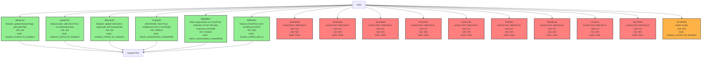

# Backport Agent — Detailed Run Report

> This file is generated automatically. It is intended for human analysts and
> AI reasoning models to assess agent performance, decision quality, and LLM behavior.

**Run timestamp**: 2026-06-20T03:51:21.022Z
**Models used**: fast=`poolside/poolside/laguna-m.1`  powerful=`mistral/mistral-vibe-cli-latest`
**Prompt log**: `/Users/rlemeill/Development/tea-ching-cline/.backport-agent/run-1781926559178.prompts.jsonl`

---

## Summary (PR body)

## Backport Agent — Sync Report

**Date**: 2026-06-20T03:51:21.022Z
**Upstream ref**: `main`
**Fork ref**: `keypool-live`
**Sync branch**: `sync/upstream-main-2026-06-20-034200`

### Summary

- ✅ Applied: 6
- ⚠️ Needs human review: 1
- ⛔ Blocked (not attempted): 9

### Applied commits

- `6fe5acb2` [low] feat(cli): update feature flags and auth flow
- `eb268767` [low] feat(vscode): add Cline Pass to onboarding flow
- `85223a07` [low] feat(cli): update interactive approvals and tool policies
- `114aa3f1` [medium] Add friendly Cline Pass entitlement error UI (#11606)
- `58db9887` [medium] Clear organization on ClinePass selection on the VSCode extension (#11648)
- `99fb5101` [high] Improve ClinePass error handling (#11637)

### ⚠️ Human review required

- `d7292993` Add Cline Pass to the extension (#11556)
  - Semantic conflict: removes KeypoolLive RPCs (refreshKeypoolLiveRecommendedModelsRpc) and replaces KEYPOOLLIVE=9942 with CLINE_PASS=42, incompatible with keypoollive-provider customization zone

### Blocked commits (not attempted)

- `84335493` [low] — context-limit: deferred to next run
- `a51b1563` [low] — context-limit: deferred to next run
- `a3cd39da` [medium] — context-limit: deferred to next run
- `f07b21b5` [high] — context-limit: deferred to next run
- `2a4e479b` [medium] — context-limit: deferred to next run
- `f1f28011` [medium] — context-limit: deferred to next run
- `bbba813a` [medium] — context-limit: deferred to next run
- `c7e2fc1c` [low] — context-limit: deferred to next run
- `b6e7f5e9` [low] — context-limit: deferred to next run

### Agent decision log

- Faced context-limit: deferring 9 remaining commits to next run
- Blocked d729299 due to semantic conflict: removes KeypoolLive RPCs incompatible with keypoollive-provider customization


---

## Agent Workflow Diagram

> Generated by the fast model from the run summary. Evaluate the agent's decision path.



---

## AI Sub-Agent Call Log (5 calls)

> Each entry is one sub-agent invocation. Review prompt/response pairs to assess
> reasoning quality, hallucinations, and decision accuracy.

### Call 1 / 5 — `analyze_commit_for_backport` ✅ OK

| Field | Value |
|---|---|
| **Timestamp** | 2026-06-20T03:40:30.803Z |
| **Tool** | `analyze_commit_for_backport` |
| **Model** | `mistral/mistral-vibe-cli-latest` |
| **Duration** | 2499 ms |
| **Tokens in** | 11068 |
| **Tokens out** | 156 |
| **Cost** | $0.000000 |

**Prompt sent to sub-agent:**

```
Commit SHA: 99fb5101e5067e7d75894c44cad6e633e105c5fa
Commit message:
Improve ClinePass error handling (#11637)

* Make sections expandable and add ClinePass

* fix label

* Map clinePass models to clinePass and the rest to cline

* gate the models behind the feature flag

* Do not allow custom model on cline pass

* Do not show the count on the mode list

* fix clinepass model list

* fix focus when expanding a section

* update the model data when the provider doesn't match

* Add ClinePass to the onboarding screen

* Fix the auth flow not starting

* Hide option behind a feature flag

* Update icon

* Remove unrelated changes

* Hide the custom model id

* fix model names

* remove custom model id option

* fix tests

* Fix names

* Display the clinepass models in the onboarding

* Throw a specific error when the user isn't subscribed

* properly render the error message

* fix error detection

* refactor

* Update the ResponseErrorHandler type

* re-add trailing slash

Changed files (19):
apps/cli/src/runtime/run-agent.test.ts
apps/cli/src/runtime/run-agent.ts
apps/cli/src/tui/components/chat-entry.tsx
apps/cli/src/tui/hooks/use-agent-events.ts
apps/cli/src/tui/hooks/use-prompt-input-controller.ts
apps/cli/src/utils/cline-pass-errors.test.ts
apps/cli/src/utils/cline-pass-errors.ts
sdk/packages/core/src/index.ts
sdk/packages/llms/src/index.browser.ts
sdk/packages/llms/src/index.ts
sdk/packages/llms/src/providers.browser.ts
sdk/packages/llms/src/providers.ts
sdk/packages/llms/src/providers/builtins.test.ts
sdk/packages/llms/src/providers/builtins.ts
sdk/packages/llms/src/providers/compat.test.ts
sdk/packages/llms/src/providers/format.test.ts
sdk/packages/llms/src/providers/errors.ts
sdk/packages/llms/src/providers/format.test.ts
sdk/packages/llms/src/providers/vendors/openai-compatible.ts

Diff:
commit 99fb5101e5067e7d75894c44cad6e633e105c5fa
Author: Tomás Barreiro <52393857+BarreiroT@users.noreply.github.com>
Date:   Thu Jun 18 17:18:12 2026 -0300

    Improve ClinePass error handling (#11637)
    
    * Make sections expandable and add ClinePass
    
    * fix label
    
    * Map clinePass models to clinePass and the rest to cline
    
    * gate the models behind the feature flag
    
    * Do not allow custom model on cline pass
    
    * Do not show the count on the mode list
    
    * fix clinepass model list
    
    * fix focus when expanding a section
    
    * update the model data when the provider doesn't match
    
    * Add ClinePass to the onboarding screen
    
    * Fix the auth flow not starting
    
    * Hide option behind a feature flag
    
    * Update icon
    
    * Remove unrelated changes
    
    * Hide the custom model id
    
    * fix model names
    
    * remove custom model id option
    
    * fix tests
    
    * Fix names
    
    * Display the clinepass models in the onboarding
    
    * Throw a specific error when the user isn't subscribed
    
    * properly render the error message
    
    * fix error detection
    
    * refactor
    
    * Update the ResponseErrorHandler type
    
    * re-add trailing slash
---
 apps/cli/src/runtime/run-agent.test.ts             | 101 +++++++++++++++++++++
 apps/cli/src/runtime/run-agent.ts                  |   5 +-
 apps/cli/src/tui/components/chat-entry.tsx         |  42 +++++++++
 apps/cli/src/tui/hooks/use-agent-events.ts         |   6 +-
 .../src/tui/hooks/use-prompt-input-controller.ts   |   3 +-
 apps/cli/src/utils/cline-pass-errors.test.ts       |  26 ++++++
 apps/cli/src/utils/cline-pass-errors.ts            |  40 ++++++++
 sdk/packages/core/src/index.ts                     |   7 ++
 sdk/packages/llms/src/index.browser.ts             |   9 +-
 sdk/packages/llms/src/index.ts                     |   5 +
 sdk/packages/llms/src/providers.browser.ts         |   7 ++
 sdk/packages/llms/src/providers.ts                 |   7 ++
 sdk/packages/llms/src/providers/builtins.ts        |  22 +++++
 sdk/packages/llms/src/providers/compat.test.ts     |  45 +++++++++
 sdk/packages/llms/src/providers/errors.ts          |  35 +++++++
 sdk/packages/llms/src/providers/format.test.ts     |  28 ++++++
 .../src/providers/vendors/openai-compatible.ts     |  42 ++++++++-
 17 files changed, 423 insertions(+), 7 deletions(-)

diff --git a/apps/cli/src/runtime/run-agent.test.ts b/apps/cli/src/runtime/run-agent.test.ts
index f6758bede1..91f1477716 100644
--- a/apps/cli/src/runtime/run-agent.test.ts
+++ b/apps/cli/src/runtime/run-agent.test.ts
@@ -27,7 +27,18 @@ const outputMocks = vi.hoisted(() => ({
 	c: { dim: "", reset: "" },
 }));
 
+const CLINE_PASS_SUBSCRIPTION_URL =
+	"https://app.cline.bot/dashboard/subscription/";
+const CLINE_PASS_SUBSCRIPTION_MESSAGE = `No access to ClinePass subscription models yet. Subscribe to ClinePass, the low cost open weights model coding plan: ${CLINE_PASS_SUBSCRIPTION_URL}`;
+
 vi.mock("@cline/core", () => ({
+	getClinePassSubscriptionUrl: () => CLINE_PASS_SUBSCRIPTION_URL,
+	isClineNotSubscribedError: (error: unknown) =>
+		error instanceof Error && error.name === "ClineNotSubscribedError",
+	isClineNotSubscribedMessage: (text: string) =>
+		text
+			.toLowerCase()
+			.includes("the user is not subscribed to required model plan"),
 	prewarmFileIndex: vi.fn(async () => undefined),
 	SessionSource: {
 		CLI: "cli",
@@ -511,6 +522,39 @@ describe("runAgent", () => {
 		expect(outputMocks.writeErr).toHaveBeenCalledWith("Missing API key");
 	});
 
+	it("renders ClinePass subscription errors with friendly copy when startup throws", async () => {
+		const error = new Error(CLINE_PASS_SUBSCRIPTION_MESSAGE);
+		error.name = "ClineNotSubscribedError";
+		sessionManagerMocks.start.mockRejectedValue(error);
+
+		const { runAgent } = await import("./run-agent");
+
+		await expect(
+			runAgent("test prompt", {
+				cwd: process.cwd(),
+				enableAgentTeams: false,
+				enableSpawnAgent: false,
+				enableTools: [],
+				execution: { maxConsecutiveMistakes: 3 },
+				logger: undefined,
+				mode: "yolo",
+				modelId: "premium-model",
+				outputMode: "text",
+				providerId: "cline-pass",
+				systemPrompt: "system",
+				thinking: false,
+				toolPolicies: { "*": { autoApprove: true } },
+				verbose: false,
+				workspaceRoot: process.cwd(),
+			} as never),
+		).resolves.toBeUndefined();
+
+		expect(process.exitCode).toBe(1);
+		expect(outputMocks.writeErr).toHaveBeenCalledWith(
+			CLINE_PASS_SUBSCRIPTION_MESSAGE,
+		);
+	});
+
 	it("emits JSON error lines for non-completed results", async () => {
 		const startedAt = new Date("2026-03-22T00:00:00.000Z");
 		const endedAt = new Date("2026-03-22T00:00:01.000Z");
@@ -576,6 +620,63 @@ describe("runAgent", () => {
 		);
 	});
 
+	it("renders ClinePass subscription errors with friendly copy for failed results", async () => {
+		const startedAt = new Date("2026-03-22T00:00:00.000Z");
+		const endedAt = new Date("2026-03-22T00:00:01.000Z");
+		sessionManagerMocks.start.mockResolvedValue({
+			sessionId: "session-1",
+			manifestPath: "/tmp/manifest.json",
+			messagesPath: "/tmp/messages.json",
+			manifest: { session_id: "session-1" },
+			result: {
+				text: CLINE_PASS_SUBSCRIPTION_MESSAGE,
+				usage: {
+					inputTokens: 0,
+					outputTokens: 0,
+					cacheReadTokens: 0,
+					cacheWriteTokens: 0,
+					totalCost: 0,
+				},
+				messages: [],
+				toolCalls: [],
+				iterations: 1,
+				finishReason: "error",
+				model: { id: "premium-model", provider: "cline-pass", info: {} },
+				startedAt,
+				endedAt,
+				durationMs: 1000,
+			},
+		});
+		sessionManagerMocks.getAccumulatedUsage.mockResolvedValue(undefined);
+
+		const { runAgent } = await import("./run-agent");
+
+		await expect(
+			runAgent("test prompt", {
+				cwd: process.cwd(),
+				enableAgentTeams: false,
+				enableSpawnAgent: false,
+				enableTools: [],
+				execution: { maxConsecutiveMistakes: 3 },
+				logger: undefined,
+				mode: "yolo",
+				modelId: "premium-model",
+				outputMode: "text",
+				providerId: "cline-pass",
+				systemPrompt: "system",
+				thinking: false,
+				toolPolicies: { "*": { autoApprove: true } },
+				verbose: false,
+				workspaceRoot: process.cwd(),
+			} as never),
+		).resolves.toBeUndefined();
+
+		expect(process.exitCode).toBe(1);
+		expect(outputMocks.writeErr).toHaveBeenCalledWith(
+			CLINE_PASS_SUBSCRIPTION_MESSAGE,
+		);
+	});
+
 	it("surfaces post-run bookkeeping failures after a completed result", async () => {
 		const startedAt = new Date("2026-03-22T00:00:00.000Z");
 		const endedAt = new Date("2026-03-22T00:00:01.000Z");
diff --git a/apps/cli/src/runtime/run-agent.ts b/apps/cli/src/runtime/run-agent.ts
index 908c4f04f2..7b571d37eb 100644
--- a/apps/cli/src/runtime/run-agent.ts
+++ b/apps/cli/src/runtime/run-agent.ts
@@ -16,6 +16,7 @@ import {
 	requestToolApproval,
 	submitAndExitInTerminal,
 } from "../utils/approval";
+import { formatCliErrorMessage } from "../utils/cline-pass-errors";
 import { handleEvent, handleTeamEvent } from "../utils/events";
 import { createRuntimeHooks } from "../utils/hooks";
 import {
@@ -374,7 +375,7 @@ export async function runAgent(
 		}
 
 		if (result.finishReason !== "completed") {
-			const errorText = result.text.trim();
+			const errorText = formatCliErrorMessage(result.text).trim();
 			if (
 				errorText &&
 				(config.outputMode === "json" || !displayedErrorMessages.has(errorText))
@@ -395,7 +396,7 @@ export async function runAgent(
 		);
 		process.exitCode = 0;
 	} catch (err) {
-		const message = err instanceof Error ? err.message : String(err);
+		const message = formatCliErrorMessage(err);
 		logCliError(config.logger, "CLI task run failed", { error: err });
 		writeErr(message);
 		process.exitCode = 1;
diff --git a/apps/cli/src/tui/components/chat-entry.tsx b/apps/cli/src/tui/components/chat-entry.tsx
index 880277a849..b70c494fe4 100644
--- a/apps/cli/src/tui/components/chat-entry.tsx
+++ b/apps/cli/src/tui/components/chat-entry.tsx
@@ -2,6 +2,10 @@ import { useTerminalDimensions } from "@opentui/react";
 import type React from "react";
 import { useState } from "react";
 import "opentui-spinner/react";
+import {
+	getClinePassSubscriptionUrl,
+	isClinePassSubscriptionError,
+} from "../../utils/cline-pass-errors";
 import {
 	CLINE_CREDITS_DASHBOARD_URL,
 	isClineAccountCreditsErrorMessage,
@@ -290,6 +294,41 @@ function ClineCreditsErrorView(props: { defaultFg?: string }) {
 	);
 }
 
+function ClinePassSubscriptionErrorView(props: { defaultFg?: string }) {
+	const subscriptionUrl = getClinePassSubscriptionUrl();
+	return (
+		<box flexDirection="row">
+			<text fg="yellow" content="* " />
+			<box
+				flexDirection="column"
+				border
+				borderStyle="rounded"
+				borderColor="yellow"
+				paddingX={1}
+			>
+				<text fg="yellow">ClinePass subscription required</text>
+				<text
+					fg={props.defaultFg}
+					selectable
+					content="No access to ClinePass subscription models yet. Subscribe to ClinePass, the low cost open weights model coding plan."
+				/>
+				<box flexDirection="row">
+					<text fg="gray">Subscribe: </text>
+					<text fg="cyan" selectable>
+						<a href={subscriptionUrl}>Open subscription page</a>
+					</text>
+				</box>
+				<box flexDirection="row">
+					<text fg="gray">URL: </text>
+					<text fg="cyan" selectable>
+						<a href={subscriptionUrl}>{subscriptionUrl}</a>
+					</text>
+				</box>
+			</box>
+		</box>
+	);
+}
+
 export function ChatEntryView(props: {
 	entry: ChatEntry;
 	accent?: string;
@@ -388,6 +427,9 @@ export function ChatEntryView(props: {
 			if (isClineAccountCreditsErrorMessage(entry.text)) {
 				return <ClineCreditsErrorView defaultFg={defaultFg} />;
 			}
+			if (isClinePassSubscriptionError(entry.text)) {
+				return <ClinePassSubscriptionErrorView defaultFg={defaultFg} />;
+			}
 			return (
 				<box flexDirection="row">
 					<text fg="red" content="* " />
diff --git a/apps/cli/src/tui/hooks/use-agent-events.ts b/apps/cli/src/tui/hooks/use-agent-events.ts
index 00547a8f88..7d93e901f7 100644
--- a/apps/cli/src/tui/hooks/use-agent-events.ts
+++ b/apps/cli/src/tui/hooks/use-agent-events.ts
@@ -4,6 +4,7 @@ import type {
 	PendingPromptSnapshot,
 	PendingPromptSubmittedEvent,
 } from "../../runtime/session-events";
+import { formatCliErrorMessage } from "../../utils/cline-pass-errors";
 import { resolveStatusNoticeLabel } from "../../utils/events";
 import {
 	formatToolInput,
@@ -171,7 +172,10 @@ export function useAgentEventHandlers(deps: AgentEventDeps) {
 					turnErrorReportedRef.current = true;
 					onTurnErrorReported(true);
 					if (!event.recoverable || verbose) {
-						appendEntry({ kind: "error", text: event.error.message });
+						appendEntry({
+							kind: "error",
+							text: formatCliErrorMessage(event.error),
+						});
 					}
 					break;
 				case "notice":
diff --git a/apps/cli/src/tui/hooks/use-prompt-input-controller.ts b/apps/cli/src/tui/hooks/use-prompt-input-controller.ts
index 249a1bc087..40dce7be03 100644
--- a/apps/cli/src/tui/hooks/use-prompt-input-controller.ts
+++ b/apps/cli/src/tui/hooks/use-prompt-input-controller.ts
@@ -1,4 +1,5 @@
 import { useCallback, useLayoutEffect, useRef, useState } from "react";
+import { formatCliErrorMessage } from "../../utils/cline-pass-errors";
 import { shouldShowCliUsageCost } from "../../utils/usage-cost-display";
 import type { SlashCommandRegistry } from "../commands/slash-command-registry";
 import {
@@ -376,7 +377,7 @@ export function usePromptInputController(input: {
 				if (!turnErrorReportedRef.current) {
 					session.appendEntry({
 						kind: "error",
-						text: error instanceof Error ? error.message : String(error),
+						text: formatCliErrorMessage(error),
 					});
 				}
 			} finally {
diff --git a/apps/cli/src/utils/cline-pass-errors.test.ts b/apps/cli/src/utils/cline-pass-errors.test.ts
new file mode 100644
index 0000000000..86170594e4
--- /dev/null
+++ b/apps/cli/src/utils/cline-pass-errors.test.ts
@@ -0,0 +1,26 @@
+import { describe, expect, it } from "vitest";
+import {
+	formatCliErrorMessage,
+	getClinePassSubscriptionUrl,
+	isClinePassSubscriptionError,
+} from "./cline-pass-errors";
+
+describe("cline-pass-errors", () => {
+	it("recognizes both raw and formatted ClinePass subscription messages", () => {
+		expect(
+			isClinePassSubscriptionError(
+				"the user is not subscribed to required model plan",
+			),
+		).toBe(true);
+
+		const formatted = `No access to ClinePass subscription models yet. Subscribe to ClinePass, the low cost open weights model coding plan: ${getClinePassSubscriptionUrl()}`;
+		expect(isClinePassSubscriptionError(formatted)).toBe(true);
+		expect(formatCliErrorMessage(new Error(formatted))).toBe(formatted);
+	});
+
+	it("formats the ClinePass subscription URL", () => {
+		expect(getClinePassSubscriptionUrl()).toBe(
+			"https://app.cline.bot/dashboard/subscription/",
+		);
+	});
+});
diff --git a/apps/cli/src/utils/cline-pass-errors.ts b/apps/cli/src/utils/cline-pass-errors.ts
new file mode 100644
index 0000000000..861067a8b4
--- /dev/null
+++ b/apps/cli/src/utils/cline-pass-errors.ts
@@ -0,0 +1,40 @@
+import {
+	getClinePassSubscriptionUrl,
+	isClineNotSubscribedError,
+	isClineNotSubscribedMessage,
+} from "@cline/core";
+
+export { getClinePassSubscriptionUrl };
+
+function isFormattedClinePassSubscriptionMessage(message: string): boolean {
+	const normalized = message.trim().toLowerCase();
+	return (
+		normalized.includes("no access to clinepass subscription models yet") &&
+		normalized.includes("subscribe to clinepass")
+	);
+}
+
+export function isClinePassSubscriptionError(error: unknown): boolean {
+	if (isClineNotSubscribedError(error)) {
+		return true;
+	}
+	if (error instanceof Error) {
+		return (
+			error.name === "ClineNotSubscribedError" ||
+			isClineNotSubscribedMessage(error.message) ||
+			isFormattedClinePassSubscriptionMessage(error.message)
+		);
+	}
+	return (
+		typeof error === "string" &&
+		(isClineNotSubscribedMessage(error) ||
+			isFormattedClinePassSubscriptionMessage(error))
+	);
+}
+
+export function formatCliErrorMessage(error: unknown): string {
+	if (error instanceof Error) {
+		return error.message;
+	}
+	return String(error);
+}
diff --git a/sdk/packages/core/src/index.ts b/sdk/packages/core/src/index.ts
index 67873fd5da..88962c18e4 100644
--- a/sdk/packages/core/src/index.ts
+++ b/sdk/packages/core/src/index.ts
@@ -5,6 +5,13 @@
  */
 
 export * as Llms from "@cline/llms";
+export {
+	ClineNotSubscribedError,
+	getClineNotSubscribedMessage,
+	getClinePassSubscriptionUrl,
+	isClineNotSubscribedError,
+	isClineNotSubscribedMessage,
+} from "@cline/llms";
 // Shared contracts and path helpers re-exported for app consumers.
 export type {
 	AddProviderActionRequest,
diff --git a/sdk/packages/llms/src/index.browser.ts b/sdk/packages/llms/src/index.browser.ts
index 9ba7ccc617..7024370501 100644
--- a/sdk/packages/llms/src/index.browser.ts
+++ b/sdk/packages/llms/src/index.browser.ts
@@ -30,4 +30,11 @@ export type {
 	ProviderCapability,
 	ProviderId,
 } from "./providers.browser";
-export { normalizeProviderId } from "./providers.browser";
+export {
+	ClineNotSubscribedError,
+	getClineNotSubscribedMessage,
+	getClinePassSubscriptionUrl,
+	isClineNotSubscribedError,
+	isClineNotSubscribedMessage,
+	normalizeProviderId,
+} from "./providers.browser";
diff --git a/sdk/packages/llms/src/index.ts b/sdk/packages/llms/src/index.ts
index dbe57bbef8..f919a0f8d7 100644
--- a/sdk/packages/llms/src/index.ts
+++ b/sdk/packages/llms/src/index.ts
@@ -52,12 +52,17 @@ export type {
 export {
 	BUILT_IN_PROVIDER,
 	BUILT_IN_PROVIDER_IDS,
+	ClineNotSubscribedError,
 	createHandler,
 	createHandlerAsync,
+	getClineNotSubscribedMessage,
+	getClinePassSubscriptionUrl,
 	getRegisteredHandler,
 	getRegisteredHandlerAsync,
 	hasRegisteredHandler,
 	isBuiltInProviderId,
+	isClineNotSubscribedError,
+	isClineNotSubscribedMessage,
 	isRegisteredHandlerAsync,
 	normalizeProviderId,
 	registerAsyncHandler,
diff --git a/sdk/packages/llms/src/providers.browser.ts b/sdk/packages/llms/src/providers.browser.ts
index c036cf9f3f..4933754e05 100644
--- a/sdk/packages/llms/src/providers.browser.ts
+++ b/sdk/packages/llms/src/providers.browser.ts
@@ -1,3 +1,10 @@
+export {
+	ClineNotSubscribedError,
+	getClineNotSubscribedMessage,
+	getClinePassSubscriptionUrl,
+	isClineNotSubscribedError,
+	isClineNotSubscribedMessage,
+} from "./providers/errors";
 export {
 	normalizeProviderId,
 	type ProviderCapability,
diff --git a/sdk/packages/llms/src/providers.ts b/sdk/packages/llms/src/providers.ts
index 1b75ea784c..60cba260de 100644
--- a/sdk/packages/llms/src/providers.ts
+++ b/sdk/packages/llms/src/providers.ts
@@ -28,6 +28,13 @@ import {
 	type ProviderConfig,
 } from "./providers/types";
 
+export {
+	ClineNotSubscribedError,
+	getClineNotSubscribedMessage,
+	getClinePassSubscriptionUrl,
+	isClineNotSubscribedError,
+	isClineNotSubscribedMessage,
+} from "./providers/errors";
 export {
 	getRegisteredHandler,
 	getRegisteredHandlerAsync,
diff --git a/sdk/packages/llms/src/providers/builtins.ts b/sdk/packages/llms/src/providers/builtins.ts
index 0b130ce6f7..865bc9dcd5 100644
--- a/sdk/packages/llms/src/providers/builtins.ts
+++ b/sdk/packages/llms/src/providers/builtins.ts
@@ -16,6 +16,7 @@ import type {
 	ProviderClient,
 	ProviderProtocol,
 } from "../catalog/types";
+import { ClineNotSubscribedError, isClineNotSubscribedMessage } from "./errors";
 import { filterOpenAICodexModels } from "./openai-codex-models";
 import {
 	ANTHROPIC_AND_QWEN_CACHE_ROUTING_METADATA,
@@ -449,6 +450,7 @@ function createClineLikeSpec(
 				| "modelsProviderId"
 				| "modelsFactory"
 				| "metadata"
+				| "defaults"
 			>
 		>,
 ): BuiltinSpec {
@@ -467,6 +469,7 @@ function createClineLikeSpec(
 			get baseUrl(): string {
 				return `${getClineEnvironmentConfig().apiBaseUrl}/api/v1`;
 			},
+			...input.defaults,
 		},
 		metadata: {
 			...ANTHROPIC_AND_QWEN_CACHE_ROUTING_METADATA,
@@ -491,6 +494,25 @@ const clinePass = createClineLikeSpec({
 	modelsProviderId: CLINE_PASS_PROVIDER_ID,
 	defaultModelId: firstGeneratedModelId(CLINE_PASS_PROVIDER_ID),
 	metadata: { usageCostDisplay: "hide" },
+	defaults: {
+		options: {
+			onResponseError: async (response: Response) => {
+				if (response.status !== 403) {
+					return undefined;
+				}
+				const body = await response
+					.clone()
+					.text()
+					.catch(() => "");
+
+				if (isClineNotSubscribedMessage(body)) {
+					throw new ClineNotSubscribedError(CLINE_PASS_PROVIDER_ID);
+				}
+
+				return undefined;
+			},
+		},
+	},
 });
 
 const OPENAI_COMPATIBLE_SPECS: BuiltinSpec[] = [
diff --git a/sdk/packages/llms/src/providers/compat.test.ts b/sdk/packages/llms/src/providers/compat.test.ts
index cf3d95dcf1..472c0ddc41 100644
--- a/sdk/packages/llms/src/providers/compat.test.ts
+++ b/sdk/packages/llms/src/providers/compat.test.ts
@@ -1,5 +1,6 @@
 import { beforeEach, describe, expect, it, vi } from "vitest";
 import { createGatewayApiHandler, toGatewayRequestMessages } from "./compat";
+import { ClineNotSubscribedError } from "./errors";
 import type { Message } from "./types";
 
 const streamTextSpy = vi.fn();
@@ -515,6 +516,50 @@ describe("createGatewayApiHandler.createMessage", () => {
 			{ method: "POST" },
 		);
 	});
+
+	it("throws ClineNotSubscribedError for ClinePass required-plan 403 responses", async () => {
+		streamTextSpy.mockReturnValue({
+			fullStream: (async function* () {
+				yield { type: "finish", finishReason: "stop" };
+			})(),
+			usage: Promise.resolve({ inputTokens: 1, outputTokens: 1 }),
+		});
+		const providerFetch = vi.fn(
+			async () =>
+				new Response(
+					JSON.stringify({
+						error: {
+							message: "the user is not subscribed to required model plan",
+						},
+					}),
+					{ status: 403 },
+				),
+		) as unknown as typeof fetch;
+
+		const handler = createGatewayApiHandler({
+			providerId: "cline-pass",
+			clientType: "openai-compatible",
+			modelId: "premium-model",
+			apiKey: "test-key",
+			fetch: providerFetch,
+		});
+
+		for await (const _chunk of handler.createMessage("", [
+			{ role: "user", content: "Hello" },
+		])) {
+			// Drain the stream so the provider is constructed.
+		}
+
+		const factoryConfig = openaiCompatibleFactorySpy.mock.calls.at(-1)?.[0] as
+			| { fetch?: typeof fetch }
+			| undefined;
+
+		await expect(
+			factoryConfig?.fetch?.("https://api.cline.bot/api/v1/chat/completions", {
+				method: "POST",
+			}),
+		).rejects.toBeInstanceOf(ClineNotSubscribedError);
+	});
 });
 
 /**
diff --git a/sdk/packages/llms/src/providers/errors.ts b/sdk/packages/llms/src/providers/errors.ts
new file mode 100644
index 0000000000..18d67333ab
--- /dev/null
+++ b/sdk/packages/llms/src/providers/errors.ts
@@ -0,0 +1,35 @@
+import { getClineEnvironmentConfig } from "@cline/shared";
+
+export const CLINE_NOT_SUBSCRIBED_RESPONSE_MESSAGE =
+	"the user is not subscribed to required model plan";
+
+export function getClinePassSubscriptionUrl(): string {
+	return `${new URL(
+		"/dashboard/subscription",
+		getClineEnvironmentConfig().appBaseUrl,
+	).toString()}/`;
+}
+
+export function getClineNotSubscribedMessage(): string {
+	return `No access to ClinePass subscription models yet. Subscribe to ClinePass, the low cost open weights model coding plan: ${getClinePassSubscriptionUrl()}`;
+}
+
+export class ClineNotSubscribedError extends Error {
+	public readonly providerId?: string;
+
+	constructor(providerId?: string) {
+		super(getClineNotSubscribedMessage());
+		this.name = "ClineNotSubscribedError";
+		this.providerId = providerId;
+	}
+}
+
+export function isClineNotSubscribedError(
+	error: unknown,
+): error is ClineNotSubscribedError {
+	return error instanceof ClineNotSubscribedError;
+}
+
+export function isClineNotSubscribedMessage(text: string): boolean {
+	return text.toLowerCase().includes(CLINE_NOT_SUBSCRIBED_RESPONSE_MESSAGE);
+}
diff --git a/sdk/packages/llms/src/providers/format.test.ts b/sdk/packages/llms/src/providers/format.test.ts
index ca5fc4147d..1d77c7ff50 100644
--- a/sdk/packages/llms/src/providers/format.test.ts
+++ b/sdk/packages/llms/src/providers/format.test.ts
@@ -1,4 +1,9 @@
 import { describe, expect, it } from "vitest";
+import {
+	ClineNotSubscribedError,
+	getClineNotSubscribedMessage,
+	isClineNotSubscribedMessage,
+} from "./errors";
 import { extractErrorMessage } from "./format";
 
 describe("extractErrorMessage", () => {
@@ -41,3 +46,26 @@ describe("extractErrorMessage", () => {
 		).toBe("Missing upstream API key");
 	});
 });
+
+describe("ClineNotSubscribedError", () => {
+	it("uses the user-facing subscription message", () => {
+		expect(new ClineNotSubscribedError("cline-pass").message).toBe(
+			getClineNotSubscribedMessage(),
+		);
+	});
+
+	it("detects the ClinePass required-plan message", () => {
+		expect(
+			isClineNotSubscribedMessage(
+				JSON.stringify({
+					error: {
+						message: "the user is not subscribed to required model plan",
+					},
+				}),
+			),
+		).toBe(true);
+		expect(isClineNotSubscribedMessage("different forbidden error")).toBe(
+			false,
+		);
+	});
+});
diff --git a/sdk/packages/llms/src/providers/vendors/openai-compatible.ts b/sdk/packages/llms/src/providers/vendors/openai-compatible.ts
index 79f32cea3a..1b84a3262b 100644
--- a/sdk/packages/llms/src/providers/vendors/openai-compatible.ts
+++ b/sdk/packages/llms/src/providers/vendors/openai-compatible.ts
@@ -5,7 +5,7 @@ import type {
 	GatewayResolvedProviderConfig,
 } from "@cline/shared";
 import { wrapLanguageModel } from "ai";
-import { resolveApiKey } from "../http";
+import { ensureFetch, resolveApiKey } from "../http";
 import { splitToolImagesMiddleware } from "../middleware/split-tool-images";
 import type { ProviderFactoryResult } from "./types";
 
@@ -73,6 +73,37 @@ function createAzureApiVersionFetch(
 	return azureFetch;
 }
 
+type ResponseErrorHandler = (response: Response) => Promise<void> | void;
+
+function readResponseErrorHandler(
+	config: GatewayResolvedProviderConfig,
+): ResponseErrorHandler | undefined {
+	const handler = config.options?.onResponseError;
+	return typeof handler === "function"
+		? (handler as ResponseErrorHandler)
+		: undefined;
+}
+
+function createResponseErrorFetch(input: {
+	fetch: typeof fetch;
+	onResponseError: ResponseErrorHandler;
+}): typeof fetch {
+	const responseErrorFetch = (async (requestInput, init) => {
+		const response = await input.fetch(requestInput, init);
+
+		await input.onResponseError(response);
+
+		return response;
+	}) as typeof fetch;
+
+	const baseFetchWithPreconnect = input.fetch as FetchWithOptionalPreconnect;
+	(responseErrorFetch as FetchWithOptionalPreconnect).preconnect =
+		typeof baseFetchWithPreconnect.preconnect === "function"
+			? baseFetchWithPreconnect.preconnect.bind(input.fetch)
+			: () => undefined;
+	return responseErrorFetch;
+}
+
 export async function createOpenAICompatibleProviderModule(
 	config: GatewayResolvedProviderConfig,
 	context: GatewayProviderContext,
@@ -83,12 +114,19 @@ export async function createOpenAICompatibleProviderModule(
 	// `llms` unopinionated about which providers do or don't need a key.
 	const apiKey = await resolveApiKey(config);
 	const fetch = createAzureApiVersionFetch(config);
+	const onResponseError = readResponseErrorHandler(config);
+	const providerFetch = onResponseError
+		? createResponseErrorFetch({
+				fetch: ensureFetch(fetch),
+				onResponseError,
+			})
+		: fetch;
 	const provider = createOpenAICompatible({
 		name: context.provider.id,
 		apiKey,
 		...(config.baseUrl ? { baseURL: config.baseUrl } : {}),
 		...(config.headers ? { headers: config.headers } : {}),
-		...(fetch ? { fetch } : {}),
+		...(providerFetch ? { fetch: providerFetch } : {}),
 		includeUsage: true,
 	} as never);
 	return {

Output the JSON object now.
```

**Response received:**

```
{
  "summary": "Adds ClinePass subscription error handling with custom error types, URL formatting, and UI/CLI error displays. No modifications to customization zones.",
  "keyChanges": [
    "Adds ClineNotSubscribedError and related helpers in SDK",
    "Integrates error handling in CLI runtime and TUI",
    "Updates OpenAI-compatible provider for response error hooks",
    "Adds ClinePass-specific error UI components"
  ],
  "backportComplexity": "moderate",
  "semanticRiskFactors": [
    "Introduces new error types in SDK",
    "Modifies provider fetch chain with error hooks"
  ],
  "recommendation": "apply-with-care"
}
```

---

### Call 2 / 5 — `check_customization_compatibility` ✅ OK

| Field | Value |
|---|---|
| **Timestamp** | 2026-06-20T03:40:52.096Z |
| **Tool** | `check_customization_compatibility` |
| **Model** | `mistral/mistral-vibe-cli-latest` |
| **Duration** | 2351 ms |
| **Tokens in** | 11364 |
| **Tokens out** | 63 |
| **Cost** | $0.000000 |

**Prompt sent to sub-agent:**

```
Declared fork customisations:
  1. Pattern: sdk/packages/llms/src/providers/vendors/keypoollive.ts
     Description: Ajoute le fournisseur KeypoolLive : accès à un coffre-fort de clés API chiffré (AiVault), gestion de pool de clés (KeyPool), rotation automatique, suivi d'utilisation via SQLite (KeypoolUsageDb), et gestion de session (SessionKeyManager). Le fournisseur est enregistré dans la chaîne complète : shared/api.ts → proto/cline/models.proto → api-configuration-conversion.ts → provider-keys.ts → providers.json → ApiOptions.tsx → core/api/index.ts. Il expose en plus quatre RPC gRPC dédiés (keypoolGetVaultModels, keypoolRotateKey, keypoolGetUsageStats, keypoolGetErrorStats) et une gestion native du context window.
     Current file content (1 file(s)):
      [sdk/packages/llms/src/providers/vendors/keypoollive.ts]
      /**
       * KeypoolLive provider — automatic key rotation from an AES-256-CBC encrypted vault.
       *
       * This provider enables automatic API key rotation for AI services by loading keys from
       * an encrypted vault. It supports multiple AI protocols (OpenAI, Anthropic, Gemini) and
       * implements intelligent key management with failure tracking and round-robin rotation.
       *
       * Usage:
       *   providerId: "keypoollive"
       *   modelId:    "mistral/devstral-latest"   (format: "<vaultProviderName>/<modelId>")
       *   apiKey:     "auto"                       (load from KEYPOOL_VAULT_URL + KEYPOOL_LIVE_SECRET)
       *              or a literal key string       (use directly without vault)
       *
       * Environment variables (when apiKey === "auto"):
       *   KEYPOOL_VAULT_URL      — URL or file:// path to the encrypted vault
       *   KEYPOOL_LIVE_SECRET    — decryption password
       *
       * © 2026 Ronan LE MEILLAT — MIT License
       */
      
      import type {
      	AgentModelEvent,
      	GatewayModelCapability,
      	GatewayProvider,
      	GatewayProviderContext,
      	GatewayProviderFactory,
      	GatewayResolvedProviderConfig,
      	GatewayStreamRequest,
      } from "@cline/shared";
      import type { CrawlerKeyResolver, ResolvedCrawlerConfig } from "@cline/shared";
      
      /**
       * KeypoolLive is a sophisticated API key management system that provides:
       * 1. Automatic key rotation from encrypted vaults
       * 2. Intelligent key selection based on usage patterns and health status
       * 3. Failure detection and cooldown mechanisms
       * 4. Usage tracking and reporting
       * 5. Support for multiple AI protocols and crawler services
       *
       * The system is designed to maximize API availability and minimize costs by:
       * - Distributing requests across multiple keys
       * - Automatically detecting and rotating failed keys
       * - Tracking usage statistics to balance load
       * - Persisting state between sessions
       *
       * Maintenance notes for external contributors:
       * - This module is intentionally stateful. The maps below cache key health and
       *   round-robin positions in memory, while a small JSON state file preserves
  2. Pattern: sdk/packages/llms/src/providers/builtins.ts
     Description: Related to keypoollive-provider
     Current file content (1 file(s)):
      [sdk/packages/llms/src/providers/builtins.ts]
      import {
      	type GatewayModelCapability,
      	type GatewayModelDefinition,
      	type GatewayProviderManifest,
      	type GatewayProviderMetadata,
      	type GatewayProviderSettings,
      	getClineEnvironmentConfig,
      	type JsonValue,
      	type ProviderCapability,
      	type ProviderConfigField,
      } from "@cline/shared";
      import { getGeneratedModelsForProvider } from "../catalog/catalog.generated-access";
      import type {
      	ModelCollection,
      	ModelInfo,
      	ProviderClient,
      	ProviderProtocol,
      } from "../catalog/types";
      import { filterOpenAICodexModels } from "./openai-codex-models";
      import {
      	ANTHROPIC_AND_QWEN_CACHE_ROUTING_METADATA,
      	ANTHROPIC_ROUTING_METADATA,
      	QWEN_CACHE_ROUTING_METADATA,
      } from "./routing/anthropic-compatible";
      import { GLM_THINKING_ROUTING_METADATA } from "./routing/glm-thinking";
      import { MINIMAX_THINKING_ROUTING_METADATA } from "./routing/minimax-thinking";
      
      export const DEFAULT_INTERNAL_OCA_BASE_URL =
      	"https://code-internal.aiservice.us-chicago-1.oci.oraclecloud.com/20250206/app/litellm";
      export const DEFAULT_EXTERNAL_OCA_BASE_URL =
      	"https://code.aiservice.us-chicago-1.oci.oraclecloud.com/20250206/app/litellm";
      const CLINE_DEFAULT_MODEL_ID = "anthropic/claude-sonnet-4.6";
      const CLINE_PASS_PROVIDER_ID = "cline-pass";
      const OPENAI_CODEX_DEFAULT_MODEL_ID = "gpt-5.4";
      
      export type ProviderFamily =
      	| "keypoollive"
      	| "openai"
      	| "openai-compatible"
      	| "anthropic"
      	| "google"
      	| "vertex"
      	| "bedrock"
      	| "mistral"
      	| "cohere"
      	| "poolside"
      	| "claude-code"
      	| "openai-codex"
      	| "opencode"
      	| "dify"
      	| "sap-ai-core";
      
      export interface BuiltinSpec {
      	id: string;
      	name: string;
      	description: string;
      	family: ProviderFamily;
      	protocol?: ProviderProtocol;
      	client?: ProviderClient;
      	capabilities?: ProviderCapability[];
      	popular?: number;
      	modelsProviderId?: string;
      	defaultModelId?: string;
      	modelsFactory?: () => Record<string, ModelInfo>;
      	env?: readonly ("browser" | "node")[];
      	apiKeyEnv?: readonly string[];
      	modelsSourceUrl?: string;
      	docsUrl?: string;
      	defaults?: GatewayProviderSettings;
      	config
  3. Pattern: sdk/packages/llms/src/providers/builtins-runtime.ts
     Description: Related to keypoollive-provider
     Current file content (1 file(s)):
      [sdk/packages/llms/src/providers/builtins-runtime.ts]
      import type {
      	GatewayProviderFactory,
      	GatewayProviderRegistration,
      } from "@cline/shared";
      import { BUILTIN_SPECS, type ProviderFamily, toManifest } from "./builtins";
      
      const FAMILY_FACTORY_PROMISES = new Map<
      	ProviderFamily,
      	Promise<GatewayProviderFactory>
      >();
      
      async function loadFamilyFactory(
      	family: ProviderFamily,
      ): Promise<GatewayProviderFactory> {
      	const cached = FAMILY_FACTORY_PROMISES.get(family);
      	if (cached) {
      		return cached;
      	}
      
      	const promise = (async () => {
      		switch (family) {
      			case "openai": {
      				const module = await import("./ai-sdk");
      				return module.createOpenAIProvider;
      			}
      			case "openai-compatible": {
      				const module = await import("./ai-sdk");
      				return module.createOpenAICompatibleProvider;
      			}
      			case "anthropic": {
      				const module = await import("./ai-sdk");
      				return module.createAnthropicProvider;
      			}
      			case "google": {
      				const module = await import("./ai-sdk");
      				return module.createGoogleProvider;
      			}
      			case "vertex": {
      				const module = await import("./ai-sdk");
      				return module.createVertexProvider;
      			}
      			case "bedrock": {
      				const module = await import("./ai-sdk");
      				return module.createBedrockProvider;
      			}
      			case "mistral": {
      				const module = await import("./ai-sdk");
      				return module.createMistralProvider;
      			}
      			case "cohere": {
      				const module = await import("./ai-sdk");
      				return module.createCohereProvider;
      			}
      			case "poolside": {
      				const module = await import("./ai-sdk");
      				return module.createPoolsideProvider;
      			}
      			case "claude-code": {
      				const module = await import("./ai-sdk");
      				return module.createClaudeCodeProvider;
      			}
      			case "openai-codex": {
      				const module = await import("./ai-sdk");
      				return module.createOpenAICodexProvider;
      			}
      			case "opencode": {
      				const module = await import("./ai-sdk");
      				return module.createOpenCodeProvider;
      			}
      			case "dify": {
      				const module = await import("./ai-sdk");
      				return module.createDifyProvider;
      			}
      			case "k
  4. Pattern: sdk/packages/llms/src/providers/ids.ts
     Description: Related to keypoollive-provider
     Current file content (1 file(s)):
      [sdk/packages/llms/src/providers/ids.ts]
      /**
       * Built-in provider IDs
       *
       * Single source of truth for all built-in provider identifiers.
       * Use BUILT_IN_PROVIDER_IDS for runtime operations (validation, iteration)
       * Use BuiltInProviderId type for compile-time type safety
       */
      export enum BUILT_IN_PROVIDER {
      	// First-party
      	ANTHROPIC = "anthropic",
      	CLAUDE_CODE = "claude-code",
      	CLINE = "cline",
      	CLINE_PASS = "cline-pass",
      	// OpenAI variants
      	OPENAI_COMPATIBLE = "openai-compatible",
      	OPENAI_NATIVE = "openai-native",
      	OPENAI_CODEX = "openai-codex",
      	OPENAI_CODEX_CLI = "openai-codex-cli",
      	// CLI / Subscription-based providers
      	OPENCODE = "opencode",
      	// Cloud providers
      	BEDROCK = "bedrock",
      	VERTEX = "vertex",
      	GEMINI = "gemini",
      	// Local/self-hosted
      	OLLAMA = "ollama",
      	LMSTUDIO = "lmstudio",
      	// OpenAI-compatible
      	DEEPSEEK = "deepseek",
      	XAI = "xai",
      	TOGETHER = "together",
      	FIREWORKS = "fireworks",
      	GROQ = "groq",
      	POOLSIDE = "poolside",
      	CEREBRAS = "cerebras",
      	SAMBANOVA = "sambanova",
      	NEBIUS = "nebius",
      	BASETEN = "baseten",
      	REQUESTY = "requesty",
      	LITELLM = "litellm",
      	HUGGINGFACE = "huggingface",
      	VERCEL_AI_GATEWAY = "vercel-ai-gateway",
      	V0 = "v0",
      	AIHUBMIX = "aihubmix",
      	HICAP = "hicap",
      	NOUS_RESEARCH = "nousResearch",
      	HUAWEI_CLOUD_MAAS = "huawei-cloud-maas",
      	WANDB = "wandb",
      	XIAOMI = "xiaomi",
      	KILO = "kilo",
      	ZAI = "zai",
      	ZAI_CODING_PLAN = "zai-coding-plan",
      	// Regional/specialized
      	QWEN = "qwen",
      	QWEN_CODE = "qwen-code",
      	DOUBAO = "doubao",
      	MISTRAL = "mistral",
      	MOONSHOT = "moonshot",
      	ASKSAGE = "asksage",
      	MINIMAX = "minimax",
      	DIFY = "dify",
      	OCA = "oca",
      	SAPAICORE = "sapaicore",
      	// Aggregators
      	OPENROUTER = "openrouter",
      	// Key Pool
      	KEYPOOLLIVE = "keypoollive",
      }
      
      /**
       * Provider ID aliases normalized to canonical built-in IDs.
       *
       * Keep this map as the single source of truth for alias handling.
       */
      export const PROVIDER_ID_ALIASES: Record<string, BUILT_IN_PROVIDER> = {
      	openai: BUILT_IN_PROVIDER.OPENAI_COMPATIBLE,
      	togetherai: BUILT_IN_PROVIDER.TOGETHER,
      	"sap-ai-core": BUI

Upstream diff to evaluate:
commit 99fb5101e5067e7d75894c44cad6e633e105c5fa
Author: Tomás Barreiro <52393857+BarreiroT@users.noreply.github.com>
Date:   Thu Jun 18 17:18:12 2026 -0300

    Improve ClinePass error handling (#11637)
    
    * Make sections expandable and add ClinePass
    
    * fix label
    
    * Map clinePass models to clinePass and the rest to cline
    
    * gate the models behind the feature flag
    
    * Do not allow custom model on cline pass
    
    * Do not show the count on the mode list
    
    * fix clinepass model list
    
    * fix focus when expanding a section
    
    * update the model data when the provider doesn't match
    
    * Add ClinePass to the onboarding screen
    
    * Fix the auth flow not starting
    
    * Hide option behind a feature flag
    
    * Update icon
    
    * Remove unrelated changes
    
    * Hide the custom model id
    
    * fix model names
    
    * remove custom model id option
    
    * fix tests
    
    * Fix names
    
    * Display the clinepass models in the onboarding
    
    * Throw a specific error when the user isn't subscribed
    
    * properly render the error message
    
    * fix error detection
    
    * refactor
    
    * Update the ResponseErrorHandler type
    
    * re-add trailing slash
---
 apps/cli/src/runtime/run-agent.test.ts             | 101 +++++++++++++++++++++
 apps/cli/src/runtime/run-agent.ts                  |   5 +-
 apps/cli/src/tui/components/chat-entry.tsx         |  42 +++++++++
 apps/cli/src/tui/hooks/use-agent-events.ts         |   6 +-
 .../src/tui/hooks/use-prompt-input-controller.ts   |   3 +-
 apps/cli/src/utils/cline-pass-errors.test.ts       |  26 ++++++
 apps/cli/src/utils/cline-pass-errors.ts            |  40 ++++++++
 sdk/packages/core/src/index.ts                     |   7 ++
 sdk/packages/llms/src/index.browser.ts             |   9 +-
 sdk/packages/llms/src/index.ts                     |   5 +
 sdk/packages/llms/src/providers.browser.ts         |   7 ++
 sdk/packages/llms/src/providers.ts                 |   7 ++
 sdk/packages/llms/src/providers/builtins.ts        |  22 +++++
 sdk/packages/llms/src/providers/compat.test.ts     |  45 +++++++++
 sdk/packages/llms/src/providers/errors.ts          |  35 +++++++
 sdk/packages/llms/src/providers/format.test.ts     |  28 ++++++
 .../src/providers/vendors/openai-compatible.ts     |  42 ++++++++-
 17 files changed, 423 insertions(+), 7 deletions(-)

diff --git a/apps/cli/src/runtime/run-agent.test.ts b/apps/cli/src/runtime/run-agent.test.ts
index f6758bede1..91f1477716 100644
--- a/apps/cli/src/runtime/run-agent.test.ts
+++ b/apps/cli/src/runtime/run-agent.test.ts
@@ -27,7 +27,18 @@ const outputMocks = vi.hoisted(() => ({
 	c: { dim: "", reset: "" },
 }));
 
+const CLINE_PASS_SUBSCRIPTION_URL =
+	"https://app.cline.bot/dashboard/subscription/";
+const CLINE_PASS_SUBSCRIPTION_MESSAGE = `No access to ClinePass subscription models yet. Subscribe to ClinePass, the low cost open weights model coding plan: ${CLINE_PASS_SUBSCRIPTION_URL}`;
+
 vi.mock("@cline/core", () => ({
+	getClinePassSubscriptionUrl: () => CLINE_PASS_SUBSCRIPTION_URL,
+	isClineNotSubscribedError: (error: unknown) =>
+		error instanceof Error && error.name === "ClineNotSubscribedError",
+	isClineNotSubscribedMessage: (text: string) =>
+		text
+			.toLowerCase()
+			.includes("the user is not subscribed to required model plan"),
 	prewarmFileIndex: vi.fn(async () => undefined),
 	SessionSource: {
 		CLI: "cli",
@@ -511,6 +522,39 @@ describe("runAgent", () => {
 		expect(outputMocks.writeErr).toHaveBeenCalledWith("Missing API key");
 	});
 
+	it("renders ClinePass subscription errors with friendly copy when startup throws", async () => {
+		const error = new Error(CLINE_PASS_SUBSCRIPTION_MESSAGE);
+		error.name = "ClineNotSubscribedError";
+		sessionManagerMocks.start.mockRejectedValue(error);
+
+		const { runAgent } = await import("./run-agent");
+
+		await expect(
+			runAgent("test prompt", {
+				cwd: process.cwd(),
+				enableAgentTeams: false,
+				enableSpawnAgent: false,
+				enableTools: [],
+				execution: { maxConsecutiveMistakes: 3 },
+				logger: undefined,
+				mode: "yolo",
+				modelId: "premium-model",
+				outputMode: "text",
+				providerId: "cline-pass",
+				systemPrompt: "system",
+				thinking: false,
+				toolPolicies: { "*": { autoApprove: true } },
+				verbose: false,
+				workspaceRoot: process.cwd(),
+			} as never),
+		).resolves.toBeUndefined();
+
+		expect(process.exitCode).toBe(1);
+		expect(outputMocks.writeErr).toHaveBeenCalledWith(
+			CLINE_PASS_SUBSCRIPTION_MESSAGE,
+		);
+	});
+
 	it("emits JSON error lines for non-completed results", async () => {
 		const startedAt = new Date("2026-03-22T00:00:00.000Z");
 		const endedAt = new Date("2026-03-22T00:00:01.000Z");
@@ -576,6 +620,63 @@ describe("runAgent", () => {
 		);
 	});
 
+	it("renders ClinePass subscription errors with friendly copy for failed results", async () => {
+		const startedAt = new Date("2026-03-22T00:00:00.000Z");
+		const endedAt = new Date("2026-03-22T00:00:01.000Z");
+		sessionManagerMocks.start.mockResolvedValue({
+			sessionId: "session-1",
+			manifestPath: "/tmp/manifest.json",
+			messagesPath: "/tmp/messages.json",
+			manifest: { session_id: "session-1" },
+			result: {
+				text: CLINE_PASS_SUBSCRIPTION_MESSAGE,
+				usage: {
+					inputTokens: 0,
+					outputTokens: 0,
+					cacheReadTokens: 0,
+					cacheWriteTokens: 0,
+					totalCost: 0,
+				},
+				messages: [],
+				toolCalls: [],
+				iterations: 1,
+				finishReason: "error",
+				model: { id: "premium-model", provider: "cline-pass", info: {} },
+				startedAt,
+				endedAt,
+				durationMs: 1000,
+			},
+		});
+		sessionManagerMocks.getAccumulatedUsage.mockResolvedValue(undefined);
+
+		const { runAgent } = await import("./run-agent");
+
+		await expect(
+			runAgent("test prompt", {
+				cwd: process.cwd(),
+				enableAgentTeams: false,
+				enableSpawnAgent: false,
+				enableTools: [],
+				execution: { maxConsecutiveMistakes: 3 },
+				logger: undefined,
+				mode: "yolo",
+				modelId: "premium-model",
+				outputMode: "text",
+				providerId: "cline-pass",
+				systemPrompt: "system",
+				thinking: false,
+				toolPolicies: { "*": { autoApprove: true } },
+				verbose: false,
+				workspaceRoot: process.cwd(),
+			} as never),
+		).resolves.toBeUndefined();
+
+		expect(process.exitCode).toBe(1);
+		expect(outputMocks.writeErr).toHaveBeenCalledWith(
+			CLINE_PASS_SUBSCRIPTION_MESSAGE,
+		);
+	});
+
 	it("surfaces post-run bookkeeping failures after a completed result", async () => {
 		const startedAt = new Date("2026-03-22T00:00:00.000Z");
 		const endedAt = new Date("2026-03-22T00:00:01.000Z");
diff --git a/apps/cli/src/runtime/run-agent.ts b/apps/cli/src/runtime/run-agent.ts
index 908c4f04f2..7b571d37eb 100644
--- a/apps/cli/src/runtime/run-agent.ts
+++ b/apps/cli/src/runtime/run-agent.ts
@@ -16,6 +16,7 @@ import {
 	requestToolApproval,
 	submitAndExitInTerminal,
 } from "../utils/approval";
+import { formatCliErrorMessage } from "../utils/cline-pass-errors";
 import { handleEvent, handleTeamEvent } from "../utils/events";
 import { createRuntimeHooks } from "../utils/hooks";
 import {
@@ -374,7 +375,7 @@ export async function runAgent(
 		}
 
 		if (result.finishReason !== "completed") {
-			const errorText = result.text.trim();
+			const errorText = formatCliErrorMessage(result.text).trim();
 			if (
 				errorText &&
 				(config.outputMode === "json" || !displayedErrorMessages.has(errorText))
@@ -395,7 +396,7 @@ export async function runAgent(
 		);
 		process.exitCode = 0;
 	} catch (err) {
-		const message = err instanceof Error ? err.message : String(err);
+		const message = formatCliErrorMessage(err);
 		logCliError(config.logger, "CLI task run failed", { error: err });
 		writeErr(message);
 		process.exitCode = 1;
diff --git a/apps/cli/src/tui/components/chat-entry.tsx b/apps/cli/src/tui/components/chat-entry.tsx
index 880277a849..b70c494fe4 100644
--- a/apps/cli/src/tui/components/chat-entry.tsx
+++ b/apps/cli/src/tui/components/chat-entry.tsx
@@ -2,6 +2,10 @@ import { useTerminalDimensions } from "@opentui/react";
 import type React from "react";
 import { useState } from "react";
 import "opentui-spinner/react";
+import {
+	getClinePassSubscriptionUrl,
+	isClinePassSubscriptionError,
+} from "../../utils/cline-pass-errors";
 import {
 	CLINE_CREDITS_DASHBOARD_URL,
 	isClineAccountCreditsErrorMessage,
@@ -290,6 +294,41 @@ function ClineCreditsErrorView(props: { defaultFg?: string }) {
 	);
 }
 
+function ClinePassSubscriptionErrorView(props: { defaultFg?: string }) {
+	const subscriptionUrl = getClinePassSubscriptionUrl();
+	return (
+		<box flexDirection="row">
+			<text fg="yellow" content="* " />
+			<box
+				flexDirection="column"
+				border
+				borderStyle="rounded"
+				borderColor="yellow"
+				paddingX={1}
+			>
+				<text fg="yellow">ClinePass subscription required</text>
+				<text
+					fg={props.defaultFg}
+					selectable
+					content="No access to ClinePass subscription models yet. Subscribe to ClinePass, the low cost open weights model coding plan."
+				/>
+				<box flexDirection="row">
+					<text fg="gray">Subscribe: </text>
+					<text fg="cyan" selectable>
+						<a href={subscriptionUrl}>Open subscription page</a>
+					</text>
+				</box>
+				<box flexDirection="row">
+					<text fg="gray">URL: </text>
+					<text fg="cyan" selectable>
+						<a href={subscriptionUrl}>{subscriptionUrl}</a>
+					</text>
+				</box>
+			</box>
+		</box>
+	);
+}
+
 export function ChatEntryView(props: {
 	entry: ChatEntry;
 	accent?: string;
@@ -388,6 +427,9 @@ export function ChatEntryView(props: {
 			if (isClineAccountCreditsErrorMessage(entry.text)) {
 				return <ClineCreditsErrorView defaultFg={defaultFg} />;
 			}
+			if (isClinePassSubscriptionError(entry.text)) {
+				return <ClinePassSubscriptionErrorView defaultFg={defaultFg} />;
+			}
 			return (
 				<box flexDirection="row">
 					<text fg="red" content="* " />
diff --git a/apps/cli/src/tui/hooks/use-agent-events.ts b/apps/cli/src/tui/hooks/use-agent-events.ts
index 00547a8f88..7d93e901f7 100644
--- a/apps/cli/src/tui/hooks/use-agent-events.ts
+++ b/apps/cli/src/tui/hooks/use-agent-events.ts
@@ -4,6 +4,7 @@ import type {
 	PendingPromptSnapshot,
 	PendingPromptSubmittedEvent,
 } from "../../runtime/session-events";
+import { formatCliErrorMessage } from "../../utils/cline-pass-errors";
 import { resolveStatusNoticeLabel } from "../../utils/events";
 import {
 	formatToolInput,
@@ -171,7 +172,10 @@ export function useAgentEventHandlers(deps: AgentEventDeps) {
 					turnErrorReportedRef.current = true;
 					onTurnErrorReported(true);
 					if (!event.recoverable || verbose) {
-						appendEntry({ kind: "error", text: event.error.message });
+						appendEntry({
+							kind: "error",
+							text: formatCliErrorMessage(event.error),
+						});
 					}
 					break;
 				case "notice":
diff --git a/apps/cli/src/tui/hooks/use-prompt-input-controller.ts b/apps/cli/src/tui/hooks/use-prompt-input-controller.ts
index 249a1bc087..40dce7be03 100644
--- a/apps/cli/src/tui/hooks/use-prompt-input-controller.ts
+++ b/apps/cli/src/tui/hooks/use-prompt-input-controller.ts
@@ -1,4 +1,5 @@
 import { useCallback, useLayoutEffect, useRef, useState } from "react";
+import { formatCliErrorMessage } from "../../utils/cline-pass-errors";
 import { shouldShowCliUsageCost } from "../../utils/usage-cost-display";
 import type { SlashCommandRegistry } from "../commands/slash-command-registry";
 import {
@@ -376,7 +377,7 @@ export function usePromptInputController(input: {
 				if (!turnErrorReportedRef.current) {
 					session.appendEntry({
 						kind: "error",
-						text: error instanceof Error ? error.message : String(error),
+						text: formatCliErrorMessage(error),
 					});
 				}
 			} finally {
diff --git a/apps/cli/src/utils/cline-pass-errors.test.ts b/apps/cli/src/utils/cline-pass-errors.test.ts
new file mode 100644
index 0000000000..86170594e4
--- /dev/null
+++ b/apps/cli/src/utils/cline-pass-errors.test.ts
@@ -0,0 +1,26 @@
+import { describe, expect, it } from "vitest";
+import {
+	formatCliErrorMessage,
+	getClinePassSubscriptionUrl,
+	isClinePassSubscriptionError,
+} from "./cline-pass-errors";
+
+describe("cline-pass-errors", () => {
+	it("recognizes both raw and formatted ClinePass subscription messages", () => {
+		expect(
+			isClinePassSubscriptionError(
+				"the user is not subscribed to required model plan",
+			),
+		).toBe(true);
+
+		const formatted = `No access to ClinePass subscription models yet. Subscribe to ClinePass, the low cost open weights model coding plan: ${getClinePassSubscriptionUrl()}`;
+		expect(isClinePassSubscriptionError(formatted)).toBe(true);
+		expect(formatCliErrorMessage(new Error(formatted))).toBe(formatted);
+	});
+
+	it("formats the ClinePass subscription URL", () => {
+		expect(getClinePassSubscriptionUrl()).toBe(
+			"https://app.cline.bot/dashboard/subscription/",
+		);
+	});
+});
diff --git a/apps/cli/src/utils/cline-pass-errors.ts b/apps/cli/src/utils/cline-pass-errors.ts
new file mode 100644
index 0000000000..861067a8b4
--- /dev/null
+++ b/apps/cli/src/utils/cline-pass-errors.ts
@@ -0,0 +1,40 @@
+import {
+	getClinePassSubscriptionUrl,
+	isClineNotSubscribedError,
+	isClineNotSubscribedMessage,
+} from "@cline/core";
+
+export { getClinePassSubscriptionUrl };
+
+function isFormattedClinePassSubscriptionMessage(message: string): boolean {
+	const normalized = message.trim().toLowerCase();
+	return (
+		normalized.includes("no access to clinepass subscription models yet") &&
+		normalized.includes("subscribe to clinepass")
+	);
+}
+
+export function isClinePassSubscriptionError(error: unknown): boolean {
+	if (isClineNotSubscribedError(error)) {
+		return true;
+	}
+	if (error instanceof Error) {
+		return (
+			error.name === "ClineNotSubscribedError" ||
+			isClineNotSubscribedMessage(error.message) ||
+			isFormattedClinePassSubscriptionMessage(error.message)
+		);
+	}
+	return (
+		typeof error === "string" &&
+		(isClineNotSubscribedMessage(error) ||
+			isFormattedClinePassSubscriptionMessage(error))
+	);
+}
+
+export function formatCliErrorMessage(error: unknown): string {
+	if (error instanceof Error) {
+		return error.message;
+	}
+	return String(error);
+}
diff --git a/sdk/packages/core/src/index.ts b/sdk/packages/core/src/index.ts
index 67873fd5da..88962c18e4 100644
--- a/sdk/packages/core/src/index.ts
+++ b/sdk/packages/core/src/index.ts
@@ -5,6 +5,13 @@
  */
 
 export * as Llms from "@cline/llms";
+export {
+	ClineNotSubscribedError,
+	getClineNotSubscribedMessage,
+	getClinePassSubscriptionUrl,
+	isClineNotSubscribedError,
+	isClineNotSubscribedMessage,
+} from "@cline/llms";
 // Shared contracts and path helpers re-exported for app consumers.
 export type {
 	AddProviderActionRequest,
diff --git a/sdk/packages/llms/src/index.browser.ts b/sdk/packages/llms/src/index.browser.ts
index 9ba7ccc617..7024370501 100644
--- a/sdk/packages/llms/src/index.browser.ts
+++ b/sdk/packages/llms/src/index.browser.ts
@@ -30,4 +30,11 @@ export type {
 	ProviderCapability,
 	ProviderId,
 } from "./providers.browser";
-export { normalizeProviderId } from "./providers.browser";
+export {
+	ClineNotSubscribedError,
+	getClineNotSubscribedMessage,
+	getClinePassSubscriptionUrl,
+	isClineNotSubscribedError,
+	isClineNotSubscribedMessage,
+	normalizeProviderId,
+} from "./providers.browser";
diff --git a/sdk/packages/llms/src/index.ts b/sdk/packages/llms/src/index.ts
index dbe57bbef8..f919a0f8d7 100644
--- a/sdk/packages/llms/src/index.ts
+++ b/sdk/packages/llms/src/index.ts
@@ -52,12 +52,17 @@ export type {
 export {
 	BUILT_IN_PROVIDER,
 	BUILT_IN_PROVIDER_IDS,
+	ClineNotSubscribedError,
 	createHandler,
 	createHandlerAsync,
+	getClineNotSubscribedMessage,
+	getClinePassSubscriptionUrl,
 	getRegisteredHandler,
 	getRegisteredHandlerAsync,
 	hasRegisteredHandler,
 	isBuiltInProviderId,
+	isClineNotSubscribedError,
+	isClineNotSubscribedMessage,
 	isRegisteredHandlerAsync,
 	normalizeProviderId,
 	registerAsyncHandler,
diff --git a/sdk/packages/llms/src/providers.browser.ts b/sdk/packages/llms/src/providers.browser.ts
index c036cf9f3f..4933754e05 100644
--- a/sdk/packages/llms/src/providers.browser.ts
+++ b/sdk/packages/llms/src/providers.browser.ts
@@ -1,3 +1,10 @@
+export {
+	ClineNotSubscribedError,
+	getClineNotSubscribedMessage,
+	getClinePassSubscriptionUrl,
+	isClineNotSubscribedError,
+	isClineNotSubscribedMessage,
+} from "./providers/errors";
 export {
 	normalizeProviderId,
 	type ProviderCapability,
diff --git a/sdk/packages/llms/src/providers.ts b/sdk/packages/llms/src/providers.ts
index 1b75ea784c..60cba260de 100644
--- a/sdk/packages/llms/src/providers.ts
+++ b/sdk/packages/llms/src/providers.ts
@@ -28,6 +28,13 @@ import {
 	type ProviderConfig,
 } from "./providers/types";
 
+export {
+	ClineNotSubscribedError,
+	getClineNotSubscribedMessage,
+	getClinePassSubscriptionUrl,
+	isClineNotSubscribedError,
+	isClineNotSubscribedMessage,
+} from "./providers/errors";
 export {
 	getRegisteredHandler,
 	getRegisteredHandlerAsync,
diff --git a/sdk/packages/llms/src/providers/builtins.ts b/sdk/packages/llms/src/providers/builtins.ts
index 0b130ce6f7..865bc9dcd5 100644
--- a/sdk/packages/llms/src/providers/builtins.ts
+++ b/sdk/packages/llms/src/providers/builtins.ts
@@ -16,6 +16,7 @@ import type {
 	ProviderClient,
 	ProviderProtocol,
 } from "../catalog/types";
+import { ClineNotSubscribedError, isClineNotSubscribedMessage } from "./errors";
 import { filterOpenAICodexModels } from "./openai-codex-models";
 import {
 	ANTHROPIC_AND_QWEN_CACHE_ROUTING_METADATA,
@@ -449,6 +450,7 @@ function createClineLikeSpec(
 				| "modelsProviderId"
 				| "modelsFactory"
 				| "metadata"
+				| "defaults"
 			>
 		>,
 ): BuiltinSpec {
@@ -467,6 +469,7 @@ function createClineLikeSpec(
 			get baseUrl(): string {
 				return `${getClineEnvironmentConfig().apiBaseUrl}/api/v1`;
 			},
+			...input.defaults,
 		},
 		metadata: {
 			...ANTHROPIC_AND_QWEN_CACHE_ROUTING_METADATA,
@@ -491,6 +494,25 @@ const clinePass = createClineLikeSpec({
 	modelsProviderId: CLINE_PASS_PROVIDER_ID,
 	defaultModelId: firstGeneratedModelId(CLINE_PASS_PROVIDER_ID),
 	metadata: { usageCostDisplay: "hide" },
+	defaults: {
+		options: {
+			onResponseError: async (response: Response) => {
+				if (response.status !== 403) {
+					return undefined;
+				}
+				const body = await response
+					.clone()
+					.text()
+					.catch(() => "");
+
+				if (isClineNotSubscribedMessage(body)) {
+					throw new ClineNotSubscribedError(CLINE_PASS_PROVIDER_ID);
+				}
+
+				return undefined;
+			},
+		},
+	},
 });
 
 const OPENAI_COMPATIBLE_SPECS: BuiltinSpec[] = [
diff --git a/sdk/packages/llms/src/providers/compat.test.ts b/sdk/packages/llms/src/providers/compat.test.ts
index cf3d95dcf1..472c0ddc41 100644
--- a/sdk/packages/llms/src/providers/compat.test.ts
+++ b/sdk/packages/llms/src/providers/compat.test.ts
@@ -1,5 +1,6 @@
 import { beforeEach, describe, expect, it, vi } from "vitest";
 import { createGatewayApiHandler, toGatewayRequestMessages } from "./compat";
+import { ClineNotSubscribedError } from "./errors";
 import type { Message } from "./types";
 
 const streamTextSpy = vi.fn();
@@ -515,6 +516,50 @@ describe("createGatewayApiHandler.createMessage", () => {
 			{ method: "POST" },
 		);
 	});
+
+	it("throws ClineNotSubscribedError for ClinePass required-plan 403 responses", async () => {
+		streamTextSpy.mockReturnValue({
+			fullStream: (async function* () {
+				yield { type: "finish", finishReason: "stop" };
+			})(),
+			usage: Promise.resolve({ inputTokens: 1, outputTokens: 1 }),
+		});
+		const providerFetch = vi.fn(
+			async () =>
+				new Response(
+					JSON.stringify({
+						error: {
+							message: "the user is not subscribed to required model plan",
+						},
+					}),
+					{ status: 403 },
+				),
+		) as unknown as typeof fetch;
+
+		const handler = createGatewayApiHandler({
+			providerId: "cline-pass",
+			clientType: "openai-compatible",
+			modelId: "premium-model",
+			apiKey: "test-key",
+			fetch: providerFetch,
+		});
+
+		for await (const _chunk of handler.createMessage("", [
+			{ role: "user", content: "Hello" },
+		])) {
+			// Drain the stream so the provider is constructed.
+		}
+
+		const factoryConfig = openaiCompatibleFactorySpy.mock.calls.at(-1)?.[0] as
+			| { fetch?: typeof fetch }
+			| undefined;
+
+		await expect(
+			factoryConfig?.fetch?.("https://api.cline.bot/api/v1/chat/completions", {
+				method: "POST",
+			}),
+		).rejects.toBeInstanceOf(ClineNotSubscribedError);
+	});
 });
 
 /**
diff --git a/sdk/packages/llms/src/providers/errors.ts b/sdk/packages/llms/src/providers/errors.ts
new file mode 100644
index 0000000000..18d67333ab
--- /dev/null
+++ b/sdk/packages/llms/src/providers/errors.ts
@@ -0,0 +1,35 @@
+import { getClineEnvironmentConfig } from "@cline/shared";
+
+export const CLINE_NOT_SUBSCRIBED_RESPONSE_MESSAGE =
+	"the user is not subscribed to required model plan";
+
+export function getClinePassSubscriptionUrl(): string {
+	return `${new URL(
+		"/dashboard/subscription",
+		getClineEnvironmentConfig().appBaseUrl,
+	).toString()}/`;
+}
+
+export function getClineNotSubscribedMessage(): string {
+	return `No access to ClinePass subscription models yet. Subscribe to ClinePass, the low cost open weights model coding plan: ${getClinePassSubscriptionUrl()}`;
+}
+
+export class ClineNotSubscribedError extends Error {
+	public readonly providerId?: string;
+
+	constructor(providerId?: string) {
+		super(getClineNotSubscribedMessage());
+		this.name = "ClineNotSubscribedError";
+		this.providerId = providerId;
+	}
+}
+
+export function isClineNotSubscribedError(
+	error: unknown,
+): error is ClineNotSubscribedError {
+	return error instanceof ClineNotSubscribedError;
+}
+
+export function isClineNotSubscribedMessage(text: string): boolean {
+	return text.toLowerCase().includes(CLINE_NOT_SUBSCRIBED_RESPONSE_MESSAGE);
+}
diff --git a/sdk/packages/llms/src/providers/format.test.ts b/sdk/packages/llms/src/providers/format.test.ts
index ca5fc4147d..1d77c7ff50 100644
--- a/sdk/packages/llms/src/providers/format.test.ts
+++ b/sdk/packages/llms/src/providers/format.test.ts
@@ -1,4 +1,9 @@
 import { describe, expect, it } from "vitest";
+import {
+	ClineNotSubscribedError,
+	getClineNotSubscribedMessage,
+	isClineNotSubscribedMessage,
+} from "./errors";
 import { extractErrorMessage } from "./format";
 
 describe("extractErrorMessage", () => {
@@ -41,3 +46,26 @@ describe("extractErrorMessage", () => {
 		).toBe("Missing upstream API key");
 	});
 });
+
+describe("ClineNotSubscribedError", () => {
+	it("uses the user-facing subscription message", () => {
+		expect(new ClineNotSubscribedError("cline-pass").message).toBe(
+			getClineNotSubscribedMessage(),
+		);
+	});
+
+	it("detects the ClinePass required-plan message", () => {
+		expect(
+			isClineNotSubscribedMessage(
+				JSON.stringify({
+					error: {
+						message: "the user is not subscribed to required model plan",
+					},
+				}),
+			),
+		).toBe(true);
+		expect(isClineNotSubscribedMessage("different forbidden error")).toBe(
+			false,
+		);
+	});
+});
diff --git a/sdk/packages/llms/src/providers/vendors/openai-compatible.ts b/sdk/packages/llms/src/providers/vendors/openai-compatible.ts
index 79f32cea3a..1b84a3262b 100644
--- a/sdk/packages/llms/src/providers/vendors/openai-compatible.ts
+++ b/sdk/packages/llms/src/providers/vendors/openai-compatible.ts
@@ -5,7 +5,7 @@ import type {
 	GatewayResolvedProviderConfig,
 } from "@cline/shared";
 import { wrapLanguageModel } from "ai";
-import { resolveApiKey } from "../http";
+import { ensureFetch, resolveApiKey } from "../http";
 import { splitToolImagesMiddleware } from "../middleware/split-tool-images";
 import type { ProviderFactoryResult } from "./types";
 
@@ -73,6 +73,37 @@ function createAzureApiVersionFetch(
 	return azureFetch;
 }
 
+type ResponseErrorHandler = (response: Response) => Promise<void> | void;
+
+function readResponseErrorHandler(
+	config: GatewayResolvedProviderConfig,
+): ResponseErrorHandler | undefined {
+	const handler = config.options?.onResponseError;
+	return typeof handler === "function"
+		? (handler as ResponseErrorHandler)
+		: undefined;
+}
+
+function createResponseErrorFetch(input: {
+	fetch: typeof fetch;
+	onResponseError: ResponseErrorHandler;
+}): typeof fetch {
+	const responseErrorFetch = (async (requestInput, init) => {
+		const response = await input.fetch(requestInput, init);
+
+		await input.onResponseError(response);
+
+		return response;
+	}) as typeof fetch;
+
+	const baseFetchWithPreconnect = input.fetch as FetchWithOptionalPreconnect;
+	(responseErrorFetch as FetchWithOptionalPreconnect).preconnect =
+		typeof baseFetchWithPreconnect.preconnect === "function"
+			? baseFetchWithPreconnect.preconnect.bind(input.fetch)
+			: () => undefined;
+	return responseErrorFetch;
+}
+
 export async function createOpenAICompatibleProviderModule(
 	config: GatewayResolvedProviderConfig,
 	context: GatewayProviderContext,
@@ -83,12 +114,19 @@ export async function createOpenAICompatibleProviderModule(
 	// `llms` unopinionated about which providers do or don't need a key.
 	const apiKey = await resolveApiKey(config);
 	const fetch = createAzureApiVersionFetch(config);
+	const onResponseError = readResponseErrorHandler(config);
+	const providerFetch = onResponseError
+		? createResponseErrorFetch({
+				fetch: ensureFetch(fetch),
+				onResponseError,
+			})
+		: fetch;
 	const provider = createOpenAICompatible({
 		name: context.provider.id,
 		apiKey,
 		...(config.baseUrl ? { baseURL: config.baseUrl } : {}),
 		...(config.headers ? { headers: config.headers } : {}),
-		...(fetch ? { fetch } : {}),
+		...(providerFetch ? { fetch: providerFetch } : {}),
 		includeUsage: true,
 	} as never);
 	return {

Output the JSON object now.
```

**Response received:**

```
{"compatible": true, "affectedCustomizations": [], "semanticConflicts": [], "warnings": [], "recommendation": "The upstream changes are isolated to ClinePass error handling and do not interact with keypoollive provider customizations. No action required."}
```

---

### Call 3 / 5 — `analyze_commit_for_backport` ✅ OK

| Field | Value |
|---|---|
| **Timestamp** | 2026-06-20T03:41:30.760Z |
| **Tool** | `analyze_commit_for_backport` |
| **Model** | `mistral/mistral-vibe-cli-latest` |
| **Duration** | 2423 ms |
| **Tokens in** | 10922 |
| **Tokens out** | 162 |
| **Cost** | $0.000000 |

**Prompt sent to sub-agent:**

```
Commit SHA: 114aa3f161a620e8390eb2f0f232c090fb63d3c8
Commit message:
Add friendly Cline Pass entitlement error UI (#11606)

* Add Cline Pass provider to VS Code extension

* Fix the model picker

* ClinePass specific options

* Add feature flag to the api options

* Extend flag usage

* fix type error

* Use the right model info

* Fix tests

* Hide price info for clinePass models

* Add friendly Cline Pass entitlement error UI

When a Cline Pass model returns a 403 ENTITLEMENT_ERROR (user not subscribed to the required model plan), the chat dumped the raw serialized error JSON and pointlessly auto-retried it.

- Add ClineErrorType.Entitlement, classified before the generic 403/auth path.

- Skip auto-retry (and the retries-exhausted message) for entitlement errors.

- Render a dedicated EntitlementError card: friendly headline, env-aware 'Get Cline Pass' subscribe link (clineUser.appBaseUrl, falling back to production), and a Retry button; backend detail is shown as muted support text.

- Add unit/component tests and a Storybook story.

* Scope entitlement to individual case; fix path-prefixed subscribe URL

- ClineError: only classify the individual 'not subscribed' ENTITLEMENT_ERROR as Entitlement (checks message and details.message). Org-account variant falls through to generic handling rather than showing a misleading 'Get Cline Pass' card.


- EntitlementError: build the subscribe URL with a relative path against a trailing-slash-normalized base so path-prefixed self-hosted/proxy app URLs (e.g. https://proxy.example.com/cline/app) are preserved instead of resetting to origin.

- Tests: add org-exclusion case, path-prefixed URL case, and assert the retry askResponse payload (yesButtonClicked).

* Trim redundant inline comments

* Add provider test: pre-stream 403 entitlement error classifies correctly

Documents and locks in that a 403 ENTITLEMENT_ERROR (which rejects completions.create before streaming, as an OpenAI SDK APIError) propagates through ClineHandler with the code intact so ClineError classifies it as Entitlement. Confirms the error does not rely on the mid-stream chunk.error path.

* Guard subscribe URL build against malformed appBaseUrl

Wrap new URL() in try/catch so an invalid appBaseUrl from the auth context omits the subscribe link instead of throwing TypeError and crashing the EntitlementError card mid-render. Addresses Greptile review feedback; adds a malformed-URL test.

* test: trim entitlement error UI coverage

* Use one-word 'ClinePass' in user-facing copy

Renames the display text in the entitlement card (headline, helper, button) and related tests/story/comments from 'Cline Pass' to 'ClinePass'. Also normalizes EntitlementError.test.tsx formatting to the webview Biome style.

* fix: skip subagent retries for ClinePass entitlement errors

Changed files (11):
apps/vscode/src/core/api/providers/__tests__/cline.test.ts
apps/vscode/src/core/task/index.ts
apps/vscode/src/core/task/tools/subagent/SubagentRunner.ts
apps/vscode/src/core/task/tools/subagent/__tests__/SubagentRunner.test.ts
apps/vscode/src/services/error/ClineError.ts
apps/vscode/src/services/error/__tests__/ClineError.test.ts
apps/vscode/webview-ui/src/components/chat/EntitlementError.test.tsx
apps/vscode/webview-ui/src/components/chat/EntitlementError.tsx
apps/vscode/webview-ui/src/components/chat/ErrorRow.stories.tsx
apps/vscode/webview-ui/src/components/chat/ErrorRow.test.tsx
apps/vscode/webview-ui/src/components/chat/ErrorRow.tsx

Diff:
commit 114aa3f161a620e8390eb2f0f232c090fb63d3c8
Author: John Choi <97497948+johnwschoi@users.noreply.github.com>
Date:   Thu Jun 18 12:06:40 2026 -0700

    Add friendly Cline Pass entitlement error UI (#11606)
    
    * Add Cline Pass provider to VS Code extension
    
    * Fix the model picker
    
    * ClinePass specific options
    
    * Add feature flag to the api options
    
    * Extend flag usage
    
    * fix type error
    
    * Use the right model info
    
    * Fix tests
    
    * Hide price info for clinePass models
    
    * Add friendly Cline Pass entitlement error UI
    
    When a Cline Pass model returns a 403 ENTITLEMENT_ERROR (user not subscribed to the required model plan), the chat dumped the raw serialized error JSON and pointlessly auto-retried it.
    
    - Add ClineErrorType.Entitlement, classified before the generic 403/auth path.
    - Skip auto-retry (and the retries-exhausted message) for entitlement errors.
    - Render a dedicated EntitlementError card: friendly headline, env-aware 'Get Cline Pass' subscribe link (clineUser.appBaseUrl, falling back to production), and a Retry button; backend detail is shown as muted support text.
    - Add unit/component tests and a Storybook story.
    
    * Scope entitlement to individual case; fix path-prefixed subscribe URL
    
    - ClineError: only classify the individual 'not subscribed' ENTITLEMENT_ERROR as Entitlement (checks message and details.message). Org-account variant falls through to generic handling rather than showing a misleading 'Get Cline Pass' card.
    
    - EntitlementError: build the subscribe URL with a relative path against a trailing-slash-normalized base so path-prefixed self-hosted/proxy app URLs (e.g. https://proxy.example.com/cline/app) are preserved instead of resetting to origin.
    
    - Tests: add org-exclusion case, path-prefixed URL case, and assert the retry askResponse payload (yesButtonClicked).
    
    * Trim redundant inline comments
    
    * Add provider test: pre-stream 403 entitlement error classifies correctly
    
    Documents and locks in that a 403 ENTITLEMENT_ERROR (which rejects completions.create before streaming, as an OpenAI SDK APIError) propagates through ClineHandler with the code intact so ClineError classifies it as Entitlement. Confirms the error does not rely on the mid-stream chunk.error path.
    
    * Guard subscribe URL build against malformed appBaseUrl
    
    Wrap new URL() in try/catch so an invalid appBaseUrl from the auth context omits the subscribe link instead of throwing TypeError and crashing the EntitlementError card mid-render. Addresses Greptile review feedback; adds a malformed-URL test.
    
    * test: trim entitlement error UI coverage
    
    * Use one-word 'ClinePass' in user-facing copy
    
    Renames the display text in the entitlement card (headline, helper, button) and related tests/story/comments from 'Cline Pass' to 'ClinePass'. Also normalizes EntitlementError.test.tsx formatting to the webview Biome style.
    
    * fix: skip subagent retries for ClinePass entitlement errors
    
    ---------
    
    Co-authored-by: BarreiroT <tomasmbarreiroi@gmail.com>
    Co-authored-by: Tomás Barreiro <52393857+BarreiroT@users.noreply.github.com>
---
 .../src/core/api/providers/__tests__/cline.test.ts | 31 +++++++++
 apps/vscode/src/core/task/index.ts                 |  7 +-
 .../src/core/task/tools/subagent/SubagentRunner.ts |  3 +-
 .../subagent/__tests__/SubagentRunner.test.ts      | 32 +++++++++
 apps/vscode/src/services/error/ClineError.ts       |  9 +++
 .../services/error/__tests__/ClineError.test.ts    | 57 ++++++++++++++++
 .../src/components/chat/EntitlementError.test.tsx  | 70 ++++++++++++++++++++
 .../src/components/chat/EntitlementError.tsx       | 77 ++++++++++++++++++++++
 .../src/components/chat/ErrorRow.stories.tsx       | 26 ++++++++
 .../src/components/chat/ErrorRow.test.tsx          | 38 +++++++++++
 .../webview-ui/src/components/chat/ErrorRow.tsx    |  6 ++
 11 files changed, 354 insertions(+), 2 deletions(-)

diff --git a/apps/vscode/src/core/api/providers/__tests__/cline.test.ts b/apps/vscode/src/core/api/providers/__tests__/cline.test.ts
index 03ec713116..ab21b0764f 100644
--- a/apps/vscode/src/core/api/providers/__tests__/cline.test.ts
+++ b/apps/vscode/src/core/api/providers/__tests__/cline.test.ts
@@ -3,6 +3,7 @@ import { openRouterDefaultModelInfo } from "@shared/api"
 import sinon from "sinon"
 import { ClineAccountService } from "@/services/account/ClineAccountService"
 import { AuthService } from "@/services/auth/AuthService"
+import { ClineError, ClineErrorType } from "@/services/error/ClineError"
 import { ClineHandler } from "../cline"
 
 describe("ClineHandler", () => {
@@ -163,4 +164,34 @@ describe("ClineHandler", () => {
 		payload.messages[0].content[0].cache_control.should.deepEqual({ type: "ephemeral" })
 		payload.messages[1].content[0].cache_control.should.deepEqual({ type: "ephemeral" })
 	})
+
+	it("propagates a pre-stream 403 entitlement error so it classifies as Entitlement", async () => {
+		const handler = createHandler({})
+		// A 403 from ValidateModelEntitlement rejects completions.create() before streaming,
+		// matching the OpenAI SDK APIError shape (status + code + error body).
+		const apiError = Object.assign(new Error("403 the user is not subscribed to required model plan"), {
+			status: 403,
+			code: "ENTITLEMENT_ERROR",
+			error: {
+				code: "ENTITLEMENT_ERROR",
+				message: "Error 403: the user is not subscribed to required model plan",
+			},
+		})
+		const fakeClient = { chat: { completions: { create: sinon.stub().rejects(apiError) } } }
+		sinon.stub(handler as any, "ensureClient").resolves(fakeClient as any)
+		sinon.stub(handler as any, "getFreeModelIdSet").resolves(new Set())
+		sinon.stub(handler, "getModel").returns({ id: "cline-pass/glm-5.1", info: openRouterDefaultModelInfo })
+
+		let thrown: unknown
+		try {
+			for await (const _chunk of handler.createMessage("system", [{ role: "user", content: "hi" }])) {
+				// drain
+			}
+		} catch (e) {
+			thrown = e
+		}
+
+		const clineError = ClineError.transform(thrown, "cline-pass/glm-5.1", "cline-pass")
+		clineError.isErrorType(ClineErrorType.Entitlement).should.be.true()
+	})
 })
diff --git a/apps/vscode/src/core/task/index.ts b/apps/vscode/src/core/task/index.ts
index c62cca0f26..8d82ab08ed 100644
--- a/apps/vscode/src/core/task/index.ts
+++ b/apps/vscode/src/core/task/index.ts
@@ -2466,6 +2466,9 @@ export class Task {
 				const quotaExceeded = clineError.isErrorType(
 					ClineErrorType.QuotaExceeded,
 				);
+				const isEntitlementError = clineError.isErrorType(
+					ClineErrorType.Entitlement,
+				);
 
 				// Check if this is a Cline provider insufficient credits error - don't auto-retry these
 				const isClineProviderInsufficientCredits = (() => {
@@ -2491,6 +2494,7 @@ export class Task {
 					!isAuthError &&
 					!isSpendLimitError &&
 					!quotaExceeded &&
+					!isEntitlementError &&
 					this.taskState.autoRetryAttempts < 3;
 				if (shouldRetry) {
 					// Auto-retry enabled with max 3 attempts: automatically approve the retry
@@ -2552,7 +2556,8 @@ export class Task {
 						!isClineProviderInsufficientCredits &&
 						!isAuthError &&
 						!isSpendLimitError &&
-						!quotaExceeded;
+						!quotaExceeded &&
+						!isEntitlementError;
 					if (showRetry) {
 						await this.say(
 							"error_retry",
diff --git a/apps/vscode/src/core/task/tools/subagent/SubagentRunner.ts b/apps/vscode/src/core/task/tools/subagent/SubagentRunner.ts
index 89975113e0..2f05af4320 100644
--- a/apps/vscode/src/core/task/tools/subagent/SubagentRunner.ts
+++ b/apps/vscode/src/core/task/tools/subagent/SubagentRunner.ts
@@ -733,8 +733,9 @@ export class SubagentRunner {
 		const parsedError = ClineError.transform(error, modelId, providerId)
 		const isAuthError = parsedError.isErrorType(ClineErrorType.Auth)
 		const isBalanceError = parsedError.isErrorType(ClineErrorType.Balance)
+		const isEntitlementError = parsedError.isErrorType(ClineErrorType.Entitlement)
 
-		if (isAuthError || isBalanceError) {
+		if (isAuthError || isBalanceError || isEntitlementError) {
 			return false
 		}
 
diff --git a/apps/vscode/src/core/task/tools/subagent/__tests__/SubagentRunner.test.ts b/apps/vscode/src/core/task/tools/subagent/__tests__/SubagentRunner.test.ts
index 726f2a75f6..e0e8127ed9 100644
--- a/apps/vscode/src/core/task/tools/subagent/__tests__/SubagentRunner.test.ts
+++ b/apps/vscode/src/core/task/tools/subagent/__tests__/SubagentRunner.test.ts
@@ -462,6 +462,38 @@ describe("SubagentRunner", () => {
 		assert.match(result.error || "", /stream_initialization_failed/i)
 	})
 
+	it("does not retry initial ClinePass entitlement errors", async () => {
+		const createMessage = sinon.stub()
+		createMessage.onFirstCall().callsFake(async function* () {
+			yield* []
+			throw Object.assign(new Error("403 the user is not subscribed to required model plan"), {
+				status: 403,
+				code: "ENTITLEMENT_ERROR",
+				error: {
+					code: "ENTITLEMENT_ERROR",
+					message: "Error 403: the user is not subscribed to required model plan",
+				},
+			})
+		})
+
+		const promptRegistry = PromptRegistry.getInstance()
+		sinon.stub(promptRegistry, "get").callsFake(async () => {
+			promptRegistry.nativeTools = undefined
+			return "system prompt"
+		})
+		sinon.stub(skills, "discoverSkills").resolves([])
+		sinon.stub(skills, "getAvailableSkills").returns([])
+		stubApiHandler(createMessage)
+		initializeHostProvider()
+
+		const runner = new SubagentRunner(createTaskConfig(false))
+		const result = await runner.run("List files", () => {})
+
+		assert.equal(result.status, "failed")
+		assert.equal(createMessage.callCount, 1)
+		assert.match(result.error || "", /not subscribed to required model plan/i)
+	})
+
 	it("fails context window errors", async () => {
 		const createMessage = sinon.stub()
 		createMessage.onFirstCall().callsFake(async function* () {
diff --git a/apps/vscode/src/services/error/ClineError.ts b/apps/vscode/src/services/error/ClineError.ts
index b2b216ea4a..18a939d3d8 100644
--- a/apps/vscode/src/services/error/ClineError.ts
+++ b/apps/vscode/src/services/error/ClineError.ts
@@ -8,6 +8,7 @@ export enum ClineErrorType {
 	Balance = "balance",
 	SpendLimit = "spendLimit",
 	QuotaExceeded = "quotaExceeded",
+	Entitlement = "entitlement",
 }
 
 interface ErrorDetails {
@@ -152,6 +153,14 @@ export class ClineError extends Error {
 			return ClineErrorType.SpendLimit
 		}
 
+		// Scoped to the individual "not subscribed" case; other ENTITLEMENT_ERROR variants (e.g. org
+		// accounts) fall through. Checked before the generic auth check since these are returned as 403.
+		const isEntitlementCode = code === "ENTITLEMENT_ERROR" || details?.code === "ENTITLEMENT_ERROR"
+		const entitlementText = `${message ?? ""} ${details?.message ?? ""}`.toLowerCase()
+		if (isEntitlementCode && entitlementText.includes("not subscribed to required model plan")) {
+			return ClineErrorType.Entitlement
+		}
+
 		// Check auth errors
 		const isAuthStatus = status !== undefined && status > 400 && status < 429
 		if (code === "ERR_BAD_REQUEST" || err instanceof AuthInvalidTokenError || isAuthStatus) {
diff --git a/apps/vscode/src/services/error/__tests__/ClineError.test.ts b/apps/vscode/src/services/error/__tests__/ClineError.test.ts
index 86f0b32fa1..ce9e4a130e 100644
--- a/apps/vscode/src/services/error/__tests__/ClineError.test.ts
+++ b/apps/vscode/src/services/error/__tests__/ClineError.test.ts
@@ -8,5 +8,62 @@ describe("ClineError", () => {
 			const err = new ClineError({ message: "Inference cap reached", code: "INFERENCE_CAP_ERROR" })
 			ClineError.getErrorType(err)!.should.equal(ClineErrorType.QuotaExceeded)
 		})
+
+		it("should return Entitlement when code is ENTITLEMENT_ERROR", () => {
+			const err = new ClineError({
+				message: "403 Error 403: the user is not subscribed to required model plan",
+				code: "ENTITLEMENT_ERROR",
+				status: 403,
+			})
+			ClineError.getErrorType(err)!.should.equal(ClineErrorType.Entitlement)
+		})
+
+		it("should return Entitlement when details.code is ENTITLEMENT_ERROR", () => {
+			const err = new ClineError({
+				message: "403 Error 403: the user is not subscribed to required model plan",
+				status: 403,
+				details: { code: "ENTITLEMENT_ERROR", message: "Error 403: the user is not subscribed to required model plan" },
+			})
+			ClineError.getErrorType(err)!.should.equal(ClineErrorType.Entitlement)
+		})
+
+		it("should prefer Entitlement over Auth for 403 ENTITLEMENT_ERROR", () => {
+			// status 403 would otherwise be classified as Auth; the entitlement code must win.
+			const err = new ClineError({
+				message: "403 Error 403: the user is not subscribed to required model plan",
+				code: "ENTITLEMENT_ERROR",
+				status: 403,
+			})
+			ClineError.getErrorType(err)!.should.not.equal(ClineErrorType.Auth)
+			ClineError.getErrorType(err)!.should.equal(ClineErrorType.Entitlement)
+		})
+
+		it("should return Entitlement for the real Cline 403 provider error shape (nested error object)", () => {
+			// ClineError maps `error.error` into `details`, so `details.code` drives classification.
+			const err = new ClineError(
+				{
+					status: 403,
+					error: {
+						code: "ENTITLEMENT_ERROR",
+						message: "Error 403: the user is not subscribed to required model plan",
+					},
+				},
+				"cline-pass/glm-5.1",
+				"cline-pass",
+			)
+			ClineError.getErrorType(err)!.should.equal(ClineErrorType.Entitlement)
+		})
+
+		it("should NOT classify the organization ENTITLEMENT_ERROR variant as Entitlement", () => {
+			// Org accounts can't use individual subs; this case is intentionally out of scope and
+			// falls through to generic handling rather than showing the ClinePass card.
+			const err = new ClineError({
+				message: "403 Error 403: organization accounts cannot use individual model inference subscriptions",
+				code: "ENTITLEMENT_ERROR",
+				status: 403,
+			})
+			const result = ClineError.getErrorType(err)
+			;(result !== ClineErrorType.Entitlement).should.be.true()
+		})
 	})
 })
diff --git a/apps/vscode/webview-ui/src/components/chat/EntitlementError.test.tsx b/apps/vscode/webview-ui/src/components/chat/EntitlementError.test.tsx
new file mode 100644
index 0000000000..4f0f9a137e
--- /dev/null
+++ b/apps/vscode/webview-ui/src/components/chat/EntitlementError.test.tsx
@@ -0,0 +1,70 @@
+import { fireEvent, render, screen } from "@testing-library/react"
+import { beforeEach, describe, expect, it, vi } from "vitest"
+import EntitlementError from "./EntitlementError"
+
+const mockAuth: { clineUser: { appBaseUrl?: string } | null } = {
+	clineUser: null,
+}
+
+vi.mock("@/context/ClineAuthContext", () => ({
+	useClineAuth: () => mockAuth,
+}))
+
+const askResponseMock = vi.fn()
+vi.mock("@/services/grpc-client", () => ({
+	TaskServiceClient: {
+		askResponse: (...args: unknown[]) => askResponseMock(...args),
+	},
+}))
+
+const getSubscribeHref = () => screen.getByRole("link", { name: /get clinepass/i }).getAttribute("href")
+const querySubscribeLink = () => screen.queryByRole("link", { name: /get clinepass/i })
+
+describe("EntitlementError", () => {
+	beforeEach(() => {
+		vi.clearAllMocks()
+		mockAuth.clineUser = null
+	})
+
+	it("shows friendly copy with the backend detail as muted support text", () => {
+		render(<EntitlementError message="Error 403: the user is not subscribed to required model plan" />)
+		expect(screen.getByText("This model requires a ClinePass subscription.")).toBeInTheDocument()
+		expect(screen.getByText("Error 403: the user is not subscribed to required model plan")).toBeInTheDocument()
+	})
+
+	it("omits the subscribe link when no usable app base URL is available", () => {
+		render(<EntitlementError />)
+		expect(querySubscribeLink()).toBeNull()
+
+		mockAuth.clineUser = {}
+		render(<EntitlementError />)
+		expect(querySubscribeLink()).toBeNull()
+
+		mockAuth.clineUser = { appBaseUrl: "not a valid url" }
+		render(<EntitlementError />)
+		expect(querySubscribeLink()).toBeNull()
+	})
+
+	it("builds the subscribe link from the authenticated user's app base URL", () => {
+		mockAuth.clineUser = { appBaseUrl: "https://staging-app.cline.bot" }
+		const { unmount } = render(<EntitlementError />)
+		expect(getSubscribeHref()).toBe("https://staging-app.cline.bot/dashboard/subscription")
+		unmount()
+
+		mockAuth.clineUser = {
+			appBaseUrl: "https://proxy.enterprise.com/cline/app",
+		}
+		render(<EntitlementError />)
+		expect(getSubscribeHref()).toBe("https://proxy.enterprise.com/cline/app/dashboard/subscription")
+	})
+
+	it("sends a yesButtonClicked askResponse when Retry Request is clicked", () => {
+		render(<EntitlementError />)
+		// VSCodeButton has no ARIA role in jsdom; click by label text instead.
+		fireEvent.click(screen.getByText("Retry Request"))
+		expect(askResponseMock).toHaveBeenCalledTimes(1)
+		expect(askResponseMock.mock.calls[0][0]).toMatchObject({
+			responseType: "yesButtonClicked",
+		})
+	})
+})
diff --git a/apps/vscode/webview-ui/src/components/chat/EntitlementError.tsx b/apps/vscode/webview-ui/src/components/chat/EntitlementError.tsx
new file mode 100644
index 0000000000..b13675b885
--- /dev/null
+++ b/apps/vscode/webview-ui/src/components/chat/EntitlementError.tsx
@@ -0,0 +1,77 @@
+import { AskResponseRequest } from "@shared/proto/cline/task"
+import { VSCodeButton } from "@vscode/webview-ui-toolkit/react"
+import React from "react"
+import VSCodeButtonLink from "@/components/common/VSCodeButtonLink"
+import { useClineAuth } from "@/context/ClineAuthContext"
+import { TaskServiceClient } from "@/services/grpc-client"
+
+interface EntitlementErrorProps {
+	message?: string
+}
+
+// Relative (no leading slash) so it appends to path-prefixed app URLs (e.g. self-hosted/proxy) instead of resetting to origin.
+const CLINE_PASS_SUBSCRIBE_PATH = "dashboard/subscription"
+
+const HEADLINE = "This model requires a ClinePass subscription."
+
+function buildSubscribeUrl(appBaseUrl?: string): string | undefined {
+	if (!appBaseUrl) {
+		return undefined
+	}
+	try {
+		const base = appBaseUrl.endsWith("/") ? appBaseUrl : `${appBaseUrl}/`
+		return new URL(CLINE_PASS_SUBSCRIBE_PATH, base).toString()
+	} catch {
+		// Malformed appBaseUrl: omit the link rather than crashing the error card.
+		return undefined
+	}
+}
+
+const EntitlementError: React.FC<EntitlementErrorProps> = ({ message }) => {
+	const { clineUser } = useClineAuth()
+	const subscribeUrl = buildSubscribeUrl(clineUser?.appBaseUrl)
+	const backendDetail = message && message !== HEADLINE ? message : undefined
+
+	return (
+		<div className="p-2 border-none rounded-md mb-2 bg-(--vscode-textBlockQuote-background)">
+			<div className="mb-3">
+				<div className="text-error mb-2">{HEADLINE}</div>
+				<div className="text-(--vscode-descriptionForeground) text-xs">
+					Subscribe to ClinePass to use this model, then retry your request.
+				</div>
+				{backendDetail && (
+					<div className="text-(--vscode-descriptionForeground) text-xs mt-1 opacity-80 wrap-anywhere">
+						{backendDetail}
+					</div>
+				)}
+			</div>
+
+			{subscribeUrl && (
+				<VSCodeButtonLink className="w-full mb-2" href={subscribeUrl}>
+					<span className="codicon codicon-rocket mr-[6px] text-[14px]" />
+					Get ClinePass
+				</VSCodeButtonLink>
+			)}
+
+			<VSCodeButton
+				appearance="secondary"
+				className="w-full"
+				onClick={async () => {
+					try {
+						await TaskServiceClient.askResponse(
+							AskResponseRequest.create({
+								responseType: "yesButtonClicked",
+							}),
+						)
+					} catch (error) {
+						console.error("Error invoking action:", error)
+					}
+				}}>
+				<span className="codicon codicon-refresh mr-1.5" />
+				Retry Request
+			</VSCodeButton>
+		</div>
+	)
+}
+
+export default EntitlementError
diff --git a/apps/vscode/webview-ui/src/components/chat/ErrorRow.stories.tsx b/apps/vscode/webview-ui/src/components/chat/ErrorRow.stories.tsx
index c4daf8bd31..ce486eb77c 100644
--- a/apps/vscode/webview-ui/src/components/chat/ErrorRow.stories.tsx
+++ b/apps/vscode/webview-ui/src/components/chat/ErrorRow.stories.tsx
@@ -214,6 +214,32 @@ export const ClineSpendLimitMinimal: Story = {
 	},
 }
 
+// ClinePass entitlement error (user not subscribed to a required model plan)
+export const ClinePassEntitlementError: Story = {
+	args: {
+		message: createMockMessage(),
+		errorType: "error",
+		apiRequestFailedMessage: JSON.stringify({
+			message: "403 Error 403: the user is not subscribed to required model plan",
+			status: 403,
+			code: "ENTITLEMENT_ERROR",
+			modelId: "cline-pass/glm-5.1",
+			providerId: "cline-pass",
+			details: {
+				code: "ENTITLEMENT_ERROR",
+				message: "Error 403: the user is not subscribed to required model plan",
+			},
+		}),
+	},
+	parameters: {
+		docs: {
+			description: {
+				story: "ClinePass model returns a 403 ENTITLEMENT_ERROR when the user is not subscribed. Instead of dumping the raw JSON blob, a human-readable message with a 'Get ClinePass' subscribe link and a retry button is shown.",
+			},
+		},
+	},
+}
+
 // Authentication-related errors with configurable scenarios
 export const AuthenticationErrors: Story = {
 	args: {
diff --git a/apps/vscode/webview-ui/src/components/chat/ErrorRow.test.tsx b/apps/vscode/webview-ui/src/components/chat/ErrorRow.test.tsx
index 93e832af51..09118953ee 100644
--- a/apps/vscode/webview-ui/src/components/chat/ErrorRow.test.tsx
+++ b/apps/vscode/webview-ui/src/components/chat/ErrorRow.test.tsx
@@ -19,6 +19,11 @@ vi.mock("@/components/chat/CreditLimitError", () => ({
 	default: ({ message }: { message: string }) => <div data-testid="credit-limit-error">{message}</div>,
 }))
 
+// Mock EntitlementError component
+vi.mock("@/components/chat/EntitlementError", () => ({
+	default: ({ message }: { message: string }) => <div data-testid="entitlement-error">{message}</div>,
+}))
+
 // Mock ClineError
 vi.mock("../../../../src/services/error/ClineError", () => ({
 	ClineError: {
@@ -28,6 +33,7 @@ vi.mock("../../../../src/services/error/ClineError", () => ({
 		Balance: "balance",
 		RateLimit: "rateLimit",
 		Auth: "auth",
+		Entitlement: "entitlement",
 	},
 }))
 
@@ -128,6 +134,38 @@ describe("ErrorRow", () => {
 			expect(screen.getByText("Inference cap reached")).toBeInTheDocument()
 		})
 
+		it("renders entitlement error with the detail message instead of a raw JSON blob", async () => {
+			const mockClineError = {
+				message: "403 Error 403: the user is not subscribed to required model plan",
+				isErrorType: vi.fn((type) => type === "entitlement"),
+				providerId: "cline-pass",
+				_error: {
+					code: "ENTITLEMENT_ERROR",
+					details: {
+						code: "ENTITLEMENT_ERROR",
+						message: "Error 403: the user is not subscribed to required model plan",
+					},
+				},
+			}
+
+			const { ClineError } = await import("../../../../src/services/error/ClineError")
+			vi.mocked(ClineError.parse).mockReturnValue(mockClineError as any)
+
+			render(
+				<ErrorRow
+					apiRequestFailedMessage='{"message":"403 Error 403...","code":"ENTITLEMENT_ERROR"}'
+					errorType="error"
+					message={mockMessage}
+				/>,
+			)
+
+			// Renders the friendly EntitlementError component with the human-readable detail message...
+			expect(screen.getByTestId("entitlement-error")).toBeInTheDocument()
+			expect(screen.getByText("Error 403: the user is not subscribed to required model plan")).toBeInTheDocument()
+			// ...and does not dump the raw JSON blob or the [CLINE-PASS] ENTITLEMENT_ERROR header.
+			expect(screen.queryByText(/ENTITLEMENT_ERROR/)).not.toBeInTheDocument()
+		})
+
 		it("renders friendly logged-out message and sign in button when user is not signed in", async () => {
 			const mockClineError = {
 				message: "Authentication failed",
diff --git a/apps/vscode/webview-ui/src/components/chat/ErrorRow.tsx b/apps/vscode/webview-ui/src/components/chat/ErrorRow.tsx
index e16800dbbf..09fc42ee89 100644
--- a/apps/vscode/webview-ui/src/components/chat/ErrorRow.tsx
+++ b/apps/vscode/webview-ui/src/components/chat/ErrorRow.tsx
@@ -2,6 +2,7 @@ import { ClineMessage } from "@shared/ExtensionMessage"
 import { isClineProvider } from "@shared/utils/cline"
 import { memo } from "react"
 import CreditLimitError from "@/components/chat/CreditLimitError"
+import EntitlementError from "@/components/chat/EntitlementError"
 import SpendLimitError from "@/components/chat/SpendLimitError"
 import { Button } from "@/components/ui/button"
 import { useClineAuth, useClineSignIn } from "@/context/ClineAuthContext"
@@ -61,6 +62,11 @@ const ErrorRow = memo(({ message, errorType, apiRequestFailedMessage, apiReqStre
 						)
 					}
 
+					if (clineError?.isErrorType(ClineErrorType.Entitlement)) {
+						const detailMessage = clineError?._error?.details?.message || errorMessage
+						return <EntitlementError message={detailMessage} />
+					}
+
 					if (clineError?.isErrorType(ClineErrorType.RateLimit)) {
 						return (
 							<p className="m-0 whitespace-pre-wrap text-error wrap-anywhere">

Output the JSON object now.
```

**Response received:**

```
{
  "summary": "Adds ClinePass entitlement error handling with a dedicated UI card, new error type, and retry logic updates.",
  "keyChanges": [
    "Adds ClineErrorType.Entitlement",
    "Creates EntitlementError React component",
    "Skips auto-retry for entitlement errors",
    "Adds provider test for pre-stream 403 errors",
    "Updates ErrorRow to render EntitlementError"
  ],
  "backportComplexity": "moderate",
  "semanticRiskFactors": [
    "Adds new error type and UI component",
    "Modifies retry logic in Task and SubagentRunner"
  ],
  "recommendation": "apply-with-care"
}
```

---

### Call 4 / 5 — `analyze_commit_for_backport` ✅ OK

| Field | Value |
|---|---|
| **Timestamp** | 2026-06-20T03:41:44.512Z |
| **Tool** | `analyze_commit_for_backport` |
| **Model** | `mistral/mistral-vibe-cli-latest` |
| **Duration** | 2207 ms |
| **Tokens in** | 11589 |
| **Tokens out** | 144 |
| **Cost** | $0.000000 |

**Prompt sent to sub-agent:**

```
Commit SHA: 58db9887eebaa9368218d55777354bc1cbae0431
Commit message:
Clear organization on ClinePass selection on the VSCode extension (#11648)

* Clear organization on ClinePass selection on the VSCode extension

* Disable remote config if ClinePass is selected

* Disable remote config if ClinePass is selected

* Revert formatting changes

* fix issue

Changed files (8):
apps/vscode/src/core/controller/models/__tests__/handleClinePassProviderSelection.test.ts
apps/vscode/src/core/controller/models/handleClinePassProviderSelection.ts
apps/vscode/src/core/controller/models/updateApiConfiguration.ts
apps/vscode/src/core/controller/models/updateApiConfigurationPartial.ts
apps/vscode/src/core/controller/models/updateApiConfigurationProto.ts
apps/vscode/src/core/storage/__tests__/fetchRemoteConfig.test.ts
apps/vscode/src/core/storage/remote-config/fetch.ts
apps/vscode/src/services/account/ClineAccountService.ts

Diff:
commit 58db9887eebaa9368218d55777354bc1cbae0431
Author: Tomás Barreiro <52393857+BarreiroT@users.noreply.github.com>
Date:   Thu Jun 18 17:04:49 2026 -0300

    Clear organization on ClinePass selection on the VSCode extension (#11648)
    
    * Clear organization on ClinePass selection on the VSCode extension
    
    * Disable remote config if ClinePass is selected
    
    * Disable remote config if ClinePass is selected
    
    * Revert formatting changes
    
    * fix issue
---
 .../handleClinePassProviderSelection.test.ts       |  60 +++
 .../models/handleClinePassProviderSelection.ts     |  29 ++
 .../controller/models/updateApiConfiguration.ts    |   5 +-
 .../models/updateApiConfigurationPartial.ts        |   2 +
 .../models/updateApiConfigurationProto.ts          |   9 +-
 .../storage/__tests__/fetchRemoteConfig.test.ts    | 424 +++++++++++++--------
 .../vscode/src/core/storage/remote-config/fetch.ts |  26 +-
 .../src/services/account/ClineAccountService.ts    |   2 +-
 8 files changed, 379 insertions(+), 178 deletions(-)

diff --git a/apps/vscode/src/core/controller/models/__tests__/handleClinePassProviderSelection.test.ts b/apps/vscode/src/core/controller/models/__tests__/handleClinePassProviderSelection.test.ts
new file mode 100644
index 0000000000..85a534fee2
--- /dev/null
+++ b/apps/vscode/src/core/controller/models/__tests__/handleClinePassProviderSelection.test.ts
@@ -0,0 +1,60 @@
+import * as assert from "assert";
+import { afterEach, beforeEach, describe, it } from "mocha";
+import sinon from "sinon";
+import { Logger } from "@/shared/services/Logger";
+import type { Controller } from "../../index";
+import { clearOrganizationForClinePassProviderSelection } from "../handleClinePassProviderSelection";
+
+describe("clearOrganizationForClinePassProviderSelection", () => {
+	let sandbox: sinon.SinonSandbox;
+	let switchAccount: sinon.SinonStub;
+
+	beforeEach(() => {
+		sandbox = sinon.createSandbox();
+		switchAccount = sandbox.stub().resolves();
+		sandbox.stub(Logger, "debug");
+	});
+
+	afterEach(() => {
+		sandbox.restore();
+	});
+
+	function createController(): Controller {
+		return {
+			accountService: { switchAccount },
+		} as unknown as Controller;
+	}
+
+	it("does nothing when Cline Pass is not selected", async () => {
+		await clearOrganizationForClinePassProviderSelection(createController(), {
+			planModeApiProvider: "cline",
+			actModeApiProvider: "openrouter",
+		});
+
+		assert.strictEqual(switchAccount.callCount, 0);
+	});
+
+	it("switches to the personal account when Cline Pass is selected", async () => {
+		await clearOrganizationForClinePassProviderSelection(createController(), {
+			planModeApiProvider: "cline-pass",
+			actModeApiProvider: "openrouter",
+		});
+
+		assert.strictEqual(switchAccount.callCount, 1);
+		assert.strictEqual(switchAccount.firstCall.args[0], null);
+	});
+
+	it("logs and swallows account switch failures", async () => {
+		const error = new Error("not signed in");
+		switchAccount.rejects(error);
+
+		await clearOrganizationForClinePassProviderSelection(createController(), {
+			planModeApiProvider: "cline",
+			actModeApiProvider: "cline-pass",
+		});
+
+		assert.strictEqual(switchAccount.callCount, 1);
+		assert.strictEqual(switchAccount.firstCall.args[0], null);
+		assert.ok((Logger.debug as sinon.SinonStub).calledOnce);
+	});
+});
diff --git a/apps/vscode/src/core/controller/models/handleClinePassProviderSelection.ts b/apps/vscode/src/core/controller/models/handleClinePassProviderSelection.ts
new file mode 100644
index 0000000000..3164b7fd95
--- /dev/null
+++ b/apps/vscode/src/core/controller/models/handleClinePassProviderSelection.ts
@@ -0,0 +1,29 @@
+import type { ApiConfiguration } from "@shared/api"
+import { Logger } from "@/shared/services/Logger"
+import type { Controller } from "../index"
+
+export const CLINE_PASS_PROVIDER_ID = "cline-pass"
+
+/**
+ * Cline Pass always uses the user's personal Cline account balance.
+ *
+ * This is intentionally best-effort: selecting the provider should still be
+ * saved even if the account switch fails.
+ */
+export async function clearOrganizationForClinePassProviderSelection(
+	controller: Controller,
+	apiConfiguration: Pick<ApiConfiguration, "planModeApiProvider" | "actModeApiProvider">,
+): Promise<void> {
+	if (
+		apiConfiguration.planModeApiProvider !== CLINE_PASS_PROVIDER_ID &&
+		apiConfiguration.actModeApiProvider !== CLINE_PASS_PROVIDER_ID
+	) {
+		return
+	}
+
+	try {
+		await controller.accountService.switchAccount(null)
+	} catch (error) {
+		Logger.debug("Failed to switch Cline Pass to personal account", { error })
+	}
+}
diff --git a/apps/vscode/src/core/controller/models/updateApiConfiguration.ts b/apps/vscode/src/core/controller/models/updateApiConfiguration.ts
index abf57c6c2a..10293707b6 100644
--- a/apps/vscode/src/core/controller/models/updateApiConfiguration.ts
+++ b/apps/vscode/src/core/controller/models/updateApiConfiguration.ts
@@ -6,6 +6,7 @@ import { UpdateApiConfigurationRequestNew } from "@/shared/proto/index.cline"
 import { Logger } from "@/shared/services/Logger"
 import { Secrets } from "@/shared/storage/state-keys"
 import type { Controller } from "../index"
+import { clearOrganizationForClinePassProviderSelection } from "./handleClinePassProviderSelection"
 
 /**
  * Parses field mask paths into separate sets for options and secrets
@@ -41,7 +42,8 @@ function parseFieldMask(updateMask: string[]): {
 function getAlternateModeField(fieldName: string): string | null {
 	if (fieldName.startsWith("planMode")) {
 		return fieldName.replace("planMode", "actMode")
-	} else if (fieldName.startsWith("actMode")) {
+	}
+	if (fieldName.startsWith("actMode")) {
 		return fieldName.replace("actMode", "planMode")
 	}
 	return null
@@ -136,6 +138,7 @@ export async function updateApiConfiguration(controller: Controller, request: Up
 		}
 		if (Object.keys(options).length > 0) {
 			controller.stateManager.setGlobalStateBatch(options)
+			await clearOrganizationForClinePassProviderSelection(controller, controller.stateManager.getApiConfiguration())
 		}
 
 		// Update the task's API handler if there's an active task
diff --git a/apps/vscode/src/core/controller/models/updateApiConfigurationPartial.ts b/apps/vscode/src/core/controller/models/updateApiConfigurationPartial.ts
index 3bb35c0200..4349875339 100644
--- a/apps/vscode/src/core/controller/models/updateApiConfigurationPartial.ts
+++ b/apps/vscode/src/core/controller/models/updateApiConfigurationPartial.ts
@@ -4,6 +4,7 @@ import { UpdateApiConfigurationPartialRequest } from "@shared/proto/cline/models
 import { convertProtoToApiConfiguration } from "@shared/proto-conversions/models/api-configuration-conversion"
 import { Logger } from "@/shared/services/Logger"
 import type { Controller } from "../index"
+import { clearOrganizationForClinePassProviderSelection } from "./handleClinePassProviderSelection"
 
 /**
  * Updates API configuration with partial values using FieldMask
@@ -42,6 +43,7 @@ export async function updateApiConfigurationPartial(
 
 		// Update storage and task API handler
 		controller.stateManager.setApiConfiguration(updatedConfig)
+		await clearOrganizationForClinePassProviderSelection(controller, updatedConfig)
 		if (controller.task) {
 			const currentMode = controller.stateManager.getGlobalSettingsKey("mode")
 			controller.task.api = buildApiHandler({ ...updatedConfig, ulid: controller.task.ulid }, currentMode)
diff --git a/apps/vscode/src/core/controller/models/updateApiConfigurationProto.ts b/apps/vscode/src/core/controller/models/updateApiConfigurationProto.ts
index 15d2a38dab..0a951613cc 100644
--- a/apps/vscode/src/core/controller/models/updateApiConfigurationProto.ts
+++ b/apps/vscode/src/core/controller/models/updateApiConfigurationProto.ts
@@ -1,5 +1,5 @@
 import { Empty } from "@shared/proto/cline/common";
-import { UpdateApiConfigurationRequest } from "@shared/proto/cline/models";
+import type { UpdateApiConfigurationRequest } from "@shared/proto/cline/models";
 import { convertProtoToApiProvider } from "@shared/proto-conversions/models/api-configuration-conversion";
 import {
 	fromProtobufLiteLLMModelInfo,
@@ -7,10 +7,11 @@ import {
 	fromProtobufOcaModelInfo,
 	fromProtobufOpenAiCompatibleModelInfo,
 } from "@shared/proto-conversions/models/typeConversion";
-import { OpenaiReasoningEffort } from "@shared/storage/types";
+import type { OpenaiReasoningEffort } from "@shared/storage/types";
 import { buildApiHandler } from "@/core/api";
 import { Logger } from "@/shared/services/Logger";
 import type { Controller } from "../index";
+import { clearOrganizationForClinePassProviderSelection } from "./handleClinePassProviderSelection";
 
 /**
  * Updates API configuration
@@ -183,6 +184,10 @@ export async function updateApiConfigurationProto(
 		controller.stateManager.setApiConfiguration(
 			convertedApiConfigurationFromProto,
 		);
+		await clearOrganizationForClinePassProviderSelection(
+			controller,
+			convertedApiConfigurationFromProto,
+		);
 
 		// Update the task's API handler if there's an active task
 		if (controller.task) {
diff --git a/apps/vscode/src/core/storage/__tests__/fetchRemoteConfig.test.ts b/apps/vscode/src/core/storage/__tests__/fetchRemoteConfig.test.ts
index 3cc09dba64..4ef81eda77 100644
--- a/apps/vscode/src/core/storage/__tests__/fetchRemoteConfig.test.ts
+++ b/apps/vscode/src/core/storage/__tests__/fetchRemoteConfig.test.ts
@@ -1,176 +1,246 @@
-import * as diskStorage from "@core/storage/disk"
-import * as remoteConfigFetch from "@core/storage/remote-config/fetch"
-import * as remoteConfigUtils from "@core/storage/remote-config/utils"
-import * as assert from "assert"
-import { afterEach, beforeEach, describe, it } from "mocha"
-import sinon from "sinon"
-import { ClineAccountService } from "@/services/account/ClineAccountService"
-import { AuthService } from "@/services/auth/AuthService"
+import * as diskStorage from "@core/storage/disk";
+import * as remoteConfigFetch from "@core/storage/remote-config/fetch";
+import * as remoteConfigUtils from "@core/storage/remote-config/utils";
+import * as assert from "assert";
+import { afterEach, beforeEach, describe, it } from "mocha";
+import sinon from "sinon";
+import type { Controller } from "@/core/controller";
+import { ClineAccountService } from "@/services/account/ClineAccountService";
+import { AuthService } from "@/services/auth/AuthService";
 
 describe("fetchRemoteConfig", () => {
-	let sandbox: sinon.SinonSandbox
-	let accountService: ClineAccountService
-	let authServiceStub: Partial<AuthService>
-	let fetchUserRemoteConfigStub: sinon.SinonStub
-	let isRemoteConfigEnabledStub: sinon.SinonStub
+	let sandbox: sinon.SinonSandbox;
+	let accountService: ClineAccountService;
+	let authServiceStub: Partial<AuthService>;
+	let fetchUserRemoteConfigStub: sinon.SinonStub;
+	let isRemoteConfigEnabledStub: sinon.SinonStub;
+
+	function createController(overrides: Record<string, unknown> = {}) {
+		return {
+			accountService: { switchAccount: sandbox.stub().resolves() },
+			stateManager: {
+				getApiConfiguration: sandbox.stub().returns({
+					planModeApiProvider: "cline",
+					actModeApiProvider: "cline",
+				}),
+				getGlobalSettingsKey: sandbox.stub().withArgs("mode").returns("act"),
+				setSecret: sandbox.stub(),
+			},
+			mcpHub: {},
+			postStateToWebview: sandbox.stub(),
+			...overrides,
+		};
+	}
 
 	beforeEach(() => {
-		sandbox = sinon.createSandbox()
-		authServiceStub = {}
-		sandbox.stub(AuthService, "getInstance").returns(authServiceStub as AuthService)
-		accountService = new ClineAccountService()
-		sandbox.stub(ClineAccountService, "getInstance").returns(accountService)
-		fetchUserRemoteConfigStub = sandbox.stub(accountService, "fetchUserRemoteConfig")
-		isRemoteConfigEnabledStub = sandbox.stub(remoteConfigUtils, "isRemoteConfigEnabled").returns(true)
-		sandbox.stub(remoteConfigUtils, "applyRemoteConfig").resolves()
-		sandbox.stub(remoteConfigUtils, "clearRemoteConfig")
-		sandbox.stub(diskStorage, "writeRemoteConfigToCache").resolves()
-		sandbox.stub(diskStorage, "readRemoteConfigFromCache").resolves({ version: "v1" })
-		sandbox.stub(diskStorage, "deleteRemoteConfigFromCache").resolves()
-	})
+		sandbox = sinon.createSandbox();
+		authServiceStub = {};
+		sandbox
+			.stub(AuthService, "getInstance")
+			.returns(authServiceStub as AuthService);
+		accountService = new ClineAccountService();
+		sandbox.stub(ClineAccountService, "getInstance").returns(accountService);
+		fetchUserRemoteConfigStub = sandbox.stub(
+			accountService,
+			"fetchUserRemoteConfig",
+		);
+		isRemoteConfigEnabledStub = sandbox
+			.stub(remoteConfigUtils, "isRemoteConfigEnabled")
+			.returns(true);
+		sandbox.stub(remoteConfigUtils, "applyRemoteConfig").resolves();
+		sandbox.stub(remoteConfigUtils, "clearRemoteConfig");
+		sandbox.stub(diskStorage, "writeRemoteConfigToCache").resolves();
+		sandbox
+			.stub(diskStorage, "readRemoteConfigFromCache")
+			.resolves({ version: "v1" });
+		sandbox.stub(diskStorage, "deleteRemoteConfigFromCache").resolves();
+	});
 
 	afterEach(() => {
-		sandbox.restore()
-	})
+		sandbox.restore();
+	});
+
+	it("clears remote config and skips discovery when Cline Pass is selected", async () => {
+		const controller = createController({
+			stateManager: {
+				getApiConfiguration: sandbox.stub().returns({
+					planModeApiProvider: "cline",
+					actModeApiProvider: "cline-pass",
+				}),
+				getGlobalSettingsKey: sandbox.stub().withArgs("mode").returns("act"),
+				setSecret: sandbox.stub(),
+			},
+		});
+
+		await remoteConfigFetch.fetchRemoteConfig(
+			controller as unknown as Controller,
+		);
+
+		assert.ok(
+			(remoteConfigUtils.clearRemoteConfig as sinon.SinonStub).calledOnce,
+		);
+		assert.strictEqual(fetchUserRemoteConfigStub.callCount, 0);
+		assert.strictEqual(controller.accountService.switchAccount.callCount, 0);
+		assert.strictEqual(
+			(remoteConfigUtils.applyRemoteConfig as sinon.SinonStub).callCount,
+			0,
+		);
+		assert.strictEqual(controller.postStateToWebview.callCount, 1);
+	});
 
 	it("switches org when not in the chosen org", async () => {
 		Object.assign(authServiceStub, {
 			getActiveOrganizationId: () => "org-current",
-		})
+		});
 
 		fetchUserRemoteConfigStub.resolves({
 			organizationId: "org-target",
 			value: '{"version":"v1"}',
 			organizations: [{ organizationId: "org-target", name: "Target Org" }],
-		})
+		});
 
-		const controller = {
+		const controller = createController({
 			accountService: { switchAccount: sandbox.stub().resolves() },
-			stateManager: { setSecret: sandbox.stub() },
-			mcpHub: {},
-			postStateToWebview: sandbox.stub(),
-		}
-
-		await remoteConfigFetch.fetchRemoteConfig(controller as any)
-
-		assert.strictEqual(controller.accountService.switchAccount.callCount, 1)
-		assert.strictEqual(controller.accountService.switchAccount.firstCall.args[0], "org-target")
-		assert.ok((remoteConfigUtils.applyRemoteConfig as sinon.SinonStub).calledOnce)
-	})
+		});
+
+		await remoteConfigFetch.fetchRemoteConfig(
+			controller as unknown as Controller,
+		);
+
+		assert.strictEqual(controller.accountService.switchAccount.callCount, 1);
+		assert.strictEqual(
+			controller.accountService.switchAccount.firstCall.args[0],
+			"org-target",
+		);
+		assert.ok(
+			(remoteConfigUtils.applyRemoteConfig as sinon.SinonStub).calledOnce,
+		);
+	});
 
 	it("skips switchAccount when already in the chosen org", async () => {
 		Object.assign(authServiceStub, {
 			getActiveOrganizationId: () => "org-target",
-		})
+		});
 
 		fetchUserRemoteConfigStub.resolves({
 			organizationId: "org-target",
 			value: '{"version":"v1"}',
 			organizations: [{ organizationId: "org-target", name: "Target Org" }],
-		})
+		});
 
-		const controller = {
+		const controller = createController({
 			accountService: { switchAccount: sandbox.stub() },
-			stateManager: { setSecret: sandbox.stub() },
-			mcpHub: {},
-			postStateToWebview: sandbox.stub(),
-		}
+		});
 
-		await remoteConfigFetch.fetchRemoteConfig(controller as any)
+		await remoteConfigFetch.fetchRemoteConfig(
+			controller as unknown as Controller,
+		);
 
-		assert.strictEqual(controller.accountService.switchAccount.callCount, 0)
-		assert.ok((remoteConfigUtils.applyRemoteConfig as sinon.SinonStub).calledOnce)
-	})
+		assert.strictEqual(controller.accountService.switchAccount.callCount, 0);
+		assert.ok(
+			(remoteConfigUtils.applyRemoteConfig as sinon.SinonStub).calledOnce,
+		);
+	});
 
 	it("uses discoveredValue inline and skips org-level config fetch", async () => {
 		Object.assign(authServiceStub, {
 			getActiveOrganizationId: () => "org-target",
 			getAuthToken: () => Promise.resolve("token"),
-		})
+		});
 
 		fetchUserRemoteConfigStub.resolves({
 			organizationId: "org-target",
 			value: '{"version":"v1"}',
 			organizations: [{ organizationId: "org-target", name: "Target Org" }],
-		})
+		});
 
-		const controller = {
+		const controller = createController({
 			accountService: { switchAccount: sandbox.stub() },
-			stateManager: { setSecret: sandbox.stub() },
-			mcpHub: {},
-			postStateToWebview: sandbox.stub(),
-		}
+		});
 
-		await remoteConfigFetch.fetchRemoteConfig(controller as any)
+		await remoteConfigFetch.fetchRemoteConfig(
+			controller as unknown as Controller,
+		);
 
-		assert.ok((remoteConfigUtils.applyRemoteConfig as sinon.SinonStub).calledOnce)
+		assert.ok(
+			(remoteConfigUtils.applyRemoteConfig as sinon.SinonStub).calledOnce,
+		);
 		// writeRemoteConfigToCache is called with the parsed config, proving inline parse succeeded.
 		// If it had fallen through to fetchRemoteConfigForOrganization, it would need getAuthToken
 		// and make an HTTP call — but no axios stub is set up, so the test would fail.
-		assert.ok((diskStorage.writeRemoteConfigToCache as sinon.SinonStub).calledOnce)
-	})
+		assert.ok(
+			(diskStorage.writeRemoteConfigToCache as sinon.SinonStub).calledOnce,
+		);
+	});
 
 	it("falls back to org-level fetch when discoveredValue fails to parse", async () => {
 		Object.assign(authServiceStub, {
 			getActiveOrganizationId: () => "org-target",
 			getAuthToken: () => Promise.resolve(null),
-		})
+		});
 
 		fetchUserRemoteConfigStub.resolves({
 			organizationId: "org-target",
 			value: "not valid json{{{",
 			organizations: [{ organizationId: "org-target", name: "Target Org" }],
-		})
+		});
 
-		const controller = {
+		const controller = createController({
 			accountService: { switchAccount: sandbox.stub() },
-			stateManager: { setSecret: sandbox.stub() },
-			mcpHub: {},
-			postStateToWebview: sandbox.stub(),
-		}
+		});
 
-		await remoteConfigFetch.fetchRemoteConfig(controller as any)
+		await remoteConfigFetch.fetchRemoteConfig(
+			controller as unknown as Controller,
+		);
 
 		// Parse failed → fetchRemoteConfigForOrganization → no auth → cache fallback
-		assert.ok((diskStorage.readRemoteConfigFromCache as sinon.SinonStub).called)
-		assert.ok((remoteConfigUtils.applyRemoteConfig as sinon.SinonStub).calledOnce)
-	})
+		assert.ok(
+			(diskStorage.readRemoteConfigFromCache as sinon.SinonStub).called,
+		);
+		assert.ok(
+			(remoteConfigUtils.applyRemoteConfig as sinon.SinonStub).calledOnce,
+		);
+	});
 
 	it("does not switch org when resolve fails", async () => {
 		Object.assign(authServiceStub, {
 			getActiveOrganizationId: () => "org-current",
 			getAuthToken: () => Promise.resolve(null),
-		})
+		});
 
 		fetchUserRemoteConfigStub.resolves({
 			organizationId: "org-target",
 			value: "not valid json{{{",
 			organizations: [{ organizationId: "org-target", name: "Target Org" }],
-		})
+		});
 
 		// Both inline parse and org-level fetch fail (no auth → no fetch), cache is empty
-		;(diskStorage.readRemoteConfigFromCache as sinon.SinonStub).resolves(undefined)
+		(diskStorage.readRemoteConfigFromCache as sinon.SinonStub).resolves(
+			undefined,
+		);
 
-		const controller = {
+		const controller = createController({
 			accountService: { switchAccount: sandbox.stub() },
-			stateManager: { setSecret: sandbox.stub() },
-			mcpHub: {},
-			postStateToWebview: sandbox.stub(),
-		}
+		});
 
-		await remoteConfigFetch.fetchRemoteConfig(controller as any)
+		await remoteConfigFetch.fetchRemoteConfig(
+			controller as unknown as Controller,
+		);
 
 		// Config resolution failed — user should stay in their current org
-		assert.strictEqual(controller.accountService.switchAccount.callCount, 0)
-		assert.ok((remoteConfigUtils.clearRemoteConfig as sinon.SinonStub).called)
-		assert.strictEqual((remoteConfigUtils.applyRemoteConfig as sinon.SinonStub).callCount, 0)
-	})
+		assert.strictEqual(controller.accountService.switchAccount.callCount, 0);
+		assert.ok((remoteConfigUtils.clearRemoteConfig as sinon.SinonStub).called);
+		assert.strictEqual(
+			(remoteConfigUtils.applyRemoteConfig as sinon.SinonStub).callCount,
+			0,
+		);
+	});
 
 	it("falls back to next locally-allowed org when backend org is opted-out", async () => {
 		Object.assign(authServiceStub, {
 			getActiveOrganizationId: () => "org-3",
 			getAuthToken: () => Promise.resolve("token"),
-		})
+		});
 
 		fetchUserRemoteConfigStub.resolves({
 			organizationId: "org-1",
@@ -180,26 +250,29 @@ describe("fetchRemoteConfig", () => {
 				{ organizationId: "org-2", name: "Org 2" },
 				{ organizationId: "org-3", name: "Org 3" },
 			],
-		})
-		isRemoteConfigEnabledStub.reset()
-		isRemoteConfigEnabledStub.withArgs("org-1").returns(false)
-		isRemoteConfigEnabledStub.withArgs("org-2").returns(false)
-		isRemoteConfigEnabledStub.withArgs("org-3").returns(true)
+		});
+		isRemoteConfigEnabledStub.reset();
+		isRemoteConfigEnabledStub.withArgs("org-1").returns(false);
+		isRemoteConfigEnabledStub.withArgs("org-2").returns(false);
+		isRemoteConfigEnabledStub.withArgs("org-3").returns(true);
 		// Fallback org has no discoveredValue, so it will go through fetchRemoteConfigForOrganization
 		// which needs auth → will fall back to cache
-		;(diskStorage.readRemoteConfigFromCache as sinon.SinonStub).resolves({ version: "v1" })
+		(diskStorage.readRemoteConfigFromCache as sinon.SinonStub).resolves({
+			version: "v1",
+		});
 
-		const controller = {
+		const controller = createController({
 			accountService: { switchAccount: sandbox.stub().resolves() },
-			stateManager: { setSecret: sandbox.stub() },
-			mcpHub: {},
-			postStateToWebview: sandbox.stub(),
-		}
+		});
 
-		await remoteConfigFetch.fetchRemoteConfig(controller as any)
+		await remoteConfigFetch.fetchRemoteConfig(
+			controller as unknown as Controller,
+		);
 
-		assert.ok((remoteConfigUtils.applyRemoteConfig as sinon.SinonStub).calledOnce)
-	})
+		assert.ok(
+			(remoteConfigUtils.applyRemoteConfig as sinon.SinonStub).calledOnce,
+		);
+	});
 
 	it("clears remote config when all orgs are locally opted-out", async () => {
 		fetchUserRemoteConfigStub.resolves({
@@ -209,109 +282,126 @@ describe("fetchRemoteConfig", () => {
 				{ organizationId: "org-1", name: "Org 1" },
 				{ organizationId: "org-2", name: "Org 2" },
 			],
-		})
-		isRemoteConfigEnabledStub.reset()
-		isRemoteConfigEnabledStub.returns(false)
+		});
+		isRemoteConfigEnabledStub.reset();
+		isRemoteConfigEnabledStub.returns(false);
 
-		const controller = {
+		const controller = createController({
 			accountService: { switchAccount: sandbox.stub() },
-			stateManager: { setSecret: sandbox.stub() },
-			mcpHub: {},
-			postStateToWebview: sandbox.stub(),
-		}
+		});
 
-		await remoteConfigFetch.fetchRemoteConfig(controller as any)
+		await remoteConfigFetch.fetchRemoteConfig(
+			controller as unknown as Controller,
+		);
 
-		assert.ok((remoteConfigUtils.clearRemoteConfig as sinon.SinonStub).called)
-		assert.strictEqual(controller.accountService.switchAccount.callCount, 0)
-		assert.strictEqual((remoteConfigUtils.applyRemoteConfig as sinon.SinonStub).callCount, 0)
-	})
+		assert.ok((remoteConfigUtils.clearRemoteConfig as sinon.SinonStub).called);
+		assert.strictEqual(controller.accountService.switchAccount.callCount, 0);
+		assert.strictEqual(
+			(remoteConfigUtils.applyRemoteConfig as sinon.SinonStub).callCount,
+			0,
+		);
+	});
 
 	it("calls clearRemoteConfig when discovery returns no qualifying org", async () => {
-		fetchUserRemoteConfigStub.resolves(undefined)
+		fetchUserRemoteConfigStub.resolves(undefined);
 
-		const controller = {
+		const controller = createController({
 			accountService: { switchAccount: sandbox.stub() },
-			stateManager: { setSecret: sandbox.stub() },
-			mcpHub: {},
-			postStateToWebview: sandbox.stub(),
-		}
+		});
 
-		await remoteConfigFetch.fetchRemoteConfig(controller as any)
+		await remoteConfigFetch.fetchRemoteConfig(
+			controller as unknown as Controller,
+		);
 
-		assert.ok((remoteConfigUtils.clearRemoteConfig as sinon.SinonStub).called)
-		assert.strictEqual(controller.accountService.switchAccount.callCount, 0)
-		assert.strictEqual((remoteConfigUtils.applyRemoteConfig as sinon.SinonStub).callCount, 0)
-	})
+		assert.ok((remoteConfigUtils.clearRemoteConfig as sinon.SinonStub).called);
+		assert.strictEqual(controller.accountService.switchAccount.callCount, 0);
+		assert.strictEqual(
+			(remoteConfigUtils.applyRemoteConfig as sinon.SinonStub).callCount,
+			0,
+		);
+	});
 
 	it("clears remote config when isRemoteConfigEnabled toggled off mid-flight", async () => {
 		Object.assign(authServiceStub, {
 			getActiveOrganizationId: () => "org-target",
-		})
+		});
 
 		fetchUserRemoteConfigStub.resolves({
 			organizationId: "org-target",
 			value: '{"version":"v1"}',
 			organizations: [{ organizationId: "org-target", name: "Target Org" }],
-		})
+		});
 
-		isRemoteConfigEnabledStub.reset()
-		isRemoteConfigEnabledStub.onFirstCall().returns(true)
-		isRemoteConfigEnabledStub.onSecondCall().returns(false)
+		isRemoteConfigEnabledStub.reset();
+		isRemoteConfigEnabledStub.onFirstCall().returns(true);
+		isRemoteConfigEnabledStub.onSecondCall().returns(false);
 
-		const controller = {
+		const controller = createController({
 			accountService: { switchAccount: sandbox.stub() },
-			stateManager: { setSecret: sandbox.stub() },
-			mcpHub: {},
-			postStateToWebview: sandbox.stub(),
-		}
-
-		await remoteConfigFetch.fetchRemoteConfig(controller as any)
-
-		assert.ok((diskStorage.writeRemoteConfigToCache as sinon.SinonStub).calledOnce)
-		assert.ok((remoteConfigUtils.clearRemoteConfig as sinon.SinonStub).called)
-		assert.strictEqual((remoteConfigUtils.applyRemoteConfig as sinon.SinonStub).callCount, 0)
-	})
+		});
+
+		await remoteConfigFetch.fetchRemoteConfig(
+			controller as unknown as Controller,
+		);
+
+		assert.ok(
+			(diskStorage.writeRemoteConfigToCache as sinon.SinonStub).calledOnce,
+		);
+		assert.ok((remoteConfigUtils.clearRemoteConfig as sinon.SinonStub).called);
+		assert.strictEqual(
+			(remoteConfigUtils.applyRemoteConfig as sinon.SinonStub).callCount,
+			0,
+		);
+	});
 
 	it("preserves existing config on unexpected network error", async () => {
-		fetchUserRemoteConfigStub.rejects(new Error("network failure"))
+		fetchUserRemoteConfigStub.rejects(new Error("network failure"));
 
-		const controller = {
+		const controller = createController({
 			accountService: { switchAccount: sandbox.stub() },
-			stateManager: { setSecret: sandbox.stub() },
-			mcpHub: {},
-			postStateToWebview: sandbox.stub(),
-		}
+		});
 
-		await remoteConfigFetch.fetchRemoteConfig(controller as any)
+		await remoteConfigFetch.fetchRemoteConfig(
+			controller as unknown as Controller,
+		);
 
 		// Transient errors should NOT clear existing remote config
-		assert.strictEqual((remoteConfigUtils.clearRemoteConfig as sinon.SinonStub).callCount, 0)
-		assert.strictEqual(controller.postStateToWebview.callCount, 0)
-	})
+		assert.strictEqual(
+			(remoteConfigUtils.clearRemoteConfig as sinon.SinonStub).callCount,
+			0,
+		);
+		assert.strictEqual(controller.postStateToWebview.callCount, 0);
+	});
 
 	it("preserves existing config when switchAccount rejects", async () => {
 		Object.assign(authServiceStub, {
 			getActiveOrganizationId: () => "org-current",
-		})
+		});
 
 		fetchUserRemoteConfigStub.resolves({
 			organizationId: "org-target",
 			value: '{"version":"v1"}',
 			organizations: [{ organizationId: "org-target", name: "Target Org" }],
-		})
+		});
 
-		const controller = {
-			accountService: { switchAccount: sandbox.stub().rejects(new Error("switch failed")) },
-			stateManager: { setSecret: sandbox.stub() },
-			mcpHub: {},
-			postStateToWebview: sandbox.stub(),
-		}
+		const controller = createController({
+			accountService: {
+				switchAccount: sandbox.stub().rejects(new Error("switch failed")),
+			},
+		});
 
-		await remoteConfigFetch.fetchRemoteConfig(controller as any)
+		await remoteConfigFetch.fetchRemoteConfig(
+			controller as unknown as Controller,
+		);
 
 		// switchAccount failure should NOT clear existing remote config
-		assert.strictEqual((remoteConfigUtils.clearRemoteConfig as sinon.SinonStub).callCount, 0)
-		assert.strictEqual((remoteConfigUtils.applyRemoteConfig as sinon.SinonStub).callCount, 0)
-	})
-})
+		assert.strictEqual(
+			(remoteConfigUtils.clearRemoteConfig as sinon.SinonStub).callCount,
+			0,
+		);
+		assert.strictEqual(
+			(remoteConfigUtils.applyRemoteConfig as sinon.SinonStub).callCount,
+			0,
+		);
+	});
+});
diff --git a/apps/vscode/src/core/storage/remote-config/fetch.ts b/apps/vscode/src/core/storage/remote-config/fetch.ts
index 4ea609d877..25f8dffe22 100644
--- a/apps/vscode/src/core/storage/remote-config/fetch.ts
+++ b/apps/vscode/src/core/storage/remote-config/fetch.ts
@@ -1,5 +1,6 @@
 import axios, { AxiosRequestConfig, AxiosResponse } from "axios"
 import { Controller } from "@/core/controller"
+import { CLINE_PASS_PROVIDER_ID } from "@/core/controller/models/handleClinePassProviderSelection"
 import { ClineAccountService } from "@/services/account/ClineAccountService"
 import { buildBasicClineHeaders } from "@/services/EnvUtils"
 import { getAxiosSettings } from "@/shared/net"
@@ -157,9 +158,7 @@ async function fetchApiKeysForOrganization(organizationId: string): Promise<APIK
 	}
 }
 
-async function discoverRemoteConfigOrg(): Promise<
-	{ organizationId: string; discoveredValue?: string } | undefined
-> {
+async function discoverRemoteConfigOrg(): Promise<{ organizationId: string; discoveredValue?: string } | undefined> {
 	const accountService = ClineAccountService.getInstance()
 
 	const discovery = await accountService.fetchUserRemoteConfig()
@@ -194,10 +193,7 @@ function parseDiscoveredConfig(value: string, organizationId: string): RemoteCon
 	}
 }
 
-async function resolveRemoteConfig(
-	organizationId: string,
-	discoveredValue?: string,
-): Promise<RemoteConfig | undefined> {
+async function resolveRemoteConfig(organizationId: string, discoveredValue?: string): Promise<RemoteConfig | undefined> {
 	if (discoveredValue) {
 		const config = parseDiscoveredConfig(discoveredValue, organizationId)
 		if (config) {
@@ -207,6 +203,15 @@ async function resolveRemoteConfig(
 	return fetchRemoteConfigForOrganization(organizationId)
 }
 
+function isClinePassSelected(controller: Controller): boolean {
+	const apiConfiguration = controller.stateManager.getApiConfiguration()
+
+	return (
+		apiConfiguration.planModeApiProvider === CLINE_PASS_PROVIDER_ID ||
+		apiConfiguration.actModeApiProvider === CLINE_PASS_PROVIDER_ID
+	)
+}
+
 /**
  * Discovers the target org, resolves its remote config, switches org if needed,
  * fetches API keys, and applies the config. Clears remote config when no
@@ -217,6 +222,13 @@ async function resolveRemoteConfig(
  */
 async function ensureUserInOrgWithRemoteConfig(controller: Controller): Promise<RemoteConfig | undefined> {
 	const authService = AuthService.getInstance()
+
+	if (isClinePassSelected(controller)) {
+		clearRemoteConfig()
+		controller.postStateToWebview()
+		return undefined
+	}
+
 	const discovered = await discoverRemoteConfigOrg()
 
 	if
... [truncated]

Output the JSON object now.
```

**Response received:**

```
{
  "summary": "Adds ClinePass provider handling: clears org selection and disables remote config when ClinePass is active.",
  "keyChanges": [
    "New handleClinePassProviderSelection module",
    "Disables remote config for ClinePass in fetch.ts",
    "Integrates clearing in updateApiConfiguration* functions",
    "Adds tests for ClinePass behavior"
  ],
  "backportComplexity": "moderate",
  "semanticRiskFactors": [
    "Introduces new provider ID constant (cline-pass)",
    "Modifies remote config and account switching logic"
  ],
  "recommendation": "apply-with-care"
}
```

---

### Call 5 / 5 — `resolve_conflict_with_ai` ✅ OK

| Field | Value |
|---|---|
| **Timestamp** | 2026-06-20T03:47:46.907Z |
| **Tool** | `resolve_conflict_with_ai` |
| **Model** | `mistral/mistral-vibe-cli-latest` |
| **Duration** | 10204 ms |
| **Tokens in** | 6224 |
| **Tokens out** | 2360 |
| **Cost** | $0.000000 |

**Prompt sent to sub-agent:**

```
Resolve the merge conflict in file: apps/vscode/src/core/controller/models/updateApiConfigurationProto.ts
Upstream commit message: Clear organization on ClinePass selection on the VSCode extension (#11648)

Fork customisation context:
This file is related to keypoollive-provider customization. The upstream adds ClinePass-specific organization clearing logic. This is compatible with the fork since the fork has keypoollive-provider and the ClinePass logic is orthogonal.

--- BASE (common ancestor) ---
import { Empty } from "@shared/proto/cline/common"
import { UpdateApiConfigurationRequest } from "@shared/proto/cline/models"
import { convertProtoToApiProvider } from "@shared/proto-conversions/models/api-configuration-conversion"
import {
	fromProtobufLiteLLMModelInfo,
	fromProtobufModelInfo,
	fromProtobufOcaModelInfo,
	fromProtobufOpenAiCompatibleModelInfo,
} from "@shared/proto-conversions/models/typeConversion"
import { OpenaiReasoningEffort } from "@shared/storage/types"
import { buildApiHandler } from "@/core/api"
import { Logger } from "@/shared/services/Logger"
import type { Controller } from "../index"

/**
 * Updates API configuration
 * @param controller The controller instance
 * @param request The update API configuration request
 * @returns Empty response
 */
export async function updateApiConfigurationProto(
	controller: Controller,
	request: UpdateApiConfigurationRequest,
): Promise<Empty> {
	try {
		if (!request.apiConfiguration) {
			Logger.log("[APICONFIG: updateApiConfigurationProto] API configuration is required")
			throw new Error("API configuration is required")
		}

		const protoApiConfiguration = request.apiConfiguration

		const convertedApiConfigurationFromProto = {
			...protoApiConfiguration,
			// Convert proto ApiProvider enums to native string types
			planModeApiProvider:
				protoApiConfiguration.planModeApiProvider !== undefined
					? convertProtoToApiProvider(protoApiConfiguration.planModeApiProvider!)
					: undefined,
			actModeApiProvider:
				protoApiConfiguration.actModeApiProvider !== undefined
					? convertProtoToApiProvider(protoApiConfiguration.actModeApiProvider!)
					: undefined,
			// Convert ModelInfo objects (empty arrays → undefined)
			// Plan Mode
			planModeOpenRouterModelInfo: protoApiConfiguration.planModeOpenRouterModelInfo
				? fromProtobufModelInfo(protoApiConfiguration.planModeOpenRouterModelInfo)
				: undefined,
			planModeClineModelInfo: protoApiConfiguration.planModeClineModelInfo
				? fromProtobufModelInfo(protoApiConfiguration.planModeClineModelInfo)
				: undefined,
			planModeOpenAiModelInfo: protoApiConfiguration.planModeOpenAiModelInfo
				? fromProtobufOpenAiCompatibleModelInfo(protoApiConfiguration.planModeOpenAiModelInfo)
				: undefined,
			planModeHuggingFaceModelInfo: protoApiConfiguration.planModeHuggingFaceModelInfo
				? fromProtobufModelInfo(protoApiConfiguration.planModeHuggingFaceModelInfo)
				: undefined,
			planModeLiteLlmModelInfo: protoApiConfiguration.planModeLiteLlmModelInfo
				? fromProtobufLiteLLMModelInfo(protoApiConfiguration.planModeLiteLlmModelInfo)
				: undefined,
			planModeRequestyModelInfo: protoApiConfiguration.planModeRequestyModelInfo
				? fromProtobufModelInfo(protoApiConfiguration.planModeRequestyModelInfo)
				: undefined,
			planModeGroqModelInfo: protoApiConfiguration.planModeGroqModelInfo
				? fromProtobufModelInfo(protoApiConfiguration.planModeGroqModelInfo)
				: undefined,
			planModeHuaweiCloudMaasModelInfo: protoApiConfiguration.planModeHuaweiCloudMaasModelInfo
				? fromProtobufModelInfo(protoApiConfiguration.planModeHuaweiCloudMaasModelInfo)
				: undefined,
			planModeBasetenModelInfo: protoApiConfiguration.planModeBasetenModelInfo
				? fromProtobufModelInfo(protoApiConfiguration.planModeBasetenModelInfo)
				: undefined,
			planModeVercelAiGatewayModelInfo: protoApiConfiguration.planModeVercelAiGatewayModelInfo
				? fromProtobufModelInfo(protoApiConfiguration.planModeVercelAiGatewayModelInfo)
				: undefined,
			planModeOcaModelInfo: protoApiConfiguration.planModeOcaModelInfo
				? fromProtobufOcaModelInfo(protoApiConfiguration.planModeOcaModelInfo)
				: undefined,
			planModeAihubmixModelInfo: protoApiConfiguration.planModeAihubmixModelInfo
				? fromProtobufOpenAiCompatibleModelInfo(protoApiConfiguration.planModeAihubmixModelInfo)
				: undefined,
			// Act Mode
			actModeOpenRouterModelInfo: protoApiConfiguration.actModeOpenRouterModelInfo
				? fromProtobufModelInfo(protoApiConfiguration.actModeOpenRouterModelInfo)
				: undefined,
			actModeClineModelInfo: protoApiConfiguration.actModeClineModelInfo
				? fromProtobufModelInfo(protoApiConfiguration.actModeClineModelInfo)
				: undefined,
			actModeOpenAiModelInfo: protoApiConfiguration.actModeOpenAiModelInfo
				? fromProtobufOpenAiCompatibleModelInfo(protoApiConfiguration.actModeOpenAiModelInfo)
				: undefined,
			actModeLiteLlmModelInfo: protoApiConfiguration.actModeLiteLlmModelInfo
				? fromProtobufLiteLLMModelInfo(protoApiConfiguration.actModeLiteLlmModelInfo)
				: undefined,
			actModeRequestyModelInfo: protoApiConfiguration.actModeRequestyModelInfo
				? fromProtobufModelInfo(protoApiConfiguration.actModeRequestyModelInfo)
				: undefined,
			actModeGroqModelInfo: protoApiConfiguration.actModeGroqModelInfo
				? fromProtobufModelInfo(protoApiConfiguration.actModeGroqModelInfo)
				: undefined,
			actModeHuggingFaceModelInfo: protoApiConfiguration.actModeHuggingFaceModelInfo
				? fromProtobufModelInfo(protoApiConfiguration.actModeHuggingFaceModelInfo)
				: undefined,
			actModeHuaweiCloudMaasModelInfo: protoApiConfiguration.actModeHuaweiCloudMaasModelInfo
				? fromProtobufModelInfo(protoApiConfiguration.actModeHuaweiCloudMaasModelInfo)
				: undefined,
			actModeBasetenModelInfo: protoApiConfiguration.actModeBasetenModelInfo
				? fromProtobufModelInfo(protoApiConfiguration.actModeBasetenModelInfo)
				: undefined,
			actModeVercelAiGatewayModelInfo: protoApiConfiguration.actModeVercelAiGatewayModelInfo
				? fromProtobufModelInfo(protoApiConfiguration.actModeVercelAiGatewayModelInfo)
				: undefined,
			actModeOcaModelInfo: protoApiConfiguration.actModeOcaModelInfo
				? fromProtobufOcaModelInfo(protoApiConfiguration.actModeOcaModelInfo)
				: undefined,
			actModeAihubmixModelInfo: protoApiConfiguration.actModeAihubmixModelInfo
				? fromProtobufOpenAiCompatibleModelInfo(protoApiConfiguration.actModeAihubmixModelInfo)
				: undefined,
			geminiPlanModeThinkingLevel: protoApiConfiguration.geminiPlanModeThinkingLevel,
			geminiActModeThinkingLevel: protoApiConfiguration.geminiActModeThinkingLevel,
			planModeReasoningEffort: protoApiConfiguration.planModeReasoningEffort as OpenaiReasoningEffort | undefined,
			actModeReasoningEffort: protoApiConfiguration.actModeReasoningEffort as OpenaiReasoningEffort | undefined,
		}

		// Update the API configuration in storage
		controller.stateManager.setApiConfiguration(convertedApiConfigurationFromProto)

		// Update the task's API handler if there's an active task
		if (controller.task) {
			const currentMode = controller.stateManager.getGlobalSettingsKey("mode")
			controller.task.api = buildApiHandler(
				{ ...convertedApiConfigurationFromProto, ulid: controller.task.ulid },
				currentMode,
			)
		}

		// Post updated state to webview
		await controller.postStateToWebview()

		return Empty.create()
	} catch (error) {
		Logger.error(`Failed to update API configuration: ${error}`)
		throw error
	}
}

--- OURS (fork version) ---
import { Empty } from "@shared/proto/cline/common"
import { UpdateApiConfigurationRequest } from "@shared/proto/cline/models"
import { convertProtoToApiProvider } from "@shared/proto-conversions/models/api-configuration-conversion"
import {
	fromProtobufLiteLLMModelInfo,
	fromProtobufModelInfo,
	fromProtobufOcaModelInfo,
	fromProtobufOpenAiCompatibleModelInfo,
} from "@shared/proto-conversions/models/typeConversion"
import { OpenaiReasoningEffort } from "@shared/storage/types"
import { buildApiHandler } from "@/core/api"
import { Logger } from "@/shared/services/Logger"
import type { Controller } from "../index"

/**
 * Updates API configuration
 * @param controller The controller instance
 * @param request The update API configuration request
 * @returns Empty response
 */
export async function updateApiConfigurationProto(
	controller: Controller,
	request: UpdateApiConfigurationRequest,
): Promise<Empty> {
	try {
		if (!request.apiConfiguration) {
			Logger.log("[APICONFIG: updateApiConfigurationProto] API configuration is required")
			throw new Error("API configuration is required")
		}

		const protoApiConfiguration = request.apiConfiguration

		const convertedApiConfigurationFromProto = {
			...protoApiConfiguration,
			// Convert proto ApiProvider enums to native string types
			planModeApiProvider:
				protoApiConfiguration.planModeApiProvider !== undefined
					? convertProtoToApiProvider(protoApiConfiguration.planModeApiProvider!)
					: undefined,
			actModeApiProvider:
				protoApiConfiguration.actModeApiProvider !== undefined
					? convertProtoToApiProvider(protoApiConfiguration.actModeApiProvider!)
					: undefined,
			// Convert ModelInfo objects (empty arrays → undefined)
			// Plan Mode
			planModeOpenRouterModelInfo: protoApiConfiguration.planModeOpenRouterModelInfo
				? fromProtobufModelInfo(protoApiConfiguration.planModeOpenRouterModelInfo)
				: undefined,
			planModeClineModelInfo: protoApiConfiguration.planModeClineModelInfo
				? fromProtobufModelInfo(protoApiConfiguration.planModeClineModelInfo)
				: undefined,
			planModeOpenAiModelInfo: protoApiConfiguration.planModeOpenAiModelInfo
				? fromProtobufOpenAiCompatibleModelInfo(protoApiConfiguration.planModeOpenAiModelInfo)
				: undefined,
			planModeHuggingFaceModelInfo: protoApiConfiguration.planModeHuggingFaceModelInfo
				? fromProtobufModelInfo(protoApiConfiguration.planModeHuggingFaceModelInfo)
				: undefined,
			planModeLiteLlmModelInfo: protoApiConfiguration.planModeLiteLlmModelInfo
				? fromProtobufLiteLLMModelInfo(protoApiConfiguration.planModeLiteLlmModelInfo)
				: undefined,
			planModeRequestyModelInfo: protoApiConfiguration.planModeRequestyModelInfo
				? fromProtobufModelInfo(protoApiConfiguration.planModeRequestyModelInfo)
				: undefined,
			planModeGroqModelInfo: protoApiConfiguration.planModeGroqModelInfo
				? fromProtobufModelInfo(protoApiConfiguration.planModeGroqModelInfo)
				: undefined,
			planModeHuaweiCloudMaasModelInfo: protoApiConfiguration.planModeHuaweiCloudMaasModelInfo
				? fromProtobufModelInfo(protoApiConfiguration.planModeHuaweiCloudMaasModelInfo)
				: undefined,
			planModeBasetenModelInfo: protoApiConfiguration.planModeBasetenModelInfo
				? fromProtobufModelInfo(protoApiConfiguration.planModeBasetenModelInfo)
				: undefined,
			planModeVercelAiGatewayModelInfo: protoApiConfiguration.planModeVercelAiGatewayModelInfo
				? fromProtobufModelInfo(protoApiConfiguration.planModeVercelAiGatewayModelInfo)
				: undefined,
			planModeOcaModelInfo: protoApiConfiguration.planModeOcaModelInfo
				? fromProtobufOcaModelInfo(protoApiConfiguration.planModeOcaModelInfo)
				: undefined,
			planModeAihubmixModelInfo: protoApiConfiguration.planModeAihubmixModelInfo
				? fromProtobufOpenAiCompatibleModelInfo(protoApiConfiguration.planModeAihubmixModelInfo)
				: undefined,
			// Act Mode
			actModeOpenRouterModelInfo: protoApiConfiguration.actModeOpenRouterModelInfo
				? fromProtobufModelInfo(protoApiConfiguration.actModeOpenRouterModelInfo)
				: undefined,
			actModeClineModelInfo: protoApiConfiguration.actModeClineModelInfo
				? fromProtobufModelInfo(protoApiConfiguration.actModeClineModelInfo)
				: undefined,
			actModeOpenAiModelInfo: protoApiConfiguration.actModeOpenAiModelInfo
				? fromProtobufOpenAiCompatibleModelInfo(protoApiConfiguration.actModeOpenAiModelInfo)
				: undefined,
			actModeLiteLlmModelInfo: protoApiConfiguration.actModeLiteLlmModelInfo
				? fromProtobufLiteLLMModelInfo(protoApiConfiguration.actModeLiteLlmModelInfo)
				: undefined,
			actModeRequestyModelInfo: protoApiConfiguration.actModeRequestyModelInfo
				? fromProtobufModelInfo(protoApiConfiguration.actModeRequestyModelInfo)
				: undefined,
			actModeGroqModelInfo: protoApiConfiguration.actModeGroqModelInfo
				? fromProtobufModelInfo(protoApiConfiguration.actModeGroqModelInfo)
				: undefined,
			actModeHuggingFaceModelInfo: protoApiConfiguration.actModeHuggingFaceModelInfo
				? fromProtobufModelInfo(protoApiConfiguration.actModeHuggingFaceModelInfo)
				: undefined,
			actModeHuaweiCloudMaasModelInfo: protoApiConfiguration.actModeHuaweiCloudMaasModelInfo
				? fromProtobufModelInfo(protoApiConfiguration.actModeHuaweiCloudMaasModelInfo)
				: undefined,
			actModeBasetenModelInfo: protoApiConfiguration.actModeBasetenModelInfo
				? fromProtobufModelInfo(protoApiConfiguration.actModeBasetenModelInfo)
				: undefined,
			actModeVercelAiGatewayModelInfo: protoApiConfiguration.actModeVercelAiGatewayModelInfo
				? fromProtobufModelInfo(protoApiConfiguration.actModeVercelAiGatewayModelInfo)
				: undefined,
			actModeOcaModelInfo: protoApiConfiguration.actModeOcaModelInfo
				? fromProtobufOcaModelInfo(protoApiConfiguration.actModeOcaModelInfo)
				: undefined,
			actModeAihubmixModelInfo: protoApiConfiguration.actModeAihubmixModelInfo
				? fromProtobufOpenAiCompatibleModelInfo(protoApiConfiguration.actModeAihubmixModelInfo)
				: undefined,
			geminiPlanModeThinkingLevel: protoApiConfiguration.geminiPlanModeThinkingLevel,
			geminiActModeThinkingLevel: protoApiConfiguration.geminiActModeThinkingLevel,
			planModeReasoningEffort: protoApiConfiguration.planModeReasoningEffort as OpenaiReasoningEffort | undefined,
			actModeReasoningEffort: protoApiConfiguration.actModeReasoningEffort as OpenaiReasoningEffort | undefined,
		}

		// Update the API configuration in storage
		controller.stateManager.setApiConfiguration(convertedApiConfigurationFromProto)

		// Update the task's API handler if there's an active task
		if (controller.task) {
			const currentMode = controller.stateManager.getGlobalSettingsKey("mode")
			controller.task.api = buildApiHandler(
				{ ...convertedApiConfigurationFromProto, ulid: controller.task.ulid },
				currentMode,
			)
		}

		// Post updated state to webview
		await controller.postStateToWebview()

		return Empty.create()
	} catch (error) {
		Logger.error(`Failed to update API configuration: ${error}`)
		throw error
	}
}

--- THEIRS (upstream version) ---
import { Empty } from "@shared/proto/cline/common";
import type { UpdateApiConfigurationRequest } from "@shared/proto/cline/models";
import { convertProtoToApiProvider } from "@shared/proto-conversions/models/api-configuration-conversion";
import {
	fromProtobufLiteLLMModelInfo,
	fromProtobufModelInfo,
	fromProtobufOcaModelInfo,
	fromProtobufOpenAiCompatibleModelInfo,
} from "@shared/proto-conversions/models/typeConversion";
import type { OpenaiReasoningEffort } from "@shared/storage/types";
import { buildApiHandler } from "@/core/api";
import { Logger } from "@/shared/services/Logger";
import type { Controller } from "../index";
import { clearOrganizationForClinePassProviderSelection } from "./handleClinePassProviderSelection";

/**
 * Updates API configuration
 * @param controller The controller instance
 * @param request The update API configuration request
 * @returns Empty response
 */
export async function updateApiConfigurationProto(
	controller: Controller,
	request: UpdateApiConfigurationRequest,
): Promise<Empty> {
	try {
		if (!request.apiConfiguration) {
			Logger.log(
				"[APICONFIG: updateApiConfigurationProto] API configuration is required",
			);
			throw new Error("API configuration is required");
		}

		const protoApiConfiguration = request.apiConfiguration;

		const convertedApiConfigurationFromProto = {
			...protoApiConfiguration,
			// Convert proto ApiProvider enums to native string types
			planModeApiProvider:
				protoApiConfiguration.planModeApiProvider !== undefined
					? convertProtoToApiProvider(
							protoApiConfiguration.planModeApiProvider!,
						)
					: undefined,
			actModeApiProvider:
				protoApiConfiguration.actModeApiProvider !== undefined
					? convertProtoToApiProvider(protoApiConfiguration.actModeApiProvider!)
					: undefined,
			// Convert ModelInfo objects (empty arrays → undefined)
			// Plan Mode
			planModeOpenRouterModelInfo:
				protoApiConfiguration.planModeOpenRouterModelInfo
					? fromProtobufModelInfo(
							protoApiConfiguration.planModeOpenRouterModelInfo,
						)
					: undefined,
			planModeClineModelInfo: protoApiConfiguration.planModeClineModelInfo
				? fromProtobufModelInfo(protoApiConfiguration.planModeClineModelInfo)
				: undefined,
			planModeClinePassModelInfo:
				protoApiConfiguration.planModeClinePassModelInfo
					? fromProtobufModelInfo(
							protoApiConfiguration.planModeClinePassModelInfo,
						)
					: undefined,
			planModeOpenAiModelInfo: protoApiConfiguration.planModeOpenAiModelInfo
				? fromProtobufOpenAiCompatibleModelInfo(
						protoApiConfiguration.planModeOpenAiModelInfo,
					)
				: undefined,
			planModeHuggingFaceModelInfo:
				protoApiConfiguration.planModeHuggingFaceModelInfo
					? fromProtobufModelInfo(
							protoApiConfiguration.planModeHuggingFaceModelInfo,
						)
					: undefined,
			planModeLiteLlmModelInfo: protoApiConfiguration.planModeLiteLlmModelInfo
				? fromProtobufLiteLLMModelInfo(
						protoApiConfiguration.planModeLiteLlmModelInfo,
					)
				: undefined,
			planModeRequestyModelInfo: protoApiConfiguration.planModeRequestyModelInfo
				? fromProtobufModelInfo(protoApiConfiguration.planModeRequestyModelInfo)
				: undefined,
			planModeGroqModelInfo: protoApiConfiguration.planModeGroqModelInfo
				? fromProtobufModelInfo(protoApiConfiguration.planModeGroqModelInfo)
				: undefined,
			planModeHuaweiCloudMaasModelInfo:
				protoApiConfiguration.planModeHuaweiCloudMaasModelInfo
					? fromProtobufModelInfo(
							protoApiConfiguration.planModeHuaweiCloudMaasModelInfo,
						)
					: undefined,
			planModeBasetenModelInfo: protoApiConfiguration.planModeBasetenModelInfo
				? fromProtobufModelInfo(protoApiConfiguration.planModeBasetenModelInfo)
				: undefined,
			planModeVercelAiGatewayModelInfo:
				protoApiConfiguration.planModeVercelAiGatewayModelInfo
					? fromProtobufModelInfo(
							protoApiConfiguration.planModeVercelAiGatewayModelInfo,
						)
					: undefined,
			planModeOcaModelInfo: protoApiConfiguration.planModeOcaModelInfo
				? fromProtobufOcaModelInfo(protoApiConfiguration.planModeOcaModelInfo)
				: undefined,
			planModeAihubmixModelInfo: protoApiConfiguration.planModeAihubmixModelInfo
				? fromProtobufOpenAiCompatibleModelInfo(
						protoApiConfiguration.planModeAihubmixModelInfo,
					)
				: undefined,
			// Act Mode
			actModeOpenRouterModelInfo:
				protoApiConfiguration.actModeOpenRouterModelInfo
					? fromProtobufModelInfo(
							protoApiConfiguration.actModeOpenRouterModelInfo,
						)
					: undefined,
			actModeClineModelInfo: protoApiConfiguration.actModeClineModelInfo
				? fromProtobufModelInfo(protoApiConfiguration.actModeClineModelInfo)
				: undefined,
			actModeClinePassModelInfo: protoApiConfiguration.actModeClinePassModelInfo
				? fromProtobufModelInfo(protoApiConfiguration.actModeClinePassModelInfo)
				: undefined,
			actModeOpenAiModelInfo: protoApiConfiguration.actModeOpenAiModelInfo
				? fromProtobufOpenAiCompatibleModelInfo(
						protoApiConfiguration.actModeOpenAiModelInfo,
					)
				: undefined,
			actModeLiteLlmModelInfo: protoApiConfiguration.actModeLiteLlmModelInfo
				? fromProtobufLiteLLMModelInfo(
						protoApiConfiguration.actModeLiteLlmModelInfo,
					)
				: undefined,
			actModeRequestyModelInfo: protoApiConfiguration.actModeRequestyModelInfo
				? fromProtobufModelInfo(protoApiConfiguration.actModeRequestyModelInfo)
				: undefined,
			actModeGroqModelInfo: protoApiConfiguration.actModeGroqModelInfo
				? fromProtobufModelInfo(protoApiConfiguration.actModeGroqModelInfo)
				: undefined,
			actModeHuggingFaceModelInfo:
				protoApiConfiguration.actModeHuggingFaceModelInfo
					? fromProtobufModelInfo(
							protoApiConfiguration.actModeHuggingFaceModelInfo,
						)
					: undefined,
			actModeHuaweiCloudMaasModelInfo:
				protoApiConfiguration.actModeHuaweiCloudMaasModelInfo
					? fromProtobufModelInfo(
							protoApiConfiguration.actModeHuaweiCloudMaasModelInfo,
						)
					: undefined,
			actModeBasetenModelInfo: protoApiConfiguration.actModeBasetenModelInfo
				? fromProtobufModelInfo(protoApiConfiguration.actModeBasetenModelInfo)
				: undefined,
			actModeVercelAiGatewayModelInfo:
				protoApiConfiguration.actModeVercelAiGatewayModelInfo
					? fromProtobufModelInfo(
							protoApiConfiguration.actModeVercelAiGatewayModelInfo,
						)
					: undefined,
			actModeOcaModelInfo: protoApiConfiguration.actModeOcaModelInfo
				? fromProtobufOcaModelInfo(protoApiConfiguration.actModeOcaModelInfo)
				: undefined,
			actModeAihubmixModelInfo: protoApiConfiguration.actModeAihubmixModelInfo
				? fromProtobufOpenAiCompatibleModelInfo(
						protoApiConfiguration.actModeAihubmixModelInfo,
					)
				: undefined,
			geminiPlanModeThinkingLevel:
				protoApiConfiguration.geminiPlanModeThinkingLevel,
			geminiActModeThinkingLevel:
				protoApiConfiguration.geminiActModeThinkingLevel,
			planModeReasoningEffort: protoApiConfiguration.planModeReasoningEffort as
				| OpenaiReasoningEffort
				| undefined,
			actModeReasoningEffort: protoApiConfiguration.actModeReasoningEffort as
				| OpenaiReasoningEffort
				| undefined,
		};

		// Update the API configuration in storage
		controller.stateManager.setApiConfiguration(
			convertedApiConfigurationFromProto,
		);
		await clearOrganizationForClinePassProviderSelection(
			controller,
			convertedApiConfigurationFromProto,
		);

		// Update the task's API handler if there's an active task
		if (controller.task) {
			const currentMode = controller.stateManager.getGlobalSettingsKey("mode");
			controller.task.api = buildApiHandler(
				{ ...convertedApiConfigurationFromProto, ulid: controller.task.ulid },
				currentMode,
			);
		}

		// Post updated state to webview
		await controller.postStateToWebview();

		return Empty.create();
	} catch (error) {
		Logger.error(`Failed to update API configuration: ${error}`);
		throw error;
	}
}

Output the JSON object now.
```

**Response received:**

```
{
  "resolvedContent": "import { Empty } from \"@shared/proto/cline/common\"\nimport { UpdateApiConfigurationRequest } from \"@shared/proto/cline/models\"\nimport { convertProtoToApiProvider } from \"@shared/proto-conversions/models/api-configuration-conversion\"\nimport {\n\tfromProtobufLiteLLMModelInfo,\n\tfromProtobufModelInfo,\n\tfromProtobufOcaModelInfo,\n\tfromProtobufOpenAiCompatibleModelInfo,\n} from \"@shared/proto-conversions/models/typeConversion\"\nimport { OpenaiReasoningEffort } from \"@shared/storage/types\"\nimport { buildApiHandler } from \"@/core/api\"\nimport { Logger } from \"@/shared/services/Logger\"\nimport type { Controller } from \"../index\"\nimport { clearOrganizationForClinePassProviderSelection } from \"./handleClinePassProviderSelection\"\n\n/**\n * Updates API configuration\n * @param controller The controller instance\n * @param request The update API configuration request\n * @returns Empty response\n */\nexport async function updateApiConfigurationProto(\n\tcontroller: Controller,\n\trequest: UpdateApiConfigurationRequest,\n): Promise<Empty> {\n\ttry {\n\t\tif (!request.apiConfiguration) {\n\t\t\tLogger.log(\"[APICONFIG: updateApiConfigurationProto] API configuration is required\")\n\t\t\tthrow new Error(\"API configuration is required\")\n\t\t}\n\n\t\tconst protoApiConfiguration = request.apiConfiguration\n\n\t\tconst convertedApiConfigurationFromProto = {\n\t\t\t...protoApiConfiguration,\n\t\t\t// Convert proto ApiProvider enums to native string types\n\t\t\tplanModeApiProvider:\n\t\t\t\tprotoApiConfiguration.planModeApiProvider !== undefined\n\t\t\t\t\t? convertProtoToApiProvider(protoApiConfiguration.planModeApiProvider!)\n\t\t\t\t\t: undefined,\n\t\t\tactModeApiProvider:\n\t\t\t\tprotoApiConfiguration.actModeApiProvider !== undefined\n\t\t\t\t\t? convertProtoToApiProvider(protoApiConfiguration.actModeApiProvider!)\n\t\t\t\t\t: undefined,\n\t\t\t// Convert ModelInfo objects (empty arrays → undefined)\n\t\t\t// Plan Mode\n\t\t\tplanModeOpenRouterModelInfo: protoApiConfiguration.planModeOpenRouterModelInfo\n\t\t\t\t? fromProtobufModelInfo(protoApiConfiguration.planModeOpenRouterModelInfo)\n\t\t\t\t: undefined,\n\t\t\tplanModeClineModelInfo: protoApiConfiguration.planModeClineModelInfo\n\t\t\t\t? fromProtobufModelInfo(protoApiConfiguration.planModeClineModelInfo)\n\t\t\t\t: undefined,\n\t\t\tplanModeClinePassModelInfo: protoApiConfiguration.planModeClinePassModelInfo\n\t\t\t\t? fromProtobufModelInfo(protoApiConfiguration.planModeClinePassModelInfo)\n\t\t\t\t: undefined,\n\t\t\tplanModeOpenAiModelInfo: protoApiConfiguration.planModeOpenAiModelInfo\n\t\t\t\t? fromProtobufOpenAiCompatibleModelInfo(protoApiConfiguration.planModeOpenAiModelInfo)\n\t\t\t\t: undefined,\n\t\t\tplanModeHuggingFaceModelInfo: protoApiConfiguration.planModeHuggingFaceModelInfo\n\t\t\t\t? fromProtobufModelInfo(protoApiConfiguration.planModeHuggingFaceModelInfo)\n\t\t\t\t: undefined,\n\t\t\tplanModeLiteLlmModelInfo: protoApiConfiguration.planModeLiteLlmModelInfo\n\t\t\t\t? fromProtobufLiteLLMModelInfo(protoApiConfiguration.planModeLiteLlmModelInfo)\n\t\t\t\t: undefined,\n\t\t\tplanModeRequestyModelInfo: protoApiConfiguration.planModeRequestyModelInfo\n\t\t\t\t? fromProtobufModelInfo(protoApiConfiguration.planModeRequestyModelInfo)\n\t\t\t\t: undefined,\n\t\t\tplanModeGroqModelInfo: protoApiConfiguration.planModeGroqModelInfo\n\t\t\t\t? fromProtobufModelInfo(protoApiConfiguration.planModeGroqModelInfo)\n\t\t\t\t: undefined,\n\t\t\tplanModeHuaweiCloudMaasModelInfo: protoApiConfiguration.planModeHuaweiCloudMaasModelInfo\n\t\t\t\t? fromProtobufModelInfo(protoApiConfiguration.planModeHuaweiCloudMaasModelInfo)\n\t\t\t\t: undefined,\n\t\t\tplanModeBasetenModelInfo: protoApiConfiguration.planModeBasetenModelInfo\n\t\t\t\t? fromProtobufModelInfo(protoApiConfiguration.planModeBasetenModelInfo)\n\t\t\t\t: undefined,\n\t\t\tplanModeVercelAiGatewayModelInfo: protoApiConfiguration.planModeVercelAiGatewayModelInfo\n\t\t\t\t? fromProtobufModelInfo(protoApiConfiguration.planModeVercelAiGatewayModelInfo)\n\t\t\t\t: undefined,\n\t\t\tplanModeOcaModelInfo: protoApiConfiguration.planModeOcaModelInfo\n\t\t\t\t? fromProtobufOcaModelInfo(protoApiConfiguration.planModeOcaModelInfo)\n\t\t\t\t: undefined,\n\t\t\tplanModeAihubmixModelInfo: protoApiConfiguration.planModeAihubmixModelInfo\n\t\t\t\t? fromProtobufOpenAiCompatibleModelInfo(protoApiConfiguration.planModeAihubmixModelInfo)\n\t\t\t\t: undefined,\n\t\t\t// Act Mode\n\t\t\tactModeOpenRouterModelInfo: protoApiConfiguration.actModeOpenRouterModelInfo\n\t\t\t\t? fromProtobufModelInfo(protoApiConfiguration.actModeOpenRouterModelInfo)\n\t\t\t\t: undefined,\n\t\t\tactModeClineModelInfo: protoApiConfiguration.actModeClineModelInfo\n\t\t\t\t? fromProtobufModelInfo(protoApiConfiguration.actModeClineModelInfo)\n\t\t\t\t: undefined,\n\t\t\tactModeClinePassModelInfo: protoApiConfiguration.actModeClinePassModelInfo\n\t\t\t\t? fromProtobufModelInfo(protoApiConfiguration.actModeClinePassModelInfo)\n\t\t\t\t: undefined,\n\t\t\tactModeOpenAiModelInfo: protoApiConfiguration.actModeOpenAiModelInfo\n\t\t\t\t? fromProtobufOpenAiCompatibleModelInfo(protoApiConfiguration.actModeOpenAiModelInfo)\n\t\t\t\t: undefined,\n\t\t\tactModeLiteLlmModelInfo: protoApiConfiguration.actModeLiteLlmModelInfo\n\t\t\t\t? fromProtobufLiteLLMModelInfo(protoApiConfiguration.actModeLiteLlmModelInfo)\n\t\t\t\t: undefined,\n\t\t\tactModeRequestyModelInfo: protoApiConfiguration.actModeRequestyModelInfo\n\t\t\t\t? fromProtobufModelInfo(protoApiConfiguration.actModeRequestyModelInfo)\n\t\t\t\t: undefined,\n\t\t\tactModeGroqModelInfo: protoApiConfiguration.actModeGroqModelInfo\n\t\t\t\t? fromProtobufModelInfo(protoApiConfiguration.actModeGroqModelInfo)\n\t\t\t\t: undefined,\n\t\t\tactModeHuggingFaceModelInfo: protoApiConfiguration.actModeHuggingFaceModelInfo\n\t\t\t\t? fromProtobufModelInfo(protoApiConfiguration.actModeHuggingFaceModelInfo)\n\t\t\t\t: undefined,\n\t\t\tactModeHuaweiCloudMaasModelInfo: protoApiConfiguration.actModeHuaweiCloudMaasModelInfo\n\t\t\t\t? fromProtobufModelInfo(protoApiConfiguration.actModeHuaweiCloudMaasModelInfo)\n\t\t\t\t: undefined,\n\t\t\tactModeBasetenModelInfo: protoApiConfiguration.actModeBasetenModelInfo\n\t\t\t\t? fromProtobufModelInfo(protoApiConfiguration.actModeBasetenModelInfo)\n\t\t\t\t: undefined,\n\t\t\tactModeVercelAiGatewayModelInfo: protoApiConfiguration.actModeVercelAiGatewayModelInfo\n\t\t\t\t? fromProtobufModelInfo(protoApiConfiguration.actModeVercelAiGatewayModelInfo)\n\t\t\t\t: undefined,\n\t\t\tactModeOcaModelInfo: protoApiConfiguration.actModeOcaModelInfo\n\t\t\t\t? fromProtobufOcaModelInfo(protoApiConfiguration.actModeOcaModelInfo)\n\t\t\t\t: undefined,\n\t\t\tactModeAihubmixModelInfo: protoApiConfiguration.actModeAihubmixModelInfo\n\t\t\t\t? fromProtobufOpenAiCompatibleModelInfo(protoApiConfiguration.actModeAihubmixModelInfo)\n\t\t\t\t: undefined,\n\t\t\tgeminiPlanModeThinkingLevel: protoApiConfiguration.geminiPlanModeThinkingLevel,\n\t\t\tgeminiActModeThinkingLevel: protoApiConfiguration.geminiActModeThinkingLevel,\n\t\t\tplanModeReasoningEffort: protoApiConfiguration.planModeReasoningEffort as OpenaiReasoningEffort | undefined,\n\t\t\tactModeReasoningEffort: protoApiConfiguration.actModeReasoningEffort as OpenaiReasoningEffort | undefined,\n\t\t}\n\n\t\t// Update the API configuration in storage\n\t\tcontroller.stateManager.setApiConfiguration(convertedApiConfigurationFromProto)\n\t\tawait clearOrganizationForClinePassProviderSelection(\n\t\t\tcontroller,\n\t\t\tconvertedApiConfigurationFromProto,\n\t\t)\n\n\t\t// Update the task's API handler if there's an active task\n\t\tif (controller.task) {\n\t\t\tconst currentMode = controller.stateManager.getGlobalSettingsKey(\"mode\")\n\t\t\tcontroller.task.api = buildApiHandler(\n\t\t\t\t{ ...convertedApiConfigurationFromProto, ulid: controller.task.ulid },\n\t\t\t\tcurrentMode,\n\t\t\t)\n\t\t}\n\n\t\t// Post updated state to webview\n\t\tawait controller.postStateToWebview()\n\n\t\treturn Empty.create()\n\t} catch (error) {\n\t\tLogger.error(`Failed to update API configuration: ${error}`)\n\t\tthrow error\n\t}\n}",
  "confidence": "high",
  "reasoning": "Added ClinePass-specific fields and organization clearing logic while preserving all fork customizations and existing functionality."
}
```

---

## Performance Summary

**Total AI time**: 19684 ms across 5 call(s)
**Total input tokens**: 51167
**Total output tokens**: 2885

| Tool | Calls | Total ms | Avg ms | Input tok | Output tok |
|---|---|---|---|---|---|
| `analyze_commit_for_backport` | 3 | 7129 | 2376 | 33579 | 462 |
| `check_customization_compatibility` | 1 | 2351 | 2351 | 11364 | 63 |
| `resolve_conflict_with_ai` | 1 | 10204 | 10204 | 6224 | 2360 |

## Decision Quality Metrics

> Automated quality signals derived from tool output guards, schema validation,
> hallucination detection, and consensus checks.  Review flagged items manually.

### Conflict Resolution Quality

| Metric | Value |
|---|---|
| Total conflict resolutions | 1 |
| Confidence: high / medium / low | 1 / 0 / 0 |
| Conflict markers detected (guard triggered) | 0 |
| Syntax balance failures | 0 |
| Consensus divergences (if enabled) | 0 |
| Total guard activations | 0 |

### Commit Analysis Quality

| Metric | Value |
|---|---|
| Total analyze calls | 3 |
| Commits with semantic risk factors | 3 |
| Possible hallucinated references (total) | 0 |

### Compatibility Check Quality

| Metric | Value |
|---|---|
| Total compatibility checks | 1 |
| Checks with file content enrichment | 1 |
| Incompatible results | 0 |

### Audit Event Timeline

| Timestamp | Tool | Event | Details |
|---|---|---|---|
| 03:40:30 | `analyze_commit_for_backport` | `analysis_complete` | sha="99fb5101e5067e7d75894c44cad6e633e105c5f, recommendation="apply-with-care", complexity="moderate" |
| 03:40:52 | `check_customization_compatibility` | `compatibility_check_complete` | compatible=true, affectedCustomizations=[], semanticConflictsCount=0 |
| 03:41:30 | `analyze_commit_for_backport` | `analysis_complete` | sha="114aa3f161a620e8390eb2f0f232c090fb63d3c, recommendation="apply-with-care", complexity="moderate" |
| 03:41:44 | `analyze_commit_for_backport` | `analysis_complete` | sha="58db9887eebaa9368218d55777354bc1cbae043, recommendation="apply-with-care", complexity="moderate" |
| 03:41:55 | `reconcile_ai_assessments` | `no_contradiction` | sha="99fb5101e5067e7d75894c44cad6e633e105c5f, analyzeRecommendation="apply-with-care", compatibilityCompatible=true |
| 03:47:46 | `resolve_conflict_with_ai` | `resolution_complete` | filePath="apps/vscode/src/core/controller/models/, modelId="mistral/mistral-vibe-cli-latest", label="specialist" |
