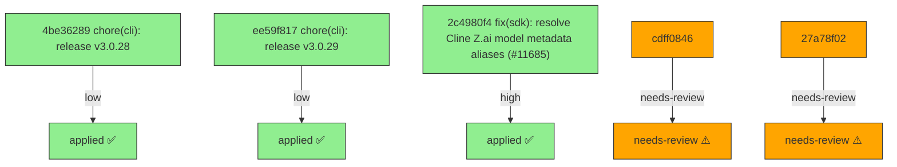

# Backport Agent — Detailed Run Report

> This file is generated automatically. It is intended for human analysts and
> AI reasoning models to assess agent performance, decision quality, and LLM behavior.

**Run timestamp**: 2026-06-22T05:21:46.488Z
**Models used**: fast=`mistral/mistral-code-agent-latest`  powerful=`mistral/mistral-vibe-cli-latest`
**Prompt log**: `/Users/rlemeill/Development/tea-ching-cline/.backport-agent/run-1782105227625.prompts.jsonl`

---

## Summary (PR body)

## Backport Agent — Sync Report

**Date**: 2026-06-22T05:21:46.488Z
**Upstream ref**: `main`
**Fork ref**: `keypool-live`
**Sync branch**: `sync/upstream-main-2026-06-22-051434`

### Summary

- ✅ Applied: 3
- ⚠️ Needs human review: 2
- ⛔ Blocked (not attempted): 0

### Applied commits

- `4be36289` [low] chore(cli): release v3.0.28
- `ee59f817` [low] chore(cli): release v3.0.29
- `2c4980f4` [high] fix(sdk): resolve Cline Z.ai model metadata aliases (#11685)

### ⚠️ Human review required

- `cdff0846` chore(sdk): release v0.0.50
- `27a78f02` chore(sdk): release v0.0.51

### Agent decision log

- Applied low-risk commits 4be362892f0c7c3bc41f34aea051f82b3b23cceb and ee59f81706981e0a64c8b32f8f0415c9d39561fa directly
- Applied high-risk commit 2c4980f42a73968f426327036a00aeae3c42044a after AI analysis confirmed compatibility with keypoollive-provider customization
- Blocked high-risk commits cdff084652e46a4f9aa7e8f4ed57766a3e10f712 and 27a78f024834f30f9c8f8f8ff08c76aa2a505e96 due to bun.lock conflicts that require manual resolution


---

## Agent Workflow Diagram

> Generated by the fast model from the run summary. Evaluate the agent's decision path.



---

## AI Sub-Agent Call Log (4 calls)

> Each entry is one sub-agent invocation. Review prompt/response pairs to assess
> reasoning quality, hallucinations, and decision accuracy.

### Call 1 / 4 — `analyze_commit_for_backport` ✅ OK

| Field | Value |
|---|---|
| **Timestamp** | 2026-06-22T05:14:15.818Z |
| **Tool** | `analyze_commit_for_backport` |
| **Model** | `mistral/mistral-vibe-cli-latest` |
| **Duration** | 3310 ms |
| **Tokens in** | 18519 |
| **Tokens out** | 104 |
| **Cost** | $0.000000 |

**Prompt sent to sub-agent:**

```
Commit SHA: cdff084652e46a4f9aa7e8f4ed57766a3e10f712
Commit message:
chore(sdk): release v0.0.50

Changed files (8):
bun.lock
sdk/CHANGELOG.md
sdk/packages/agents/package.json
sdk/packages/core/package.json
sdk/packages/llms/package.json
sdk/packages/llms/src/catalog/catalog.generated.ts
sdk/packages/sdk/package.json
sdk/packages/shared/package.json

Diff:
commit cdff084652e46a4f9aa7e8f4ed57766a3e10f712
Author: Saoud Rizwan <7799382+saoudrizwan@users.noreply.github.com>
Date:   Fri Jun 19 14:11:25 2026 -0700

    chore(sdk): release v0.0.50
---
 bun.lock                                           | 400 ++++++++++++---------
 sdk/CHANGELOG.md                                   |  10 +
 sdk/packages/agents/package.json                   |   2 +-
 sdk/packages/core/package.json                     |   2 +-
 sdk/packages/llms/package.json                     |   2 +-
 sdk/packages/llms/src/catalog/catalog.generated.ts | 367 ++++++++++++++-----
 sdk/packages/sdk/package.json                      |   2 +-
 sdk/packages/shared/package.json                   |   2 +-
 8 files changed, 530 insertions(+), 257 deletions(-)

diff --git a/bun.lock b/bun.lock
index ac81bc40d5..3daaf5ed13 100644
--- a/bun.lock
+++ b/bun.lock
@@ -372,7 +372,7 @@
     },
     "sdk/packages/agents": {
       "name": "@cline/agents",
-      "version": "0.0.49",
+      "version": "0.0.50",
       "dependencies": {
         "@cline/llms": "workspace:*",
         "@cline/shared": "workspace:*",
@@ -381,7 +381,7 @@
     },
     "sdk/packages/core": {
       "name": "@cline/core",
-      "version": "0.0.49",
+      "version": "0.0.50",
       "dependencies": {
         "@cline/agents": "workspace:*",
         "@cline/llms": "workspace:*",
@@ -419,7 +419,7 @@
     },
     "sdk/packages/llms": {
       "name": "@cline/llms",
-      "version": "0.0.49",
+      "version": "0.0.50",
       "dependencies": {
         "@ai-sdk/amazon-bedrock": "^4.0.89",
         "@ai-sdk/anthropic": "^3.0.68",
@@ -453,14 +453,14 @@
     },
     "sdk/packages/sdk": {
       "name": "@cline/sdk",
-      "version": "0.0.49",
+      "version": "0.0.50",
       "dependencies": {
         "@cline/core": "workspace:*",
       },
     },
     "sdk/packages/shared": {
       "name": "@cline/shared",
-      "version": "0.0.49",
+      "version": "0.0.50",
       "dependencies": {
         "aws4fetch": "^1.0.20",
         "jsonrepair": "^3.13.2",
@@ -472,27 +472,27 @@
   "packages": {
     "@agentclientprotocol/sdk": ["@agentclientprotocol/sdk@0.16.1", "", { "peerDependencies": { "zod": "^3.25.0 || ^4.0.0" } }, "sha512-1ad+Sc/0sCtZGHthxxvgEUo5Wsbw16I+aF+YwdiLnPwkZG8KAGUEAPK6LM6Pf69lCyJPt1Aomk1d+8oE3C4ZEw=="],
 
-    "@ai-sdk/amazon-bedrock": ["@ai-sdk/amazon-bedrock@4.0.114", "", { "dependencies": { "@ai-sdk/anthropic": "3.0.82", "@ai-sdk/openai": "3.0.69", "@ai-sdk/provider": "3.0.10", "@ai-sdk/provider-utils": "4.0.27", "@smithy/eventstream-codec": "^4.0.1", "@smithy/util-utf8": "^4.0.0", "aws4fetch": "^1.0.20" }, "peerDependencies": { "zod": "^3.25.76 || ^4.1.8" } }, "sha512-s3ajs4hlAdb+5A58O423OY0zEcNfsjgGLv+GkbwZegjcvvfESyoH2CzZnG321Fjzr79nKpo7PQsVFxMZcWwFaQ=="],
+    "@ai-sdk/amazon-bedrock": ["@ai-sdk/amazon-bedrock@4.0.117", "", { "dependencies": { "@ai-sdk/anthropic": "3.0.84", "@ai-sdk/openai": "3.0.71", "@ai-sdk/provider": "3.0.10", "@ai-sdk/provider-utils": "4.0.29", "@smithy/eventstream-codec": "^4.0.1", "@smithy/util-utf8": "^4.0.0", "aws4fetch": "^1.0.20" }, "peerDependencies": { "zod": "^3.25.76 || ^4.1.8" } }, "sha512-MebXAEsdvNdzKZCbVxFK0668KhYrs6W3mMH5fWT5Yc0TMSSTbwPI9fIw0sOzxLWd9TE9cJz73vVPjQjtG3vj/Q=="],
 
-    "@ai-sdk/anthropic": ["@ai-sdk/anthropic@3.0.82", "", { "dependencies": { "@ai-sdk/provider": "3.0.10", "@ai-sdk/provider-utils": "4.0.27" }, "peerDependencies": { "zod": "^3.25.76 || ^4.1.8" } }, "sha512-WKKou2wbhGGYV8PSALAPyV2YY4nfCqCPkyBzYtJtDA9yCcIFwsbtkTNgg7bqtLCVzeEsY7wwxRoCWy+EMfrw/A=="],
+    "@ai-sdk/anthropic": ["@ai-sdk/anthropic@3.0.84", "", { "dependencies": { "@ai-sdk/provider": "3.0.10", "@ai-sdk/provider-utils": "4.0.29" }, "peerDependencies": { "zod": "^3.25.76 || ^4.1.8" } }, "sha512-BIDaHmCHs6Sr5VUsEkTbbVlAN4GWjg97X9x/IfXyviLtzsXvffui9XIcZugkAi1Ri6FnvI5T5qDGh5YLnSuzRg=="],
 
-    "@ai-sdk/gateway": ["@ai-sdk/gateway@3.0.127", "", { "dependencies": { "@ai-sdk/provider": "3.0.10", "@ai-sdk/provider-utils": "4.0.27", "@vercel/oidc": "3.2.0" }, "peerDependencies": { "zod": "^3.25.76 || ^4.1.8" } }, "sha512-Obmw5hmE5x+ccRrMp/Djx5r0rpFVX87YqE6OY06g5fwYlRI30dA84ARfTzX45ivCvkW4eCnBpOVXVWQ/pjH85w=="],
+    "@ai-sdk/gateway": ["@ai-sdk/gateway@3.0.129", "", { "dependencies": { "@ai-sdk/provider": "3.0.10", "@ai-sdk/provider-utils": "4.0.29", "@vercel/oidc": "3.2.0" }, "peerDependencies": { "zod": "^3.25.76 || ^4.1.8" } }, "sha512-KEQpZGJuCksc4iFxYtVHeHHG7yH0izGFzJLmRZlriI0hFIzJF9bT2AzJoaTHUI6minlxtP0WKYh84dP18o/Cuw=="],
 
-    "@ai-sdk/google": ["@ai-sdk/google@3.0.80", "", { "dependencies": { "@ai-sdk/provider": "3.0.10", "@ai-sdk/provider-utils": "4.0.27" }, "peerDependencies": { "zod": "^3.25.76 || ^4.1.8" } }, "sha512-5ORbm/yFUPO0MEvZsxBMN0cdKw2+lwU/wVn5KN3KF8Dmk1LughuDuUohMh/7iU/XFTiyB0OvmTW/tdV/J7O9zg=="],
+    "@ai-sdk/google": ["@ai-sdk/google@3.0.82", "", { "dependencies": { "@ai-sdk/provider": "3.0.10", "@ai-sdk/provider-utils": "4.0.29" }, "peerDependencies": { "zod": "^3.25.76 || ^4.1.8" } }, "sha512-md+M92ZJuPIMU2p4v1rGLpJJWTmTh/vpJPkMnQbEdcLaPTZxRaroIKSnmL/9UGJV0BORJlHNDJegkcnhVpTmDA=="],
 
-    "@ai-sdk/google-vertex": ["@ai-sdk/google-vertex@4.0.143", "", { "dependencies": { "@ai-sdk/anthropic": "3.0.82", "@ai-sdk/google": "3.0.80", "@ai-sdk/openai-compatible": "2.0.48", "@ai-sdk/provider": "3.0.10", "@ai-sdk/provider-utils": "4.0.27", "google-auth-library": "^10.5.0" }, "peerDependencies": { "zod": "^3.25.76 || ^4.1.8" } }, "sha512-ue7NXgSX8F7ASv5y/+HTaAdz+QyZQB0uReeujestsnqCWk5LT52lkIon9ukXC/GbqyF+vvcojLoMWeuLQxDnbQ=="],
+    "@ai-sdk/google-vertex": ["@ai-sdk/google-vertex@4.0.145", "", { "dependencies": { "@ai-sdk/anthropic": "3.0.84", "@ai-sdk/google": "3.0.82", "@ai-sdk/openai-compatible": "2.0.50", "@ai-sdk/provider": "3.0.10", "@ai-sdk/provider-utils": "4.0.29", "google-auth-library": "^10.5.0" }, "peerDependencies": { "zod": "^3.25.76 || ^4.1.8" } }, "sha512-48wlju7ksjARn6aa1vUZtPFDp+PXadHDpOsE8YHvi4wKVUf7Sxma+WYZNkIDts1b9Alv0BBZlkn5azLNciHD6g=="],
 
-    "@ai-sdk/mistral": ["@ai-sdk/mistral@3.0.37", "", { "dependencies": { "@ai-sdk/provider": "3.0.10", "@ai-sdk/provider-utils": "4.0.27" }, "peerDependencies": { "zod": "^3.25.76 || ^4.1.8" } }, "sha512-KkdaMjs4C2y+vrZWJE990E3ZxBFiOTHQ94ZlquuIttpphcqJTMxNoIpnKT/4UzMVWXL0BUEE2vs+1UEVXkN8Kg=="],
+    "@ai-sdk/mistral": ["@ai-sdk/mistral@3.0.39", "", { "dependencies": { "@ai-sdk/provider": "3.0.10", "@ai-sdk/provider-utils": "4.0.29" }, "peerDependencies": { "zod": "^3.25.76 || ^4.1.8" } }, "sha512-drPs9K3a7A8LKvISzbXDoKlRD00CqeacKSSrjFDswCfCr1xS/4/GYUyJDt7UKykHW//iiiElSFWoea95yRQchg=="],
 
-    "@ai-sdk/openai": ["@ai-sdk/openai@3.0.69", "", { "dependencies": { "@ai-sdk/provider": "3.0.10", "@ai-sdk/provider-utils": "4.0.27" }, "peerDependencies": { "zod": "^3.25.76 || ^4.1.8" } }, "sha512-T/J3ED6ERDsine+crkXHfraisSG20k6BkBdgjvXCvySYnnJ19IaLIOsQPYfvXdOsKrl0LVNghooTV/nKCA7SmQ=="],
+    "@ai-sdk/openai": ["@ai-sdk/openai@3.0.71", "", { "dependencies": { "@ai-sdk/provider": "3.0.10", "@ai-sdk/provider-utils": "4.0.29" }, "peerDependencies": { "zod": "^3.25.76 || ^4.1.8" } }, "sha512-j6eBAa5oHFZ4U5CxpIV3T4zXNM/BviodNCZCL1qHkA4aqkwK9iQ18TWYz2DZcXpw4BO5pikKzqpXORxb1EnZGA=="],
 
-    "@ai-sdk/openai-compatible": ["@ai-sdk/openai-compatible@2.0.48", "", { "dependencies": { "@ai-sdk/provider": "3.0.10", "@ai-sdk/provider-utils": "4.0.27" }, "peerDependencies": { "zod": "^3.25.76 || ^4.1.8" } }, "sha512-z9MC6M4Oh/yUY/F/eszOtO8wc2nMz99XmZQKd2gWTtyIfe716xTfrKe3aYZKg20NZDtyjqPPKPSR+wqz7q1T7Q=="],
+    "@ai-sdk/openai-compatible": ["@ai-sdk/openai-compatible@2.0.50", "", { "dependencies": { "@ai-sdk/provider": "3.0.10", "@ai-sdk/provider-utils": "4.0.29" }, "peerDependencies": { "zod": "^3.25.76 || ^4.1.8" } }, "sha512-HyuxddF2Yv5G8qxK/0uksAINjQ4h6TpwOqHuqzsCM0u78/JWAW2OXcIplQeB44PIAORgPjbMzrw9DhnPYHMskA=="],
 
     "@ai-sdk/provider": ["@ai-sdk/provider@3.0.10", "", { "dependencies": { "json-schema": "^0.4.0" } }, "sha512-Q3BZ27qfpYqnCYGvE3vt+Qi6LGOF9R5Nmzn+9JoM1lCRsD9mYaIhfJLkSunN48nfGXJ6n+XNV0J/XVpqGQl7Dw=="],
 
-    "@ai-sdk/provider-utils": ["@ai-sdk/provider-utils@4.0.27", "", { "dependencies": { "@ai-sdk/provider": "3.0.10", "@standard-schema/spec": "^1.1.0", "eventsource-parser": "^3.0.8" }, "peerDependencies": { "zod": "^3.25.76 || ^4.1.8" } }, "sha512-ubkAJ+xODouwtmN1tYlvTPphH1hPOBfZaEQe8U7skGvFAnIRs9PPpsq57bC2+Ky/MB4yzhd6YOsxTAx9sGpazw=="],
+    "@ai-sdk/provider-utils": ["@ai-sdk/provider-utils@4.0.29", "", { "dependencies": { "@ai-sdk/provider": "3.0.10", "@standard-schema/spec": "^1.1.0", "eventsource-parser": "^3.0.8" }, "peerDependencies": { "zod": "^3.25.76 || ^4.1.8" } }, "sha512-uhukHaCBvqkwBHkT8C2PrnqKTCoLn3pdHXqtcR9I8ErH+flbzgW4o7VHSNIup9LRu+WBvZIZDQLsx6rwl2tiOA=="],
 
-    "@ai-sdk/react": ["@ai-sdk/react@3.0.201", "", { "dependencies": { "@ai-sdk/provider-utils": "4.0.27", "ai": "6.0.199", "swr": "^2.2.5", "throttleit": "2.1.0" }, "peerDependencies": { "react": "^18 || ~19.0.1 || ~19.1.2 || ^19.2.1" } }, "sha512-sDYdkPB96aHPrF5WKP0BdjRjymgZOdIMzNt1SlYPCoWWvLnV+UMwnIqvqEG+OAa9n4Sq7J3A3N/JD7rozow+CA=="],
+    "@ai-sdk/react": ["@ai-sdk/react@3.0.205", "", { "dependencies": { "@ai-sdk/provider-utils": "4.0.29", "ai": "6.0.203", "swr": "^2.2.5", "throttleit": "2.1.0" }, "peerDependencies": { "react": "^18 || ~19.0.1 || ~19.1.2 || ^19.2.1" } }, "sha512-qh4H9dUqTJwdr+arKSIrVBHG4o4sYJdZGFUCJfAf9vMe/5IwDRwhq9z5ztpcUrXD3QACO01nuyfufNc0ZoGReA=="],
 
     "@alloc/quick-lru": ["@alloc/quick-lru@5.2.0", "", {}, "sha512-UrcABB+4bUrFABwbluTIBErXwvbsU/V7TZWfmbgJfbkwiBuziS9gxdODUyuiecfdGQ85jglMW6juS3+z5TsKLw=="],
 
@@ -528,35 +528,35 @@
 
     "@aws-crypto/util": ["@aws-crypto/util@5.2.0", "", { "dependencies": { "@aws-sdk/types": "^3.222.0", "@smithy/util-utf8": "^2.0.0", "tslib": "^2.6.2" } }, "sha512-4RkU9EsI6ZpBve5fseQlGNUWKMa1RLPQ1dnjnQoe07ldfIzcsGb5hC5W0Dm7u423KWzawlrpbjXBrXCEv9zazQ=="],
 
-    "@aws-sdk/client-cognito-identity": ["@aws-sdk/client-cognito-identity@3.1065.0", "", { "dependencies": { "@aws-crypto/sha256-browser": "5.2.0", "@aws-crypto/sha256-js": "5.2.0", "@aws-sdk/core": "^3.974.20", "@aws-sdk/credential-provider-node": "^3.972.54", "@aws-sdk/types": "^3.973.12", "@smithy/core": "^3.24.6", "@smithy/fetch-http-handler": "^5.4.6", "@smithy/node-http-handler": "^4.7.6", "@smithy/types": "^4.14.3", "tslib": "^2.6.2" } }, "sha512-dGKFCiGbX5IrK+1NcqNgHKqWZtF3f5K2tDWJKDvGBurOO2q1SHu/XntEJydLWqEzYzJTimOZHaDzp/fqwYzu+g=="],
+    "@aws-sdk/client-cognito-identity": ["@aws-sdk/client-cognito-identity@3.1068.0", "", { "dependencies": { "@aws-crypto/sha256-browser": "5.2.0", "@aws-crypto/sha256-js": "5.2.0", "@aws-sdk/core": "^3.974.20", "@aws-sdk/credential-provider-node": "^3.972.55", "@aws-sdk/types": "^3.973.12", "@smithy/core": "^3.24.6", "@smithy/fetch-http-handler": "^5.4.6", "@smithy/node-http-handler": "^4.7.6", "@smithy/types": "^4.14.3", "tslib": "^2.6.2" } }, "sha512-by2Qj3f9BI9X4cY0n160R3uzkMpI6k9PmGA8QLAuzr8HzkiNrYFygMEPhIEdqBFHQPD/8AXNUs45HYjEDsQ33g=="],
 
     "@aws-sdk/core": ["@aws-sdk/core@3.974.20", "", { "dependencies": { "@aws-sdk/types": "^3.973.12", "@aws-sdk/xml-builder": "^3.972.29", "@aws/lambda-invoke-store": "^0.2.2", "@smithy/core": "^3.24.6", "@smithy/signature-v4": "^5.4.6", "@smithy/types": "^4.14.3", "bowser": "^2.11.0", "tslib": "^2.6.2" } }, "sha512-7sDi2B2N3mc3nf1nz6FyEx/FCrJ1N1QnBmraHHQNabFaeAh2IaOOLml48/rHOD1bICHgTRkbBgNTvUzEr5Z35g=="],
 
-    "@aws-sdk/credential-provider-cognito-identity": ["@aws-sdk/credential-provider-cognito-identity@3.972.44", "", { "dependencies": { "@aws-sdk/nested-clients": "^3.997.19", "@aws-sdk/types": "^3.973.12", "@smithy/core": "^3.24.6", "@smithy/types": "^4.14.3", "tslib": "^2.6.2" } }, "sha512-OjovzYsHOTZmOdrSQI2/CjGNgHO0c0ZHTFIkt3bBfrhgNFPTLnbZDvmGdMst7U5c1dqq4gzpUwZC6X9HA12MDQ=="],
+    "@aws-sdk/credential-provider-cognito-identity": ["@aws-sdk/credential-provider-cognito-identity@3.972.45", "", { "dependencies": { "@aws-sdk/nested-clients": "^3.997.20", "@aws-sdk/types": "^3.973.12", "@smithy/core": "^3.24.6", "@smithy/types": "^4.14.3", "tslib": "^2.6.2" } }, "sha512-4L/REssieLON1hVsTzZucP1p2u5jmPNejyh/9BCGZXr93IalBbhRPCrtKIKwMTu9yRGr/bcKzhrQocByKLSzLQ=="],
 
     "@aws-sdk/credential-provider-env": ["@aws-sdk/credential-provider-env@3.972.46", "", { "dependencies": { "@aws-sdk/core": "^3.974.20", "@aws-sdk/types": "^3.973.12", "@smithy/core": "^3.24.6", "@smithy/types": "^4.14.3", "tslib": "^2.6.2" } }, "sha512-+GPXVS2srMOlH74S+SmC1gVuP2TvUZ0siuC0onKO93q+udP+M72dmY8wJfVQ5CX9z/9X5A1HHwz5yRIGBtskvQ=="],
 
     "@aws-sdk/credential-provider-http": ["@aws-sdk/credential-provider-http@3.972.48", "", { "dependencies": { "@aws-sdk/core": "^3.974.20", "@aws-sdk/types": "^3.973.12", "@smithy/core": "^3.24.6", "@smithy/fetch-http-handler": "^5.4.6", "@smithy/node-http-handler": "^4.7.6", "@smithy/types": "^4.14.3", "tslib": "^2.6.2" } }, "sha512-fA5loSdlocacRxyUXtpoHSMuk5rsIKRDzQYVMnMxjcmFeZshaJlJ8lymy/hYKji6sne/UmNGj5pxuEs6kq/Qcg=="],
 
-    "@aws-sdk/credential-provider-ini": ["@aws-sdk/credential-provider-ini@3.972.52", "", { "dependencies": { "@aws-sdk/core": "^3.974.20", "@aws-sdk/credential-provider-env": "^3.972.46", "@aws-sdk/credential-provider-http": "^3.972.48", "@aws-sdk/credential-provider-login": "^3.972.51", "@aws-sdk/credential-provider-process": "^3.972.46", "@aws-sdk/credential-provider-sso": "^3.972.51", "@aws-sdk/credential-provider-web-identity": "^3.972.51", "@aws-sdk/nested-clients": "^3.997.19", "@aws-sdk/types": "^3.973.12", "@smithy/core": "^3.24.6", "@smithy/credential-provider-imds": "^4.3.7", "@smithy/types": "^4.14.3", "tslib": "^2.6.2" } }, "sha512-szg1nnebqC+Svv6Vfsdf6P/QK8x5g/ghG2CKa/1WkHifRnq0BBmDELj2Qnqk9nPsUvEu/OEcYic97CPLpKqF9g=="],
+    "@aws-sdk/credential-provider-ini": ["@aws-sdk/credential-provider-ini@3.972.53", "", { "dependencies": { "@aws-sdk/core": "^3.974.20", "@aws-sdk/credential-provider-env": "^3.972.46", "@aws-sdk/credential-provider-http": "^3.972.48", "@aws-sdk/credential-provider-login": "^3.972.52", "@aws-sdk/credential-provider-process": "^3.972.46", "@aws-sdk/credential-provider-sso": "^3.972.52", "@aws-sdk/credential-provider-web-identity": "^3.972.52", "@aws-sdk/nested-clients": "^3.997.20", "@aws-sdk/types": "^3.973.12", "@smithy/core": "^3.24.6", "@smithy/credential-provider-imds": "^4.3.7", "@smithy/types": "^4.14.3", "tslib": "^2.6.2" } }, "sha512-ZfdhIOR41q8TcWEnUac+gCOb+O2LBWdHLmjedXpXz4IEFW2ppNuFcm6p0sMTavpM+zD5TYfpH5Gp7guRyqSgsQ=="],
 
-    "@aws-sdk/credential-provider-login": ["@aws-sdk/credential-provider-login@3.972.51", "", { "dependencies": { "@aws-sdk/core": "^3.974.20", "@aws-sdk/nested-clients": "^3.997.19", "@aws-sdk/types": "^3.973.12", "@smithy/core": "^3.24.6", "@smithy/types": "^4.14.3", "tslib": "^2.6.2" } }, "sha512-csHFsH+/VjnI40oqm1l1OqMY4B4kza36DbfcbHcgcbobgjebasqUbTU34xvwUkvtoNGGizbfyMSlMzJWUPv3dQ=="],
+    "@aws-sdk/credential-provider-login": ["@aws-sdk/credential-provider-login@3.972.52", "", { "dependencies": { "@aws-sdk/core": "^3.974.20", "@aws-sdk/nested-clients": "^3.997.20", "@aws-sdk/types": "^3.973.12", "@smithy/core": "^3.24.6", "@smithy/types": "^4.14.3", "tslib": "^2.6.2" } }, "sha512-9hu2oR0qH7Fst5Tzdx+UWxm+w5zCXtErTLtOOW5hwwQc170CLwOeniRxyFY6s9mHfGEfC5zFukNBdKBwJR8mhQ=="],
 
-    "@aws-sdk/credential-provider-node": ["@aws-sdk/credential-provider-node@3.972.54", "", { "dependencies": { "@aws-sdk/credential-provider-env": "^3.972.46", "@aws-sdk/credential-provider-http": "^3.972.48", "@aws-sdk/credential-provider-ini": "^3.972.52", "@aws-sdk/credential-provider-process": "^3.972.46", "@aws-sdk/credential-provider-sso": "^3.972.51", "@aws-sdk/credential-provider-web-identity": "^3.972.51", "@aws-sdk/types": "^3.973.12", "@smithy/core": "^3.24.6", "@smithy/credential-provider-imds": "^4.3.7", "@smithy/types": "^4.14.3", "tslib": "^2.6.2" } }, "sha512-vinTSQtziNHxi2nqXF+76jr2sO44q88Ind1qFFVaotNgBaC1rcWDjBug8yoE8n0ov33s21xks9WY5XDHH9SENw=="],
+    "@aws-sdk/credential-provider-node": ["@aws-sdk/credential-provider-node@3.972.55", "", { "dependencies": { "@aws-sdk/credential-provider-env": "^3.972.46", "@aws-sdk/credential-provider-http": "^3.972.48", "@aws-sdk/credential-provider-ini": "^3.972.53", "@aws-sdk/credential-provider-process": "^3.972.46", "@aws-sdk/credential-provider-sso": "^3.972.52", "@aws-sdk/credential-provider-web-identity": "^3.972.52", "@aws-sdk/types": "^3.973.12", "@smithy/core": "^3.24.6", "@smithy/credential-provider-imds": "^4.3.7", "@smithy/types": "^4.14.3", "tslib": "^2.6.2" } }, "sha512-zMGLa/dhESVqmCD7mmIFFKSwSFrJGScvCXcjvBZEVOOMauFS5JRQvLTMukFpMEFWiV6dTAlsen2ATDBulLPtbg=="],
 
     "@aws-sdk/credential-provider-process": ["@aws-sdk/credential-provider-process@3.972.46", "", { "dependencies": { "@aws-sdk/core": "^3.974.20", "@aws-sdk/types": "^3.973.12", "@smithy/core": "^3.24.6", "@smithy/types": "^4.14.3", "tslib": "^2.6.2" } }, "sha512-VUoNFBIjWrUN8NbFiQiuxQEgFjvziAlBRPK+ddh27aj65gk0BYu6bLZnrdrNZwpW6vAihtSUtEMQ1PUJ32QRPA=="],
 
-    "@aws-sdk/credential-provider-sso": ["@aws-sdk/credential-provider-sso@3.972.51", "", { "dependencies": { "@aws-sdk/core": "^3.974.20", "@aws-sdk/nested-clients": "^3.997.19", "@aws-sdk/token-providers": "3.1065.0", "@aws-sdk/types": "^3.973.12", "@smithy/core": "^3.24.6", "@smithy/types": "^4.14.3", "tslib": "^2.6.2" } }, "sha512-60qhpQcSDIKIr0AuBlmJezKX0b5nbJPCINiR49N9yJXrEI5tTRwsXVBr0IdSvvsNJyqgiINyoBd++Ed0yvggbw=="],
+    "@aws-sdk/credential-provider-sso": ["@aws-sdk/credential-provider-sso@3.972.52", "", { "dependencies": { "@aws-sdk/core": "^3.974.20", "@aws-sdk/nested-clients": "^3.997.20", "@aws-sdk/token-providers": "3.1066.0", "@aws-sdk/types": "^3.973.12", "@smithy/core": "^3.24.6", "@smithy/types": "^4.14.3", "tslib": "^2.6.2" } }, "sha512-nb2/n4o/HQf+FVpVbZe9vCTFngmuDoIsltMgLAtjixaKzvzhB4J8WSDFyWgnErgLHk55ctWH+I4PU+LIHhyffg=="],
 
-    "@aws-sdk/credential-provider-web-identity": ["@aws-sdk/credential-provider-web-identity@3.972.51", "", { "dependencies": { "@aws-sdk/core": "^3.974.20", "@aws-sdk/nested-clients": "^3.997.19", "@aws-sdk/types": "^3.973.12", "@smithy/core": "^3.24.6", "@smithy/types": "^4.14.3", "tslib": "^2.6.2" } }, "sha512-0X5eWsUIp8ItRJeJBBrhQAPzc9AQelDetRTVTsycCAISCCzM17R4hs/vFAPeQ0o0B35sciLiqe/Pwmml909cZA=="],
+    "@aws-sdk/credential-provider-web-identity": ["@aws-sdk/credential-provider-web-identity@3.972.52", "", { "dependencies": { "@aws-sdk/core": "^3.974.20", "@aws-sdk/nested-clients": "^3.997.20", "@aws-sdk/types": "^3.973.12", "@smithy/core": "^3.24.6", "@smithy/types": "^4.14.3", "tslib": "^2.6.2" } }, "sha512-lKj6aRSGbqLmpYmM24bY7a1Xmfcq2vkE3hv8CSPYfc1yCu0BPu/XEJ1L4Fm61MsU6ULLNSG8UGsffNoFUBjESA=="],
 
-    "@aws-sdk/credential-providers": ["@aws-sdk/credential-providers@3.1065.0", "", { "dependencies": { "@aws-sdk/client-cognito-identity": "3.1065.0", "@aws-sdk/core": "^3.974.20", "@aws-sdk/credential-provider-cognito-identity": "^3.972.44", "@aws-sdk/credential-provider-env": "^3.972.46", "@aws-sdk/credential-provider-http": "^3.972.48", "@aws-sdk/credential-provider-ini": "^3.972.52", "@aws-sdk/credential-provider-login": "^3.972.51", "@aws-sdk/credential-provider-node": "^3.972.54", "@aws-sdk/credential-provider-process": "^3.972.46", "@aws-sdk/credential-provider-sso": "^3.972.51", "@aws-sdk/credential-provider-web-identity": "^3.972.51", "@aws-sdk/nested-clients": "^3.997.19", "@aws-sdk/types": "^3.973.12", "@smithy/core": "^3.24.6", "@smithy/credential-provider-imds": "^4.3.7", "@smithy/types": "^4.14.3", "tslib": "^2.6.2" } }, "sha512-g5FGZvk9UbAD7HeGFCp+fQGJiNAneJJabpAZY13SSmVeI2Yw/V66U3na1StnqvZCYfXvGybJvSGtq2IdoCrK4g=="],
+    "@aws-sdk/credential-providers": ["@aws-sdk/credential-providers@3.1068.0", "", { "dependencies": { "@aws-sdk/client-cognito-identity": "3.1068.0", "@aws-sdk/core": "^3.974.20", "@aws-sdk/credential-provider-cognito-identity": "^3.972.45", "@aws-sdk/credential-provider-env": "^3.972.46", "@aws-sdk/credential-provider-http": "^3.972.48", "@aws-sdk/credential-provider-ini": "^3.972.53", "@aws-sdk/credential-provider-login": "^3.972.52", "@aws-sdk/credential-provider-node": "^3.972.55", "@aws-sdk/credential-provider-process": "^3.972.46", "@aws-sdk/credential-provider-sso": "^3.972.52", "@aws-sdk/credential-provider-web-identity": "^3.972.52", "@aws-sdk/nested-clients": "^3.997.20", "@aws-sdk/types": "^3.973.12", "@smithy/core": "^3.24.6", "@smithy/credential-provider-imds": "^4.3.7", "@smithy/types": "^4.14.3", "tslib": "^2.6.2" } }, "sha512-DN7UewD/XKGfNGWXZsTECWRj3IsULkE7aG+fPwqPf13CnX4UmNvj80g1xieJ0lVdMQ2h0L3gZpn2ClIY06+/vQ=="],
 
-    "@aws-sdk/nested-clients": ["@aws-sdk/nested-clients@3.997.19", "", { "dependencies": { "@aws-crypto/sha256-browser": "5.2.0", "@aws-crypto/sha256-js": "5.2.0", "@aws-sdk/core": "^3.974.20", "@aws-sdk/signature-v4-multi-region": "^3.996.33", "@aws-sdk/types": "^3.973.12", "@smithy/core": "^3.24.6", "@smithy/fetch-http-handler": "^5.4.6", "@smithy/node-http-handler": "^4.7.6", "@smithy/types": "^4.14.3", "tslib": "^2.6.2" } }, "sha512-P2Otgf15GBJMKzG6j5Ddf7w+Kz6z2jvesMy874TD3jlMfDWNK7clJeUd7hgigdeVOotjoUP4emcTWVdS9sfZDw=="],
+    "@aws-sdk/nested-clients": ["@aws-sdk/nested-clients@3.997.20", "", { "dependencies": { "@aws-crypto/sha256-browser": "5.2.0", "@aws-crypto/sha256-js": "5.2.0", "@aws-sdk/core": "^3.974.20", "@aws-sdk/signature-v4-multi-region": "^3.996.34", "@aws-sdk/types": "^3.973.12", "@smithy/core": "^3.24.6", "@smithy/fetch-http-handler": "^5.4.6", "@smithy/node-http-handler": "^4.7.6", "@smithy/types": "^4.14.3", "tslib": "^2.6.2" } }, "sha512-IYJuLpXp2DEILVQpQOy0PMpkftv0AHEOCn52o0atyOaumA0CdWQ3klPyXdViGYLbNpESsVFMVybvHUeZAuiGxA=="],
 
-    "@aws-sdk/signature-v4-multi-region": ["@aws-sdk/signature-v4-multi-region@3.996.33", "", { "dependencies": { "@aws-sdk/types": "^3.973.12", "@smithy/signature-v4": "^5.4.6", "@smithy/types": "^4.14.3", "tslib": "^2.6.2" } }, "sha512-Hn0RThJEbyOZWV2PV9Z4YD3nitGPxybmyU17dSe9b61WOBcKnqS0WTtM3c1zyZq9WnGiyrfi/i+UBPUk7cM8Ug=="],
+    "@aws-sdk/signature-v4-multi-region": ["@aws-sdk/signature-v4-multi-region@3.996.34", "", { "dependencies": { "@aws-sdk/types": "^3.973.12", "@smithy/signature-v4": "^5.4.6", "@smithy/types": "^4.14.3", "tslib": "^2.6.2" } }, "sha512-mx1L5qlumSOt/nKM3BFaHE2HVkWwz0i4Bw0pyYO42FfX/FeLlo8YI6csC0gSPprEk6fTIqI+CZN9RwUwKd5krQ=="],
 
-    "@aws-sdk/token-providers": ["@aws-sdk/token-providers@3.1065.0", "", { "dependencies": { "@aws-sdk/core": "^3.974.20", "@aws-sdk/nested-clients": "^3.997.19", "@aws-sdk/types": "^3.973.12", "@smithy/core": "^3.24.6", "@smithy/types": "^4.14.3", "tslib": "^2.6.2" } }, "sha512-qdHQntq82gMqG6Tf8xrgmhJxacaYkxW4PEeDg/ISMVJ84EWe7iD6JyCTgbyox3uNDH6vqEJ8GUiTaXCq307zVw=="],
+    "@aws-sdk/token-providers": ["@aws-sdk/token-providers@3.1066.0", "", { "dependencies": { "@aws-sdk/core": "^3.974.20", "@aws-sdk/nested-clients": "^3.997.20", "@aws-sdk/types": "^3.973.12", "@smithy/core": "^3.24.6", "@smithy/types": "^4.14.3", "tslib": "^2.6.2" } }, "sha512-UqEUJq7dqa44hneLDUcX7UJy95cg8YqEWyakRpvIPnrNS3Mq+UlQHgCDGu5pvwAPtlIW4qcYbvW6reG6++FyvA=="],
 
     "@aws-sdk/types": ["@aws-sdk/types@3.973.12", "", { "dependencies": { "@smithy/types": "^4.14.3", "tslib": "^2.6.2" } }, "sha512-43ajd1NF0RMgX5k0hxCNUyEdrtFUsb2aHT2QvpktSC/2Eyb2Jr/JPVqdp0XIoaHWikZJq5tNWSLO6kB5q2eMCA=="],
 
@@ -720,7 +720,7 @@
 
     "@discordjs/ws": ["@discordjs/ws@1.2.3", "", { "dependencies": { "@discordjs/collection": "^2.1.0", "@discordjs/rest": "^2.5.1", "@discordjs/util": "^1.1.0", "@sapphire/async-queue": "^1.5.2", "@types/ws": "^8.5.10", "@vladfrangu/async_event_emitter": "^2.2.4", "discord-api-types": "^0.38.1", "tslib": "^2.6.2", "ws": "^8.17.0" } }, "sha512-wPlQDxEmlDg5IxhJPuxXr3Vy9AjYq5xCvFWGJyD7w7Np8ZGu+Mc+97LCoEc/+AYCo2IDpKioiH0/c/mj5ZR9Uw=="],
 
-    "@dotenvx/dotenvx": ["@dotenvx/dotenvx@1.71.2", "", { "dependencies": { "commander": "^11.1.0", "dotenv": "^17.2.1", "eciesjs": "^0.4.10", "enquirer": "^2.4.1", "execa": "^5.1.1", "fdir": "^6.2.0", "ignore": "^5.3.0", "object-treeify": "1.1.33", "picomatch": "^4.0.4", "which": "^4.0.0", "yocto-spinner": "^1.1.0" }, "bin": { "dotenvx": "src/cli/dotenvx.js" } }, "sha512-Xj9T3Wr+Bo4ILKf9PZJBYJ4SJiZGC/pqIdzOMbX9jgAFb0oGuKkusLleYHN/N6zanZixNvmuMVWYR1T3YJuVTA=="],
+    "@dotenvx/dotenvx": ["@dotenvx/dotenvx@1.71.3", "", { "dependencies": { "commander": "^11.1.0", "dotenv": "^17.2.1", "eciesjs": "^0.4.10", "enquirer": "^2.4.1", "execa": "^5.1.1", "fdir": "^6.2.0", "ignore": "^5.3.0", "object-treeify": "1.1.33", "picomatch": "^4.0.4", "which": "^4.0.0", "yocto-spinner": "^1.1.0" }, "bin": { "dotenvx": "src/cli/dotenvx.js" } }, "sha512-WSmox5aD+XxJEUEOTk7gKLpd5+Iz9Nik89Zpbu5DijMln6LsFiv3xpNKBMc/b9sSkUlKvAblzrhik2TqKFE7NA=="],
 
     "@ecies/ciphers": ["@ecies/ciphers@0.2.6", "", { "peerDependencies": { "@noble/ciphers": "^1.0.0" } }, "sha512-patgsRPKGkhhoBjETV4XxD0En4ui5fbX0hzayqI3M8tvNMGUoUvmyYAIWwlxBc1KX5cturfqByYdj5bYGRpN9g=="],
 
@@ -982,7 +982,7 @@
 
     "@modelcontextprotocol/sdk": ["@modelcontextprotocol/sdk@1.29.0", "", { "dependencies": { "@hono/node-server": "^1.19.9", "ajv": "^8.17.1", "ajv-formats": "^3.0.1", "content-type": "^1.0.5", "cors": "^2.8.5", "cross-spawn": "^7.0.5", "eventsource": "^3.0.2", "eventsource-parser": "^3.0.0", "express": "^5.2.1", "express-rate-limit": "^8.2.1", "hono": "^4.11.4", "jose": "^6.1.3", "json-schema-typed": "^8.0.2", "pkce-challenge": "^5.0.0", "raw-body": "^3.0.0", "zod": "^3.25 || ^4.0", "zod-to-json-schema": "^3.25.1" }, "peerDependencies": { "@cfworker/json-schema": "^4.1.1" }, "optionalPeers": ["@cfworker/json-schema"] }, "sha512-zo37mZA9hJWpULgkRpowewez1y6ML5GsXJPY8FI0tBBCd77HEvza4jDqRKOXgHNn867PVGCyTdzqpz0izu5ZjQ=="],
 
-    "@napi-rs/wasm-runtime": ["@napi-rs/wasm-runtime@1.1.4", "", { "dependencies": { "@tybys/wasm-util": "^0.10.1" }, "peerDependencies": { "@emnapi/core": "^1.7.1", "@emnapi/runtime": "^1.7.1" } }, "sha512-3NQNNgA1YSlJb/kMH1ildASP9HW7/7kYnRI2szWJaofaS1hWmbGI4H+d3+22aGzXXN9IJ+n+GiFVcGipJP18ow=="],
+    "@napi-rs/wasm-runtime": ["@napi-rs/wasm-runtime@1.1.5", "", { "dependencies": { "@tybys/wasm-util": "^0.10.2" }, "peerDependencies": { "@emnapi/core": "^1.7.1", "@emnapi/runtime": "^1.7.1" } }, "sha512-AWPoBRJ9tsnVhor4sjO7rkni+7p+2IAEFj6cx06UgP10jkQHqay/36uRV/bFkgrh18D9vb4cr8Q0Pthskgzy+Q=="],
 
     "@next/env": ["@next/env@16.2.6", "", {}, "sha512-gd8HoHN4ufj73WmR3JmVolrpJR47ILK6LouP5xElPglaVxir6e1a7VzvTvDWkOoPXT9rkkTzyCxBu4yeZfZwcw=="],
 
@@ -1008,7 +1008,7 @@
 
     "@noble/hashes": ["@noble/hashes@1.8.0", "", {}, "sha512-jCs9ldd7NwzpgXDIf6P3+NrHh9/sD6CQdxHyjQI+h/6rDNo88ypBxxz45UDuZHz9r3tNz7N/VInSVoVdtXEI4A=="],
 
-    "@nodable/entities": ["@nodable/entities@2.1.1", "", {}, "sha512-Pig3HxDIoMgjdEH8OCf/dkcTmLFjJRjWuq8jSnklu284/TKOPibSRERmOykiwmyXTtv61mP+44f3GMx0tLAyjg=="],
+    "@nodable/entities": ["@nodable/entities@2.2.0", "", {}, "sha512-9uGyhaQavEUMC8AIddIjau4NsnsXhou+j5sBAGojCM1oxmQpVKTWR/9JxABD6UAv12vpIms55fPZKFQEhG6uBg=="],
 
     "@nodelib/fs.scandir": ["@nodelib/fs.scandir@2.1.5", "", { "dependencies": { "@nodelib/fs.stat": "2.0.5", "run-parallel": "^1.1.9" } }, "sha512-vq24Bq3ym5HEQm2NKCr3yXDwjc7vTsEThRDnkp2DK9p1uqLR+DHurm/NOTo0KG7HYHU7eppKZj3MyqYuMBf62g=="],
 
@@ -1030,13 +1030,13 @@
 
     "@openai/codex-win32-x64": ["@openai/codex@0.130.0-win32-x64", "", { "os": "win32", "cpu": "x64" }, "sha512-FzMznm7fr5/nbjZgOujZ9Y9AbdGm7ji1FOoWiY3U+srqauvZaTgn6o6aCheSL7kuymu7nTLOO/cAyWV6NuesqQ=="],
 
-    "@opencode-ai/sdk": ["@opencode-ai/sdk@1.17.0", "", { "dependencies": { "cross-spawn": "7.0.6" } }, "sha512-a4Fw6lEZqXhjkyTH0LNInntrdLaWcz9M1+eqQgSVqI6PAlcqC/Jo069k8VdGcU3u4qbETqmURec8+VfhS06Sqg=="],
+    "@opencode-ai/sdk": ["@opencode-ai/sdk@1.17.4", "", { "dependencies": { "cross-spawn": "7.0.6" } }, "sha512-OdHkBoNIQOjQsPnFtkcxAp9HsLAKn/MQiq7wIQURkRARmw8yhFqGiMPYbNm+UfLn6bMkx97rdPkWQARejMyiXQ=="],
 
     "@opentelemetry/api": ["@opentelemetry/api@1.9.1", "", {}, "sha512-gLyJlPHPZYdAk1JENA9LeHejZe1Ti77/pTeFm/nMXmQH/HFZlcS/O2XJB+L8fkbrNSqhdtlvjBVjxwUYanNH5Q=="],
 
     "@opentelemetry/api-logs": ["@opentelemetry/api-logs@0.214.0", "", { "dependencies": { "@opentelemetry/api": "^1.3.0" } }, "sha512-40lSJeqYO8Uz2Yj7u94/SJWE/wONa7rmMKjI1ZcIjgf3MHNHv1OZUCrCETGuaRF62d5pQD1wKIW+L4lmSMTzZA=="],
 
-    "@opentelemetry/context-async-hooks": ["@opentelemetry/context-async-hooks@2.7.1", "", { "peerDependencies": { "@opentelemetry/api": ">=1.0.0 <1.10.0" } }, "sha512-OPFBYuXEn1E4ja3Y6eeA7O+ZnLBNcXTV5Cgsn1VaqBZ6hC5FnpZPLBNme1LJY8ZtF4aOujPKFoeWN4ik487KuQ=="],
+    "@opentelemetry/context-async-hooks": ["@opentelemetry/context-async-hooks@2.8.0", "", { "peerDependencies": { "@opentelemetry/api": ">=1.0.0 <1.10.0" } }, "sha512-/3FIraneMcng67SUJCxvyInk/oxzwsxyadufk0wwfOBLf5wqtAGX4MoQASwSbndBPeARzBryUM9Azr5kHIdWLw=="],
 
     "@opentelemetry/core": ["@opentelemetry/core@2.6.1", "", { "dependencies": { "@opentelemetry/semantic-conventions": "^1.29.0" }, "peerDependencies": { "@opentelemetry/api": ">=1.0.0 <1.10.0" } }, "sha512-8xHSGWpJP9wBxgBpnqGL0R3PbdWQndL1Qp50qrg71+B28zK5OQmUgcDKLJgzyAAV38t4tOyLMGDD60LneR5W8g=="],
 
@@ -1050,15 +1050,15 @@
 
     "@opentelemetry/otlp-transformer": ["@opentelemetry/otlp-transformer@0.214.0", "", { "dependencies": { "@opentelemetry/api-logs": "0.214.0", "@opentelemetry/core": "2.6.1", "@opentelemetry/resources": "2.6.1", "@opentelemetry/sdk-logs": "0.214.0", "@opentelemetry/sdk-metrics": "2.6.1", "@opentelemetry/sdk-trace-base": "2.6.1", "protobufjs": "^7.0.0" }, "peerDependencies": { "@opentelemetry/api": "^1.3.0" } }, "sha512-DSaYcuBRh6uozfsWN3R8HsN0yDhCuWP7tOFdkUOVaWD1KVJg8m4qiLUsg/tNhTLS9HUYUcwNpwL2eroLtsZZ/w=="],
 
-    "@opentelemetry/resources": ["@opentelemetry/resources@2.7.1", "", { "dependencies": { "@opentelemetry/core": "2.7.1", "@opentelemetry/semantic-conventions": "^1.29.0" }, "peerDependencies": { "@opentelemetry/api": ">=1.3.0 <1.10.0" } }, "sha512-DeT6KKolmC4e/dRQvMQ/RwlnzhaqeiFOXY5ngoOPJ07GgVVKxZOg9EcrNZb5aTzUn+iCrJldAgOfQm1O/QfPAQ=="],
+    "@opentelemetry/resources": ["@opentelemetry/resources@2.8.0", "", { "dependencies": { "@opentelemetry/core": "2.8.0", "@opentelemetry/semantic-conventions": "^1.29.0" }, "peerDependencies": { "@opentelemetry/api": ">=1.3.0 <1.10.0" } }, "sha512-qmXQ27ilDbUK/vGMqwL8D4/rhn76C+sherM4wTbjlfknR8Nvfc/hCxjRJPhkzZzUsPiNg16SA31NxMabwttRjg=="],
 
     "@opentelemetry/sdk-logs": ["@opentelemetry/sdk-logs@0.214.0", "", { "dependencies": { "@opentelemetry/api-logs": "0.214.0", "@opentelemetry/core": "2.6.1", "@opentelemetry/resources": "2.6.1", "@opentelemetry/semantic-conventions": "^1.29.0" }, "peerDependencies": { "@opentelemetry/api": ">=1.4.0 <1.10.0" } }, "sha512-zf6acnScjhsaBUU22zXZ/sLWim1dfhUAbGXdMmHmNG3LfBnQ3DKsOCITb2IZwoUsNNMTogqFKBnlIPPftUgGwA=="],
 
-    "@opentelemetry/sdk-metrics": ["@opentelemetry/sdk-metrics@2.7.1", "", { "dependencies": { "@opentelemetry/core": "2.7.1", "@opentelemetry/resources": "2.7.1" }, "peerDependencies": { "@opentelemetry/api": ">=1.9.0 <1.10.0" } }, "sha512-MpDJdkiFDs3Pm1RHO3KByuZbuBdJEXEAkiC0+yJdsZGVCdf1RpHR6n+LHDcS7ffmfrt5kVCzJSCfm4z2C7v0uQ=="],
+    "@opentelemetry/sdk-metrics": ["@opentelemetry/sdk-metrics@2.8.0", "", { "dependencies": { "@opentelemetry/core": "2.8.0", "@opentelemetry/resources": "2.8.0" }, "peerDependencies": { "@opentelemetry/api": ">=1.9.0 <1.10.0" } }, "sha512-UDBGaj6W0Rgy5rTTaoxs8gVGF/aGkAKyjurJv7se6wjRxJu7FoquTLT/vt54DZfo4crbprYfhX/SOK9+BPw1qg=="],
 
-    "@opentelemetry/sdk-trace-base": ["@opentelemetry/sdk-trace-base@2.7.1", "", { "dependencies": { "@opentelemetry/core": "2.7.1", "@opentelemetry/resources": "2.7.1", "@opentelemetry/semantic-conventions": "^1.29.0" }, "peerDependencies": { "@opentelemetry/api": ">=1.3.0 <1.10.0" } }, "sha512-NAYIlsF8MPUsKqJMiDQJTMPOmlbawC1Iz/omMLygZ1C9am8fTKYjTaI+OZM+WTY3t3Glo0wnOg/6/pac6RGPPw=="],
+    "@opentelemetry/sdk-trace-base": ["@opentelemetry/sdk-trace-base@2.8.0", "", { "dependencies": { "@opentelemetry/core": "2.8.0", "@opentelemetry/resources": "2.8.0", "@opentelemetry/semantic-conventions": "^1.29.0" }, "peerDependencies": { "@opentelemetry/api": ">=1.3.0 <1.10.0" } }, "sha512-mhU4jp+vW0mGbFRd+GeXHvmfA4
... [truncated]

Output the JSON object now.
```

**Response received:**

```
{
  "summary": "SDK version bump to v0.0.50 with dependency updates and catalog regeneration.",
  "keyChanges": ["version bumps in package.json files", "bun.lock dependency updates", "catalog.generated.ts regeneration"],
  "backportComplexity": "trivial",
  "semanticRiskFactors": ["version numbers in package.json may conflict with fork's @sctg/cline-* publishing"],
  "recommendation": "apply-with-care"
}
```

---

### Call 2 / 4 — `analyze_commit_for_backport` ✅ OK

| Field | Value |
|---|---|
| **Timestamp** | 2026-06-22T05:14:19.457Z |
| **Tool** | `analyze_commit_for_backport` |
| **Model** | `mistral/mistral-code-agent-latest` |
| **Duration** | 3588 ms |
| **Tokens in** | 7036 |
| **Tokens out** | 170 |
| **Cost** | $0.000000 |

**Prompt sent to sub-agent:**

```
Commit SHA: 2c4980f42a73968f426327036a00aeae3c42044a
Commit message:
fix(sdk): resolve Cline Z.ai model metadata aliases (#11685)

Changed files (10):
sdk/packages/core/src/services/llms/provider-defaults.test.ts
sdk/packages/core/src/services/llms/provider-defaults.ts
sdk/packages/core/src/services/providers/local-provider-service.test.ts
sdk/packages/llms/src/catalog/model-id-aliases.test.ts
sdk/packages/llms/src/catalog/model-id-aliases.ts
sdk/packages/llms/src/index.browser.ts
sdk/packages/llms/src/index.ts
sdk/packages/llms/src/models.ts
sdk/packages/llms/src/providers/builtins.test.ts
sdk/packages/llms/src/providers/builtins.ts

Diff:
commit 2c4980f42a73968f426327036a00aeae3c42044a
Author: Saoud Rizwan <7799382+saoudrizwan@users.noreply.github.com>
Date:   Fri Jun 19 19:05:47 2026 -0700

    fix(sdk): resolve Cline Z.ai model metadata aliases (#11685)
    
    * fix(sdk): resolve Cline Z.ai model metadata aliases
    
    * fix(sdk): preserve Cline model alias overrides
    
    * test(sdk): update Cline provider model list expectation
---
 .../src/services/llms/provider-defaults.test.ts    | 39 ++++++++++++++++++++++
 .../core/src/services/llms/provider-defaults.ts    | 18 +++++++++-
 .../providers/local-provider-service.test.ts       | 12 +++++--
 .../llms/src/catalog/model-id-aliases.test.ts      | 39 ++++++++++++++++++++++
 sdk/packages/llms/src/catalog/model-id-aliases.ts  | 34 +++++++++++++++++++
 sdk/packages/llms/src/index.browser.ts             |  4 +++
 sdk/packages/llms/src/index.ts                     |  4 +++
 sdk/packages/llms/src/models.ts                    |  6 ++++
 sdk/packages/llms/src/providers/builtins.test.ts   | 17 ++++++++++
 sdk/packages/llms/src/providers/builtins.ts        | 28 +++++++++++++++-
 10 files changed, 197 insertions(+), 4 deletions(-)

diff --git a/sdk/packages/core/src/services/llms/provider-defaults.test.ts b/sdk/packages/core/src/services/llms/provider-defaults.test.ts
index 9fef86d5fb..d760963239 100644
--- a/sdk/packages/core/src/services/llms/provider-defaults.test.ts
+++ b/sdk/packages/core/src/services/llms/provider-defaults.test.ts
@@ -58,6 +58,45 @@ describe("resolveProviderConfig", () => {
 		);
 	});
 
+	it("prefers Vercel-style Z.ai ids in Cline known models", async () => {
+		const resolved = await resolveProviderConfig("cline");
+
+		expect(resolved?.knownModels?.["zai/glm-5.2"]).toMatchObject({
+			id: "zai/glm-5.2",
+			name: "GLM 5.2",
+			contextWindow: 1_000_000,
+			maxInputTokens: 1_000_000,
+		});
+		expect(resolved?.knownModels?.["z-ai/glm-5.2"]).toBeUndefined();
+	});
+
+	it("preserves explicit Cline known model overrides for alias ids", async () => {
+		const resolved = await resolveProviderConfig("cline", undefined, {
+			providerId: "cline",
+			modelId: "z-ai/glm-5.2",
+			knownModels: {
+				"z-ai/glm-5.2": {
+					id: "z-ai/glm-5.2",
+					name: "Custom GLM 5.2",
+					contextWindow: 123_456,
+					maxInputTokens: 123_456,
+				},
+			},
+		});
+
+		expect(resolved?.knownModels?.["z-ai/glm-5.2"]).toMatchObject({
+			id: "z-ai/glm-5.2",
+			name: "Custom GLM 5.2",
+			contextWindow: 123_456,
+			maxInputTokens: 123_456,
+		});
+		expect(resolved?.knownModels?.["zai/glm-5.2"]).toMatchObject({
+			id: "zai/glm-5.2",
+			contextWindow: 1_000_000,
+			maxInputTokens: 1_000_000,
+		});
+	});
+
 	it("uses the live OpenAI catalog for ChatGPT subscription models", async () => {
 		vi.stubGlobal(
 			"fetch",
diff --git a/sdk/packages/core/src/services/llms/provider-defaults.ts b/sdk/packages/core/src/services/llms/provider-defaults.ts
index eb05567fd6..5302bd6d78 100644
--- a/sdk/packages/core/src/services/llms/provider-defaults.ts
+++ b/sdk/packages/core/src/services/llms/provider-defaults.ts
@@ -179,12 +179,28 @@ async function mergeKnownModels(
 			...userKnownModels,
 		});
 	}
-	return Llms.sortModelsByReleaseDate({
+	const knownModelsWithoutUserOverrides = Llms.sortModelsByReleaseDate({
 		...generated,
 		...defaultKnownModels,
 		...liveModels,
 		...privateModels,
 		...publicModels,
+	});
+
+	if (providerId === "cline") {
+		// Cline recommendations can use Vercel-style ids while the broader
+		// catalog includes OpenRouter aliases for the same models.
+		return Llms.sortModelsByReleaseDate({
+			...Llms.preferCanonicalModelIds(
+				knownModelsWithoutUserOverrides,
+				Llms.VERCEL_OPENROUTER_MODEL_ID_ALIAS_RULES,
+			),
+			...userKnownModels,
+		});
+	}
+
+	return Llms.sortModelsByReleaseDate({
+		...knownModelsWithoutUserOverrides,
 		...userKnownModels,
 	});
 }
diff --git a/sdk/packages/core/src/services/providers/local-provider-service.test.ts b/sdk/packages/core/src/services/providers/local-provider-service.test.ts
index 2b7df16cfe..662a4d4cfb 100644
--- a/sdk/packages/core/src/services/providers/local-provider-service.test.ts
+++ b/sdk/packages/core/src/services/providers/local-provider-service.test.ts
@@ -1193,7 +1193,7 @@ describe("listLocalProviders", () => {
 		).toBe(false);
 	});
 
-	it("uses the same built-in model list for cline as openrouter", async () => {
+	it("uses Cline-specific Z.ai aliases in the built-in model list", async () => {
 		manager.saveProviderSettings(
 			{
 				provider: "cline",
@@ -1209,9 +1209,17 @@ describe("listLocalProviders", () => {
 		const openrouter = providers.find(
 			(provider) => provider.id === "openrouter",
 		);
+		const clineModelIds = new Set(
+			cline?.modelList?.map((model) => model.id) ?? [],
+		);
+		const openrouterModelIds = new Set(
+			openrouter?.modelList?.map((model) => model.id) ?? [],
+		);
 
 		expect(cline?.modelList?.length).toBeGreaterThan(0);
-		expect(cline?.modelList).toEqual(openrouter?.modelList);
+		expect(clineModelIds).toContain("zai/glm-5.2");
+		expect(clineModelIds).not.toContain("z-ai/glm-5.2");
+		expect(openrouterModelIds).toContain("z-ai/glm-5.2");
 	});
 
 	it("does not eagerly fetch LiteLLM private models while listing providers", async () => {
diff --git a/sdk/packages/llms/src/catalog/model-id-aliases.test.ts b/sdk/packages/llms/src/catalog/model-id-aliases.test.ts
new file mode 100644
index 0000000000..2cab39348d
--- /dev/null
+++ b/sdk/packages/llms/src/catalog/model-id-aliases.test.ts
@@ -0,0 +1,39 @@
+import { describe, expect, it } from "vitest";
+import {
+	isCanonicalModelIdForAliasRules,
+	preferCanonicalModelIds,
+	VERCEL_OPENROUTER_MODEL_ID_ALIAS_RULES,
+} from "./model-id-aliases";
+
+describe("model id aliases", () => {
+	it("recognizes canonical model ids for configured alias rules", () => {
+		expect(
+			isCanonicalModelIdForAliasRules(
+				"zai/glm-5.2",
+				VERCEL_OPENROUTER_MODEL_ID_ALIAS_RULES,
+			),
+		).toBe(true);
+		expect(
+			isCanonicalModelIdForAliasRules(
+				"z-ai/glm-5.2",
+				VERCEL_OPENROUTER_MODEL_ID_ALIAS_RULES,
+			),
+		).toBe(false);
+	});
+
+	it("removes an alias only when its canonical model id exists", () => {
+		const models = preferCanonicalModelIds(
+			{
+				"zai/glm-5.2": { source: "vercel" },
+				"z-ai/glm-5.2": { source: "openrouter" },
+				"z-ai/openrouter-only": { source: "openrouter" },
+			},
+			VERCEL_OPENROUTER_MODEL_ID_ALIAS_RULES,
+		);
+
+		expect(models).toEqual({
+			"zai/glm-5.2": { source: "vercel" },
+			"z-ai/openrouter-only": { source: "openrouter" },
+		});
+	});
+});
diff --git a/sdk/packages/llms/src/catalog/model-id-aliases.ts b/sdk/packages/llms/src/catalog/model-id-aliases.ts
new file mode 100644
index 0000000000..0f82ade242
--- /dev/null
+++ b/sdk/packages/llms/src/catalog/model-id-aliases.ts
@@ -0,0 +1,34 @@
+export interface ModelIdAliasRule {
+	canonicalPrefix: string;
+	aliasPrefix: string;
+}
+
+// Some upstream catalogs expose the same routed model under different provider
+// namespaces. Prefer the namespace our runtime can receive so exact model-info
+// lookups keep the right context window and token limits.
+export const VERCEL_OPENROUTER_MODEL_ID_ALIAS_RULES = [
+	{ canonicalPrefix: "zai/", aliasPrefix: "z-ai/" },
+] as const satisfies readonly ModelIdAliasRule[];
+
+export function isCanonicalModelIdForAliasRules(
+	modelId: string,
+	rules: readonly ModelIdAliasRule[],
+): boolean {
+	return rules.some((rule) => modelId.startsWith(rule.canonicalPrefix));
+}
+
+export function preferCanonicalModelIds<T>(
+	models: Record<string, T>,
+	rules: readonly ModelIdAliasRule[],
+): Record<string, T> {
+	return Object.fromEntries(
+		Object.entries(models).filter(([modelId]) => {
+			for (const rule of rules) {
+				if (!modelId.startsWith(rule.aliasPrefix)) continue;
+				const canonicalModelId = `${rule.canonicalPrefix}${modelId.slice(rule.aliasPrefix.length)}`;
+				if (canonicalModelId in models) return false;
+			}
+			return true;
+		}),
+	);
+}
diff --git a/sdk/packages/llms/src/index.browser.ts b/sdk/packages/llms/src/index.browser.ts
index 7024370501..bcb6dfedb8 100644
--- a/sdk/packages/llms/src/index.browser.ts
+++ b/sdk/packages/llms/src/index.browser.ts
@@ -1,5 +1,6 @@
 export type {
 	ModelCollection,
+	ModelIdAliasRule,
 	ModelInfo,
 	ModelInfo as CatalogModelInfo,
 	ProviderCapability as CatalogProviderCapability,
@@ -15,11 +16,14 @@ export {
 	getProviderCollectionSync,
 	getProviderIds,
 	hasProvider,
+	isCanonicalModelIdForAliasRules,
 	MODEL_COLLECTIONS_BY_PROVIDER_ID,
+	preferCanonicalModelIds,
 	registerModel,
 	registerProvider,
 	resetRegistry,
 	unregisterProvider,
+	VERCEL_OPENROUTER_MODEL_ID_ALIAS_RULES,
 } from "./models";
 export {
 	type ProviderUsageCostDisplay,
diff --git a/sdk/packages/llms/src/index.ts b/sdk/packages/llms/src/index.ts
index f919a0f8d7..40a1a3dfc6 100644
--- a/sdk/packages/llms/src/index.ts
+++ b/sdk/packages/llms/src/index.ts
@@ -1,5 +1,6 @@
 export type {
 	ModelCollection,
+	ModelIdAliasRule,
 	ModelInfo,
 	ModelInfo as CatalogModelInfo,
 	ProviderCapability as CatalogProviderCapability,
@@ -19,12 +20,15 @@ export {
 	getProviderCollectionSync,
 	getProviderIds,
 	hasProvider,
+	isCanonicalModelIdForAliasRules,
 	MODEL_COLLECTIONS_BY_PROVIDER_ID,
+	preferCanonicalModelIds,
 	registerModel,
 	registerProvider,
 	resetRegistry,
 	sortModelsByReleaseDate,
 	unregisterProvider,
+	VERCEL_OPENROUTER_MODEL_ID_ALIAS_RULES,
 } from "./models";
 export type {
 	ApiHandler,
diff --git a/sdk/packages/llms/src/models.ts b/sdk/packages/llms/src/models.ts
index d5b55ee581..84c14120e4 100644
--- a/sdk/packages/llms/src/models.ts
+++ b/sdk/packages/llms/src/models.ts
@@ -6,6 +6,12 @@ export {
 	fetchModelsDevProviderModels,
 	sortModelsByReleaseDate,
 } from "./catalog/catalog-live";
+export type { ModelIdAliasRule } from "./catalog/model-id-aliases";
+export {
+	isCanonicalModelIdForAliasRules,
+	preferCanonicalModelIds,
+	VERCEL_OPENROUTER_MODEL_ID_ALIAS_RULES,
+} from "./catalog/model-id-aliases";
 export type {
 	ModelCollection,
 	ModelInfo,
diff --git a/sdk/packages/llms/src/providers/builtins.test.ts b/sdk/packages/llms/src/providers/builtins.test.ts
index e458492773..0c3ef62f66 100644
--- a/sdk/packages/llms/src/providers/builtins.test.ts
+++ b/sdk/packages/llms/src/providers/builtins.test.ts
@@ -50,6 +50,23 @@ describe("cline builtin spec defaults.baseUrl", () => {
 	});
 });
 
+describe("cline builtin models", () => {
+	it("prefers Vercel-style Z.ai model ids over equivalent OpenRouter ids", async () => {
+		const models = await getModelsForProvider("cline");
+
+		expect(models["zai/glm-5.2"]).toMatchObject({
+			id: "zai/glm-5.2",
+			name: "GLM 5.2",
+			contextWindow: 1_000_000,
+			maxInputTokens: 1_000_000,
+		});
+		expect(models["zai/glm-5.1"]).toMatchObject({
+			id: "zai/glm-5.1",
+		});
+		expect(models["z-ai/glm-5.2"]).toBeUndefined();
+	});
+});
+
 describe("cline-pass builtin spec", () => {
 	it("registers a distinct Cline-compatible provider with a custom model list", async () => {
 		const models = await getModelsForProvider("cline-pass");
diff --git a/sdk/packages/llms/src/providers/builtins.ts b/sdk/packages/llms/src/providers/builtins.ts
index 865bc9dcd5..844c60c2c1 100644
--- a/sdk/packages/llms/src/providers/builtins.ts
+++ b/sdk/packages/llms/src/providers/builtins.ts
@@ -10,6 +10,11 @@ import {
 	type ProviderConfigField,
 } from "@cline/shared";
 import { getGeneratedModelsForProvider } from "../catalog/catalog.generated-access";
+import {
+	isCanonicalModelIdForAliasRules,
+	preferCanonicalModelIds,
+	VERCEL_OPENROUTER_MODEL_ID_ALIAS_RULES,
+} from "../catalog/model-id-aliases";
 import type {
 	ModelCollection,
 	ModelInfo,
@@ -325,6 +330,27 @@ function buildOpenAICodexModels(): Record<string, ModelInfo> {
 	return filterOpenAICodexModels(generatedModels("openai-native"));
 }
 
+function buildClineModels(): Record<string, ModelInfo> {
+	// Cline is OpenRouter-backed generally, but its recommended-model endpoint
+	// can return Vercel-style ids. Include those exact ids so runtime metadata
+	// resolves without adding duplicate OpenRouter aliases to the picker.
+	const vercelAliasModels = Object.fromEntries(
+		Object.entries(generatedModels("vercel-ai-gateway")).filter(([modelId]) =>
+			isCanonicalModelIdForAliasRules(
+				modelId,
+				VERCEL_OPENROUTER_MODEL_ID_ALIAS_RULES,
+			),
+		),
+	);
+	return preferCanonicalModelIds(
+		{
+			...generatedModels("openrouter"),
+			...vercelAliasModels,
+		},
+		VERCEL_OPENROUTER_MODEL_ID_ALIAS_RULES,
+	);
+}
+
 function fallbackModelInfo(id: string, spec?: BuiltinSpec): ModelInfo {
 	const info: ModelInfo = {
 		id,
@@ -482,7 +508,7 @@ const cline = createClineLikeSpec({
 	id: "cline",
 	name: "Cline",
 	popular: 1,
-	modelsProviderId: "openrouter",
+	modelsFactory: buildClineModels,
 	defaultModelId: CLINE_DEFAULT_MODEL_ID,
 });

Output the JSON object now.
```

**Response received:**

````
```json
{
  "summary": "Fixes Cline Z.ai model metadata aliases by preferring Vercel-style IDs over OpenRouter aliases. Adds alias resolution logic and updates provider defaults.",
  "keyChanges": [
    "Adds model ID alias resolution for Cline provider",
    "Prefers 'zai/' over 'z-ai/' for Z.ai models",
    "Updates provider defaults and builtins for Cline",
    "Adds new test cases for alias handling",
    "Exports new alias utilities from SDK"
  ],
  "backportComplexity": "moderate",
  "semanticRiskFactors": [
    "Modifies Cline provider model resolution logic",
    "Introduces new public API exports in SDK"
  ],
  "recommendation": "apply-with-care"
}
```
````

---

### Call 3 / 4 — `analyze_commit_for_backport` ✅ OK

| Field | Value |
|---|---|
| **Timestamp** | 2026-06-22T05:14:23.057Z |
| **Tool** | `analyze_commit_for_backport` |
| **Model** | `mistral/mistral-vibe-cli-latest` |
| **Duration** | 3518 ms |
| **Tokens in** | 18387 |
| **Tokens out** | 110 |
| **Cost** | $0.000000 |

**Prompt sent to sub-agent:**

```
Commit SHA: 27a78f024834f30f9c8f8f8ff08c76aa2a505e96
Commit message:
chore(sdk): release v0.0.51

Changed files (8):
bun.lock
sdk/CHANGELOG.md
sdk/packages/agents/package.json
sdk/packages/core/package.json
sdk/packages/llms/package.json
sdk/packages/llms/src/catalog/catalog.generated.ts
sdk/packages/sdk/package.json
sdk/packages/shared/package.json

Diff:
commit 27a78f024834f30f9c8f8f8ff08c76aa2a505e96
Author: Saoud Rizwan <7799382+saoudrizwan@users.noreply.github.com>
Date:   Fri Jun 19 19:15:00 2026 -0700

    chore(sdk): release v0.0.51
---
 bun.lock                                           | 254 +++++++++------------
 sdk/CHANGELOG.md                                   |   4 +
 sdk/packages/agents/package.json                   |   2 +-
 sdk/packages/core/package.json                     |   2 +-
 sdk/packages/llms/package.json                     |   2 +-
 sdk/packages/llms/src/catalog/catalog.generated.ts | 231 +++++++++----------
 sdk/packages/sdk/package.json                      |   2 +-
 sdk/packages/shared/package.json                   |   2 +-
 8 files changed, 220 insertions(+), 279 deletions(-)

diff --git a/bun.lock b/bun.lock
index 3daaf5ed13..19d7bfefb9 100644
--- a/bun.lock
+++ b/bun.lock
@@ -19,7 +19,7 @@
     },
     "apps/cli": {
       "name": "@cline/cli",
-      "version": "3.0.27",
+      "version": "3.0.28",
       "bin": {
         "cline": "src/index.ts",
       },
@@ -372,7 +372,7 @@
     },
     "sdk/packages/agents": {
       "name": "@cline/agents",
-      "version": "0.0.50",
+      "version": "0.0.51",
       "dependencies": {
         "@cline/llms": "workspace:*",
         "@cline/shared": "workspace:*",
@@ -381,7 +381,7 @@
     },
     "sdk/packages/core": {
       "name": "@cline/core",
-      "version": "0.0.50",
+      "version": "0.0.51",
       "dependencies": {
         "@cline/agents": "workspace:*",
         "@cline/llms": "workspace:*",
@@ -419,7 +419,7 @@
     },
     "sdk/packages/llms": {
       "name": "@cline/llms",
-      "version": "0.0.50",
+      "version": "0.0.51",
       "dependencies": {
         "@ai-sdk/amazon-bedrock": "^4.0.89",
         "@ai-sdk/anthropic": "^3.0.68",
@@ -453,14 +453,14 @@
     },
     "sdk/packages/sdk": {
       "name": "@cline/sdk",
-      "version": "0.0.50",
+      "version": "0.0.51",
       "dependencies": {
         "@cline/core": "workspace:*",
       },
     },
     "sdk/packages/shared": {
       "name": "@cline/shared",
-      "version": "0.0.50",
+      "version": "0.0.51",
       "dependencies": {
         "aws4fetch": "^1.0.20",
         "jsonrepair": "^3.13.2",
@@ -476,7 +476,7 @@
 
     "@ai-sdk/anthropic": ["@ai-sdk/anthropic@3.0.84", "", { "dependencies": { "@ai-sdk/provider": "3.0.10", "@ai-sdk/provider-utils": "4.0.29" }, "peerDependencies": { "zod": "^3.25.76 || ^4.1.8" } }, "sha512-BIDaHmCHs6Sr5VUsEkTbbVlAN4GWjg97X9x/IfXyviLtzsXvffui9XIcZugkAi1Ri6FnvI5T5qDGh5YLnSuzRg=="],
 
-    "@ai-sdk/gateway": ["@ai-sdk/gateway@3.0.129", "", { "dependencies": { "@ai-sdk/provider": "3.0.10", "@ai-sdk/provider-utils": "4.0.29", "@vercel/oidc": "3.2.0" }, "peerDependencies": { "zod": "^3.25.76 || ^4.1.8" } }, "sha512-KEQpZGJuCksc4iFxYtVHeHHG7yH0izGFzJLmRZlriI0hFIzJF9bT2AzJoaTHUI6minlxtP0WKYh84dP18o/Cuw=="],
+    "@ai-sdk/gateway": ["@ai-sdk/gateway@3.0.130", "", { "dependencies": { "@ai-sdk/provider": "3.0.10", "@ai-sdk/provider-utils": "4.0.29", "@vercel/oidc": "3.2.0" }, "peerDependencies": { "zod": "^3.25.76 || ^4.1.8" } }, "sha512-qenRdpoYM+2y8Ibj3Y7XngvfcG4NIpejaM+YqAKWXi3/N1qZYeIelrm19jxhIwQW0W/g7WUz0L2Agl7+FnwrQA=="],
 
     "@ai-sdk/google": ["@ai-sdk/google@3.0.82", "", { "dependencies": { "@ai-sdk/provider": "3.0.10", "@ai-sdk/provider-utils": "4.0.29" }, "peerDependencies": { "zod": "^3.25.76 || ^4.1.8" } }, "sha512-md+M92ZJuPIMU2p4v1rGLpJJWTmTh/vpJPkMnQbEdcLaPTZxRaroIKSnmL/9UGJV0BORJlHNDJegkcnhVpTmDA=="],
 
@@ -492,31 +492,31 @@
 
     "@ai-sdk/provider-utils": ["@ai-sdk/provider-utils@4.0.29", "", { "dependencies": { "@ai-sdk/provider": "3.0.10", "@standard-schema/spec": "^1.1.0", "eventsource-parser": "^3.0.8" }, "peerDependencies": { "zod": "^3.25.76 || ^4.1.8" } }, "sha512-uhukHaCBvqkwBHkT8C2PrnqKTCoLn3pdHXqtcR9I8ErH+flbzgW4o7VHSNIup9LRu+WBvZIZDQLsx6rwl2tiOA=="],
 
-    "@ai-sdk/react": ["@ai-sdk/react@3.0.205", "", { "dependencies": { "@ai-sdk/provider-utils": "4.0.29", "ai": "6.0.203", "swr": "^2.2.5", "throttleit": "2.1.0" }, "peerDependencies": { "react": "^18 || ~19.0.1 || ~19.1.2 || ^19.2.1" } }, "sha512-qh4H9dUqTJwdr+arKSIrVBHG4o4sYJdZGFUCJfAf9vMe/5IwDRwhq9z5ztpcUrXD3QACO01nuyfufNc0ZoGReA=="],
+    "@ai-sdk/react": ["@ai-sdk/react@3.0.206", "", { "dependencies": { "@ai-sdk/provider-utils": "4.0.29", "ai": "6.0.204", "swr": "^2.2.5", "throttleit": "2.1.0" }, "peerDependencies": { "react": "^18 || ~19.0.1 || ~19.1.2 || ^19.2.1" } }, "sha512-26gbPT876BZVXJlSNjqkCDOFiqfxAAhYn+a/ryV6ce5TWo6EfWQZeEiLrZOS6bxaOi7xxkB5uPZaZKFaIJndjQ=="],
 
     "@alloc/quick-lru": ["@alloc/quick-lru@5.2.0", "", {}, "sha512-UrcABB+4bUrFABwbluTIBErXwvbsU/V7TZWfmbgJfbkwiBuziS9gxdODUyuiecfdGQ85jglMW6juS3+z5TsKLw=="],
 
     "@antfu/install-pkg": ["@antfu/install-pkg@1.1.0", "", { "dependencies": { "package-manager-detector": "^1.3.0", "tinyexec": "^1.0.1" } }, "sha512-MGQsmw10ZyI+EJo45CdSER4zEb+p31LpDAFp2Z3gkSd1yqVZGi0Ebx++YTEMonJy4oChEMLsxZ64j8FH6sSqtQ=="],
 
-    "@anthropic-ai/claude-agent-sdk": ["@anthropic-ai/claude-agent-sdk@0.2.141", "", { "dependencies": { "@anthropic-ai/sdk": "^0.93.0", "@modelcontextprotocol/sdk": "^1.29.0" }, "optionalDependencies": { "@anthropic-ai/claude-agent-sdk-darwin-arm64": "0.2.141", "@anthropic-ai/claude-agent-sdk-darwin-x64": "0.2.141", "@anthropic-ai/claude-agent-sdk-linux-arm64": "0.2.141", "@anthropic-ai/claude-agent-sdk-linux-arm64-musl": "0.2.141", "@anthropic-ai/claude-agent-sdk-linux-x64": "0.2.141", "@anthropic-ai/claude-agent-sdk-linux-x64-musl": "0.2.141", "@anthropic-ai/claude-agent-sdk-win32-arm64": "0.2.141", "@anthropic-ai/claude-agent-sdk-win32-x64": "0.2.141" }, "peerDependencies": { "zod": "^4.0.0" } }, "sha512-AIBacMWGcZIUcXlUoObqjwJ6pmJI3BayAqPAFXuvSq3DHJXdiuZVs7l/zTB5l3nRhRv5cqSrI2XbiDeHgZWizw=="],
+    "@anthropic-ai/claude-agent-sdk": ["@anthropic-ai/claude-agent-sdk@0.3.177", "", { "optionalDependencies": { "@anthropic-ai/claude-agent-sdk-darwin-arm64": "0.3.177", "@anthropic-ai/claude-agent-sdk-darwin-x64": "0.3.177", "@anthropic-ai/claude-agent-sdk-linux-arm64": "0.3.177", "@anthropic-ai/claude-agent-sdk-linux-arm64-musl": "0.3.177", "@anthropic-ai/claude-agent-sdk-linux-x64": "0.3.177", "@anthropic-ai/claude-agent-sdk-linux-x64-musl": "0.3.177", "@anthropic-ai/claude-agent-sdk-win32-arm64": "0.3.177", "@anthropic-ai/claude-agent-sdk-win32-x64": "0.3.177" }, "peerDependencies": { "@anthropic-ai/sdk": ">=0.93.0", "@modelcontextprotocol/sdk": "^1.29.0", "zod": "^4.0.0" } }, "sha512-CBzXnzR661q3AlfZzBjmIFQx0cxr36iJV3PExTYmPyGQX32qxtiFQgnxTcF8wB4hcSVf2hnoy/gprVJdkNx7cw=="],
 
-    "@anthropic-ai/claude-agent-sdk-darwin-arm64": ["@anthropic-ai/claude-agent-sdk-darwin-arm64@0.2.141", "", { "os": "darwin", "cpu": "arm64" }, "sha512-9HZ0ot6+FwOfQ1aeMqQLH4IJGMm/DcP08SysDxscVjBm6l2JjqleHohxi3zid0DurfGweqT+4x9GScJffwg55g=="],
+    "@anthropic-ai/claude-agent-sdk-darwin-arm64": ["@anthropic-ai/claude-agent-sdk-darwin-arm64@0.3.177", "", { "os": "darwin", "cpu": "arm64" }, "sha512-u9Ty+KPllm2nw0RatdPF0zcPRquNZjVptmyLG0DqduGbgZDLQpfPFMF5hffFIRnVaXhx7+jkUmEdw0jrda0UcA=="],
 
-    "@anthropic-ai/claude-agent-sdk-darwin-x64": ["@anthropic-ai/claude-agent-sdk-darwin-x64@0.2.141", "", { "os": "darwin", "cpu": "x64" }, "sha512-4iAdarJaQ+2R58s6QJswZCzUdz2WQmL5lYG7Y+FLzWbRSROFfcH0QYpmOqSaPXd2KRQhIJwEacqecDZd/Q1XKQ=="],
+    "@anthropic-ai/claude-agent-sdk-darwin-x64": ["@anthropic-ai/claude-agent-sdk-darwin-x64@0.3.177", "", { "os": "darwin", "cpu": "x64" }, "sha512-ona6Jv54XFwBTqOj3MzLWfKtc2m7Rdh58wOAX9Hnue/6FcWfyeuz/UDcidVTXQ7Xytz//Tb0JJgFtiQjO7FbIA=="],
 
-    "@anthropic-ai/claude-agent-sdk-linux-arm64": ["@anthropic-ai/claude-agent-sdk-linux-arm64@0.2.141", "", { "os": "linux", "cpu": "arm64" }, "sha512-Jdf0ZEwJzOP8sE6rPqdJN+SxMb0/L8sxJg4twCv/7S+Qzk0hJtls+wxSi+0Tjh6EEMaNxJqEGc7S3fx99Wi99Q=="],
+    "@anthropic-ai/claude-agent-sdk-linux-arm64": ["@anthropic-ai/claude-agent-sdk-linux-arm64@0.3.177", "", { "os": "linux", "cpu": "arm64" }, "sha512-wBCbklkaDb483Ab4DUFfmJjZJKXz58YXPv+CiGsyjq1St19mbKEma5KKz3Ya9mlV8aLyh4zmLK2mEHPnF//Ipg=="],
 
-    "@anthropic-ai/claude-agent-sdk-linux-arm64-musl": ["@anthropic-ai/claude-agent-sdk-linux-arm64-musl@0.2.141", "", { "os": "linux", "cpu": "arm64" }, "sha512-6H1AJ/AVaWNnV22kubUPkOTRzZFH0+qP9k7WlhriHMN9gtgZcVAsITMddDeGjQsQJMCAdhXFd6sgi7TM1LdeOQ=="],
+    "@anthropic-ai/claude-agent-sdk-linux-arm64-musl": ["@anthropic-ai/claude-agent-sdk-linux-arm64-musl@0.3.177", "", { "os": "linux", "cpu": "arm64" }, "sha512-v6PMDD3h2erLuTK5S2ZvExqdL3v44OyC70XpKhyqIUnyPaGR9YAMjh//EKdWC+mNvt6mIbRZpaDcHtbASVW8Rw=="],
 
-    "@anthropic-ai/claude-agent-sdk-linux-x64": ["@anthropic-ai/claude-agent-sdk-linux-x64@0.2.141", "", { "os": "linux", "cpu": "x64" }, "sha512-DVjp72f3HmrRYpbneWZZWIqkUht5kTZXS7wXGFiwzLz6eNYEgjjh+GcsnhIi8UOwZUtNiKUrjZnoP38ovFqV8A=="],
+    "@anthropic-ai/claude-agent-sdk-linux-x64": ["@anthropic-ai/claude-agent-sdk-linux-x64@0.3.177", "", { "os": "linux", "cpu": "x64" }, "sha512-WDP6puwPHscggNAfvIxyUSHSAjfUEkGRfnMXEPBHOqO+qjX2KGxeE13/ih3EVioeBVOUIqPui6VB05vXLa6T9Q=="],
 
-    "@anthropic-ai/claude-agent-sdk-linux-x64-musl": ["@anthropic-ai/claude-agent-sdk-linux-x64-musl@0.2.141", "", { "os": "linux", "cpu": "x64" }, "sha512-fTI1YuM4cxOa4nSgsyMAdB5ELizkWp+w5Ispo4JnnYtcczMAL4D9GBNjWPW0sUzKvjsJOUVim68SmWLWhUOpXQ=="],
+    "@anthropic-ai/claude-agent-sdk-linux-x64-musl": ["@anthropic-ai/claude-agent-sdk-linux-x64-musl@0.3.177", "", { "os": "linux", "cpu": "x64" }, "sha512-1cdEO06WoEsl1JnnLCPIlg/8x37GtBsTuj65gIpSjdrImNBjgIuMWVyceP4qaXhFjtQgYK1nx3TpaxEFVDOrDg=="],
 
-    "@anthropic-ai/claude-agent-sdk-win32-arm64": ["@anthropic-ai/claude-agent-sdk-win32-arm64@0.2.141", "", { "os": "win32", "cpu": "arm64" }, "sha512-Wm10J6kfbufbPGFELokiJ/7Y5Oqug4Uag3HXFsV8g7TWCpaItx/oqVaJoiGptuAtXQB7xGLQVTuk082wER+Y5w=="],
+    "@anthropic-ai/claude-agent-sdk-win32-arm64": ["@anthropic-ai/claude-agent-sdk-win32-arm64@0.3.177", "", { "os": "win32", "cpu": "arm64" }, "sha512-xLgDWnZaYohtFrkgEIkGZdP+rp4sXxAMbbpEvEp0LK1vAYmJam/ztT2yoK6gfI58IbToJq1WGUEX2HVnE65yOg=="],
 
-    "@anthropic-ai/claude-agent-sdk-win32-x64": ["@anthropic-ai/claude-agent-sdk-win32-x64@0.2.141", "", { "os": "win32", "cpu": "x64" }, "sha512-IXuP29YJuWbR5Q6xOHrjFVGG54V2s1FC61UVNwEN5fpxL09MwPnbwtQL6fqgzt/U1MP7vWAwpXZriYAklkH/mg=="],
+    "@anthropic-ai/claude-agent-sdk-win32-x64": ["@anthropic-ai/claude-agent-sdk-win32-x64@0.3.177", "", { "os": "win32", "cpu": "x64" }, "sha512-SIdQLbtF//rYK4KDBNpUPyjyui7NwCFPZ2/3vyW3TR8R8xynkNq3cLis90FnPSgxaSshi38vkJYWh+9kGDB7zg=="],
 
-    "@anthropic-ai/sdk": ["@anthropic-ai/sdk@0.93.0", "", { "dependencies": { "json-schema-to-ts": "^3.1.1" }, "peerDependencies": { "zod": "^3.25.0 || ^4.0.0" }, "optionalPeers": ["zod"], "bin": { "anthropic-ai-sdk": "bin/cli" } }, "sha512-q9vaSZQVFx6B/gPxetGYfLXSJD5v0sOmh0OpZDq7yCrTSA+Rscvrtyol7JJTW40wEpQB4U1B4JXzxQitbQ3CAA=="],
+    "@anthropic-ai/sdk": ["@anthropic-ai/sdk@0.104.1", "", { "dependencies": { "json-schema-to-ts": "^3.1.1", "standardwebhooks": "^1.0.0" }, "peerDependencies": { "zod": "^3.25.0 || ^4.0.0" }, "optionalPeers": ["zod"], "bin": { "anthropic-ai-sdk": "bin/cli" } }, "sha512-gGACa/+IaiXzRRmF96aOhamoBgapKRBiFWbmmTFP8aMkpaEcuStF+Q61bjo4vPxBM7gqWJNZqsngslRdnLHv0Q=="],
 
     "@aws-crypto/crc32": ["@aws-crypto/crc32@5.2.0", "", { "dependencies": { "@aws-crypto/util": "^5.2.0", "@aws-sdk/types": "^3.222.0", "tslib": "^2.6.2" } }, "sha512-nLbCWqQNgUiwwtFsen1AdzAtvuLRsQS8rYgMuxCrdKf9kOssamGLuPwyTY9wyYblNr9+1XM8v6zoDTPPSIeANg=="],
 
@@ -1130,7 +1130,7 @@
 
     "@radix-ui/react-collection": ["@radix-ui/react-collection@1.1.7", "", { "dependencies": { "@radix-ui/react-compose-refs": "1.1.2", "@radix-ui/react-context": "1.1.2", "@radix-ui/react-primitive": "2.1.3", "@radix-ui/react-slot": "1.2.3" }, "peerDependencies": { "@types/react": "*", "@types/react-dom": "*", "react": "^16.8 || ^17.0 || ^18.0 || ^19.0 || ^19.0.0-rc", "react-dom": "^16.8 || ^17.0 || ^18.0 || ^19.0 || ^19.0.0-rc" }, "optionalPeers": ["@types/react", "@types/react-dom"] }, "sha512-Fh9rGN0MoI4ZFUNyfFVNU4y9LUz93u9/0K+yLgA2bwRojxM8JU1DyvvMBabnZPBgMWREAJvU2jjVzq+LrFUglw=="],
 
-    "@radix-ui/react-compose-refs": ["@radix-ui/react-compose-refs@1.1.3", "", { "peerDependencies": { "@types/react": "*", "react": "^16.8 || ^17.0 || ^18.0 || ^19.0 || ^19.0.0-rc" }, "optionalPeers": ["@types/react"] }, "sha512-rYOP8OMnuuPMQF1uhPVlGNcCDlkokKqGFE3JcxFViIkAXP7EvFWUliJAstrapypaBLJNHbZL6jGhbVDGTwmVhA=="],
+    "@radix-ui/react-compose-refs": ["@radix-ui/react-compose-refs@1.1.2", "", { "peerDependencies": { "@types/react": "*", "react": "^16.8 || ^17.0 || ^18.0 || ^19.0 || ^19.0.0-rc" }, "optionalPeers": ["@types/react"] }, "sha512-z4eqJvfiNnFMHIIvXP3CY57y2WJs5g2v3X0zm9mEJkrkNv4rDxu+sg9Jh8EkXyeqBkB7SOcboo9dMVqhyrACIg=="],
 
     "@radix-ui/react-context": ["@radix-ui/react-context@1.1.2", "", { "peerDependencies": { "@types/react": "*", "react": "^16.8 || ^17.0 || ^18.0 || ^19.0 || ^19.0.0-rc" }, "optionalPeers": ["@types/react"] }, "sha512-jCi/QKUM2r1Ju5a3J64TH2A5SpKAgh0LpknyqdQ4m6DCV0xJ2HG1xARRwNGPQfi1SLdLWZ1OJz6F4OMBBNiGJA=="],
 
@@ -1152,7 +1152,7 @@
 
     "@radix-ui/react-hover-card": ["@radix-ui/react-hover-card@1.1.15", "", { "dependencies": { "@radix-ui/primitive": "1.1.3", "@radix-ui/react-compose-refs": "1.1.2", "@radix-ui/react-context": "1.1.2", "@radix-ui/react-dismissable-layer": "1.1.11", "@radix-ui/react-popper": "1.2.8", "@radix-ui/react-portal": "1.1.9", "@radix-ui/react-presence": "1.1.5", "@radix-ui/react-primitive": "2.1.3", "@radix-ui/react-use-controllable-state": "1.2.2" }, "peerDependencies": { "@types/react": "*", "@types/react-dom": "*", "react": "^16.8 || ^17.0 || ^18.0 || ^19.0 || ^19.0.0-rc", "react-dom": "^16.8 || ^17.0 || ^18.0 || ^19.0 || ^19.0.0-rc" }, "optionalPeers": ["@types/react", "@types/react-dom"] }, "sha512-qgTkjNT1CfKMoP0rcasmlH2r1DAiYicWsDsufxl940sT2wHNEWWv6FMWIQXWhVdmC1d/HYfbhQx60KYyAtKxjg=="],
 
-    "@radix-ui/react-id": ["@radix-ui/react-id@1.1.2", "", { "dependencies": { "@radix-ui/react-use-layout-effect": "1.1.2" }, "peerDependencies": { "@types/react": "*", "react": "^16.8 || ^17.0 || ^18.0 || ^19.0 || ^19.0.0-rc" }, "optionalPeers": ["@types/react"] }, "sha512-orBC88futVpqCmhX1p4cvquNHsELQ+w+vBJnuj3ftETI5bJb0bZn3Tqu3SWN2IOcPycTnMGnhwoermvISt72sA=="],
+    "@radix-ui/react-id": ["@radix-ui/react-id@1.1.1", "", { "dependencies": { "@radix-ui/react-use-layout-effect": "1.1.1" }, "peerDependencies": { "@types/react": "*", "react": "^16.8 || ^17.0 || ^18.0 || ^19.0 || ^19.0.0-rc" }, "optionalPeers": ["@types/react"] }, "sha512-kGkGegYIdQsOb4XjsfM97rXsiHaBwco+hFI66oO4s9LU+PLAC5oJ7khdOVFxkhsmlbpUqDAvXw11CluXP+jkHg=="],
 
     "@radix-ui/react-label": ["@radix-ui/react-label@2.1.8", "", { "dependencies": { "@radix-ui/react-primitive": "2.1.4" }, "peerDependencies": { "@types/react": "*", "@types/react-dom": "*", "react": "^16.8 || ^17.0 || ^18.0 || ^19.0 || ^19.0.0-rc", "react-dom": "^16.8 || ^17.0 || ^18.0 || ^19.0 || ^19.0.0-rc" }, "optionalPeers": ["@types/react", "@types/react-dom"] }, "sha512-FmXs37I6hSBVDlO4y764TNz1rLgKwjJMQ0EGte6F3Cb3f4bIuHB/iLa/8I9VKkmOy+gNHq8rql3j686ACVV21A=="],
 
@@ -1174,7 +1174,7 @@
 
     "@radix-ui/react-presence": ["@radix-ui/react-presence@1.1.5", "", { "dependencies": { "@radix-ui/react-compose-refs": "1.1.2", "@radix-ui/react-use-layout-effect": "1.1.1" }, "peerDependencies": { "@types/react": "*", "@types/react-dom": "*", "react": "^16.8 || ^17.0 || ^18.0 || ^19.0 || ^19.0.0-rc", "react-dom": "^16.8 || ^17.0 || ^18.0 || ^19.0 || ^19.0.0-rc" }, "optionalPeers": ["@types/react", "@types/react-dom"] }, "sha512-/jfEwNDdQVBCNvjkGit4h6pMOzq8bHkopq458dPt2lMjx+eBQUohZNG9A7DtO/O5ukSbxuaNGXMjHicgwy6rQQ=="],
 
-    "@radix-ui/react-primitive": ["@radix-ui/react-primitive@2.1.5", "", { "dependencies": { "@radix-ui/react-slot": "1.2.5" }, "peerDependencies": { "@types/react": "*", "@types/react-dom": "*", "react": "^16.8 || ^17.0 || ^18.0 || ^19.0 || ^19.0.0-rc", "react-dom": "^16.8 || ^17.0 || ^18.0 || ^19.0 || ^19.0.0-rc" }, "optionalPeers": ["@types/react", "@types/react-dom"] }, "sha512-zifXeB8Y88qCYx8PLZ5oQb32KwZub+s925mMoZsBBq9KUQqWKkREubTfs6ASjRPPBe7Jt9O8OHH89+95VG+grA=="],
+    "@radix-ui/react-primitive": ["@radix-ui/react-primitive@2.1.4", "", { "dependencies": { "@radix-ui/react-slot": "1.2.4" }, "peerDependencies": { "@types/react": "*", "@types/react-dom": "*", "react": "^16.8 || ^17.0 || ^18.0 || ^19.0 || ^19.0.0-rc", "react-dom": "^16.8 || ^17.0 || ^18.0 || ^19.0 || ^19.0.0-rc" }, "optionalPeers": ["@types/react", "@types/react-dom"] }, "sha512-9hQc4+GNVtJAIEPEqlYqW5RiYdrr8ea5XQ0ZOnD6fgru+83kqT15mq2OCcbe8KnjRZl5vF3ks69AKz3kh1jrhg=="],
 
     "@radix-ui/react-progress": ["@radix-ui/react-progress@1.1.8", "", { "dependencies": { "@radix-ui/react-context": "1.1.3", "@radix-ui/react-primitive": "2.1.4" }, "peerDependencies": { "@types/react": "*", "@types/react-dom": "*", "react": "^16.8 || ^17.0 || ^18.0 || ^19.0 || ^19.0.0-rc", "react-dom": "^16.8 || ^17.0 || ^18.0 || ^19.0 || ^19.0.0-rc" }, "optionalPeers": ["@types/react", "@types/react-dom"] }, "sha512-+gISHcSPUJ7ktBy9RnTqbdKW78bcGke3t6taawyZ71pio1JewwGSJizycs7rLhGTvMJYCQB1DBK4KQsxs7U8dA=="],
 
@@ -1350,6 +1350,8 @@
 
     "@so-ric/colorspace": ["@so-ric/colorspace@1.1.6", "", { "dependencies": { "color": "^5.0.2", "text-hex": "1.0.x" } }, "sha512-/KiKkpHNOBgkFJwu9sh48LkHSMYGyuTcSFK/qMBdnOAlrRJzRSXAOFB5qwzaVQuDl8wAvHVMkaASQDReTahxuw=="],
 
+    "@stablelib/base64": ["@stablelib/base64@1.0.1", "", {}, "sha512-1bnPQqSxSuc3Ii6MhBysoWCg58j97aUjuCSZrGSmDxNqtytIi0k8utUenAwTZN4V5mXXYGsVUI9zeBqy+jBOSQ=="],
+
     "@standard-schema/spec": ["@standard-schema/spec@1.1.0", "", {}, "sha512-l2aFy5jALhniG5HgqrD6jXLi/rUWrKvqN/qJx6yoJsgKhblVd+iqqU4RCXavm/jPityDo5TCvKMnpjKnOriy0w=="],
 
     "@streamdown/cjk": ["@streamdown/cjk@1.0.3", "", { "dependencies": { "remark-cjk-friendly": "^2.0.1", "remark-cjk-friendly-gfm-strikethrough": "^2.0.1", "unist-util-visit": "^5.0.0" }, "peerDependencies": { "react": "^18.0.0 || ^19.0.0" } }, "sha512-WRg8HR/gHbBoTgsMd91OKFUClIoDcEFVofJvluvEAyjx3KpU0aGgD9tGDqHkHj14ShoMSkX0IYetWGegTcwIJw=="],
@@ -1652,9 +1654,9 @@
 
     "agent-base": ["agent-base@7.1.4", "", {}, "sha512-MnA+YT8fwfJPgBx3m60MNqakm30XOkyIoH1y6huTQvC0PwZG7ki8NacLBcrPbNoo8vEZy7Jpuk7+jMO+CUovTQ=="],
 
-    "ai": ["ai@6.0.203", "", { "dependencies": { "@ai-sdk/gateway": "3.0.129", "@ai-sdk/provider": "3.0.10", "@ai-sdk/provider-utils": "4.0.29", "@opentelemetry/api": "^1.9.0" }, "peerDependencies": { "zod": "^3.25.76 || ^4.1.8" } }, "sha512-2Qi1ZPGF/FnlvnRqntVgRbUYGeA5ZKFYwTtgu8rcUzMmddArM/nLsvCW69Ip99B1cop6XHRHl+GCKk9t9B+GDA=="],
+    "ai": ["ai@6.0.204", "", { "dependencies": { "@ai-sdk/gateway": "3.0.130", "@ai-sdk/provider": "3.0.10", "@ai-sdk/provider-utils": "4.0.29", "@opentelemetry/api": "^1.9.0" }, "peerDependencies": { "zod": "^3.25.76 || ^4.1.8" } }, "sha512-SudB8rUwaVhpWF8+qTJcxUptXPIdN9rWMknzTT3WbKa2QwiGRshyepFKNkDILWm882LgqlEyRZgKhNT14j0jpQ=="],
 
-    "ai-sdk-provider-claude-code": ["ai-sdk-provider-claude-code@3.4.4", "", { "dependencies": { "@ai-sdk/provider": "^3.0.0", "@ai-sdk/provider-utils": "^4.0.1", "@anthropic-ai/claude-agent-sdk": "^0.2.63" }, "peerDependencies": { "zod": "^4.0.0" } }, "sha512-iHcup5SHh4Tul1RIi9J+bnpngen8WX66yC3lsz1YlbtwAmRhUEzZUuGKzmFGIN8Pmx9uQrerGfLJdbFxIxKkyw=="],
+    "ai-sdk-provider-claude-code": ["ai-sdk-provider-claude-code@3.5.0", "", { "dependencies": { "@ai-sdk/provider": "^3.0.0", "@ai-sdk/provider-utils": "^4.0.1", "@anthropic-ai/claude-agent-sdk": "^0.3.170" }, "peerDependencies": { "zod": "^4.0.0" } }, "sha512-7SZrTGkuR4G4zeNrjnJgDzYkrKZqzq7GUQJcFBKCxFH5dJpS9lbs+g9BCt7bwT1gDm4SAUmOQ0T5rKqcC2HkVQ=="],
 
     "ai-sdk-provider-codex-cli": ["ai-sdk-provider-codex-cli@1.2.2", "", { "dependencies": { "@ai-sdk/provider": "^3.0.0", "@ai-sdk/provider-utils": "^4.0.1", "jsonc-parser": "^3.3.1" }, "optionalDependencies": { "@openai/codex": "^0.130.0" }, "peerDependencies": { "zod": "^3.0.0 || ^4.0.0" } }, "sha512-hlIWo9KP7/hJaEjXZbxgjVO/FvMn3I+5RSht0PBp3GOBKVFkKeKlrIDvaA8Wi/nAYiAePESPem+fi1NVNfNQJA=="],
 
@@ -2098,6 +2100,8 @@
 
     "fast-levenshtein": ["fast-levenshtein@2.0.6", "", {}, "sha512-DCXu6Ifhqcks7TZKY3Hxp3y6qphY5SJZmrWMDrKcERSOXWQdMhU9Ig/PYrzyw/ul9jOIyh0N4M0tbC5hodg8dw=="],
 
+    "fast-sha256": ["fast-sha256@1.3.0", "", {}, "sha512-n11RGP/lrWEFI/bWdygLxhI+pVeo1ZYIVwvvPkW7azl/rOy+F3HYRZ2K5zeE9mmkhQppyv9sQFx0JM9UabnpPQ=="],
+
     "fast-string-truncated-width": ["fast-string-truncated-width@3.0.3", "", {}, "sha512-0jjjIEL6+0jag3l2XWWizO64/aZVtpiGE3t0Zgqxv0DPuxiMjvB3M24fCyhZUO4KomJQPj3LTSUnDP3GpdwC0g=="],
 
     "fast-string-width": ["fast-string-width@3.0.2", "", { "dependencies": { "fast-string-truncated-width": "^3.0.2" } }, "sha512-gX8LrtNEI5hq8DVUfRQMbr5lpaS4nMIWV+7XEbXk2b8kiQIizgnlr12B4dA3ZEx3308ze0O4Q1R+cHts8kyUJg=="],
@@ -2982,6 +2986,8 @@
 
     "stage-js": ["stage-js@1.0.2", "", {}, "sha512-EWTRBYlg7Qv9wGUao99/PfRe3KaiQqWmgSvTOXvaWnu1Jk/q/vV8yJVu6bi/3EqDZeMVnCPAjheba6OFc5k1GQ=="],
 
+    "standardwebhooks": ["standardwebhooks@1.0.0", "", { "dependencies": { "@stablelib/base64": "^1.0.0", "fast-sha256": "^1.3.0" } }, "sha512-BbHGOQK9olHPMvQNHWul6MYlrRTAOKn03rOe4A8O3CLWhNf4YHBqq2HJKKC+sfqpxiBY52pNeesD6jIiLDz8jg=="],
+
     "statuses": ["statuses@2.0.2", "", {}, "sha512-DvEy55V3DB7uknRo+4iOGT5fP1slR8wQohVdknigZPMpMstaKJQWhwiYBACJE3Ul2pTnATihhBYnRhZQHGBiRw=="],
 
     "std-env": ["std-env@4.1.0", "", {}, "sha512-Rq7ybcX2RuC55r9oaPVEW7/xu3tj8u4GeBYHBWCychFtzMIr86A7e3PPEBPT37sHStKX3+TiX/Fr/ACmJLVlLQ=="],
@@ -3340,46 +3346,30 @@
 
     "@radix-ui/react-accessible-icon/@radix-ui/react-visually-hidden": ["@radix-ui/react-visually-hidden@1.2.5", "", { "dependencies": { "@radix-ui/react-primitive": "2.1.5" }, "peerDependencies": { "@types/react": "*", "@types/react-dom": "*", "react": "^16.8 || ^17.0 || ^18.0 || ^19.0 || ^19.0.0-rc", "react-dom": "^16.8 || ^17.0 || ^18.0 || ^19.0 || ^19.0.0-rc" }, "optionalPeers": ["@types/react", "@types/react-dom"] }, "sha512-tPcHNI3FajdDBFpl/Ez1m2WL0ufJqBKyHxMDBvKitopamK36WwBGOMicuMEZKkM5Wce41QxUyv6BsiqfrWBiGg=="],
 
-    "@radix-ui/react-accordion/@radix-ui/react-compose-refs": ["@radix-ui/react-compose-refs@1.1.2", "", { "peerDependencies": { "@types/react": "*", "react": "^16.8 || ^17.0 || ^18.0 || ^19.0 || ^19.0.0-rc" }, "optionalPeers": ["@types/react"] }, "sha512-z4eqJvfiNnFMHIIvXP3CY57y2WJs5g2v3X0zm9mEJkrkNv4rDxu+sg9Jh8EkXyeqBkB7SOcboo9dMVqhyrACIg=="],
-
-    "@radix-ui/react-accordion/@radix-ui/react-id": ["@radix-ui/react-id@1.1.1", "", { "dependencies": { "@radix-ui/react-use-layout-effect": "1.1.1" }, "peerDependencies": { "@types/react": "*", "react": "^16.8 || ^17.0 || ^18.0 || ^19.0 || ^19.0.0-rc" }, "optionalPeers": ["@types/react"] }, "sha512-kGkGegYIdQsOb4XjsfM97rXsiHaBwco+hFI66oO4s9LU+PLAC5oJ7khdOVFxkhsmlbpUqDAvXw11CluXP+jkHg=="],
-
     "@radix-ui/react-accordion/@radix-ui/react-primitive": ["@radix-ui/react-primitive@2.1.3", "", { "dependencies": { "@radix-ui/react-slot": "1.2.3" }, "peerDependencies": { "@types/react": "*", "@types/react-dom": "*", "react": "^16.8 || ^17.0 || ^18.0 || ^19.0 || ^19.0.0-rc", "react-dom": "^16.8 || ^17.0 || ^18.0 || ^19.0 || ^19.0.0-rc" }, "optionalPeers": ["@types/react", "@types/react-dom"] }, "sha512-m9gTwRkhy2lvCPe6QJp4d3G1TYEUHn/FzJUtq9MjH46an1wJU+GdoGC5VLof8RX8Ft/DlpshApkhswDLZzHIcQ=="],
 
     "@radix-ui/react-accordion/@radix-ui/react-use-controllable-state": ["@radix-ui/react-use-controllable-state@1.2.2", "", { "dependencies": { "@radix-ui/react-use-effect-event": "0.0.2", "@radix-ui/react-use-layout-effect": "1.1.1" }, "peerDependencies": { "@types/react": "*", "react": "^16.8 || ^17.0 || ^18.0 || ^19.0 || ^19.0.0-rc" }, "optionalPeers": ["@types/react"] }, "sha512-BjasUjixPFdS+NKkypcyyN5Pmg83Olst0+c6vGov0diwTEo6mgdqVR6hxcEgFuh4QrAs7Rc+9KuGJ9TVCj0Zzg=="],
 
-    "@radix-ui/react-alert-dialog/@radix-ui/react-compose-refs": ["@radix-ui/react-compose-refs@1.1.2", "", { "peerDependencies": { "@types/react": "*", "react": "^16.8 || ^17.0 || ^18.0 || ^19.0 || ^19.0.0-rc" }, "optionalPeers": ["@types/react"] }, "sha512-z4eqJvfiNnFMHIIvXP3CY57y2WJs5g2v3X0zm9mEJkrkNv4rDxu+sg9Jh8EkXyeqBkB7SOcboo9dMVqhyrACIg=="],
-
     "@radix-ui/react-alert-dialog/@radix-ui/react-primitive": ["@radix-ui/react-primitive@2.1.3", "", { "dependencies": { "@radix-ui/react-slot": "1.2.3" }, "peerDependencies": { "@types/react": "*", "@types/react-dom": "*", "react": "^16.8 || ^17.0 || ^18.0 || ^19.0 || ^19.0.0-rc", "react-dom": "^16.8 || ^17.0 || ^18.0 || ^19.0 || ^19.0.0-rc" }, "optionalPeers": ["@types/react", "@types/react-dom"] }, "sha512-m9gTwRkhy2lvCPe6QJp4d3G1TYEUHn/FzJUtq9MjH46an1wJU+GdoGC5VLof8RX8Ft/DlpshApkhswDLZzHIcQ=="],
 
     "@radix-ui/react-alert-dialog/@radix-ui/react-slot": ["@radix-ui/react-slot@1.2.3", "", { "dependencies": { "@radix-ui/react-compose-refs": "1.1.2" }, "peerDependencies": { "@types/react": "*", "react": "^16.8 || ^17.0 || ^18.0 || ^19.0 || ^19.0.0-rc" }, "optionalPeers": ["@types/react"] }, "sha512-aeNmHnBxbi2St0au6VBVC7JXFlhLlOnvIIlePNniyUNAClzmtAUEY8/pBiK3iHjufOlwA+c20/8jngo7xcrg8A=="],
 
-    "@radix-ui/react-aspect-ratio/@radix-ui/react-primitive": ["@radix-ui/react-primitive@2.1.4", "", { "dependencies": { "@radix-ui/react-slot": "1.2.4" }, "peerDependencies": { "@types/react": "*", "@types/react-dom": "*", "react": "^16.8 || ^17.0 || ^18.0 || ^19.0 || ^19.0.0-rc", "react-dom": "^16.8 || ^17.0 || ^18.0 || ^19.0 || ^19.0.0-rc" }, "optionalPeers": ["@types/react", "@types/react-dom"] }, "sha512-9hQc4+GNVtJAIEPEqlYqW5RiYdrr8ea5XQ0ZOnD6fgru+83kqT15mq2OCcbe8KnjRZl5vF3ks69AKz3kh1jrhg=="],
+    "@radix-ui/react-arrow/@radix-ui/react-primitive": ["@radix-ui/react-primitive@2.1.5", "", { "dependencies": { "@radix-ui/react-slot": "1.2.5" }, "peerDependencies": { "@types/react": "*", "@types/react-dom": "*", "react": "^16.8 || ^17.0 || ^18.0 || ^19.0 || ^19.0.0-rc", "react-dom": "^16.8 || ^17.0 || ^18.0 || ^19.0 || ^19.0.0-rc" }, "optionalPeers": ["@types/react", "@types/react-dom"] }, "sha512-zifXeB8Y88qCYx8PLZ5oQb32KwZub+s925mMoZsBBq9KUQqWKkREubTfs6ASjRPPBe7Jt9O8OHH89+95VG+grA=="],
 
     "@radix-ui/react-avatar/@radix-ui/react-context": ["@radix-ui/react-context@1.1.3", "", { "peerDependencies": { "@types/react": "*", "react": "^16.8 || ^17.0 || ^18.0 || ^19.0 || ^19.0.0-rc" }, "optionalPeers": ["@types/react"] }, "sha512-ieIFACdMpYfMEjF0rEf5KLvfVyIkOz6PDGyNnP+u+4xQ6jny3VCgA4OgXOwNx2aUkxn8zx9fiVcM8CfFYv9Lxw=="],
 
-    "@radix-ui/react-avatar/@radix-ui/react-primitive": ["@radix-ui/react-primitive@2.1.4", "", { "dependencies": { "@radix-ui/react-slot": "1.2.4" }, "peerDependencies": { "@types/react": "*", "@types/react-dom": "*", "react": "^16.8 || ^17.0 || ^18.0 || ^19.0 || ^19.0.0-rc", "react-dom": "^16.8 || ^17.0 || ^18.0 || ^19.0 || ^19.0.0-rc" }, "optionalPeers": ["@types/react", "@types/react-dom"] }, "sha512-9hQc4+GNVtJAIEPEqlYqW5RiYdrr8ea5XQ0ZOnD6fgru+83kqT15mq2OCcbe8KnjRZl5vF3ks69AKz3kh1jrhg=="],
-
     "@radix-ui/react-avatar/@radix-ui/react-use-layout-effect": ["@radix-ui/react-use-layout-effect@1.1.1", "", { "peerDependencies": { "@types/react": "*", "react": "^16.8 || ^17.0 || ^18.0 || ^19.0 || ^19.0.0-rc" }, "optionalPeers": ["@types/react"] }, "sha512-RbJRS4UWQFkzHTTwVymMTUv8EqYhOp8dOOviLj2ugtTiXRaRQS7GLGxZTLL1jWhMeoSCf5zmcZkqTl9IiYfXcQ=="],
 
-    "@radix-ui/react-checkbox/@radix-ui/react-compose-refs": ["@radix-ui/react-compose-refs@1.1.2", "", { "peerDependencies": { "@types/react": "*", "react": "^16.8 || ^17.0 || ^18.0 || ^19.0 || ^19.0.0-rc" }, "optionalPeers": ["@types/react"] }, "sha512-z4eqJvfiNnFMHIIvXP3CY57y2WJs5g2v3X0zm9mEJkrkNv4rDxu+sg9Jh8EkXyeqBkB7SOcboo9dMVqhyrACIg=="],
-
     "@radix-ui/react-checkbox/@radix-ui/react-primitive": ["@radix-ui/react-primitive@2.1.3", "", { "dependencies": { "@radix-ui/react-slot": "1.2.3" }, "peerDependencies": { "@types/react": "*", "@types/react-dom": "*", "react": "^16.8 || ^17.0 || ^18.0 || ^19.0 || ^19.0.0-rc", "react-dom": "^16.8 || ^17.0 || ^18.0 || ^19.0 || ^19.0.0-rc" }, "optionalPeers": ["@types/react", "@types/react-dom"] }, "sha512-m9gTwRkhy2lvCPe6QJp4d3G1TYEUHn/FzJUtq9MjH46an1wJU+GdoGC5VLof8RX8Ft/DlpshApkhswDLZzHIcQ=="],
 
     "@radix-ui/react-checkbox/@radix-ui/react-use-controllable-state": ["@radix-ui/react-use-controllable-state@1.2.2", "", { "dependencies": { "@radix-ui/react-use-effect-event": "0.0.2", "@radix-ui/react-use-layout-effect": "1.1.1" }, "peerDependencies": { "@types/react": "*", "react": "^16.8 || ^17.0 || ^18.0 || ^19.0 || ^19.0.0-rc" }, "optionalPeers": ["@types/react"] }, "sha512-BjasUjixPFdS+NKkypcyyN5Pmg83Olst0+c6vGov0diwTEo6mgdqVR6hxcEgFuh4QrAs7Rc+9KuGJ9TVCj0Zzg=="],
 
-    "@radix-ui/react-collapsible/@radix-ui/react-compose-refs": ["@radix-ui/react-compose-refs@1.1.2", "", { "peerDependencies": { "@types/react": "*", "react": "^16.8 || ^17.0 || ^18.0 || ^19.0 || ^19.0.0-rc" }, "optionalPeers": ["@types/react"] }, "sha512-z4eqJvfiNnFMHIIvXP3CY57y2WJs5g2v3X0zm9mEJkrkNv4rDxu+sg9Jh8EkXyeqBkB7SOcboo9dMVqhyrACIg=="],
-
-    "@radix-ui/react-collapsible/@radix-ui/react-id": ["@radix-ui/react-id@1.1.1", "", { "dependencies": { "@radix-ui/react-use-layout-effect": "1.1.1" }, "peerDependencies": { "@types/react": "*", "react": "^16.8 || ^17.0 || ^18.0 || ^19.0 || ^19.0.0-rc" }, "optionalPeers": ["@types/react"] }, "sha512-kGkGegYIdQsOb4XjsfM97rXsiHaBwco+hFI66oO4s9LU+PLAC5oJ7khdOVFxkhsmlbpUqDAvXw11CluXP+jkHg=="],
-
     "@radix-ui/react-collapsible/@radix-ui/react-primitive": ["@radix-ui/react-primitive@2.1.3", "", { "dependencies": { "@radix-ui/react-slot": "1.2.3" }, "peerDependencies": { "@types/react": "*", "@types/react-dom": "*", "react": "^16.8 || ^17.0 || ^18.0 || ^19.0 || ^19.0.0-rc", "react-dom": "^16.8 || ^17.0 || ^18.0 || ^19.0 || ^19.0.0-rc" }, "optionalPeers": ["@types/react", "@types/react-dom"] }, "sha512-m9gTwRkhy2lvCPe6QJp4d3G1TYEUHn/FzJUtq9MjH46an1wJU+GdoGC5VLof8RX8Ft/DlpshApkhswDLZzHIcQ=="],
 
     "@radix-ui/react-collapsible/@radix-ui/react-use-controllable-state": ["@radix-ui/react-use-controllable-state@1.2.2", "", { "dependencies": { "@radix-ui/react-use-effect-event": "0.0.2", "@radix-ui/react-use-layout-effect": "1.1.1" }, "peerDependencies": { "@types/react": "*", "react": "^16.8 || ^17.0 || ^18.0 || ^19.0 || ^19.0.0-rc" }, "optionalPeers": ["@types/react"] }, "sha512-BjasUjixPFdS+NKkypcyyN5Pmg83Olst0+c6vGov0diwTEo6mgdqVR6hxcEgFuh4QrAs7Rc+9KuGJ9TVCj0Zzg=="],
 
     "@radix-ui/react-collapsible/@radix-ui/react-use-layout-effect": ["@radix-ui/react-use-layout-effect@1.1.1", "", { "peerDependencies": { "@types/react": "*", "react": "^16.8 || ^17.0 || ^18.0 || ^19.0 || ^19.0.0-rc" }, "optionalPeers": ["@types/react"] }, "sha512-RbJRS4UWQFkzHTTwVymMTUv8EqYhOp8dOOviLj2ugtTiXRaRQS7GLGxZTLL1jWhMeoSCf5zmcZkqTl9IiYfXcQ=="],
 
-    "@radix-ui/react-collection/@radix-ui/react-compose-refs": ["@radix-ui/react-compose-refs@1.1.2", "", { "peerDependencies": { "@types/react": "*", "react": "^16.8 || ^17.0 || ^18.0 || ^19.0 || ^19.0.0-rc" }, "optionalPeers": ["@types/react"] }, "sha512-z4eqJvfiNnFMHIIvXP3CY57y2WJs5g2v3X0zm9mEJkrkNv4rDxu+sg9Jh8EkXyeqBkB7SOcboo9dMVqhyrACIg=="],
-
     "@radix-ui/react-collection/@radix-ui/react-primitive": ["@radix-ui/react-primitive@2.1.3", "", { "dependencies": { "@radix-ui/react-slot": "1.2.3" }, "peerDependencies": { "@types/react": "*", "@types/react-dom": "*", "react": "^16.8 || ^17.0 || ^18.0 || ^19.0 || ^19.0.0-rc", "react-dom": "^16.8 || ^17.0 || ^18.0 || ^19.0 || ^19.0.0-rc" }, "optionalPeers": ["@types/react", "@types/react-dom"] }, "sha512-m9gTwRkhy2lvCPe6QJp4d3G1TYEUHn/FzJUtq9MjH46an1wJU+GdoGC5VLof8RX8Ft/DlpshApkhswDLZzHIcQ=="],
 
     "@radix-ui/react-collection/@radix-ui/react-slot": ["@radix-ui/react-slot@1.2.3", "", { "dependencies": { "@radix-ui/react-compose-refs": "1.1.2" }, "peerDependencies": { "@types/react": "*", "react": "^16.8 || ^17.0 || ^18.0 || ^19.0 || ^19.0.0-rc" }, "optionalPeers": ["@types/react"] }, "sha512-aeNmHnBxbi2St0au6VBVC7JXFlhLlOnvIIlePNniyUNAClzmtAUEY8/pBiK3iHjufOlwA+c20/8jngo7xcrg8A=="],
@@ -3388,68 +3378,48 @@
 
     "@radix-ui/react-context-menu
... [truncated]

Output the JSON object now.
```

**Response received:**

```
{"summary": "SDK version bump to v0.0.51 with dependency updates and catalog regeneration.", "keyChanges": ["bumped SDK package versions to 0.0.51", "updated dependencies in bun.lock", "regenerated catalog.generated.ts", "updated CHANGELOG.md"], "backportComplexity": "moderate", "semanticRiskFactors": ["dependency version bumps may conflict with fork's @sctg/cline-* publishing"], "recommendation": "review-required"}
```

---

### Call 4 / 4 — `check_customization_compatibility` ✅ OK

| Field | Value |
|---|---|
| **Timestamp** | 2026-06-22T05:14:27.796Z |
| **Tool** | `check_customization_compatibility` |
| **Model** | `mistral/mistral-code-agent-latest` |
| **Duration** | 2307 ms |
| **Tokens in** | 5379 |
| **Tokens out** | 105 |
| **Cost** | $0.000000 |

**Prompt sent to sub-agent:**

```
Declared fork customisations:
  1. Pattern: sdk/packages/llms/src/providers/builtins.ts
     Description: Custom Cline provider for Keypool Live with modified model resolution and metadata handling.
     Current file content (1 file(s)):
      [sdk/packages/llms/src/providers/builtins.ts]
      import {
      	type GatewayModelCapability,
      	type GatewayModelDefinition,
      	type GatewayProviderManifest,
      	type GatewayProviderMetadata,
      	type GatewayProviderSettings,
      	getClineEnvironmentConfig,
      	type JsonValue,
      	type ProviderCapability,
      	type ProviderConfigField,
      } from "@cline/shared";
      import { getGeneratedModelsForProvider } from "../catalog/catalog.generated-access";
      import type {
      	ModelCollection,
      	ModelInfo,
      	ProviderClient,
      	ProviderProtocol,
      } from "../catalog/types";
      import { ClineNotSubscribedError, isClineNotSubscribedMessage } from "./errors";
      import { filterOpenAICodexModels } from "./openai-codex-models";
      import {
      	ANTHROPIC_AND_QWEN_CACHE_ROUTING_METADATA,
      	ANTHROPIC_ROUTING_METADATA,
      	QWEN_CACHE_ROUTING_METADATA,
      } from "./routing/anthropic-compatible";
      import { GLM_THINKING_ROUTING_METADATA } from "./routing/glm-thinking";
      import { MINIMAX_THINKING_ROUTING_METADATA } from "./routing/minimax-thinking";
      
      export const DEFAULT_INTERNAL_OCA_BASE_URL =
      	"https://code-internal.aiservice.us-chicago-1.oci.oraclecloud.com/20250206/app/litellm";
      export const DEFAULT_EXTERNAL_OCA_BASE_URL =
      	"https://code.aiservice.us-chicago-1.oci.oraclecloud.com/20250206/app/litellm";
      const CLINE_DEFAULT_MODEL_ID = "anthropic/claude-sonnet-4.6";
      const CLINE_PASS_PROVIDER_ID = "cline-pass";
      const OPENAI_CODEX_DEFAULT_MODEL_ID = "gpt-5.4";
      
      export type ProviderFamily =
      	| "keypoollive"
      	| "openai"
      	| "openai-compatible"
      	| "anthropic"
      	| "google"
      	| "vertex"
      	| "bedrock"
      	| "mistral"
      	| "cohere"
      	| "poolside"
      	| "claude-code"
      	| "openai-codex"
      	| "opencode"
      	| "dify"
      	| "sap-ai-core";
      
      export interface BuiltinSpec {
      	id: string;
      	name: string;
      	description: string;
      	family: ProviderFamily;
      	protocol?: ProviderProtocol;
      	client?: ProviderClient;
      	capabilities?: ProviderCapability[];
      	popular?: number;
      	modelsProviderId?: string;
      	defaultModelId?: string;
      	modelsFactory?: () => Record<string, ModelInfo>;
      	env?: readonly ("browser" | "node")[];
      	apiKeyEnv?: readonly string[];
      	modelsSo

Upstream diff to evaluate:
commit 2c4980f42a73968f426327036a00aeae3c42044a
Author: Saoud Rizwan <7799382+saoudrizwan@users.noreply.github.com>
Date:   Fri Jun 19 19:05:47 2026 -0700

    fix(sdk): resolve Cline Z.ai model metadata aliases (#11685)
    
    * fix(sdk): resolve Cline Z.ai model metadata aliases
    
    * fix(sdk): preserve Cline model alias overrides
    
    * test(sdk): update Cline provider model list expectation
---
 .../src/services/llms/provider-defaults.test.ts    | 39 ++++++++++++++++++++++
 .../core/src/services/llms/provider-defaults.ts    | 18 +++++++++-
 .../providers/local-provider-service.test.ts       | 12 +++++--
 .../llms/src/catalog/model-id-aliases.test.ts      | 39 ++++++++++++++++++++++
 sdk/packages/llms/src/catalog/model-id-aliases.ts  | 34 +++++++++++++++++++
 sdk/packages/llms/src/index.browser.ts             |  4 +++
 sdk/packages/llms/src/index.ts                     |  4 +++
 sdk/packages/llms/src/models.ts                    |  6 ++++
 sdk/packages/llms/src/providers/builtins.test.ts   | 17 ++++++++++
 sdk/packages/llms/src/providers/builtins.ts        | 28 +++++++++++++++-
 10 files changed, 197 insertions(+), 4 deletions(-)

diff --git a/sdk/packages/core/src/services/llms/provider-defaults.test.ts b/sdk/packages/core/src/services/llms/provider-defaults.test.ts
index 9fef86d5fb..d760963239 100644
--- a/sdk/packages/core/src/services/llms/provider-defaults.test.ts
+++ b/sdk/packages/core/src/services/llms/provider-defaults.test.ts
@@ -58,6 +58,45 @@ describe("resolveProviderConfig", () => {
 		);
 	});
 
+	it("prefers Vercel-style Z.ai ids in Cline known models", async () => {
+		const resolved = await resolveProviderConfig("cline");
+
+		expect(resolved?.knownModels?.["zai/glm-5.2"]).toMatchObject({
+			id: "zai/glm-5.2",
+			name: "GLM 5.2",
+			contextWindow: 1_000_000,
+			maxInputTokens: 1_000_000,
+		});
+		expect(resolved?.knownModels?.["z-ai/glm-5.2"]).toBeUndefined();
+	});
+
+	it("preserves explicit Cline known model overrides for alias ids", async () => {
+		const resolved = await resolveProviderConfig("cline", undefined, {
+			providerId: "cline",
+			modelId: "z-ai/glm-5.2",
+			knownModels: {
+				"z-ai/glm-5.2": {
+					id: "z-ai/glm-5.2",
+					name: "Custom GLM 5.2",
+					contextWindow: 123_456,
+					maxInputTokens: 123_456,
+				},
+			},
+		});
+
+		expect(resolved?.knownModels?.["z-ai/glm-5.2"]).toMatchObject({
+			id: "z-ai/glm-5.2",
+			name: "Custom GLM 5.2",
+			contextWindow: 123_456,
+			maxInputTokens: 123_456,
+		});
+		expect(resolved?.knownModels?.["zai/glm-5.2"]).toMatchObject({
+			id: "zai/glm-5.2",
+			contextWindow: 1_000_000,
+			maxInputTokens: 1_000_000,
+		});
+	});
+
 	it("uses the live OpenAI catalog for ChatGPT subscription models", async () => {
 		vi.stubGlobal(
 			"fetch",
diff --git a/sdk/packages/core/src/services/llms/provider-defaults.ts b/sdk/packages/core/src/services/llms/provider-defaults.ts
index eb05567fd6..5302bd6d78 100644
--- a/sdk/packages/core/src/services/llms/provider-defaults.ts
+++ b/sdk/packages/core/src/services/llms/provider-defaults.ts
@@ -179,12 +179,28 @@ async function mergeKnownModels(
 			...userKnownModels,
 		});
 	}
-	return Llms.sortModelsByReleaseDate({
+	const knownModelsWithoutUserOverrides = Llms.sortModelsByReleaseDate({
 		...generated,
 		...defaultKnownModels,
 		...liveModels,
 		...privateModels,
 		...publicModels,
+	});
+
+	if (providerId === "cline") {
+		// Cline recommendations can use Vercel-style ids while the broader
+		// catalog includes OpenRouter aliases for the same models.
+		return Llms.sortModelsByReleaseDate({
+			...Llms.preferCanonicalModelIds(
+				knownModelsWithoutUserOverrides,
+				Llms.VERCEL_OPENROUTER_MODEL_ID_ALIAS_RULES,
+			),
+			...userKnownModels,
+		});
+	}
+
+	return Llms.sortModelsByReleaseDate({
+		...knownModelsWithoutUserOverrides,
 		...userKnownModels,
 	});
 }
diff --git a/sdk/packages/core/src/services/providers/local-provider-service.test.ts b/sdk/packages/core/src/services/providers/local-provider-service.test.ts
index 2b7df16cfe..662a4d4cfb 100644
--- a/sdk/packages/core/src/services/providers/local-provider-service.test.ts
+++ b/sdk/packages/core/src/services/providers/local-provider-service.test.ts
@@ -1193,7 +1193,7 @@ describe("listLocalProviders", () => {
 		).toBe(false);
 	});
 
-	it("uses the same built-in model list for cline as openrouter", async () => {
+	it("uses Cline-specific Z.ai aliases in the built-in model list", async () => {
 		manager.saveProviderSettings(
 			{
 				provider: "cline",
@@ -1209,9 +1209,17 @@ describe("listLocalProviders", () => {
 		const openrouter = providers.find(
 			(provider) => provider.id === "openrouter",
 		);
+		const clineModelIds = new Set(
+			cline?.modelList?.map((model) => model.id) ?? [],
+		);
+		const openrouterModelIds = new Set(
+			openrouter?.modelList?.map((model) => model.id) ?? [],
+		);
 
 		expect(cline?.modelList?.length).toBeGreaterThan(0);
-		expect(cline?.modelList).toEqual(openrouter?.modelList);
+		expect(clineModelIds).toContain("zai/glm-5.2");
+		expect(clineModelIds).not.toContain("z-ai/glm-5.2");
+		expect(openrouterModelIds).toContain("z-ai/glm-5.2");
 	});
 
 	it("does not eagerly fetch LiteLLM private models while listing providers", async () => {
diff --git a/sdk/packages/llms/src/catalog/model-id-aliases.test.ts b/sdk/packages/llms/src/catalog/model-id-aliases.test.ts
new file mode 100644
index 0000000000..2cab39348d
--- /dev/null
+++ b/sdk/packages/llms/src/catalog/model-id-aliases.test.ts
@@ -0,0 +1,39 @@
+import { describe, expect, it } from "vitest";
+import {
+	isCanonicalModelIdForAliasRules,
+	preferCanonicalModelIds,
+	VERCEL_OPENROUTER_MODEL_ID_ALIAS_RULES,
+} from "./model-id-aliases";
+
+describe("model id aliases", () => {
+	it("recognizes canonical model ids for configured alias rules", () => {
+		expect(
+			isCanonicalModelIdForAliasRules(
+				"zai/glm-5.2",
+				VERCEL_OPENROUTER_MODEL_ID_ALIAS_RULES,
+			),
+		).toBe(true);
+		expect(
+			isCanonicalModelIdForAliasRules(
+				"z-ai/glm-5.2",
+				VERCEL_OPENROUTER_MODEL_ID_ALIAS_RULES,
+			),
+		).toBe(false);
+	});
+
+	it("removes an alias only when its canonical model id exists", () => {
+		const models = preferCanonicalModelIds(
+			{
+				"zai/glm-5.2": { source: "vercel" },
+				"z-ai/glm-5.2": { source: "openrouter" },
+				"z-ai/openrouter-only": { source: "openrouter" },
+			},
+			VERCEL_OPENROUTER_MODEL_ID_ALIAS_RULES,
+		);
+
+		expect(models).toEqual({
+			"zai/glm-5.2": { source: "vercel" },
+			"z-ai/openrouter-only": { source: "openrouter" },
+		});
+	});
+});
diff --git a/sdk/packages/llms/src/catalog/model-id-aliases.ts b/sdk/packages/llms/src/catalog/model-id-aliases.ts
new file mode 100644
index 0000000000..0f82ade242
--- /dev/null
+++ b/sdk/packages/llms/src/catalog/model-id-aliases.ts
@@ -0,0 +1,34 @@
+export interface ModelIdAliasRule {
+	canonicalPrefix: string;
+	aliasPrefix: string;
+}
+
+// Some upstream catalogs expose the same routed model under different provider
+// namespaces. Prefer the namespace our runtime can receive so exact model-info
+// lookups keep the right context window and token limits.
+export const VERCEL_OPENROUTER_MODEL_ID_ALIAS_RULES = [
+	{ canonicalPrefix: "zai/", aliasPrefix: "z-ai/" },
+] as const satisfies readonly ModelIdAliasRule[];
+
+export function isCanonicalModelIdForAliasRules(
+	modelId: string,
+	rules: readonly ModelIdAliasRule[],
+): boolean {
+	return rules.some((rule) => modelId.startsWith(rule.canonicalPrefix));
+}
+
+export function preferCanonicalModelIds<T>(
+	models: Record<string, T>,
+	rules: readonly ModelIdAliasRule[],
+): Record<string, T> {
+	return Object.fromEntries(
+		Object.entries(models).filter(([modelId]) => {
+			for (const rule of rules) {
+				if (!modelId.startsWith(rule.aliasPrefix)) continue;
+				const canonicalModelId = `${rule.canonicalPrefix}${modelId.slice(rule.aliasPrefix.length)}`;
+				if (canonicalModelId in models) return false;
+			}
+			return true;
+		}),
+	);
+}
diff --git a/sdk/packages/llms/src/index.browser.ts b/sdk/packages/llms/src/index.browser.ts
index 7024370501..bcb6dfedb8 100644
--- a/sdk/packages/llms/src/index.browser.ts
+++ b/sdk/packages/llms/src/index.browser.ts
@@ -1,5 +1,6 @@
 export type {
 	ModelCollection,
+	ModelIdAliasRule,
 	ModelInfo,
 	ModelInfo as CatalogModelInfo,
 	ProviderCapability as CatalogProviderCapability,
@@ -15,11 +16,14 @@ export {
 	getProviderCollectionSync,
 	getProviderIds,
 	hasProvider,
+	isCanonicalModelIdForAliasRules,
 	MODEL_COLLECTIONS_BY_PROVIDER_ID,
+	preferCanonicalModelIds,
 	registerModel,
 	registerProvider,
 	resetRegistry,
 	unregisterProvider,
+	VERCEL_OPENROUTER_MODEL_ID_ALIAS_RULES,
 } from "./models";
 export {
 	type ProviderUsageCostDisplay,
diff --git a/sdk/packages/llms/src/index.ts b/sdk/packages/llms/src/index.ts
index f919a0f8d7..40a1a3dfc6 100644
--- a/sdk/packages/llms/src/index.ts
+++ b/sdk/packages/llms/src/index.ts
@@ -1,5 +1,6 @@
 export type {
 	ModelCollection,
+	ModelIdAliasRule,
 	ModelInfo,
 	ModelInfo as CatalogModelInfo,
 	ProviderCapability as CatalogProviderCapability,
@@ -19,12 +20,15 @@ export {
 	getProviderCollectionSync,
 	getProviderIds,
 	hasProvider,
+	isCanonicalModelIdForAliasRules,
 	MODEL_COLLECTIONS_BY_PROVIDER_ID,
+	preferCanonicalModelIds,
 	registerModel,
 	registerProvider,
 	resetRegistry,
 	sortModelsByReleaseDate,
 	unregisterProvider,
+	VERCEL_OPENROUTER_MODEL_ID_ALIAS_RULES,
 } from "./models";
 export type {
 	ApiHandler,
diff --git a/sdk/packages/llms/src/models.ts b/sdk/packages/llms/src/models.ts
index d5b55ee581..84c14120e4 100644
--- a/sdk/packages/llms/src/models.ts
+++ b/sdk/packages/llms/src/models.ts
@@ -6,6 +6,12 @@ export {
 	fetchModelsDevProviderModels,
 	sortModelsByReleaseDate,
 } from "./catalog/catalog-live";
+export type { ModelIdAliasRule } from "./catalog/model-id-aliases";
+export {
+	isCanonicalModelIdForAliasRules,
+	preferCanonicalModelIds,
+	VERCEL_OPENROUTER_MODEL_ID_ALIAS_RULES,
+} from "./catalog/model-id-aliases";
 export type {
 	ModelCollection,
 	ModelInfo,
diff --git a/sdk/packages/llms/src/providers/builtins.test.ts b/sdk/packages/llms/src/providers/builtins.test.ts
index e458492773..0c3ef62f66 100644
--- a/sdk/packages/llms/src/providers/builtins.test.ts
+++ b/sdk/packages/llms/src/providers/builtins.test.ts
@@ -50,6 +50,23 @@ describe("cline builtin spec defaults.baseUrl", () => {
 	});
 });
 
+describe("cline builtin models", () => {
+	it("prefers Vercel-style Z.ai model ids over equivalent OpenRouter ids", async () => {
+		const models = await getModelsForProvider("cline");
+
+		expect(models["zai/glm-5.2"]).toMatchObject({
+			id: "zai/glm-5.2",
+			name: "GLM 5.2",
+			contextWindow: 1_000_000,
+			maxInputTokens: 1_000_000,
+		});
+		expect(models["zai/glm-5.1"]).toMatchObject({
+			id: "zai/glm-5.1",
+		});
+		expect(models["z-ai/glm-5.2"]).toBeUndefined();
+	});
+});
+
 describe("cline-pass builtin spec", () => {
 	it("registers a distinct Cline-compatible provider with a custom model list", async () => {
 		const models = await getModelsForProvider("cline-pass");
diff --git a/sdk/packages/llms/src/providers/builtins.ts b/sdk/packages/llms/src/providers/builtins.ts
index 865bc9dcd5..844c60c2c1 100644
--- a/sdk/packages/llms/src/providers/builtins.ts
+++ b/sdk/packages/llms/src/providers/builtins.ts
@@ -10,6 +10,11 @@ import {
 	type ProviderConfigField,
 } from "@cline/shared";
 import { getGeneratedModelsForProvider } from "../catalog/catalog.generated-access";
+import {
+	isCanonicalModelIdForAliasRules,
+	preferCanonicalModelIds,
+	VERCEL_OPENROUTER_MODEL_ID_ALIAS_RULES,
+} from "../catalog/model-id-aliases";
 import type {
 	ModelCollection,
 	ModelInfo,
@@ -325,6 +330,27 @@ function buildOpenAICodexModels(): Record<string, ModelInfo> {
 	return filterOpenAICodexModels(generatedModels("openai-native"));
 }
 
+function buildClineModels(): Record<string, ModelInfo> {
+	// Cline is OpenRouter-backed generally, but its recommended-model endpoint
+	// can return Vercel-style ids. Include those exact ids so runtime metadata
+	// resolves without adding duplicate OpenRouter aliases to the picker.
+	const vercelAliasModels = Object.fromEntries(
+		Object.entries(generatedModels("vercel-ai-gateway")).filter(([modelId]) =>
+			isCanonicalModelIdForAliasRules(
+				modelId,
+				VERCEL_OPENROUTER_MODEL_ID_ALIAS_RULES,
+			),
+		),
+	);
+	return preferCanonicalModelIds(
+		{
+			...generatedModels("openrouter"),
+			...vercelAliasModels,
+		},
+		VERCEL_OPENROUTER_MODEL_ID_ALIAS_RULES,
+	);
+}
+
 function fallbackModelInfo(id: string, spec?: BuiltinSpec): ModelInfo {
 	const info: ModelInfo = {
 		id,
@@ -482,7 +508,7 @@ const cline = createClineLikeSpec({
 	id: "cline",
 	name: "Cline",
 	popular: 1,
-	modelsProviderId: "openrouter",
+	modelsFactory: buildClineModels,
 	defaultModelId: CLINE_DEFAULT_MODEL_ID,
 });

Output the JSON object now.
```

**Response received:**

````
```json
{
  "compatible": true,
  "affectedCustomizations": ["Custom Cline provider for Keypool Live with modified model resolution and metadata handling"],
  "semanticConflicts": [],
  "warnings": ["The upstream change modifies Cline model ID handling, which may affect custom model resolution logic in the fork."],
  "recommendation": "Review the custom Cline provider implementation to ensure compatibility with the new Vercel-style Z.ai model ID aliases."
}
```
````

---

## Performance Summary

**Total AI time**: 12723 ms across 4 call(s)
**Total input tokens**: 49321
**Total output tokens**: 489

| Tool | Calls | Total ms | Avg ms | Input tok | Output tok |
|---|---|---|---|---|---|
| `analyze_commit_for_backport` | 3 | 10416 | 3472 | 43942 | 384 |
| `check_customization_compatibility` | 1 | 2307 | 2307 | 5379 | 105 |

## Decision Quality Metrics

> Automated quality signals derived from tool output guards, schema validation,
> hallucination detection, and consensus checks.  Review flagged items manually.

### Commit Analysis Quality

| Metric | Value |
|---|---|
| Total analyze calls | 3 |
| Commits with semantic risk factors | 3 |
| Possible hallucinated references (total) | 0 |

### Compatibility Check Quality

| Metric | Value |
|---|---|
| Total compatibility checks | 1 |
| Checks with file content enrichment | 1 |
| Incompatible results | 0 |

### Audit Event Timeline

| Timestamp | Tool | Event | Details |
|---|---|---|---|
| 05:14:15 | `analyze_commit_for_backport` | `analysis_complete` | sha="cdff084652e46a4f9aa7e8f4ed57766a3e10f71, recommendation="apply-with-care", complexity="trivial" |
| 05:14:19 | `analyze_commit_for_backport` | `analysis_complete` | sha="2c4980f42a73968f426327036a00aeae3c42044, recommendation="apply-with-care", complexity="moderate" |
| 05:14:23 | `analyze_commit_for_backport` | `analysis_complete` | sha="27a78f024834f30f9c8f8f8ff08c76aa2a505e9, recommendation="review-required", complexity="moderate" |
| 05:14:27 | `check_customization_compatibility` | `compatibility_check_complete` | compatible=true, affectedCustomizations=["Custom Cline provider for Keypool Live, semanticConflictsCount=0 |
| 05:14:30 | `reconcile_ai_assessments` | `no_contradiction` | sha="2c4980f42a73968f426327036a00aeae3c42044, analyzeRecommendation="apply-with-care", compatibilityCompatible=true |
