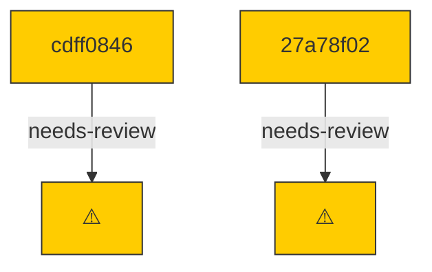

# Backport Agent — Detailed Run Report

> This file is generated automatically. It is intended for human analysts and
> AI reasoning models to assess agent performance, decision quality, and LLM behavior.

**Run timestamp**: 2026-06-22T09:07:10.472Z
**Models used**: fast=`mistral/mistral-code-agent-latest`  powerful=`mistral/mistral-vibe-cli-latest`
**Prompt log**: `/Users/rlemeill/Development/tea-ching-cline/.backport-agent/run-1782117909211.prompts.jsonl`

---

## Summary (PR body)

## Backport Agent — Sync Report

**Date**: 2026-06-22T09:07:10.472Z
**Upstream ref**: `main`
**Fork ref**: `keypool-live`
**Sync branch**: `sync/upstream-main-2026-06-22-084614`

### Summary

- ✅ Applied: 0
- ⚠️ Needs human review: 2
- ⛔ Blocked (not attempted): 0

### ⚠️ Human review required

- `cdff0846` chore(sdk): release v0.0.50
  - Conflicted files: bun.lock
  - AI resolution failed on all models: JSON Parse error: Unterminated string
- `27a78f02` chore(sdk): release v0.0.51
  - Blocked by earlier conflict in cdff084652e46a4f9aa7e8f4ed57766a3e10f712

### Agent decision log

- Attempted cherry-pick of cdff084652e46a4f9aa7e8f4ed57766a3e10f712 but encountered conflict in bun.lock
- AI conflict resolution failed due to JSON parse error in bun.lock content
- Aborted the cherry-pick operation, both commits remain blocked


---

## Agent Workflow Diagram

> Generated by the fast model from the run summary. Evaluate the agent's decision path.



---

## AI Sub-Agent Call Log (4 calls)

> Each entry is one sub-agent invocation. Review prompt/response pairs to assess
> reasoning quality, hallucinations, and decision accuracy.

### Call 1 / 4 — `analyze_commit_for_backport` ✅ OK

| Field | Value |
|---|---|
| **Timestamp** | 2026-06-22T08:46:07.685Z |
| **Tool** | `analyze_commit_for_backport` |
| **Model** | `mistral/mistral-vibe-cli-latest` |
| **Duration** | 5048 ms |
| **Tokens in** | 18519 |
| **Tokens out** | 76 |
| **Cost** | $0.000000 |

**Prompt sent to sub-agent:**

```
Commit SHA: cdff084652e46a4f9aa7e8f4ed57766a3e10f712
Commit message:
chore(sdk): release v0.0.50

Changed files (8):
bun.lock
sdk/CHANGELOG.md
sdk/packages/agents/package.json
sdk/packages/core/package.json
sdk/packages/llms/package.json
sdk/packages/llms/src/catalog/catalog.generated.ts
sdk/packages/sdk/package.json
sdk/packages/shared/package.json

Diff:
commit cdff084652e46a4f9aa7e8f4ed57766a3e10f712
Author: Saoud Rizwan <7799382+saoudrizwan@users.noreply.github.com>
Date:   Fri Jun 19 14:11:25 2026 -0700

    chore(sdk): release v0.0.50
---
 bun.lock                                           | 400 ++++++++++++---------
 sdk/CHANGELOG.md                                   |  10 +
 sdk/packages/agents/package.json                   |   2 +-
 sdk/packages/core/package.json                     |   2 +-
 sdk/packages/llms/package.json                     |   2 +-
 sdk/packages/llms/src/catalog/catalog.generated.ts | 367 ++++++++++++++-----
 sdk/packages/sdk/package.json                      |   2 +-
 sdk/packages/shared/package.json                   |   2 +-
 8 files changed, 530 insertions(+), 257 deletions(-)

diff --git a/bun.lock b/bun.lock
index ac81bc40d5..3daaf5ed13 100644
--- a/bun.lock
+++ b/bun.lock
@@ -372,7 +372,7 @@
     },
     "sdk/packages/agents": {
       "name": "@cline/agents",
-      "version": "0.0.49",
+      "version": "0.0.50",
       "dependencies": {
         "@cline/llms": "workspace:*",
         "@cline/shared": "workspace:*",
@@ -381,7 +381,7 @@
     },
     "sdk/packages/core": {
       "name": "@cline/core",
-      "version": "0.0.49",
+      "version": "0.0.50",
       "dependencies": {
         "@cline/agents": "workspace:*",
         "@cline/llms": "workspace:*",
@@ -419,7 +419,7 @@
     },
     "sdk/packages/llms": {
       "name": "@cline/llms",
-      "version": "0.0.49",
+      "version": "0.0.50",
       "dependencies": {
         "@ai-sdk/amazon-bedrock": "^4.0.89",
         "@ai-sdk/anthropic": "^3.0.68",
@@ -453,14 +453,14 @@
     },
     "sdk/packages/sdk": {
       "name": "@cline/sdk",
-      "version": "0.0.49",
+      "version": "0.0.50",
       "dependencies": {
         "@cline/core": "workspace:*",
       },
     },
     "sdk/packages/shared": {
       "name": "@cline/shared",
-      "version": "0.0.49",
+      "version": "0.0.50",
       "dependencies": {
         "aws4fetch": "^1.0.20",
         "jsonrepair": "^3.13.2",
@@ -472,27 +472,27 @@
   "packages": {
     "@agentclientprotocol/sdk": ["@agentclientprotocol/sdk@0.16.1", "", { "peerDependencies": { "zod": "^3.25.0 || ^4.0.0" } }, "sha512-1ad+Sc/0sCtZGHthxxvgEUo5Wsbw16I+aF+YwdiLnPwkZG8KAGUEAPK6LM6Pf69lCyJPt1Aomk1d+8oE3C4ZEw=="],
 
-    "@ai-sdk/amazon-bedrock": ["@ai-sdk/amazon-bedrock@4.0.114", "", { "dependencies": { "@ai-sdk/anthropic": "3.0.82", "@ai-sdk/openai": "3.0.69", "@ai-sdk/provider": "3.0.10", "@ai-sdk/provider-utils": "4.0.27", "@smithy/eventstream-codec": "^4.0.1", "@smithy/util-utf8": "^4.0.0", "aws4fetch": "^1.0.20" }, "peerDependencies": { "zod": "^3.25.76 || ^4.1.8" } }, "sha512-s3ajs4hlAdb+5A58O423OY0zEcNfsjgGLv+GkbwZegjcvvfESyoH2CzZnG321Fjzr79nKpo7PQsVFxMZcWwFaQ=="],
+    "@ai-sdk/amazon-bedrock": ["@ai-sdk/amazon-bedrock@4.0.117", "", { "dependencies": { "@ai-sdk/anthropic": "3.0.84", "@ai-sdk/openai": "3.0.71", "@ai-sdk/provider": "3.0.10", "@ai-sdk/provider-utils": "4.0.29", "@smithy/eventstream-codec": "^4.0.1", "@smithy/util-utf8": "^4.0.0", "aws4fetch": "^1.0.20" }, "peerDependencies": { "zod": "^3.25.76 || ^4.1.8" } }, "sha512-MebXAEsdvNdzKZCbVxFK0668KhYrs6W3mMH5fWT5Yc0TMSSTbwPI9fIw0sOzxLWd9TE9cJz73vVPjQjtG3vj/Q=="],
 
-    "@ai-sdk/anthropic": ["@ai-sdk/anthropic@3.0.82", "", { "dependencies": { "@ai-sdk/provider": "3.0.10", "@ai-sdk/provider-utils": "4.0.27" }, "peerDependencies": { "zod": "^3.25.76 || ^4.1.8" } }, "sha512-WKKou2wbhGGYV8PSALAPyV2YY4nfCqCPkyBzYtJtDA9yCcIFwsbtkTNgg7bqtLCVzeEsY7wwxRoCWy+EMfrw/A=="],
+    "@ai-sdk/anthropic": ["@ai-sdk/anthropic@3.0.84", "", { "dependencies": { "@ai-sdk/provider": "3.0.10", "@ai-sdk/provider-utils": "4.0.29" }, "peerDependencies": { "zod": "^3.25.76 || ^4.1.8" } }, "sha512-BIDaHmCHs6Sr5VUsEkTbbVlAN4GWjg97X9x/IfXyviLtzsXvffui9XIcZugkAi1Ri6FnvI5T5qDGh5YLnSuzRg=="],
 
-    "@ai-sdk/gateway": ["@ai-sdk/gateway@3.0.127", "", { "dependencies": { "@ai-sdk/provider": "3.0.10", "@ai-sdk/provider-utils": "4.0.27", "@vercel/oidc": "3.2.0" }, "peerDependencies": { "zod": "^3.25.76 || ^4.1.8" } }, "sha512-Obmw5hmE5x+ccRrMp/Djx5r0rpFVX87YqE6OY06g5fwYlRI30dA84ARfTzX45ivCvkW4eCnBpOVXVWQ/pjH85w=="],
+    "@ai-sdk/gateway": ["@ai-sdk/gateway@3.0.129", "", { "dependencies": { "@ai-sdk/provider": "3.0.10", "@ai-sdk/provider-utils": "4.0.29", "@vercel/oidc": "3.2.0" }, "peerDependencies": { "zod": "^3.25.76 || ^4.1.8" } }, "sha512-KEQpZGJuCksc4iFxYtVHeHHG7yH0izGFzJLmRZlriI0hFIzJF9bT2AzJoaTHUI6minlxtP0WKYh84dP18o/Cuw=="],
 
-    "@ai-sdk/google": ["@ai-sdk/google@3.0.80", "", { "dependencies": { "@ai-sdk/provider": "3.0.10", "@ai-sdk/provider-utils": "4.0.27" }, "peerDependencies": { "zod": "^3.25.76 || ^4.1.8" } }, "sha512-5ORbm/yFUPO0MEvZsxBMN0cdKw2+lwU/wVn5KN3KF8Dmk1LughuDuUohMh/7iU/XFTiyB0OvmTW/tdV/J7O9zg=="],
+    "@ai-sdk/google": ["@ai-sdk/google@3.0.82", "", { "dependencies": { "@ai-sdk/provider": "3.0.10", "@ai-sdk/provider-utils": "4.0.29" }, "peerDependencies": { "zod": "^3.25.76 || ^4.1.8" } }, "sha512-md+M92ZJuPIMU2p4v1rGLpJJWTmTh/vpJPkMnQbEdcLaPTZxRaroIKSnmL/9UGJV0BORJlHNDJegkcnhVpTmDA=="],
 
-    "@ai-sdk/google-vertex": ["@ai-sdk/google-vertex@4.0.143", "", { "dependencies": { "@ai-sdk/anthropic": "3.0.82", "@ai-sdk/google": "3.0.80", "@ai-sdk/openai-compatible": "2.0.48", "@ai-sdk/provider": "3.0.10", "@ai-sdk/provider-utils": "4.0.27", "google-auth-library": "^10.5.0" }, "peerDependencies": { "zod": "^3.25.76 || ^4.1.8" } }, "sha512-ue7NXgSX8F7ASv5y/+HTaAdz+QyZQB0uReeujestsnqCWk5LT52lkIon9ukXC/GbqyF+vvcojLoMWeuLQxDnbQ=="],
+    "@ai-sdk/google-vertex": ["@ai-sdk/google-vertex@4.0.145", "", { "dependencies": { "@ai-sdk/anthropic": "3.0.84", "@ai-sdk/google": "3.0.82", "@ai-sdk/openai-compatible": "2.0.50", "@ai-sdk/provider": "3.0.10", "@ai-sdk/provider-utils": "4.0.29", "google-auth-library": "^10.5.0" }, "peerDependencies": { "zod": "^3.25.76 || ^4.1.8" } }, "sha512-48wlju7ksjARn6aa1vUZtPFDp+PXadHDpOsE8YHvi4wKVUf7Sxma+WYZNkIDts1b9Alv0BBZlkn5azLNciHD6g=="],
 
-    "@ai-sdk/mistral": ["@ai-sdk/mistral@3.0.37", "", { "dependencies": { "@ai-sdk/provider": "3.0.10", "@ai-sdk/provider-utils": "4.0.27" }, "peerDependencies": { "zod": "^3.25.76 || ^4.1.8" } }, "sha512-KkdaMjs4C2y+vrZWJE990E3ZxBFiOTHQ94ZlquuIttpphcqJTMxNoIpnKT/4UzMVWXL0BUEE2vs+1UEVXkN8Kg=="],
+    "@ai-sdk/mistral": ["@ai-sdk/mistral@3.0.39", "", { "dependencies": { "@ai-sdk/provider": "3.0.10", "@ai-sdk/provider-utils": "4.0.29" }, "peerDependencies": { "zod": "^3.25.76 || ^4.1.8" } }, "sha512-drPs9K3a7A8LKvISzbXDoKlRD00CqeacKSSrjFDswCfCr1xS/4/GYUyJDt7UKykHW//iiiElSFWoea95yRQchg=="],
 
-    "@ai-sdk/openai": ["@ai-sdk/openai@3.0.69", "", { "dependencies": { "@ai-sdk/provider": "3.0.10", "@ai-sdk/provider-utils": "4.0.27" }, "peerDependencies": { "zod": "^3.25.76 || ^4.1.8" } }, "sha512-T/J3ED6ERDsine+crkXHfraisSG20k6BkBdgjvXCvySYnnJ19IaLIOsQPYfvXdOsKrl0LVNghooTV/nKCA7SmQ=="],
+    "@ai-sdk/openai": ["@ai-sdk/openai@3.0.71", "", { "dependencies": { "@ai-sdk/provider": "3.0.10", "@ai-sdk/provider-utils": "4.0.29" }, "peerDependencies": { "zod": "^3.25.76 || ^4.1.8" } }, "sha512-j6eBAa5oHFZ4U5CxpIV3T4zXNM/BviodNCZCL1qHkA4aqkwK9iQ18TWYz2DZcXpw4BO5pikKzqpXORxb1EnZGA=="],
 
-    "@ai-sdk/openai-compatible": ["@ai-sdk/openai-compatible@2.0.48", "", { "dependencies": { "@ai-sdk/provider": "3.0.10", "@ai-sdk/provider-utils": "4.0.27" }, "peerDependencies": { "zod": "^3.25.76 || ^4.1.8" } }, "sha512-z9MC6M4Oh/yUY/F/eszOtO8wc2nMz99XmZQKd2gWTtyIfe716xTfrKe3aYZKg20NZDtyjqPPKPSR+wqz7q1T7Q=="],
+    "@ai-sdk/openai-compatible": ["@ai-sdk/openai-compatible@2.0.50", "", { "dependencies": { "@ai-sdk/provider": "3.0.10", "@ai-sdk/provider-utils": "4.0.29" }, "peerDependencies": { "zod": "^3.25.76 || ^4.1.8" } }, "sha512-HyuxddF2Yv5G8qxK/0uksAINjQ4h6TpwOqHuqzsCM0u78/JWAW2OXcIplQeB44PIAORgPjbMzrw9DhnPYHMskA=="],
 
     "@ai-sdk/provider": ["@ai-sdk/provider@3.0.10", "", { "dependencies": { "json-schema": "^0.4.0" } }, "sha512-Q3BZ27qfpYqnCYGvE3vt+Qi6LGOF9R5Nmzn+9JoM1lCRsD9mYaIhfJLkSunN48nfGXJ6n+XNV0J/XVpqGQl7Dw=="],
 
-    "@ai-sdk/provider-utils": ["@ai-sdk/provider-utils@4.0.27", "", { "dependencies": { "@ai-sdk/provider": "3.0.10", "@standard-schema/spec": "^1.1.0", "eventsource-parser": "^3.0.8" }, "peerDependencies": { "zod": "^3.25.76 || ^4.1.8" } }, "sha512-ubkAJ+xODouwtmN1tYlvTPphH1hPOBfZaEQe8U7skGvFAnIRs9PPpsq57bC2+Ky/MB4yzhd6YOsxTAx9sGpazw=="],
+    "@ai-sdk/provider-utils": ["@ai-sdk/provider-utils@4.0.29", "", { "dependencies": { "@ai-sdk/provider": "3.0.10", "@standard-schema/spec": "^1.1.0", "eventsource-parser": "^3.0.8" }, "peerDependencies": { "zod": "^3.25.76 || ^4.1.8" } }, "sha512-uhukHaCBvqkwBHkT8C2PrnqKTCoLn3pdHXqtcR9I8ErH+flbzgW4o7VHSNIup9LRu+WBvZIZDQLsx6rwl2tiOA=="],
 
-    "@ai-sdk/react": ["@ai-sdk/react@3.0.201", "", { "dependencies": { "@ai-sdk/provider-utils": "4.0.27", "ai": "6.0.199", "swr": "^2.2.5", "throttleit": "2.1.0" }, "peerDependencies": { "react": "^18 || ~19.0.1 || ~19.1.2 || ^19.2.1" } }, "sha512-sDYdkPB96aHPrF5WKP0BdjRjymgZOdIMzNt1SlYPCoWWvLnV+UMwnIqvqEG+OAa9n4Sq7J3A3N/JD7rozow+CA=="],
+    "@ai-sdk/react": ["@ai-sdk/react@3.0.205", "", { "dependencies": { "@ai-sdk/provider-utils": "4.0.29", "ai": "6.0.203", "swr": "^2.2.5", "throttleit": "2.1.0" }, "peerDependencies": { "react": "^18 || ~19.0.1 || ~19.1.2 || ^19.2.1" } }, "sha512-qh4H9dUqTJwdr+arKSIrVBHG4o4sYJdZGFUCJfAf9vMe/5IwDRwhq9z5ztpcUrXD3QACO01nuyfufNc0ZoGReA=="],
 
     "@alloc/quick-lru": ["@alloc/quick-lru@5.2.0", "", {}, "sha512-UrcABB+4bUrFABwbluTIBErXwvbsU/V7TZWfmbgJfbkwiBuziS9gxdODUyuiecfdGQ85jglMW6juS3+z5TsKLw=="],
 
@@ -528,35 +528,35 @@
 
     "@aws-crypto/util": ["@aws-crypto/util@5.2.0", "", { "dependencies": { "@aws-sdk/types": "^3.222.0", "@smithy/util-utf8": "^2.0.0", "tslib": "^2.6.2" } }, "sha512-4RkU9EsI6ZpBve5fseQlGNUWKMa1RLPQ1dnjnQoe07ldfIzcsGb5hC5W0Dm7u423KWzawlrpbjXBrXCEv9zazQ=="],
 
-    "@aws-sdk/client-cognito-identity": ["@aws-sdk/client-cognito-identity@3.1065.0", "", { "dependencies": { "@aws-crypto/sha256-browser": "5.2.0", "@aws-crypto/sha256-js": "5.2.0", "@aws-sdk/core": "^3.974.20", "@aws-sdk/credential-provider-node": "^3.972.54", "@aws-sdk/types": "^3.973.12", "@smithy/core": "^3.24.6", "@smithy/fetch-http-handler": "^5.4.6", "@smithy/node-http-handler": "^4.7.6", "@smithy/types": "^4.14.3", "tslib": "^2.6.2" } }, "sha512-dGKFCiGbX5IrK+1NcqNgHKqWZtF3f5K2tDWJKDvGBurOO2q1SHu/XntEJydLWqEzYzJTimOZHaDzp/fqwYzu+g=="],
+    "@aws-sdk/client-cognito-identity": ["@aws-sdk/client-cognito-identity@3.1068.0", "", { "dependencies": { "@aws-crypto/sha256-browser": "5.2.0", "@aws-crypto/sha256-js": "5.2.0", "@aws-sdk/core": "^3.974.20", "@aws-sdk/credential-provider-node": "^3.972.55", "@aws-sdk/types": "^3.973.12", "@smithy/core": "^3.24.6", "@smithy/fetch-http-handler": "^5.4.6", "@smithy/node-http-handler": "^4.7.6", "@smithy/types": "^4.14.3", "tslib": "^2.6.2" } }, "sha512-by2Qj3f9BI9X4cY0n160R3uzkMpI6k9PmGA8QLAuzr8HzkiNrYFygMEPhIEdqBFHQPD/8AXNUs45HYjEDsQ33g=="],
 
     "@aws-sdk/core": ["@aws-sdk/core@3.974.20", "", { "dependencies": { "@aws-sdk/types": "^3.973.12", "@aws-sdk/xml-builder": "^3.972.29", "@aws/lambda-invoke-store": "^0.2.2", "@smithy/core": "^3.24.6", "@smithy/signature-v4": "^5.4.6", "@smithy/types": "^4.14.3", "bowser": "^2.11.0", "tslib": "^2.6.2" } }, "sha512-7sDi2B2N3mc3nf1nz6FyEx/FCrJ1N1QnBmraHHQNabFaeAh2IaOOLml48/rHOD1bICHgTRkbBgNTvUzEr5Z35g=="],
 
-    "@aws-sdk/credential-provider-cognito-identity": ["@aws-sdk/credential-provider-cognito-identity@3.972.44", "", { "dependencies": { "@aws-sdk/nested-clients": "^3.997.19", "@aws-sdk/types": "^3.973.12", "@smithy/core": "^3.24.6", "@smithy/types": "^4.14.3", "tslib": "^2.6.2" } }, "sha512-OjovzYsHOTZmOdrSQI2/CjGNgHO0c0ZHTFIkt3bBfrhgNFPTLnbZDvmGdMst7U5c1dqq4gzpUwZC6X9HA12MDQ=="],
+    "@aws-sdk/credential-provider-cognito-identity": ["@aws-sdk/credential-provider-cognito-identity@3.972.45", "", { "dependencies": { "@aws-sdk/nested-clients": "^3.997.20", "@aws-sdk/types": "^3.973.12", "@smithy/core": "^3.24.6", "@smithy/types": "^4.14.3", "tslib": "^2.6.2" } }, "sha512-4L/REssieLON1hVsTzZucP1p2u5jmPNejyh/9BCGZXr93IalBbhRPCrtKIKwMTu9yRGr/bcKzhrQocByKLSzLQ=="],
 
     "@aws-sdk/credential-provider-env": ["@aws-sdk/credential-provider-env@3.972.46", "", { "dependencies": { "@aws-sdk/core": "^3.974.20", "@aws-sdk/types": "^3.973.12", "@smithy/core": "^3.24.6", "@smithy/types": "^4.14.3", "tslib": "^2.6.2" } }, "sha512-+GPXVS2srMOlH74S+SmC1gVuP2TvUZ0siuC0onKO93q+udP+M72dmY8wJfVQ5CX9z/9X5A1HHwz5yRIGBtskvQ=="],
 
     "@aws-sdk/credential-provider-http": ["@aws-sdk/credential-provider-http@3.972.48", "", { "dependencies": { "@aws-sdk/core": "^3.974.20", "@aws-sdk/types": "^3.973.12", "@smithy/core": "^3.24.6", "@smithy/fetch-http-handler": "^5.4.6", "@smithy/node-http-handler": "^4.7.6", "@smithy/types": "^4.14.3", "tslib": "^2.6.2" } }, "sha512-fA5loSdlocacRxyUXtpoHSMuk5rsIKRDzQYVMnMxjcmFeZshaJlJ8lymy/hYKji6sne/UmNGj5pxuEs6kq/Qcg=="],
 
-    "@aws-sdk/credential-provider-ini": ["@aws-sdk/credential-provider-ini@3.972.52", "", { "dependencies": { "@aws-sdk/core": "^3.974.20", "@aws-sdk/credential-provider-env": "^3.972.46", "@aws-sdk/credential-provider-http": "^3.972.48", "@aws-sdk/credential-provider-login": "^3.972.51", "@aws-sdk/credential-provider-process": "^3.972.46", "@aws-sdk/credential-provider-sso": "^3.972.51", "@aws-sdk/credential-provider-web-identity": "^3.972.51", "@aws-sdk/nested-clients": "^3.997.19", "@aws-sdk/types": "^3.973.12", "@smithy/core": "^3.24.6", "@smithy/credential-provider-imds": "^4.3.7", "@smithy/types": "^4.14.3", "tslib": "^2.6.2" } }, "sha512-szg1nnebqC+Svv6Vfsdf6P/QK8x5g/ghG2CKa/1WkHifRnq0BBmDELj2Qnqk9nPsUvEu/OEcYic97CPLpKqF9g=="],
+    "@aws-sdk/credential-provider-ini": ["@aws-sdk/credential-provider-ini@3.972.53", "", { "dependencies": { "@aws-sdk/core": "^3.974.20", "@aws-sdk/credential-provider-env": "^3.972.46", "@aws-sdk/credential-provider-http": "^3.972.48", "@aws-sdk/credential-provider-login": "^3.972.52", "@aws-sdk/credential-provider-process": "^3.972.46", "@aws-sdk/credential-provider-sso": "^3.972.52", "@aws-sdk/credential-provider-web-identity": "^3.972.52", "@aws-sdk/nested-clients": "^3.997.20", "@aws-sdk/types": "^3.973.12", "@smithy/core": "^3.24.6", "@smithy/credential-provider-imds": "^4.3.7", "@smithy/types": "^4.14.3", "tslib": "^2.6.2" } }, "sha512-ZfdhIOR41q8TcWEnUac+gCOb+O2LBWdHLmjedXpXz4IEFW2ppNuFcm6p0sMTavpM+zD5TYfpH5Gp7guRyqSgsQ=="],
 
-    "@aws-sdk/credential-provider-login": ["@aws-sdk/credential-provider-login@3.972.51", "", { "dependencies": { "@aws-sdk/core": "^3.974.20", "@aws-sdk/nested-clients": "^3.997.19", "@aws-sdk/types": "^3.973.12", "@smithy/core": "^3.24.6", "@smithy/types": "^4.14.3", "tslib": "^2.6.2" } }, "sha512-csHFsH+/VjnI40oqm1l1OqMY4B4kza36DbfcbHcgcbobgjebasqUbTU34xvwUkvtoNGGizbfyMSlMzJWUPv3dQ=="],
+    "@aws-sdk/credential-provider-login": ["@aws-sdk/credential-provider-login@3.972.52", "", { "dependencies": { "@aws-sdk/core": "^3.974.20", "@aws-sdk/nested-clients": "^3.997.20", "@aws-sdk/types": "^3.973.12", "@smithy/core": "^3.24.6", "@smithy/types": "^4.14.3", "tslib": "^2.6.2" } }, "sha512-9hu2oR0qH7Fst5Tzdx+UWxm+w5zCXtErTLtOOW5hwwQc170CLwOeniRxyFY6s9mHfGEfC5zFukNBdKBwJR8mhQ=="],
 
-    "@aws-sdk/credential-provider-node": ["@aws-sdk/credential-provider-node@3.972.54", "", { "dependencies": { "@aws-sdk/credential-provider-env": "^3.972.46", "@aws-sdk/credential-provider-http": "^3.972.48", "@aws-sdk/credential-provider-ini": "^3.972.52", "@aws-sdk/credential-provider-process": "^3.972.46", "@aws-sdk/credential-provider-sso": "^3.972.51", "@aws-sdk/credential-provider-web-identity": "^3.972.51", "@aws-sdk/types": "^3.973.12", "@smithy/core": "^3.24.6", "@smithy/credential-provider-imds": "^4.3.7", "@smithy/types": "^4.14.3", "tslib": "^2.6.2" } }, "sha512-vinTSQtziNHxi2nqXF+76jr2sO44q88Ind1qFFVaotNgBaC1rcWDjBug8yoE8n0ov33s21xks9WY5XDHH9SENw=="],
+    "@aws-sdk/credential-provider-node": ["@aws-sdk/credential-provider-node@3.972.55", "", { "dependencies": { "@aws-sdk/credential-provider-env": "^3.972.46", "@aws-sdk/credential-provider-http": "^3.972.48", "@aws-sdk/credential-provider-ini": "^3.972.53", "@aws-sdk/credential-provider-process": "^3.972.46", "@aws-sdk/credential-provider-sso": "^3.972.52", "@aws-sdk/credential-provider-web-identity": "^3.972.52", "@aws-sdk/types": "^3.973.12", "@smithy/core": "^3.24.6", "@smithy/credential-provider-imds": "^4.3.7", "@smithy/types": "^4.14.3", "tslib": "^2.6.2" } }, "sha512-zMGLa/dhESVqmCD7mmIFFKSwSFrJGScvCXcjvBZEVOOMauFS5JRQvLTMukFpMEFWiV6dTAlsen2ATDBulLPtbg=="],
 
     "@aws-sdk/credential-provider-process": ["@aws-sdk/credential-provider-process@3.972.46", "", { "dependencies": { "@aws-sdk/core": "^3.974.20", "@aws-sdk/types": "^3.973.12", "@smithy/core": "^3.24.6", "@smithy/types": "^4.14.3", "tslib": "^2.6.2" } }, "sha512-VUoNFBIjWrUN8NbFiQiuxQEgFjvziAlBRPK+ddh27aj65gk0BYu6bLZnrdrNZwpW6vAihtSUtEMQ1PUJ32QRPA=="],
 
-    "@aws-sdk/credential-provider-sso": ["@aws-sdk/credential-provider-sso@3.972.51", "", { "dependencies": { "@aws-sdk/core": "^3.974.20", "@aws-sdk/nested-clients": "^3.997.19", "@aws-sdk/token-providers": "3.1065.0", "@aws-sdk/types": "^3.973.12", "@smithy/core": "^3.24.6", "@smithy/types": "^4.14.3", "tslib": "^2.6.2" } }, "sha512-60qhpQcSDIKIr0AuBlmJezKX0b5nbJPCINiR49N9yJXrEI5tTRwsXVBr0IdSvvsNJyqgiINyoBd++Ed0yvggbw=="],
+    "@aws-sdk/credential-provider-sso": ["@aws-sdk/credential-provider-sso@3.972.52", "", { "dependencies": { "@aws-sdk/core": "^3.974.20", "@aws-sdk/nested-clients": "^3.997.20", "@aws-sdk/token-providers": "3.1066.0", "@aws-sdk/types": "^3.973.12", "@smithy/core": "^3.24.6", "@smithy/types": "^4.14.3", "tslib": "^2.6.2" } }, "sha512-nb2/n4o/HQf+FVpVbZe9vCTFngmuDoIsltMgLAtjixaKzvzhB4J8WSDFyWgnErgLHk55ctWH+I4PU+LIHhyffg=="],
 
-    "@aws-sdk/credential-provider-web-identity": ["@aws-sdk/credential-provider-web-identity@3.972.51", "", { "dependencies": { "@aws-sdk/core": "^3.974.20", "@aws-sdk/nested-clients": "^3.997.19", "@aws-sdk/types": "^3.973.12", "@smithy/core": "^3.24.6", "@smithy/types": "^4.14.3", "tslib": "^2.6.2" } }, "sha512-0X5eWsUIp8ItRJeJBBrhQAPzc9AQelDetRTVTsycCAISCCzM17R4hs/vFAPeQ0o0B35sciLiqe/Pwmml909cZA=="],
+    "@aws-sdk/credential-provider-web-identity": ["@aws-sdk/credential-provider-web-identity@3.972.52", "", { "dependencies": { "@aws-sdk/core": "^3.974.20", "@aws-sdk/nested-clients": "^3.997.20", "@aws-sdk/types": "^3.973.12", "@smithy/core": "^3.24.6", "@smithy/types": "^4.14.3", "tslib": "^2.6.2" } }, "sha512-lKj6aRSGbqLmpYmM24bY7a1Xmfcq2vkE3hv8CSPYfc1yCu0BPu/XEJ1L4Fm61MsU6ULLNSG8UGsffNoFUBjESA=="],
 
-    "@aws-sdk/credential-providers": ["@aws-sdk/credential-providers@3.1065.0", "", { "dependencies": { "@aws-sdk/client-cognito-identity": "3.1065.0", "@aws-sdk/core": "^3.974.20", "@aws-sdk/credential-provider-cognito-identity": "^3.972.44", "@aws-sdk/credential-provider-env": "^3.972.46", "@aws-sdk/credential-provider-http": "^3.972.48", "@aws-sdk/credential-provider-ini": "^3.972.52", "@aws-sdk/credential-provider-login": "^3.972.51", "@aws-sdk/credential-provider-node": "^3.972.54", "@aws-sdk/credential-provider-process": "^3.972.46", "@aws-sdk/credential-provider-sso": "^3.972.51", "@aws-sdk/credential-provider-web-identity": "^3.972.51", "@aws-sdk/nested-clients": "^3.997.19", "@aws-sdk/types": "^3.973.12", "@smithy/core": "^3.24.6", "@smithy/credential-provider-imds": "^4.3.7", "@smithy/types": "^4.14.3", "tslib": "^2.6.2" } }, "sha512-g5FGZvk9UbAD7HeGFCp+fQGJiNAneJJabpAZY13SSmVeI2Yw/V66U3na1StnqvZCYfXvGybJvSGtq2IdoCrK4g=="],
+    "@aws-sdk/credential-providers": ["@aws-sdk/credential-providers@3.1068.0", "", { "dependencies": { "@aws-sdk/client-cognito-identity": "3.1068.0", "@aws-sdk/core": "^3.974.20", "@aws-sdk/credential-provider-cognito-identity": "^3.972.45", "@aws-sdk/credential-provider-env": "^3.972.46", "@aws-sdk/credential-provider-http": "^3.972.48", "@aws-sdk/credential-provider-ini": "^3.972.53", "@aws-sdk/credential-provider-login": "^3.972.52", "@aws-sdk/credential-provider-node": "^3.972.55", "@aws-sdk/credential-provider-process": "^3.972.46", "@aws-sdk/credential-provider-sso": "^3.972.52", "@aws-sdk/credential-provider-web-identity": "^3.972.52", "@aws-sdk/nested-clients": "^3.997.20", "@aws-sdk/types": "^3.973.12", "@smithy/core": "^3.24.6", "@smithy/credential-provider-imds": "^4.3.7", "@smithy/types": "^4.14.3", "tslib": "^2.6.2" } }, "sha512-DN7UewD/XKGfNGWXZsTECWRj3IsULkE7aG+fPwqPf13CnX4UmNvj80g1xieJ0lVdMQ2h0L3gZpn2ClIY06+/vQ=="],
 
-    "@aws-sdk/nested-clients": ["@aws-sdk/nested-clients@3.997.19", "", { "dependencies": { "@aws-crypto/sha256-browser": "5.2.0", "@aws-crypto/sha256-js": "5.2.0", "@aws-sdk/core": "^3.974.20", "@aws-sdk/signature-v4-multi-region": "^3.996.33", "@aws-sdk/types": "^3.973.12", "@smithy/core": "^3.24.6", "@smithy/fetch-http-handler": "^5.4.6", "@smithy/node-http-handler": "^4.7.6", "@smithy/types": "^4.14.3", "tslib": "^2.6.2" } }, "sha512-P2Otgf15GBJMKzG6j5Ddf7w+Kz6z2jvesMy874TD3jlMfDWNK7clJeUd7hgigdeVOotjoUP4emcTWVdS9sfZDw=="],
+    "@aws-sdk/nested-clients": ["@aws-sdk/nested-clients@3.997.20", "", { "dependencies": { "@aws-crypto/sha256-browser": "5.2.0", "@aws-crypto/sha256-js": "5.2.0", "@aws-sdk/core": "^3.974.20", "@aws-sdk/signature-v4-multi-region": "^3.996.34", "@aws-sdk/types": "^3.973.12", "@smithy/core": "^3.24.6", "@smithy/fetch-http-handler": "^5.4.6", "@smithy/node-http-handler": "^4.7.6", "@smithy/types": "^4.14.3", "tslib": "^2.6.2" } }, "sha512-IYJuLpXp2DEILVQpQOy0PMpkftv0AHEOCn52o0atyOaumA0CdWQ3klPyXdViGYLbNpESsVFMVybvHUeZAuiGxA=="],
 
-    "@aws-sdk/signature-v4-multi-region": ["@aws-sdk/signature-v4-multi-region@3.996.33", "", { "dependencies": { "@aws-sdk/types": "^3.973.12", "@smithy/signature-v4": "^5.4.6", "@smithy/types": "^4.14.3", "tslib": "^2.6.2" } }, "sha512-Hn0RThJEbyOZWV2PV9Z4YD3nitGPxybmyU17dSe9b61WOBcKnqS0WTtM3c1zyZq9WnGiyrfi/i+UBPUk7cM8Ug=="],
+    "@aws-sdk/signature-v4-multi-region": ["@aws-sdk/signature-v4-multi-region@3.996.34", "", { "dependencies": { "@aws-sdk/types": "^3.973.12", "@smithy/signature-v4": "^5.4.6", "@smithy/types": "^4.14.3", "tslib": "^2.6.2" } }, "sha512-mx1L5qlumSOt/nKM3BFaHE2HVkWwz0i4Bw0pyYO42FfX/FeLlo8YI6csC0gSPprEk6fTIqI+CZN9RwUwKd5krQ=="],
 
-    "@aws-sdk/token-providers": ["@aws-sdk/token-providers@3.1065.0", "", { "dependencies": { "@aws-sdk/core": "^3.974.20", "@aws-sdk/nested-clients": "^3.997.19", "@aws-sdk/types": "^3.973.12", "@smithy/core": "^3.24.6", "@smithy/types": "^4.14.3", "tslib": "^2.6.2" } }, "sha512-qdHQntq82gMqG6Tf8xrgmhJxacaYkxW4PEeDg/ISMVJ84EWe7iD6JyCTgbyox3uNDH6vqEJ8GUiTaXCq307zVw=="],
+    "@aws-sdk/token-providers": ["@aws-sdk/token-providers@3.1066.0", "", { "dependencies": { "@aws-sdk/core": "^3.974.20", "@aws-sdk/nested-clients": "^3.997.20", "@aws-sdk/types": "^3.973.12", "@smithy/core": "^3.24.6", "@smithy/types": "^4.14.3", "tslib": "^2.6.2" } }, "sha512-UqEUJq7dqa44hneLDUcX7UJy95cg8YqEWyakRpvIPnrNS3Mq+UlQHgCDGu5pvwAPtlIW4qcYbvW6reG6++FyvA=="],
 
     "@aws-sdk/types": ["@aws-sdk/types@3.973.12", "", { "dependencies": { "@smithy/types": "^4.14.3", "tslib": "^2.6.2" } }, "sha512-43ajd1NF0RMgX5k0hxCNUyEdrtFUsb2aHT2QvpktSC/2Eyb2Jr/JPVqdp0XIoaHWikZJq5tNWSLO6kB5q2eMCA=="],
 
@@ -720,7 +720,7 @@
 
     "@discordjs/ws": ["@discordjs/ws@1.2.3", "", { "dependencies": { "@discordjs/collection": "^2.1.0", "@discordjs/rest": "^2.5.1", "@discordjs/util": "^1.1.0", "@sapphire/async-queue": "^1.5.2", "@types/ws": "^8.5.10", "@vladfrangu/async_event_emitter": "^2.2.4", "discord-api-types": "^0.38.1", "tslib": "^2.6.2", "ws": "^8.17.0" } }, "sha512-wPlQDxEmlDg5IxhJPuxXr3Vy9AjYq5xCvFWGJyD7w7Np8ZGu+Mc+97LCoEc/+AYCo2IDpKioiH0/c/mj5ZR9Uw=="],
 
-    "@dotenvx/dotenvx": ["@dotenvx/dotenvx@1.71.2", "", { "dependencies": { "commander": "^11.1.0", "dotenv": "^17.2.1", "eciesjs": "^0.4.10", "enquirer": "^2.4.1", "execa": "^5.1.1", "fdir": "^6.2.0", "ignore": "^5.3.0", "object-treeify": "1.1.33", "picomatch": "^4.0.4", "which": "^4.0.0", "yocto-spinner": "^1.1.0" }, "bin": { "dotenvx": "src/cli/dotenvx.js" } }, "sha512-Xj9T3Wr+Bo4ILKf9PZJBYJ4SJiZGC/pqIdzOMbX9jgAFb0oGuKkusLleYHN/N6zanZixNvmuMVWYR1T3YJuVTA=="],
+    "@dotenvx/dotenvx": ["@dotenvx/dotenvx@1.71.3", "", { "dependencies": { "commander": "^11.1.0", "dotenv": "^17.2.1", "eciesjs": "^0.4.10", "enquirer": "^2.4.1", "execa": "^5.1.1", "fdir": "^6.2.0", "ignore": "^5.3.0", "object-treeify": "1.1.33", "picomatch": "^4.0.4", "which": "^4.0.0", "yocto-spinner": "^1.1.0" }, "bin": { "dotenvx": "src/cli/dotenvx.js" } }, "sha512-WSmox5aD+XxJEUEOTk7gKLpd5+Iz9Nik89Zpbu5DijMln6LsFiv3xpNKBMc/b9sSkUlKvAblzrhik2TqKFE7NA=="],
 
     "@ecies/ciphers": ["@ecies/ciphers@0.2.6", "", { "peerDependencies": { "@noble/ciphers": "^1.0.0" } }, "sha512-patgsRPKGkhhoBjETV4XxD0En4ui5fbX0hzayqI3M8tvNMGUoUvmyYAIWwlxBc1KX5cturfqByYdj5bYGRpN9g=="],
 
@@ -982,7 +982,7 @@
 
     "@modelcontextprotocol/sdk": ["@modelcontextprotocol/sdk@1.29.0", "", { "dependencies": { "@hono/node-server": "^1.19.9", "ajv": "^8.17.1", "ajv-formats": "^3.0.1", "content-type": "^1.0.5", "cors": "^2.8.5", "cross-spawn": "^7.0.5", "eventsource": "^3.0.2", "eventsource-parser": "^3.0.0", "express": "^5.2.1", "express-rate-limit": "^8.2.1", "hono": "^4.11.4", "jose": "^6.1.3", "json-schema-typed": "^8.0.2", "pkce-challenge": "^5.0.0", "raw-body": "^3.0.0", "zod": "^3.25 || ^4.0", "zod-to-json-schema": "^3.25.1" }, "peerDependencies": { "@cfworker/json-schema": "^4.1.1" }, "optionalPeers": ["@cfworker/json-schema"] }, "sha512-zo37mZA9hJWpULgkRpowewez1y6ML5GsXJPY8FI0tBBCd77HEvza4jDqRKOXgHNn867PVGCyTdzqpz0izu5ZjQ=="],
 
-    "@napi-rs/wasm-runtime": ["@napi-rs/wasm-runtime@1.1.4", "", { "dependencies": { "@tybys/wasm-util": "^0.10.1" }, "peerDependencies": { "@emnapi/core": "^1.7.1", "@emnapi/runtime": "^1.7.1" } }, "sha512-3NQNNgA1YSlJb/kMH1ildASP9HW7/7kYnRI2szWJaofaS1hWmbGI4H+d3+22aGzXXN9IJ+n+GiFVcGipJP18ow=="],
+    "@napi-rs/wasm-runtime": ["@napi-rs/wasm-runtime@1.1.5", "", { "dependencies": { "@tybys/wasm-util": "^0.10.2" }, "peerDependencies": { "@emnapi/core": "^1.7.1", "@emnapi/runtime": "^1.7.1" } }, "sha512-AWPoBRJ9tsnVhor4sjO7rkni+7p+2IAEFj6cx06UgP10jkQHqay/36uRV/bFkgrh18D9vb4cr8Q0Pthskgzy+Q=="],
 
     "@next/env": ["@next/env@16.2.6", "", {}, "sha512-gd8HoHN4ufj73WmR3JmVolrpJR47ILK6LouP5xElPglaVxir6e1a7VzvTvDWkOoPXT9rkkTzyCxBu4yeZfZwcw=="],
 
@@ -1008,7 +1008,7 @@
 
     "@noble/hashes": ["@noble/hashes@1.8.0", "", {}, "sha512-jCs9ldd7NwzpgXDIf6P3+NrHh9/sD6CQdxHyjQI+h/6rDNo88ypBxxz45UDuZHz9r3tNz7N/VInSVoVdtXEI4A=="],
 
-    "@nodable/entities": ["@nodable/entities@2.1.1", "", {}, "sha512-Pig3HxDIoMgjdEH8OCf/dkcTmLFjJRjWuq8jSnklu284/TKOPibSRERmOykiwmyXTtv61mP+44f3GMx0tLAyjg=="],
+    "@nodable/entities": ["@nodable/entities@2.2.0", "", {}, "sha512-9uGyhaQavEUMC8AIddIjau4NsnsXhou+j5sBAGojCM1oxmQpVKTWR/9JxABD6UAv12vpIms55fPZKFQEhG6uBg=="],
 
     "@nodelib/fs.scandir": ["@nodelib/fs.scandir@2.1.5", "", { "dependencies": { "@nodelib/fs.stat": "2.0.5", "run-parallel": "^1.1.9" } }, "sha512-vq24Bq3ym5HEQm2NKCr3yXDwjc7vTsEThRDnkp2DK9p1uqLR+DHurm/NOTo0KG7HYHU7eppKZj3MyqYuMBf62g=="],
 
@@ -1030,13 +1030,13 @@
 
     "@openai/codex-win32-x64": ["@openai/codex@0.130.0-win32-x64", "", { "os": "win32", "cpu": "x64" }, "sha512-FzMznm7fr5/nbjZgOujZ9Y9AbdGm7ji1FOoWiY3U+srqauvZaTgn6o6aCheSL7kuymu7nTLOO/cAyWV6NuesqQ=="],
 
-    "@opencode-ai/sdk": ["@opencode-ai/sdk@1.17.0", "", { "dependencies": { "cross-spawn": "7.0.6" } }, "sha512-a4Fw6lEZqXhjkyTH0LNInntrdLaWcz9M1+eqQgSVqI6PAlcqC/Jo069k8VdGcU3u4qbETqmURec8+VfhS06Sqg=="],
+    "@opencode-ai/sdk": ["@opencode-ai/sdk@1.17.4", "", { "dependencies": { "cross-spawn": "7.0.6" } }, "sha512-OdHkBoNIQOjQsPnFtkcxAp9HsLAKn/MQiq7wIQURkRARmw8yhFqGiMPYbNm+UfLn6bMkx97rdPkWQARejMyiXQ=="],
 
     "@opentelemetry/api": ["@opentelemetry/api@1.9.1", "", {}, "sha512-gLyJlPHPZYdAk1JENA9LeHejZe1Ti77/pTeFm/nMXmQH/HFZlcS/O2XJB+L8fkbrNSqhdtlvjBVjxwUYanNH5Q=="],
 
     "@opentelemetry/api-logs": ["@opentelemetry/api-logs@0.214.0", "", { "dependencies": { "@opentelemetry/api": "^1.3.0" } }, "sha512-40lSJeqYO8Uz2Yj7u94/SJWE/wONa7rmMKjI1ZcIjgf3MHNHv1OZUCrCETGuaRF62d5pQD1wKIW+L4lmSMTzZA=="],
 
-    "@opentelemetry/context-async-hooks": ["@opentelemetry/context-async-hooks@2.7.1", "", { "peerDependencies": { "@opentelemetry/api": ">=1.0.0 <1.10.0" } }, "sha512-OPFBYuXEn1E4ja3Y6eeA7O+ZnLBNcXTV5Cgsn1VaqBZ6hC5FnpZPLBNme1LJY8ZtF4aOujPKFoeWN4ik487KuQ=="],
+    "@opentelemetry/context-async-hooks": ["@opentelemetry/context-async-hooks@2.8.0", "", { "peerDependencies": { "@opentelemetry/api": ">=1.0.0 <1.10.0" } }, "sha512-/3FIraneMcng67SUJCxvyInk/oxzwsxyadufk0wwfOBLf5wqtAGX4MoQASwSbndBPeARzBryUM9Azr5kHIdWLw=="],
 
     "@opentelemetry/core": ["@opentelemetry/core@2.6.1", "", { "dependencies": { "@opentelemetry/semantic-conventions": "^1.29.0" }, "peerDependencies": { "@opentelemetry/api": ">=1.0.0 <1.10.0" } }, "sha512-8xHSGWpJP9wBxgBpnqGL0R3PbdWQndL1Qp50qrg71+B28zK5OQmUgcDKLJgzyAAV38t4tOyLMGDD60LneR5W8g=="],
 
@@ -1050,15 +1050,15 @@
 
     "@opentelemetry/otlp-transformer": ["@opentelemetry/otlp-transformer@0.214.0", "", { "dependencies": { "@opentelemetry/api-logs": "0.214.0", "@opentelemetry/core": "2.6.1", "@opentelemetry/resources": "2.6.1", "@opentelemetry/sdk-logs": "0.214.0", "@opentelemetry/sdk-metrics": "2.6.1", "@opentelemetry/sdk-trace-base": "2.6.1", "protobufjs": "^7.0.0" }, "peerDependencies": { "@opentelemetry/api": "^1.3.0" } }, "sha512-DSaYcuBRh6uozfsWN3R8HsN0yDhCuWP7tOFdkUOVaWD1KVJg8m4qiLUsg/tNhTLS9HUYUcwNpwL2eroLtsZZ/w=="],
 
-    "@opentelemetry/resources": ["@opentelemetry/resources@2.7.1", "", { "dependencies": { "@opentelemetry/core": "2.7.1", "@opentelemetry/semantic-conventions": "^1.29.0" }, "peerDependencies": { "@opentelemetry/api": ">=1.3.0 <1.10.0" } }, "sha512-DeT6KKolmC4e/dRQvMQ/RwlnzhaqeiFOXY5ngoOPJ07GgVVKxZOg9EcrNZb5aTzUn+iCrJldAgOfQm1O/QfPAQ=="],
+    "@opentelemetry/resources": ["@opentelemetry/resources@2.8.0", "", { "dependencies": { "@opentelemetry/core": "2.8.0", "@opentelemetry/semantic-conventions": "^1.29.0" }, "peerDependencies": { "@opentelemetry/api": ">=1.3.0 <1.10.0" } }, "sha512-qmXQ27ilDbUK/vGMqwL8D4/rhn76C+sherM4wTbjlfknR8Nvfc/hCxjRJPhkzZzUsPiNg16SA31NxMabwttRjg=="],
 
     "@opentelemetry/sdk-logs": ["@opentelemetry/sdk-logs@0.214.0", "", { "dependencies": { "@opentelemetry/api-logs": "0.214.0", "@opentelemetry/core": "2.6.1", "@opentelemetry/resources": "2.6.1", "@opentelemetry/semantic-conventions": "^1.29.0" }, "peerDependencies": { "@opentelemetry/api": ">=1.4.0 <1.10.0" } }, "sha512-zf6acnScjhsaBUU22zXZ/sLWim1dfhUAbGXdMmHmNG3LfBnQ3DKsOCITb2IZwoUsNNMTogqFKBnlIPPftUgGwA=="],
 
-    "@opentelemetry/sdk-metrics": ["@opentelemetry/sdk-metrics@2.7.1", "", { "dependencies": { "@opentelemetry/core": "2.7.1", "@opentelemetry/resources": "2.7.1" }, "peerDependencies": { "@opentelemetry/api": ">=1.9.0 <1.10.0" } }, "sha512-MpDJdkiFDs3Pm1RHO3KByuZbuBdJEXEAkiC0+yJdsZGVCdf1RpHR6n+LHDcS7ffmfrt5kVCzJSCfm4z2C7v0uQ=="],
+    "@opentelemetry/sdk-metrics": ["@opentelemetry/sdk-metrics@2.8.0", "", { "dependencies": { "@opentelemetry/core": "2.8.0", "@opentelemetry/resources": "2.8.0" }, "peerDependencies": { "@opentelemetry/api": ">=1.9.0 <1.10.0" } }, "sha512-UDBGaj6W0Rgy5rTTaoxs8gVGF/aGkAKyjurJv7se6wjRxJu7FoquTLT/vt54DZfo4crbprYfhX/SOK9+BPw1qg=="],
 
-    "@opentelemetry/sdk-trace-base": ["@opentelemetry/sdk-trace-base@2.7.1", "", { "dependencies": { "@opentelemetry/core": "2.7.1", "@opentelemetry/resources": "2.7.1", "@opentelemetry/semantic-conventions": "^1.29.0" }, "peerDependencies": { "@opentelemetry/api": ">=1.3.0 <1.10.0" } }, "sha512-NAYIlsF8MPUsKqJMiDQJTMPOmlbawC1Iz/omMLygZ1C9am8fTKYjTaI+OZM+WTY3t3Glo0wnOg/6/pac6RGPPw=="],
+    "@opentelemetry/sdk-trace-base": ["@opentelemetry/sdk-trace-base@2.8.0", "", { "dependencies": { "@opentelemetry/core": "2.8.0", "@opentelemetry/resources": "2.8.0", "@opentelemetry/semantic-conventions": "^1.29.0" }, "peerDependencies": { "@opentelemetry/api": ">=1.3.0 <1.10.0" } }, "sha512-mhU4jp+vW0mGbFRd+GeXHvmfA4
... [truncated]

Output the JSON object now.
```

**Response received:**

```
{"summary": "SDK version bump to v0.0.50 with dependency updates and catalog regeneration.", "keyChanges": ["version bumps in package.json files", "bun.lock dependency updates", "catalog.generated.ts regeneration"], "backportComplexity": "trivial", "semanticRiskFactors": [], "recommendation": "apply"}
```

---

### Call 2 / 4 — `analyze_commit_for_backport` ✅ OK

| Field | Value |
|---|---|
| **Timestamp** | 2026-06-22T08:46:12.704Z |
| **Tool** | `analyze_commit_for_backport` |
| **Model** | `mistral/mistral-vibe-cli-latest` |
| **Duration** | 4912 ms |
| **Tokens in** | 18387 |
| **Tokens out** | 116 |
| **Cost** | $0.000000 |

**Prompt sent to sub-agent:**

```
Commit SHA: 27a78f024834f30f9c8f8f8ff08c76aa2a505e96
Commit message:
chore(sdk): release v0.0.51

Changed files (8):
bun.lock
sdk/CHANGELOG.md
sdk/packages/agents/package.json
sdk/packages/core/package.json
sdk/packages/llms/package.json
sdk/packages/llms/src/catalog/catalog.generated.ts
sdk/packages/sdk/package.json
sdk/packages/shared/package.json

Diff:
commit 27a78f024834f30f9c8f8f8ff08c76aa2a505e96
Author: Saoud Rizwan <7799382+saoudrizwan@users.noreply.github.com>
Date:   Fri Jun 19 19:15:00 2026 -0700

    chore(sdk): release v0.0.51
---
 bun.lock                                           | 254 +++++++++------------
 sdk/CHANGELOG.md                                   |   4 +
 sdk/packages/agents/package.json                   |   2 +-
 sdk/packages/core/package.json                     |   2 +-
 sdk/packages/llms/package.json                     |   2 +-
 sdk/packages/llms/src/catalog/catalog.generated.ts | 231 +++++++++----------
 sdk/packages/sdk/package.json                      |   2 +-
 sdk/packages/shared/package.json                   |   2 +-
 8 files changed, 220 insertions(+), 279 deletions(-)

diff --git a/bun.lock b/bun.lock
index 3daaf5ed13..19d7bfefb9 100644
--- a/bun.lock
+++ b/bun.lock
@@ -19,7 +19,7 @@
     },
     "apps/cli": {
       "name": "@cline/cli",
-      "version": "3.0.27",
+      "version": "3.0.28",
       "bin": {
         "cline": "src/index.ts",
       },
@@ -372,7 +372,7 @@
     },
     "sdk/packages/agents": {
       "name": "@cline/agents",
-      "version": "0.0.50",
+      "version": "0.0.51",
       "dependencies": {
         "@cline/llms": "workspace:*",
         "@cline/shared": "workspace:*",
@@ -381,7 +381,7 @@
     },
     "sdk/packages/core": {
       "name": "@cline/core",
-      "version": "0.0.50",
+      "version": "0.0.51",
       "dependencies": {
         "@cline/agents": "workspace:*",
         "@cline/llms": "workspace:*",
@@ -419,7 +419,7 @@
     },
     "sdk/packages/llms": {
       "name": "@cline/llms",
-      "version": "0.0.50",
+      "version": "0.0.51",
       "dependencies": {
         "@ai-sdk/amazon-bedrock": "^4.0.89",
         "@ai-sdk/anthropic": "^3.0.68",
@@ -453,14 +453,14 @@
     },
     "sdk/packages/sdk": {
       "name": "@cline/sdk",
-      "version": "0.0.50",
+      "version": "0.0.51",
       "dependencies": {
         "@cline/core": "workspace:*",
       },
     },
     "sdk/packages/shared": {
       "name": "@cline/shared",
-      "version": "0.0.50",
+      "version": "0.0.51",
       "dependencies": {
         "aws4fetch": "^1.0.20",
         "jsonrepair": "^3.13.2",
@@ -476,7 +476,7 @@
 
     "@ai-sdk/anthropic": ["@ai-sdk/anthropic@3.0.84", "", { "dependencies": { "@ai-sdk/provider": "3.0.10", "@ai-sdk/provider-utils": "4.0.29" }, "peerDependencies": { "zod": "^3.25.76 || ^4.1.8" } }, "sha512-BIDaHmCHs6Sr5VUsEkTbbVlAN4GWjg97X9x/IfXyviLtzsXvffui9XIcZugkAi1Ri6FnvI5T5qDGh5YLnSuzRg=="],
 
-    "@ai-sdk/gateway": ["@ai-sdk/gateway@3.0.129", "", { "dependencies": { "@ai-sdk/provider": "3.0.10", "@ai-sdk/provider-utils": "4.0.29", "@vercel/oidc": "3.2.0" }, "peerDependencies": { "zod": "^3.25.76 || ^4.1.8" } }, "sha512-KEQpZGJuCksc4iFxYtVHeHHG7yH0izGFzJLmRZlriI0hFIzJF9bT2AzJoaTHUI6minlxtP0WKYh84dP18o/Cuw=="],
+    "@ai-sdk/gateway": ["@ai-sdk/gateway@3.0.130", "", { "dependencies": { "@ai-sdk/provider": "3.0.10", "@ai-sdk/provider-utils": "4.0.29", "@vercel/oidc": "3.2.0" }, "peerDependencies": { "zod": "^3.25.76 || ^4.1.8" } }, "sha512-qenRdpoYM+2y8Ibj3Y7XngvfcG4NIpejaM+YqAKWXi3/N1qZYeIelrm19jxhIwQW0W/g7WUz0L2Agl7+FnwrQA=="],
 
     "@ai-sdk/google": ["@ai-sdk/google@3.0.82", "", { "dependencies": { "@ai-sdk/provider": "3.0.10", "@ai-sdk/provider-utils": "4.0.29" }, "peerDependencies": { "zod": "^3.25.76 || ^4.1.8" } }, "sha512-md+M92ZJuPIMU2p4v1rGLpJJWTmTh/vpJPkMnQbEdcLaPTZxRaroIKSnmL/9UGJV0BORJlHNDJegkcnhVpTmDA=="],
 
@@ -492,31 +492,31 @@
 
     "@ai-sdk/provider-utils": ["@ai-sdk/provider-utils@4.0.29", "", { "dependencies": { "@ai-sdk/provider": "3.0.10", "@standard-schema/spec": "^1.1.0", "eventsource-parser": "^3.0.8" }, "peerDependencies": { "zod": "^3.25.76 || ^4.1.8" } }, "sha512-uhukHaCBvqkwBHkT8C2PrnqKTCoLn3pdHXqtcR9I8ErH+flbzgW4o7VHSNIup9LRu+WBvZIZDQLsx6rwl2tiOA=="],
 
-    "@ai-sdk/react": ["@ai-sdk/react@3.0.205", "", { "dependencies": { "@ai-sdk/provider-utils": "4.0.29", "ai": "6.0.203", "swr": "^2.2.5", "throttleit": "2.1.0" }, "peerDependencies": { "react": "^18 || ~19.0.1 || ~19.1.2 || ^19.2.1" } }, "sha512-qh4H9dUqTJwdr+arKSIrVBHG4o4sYJdZGFUCJfAf9vMe/5IwDRwhq9z5ztpcUrXD3QACO01nuyfufNc0ZoGReA=="],
+    "@ai-sdk/react": ["@ai-sdk/react@3.0.206", "", { "dependencies": { "@ai-sdk/provider-utils": "4.0.29", "ai": "6.0.204", "swr": "^2.2.5", "throttleit": "2.1.0" }, "peerDependencies": { "react": "^18 || ~19.0.1 || ~19.1.2 || ^19.2.1" } }, "sha512-26gbPT876BZVXJlSNjqkCDOFiqfxAAhYn+a/ryV6ce5TWo6EfWQZeEiLrZOS6bxaOi7xxkB5uPZaZKFaIJndjQ=="],
 
     "@alloc/quick-lru": ["@alloc/quick-lru@5.2.0", "", {}, "sha512-UrcABB+4bUrFABwbluTIBErXwvbsU/V7TZWfmbgJfbkwiBuziS9gxdODUyuiecfdGQ85jglMW6juS3+z5TsKLw=="],
 
     "@antfu/install-pkg": ["@antfu/install-pkg@1.1.0", "", { "dependencies": { "package-manager-detector": "^1.3.0", "tinyexec": "^1.0.1" } }, "sha512-MGQsmw10ZyI+EJo45CdSER4zEb+p31LpDAFp2Z3gkSd1yqVZGi0Ebx++YTEMonJy4oChEMLsxZ64j8FH6sSqtQ=="],
 
-    "@anthropic-ai/claude-agent-sdk": ["@anthropic-ai/claude-agent-sdk@0.2.141", "", { "dependencies": { "@anthropic-ai/sdk": "^0.93.0", "@modelcontextprotocol/sdk": "^1.29.0" }, "optionalDependencies": { "@anthropic-ai/claude-agent-sdk-darwin-arm64": "0.2.141", "@anthropic-ai/claude-agent-sdk-darwin-x64": "0.2.141", "@anthropic-ai/claude-agent-sdk-linux-arm64": "0.2.141", "@anthropic-ai/claude-agent-sdk-linux-arm64-musl": "0.2.141", "@anthropic-ai/claude-agent-sdk-linux-x64": "0.2.141", "@anthropic-ai/claude-agent-sdk-linux-x64-musl": "0.2.141", "@anthropic-ai/claude-agent-sdk-win32-arm64": "0.2.141", "@anthropic-ai/claude-agent-sdk-win32-x64": "0.2.141" }, "peerDependencies": { "zod": "^4.0.0" } }, "sha512-AIBacMWGcZIUcXlUoObqjwJ6pmJI3BayAqPAFXuvSq3DHJXdiuZVs7l/zTB5l3nRhRv5cqSrI2XbiDeHgZWizw=="],
+    "@anthropic-ai/claude-agent-sdk": ["@anthropic-ai/claude-agent-sdk@0.3.177", "", { "optionalDependencies": { "@anthropic-ai/claude-agent-sdk-darwin-arm64": "0.3.177", "@anthropic-ai/claude-agent-sdk-darwin-x64": "0.3.177", "@anthropic-ai/claude-agent-sdk-linux-arm64": "0.3.177", "@anthropic-ai/claude-agent-sdk-linux-arm64-musl": "0.3.177", "@anthropic-ai/claude-agent-sdk-linux-x64": "0.3.177", "@anthropic-ai/claude-agent-sdk-linux-x64-musl": "0.3.177", "@anthropic-ai/claude-agent-sdk-win32-arm64": "0.3.177", "@anthropic-ai/claude-agent-sdk-win32-x64": "0.3.177" }, "peerDependencies": { "@anthropic-ai/sdk": ">=0.93.0", "@modelcontextprotocol/sdk": "^1.29.0", "zod": "^4.0.0" } }, "sha512-CBzXnzR661q3AlfZzBjmIFQx0cxr36iJV3PExTYmPyGQX32qxtiFQgnxTcF8wB4hcSVf2hnoy/gprVJdkNx7cw=="],
 
-    "@anthropic-ai/claude-agent-sdk-darwin-arm64": ["@anthropic-ai/claude-agent-sdk-darwin-arm64@0.2.141", "", { "os": "darwin", "cpu": "arm64" }, "sha512-9HZ0ot6+FwOfQ1aeMqQLH4IJGMm/DcP08SysDxscVjBm6l2JjqleHohxi3zid0DurfGweqT+4x9GScJffwg55g=="],
+    "@anthropic-ai/claude-agent-sdk-darwin-arm64": ["@anthropic-ai/claude-agent-sdk-darwin-arm64@0.3.177", "", { "os": "darwin", "cpu": "arm64" }, "sha512-u9Ty+KPllm2nw0RatdPF0zcPRquNZjVptmyLG0DqduGbgZDLQpfPFMF5hffFIRnVaXhx7+jkUmEdw0jrda0UcA=="],
 
-    "@anthropic-ai/claude-agent-sdk-darwin-x64": ["@anthropic-ai/claude-agent-sdk-darwin-x64@0.2.141", "", { "os": "darwin", "cpu": "x64" }, "sha512-4iAdarJaQ+2R58s6QJswZCzUdz2WQmL5lYG7Y+FLzWbRSROFfcH0QYpmOqSaPXd2KRQhIJwEacqecDZd/Q1XKQ=="],
+    "@anthropic-ai/claude-agent-sdk-darwin-x64": ["@anthropic-ai/claude-agent-sdk-darwin-x64@0.3.177", "", { "os": "darwin", "cpu": "x64" }, "sha512-ona6Jv54XFwBTqOj3MzLWfKtc2m7Rdh58wOAX9Hnue/6FcWfyeuz/UDcidVTXQ7Xytz//Tb0JJgFtiQjO7FbIA=="],
 
-    "@anthropic-ai/claude-agent-sdk-linux-arm64": ["@anthropic-ai/claude-agent-sdk-linux-arm64@0.2.141", "", { "os": "linux", "cpu": "arm64" }, "sha512-Jdf0ZEwJzOP8sE6rPqdJN+SxMb0/L8sxJg4twCv/7S+Qzk0hJtls+wxSi+0Tjh6EEMaNxJqEGc7S3fx99Wi99Q=="],
+    "@anthropic-ai/claude-agent-sdk-linux-arm64": ["@anthropic-ai/claude-agent-sdk-linux-arm64@0.3.177", "", { "os": "linux", "cpu": "arm64" }, "sha512-wBCbklkaDb483Ab4DUFfmJjZJKXz58YXPv+CiGsyjq1St19mbKEma5KKz3Ya9mlV8aLyh4zmLK2mEHPnF//Ipg=="],
 
-    "@anthropic-ai/claude-agent-sdk-linux-arm64-musl": ["@anthropic-ai/claude-agent-sdk-linux-arm64-musl@0.2.141", "", { "os": "linux", "cpu": "arm64" }, "sha512-6H1AJ/AVaWNnV22kubUPkOTRzZFH0+qP9k7WlhriHMN9gtgZcVAsITMddDeGjQsQJMCAdhXFd6sgi7TM1LdeOQ=="],
+    "@anthropic-ai/claude-agent-sdk-linux-arm64-musl": ["@anthropic-ai/claude-agent-sdk-linux-arm64-musl@0.3.177", "", { "os": "linux", "cpu": "arm64" }, "sha512-v6PMDD3h2erLuTK5S2ZvExqdL3v44OyC70XpKhyqIUnyPaGR9YAMjh//EKdWC+mNvt6mIbRZpaDcHtbASVW8Rw=="],
 
-    "@anthropic-ai/claude-agent-sdk-linux-x64": ["@anthropic-ai/claude-agent-sdk-linux-x64@0.2.141", "", { "os": "linux", "cpu": "x64" }, "sha512-DVjp72f3HmrRYpbneWZZWIqkUht5kTZXS7wXGFiwzLz6eNYEgjjh+GcsnhIi8UOwZUtNiKUrjZnoP38ovFqV8A=="],
+    "@anthropic-ai/claude-agent-sdk-linux-x64": ["@anthropic-ai/claude-agent-sdk-linux-x64@0.3.177", "", { "os": "linux", "cpu": "x64" }, "sha512-WDP6puwPHscggNAfvIxyUSHSAjfUEkGRfnMXEPBHOqO+qjX2KGxeE13/ih3EVioeBVOUIqPui6VB05vXLa6T9Q=="],
 
-    "@anthropic-ai/claude-agent-sdk-linux-x64-musl": ["@anthropic-ai/claude-agent-sdk-linux-x64-musl@0.2.141", "", { "os": "linux", "cpu": "x64" }, "sha512-fTI1YuM4cxOa4nSgsyMAdB5ELizkWp+w5Ispo4JnnYtcczMAL4D9GBNjWPW0sUzKvjsJOUVim68SmWLWhUOpXQ=="],
+    "@anthropic-ai/claude-agent-sdk-linux-x64-musl": ["@anthropic-ai/claude-agent-sdk-linux-x64-musl@0.3.177", "", { "os": "linux", "cpu": "x64" }, "sha512-1cdEO06WoEsl1JnnLCPIlg/8x37GtBsTuj65gIpSjdrImNBjgIuMWVyceP4qaXhFjtQgYK1nx3TpaxEFVDOrDg=="],
 
-    "@anthropic-ai/claude-agent-sdk-win32-arm64": ["@anthropic-ai/claude-agent-sdk-win32-arm64@0.2.141", "", { "os": "win32", "cpu": "arm64" }, "sha512-Wm10J6kfbufbPGFELokiJ/7Y5Oqug4Uag3HXFsV8g7TWCpaItx/oqVaJoiGptuAtXQB7xGLQVTuk082wER+Y5w=="],
+    "@anthropic-ai/claude-agent-sdk-win32-arm64": ["@anthropic-ai/claude-agent-sdk-win32-arm64@0.3.177", "", { "os": "win32", "cpu": "arm64" }, "sha512-xLgDWnZaYohtFrkgEIkGZdP+rp4sXxAMbbpEvEp0LK1vAYmJam/ztT2yoK6gfI58IbToJq1WGUEX2HVnE65yOg=="],
 
-    "@anthropic-ai/claude-agent-sdk-win32-x64": ["@anthropic-ai/claude-agent-sdk-win32-x64@0.2.141", "", { "os": "win32", "cpu": "x64" }, "sha512-IXuP29YJuWbR5Q6xOHrjFVGG54V2s1FC61UVNwEN5fpxL09MwPnbwtQL6fqgzt/U1MP7vWAwpXZriYAklkH/mg=="],
+    "@anthropic-ai/claude-agent-sdk-win32-x64": ["@anthropic-ai/claude-agent-sdk-win32-x64@0.3.177", "", { "os": "win32", "cpu": "x64" }, "sha512-SIdQLbtF//rYK4KDBNpUPyjyui7NwCFPZ2/3vyW3TR8R8xynkNq3cLis90FnPSgxaSshi38vkJYWh+9kGDB7zg=="],
 
-    "@anthropic-ai/sdk": ["@anthropic-ai/sdk@0.93.0", "", { "dependencies": { "json-schema-to-ts": "^3.1.1" }, "peerDependencies": { "zod": "^3.25.0 || ^4.0.0" }, "optionalPeers": ["zod"], "bin": { "anthropic-ai-sdk": "bin/cli" } }, "sha512-q9vaSZQVFx6B/gPxetGYfLXSJD5v0sOmh0OpZDq7yCrTSA+Rscvrtyol7JJTW40wEpQB4U1B4JXzxQitbQ3CAA=="],
+    "@anthropic-ai/sdk": ["@anthropic-ai/sdk@0.104.1", "", { "dependencies": { "json-schema-to-ts": "^3.1.1", "standardwebhooks": "^1.0.0" }, "peerDependencies": { "zod": "^3.25.0 || ^4.0.0" }, "optionalPeers": ["zod"], "bin": { "anthropic-ai-sdk": "bin/cli" } }, "sha512-gGACa/+IaiXzRRmF96aOhamoBgapKRBiFWbmmTFP8aMkpaEcuStF+Q61bjo4vPxBM7gqWJNZqsngslRdnLHv0Q=="],
 
     "@aws-crypto/crc32": ["@aws-crypto/crc32@5.2.0", "", { "dependencies": { "@aws-crypto/util": "^5.2.0", "@aws-sdk/types": "^3.222.0", "tslib": "^2.6.2" } }, "sha512-nLbCWqQNgUiwwtFsen1AdzAtvuLRsQS8rYgMuxCrdKf9kOssamGLuPwyTY9wyYblNr9+1XM8v6zoDTPPSIeANg=="],
 
@@ -1130,7 +1130,7 @@
 
     "@radix-ui/react-collection": ["@radix-ui/react-collection@1.1.7", "", { "dependencies": { "@radix-ui/react-compose-refs": "1.1.2", "@radix-ui/react-context": "1.1.2", "@radix-ui/react-primitive": "2.1.3", "@radix-ui/react-slot": "1.2.3" }, "peerDependencies": { "@types/react": "*", "@types/react-dom": "*", "react": "^16.8 || ^17.0 || ^18.0 || ^19.0 || ^19.0.0-rc", "react-dom": "^16.8 || ^17.0 || ^18.0 || ^19.0 || ^19.0.0-rc" }, "optionalPeers": ["@types/react", "@types/react-dom"] }, "sha512-Fh9rGN0MoI4ZFUNyfFVNU4y9LUz93u9/0K+yLgA2bwRojxM8JU1DyvvMBabnZPBgMWREAJvU2jjVzq+LrFUglw=="],
 
-    "@radix-ui/react-compose-refs": ["@radix-ui/react-compose-refs@1.1.3", "", { "peerDependencies": { "@types/react": "*", "react": "^16.8 || ^17.0 || ^18.0 || ^19.0 || ^19.0.0-rc" }, "optionalPeers": ["@types/react"] }, "sha512-rYOP8OMnuuPMQF1uhPVlGNcCDlkokKqGFE3JcxFViIkAXP7EvFWUliJAstrapypaBLJNHbZL6jGhbVDGTwmVhA=="],
+    "@radix-ui/react-compose-refs": ["@radix-ui/react-compose-refs@1.1.2", "", { "peerDependencies": { "@types/react": "*", "react": "^16.8 || ^17.0 || ^18.0 || ^19.0 || ^19.0.0-rc" }, "optionalPeers": ["@types/react"] }, "sha512-z4eqJvfiNnFMHIIvXP3CY57y2WJs5g2v3X0zm9mEJkrkNv4rDxu+sg9Jh8EkXyeqBkB7SOcboo9dMVqhyrACIg=="],
 
     "@radix-ui/react-context": ["@radix-ui/react-context@1.1.2", "", { "peerDependencies": { "@types/react": "*", "react": "^16.8 || ^17.0 || ^18.0 || ^19.0 || ^19.0.0-rc" }, "optionalPeers": ["@types/react"] }, "sha512-jCi/QKUM2r1Ju5a3J64TH2A5SpKAgh0LpknyqdQ4m6DCV0xJ2HG1xARRwNGPQfi1SLdLWZ1OJz6F4OMBBNiGJA=="],
 
@@ -1152,7 +1152,7 @@
 
     "@radix-ui/react-hover-card": ["@radix-ui/react-hover-card@1.1.15", "", { "dependencies": { "@radix-ui/primitive": "1.1.3", "@radix-ui/react-compose-refs": "1.1.2", "@radix-ui/react-context": "1.1.2", "@radix-ui/react-dismissable-layer": "1.1.11", "@radix-ui/react-popper": "1.2.8", "@radix-ui/react-portal": "1.1.9", "@radix-ui/react-presence": "1.1.5", "@radix-ui/react-primitive": "2.1.3", "@radix-ui/react-use-controllable-state": "1.2.2" }, "peerDependencies": { "@types/react": "*", "@types/react-dom": "*", "react": "^16.8 || ^17.0 || ^18.0 || ^19.0 || ^19.0.0-rc", "react-dom": "^16.8 || ^17.0 || ^18.0 || ^19.0 || ^19.0.0-rc" }, "optionalPeers": ["@types/react", "@types/react-dom"] }, "sha512-qgTkjNT1CfKMoP0rcasmlH2r1DAiYicWsDsufxl940sT2wHNEWWv6FMWIQXWhVdmC1d/HYfbhQx60KYyAtKxjg=="],
 
-    "@radix-ui/react-id": ["@radix-ui/react-id@1.1.2", "", { "dependencies": { "@radix-ui/react-use-layout-effect": "1.1.2" }, "peerDependencies": { "@types/react": "*", "react": "^16.8 || ^17.0 || ^18.0 || ^19.0 || ^19.0.0-rc" }, "optionalPeers": ["@types/react"] }, "sha512-orBC88futVpqCmhX1p4cvquNHsELQ+w+vBJnuj3ftETI5bJb0bZn3Tqu3SWN2IOcPycTnMGnhwoermvISt72sA=="],
+    "@radix-ui/react-id": ["@radix-ui/react-id@1.1.1", "", { "dependencies": { "@radix-ui/react-use-layout-effect": "1.1.1" }, "peerDependencies": { "@types/react": "*", "react": "^16.8 || ^17.0 || ^18.0 || ^19.0 || ^19.0.0-rc" }, "optionalPeers": ["@types/react"] }, "sha512-kGkGegYIdQsOb4XjsfM97rXsiHaBwco+hFI66oO4s9LU+PLAC5oJ7khdOVFxkhsmlbpUqDAvXw11CluXP+jkHg=="],
 
     "@radix-ui/react-label": ["@radix-ui/react-label@2.1.8", "", { "dependencies": { "@radix-ui/react-primitive": "2.1.4" }, "peerDependencies": { "@types/react": "*", "@types/react-dom": "*", "react": "^16.8 || ^17.0 || ^18.0 || ^19.0 || ^19.0.0-rc", "react-dom": "^16.8 || ^17.0 || ^18.0 || ^19.0 || ^19.0.0-rc" }, "optionalPeers": ["@types/react", "@types/react-dom"] }, "sha512-FmXs37I6hSBVDlO4y764TNz1rLgKwjJMQ0EGte6F3Cb3f4bIuHB/iLa/8I9VKkmOy+gNHq8rql3j686ACVV21A=="],
 
@@ -1174,7 +1174,7 @@
 
     "@radix-ui/react-presence": ["@radix-ui/react-presence@1.1.5", "", { "dependencies": { "@radix-ui/react-compose-refs": "1.1.2", "@radix-ui/react-use-layout-effect": "1.1.1" }, "peerDependencies": { "@types/react": "*", "@types/react-dom": "*", "react": "^16.8 || ^17.0 || ^18.0 || ^19.0 || ^19.0.0-rc", "react-dom": "^16.8 || ^17.0 || ^18.0 || ^19.0 || ^19.0.0-rc" }, "optionalPeers": ["@types/react", "@types/react-dom"] }, "sha512-/jfEwNDdQVBCNvjkGit4h6pMOzq8bHkopq458dPt2lMjx+eBQUohZNG9A7DtO/O5ukSbxuaNGXMjHicgwy6rQQ=="],
 
-    "@radix-ui/react-primitive": ["@radix-ui/react-primitive@2.1.5", "", { "dependencies": { "@radix-ui/react-slot": "1.2.5" }, "peerDependencies": { "@types/react": "*", "@types/react-dom": "*", "react": "^16.8 || ^17.0 || ^18.0 || ^19.0 || ^19.0.0-rc", "react-dom": "^16.8 || ^17.0 || ^18.0 || ^19.0 || ^19.0.0-rc" }, "optionalPeers": ["@types/react", "@types/react-dom"] }, "sha512-zifXeB8Y88qCYx8PLZ5oQb32KwZub+s925mMoZsBBq9KUQqWKkREubTfs6ASjRPPBe7Jt9O8OHH89+95VG+grA=="],
+    "@radix-ui/react-primitive": ["@radix-ui/react-primitive@2.1.4", "", { "dependencies": { "@radix-ui/react-slot": "1.2.4" }, "peerDependencies": { "@types/react": "*", "@types/react-dom": "*", "react": "^16.8 || ^17.0 || ^18.0 || ^19.0 || ^19.0.0-rc", "react-dom": "^16.8 || ^17.0 || ^18.0 || ^19.0 || ^19.0.0-rc" }, "optionalPeers": ["@types/react", "@types/react-dom"] }, "sha512-9hQc4+GNVtJAIEPEqlYqW5RiYdrr8ea5XQ0ZOnD6fgru+83kqT15mq2OCcbe8KnjRZl5vF3ks69AKz3kh1jrhg=="],
 
     "@radix-ui/react-progress": ["@radix-ui/react-progress@1.1.8", "", { "dependencies": { "@radix-ui/react-context": "1.1.3", "@radix-ui/react-primitive": "2.1.4" }, "peerDependencies": { "@types/react": "*", "@types/react-dom": "*", "react": "^16.8 || ^17.0 || ^18.0 || ^19.0 || ^19.0.0-rc", "react-dom": "^16.8 || ^17.0 || ^18.0 || ^19.0 || ^19.0.0-rc" }, "optionalPeers": ["@types/react", "@types/react-dom"] }, "sha512-+gISHcSPUJ7ktBy9RnTqbdKW78bcGke3t6taawyZ71pio1JewwGSJizycs7rLhGTvMJYCQB1DBK4KQsxs7U8dA=="],
 
@@ -1350,6 +1350,8 @@
 
     "@so-ric/colorspace": ["@so-ric/colorspace@1.1.6", "", { "dependencies": { "color": "^5.0.2", "text-hex": "1.0.x" } }, "sha512-/KiKkpHNOBgkFJwu9sh48LkHSMYGyuTcSFK/qMBdnOAlrRJzRSXAOFB5qwzaVQuDl8wAvHVMkaASQDReTahxuw=="],
 
+    "@stablelib/base64": ["@stablelib/base64@1.0.1", "", {}, "sha512-1bnPQqSxSuc3Ii6MhBysoWCg58j97aUjuCSZrGSmDxNqtytIi0k8utUenAwTZN4V5mXXYGsVUI9zeBqy+jBOSQ=="],
+
     "@standard-schema/spec": ["@standard-schema/spec@1.1.0", "", {}, "sha512-l2aFy5jALhniG5HgqrD6jXLi/rUWrKvqN/qJx6yoJsgKhblVd+iqqU4RCXavm/jPityDo5TCvKMnpjKnOriy0w=="],
 
     "@streamdown/cjk": ["@streamdown/cjk@1.0.3", "", { "dependencies": { "remark-cjk-friendly": "^2.0.1", "remark-cjk-friendly-gfm-strikethrough": "^2.0.1", "unist-util-visit": "^5.0.0" }, "peerDependencies": { "react": "^18.0.0 || ^19.0.0" } }, "sha512-WRg8HR/gHbBoTgsMd91OKFUClIoDcEFVofJvluvEAyjx3KpU0aGgD9tGDqHkHj14ShoMSkX0IYetWGegTcwIJw=="],
@@ -1652,9 +1654,9 @@
 
     "agent-base": ["agent-base@7.1.4", "", {}, "sha512-MnA+YT8fwfJPgBx3m60MNqakm30XOkyIoH1y6huTQvC0PwZG7ki8NacLBcrPbNoo8vEZy7Jpuk7+jMO+CUovTQ=="],
 
-    "ai": ["ai@6.0.203", "", { "dependencies": { "@ai-sdk/gateway": "3.0.129", "@ai-sdk/provider": "3.0.10", "@ai-sdk/provider-utils": "4.0.29", "@opentelemetry/api": "^1.9.0" }, "peerDependencies": { "zod": "^3.25.76 || ^4.1.8" } }, "sha512-2Qi1ZPGF/FnlvnRqntVgRbUYGeA5ZKFYwTtgu8rcUzMmddArM/nLsvCW69Ip99B1cop6XHRHl+GCKk9t9B+GDA=="],
+    "ai": ["ai@6.0.204", "", { "dependencies": { "@ai-sdk/gateway": "3.0.130", "@ai-sdk/provider": "3.0.10", "@ai-sdk/provider-utils": "4.0.29", "@opentelemetry/api": "^1.9.0" }, "peerDependencies": { "zod": "^3.25.76 || ^4.1.8" } }, "sha512-SudB8rUwaVhpWF8+qTJcxUptXPIdN9rWMknzTT3WbKa2QwiGRshyepFKNkDILWm882LgqlEyRZgKhNT14j0jpQ=="],
 
-    "ai-sdk-provider-claude-code": ["ai-sdk-provider-claude-code@3.4.4", "", { "dependencies": { "@ai-sdk/provider": "^3.0.0", "@ai-sdk/provider-utils": "^4.0.1", "@anthropic-ai/claude-agent-sdk": "^0.2.63" }, "peerDependencies": { "zod": "^4.0.0" } }, "sha512-iHcup5SHh4Tul1RIi9J+bnpngen8WX66yC3lsz1YlbtwAmRhUEzZUuGKzmFGIN8Pmx9uQrerGfLJdbFxIxKkyw=="],
+    "ai-sdk-provider-claude-code": ["ai-sdk-provider-claude-code@3.5.0", "", { "dependencies": { "@ai-sdk/provider": "^3.0.0", "@ai-sdk/provider-utils": "^4.0.1", "@anthropic-ai/claude-agent-sdk": "^0.3.170" }, "peerDependencies": { "zod": "^4.0.0" } }, "sha512-7SZrTGkuR4G4zeNrjnJgDzYkrKZqzq7GUQJcFBKCxFH5dJpS9lbs+g9BCt7bwT1gDm4SAUmOQ0T5rKqcC2HkVQ=="],
 
     "ai-sdk-provider-codex-cli": ["ai-sdk-provider-codex-cli@1.2.2", "", { "dependencies": { "@ai-sdk/provider": "^3.0.0", "@ai-sdk/provider-utils": "^4.0.1", "jsonc-parser": "^3.3.1" }, "optionalDependencies": { "@openai/codex": "^0.130.0" }, "peerDependencies": { "zod": "^3.0.0 || ^4.0.0" } }, "sha512-hlIWo9KP7/hJaEjXZbxgjVO/FvMn3I+5RSht0PBp3GOBKVFkKeKlrIDvaA8Wi/nAYiAePESPem+fi1NVNfNQJA=="],
 
@@ -2098,6 +2100,8 @@
 
     "fast-levenshtein": ["fast-levenshtein@2.0.6", "", {}, "sha512-DCXu6Ifhqcks7TZKY3Hxp3y6qphY5SJZmrWMDrKcERSOXWQdMhU9Ig/PYrzyw/ul9jOIyh0N4M0tbC5hodg8dw=="],
 
+    "fast-sha256": ["fast-sha256@1.3.0", "", {}, "sha512-n11RGP/lrWEFI/bWdygLxhI+pVeo1ZYIVwvvPkW7azl/rOy+F3HYRZ2K5zeE9mmkhQppyv9sQFx0JM9UabnpPQ=="],
+
     "fast-string-truncated-width": ["fast-string-truncated-width@3.0.3", "", {}, "sha512-0jjjIEL6+0jag3l2XWWizO64/aZVtpiGE3t0Zgqxv0DPuxiMjvB3M24fCyhZUO4KomJQPj3LTSUnDP3GpdwC0g=="],
 
     "fast-string-width": ["fast-string-width@3.0.2", "", { "dependencies": { "fast-string-truncated-width": "^3.0.2" } }, "sha512-gX8LrtNEI5hq8DVUfRQMbr5lpaS4nMIWV+7XEbXk2b8kiQIizgnlr12B4dA3ZEx3308ze0O4Q1R+cHts8kyUJg=="],
@@ -2982,6 +2986,8 @@
 
     "stage-js": ["stage-js@1.0.2", "", {}, "sha512-EWTRBYlg7Qv9wGUao99/PfRe3KaiQqWmgSvTOXvaWnu1Jk/q/vV8yJVu6bi/3EqDZeMVnCPAjheba6OFc5k1GQ=="],
 
+    "standardwebhooks": ["standardwebhooks@1.0.0", "", { "dependencies": { "@stablelib/base64": "^1.0.0", "fast-sha256": "^1.3.0" } }, "sha512-BbHGOQK9olHPMvQNHWul6MYlrRTAOKn03rOe4A8O3CLWhNf4YHBqq2HJKKC+sfqpxiBY52pNeesD6jIiLDz8jg=="],
+
     "statuses": ["statuses@2.0.2", "", {}, "sha512-DvEy55V3DB7uknRo+4iOGT5fP1slR8wQohVdknigZPMpMstaKJQWhwiYBACJE3Ul2pTnATihhBYnRhZQHGBiRw=="],
 
     "std-env": ["std-env@4.1.0", "", {}, "sha512-Rq7ybcX2RuC55r9oaPVEW7/xu3tj8u4GeBYHBWCychFtzMIr86A7e3PPEBPT37sHStKX3+TiX/Fr/ACmJLVlLQ=="],
@@ -3340,46 +3346,30 @@
 
     "@radix-ui/react-accessible-icon/@radix-ui/react-visually-hidden": ["@radix-ui/react-visually-hidden@1.2.5", "", { "dependencies": { "@radix-ui/react-primitive": "2.1.5" }, "peerDependencies": { "@types/react": "*", "@types/react-dom": "*", "react": "^16.8 || ^17.0 || ^18.0 || ^19.0 || ^19.0.0-rc", "react-dom": "^16.8 || ^17.0 || ^18.0 || ^19.0 || ^19.0.0-rc" }, "optionalPeers": ["@types/react", "@types/react-dom"] }, "sha512-tPcHNI3FajdDBFpl/Ez1m2WL0ufJqBKyHxMDBvKitopamK36WwBGOMicuMEZKkM5Wce41QxUyv6BsiqfrWBiGg=="],
 
-    "@radix-ui/react-accordion/@radix-ui/react-compose-refs": ["@radix-ui/react-compose-refs@1.1.2", "", { "peerDependencies": { "@types/react": "*", "react": "^16.8 || ^17.0 || ^18.0 || ^19.0 || ^19.0.0-rc" }, "optionalPeers": ["@types/react"] }, "sha512-z4eqJvfiNnFMHIIvXP3CY57y2WJs5g2v3X0zm9mEJkrkNv4rDxu+sg9Jh8EkXyeqBkB7SOcboo9dMVqhyrACIg=="],
-
-    "@radix-ui/react-accordion/@radix-ui/react-id": ["@radix-ui/react-id@1.1.1", "", { "dependencies": { "@radix-ui/react-use-layout-effect": "1.1.1" }, "peerDependencies": { "@types/react": "*", "react": "^16.8 || ^17.0 || ^18.0 || ^19.0 || ^19.0.0-rc" }, "optionalPeers": ["@types/react"] }, "sha512-kGkGegYIdQsOb4XjsfM97rXsiHaBwco+hFI66oO4s9LU+PLAC5oJ7khdOVFxkhsmlbpUqDAvXw11CluXP+jkHg=="],
-
     "@radix-ui/react-accordion/@radix-ui/react-primitive": ["@radix-ui/react-primitive@2.1.3", "", { "dependencies": { "@radix-ui/react-slot": "1.2.3" }, "peerDependencies": { "@types/react": "*", "@types/react-dom": "*", "react": "^16.8 || ^17.0 || ^18.0 || ^19.0 || ^19.0.0-rc", "react-dom": "^16.8 || ^17.0 || ^18.0 || ^19.0 || ^19.0.0-rc" }, "optionalPeers": ["@types/react", "@types/react-dom"] }, "sha512-m9gTwRkhy2lvCPe6QJp4d3G1TYEUHn/FzJUtq9MjH46an1wJU+GdoGC5VLof8RX8Ft/DlpshApkhswDLZzHIcQ=="],
 
     "@radix-ui/react-accordion/@radix-ui/react-use-controllable-state": ["@radix-ui/react-use-controllable-state@1.2.2", "", { "dependencies": { "@radix-ui/react-use-effect-event": "0.0.2", "@radix-ui/react-use-layout-effect": "1.1.1" }, "peerDependencies": { "@types/react": "*", "react": "^16.8 || ^17.0 || ^18.0 || ^19.0 || ^19.0.0-rc" }, "optionalPeers": ["@types/react"] }, "sha512-BjasUjixPFdS+NKkypcyyN5Pmg83Olst0+c6vGov0diwTEo6mgdqVR6hxcEgFuh4QrAs7Rc+9KuGJ9TVCj0Zzg=="],
 
-    "@radix-ui/react-alert-dialog/@radix-ui/react-compose-refs": ["@radix-ui/react-compose-refs@1.1.2", "", { "peerDependencies": { "@types/react": "*", "react": "^16.8 || ^17.0 || ^18.0 || ^19.0 || ^19.0.0-rc" }, "optionalPeers": ["@types/react"] }, "sha512-z4eqJvfiNnFMHIIvXP3CY57y2WJs5g2v3X0zm9mEJkrkNv4rDxu+sg9Jh8EkXyeqBkB7SOcboo9dMVqhyrACIg=="],
-
     "@radix-ui/react-alert-dialog/@radix-ui/react-primitive": ["@radix-ui/react-primitive@2.1.3", "", { "dependencies": { "@radix-ui/react-slot": "1.2.3" }, "peerDependencies": { "@types/react": "*", "@types/react-dom": "*", "react": "^16.8 || ^17.0 || ^18.0 || ^19.0 || ^19.0.0-rc", "react-dom": "^16.8 || ^17.0 || ^18.0 || ^19.0 || ^19.0.0-rc" }, "optionalPeers": ["@types/react", "@types/react-dom"] }, "sha512-m9gTwRkhy2lvCPe6QJp4d3G1TYEUHn/FzJUtq9MjH46an1wJU+GdoGC5VLof8RX8Ft/DlpshApkhswDLZzHIcQ=="],
 
     "@radix-ui/react-alert-dialog/@radix-ui/react-slot": ["@radix-ui/react-slot@1.2.3", "", { "dependencies": { "@radix-ui/react-compose-refs": "1.1.2" }, "peerDependencies": { "@types/react": "*", "react": "^16.8 || ^17.0 || ^18.0 || ^19.0 || ^19.0.0-rc" }, "optionalPeers": ["@types/react"] }, "sha512-aeNmHnBxbi2St0au6VBVC7JXFlhLlOnvIIlePNniyUNAClzmtAUEY8/pBiK3iHjufOlwA+c20/8jngo7xcrg8A=="],
 
-    "@radix-ui/react-aspect-ratio/@radix-ui/react-primitive": ["@radix-ui/react-primitive@2.1.4", "", { "dependencies": { "@radix-ui/react-slot": "1.2.4" }, "peerDependencies": { "@types/react": "*", "@types/react-dom": "*", "react": "^16.8 || ^17.0 || ^18.0 || ^19.0 || ^19.0.0-rc", "react-dom": "^16.8 || ^17.0 || ^18.0 || ^19.0 || ^19.0.0-rc" }, "optionalPeers": ["@types/react", "@types/react-dom"] }, "sha512-9hQc4+GNVtJAIEPEqlYqW5RiYdrr8ea5XQ0ZOnD6fgru+83kqT15mq2OCcbe8KnjRZl5vF3ks69AKz3kh1jrhg=="],
+    "@radix-ui/react-arrow/@radix-ui/react-primitive": ["@radix-ui/react-primitive@2.1.5", "", { "dependencies": { "@radix-ui/react-slot": "1.2.5" }, "peerDependencies": { "@types/react": "*", "@types/react-dom": "*", "react": "^16.8 || ^17.0 || ^18.0 || ^19.0 || ^19.0.0-rc", "react-dom": "^16.8 || ^17.0 || ^18.0 || ^19.0 || ^19.0.0-rc" }, "optionalPeers": ["@types/react", "@types/react-dom"] }, "sha512-zifXeB8Y88qCYx8PLZ5oQb32KwZub+s925mMoZsBBq9KUQqWKkREubTfs6ASjRPPBe7Jt9O8OHH89+95VG+grA=="],
 
     "@radix-ui/react-avatar/@radix-ui/react-context": ["@radix-ui/react-context@1.1.3", "", { "peerDependencies": { "@types/react": "*", "react": "^16.8 || ^17.0 || ^18.0 || ^19.0 || ^19.0.0-rc" }, "optionalPeers": ["@types/react"] }, "sha512-ieIFACdMpYfMEjF0rEf5KLvfVyIkOz6PDGyNnP+u+4xQ6jny3VCgA4OgXOwNx2aUkxn8zx9fiVcM8CfFYv9Lxw=="],
 
-    "@radix-ui/react-avatar/@radix-ui/react-primitive": ["@radix-ui/react-primitive@2.1.4", "", { "dependencies": { "@radix-ui/react-slot": "1.2.4" }, "peerDependencies": { "@types/react": "*", "@types/react-dom": "*", "react": "^16.8 || ^17.0 || ^18.0 || ^19.0 || ^19.0.0-rc", "react-dom": "^16.8 || ^17.0 || ^18.0 || ^19.0 || ^19.0.0-rc" }, "optionalPeers": ["@types/react", "@types/react-dom"] }, "sha512-9hQc4+GNVtJAIEPEqlYqW5RiYdrr8ea5XQ0ZOnD6fgru+83kqT15mq2OCcbe8KnjRZl5vF3ks69AKz3kh1jrhg=="],
-
     "@radix-ui/react-avatar/@radix-ui/react-use-layout-effect": ["@radix-ui/react-use-layout-effect@1.1.1", "", { "peerDependencies": { "@types/react": "*", "react": "^16.8 || ^17.0 || ^18.0 || ^19.0 || ^19.0.0-rc" }, "optionalPeers": ["@types/react"] }, "sha512-RbJRS4UWQFkzHTTwVymMTUv8EqYhOp8dOOviLj2ugtTiXRaRQS7GLGxZTLL1jWhMeoSCf5zmcZkqTl9IiYfXcQ=="],
 
-    "@radix-ui/react-checkbox/@radix-ui/react-compose-refs": ["@radix-ui/react-compose-refs@1.1.2", "", { "peerDependencies": { "@types/react": "*", "react": "^16.8 || ^17.0 || ^18.0 || ^19.0 || ^19.0.0-rc" }, "optionalPeers": ["@types/react"] }, "sha512-z4eqJvfiNnFMHIIvXP3CY57y2WJs5g2v3X0zm9mEJkrkNv4rDxu+sg9Jh8EkXyeqBkB7SOcboo9dMVqhyrACIg=="],
-
     "@radix-ui/react-checkbox/@radix-ui/react-primitive": ["@radix-ui/react-primitive@2.1.3", "", { "dependencies": { "@radix-ui/react-slot": "1.2.3" }, "peerDependencies": { "@types/react": "*", "@types/react-dom": "*", "react": "^16.8 || ^17.0 || ^18.0 || ^19.0 || ^19.0.0-rc", "react-dom": "^16.8 || ^17.0 || ^18.0 || ^19.0 || ^19.0.0-rc" }, "optionalPeers": ["@types/react", "@types/react-dom"] }, "sha512-m9gTwRkhy2lvCPe6QJp4d3G1TYEUHn/FzJUtq9MjH46an1wJU+GdoGC5VLof8RX8Ft/DlpshApkhswDLZzHIcQ=="],
 
     "@radix-ui/react-checkbox/@radix-ui/react-use-controllable-state": ["@radix-ui/react-use-controllable-state@1.2.2", "", { "dependencies": { "@radix-ui/react-use-effect-event": "0.0.2", "@radix-ui/react-use-layout-effect": "1.1.1" }, "peerDependencies": { "@types/react": "*", "react": "^16.8 || ^17.0 || ^18.0 || ^19.0 || ^19.0.0-rc" }, "optionalPeers": ["@types/react"] }, "sha512-BjasUjixPFdS+NKkypcyyN5Pmg83Olst0+c6vGov0diwTEo6mgdqVR6hxcEgFuh4QrAs7Rc+9KuGJ9TVCj0Zzg=="],
 
-    "@radix-ui/react-collapsible/@radix-ui/react-compose-refs": ["@radix-ui/react-compose-refs@1.1.2", "", { "peerDependencies": { "@types/react": "*", "react": "^16.8 || ^17.0 || ^18.0 || ^19.0 || ^19.0.0-rc" }, "optionalPeers": ["@types/react"] }, "sha512-z4eqJvfiNnFMHIIvXP3CY57y2WJs5g2v3X0zm9mEJkrkNv4rDxu+sg9Jh8EkXyeqBkB7SOcboo9dMVqhyrACIg=="],
-
-    "@radix-ui/react-collapsible/@radix-ui/react-id": ["@radix-ui/react-id@1.1.1", "", { "dependencies": { "@radix-ui/react-use-layout-effect": "1.1.1" }, "peerDependencies": { "@types/react": "*", "react": "^16.8 || ^17.0 || ^18.0 || ^19.0 || ^19.0.0-rc" }, "optionalPeers": ["@types/react"] }, "sha512-kGkGegYIdQsOb4XjsfM97rXsiHaBwco+hFI66oO4s9LU+PLAC5oJ7khdOVFxkhsmlbpUqDAvXw11CluXP+jkHg=="],
-
     "@radix-ui/react-collapsible/@radix-ui/react-primitive": ["@radix-ui/react-primitive@2.1.3", "", { "dependencies": { "@radix-ui/react-slot": "1.2.3" }, "peerDependencies": { "@types/react": "*", "@types/react-dom": "*", "react": "^16.8 || ^17.0 || ^18.0 || ^19.0 || ^19.0.0-rc", "react-dom": "^16.8 || ^17.0 || ^18.0 || ^19.0 || ^19.0.0-rc" }, "optionalPeers": ["@types/react", "@types/react-dom"] }, "sha512-m9gTwRkhy2lvCPe6QJp4d3G1TYEUHn/FzJUtq9MjH46an1wJU+GdoGC5VLof8RX8Ft/DlpshApkhswDLZzHIcQ=="],
 
     "@radix-ui/react-collapsible/@radix-ui/react-use-controllable-state": ["@radix-ui/react-use-controllable-state@1.2.2", "", { "dependencies": { "@radix-ui/react-use-effect-event": "0.0.2", "@radix-ui/react-use-layout-effect": "1.1.1" }, "peerDependencies": { "@types/react": "*", "react": "^16.8 || ^17.0 || ^18.0 || ^19.0 || ^19.0.0-rc" }, "optionalPeers": ["@types/react"] }, "sha512-BjasUjixPFdS+NKkypcyyN5Pmg83Olst0+c6vGov0diwTEo6mgdqVR6hxcEgFuh4QrAs7Rc+9KuGJ9TVCj0Zzg=="],
 
     "@radix-ui/react-collapsible/@radix-ui/react-use-layout-effect": ["@radix-ui/react-use-layout-effect@1.1.1", "", { "peerDependencies": { "@types/react": "*", "react": "^16.8 || ^17.0 || ^18.0 || ^19.0 || ^19.0.0-rc" }, "optionalPeers": ["@types/react"] }, "sha512-RbJRS4UWQFkzHTTwVymMTUv8EqYhOp8dOOviLj2ugtTiXRaRQS7GLGxZTLL1jWhMeoSCf5zmcZkqTl9IiYfXcQ=="],
 
-    "@radix-ui/react-collection/@radix-ui/react-compose-refs": ["@radix-ui/react-compose-refs@1.1.2", "", { "peerDependencies": { "@types/react": "*", "react": "^16.8 || ^17.0 || ^18.0 || ^19.0 || ^19.0.0-rc" }, "optionalPeers": ["@types/react"] }, "sha512-z4eqJvfiNnFMHIIvXP3CY57y2WJs5g2v3X0zm9mEJkrkNv4rDxu+sg9Jh8EkXyeqBkB7SOcboo9dMVqhyrACIg=="],
-
     "@radix-ui/react-collection/@radix-ui/react-primitive": ["@radix-ui/react-primitive@2.1.3", "", { "dependencies": { "@radix-ui/react-slot": "1.2.3" }, "peerDependencies": { "@types/react": "*", "@types/react-dom": "*", "react": "^16.8 || ^17.0 || ^18.0 || ^19.0 || ^19.0.0-rc", "react-dom": "^16.8 || ^17.0 || ^18.0 || ^19.0 || ^19.0.0-rc" }, "optionalPeers": ["@types/react", "@types/react-dom"] }, "sha512-m9gTwRkhy2lvCPe6QJp4d3G1TYEUHn/FzJUtq9MjH46an1wJU+GdoGC5VLof8RX8Ft/DlpshApkhswDLZzHIcQ=="],
 
     "@radix-ui/react-collection/@radix-ui/react-slot": ["@radix-ui/react-slot@1.2.3", "", { "dependencies": { "@radix-ui/react-compose-refs": "1.1.2" }, "peerDependencies": { "@types/react": "*", "react": "^16.8 || ^17.0 || ^18.0 || ^19.0 || ^19.0.0-rc" }, "optionalPeers": ["@types/react"] }, "sha512-aeNmHnBxbi2St0au6VBVC7JXFlhLlOnvIIlePNniyUNAClzmtAUEY8/pBiK3iHjufOlwA+c20/8jngo7xcrg8A=="],
@@ -3388,68 +3378,48 @@
 
     "@radix-ui/react-context-menu
... [truncated]

Output the JSON object now.
```

**Response received:**

```
{"summary": "SDK version bump to v0.0.51 with dependency updates and catalog regeneration.", "keyChanges": ["bumped SDK package versions to 0.0.51", "updated dependencies (ai, @ai-sdk/gateway, etc.)", "regenerated catalog.generated.ts", "updated bun.lock"], "backportComplexity": "moderate", "semanticRiskFactors": ["dependency version bumps may affect compatibility", "catalog.generated.ts changes may require validation"], "recommendation": "apply-with-care"}
```

---

### Call 3 / 4 — `resolve_conflict_with_ai` ❌ Error

| Field | Value |
|---|---|
| **Timestamp** | 2026-06-22T09:02:03.836Z |
| **Tool** | `resolve_conflict_with_ai` |
| **Model** | `mistral/mistral-vibe-cli-latest` |
| **Duration** | 0 ms |
| **Error** | JSON Parse error: Expected '}' |

**Prompt sent to sub-agent:**

```
Resolve the merge conflict in file: bun.lock
Upstream commit message: chore(sdk): release v0.0.50

--- BASE (common ancestor) ---
(file did not exist at merge base)

--- OURS (fork version) ---
{
  "lockfileVersion": 1,
  "configVersion": 1,
  "workspaces": {
    "": {
      "name": "@cline/packages",
      "devDependencies": {
        "@biomejs/biome": "2.4.5",
        "@types/bun": "^1.3.13",
        "@types/node": "^25.3.5",
        "husky": "^9.1.7",
        "lint-staged": "^16.3.2",
        "vitest": "^4.0.18",
      },
      "peerDependencies": {
        "nanoid": "^5.1.7",
        "typescript": "^5.9.3",
      },
    },
    "apps/chatbot": {
      "name": "@cline/chatbot",
      "version": "0.1.0",
      "dependencies": {
        "@cline/agents": "workspace:*",
        "@cline/llms": "workspace:*",
        "@cline/shared": "workspace:*",
        "@heroui/react": "3.1.0",
        "@heroui/styles": "3.1.0",
        "@jitl/quickjs-singlefile-browser-release-asyncify": "^0.32.0",
        "@jitl/quickjs-singlefile-browser-release-sync": "^0.32.0",
        "@tailwindcss/vite": "^4.3.0",
        "idb": "^8.0.0",
        "lucide-react": "^1.17.0",
        "quickjs-emscripten": "^0.32.0",
        "react": "19.2.7",
        "react-dom": "19.2.7",
        "shiki": "^3.0.0",
        "sucrase": "^3.35.1",
        "tailwindcss": "^4.3.0",
        "zod": "^4.4.3",
      },
      "devDependencies": {
        "@eslint/js": "^10.0.1",
        "@types/node": "^20.14.11",
        "@types/react": "^19.2.17",
        "@types/react-dom": "^19.2.3",
        "@typescript-eslint/eslint-plugin": "^8.60.1",
        "@typescript-eslint/parser": "^8.60.1",
        "@vitejs/plugin-react": "^6.0.2",
        "eslint": "^10.5.0",
        "eslint-plugin-react-hooks": "^7.1.1",
        "eslint-plugin-react-refresh": "^0.5.2",
        "globals": "^17.6.0",
        "terser": "^5.48.0",
        "typescript": "^6.0.3",
        "typescript-eslint": "^8.61.1",
        "vite": "^8.0.16",
      },
    },
    "apps/cli": {
      "name": "@cline/cli",
      "version": "3.0.27",
      "bin": {
        "cline": "src/index.ts",
      },
      "dependencies": {
        "@agentclientprotocol/sdk": "^0.16.1",
        "@chat-adapter/discord": "^4.23.0",
        "@chat-adapter/gchat": "^4.23.0",
        "@chat-adapter/linear": "^4.23.0",
        "@chat-adapter/slack": "^4.23.0",
        "@chat-adapter/telegram": "^4.23.0",
        "@chat-adapter/whatsapp": "^4.23.0",
        "@clack/prompts": "^1.2.0",
        "@cline/cline-hub": "workspace:*",
        "@gramio/format": "^0.7.0",
        "@opentui-ui/dialog": "^0.1.2",
        "@opentui/core": "0.1.102",
        "@opentui/react": "0.1.102",
        "chat": "^4.23.0",
        "commander": "^14.0.3",
        "fzf": "^0.5.2",
        "marked": "^15.0.12",
        "nanoid": "^5.1.7",
        "open": "^10.2.0",
        "opentui-spinner": "^0.0.6",
        "pino": "^10.3.1",
        "posthog-node": "^5.8.0",
        "react": "19.2.4",
        "react-devtools-core": "^7.0.1",
        "react-reconciler": "0.32.0",
        "yaml": "^2.8.2",
        "zod": "^4.1.11",
      },
      "devDependencies": {
        "@cline/core": "workspace:*",
        "@cline/shared": "workspace:*",
        "@microsoft/tui-test": "^0.0.2",
        "@types/bun": "^1.3.10",
        "@types/react": "19.2.14",
        "vitest": "^4.0.18",
      },
    },
    "apps/cline-hub": {
      "name": "@cline/cline-hub",
      "version": "0.0.0",
      "dependencies": {
        "@cline/core": "workspace:*",
        "@cline/llms": "workspace:*",
        "@cline/shared": "workspace:*",
      },
    },
    "apps/cline-hub/src/webview": {
      "name": "@cline/cline-hub-webview",
      "version": "0.0.0",
      "dependencies": {
        "@base-ui/react": "^1.3.0",
        "@fontsource-variable/schibsted-grotesk": "^5.2.8",
        "@radix-ui/react-use-controllable-state": "^1.2.2",
        "@rive-app/react-webgl2": "^4.27.2",
        "@streamdown/cjk": "^1.0.3",
        "@streamdown/code": "^1.1.1",
        "@streamdown/math": "^1.0.2",
        "@streamdown/mermaid": "^1.0.2",
        "@tailwindcss/vite": "^4.2.1",
        "@xyflow/react": "^12.10.1",
        "ai": "^6.0.116",
        "ansi-to-react": "^6.2.6",
        "class-variance-authority": "^0.7.1",
        "clsx": "^2.1.1",
        "cmdk": "^1.1.1",
        "embla-carousel-react": "^8.6.0",
        "lucide-react": "^0.577.0",
        "media-chrome": "^4.18.1",
        "motion": "^12.38.0",
        "nanoid": "^5.1.7",
        "next-themes": "^0.4.6",
        "react": "19.2.4",
        "react-dom": "19.2.4",
        "react-jsx-parser": "^2.4.1",
        "recharts": "2.15.4",
        "shadcn": "^4.0.8",
        "shiki": "^4.0.2",
        "sonner": "^2.0.7",
        "streamdown": "^2.5.0",
        "tailwind-merge": "^3.5.0",
        "tokenlens": "^1.3.1",
        "use-stick-to-bottom": "^1.1.3",
      },
      "devDependencies": {
        "@eslint/js": "^9.39.4",
        "@tailwindcss/postcss": "^4.2.0",
        "@types/node": "^24.12.0",
        "@types/react": "^19.2.14",
        "@types/react-dom": "^19.2.3",
        "@vitejs/plugin-react-swc": "^4.3.0",
        "esbuild": "^0.27.0",
        "eslint": "^9.39.4",
        "eslint-plugin-react-hooks": "^7.0.1",
        "eslint-plugin-react-refresh": "^0.5.2",
        "globals": "^17.4.0",
        "postcss": "^8.5",
        "tailwindcss": "^4.2.1",
        "tw-animate-css": "^1.4.0",
        "typescript": "^5.9.3",
        "typescript-eslint": "^8.56.1",
        "vite": "^8.0.0",
      },
    },
    "apps/examples/cli-agent": {
      "name": "@cline/example-cli-agent",
      "version": "0.0.0",
      "dependencies": {
        "@cline/sdk": "workspace:*",
        "zod": "^4.3.6",
      },
      "devDependencies": {
        "typescript": "^5.9.3",
      },
    },
    "apps/examples/cline-core-cli-agent": {
      "name": "@cline/example-cline-core-cli-agent",
      "version": "0.0.0",
      "dependencies": {
        "@cline/sdk": "workspace:*",
      },
      "devDependencies": {
        "typescript": "^5.9.3",
      },
    },
    "apps/examples/code-review-bot": {
      "name": "@cline/example-code-review-bot",
      "version": "0.0.0",
      "dependencies": {
        "@cline/sdk": "workspace:*",
        "zod": "^4.3.6",
      },
      "devDependencies": {
        "typescript": "^5.9.3",
      },
    },
    "apps/examples/desktop-app": {
      "name": "@cline/code",
      "version": "0.0.0",
      "dependencies": {
        "@base-ui/react": "^1.2.0",
        "@cline/core": "workspace:*",
        "@cline/llms": "workspace:*",
        "@cline/shared": "workspace:*",
        "@fontsource-variable/geist": "^5.2.8",
        "@hookform/resolvers": "^3.9.1",
        "@radix-ui/react-accordion": "1.2.12",
        "@radix-ui/react-alert-dialog": "1.1.15",
        "@radix-ui/react-aspect-ratio": "1.1.8",
        "@radix-ui/react-avatar": "1.1.11",
        "@radix-ui/react-checkbox": "1.3.3",
        "@radix-ui/react-collapsible": "1.1.12",
        "@radix-ui/react-context-menu": "2.2.16",
        "@radix-ui/react-dialog": "1.1.15",
        "@radix-ui/react-dropdown-menu": "2.1.16",
        "@radix-ui/react-hover-card": "1.1.15",
        "@radix-ui/react-label": "2.1.8",
        "@radix-ui/react-menubar": "1.1.16",
        "@radix-ui/react-navigation-menu": "1.2.14",
        "@radix-ui/react-popover": "1.1.15",
        "@radix-ui/react-progress": "1.1.8",
        "@radix-ui/react-radio-group": "1.3.8",
        "@radix-ui/react-scroll-area": "1.2.10",
        "@radix-ui/react-select": "2.2.6",
        "@radix-ui/react-separator": "1.1.8",
        "@radix-ui/react-slider": "1.3.6",
        "@radix-ui/react-slot": "1.2.4",
        "@radix-ui/react-switch": "1.2.6",
        "@radix-ui/react-tabs": "1.1.13",
        "@radix-ui/react-toast": "1.2.15",
        "@radix-ui/react-toggle": "1.1.10",
        "@radix-ui/react-toggle-group": "1.1.11",
        "@radix-ui/react-tooltip": "1.2.8",
        "@tauri-apps/api": "^2.0.0",
        "@vercel/analytics": "1.6.1",
        "autoprefixer": "^10.4.20",
        "class-variance-authority": "^0.7.1",
        "clsx": "^2.1.1",
        "cmdk": "1.1.1",
        "date-fns": "4.1.0",
        "embla-carousel-react": "8.6.0",
        "input-otp": "1.4.2",
        "lucide-react": "^0.564.0",
        "marked": "^17.0.3",
        "next": "16.2.6",
        "next-themes": "^0.4.6",
        "radix-ui": "^1.4.3",
        "react": "19.2.4",
        "react-day-picker": "9.13.2",
        "react-dom": "19.2.4",
        "react-hook-form": "^7.54.1",
        "react-markdown": "^10.1.0",
        "react-resizable-panels": "^2.1.7",
        "recharts": "2.15.0",
        "remark-gfm": "^4.0.1",
        "sonner": "^1.7.1",
        "tailwind-merge": "^3.3.1",
        "vaul": "^1.1.2",
        "zod": "^3.24.1",
      },
      "devDependencies": {
        "@tailwindcss/postcss": "^4.2.0",
        "@tauri-apps/cli": "^2.0.0",
        "@types/bun": "^1.3.14",
        "@types/react": "19.2.14",
        "@types/react-dom": "19.2.3",
        "postcss": "^8.5",
        "tailwindcss": "^4.2.0",
        "tw-animate-css": "1.3.3",
        "typescript": "5.7.3",
        "vitest": "^4.0.18",
      },
    },
    "apps/examples/menubar": {
      "name": "@cline/menubar",
      "version": "0.1.0",
      "dependencies": {
        "@cline/core": "workspace:*",
        "@cline/shared": "workspace:*",
      },
      "devDependencies": {
        "@tauri-apps/cli": "^2.0.0",
        "@types/bun": "^1.3.10",
        "@types/node": "^25.3.5",
        "typescript": "^5.9.3",
      },
    },
    "apps/examples/multi-agent": {
      "name": "@cline/example-multi-agent",
      "version": "0.0.0",
      "dependencies": {
        "@cline/sdk": "workspace:*",
      },
      "devDependencies": {
        "typescript": "^5.9.3",
      },
    },
    "apps/examples/quickstart": {
      "name": "@cline/example-quickstart",
      "version": "0.0.0",
      "dependencies": {
        "@cline/sdk": "workspace:*",
      },
      "devDependencies": {
        "typescript": "^5.9.3",
      },
    },
    "apps/examples/vscode": {
      "name": "@cline/vscode",
      "version": "0.0.0",
      "dependencies": {
        "@ai-sdk/react": "^3.0.118",
        "@cline/core": "workspace:*",
        "@cline/llms": "workspace:*",
        "@cline/shared": "workspace:*",
        "ai": "^6.0.116",
      },
      "devDependencies": {
        "@types/node": "^25.3.5",
        "@types/vscode": "^1.90.0",
        "typescript": "^5.9.3",
        "vitest": "^4.0.18",
      },
    },
    "apps/examples/vscode/src/webview": {
      "name": "webview",
      "version": "0.0.0",
      "dependencies": {
        "@base-ui/react": "^1.3.0",
        "@fontsource-variable/geist": "^5.2.8",
        "@radix-ui/react-use-controllable-state": "^1.2.2",
        "@rive-app/react-webgl2": "^4.27.2",
        "@streamdown/cjk": "^1.0.3",
        "@streamdown/code": "^1.1.1",
        "@streamdown/math": "^1.0.2",
        "@streamdown/mermaid": "^1.0.2",
        "@tailwindcss/vite": "^4.2.1",
        "@xyflow/react": "^12.10.1",
        "ai": "^6.0.116",
        "ansi-to-react": "^6.2.6",
        "class-variance-authority": "^0.7.1",
        "clsx": "^2.1.1",
        "cmdk": "^1.1.1",
        "embla-carousel-react": "^8.6.0",
        "lucide-react": "^0.577.0",
        "media-chrome": "^4.18.1",
        "motion": "^12.38.0",
        "nanoid": "^5.1.7",
        "next-themes": "^0.4.6",
        "react": "19.2.4",
        "react-dom": "19.2.4",
        "react-jsx-parser": "^2.4.1",
        "recharts": "2.15.4",
        "shadcn": "^4.0.8",
        "shiki": "^4.0.2",
        "sonner": "^2.0.7",
        "streamdown": "^2.5.0",
        "tailwind-merge": "^3.5.0",
        "tokenlens": "^1.3.1",
        "use-stick-to-bottom": "^1.1.3",
      },
      "devDependencies": {
        "@eslint/js": "^9.39.4",
        "@tailwindcss/postcss": "^4.2.0",
        "@types/node": "^24.12.0",
        "@types/react": "^19.2.14",
        "@types/react-dom": "^19.2.3",
        "@vitejs/plugin-react-swc": "^4.3.0",
        "esbuild": "^0.27.0",
        "eslint": "^9.39.4",
        "eslint-plugin-react-hooks": "^7.0.1",
        "eslint-plugin-react-refresh": "^0.5.2",
        "globals": "^17.4.0",
        "postcss": "^8.5",
        "tailwindcss": "^4.2.1",
        "tw-animate-css": "^1.4.0",
        "typescript": "^5.9.3",
        "typescript-eslint": "^8.56.1",
        "vite": "^8.0.0",
      },
    },
    "sdk/examples": {
      "name": "examples",
      "dependencies": {
        "@cline/core": "workspace:*",
      },
      "devDependencies": {
        "@types/bun": "^1.3.10",
      },
      "peerDependencies": {
        "typescript": "^5",
      },
    },
    "sdk/examples/plugins/agents-squad": {
      "name": "cline-agent-squad-plugin",
      "version": "0.1.0",
      "dependencies": {
        "yaml": "^2.8.1",
        "zod": "^4.1.5",
      },
      "peerDependencies": {
        "@cline/core": "*",
      },
      "optionalPeers": [
        "@cline/core",
      ],
    },
    "sdk/packages/agents": {
      "name": "@cline/agents",
      "version": "0.0.49",
      "dependencies": {
        "@cline/llms": "workspace:*",
        "@cline/shared": "workspace:*",
        "nanoid": "^5.1.7",
      },
    },
    "sdk/packages/core": {
      "name": "@cline/core",
      "version": "0.0.49",
      "dependencies": {
        "@cline/agents": "workspace:*",
        "@cline/llms": "workspace:*",
        "@cline/shared": "workspace:*",
        "@modelcontextprotocol/sdk": "^1.29.0",
        "@opentelemetry/api": "^1.9.0",
        "@opentelemetry/api-logs": "^0.214.0",
        "@opentelemetry/exporter-logs-otlp-http": "^0.214.0",
        "@opentelemetry/exporter-metrics-otlp-http": "^0.214.0",
        "@opentelemetry/exporter-trace-otlp-http": "^0.214.0",
        "@opentelemetry/resources": "^2.6.1",
        "@opentelemetry/sdk-logs": "^0.214.0",
        "@opentelemetry/sdk-metrics": "^2.6.1",
        "@opentelemetry/sdk-trace-base": "^2.6.1",
        "@opentelemetry/sdk-trace-node": "^2.6.1",
        "@opentelemetry/semantic-conventions": "^1.40.0",
        "jiti": "^2.7.0",
        "markdown-docx": "^1.6.0",
        "nanoid": "^5.1.7",
        "node-machine-id": "^1.1.12",
        "simple-git": "3.36.0",
        "ws": "^8.20.0",
        "yaml": "^2.8.2",
        "zod": "^4.3.6",
      },
      "devDependencies": {
        "@types/ws": "^8.18.1",
        "posthog-node": "^5.8.0",
      },
      "peerDependencies": {
        "posthog-node": "^5.8.0",
      },
      "optionalPeers": [
        "posthog-node",
      ],
    },
    "sdk/packages/llms": {
      "name": "@cline/llms",
      "version": "0.0.49",
      "dependencies": {
        "@ai-sdk/amazon-bedrock": "^4.0.89",
        "@ai-sdk/anthropic": "^3.0.68",
        "@ai-sdk/cohere": "^3.0.36",
        "@ai-sdk/google": "^3.0.60",
        "@ai-sdk/google-vertex": "^4.0.100",
        "@ai-sdk/mistral": "^3.0.28",
        "@ai-sdk/openai": "^3.0.52",
        "@ai-sdk/openai-compatible": "^2.0.38",
        "@ai-sdk/provider": "^3.0.8",
        "@aws-sdk/credential-providers": "^3.922.0",
        "@cline/shared": "workspace:*",
        "@jerome-benoit/sap-ai-provider": "4.6.9",
        "@langfuse/otel": "^4.0.0",
        "@opentelemetry/api": "^1.9.0",
        "@opentelemetry/sdk-trace-node": "^2.6.1",
        "@streamparser/json": "^0.0.21",
        "ai": "^6.0.144",
        "ai-sdk-provider-claude-code": "^3.4.3",
        "ai-sdk-provider-codex-cli": "^1.1.0",
        "ai-sdk-provider-opencode-sdk": "^3.0.1",
        "dify-ai-provider": "^1.1.0",
        "nanoid": "^5.1.7",
        "zod": "^4.3.6",
      },
      "peerDependencies": {
        "@aws-sdk/client-bedrock-runtime": "^3.0.0",
      },
      "optionalPeers": [
        "@aws-sdk/client-bedrock-runtime",
      ],
    },
    "sdk/packages/sdk": {
      "name": "@cline/sdk",
      "version": "0.0.49",
      "dependencies": {
        "@cline/core": "workspace:*",
      },
    },
    "sdk/packages/shared": {
      "name": "@cline/shared",
      "version": "0.0.49",
      "dependencies": {
        "aws4fetch": "^1.0.20",
        "jsonrepair": "^3.13.2",
        "zod": "^4.3.6",
        "zod-to-json-schema": "^3.25.1",
      },
    },
  },
  "overrides": {
    "@types/react": "19.2.14",
    "react": "19.2.7",
  },
  "packages": {
    "@adobe/react-spectrum": ["@adobe/react-spectrum@3.47.2", "", { "dependencies": { "@internationalized/date": "^3.12.2", "@react-types/shared": "^3.36.0", "@spectrum-icons/ui": "^3.7.1", "@spectrum-icons/workflow": "^4.3.1", "@swc/helpers": "^0.5.0", "client-only": "^0.0.1", "clsx": "^2.0.0", "react-aria": "3.50.0", "react-aria-components": "1.19.0", "react-stately": "3.48.0", "react-transition-group": "^4.4.5", "use-sync-external-store": "^1.6.0" }, "peerDependencies": { "react": "^16.8.0 || ^17.0.0-rc.1 || ^18.0.0 || ^19.0.0-rc.1", "react-dom": "^16.8.0 || ^17.0.0-rc.1 || ^18.0.0 || ^19.0.0-rc.1" } }, "sha512-QxsE7bPBGpzwYofACF0RAL/Zs3p0u9HNvCDf9LEN87rEGFpkagIB+T+TSZ0xbl6BJ6z7S02m3zAFk3s9FoHJpQ=="],

    "@adobe/react-spectrum-ui": ["@adobe/react-spectrum-ui@1.2.1", "", { "peerDependencies": { "react": "^16.8.0 || ^17.0.0-rc.1 || ^18.0.0 || ^19.0.0", "react-dom": "^16.8.0 || ^17.0.0-rc.1 || ^18.0.0 || ^19.0.0" } }, "sha512-wcrbEE2O/9WnEn6avBnaVRRx88S5PLFsPLr4wffzlbMfXeQsy+RMQwaJd3cbzrn18/j04Isit7f7Emfn0dhrJA=="],

    "@adobe/react-spectrum-workflow": ["@adobe/react-spectrum-workflow@2.3.5", "", { "peerDependencies": { "react": "^16.8.0 || ^17.0.0-rc.1 || ^18.0.0 || ^19.0.0", "react-dom": "^16.8.0 || ^17.0.0-rc.1 || ^18.0.0 || ^19.0.0" } }, "sha512-b53VIPwPWKb/T5gzE3qs+QlGP5gVrw/LnWV3xMksDU+CRl3rzOKUwxIGiZO8ICyYh1WiyqY4myGlPU/nAynBUg=="],

    "@agentclientprotocol/sdk": ["@agentclientprotocol/sdk@0.16.1", "", { "peerDependencies": { "zod": "^3.25.0 || ^4.0.0" } }, "sha512-1ad+Sc/0sCtZGHthxxvgEUo5Wsbw16I+aF+YwdiLnPwkZG8KAGUEAPK6LM6Pf69lCyJPt1Aomk1d+8oE3C4ZEw=="],

    "@ai-sdk/amazon-bedrock": ["@ai-sdk/amazon-bedrock@4.0.114", "", { "dependencies": { "@ai-sdk/anthropic": "3.0.82", "@ai-sdk/openai": "3.0.69", "@ai-sdk/provider": "3.0.10", "@ai-sdk/provider-utils": "4.0.27", "@smithy/eventstream-codec": "^4.0.1", "@smithy/util-utf8": "^4.0.0", "aws4fetch": "^1.0.20" }, "peerDependencies": { "zod": "^3.25.76 || ^4.1.8" } }, "sha512-s3ajs4hlAdb+5A58O423OY0zEcNfsjgGLv+GkbwZegjcvvfESyoH2CzZnG321Fjzr79nKpo7PQsVFxMZcWwFaQ=="],

    "@ai-sdk/anthropic": ["@ai-sdk/anthropic@3.0.82", "", { "dependencies": { "@ai-sdk/provider": "3.0.10", "@ai-sdk/provider-utils": "4.0.27" }, "peerDependencies": { "zod": "^3.25.76 || ^4.1.8" } }, "sha512-WKKou2wbhGGYV8PSALAPyV2YY4nfCqCPkyBzYtJtDA9yCcIFwsbtkTNgg7bqtLCVzeEsY7wwxRoCWy+EMfrw/A=="],

    "@ai-sdk/cohere": ["@ai-sdk/cohere@3.0.39", "", { "dependencies": { "@ai-sdk/provider": "3.0.10", "@ai-sdk/provider-utils": "4.0.30" }, "peerDependencies": { "zod": "^3.25.76 || ^4.1.8" } }, "sha512-BLj9ZCwuoXJDRP6UbgM6ufvkcCVRnbS1SyA5j6pgt6exnlfLdo6UmpCX5T99/YdPvySUX8agvjTPC5EZw5mJ3A=="],

    "@ai-sdk/gateway": ["@ai-sdk/gateway@3.0.127", "", { "dependencies": { "@ai-sdk/provider": "3.0.10", "@ai-sdk/provider-utils": "4.0.27", "@vercel/oidc": "3.2.0" }, "peerDependencies": { "zod": "^3.25.76 || ^4.1.8" } }, "sha512-Obmw5hmE5x+ccRrMp/Djx5r0rpFVX87YqE6OY06g5fwYlRI30dA84ARfTzX45ivCvkW4eCnBpOVXVWQ/pjH85w=="],

    "@ai-sdk/google": ["@ai-sdk/google@3.0.80", "", { "dependencies": { "@ai-sdk/provider": "3.0.10", "@ai-sdk/provider-utils": "4.0.27" }, "peerDependencies": { "zod": "^3.25.76 || ^4.1.8" } }, "sha512-5ORbm/yFUPO0MEvZsxBMN0cdKw2+lwU/wVn5KN3KF8Dmk1LughuDuUohMh/7iU/XFTiyB0OvmTW/tdV/J7O9zg=="],

    "@ai-sdk/google-vertex": ["@ai-sdk/google-vertex@4.0.143", "", { "dependencies": { "@ai-sdk/anthropic": "3.0.82", "@ai-sdk/google": "3.0.80", "@ai-sdk/openai-compatible": "2.0.48", "@ai-sdk/provider": "3.0.10", "@ai-sdk/provider-utils": "4.0.27", "google-auth-library": "^10.5.0" }, "peerDependencies": { "zod": "^3.25.76 || ^4.1.8" } }, "sha512-ue7NXgSX8F7ASv5y/+HTaAdz+QyZQB0uReeujestsnqCWk5LT52lkIon9ukXC/GbqyF+vvcojLoMWeuLQxDnbQ=="],

    "@ai-sdk/mistral": ["@ai-sdk/mistral@3.0.37", "", { "dependencies": { "@ai-sdk/provider": "3.0.10", "@ai-sdk/provider-utils": "4.0.27" }, "peerDependencies": { "zod": "^3.25.76 || ^4.1.8" } }, "sha512-KkdaMjs4C2y+vrZWJE990E3ZxBFiOTHQ94ZlquuIttpphcqJTMxNoIpnKT/4UzMVWXL0BUEE2vs+1UEVXkN8Kg=="],

    "@ai-sdk/openai": ["@ai-sdk/openai@3.0.69", "", { "dependencies": { "@ai-sdk/provider": "3.0.10", "@ai-sdk/provider-utils": "4.0.27" }, "peerDependencies": { "zod": "^3.25.76 || ^4.1.8" } }, "sha512-T/J3ED6ERDsine+crkXHfraisSG20k6BkBdgjvXCvySYnnJ19IaLIOsQPYfvXdOsKrl0LVNghooTV/nKCA7SmQ=="],

    "@ai-sdk/openai-compatible": ["@ai-sdk/openai-compatible@2.0.48", "", { "dependencies": { "@ai-sdk/provider": "3.0.10", "@ai-sdk/provider-utils": "4.0.27" }, "peerDependencies": { "zod": "^3.25.76 || ^4.1.8" } }, "sha512-z9MC6M4Oh/yUY/F/eszOtO8wc2nMz99XmZQKd2gWTtyIfe716xTfrKe3aYZKg20NZDtyjqPPKPSR+wqz7q1T7Q=="],

    "@ai-sdk/provider": ["@ai-sdk/provider@3.0.10", "", { "dependencies": { "json-schema": "^0.4.0" } }, "sha512-Q3BZ27qfpYqnCYGvE3vt+Qi6LGOF9R5Nmzn+9JoM1lCRsD9mYaIhfJLkSunN48nfGXJ6n+XNV0J/XVpqGQl7Dw=="],

    "@ai-sdk/provider-utils": ["@ai-sdk/provider-utils@4.0.27", "", { "dependencies": { "@ai-sdk/provider": "3.0.10", "@standard-schema/spec": "^1.1.0", "eventsource-parser": "^3.0.8" }, "peerDependencies": { "zod": "^3.25.76 || ^4.1.8" } }, "sha512-ubkAJ+xODouwtmN1tYlvTPphH1hPOBfZaEQe8U7skGvFAnIRs9PPpsq57bC2+Ky/MB4yzhd6YOsxTAx9sGpazw=="],

    "@ai-sdk/react": ["@ai-sdk/react@3.0.201", "", { "dependencies": { "@ai-sdk/provider-utils": "4.0.27", "ai": "6.0.199", "swr": "^2.2.5", "throttleit": "2.1.0" }, "peerDependencies": { "react": "^18 || ~19.0.1 || ~19.1.2 || ^19.2.1" } }, "sha512-sDYdkPB96aHPrF5WKP0BdjRjymgZOdIMzNt1SlYPCoWWvLnV+UMwnIqvqEG+OAa9n4Sq7J3A3N/JD7rozow+CA=="],

    "@alloc/quick-lru": ["@alloc/quick-lru@5.2.0", "", {}, "sha512-UrcABB+4bUrFABwbluTIBErXwvbsU/V7TZWfmbgJfbkwiBuziS9gxdODUyuiecfdGQ85jglMW6juS3+z5TsKLw=="],

    "@antfu/install-pkg": ["@antfu/install-pkg@1.1.0", "", { "dependencies": { "package-manager-detector": "^1.3.0", "tinyexec": "^1.0.1" } }, "sha512-MGQsmw10ZyI+EJo45CdSER4zEb+p31LpDAFp2Z3gkSd1yqVZGi0Ebx++YTEMonJy4oChEMLsxZ64j8FH6sSqtQ=="],

    "@anthropic-ai/claude-agent-sdk": ["@anthropic-ai/claude-agent-sdk@0.2.141", "", { "dependencies": { "@anthropic-ai/sdk": "^0.93.0", "@modelcontextprotocol/sdk": "^1.29.0" }, "optionalDependencies": { "@anthropic-ai/claude-agent-sdk-darwin-arm64": "0.2.141", "@anthropic-ai/claude-agent-sdk-darwin-x64": "0.2.141", "@anthropic-ai/claude-agent-sdk-linux-arm64": "0.2.141", "@anthropic-ai/claude-agent-sdk-linux-arm64-musl": "0.2.141", "@anthropic-ai/claude-agent-sdk-linux-x64": "0.2.141", "@anthropic-ai/claude-agent-sdk-linux-x64-musl": "0.2.141", "@anthropic-ai/claude-agent-sdk-win32-arm64": "0.2.141", "@anthropic-ai/claude-agent-sdk-win32-x64": "0.2.141" }, "peerDependencies": { "zod": "^4.0.0" } }, "sha512-AIBacMWGcZIUcXlUoObqjwJ6pmJI3BayAqPAFXuvSq3DHJXdiuZVs7l/zTB5l3nRhRv5cqSrI2XbiDeHgZWizw=="],

    "@anthropic-ai/claude-agent-sdk-darwin-arm64": ["@anthropic-ai/claude-agent-sdk-darwin-arm64@0.2.141", "", { "os": "darwin", "cpu": "arm64" }, "sha512-9HZ0ot6+FwOfQ1aeMqQLH4IJGMm/DcP08SysDxscVjBm6l2JjqleHohxi3zid0DurfGweqT+4x9GScJffwg55g=="],

    "@anthropic-ai/claude-agent-sdk-darwin-x64": ["@anthropic-ai/claude-agent-sdk-darwin-x64@0.2.141", "", { "os": "darwin", "cpu": "x64" }, "sha512-4iAdarJaQ+2R58s6QJswZCzUdz2WQmL5lYG7Y+FLzWbRSROFfcH0QYpmOqSaPXd2KRQhIJwEacqecDZd/Q1XKQ=="],

    "@anthropic-ai/claude-agent-sdk-linux-arm64": ["@anthropic-ai/claude-agent-sdk-linux-arm64@0.2.141", "", { "os": "linux", "cpu": "arm64" }, "sha512-Jdf0ZEwJzOP8sE6rPqdJN+SxMb0/L8sxJg4twCv/7S+Qzk0hJtls+wxSi+0Tjh6EEMaNxJqEGc7S3fx99Wi99Q=="],

    "@anthropic-ai/claude-agent-sdk-linux-arm64-musl": ["@anthropic-ai/claude-agent-sdk-linux-arm64-musl@0.2.141", "", { "os": "linux", "cpu": "arm64" }, "sha512-6H1AJ/AVaWNnV22kubUPkOTRzZFH0+qP9k7WlhriHMN9gtgZcVAsITMddDeGjQsQJMCAdhXFd6sgi7TM1LdeOQ=="],

    "@anthropic-ai/claude-agent-sdk-linux-x64": ["@anthropic-ai/claude-agent-sdk-linux-x64@0.2.141", "", { "os": "linux", "cpu": "x64" }, "sha512-DVjp72f3HmrRYpbneWZZWIqkUht5kTZXS7wXGFiwzLz6eNYEgjjh+GcsnhIi8UOwZUtNiKUrjZnoP38ovFqV8A=="],

    "@anthropic-ai/claude-agent-sdk-linux-x64-musl": ["@anthropic-ai/claude-agent-sdk-linux-x64-musl@0.2.141", "", { "os": "linux", "cpu": "x64" }, "sha512-fTI1YuM4cxOa4nSgsyMAdB5ELizkWp+w5Ispo4JnnYtcczMAL4D9GBNjWPW0sUzKvjsJOUVim68SmWLWhUOpXQ=="],

    "@anthropic-ai/claude-agent-sdk-win32-arm64": ["@anthropic-ai/claude-agent-sdk-win32-arm64@0.2.141", "", { "os": "win32", "cpu": "arm64" }, "sha512-Wm10J6kfbufbPGFELokiJ/7Y5Oqug4Uag3HXFsV8g7TWCpaItx/oqVaJoiGptuAtXQB7xGLQVTuk082wER+Y5w=="],

    "@anthropic-ai/claude-agent-sdk-win32-x64": ["@anthropic-ai/claude-agent-sdk-win32-x64@0.2.141", "", { "os": "win32", "cpu": "x64" }, "sha512-IXuP29YJuWbR5Q6xOHrjFVGG54V2s1FC61UVNwEN5fpxL09MwPnbwtQL6fqgzt/U1MP7vWAwpXZriYAklkH/mg=="],

    "@anthropic-ai/sdk": ["@anthropic-ai/sdk@0.93.0", "", { "dependencies": { "json-schema-to-ts": "^3.1.1" }, "peerDependencies": { "zod": "^3.25.0 || ^4.0.0" }, "optionalPeers": ["zod"], "bin": { "anthropic-ai-sdk": "bin/cli" } }, "sha512-q9vaSZQVFx6B/gPxetGYfLXSJD5v0sOmh0OpZDq7yCrTSA+Rscvrtyol7JJTW40wEpQB4U1B4JXzxQitbQ3CAA=="],

    "@aws-crypto/crc32": ["@aws-crypto/crc32@5.2.0", "", { "dependencies": { "@aws-crypto/util": "^5.2.0", "@aws-sdk/types": "^3.222.0", "tslib": "^2.6.2" } }, "sha512-nLbCWqQNgUiwwtFsen1AdzAtvuLRsQS8rYgMuxCrdKf9kOssamGLuPwyTY9wyYblNr9+1XM8v6zoDTPPSIeANg=="],

    "@aws-crypto/sha256-browser": ["@aws-crypto/sha256-browser@5.2.0", "", { "dependencies": { "@aws-crypto/sha256-js": "^5.2.0", "@aws-crypto/supports-web-crypto": "^5.2.0", "@aws-crypto/util": "^5.2.0", "@aws-sdk/types": "^3.222.0", "@aws-sdk/util-locate-window": "^3.0.0", "@smithy/util-utf8": "^2.0.0", "tslib": "^2.6.2" } }, "sha512-AXfN/lGotSQwu6HNcEsIASo7kWXZ5HYWvfOmSNKDsEqC4OashTp8alTmaz+F7TC2L083SFv5RdB+qU3Vs1kZqw=="],

    "@aws-crypto/sha256-js": ["@aws-crypto/sha256-js@5.2.0", "", { "dependencies": { "@aws-crypto/util": "^5.2.0", "@aws-sdk/types": "^3.222.0", "tslib": "^2.6.2" } }, "sha512-FFQQyu7edu4ufvIZ+OadFpHHOt+eSTBaYaki44c+akjg7qZg9oOQeLlk77F6tSYqjDAFClrHJk9tMf0HdVyOvA=="],

    "@aws-crypto/supports-web-crypto": ["@aws-crypto/supports-web-crypto@5.2.0", "", { "dependencies": { "tslib": "^2.6.2" } }, "sha512-iAvUotm021kM33eCdNfwIN//F77/IADDSs58i+MDaOqFrVjZo9bAal0NK7HurRuWLLpF1iLX7gbWrjHjeo+YFg=="],

    "@aws-crypto/util": ["@aws-crypto/util@5.2.0", "", { "dependencies": { "@aws-sdk/types": "^3.222.0", "@smithy/util-utf8": "^2.0.0", "tslib": "^2.6.2" } }, "sha512-4RkU9EsI6ZpBve5fseQlGNUWKMa1RLPQ1dnjnQoe07ldfIzcsGb5hC5W0Dm7u423KWzawlrpbjXBrXCEv9zazQ=="],

    "@aws-sdk/client-cognito-identity": ["@aws-sdk/client-cognito-identity@3.1065.0", "", { "dependencies": { "@aws-crypto/sha256-browser": "5.2.0", "@aws-crypto/sha256-js": "5.2.0", "@aws-sdk/core": "^3.974.20", "@aws-sdk/credential-provider-node": "^3.972.54", "@aws-sdk/types": "^3.973.12", "@smithy/core": "^3.24.6", "@smithy/fetch-http-handler": "^5.4.6", "@smithy/node-http-handler": "^4.7.6", "@smithy/types": "^4.14.3", "tslib": "^2.6.2" } }, "sha512-dGKFCiGbX5IrK+1NcqNgHKqWZtF3f5K2tDWJKDvGBurOO2q1SHu/XntEJydLWqEzYzJTimOZHaDzp/fqwYzu+g=="],

    "@aws-sdk/core": ["@aws-sdk/core@3.974.20", "", { "dependencies": { "@aws-sdk/types": "^3.973.12", "@aws-sdk/xml-builder": "^3.972.29", "@aws/lambda-invoke-store": "^0.2.2", "@smithy/core": "^3.24.6", "@smithy/signature-v4": "^5.4.6", "@smithy/types": "^4.14.3", "bowser": "^2.11.0", "tslib": "^2.6.2" } }, "sha512-7sDi2B2N3mc3nf1nz6FyEx/FCrJ1N1QnBmraHHQNabFaeAh2IaOOLml48/rHOD1bICHgTRkbBgNTvUzEr5Z35g=="],

    "@aws-sdk/credential-provider-cognito-identity": ["@aws-sdk/credential-provider-cognito-identity@3.972.44", "", { "dependencies": { "@aws-sdk/nested-clients": "^3.997.19", "@aws-sdk/types": "^3.973.12", "@smithy/core": "^3.24.6", "@smithy/types": "^4.14.3", "tslib": "^2.6.2" } }, "sha512-OjovzYsHOTZmOdrSQI2/CjGNgHO0c0ZHTFIkt3bBfrhgNFPTLnbZDvmGdMst7U5c1dqq4gzpUwZC6X9HA12MDQ=="],

    "@aws-sdk/credential-provider-env": ["@aws-sdk/credential-provider-env@3.972.46", "", { "dependencies": { "@aws-sdk/core": "^3.974.20", "@aws-sdk/types": "^3.973.12", "@smithy/core": "^3.24.6", "@smithy/types": "^4.14.3", "tslib": "^2.6.2" } }, "sha512-+GPXVS2srMOlH74S+SmC1gVuP2TvUZ0siuC0onKO93q+udP+M72dmY8wJfVQ5CX9z/9X5A1HHwz5yRIGBtskvQ=="],

    "@aws-sdk/credential-provider-http": ["@aws-sdk/credential-provider-http@3.972.48", "", { "dependencies": { "@aws-sdk/core": "^3.974.20", "@aws-sdk/types": "^3.973.12", "@smithy/core": "^3.24.6", "@smithy/fetch-http-handler": "^5.4.6", "@smithy/node-http-handler": "^4.7.6", "@smithy/types": "^4.14.3", "tslib": "^2.6.2" } }, "sha512-fA5loSdlocacRxyUXtpoHSMuk5rsIKRDzQYVMnMxjcmFeZshaJlJ8lymy/hYKji6sne/UmNGj5pxuEs6kq/Qcg=="],

    "@aws-sdk/credential-provider-ini": ["@aws-sdk/credential-provider-ini@3.972.52", "", { "dependencies": { "@aws-sdk/core": "^3.974.20", "@aws-sdk/credential-provider-env": "^3.972.46", "@aws-sdk/credential-provider-http": "^3.972.48", "@aws-sdk/credential-provider-login": "^3.972.51", "@aws-sdk/credential-provider-process": "^3.972.46", "@aws-sdk/credential-provider-sso": "^3.972.51", "@aws-sdk/credential-provider-web-identity": "^3.972.51", "@aws-sdk/nested-clients": "^3.997.19", "@aws-sdk/types": "^3.973.12", "@smithy/core": "^3.24.6", "@smithy/credential-provider-imds": "^4.3.7", "@smithy/types": "^4.14.3", "tslib": "^2.6.2" } }, "sha512-szg1nnebqC+Svv6Vfsdf6P/QK8x5g/ghG2CKa/1WkHifRnq0BBmDELj2Qnqk9nPsUvEu/OEcYic97CPLpKqF9g=="],

    "@aws-sdk/credential-provider-login": ["@aws-sdk/credential-provider-login@3.972.51", "", { "dependencies": { "@aws-sdk/core": "^3.974.20", "@aws-sdk/nested-clients": "^3.997.19", "@aws-sdk/types": "^3.973.12", "@smithy/core": "^3.24.6", "@smithy/types": "^4.14.3", "tslib": "^2.6.2" } }, "sha512-csHFsH+/VjnI40oqm1l1OqMY4B4kza36DbfcbHcgcbobgjebasqUbTU34xvwUkvtoNGGizbfyMSlMzJWUPv3dQ=="],

    "@aws-sdk/credential-provider-node": ["@aws-sdk/credential-provider-node@3.972.54", "", { "dependencies": { "@aws-sdk/credential-provider-env": "^3.972.46", "@aws-sdk/credential-provider-http": "^3.972.48", "@aws-sdk/credential-provider-ini": "^3.972.52", "@aws-sdk/credential-provider-process": "^3.972.46", "@aws-sdk/credential-provider-sso": "^3.972.51", "@aws-sdk/credential-provider-web-identity": "^3.972.51", "@aws-sdk/types": "^3.973.12", "@smithy/core": "^3.24.6", "@smithy/credential-provider-imds": "^4.3.7", "@smithy/types": "^4.14.3", "tslib": "^2.6.2" } }, "sha512-vinTSQtziNHxi2nqXF+76jr2sO44q88Ind1qFFVaotNgBaC1rcWDjBug8yoE8n0ov33s21xks9WY5XDHH9SENw=="],

    "@aws-sdk/credential-provider-process": ["@aws-sdk/credential-provider-process@3.972.46", "", { "dependencies": { "@aws-sdk/core": "^3.974.20", "@aws-sdk/types": "^3.973.12", "@smithy/core": "^3.24.6", "@smithy/types": "^4.14.3", "tslib": "^2.6.2" } }, "sha512-VUoNFBIjWrUN8NbFiQiuxQEgFjvziAlBRPK+ddh27aj65gk0BYu6bLZnrdrNZwpW6vAihtSUtEMQ1PUJ32QRPA=="],

    "@aws-sdk/credential-provider-sso": ["@aws-sdk/credential-provider-sso@3.972.51", "", { "dependencies": { "@aws-sdk/core": "^3.974.20", "@aws-sdk/nested-clients": "^3.997.19", "@aws-sdk/token-providers": "3.1065.0", "@aws-sdk/types": "^3.973.12", "@smithy/core": "^3.24.6", "@smithy/types": "^4.14.3", "tslib": "^2.6.2" } }, "sha512-60qhpQcSDIKIr0AuBlmJezKX0b5nbJPCINiR49N9yJXrEI5tTRwsXVBr0IdSvvsNJyqgiINyoBd++Ed0yvggbw=="],

    "@aws-sdk/credential-provider-web-identity": ["@aws-sdk/credential-provider-web-identity@3.972.51", "", { "dependencies": { "@aws-sdk/core": "^3.974.20", "@aws-sdk/nested-clients": "^3.997.19", "@aws-sdk/types": "^3.973.12", "@smithy/core": "^3.24.6", "@smithy/types": "^4.14.3", "tslib": "^2.6.2" } }, "sha512-0X5eWsUIp8ItRJeJBBrhQAPzc9AQelDetRTVTsycCAISCCzM17R4hs/vFAPeQ0o0B35sciLiqe/Pwmml909cZA=="],

    "@aws-sdk/credential-providers": ["@aws-sdk/credential-providers@3.1065.0", "", { "dependencies": { "@aws-sdk/client-cognito-identity": "3.1065.0", "@aws-sdk/core": "^3.974.20", "@aws-sdk/credential-provider-cognito-identity": "^3.972.44", "@aws-sdk/credential-provider-env": "^3.972.46", "@aws-sdk/credential-provider-http": "^3.972.48", "@aws-sdk/credential-provider-ini": "^3.972.52", "@aws-sdk/credential-provider-login": "^3.972.51", "@aws-sdk/credential-provider-node": "^3.972.54", "@aws-sdk/credential-provider-process": "^3.972.46", "@aws-sdk/credential-provider-sso": "^3.972.51", "@aws-sdk/credential-provider-web-identity": "^3.972.51", "@aws-sdk/nested-clients": "^3.997.19", "@aws-sdk/types": "^3.973.12", "@smithy/core": "^3.24.6", "@smithy/credential-provider-imds": "^4.3.7", "@smithy/types": "^4.14.3", "tslib": "^2.6.2" } }, "sha512-g5FGZvk9UbAD7HeGFCp+fQGJiNAneJJabpAZY13SSmVeI2Yw/V66U3na1StnqvZCYfXvGybJvSGtq2IdoCrK4g=="],

    "@aws-sdk/nested-clients": ["@aws-sdk/nested-clients@3.997.19", "", { "dependencies": { "@aws-crypto/sha256-browser": "5.2.0", "@aws-crypto/sha256-js": "5.2.0", "@aws-sdk/core": "^3.974.20", "@aws-sdk/signature-v4-multi-region": "^3.996.33", "@aws-sdk/types": "^3.973.12", "@smithy/core": "^3.24.6", "@smithy/fetch-http-handler": "^5.4.6", "@smithy/node-http-handler": "^4.7.6", "@smithy/types": "^4.14.3", "tslib": "^2.6.2" } }, "sha512-P2Otgf15GBJMKzG6j5Ddf7w+Kz6z2jvesMy874TD3jlMfDWNK7clJeUd7hgigdeVOotjoUP4emcTWVdS9sfZDw=="],

    "@aws-sdk/signature-v4-multi-region": ["@aws-sdk/signature-v4-multi-region@3.996.33", "", { "dependencies": { "@aws-sdk/types": "^3.973.12", "@smithy/signature-v4": "^5.4.6", "@smithy/types": "^4.14.3", "tslib": "^2.6.2" } }, "sha512-Hn0RThJEbyOZWV2PV9Z4YD3nitGPxybmyU17dSe9b61WOBcKnqS0WTtM3c1zyZq9WnGiyrfi/i+UBPUk7cM8Ug=="],

    "@aws-sdk/token-providers": ["@aws-sdk/token-providers@3.1065.0", "", { "dependencies": { "@aws-sdk/core": "^3.974.20", "@aws-sdk/nested-clients": "^3.997.19", "@aws-sdk/types": "^3.973.12", "@smithy/core": "^3.24.6", "@smithy/types": "^4.14.3", "tslib": "^2.6.2" } }, "sha512-qdHQntq82gMqG6Tf8xrgmhJxacaYkxW4PEeDg/ISMVJ84EWe7iD6JyCTgbyox3uNDH6vqEJ8GUiTaXCq307zVw=="],

    "@aws-sdk/types": ["@aws-sdk/types@3.973.12", "", { "dependencies": { "@smithy/types": "^4.14.3", "tslib": "^2.6.2" } }, "sha512-43ajd1NF0RMgX5k0hxCNUyEdrtFUsb2aHT2QvpktSC/2Eyb2Jr/JPVqdp0XIoaHWikZJq5tNWSLO6kB5q2eMCA=="],

    "@aws-sdk/util-locate-window": ["@aws-sdk/util-locate-window@3.965.7", "", { "dependencies": { "tslib": "^2.6.2" } }, "sha512-M0D6oIpohdNHjc7udzTHEQyot0+0iuA36jc2I9Hps+f/GtKi2HO/pyijQnCnNcwZqLB5+rtn81z3eZK/GyjAmA=="],

    "@aws-sdk/xml-builder": ["@aws-sdk/xml-builder@3.972.29", "", { "dependencies": { "@smithy/types": "^4.14.3", "fast-xml-parser": "5.7.3", "tslib": "^2.6.2" } }, "sha512-fk0niuGFxfi8yIJuMVM4mhwObkiQSuwZFj3tAPrLVx64Pk3BkrEIpqjzHKY4hKoEBUD6Jg/S74Zj9jy+5F3DnQ=="],

    "@aws/lambda-invoke-store": ["@aws/lambda-invoke-store@0.2.4", "", {}, "sha512-iY8yvjE0y651BixKNPgmv1WrQc+GZ142sb0z4gYnChDDY2YqI4P/jsSopBWrKfAt7LOJAkOXt7rC/hms+WclQQ=="],

    "@babel/code-frame": ["@babel/code-frame@7.29.7", "", { "dependencies": { "@babel/helper-validator-identifier": "^7.29.7", "js-tokens": "^4.0.0", "picocolors": "^1.1.1" } }, "sha512-Aup7aUOfpbAUg2ROOJN6Iw5f9DMBlzu0mIkm/malLQFN/YQgO48wCj0Kxa3sEHJvPVFg7siR+qRInwXd2qhQKw=="],

    "@babel/compat-data": ["@babel/compat-data@7.29.7", "", {}, "sha512-locTkQyKvwIEgBzVrn8693ebc97F2U8ZHjbXwDXJ5Fn2TCpNwTlKcaKLkdHop5c/icOFE7qt7Q9JC5hnKNa6Gg=="],

    "@babel/core": ["@babel/core@7.29.7", "", { "dependencies": { "@babel/code-frame": "^7.29.7", "@babel/generator": "^7.29.7", "@babel/helper-compilation-targets": "^7.29.7", "@babel/helper-module-transforms": "^7.29.7", "@babel/helpers": "^7.29.7", "@babel/parser": "^7.29.7", "@babel/template": "^7.29.7", "@babel/traverse": "^7.29.7", "@babel/types": "^7.29.7", "@jridgewell/remapping": "^2.3.5", "convert-source-map": "^2.0.0", "debug": "^4.1.0", "gensync": "^1.0.0-beta.2", "json5": "^2.2.3", "semver": "^6.3.1" } }, "sha512-RgHBCvtjbOK2gXSNBNIkNoEc9qoVEtau3hj8gEqKQuL3HZAibKarWFEI3Lfm6EYKkLalOh8eSrj9b+ch9H/VBA=="],

    "@babel/generator": ["@babel/generator@7.29.7", "", { "dependencies": { "@babel/parser": "^7.29.7", "@babel/types": "^7.29.7", "@jridgewell/gen-mapping": "^0.3.12", "@jridgewell/trace-mapping": "^0.3.28", "jsesc": "^3.0.2" } }, "sha512-DkXD5OJQaAQIdZ1bt3UZdEnHAn9Imd3IVBdX03UFe+ony9Ojw5pzr9YVKGDY1jt+Gcn/FnGkNf8r+Vj5NOJWtQ=="],

    "@babel/helper-annotate-as-pure": ["@babel/helper-annotate-as-pure@7.29.7", "", { "dependencies": { "@babel/types": "^7.29.7" } }, "sha512-OoK6239jHPuSQOoS0kfTVKn0b/rVTk0seKq4Gd2UMLtmOVLjDC0ki3e+c90Trqv2gMfvJFqkiljrr568+qddiw=="],

    "@babel/helper-compilation-targets": ["@babel/helper-compilation-targets@7.29.7", "", { "dependencies": { "@babel/compat-data": "^7.29.7", "@babel/helper-validator-option": "^7.29.7", "browserslist": "^4.24.0", "lru-cache": "^5.1.1", "semver": "^6.3.1" } }, "sha512-wem6WaBj4NaVYVdNhLPPVacES6ZJ+KBBfSkTMD3YZxbP3rm3Di85tJU5ljaUNhaOynt+Aj0xruhYuzQBt8n71g=="],

    "@babel/helper-create-class-features-plugin": ["@babel/helper-create-class-features-plugin@7.29.7", "", { "dependencies": { "@babel/helper-annotate-as-pure": "^7.29.7", "@babel/helper-member-expression-to-functions": "^7.29.7", "@babel/helper-optimise-call-expression": "^7.29.7", "@babel/helper-replace-supers": "^7.29.7", "@babel/helper-skip-transparent-expression-wrappers": "^7.29.7", "@babel/traverse": "^7.29.7", "semver": "^6.3.1" }, "peerDependencies": { "@babel/core": "^7.0.0" } }, "sha512-IY3ZD9Tmooqr3TUhc3DUWxiuo8xx1DWLhd5M7hQ+ZWJamqM2BbalrBJb2MisSLoYorOj75U03qULCxQTY9r3hg=="],

    "@babel/helper-globals": ["@babel/helper-globals@7.29.7", "", {}, "sha512-3nQVUAtvkKH9zahfWgw96Jc/uFOmjACE1kQz82E2lqWmHBgjzbNlsC22nuQTfahmWeQtTq5nQ/4Nnd2A1wj4zA=="],

    "@babel/helper-member-expression-to-functions": ["@babel/helper-member-expression-to-functions@7.29.7", "", { "dependencies": { "@babel/traverse": "^7.29.7", "@babel/types": "^7.29.7" } }, "sha512-j+7JYmk1JYDtACIGj0QJqqWZjoUpMoEikQGADMaHgCMCSDqd2+P32rfcibUNrGOMWrlzK1WJBdxrB3JJQZwWtg=="],

    "@babel/helper-module-imports": ["@babel/helper-module-imports@7.29.7", "", { "dependencies": { "@babel/traverse": "^7.29.7", "@babel/types": "^7.29.7" } }, "sha512-ejHwrQQYcm9xnTivShn2IDOlIzInN34AXskvq9QicvCtEzq1Vzclu/tKF8Jq1Cg8JG2GL6/EmjgsCT7lXepE3g=="],

    "@babel/helper-module-transforms": ["@babel/helper-module-transforms@7.29.7", "", { "dependencies": { "@babel/helper-module-imports": "^7.29.7", "@babel/helper-validator-identifier": "^7.29.7", "@babel/traverse": "^7.29.7" }, "peerDependencies": { "@babel/core": "^7.0.0" } }, "sha512-UPUVSyXbOh627KiCIGQSgwWzGeBKLkaJ9PJEdrngIwMSzxLR4jS4+f1f1jb7VzBbg8nFLaYotvVPFCTqdrmTAg=="],

    "@babel/helper-optimise-call-expression": ["@babel/helper-optimise-call-expression@7.29.7", "", { "dependencies": { "@babel/types": "^7.29.7" } }, "sha512-+kmGVjcT9RGYzoDwdwEqEvGgKe3BYq+O1iGzjFubaNgZHwYHP6lsF2Yghf4kEuv9BV7tYDZ913aBW9am6YKong=="],

    "@babel/helper-plugin-utils": ["@babel/helper-plugin-utils@7.29.7", "", {}, "sha512-G7sHYigPY17oO5SYWnfD/0MTBwVR781S/JI643e/JhUYgVgWE/61SoW3NH9KWUKyKq5LVh3npif99Wkt6j86Jw=="],

    "@babel/helper-replace-supers": ["@babel/helper-replace-supers@7.29.7", "", { "dependencies": { "@babel/helper-member-expression-to-functions": "^7.29.7", "@babel/helper-optimise-call-expression": "^7.29.7", "@babel/traverse": "^7.29.7" }, "peerDependencies": { "@babel/core": "^7.0.0" } }, "sha512-atfGXWSeCiF4DnKZIfmJfQRkSw9b9gNNXR1kqKjbhG4pGYCOnkp8OcTB8E3NXjBu8NpheSnOeNKz8KT7UNFTmQ=="],

    "@babel/helper-skip-transparent-expression-wrappers": ["@babel/helper-skip-transparent-expression-wrappers@7.29.7", "", { "dependencies": { "@babel/traverse": "^7.29.7", "@babel/types": "^7.29.7" } }, "sha512-brcMGQaVzIeUb+6/bs1Av0f8YuNNjKY2JyvfRCsFuFsdKccEQ5Ges2y74D74NZ1Rz8lKJ9ksJkfqwQFJ/iNEyQ=="],

    "@babel/helper-string-parser": ["@babel/helper-string-parser@7.29.7", "", {}, "sha512-Pb5ijPrZ89GDH8223L4UP8i6QApWxs04RbPQJTeWDV0/keR2E36MeKnyr6LYmUUvqRRI+Iv87SuF1W6ErINzYw=="],

    "@babel/helper-validator-identifier": ["@babel/helper-validator-identifier@7.29.7", "", {}, "sha512-qehxGkRj55h/ff8EMaJ+cYhyaKlHIxqYDn682wQD7RNp9UujOQsHog2uS0r2vzr4pW+sXf90NeeayjcNaX3fFg=="],

    "@babel/helper-validator-option": ["@babel/helper-validator-option@7.29.7", "", {}, "sha512-N9ZErrD+yW5geCDtBqnOoxmR8+tNKiGuxKlDpuJxfsqpa2dFcexaziGAE/qoHLiDDreVNMupxGmSoNlyvsA3gw=="],

    "@babel/helpers": ["@babel/helpers@7.29.7", "", { "dependencies": { "@babel/template": "^7.29.7", "@babel/types": "^7.29.7" } }, "sha512-1k2lAGRMfHTcwuNYcCNUmaUffmQv8KWMfh2iJUUeRlwlwH4FdNG7mfPI10NPfLHJFThE4Tyr4mv7kTNZOiPuBg=="],

    "@babel/parser": ["@babel/parser@7.29.7", "", { "dependencies": { "@babel/types": "^7.29.7" }, "bin": "./bin/babel-parser.js" }, "sha512-hnORnjP/1P/zFEndoeX+n+t1RwWRJiJpM/jO7FW32Kn9r5+sJB2JWOdYo4L6k78j15eCwY3Gm/7364B1EMwtNg=="],

    "@babel/plugin-syntax-jsx": ["@babel/plugin-syntax-jsx@7.29.7", "", { "dependencies": { "@babel/helper-plugin-utils": "^7.29.7" }, "peerDependencies": { "@babel/core": "^7.0.0-0" } }, "sha512-TSu8+mHCoEaaCDEZ0I3+6mvTBYR4PCxQwf2z9/r5Tbztv6NaLR3B9thGTTxX2WGuGHJqRiAbKPeGTJ5XWXVg6A=="],

    "@babel/plugin-syntax-typescript": ["@babel/plugin-syntax-typescript@7.29.7", "", { "dependencies": { "@babel/helper-plugin-utils": "^7.29.7" }, "peerDependencies": { "@babel/core": "^7.0.0-0" } }, "sha512-ngr+82Sh0xMz25TPCZi+nC2iTzjfCdWS2ONXTp/PtSCHCgaCNBpdMqgvJ2ccdLlClVZ7sisIgB914j/JFe+RZA=="],

    "@babel/plugin-transform-modules-commonjs": ["@babel/plugin-transform-modules-commonjs@7.29.7", "", { "dependencies": { "@babel/helper-module-transforms": "^7.29.7", "@babel/helper-plugin-utils": "^7.29.7" }, "peerDependencies": { "@babel/core": "^7.0.0-0" } }, "sha512-j0vCldybPC5b5dwCQOJ21uKtHzt7hxLygJTg9eF1ScfaikEDNfzn94XoW5Fi+seBR0nCyL23xaBFFkq7dTM8XQ=="],

    "@babel/plugin-transform-typescript": ["@babel/plugin-transform-typescript@7.29.7", "", { "dependencies": { "@babel/helper-annotate-as-pure": "^7.29.7", "@babel/helper-create-class-features-plugin": "^7.29.7", "@babel/helper-plugin-utils": "^7.29.7", "@babel/helper-skip-transparent-expression-wrappers": "^7.29.7", "@babel/plugin-syntax-typescript": "^7.29.7" }, "peerDependencies": { "@babel/core": "^7.0.0-0" } }, "sha512-jK52h8LaLc7JarhQV2ofeFMts4H7vnOXnqZNA6fYglBTZewRBE51KWt3BUltW1P+KoPsYkHoJeXePuz4zo2LMw=="],

    "@babel/preset-typescript": ["@babel/preset-typescript@7.29.7", "", { "dependencies": { "@babel/helper-plugin-utils": "^7.29.7", "@babel/helper-validator-option": "^7.29.7", "@babel/plugin-syntax-jsx": "^7.29.7", "@babel/plugin-transform-modules-commonjs": "^7.29.7", "@babel/plugin-transform-typescript": "^7.29.7" }, "peerDependencies": { "@babel/core": "^7.0.0-0" } }, "sha512-/Foi8vKY2EVbed/1eZx0gJEEwHAIxogrySI7rULcRIvhZzbvoE/b5qG5Ghc0WKAFKOHA9SD1x7RsFlOYdutIiQ=="],

    "@babel/runtime": ["@babel/runtime@7.29.7", "", {}, "sha512-Nq8OhGWiZIZGV6hLHoyAKLLcJihP/xFeBMGJoUrxTX2psI8dCifzLhZISFb+VWS3wFMRDmCGw5R+dOySCqPLhw=="],

    "@babel/template": ["@babel/template@7.29.7", "", { "dependencies": { "@babel/code-frame": "^7.29.7", "@babel/parser": "^7.29.7", "@babel/types": "^7.29.7" } }, "sha512-puq+Gf35oI24FeN11LkoUQFqv9uwNeWpxXZi/Ji3rRIoKAzKnxRaZ+Gkj0vKS9ZCiTESfng1N9LyOyXvo+m+Gg=="],

    "@babel/traverse": ["@babel/traverse@7.29.7", "", { "dependencies": { "@babel/code-frame": "^7.29.7", "@babel/generator": "^7.29.7", "@babel/helper-globals": "^7.29.7", "@babel/parser": "^7.29.7", "@babel/template": "^7.29.7", "@babel/types": "^7.29.7", "debug": "^4.3.1" } }, "sha512-EhlfNQtZ+NK22w5BM61ciuiq1m58ed33Wr1Xan//ZRTy6hgjnwyCffRYwzsGXdASJSUJ1guZILsErh1eQcl+zw=="],

    "@babel/types": ["@babel/types@7.29.7", "", { "dependencies": { "@babel/helper-string-parser": "^7.29.7", "@babel/helper-validator-identifier": "^7.29.7" } }, "sha512-4zBIxpPzowiZpusoFkyGVwakdRJUyuH5PxQ/PrqghfdFWWasvnCdPfQXHrenDai+gyLARulZjZowCOj6fjT4pA=="],

    "@base-ui/react": ["@base-ui/react@1.5.0", "", { "dependencies": { "@babel/runtime": "^7.29.2", "@base-ui/utils": "0.2.9", "@floating-ui/react-dom": "^2.1.8", "@floating-ui/utils": "^0.2.11", "use-sync-external-store": "^1.6.0" }, "peerDependencies": { "@date-fns/tz": "^1.2.0", "@types/react": "^17 || ^18 || ^19", "date-fns": "^4.0.0", "react": "^17 || ^18 || ^19", "react-dom": "^17 || ^18 || ^19" }, "optionalPeers": ["@date-fns/tz", "@types/react", "date-fns"] }, "sha512-z1gSAlced1yY+iM+mHDEtIkD8UI3Ebs52MuBPxvV6f5hRutk+xvCH/wuB7hDqDzK9JG5FoMz5nhrqtSs1wjt1A=="],

    "@base-ui/utils": ["@base-ui/utils@0.2.9", "", { "dependencies": { "@babel/runtime": "^7.29.2", "@floating-ui/utils": "^0.2.11", "reselect": "^5.1.1", "use-sync-external-store": "^1.6.0" }, "peerDependencies": { "@types/react": "^17 || ^18 || ^19", "react": "^17 || ^18 || ^19", "react-dom": "^17 || ^18 || ^19" }, "optionalPeers": ["@types/react"] }, "sha512-x/PDDCYzoqPpjrdyb3VcyylTI2IjUXEtYDGi5foh7KsnmNJIIaVwA2GLgDH1dps1GgXiJbA60hM+AyuTfQzIvw=="],

    "@biomejs/biome": ["@biomejs/biome@2.4.5", "", { "optionalDependencies": { "@biomejs/cli-darwin-arm64": "2.4.5", "@biomejs/cli-darwin-x64": "2.4.5", "@biomejs/cli-linux-arm64": "2.4.5", "@biomejs/cli-linux-arm64-musl": "2.4.5", "@biomejs/cli-linux-x64": "2.4.5", "@biomejs/cli-linux-x64-musl": "2.4.5", "@biomejs/cli-win32-arm64": "2.4.5", "@biomejs/cli-win32-x64": "2.4.5" }, "bin": { "biome": "bin/biome" } }, "sha512-OWNCyMS0Q011R6YifXNOg6qsOg64IVc7XX6SqGsrGszPbkVCoaO7Sr/lISFnXZ9hjQhDewwZ40789QmrG0GYgQ=="],

    "@biomejs/cli-darwin-arm64": ["@biomejs/cli-darwin-arm64@2.4.5", "", { "os": "darwin", "cpu": "arm64" }, "sha512-lGS4Nd5O3KQJ6TeWv10mElnx1phERhBxqGP/IKq0SvZl78kcWDFMaTtVK+w3v3lusRFxJY78n07PbKplirsU5g=="],

    "@biomejs/cli-darwin-x64": ["@biomejs/cli-darwin-x64@2.4.5", "", { "os": "darwin", "cpu": "x64" }, "sha512-6MoH4tyISIBNkZ2Q5T1R7dLd5BsITb2yhhhrU9jHZxnNSNMWl+s2Mxu7NBF8Y3a7JJcqq9nsk8i637z4gqkJxQ=="],

    "@biomejs/cli-linux-arm64": ["@biomejs/cli-linux-arm64@2.4.5", "", { "os": "linux", "cpu": "arm64" }, "sha512-U1GAG6FTjhAO04MyH4xn23wRNBkT6H7NentHh+8UxD6ShXKBm5SY4RedKJzkUThANxb9rUKIPc7B8ew9Xo/cWg=="],

    "@biomejs/cli-linux-arm64-musl": ["@biomejs/cli-linux-arm64-musl@2.4.5", "", { "os": "linux", "cpu": "arm64" }, "sha512-iqLDgpzobG7gpBF0fwEVS/LT8kmN7+S0E2YKFDtqliJfzNLnAiV2Nnyb+ehCDCJgAZBASkYHR2o60VQWikpqIg=="],

    "@biomejs/cli-linux-x64": ["@biomejs/cli-linux-x64@2.4.5", "", { "os": "linux", "cpu": "x64" }, "sha512-NdODlSugMzTlENPTa4z0xB82dTUlCpsrOxc43///aNkTLblIYH4XpYflBbf5ySlQuP8AA4AZd1qXhV07IdrHdQ=="],

    "@biomejs/cli-linux-x64-musl": ["@biomejs/cli-linux-x64-musl@2.4.5", "", { "os": "linux", "cpu": "x64" }, "sha512-NlKa7GpbQmNhZf9kakQeddqZyT7itN7jjWdakELeXyTU3pg/83fTysRRDPJD0akTfKDl6vZYNT9Zqn4MYZVBOA=="],

    "@biomejs/cli-win32-arm64": ["@biomejs/cli-win32-arm64@2.4.5", "", { "os": "win32", "cpu": "arm64" }, "sha512-EBfrTqRIWOFSd7CQb/0ttjHMR88zm3hGravnDwUA9wHAaCAYsULKDebWcN5RmrEo1KBtl/gDVJMrFjNR0pdGUw=="],

    "@biomejs/cli-win32-x64": ["@biomejs/cli-win32-x64@2.4.5", "", { "os": "win32", "cpu": "x64" }, "sha512-Pmhv9zT95YzECfjEHNl3mN9Vhusw9VA5KHY0ZvlGsxsjwS5cb7vpRnHzJIv0vG7jB0JI7xEaMH9ddfZm/RozBw=="],

    "@braintree/sanitize-url": ["@braintree/sanitize-url@7.1.2", "", {}, "sha512-jigsZK+sMF/cuiB7sERuo9V7N9jx+dhmHHnQyDSVdpZwVutaBu7WvNYqMDLSgFgfB30n452TP3vjDAvFC973mA=="],

    "@chat-adapter/discord": ["@chat-adapter/discord@4.30.0", "", { "dependencies": { "@chat-adapter/shared": "4.30.0", "chat": "4.30.0", "discord-api-types": "^0.37.119", "discord-interactions": "^4.4.0", "discord.js": "^14.25.1" } }, "sha512-hWMwCwVgMeQWB5F2JL91GLTWcF8rlE4eewzXzfPSoAsM7Y71yBDCfQ9QfL5VODwPKtYnVPU5Go2pGsuauaZ/yw=="],

    "@chat-adapter/gchat": ["@chat-adapter/gchat@4.30.0", "", { "dependencies": { "@chat-adapter/shared": "4.30.0", "@googleapis/chat": "^44.6.0", "@googleapis/workspaceevents": "^9.1.0", "chat": "4.30.0" } }, "sha512-s3rqHJqW17RE1drBhS9H+YYDpiasfd4YBaXdLrNqao5AS5sNWR/ekWiDGPeF/zlzDkOUNdnyDq3NbA7/2HsHsQ=="],

    "@chat-adapter/linear": ["@chat-adapter/linear@4.30.0", "", { "dependencies": { "@chat-adapter/shared": "4.30.0", "@linear/sdk": "^76.0.0", "chat": "4.30.0" } }, "sha512-L0/B71Sdx8XuMbhaw0YShzR18DwhBS+Yfna61SnTpyoS+BzIRKxP1xEQU6LYGCiOiS+587GZOUm2vSWPakMAWw=="],

    "@chat-adapter/shared": ["@chat-adapter/shared@4.30.0", "", { "dependencies": { "chat": "4.30.0" } }, "sha512-IuYtbn/p1FBXvp7JYGEMLCt07GHOMlyjx7OlZXPJwLTravcyJuP7Q6N31r6c1yubMhM8PLb8eT8l/YnjwYjs9Q=="],

    "@chat-adapter/slack": ["@chat-adapter/slack@4.30.0", "", { "dependencies": { "@chat-adapter/shared": "4.30.0", "@slack/socket-mode": "^2.0.5", "@slack/web-api": "^7.14.0", "chat": "4.30.0" } }, "sha512-ZB+G/JBKmaXzvl+DuUQPBb/gCwXP3fOtUK5Cyj6wLbbeeDYzi3NQPvpvieVum/GI4iuR8OUVcNAnVQiH6P6DOQ=="],

    "@chat-adapter/telegram": ["@chat-adapter/telegram@4.30.0", "", { "dependencies": { "@chat-adapter/shared": "4.30.0", "chat": "4.30.0" } }, "sha512-OX98fYMorz3gRvNoCVidYKOnb89Rf9UZQaUDQMhtk5IsgHX0k2qiUpEb2VOquMHyH8Pb7xkqrG52NFLnzGpspQ=="],

    "@chat-adapter/whatsapp": ["@chat-adapter/whatsapp@4.30.0", "", { "dependencies": { "@chat-adapter/shared": "4.30.0", "chat": "4.30.0" } }, "sha512-4iXroN/FYRsWdhgVFUNzf4VXX67a9u6xcYoBGgX2eqTwlq5THywYSe7FSA5GP7Hg0SK0mRExdpR/Hvk9+tP9xw=="],

    "@chevrotain/types": ["@chevrotain/types@11.1.2", "", {}, "sha512-U+HFai5+zmJCkK86QsaJtoITlboZHBqrVketcO2ROv865xfCMSFpELQoz1GkX5GzME8pTa+3kbKrZHQtI0gdbw=="],

    "@clack/core": ["@clack/core@1.4.1", "", { "dependencies": { "fast-wrap-ansi": "^0.2.0", "sisteransi": "^1.0.5" } }, "sha512-FILJa1gGKEFTGZAJE9RpVhrjKz3c3h4ar60dSv6cGuDqufQ84YEIS3GAGvZiN+H6yaLbbvTFNejjCC4tXpZEuw=="],

    "@clack/prompts": ["@clack/prompts@1.5.1", "", { "dependencies": { "@clack/core": "1.4.1", "fast-string-width": "^3.0.2", "fast-wrap-ansi": "^0.2.0", "sisteransi": "^1.0.5" } }, "sha512-zccHj2z2oCCO4yrDiRSlFOxWerGqRiysP7a5jPK6uoI9URKAquwY42Dd/iUP8JWHxEzdRe4TlbvZCo8z1/mhrw=="],

    "@cline/agents": ["@cline/agents@workspace:sdk/packages/agents"],

    "@cline/cli": ["@cline/cli@workspace:apps/cli"],

    "@cline/cline-hub": ["@cline/cline-hub@workspace:apps/cline-hub"],

    "@cline/cline-hub-webview": ["@cline/cline-hub-webview@workspace:apps/cline-hub/src/webview"],

    "@cline/code": ["@cline/code@workspace:apps/examples/desktop-app"],

    "@cline/core": ["@cline/core@workspace:sdk/packages/core"],

    "@cline/example-cli-agent": ["@cline/example-cli-agent@workspace:apps/examples/cli-agent"],

    "@cline/example-cline-core-cli-agent": ["@cline/example-cline-core-cli-agent@workspace:apps/examples/cline-core-cli-agent"],

    "@cline/example-code-review-bot": ["@cline/example-code-review-bot@workspace:apps/examples/code-review-bot"],

    "@cline/example-multi-agent": ["@cline/example-multi-agent@workspace:apps/examples/multi-agent"],

    "@cline/example-quickstart": ["@cline/example-quickstart@workspace:apps/examples/quickstart"],

    "@cline/llms": ["@cline/llms@workspace:sdk/packages/llms"],

    "@cline/menubar": ["@cline/menubar@workspace:apps/examples/menubar"],

    "@cline/sdk": ["@cline/sdk@workspace:sdk/packages/sdk"],

    "@cline/shared": ["@cline/shared@workspace:sdk/packages/shared"],

    "@cline/vscode": ["@cline/vscode@workspace:apps/examples/vscode"],

    "@colors/colors": ["@colors/colors@1.6.0", "", {}, "sha512-Ir+AOibqzrIsL6ajt3Rz3LskB7OiMVHqltZmspbW/TJuTVuyOMirVqAkjfY6JISiLHgyNqicAC8AyHHGzNd/dA=="],

    "@dabh/diagnostics": ["@dabh/diagnostics@2.0.8", "", { "dependencies": { "@so-ric/colorspace": "^1.1.6", "enabled": "2.0.x", "kuler": "^2.0.0" } }, "sha512-R4MSXTVnuMzGD7bzHdW2ZhhdPC/igELENcq5IjEverBvq5hn1SXCWcsi6eSsdWP0/Ur+SItRRjAktmdoX/8R/Q=="],

    "@date-fns/tz": ["@date-fns/tz@1.5.0", "", {}, "sha512-lwYN/vDPeNRULcepoE/LO2Pgx+7/RV+S9ARfbc9lr2DtGkOD7pAiruHvbR1RX3Qyf6ja47EWJDMsNK5vK08DJg=="],

    "@dimforge/rapier2d-simd-compat": ["@dimforge/rapier2d-simd-compat@0.17.3", "", {}, "sha512-bijvwWz6NHsNj5e5i1vtd3dU2pDhthSaTUZSh14DUGGKJfw8eMnlWZsxwHBxB/a3AXVNDjL9abuHw1k9FGR+jg=="],

    "@discordjs/builders": ["@discordjs/builders@1.14.1", "", { "dependencies": { "@discordjs/formatters": "^0.6.2", "@discordjs/util": "^1.2.0", "@sapphire/shapeshift": "^4.0.0", "discord-api-types": "^0.38.40", "fast-deep-equal": "^3.1.3", "ts-mixer": "^6.0.4", "tslib": "^2.6.3" } }, "sha512-gSKkhXLqs96TCzk66VZuHHl8z2bQMJFGwrXC0f33ngK+FLNau4hU1PYny3DNJfNdSH+gVMzE85/d5FQ2BpcNwQ=="],

    "@discordjs/collection": ["@discordjs/collection@1.5.3", "", {}, "sha512-SVb428OMd3WO1paV3rm6tSjM4wC+Kecaa1EUGX7vc6/fddvw/6lg90z4QtCqm21zvVe92vMMDt9+DkIvjXImQQ=="],

    "@discordjs/formatters": ["@discordjs/formatters@0.6.2", "", { "dependencies": { "discord-api-types": "^0.38.33" } }, "sha512-y4UPwWhH6vChKRkGdMB4odasUbHOUwy7KL+OVwF86PvT6QVOwElx+TiI1/6kcmcEe+g5YRXJFiXSXUdabqZOvQ=="],

    "@discordjs/rest": ["@discordjs/rest@2.6.1", "", { "dependencies": { "@discordjs/collection": "^2.1.1", "@discordjs/util": "^1.2.0", "@sapphire/async-queue": "^1.5.3", "@sapphire/snowflake": "^3.5.5", "@vladfrangu/async_event_emitter": "^2.4.6", "discord-api-types": "^0.38.40", "magic-bytes.js": "^1.13.0", "tslib": "^2.6.3", "undici": "6.24.1" } }, "sha512-wwQdgjeaoYFiaG+atbqx6aJDpqW7JHAo0HrQkBTbYzM3/PJ3GweQIpgElNcGZ26DCUOXMyawYd0YF7vtr+fZXg=="],

    "@discordjs/util": ["@discordjs/util@1.2.0", "", { "dependencies": { "discord-api-types": "^0.38.33" } }, "sha512-3LKP7F2+atl9vJFhaBjn4nOaSWahZ/yWjOvA4e5pnXkt2qyXRCHLxoBQy81GFtLGCq7K9lPm9R517M1U+/90Qg=="],

    "@discordjs/ws": ["@discordjs/ws@1.2.3", "", { "dependencies": { "@discordjs/collection": "^2.1.0", "@discordjs/rest": "^2.5.1", "@discordjs/util": "^1.1.0", "@sapphire/async-queue": "^1.5.2", "@types/ws": "^8.5.10", "@vladfrangu/async_event_emitter": "^2.2.4", "discord-api-types": "^0.38.1", "tslib": "^2.6.2", "ws": "^8.17.0" } }, "sha512-wPlQDxEmlDg5IxhJPuxXr3Vy9AjYq5xCvFWGJyD7w7Np8ZGu+Mc+97LCoEc/+AYCo2IDpKioiH0/c/mj5ZR9Uw=="],

    "@dotenvx/dotenvx": ["@dotenvx/dotenvx@1.71.2", "", { "dependencies": { "commander": "^11.1.0", "dotenv": "^17.2.1", "eciesjs": "^0.4.10", "enquirer": "^2.4.1", "execa": "^5.1.1", "fdir": "^6.2.0", "ignore": "^5.3.0", "object-treeify": "1.1.33", "picomatch": "^4.0.4", "which": "^4.0.0", "yocto-spinner": "^1.1.0" }, "bin": { "dotenvx": "src/cli/dotenvx.js" } }, "sha512-Xj9T3Wr+Bo4ILKf9PZJBYJ4SJiZGC/pqIdzOMbX9jgAFb0oGuKkusLleYHN/N6zanZixNvmuMVWYR1T3YJuVTA=="],

    "@ecies/ciphers": ["@ecies/ciphers@0.2.6", "", { "peerDependencies": { "@noble/ciphers": "^1.0.0" } }, "sha512-patgsRPKGkhhoBjETV4XxD0En4ui5fbX0hzayqI3M8tvNMGUoUvmyYAIWwlxBc1KX5cturfqByYdj5bYGRpN9g=="],

    "@emnapi/core": ["@emnapi/core@1.10.0", "", { "dependencies": { "@emnapi/wasi-threads": "1.2.1", "tslib": "^2.4.0" } }, "sha512-yq6OkJ4p82CAfPl0u9mQebQHKPJkY7WrIuk205cTYnYe+k2Z8YBh11FrbRG/H6ihirqcacOgl2BIO8oyMQLeXw=="],

    "@emnapi/runtime": ["@emnapi/runtime@1.10.0", "", { "dependencies": { "tslib": "^2.4.0" } }, "sha512-ewvYlk86xUoGI0zQRNq/mC+16R1QeDlKQy21Ki3oSYXNgLb45GV1P6A0M+/s6nyCuNDqe5VpaY84BzXGwVbwFA=="],

    "@emnapi/wasi-threads": ["@emnapi/wasi-threads@1.2.1", "", { "dependencies": { "tslib": "^2.4.0" } }, "sha512-uTII7OYF+/Mes/MrcIOYp5yOtSMLBWSIoLPpcgwipoiKbli6k322tcoFsxoIIxPDqW01SQGAgko4EzZi2BNv2w=="],

    "@esbuild/aix-ppc64": ["@esbuild/aix-ppc64@0.27.7", "", { "os": "aix", "cpu": "ppc64" }, "sha512-EKX3Qwmhz1eMdEJokhALr0YiD0lhQNwDqkPYyPhiSwKrh7/4KRjQc04sZ8db+5DVVnZ1LmbNDI1uAMPEUBnQPg=="],

    "@esbuild/android-arm": ["@esbuild/android-arm@0.27.7", "", { "os": "android", "cpu": "arm" }, "sha512-jbPXvB4Yj2yBV7HUfE2KHe4GJX51QplCN1pGbYjvsyCZbQmies29EoJbkEc+vYuU5o45AfQn37vZlyXy4YJ8RQ=="],

    "@esbuild/android-arm64": ["@esbuild/android-arm64@0.27.7", "", { "os": "android", "cpu": "arm64" }, "sha512-62dPZHpIXzvChfvfLJow3q5dDtiNMkwiRzPylSCfriLvZeq0a1bWChrGx/BbUbPwOrsWKMn8idSllklzBy+dgQ=="],

    "@esbuild/android-x64": ["@esbuild/android-x64@0.27.7", "", { "os": "android", "cpu": "x64" }, "sha512-x5VpMODneVDb70PYV2VQOmIUUiBtY3D3mPBG8NxVk5CogneYhkR7MmM3yR/uMdITLrC1ml/NV1rj4bMJuy9MCg=="],

    "@esbuild/darwin-arm64": ["@esbuild/darwin-arm64@0.27.7", "", { "os": "darwin", "cpu": "arm64" }, "sha512-5lckdqeuBPlKUwvoCXIgI2D9/ABmPq3Rdp7IfL70393YgaASt7tbju3Ac+ePVi3KDH6N2RqePfHnXkaDtY9fkw=="],

    "@esbuild/darwin-x64": ["@esbuild/darwin-x64@0.27.7", "", { "os": "darwin", "cpu": "x64" }, "sha512-rYnXrKcXuT7Z+WL5K980jVFdvVKhCHhUwid+dDYQpH+qu+TefcomiMAJpIiC2EM3Rjtq0sO3StMV/+3w3MyyqQ=="],

    "@esbuild/freebsd-arm64": ["@esbuild/freebsd-arm64@0.27.7", "", { "os": "freebsd", "cpu": "arm64" }, "sha512-B48PqeCsEgOtzME2GbNM2roU29AMTuOIN91dsMO30t+Ydis3z/3Ngoj5hhnsOSSwNzS+6JppqWsuhTp6E82l2w=="],

    "@esbuild/freebsd-x64": ["@esbuild/freebsd-x64@0.27.7", "", { "os": "freebsd", "cpu": "x64" }, "sha512-jOBDK5XEjA4m5IJK3bpAQF9/Lelu/Z9ZcdhTRLf4cajlB+8VEhFFRjWgfy3M1O4rO2GQ/b2dLwCUGpiF/eATNQ=="],

    "@esbuild/linux-arm": ["@esbuild/linux-arm@0.27.7", "", { "os": "linux", "cpu": "arm" }, "sha512-RkT/YXYBTSULo3+af8Ib0ykH8u2MBh57o7q/DAs3lTJlyVQkgQvlrPTnjIzzRPQyavxtPtfg0EopvDyIt0j1rA=="],

    "@esbuild/linux-arm64": ["@esbuild/linux-arm64@0.27.7", "", { "os": "linux", "cpu": "arm64" }, "sha512-RZPHBoxXuNnPQO9rvjh5jdkRmVizktkT7TCDkDmQ0W2SwHInKCAV95GRuvdSvA7w4VMwfCjUiPwDi0ZO6Nfe9A=="],

    "@esbuild/linux-ia32": ["@esbuild/linux-ia32@0.27.7", "", { "os": "linux", "cpu": "ia32" }, "sha512-GA48aKNkyQDbd3KtkplYWT102C5sn/EZTY4XROkxONgruHPU72l+gW+FfF8tf2cFjeHaRbWpOYa/uRBz/Xq1Pg=="],

    "@esbuild/linux-loong64": ["@esbuild/linux-loong64@0.27.7", "", { "os": "linux", "cpu": "none" }, "sha512-a4POruNM2oWsD4WKvBSEKGIiWQF8fZOAsycHOt6JBpZ+JN2n2JH9WAv56SOyu9X5IqAjqSIPTaJkqN8F7XOQ5Q=="],

    "@esbuild/linux-mips64el": ["@esbuild/linux-mips64el@0.27.7", "", { "os": "linux", "cpu": "none" }, "sha512-KabT5I6StirGfIz0FMgl1I+R1H73Gp0ofL9A3nG3i/cYFJzKHhouBV5VWK1CSgKvVaG4q1RNpCTR2LuTVB3fIw=="],

    "@esbuild/linux-ppc64": ["@esbuild/linux-ppc64@0.27.7", "", { "os": "linux", "cpu": "ppc64" }, "sha512-gRsL4x6wsGHGRqhtI+ifpN/vpOFTQtnbsupUF5R5YTAg+y/lKelYR1hXbnBdzDjGbMYjVJLJTd2OFmMewAgwlQ=="],

    "@esbuild/linux-riscv64": ["@esbuild/linux-riscv64@0.27.7", "", { "os": "linux", "cpu": "none" }, "sha512-hL25LbxO1QOngGzu2U5xeXtxXcW+/GvMN3ejANqXkxZ/opySAZMrc+9LY/WyjAan41unrR3YrmtTsUpwT66InQ=="],

    "@esbuild/linux-s390x": ["@esbuild/linux-s390x@0.27.7", "", { "os": "linux", "cpu": "s390x" }, "sha512-2k8go8Ycu1Kb46vEelhu1vqEP+UeRVj2zY1pSuPdgvbd5ykAw82Lrro28vXUrRmzEsUV0NzCf54yARIK8r0fdw=="],

    "@esbuild/linux-x64": ["@esbuild/linux-x64@0.27.7", "", { "os": "linux", "cpu": "x64" }, "sha512-hzznmADPt+OmsYzw1EE33ccA+HPdIqiCRq7cQeL1Jlq2gb1+OyWBkMCrYGBJ+sxVzve2ZJEVeePbLM2iEIZSxA=="],

    "@esbuild/netbsd-arm64": ["@esbuild/netbsd-arm64@0.27.7", "", { "os": "none", "cpu": "arm64" }, "sha512-b6pqtrQdigZBwZxAn1UpazEisvwaIDvdbMbmrly7cDTMFnw/+3lVxxCTGOrkPVnsYIosJJXAsILG9XcQS+Yu6w=="],

    "@esbuild/netbsd-x64": ["@esbuild/netbsd-x64@0.27.7", "", { "os": "none", "cpu": "x64" }, "sha512-OfatkLojr6U+WN5EDYuoQhtM+1xco+/6FSzJJnuWiUw5eVcicbyK3dq5EeV/QHT1uy6GoDhGbFpprUiHUYggrw=="],

    "@esbuild/openbsd-arm64": ["@esbuild/openbsd-arm64@0.27.7", "", { "os": "openbsd", "cpu": "arm64" }, "sha512-AFuojMQTxAz75Fo8idVcqoQWEHIXFRbOc1TrVcFSgCZtQfSdc1RXgB3tjOn/krRHENUB4j00bfGjyl2mJrU37A=="],

    "@esbuild/openbsd-x64": ["@esbuild/openbsd-x64@0.27.7", "", { "os": "openbsd", "cpu": "x64" }, "sha512-+A1NJmfM8WNDv5CLVQYJ5PshuRm/4cI6WMZRg1by1GwPIQPCTs1GLEUHwiiQGT5zDdyLiRM/l1G0Pv54gvtKIg=="],

    "@esbuild/openharmony-arm64": ["@esbuild/openharmony-arm64@0.27.7", "", { "os": "none", "cpu": "arm64" }, "sha512-OXXS3RKJgX2uLwM+gYyuH5omcH8fL1LJs96pZGgtetVCahON57+d4SJHzTgZiOjxgGkSnpXpOsWuPDGAKAigEg=="],

    "@esbuild/sunos-x64": ["@esbuild/sunos-x64@0.27.7", "", { "os": "sunos", "cpu": "x64" }, "sha512-ikktIhFBzQNt/QDyOL580ti9+5mL/YZeUPKU2ivGtGjdTYoqz6jObj6nOMfhAspS4GU4Q/Clh1QtxWAvcYKamA=="],

    "@esbuild/win32-arm64": ["@esbuild/win32-arm64@0.27.7", "", { "os": "win32", "cpu": "arm64" }, "sha512-7yRhbHvPqSpRUV7Q20VuDwbjW5kIMwTHpptuUzV+AA46kiPze5Z7qgt6CLCK3pWFrHeNfDd1VKgyP4O+ng17CA=="],

    "@esbuild/win32-ia32": ["@esbuild/win32-ia32@0.27.7", "", { "os": "win32", "cpu": "ia32" }, "sha512-SmwKXe6VHIyZYbBLJrhOoCJRB/Z1tckzmgTLfFYOfpMAx63BJEaL9ExI8x7v0oAO3Zh6D/Oi1gVxEYr5oUCFhw=="],

    "@esbuild/win32-x64": ["@esbuild/win32-x64@0.27.7", "", { "os": "win32", "cpu": "x64" }, "sha512-56hiAJPhwQ1R4i+21FVF7V8kSD5zZTdHcVuRFMW0hn753vVfQN8xlx4uOPT4xoGH0Z/oVATuR82AiqSTDIpaHg=="],

    "@eslint-community/eslint-utils": ["@eslint-community/eslint-utils@4.9.1", "", { "dependencies": { "eslint-visitor-keys": "^3.4.3" }, "peerDependencies": { "eslint": "^6.0.0 || ^7.0.0 || >=8.0.0" } }, "sha512-phrYmNiYppR7znFEdqgfWHXR6NCkZEK7hwWDHZUjit/2/U0r6XvkDl0SYnoM51Hq7FhCGdLDT6zxCCOY1hexsQ=="],

    "@eslint-community/regexpp": ["@eslint-community/regexpp@4.12.2", "", {}, "sha512-EriSTlt5OC9/7SXkRSCAhfSxxoSUgBm33OH+IkwbdpgoqsSsUg7y3uh+IICI/Qg4BBWr3U2i39RpmycbxMq4ew=="],

    "@eslint/config-array": ["@eslint/config-array@0.21.2", "", { "dependencies": { "@eslint/object-schema": "^2.1.7", "debug": "^4.3.1", "minimatch": "^3.1.5" } }, "sha512-nJl2KGTlrf9GjLimgIru+V/mzgSK0ABCDQRvxw5BjURL7WfH5uoWmizbH7QB6MmnMBd8cIC9uceWnezL1VZWWw=="],

    "@eslint/config-helpers": ["@eslint/config-helpers@0.4.2", "", { "dependencies": { "@eslint/core": "^0.17.0" } }, "sha512-gBrxN88gOIf3R7ja5K9slwNayVcZgK6SOUORm2uBzTeIEfeVaIhOpCtTox3P6R7o2jLFwLFTLnC7kU/RGcYEgw=="],

    "@eslint/core": ["@eslint/core@0.17.0", "", { "dependencies": { "@types/json-schema": "^7.0.15" } }, "sha512-yL/sLrpmtDaFEiUj1osRP4TI2MDz1AddJL+jZ7KSqvBuliN4xqYY54IfdN8qD8Toa6g1iloph1fxQNkjOxrrpQ=="],

    "@eslint/eslintrc": ["@eslint/eslintrc@3.3.5", "", { "dependencies": { "ajv": "^6.14.0", "debug": "^4.3.2", "espree": "^10.0.1", "globals": "^14.0.0", "ignore": "^5.2.0", "import-fresh": "^3.2.1", "js-yaml": "^4.1.1", "minimatch": "^3.1.5", "strip-json-comments": "^3.1.1" } }, "sha512-4IlJx0X0qftVsN5E+/vGujTRIFtwuLbNsVUe7TO6zYPDR1O6nFwvwhIKEKSrl6dZchmYBITazxKoUYOjdtjlRg=="],

    "@eslint/js": ["@eslint/js@9.39.4", "", {}, "sha512-nE7DEIchvtiFTwBw4Lfbu59PG+kCofhjsKaCWzxTpt4lfRjRMqG6uMBzKXuEcyXhOHoUp9riAm7/aWYGhXZ9cw=="],

    "@eslint/object-schema": ["@eslint/object-schema@2.1.7", "", {}, "sha512-VtAOaymWVfZcmZbp6E2mympDIHvyjXs/12LqWYjVw6qjrfF+VK+fyG33kChz3nnK+SU5/NeHOqrTEHS8sXO3OA=="],

    "@eslint/plugin-kit": ["@eslint/plugin-kit@0.4.1", "", { "dependencies": { "@eslint/core": "^0.17.0", "levn": "^0.4.1" } }, "sha512-43/qtrDUokr7LJqoF2c3+RInu/t4zfrpYdoSDfYyhg52rwLV6TnOvdG4fXm7IkSB3wErkcmJS9iEhjVtOSEjjA=="],

    "@floating-ui/core": ["@floating-ui/core@1.7.5", "", { "dependencies": { "@floating-ui/utils": "^0.2.11" } }, "sha512-1Ih4WTWyw0+lKyFMcBHGbb5U5FtuHJuujoyyr5zTaWS5EYMeT6Jb2AuDeftsCsEuchO+mM2ij5+q9crhydzLhQ=="],

    "@floating-ui/dom": ["@floating-ui/dom@1.7.6", "", { "dependencies": { "@floating-ui/core": "^1.7.5", "@floating-ui/utils": "^0.2.11" } }, "sha512-9gZSAI5XM36880PPMm//9dfiEngYoC6Am2izES1FF406YFsjvyBMmeJ2g4SAju3xWwtuynNRFL2s9hgxpLI5SQ=="],

    "@floating-ui/react-dom": ["@floating-ui/react-dom@2.1.8", "", { "dependencies": { "@floating-ui/dom": "^1.7.6" }, "peerDependencies": { "react": ">=16.8.0", "react-dom": ">=16.8.0" } }, "sha512-cC52bHwM/n/CxS87FH0yWdngEZrjdtLW/qVruo68qg+prK7ZQ4YGdut2GyDVpoGeAYe/h899rVeOVm6Oi40k2A=="],

    "@floating-ui/utils": ["@floating-ui/utils@0.2.11", "", {}, "sha512-RiB/yIh78pcIxl6lLMG

--- THEIRS (upstream version) ---
{
  "lockfileVersion": 1,
  "configVersion": 1,
  "workspaces": {
    "": {
      "name": "@cline/packages",
      "devDependencies": {
        "@biomejs/biome": "2.4.5",
        "@types/bun": "^1.3.13",
        "@types/node": "^25.3.5",
        "husky": "^9.1.7",
        "lint-staged": "^16.3.2",
        "vitest": "^4.0.18",
      },
      "peerDependencies": {
        "nanoid": "^5.1.7",
        "typescript": "^5.9.3",
      },
    },
    "apps/cli": {
      "name": "@cline/cli",
      "version": "3.0.27",
      "bin": {
        "cline": "src/index.ts",
      },
      "dependencies": {
        "@agentclientprotocol/sdk": "^0.16.1",
        "@chat-adapter/discord": "^4.23.0",
        "@chat-adapter/gchat": "^4.23.0",
        "@chat-adapter/linear": "^4.23.0",
        "@chat-adapter/slack": "^4.23.0",
        "@chat-adapter/telegram": "^4.23.0",
        "@chat-adapter/whatsapp": "^4.23.0",
        "@clack/prompts": "^1.2.0",
        "@cline/cline-hub": "workspace:*",
        "@gramio/format": "^0.7.0",
        "@opentui-ui/dialog": "^0.1.2",
        "@opentui/core": "0.1.102",
        "@opentui/react": "0.1.102",
        "chat": "^4.23.0",
        "commander": "^14.0.3",
        "fzf": "^0.5.2",
        "marked": "^15.0.12",
        "nanoid": "^5.1.7",
        "open": "^10.2.0",
        "opentui-spinner": "^0.0.6",
        "pino": "^10.3.1",
        "posthog-node": "^5.8.0",
        "react": "19.2.4",
        "react-devtools-core": "^7.0.1",
        "react-reconciler": "0.32.0",
        "yaml": "^2.8.2",
        "zod": "^4.1.11",
      },
      "devDependencies": {
        "@cline/core": "workspace:*",
        "@cline/shared": "workspace:*",
        "@microsoft/tui-test": "^0.0.2",
        "@types/bun": "^1.3.10",
        "@types/react": "19.2.14",
        "vitest": "^4.0.18",
      },
    },
    "apps/cline-hub": {
      "name": "@cline/cline-hub",
      "version": "0.0.0",
      "dependencies": {
        "@cline/core": "workspace:*",
        "@cline/llms": "workspace:*",
        "@cline/shared": "workspace:*",
      },
    },
    "apps/cline-hub/src/webview": {
      "name": "@cline/cline-hub-webview",
      "version": "0.0.0",
      "dependencies": {
        "@base-ui/react": "^1.3.0",
        "@fontsource-variable/schibsted-grotesk": "^5.2.8",
        "@radix-ui/react-use-controllable-state": "^1.2.2",
        "@rive-app/react-webgl2": "^4.27.2",
        "@streamdown/cjk": "^1.0.3",
        "@streamdown/code": "^1.1.1",
        "@streamdown/math": "^1.0.2",
        "@streamdown/mermaid": "^1.0.2",
        "@tailwindcss/vite": "^4.2.1",
        "@xyflow/react": "^12.10.1",
        "ai": "^6.0.116",
        "ansi-to-react": "^6.2.6",
        "class-variance-authority": "^0.7.1",
        "clsx": "^2.1.1",
        "cmdk": "^1.1.1",
        "embla-carousel-react": "^8.6.0",
        "lucide-react": "^0.577.0",
        "media-chrome": "^4.18.1",
        "motion": "^12.38.0",
        "nanoid": "^5.1.7",
        "next-themes": "^0.4.6",
        "react": "19.2.4",
        "react-dom": "19.2.4",
        "react-jsx-parser": "^2.4.1",
        "recharts": "2.15.4",
        "shadcn": "^4.0.8",
        "shiki": "^4.0.2",
        "sonner": "^2.0.7",
        "streamdown": "^2.5.0",
        "tailwind-merge": "^3.5.0",
        "tokenlens": "^1.3.1",
        "use-stick-to-bottom": "^1.1.3",
      },
      "devDependencies": {
        "@eslint/js": "^9.39.4",
        "@tailwindcss/postcss": "^4.2.0",
        "@types/node": "^24.12.0",
        "@types/react": "^19.2.14",
        "@types/react-dom": "^19.2.3",
        "@vitejs/plugin-react-swc": "^4.3.0",
        "esbuild": "^0.27.0",
        "eslint": "^9.39.4",
        "eslint-plugin-react-hooks": "^7.0.1",
        "eslint-plugin-react-refresh": "^0.5.2",
        "globals": "^17.4.0",
        "postcss": "^8.5",
        "tailwindcss": "^4.2.1",
        "tw-animate-css": "^1.4.0",
        "typescript": "^5.9.3",
        "typescript-eslint": "^8.56.1",
        "vite": "^8.0.0",
      },
    },
    "apps/examples/cli-agent": {
      "name": "@cline/example-cli-agent",
      "version": "0.0.0",
      "dependencies": {
        "@cline/sdk": "workspace:*",
        "zod": "^4.3.6",
      },
      "devDependencies": {
        "typescript": "^5.9.3",
      },
    },
    "apps/examples/cline-core-cli-agent": {
      "name": "@cline/example-cline-core-cli-agent",
      "version": "0.0.0",
      "dependencies": {
        "@cline/sdk": "workspace:*",
      },
      "devDependencies": {
        "typescript": "^5.9.3",
      },
    },
    "apps/examples/code-review-bot": {
      "name": "@cline/example-code-review-bot",
      "version": "0.0.0",
      "dependencies": {
        "@cline/sdk": "workspace:*",
        "zod": "^4.3.6",
      },
      "devDependencies": {
        "typescript": "^5.9.3",
      },
    },
    "apps/examples/desktop-app": {
      "name": "@cline/code",
      "version": "0.0.0",
      "dependencies": {
        "@base-ui/react": "^1.2.0",
        "@cline/core": "workspace:*",
        "@cline/llms": "workspace:*",
        "@cline/shared": "workspace:*",
        "@fontsource-variable/geist": "^5.2.8",
        "@hookform/resolvers": "^3.9.1",
        "@radix-ui/react-accordion": "1.2.12",
        "@radix-ui/react-alert-dialog": "1.1.15",
        "@radix-ui/react-aspect-ratio": "1.1.8",
        "@radix-ui/react-avatar": "1.1.11",
        "@radix-ui/react-checkbox": "1.3.3",
        "@radix-ui/react-collapsible": "1.1.12",
        "@radix-ui/react-context-menu": "2.2.16",
        "@radix-ui/react-dialog": "1.1.15",
        "@radix-ui/react-dropdown-menu": "2.1.16",
        "@radix-ui/react-hover-card": "1.1.15",
        "@radix-ui/react-label": "2.1.8",
        "@radix-ui/react-menubar": "1.1.16",
        "@radix-ui/react-navigation-menu": "1.2.14",
        "@radix-ui/react-popover": "1.1.15",
        "@radix-ui/react-progress": "1.1.8",
        "@radix-ui/react-radio-group": "1.3.8",
        "@radix-ui/react-scroll-area": "1.2.10",
        "@radix-ui/react-select": "2.2.6",
        "@radix-ui/react-separator": "1.1.8",
        "@radix-ui/react-slider": "1.3.6",
        "@radix-ui/react-slot": "1.2.4",
        "@radix-ui/react-switch": "1.2.6",
        "@radix-ui/react-tabs": "1.1.13",
        "@radix-ui/react-toast": "1.2.15",
        "@radix-ui/react-toggle": "1.1.10",
        "@radix-ui/react-toggle-group": "1.1.11",
        "@radix-ui/react-tooltip": "1.2.8",
        "@tauri-apps/api": "^2.0.0",
        "@vercel/analytics": "1.6.1",
        "autoprefixer": "^10.4.20",
        "class-variance-authority": "^0.7.1",
        "clsx": "^2.1.1",
        "cmdk": "1.1.1",
        "date-fns": "4.1.0",
        "embla-carousel-react": "8.6.0",
        "input-otp": "1.4.2",
        "lucide-react": "^0.564.0",
        "marked": "^17.0.3",
        "next": "16.2.6",
        "next-themes": "^0.4.6",
        "radix-ui": "^1.4.3",
        "react": "19.2.4",
        "react-day-picker": "9.13.2",
        "react-dom": "19.2.4",
        "react-hook-form": "^7.54.1",
        "react-markdown": "^10.1.0",
        "react-resizable-panels": "^2.1.7",
        "recharts": "2.15.0",
        "remark-gfm": "^4.0.1",
        "sonner": "^1.7.1",
        "tailwind-merge": "^3.3.1",
        "vaul": "^1.1.2",
        "zod": "^3.24.1",
      },
      "devDependencies": {
        "@tailwindcss/postcss": "^4.2.0",
        "@tauri-apps/cli": "^2.0.0",
        "@types/bun": "^1.3.14",
        "@types/react": "19.2.14",
        "@types/react-dom": "19.2.3",
        "postcss": "^8.5",
        "tailwindcss": "^4.2.0",
        "tw-animate-css": "1.3.3",
        "typescript": "5.7.3",
        "vitest": "^4.0.18",
      },
    },
    "apps/examples/menubar": {
      "name": "@cline/menubar",
      "version": "0.1.0",
      "dependencies": {
        "@cline/core": "workspace:*",
        "@cline/shared": "workspace:*",
      },
      "devDependencies": {
        "@tauri-apps/cli": "^2.0.0",
        "@types/bun": "^1.3.10",
        "@types/node": "^25.3.5",
        "typescript": "^5.9.3",
      },
    },
    "apps/examples/multi-agent": {
      "name": "@cline/example-multi-agent",
      "version": "0.0.0",
      "dependencies": {
        "@cline/sdk": "workspace:*",
      },
      "devDependencies": {
        "typescript": "^5.9.3",
      },
    },
    "apps/examples/quickstart": {
      "name": "@cline/example-quickstart",
      "version": "0.0.0",
      "dependencies": {
        "@cline/sdk": "workspace:*",
      },
      "devDependencies": {
        "typescript": "^5.9.3",
      },
    },
    "apps/examples/vscode": {
      "name": "@cline/vscode",
      "version": "0.0.0",
      "dependencies": {
        "@ai-sdk/react": "^3.0.118",
        "@cline/core": "workspace:*",
        "@cline/llms": "workspace:*",
        "@cline/shared": "workspace:*",
        "ai": "^6.0.116",
      },
      "devDependencies": {
        "@types/node": "^25.3.5",
        "@types/vscode": "^1.90.0",
        "typescript": "^5.9.3",
        "vitest": "^4.0.18",
      },
    },
    "apps/examples/vscode/src/webview": {
      "name": "webview",
      "version": "0.0.0",
      "dependencies": {
        "@base-ui/react": "^1.3.0",
        "@fontsource-variable/geist": "^5.2.8",
        "@radix-ui/react-use-controllable-state": "^1.2.2",
        "@rive-app/react-webgl2": "^4.27.2",
        "@streamdown/cjk": "^1.0.3",
        "@streamdown/code": "^1.1.1",
        "@streamdown/math": "^1.0.2",
        "@streamdown/mermaid": "^1.0.2",
        "@tailwindcss/vite": "^4.2.1",
        "@xyflow/react": "^12.10.1",
        "ai": "^6.0.116",
        "ansi-to-react": "^6.2.6",
        "class-variance-authority": "^0.7.1",
        "clsx": "^2.1.1",
        "cmdk": "^1.1.1",
        "embla-carousel-react": "^8.6.0",
        "lucide-react": "^0.577.0",
        "media-chrome": "^4.18.1",
        "motion": "^12.38.0",
        "nanoid": "^5.1.7",
        "next-themes": "^0.4.6",
        "react": "19.2.4",
        "react-dom": "19.2.4",
        "react-jsx-parser": "^2.4.1",
        "recharts": "2.15.4",
        "shadcn": "^4.0.8",
        "shiki": "^4.0.2",
        "sonner": "^2.0.7",
        "streamdown": "^2.5.0",
        "tailwind-merge": "^3.5.0",
        "tokenlens": "^1.3.1",
        "use-stick-to-bottom": "^1.1.3",
      },
      "devDependencies": {
        "@eslint/js": "^9.39.4",
        "@tailwindcss/postcss": "^4.2.0",
        "@types/node": "^24.12.0",
        "@types/react": "^19.2.14",
        "@types/react-dom": "^19.2.3",
        "@vitejs/plugin-react-swc": "^4.3.0",
        "esbuild": "^0.27.0",
        "eslint": "^9.39.4",
        "eslint-plugin-react-hooks": "^7.0.1",
        "eslint-plugin-react-refresh": "^0.5.2",
        "globals": "^17.4.0",
        "postcss": "^8.5",
        "tailwindcss": "^4.2.1",
        "tw-animate-css": "^1.4.0",
        "typescript": "^5.9.3",
        "typescript-eslint": "^8.56.1",
        "vite": "^8.0.0",
      },
    },
    "sdk/examples": {
      "name": "examples",
      "dependencies": {
        "@cline/core": "workspace:*",
      },
      "devDependencies": {
        "@types/bun": "^1.3.10",
      },
      "peerDependencies": {
        "typescript": "^5",
      },
    },
    "sdk/examples/plugins/agents-squad": {
      "name": "cline-agent-squad-plugin",
      "version": "0.1.0",
      "dependencies": {
        "yaml": "^2.8.1",
        "zod": "^4.1.5",
      },
      "peerDependencies": {
        "@cline/core": "*",
      },
      "optionalPeers": [
        "@cline/core",
      ],
    },
    "sdk/packages/agents": {
      "name": "@cline/agents",
      "version": "0.0.50",
      "dependencies": {
        "@cline/llms": "workspace:*",
        "@cline/shared": "workspace:*",
        "nanoid": "^5.1.7",
      },
    },
    "sdk/packages/core": {
      "name": "@cline/core",
      "version": "0.0.50",
      "dependencies": {
        "@cline/agents": "workspace:*",
        "@cline/llms": "workspace:*",
        "@cline/shared": "workspace:*",
        "@modelcontextprotocol/sdk": "^1.29.0",
        "@opentelemetry/api": "^1.9.0",
        "@opentelemetry/api-logs": "^0.214.0",
        "@opentelemetry/exporter-logs-otlp-http": "^0.214.0",
        "@opentelemetry/exporter-metrics-otlp-http": "^0.214.0",
        "@opentelemetry/exporter-trace-otlp-http": "^0.214.0",
        "@opentelemetry/resources": "^2.6.1",
        "@opentelemetry/sdk-logs": "^0.214.0",
        "@opentelemetry/sdk-metrics": "^2.6.1",
        "@opentelemetry/sdk-trace-base": "^2.6.1",
        "@opentelemetry/sdk-trace-node": "^2.6.1",
        "@opentelemetry/semantic-conventions": "^1.40.0",
        "jiti": "^2.7.0",
        "markdown-docx": "^1.6.0",
        "nanoid": "^5.1.7",
        "node-machine-id": "^1.1.12",
        "simple-git": "3.36.0",
        "ws": "^8.20.0",
        "yaml": "^2.8.2",
        "zod": "^4.3.6",
      },
      "devDependencies": {
        "@types/ws": "^8.18.1",
        "posthog-node": "^5.8.0",
      },
      "peerDependencies": {
        "posthog-node": "^5.8.0",
      },
      "optionalPeers": [
        "posthog-node",
      ],
    },
    "sdk/packages/llms": {
      "name": "@cline/llms",
      "version": "0.0.50",
      "dependencies": {
        "@ai-sdk/amazon-bedrock": "^4.0.89",
        "@ai-sdk/anthropic": "^3.0.68",
        "@ai-sdk/google": "^3.0.60",
        "@ai-sdk/google-vertex": "^4.0.100",
        "@ai-sdk/mistral": "^3.0.28",
        "@ai-sdk/openai": "^3.0.52",
        "@ai-sdk/openai-compatible": "^2.0.38",
        "@ai-sdk/provider": "^3.0.8",
        "@aws-sdk/credential-providers": "^3.922.0",
        "@cline/shared": "workspace:*",
        "@jerome-benoit/sap-ai-provider": "4.6.9",
        "@langfuse/otel": "^4.0.0",
        "@opentelemetry/api": "^1.9.0",
        "@opentelemetry/sdk-trace-node": "^2.6.1",
        "@streamparser/json": "^0.0.21",
        "ai": "^6.0.144",
        "ai-sdk-provider-claude-code": "^3.4.3",
        "ai-sdk-provider-codex-cli": "^1.1.0",
        "ai-sdk-provider-opencode-sdk": "^3.0.1",
        "dify-ai-provider": "^1.1.0",
        "nanoid": "^5.1.7",
        "zod": "^4.3.6",
      },
      "peerDependencies": {
        "@aws-sdk/client-bedrock-runtime": "^3.0.0",
      },
      "optionalPeers": [
        "@aws-sdk/client-bedrock-runtime",
      ],
    },
    "sdk/packages/sdk": {
      "name": "@cline/sdk",
      "version": "0.0.50",
      "dependencies": {
        "@cline/core": "workspace:*",
      },
    },
    "sdk/packages/shared": {
      "name": "@cline/shared",
      "version": "0.0.50",
      "dependencies": {
        "aws4fetch": "^1.0.20",
        "jsonrepair": "^3.13.2",
        "zod": "^4.3.6",
        "zod-to-json-schema": "^3.25.1",
      },
    },
  },
  "overrides": {
    "@types/react": "19.2.14",
    "react": "19.2.7",
  },
  "packages": {
    "@adobe/react-spectrum": ["@adobe/react-spectrum@3.47.2", "", { "dependencies": { "@internationalized/date": "^3.12.2", "@react-types/shared": "^3.36.0", "@spectrum-icons/ui": "^3.7.1", "@spectrum-icons/workflow": "^4.3.1", "@swc/helpers": "^0.5.0", "client-only": "^0.0.1", "clsx": "^2.0.0", "react-aria": "3.50.0", "react-aria-components": "1.19.0", "react-stately": "3.48.0", "react-transition-group": "^4.4.5", "use-sync-external-store": "^1.6.0" }, "peerDependencies": { "react": "^16.8.0 || ^17.0.0-rc.1 || ^18.0.0 || ^19.0.0-rc.1", "react-dom": "^16.8.0 || ^17.0.0-rc.1 || ^18.0.0 || ^19.0.0-rc.1" } }, "sha512-QxsE7bPBGpzwYofACF0RAL/Zs3p0u9HNvCDf9LEN87rEGFpkagIB+T+TSZ0xbl6BJ6z7S02m3zAFk3s9FoHJpQ=="],

    "@adobe/react-spectrum-ui": ["@adobe/react-spectrum-ui@1.2.1", "", { "peerDependencies": { "react": "^16.8.0 || ^17.0.0-rc.1 || ^18.0.0 || ^19.0.0", "react-dom": "^16.8.0 || ^17.0.0-rc.1 || ^18.0.0 || ^19.0.0" } }, "sha512-wcrbEE2O/9WnEn6avBnaVRRx88S5PLFsPLr4wffzlbMfXeQsy+RMQwaJd3cbzrn18/j04Isit7f7Emfn0dhrJA=="],

    "@adobe/react-spectrum-workflow": ["@adobe/react-spectrum-workflow@2.3.5", "", { "peerDependencies": { "react": "^16.8.0 || ^17.0.0-rc.1 || ^18.0.0 || ^19.0.0", "react-dom": "^16.8.0 || ^17.0.0-rc.1 || ^18.0.0 || ^19.0.0" } }, "sha512-b53VIPwPWKb/T5gzE3qs+QlGP5gVrw/LnWV3xMksDU+CRl3rzOKUwxIGiZO8ICyYh1WiyqY4myGlPU/nAynBUg=="],

    "@agentclientprotocol/sdk": ["@agentclientprotocol/sdk@0.16.1", "", { "peerDependencies": { "zod": "^3.25.0 || ^4.0.0" } }, "sha512-1ad+Sc/0sCtZGHthxxvgEUo5Wsbw16I+aF+YwdiLnPwkZG8KAGUEAPK6LM6Pf69lCyJPt1Aomk1d+8oE3C4ZEw=="],

    "@ai-sdk/amazon-bedrock": ["@ai-sdk/amazon-bedrock@4.0.117", "", { "dependencies": { "@ai-sdk/anthropic": "3.0.84", "@ai-sdk/openai": "3.0.71", "@ai-sdk/provider": "3.0.10", "@ai-sdk/provider-utils": "4.0.29", "@smithy/eventstream-codec": "^4.0.1", "@smithy/util-utf8": "^4.0.0", "aws4fetch": "^1.0.20" }, "peerDependencies": { "zod": "^3.25.76 || ^4.1.8" } }, "sha512-MebXAEsdvNdzKZCbVxFK0668KhYrs6W3mMH5fWT5Yc0TMSSTbwPI9fIw0sOzxLWd9TE9cJz73vVPjQjtG3vj/Q=="],

    "@ai-sdk/anthropic": ["@ai-sdk/anthropic@3.0.84", "", { "dependencies": { "@ai-sdk/provider": "3.0.10", "@ai-sdk/provider-utils": "4.0.29" }, "peerDependencies": { "zod": "^3.25.76 || ^4.1.8" } }, "sha512-BIDaHmCHs6Sr5VUsEkTbbVlAN4GWjg97X9x/IfXyviLtzsXvffui9XIcZugkAi1Ri6FnvI5T5qDGh5YLnSuzRg=="],

    "@ai-sdk/gateway": ["@ai-sdk/gateway@3.0.129", "", { "dependencies": { "@ai-sdk/provider": "3.0.10", "@ai-sdk/provider-utils": "4.0.29", "@vercel/oidc": "3.2.0" }, "peerDependencies": { "zod": "^3.25.76 || ^4.1.8" } }, "sha512-KEQpZGJuCksc4iFxYtVHeHHG7yH0izGFzJLmRZlriI0hFIzJF9bT2AzJoaTHUI6minlxtP0WKYh84dP18o/Cuw=="],

    "@ai-sdk/google": ["@ai-sdk/google@3.0.82", "", { "dependencies": { "@ai-sdk/provider": "3.0.10", "@ai-sdk/provider-utils": "4.0.29" }, "peerDependencies": { "zod": "^3.25.76 || ^4.1.8" } }, "sha512-md+M92ZJuPIMU2p4v1rGLpJJWTmTh/vpJPkMnQbEdcLaPTZxRaroIKSnmL/9UGJV0BORJlHNDJegkcnhVpTmDA=="],

    "@ai-sdk/google-vertex": ["@ai-sdk/google-vertex@4.0.145", "", { "dependencies": { "@ai-sdk/anthropic": "3.0.84", "@ai-sdk/google": "3.0.82", "@ai-sdk/openai-compatible": "2.0.50", "@ai-sdk/provider": "3.0.10", "@ai-sdk/provider-utils": "4.0.29", "google-auth-library": "^10.5.0" }, "peerDependencies": { "zod": "^3.25.76 || ^4.1.8" } }, "sha512-48wlju7ksjARn6aa1vUZtPFDp+PXadHDpOsE8YHvi4wKVUf7Sxma+WYZNkIDts1b9Alv0BBZlkn5azLNciHD6g=="],

    "@ai-sdk/mistral": ["@ai-sdk/mistral@3.0.39", "", { "dependencies": { "@ai-sdk/provider": "3.0.10", "@ai-sdk/provider-utils": "4.0.29" }, "peerDependencies": { "zod": "^3.25.76 || ^4.1.8" } }, "sha512-drPs9K3a7A8LKvISzbXDoKlRD00CqeacKSSrjFDswCfCr1xS/4/GYUyJDt7UKykHW//iiiElSFWoea95yRQchg=="],

    "@ai-sdk/openai": ["@ai-sdk/openai@3.0.71", "", { "dependencies": { "@ai-sdk/provider": "3.0.10", "@ai-sdk/provider-utils": "4.0.29" }, "peerDependencies": { "zod": "^3.25.76 || ^4.1.8" } }, "sha512-j6eBAa5oHFZ4U5CxpIV3T4zXNM/BviodNCZCL1qHkA4aqkwK9iQ18TWYz2DZcXpw4BO5pikKzqpXORxb1EnZGA=="],

    "@ai-sdk/openai-compatible": ["@ai-sdk/openai-compatible@2.0.50", "", { "dependencies": { "@ai-sdk/provider": "3.0.10", "@ai-sdk/provider-utils": "4.0.29" }, "peerDependencies": { "zod": "^3.25.76 || ^4.1.8" } }, "sha512-HyuxddF2Yv5G8qxK/0uksAINjQ4h6TpwOqHuqzsCM0u78/JWAW2OXcIplQeB44PIAORgPjbMzrw9DhnPYHMskA=="],

    "@ai-sdk/provider": ["@ai-sdk/provider@3.0.10", "", { "dependencies": { "json-schema": "^0.4.0" } }, "sha512-Q3BZ27qfpYqnCYGvE3vt+Qi6LGOF9R5Nmzn+9JoM1lCRsD9mYaIhfJLkSunN48nfGXJ6n+XNV0J/XVpqGQl7Dw=="],

    "@ai-sdk/provider-utils": ["@ai-sdk/provider-utils@4.0.29", "", { "dependencies": { "@ai-sdk/provider": "3.0.10", "@standard-schema/spec": "^1.1.0", "eventsource-parser": "^3.0.8" }, "peerDependencies": { "zod": "^3.25.76 || ^4.1.8" } }, "sha512-uhukHaCBvqkwBHkT8C2PrnqKTCoLn3pdHXqtcR9I8ErH+flbzgW4o7VHSNIup9LRu+WBvZIZDQLsx6rwl2tiOA=="],

    "@ai-sdk/react": ["@ai-sdk/react@3.0.205", "", { "dependencies": { "@ai-sdk/provider-utils": "4.0.29", "ai": "6.0.203", "swr": "^2.2.5", "throttleit": "2.1.0" }, "peerDependencies": { "react": "^18 || ~19.0.1 || ~19.1.2 || ^19.2.1" } }, "sha512-qh4H9dUqTJwdr+arKSIrVBHG4o4sYJdZGFUCJfAf9vMe/5IwDRwhq9z5ztpcUrXD3QACO01nuyfufNc0ZoGReA=="],

    "@alloc/quick-lru": ["@alloc/quick-lru@5.2.0", "", {}, "sha512-UrcABB+4bUrFABwbluTIBErXwvbsU/V7TZWfmbgJfbkwiBuziS9gxdODUyuiecfdGQ85jglMW6juS3+z5TsKLw=="],

    "@antfu/install-pkg": ["@antfu/install-pkg@1.1.0", "", { "dependencies": { "package-manager-detector": "^1.3.0", "tinyexec": "^1.0.1" } }, "sha512-MGQsmw10ZyI+EJo45CdSER4zEb+p31LpDAFp2Z3gkSd1yqVZGi0Ebx++YTEMonJy4oChEMLsxZ64j8FH6sSqtQ=="],

    "@anthropic-ai/claude-agent-sdk": ["@anthropic-ai/claude-agent-sdk@0.2.141", "", { "dependencies": { "@anthropic-ai/sdk": "^0.93.0", "@modelcontextprotocol/sdk": "^1.29.0" }, "optionalDependencies": { "@anthropic-ai/claude-agent-sdk-darwin-arm64": "0.2.141", "@anthropic-ai/claude-agent-sdk-darwin-x64": "0.2.141", "@anthropic-ai/claude-agent-sdk-linux-arm64": "0.2.141", "@anthropic-ai/claude-agent-sdk-linux-arm64-musl": "0.2.141", "@anthropic-ai/claude-agent-sdk-linux-x64": "0.2.141", "@anthropic-ai/claude-agent-sdk-linux-x64-musl": "0.2.141", "@anthropic-ai/claude-agent-sdk-win32-arm64": "0.2.141", "@anthropic-ai/claude-agent-sdk-win32-x64": "0.2.141" }, "peerDependencies": { "zod": "^4.0.0" } }, "sha512-AIBacMWGcZIUcXlUoObqjwJ6pmJI3BayAqPAFXuvSq3DHJXdiuZVs7l/zTB5l3nRhRv5cqSrI2XbiDeHgZWizw=="],

    "@anthropic-ai/claude-agent-sdk-darwin-arm64": ["@anthropic-ai/claude-agent-sdk-darwin-arm64@0.2.141", "", { "os": "darwin", "cpu": "arm64" }, "sha512-9HZ0ot6+FwOfQ1aeMqQLH4IJGMm/DcP08SysDxscVjBm6l2JjqleHohxi3zid0DurfGweqT+4x9GScJffwg55g=="],

    "@anthropic-ai/claude-agent-sdk-darwin-x64": ["@anthropic-ai/claude-agent-sdk-darwin-x64@0.2.141", "", { "os": "darwin", "cpu": "x64" }, "sha512-4iAdarJaQ+2R58s6QJswZCzUdz2WQmL5lYG7Y+FLzWbRSROFfcH0QYpmOqSaPXd2KRQhIJwEacqecDZd/Q1XKQ=="],

    "@anthropic-ai/claude-agent-sdk-linux-arm64": ["@anthropic-ai/claude-agent-sdk-linux-arm64@0.2.141", "", { "os": "linux", "cpu": "arm64" }, "sha512-Jdf0ZEwJzOP8sE6rPqdJN+SxMb0/L8sxJg4twCv/7S+Qzk0hJtls+wxSi+0Tjh6EEMaNxJqEGc7S3fx99Wi99Q=="],

    "@anthropic-ai/claude-agent-sdk-linux-arm64-musl": ["@anthropic-ai/claude-agent-sdk-linux-arm64-musl@0.2.141", "", { "os": "linux", "cpu": "arm64" }, "sha512-6H1AJ/AVaWNnV22kubUPkOTRzZFH0+qP9k7WlhriHMN9gtgZcVAsITMddDeGjQsQJMCAdhXFd6sgi7TM1LdeOQ=="],

    "@anthropic-ai/claude-agent-sdk-linux-x64": ["@anthropic-ai/claude-agent-sdk-linux-x64@0.2.141", "", { "os": "linux", "cpu": "x64" }, "sha512-DVjp72f3HmrRYpbneWZZWIqkUht5kTZXS7wXGFiwzLz6eNYEgjjh+GcsnhIi8UOwZUtNiKUrjZnoP38ovFqV8A=="],

    "@anthropic-ai/claude-agent-sdk-linux-x64-musl": ["@anthropic-ai/claude-agent-sdk-linux-x64-musl@0.2.141", "", { "os": "linux", "cpu": "x64" }, "sha512-fTI1YuM4cxOa4nSgsyMAdB5ELizkWp+w5Ispo4JnnYtcczMAL4D9GBNjWPW0sUzKvjsJOUVim68SmWLWhUOpXQ=="],

    "@anthropic-ai/claude-agent-sdk-win32-arm64": ["@anthropic-ai/claude-agent-sdk-win32-arm64@0.2.141", "", { "os": "win32", "cpu": "arm64" }, "sha512-Wm10J6kfbufbPGFELokiJ/7Y5Oqug4Uag3HXFsV8g7TWCpaItx/oqVaJoiGptuAtXQB7xGLQVTuk082wER+Y5w=="],

    "@anthropic-ai/claude-agent-sdk-win32-x64": ["@anthropic-ai/claude-agent-sdk-win32-x64@0.2.141", "", { "os": "win32", "cpu": "x64" }, "sha512-IXuP29YJuWbR5Q6xOHrjFVGG54V2s1FC61UVNwEN5fpxL09MwPnbwtQL6fqgzt/U1MP7vWAwpXZriYAklkH/mg=="],

    "@anthropic-ai/sdk": ["@anthropic-ai/sdk@0.93.0", "", { "dependencies": { "json-schema-to-ts": "^3.1.1" }, "peerDependencies": { "zod": "^3.25.0 || ^4.0.0" }, "optionalPeers": ["zod"], "bin": { "anthropic-ai-sdk": "bin/cli" } }, "sha512-q9vaSZQVFx6B/gPxetGYfLXSJD5v0sOmh0OpZDq7yCrTSA+Rscvrtyol7JJTW40wEpQB4U1B4JXzxQitbQ3CAA=="],

    "@aws-crypto/crc32": ["@aws-crypto/crc32@5.2.0", "", { "dependencies": { "@aws-crypto/util": "^5.2.0", "@aws-sdk/types": "^3.222.0", "tslib": "^2.6.2" } }, "sha512-nLbCWqQNgUiwwtFsen1AdzAtvuLRsQS8rYgMuxCrdKf9kOssamGLuPwyTY9wyYblNr9+1XM8v6zoDTPPSIeANg=="],

    "@aws-crypto/sha256-browser": ["@aws-crypto/sha256-browser@5.2.0", "", { "dependencies": { "@aws-crypto/sha256-js": "^5.2.0", "@aws-crypto/supports-web-crypto": "^5.2.0", "@aws-crypto/util": "^5.2.0", "@aws-sdk/types": "^3.222.0", "@aws-sdk/util-locate-window": "^3.0.0", "@smithy/util-utf8": "^2.0.0", "tslib": "^2.6.2" } }, "sha512-AXfN/lGotSQwu6HNcEsIASo7kWXZ5HYWvfOmSNKDsEqC4OashTp8alTmaz+F7TC2L083SFv5RdB+qU3Vs1kZqw=="],

    "@aws-crypto/sha256-js": ["@aws-crypto/sha256-js@5.2.0", "", { "dependencies": { "@aws-crypto/util": "^5.2.0", "@aws-sdk/types": "^3.222.0", "tslib": "^2.6.2" } }, "sha512-FFQQyu7edu4ufvIZ+OadFpHHOt+eSTBaYaki44c+akjg7qZg9oOQeLlk77F6tSYqjDAFClrHJk9tMf0HdVyOvA=="],

    "@aws-crypto/supports-web-crypto": ["@aws-crypto/supports-web-crypto@5.2.0", "", { "dependencies": { "tslib": "^2.6.2" } }, "sha512-iAvUotm021kM33eCdNfwIN//F77/IADDSs58i+MDaOqFrVjZo9bAal0NK7HurRuWLLpF1iLX7gbWrjHjeo+YFg=="],

    "@aws-crypto/util": ["@aws-crypto/util@5.2.0", "", { "dependencies": { "@aws-sdk/types": "^3.222.0", "@smithy/util-utf8": "^2.0.0", "tslib": "^2.6.2" } }, "sha512-4RkU9EsI6ZpBve5fseQlGNUWKMa1RLPQ1dnjnQoe07ldfIzcsGb5hC5W0Dm7u423KWzawlrpbjXBrXCEv9zazQ=="],

    "@aws-sdk/client-cognito-identity": ["@aws-sdk/client-cognito-identity@3.1068.0", "", { "dependencies": { "@aws-crypto/sha256-browser": "5.2.0", "@aws-crypto/sha256-js": "5.2.0", "@aws-sdk/core": "^3.974.20", "@aws-sdk/credential-provider-node": "^3.972.55", "@aws-sdk/types": "^3.973.12", "@smithy/core": "^3.24.6", "@smithy/fetch-http-handler": "^5.4.6", "@smithy/node-http-handler": "^4.7.6", "@smithy/types": "^4.14.3", "tslib": "^2.6.2" } }, "sha512-by2Qj3f9BI9X4cY0n160R3uzkMpI6k9PmGA8QLAuzr8HzkiNrYFygMEPhIEdqBFHQPD/8AXNUs45HYjEDsQ33g=="],

    "@aws-sdk/core": ["@aws-sdk/core@3.974.20", "", { "dependencies": { "@aws-sdk/types": "^3.973.12", "@aws-sdk/xml-builder": "^3.972.29", "@aws/lambda-invoke-store": "^0.2.2", "@smithy/core": "^3.24.6", "@smithy/signature-v4": "^5.4.6", "@smithy/types": "^4.14.3", "bowser": "^2.11.0", "tslib": "^2.6.2" } }, "sha512-7sDi2B2N3mc3nf1nz6FyEx/FCrJ1N1QnBmraHHQNabFaeAh2IaOOLml48/rHOD1bICHgTRkbBgNTvUzEr5Z35g=="],

    "@aws-sdk/credential-provider-cognito-identity": ["@aws-sdk/credential-provider-cognito-identity@3.972.45", "", { "dependencies": { "@aws-sdk/nested-clients": "^3.997.20", "@aws-sdk/types": "^3.973.12", "@smithy/core": "^3.24.6", "@smithy/types": "^4.14.3", "tslib": "^2.6.2" } }, "sha512-4L/REssieLON1hVsTzZucP1p2u5jmPNejyh/9BCGZXr93IalBbhRPCrtKIKwMTu9yRGr/bcKzhrQocByKLSzLQ=="],

    "@aws-sdk/credential-provider-env": ["@aws-sdk/credential-provider-env@3.972.46", "", { "dependencies": { "@aws-sdk/core": "^3.974.20", "@aws-sdk/types": "^3.973.12", "@smithy/core": "^3.24.6", "@smithy/types": "^4.14.3", "tslib": "^2.6.2" } }, "sha512-+GPXVS2srMOlH74S+SmC1gVuP2TvUZ0siuC0onKO93q+udP+M72dmY8wJfVQ5CX9z/9X5A1HHwz5yRIGBtskvQ=="],

    "@aws-sdk/credential-provider-http": ["@aws-sdk/credential-provider-http@3.972.48", "", { "dependencies": { "@aws-sdk/core": "^3.974.20", "@aws-sdk/types": "^3.973.12", "@smithy/core": "^3.24.6", "@smithy/fetch-http-handler": "^5.4.6", "@smithy/node-http-handler": "^4.7.6", "@smithy/types": "^4.14.3", "tslib": "^2.6.2" } }, "sha512-fA5loSdlocacRxyUXtpoHSMuk5rsIKRDzQYVMnMxjcmFeZshaJlJ8lymy/hYKji6sne/UmNGj5pxuEs6kq/Qcg=="],

    "@aws-sdk/credential-provider-ini": ["@aws-sdk/credential-provider-ini@3.972.53", "", { "dependencies": { "@aws-sdk/core": "^3.974.20", "@aws-sdk/credential-provider-env": "^3.972.46", "@aws-sdk/credential-provider-http": "^3.972.48", "@aws-sdk/credential-provider-login": "^3.972.52", "@aws-sdk/credential-provider-process": "^3.972.46", "@aws-sdk/credential-provider-sso": "^3.972.52", "@aws-sdk/credential-provider-web-identity": "^3.972.52", "@aws-sdk/nested-clients": "^3.997.20", "@aws-sdk/types": "^3.973.12", "@smithy/core": "^3.24.6", "@smithy/credential-provider-imds": "^4.3.7", "@smithy/types": "^4.14.3", "tslib": "^2.6.2" } }, "sha512-ZfdhIOR41q8TcWEnUac+gCOb+O2LBWdHLmjedXpXz4IEFW2ppNuFcm6p0sMTavpM+zD5TYfpH5Gp7guRyqSgsQ=="],

    "@aws-sdk/credential-provider-login": ["@aws-sdk/credential-provider-login@3.972.52", "", { "dependencies": { "@aws-sdk/core": "^3.974.20", "@aws-sdk/nested-clients": "^3.997.20", "@aws-sdk/types": "^3.973.12", "@smithy/core": "^3.24.6", "@smithy/types": "^4.14.3", "tslib": "^2.6.2" } }, "sha512-9hu2oR0qH7Fst5Tzdx+UWxm+w5zCXtErTLtOOW5hwwQc170CLwOeniRxyFY6s9mHfGEfC5zFukNBdKBwJR8mhQ=="],

    "@aws-sdk/credential-provider-node": ["@aws-sdk/credential-provider-node@3.972.55", "", { "dependencies": { "@aws-sdk/credential-provider-env": "^3.972.46", "@aws-sdk/credential-provider-http": "^3.972.48", "@aws-sdk/credential-provider-ini": "^3.972.53", "@aws-sdk/credential-provider-process": "^3.972.46", "@aws-sdk/credential-provider-sso": "^3.972.52", "@aws-sdk/credential-provider-web-identity": "^3.972.52", "@aws-sdk/types": "^3.973.12", "@smithy/core": "^3.24.6", "@smithy/credential-provider-imds": "^4.3.7", "@smithy/types": "^4.14.3", "tslib": "^2.6.2" } }, "sha512-zMGLa/dhESVqmCD7mmIFFKSwSFrJGScvCXcjvBZEVOOMauFS5JRQvLTMukFpMEFWiV6dTAlsen2ATDBulLPtbg=="],

    "@aws-sdk/credential-provider-process": ["@aws-sdk/credential-provider-process@3.972.46", "", { "dependencies": { "@aws-sdk/core": "^3.974.20", "@aws-sdk/types": "^3.973.12", "@smithy/core": "^3.24.6", "@smithy/types": "^4.14.3", "tslib": "^2.6.2" } }, "sha512-VUoNFBIjWrUN8NbFiQiuxQEgFjvziAlBRPK+ddh27aj65gk0BYu6bLZnrdrNZwpW6vAihtSUtEMQ1PUJ32QRPA=="],

    "@aws-sdk/credential-provider-sso": ["@aws-sdk/credential-provider-sso@3.972.52", "", { "dependencies": { "@aws-sdk/core": "^3.974.20", "@aws-sdk/nested-clients": "^3.997.20", "@aws-sdk/token-providers": "3.1066.0", "@aws-sdk/types": "^3.973.12", "@smithy/core": "^3.24.6", "@smithy/types": "^4.14.3", "tslib": "^2.6.2" } }, "sha512-nb2/n4o/HQf+FVpVbZe9vCTFngmuDoIsltMgLAtjixaKzvzhB4J8WSDFyWgnErgLHk55ctWH+I4PU+LIHhyffg=="],

    "@aws-sdk/credential-provider-web-identity": ["@aws-sdk/credential-provider-web-identity@3.972.52", "", { "dependencies": { "@aws-sdk/core": "^3.974.20", "@aws-sdk/nested-clients": "^3.997.20", "@aws-sdk/types": "^3.973.12", "@smithy/core": "^3.24.6", "@smithy/types": "^4.14.3", "tslib": "^2.6.2" } }, "sha512-lKj6aRSGbqLmpYmM24bY7a1Xmfcq2vkE3hv8CSPYfc1yCu0BPu/XEJ1L4Fm61MsU6ULLNSG8UGsffNoFUBjESA=="],

    "@aws-sdk/credential-providers": ["@aws-sdk/credential-providers@3.1068.0", "", { "dependencies": { "@aws-sdk/client-cognito-identity": "3.1068.0", "@aws-sdk/core": "^3.974.20", "@aws-sdk/credential-provider-cognito-identity": "^3.972.45", "@aws-sdk/credential-provider-env": "^3.972.46", "@aws-sdk/credential-provider-http": "^3.972.48", "@aws-sdk/credential-provider-ini": "^3.972.53", "@aws-sdk/credential-provider-login": "^3.972.52", "@aws-sdk/credential-provider-node": "^3.972.55", "@aws-sdk/credential-provider-process": "^3.972.46", "@aws-sdk/credential-provider-sso": "^3.972.52", "@aws-sdk/credential-provider-web-identity": "^3.972.52", "@aws-sdk/nested-clients": "^3.997.20", "@aws-sdk/types": "^3.973.12", "@smithy/core": "^3.24.6", "@smithy/credential-provider-imds": "^4.3.7", "@smithy/types": "^4.14.3", "tslib": "^2.6.2" } }, "sha512-DN7UewD/XKGfNGWXZsTECWRj3IsULkE7aG+fPwqPf13CnX4UmNvj80g1xieJ0lVdMQ2h0L3gZpn2ClIY06+/vQ=="],

    "@aws-sdk/nested-clients": ["@aws-sdk/nested-clients@3.997.20", "", { "dependencies": { "@aws-crypto/sha256-browser": "5.2.0", "@aws-crypto/sha256-js": "5.2.0", "@aws-sdk/core": "^3.974.20", "@aws-sdk/signature-v4-multi-region": "^3.996.34", "@aws-sdk/types": "^3.973.12", "@smithy/core": "^3.24.6", "@smithy/fetch-http-handler": "^5.4.6", "@smithy/node-http-handler": "^4.7.6", "@smithy/types": "^4.14.3", "tslib": "^2.6.2" } }, "sha512-IYJuLpXp2DEILVQpQOy0PMpkftv0AHEOCn52o0atyOaumA0CdWQ3klPyXdViGYLbNpESsVFMVybvHUeZAuiGxA=="],

    "@aws-sdk/signature-v4-multi-region": ["@aws-sdk/signature-v4-multi-region@3.996.34", "", { "dependencies": { "@aws-sdk/types": "^3.973.12", "@smithy/signature-v4": "^5.4.6", "@smithy/types": "^4.14.3", "tslib": "^2.6.2" } }, "sha512-mx1L5qlumSOt/nKM3BFaHE2HVkWwz0i4Bw0pyYO42FfX/FeLlo8YI6csC0gSPprEk6fTIqI+CZN9RwUwKd5krQ=="],

    "@aws-sdk/token-providers": ["@aws-sdk/token-providers@3.1066.0", "", { "dependencies": { "@aws-sdk/core": "^3.974.20", "@aws-sdk/nested-clients": "^3.997.20", "@aws-sdk/types": "^3.973.12", "@smithy/core": "^3.24.6", "@smithy/types": "^4.14.3", "tslib": "^2.6.2" } }, "sha512-UqEUJq7dqa44hneLDUcX7UJy95cg8YqEWyakRpvIPnrNS3Mq+UlQHgCDGu5pvwAPtlIW4qcYbvW6reG6++FyvA=="],

    "@aws-sdk/types": ["@aws-sdk/types@3.973.12", "", { "dependencies": { "@smithy/types": "^4.14.3", "tslib": "^2.6.2" } }, "sha512-43ajd1NF0RMgX5k0hxCNUyEdrtFUsb2aHT2QvpktSC/2Eyb2Jr/JPVqdp0XIoaHWikZJq5tNWSLO6kB5q2eMCA=="],

    "@aws-sdk/util-locate-window": ["@aws-sdk/util-locate-window@3.965.7", "", { "dependencies": { "tslib": "^2.6.2" } }, "sha512-M0D6oIpohdNHjc7udzTHEQyot0+0iuA36jc2I9Hps+f/GtKi2HO/pyijQnCnNcwZqLB5+rtn81z3eZK/GyjAmA=="],

    "@aws-sdk/xml-builder": ["@aws-sdk/xml-builder@3.972.29", "", { "dependencies": { "@smithy/types": "^4.14.3", "fast-xml-parser": "5.7.3", "tslib": "^2.6.2" } }, "sha512-fk0niuGFxfi8yIJuMVM4mhwObkiQSuwZFj3tAPrLVx64Pk3BkrEIpqjzHKY4hKoEBUD6Jg/S74Zj9jy+5F3DnQ=="],

    "@aws/lambda-invoke-store": ["@aws/lambda-invoke-store@0.2.4", "", {}, "sha512-iY8yvjE0y651BixKNPgmv1WrQc+GZ142sb0z4gYnChDDY2YqI4P/jsSopBWrKfAt7LOJAkOXt7rC/hms+WclQQ=="],

    "@babel/code-frame": ["@babel/code-frame@7.29.7", "", { "dependencies": { "@babel/helper-validator-identifier": "^7.29.7", "js-tokens": "^4.0.0", "picocolors": "^1.1.1" } }, "sha512-Aup7aUOfpbAUg2ROOJN6Iw5f9DMBlzu0mIkm/malLQFN/YQgO48wCj0Kxa3sEHJvPVFg7siR+qRInwXd2qhQKw=="],

    "@babel/compat-data": ["@babel/compat-data@7.29.7", "", {}, "sha512-locTkQyKvwIEgBzVrn8693ebc97F2U8ZHjbXwDXJ5Fn2TCpNwTlKcaKLkdHop5c/icOFE7qt7Q9JC5hnKNa6Gg=="],

    "@babel/core": ["@babel/core@7.29.7", "", { "dependencies": { "@babel/code-frame": "^7.29.7", "@babel/generator": "^7.29.7", "@babel/helper-compilation-targets": "^7.29.7", "@babel/helper-module-transforms": "^7.29.7", "@babel/helpers": "^7.29.7", "@babel/parser": "^7.29.7", "@babel/template": "^7.29.7", "@babel/traverse": "^7.29.7", "@babel/types": "^7.29.7", "@jridgewell/remapping": "^2.3.5", "convert-source-map": "^2.0.0", "debug": "^4.1.0", "gensync": "^1.0.0-beta.2", "json5": "^2.2.3", "semver": "^6.3.1" } }, "sha512-RgHBCvtjbOK2gXSNBNIkNoEc9qoVEtau3hj8gEqKQuL3HZAibKarWFEI3Lfm6EYKkLalOh8eSrj9b+ch9H/VBA=="],

    "@babel/generator": ["@babel/generator@7.29.7", "", { "dependencies": { "@babel/parser": "^7.29.7", "@babel/types": "^7.29.7", "@jridgewell/gen-mapping": "^0.3.12", "@jridgewell/trace-mapping": "^0.3.28", "jsesc": "^3.0.2" } }, "sha512-DkXD5OJQaAQIdZ1bt3UZdEnHAn9Imd3IVBdX03UFe+ony9Ojw5pzr9YVKGDY1jt+Gcn/FnGkNf8r+Vj5NOJWtQ=="],

    "@babel/helper-annotate-as-pure": ["@babel/helper-annotate-as-pure@7.29.7", "", { "dependencies": { "@babel/types": "^7.29.7" } }, "sha512-OoK6239jHPuSQOoS0kfTVKn0b/rVTk0seKq4Gd2UMLtmOVLjDC0ki3e+c90Trqv2gMfvJFqkiljrr568+qddiw=="],

    "@babel/helper-compilation-targets": ["@babel/helper-compilation-targets@7.29.7", "", { "dependencies": { "@babel/compat-data": "^7.29.7", "@babel/helper-validator-option": "^7.29.7", "browserslist": "^4.24.0", "lru-cache": "^5.1.1", "semver": "^6.3.1" } }, "sha512-wem6WaBj4NaVYVdNhLPPVacES6ZJ+KBBfSkTMD3YZxbP3rm3Di85tJU5ljaUNhaOynt+Aj0xruhYuzQBt8n71g=="],

    "@babel/helper-create-class-features-plugin": ["@babel/helper-create-class-features-plugin@7.29.7", "", { "dependencies": { "@babel/helper-annotate-as-pure": "^7.29.7", "@babel/helper-member-expression-to-functions": "^7.29.7", "@babel/helper-optimise-call-expression": "^7.29.7", "@babel/helper-replace-supers": "^7.29.7", "@babel/helper-skip-transparent-expression-wrappers": "^7.29.7", "@babel/traverse": "^7.29.7", "semver": "^6.3.1" }, "peerDependencies": { "@babel/core": "^7.0.0" } }, "sha512-IY3ZD9Tmooqr3TUhc3DUWxiuo8xx1DWLhd5M7hQ+ZWJamqM2BbalrBJb2MisSLoYorOj75U03qULCxQTY9r3hg=="],

    "@babel/helper-globals": ["@babel/helper-globals@7.29.7", "", {}, "sha512-3nQVUAtvkKH9zahfWgw96Jc/uFOmjACE1kQz82E2lqWmHBgjzbNlsC22nuQTfahmWeQtTq5nQ/4Nnd2A1wj4zA=="],

    "@babel/helper-member-expression-to-functions": ["@babel/helper-member-expression-to-functions@7.29.7", "", { "dependencies": { "@babel/traverse": "^7.29.7", "@babel/types": "^7.29.7" } }, "sha512-j+7JYmk1JYDtACIGj0QJqqWZjoUpMoEikQGADMaHgCMCSDqd2+P32rfcibUNrGOMWrlzK1WJBdxrB3JJQZwWtg=="],

    "@babel/helper-module-imports": ["@babel/helper-module-imports@7.29.7", "", { "dependencies": { "@babel/traverse": "^7.29.7", "@babel/types": "^7.29.7" } }, "sha512-ejHwrQQYcm9xnTivShn2IDOlIzInN34AXskvq9QicvCtEzq1Vzclu/tKF8Jq1Cg8JG2GL6/EmjgsCT7lXepE3g=="],

    "@babel/helper-module-transforms": ["@babel/helper-module-transforms@7.29.7", "", { "dependencies": { "@babel/helper-module-imports": "^7.29.7", "@babel/helper-validator-identifier": "^7.29.7", "@babel/traverse": "^7.29.7" }, "peerDependencies": { "@babel/core": "^7.0.0" } }, "sha512-UPUVSyXbOh627KiCIGQSgwWzGeBKLkaJ9PJEdrngIwMSzxLR4jS4+f1f1jb7VzBbg8nFLaYotvVPFCTqdrmTAg=="],

    "@babel/helper-optimise-call-expression": ["@babel/helper-optimise-call-expression@7.29.7", "", { "dependencies": { "@babel/types": "^7.29.7" } }, "sha512-+kmGVjcT9RGYzoDwdwEqEvGgKe3BYq+O1iGzjFubaNgZHwYHP6lsF2Yghf4kEuv9BV7tYDZ913aBW9am6YKong=="],

    "@babel/helper-plugin-utils": ["@babel/helper-plugin-utils@7.29.7", "", {}, "sha512-G7sHYigPY17oO5SYWnfD/0MTBwVR781S/JI643e/JhUYgVgWE/61SoW3NH9KWUKyKq5LVh3npif99Wkt6j86Jw=="],

    "@babel/helper-replace-supers": ["@babel/helper-replace-supers@7.29.7", "", { "dependencies": { "@babel/helper-member-expression-to-functions": "^7.29.7", "@babel/helper-optimise-call-expression": "^7.29.7", "@babel/traverse": "^7.29.7" }, "peerDependencies": { "@babel/core": "^7.0.0" } }, "sha512-atfGXWSeCiF4DnKZIfmJfQRkSw9b9gNNXR1kqKjbhG4pGYCOnkp8OcTB8E3NXjBu8NpheSnOeNKz8KT7UNFTmQ=="],

    "@babel/helper-skip-transparent-expression-wrappers": ["@babel/helper-skip-transparent-expression-wrappers@7.29.7", "", { "dependencies": { "@babel/traverse": "^7.29.7", "@babel/types": "^7.29.7" } }, "sha512-brcMGQaVzIeUb+6/bs1Av0f8YuNNjKY2JyvfRCsFuFsdKccEQ5Ges2y74D74NZ1Rz8lKJ9ksJkfqwQFJ/iNEyQ=="],

    "@babel/helper-string-parser": ["@babel/helper-string-parser@7.29.7", "", {}, "sha512-Pb5ijPrZ89GDH8223L4UP8i6QApWxs04RbPQJTeWDV0/keR2E36MeKnyr6LYmUUvqRRI+Iv87SuF1W6ErINzYw=="],

    "@babel/helper-validator-identifier": ["@babel/helper-validator-identifier@7.29.7", "", {}, "sha512-qehxGkRj55h/ff8EMaJ+cYhyaKlHIxqYDn682wQD7RNp9UujOQsHog2uS0r2vzr4pW+sXf90NeeayjcNaX3fFg=="],

    "@babel/helper-validator-option": ["@babel/helper-validator-option@7.29.7", "", {}, "sha512-N9ZErrD+yW5geCDtBqnOoxmR8+tNKiGuxKlDpuJxfsqpa2dFcexaziGAE/qoHLiDDreVNMupxGmSoNlyvsA3gw=="],

    "@babel/helpers": ["@babel/helpers@7.29.7", "", { "dependencies": { "@babel/template": "^7.29.7", "@babel/types": "^7.29.7" } }, "sha512-1k2lAGRMfHTcwuNYcCNUmaUffmQv8KWMfh2iJUUeRlwlwH4FdNG7mfPI10NPfLHJFThE4Tyr4mv7kTNZOiPuBg=="],

    "@babel/parser": ["@babel/parser@7.29.7", "", { "dependencies": { "@babel/types": "^7.29.7" }, "bin": "./bin/babel-parser.js" }, "sha512-hnORnjP/1P/zFEndoeX+n+t1RwWRJiJpM/jO7FW32Kn9r5+sJB2JWOdYo4L6k78j15eCwY3Gm/7364B1EMwtNg=="],

    "@babel/plugin-syntax-jsx": ["@babel/plugin-syntax-jsx@7.29.7", "", { "dependencies": { "@babel/helper-plugin-utils": "^7.29.7" }, "peerDependencies": { "@babel/core": "^7.0.0-0" } }, "sha512-TSu8+mHCoEaaCDEZ0I3+6mvTBYR4PCxQwf2z9/r5Tbztv6NaLR3B9thGTTxX2WGuGHJqRiAbKPeGTJ5XWXVg6A=="],

    "@babel/plugin-syntax-typescript": ["@babel/plugin-syntax-typescript@7.29.7", "", { "dependencies": { "@babel/helper-plugin-utils": "^7.29.7" }, "peerDependencies": { "@babel/core": "^7.0.0-0" } }, "sha512-ngr+82Sh0xMz25TPCZi+nC2iTzjfCdWS2ONXTp/PtSCHCgaCNBpdMqgvJ2ccdLlClVZ7sisIgB914j/JFe+RZA=="],

    "@babel/plugin-transform-modules-commonjs": ["@babel/plugin-transform-modules-commonjs@7.29.7", "", { "dependencies": { "@babel/helper-module-transforms": "^7.29.7", "@babel/helper-plugin-utils": "^7.29.7" }, "peerDependencies": { "@babel/core": "^7.0.0-0" } }, "sha512-j0vCldybPC5b5dwCQOJ21uKtHzt7hxLygJTg9eF1ScfaikEDNfzn94XoW5Fi+seBR0nCyL23xaBFFkq7dTM8XQ=="],

    "@babel/plugin-transform-typescript": ["@babel/plugin-transform-typescript@7.29.7", "", { "dependencies": { "@babel/helper-annotate-as-pure": "^7.29.7", "@babel/helper-create-class-features-plugin": "^7.29.7", "@babel/helper-plugin-utils": "^7.29.7", "@babel/helper-skip-transparent-expression-wrappers": "^7.29.7", "@babel/plugin-syntax-typescript": "^7.29.7" }, "peerDependencies": { "@babel/core": "^7.0.0-0" } }, "sha512-jK52h8LaLc7JarhQV2ofeFMts4H7vnOXnqZNA6fYglBTZewRBE51KWt3BUltW1P+KoPsYkHoJeXePuz4zo2LMw=="],

    "@babel/preset-typescript": ["@babel/preset-typescript@7.29.7", "", { "dependencies": { "@babel/helper-plugin-utils": "^7.29.7", "@babel/helper-validator-option": "^7.29.7", "@babel/plugin-syntax-jsx": "^7.29.7", "@babel/plugin-transform-modules-commonjs": "^7.29.7", "@babel/plugin-transform-typescript": "^7.29.7" }, "peerDependencies": { "@babel/core": "^7.0.0-0" } }, "sha512-/Foi8vKY2EVbed/1eZx0gJEEwHAIxogrySI7rULcRIvhZzbvoE/b5qG5Ghc0WKAFKOHA9SD1x7RsFlOYdutIiQ=="],

    "@babel/runtime": ["@babel/runtime@7.29.7", "", {}, "sha512-Nq8OhGWiZIZGV6hLHoyAKLLcJihP/xFeBMGJoUrxTX2psI8dCifzLhZISFb+VWS3wFMRDmCGw5R+dOySCqPLhw=="],

    "@babel/template": ["@babel/template@7.29.7", "", { "dependencies": { "@babel/code-frame": "^7.29.7", "@babel/parser": "^7.29.7", "@babel/types": "^7.29.7" } }, "sha512-puq+Gf35oI24FeN11LkoUQFqv9uwNeWpxXZi/Ji3rRIoKAzKnxRaZ+Gkj0vKS9ZCiTESfng1N9LyOyXvo+m+Gg=="],

    "@babel/traverse": ["@babel/traverse@7.29.7", "", { "dependencies": { "@babel/code-frame": "^7.29.7", "@babel/generator": "^7.29.7", "@babel/helper-globals": "^7.29.7", "@babel/parser": "^7.29.7", "@babel/template": "^7.29.7", "@babel/types": "^7.29.7", "debug": "^4.3.1" } }, "sha512-EhlfNQtZ+NK22w5BM61ciuiq1m58ed33Wr1Xan//ZRTy6hgjnwyCffRYwzsGXdASJSUJ1guZILsErh1eQcl+zw=="],

    "@babel/types": ["@babel/types@7.29.7", "", { "dependencies": { "@babel/helper-string-parser": "^7.29.7", "@babel/helper-validator-identifier": "^7.29.7" } }, "sha512-4zBIxpPzowiZpusoFkyGVwakdRJUyuH5PxQ/PrqghfdFWWasvnCdPfQXHrenDai+gyLARulZjZowCOj6fjT4pA=="],

    "@base-ui/react": ["@base-ui/react@1.5.0", "", { "dependencies": { "@babel/runtime": "^7.29.2", "@base-ui/utils": "0.2.9", "@floating-ui/react-dom": "^2.1.8", "@floating-ui/utils": "^0.2.11", "use-sync-external-store": "^1.6.0" }, "peerDependencies": { "@date-fns/tz": "^1.2.0", "@types/react": "^17 || ^18 || ^19", "date-fns": "^4.0.0", "react": "^17 || ^18 || ^19", "react-dom": "^17 || ^18 || ^19" }, "optionalPeers": ["@date-fns/tz", "@types/react", "date-fns"] }, "sha512-z1gSAlced1yY+iM+mHDEtIkD8UI3Ebs52MuBPxvV6f5hRutk+xvCH/wuB7hDqDzK9JG5FoMz5nhrqtSs1wjt1A=="],

    "@base-ui/utils": ["@base-ui/utils@0.2.9", "", { "dependencies": { "@babel/runtime": "^7.29.2", "@floating-ui/utils": "^0.2.11", "reselect": "^5.1.1", "use-sync-external-store": "^1.6.0" }, "peerDependencies": { "@types/react": "^17 || ^18 || ^19", "react": "^17 || ^18 || ^19", "react-dom": "^17 || ^18 || ^19" }, "optionalPeers": ["@types/react"] }, "sha512-x/PDDCYzoqPpjrdyb3VcyylTI2IjUXEtYDGi5foh7KsnmNJIIaVwA2GLgDH1dps1GgXiJbA60hM+AyuTfQzIvw=="],

    "@biomejs/biome": ["@biomejs/biome@2.4.5", "", { "optionalDependencies": { "@biomejs/cli-darwin-arm64": "2.4.5", "@biomejs/cli-darwin-x64": "2.4.5", "@biomejs/cli-linux-arm64": "2.4.5", "@biomejs/cli-linux-arm64-musl": "2.4.5", "@biomejs/cli-linux-x64": "2.4.5", "@biomejs/cli-linux-x64-musl": "2.4.5", "@biomejs/cli-win32-arm64": "2.4.5", "@biomejs/cli-win32-x64": "2.4.5" }, "bin": { "biome": "bin/biome" } }, "sha512-OWNCyMS0Q011R6YifXNOg6qsOg64IVc7XX6SqGsrGszPbkVCoaO7Sr/lISFnXZ9hjQhDewwZ40789QmrG0GYgQ=="],

    "@biomejs/cli-darwin-arm64": ["@biomejs/cli-darwin-arm64@2.4.5", "", { "os": "darwin", "cpu": "arm64" }, "sha512-lGS4Nd5O3KQJ6TeWv10mElnx1phERhBxqGP/IKq0SvZl78kcWDFMaTtVK+w3v3lusRFxJY78n07PbKplirsU5g=="],

    "@biomejs/cli-darwin-x64": ["@biomejs/cli-darwin-x64@2.4.5", "", { "os": "darwin", "cpu": "x64" }, "sha512-6MoH4tyISIBNkZ2Q5T1R7dLd5BsITb2yhhhrU9jHZxnNSNMWl+s2Mxu7NBF8Y3a7JJcqq9nsk8i637z4gqkJxQ=="],

    "@biomejs/cli-linux-arm64": ["@biomejs/cli-linux-arm64@2.4.5", "", { "os": "linux", "cpu": "arm64" }, "sha512-U1GAG6FTjhAO04MyH4xn23wRNBkT6H7NentHh+8UxD6ShXKBm5SY4RedKJzkUThANxb9rUKIPc7B8ew9Xo/cWg=="],

    "@biomejs/cli-linux-arm64-musl": ["@biomejs/cli-linux-arm64-musl@2.4.5", "", { "os": "linux", "cpu": "arm64" }, "sha512-iqLDgpzobG7gpBF0fwEVS/LT8kmN7+S0E2YKFDtqliJfzNLnAiV2Nnyb+ehCDCJgAZBASkYHR2o60VQWikpqIg=="],

    "@biomejs/cli-linux-x64": ["@biomejs/cli-linux-x64@2.4.5", "", { "os": "linux", "cpu": "x64" }, "sha512-NdODlSugMzTlENPTa4z0xB82dTUlCpsrOxc43///aNkTLblIYH4XpYflBbf5ySlQuP8AA4AZd1qXhV07IdrHdQ=="],

    "@biomejs/cli-linux-x64-musl": ["@biomejs/cli-linux-x64-musl@2.4.5", "", { "os": "linux", "cpu": "x64" }, "sha512-NlKa7GpbQmNhZf9kakQeddqZyT7itN7jjWdakELeXyTU3pg/83fTysRRDPJD0akTfKDl6vZYNT9Zqn4MYZVBOA=="],

    "@biomejs/cli-win32-arm64": ["@biomejs/cli-win32-arm64@2.4.5", "", { "os": "win32", "cpu": "arm64" }, "sha512-EBfrTqRIWOFSd7CQb/0ttjHMR88zm3hGravnDwUA9wHAaCAYsULKDebWcN5RmrEo1KBtl/gDVJMrFjNR0pdGUw=="],

    "@biomejs/cli-win32-x64": ["@biomejs/cli-win32-x64@2.4.5", "", { "os": "win32", "cpu": "x64" }, "sha512-Pmhv9zT95YzECfjEHNl3mN9Vhusw9VA5KHY0ZvlGsxsjwS5cb7vpRnHzJIv0vG7jB0JI7xEaMH9ddfZm/RozBw=="],

    "@braintree/sanitize-url": ["@braintree/sanitize-url@7.1.2", "", {}, "sha512-jigsZK+sMF/cuiB7sERuo9V7N9jx+dhmHHnQyDSVdpZwVutaBu7WvNYqMDLSgFgfB30n452TP3vjDAvFC973mA=="],

    "@chat-adapter/discord": ["@chat-adapter/discord@4.30.0", "", { "dependencies": { "@chat-adapter/shared": "4.30.0", "chat": "4.30.0", "discord-api-types": "^0.37.119", "discord-interactions": "^4.4.0", "discord.js": "^14.25.1" } }, "sha512-hWMwCwVgMeQWB5F2JL91GLTWcF8rlE4eewzXzfPSoAsM7Y71yBDCfQ9QfL5VODwPKtYnVPU5Go2pGsuauaZ/yw=="],

    "@chat-adapter/gchat": ["@chat-adapter/gchat@4.30.0", "", { "dependencies": { "@chat-adapter/shared": "4.30.0", "@googleapis/chat": "^44.6.0", "@googleapis/workspaceevents": "^9.1.0", "chat": "4.30.0" } }, "sha512-s3rqHJqW17RE1drBhS9H+YYDpiasfd4YBaXdLrNqao5AS5sNWR/ekWiDGPeF/zlzDkOUNdnyDq3NbA7/2HsHsQ=="],

    "@chat-adapter/linear": ["@chat-adapter/linear@4.30.0", "", { "dependencies": { "@chat-adapter/shared": "4.30.0", "@linear/sdk": "^76.0.0", "chat": "4.30.0" } }, "sha512-L0/B71Sdx8XuMbhaw0YShzR18DwhBS+Yfna61SnTpyoS+BzIRKxP1xEQU6LYGCiOiS+587GZOUm2vSWPakMAWw=="],

    "@chat-adapter/shared": ["@chat-adapter/shared@4.30.0", "", { "dependencies": { "chat": "4.30.0" } }, "sha512-IuYtbn/p1FBXvp7JYGEMLCt07GHOMlyjx7OlZXPJwLTravcyJuP7Q6N31r6c1yubMhM8PLb8eT8l/YnjwYjs9Q=="],

    "@chat-adapter/slack": ["@chat-adapter/slack@4.30.0", "", { "dependencies": { "@chat-adapter/shared": "4.30.0", "@slack/socket-mode": "^2.0.5", "@slack/web-api": "^7.14.0", "chat": "4.30.0" } }, "sha512-ZB+G/JBKmaXzvl+DuUQPBb/gCwXP3fOtUK5Cyj6wLbbeeDYzi3NQPvpvieVum/GI4iuR8OUVcNAnVQiH6P6DOQ=="],

    "@chat-adapter/telegram": ["@chat-adapter/telegram@4.30.0", "", { "dependencies": { "@chat-adapter/shared": "4.30.0", "chat": "4.30.0" } }, "sha512-OX98fYMorz3gRvNoCVidYKOnb89Rf9UZQaUDQMhtk5IsgHX0k2qiUpEb2VOquMHyH8Pb7xkqrG52NFLnzGpspQ=="],

    "@chat-adapter/whatsapp": ["@chat-adapter/whatsapp@4.30.0", "", { "dependencies": { "@chat-adapter/shared": "4.30.0", "chat": "4.30.0" } }, "sha512-4iXroN/FYRsWdhgVFUNzf4VXX67a9u6xcYoBGgX2eqTwlq5THywYSe7FSA5GP7Hg0SK0mRExdpR/Hvk9+tP9xw=="],

    "@chevrotain/types": ["@chevrotain/types@11.1.2", "", {}, "sha512-U+HFai5+zmJCkK86QsaJtoITlboZHBqrVketcO2ROv865xfCMSFpELQoz1GkX5GzME8pTa+3kbKrZHQtI0gdbw=="],

    "@clack/core": ["@clack/core@1.4.1", "", { "dependencies": { "fast-wrap-ansi": "^0.2.0", "sisteransi": "^1.0.5" } }, "sha512-FILJa1gGKEFTGZAJE9RpVhrjKz3c3h4ar60dSv6cGuDqufQ84YEIS3GAGvZiN+H6yaLbbvTFNejjCC4tXpZEuw=="],

    "@clack/prompts": ["@clack/prompts@1.5.1", "", { "dependencies": { "@clack/core": "1.4.1", "fast-string-width": "^3.0.2", "fast-wrap-ansi": "^0.2.0", "sisteransi": "^1.0.5" } }, "sha512-zccHj2z2oCCO4yrDiRSlFOxWerGqRiysP7a5jPK6uoI9URKAquwY42Dd/iUP8JWHxEzdRe4TlbvZCo8z1/mhrw=="],

    "@cline/agents": ["@cline/agents@workspace:sdk/packages/agents"],

    "@cline/cli": ["@cline/cli@workspace:apps/cli"],

    "@cline/cline-hub": ["@cline/cline-hub@workspace:apps/cline-hub"],

    "@cline/cline-hub-webview": ["@cline/cline-hub-webview@workspace:apps/cline-hub/src/webview"],

    "@cline/code": ["@cline/code@workspace:apps/examples/desktop-app"],

    "@cline/core": ["@cline/core@workspace:sdk/packages/core"],

    "@cline/example-cli-agent": ["@cline/example-cli-agent@workspace:apps/examples/cli-agent"],

    "@cline/example-cline-core-cli-agent": ["@cline/example-cline-core-cli-agent@workspace:apps/examples/cline-core-cli-agent"],

    "@cline/example-code-review-bot": ["@cline/example-code-review-bot@workspace:apps/examples/code-review-bot"],

    "@cline/example-multi-agent": ["@cline/example-multi-agent@workspace:apps/examples/multi-agent"],

    "@cline/example-quickstart": ["@cline/example-quickstart@workspace:apps/examples/quickstart"],

    "@cline/llms": ["@cline/llms@workspace:sdk/packages/llms"],

    "@cline/menubar": ["@cline/menubar@workspace:apps/examples/menubar"],

    "@cline/sdk": ["@cline/sdk@workspace:sdk/packages/sdk"],

    "@cline/shared": ["@cline/shared@workspace:sdk/packages/shared"],

    "@cline/vscode": ["@cline/vscode@workspace:apps/examples/vscode"],

    "@colors/colors": ["@colors/colors@1.6.0", "", {}, "sha512-Ir+AOibqzrIsL6ajt3Rz3LskB7OiMVHqltZmspbW/TJuTVuyOMirVqAkjfY6JISiLHgyNqicAC8AyHHGzNd/dA=="],

    "@dabh/diagnostics": ["@dabh/diagnostics@2.0.8", "", { "dependencies": { "@so-ric/colorspace": "^1.1.6", "enabled": "2.0.x", "kuler": "^2.0.0" } }, "sha512-R4MSXTVnuMzGD7bzHdW2ZhhdPC/igELENcq5IjEverBvq5hn1SXCWcsi6eSsdWP0/Ur+SItRRjAktmdoX/8R/Q=="],

    "@date-fns/tz": ["@date-fns/tz@1.5.0", "", {}, "sha512-lwYN/vDPeNRULcepoE/LO2Pgx+7/RV+S9ARfbc9lr2DtGkOD7pAiruHvbR1RX3Qyf6ja47EWJDMsNK5vK08DJg=="],

    "@dimforge/rapier2d-simd-compat": ["@dimforge/rapier2d-simd-compat@0.17.3", "", {}, "sha512-bijvwWz6NHsNj5e5i1vtd3dU2pDhthSaTUZSh14DUGGKJfw8eMnlWZsxwHBxB/a3AXVNDjL9abuHw1k9FGR+jg=="],

    "@discordjs/builders": ["@discordjs/builders@1.14.1", "", { "dependencies": { "@discordjs/formatters": "^0.6.2", "@discordjs/util": "^1.2.0", "@sapphire/shapeshift": "^4.0.0", "discord-api-types": "^0.38.40", "fast-deep-equal": "^3.1.3", "ts-mixer": "^6.0.4", "tslib": "^2.6.3" } }, "sha512-gSKkhXLqs96TCzk66VZuHHl8z2bQMJFGwrXC0f33ngK+FLNau4hU1PYny3DNJfNdSH+gVMzE85/d5FQ2BpcNwQ=="],

    "@discordjs/collection": ["@discordjs/collection@1.5.3", "", {}, "sha512-SVb428OMd3WO1paV3rm6tSjM4wC+Kecaa1EUGX7vc6/fddvw/6lg90z4QtCqm21zvVe92vMMDt9+DkIvjXImQQ=="],

    "@discordjs/formatters": ["@discordjs/formatters@0.6.2", "", { "dependencies": { "discord-api-types": "^0.38.33" } }, "sha512-y4UPwWhH6vChKRkGdMB4odasUbHOUwy7KL+OVwF86PvT6QVOwElx+TiI1/6kcmcEe+g5YRXJFiXSXUdabqZOvQ=="],

    "@discordjs/rest": ["@discordjs/rest@2.6.1", "", { "dependencies": { "@discordjs/collection": "^2.1.1", "@discordjs/util": "^1.2.0", "@sapphire/async-queue": "^1.5.3", "@sapphire/snowflake": "^3.5.5", "@vladfrangu/async_event_emitter": "^2.4.6", "discord-api-types": "^0.38.40", "magic-bytes.js": "^1.13.0", "tslib": "^2.6.3", "undici": "6.24.1" } }, "sha512-wwQdgjeaoYFiaG+atbqx6aJDpqW7JHAo0HrQkBTbYzM3/PJ3GweQIpgElNcGZ26DCUOXMyawYd0YF7vtr+fZXg=="],

    "@discordjs/util": ["@discordjs/util@1.2.0", "", { "dependencies": { "discord-api-types": "^0.38.33" } }, "sha512-3LKP7F2+atl9vJFhaBjn4nOaSWahZ/yWjOvA4e5pnXkt2qyXRCHLxoBQy81GFtLGCq7K9lPm9R517M1U+/90Qg=="],

    "@discordjs/ws": ["@discordjs/ws@1.2.3", "", { "dependencies": { "@discordjs/collection": "^2.1.0", "@discordjs/rest": "^2.5.1", "@discordjs/util": "^1.1.0", "@sapphire/async-queue": "^1.5.2", "@types/ws": "^8.5.10", "@vladfrangu/async_event_emitter": "^2.2.4", "discord-api-types": "^0.38.1", "tslib": "^2.6.2", "ws": "^8.17.0" } }, "sha512-wPlQDxEmlDg5IxhJPuxXr3Vy9AjYq5xCvFWGJyD7w7Np8ZGu+Mc+97LCoEc/+AYCo2IDpKioiH0/c/mj5ZR9Uw=="],

    "@dotenvx/dotenvx": ["@dotenvx/dotenvx@1.71.3", "", { "dependencies": { "commander": "^11.1.0", "dotenv": "^17.2.1", "eciesjs": "^0.4.10", "enquirer": "^2.4.1", "execa": "^5.1.1", "fdir": "^6.2.0", "ignore": "^5.3.0", "object-treeify": "1.1.33", "picomatch": "^4.0.4", "which": "^4.0.0", "yocto-spinner": "^1.1.0" }, "bin": { "dotenvx": "src/cli/dotenvx.js" } }, "sha512-WSmox5aD+XxJEUEOTk7gKLpd5+Iz9Nik89Zpbu5DijMln6LsFiv3xpNKBMc/b9sSkUlKvAblzrhik2TqKFE7NA=="],

    "@ecies/ciphers": ["@ecies/ciphers@0.2.6", "", { "peerDependencies": { "@noble/ciphers": "^1.0.0" } }, "sha512-patgsRPKGkhhoBjETV4XxD0En4ui5fbX0hzayqI3M8tvNMGUoUvmyYAIWwlxBc1KX5cturfqByYdj5bYGRpN9g=="],

    "@emnapi/core": ["@emnapi/core@1.10.0", "", { "dependencies": { "@emnapi/wasi-threads": "1.2.1", "tslib": "^2.4.0" } }, "sha512-yq6OkJ4p82CAfPl0u9mQebQHKPJkY7WrIuk205cTYnYe+k2Z8YBh11FrbRG/H6ihirqcacOgl2BIO8oyMQLeXw=="],

    "@emnapi/runtime": ["@emnapi/runtime@1.10.0", "", { "dependencies": { "tslib": "^2.4.0" } }, "sha512-ewvYlk86xUoGI0zQRNq/mC+16R1QeDlKQy21Ki3oSYXNgLb45GV1P6A0M+/s6nyCuNDqe5VpaY84BzXGwVbwFA=="],

    "@emnapi/wasi-threads": ["@emnapi/wasi-threads@1.2.1", "", { "dependencies": { "tslib": "^2.4.0" } }, "sha512-uTII7OYF+/Mes/MrcIOYp5yOtSMLBWSIoLPpcgwipoiKbli6k322tcoFsxoIIxPDqW01SQGAgko4EzZi2BNv2w=="],

    "@esbuild/aix-ppc64": ["@esbuild/aix-ppc64@0.27.7", "", { "os": "aix", "cpu": "ppc64" }, "sha512-EKX3Qwmhz1eMdEJokhALr0YiD0lhQNwDqkPYyPhiSwKrh7/4KRjQc04sZ8db+5DVVnZ1LmbNDI1uAMPEUBnQPg=="],

    "@esbuild/android-arm": ["@esbuild/android-arm@0.27.7", "", { "os": "android", "cpu": "arm" }, "sha512-jbPXvB4Yj2yBV7HUfE2KHe4GJX51QplCN1pGbYjvsyCZbQmies29EoJbkEc+vYuU5o45AfQn37vZlyXy4YJ8RQ=="],

    "@esbuild/android-arm64": ["@esbuild/android-arm64@0.27.7", "", { "os": "android", "cpu": "arm64" }, "sha512-62dPZHpIXzvChfvfLJow3q5dDtiNMkwiRzPylSCfriLvZeq0a1bWChrGx/BbUbPwOrsWKMn8idSllklzBy+dgQ=="],

    "@esbuild/android-x64": ["@esbuild/android-x64@0.27.7", "", { "os": "android", "cpu": "x64" }, "sha512-x5VpMODneVDb70PYV2VQOmIUUiBtY3D3mPBG8NxVk5CogneYhkR7MmM3yR/uMdITLrC1ml/NV1rj4bMJuy9MCg=="],

    "@esbuild/darwin-arm64": ["@esbuild/darwin-arm64@0.27.7", "", { "os": "darwin", "cpu": "arm64" }, "sha512-5lckdqeuBPlKUwvoCXIgI2D9/ABmPq3Rdp7IfL70393YgaASt7tbju3Ac+ePVi3KDH6N2RqePfHnXkaDtY9fkw=="],

    "@esbuild/darwin-x64": ["@esbuild/darwin-x64@0.27.7", "", { "os": "darwin", "cpu": "x64" }, "sha512-rYnXrKcXuT7Z+WL5K980jVFdvVKhCHhUwid+dDYQpH+qu+TefcomiMAJpIiC2EM3Rjtq0sO3StMV/+3w3MyyqQ=="],

    "@esbuild/freebsd-arm64": ["@esbuild/freebsd-arm64@0.27.7", "", { "os": "freebsd", "cpu": "arm64" }, "sha512-B48PqeCsEgOtzME2GbNM2roU29AMTuOIN91dsMO30t+Ydis3z/3Ngoj5hhnsOSSwNzS+6JppqWsuhTp6E82l2w=="],

    "@esbuild/freebsd-x64": ["@esbuild/freebsd-x64@0.27.7", "", { "os": "freebsd", "cpu": "x64" }, "sha512-jOBDK5XEjA4m5IJK3bpAQF9/Lelu/Z9ZcdhTRLf4cajlB+8VEhFFRjWgfy3M1O4rO2GQ/b2dLwCUGpiF/eATNQ=="],

    "@esbuild/linux-arm": ["@esbuild/linux-arm@0.27.7", "", { "os": "linux", "cpu": "arm" }, "sha512-RkT/YXYBTSULo3+af8Ib0ykH8u2MBh57o7q/DAs3lTJlyVQkgQvlrPTnjIzzRPQyavxtPtfg0EopvDyIt0j1rA=="],

    "@esbuild/linux-arm64": ["@esbuild/linux-arm64@0.27.7", "", { "os": "linux", "cpu": "arm64" }, "sha512-RZPHBoxXuNnPQO9rvjh5jdkRmVizktkT7TCDkDmQ0W2SwHInKCAV95GRuvdSvA7w4VMwfCjUiPwDi0ZO6Nfe9A=="],

    "@esbuild/linux-ia32": ["@esbuild/linux-ia32@0.27.7", "", { "os": "linux", "cpu": "ia32" }, "sha512-GA48aKNkyQDbd3KtkplYWT102C5sn/EZTY4XROkxONgruHPU72l+gW+FfF8tf2cFjeHaRbWpOYa/uRBz/Xq1Pg=="],

    "@esbuild/linux-loong64": ["@esbuild/linux-loong64@0.27.7", "", { "os": "linux", "cpu": "none" }, "sha512-a4POruNM2oWsD4WKvBSEKGIiWQF8fZOAsycHOt6JBpZ+JN2n2JH9WAv56SOyu9X5IqAjqSIPTaJkqN8F7XOQ5Q=="],

    "@esbuild/linux-mips64el": ["@esbuild/linux-mips64el@0.27.7", "", { "os": "linux", "cpu": "none" }, "sha512-KabT5I6StirGfIz0FMgl1I+R1H73Gp0ofL9A3nG3i/cYFJzKHhouBV5VWK1CSgKvVaG4q1RNpCTR2LuTVB3fIw=="],

    "@esbuild/linux-ppc64": ["@esbuild/linux-ppc64@0.27.7", "", { "os": "linux", "cpu": "ppc64" }, "sha512-gRsL4x6wsGHGRqhtI+ifpN/vpOFTQtnbsupUF5R5YTAg+y/lKelYR1hXbnBdzDjGbMYjVJLJTd2OFmMewAgwlQ=="],

    "@esbuild/linux-riscv64": ["@esbuild/linux-riscv64@0.27.7", "", { "os": "linux", "cpu": "none" }, "sha512-hL25LbxO1QOngGzu2U5xeXtxXcW+/GvMN3ejANqXkxZ/opySAZMrc+9LY/WyjAan41unrR3YrmtTsUpwT66InQ=="],

    "@esbuild/linux-s390x": ["@esbuild/linux-s390x@0.27.7", "", { "os": "linux", "cpu": "s390x" }, "sha512-2k8go8Ycu1Kb46vEelhu1vqEP+UeRVj2zY1pSuPdgvbd5ykAw82Lrro28vXUrRmzEsUV0NzCf54yARIK8r0fdw=="],

    "@esbuild/linux-x64": ["@esbuild/linux-x64@0.27.7", "", { "os": "linux", "cpu": "x64" }, "sha512-hzznmADPt+OmsYzw1EE33ccA+HPdIqiCRq7cQeL1Jlq2gb1+OyWBkMCrYGBJ+sxVzve2ZJEVeePbLM2iEIZSxA=="],

    "@esbuild/netbsd-arm64": ["@esbuild/netbsd-arm64@0.27.7", "", { "os": "none", "cpu": "arm64" }, "sha512-b6pqtrQdigZBwZxAn1UpazEisvwaIDvdbMbmrly7cDTMFnw/+3lVxxCTGOrkPVnsYIosJJXAsILG9XcQS+Yu6w=="],

    "@esbuild/netbsd-x64": ["@esbuild/netbsd-x64@0.27.7", "", { "os": "none", "cpu": "x64" }, "sha512-OfatkLojr6U+WN5EDYuoQhtM+1xco+/6FSzJJnuWiUw5eVcicbyK3dq5EeV/QHT1uy6GoDhGbFpprUiHUYggrw=="],

    "@esbuild/openbsd-arm64": ["@esbuild/openbsd-arm64@0.27.7", "", { "os": "openbsd", "cpu": "arm64" }, "sha512-AFuojMQTxAz75Fo8idVcqoQWEHIXFRbOc1TrVcFSgCZtQfSdc1RXgB3tjOn/krRHENUB4j00bfGjyl2mJrU37A=="],

    "@esbuild/openbsd-x64": ["@esbuild/openbsd-x64@0.27.7", "", { "os": "openbsd", "cpu": "x64" }, "sha512-+A1NJmfM8WNDv5CLVQYJ5PshuRm/4cI6WMZRg1by1GwPIQPCTs1GLEUHwiiQGT5zDdyLiRM/l1G0Pv54gvtKIg=="],

    "@esbuild/openharmony-arm64": ["@esbuild/openharmony-arm64@0.27.7", "", { "os": "none", "cpu": "arm64" }, "sha512-OXXS3RKJgX2uLwM+gYyuH5omcH8fL1LJs96pZGgtetVCahON57+d4SJHzTgZiOjxgGkSnpXpOsWuPDGAKAigEg=="],

    "@esbuild/sunos-x64": ["@esbuild/sunos-x64@0.27.7", "", { "os": "sunos", "cpu": "x64" }, "sha512-ikktIhFBzQNt/QDyOL580ti9+5mL/YZeUPKU2ivGtGjdTYoqz6jObj6nOMfhAspS4GU4Q/Clh1QtxWAvcYKamA=="],

    "@esbuild/win32-arm64": ["@esbuild/win32-arm64@0.27.7", "", { "os": "win32", "cpu": "arm64" }, "sha512-7yRhbHvPqSpRUV7Q20VuDwbjW5kIMwTHpptuUzV+AA46kiPze5Z7qgt6CLCK3pWFrHeNfDd1VKgyP4O+ng17CA=="],

    "@esbuild/win32-ia32": ["@esbuild/win32-ia32@0.27.7", "", { "os": "win32", "cpu": "ia32" }, "sha512-SmwKXe6VHIyZYbBLJrhOoCJRB/Z1tckzmgTLfFYOfpMAx63BJEaL9ExI8x7v0oAO3Zh6D/Oi1gVxEYr5oUCFhw=="],

    "@esbuild/win32-x64": ["@esbuild/win32-x64@0.27.7", "", { "os": "win32", "cpu": "x64" }, "sha512-56hiAJPhwQ1R4i+21FVF7V8kSD5zZTdHcVuRFMW0hn753vVfQN8xlx4uOPT4xoGH0Z/oVATuR82AiqSTDIpaHg=="],

    "@eslint-community/eslint-utils": ["@eslint-community/eslint-utils@4.9.1", "", { "dependencies": { "eslint-visitor-keys": "^3.4.3" }, "peerDependencies": { "eslint": "^6.0.0 || ^7.0.0 || >=8.0.0" } }, "sha512-phrYmNiYppR7znFEdqgfWHXR6NCkZEK7hwWDHZUjit/2/U0r6XvkDl0SYnoM51Hq7FhCGdLDT6zxCCOY1hexsQ=="],

    "@eslint-community/regexpp": ["@eslint-community/regexpp@4.12.2", "", {}, "sha512-EriSTlt5OC9/7SXkRSCAhfSxxoSUgBm33OH+IkwbdpgoqsSsUg7y3uh+IICI/Qg4BBWr3U2i39RpmycbxMq4ew=="],

    "@eslint/config-array": ["@eslint/config-array@0.21.2", "", { "dependencies": { "@eslint/object-schema": "^2.1.7", "debug": "^4.3.1", "minimatch": "^3.1.5" } }, "sha512-nJl2KGTlrf9GjLimgIru+V/mzgSK0ABCDQRvxw5BjURL7WfH5uoWmizbH7QB6MmnMBd8cIC9uceWnezL1VZWWw=="],

    "@eslint/config-helpers": ["@eslint/config-helpers@0.4.2", "", { "dependencies": { "@eslint/core": "^0.17.0" } }, "sha512-gBrxN88gOIf3R7ja5K9slwNayVcZgK6SOUORm2uBzTeIEfeVaIhOpCtTox3P6R7o2jLFwLFTLnC7kU/RGcYEgw=="],

    "@eslint/core": ["@eslint/core@0.17.0", "", { "dependencies": { "@types/json-schema": "^7.0.15" } }, "sha512-yL/sLrpmtDaFEiUj1osRP4TI2MDz1AddJL+jZ7KSqvBuliN4xqYY54IfdN8qD8Toa6g1iloph1fxQNkjOxrrpQ=="],

    "@eslint/eslintrc": ["@eslint/eslintrc@3.3.5", "", { "dependencies": { "ajv": "^6.14.0", "debug": "^4.3.2", "espree": "^10.0.1", "globals": "^14.0.0", "ignore": "^5.2.0", "import-fresh": "^3.2.1", "js-yaml": "^4.1.1", "minimatch": "^3.1.5", "strip-json-comments": "^3.1.1" } }, "sha512-4IlJx0X0qftVsN5E+/vGujTRIFtwuLbNsVUe7TO6zYPDR1O6nFwvwhIKEKSrl6dZchmYBITazxKoUYOjdtjlRg=="],

    "@eslint/js": ["@eslint/js@9.39.4", "", {}, "sha512-nE7DEIchvtiFTwBw4Lfbu59PG+kCofhjsKaCWzxTpt4lfRjRMqG6uMBzKXuEcyXhOHoUp9riAm7/aWYGhXZ9cw=="],

    "@eslint/object-schema": ["@eslint/object-schema@2.1.7", "", {}, "sha512-VtAOaymWVfZcmZbp6E2mympDIHvyjXs/12LqWYjVw6qjrfF+VK+fyG33kChz3nnK+SU5/NeHOqrTEHS8sXO3OA=="],

    "@eslint/plugin-kit": ["@eslint/plugin-kit@0.4.1", "", { "dependencies": { "@eslint/core": "^0.17.0", "levn": "^0.4.1" } }, "sha512-43/qtrDUokr7LJqoF2c3+RInu/t4zfrpYdoSDfYyhg52rwLV6TnOvdG4fXm7IkSB3wErkcmJS9iEhjVtOSEjjA=="],

    "@floating-ui/core": ["@floating-ui/core@1.7.5", "", { "dependencies": { "@floating-ui/utils": "^0.2.11" } }, "sha512-1Ih4WTWyw0+lKyFMcBHGbb5U5FtuHJuujoyyr5zTaWS5EYMeT6Jb2AuDeftsCsEuchO+mM2ij5+q9crhydzLhQ=="],

    "@floating-ui/dom": ["@floating-ui/dom@1.7.6", "", { "dependencies": { "@floating-ui/core": "^1.7.5", "@floating-ui/utils": "^0.2.11" } }, "sha512-9gZSAI5XM36880PPMm//9dfiEngYoC6Am2izES1FF406YFsjvyBMmeJ2g4SAju3xWwtuynNRFL2s9hgxpLI5SQ=="],

    "@floating-ui/react-dom": ["@floating-ui/react-dom@2.1.8", "", { "dependencies": { "@floating-ui/dom": "^1.7.6" }, "peerDependencies": { "react": ">=16.8.0", "react-dom": ">=16.8.0" } }, "sha512-cC52bHwM/n/CxS87FH0yWdngEZrjdtLW/qVruo68qg+prK7ZQ4YGdut2GyDVpoGeAYe/h899rVeOVm6Oi40k2A=="],

    "@floating-ui/utils": ["@floating-ui/utils@0.2.11", "", {}, "sha512-RiB/yIh78pcIxl6lLMG

Output the JSON object now.
```

**Response received:**

```
(empty)
```

---

### Call 4 / 4 — `resolve_conflict_with_ai` ❌ Error

| Field | Value |
|---|---|
| **Timestamp** | 2026-06-22T09:05:45.244Z |
| **Tool** | `resolve_conflict_with_ai` |
| **Model** | `mistral/mistral-vibe-cli-latest` |
| **Duration** | 0 ms |
| **Error** | JSON Parse error: Unterminated string |

**Prompt sent to sub-agent:**

```
Resolve the merge conflict in file: bun.lock
Upstream commit message: chore(sdk): release v0.0.50

--- BASE (common ancestor) ---
(file did not exist at merge base)

--- OURS (fork version) ---
{
  "lockfileVersion": 1,
  "configVersion": 1,
  "workspaces": {
    "": {
      "name": "@cline/packages",
      "devDependencies": {
        "@biomejs/biome": "2.4.5",
        "@types/bun": "^1.3.13",
        "@types/node": "^25.3.5",
        "husky": "^9.1.7",
        "lint-staged": "^16.3.2",
        "vitest": "^4.0.18",
      },
      "peerDependencies": {
        "nanoid": "^5.1.7",
        "typescript": "^5.9.3",
      },
    },
    "apps/chatbot": {
      "name": "@cline/chatbot",
      "version": "0.1.0",
      "dependencies": {
        "@cline/agents": "workspace:*",
        "@cline/llms": "workspace:*",
        "@cline/shared": "workspace:*",
        "@heroui/react": "3.1.0",
        "@heroui/styles": "3.1.0",
        "@jitl/quickjs-singlefile-browser-release-asyncify": "^0.32.0",
        "@jitl/quickjs-singlefile-browser-release-sync": "^0.32.0",
        "@tailwindcss/vite": "^4.3.0",
        "idb": "^8.0.0",
        "lucide-react": "^1.17.0",
        "quickjs-emscripten": "^0.32.0",
        "react": "19.2.7",
        "react-dom": "19.2.7",
        "shiki": "^3.0.0",
        "sucrase": "^3.35.1",
        "tailwindcss": "^4.3.0",
        "zod": "^4.4.3",
      },
      "devDependencies": {
        "@eslint/js": "^10.0.1",
        "@types/node": "^20.14.11",
        "@types/react": "^19.2.17",
        "@types/react-dom": "^19.2.3",
        "@typescript-eslint/eslint-plugin": "^8.60.1",
        "@typescript-eslint/parser": "^8.60.1",
        "@vitejs/plugin-react": "^6.0.2",
        "eslint": "^10.5.0",
        "eslint-plugin-react-hooks": "^7.1.1",
        "eslint-plugin-react-refresh": "^0.5.2",
        "globals": "^17.6.0",
        "terser": "^5.48.0",
        "typescript": "^6.0.3",
        "typescript-eslint": "^8.61.1",
        "vite": "^8.0.16",
      },
    },
    "apps/cli": {
      "name": "@cline/cli",
      "version": "3.0.27",
      "bin": {
        "cline": "src/index.ts",
      },
      "dependencies": {
        "@agentclientprotocol/sdk": "^0.16.1",
        "@chat-adapter/discord": "^4.23.0",
        "@chat-adapter/gchat": "^4.23.0",
        "@chat-adapter/linear": "^4.23.0",
        "@chat-adapter/slack": "^4.23.0",
        "@chat-adapter/telegram": "^4.23.0",
        "@chat-adapter/whatsapp": "^4.23.0",
        "@clack/prompts": "^1.2.0",
        "@cline/cline-hub": "workspace:*",
        "@gramio/format": "^0.7.0",
        "@opentui-ui/dialog": "^0.1.2",
        "@opentui/core": "0.1.102",
        "@opentui/react": "0.1.102",
        "chat": "^4.23.0",
        "commander": "^14.0.3",
        "fzf": "^0.5.2",
        "marked": "^15.0.12",
        "nanoid": "^5.1.7",
        "open": "^10.2.0",
        "opentui-spinner": "^0.0.6",
        "pino": "^10.3.1",
        "posthog-node": "^5.8.0",
        "react": "19.2.4",
        "react-devtools-core": "^7.0.1",
        "react-reconciler": "0.32.0",
        "yaml": "^2.8.2",
        "zod": "^4.1.11",
      },
      "devDependencies": {
        "@cline/core": "workspace:*",
        "@cline/shared": "workspace:*",
        "@microsoft/tui-test": "^0.0.2",
        "@types/bun": "^1.3.10",
        "@types/react": "19.2.14",
        "vitest": "^4.0.18",
      },
    },
    "apps/cline-hub": {
      "name": "@cline/cline-hub",
      "version": "0.0.0",
      "dependencies": {
        "@cline/core": "workspace:*",
        "@cline/llms": "workspace:*",
        "@cline/shared": "workspace:*",
      },
    },
    "apps/cline-hub/src/webview": {
      "name": "@cline/cline-hub-webview",
      "version": "0.0.0",
      "dependencies": {
        "@base-ui/react": "^1.3.0",
        "@fontsource-variable/schibsted-grotesk": "^5.2.8",
        "@radix-ui/react-use-controllable-state": "^1.2.2",
        "@rive-app/react-webgl2": "^4.27.2",
        "@streamdown/cjk": "^1.0.3",
        "@streamdown/code": "^1.1.1",
        "@streamdown/math": "^1.0.2",
        "@streamdown/mermaid": "^1.0.2",
        "@tailwindcss/vite": "^4.2.1",
        "@xyflow/react": "^12.10.1",
        "ai": "^6.0.116",
        "ansi-to-react": "^6.2.6",
        "class-variance-authority": "^0.7.1",
        "clsx": "^2.1.1",
        "cmdk": "^1.1.1",
        "embla-carousel-react": "^8.6.0",
        "lucide-react": "^0.577.0",
        "media-chrome": "^4.18.1",
        "motion": "^12.38.0",
        "nanoid": "^5.1.7",
        "next-themes": "^0.4.6",
        "react": "19.2.4",
        "react-dom": "19.2.4",
        "react-jsx-parser": "^2.4.1",
        "recharts": "2.15.4",
        "shadcn": "^4.0.8",
        "shiki": "^4.0.2",
        "sonner": "^2.0.7",
        "streamdown": "^2.5.0",
        "tailwind-merge": "^3.5.0",
        "tokenlens": "^1.3.1",
        "use-stick-to-bottom": "^1.1.3",
      },
      "devDependencies": {
        "@eslint/js": "^9.39.4",
        "@tailwindcss/postcss": "^4.2.0",
        "@types/node": "^24.12.0",
        "@types/react": "^19.2.14",
        "@types/react-dom": "^19.2.3",
        "@vitejs/plugin-react-swc": "^4.3.0",
        "esbuild": "^0.27.0",
        "eslint": "^9.39.4",
        "eslint-plugin-react-hooks": "^7.0.1",
        "eslint-plugin-react-refresh": "^0.5.2",
        "globals": "^17.4.0",
        "postcss": "^8.5",
        "tailwindcss": "^4.2.1",
        "tw-animate-css": "^1.4.0",
        "typescript": "^5.9.3",
        "typescript-eslint": "^8.56.1",
        "vite": "^8.0.0",
      },
    },
    "apps/examples/cli-agent": {
      "name": "@cline/example-cli-agent",
      "version": "0.0.0",
      "dependencies": {
        "@cline/sdk": "workspace:*",
        "zod": "^4.3.6",
      },
      "devDependencies": {
        "typescript": "^5.9.3",
      },
    },
    "apps/examples/cline-core-cli-agent": {
      "name": "@cline/example-cline-core-cli-agent",
      "version": "0.0.0",
      "dependencies": {
        "@cline/sdk": "workspace:*",
      },
      "devDependencies": {
        "typescript": "^5.9.3",
      },
    },
    "apps/examples/code-review-bot": {
      "name": "@cline/example-code-review-bot",
      "version": "0.0.0",
      "dependencies": {
        "@cline/sdk": "workspace:*",
        "zod": "^4.3.6",
      },
      "devDependencies": {
        "typescript": "^5.9.3",
      },
    },
    "apps/examples/desktop-app": {
      "name": "@cline/code",
      "version": "0.0.0",
      "dependencies": {
        "@base-ui/react": "^1.2.0",
        "@cline/core": "workspace:*",
        "@cline/llms": "workspace:*",
        "@cline/shared": "workspace:*",
        "@fontsource-variable/geist": "^5.2.8",
        "@hookform/resolvers": "^3.9.1",
        "@radix-ui/react-accordion": "1.2.12",
        "@radix-ui/react-alert-dialog": "1.1.15",
        "@radix-ui/react-aspect-ratio": "1.1.8",
        "@radix-ui/react-avatar": "1.1.11",
        "@radix-ui/react-checkbox": "1.3.3",
        "@radix-ui/react-collapsible": "1.1.12",
        "@radix-ui/react-context-menu": "2.2.16",
        "@radix-ui/react-dialog": "1.1.15",
        "@radix-ui/react-dropdown-menu": "2.1.16",
        "@radix-ui/react-hover-card": "1.1.15",
        "@radix-ui/react-label": "2.1.8",
        "@radix-ui/react-menubar": "1.1.16",
        "@radix-ui/react-navigation-menu": "1.2.14",
        "@radix-ui/react-popover": "1.1.15",
        "@radix-ui/react-progress": "1.1.8",
        "@radix-ui/react-radio-group": "1.3.8",
        "@radix-ui/react-scroll-area": "1.2.10",
        "@radix-ui/react-select": "2.2.6",
        "@radix-ui/react-separator": "1.1.8",
        "@radix-ui/react-slider": "1.3.6",
        "@radix-ui/react-slot": "1.2.4",
        "@radix-ui/react-switch": "1.2.6",
        "@radix-ui/react-tabs": "1.1.13",
        "@radix-ui/react-toast": "1.2.15",
        "@radix-ui/react-toggle": "1.1.10",
        "@radix-ui/react-toggle-group": "1.1.11",
        "@radix-ui/react-tooltip": "1.2.8",
        "@tauri-apps/api": "^2.0.0",
        "@vercel/analytics": "1.6.1",
        "autoprefixer": "^10.4.20",
        "class-variance-authority": "^0.7.1",
        "clsx": "^2.1.1",
        "cmdk": "1.1.1",
        "date-fns": "4.1.0",
        "embla-carousel-react": "8.6.0",
        "input-otp": "1.4.2",
        "lucide-react": "^0.564.0",
        "marked": "^17.0.3",
        "next": "16.2.6",
        "next-themes": "^0.4.6",
        "radix-ui": "^1.4.3",
        "react": "19.2.4",
        "react-day-picker": "9.13.2",
        "react-dom": "19.2.4",
        "react-hook-form": "^7.54.1",
        "react-markdown": "^10.1.0",
        "react-resizable-panels": "^2.1.7",
        "recharts": "2.15.0",
        "remark-gfm": "^4.0.1",
        "sonner": "^1.7.1",
        "tailwind-merge": "^3.3.1",
        "vaul": "^1.1.2",
        "zod": "^3.24.1",
      },
      "devDependencies": {
        "@tailwindcss/postcss": "^4.2.0",
        "@tauri-apps/cli": "^2.0.0",
        "@types/bun": "^1.3.14",
        "@types/react": "19.2.14",
        "@types/react-dom": "19.2.3",
        "postcss": "^8.5",
        "tailwindcss": "^4.2.0",
        "tw-animate-css": "1.3.3",
        "typescript": "5.7.3",
        "vitest": "^4.0.18",
      },
    },
    "apps/examples/menubar": {
      "name": "@cline/menubar",
      "version": "0.1.0",
      "dependencies": {
        "@cline/core": "workspace:*",
        "@cline/shared": "workspace:*",
      },
      "devDependencies": {
        "@tauri-apps/cli": "^2.0.0",
        "@types/bun": "^1.3.10",
        "@types/node": "^25.3.5",
        "typescript": "^5.9.3",
      },
    },
    "apps/examples/multi-agent": {
      "name": "@cline/example-multi-agent",
      "version": "0.0.0",
      "dependencies": {
        "@cline/sdk": "workspace:*",
      },
      "devDependencies": {
        "typescript": "^5.9.3",
      },
    },
    "apps/examples/quickstart": {
      "name": "@cline/example-quickstart",
      "version": "0.0.0",
      "dependencies": {
        "@cline/sdk": "workspace:*",
      },
      "devDependencies": {
        "typescript": "^5.9.3",
      },
    },
    "apps/examples/vscode": {
      "name": "@cline/vscode",
      "version": "0.0.0",
      "dependencies": {
        "@ai-sdk/react": "^3.0.118",
        "@cline/core": "workspace:*",
        "@cline/llms": "workspace:*",
        "@cline/shared": "workspace:*",
        "ai": "^6.0.116",
      },
      "devDependencies": {
        "@types/node": "^25.3.5",
        "@types/vscode": "^1.90.0",
        "typescript": "^5.9.3",
        "vitest": "^4.0.18",
      },
    },
    "apps/examples/vscode/src/webview": {
      "name": "webview",
      "version": "0.0.0",
      "dependencies": {
        "@base-ui/react": "^1.3.0",
        "@fontsource-variable/geist": "^5.2.8",
        "@radix-ui/react-use-controllable-state": "^1.2.2",
        "@rive-app/react-webgl2": "^4.27.2",
        "@streamdown/cjk": "^1.0.3",
        "@streamdown/code": "^1.1.1",
        "@streamdown/math": "^1.0.2",
        "@streamdown/mermaid": "^1.0.2",
        "@tailwindcss/vite": "^4.2.1",
        "@xyflow/react": "^12.10.1",
        "ai": "^6.0.116",
        "ansi-to-react": "^6.2.6",
        "class-variance-authority": "^0.7.1",
        "clsx": "^2.1.1",
        "cmdk": "^1.1.1",
        "embla-carousel-react": "^8.6.0",
        "lucide-react": "^0.577.0",
        "media-chrome": "^4.18.1",
        "motion": "^12.38.0",
        "nanoid": "^5.1.7",
        "next-themes": "^0.4.6",
        "react": "19.2.4",
        "react-dom": "19.2.4",
        "react-jsx-parser": "^2.4.1",
        "recharts": "2.15.4",
        "shadcn": "^4.0.8",
        "shiki": "^4.0.2",
        "sonner": "^2.0.7",
        "streamdown": "^2.5.0",
        "tailwind-merge": "^3.5.0",
        "tokenlens": "^1.3.1",
        "use-stick-to-bottom": "^1.1.3",
      },
      "devDependencies": {
        "@eslint/js": "^9.39.4",
        "@tailwindcss/postcss": "^4.2.0",
        "@types/node": "^24.12.0",
        "@types/react": "^19.2.14",
        "@types/react-dom": "^19.2.3",
        "@vitejs/plugin-react-swc": "^4.3.0",
        "esbuild": "^0.27.0",
        "eslint": "^9.39.4",
        "eslint-plugin-react-hooks": "^7.0.1",
        "eslint-plugin-react-refresh": "^0.5.2",
        "globals": "^17.4.0",
        "postcss": "^8.5",
        "tailwindcss": "^4.2.1",
        "tw-animate-css": "^1.4.0",
        "typescript": "^5.9.3",
        "typescript-eslint": "^8.56.1",
        "vite": "^8.0.0",
      },
    },
    "sdk/examples": {
      "name": "examples",
      "dependencies": {
        "@cline/core": "workspace:*",
      },
      "devDependencies": {
        "@types/bun": "^1.3.10",
      },
      "peerDependencies": {
        "typescript": "^5",
      },
    },
    "sdk/examples/plugins/agents-squad": {
      "name": "cline-agent-squad-plugin",
      "version": "0.1.0",
      "dependencies": {
        "yaml": "^2.8.1",
        "zod": "^4.1.5",
      },
      "peerDependencies": {
        "@cline/core": "*",
      },
      "optionalPeers": [
        "@cline/core",
      ],
    },
    "sdk/packages/agents": {
      "name": "@cline/agents",
      "version": "0.0.49",
      "dependencies": {
        "@cline/llms": "workspace:*",
        "@cline/shared": "workspace:*",
        "nanoid": "^5.1.7",
      },
    },
    "sdk/packages/core": {
      "name": "@cline/core",
      "version": "0.0.49",
      "dependencies": {
        "@cline/agents": "workspace:*",
        "@cline/llms": "workspace:*",
        "@cline/shared": "workspace:*",
        "@modelcontextprotocol/sdk": "^1.29.0",
        "@opentelemetry/api": "^1.9.0",
        "@opentelemetry/api-logs": "^0.214.0",
        "@opentelemetry/exporter-logs-otlp-http": "^0.214.0",
        "@opentelemetry/exporter-metrics-otlp-http": "^0.214.0",
        "@opentelemetry/exporter-trace-otlp-http": "^0.214.0",
        "@opentelemetry/resources": "^2.6.1",
        "@opentelemetry/sdk-logs": "^0.214.0",
        "@opentelemetry/sdk-metrics": "^2.6.1",
        "@opentelemetry/sdk-trace-base": "^2.6.1",
        "@opentelemetry/sdk-trace-node": "^2.6.1",
        "@opentelemetry/semantic-conventions": "^1.40.0",
        "jiti": "^2.7.0",
        "markdown-docx": "^1.6.0",
        "nanoid": "^5.1.7",
        "node-machine-id": "^1.1.12",
        "simple-git": "3.36.0",
        "ws": "^8.20.0",
        "yaml": "^2.8.2",
        "zod": "^4.3.6",
      },
      "devDependencies": {
        "@types/ws": "^8.18.1",
        "posthog-node": "^5.8.0",
      },
      "peerDependencies": {
        "posthog-node": "^5.8.0",
      },
      "optionalPeers": [
        "posthog-node",
      ],
    },
    "sdk/packages/llms": {
      "name": "@cline/llms",
      "version": "0.0.49",
      "dependencies": {
        "@ai-sdk/amazon-bedrock": "^4.0.89",
        "@ai-sdk/anthropic": "^3.0.68",
        "@ai-sdk/cohere": "^3.0.36",
        "@ai-sdk/google": "^3.0.60",
        "@ai-sdk/google-vertex": "^4.0.100",
        "@ai-sdk/mistral": "^3.0.28",
        "@ai-sdk/openai": "^3.0.52",
        "@ai-sdk/openai-compatible": "^2.0.38",
        "@ai-sdk/provider": "^3.0.8",
        "@aws-sdk/credential-providers": "^3.922.0",
        "@cline/shared": "workspace:*",
        "@jerome-benoit/sap-ai-provider": "4.6.9",
        "@langfuse/otel": "^4.0.0",
        "@opentelemetry/api": "^1.9.0",
        "@opentelemetry/sdk-trace-node": "^2.6.1",
        "@streamparser/json": "^0.0.21",
        "ai": "^6.0.144",
        "ai-sdk-provider-claude-code": "^3.4.3",
        "ai-sdk-provider-codex-cli": "^1.1.0",
        "ai-sdk-provider-opencode-sdk": "^3.0.1",
        "dify-ai-provider": "^1.1.0",
        "nanoid": "^5.1.7",
        "zod": "^4.3.6",
      },
      "peerDependencies": {
        "@aws-sdk/client-bedrock-runtime": "^3.0.0",
      },
      "optionalPeers": [
        "@aws-sdk/client-bedrock-runtime",
      ],
    },
    "sdk/packages/sdk": {
      "name": "@cline/sdk",
      "version": "0.0.49",
      "dependencies": {
        "@cline/core": "workspace:*",
      },
    },
    "sdk/packages/shared": {
      "name": "@cline/shared",
      "version": "0.0.49",
      "dependencies": {
        "aws4fetch": "^1.0.20",
        "jsonrepair": "^3.13.2",
        "zod": "^4.3.6",
        "zod-to-json-schema": "^3.25.1",
      },
    },
  },
  "overrides": {
    "@types/react": "19.2.14",
    "react": "19.2.7",
  },
  "packages": {
    "@adobe/react-spectrum": ["@adobe/react-spectrum@3.47.2", "", { "dependencies": { "@internationalized/date": "^3.12.2", "@react-types/shared": "^3.36.0", "@spectrum-icons/ui": "^3.7.1", "@spectrum-icons/workflow": "^4.3.1", "@swc/helpers": "^0.5.0", "client-only": "^0.0.1", "clsx": "^2.0.0", "react-aria": "3.50.0", "react-aria-components": "1.19.0", "react-stately": "3.48.0", "react-transition-group": "^4.4.5", "use-sync-external-store": "^1.6.0" }, "peerDependencies": { "react": "^16.8.0 || ^17.0.0-rc.1 || ^18.0.0 || ^19.0.0-rc.1", "react-dom": "^16.8.0 || ^17.0.0-rc.1 || ^18.0.0 || ^19.0.0-rc.1" } }, "sha512-QxsE7bPBGpzwYofACF0RAL/Zs3p0u9HNvCDf9LEN87rEGFpkagIB+T+TSZ0xbl6BJ6z7S02m3zAFk3s9FoHJpQ=="],

    "@adobe/react-spectrum-ui": ["@adobe/react-spectrum-ui@1.2.1", "", { "peerDependencies": { "react": "^16.8.0 || ^17.0.0-rc.1 || ^18.0.0 || ^19.0.0", "react-dom": "^16.8.0 || ^17.0.0-rc.1 || ^18.0.0 || ^19.0.0" } }, "sha512-wcrbEE2O/9WnEn6avBnaVRRx88S5PLFsPLr4wffzlbMfXeQsy+RMQwaJd3cbzrn18/j04Isit7f7Emfn0dhrJA=="],

    "@adobe/react-spectrum-workflow": ["@adobe/react-spectrum-workflow@2.3.5", "", { "peerDependencies": { "react": "^16.8.0 || ^17.0.0-rc.1 || ^18.0.0 || ^19.0.0", "react-dom": "^16.8.0 || ^17.0.0-rc.1 || ^18.0.0 || ^19.0.0" } }, "sha512-b53VIPwPWKb/T5gzE3qs+QlGP5gVrw/LnWV3xMksDU+CRl3rzOKUwxIGiZO8ICyYh1WiyqY4myGlPU/nAynBUg=="],

    "@agentclientprotocol/sdk": ["@agentclientprotocol/sdk@0.16.1", "", { "peerDependencies": { "zod": "^3.25.0 || ^4.0.0" } }, "sha512-1ad+Sc/0sCtZGHthxxvgEUo5Wsbw16I+aF+YwdiLnPwkZG8KAGUEAPK6LM6Pf69lCyJPt1Aomk1d+8oE3C4ZEw=="],

    "@ai-sdk/amazon-bedrock": ["@ai-sdk/amazon-bedrock@4.0.114", "", { "dependencies": { "@ai-sdk/anthropic": "3.0.82", "@ai-sdk/openai": "3.0.69", "@ai-sdk/provider": "3.0.10", "@ai-sdk/provider-utils": "4.0.27", "@smithy/eventstream-codec": "^4.0.1", "@smithy/util-utf8": "^4.0.0", "aws4fetch": "^1.0.20" }, "peerDependencies": { "zod": "^3.25.76 || ^4.1.8" } }, "sha512-s3ajs4hlAdb+5A58O423OY0zEcNfsjgGLv+GkbwZegjcvvfESyoH2CzZnG321Fjzr79nKpo7PQsVFxMZcWwFaQ=="],

    "@ai-sdk/anthropic": ["@ai-sdk/anthropic@3.0.82", "", { "dependencies": { "@ai-sdk/provider": "3.0.10", "@ai-sdk/provider-utils": "4.0.27" }, "peerDependencies": { "zod": "^3.25.76 || ^4.1.8" } }, "sha512-WKKou2wbhGGYV8PSALAPyV2YY4nfCqCPkyBzYtJtDA9yCcIFwsbtkTNgg7bqtLCVzeEsY7wwxRoCWy+EMfrw/A=="],

    "@ai-sdk/cohere": ["@ai-sdk/cohere@3.0.39", "", { "dependencies": { "@ai-sdk/provider": "3.0.10", "@ai-sdk/provider-utils": "4.0.30" }, "peerDependencies": { "zod": "^3.25.76 || ^4.1.8" } }, "sha512-BLj9ZCwuoXJDRP6UbgM6ufvkcCVRnbS1SyA5j6pgt6exnlfLdo6UmpCX5T99/YdPvySUX8agvjTPC5EZw5mJ3A=="],

    "@ai-sdk/gateway": ["@ai-sdk/gateway@3.0.127", "", { "dependencies": { "@ai-sdk/provider": "3.0.10", "@ai-sdk/provider-utils": "4.0.27", "@vercel/oidc": "3.2.0" }, "peerDependencies": { "zod": "^3.25.76 || ^4.1.8" } }, "sha512-Obmw5hmE5x+ccRrMp/Djx5r0rpFVX87YqE6OY06g5fwYlRI30dA84ARfTzX45ivCvkW4eCnBpOVXVWQ/pjH85w=="],

    "@ai-sdk/google": ["@ai-sdk/google@3.0.80", "", { "dependencies": { "@ai-sdk/provider": "3.0.10", "@ai-sdk/provider-utils": "4.0.27" }, "peerDependencies": { "zod": "^3.25.76 || ^4.1.8" } }, "sha512-5ORbm/yFUPO0MEvZsxBMN0cdKw2+lwU/wVn5KN3KF8Dmk1LughuDuUohMh/7iU/XFTiyB0OvmTW/tdV/J7O9zg=="],

    "@ai-sdk/google-vertex": ["@ai-sdk/google-vertex@4.0.143", "", { "dependencies": { "@ai-sdk/anthropic": "3.0.82", "@ai-sdk/google": "3.0.80", "@ai-sdk/openai-compatible": "2.0.48", "@ai-sdk/provider": "3.0.10", "@ai-sdk/provider-utils": "4.0.27", "google-auth-library": "^10.5.0" }, "peerDependencies": { "zod": "^3.25.76 || ^4.1.8" } }, "sha512-ue7NXgSX8F7ASv5y/+HTaAdz+QyZQB0uReeujestsnqCWk5LT52lkIon9ukXC/GbqyF+vvcojLoMWeuLQxDnbQ=="],

    "@ai-sdk/mistral": ["@ai-sdk/mistral@3.0.37", "", { "dependencies": { "@ai-sdk/provider": "3.0.10", "@ai-sdk/provider-utils": "4.0.27" }, "peerDependencies": { "zod": "^3.25.76 || ^4.1.8" } }, "sha512-KkdaMjs4C2y+vrZWJE990E3ZxBFiOTHQ94ZlquuIttpphcqJTMxNoIpnKT/4UzMVWXL0BUEE2vs+1UEVXkN8Kg=="],

    "@ai-sdk/openai": ["@ai-sdk/openai@3.0.69", "", { "dependencies": { "@ai-sdk/provider": "3.0.10", "@ai-sdk/provider-utils": "4.0.27" }, "peerDependencies": { "zod": "^3.25.76 || ^4.1.8" } }, "sha512-T/J3ED6ERDsine+crkXHfraisSG20k6BkBdgjvXCvySYnnJ19IaLIOsQPYfvXdOsKrl0LVNghooTV/nKCA7SmQ=="],

    "@ai-sdk/openai-compatible": ["@ai-sdk/openai-compatible@2.0.48", "", { "dependencies": { "@ai-sdk/provider": "3.0.10", "@ai-sdk/provider-utils": "4.0.27" }, "peerDependencies": { "zod": "^3.25.76 || ^4.1.8" } }, "sha512-z9MC6M4Oh/yUY/F/eszOtO8wc2nMz99XmZQKd2gWTtyIfe716xTfrKe3aYZKg20NZDtyjqPPKPSR+wqz7q1T7Q=="],

    "@ai-sdk/provider": ["@ai-sdk/provider@3.0.10", "", { "dependencies": { "json-schema": "^0.4.0" } }, "sha512-Q3BZ27qfpYqnCYGvE3vt+Qi6LGOF9R5Nmzn+9JoM1lCRsD9mYaIhfJLkSunN48nfGXJ6n+XNV0J/XVpqGQl7Dw=="],

    "@ai-sdk/provider-utils": ["@ai-sdk/provider-utils@4.0.27", "", { "dependencies": { "@ai-sdk/provider": "3.0.10", "@standard-schema/spec": "^1.1.0", "eventsource-parser": "^3.0.8" }, "peerDependencies": { "zod": "^3.25.76 || ^4.1.8" } }, "sha512-ubkAJ+xODouwtmN1tYlvTPphH1hPOBfZaEQe8U7skGvFAnIRs9PPpsq57bC2+Ky/MB4yzhd6YOsxTAx9sGpazw=="],

    "@ai-sdk/react": ["@ai-sdk/react@3.0.201", "", { "dependencies": { "@ai-sdk/provider-utils": "4.0.27", "ai": "6.0.199", "swr": "^2.2.5", "throttleit": "2.1.0" }, "peerDependencies": { "react": "^18 || ~19.0.1 || ~19.1.2 || ^19.2.1" } }, "sha512-sDYdkPB96aHPrF5WKP0BdjRjymgZOdIMzNt1SlYPCoWWvLnV+UMwnIqvqEG+OAa9n4Sq7J3A3N/JD7rozow+CA=="],

    "@alloc/quick-lru": ["@alloc/quick-lru@5.2.0", "", {}, "sha512-UrcABB+4bUrFABwbluTIBErXwvbsU/V7TZWfmbgJfbkwiBuziS9gxdODUyuiecfdGQ85jglMW6juS3+z5TsKLw=="],

    "@antfu/install-pkg": ["@antfu/install-pkg@1.1.0", "", { "dependencies": { "package-manager-detector": "^1.3.0", "tinyexec": "^1.0.1" } }, "sha512-MGQsmw10ZyI+EJo45CdSER4zEb+p31LpDAFp2Z3gkSd1yqVZGi0Ebx++YTEMonJy4oChEMLsxZ64j8FH6sSqtQ=="],

    "@anthropic-ai/claude-agent-sdk": ["@anthropic-ai/claude-agent-sdk@0.2.141", "", { "dependencies": { "@anthropic-ai/sdk": "^0.93.0", "@modelcontextprotocol/sdk": "^1.29.0" }, "optionalDependencies": { "@anthropic-ai/claude-agent-sdk-darwin-arm64": "0.2.141", "@anthropic-ai/claude-agent-sdk-darwin-x64": "0.2.141", "@anthropic-ai/claude-agent-sdk-linux-arm64": "0.2.141", "@anthropic-ai/claude-agent-sdk-linux-arm64-musl": "0.2.141", "@anthropic-ai/claude-agent-sdk-linux-x64": "0.2.141", "@anthropic-ai/claude-agent-sdk-linux-x64-musl": "0.2.141", "@anthropic-ai/claude-agent-sdk-win32-arm64": "0.2.141", "@anthropic-ai/claude-agent-sdk-win32-x64": "0.2.141" }, "peerDependencies": { "zod": "^4.0.0" } }, "sha512-AIBacMWGcZIUcXlUoObqjwJ6pmJI3BayAqPAFXuvSq3DHJXdiuZVs7l/zTB5l3nRhRv5cqSrI2XbiDeHgZWizw=="],

    "@anthropic-ai/claude-agent-sdk-darwin-arm64": ["@anthropic-ai/claude-agent-sdk-darwin-arm64@0.2.141", "", { "os": "darwin", "cpu": "arm64" }, "sha512-9HZ0ot6+FwOfQ1aeMqQLH4IJGMm/DcP08SysDxscVjBm6l2JjqleHohxi3zid0DurfGweqT+4x9GScJffwg55g=="],

    "@anthropic-ai/claude-agent-sdk-darwin-x64": ["@anthropic-ai/claude-agent-sdk-darwin-x64@0.2.141", "", { "os": "darwin", "cpu": "x64" }, "sha512-4iAdarJaQ+2R58s6QJswZCzUdz2WQmL5lYG7Y+FLzWbRSROFfcH0QYpmOqSaPXd2KRQhIJwEacqecDZd/Q1XKQ=="],

    "@anthropic-ai/claude-agent-sdk-linux-arm64": ["@anthropic-ai/claude-agent-sdk-linux-arm64@0.2.141", "", { "os": "linux", "cpu": "arm64" }, "sha512-Jdf0ZEwJzOP8sE6rPqdJN+SxMb0/L8sxJg4twCv/7S+Qzk0hJtls+wxSi+0Tjh6EEMaNxJqEGc7S3fx99Wi99Q=="],

    "@anthropic-ai/claude-agent-sdk-linux-arm64-musl": ["@anthropic-ai/claude-agent-sdk-linux-arm64-musl@0.2.141", "", { "os": "linux", "cpu": "arm64" }, "sha512-6H1AJ/AVaWNnV22kubUPkOTRzZFH0+qP9k7WlhriHMN9gtgZcVAsITMddDeGjQsQJMCAdhXFd6sgi7TM1LdeOQ=="],

    "@anthropic-ai/claude-agent-sdk-linux-x64": ["@anthropic-ai/claude-agent-sdk-linux-x64@0.2.141", "", { "os": "linux", "cpu": "x64" }, "sha512-DVjp72f3HmrRYpbneWZZWIqkUht5kTZXS7wXGFiwzLz6eNYEgjjh+GcsnhIi8UOwZUtNiKUrjZnoP38ovFqV8A=="],

    "@anthropic-ai/claude-agent-sdk-linux-x64-musl": ["@anthropic-ai/claude-agent-sdk-linux-x64-musl@0.2.141", "", { "os": "linux", "cpu": "x64" }, "sha512-fTI1YuM4cxOa4nSgsyMAdB5ELizkWp+w5Ispo4JnnYtcczMAL4D9GBNjWPW0sUzKvjsJOUVim68SmWLWhUOpXQ=="],

    "@anthropic-ai/claude-agent-sdk-win32-arm64": ["@anthropic-ai/claude-agent-sdk-win32-arm64@0.2.141", "", { "os": "win32", "cpu": "arm64" }, "sha512-Wm10J6kfbufbPGFELokiJ/7Y5Oqug4Uag3HXFsV8g7TWCpaItx/oqVaJoiGptuAtXQB7xGLQVTuk082wER+Y5w=="],

    "@anthropic-ai/claude-agent-sdk-win32-x64": ["@anthropic-ai/claude-agent-sdk-win32-x64@0.2.141", "", { "os": "win32", "cpu": "x64" }, "sha512-IXuP29YJuWbR5Q6xOHrjFVGG54V2s1FC61UVNwEN5fpxL09MwPnbwtQL6fqgzt/U1MP7vWAwpXZriYAklkH/mg=="],

    "@anthropic-ai/sdk": ["@anthropic-ai/sdk@0.93.0", "", { "dependencies": { "json-schema-to-ts": "^3.1.1" }, "peerDependencies": { "zod": "^3.25.0 || ^4.0.0" }, "optionalPeers": ["zod"], "bin": { "anthropic-ai-sdk": "bin/cli" } }, "sha512-q9vaSZQVFx6B/gPxetGYfLXSJD5v0sOmh0OpZDq7yCrTSA+Rscvrtyol7JJTW40wEpQB4U1B4JXzxQitbQ3CAA=="],

    "@aws-crypto/crc32": ["@aws-crypto/crc32@5.2.0", "", { "dependencies": { "@aws-crypto/util": "^5.2.0", "@aws-sdk/types": "^3.222.0", "tslib": "^2.6.2" } }, "sha512-nLbCWqQNgUiwwtFsen1AdzAtvuLRsQS8rYgMuxCrdKf9kOssamGLuPwyTY9wyYblNr9+1XM8v6zoDTPPSIeANg=="],

    "@aws-crypto/sha256-browser": ["@aws-crypto/sha256-browser@5.2.0", "", { "dependencies": { "@aws-crypto/sha256-js": "^5.2.0", "@aws-crypto/supports-web-crypto": "^5.2.0", "@aws-crypto/util": "^5.2.0", "@aws-sdk/types": "^3.222.0", "@aws-sdk/util-locate-window": "^3.0.0", "@smithy/util-utf8": "^2.0.0", "tslib": "^2.6.2" } }, "sha512-AXfN/lGotSQwu6HNcEsIASo7kWXZ5HYWvfOmSNKDsEqC4OashTp8alTmaz+F7TC2L083SFv5RdB+qU3Vs1kZqw=="],

    "@aws-crypto/sha256-js": ["@aws-crypto/sha256-js@5.2.0", "", { "dependencies": { "@aws-crypto/util": "^5.2.0", "@aws-sdk/types": "^3.222.0", "tslib": "^2.6.2" } }, "sha512-FFQQyu7edu4ufvIZ+OadFpHHOt+eSTBaYaki44c+akjg7qZg9oOQeLlk77F6tSYqjDAFClrHJk9tMf0HdVyOvA=="],

    "@aws-crypto/supports-web-crypto": ["@aws-crypto/supports-web-crypto@5.2.0", "", { "dependencies": { "tslib": "^2.6.2" } }, "sha512-iAvUotm021kM33eCdNfwIN//F77/IADDSs58i+MDaOqFrVjZo9bAal0NK7HurRuWLLpF1iLX7gbWrjHjeo+YFg=="],

    "@aws-crypto/util": ["@aws-crypto/util@5.2.0", "", { "dependencies": { "@aws-sdk/types": "^3.222.0", "@smithy/util-utf8": "^2.0.0", "tslib": "^2.6.2" } }, "sha512-4RkU9EsI6ZpBve5fseQlGNUWKMa1RLPQ1dnjnQoe07ldfIzcsGb5hC5W0Dm7u423KWzawlrpbjXBrXCEv9zazQ=="],

    "@aws-sdk/client-cognito-identity": ["@aws-sdk/client-cognito-identity@3.1065.0", "", { "dependencies": { "@aws-crypto/sha256-browser": "5.2.0", "@aws-crypto/sha256-js": "5.2.0", "@aws-sdk/core": "^3.974.20", "@aws-sdk/credential-provider-node": "^3.972.54", "@aws-sdk/types": "^3.973.12", "@smithy/core": "^3.24.6", "@smithy/fetch-http-handler": "^5.4.6", "@smithy/node-http-handler": "^4.7.6", "@smithy/types": "^4.14.3", "tslib": "^2.6.2" } }, "sha512-dGKFCiGbX5IrK+1NcqNgHKqWZtF3f5K2tDWJKDvGBurOO2q1SHu/XntEJydLWqEzYzJTimOZHaDzp/fqwYzu+g=="],

    "@aws-sdk/core": ["@aws-sdk/core@3.974.20", "", { "dependencies": { "@aws-sdk/types": "^3.973.12", "@aws-sdk/xml-builder": "^3.972.29", "@aws/lambda-invoke-store": "^0.2.2", "@smithy/core": "^3.24.6", "@smithy/signature-v4": "^5.4.6", "@smithy/types": "^4.14.3", "bowser": "^2.11.0", "tslib": "^2.6.2" } }, "sha512-7sDi2B2N3mc3nf1nz6FyEx/FCrJ1N1QnBmraHHQNabFaeAh2IaOOLml48/rHOD1bICHgTRkbBgNTvUzEr5Z35g=="],

    "@aws-sdk/credential-provider-cognito-identity": ["@aws-sdk/credential-provider-cognito-identity@3.972.44", "", { "dependencies": { "@aws-sdk/nested-clients": "^3.997.19", "@aws-sdk/types": "^3.973.12", "@smithy/core": "^3.24.6", "@smithy/types": "^4.14.3", "tslib": "^2.6.2" } }, "sha512-OjovzYsHOTZmOdrSQI2/CjGNgHO0c0ZHTFIkt3bBfrhgNFPTLnbZDvmGdMst7U5c1dqq4gzpUwZC6X9HA12MDQ=="],

    "@aws-sdk/credential-provider-env": ["@aws-sdk/credential-provider-env@3.972.46", "", { "dependencies": { "@aws-sdk/core": "^3.974.20", "@aws-sdk/types": "^3.973.12", "@smithy/core": "^3.24.6", "@smithy/types": "^4.14.3", "tslib": "^2.6.2" } }, "sha512-+GPXVS2srMOlH74S+SmC1gVuP2TvUZ0siuC0onKO93q+udP+M72dmY8wJfVQ5CX9z/9X5A1HHwz5yRIGBtskvQ=="],

    "@aws-sdk/credential-provider-http": ["@aws-sdk/credential-provider-http@3.972.48", "", { "dependencies": { "@aws-sdk/core": "^3.974.20", "@aws-sdk/types": "^3.973.12", "@smithy/core": "^3.24.6", "@smithy/fetch-http-handler": "^5.4.6", "@smithy/node-http-handler": "^4.7.6", "@smithy/types": "^4.14.3", "tslib": "^2.6.2" } }, "sha512-fA5loSdlocacRxyUXtpoHSMuk5rsIKRDzQYVMnMxjcmFeZshaJlJ8lymy/hYKji6sne/UmNGj5pxuEs6kq/Qcg=="],

    "@aws-sdk/credential-provider-ini": ["@aws-sdk/credential-provider-ini@3.972.52", "", { "dependencies": { "@aws-sdk/core": "^3.974.20", "@aws-sdk/credential-provider-env": "^3.972.46", "@aws-sdk/credential-provider-http": "^3.972.48", "@aws-sdk/credential-provider-login": "^3.972.51", "@aws-sdk/credential-provider-process": "^3.972.46", "@aws-sdk/credential-provider-sso": "^3.972.51", "@aws-sdk/credential-provider-web-identity": "^3.972.51", "@aws-sdk/nested-clients": "^3.997.19", "@aws-sdk/types": "^3.973.12", "@smithy/core": "^3.24.6", "@smithy/credential-provider-imds": "^4.3.7", "@smithy/types": "^4.14.3", "tslib": "^2.6.2" } }, "sha512-szg1nnebqC+Svv6Vfsdf6P/QK8x5g/ghG2CKa/1WkHifRnq0BBmDELj2Qnqk9nPsUvEu/OEcYic97CPLpKqF9g=="],

    "@aws-sdk/credential-provider-login": ["@aws-sdk/credential-provider-login@3.972.51", "", { "dependencies": { "@aws-sdk/core": "^3.974.20", "@aws-sdk/nested-clients": "^3.997.19", "@aws-sdk/types": "^3.973.12", "@smithy/core": "^3.24.6", "@smithy/types": "^4.14.3", "tslib": "^2.6.2" } }, "sha512-csHFsH+/VjnI40oqm1l1OqMY4B4kza36DbfcbHcgcbobgjebasqUbTU34xvwUkvtoNGGizbfyMSlMzJWUPv3dQ=="],

    "@aws-sdk/credential-provider-node": ["@aws-sdk/credential-provider-node@3.972.54", "", { "dependencies": { "@aws-sdk/credential-provider-env": "^3.972.46", "@aws-sdk/credential-provider-http": "^3.972.48", "@aws-sdk/credential-provider-ini": "^3.972.52", "@aws-sdk/credential-provider-process": "^3.972.46", "@aws-sdk/credential-provider-sso": "^3.972.51", "@aws-sdk/credential-provider-web-identity": "^3.972.51", "@aws-sdk/types": "^3.973.12", "@smithy/core": "^3.24.6", "@smithy/credential-provider-imds": "^4.3.7", "@smithy/types": "^4.14.3", "tslib": "^2.6.2" } }, "sha512-vinTSQtziNHxi2nqXF+76jr2sO44q88Ind1qFFVaotNgBaC1rcWDjBug8yoE8n0ov33s21xks9WY5XDHH9SENw=="],

    "@aws-sdk/credential-provider-process": ["@aws-sdk/credential-provider-process@3.972.46", "", { "dependencies": { "@aws-sdk/core": "^3.974.20", "@aws-sdk/types": "^3.973.12", "@smithy/core": "^3.24.6", "@smithy/types": "^4.14.3", "tslib": "^2.6.2" } }, "sha512-VUoNFBIjWrUN8NbFiQiuxQEgFjvziAlBRPK+ddh27aj65gk0BYu6bLZnrdrNZwpW6vAihtSUtEMQ1PUJ32QRPA=="],

    "@aws-sdk/credential-provider-sso": ["@aws-sdk/credential-provider-sso@3.972.51", "", { "dependencies": { "@aws-sdk/core": "^3.974.20", "@aws-sdk/nested-clients": "^3.997.19", "@aws-sdk/token-providers": "3.1065.0", "@aws-sdk/types": "^3.973.12", "@smithy/core": "^3.24.6", "@smithy/types": "^4.14.3", "tslib": "^2.6.2" } }, "sha512-60qhpQcSDIKIr0AuBlmJezKX0b5nbJPCINiR49N9yJXrEI5tTRwsXVBr0IdSvvsNJyqgiINyoBd++Ed0yvggbw=="],

    "@aws-sdk/credential-provider-web-identity": ["@aws-sdk/credential-provider-web-identity@3.972.51", "", { "dependencies": { "@aws-sdk/core": "^3.974.20", "@aws-sdk/nested-clients": "^3.997.19", "@aws-sdk/types": "^3.973.12", "@smithy/core": "^3.24.6", "@smithy/types": "^4.14.3", "tslib": "^2.6.2" } }, "sha512-0X5eWsUIp8ItRJeJBBrhQAPzc9AQelDetRTVTsycCAISCCzM17R4hs/vFAPeQ0o0B35sciLiqe/Pwmml909cZA=="],

    "@aws-sdk/credential-providers": ["@aws-sdk/credential-providers@3.1065.0", "", { "dependencies": { "@aws-sdk/client-cognito-identity": "3.1065.0", "@aws-sdk/core": "^3.974.20", "@aws-sdk/credential-provider-cognito-identity": "^3.972.44", "@aws-sdk/credential-provider-env": "^3.972.46", "@aws-sdk/credential-provider-http": "^3.972.48", "@aws-sdk/credential-provider-ini": "^3.972.52", "@aws-sdk/credential-provider-login": "^3.972.51", "@aws-sdk/credential-provider-node": "^3.972.54", "@aws-sdk/credential-provider-process": "^3.972.46", "@aws-sdk/credential-provider-sso": "^3.972.51", "@aws-sdk/credential-provider-web-identity": "^3.972.51", "@aws-sdk/nested-clients": "^3.997.19", "@aws-sdk/types": "^3.973.12", "@smithy/core": "^3.24.6", "@smithy/credential-provider-imds": "^4.3.7", "@smithy/types": "^4.14.3", "tslib": "^2.6.2" } }, "sha512-g5FGZvk9UbAD7HeGFCp+fQGJiNAneJJabpAZY13SSmVeI2Yw/V66U3na1StnqvZCYfXvGybJvSGtq2IdoCrK4g=="],

    "@aws-sdk/nested-clients": ["@aws-sdk/nested-clients@3.997.19", "", { "dependencies": { "@aws-crypto/sha256-browser": "5.2.0", "@aws-crypto/sha256-js": "5.2.0", "@aws-sdk/core": "^3.974.20", "@aws-sdk/signature-v4-multi-region": "^3.996.33", "@aws-sdk/types": "^3.973.12", "@smithy/core": "^3.24.6", "@smithy/fetch-http-handler": "^5.4.6", "@smithy/node-http-handler": "^4.7.6", "@smithy/types": "^4.14.3", "tslib": "^2.6.2" } }, "sha512-P2Otgf15GBJMKzG6j5Ddf7w+Kz6z2jvesMy874TD3jlMfDWNK7clJeUd7hgigdeVOotjoUP4emcTWVdS9sfZDw=="],

    "@aws-sdk/signature-v4-multi-region": ["@aws-sdk/signature-v4-multi-region@3.996.33", "", { "dependencies": { "@aws-sdk/types": "^3.973.12", "@smithy/signature-v4": "^5.4.6", "@smithy/types": "^4.14.3", "tslib": "^2.6.2" } }, "sha512-Hn0RThJEbyOZWV2PV9Z4YD3nitGPxybmyU17dSe9b61WOBcKnqS0WTtM3c1zyZq9WnGiyrfi/i+UBPUk7cM8Ug=="],

    "@aws-sdk/token-providers": ["@aws-sdk/token-providers@3.1065.0", "", { "dependencies": { "@aws-sdk/core": "^3.974.20", "@aws-sdk/nested-clients": "^3.997.19", "@aws-sdk/types": "^3.973.12", "@smithy/core": "^3.24.6", "@smithy/types": "^4.14.3", "tslib": "^2.6.2" } }, "sha512-qdHQntq82gMqG6Tf8xrgmhJxacaYkxW4PEeDg/ISMVJ84EWe7iD6JyCTgbyox3uNDH6vqEJ8GUiTaXCq307zVw=="],

    "@aws-sdk/types": ["@aws-sdk/types@3.973.12", "", { "dependencies": { "@smithy/types": "^4.14.3", "tslib": "^2.6.2" } }, "sha512-43ajd1NF0RMgX5k0hxCNUyEdrtFUsb2aHT2QvpktSC/2Eyb2Jr/JPVqdp0XIoaHWikZJq5tNWSLO6kB5q2eMCA=="],

    "@aws-sdk/util-locate-window": ["@aws-sdk/util-locate-window@3.965.7", "", { "dependencies": { "tslib": "^2.6.2" } }, "sha512-M0D6oIpohdNHjc7udzTHEQyot0+0iuA36jc2I9Hps+f/GtKi2HO/pyijQnCnNcwZqLB5+rtn81z3eZK/GyjAmA=="],

    "@aws-sdk/xml-builder": ["@aws-sdk/xml-builder@3.972.29", "", { "dependencies": { "@smithy/types": "^4.14.3", "fast-xml-parser": "5.7.3", "tslib": "^2.6.2" } }, "sha512-fk0niuGFxfi8yIJuMVM4mhwObkiQSuwZFj3tAPrLVx64Pk3BkrEIpqjzHKY4hKoEBUD6Jg/S74Zj9jy+5F3DnQ=="],

    "@aws/lambda-invoke-store": ["@aws/lambda-invoke-store@0.2.4", "", {}, "sha512-iY8yvjE0y651BixKNPgmv1WrQc+GZ142sb0z4gYnChDDY2YqI4P/jsSopBWrKfAt7LOJAkOXt7rC/hms+WclQQ=="],

    "@babel/code-frame": ["@babel/code-frame@7.29.7", "", { "dependencies": { "@babel/helper-validator-identifier": "^7.29.7", "js-tokens": "^4.0.0", "picocolors": "^1.1.1" } }, "sha512-Aup7aUOfpbAUg2ROOJN6Iw5f9DMBlzu0mIkm/malLQFN/YQgO48wCj0Kxa3sEHJvPVFg7siR+qRInwXd2qhQKw=="],

    "@babel/compat-data": ["@babel/compat-data@7.29.7", "", {}, "sha512-locTkQyKvwIEgBzVrn8693ebc97F2U8ZHjbXwDXJ5Fn2TCpNwTlKcaKLkdHop5c/icOFE7qt7Q9JC5hnKNa6Gg=="],

    "@babel/core": ["@babel/core@7.29.7", "", { "dependencies": { "@babel/code-frame": "^7.29.7", "@babel/generator": "^7.29.7", "@babel/helper-compilation-targets": "^7.29.7", "@babel/helper-module-transforms": "^7.29.7", "@babel/helpers": "^7.29.7", "@babel/parser": "^7.29.7", "@babel/template": "^7.29.7", "@babel/traverse": "^7.29.7", "@babel/types": "^7.29.7", "@jridgewell/remapping": "^2.3.5", "convert-source-map": "^2.0.0", "debug": "^4.1.0", "gensync": "^1.0.0-beta.2", "json5": "^2.2.3", "semver": "^6.3.1" } }, "sha512-RgHBCvtjbOK2gXSNBNIkNoEc9qoVEtau3hj8gEqKQuL3HZAibKarWFEI3Lfm6EYKkLalOh8eSrj9b+ch9H/VBA=="],

    "@babel/generator": ["@babel/generator@7.29.7", "", { "dependencies": { "@babel/parser": "^7.29.7", "@babel/types": "^7.29.7", "@jridgewell/gen-mapping": "^0.3.12", "@jridgewell/trace-mapping": "^0.3.28", "jsesc": "^3.0.2" } }, "sha512-DkXD5OJQaAQIdZ1bt3UZdEnHAn9Imd3IVBdX03UFe+ony9Ojw5pzr9YVKGDY1jt+Gcn/FnGkNf8r+Vj5NOJWtQ=="],

    "@babel/helper-annotate-as-pure": ["@babel/helper-annotate-as-pure@7.29.7", "", { "dependencies": { "@babel/types": "^7.29.7" } }, "sha512-OoK6239jHPuSQOoS0kfTVKn0b/rVTk0seKq4Gd2UMLtmOVLjDC0ki3e+c90Trqv2gMfvJFqkiljrr568+qddiw=="],

    "@babel/helper-compilation-targets": ["@babel/helper-compilation-targets@7.29.7", "", { "dependencies": { "@babel/compat-data": "^7.29.7", "@babel/helper-validator-option": "^7.29.7", "browserslist": "^4.24.0", "lru-cache": "^5.1.1", "semver": "^6.3.1" } }, "sha512-wem6WaBj4NaVYVdNhLPPVacES6ZJ+KBBfSkTMD3YZxbP3rm3Di85tJU5ljaUNhaOynt+Aj0xruhYuzQBt8n71g=="],

    "@babel/helper-create-class-features-plugin": ["@babel/helper-create-class-features-plugin@7.29.7", "", { "dependencies": { "@babel/helper-annotate-as-pure": "^7.29.7", "@babel/helper-member-expression-to-functions": "^7.29.7", "@babel/helper-optimise-call-expression": "^7.29.7", "@babel/helper-replace-supers": "^7.29.7", "@babel/helper-skip-transparent-expression-wrappers": "^7.29.7", "@babel/traverse": "^7.29.7", "semver": "^6.3.1" }, "peerDependencies": { "@babel/core": "^7.0.0" } }, "sha512-IY3ZD9Tmooqr3TUhc3DUWxiuo8xx1DWLhd5M7hQ+ZWJamqM2BbalrBJb2MisSLoYorOj75U03qULCxQTY9r3hg=="],

    "@babel/helper-globals": ["@babel/helper-globals@7.29.7", "", {}, "sha512-3nQVUAtvkKH9zahfWgw96Jc/uFOmjACE1kQz82E2lqWmHBgjzbNlsC22nuQTfahmWeQtTq5nQ/4Nnd2A1wj4zA=="],

    "@babel/helper-member-expression-to-functions": ["@babel/helper-member-expression-to-functions@7.29.7", "", { "dependencies": { "@babel/traverse": "^7.29.7", "@babel/types": "^7.29.7" } }, "sha512-j+7JYmk1JYDtACIGj0QJqqWZjoUpMoEikQGADMaHgCMCSDqd2+P32rfcibUNrGOMWrlzK1WJBdxrB3JJQZwWtg=="],

    "@babel/helper-module-imports": ["@babel/helper-module-imports@7.29.7", "", { "dependencies": { "@babel/traverse": "^7.29.7", "@babel/types": "^7.29.7" } }, "sha512-ejHwrQQYcm9xnTivShn2IDOlIzInN34AXskvq9QicvCtEzq1Vzclu/tKF8Jq1Cg8JG2GL6/EmjgsCT7lXepE3g=="],

    "@babel/helper-module-transforms": ["@babel/helper-module-transforms@7.29.7", "", { "dependencies": { "@babel/helper-module-imports": "^7.29.7", "@babel/helper-validator-identifier": "^7.29.7", "@babel/traverse": "^7.29.7" }, "peerDependencies": { "@babel/core": "^7.0.0" } }, "sha512-UPUVSyXbOh627KiCIGQSgwWzGeBKLkaJ9PJEdrngIwMSzxLR4jS4+f1f1jb7VzBbg8nFLaYotvVPFCTqdrmTAg=="],

    "@babel/helper-optimise-call-expression": ["@babel/helper-optimise-call-expression@7.29.7", "", { "dependencies": { "@babel/types": "^7.29.7" } }, "sha512-+kmGVjcT9RGYzoDwdwEqEvGgKe3BYq+O1iGzjFubaNgZHwYHP6lsF2Yghf4kEuv9BV7tYDZ913aBW9am6YKong=="],

    "@babel/helper-plugin-utils": ["@babel/helper-plugin-utils@7.29.7", "", {}, "sha512-G7sHYigPY17oO5SYWnfD/0MTBwVR781S/JI643e/JhUYgVgWE/61SoW3NH9KWUKyKq5LVh3npif99Wkt6j86Jw=="],

    "@babel/helper-replace-supers": ["@babel/helper-replace-supers@7.29.7", "", { "dependencies": { "@babel/helper-member-expression-to-functions": "^7.29.7", "@babel/helper-optimise-call-expression": "^7.29.7", "@babel/traverse": "^7.29.7" }, "peerDependencies": { "@babel/core": "^7.0.0" } }, "sha512-atfGXWSeCiF4DnKZIfmJfQRkSw9b9gNNXR1kqKjbhG4pGYCOnkp8OcTB8E3NXjBu8NpheSnOeNKz8KT7UNFTmQ=="],

    "@babel/helper-skip-transparent-expression-wrappers": ["@babel/helper-skip-transparent-expression-wrappers@7.29.7", "", { "dependencies": { "@babel/traverse": "^7.29.7", "@babel/types": "^7.29.7" } }, "sha512-brcMGQaVzIeUb+6/bs1Av0f8YuNNjKY2JyvfRCsFuFsdKccEQ5Ges2y74D74NZ1Rz8lKJ9ksJkfqwQFJ/iNEyQ=="],

    "@babel/helper-string-parser": ["@babel/helper-string-parser@7.29.7", "", {}, "sha512-Pb5ijPrZ89GDH8223L4UP8i6QApWxs04RbPQJTeWDV0/keR2E36MeKnyr6LYmUUvqRRI+Iv87SuF1W6ErINzYw=="],

    "@babel/helper-validator-identifier": ["@babel/helper-validator-identifier@7.29.7", "", {}, "sha512-qehxGkRj55h/ff8EMaJ+cYhyaKlHIxqYDn682wQD7RNp9UujOQsHog2uS0r2vzr4pW+sXf90NeeayjcNaX3fFg=="],

    "@babel/helper-validator-option": ["@babel/helper-validator-option@7.29.7", "", {}, "sha512-N9ZErrD+yW5geCDtBqnOoxmR8+tNKiGuxKlDpuJxfsqpa2dFcexaziGAE/qoHLiDDreVNMupxGmSoNlyvsA3gw=="],

    "@babel/helpers": ["@babel/helpers@7.29.7", "", { "dependencies": { "@babel/template": "^7.29.7", "@babel/types": "^7.29.7" } }, "sha512-1k2lAGRMfHTcwuNYcCNUmaUffmQv8KWMfh2iJUUeRlwlwH4FdNG7mfPI10NPfLHJFThE4Tyr4mv7kTNZOiPuBg=="],

    "@babel/parser": ["@babel/parser@7.29.7", "", { "dependencies": { "@babel/types": "^7.29.7" }, "bin": "./bin/babel-parser.js" }, "sha512-hnORnjP/1P/zFEndoeX+n+t1RwWRJiJpM/jO7FW32Kn9r5+sJB2JWOdYo4L6k78j15eCwY3Gm/7364B1EMwtNg=="],

    "@babel/plugin-syntax-jsx": ["@babel/plugin-syntax-jsx@7.29.7", "", { "dependencies": { "@babel/helper-plugin-utils": "^7.29.7" }, "peerDependencies": { "@babel/core": "^7.0.0-0" } }, "sha512-TSu8+mHCoEaaCDEZ0I3+6mvTBYR4PCxQwf2z9/r5Tbztv6NaLR3B9thGTTxX2WGuGHJqRiAbKPeGTJ5XWXVg6A=="],

    "@babel/plugin-syntax-typescript": ["@babel/plugin-syntax-typescript@7.29.7", "", { "dependencies": { "@babel/helper-plugin-utils": "^7.29.7" }, "peerDependencies": { "@babel/core": "^7.0.0-0" } }, "sha512-ngr+82Sh0xMz25TPCZi+nC2iTzjfCdWS2ONXTp/PtSCHCgaCNBpdMqgvJ2ccdLlClVZ7sisIgB914j/JFe+RZA=="],

    "@babel/plugin-transform-modules-commonjs": ["@babel/plugin-transform-modules-commonjs@7.29.7", "", { "dependencies": { "@babel/helper-module-transforms": "^7.29.7", "@babel/helper-plugin-utils": "^7.29.7" }, "peerDependencies": { "@babel/core": "^7.0.0-0" } }, "sha512-j0vCldybPC5b5dwCQOJ21uKtHzt7hxLygJTg9eF1ScfaikEDNfzn94XoW5Fi+seBR0nCyL23xaBFFkq7dTM8XQ=="],

    "@babel/plugin-transform-typescript": ["@babel/plugin-transform-typescript@7.29.7", "", { "dependencies": { "@babel/helper-annotate-as-pure": "^7.29.7", "@babel/helper-create-class-features-plugin": "^7.29.7", "@babel/helper-plugin-utils": "^7.29.7", "@babel/helper-skip-transparent-expression-wrappers": "^7.29.7", "@babel/plugin-syntax-typescript": "^7.29.7" }, "peerDependencies": { "@babel/core": "^7.0.0-0" } }, "sha512-jK52h8LaLc7JarhQV2ofeFMts4H7vnOXnqZNA6fYglBTZewRBE51KWt3BUltW1P+KoPsYkHoJeXePuz4zo2LMw=="],

    "@babel/preset-typescript": ["@babel/preset-typescript@7.29.7", "", { "dependencies": { "@babel/helper-plugin-utils": "^7.29.7", "@babel/helper-validator-option": "^7.29.7", "@babel/plugin-syntax-jsx": "^7.29.7", "@babel/plugin-transform-modules-commonjs": "^7.29.7", "@babel/plugin-transform-typescript": "^7.29.7" }, "peerDependencies": { "@babel/core": "^7.0.0-0" } }, "sha512-/Foi8vKY2EVbed/1eZx0gJEEwHAIxogrySI7rULcRIvhZzbvoE/b5qG5Ghc0WKAFKOHA9SD1x7RsFlOYdutIiQ=="],

    "@babel/runtime": ["@babel/runtime@7.29.7", "", {}, "sha512-Nq8OhGWiZIZGV6hLHoyAKLLcJihP/xFeBMGJoUrxTX2psI8dCifzLhZISFb+VWS3wFMRDmCGw5R+dOySCqPLhw=="],

    "@babel/template": ["@babel/template@7.29.7", "", { "dependencies": { "@babel/code-frame": "^7.29.7", "@babel/parser": "^7.29.7", "@babel/types": "^7.29.7" } }, "sha512-puq+Gf35oI24FeN11LkoUQFqv9uwNeWpxXZi/Ji3rRIoKAzKnxRaZ+Gkj0vKS9ZCiTESfng1N9LyOyXvo+m+Gg=="],

    "@babel/traverse": ["@babel/traverse@7.29.7", "", { "dependencies": { "@babel/code-frame": "^7.29.7", "@babel/generator": "^7.29.7", "@babel/helper-globals": "^7.29.7", "@babel/parser": "^7.29.7", "@babel/template": "^7.29.7", "@babel/types": "^7.29.7", "debug": "^4.3.1" } }, "sha512-EhlfNQtZ+NK22w5BM61ciuiq1m58ed33Wr1Xan//ZRTy6hgjnwyCffRYwzsGXdASJSUJ1guZILsErh1eQcl+zw=="],

    "@babel/types": ["@babel/types@7.29.7", "", { "dependencies": { "@babel/helper-string-parser": "^7.29.7", "@babel/helper-validator-identifier": "^7.29.7" } }, "sha512-4zBIxpPzowiZpusoFkyGVwakdRJUyuH5PxQ/PrqghfdFWWasvnCdPfQXHrenDai+gyLARulZjZowCOj6fjT4pA=="],

    "@base-ui/react": ["@base-ui/react@1.5.0", "", { "dependencies": { "@babel/runtime": "^7.29.2", "@base-ui/utils": "0.2.9", "@floating-ui/react-dom": "^2.1.8", "@floating-ui/utils": "^0.2.11", "use-sync-external-store": "^1.6.0" }, "peerDependencies": { "@date-fns/tz": "^1.2.0", "@types/react": "^17 || ^18 || ^19", "date-fns": "^4.0.0", "react": "^17 || ^18 || ^19", "react-dom": "^17 || ^18 || ^19" }, "optionalPeers": ["@date-fns/tz", "@types/react", "date-fns"] }, "sha512-z1gSAlced1yY+iM+mHDEtIkD8UI3Ebs52MuBPxvV6f5hRutk+xvCH/wuB7hDqDzK9JG5FoMz5nhrqtSs1wjt1A=="],

    "@base-ui/utils": ["@base-ui/utils@0.2.9", "", { "dependencies": { "@babel/runtime": "^7.29.2", "@floating-ui/utils": "^0.2.11", "reselect": "^5.1.1", "use-sync-external-store": "^1.6.0" }, "peerDependencies": { "@types/react": "^17 || ^18 || ^19", "react": "^17 || ^18 || ^19", "react-dom": "^17 || ^18 || ^19" }, "optionalPeers": ["@types/react"] }, "sha512-x/PDDCYzoqPpjrdyb3VcyylTI2IjUXEtYDGi5foh7KsnmNJIIaVwA2GLgDH1dps1GgXiJbA60hM+AyuTfQzIvw=="],

    "@biomejs/biome": ["@biomejs/biome@2.4.5", "", { "optionalDependencies": { "@biomejs/cli-darwin-arm64": "2.4.5", "@biomejs/cli-darwin-x64": "2.4.5", "@biomejs/cli-linux-arm64": "2.4.5", "@biomejs/cli-linux-arm64-musl": "2.4.5", "@biomejs/cli-linux-x64": "2.4.5", "@biomejs/cli-linux-x64-musl": "2.4.5", "@biomejs/cli-win32-arm64": "2.4.5", "@biomejs/cli-win32-x64": "2.4.5" }, "bin": { "biome": "bin/biome" } }, "sha512-OWNCyMS0Q011R6YifXNOg6qsOg64IVc7XX6SqGsrGszPbkVCoaO7Sr/lISFnXZ9hjQhDewwZ40789QmrG0GYgQ=="],

    "@biomejs/cli-darwin-arm64": ["@biomejs/cli-darwin-arm64@2.4.5", "", { "os": "darwin", "cpu": "arm64" }, "sha512-lGS4Nd5O3KQJ6TeWv10mElnx1phERhBxqGP/IKq0SvZl78kcWDFMaTtVK+w3v3lusRFxJY78n07PbKplirsU5g=="],

    "@biomejs/cli-darwin-x64": ["@biomejs/cli-darwin-x64@2.4.5", "", { "os": "darwin", "cpu": "x64" }, "sha512-6MoH4tyISIBNkZ2Q5T1R7dLd5BsITb2yhhhrU9jHZxnNSNMWl+s2Mxu7NBF8Y3a7JJcqq9nsk8i637z4gqkJxQ=="],

    "@biomejs/cli-linux-arm64": ["@biomejs/cli-linux-arm64@2.4.5", "", { "os": "linux", "cpu": "arm64" }, "sha512-U1GAG6FTjhAO04MyH4xn23wRNBkT6H7NentHh+8UxD6ShXKBm5SY4RedKJzkUThANxb9rUKIPc7B8ew9Xo/cWg=="],

    "@biomejs/cli-linux-arm64-musl": ["@biomejs/cli-linux-arm64-musl@2.4.5", "", { "os": "linux", "cpu": "arm64" }, "sha512-iqLDgpzobG7gpBF0fwEVS/LT8kmN7+S0E2YKFDtqliJfzNLnAiV2Nnyb+ehCDCJgAZBASkYHR2o60VQWikpqIg=="],

    "@biomejs/cli-linux-x64": ["@biomejs/cli-linux-x64@2.4.5", "", { "os": "linux", "cpu": "x64" }, "sha512-NdODlSugMzTlENPTa4z0xB82dTUlCpsrOxc43///aNkTLblIYH4XpYflBbf5ySlQuP8AA4AZd1qXhV07IdrHdQ=="],

    "@biomejs/cli-linux-x64-musl": ["@biomejs/cli-linux-x64-musl@2.4.5", "", { "os": "linux", "cpu": "x64" }, "sha512-NlKa7GpbQmNhZf9kakQeddqZyT7itN7jjWdakELeXyTU3pg/83fTysRRDPJD0akTfKDl6vZYNT9Zqn4MYZVBOA=="],

    "@biomejs/cli-win32-arm64": ["@biomejs/cli-win32-arm64@2.4.5", "", { "os": "win32", "cpu": "arm64" }, "sha512-EBfrTqRIWOFSd7CQb/0ttjHMR88zm3hGravnDwUA9wHAaCAYsULKDebWcN5RmrEo1KBtl/gDVJMrFjNR0pdGUw=="],

    "@biomejs/cli-win32-x64": ["@biomejs/cli-win32-x64@2.4.5", "", { "os": "win32", "cpu": "x64" }, "sha512-Pmhv9zT95YzECfjEHNl3mN9Vhusw9VA5KHY0ZvlGsxsjwS5cb7vpRnHzJIv0vG7jB0JI7xEaMH9ddfZm/RozBw=="],

    "@braintree/sanitize-url": ["@braintree/sanitize-url@7.1.2", "", {}, "sha512-jigsZK+sMF/cuiB7sERuo9V7N9jx+dhmHHnQyDSVdpZwVutaBu7WvNYqMDLSgFgfB30n452TP3vjDAvFC973mA=="],

    "@chat-adapter/discord": ["@chat-adapter/discord@4.30.0", "", { "dependencies": { "@chat-adapter/shared": "4.30.0", "chat": "4.30.0", "discord-api-types": "^0.37.119", "discord-interactions": "^4.4.0", "discord.js": "^14.25.1" } }, "sha512-hWMwCwVgMeQWB5F2JL91GLTWcF8rlE4eewzXzfPSoAsM7Y71yBDCfQ9QfL5VODwPKtYnVPU5Go2pGsuauaZ/yw=="],

    "@chat-adapter/gchat": ["@chat-adapter/gchat@4.30.0", "", { "dependencies": { "@chat-adapter/shared": "4.30.0", "@googleapis/chat": "^44.6.0", "@googleapis/workspaceevents": "^9.1.0", "chat": "4.30.0" } }, "sha512-s3rqHJqW17RE1drBhS9H+YYDpiasfd4YBaXdLrNqao5AS5sNWR/ekWiDGPeF/zlzDkOUNdnyDq3NbA7/2HsHsQ=="],

    "@chat-adapter/linear": ["@chat-adapter/linear@4.30.0", "", { "dependencies": { "@chat-adapter/shared": "4.30.0", "@linear/sdk": "^76.0.0", "chat": "4.30.0" } }, "sha512-L0/B71Sdx8XuMbhaw0YShzR18DwhBS+Yfna61SnTpyoS+BzIRKxP1xEQU6LYGCiOiS+587GZOUm2vSWPakMAWw=="],

    "@chat-adapter/shared": ["@chat-adapter/shared@4.30.0", "", { "dependencies": { "chat": "4.30.0" } }, "sha512-IuYtbn/p1FBXvp7JYGEMLCt07GHOMlyjx7OlZXPJwLTravcyJuP7Q6N31r6c1yubMhM8PLb8eT8l/YnjwYjs9Q=="],

    "@chat-adapter/slack": ["@chat-adapter/slack@4.30.0", "", { "dependencies": { "@chat-adapter/shared": "4.30.0", "@slack/socket-mode": "^2.0.5", "@slack/web-api": "^7.14.0", "chat": "4.30.0" } }, "sha512-ZB+G/JBKmaXzvl+DuUQPBb/gCwXP3fOtUK5Cyj6wLbbeeDYzi3NQPvpvieVum/GI4iuR8OUVcNAnVQiH6P6DOQ=="],

    "@chat-adapter/telegram": ["@chat-adapter/telegram@4.30.0", "", { "dependencies": { "@chat-adapter/shared": "4.30.0", "chat": "4.30.0" } }, "sha512-OX98fYMorz3gRvNoCVidYKOnb89Rf9UZQaUDQMhtk5IsgHX0k2qiUpEb2VOquMHyH8Pb7xkqrG52NFLnzGpspQ=="],

    "@chat-adapter/whatsapp": ["@chat-adapter/whatsapp@4.30.0", "", { "dependencies": { "@chat-adapter/shared": "4.30.0", "chat": "4.30.0" } }, "sha512-4iXroN/FYRsWdhgVFUNzf4VXX67a9u6xcYoBGgX2eqTwlq5THywYSe7FSA5GP7Hg0SK0mRExdpR/Hvk9+tP9xw=="],

    "@chevrotain/types": ["@chevrotain/types@11.1.2", "", {}, "sha512-U+HFai5+zmJCkK86QsaJtoITlboZHBqrVketcO2ROv865xfCMSFpELQoz1GkX5GzME8pTa+3kbKrZHQtI0gdbw=="],

    "@clack/core": ["@clack/core@1.4.1", "", { "dependencies": { "fast-wrap-ansi": "^0.2.0", "sisteransi": "^1.0.5" } }, "sha512-FILJa1gGKEFTGZAJE9RpVhrjKz3c3h4ar60dSv6cGuDqufQ84YEIS3GAGvZiN+H6yaLbbvTFNejjCC4tXpZEuw=="],

    "@clack/prompts": ["@clack/prompts@1.5.1", "", { "dependencies": { "@clack/core": "1.4.1", "fast-string-width": "^3.0.2", "fast-wrap-ansi": "^0.2.0", "sisteransi": "^1.0.5" } }, "sha512-zccHj2z2oCCO4yrDiRSlFOxWerGqRiysP7a5jPK6uoI9URKAquwY42Dd/iUP8JWHxEzdRe4TlbvZCo8z1/mhrw=="],

    "@cline/agents": ["@cline/agents@workspace:sdk/packages/agents"],

    "@cline/cli": ["@cline/cli@workspace:apps/cli"],

    "@cline/cline-hub": ["@cline/cline-hub@workspace:apps/cline-hub"],

    "@cline/cline-hub-webview": ["@cline/cline-hub-webview@workspace:apps/cline-hub/src/webview"],

    "@cline/code": ["@cline/code@workspace:apps/examples/desktop-app"],

    "@cline/core": ["@cline/core@workspace:sdk/packages/core"],

    "@cline/example-cli-agent": ["@cline/example-cli-agent@workspace:apps/examples/cli-agent"],

    "@cline/example-cline-core-cli-agent": ["@cline/example-cline-core-cli-agent@workspace:apps/examples/cline-core-cli-agent"],

    "@cline/example-code-review-bot": ["@cline/example-code-review-bot@workspace:apps/examples/code-review-bot"],

    "@cline/example-multi-agent": ["@cline/example-multi-agent@workspace:apps/examples/multi-agent"],

    "@cline/example-quickstart": ["@cline/example-quickstart@workspace:apps/examples/quickstart"],

    "@cline/llms": ["@cline/llms@workspace:sdk/packages/llms"],

    "@cline/menubar": ["@cline/menubar@workspace:apps/examples/menubar"],

    "@cline/sdk": ["@cline/sdk@workspace:sdk/packages/sdk"],

    "@cline/shared": ["@cline/shared@workspace:sdk/packages/shared"],

    "@cline/vscode": ["@cline/vscode@workspace:apps/examples/vscode"],

    "@colors/colors": ["@colors/colors@1.6.0", "", {}, "sha512-Ir+AOibqzrIsL6ajt3Rz3LskB7OiMVHqltZmspbW/TJuTVuyOMirVqAkjfY6JISiLHgyNqicAC8AyHHGzNd/dA=="],

    "@dabh/diagnostics": ["@dabh/diagnostics@2.0.8", "", { "dependencies": { "@so-ric/colorspace": "^1.1.6", "enabled": "2.0.x", "kuler": "^2.0.0" } }, "sha512-R4MSXTVnuMzGD7bzHdW2ZhhdPC/igELENcq5IjEverBvq5hn1SXCWcsi6eSsdWP0/Ur+SItRRjAktmdoX/8R/Q=="],

    "@date-fns/tz": ["@date-fns/tz@1.5.0", "", {}, "sha512-lwYN/vDPeNRULcepoE/LO2Pgx+7/RV+S9ARfbc9lr2DtGkOD7pAiruHvbR1RX3Qyf6ja47EWJDMsNK5vK08DJg=="],

    "@dimforge/rapier2d-simd-compat": ["@dimforge/rapier2d-simd-compat@0.17.3", "", {}, "sha512-bijvwWz6NHsNj5e5i1vtd3dU2pDhthSaTUZSh14DUGGKJfw8eMnlWZsxwHBxB/a3AXVNDjL9abuHw1k9FGR+jg=="],

    "@discordjs/builders": ["@discordjs/builders@1.14.1", "", { "dependencies": { "@discordjs/formatters": "^0.6.2", "@discordjs/util": "^1.2.0", "@sapphire/shapeshift": "^4.0.0", "discord-api-types": "^0.38.40", "fast-deep-equal": "^3.1.3", "ts-mixer": "^6.0.4", "tslib": "^2.6.3" } }, "sha512-gSKkhXLqs96TCzk66VZuHHl8z2bQMJFGwrXC0f33ngK+FLNau4hU1PYny3DNJfNdSH+gVMzE85/d5FQ2BpcNwQ=="],

    "@discordjs/collection": ["@discordjs/collection@1.5.3", "", {}, "sha512-SVb428OMd3WO1paV3rm6tSjM4wC+Kecaa1EUGX7vc6/fddvw/6lg90z4QtCqm21zvVe92vMMDt9+DkIvjXImQQ=="],

    "@discordjs/formatters": ["@discordjs/formatters@0.6.2", "", { "dependencies": { "discord-api-types": "^0.38.33" } }, "sha512-y4UPwWhH6vChKRkGdMB4odasUbHOUwy7KL+OVwF86PvT6QVOwElx+TiI1/6kcmcEe+g5YRXJFiXSXUdabqZOvQ=="],

    "@discordjs/rest": ["@discordjs/rest@2.6.1", "", { "dependencies": { "@discordjs/collection": "^2.1.1", "@discordjs/util": "^1.2.0", "@sapphire/async-queue": "^1.5.3", "@sapphire/snowflake": "^3.5.5", "@vladfrangu/async_event_emitter": "^2.4.6", "discord-api-types": "^0.38.40", "magic-bytes.js": "^1.13.0", "tslib": "^2.6.3", "undici": "6.24.1" } }, "sha512-wwQdgjeaoYFiaG+atbqx6aJDpqW7JHAo0HrQkBTbYzM3/PJ3GweQIpgElNcGZ26DCUOXMyawYd0YF7vtr+fZXg=="],

    "@discordjs/util": ["@discordjs/util@1.2.0", "", { "dependencies": { "discord-api-types": "^0.38.33" } }, "sha512-3LKP7F2+atl9vJFhaBjn4nOaSWahZ/yWjOvA4e5pnXkt2qyXRCHLxoBQy81GFtLGCq7K9lPm9R517M1U+/90Qg=="],

    "@discordjs/ws": ["@discordjs/ws@1.2.3", "", { "dependencies": { "@discordjs/collection": "^2.1.0", "@discordjs/rest": "^2.5.1", "@discordjs/util": "^1.1.0", "@sapphire/async-queue": "^1.5.2", "@types/ws": "^8.5.10", "@vladfrangu/async_event_emitter": "^2.2.4", "discord-api-types": "^0.38.1", "tslib": "^2.6.2", "ws": "^8.17.0" } }, "sha512-wPlQDxEmlDg5IxhJPuxXr3Vy9AjYq5xCvFWGJyD7w7Np8ZGu+Mc+97LCoEc/+AYCo2IDpKioiH0/c/mj5ZR9Uw=="],

    "@dotenvx/dotenvx": ["@dotenvx/dotenvx@1.71.2", "", { "dependencies": { "commander": "^11.1.0", "dotenv": "^17.2.1", "eciesjs": "^0.4.10", "enquirer": "^2.4.1", "execa": "^5.1.1", "fdir": "^6.2.0", "ignore": "^5.3.0", "object-treeify": "1.1.33", "picomatch": "^4.0.4", "which": "^4.0.0", "yocto-spinner": "^1.1.0" }, "bin": { "dotenvx": "src/cli/dotenvx.js" } }, "sha512-Xj9T3Wr+Bo4ILKf9PZJBYJ4SJiZGC/pqIdzOMbX9jgAFb0oGuKkusLleYHN/N6zanZixNvmuMVWYR1T3YJuVTA=="],

    "@ecies/ciphers": ["@ecies/ciphers@0.2.6", "", { "peerDependencies": { "@noble/ciphers": "^1.0.0" } }, "sha512-patgsRPKGkhhoBjETV4XxD0En4ui5fbX0hzayqI3M8tvNMGUoUvmyYAIWwlxBc1KX5cturfqByYdj5bYGRpN9g=="],

    "@emnapi/core": ["@emnapi/core@1.10.0", "", { "dependencies": { "@emnapi/wasi-threads": "1.2.1", "tslib": "^2.4.0" } }, "sha512-yq6OkJ4p82CAfPl0u9mQebQHKPJkY7WrIuk205cTYnYe+k2Z8YBh11FrbRG/H6ihirqcacOgl2BIO8oyMQLeXw=="],

    "@emnapi/runtime": ["@emnapi/runtime@1.10.0", "", { "dependencies": { "tslib": "^2.4.0" } }, "sha512-ewvYlk86xUoGI0zQRNq/mC+16R1QeDlKQy21Ki3oSYXNgLb45GV1P6A0M+/s6nyCuNDqe5VpaY84BzXGwVbwFA=="],

    "@emnapi/wasi-threads": ["@emnapi/wasi-threads@1.2.1", "", { "dependencies": { "tslib": "^2.4.0" } }, "sha512-uTII7OYF+/Mes/MrcIOYp5yOtSMLBWSIoLPpcgwipoiKbli6k322tcoFsxoIIxPDqW01SQGAgko4EzZi2BNv2w=="],

    "@esbuild/aix-ppc64": ["@esbuild/aix-ppc64@0.27.7", "", { "os": "aix", "cpu": "ppc64" }, "sha512-EKX3Qwmhz1eMdEJokhALr0YiD0lhQNwDqkPYyPhiSwKrh7/4KRjQc04sZ8db+5DVVnZ1LmbNDI1uAMPEUBnQPg=="],

    "@esbuild/android-arm": ["@esbuild/android-arm@0.27.7", "", { "os": "android", "cpu": "arm" }, "sha512-jbPXvB4Yj2yBV7HUfE2KHe4GJX51QplCN1pGbYjvsyCZbQmies29EoJbkEc+vYuU5o45AfQn37vZlyXy4YJ8RQ=="],

    "@esbuild/android-arm64": ["@esbuild/android-arm64@0.27.7", "", { "os": "android", "cpu": "arm64" }, "sha512-62dPZHpIXzvChfvfLJow3q5dDtiNMkwiRzPylSCfriLvZeq0a1bWChrGx/BbUbPwOrsWKMn8idSllklzBy+dgQ=="],

    "@esbuild/android-x64": ["@esbuild/android-x64@0.27.7", "", { "os": "android", "cpu": "x64" }, "sha512-x5VpMODneVDb70PYV2VQOmIUUiBtY3D3mPBG8NxVk5CogneYhkR7MmM3yR/uMdITLrC1ml/NV1rj4bMJuy9MCg=="],

    "@esbuild/darwin-arm64": ["@esbuild/darwin-arm64@0.27.7", "", { "os": "darwin", "cpu": "arm64" }, "sha512-5lckdqeuBPlKUwvoCXIgI2D9/ABmPq3Rdp7IfL70393YgaASt7tbju3Ac+ePVi3KDH6N2RqePfHnXkaDtY9fkw=="],

    "@esbuild/darwin-x64": ["@esbuild/darwin-x64@0.27.7", "", { "os": "darwin", "cpu": "x64" }, "sha512-rYnXrKcXuT7Z+WL5K980jVFdvVKhCHhUwid+dDYQpH+qu+TefcomiMAJpIiC2EM3Rjtq0sO3StMV/+3w3MyyqQ=="],

    "@esbuild/freebsd-arm64": ["@esbuild/freebsd-arm64@0.27.7", "", { "os": "freebsd", "cpu": "arm64" }, "sha512-B48PqeCsEgOtzME2GbNM2roU29AMTuOIN91dsMO30t+Ydis3z/3Ngoj5hhnsOSSwNzS+6JppqWsuhTp6E82l2w=="],

    "@esbuild/freebsd-x64": ["@esbuild/freebsd-x64@0.27.7", "", { "os": "freebsd", "cpu": "x64" }, "sha512-jOBDK5XEjA4m5IJK3bpAQF9/Lelu/Z9ZcdhTRLf4cajlB+8VEhFFRjWgfy3M1O4rO2GQ/b2dLwCUGpiF/eATNQ=="],

    "@esbuild/linux-arm": ["@esbuild/linux-arm@0.27.7", "", { "os": "linux", "cpu": "arm" }, "sha512-RkT/YXYBTSULo3+af8Ib0ykH8u2MBh57o7q/DAs3lTJlyVQkgQvlrPTnjIzzRPQyavxtPtfg0EopvDyIt0j1rA=="],

    "@esbuild/linux-arm64": ["@esbuild/linux-arm64@0.27.7", "", { "os": "linux", "cpu": "arm64" }, "sha512-RZPHBoxXuNnPQO9rvjh5jdkRmVizktkT7TCDkDmQ0W2SwHInKCAV95GRuvdSvA7w4VMwfCjUiPwDi0ZO6Nfe9A=="],

    "@esbuild/linux-ia32": ["@esbuild/linux-ia32@0.27.7", "", { "os": "linux", "cpu": "ia32" }, "sha512-GA48aKNkyQDbd3KtkplYWT102C5sn/EZTY4XROkxONgruHPU72l+gW+FfF8tf2cFjeHaRbWpOYa/uRBz/Xq1Pg=="],

    "@esbuild/linux-loong64": ["@esbuild/linux-loong64@0.27.7", "", { "os": "linux", "cpu": "none" }, "sha512-a4POruNM2oWsD4WKvBSEKGIiWQF8fZOAsycHOt6JBpZ+JN2n2JH9WAv56SOyu9X5IqAjqSIPTaJkqN8F7XOQ5Q=="],

    "@esbuild/linux-mips64el": ["@esbuild/linux-mips64el@0.27.7", "", { "os": "linux", "cpu": "none" }, "sha512-KabT5I6StirGfIz0FMgl1I+R1H73Gp0ofL9A3nG3i/cYFJzKHhouBV5VWK1CSgKvVaG4q1RNpCTR2LuTVB3fIw=="],

    "@esbuild/linux-ppc64": ["@esbuild/linux-ppc64@0.27.7", "", { "os": "linux", "cpu": "ppc64" }, "sha512-gRsL4x6wsGHGRqhtI+ifpN/vpOFTQtnbsupUF5R5YTAg+y/lKelYR1hXbnBdzDjGbMYjVJLJTd2OFmMewAgwlQ=="],

    "@esbuild/linux-riscv64": ["@esbuild/linux-riscv64@0.27.7", "", { "os": "linux", "cpu": "none" }, "sha512-hL25LbxO1QOngGzu2U5xeXtxXcW+/GvMN3ejANqXkxZ/opySAZMrc+9LY/WyjAan41unrR3YrmtTsUpwT66InQ=="],

    "@esbuild/linux-s390x": ["@esbuild/linux-s390x@0.27.7", "", { "os": "linux", "cpu": "s390x" }, "sha512-2k8go8Ycu1Kb46vEelhu1vqEP+UeRVj2zY1pSuPdgvbd5ykAw82Lrro28vXUrRmzEsUV0NzCf54yARIK8r0fdw=="],

    "@esbuild/linux-x64": ["@esbuild/linux-x64@0.27.7", "", { "os": "linux", "cpu": "x64" }, "sha512-hzznmADPt+OmsYzw1EE33ccA+HPdIqiCRq7cQeL1Jlq2gb1+OyWBkMCrYGBJ+sxVzve2ZJEVeePbLM2iEIZSxA=="],

    "@esbuild/netbsd-arm64": ["@esbuild/netbsd-arm64@0.27.7", "", { "os": "none", "cpu": "arm64" }, "sha512-b6pqtrQdigZBwZxAn1UpazEisvwaIDvdbMbmrly7cDTMFnw/+3lVxxCTGOrkPVnsYIosJJXAsILG9XcQS+Yu6w=="],

    "@esbuild/netbsd-x64": ["@esbuild/netbsd-x64@0.27.7", "", { "os": "none", "cpu": "x64" }, "sha512-OfatkLojr6U+WN5EDYuoQhtM+1xco+/6FSzJJnuWiUw5eVcicbyK3dq5EeV/QHT1uy6GoDhGbFpprUiHUYggrw=="],

    "@esbuild/openbsd-arm64": ["@esbuild/openbsd-arm64@0.27.7", "", { "os": "openbsd", "cpu": "arm64" }, "sha512-AFuojMQTxAz75Fo8idVcqoQWEHIXFRbOc1TrVcFSgCZtQfSdc1RXgB3tjOn/krRHENUB4j00bfGjyl2mJrU37A=="],

    "@esbuild/openbsd-x64": ["@esbuild/openbsd-x64@0.27.7", "", { "os": "openbsd", "cpu": "x64" }, "sha512-+A1NJmfM8WNDv5CLVQYJ5PshuRm/4cI6WMZRg1by1GwPIQPCTs1GLEUHwiiQGT5zDdyLiRM/l1G0Pv54gvtKIg=="],

    "@esbuild/openharmony-arm64": ["@esbuild/openharmony-arm64@0.27.7", "", { "os": "none", "cpu": "arm64" }, "sha512-OXXS3RKJgX2uLwM+gYyuH5omcH8fL1LJs96pZGgtetVCahON57+d4SJHzTgZiOjxgGkSnpXpOsWuPDGAKAigEg=="],

    "@esbuild/sunos-x64": ["@esbuild/sunos-x64@0.27.7", "", { "os": "sunos", "cpu": "x64" }, "sha512-ikktIhFBzQNt/QDyOL580ti9+5mL/YZeUPKU2ivGtGjdTYoqz6jObj6nOMfhAspS4GU4Q/Clh1QtxWAvcYKamA=="],

    "@esbuild/win32-arm64": ["@esbuild/win32-arm64@0.27.7", "", { "os": "win32", "cpu": "arm64" }, "sha512-7yRhbHvPqSpRUV7Q20VuDwbjW5kIMwTHpptuUzV+AA46kiPze5Z7qgt6CLCK3pWFrHeNfDd1VKgyP4O+ng17CA=="],

    "@esbuild/win32-ia32": ["@esbuild/win32-ia32@0.27.7", "", { "os": "win32", "cpu": "ia32" }, "sha512-SmwKXe6VHIyZYbBLJrhOoCJRB/Z1tckzmgTLfFYOfpMAx63BJEaL9ExI8x7v0oAO3Zh6D/Oi1gVxEYr5oUCFhw=="],

    "@esbuild/win32-x64": ["@esbuild/win32-x64@0.27.7", "", { "os": "win32", "cpu": "x64" }, "sha512-56hiAJPhwQ1R4i+21FVF7V8kSD5zZTdHcVuRFMW0hn753vVfQN8xlx4uOPT4xoGH0Z/oVATuR82AiqSTDIpaHg=="],

    "@eslint-community/eslint-utils": ["@eslint-community/eslint-utils@4.9.1", "", { "dependencies": { "eslint-visitor-keys": "^3.4.3" }, "peerDependencies": { "eslint": "^6.0.0 || ^7.0.0 || >=8.0.0" } }, "sha512-phrYmNiYppR7znFEdqgfWHXR6NCkZEK7hwWDHZUjit/2/U0r6XvkDl0SYnoM51Hq7FhCGdLDT6zxCCOY1hexsQ=="],

    "@eslint-community/regexpp": ["@eslint-community/regexpp@4.12.2", "", {}, "sha512-EriSTlt5OC9/7SXkRSCAhfSxxoSUgBm33OH+IkwbdpgoqsSsUg7y3uh+IICI/Qg4BBWr3U2i39RpmycbxMq4ew=="],

    "@eslint/config-array": ["@eslint/config-array@0.21.2", "", { "dependencies": { "@eslint/object-schema": "^2.1.7", "debug": "^4.3.1", "minimatch": "^3.1.5" } }, "sha512-nJl2KGTlrf9GjLimgIru+V/mzgSK0ABCDQRvxw5BjURL7WfH5uoWmizbH7QB6MmnMBd8cIC9uceWnezL1VZWWw=="],

    "@eslint/config-helpers": ["@eslint/config-helpers@0.4.2", "", { "dependencies": { "@eslint/core": "^0.17.0" } }, "sha512-gBrxN88gOIf3R7ja5K9slwNayVcZgK6SOUORm2uBzTeIEfeVaIhOpCtTox3P6R7o2jLFwLFTLnC7kU/RGcYEgw=="],

    "@eslint/core": ["@eslint/core@0.17.0", "", { "dependencies": { "@types/json-schema": "^7.0.15" } }, "sha512-yL/sLrpmtDaFEiUj1osRP4TI2MDz1AddJL+jZ7KSqvBuliN4xqYY54IfdN8qD8Toa6g1iloph1fxQNkjOxrrpQ=="],

    "@eslint/eslintrc": ["@eslint/eslintrc@3.3.5", "", { "dependencies": { "ajv": "^6.14.0", "debug": "^4.3.2", "espree": "^10.0.1", "globals": "^14.0.0", "ignore": "^5.2.0", "import-fresh": "^3.2.1", "js-yaml": "^4.1.1", "minimatch": "^3.1.5", "strip-json-comments": "^3.1.1" } }, "sha512-4IlJx0X0qftVsN5E+/vGujTRIFtwuLbNsVUe7TO6zYPDR1O6nFwvwhIKEKSrl6dZchmYBITazxKoUYOjdtjlRg=="],

    "@eslint/js": ["@eslint/js@9.39.4", "", {}, "sha512-nE7DEIchvtiFTwBw4Lfbu59PG+kCofhjsKaCWzxTpt4lfRjRMqG6uMBzKXuEcyXhOHoUp9riAm7/aWYGhXZ9cw=="],

    "@eslint/object-schema": ["@eslint/object-schema@2.1.7", "", {}, "sha512-VtAOaymWVfZcmZbp6E2mympDIHvyjXs/12LqWYjVw6qjrfF+VK+fyG33kChz3nnK+SU5/NeHOqrTEHS8sXO3OA=="],

    "@eslint/plugin-kit": ["@eslint/plugin-kit@0.4.1", "", { "dependencies": { "@eslint/core": "^0.17.0", "levn": "^0.4.1" } }, "sha512-43/qtrDUokr7LJqoF2c3+RInu/t4zfrpYdoSDfYyhg52rwLV6TnOvdG4fXm7IkSB3wErkcmJS9iEhjVtOSEjjA=="],

    "@floating-ui/core": ["@floating-ui/core@1.7.5", "", { "dependencies": { "@floating-ui/utils": "^0.2.11" } }, "sha512-1Ih4WTWyw0+lKyFMcBHGbb5U5FtuHJuujoyyr5zTaWS5EYMeT6Jb2AuDeftsCsEuchO+mM2ij5+q9crhydzLhQ=="],

    "@floating-ui/dom": ["@floating-ui/dom@1.7.6", "", { "dependencies": { "@floating-ui/core": "^1.7.5", "@floating-ui/utils": "^0.2.11" } }, "sha512-9gZSAI5XM36880PPMm//9dfiEngYoC6Am2izES1FF406YFsjvyBMmeJ2g4SAju3xWwtuynNRFL2s9hgxpLI5SQ=="],

    "@floating-ui/react-dom": ["@floating-ui/react-dom@2.1.8", "", { "dependencies": { "@floating-ui/dom": "^1.7.6" }, "peerDependencies": { "react": ">=16.8.0", "react-dom": ">=16.8.0" } }, "sha512-cC52bHwM/n/CxS87FH0yWdngEZrjdtLW/qVruo68qg+prK7ZQ4YGdut2GyDVpoGeAYe/h899rVeOVm6Oi40k2A=="],

    "@floating-ui/utils": ["@floating-ui/utils@0.2.11", "", {}, "sha512-RiB/yIh78pcIxl6lLMG

--- THEIRS (upstream version) ---
{
  "lockfileVersion": 1,
  "configVersion": 1,
  "workspaces": {
    "": {
      "name": "@cline/packages",
      "devDependencies": {
        "@biomejs/biome": "2.4.5",
        "@types/bun": "^1.3.13",
        "@types/node": "^25.3.5",
        "husky": "^9.1.7",
        "lint-staged": "^16.3.2",
        "vitest": "^4.0.18",
      },
      "peerDependencies": {
        "nanoid": "^5.1.7",
        "typescript": "^5.9.3",
      },
    },
    "apps/cli": {
      "name": "@cline/cli",
      "version": "3.0.27",
      "bin": {
        "cline": "src/index.ts",
      },
      "dependencies": {
        "@agentclientprotocol/sdk": "^0.16.1",
        "@chat-adapter/discord": "^4.23.0",
        "@chat-adapter/gchat": "^4.23.0",
        "@chat-adapter/linear": "^4.23.0",
        "@chat-adapter/slack": "^4.23.0",
        "@chat-adapter/telegram": "^4.23.0",
        "@chat-adapter/whatsapp": "^4.23.0",
        "@clack/prompts": "^1.2.0",
        "@cline/cline-hub": "workspace:*",
        "@gramio/format": "^0.7.0",
        "@opentui-ui/dialog": "^0.1.2",
        "@opentui/core": "0.1.102",
        "@opentui/react": "0.1.102",
        "chat": "^4.23.0",
        "commander": "^14.0.3",
        "fzf": "^0.5.2",
        "marked": "^15.0.12",
        "nanoid": "^5.1.7",
        "open": "^10.2.0",
        "opentui-spinner": "^0.0.6",
        "pino": "^10.3.1",
        "posthog-node": "^5.8.0",
        "react": "19.2.4",
        "react-devtools-core": "^7.0.1",
        "react-reconciler": "0.32.0",
        "yaml": "^2.8.2",
        "zod": "^4.1.11",
      },
      "devDependencies": {
        "@cline/core": "workspace:*",
        "@cline/shared": "workspace:*",
        "@microsoft/tui-test": "^0.0.2",
        "@types/bun": "^1.3.10",
        "@types/react": "19.2.14",
        "vitest": "^4.0.18",
      },
    },
    "apps/cline-hub": {
      "name": "@cline/cline-hub",
      "version": "0.0.0",
      "dependencies": {
        "@cline/core": "workspace:*",
        "@cline/llms": "workspace:*",
        "@cline/shared": "workspace:*",
      },
    },
    "apps/cline-hub/src/webview": {
      "name": "@cline/cline-hub-webview",
      "version": "0.0.0",
      "dependencies": {
        "@base-ui/react": "^1.3.0",
        "@fontsource-variable/schibsted-grotesk": "^5.2.8",
        "@radix-ui/react-use-controllable-state": "^1.2.2",
        "@rive-app/react-webgl2": "^4.27.2",
        "@streamdown/cjk": "^1.0.3",
        "@streamdown/code": "^1.1.1",
        "@streamdown/math": "^1.0.2",
        "@streamdown/mermaid": "^1.0.2",
        "@tailwindcss/vite": "^4.2.1",
        "@xyflow/react": "^12.10.1",
        "ai": "^6.0.116",
        "ansi-to-react": "^6.2.6",
        "class-variance-authority": "^0.7.1",
        "clsx": "^2.1.1",
        "cmdk": "^1.1.1",
        "embla-carousel-react": "^8.6.0",
        "lucide-react": "^0.577.0",
        "media-chrome": "^4.18.1",
        "motion": "^12.38.0",
        "nanoid": "^5.1.7",
        "next-themes": "^0.4.6",
        "react": "19.2.4",
        "react-dom": "19.2.4",
        "react-jsx-parser": "^2.4.1",
        "recharts": "2.15.4",
        "shadcn": "^4.0.8",
        "shiki": "^4.0.2",
        "sonner": "^2.0.7",
        "streamdown": "^2.5.0",
        "tailwind-merge": "^3.5.0",
        "tokenlens": "^1.3.1",
        "use-stick-to-bottom": "^1.1.3",
      },
      "devDependencies": {
        "@eslint/js": "^9.39.4",
        "@tailwindcss/postcss": "^4.2.0",
        "@types/node": "^24.12.0",
        "@types/react": "^19.2.14",
        "@types/react-dom": "^19.2.3",
        "@vitejs/plugin-react-swc": "^4.3.0",
        "esbuild": "^0.27.0",
        "eslint": "^9.39.4",
        "eslint-plugin-react-hooks": "^7.0.1",
        "eslint-plugin-react-refresh": "^0.5.2",
        "globals": "^17.4.0",
        "postcss": "^8.5",
        "tailwindcss": "^4.2.1",
        "tw-animate-css": "^1.4.0",
        "typescript": "^5.9.3",
        "typescript-eslint": "^8.56.1",
        "vite": "^8.0.0",
      },
    },
    "apps/examples/cli-agent": {
      "name": "@cline/example-cli-agent",
      "version": "0.0.0",
      "dependencies": {
        "@cline/sdk": "workspace:*",
        "zod": "^4.3.6",
      },
      "devDependencies": {
        "typescript": "^5.9.3",
      },
    },
    "apps/examples/cline-core-cli-agent": {
      "name": "@cline/example-cline-core-cli-agent",
      "version": "0.0.0",
      "dependencies": {
        "@cline/sdk": "workspace:*",
      },
      "devDependencies": {
        "typescript": "^5.9.3",
      },
    },
    "apps/examples/code-review-bot": {
      "name": "@cline/example-code-review-bot",
      "version": "0.0.0",
      "dependencies": {
        "@cline/sdk": "workspace:*",
        "zod": "^4.3.6",
      },
      "devDependencies": {
        "typescript": "^5.9.3",
      },
    },
    "apps/examples/desktop-app": {
      "name": "@cline/code",
      "version": "0.0.0",
      "dependencies": {
        "@base-ui/react": "^1.2.0",
        "@cline/core": "workspace:*",
        "@cline/llms": "workspace:*",
        "@cline/shared": "workspace:*",
        "@fontsource-variable/geist": "^5.2.8",
        "@hookform/resolvers": "^3.9.1",
        "@radix-ui/react-accordion": "1.2.12",
        "@radix-ui/react-alert-dialog": "1.1.15",
        "@radix-ui/react-aspect-ratio": "1.1.8",
        "@radix-ui/react-avatar": "1.1.11",
        "@radix-ui/react-checkbox": "1.3.3",
        "@radix-ui/react-collapsible": "1.1.12",
        "@radix-ui/react-context-menu": "2.2.16",
        "@radix-ui/react-dialog": "1.1.15",
        "@radix-ui/react-dropdown-menu": "2.1.16",
        "@radix-ui/react-hover-card": "1.1.15",
        "@radix-ui/react-label": "2.1.8",
        "@radix-ui/react-menubar": "1.1.16",
        "@radix-ui/react-navigation-menu": "1.2.14",
        "@radix-ui/react-popover": "1.1.15",
        "@radix-ui/react-progress": "1.1.8",
        "@radix-ui/react-radio-group": "1.3.8",
        "@radix-ui/react-scroll-area": "1.2.10",
        "@radix-ui/react-select": "2.2.6",
        "@radix-ui/react-separator": "1.1.8",
        "@radix-ui/react-slider": "1.3.6",
        "@radix-ui/react-slot": "1.2.4",
        "@radix-ui/react-switch": "1.2.6",
        "@radix-ui/react-tabs": "1.1.13",
        "@radix-ui/react-toast": "1.2.15",
        "@radix-ui/react-toggle": "1.1.10",
        "@radix-ui/react-toggle-group": "1.1.11",
        "@radix-ui/react-tooltip": "1.2.8",
        "@tauri-apps/api": "^2.0.0",
        "@vercel/analytics": "1.6.1",
        "autoprefixer": "^10.4.20",
        "class-variance-authority": "^0.7.1",
        "clsx": "^2.1.1",
        "cmdk": "1.1.1",
        "date-fns": "4.1.0",
        "embla-carousel-react": "8.6.0",
        "input-otp": "1.4.2",
        "lucide-react": "^0.564.0",
        "marked": "^17.0.3",
        "next": "16.2.6",
        "next-themes": "^0.4.6",
        "radix-ui": "^1.4.3",
        "react": "19.2.4",
        "react-day-picker": "9.13.2",
        "react-dom": "19.2.4",
        "react-hook-form": "^7.54.1",
        "react-markdown": "^10.1.0",
        "react-resizable-panels": "^2.1.7",
        "recharts": "2.15.0",
        "remark-gfm": "^4.0.1",
        "sonner": "^1.7.1",
        "tailwind-merge": "^3.3.1",
        "vaul": "^1.1.2",
        "zod": "^3.24.1",
      },
      "devDependencies": {
        "@tailwindcss/postcss": "^4.2.0",
        "@tauri-apps/cli": "^2.0.0",
        "@types/bun": "^1.3.14",
        "@types/react": "19.2.14",
        "@types/react-dom": "19.2.3",
        "postcss": "^8.5",
        "tailwindcss": "^4.2.0",
        "tw-animate-css": "1.3.3",
        "typescript": "5.7.3",
        "vitest": "^4.0.18",
      },
    },
    "apps/examples/menubar": {
      "name": "@cline/menubar",
      "version": "0.1.0",
      "dependencies": {
        "@cline/core": "workspace:*",
        "@cline/shared": "workspace:*",
      },
      "devDependencies": {
        "@tauri-apps/cli": "^2.0.0",
        "@types/bun": "^1.3.10",
        "@types/node": "^25.3.5",
        "typescript": "^5.9.3",
      },
    },
    "apps/examples/multi-agent": {
      "name": "@cline/example-multi-agent",
      "version": "0.0.0",
      "dependencies": {
        "@cline/sdk": "workspace:*",
      },
      "devDependencies": {
        "typescript": "^5.9.3",
      },
    },
    "apps/examples/quickstart": {
      "name": "@cline/example-quickstart",
      "version": "0.0.0",
      "dependencies": {
        "@cline/sdk": "workspace:*",
      },
      "devDependencies": {
        "typescript": "^5.9.3",
      },
    },
    "apps/examples/vscode": {
      "name": "@cline/vscode",
      "version": "0.0.0",
      "dependencies": {
        "@ai-sdk/react": "^3.0.118",
        "@cline/core": "workspace:*",
        "@cline/llms": "workspace:*",
        "@cline/shared": "workspace:*",
        "ai": "^6.0.116",
      },
      "devDependencies": {
        "@types/node": "^25.3.5",
        "@types/vscode": "^1.90.0",
        "typescript": "^5.9.3",
        "vitest": "^4.0.18",
      },
    },
    "apps/examples/vscode/src/webview": {
      "name": "webview",
      "version": "0.0.0",
      "dependencies": {
        "@base-ui/react": "^1.3.0",
        "@fontsource-variable/geist": "^5.2.8",
        "@radix-ui/react-use-controllable-state": "^1.2.2",
        "@rive-app/react-webgl2": "^4.27.2",
        "@streamdown/cjk": "^1.0.3",
        "@streamdown/code": "^1.1.1",
        "@streamdown/math": "^1.0.2",
        "@streamdown/mermaid": "^1.0.2",
        "@tailwindcss/vite": "^4.2.1",
        "@xyflow/react": "^12.10.1",
        "ai": "^6.0.116",
        "ansi-to-react": "^6.2.6",
        "class-variance-authority": "^0.7.1",
        "clsx": "^2.1.1",
        "cmdk": "^1.1.1",
        "embla-carousel-react": "^8.6.0",
        "lucide-react": "^0.577.0",
        "media-chrome": "^4.18.1",
        "motion": "^12.38.0",
        "nanoid": "^5.1.7",
        "next-themes": "^0.4.6",
        "react": "19.2.4",
        "react-dom": "19.2.4",
        "react-jsx-parser": "^2.4.1",
        "recharts": "2.15.4",
        "shadcn": "^4.0.8",
        "shiki": "^4.0.2",
        "sonner": "^2.0.7",
        "streamdown": "^2.5.0",
        "tailwind-merge": "^3.5.0",
        "tokenlens": "^1.3.1",
        "use-stick-to-bottom": "^1.1.3",
      },
      "devDependencies": {
        "@eslint/js": "^9.39.4",
        "@tailwindcss/postcss": "^4.2.0",
        "@types/node": "^24.12.0",
        "@types/react": "^19.2.14",
        "@types/react-dom": "^19.2.3",
        "@vitejs/plugin-react-swc": "^4.3.0",
        "esbuild": "^0.27.0",
        "eslint": "^9.39.4",
        "eslint-plugin-react-hooks": "^7.0.1",
        "eslint-plugin-react-refresh": "^0.5.2",
        "globals": "^17.4.0",
        "postcss": "^8.5",
        "tailwindcss": "^4.2.1",
        "tw-animate-css": "^1.4.0",
        "typescript": "^5.9.3",
        "typescript-eslint": "^8.56.1",
        "vite": "^8.0.0",
      },
    },
    "sdk/examples": {
      "name": "examples",
      "dependencies": {
        "@cline/core": "workspace:*",
      },
      "devDependencies": {
        "@types/bun": "^1.3.10",
      },
      "peerDependencies": {
        "typescript": "^5",
      },
    },
    "sdk/examples/plugins/agents-squad": {
      "name": "cline-agent-squad-plugin",
      "version": "0.1.0",
      "dependencies": {
        "yaml": "^2.8.1",
        "zod": "^4.1.5",
      },
      "peerDependencies": {
        "@cline/core": "*",
      },
      "optionalPeers": [
        "@cline/core",
      ],
    },
    "sdk/packages/agents": {
      "name": "@cline/agents",
      "version": "0.0.50",
      "dependencies": {
        "@cline/llms": "workspace:*",
        "@cline/shared": "workspace:*",
        "nanoid": "^5.1.7",
      },
    },
    "sdk/packages/core": {
      "name": "@cline/core",
      "version": "0.0.50",
      "dependencies": {
        "@cline/agents": "workspace:*",
        "@cline/llms": "workspace:*",
        "@cline/shared": "workspace:*",
        "@modelcontextprotocol/sdk": "^1.29.0",
        "@opentelemetry/api": "^1.9.0",
        "@opentelemetry/api-logs": "^0.214.0",
        "@opentelemetry/exporter-logs-otlp-http": "^0.214.0",
        "@opentelemetry/exporter-metrics-otlp-http": "^0.214.0",
        "@opentelemetry/exporter-trace-otlp-http": "^0.214.0",
        "@opentelemetry/resources": "^2.6.1",
        "@opentelemetry/sdk-logs": "^0.214.0",
        "@opentelemetry/sdk-metrics": "^2.6.1",
        "@opentelemetry/sdk-trace-base": "^2.6.1",
        "@opentelemetry/sdk-trace-node": "^2.6.1",
        "@opentelemetry/semantic-conventions": "^1.40.0",
        "jiti": "^2.7.0",
        "markdown-docx": "^1.6.0",
        "nanoid": "^5.1.7",
        "node-machine-id": "^1.1.12",
        "simple-git": "3.36.0",
        "ws": "^8.20.0",
        "yaml": "^2.8.2",
        "zod": "^4.3.6",
      },
      "devDependencies": {
        "@types/ws": "^8.18.1",
        "posthog-node": "^5.8.0",
      },
      "peerDependencies": {
        "posthog-node": "^5.8.0",
      },
      "optionalPeers": [
        "posthog-node",
      ],
    },
    "sdk/packages/llms": {
      "name": "@cline/llms",
      "version": "0.0.50",
      "dependencies": {
        "@ai-sdk/amazon-bedrock": "^4.0.89",
        "@ai-sdk/anthropic": "^3.0.68",
        "@ai-sdk/google": "^3.0.60",
        "@ai-sdk/google-vertex": "^4.0.100",
        "@ai-sdk/mistral": "^3.0.28",
        "@ai-sdk/openai": "^3.0.52",
        "@ai-sdk/openai-compatible": "^2.0.38",
        "@ai-sdk/provider": "^3.0.8",
        "@aws-sdk/credential-providers": "^3.922.0",
        "@cline/shared": "workspace:*",
        "@jerome-benoit/sap-ai-provider": "4.6.9",
        "@langfuse/otel": "^4.0.0",
        "@opentelemetry/api": "^1.9.0",
        "@opentelemetry/sdk-trace-node": "^2.6.1",
        "@streamparser/json": "^0.0.21",
        "ai": "^6.0.144",
        "ai-sdk-provider-claude-code": "^3.4.3",
        "ai-sdk-provider-codex-cli": "^1.1.0",
        "ai-sdk-provider-opencode-sdk": "^3.0.1",
        "dify-ai-provider": "^1.1.0",
        "nanoid": "^5.1.7",
        "zod": "^4.3.6",
      },
      "peerDependencies": {
        "@aws-sdk/client-bedrock-runtime": "^3.0.0",
      },
      "optionalPeers": [
        "@aws-sdk/client-bedrock-runtime",
      ],
    },
    "sdk/packages/sdk": {
      "name": "@cline/sdk",
      "version": "0.0.50",
      "dependencies": {
        "@cline/core": "workspace:*",
      },
    },
    "sdk/packages/shared": {
      "name": "@cline/shared",
      "version": "0.0.50",
      "dependencies": {
        "aws4fetch": "^1.0.20",
        "jsonrepair": "^3.13.2",
        "zod": "^4.3.6",
        "zod-to-json-schema": "^3.25.1",
      },
    },
  },
  "overrides": {
    "@types/react": "19.2.14",
    "react": "19.2.7",
  },
  "packages": {
    "@adobe/react-spectrum": ["@adobe/react-spectrum@3.47.2", "", { "dependencies": { "@internationalized/date": "^3.12.2", "@react-types/shared": "^3.36.0", "@spectrum-icons/ui": "^3.7.1", "@spectrum-icons/workflow": "^4.3.1", "@swc/helpers": "^0.5.0", "client-only": "^0.0.1", "clsx": "^2.0.0", "react-aria": "3.50.0", "react-aria-components": "1.19.0", "react-stately": "3.48.0", "react-transition-group": "^4.4.5", "use-sync-external-store": "^1.6.0" }, "peerDependencies": { "react": "^16.8.0 || ^17.0.0-rc.1 || ^18.0.0 || ^19.0.0-rc.1", "react-dom": "^16.8.0 || ^17.0.0-rc.1 || ^18.0.0 || ^19.0.0-rc.1" } }, "sha512-QxsE7bPBGpzwYofACF0RAL/Zs3p0u9HNvCDf9LEN87rEGFpkagIB+T+TSZ0xbl6BJ6z7S02m3zAFk3s9FoHJpQ=="],

    "@adobe/react-spectrum-ui": ["@adobe/react-spectrum-ui@1.2.1", "", { "peerDependencies": { "react": "^16.8.0 || ^17.0.0-rc.1 || ^18.0.0 || ^19.0.0", "react-dom": "^16.8.0 || ^17.0.0-rc.1 || ^18.0.0 || ^19.0.0" } }, "sha512-wcrbEE2O/9WnEn6avBnaVRRx88S5PLFsPLr4wffzlbMfXeQsy+RMQwaJd3cbzrn18/j04Isit7f7Emfn0dhrJA=="],

    "@adobe/react-spectrum-workflow": ["@adobe/react-spectrum-workflow@2.3.5", "", { "peerDependencies": { "react": "^16.8.0 || ^17.0.0-rc.1 || ^18.0.0 || ^19.0.0", "react-dom": "^16.8.0 || ^17.0.0-rc.1 || ^18.0.0 || ^19.0.0" } }, "sha512-b53VIPwPWKb/T5gzE3qs+QlGP5gVrw/LnWV3xMksDU+CRl3rzOKUwxIGiZO8ICyYh1WiyqY4myGlPU/nAynBUg=="],

    "@agentclientprotocol/sdk": ["@agentclientprotocol/sdk@0.16.1", "", { "peerDependencies": { "zod": "^3.25.0 || ^4.0.0" } }, "sha512-1ad+Sc/0sCtZGHthxxvgEUo5Wsbw16I+aF+YwdiLnPwkZG8KAGUEAPK6LM6Pf69lCyJPt1Aomk1d+8oE3C4ZEw=="],

    "@ai-sdk/amazon-bedrock": ["@ai-sdk/amazon-bedrock@4.0.117", "", { "dependencies": { "@ai-sdk/anthropic": "3.0.84", "@ai-sdk/openai": "3.0.71", "@ai-sdk/provider": "3.0.10", "@ai-sdk/provider-utils": "4.0.29", "@smithy/eventstream-codec": "^4.0.1", "@smithy/util-utf8": "^4.0.0", "aws4fetch": "^1.0.20" }, "peerDependencies": { "zod": "^3.25.76 || ^4.1.8" } }, "sha512-MebXAEsdvNdzKZCbVxFK0668KhYrs6W3mMH5fWT5Yc0TMSSTbwPI9fIw0sOzxLWd9TE9cJz73vVPjQjtG3vj/Q=="],

    "@ai-sdk/anthropic": ["@ai-sdk/anthropic@3.0.84", "", { "dependencies": { "@ai-sdk/provider": "3.0.10", "@ai-sdk/provider-utils": "4.0.29" }, "peerDependencies": { "zod": "^3.25.76 || ^4.1.8" } }, "sha512-BIDaHmCHs6Sr5VUsEkTbbVlAN4GWjg97X9x/IfXyviLtzsXvffui9XIcZugkAi1Ri6FnvI5T5qDGh5YLnSuzRg=="],

    "@ai-sdk/gateway": ["@ai-sdk/gateway@3.0.129", "", { "dependencies": { "@ai-sdk/provider": "3.0.10", "@ai-sdk/provider-utils": "4.0.29", "@vercel/oidc": "3.2.0" }, "peerDependencies": { "zod": "^3.25.76 || ^4.1.8" } }, "sha512-KEQpZGJuCksc4iFxYtVHeHHG7yH0izGFzJLmRZlriI0hFIzJF9bT2AzJoaTHUI6minlxtP0WKYh84dP18o/Cuw=="],

    "@ai-sdk/google": ["@ai-sdk/google@3.0.82", "", { "dependencies": { "@ai-sdk/provider": "3.0.10", "@ai-sdk/provider-utils": "4.0.29" }, "peerDependencies": { "zod": "^3.25.76 || ^4.1.8" } }, "sha512-md+M92ZJuPIMU2p4v1rGLpJJWTmTh/vpJPkMnQbEdcLaPTZxRaroIKSnmL/9UGJV0BORJlHNDJegkcnhVpTmDA=="],

    "@ai-sdk/google-vertex": ["@ai-sdk/google-vertex@4.0.145", "", { "dependencies": { "@ai-sdk/anthropic": "3.0.84", "@ai-sdk/google": "3.0.82", "@ai-sdk/openai-compatible": "2.0.50", "@ai-sdk/provider": "3.0.10", "@ai-sdk/provider-utils": "4.0.29", "google-auth-library": "^10.5.0" }, "peerDependencies": { "zod": "^3.25.76 || ^4.1.8" } }, "sha512-48wlju7ksjARn6aa1vUZtPFDp+PXadHDpOsE8YHvi4wKVUf7Sxma+WYZNkIDts1b9Alv0BBZlkn5azLNciHD6g=="],

    "@ai-sdk/mistral": ["@ai-sdk/mistral@3.0.39", "", { "dependencies": { "@ai-sdk/provider": "3.0.10", "@ai-sdk/provider-utils": "4.0.29" }, "peerDependencies": { "zod": "^3.25.76 || ^4.1.8" } }, "sha512-drPs9K3a7A8LKvISzbXDoKlRD00CqeacKSSrjFDswCfCr1xS/4/GYUyJDt7UKykHW//iiiElSFWoea95yRQchg=="],

    "@ai-sdk/openai": ["@ai-sdk/openai@3.0.71", "", { "dependencies": { "@ai-sdk/provider": "3.0.10", "@ai-sdk/provider-utils": "4.0.29" }, "peerDependencies": { "zod": "^3.25.76 || ^4.1.8" } }, "sha512-j6eBAa5oHFZ4U5CxpIV3T4zXNM/BviodNCZCL1qHkA4aqkwK9iQ18TWYz2DZcXpw4BO5pikKzqpXORxb1EnZGA=="],

    "@ai-sdk/openai-compatible": ["@ai-sdk/openai-compatible@2.0.50", "", { "dependencies": { "@ai-sdk/provider": "3.0.10", "@ai-sdk/provider-utils": "4.0.29" }, "peerDependencies": { "zod": "^3.25.76 || ^4.1.8" } }, "sha512-HyuxddF2Yv5G8qxK/0uksAINjQ4h6TpwOqHuqzsCM0u78/JWAW2OXcIplQeB44PIAORgPjbMzrw9DhnPYHMskA=="],

    "@ai-sdk/provider": ["@ai-sdk/provider@3.0.10", "", { "dependencies": { "json-schema": "^0.4.0" } }, "sha512-Q3BZ27qfpYqnCYGvE3vt+Qi6LGOF9R5Nmzn+9JoM1lCRsD9mYaIhfJLkSunN48nfGXJ6n+XNV0J/XVpqGQl7Dw=="],

    "@ai-sdk/provider-utils": ["@ai-sdk/provider-utils@4.0.29", "", { "dependencies": { "@ai-sdk/provider": "3.0.10", "@standard-schema/spec": "^1.1.0", "eventsource-parser": "^3.0.8" }, "peerDependencies": { "zod": "^3.25.76 || ^4.1.8" } }, "sha512-uhukHaCBvqkwBHkT8C2PrnqKTCoLn3pdHXqtcR9I8ErH+flbzgW4o7VHSNIup9LRu+WBvZIZDQLsx6rwl2tiOA=="],

    "@ai-sdk/react": ["@ai-sdk/react@3.0.205", "", { "dependencies": { "@ai-sdk/provider-utils": "4.0.29", "ai": "6.0.203", "swr": "^2.2.5", "throttleit": "2.1.0" }, "peerDependencies": { "react": "^18 || ~19.0.1 || ~19.1.2 || ^19.2.1" } }, "sha512-qh4H9dUqTJwdr+arKSIrVBHG4o4sYJdZGFUCJfAf9vMe/5IwDRwhq9z5ztpcUrXD3QACO01nuyfufNc0ZoGReA=="],

    "@alloc/quick-lru": ["@alloc/quick-lru@5.2.0", "", {}, "sha512-UrcABB+4bUrFABwbluTIBErXwvbsU/V7TZWfmbgJfbkwiBuziS9gxdODUyuiecfdGQ85jglMW6juS3+z5TsKLw=="],

    "@antfu/install-pkg": ["@antfu/install-pkg@1.1.0", "", { "dependencies": { "package-manager-detector": "^1.3.0", "tinyexec": "^1.0.1" } }, "sha512-MGQsmw10ZyI+EJo45CdSER4zEb+p31LpDAFp2Z3gkSd1yqVZGi0Ebx++YTEMonJy4oChEMLsxZ64j8FH6sSqtQ=="],

    "@anthropic-ai/claude-agent-sdk": ["@anthropic-ai/claude-agent-sdk@0.2.141", "", { "dependencies": { "@anthropic-ai/sdk": "^0.93.0", "@modelcontextprotocol/sdk": "^1.29.0" }, "optionalDependencies": { "@anthropic-ai/claude-agent-sdk-darwin-arm64": "0.2.141", "@anthropic-ai/claude-agent-sdk-darwin-x64": "0.2.141", "@anthropic-ai/claude-agent-sdk-linux-arm64": "0.2.141", "@anthropic-ai/claude-agent-sdk-linux-arm64-musl": "0.2.141", "@anthropic-ai/claude-agent-sdk-linux-x64": "0.2.141", "@anthropic-ai/claude-agent-sdk-linux-x64-musl": "0.2.141", "@anthropic-ai/claude-agent-sdk-win32-arm64": "0.2.141", "@anthropic-ai/claude-agent-sdk-win32-x64": "0.2.141" }, "peerDependencies": { "zod": "^4.0.0" } }, "sha512-AIBacMWGcZIUcXlUoObqjwJ6pmJI3BayAqPAFXuvSq3DHJXdiuZVs7l/zTB5l3nRhRv5cqSrI2XbiDeHgZWizw=="],

    "@anthropic-ai/claude-agent-sdk-darwin-arm64": ["@anthropic-ai/claude-agent-sdk-darwin-arm64@0.2.141", "", { "os": "darwin", "cpu": "arm64" }, "sha512-9HZ0ot6+FwOfQ1aeMqQLH4IJGMm/DcP08SysDxscVjBm6l2JjqleHohxi3zid0DurfGweqT+4x9GScJffwg55g=="],

    "@anthropic-ai/claude-agent-sdk-darwin-x64": ["@anthropic-ai/claude-agent-sdk-darwin-x64@0.2.141", "", { "os": "darwin", "cpu": "x64" }, "sha512-4iAdarJaQ+2R58s6QJswZCzUdz2WQmL5lYG7Y+FLzWbRSROFfcH0QYpmOqSaPXd2KRQhIJwEacqecDZd/Q1XKQ=="],

    "@anthropic-ai/claude-agent-sdk-linux-arm64": ["@anthropic-ai/claude-agent-sdk-linux-arm64@0.2.141", "", { "os": "linux", "cpu": "arm64" }, "sha512-Jdf0ZEwJzOP8sE6rPqdJN+SxMb0/L8sxJg4twCv/7S+Qzk0hJtls+wxSi+0Tjh6EEMaNxJqEGc7S3fx99Wi99Q=="],

    "@anthropic-ai/claude-agent-sdk-linux-arm64-musl": ["@anthropic-ai/claude-agent-sdk-linux-arm64-musl@0.2.141", "", { "os": "linux", "cpu": "arm64" }, "sha512-6H1AJ/AVaWNnV22kubUPkOTRzZFH0+qP9k7WlhriHMN9gtgZcVAsITMddDeGjQsQJMCAdhXFd6sgi7TM1LdeOQ=="],

    "@anthropic-ai/claude-agent-sdk-linux-x64": ["@anthropic-ai/claude-agent-sdk-linux-x64@0.2.141", "", { "os": "linux", "cpu": "x64" }, "sha512-DVjp72f3HmrRYpbneWZZWIqkUht5kTZXS7wXGFiwzLz6eNYEgjjh+GcsnhIi8UOwZUtNiKUrjZnoP38ovFqV8A=="],

    "@anthropic-ai/claude-agent-sdk-linux-x64-musl": ["@anthropic-ai/claude-agent-sdk-linux-x64-musl@0.2.141", "", { "os": "linux", "cpu": "x64" }, "sha512-fTI1YuM4cxOa4nSgsyMAdB5ELizkWp+w5Ispo4JnnYtcczMAL4D9GBNjWPW0sUzKvjsJOUVim68SmWLWhUOpXQ=="],

    "@anthropic-ai/claude-agent-sdk-win32-arm64": ["@anthropic-ai/claude-agent-sdk-win32-arm64@0.2.141", "", { "os": "win32", "cpu": "arm64" }, "sha512-Wm10J6kfbufbPGFELokiJ/7Y5Oqug4Uag3HXFsV8g7TWCpaItx/oqVaJoiGptuAtXQB7xGLQVTuk082wER+Y5w=="],

    "@anthropic-ai/claude-agent-sdk-win32-x64": ["@anthropic-ai/claude-agent-sdk-win32-x64@0.2.141", "", { "os": "win32", "cpu": "x64" }, "sha512-IXuP29YJuWbR5Q6xOHrjFVGG54V2s1FC61UVNwEN5fpxL09MwPnbwtQL6fqgzt/U1MP7vWAwpXZriYAklkH/mg=="],

    "@anthropic-ai/sdk": ["@anthropic-ai/sdk@0.93.0", "", { "dependencies": { "json-schema-to-ts": "^3.1.1" }, "peerDependencies": { "zod": "^3.25.0 || ^4.0.0" }, "optionalPeers": ["zod"], "bin": { "anthropic-ai-sdk": "bin/cli" } }, "sha512-q9vaSZQVFx6B/gPxetGYfLXSJD5v0sOmh0OpZDq7yCrTSA+Rscvrtyol7JJTW40wEpQB4U1B4JXzxQitbQ3CAA=="],

    "@aws-crypto/crc32": ["@aws-crypto/crc32@5.2.0", "", { "dependencies": { "@aws-crypto/util": "^5.2.0", "@aws-sdk/types": "^3.222.0", "tslib": "^2.6.2" } }, "sha512-nLbCWqQNgUiwwtFsen1AdzAtvuLRsQS8rYgMuxCrdKf9kOssamGLuPwyTY9wyYblNr9+1XM8v6zoDTPPSIeANg=="],

    "@aws-crypto/sha256-browser": ["@aws-crypto/sha256-browser@5.2.0", "", { "dependencies": { "@aws-crypto/sha256-js": "^5.2.0", "@aws-crypto/supports-web-crypto": "^5.2.0", "@aws-crypto/util": "^5.2.0", "@aws-sdk/types": "^3.222.0", "@aws-sdk/util-locate-window": "^3.0.0", "@smithy/util-utf8": "^2.0.0", "tslib": "^2.6.2" } }, "sha512-AXfN/lGotSQwu6HNcEsIASo7kWXZ5HYWvfOmSNKDsEqC4OashTp8alTmaz+F7TC2L083SFv5RdB+qU3Vs1kZqw=="],

    "@aws-crypto/sha256-js": ["@aws-crypto/sha256-js@5.2.0", "", { "dependencies": { "@aws-crypto/util": "^5.2.0", "@aws-sdk/types": "^3.222.0", "tslib": "^2.6.2" } }, "sha512-FFQQyu7edu4ufvIZ+OadFpHHOt+eSTBaYaki44c+akjg7qZg9oOQeLlk77F6tSYqjDAFClrHJk9tMf0HdVyOvA=="],

    "@aws-crypto/supports-web-crypto": ["@aws-crypto/supports-web-crypto@5.2.0", "", { "dependencies": { "tslib": "^2.6.2" } }, "sha512-iAvUotm021kM33eCdNfwIN//F77/IADDSs58i+MDaOqFrVjZo9bAal0NK7HurRuWLLpF1iLX7gbWrjHjeo+YFg=="],

    "@aws-crypto/util": ["@aws-crypto/util@5.2.0", "", { "dependencies": { "@aws-sdk/types": "^3.222.0", "@smithy/util-utf8": "^2.0.0", "tslib": "^2.6.2" } }, "sha512-4RkU9EsI6ZpBve5fseQlGNUWKMa1RLPQ1dnjnQoe07ldfIzcsGb5hC5W0Dm7u423KWzawlrpbjXBrXCEv9zazQ=="],

    "@aws-sdk/client-cognito-identity": ["@aws-sdk/client-cognito-identity@3.1068.0", "", { "dependencies": { "@aws-crypto/sha256-browser": "5.2.0", "@aws-crypto/sha256-js": "5.2.0", "@aws-sdk/core": "^3.974.20", "@aws-sdk/credential-provider-node": "^3.972.55", "@aws-sdk/types": "^3.973.12", "@smithy/core": "^3.24.6", "@smithy/fetch-http-handler": "^5.4.6", "@smithy/node-http-handler": "^4.7.6", "@smithy/types": "^4.14.3", "tslib": "^2.6.2" } }, "sha512-by2Qj3f9BI9X4cY0n160R3uzkMpI6k9PmGA8QLAuzr8HzkiNrYFygMEPhIEdqBFHQPD/8AXNUs45HYjEDsQ33g=="],

    "@aws-sdk/core": ["@aws-sdk/core@3.974.20", "", { "dependencies": { "@aws-sdk/types": "^3.973.12", "@aws-sdk/xml-builder": "^3.972.29", "@aws/lambda-invoke-store": "^0.2.2", "@smithy/core": "^3.24.6", "@smithy/signature-v4": "^5.4.6", "@smithy/types": "^4.14.3", "bowser": "^2.11.0", "tslib": "^2.6.2" } }, "sha512-7sDi2B2N3mc3nf1nz6FyEx/FCrJ1N1QnBmraHHQNabFaeAh2IaOOLml48/rHOD1bICHgTRkbBgNTvUzEr5Z35g=="],

    "@aws-sdk/credential-provider-cognito-identity": ["@aws-sdk/credential-provider-cognito-identity@3.972.45", "", { "dependencies": { "@aws-sdk/nested-clients": "^3.997.20", "@aws-sdk/types": "^3.973.12", "@smithy/core": "^3.24.6", "@smithy/types": "^4.14.3", "tslib": "^2.6.2" } }, "sha512-4L/REssieLON1hVsTzZucP1p2u5jmPNejyh/9BCGZXr93IalBbhRPCrtKIKwMTu9yRGr/bcKzhrQocByKLSzLQ=="],

    "@aws-sdk/credential-provider-env": ["@aws-sdk/credential-provider-env@3.972.46", "", { "dependencies": { "@aws-sdk/core": "^3.974.20", "@aws-sdk/types": "^3.973.12", "@smithy/core": "^3.24.6", "@smithy/types": "^4.14.3", "tslib": "^2.6.2" } }, "sha512-+GPXVS2srMOlH74S+SmC1gVuP2TvUZ0siuC0onKO93q+udP+M72dmY8wJfVQ5CX9z/9X5A1HHwz5yRIGBtskvQ=="],

    "@aws-sdk/credential-provider-http": ["@aws-sdk/credential-provider-http@3.972.48", "", { "dependencies": { "@aws-sdk/core": "^3.974.20", "@aws-sdk/types": "^3.973.12", "@smithy/core": "^3.24.6", "@smithy/fetch-http-handler": "^5.4.6", "@smithy/node-http-handler": "^4.7.6", "@smithy/types": "^4.14.3", "tslib": "^2.6.2" } }, "sha512-fA5loSdlocacRxyUXtpoHSMuk5rsIKRDzQYVMnMxjcmFeZshaJlJ8lymy/hYKji6sne/UmNGj5pxuEs6kq/Qcg=="],

    "@aws-sdk/credential-provider-ini": ["@aws-sdk/credential-provider-ini@3.972.53", "", { "dependencies": { "@aws-sdk/core": "^3.974.20", "@aws-sdk/credential-provider-env": "^3.972.46", "@aws-sdk/credential-provider-http": "^3.972.48", "@aws-sdk/credential-provider-login": "^3.972.52", "@aws-sdk/credential-provider-process": "^3.972.46", "@aws-sdk/credential-provider-sso": "^3.972.52", "@aws-sdk/credential-provider-web-identity": "^3.972.52", "@aws-sdk/nested-clients": "^3.997.20", "@aws-sdk/types": "^3.973.12", "@smithy/core": "^3.24.6", "@smithy/credential-provider-imds": "^4.3.7", "@smithy/types": "^4.14.3", "tslib": "^2.6.2" } }, "sha512-ZfdhIOR41q8TcWEnUac+gCOb+O2LBWdHLmjedXpXz4IEFW2ppNuFcm6p0sMTavpM+zD5TYfpH5Gp7guRyqSgsQ=="],

    "@aws-sdk/credential-provider-login": ["@aws-sdk/credential-provider-login@3.972.52", "", { "dependencies": { "@aws-sdk/core": "^3.974.20", "@aws-sdk/nested-clients": "^3.997.20", "@aws-sdk/types": "^3.973.12", "@smithy/core": "^3.24.6", "@smithy/types": "^4.14.3", "tslib": "^2.6.2" } }, "sha512-9hu2oR0qH7Fst5Tzdx+UWxm+w5zCXtErTLtOOW5hwwQc170CLwOeniRxyFY6s9mHfGEfC5zFukNBdKBwJR8mhQ=="],

    "@aws-sdk/credential-provider-node": ["@aws-sdk/credential-provider-node@3.972.55", "", { "dependencies": { "@aws-sdk/credential-provider-env": "^3.972.46", "@aws-sdk/credential-provider-http": "^3.972.48", "@aws-sdk/credential-provider-ini": "^3.972.53", "@aws-sdk/credential-provider-process": "^3.972.46", "@aws-sdk/credential-provider-sso": "^3.972.52", "@aws-sdk/credential-provider-web-identity": "^3.972.52", "@aws-sdk/types": "^3.973.12", "@smithy/core": "^3.24.6", "@smithy/credential-provider-imds": "^4.3.7", "@smithy/types": "^4.14.3", "tslib": "^2.6.2" } }, "sha512-zMGLa/dhESVqmCD7mmIFFKSwSFrJGScvCXcjvBZEVOOMauFS5JRQvLTMukFpMEFWiV6dTAlsen2ATDBulLPtbg=="],

    "@aws-sdk/credential-provider-process": ["@aws-sdk/credential-provider-process@3.972.46", "", { "dependencies": { "@aws-sdk/core": "^3.974.20", "@aws-sdk/types": "^3.973.12", "@smithy/core": "^3.24.6", "@smithy/types": "^4.14.3", "tslib": "^2.6.2" } }, "sha512-VUoNFBIjWrUN8NbFiQiuxQEgFjvziAlBRPK+ddh27aj65gk0BYu6bLZnrdrNZwpW6vAihtSUtEMQ1PUJ32QRPA=="],

    "@aws-sdk/credential-provider-sso": ["@aws-sdk/credential-provider-sso@3.972.52", "", { "dependencies": { "@aws-sdk/core": "^3.974.20", "@aws-sdk/nested-clients": "^3.997.20", "@aws-sdk/token-providers": "3.1066.0", "@aws-sdk/types": "^3.973.12", "@smithy/core": "^3.24.6", "@smithy/types": "^4.14.3", "tslib": "^2.6.2" } }, "sha512-nb2/n4o/HQf+FVpVbZe9vCTFngmuDoIsltMgLAtjixaKzvzhB4J8WSDFyWgnErgLHk55ctWH+I4PU+LIHhyffg=="],

    "@aws-sdk/credential-provider-web-identity": ["@aws-sdk/credential-provider-web-identity@3.972.52", "", { "dependencies": { "@aws-sdk/core": "^3.974.20", "@aws-sdk/nested-clients": "^3.997.20", "@aws-sdk/types": "^3.973.12", "@smithy/core": "^3.24.6", "@smithy/types": "^4.14.3", "tslib": "^2.6.2" } }, "sha512-lKj6aRSGbqLmpYmM24bY7a1Xmfcq2vkE3hv8CSPYfc1yCu0BPu/XEJ1L4Fm61MsU6ULLNSG8UGsffNoFUBjESA=="],

    "@aws-sdk/credential-providers": ["@aws-sdk/credential-providers@3.1068.0", "", { "dependencies": { "@aws-sdk/client-cognito-identity": "3.1068.0", "@aws-sdk/core": "^3.974.20", "@aws-sdk/credential-provider-cognito-identity": "^3.972.45", "@aws-sdk/credential-provider-env": "^3.972.46", "@aws-sdk/credential-provider-http": "^3.972.48", "@aws-sdk/credential-provider-ini": "^3.972.53", "@aws-sdk/credential-provider-login": "^3.972.52", "@aws-sdk/credential-provider-node": "^3.972.55", "@aws-sdk/credential-provider-process": "^3.972.46", "@aws-sdk/credential-provider-sso": "^3.972.52", "@aws-sdk/credential-provider-web-identity": "^3.972.52", "@aws-sdk/nested-clients": "^3.997.20", "@aws-sdk/types": "^3.973.12", "@smithy/core": "^3.24.6", "@smithy/credential-provider-imds": "^4.3.7", "@smithy/types": "^4.14.3", "tslib": "^2.6.2" } }, "sha512-DN7UewD/XKGfNGWXZsTECWRj3IsULkE7aG+fPwqPf13CnX4UmNvj80g1xieJ0lVdMQ2h0L3gZpn2ClIY06+/vQ=="],

    "@aws-sdk/nested-clients": ["@aws-sdk/nested-clients@3.997.20", "", { "dependencies": { "@aws-crypto/sha256-browser": "5.2.0", "@aws-crypto/sha256-js": "5.2.0", "@aws-sdk/core": "^3.974.20", "@aws-sdk/signature-v4-multi-region": "^3.996.34", "@aws-sdk/types": "^3.973.12", "@smithy/core": "^3.24.6", "@smithy/fetch-http-handler": "^5.4.6", "@smithy/node-http-handler": "^4.7.6", "@smithy/types": "^4.14.3", "tslib": "^2.6.2" } }, "sha512-IYJuLpXp2DEILVQpQOy0PMpkftv0AHEOCn52o0atyOaumA0CdWQ3klPyXdViGYLbNpESsVFMVybvHUeZAuiGxA=="],

    "@aws-sdk/signature-v4-multi-region": ["@aws-sdk/signature-v4-multi-region@3.996.34", "", { "dependencies": { "@aws-sdk/types": "^3.973.12", "@smithy/signature-v4": "^5.4.6", "@smithy/types": "^4.14.3", "tslib": "^2.6.2" } }, "sha512-mx1L5qlumSOt/nKM3BFaHE2HVkWwz0i4Bw0pyYO42FfX/FeLlo8YI6csC0gSPprEk6fTIqI+CZN9RwUwKd5krQ=="],

    "@aws-sdk/token-providers": ["@aws-sdk/token-providers@3.1066.0", "", { "dependencies": { "@aws-sdk/core": "^3.974.20", "@aws-sdk/nested-clients": "^3.997.20", "@aws-sdk/types": "^3.973.12", "@smithy/core": "^3.24.6", "@smithy/types": "^4.14.3", "tslib": "^2.6.2" } }, "sha512-UqEUJq7dqa44hneLDUcX7UJy95cg8YqEWyakRpvIPnrNS3Mq+UlQHgCDGu5pvwAPtlIW4qcYbvW6reG6++FyvA=="],

    "@aws-sdk/types": ["@aws-sdk/types@3.973.12", "", { "dependencies": { "@smithy/types": "^4.14.3", "tslib": "^2.6.2" } }, "sha512-43ajd1NF0RMgX5k0hxCNUyEdrtFUsb2aHT2QvpktSC/2Eyb2Jr/JPVqdp0XIoaHWikZJq5tNWSLO6kB5q2eMCA=="],

    "@aws-sdk/util-locate-window": ["@aws-sdk/util-locate-window@3.965.7", "", { "dependencies": { "tslib": "^2.6.2" } }, "sha512-M0D6oIpohdNHjc7udzTHEQyot0+0iuA36jc2I9Hps+f/GtKi2HO/pyijQnCnNcwZqLB5+rtn81z3eZK/GyjAmA=="],

    "@aws-sdk/xml-builder": ["@aws-sdk/xml-builder@3.972.29", "", { "dependencies": { "@smithy/types": "^4.14.3", "fast-xml-parser": "5.7.3", "tslib": "^2.6.2" } }, "sha512-fk0niuGFxfi8yIJuMVM4mhwObkiQSuwZFj3tAPrLVx64Pk3BkrEIpqjzHKY4hKoEBUD6Jg/S74Zj9jy+5F3DnQ=="],

    "@aws/lambda-invoke-store": ["@aws/lambda-invoke-store@0.2.4", "", {}, "sha512-iY8yvjE0y651BixKNPgmv1WrQc+GZ142sb0z4gYnChDDY2YqI4P/jsSopBWrKfAt7LOJAkOXt7rC/hms+WclQQ=="],

    "@babel/code-frame": ["@babel/code-frame@7.29.7", "", { "dependencies": { "@babel/helper-validator-identifier": "^7.29.7", "js-tokens": "^4.0.0", "picocolors": "^1.1.1" } }, "sha512-Aup7aUOfpbAUg2ROOJN6Iw5f9DMBlzu0mIkm/malLQFN/YQgO48wCj0Kxa3sEHJvPVFg7siR+qRInwXd2qhQKw=="],

    "@babel/compat-data": ["@babel/compat-data@7.29.7", "", {}, "sha512-locTkQyKvwIEgBzVrn8693ebc97F2U8ZHjbXwDXJ5Fn2TCpNwTlKcaKLkdHop5c/icOFE7qt7Q9JC5hnKNa6Gg=="],

    "@babel/core": ["@babel/core@7.29.7", "", { "dependencies": { "@babel/code-frame": "^7.29.7", "@babel/generator": "^7.29.7", "@babel/helper-compilation-targets": "^7.29.7", "@babel/helper-module-transforms": "^7.29.7", "@babel/helpers": "^7.29.7", "@babel/parser": "^7.29.7", "@babel/template": "^7.29.7", "@babel/traverse": "^7.29.7", "@babel/types": "^7.29.7", "@jridgewell/remapping": "^2.3.5", "convert-source-map": "^2.0.0", "debug": "^4.1.0", "gensync": "^1.0.0-beta.2", "json5": "^2.2.3", "semver": "^6.3.1" } }, "sha512-RgHBCvtjbOK2gXSNBNIkNoEc9qoVEtau3hj8gEqKQuL3HZAibKarWFEI3Lfm6EYKkLalOh8eSrj9b+ch9H/VBA=="],

    "@babel/generator": ["@babel/generator@7.29.7", "", { "dependencies": { "@babel/parser": "^7.29.7", "@babel/types": "^7.29.7", "@jridgewell/gen-mapping": "^0.3.12", "@jridgewell/trace-mapping": "^0.3.28", "jsesc": "^3.0.2" } }, "sha512-DkXD5OJQaAQIdZ1bt3UZdEnHAn9Imd3IVBdX03UFe+ony9Ojw5pzr9YVKGDY1jt+Gcn/FnGkNf8r+Vj5NOJWtQ=="],

    "@babel/helper-annotate-as-pure": ["@babel/helper-annotate-as-pure@7.29.7", "", { "dependencies": { "@babel/types": "^7.29.7" } }, "sha512-OoK6239jHPuSQOoS0kfTVKn0b/rVTk0seKq4Gd2UMLtmOVLjDC0ki3e+c90Trqv2gMfvJFqkiljrr568+qddiw=="],

    "@babel/helper-compilation-targets": ["@babel/helper-compilation-targets@7.29.7", "", { "dependencies": { "@babel/compat-data": "^7.29.7", "@babel/helper-validator-option": "^7.29.7", "browserslist": "^4.24.0", "lru-cache": "^5.1.1", "semver": "^6.3.1" } }, "sha512-wem6WaBj4NaVYVdNhLPPVacES6ZJ+KBBfSkTMD3YZxbP3rm3Di85tJU5ljaUNhaOynt+Aj0xruhYuzQBt8n71g=="],

    "@babel/helper-create-class-features-plugin": ["@babel/helper-create-class-features-plugin@7.29.7", "", { "dependencies": { "@babel/helper-annotate-as-pure": "^7.29.7", "@babel/helper-member-expression-to-functions": "^7.29.7", "@babel/helper-optimise-call-expression": "^7.29.7", "@babel/helper-replace-supers": "^7.29.7", "@babel/helper-skip-transparent-expression-wrappers": "^7.29.7", "@babel/traverse": "^7.29.7", "semver": "^6.3.1" }, "peerDependencies": { "@babel/core": "^7.0.0" } }, "sha512-IY3ZD9Tmooqr3TUhc3DUWxiuo8xx1DWLhd5M7hQ+ZWJamqM2BbalrBJb2MisSLoYorOj75U03qULCxQTY9r3hg=="],

    "@babel/helper-globals": ["@babel/helper-globals@7.29.7", "", {}, "sha512-3nQVUAtvkKH9zahfWgw96Jc/uFOmjACE1kQz82E2lqWmHBgjzbNlsC22nuQTfahmWeQtTq5nQ/4Nnd2A1wj4zA=="],

    "@babel/helper-member-expression-to-functions": ["@babel/helper-member-expression-to-functions@7.29.7", "", { "dependencies": { "@babel/traverse": "^7.29.7", "@babel/types": "^7.29.7" } }, "sha512-j+7JYmk1JYDtACIGj0QJqqWZjoUpMoEikQGADMaHgCMCSDqd2+P32rfcibUNrGOMWrlzK1WJBdxrB3JJQZwWtg=="],

    "@babel/helper-module-imports": ["@babel/helper-module-imports@7.29.7", "", { "dependencies": { "@babel/traverse": "^7.29.7", "@babel/types": "^7.29.7" } }, "sha512-ejHwrQQYcm9xnTivShn2IDOlIzInN34AXskvq9QicvCtEzq1Vzclu/tKF8Jq1Cg8JG2GL6/EmjgsCT7lXepE3g=="],

    "@babel/helper-module-transforms": ["@babel/helper-module-transforms@7.29.7", "", { "dependencies": { "@babel/helper-module-imports": "^7.29.7", "@babel/helper-validator-identifier": "^7.29.7", "@babel/traverse": "^7.29.7" }, "peerDependencies": { "@babel/core": "^7.0.0" } }, "sha512-UPUVSyXbOh627KiCIGQSgwWzGeBKLkaJ9PJEdrngIwMSzxLR4jS4+f1f1jb7VzBbg8nFLaYotvVPFCTqdrmTAg=="],

    "@babel/helper-optimise-call-expression": ["@babel/helper-optimise-call-expression@7.29.7", "", { "dependencies": { "@babel/types": "^7.29.7" } }, "sha512-+kmGVjcT9RGYzoDwdwEqEvGgKe3BYq+O1iGzjFubaNgZHwYHP6lsF2Yghf4kEuv9BV7tYDZ913aBW9am6YKong=="],

    "@babel/helper-plugin-utils": ["@babel/helper-plugin-utils@7.29.7", "", {}, "sha512-G7sHYigPY17oO5SYWnfD/0MTBwVR781S/JI643e/JhUYgVgWE/61SoW3NH9KWUKyKq5LVh3npif99Wkt6j86Jw=="],

    "@babel/helper-replace-supers": ["@babel/helper-replace-supers@7.29.7", "", { "dependencies": { "@babel/helper-member-expression-to-functions": "^7.29.7", "@babel/helper-optimise-call-expression": "^7.29.7", "@babel/traverse": "^7.29.7" }, "peerDependencies": { "@babel/core": "^7.0.0" } }, "sha512-atfGXWSeCiF4DnKZIfmJfQRkSw9b9gNNXR1kqKjbhG4pGYCOnkp8OcTB8E3NXjBu8NpheSnOeNKz8KT7UNFTmQ=="],

    "@babel/helper-skip-transparent-expression-wrappers": ["@babel/helper-skip-transparent-expression-wrappers@7.29.7", "", { "dependencies": { "@babel/traverse": "^7.29.7", "@babel/types": "^7.29.7" } }, "sha512-brcMGQaVzIeUb+6/bs1Av0f8YuNNjKY2JyvfRCsFuFsdKccEQ5Ges2y74D74NZ1Rz8lKJ9ksJkfqwQFJ/iNEyQ=="],

    "@babel/helper-string-parser": ["@babel/helper-string-parser@7.29.7", "", {}, "sha512-Pb5ijPrZ89GDH8223L4UP8i6QApWxs04RbPQJTeWDV0/keR2E36MeKnyr6LYmUUvqRRI+Iv87SuF1W6ErINzYw=="],

    "@babel/helper-validator-identifier": ["@babel/helper-validator-identifier@7.29.7", "", {}, "sha512-qehxGkRj55h/ff8EMaJ+cYhyaKlHIxqYDn682wQD7RNp9UujOQsHog2uS0r2vzr4pW+sXf90NeeayjcNaX3fFg=="],

    "@babel/helper-validator-option": ["@babel/helper-validator-option@7.29.7", "", {}, "sha512-N9ZErrD+yW5geCDtBqnOoxmR8+tNKiGuxKlDpuJxfsqpa2dFcexaziGAE/qoHLiDDreVNMupxGmSoNlyvsA3gw=="],

    "@babel/helpers": ["@babel/helpers@7.29.7", "", { "dependencies": { "@babel/template": "^7.29.7", "@babel/types": "^7.29.7" } }, "sha512-1k2lAGRMfHTcwuNYcCNUmaUffmQv8KWMfh2iJUUeRlwlwH4FdNG7mfPI10NPfLHJFThE4Tyr4mv7kTNZOiPuBg=="],

    "@babel/parser": ["@babel/parser@7.29.7", "", { "dependencies": { "@babel/types": "^7.29.7" }, "bin": "./bin/babel-parser.js" }, "sha512-hnORnjP/1P/zFEndoeX+n+t1RwWRJiJpM/jO7FW32Kn9r5+sJB2JWOdYo4L6k78j15eCwY3Gm/7364B1EMwtNg=="],

    "@babel/plugin-syntax-jsx": ["@babel/plugin-syntax-jsx@7.29.7", "", { "dependencies": { "@babel/helper-plugin-utils": "^7.29.7" }, "peerDependencies": { "@babel/core": "^7.0.0-0" } }, "sha512-TSu8+mHCoEaaCDEZ0I3+6mvTBYR4PCxQwf2z9/r5Tbztv6NaLR3B9thGTTxX2WGuGHJqRiAbKPeGTJ5XWXVg6A=="],

    "@babel/plugin-syntax-typescript": ["@babel/plugin-syntax-typescript@7.29.7", "", { "dependencies": { "@babel/helper-plugin-utils": "^7.29.7" }, "peerDependencies": { "@babel/core": "^7.0.0-0" } }, "sha512-ngr+82Sh0xMz25TPCZi+nC2iTzjfCdWS2ONXTp/PtSCHCgaCNBpdMqgvJ2ccdLlClVZ7sisIgB914j/JFe+RZA=="],

    "@babel/plugin-transform-modules-commonjs": ["@babel/plugin-transform-modules-commonjs@7.29.7", "", { "dependencies": { "@babel/helper-module-transforms": "^7.29.7", "@babel/helper-plugin-utils": "^7.29.7" }, "peerDependencies": { "@babel/core": "^7.0.0-0" } }, "sha512-j0vCldybPC5b5dwCQOJ21uKtHzt7hxLygJTg9eF1ScfaikEDNfzn94XoW5Fi+seBR0nCyL23xaBFFkq7dTM8XQ=="],

    "@babel/plugin-transform-typescript": ["@babel/plugin-transform-typescript@7.29.7", "", { "dependencies": { "@babel/helper-annotate-as-pure": "^7.29.7", "@babel/helper-create-class-features-plugin": "^7.29.7", "@babel/helper-plugin-utils": "^7.29.7", "@babel/helper-skip-transparent-expression-wrappers": "^7.29.7", "@babel/plugin-syntax-typescript": "^7.29.7" }, "peerDependencies": { "@babel/core": "^7.0.0-0" } }, "sha512-jK52h8LaLc7JarhQV2ofeFMts4H7vnOXnqZNA6fYglBTZewRBE51KWt3BUltW1P+KoPsYkHoJeXePuz4zo2LMw=="],

    "@babel/preset-typescript": ["@babel/preset-typescript@7.29.7", "", { "dependencies": { "@babel/helper-plugin-utils": "^7.29.7", "@babel/helper-validator-option": "^7.29.7", "@babel/plugin-syntax-jsx": "^7.29.7", "@babel/plugin-transform-modules-commonjs": "^7.29.7", "@babel/plugin-transform-typescript": "^7.29.7" }, "peerDependencies": { "@babel/core": "^7.0.0-0" } }, "sha512-/Foi8vKY2EVbed/1eZx0gJEEwHAIxogrySI7rULcRIvhZzbvoE/b5qG5Ghc0WKAFKOHA9SD1x7RsFlOYdutIiQ=="],

    "@babel/runtime": ["@babel/runtime@7.29.7", "", {}, "sha512-Nq8OhGWiZIZGV6hLHoyAKLLcJihP/xFeBMGJoUrxTX2psI8dCifzLhZISFb+VWS3wFMRDmCGw5R+dOySCqPLhw=="],

    "@babel/template": ["@babel/template@7.29.7", "", { "dependencies": { "@babel/code-frame": "^7.29.7", "@babel/parser": "^7.29.7", "@babel/types": "^7.29.7" } }, "sha512-puq+Gf35oI24FeN11LkoUQFqv9uwNeWpxXZi/Ji3rRIoKAzKnxRaZ+Gkj0vKS9ZCiTESfng1N9LyOyXvo+m+Gg=="],

    "@babel/traverse": ["@babel/traverse@7.29.7", "", { "dependencies": { "@babel/code-frame": "^7.29.7", "@babel/generator": "^7.29.7", "@babel/helper-globals": "^7.29.7", "@babel/parser": "^7.29.7", "@babel/template": "^7.29.7", "@babel/types": "^7.29.7", "debug": "^4.3.1" } }, "sha512-EhlfNQtZ+NK22w5BM61ciuiq1m58ed33Wr1Xan//ZRTy6hgjnwyCffRYwzsGXdASJSUJ1guZILsErh1eQcl+zw=="],

    "@babel/types": ["@babel/types@7.29.7", "", { "dependencies": { "@babel/helper-string-parser": "^7.29.7", "@babel/helper-validator-identifier": "^7.29.7" } }, "sha512-4zBIxpPzowiZpusoFkyGVwakdRJUyuH5PxQ/PrqghfdFWWasvnCdPfQXHrenDai+gyLARulZjZowCOj6fjT4pA=="],

    "@base-ui/react": ["@base-ui/react@1.5.0", "", { "dependencies": { "@babel/runtime": "^7.29.2", "@base-ui/utils": "0.2.9", "@floating-ui/react-dom": "^2.1.8", "@floating-ui/utils": "^0.2.11", "use-sync-external-store": "^1.6.0" }, "peerDependencies": { "@date-fns/tz": "^1.2.0", "@types/react": "^17 || ^18 || ^19", "date-fns": "^4.0.0", "react": "^17 || ^18 || ^19", "react-dom": "^17 || ^18 || ^19" }, "optionalPeers": ["@date-fns/tz", "@types/react", "date-fns"] }, "sha512-z1gSAlced1yY+iM+mHDEtIkD8UI3Ebs52MuBPxvV6f5hRutk+xvCH/wuB7hDqDzK9JG5FoMz5nhrqtSs1wjt1A=="],

    "@base-ui/utils": ["@base-ui/utils@0.2.9", "", { "dependencies": { "@babel/runtime": "^7.29.2", "@floating-ui/utils": "^0.2.11", "reselect": "^5.1.1", "use-sync-external-store": "^1.6.0" }, "peerDependencies": { "@types/react": "^17 || ^18 || ^19", "react": "^17 || ^18 || ^19", "react-dom": "^17 || ^18 || ^19" }, "optionalPeers": ["@types/react"] }, "sha512-x/PDDCYzoqPpjrdyb3VcyylTI2IjUXEtYDGi5foh7KsnmNJIIaVwA2GLgDH1dps1GgXiJbA60hM+AyuTfQzIvw=="],

    "@biomejs/biome": ["@biomejs/biome@2.4.5", "", { "optionalDependencies": { "@biomejs/cli-darwin-arm64": "2.4.5", "@biomejs/cli-darwin-x64": "2.4.5", "@biomejs/cli-linux-arm64": "2.4.5", "@biomejs/cli-linux-arm64-musl": "2.4.5", "@biomejs/cli-linux-x64": "2.4.5", "@biomejs/cli-linux-x64-musl": "2.4.5", "@biomejs/cli-win32-arm64": "2.4.5", "@biomejs/cli-win32-x64": "2.4.5" }, "bin": { "biome": "bin/biome" } }, "sha512-OWNCyMS0Q011R6YifXNOg6qsOg64IVc7XX6SqGsrGszPbkVCoaO7Sr/lISFnXZ9hjQhDewwZ40789QmrG0GYgQ=="],

    "@biomejs/cli-darwin-arm64": ["@biomejs/cli-darwin-arm64@2.4.5", "", { "os": "darwin", "cpu": "arm64" }, "sha512-lGS4Nd5O3KQJ6TeWv10mElnx1phERhBxqGP/IKq0SvZl78kcWDFMaTtVK+w3v3lusRFxJY78n07PbKplirsU5g=="],

    "@biomejs/cli-darwin-x64": ["@biomejs/cli-darwin-x64@2.4.5", "", { "os": "darwin", "cpu": "x64" }, "sha512-6MoH4tyISIBNkZ2Q5T1R7dLd5BsITb2yhhhrU9jHZxnNSNMWl+s2Mxu7NBF8Y3a7JJcqq9nsk8i637z4gqkJxQ=="],

    "@biomejs/cli-linux-arm64": ["@biomejs/cli-linux-arm64@2.4.5", "", { "os": "linux", "cpu": "arm64" }, "sha512-U1GAG6FTjhAO04MyH4xn23wRNBkT6H7NentHh+8UxD6ShXKBm5SY4RedKJzkUThANxb9rUKIPc7B8ew9Xo/cWg=="],

    "@biomejs/cli-linux-arm64-musl": ["@biomejs/cli-linux-arm64-musl@2.4.5", "", { "os": "linux", "cpu": "arm64" }, "sha512-iqLDgpzobG7gpBF0fwEVS/LT8kmN7+S0E2YKFDtqliJfzNLnAiV2Nnyb+ehCDCJgAZBASkYHR2o60VQWikpqIg=="],

    "@biomejs/cli-linux-x64": ["@biomejs/cli-linux-x64@2.4.5", "", { "os": "linux", "cpu": "x64" }, "sha512-NdODlSugMzTlENPTa4z0xB82dTUlCpsrOxc43///aNkTLblIYH4XpYflBbf5ySlQuP8AA4AZd1qXhV07IdrHdQ=="],

    "@biomejs/cli-linux-x64-musl": ["@biomejs/cli-linux-x64-musl@2.4.5", "", { "os": "linux", "cpu": "x64" }, "sha512-NlKa7GpbQmNhZf9kakQeddqZyT7itN7jjWdakELeXyTU3pg/83fTysRRDPJD0akTfKDl6vZYNT9Zqn4MYZVBOA=="],

    "@biomejs/cli-win32-arm64": ["@biomejs/cli-win32-arm64@2.4.5", "", { "os": "win32", "cpu": "arm64" }, "sha512-EBfrTqRIWOFSd7CQb/0ttjHMR88zm3hGravnDwUA9wHAaCAYsULKDebWcN5RmrEo1KBtl/gDVJMrFjNR0pdGUw=="],

    "@biomejs/cli-win32-x64": ["@biomejs/cli-win32-x64@2.4.5", "", { "os": "win32", "cpu": "x64" }, "sha512-Pmhv9zT95YzECfjEHNl3mN9Vhusw9VA5KHY0ZvlGsxsjwS5cb7vpRnHzJIv0vG7jB0JI7xEaMH9ddfZm/RozBw=="],

    "@braintree/sanitize-url": ["@braintree/sanitize-url@7.1.2", "", {}, "sha512-jigsZK+sMF/cuiB7sERuo9V7N9jx+dhmHHnQyDSVdpZwVutaBu7WvNYqMDLSgFgfB30n452TP3vjDAvFC973mA=="],

    "@chat-adapter/discord": ["@chat-adapter/discord@4.30.0", "", { "dependencies": { "@chat-adapter/shared": "4.30.0", "chat": "4.30.0", "discord-api-types": "^0.37.119", "discord-interactions": "^4.4.0", "discord.js": "^14.25.1" } }, "sha512-hWMwCwVgMeQWB5F2JL91GLTWcF8rlE4eewzXzfPSoAsM7Y71yBDCfQ9QfL5VODwPKtYnVPU5Go2pGsuauaZ/yw=="],

    "@chat-adapter/gchat": ["@chat-adapter/gchat@4.30.0", "", { "dependencies": { "@chat-adapter/shared": "4.30.0", "@googleapis/chat": "^44.6.0", "@googleapis/workspaceevents": "^9.1.0", "chat": "4.30.0" } }, "sha512-s3rqHJqW17RE1drBhS9H+YYDpiasfd4YBaXdLrNqao5AS5sNWR/ekWiDGPeF/zlzDkOUNdnyDq3NbA7/2HsHsQ=="],

    "@chat-adapter/linear": ["@chat-adapter/linear@4.30.0", "", { "dependencies": { "@chat-adapter/shared": "4.30.0", "@linear/sdk": "^76.0.0", "chat": "4.30.0" } }, "sha512-L0/B71Sdx8XuMbhaw0YShzR18DwhBS+Yfna61SnTpyoS+BzIRKxP1xEQU6LYGCiOiS+587GZOUm2vSWPakMAWw=="],

    "@chat-adapter/shared": ["@chat-adapter/shared@4.30.0", "", { "dependencies": { "chat": "4.30.0" } }, "sha512-IuYtbn/p1FBXvp7JYGEMLCt07GHOMlyjx7OlZXPJwLTravcyJuP7Q6N31r6c1yubMhM8PLb8eT8l/YnjwYjs9Q=="],

    "@chat-adapter/slack": ["@chat-adapter/slack@4.30.0", "", { "dependencies": { "@chat-adapter/shared": "4.30.0", "@slack/socket-mode": "^2.0.5", "@slack/web-api": "^7.14.0", "chat": "4.30.0" } }, "sha512-ZB+G/JBKmaXzvl+DuUQPBb/gCwXP3fOtUK5Cyj6wLbbeeDYzi3NQPvpvieVum/GI4iuR8OUVcNAnVQiH6P6DOQ=="],

    "@chat-adapter/telegram": ["@chat-adapter/telegram@4.30.0", "", { "dependencies": { "@chat-adapter/shared": "4.30.0", "chat": "4.30.0" } }, "sha512-OX98fYMorz3gRvNoCVidYKOnb89Rf9UZQaUDQMhtk5IsgHX0k2qiUpEb2VOquMHyH8Pb7xkqrG52NFLnzGpspQ=="],

    "@chat-adapter/whatsapp": ["@chat-adapter/whatsapp@4.30.0", "", { "dependencies": { "@chat-adapter/shared": "4.30.0", "chat": "4.30.0" } }, "sha512-4iXroN/FYRsWdhgVFUNzf4VXX67a9u6xcYoBGgX2eqTwlq5THywYSe7FSA5GP7Hg0SK0mRExdpR/Hvk9+tP9xw=="],

    "@chevrotain/types": ["@chevrotain/types@11.1.2", "", {}, "sha512-U+HFai5+zmJCkK86QsaJtoITlboZHBqrVketcO2ROv865xfCMSFpELQoz1GkX5GzME8pTa+3kbKrZHQtI0gdbw=="],

    "@clack/core": ["@clack/core@1.4.1", "", { "dependencies": { "fast-wrap-ansi": "^0.2.0", "sisteransi": "^1.0.5" } }, "sha512-FILJa1gGKEFTGZAJE9RpVhrjKz3c3h4ar60dSv6cGuDqufQ84YEIS3GAGvZiN+H6yaLbbvTFNejjCC4tXpZEuw=="],

    "@clack/prompts": ["@clack/prompts@1.5.1", "", { "dependencies": { "@clack/core": "1.4.1", "fast-string-width": "^3.0.2", "fast-wrap-ansi": "^0.2.0", "sisteransi": "^1.0.5" } }, "sha512-zccHj2z2oCCO4yrDiRSlFOxWerGqRiysP7a5jPK6uoI9URKAquwY42Dd/iUP8JWHxEzdRe4TlbvZCo8z1/mhrw=="],

    "@cline/agents": ["@cline/agents@workspace:sdk/packages/agents"],

    "@cline/cli": ["@cline/cli@workspace:apps/cli"],

    "@cline/cline-hub": ["@cline/cline-hub@workspace:apps/cline-hub"],

    "@cline/cline-hub-webview": ["@cline/cline-hub-webview@workspace:apps/cline-hub/src/webview"],

    "@cline/code": ["@cline/code@workspace:apps/examples/desktop-app"],

    "@cline/core": ["@cline/core@workspace:sdk/packages/core"],

    "@cline/example-cli-agent": ["@cline/example-cli-agent@workspace:apps/examples/cli-agent"],

    "@cline/example-cline-core-cli-agent": ["@cline/example-cline-core-cli-agent@workspace:apps/examples/cline-core-cli-agent"],

    "@cline/example-code-review-bot": ["@cline/example-code-review-bot@workspace:apps/examples/code-review-bot"],

    "@cline/example-multi-agent": ["@cline/example-multi-agent@workspace:apps/examples/multi-agent"],

    "@cline/example-quickstart": ["@cline/example-quickstart@workspace:apps/examples/quickstart"],

    "@cline/llms": ["@cline/llms@workspace:sdk/packages/llms"],

    "@cline/menubar": ["@cline/menubar@workspace:apps/examples/menubar"],

    "@cline/sdk": ["@cline/sdk@workspace:sdk/packages/sdk"],

    "@cline/shared": ["@cline/shared@workspace:sdk/packages/shared"],

    "@cline/vscode": ["@cline/vscode@workspace:apps/examples/vscode"],

    "@colors/colors": ["@colors/colors@1.6.0", "", {}, "sha512-Ir+AOibqzrIsL6ajt3Rz3LskB7OiMVHqltZmspbW/TJuTVuyOMirVqAkjfY6JISiLHgyNqicAC8AyHHGzNd/dA=="],

    "@dabh/diagnostics": ["@dabh/diagnostics@2.0.8", "", { "dependencies": { "@so-ric/colorspace": "^1.1.6", "enabled": "2.0.x", "kuler": "^2.0.0" } }, "sha512-R4MSXTVnuMzGD7bzHdW2ZhhdPC/igELENcq5IjEverBvq5hn1SXCWcsi6eSsdWP0/Ur+SItRRjAktmdoX/8R/Q=="],

    "@date-fns/tz": ["@date-fns/tz@1.5.0", "", {}, "sha512-lwYN/vDPeNRULcepoE/LO2Pgx+7/RV+S9ARfbc9lr2DtGkOD7pAiruHvbR1RX3Qyf6ja47EWJDMsNK5vK08DJg=="],

    "@dimforge/rapier2d-simd-compat": ["@dimforge/rapier2d-simd-compat@0.17.3", "", {}, "sha512-bijvwWz6NHsNj5e5i1vtd3dU2pDhthSaTUZSh14DUGGKJfw8eMnlWZsxwHBxB/a3AXVNDjL9abuHw1k9FGR+jg=="],

    "@discordjs/builders": ["@discordjs/builders@1.14.1", "", { "dependencies": { "@discordjs/formatters": "^0.6.2", "@discordjs/util": "^1.2.0", "@sapphire/shapeshift": "^4.0.0", "discord-api-types": "^0.38.40", "fast-deep-equal": "^3.1.3", "ts-mixer": "^6.0.4", "tslib": "^2.6.3" } }, "sha512-gSKkhXLqs96TCzk66VZuHHl8z2bQMJFGwrXC0f33ngK+FLNau4hU1PYny3DNJfNdSH+gVMzE85/d5FQ2BpcNwQ=="],

    "@discordjs/collection": ["@discordjs/collection@1.5.3", "", {}, "sha512-SVb428OMd3WO1paV3rm6tSjM4wC+Kecaa1EUGX7vc6/fddvw/6lg90z4QtCqm21zvVe92vMMDt9+DkIvjXImQQ=="],

    "@discordjs/formatters": ["@discordjs/formatters@0.6.2", "", { "dependencies": { "discord-api-types": "^0.38.33" } }, "sha512-y4UPwWhH6vChKRkGdMB4odasUbHOUwy7KL+OVwF86PvT6QVOwElx+TiI1/6kcmcEe+g5YRXJFiXSXUdabqZOvQ=="],

    "@discordjs/rest": ["@discordjs/rest@2.6.1", "", { "dependencies": { "@discordjs/collection": "^2.1.1", "@discordjs/util": "^1.2.0", "@sapphire/async-queue": "^1.5.3", "@sapphire/snowflake": "^3.5.5", "@vladfrangu/async_event_emitter": "^2.4.6", "discord-api-types": "^0.38.40", "magic-bytes.js": "^1.13.0", "tslib": "^2.6.3", "undici": "6.24.1" } }, "sha512-wwQdgjeaoYFiaG+atbqx6aJDpqW7JHAo0HrQkBTbYzM3/PJ3GweQIpgElNcGZ26DCUOXMyawYd0YF7vtr+fZXg=="],

    "@discordjs/util": ["@discordjs/util@1.2.0", "", { "dependencies": { "discord-api-types": "^0.38.33" } }, "sha512-3LKP7F2+atl9vJFhaBjn4nOaSWahZ/yWjOvA4e5pnXkt2qyXRCHLxoBQy81GFtLGCq7K9lPm9R517M1U+/90Qg=="],

    "@discordjs/ws": ["@discordjs/ws@1.2.3", "", { "dependencies": { "@discordjs/collection": "^2.1.0", "@discordjs/rest": "^2.5.1", "@discordjs/util": "^1.1.0", "@sapphire/async-queue": "^1.5.2", "@types/ws": "^8.5.10", "@vladfrangu/async_event_emitter": "^2.2.4", "discord-api-types": "^0.38.1", "tslib": "^2.6.2", "ws": "^8.17.0" } }, "sha512-wPlQDxEmlDg5IxhJPuxXr3Vy9AjYq5xCvFWGJyD7w7Np8ZGu+Mc+97LCoEc/+AYCo2IDpKioiH0/c/mj5ZR9Uw=="],

    "@dotenvx/dotenvx": ["@dotenvx/dotenvx@1.71.3", "", { "dependencies": { "commander": "^11.1.0", "dotenv": "^17.2.1", "eciesjs": "^0.4.10", "enquirer": "^2.4.1", "execa": "^5.1.1", "fdir": "^6.2.0", "ignore": "^5.3.0", "object-treeify": "1.1.33", "picomatch": "^4.0.4", "which": "^4.0.0", "yocto-spinner": "^1.1.0" }, "bin": { "dotenvx": "src/cli/dotenvx.js" } }, "sha512-WSmox5aD+XxJEUEOTk7gKLpd5+Iz9Nik89Zpbu5DijMln6LsFiv3xpNKBMc/b9sSkUlKvAblzrhik2TqKFE7NA=="],

    "@ecies/ciphers": ["@ecies/ciphers@0.2.6", "", { "peerDependencies": { "@noble/ciphers": "^1.0.0" } }, "sha512-patgsRPKGkhhoBjETV4XxD0En4ui5fbX0hzayqI3M8tvNMGUoUvmyYAIWwlxBc1KX5cturfqByYdj5bYGRpN9g=="],

    "@emnapi/core": ["@emnapi/core@1.10.0", "", { "dependencies": { "@emnapi/wasi-threads": "1.2.1", "tslib": "^2.4.0" } }, "sha512-yq6OkJ4p82CAfPl0u9mQebQHKPJkY7WrIuk205cTYnYe+k2Z8YBh11FrbRG/H6ihirqcacOgl2BIO8oyMQLeXw=="],

    "@emnapi/runtime": ["@emnapi/runtime@1.10.0", "", { "dependencies": { "tslib": "^2.4.0" } }, "sha512-ewvYlk86xUoGI0zQRNq/mC+16R1QeDlKQy21Ki3oSYXNgLb45GV1P6A0M+/s6nyCuNDqe5VpaY84BzXGwVbwFA=="],

    "@emnapi/wasi-threads": ["@emnapi/wasi-threads@1.2.1", "", { "dependencies": { "tslib": "^2.4.0" } }, "sha512-uTII7OYF+/Mes/MrcIOYp5yOtSMLBWSIoLPpcgwipoiKbli6k322tcoFsxoIIxPDqW01SQGAgko4EzZi2BNv2w=="],

    "@esbuild/aix-ppc64": ["@esbuild/aix-ppc64@0.27.7", "", { "os": "aix", "cpu": "ppc64" }, "sha512-EKX3Qwmhz1eMdEJokhALr0YiD0lhQNwDqkPYyPhiSwKrh7/4KRjQc04sZ8db+5DVVnZ1LmbNDI1uAMPEUBnQPg=="],

    "@esbuild/android-arm": ["@esbuild/android-arm@0.27.7", "", { "os": "android", "cpu": "arm" }, "sha512-jbPXvB4Yj2yBV7HUfE2KHe4GJX51QplCN1pGbYjvsyCZbQmies29EoJbkEc+vYuU5o45AfQn37vZlyXy4YJ8RQ=="],

    "@esbuild/android-arm64": ["@esbuild/android-arm64@0.27.7", "", { "os": "android", "cpu": "arm64" }, "sha512-62dPZHpIXzvChfvfLJow3q5dDtiNMkwiRzPylSCfriLvZeq0a1bWChrGx/BbUbPwOrsWKMn8idSllklzBy+dgQ=="],

    "@esbuild/android-x64": ["@esbuild/android-x64@0.27.7", "", { "os": "android", "cpu": "x64" }, "sha512-x5VpMODneVDb70PYV2VQOmIUUiBtY3D3mPBG8NxVk5CogneYhkR7MmM3yR/uMdITLrC1ml/NV1rj4bMJuy9MCg=="],

    "@esbuild/darwin-arm64": ["@esbuild/darwin-arm64@0.27.7", "", { "os": "darwin", "cpu": "arm64" }, "sha512-5lckdqeuBPlKUwvoCXIgI2D9/ABmPq3Rdp7IfL70393YgaASt7tbju3Ac+ePVi3KDH6N2RqePfHnXkaDtY9fkw=="],

    "@esbuild/darwin-x64": ["@esbuild/darwin-x64@0.27.7", "", { "os": "darwin", "cpu": "x64" }, "sha512-rYnXrKcXuT7Z+WL5K980jVFdvVKhCHhUwid+dDYQpH+qu+TefcomiMAJpIiC2EM3Rjtq0sO3StMV/+3w3MyyqQ=="],

    "@esbuild/freebsd-arm64": ["@esbuild/freebsd-arm64@0.27.7", "", { "os": "freebsd", "cpu": "arm64" }, "sha512-B48PqeCsEgOtzME2GbNM2roU29AMTuOIN91dsMO30t+Ydis3z/3Ngoj5hhnsOSSwNzS+6JppqWsuhTp6E82l2w=="],

    "@esbuild/freebsd-x64": ["@esbuild/freebsd-x64@0.27.7", "", { "os": "freebsd", "cpu": "x64" }, "sha512-jOBDK5XEjA4m5IJK3bpAQF9/Lelu/Z9ZcdhTRLf4cajlB+8VEhFFRjWgfy3M1O4rO2GQ/b2dLwCUGpiF/eATNQ=="],

    "@esbuild/linux-arm": ["@esbuild/linux-arm@0.27.7", "", { "os": "linux", "cpu": "arm" }, "sha512-RkT/YXYBTSULo3+af8Ib0ykH8u2MBh57o7q/DAs3lTJlyVQkgQvlrPTnjIzzRPQyavxtPtfg0EopvDyIt0j1rA=="],

    "@esbuild/linux-arm64": ["@esbuild/linux-arm64@0.27.7", "", { "os": "linux", "cpu": "arm64" }, "sha512-RZPHBoxXuNnPQO9rvjh5jdkRmVizktkT7TCDkDmQ0W2SwHInKCAV95GRuvdSvA7w4VMwfCjUiPwDi0ZO6Nfe9A=="],

    "@esbuild/linux-ia32": ["@esbuild/linux-ia32@0.27.7", "", { "os": "linux", "cpu": "ia32" }, "sha512-GA48aKNkyQDbd3KtkplYWT102C5sn/EZTY4XROkxONgruHPU72l+gW+FfF8tf2cFjeHaRbWpOYa/uRBz/Xq1Pg=="],

    "@esbuild/linux-loong64": ["@esbuild/linux-loong64@0.27.7", "", { "os": "linux", "cpu": "none" }, "sha512-a4POruNM2oWsD4WKvBSEKGIiWQF8fZOAsycHOt6JBpZ+JN2n2JH9WAv56SOyu9X5IqAjqSIPTaJkqN8F7XOQ5Q=="],

    "@esbuild/linux-mips64el": ["@esbuild/linux-mips64el@0.27.7", "", { "os": "linux", "cpu": "none" }, "sha512-KabT5I6StirGfIz0FMgl1I+R1H73Gp0ofL9A3nG3i/cYFJzKHhouBV5VWK1CSgKvVaG4q1RNpCTR2LuTVB3fIw=="],

    "@esbuild/linux-ppc64": ["@esbuild/linux-ppc64@0.27.7", "", { "os": "linux", "cpu": "ppc64" }, "sha512-gRsL4x6wsGHGRqhtI+ifpN/vpOFTQtnbsupUF5R5YTAg+y/lKelYR1hXbnBdzDjGbMYjVJLJTd2OFmMewAgwlQ=="],

    "@esbuild/linux-riscv64": ["@esbuild/linux-riscv64@0.27.7", "", { "os": "linux", "cpu": "none" }, "sha512-hL25LbxO1QOngGzu2U5xeXtxXcW+/GvMN3ejANqXkxZ/opySAZMrc+9LY/WyjAan41unrR3YrmtTsUpwT66InQ=="],

    "@esbuild/linux-s390x": ["@esbuild/linux-s390x@0.27.7", "", { "os": "linux", "cpu": "s390x" }, "sha512-2k8go8Ycu1Kb46vEelhu1vqEP+UeRVj2zY1pSuPdgvbd5ykAw82Lrro28vXUrRmzEsUV0NzCf54yARIK8r0fdw=="],

    "@esbuild/linux-x64": ["@esbuild/linux-x64@0.27.7", "", { "os": "linux", "cpu": "x64" }, "sha512-hzznmADPt+OmsYzw1EE33ccA+HPdIqiCRq7cQeL1Jlq2gb1+OyWBkMCrYGBJ+sxVzve2ZJEVeePbLM2iEIZSxA=="],

    "@esbuild/netbsd-arm64": ["@esbuild/netbsd-arm64@0.27.7", "", { "os": "none", "cpu": "arm64" }, "sha512-b6pqtrQdigZBwZxAn1UpazEisvwaIDvdbMbmrly7cDTMFnw/+3lVxxCTGOrkPVnsYIosJJXAsILG9XcQS+Yu6w=="],

    "@esbuild/netbsd-x64": ["@esbuild/netbsd-x64@0.27.7", "", { "os": "none", "cpu": "x64" }, "sha512-OfatkLojr6U+WN5EDYuoQhtM+1xco+/6FSzJJnuWiUw5eVcicbyK3dq5EeV/QHT1uy6GoDhGbFpprUiHUYggrw=="],

    "@esbuild/openbsd-arm64": ["@esbuild/openbsd-arm64@0.27.7", "", { "os": "openbsd", "cpu": "arm64" }, "sha512-AFuojMQTxAz75Fo8idVcqoQWEHIXFRbOc1TrVcFSgCZtQfSdc1RXgB3tjOn/krRHENUB4j00bfGjyl2mJrU37A=="],

    "@esbuild/openbsd-x64": ["@esbuild/openbsd-x64@0.27.7", "", { "os": "openbsd", "cpu": "x64" }, "sha512-+A1NJmfM8WNDv5CLVQYJ5PshuRm/4cI6WMZRg1by1GwPIQPCTs1GLEUHwiiQGT5zDdyLiRM/l1G0Pv54gvtKIg=="],

    "@esbuild/openharmony-arm64": ["@esbuild/openharmony-arm64@0.27.7", "", { "os": "none", "cpu": "arm64" }, "sha512-OXXS3RKJgX2uLwM+gYyuH5omcH8fL1LJs96pZGgtetVCahON57+d4SJHzTgZiOjxgGkSnpXpOsWuPDGAKAigEg=="],

    "@esbuild/sunos-x64": ["@esbuild/sunos-x64@0.27.7", "", { "os": "sunos", "cpu": "x64" }, "sha512-ikktIhFBzQNt/QDyOL580ti9+5mL/YZeUPKU2ivGtGjdTYoqz6jObj6nOMfhAspS4GU4Q/Clh1QtxWAvcYKamA=="],

    "@esbuild/win32-arm64": ["@esbuild/win32-arm64@0.27.7", "", { "os": "win32", "cpu": "arm64" }, "sha512-7yRhbHvPqSpRUV7Q20VuDwbjW5kIMwTHpptuUzV+AA46kiPze5Z7qgt6CLCK3pWFrHeNfDd1VKgyP4O+ng17CA=="],

    "@esbuild/win32-ia32": ["@esbuild/win32-ia32@0.27.7", "", { "os": "win32", "cpu": "ia32" }, "sha512-SmwKXe6VHIyZYbBLJrhOoCJRB/Z1tckzmgTLfFYOfpMAx63BJEaL9ExI8x7v0oAO3Zh6D/Oi1gVxEYr5oUCFhw=="],

    "@esbuild/win32-x64": ["@esbuild/win32-x64@0.27.7", "", { "os": "win32", "cpu": "x64" }, "sha512-56hiAJPhwQ1R4i+21FVF7V8kSD5zZTdHcVuRFMW0hn753vVfQN8xlx4uOPT4xoGH0Z/oVATuR82AiqSTDIpaHg=="],

    "@eslint-community/eslint-utils": ["@eslint-community/eslint-utils@4.9.1", "", { "dependencies": { "eslint-visitor-keys": "^3.4.3" }, "peerDependencies": { "eslint": "^6.0.0 || ^7.0.0 || >=8.0.0" } }, "sha512-phrYmNiYppR7znFEdqgfWHXR6NCkZEK7hwWDHZUjit/2/U0r6XvkDl0SYnoM51Hq7FhCGdLDT6zxCCOY1hexsQ=="],

    "@eslint-community/regexpp": ["@eslint-community/regexpp@4.12.2", "", {}, "sha512-EriSTlt5OC9/7SXkRSCAhfSxxoSUgBm33OH+IkwbdpgoqsSsUg7y3uh+IICI/Qg4BBWr3U2i39RpmycbxMq4ew=="],

    "@eslint/config-array": ["@eslint/config-array@0.21.2", "", { "dependencies": { "@eslint/object-schema": "^2.1.7", "debug": "^4.3.1", "minimatch": "^3.1.5" } }, "sha512-nJl2KGTlrf9GjLimgIru+V/mzgSK0ABCDQRvxw5BjURL7WfH5uoWmizbH7QB6MmnMBd8cIC9uceWnezL1VZWWw=="],

    "@eslint/config-helpers": ["@eslint/config-helpers@0.4.2", "", { "dependencies": { "@eslint/core": "^0.17.0" } }, "sha512-gBrxN88gOIf3R7ja5K9slwNayVcZgK6SOUORm2uBzTeIEfeVaIhOpCtTox3P6R7o2jLFwLFTLnC7kU/RGcYEgw=="],

    "@eslint/core": ["@eslint/core@0.17.0", "", { "dependencies": { "@types/json-schema": "^7.0.15" } }, "sha512-yL/sLrpmtDaFEiUj1osRP4TI2MDz1AddJL+jZ7KSqvBuliN4xqYY54IfdN8qD8Toa6g1iloph1fxQNkjOxrrpQ=="],

    "@eslint/eslintrc": ["@eslint/eslintrc@3.3.5", "", { "dependencies": { "ajv": "^6.14.0", "debug": "^4.3.2", "espree": "^10.0.1", "globals": "^14.0.0", "ignore": "^5.2.0", "import-fresh": "^3.2.1", "js-yaml": "^4.1.1", "minimatch": "^3.1.5", "strip-json-comments": "^3.1.1" } }, "sha512-4IlJx0X0qftVsN5E+/vGujTRIFtwuLbNsVUe7TO6zYPDR1O6nFwvwhIKEKSrl6dZchmYBITazxKoUYOjdtjlRg=="],

    "@eslint/js": ["@eslint/js@9.39.4", "", {}, "sha512-nE7DEIchvtiFTwBw4Lfbu59PG+kCofhjsKaCWzxTpt4lfRjRMqG6uMBzKXuEcyXhOHoUp9riAm7/aWYGhXZ9cw=="],

    "@eslint/object-schema": ["@eslint/object-schema@2.1.7", "", {}, "sha512-VtAOaymWVfZcmZbp6E2mympDIHvyjXs/12LqWYjVw6qjrfF+VK+fyG33kChz3nnK+SU5/NeHOqrTEHS8sXO3OA=="],

    "@eslint/plugin-kit": ["@eslint/plugin-kit@0.4.1", "", { "dependencies": { "@eslint/core": "^0.17.0", "levn": "^0.4.1" } }, "sha512-43/qtrDUokr7LJqoF2c3+RInu/t4zfrpYdoSDfYyhg52rwLV6TnOvdG4fXm7IkSB3wErkcmJS9iEhjVtOSEjjA=="],

    "@floating-ui/core": ["@floating-ui/core@1.7.5", "", { "dependencies": { "@floating-ui/utils": "^0.2.11" } }, "sha512-1Ih4WTWyw0+lKyFMcBHGbb5U5FtuHJuujoyyr5zTaWS5EYMeT6Jb2AuDeftsCsEuchO+mM2ij5+q9crhydzLhQ=="],

    "@floating-ui/dom": ["@floating-ui/dom@1.7.6", "", { "dependencies": { "@floating-ui/core": "^1.7.5", "@floating-ui/utils": "^0.2.11" } }, "sha512-9gZSAI5XM36880PPMm//9dfiEngYoC6Am2izES1FF406YFsjvyBMmeJ2g4SAju3xWwtuynNRFL2s9hgxpLI5SQ=="],

    "@floating-ui/react-dom": ["@floating-ui/react-dom@2.1.8", "", { "dependencies": { "@floating-ui/dom": "^1.7.6" }, "peerDependencies": { "react": ">=16.8.0", "react-dom": ">=16.8.0" } }, "sha512-cC52bHwM/n/CxS87FH0yWdngEZrjdtLW/qVruo68qg+prK7ZQ4YGdut2GyDVpoGeAYe/h899rVeOVm6Oi40k2A=="],

    "@floating-ui/utils": ["@floating-ui/utils@0.2.11", "", {}, "sha512-RiB/yIh78pcIxl6lLMG

Output the JSON object now.
```

**Response received:**

```
(empty)
```

---

## Performance Summary

**Total AI time**: 9960 ms across 4 call(s)
**Total input tokens**: 36906
**Total output tokens**: 192

| Tool | Calls | Total ms | Avg ms | Input tok | Output tok |
|---|---|---|---|---|---|
| `analyze_commit_for_backport` | 2 | 9960 | 4980 | 36906 | 192 |
| `resolve_conflict_with_ai` | 2 | 0 | 0 | 0 | 0 |

## Decision Quality Metrics

> Automated quality signals derived from tool output guards, schema validation,
> hallucination detection, and consensus checks.  Review flagged items manually.

### Conflict Resolution Quality

| Metric | Value |
|---|---|
| Total conflict resolutions | 2 |
| Confidence: high / medium / low | 0 / 0 / 0 |
| Conflict markers detected (guard triggered) | 0 |
| Syntax balance failures | 0 |
| Consensus divergences (if enabled) | 0 |
| Total guard activations | 0 |

### Commit Analysis Quality

| Metric | Value |
|---|---|
| Total analyze calls | 2 |
| Commits with semantic risk factors | 1 |
| Possible hallucinated references (total) | 0 |

### Audit Event Timeline

| Timestamp | Tool | Event | Details |
|---|---|---|---|
| 08:46:07 | `analyze_commit_for_backport` | `analysis_complete` | sha="cdff084652e46a4f9aa7e8f4ed57766a3e10f71, recommendation="apply", complexity="trivial" |
| 08:46:12 | `analyze_commit_for_backport` | `analysis_complete` | sha="27a78f024834f30f9c8f8f8ff08c76aa2a505e9, recommendation="apply-with-care", complexity="moderate" |
| 09:05:45 | `resolve_conflict_with_ai` | `resolution_failed` | filePath="bun.lock", error="JSON Parse error: Unterminated string" |
