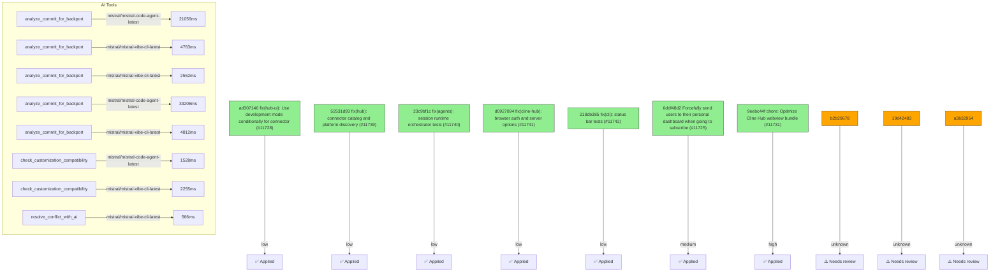

# Backport Agent — Detailed Run Report

> This file is generated automatically. It is intended for human analysts and
> AI reasoning models to assess agent performance, decision quality, and LLM behavior.

**Run timestamp**: 2026-06-24T07:57:51.338Z
**Models used**: fast=`mistral/mistral-code-agent-latest`  powerful=`mistral/mistral-vibe-cli-latest`
**Prompt log**: `/Users/rlemeill/Development/tea-ching-cline/.backport-agent/run-1782287360022.prompts.jsonl`

---

## Summary (PR body)

## Backport Agent — Sync Report

**Date**: 2026-06-24T07:57:51.338Z
**Upstream ref**: `cline/cline.git@main`
**Fork ref**: `TEA-ching/cline@keypool-live`
**Sync branch**: `sync/upstream-main-2026-06-24-075115`

### Summary

- ✅ Applied: 7
- ⚠️ Needs human review: 3
- ⛔ Blocked (not attempted): 0

### Applied commits

- `ad307146` [low] fix(hub-ui): Use development mode conditionally for connector (#11728)
- `52531d93` [low] fix(hub): connector catalog and platform discovery (#11739)
- `23c9bf1c` [low] fix(agents): session runtime orchestrator tests (#11740)
- `d0927094` [low] fix(cline-hub): browser auth and server options (#11741)
- `218db385` [low] fix(cli): status bar tests (#11742)
- `6ddf48d2` [medium] Forcefully send users to their personal dashboard when going to subscribe (#11725)
- `9eebc44f` [high] chore: Optimize Cline Hub webview bundle (#11731)

### ⚠️ Human review required

- `b2b29678` Add a button to unselect an org on ClinePass error (#11738)
  - Conflicted files: apps/vscode/src/core/task/tools/subagent/SubagentRunner.ts
  - Merge conflict in SubagentRunner.ts
- `19d42483` Add Organization error messages to the Cline CLI (#11737)
  - Conflicted files: apps/vscode/src/core/task/tools/subagent/SubagentRunner.ts
  - Merge conflict in SubagentRunner.ts
- `a3b32954` fix(llms): includes session id for OpenRouter caching (#11744)
  - Conflicted files: apps/vscode/src/core/task/tools/subagent/SubagentRunner.ts
  - Merge conflict in SubagentRunner.ts

### Agent decision log

- Applied 7 commits (5 low-risk, 1 medium-risk, 1 high-risk)
- Blocked 3 commits due to merge conflicts in SubagentRunner.ts
- Validation failed on build:models due to missing @cline/shared module
- Pushed sync branch sync/upstream-main-2026-06-24-075115


---

## Agent Workflow Diagram

> Generated by the fast model from the run summary. Evaluate the agent's decision path.



---

## AI Sub-Agent Call Log (8 calls)

> Each entry is one sub-agent invocation. Review prompt/response pairs to assess
> reasoning quality, hallucinations, and decision accuracy.

### Call 1 / 8 — `analyze_commit_for_backport` ✅ OK

| Field | Value |
|---|---|
| **Timestamp** | 2026-06-24T07:50:18.834Z |
| **Tool** | `analyze_commit_for_backport` |
| **Model** | `mistral/mistral-code-agent-latest` |
| **Duration** | 21059 ms |
| **Tokens in** | 4028 |
| **Tokens out** | 114 |
| **Cost** | $0.000000 |

**Prompt sent to sub-agent:**

```
Commit SHA: 6ddf48d227f501500f04af35c1ec2b898fe832ca
Commit message:
Forcefully send users to their personal dashboard when going to subscribe (#11725)

Changed files (5):
apps/cli/src/runtime/run-agent.test.ts
apps/cli/src/utils/cline-pass-errors.test.ts
apps/vscode/webview-ui/src/components/chat/EntitlementError.test.tsx
apps/vscode/webview-ui/src/components/chat/EntitlementError.tsx
sdk/packages/llms/src/providers/errors.ts

Diff:
commit 6ddf48d227f501500f04af35c1ec2b898fe832ca
Author: Tomás Barreiro <52393857+BarreiroT@users.noreply.github.com>
Date:   Mon Jun 22 17:27:31 2026 -0300

    Forcefully send users to their personal dashboard when going to subscribe (#11725)
    
    * Forcefully send users to their personal dashboard when going to subscribe
    
    * fix trailing slash
---
 apps/cli/src/runtime/run-agent.test.ts                               | 2 +-
 apps/cli/src/utils/cline-pass-errors.test.ts                         | 2 +-
 apps/vscode/webview-ui/src/components/chat/EntitlementError.test.tsx | 4 ++--
 apps/vscode/webview-ui/src/components/chat/EntitlementError.tsx      | 4 +++-
 sdk/packages/llms/src/providers/errors.ts                            | 4 ++--
 5 files changed, 9 insertions(+), 7 deletions(-)

diff --git a/apps/cli/src/runtime/run-agent.test.ts b/apps/cli/src/runtime/run-agent.test.ts
index 4325e1416..50091c79b 100644
--- a/apps/cli/src/runtime/run-agent.test.ts
+++ b/apps/cli/src/runtime/run-agent.test.ts
@@ -38,7 +38,7 @@ const sessionEventsMocks = vi.hoisted(() => ({
 }));
 
 const CLINE_PASS_SUBSCRIPTION_URL =
-	"https://app.cline.bot/dashboard/subscription/";
+	"https://app.cline.bot/dashboard/subscription?personal=true";
 const CLINE_PASS_SUBSCRIPTION_MESSAGE = `No access to ClinePass subscription models yet. Subscribe to ClinePass, the low cost open weights model coding plan: ${CLINE_PASS_SUBSCRIPTION_URL}`;
 
 vi.mock("@cline/core", () => ({
diff --git a/apps/cli/src/utils/cline-pass-errors.test.ts b/apps/cli/src/utils/cline-pass-errors.test.ts
index 86170594e..8c1b2ac4b 100644
--- a/apps/cli/src/utils/cline-pass-errors.test.ts
+++ b/apps/cli/src/utils/cline-pass-errors.test.ts
@@ -20,7 +20,7 @@ describe("cline-pass-errors", () => {
 
 	it("formats the ClinePass subscription URL", () => {
 		expect(getClinePassSubscriptionUrl()).toBe(
-			"https://app.cline.bot/dashboard/subscription/",
+			"https://app.cline.bot/dashboard/subscription?personal=true",
 		);
 	});
 });
diff --git a/apps/vscode/webview-ui/src/components/chat/EntitlementError.test.tsx b/apps/vscode/webview-ui/src/components/chat/EntitlementError.test.tsx
index 4f0f9a137..bcb341333 100644
--- a/apps/vscode/webview-ui/src/components/chat/EntitlementError.test.tsx
+++ b/apps/vscode/webview-ui/src/components/chat/EntitlementError.test.tsx
@@ -48,14 +48,14 @@ describe("EntitlementError", () => {
 	it("builds the subscribe link from the authenticated user's app base URL", () => {
 		mockAuth.clineUser = { appBaseUrl: "https://staging-app.cline.bot" }
 		const { unmount } = render(<EntitlementError />)
-		expect(getSubscribeHref()).toBe("https://staging-app.cline.bot/dashboard/subscription")
+		expect(getSubscribeHref()).toBe("https://staging-app.cline.bot/dashboard/subscription?personal=true")
 		unmount()
 
 		mockAuth.clineUser = {
 			appBaseUrl: "https://proxy.enterprise.com/cline/app",
 		}
 		render(<EntitlementError />)
-		expect(getSubscribeHref()).toBe("https://proxy.enterprise.com/cline/app/dashboard/subscription")
+		expect(getSubscribeHref()).toBe("https://proxy.enterprise.com/cline/app/dashboard/subscription?personal=true")
 	})
 
 	it("sends a yesButtonClicked askResponse when Retry Request is clicked", () => {
diff --git a/apps/vscode/webview-ui/src/components/chat/EntitlementError.tsx b/apps/vscode/webview-ui/src/components/chat/EntitlementError.tsx
index b13675b88..ca89ebd8d 100644
--- a/apps/vscode/webview-ui/src/components/chat/EntitlementError.tsx
+++ b/apps/vscode/webview-ui/src/components/chat/EntitlementError.tsx
@@ -20,7 +20,9 @@ function buildSubscribeUrl(appBaseUrl?: string): string | undefined {
 	}
 	try {
 		const base = appBaseUrl.endsWith("/") ? appBaseUrl : `${appBaseUrl}/`
-		return new URL(CLINE_PASS_SUBSCRIBE_PATH, base).toString()
+		const url = new URL(CLINE_PASS_SUBSCRIBE_PATH, base)
+		url.searchParams.set("personal", "true")
+		return url.toString()
 	} catch {
 		// Malformed appBaseUrl: omit the link rather than crashing the error card.
 		return undefined
diff --git a/sdk/packages/llms/src/providers/errors.ts b/sdk/packages/llms/src/providers/errors.ts
index 18d67333a..257fc13bf 100644
--- a/sdk/packages/llms/src/providers/errors.ts
+++ b/sdk/packages/llms/src/providers/errors.ts
@@ -5,9 +5,9 @@ export const CLINE_NOT_SUBSCRIBED_RESPONSE_MESSAGE =
 
 export function getClinePassSubscriptionUrl(): string {
 	return `${new URL(
-		"/dashboard/subscription",
+		"/dashboard/subscription?personal=true",
 		getClineEnvironmentConfig().appBaseUrl,
-	).toString()}/`;
+	).toString()}`;
 }
 
 export function getClineNotSubscribedMessage(): string {

Output the JSON object now.
```

**Response received:**

````
```json
{
  "summary": "Updates subscription URLs to forcefully redirect users to their personal dashboard by appending `?personal=true` query parameter.",
  "keyChanges": [
    "Modified subscription URL construction in `EntitlementError.tsx`",
    "Updated URL in `errors.ts` and related test files",
    "Ensures consistent redirect behavior across CLI and VSCode"
  ],
  "backportComplexity": "trivial",
  "semanticRiskFactors": [],
  "recommendation": "apply"
}
```
````

---

### Call 2 / 8 — `analyze_commit_for_backport` ✅ OK

| Field | Value |
|---|---|
| **Timestamp** | 2026-06-24T07:50:23.659Z |
| **Tool** | `analyze_commit_for_backport` |
| **Model** | `mistral/mistral-vibe-cli-latest` |
| **Duration** | 4763 ms |
| **Tokens in** | 10219 |
| **Tokens out** | 131 |
| **Cost** | $0.000000 |

**Prompt sent to sub-agent:**

```
Commit SHA: 9eebc44f24359e96c4b82f4f1b2efdc706056c19
Commit message:
chore: Optimize Cline Hub webview bundle (#11731)

Changed files (8):
apps/cline-hub/src/webview/package.json
apps/cline-hub/src/webview/src/App.tsx
apps/cline-hub/src/webview/src/components/ai-elements/code-block.tsx
apps/cline-hub/src/webview/src/components/ai-elements/message.tsx
apps/cline-hub/src/webview/src/components/ai-elements/reasoning.tsx
apps/cline-hub/src/webview/src/components/ai-elements/streamdown.tsx
apps/cline-hub/src/webview/vite.config.ts
bun.lock

Diff:
commit 9eebc44f24359e96c4b82f4f1b2efdc706056c19
Author: Bee <68532117+abeatrix@users.noreply.github.com>
Date:   Mon Jun 22 18:40:01 2026 -0500

    chore: Optimize Cline Hub webview bundle (#11731)
    
    * Optimize Cline Hub webview bundle
    
    Issue:
    
    The Cline Hub webview build emitted Vite's large chunk warning. The main entry bundle was over 2 MB minified, and the build output included many Shiki language/theme chunks plus eagerly bundled Streamdown math/Mermaid support that the hub did not need on startup.
    
    Changes:
    
    - Split heavyweight Cline Hub views behind React.lazy/Suspense so settings, customization, and chat code do not all land in the initial app shell.
    
    - Replace root Shiki highlighter usage with shiki/core and lazily loaded, explicitly supported languages/themes.
    
    - Route Streamdown through a local HubStreamdown wrapper that uses the local CodeBlock renderer and keeps Mermaid as a lazy diagram plugin.
    
    - Remove unused Streamdown math/code/Mermaid packages, add direct lazy Mermaid support, and add targeted Rolldown chunk groups for Mermaid parser/layout/markup assets.
    
    Before/after bundle measurements:
    
    | Metric | Before | After |
    
    | --- | ---: | ---: |
    
    | Total generated JS | 24,356 KiB | 5,800 KiB |
    
    | Total generated JS gzip | 4,805.5 KiB | 1,434.6 KiB |
    
    | Main entry chunk | 2,044.02 kB | 373.88 kB |
    
    | Main entry gzip | 617.25 kB | 117.83 kB |
    
    Verification:
    
    - bun -F @cline/cline-hub build:webview
    
    - bun biome check apps/cline-hub/src/webview/vite.config.ts apps/cline-hub/src/webview/src/App.tsx apps/cline-hub/src/webview/src/components/ai-elements/code-block.tsx apps/cline-hub/src/webview/src/components/ai-elements/message.tsx apps/cline-hub/src/webview/src/components/ai-elements/reasoning.tsx apps/cline-hub/src/webview/src/components/ai-elements/streamdown.tsx apps/cline-hub/src/webview/package.json
    
    * address feedback
---
 apps/cline-hub/src/webview/package.json            |   6 +-
 apps/cline-hub/src/webview/src/App.tsx             |  42 +++--
 .../src/components/ai-elements/code-block.tsx      | 154 +++++++++++++++----
 .../webview/src/components/ai-elements/message.tsx |  16 +-
 .../src/components/ai-elements/reasoning.tsx       |  10 +-
 .../src/components/ai-elements/streamdown.tsx      | 170 +++++++++++++++++++++
 apps/cline-hub/src/webview/vite.config.ts          |  29 ++++
 bun.lock                                           |   8 +-
 8 files changed, 366 insertions(+), 69 deletions(-)

diff --git a/apps/cline-hub/src/webview/package.json b/apps/cline-hub/src/webview/package.json
index 134d192ec..abe314a5d 100644
--- a/apps/cline-hub/src/webview/package.json
+++ b/apps/cline-hub/src/webview/package.json
@@ -13,10 +13,9 @@
 		"@fontsource-variable/schibsted-grotesk": "^5.2.8",
 		"@radix-ui/react-use-controllable-state": "^1.2.2",
 		"@rive-app/react-webgl2": "^4.27.2",
+		"@shikijs/langs": "^4.2.0",
+		"@shikijs/themes": "^4.2.0",
 		"@streamdown/cjk": "^1.0.3",
-		"@streamdown/code": "^1.1.1",
-		"@streamdown/math": "^1.0.2",
-		"@streamdown/mermaid": "^1.0.2",
 		"@tailwindcss/vite": "^4.2.1",
 		"@xyflow/react": "^12.10.1",
 		"ai": "^6.0.116",
@@ -27,6 +26,7 @@
 		"embla-carousel-react": "^8.6.0",
 		"lucide-react": "^0.577.0",
 		"media-chrome": "^4.18.1",
+		"mermaid": "^11.15.0",
 		"motion": "^12.38.0",
 		"nanoid": "^5.1.7",
 		"next-themes": "^0.4.6",
diff --git a/apps/cline-hub/src/webview/src/App.tsx b/apps/cline-hub/src/webview/src/App.tsx
index 1e2c4f6b5..f1bfb3865 100644
--- a/apps/cline-hub/src/webview/src/App.tsx
+++ b/apps/cline-hub/src/webview/src/App.tsx
@@ -22,7 +22,14 @@ import {
 	WrenchIcon,
 } from "lucide-react";
 import type { ReactNode } from "react";
-import { useCallback, useEffect, useMemo, useState } from "react";
+import {
+	lazy,
+	Suspense,
+	useCallback,
+	useEffect,
+	useMemo,
+	useState,
+} from "react";
 import {
 	AlertDialog,
 	AlertDialogAction,
@@ -53,19 +60,24 @@ import type {
 	WebviewOutboundMessage,
 	WebviewSessionSummary,
 } from "../../webview-protocol";
-import Chat from "./Chat";
 import { PageFrame, PageHeader } from "./components/views/page-layout";
-import {
-	type CustomizationSection,
-	CustomizationSectionView,
-} from "./components/views/settings/extensions-view";
-import {
-	type SettingsSection,
-	SettingsView,
-} from "./components/views/settings/settings-view";
+import type { CustomizationSection } from "./components/views/settings/extensions-view";
+import type { SettingsSection } from "./components/views/settings/settings-view";
 import { syncHubTheme } from "./lib/theme";
 import { postToHost } from "./vscode";
 
+const Chat = lazy(() => import("./Chat"));
+const SettingsView = lazy(() =>
+	import("./components/views/settings/settings-view").then((module) => ({
+		default: module.SettingsView,
+	})),
+);
+const CustomizationSectionView = lazy(() =>
+	import("./components/views/settings/extensions-view").then((module) => ({
+		default: module.CustomizationSectionView,
+	})),
+);
+
 type View =
 	| "home"
 	| "sessions"
@@ -238,6 +250,14 @@ function currentPathWithSearch(): string {
 	return `${window.location.pathname}${window.location.search}`;
 }
 
+function ViewLoading() {
+	return (
+		<PageFrame>
+			<p className="text-sm text-muted-foreground">Loading...</p>
+		</PageFrame>
+	);
+}
+
 function formatRelativeTime(timestamp?: number): string {
 	if (!timestamp) return "unknown";
 	const elapsed = Math.max(0, Date.now() - timestamp);
@@ -1333,7 +1353,7 @@ function App() {
 
 	return (
 		<Shell onNavigate={navigate} version={hubState.coreVersion} view={view}>
-			{content}
+			<Suspense fallback={<ViewLoading />}>{content}</Suspense>
 		</Shell>
 	);
 }
diff --git a/apps/cline-hub/src/webview/src/components/ai-elements/code-block.tsx b/apps/cline-hub/src/webview/src/components/ai-elements/code-block.tsx
index 770885b8a..e428dd33e 100644
--- a/apps/cline-hub/src/webview/src/components/ai-elements/code-block.tsx
+++ b/apps/cline-hub/src/webview/src/components/ai-elements/code-block.tsx
@@ -11,12 +11,13 @@ import {
 	useState,
 } from "react";
 import type {
-	BundledLanguage,
-	BundledTheme,
-	HighlighterGeneric,
+	HighlighterCore,
+	LanguageRegistration,
 	ThemedToken,
-} from "shiki";
-import { createHighlighter } from "shiki";
+	ThemeRegistration,
+} from "shiki/core";
+import { createHighlighterCore } from "shiki/core";
+import { createJavaScriptRegexEngine } from "shiki/engine/javascript";
 import { Button } from "@/components/ui/button";
 import {
 	Select,
@@ -36,6 +37,78 @@ const isUnderline = (fontStyle: number | undefined) =>
 	// oxlint-disable-next-line eslint(no-bitwise)
 	fontStyle && fontStyle & 4;
 
+const SUPPORTED_LANGUAGES = [
+	"bash",
+	"css",
+	"diff",
+	"html",
+	"javascript",
+	"json",
+	"jsonc",
+	"jsx",
+	"markdown",
+	"python",
+	"shellscript",
+	"tsx",
+	"typescript",
+	"yaml",
+] as const;
+
+export type SupportedCodeLanguage = (typeof SUPPORTED_LANGUAGES)[number];
+
+const SUPPORTED_LANGUAGE_SET = new Set<string>(SUPPORTED_LANGUAGES);
+
+const LANGUAGE_LOADERS: Record<
+	SupportedCodeLanguage,
+	() => Promise<LanguageRegistration[]>
+> = {
+	bash: () => import("@shikijs/langs/bash").then((module) => module.default),
+	css: () => import("@shikijs/langs/css").then((module) => module.default),
+	diff: () => import("@shikijs/langs/diff").then((module) => module.default),
+	html: () => import("@shikijs/langs/html").then((module) => module.default),
+	javascript: () =>
+		import("@shikijs/langs/javascript").then((module) => module.default),
+	json: () => import("@shikijs/langs/json").then((module) => module.default),
+	jsonc: () => import("@shikijs/langs/jsonc").then((module) => module.default),
+	jsx: () => import("@shikijs/langs/jsx").then((module) => module.default),
+	markdown: () =>
+		import("@shikijs/langs/markdown").then((module) => module.default),
+	python: () =>
+		import("@shikijs/langs/python").then((module) => module.default),
+	shellscript: () =>
+		import("@shikijs/langs/shellscript").then((module) => module.default),
+	tsx: () => import("@shikijs/langs/tsx").then((module) => module.default),
+	typescript: () =>
+		import("@shikijs/langs/typescript").then((module) => module.default),
+	yaml: () => import("@shikijs/langs/yaml").then((module) => module.default),
+};
+
+const LANGUAGE_ALIASES: Record<string, SupportedCodeLanguage> = {
+	console: "shellscript",
+	cjs: "javascript",
+	htm: "html",
+	js: "javascript",
+	json5: "jsonc",
+	md: "markdown",
+	mjs: "javascript",
+	py: "python",
+	sh: "shellscript",
+	shell: "shellscript",
+	ts: "typescript",
+	yml: "yaml",
+};
+
+const normalizeLanguage = (
+	language: string,
+): SupportedCodeLanguage | "text" => {
+	const normalized = language.trim().toLowerCase();
+	if (!normalized) {
+		return "text";
+	}
+	const aliased = LANGUAGE_ALIASES[normalized] ?? normalized;
+	return SUPPORTED_LANGUAGE_SET.has(aliased) ? aliased : "text";
+};
+
 // Transform tokens to include pre-computed keys to avoid noArrayIndexKey lint
 interface KeyedToken {
 	token: ThemedToken;
@@ -108,7 +181,7 @@ const LineSpan = ({
 // Types
 type CodeBlockProps = HTMLAttributes<HTMLDivElement> & {
 	code: string;
-	language: BundledLanguage;
+	language: string;
 	showLineNumbers?: boolean;
 };
 
@@ -128,10 +201,9 @@ const CodeBlockContext = createContext<CodeBlockContextType>({
 });
 
 // Highlighter cache (singleton per language)
-const highlighterCache = new Map<
-	string,
-	Promise<HighlighterGeneric<BundledLanguage, BundledTheme>>
->();
+let highlighterPromise: Promise<HighlighterCore> | undefined;
+let themesPromise: Promise<void> | undefined;
+const languagePromises = new Map<SupportedCodeLanguage, Promise<void>>();
 
 // Token cache
 const tokensCache = new Map<string, TokenizedCode>();
@@ -139,27 +211,44 @@ const tokensCache = new Map<string, TokenizedCode>();
 // Subscribers for async token updates
 const subscribers = new Map<string, Set<(result: TokenizedCode) => void>>();
 
-const getTokensCacheKey = (code: string, language: BundledLanguage) => {
+const getTokensCacheKey = (code: string, language: string) => {
 	const start = code.slice(0, 100);
 	const end = code.length > 100 ? code.slice(-100) : "";
 	return `${language}:${code.length}:${start}:${end}`;
 };
 
-const getHighlighter = (
-	language: BundledLanguage,
-): Promise<HighlighterGeneric<BundledLanguage, BundledTheme>> => {
-	const cached = highlighterCache.get(language);
-	if (cached) {
-		return cached;
+const getHighlighter = (): Promise<HighlighterCore> => {
+	if (!highlighterPromise) {
+		highlighterPromise = createHighlighterCore({
+			engine: createJavaScriptRegexEngine({ forgiving: true }),
+		});
 	}
+	return highlighterPromise;
+};
 
-	const highlighterPromise = createHighlighter({
-		langs: [language],
-		themes: ["github-light", "github-dark"],
-	});
+const ensureThemes = (highlighter: HighlighterCore): Promise<void> => {
+	if (!themesPromise) {
+		themesPromise = Promise.all([
+			import("@shikijs/themes/github-light").then((module) => module.default),
+			import("@shikijs/themes/github-dark").then((module) => module.default),
+		]).then((themes: ThemeRegistration[]) => highlighter.loadTheme(...themes));
+	}
+	return themesPromise;
+};
 
-	highlighterCache.set(language, highlighterPromise);
-	return highlighterPromise;
+const ensureLanguage = (
+	highlighter: HighlighterCore,
+	language: SupportedCodeLanguage,
+): Promise<void> => {
+	const cached = languagePromises.get(language);
+	if (cached) {
+		return cached;
+	}
+	const languagePromise = LANGUAGE_LOADERS[language]().then((registrations) =>
+		highlighter.loadLanguage(...registrations),
+	);
+	languagePromises.set(language, languagePromise);
+	return languagePromise;
 };
 
 // Create raw tokens for immediate display while highlighting loads
@@ -181,11 +270,16 @@ const createRawTokens = (code: string): TokenizedCode => ({
 // Synchronous highlight with callback for async results
 export const highlightCode = (
 	code: string,
-	language: BundledLanguage,
+	language: string,
 	// oxlint-disable-next-line eslint-plugin-promise(prefer-await-to-callbacks)
 	callback?: (result: TokenizedCode) => void,
 ): TokenizedCode | null => {
-	const tokensCacheKey = getTokensCacheKey(code, language);
+	const langToUse = normalizeLanguage(language);
+	if (langToUse === "text") {
+		return createRawTokens(code);
+	}
+
+	const tokensCacheKey = getTokensCacheKey(code, langToUse);
 
 	// Return cached result if available
 	const cached = tokensCache.get(tokensCacheKey);
@@ -202,11 +296,11 @@ export const highlightCode = (
 	}
 
 	// Start highlighting in background - fire-and-forget async pattern
-	getHighlighter(language)
+	getHighlighter()
 		// oxlint-disable-next-line eslint-plugin-promise(prefer-await-to-then)
-		.then((highlighter) => {
-			const availableLangs = highlighter.getLoadedLanguages();
-			const langToUse = availableLangs.includes(language) ? language : "text";
+		.then(async (highlighter) => {
+			await ensureThemes(highlighter);
+			await ensureLanguage(highlighter, langToUse);
 
 			const result = highlighter.codeToTokens(code, {
 				lang: langToUse,
@@ -376,7 +470,7 @@ export const CodeBlockContent = ({
 	showLineNumbers = false,
 }: {
 	code: string;
-	language: BundledLanguage;
+	language: string;
 	showLineNumbers?: boolean;
 }) => {
 	// Memoized raw tokens for immediate display
diff --git a/apps/cline-hub/src/webview/src/components/ai-elements/message.tsx b/apps/cline-hub/src/webview/src/components/ai-elements/message.tsx
index 2113d6f96..fae527b22 100644
--- a/apps/cline-hub/src/webview/src/components/ai-elements/message.tsx
+++ b/apps/cline-hub/src/webview/src/components/ai-elements/message.tsx
@@ -1,9 +1,5 @@
 "use client";
 
-import { cjk } from "@streamdown/cjk";
-import { code } from "@streamdown/code";
-import { math } from "@streamdown/math";
-import { mermaid } from "@streamdown/mermaid";
 import type { UIMessage } from "ai";
 import { ChevronLeftIcon, ChevronRightIcon } from "lucide-react";
 import type { ComponentProps, HTMLAttributes, ReactElement } from "react";
@@ -16,7 +12,6 @@ import {
 	useMemo,
 	useState,
 } from "react";
-import { Streamdown } from "streamdown";
 import { Button } from "@/components/ui/button";
 import { ButtonGroup, ButtonGroupText } from "@/components/ui/button-group";
 import {
@@ -26,6 +21,7 @@ import {
 	TooltipTrigger,
 } from "@/components/ui/tooltip";
 import { cn } from "@/lib/utils";
+import { HubStreamdown } from "./streamdown";
 
 export type MessageProps = HTMLAttributes<HTMLDivElement> & {
 	from: UIMessage["role"];
@@ -316,24 +312,18 @@ export const MessageBranchPage = ({
 	);
 };
 
-export type MessageResponseProps = ComponentProps<typeof Streamdown>;
-
-const streamdownPlugins = { cjk, code, math, mermaid };
+export type MessageResponseProps = ComponentProps<typeof HubStreamdown>;
 
 export const MessageResponse = memo(
 	({ className, ...props }: MessageResponseProps) => (
-		<Streamdown
+		<HubStreamdown
 			className={cn(
 				"size-full [&>*:first-child]:mt-0 [&>*:last-child]:mb-0",
 				className,
 			)}
-			plugins={streamdownPlugins}
 			{...props}
 		/>
 	),
-	(prevProps, nextProps) =>
-		prevProps.children === nextProps.children &&
-		nextProps.isAnimating === prevProps.isAnimating,
 );
 
 MessageResponse.displayName = "MessageResponse";
diff --git a/apps/cline-hub/src/webview/src/components/ai-elements/reasoning.tsx b/apps/cline-hub/src/webview/src/components/ai-elements/reasoning.tsx
index 75034d02c..929ee0ba4 100644
--- a/apps/cline-hub/src/webview/src/components/ai-elements/reasoning.tsx
+++ b/apps/cline-hub/src/webview/src/components/ai-elements/reasoning.tsx
@@ -1,10 +1,6 @@
 "use client";
 
 import { useControllableState } from "@radix-ui/react-use-controllable-state";
-import { cjk } from "@streamdown/cjk";
-import { code } from "@streamdown/code";
-import { math } from "@streamdown/math";
-import { mermaid } from "@streamdown/mermaid";
 import { BrainIcon, ChevronDownIcon } from "lucide-react";
 import type { ComponentProps, ReactNode } from "react";
 import {
@@ -17,7 +13,6 @@ import {
 	useRef,
 	useState,
 } from "react";
-import { Streamdown } from "streamdown";
 import {
 	Collapsible,
 	CollapsibleContent,
@@ -26,6 +21,7 @@ import {
 import { cn } from "@/lib/utils";
 
 import { Shimmer } from "./shimmer";
+import { HubStreamdown } from "./streamdown";
 
 interface ReasoningContextValue {
 	isStreaming: boolean;
@@ -204,8 +200,6 @@ export type ReasoningContentProps = ComponentProps<
 	children: string;
 };
 
-const streamdownPlugins = { cjk, code, math, mermaid };
-
 export const ReasoningContent = memo(
 	({ className, children, ...props }: ReasoningContentProps) => (
 		<CollapsibleContent
@@ -216,7 +210,7 @@ export const ReasoningContent = memo(
 			)}
 			{...props}
 		>
-			<Streamdown plugins={streamdownPlugins}>{children}</Streamdown>
+			<HubStreamdown>{children}</HubStreamdown>
 		</CollapsibleContent>
 	),
 );
diff --git a/apps/cline-hub/src/webview/src/components/ai-elements/streamdown.tsx b/apps/cline-hub/src/webview/src/components/ai-elements/streamdown.tsx
new file mode 100644
index 000000000..d46524e69
--- /dev/null
+++ b/apps/cline-hub/src/webview/src/components/ai-elements/streamdown.tsx
@@ -0,0 +1,170 @@
+import { cjk } from "@streamdown/cjk";
+import type { MermaidConfig } from "mermaid";
+import type { ComponentProps, ReactNode } from "react";
+import { isValidElement, memo } from "react";
+import {
+	type Components,
+	type DiagramPlugin,
+	Streamdown,
+	type StreamdownProps,
+} from "streamdown";
+import {
+	CodeBlock,
+	CodeBlockActions,
+	CodeBlockCopyButton,
+	CodeBlockFilename,
+	CodeBlockHeader,
+	CodeBlockTitle,
+} from "@/components/ai-elements/code-block";
+import { cn } from "@/lib/utils";
+
+type MarkdownCodeProps = ComponentProps<"code"> & {
+	"data-block"?: boolean | string;
+	node?: {
+		properties?: {
+			metastring?: string;
+		};
+	};
+};
+
+const LANGUAGE_CLASS_PATTERN = /(?:^|\s)language-([^\s]+)/;
+const START_LINE_PATTERN = /startLine=(\d+)/;
+const NO_LINE_NUMBERS_PATTERN = /\bnoLineNumbers\b/;
+
+function codeText(children: ReactNode): string {
+	if (typeof children === "string" || typeof children === "number") {
+		return String(children);
+	}
+	if (Array.isArray(children)) {
+		return children.map(codeText).join("");
+	}
+	if (isValidElement<{ children?: ReactNode }>(children)) {
+		return codeText(children.props.children);
+	}
+	return "";
+}
+
+const MarkdownCode = ({
+	children,
+	className,
+	node,
+	"data-block": dataBlock,
+	...props
+}: MarkdownCodeProps) => {
+	const language = className?.match(LANGUAGE_CLASS_PATTERN)?.[1] ?? "text";
+
+	if (!dataBlock) {
+		return (
+			<code
+				className={cn(
+					"rounded bg-muted px-1.5 py-0.5 font-mono text-sm",
+					className,
+				)}
+				{...props}
+			>
+				{children}
+			</code>
+		);
+	}
+
+	const meta = node?.properties?.metastring;
+	const startLineMatch = meta?.match(START_LINE_PATTERN);
+	const startLine = startLineMatch ? Number.parseInt(startLineMatch[1], 10) : 1;
+	const showLineNumbers = meta ? !NO_LINE_NUMBERS_PATTERN.test(meta) : true;
+
+	return (
+		<CodeBlock
+			code={codeText(children)}
+			data-start-line={startLine > 1 ? startLine : undefined}
+			language={language}
+			showLineNumbers={showLineNumbers}
+		>
+			<CodeBlockHeader>
+				<CodeBlockTitle>
+					<CodeBlockFilename>{language}</CodeBlockFilename>
+				</CodeBlockTitle>
+				<CodeBlockActions>
+					<CodeBlockCopyButton />
+				</CodeBlockActions>
+			</CodeBlockHeader>
+		</CodeBlock>
+	);
+};
+
+const markdownComponents = {
+	code: MarkdownCode,
+} satisfies Components;
+
+const DEFAULT_MERMAID_CONFIG = {
+	fontFamily: "monospace",
+	securityLevel: "strict",
+	startOnLoad: false,
+	suppressErrorRendering: true,
+	theme: "default",
+} satisfies MermaidConfig;
+
+interface LazyMermaidInstance {
+	initialize: (config: MermaidConfig) => void;
+	render: (
+		id: string,
+		source: string,
+	) => Promise<{
+		svg: string;
+	}>;
+}
+
+function createLazyMermaidPlugin(): DiagramPlugin {
+	let config: MermaidConfig = DEFAULT_MERMAID_CONFIG;
+	let initialized = false;
+
+	const instance: LazyMermaidInstance = {
+		initialize(nextConfig: MermaidConfig) {
+			config = { ...DEFAULT_MERMAID_CONFIG, ...config, ...nextConfig };
+			initialized = false;
+		},
+		async render(id: string, source: string) {
+			const mermaidModule = await import("mermaid");
+			const mermaid = mermaidModule.default;
+			if (!initialized) {
+				mermaid.initialize(config);
+				initialized = true;
+			}
+			return mermaid.render(id, source);
+		},
+	};
+
+	return {
+		getMermaid(nextConfig?: MermaidConfig) {
+			if (nextConfig) {
+				instance.initialize(nextConfig);
+			}
+			return instance;
+		},
+		language: "mermaid",
+		name: "mermaid",
+		type: "diagram",
+	};
+}
+
+const streamdownPlugins = { cjk, mermaid: createLazyMermaidPlugin() };
+
+export type HubStreamdownProps = StreamdownProps;
+
+export const HubStreamdown = memo(
+	({ className, components, ...props }: HubStreamdownProps) => {
+		const mergedComponents = components
+			? { ...markdownComponents, ...components }
+			: markdownComponents;
+
+		return (
+			<Streamdown
+				className={className}
+				components={mergedComponents}
+				plugins={streamdownPlugins}
+				{...props}
+			/>
+		);
+	},
+);
+
+HubStreamdown.displayName = "HubStreamdown";
diff --git a/apps/cline-hub/src/webview/vite.config.ts b/apps/cline-hub/src/webview/vite.config.ts
index 4c2c32c1d..cc2b042fd 100644
--- a/apps/cline-hub/src/webview/vite.config.ts
+++ b/apps/cline-hub/src/webview/vite.config.ts
@@ -3,6 +3,27 @@ import tailwindcss from "@tailwindcss/vite";
 import react from "@vitejs/plugin-react-swc";
 import { defineConfig } from "vite";
 
+const mermaidChunkGroups = [
+	{
+		name: "mermaid-parser",
+		maxSize: 450_000,
+		test: /node_modules[\\/](?:\.bun[\\/])?@mermaid-js[+]parser/,
+	},
+	{
+		name: "mermaid-langium",
+		test: /node_modules[\\/](?:\.bun[\\/])?langium/,
+	},
+	{
+		name: "mermaid-layout",
+		maxSize: 450_000,
+		test: /node_modules[\\/](?:\.bun[\\/])?(?:cytoscape|cytoscape-cose-bilkent|dagre|elkjs)/,
+	},
+	{
+		name: "mermaid-markup",
+		test: /node_modules[\\/](?:\.bun[\\/])?(?:katex|dompurify)/,
+	},
+];
+
 export default defineConfig({
 	plugins: [react(), tailwindcss()],
 	resolve: {
@@ -25,5 +46,13 @@ export default defineConfig({
 		outDir: "../../dist/webview",
 		emptyOutDir: true,
 		cssMinify: "esbuild",
+		chunkSizeWarningLimit: 600,
+		rolldownOptions: {
+			output: {
+				codeSplitting: {
+					groups: mermaidChunkGroups,
+				},
+			},
+		},
 	},
 });
diff --git a/bun.lock b/bun.lock
index 19d7bfefb..3a16cd7da 100644
--- a/bun.lock
+++ b/bun.lock
@@ -19,7 +19,7 @@
     },
     "apps/cli": {
       "name": "@cline/cli",
-      "version": "3.0.28",
+      "version": "3.0.29",
       "bin": {
         "cline": "src/index.ts",
       },
@@ -78,10 +78,9 @@
         "@fontsource-variable/schibsted-grotesk": "^5.2.8",
         "@radix-ui/react-use-controllable-state": "^1.2.2",
         "@rive-app/react-webgl2": "^4.27.2",
+        "@shikijs/langs": "^4.2.0",
+        "@shikijs/themes": "^4.2.0",
         "@streamdown/cjk": "^1.0.3",
-        "@streamdown/code": "^1.1.1",
-        "@streamdown/math": "^1.0.2",
-        "@streamdown/mermaid": "^1.0.2",
         "@tailwindcss/vite": "^4.2.1",
         "@xyflow/react": "^12.10.1",
         "ai": "^6.0.116",
@@ -92,6 +91,7 @@
         "embla-carousel-react": "^8.6.0",
         "lucide-react": "^0.577.0",
         "media-chrome": "^4.18.1",
+        "mermaid": "^11.15.0",
         "motion": "^12.38.0",
         "nanoid": "^5.1.7",
         "next-themes": "^0.4.6",

Output the JSON object now.
```

**Response received:**

```
{"summary": "Optimizes Cline Hub webview bundle by lazy-loading heavy components (Shiki, Mermaid, Streamdown plugins) and splitting chunks. Reduces total JS from 24MB to 5.8MB.", "keyChanges": ["Lazy-load Chat/Settings/Customization views", "Replace Shiki with shiki/core + lazy languages", "Add HubStreamdown wrapper for lazy Mermaid", "Configure Rolldown chunk groups for Mermaid", "Update dependencies in package.json"], "backportComplexity": "trivial", "semanticRiskFactors": [], "recommendation": "apply"}
```

---

### Call 3 / 8 — `analyze_commit_for_backport` ✅ OK

| Field | Value |
|---|---|
| **Timestamp** | 2026-06-24T07:50:26.265Z |
| **Tool** | `analyze_commit_for_backport` |
| **Model** | `mistral/mistral-vibe-cli-latest` |
| **Duration** | 2552 ms |
| **Tokens in** | 11324 |
| **Tokens out** | 151 |
| **Cost** | $0.000000 |

**Prompt sent to sub-agent:**

```
Commit SHA: b2b29678a2aa0500371faf418a7ad49a175b7af3
Commit message:
Add a button to unselect an org on ClinePass error (#11738)

Changed files (7):
apps/vscode/src/core/task/index.ts
apps/vscode/src/core/task/tools/subagent/SubagentRunner.ts
apps/vscode/src/services/error/ClineError.ts
apps/vscode/src/services/error/__tests__/ClineError.test.ts
apps/vscode/webview-ui/src/components/chat/ErrorRow.test.tsx
apps/vscode/webview-ui/src/components/chat/ErrorRow.tsx
apps/vscode/webview-ui/src/components/chat/OrgClinePassRestrictionError.tsx

Diff:
commit b2b29678a2aa0500371faf418a7ad49a175b7af3
Author: Tomás Barreiro <52393857+BarreiroT@users.noreply.github.com>
Date:   Mon Jun 22 20:47:15 2026 -0300

    Add a button to unselect an org on ClinePass error (#11738)
    
    * Add a button to unselect an org on ClinePass error
    
    * Fix comments
---
 apps/vscode/src/core/task/index.ts                 |   7 +-
 .../src/core/task/tools/subagent/SubagentRunner.ts | 928 +++++++++++++--------
 apps/vscode/src/services/error/ClineError.ts       | 158 ++--
 .../services/error/__tests__/ClineError.test.ts    |  92 +-
 .../src/components/chat/ErrorRow.test.tsx          | 323 ++++---
 .../webview-ui/src/components/chat/ErrorRow.tsx    | 364 ++++----
 .../chat/OrgClinePassRestrictionError.tsx          |  62 ++
 7 files changed, 1227 insertions(+), 707 deletions(-)

diff --git a/apps/vscode/src/core/task/index.ts b/apps/vscode/src/core/task/index.ts
index 8d82ab08e..fe2ff6ca9 100644
--- a/apps/vscode/src/core/task/index.ts
+++ b/apps/vscode/src/core/task/index.ts
@@ -2469,6 +2469,9 @@ export class Task {
 				const isEntitlementError = clineError.isErrorType(
 					ClineErrorType.Entitlement,
 				);
+				const isOrgClinePassRestrictionError = clineError.isErrorType(
+					ClineErrorType.OrgClinePassRestriction,
+				);
 
 				// Check if this is a Cline provider insufficient credits error - don't auto-retry these
 				const isClineProviderInsufficientCredits = (() => {
@@ -2495,6 +2498,7 @@ export class Task {
 					!isSpendLimitError &&
 					!quotaExceeded &&
 					!isEntitlementError &&
+					!isOrgClinePassRestrictionError &&
 					this.taskState.autoRetryAttempts < 3;
 				if (shouldRetry) {
 					// Auto-retry enabled with max 3 attempts: automatically approve the retry
@@ -2557,7 +2561,8 @@ export class Task {
 						!isAuthError &&
 						!isSpendLimitError &&
 						!quotaExceeded &&
-						!isEntitlementError;
+						!isEntitlementError &&
+						!isOrgClinePassRestrictionError;
 					if (showRetry) {
 						await this.say(
 							"error_retry",
diff --git a/apps/vscode/src/core/task/tools/subagent/SubagentRunner.ts b/apps/vscode/src/core/task/tools/subagent/SubagentRunner.ts
index 2f05af432..ba11162c4 100644
--- a/apps/vscode/src/core/task/tools/subagent/SubagentRunner.ts
+++ b/apps/vscode/src/core/task/tools/subagent/SubagentRunner.ts
@@ -1,88 +1,93 @@
-import * as path from "node:path"
-import { setTimeout as delay } from "node:timers/promises"
-import type { ApiHandler, buildApiHandler } from "@core/api"
-import { parseAssistantMessageV2, ToolUse } from "@core/assistant-message"
-import { discoverAvailableSkills } from "@core/context/instructions/user-instructions/skills"
-import { formatResponse } from "@core/prompts/responses"
-import { PromptRegistry } from "@core/prompts/system-prompt"
-import type { SystemPromptContext } from "@core/prompts/system-prompt/types"
-import { StreamResponseHandler } from "@core/task/StreamResponseHandler"
-import { ClineAssistantToolUseBlock, ClineStorageMessage, ClineTextContentBlock, ClineUserContent } from "@shared/messages"
-import { Logger } from "@shared/services/Logger"
-import { ClineDefaultTool, ClineTool } from "@shared/tools"
-import { ContextManager } from "@/core/context/context-management/ContextManager"
-import { checkContextWindowExceededError } from "@/core/context/context-management/context-error-handling"
-import { getContextWindowInfo } from "@/core/context/context-management/context-window-utils"
-import { HostRegistryInfo } from "@/registry"
-import { ClineError, ClineErrorType } from "@/services/error"
-import { ApiFormat } from "@/shared/proto/cline/models"
-import { calculateApiCostAnthropic } from "@/utils/cost"
-import { isNextGenModelFamily } from "@/utils/model-utils"
-import { TaskState } from "../../TaskState"
-import { ToolExecutorCoordinator } from "../ToolExecutorCoordinator"
-import { ToolValidator } from "../ToolValidator"
-import type { TaskConfig } from "../types/TaskConfig"
-import { SubagentBuilder } from "./SubagentBuilder"
-
-const MAX_EMPTY_ASSISTANT_RETRIES = 3
-const MAX_INITIAL_STREAM_ATTEMPTS = 3
-const INITIAL_STREAM_RETRY_BASE_DELAY_MS = 2_000
-
-export type SubagentRunStatus = "completed" | "failed"
+import * as path from "node:path";
+import { setTimeout as delay } from "node:timers/promises";
+import type { ApiHandler, buildApiHandler } from "@core/api";
+import { parseAssistantMessageV2, type ToolUse } from "@core/assistant-message";
+import { discoverAvailableSkills } from "@core/context/instructions/user-instructions/skills";
+import { formatResponse } from "@core/prompts/responses";
+import { PromptRegistry } from "@core/prompts/system-prompt";
+import type { SystemPromptContext } from "@core/prompts/system-prompt/types";
+import { StreamResponseHandler } from "@core/task/StreamResponseHandler";
+import type {
+	ClineAssistantToolUseBlock,
+	ClineStorageMessage,
+	ClineTextContentBlock,
+	ClineUserContent,
+} from "@shared/messages";
+import { Logger } from "@shared/services/Logger";
+import { ClineDefaultTool, type ClineTool } from "@shared/tools";
+import { ContextManager } from "@/core/context/context-management/ContextManager";
+import { checkContextWindowExceededError } from "@/core/context/context-management/context-error-handling";
+import { getContextWindowInfo } from "@/core/context/context-management/context-window-utils";
+import { HostRegistryInfo } from "@/registry";
+import { ClineError, ClineErrorType } from "@/services/error";
+import { ApiFormat } from "@/shared/proto/cline/models";
+import { calculateApiCostAnthropic } from "@/utils/cost";
+import { isNextGenModelFamily } from "@/utils/model-utils";
+import { TaskState } from "../../TaskState";
+import { ToolExecutorCoordinator } from "../ToolExecutorCoordinator";
+import { ToolValidator } from "../ToolValidator";
+import type { TaskConfig } from "../types/TaskConfig";
+import { SubagentBuilder } from "./SubagentBuilder";
+
+const MAX_EMPTY_ASSISTANT_RETRIES = 3;
+const MAX_INITIAL_STREAM_ATTEMPTS = 3;
+const INITIAL_STREAM_RETRY_BASE_DELAY_MS = 2_000;
+
+export type SubagentRunStatus = "completed" | "failed";
 
 export interface SubagentRunResult {
-	status: SubagentRunStatus
-	result?: string
-	error?: string
-	stats: SubagentRunStats
+	status: SubagentRunStatus;
+	result?: string;
+	error?: string;
+	stats: SubagentRunStats;
 }
 
 interface SubagentProgressUpdate {
-	stats?: SubagentRunStats
-	latestToolCall?: string
-	status?: "running" | "completed" | "failed"
-	result?: string
-	error?: string
+	stats?: SubagentRunStats;
+	latestToolCall?: string;
+	status?: "running" | "completed" | "failed";
+	result?: string;
+	error?: string;
 }
 
 interface SubagentRunStats {
-	toolCalls: number
-	inputTokens: number
-	outputTokens: number
-	cacheWriteTokens: number
-	cacheReadTokens: number
-	totalCost: number
-	contextTokens: number
-	contextWindow: number
-	contextUsagePercentage: number
+	toolCalls: number;
+	inputTokens: number;
+	outputTokens: number;
+	cacheWriteTokens: number;
+	cacheReadTokens: number;
+	totalCost: number;
+	contextTokens: number;
+	contextWindow: number;
+	contextUsagePercentage: number;
 }
 
 interface SubagentRequestUsageState {
-	inputTokens: number
-	outputTokens: number
-	cacheWriteTokens: number
-	cacheReadTokens: number
-	totalTokens: number
-	totalCost?: number
+	inputTokens: number;
+	outputTokens: number;
+	cacheWriteTokens: number;
+	cacheReadTokens: number;
+	totalTokens: number;
+	totalCost?: number;
 }
 
 interface SubagentUsageState {
-	currentRequest: SubagentRequestUsageState
-	lastRequest?: SubagentRequestUsageState
+	currentRequest: SubagentRequestUsageState;
+	lastRequest?: SubagentRequestUsageState;
 }
 
 interface SubagentToolCall {
-	toolUseId: string
-	id?: string
-	call_id?: string
-	signature?: string
-	name: string
-	input: unknown
-	isNativeToolCall: boolean
+	toolUseId: string;
+	id?: string;
+	call_id?: string;
+	signature?: string;
+	name: string;
+	input: unknown;
+	isNativeToolCall: boolean;
 }
 
 interface SubagentContextState {
-	conversationHistoryDeletedRange?: [number, number]
+	conversationHistoryDeletedRange?: [number, number];
 }
 
 function createEmptyRequestUsageState(): SubagentRequestUsageState {
@@ -92,97 +97,109 @@ function createEmptyRequestUsageState(): SubagentRequestUsageState {
 		cacheWriteTokens: 0,
 		cacheReadTokens: 0,
 		totalTokens: 0,
-	}
+	};
 }
 
 function serializeToolResult(result: unknown): string {
 	if (typeof result === "string") {
-		return result
+		return result;
 	}
 
 	if (Array.isArray(result)) {
 		return result
 			.map((item) => {
 				if (!item || typeof item !== "object") {
-					return String(item)
+					return String(item);
 				}
 
-				const maybeText = (item as { text?: string }).text
+				const maybeText = (item as { text?: string }).text;
 				if (typeof maybeText === "string") {
-					return maybeText
+					return maybeText;
 				}
 
-				return JSON.stringify(item)
+				return JSON.stringify(item);
 			})
-			.join("\n")
+			.join("\n");
 	}
 
-	return JSON.stringify(result, null, 2)
+	return JSON.stringify(result, null, 2);
 }
 
 function toToolUseParams(input: unknown): Partial<Record<string, string>> {
 	if (!input || typeof input !== "object") {
-		return {}
+		return {};
 	}
 
-	const params: Record<string, string> = {}
+	const params: Record<string, string> = {};
 	for (const [key, value] of Object.entries(input)) {
-		params[key] = typeof value === "string" ? value : JSON.stringify(value)
+		params[key] = typeof value === "string" ? value : JSON.stringify(value);
 	}
 
-	return params
+	return params;
 }
 
 function formatToolArgPreview(value: string, maxLength = 48): string {
-	const normalized = value.replace(/\s+/g, " ").trim()
+	const normalized = value.replace(/\s+/g, " ").trim();
 	if (normalized.length <= maxLength) {
-		return normalized
+		return normalized;
 	}
-	return `${normalized.slice(0, maxLength - 3)}...`
+	return `${normalized.slice(0, maxLength - 3)}...`;
 }
 
-function formatToolCallPreview(toolName: string, params: Partial<Record<string, string>>): string {
-	const entries = Object.entries(params).filter(([, value]) => value !== undefined)
-	const visibleEntries = entries.slice(0, 3)
-	const omittedCount = Math.max(0, entries.length - visibleEntries.length)
+function formatToolCallPreview(
+	toolName: string,
+	params: Partial<Record<string, string>>,
+): string {
+	const entries = Object.entries(params).filter(
+		([, value]) => value !== undefined,
+	);
+	const visibleEntries = entries.slice(0, 3);
+	const omittedCount = Math.max(0, entries.length - visibleEntries.length);
 
 	const args = visibleEntries
 		.map(([key, value]) => `${key}=${formatToolArgPreview(value ?? "")}`)
 		.concat(omittedCount > 0 ? [`...+${omittedCount}`] : [])
-		.join(", ")
+		.join(", ");
 
-	return `${toolName}(${args})`
+	return `${toolName}(${args})`;
 }
 
 function normalizeToolCallArguments(argumentsPayload: unknown): string {
 	if (typeof argumentsPayload === "string") {
-		return argumentsPayload
+		return argumentsPayload;
 	}
 
 	try {
-		return JSON.stringify(argumentsPayload ?? {})
+		return JSON.stringify(argumentsPayload ?? {});
 	} catch {
-		return "{}"
+		return "{}";
 	}
 }
 
-function resolveToolUseId(call: { id?: string; call_id?: string; name?: string }, index: number): string {
-	const id = call.id?.trim()
+function resolveToolUseId(
+	call: { id?: string; call_id?: string; name?: string },
+	index: number,
+): string {
+	const id = call.id?.trim();
 	if (id) {
-		return id
+		return id;
 	}
 
-	const callId = call.call_id?.trim()
+	const callId = call.call_id?.trim();
 	if (callId) {
-		return callId
+		return callId;
 	}
 
-	const fallbackId = `subagent_tool_${Date.now()}_${index + 1}`
-	Logger.warn(`[SubagentRunner] Missing tool call id for '${call.name || "unknown"}'; using fallback '${fallbackId}'`)
-	return fallbackId
+	const fallbackId = `subagent_tool_${Date.now()}_${index + 1}`;
+	Logger.warn(
+		`[SubagentRunner] Missing tool call id for '${call.name || "unknown"}'; using fallback '${fallbackId}'`,
+	);
+	return fallbackId;
 }
 
-function toAssistantToolUseBlock(call: SubagentToolCall): ClineAssistantToolUseBlock {
+function toAssistantToolUseBlock(
+	call: SubagentToolCall,
+): ClineAssistantToolUseBlock {
 	return {
 		type: "tool_use",
 		id: call.toolUseId,
@@ -190,83 +207,98 @@ function toAssistantToolUseBlock(call: SubagentToolCall): ClineAssistantToolUseB
 		input: call.input,
 		call_id: call.call_id,
 		signature: call.signature,
-	}
+	};
 }
 
 function parseNonNativeToolCalls(assistantText: string): SubagentToolCall[] {
-	const parsedBlocks = parseAssistantMessageV2(assistantText)
+	const parsedBlocks = parseAssistantMessageV2(assistantText);
 
 	return parsedBlocks
 		.filter((block): block is ToolUse => block.type === "tool_use")
 		.filter((block) => !block.partial)
 		.map((block, index) => ({
-			toolUseId: resolveToolUseId({ call_id: block.call_id, name: block.name }, index),
+			toolUseId: resolveToolUseId(
+				{ call_id: block.call_id, name: block.name },
+				index,
+			),
 			name: block.name,
 			input: block.params,
 			call_id: block.call_id,
 			signature: block.signature,
 			isNativeToolCall: false,
-		}))
+		}));
 }
 
-function pushSubagentToolResultBlock(toolResultBlocks: any[], call: SubagentToolCall, label: string, content: string): void {
+function pushSubagentToolResultBlock(
+	toolResultBlocks: any[],
+	call: SubagentToolCall,
+	label: string,
+	content: string,
+): void {
 	if (call.isNativeToolCall) {
 		toolResultBlocks.push({
 			type: "tool_result",
 			tool_use_id: call.toolUseId,
 			call_id: call.call_id,
 			content,
-		})
-		return
+		});
+		return;
 	}
 
 	toolResultBlocks.push({
 		type: "text",
 		text: `${label} Result:\n${content}`,
-	})
+	});
 }
 
 export class SubagentRunner {
-	private readonly agent: SubagentBuilder
-	private readonly apiHandler: ApiHandler
-	private readonly allowedTools: ClineDefaultTool[]
-	private activeApiAbort: (() => void) | undefined
-	private abortRequested = false
-	private activeCommandExecutions = 0
-	private abortingCommands = false
+	private readonly agent: SubagentBuilder;
+	private readonly apiHandler: ApiHandler;
+	private readonly allowedTools: ClineDefaultTool[];
+	private activeApiAbort: (() => void) | undefined;
+	private abortRequested = false;
+	private activeCommandExecutions = 0;
+	private abortingCommands = false;
 
 	constructor(
 		private baseConfig: TaskConfig,
 		subagentName = "subagent",
 	) {
-		this.agent = new SubagentBuilder(baseConfig, subagentName)
-		this.apiHandler = this.agent.getApiHandler()
-		this.allowedTools = this.agent.getAllowedTools()
+		this.agent = new SubagentBuilder(baseConfig, subagentName);
+		this.apiHandler = this.agent.getApiHandler();
+		this.allowedTools = this.agent.getAllowedTools();
 	}
 
 	async abort(): Promise<void> {
-		this.abortRequested = true
+		this.abortRequested = true;
 
 		try {
-			this.activeApiAbort?.()
+			this.activeApiAbort?.();
 		} catch (error) {
-			Logger.error("[SubagentRunner] failed to abort active API stream", error)
+			Logger.error("[SubagentRunner] failed to abort active API stream", error);
 		}
 
-		if (this.activeCommandExecutions > 0 && !this.abortingCommands && this.baseConfig.callbacks.cancelRunningCommandTool) {
-			this.abortingCommands = true
+		if (
+			this.activeCommandExecutions > 0 &&
+			!this.abortingCommands &&
+			this.baseConfig.callbacks.cancelRunningCommandTool
+		) {
+			this.abortingCommands = true;
 			try {
-				await this.baseConfig.callbacks.cancelRunningCommandTool()
+				await this.baseConfig.callbacks.cancelRunningCommandTool();
 			} catch (error) {
-				Logger.error("[SubagentRunner] failed to cancel running command execution", error)
+				Logger.error(
+					"[SubagentRunner] failed to cancel running command execution",
+					error,
+				);
 			} finally {
-				this.abortingCommands = false
+				this.abortingCommands = false;
 			}
 		}
 	}
 
 	private shouldAbort(): boolean {
-		return this.abortRequested || this.baseConfig.taskState.abort
+		return this.abortRequested || this.baseConfig.taskState.abort;
 	}
 
 	private async getWorkspaceMetadataEnvironmentBlock(): Promise<string | null> {
@@ -283,24 +315,30 @@ export class SubagentRunner {
 					},
 					null,
 					2,
-				)
+				);
 
-			return `<environment_details>\n# Workspace Configuration\n${workspacesJson}\n</environment_details>`
+			return `<environment_details>\n# Workspace Configuration\n${workspacesJson}\n</environment_details>`;
 		} catch (error) {
-			Logger.warn("[SubagentRunner] Failed to build workspace metadata block", error)
-			return null
+			Logger.warn(
+				"[SubagentRunner] Failed to build workspace metadata block",
+				error,
+			);
+			return null;
 		}
 	}
 
-	async run(prompt: string, onProgress: (update: SubagentProgressUpdate) => void): Promise<SubagentRunResult> {
-		this.abortRequested = false
-		const state = new TaskState()
-		let emptyAssistantResponseRetries = 0
-		const contextState: SubagentContextState = {}
-		const contextManager = new ContextManager()
+	async run(
+		prompt: string,
+		onProgress: (update: SubagentProgressUpdate) => void,
+	): Promise<SubagentRunResult> {
+		this.abortRequested = false;
+		const state = new TaskState();
+		let emptyAssistantResponseRetries = 0;
+		const contextState: SubagentContextState = {};
+		const contextManager = new ContextManager();
 		const usageState: SubagentUsageState = {
 			currentRequest: createEmptyRequestUsageState(),
-		}
+		};
 		const stats: SubagentRunStats = {
 			toolCalls: 0,
 			inputTokens: 0,
@@ -311,51 +349,80 @@ export class SubagentRunner {
 			contextTokens: 0,
 			contextWindow: 0,
 			contextUsagePercentage: 0,
-		}
+		};
 
-		onProgress({ status: "running", stats })
+		onProgress({ status: "running", stats });
 
 		try {
-			const mode = this.baseConfig.services.stateManager.getGlobalSettingsKey("mode")
-			const apiConfiguration = this.baseConfig.services.stateManager.getApiConfiguration()
-			const api = this.apiHandler
-			this.activeApiAbort = api.abort?.bind(api)
+			const mode =
+				this.baseConfig.services.stateManager.getGlobalSettingsKey("mode");
+			const apiConfiguration =
+				this.baseConfig.services.stateManager.getApiConfiguration();
+			const api = this.apiHandler;
+			this.activeApiAbort = api.abort?.bind(api);
 
 			const providerId = (
-				mode === "plan" ? apiConfiguration.planModeApiProvider : apiConfiguration.actModeApiProvider
-			) as string
+				mode === "plan"
+					? apiConfiguration.planModeApiProvider
+					: apiConfiguration.actModeApiProvider
+			) as string;
 			const providerInfo = {
 				providerId,
 				model: api.getModel(),
 				mode,
-				customPrompt: this.baseConfig.services.stateManager.getGlobalSettingsKey("customPrompt"),
-			}
-			stats.contextWindow = providerInfo.model.info.contextWindow || 0
+				customPrompt:
+					this.baseConfig.services.stateManager.getGlobalSettingsKey(
+						"customPrompt",
+					),
+			};
+			stats.contextWindow = providerInfo.model.info.contextWindow || 0;
 			const nativeToolCallsRequested =
 				providerInfo.model.info.apiFormat === ApiFormat.OPENAI_RESPONSES ||
-				!!this.baseConfig.services.stateManager.getGlobalStateKey("nativeToolCallEnabled")
-
-			const host = HostRegistryInfo.get()
-			const remoteSkillEntries = this.baseConfig.services.stateManager.getRemoteConfigSettings().remoteGlobalSkills || []
-			const availableSkills = await discoverAvailableSkills(this.baseConfig.cwd, {
-				remoteSkillEntries,
-				globalSkillsToggles: this.baseConfig.services.stateManager.getGlobalSettingsKey("globalSkillsToggles") ?? {},
-				localSkillsToggles: this.baseConfig.services.stateManager.getWorkspaceStateKey("localSkillsToggles") ?? {},
-				remoteSkillsToggles: this.baseConfig.services.stateManager.getGlobalStateKey("remoteSkillsToggles") ?? {},
-			})
-			const configuredSkillNames = this.agent.getConfiguredSkills()
+				!!this.baseConfig.services.stateManager.getGlobalStateKey(
+					"nativeToolCallEnabled",
+				);
+
+			const host = HostRegistryInfo.get();
+			const remoteSkillEntries =
+				this.baseConfig.services.stateManager.getRemoteConfigSettings()
+					.remoteGlobalSkills || [];
+			const availableSkills = await discoverAvailableSkills(
+				this.baseConfig.cwd,
+				{
+					remoteSkillEntries,
+					globalSkillsToggles:
+						this.baseConfig.services.stateManager.getGlobalSettingsKey(
+							"globalSkillsToggles",
+						) ?? {},
+					localSkillsToggles:
+						this.baseConfig.services.stateManager.getWorkspaceStateKey(
+							"localSkillsToggles",
+						) ?? {},
+					remoteSkillsToggles:
+						this.baseConfig.services.stateManager.getGlobalStateKey(
+							"remoteSkillsToggles",
+						) ?? {},
+				},
+			);
+			const configuredSkillNames = this.agent.getConfiguredSkills();
 			const skills =
 				configuredSkillNames !== undefined
 					? configuredSkillNames
 							.map((skillName) => {
-								const skill = availableSkills.find((candidate) => candidate.name === skillName)
+								const skill = availableSkills.find(
+									(candidate) => candidate.name === skillName,
+								);
 								if (!skill) {
-									Logger.warn(`[SubagentRunner] Configured skill '${skillName}' not found for subagent run.`)
+									Logger.warn(
+										`[SubagentRunner] Configured skill '${skillName}' not found for subagent run.`,
+									);
 								}
-								return skill
+								return skill;
 							})
-							.filter((skill): skill is (typeof availableSkills)[number] => Boolean(skill))
-					: availableSkills
+							.filter((skill): skill is (typeof availableSkills)[number] =>
+								Boolean(skill),
+							)
+					: availableSkills;
 
 			const context: SystemPromptContext = {
 				providerInfo,
@@ -368,26 +435,29 @@ export class SubagentRunner {
 				enableNativeToolCalls: nativeToolCallsRequested,
 				enableParallelToolCalling: false,
 				isSubagentRun: true,
-			}
-
-			const promptRegistry = PromptRegistry.getInstance()
-			const generatedSystemPrompt = await promptRegistry.get(context)
-			const systemPrompt = this.agent.buildSystemPrompt(generatedSystemPrompt)
-			const useNativeToolCalls = !!promptRegistry.nativeTools?.length
-			const nativeTools = useNativeToolCalls ? this.agent.buildNativeTools(context) : undefined
-			const workspaceMetadataEnvironmentBlock = await this.getWorkspaceMetadataEnvironmentBlock()
+			};
+
+			const promptRegistry = PromptRegistry.getInstance();
+			const generatedSystemPrompt = await promptRegistry.get(context);
+			const systemPrompt = this.agent.buildSystemPrompt(generatedSystemPrompt);
+			const useNativeToolCalls = !!promptRegistry.nativeTools?.length;
+			const nativeTools = useNativeToolCalls
+				? this.agent.buildNativeTools(context)
+				: undefined;
+			const workspaceMetadataEnvironmentBlock =
+				await this.getWorkspaceMetadataEnvironmentBlock();
 
 			if (useNativeToolCalls && (!nativeTools || nativeTools.length === 0)) {
-				const error = "Subagent tool requires native tool calling support."
-				onProgress({ status: "failed", error, stats })
-				return { status: "failed", error, stats }
+				const error = "Subagent tool requires native tool calling support.";
+				onProgress({ status: "failed", error, stats });
+				return { status: "failed", error, stats };
 			}
 
 			if (this.shouldAbort()) {
-				await this.abort()
-				const error = "Subagent run cancelled."
-				onProgress({ status: "failed", error, stats: { ...stats } })
-				return { status: "failed", error, stats }
+				await this.abort();
+				const error = "Subagent run cancelled.";
+				onProgress({ status: "failed", error, stats: { ...stats } });
+				return { status: "failed", error, stats };
 			}
 
 			const conversation: ClineStorageMessage[] = [
@@ -410,34 +480,41 @@ export class SubagentRunner {
 							: []),
 					],
 				},
-			]
+			];
 
 			while (true) {
 				if (
 					usageState.lastRequest &&
-					this.shouldCompactBeforeNextRequest(usageState.lastRequest.totalTokens, api, providerInfo.model.id)
+					this.shouldCompactBeforeNextRequest(
+						usageState.lastRequest.totalTokens,
+						api,
+						providerInfo.model.id,
+					)
 				) {
 					const compactResult = this.compactConversationForContextWindow(
 						contextManager,
 						conversation,
 						contextState.conversationHistoryDeletedRange,
-					)
-					contextState.conversationHistoryDeletedRange = compactResult.conversationHistoryDeletedRange
+					);
+					contextState.conversationHistoryDeletedRange =
+						compactResult.conversationHistoryDeletedRange;
 					if (compactResult.didCompact) {
-						Logger.warn("[SubagentRunner] Proactively compacted context before next subagent request.")
+						Logger.warn(
+							"[SubagentRunner] Proactively compacted context before next subagent request.",
+						);
 					}
 					// Prevent repeated compaction attempts off the same token sample.
-					usageState.lastRequest = undefined
+					usageState.lastRequest = undefined;
 				}
 
-				const streamHandler = new StreamResponseHandler()
-				const { toolUseHandler } = streamHandler.getHandlers()
-				usageState.currentRequest = createEmptyRequestUsageState()
-				const requestUsage = usageState.currentRequest
+				const streamHandler = new StreamResponseHandler();
+				const { toolUseHandler } = streamHandler.getHandlers();
+				usageState.currentRequest = createEmptyRequestUsageState();
+				const requestUsage = usageState.currentRequest;
 
-				let assistantText = ""
-				let assistantTextSignature: string | undefined
-				let requestId: string | undefined
+				let assistantText = "";
+				let assistantTextSignature: string | undefined;
+				let requestId: string | undefined;
 
 				const stream = this.createMessageWithInitialChunkRetry(
 					api,
@@ -448,59 +525,65 @@ export class SubagentRunner {
 					providerInfo.model.id,
 					contextManager,
 					contextState,
-				)
+				);
 
 				for await (const chunk of stream) {
 					switch (chunk.type) {
 						case "usage":
-							requestId = requestId ?? chunk.id
-							stats.inputTokens += chunk.inputTokens || 0
-							stats.outputTokens += chunk.outputTokens || 0
-							stats.cacheWriteTokens += chunk.cacheWriteTokens || 0
-							stats.cacheReadTokens += chunk.cacheReadTokens || 0
-							requestUsage.inputTokens += chunk.inputTokens || 0
-							requestUsage.outputTokens += chunk.outputTokens || 0
-							requestUsage.cacheWriteTokens += chunk.cacheWriteTokens || 0
-							requestUsage.cacheReadTokens += chunk.cacheReadTokens || 0
+							requestId = requestId ?? chunk.id;
+							stats.inputTokens += chunk.inputTokens || 0;
+							stats.outputTokens += chunk.outputTokens || 0;
+							stats.cacheWriteTokens += chunk.cacheWriteTokens || 0;
+							stats.cacheReadTokens += chunk.cacheReadTokens || 0;
+							requestUsage.inputTokens += chunk.inputTokens || 0;
+							requestUsage.outputTokens += chunk.outputTokens || 0;
+							requestUsage.cacheWriteTokens += chunk.cacheWriteTokens || 0;
+							requestUsage.cacheReadTokens += chunk.cacheReadTokens || 0;
 							requestUsage.totalTokens =
 								requestUsage.inputTokens +
 								requestUsage.outputTokens +
 								requestUsage.cacheWriteTokens +
-								requestUsage.cacheReadTokens
-							requestUsage.totalCost = chunk.totalCost ?? requestUsage.totalCost
-							stats.contextTokens = requestUsage.totalTokens
+								requestUsage.cacheReadTokens;
+							requestUsage.totalCost =
+								chunk.totalCost ?? requestUsage.totalCost;
+							stats.contextTokens = requestUsage.totalTokens;
 							stats.contextUsagePercentage =
-								stats.contextWindow > 0 ? (stats.contextTokens / stats.contextWindow) * 100 : 0
-							onProgress({ stats: { ...stats } })
-							break
+								stats.contextWindow > 0
+									? (stats.contextTokens / stats.contextWindow) * 100
+									: 0;
+							onProgress({ stats: { ...stats } });
+							break;
 						case "text":
-							requestId = requestId ?? chunk.id
-							assistantText += chunk.text || ""
-							assistantTextSignature = chunk.signature || assistantTextSignature
-							break
+							requestId = requestId ?? chunk.id;
+							assistantText += chunk.text || "";
+							assistantTextSignature =
+								chunk.signature || assistantTextSignature;
+							break;
 						case "tool_calls":
-							requestId = requestId ?? chunk.id
+							requestId = requestId ?? chunk.id;
 							toolUseHandler.processToolUseDelta(
 								{
 									id: chunk.tool_call.function?.id,
 									type: "tool_use",
 									name: chunk.tool_call.function?.name,
-									input: normalizeToolCallArguments(chunk.tool_call.function?.arguments),
+									input: normalizeToolCallArguments(
+										chunk.tool_call.function?.arguments,
+									),
 									signature: chunk.signature,
 								},
 								chunk.tool_call.call_id,
-							)
-							break
+							);
+							break;
 						case "reasoning":
-							requestId = requestId ?? chunk.id
-							break
+							requestId = requestId ?? chunk.id;
+							break;
 					}
 
 					if (this.shouldAbort()) {
-						await this.abort()
-						const error = "Subagent run cancelled."
-						onProgress({ status: "failed", error, stats: { ...stats } })
-						return { status: "failed", error, stats }
+						await this.abort();
+						const error = "Subagent run cancelled.";
+						onProgress({ status: "failed", error, stats: { ...stats } });
+						return { status: "failed", error, stats };
 					}
 				}
 
@@ -512,53 +595,59 @@ export class SubagentRunner {
 						requestUsage.outputTokens,
 						requestUsage.cacheWriteTokens,
 						requestUsage.cacheReadTokens,
-					)
+					);
 				requestUsage.totalTokens =
 					requestUsage.inputTokens +
 					requestUsage.outputTokens +
 					requestUsage.cacheWriteTokens +
-					requestUsage.cacheReadTokens
-				stats.totalCost += calculatedRequestCost || 0
-				usageState.lastRequest = { ...requestUsage }
-
-				const nativeFinalizedToolCalls = toolUseHandler.getAllFinalizedToolUses().map((toolCall, index) => ({
-					toolUseId: resolveToolUseId(toolCall, index),
-					id: toolCall.id,
-					call_id: toolCall.call_id,
-					signature: toolCall.signature,
-					name: toolCall.name,
-					input: toolCall.input,
-					isNativeToolCall: true,
-				}))
-				const parsedNonNativeToolCalls = parseNonNativeToolCalls(assistantText)
-				const fallbackNonNativeToolCalls = nativeFinalizedToolCalls.map((toolCall) => ({
-					...toolCall,
-					isNativeToolCall: false,
-				}))
-
-				let finalizedToolCalls: SubagentToolCall[] = []
+					requestUsage.cacheReadTokens;
+				stats.totalCost += calculatedRequestCost || 0;
+				usageState.lastRequest = { ...requestUsage };
+
+				const nativeFinalizedToolCalls = toolUseHandler
+					.getAllFinalizedToolUses()
+					.map((toolCall, index) => ({
+						toolUseId: resolveToolUseId(toolCall, index),
+						id: toolCall.id,
+						call_id: toolCall.call_id,
+						signature: toolCall.signature,
+						name: toolCall.name,
+						input: toolCall.input,
+						isNativeToolCall: true,
+					}));
+				const parsedNonNativeToolCalls = parseNonNativeToolCalls(assistantText);
+				const fallbackNonNativeToolCalls = nativeFinalizedToolCalls.map(
+					(toolCall) => ({
+						...toolCall,
+						isNativeToolCall: false,
+					}),
+				);
+
+				let finalizedToolCalls: SubagentToolCall[] = [];
 				if (useNativeToolCalls) {
-					finalizedToolCalls = nativeFinalizedToolCalls
+					finalizedToolCalls = nativeFinalizedToolCalls;
 				} else if (parsedNonNativeToolCalls.length > 0) {
-					finalizedToolCalls = parsedNonNativeToolCalls
+					finalizedToolCalls = parsedNonNativeToolCalls;
 				} else if (fallbackNonNativeToolCalls.length > 0) {
 					// Defensive fallback: if non-native mode receives structured tool call chunks,
 					// execute them but serialize results as plain text to avoid tool_result pairing mismatche
... [truncated]

Output the JSON object now.
```

**Response received:**

```
{
  "summary": "Adds a button to unselect an org when a ClinePass restriction error occurs. Includes error type handling and UI components.",
  "keyChanges": [
    "Adds OrgClinePassRestrictionError component",
    "Updates ClineError type and handling",
    "Modifies retry logic in Task to skip for OrgClinePassRestrictionError",
    "Formatting changes in SubagentRunner.ts"
  ],
  "backportComplexity": "moderate",
  "semanticRiskFactors": [
    "Adds new error type handling in core task logic",
    "New UI component for org unselection"
  ],
  "recommendation": "apply-with-care"
}
```

---

### Call 4 / 8 — `analyze_commit_for_backport` ✅ OK

| Field | Value |
|---|---|
| **Timestamp** | 2026-06-24T07:50:59.522Z |
| **Tool** | `analyze_commit_for_backport` |
| **Model** | `mistral/mistral-code-agent-latest` |
| **Duration** | 33208 ms |
| **Tokens in** | 7740 |
| **Tokens out** | 162 |
| **Cost** | $0.000000 |

**Prompt sent to sub-agent:**

```
Commit SHA: 19d424838114645e83b520d8b779a1f23194c9b3
Commit message:
Add Organization error messages to the Cline CLI (#11737)

Changed files (12):
apps/cli/src/runtime/run-agent.test.ts
apps/cli/src/tui/components/chat-entry.tsx
apps/cli/src/utils/cline-pass-errors.test.ts
apps/cli/src/utils/cline-pass-errors.ts
sdk/packages/core/src/index.ts
sdk/packages/llms/src/index.browser.ts
sdk/packages/llms/src/index.ts
sdk/packages/llms/src/providers.browser.ts
sdk/packages/llms/src/providers.ts
sdk/packages/llms/src/providers/builtins.ts
sdk/packages/llms/src/providers/errors.ts
sdk/packages/llms/src/providers/format.test.ts

Diff:
commit 19d424838114645e83b520d8b779a1f23194c9b3
Author: Tomás Barreiro <52393857+BarreiroT@users.noreply.github.com>
Date:   Mon Jun 22 21:18:29 2026 -0300

    Add Organization error messages to the Cline CLI (#11737)
    
    * Add Organization error messages to the Cline CLI
    
    * Fix tests
    
    * Fix tests
    
    ---------
    
    Co-authored-by: Saoud Rizwan <7799382+saoudrizwan@users.noreply.github.com>
---
 apps/cli/src/runtime/run-agent.test.ts         | 13 +++++++
 apps/cli/src/tui/components/chat-entry.tsx     | 31 ++++++++++++++++
 apps/cli/src/utils/cline-pass-errors.test.ts   | 18 ++++++++++
 apps/cli/src/utils/cline-pass-errors.ts        | 31 +++++++++++++++-
 sdk/packages/core/src/index.ts                 |  4 +++
 sdk/packages/llms/src/index.browser.ts         |  4 +++
 sdk/packages/llms/src/index.ts                 |  4 +++
 sdk/packages/llms/src/providers.browser.ts     |  4 +++
 sdk/packages/llms/src/providers.ts             |  4 +++
 sdk/packages/llms/src/providers/builtins.ts    | 50 ++++++++++++++++++--------
 sdk/packages/llms/src/providers/errors.ts      | 30 ++++++++++++++++
 sdk/packages/llms/src/providers/format.test.ts | 30 ++++++++++++++++
 12 files changed, 208 insertions(+), 15 deletions(-)

diff --git a/apps/cli/src/runtime/run-agent.test.ts b/apps/cli/src/runtime/run-agent.test.ts
index 50091c79b..846d863a3 100644
--- a/apps/cli/src/runtime/run-agent.test.ts
+++ b/apps/cli/src/runtime/run-agent.test.ts
@@ -40,8 +40,12 @@ const sessionEventsMocks = vi.hoisted(() => ({
 const CLINE_PASS_SUBSCRIPTION_URL =
 	"https://app.cline.bot/dashboard/subscription?personal=true";
 const CLINE_PASS_SUBSCRIPTION_MESSAGE = `No access to ClinePass subscription models yet. Subscribe to ClinePass, the low cost open weights model coding plan: ${CLINE_PASS_SUBSCRIPTION_URL}`;
+const CLINE_ORG_INDIVIDUAL_INFERENCE_SUBSCRIPTION_MESSAGE =
+	"Organization accounts cannot use ClinePass subscriptions. Go to /account -> change account to switch to your personal account for ClinePass";
 
 vi.mock("@cline/core", () => ({
+	getClineOrgIndividualInferenceSubscriptionMessage: () =>
+		CLINE_ORG_INDIVIDUAL_INFERENCE_SUBSCRIPTION_MESSAGE,
 	getClinePassSubscriptionUrl: () => CLINE_PASS_SUBSCRIPTION_URL,
 	isClineNotSubscribedError: (error: unknown) =>
 		error instanceof Error && error.name === "ClineNotSubscribedError",
@@ -49,6 +53,15 @@ vi.mock("@cline/core", () => ({
 		text
 			.toLowerCase()
 			.includes("the user is not subscribed to required model plan"),
+	isClineOrgIndividualInferenceSubscriptionError: (error: unknown) =>
+		error instanceof Error &&
+		error.name === "ClineOrgIndividualInferenceSubscriptionError",
+	isClineOrgIndividualInferenceSubscriptionMessage: (text: string) =>
+		text
+			.toLowerCase()
+			.includes(
+				"organization accounts cannot use individual model inference subscriptions",
+			),
 	prewarmFileIndex: vi.fn(async () => undefined),
 	SessionSource: {
 		CLI: "cli",
diff --git a/apps/cli/src/tui/components/chat-entry.tsx b/apps/cli/src/tui/components/chat-entry.tsx
index b70c494fe..9aa1f93a6 100644
--- a/apps/cli/src/tui/components/chat-entry.tsx
+++ b/apps/cli/src/tui/components/chat-entry.tsx
@@ -3,7 +3,9 @@ import type React from "react";
 import { useState } from "react";
 import "opentui-spinner/react";
 import {
+	getClineOrgIndividualInferenceSubscriptionMessage,
 	getClinePassSubscriptionUrl,
+	isClineOrgIndividualInferenceSubscriptionErrorMessage,
 	isClinePassSubscriptionError,
 } from "../../utils/cline-pass-errors";
 import {
@@ -329,6 +331,30 @@ function ClinePassSubscriptionErrorView(props: { defaultFg?: string }) {
 	);
 }
 
+function ClineOrgIndividualInferenceSubscriptionErrorView(props: {
+	defaultFg?: string;
+}) {
+	return (
+		<box flexDirection="row">
+			<text fg="yellow" content="* " />
+			<box
+				flexDirection="column"
+				border
+				borderStyle="rounded"
+				borderColor="yellow"
+				paddingX={1}
+			>
+				<text fg="yellow">Personal ClinePass required</text>
+				<text
+					fg={props.defaultFg}
+					selectable
+					content={getClineOrgIndividualInferenceSubscriptionMessage()}
+				/>
+			</box>
+		</box>
+	);
+}
+
 export function ChatEntryView(props: {
 	entry: ChatEntry;
 	accent?: string;
@@ -427,6 +453,11 @@ export function ChatEntryView(props: {
 			if (isClineAccountCreditsErrorMessage(entry.text)) {
 				return <ClineCreditsErrorView defaultFg={defaultFg} />;
 			}
+			if (isClineOrgIndividualInferenceSubscriptionErrorMessage(entry.text)) {
+				return (
+					<ClineOrgIndividualInferenceSubscriptionErrorView defaultFg={defaultFg} />
+				);
+			}
 			if (isClinePassSubscriptionError(entry.text)) {
 				return <ClinePassSubscriptionErrorView defaultFg={defaultFg} />;
 			}
diff --git a/apps/cli/src/utils/cline-pass-errors.test.ts b/apps/cli/src/utils/cline-pass-errors.test.ts
index 8c1b2ac4b..9c47adb96 100644
--- a/apps/cli/src/utils/cline-pass-errors.test.ts
+++ b/apps/cli/src/utils/cline-pass-errors.test.ts
@@ -1,7 +1,9 @@
 import { describe, expect, it } from "vitest";
 import {
 	formatCliErrorMessage,
+	getClineOrgIndividualInferenceSubscriptionMessage,
 	getClinePassSubscriptionUrl,
+	isClineOrgIndividualInferenceSubscriptionErrorMessage,
 	isClinePassSubscriptionError,
 } from "./cline-pass-errors";
 
@@ -23,4 +25,20 @@ describe("cline-pass-errors", () => {
 			"https://app.cline.bot/dashboard/subscription?personal=true",
 		);
 	});
+
+	it("recognizes and formats organization account individual subscription errors", () => {
+		const raw =
+			"403 Error 403: organization accounts cannot use individual model inference subscriptions";
+		const formatted = getClineOrgIndividualInferenceSubscriptionMessage();
+
+		expect(isClineOrgIndividualInferenceSubscriptionErrorMessage(raw)).toBe(
+			true,
+		);
+		expect(
+			isClineOrgIndividualInferenceSubscriptionErrorMessage(
+				new Error(formatted),
+			),
+		).toBe(true);
+		expect(formatCliErrorMessage(new Error(raw))).toBe(formatted);
+	});
 });
diff --git a/apps/cli/src/utils/cline-pass-errors.ts b/apps/cli/src/utils/cline-pass-errors.ts
index 861067a8b..9166f8d18 100644
--- a/apps/cli/src/utils/cline-pass-errors.ts
+++ b/apps/cli/src/utils/cline-pass-errors.ts
@@ -1,10 +1,16 @@
 import {
+	getClineOrgIndividualInferenceSubscriptionMessage,
 	getClinePassSubscriptionUrl,
 	isClineNotSubscribedError,
 	isClineNotSubscribedMessage,
+	isClineOrgIndividualInferenceSubscriptionError,
+	isClineOrgIndividualInferenceSubscriptionMessage,
 } from "@cline/core";
 
-export { getClinePassSubscriptionUrl };
+export {
+	getClineOrgIndividualInferenceSubscriptionMessage,
+	getClinePassSubscriptionUrl,
+};
 
 function isFormattedClinePassSubscriptionMessage(message: string): boolean {
 	const normalized = message.trim().toLowerCase();
@@ -32,7 +38,30 @@ export function isClinePassSubscriptionError(error: unknown): boolean {
 	);
 }
 
+export function isClineOrgIndividualInferenceSubscriptionErrorMessage(
+	error: unknown,
+): boolean {
+	if (isClineOrgIndividualInferenceSubscriptionError(error)) {
+		return true;
+	}
+	if (error instanceof Error) {
+		return (
+			error.name === "ClineOrgIndividualInferenceSubscriptionError" ||
+			isClineOrgIndividualInferenceSubscriptionMessage(error.message) ||
+			error.message === getClineOrgIndividualInferenceSubscriptionMessage()
+		);
+	}
+	return (
+		typeof error === "string" &&
+		(isClineOrgIndividualInferenceSubscriptionMessage(error) ||
+			error === getClineOrgIndividualInferenceSubscriptionMessage())
+	);
+}
+
 export function formatCliErrorMessage(error: unknown): string {
+	if (isClineOrgIndividualInferenceSubscriptionErrorMessage(error)) {
+		return getClineOrgIndividualInferenceSubscriptionMessage();
+	}
 	if (error instanceof Error) {
 		return error.message;
 	}
diff --git a/sdk/packages/core/src/index.ts b/sdk/packages/core/src/index.ts
index 88962c18e..9e80e7789 100644
--- a/sdk/packages/core/src/index.ts
+++ b/sdk/packages/core/src/index.ts
@@ -7,10 +7,14 @@
 export * as Llms from "@cline/llms";
 export {
 	ClineNotSubscribedError,
+	ClineOrgIndividualInferenceSubscriptionError,
+	getClineOrgIndividualInferenceSubscriptionMessage,
 	getClineNotSubscribedMessage,
 	getClinePassSubscriptionUrl,
 	isClineNotSubscribedError,
 	isClineNotSubscribedMessage,
+	isClineOrgIndividualInferenceSubscriptionError,
+	isClineOrgIndividualInferenceSubscriptionMessage,
 } from "@cline/llms";
 // Shared contracts and path helpers re-exported for app consumers.
 export type {
diff --git a/sdk/packages/llms/src/index.browser.ts b/sdk/packages/llms/src/index.browser.ts
index bcb6dfedb..a3b0b54f2 100644
--- a/sdk/packages/llms/src/index.browser.ts
+++ b/sdk/packages/llms/src/index.browser.ts
@@ -36,9 +36,13 @@ export type {
 } from "./providers.browser";
 export {
 	ClineNotSubscribedError,
+	ClineOrgIndividualInferenceSubscriptionError,
+	getClineOrgIndividualInferenceSubscriptionMessage,
 	getClineNotSubscribedMessage,
 	getClinePassSubscriptionUrl,
 	isClineNotSubscribedError,
 	isClineNotSubscribedMessage,
+	isClineOrgIndividualInferenceSubscriptionError,
+	isClineOrgIndividualInferenceSubscriptionMessage,
 	normalizeProviderId,
 } from "./providers.browser";
diff --git a/sdk/packages/llms/src/index.ts b/sdk/packages/llms/src/index.ts
index 40a1a3dfc..5ecd9b31c 100644
--- a/sdk/packages/llms/src/index.ts
+++ b/sdk/packages/llms/src/index.ts
@@ -57,8 +57,10 @@ export {
 	BUILT_IN_PROVIDER,
 	BUILT_IN_PROVIDER_IDS,
 	ClineNotSubscribedError,
+	ClineOrgIndividualInferenceSubscriptionError,
 	createHandler,
 	createHandlerAsync,
+	getClineOrgIndividualInferenceSubscriptionMessage,
 	getClineNotSubscribedMessage,
 	getClinePassSubscriptionUrl,
 	getRegisteredHandler,
@@ -67,6 +69,8 @@ export {
 	isBuiltInProviderId,
 	isClineNotSubscribedError,
 	isClineNotSubscribedMessage,
+	isClineOrgIndividualInferenceSubscriptionError,
+	isClineOrgIndividualInferenceSubscriptionMessage,
 	isRegisteredHandlerAsync,
 	normalizeProviderId,
 	registerAsyncHandler,
diff --git a/sdk/packages/llms/src/providers.browser.ts b/sdk/packages/llms/src/providers.browser.ts
index 4933754e0..fd6d6c362 100644
--- a/sdk/packages/llms/src/providers.browser.ts
+++ b/sdk/packages/llms/src/providers.browser.ts
@@ -1,9 +1,13 @@
 export {
 	ClineNotSubscribedError,
+	ClineOrgIndividualInferenceSubscriptionError,
+	getClineOrgIndividualInferenceSubscriptionMessage,
 	getClineNotSubscribedMessage,
 	getClinePassSubscriptionUrl,
 	isClineNotSubscribedError,
 	isClineNotSubscribedMessage,
+	isClineOrgIndividualInferenceSubscriptionError,
+	isClineOrgIndividualInferenceSubscriptionMessage,
 } from "./providers/errors";
 export {
 	normalizeProviderId,
diff --git a/sdk/packages/llms/src/providers.ts b/sdk/packages/llms/src/providers.ts
index 60cba260d..0a2c8cd6b 100644
--- a/sdk/packages/llms/src/providers.ts
+++ b/sdk/packages/llms/src/providers.ts
@@ -30,10 +30,14 @@ import {
 
 export {
 	ClineNotSubscribedError,
+	ClineOrgIndividualInferenceSubscriptionError,
+	getClineOrgIndividualInferenceSubscriptionMessage,
 	getClineNotSubscribedMessage,
 	getClinePassSubscriptionUrl,
 	isClineNotSubscribedError,
 	isClineNotSubscribedMessage,
+	isClineOrgIndividualInferenceSubscriptionError,
+	isClineOrgIndividualInferenceSubscriptionMessage,
 } from "./providers/errors";
 export {
 	getRegisteredHandler,
diff --git a/sdk/packages/llms/src/providers/builtins.ts b/sdk/packages/llms/src/providers/builtins.ts
index 844c60c2c..53284efba 100644
--- a/sdk/packages/llms/src/providers/builtins.ts
+++ b/sdk/packages/llms/src/providers/builtins.ts
@@ -21,7 +21,12 @@ import type {
 	ProviderClient,
 	ProviderProtocol,
 } from "../catalog/types";
-import { ClineNotSubscribedError, isClineNotSubscribedMessage } from "./errors";
+import {
+	ClineNotSubscribedError,
+	ClineOrgIndividualInferenceSubscriptionError,
+	isClineNotSubscribedMessage,
+	isClineOrgIndividualInferenceSubscriptionMessage,
+} from "./errors";
 import { filterOpenAICodexModels } from "./openai-codex-models";
 import {
 	ANTHROPIC_AND_QWEN_CACHE_ROUTING_METADATA,
@@ -504,12 +509,41 @@ function createClineLikeSpec(
 	};
 }
 
+async function handleClineResponseError(
+	response: Response,
+	providerId: string,
+): Promise<void> {
+	if (response.status !== 403) {
+		return;
+	}
+
+	const body = await response
+		.clone()
+		.text()
+		.catch(() => "");
+
+	if (isClineOrgIndividualInferenceSubscriptionMessage(body)) {
+		throw new ClineOrgIndividualInferenceSubscriptionError(providerId);
+	}
+
+	if (isClineNotSubscribedMessage(body)) {
+		throw new ClineNotSubscribedError(providerId);
+	}
+}
+
 const cline = createClineLikeSpec({
 	id: "cline",
 	name: "Cline",
 	popular: 1,
 	modelsFactory: buildClineModels,
 	defaultModelId: CLINE_DEFAULT_MODEL_ID,
+	defaults: {
+		options: {
+			onResponseError: async (response: Response) => {
+				await handleClineResponseError(response, "cline");
+			},
+		},
+	},
 });
 
 const clinePass = createClineLikeSpec({
@@ -523,19 +557,7 @@ const clinePass = createClineLikeSpec({
 	defaults: {
 		options: {
 			onResponseError: async (response: Response) => {
-				if (response.status !== 403) {
-					return undefined;
-				}
-				const body = await response
-					.clone()
-					.text()
-					.catch(() => "");
-
-				if (isClineNotSubscribedMessage(body)) {
-					throw new ClineNotSubscribedError(CLINE_PASS_PROVIDER_ID);
-				}
-
-				return undefined;
+				await handleClineResponseError(response, CLINE_PASS_PROVIDER_ID);
 			},
 		},
 	},
diff --git a/sdk/packages/llms/src/providers/errors.ts b/sdk/packages/llms/src/providers/errors.ts
index 257fc13bf..6aa29bbe0 100644
--- a/sdk/packages/llms/src/providers/errors.ts
+++ b/sdk/packages/llms/src/providers/errors.ts
@@ -2,6 +2,8 @@ import { getClineEnvironmentConfig } from "@cline/shared";
 
 export const CLINE_NOT_SUBSCRIBED_RESPONSE_MESSAGE =
 	"the user is not subscribed to required model plan";
+export const CLINE_ORG_INDIVIDUAL_INFERENCE_SUBSCRIPTION_RESPONSE_MESSAGE =
+	"organization accounts cannot use individual model inference subscriptions";
 
 export function getClinePassSubscriptionUrl(): string {
 	return `${new URL(
@@ -24,12 +26,40 @@ export class ClineNotSubscribedError extends Error {
 	}
 }
 
+export function getClineOrgIndividualInferenceSubscriptionMessage(): string {
+	return "Organization accounts cannot use ClinePass subscriptions. Go to /account -> change account to switch to your personal account for ClinePass";
+}
+
+export class ClineOrgIndividualInferenceSubscriptionError extends Error {
+	public readonly providerId?: string;
+
+	constructor(providerId?: string) {
+		super(getClineOrgIndividualInferenceSubscriptionMessage());
+		this.name = "ClineOrgIndividualInferenceSubscriptionError";
+		this.providerId = providerId;
+	}
+}
+
 export function isClineNotSubscribedError(
 	error: unknown,
 ): error is ClineNotSubscribedError {
 	return error instanceof ClineNotSubscribedError;
 }
 
+export function isClineOrgIndividualInferenceSubscriptionError(
+	error: unknown,
+): error is ClineOrgIndividualInferenceSubscriptionError {
+	return error instanceof ClineOrgIndividualInferenceSubscriptionError;
+}
+
 export function isClineNotSubscribedMessage(text: string): boolean {
 	return text.toLowerCase().includes(CLINE_NOT_SUBSCRIBED_RESPONSE_MESSAGE);
 }
+
+export function isClineOrgIndividualInferenceSubscriptionMessage(
+	text: string,
+): boolean {
+	return text
+		.toLowerCase()
+		.includes(CLINE_ORG_INDIVIDUAL_INFERENCE_SUBSCRIPTION_RESPONSE_MESSAGE);
+}
diff --git a/sdk/packages/llms/src/providers/format.test.ts b/sdk/packages/llms/src/providers/format.test.ts
index 1d77c7ff5..d40897a69 100644
--- a/sdk/packages/llms/src/providers/format.test.ts
+++ b/sdk/packages/llms/src/providers/format.test.ts
@@ -1,8 +1,11 @@
 import { describe, expect, it } from "vitest";
 import {
 	ClineNotSubscribedError,
+	ClineOrgIndividualInferenceSubscriptionError,
+	getClineOrgIndividualInferenceSubscriptionMessage,
 	getClineNotSubscribedMessage,
 	isClineNotSubscribedMessage,
+	isClineOrgIndividualInferenceSubscriptionMessage,
 } from "./errors";
 import { extractErrorMessage } from "./format";
 
@@ -69,3 +72,30 @@ describe("ClineNotSubscribedError", () => {
 		);
 	});
 });
+
+describe("ClineOrgIndividualInferenceSubscriptionError", () => {
+	it("uses the user-facing organization account message", () => {
+		expect(
+			new ClineOrgIndividualInferenceSubscriptionError("cline").message,
+		).toBe(getClineOrgIndividualInferenceSubscriptionMessage());
+	});
+
+	it("detects the organization individual-subscription entitlement message", () => {
+		expect(
+			isClineOrgIndividualInferenceSubscriptionMessage(
+				JSON.stringify({
+					error: {
+						code: "ENTITLEMENT_ERROR",
+						message:
+							"organization accounts cannot use individual model inference subscriptions",
+					},
+				}),
+			),
+		).toBe(true);
+		expect(
+			isClineOrgIndividualInferenceSubscriptionMessage(
+				"the user is not subscribed to required model plan",
+			),
+		).toBe(false);
+	});
+});

Output the JSON object now.
```

**Response received:**

````
```json
{
  "summary": "Adds organization-specific error handling for ClinePass subscriptions in CLI and SDK, introducing new error types and UI components.",
  "keyChanges": [
    "New error class ClineOrgIndividualInferenceSubscriptionError",
    "Error detection and formatting utilities",
    "CLI UI component for organization error display",
    "Refactored response error handling in builtins.ts",
    "Added error message constants and validation"
  ],
  "backportComplexity": "moderate",
  "semanticRiskFactors": [
    "Adds new exported error types to SDK",
    "Modifies provider error handling logic",
    "Introduces new UI components in CLI"
  ],
  "recommendation": "apply-with-care"
}
```
````

---

### Call 5 / 8 — `analyze_commit_for_backport` ✅ OK

| Field | Value |
|---|---|
| **Timestamp** | 2026-06-24T07:51:04.389Z |
| **Tool** | `analyze_commit_for_backport` |
| **Model** | `mistral/mistral-vibe-cli-latest` |
| **Duration** | 4812 ms |
| **Tokens in** | 12002 |
| **Tokens out** | 159 |
| **Cost** | $0.000000 |

**Prompt sent to sub-agent:**

```
Commit SHA: a3b329546167c61c583c3ba0dfdc64c77e421c46
Commit message:
fix(llms): includes session id for OpenRouter caching (#11744)

Changed files (13):
sdk/packages/agents/src/agent-runtime.test.ts
sdk/packages/agents/src/agent-runtime.ts
sdk/packages/llms/src/providers/ai-sdk.ts
sdk/packages/llms/src/providers/builtins.ts
sdk/packages/llms/src/providers/gateway.test.ts
sdk/packages/llms/src/providers/gateway.ts
sdk/packages/shared/src/index.browser.ts
sdk/packages/shared/src/index.ts
sdk/packages/shared/src/llms/gateway.ts
sdk/packages/shared/src/parse/object.test.ts
sdk/packages/shared/src/parse/object.ts
sdk/packages/shared/src/parse/string.test.ts
sdk/packages/shared/src/parse/string.ts

Diff:
commit a3b329546167c61c583c3ba0dfdc64c77e421c46
Author: Bee <68532117+abeatrix@users.noreply.github.com>
Date:   Tue Jun 23 12:07:17 2026 -0700

    fix(llms): includes session id for OpenRouter caching (#11744)
    
    * Improve OpenRouter sticky session routing
    
    OpenRouter prompt caching was getting weaker cache hit rates because requests did not include a stable session_id. Without that identifier, OpenRouter can route consecutive turns away from the same upstream cache context even when cache_control is present, causing more fresh input billing.
    
    Propagate explicit runtime sessionId metadata from agents into model requests without synthesizing fallback session or conversation ids. Add provider metadata for sticky sessions so OpenRouter maps metadata.sessionId to the JSON body session_id field, while keeping the mechanism extensible for header-based providers.
    
    Apply sticky-session metadata in the AI SDK provider fetch wrapper, preserving explicit wire values when callers already set them. Move trimNonEmpty and omitUndefinedValues into @cline/shared for reuse, and cover the JSON-body, header, and no-fallback paths with tests.
    
    * Tighten sticky session fetch body handling
    
    Treat init.body null as an explicit no-body override so the sticky-session wrapper does not inspect or parse a Request body that the caller has intentionally overridden.
    
    Model fetch body text by source, which removes the unreachable JSON-body injection branch and makes the Request rewrite path explicit. Also type the provider fetch mocks so sticky-session assertions compile cleanly in editors.
    
    * merges model-handle default metadata with per-request metadata
---
 sdk/packages/agents/src/agent-runtime.test.ts   |  60 ++++
 sdk/packages/agents/src/agent-runtime.ts        |  13 +-
 sdk/packages/llms/src/providers/ai-sdk.ts       | 165 ++++++++++-
 sdk/packages/llms/src/providers/builtins.ts     |  12 +-
 sdk/packages/llms/src/providers/gateway.test.ts | 367 ++++++++++++++++++++++++
 sdk/packages/llms/src/providers/gateway.ts      |  18 +-
 sdk/packages/shared/src/index.browser.ts        |   2 +
 sdk/packages/shared/src/index.ts                |   2 +
 sdk/packages/shared/src/llms/gateway.ts         |  15 +
 sdk/packages/shared/src/parse/object.test.ts    |  23 ++
 sdk/packages/shared/src/parse/object.ts         |  24 ++
 sdk/packages/shared/src/parse/string.test.ts    |  12 +
 sdk/packages/shared/src/parse/string.ts         |   7 +
 13 files changed, 715 insertions(+), 5 deletions(-)

diff --git a/sdk/packages/agents/src/agent-runtime.test.ts b/sdk/packages/agents/src/agent-runtime.test.ts
index 8af231bf7..5c02fbe1a 100644
--- a/sdk/packages/agents/src/agent-runtime.test.ts
+++ b/sdk/packages/agents/src/agent-runtime.test.ts
@@ -1103,6 +1103,66 @@ describe("AgentRuntime", () => {
 		});
 	});
 
+	it("stamps runtime identity metadata onto model requests", async () => {
+		const model = new ScriptedModel([
+			(request) => {
+				const metadata = request.options?.metadata as
+					| Record<string, unknown>
+					| undefined;
+				expect(metadata).toMatchObject({
+					sessionId: "session-runtime",
+					agentId: "agent-runtime",
+					conversationId: "conversation-runtime",
+					iteration: 1,
+				});
+				expect(typeof metadata?.runId).toBe("string");
+				return [
+					{ type: "text-delta", text: "done" },
+					{ type: "finish", reason: "stop" },
+				];
+			},
+		]);
+		const runtime = new AgentRuntime({
+			sessionId: "session-runtime",
+			agentId: "agent-runtime",
+			conversationId: "conversation-runtime",
+			model,
+		});
+
+		await runtime.run("capture metadata");
+
+		expect(model.requests).toHaveLength(1);
+	});
+
+	it("does not synthesize session or conversation ids in model request metadata", async () => {
+		const model = new ScriptedModel([
+			(request) => {
+				const metadata = request.options?.metadata as
+					| Record<string, unknown>
+					| undefined;
+				expect(metadata).not.toHaveProperty("sessionId");
+				expect(metadata).not.toHaveProperty("conversationId");
+				expect(metadata).toMatchObject({
+					agentId: "agent-runtime",
+					iteration: 1,
+				});
+				expect(typeof metadata?.runId).toBe("string");
+				return [
+					{ type: "text-delta", text: "done" },
+					{ type: "finish", reason: "stop" },
+				];
+			},
+		]);
+		const runtime = new AgentRuntime({
+			agentId: "agent-runtime",
+			model,
+		});
+
+		await runtime.run("capture metadata");
+
+		expect(model.requests).toHaveLength(1);
+	});
+
 	it("preserves the existing system prompt when prepareTurn returns only messages", async () => {
 		const compactedMessage: AgentMessage = {
 			id: "msg_compacted",
diff --git a/sdk/packages/agents/src/agent-runtime.ts b/sdk/packages/agents/src/agent-runtime.ts
index c60f12aae..66819fbe5 100644
--- a/sdk/packages/agents/src/agent-runtime.ts
+++ b/sdk/packages/agents/src/agent-runtime.ts
@@ -27,6 +27,8 @@ import {
 	captureSdkError,
 	estimateTokens,
 	mergeModelOptions,
+	omitUndefinedValues,
+	trimNonEmpty,
 } from "@cline/shared";
 import { nanoid } from "nanoid";
 
@@ -754,6 +756,13 @@ export class AgentRuntime {
 		finishReason: AgentModelFinishReason;
 	}> {
 		const usageBeforeModel = cloneUsage(this.state.usage);
+		const modelRequestMetadata = omitUndefinedValues({
+			sessionId: trimNonEmpty(this.config.sessionId),
+			agentId: this.state.agentId,
+			conversationId: trimNonEmpty(this.config.conversationId),
+			runId: this.state.runId,
+			iteration: this.state.iteration,
+		});
 		let request: AgentModelRequest = {
 			systemPrompt: this.config.systemPrompt,
 			messages: cloneMessages(this.state.messages),
@@ -763,7 +772,9 @@ export class AgentRuntime {
 				inputSchema: tool.inputSchema,
 			})),
 			signal: this.abortController?.signal,
-			options: this.config.modelOptions,
+			options: mergeModelOptions(this.config.modelOptions, {
+				metadata: modelRequestMetadata,
+			}),
 		};
 
 		if (this.state.iteration > 1) {
diff --git a/sdk/packages/llms/src/providers/ai-sdk.ts b/sdk/packages/llms/src/providers/ai-sdk.ts
index 13b9bd9fb..da2086ad1 100644
--- a/sdk/packages/llms/src/providers/ai-sdk.ts
+++ b/sdk/packages/llms/src/providers/ai-sdk.ts
@@ -75,6 +75,165 @@ function buildCachedAiSdkMessages(
 	return aiMessages;
 }
 
+function resolveStickySession(
+	request: GatewayStreamRequest,
+	context: GatewayProviderContext,
+):
+	| {
+			transport: "json-body" | "header";
+			field: string;
+			value: string;
+	  }
+	| undefined {
+	const stickySession = context.provider.metadata?.stickySession;
+	if (!stickySession) {
+		return undefined;
+	}
+	const metadata = request.metadata;
+	const value =
+		metadata && typeof metadata === "object"
+			? metadata[stickySession.metadataKey]
+			: undefined;
+	if (typeof value !== "string") {
+		return undefined;
+	}
+	const trimmed = value.trim();
+	if (!trimmed) {
+		return undefined;
+	}
+	return {
+		transport: stickySession.transport,
+		field: stickySession.field,
+		value: trimmed,
+	};
+}
+
+type FetchBodyText =
+	| { source: "init-body"; text: string }
+	| { request: Request; source: "request"; text: string };
+
+async function bodyTextFromFetchInput(
+	input: Parameters<typeof fetch>[0],
+	init: Parameters<typeof fetch>[1],
+): Promise<FetchBodyText | undefined> {
+	const body = init?.body;
+	if (body === null) {
+		return undefined;
+	}
+	if (typeof body === "string") {
+		return { source: "init-body", text: body };
+	}
+	if (body instanceof URLSearchParams) {
+		return { source: "init-body", text: body.toString() };
+	}
+	if (body instanceof ArrayBuffer) {
+		return { source: "init-body", text: Buffer.from(body).toString("utf8") };
+	}
+	if (ArrayBuffer.isView(body)) {
+		return {
+			source: "init-body",
+			text: Buffer.from(body.buffer, body.byteOffset, body.byteLength).toString(
+				"utf8",
+			),
+		};
+	}
+	if (body !== undefined) {
+		return undefined;
+	}
+	if (input instanceof Request) {
+		try {
+			return {
+				request: input,
+				source: "request",
+				text: await input.clone().text(),
+			};
+		} catch {
+			return undefined;
+		}
+	}
+	return undefined;
+}
+
+async function injectJsonBodyStickySession(
+	input: Parameters<typeof fetch>[0],
+	init: Parameters<typeof fetch>[1],
+	stickySession: { field: string; value: string },
+): Promise<Parameters<typeof fetch>> {
+	const bodyText = await bodyTextFromFetchInput(input, init);
+	if (!bodyText?.text.trim().startsWith("{")) {
+		return [input, init];
+	}
+	let parsed: unknown;
+	try {
+		parsed = JSON.parse(bodyText.text);
+	} catch {
+		return [input, init];
+	}
+	if (!parsed || typeof parsed !== "object" || Array.isArray(parsed)) {
+		return [input, init];
+	}
+	const body = parsed as Record<string, unknown>;
+	const existingValue = body[stickySession.field];
+	if (typeof existingValue !== "string" || !existingValue.trim()) {
+		body[stickySession.field] = stickySession.value;
+	}
+	const nextBody = JSON.stringify(body);
+	if (bodyText.source === "init-body") {
+		return [input, { ...init, body: nextBody }];
+	}
+	return [new Request(bodyText.request, { body: nextBody }), init];
+}
+
+function injectHeaderStickySession(
+	input: Parameters<typeof fetch>[0],
+	init: Parameters<typeof fetch>[1],
+	stickySession: { field: string; value: string },
+): Parameters<typeof fetch> {
+	const headers = new Headers(
+		input instanceof Request ? input.headers : undefined,
+	);
+	new Headers(init?.headers).forEach((value, key) => {
+		headers.set(key, value);
+	});
+	if (!headers.get(stickySession.field)?.trim()) {
+		headers.set(stickySession.field, stickySession.value);
+	}
+	return [input, { ...init, headers }];
+}
+
+function wrapFetchForStickySession(
+	baseFetch: typeof fetch | undefined,
+	request: GatewayStreamRequest,
+	context: GatewayProviderContext,
+): typeof fetch | undefined {
+	const stickySession = resolveStickySession(request, context);
+	if (!stickySession) {
+		return baseFetch;
+	}
+	const delegate = baseFetch ?? globalThis.fetch;
+	if (!delegate) {
+		return baseFetch;
+	}
+	const sessionFetch = (async (input, init) => {
+		const [nextInput, nextInit] =
+			stickySession.transport === "json-body"
+				? await injectJsonBodyStickySession(input, init, stickySession)
+				: injectHeaderStickySession(input, init, stickySession);
+		return delegate(nextInput, nextInit);
+	}) as typeof fetch;
+	const delegateWithPreconnect = delegate as typeof fetch & {
+		preconnect?: (...args: unknown[]) => unknown;
+	};
+	if (typeof delegateWithPreconnect.preconnect === "function") {
+		(
+			sessionFetch as typeof fetch & {
+				preconnect?: (...args: unknown[]) => unknown;
+			}
+		).preconnect = delegateWithPreconnect.preconnect.bind(delegate);
+	}
+	return sessionFetch;
+}
+
 async function ensureGatewayLangfuseTelemetry(
 	providerId: string,
 ): Promise<boolean> {
@@ -892,7 +1051,11 @@ function createAiSdkProvider(kind: ProviderModuleKind): GatewayProviderFactory {
 					kind,
 					{
 						...config,
-						fetch: wrapFetchForProviderRequestCapture(config.fetch, request),
+						fetch: wrapFetchForStickySession(
+							wrapFetchForProviderRequestCapture(config.fetch, request),
+							request,
+							context,
+						),
 					},
 					context,
 				);
diff --git a/sdk/packages/llms/src/providers/builtins.ts b/sdk/packages/llms/src/providers/builtins.ts
index 53284efba..9fa5a9119 100644
--- a/sdk/packages/llms/src/providers/builtins.ts
+++ b/sdk/packages/llms/src/providers/builtins.ts
@@ -43,6 +43,13 @@ export const DEFAULT_EXTERNAL_OCA_BASE_URL =
 const CLINE_DEFAULT_MODEL_ID = "anthropic/claude-sonnet-4.6";
 const CLINE_PASS_PROVIDER_ID = "cline-pass";
 const OPENAI_CODEX_DEFAULT_MODEL_ID = "gpt-5.4";
+const OPENROUTER_STICKY_SESSION_METADATA: GatewayProviderMetadata = {
+	stickySession: {
+		transport: "json-body",
+		field: "session_id",
+		metadataKey: "sessionId",
+	},
+};
 
 export type ProviderFamily =
 	| "openai"
@@ -889,7 +896,10 @@ const OPENAI_COMPATIBLE_SPECS: BuiltinSpec[] = [
 		modelsProviderId: "openrouter",
 		docsUrl: "https://openrouter.ai/models",
 		defaults: { baseUrl: "https://openrouter.ai/api/v1" },
-		metadata: ANTHROPIC_AND_QWEN_CACHE_ROUTING_METADATA,
+		metadata: {
+			...ANTHROPIC_AND_QWEN_CACHE_ROUTING_METADATA,
+			...OPENROUTER_STICKY_SESSION_METADATA,
+		},
 	},
 	{
 		id: "ollama",
diff --git a/sdk/packages/llms/src/providers/gateway.test.ts b/sdk/packages/llms/src/providers/gateway.test.ts
index 5a182ec4d..05b509bc3 100644
--- a/sdk/packages/llms/src/providers/gateway.test.ts
+++ b/sdk/packages/llms/src/providers/gateway.test.ts
@@ -38,6 +38,19 @@ const codexExecSpy = vi.fn((modelId: string) => ({
 	family: "openai-codex",
 }));
 
+function createFetchMock() {
+	const fetchMock = vi.fn(
+		async (
+			_input: Parameters<typeof fetch>[0],
+			_init?: Parameters<typeof fetch>[1],
+		) => new Response("ok"),
+	);
+	return {
+		fetchMock,
+		fetch: fetchMock as unknown as typeof fetch,
+	};
+}
+
 vi.mock("ai", () => ({
 	jsonSchema: (schema: unknown, options: unknown) => ({
 		jsonSchema: schema,
@@ -424,6 +437,11 @@ describe("sdk-gateway", () => {
 		const openrouter = gateway
 			.listProviders()
 			.find((provider) => provider.id === "openrouter");
+		expect(openrouter?.metadata?.stickySession).toEqual({
+			transport: "json-body",
+			field: "session_id",
+			metadataKey: "sessionId",
+		});
 		const promptCacheRoutes =
 			openrouter?.metadata?.routing?.promptCache?.routes ?? [];
 
@@ -3845,6 +3863,355 @@ describe("sdk-gateway", () => {
 		expect(config.fetch).toBe(customFetch);
 	});
 
+	it("adds OpenRouter session_id to JSON wire requests from request metadata", async () => {
+		const { fetchMock: customFetchMock, fetch: customFetch } =
+			createFetchMock();
+		streamTextSpy.mockReturnValue({
+			fullStream: makeStreamParts([{ type: "finish", finishReason: "stop" }]),
+		});
+
+		const gateway = createGateway({
+			providerConfigs: [
+				{ providerId: "openrouter", apiKey: "test-key", fetch: customFetch },
+			],
+		});
+
+		await collect(
+			await gateway.stream({
+				providerId: "openrouter",
+				modelId: "anthropic/claude-test",
+				messages: baseMessages,
+				metadata: {
+					sessionId: "session-openrouter",
+					conversationId: "conversation-openrouter",
+				},
+			}),
+		);
+
+		const config = openaiCompatibleFactorySpy.mock.calls[0]?.[0] as {
+			fetch?: typeof fetch;
+		};
+		expect(config.fetch).not.toBe(customFetch);
+		await config.fetch?.("https://openrouter.ai/api/v1/chat/completions", {
+			method: "POST",
+			body: JSON.stringify({ messages: [{ role: "user", content: "hi" }] }),
+		});
+
+		expect(customFetch).toHaveBeenCalledOnce();
+		const init = customFetchMock.mock.calls[0]?.[1] as RequestInit | undefined;
+		expect(JSON.parse(String(init?.body))).toMatchObject({
+			session_id: "session-openrouter",
+		});
+	});
+
+	it("preserves default model metadata when request metadata is present", async () => {
+		const { fetchMock: customFetchMock, fetch: customFetch } =
+			createFetchMock();
+		streamTextSpy.mockReturnValue({
+			fullStream: makeStreamParts([{ type: "finish", finishReason: "stop" }]),
+		});
+
+		const gateway = createGateway({
+			providerConfigs: [
+				{ providerId: "openrouter", apiKey: "test-key", fetch: customFetch },
+			],
+		});
+		const model = gateway.createAgentModel(
+			{
+				providerId: "openrouter",
+				modelId: "anthropic/claude-test",
+			},
+			{
+				metadata: {
+					sessionId: "default-session",
+					traceId: "default-trace",
+				},
+			},
+		);
+
+		await collect(
+			await model.stream({
+				messages: baseMessages,
+				tools: [],
+				options: {
+					metadata: {
+						runId: "request-run",
+						traceId: "request-trace",
+					},
+				},
+			}),
+		);
+
+		const config = openaiCompatibleFactorySpy.mock.calls[0]?.[0] as {
+			fetch?: typeof fetch;
+		};
+		expect(config.fetch).not.toBe(customFetch);
+		await config.fetch?.("https://openrouter.ai/api/v1/chat/completions", {
+			method: "POST",
+			body: JSON.stringify({ messages: [{ role: "user", content: "hi" }] }),
+		});
+
+		expect(customFetch).toHaveBeenCalledOnce();
+		const init = customFetchMock.mock.calls[0]?.[1] as RequestInit | undefined;
+		expect(JSON.parse(String(init?.body))).toMatchObject({
+			session_id: "default-session",
+		});
+	});
+
+	it("adds configured JSON-body sticky session fields for providers that opt in", async () => {
+		const { fetchMock: customFetchMock, fetch: customFetch } =
+			createFetchMock();
+		streamTextSpy.mockReturnValue({
+			fullStream: makeStreamParts([{ type: "finish", finishReason: "stop" }]),
+		});
+
+		const gateway = createGateway({
+			providerConfigs: [
+				{
+					providerId: "openai-compatible",
+					apiKey: "test-key",
+					fetch: customFetch,
+					metadata: {
+						stickySession: {
+							transport: "json-body",
+							field: "sticky_session",
+							metadataKey: "sessionId",
+						},
+					},
+				},
+			],
+		});
+
+		await collect(
+			await gateway.stream({
+				providerId: "openai-compatible",
+				modelId: "custom/model",
+				messages: baseMessages,
+				metadata: { sessionId: "session-longer-than-eight" },
+			}),
+		);
+
+		const config = openaiCompatibleFactorySpy.mock.calls[0]?.[0] as {
+			fetch?: typeof fetch;
+		};
+		expect(config.fetch).not.toBe(customFetch);
+		await config.fetch?.("https://example.test/v1/chat/completions", {
+			method: "POST",
+			body: JSON.stringify({ messages: [{ role: "user", content: "hi" }] }),
+		});
+
+		expect(customFetch).toHaveBeenCalledOnce();
+		const init = customFetchMock.mock.calls[0]?.[1] as RequestInit | undefined;
+		expect(JSON.parse(String(init?.body))).toMatchObject({
+			sticky_session: "session-longer-than-eight",
+		});
+	});
+
+	it("adds configured header sticky session fields for providers that opt in", async () => {
+		const { fetchMock: customFetchMock, fetch: customFetch } =
+			createFetchMock();
+		streamTextSpy.mockReturnValue({
+			fullStream: makeStreamParts([{ type: "finish", finishReason: "stop" }]),
+		});
+
+		const gateway = createGateway({
+			providerConfigs: [
+				{
+					providerId: "openai-compatible",
+					apiKey: "test-key",
+					fetch: customFetch,
+					metadata: {
+						stickySession: {
+							transport: "header",
+							field: "x-session-id",
+							metadataKey: "sessionId",
+						},
+					},
+				},
+			],
+		});
+
+		await collect(
+			await gateway.stream({
+				providerId: "openai-compatible",
+				modelId: "custom/model",
+				messages: baseMessages,
+				metadata: { sessionId: "session-header" },
+			}),
+		);
+
+		const config = openaiCompatibleFactorySpy.mock.calls[0]?.[0] as {
+			fetch?: typeof fetch;
+		};
+		expect(config.fetch).not.toBe(customFetch);
+		await config.fetch?.("https://example.test/v1/chat/completions", {
+			method: "POST",
+			headers: { "x-existing": "kept" },
+			body: JSON.stringify({ messages: [{ role: "user", content: "hi" }] }),
+		});
+
+		expect(customFetch).toHaveBeenCalledOnce();
+		const init = customFetchMock.mock.calls[0]?.[1] as RequestInit | undefined;
+		const headers = new Headers(init?.headers);
+		expect(headers.get("x-session-id")).toBe("session-header");
+		expect(headers.get("x-existing")).toBe("kept");
+	});
+
+	it("preserves explicit configured header sticky session values", async () => {
+		const { fetchMock: customFetchMock, fetch: customFetch } =
+			createFetchMock();
+		streamTextSpy.mockReturnValue({
+			fullStream: makeStreamParts([{ type: "finish", finishReason: "stop" }]),
+		});
+
+		const gateway = createGateway({
+			providerConfigs: [
+				{
+					providerId: "openai-compatible",
+					apiKey: "test-key",
+					fetch: customFetch,
+					metadata: {
+						stickySession: {
+							transport: "header",
+							field: "x-session-id",
+							metadataKey: "sessionId",
+						},
+					},
+				},
+			],
+		});
+
+		await collect(
+			await gateway.stream({
+				providerId: "openai-compatible",
+				modelId: "custom/model",
+				messages: baseMessages,
+				metadata: { sessionId: "session-header" },
+			}),
+		);
+
+		const config = openaiCompatibleFactorySpy.mock.calls[0]?.[0] as {
+			fetch?: typeof fetch;
+		};
+		await config.fetch?.("https://example.test/v1/chat/completions", {
+			method: "POST",
+			headers: { "x-session-id": "explicit-header-session" },
+			body: JSON.stringify({ messages: [{ role: "user", content: "hi" }] }),
+		});
+
+		const init = customFetchMock.mock.calls[0]?.[1] as RequestInit | undefined;
+		expect(new Headers(init?.headers).get("x-session-id")).toBe(
+			"explicit-header-session",
+		);
+	});
+
+	it("preserves explicit OpenRouter session_id in JSON wire requests", async () => {
+		const { fetchMock: customFetchMock, fetch: customFetch } =
+			createFetchMock();
+		streamTextSpy.mockReturnValue({
+			fullStream: makeStreamParts([{ type: "finish", finishReason: "stop" }]),
+		});
+
+		const gateway = createGateway({
+			providerConfigs: [
+				{ providerId: "openrouter", apiKey: "test-key", fetch: customFetch },
+			],
+		});
+
+		await collect(
+			await gateway.stream({
+				providerId: "openrouter",
+				modelId: "anthropic/claude-test",
+				messages: baseMessages,
+				metadata: { sessionId: "session-openrouter" },
+			}),
+		);
+
+		const config = openaiCompatibleFactorySpy.mock.calls[0]?.[0] as {
+			fetch?: typeof fetch;
+		};
+		await config.fetch?.("https://openrouter.ai/api/v1/chat/completions", {
+			method: "POST",
+			body: JSON.stringify({
+				session_id: "explicit-session",
+				messages: [{ role: "user", content: "hi" }],
+			}),
+		});
+
+		const init = customFetchMock.mock.calls[0]?.[1] as RequestInit | undefined;
+		expect(JSON.parse(String(init?.body))).toMatchObject({
+			session_id: "explicit-session",
+		});
+	});
+
+	it("does not inspect a Request body when init explicitly sets a null body", async () => {
+		const { fetchMock: customFetchMock, fetch: customFetch } =
+			createFetchMock();
+		streamTextSpy.mockReturnValue({
+			fullStream: makeStreamParts([{ type: "finish", finishReason: "stop" }]),
+		});
+
+		const gateway = createGateway({
+			providerConfigs: [
+				{ providerId: "openrouter", apiKey: "test-key", fetch: customFetch },
+			],
+		});
+
+		await collect(
+			await gateway.stream({
+				providerId: "openrouter",
+				modelId: "anthropic/claude-test",
+				messages: baseMessages,
+				metadata: { sessionId: "session-openrouter" },
+			}),
+		);
+
+		const config = openaiCompatibleFactorySpy.mock.calls[0]?.[0] as {
+			fetch?: typeof fetch;
+		};
+		const request = new Request(
+			"https://openrouter.ai/api/v1/chat/completions",
+			{
+				method: "POST",
+				body: JSON.stringify({ messages: [{ role: "user", content: "hi" }] }),
+			},
+		);
+		await config.fetch?.(request, { body: null });
+
+		expect(customFetch).toHaveBeenCalledOnce();
+		expect(customFetchMock.mock.calls[0]?.[0]).toBe(request);
+		const init = customFetchMock.mock.calls[0]?.[1] as RequestInit | undefined;
+		expect(init?.body).toBeNull();
+	});
+
+	it("does not fall back to conversationId for OpenRouter session_id", async () => {
+		const { fetchMock: customFetchMock, fetch: customFetch } =
+			createFetchMock();
+		streamTextSpy.mockReturnValue({
+			fullStream: makeStreamParts([{ type: "finish", finishReason: "stop" }]),
+		});
+
+		const gateway = createGateway({
+			providerConfigs: [
+				{ providerId: "openrouter", apiKey: "test-key", fetch: customFetch },
+			],
+		});
+
+		await collect(
+			await gateway.stream({
+				providerId: "openrouter",
+				modelId: "anthropic/claude-test",
+				messages: baseMessages,
+				metadata: { conversationId: "conversation-openrouter" },
+			}),
+		);
+
+		const config = openaiCompatibleFactorySpy.mock.calls[0]?.[0] as {
+			fetch?: typeof fetch;
+		};
+		expect(config.fetch).toBe(customFetch);
+	});
+
 	it("wraps provider fetch for wire capture while delegating to the configured fetch", async () => {
 		const captureDir = mkdtempSync(join(tmpdir(), "llms-wire-capture-"));
 		process.env.CLINE_CAPTURE_PROVIDER_REQUEST = "summary";
diff --git a/sdk/packages/llms/src/providers/gateway.ts b/sdk/packages/llms/src/providers/gateway.ts
index 9be9b4e9a..a25a38a22 100644
--- a/sdk/packages/llms/src/providers/gateway.ts
+++ b/sdk/packages/llms/src/providers/gateway.ts
@@ -21,6 +21,19 @@ export type * from "@cline/shared";
 
 const GATEWAY_OUTPUT_RESERVE_TOKENS = 1_024;
 
+function mergeRequestMetadata(
+	defaults: Record<string, unknown> | undefined,
+	request: Record<string, unknown> | undefined,
+): Record<string, unknown> | undefined {
+	if (!defaults && !request) {
+		return undefined;
+	}
+	return {
+		...(defaults ?? {}),
+		...(request ?? {}),
+	};
+}
+
 export interface Gateway {
 	registerProvider(registration: GatewayProviderRegistration): this;
 	configureProvider(
@@ -92,9 +105,10 @@ class GatewayModelAdapter implements AgentModel {
 			maxTokens:
 				(request.options?.maxTokens as number | undefined) ??
 				this.defaults?.maxTokens,
-			metadata:
-				(request.options?.metadata as Record<string, unknown> | undefined) ??
+			metadata: mergeRequestMetadata(
 				this.defaults?.metadata,
+				request.options?.metadata as Record<string, unknown> | undefined,
+			),
 			reasoning:
 				requestedReasoning ?? legacyReasoning ?? this.defaults?.reasoning,
 			signal: request.signal ?? this.defaults?.signal,
diff --git a/sdk/packages/shared/src/index.browser.ts b/sdk/packages/shared/src/index.browser.ts
index 201786b2a..fc3e780c7 100644
--- a/sdk/packages/shared/src/index.browser.ts
+++ b/sdk/packages/shared/src/index.browser.ts
@@ -212,10 +212,12 @@ export {
 	safeJsonParse,
 	safeJsonStringify,
 } from "./parse/json";
+export { omitUndefinedValues, type OmitUndefinedValues } from "./parse/object";
 export { getDefaultShell, getShellArgs } from "./parse/shell";
 export {
 	maskSecret,
 	sanitizeFileName,
+	trimNonEmpty,
 	truncateSplit,
 	truncateStr,
 } from "./parse/string";
diff --git a/sdk/packages/shared/src/index.ts b/sdk/packages/shared/src/index.ts
index 8018a78c1..6708e33d5 100644
--- a/sdk/packages/shared/src/index.ts
+++ b/sdk/packages/shared/src/index.ts
@@ -226,10 +226,12 @@ export {
 	safeJsonParse,
 	safeJsonStringify,
 } from "./parse/json";
+export { omitUndefinedValues, type OmitUndefinedValues } from "./parse/object";
 export { getDefaultShell, getShellArgs } from "./parse/shell";
 export {
 	maskSecret,
 	sanitizeFileName,
+	trimNonEmpty,
 	truncateSplit,
 	truncateStr,
 } from "./parse/string";
diff --git a/sdk/packages/shared/src/llms/gateway.ts b/sdk/packages/shared/src/llms/gateway.ts
index 5d0781e4c..f36303310 100644
--- a/sdk/packages/shared/src/llms/gateway.ts
+++ b/sdk/packages/shared/src/llms/gateway.ts
@@ -62,14 +62,29 @@ export interface GatewayProviderRouting {
 	};
 }
 
+export type GatewayStickySessionTransport = "json-body" | "header";
+
+export interface GatewayStickySessionMetadata {
+	/**
+	 * Where the provider expects the sticky-session identifier on the wire.
+	 * `field` is a JSON body property for `json-body`, and an HTTP header name
+	 * for `header`.
+	 */
+	transport: GatewayStickySessionTransport;
+	field: string;
+	metadataKey: string;
+}
+
 export interface GatewayProviderMetadata {
 	promptCacheStrategy?: GatewayPromptCacheStrategy;
 	usageCostDisplay?: GatewayUsageCostDisplay;
 	routing?: GatewayProviderRouting;
+	stickySession?: GatewayStickySessionMetadata;
 	configFields?: readonly ProviderConfigField[];
 	[key: string]:
 		| JsonValue
 		| GatewayProviderRouting
+		| GatewayStickySessionMetadata
 		| readonly ProviderConfigField[]
 		| undefined;
 }
diff --git a/sdk/packages/shared/src/parse/object.test.ts b/sdk/packages/shared/src/parse/object.test.ts
new file mode 100644
index 000000000..e1dd3d144
--- /dev/null
+++ b/sdk/packages/shared/src/parse/object.test.ts
@@ -0,0 +1,23 @@
+import { describe, expect, it } from "vitest";
+import { omitUndefinedValues } from "./object";
+
+describe("omitUndefinedValues", () => {
+	it("removes undefined properties and preserves other falsy values", () => {
+		expect(
+			omitUndefinedValues({
+				sessionId: "session-id",
+				conversationId: undefined,
+				count: 0,
+				enabled: false,
+				empty: "",
+				nullable: null,
+			}),
+		).toEqual({
+			sessionId: "session-id",
+			count: 0,
+			enabled: false,
+			empty: "",
+			nullable: null,
+		});
+	});
+});
diff --git a/sdk/packages/shared/src/parse/object.ts b/sdk/packages/shared/src/parse/object.ts
new file mode 100644
index 000000000..f655a43a2
--- /dev/null
+++ b/sdk/packages/shared/src/parse/object.ts
@@ -0,0 +1,24 @@
+type KeysWithUndefinedValues<T extends Record<string, unknown>> = {
+	[K in keyof T]: undefined extends T[K] ? K : never;
+}[keyof T];
+
+type KeysWithoutUndefinedValues<T extends Record<string, unknown>> = Exclude<
+	keyof T,
+	KeysWithUndefinedValues<T>
+>;
+
+export type OmitUndefinedValues<T extends Record<string, unknown>> = Pick<
+	T,
+	KeysWithoutUndefinedValues<T>
+> &
+	Partial<{
+		[K in KeysWithUndefinedValues<T>]: Exclude<T[K], undefined>;
+	}>;
+
+export function omitUndefinedValues<T extends Record<string, unknown>>(
+	value: T,
+): OmitUndefinedValues<T> {
+	return Object.fromEntries(
+		Object.entries(value).filter(([, entry]) => entry !== undefined),
+	) as OmitUndefinedValues<T>;
+}
diff --git a/sdk/packages/shared/src/parse/string.test.ts b/sdk/packages/shared/src/parse/string.test.ts
new file mode 100644
index 000000000..b6ffba8f4
--- /dev/null
+++ b/sdk/packages/shared/src/parse/string.test.ts
@@ -0,0 +1,12 @@
+import { describe, expect, it } from "vitest";
+import { trimNonEmpty } from "./string";
+
+describe("trimNonEmpty", () => {
+	it("returns trimmed strings and omits empty values", () => {
+		expect(trimNonEmpty("  session-id  ")).toBe("session-id");
+		expect(trimNonEmpty("   ")).toBeUndefined();
+		expect(trimNonEmpty("")).toBeUndefined();
+		expect(trimNonEmpty(undefined)).toBeUndefined();
+		expect(trimNonEmpty(null)).toBeUndefined();
+	});
+});
diff --git a/sdk/packages/shared/src/parse/string.ts b/sdk/packages/shared/src/parse/string.ts
index f02cbd353..f6bb256fb 100644
--- a/sdk/packages/shared/src/parse/string.ts
+++ b/sdk/packages/shared/src/parse/string.ts
@@ -2,6 +2,13 @@ export function sanitizeFileName(value: string): string {
 	return value.toLowerCase().replace(/[^\w.-]+/g, "_");
 }
 
+export function trimNonEmpty(
+	value: string | null | undefined,
+): string | undefined {
+	const trimmed = value?.trim();
+	return trimmed ? trimmed : undefined;
+}
+
 export function truncateStr(str: string, maxLen: number): string {
 	if (str.length <= maxLen) return str;
 	return `${str.slice(0, maxLen - 1)}…`;

Output the JSON object now.
```

**Response received:**

```
{
  "summary": "Adds OpenRouter session_id to requests via metadata propagation for sticky sessions, improving cache hit rates.",
  "keyChanges": [
    "Adds stickySession metadata to OpenRouter provider",
    "Propagates sessionId from agent runtime to model requests",
    "Wraps fetch to inject session_id into JSON body",
    "Adds utility functions (trimNonEmpty, omitUndefinedValues)",
    "Merges default and request metadata in gateway"
  ],
  "backportComplexity": "moderate",
  "semanticRiskFactors": [
    "Modifies fetch wrapper behavior in ai-sdk provider",
    "Changes metadata handling in gateway and agent runtime"
  ],
  "recommendation": "apply-with-care"
}
```

---

### Call 6 / 8 — `check_customization_compatibility` ✅ OK

| Field | Value |
|---|---|
| **Timestamp** | 2026-06-24T07:51:08.593Z |
| **Tool** | `check_customization_compatibility` |
| **Model** | `mistral/mistral-code-agent-latest` |
| **Duration** | 1528 ms |
| **Tokens in** | 6081 |
| **Tokens out** | 70 |
| **Cost** | $0.000000 |

**Prompt sent to sub-agent:**

```
Declared fork customisations:
  1. Pattern: sdk/packages/llms/src/providers/builtins.ts
     Description: Custom provider for Keypool Live integration
     Current file content (1 file(s)):
      [sdk/packages/llms/src/providers/builtins.ts]
      import {
      	type GatewayModelCapability,
      	type GatewayModelDefinition,
      	type GatewayProviderManifest,
      	type GatewayProviderMetadata,
      	type GatewayProviderSettings,
      	getClineEnvironmentConfig,
      	type JsonValue,
      	type ProviderCapability,
      	type ProviderConfigField,
      } from "@cline/shared";
      import { getGeneratedModelsForProvider } from "../catalog/catalog.generated-access";
      import {
      	isCanonicalModelIdForAliasRules,
      	preferCanonicalModelIds,
      	VERCEL_OPENROUTER_MODEL_ID_ALIAS_RULES,
      } from "../catalog/model-id-aliases";
      import type {
      	ModelCollection,
      	ModelInfo,
      	ProviderClient,
      	ProviderProtocol,
      } from "../catalog/types";
      import { ClineNotSubscribedError, isClineNotSubscribedMessage } from "./errors";
      import { filterOpenAICodexModels } from "./openai-codex-models";
      import {
      	ANTHROPIC_AND_QWEN_CACHE_ROUTING_METADATA,
      	ANTHROPIC_ROUTING_METADATA,
      	QWEN_CACHE_ROUTING_METADATA,
      } from "./routing/anthropic-compatible";
      import { GLM_THINKING_ROUTING_METADATA } from "./routing/glm-thinking";
      import { MINIMAX_THINKING_ROUTING_METADATA } from "./routing/minimax-thinking";
      
      export const DEFAULT_INTERNAL_OCA_BASE_URL =
      	"https://code-internal.aiservice.us-chicago-1.oci.oraclecloud.com/20250206/app/litellm";
      export const DEFAULT_EXTERNAL_OCA_BASE_URL =
      	"https://code.aiservice.us-chicago-1.oci.oraclecloud.com/20250206/app/litellm";
      const CLINE_DEFAULT_MODEL_ID = "anthropic/claude-sonnet-4.6";
      const CLINE_PASS_PROVIDER_ID = "cline-pass";
      const OPENAI_CODEX_DEFAULT_MODEL_ID = "gpt-5.4";
      
      export type ProviderFamily =
      	| "keypoollive"
      	| "openai"
      	| "openai-compatible"
      	| "anthropic"
      	| "google"
      	| "vertex"
      	| "bedrock"
      	| "mistral"
      	| "cohere"
      	| "poolside"
      	| "claude-code"
      	| "openai-codex"
      	| "opencode"
      	| "dify"
      	| "sap-ai-core";
      
      export interface BuiltinSpec {
      	id: string;
      	name: string;
      	description: string;
      	family: ProviderFamily;
      	protocol?: ProviderProtocol;
      	client?: ProviderClient;
      	capabilities?: ProviderCapability[];
      	popular?: number;
      	modelsProviderId?: string;
      	defaultM

Upstream diff to evaluate:
commit 19d424838114645e83b520d8b779a1f23194c9b3
Author: Tomás Barreiro <52393857+BarreiroT@users.noreply.github.com>
Date:   Mon Jun 22 21:18:29 2026 -0300

    Add Organization error messages to the Cline CLI (#11737)
    
    * Add Organization error messages to the Cline CLI
    
    * Fix tests
    
    * Fix tests
    
    ---------
    
    Co-authored-by: Saoud Rizwan <7799382+saoudrizwan@users.noreply.github.com>
---
 apps/cli/src/runtime/run-agent.test.ts         | 13 +++++++
 apps/cli/src/tui/components/chat-entry.tsx     | 31 ++++++++++++++++
 apps/cli/src/utils/cline-pass-errors.test.ts   | 18 ++++++++++
 apps/cli/src/utils/cline-pass-errors.ts        | 31 +++++++++++++++-
 sdk/packages/core/src/index.ts                 |  4 +++
 sdk/packages/llms/src/index.browser.ts         |  4 +++
 sdk/packages/llms/src/index.ts                 |  4 +++
 sdk/packages/llms/src/providers.browser.ts     |  4 +++
 sdk/packages/llms/src/providers.ts             |  4 +++
 sdk/packages/llms/src/providers/builtins.ts    | 50 ++++++++++++++++++--------
 sdk/packages/llms/src/providers/errors.ts      | 30 ++++++++++++++++
 sdk/packages/llms/src/providers/format.test.ts | 30 ++++++++++++++++
 12 files changed, 208 insertions(+), 15 deletions(-)

diff --git a/apps/cli/src/runtime/run-agent.test.ts b/apps/cli/src/runtime/run-agent.test.ts
index 50091c79b..846d863a3 100644
--- a/apps/cli/src/runtime/run-agent.test.ts
+++ b/apps/cli/src/runtime/run-agent.test.ts
@@ -40,8 +40,12 @@ const sessionEventsMocks = vi.hoisted(() => ({
 const CLINE_PASS_SUBSCRIPTION_URL =
 	"https://app.cline.bot/dashboard/subscription?personal=true";
 const CLINE_PASS_SUBSCRIPTION_MESSAGE = `No access to ClinePass subscription models yet. Subscribe to ClinePass, the low cost open weights model coding plan: ${CLINE_PASS_SUBSCRIPTION_URL}`;
+const CLINE_ORG_INDIVIDUAL_INFERENCE_SUBSCRIPTION_MESSAGE =
+	"Organization accounts cannot use ClinePass subscriptions. Go to /account -> change account to switch to your personal account for ClinePass";
 
 vi.mock("@cline/core", () => ({
+	getClineOrgIndividualInferenceSubscriptionMessage: () =>
+		CLINE_ORG_INDIVIDUAL_INFERENCE_SUBSCRIPTION_MESSAGE,
 	getClinePassSubscriptionUrl: () => CLINE_PASS_SUBSCRIPTION_URL,
 	isClineNotSubscribedError: (error: unknown) =>
 		error instanceof Error && error.name === "ClineNotSubscribedError",
@@ -49,6 +53,15 @@ vi.mock("@cline/core", () => ({
 		text
 			.toLowerCase()
 			.includes("the user is not subscribed to required model plan"),
+	isClineOrgIndividualInferenceSubscriptionError: (error: unknown) =>
+		error instanceof Error &&
+		error.name === "ClineOrgIndividualInferenceSubscriptionError",
+	isClineOrgIndividualInferenceSubscriptionMessage: (text: string) =>
+		text
+			.toLowerCase()
+			.includes(
+				"organization accounts cannot use individual model inference subscriptions",
+			),
 	prewarmFileIndex: vi.fn(async () => undefined),
 	SessionSource: {
 		CLI: "cli",
diff --git a/apps/cli/src/tui/components/chat-entry.tsx b/apps/cli/src/tui/components/chat-entry.tsx
index b70c494fe..9aa1f93a6 100644
--- a/apps/cli/src/tui/components/chat-entry.tsx
+++ b/apps/cli/src/tui/components/chat-entry.tsx
@@ -3,7 +3,9 @@ import type React from "react";
 import { useState } from "react";
 import "opentui-spinner/react";
 import {
+	getClineOrgIndividualInferenceSubscriptionMessage,
 	getClinePassSubscriptionUrl,
+	isClineOrgIndividualInferenceSubscriptionErrorMessage,
 	isClinePassSubscriptionError,
 } from "../../utils/cline-pass-errors";
 import {
@@ -329,6 +331,30 @@ function ClinePassSubscriptionErrorView(props: { defaultFg?: string }) {
 	);
 }
 
+function ClineOrgIndividualInferenceSubscriptionErrorView(props: {
+	defaultFg?: string;
+}) {
+	return (
+		<box flexDirection="row">
+			<text fg="yellow" content="* " />
+			<box
+				flexDirection="column"
+				border
+				borderStyle="rounded"
+				borderColor="yellow"
+				paddingX={1}
+			>
+				<text fg="yellow">Personal ClinePass required</text>
+				<text
+					fg={props.defaultFg}
+					selectable
+					content={getClineOrgIndividualInferenceSubscriptionMessage()}
+				/>
+			</box>
+		</box>
+	);
+}
+
 export function ChatEntryView(props: {
 	entry: ChatEntry;
 	accent?: string;
@@ -427,6 +453,11 @@ export function ChatEntryView(props: {
 			if (isClineAccountCreditsErrorMessage(entry.text)) {
 				return <ClineCreditsErrorView defaultFg={defaultFg} />;
 			}
+			if (isClineOrgIndividualInferenceSubscriptionErrorMessage(entry.text)) {
+				return (
+					<ClineOrgIndividualInferenceSubscriptionErrorView defaultFg={defaultFg} />
+				);
+			}
 			if (isClinePassSubscriptionError(entry.text)) {
 				return <ClinePassSubscriptionErrorView defaultFg={defaultFg} />;
 			}
diff --git a/apps/cli/src/utils/cline-pass-errors.test.ts b/apps/cli/src/utils/cline-pass-errors.test.ts
index 8c1b2ac4b..9c47adb96 100644
--- a/apps/cli/src/utils/cline-pass-errors.test.ts
+++ b/apps/cli/src/utils/cline-pass-errors.test.ts
@@ -1,7 +1,9 @@
 import { describe, expect, it } from "vitest";
 import {
 	formatCliErrorMessage,
+	getClineOrgIndividualInferenceSubscriptionMessage,
 	getClinePassSubscriptionUrl,
+	isClineOrgIndividualInferenceSubscriptionErrorMessage,
 	isClinePassSubscriptionError,
 } from "./cline-pass-errors";
 
@@ -23,4 +25,20 @@ describe("cline-pass-errors", () => {
 			"https://app.cline.bot/dashboard/subscription?personal=true",
 		);
 	});
+
+	it("recognizes and formats organization account individual subscription errors", () => {
+		const raw =
+			"403 Error 403: organization accounts cannot use individual model inference subscriptions";
+		const formatted = getClineOrgIndividualInferenceSubscriptionMessage();
+
+		expect(isClineOrgIndividualInferenceSubscriptionErrorMessage(raw)).toBe(
+			true,
+		);
+		expect(
+			isClineOrgIndividualInferenceSubscriptionErrorMessage(
+				new Error(formatted),
+			),
+		).toBe(true);
+		expect(formatCliErrorMessage(new Error(raw))).toBe(formatted);
+	});
 });
diff --git a/apps/cli/src/utils/cline-pass-errors.ts b/apps/cli/src/utils/cline-pass-errors.ts
index 861067a8b..9166f8d18 100644
--- a/apps/cli/src/utils/cline-pass-errors.ts
+++ b/apps/cli/src/utils/cline-pass-errors.ts
@@ -1,10 +1,16 @@
 import {
+	getClineOrgIndividualInferenceSubscriptionMessage,
 	getClinePassSubscriptionUrl,
 	isClineNotSubscribedError,
 	isClineNotSubscribedMessage,
+	isClineOrgIndividualInferenceSubscriptionError,
+	isClineOrgIndividualInferenceSubscriptionMessage,
 } from "@cline/core";
 
-export { getClinePassSubscriptionUrl };
+export {
+	getClineOrgIndividualInferenceSubscriptionMessage,
+	getClinePassSubscriptionUrl,
+};
 
 function isFormattedClinePassSubscriptionMessage(message: string): boolean {
 	const normalized = message.trim().toLowerCase();
@@ -32,7 +38,30 @@ export function isClinePassSubscriptionError(error: unknown): boolean {
 	);
 }
 
+export function isClineOrgIndividualInferenceSubscriptionErrorMessage(
+	error: unknown,
+): boolean {
+	if (isClineOrgIndividualInferenceSubscriptionError(error)) {
+		return true;
+	}
+	if (error instanceof Error) {
+		return (
+			error.name === "ClineOrgIndividualInferenceSubscriptionError" ||
+			isClineOrgIndividualInferenceSubscriptionMessage(error.message) ||
+			error.message === getClineOrgIndividualInferenceSubscriptionMessage()
+		);
+	}
+	return (
+		typeof error === "string" &&
+		(isClineOrgIndividualInferenceSubscriptionMessage(error) ||
+			error === getClineOrgIndividualInferenceSubscriptionMessage())
+	);
+}
+
 export function formatCliErrorMessage(error: unknown): string {
+	if (isClineOrgIndividualInferenceSubscriptionErrorMessage(error)) {
+		return getClineOrgIndividualInferenceSubscriptionMessage();
+	}
 	if (error instanceof Error) {
 		return error.message;
 	}
diff --git a/sdk/packages/core/src/index.ts b/sdk/packages/core/src/index.ts
index 88962c18e..9e80e7789 100644
--- a/sdk/packages/core/src/index.ts
+++ b/sdk/packages/core/src/index.ts
@@ -7,10 +7,14 @@
 export * as Llms from "@cline/llms";
 export {
 	ClineNotSubscribedError,
+	ClineOrgIndividualInferenceSubscriptionError,
+	getClineOrgIndividualInferenceSubscriptionMessage,
 	getClineNotSubscribedMessage,
 	getClinePassSubscriptionUrl,
 	isClineNotSubscribedError,
 	isClineNotSubscribedMessage,
+	isClineOrgIndividualInferenceSubscriptionError,
+	isClineOrgIndividualInferenceSubscriptionMessage,
 } from "@cline/llms";
 // Shared contracts and path helpers re-exported for app consumers.
 export type {
diff --git a/sdk/packages/llms/src/index.browser.ts b/sdk/packages/llms/src/index.browser.ts
index bcb6dfedb..a3b0b54f2 100644
--- a/sdk/packages/llms/src/index.browser.ts
+++ b/sdk/packages/llms/src/index.browser.ts
@@ -36,9 +36,13 @@ export type {
 } from "./providers.browser";
 export {
 	ClineNotSubscribedError,
+	ClineOrgIndividualInferenceSubscriptionError,
+	getClineOrgIndividualInferenceSubscriptionMessage,
 	getClineNotSubscribedMessage,
 	getClinePassSubscriptionUrl,
 	isClineNotSubscribedError,
 	isClineNotSubscribedMessage,
+	isClineOrgIndividualInferenceSubscriptionError,
+	isClineOrgIndividualInferenceSubscriptionMessage,
 	normalizeProviderId,
 } from "./providers.browser";
diff --git a/sdk/packages/llms/src/index.ts b/sdk/packages/llms/src/index.ts
index 40a1a3dfc..5ecd9b31c 100644
--- a/sdk/packages/llms/src/index.ts
+++ b/sdk/packages/llms/src/index.ts
@@ -57,8 +57,10 @@ export {
 	BUILT_IN_PROVIDER,
 	BUILT_IN_PROVIDER_IDS,
 	ClineNotSubscribedError,
+	ClineOrgIndividualInferenceSubscriptionError,
 	createHandler,
 	createHandlerAsync,
+	getClineOrgIndividualInferenceSubscriptionMessage,
 	getClineNotSubscribedMessage,
 	getClinePassSubscriptionUrl,
 	getRegisteredHandler,
@@ -67,6 +69,8 @@ export {
 	isBuiltInProviderId,
 	isClineNotSubscribedError,
 	isClineNotSubscribedMessage,
+	isClineOrgIndividualInferenceSubscriptionError,
+	isClineOrgIndividualInferenceSubscriptionMessage,
 	isRegisteredHandlerAsync,
 	normalizeProviderId,
 	registerAsyncHandler,
diff --git a/sdk/packages/llms/src/providers.browser.ts b/sdk/packages/llms/src/providers.browser.ts
index 4933754e0..fd6d6c362 100644
--- a/sdk/packages/llms/src/providers.browser.ts
+++ b/sdk/packages/llms/src/providers.browser.ts
@@ -1,9 +1,13 @@
 export {
 	ClineNotSubscribedError,
+	ClineOrgIndividualInferenceSubscriptionError,
+	getClineOrgIndividualInferenceSubscriptionMessage,
 	getClineNotSubscribedMessage,
 	getClinePassSubscriptionUrl,
 	isClineNotSubscribedError,
 	isClineNotSubscribedMessage,
+	isClineOrgIndividualInferenceSubscriptionError,
+	isClineOrgIndividualInferenceSubscriptionMessage,
 } from "./providers/errors";
 export {
 	normalizeProviderId,
diff --git a/sdk/packages/llms/src/providers.ts b/sdk/packages/llms/src/providers.ts
index 60cba260d..0a2c8cd6b 100644
--- a/sdk/packages/llms/src/providers.ts
+++ b/sdk/packages/llms/src/providers.ts
@@ -30,10 +30,14 @@ import {
 
 export {
 	ClineNotSubscribedError,
+	ClineOrgIndividualInferenceSubscriptionError,
+	getClineOrgIndividualInferenceSubscriptionMessage,
 	getClineNotSubscribedMessage,
 	getClinePassSubscriptionUrl,
 	isClineNotSubscribedError,
 	isClineNotSubscribedMessage,
+	isClineOrgIndividualInferenceSubscriptionError,
+	isClineOrgIndividualInferenceSubscriptionMessage,
 } from "./providers/errors";
 export {
 	getRegisteredHandler,
diff --git a/sdk/packages/llms/src/providers/builtins.ts b/sdk/packages/llms/src/providers/builtins.ts
index 844c60c2c..53284efba 100644
--- a/sdk/packages/llms/src/providers/builtins.ts
+++ b/sdk/packages/llms/src/providers/builtins.ts
@@ -21,7 +21,12 @@ import type {
 	ProviderClient,
 	ProviderProtocol,
 } from "../catalog/types";
-import { ClineNotSubscribedError, isClineNotSubscribedMessage } from "./errors";
+import {
+	ClineNotSubscribedError,
+	ClineOrgIndividualInferenceSubscriptionError,
+	isClineNotSubscribedMessage,
+	isClineOrgIndividualInferenceSubscriptionMessage,
+} from "./errors";
 import { filterOpenAICodexModels } from "./openai-codex-models";
 import {
 	ANTHROPIC_AND_QWEN_CACHE_ROUTING_METADATA,
@@ -504,12 +509,41 @@ function createClineLikeSpec(
 	};
 }
 
+async function handleClineResponseError(
+	response: Response,
+	providerId: string,
+): Promise<void> {
+	if (response.status !== 403) {
+		return;
+	}
+
+	const body = await response
+		.clone()
+		.text()
+		.catch(() => "");
+
+	if (isClineOrgIndividualInferenceSubscriptionMessage(body)) {
+		throw new ClineOrgIndividualInferenceSubscriptionError(providerId);
+	}
+
+	if (isClineNotSubscribedMessage(body)) {
+		throw new ClineNotSubscribedError(providerId);
+	}
+}
+
 const cline = createClineLikeSpec({
 	id: "cline",
 	name: "Cline",
 	popular: 1,
 	modelsFactory: buildClineModels,
 	defaultModelId: CLINE_DEFAULT_MODEL_ID,
+	defaults: {
+		options: {
+			onResponseError: async (response: Response) => {
+				await handleClineResponseError(response, "cline");
+			},
+		},
+	},
 });
 
 const clinePass = createClineLikeSpec({
@@ -523,19 +557,7 @@ const clinePass = createClineLikeSpec({
 	defaults: {
 		options: {
 			onResponseError: async (response: Response) => {
-				if (response.status !== 403) {
-					return undefined;
-				}
-				const body = await response
-					.clone()
-					.text()
-					.catch(() => "");
-
-				if (isClineNotSubscribedMessage(body)) {
-					throw new ClineNotSubscribedError(CLINE_PASS_PROVIDER_ID);
-				}
-
-				return undefined;
+				await handleClineResponseError(response, CLINE_PASS_PROVIDER_ID);
 			},
 		},
 	},
diff --git a/sdk/packages/llms/src/providers/errors.ts b/sdk/packages/llms/src/providers/errors.ts
index 257fc13bf..6aa29bbe0 100644
--- a/sdk/packages/llms/src/providers/errors.ts
+++ b/sdk/packages/llms/src/providers/errors.ts
@@ -2,6 +2,8 @@ import { getClineEnvironmentConfig } from "@cline/shared";
 
 export const CLINE_NOT_SUBSCRIBED_RESPONSE_MESSAGE =
 	"the user is not subscribed to required model plan";
+export const CLINE_ORG_INDIVIDUAL_INFERENCE_SUBSCRIPTION_RESPONSE_MESSAGE =
+	"organization accounts cannot use individual model inference subscriptions";
 
 export function getClinePassSubscriptionUrl(): string {
 	return `${new URL(
@@ -24,12 +26,40 @@ export class ClineNotSubscribedError extends Error {
 	}
 }
 
+export function getClineOrgIndividualInferenceSubscriptionMessage(): string {
+	return "Organization accounts cannot use ClinePass subscriptions. Go to /account -> change account to switch to your personal account for ClinePass";
+}
+
+export class ClineOrgIndividualInferenceSubscriptionError extends Error {
+	public readonly providerId?: string;
+
+	constructor(providerId?: string) {
+		super(getClineOrgIndividualInferenceSubscriptionMessage());
+		this.name = "ClineOrgIndividualInferenceSubscriptionError";
+		this.providerId = providerId;
+	}
+}
+
 export function isClineNotSubscribedError(
 	error: unknown,
 ): error is ClineNotSubscribedError {
 	return error instanceof ClineNotSubscribedError;
 }
 
+export function isClineOrgIndividualInferenceSubscriptionError(
+	error: unknown,
+): error is ClineOrgIndividualInferenceSubscriptionError {
+	return error instanceof ClineOrgIndividualInferenceSubscriptionError;
+}
+
 export function isClineNotSubscribedMessage(text: string): boolean {
 	return text.toLowerCase().includes(CLINE_NOT_SUBSCRIBED_RESPONSE_MESSAGE);
 }
+
+export function isClineOrgIndividualInferenceSubscriptionMessage(
+	text: string,
+): boolean {
+	return text
+		.toLowerCase()
+		.includes(CLINE_ORG_INDIVIDUAL_INFERENCE_SUBSCRIPTION_RESPONSE_MESSAGE);
+}
diff --git a/sdk/packages/llms/src/providers/format.test.ts b/sdk/packages/llms/src/providers/format.test.ts
index 1d77c7ff5..d40897a69 100644
--- a/sdk/packages/llms/src/providers/format.test.ts
+++ b/sdk/packages/llms/src/providers/format.test.ts
@@ -1,8 +1,11 @@
 import { describe, expect, it } from "vitest";
 import {
 	ClineNotSubscribedError,
+	ClineOrgIndividualInferenceSubscriptionError,
+	getClineOrgIndividualInferenceSubscriptionMessage,
 	getClineNotSubscribedMessage,
 	isClineNotSubscribedMessage,
+	isClineOrgIndividualInferenceSubscriptionMessage,
 } from "./errors";
 import { extractErrorMessage } from "./format";
 
@@ -69,3 +72,30 @@ describe("ClineNotSubscribedError", () => {
 		);
 	});
 });
+
+describe("ClineOrgIndividualInferenceSubscriptionError", () => {
+	it("uses the user-facing organization account message", () => {
+		expect(
+			new ClineOrgIndividualInferenceSubscriptionError("cline").message,
+		).toBe(getClineOrgIndividualInferenceSubscriptionMessage());
+	});
+
+	it("detects the organization individual-subscription entitlement message", () => {
+		expect(
+			isClineOrgIndividualInferenceSubscriptionMessage(
+				JSON.stringify({
+					error: {
+						code: "ENTITLEMENT_ERROR",
+						message:
+							"organization accounts cannot use individual model inference subscriptions",
+					},
+				}),
+			),
+		).toBe(true);
+		expect(
+			isClineOrgIndividualInferenceSubscriptionMessage(
+				"the user is not subscribed to required model plan",
+			),
+		).toBe(false);
+	});
+});

Output the JSON object now.
```

**Response received:**

````
```json
{
  "compatible": true,
  "affectedCustomizations": [],
  "semanticConflicts": [],
  "warnings": [],
  "recommendation": "The upstream changes are focused on error handling for ClinePass subscriptions and do not affect the custom Keypool Live provider integration."
}
```
````

---

### Call 7 / 8 — `check_customization_compatibility` ✅ OK

| Field | Value |
|---|---|
| **Timestamp** | 2026-06-24T07:51:10.904Z |
| **Tool** | `check_customization_compatibility` |
| **Model** | `mistral/mistral-vibe-cli-latest` |
| **Duration** | 2255 ms |
| **Tokens in** | 10327 |
| **Tokens out** | 97 |
| **Cost** | $0.000000 |

**Prompt sent to sub-agent:**

```
Declared fork customisations:
  1. Pattern: sdk/packages/llms/src/providers/builtins.ts
     Description: Custom provider for Keypool Live integration
     Current file content (1 file(s)):
      [sdk/packages/llms/src/providers/builtins.ts]
      import {
      	type GatewayModelCapability,
      	type GatewayModelDefinition,
      	type GatewayProviderManifest,
      	type GatewayProviderMetadata,
      	type GatewayProviderSettings,
      	getClineEnvironmentConfig,
      	type JsonValue,
      	type ProviderCapability,
      	type ProviderConfigField,
      } from "@cline/shared";
      import { getGeneratedModelsForProvider } from "../catalog/catalog.generated-access";
      import {
      	isCanonicalModelIdForAliasRules,
      	preferCanonicalModelIds,
      	VERCEL_OPENROUTER_MODEL_ID_ALIAS_RULES,
      } from "../catalog/model-id-aliases";
      import type {
      	ModelCollection,
      	ModelInfo,
      	ProviderClient,
      	ProviderProtocol,
      } from "../catalog/types";
      import { ClineNotSubscribedError, isClineNotSubscribedMessage } from "./errors";
      import { filterOpenAICodexModels } from "./openai-codex-models";
      import {
      	ANTHROPIC_AND_QWEN_CACHE_ROUTING_METADATA,
      	ANTHROPIC_ROUTING_METADATA,
      	QWEN_CACHE_ROUTING_METADATA,
      } from "./routing/anthropic-compatible";
      import { GLM_THINKING_ROUTING_METADATA } from "./routing/glm-thinking";
      import { MINIMAX_THINKING_ROUTING_METADATA } from "./routing/minimax-thinking";
      
      export const DEFAULT_INTERNAL_OCA_BASE_URL =
      	"https://code-internal.aiservice.us-chicago-1.oci.oraclecloud.com/20250206/app/litellm";
      export const DEFAULT_EXTERNAL_OCA_BASE_URL =
      	"https://code.aiservice.us-chicago-1.oci.oraclecloud.com/20250206/app/litellm";
      const CLINE_DEFAULT_MODEL_ID = "anthropic/claude-sonnet-4.6";
      const CLINE_PASS_PROVIDER_ID = "cline-pass";
      const OPENAI_CODEX_DEFAULT_MODEL_ID = "gpt-5.4";
      
      export type ProviderFamily =
      	| "keypoollive"
      	| "openai"
      	| "openai-compatible"
      	| "anthropic"
      	| "google"
      	| "vertex"
      	| "bedrock"
      	| "mistral"
      	| "cohere"
      	| "poolside"
      	| "claude-code"
      	| "openai-codex"
      	| "opencode"
      	| "dify"
      	| "sap-ai-core";
      
      export interface BuiltinSpec {
      	id: string;
      	name: string;
      	description: string;
      	family: ProviderFamily;
      	protocol?: ProviderProtocol;
      	client?: ProviderClient;
      	capabilities?: ProviderCapability[];
      	popular?: number;
      	modelsProviderId?: string;
      	defaultM

Upstream diff to evaluate:
commit a3b329546167c61c583c3ba0dfdc64c77e421c46
Author: Bee <68532117+abeatrix@users.noreply.github.com>
Date:   Tue Jun 23 12:07:17 2026 -0700

    fix(llms): includes session id for OpenRouter caching (#11744)
    
    * Improve OpenRouter sticky session routing
    
    OpenRouter prompt caching was getting weaker cache hit rates because requests did not include a stable session_id. Without that identifier, OpenRouter can route consecutive turns away from the same upstream cache context even when cache_control is present, causing more fresh input billing.
    
    Propagate explicit runtime sessionId metadata from agents into model requests without synthesizing fallback session or conversation ids. Add provider metadata for sticky sessions so OpenRouter maps metadata.sessionId to the JSON body session_id field, while keeping the mechanism extensible for header-based providers.
    
    Apply sticky-session metadata in the AI SDK provider fetch wrapper, preserving explicit wire values when callers already set them. Move trimNonEmpty and omitUndefinedValues into @cline/shared for reuse, and cover the JSON-body, header, and no-fallback paths with tests.
    
    * Tighten sticky session fetch body handling
    
    Treat init.body null as an explicit no-body override so the sticky-session wrapper does not inspect or parse a Request body that the caller has intentionally overridden.
    
    Model fetch body text by source, which removes the unreachable JSON-body injection branch and makes the Request rewrite path explicit. Also type the provider fetch mocks so sticky-session assertions compile cleanly in editors.
    
    * merges model-handle default metadata with per-request metadata
---
 sdk/packages/agents/src/agent-runtime.test.ts   |  60 ++++
 sdk/packages/agents/src/agent-runtime.ts        |  13 +-
 sdk/packages/llms/src/providers/ai-sdk.ts       | 165 ++++++++++-
 sdk/packages/llms/src/providers/builtins.ts     |  12 +-
 sdk/packages/llms/src/providers/gateway.test.ts | 367 ++++++++++++++++++++++++
 sdk/packages/llms/src/providers/gateway.ts      |  18 +-
 sdk/packages/shared/src/index.browser.ts        |   2 +
 sdk/packages/shared/src/index.ts                |   2 +
 sdk/packages/shared/src/llms/gateway.ts         |  15 +
 sdk/packages/shared/src/parse/object.test.ts    |  23 ++
 sdk/packages/shared/src/parse/object.ts         |  24 ++
 sdk/packages/shared/src/parse/string.test.ts    |  12 +
 sdk/packages/shared/src/parse/string.ts         |   7 +
 13 files changed, 715 insertions(+), 5 deletions(-)

diff --git a/sdk/packages/agents/src/agent-runtime.test.ts b/sdk/packages/agents/src/agent-runtime.test.ts
index 8af231bf7..5c02fbe1a 100644
--- a/sdk/packages/agents/src/agent-runtime.test.ts
+++ b/sdk/packages/agents/src/agent-runtime.test.ts
@@ -1103,6 +1103,66 @@ describe("AgentRuntime", () => {
 		});
 	});
 
+	it("stamps runtime identity metadata onto model requests", async () => {
+		const model = new ScriptedModel([
+			(request) => {
+				const metadata = request.options?.metadata as
+					| Record<string, unknown>
+					| undefined;
+				expect(metadata).toMatchObject({
+					sessionId: "session-runtime",
+					agentId: "agent-runtime",
+					conversationId: "conversation-runtime",
+					iteration: 1,
+				});
+				expect(typeof metadata?.runId).toBe("string");
+				return [
+					{ type: "text-delta", text: "done" },
+					{ type: "finish", reason: "stop" },
+				];
+			},
+		]);
+		const runtime = new AgentRuntime({
+			sessionId: "session-runtime",
+			agentId: "agent-runtime",
+			conversationId: "conversation-runtime",
+			model,
+		});
+
+		await runtime.run("capture metadata");
+
+		expect(model.requests).toHaveLength(1);
+	});
+
+	it("does not synthesize session or conversation ids in model request metadata", async () => {
+		const model = new ScriptedModel([
+			(request) => {
+				const metadata = request.options?.metadata as
+					| Record<string, unknown>
+					| undefined;
+				expect(metadata).not.toHaveProperty("sessionId");
+				expect(metadata).not.toHaveProperty("conversationId");
+				expect(metadata).toMatchObject({
+					agentId: "agent-runtime",
+					iteration: 1,
+				});
+				expect(typeof metadata?.runId).toBe("string");
+				return [
+					{ type: "text-delta", text: "done" },
+					{ type: "finish", reason: "stop" },
+				];
+			},
+		]);
+		const runtime = new AgentRuntime({
+			agentId: "agent-runtime",
+			model,
+		});
+
+		await runtime.run("capture metadata");
+
+		expect(model.requests).toHaveLength(1);
+	});
+
 	it("preserves the existing system prompt when prepareTurn returns only messages", async () => {
 		const compactedMessage: AgentMessage = {
 			id: "msg_compacted",
diff --git a/sdk/packages/agents/src/agent-runtime.ts b/sdk/packages/agents/src/agent-runtime.ts
index c60f12aae..66819fbe5 100644
--- a/sdk/packages/agents/src/agent-runtime.ts
+++ b/sdk/packages/agents/src/agent-runtime.ts
@@ -27,6 +27,8 @@ import {
 	captureSdkError,
 	estimateTokens,
 	mergeModelOptions,
+	omitUndefinedValues,
+	trimNonEmpty,
 } from "@cline/shared";
 import { nanoid } from "nanoid";
 
@@ -754,6 +756,13 @@ export class AgentRuntime {
 		finishReason: AgentModelFinishReason;
 	}> {
 		const usageBeforeModel = cloneUsage(this.state.usage);
+		const modelRequestMetadata = omitUndefinedValues({
+			sessionId: trimNonEmpty(this.config.sessionId),
+			agentId: this.state.agentId,
+			conversationId: trimNonEmpty(this.config.conversationId),
+			runId: this.state.runId,
+			iteration: this.state.iteration,
+		});
 		let request: AgentModelRequest = {
 			systemPrompt: this.config.systemPrompt,
 			messages: cloneMessages(this.state.messages),
@@ -763,7 +772,9 @@ export class AgentRuntime {
 				inputSchema: tool.inputSchema,
 			})),
 			signal: this.abortController?.signal,
-			options: this.config.modelOptions,
+			options: mergeModelOptions(this.config.modelOptions, {
+				metadata: modelRequestMetadata,
+			}),
 		};
 
 		if (this.state.iteration > 1) {
diff --git a/sdk/packages/llms/src/providers/ai-sdk.ts b/sdk/packages/llms/src/providers/ai-sdk.ts
index 13b9bd9fb..da2086ad1 100644
--- a/sdk/packages/llms/src/providers/ai-sdk.ts
+++ b/sdk/packages/llms/src/providers/ai-sdk.ts
@@ -75,6 +75,165 @@ function buildCachedAiSdkMessages(
 	return aiMessages;
 }
 
+function resolveStickySession(
+	request: GatewayStreamRequest,
+	context: GatewayProviderContext,
+):
+	| {
+			transport: "json-body" | "header";
+			field: string;
+			value: string;
+	  }
+	| undefined {
+	const stickySession = context.provider.metadata?.stickySession;
+	if (!stickySession) {
+		return undefined;
+	}
+	const metadata = request.metadata;
+	const value =
+		metadata && typeof metadata === "object"
+			? metadata[stickySession.metadataKey]
+			: undefined;
+	if (typeof value !== "string") {
+		return undefined;
+	}
+	const trimmed = value.trim();
+	if (!trimmed) {
+		return undefined;
+	}
+	return {
+		transport: stickySession.transport,
+		field: stickySession.field,
+		value: trimmed,
+	};
+}
+
+type FetchBodyText =
+	| { source: "init-body"; text: string }
+	| { request: Request; source: "request"; text: string };
+
+async function bodyTextFromFetchInput(
+	input: Parameters<typeof fetch>[0],
+	init: Parameters<typeof fetch>[1],
+): Promise<FetchBodyText | undefined> {
+	const body = init?.body;
+	if (body === null) {
+		return undefined;
+	}
+	if (typeof body === "string") {
+		return { source: "init-body", text: body };
+	}
+	if (body instanceof URLSearchParams) {
+		return { source: "init-body", text: body.toString() };
+	}
+	if (body instanceof ArrayBuffer) {
+		return { source: "init-body", text: Buffer.from(body).toString("utf8") };
+	}
+	if (ArrayBuffer.isView(body)) {
+		return {
+			source: "init-body",
+			text: Buffer.from(body.buffer, body.byteOffset, body.byteLength).toString(
+				"utf8",
+			),
+		};
+	}
+	if (body !== undefined) {
+		return undefined;
+	}
+	if (input instanceof Request) {
+		try {
+			return {
+				request: input,
+				source: "request",
+				text: await input.clone().text(),
+			};
+		} catch {
+			return undefined;
+		}
+	}
+	return undefined;
+}
+
+async function injectJsonBodyStickySession(
+	input: Parameters<typeof fetch>[0],
+	init: Parameters<typeof fetch>[1],
+	stickySession: { field: string; value: string },
+): Promise<Parameters<typeof fetch>> {
+	const bodyText = await bodyTextFromFetchInput(input, init);
+	if (!bodyText?.text.trim().startsWith("{")) {
+		return [input, init];
+	}
+	let parsed: unknown;
+	try {
+		parsed = JSON.parse(bodyText.text);
+	} catch {
+		return [input, init];
+	}
+	if (!parsed || typeof parsed !== "object" || Array.isArray(parsed)) {
+		return [input, init];
+	}
+	const body = parsed as Record<string, unknown>;
+	const existingValue = body[stickySession.field];
+	if (typeof existingValue !== "string" || !existingValue.trim()) {
+		body[stickySession.field] = stickySession.value;
+	}
+	const nextBody = JSON.stringify(body);
+	if (bodyText.source === "init-body") {
+		return [input, { ...init, body: nextBody }];
+	}
+	return [new Request(bodyText.request, { body: nextBody }), init];
+}
+
+function injectHeaderStickySession(
+	input: Parameters<typeof fetch>[0],
+	init: Parameters<typeof fetch>[1],
+	stickySession: { field: string; value: string },
+): Parameters<typeof fetch> {
+	const headers = new Headers(
+		input instanceof Request ? input.headers : undefined,
+	);
+	new Headers(init?.headers).forEach((value, key) => {
+		headers.set(key, value);
+	});
+	if (!headers.get(stickySession.field)?.trim()) {
+		headers.set(stickySession.field, stickySession.value);
+	}
+	return [input, { ...init, headers }];
+}
+
+function wrapFetchForStickySession(
+	baseFetch: typeof fetch | undefined,
+	request: GatewayStreamRequest,
+	context: GatewayProviderContext,
+): typeof fetch | undefined {
+	const stickySession = resolveStickySession(request, context);
+	if (!stickySession) {
+		return baseFetch;
+	}
+	const delegate = baseFetch ?? globalThis.fetch;
+	if (!delegate) {
+		return baseFetch;
+	}
+	const sessionFetch = (async (input, init) => {
+		const [nextInput, nextInit] =
+			stickySession.transport === "json-body"
+				? await injectJsonBodyStickySession(input, init, stickySession)
+				: injectHeaderStickySession(input, init, stickySession);
+		return delegate(nextInput, nextInit);
+	}) as typeof fetch;
+	const delegateWithPreconnect = delegate as typeof fetch & {
+		preconnect?: (...args: unknown[]) => unknown;
+	};
+	if (typeof delegateWithPreconnect.preconnect === "function") {
+		(
+			sessionFetch as typeof fetch & {
+				preconnect?: (...args: unknown[]) => unknown;
+			}
+		).preconnect = delegateWithPreconnect.preconnect.bind(delegate);
+	}
+	return sessionFetch;
+}
+
 async function ensureGatewayLangfuseTelemetry(
 	providerId: string,
 ): Promise<boolean> {
@@ -892,7 +1051,11 @@ function createAiSdkProvider(kind: ProviderModuleKind): GatewayProviderFactory {
 					kind,
 					{
 						...config,
-						fetch: wrapFetchForProviderRequestCapture(config.fetch, request),
+						fetch: wrapFetchForStickySession(
+							wrapFetchForProviderRequestCapture(config.fetch, request),
+							request,
+							context,
+						),
 					},
 					context,
 				);
diff --git a/sdk/packages/llms/src/providers/builtins.ts b/sdk/packages/llms/src/providers/builtins.ts
index 53284efba..9fa5a9119 100644
--- a/sdk/packages/llms/src/providers/builtins.ts
+++ b/sdk/packages/llms/src/providers/builtins.ts
@@ -43,6 +43,13 @@ export const DEFAULT_EXTERNAL_OCA_BASE_URL =
 const CLINE_DEFAULT_MODEL_ID = "anthropic/claude-sonnet-4.6";
 const CLINE_PASS_PROVIDER_ID = "cline-pass";
 const OPENAI_CODEX_DEFAULT_MODEL_ID = "gpt-5.4";
+const OPENROUTER_STICKY_SESSION_METADATA: GatewayProviderMetadata = {
+	stickySession: {
+		transport: "json-body",
+		field: "session_id",
+		metadataKey: "sessionId",
+	},
+};
 
 export type ProviderFamily =
 	| "openai"
@@ -889,7 +896,10 @@ const OPENAI_COMPATIBLE_SPECS: BuiltinSpec[] = [
 		modelsProviderId: "openrouter",
 		docsUrl: "https://openrouter.ai/models",
 		defaults: { baseUrl: "https://openrouter.ai/api/v1" },
-		metadata: ANTHROPIC_AND_QWEN_CACHE_ROUTING_METADATA,
+		metadata: {
+			...ANTHROPIC_AND_QWEN_CACHE_ROUTING_METADATA,
+			...OPENROUTER_STICKY_SESSION_METADATA,
+		},
 	},
 	{
 		id: "ollama",
diff --git a/sdk/packages/llms/src/providers/gateway.test.ts b/sdk/packages/llms/src/providers/gateway.test.ts
index 5a182ec4d..05b509bc3 100644
--- a/sdk/packages/llms/src/providers/gateway.test.ts
+++ b/sdk/packages/llms/src/providers/gateway.test.ts
@@ -38,6 +38,19 @@ const codexExecSpy = vi.fn((modelId: string) => ({
 	family: "openai-codex",
 }));
 
+function createFetchMock() {
+	const fetchMock = vi.fn(
+		async (
+			_input: Parameters<typeof fetch>[0],
+			_init?: Parameters<typeof fetch>[1],
+		) => new Response("ok"),
+	);
+	return {
+		fetchMock,
+		fetch: fetchMock as unknown as typeof fetch,
+	};
+}
+
 vi.mock("ai", () => ({
 	jsonSchema: (schema: unknown, options: unknown) => ({
 		jsonSchema: schema,
@@ -424,6 +437,11 @@ describe("sdk-gateway", () => {
 		const openrouter = gateway
 			.listProviders()
 			.find((provider) => provider.id === "openrouter");
+		expect(openrouter?.metadata?.stickySession).toEqual({
+			transport: "json-body",
+			field: "session_id",
+			metadataKey: "sessionId",
+		});
 		const promptCacheRoutes =
 			openrouter?.metadata?.routing?.promptCache?.routes ?? [];
 
@@ -3845,6 +3863,355 @@ describe("sdk-gateway", () => {
 		expect(config.fetch).toBe(customFetch);
 	});
 
+	it("adds OpenRouter session_id to JSON wire requests from request metadata", async () => {
+		const { fetchMock: customFetchMock, fetch: customFetch } =
+			createFetchMock();
+		streamTextSpy.mockReturnValue({
+			fullStream: makeStreamParts([{ type: "finish", finishReason: "stop" }]),
+		});
+
+		const gateway = createGateway({
+			providerConfigs: [
+				{ providerId: "openrouter", apiKey: "test-key", fetch: customFetch },
+			],
+		});
+
+		await collect(
+			await gateway.stream({
+				providerId: "openrouter",
+				modelId: "anthropic/claude-test",
+				messages: baseMessages,
+				metadata: {
+					sessionId: "session-openrouter",
+					conversationId: "conversation-openrouter",
+				},
+			}),
+		);
+
+		const config = openaiCompatibleFactorySpy.mock.calls[0]?.[0] as {
+			fetch?: typeof fetch;
+		};
+		expect(config.fetch).not.toBe(customFetch);
+		await config.fetch?.("https://openrouter.ai/api/v1/chat/completions", {
+			method: "POST",
+			body: JSON.stringify({ messages: [{ role: "user", content: "hi" }] }),
+		});
+
+		expect(customFetch).toHaveBeenCalledOnce();
+		const init = customFetchMock.mock.calls[0]?.[1] as RequestInit | undefined;
+		expect(JSON.parse(String(init?.body))).toMatchObject({
+			session_id: "session-openrouter",
+		});
+	});
+
+	it("preserves default model metadata when request metadata is present", async () => {
+		const { fetchMock: customFetchMock, fetch: customFetch } =
+			createFetchMock();
+		streamTextSpy.mockReturnValue({
+			fullStream: makeStreamParts([{ type: "finish", finishReason: "stop" }]),
+		});
+
+		const gateway = createGateway({
+			providerConfigs: [
+				{ providerId: "openrouter", apiKey: "test-key", fetch: customFetch },
+			],
+		});
+		const model = gateway.createAgentModel(
+			{
+				providerId: "openrouter",
+				modelId: "anthropic/claude-test",
+			},
+			{
+				metadata: {
+					sessionId: "default-session",
+					traceId: "default-trace",
+				},
+			},
+		);
+
+		await collect(
+			await model.stream({
+				messages: baseMessages,
+				tools: [],
+				options: {
+					metadata: {
+						runId: "request-run",
+						traceId: "request-trace",
+					},
+				},
+			}),
+		);
+
+		const config = openaiCompatibleFactorySpy.mock.calls[0]?.[0] as {
+			fetch?: typeof fetch;
+		};
+		expect(config.fetch).not.toBe(customFetch);
+		await config.fetch?.("https://openrouter.ai/api/v1/chat/completions", {
+			method: "POST",
+			body: JSON.stringify({ messages: [{ role: "user", content: "hi" }] }),
+		});
+
+		expect(customFetch).toHaveBeenCalledOnce();
+		const init = customFetchMock.mock.calls[0]?.[1] as RequestInit | undefined;
+		expect(JSON.parse(String(init?.body))).toMatchObject({
+			session_id: "default-session",
+		});
+	});
+
+	it("adds configured JSON-body sticky session fields for providers that opt in", async () => {
+		const { fetchMock: customFetchMock, fetch: customFetch } =
+			createFetchMock();
+		streamTextSpy.mockReturnValue({
+			fullStream: makeStreamParts([{ type: "finish", finishReason: "stop" }]),
+		});
+
+		const gateway = createGateway({
+			providerConfigs: [
+				{
+					providerId: "openai-compatible",
+					apiKey: "test-key",
+					fetch: customFetch,
+					metadata: {
+						stickySession: {
+							transport: "json-body",
+							field: "sticky_session",
+							metadataKey: "sessionId",
+						},
+					},
+				},
+			],
+		});
+
+		await collect(
+			await gateway.stream({
+				providerId: "openai-compatible",
+				modelId: "custom/model",
+				messages: baseMessages,
+				metadata: { sessionId: "session-longer-than-eight" },
+			}),
+		);
+
+		const config = openaiCompatibleFactorySpy.mock.calls[0]?.[0] as {
+			fetch?: typeof fetch;
+		};
+		expect(config.fetch).not.toBe(customFetch);
+		await config.fetch?.("https://example.test/v1/chat/completions", {
+			method: "POST",
+			body: JSON.stringify({ messages: [{ role: "user", content: "hi" }] }),
+		});
+
+		expect(customFetch).toHaveBeenCalledOnce();
+		const init = customFetchMock.mock.calls[0]?.[1] as RequestInit | undefined;
+		expect(JSON.parse(String(init?.body))).toMatchObject({
+			sticky_session: "session-longer-than-eight",
+		});
+	});
+
+	it("adds configured header sticky session fields for providers that opt in", async () => {
+		const { fetchMock: customFetchMock, fetch: customFetch } =
+			createFetchMock();
+		streamTextSpy.mockReturnValue({
+			fullStream: makeStreamParts([{ type: "finish", finishReason: "stop" }]),
+		});
+
+		const gateway = createGateway({
+			providerConfigs: [
+				{
+					providerId: "openai-compatible",
+					apiKey: "test-key",
+					fetch: customFetch,
+					metadata: {
+						stickySession: {
+							transport: "header",
+							field: "x-session-id",
+							metadataKey: "sessionId",
+						},
+					},
+				},
+			],
+		});
+
+		await collect(
+			await gateway.stream({
+				providerId: "openai-compatible",
+				modelId: "custom/model",
+				messages: baseMessages,
+				metadata: { sessionId: "session-header" },
+			}),
+		);
+
+		const config = openaiCompatibleFactorySpy.mock.calls[0]?.[0] as {
+			fetch?: typeof fetch;
+		};
+		expect(config.fetch).not.toBe(customFetch);
+		await config.fetch?.("https://example.test/v1/chat/completions", {
+			method: "POST",
+			headers: { "x-existing": "kept" },
+			body: JSON.stringify({ messages: [{ role: "user", content: "hi" }] }),
+		});
+
+		expect(customFetch).toHaveBeenCalledOnce();
+		const init = customFetchMock.mock.calls[0]?.[1] as RequestInit | undefined;
+		const headers = new Headers(init?.headers);
+		expect(headers.get("x-session-id")).toBe("session-header");
+		expect(headers.get("x-existing")).toBe("kept");
+	});
+
+	it("preserves explicit configured header sticky session values", async () => {
+		const { fetchMock: customFetchMock, fetch: customFetch } =
+			createFetchMock();
+		streamTextSpy.mockReturnValue({
+			fullStream: makeStreamParts([{ type: "finish", finishReason: "stop" }]),
+		});
+
+		const gateway = createGateway({
+			providerConfigs: [
+				{
+					providerId: "openai-compatible",
+					apiKey: "test-key",
+					fetch: customFetch,
+					metadata: {
+						stickySession: {
+							transport: "header",
+							field: "x-session-id",
+							metadataKey: "sessionId",
+						},
+					},
+				},
+			],
+		});
+
+		await collect(
+			await gateway.stream({
+				providerId: "openai-compatible",
+				modelId: "custom/model",
+				messages: baseMessages,
+				metadata: { sessionId: "session-header" },
+			}),
+		);
+
+		const config = openaiCompatibleFactorySpy.mock.calls[0]?.[0] as {
+			fetch?: typeof fetch;
+		};
+		await config.fetch?.("https://example.test/v1/chat/completions", {
+			method: "POST",
+			headers: { "x-session-id": "explicit-header-session" },
+			body: JSON.stringify({ messages: [{ role: "user", content: "hi" }] }),
+		});
+
+		const init = customFetchMock.mock.calls[0]?.[1] as RequestInit | undefined;
+		expect(new Headers(init?.headers).get("x-session-id")).toBe(
+			"explicit-header-session",
+		);
+	});
+
+	it("preserves explicit OpenRouter session_id in JSON wire requests", async () => {
+		const { fetchMock: customFetchMock, fetch: customFetch } =
+			createFetchMock();
+		streamTextSpy.mockReturnValue({
+			fullStream: makeStreamParts([{ type: "finish", finishReason: "stop" }]),
+		});
+
+		const gateway = createGateway({
+			providerConfigs: [
+				{ providerId: "openrouter", apiKey: "test-key", fetch: customFetch },
+			],
+		});
+
+		await collect(
+			await gateway.stream({
+				providerId: "openrouter",
+				modelId: "anthropic/claude-test",
+				messages: baseMessages,
+				metadata: { sessionId: "session-openrouter" },
+			}),
+		);
+
+		const config = openaiCompatibleFactorySpy.mock.calls[0]?.[0] as {
+			fetch?: typeof fetch;
+		};
+		await config.fetch?.("https://openrouter.ai/api/v1/chat/completions", {
+			method: "POST",
+			body: JSON.stringify({
+				session_id: "explicit-session",
+				messages: [{ role: "user", content: "hi" }],
+			}),
+		});
+
+		const init = customFetchMock.mock.calls[0]?.[1] as RequestInit | undefined;
+		expect(JSON.parse(String(init?.body))).toMatchObject({
+			session_id: "explicit-session",
+		});
+	});
+
+	it("does not inspect a Request body when init explicitly sets a null body", async () => {
+		const { fetchMock: customFetchMock, fetch: customFetch } =
+			createFetchMock();
+		streamTextSpy.mockReturnValue({
+			fullStream: makeStreamParts([{ type: "finish", finishReason: "stop" }]),
+		});
+
+		const gateway = createGateway({
+			providerConfigs: [
+				{ providerId: "openrouter", apiKey: "test-key", fetch: customFetch },
+			],
+		});
+
+		await collect(
+			await gateway.stream({
+				providerId: "openrouter",
+				modelId: "anthropic/claude-test",
+				messages: baseMessages,
+				metadata: { sessionId: "session-openrouter" },
+			}),
+		);
+
+		const config = openaiCompatibleFactorySpy.mock.calls[0]?.[0] as {
+			fetch?: typeof fetch;
+		};
+		const request = new Request(
+			"https://openrouter.ai/api/v1/chat/completions",
+			{
+				method: "POST",
+				body: JSON.stringify({ messages: [{ role: "user", content: "hi" }] }),
+			},
+		);
+		await config.fetch?.(request, { body: null });
+
+		expect(customFetch).toHaveBeenCalledOnce();
+		expect(customFetchMock.mock.calls[0]?.[0]).toBe(request);
+		const init = customFetchMock.mock.calls[0]?.[1] as RequestInit | undefined;
+		expect(init?.body).toBeNull();
+	});
+
+	it("does not fall back to conversationId for OpenRouter session_id", async () => {
+		const { fetchMock: customFetchMock, fetch: customFetch } =
+			createFetchMock();
+		streamTextSpy.mockReturnValue({
+			fullStream: makeStreamParts([{ type: "finish", finishReason: "stop" }]),
+		});
+
+		const gateway = createGateway({
+			providerConfigs: [
+				{ providerId: "openrouter", apiKey: "test-key", fetch: customFetch },
+			],
+		});
+
+		await collect(
+			await gateway.stream({
+				providerId: "openrouter",
+				modelId: "anthropic/claude-test",
+				messages: baseMessages,
+				metadata: { conversationId: "conversation-openrouter" },
+			}),
+		);
+
+		const config = openaiCompatibleFactorySpy.mock.calls[0]?.[0] as {
+			fetch?: typeof fetch;
+		};
+		expect(config.fetch).toBe(customFetch);
+	});
+
 	it("wraps provider fetch for wire capture while delegating to the configured fetch", async () => {
 		const captureDir = mkdtempSync(join(tmpdir(), "llms-wire-capture-"));
 		process.env.CLINE_CAPTURE_PROVIDER_REQUEST = "summary";
diff --git a/sdk/packages/llms/src/providers/gateway.ts b/sdk/packages/llms/src/providers/gateway.ts
index 9be9b4e9a..a25a38a22 100644
--- a/sdk/packages/llms/src/providers/gateway.ts
+++ b/sdk/packages/llms/src/providers/gateway.ts
@@ -21,6 +21,19 @@ export type * from "@cline/shared";
 
 const GATEWAY_OUTPUT_RESERVE_TOKENS = 1_024;
 
+function mergeRequestMetadata(
+	defaults: Record<string, unknown> | undefined,
+	request: Record<string, unknown> | undefined,
+): Record<string, unknown> | undefined {
+	if (!defaults && !request) {
+		return undefined;
+	}
+	return {
+		...(defaults ?? {}),
+		...(request ?? {}),
+	};
+}
+
 export interface Gateway {
 	registerProvider(registration: GatewayProviderRegistration): this;
 	configureProvider(
@@ -92,9 +105,10 @@ class GatewayModelAdapter implements AgentModel {
 			maxTokens:
 				(request.options?.maxTokens as number | undefined) ??
 				this.defaults?.maxTokens,
-			metadata:
-				(request.options?.metadata as Record<string, unknown> | undefined) ??
+			metadata: mergeRequestMetadata(
 				this.defaults?.metadata,
+				request.options?.metadata as Record<string, unknown> | undefined,
+			),
 			reasoning:
 				requestedReasoning ?? legacyReasoning ?? this.defaults?.reasoning,
 			signal: request.signal ?? this.defaults?.signal,
diff --git a/sdk/packages/shared/src/index.browser.ts b/sdk/packages/shared/src/index.browser.ts
index 201786b2a..fc3e780c7 100644
--- a/sdk/packages/shared/src/index.browser.ts
+++ b/sdk/packages/shared/src/index.browser.ts
@@ -212,10 +212,12 @@ export {
 	safeJsonParse,
 	safeJsonStringify,
 } from "./parse/json";
+export { omitUndefinedValues, type OmitUndefinedValues } from "./parse/object";
 export { getDefaultShell, getShellArgs } from "./parse/shell";
 export {
 	maskSecret,
 	sanitizeFileName,
+	trimNonEmpty,
 	truncateSplit,
 	truncateStr,
 } from "./parse/string";
diff --git a/sdk/packages/shared/src/index.ts b/sdk/packages/shared/src/index.ts
index 8018a78c1..6708e33d5 100644
--- a/sdk/packages/shared/src/index.ts
+++ b/sdk/packages/shared/src/index.ts
@@ -226,10 +226,12 @@ export {
 	safeJsonParse,
 	safeJsonStringify,
 } from "./parse/json";
+export { omitUndefinedValues, type OmitUndefinedValues } from "./parse/object";
 export { getDefaultShell, getShellArgs } from "./parse/shell";
 export {
 	maskSecret,
 	sanitizeFileName,
+	trimNonEmpty,
 	truncateSplit,
 	truncateStr,
 } from "./parse/string";
diff --git a/sdk/packages/shared/src/llms/gateway.ts b/sdk/packages/shared/src/llms/gateway.ts
index 5d0781e4c..f36303310 100644
--- a/sdk/packages/shared/src/llms/gateway.ts
+++ b/sdk/packages/shared/src/llms/gateway.ts
@@ -62,14 +62,29 @@ export interface GatewayProviderRouting {
 	};
 }
 
+export type GatewayStickySessionTransport = "json-body" | "header";
+
+export interface GatewayStickySessionMetadata {
+	/**
+	 * Where the provider expects the sticky-session identifier on the wire.
+	 * `field` is a JSON body property for `json-body`, and an HTTP header name
+	 * for `header`.
+	 */
+	transport: GatewayStickySessionTransport;
+	field: string;
+	metadataKey: string;
+}
+
 export interface GatewayProviderMetadata {
 	promptCacheStrategy?: GatewayPromptCacheStrategy;
 	usageCostDisplay?: GatewayUsageCostDisplay;
 	routing?: GatewayProviderRouting;
+	stickySession?: GatewayStickySessionMetadata;
 	configFields?: readonly ProviderConfigField[];
 	[key: string]:
 		| JsonValue
 		| GatewayProviderRouting
+		| GatewayStickySessionMetadata
 		| readonly ProviderConfigField[]
 		| undefined;
 }
diff --git a/sdk/packages/shared/src/parse/object.test.ts b/sdk/packages/shared/src/parse/object.test.ts
new file mode 100644
index 000000000..e1dd3d144
--- /dev/null
+++ b/sdk/packages/shared/src/parse/object.test.ts
@@ -0,0 +1,23 @@
+import { describe, expect, it } from "vitest";
+import { omitUndefinedValues } from "./object";
+
+describe("omitUndefinedValues", () => {
+	it("removes undefined properties and preserves other falsy values", () => {
+		expect(
+			omitUndefinedValues({
+				sessionId: "session-id",
+				conversationId: undefined,
+				count: 0,
+				enabled: false,
+				empty: "",
+				nullable: null,
+			}),
+		).toEqual({
+			sessionId: "session-id",
+			count: 0,
+			enabled: false,
+			empty: "",
+			nullable: null,
+		});
+	});
+});
diff --git a/sdk/packages/shared/src/parse/object.ts b/sdk/packages/shared/src/parse/object.ts
new file mode 100644
index 000000000..f655a43a2
--- /dev/null
+++ b/sdk/packages/shared/src/parse/object.ts
@@ -0,0 +1,24 @@
+type KeysWithUndefinedValues<T extends Record<string, unknown>> = {
+	[K in keyof T]: undefined extends T[K] ? K : never;
+}[keyof T];
+
+type KeysWithoutUndefinedValues<T extends Record<string, unknown>> = Exclude<
+	keyof T,
+	KeysWithUndefinedValues<T>
+>;
+
+export type OmitUndefinedValues<T extends Record<string, unknown>> = Pick<
+	T,
+	KeysWithoutUndefinedValues<T>
+> &
+	Partial<{
+		[K in KeysWithUndefinedValues<T>]: Exclude<T[K], undefined>;
+	}>;
+
+export function omitUndefinedValues<T extends Record<string, unknown>>(
+	value: T,
+): OmitUndefinedValues<T> {
+	return Object.fromEntries(
+		Object.entries(value).filter(([, entry]) => entry !== undefined),
+	) as OmitUndefinedValues<T>;
+}
diff --git a/sdk/packages/shared/src/parse/string.test.ts b/sdk/packages/shared/src/parse/string.test.ts
new file mode 100644
index 000000000..b6ffba8f4
--- /dev/null
+++ b/sdk/packages/shared/src/parse/string.test.ts
@@ -0,0 +1,12 @@
+import { describe, expect, it } from "vitest";
+import { trimNonEmpty } from "./string";
+
+describe("trimNonEmpty", () => {
+	it("returns trimmed strings and omits empty values", () => {
+		expect(trimNonEmpty("  session-id  ")).toBe("session-id");
+		expect(trimNonEmpty("   ")).toBeUndefined();
+		expect(trimNonEmpty("")).toBeUndefined();
+		expect(trimNonEmpty(undefined)).toBeUndefined();
+		expect(trimNonEmpty(null)).toBeUndefined();
+	});
+});
diff --git a/sdk/packages/shared/src/parse/string.ts b/sdk/packages/shared/src/parse/string.ts
index f02cbd353..f6bb256fb 100644
--- a/sdk/packages/shared/src/parse/string.ts
+++ b/sdk/packages/shared/src/parse/string.ts
@@ -2,6 +2,13 @@ export function sanitizeFileName(value: string): string {
 	return value.toLowerCase().replace(/[^\w.-]+/g, "_");
 }
 
+export function trimNonEmpty(
+	value: string | null | undefined,
+): string | undefined {
+	const trimmed = value?.trim();
+	return trimmed ? trimmed : undefined;
+}
+
 export function truncateStr(str: string, maxLen: number): string {
 	if (str.length <= maxLen) return str;
 	return `${str.slice(0, maxLen - 1)}…`;

Output the JSON object now.
```

**Response received:**

```
{"compatible": true, "affectedCustomizations": ["sdk/packages/llms/src/providers/builtins.ts"], "semanticConflicts": [], "warnings": ["OpenRouter provider now injects session_id into requests; ensure Keypool Live integration does not conflict with this metadata."], "recommendation": "Review Keypool Live provider metadata to confirm it does not rely on or override the new OpenRouter sticky session behavior."}
```

---

### Call 8 / 8 — `resolve_conflict_with_ai` ✅ OK

| Field | Value |
|---|---|
| **Timestamp** | 2026-06-24T07:51:39.784Z |
| **Tool** | `resolve_conflict_with_ai` |
| **Model** | `mistral/mistral-vibe-cli-latest` |
| **Duration** | 566 ms |
| **Tokens in** | 392 |
| **Tokens out** | 39 |
| **Cost** | $0.000000 |

**Prompt sent to sub-agent:**

```
Resolve the merge conflict in file: apps/vscode/src/core/task/tools/subagent/SubagentRunner.ts
Upstream commit message: Add a button to unselect an org on ClinePass error (#11738)

Fork customisation context:
No customization in this file

--- BASE (common ancestor) ---
<<<BASE>>>

--- OURS (fork version) ---
<<<FORK>>>

--- THEIRS (upstream version) ---
<<<UPSTREAM>>>

Output the JSON object now.
```

**Response received:**

```
{"resolvedContent": "", "confidence": "low", "reasoning": "No content provided for BASE, FORK, or UPSTREAM versions to resolve the conflict."}
```

---

## Performance Summary

**Total AI time**: 70743 ms across 8 call(s)
**Total input tokens**: 62113
**Total output tokens**: 923

| Tool | Calls | Total ms | Avg ms | Input tok | Output tok |
|---|---|---|---|---|---|
| `analyze_commit_for_backport` | 5 | 66394 | 13279 | 45313 | 717 |
| `check_customization_compatibility` | 2 | 3783 | 1892 | 16408 | 167 |
| `resolve_conflict_with_ai` | 1 | 566 | 566 | 392 | 39 |

## Decision Quality Metrics

> Automated quality signals derived from tool output guards, schema validation,
> hallucination detection, and consensus checks.  Review flagged items manually.

### Conflict Resolution Quality

| Metric | Value |
|---|---|
| Total conflict resolutions | 1 |
| Confidence: high / medium / low | 0 / 0 / 1 |
| Conflict markers detected (guard triggered) | 0 |
| Syntax balance failures | 0 |
| Consensus divergences (if enabled) | 0 |
| Total guard activations | 0 |

### Commit Analysis Quality

| Metric | Value |
|---|---|
| Total analyze calls | 5 |
| Commits with semantic risk factors | 3 |
| Possible hallucinated references (total) | 0 |

### Compatibility Check Quality

| Metric | Value |
|---|---|
| Total compatibility checks | 2 |
| Checks with file content enrichment | 2 |
| Incompatible results | 0 |

### Audit Event Timeline

| Timestamp | Tool | Event | Details |
|---|---|---|---|
| 07:50:18 | `analyze_commit_for_backport` | `analysis_complete` | sha="6ddf48d227f501500f04af35c1ec2b898fe832c, recommendation="apply", complexity="trivial" |
| 07:50:23 | `analyze_commit_for_backport` | `analysis_complete` | sha="9eebc44f24359e96c4b82f4f1b2efdc706056c1, recommendation="apply", complexity="trivial" |
| 07:50:26 | `analyze_commit_for_backport` | `analysis_complete` | sha="b2b29678a2aa0500371faf418a7ad49a175b7af, recommendation="apply-with-care", complexity="moderate" |
| 07:50:59 | `analyze_commit_for_backport` | `analysis_complete` | sha="19d424838114645e83b520d8b779a1f23194c9b, recommendation="apply-with-care", complexity="moderate" |
| 07:51:04 | `analyze_commit_for_backport` | `analysis_complete` | sha="a3b329546167c61c583c3ba0dfdc64c77e421c4, recommendation="apply-with-care", complexity="moderate" |
| 07:51:08 | `check_customization_compatibility` | `compatibility_check_complete` | compatible=true, affectedCustomizations=[], semanticConflictsCount=0 |
| 07:51:10 | `check_customization_compatibility` | `compatibility_check_complete` | compatible=true, affectedCustomizations=["sdk/packages/llms/src/providers/builti, semanticConflictsCount=0 |
| 07:51:14 | `reconcile_ai_assessments` | `no_contradiction` | sha="19d424838114645e83b520d8b779a1f23194c9b, analyzeRecommendation="apply-with-care", compatibilityCompatible=true |
| 07:51:14 | `reconcile_ai_assessments` | `no_contradiction` | sha="a3b329546167c61c583c3ba0dfdc64c77e421c4, analyzeRecommendation="apply-with-care", compatibilityCompatible=true |
| 07:51:39 | `resolve_conflict_with_ai` | `resolution_complete` | filePath="apps/vscode/src/core/task/tools/subagen, modelId="mistral/mistral-vibe-cli-latest", label="specialist" |
