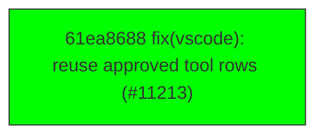

# Backport Agent — Detailed Run Report

> This file is generated automatically. It is intended for human analysts and
> AI reasoning models to assess agent performance, decision quality, and LLM behavior.

**Run timestamp**: 2026-06-29T12:04:58.945Z
**Models used**: fast=`mistral/mistral-code-agent-latest`  powerful=`mistral/mistral-medium-latest`
**Prompt log**: `/Volumes/ThunderStation/Development/tea-ching-cline/.backport-agent/run-1782734345177.prompts.jsonl`

---

## Summary (PR body)

## Backport Agent — Sync Report

**Date**: 2026-06-29T12:04:58.945Z
**Upstream ref**: `cline/cline.git@main`
**Fork ref**: `TEA-ching/cline@keypool-live`
**Sync branch**: `sync/upstream-main-2026-06-29-120124`

### Summary

- ✅ Applied: 1
- ⚠️ Needs human review: 0
- ⛔ Blocked (not attempted): 0
- 🔴 Unaccounted (agent bug): 9

### Applied commits

- `61ea8688` [low] fix(vscode): reuse approved tool rows (#11213) _(conflict resolved by agent)_

### 🔴 Unaccounted commits (agent processing gap)

- `f5d0b4fd` — not processed or reported by agent
- `a2194f49` — not processed or reported by agent
- `5fc73413` — not processed or reported by agent
- `49da86f6` — not processed or reported by agent
- `b193a81a` — not processed or reported by agent
- `263b58f8` — not processed or reported by agent
- `8f6dae0a` — not processed or reported by agent
- `e32caee9` — not processed or reported by agent
- `45dddb9a` — not processed or reported by agent

### Agent decision log

- Resolved conflicts using AI tools for commit 61ea8688c6345466db49a941a670fea75a2e6fb7


---

## Agent Workflow Diagram

> Generated by the fast model from the run summary. Evaluate the agent's decision path.



---

## AI Sub-Agent Call Log (8 calls)

> Each entry is one sub-agent invocation. Review prompt/response pairs to assess
> reasoning quality, hallucinations, and decision accuracy.

### Call 1 / 8 — `analyze_commit_for_backport` ✅ OK

| Field | Value |
|---|---|
| **Timestamp** | 2026-06-29T12:00:37.511Z |
| **Tool** | `analyze_commit_for_backport` |
| **Model** | `mistral/mistral-medium-latest` |
| **Duration** | 5212 ms |
| **Tokens in** | 9627 |
| **Tokens out** | 100 |
| **Cost** | $0.000000 |

**Prompt sent to sub-agent:**

```
Commit SHA: f5d0b4fd497bdf214450d96fb3b83d57136e93f8
Commit message:
add migration telemetry

Changed files (5):
apps/vscode/src/sdk/SdkController.ts
apps/vscode/src/sdk/sdk-task-history.test.ts
apps/vscode/src/sdk/sdk-task-history.ts
apps/vscode/src/services/telemetry/TelemetryService.ts
apps/vscode/src/services/telemetry/__tests__/TelemetryService.metrics.test.ts

Diff:
commit f5d0b4fd497bdf214450d96fb3b83d57136e93f8
Author: Max Paulus 🥪 <max@cline.bot>
Date:   Wed Jun 3 08:46:16 2026 -0700

    add migration telemetry
---
 apps/vscode/src/sdk/SdkController.ts               |   1 +
 apps/vscode/src/sdk/sdk-task-history.test.ts       | 104 ++++++++++++++-
 apps/vscode/src/sdk/sdk-task-history.ts            | 110 ++++++++++++----
 .../src/services/telemetry/TelemetryService.ts     | 145 +++++++++++++++++++++
 .../__tests__/TelemetryService.metrics.test.ts     |  43 ++++++
 5 files changed, 379 insertions(+), 24 deletions(-)

diff --git a/apps/vscode/src/sdk/SdkController.ts b/apps/vscode/src/sdk/SdkController.ts
index 4bfab328f3..c000c43ea0 100644
--- a/apps/vscode/src/sdk/SdkController.ts
+++ b/apps/vscode/src/sdk/SdkController.ts
@@ -309,6 +309,7 @@ export class Controller {
 		this.taskHistory = new SdkTaskHistory({
 			mcpHub: this.mcpHub,
 			sessions: this.sessions,
+			telemetry: telemetryService,
 			// History rendering mints ids from the shared authority so regenerated history ids
 			// never overlap live-session ids.
 			getMinter: () => this.messageTranslatorState.getMinter(),
diff --git a/apps/vscode/src/sdk/sdk-task-history.test.ts b/apps/vscode/src/sdk/sdk-task-history.test.ts
index f85a945fe8..2eee8761ec 100644
--- a/apps/vscode/src/sdk/sdk-task-history.test.ts
+++ b/apps/vscode/src/sdk/sdk-task-history.test.ts
@@ -2,6 +2,7 @@ import type { SessionHistoryRecord } from "@cline/core"
 import type { HistoryItem } from "@shared/HistoryItem"
 import { afterEach, beforeEach, describe, expect, it, vi } from "vitest"
 import type { McpHub } from "@/services/mcp/McpHub"
+import type { TelemetryService } from "@/services/telemetry/TelemetryService"
 import { sdkMessagesToClineMessages } from "./message-translator"
 import type { SdkSessionLifecycle } from "./sdk-session-lifecycle"
 import { SdkTaskHistory, sessionHistoryRecordToHistoryItem } from "./sdk-task-history"
@@ -26,6 +27,11 @@ vi.mock("@/utils/fs", () => ({
 	fileExistsAtPath: vi.fn(() => Promise.resolve(false)),
 }))
 
+const legacyStateReaderMock = vi.hoisted(() => ({
+	taskHistory: [] as HistoryItem[],
+	apiConversationHistory: [] as unknown[],
+}))
+
 vi.mock("@/shared/services/Logger", () => ({
 	Logger: {
 		error: vi.fn(),
@@ -34,8 +40,20 @@ vi.mock("@/shared/services/Logger", () => ({
 	},
 }))
 
+vi.mock("./legacy-state-reader", () => ({
+	readTaskHistory: vi.fn(() => legacyStateReaderMock.taskHistory),
+	readApiConversationHistory: vi.fn(() => legacyStateReaderMock.apiConversationHistory),
+}))
+
+vi.mock("./cline-session-factory", async (importOriginal) => ({
+	...(await importOriginal<typeof import("./cline-session-factory")>()),
+	buildSessionConfig: vi.fn(async ({ cwd, workspaceRoot, mode }) => ({ cwd, workspaceRoot, mode })),
+}))
+
 describe("SdkTaskHistory", () => {
 	beforeEach(() => {
+		legacyStateReaderMock.taskHistory = []
+		legacyStateReaderMock.apiConversationHistory = []
 		vi.clearAllMocks()
 	})
 
@@ -213,6 +231,74 @@ describe("SdkTaskHistory", () => {
 		expect(deleteSession).toHaveBeenCalledWith("task-1")
 	})
 
+	it("emits telemetry when migrating a legacy task to an SDK session", async () => {
+		vi.spyOn(Date, "now").mockReturnValue(123_456)
+		legacyStateReaderMock.taskHistory = [
+			makeHistoryItem("legacy-task", {
+				task: "legacy prompt",
+				isFavorited: true,
+				tokensIn: 10,
+				tokensOut: 20,
+				totalCost: 0.03,
+				cwdOnTaskInitialization: "/legacy/repo",
+			}),
+		]
+		legacyStateReaderMock.apiConversationHistory = [
+			{ role: "user", content: "legacy prompt" },
+			{ role: "assistant", content: "legacy answer" },
+		]
+		const telemetry = makeTelemetry()
+		const { history, startSession } = makeHistory([], telemetry)
+
+		await history.getClineMessages("legacy-task")
+
+		expect(startSession).toHaveBeenCalledWith(
+			expect.objectContaining({
+				config: expect.objectContaining({ sessionId: "legacy-task", cwd: "/legacy/repo" }),
+				initialMessages: expect.arrayContaining([
+					expect.objectContaining({ role: "user" }),
+					expect.objectContaining({ role: "assistant" }),
+				]),
+				sessionMetadata: expect.objectContaining({
+					migratedFromLegacyTask: true,
+					title: "legacy prompt",
+					isFavorited: true,
+				}),
+			}),
+		)
+		expect(telemetry.captureLegacyTaskMigration).toHaveBeenCalledWith(
+			expect.objectContaining({
+				taskId: "legacy-task",
+				outcome: "success",
+				reason: "migrated",
+				legacyApiHistoryLength: 2,
+				convertedMessageCount: 2,
+				hasFavorite: true,
+				hasCost: true,
+				hasTokenUsage: true,
+				hasCwd: true,
+			}),
+		)
+	})
+
+	it("emits backlog telemetry when legacy tasks are still pending migration", async () => {
+		legacyStateReaderMock.taskHistory = [makeHistoryItem("legacy-task", { task: "legacy prompt" })]
+		const telemetry = makeTelemetry()
+		const { history } = makeHistory(
+			[makeSessionRecord("sdk-task"), makeSessionRecord("migrated", { metadata: { migratedFromLegacyTask: true } })],
+			telemetry,
+		)
+
+		await history.listHistory({ hydrate: false })
+
+		expect(telemetry.captureLegacyTaskMigrationBacklog).toHaveBeenCalledWith({
+			pendingLegacyTaskCount: 1,
+			migratedSdkTaskCount: 1,
+			visibleSdkTaskCount: 2,
+			visibleTaskCount: 3,
+		})
+	})
+
 	it("updates usage for an existing SDK task", async () => {
 		vi.spyOn(Date, "now").mockReturnValue(123_456)
 		const { history, updateSession } = makeHistory([
@@ -277,7 +363,15 @@ function makeSessionRecord(id: string, overrides: Partial<SessionHistoryRecord>
 	}
 }
 
-function makeHistory(records: SessionHistoryRecord[]) {
+function makeTelemetry(): TelemetryService {
+	return {
+		safeCapture: vi.fn((fn: () => void) => fn()),
+		captureLegacyTaskMigration: vi.fn(),
+		captureLegacyTaskMigrationBacklog: vi.fn(),
+	} as unknown as TelemetryService
+}
+
+function makeHistory(records: SessionHistoryRecord[], telemetry?: TelemetryService) {
 	let currentRecords = records
 	const updateSession = vi.fn(
 		async (
@@ -299,10 +393,15 @@ function makeHistory(records: SessionHistoryRecord[]) {
 	const getSession = vi.fn(async (sessionId: string) => currentRecords.find((record) => record.sessionId === sessionId))
 	const listHistory = vi.fn(async () => currentRecords)
 	const readMessages = vi.fn(async () => [])
+	const startSession = vi.fn(async (input: { config: { sessionId?: string } }) => {
+		currentRecords = [makeSessionRecord(input.config.sessionId ?? "started"), ...currentRecords]
+		return { sessionId: input.config.sessionId }
+	})
 	const host = {
 		get: getSession,
 		listHistory,
 		readMessages,
+		start: startSession,
 		update: updateSession,
 		delete: deleteSession,
 	} as unknown as VscodeSessionHost
@@ -312,7 +411,8 @@ function makeHistory(records: SessionHistoryRecord[]) {
 	const history = new SdkTaskHistory({
 		mcpHub: {} as McpHub,
 		sessions,
+		telemetry,
 	})
 
-	return { history, getSession, listHistory, updateSession, deleteSession }
+	return { history, getSession, listHistory, updateSession, deleteSession, startSession }
 }
diff --git a/apps/vscode/src/sdk/sdk-task-history.ts b/apps/vscode/src/sdk/sdk-task-history.ts
index 1e96500585..d55dd967af 100644
--- a/apps/vscode/src/sdk/sdk-task-history.ts
+++ b/apps/vscode/src/sdk/sdk-task-history.ts
@@ -4,6 +4,7 @@ import { type ContentBlock, formatDisplayUserInput, type MessageWithMetadata } f
 import type { ClineMessage } from "@shared/ExtensionMessage"
 import type { HistoryItem } from "@shared/HistoryItem"
 import type { McpHub } from "@/services/mcp/McpHub"
+import type { TelemetryService } from "@/services/telemetry/TelemetryService"
 import { Logger } from "@/shared/services/Logger"
 import { buildSessionConfig } from "./cline-session-factory"
 import { sanitizeInitialMessagesForSessionStart } from "./initial-message-sanitizer"
@@ -39,6 +40,7 @@ export interface SdkTaskHistoryOptions {
 	 * it so regenerated history ids never overlap live-session ids. Optional for tests.
 	 */
 	getMinter?: () => MessageIdMinter
+	telemetry?: TelemetryService
 }
 
 type SdkTaskHistoryListOptions = ClineCoreListHistoryOptions & {
@@ -68,6 +70,10 @@ function dateStringToTimestamp(value: string | null | undefined): number {
 	return Number.isFinite(timestamp) ? timestamp : 0
 }
 
+function historyItemHasTokenUsage(item: HistoryItem): boolean {
+	return (item.tokensIn ?? 0) > 0 || (item.tokensOut ?? 0) > 0 || (item.cacheReads ?? 0) > 0 || (item.cacheWrites ?? 0) > 0
+}
+
 function historyItemToSessionHistoryRecord(item: HistoryItem): SessionHistoryRecord {
 	const startedAt = new Date(item.ts || Date.now()).toISOString()
 	const displayTask = formatDisplayUserInput(item.task)
@@ -369,6 +375,9 @@ export class SdkTaskHistory {
 		const legacyHistory = readTaskHistory()
 			.filter((item) => item.id && item.task && !sdkIds.has(item.id))
 			.map(historyItemToSessionHistoryRecord)
+		const migratedSdkTaskCount = visibleSdkHistory.filter(
+			(item) => metadataBoolean(item.metadata, "migratedFromLegacyTask") === true,
+		).length
 
 		const mergedHistory = [...visibleSdkHistory, ...legacyHistory].sort(
 			(a, b) =>
@@ -379,6 +388,17 @@ export class SdkTaskHistory {
 			this.metadataHistoryCache = { records: mergedHistory, hostLimit, createdAt: Date.now() }
 		}
 
+		this.options.telemetry?.safeCapture(
+			() =>
+				this.options.telemetry?.captureLegacyTaskMigrationBacklog({
+					pendingLegacyTaskCount: legacyHistory.length,
+					migratedSdkTaskCount,
+					visibleSdkTaskCount: visibleSdkHistory.length,
+					visibleTaskCount: mergedHistory.length,
+				}),
+			"SdkTaskHistory.listHistory.legacyMigrationBacklog",
+		)
+
 		const result = mergedHistory.slice(offset, offset + limit)
 		return result
 	}
@@ -394,56 +414,102 @@ export class SdkTaskHistory {
 	}
 
 	private async migrateLegacyTaskIfNeeded(taskId: string): Promise<boolean> {
+		const startedAt = Date.now()
+		let sdkLookupFailed = false
+		let historyItem: HistoryItem | undefined
+		let legacyApiHistoryLength: number | undefined
+		let convertedMessageCount: number | undefined
+
+		const emitMigrationTelemetry = (args: { outcome: "success" | "skipped" | "error"; reason: string }) => {
+			const payload = {
+				taskId,
+				outcome: args.outcome,
+				reason: args.reason,
+				durationMs: Date.now() - startedAt,
+				legacyApiHistoryLength,
+				convertedMessageCount,
+				sdkLookupFailed,
+				hasFavorite: historyItem?.isFavorited === true,
+				hasCost: (historyItem?.totalCost ?? 0) > 0,
+				hasTokenUsage: historyItem ? historyItemHasTokenUsage(historyItem) : undefined,
+				hasCwd: !!historyItem?.cwdOnTaskInitialization,
+			}
+			Logger.log("[SdkTaskHistory] Legacy task migration", payload)
+			this.options.telemetry?.safeCapture(
+				() => this.options.telemetry?.captureLegacyTaskMigration(payload),
+				"SdkTaskHistory.migrateLegacyTaskIfNeeded",
+			)
+		}
+
 		return this.withHistoryHost(async (host) => {
 			try {
 				const existing = await host.get(taskId)
 				if (existing) {
+					emitMigrationTelemetry({ outcome: "skipped", reason: "sdk_exists" })
 					return false
 				}
 			} catch (error) {
+				sdkLookupFailed = true
 				Logger.warn(`[SdkTaskHistory] Failed to check SDK session before legacy migration: ${taskId}`, error)
 			}
 
-			const historyItem = readTaskHistory().find((item) => item.id === taskId)
+			historyItem = readTaskHistory().find((item) => item.id === taskId)
 			if (!historyItem) {
+				emitMigrationTelemetry({ outcome: "skipped", reason: "legacy_history_missing" })
 				return false
 			}
 
 			const legacyApiHistory = readApiConversationHistory(taskId)
+			legacyApiHistoryLength = legacyApiHistory.length
 			if (legacyApiHistory.length === 0) {
+				emitMigrationTelemetry({ outcome: "skipped", reason: "legacy_api_history_empty" })
 				return false
 			}
 
 			const initialMessages = legacyApiHistoryToSdkMessages(legacyApiHistory, historyItem)
+			convertedMessageCount = initialMessages.length
 			if (initialMessages.length === 0) {
+				emitMigrationTelemetry({ outcome: "skipped", reason: "converted_messages_empty" })
 				return false
 			}
 
 			const cwd = historyItem.cwdOnTaskInitialization || process.cwd()
-			const config = await buildSessionConfig({ cwd, workspaceRoot: cwd, mode: "act" })
-			config.sessionId = taskId
-
-			await host.start({
-				config,
-				prompt: undefined,
-				interactive: true,
-				initialMessages,
-				sessionMetadata: {
-					title: historyItem.task,
-					isFavorited: historyItem.isFavorited ?? false,
-					size: historyItem.size ?? 0,
-					totalCost: historyItem.totalCost ?? 0,
-					tokensIn: historyItem.tokensIn ?? 0,
-					tokensOut: historyItem.tokensOut ?? 0,
-					cacheWrites: historyItem.cacheWrites ?? 0,
-					cacheReads: historyItem.cacheReads ?? 0,
-					modelId: historyItem.modelId ?? "",
-					migratedFromLegacyTask: true,
-				},
-			})
+			let config: Awaited<ReturnType<typeof buildSessionConfig>>
+			try {
+				config = await buildSessionConfig({ cwd, workspaceRoot: cwd, mode: "act" })
+				config.sessionId = taskId
+			} catch (error) {
+				emitMigrationTelemetry({ outcome: "error", reason: "config_failed" })
+				throw error
+			}
+
+			try {
+				await host.start({
+					config,
+					prompt: undefined,
+					interactive: true,
+					initialMessages,
+					sessionMetadata: {
+						title: historyItem.task,
+						isFavorited: historyItem.isFavorited ?? false,
+						size: historyItem.size ?? 0,
+						totalCost: historyItem.totalCost ?? 0,
+						tokensIn: historyItem.tokensIn ?? 0,
+						tokensOut: historyItem.tokensOut ?? 0,
+						cacheWrites: historyItem.cacheWrites ?? 0,
+						cacheReads: historyItem.cacheReads ?? 0,
+						modelId: historyItem.modelId ?? "",
+						migratedFromLegacyTask: true,
+					},
+				})
+			} catch (error) {
+				emitMigrationTelemetry({ outcome: "error", reason: "write_failed" })
+				throw error
+			}
 
 			this.invalidateMetadataHistoryCache()
 			Logger.log(`[SdkTaskHistory] Migrated legacy task to SDK session: ${taskId}`)
+			emitMigrationTelemetry({ outcome: "success", reason: "migrated" })
 			return true
 		})
 	}
diff --git a/apps/vscode/src/services/telemetry/TelemetryService.ts b/apps/vscode/src/services/telemetry/TelemetryService.ts
index c6a520a808..a634bbc491 100644
--- a/apps/vscode/src/services/telemetry/TelemetryService.ts
+++ b/apps/vscode/src/services/telemetry/TelemetryService.ts
@@ -193,6 +193,26 @@ export class TelemetryService {
 		GRPC: {
 			RESPONSE_SIZE_BYTES: "cline.grpc.response.size_bytes",
 		},
+		MIGRATION: {
+			// Fires whenever Cline checks an old pre-SDK task and decides whether/how to migrate it.
+			LEGACY_TASK_ATTEMPTS_TOTAL: "cline.migration.legacy_task.attempts.total",
+			// Fires when the user opens an old task and Cline successfully copies it into SDK session storage.
+			LEGACY_TASK_SUCCESS_TOTAL: "cline.migration.legacy_task.success.total",
+			// Fires when Cline tried to migrate an old task but failed while building or writing the SDK session.
+			LEGACY_TASK_FAILURES_TOTAL: "cline.migration.legacy_task.failures.total",
+			// Fires when no migration happens because it is unnecessary or impossible, e.g. already migrated or missing old messages.
+			LEGACY_TASK_SKIPPED_TOTAL: "cline.migration.legacy_task.skipped.total",
+			// Fires for every migration decision; measures how long the check/migration took.
+			LEGACY_TASK_DURATION_SECONDS: "cline.migration.legacy_task.duration.seconds",
+			// Fires when Cline finds old conversation messages; records how many old messages were found.
+			LEGACY_TASK_LEGACY_MESSAGES_COUNT: "cline.migration.legacy_task.legacy_messages.count",
+			// Fires after conversion; records how many messages made it into SDK-compatible form.
+			LEGACY_TASK_CONVERTED_MESSAGES_COUNT: "cline.migration.legacy_task.converted_messages.count",
+			// Fires when history is listed; counts old pre-SDK tasks still waiting to be migrated.
+			LEGACY_TASK_PENDING_COUNT: "cline.migration.legacy_task.pending.count",
+			// Fires when history is listed; counts old tasks that already made it safely into SDK session storage.
+			LEGACY_TASK_MIGRATED_COUNT: "cline.migration.legacy_task.migrated.count",
+		},
 	}
 	// Event constants for tracking user interactions and system events
 	private static readonly EVENTS = {
@@ -250,6 +270,8 @@ export class TelemetryService {
 			MCP_TOOL_CALLED: "task.mcp_tool_called",
 			// Tracks when a historical task is loaded from storage
 			HISTORICAL_LOADED: "task.historical_loaded",
+			// Tracks legacy VS Code task history migration into SDK sessions
+			LEGACY_TASK_MIGRATION: "task.legacy_task_migration",
 			// Tracks when the retry button is clicked for failed operations
 			RETRY_CLICKED: "task.retry_clicked",
 			// Tracks when a diff edit (replace_in_file) operation fails
@@ -2376,6 +2398,129 @@ export class TelemetryService {
 	 * @param method The gRPC method name
 	 * @param requestId Optional request ID for correlation
 	 */
+	public captureLegacyTaskMigration(args: {
+		taskId: string
+		outcome: "success" | "skipped" | "error"
+		reason: string
+		durationMs: number
+		legacyApiHistoryLength?: number
+		convertedMessageCount?: number
+		sdkLookupFailed?: boolean
+		hasFavorite?: boolean
+		hasCost?: boolean
+		hasTokenUsage?: boolean
+		hasCwd?: boolean
+	}): void {
+		const migrationType = "legacy_task_to_sdk_session"
+		const metricAttributes = {
+			migration_type: migrationType,
+			outcome: args.outcome,
+			reason: args.reason,
+		}
+
+		this.capture({
+			event: TelemetryService.EVENTS.TASK.LEGACY_TASK_MIGRATION,
+			properties: {
+				ulid: args.taskId,
+				migration_type: migrationType,
+				outcome: args.outcome,
+				reason: args.reason,
+				durationMs: args.durationMs,
+				legacyApiHistoryLength: args.legacyApiHistoryLength,
+				convertedMessageCount: args.convertedMessageCount,
+				sdkLookupFailed: args.sdkLookupFailed,
+				hasFavorite: args.hasFavorite,
+				hasCost: args.hasCost,
+				hasTokenUsage: args.hasTokenUsage,
+				hasCwd: args.hasCwd,
+			},
+		})
+
+		this.recordCounter(
+			TelemetryService.METRICS.MIGRATION.LEGACY_TASK_ATTEMPTS_TOTAL,
+			1,
+			metricAttributes,
+			"Legacy VS Code task migration decisions",
+		)
+		if (args.outcome === "success") {
+			this.recordCounter(
+				TelemetryService.METRICS.MIGRATION.LEGACY_TASK_SUCCESS_TOTAL,
+				1,
+				metricAttributes,
+				"Legacy VS Code tasks successfully copied into SDK session storage",
+			)
+		} else if (args.outcome === "error") {
+			this.recordCounter(
+				TelemetryService.METRICS.MIGRATION.LEGACY_TASK_FAILURES_TOTAL,
+				1,
+				metricAttributes,
+				"Legacy VS Code task migrations that failed while building or writing the SDK session",
+			)
+		} else {
+			this.recordCounter(
+				TelemetryService.METRICS.MIGRATION.LEGACY_TASK_SKIPPED_TOTAL,
+				1,
+				metricAttributes,
+				"Legacy VS Code task migration checks that did not need or could not perform a migration",
+			)
+		}
+
+		this.recordHistogram(
+			TelemetryService.METRICS.MIGRATION.LEGACY_TASK_DURATION_SECONDS,
+			args.durationMs / 1000,
+			metricAttributes,
+			"Time spent checking or migrating a legacy VS Code task into SDK session storage",
+		)
+		if (args.legacyApiHistoryLength !== undefined) {
+			this.recordHistogram(
+				TelemetryService.METRICS.MIGRATION.LEGACY_TASK_LEGACY_MESSAGES_COUNT,
+				args.legacyApiHistoryLength,
+				metricAttributes,
+				"Number of raw legacy API history messages found while migrating a legacy VS Code task",
+			)
+		}
+		if (args.convertedMessageCount !== undefined) {
+			this.recordHistogram(
+				TelemetryService.METRICS.MIGRATION.LEGACY_TASK_CONVERTED_MESSAGES_COUNT,
+				args.convertedMessageCount,
+				metricAttributes,
+				"Number of SDK-compatible messages produced from a legacy VS Code task migration",
+			)
+		}
+	}
+
+	public captureLegacyTaskMigrationBacklog(args: {
+		pendingLegacyTaskCount: number
+		migratedSdkTaskCount: number
+		visibleSdkTaskCount: number
+		visibleTaskCount: number
+	}): void {
+		const attributes = { migration_type: "legacy_task_to_sdk_session" }
+		this.recordGauge(
+			TelemetryService.METRICS.MIGRATION.LEGACY_TASK_PENDING_COUNT,
+			args.pendingLegacyTaskCount,
+			attributes,
+			"Legacy VS Code tasks visible in history but not yet migrated to SDK sessions",
+		)
+		this.recordGauge(
+			TelemetryService.METRICS.MIGRATION.LEGACY_TASK_MIGRATED_COUNT,
+			args.migratedSdkTaskCount,
+			attributes,
+			"SDK sessions marked as migrated from legacy VS Code task history",
+		)
+		this.capture({
+			event: TelemetryService.EVENTS.TASK.LEGACY_TASK_MIGRATION,
+			properties: {
+				migration_type: "legacy_task_to_sdk_session",
+				outcome: "backlog",
+				pendingLegacyTaskCount: args.pendingLegacyTaskCount,
+				migratedSdkTaskCount: args.migratedSdkTaskCount,
+				visibleSdkTaskCount: args.visibleSdkTaskCount,
+				visibleTaskCount: args.visibleTaskCount,
+			},
+		})
+	}
+
 	public captureGrpcResponseSize(sizeUtf8Bytes: number, service: string, method: string, requestId?: string): void {
 		this.recordHistogram(
 			TelemetryService.METRICS.GRPC.RESPONSE_SIZE_BYTES,
diff --git a/apps/vscode/src/services/telemetry/__tests__/TelemetryService.metrics.test.ts b/apps/vscode/src/services/telemetry/__tests__/TelemetryService.metrics.test.ts
index d9b13dd8a5..d764dfb5db 100644
--- a/apps/vscode/src/services/telemetry/__tests__/TelemetryService.metrics.test.ts
+++ b/apps/vscode/src/services/telemetry/__tests__/TelemetryService.metrics.test.ts
@@ -383,4 +383,47 @@ describe("TelemetryService metrics", () => {
 		assert.strictEqual(entry.attributes.extension_version, "test")
 		assert.strictEqual(entry.attributes.platform, "test-platform")
 	})
+
+	it("captureLegacyTaskMigration emits event and migration metrics", () => {
+		const provider = new FakeProvider()
+		const service = createTelemetryService(provider)
+
+		service.captureLegacyTaskMigration({
+			taskId: "legacy-task",
+			outcome: "success",
+			reason: "migrated",
+			durationMs: 250,
+			legacyApiHistoryLength: 3,
+			convertedMessageCount: 2,
+			hasFavorite: true,
+			hasCost: true,
+			hasTokenUsage: true,
+			hasCwd: true,
+		})
+
+		const event = provider.logs.find((entry) => entry.event === "task.legacy_task_migration")
+		assert.ok(event)
+		assert.strictEqual(event?.properties?.ulid, "legacy-task")
+		assert.strictEqual(event?.properties?.outcome, "success")
+		assert.strictEqual(event?.properties?.legacyApiHistoryLength, 3)
+
+		assert.deepStrictEqual(
+			provider.counters.map((entry) => entry.name),
+			[
+				TelemetryService.METRICS.MIGRATION.LEGACY_TASK_ATTEMPTS_TOTAL,
+				TelemetryService.METRICS.MIGRATION.LEGACY_TASK_SUCCESS_TOTAL,
+			],
+		)
+		assert.deepStrictEqual(
+			provider.histograms.map((entry) => entry.name),
+			[
+				TelemetryService.METRICS.MIGRATION.LEGACY_TASK_DURATION_SECONDS,
+				TelemetryService.METRICS.MIGRATION.LEGACY_TASK_LEGACY_MESSAGES_COUNT,
+				TelemetryService.METRICS.MIGRATION.LEGACY_TASK_CONVERTED_MESSAGES_COUNT,
+			],
+		)
+		assert.strictEqual(provider.histograms[0].value, 0.25)
+		assert.strictEqual(provider.histograms[0].attributes.migration_type, "legacy_task_to_sdk_session")
+		assert.strictEqual(provider.histograms[0].attributes.reason, "migrated")
+	})
 })

Output the JSON object now.
```

**Response received:**

```
{
  "summary": "Adds telemetry for legacy task migration to SDK sessions, including metrics and event tracking.",
  "keyChanges": [
    "Adds migration telemetry methods to TelemetryService",
    "Integrates telemetry into SdkTaskHistory migration logic",
    "Adds tests for migration telemetry"
  ],
  "backportComplexity": "trivial",
  "semanticRiskFactors": [],
  "recommendation": "apply"
}
```

---

### Call 2 / 8 — `analyze_commit_for_backport` ✅ OK

| Field | Value |
|---|---|
| **Timestamp** | 2026-06-29T12:00:50.219Z |
| **Tool** | `analyze_commit_for_backport` |
| **Model** | `mistral/mistral-code-agent-latest` |
| **Duration** | 12668 ms |
| **Tokens in** | 3385 |
| **Tokens out** | 111 |
| **Cost** | $0.000000 |

**Prompt sent to sub-agent:**

```
Commit SHA: 263b58f8c3f552fd8c3a4a7bca55d6b2ac7ae411
Commit message:
fix(llms): preserve fetch error cause details (#11928)

Changed files (2):
sdk/packages/llms/src/providers/format.test.ts
sdk/packages/llms/src/providers/format.ts

Diff:
commit 263b58f8c3f552fd8c3a4a7bca55d6b2ac7ae411
Author: Saoud Rizwan <7799382+saoudrizwan@users.noreply.github.com>
Date:   Sat Jun 27 14:51:56 2026 -0700

    fix(llms): preserve fetch error cause details (#11928)
---
 sdk/packages/llms/src/providers/format.test.ts | 11 +++++++++++
 sdk/packages/llms/src/providers/format.ts      | 23 +++++++++++++++++++++++
 2 files changed, 34 insertions(+)

diff --git a/sdk/packages/llms/src/providers/format.test.ts b/sdk/packages/llms/src/providers/format.test.ts
index b009af846b..9023391c8d 100644
--- a/sdk/packages/llms/src/providers/format.test.ts
+++ b/sdk/packages/llms/src/providers/format.test.ts
@@ -34,6 +34,17 @@ describe("extractErrorMessage", () => {
 		);
 	});
 
+	it("preserves native transport error wrappers and cause metadata", () => {
+		const socketError = Object.assign(new Error("other side closed"), {
+			name: "SocketError",
+			code: "UND_ERR_SOCKET",
+		});
+
+		expect(
+			extractErrorMessage(new TypeError("fetch failed", { cause: socketError })),
+		).toBe("fetch failed: SocketError: other side closed (UND_ERR_SOCKET)");
+	});
+
 	it("prefers nested stream error details over generic wrapper messages", () => {
 		expect(
 			extractErrorMessage({
diff --git a/sdk/packages/llms/src/providers/format.ts b/sdk/packages/llms/src/providers/format.ts
index 5ed017054f..c31e420351 100644
--- a/sdk/packages/llms/src/providers/format.ts
+++ b/sdk/packages/llms/src/providers/format.ts
@@ -13,6 +13,29 @@ export function extractErrorMessage(error: unknown): string {
 		if (typeof value !== "object") {
 			return undefined;
 		}
+		if (value instanceof Error) {
+			const causeMessage = extractStructuredMessage(
+				(value as { cause?: unknown }).cause,
+			);
+			const message = value.message.trim();
+			if (causeMessage && message && causeMessage !== message) {
+				const cause = (value as { cause?: unknown }).cause;
+				const causeName =
+					cause instanceof Error && cause.name && cause.name !== "Error"
+						? `${cause.name}: `
+						: "";
+				const causeCode =
+					cause && typeof cause === "object" && "code" in cause
+						? (cause as { code?: unknown }).code
+						: undefined;
+				const codeSuffix =
+					typeof causeCode === "string" && causeCode.trim()
+						? ` (${causeCode})`
+						: "";
+				return `${message}: ${causeName}${causeMessage}${codeSuffix}`;
+			}
+			return causeMessage ?? (message || undefined);
+		}
 		const payload = value as {
 			error?: { message?: string } | string;
 			errors?: unknown;

Output the JSON object now.
```

**Response received:**

````
```json
{
  "summary": "Enhances error message extraction to preserve fetch error cause details, including nested error metadata and codes.",
  "keyChanges": [
    "Adds cause handling in extractErrorMessage for Error instances",
    "Preserves nested error names, messages, and codes in output",
    "Adds test case for native transport error wrappers"
  ],
  "backportComplexity": "trivial",
  "semanticRiskFactors": [],
  "recommendation": "apply"
}
```
````

---

### Call 3 / 8 — `analyze_commit_for_backport` ✅ OK

| Field | Value |
|---|---|
| **Timestamp** | 2026-06-29T12:01:10.925Z |
| **Tool** | `analyze_commit_for_backport` |
| **Model** | `mistral/mistral-code-agent-latest` |
| **Duration** | 20659 ms |
| **Tokens in** | 10522 |
| **Tokens out** | 181 |
| **Cost** | $0.000000 |

**Prompt sent to sub-agent:**

```
Commit SHA: 5fc73413127ca8241e9a0e99b9673b7f7d0b9dd7
Commit message:
chore: regenerate bun.lock after rebase onto main

Changed files (1):
bun.lock

Diff:
commit 5fc73413127ca8241e9a0e99b9673b7f7d0b9dd7
Author: Dominic Cooney <dominic.cooney@gmail.com>
Date:   Tue Jun 23 17:08:00 2026 +0900

    chore: regenerate bun.lock after rebase onto main
---
 bun.lock | 48 +++++++++++++++++++++---------------------------
 1 file changed, 21 insertions(+), 27 deletions(-)

diff --git a/bun.lock b/bun.lock
index 4984ae1468..7ad1610aca 100644
--- a/bun.lock
+++ b/bun.lock
@@ -19,7 +19,7 @@
     },
     "apps/cli": {
       "name": "@cline/cli",
-      "version": "3.0.27",
+      "version": "3.0.29",
       "bin": {
         "cline": "src/index.ts",
       },
@@ -78,10 +78,9 @@
         "@fontsource-variable/schibsted-grotesk": "^5.2.8",
         "@radix-ui/react-use-controllable-state": "^1.2.2",
         "@rive-app/react-webgl2": "^4.27.2",
+        "@shikijs/langs": "^4.2.0",
+        "@shikijs/themes": "^4.2.0",
         "@streamdown/cjk": "^1.0.3",
-        "@streamdown/code": "^1.1.1",
-        "@streamdown/math": "^1.0.2",
-        "@streamdown/mermaid": "^1.0.2",
         "@tailwindcss/vite": "^4.2.1",
         "@xyflow/react": "^12.10.1",
         "ai": "^6.0.116",
@@ -92,6 +91,7 @@
         "embla-carousel-react": "^8.6.0",
         "lucide-react": "^0.577.0",
         "media-chrome": "^4.18.1",
+        "mermaid": "^11.15.0",
         "motion": "^12.38.0",
         "nanoid": "^5.1.7",
         "next-themes": "^0.4.6",
@@ -616,7 +616,7 @@
     },
     "sdk/packages/agents": {
       "name": "@cline/agents",
-      "version": "0.0.49",
+      "version": "0.0.51",
       "dependencies": {
         "@cline/llms": "workspace:*",
         "@cline/shared": "workspace:*",
@@ -625,7 +625,7 @@
     },
     "sdk/packages/core": {
       "name": "@cline/core",
-      "version": "0.0.49",
+      "version": "0.0.51",
       "dependencies": {
         "@cline/agents": "workspace:*",
         "@cline/llms": "workspace:*",
@@ -663,7 +663,7 @@
     },
     "sdk/packages/llms": {
       "name": "@cline/llms",
-      "version": "0.0.49",
+      "version": "0.0.51",
       "dependencies": {
         "@ai-sdk/amazon-bedrock": "^4.0.89",
         "@ai-sdk/anthropic": "^3.0.68",
@@ -697,14 +697,14 @@
     },
     "sdk/packages/sdk": {
       "name": "@cline/sdk",
-      "version": "0.0.49",
+      "version": "0.0.51",
       "dependencies": {
         "@cline/core": "workspace:*",
       },
     },
     "sdk/packages/shared": {
       "name": "@cline/shared",
-      "version": "0.0.49",
+      "version": "0.0.51",
       "dependencies": {
         "aws4fetch": "^1.0.20",
         "jsonrepair": "^3.13.2",
@@ -3111,7 +3111,7 @@
 
     "d3-zoom": ["d3-zoom@3.0.0", "", { "dependencies": { "d3-dispatch": "1 - 3", "d3-drag": "2 - 3", "d3-interpolate": "1 - 3", "d3-selection": "2 - 3", "d3-transition": "2 - 3" } }, "sha512-b8AmV3kfQaqWAuacbPuNbL6vahnOJflOhexLzMMNLga62+/nh0JzvJ0aO/5a5MVgUFGS7Hu1P9P03o3fJkDCyw=="],
 
-    "dagre-d3-es": ["dagre-d3-es@7.0.13", "", { "dependencies": { "d3": "^7.9.0", "lodash-es": "^4.17.21" } }, "sha512-efEhnxpSuwpYOKRm/L5KbqoZmNNukHa/Flty4Wp62JRvgH2ojwVgPgdYyr4twpieZnyRDdIH7PY2mopX26+j2Q=="],
+    "dagre-d3-es": ["dagre-d3-es@7.0.14", "", { "dependencies": { "d3": "^7.9.0", "lodash-es": "^4.17.21" } }, "sha512-P4rFMVq9ESWqmOgK+dlXvOtLwYg0i7u0HBGJER0LZDJT2VHIPAMZ/riPxqJceWMStH5+E61QxFra9kIS3AqdMg=="],
 
     "data-uri-to-buffer": ["data-uri-to-buffer@4.0.1", "", {}, "sha512-0R9ikRb668HB7QDxT1vkpuUBtqc53YyAwMwGeUFKRojY/NWKvdZ+9UYtRfGmhqNbRkTSVpMbmyhXipFFv2cb/A=="],
 
@@ -4009,7 +4009,7 @@
 
     "merge2": ["merge2@1.4.1", "", {}, "sha512-8q7VEgMJW4J8tcfVPy8g09NcQwZdbwFEqhe/WZkoIzjn/3TGDwtOCYtXGxA3O8tPzpczCCDgv+P2P5y00ZJOOg=="],
 
-    "mermaid": ["mermaid@11.12.3", "", { "dependencies": { "@braintree/sanitize-url": "^7.1.1", "@iconify/utils": "^3.0.1", "@mermaid-js/parser": "^1.0.0", "@types/d3": "^7.4.3", "cytoscape": "^3.29.3", "cytoscape-cose-bilkent": "^4.1.0", "cytoscape-fcose": "^2.2.0", "d3": "^7.9.0", "d3-sankey": "^0.12.3", "dagre-d3-es": "7.0.13", "dayjs": "^1.11.18", "dompurify": "^3.2.5", "katex": "^0.16.22", "khroma": "^2.1.0", "lodash-es": "^4.17.23", "marked": "^16.2.1", "roughjs": "^4.6.6", "stylis": "^4.3.6", "ts-dedent": "^2.2.0", "uuid": "^11.1.0" } }, "sha512-wN5ZSgJQIC+CHJut9xaKWsknLxaFBwCPwPkGTSUYrTiHORWvpT8RxGk849HPnpUAQ+/9BPRqYb80jTpearrHzQ=="],
+    "mermaid": ["mermaid@11.15.0", "", { "dependencies": { "@braintree/sanitize-url": "^7.1.1", "@iconify/utils": "^3.0.2", "@mermaid-js/parser": "^1.1.1", "@types/d3": "^7.4.3", "@upsetjs/venn.js": "^2.0.0", "cytoscape": "^3.33.1", "cytoscape-cose-bilkent": "^4.1.0", "cytoscape-fcose": "^2.2.0", "d3": "^7.9.0", "d3-sankey": "^0.12.3", "dagre-d3-es": "7.0.14", "dayjs": "^1.11.19", "dompurify": "^3.3.1", "es-toolkit": "^1.45.1", "katex": "^0.16.25", "khroma": "^2.1.0", "marked": "^16.3.0", "roughjs": "^4.6.6", "stylis": "^4.3.6", "ts-dedent": "^2.2.0", "uuid": "^11.1.0 || ^12 || ^13 || ^14.0.0" } }, "sha512-pTMbcf3rWdtLiYGpmoTjHEpeY8seiy6sR+9nD7LOs8KfUbHE4lOUAprTRqRAcWSQ6MQpdX+YEsxShtGsINtPtw=="],
 
     "micromark": ["micromark@4.0.2", "", { "dependencies": { "@types/debug": "^4.0.0", "debug": "^4.0.0", "decode-named-character-reference": "^1.0.0", "devlop": "^1.0.0", "micromark-core-commonmark": "^2.0.0", "micromark-factory-space": "^2.0.0", "micromark-util-character": "^2.0.0", "micromark-util-chunked": "^2.0.0", "micromark-util-combine-extensions": "^2.0.0", "micromark-util-decode-numeric-character-reference": "^2.0.0", "micromark-util-encode": "^2.0.0", "micromark-util-normalize-identifier": "^2.0.0", "micromark-util-resolve-all": "^2.0.0", "micromark-util-sanitize-uri": "^2.0.0", "micromark-util-subtokenize": "^2.0.0", "micromark-util-symbol": "^2.0.0", "micromark-util-types": "^2.0.0" } }, "sha512-zpe98Q6kvavpCr1NPVSCMebCKfD7CA2NqZ+rykeNhONIJBpc1tFKt9hucLGwha3jNTNI8lHpctWJWoimVF4PfA=="],
 
@@ -5699,8 +5699,6 @@
 
     "@streamdown/code/shiki": ["shiki@3.23.0", "", { "dependencies": { "@shikijs/core": "3.23.0", "@shikijs/engine-javascript": "3.23.0", "@shikijs/engine-oniguruma": "3.23.0", "@shikijs/langs": "3.23.0", "@shikijs/themes": "3.23.0", "@shikijs/types": "3.23.0", "@shikijs/vscode-textmate": "^10.0.2", "@types/hast": "^3.0.4" } }, "sha512-55Dj73uq9ZXL5zyeRPzHQsK7Nbyt6Y10k5s7OjuFZGMhpp4r/rsLBH0o/0fstIzX1Lep9VxefWljK/SKCzygIA=="],
 
-    "@streamdown/mermaid/mermaid": ["mermaid@11.15.0", "", { "dependencies": { "@braintree/sanitize-url": "^7.1.1", "@iconify/utils": "^3.0.2", "@mermaid-js/parser": "^1.1.1", "@types/d3": "^7.4.3", "@upsetjs/venn.js": "^2.0.0", "cytoscape": "^3.33.1", "cytoscape-cose-bilkent": "^4.1.0", "cytoscape-fcose": "^2.2.0", "d3": "^7.9.0", "d3-sankey": "^0.12.3", "dagre-d3-es": "7.0.14", "dayjs": "^1.11.19", "dompurify": "^3.3.1", "es-toolkit": "^1.45.1", "katex": "^0.16.25", "khroma": "^2.1.0", "marked": "^16.3.0", "roughjs": "^4.6.6", "stylis": "^4.3.6", "ts-dedent": "^2.2.0", "uuid": "^11.1.0 || ^12 || ^13 || ^14.0.0" } }, "sha512-pTMbcf3rWdtLiYGpmoTjHEpeY8seiy6sR+9nD7LOs8KfUbHE4lOUAprTRqRAcWSQ6MQpdX+YEsxShtGsINtPtw=="],
-
     "@tailwindcss/oxide-wasm32-wasi/@emnapi/core": ["@emnapi/core@1.10.0", "", { "dependencies": { "@emnapi/wasi-threads": "1.2.1", "tslib": "^2.4.0" }, "bundled": true }, "sha512-yq6OkJ4p82CAfPl0u9mQebQHKPJkY7WrIuk205cTYnYe+k2Z8YBh11FrbRG/H6ihirqcacOgl2BIO8oyMQLeXw=="],
 
     "@tailwindcss/oxide-wasm32-wasi/@emnapi/runtime": ["@emnapi/runtime@1.10.0", "", { "dependencies": { "tslib": "^2.4.0" }, "bundled": true }, "sha512-ewvYlk86xUoGI0zQRNq/mC+16R1QeDlKQy21Ki3oSYXNgLb45GV1P6A0M+/s6nyCuNDqe5VpaY84BzXGwVbwFA=="],
@@ -5967,6 +5965,8 @@
 
     "mermaid/marked": ["marked@16.4.2", "", { "bin": { "marked": "bin/marked.js" } }, "sha512-TI3V8YYWvkVf3KJe1dRkpnjs68JUPyEa5vjKrp1XEEJUAOaQc+Qj+L1qWbPd0SJuAdQkFU0h73sXXqwDYxsiDA=="],
 
+    "mermaid/uuid": ["uuid@14.0.0", "", { "bin": { "uuid": "dist-node/bin/uuid" } }, "sha512-Qo+uWgilfSmAhXCMav1uYFynlQO7fMFiMVZsQqZRMIXp0O7rR7qjkj+cPvBHLgBqi960QCoo/PH2/6ZtVqKvrg=="],
+
     "micromatch/picomatch": ["picomatch@2.3.2", "", {}, "sha512-V7+vQEJ06Z+c5tSye8S+nHUfI51xoXIXjHQ99cQtKUkQqqO1kO/KCJUfZXuB47h/YBlDhah2H3hdUGXn8ie0oA=="],
 
     "mocha/glob": ["glob@10.5.0", "", { "dependencies": { "foreground-child": "^3.1.0", "jackspeak": "^3.1.2", "minimatch": "^9.0.4", "minipass": "^7.1.2", "package-json-from-dist": "^1.0.0", "path-scurry": "^1.11.1" }, "bin": { "glob": "dist/esm/bin.mjs" } }, "sha512-DfXN8DfhJ7NH3Oe7cFmu3NCu1wKbkReJ8TorzSAFbSKrlNaQSKfIzqYqVY8zlbs2NLBbWpRiU52GX2PbaBVNkg=="],
@@ -6183,8 +6183,6 @@
 
     "streamdown/marked": ["marked@17.0.6", "", { "bin": { "marked": "bin/marked.js" } }, "sha512-gB0gkNafnonOw0obSTEGZTT86IuhILt2Wfx0mWH/1Au83kybTayroZ/V6nS25mN7u8ASy+5fMhgB3XPNrOZdmA=="],
 
-    "streamdown/mermaid": ["mermaid@11.15.0", "", { "dependencies": { "@braintree/sanitize-url": "^7.1.1", "@iconify/utils": "^3.0.2", "@mermaid-js/parser": "^1.1.1", "@types/d3": "^7.4.3", "@upsetjs/venn.js": "^2.0.0", "cytoscape": "^3.33.1", "cytoscape-cose-bilkent": "^4.1.0", "cytoscape-fcose": "^2.2.0", "d3": "^7.9.0", "d3-sankey": "^0.12.3", "dagre-d3-es": "7.0.14", "dayjs": "^1.11.19", "dompurify": "^3.3.1", "es-toolkit": "^1.45.1", "katex": "^0.16.25", "khroma": "^2.1.0", "marked": "^16.3.0", "roughjs": "^4.6.6", "stylis": "^4.3.6", "ts-dedent": "^2.2.0", "uuid": "^11.1.0 || ^12 || ^13 || ^14.0.0" } }, "sha512-pTMbcf3rWdtLiYGpmoTjHEpeY8seiy6sR+9nD7LOs8KfUbHE4lOUAprTRqRAcWSQ6MQpdX+YEsxShtGsINtPtw=="],
-
     "string-width-cjs/emoji-regex": ["emoji-regex@8.0.0", "", {}, "sha512-MSjYzcWNOA0ewAHpz0MxpYFvwg6yjy1NG3xteoqz644VCo/RPgnr1/GGt+ic3iJTzQ8Eu3TdM14SawnVUmGE6A=="],
 
     "string-width-cjs/strip-ansi": ["strip-ansi@6.0.1", "", { "dependencies": { "ansi-regex": "^5.0.1" } }, "sha512-Y38VPSHcqkFrCpFnQ9vuSXmquuv5oXOKpGeT6aGrr3o3Gc9AlVa6JBfUSOCnbxGGZF+/0ooI7KrPuUSztUdU5A=="],
@@ -6257,6 +6255,8 @@
 
     "webview-ui/lucide-react": ["lucide-react@0.511.0", "", { "peerDependencies": { "react": "^16.5.1 || ^17.0.0 || ^18.0.0 || ^19.0.0" } }, "sha512-VK5a2ydJ7xm8GvBeKLS9mu1pVK6ucef9780JVUjw6bAjJL/QXnd4Y0p7SPeOUMC27YhzNCZvm5d/QX0Tp3rc0w=="],
 
+    "webview-ui/mermaid": ["mermaid@11.12.3", "", { "dependencies": { "@braintree/sanitize-url": "^7.1.1", "@iconify/utils": "^3.0.1", "@mermaid-js/parser": "^1.0.0", "@types/d3": "^7.4.3", "cytoscape": "^3.29.3", "cytoscape-cose-bilkent": "^4.1.0", "cytoscape-fcose": "^2.2.0", "d3": "^7.9.0", "d3-sankey": "^0.12.3", "dagre-d3-es": "7.0.13", "dayjs": "^1.11.18", "dompurify": "^3.2.5", "katex": "^0.16.22", "khroma": "^2.1.0", "lodash-es": "^4.17.23", "marked": "^16.2.1", "roughjs": "^4.6.6", "stylis": "^4.3.6", "ts-dedent": "^2.2.0", "uuid": "^11.1.0" } }, "sha512-wN5ZSgJQIC+CHJut9xaKWsknLxaFBwCPwPkGTSUYrTiHORWvpT8RxGk849HPnpUAQ+/9BPRqYb80jTpearrHzQ=="],
+
     "webview-ui/react": ["react@18.3.1", "", { "dependencies": { "loose-envify": "^1.1.0" } }, "sha512-wS+hAgJShR0KhEvPJArfuPVN1+Hz1t0Y6n5jLrGQbkb4urgPE/0Rve+1kMB1v/oWgHgm4WIcV+i7F2pTVj+2iQ=="],
 
     "webview-ui/react-dom": ["react-dom@18.3.1", "", { "dependencies": { "loose-envify": "^1.1.0", "scheduler": "^0.23.2" }, "peerDependencies": { "react": "^18.3.1" } }, "sha512-5m4nQKp+rZRb09LNH59GM4BxTh9251/ylbKIbpe7TpGxfJ+9kv6BLkLBXIjjspbgbnIBNqlI23tRnTWT0snUIw=="],
@@ -6623,12 +6623,6 @@
 
     "@streamdown/code/shiki/@shikijs/types": ["@shikijs/types@3.23.0", "", { "dependencies": { "@shikijs/vscode-textmate": "^10.0.2", "@types/hast": "^3.0.4" } }, "sha512-3JZ5HXOZfYjsYSk0yPwBrkupyYSLpAE26Qc0HLghhZNGTZg/SKxXIIgoxOpmmeQP0RRSDJTk1/vPfw9tbw+jSQ=="],
 
-    "@streamdown/mermaid/mermaid/dagre-d3-es": ["dagre-d3-es@7.0.14", "", { "dependencies": { "d3": "^7.9.0", "lodash-es": "^4.17.21" } }, "sha512-P4rFMVq9ESWqmOgK+dlXvOtLwYg0i7u0HBGJER0LZDJT2VHIPAMZ/riPxqJceWMStH5+E61QxFra9kIS3AqdMg=="],
-
-    "@streamdown/mermaid/mermaid/marked": ["marked@16.4.2", "", { "bin": { "marked": "bin/marked.js" } }, "sha512-TI3V8YYWvkVf3KJe1dRkpnjs68JUPyEa5vjKrp1XEEJUAOaQc+Qj+L1qWbPd0SJuAdQkFU0h73sXXqwDYxsiDA=="],
-
-    "@streamdown/mermaid/mermaid/uuid": ["uuid@14.0.0", "", { "bin": { "uuid": "dist-node/bin/uuid" } }, "sha512-Qo+uWgilfSmAhXCMav1uYFynlQO7fMFiMVZsQqZRMIXp0O7rR7qjkj+cPvBHLgBqi960QCoo/PH2/6ZtVqKvrg=="],
-
     "@testing-library/dom/pretty-format/ansi-regex": ["ansi-regex@5.0.1", "", {}, "sha512-quJQXlTSUGL2LH9SUXo8VwsY4soanhgo6LNSm84E1LBcE8s3O0wpdiRzyR9z/ZZJMlMWv37qOOb9pdJlMUEKFQ=="],
 
     "@testing-library/dom/pretty-format/ansi-styles": ["ansi-styles@5.2.0", "", {}, "sha512-Cxwpt2SfTzTtXcfOlzGEee8O+c+MmUgGrNiBcXnuWxuFJHe6a5Hz7qwhwe5OgaSYI0IJvkLqWX1ASG+cJOkEiA=="],
@@ -7003,12 +6997,6 @@
 
     "storybook/esbuild/@esbuild/win32-x64": ["@esbuild/win32-x64@0.25.12", "", { "os": "win32", "cpu": "x64" }, "sha512-alJC0uCZpTFrSL0CCDjcgleBXPnCrEAhTBILpeAp7M/OFgoqtAetfBzX0xM00MUsVVPpVjlPuMbREqnZCXaTnA=="],
 
-    "streamdown/mermaid/dagre-d3-es": ["dagre-d3-es@7.0.14", "", { "dependencies": { "d3": "^7.9.0", "lodash-es": "^4.17.21" } }, "sha512-P4rFMVq9ESWqmOgK+dlXvOtLwYg0i7u0HBGJER0LZDJT2VHIPAMZ/riPxqJceWMStH5+E61QxFra9kIS3AqdMg=="],
-
-    "streamdown/mermaid/marked": ["marked@16.4.2", "", { "bin": { "marked": "bin/marked.js" } }, "sha512-TI3V8YYWvkVf3KJe1dRkpnjs68JUPyEa5vjKrp1XEEJUAOaQc+Qj+L1qWbPd0SJuAdQkFU0h73sXXqwDYxsiDA=="],
-
-    "streamdown/mermaid/uuid": ["uuid@14.0.0", "", { "bin": { "uuid": "dist-node/bin/uuid" } }, "sha512-Qo+uWgilfSmAhXCMav1uYFynlQO7fMFiMVZsQqZRMIXp0O7rR7qjkj+cPvBHLgBqi960QCoo/PH2/6ZtVqKvrg=="],
-
     "string-width-cjs/strip-ansi/ansi-regex": ["ansi-regex@5.0.1", "", {}, "sha512-quJQXlTSUGL2LH9SUXo8VwsY4soanhgo6LNSm84E1LBcE8s3O0wpdiRzyR9z/ZZJMlMWv37qOOb9pdJlMUEKFQ=="],
 
     "table/ajv/json-schema-traverse": ["json-schema-traverse@1.0.0", "", {}, "sha512-NM8/P9n3XjXhIZn1lLhkFaACTOURQXjWhV4BA/RnOv8xvgqtqpAX9IO4mRQxSx1Rlo4tqzeqb0sOlruaOy3dug=="],
@@ -7185,6 +7173,12 @@
 
     "webview-ui/@vitejs/plugin-react-swc/@rolldown/pluginutils": ["@rolldown/pluginutils@1.0.0-beta.27", "", {}, "sha512-+d0F4MKMCbeVUJwG96uQ4SgAznZNSq93I3V+9NHA4OpvqG8mRCpGdKmK8l/dl02h2CCDHwW2FqilnTyDcAnqjA=="],
 
+    "webview-ui/mermaid/dagre-d3-es": ["dagre-d3-es@7.0.13", "", { "dependencies": { "d3": "^7.9.0", "lodash-es": "^4.17.21" } }, "sha512-efEhnxpSuwpYOKRm/L5KbqoZmNNukHa/Flty4Wp62JRvgH2ojwVgPgdYyr4twpieZnyRDdIH7PY2mopX26+j2Q=="],
+
+    "webview-ui/mermaid/marked": ["marked@16.4.2", "", { "bin": { "marked": "bin/marked.js" } }, "sha512-TI3V8YYWvkVf3KJe1dRkpnjs68JUPyEa5vjKrp1XEEJUAOaQc+Qj+L1qWbPd0SJuAdQkFU0h73sXXqwDYxsiDA=="],
+
+    "webview-ui/mermaid/uuid": ["uuid@11.1.1", "", { "bin": { "uuid": "dist/esm/bin/uuid" } }, "sha512-vIYxrBCC/N/K+Js3qSN88go7kIfNPssr/hHCesKCQNAjmgvYS2oqr69kIufEG+O4+PfezOH4EbIeHCfFov8ZgQ=="],
+
     "webview-ui/react-dom/scheduler": ["scheduler@0.23.2", "", { "dependencies": { "loose-envify": "^1.1.0" } }, "sha512-UOShsPwz7NrMUqhR6t0hWjFduvOzbtv7toDH1/hIrfRNIDBnnBWd0CwJTGvTpngVlmwGCdP9/Zl/tVrDqcuYzQ=="],
 
     "webview-ui/vitest/@vitest/expect": ["@vitest/expect@3.2.6", "", { "dependencies": { "@types/chai": "^5.2.2", "@vitest/spy": "3.2.6", "@vitest/utils": "3.2.6", "chai": "^5.2.0", "tinyrainbow": "^2.0.0" } }, "sha512-1+7q9BtaKzEmO+fmNT3kYvoNn5Y71XWAx2Q5HRim4tTVRQVRv4uJFAQ5FbK0OPUeNP/WmVCpxYxoJdvuHVjzBQ=="],

Output the JSON object now.
```

**Response received:**

````
```json
{
  "summary": "Regenerates bun.lock after rebase, updating dependency versions (e.g., @cline/cli, mermaid, dagre-d3-es). No functional changes.",
  "keyChanges": [
    "Version bumps for @cline packages (cli, agents, core, llms, sdk, shared)",
    "Updated mermaid from 11.12.3 to 11.15.0",
    "Updated dagre-d3-es from 7.0.13 to 7.0.14",
    "Removed @streamdown/mermaid dependencies",
    "Added @shikijs/langs and @shikijs/themes"
  ],
  "backportComplexity": "trivial",
  "semanticRiskFactors": [],
  "recommendation": "apply"
}
```
````

---

### Call 4 / 8 — `analyze_commit_for_backport` ✅ OK

| Field | Value |
|---|---|
| **Timestamp** | 2026-06-29T12:01:20.950Z |
| **Tool** | `analyze_commit_for_backport` |
| **Model** | `mistral/mistral-code-agent-latest` |
| **Duration** | 9987 ms |
| **Tokens in** | 5390 |
| **Tokens out** | 141 |
| **Cost** | $0.000000 |

**Prompt sent to sub-agent:**

```
Commit SHA: 45dddb9a4eabee8e4dce8f806d0ca0b063329b9a
Commit message:
ci(vscode): add legacy extension publish workflow (#11935)

Changed files (1):
.github/workflows/ext-vscode-publish-legacy.yml

Diff:
commit 45dddb9a4eabee8e4dce8f806d0ca0b063329b9a
Author: Saoud Rizwan <7799382+saoudrizwan@users.noreply.github.com>
Date:   Sat Jun 27 19:17:46 2026 -0700

    ci(vscode): add legacy extension publish workflow (#11935)
---
 .github/workflows/ext-vscode-publish-legacy.yml | 237 ++++++++++++++++++++++++
 1 file changed, 237 insertions(+)

diff --git a/.github/workflows/ext-vscode-publish-legacy.yml b/.github/workflows/ext-vscode-publish-legacy.yml
new file mode 100644
index 0000000000..5301679776
--- /dev/null
+++ b/.github/workflows/ext-vscode-publish-legacy.yml
@@ -0,0 +1,237 @@
+name: ext-vscode-publish-legacy
+
+# Publishes the legacy (pre-SDK-migration) VS Code extension from the
+# `legacy-extension` branch. This branch holds the npm-based 3.89.x codebase,
+# rolled forward under a 4.0.x version so existing 4.0.0 users still receive
+# the update. The main `ext-vscode-publish-stable.yml` workflow (bun-based)
+# stays the path for releasing main once the SDK migration is solid.
+#
+# This workflow lives on and is dispatched from `main` (so it satisfies the
+# default-branch dispatch requirement), but it checks out and builds the
+# `legacy-extension` branch.
+
+on:
+    workflow_dispatch:
+        inputs:
+            release-type:
+                description: "Choose release type (release or pre-release)"
+                required: true
+                default: "release"
+                type: choice
+                options:
+                    - pre-release
+                    - release
+            branch:
+                description: "Branch holding the legacy extension code"
+                required: true
+                default: "legacy-extension"
+                type: string
+
+permissions:
+    contents: write
+    packages: write
+    checks: write
+    pull-requests: write
+
+concurrency:
+    group: ext-vscode-publish-legacy-${{ github.event.inputs.branch }}
+    cancel-in-progress: false
+
+jobs:
+    publish:
+        name: Publish Legacy Extension
+        runs-on: ubuntu-latest
+        environment: publish
+        defaults:
+          run:
+            working-directory: apps/vscode
+
+        steps:
+            # Check out the legacy branch (NOT main). fetch-depth: 0 + tags so we
+            # can create/push the release tag and compute the previous tag.
+            - uses: actions/checkout@v4
+              with:
+                  ref: ${{ github.event.inputs.branch }}
+                  fetch-depth: 0
+                  fetch-tags: true
+                  lfs: true
+
+            - name: Resolve Release Tag
+              id: resolve_tag
+              working-directory: ${{ github.workspace }}
+              env:
+                  BRANCH: ${{ github.event.inputs.branch }}
+              run: |
+                  # Tag is derived from the package version on the legacy branch.
+                  VERSION=$(node -p "require('./apps/vscode/package.json').version")
+                  TAG="v$VERSION"
+
+                  if [[ ! "$TAG" =~ ^v[0-9]+\.[0-9]+\.[0-9]+([-.][0-9A-Za-z.]+)?$ ]]; then
+                    echo "Error: derived tag '$TAG' does not match vX.Y.Z"
+                    exit 1
+                  fi
+                  TAG_REF="refs/tags/$TAG"
+                  HEAD_SHA=$(git rev-parse HEAD)
+
+                  if git show-ref --verify --quiet "$TAG_REF"; then
+                    TAG_SHA=$(git rev-list -n 1 "$TAG_REF^{commit}")
+                    if [[ "$TAG_SHA" != "$HEAD_SHA" ]]; then
+                      echo "Error: tag '$TAG' already exists at $TAG_SHA, not at branch head ($HEAD_SHA)"
+                      exit 1
+                    fi
+                    echo "Tag '$TAG' already exists at branch head. Continuing."
+                  else
+                    git config user.name "github-actions[bot]"
+                    git config user.email "github-actions[bot]@users.noreply.github.com"
+                    git tag "$TAG" "$HEAD_SHA"
+                    git push origin "$TAG_REF"
+                    echo "Created and pushed tag '$TAG' from $BRANCH head $HEAD_SHA."
+                  fi
+
+                  echo "tag=$TAG" >> $GITHUB_OUTPUT
+
+            - name: Setup Node.js
+              uses: actions/setup-node@v4
+              with:
+                  node-version: 22
+
+            - name: Install extension dependencies
+              working-directory: ${{ github.workspace }}
+              run: npm --prefix apps/vscode install --include=optional
+
+            - name: Install webview-ui dependencies
+              working-directory: ${{ github.workspace }}
+              run: npm --prefix apps/vscode/webview-ui install --include=optional
+
+            - name: Install Publishing Tools
+              run: npm install -g @vscode/vsce ovsx
+
+            - name: Get Version
+              id: get_version
+              run: |
+                  VERSION=$(node -p "require('./package.json').version")
+                  echo "version=$VERSION" >> $GITHUB_OUTPUT
+
+            - name: Verify Tag Matches Package Version
+              run: |
+                  TAG="${{ steps.resolve_tag.outputs.tag }}"
+                  VERSION="v${{ steps.get_version.outputs.version }}"
+                  if [[ "$TAG" != "$VERSION" ]]; then
+                    echo "Error: tag '$TAG' does not match package version '$VERSION'"
+                    exit 1
+                  fi
+                  echo "Tag and package version match: $TAG"
+
+            - name: Verify Changelog Entry
+              working-directory: ${{ github.workspace }}
+              run: |
+                  EXPECTED_HEADING="## [${{ steps.get_version.outputs.version }}]"
+                  FIRST_HEADING=$(grep -m 1 '^## \[' CHANGELOG.md || true)
+                  if [[ "$FIRST_HEADING" != "$EXPECTED_HEADING" ]]; then
+                    echo "Error: CHANGELOG.md must start with '$EXPECTED_HEADING' before publishing."
+                    echo "Current first release heading: ${FIRST_HEADING:-<none>}"
+                    exit 1
+                  fi
+                  echo "Found changelog entry for ${{ steps.get_version.outputs.version }}"
+
+            - name: Verify Marketplace Tokens
+              env:
+                  VSCE_PAT: ${{ secrets.VSCE_PAT }}
+                  OVSX_PAT: ${{ secrets.OVSX_PAT }}
+              run: |
+                  if [[ -z "$VSCE_PAT" ]]; then
+                    echo "Error: VSCE_PAT is required to publish the stable VS Code extension."
+                    exit 1
+                  fi
+                  if [[ -z "$OVSX_PAT" ]]; then
+                    echo "Error: OVSX_PAT is required to publish the stable Open VSX extension."
+                    exit 1
+                  fi
+                  echo "Marketplace publish tokens are configured."
+
+            - name: Package and Publish Extension
+              env:
+                  VSCE_PAT: ${{ secrets.VSCE_PAT }}
+                  OVSX_PAT: ${{ secrets.OVSX_PAT }}
+                  CLINE_ENVIRONMENT: production
+                  TELEMETRY_SERVICE_API_KEY: ${{ secrets.TELEMETRY_SERVICE_API_KEY }}
+                  ERROR_SERVICE_API_KEY: ${{ secrets.ERROR_SERVICE_API_KEY }}
+                  # OpenTelemetry production defaults (can be overridden at runtime)
+                  OTEL_TELEMETRY_ENABLED: ${{ secrets.OTEL_TELEMETRY_ENABLED }}
+                  OTEL_LOGS_EXPORTER: otlp
+                  OTEL_METRICS_EXPORTER: otlp
+                  OTEL_EXPORTER_OTLP_PROTOCOL: ${{ secrets.OTEL_EXPORTER_OTLP_PROTOCOL }}
+                  OTEL_EXPORTER_OTLP_ENDPOINT: ${{ secrets.OTEL_EXPORTER_OTLP_ENDPOINT }}
+                  OTEL_EXPORTER_OTLP_HEADERS: ${{ secrets.OTEL_EXPORTER_OTLP_HEADERS }}
+                  RELEASE_TYPE: ${{ github.event.inputs.release-type }}
+              run: |
+                  # Swap README.marketplace.md into README.md so both the GitHub
+                  # release artifact (vsce package below) and the marketplace
+                  # publish (npm run publish:marketplace below, which swaps
+                  # internally as an idempotent no-op) ship the same README.
+                  node scripts/marketplace-readme.mjs swap-in
+                  trap 'node scripts/marketplace-readme.mjs restore' EXIT
+
+                  # Required to generate the .vsix
+                  vsce package --allow-package-secrets sendgrid --out "cline-${{ steps.get_version.outputs.version }}.vsix"
+
+                  if [ "$RELEASE_TYPE" = "pre-release" ]; then
+                    npm run publish:marketplace:prerelease
+                    echo "Successfully published pre-release version ${{ steps.get_version.outputs.version }} to VS Code Marketplace and Open VSX Registry"
+                  else
+                    npm run publish:marketplace
+                    echo "Successfully published release version ${{ steps.get_version.outputs.version }} to VS Code Marketplace and Open VSX Registry"
+                  fi
+
+            - name: Get Previous Tag
+              id: prev_tag
+              working-directory: ${{ github.workspace }}
+              run: |
+                  CURRENT_TAG="${{ steps.resolve_tag.outputs.tag }}"
+                  PREV_TAG=$(git describe --tags --abbrev=0 "$CURRENT_TAG^" 2>/dev/null || echo "")
+                  echo "prev_tag=$PREV_TAG" >> $GITHUB_OUTPUT
+
+            - name: Get Changelog Entry
+              id: changelog
+              working-directory: ${{ github.workspace }}
+              run: |
+                  # Get content between first ## [ and second ## [
+                  CONTENT=$(awk '/^## \[/{if(found) exit; found=1; next} found{print}' CHANGELOG.md)
+                  echo "content<<EOF" >> $GITHUB_OUTPUT
+                  echo "$CONTENT" >> $GITHUB_OUTPUT
+                  echo "EOF" >> $GITHUB_OUTPUT
+
+            - name: Create GitHub Release
+              uses: softprops/action-gh-release@v1
+              with:
+                  tag_name: ${{ steps.resolve_tag.outputs.tag }}
+                  files: "apps/vscode/*.vsix"
+                  body: |
+                      ${{ steps.changelog.outputs.content }}
+
+                      **Full Changelog**: https://github.com/${{ github.repository }}/compare/${{ steps.prev_tag.outputs.prev_tag }}...${{ steps.resolve_tag.outputs.tag }}
+                  prerelease: ${{ github.event.inputs.release-type == 'pre-release' }}
+              env:
+                  GITHUB_TOKEN: ${{ secrets.GITHUB_TOKEN }}
+
+            - name: Post release to Slack
+              uses: slackapi/slack-github-action@v3.0.1
+              with:
+                  method: chat.postMessage
+                  token: ${{ secrets.SLACK_RELEASE_BOT_TOKEN }}
+                  payload: |
+                    channel: "C0APVKGGZFC"
+                    text: "Cline ${{ steps.resolve_tag.outputs.tag }} (legacy)"
+                    blocks:
+                      - type: "section"
+                        text:
+                          type: "mrkdwn"
+                          text: "*Cline ${{ steps.resolve_tag.outputs.tag }} (legacy)*"
+                      - type: "section"
+                        text:
+                          type: "mrkdwn"
+                          text: ${{ toJSON(steps.changelog.outputs.content) }}
+                      - type: "context"
+                        elements:
+                          - type: "mrkdwn"
+                            text: "Full Changelog: https://github.com/${{ github.repository }}/compare/${{ steps.prev_tag.outputs.prev_tag }}...${{ steps.resolve_tag.outputs.tag }}"

Output the JSON object now.
```

**Response received:**

````
```json
{
  "summary": "Adds a new GitHub Actions workflow for publishing legacy VS Code extension from the 'legacy-extension' branch.",
  "keyChanges": [
    "New workflow file: .github/workflows/ext-vscode-publish-legacy.yml",
    "Supports both release and pre-release types",
    "Builds and publishes from 'legacy-extension' branch",
    "Includes version validation and changelog checks",
    "Handles marketplace publishing and GitHub release creation"
  ],
  "backportComplexity": "trivial",
  "semanticRiskFactors": [],
  "recommendation": "apply"
}
```
````

---

### Call 5 / 8 — `resolve_conflict_with_ai` ✅ OK

| Field | Value |
|---|---|
| **Timestamp** | 2026-06-29T12:03:00.011Z |
| **Tool** | `resolve_conflict_with_ai` |
| **Model** | `mistral/mistral-vibe-cli-latest` |
| **Duration** | 1376 ms |
| **Tokens in** | 561 |
| **Tokens out** | 89 |
| **Cost** | $0.000000 |

**Prompt sent to sub-agent:**

```
Resolve the merge conflict in file: apps/vscode/src/sdk/SdkController.ts
Upstream commit message: fix(vscode): reuse approved tool rows (#11213)

Fork customisation context:
The fork version includes a recordDeniedToolApproval method that is not present in the upstream version.

--- BASE (common ancestor) ---
>>>>>>> 61ea8688c6 (fix(vscode): reuse approved tool rows (#11213))

--- OURS (fork version) ---
<<<<<<< HEAD
			recordDeniedToolApproval: (toolCallId, toolName, reason) =>
				this.messageTranslatorState.recordDeniedToolApproval(toolCallId, toolName, reason),
=======
>>>>>>> 61ea8688c6 (fix(vscode): reuse approved tool rows (#11213))

--- THEIRS (upstream version) ---
<<<<<<< HEAD
			recordDeniedToolApproval: (toolCallId, toolName, reason) =>
				this.messageTranslatorState.recordDeniedToolApproval(toolCallId, toolName, reason),
=======
>>>>>>> 61ea8688c6 (fix(vscode): reuse approved tool rows (#11213))

Output the JSON object now.
```

**Response received:**

```
{
  "resolvedContent": "\t\t\trecordDeniedToolApproval: (toolCallId, toolName, reason) =>\n\t\t\t\tthis.messageTranslatorState.recordDeniedToolApproval(toolCallId, toolName, reason),",
  "confidence": "high",
  "reasoning": "Both versions are identical, so the conflict is trivial to resolve by keeping the shared content."
}
```

---

### Call 6 / 8 — `resolve_conflict_with_ai` ✅ OK

| Field | Value |
|---|---|
| **Timestamp** | 2026-06-29T12:03:02.104Z |
| **Tool** | `resolve_conflict_with_ai` |
| **Model** | `mistral/mistral-vibe-cli-latest` |
| **Duration** | 2090 ms |
| **Tokens in** | 571 |
| **Tokens out** | 89 |
| **Cost** | $0.000000 |

**Prompt sent to sub-agent:**

```
Resolve the merge conflict in file: apps/vscode/src/sdk/message-translator.ts
Upstream commit message: fix(vscode): reuse approved tool rows (#11213)

Fork customisation context:
The fork version includes a deniedToolApprovalsByCallId field that is not present in the upstream version.

--- BASE (common ancestor) ---
>>>>>>> 61ea8688c6 (fix(vscode): reuse approved tool rows (#11213))

--- OURS (fork version) ---
<<<<<<< HEAD
	/** Tool calls rejected by the user; they should not render as red tool failures. */
	private deniedToolApprovalsByCallId = new Map<string, { toolName: string; reason: string }>()
=======
>>>>>>> 61ea8688c6 (fix(vscode): reuse approved tool rows (#11213))

--- THEIRS (upstream version) ---
<<<<<<< HEAD
	/** Tool calls rejected by the user; they should not render as red tool failures. */
	private deniedToolApprovalsByCallId = new Map<string, { toolName: string; reason: string }>()
=======
>>>>>>> 61ea8688c6 (fix(vscode): reuse approved tool rows (#11213))

Output the JSON object now.
```

**Response received:**

```
{
  "resolvedContent": "\t/** Tool calls rejected by the user; they should not render as red tool failures. */\n\tprivate deniedToolApprovalsByCallId = new Map<string, { toolName: string; reason: string }>()",
  "confidence": "high",
  "reasoning": "Both versions are identical, so the conflict is trivial and the content is preserved as-is."
}
```

---

### Call 7 / 8 — `resolve_conflict_with_ai` ✅ OK

| Field | Value |
|---|---|
| **Timestamp** | 2026-06-29T12:03:05.496Z |
| **Tool** | `resolve_conflict_with_ai` |
| **Model** | `mistral/mistral-vibe-cli-latest` |
| **Duration** | 3391 ms |
| **Tokens in** | 545 |
| **Tokens out** | 76 |
| **Cost** | $0.000000 |

**Prompt sent to sub-agent:**

```
Resolve the merge conflict in file: apps/vscode/src/sdk/sdk-interaction-coordinator.test.ts
Upstream commit message: fix(vscode): reuse approved tool rows (#11213)

Fork customisation context:
The fork version includes a recordDeniedToolApproval method that is not present in the upstream version.

--- BASE (common ancestor) ---
>>>>>>> 61ea8688c6 (fix(vscode): reuse approved tool rows (#11213))

--- OURS (fork version) ---
<<<<<<< HEAD
		const recordDeniedToolApproval = vi.fn()
		const messages = new SdkMessageCoordinator({ getTask: () => task })
=======
>>>>>>> 61ea8688c6 (fix(vscode): reuse approved tool rows (#11213))

--- THEIRS (upstream version) ---
<<<<<<< HEAD
		const recordDeniedToolApproval = vi.fn()
		const messages = new SdkMessageCoordinator({ getTask: () => task })
=======
>>>>>>> 61ea8688c6 (fix(vscode): reuse approved tool rows (#11213))

Output the JSON object now.
```

**Response received:**

```
{
  "resolvedContent": "\t\tconst recordDeniedToolApproval = vi.fn()\n\t\tconst messages = new SdkMessageCoordinator({ getTask: () => task })",
  "confidence": "high",
  "reasoning": "Both versions are identical, so the conflict is trivial to resolve by keeping the shared content."
}
```

---

### Call 8 / 8 — `resolve_conflict_with_ai` ✅ OK

| Field | Value |
|---|---|
| **Timestamp** | 2026-06-29T12:03:06.718Z |
| **Tool** | `resolve_conflict_with_ai` |
| **Model** | `mistral/mistral-vibe-cli-latest` |
| **Duration** | 1220 ms |
| **Tokens in** | 538 |
| **Tokens out** | 70 |
| **Cost** | $0.000000 |

**Prompt sent to sub-agent:**

```
Resolve the merge conflict in file: apps/vscode/src/sdk/sdk-interaction-coordinator.ts
Upstream commit message: fix(vscode): reuse approved tool rows (#11213)

Fork customisation context:
The fork version includes a recordDeniedToolApproval method that is not present in the upstream version.

--- BASE (common ancestor) ---
>>>>>>> 61ea8688c6 (fix(vscode): reuse approved tool rows (#11213))

--- OURS (fork version) ---
<<<<<<< HEAD
	recordDeniedToolApproval?: (toolCallId: string, toolName: string, reason: string) => void
=======
>>>>>>> 61ea8688c6 (fix(vscode): reuse approved tool rows (#11213))

--- THEIRS (upstream version) ---
<<<<<<< HEAD
	recordDeniedToolApproval?: (toolCallId: string, toolName: string, reason: string) => void
=======
>>>>>>> 61ea8688c6 (fix(vscode): reuse approved tool rows (#11213))

Output the JSON object now.
```

**Response received:**

```
{
  "resolvedContent": "\trecordDeniedToolApproval?: (toolCallId: string, toolName: string, reason: string) => void",
  "confidence": "high",
  "reasoning": "Both versions contain the same line, so the conflict is trivial to resolve by keeping the identical content."
}
```

---

## Performance Summary

**Total AI time**: 56603 ms across 8 call(s)
**Total input tokens**: 31139
**Total output tokens**: 857

| Tool | Calls | Total ms | Avg ms | Input tok | Output tok |
|---|---|---|---|---|---|
| `analyze_commit_for_backport` | 4 | 48526 | 12132 | 28924 | 533 |
| `resolve_conflict_with_ai` | 4 | 8077 | 2019 | 2215 | 324 |

## Decision Quality Metrics

> Automated quality signals derived from tool output guards, schema validation,
> hallucination detection, and consensus checks.  Review flagged items manually.

### Conflict Resolution Quality

| Metric | Value |
|---|---|
| Total conflict resolutions | 4 |
| Confidence: high / medium / low | 4 / 0 / 0 |
| Conflict markers detected (guard triggered) | 0 |
| Syntax balance failures | 0 |
| Consensus divergences (if enabled) | 0 |
| Total guard activations | 0 |

### Commit Analysis Quality

| Metric | Value |
|---|---|
| Total analyze calls | 4 |
| Commits with semantic risk factors | 0 |
| Possible hallucinated references (total) | 0 |

### Audit Event Timeline

| Timestamp | Tool | Event | Details |
|---|---|---|---|
| 12:00:37 | `analyze_commit_for_backport` | `analysis_complete` | sha="f5d0b4fd497bdf214450d96fb3b83d57136e93f, recommendation="apply", complexity="trivial" |
| 12:00:50 | `analyze_commit_for_backport` | `analysis_complete` | sha="263b58f8c3f552fd8c3a4a7bca55d6b2ac7ae41, recommendation="apply", complexity="trivial" |
| 12:01:10 | `analyze_commit_for_backport` | `analysis_complete` | sha="5fc73413127ca8241e9a0e99b9673b7f7d0b9dd, recommendation="apply", complexity="trivial" |
| 12:01:20 | `analyze_commit_for_backport` | `analysis_complete` | sha="45dddb9a4eabee8e4dce8f806d0ca0b063329b9, recommendation="apply", complexity="trivial" |
| 12:03:00 | `resolve_conflict_with_ai` | `resolution_complete` | filePath="apps/vscode/src/sdk/SdkController.ts", modelId="mistral/mistral-vibe-cli-latest", label="specialist" |
| 12:03:02 | `resolve_conflict_with_ai` | `resolution_complete` | filePath="apps/vscode/src/sdk/message-translator., modelId="mistral/mistral-vibe-cli-latest", label="specialist" |
| 12:03:05 | `resolve_conflict_with_ai` | `resolution_complete` | filePath="apps/vscode/src/sdk/sdk-interaction-coo, modelId="mistral/mistral-vibe-cli-latest", label="specialist" |
| 12:03:06 | `resolve_conflict_with_ai` | `resolution_complete` | filePath="apps/vscode/src/sdk/sdk-interaction-coo, modelId="mistral/mistral-vibe-cli-latest", label="specialist" |
