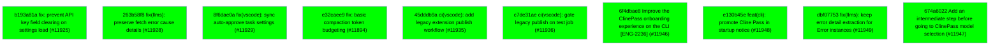

# Backport Agent — Detailed Run Report

> This file is generated automatically. It is intended for human analysts and
> AI reasoning models to assess agent performance, decision quality, and LLM behavior.

**Run timestamp**: 2026-06-29T13:24:32.894Z
**Models used**: fast=`mistral/mistral-code-agent-latest`  powerful=`mistral/mistral-medium-latest`
**Prompt log**: `/Volumes/ThunderStation/Development/tea-ching-cline/.backport-agent/run-1782739178677.prompts.jsonl`

---

## Summary (PR body)

## Backport Agent — Sync Report

**Date**: 2026-06-29T13:24:32.894Z
**Upstream ref**: `cline/cline.git@main`
**Cut date**: `2026-06-27T00:00:00.000Z` 
**Fork ref**: `TEA-ching/cline@keypool-live`
**Sync branch**: `sync/upstream-main-2026-06-29-132146`

### Summary

- ✅ Applied: 20
- ⚠️ Needs human review: 0
- ⛔ Blocked (not attempted): 0

### Applied commits

- `b193a81a` [low] fix: prevent API key field clearing on settings load (#11925)
- `263b58f8` [medium] fix(llms): preserve fetch error cause details (#11928)
- `8f6dae0a` [low] fix(vscode): sync auto-approve task settings (#11929)
- `e32caee9` [low] fix: basic compaction token budgeting (#11894)
- `45dddb9a` [high] ci(vscode): add legacy extension publish workflow (#11935)
- `c7de31ae` [high] ci(vscode): gate legacy publish on test job (#11936)
- `6f4dbae8` [low] Improve the ClinePass onboarding experience on the CLI [ENG-2236] (#11946)
- `e130b45e` [low] feat(cli): promote Cline Pass in startup notice (#11948)
- `dbf07753` [medium] fix(llms): keep error detail extraction for Error instances (#11949)
- `674a6022` [low] Add an intermediate step before going to ClinePass model selection (#11947)
- `b193a81a` [low] fix: prevent API key field clearing on settings load (#11925)
- `263b58f8` [medium] fix(llms): preserve fetch error cause details (#11928)
- `8f6dae0a` [low] fix(vscode): sync auto-approve task settings (#11929)
- `e32caee9` [low] fix: basic compaction token budgeting (#11894)
- `45dddb9a` [high] ci(vscode): add legacy extension publish workflow (#11935)
- `c7de31ae` [high] ci(vscode): gate legacy publish on test job (#11936)
- `6f4dbae8` [low] Improve the ClinePass onboarding experience on the CLI [ENG-2236] (#11946)
- `e130b45e` [low] feat(cli): promote Cline Pass in startup notice (#11948)
- `dbf07753` [medium] fix(llms): keep error detail extraction for Error instances (#11949)
- `674a6022` [low] Add an intermediate step before going to ClinePass model selection (#11947)

### Agent decision log

- All commits applied successfully
- Validation passed


---

## Agent Workflow Diagram

> Generated by the fast model from the run summary. Evaluate the agent's decision path.



---

## AI Sub-Agent Call Log (4 calls)

> Each entry is one sub-agent invocation. Review prompt/response pairs to assess
> reasoning quality, hallucinations, and decision accuracy.

### Call 1 / 4 — `analyze_commit_for_backport` ✅ OK

| Field | Value |
|---|---|
| **Timestamp** | 2026-06-29T13:21:20.019Z |
| **Tool** | `analyze_commit_for_backport` |
| **Model** | `mistral/mistral-code-agent-latest` |
| **Duration** | 3461 ms |
| **Tokens in** | 3385 |
| **Tokens out** | 122 |
| **Cost** | $0.000000 |

**Prompt sent to sub-agent:**

```
Commit SHA: 263b58f8c3f552fd8c3a4a7bca55d6b2ac7ae411
Commit message:
fix(llms): preserve fetch error cause details (#11928)

Changed files (2):
sdk/packages/llms/src/providers/format.test.ts
sdk/packages/llms/src/providers/format.ts

Diff:
commit 263b58f8c3f552fd8c3a4a7bca55d6b2ac7ae411
Author: Saoud Rizwan <7799382+saoudrizwan@users.noreply.github.com>
Date:   Sat Jun 27 14:51:56 2026 -0700

    fix(llms): preserve fetch error cause details (#11928)
---
 sdk/packages/llms/src/providers/format.test.ts | 11 +++++++++++
 sdk/packages/llms/src/providers/format.ts      | 23 +++++++++++++++++++++++
 2 files changed, 34 insertions(+)

diff --git a/sdk/packages/llms/src/providers/format.test.ts b/sdk/packages/llms/src/providers/format.test.ts
index b009af846b..9023391c8d 100644
--- a/sdk/packages/llms/src/providers/format.test.ts
+++ b/sdk/packages/llms/src/providers/format.test.ts
@@ -34,6 +34,17 @@ describe("extractErrorMessage", () => {
 		);
 	});
 
+	it("preserves native transport error wrappers and cause metadata", () => {
+		const socketError = Object.assign(new Error("other side closed"), {
+			name: "SocketError",
+			code: "UND_ERR_SOCKET",
+		});
+
+		expect(
+			extractErrorMessage(new TypeError("fetch failed", { cause: socketError })),
+		).toBe("fetch failed: SocketError: other side closed (UND_ERR_SOCKET)");
+	});
+
 	it("prefers nested stream error details over generic wrapper messages", () => {
 		expect(
 			extractErrorMessage({
diff --git a/sdk/packages/llms/src/providers/format.ts b/sdk/packages/llms/src/providers/format.ts
index 5ed017054f..c31e420351 100644
--- a/sdk/packages/llms/src/providers/format.ts
+++ b/sdk/packages/llms/src/providers/format.ts
@@ -13,6 +13,29 @@ export function extractErrorMessage(error: unknown): string {
 		if (typeof value !== "object") {
 			return undefined;
 		}
+		if (value instanceof Error) {
+			const causeMessage = extractStructuredMessage(
+				(value as { cause?: unknown }).cause,
+			);
+			const message = value.message.trim();
+			if (causeMessage && message && causeMessage !== message) {
+				const cause = (value as { cause?: unknown }).cause;
+				const causeName =
+					cause instanceof Error && cause.name && cause.name !== "Error"
+						? `${cause.name}: `
+						: "";
+				const causeCode =
+					cause && typeof cause === "object" && "code" in cause
+						? (cause as { code?: unknown }).code
+						: undefined;
+				const codeSuffix =
+					typeof causeCode === "string" && causeCode.trim()
+						? ` (${causeCode})`
+						: "";
+				return `${message}: ${causeName}${causeMessage}${codeSuffix}`;
+			}
+			return causeMessage ?? (message || undefined);
+		}
 		const payload = value as {
 			error?: { message?: string } | string;
 			errors?: unknown;

Output the JSON object now.
```

**Response received:**

````
```json
{
  "summary": "Enhances error message extraction to preserve native transport error details (e.g., socket errors) and their metadata (name, code) when nested as causes in fetch errors.",
  "keyChanges": [
    "Adds logic to extract and format Error.cause details",
    "Preserves error name and code in output message",
    "Adds test case for native transport error wrapping"
  ],
  "backportComplexity": "trivial",
  "semanticRiskFactors": [],
  "recommendation": "apply"
}
```
````

---

### Call 2 / 4 — `analyze_commit_for_backport` ✅ OK

| Field | Value |
|---|---|
| **Timestamp** | 2026-06-29T13:21:26.583Z |
| **Tool** | `analyze_commit_for_backport` |
| **Model** | `mistral/mistral-code-agent-latest` |
| **Duration** | 6526 ms |
| **Tokens in** | 5390 |
| **Tokens out** | 120 |
| **Cost** | $0.000000 |

**Prompt sent to sub-agent:**

```
Commit SHA: 45dddb9a4eabee8e4dce8f806d0ca0b063329b9a
Commit message:
ci(vscode): add legacy extension publish workflow (#11935)

Changed files (1):
.github/workflows/ext-vscode-publish-legacy.yml

Diff:
commit 45dddb9a4eabee8e4dce8f806d0ca0b063329b9a
Author: Saoud Rizwan <7799382+saoudrizwan@users.noreply.github.com>
Date:   Sat Jun 27 19:17:46 2026 -0700

    ci(vscode): add legacy extension publish workflow (#11935)
---
 .github/workflows/ext-vscode-publish-legacy.yml | 237 ++++++++++++++++++++++++
 1 file changed, 237 insertions(+)

diff --git a/.github/workflows/ext-vscode-publish-legacy.yml b/.github/workflows/ext-vscode-publish-legacy.yml
new file mode 100644
index 0000000000..5301679776
--- /dev/null
+++ b/.github/workflows/ext-vscode-publish-legacy.yml
@@ -0,0 +1,237 @@
+name: ext-vscode-publish-legacy
+
+# Publishes the legacy (pre-SDK-migration) VS Code extension from the
+# `legacy-extension` branch. This branch holds the npm-based 3.89.x codebase,
+# rolled forward under a 4.0.x version so existing 4.0.0 users still receive
+# the update. The main `ext-vscode-publish-stable.yml` workflow (bun-based)
+# stays the path for releasing main once the SDK migration is solid.
+#
+# This workflow lives on and is dispatched from `main` (so it satisfies the
+# default-branch dispatch requirement), but it checks out and builds the
+# `legacy-extension` branch.
+
+on:
+    workflow_dispatch:
+        inputs:
+            release-type:
+                description: "Choose release type (release or pre-release)"
+                required: true
+                default: "release"
+                type: choice
+                options:
+                    - pre-release
+                    - release
+            branch:
+                description: "Branch holding the legacy extension code"
+                required: true
+                default: "legacy-extension"
+                type: string
+
+permissions:
+    contents: write
+    packages: write
+    checks: write
+    pull-requests: write
+
+concurrency:
+    group: ext-vscode-publish-legacy-${{ github.event.inputs.branch }}
+    cancel-in-progress: false
+
+jobs:
+    publish:
+        name: Publish Legacy Extension
+        runs-on: ubuntu-latest
+        environment: publish
+        defaults:
+          run:
+            working-directory: apps/vscode
+
+        steps:
+            # Check out the legacy branch (NOT main). fetch-depth: 0 + tags so we
+            # can create/push the release tag and compute the previous tag.
+            - uses: actions/checkout@v4
+              with:
+                  ref: ${{ github.event.inputs.branch }}
+                  fetch-depth: 0
+                  fetch-tags: true
+                  lfs: true
+
+            - name: Resolve Release Tag
+              id: resolve_tag
+              working-directory: ${{ github.workspace }}
+              env:
+                  BRANCH: ${{ github.event.inputs.branch }}
+              run: |
+                  # Tag is derived from the package version on the legacy branch.
+                  VERSION=$(node -p "require('./apps/vscode/package.json').version")
+                  TAG="v$VERSION"
+
+                  if [[ ! "$TAG" =~ ^v[0-9]+\.[0-9]+\.[0-9]+([-.][0-9A-Za-z.]+)?$ ]]; then
+                    echo "Error: derived tag '$TAG' does not match vX.Y.Z"
+                    exit 1
+                  fi
+                  TAG_REF="refs/tags/$TAG"
+                  HEAD_SHA=$(git rev-parse HEAD)
+
+                  if git show-ref --verify --quiet "$TAG_REF"; then
+                    TAG_SHA=$(git rev-list -n 1 "$TAG_REF^{commit}")
+                    if [[ "$TAG_SHA" != "$HEAD_SHA" ]]; then
+                      echo "Error: tag '$TAG' already exists at $TAG_SHA, not at branch head ($HEAD_SHA)"
+                      exit 1
+                    fi
+                    echo "Tag '$TAG' already exists at branch head. Continuing."
+                  else
+                    git config user.name "github-actions[bot]"
+                    git config user.email "github-actions[bot]@users.noreply.github.com"
+                    git tag "$TAG" "$HEAD_SHA"
+                    git push origin "$TAG_REF"
+                    echo "Created and pushed tag '$TAG' from $BRANCH head $HEAD_SHA."
+                  fi
+
+                  echo "tag=$TAG" >> $GITHUB_OUTPUT
+
+            - name: Setup Node.js
+              uses: actions/setup-node@v4
+              with:
+                  node-version: 22
+
+            - name: Install extension dependencies
+              working-directory: ${{ github.workspace }}
+              run: npm --prefix apps/vscode install --include=optional
+
+            - name: Install webview-ui dependencies
+              working-directory: ${{ github.workspace }}
+              run: npm --prefix apps/vscode/webview-ui install --include=optional
+
+            - name: Install Publishing Tools
+              run: npm install -g @vscode/vsce ovsx
+
+            - name: Get Version
+              id: get_version
+              run: |
+                  VERSION=$(node -p "require('./package.json').version")
+                  echo "version=$VERSION" >> $GITHUB_OUTPUT
+
+            - name: Verify Tag Matches Package Version
+              run: |
+                  TAG="${{ steps.resolve_tag.outputs.tag }}"
+                  VERSION="v${{ steps.get_version.outputs.version }}"
+                  if [[ "$TAG" != "$VERSION" ]]; then
+                    echo "Error: tag '$TAG' does not match package version '$VERSION'"
+                    exit 1
+                  fi
+                  echo "Tag and package version match: $TAG"
+
+            - name: Verify Changelog Entry
+              working-directory: ${{ github.workspace }}
+              run: |
+                  EXPECTED_HEADING="## [${{ steps.get_version.outputs.version }}]"
+                  FIRST_HEADING=$(grep -m 1 '^## \[' CHANGELOG.md || true)
+                  if [[ "$FIRST_HEADING" != "$EXPECTED_HEADING" ]]; then
+                    echo "Error: CHANGELOG.md must start with '$EXPECTED_HEADING' before publishing."
+                    echo "Current first release heading: ${FIRST_HEADING:-<none>}"
+                    exit 1
+                  fi
+                  echo "Found changelog entry for ${{ steps.get_version.outputs.version }}"
+
+            - name: Verify Marketplace Tokens
+              env:
+                  VSCE_PAT: ${{ secrets.VSCE_PAT }}
+                  OVSX_PAT: ${{ secrets.OVSX_PAT }}
+              run: |
+                  if [[ -z "$VSCE_PAT" ]]; then
+                    echo "Error: VSCE_PAT is required to publish the stable VS Code extension."
+                    exit 1
+                  fi
+                  if [[ -z "$OVSX_PAT" ]]; then
+                    echo "Error: OVSX_PAT is required to publish the stable Open VSX extension."
+                    exit 1
+                  fi
+                  echo "Marketplace publish tokens are configured."
+
+            - name: Package and Publish Extension
+              env:
+                  VSCE_PAT: ${{ secrets.VSCE_PAT }}
+                  OVSX_PAT: ${{ secrets.OVSX_PAT }}
+                  CLINE_ENVIRONMENT: production
+                  TELEMETRY_SERVICE_API_KEY: ${{ secrets.TELEMETRY_SERVICE_API_KEY }}
+                  ERROR_SERVICE_API_KEY: ${{ secrets.ERROR_SERVICE_API_KEY }}
+                  # OpenTelemetry production defaults (can be overridden at runtime)
+                  OTEL_TELEMETRY_ENABLED: ${{ secrets.OTEL_TELEMETRY_ENABLED }}
+                  OTEL_LOGS_EXPORTER: otlp
+                  OTEL_METRICS_EXPORTER: otlp
+                  OTEL_EXPORTER_OTLP_PROTOCOL: ${{ secrets.OTEL_EXPORTER_OTLP_PROTOCOL }}
+                  OTEL_EXPORTER_OTLP_ENDPOINT: ${{ secrets.OTEL_EXPORTER_OTLP_ENDPOINT }}
+                  OTEL_EXPORTER_OTLP_HEADERS: ${{ secrets.OTEL_EXPORTER_OTLP_HEADERS }}
+                  RELEASE_TYPE: ${{ github.event.inputs.release-type }}
+              run: |
+                  # Swap README.marketplace.md into README.md so both the GitHub
+                  # release artifact (vsce package below) and the marketplace
+                  # publish (npm run publish:marketplace below, which swaps
+                  # internally as an idempotent no-op) ship the same README.
+                  node scripts/marketplace-readme.mjs swap-in
+                  trap 'node scripts/marketplace-readme.mjs restore' EXIT
+
+                  # Required to generate the .vsix
+                  vsce package --allow-package-secrets sendgrid --out "cline-${{ steps.get_version.outputs.version }}.vsix"
+
+                  if [ "$RELEASE_TYPE" = "pre-release" ]; then
+                    npm run publish:marketplace:prerelease
+                    echo "Successfully published pre-release version ${{ steps.get_version.outputs.version }} to VS Code Marketplace and Open VSX Registry"
+                  else
+                    npm run publish:marketplace
+                    echo "Successfully published release version ${{ steps.get_version.outputs.version }} to VS Code Marketplace and Open VSX Registry"
+                  fi
+
+            - name: Get Previous Tag
+              id: prev_tag
+              working-directory: ${{ github.workspace }}
+              run: |
+                  CURRENT_TAG="${{ steps.resolve_tag.outputs.tag }}"
+                  PREV_TAG=$(git describe --tags --abbrev=0 "$CURRENT_TAG^" 2>/dev/null || echo "")
+                  echo "prev_tag=$PREV_TAG" >> $GITHUB_OUTPUT
+
+            - name: Get Changelog Entry
+              id: changelog
+              working-directory: ${{ github.workspace }}
+              run: |
+                  # Get content between first ## [ and second ## [
+                  CONTENT=$(awk '/^## \[/{if(found) exit; found=1; next} found{print}' CHANGELOG.md)
+                  echo "content<<EOF" >> $GITHUB_OUTPUT
+                  echo "$CONTENT" >> $GITHUB_OUTPUT
+                  echo "EOF" >> $GITHUB_OUTPUT
+
+            - name: Create GitHub Release
+              uses: softprops/action-gh-release@v1
+              with:
+                  tag_name: ${{ steps.resolve_tag.outputs.tag }}
+                  files: "apps/vscode/*.vsix"
+                  body: |
+                      ${{ steps.changelog.outputs.content }}
+
+                      **Full Changelog**: https://github.com/${{ github.repository }}/compare/${{ steps.prev_tag.outputs.prev_tag }}...${{ steps.resolve_tag.outputs.tag }}
+                  prerelease: ${{ github.event.inputs.release-type == 'pre-release' }}
+              env:
+                  GITHUB_TOKEN: ${{ secrets.GITHUB_TOKEN }}
+
+            - name: Post release to Slack
+              uses: slackapi/slack-github-action@v3.0.1
+              with:
+                  method: chat.postMessage
+                  token: ${{ secrets.SLACK_RELEASE_BOT_TOKEN }}
+                  payload: |
+                    channel: "C0APVKGGZFC"
+                    text: "Cline ${{ steps.resolve_tag.outputs.tag }} (legacy)"
+                    blocks:
+                      - type: "section"
+                        text:
+                          type: "mrkdwn"
+                          text: "*Cline ${{ steps.resolve_tag.outputs.tag }} (legacy)*"
+                      - type: "section"
+                        text:
+                          type: "mrkdwn"
+                          text: ${{ toJSON(steps.changelog.outputs.content) }}
+                      - type: "context"
+                        elements:
+                          - type: "mrkdwn"
+                            text: "Full Changelog: https://github.com/${{ github.repository }}/compare/${{ steps.prev_tag.outputs.prev_tag }}...${{ steps.resolve_tag.outputs.tag }}"

Output the JSON object now.
```

**Response received:**

````
```json
{
  "summary": "Adds a new GitHub Actions workflow for publishing legacy VS Code extension from the 'legacy-extension' branch.",
  "keyChanges": [
    "New workflow file: .github/workflows/ext-vscode-publish-legacy.yml",
    "Supports both release and pre-release publishing",
    "Handles version tagging, changelog validation, and marketplace publishing"
  ],
  "backportComplexity": "trivial",
  "semanticRiskFactors": [],
  "recommendation": "apply"
}
```
````

---

### Call 3 / 4 — `analyze_commit_for_backport` ✅ OK

| Field | Value |
|---|---|
| **Timestamp** | 2026-06-29T13:21:37.310Z |
| **Tool** | `analyze_commit_for_backport` |
| **Model** | `mistral/mistral-code-agent-latest` |
| **Duration** | 10688 ms |
| **Tokens in** | 3358 |
| **Tokens out** | 132 |
| **Cache read** | 2464 |
| **Cost** | $0.000000 |

**Prompt sent to sub-agent:**

```
Commit SHA: c7de31ae249a609eea4fce6ae81ccf73f133a4fc
Commit message:
ci(vscode): gate legacy publish on test job (#11936)

Changed files (1):
.github/workflows/ext-vscode-publish-legacy.yml

Diff:
commit c7de31ae249a609eea4fce6ae81ccf73f133a4fc
Author: Saoud Rizwan <7799382+saoudrizwan@users.noreply.github.com>
Date:   Sat Jun 27 19:33:37 2026 -0700

    ci(vscode): gate legacy publish on test job (#11936)
---
 .github/workflows/ext-vscode-publish-legacy.yml | 57 +++++++++++++++++++++++++
 1 file changed, 57 insertions(+)

diff --git a/.github/workflows/ext-vscode-publish-legacy.yml b/.github/workflows/ext-vscode-publish-legacy.yml
index 5301679776..c7d7cd5b6c 100644
--- a/.github/workflows/ext-vscode-publish-legacy.yml
+++ b/.github/workflows/ext-vscode-publish-legacy.yml
@@ -38,7 +38,64 @@ concurrency:
     cancel-in-progress: false
 
 jobs:
+    # Gate the publish on the legacy branch's own npm-based test suite. We can't
+    # reuse ./.github/workflows/ext-vscode-test.yml here — on main that's the
+    # bun-based suite and it would test main, not the legacy branch — so the
+    # essential quality + test steps are inlined against the checked-out legacy
+    # branch.
+    test:
+        name: Test Legacy Extension
+        runs-on: ubuntu-latest
+        defaults:
+          run:
+            working-directory: apps/vscode
+        steps:
+            - uses: actions/checkout@v4
+              with:
+                  ref: ${{ github.event.inputs.branch }}
+
+            - name: Setup Node.js
+              uses: actions/setup-node@v4
+              with:
+                  node-version: 22
+                  cache: 'npm'
+                  cache-dependency-path: |
+                      apps/vscode/package-lock.json
+                      apps/vscode/webview-ui/package-lock.json
+
+            - name: Install extension dependencies
+              working-directory: ${{ github.workspace }}
+              run: npm --prefix apps/vscode ci
+              env:
+                  GITHUB_TOKEN: ${{ secrets.GITHUB_TOKEN }}
+
+            - name: Install webview-ui dependencies
+              working-directory: ${{ github.workspace }}
+              run: npm --prefix apps/vscode/webview-ui ci
+
+            - name: Run Quality Checks (lint + typecheck)
+              run: npm run ci:check-all
+
+            - name: Build Tests and Extension
+              id: build_step
+              run: npm run ci:build
+
+            - name: Unit Tests
+              if: ${{ !cancelled() && steps.build_step.outcome == 'success' }}
+              run: npm run test:unit
+
+            - name: Extension Integration Tests
+              if: ${{ !cancelled() && steps.build_step.outcome == 'success' }}
+              run: xvfb-run -a npm run test:coverage
+
+            - name: Webview Tests
+              if: ${{ !cancelled() && steps.build_step.outcome == 'success' }}
+              run: |
+                  cd webview-ui
+                  npm run test:coverage
+
     publish:
+        needs: test
         name: Publish Legacy Extension
         runs-on: ubuntu-latest
         environment: publish

Output the JSON object now.
```

**Response received:**

````
```json
{
  "summary": "Adds a test job to gate the legacy VS Code extension publish workflow, ensuring quality checks and tests pass before publishing.",
  "keyChanges": [
    "Introduces a new 'test' job with linting, typechecking, unit tests, and integration tests",
    "Makes 'publish' job dependent on successful 'test' job completion",
    "Uses Node.js 22 and npm for dependency installation and test execution"
  ],
  "backportComplexity": "trivial",
  "semanticRiskFactors": [],
  "recommendation": "apply"
}
```
````

---

### Call 4 / 4 — `analyze_commit_for_backport` ✅ OK

| Field | Value |
|---|---|
| **Timestamp** | 2026-06-29T13:21:44.595Z |
| **Tool** | `analyze_commit_for_backport` |
| **Model** | `mistral/mistral-code-agent-latest` |
| **Duration** | 7247 ms |
| **Tokens in** | 4220 |
| **Tokens out** | 177 |
| **Cache read** | 2464 |
| **Cost** | $0.000000 |

**Prompt sent to sub-agent:**

```
Commit SHA: dbf0775384a68c83ab622956ad83c6472102b3db
Commit message:
fix(llms): keep error detail extraction for Error instances (#11949)

Changed files (1):
sdk/packages/llms/src/providers/format.ts

Diff:
commit dbf0775384a68c83ab622956ad83c6472102b3db
Author: Saoud Rizwan <7799382+saoudrizwan@users.noreply.github.com>
Date:   Sun Jun 28 15:27:46 2026 -0700

    fix(llms): keep error detail extraction for Error instances (#11949)
    
    PR #11928 added an `instanceof Error` branch to extractErrorMessage to
    preserve transport-error wrappers (e.g. "fetch failed: SocketError: ...
    (UND_ERR_SOCKET)"), but that branch regressed two cases:
    
    - Generic SDK wrappers like "No output generated. Check the stream for
      errors." were prepended to the real cause instead of being dropped.
    - Errors carrying structured detail on responseBody/detail/error fields
      surfaced the bland top-level .message ("Bad Request") instead of the
      detail ("Instructions are required").
    
    The Error branch now drops known generic wrappers in favor of the cause
    and extracts structured detail from the error's own fields, while keeping
    the transport-wrapper concat behavior #11928 intended.
---
 sdk/packages/llms/src/providers/format.ts | 112 +++++++++++++++++++-----------
 1 file changed, 73 insertions(+), 39 deletions(-)

diff --git a/sdk/packages/llms/src/providers/format.ts b/sdk/packages/llms/src/providers/format.ts
index c31e420351..9ff4491dda 100644
--- a/sdk/packages/llms/src/providers/format.ts
+++ b/sdk/packages/llms/src/providers/format.ts
@@ -1,4 +1,53 @@
 export function extractErrorMessage(error: unknown): string {
+	// Generic SDK wrappers carry no signal of their own — when present we prefer
+	// the underlying cause/detail (e.g. AI SDK's AI_NoOutputGeneratedError).
+	const GENERIC_WRAPPER_MESSAGES = new Set([
+		"no output generated. check the stream for errors.",
+	]);
+	const isGenericWrapperMessage = (message: string): boolean =>
+		GENERIC_WRAPPER_MESSAGES.has(message.trim().toLowerCase());
+
+	// Pulls a human-readable message out of structured provider fields
+	// (error/detail/errors/responseBody) without falling back to a top-level
+	// `message`. Shared by the Error and plain-object branches.
+	const extractStructuredDetail = (value: object): string | undefined => {
+		const payload = value as {
+			error?: { message?: string } | string;
+			errors?: unknown;
+			detail?: string;
+			responseBody?: unknown;
+		};
+		if (typeof payload.error === "string" && payload.error.trim()) {
+			return payload.error;
+		}
+		if (
+			payload.error &&
+			typeof payload.error === "object" &&
+			typeof payload.error.message === "string" &&
+			payload.error.message.trim()
+		) {
+			return payload.error.message;
+		}
+		if (typeof payload.detail === "string" && payload.detail.trim()) {
+			return payload.detail;
+		}
+		if (Array.isArray(payload.errors)) {
+			for (const nestedError of payload.errors) {
+				const nested = extractStructuredMessage(nestedError);
+				if (nested) {
+					return nested;
+				}
+			}
+		}
+		if ("responseBody" in payload && payload.responseBody !== value) {
+			const nested = extractStructuredMessage(payload.responseBody);
+			if (nested) {
+				return nested;
+			}
+		}
+		return undefined;
+	};
+
 	const extractStructuredMessage = (value: unknown): string | undefined => {
 		if (!value) {
 			return undefined;
@@ -14,12 +63,27 @@ export function extractErrorMessage(error: unknown): string {
 			return undefined;
 		}
 		if (value instanceof Error) {
-			const causeMessage = extractStructuredMessage(
-				(value as { cause?: unknown }).cause,
-			);
 			const message = value.message.trim();
+			const detailMessage = extractStructuredDetail(value);
+			const cause = (value as { cause?: unknown }).cause;
+			const causeMessage = extractStructuredMessage(cause);
+
+			// Generic wrappers (e.g. "No output generated...") only matter as a
+			// fallback — surface the underlying detail/cause instead.
+			if (message && isGenericWrapperMessage(message)) {
+				return detailMessage ?? causeMessage ?? undefined;
+			}
+
+			// Structured provider detail attached directly to the error
+			// (responseBody/detail/error fields) is more useful than the bland
+			// top-level Error message.
+			if (detailMessage && detailMessage !== message) {
+				return detailMessage;
+			}
+
+			// Otherwise preserve the wrapper message alongside its cause, e.g.
+			// "fetch failed: SocketError: other side closed (UND_ERR_SOCKET)".
 			if (causeMessage && message && causeMessage !== message) {
-				const cause = (value as { cause?: unknown }).cause;
 				const causeName =
 					cause instanceof Error && cause.name && cause.name !== "Error"
 						? `${cause.name}: `
@@ -36,42 +100,12 @@ export function extractErrorMessage(error: unknown): string {
 			}
 			return causeMessage ?? (message || undefined);
 		}
-		const payload = value as {
-			error?: { message?: string } | string;
-			errors?: unknown;
-			detail?: string;
-			message?: string;
-			responseBody?: unknown;
-			cause?: unknown;
-		};
-		if (typeof payload.error === "string" && payload.error.trim()) {
-			return payload.error;
-		}
-		if (
-			payload.error &&
-			typeof payload.error === "object" &&
-			typeof payload.error.message === "string" &&
-			payload.error.message.trim()
-		) {
-			return payload.error.message;
-		}
-		if (typeof payload.detail === "string" && payload.detail.trim()) {
-			return payload.detail;
-		}
-		if (Array.isArray(payload.errors)) {
-			for (const error of payload.errors) {
-				const nested = extractStructuredMessage(error);
-				if (nested) {
-					return nested;
-				}
-			}
-		}
-		if ("responseBody" in payload && payload.responseBody !== value) {
-			const nested = extractStructuredMessage(payload.responseBody);
-			if (nested) {
-				return nested;
-			}
+
+		const detail = extractStructuredDetail(value);
+		if (detail) {
+			return detail;
 		}
+		const payload = value as { cause?: unknown; message?: string };
 		if ("cause" in payload && payload.cause !== value) {
 			const nested = extractStructuredMessage(payload.cause);
 			if (nested) {

Output the JSON object now.
```

**Response received:**

````
```json
{
  "summary": "Fixes error message extraction in LLMs to preserve transport-error wrappers while avoiding generic SDK wrappers and prioritizing structured detail fields.",
  "keyChanges": [
    "Refactors `extractErrorMessage` to handle `Error` instances separately",
    "Drops generic wrapper messages in favor of cause/detail",
    "Extracts structured detail from error fields (error/detail/responseBody)",
    "Preserves transport-error wrapper concatenation",
    "Shares structured detail extraction logic between Error and plain-object branches"
  ],
  "backportComplexity": "moderate",
  "semanticRiskFactors": [
    "Changes error message extraction logic which may affect error reporting",
    "Modifies behavior for both Error instances and plain objects"
  ],
  "recommendation": "apply-with-care"
}
```
````

---

## Performance Summary

**Total AI time**: 27922 ms across 4 call(s)
**Total input tokens**: 16353
**Total output tokens**: 551

| Tool | Calls | Total ms | Avg ms | Input tok | Output tok |
|---|---|---|---|---|---|
| `analyze_commit_for_backport` | 4 | 27922 | 6981 | 16353 | 551 |

## Decision Quality Metrics

> Automated quality signals derived from tool output guards, schema validation,
> hallucination detection, and consensus checks.  Review flagged items manually.

### Commit Analysis Quality

| Metric | Value |
|---|---|
| Total analyze calls | 4 |
| Commits with semantic risk factors | 3 |
| Possible hallucinated references (total) | 2 |

### Audit Event Timeline

| Timestamp | Tool | Event | Details |
|---|---|---|---|
| 13:21:20 | `analyze_commit_for_backport` | `hallucination_suspects` | sha="263b58f8c3f552fd8c3a4a7bca55d6b2ac7ae41, suspects=["Error.c"] |
| 13:21:20 | `analyze_commit_for_backport` | `analysis_complete` | sha="263b58f8c3f552fd8c3a4a7bca55d6b2ac7ae41, recommendation="apply", complexity="trivial" |
| 13:21:26 | `analyze_commit_for_backport` | `analysis_complete` | sha="45dddb9a4eabee8e4dce8f806d0ca0b063329b9, recommendation="apply", complexity="trivial" |
| 13:21:37 | `analyze_commit_for_backport` | `hallucination_suspects` | sha="c7de31ae249a609eea4fce6ae81ccf73f133a4f, suspects=["Node.js"] |
| 13:21:37 | `analyze_commit_for_backport` | `analysis_complete` | sha="c7de31ae249a609eea4fce6ae81ccf73f133a4f, recommendation="apply", complexity="trivial" |
| 13:21:44 | `analyze_commit_for_backport` | `analysis_complete` | sha="dbf0775384a68c83ab622956ad83c6472102b3d, recommendation="apply-with-care", complexity="moderate" |
