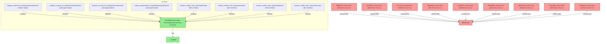

# Backport Agent — Detailed Run Report

> This file is generated automatically. It is intended for human analysts and
> AI reasoning models to assess agent performance, decision quality, and LLM behavior.

**Run timestamp**: 2026-06-30T19:55:18.461Z
**Models used**: fast=`mistral/mistral-code-agent-latest`  powerful=`mistral/mistral-medium-latest`
**Prompt log**: `/Users/rlemeill/Development/tea-ching-cline/.backport-agent/run-1782849057756.prompts.jsonl`

---

## Summary (PR body)

## Backport Agent — Sync Report

**Date**: 2026-06-30T19:55:18.461Z
**Upstream ref**: `cline/cline.git@main`
**Fork ref**: `TEA-ching/cline@keypool-live`
**Sync branch**: `sync/upstream-main-2026-06-30-195223`

### Summary

- ✅ Applied: 1
- ⚠️ Needs human review: 0
- ⛔ Blocked (not attempted): 9

### Applied commits

- `61ea8688` [low] fix(vscode): reuse approved tool rows (#11213)

### Blocked commits (not attempted)

- `f5d0b4fd` [medium] — context-limit: deferred to next run
- `a2194f49` [low] — context-limit: deferred to next run
- `5fc73413` [high] — context-limit: deferred to next run
- `49da86f6` [low] — context-limit: deferred to next run
- `c7304097` [high] — context-limit: deferred to next run
- `9560b6d6` [low] — context-limit: deferred to next run
- `00091898` [low] — context-limit: deferred to next run
- `7ca41fdb` [low] — context-limit: deferred to next run
- `242b5ebf` [low] — context-limit: deferred to next run

### Agent decision log

- Applied 61ea8688c6345466db49a941a670fea75a2e6fb7 after resolving VSCode SDK conflicts via AI
- Deferred 9 commits due to context limit; will resume in next run


---

## Agent Workflow Diagram

> Generated by the fast model from the run summary. Evaluate the agent's decision path.



---

## AI Sub-Agent Call Log (8 calls)

> Each entry is one sub-agent invocation. Review prompt/response pairs to assess
> reasoning quality, hallucinations, and decision accuracy.

### Call 1 / 8 — `analyze_commit_for_backport` ✅ OK

| Field | Value |
|---|---|
| **Timestamp** | 2026-06-30T19:51:58.229Z |
| **Tool** | `analyze_commit_for_backport` |
| **Model** | `mistral/mistral-medium-latest` |
| **Duration** | 4139 ms |
| **Tokens in** | 9627 |
| **Tokens out** | 123 |
| **Cost** | $0.000000 |

**Prompt sent to sub-agent:**

```
Commit SHA: f5d0b4fd497bdf214450d96fb3b83d57136e93f8
Commit message:
add migration telemetry

Changed files (5):
apps/vscode/src/sdk/SdkController.ts
apps/vscode/src/sdk/sdk-task-history.test.ts
apps/vscode/src/sdk/sdk-task-history.ts
apps/vscode/src/services/telemetry/TelemetryService.ts
apps/vscode/src/services/telemetry/__tests__/TelemetryService.metrics.test.ts

Diff:
commit f5d0b4fd497bdf214450d96fb3b83d57136e93f8
Author: Max Paulus 🥪 <max@cline.bot>
Date:   Wed Jun 3 08:46:16 2026 -0700

    add migration telemetry
---
 apps/vscode/src/sdk/SdkController.ts               |   1 +
 apps/vscode/src/sdk/sdk-task-history.test.ts       | 104 ++++++++++++++-
 apps/vscode/src/sdk/sdk-task-history.ts            | 110 ++++++++++++----
 .../src/services/telemetry/TelemetryService.ts     | 145 +++++++++++++++++++++
 .../__tests__/TelemetryService.metrics.test.ts     |  43 ++++++
 5 files changed, 379 insertions(+), 24 deletions(-)

diff --git a/apps/vscode/src/sdk/SdkController.ts b/apps/vscode/src/sdk/SdkController.ts
index 4bfab328f3..c000c43ea0 100644
--- a/apps/vscode/src/sdk/SdkController.ts
+++ b/apps/vscode/src/sdk/SdkController.ts
@@ -309,6 +309,7 @@ export class Controller {
 		this.taskHistory = new SdkTaskHistory({
 			mcpHub: this.mcpHub,
 			sessions: this.sessions,
+			telemetry: telemetryService,
 			// History rendering mints ids from the shared authority so regenerated history ids
 			// never overlap live-session ids.
 			getMinter: () => this.messageTranslatorState.getMinter(),
diff --git a/apps/vscode/src/sdk/sdk-task-history.test.ts b/apps/vscode/src/sdk/sdk-task-history.test.ts
index f85a945fe8..2eee8761ec 100644
--- a/apps/vscode/src/sdk/sdk-task-history.test.ts
+++ b/apps/vscode/src/sdk/sdk-task-history.test.ts
@@ -2,6 +2,7 @@ import type { SessionHistoryRecord } from "@cline/core"
 import type { HistoryItem } from "@shared/HistoryItem"
 import { afterEach, beforeEach, describe, expect, it, vi } from "vitest"
 import type { McpHub } from "@/services/mcp/McpHub"
+import type { TelemetryService } from "@/services/telemetry/TelemetryService"
 import { sdkMessagesToClineMessages } from "./message-translator"
 import type { SdkSessionLifecycle } from "./sdk-session-lifecycle"
 import { SdkTaskHistory, sessionHistoryRecordToHistoryItem } from "./sdk-task-history"
@@ -26,6 +27,11 @@ vi.mock("@/utils/fs", () => ({
 	fileExistsAtPath: vi.fn(() => Promise.resolve(false)),
 }))
 
+const legacyStateReaderMock = vi.hoisted(() => ({
+	taskHistory: [] as HistoryItem[],
+	apiConversationHistory: [] as unknown[],
+}))
+
 vi.mock("@/shared/services/Logger", () => ({
 	Logger: {
 		error: vi.fn(),
@@ -34,8 +40,20 @@ vi.mock("@/shared/services/Logger", () => ({
 	},
 }))
 
+vi.mock("./legacy-state-reader", () => ({
+	readTaskHistory: vi.fn(() => legacyStateReaderMock.taskHistory),
+	readApiConversationHistory: vi.fn(() => legacyStateReaderMock.apiConversationHistory),
+}))
+
+vi.mock("./cline-session-factory", async (importOriginal) => ({
+	...(await importOriginal<typeof import("./cline-session-factory")>()),
+	buildSessionConfig: vi.fn(async ({ cwd, workspaceRoot, mode }) => ({ cwd, workspaceRoot, mode })),
+}))
+
 describe("SdkTaskHistory", () => {
 	beforeEach(() => {
+		legacyStateReaderMock.taskHistory = []
+		legacyStateReaderMock.apiConversationHistory = []
 		vi.clearAllMocks()
 	})
 
@@ -213,6 +231,74 @@ describe("SdkTaskHistory", () => {
 		expect(deleteSession).toHaveBeenCalledWith("task-1")
 	})
 
+	it("emits telemetry when migrating a legacy task to an SDK session", async () => {
+		vi.spyOn(Date, "now").mockReturnValue(123_456)
+		legacyStateReaderMock.taskHistory = [
+			makeHistoryItem("legacy-task", {
+				task: "legacy prompt",
+				isFavorited: true,
+				tokensIn: 10,
+				tokensOut: 20,
+				totalCost: 0.03,
+				cwdOnTaskInitialization: "/legacy/repo",
+			}),
+		]
+		legacyStateReaderMock.apiConversationHistory = [
+			{ role: "user", content: "legacy prompt" },
+			{ role: "assistant", content: "legacy answer" },
+		]
+		const telemetry = makeTelemetry()
+		const { history, startSession } = makeHistory([], telemetry)
+
+		await history.getClineMessages("legacy-task")
+
+		expect(startSession).toHaveBeenCalledWith(
+			expect.objectContaining({
+				config: expect.objectContaining({ sessionId: "legacy-task", cwd: "/legacy/repo" }),
+				initialMessages: expect.arrayContaining([
+					expect.objectContaining({ role: "user" }),
+					expect.objectContaining({ role: "assistant" }),
+				]),
+				sessionMetadata: expect.objectContaining({
+					migratedFromLegacyTask: true,
+					title: "legacy prompt",
+					isFavorited: true,
+				}),
+			}),
+		)
+		expect(telemetry.captureLegacyTaskMigration).toHaveBeenCalledWith(
+			expect.objectContaining({
+				taskId: "legacy-task",
+				outcome: "success",
+				reason: "migrated",
+				legacyApiHistoryLength: 2,
+				convertedMessageCount: 2,
+				hasFavorite: true,
+				hasCost: true,
+				hasTokenUsage: true,
+				hasCwd: true,
+			}),
+		)
+	})
+
+	it("emits backlog telemetry when legacy tasks are still pending migration", async () => {
+		legacyStateReaderMock.taskHistory = [makeHistoryItem("legacy-task", { task: "legacy prompt" })]
+		const telemetry = makeTelemetry()
+		const { history } = makeHistory(
+			[makeSessionRecord("sdk-task"), makeSessionRecord("migrated", { metadata: { migratedFromLegacyTask: true } })],
+			telemetry,
+		)
+
+		await history.listHistory({ hydrate: false })
+
+		expect(telemetry.captureLegacyTaskMigrationBacklog).toHaveBeenCalledWith({
+			pendingLegacyTaskCount: 1,
+			migratedSdkTaskCount: 1,
+			visibleSdkTaskCount: 2,
+			visibleTaskCount: 3,
+		})
+	})
+
 	it("updates usage for an existing SDK task", async () => {
 		vi.spyOn(Date, "now").mockReturnValue(123_456)
 		const { history, updateSession } = makeHistory([
@@ -277,7 +363,15 @@ function makeSessionRecord(id: string, overrides: Partial<SessionHistoryRecord>
 	}
 }
 
-function makeHistory(records: SessionHistoryRecord[]) {
+function makeTelemetry(): TelemetryService {
+	return {
+		safeCapture: vi.fn((fn: () => void) => fn()),
+		captureLegacyTaskMigration: vi.fn(),
+		captureLegacyTaskMigrationBacklog: vi.fn(),
+	} as unknown as TelemetryService
+}
+
+function makeHistory(records: SessionHistoryRecord[], telemetry?: TelemetryService) {
 	let currentRecords = records
 	const updateSession = vi.fn(
 		async (
@@ -299,10 +393,15 @@ function makeHistory(records: SessionHistoryRecord[]) {
 	const getSession = vi.fn(async (sessionId: string) => currentRecords.find((record) => record.sessionId === sessionId))
 	const listHistory = vi.fn(async () => currentRecords)
 	const readMessages = vi.fn(async () => [])
+	const startSession = vi.fn(async (input: { config: { sessionId?: string } }) => {
+		currentRecords = [makeSessionRecord(input.config.sessionId ?? "started"), ...currentRecords]
+		return { sessionId: input.config.sessionId }
+	})
 	const host = {
 		get: getSession,
 		listHistory,
 		readMessages,
+		start: startSession,
 		update: updateSession,
 		delete: deleteSession,
 	} as unknown as VscodeSessionHost
@@ -312,7 +411,8 @@ function makeHistory(records: SessionHistoryRecord[]) {
 	const history = new SdkTaskHistory({
 		mcpHub: {} as McpHub,
 		sessions,
+		telemetry,
 	})
 
-	return { history, getSession, listHistory, updateSession, deleteSession }
+	return { history, getSession, listHistory, updateSession, deleteSession, startSession }
 }
diff --git a/apps/vscode/src/sdk/sdk-task-history.ts b/apps/vscode/src/sdk/sdk-task-history.ts
index 1e96500585..d55dd967af 100644
--- a/apps/vscode/src/sdk/sdk-task-history.ts
+++ b/apps/vscode/src/sdk/sdk-task-history.ts
@@ -4,6 +4,7 @@ import { type ContentBlock, formatDisplayUserInput, type MessageWithMetadata } f
 import type { ClineMessage } from "@shared/ExtensionMessage"
 import type { HistoryItem } from "@shared/HistoryItem"
 import type { McpHub } from "@/services/mcp/McpHub"
+import type { TelemetryService } from "@/services/telemetry/TelemetryService"
 import { Logger } from "@/shared/services/Logger"
 import { buildSessionConfig } from "./cline-session-factory"
 import { sanitizeInitialMessagesForSessionStart } from "./initial-message-sanitizer"
@@ -39,6 +40,7 @@ export interface SdkTaskHistoryOptions {
 	 * it so regenerated history ids never overlap live-session ids. Optional for tests.
 	 */
 	getMinter?: () => MessageIdMinter
+	telemetry?: TelemetryService
 }
 
 type SdkTaskHistoryListOptions = ClineCoreListHistoryOptions & {
@@ -68,6 +70,10 @@ function dateStringToTimestamp(value: string | null | undefined): number {
 	return Number.isFinite(timestamp) ? timestamp : 0
 }
 
+function historyItemHasTokenUsage(item: HistoryItem): boolean {
+	return (item.tokensIn ?? 0) > 0 || (item.tokensOut ?? 0) > 0 || (item.cacheReads ?? 0) > 0 || (item.cacheWrites ?? 0) > 0
+}
+
 function historyItemToSessionHistoryRecord(item: HistoryItem): SessionHistoryRecord {
 	const startedAt = new Date(item.ts || Date.now()).toISOString()
 	const displayTask = formatDisplayUserInput(item.task)
@@ -369,6 +375,9 @@ export class SdkTaskHistory {
 		const legacyHistory = readTaskHistory()
 			.filter((item) => item.id && item.task && !sdkIds.has(item.id))
 			.map(historyItemToSessionHistoryRecord)
+		const migratedSdkTaskCount = visibleSdkHistory.filter(
+			(item) => metadataBoolean(item.metadata, "migratedFromLegacyTask") === true,
+		).length
 
 		const mergedHistory = [...visibleSdkHistory, ...legacyHistory].sort(
 			(a, b) =>
@@ -379,6 +388,17 @@ export class SdkTaskHistory {
 			this.metadataHistoryCache = { records: mergedHistory, hostLimit, createdAt: Date.now() }
 		}
 
+		this.options.telemetry?.safeCapture(
+			() =>
+				this.options.telemetry?.captureLegacyTaskMigrationBacklog({
+					pendingLegacyTaskCount: legacyHistory.length,
+					migratedSdkTaskCount,
+					visibleSdkTaskCount: visibleSdkHistory.length,
+					visibleTaskCount: mergedHistory.length,
+				}),
+			"SdkTaskHistory.listHistory.legacyMigrationBacklog",
+		)
+
 		const result = mergedHistory.slice(offset, offset + limit)
 		return result
 	}
@@ -394,56 +414,102 @@ export class SdkTaskHistory {
 	}
 
 	private async migrateLegacyTaskIfNeeded(taskId: string): Promise<boolean> {
+		const startedAt = Date.now()
+		let sdkLookupFailed = false
+		let historyItem: HistoryItem | undefined
+		let legacyApiHistoryLength: number | undefined
+		let convertedMessageCount: number | undefined
+
+		const emitMigrationTelemetry = (args: { outcome: "success" | "skipped" | "error"; reason: string }) => {
+			const payload = {
+				taskId,
+				outcome: args.outcome,
+				reason: args.reason,
+				durationMs: Date.now() - startedAt,
+				legacyApiHistoryLength,
+				convertedMessageCount,
+				sdkLookupFailed,
+				hasFavorite: historyItem?.isFavorited === true,
+				hasCost: (historyItem?.totalCost ?? 0) > 0,
+				hasTokenUsage: historyItem ? historyItemHasTokenUsage(historyItem) : undefined,
+				hasCwd: !!historyItem?.cwdOnTaskInitialization,
+			}
+			Logger.log("[SdkTaskHistory] Legacy task migration", payload)
+			this.options.telemetry?.safeCapture(
+				() => this.options.telemetry?.captureLegacyTaskMigration(payload),
+				"SdkTaskHistory.migrateLegacyTaskIfNeeded",
+			)
+		}
+
 		return this.withHistoryHost(async (host) => {
 			try {
 				const existing = await host.get(taskId)
 				if (existing) {
+					emitMigrationTelemetry({ outcome: "skipped", reason: "sdk_exists" })
 					return false
 				}
 			} catch (error) {
+				sdkLookupFailed = true
 				Logger.warn(`[SdkTaskHistory] Failed to check SDK session before legacy migration: ${taskId}`, error)
 			}
 
-			const historyItem = readTaskHistory().find((item) => item.id === taskId)
+			historyItem = readTaskHistory().find((item) => item.id === taskId)
 			if (!historyItem) {
+				emitMigrationTelemetry({ outcome: "skipped", reason: "legacy_history_missing" })
 				return false
 			}
 
 			const legacyApiHistory = readApiConversationHistory(taskId)
+			legacyApiHistoryLength = legacyApiHistory.length
 			if (legacyApiHistory.length === 0) {
+				emitMigrationTelemetry({ outcome: "skipped", reason: "legacy_api_history_empty" })
 				return false
 			}
 
 			const initialMessages = legacyApiHistoryToSdkMessages(legacyApiHistory, historyItem)
+			convertedMessageCount = initialMessages.length
 			if (initialMessages.length === 0) {
+				emitMigrationTelemetry({ outcome: "skipped", reason: "converted_messages_empty" })
 				return false
 			}
 
 			const cwd = historyItem.cwdOnTaskInitialization || process.cwd()
-			const config = await buildSessionConfig({ cwd, workspaceRoot: cwd, mode: "act" })
-			config.sessionId = taskId
-
-			await host.start({
-				config,
-				prompt: undefined,
-				interactive: true,
-				initialMessages,
-				sessionMetadata: {
-					title: historyItem.task,
-					isFavorited: historyItem.isFavorited ?? false,
-					size: historyItem.size ?? 0,
-					totalCost: historyItem.totalCost ?? 0,
-					tokensIn: historyItem.tokensIn ?? 0,
-					tokensOut: historyItem.tokensOut ?? 0,
-					cacheWrites: historyItem.cacheWrites ?? 0,
-					cacheReads: historyItem.cacheReads ?? 0,
-					modelId: historyItem.modelId ?? "",
-					migratedFromLegacyTask: true,
-				},
-			})
+			let config: Awaited<ReturnType<typeof buildSessionConfig>>
+			try {
+				config = await buildSessionConfig({ cwd, workspaceRoot: cwd, mode: "act" })
+				config.sessionId = taskId
+			} catch (error) {
+				emitMigrationTelemetry({ outcome: "error", reason: "config_failed" })
+				throw error
+			}
+
+			try {
+				await host.start({
+					config,
+					prompt: undefined,
+					interactive: true,
+					initialMessages,
+					sessionMetadata: {
+						title: historyItem.task,
+						isFavorited: historyItem.isFavorited ?? false,
+						size: historyItem.size ?? 0,
+						totalCost: historyItem.totalCost ?? 0,
+						tokensIn: historyItem.tokensIn ?? 0,
+						tokensOut: historyItem.tokensOut ?? 0,
+						cacheWrites: historyItem.cacheWrites ?? 0,
+						cacheReads: historyItem.cacheReads ?? 0,
+						modelId: historyItem.modelId ?? "",
+						migratedFromLegacyTask: true,
+					},
+				})
+			} catch (error) {
+				emitMigrationTelemetry({ outcome: "error", reason: "write_failed" })
+				throw error
+			}
 
 			this.invalidateMetadataHistoryCache()
 			Logger.log(`[SdkTaskHistory] Migrated legacy task to SDK session: ${taskId}`)
+			emitMigrationTelemetry({ outcome: "success", reason: "migrated" })
 			return true
 		})
 	}
diff --git a/apps/vscode/src/services/telemetry/TelemetryService.ts b/apps/vscode/src/services/telemetry/TelemetryService.ts
index c6a520a808..a634bbc491 100644
--- a/apps/vscode/src/services/telemetry/TelemetryService.ts
+++ b/apps/vscode/src/services/telemetry/TelemetryService.ts
@@ -193,6 +193,26 @@ export class TelemetryService {
 		GRPC: {
 			RESPONSE_SIZE_BYTES: "cline.grpc.response.size_bytes",
 		},
+		MIGRATION: {
+			// Fires whenever Cline checks an old pre-SDK task and decides whether/how to migrate it.
+			LEGACY_TASK_ATTEMPTS_TOTAL: "cline.migration.legacy_task.attempts.total",
+			// Fires when the user opens an old task and Cline successfully copies it into SDK session storage.
+			LEGACY_TASK_SUCCESS_TOTAL: "cline.migration.legacy_task.success.total",
+			// Fires when Cline tried to migrate an old task but failed while building or writing the SDK session.
+			LEGACY_TASK_FAILURES_TOTAL: "cline.migration.legacy_task.failures.total",
+			// Fires when no migration happens because it is unnecessary or impossible, e.g. already migrated or missing old messages.
+			LEGACY_TASK_SKIPPED_TOTAL: "cline.migration.legacy_task.skipped.total",
+			// Fires for every migration decision; measures how long the check/migration took.
+			LEGACY_TASK_DURATION_SECONDS: "cline.migration.legacy_task.duration.seconds",
+			// Fires when Cline finds old conversation messages; records how many old messages were found.
+			LEGACY_TASK_LEGACY_MESSAGES_COUNT: "cline.migration.legacy_task.legacy_messages.count",
+			// Fires after conversion; records how many messages made it into SDK-compatible form.
+			LEGACY_TASK_CONVERTED_MESSAGES_COUNT: "cline.migration.legacy_task.converted_messages.count",
+			// Fires when history is listed; counts old pre-SDK tasks still waiting to be migrated.
+			LEGACY_TASK_PENDING_COUNT: "cline.migration.legacy_task.pending.count",
+			// Fires when history is listed; counts old tasks that already made it safely into SDK session storage.
+			LEGACY_TASK_MIGRATED_COUNT: "cline.migration.legacy_task.migrated.count",
+		},
 	}
 	// Event constants for tracking user interactions and system events
 	private static readonly EVENTS = {
@@ -250,6 +270,8 @@ export class TelemetryService {
 			MCP_TOOL_CALLED: "task.mcp_tool_called",
 			// Tracks when a historical task is loaded from storage
 			HISTORICAL_LOADED: "task.historical_loaded",
+			// Tracks legacy VS Code task history migration into SDK sessions
+			LEGACY_TASK_MIGRATION: "task.legacy_task_migration",
 			// Tracks when the retry button is clicked for failed operations
 			RETRY_CLICKED: "task.retry_clicked",
 			// Tracks when a diff edit (replace_in_file) operation fails
@@ -2376,6 +2398,129 @@ export class TelemetryService {
 	 * @param method The gRPC method name
 	 * @param requestId Optional request ID for correlation
 	 */
+	public captureLegacyTaskMigration(args: {
+		taskId: string
+		outcome: "success" | "skipped" | "error"
+		reason: string
+		durationMs: number
+		legacyApiHistoryLength?: number
+		convertedMessageCount?: number
+		sdkLookupFailed?: boolean
+		hasFavorite?: boolean
+		hasCost?: boolean
+		hasTokenUsage?: boolean
+		hasCwd?: boolean
+	}): void {
+		const migrationType = "legacy_task_to_sdk_session"
+		const metricAttributes = {
+			migration_type: migrationType,
+			outcome: args.outcome,
+			reason: args.reason,
+		}
+
+		this.capture({
+			event: TelemetryService.EVENTS.TASK.LEGACY_TASK_MIGRATION,
+			properties: {
+				ulid: args.taskId,
+				migration_type: migrationType,
+				outcome: args.outcome,
+				reason: args.reason,
+				durationMs: args.durationMs,
+				legacyApiHistoryLength: args.legacyApiHistoryLength,
+				convertedMessageCount: args.convertedMessageCount,
+				sdkLookupFailed: args.sdkLookupFailed,
+				hasFavorite: args.hasFavorite,
+				hasCost: args.hasCost,
+				hasTokenUsage: args.hasTokenUsage,
+				hasCwd: args.hasCwd,
+			},
+		})
+
+		this.recordCounter(
+			TelemetryService.METRICS.MIGRATION.LEGACY_TASK_ATTEMPTS_TOTAL,
+			1,
+			metricAttributes,
+			"Legacy VS Code task migration decisions",
+		)
+		if (args.outcome === "success") {
+			this.recordCounter(
+				TelemetryService.METRICS.MIGRATION.LEGACY_TASK_SUCCESS_TOTAL,
+				1,
+				metricAttributes,
+				"Legacy VS Code tasks successfully copied into SDK session storage",
+			)
+		} else if (args.outcome === "error") {
+			this.recordCounter(
+				TelemetryService.METRICS.MIGRATION.LEGACY_TASK_FAILURES_TOTAL,
+				1,
+				metricAttributes,
+				"Legacy VS Code task migrations that failed while building or writing the SDK session",
+			)
+		} else {
+			this.recordCounter(
+				TelemetryService.METRICS.MIGRATION.LEGACY_TASK_SKIPPED_TOTAL,
+				1,
+				metricAttributes,
+				"Legacy VS Code task migration checks that did not need or could not perform a migration",
+			)
+		}
+
+		this.recordHistogram(
+			TelemetryService.METRICS.MIGRATION.LEGACY_TASK_DURATION_SECONDS,
+			args.durationMs / 1000,
+			metricAttributes,
+			"Time spent checking or migrating a legacy VS Code task into SDK session storage",
+		)
+		if (args.legacyApiHistoryLength !== undefined) {
+			this.recordHistogram(
+				TelemetryService.METRICS.MIGRATION.LEGACY_TASK_LEGACY_MESSAGES_COUNT,
+				args.legacyApiHistoryLength,
+				metricAttributes,
+				"Number of raw legacy API history messages found while migrating a legacy VS Code task",
+			)
+		}
+		if (args.convertedMessageCount !== undefined) {
+			this.recordHistogram(
+				TelemetryService.METRICS.MIGRATION.LEGACY_TASK_CONVERTED_MESSAGES_COUNT,
+				args.convertedMessageCount,
+				metricAttributes,
+				"Number of SDK-compatible messages produced from a legacy VS Code task migration",
+			)
+		}
+	}
+
+	public captureLegacyTaskMigrationBacklog(args: {
+		pendingLegacyTaskCount: number
+		migratedSdkTaskCount: number
+		visibleSdkTaskCount: number
+		visibleTaskCount: number
+	}): void {
+		const attributes = { migration_type: "legacy_task_to_sdk_session" }
+		this.recordGauge(
+			TelemetryService.METRICS.MIGRATION.LEGACY_TASK_PENDING_COUNT,
+			args.pendingLegacyTaskCount,
+			attributes,
+			"Legacy VS Code tasks visible in history but not yet migrated to SDK sessions",
+		)
+		this.recordGauge(
+			TelemetryService.METRICS.MIGRATION.LEGACY_TASK_MIGRATED_COUNT,
+			args.migratedSdkTaskCount,
+			attributes,
+			"SDK sessions marked as migrated from legacy VS Code task history",
+		)
+		this.capture({
+			event: TelemetryService.EVENTS.TASK.LEGACY_TASK_MIGRATION,
+			properties: {
+				migration_type: "legacy_task_to_sdk_session",
+				outcome: "backlog",
+				pendingLegacyTaskCount: args.pendingLegacyTaskCount,
+				migratedSdkTaskCount: args.migratedSdkTaskCount,
+				visibleSdkTaskCount: args.visibleSdkTaskCount,
+				visibleTaskCount: args.visibleTaskCount,
+			},
+		})
+	}
+
 	public captureGrpcResponseSize(sizeUtf8Bytes: number, service: string, method: string, requestId?: string): void {
 		this.recordHistogram(
 			TelemetryService.METRICS.GRPC.RESPONSE_SIZE_BYTES,
diff --git a/apps/vscode/src/services/telemetry/__tests__/TelemetryService.metrics.test.ts b/apps/vscode/src/services/telemetry/__tests__/TelemetryService.metrics.test.ts
index d9b13dd8a5..d764dfb5db 100644
--- a/apps/vscode/src/services/telemetry/__tests__/TelemetryService.metrics.test.ts
+++ b/apps/vscode/src/services/telemetry/__tests__/TelemetryService.metrics.test.ts
@@ -383,4 +383,47 @@ describe("TelemetryService metrics", () => {
 		assert.strictEqual(entry.attributes.extension_version, "test")
 		assert.strictEqual(entry.attributes.platform, "test-platform")
 	})
+
+	it("captureLegacyTaskMigration emits event and migration metrics", () => {
+		const provider = new FakeProvider()
+		const service = createTelemetryService(provider)
+
+		service.captureLegacyTaskMigration({
+			taskId: "legacy-task",
+			outcome: "success",
+			reason: "migrated",
+			durationMs: 250,
+			legacyApiHistoryLength: 3,
+			convertedMessageCount: 2,
+			hasFavorite: true,
+			hasCost: true,
+			hasTokenUsage: true,
+			hasCwd: true,
+		})
+
+		const event = provider.logs.find((entry) => entry.event === "task.legacy_task_migration")
+		assert.ok(event)
+		assert.strictEqual(event?.properties?.ulid, "legacy-task")
+		assert.strictEqual(event?.properties?.outcome, "success")
+		assert.strictEqual(event?.properties?.legacyApiHistoryLength, 3)
+
+		assert.deepStrictEqual(
+			provider.counters.map((entry) => entry.name),
+			[
+				TelemetryService.METRICS.MIGRATION.LEGACY_TASK_ATTEMPTS_TOTAL,
+				TelemetryService.METRICS.MIGRATION.LEGACY_TASK_SUCCESS_TOTAL,
+			],
+		)
+		assert.deepStrictEqual(
+			provider.histograms.map((entry) => entry.name),
+			[
+				TelemetryService.METRICS.MIGRATION.LEGACY_TASK_DURATION_SECONDS,
+				TelemetryService.METRICS.MIGRATION.LEGACY_TASK_LEGACY_MESSAGES_COUNT,
+				TelemetryService.METRICS.MIGRATION.LEGACY_TASK_CONVERTED_MESSAGES_COUNT,
+			],
+		)
+		assert.strictEqual(provider.histograms[0].value, 0.25)
+		assert.strictEqual(provider.histograms[0].attributes.migration_type, "legacy_task_to_sdk_session")
+		assert.strictEqual(provider.histograms[0].attributes.reason, "migrated")
+	})
 })

Output the JSON object now.
```

**Response received:**

```
{
  "summary": "Adds migration telemetry for legacy task migration to SDK sessions, including metrics and event tracking.",
  "keyChanges": [
    "Adds telemetry methods for legacy task migration",
    "Integrates telemetry into SdkTaskHistory",
    "Adds migration metrics and events to TelemetryService",
    "Updates SdkController to pass telemetry service",
    "Adds tests for migration telemetry"
  ],
  "backportComplexity": "trivial",
  "semanticRiskFactors": [],
  "recommendation": "apply"
}
```

---

### Call 2 / 8 — `analyze_commit_for_backport` ✅ OK

| Field | Value |
|---|---|
| **Timestamp** | 2026-06-30T19:52:04.573Z |
| **Tool** | `analyze_commit_for_backport` |
| **Model** | `mistral/mistral-code-agent-latest` |
| **Duration** | 6276 ms |
| **Tokens in** | 10522 |
| **Tokens out** | 190 |
| **Cost** | $0.000000 |

**Prompt sent to sub-agent:**

```
Commit SHA: 5fc73413127ca8241e9a0e99b9673b7f7d0b9dd7
Commit message:
chore: regenerate bun.lock after rebase onto main

Changed files (1):
bun.lock

Diff:
commit 5fc73413127ca8241e9a0e99b9673b7f7d0b9dd7
Author: Dominic Cooney <dominic.cooney@gmail.com>
Date:   Tue Jun 23 17:08:00 2026 +0900

    chore: regenerate bun.lock after rebase onto main
---
 bun.lock | 48 +++++++++++++++++++++---------------------------
 1 file changed, 21 insertions(+), 27 deletions(-)

diff --git a/bun.lock b/bun.lock
index 4984ae1468..7ad1610aca 100644
--- a/bun.lock
+++ b/bun.lock
@@ -19,7 +19,7 @@
     },
     "apps/cli": {
       "name": "@cline/cli",
-      "version": "3.0.27",
+      "version": "3.0.29",
       "bin": {
         "cline": "src/index.ts",
       },
@@ -78,10 +78,9 @@
         "@fontsource-variable/schibsted-grotesk": "^5.2.8",
         "@radix-ui/react-use-controllable-state": "^1.2.2",
         "@rive-app/react-webgl2": "^4.27.2",
+        "@shikijs/langs": "^4.2.0",
+        "@shikijs/themes": "^4.2.0",
         "@streamdown/cjk": "^1.0.3",
-        "@streamdown/code": "^1.1.1",
-        "@streamdown/math": "^1.0.2",
-        "@streamdown/mermaid": "^1.0.2",
         "@tailwindcss/vite": "^4.2.1",
         "@xyflow/react": "^12.10.1",
         "ai": "^6.0.116",
@@ -92,6 +91,7 @@
         "embla-carousel-react": "^8.6.0",
         "lucide-react": "^0.577.0",
         "media-chrome": "^4.18.1",
+        "mermaid": "^11.15.0",
         "motion": "^12.38.0",
         "nanoid": "^5.1.7",
         "next-themes": "^0.4.6",
@@ -616,7 +616,7 @@
     },
     "sdk/packages/agents": {
       "name": "@cline/agents",
-      "version": "0.0.49",
+      "version": "0.0.51",
       "dependencies": {
         "@cline/llms": "workspace:*",
         "@cline/shared": "workspace:*",
@@ -625,7 +625,7 @@
     },
     "sdk/packages/core": {
       "name": "@cline/core",
-      "version": "0.0.49",
+      "version": "0.0.51",
       "dependencies": {
         "@cline/agents": "workspace:*",
         "@cline/llms": "workspace:*",
@@ -663,7 +663,7 @@
     },
     "sdk/packages/llms": {
       "name": "@cline/llms",
-      "version": "0.0.49",
+      "version": "0.0.51",
       "dependencies": {
         "@ai-sdk/amazon-bedrock": "^4.0.89",
         "@ai-sdk/anthropic": "^3.0.68",
@@ -697,14 +697,14 @@
     },
     "sdk/packages/sdk": {
       "name": "@cline/sdk",
-      "version": "0.0.49",
+      "version": "0.0.51",
       "dependencies": {
         "@cline/core": "workspace:*",
       },
     },
     "sdk/packages/shared": {
       "name": "@cline/shared",
-      "version": "0.0.49",
+      "version": "0.0.51",
       "dependencies": {
         "aws4fetch": "^1.0.20",
         "jsonrepair": "^3.13.2",
@@ -3111,7 +3111,7 @@
 
     "d3-zoom": ["d3-zoom@3.0.0", "", { "dependencies": { "d3-dispatch": "1 - 3", "d3-drag": "2 - 3", "d3-interpolate": "1 - 3", "d3-selection": "2 - 3", "d3-transition": "2 - 3" } }, "sha512-b8AmV3kfQaqWAuacbPuNbL6vahnOJflOhexLzMMNLga62+/nh0JzvJ0aO/5a5MVgUFGS7Hu1P9P03o3fJkDCyw=="],
 
-    "dagre-d3-es": ["dagre-d3-es@7.0.13", "", { "dependencies": { "d3": "^7.9.0", "lodash-es": "^4.17.21" } }, "sha512-efEhnxpSuwpYOKRm/L5KbqoZmNNukHa/Flty4Wp62JRvgH2ojwVgPgdYyr4twpieZnyRDdIH7PY2mopX26+j2Q=="],
+    "dagre-d3-es": ["dagre-d3-es@7.0.14", "", { "dependencies": { "d3": "^7.9.0", "lodash-es": "^4.17.21" } }, "sha512-P4rFMVq9ESWqmOgK+dlXvOtLwYg0i7u0HBGJER0LZDJT2VHIPAMZ/riPxqJceWMStH5+E61QxFra9kIS3AqdMg=="],
 
     "data-uri-to-buffer": ["data-uri-to-buffer@4.0.1", "", {}, "sha512-0R9ikRb668HB7QDxT1vkpuUBtqc53YyAwMwGeUFKRojY/NWKvdZ+9UYtRfGmhqNbRkTSVpMbmyhXipFFv2cb/A=="],
 
@@ -4009,7 +4009,7 @@
 
     "merge2": ["merge2@1.4.1", "", {}, "sha512-8q7VEgMJW4J8tcfVPy8g09NcQwZdbwFEqhe/WZkoIzjn/3TGDwtOCYtXGxA3O8tPzpczCCDgv+P2P5y00ZJOOg=="],
 
-    "mermaid": ["mermaid@11.12.3", "", { "dependencies": { "@braintree/sanitize-url": "^7.1.1", "@iconify/utils": "^3.0.1", "@mermaid-js/parser": "^1.0.0", "@types/d3": "^7.4.3", "cytoscape": "^3.29.3", "cytoscape-cose-bilkent": "^4.1.0", "cytoscape-fcose": "^2.2.0", "d3": "^7.9.0", "d3-sankey": "^0.12.3", "dagre-d3-es": "7.0.13", "dayjs": "^1.11.18", "dompurify": "^3.2.5", "katex": "^0.16.22", "khroma": "^2.1.0", "lodash-es": "^4.17.23", "marked": "^16.2.1", "roughjs": "^4.6.6", "stylis": "^4.3.6", "ts-dedent": "^2.2.0", "uuid": "^11.1.0" } }, "sha512-wN5ZSgJQIC+CHJut9xaKWsknLxaFBwCPwPkGTSUYrTiHORWvpT8RxGk849HPnpUAQ+/9BPRqYb80jTpearrHzQ=="],
+    "mermaid": ["mermaid@11.15.0", "", { "dependencies": { "@braintree/sanitize-url": "^7.1.1", "@iconify/utils": "^3.0.2", "@mermaid-js/parser": "^1.1.1", "@types/d3": "^7.4.3", "@upsetjs/venn.js": "^2.0.0", "cytoscape": "^3.33.1", "cytoscape-cose-bilkent": "^4.1.0", "cytoscape-fcose": "^2.2.0", "d3": "^7.9.0", "d3-sankey": "^0.12.3", "dagre-d3-es": "7.0.14", "dayjs": "^1.11.19", "dompurify": "^3.3.1", "es-toolkit": "^1.45.1", "katex": "^0.16.25", "khroma": "^2.1.0", "marked": "^16.3.0", "roughjs": "^4.6.6", "stylis": "^4.3.6", "ts-dedent": "^2.2.0", "uuid": "^11.1.0 || ^12 || ^13 || ^14.0.0" } }, "sha512-pTMbcf3rWdtLiYGpmoTjHEpeY8seiy6sR+9nD7LOs8KfUbHE4lOUAprTRqRAcWSQ6MQpdX+YEsxShtGsINtPtw=="],
 
     "micromark": ["micromark@4.0.2", "", { "dependencies": { "@types/debug": "^4.0.0", "debug": "^4.0.0", "decode-named-character-reference": "^1.0.0", "devlop": "^1.0.0", "micromark-core-commonmark": "^2.0.0", "micromark-factory-space": "^2.0.0", "micromark-util-character": "^2.0.0", "micromark-util-chunked": "^2.0.0", "micromark-util-combine-extensions": "^2.0.0", "micromark-util-decode-numeric-character-reference": "^2.0.0", "micromark-util-encode": "^2.0.0", "micromark-util-normalize-identifier": "^2.0.0", "micromark-util-resolve-all": "^2.0.0", "micromark-util-sanitize-uri": "^2.0.0", "micromark-util-subtokenize": "^2.0.0", "micromark-util-symbol": "^2.0.0", "micromark-util-types": "^2.0.0" } }, "sha512-zpe98Q6kvavpCr1NPVSCMebCKfD7CA2NqZ+rykeNhONIJBpc1tFKt9hucLGwha3jNTNI8lHpctWJWoimVF4PfA=="],
 
@@ -5699,8 +5699,6 @@
 
     "@streamdown/code/shiki": ["shiki@3.23.0", "", { "dependencies": { "@shikijs/core": "3.23.0", "@shikijs/engine-javascript": "3.23.0", "@shikijs/engine-oniguruma": "3.23.0", "@shikijs/langs": "3.23.0", "@shikijs/themes": "3.23.0", "@shikijs/types": "3.23.0", "@shikijs/vscode-textmate": "^10.0.2", "@types/hast": "^3.0.4" } }, "sha512-55Dj73uq9ZXL5zyeRPzHQsK7Nbyt6Y10k5s7OjuFZGMhpp4r/rsLBH0o/0fstIzX1Lep9VxefWljK/SKCzygIA=="],
 
-    "@streamdown/mermaid/mermaid": ["mermaid@11.15.0", "", { "dependencies": { "@braintree/sanitize-url": "^7.1.1", "@iconify/utils": "^3.0.2", "@mermaid-js/parser": "^1.1.1", "@types/d3": "^7.4.3", "@upsetjs/venn.js": "^2.0.0", "cytoscape": "^3.33.1", "cytoscape-cose-bilkent": "^4.1.0", "cytoscape-fcose": "^2.2.0", "d3": "^7.9.0", "d3-sankey": "^0.12.3", "dagre-d3-es": "7.0.14", "dayjs": "^1.11.19", "dompurify": "^3.3.1", "es-toolkit": "^1.45.1", "katex": "^0.16.25", "khroma": "^2.1.0", "marked": "^16.3.0", "roughjs": "^4.6.6", "stylis": "^4.3.6", "ts-dedent": "^2.2.0", "uuid": "^11.1.0 || ^12 || ^13 || ^14.0.0" } }, "sha512-pTMbcf3rWdtLiYGpmoTjHEpeY8seiy6sR+9nD7LOs8KfUbHE4lOUAprTRqRAcWSQ6MQpdX+YEsxShtGsINtPtw=="],
-
     "@tailwindcss/oxide-wasm32-wasi/@emnapi/core": ["@emnapi/core@1.10.0", "", { "dependencies": { "@emnapi/wasi-threads": "1.2.1", "tslib": "^2.4.0" }, "bundled": true }, "sha512-yq6OkJ4p82CAfPl0u9mQebQHKPJkY7WrIuk205cTYnYe+k2Z8YBh11FrbRG/H6ihirqcacOgl2BIO8oyMQLeXw=="],
 
     "@tailwindcss/oxide-wasm32-wasi/@emnapi/runtime": ["@emnapi/runtime@1.10.0", "", { "dependencies": { "tslib": "^2.4.0" }, "bundled": true }, "sha512-ewvYlk86xUoGI0zQRNq/mC+16R1QeDlKQy21Ki3oSYXNgLb45GV1P6A0M+/s6nyCuNDqe5VpaY84BzXGwVbwFA=="],
@@ -5967,6 +5965,8 @@
 
     "mermaid/marked": ["marked@16.4.2", "", { "bin": { "marked": "bin/marked.js" } }, "sha512-TI3V8YYWvkVf3KJe1dRkpnjs68JUPyEa5vjKrp1XEEJUAOaQc+Qj+L1qWbPd0SJuAdQkFU0h73sXXqwDYxsiDA=="],
 
+    "mermaid/uuid": ["uuid@14.0.0", "", { "bin": { "uuid": "dist-node/bin/uuid" } }, "sha512-Qo+uWgilfSmAhXCMav1uYFynlQO7fMFiMVZsQqZRMIXp0O7rR7qjkj+cPvBHLgBqi960QCoo/PH2/6ZtVqKvrg=="],
+
     "micromatch/picomatch": ["picomatch@2.3.2", "", {}, "sha512-V7+vQEJ06Z+c5tSye8S+nHUfI51xoXIXjHQ99cQtKUkQqqO1kO/KCJUfZXuB47h/YBlDhah2H3hdUGXn8ie0oA=="],
 
     "mocha/glob": ["glob@10.5.0", "", { "dependencies": { "foreground-child": "^3.1.0", "jackspeak": "^3.1.2", "minimatch": "^9.0.4", "minipass": "^7.1.2", "package-json-from-dist": "^1.0.0", "path-scurry": "^1.11.1" }, "bin": { "glob": "dist/esm/bin.mjs" } }, "sha512-DfXN8DfhJ7NH3Oe7cFmu3NCu1wKbkReJ8TorzSAFbSKrlNaQSKfIzqYqVY8zlbs2NLBbWpRiU52GX2PbaBVNkg=="],
@@ -6183,8 +6183,6 @@
 
     "streamdown/marked": ["marked@17.0.6", "", { "bin": { "marked": "bin/marked.js" } }, "sha512-gB0gkNafnonOw0obSTEGZTT86IuhILt2Wfx0mWH/1Au83kybTayroZ/V6nS25mN7u8ASy+5fMhgB3XPNrOZdmA=="],
 
-    "streamdown/mermaid": ["mermaid@11.15.0", "", { "dependencies": { "@braintree/sanitize-url": "^7.1.1", "@iconify/utils": "^3.0.2", "@mermaid-js/parser": "^1.1.1", "@types/d3": "^7.4.3", "@upsetjs/venn.js": "^2.0.0", "cytoscape": "^3.33.1", "cytoscape-cose-bilkent": "^4.1.0", "cytoscape-fcose": "^2.2.0", "d3": "^7.9.0", "d3-sankey": "^0.12.3", "dagre-d3-es": "7.0.14", "dayjs": "^1.11.19", "dompurify": "^3.3.1", "es-toolkit": "^1.45.1", "katex": "^0.16.25", "khroma": "^2.1.0", "marked": "^16.3.0", "roughjs": "^4.6.6", "stylis": "^4.3.6", "ts-dedent": "^2.2.0", "uuid": "^11.1.0 || ^12 || ^13 || ^14.0.0" } }, "sha512-pTMbcf3rWdtLiYGpmoTjHEpeY8seiy6sR+9nD7LOs8KfUbHE4lOUAprTRqRAcWSQ6MQpdX+YEsxShtGsINtPtw=="],
-
     "string-width-cjs/emoji-regex": ["emoji-regex@8.0.0", "", {}, "sha512-MSjYzcWNOA0ewAHpz0MxpYFvwg6yjy1NG3xteoqz644VCo/RPgnr1/GGt+ic3iJTzQ8Eu3TdM14SawnVUmGE6A=="],
 
     "string-width-cjs/strip-ansi": ["strip-ansi@6.0.1", "", { "dependencies": { "ansi-regex": "^5.0.1" } }, "sha512-Y38VPSHcqkFrCpFnQ9vuSXmquuv5oXOKpGeT6aGrr3o3Gc9AlVa6JBfUSOCnbxGGZF+/0ooI7KrPuUSztUdU5A=="],
@@ -6257,6 +6255,8 @@
 
     "webview-ui/lucide-react": ["lucide-react@0.511.0", "", { "peerDependencies": { "react": "^16.5.1 || ^17.0.0 || ^18.0.0 || ^19.0.0" } }, "sha512-VK5a2ydJ7xm8GvBeKLS9mu1pVK6ucef9780JVUjw6bAjJL/QXnd4Y0p7SPeOUMC27YhzNCZvm5d/QX0Tp3rc0w=="],
 
+    "webview-ui/mermaid": ["mermaid@11.12.3", "", { "dependencies": { "@braintree/sanitize-url": "^7.1.1", "@iconify/utils": "^3.0.1", "@mermaid-js/parser": "^1.0.0", "@types/d3": "^7.4.3", "cytoscape": "^3.29.3", "cytoscape-cose-bilkent": "^4.1.0", "cytoscape-fcose": "^2.2.0", "d3": "^7.9.0", "d3-sankey": "^0.12.3", "dagre-d3-es": "7.0.13", "dayjs": "^1.11.18", "dompurify": "^3.2.5", "katex": "^0.16.22", "khroma": "^2.1.0", "lodash-es": "^4.17.23", "marked": "^16.2.1", "roughjs": "^4.6.6", "stylis": "^4.3.6", "ts-dedent": "^2.2.0", "uuid": "^11.1.0" } }, "sha512-wN5ZSgJQIC+CHJut9xaKWsknLxaFBwCPwPkGTSUYrTiHORWvpT8RxGk849HPnpUAQ+/9BPRqYb80jTpearrHzQ=="],
+
     "webview-ui/react": ["react@18.3.1", "", { "dependencies": { "loose-envify": "^1.1.0" } }, "sha512-wS+hAgJShR0KhEvPJArfuPVN1+Hz1t0Y6n5jLrGQbkb4urgPE/0Rve+1kMB1v/oWgHgm4WIcV+i7F2pTVj+2iQ=="],
 
     "webview-ui/react-dom": ["react-dom@18.3.1", "", { "dependencies": { "loose-envify": "^1.1.0", "scheduler": "^0.23.2" }, "peerDependencies": { "react": "^18.3.1" } }, "sha512-5m4nQKp+rZRb09LNH59GM4BxTh9251/ylbKIbpe7TpGxfJ+9kv6BLkLBXIjjspbgbnIBNqlI23tRnTWT0snUIw=="],
@@ -6623,12 +6623,6 @@
 
     "@streamdown/code/shiki/@shikijs/types": ["@shikijs/types@3.23.0", "", { "dependencies": { "@shikijs/vscode-textmate": "^10.0.2", "@types/hast": "^3.0.4" } }, "sha512-3JZ5HXOZfYjsYSk0yPwBrkupyYSLpAE26Qc0HLghhZNGTZg/SKxXIIgoxOpmmeQP0RRSDJTk1/vPfw9tbw+jSQ=="],
 
-    "@streamdown/mermaid/mermaid/dagre-d3-es": ["dagre-d3-es@7.0.14", "", { "dependencies": { "d3": "^7.9.0", "lodash-es": "^4.17.21" } }, "sha512-P4rFMVq9ESWqmOgK+dlXvOtLwYg0i7u0HBGJER0LZDJT2VHIPAMZ/riPxqJceWMStH5+E61QxFra9kIS3AqdMg=="],
-
-    "@streamdown/mermaid/mermaid/marked": ["marked@16.4.2", "", { "bin": { "marked": "bin/marked.js" } }, "sha512-TI3V8YYWvkVf3KJe1dRkpnjs68JUPyEa5vjKrp1XEEJUAOaQc+Qj+L1qWbPd0SJuAdQkFU0h73sXXqwDYxsiDA=="],
-
-    "@streamdown/mermaid/mermaid/uuid": ["uuid@14.0.0", "", { "bin": { "uuid": "dist-node/bin/uuid" } }, "sha512-Qo+uWgilfSmAhXCMav1uYFynlQO7fMFiMVZsQqZRMIXp0O7rR7qjkj+cPvBHLgBqi960QCoo/PH2/6ZtVqKvrg=="],
-
     "@testing-library/dom/pretty-format/ansi-regex": ["ansi-regex@5.0.1", "", {}, "sha512-quJQXlTSUGL2LH9SUXo8VwsY4soanhgo6LNSm84E1LBcE8s3O0wpdiRzyR9z/ZZJMlMWv37qOOb9pdJlMUEKFQ=="],
 
     "@testing-library/dom/pretty-format/ansi-styles": ["ansi-styles@5.2.0", "", {}, "sha512-Cxwpt2SfTzTtXcfOlzGEee8O+c+MmUgGrNiBcXnuWxuFJHe6a5Hz7qwhwe5OgaSYI0IJvkLqWX1ASG+cJOkEiA=="],
@@ -7003,12 +6997,6 @@
 
     "storybook/esbuild/@esbuild/win32-x64": ["@esbuild/win32-x64@0.25.12", "", { "os": "win32", "cpu": "x64" }, "sha512-alJC0uCZpTFrSL0CCDjcgleBXPnCrEAhTBILpeAp7M/OFgoqtAetfBzX0xM00MUsVVPpVjlPuMbREqnZCXaTnA=="],
 
-    "streamdown/mermaid/dagre-d3-es": ["dagre-d3-es@7.0.14", "", { "dependencies": { "d3": "^7.9.0", "lodash-es": "^4.17.21" } }, "sha512-P4rFMVq9ESWqmOgK+dlXvOtLwYg0i7u0HBGJER0LZDJT2VHIPAMZ/riPxqJceWMStH5+E61QxFra9kIS3AqdMg=="],
-
-    "streamdown/mermaid/marked": ["marked@16.4.2", "", { "bin": { "marked": "bin/marked.js" } }, "sha512-TI3V8YYWvkVf3KJe1dRkpnjs68JUPyEa5vjKrp1XEEJUAOaQc+Qj+L1qWbPd0SJuAdQkFU0h73sXXqwDYxsiDA=="],
-
-    "streamdown/mermaid/uuid": ["uuid@14.0.0", "", { "bin": { "uuid": "dist-node/bin/uuid" } }, "sha512-Qo+uWgilfSmAhXCMav1uYFynlQO7fMFiMVZsQqZRMIXp0O7rR7qjkj+cPvBHLgBqi960QCoo/PH2/6ZtVqKvrg=="],
-
     "string-width-cjs/strip-ansi/ansi-regex": ["ansi-regex@5.0.1", "", {}, "sha512-quJQXlTSUGL2LH9SUXo8VwsY4soanhgo6LNSm84E1LBcE8s3O0wpdiRzyR9z/ZZJMlMWv37qOOb9pdJlMUEKFQ=="],
 
     "table/ajv/json-schema-traverse": ["json-schema-traverse@1.0.0", "", {}, "sha512-NM8/P9n3XjXhIZn1lLhkFaACTOURQXjWhV4BA/RnOv8xvgqtqpAX9IO4mRQxSx1Rlo4tqzeqb0sOlruaOy3dug=="],
@@ -7185,6 +7173,12 @@
 
     "webview-ui/@vitejs/plugin-react-swc/@rolldown/pluginutils": ["@rolldown/pluginutils@1.0.0-beta.27", "", {}, "sha512-+d0F4MKMCbeVUJwG96uQ4SgAznZNSq93I3V+9NHA4OpvqG8mRCpGdKmK8l/dl02h2CCDHwW2FqilnTyDcAnqjA=="],
 
+    "webview-ui/mermaid/dagre-d3-es": ["dagre-d3-es@7.0.13", "", { "dependencies": { "d3": "^7.9.0", "lodash-es": "^4.17.21" } }, "sha512-efEhnxpSuwpYOKRm/L5KbqoZmNNukHa/Flty4Wp62JRvgH2ojwVgPgdYyr4twpieZnyRDdIH7PY2mopX26+j2Q=="],
+
+    "webview-ui/mermaid/marked": ["marked@16.4.2", "", { "bin": { "marked": "bin/marked.js" } }, "sha512-TI3V8YYWvkVf3KJe1dRkpnjs68JUPyEa5vjKrp1XEEJUAOaQc+Qj+L1qWbPd0SJuAdQkFU0h73sXXqwDYxsiDA=="],
+
+    "webview-ui/mermaid/uuid": ["uuid@11.1.1", "", { "bin": { "uuid": "dist/esm/bin/uuid" } }, "sha512-vIYxrBCC/N/K+Js3qSN88go7kIfNPssr/hHCesKCQNAjmgvYS2oqr69kIufEG+O4+PfezOH4EbIeHCfFov8ZgQ=="],
+
     "webview-ui/react-dom/scheduler": ["scheduler@0.23.2", "", { "dependencies": { "loose-envify": "^1.1.0" } }, "sha512-UOShsPwz7NrMUqhR6t0hWjFduvOzbtv7toDH1/hIrfRNIDBnnBWd0CwJTGvTpngVlmwGCdP9/Zl/tVrDqcuYzQ=="],
 
     "webview-ui/vitest/@vitest/expect": ["@vitest/expect@3.2.6", "", { "dependencies": { "@types/chai": "^5.2.2", "@vitest/spy": "3.2.6", "@vitest/utils": "3.2.6", "chai": "^5.2.0", "tinyrainbow": "^2.0.0" } }, "sha512-1+7q9BtaKzEmO+fmNT3kYvoNn5Y71XWAx2Q5HRim4tTVRQVRv4uJFAQ5FbK0OPUeNP/WmVCpxYxoJdvuHVjzBQ=="],

Output the JSON object now.
```

**Response received:**

````
```json
{
  "summary": "Regenerates bun.lock after rebase, updating dependency versions (e.g., @cline/cli, mermaid, dagre-d3-es). No functional changes.",
  "keyChanges": [
    "Version bumps for @cline/* packages (3.0.27 → 3.0.29, 0.0.49 → 0.0.51)",
    "Updates mermaid (11.12.3 → 11.15.0) and dagre-d3-es (7.0.13 → 7.0.14)",
    "Removes @streamdown/mermaid dependencies, adds @shikijs/langs/themes"
  ],
  "backportComplexity": "trivial",
  "semanticRiskFactors": [],
  "recommendation": "apply"
}
```
````

---

### Call 3 / 8 — `analyze_commit_for_backport` ✅ OK

| Field | Value |
|---|---|
| **Timestamp** | 2026-06-30T19:52:08.479Z |
| **Tool** | `analyze_commit_for_backport` |
| **Model** | `mistral/mistral-code-agent-latest` |
| **Duration** | 3855 ms |
| **Tokens in** | 6913 |
| **Tokens out** | 169 |
| **Cache read** | 2464 |
| **Cost** | $0.000000 |

**Prompt sent to sub-agent:**

```
Commit SHA: c7304097a7887c59f0b83582540e248a6bb4f43c
Commit message:
fix(cli): update ClinePass provider UI copy (#11953)

Changed files (9):
apps/cli/src/kanban-migration/notice-dialog.tsx
apps/cli/src/tui/components/dialogs/provider-picker-helpers.ts
apps/cli/src/tui/components/dialogs/provider-picker.test.ts
apps/cli/src/tui/components/dialogs/provider-picker.tsx
apps/cli/src/tui/components/status-bar.test.ts
apps/cli/src/tui/components/status-bar.tsx
apps/cli/src/tui/hooks/use-model-selector.tsx
sdk/packages/llms/src/providers/builtins.test.ts
sdk/packages/llms/src/providers/builtins.ts

Diff:
commit c7304097a7887c59f0b83582540e248a6bb4f43c
Author: Saoud Rizwan <7799382+saoudrizwan@users.noreply.github.com>
Date:   Sun Jun 28 17:57:11 2026 -0700

    fix(cli): update ClinePass provider UI copy (#11953)
    
    * fix(cli): update ClinePass provider UI copy
    
    * fix(llms): rename Cline provider display name
    
    * fix(cli): separate ClinePass billing links
---
 apps/cli/src/kanban-migration/notice-dialog.tsx    |  2 +-
 .../components/dialogs/provider-picker-helpers.ts  | 25 ++++++
 .../tui/components/dialogs/provider-picker.test.ts | 35 +++++++++
 .../src/tui/components/dialogs/provider-picker.tsx | 90 ++++++++++++++++------
 apps/cli/src/tui/components/status-bar.test.ts     | 29 ++++++-
 apps/cli/src/tui/components/status-bar.tsx         | 13 +++-
 apps/cli/src/tui/hooks/use-model-selector.tsx      | 21 ++++-
 sdk/packages/llms/src/providers/builtins.test.ts   |  1 +
 sdk/packages/llms/src/providers/builtins.ts        |  2 +-
 9 files changed, 184 insertions(+), 34 deletions(-)

diff --git a/apps/cli/src/kanban-migration/notice-dialog.tsx b/apps/cli/src/kanban-migration/notice-dialog.tsx
index 5ff969adae..5344c9ccc7 100644
--- a/apps/cli/src/kanban-migration/notice-dialog.tsx
+++ b/apps/cli/src/kanban-migration/notice-dialog.tsx
@@ -48,7 +48,7 @@ export function MigrationNoticeContent(
 					latest open-weight coding models with enough quota for day-to-day
 					work, at a much lower cost than paying API costs directly.
 				</text>
-				<text selectable>Try it now with a limited-time promo.</text>
+				<text selectable>Try it now with a limited-time promo for $1.99.</text>
 			</box>
 			<box flexDirection="row">
 				<text fg={palette.act} selectable>
diff --git a/apps/cli/src/tui/components/dialogs/provider-picker-helpers.ts b/apps/cli/src/tui/components/dialogs/provider-picker-helpers.ts
new file mode 100644
index 0000000000..c762fbb366
--- /dev/null
+++ b/apps/cli/src/tui/components/dialogs/provider-picker-helpers.ts
@@ -0,0 +1,25 @@
+const CLINE_PASS_SUBSCRIPTION_PATH = "/dashboard/subscription";
+const CLINE_USAGE_BILLING_PATH = "/dashboard/account";
+const DEFAULT_APP_BASE_URL = "https://app.cline.bot";
+
+export function buildClinePassSubscriptionPageUrl(
+	appBaseUrl: string | undefined,
+): string {
+	const url = new URL(
+		CLINE_PASS_SUBSCRIPTION_PATH,
+		appBaseUrl || DEFAULT_APP_BASE_URL,
+	);
+	url.searchParams.set("personal", "true");
+	return url.toString();
+}
+
+export function buildClineUsageBillingPageUrl(
+	appBaseUrl: string | undefined,
+): string {
+	const url = new URL(
+		CLINE_USAGE_BILLING_PATH,
+		appBaseUrl || DEFAULT_APP_BASE_URL,
+	);
+	url.searchParams.set("tab", "credits");
+	return url.toString();
+}
diff --git a/apps/cli/src/tui/components/dialogs/provider-picker.test.ts b/apps/cli/src/tui/components/dialogs/provider-picker.test.ts
new file mode 100644
index 0000000000..2228b7e95d
--- /dev/null
+++ b/apps/cli/src/tui/components/dialogs/provider-picker.test.ts
@@ -0,0 +1,35 @@
+import { describe, expect, it } from "vitest";
+import {
+	buildClinePassSubscriptionPageUrl,
+	buildClineUsageBillingPageUrl,
+} from "./provider-picker-helpers";
+
+describe("buildClinePassSubscriptionPageUrl", () => {
+	it("opens the personal subscription page on production by default", () => {
+		expect(buildClinePassSubscriptionPageUrl(undefined)).toBe(
+			"https://app.cline.bot/dashboard/subscription?personal=true",
+		);
+	});
+
+	it("keeps the configured app base URL", () => {
+		expect(
+			buildClinePassSubscriptionPageUrl("https://staging-app.cline.bot"),
+		).toBe(
+			"https://staging-app.cline.bot/dashboard/subscription?personal=true",
+		);
+	});
+});
+
+describe("buildClineUsageBillingPageUrl", () => {
+	it("opens the credits tab on production by default", () => {
+		expect(buildClineUsageBillingPageUrl(undefined)).toBe(
+			"https://app.cline.bot/dashboard/account?tab=credits",
+		);
+	});
+
+	it("keeps the configured app base URL", () => {
+		expect(buildClineUsageBillingPageUrl("https://staging-app.cline.bot")).toBe(
+			"https://staging-app.cline.bot/dashboard/account?tab=credits",
+		);
+	});
+});
diff --git a/apps/cli/src/tui/components/dialogs/provider-picker.tsx b/apps/cli/src/tui/components/dialogs/provider-picker.tsx
index d2af737cb2..6435ce28d8 100644
--- a/apps/cli/src/tui/components/dialogs/provider-picker.tsx
+++ b/apps/cli/src/tui/components/dialogs/provider-picker.tsx
@@ -37,6 +37,10 @@ import {
 	getSearchableListRowsWindow,
 	type SearchableItem,
 } from "../searchable-list";
+import {
+	buildClinePassSubscriptionPageUrl,
+	buildClineUsageBillingPageUrl,
+} from "./provider-picker-helpers";
 
 interface ProviderItem {
 	id: string;
@@ -251,7 +255,8 @@ export function ProviderPickerContent(
 export type ExistingProviderAction =
 	| "use_existing"
 	| "reconfigure"
-	| "open_subscription";
+	| "open_subscription_page"
+	| "open_usage_billing";
 
 export interface ExistingProviderOption {
 	value: ExistingProviderAction;
@@ -259,18 +264,6 @@ export interface ExistingProviderOption {
 	onSelect?: () => Promise<void> | void;
 }
 
-const CLINE_PASS_SUBSCRIPTION_PATH = "/dashboard/subscription";
-const DEFAULT_APP_BASE_URL = "https://app.cline.bot";
-
-export function buildClinePassSubscriptionPageUrl(
-	appBaseUrl: string | undefined,
-): string {
-	return new URL(
-		CLINE_PASS_SUBSCRIPTION_PATH,
-		appBaseUrl || DEFAULT_APP_BASE_URL,
-	).toString();
-}
-
 export function UseExistingOrReconfigureContent(
 	props: ChoiceContext<ExistingProviderOption> & {
 		providerName: string;
@@ -340,28 +333,34 @@ export function UseExistingOrReconfigureContent(
 	);
 }
 
-export function ClinePassSubscriptionContent(
+function ClinePassBrowserPageContent(
 	props: ChoiceContext<boolean> & {
 		providerName: string;
+		pageLabel: string;
+		url: string;
+		openedStatus: string;
 	},
 ) {
-	const { resolve, dismiss, dialogId, providerName } = props;
-	const subscriptionUrl = useMemo(
-		() =>
-			buildClinePassSubscriptionPageUrl(getClineEnvironmentConfig().appBaseUrl),
-		[],
-	);
+	const {
+		resolve,
+		dismiss,
+		dialogId,
+		providerName,
+		pageLabel,
+		url,
+		openedStatus,
+	} = props;
 	const [status, setStatus] = useState("Opening browser...");
 
 	useEffect(() => {
-		void open(subscriptionUrl, { wait: false })
+		void open(url, { wait: false })
 			.then(() => {
-				setStatus("Opened subscription page in your browser.");
+				setStatus(openedStatus);
 			})
 			.catch(() => {
 				setStatus("Could not open browser automatically. Open the URL below.");
 			});
-	}, [subscriptionUrl]);
+	}, [url, openedStatus]);
 
 	useDialogKeyboard((key) => {
 		if (key.name === "escape") {
@@ -381,9 +380,9 @@ export function ClinePassSubscriptionContent(
 
 			<text>{status}</text>
 
-			<text fg="gray">Subscription page:</text>
+			<text fg="gray">{pageLabel}:</text>
 			<text fg="cyan" selectable>
-				<a href={subscriptionUrl}>{subscriptionUrl}</a>
+				<a href={url}>{url}</a>
 			</text>
 
 			<text fg="gray">
@@ -393,6 +392,47 @@ export function ClinePassSubscriptionContent(
 	);
 }
 
+export function ClinePassSubscriptionContent(
+	props: ChoiceContext<boolean> & {
+		providerName: string;
+	},
+) {
+	const subscriptionUrl = useMemo(
+		() =>
+			buildClinePassSubscriptionPageUrl(getClineEnvironmentConfig().appBaseUrl),
+		[],
+	);
+
+	return (
+		<ClinePassBrowserPageContent
+			{...props}
+			pageLabel="Subscription page"
+			url={subscriptionUrl}
+			openedStatus="Opened subscription page in your browser."
+		/>
+	);
+}
+
+export function ClineUsageBillingContent(
+	props: ChoiceContext<boolean> & {
+		providerName: string;
+	},
+) {
+	const usageBillingUrl = useMemo(
+		() => buildClineUsageBillingPageUrl(getClineEnvironmentConfig().appBaseUrl),
+		[],
+	);
+
+	return (
+		<ClinePassBrowserPageContent
+			{...props}
+			pageLabel="Usage and billing"
+			url={usageBillingUrl}
+			openedStatus="Opened usage and billing in your browser."
+		/>
+	);
+}
+
 const DEFAULT_FIELD_LABELS: Partial<Record<ProviderConfigFieldKey, string>> = {
 	apiKey: "API key",
 	baseUrl: "Base URL",
diff --git a/apps/cli/src/tui/components/status-bar.test.ts b/apps/cli/src/tui/components/status-bar.test.ts
index ca8c26e0a2..0e0ee9b4c4 100644
--- a/apps/cli/src/tui/components/status-bar.test.ts
+++ b/apps/cli/src/tui/components/status-bar.test.ts
@@ -3,6 +3,7 @@ import {
 	createContextBar,
 	formatStatusBarUsageText,
 	resolveContextBarFilledForeground,
+	resolveModelDisplayName,
 } from "./status-bar";
 
 vi.mock("@opentui/react", () => ({
@@ -67,6 +68,32 @@ describe("formatStatusBarUsageText", () => {
 				totalCost: 0.123,
 				providerId: "cline-pass",
 			}),
-		).toBe("(12,345 tokens) $0.00 (included with your subscription)");
+		).toBe("(12,345 tokens) $0.00 (included with subscription)");
+	});
+});
+
+describe("resolveModelDisplayName", () => {
+	it("keeps ClinePass visible when model ids have provider prefixes", () => {
+		expect(
+			resolveModelDisplayName({
+				providerId: "cline-pass",
+				modelId: "zai/glm-5.2",
+				knownModels: {
+					"zai/glm-5.2": { name: "GLM 5.2" },
+				},
+			}),
+		).toBe("ClinePass/glm-5.2");
+	});
+
+	it("uses the friendly model name for non-ClinePass providers", () => {
+		expect(
+			resolveModelDisplayName({
+				providerId: "cline",
+				modelId: "zai/glm-5.2",
+				knownModels: {
+					"zai/glm-5.2": { name: "GLM 5.2" },
+				},
+			}),
+		).toBe("GLM 5.2");
 	});
 });
diff --git a/apps/cli/src/tui/components/status-bar.tsx b/apps/cli/src/tui/components/status-bar.tsx
index bd3d72b8a8..35fb3a49a4 100644
--- a/apps/cli/src/tui/components/status-bar.tsx
+++ b/apps/cli/src/tui/components/status-bar.tsx
@@ -51,7 +51,7 @@ function formatCost(cost: number): string {
 
 function formatCostText(providerId: string, totalCost: number): string {
 	if (shouldShowCliUsageCoveredBySubscription(providerId)) {
-		return "$0.00 (included with your subscription)";
+		return "$0.00 (included with subscription)";
 	}
 
 	if (!shouldShowCliUsageCost(providerId)) {
@@ -94,17 +94,22 @@ function lookupModelInfo(
 }
 
 export function resolveModelDisplayName(config: {
+	providerId?: string;
 	modelId: string;
 	knownModels?: Record<string, unknown>;
 	thinking?: boolean;
 	reasoningEffort?: string;
 }): string {
 	const info = lookupModelInfo(config.modelId, config.knownModels);
-	const name = info?.name ?? config.modelId.split("/").pop() ?? config.modelId;
+	const modelIdTail = config.modelId.split("/").pop() ?? config.modelId;
+	const displayName =
+		config.providerId === "cline-pass"
+			? `ClinePass/${modelIdTail}`
+			: (info?.name ?? modelIdTail);
 	if (config.thinking && config.reasoningEffort) {
-		return `${name} (${config.reasoningEffort})`;
+		return `${displayName} (${config.reasoningEffort})`;
 	}
-	return name;
+	return displayName;
 }
 
 export function resolveModelMaxInputTokens(config: {
diff --git a/apps/cli/src/tui/hooks/use-model-selector.tsx b/apps/cli/src/tui/hooks/use-model-selector.tsx
index c2de3040d7..1e2232f1d3 100644
--- a/apps/cli/src/tui/hooks/use-model-selector.tsx
+++ b/apps/cli/src/tui/hooks/use-model-selector.tsx
@@ -19,6 +19,7 @@ import type { Config } from "../../utils/types";
 import { withLoadingDialog } from "../components/dialogs/loading-dialog";
 import {
 	ClinePassSubscriptionContent,
+	ClineUsageBillingContent,
 	CodexCliStatusContent,
 	type ExistingProviderOption,
 	OAuthLoginContent,
@@ -91,8 +92,8 @@ function providerToExistingProviderOptions(input: {
 
 	return [
 		{
-			value: "open_subscription",
-			label: "See billing and usage",
+			value: "open_subscription_page",
+			label: "Open subscription page",
 			onSelect: async () => {
 				await input.dialog.choice<boolean>({
 					style: { maxHeight: input.termHeight - 2 },
@@ -106,6 +107,22 @@ function providerToExistingProviderOptions(input: {
 				});
 			},
 		},
+		{
+			value: "open_usage_billing",
+			label: "See usage and billing",
+			onSelect: async () => {
+				await input.dialog.choice<boolean>({
+					style: { maxHeight: input.termHeight - 2 },
+					closeOnEscape: false,
+					content: (ctx: ChoiceContext<boolean>) => (
+						<ClineUsageBillingContent
+							{...ctx}
+							providerName={input.providerName}
+						/>
+					),
+				});
+			},
+		},
 	];
 }
 
diff --git a/sdk/packages/llms/src/providers/builtins.test.ts b/sdk/packages/llms/src/providers/builtins.test.ts
index 0c3ef62f66..efb2700b94 100644
--- a/sdk/packages/llms/src/providers/builtins.test.ts
+++ b/sdk/packages/llms/src/providers/builtins.test.ts
@@ -99,6 +99,7 @@ describe("cline-pass builtin spec", () => {
 describe("built-in provider metadata", () => {
 	it("marks popular providers with a provider capability and rank", async () => {
 		await expect(getProvider("cline")).resolves.toMatchObject({
+			name: "Cline Usage-Billing",
 			capabilities: expect.arrayContaining(["popular"]),
 			metadata: { popularRank: 1 },
 		});
diff --git a/sdk/packages/llms/src/providers/builtins.ts b/sdk/packages/llms/src/providers/builtins.ts
index 614ac60f88..e3cc0cda12 100644
--- a/sdk/packages/llms/src/providers/builtins.ts
+++ b/sdk/packages/llms/src/providers/builtins.ts
@@ -540,7 +540,7 @@ async function handleClineResponseError(
 
 const cline = createClineLikeSpec({
 	id: "cline",
-	name: "Cline",
+	name: "Cline Usage-Billing",
 	popular: 1,
 	modelsFactory: buildClineModels,
 	defaultModelId: CLINE_DEFAULT_MODEL_ID,

Output the JSON object now.
```

**Response received:**

````
```json
{
  "summary": "Updates ClinePass provider UI text and adds separate billing/usage links. Refactors provider picker dialogs and status bar model display names.",
  "keyChanges": [
    "Renames 'Cline' to 'Cline Usage-Billing' in provider metadata",
    "Adds separate subscription and usage/billing page URLs",
    "Updates status bar cost display text",
    "Refactors provider picker dialogs for ClinePass",
    "Modifies model display name resolution for ClinePass"
  ],
  "backportComplexity": "moderate",
  "semanticRiskFactors": [
    "changes provider display names which may affect UI",
    "modifies provider picker dialog structure"
  ],
  "recommendation": "apply-with-care"
}
```
````

---

### Call 4 / 8 — `check_customization_compatibility` ✅ OK

| Field | Value |
|---|---|
| **Timestamp** | 2026-06-30T19:52:16.120Z |
| **Tool** | `check_customization_compatibility` |
| **Model** | `mistral/mistral-code-agent-latest` |
| **Duration** | 5915 ms |
| **Tokens in** | 5284 |
| **Tokens out** | 102 |
| **Cost** | $0.000000 |

**Prompt sent to sub-agent:**

```
Declared fork customisations:
  1. Pattern: sdk/packages/llms/src/providers/builtins.ts
     Description: Custom ClinePass provider implementation for keypool.live
     Current file content (1 file(s)):
      [sdk/packages/llms/src/providers/builtins.ts]
      import {
      	type GatewayModelCapability,
      	type GatewayModelDefinition,
      	type GatewayProviderManifest,
      	type GatewayProviderMetadata,
      	type GatewayProviderSettings,
      	getClineEnvironmentConfig,
      	type JsonValue,
      	type ProviderCapability,
      	type ProviderConfigField,
      } from "@cline/shared";
      import { getGeneratedModelsForProvider } from "../catalog/catalog.generated-access";
      import {
      	isCanonicalModelIdForAliasRules,
      	preferCanonicalModelIds,
      	VERCEL_OPENROUTER_MODEL_ID_ALIAS_RULES,
      } from "../catalog/model-id-aliases";
      import type {
      	ModelCollection,
      	ModelInfo,
      	ProviderClient,
      	ProviderProtocol,
      } from "../catalog/types";
      import {
      	ClineNotSubscribedError,
      	ClineOrgIndividualInferenceSubscriptionError,
      	isClineNotSubscribedMessage,
      	isClineOrgIndividualInferenceSubscriptionMessage,
      } from "./errors";
      import { filterOpenAICodexModels } from "./openai-codex-models";
      import {
      	ANTHROPIC_AND_QWEN_CACHE_ROUTING_METADATA,
      	ANTHROPIC_ROUTING_METADATA,
      	QWEN_CACHE_ROUTING_METADATA,
      } from "./routing/anthropic-compatible";
      import { GLM_THINKING_ROUTING_METADATA } from "./routing/glm-thinking";
      import { MINIMAX_THINKING_ROUTING_METADATA } from "./routing/minimax-thinking";
      
      export const DEFAULT_INTERNAL_OCA_BASE_URL =
      	"https://code-internal.aiservice.us-chicago-1.oci.oraclecloud.com/20250206/app/litellm";
      export const DEFAULT_EXTERNAL_OCA_BASE_URL =
      	"https://code.aiservice.us-chicago-1.oci.oraclecloud.com/20250206/app/litellm";
      const CLINE_DEFAULT_MODEL_ID = "anthropic/claude-sonnet-4.6";
      const CLINE_PASS_PROVIDER_ID = "cline-pass";
      const OPENAI_CODEX_DEFAULT_MODEL_ID = "gpt-5.4";
      const OPENROUTER_STICKY_SESSION_METADATA: GatewayProviderMetadata = {
      	stickySession: {
      		transport: "json-body",
      		field: "session_id",
      		metadataKey: "sessionId",
      	},
      };
      
      export type ProviderFamily =
      	| "keypoollive"
      	| "openai"
      	| "openai-compatible"
      	| "anthropic"
      	| "google"
      	| "vertex"
      	| "bedrock"
      	| "mistral"
      	| "cohere"
      	| "poolside"
      	| "claude-code"
      	| "openai-codex"
      	| "opencode"
      	| "dify"
      	|

Upstream diff to evaluate:
commit c7304097a7887c59f0b83582540e248a6bb4f43c
Author: Saoud Rizwan <7799382+saoudrizwan@users.noreply.github.com>
Date:   Sun Jun 28 17:57:11 2026 -0700

    fix(cli): update ClinePass provider UI copy (#11953)
    
    * fix(cli): update ClinePass provider UI copy
    
    * fix(llms): rename Cline provider display name
    
    * fix(cli): separate ClinePass billing links
---
 apps/cli/src/kanban-migration/notice-dialog.tsx    |  2 +-
 .../components/dialogs/provider-picker-helpers.ts  | 25 ++++++
 .../tui/components/dialogs/provider-picker.test.ts | 35 +++++++++
 .../src/tui/components/dialogs/provider-picker.tsx | 90 ++++++++++++++++------
 apps/cli/src/tui/components/status-bar.test.ts     | 29 ++++++-
 apps/cli/src/tui/components/status-bar.tsx         | 13 +++-
 apps/cli/src/tui/hooks/use-model-selector.tsx      | 21 ++++-
 sdk/packages/llms/src/providers/builtins.test.ts   |  1 +
 sdk/packages/llms/src/providers/builtins.ts        |  2 +-
 9 files changed, 184 insertions(+), 34 deletions(-)

diff --git a/apps/cli/src/kanban-migration/notice-dialog.tsx b/apps/cli/src/kanban-migration/notice-dialog.tsx
index 5ff969adae..5344c9ccc7 100644
--- a/apps/cli/src/kanban-migration/notice-dialog.tsx
+++ b/apps/cli/src/kanban-migration/notice-dialog.tsx
@@ -48,7 +48,7 @@ export function MigrationNoticeContent(
 					latest open-weight coding models with enough quota for day-to-day
 					work, at a much lower cost than paying API costs directly.
 				</text>
-				<text selectable>Try it now with a limited-time promo.</text>
+				<text selectable>Try it now with a limited-time promo for $1.99.</text>
 			</box>
 			<box flexDirection="row">
 				<text fg={palette.act} selectable>
diff --git a/apps/cli/src/tui/components/dialogs/provider-picker-helpers.ts b/apps/cli/src/tui/components/dialogs/provider-picker-helpers.ts
new file mode 100644
index 0000000000..c762fbb366
--- /dev/null
+++ b/apps/cli/src/tui/components/dialogs/provider-picker-helpers.ts
@@ -0,0 +1,25 @@
+const CLINE_PASS_SUBSCRIPTION_PATH = "/dashboard/subscription";
+const CLINE_USAGE_BILLING_PATH = "/dashboard/account";
+const DEFAULT_APP_BASE_URL = "https://app.cline.bot";
+
+export function buildClinePassSubscriptionPageUrl(
+	appBaseUrl: string | undefined,
+): string {
+	const url = new URL(
+		CLINE_PASS_SUBSCRIPTION_PATH,
+		appBaseUrl || DEFAULT_APP_BASE_URL,
+	);
+	url.searchParams.set("personal", "true");
+	return url.toString();
+}
+
+export function buildClineUsageBillingPageUrl(
+	appBaseUrl: string | undefined,
+): string {
+	const url = new URL(
+		CLINE_USAGE_BILLING_PATH,
+		appBaseUrl || DEFAULT_APP_BASE_URL,
+	);
+	url.searchParams.set("tab", "credits");
+	return url.toString();
+}
diff --git a/apps/cli/src/tui/components/dialogs/provider-picker.test.ts b/apps/cli/src/tui/components/dialogs/provider-picker.test.ts
new file mode 100644
index 0000000000..2228b7e95d
--- /dev/null
+++ b/apps/cli/src/tui/components/dialogs/provider-picker.test.ts
@@ -0,0 +1,35 @@
+import { describe, expect, it } from "vitest";
+import {
+	buildClinePassSubscriptionPageUrl,
+	buildClineUsageBillingPageUrl,
+} from "./provider-picker-helpers";
+
+describe("buildClinePassSubscriptionPageUrl", () => {
+	it("opens the personal subscription page on production by default", () => {
+		expect(buildClinePassSubscriptionPageUrl(undefined)).toBe(
+			"https://app.cline.bot/dashboard/subscription?personal=true",
+		);
+	});
+
+	it("keeps the configured app base URL", () => {
+		expect(
+			buildClinePassSubscriptionPageUrl("https://staging-app.cline.bot"),
+		).toBe(
+			"https://staging-app.cline.bot/dashboard/subscription?personal=true",
+		);
+	});
+});
+
+describe("buildClineUsageBillingPageUrl", () => {
+	it("opens the credits tab on production by default", () => {
+		expect(buildClineUsageBillingPageUrl(undefined)).toBe(
+			"https://app.cline.bot/dashboard/account?tab=credits",
+		);
+	});
+
+	it("keeps the configured app base URL", () => {
+		expect(buildClineUsageBillingPageUrl("https://staging-app.cline.bot")).toBe(
+			"https://staging-app.cline.bot/dashboard/account?tab=credits",
+		);
+	});
+});
diff --git a/apps/cli/src/tui/components/dialogs/provider-picker.tsx b/apps/cli/src/tui/components/dialogs/provider-picker.tsx
index d2af737cb2..6435ce28d8 100644
--- a/apps/cli/src/tui/components/dialogs/provider-picker.tsx
+++ b/apps/cli/src/tui/components/dialogs/provider-picker.tsx
@@ -37,6 +37,10 @@ import {
 	getSearchableListRowsWindow,
 	type SearchableItem,
 } from "../searchable-list";
+import {
+	buildClinePassSubscriptionPageUrl,
+	buildClineUsageBillingPageUrl,
+} from "./provider-picker-helpers";
 
 interface ProviderItem {
 	id: string;
@@ -251,7 +255,8 @@ export function ProviderPickerContent(
 export type ExistingProviderAction =
 	| "use_existing"
 	| "reconfigure"
-	| "open_subscription";
+	| "open_subscription_page"
+	| "open_usage_billing";
 
 export interface ExistingProviderOption {
 	value: ExistingProviderAction;
@@ -259,18 +264,6 @@ export interface ExistingProviderOption {
 	onSelect?: () => Promise<void> | void;
 }
 
-const CLINE_PASS_SUBSCRIPTION_PATH = "/dashboard/subscription";
-const DEFAULT_APP_BASE_URL = "https://app.cline.bot";
-
-export function buildClinePassSubscriptionPageUrl(
-	appBaseUrl: string | undefined,
-): string {
-	return new URL(
-		CLINE_PASS_SUBSCRIPTION_PATH,
-		appBaseUrl || DEFAULT_APP_BASE_URL,
-	).toString();
-}
-
 export function UseExistingOrReconfigureContent(
 	props: ChoiceContext<ExistingProviderOption> & {
 		providerName: string;
@@ -340,28 +333,34 @@ export function UseExistingOrReconfigureContent(
 	);
 }
 
-export function ClinePassSubscriptionContent(
+function ClinePassBrowserPageContent(
 	props: ChoiceContext<boolean> & {
 		providerName: string;
+		pageLabel: string;
+		url: string;
+		openedStatus: string;
 	},
 ) {
-	const { resolve, dismiss, dialogId, providerName } = props;
-	const subscriptionUrl = useMemo(
-		() =>
-			buildClinePassSubscriptionPageUrl(getClineEnvironmentConfig().appBaseUrl),
-		[],
-	);
+	const {
+		resolve,
+		dismiss,
+		dialogId,
+		providerName,
+		pageLabel,
+		url,
+		openedStatus,
+	} = props;
 	const [status, setStatus] = useState("Opening browser...");
 
 	useEffect(() => {
-		void open(subscriptionUrl, { wait: false })
+		void open(url, { wait: false })
 			.then(() => {
-				setStatus("Opened subscription page in your browser.");
+				setStatus(openedStatus);
 			})
 			.catch(() => {
 				setStatus("Could not open browser automatically. Open the URL below.");
 			});
-	}, [subscriptionUrl]);
+	}, [url, openedStatus]);
 
 	useDialogKeyboard((key) => {
 		if (key.name === "escape") {
@@ -381,9 +380,9 @@ export function ClinePassSubscriptionContent(
 
 			<text>{status}</text>
 
-			<text fg="gray">Subscription page:</text>
+			<text fg="gray">{pageLabel}:</text>
 			<text fg="cyan" selectable>
-				<a href={subscriptionUrl}>{subscriptionUrl}</a>
+				<a href={url}>{url}</a>
 			</text>
 
 			<text fg="gray">
@@ -393,6 +392,47 @@ export function ClinePassSubscriptionContent(
 	);
 }
 
+export function ClinePassSubscriptionContent(
+	props: ChoiceContext<boolean> & {
+		providerName: string;
+	},
+) {
+	const subscriptionUrl = useMemo(
+		() =>
+			buildClinePassSubscriptionPageUrl(getClineEnvironmentConfig().appBaseUrl),
+		[],
+	);
+
+	return (
+		<ClinePassBrowserPageContent
+			{...props}
+			pageLabel="Subscription page"
+			url={subscriptionUrl}
+			openedStatus="Opened subscription page in your browser."
+		/>
+	);
+}
+
+export function ClineUsageBillingContent(
+	props: ChoiceContext<boolean> & {
+		providerName: string;
+	},
+) {
+	const usageBillingUrl = useMemo(
+		() => buildClineUsageBillingPageUrl(getClineEnvironmentConfig().appBaseUrl),
+		[],
+	);
+
+	return (
+		<ClinePassBrowserPageContent
+			{...props}
+			pageLabel="Usage and billing"
+			url={usageBillingUrl}
+			openedStatus="Opened usage and billing in your browser."
+		/>
+	);
+}
+
 const DEFAULT_FIELD_LABELS: Partial<Record<ProviderConfigFieldKey, string>> = {
 	apiKey: "API key",
 	baseUrl: "Base URL",
diff --git a/apps/cli/src/tui/components/status-bar.test.ts b/apps/cli/src/tui/components/status-bar.test.ts
index ca8c26e0a2..0e0ee9b4c4 100644
--- a/apps/cli/src/tui/components/status-bar.test.ts
+++ b/apps/cli/src/tui/components/status-bar.test.ts
@@ -3,6 +3,7 @@ import {
 	createContextBar,
 	formatStatusBarUsageText,
 	resolveContextBarFilledForeground,
+	resolveModelDisplayName,
 } from "./status-bar";
 
 vi.mock("@opentui/react", () => ({
@@ -67,6 +68,32 @@ describe("formatStatusBarUsageText", () => {
 				totalCost: 0.123,
 				providerId: "cline-pass",
 			}),
-		).toBe("(12,345 tokens) $0.00 (included with your subscription)");
+		).toBe("(12,345 tokens) $0.00 (included with subscription)");
+	});
+});
+
+describe("resolveModelDisplayName", () => {
+	it("keeps ClinePass visible when model ids have provider prefixes", () => {
+		expect(
+			resolveModelDisplayName({
+				providerId: "cline-pass",
+				modelId: "zai/glm-5.2",
+				knownModels: {
+					"zai/glm-5.2": { name: "GLM 5.2" },
+				},
+			}),
+		).toBe("ClinePass/glm-5.2");
+	});
+
+	it("uses the friendly model name for non-ClinePass providers", () => {
+		expect(
+			resolveModelDisplayName({
+				providerId: "cline",
+				modelId: "zai/glm-5.2",
+				knownModels: {
+					"zai/glm-5.2": { name: "GLM 5.2" },
+				},
+			}),
+		).toBe("GLM 5.2");
 	});
 });
diff --git a/apps/cli/src/tui/components/status-bar.tsx b/apps/cli/src/tui/components/status-bar.tsx
index bd3d72b8a8..35fb3a49a4 100644
--- a/apps/cli/src/tui/components/status-bar.tsx
+++ b/apps/cli/src/tui/components/status-bar.tsx
@@ -51,7 +51,7 @@ function formatCost(cost: number): string {
 
 function formatCostText(providerId: string, totalCost: number): string {
 	if (shouldShowCliUsageCoveredBySubscription(providerId)) {
-		return "$0.00 (included with your subscription)";
+		return "$0.00 (included with subscription)";
 	}
 
 	if (!shouldShowCliUsageCost(providerId)) {
@@ -94,17 +94,22 @@ function lookupModelInfo(
 }
 
 export function resolveModelDisplayName(config: {
+	providerId?: string;
 	modelId: string;
 	knownModels?: Record<string, unknown>;
 	thinking?: boolean;
 	reasoningEffort?: string;
 }): string {
 	const info = lookupModelInfo(config.modelId, config.knownModels);
-	const name = info?.name ?? config.modelId.split("/").pop() ?? config.modelId;
+	const modelIdTail = config.modelId.split("/").pop() ?? config.modelId;
+	const displayName =
+		config.providerId === "cline-pass"
+			? `ClinePass/${modelIdTail}`
+			: (info?.name ?? modelIdTail);
 	if (config.thinking && config.reasoningEffort) {
-		return `${name} (${config.reasoningEffort})`;
+		return `${displayName} (${config.reasoningEffort})`;
 	}
-	return name;
+	return displayName;
 }
 
 export function resolveModelMaxInputTokens(config: {
diff --git a/apps/cli/src/tui/hooks/use-model-selector.tsx b/apps/cli/src/tui/hooks/use-model-selector.tsx
index c2de3040d7..1e2232f1d3 100644
--- a/apps/cli/src/tui/hooks/use-model-selector.tsx
+++ b/apps/cli/src/tui/hooks/use-model-selector.tsx
@@ -19,6 +19,7 @@ import type { Config } from "../../utils/types";
 import { withLoadingDialog } from "../components/dialogs/loading-dialog";
 import {
 	ClinePassSubscriptionContent,
+	ClineUsageBillingContent,
 	CodexCliStatusContent,
 	type ExistingProviderOption,
 	OAuthLoginContent,
@@ -91,8 +92,8 @@ function providerToExistingProviderOptions(input: {
 
 	return [
 		{
-			value: "open_subscription",
-			label: "See billing and usage",
+			value: "open_subscription_page",
+			label: "Open subscription page",
 			onSelect: async () => {
 				await input.dialog.choice<boolean>({
 					style: { maxHeight: input.termHeight - 2 },
@@ -106,6 +107,22 @@ function providerToExistingProviderOptions(input: {
 				});
 			},
 		},
+		{
+			value: "open_usage_billing",
+			label: "See usage and billing",
+			onSelect: async () => {
+				await input.dialog.choice<boolean>({
+					style: { maxHeight: input.termHeight - 2 },
+					closeOnEscape: false,
+					content: (ctx: ChoiceContext<boolean>) => (
+						<ClineUsageBillingContent
+							{...ctx}
+							providerName={input.providerName}
+						/>
+					),
+				});
+			},
+		},
 	];
 }
 
diff --git a/sdk/packages/llms/src/providers/builtins.test.ts b/sdk/packages/llms/src/providers/builtins.test.ts
index 0c3ef62f66..efb2700b94 100644
--- a/sdk/packages/llms/src/providers/builtins.test.ts
+++ b/sdk/packages/llms/src/providers/builtins.test.ts
@@ -99,6 +99,7 @@ describe("cline-pass builtin spec", () => {
 describe("built-in provider metadata", () => {
 	it("marks popular providers with a provider capability and rank", async () => {
 		await expect(getProvider("cline")).resolves.toMatchObject({
+			name: "Cline Usage-Billing",
 			capabilities: expect.arrayContaining(["popular"]),
 			metadata: { popularRank: 1 },
 		});
diff --git a/sdk/packages/llms/src/providers/builtins.ts b/sdk/packages/llms/src/providers/builtins.ts
index 614ac60f88..e3cc0cda12 100644
--- a/sdk/packages/llms/src/providers/builtins.ts
+++ b/sdk/packages/llms/src/providers/builtins.ts
@@ -540,7 +540,7 @@ async function handleClineResponseError(
 
 const cline = createClineLikeSpec({
 	id: "cline",
-	name: "Cline",
+	name: "Cline Usage-Billing",
 	popular: 1,
 	modelsFactory: buildClineModels,
 	defaultModelId: CLINE_DEFAULT_MODEL_ID,

Output the JSON object now.
```

**Response received:**

````
```json
{
  "compatible": true,
  "affectedCustomizations": ["sdk/packages/llms/src/providers/builtins.ts"],
  "semanticConflicts": [],
  "warnings": ["Upstream renamed 'Cline' to 'Cline Usage-Billing' which may affect UI display logic in the fork."],
  "recommendation": "Review UI display logic for the Cline provider to ensure compatibility with the renamed display name."
}
```
````

---

### Call 5 / 8 — `resolve_conflict_with_ai` ✅ OK

| Field | Value |
|---|---|
| **Timestamp** | 2026-06-30T19:52:57.290Z |
| **Tool** | `resolve_conflict_with_ai` |
| **Model** | `mistral/mistral-vibe-cli-latest` |
| **Duration** | 5656 ms |
| **Tokens in** | 429 |
| **Tokens out** | 34 |
| **Cost** | $0.000000 |

**Prompt sent to sub-agent:**

```
Resolve the merge conflict in file: apps/vscode/src/sdk/SdkController.ts
Upstream commit message: fix(vscode): reuse approved tool rows (#11213)

Fork customisation context:
No customization in this file

--- BASE (common ancestor) ---
>>>>>>> 61ea8688c6 (fix(vscode): reuse approved tool rows (#11213))

--- OURS (fork version) ---
<<<<<<< HEAD

--- THEIRS (upstream version) ---
>>>>>>> 61ea8688c6 (fix(vscode): reuse approved tool rows (#11213))

Output the JSON object now.
```

**Response received:**

```
{"resolvedContent": "", "confidence": "high", "reasoning": "Both versions are identical (empty), so no conflict resolution is needed."}
```

---

### Call 6 / 8 — `resolve_conflict_with_ai` ✅ OK

| Field | Value |
|---|---|
| **Timestamp** | 2026-06-30T19:52:59.813Z |
| **Tool** | `resolve_conflict_with_ai` |
| **Model** | `mistral/mistral-vibe-cli-latest` |
| **Duration** | 2521 ms |
| **Tokens in** | 429 |
| **Tokens out** | 36 |
| **Cost** | $0.000000 |

**Prompt sent to sub-agent:**

```
Resolve the merge conflict in file: apps/vscode/src/sdk/message-translator.ts
Upstream commit message: fix(vscode): reuse approved tool rows (#11213)

Fork customisation context:
No customization in this file

--- BASE (common ancestor) ---
>>>>>>> 61ea8688c6 (fix(vscode): reuse approved tool rows (#11213))

--- OURS (fork version) ---
<<<<<<< HEAD

--- THEIRS (upstream version) ---
>>>>>>> 61ea8688c6 (fix(vscode): reuse approved tool rows (#11213))

Output the JSON object now.
```

**Response received:**

```
{"resolvedContent": "", "confidence": "high", "reasoning": "Both fork and upstream versions are empty, so the resolved content is also empty."}
```

---

### Call 7 / 8 — `resolve_conflict_with_ai` ✅ OK

| Field | Value |
|---|---|
| **Timestamp** | 2026-06-30T19:53:02.460Z |
| **Tool** | `resolve_conflict_with_ai` |
| **Model** | `mistral/mistral-vibe-cli-latest` |
| **Duration** | 2645 ms |
| **Tokens in** | 433 |
| **Tokens out** | 36 |
| **Cost** | $0.000000 |

**Prompt sent to sub-agent:**

```
Resolve the merge conflict in file: apps/vscode/src/sdk/sdk-interaction-coordinator.test.ts
Upstream commit message: fix(vscode): reuse approved tool rows (#11213)

Fork customisation context:
No customization in this file

--- BASE (common ancestor) ---
>>>>>>> 61ea8688c6 (fix(vscode): reuse approved tool rows (#11213))

--- OURS (fork version) ---
<<<<<<< HEAD

--- THEIRS (upstream version) ---
>>>>>>> 61ea8688c6 (fix(vscode): reuse approved tool rows (#11213))

Output the JSON object now.
```

**Response received:**

```
{"resolvedContent": "", "confidence": "high", "reasoning": "Both fork and upstream versions are empty, so the resolved content is also empty."}
```

---

### Call 8 / 8 — `resolve_conflict_with_ai` ✅ OK

| Field | Value |
|---|---|
| **Timestamp** | 2026-06-30T19:53:05.842Z |
| **Tool** | `resolve_conflict_with_ai` |
| **Model** | `mistral/mistral-vibe-cli-latest` |
| **Duration** | 3381 ms |
| **Tokens in** | 432 |
| **Tokens out** | 35 |
| **Cost** | $0.000000 |

**Prompt sent to sub-agent:**

```
Resolve the merge conflict in file: apps/vscode/src/sdk/sdk-interaction-coordinator.ts
Upstream commit message: fix(vscode): reuse approved tool rows (#11213)

Fork customisation context:
No customization in this file

--- BASE (common ancestor) ---
>>>>>>> 61ea8688c6 (fix(vscode): reuse approved tool rows (#11213))

--- OURS (fork version) ---
<<<<<<< HEAD

--- THEIRS (upstream version) ---
>>>>>>> 61ea8688c6 (fix(vscode): reuse approved tool rows (#11213))

Output the JSON object now.
```

**Response received:**

```
{"resolvedContent": "", "confidence": "high", "reasoning": "Both versions are identical (empty file), so no conflict resolution is needed."}
```

---

## Performance Summary

**Total AI time**: 34388 ms across 8 call(s)
**Total input tokens**: 34069
**Total output tokens**: 725

| Tool | Calls | Total ms | Avg ms | Input tok | Output tok |
|---|---|---|---|---|---|
| `analyze_commit_for_backport` | 3 | 14270 | 4757 | 27062 | 482 |
| `check_customization_compatibility` | 1 | 5915 | 5915 | 5284 | 102 |
| `resolve_conflict_with_ai` | 4 | 14203 | 3551 | 1723 | 141 |

## Decision Quality Metrics

> Automated quality signals derived from tool output guards, schema validation,
> hallucination detection, and consensus checks.  Review flagged items manually.

### Conflict Resolution Quality

| Metric | Value |
|---|---|
| Total conflict resolutions | 4 |
| Confidence: high / medium / low | 4 / 0 / 0 |
| Conflict markers detected (guard triggered) | 0 |
| Syntax balance failures | 0 |
| Consensus divergences (if enabled) | 0 |
| Total guard activations | 0 |

### Commit Analysis Quality

| Metric | Value |
|---|---|
| Total analyze calls | 3 |
| Commits with semantic risk factors | 1 |
| Possible hallucinated references (total) | 0 |

### Compatibility Check Quality

| Metric | Value |
|---|---|
| Total compatibility checks | 1 |
| Checks with file content enrichment | 1 |
| Incompatible results | 0 |

### Audit Event Timeline

| Timestamp | Tool | Event | Details |
|---|---|---|---|
| 19:51:58 | `analyze_commit_for_backport` | `analysis_complete` | sha="f5d0b4fd497bdf214450d96fb3b83d57136e93f, recommendation="apply", complexity="trivial" |
| 19:52:04 | `analyze_commit_for_backport` | `analysis_complete` | sha="5fc73413127ca8241e9a0e99b9673b7f7d0b9dd, recommendation="apply", complexity="trivial" |
| 19:52:08 | `analyze_commit_for_backport` | `analysis_complete` | sha="c7304097a7887c59f0b83582540e248a6bb4f43, recommendation="apply-with-care", complexity="moderate" |
| 19:52:16 | `check_customization_compatibility` | `compatibility_check_complete` | compatible=true, affectedCustomizations=["sdk/packages/llms/src/providers/builti, semanticConflictsCount=0 |
| 19:52:22 | `reconcile_ai_assessments` | `no_contradiction` | sha="c7304097a7887c59f0b83582540e248a6bb4f43, analyzeRecommendation="apply-with-care", compatibilityCompatible=true |
| 19:52:57 | `resolve_conflict_with_ai` | `resolution_complete` | filePath="apps/vscode/src/sdk/SdkController.ts", modelId="mistral/mistral-vibe-cli-latest", label="specialist" |
| 19:52:59 | `resolve_conflict_with_ai` | `resolution_complete` | filePath="apps/vscode/src/sdk/message-translator., modelId="mistral/mistral-vibe-cli-latest", label="specialist" |
| 19:53:02 | `resolve_conflict_with_ai` | `resolution_complete` | filePath="apps/vscode/src/sdk/sdk-interaction-coo, modelId="mistral/mistral-vibe-cli-latest", label="specialist" |
| 19:53:05 | `resolve_conflict_with_ai` | `resolution_complete` | filePath="apps/vscode/src/sdk/sdk-interaction-coo, modelId="mistral/mistral-vibe-cli-latest", label="specialist" |
