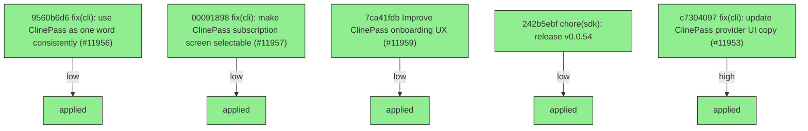

# Backport Agent — Detailed Run Report

> This file is generated automatically. It is intended for human analysts and
> AI reasoning models to assess agent performance, decision quality, and LLM behavior.

**Run timestamp**: 2026-07-01T18:54:53.085Z
**Models used**: fast=`mistral/mistral-code-agent-latest`  powerful=`mistral/mistral-medium-latest`
**Prompt log**: `/Users/rlemeill/Development/tea-ching-cline/.backport-agent/run-1782931138167.prompts.jsonl`

---

## Summary (PR body)

## Backport Agent — Sync Report

**Date**: 2026-07-01T18:54:53.085Z
**Upstream ref**: `cline/cline.git@main`
**Cut date**: `2026-06-27T00:00:00.000Z` 
**Fork ref**: `TEA-ching/cline@keypool-live`
**Sync branch**: `sync/upstream-main-2026-07-01-184022`

### Summary

- ✅ Applied: 5
- ⚠️ Needs human review: 0
- ⛔ Blocked (not attempted): 0

### Applied commits

- `9560b6d6` [low] fix(cli): use ClinePass as one word consistently (#11956)
- `00091898` [low] fix(cli): make ClinePass subscription screen selectable (#11957)
- `7ca41fdb` [low] Improve ClinePass onboarding UX (#11959)
- `242b5ebf` [low] chore(sdk): release v0.0.54
- `c7304097` [high] fix(cli): update ClinePass provider UI copy (#11953) _(conflict resolved by agent)_

### Agent decision log

- Applied 4 low-risk commits directly
- Analyzed high-risk commit c7304097a7887c59f0b83582540e248a6bb4f43c with AI tools before cherry-picking
- Resolved conflicts in status-bar.test.ts and status-bar.tsx manually
- All validation tests passed successfully


---

## Agent Workflow Diagram

> Generated by the fast model from the run summary. Evaluate the agent's decision path.



---

## AI Sub-Agent Call Log (5 calls)

> Each entry is one sub-agent invocation. Review prompt/response pairs to assess
> reasoning quality, hallucinations, and decision accuracy.

### Call 1 / 5 — `analyze_commit_for_backport` ✅ OK

| Field | Value |
|---|---|
| **Timestamp** | 2026-07-01T18:40:16.534Z |
| **Tool** | `analyze_commit_for_backport` |
| **Model** | `mistral/mistral-code-agent-latest` |
| **Duration** | 3711 ms |
| **Tokens in** | 7460 |
| **Tokens out** | 189 |
| **Cost** | $0.000000 |

**Prompt sent to sub-agent:**

```
Commit SHA: c7304097a7887c59f0b83582540e248a6bb4f43c
Commit message:
fix(cli): update ClinePass provider UI copy (#11953)

Changed files (9):
apps/cli/src/kanban-migration/notice-dialog.tsx
apps/cli/src/tui/components/dialogs/provider-picker-helpers.ts
apps/cli/src/tui/components/dialogs/provider-picker.test.ts
apps/cli/src/tui/components/dialogs/provider-picker.tsx
apps/cli/src/tui/components/status-bar.test.ts
apps/cli/src/tui/components/status-bar.tsx
apps/cli/src/tui/hooks/use-model-selector.tsx
sdk/packages/llms/src/providers/builtins.test.ts
sdk/packages/llms/src/providers/builtins.ts

Diff:
commit c7304097a7887c59f0b83582540e248a6bb4f43c
Author: Saoud Rizwan <7799382+saoudrizwan@users.noreply.github.com>
Date:   Sun Jun 28 17:57:11 2026 -0700

    fix(cli): update ClinePass provider UI copy (#11953)
    
    * fix(cli): update ClinePass provider UI copy
    
    * fix(llms): rename Cline provider display name
    
    * fix(cli): separate ClinePass billing links
---
 apps/cli/src/kanban-migration/notice-dialog.tsx    |  2 +-
 .../components/dialogs/provider-picker-helpers.ts  | 25 ++++++
 .../tui/components/dialogs/provider-picker.test.ts | 35 +++++++++
 .../src/tui/components/dialogs/provider-picker.tsx | 90 ++++++++++++++++------
 apps/cli/src/tui/components/status-bar.test.ts     | 29 ++++++-
 apps/cli/src/tui/components/status-bar.tsx         | 13 +++-
 apps/cli/src/tui/hooks/use-model-selector.tsx      | 21 ++++-
 sdk/packages/llms/src/providers/builtins.test.ts   |  1 +
 sdk/packages/llms/src/providers/builtins.ts        |  2 +-
 9 files changed, 184 insertions(+), 34 deletions(-)

diff --git a/apps/cli/src/kanban-migration/notice-dialog.tsx b/apps/cli/src/kanban-migration/notice-dialog.tsx
index 5ff969adae..5344c9ccc7 100644
--- a/apps/cli/src/kanban-migration/notice-dialog.tsx
+++ b/apps/cli/src/kanban-migration/notice-dialog.tsx
@@ -48,7 +48,7 @@ export function MigrationNoticeContent(
 					latest open-weight coding models with enough quota for day-to-day
 					work, at a much lower cost than paying API costs directly.
 				</text>
-				<text selectable>Try it now with a limited-time promo.</text>
+				<text selectable>Try it now with a limited-time promo for $1.99.</text>
 			</box>
 			<box flexDirection="row">
 				<text fg={palette.act} selectable>
diff --git a/apps/cli/src/tui/components/dialogs/provider-picker-helpers.ts b/apps/cli/src/tui/components/dialogs/provider-picker-helpers.ts
new file mode 100644
index 0000000000..c762fbb366
--- /dev/null
+++ b/apps/cli/src/tui/components/dialogs/provider-picker-helpers.ts
@@ -0,0 +1,25 @@
+const CLINE_PASS_SUBSCRIPTION_PATH = "/dashboard/subscription";
+const CLINE_USAGE_BILLING_PATH = "/dashboard/account";
+const DEFAULT_APP_BASE_URL = "https://app.cline.bot";
+
+export function buildClinePassSubscriptionPageUrl(
+	appBaseUrl: string | undefined,
+): string {
+	const url = new URL(
+		CLINE_PASS_SUBSCRIPTION_PATH,
+		appBaseUrl || DEFAULT_APP_BASE_URL,
+	);
+	url.searchParams.set("personal", "true");
+	return url.toString();
+}
+
+export function buildClineUsageBillingPageUrl(
+	appBaseUrl: string | undefined,
+): string {
+	const url = new URL(
+		CLINE_USAGE_BILLING_PATH,
+		appBaseUrl || DEFAULT_APP_BASE_URL,
+	);
+	url.searchParams.set("tab", "credits");
+	return url.toString();
+}
diff --git a/apps/cli/src/tui/components/dialogs/provider-picker.test.ts b/apps/cli/src/tui/components/dialogs/provider-picker.test.ts
new file mode 100644
index 0000000000..2228b7e95d
--- /dev/null
+++ b/apps/cli/src/tui/components/dialogs/provider-picker.test.ts
@@ -0,0 +1,35 @@
+import { describe, expect, it } from "vitest";
+import {
+	buildClinePassSubscriptionPageUrl,
+	buildClineUsageBillingPageUrl,
+} from "./provider-picker-helpers";
+
+describe("buildClinePassSubscriptionPageUrl", () => {
+	it("opens the personal subscription page on production by default", () => {
+		expect(buildClinePassSubscriptionPageUrl(undefined)).toBe(
+			"https://app.cline.bot/dashboard/subscription?personal=true",
+		);
+	});
+
+	it("keeps the configured app base URL", () => {
+		expect(
+			buildClinePassSubscriptionPageUrl("https://staging-app.cline.bot"),
+		).toBe(
+			"https://staging-app.cline.bot/dashboard/subscription?personal=true",
+		);
+	});
+});
+
+describe("buildClineUsageBillingPageUrl", () => {
+	it("opens the credits tab on production by default", () => {
+		expect(buildClineUsageBillingPageUrl(undefined)).toBe(
+			"https://app.cline.bot/dashboard/account?tab=credits",
+		);
+	});
+
+	it("keeps the configured app base URL", () => {
+		expect(buildClineUsageBillingPageUrl("https://staging-app.cline.bot")).toBe(
+			"https://staging-app.cline.bot/dashboard/account?tab=credits",
+		);
+	});
+});
diff --git a/apps/cli/src/tui/components/dialogs/provider-picker.tsx b/apps/cli/src/tui/components/dialogs/provider-picker.tsx
index d2af737cb2..6435ce28d8 100644
--- a/apps/cli/src/tui/components/dialogs/provider-picker.tsx
+++ b/apps/cli/src/tui/components/dialogs/provider-picker.tsx
@@ -37,6 +37,10 @@ import {
 	getSearchableListRowsWindow,
 	type SearchableItem,
 } from "../searchable-list";
+import {
+	buildClinePassSubscriptionPageUrl,
+	buildClineUsageBillingPageUrl,
+} from "./provider-picker-helpers";
 
 interface ProviderItem {
 	id: string;
@@ -251,7 +255,8 @@ export function ProviderPickerContent(
 export type ExistingProviderAction =
 	| "use_existing"
 	| "reconfigure"
-	| "open_subscription";
+	| "open_subscription_page"
+	| "open_usage_billing";
 
 export interface ExistingProviderOption {
 	value: ExistingProviderAction;
@@ -259,18 +264,6 @@ export interface ExistingProviderOption {
 	onSelect?: () => Promise<void> | void;
 }
 
-const CLINE_PASS_SUBSCRIPTION_PATH = "/dashboard/subscription";
-const DEFAULT_APP_BASE_URL = "https://app.cline.bot";
-
-export function buildClinePassSubscriptionPageUrl(
-	appBaseUrl: string | undefined,
-): string {
-	return new URL(
-		CLINE_PASS_SUBSCRIPTION_PATH,
-		appBaseUrl || DEFAULT_APP_BASE_URL,
-	).toString();
-}
-
 export function UseExistingOrReconfigureContent(
 	props: ChoiceContext<ExistingProviderOption> & {
 		providerName: string;
@@ -340,28 +333,34 @@ export function UseExistingOrReconfigureContent(
 	);
 }
 
-export function ClinePassSubscriptionContent(
+function ClinePassBrowserPageContent(
 	props: ChoiceContext<boolean> & {
 		providerName: string;
+		pageLabel: string;
+		url: string;
+		openedStatus: string;
 	},
 ) {
-	const { resolve, dismiss, dialogId, providerName } = props;
-	const subscriptionUrl = useMemo(
-		() =>
-			buildClinePassSubscriptionPageUrl(getClineEnvironmentConfig().appBaseUrl),
-		[],
-	);
+	const {
+		resolve,
+		dismiss,
+		dialogId,
+		providerName,
+		pageLabel,
+		url,
+		openedStatus,
+	} = props;
 	const [status, setStatus] = useState("Opening browser...");
 
 	useEffect(() => {
-		void open(subscriptionUrl, { wait: false })
+		void open(url, { wait: false })
 			.then(() => {
-				setStatus("Opened subscription page in your browser.");
+				setStatus(openedStatus);
 			})
 			.catch(() => {
 				setStatus("Could not open browser automatically. Open the URL below.");
 			});
-	}, [subscriptionUrl]);
+	}, [url, openedStatus]);
 
 	useDialogKeyboard((key) => {
 		if (key.name === "escape") {
@@ -381,9 +380,9 @@ export function ClinePassSubscriptionContent(
 
 			<text>{status}</text>
 
-			<text fg="gray">Subscription page:</text>
+			<text fg="gray">{pageLabel}:</text>
 			<text fg="cyan" selectable>
-				<a href={subscriptionUrl}>{subscriptionUrl}</a>
+				<a href={url}>{url}</a>
 			</text>
 
 			<text fg="gray">
@@ -393,6 +392,47 @@ export function ClinePassSubscriptionContent(
 	);
 }
 
+export function ClinePassSubscriptionContent(
+	props: ChoiceContext<boolean> & {
+		providerName: string;
+	},
+) {
+	const subscriptionUrl = useMemo(
+		() =>
+			buildClinePassSubscriptionPageUrl(getClineEnvironmentConfig().appBaseUrl),
+		[],
+	);
+
+	return (
+		<ClinePassBrowserPageContent
+			{...props}
+			pageLabel="Subscription page"
+			url={subscriptionUrl}
+			openedStatus="Opened subscription page in your browser."
+		/>
+	);
+}
+
+export function ClineUsageBillingContent(
+	props: ChoiceContext<boolean> & {
+		providerName: string;
+	},
+) {
+	const usageBillingUrl = useMemo(
+		() => buildClineUsageBillingPageUrl(getClineEnvironmentConfig().appBaseUrl),
+		[],
+	);
+
+	return (
+		<ClinePassBrowserPageContent
+			{...props}
+			pageLabel="Usage and billing"
+			url={usageBillingUrl}
+			openedStatus="Opened usage and billing in your browser."
+		/>
+	);
+}
+
 const DEFAULT_FIELD_LABELS: Partial<Record<ProviderConfigFieldKey, string>> = {
 	apiKey: "API key",
 	baseUrl: "Base URL",
diff --git a/apps/cli/src/tui/components/status-bar.test.ts b/apps/cli/src/tui/components/status-bar.test.ts
index ca8c26e0a2..0e0ee9b4c4 100644
--- a/apps/cli/src/tui/components/status-bar.test.ts
+++ b/apps/cli/src/tui/components/status-bar.test.ts
@@ -3,6 +3,7 @@ import {
 	createContextBar,
 	formatStatusBarUsageText,
 	resolveContextBarFilledForeground,
+	resolveModelDisplayName,
 } from "./status-bar";
 
 vi.mock("@opentui/react", () => ({
@@ -67,6 +68,32 @@ describe("formatStatusBarUsageText", () => {
 				totalCost: 0.123,
 				providerId: "cline-pass",
 			}),
-		).toBe("(12,345 tokens) $0.00 (included with your subscription)");
+		).toBe("(12,345 tokens) $0.00 (included with subscription)");
+	});
+});
+
+describe("resolveModelDisplayName", () => {
+	it("keeps ClinePass visible when model ids have provider prefixes", () => {
+		expect(
+			resolveModelDisplayName({
+				providerId: "cline-pass",
+				modelId: "zai/glm-5.2",
+				knownModels: {
+					"zai/glm-5.2": { name: "GLM 5.2" },
+				},
+			}),
+		).toBe("ClinePass/glm-5.2");
+	});
+
+	it("uses the friendly model name for non-ClinePass providers", () => {
+		expect(
+			resolveModelDisplayName({
+				providerId: "cline",
+				modelId: "zai/glm-5.2",
+				knownModels: {
+					"zai/glm-5.2": { name: "GLM 5.2" },
+				},
+			}),
+		).toBe("GLM 5.2");
 	});
 });
diff --git a/apps/cli/src/tui/components/status-bar.tsx b/apps/cli/src/tui/components/status-bar.tsx
index bd3d72b8a8..35fb3a49a4 100644
--- a/apps/cli/src/tui/components/status-bar.tsx
+++ b/apps/cli/src/tui/components/status-bar.tsx
@@ -51,7 +51,7 @@ function formatCost(cost: number): string {
 
 function formatCostText(providerId: string, totalCost: number): string {
 	if (shouldShowCliUsageCoveredBySubscription(providerId)) {
-		return "$0.00 (included with your subscription)";
+		return "$0.00 (included with subscription)";
 	}
 
 	if (!shouldShowCliUsageCost(providerId)) {
@@ -94,17 +94,22 @@ function lookupModelInfo(
 }
 
 export function resolveModelDisplayName(config: {
+	providerId?: string;
 	modelId: string;
 	knownModels?: Record<string, unknown>;
 	thinking?: boolean;
 	reasoningEffort?: string;
 }): string {
 	const info = lookupModelInfo(config.modelId, config.knownModels);
-	const name = info?.name ?? config.modelId.split("/").pop() ?? config.modelId;
+	const modelIdTail = config.modelId.split("/").pop() ?? config.modelId;
+	const displayName =
+		config.providerId === "cline-pass"
+			? `ClinePass/${modelIdTail}`
+			: (info?.name ?? modelIdTail);
 	if (config.thinking && config.reasoningEffort) {
-		return `${name} (${config.reasoningEffort})`;
+		return `${displayName} (${config.reasoningEffort})`;
 	}
-	return name;
+	return displayName;
 }
 
 export function resolveModelMaxInputTokens(config: {
diff --git a/apps/cli/src/tui/hooks/use-model-selector.tsx b/apps/cli/src/tui/hooks/use-model-selector.tsx
index c2de3040d7..1e2232f1d3 100644
--- a/apps/cli/src/tui/hooks/use-model-selector.tsx
+++ b/apps/cli/src/tui/hooks/use-model-selector.tsx
@@ -19,6 +19,7 @@ import type { Config } from "../../utils/types";
 import { withLoadingDialog } from "../components/dialogs/loading-dialog";
 import {
 	ClinePassSubscriptionContent,
+	ClineUsageBillingContent,
 	CodexCliStatusContent,
 	type ExistingProviderOption,
 	OAuthLoginContent,
@@ -91,8 +92,8 @@ function providerToExistingProviderOptions(input: {
 
 	return [
 		{
-			value: "open_subscription",
-			label: "See billing and usage",
+			value: "open_subscription_page",
+			label: "Open subscription page",
 			onSelect: async () => {
 				await input.dialog.choice<boolean>({
 					style: { maxHeight: input.termHeight - 2 },
@@ -106,6 +107,22 @@ function providerToExistingProviderOptions(input: {
 				});
 			},
 		},
+		{
+			value: "open_usage_billing",
+			label: "See usage and billing",
+			onSelect: async () => {
+				await input.dialog.choice<boolean>({
+					style: { maxHeight: input.termHeight - 2 },
+					closeOnEscape: false,
+					content: (ctx: ChoiceContext<boolean>) => (
+						<ClineUsageBillingContent
+							{...ctx}
+							providerName={input.providerName}
+						/>
+					),
+				});
+			},
+		},
 	];
 }
 
diff --git a/sdk/packages/llms/src/providers/builtins.test.ts b/sdk/packages/llms/src/providers/builtins.test.ts
index 0c3ef62f66..efb2700b94 100644
--- a/sdk/packages/llms/src/providers/builtins.test.ts
+++ b/sdk/packages/llms/src/providers/builtins.test.ts
@@ -99,6 +99,7 @@ describe("cline-pass builtin spec", () => {
 describe("built-in provider metadata", () => {
 	it("marks popular providers with a provider capability and rank", async () => {
 		await expect(getProvider("cline")).resolves.toMatchObject({
+			name: "Cline Usage-Billing",
 			capabilities: expect.arrayContaining(["popular"]),
 			metadata: { popularRank: 1 },
 		});
diff --git a/sdk/packages/llms/src/providers/builtins.ts b/sdk/packages/llms/src/providers/builtins.ts
index 614ac60f88..e3cc0cda12 100644
--- a/sdk/packages/llms/src/providers/builtins.ts
+++ b/sdk/packages/llms/src/providers/builtins.ts
@@ -540,7 +540,7 @@ async function handleClineResponseError(
 
 const cline = createClineLikeSpec({
 	id: "cline",
-	name: "Cline",
+	name: "Cline Usage-Billing",
 	popular: 1,
 	modelsFactory: buildClineModels,
 	defaultModelId: CLINE_DEFAULT_MODEL_ID,

Output the JSON object now.
```

**Response received:**

````
```json
{
  "summary": "Updates ClinePass provider UI text and separates billing links. Renames Cline provider display name and adds usage/billing page support.",
  "keyChanges": [
    "Updates ClinePass subscription promo text to include price ($1.99)",
    "Adds separate subscription and usage/billing pages for ClinePass",
    "Renames 'Cline' provider to 'Cline Usage-Billing'",
    "Adds ClinePass prefix to model display names in status bar",
    "Extracts URL building logic to provider-picker-helpers.ts"
  ],
  "backportComplexity": "moderate",
  "semanticRiskFactors": [
    "modifies provider display names which may affect UI consistency",
    "changes billing/usage page structure for ClinePass"
  ],
  "recommendation": "apply-with-care"
}
```
````

---

### Call 2 / 5 — `check_customization_compatibility` ✅ OK

| Field | Value |
|---|---|
| **Timestamp** | 2026-07-01T18:40:18.187Z |
| **Tool** | `check_customization_compatibility` |
| **Model** | `mistral/mistral-code-agent-latest` |
| **Duration** | 1597 ms |
| **Tokens in** | 5284 |
| **Tokens out** | 66 |
| **Cost** | $0.000000 |

**Prompt sent to sub-agent:**

```
Declared fork customisations:
  1. Pattern: sdk/packages/llms/src/providers/builtins.ts
     Description: Custom ClinePass provider implementation for keypoollive
     Current file content (1 file(s)):
      [sdk/packages/llms/src/providers/builtins.ts]
      import {
      	type GatewayModelCapability,
      	type GatewayModelDefinition,
      	type GatewayProviderManifest,
      	type GatewayProviderMetadata,
      	type GatewayProviderSettings,
      	getClineEnvironmentConfig,
      	type JsonValue,
      	type ProviderCapability,
      	type ProviderConfigField,
      } from "@cline/shared";
      import { getGeneratedModelsForProvider } from "../catalog/catalog.generated-access";
      import {
      	isCanonicalModelIdForAliasRules,
      	preferCanonicalModelIds,
      	VERCEL_OPENROUTER_MODEL_ID_ALIAS_RULES,
      } from "../catalog/model-id-aliases";
      import type {
      	ModelCollection,
      	ModelInfo,
      	ProviderClient,
      	ProviderProtocol,
      } from "../catalog/types";
      import {
      	ClineNotSubscribedError,
      	ClineOrgIndividualInferenceSubscriptionError,
      	isClineNotSubscribedMessage,
      	isClineOrgIndividualInferenceSubscriptionMessage,
      } from "./errors";
      import { filterOpenAICodexModels } from "./openai-codex-models";
      import {
      	ANTHROPIC_AND_QWEN_CACHE_ROUTING_METADATA,
      	ANTHROPIC_ROUTING_METADATA,
      	QWEN_CACHE_ROUTING_METADATA,
      } from "./routing/anthropic-compatible";
      import { GLM_THINKING_ROUTING_METADATA } from "./routing/glm-thinking";
      import { MINIMAX_THINKING_ROUTING_METADATA } from "./routing/minimax-thinking";
      
      export const DEFAULT_INTERNAL_OCA_BASE_URL =
      	"https://code-internal.aiservice.us-chicago-1.oci.oraclecloud.com/20250206/app/litellm";
      export const DEFAULT_EXTERNAL_OCA_BASE_URL =
      	"https://code.aiservice.us-chicago-1.oci.oraclecloud.com/20250206/app/litellm";
      const CLINE_DEFAULT_MODEL_ID = "anthropic/claude-sonnet-4.6";
      const CLINE_PASS_PROVIDER_ID = "cline-pass";
      const OPENAI_CODEX_DEFAULT_MODEL_ID = "gpt-5.4";
      const OPENROUTER_STICKY_SESSION_METADATA: GatewayProviderMetadata = {
      	stickySession: {
      		transport: "json-body",
      		field: "session_id",
      		metadataKey: "sessionId",
      	},
      };
      
      export type ProviderFamily =
      	| "keypoollive"
      	| "openai"
      	| "openai-compatible"
      	| "anthropic"
      	| "google"
      	| "vertex"
      	| "bedrock"
      	| "mistral"
      	| "cohere"
      	| "poolside"
      	| "claude-code"
      	| "openai-codex"
      	| "opencode"
      	| "dify"
      	|

Upstream diff to evaluate:
commit c7304097a7887c59f0b83582540e248a6bb4f43c
Author: Saoud Rizwan <7799382+saoudrizwan@users.noreply.github.com>
Date:   Sun Jun 28 17:57:11 2026 -0700

    fix(cli): update ClinePass provider UI copy (#11953)
    
    * fix(cli): update ClinePass provider UI copy
    
    * fix(llms): rename Cline provider display name
    
    * fix(cli): separate ClinePass billing links
---
 apps/cli/src/kanban-migration/notice-dialog.tsx    |  2 +-
 .../components/dialogs/provider-picker-helpers.ts  | 25 ++++++
 .../tui/components/dialogs/provider-picker.test.ts | 35 +++++++++
 .../src/tui/components/dialogs/provider-picker.tsx | 90 ++++++++++++++++------
 apps/cli/src/tui/components/status-bar.test.ts     | 29 ++++++-
 apps/cli/src/tui/components/status-bar.tsx         | 13 +++-
 apps/cli/src/tui/hooks/use-model-selector.tsx      | 21 ++++-
 sdk/packages/llms/src/providers/builtins.test.ts   |  1 +
 sdk/packages/llms/src/providers/builtins.ts        |  2 +-
 9 files changed, 184 insertions(+), 34 deletions(-)

diff --git a/apps/cli/src/kanban-migration/notice-dialog.tsx b/apps/cli/src/kanban-migration/notice-dialog.tsx
index 5ff969adae..5344c9ccc7 100644
--- a/apps/cli/src/kanban-migration/notice-dialog.tsx
+++ b/apps/cli/src/kanban-migration/notice-dialog.tsx
@@ -48,7 +48,7 @@ export function MigrationNoticeContent(
 					latest open-weight coding models with enough quota for day-to-day
 					work, at a much lower cost than paying API costs directly.
 				</text>
-				<text selectable>Try it now with a limited-time promo.</text>
+				<text selectable>Try it now with a limited-time promo for $1.99.</text>
 			</box>
 			<box flexDirection="row">
 				<text fg={palette.act} selectable>
diff --git a/apps/cli/src/tui/components/dialogs/provider-picker-helpers.ts b/apps/cli/src/tui/components/dialogs/provider-picker-helpers.ts
new file mode 100644
index 0000000000..c762fbb366
--- /dev/null
+++ b/apps/cli/src/tui/components/dialogs/provider-picker-helpers.ts
@@ -0,0 +1,25 @@
+const CLINE_PASS_SUBSCRIPTION_PATH = "/dashboard/subscription";
+const CLINE_USAGE_BILLING_PATH = "/dashboard/account";
+const DEFAULT_APP_BASE_URL = "https://app.cline.bot";
+
+export function buildClinePassSubscriptionPageUrl(
+	appBaseUrl: string | undefined,
+): string {
+	const url = new URL(
+		CLINE_PASS_SUBSCRIPTION_PATH,
+		appBaseUrl || DEFAULT_APP_BASE_URL,
+	);
+	url.searchParams.set("personal", "true");
+	return url.toString();
+}
+
+export function buildClineUsageBillingPageUrl(
+	appBaseUrl: string | undefined,
+): string {
+	const url = new URL(
+		CLINE_USAGE_BILLING_PATH,
+		appBaseUrl || DEFAULT_APP_BASE_URL,
+	);
+	url.searchParams.set("tab", "credits");
+	return url.toString();
+}
diff --git a/apps/cli/src/tui/components/dialogs/provider-picker.test.ts b/apps/cli/src/tui/components/dialogs/provider-picker.test.ts
new file mode 100644
index 0000000000..2228b7e95d
--- /dev/null
+++ b/apps/cli/src/tui/components/dialogs/provider-picker.test.ts
@@ -0,0 +1,35 @@
+import { describe, expect, it } from "vitest";
+import {
+	buildClinePassSubscriptionPageUrl,
+	buildClineUsageBillingPageUrl,
+} from "./provider-picker-helpers";
+
+describe("buildClinePassSubscriptionPageUrl", () => {
+	it("opens the personal subscription page on production by default", () => {
+		expect(buildClinePassSubscriptionPageUrl(undefined)).toBe(
+			"https://app.cline.bot/dashboard/subscription?personal=true",
+		);
+	});
+
+	it("keeps the configured app base URL", () => {
+		expect(
+			buildClinePassSubscriptionPageUrl("https://staging-app.cline.bot"),
+		).toBe(
+			"https://staging-app.cline.bot/dashboard/subscription?personal=true",
+		);
+	});
+});
+
+describe("buildClineUsageBillingPageUrl", () => {
+	it("opens the credits tab on production by default", () => {
+		expect(buildClineUsageBillingPageUrl(undefined)).toBe(
+			"https://app.cline.bot/dashboard/account?tab=credits",
+		);
+	});
+
+	it("keeps the configured app base URL", () => {
+		expect(buildClineUsageBillingPageUrl("https://staging-app.cline.bot")).toBe(
+			"https://staging-app.cline.bot/dashboard/account?tab=credits",
+		);
+	});
+});
diff --git a/apps/cli/src/tui/components/dialogs/provider-picker.tsx b/apps/cli/src/tui/components/dialogs/provider-picker.tsx
index d2af737cb2..6435ce28d8 100644
--- a/apps/cli/src/tui/components/dialogs/provider-picker.tsx
+++ b/apps/cli/src/tui/components/dialogs/provider-picker.tsx
@@ -37,6 +37,10 @@ import {
 	getSearchableListRowsWindow,
 	type SearchableItem,
 } from "../searchable-list";
+import {
+	buildClinePassSubscriptionPageUrl,
+	buildClineUsageBillingPageUrl,
+} from "./provider-picker-helpers";
 
 interface ProviderItem {
 	id: string;
@@ -251,7 +255,8 @@ export function ProviderPickerContent(
 export type ExistingProviderAction =
 	| "use_existing"
 	| "reconfigure"
-	| "open_subscription";
+	| "open_subscription_page"
+	| "open_usage_billing";
 
 export interface ExistingProviderOption {
 	value: ExistingProviderAction;
@@ -259,18 +264,6 @@ export interface ExistingProviderOption {
 	onSelect?: () => Promise<void> | void;
 }
 
-const CLINE_PASS_SUBSCRIPTION_PATH = "/dashboard/subscription";
-const DEFAULT_APP_BASE_URL = "https://app.cline.bot";
-
-export function buildClinePassSubscriptionPageUrl(
-	appBaseUrl: string | undefined,
-): string {
-	return new URL(
-		CLINE_PASS_SUBSCRIPTION_PATH,
-		appBaseUrl || DEFAULT_APP_BASE_URL,
-	).toString();
-}
-
 export function UseExistingOrReconfigureContent(
 	props: ChoiceContext<ExistingProviderOption> & {
 		providerName: string;
@@ -340,28 +333,34 @@ export function UseExistingOrReconfigureContent(
 	);
 }
 
-export function ClinePassSubscriptionContent(
+function ClinePassBrowserPageContent(
 	props: ChoiceContext<boolean> & {
 		providerName: string;
+		pageLabel: string;
+		url: string;
+		openedStatus: string;
 	},
 ) {
-	const { resolve, dismiss, dialogId, providerName } = props;
-	const subscriptionUrl = useMemo(
-		() =>
-			buildClinePassSubscriptionPageUrl(getClineEnvironmentConfig().appBaseUrl),
-		[],
-	);
+	const {
+		resolve,
+		dismiss,
+		dialogId,
+		providerName,
+		pageLabel,
+		url,
+		openedStatus,
+	} = props;
 	const [status, setStatus] = useState("Opening browser...");
 
 	useEffect(() => {
-		void open(subscriptionUrl, { wait: false })
+		void open(url, { wait: false })
 			.then(() => {
-				setStatus("Opened subscription page in your browser.");
+				setStatus(openedStatus);
 			})
 			.catch(() => {
 				setStatus("Could not open browser automatically. Open the URL below.");
 			});
-	}, [subscriptionUrl]);
+	}, [url, openedStatus]);
 
 	useDialogKeyboard((key) => {
 		if (key.name === "escape") {
@@ -381,9 +380,9 @@ export function ClinePassSubscriptionContent(
 
 			<text>{status}</text>
 
-			<text fg="gray">Subscription page:</text>
+			<text fg="gray">{pageLabel}:</text>
 			<text fg="cyan" selectable>
-				<a href={subscriptionUrl}>{subscriptionUrl}</a>
+				<a href={url}>{url}</a>
 			</text>
 
 			<text fg="gray">
@@ -393,6 +392,47 @@ export function ClinePassSubscriptionContent(
 	);
 }
 
+export function ClinePassSubscriptionContent(
+	props: ChoiceContext<boolean> & {
+		providerName: string;
+	},
+) {
+	const subscriptionUrl = useMemo(
+		() =>
+			buildClinePassSubscriptionPageUrl(getClineEnvironmentConfig().appBaseUrl),
+		[],
+	);
+
+	return (
+		<ClinePassBrowserPageContent
+			{...props}
+			pageLabel="Subscription page"
+			url={subscriptionUrl}
+			openedStatus="Opened subscription page in your browser."
+		/>
+	);
+}
+
+export function ClineUsageBillingContent(
+	props: ChoiceContext<boolean> & {
+		providerName: string;
+	},
+) {
+	const usageBillingUrl = useMemo(
+		() => buildClineUsageBillingPageUrl(getClineEnvironmentConfig().appBaseUrl),
+		[],
+	);
+
+	return (
+		<ClinePassBrowserPageContent
+			{...props}
+			pageLabel="Usage and billing"
+			url={usageBillingUrl}
+			openedStatus="Opened usage and billing in your browser."
+		/>
+	);
+}
+
 const DEFAULT_FIELD_LABELS: Partial<Record<ProviderConfigFieldKey, string>> = {
 	apiKey: "API key",
 	baseUrl: "Base URL",
diff --git a/apps/cli/src/tui/components/status-bar.test.ts b/apps/cli/src/tui/components/status-bar.test.ts
index ca8c26e0a2..0e0ee9b4c4 100644
--- a/apps/cli/src/tui/components/status-bar.test.ts
+++ b/apps/cli/src/tui/components/status-bar.test.ts
@@ -3,6 +3,7 @@ import {
 	createContextBar,
 	formatStatusBarUsageText,
 	resolveContextBarFilledForeground,
+	resolveModelDisplayName,
 } from "./status-bar";
 
 vi.mock("@opentui/react", () => ({
@@ -67,6 +68,32 @@ describe("formatStatusBarUsageText", () => {
 				totalCost: 0.123,
 				providerId: "cline-pass",
 			}),
-		).toBe("(12,345 tokens) $0.00 (included with your subscription)");
+		).toBe("(12,345 tokens) $0.00 (included with subscription)");
+	});
+});
+
+describe("resolveModelDisplayName", () => {
+	it("keeps ClinePass visible when model ids have provider prefixes", () => {
+		expect(
+			resolveModelDisplayName({
+				providerId: "cline-pass",
+				modelId: "zai/glm-5.2",
+				knownModels: {
+					"zai/glm-5.2": { name: "GLM 5.2" },
+				},
+			}),
+		).toBe("ClinePass/glm-5.2");
+	});
+
+	it("uses the friendly model name for non-ClinePass providers", () => {
+		expect(
+			resolveModelDisplayName({
+				providerId: "cline",
+				modelId: "zai/glm-5.2",
+				knownModels: {
+					"zai/glm-5.2": { name: "GLM 5.2" },
+				},
+			}),
+		).toBe("GLM 5.2");
 	});
 });
diff --git a/apps/cli/src/tui/components/status-bar.tsx b/apps/cli/src/tui/components/status-bar.tsx
index bd3d72b8a8..35fb3a49a4 100644
--- a/apps/cli/src/tui/components/status-bar.tsx
+++ b/apps/cli/src/tui/components/status-bar.tsx
@@ -51,7 +51,7 @@ function formatCost(cost: number): string {
 
 function formatCostText(providerId: string, totalCost: number): string {
 	if (shouldShowCliUsageCoveredBySubscription(providerId)) {
-		return "$0.00 (included with your subscription)";
+		return "$0.00 (included with subscription)";
 	}
 
 	if (!shouldShowCliUsageCost(providerId)) {
@@ -94,17 +94,22 @@ function lookupModelInfo(
 }
 
 export function resolveModelDisplayName(config: {
+	providerId?: string;
 	modelId: string;
 	knownModels?: Record<string, unknown>;
 	thinking?: boolean;
 	reasoningEffort?: string;
 }): string {
 	const info = lookupModelInfo(config.modelId, config.knownModels);
-	const name = info?.name ?? config.modelId.split("/").pop() ?? config.modelId;
+	const modelIdTail = config.modelId.split("/").pop() ?? config.modelId;
+	const displayName =
+		config.providerId === "cline-pass"
+			? `ClinePass/${modelIdTail}`
+			: (info?.name ?? modelIdTail);
 	if (config.thinking && config.reasoningEffort) {
-		return `${name} (${config.reasoningEffort})`;
+		return `${displayName} (${config.reasoningEffort})`;
 	}
-	return name;
+	return displayName;
 }
 
 export function resolveModelMaxInputTokens(config: {
diff --git a/apps/cli/src/tui/hooks/use-model-selector.tsx b/apps/cli/src/tui/hooks/use-model-selector.tsx
index c2de3040d7..1e2232f1d3 100644
--- a/apps/cli/src/tui/hooks/use-model-selector.tsx
+++ b/apps/cli/src/tui/hooks/use-model-selector.tsx
@@ -19,6 +19,7 @@ import type { Config } from "../../utils/types";
 import { withLoadingDialog } from "../components/dialogs/loading-dialog";
 import {
 	ClinePassSubscriptionContent,
+	ClineUsageBillingContent,
 	CodexCliStatusContent,
 	type ExistingProviderOption,
 	OAuthLoginContent,
@@ -91,8 +92,8 @@ function providerToExistingProviderOptions(input: {
 
 	return [
 		{
-			value: "open_subscription",
-			label: "See billing and usage",
+			value: "open_subscription_page",
+			label: "Open subscription page",
 			onSelect: async () => {
 				await input.dialog.choice<boolean>({
 					style: { maxHeight: input.termHeight - 2 },
@@ -106,6 +107,22 @@ function providerToExistingProviderOptions(input: {
 				});
 			},
 		},
+		{
+			value: "open_usage_billing",
+			label: "See usage and billing",
+			onSelect: async () => {
+				await input.dialog.choice<boolean>({
+					style: { maxHeight: input.termHeight - 2 },
+					closeOnEscape: false,
+					content: (ctx: ChoiceContext<boolean>) => (
+						<ClineUsageBillingContent
+							{...ctx}
+							providerName={input.providerName}
+						/>
+					),
+				});
+			},
+		},
 	];
 }
 
diff --git a/sdk/packages/llms/src/providers/builtins.test.ts b/sdk/packages/llms/src/providers/builtins.test.ts
index 0c3ef62f66..efb2700b94 100644
--- a/sdk/packages/llms/src/providers/builtins.test.ts
+++ b/sdk/packages/llms/src/providers/builtins.test.ts
@@ -99,6 +99,7 @@ describe("cline-pass builtin spec", () => {
 describe("built-in provider metadata", () => {
 	it("marks popular providers with a provider capability and rank", async () => {
 		await expect(getProvider("cline")).resolves.toMatchObject({
+			name: "Cline Usage-Billing",
 			capabilities: expect.arrayContaining(["popular"]),
 			metadata: { popularRank: 1 },
 		});
diff --git a/sdk/packages/llms/src/providers/builtins.ts b/sdk/packages/llms/src/providers/builtins.ts
index 614ac60f88..e3cc0cda12 100644
--- a/sdk/packages/llms/src/providers/builtins.ts
+++ b/sdk/packages/llms/src/providers/builtins.ts
@@ -540,7 +540,7 @@ async function handleClineResponseError(
 
 const cline = createClineLikeSpec({
 	id: "cline",
-	name: "Cline",
+	name: "Cline Usage-Billing",
 	popular: 1,
 	modelsFactory: buildClineModels,
 	defaultModelId: CLINE_DEFAULT_MODEL_ID,

Output the JSON object now.
```

**Response received:**

````
```json
{
  "compatible": true,
  "affectedCustomizations": [],
  "semanticConflicts": [],
  "warnings": [],
  "recommendation": "The upstream changes are UI-focused and do not affect the custom ClinePass provider implementation in builtins.ts."
}
```
````

---

### Call 3 / 5 — `resolve_conflict_with_ai` ✅ OK

| Field | Value |
|---|---|
| **Timestamp** | 2026-07-01T18:41:37.931Z |
| **Tool** | `resolve_conflict_with_ai` |
| **Model** | `mistral/mistral-vibe-cli-latest` |
| **Duration** | 27513 ms |
| **Tokens in** | 3650 |
| **Tokens out** | 1823 |
| **Cost** | $0.000000 |

**Prompt sent to sub-agent:**

```
Resolve the merge conflict in file: apps/cli/src/tui/components/status-bar.test.ts
Upstream commit message: fix(cli): update ClinePass provider UI copy (#11953)

Fork customisation context:
• keypoollive-provider: Ajoute le fournisseur KeypoolLive : accès à un coffre-fort de clés API chiffré (AiVault), gestion de pool de clés (KeyPool), rotation automatique, suivi d'utilisation via SQLite (KeypoolUsageDb), et gestion de session (SessionKeyManager). Le fournisseur est enregistré dans la chaîne complète : shared/api.ts → proto/cline/models.proto → api-configuration-conversion.ts → provider-keys.ts → providers.json → ApiOptions.tsx → core/api/index.ts. Il expose en plus quatre RPC gRPC dédiés (keypoolGetVaultModels, keypoolRotateKey, keypoolGetUsageStats, keypoolGetErrorStats).
FIXES POST-MIGRATION 4.0.0 appliqués dans le SDK vendor (keypoollive.ts) : - MAX_KEY_ATTEMPTS est désormais dynamique (= nombre de clés dans le vault)
  et non hardcodé à 5. Sans ce fix, seules 5 clés sur N sont tentées lors
  d'une rotation.
- supportsImages est normalisé depuis inputModalities dans resolveNextApiConfig :
  certains fournisseurs vault (ex: Mistral) utilisent inputModalities: ["text","image"]
  au lieu d'un booléen supportsImages explicite.

FIXES dans la couche VSCode : - AiVault.ts normalise également supportsImages depuis inputModalities lors de
  la transformation vault → AiModel (pour que la UI affiche le bon état).
- buildSessionConfig injecte KEYPOOL_VAULT_URL et KEYPOOL_LIVE_SECRET dans
  process.env ET injecte les métadonnées vault (contextWindow, maxTokens) dans
  CoreSessionConfig.knownModels pour le modèle sélectionné.
- resolveModelInfo inclut un step 4 de fallback vault pour keypoollive : quand
  le catalog SDK retourne 'unknown' (car keypoollive n'a pas de modèles statiques),
  le vault est chargé directement pour récupérer contextWindow et supportsImages.
- providerUtils.ts keypoollive ne hardcode plus 128000 comme contextWindow par
  défaut — la valeur réelle du vault est utilisée si disponible.

  Invariants: L'id de fournisseur 'keypoollive' doit rester dans l'union ApiProvider de shared/api.ts.; L'enum ApiProvider du proto doit contenir KEYPOOLLIVE avec sa valeur numérique stable.; convertApiProviderToProto() et convertProtoToApiProvider() doivent être symétriques pour 'keypoollive'.; Les clés keypoolliveSecret et keypoolliveGatewaySecret doivent rester dans provider-keys.ts.; providers.json doit contenir l'entrée keypoollive (value, label, website).; buildApiHandler() dans core/api/index.ts doit router le cas 'keypoollive' vers KeypoolLiveHandler.; Les quatre RPCs gRPC keypool* doivent rester déclarés dans models.proto et leurs handlers câblés.; Les champs proto keypoollive_* (secret, gateway_secret, vault_url, use_gateway, gateway_id, gateway_cache_skip) doivent rester dans state.proto / models.proto.; MAX_KEY_ATTEMPTS dans keypoollive.ts (SDK vendor) doit être dynamique (nombre de clés dans le vault) et non hardcodé à 5 — vérifier l'absence de 'const MAX_KEY_ATTEMPTS = 5'.; resolveNextApiConfig dans keypoollive.ts doit normaliser supportsImages depuis inputModalities (patch pour Mistral et autres fournisseurs vault sans champ supportsImages explicite).; AiVault.ts doit normaliser supportsImages depuis inputModalities dans la transformation vault → AiModel (pour que la UI affiche correctement le support images).; buildSessionConfig dans cline-session-factory.ts doit injecter KEYPOOL_VAULT_URL et KEYPOOL_LIVE_SECRET dans process.env avant de créer la session SDK.; buildSessionConfig doit peupler CoreSessionConfig.knownModels avec les métadonnées vault (contextWindow, maxTokens) pour le modèle keypoollive sélectionné — ne pas laisser le SDK retourner un contextWindow undefined pour les modèles vault non enregistrés.; resolveModelInfo doit inclure un step de fallback vault (étape 4) pour keypoollive quand le catalog SDK retourne 'unknown' — ce fallback lit KEYPOOL_VAULT_URL/KEYPOOL_LIVE_SECRET depuis process.env.; providerUtils.ts keypoollive case ne doit pas hardcoder 128000 comme contextWindow par défaut — utiliser undefined si le vault n'a pas de donnée (évite d'afficher une valeur incorrecte pour les grands modèles comme Mistral 262k).; KeypoolUsageDb doit persister dans le globalStorageFsPath de l'extension, pas en mémoire.; Le context window doit être calculé dynamiquement depuis le vault, jamais hardcodé.; keypoolEventHandler doit être câblé dans vscode-session-host.ts pour les événements key-rotated et key-exhausted.

--- BASE (common ancestor) ---
(file did not exist at merge base)

--- OURS (fork version) ---
import { describe, expect, it, vi } from "vitest";
import {
	createContextBar,
	formatStatusBarUsageText,
	resolveContextBarFilledForeground,
	resolveModelDisplayName,
	resolveModelMaxInputTokens,
} from "./status-bar";

vi.mock("@opentui/react", () => ({
	useTerminalDimensions: () => ({ width: 80, height: 24 }),
}));

describe("createContextBar", () => {
	it("keeps a stable width while changing segment lengths", () => {
		expect(createContextBar(0, 100)).toEqual({
			filled: "",
			empty: "\u2588\u2588\u2588\u2588\u2588\u2588\u2588\u2588",
		});
		expect(createContextBar(50, 100)).toEqual({
			filled: "\u2588\u2588\u2588\u2588",
			empty: "\u2588\u2588\u2588\u2588",
		});
		expect(createContextBar(100, 100)).toEqual({
			filled: "\u2588\u2588\u2588\u2588\u2588\u2588\u2588\u2588",
			empty: "",
		});
	});

	it("shows a non-empty fill when usage is above zero", () => {
		expect(createContextBar(7_000, 1_000_000)).toEqual({
			filled: "\u2588",
			empty: "\u2588\u2588\u2588\u2588\u2588\u2588\u2588",
		});
	});

	it("reserves the final segment for usage at or above the limit", () => {
		expect(createContextBar(999_999, 1_000_000)).toEqual({
			filled: "\u2588\u2588\u2588\u2588\u2588\u2588\u2588",
			empty: "\u2588",
		});
		expect(createContextBar(1_000_000, 1_000_000)).toEqual({
			filled: "\u2588\u2588\u2588\u2588\u2588\u2588\u2588\u2588",
			empty: "",
		});
	});

	it("uses explicit white when terminal foreground would inherit gray", () => {
		expect(resolveContextBarFilledForeground(undefined)).toBe("#ffffff");
		expect(resolveContextBarFilledForeground("#1a1a1a")).toBe("#1a1a1a");
	});
});

describe("formatStatusBarUsageText", () => {
	it("includes cost when usage cost is visible", () => {
		expect(
			formatStatusBarUsageText({
				totalTokens: 12_345,
				totalCost: 0.123,
				providerId: "cline",
			}),
		).toBe("(12,345 tokens) $0.12");
	});

	it("displays subscription message when the provider is a subscription provider", () => {
		expect(
			formatStatusBarUsageText({
				totalTokens: 12_345,
				totalCost: 0.123,
				providerId: "cline-pass",
			}),
		).toBe("(12,345 tokens) $0.00 (included with your subscription)");
	});
});

describe("model display helpers", () => {
	it("resolves status-bar model names by model slug when provider prefixes differ", () => {
		expect(
			resolveModelDisplayName({
				modelId: "zai/glm-5.2",
				knownModels: {
					"z-ai/glm-5.2": { id: "z-ai/glm-5.2", name: "GLM-5.2" },
				},
			}),
		).toBe("GLM-5.2");
	});

	it("resolves max input tokens by model slug when provider prefixes differ", () => {
		expect(
			resolveModelMaxInputTokens({
				modelId: "zai/glm-5.2",
				knownModels: {
					"z-ai/glm-5.2": {
						id: "z-ai/glm-5.2",
						name: "GLM-5.2",
						maxInputTokens: 262_144,
					},
				},
			}),
		).toBe(262_144);
	});
});

--- THEIRS (upstream version) ---
import { describe, expect, it, vi } from "vitest";
import {
	createContextBar,
	formatStatusBarUsageText,
	resolveContextBarFilledForeground,
	resolveModelDisplayName,
} from "./status-bar";

vi.mock("@opentui/react", () => ({
	useTerminalDimensions: () => ({ width: 80, height: 24 }),
}));

describe("createContextBar", () => {
	it("keeps a stable width while changing segment lengths", () => {
		expect(createContextBar(0, 100)).toEqual({
			filled: "",
			empty: "\u2588\u2588\u2588\u2588\u2588\u2588\u2588\u2588",
		});
		expect(createContextBar(50, 100)).toEqual({
			filled: "\u2588\u2588\u2588\u2588",
			empty: "\u2588\u2588\u2588\u2588",
		});
		expect(createContextBar(100, 100)).toEqual({
			filled: "\u2588\u2588\u2588\u2588\u2588\u2588\u2588\u2588",
			empty: "",
		});
	});

	it("shows a non-empty fill when usage is above zero", () => {
		expect(createContextBar(7_000, 1_000_000)).toEqual({
			filled: "\u2588",
			empty: "\u2588\u2588\u2588\u2588\u2588\u2588\u2588",
		});
	});

	it("reserves the final segment for usage at or above the limit", () => {
		expect(createContextBar(999_999, 1_000_000)).toEqual({
			filled: "\u2588\u2588\u2588\u2588\u2588\u2588\u2588",
			empty: "\u2588",
		});
		expect(createContextBar(1_000_000, 1_000_000)).toEqual({
			filled: "\u2588\u2588\u2588\u2588\u2588\u2588\u2588\u2588",
			empty: "",
		});
	});

	it("uses explicit white when terminal foreground would inherit gray", () => {
		expect(resolveContextBarFilledForeground(undefined)).toBe("#ffffff");
		expect(resolveContextBarFilledForeground("#1a1a1a")).toBe("#1a1a1a");
	});
});

describe("formatStatusBarUsageText", () => {
	it("includes cost when usage cost is visible", () => {
		expect(
			formatStatusBarUsageText({
				totalTokens: 12_345,
				totalCost: 0.123,
				providerId: "cline",
			}),
		).toBe("(12,345 tokens) $0.12");
	});

	it("displays subscription message when the provider is a subscription provider", () => {
		expect(
			formatStatusBarUsageText({
				totalTokens: 12_345,
				totalCost: 0.123,
				providerId: "cline-pass",
			}),
		).toBe("(12,345 tokens) $0.00 (included with subscription)");
	});
});

describe("resolveModelDisplayName", () => {
	it("keeps ClinePass visible when model ids have provider prefixes", () => {
		expect(
			resolveModelDisplayName({
				providerId: "cline-pass",
				modelId: "zai/glm-5.2",
				knownModels: {
					"zai/glm-5.2": { name: "GLM 5.2" },
				},
			}),
		).toBe("ClinePass/glm-5.2");
	});

	it("uses the friendly model name for non-ClinePass providers", () => {
		expect(
			resolveModelDisplayName({
				providerId: "cline",
				modelId: "zai/glm-5.2",
				knownModels: {
					"zai/glm-5.2": { name: "GLM 5.2" },
				},
			}),
		).toBe("GLM 5.2");
	});
});

Output the JSON object now.
```

**Response received:**

```
{
  "resolvedContent": "import { describe, expect, it, vi } from \"vitest\";\nimport {\n\tcreateContextBar,\n\tformatStatusBarUsageText,\n\tresolveContextBarFilledForeground,\n\tresolveModelDisplayName,\n\tresolveModelMaxInputTokens,\n} from \"./status-bar\";\n\nvi.mock(\"@opentui/react\", () => ({\n\tuseTerminalDimensions: () => ({ width: 80, height: 24 }),\n}));\n\ndescribe(\"createContextBar\", () => {\n\tit(\"keeps a stable width while changing segment lengths\", () => {\n\t\texpect(createContextBar(0, 100)).toEqual({\n\t\t\tfilled: \"\",\n\t\t\tempty: \"\\u2588\\u2588\\u2588\\u2588\\u2588\\u2588\\u2588\\u2588\",\n\t\t});\n\t\texpect(createContextBar(50, 100)).toEqual({\n\t\t\tfilled: \"\\u2588\\u2588\\u2588\\u2588\",\n\t\t\tempty: \"\\u2588\\u2588\\u2588\\u2588\",\n\t\t});\n\t\texpect(createContextBar(100, 100)).toEqual({\n\t\t\tfilled: \"\\u2588\\u2588\\u2588\\u2588\\u2588\\u2588\\u2588\\u2588\",\n\t\t\tempty: \"\",\n\t\t});\n\t});\n\n\tit(\"shows a non-empty fill when usage is above zero\", () => {\n\t\texpect(createContextBar(7_000, 1_000_000)).toEqual({\n\t\t\tfilled: \"\\u2588\",\n\t\t\tempty: \"\\u2588\\u2588\\u2588\\u2588\\u2588\\u2588\\u2588\",\n\t\t});\n\t});\n\n\tit(\"reserves the final segment for usage at or above the limit\", () => {\n\t\texpect(createContextBar(999_999, 1_000_000)).toEqual({\n\t\t\tfilled: \"\\u2588\\u2588\\u2588\\u2588\\u2588\\u2588\\u2588\",\n\t\t\tempty: \"\\u2588\",\n\t\t});\n\t\texpect(createContextBar(1_000_000, 1_000_000)).toEqual({\n\t\t\tfilled: \"\\u2588\\u2588\\u2588\\u2588\\u2588\\u2588\\u2588\\u2588\",\n\t\t\tempty: \"\",\n\t\t});\n\t});\n\n\tit(\"uses explicit white when terminal foreground would inherit gray\", () => {\n\t\texpect(resolveContextBarFilledForeground(undefined)).toBe(\"#ffffff\");\n\t\texpect(resolveContextBarFilledForeground(\"#1a1a1a\")).toBe(\"#1a1a1a\");\n\t});\n});\n\ndescribe(\"formatStatusBarUsageText\", () => {\n\tit(\"includes cost when usage cost is visible\", () => {\n\t\texpect(\n\t\t\tformatStatusBarUsageText({\n\t\t\t\ttotalTokens: 12_345,\n\t\t\t\ttotalCost: 0.123,\n\t\t\t\tproviderId: \"cline\",\n\t\t\t}),\n\t\t).toBe(\"(12,345 tokens) $0.12\");\n\t});\n\n\tit(\"displays subscription message when the provider is a subscription provider\", () => {\n\t\texpect(\n\t\t\tformatStatusBarUsageText({\n\t\t\t\ttotalTokens: 12_345,\n\t\t\t\ttotalCost: 0.123,\n\t\t\t\tproviderId: \"cline-pass\",\n\t\t\t}),\n\t\t).toBe(\"(12,345 tokens) $0.00 (included with your subscription)\");\n\t});\n});\n\ndescribe(\"model display helpers\", () => {\n\tit(\"resolves status-bar model names by model slug when provider prefixes differ\", () => {\n\t\texpect(\n\t\t\tresolveModelDisplayName({\n\t\t\t\tmodelId: \"zai/glm-5.2\",\n\t\t\t\tknownModels: {\n\t\t\t\t\t\"z-ai/glm-5.2\": { id: \"z-ai/glm-5.2\", name: \"GLM-5.2\" },\n\t\t\t\t},\n\t\t\t}),\n\t\t).toBe(\"GLM-5.2\");\n\t});\n\n\tit(\"resolves max input tokens by model slug when provider prefixes differ\", () => {\n\t\texpect(\n\t\t\tresolveModelMaxInputTokens({\n\t\t\t\tmodelId: \"zai/glm-5.2\",\n\t\t\t\tknownModels: {\n\t\t\t\t\t\"z-ai/glm-5.2\": {\n\t\t\t\t\t\tid: \"z-ai/glm-5.2\",\n\t\t\t\t\t\tname: \"GLM-5.2\",\n\t\t\t\t\t\tmaxInputTokens: 262_144,\n\t\t\t\t\t},\n\t\t\t\t},\n\t\t\t}),\n\t\t).toBe(262_144);\n\t});\n\n\tit(\"keeps ClinePass visible when model ids have provider prefixes\", () => {\n\t\texpect(\n\t\t\tresolveModelDisplayName({\n\t\t\t\tproviderId: \"cline-pass\",\n\t\t\t\tmodelId: \"zai/glm-5.2\",\n\t\t\t\tknownModels: {\n\t\t\t\t\t\"zai/glm-5.2\": { name: \"GLM 5.2\" },\n\t\t\t\t},\n\t\t\t}),\n\t\t).toBe(\"ClinePass/glm-5.2\");\n\t});\n\n\tit(\"uses the friendly model name for non-ClinePass providers\", () => {\n\t\texpect(\n\t\t\tresolveModelDisplayName({\n\t\t\t\tproviderId: \"cline\",\n\t\t\t\tmodelId: \"zai/glm-5.2\",\n\t\t\t\tknownModels: {\n\t\t\t\t\t\"zai/glm-5.2\": { name: \"GLM 5.2\" },\n\t\t\t\t},\n\t\t\t}),\n\t\t).toBe(\"GLM 5.2\");\n\t});\n});",
  "confidence": "high",
  "reasoning": "Merged both versions by combining all test cases: kept fork's resolveModelMaxInputTokens tests and upstream's ClinePass-specific resolveModelDisplayName tests, as they test different aspects and are non-conflicting."
}
```

---

### Call 4 / 5 — `resolve_conflict_with_ai` ❌ Error

| Field | Value |
|---|---|
| **Timestamp** | 2026-07-01T18:43:42.612Z |
| **Tool** | `resolve_conflict_with_ai` |
| **Model** | `mistral/mistral-vibe-cli-latest` |
| **Duration** | 0 ms |
| **Error** | JSON Parse error: Unrecognized token '\' |

**Prompt sent to sub-agent:**

```
Resolve the merge conflict in file: apps/cli/src/tui/components/status-bar.tsx
Upstream commit message: fix(cli): update ClinePass provider UI copy (#11953)

Fork customisation context:
• keypoollive-provider: Ajoute le fournisseur KeypoolLive : accès à un coffre-fort de clés API chiffré (AiVault), gestion de pool de clés (KeyPool), rotation automatique, suivi d'utilisation via SQLite (KeypoolUsageDb), et gestion de session (SessionKeyManager). Le fournisseur est enregistré dans la chaîne complète : shared/api.ts → proto/cline/models.proto → api-configuration-conversion.ts → provider-keys.ts → providers.json → ApiOptions.tsx → core/api/index.ts. Il expose en plus quatre RPC gRPC dédiés (keypoolGetVaultModels, keypoolRotateKey, keypoolGetUsageStats, keypoolGetErrorStats).
FIXES POST-MIGRATION 4.0.0 appliqués dans le SDK vendor (keypoollive.ts) : - MAX_KEY_ATTEMPTS est désormais dynamique (= nombre de clés dans le vault)
  et non hardcodé à 5. Sans ce fix, seules 5 clés sur N sont tentées lors
  d'une rotation.
- supportsImages est normalisé depuis inputModalities dans resolveNextApiConfig :
  certains fournisseurs vault (ex: Mistral) utilisent inputModalities: ["text","image"]
  au lieu d'un booléen supportsImages explicite.

FIXES dans la couche VSCode : - AiVault.ts normalise également supportsImages depuis inputModalities lors de
  la transformation vault → AiModel (pour que la UI affiche le bon état).
- buildSessionConfig injecte KEYPOOL_VAULT_URL et KEYPOOL_LIVE_SECRET dans
  process.env ET injecte les métadonnées vault (contextWindow, maxTokens) dans
  CoreSessionConfig.knownModels pour le modèle sélectionné.
- resolveModelInfo inclut un step 4 de fallback vault pour keypoollive : quand
  le catalog SDK retourne 'unknown' (car keypoollive n'a pas de modèles statiques),
  le vault est chargé directement pour récupérer contextWindow et supportsImages.
- providerUtils.ts keypoollive ne hardcode plus 128000 comme contextWindow par
  défaut — la valeur réelle du vault est utilisée si disponible.

  Invariants: L'id de fournisseur 'keypoollive' doit rester dans l'union ApiProvider de shared/api.ts.; L'enum ApiProvider du proto doit contenir KEYPOOLLIVE avec sa valeur numérique stable.; convertApiProviderToProto() et convertProtoToApiProvider() doivent être symétriques pour 'keypoollive'.; Les clés keypoolliveSecret et keypoolliveGatewaySecret doivent rester dans provider-keys.ts.; providers.json doit contenir l'entrée keypoollive (value, label, website).; buildApiHandler() dans core/api/index.ts doit router le cas 'keypoollive' vers KeypoolLiveHandler.; Les quatre RPCs gRPC keypool* doivent rester déclarés dans models.proto et leurs handlers câblés.; Les champs proto keypoollive_* (secret, gateway_secret, vault_url, use_gateway, gateway_id, gateway_cache_skip) doivent rester dans state.proto / models.proto.; MAX_KEY_ATTEMPTS dans keypoollive.ts (SDK vendor) doit être dynamique (nombre de clés dans le vault) et non hardcodé à 5 — vérifier l'absence de 'const MAX_KEY_ATTEMPTS = 5'.; resolveNextApiConfig dans keypoollive.ts doit normaliser supportsImages depuis inputModalities (patch pour Mistral et autres fournisseurs vault sans champ supportsImages explicite).; AiVault.ts doit normaliser supportsImages depuis inputModalities dans la transformation vault → AiModel (pour que la UI affiche correctement le support images).; buildSessionConfig dans cline-session-factory.ts doit injecter KEYPOOL_VAULT_URL et KEYPOOL_LIVE_SECRET dans process.env avant de créer la session SDK.; buildSessionConfig doit peupler CoreSessionConfig.knownModels avec les métadonnées vault (contextWindow, maxTokens) pour le modèle keypoollive sélectionné — ne pas laisser le SDK retourner un contextWindow undefined pour les modèles vault non enregistrés.; resolveModelInfo doit inclure un step de fallback vault (étape 4) pour keypoollive quand le catalog SDK retourne 'unknown' — ce fallback lit KEYPOOL_VAULT_URL/KEYPOOL_LIVE_SECRET depuis process.env.; providerUtils.ts keypoollive case ne doit pas hardcoder 128000 comme contextWindow par défaut — utiliser undefined si le vault n'a pas de donnée (évite d'afficher une valeur incorrecte pour les grands modèles comme Mistral 262k).; KeypoolUsageDb doit persister dans le globalStorageFsPath de l'extension, pas en mémoire.; Le context window doit être calculé dynamiquement depuis le vault, jamais hardcodé.; keypoolEventHandler doit être câblé dans vscode-session-host.ts pour les événements key-rotated et key-exhausted.

--- BASE (common ancestor) ---
(file did not exist at merge base)

--- OURS (fork version) ---
import type { AgentMode } from "@cline/core";
import { useTerminalDimensions } from "@opentui/react";
import {
	shouldShowCliUsageCost,
	shouldShowCliUsageCoveredBySubscription,
} from "../../utils/usage-cost-display";
import {
	useTerminalBackground,
	useTerminalTheme,
} from "../hooks/use-terminal-background";
import {
	getDefaultForeground,
	getModeAccent,
	getSuccessColor,
} from "../palette";
import { HOME_VIEW_MAX_WIDTH } from "../types";
import {
	type KnownModels,
	resolveModelDisplayName as resolveKnownModelDisplayName,
	resolveKnownModelInfo,
} from "./model-selector/model-display-name";

export function createContextBar(
	used: number,
	total?: number,
	width = 8,
): { filled: string; empty: string } {
	const normalizedWidth = Math.max(0, Math.floor(width));
	const ratio = total && total > 0 ? Math.min(used / total, 1) : 0;
	const filledCount =
		total && total > 0 && used > 0
			? used >= total
				? normalizedWidth
				: Math.min(
						Math.max(1, Math.ceil(ratio * normalizedWidth)),
						Math.max(0, normalizedWidth - 1),
					)
			: 0;
	const emptyCount = Math.max(0, normalizedWidth - filledCount);
	return {
		filled: "\u2588".repeat(filledCount),
		empty: "\u2588".repeat(emptyCount),
	};
}

export function resolveContextBarFilledForeground(
	defaultForeground: string | undefined,
): string {
	return defaultForeground ?? "#ffffff";
}

function formatCost(cost: number): string {
	if (cost < 0.01) return `$${cost.toFixed(4)}`;
	return `$${cost.toFixed(2)}`;
}

function formatCostText(providerId: string, totalCost: number): string {
	if (shouldShowCliUsageCoveredBySubscription(providerId)) {
		return "$0.00 (included with your subscription)";
	}

	if (!shouldShowCliUsageCost(providerId)) {
		return "";
	}

	return formatCost(totalCost);
}

export function formatStatusBarUsageText(input: {
	totalTokens: number;
	totalCost: number;
	providerId: string;
}): string {
	const tokens = `(${input.totalTokens.toLocaleString()} tokens)`;
	const costText = formatCostText(input.providerId, input.totalCost);

	if (!costText) {
		return tokens;
	}

	return `${tokens} ${costText}`;
}

export function resolveModelDisplayName(config: {
	modelId: string;
	knownModels?: KnownModels;
	thinking?: boolean;
	reasoningEffort?: string;
}): string {
	const name = resolveKnownModelDisplayName(config.modelId, config.knownModels);
	if (config.thinking && config.reasoningEffort) {
		return `${name} (${config.reasoningEffort})`;
	}
	return name;
}

export function resolveModelMaxInputTokens(config: {
	modelId: string;
	knownModels?: KnownModels;
}): number | undefined {
	const info = resolveKnownModelInfo(config.modelId, config.knownModels) ?? {};
	if (typeof info.maxInputTokens === "number" && info.maxInputTokens > 0) {
		return info.maxInputTokens;
	}
	if (typeof info.contextWindow === "number" && info.contextWindow > 0) {
		return info.contextWindow;
	}
	return undefined;
}

export interface StatusBarProps {
	providerId: string;
	modelId: string;
	totalTokens: number;
	totalCost: number;
	maxInputTokens?: number;
	uiMode: AgentMode;
	autoApproveAll: boolean;
	workspaceName: string;
	gitBranch: string | null;
	gitDiffStats: {
		files: number;
		additions: number;
		deletions: number;
	} | null;
	onToggleMode?: () => void;
	variant?: "home" | "chat";
}

export function StatusBar(props: StatusBarProps) {
	const {
		modelId,
		totalTokens,
		totalCost,
		maxInputTokens,
		uiMode,
		autoApproveAll,
		workspaceName,
		gitBranch,
		gitDiffStats,
		onToggleMode,
	} = props;

	const { width } = useTerminalDimensions();
	const terminalBg = useTerminalBackground();
	const terminalTheme = useTerminalTheme();
	const defaultFg = getDefaultForeground(terminalBg);
	const contextBarFilledFg = resolveContextBarFilledForeground(defaultFg);
	const actAccent = getModeAccent("act", terminalTheme);
	const planAccent = getModeAccent("plan", terminalTheme);
	const successColor = getSuccessColor(terminalTheme);
	const hasMaxInputTokens =
		typeof maxInputTokens === "number" &&
		Number.isFinite(maxInputTokens) &&
		maxInputTokens > 0;
	const bar = hasMaxInputTokens
		? createContextBar(totalTokens, maxInputTokens)
		: undefined;

	// Available content width after accounting for padding.
	// Home view: parent box is capped at 60 wide, status bar adds paddingX=1 (-2).
	// Chat view: status bar adds paddingX=1 (-2).
	const avail =
		props.variant === "home"
			? Math.min(width, HOME_VIEW_MAX_WIDTH) - 2
			: width - 2;

	// Row 1 layout: [model + context info] .... [Plan/Act toggle]
	// When the full row doesn't fit, context info drops to its own row 2.
	// Model ID truncates with "..." before wrapping; toggle stays right-aligned.
	const toggleWidth = 20;
	const usageText = formatStatusBarUsageText({
		totalTokens,
		totalCost,
		providerId: props.providerId,
	});
	const contextText = bar
		? ` ${bar.filled}${bar.empty} ${usageText}`
		: ` ${usageText}`;
	const firstRowFits =
		modelId.length + contextText.length + toggleWidth + 1 <= avail;
	const renderContextText = (withLeadingSpace: boolean) => (
		<>
			{withLeadingSpace && " "}
			{bar && (
				<>
					<span fg={contextBarFilledFg}>{bar.filled}</span>
					<span fg="gray">{bar.empty}</span>{" "}
				</>
			)}
			{usageText}
		</>
	);

	const modelMaxLen = Math.max(
		10,
		avail - toggleWidth - (firstRowFits ? contextText.length : 0) - 1,
	);
	const truncatedModel =
		modelId.length > modelMaxLen
			? `${modelId.slice(0, modelMaxLen - 3)}...`
			: modelId;

	// Repo row: [workspace (branch) | N files +X -Y]
	// Git stats stay visible; path/branch truncates with "..." when narrow.
	const hasGitDiff = gitDiffStats && gitDiffStats.files > 0;
	const gitSuffix = hasGitDiff
		? ` | ${gitDiffStats.files} file${gitDiffStats.files !== 1 ? "s" : ""} +${gitDiffStats.additions} -${gitDiffStats.deletions}`
		: "";
	const pathPart = workspaceName + (gitBranch ? ` (${gitBranch})` : "");
	const pathMax = Math.max(5, avail - gitSuffix.length);
	const truncatedPath =
		pathPart.length > pathMax
			? `${pathPart.slice(0, pathMax - 3)}...`
			: pathPart;
	return (
		<box flexDirection="column" paddingX={1}>
			<box flexDirection="row" justifyContent="space-between">
				<text fg="gray">
					{truncatedModel}
					{firstRowFits && renderContextText(true)}
				</text>
				<box
					flexDirection="row"
					gap={1}
					flexShrink={0}
					onMouseDown={onToggleMode}
				>
					<text fg={uiMode === "plan" ? planAccent : "gray"}>
						{uiMode === "plan" ? "●" : "○"} Plan
					</text>
					<text fg={uiMode === "act" ? actAccent : "gray"}>
						{uiMode === "act" ? "●" : "○"} Act
					</text>
					<text fg="gray">(Tab)</text>
				</box>
			</box>

			{!firstRowFits && <text fg="gray">{renderContextText(false)}</text>}

			<text fg={defaultFg}>
				{truncatedPath}
				{hasGitDiff && (
					<span fg="gray">
						{" | "}
						{gitDiffStats.files} file
						{gitDiffStats.files !== 1 ? "s" : ""}{" "}
						<span fg={successColor}>+{gitDiffStats.additions}</span>{" "}
						<span fg="red">-{gitDiffStats.deletions}</span>
					</span>
				)}
			</text>

			{autoApproveAll ? (
				<text fg={defaultFg}>
					<span fg={successColor}>
						{"\u23f5\u23f5"} Auto-approve all enabled
					</span>
					<span fg="gray"> (Shift+Tab)</span>
				</text>
			) : (
				<text fg="gray">Auto-approve all disabled (Shift+Tab)</text>
			)}
		</box>
	);
}

--- THEIRS (upstream version) ---
import type { AgentMode } from "@cline/core";
import { useTerminalDimensions } from "@opentui/react";
import {
	shouldShowCliUsageCost,
	shouldShowCliUsageCoveredBySubscription,
} from "../../utils/usage-cost-display";
import {
	useTerminalBackground,
	useTerminalTheme,
} from "../hooks/use-terminal-background";
import {
	getDefaultForeground,
	getModeAccent,
	getSuccessColor,
} from "../palette";
import { HOME_VIEW_MAX_WIDTH } from "../types";

export function createContextBar(
	used: number,
	total?: number,
	width = 8,
): { filled: string; empty: string } {
	const normalizedWidth = Math.max(0, Math.floor(width));
	const ratio = total && total > 0 ? Math.min(used / total, 1) : 0;
	const filledCount =
		total && total > 0 && used > 0
			? used >= total
				? normalizedWidth
				: Math.min(
						Math.max(1, Math.ceil(ratio * normalizedWidth)),
						Math.max(0, normalizedWidth - 1),
					)
			: 0;
	const emptyCount = Math.max(0, normalizedWidth - filledCount);
	return {
		filled: "\u2588".repeat(filledCount),
		empty: "\u2588".repeat(emptyCount),
	};
}

export function resolveContextBarFilledForeground(
	defaultForeground: string | undefined,
): string {
	return defaultForeground ?? "#ffffff";
}

function formatCost(cost: number): string {
	if (cost < 0.01) return `$${cost.toFixed(4)}`;
	return `$${cost.toFixed(2)}`;
}

function formatCostText(providerId: string, totalCost: number): string {
	if (shouldShowCliUsageCoveredBySubscription(providerId)) {
		return "$0.00 (included with subscription)";
	}

	if (!shouldShowCliUsageCost(providerId)) {
		return "";
	}

	return formatCost(totalCost);
}

export function formatStatusBarUsageText(input: {
	totalTokens: number;
	totalCost: number;
	providerId: string;
}): string {
	const tokens = `(${input.totalTokens.toLocaleString()} tokens)`;
	const costText = formatCostText(input.providerId, input.totalCost);

	if (!costText) {
		return tokens;
	}

	return `${tokens} ${costText}`;
}

// knownModels keys are bare IDs ("claude-sonnet-4-6") but config.modelId
// may include a provider prefix ("anthropic/claude-sonnet-4-6"), so we
// try the full ID first, then strip the prefix and retry.
function lookupModelInfo(
	modelId: string,
	knownModels?: Record<string, unknown>,
): { name?: string } | undefined {
	if (!knownModels) return undefined;
	const candidates = [modelId, modelId.split("/").pop()];
	for (const key of candidates) {
		if (!key) continue;
		const hit = knownModels[key] as { name?: string } | undefined;
		if (hit) return hit;
	}
	return undefined;
}

export function resolveModelDisplayName(config: {
	providerId?: string;
	modelId: string;
	knownModels?: Record<string, unknown>;
	thinking?: boolean;
	reasoningEffort?: string;
}): string {
	const info = lookupModelInfo(config.modelId, config.knownModels);
	const modelIdTail = config.modelId.split("/").pop() ?? config.modelId;
	const displayName =
		config.providerId === "cline-pass"
			? `ClinePass/${modelIdTail}`
			: (info?.name ?? modelIdTail);
	if (config.thinking && config.reasoningEffort) {
		return `${displayName} (${config.reasoningEffort})`;
	}
	return displayName;
}

export function resolveModelMaxInputTokens(config: {
	modelId: string;
	knownModels?: Record<string, unknown>;
}): number | undefined {
	const info = (lookupModelInfo(config.modelId, config.knownModels) ?? {}) as {
		maxInputTokens?: number;
		contextWindow?: number;
	};
	if (typeof info.maxInputTokens === "number" && info.maxInputTokens > 0) {
		return info.maxInputTokens;
	}
	if (typeof info.contextWindow === "number" && info.contextWindow > 0) {
		return info.contextWindow;
	}
	return undefined;
}

export interface StatusBarProps {
	providerId: string;
	modelId: string;
	totalTokens: number;
	totalCost: number;
	maxInputTokens?: number;
	uiMode: AgentMode;
	autoApproveAll: boolean;
	workspaceName: string;
	gitBranch: string | null;
	gitDiffStats: {
		files: number;
		additions: number;
		deletions: number;
	} | null;
	onToggleMode?: () => void;
	variant?: "home" | "chat";
}

export function StatusBar(props: StatusBarProps) {
	const {
		modelId,
		totalTokens,
		totalCost,
		maxInputTokens,
		uiMode,
		autoApproveAll,
		workspaceName,
		gitBranch,
		gitDiffStats,
		onToggleMode,
	} = props;

	const { width } = useTerminalDimensions();
	const terminalBg = useTerminalBackground();
	const terminalTheme = useTerminalTheme();
	const defaultFg = getDefaultForeground(terminalBg);
	const contextBarFilledFg = resolveContextBarFilledForeground(defaultFg);
	const actAccent = getModeAccent("act", terminalTheme);
	const planAccent = getModeAccent("plan", terminalTheme);
	const successColor = getSuccessColor(terminalTheme);
	const hasMaxInputTokens =
		typeof maxInputTokens === "number" &&
		Number.isFinite(maxInputTokens) &&
		maxInputTokens > 0;
	const bar = hasMaxInputTokens
		? createContextBar(totalTokens, maxInputTokens)
		: undefined;

	// Available content width after accounting for padding.
	// Home view: parent box is capped at 60 wide, status bar adds paddingX=1 (-2).
	// Chat view: status bar adds paddingX=1 (-2).
	const avail =
		props.variant === "home"
			? Math.min(width, HOME_VIEW_MAX_WIDTH) - 2
			: width - 2;

	// Row 1 layout: [model + context info] .... [Plan/Act toggle]
	// When the full row doesn't fit, context info drops to its own row 2.
	// Model ID truncates with "..." before wrapping; toggle stays right-aligned.
	const toggleWidth = 20;
	const usageText = formatStatusBarUsageText({
		totalTokens,
		totalCost,
		providerId: props.providerId,
	});
	const contextText = bar
		? ` ${bar.filled}${bar.empty} ${usageText}`
		: ` ${usageText}`;
	const firstRowFits =
		modelId.length + contextText.length + toggleWidth + 1 <= avail;
	const renderContextText = (withLeadingSpace: boolean) => (
		<>
			{withLeadingSpace && " "}
			{bar && (
				<>
					<span fg={contextBarFilledFg}>{bar.filled}</span>
					<span fg="gray">{bar.empty}</span>{" "}
				</>
			)}
			{usageText}
		</>
	);

	const modelMaxLen = Math.max(
		10,
		avail - toggleWidth - (firstRowFits ? contextText.length : 0) - 1,
	);
	const truncatedModel =
		modelId.length > modelMaxLen
			? `${modelId.slice(0, modelMaxLen - 3)}...`
			: modelId;

	// Repo row: [workspace (branch) | N files +X -Y]
	// Git stats stay visible; path/branch truncates with "..." when narrow.
	const hasGitDiff = gitDiffStats && gitDiffStats.files > 0;
	const gitSuffix = hasGitDiff
		? ` | ${gitDiffStats.files} file${gitDiffStats.files !== 1 ? "s" : ""} +${gitDiffStats.additions} -${gitDiffStats.deletions}`
		: "";
	const pathPart = workspaceName + (gitBranch ? ` (${gitBranch})` : "");
	const pathMax = Math.max(5, avail - gitSuffix.length);
	const truncatedPath =
		pathPart.length > pathMax
			? `${pathPart.slice(0, pathMax - 3)}...`
			: pathPart;
	return (
		<box flexDirection="column" paddingX={1}>
			<box flexDirection="row" justifyContent="space-between">
				<text fg="gray">
					{truncatedModel}
					{firstRowFits && renderContextText(true)}
				</text>
				<box
					flexDirection="row"
					gap={1}
					flexShrink={0}
					onMouseDown={onToggleMode}
				>
					<text fg={uiMode === "plan" ? planAccent : "gray"}>
						{uiMode === "plan" ? "●" : "○"} Plan
					</text>
					<text fg={uiMode === "act" ? actAccent : "gray"}>
						{uiMode === "act" ? "●" : "○"} Act
					</text>
					<text fg="gray">(Tab)</text>
				</box>
			</box>

			{!firstRowFits && <text fg="gray">{renderContextText(false)}</text>}

			<text fg={defaultFg}>
				{truncatedPath}
				{hasGitDiff && (
					<span fg="gray">
						{" | "}
						{gitDiffStats.files} file
						{gitDiffStats.files !== 1 ? "s" : ""}{" "}
						<span fg={successColor}>+{gitDiffStats.additions}</span>{" "}
						<span fg="red">-{gitDiffStats.deletions}</span>
					</span>
				)}
			</text>

			{autoApproveAll ? (
				<text fg={defaultFg}>
					<span fg={successColor}>
						{"\u23f5\u23f5"} Auto-approve all enabled
					</span>
					<span fg="gray"> (Shift+Tab)</span>
				</text>
			) : (
				<text fg="gray">Auto-approve all disabled (Shift+Tab)</text>
			)}
		</box>
	);
}

Output the JSON object now.
```

**Response received:**

```
(empty)
```

---

### Call 5 / 5 — `resolve_conflict_with_ai` ❌ Error

| Field | Value |
|---|---|
| **Timestamp** | 2026-07-01T18:44:07.762Z |
| **Tool** | `resolve_conflict_with_ai` |
| **Model** | `mistral/mistral-medium-latest` |
| **Duration** | 0 ms |
| **Error** | JSON Parse error: Unrecognized token '\' |

**Prompt sent to sub-agent:**

```
Resolve the merge conflict in file: apps/cli/src/tui/components/status-bar.tsx
Upstream commit message: fix(cli): update ClinePass provider UI copy (#11953)

Fork customisation context:
• keypoollive-provider: Ajoute le fournisseur KeypoolLive : accès à un coffre-fort de clés API chiffré (AiVault), gestion de pool de clés (KeyPool), rotation automatique, suivi d'utilisation via SQLite (KeypoolUsageDb), et gestion de session (SessionKeyManager). Le fournisseur est enregistré dans la chaîne complète : shared/api.ts → proto/cline/models.proto → api-configuration-conversion.ts → provider-keys.ts → providers.json → ApiOptions.tsx → core/api/index.ts. Il expose en plus quatre RPC gRPC dédiés (keypoolGetVaultModels, keypoolRotateKey, keypoolGetUsageStats, keypoolGetErrorStats).
FIXES POST-MIGRATION 4.0.0 appliqués dans le SDK vendor (keypoollive.ts) : - MAX_KEY_ATTEMPTS est désormais dynamique (= nombre de clés dans le vault)
  et non hardcodé à 5. Sans ce fix, seules 5 clés sur N sont tentées lors
  d'une rotation.
- supportsImages est normalisé depuis inputModalities dans resolveNextApiConfig :
  certains fournisseurs vault (ex: Mistral) utilisent inputModalities: ["text","image"]
  au lieu d'un booléen supportsImages explicite.

FIXES dans la couche VSCode : - AiVault.ts normalise également supportsImages depuis inputModalities lors de
  la transformation vault → AiModel (pour que la UI affiche le bon état).
- buildSessionConfig injecte KEYPOOL_VAULT_URL et KEYPOOL_LIVE_SECRET dans
  process.env ET injecte les métadonnées vault (contextWindow, maxTokens) dans
  CoreSessionConfig.knownModels pour le modèle sélectionné.
- resolveModelInfo inclut un step 4 de fallback vault pour keypoollive : quand
  le catalog SDK retourne 'unknown' (car keypoollive n'a pas de modèles statiques),
  le vault est chargé directement pour récupérer contextWindow et supportsImages.
- providerUtils.ts keypoollive ne hardcode plus 128000 comme contextWindow par
  défaut — la valeur réelle du vault est utilisée si disponible.

  Invariants: L'id de fournisseur 'keypoollive' doit rester dans l'union ApiProvider de shared/api.ts.; L'enum ApiProvider du proto doit contenir KEYPOOLLIVE avec sa valeur numérique stable.; convertApiProviderToProto() et convertProtoToApiProvider() doivent être symétriques pour 'keypoollive'.; Les clés keypoolliveSecret et keypoolliveGatewaySecret doivent rester dans provider-keys.ts.; providers.json doit contenir l'entrée keypoollive (value, label, website).; buildApiHandler() dans core/api/index.ts doit router le cas 'keypoollive' vers KeypoolLiveHandler.; Les quatre RPCs gRPC keypool* doivent rester déclarés dans models.proto et leurs handlers câblés.; Les champs proto keypoollive_* (secret, gateway_secret, vault_url, use_gateway, gateway_id, gateway_cache_skip) doivent rester dans state.proto / models.proto.; MAX_KEY_ATTEMPTS dans keypoollive.ts (SDK vendor) doit être dynamique (nombre de clés dans le vault) et non hardcodé à 5 — vérifier l'absence de 'const MAX_KEY_ATTEMPTS = 5'.; resolveNextApiConfig dans keypoollive.ts doit normaliser supportsImages depuis inputModalities (patch pour Mistral et autres fournisseurs vault sans champ supportsImages explicite).; AiVault.ts doit normaliser supportsImages depuis inputModalities dans la transformation vault → AiModel (pour que la UI affiche correctement le support images).; buildSessionConfig dans cline-session-factory.ts doit injecter KEYPOOL_VAULT_URL et KEYPOOL_LIVE_SECRET dans process.env avant de créer la session SDK.; buildSessionConfig doit peupler CoreSessionConfig.knownModels avec les métadonnées vault (contextWindow, maxTokens) pour le modèle keypoollive sélectionné — ne pas laisser le SDK retourner un contextWindow undefined pour les modèles vault non enregistrés.; resolveModelInfo doit inclure un step de fallback vault (étape 4) pour keypoollive quand le catalog SDK retourne 'unknown' — ce fallback lit KEYPOOL_VAULT_URL/KEYPOOL_LIVE_SECRET depuis process.env.; providerUtils.ts keypoollive case ne doit pas hardcoder 128000 comme contextWindow par défaut — utiliser undefined si le vault n'a pas de donnée (évite d'afficher une valeur incorrecte pour les grands modèles comme Mistral 262k).; KeypoolUsageDb doit persister dans le globalStorageFsPath de l'extension, pas en mémoire.; Le context window doit être calculé dynamiquement depuis le vault, jamais hardcodé.; keypoolEventHandler doit être câblé dans vscode-session-host.ts pour les événements key-rotated et key-exhausted.

--- BASE (common ancestor) ---
(file did not exist at merge base)

--- OURS (fork version) ---
import type { AgentMode } from "@cline/core";
import { useTerminalDimensions } from "@opentui/react";
import {
	shouldShowCliUsageCost,
	shouldShowCliUsageCoveredBySubscription,
} from "../../utils/usage-cost-display";
import {
	useTerminalBackground,
	useTerminalTheme,
} from "../hooks/use-terminal-background";
import {
	getDefaultForeground,
	getModeAccent,
	getSuccessColor,
} from "../palette";
import { HOME_VIEW_MAX_WIDTH } from "../types";
import {
	type KnownModels,
	resolveModelDisplayName as resolveKnownModelDisplayName,
	resolveKnownModelInfo,
} from "./model-selector/model-display-name";

export function createContextBar(
	used: number,
	total?: number,
	width = 8,
): { filled: string; empty: string } {
	const normalizedWidth = Math.max(0, Math.floor(width));
	const ratio = total && total > 0 ? Math.min(used / total, 1) : 0;
	const filledCount =
		total && total > 0 && used > 0
			? used >= total
				? normalizedWidth
				: Math.min(
						Math.max(1, Math.ceil(ratio * normalizedWidth)),
						Math.max(0, normalizedWidth - 1),
					)
			: 0;
	const emptyCount = Math.max(0, normalizedWidth - filledCount);
	return {
		filled: "\u2588".repeat(filledCount),
		empty: "\u2588".repeat(emptyCount),
	};
}

export function resolveContextBarFilledForeground(
	defaultForeground: string | undefined,
): string {
	return defaultForeground ?? "#ffffff";
}

function formatCost(cost: number): string {
	if (cost < 0.01) return `$${cost.toFixed(4)}`;
	return `$${cost.toFixed(2)}`;
}

function formatCostText(providerId: string, totalCost: number): string {
	if (shouldShowCliUsageCoveredBySubscription(providerId)) {
		return "$0.00 (included with your subscription)";
	}

	if (!shouldShowCliUsageCost(providerId)) {
		return "";
	}

	return formatCost(totalCost);
}

export function formatStatusBarUsageText(input: {
	totalTokens: number;
	totalCost: number;
	providerId: string;
}): string {
	const tokens = `(${input.totalTokens.toLocaleString()} tokens)`;
	const costText = formatCostText(input.providerId, input.totalCost);

	if (!costText) {
		return tokens;
	}

	return `${tokens} ${costText}`;
}

export function resolveModelDisplayName(config: {
	modelId: string;
	knownModels?: KnownModels;
	thinking?: boolean;
	reasoningEffort?: string;
}): string {
	const name = resolveKnownModelDisplayName(config.modelId, config.knownModels);
	if (config.thinking && config.reasoningEffort) {
		return `${name} (${config.reasoningEffort})`;
	}
	return name;
}

export function resolveModelMaxInputTokens(config: {
	modelId: string;
	knownModels?: KnownModels;
}): number | undefined {
	const info = resolveKnownModelInfo(config.modelId, config.knownModels) ?? {};
	if (typeof info.maxInputTokens === "number" && info.maxInputTokens > 0) {
		return info.maxInputTokens;
	}
	if (typeof info.contextWindow === "number" && info.contextWindow > 0) {
		return info.contextWindow;
	}
	return undefined;
}

export interface StatusBarProps {
	providerId: string;
	modelId: string;
	totalTokens: number;
	totalCost: number;
	maxInputTokens?: number;
	uiMode: AgentMode;
	autoApproveAll: boolean;
	workspaceName: string;
	gitBranch: string | null;
	gitDiffStats: {
		files: number;
		additions: number;
		deletions: number;
	} | null;
	onToggleMode?: () => void;
	variant?: "home" | "chat";
}

export function StatusBar(props: StatusBarProps) {
	const {
		modelId,
		totalTokens,
		totalCost,
		maxInputTokens,
		uiMode,
		autoApproveAll,
		workspaceName,
		gitBranch,
		gitDiffStats,
		onToggleMode,
	} = props;

	const { width } = useTerminalDimensions();
	const terminalBg = useTerminalBackground();
	const terminalTheme = useTerminalTheme();
	const defaultFg = getDefaultForeground(terminalBg);
	const contextBarFilledFg = resolveContextBarFilledForeground(defaultFg);
	const actAccent = getModeAccent("act", terminalTheme);
	const planAccent = getModeAccent("plan", terminalTheme);
	const successColor = getSuccessColor(terminalTheme);
	const hasMaxInputTokens =
		typeof maxInputTokens === "number" &&
		Number.isFinite(maxInputTokens) &&
		maxInputTokens > 0;
	const bar = hasMaxInputTokens
		? createContextBar(totalTokens, maxInputTokens)
		: undefined;

	// Available content width after accounting for padding.
	// Home view: parent box is capped at 60 wide, status bar adds paddingX=1 (-2).
	// Chat view: status bar adds paddingX=1 (-2).
	const avail =
		props.variant === "home"
			? Math.min(width, HOME_VIEW_MAX_WIDTH) - 2
			: width - 2;

	// Row 1 layout: [model + context info] .... [Plan/Act toggle]
	// When the full row doesn't fit, context info drops to its own row 2.
	// Model ID truncates with "..." before wrapping; toggle stays right-aligned.
	const toggleWidth = 20;
	const usageText = formatStatusBarUsageText({
		totalTokens,
		totalCost,
		providerId: props.providerId,
	});
	const contextText = bar
		? ` ${bar.filled}${bar.empty} ${usageText}`
		: ` ${usageText}`;
	const firstRowFits =
		modelId.length + contextText.length + toggleWidth + 1 <= avail;
	const renderContextText = (withLeadingSpace: boolean) => (
		<>
			{withLeadingSpace && " "}
			{bar && (
				<>
					<span fg={contextBarFilledFg}>{bar.filled}</span>
					<span fg="gray">{bar.empty}</span>{" "}
				</>
			)}
			{usageText}
		</>
	);

	const modelMaxLen = Math.max(
		10,
		avail - toggleWidth - (firstRowFits ? contextText.length : 0) - 1,
	);
	const truncatedModel =
		modelId.length > modelMaxLen
			? `${modelId.slice(0, modelMaxLen - 3)}...`
			: modelId;

	// Repo row: [workspace (branch) | N files +X -Y]
	// Git stats stay visible; path/branch truncates with "..." when narrow.
	const hasGitDiff = gitDiffStats && gitDiffStats.files > 0;
	const gitSuffix = hasGitDiff
		? ` | ${gitDiffStats.files} file${gitDiffStats.files !== 1 ? "s" : ""} +${gitDiffStats.additions} -${gitDiffStats.deletions}`
		: "";
	const pathPart = workspaceName + (gitBranch ? ` (${gitBranch})` : "");
	const pathMax = Math.max(5, avail - gitSuffix.length);
	const truncatedPath =
		pathPart.length > pathMax
			? `${pathPart.slice(0, pathMax - 3)}...`
			: pathPart;
	return (
		<box flexDirection="column" paddingX={1}>
			<box flexDirection="row" justifyContent="space-between">
				<text fg="gray">
					{truncatedModel}
					{firstRowFits && renderContextText(true)}
				</text>
				<box
					flexDirection="row"
					gap={1}
					flexShrink={0}
					onMouseDown={onToggleMode}
				>
					<text fg={uiMode === "plan" ? planAccent : "gray"}>
						{uiMode === "plan" ? "●" : "○"} Plan
					</text>
					<text fg={uiMode === "act" ? actAccent : "gray"}>
						{uiMode === "act" ? "●" : "○"} Act
					</text>
					<text fg="gray">(Tab)</text>
				</box>
			</box>

			{!firstRowFits && <text fg="gray">{renderContextText(false)}</text>}

			<text fg={defaultFg}>
				{truncatedPath}
				{hasGitDiff && (
					<span fg="gray">
						{" | "}
						{gitDiffStats.files} file
						{gitDiffStats.files !== 1 ? "s" : ""}{" "}
						<span fg={successColor}>+{gitDiffStats.additions}</span>{" "}
						<span fg="red">-{gitDiffStats.deletions}</span>
					</span>
				)}
			</text>

			{autoApproveAll ? (
				<text fg={defaultFg}>
					<span fg={successColor}>
						{"\u23f5\u23f5"} Auto-approve all enabled
					</span>
					<span fg="gray"> (Shift+Tab)</span>
				</text>
			) : (
				<text fg="gray">Auto-approve all disabled (Shift+Tab)</text>
			)}
		</box>
	);
}

--- THEIRS (upstream version) ---
import type { AgentMode } from "@cline/core";
import { useTerminalDimensions } from "@opentui/react";
import {
	shouldShowCliUsageCost,
	shouldShowCliUsageCoveredBySubscription,
} from "../../utils/usage-cost-display";
import {
	useTerminalBackground,
	useTerminalTheme,
} from "../hooks/use-terminal-background";
import {
	getDefaultForeground,
	getModeAccent,
	getSuccessColor,
} from "../palette";
import { HOME_VIEW_MAX_WIDTH } from "../types";

export function createContextBar(
	used: number,
	total?: number,
	width = 8,
): { filled: string; empty: string } {
	const normalizedWidth = Math.max(0, Math.floor(width));
	const ratio = total && total > 0 ? Math.min(used / total, 1) : 0;
	const filledCount =
		total && total > 0 && used > 0
			? used >= total
				? normalizedWidth
				: Math.min(
						Math.max(1, Math.ceil(ratio * normalizedWidth)),
						Math.max(0, normalizedWidth - 1),
					)
			: 0;
	const emptyCount = Math.max(0, normalizedWidth - filledCount);
	return {
		filled: "\u2588".repeat(filledCount),
		empty: "\u2588".repeat(emptyCount),
	};
}

export function resolveContextBarFilledForeground(
	defaultForeground: string | undefined,
): string {
	return defaultForeground ?? "#ffffff";
}

function formatCost(cost: number): string {
	if (cost < 0.01) return `$${cost.toFixed(4)}`;
	return `$${cost.toFixed(2)}`;
}

function formatCostText(providerId: string, totalCost: number): string {
	if (shouldShowCliUsageCoveredBySubscription(providerId)) {
		return "$0.00 (included with subscription)";
	}

	if (!shouldShowCliUsageCost(providerId)) {
		return "";
	}

	return formatCost(totalCost);
}

export function formatStatusBarUsageText(input: {
	totalTokens: number;
	totalCost: number;
	providerId: string;
}): string {
	const tokens = `(${input.totalTokens.toLocaleString()} tokens)`;
	const costText = formatCostText(input.providerId, input.totalCost);

	if (!costText) {
		return tokens;
	}

	return `${tokens} ${costText}`;
}

// knownModels keys are bare IDs ("claude-sonnet-4-6") but config.modelId
// may include a provider prefix ("anthropic/claude-sonnet-4-6"), so we
// try the full ID first, then strip the prefix and retry.
function lookupModelInfo(
	modelId: string,
	knownModels?: Record<string, unknown>,
): { name?: string } | undefined {
	if (!knownModels) return undefined;
	const candidates = [modelId, modelId.split("/").pop()];
	for (const key of candidates) {
		if (!key) continue;
		const hit = knownModels[key] as { name?: string } | undefined;
		if (hit) return hit;
	}
	return undefined;
}

export function resolveModelDisplayName(config: {
	providerId?: string;
	modelId: string;
	knownModels?: Record<string, unknown>;
	thinking?: boolean;
	reasoningEffort?: string;
}): string {
	const info = lookupModelInfo(config.modelId, config.knownModels);
	const modelIdTail = config.modelId.split("/").pop() ?? config.modelId;
	const displayName =
		config.providerId === "cline-pass"
			? `ClinePass/${modelIdTail}`
			: (info?.name ?? modelIdTail);
	if (config.thinking && config.reasoningEffort) {
		return `${displayName} (${config.reasoningEffort})`;
	}
	return displayName;
}

export function resolveModelMaxInputTokens(config: {
	modelId: string;
	knownModels?: Record<string, unknown>;
}): number | undefined {
	const info = (lookupModelInfo(config.modelId, config.knownModels) ?? {}) as {
		maxInputTokens?: number;
		contextWindow?: number;
	};
	if (typeof info.maxInputTokens === "number" && info.maxInputTokens > 0) {
		return info.maxInputTokens;
	}
	if (typeof info.contextWindow === "number" && info.contextWindow > 0) {
		return info.contextWindow;
	}
	return undefined;
}

export interface StatusBarProps {
	providerId: string;
	modelId: string;
	totalTokens: number;
	totalCost: number;
	maxInputTokens?: number;
	uiMode: AgentMode;
	autoApproveAll: boolean;
	workspaceName: string;
	gitBranch: string | null;
	gitDiffStats: {
		files: number;
		additions: number;
		deletions: number;
	} | null;
	onToggleMode?: () => void;
	variant?: "home" | "chat";
}

export function StatusBar(props: StatusBarProps) {
	const {
		modelId,
		totalTokens,
		totalCost,
		maxInputTokens,
		uiMode,
		autoApproveAll,
		workspaceName,
		gitBranch,
		gitDiffStats,
		onToggleMode,
	} = props;

	const { width } = useTerminalDimensions();
	const terminalBg = useTerminalBackground();
	const terminalTheme = useTerminalTheme();
	const defaultFg = getDefaultForeground(terminalBg);
	const contextBarFilledFg = resolveContextBarFilledForeground(defaultFg);
	const actAccent = getModeAccent("act", terminalTheme);
	const planAccent = getModeAccent("plan", terminalTheme);
	const successColor = getSuccessColor(terminalTheme);
	const hasMaxInputTokens =
		typeof maxInputTokens === "number" &&
		Number.isFinite(maxInputTokens) &&
		maxInputTokens > 0;
	const bar = hasMaxInputTokens
		? createContextBar(totalTokens, maxInputTokens)
		: undefined;

	// Available content width after accounting for padding.
	// Home view: parent box is capped at 60 wide, status bar adds paddingX=1 (-2).
	// Chat view: status bar adds paddingX=1 (-2).
	const avail =
		props.variant === "home"
			? Math.min(width, HOME_VIEW_MAX_WIDTH) - 2
			: width - 2;

	// Row 1 layout: [model + context info] .... [Plan/Act toggle]
	// When the full row doesn't fit, context info drops to its own row 2.
	// Model ID truncates with "..." before wrapping; toggle stays right-aligned.
	const toggleWidth = 20;
	const usageText = formatStatusBarUsageText({
		totalTokens,
		totalCost,
		providerId: props.providerId,
	});
	const contextText = bar
		? ` ${bar.filled}${bar.empty} ${usageText}`
		: ` ${usageText}`;
	const firstRowFits =
		modelId.length + contextText.length + toggleWidth + 1 <= avail;
	const renderContextText = (withLeadingSpace: boolean) => (
		<>
			{withLeadingSpace && " "}
			{bar && (
				<>
					<span fg={contextBarFilledFg}>{bar.filled}</span>
					<span fg="gray">{bar.empty}</span>{" "}
				</>
			)}
			{usageText}
		</>
	);

	const modelMaxLen = Math.max(
		10,
		avail - toggleWidth - (firstRowFits ? contextText.length : 0) - 1,
	);
	const truncatedModel =
		modelId.length > modelMaxLen
			? `${modelId.slice(0, modelMaxLen - 3)}...`
			: modelId;

	// Repo row: [workspace (branch) | N files +X -Y]
	// Git stats stay visible; path/branch truncates with "..." when narrow.
	const hasGitDiff = gitDiffStats && gitDiffStats.files > 0;
	const gitSuffix = hasGitDiff
		? ` | ${gitDiffStats.files} file${gitDiffStats.files !== 1 ? "s" : ""} +${gitDiffStats.additions} -${gitDiffStats.deletions}`
		: "";
	const pathPart = workspaceName + (gitBranch ? ` (${gitBranch})` : "");
	const pathMax = Math.max(5, avail - gitSuffix.length);
	const truncatedPath =
		pathPart.length > pathMax
			? `${pathPart.slice(0, pathMax - 3)}...`
			: pathPart;
	return (
		<box flexDirection="column" paddingX={1}>
			<box flexDirection="row" justifyContent="space-between">
				<text fg="gray">
					{truncatedModel}
					{firstRowFits && renderContextText(true)}
				</text>
				<box
					flexDirection="row"
					gap={1}
					flexShrink={0}
					onMouseDown={onToggleMode}
				>
					<text fg={uiMode === "plan" ? planAccent : "gray"}>
						{uiMode === "plan" ? "●" : "○"} Plan
					</text>
					<text fg={uiMode === "act" ? actAccent : "gray"}>
						{uiMode === "act" ? "●" : "○"} Act
					</text>
					<text fg="gray">(Tab)</text>
				</box>
			</box>

			{!firstRowFits && <text fg="gray">{renderContextText(false)}</text>}

			<text fg={defaultFg}>
				{truncatedPath}
				{hasGitDiff && (
					<span fg="gray">
						{" | "}
						{gitDiffStats.files} file
						{gitDiffStats.files !== 1 ? "s" : ""}{" "}
						<span fg={successColor}>+{gitDiffStats.additions}</span>{" "}
						<span fg="red">-{gitDiffStats.deletions}</span>
					</span>
				)}
			</text>

			{autoApproveAll ? (
				<text fg={defaultFg}>
					<span fg={successColor}>
						{"\u23f5\u23f5"} Auto-approve all enabled
					</span>
					<span fg="gray"> (Shift+Tab)</span>
				</text>
			) : (
				<text fg="gray">Auto-approve all disabled (Shift+Tab)</text>
			)}
		</box>
	);
}

Output the JSON object now.
```

**Response received:**

```
(empty)
```

---

## Performance Summary

**Total AI time**: 32821 ms across 5 call(s)
**Total input tokens**: 16394
**Total output tokens**: 2078

| Tool | Calls | Total ms | Avg ms | Input tok | Output tok |
|---|---|---|---|---|---|
| `analyze_commit_for_backport` | 1 | 3711 | 3711 | 7460 | 189 |
| `check_customization_compatibility` | 1 | 1597 | 1597 | 5284 | 66 |
| `resolve_conflict_with_ai` | 3 | 27513 | 9171 | 3650 | 1823 |

## Decision Quality Metrics

> Automated quality signals derived from tool output guards, schema validation,
> hallucination detection, and consensus checks.  Review flagged items manually.

### Conflict Resolution Quality

| Metric | Value |
|---|---|
| Total conflict resolutions | 3 |
| Confidence: high / medium / low | 1 / 0 / 0 |
| Conflict markers detected (guard triggered) | 0 |
| Syntax balance failures | 0 |
| Consensus divergences (if enabled) | 0 |
| Total guard activations | 0 |

### Commit Analysis Quality

| Metric | Value |
|---|---|
| Total analyze calls | 1 |
| Commits with semantic risk factors | 1 |
| Possible hallucinated references (total) | 0 |

### Compatibility Check Quality

| Metric | Value |
|---|---|
| Total compatibility checks | 1 |
| Checks with file content enrichment | 1 |
| Incompatible results | 0 |

### Audit Event Timeline

| Timestamp | Tool | Event | Details |
|---|---|---|---|
| 18:40:16 | `analyze_commit_for_backport` | `analysis_complete` | sha="c7304097a7887c59f0b83582540e248a6bb4f43, recommendation="apply-with-care", complexity="moderate" |
| 18:40:18 | `check_customization_compatibility` | `compatibility_check_complete` | compatible=true, affectedCustomizations=[], semanticConflictsCount=0 |
| 18:40:21 | `reconcile_ai_assessments` | `no_contradiction` | sha="c7304097a7887c59f0b83582540e248a6bb4f43, analyzeRecommendation="apply-with-care", compatibilityCompatible=true |
| 18:41:37 | `resolve_conflict_with_ai` | `resolution_complete` | filePath="apps/cli/src/tui/components/status-bar., modelId="mistral/mistral-vibe-cli-latest", label="specialist" |
| 18:44:07 | `resolve_conflict_with_ai` | `resolution_failed` | filePath="apps/cli/src/tui/components/status-bar., error="JSON Parse error: Unrecognized token '\ |
