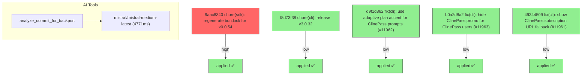

# Backport Agent — Detailed Run Report

> This file is generated automatically. It is intended for human analysts and
> AI reasoning models to assess agent performance, decision quality, and LLM behavior.

**Run timestamp**: 2026-07-06T16:33:39.180Z
**Models used**: fast=`mistral/mistral-code-agent-latest`  powerful=`mistral/mistral-medium-latest`
**Prompt log**: `/Users/rlemeill/Development/tea-ching-cline/.backport-agent/run-1783355199045.prompts.jsonl`

---

## Summary (PR body)

## Backport Agent — Sync Report

**Date**: 2026-07-06T16:33:39.180Z
**Upstream ref**: `main`
**Cut date**: `2026-06-27T00:00:00.000Z` 
**Fork ref**: `keypool-live`
**Sync branch**: `sync/upstream-main-2026-07-06-162803`

### Summary

- ✅ Applied: 5
- ⚠️ Needs human review: 0
- ⛔ Blocked (not attempted): 0

### Applied commits

- `9aac8340` [high] chore(sdk): regenerate bun.lock for v0.0.54
- `f8d73f38` [low] chore(cli): release v3.0.32
- `d9f1d862` [low] fix(cli): use adaptive plan accent for ClinePass prompts (#11962)
- `b0a2d8a2` [low] fix(cli): hide ClinePass promo for ClinePass users (#11963)
- `49344509` [low] fix(cli): show ClinePass subscription URL fallback (#11961)

### Agent decision log

- All commits were successfully cherry-picked without conflicts.
- Validation tests passed for all risk levels.


---

## Agent Workflow Diagram

> Generated by the fast model from the run summary. Evaluate the agent's decision path.



---

## AI Sub-Agent Call Log (1 call)

> Each entry is one sub-agent invocation. Review prompt/response pairs to assess
> reasoning quality, hallucinations, and decision accuracy.

### Call 1 / 1 — `analyze_commit_for_backport` ✅ OK

| Field | Value |
|---|---|
| **Timestamp** | 2026-07-06T16:28:02.652Z |
| **Tool** | `analyze_commit_for_backport` |
| **Model** | `mistral/mistral-medium-latest` |
| **Duration** | 4771 ms |
| **Tokens in** | 19860 |
| **Tokens out** | 103 |
| **Cost** | $0.000000 |

**Prompt sent to sub-agent:**

```
Commit SHA: 9aac8340dc2932d14038a801eb5da3e318bf72d5
Commit message:
chore(sdk): regenerate bun.lock for v0.0.54

Changed files (1):
bun.lock

Diff:
commit 9aac8340dc2932d14038a801eb5da3e318bf72d5
Author: Saoud Rizwan <7799382+saoudrizwan@users.noreply.github.com>
Date:   Sun Jun 28 21:24:41 2026 -0700

    chore(sdk): regenerate bun.lock for v0.0.54
    
    Align resolved workspace versions in bun.lock with the v0.0.54 package
    bumps. bun pm pack substitutes workspace:* deps using the version
    recorded in bun.lock, so a stale lock made packed inter-package deps
    resolve to 0.0.53, failing check-publish and the node smoke test (which
    then pulled the old published @cline/shared from npm).
---
 bun.lock | 326 +++++++++++++++++++++++++++------------------------------------
 1 file changed, 138 insertions(+), 188 deletions(-)

diff --git a/bun.lock b/bun.lock
index bc1b22869c..0039da6763 100644
--- a/bun.lock
+++ b/bun.lock
@@ -19,7 +19,7 @@
     },
     "apps/cli": {
       "name": "@cline/cli",
-      "version": "3.0.30",
+      "version": "3.0.31",
       "bin": {
         "cline": "src/index.ts",
       },
@@ -616,7 +616,7 @@
     },
     "sdk/packages/agents": {
       "name": "@cline/agents",
-      "version": "0.0.53",
+      "version": "0.0.54",
       "dependencies": {
         "@cline/llms": "workspace:*",
         "@cline/shared": "workspace:*",
@@ -625,7 +625,7 @@
     },
     "sdk/packages/core": {
       "name": "@cline/core",
-      "version": "0.0.53",
+      "version": "0.0.54",
       "dependencies": {
         "@cline/agents": "workspace:*",
         "@cline/llms": "workspace:*",
@@ -663,7 +663,7 @@
     },
     "sdk/packages/llms": {
       "name": "@cline/llms",
-      "version": "0.0.53",
+      "version": "0.0.54",
       "dependencies": {
         "@ai-sdk/amazon-bedrock": "^4.0.89",
         "@ai-sdk/anthropic": "^3.0.68",
@@ -697,14 +697,14 @@
     },
     "sdk/packages/sdk": {
       "name": "@cline/sdk",
-      "version": "0.0.53",
+      "version": "0.0.54",
       "dependencies": {
         "@cline/core": "workspace:*",
       },
     },
     "sdk/packages/shared": {
       "name": "@cline/shared",
-      "version": "0.0.53",
+      "version": "0.0.54",
       "dependencies": {
         "aws4fetch": "^1.0.20",
         "jsonrepair": "^3.13.2",
@@ -769,23 +769,23 @@
 
     "@antfu/install-pkg": ["@antfu/install-pkg@1.1.0", "", { "dependencies": { "package-manager-detector": "^1.3.0", "tinyexec": "^1.0.1" } }, "sha512-MGQsmw10ZyI+EJo45CdSER4zEb+p31LpDAFp2Z3gkSd1yqVZGi0Ebx++YTEMonJy4oChEMLsxZ64j8FH6sSqtQ=="],
 
-    "@anthropic-ai/claude-agent-sdk": ["@anthropic-ai/claude-agent-sdk@0.3.183", "", { "optionalDependencies": { "@anthropic-ai/claude-agent-sdk-darwin-arm64": "0.3.183", "@anthropic-ai/claude-agent-sdk-darwin-x64": "0.3.183", "@anthropic-ai/claude-agent-sdk-linux-arm64": "0.3.183", "@anthropic-ai/claude-agent-sdk-linux-arm64-musl": "0.3.183", "@anthropic-ai/claude-agent-sdk-linux-x64": "0.3.183", "@anthropic-ai/claude-agent-sdk-linux-x64-musl": "0.3.183", "@anthropic-ai/claude-agent-sdk-win32-arm64": "0.3.183", "@anthropic-ai/claude-agent-sdk-win32-x64": "0.3.183" }, "peerDependencies": { "@anthropic-ai/sdk": ">=0.93.0", "@modelcontextprotocol/sdk": "^1.29.0", "zod": "^4.0.0" } }, "sha512-rAKws76RKdFu+DK5q9wYN0AGLRdPrw0vGd+TMzSFynFdxwUAehYc9vUKJoK27j2xRoHFdNt+JDsih5BzsUzi+Q=="],
+    "@anthropic-ai/claude-agent-sdk": ["@anthropic-ai/claude-agent-sdk@0.3.185", "", { "optionalDependencies": { "@anthropic-ai/claude-agent-sdk-darwin-arm64": "0.3.185", "@anthropic-ai/claude-agent-sdk-darwin-x64": "0.3.185", "@anthropic-ai/claude-agent-sdk-linux-arm64": "0.3.185", "@anthropic-ai/claude-agent-sdk-linux-arm64-musl": "0.3.185", "@anthropic-ai/claude-agent-sdk-linux-x64": "0.3.185", "@anthropic-ai/claude-agent-sdk-linux-x64-musl": "0.3.185", "@anthropic-ai/claude-agent-sdk-win32-arm64": "0.3.185", "@anthropic-ai/claude-agent-sdk-win32-x64": "0.3.185" }, "peerDependencies": { "@anthropic-ai/sdk": ">=0.93.0", "@modelcontextprotocol/sdk": "^1.29.0", "zod": "^4.0.0" } }, "sha512-UDDd0cInvOufmR88btR/Ursnh71sb5scoutNlRS2L0LBdkt7JEqYJ0jt7DnOYHEVhMx8AAcg0eYgvXztcWUnFA=="],
 
-    "@anthropic-ai/claude-agent-sdk-darwin-arm64": ["@anthropic-ai/claude-agent-sdk-darwin-arm64@0.3.183", "", { "os": "darwin", "cpu": "arm64" }, "sha512-o/+sxwKgXuw6RG5cERWjvcvL1CDSPe/TaXMhax+dq+V4lDOI5iTqg3y5Wfb6dL3xlWoTA2OhWowDQllKbE04LQ=="],
+    "@anthropic-ai/claude-agent-sdk-darwin-arm64": ["@anthropic-ai/claude-agent-sdk-darwin-arm64@0.3.185", "", { "os": "darwin", "cpu": "arm64" }, "sha512-P2Svxx1IFrS9aw4ylJBtcoJrc/OAOVnDs+o05x4TV7HoHUQUcKZ9XhWOGnadyVT0KLyoktgjyjnaK7Zdtc0Ldg=="],
 
-    "@anthropic-ai/claude-agent-sdk-darwin-x64": ["@anthropic-ai/claude-agent-sdk-darwin-x64@0.3.183", "", { "os": "darwin", "cpu": "x64" }, "sha512-V7Cf8JeD5EPf4MPomFUlEblCIQI0wg+aWdOSqvfMsDmCBEHljd52CQ3a7W263oVt6I7QUfRTpX2KNvdma56rDA=="],
+    "@anthropic-ai/claude-agent-sdk-darwin-x64": ["@anthropic-ai/claude-agent-sdk-darwin-x64@0.3.185", "", { "os": "darwin", "cpu": "x64" }, "sha512-H69m2hIJawzSkCDNO/CPLQCYvDGdlbZdzGTgGF8/IQuB4O81sv8WSAh6TBXwtFXOgEi4HtrUYlxiFDmTHt7hMA=="],
 
-    "@anthropic-ai/claude-agent-sdk-linux-arm64": ["@anthropic-ai/claude-agent-sdk-linux-arm64@0.3.183", "", { "os": "linux", "cpu": "arm64" }, "sha512-qqnSf85D3uBH7kRHLGOMhr7aQrREUZ4hUlCztrkJe/twUT4bmJsO86zamnAf7vOYeCul/sHYwBMmXtOfI+cHZg=="],
+    "@anthropic-ai/claude-agent-sdk-linux-arm64": ["@anthropic-ai/claude-agent-sdk-linux-arm64@0.3.185", "", { "os": "linux", "cpu": "arm64" }, "sha512-KtXMCoprGYTSPb/A0/kjrO+PpDJAFbHhDd8rjqA4izU51OYjTDkahsGCcSTFM2jA8krOhPqzx/SNVuAVWmexwA=="],
 
-    "@anthropic-ai/claude-agent-sdk-linux-arm64-musl": ["@anthropic-ai/claude-agent-sdk-linux-arm64-musl@0.3.183", "", { "os": "linux", "cpu": "arm64" }, "sha512-ua6XaiCcYYKfd0CY9cjoyYnTQWI2GocpbP7Gwvmr+9taW/lTpQGVQH3FrF2VFKXVSt7AaVE6Z7WN9oPxcxl3VA=="],
+    "@anthropic-ai/claude-agent-sdk-linux-arm64-musl": ["@anthropic-ai/claude-agent-sdk-linux-arm64-musl@0.3.185", "", { "os": "linux", "cpu": "arm64" }, "sha512-1GRpKYrg5foomW+qLrxm/k2R/5PEU7RAuEdX65HV6lFMJR3HsGj8qfBq4KCJHTS3r4YdVrFLvPQ/mUqbY6klIA=="],
 
-    "@anthropic-ai/claude-agent-sdk-linux-x64": ["@anthropic-ai/claude-agent-sdk-linux-x64@0.3.183", "", { "os": "linux", "cpu": "x64" }, "sha512-GvfNp9XsKWFvr0EH3NgX2pqzHPYhFeqhOmVc4A+2e+GdxBMYUEa0ylfPLJItahQU9FkTJAw2oQNnzTHPPm1GxA=="],
+    "@anthropic-ai/claude-agent-sdk-linux-x64": ["@anthropic-ai/claude-agent-sdk-linux-x64@0.3.185", "", { "os": "linux", "cpu": "x64" }, "sha512-8U5wu6dNcyzRkwoae0Gu5ZHs6lRSu8CXqd9yrilX3fHR9kKICrm76bLu5q2auuSc/8dx6VL5ZXqSzFKIMp//zw=="],
 
-    "@anthropic-ai/claude-agent-sdk-linux-x64-musl": ["@anthropic-ai/claude-agent-sdk-linux-x64-musl@0.3.183", "", { "os": "linux", "cpu": "x64" }, "sha512-wp+p+4xeZOW+h4InMKR7nIdGlgYftXyR+ErOVz7i2tMRcKuYMoc5jRIYjdJkuETMSr5nsRj0rDeO5gG7M6MGZQ=="],
+    "@anthropic-ai/claude-agent-sdk-linux-x64-musl": ["@anthropic-ai/claude-agent-sdk-linux-x64-musl@0.3.185", "", { "os": "linux", "cpu": "x64" }, "sha512-YAky0Oez+YYrlcas/xDiaCm9AUX0z1YwM+pnk+CFxEr/ICmc7MbiFsnEIXFLPHaox9bE5iOzw4LS4b/c1tIJRg=="],
 
-    "@anthropic-ai/claude-agent-sdk-win32-arm64": ["@anthropic-ai/claude-agent-sdk-win32-arm64@0.3.183", "", { "os": "win32", "cpu": "arm64" }, "sha512-cGyMC9YDsrCQ4av74dMVa2liOb5oLFX4+1SxwJGRCW7mBVBazcM6rg7ifWbd9XfkDhNPKOIfyiloipyMfoaE4g=="],
+    "@anthropic-ai/claude-agent-sdk-win32-arm64": ["@anthropic-ai/claude-agent-sdk-win32-arm64@0.3.185", "", { "os": "win32", "cpu": "arm64" }, "sha512-pJEOaCLQQQWSyBeseR/GAn4eEp4WtMDP/o5yPMuuAsNWeoJXM7cY4j/N3KBE6GZofgnYdWEXILF2uw3SjbtINA=="],
 
-    "@anthropic-ai/claude-agent-sdk-win32-x64": ["@anthropic-ai/claude-agent-sdk-win32-x64@0.3.183", "", { "os": "win32", "cpu": "x64" }, "sha512-h/XzbrSmXGroTk/FYKR6J4/8G9vDb1HUUUeNXeBGqGW1kppIiWPJKLRzjtSe0brVjADOKOT6tE5IHK0mV/1gBw=="],
+    "@anthropic-ai/claude-agent-sdk-win32-x64": ["@anthropic-ai/claude-agent-sdk-win32-x64@0.3.185", "", { "os": "win32", "cpu": "x64" }, "sha512-/Kf9XneSuIkSHNwrxOVY0XT7RovAEcx5nDASKzku4994cZz54otU5mT2jT6dwevDLEStfgts5x/A4z0AePwVTQ=="],
 
     "@anthropic-ai/sdk": ["@anthropic-ai/sdk@0.37.0", "", { "dependencies": { "@types/node": "^18.11.18", "@types/node-fetch": "^2.6.4", "abort-controller": "^3.0.0", "agentkeepalive": "^4.2.1", "form-data-encoder": "1.7.2", "formdata-node": "^4.3.2", "node-fetch": "^2.6.7" } }, "sha512-tHjX2YbkUBwEgg0JZU3EFSSAQPoK4qQR/NFYa8Vtzd5UAyXzZksCw2In69Rml4R/TyHPBfRYaLK35XiOe33pjw=="],
 
@@ -1051,9 +1051,9 @@
 
     "@discordjs/ws": ["@discordjs/ws@1.2.3", "", { "dependencies": { "@discordjs/collection": "^2.1.0", "@discordjs/rest": "^2.5.1", "@discordjs/util": "^1.1.0", "@sapphire/async-queue": "^1.5.2", "@types/ws": "^8.5.10", "@vladfrangu/async_event_emitter": "^2.2.4", "discord-api-types": "^0.38.1", "tslib": "^2.6.2", "ws": "^8.17.0" } }, "sha512-wPlQDxEmlDg5IxhJPuxXr3Vy9AjYq5xCvFWGJyD7w7Np8ZGu+Mc+97LCoEc/+AYCo2IDpKioiH0/c/mj5ZR9Uw=="],
 
-    "@dotenvx/dotenvx": ["@dotenvx/dotenvx@1.74.3", "", { "dependencies": { "commander": "^11.1.0", "conf": "^10.2.0", "dotenv": "^17.2.1", "eciesjs": "^0.4.10", "enquirer": "^2.4.1", "env-paths": "^2.2.1", "execa": "^5.1.1", "fdir": "^6.2.0", "ignore": "^5.3.0", "object-treeify": "1.1.33", "open": "^8.4.2", "picomatch": "^4.0.4", "systeminformation": "^5.22.11", "undici": "^7.11.0", "which": "^4.0.0", "yocto-spinner": "^1.1.0" }, "bin": { "dotenvx": "src/cli/dotenvx.js" } }, "sha512-+VjTIiOCApjB0K4a41+SkN18gTetmhU9UN2JD8LHeNUqo/38FmtgvdtWsW/WWN1dyYRGS7XKeAAb/ruy7x1tRw=="],
+    "@dotenvx/dotenvx": ["@dotenvx/dotenvx@1.75.1", "", { "dependencies": { "@dotenvx/primitives": "^0.8.0", "commander": "^11.1.0", "conf": "^10.2.0", "dotenv": "^17.2.1", "enquirer": "^2.4.1", "env-paths": "^2.2.1", "execa": "^5.1.1", "fdir": "^6.2.0", "ignore": "^5.3.0", "object-treeify": "1.1.33", "open": "^8.4.2", "picomatch": "^4.0.4", "systeminformation": "^5.22.11", "undici": "^7.11.0", "which": "^4.0.0", "yocto-spinner": "^1.1.0" }, "bin": { "dotenvx": "src/cli/dotenvx.js" } }, "sha512-/BITOC9dmS/edY2zQwZNicQ059O6RKabtQfyEafV0nGtfYRNHYy1DIPiYVcov40+tob9hfmBnbR963dS+EQ1DQ=="],
 
-    "@ecies/ciphers": ["@ecies/ciphers@0.2.6", "", { "peerDependencies": { "@noble/ciphers": "^1.0.0" } }, "sha512-patgsRPKGkhhoBjETV4XxD0En4ui5fbX0hzayqI3M8tvNMGUoUvmyYAIWwlxBc1KX5cturfqByYdj5bYGRpN9g=="],
+    "@dotenvx/primitives": ["@dotenvx/primitives@0.8.0", "", {}, "sha512-VYJy0uhFm9zTJ1TxBaW/pA8bjbOM/OttaNMwZ1RHG4JKyRG7DhSdiqD1ipQoAyoD22olUtxbP78W9xY3Wd11bg=="],
 
     "@emnapi/core": ["@emnapi/core@1.10.0", "", { "dependencies": { "@emnapi/wasi-threads": "1.2.1", "tslib": "^2.4.0" } }, "sha512-yq6OkJ4p82CAfPl0u9mQebQHKPJkY7WrIuk205cTYnYe+k2Z8YBh11FrbRG/H6ihirqcacOgl2BIO8oyMQLeXw=="],
 
@@ -1643,12 +1643,6 @@
 
     "@next/swc-win32-x64-msvc": ["@next/swc-win32-x64-msvc@16.2.6", "", { "os": "win32", "cpu": "x64" }, "sha512-F0+4i0h9J6C4eE3EAPWsoCk7UW/dbzOjyzxY0qnDUOYFu6FFmdZ6l97/XdV3/Nz3VYyO7UWjyEJUXkGqcoXfMA=="],
 
-    "@noble/ciphers": ["@noble/ciphers@1.3.0", "", {}, "sha512-2I0gnIVPtfnMw9ee9h1dJG7tp81+8Ob3OJb3Mv37rx5L40/b0i7djjCVvGOVqc9AEIQyvyu1i6ypKdFw8R8gQw=="],
-
-    "@noble/curves": ["@noble/curves@1.9.7", "", { "dependencies": { "@noble/hashes": "1.8.0" } }, "sha512-gbKGcRUYIjA3/zCCNaWDciTMFI0dCkvou3TL8Zmy5Nc7sJ47a0jtOeZoTaMxkuqRo9cRhjOdZJXegxYE5FN/xw=="],
-
-    "@noble/hashes": ["@noble/hashes@1.8.0", "", {}, "sha512-jCs9ldd7NwzpgXDIf6P3+NrHh9/sD6CQdxHyjQI+h/6rDNo88ypBxxz45UDuZHz9r3tNz7N/VInSVoVdtXEI4A=="],
-
     "@nodable/entities": ["@nodable/entities@2.2.0", "", {}, "sha512-9uGyhaQavEUMC8AIddIjau4NsnsXhou+j5sBAGojCM1oxmQpVKTWR/9JxABD6UAv12vpIms55fPZKFQEhG6uBg=="],
 
     "@nodelib/fs.scandir": ["@nodelib/fs.scandir@2.1.5", "", { "dependencies": { "@nodelib/fs.stat": "2.0.5", "run-parallel": "^1.1.9" } }, "sha512-vq24Bq3ym5HEQm2NKCr3yXDwjc7vTsEThRDnkp2DK9p1uqLR+DHurm/NOTo0KG7HYHU7eppKZj3MyqYuMBf62g=="],
@@ -1671,7 +1665,7 @@
 
     "@openai/codex-win32-x64": ["@openai/codex@0.130.0-win32-x64", "", { "os": "win32", "cpu": "x64" }, "sha512-FzMznm7fr5/nbjZgOujZ9Y9AbdGm7ji1FOoWiY3U+srqauvZaTgn6o6aCheSL7kuymu7nTLOO/cAyWV6NuesqQ=="],
 
-    "@opencode-ai/sdk": ["@opencode-ai/sdk@1.17.8", "", { "dependencies": { "cross-spawn": "7.0.6" } }, "sha512-6MKmsj2ujZyL44jy+12dpwWYDYKPS9fUr+0wVQxaIlPYQ/eAt8T8T3QrybplJ5ZtHfZUX+esXZ02x2UYYm7oEw=="],
+    "@opencode-ai/sdk": ["@opencode-ai/sdk@1.17.9", "", { "dependencies": { "cross-spawn": "7.0.6" } }, "sha512-MHmXEpGPHkg14v1p+cUlIOUxd6DQdSElfau9nqY7tcDI0x5r4Y8D0dKXcyAh0Gc73ptaGW67Vg84nkcV6O27Pw=="],
 
     "@opentelemetry/api": ["@opentelemetry/api@1.9.1", "", {}, "sha512-gLyJlPHPZYdAk1JENA9LeHejZe1Ti77/pTeFm/nMXmQH/HFZlcS/O2XJB+L8fkbrNSqhdtlvjBVjxwUYanNH5Q=="],
 
@@ -1809,7 +1803,7 @@
 
     "@radix-ui/react-collection": ["@radix-ui/react-collection@1.1.7", "", { "dependencies": { "@radix-ui/react-compose-refs": "1.1.2", "@radix-ui/react-context": "1.1.2", "@radix-ui/react-primitive": "2.1.3", "@radix-ui/react-slot": "1.2.3" }, "peerDependencies": { "@types/react": "*", "@types/react-dom": "*", "react": "^16.8 || ^17.0 || ^18.0 || ^19.0 || ^19.0.0-rc", "react-dom": "^16.8 || ^17.0 || ^18.0 || ^19.0 || ^19.0.0-rc" }, "optionalPeers": ["@types/react", "@types/react-dom"] }, "sha512-Fh9rGN0MoI4ZFUNyfFVNU4y9LUz93u9/0K+yLgA2bwRojxM8JU1DyvvMBabnZPBgMWREAJvU2jjVzq+LrFUglw=="],
 
-    "@radix-ui/react-compose-refs": ["@radix-ui/react-compose-refs@1.1.3", "", { "peerDependencies": { "@types/react": "*", "react": "^16.8 || ^17.0 || ^18.0 || ^19.0 || ^19.0.0-rc" }, "optionalPeers": ["@types/react"] }, "sha512-rYOP8OMnuuPMQF1uhPVlGNcCDlkokKqGFE3JcxFViIkAXP7EvFWUliJAstrapypaBLJNHbZL6jGhbVDGTwmVhA=="],
+    "@radix-ui/react-compose-refs": ["@radix-ui/react-compose-refs@1.1.2", "", { "peerDependencies": { "@types/react": "*", "react": "^16.8 || ^17.0 || ^18.0 || ^19.0 || ^19.0.0-rc" }, "optionalPeers": ["@types/react"] }, "sha512-z4eqJvfiNnFMHIIvXP3CY57y2WJs5g2v3X0zm9mEJkrkNv4rDxu+sg9Jh8EkXyeqBkB7SOcboo9dMVqhyrACIg=="],
 
     "@radix-ui/react-context": ["@radix-ui/react-context@1.1.2", "", { "peerDependencies": { "@types/react": "*", "react": "^16.8 || ^17.0 || ^18.0 || ^19.0 || ^19.0.0-rc" }, "optionalPeers": ["@types/react"] }, "sha512-jCi/QKUM2r1Ju5a3J64TH2A5SpKAgh0LpknyqdQ4m6DCV0xJ2HG1xARRwNGPQfi1SLdLWZ1OJz6F4OMBBNiGJA=="],
 
@@ -1831,7 +1825,7 @@
 
     "@radix-ui/react-hover-card": ["@radix-ui/react-hover-card@1.1.15", "", { "dependencies": { "@radix-ui/primitive": "1.1.3", "@radix-ui/react-compose-refs": "1.1.2", "@radix-ui/react-context": "1.1.2", "@radix-ui/react-dismissable-layer": "1.1.11", "@radix-ui/react-popper": "1.2.8", "@radix-ui/react-portal": "1.1.9", "@radix-ui/react-presence": "1.1.5", "@radix-ui/react-primitive": "2.1.3", "@radix-ui/react-use-controllable-state": "1.2.2" }, "peerDependencies": { "@types/react": "*", "@types/react-dom": "*", "react": "^16.8 || ^17.0 || ^18.0 || ^19.0 || ^19.0.0-rc", "react-dom": "^16.8 || ^17.0 || ^18.0 || ^19.0 || ^19.0.0-rc" }, "optionalPeers": ["@types/react", "@types/react-dom"] }, "sha512-qgTkjNT1CfKMoP0rcasmlH2r1DAiYicWsDsufxl940sT2wHNEWWv6FMWIQXWhVdmC1d/HYfbhQx60KYyAtKxjg=="],
 
-    "@radix-ui/react-id": ["@radix-ui/react-id@1.1.2", "", { "dependencies": { "@radix-ui/react-use-layout-effect": "1.1.2" }, "peerDependencies": { "@types/react": "*", "react": "^16.8 || ^17.0 || ^18.0 || ^19.0 || ^19.0.0-rc" }, "optionalPeers": ["@types/react"] }, "sha512-orBC88futVpqCmhX1p4cvquNHsELQ+w+vBJnuj3ftETI5bJb0bZn3Tqu3SWN2IOcPycTnMGnhwoermvISt72sA=="],
+    "@radix-ui/react-id": ["@radix-ui/react-id@1.1.1", "", { "dependencies": { "@radix-ui/react-use-layout-effect": "1.1.1" }, "peerDependencies": { "@types/react": "*", "react": "^16.8 || ^17.0 || ^18.0 || ^19.0 || ^19.0.0-rc" }, "optionalPeers": ["@types/react"] }, "sha512-kGkGegYIdQsOb4XjsfM97rXsiHaBwco+hFI66oO4s9LU+PLAC5oJ7khdOVFxkhsmlbpUqDAvXw11CluXP+jkHg=="],
 
     "@radix-ui/react-label": ["@radix-ui/react-label@2.1.8", "", { "dependencies": { "@radix-ui/react-primitive": "2.1.4" }, "peerDependencies": { "@types/react": "*", "@types/react-dom": "*", "react": "^16.8 || ^17.0 || ^18.0 || ^19.0 || ^19.0.0-rc", "react-dom": "^16.8 || ^17.0 || ^18.0 || ^19.0 || ^19.0.0-rc" }, "optionalPeers": ["@types/react", "@types/react-dom"] }, "sha512-FmXs37I6hSBVDlO4y764TNz1rLgKwjJMQ0EGte6F3Cb3f4bIuHB/iLa/8I9VKkmOy+gNHq8rql3j686ACVV21A=="],
 
@@ -1853,7 +1847,7 @@
 
     "@radix-ui/react-presence": ["@radix-ui/react-presence@1.1.5", "", { "dependencies": { "@radix-ui/react-compose-refs": "1.1.2", "@radix-ui/react-use-layout-effect": "1.1.1" }, "peerDependencies": { "@types/react": "*", "@types/react-dom": "*", "react": "^16.8 || ^17.0 || ^18.0 || ^19.0 || ^19.0.0-rc", "react-dom": "^16.8 || ^17.0 || ^18.0 || ^19.0 || ^19.0.0-rc" }, "optionalPeers": ["@types/react", "@types/react-dom"] }, "sha512-/jfEwNDdQVBCNvjkGit4h6pMOzq8bHkopq458dPt2lMjx+eBQUohZNG9A7DtO/O5ukSbxuaNGXMjHicgwy6rQQ=="],
 
-    "@radix-ui/react-primitive": ["@radix-ui/react-primitive@2.1.6", "", { "dependencies": { "@radix-ui/react-slot": "1.3.0" }, "peerDependencies": { "@types/react": "*", "@types/react-dom": "*", "react": "^16.8 || ^17.0 || ^18.0 || ^19.0 || ^19.0.0-rc", "react-dom": "^16.8 || ^17.0 || ^18.0 || ^19.0 || ^19.0.0-rc" }, "optionalPeers": ["@types/react", "@types/react-dom"] }, "sha512-wetd0QI77DbvrPpTAvH1SqOxsYF2wZe5TNxqwOd5Ty4XDpV3dpV0s8K/1MGMJBeY5o7lg8ub5VIt1Ub+yVen6g=="],
+    "@radix-ui/react-primitive": ["@radix-ui/react-primitive@2.1.4", "", { "dependencies": { "@radix-ui/react-slot": "1.2.4" }, "peerDependencies": { "@types/react": "*", "@types/react-dom": "*", "react": "^16.8 || ^17.0 || ^18.0 || ^19.0 || ^19.0.0-rc", "react-dom": "^16.8 || ^17.0 || ^18.0 || ^19.0 || ^19.0.0-rc" }, "optionalPeers": ["@types/react", "@types/react-dom"] }, "sha512-9hQc4+GNVtJAIEPEqlYqW5RiYdrr8ea5XQ0ZOnD6fgru+83kqT15mq2OCcbe8KnjRZl5vF3ks69AKz3kh1jrhg=="],
 
     "@radix-ui/react-progress": ["@radix-ui/react-progress@1.1.8", "", { "dependencies": { "@radix-ui/react-context": "1.1.3", "@radix-ui/react-primitive": "2.1.4" }, "peerDependencies": { "@types/react": "*", "@types/react-dom": "*", "react": "^16.8 || ^17.0 || ^18.0 || ^19.0 || ^19.0.0-rc", "react-dom": "^16.8 || ^17.0 || ^18.0 || ^19.0 || ^19.0.0-rc" }, "optionalPeers": ["@types/react", "@types/react-dom"] }, "sha512-+gISHcSPUJ7ktBy9RnTqbdKW78bcGke3t6taawyZ71pio1JewwGSJizycs7rLhGTvMJYCQB1DBK4KQsxs7U8dA=="],
 
@@ -2949,7 +2943,7 @@
 
     "character-reference-invalid": ["character-reference-invalid@2.0.1", "", {}, "sha512-iBZ4F4wRbyORVsu0jPV7gXkOsGYjGHPmAyv+HiHG8gi5PtC9KI2j1+v8/tlibRvjoWX027ypmG/n0HtO5t7unw=="],
 
-    "chardet": ["chardet@2.1.1", "", {}, "sha512-PsezH1rqdV9VvyNhxxOW32/d75r01NY7TQCmOqomRo15ZSOKbpTFVsfjghxo6JloQUCGnH4k1LGu0R4yCLlWQQ=="],
+    "chardet": ["chardet@2.2.0", "", {}, "sha512-rddelWYNPRrXq6PtNEN2S3f6t9ILzvqaN5pVgi4kqt9jHQaXIial9PznB5iSPVlQSLNaaH22ItWz3EJtQ10+OA=="],
 
     "chat": ["chat@4.31.0", "", { "dependencies": { "@workflow/serde": "4.1.0-beta.2", "mdast-util-to-string": "^4.0.0", "remark-gfm": "^4.0.0", "remark-parse": "^11.0.0", "remark-stringify": "^11.0.0", "remend": "^1.2.1", "unified": "^11.0.5" }, "peerDependencies": { "ai": "^6.0.182", "zod": "^3.0.0 || ^4.0.0" }, "optionalPeers": ["ai", "zod"] }, "sha512-F6oJq9JUraLFkITS96/NKgwZwBfZX8aOwOj5qMs5NNwnOGHrSXZ5+osK+EA4HjzfyUEDfFTNiOSmyzgtFLpuWg=="],
 
@@ -3263,8 +3257,6 @@
 
     "ecdsa-sig-formatter": ["ecdsa-sig-formatter@1.0.11", "", { "dependencies": { "safe-buffer": "^5.0.1" } }, "sha512-nagl3RYrbNv6kQkeJIpt6NJZy8twLB/2vtz6yN9Z4vRKHN4/QZJIEbqohALSgwKdnksuY3k5Addp5lg8sVoVcQ=="],
 
-    "eciesjs": ["eciesjs@0.4.18", "", { "dependencies": { "@ecies/ciphers": "^0.2.5", "@noble/ciphers": "^1.3.0", "@noble/curves": "^1.9.7", "@noble/hashes": "^1.8.0" } }, "sha512-wG99Zcfcys9fZux7Cft8BAX/YrOJLJSZ3jyYPfhZHqN2E+Ffx+QXBDsv3gubEgPtV6dTzJMSQUwk1H98/t/0wQ=="],
-
     "editions": ["editions@6.22.0", "", { "dependencies": { "version-range": "^4.15.0" } }, "sha512-UgGlf8IW75je7HZjNDpJdCv4cGJWIi6yumFdZ0R7A8/CIhQiWUjyGLCxdHpd8bmyD1gnkfUNK0oeOXqUS2cpfQ=="],
 
     "ee-first": ["ee-first@1.1.1", "", {}, "sha512-WMwm9LhRUo+WUaRN+vRuETqG89IgZphVSNkdFgeb6sS/E4OrDIN7t48CAewSHXc6C8lefD8KKfr5vY61brQlow=="],
@@ -3289,7 +3281,7 @@
 
     "end-of-stream": ["end-of-stream@1.4.5", "", { "dependencies": { "once": "^1.4.0" } }, "sha512-ooEGc6HP26xXq/N+GCGOT0JKCLDGrq2bQUZrQ7gyrJiZANJ/8YDTxTpQBXGMn+WbIQXNVpyWymm7KYVICQnyOg=="],
 
-    "enhanced-resolve": ["enhanced-resolve@5.24.0", "", { "dependencies": { "graceful-fs": "^4.2.4", "tapable": "^2.3.3" } }, "sha512-SkE2t82KlkkxQRVMVLAGKxLfORGQfrkx5dkj+vlgXRVNEdPc4eZcR+J/Fvj8C+yKSFH5L0q3NFlyufOVQnCcYQ=="],
+    "enhanced-resolve": ["enhanced-resolve@5.21.6", "", { "dependencies": { "graceful-fs": "^4.2.4", "tapable": "^2.3.3" } }, "sha512-aNnGCvbJ/RIyWo1IuhNdVjnNF+EjH9wpzpNHt+ci/m9He9LJvUN8wrCcXjp9cWsGNAuvSpVFTx/vraAFQ8qGjQ=="],
 
     "enquirer": ["enquirer@2.4.1", "", { "dependencies": { "ansi-colors": "^4.1.1", "strip-ansi": "^6.0.1" } }, "sha512-rRqJg/6gd538VHvR3PSrdRBb/1Vy2YfzHqzvbhGIQpDRKIa4FgV/54b5Q1xYSxOOwKvjXweS26E0Q+nAMwp2pQ=="],
 
@@ -3313,7 +3305,7 @@
 
     "es-set-tostringtag": ["es-set-tostringtag@2.1.0", "", { "dependencies": { "es-errors": "^1.3.0", "get-intrinsic": "^1.2.6", "has-tostringtag": "^1.0.2", "hasown": "^2.0.2" } }, "sha512-j6vWzfrGVfyXxge+O0x5sh6cvxAog0a/4Rdd2K36zCMV5eJ+/+tOAngRO8cODMNWbVRdVlmGZQL2YS3yR8bIUA=="],
 
-    "es-toolkit": ["es-toolkit@1.47.1", "", {}, "sha512-5RAqEwf4P4E17p+W75KLOWw/nOvKZzSQpxM32IpI2KZLaVonjTrZ0Ai5ghMaVI9eKC2p8eoQgcBdkEDgzFk6+Q=="],
+    "es-toolkit": ["es-toolkit@1.48.1", "", {}, "sha512-wfnXlwd5I75eXRtdD2vuEs50xHHESECDsGD7yiQnfFVNoa5522NwXEbmgo98LfiukSQHs+mBM7/YG3qKJB9/mQ=="],
 
     "esbuild": ["esbuild@0.27.7", "", { "optionalDependencies": { "@esbuild/aix-ppc64": "0.27.7", "@esbuild/android-arm": "0.27.7", "@esbuild/android-arm64": "0.27.7", "@esbuild/android-x64": "0.27.7", "@esbuild/darwin-arm64": "0.27.7", "@esbuild/darwin-x64": "0.27.7", "@esbuild/freebsd-arm64": "0.27.7", "@esbuild/freebsd-x64": "0.27.7", "@esbuild/linux-arm": "0.27.7", "@esbuild/linux-arm64": "0.27.7", "@esbuild/linux-ia32": "0.27.7", "@esbuild/linux-loong64": "0.27.7", "@esbuild/linux-mips64el": "0.27.7", "@esbuild/linux-ppc64": "0.27.7", "@esbuild/linux-riscv64": "0.27.7", "@esbuild/linux-s390x": "0.27.7", "@esbuild/linux-x64": "0.27.7", "@esbuild/netbsd-arm64": "0.27.7", "@esbuild/netbsd-x64": "0.27.7", "@esbuild/openbsd-arm64": "0.27.7", "@esbuild/openbsd-x64": "0.27.7", "@esbuild/openharmony-arm64": "0.27.7", "@esbuild/sunos-x64": "0.27.7", "@esbuild/win32-arm64": "0.27.7", "@esbuild/win32-ia32": "0.27.7", "@esbuild/win32-x64": "0.27.7" }, "bin": { "esbuild": "bin/esbuild" } }, "sha512-IxpibTjyVnmrIQo5aqNpCgoACA/dTKLTlhMHihVHhdkxKyPO1uBBthumT0rdHmcsk9uMonIWS0m4FljWzILh3w=="],
 
@@ -4159,7 +4151,7 @@
 
     "nano-css": ["nano-css@5.6.2", "", { "dependencies": { "@jridgewell/sourcemap-codec": "^1.4.15", "css-tree": "^1.1.2", "csstype": "^3.1.2", "fastest-stable-stringify": "^2.0.2", "inline-style-prefixer": "^7.0.1", "rtl-css-js": "^1.16.1", "stacktrace-js": "^2.0.2", "stylis": "^4.3.0" }, "peerDependencies": { "react": "*", "react-dom": "*" } }, "sha512-+6bHaC8dSDGALM1HJjOHVXpuastdu2xFoZlC77Jh4cg+33Zcgm+Gxd+1xsnpZK14eyHObSp82+ll5y3SX75liw=="],
 
-    "nanoid": ["nanoid@5.1.14", "", { "bin": { "nanoid": "bin/nanoid.js" } }, "sha512-5c8l8kVzqpnDPaicbEop/fV0Q1w16FmbWtVhMqugTozAwYdlIQojWH5a/M7UfziFmGdQRrUdV+EPzc9Xng3VAQ=="],
+    "nanoid": ["nanoid@5.1.15", "", { "bin": { "nanoid": "bin/nanoid.js" } }, "sha512-kBg3RpGtIe+RpTbyXwoI6pk5yD7KUiI3sygUqgeBMRst42KmhB4RZC7eiO9Wa1HIpaCCtpE2DJ6OI4Wi5ebwFw=="],
 
     "napi-build-utils": ["napi-build-utils@2.0.0", "", {}, "sha512-GEbrYkbfF7MoNaoh2iGG84Mnf/WZfB0GdGEsM8wz7Expx/LlWf5U8t9nvJKXSp3qr5IsEbK04cBGhol/KwOsWA=="],
 
@@ -4317,7 +4309,7 @@
 
     "path-exists": ["path-exists@4.0.0", "", {}, "sha512-ak9Qy5Q7jYb2Wwcey5Fpvg2KoAc/ZIhLSLOSBmRmygPsGwkVVt0fZa0qrtMz+m6tJTAHfZQ8FnmB4MG4LWy7/w=="],
 
-    "path-expression-matcher": ["path-expression-matcher@1.5.0", "", {}, "sha512-cbrerZV+6rvdQrrD+iGMcZFEiiSrbv9Tfdkvnusy6y0x0GKBXREFg/Y65GhIfm0tnLntThhzCnfKwp1WRjeCyQ=="],
+    "path-expression-matcher": ["path-expression-matcher@1.6.0", "", {}, "sha512-e5y7RCLHKjemsgQ4eqGJtPyr10ILz25HO7flzxhTV8bgvd5yHx98DGtCAtbVW9f2TqnYI/gEVZd+vz7snrdPTw=="],
 
     "path-is-absolute": ["path-is-absolute@1.0.1", "", {}, "sha512-AVbw3UJ2e9bq64vSaS9Am0fje1Pa8pbGqTTsmXfaIiMpnr5DlDhfJOuLj9Sf95ZPVDAUerDfEk88MPmPe7UCQg=="],
 
@@ -4465,7 +4457,7 @@
 
     "react-dom": ["react-dom@19.2.4", "", { "dependencies": { "scheduler": "^0.27.0" }, "peerDependencies": { "react": "^19.2.4" } }, "sha512-AXJdLo8kgMbimY95O2aKQqsz2iWi9jMgKJhRBAxECE4IFxfcazB2LmzloIoibJI3C12IlY20+KFaLv+71bUJeQ=="],
 
-    "react-hook-form": ["react-hook-form@7.79.0", "", { "peerDependencies": { "react": "^16.8.0 || ^17 || ^18 || ^19" } }, "sha512-mhYp/MTmXvzYX6AJcJVko0rktoIhhmRnEouObj4wF5i/tCttgJvnp1+9wRkpITZjDTqpo4IOSJqu0dBlPlV/Lw=="],
+    "react-hook-form": ["react-hook-form@7.80.0", "", { "peerDependencies": { "react": "^16.8.0 || ^17 || ^18 || ^19" } }, "sha512-4P+fk6oXsxY+6xSj7Euhc2sumQD8zQqCuVHoJwoyp9EchP+IUW9OESB7uHFJOKsIBQ4MQqYE84INJFqUCYNoOg=="],
 
     "react-is": ["react-is@18.3.1", "", {}, "sha512-/LLMVyas0ljjAtoYiPqYiL8VWXzUUdThrmU5+n20DZv+a+ClRoevUzw5JxU+Ieh5/c87ytoTBV9G1FiKfNJdmg=="],
 
@@ -4611,7 +4603,7 @@
 
     "rw": ["rw@1.3.3", "", {}, "sha512-PdhdWy89SiZogBLaw42zdeqtRJ//zFd2PgQavcICDUgJT5oW10QCRKbJ6bg4r0/UY2M6BWd5tkxuGFRvCkgfHQ=="],
 
-    "safe-buffer": ["safe-buffer@5.2.1", "", {}, "sha512-rp3So07KcdmmKbGvgaNxQSJr7bGVSVk5S9Eq1F+ppbRo70+YeaDxkw5Dd8NPN+GD6bjnYm2VuPuCXmpuYvmCXQ=="],
+    "safe-buffer": ["safe-buffer@5.1.2", "", {}, "sha512-Gd2UZBJDkXlY7GbJxfsE8/nvKkUEU1G38c1siN6QP6a9PT9MmHB8GnpscSmMJSoF8LOIrt8ud/wPtojys4G6+g=="],
 
     "safe-stable-stringify": ["safe-stable-stringify@2.5.0", "", {}, "sha512-b3rppTKm9T+PsVCBEOUR46GWI7fdOs00VKZ1+9c1EWDaDMvjQc6tUwuFyIprgGgTcWoVHSKrU8H31ZHA2e0RHA=="],
 
@@ -4799,7 +4791,7 @@
 
     "styled-jsx": ["styled-jsx@5.1.6", "", { "dependencies": { "client-only": "0.0.1" }, "peerDependencies": { "react": ">= 16.8.0 || 17.x.x || ^18.0.0-0 || ^19.0.0-0" } }, "sha512-qSVyDTeMotdvQYoHWLNGwRFJHC+i+ZvdBRYosOFgC+Wg1vx4frN2/RG/NA7SYqqvKNLf39P2LSRA2pu6n0XYZA=="],
 
-    "stylis": ["stylis@4.3.6", "", {}, "sha512-yQ3rwFWRfwNUY7H5vpU0wfdkNSnvnJinhF9830Swlaxl03zsOjCfmX0ugac+3LtK0lYSgwL/KXc8oYL3mG4YFQ=="],
+    "stylis": ["stylis@4.4.0", "", {}, "sha512-5Z9ZpRzfuH6l/UAvCPAPUo3665Nk2wLaZU3x+TLHKVzIz33+sbJqbtrYoC3KD4/uVOr2Zp+L0LySezP9OHV9yA=="],
 
     "supports-color": ["supports-color@10.2.2", "", {}, "sha512-SS+jx45GF1QjgEXQx4NJZV9ImqmO2NPz5FNsIHrsDjh2YsHnawpan7SNQ1o8NuhrbHZy9AZhIoCUiCeaW/C80g=="],
 
@@ -4811,9 +4803,9 @@
 
     "symbol-tree": ["symbol-tree@3.2.4", "", {}, "sha512-9QNk5KwDF+Bvz+PyObkmSYjI5ksVUYtjW7AU22r2NKcfLJcXp96hkDWU3+XndOsUb+AQ9QhfzfCT2O+CNWT5Tw=="],
 
-    "systeminformation": ["systeminformation@5.31.7", "", { "os": "!aix", "bin": { "systeminformation": "lib/cli.js" } }, "sha512-/8NC53e5nP9nmhn42/ncdOkyJnOoue/Vy+tJOyUGd1Yv66G069wK4rrziwhrqDETgk78CudTQupw5z19S5uoZw=="],
+    "systeminformation": ["systeminformation@5.31.8", "", { "os": "!aix", "bin": { "systeminformation": "lib/cli.js" } }, "sha512-/HGurKdgjYGbfwCPSokoX4WAlasVxuj1SnTukLiIYHPkjbDbN1PMATj8mkHpqkVzUF34y5ZyCY1TMKP32AI9rA=="],
 
-    "tabbable": ["tabbable@6.4.0", "", {}, "sha512-05PUHKSNE8ou2dwIxTngl4EzcnsCDZGJ/iCLtDflR/SHB/ny14rXc+qU5P4mG9JkusiV7EivzY9Mhm55AzAvCg=="],
+    "tabbable": ["tabbable@6.5.0", "", {}, "sha512-wieBHXygIm7OyQOu5hQlkk62/WyCFYGlWg7L6/ZCUZwx0o398Zkn4pVmMyfYhfMG8kGrj/Krt8eIk6UKC6VzwA=="],
 
     "table": ["table@6.9.0", "", { "dependencies": { "ajv": "^8.0.1", "lodash.truncate": "^4.4.2", "slice-ansi": "^4.0.0", "string-width": "^4.2.3", "strip-ansi": "^6.0.1" } }, "sha512-9kY+CygyYM6j02t5YFHbNz2FN5QmYGv9zAjVp4lCDjlCw7amdckXlEt/bjMhUIfj4ThGRE4gCUH5+yGnNuPo5A=="],
 
@@ -5257,8 +5249,6 @@
 
     "@heroui/use-is-mobile/@react-aria/ssr": ["@react-aria/ssr@3.9.10", "", { "dependencies": { "@swc/helpers": "^0.5.0" }, "peerDependencies": { "react": "^16.8.0 || ^17.0.0-rc.1 || ^18.0.0 || ^19.0.0-rc.1" } }, "sha512-hvTm77Pf+pMBhuBm760Li0BVIO38jv1IBws1xFm1NoL26PU+fe+FMW5+VZWyANR6nYL65joaJKZqOdTQMkO9IQ=="],
 
-    "@img/sharp-wasm32/@emnapi/runtime": ["@emnapi/runtime@1.11.1", "", { "dependencies": { "tslib": "^2.4.0" } }, "sha512-vgj7R3y3Wgx24IQaGPA/R6YFXLHVMOZ0uVEyIQPaWs+rd1AzfEMXlAC22FYwO1XkKR6NPsq7mUandH8oIRdZFw=="],
-
     "@jest/types/@jest/schemas": ["@jest/schemas@29.6.3", "", { "dependencies": { "@sinclair/typebox": "^0.27.8" } }, "sha512-mo5j5X+jIZmJQveBKeS/clAueipV7KgiX1vMgCxam1RNYiqE1w62n0/tJJnHtjW8ZHcQco5gY85jA3mi0L+nSA=="],
 
     "@jest/types/chalk": ["chalk@4.1.2", "", { "dependencies": { "ansi-styles": "^4.1.0", "supports-color": "^7.1.0" } }, "sha512-oKnbhFyRIXpUuez8iBMmyEa4nbj4IOQyuhc/wy9kY7/WVPcwIO9VA668Pu8RkO7+0G76SLROeyw9CpQ061i4mA=="],
@@ -5461,46 +5451,30 @@
 
     "@radix-ui/react-accessible-icon/@radix-ui/react-visually-hidden": ["@radix-ui/react-visually-hidden@1.2.6", "", { "dependencies": { "@radix-ui/react-primitive": "2.1.6" }, "peerDependencies": { "@types/react": "*", "@types/react-dom": "*", "react": "^16.8 || ^17.0 || ^18.0 || ^19.0 || ^19.0.0-rc", "react-dom": "^16.8 || ^17.0 || ^18.0 || ^19.0 || ^19.0.0-rc" }, "optionalPeers": ["@types/react", "@types/react-dom"] }, "sha512-jCE0WljWifTI4niIMCll06kGpsJTAPiZVU9H4WR1N6qW7At9ystHbN7dDB+we2xH535roFHj7qKS+RGj0FMDWQ=="],
 
-    "@radix-ui/react-accordion/@radix-ui/react-compose-refs": ["@radix-ui/react-compose-refs@1.1.2", "", { "peerDependencies": { "@types/react": "*", "react": "^16.8 || ^17.0 || ^18.0 || ^19.0 || ^19.0.0-rc" }, "optionalPeers": ["@types/react"] }, "sha512-z4eqJvfiNnFMHIIvXP3CY57y2WJs5g2v3X0zm9mEJkrkNv4rDxu+sg9Jh8EkXyeqBkB7SOcboo9dMVqhyrACIg=="],
-
-    "@radix-ui/react-accordion/@radix-ui/react-id": ["@radix-ui/react-id@1.1.1", "", { "dependencies": { "@radix-ui/react-use-layout-effect": "1.1.1" }, "peerDependencies": { "@types/react": "*", "react": "^16.8 || ^17.0 || ^18.0 || ^19.0 || ^19.0.0-rc" }, "optionalPeers": ["@types/react"] }, "sha512-kGkGegYIdQsOb4XjsfM97rXsiHaBwco+hFI66oO4s9LU+PLAC5oJ7khdOVFxkhsmlbpUqDAvXw11CluXP+jkHg=="],
-
     "@radix-ui/react-accordion/@radix-ui/react-primitive": ["@radix-ui/react-primitive@2.1.3", "", { "dependencies": { "@radix-ui/react-slot": "1.2.3" }, "peerDependencies": { "@types/react": "*", "@types/react-dom": "*", "react": "^16.8 || ^17.0 || ^18.0 || ^19.0 || ^19.0.0-rc", "react-dom": "^16.8 || ^17.0 || ^18.0 || ^19.0 || ^19.0.0-rc" }, "optionalPeers": ["@types/react", "@types/react-dom"] }, "sha512-m9gTwRkhy2lvCPe6QJp4d3G1TYEUHn/FzJUtq9MjH46an1wJU+GdoGC5VLof8RX8Ft/DlpshApkhswDLZzHIcQ=="],
 
     "@radix-ui/react-accordion/@radix-ui/react-use-controllable-state": ["@radix-ui/react-use-controllable-state@1.2.2", "", { "dependencies": { "@radix-ui/react-use-effect-event": "0.0.2", "@radix-ui/react-use-layout-effect": "1.1.1" }, "peerDependencies": { "@types/react": "*", "react": "^16.8 || ^17.0 || ^18.0 || ^19.0 || ^19.0.0-rc" }, "optionalPeers": ["@types/react"] }, "sha512-BjasUjixPFdS+NKkypcyyN5Pmg83Olst0+c6vGov0diwTEo6mgdqVR6hxcEgFuh4QrAs7Rc+9KuGJ9TVCj0Zzg=="],
 
-    "@radix-ui/react-alert-dialog/@radix-ui/react-compose-refs": ["@radix-ui/react-compose-refs@1.1.2", "", { "peerDependencies": { "@types/react": "*", "react": "^16.8 || ^17.0 || ^18.0 || ^19.0 || ^19.0.0-rc" }, "optionalPeers": ["@types/react"] }, "sha512-z4eqJvfiNnFMHIIvXP3CY57y2WJs5g2v3X0zm9mEJkrkNv4rDxu+sg9Jh8EkXyeqBkB7SOcboo9dMVqhyrACIg=="],
-
     "@radix-ui/react-alert-dialog/@radix-ui/react-primitive": ["@radix-ui/react-primitive@2.1.3", "", { "dependencies": { "@radix-ui/react-slot": "1.2.3" }, "peerDependencies": { "@types/react": "*", "@types/react-dom": "*", "react": "^16.8 || ^17.0 || ^18.0 || ^19.0 || ^19.0.0-rc", "react-dom": "^16.8 || ^17.0 || ^18.0 || ^19.0 || ^19.0.0-rc" }, "optionalPeers": ["@types/react", "@types/react-dom"] }, "sha512-m9gTwRkhy2lvCPe6QJp4d3G1TYEUHn/FzJUtq9MjH46an1wJU+GdoGC5VLof8RX8Ft/DlpshApkhswDLZzHIcQ=="],
 
     "@radix-ui/react-alert-dialog/@radix-ui/react-slot": ["@radix-ui/react-slot@1.2.3", "", { "dependencies": { 
... [truncated]

Output the JSON object now.
```

**Response received:**

```
{"summary": "Regenerates bun.lock to align workspace versions with v0.0.54 package bumps and dependency updates.", "keyChanges": ["Updates SDK package versions to 0.0.54", "Bumps multiple dependency versions", "Removes unused packages (e.g., @noble/ciphers)", "Adjusts dependency hashes"], "backportComplexity": "trivial", "semanticRiskFactors": [], "recommendation": "apply"}
```

---

## Performance Summary

**Total AI time**: 4771 ms across 1 call(s)
**Total input tokens**: 19860
**Total output tokens**: 103

| Tool | Calls | Total ms | Avg ms | Input tok | Output tok |
|---|---|---|---|---|---|
| `analyze_commit_for_backport` | 1 | 4771 | 4771 | 19860 | 103 |

## Decision Quality Metrics

> Automated quality signals derived from tool output guards, schema validation,
> hallucination detection, and consensus checks.  Review flagged items manually.

### Commit Analysis Quality

| Metric | Value |
|---|---|
| Total analyze calls | 1 |
| Commits with semantic risk factors | 0 |
| Possible hallucinated references (total) | 0 |

### Audit Event Timeline

| Timestamp | Tool | Event | Details |
|---|---|---|---|
| 16:28:02 | `analyze_commit_for_backport` | `analysis_complete` | sha="9aac8340dc2932d14038a801eb5da3e318bf72d, recommendation="apply", complexity="trivial" |
