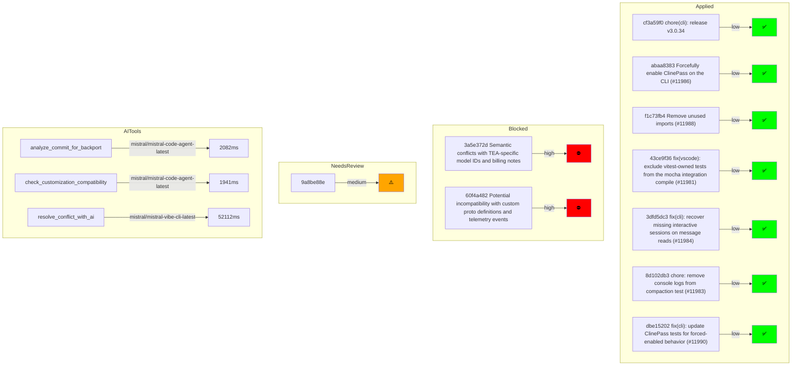

# Backport Agent — Detailed Run Report

> This file is generated automatically. It is intended for human analysts and
> AI reasoning models to assess agent performance, decision quality, and LLM behavior.

**Run timestamp**: 2026-07-06T17:36:06.301Z
**Models used**: fast=`mistral/mistral-code-agent-latest`  powerful=`mistral/mistral-medium-latest`
**Prompt log**: `/Users/rlemeill/Development/tea-ching-cline/.backport-agent/run-1783358630975.prompts.jsonl`

---

## Summary (PR body)

## Backport Agent — Sync Report

**Date**: 2026-07-06T17:36:06.301Z
**Upstream ref**: `cline/cline.git@main`
**Cut date**: `2026-06-27T00:00:00.000Z` 
**Fork ref**: `TEA-ching/cline@keypool-live`
**Sync branch**: `sync/upstream-main-2026-07-06-172456`

### Summary

- ✅ Applied: 7
- ⚠️ Needs human review: 1
- ⛔ Blocked (not attempted): 2

### Applied commits

- `cf3a59f0` [low] chore(cli): release v3.0.34
- `abaa8383` [low] Forcefully enable ClinePass on the CLI (#11986)
- `f1c73fb4` [low] Remove unused imports (#11988)
- `43ce9f36` [low] fix(vscode): exclude vitest-owned tests from the mocha integration compile (#11981)
- `3dfd5dc3` [low] fix(cli): recover missing interactive sessions on message reads (#11984)
- `8d102db3` [low] chore: remove console logs from compaction test (#11983)
- `dbe15202` [low] fix(cli): update ClinePass tests for forced-enabled behavior (#11990)

### ⚠️ Human review required

- `9a8be88e` fix(protos): self-heal protoc download when bun skips grpc-tools postinstall (#12003)
  - Conflicted files: apps/vscode/scripts/build-proto.mjs
  - AI resolution failed due to syntax issue

### Blocked commits (not attempted)

- `3a5e372d` [high] — Semantic conflicts with TEA-specific model IDs and billing notes
- `60f4a482` [high] — Potential incompatibility with custom proto definitions and telemetry events

### Agent decision log

- Blocked 3a5e372d73dd094573b20f4e77d31f200f0419f0 due to semantic conflicts with TEA-specific model IDs and billing notes
- Blocked 60f4a482cadd774a5afe91c1871427ae46c6519f due to potential incompatibility with custom proto definitions and telemetry events
- Aborted cherry-pick of 9a8be88e85ab96aaa9748420e1a775928972cb41 due to AI resolution failure


---

## Agent Workflow Diagram

> Generated by the fast model from the run summary. Evaluate the agent's decision path.



---

## AI Sub-Agent Call Log (5 calls)

> Each entry is one sub-agent invocation. Review prompt/response pairs to assess
> reasoning quality, hallucinations, and decision accuracy.

### Call 1 / 5 — `analyze_commit_for_backport` ✅ OK

| Field | Value |
|---|---|
| **Timestamp** | 2026-07-06T17:24:38.276Z |
| **Tool** | `analyze_commit_for_backport` |
| **Model** | `mistral/mistral-code-agent-latest` |
| **Duration** | 2082 ms |
| **Tokens in** | 4274 |
| **Tokens out** | 110 |
| **Cost** | $0.000000 |

**Prompt sent to sub-agent:**

````
Commit SHA: 3a5e372d73dd094573b20f4e77d31f200f0419f0
Commit message:
docs: document ClinePass API usage (#11980)

Changed files (1):
docs/getting-started/clinepass.mdx

Diff:
commit 3a5e372d73dd094573b20f4e77d31f200f0419f0
Author: Renee Huang <100229782+reneehuang1@users.noreply.github.com>
Date:   Mon Jun 29 10:59:02 2026 -0700

    docs: document ClinePass API usage (#11980)
    
    * docs: add MiniMax M3, Qwen3.7 Max, Qwen3.7 Plus models to ClinePass page
    
    * more updates
    
    * explicitly direct to personal org
    
    * making the clinepass page more detailed
    
    * updates to cline provider wording
    
    * docs: document ClinePass API usage
    
    * chore: discard McpHub change from PR
    
    * docs: simplify ClinePass model slug table
    
    * updates
    
    * nit
---
 docs/getting-started/clinepass.mdx | 51 +++++++++++++++++++++++++++-----------
 1 file changed, 37 insertions(+), 14 deletions(-)

diff --git a/docs/getting-started/clinepass.mdx b/docs/getting-started/clinepass.mdx
index a377ea9e4a..a3fc46b007 100644
--- a/docs/getting-started/clinepass.mdx
+++ b/docs/getting-started/clinepass.mdx
@@ -48,20 +48,43 @@ ClinePass is a separate provider from Cline (usage-billing). You can use both in
 ClinePass includes the following models, tested and benchmarked for coding agent use:
 
 | Model | Model ID |
-|-------|----------|
-| GLM-5.2 | `glm-5.2` |
-| Kimi K2.7 Code | `kimi-k2.7-code` |
-| Kimi K2.6 | `kimi-k2.6` |
-| DeepSeek V4 Pro | `deepseek-v4-pro` |
-| DeepSeek V4 Flash | `deepseek-v4-flash` |
-| MiMo-V2.5 | `mimo-v2.5` |
-| MiMo-V2.5-Pro | `mimo-v2.5-pro` |
-| MiniMax M3 | `minimax-m3` |
-| Qwen3.7 Max | `qwen3.7-max` |
-| Qwen3.7 Plus | `qwen3.7-plus` |
-
-
-### Reference pricing
+|-------|------------|
+| GLM-5.2 | `cline-pass/glm-5.2` |
+| Kimi K2.7 Code | `cline-pass/kimi-k2.7-code` |
+| Kimi K2.6 | `cline-pass/kimi-k2.6` |
+| DeepSeek V4 Pro | `cline-pass/deepseek-v4-pro` |
+| DeepSeek V4 Flash | `cline-pass/deepseek-v4-flash` |
+| MiMo-V2.5 | `cline-pass/mimo-v2.5` |
+| MiMo-V2.5-Pro | `cline-pass/mimo-v2.5-pro` |
+| MiniMax M3 | `cline-pass/minimax-m3` |
+| Qwen3.7 Max | `cline-pass/qwen3.7-max` |
+| Qwen3.7 Plus | `cline-pass/qwen3.7-plus` |
+
+## Using ClinePass outside of Cline
+
+You can use ClinePass models from your own scripts, apps, or automation through the Cline API. The API uses the same OpenAI-compatible Chat Completions format as the rest of Cline's API.
+
+To get started, create an API key from **Settings > API Keys** in [app.cline.bot](https://app.cline.bot). For the complete walkthrough, see the [Cline API Getting Started guide](/api/getting-started).
+
+Use the full ClinePass model slug in the `model` field:
+
+```bash
+export CLINE_API_KEY="your_api_key_here"
+
+curl -X POST https://api.cline.bot/api/v1/chat/completions \
+  -H "Authorization: Bearer $CLINE_API_KEY" \
+  -H "Content-Type: application/json" \
+  -d '{
+    "model": "cline-pass/qwen3.7-max",
+    "messages": [
+      {"role": "user", "content": "Write a TypeScript function that validates an email address."}
+    ],
+    "stream": false
+  }'
+```
+
+
+## Reference pricing
 
 ClinePass is a flat monthly subscription, so you are not charged the individual API prices below. These reference prices show the underlying per-1M-token rates for each model and can help you understand how usage is measured against your ClinePass quota (2-5x quota compares to paying standard api rate).

Output the JSON object now.
````

**Response received:**

````
```json
{
  "summary": "Updates ClinePass documentation with new model IDs (prefixed with 'cline-pass/') and adds API usage examples.",
  "keyChanges": [
    "Model IDs now include 'cline-pass/' prefix",
    "Added API usage section with curl example",
    "Clarified ClinePass as separate from Cline billing"
  ],
  "backportComplexity": "trivial",
  "semanticRiskFactors": [],
  "recommendation": "apply"
}
```
````

---

### Call 2 / 5 — `analyze_commit_for_backport` ✅ OK

| Field | Value |
|---|---|
| **Timestamp** | 2026-07-06T17:24:41.798Z |
| **Tool** | `analyze_commit_for_backport` |
| **Model** | `mistral/mistral-code-agent-latest` |
| **Duration** | 3475 ms |
| **Tokens in** | 7804 |
| **Tokens out** | 172 |
| **Cost** | $0.000000 |

**Prompt sent to sub-agent:**

```
Commit SHA: 60f4a482cadd774a5afe91c1871427ae46c6519f
Commit message:
Add onboarding intent telemetry (#11848)

Changed files (8):
apps/vscode/proto/cline/ui.proto
apps/vscode/src/core/controller/ui/trackIntent.ts
apps/vscode/src/extension.ts
apps/vscode/src/hosts/vscode/VscodeWebviewProvider.ts
apps/vscode/src/services/telemetry/TelemetryService.ts
apps/vscode/webview-ui/src/components/chat/chat-view/hooks/useMessageHandlers.test.tsx
apps/vscode/webview-ui/src/components/chat/chat-view/hooks/useMessageHandlers.ts
apps/vscode/webview-ui/src/components/menu/Navbar.tsx

Diff:
commit 60f4a482cadd774a5afe91c1871427ae46c6519f
Author: Ara <arafat.da.khan@gmail.com>
Date:   Tue Jun 30 14:19:51 2026 -0700

    Add onboarding intent telemetry (#11848)
    
    * Add onboarding intent telemetry
    
    * Track prompt submit intent from chat UI
---
 apps/vscode/proto/cline/ui.proto                   | 13 +++++++
 apps/vscode/src/core/controller/ui/trackIntent.ts  | 24 ++++++++++++
 apps/vscode/src/extension.ts                       |  1 +
 .../src/hosts/vscode/VscodeWebviewProvider.ts      |  3 ++
 .../src/services/telemetry/TelemetryService.ts     | 34 +++++++++++++++++
 .../chat-view/hooks/useMessageHandlers.test.tsx    | 44 ++++++++++++++++++++++
 .../chat/chat-view/hooks/useMessageHandlers.ts     | 27 ++++++++++++-
 .../webview-ui/src/components/menu/Navbar.tsx      |  9 ++++-
 8 files changed, 152 insertions(+), 3 deletions(-)

diff --git a/apps/vscode/proto/cline/ui.proto b/apps/vscode/proto/cline/ui.proto
index 8cf3793360..f1bcb82178 100644
--- a/apps/vscode/proto/cline/ui.proto
+++ b/apps/vscode/proto/cline/ui.proto
@@ -237,6 +237,16 @@ message ShowWebviewEvent {
   bool preserve_editor_focus = 1; // When true, webview should not steal focus from editor
 }
 
+message IntentEvent {
+  string action = 1;
+  string source = 2;
+  bool has_text = 3;
+  bool has_images = 4;
+  bool has_files = 5;
+  bool has_active_task = 6;
+  int32 text_length = 7;
+}
+
 // UiService provides methods for managing UI interactions
 service UiService {
   // Scrolls to a specific settings section in the settings view
@@ -292,4 +302,7 @@ service UiService {
 
   // Opens the Cline walkthrough
   rpc openWalkthrough(EmptyRequest) returns (Empty);
+
+  // Tracks intent signals before task creation or first model activity
+  rpc trackIntent(IntentEvent) returns (Empty);
 }
diff --git a/apps/vscode/src/core/controller/ui/trackIntent.ts b/apps/vscode/src/core/controller/ui/trackIntent.ts
new file mode 100644
index 0000000000..5f606ee01c
--- /dev/null
+++ b/apps/vscode/src/core/controller/ui/trackIntent.ts
@@ -0,0 +1,24 @@
+import { Empty } from "@shared/proto/cline/common"
+import type { IntentEvent } from "@shared/proto/cline/ui"
+import { telemetryService } from "@/services/telemetry"
+import type { Controller } from "../index"
+
+export async function trackIntent(_controller: Controller, request: IntentEvent): Promise<Empty> {
+	switch (request.action) {
+		case "new_task_clicked":
+			telemetryService.captureNewTaskClicked(request.source, request.hasActiveTask)
+			break
+		case "prompt_submitted":
+			telemetryService.capturePromptSubmitted({
+				source: request.source,
+				hasText: request.hasText,
+				hasImages: request.hasImages,
+				hasFiles: request.hasFiles,
+				hasActiveTask: request.hasActiveTask,
+				textLength: request.textLength,
+			})
+			break
+	}
+
+	return Empty.create({})
+}
diff --git a/apps/vscode/src/extension.ts b/apps/vscode/src/extension.ts
index 4df533bf74..641fb16f67 100644
--- a/apps/vscode/src/extension.ts
+++ b/apps/vscode/src/extension.ts
@@ -123,6 +123,7 @@ export async function activate(context: vscode.ExtensionContext) {
 	context.subscriptions.push(
 		vscode.commands.registerCommand(commands.PlusButton, async () => {
 			const sidebarInstance = WebviewProvider.getInstance()
+			telemetryService.captureNewTaskClicked("activity_bar_plus", !!sidebarInstance.controller.task)
 			await sidebarInstance.controller.clearTask()
 			await sidebarInstance.controller.postStateToWebview()
 			await sendChatButtonClickedEvent()
diff --git a/apps/vscode/src/hosts/vscode/VscodeWebviewProvider.ts b/apps/vscode/src/hosts/vscode/VscodeWebviewProvider.ts
index 6c79a5c2a6..d372e8c4ae 100644
--- a/apps/vscode/src/hosts/vscode/VscodeWebviewProvider.ts
+++ b/apps/vscode/src/hosts/vscode/VscodeWebviewProvider.ts
@@ -4,6 +4,7 @@ import * as vscode from "vscode"
 import { handleGrpcRequest, handleGrpcRequestCancel } from "@/core/controller/grpc-handler"
 import { HostProvider } from "@/hosts/host-provider"
 import { ExtensionRegistryInfo } from "@/registry"
+import { telemetryService } from "@/services/telemetry"
 import type { ExtensionMessage } from "@/shared/ExtensionMessage"
 import { Logger } from "@/shared/services/Logger"
 import { WebviewMessage } from "@/shared/WebviewMessage"
@@ -67,6 +68,7 @@ export class VscodeWebviewProvider extends WebviewProvider implements vscode.Web
 		// Sets up an event listener to listen for messages passed from the webview view context
 		// and executes code based on the message that is received
 		this.setWebviewMessageListener(webviewView.webview)
+		telemetryService.capturePanelOpened("sidebar_resolved")
 
 		// Logs show up in bottom panel > Debug Console
 		//Logger.log("registering listener")
@@ -80,6 +82,7 @@ export class VscodeWebviewProvider extends WebviewProvider implements vscode.Web
 		webviewView.onDidChangeVisibility(
 			async () => {
 				if (this.webview?.visible) {
+					telemetryService.capturePanelOpened("sidebar_visible")
 					// View becoming visible should not steal editor focus.
 					await sendShowWebviewEvent(true)
 				}
diff --git a/apps/vscode/src/services/telemetry/TelemetryService.ts b/apps/vscode/src/services/telemetry/TelemetryService.ts
index aecae299e8..18245489f6 100644
--- a/apps/vscode/src/services/telemetry/TelemetryService.ts
+++ b/apps/vscode/src/services/telemetry/TelemetryService.ts
@@ -338,6 +338,12 @@ export class TelemetryService {
 			MODEL_FAVORITE_TOGGLED: "ui.model_favorite_toggled",
 			// Tracks when a button is clicked
 			BUTTON_CLICKED: "ui.button_clicked",
+			// Tracks when the Cline panel becomes visible
+			PANEL_OPENED: "ui.panel_opened",
+			// Tracks when the user explicitly starts a new task flow
+			NEW_TASK_CLICKED: "ui.new_task_clicked",
+			// Tracks when the user submits chat composer content
+			PROMPT_SUBMITTED: "ui.prompt_submitted",
 			// Tracks when the rules menu button is clicked
 			RULES_MENU_OPENED: "ui.rules_menu_opened",
 		},
@@ -1370,6 +1376,34 @@ export class TelemetryService {
 		})
 	}
 
+	public capturePanelOpened(source?: string) {
+		this.capture({
+			event: TelemetryService.EVENTS.UI.PANEL_OPENED,
+			properties: { source },
+		})
+	}
+
+	public captureNewTaskClicked(source?: string, hasActiveTask?: boolean) {
+		this.capture({
+			event: TelemetryService.EVENTS.UI.NEW_TASK_CLICKED,
+			properties: { source, hasActiveTask },
+		})
+	}
+
+	public capturePromptSubmitted(args: {
+		source?: string
+		hasText?: boolean
+		hasImages?: boolean
+		hasFiles?: boolean
+		hasActiveTask?: boolean
+		textLength?: number
+	}) {
+		this.capture({
+			event: TelemetryService.EVENTS.UI.PROMPT_SUBMITTED,
+			properties: args,
+		})
+	}
+
 	/**
 	 * Records telemetry when an API provider returns an error
 	 * @param ulid Unique identifier for the task
diff --git a/apps/vscode/webview-ui/src/components/chat/chat-view/hooks/useMessageHandlers.test.tsx b/apps/vscode/webview-ui/src/components/chat/chat-view/hooks/useMessageHandlers.test.tsx
index ef2f0c5027..29c3d47281 100644
--- a/apps/vscode/webview-ui/src/components/chat/chat-view/hooks/useMessageHandlers.test.tsx
+++ b/apps/vscode/webview-ui/src/components/chat/chat-view/hooks/useMessageHandlers.test.tsx
@@ -7,6 +7,7 @@ import { beforeEach, describe, expect, it, vi } from "vitest"
 const newTask = vi.fn().mockResolvedValue(undefined)
 const askResponse = vi.fn().mockResolvedValue(undefined)
 const condense = vi.fn().mockResolvedValue(undefined)
+const trackIntent = vi.fn().mockResolvedValue(undefined)
 
 vi.mock("@/services/grpc-client", () => ({
 	TaskServiceClient: {
@@ -18,6 +19,9 @@ vi.mock("@/services/grpc-client", () => ({
 		condense: (req: unknown) => condense(req),
 		reportBug: vi.fn().mockResolvedValue(undefined),
 	},
+	UiServiceClient: {
+		trackIntent: (req: unknown) => trackIntent(req),
+	},
 }))
 
 // Proto request factories just echo their input so we can assert on it.
@@ -25,6 +29,9 @@ vi.mock("@shared/proto/cline/task", () => ({
 	AskResponseRequest: { create: (x: unknown) => x },
 	NewTaskRequest: { create: (x: unknown) => x },
 }))
+vi.mock("@shared/proto/cline/ui", () => ({
+	IntentEvent: { create: (x: unknown) => x },
+}))
 vi.mock("@shared/proto/cline/common", () => ({
 	EmptyRequest: { create: (x: unknown) => x },
 	StringRequest: { create: (x: unknown) => x },
@@ -93,6 +100,8 @@ describe("useMessageHandlers — send routing", () => {
 		askResponse.mockResolvedValue(undefined)
 		condense.mockReset()
 		condense.mockResolvedValue(undefined)
+		trackIntent.mockReset()
+		trackIntent.mockResolvedValue(undefined)
 		mockTurnState = undefined
 	})
 
@@ -108,6 +117,7 @@ describe("useMessageHandlers — send routing", () => {
 		expect(condense).toHaveBeenCalledWith(expect.objectContaining({ value: "compact" }))
 		expect(newTask).not.toHaveBeenCalled()
 		expect(askResponse).not.toHaveBeenCalled()
+		expect(trackIntent).not.toHaveBeenCalled()
 	})
 
 	it("routes the /smol alias to the condense RPC as well", async () => {
@@ -121,6 +131,7 @@ describe("useMessageHandlers — send routing", () => {
 		expect(condense).toHaveBeenCalledTimes(1)
 		expect(newTask).not.toHaveBeenCalled()
 		expect(askResponse).not.toHaveBeenCalled()
+		expect(trackIntent).not.toHaveBeenCalled()
 	})
 
 	it("does not intercept /compact when there is no active task (starts a new task instead)", async () => {
@@ -133,6 +144,17 @@ describe("useMessageHandlers — send routing", () => {
 
 		expect(condense).not.toHaveBeenCalled()
 		expect(newTask).toHaveBeenCalledTimes(1)
+		expect(trackIntent).toHaveBeenCalledWith(
+			expect.objectContaining({
+				action: "prompt_submitted",
+				source: "chat_submit",
+				hasText: true,
+				hasImages: false,
+				hasFiles: false,
+				hasActiveTask: false,
+				textLength: "/compact".length,
+			}),
+		)
 	})
 
 	it("after a completed turn (no clineAsk), Enter continues the conversation via askResponse — NOT newTask", async () => {
@@ -148,6 +170,17 @@ describe("useMessageHandlers — send routing", () => {
 		expect(askResponse).toHaveBeenCalledWith(
 			expect.objectContaining({ responseType: "messageResponse", text: "another question" }),
 		)
+		expect(trackIntent).toHaveBeenCalledWith(
+			expect.objectContaining({
+				action: "prompt_submitted",
+				source: "chat_submit",
+				hasText: true,
+				hasImages: false,
+				hasFiles: false,
+				hasActiveTask: true,
+				textLength: "another question".length,
+			}),
+		)
 	})
 
 	it("shows pending composer state before a follow-up askResponse resolves", async () => {
@@ -379,6 +412,17 @@ describe("useMessageHandlers — send routing", () => {
 
 		expect(newTask).toHaveBeenCalledTimes(1)
 		expect(askResponse).not.toHaveBeenCalled()
+		expect(trackIntent).toHaveBeenCalledWith(
+			expect.objectContaining({
+				action: "prompt_submitted",
+				source: "chat_submit",
+				hasText: true,
+				hasImages: false,
+				hasFiles: false,
+				hasActiveTask: false,
+				textLength: "brand new task".length,
+			}),
+		)
 	})
 
 	it("restores pending new-task UI state when the RPC fails", async () => {
diff --git a/apps/vscode/webview-ui/src/components/chat/chat-view/hooks/useMessageHandlers.ts b/apps/vscode/webview-ui/src/components/chat/chat-view/hooks/useMessageHandlers.ts
index 2dd95f8508..11cab47684 100644
--- a/apps/vscode/webview-ui/src/components/chat/chat-view/hooks/useMessageHandlers.ts
+++ b/apps/vscode/webview-ui/src/components/chat/chat-view/hooks/useMessageHandlers.ts
@@ -1,9 +1,10 @@
 import type { ClineMessage } from "@shared/ExtensionMessage"
 import { EmptyRequest, StringRequest } from "@shared/proto/cline/common"
 import { AskResponseRequest, NewTaskRequest } from "@shared/proto/cline/task"
+import { IntentEvent } from "@shared/proto/cline/ui"
 import { useCallback, useRef } from "react"
 import { useExtensionState } from "@/context/ExtensionStateContext"
-import { SlashServiceClient, TaskServiceClient } from "@/services/grpc-client"
+import { SlashServiceClient, TaskServiceClient, UiServiceClient } from "@/services/grpc-client"
 import type { ButtonActionType } from "../shared/buttonConfig"
 import type { ChatState, MessageHandlers } from "../types/chatTypes"
 
@@ -64,6 +65,19 @@ export function useMessageHandlers(messages: ClineMessage[], chatState: ChatStat
 			if (hasContent) {
 				console.log("[ChatView] handleSendMessage - Sending message:", messageToSend)
 				let messageSent = false
+				const trackPromptSubmitted = (hasActiveTask: boolean) => {
+					UiServiceClient.trackIntent(
+						IntentEvent.create({
+							action: "prompt_submitted",
+							source: "chat_submit",
+							hasText: messageToSend.length > 0,
+							hasImages: images.length > 0,
+							hasFiles: files.length > 0,
+							hasActiveTask,
+							textLength: messageToSend.length,
+						}),
+					).catch((error) => console.error("Failed to track prompt submit:", error))
+				}
 				const clearSentMessageState = () => {
 					setInputValue("")
 					setActiveQuote(null)
@@ -84,6 +98,7 @@ export function useMessageHandlers(messages: ClineMessage[], chatState: ChatStat
 					request: ReturnType<typeof AskResponseRequest.create>,
 					options: { showPendingMessage?: boolean } = {},
 				) => {
+					trackPromptSubmitted(true)
 					clearSentMessageState()
 					if (options.showPendingMessage) {
 						const afterTs = Math.max(0, ...messages.map((message) => message.ts))
@@ -118,6 +133,7 @@ export function useMessageHandlers(messages: ClineMessage[], chatState: ChatStat
 						files,
 					})
 					clearSentMessageState()
+					trackPromptSubmitted(false)
 					try {
 						await TaskServiceClient.newTask(request)
 					} catch (error) {
@@ -256,9 +272,16 @@ export function useMessageHandlers(messages: ClineMessage[], chatState: ChatStat
 
 	// Start a new task
 	const startNewTask = useCallback(async () => {
+		UiServiceClient.trackIntent(
+			IntentEvent.create({
+				action: "new_task_clicked",
+				source: "chat_new_task",
+				hasActiveTask: messages.length > 0,
+			}),
+		).catch((error) => console.error("Failed to track new task click:", error))
 		setActiveQuote(null)
 		await TaskServiceClient.clearTask(EmptyRequest.create({}))
-	}, [setActiveQuote])
+	}, [messages.length, setActiveQuote])
 
 	// Clear input state helper
 	const clearInputState = useCallback(() => {
diff --git a/apps/vscode/webview-ui/src/components/menu/Navbar.tsx b/apps/vscode/webview-ui/src/components/menu/Navbar.tsx
index 3b7562b76e..1b7e352108 100644
--- a/apps/vscode/webview-ui/src/components/menu/Navbar.tsx
+++ b/apps/vscode/webview-ui/src/components/menu/Navbar.tsx
@@ -1,8 +1,9 @@
+import { IntentEvent } from "@shared/proto/cline/ui"
 import { HistoryIcon, PlusIcon, PuzzleIcon, SettingsIcon, UserCircleIcon } from "lucide-react"
 import { useMemo } from "react"
 import { Button } from "@/components/ui/button"
 import { Tooltip, TooltipContent, TooltipTrigger } from "@/components/ui/tooltip"
-import { TaskServiceClient } from "@/services/grpc-client"
+import { TaskServiceClient, UiServiceClient } from "@/services/grpc-client"
 import { useExtensionState } from "../../context/ExtensionStateContext"
 
 export const Navbar = () => {
@@ -17,6 +18,12 @@ export const Navbar = () => {
 				tooltip: "New Task",
 				icon: PlusIcon,
 				navigate: () => {
+					UiServiceClient.trackIntent(
+						IntentEvent.create({
+							action: "new_task_clicked",
+							source: "navbar",
+						}),
+					).catch((error) => console.error("Failed to track new task click:", error))
 					// Close the current task, then navigate to the chat view
 					TaskServiceClient.clearTask({})
 						.catch((error) => {

Output the JSON object now.
```

**Response received:**

````
```json
{
  "summary": "Adds telemetry tracking for user onboarding intents, including panel opens, new task clicks, and prompt submissions. Introduces new proto message, service method, and telemetry events.",
  "keyChanges": [
    "New IntentEvent proto message and trackIntent RPC",
    "Telemetry events for panel_opened, new_task_clicked, prompt_submitted",
    "Tracking in chat submit, new task button, and panel visibility",
    "Test coverage for prompt submission telemetry"
  ],
  "backportComplexity": "moderate",
  "semanticRiskFactors": [
    "Adds new telemetry events that may need customization",
    "Modifies webview message handlers and navbar interactions"
  ],
  "recommendation": "apply-with-care"
}
```
````

---

### Call 3 / 5 — `check_customization_compatibility` ✅ OK

| Field | Value |
|---|---|
| **Timestamp** | 2026-07-06T17:24:45.820Z |
| **Tool** | `check_customization_compatibility` |
| **Model** | `mistral/mistral-code-agent-latest` |
| **Duration** | 1941 ms |
| **Tokens in** | 2067 |
| **Tokens out** | 143 |
| **Cost** | $0.000000 |

**Prompt sent to sub-agent:**

````
Declared fork customisations:
  1. Pattern: docs/getting-started/clinepass.mdx
     Description: Customized ClinePass documentation with TEA-specific model IDs and billing integration notes
     Current file content (1 file(s)):
      [docs/getting-started/clinepass.mdx]
      ---
      title: "ClinePass"
      description: "A low-cost monthly subscription that gives you reliable access to popular open coding models with 2-5x API rate limits."
      ---
      
      ClinePass is a low-cost monthly subscription — **$9.99/month** — that gives you reliable access to popular open coding models with **2-5x the API rate limits** of standard access.
      
      It's completely optional. You don't need ClinePass to use Cline, and you can always use any other provider alongside it.
      
      <Card title="Subscribe to ClinePass" icon="credit-card" href="https://app.cline.bot/dashboard/subscription?personal=true">
        Get started for $9.99/month and unlock 2-5x API rate limits.
      </Card>
      
      ## How it works
      
      ClinePass is a separate provider in Cline. After subscribing, select **ClinePass** wherever you configure your provider.
      
      - **IDE Extension**: Go to IDE extension settings, set **API Provider** to **ClinePass**, and sign in.
      
      <Frame>
        
      </Frame>
      
      - **CLI**: Go to `/settings` and select **ClinePass** as your provider.
      
      <Frame>
        
      </Frame>
      
      ## Why ClinePass
      
      Open models have gotten really good. They now reach performance close to proprietary models for coding tasks, and because many providers can serve them competitively, they're usually far cheaper.
      
      However, getting reliable access can be difficult. Providers vary in quality and availability, and standard rate limits can throttle heavy agentic workflows that read files, run commands, and iterate across many turns.
      
      ClinePass solves this by:
      
      - Curating a select group of open models tested and benchmarked for coding agent use
      - Offering **2-5x the API rate limits** so you can run long, complex agent tasks without interruption
      - Providing stable access through Cline's infrastructure
      
      <Note>
      ClinePass is

Upstream diff to evaluate:
commit 3a5e372d73dd094573b20f4e77d31f200f0419f0
Author: Renee Huang <100229782+reneehuang1@users.noreply.github.com>
Date:   Mon Jun 29 10:59:02 2026 -0700

    docs: document ClinePass API usage (#11980)
    
    * docs: add MiniMax M3, Qwen3.7 Max, Qwen3.7 Plus models to ClinePass page
    
    * more updates
    
    * explicitly direct to personal org
    
    * making the clinepass page more detailed
    
    * updates to cline provider wording
    
    * docs: document ClinePass API usage
    
    * chore: discard McpHub change from PR
    
    * docs: simplify ClinePass model slug table
    
    * updates
    
    * nit
---
 docs/getting-started/clinepass.mdx | 51 +++++++++++++++++++++++++++-----------
 1 file changed, 37 insertions(+), 14 deletions(-)

diff --git a/docs/getting-started/clinepass.mdx b/docs/getting-started/clinepass.mdx
index a377ea9e4a..a3fc46b007 100644
--- a/docs/getting-started/clinepass.mdx
+++ b/docs/getting-started/clinepass.mdx
@@ -48,20 +48,43 @@ ClinePass is a separate provider from Cline (usage-billing). You can use both in
 ClinePass includes the following models, tested and benchmarked for coding agent use:
 
 | Model | Model ID |
-|-------|----------|
-| GLM-5.2 | `glm-5.2` |
-| Kimi K2.7 Code | `kimi-k2.7-code` |
-| Kimi K2.6 | `kimi-k2.6` |
-| DeepSeek V4 Pro | `deepseek-v4-pro` |
-| DeepSeek V4 Flash | `deepseek-v4-flash` |
-| MiMo-V2.5 | `mimo-v2.5` |
-| MiMo-V2.5-Pro | `mimo-v2.5-pro` |
-| MiniMax M3 | `minimax-m3` |
-| Qwen3.7 Max | `qwen3.7-max` |
-| Qwen3.7 Plus | `qwen3.7-plus` |
-
-
-### Reference pricing
+|-------|------------|
+| GLM-5.2 | `cline-pass/glm-5.2` |
+| Kimi K2.7 Code | `cline-pass/kimi-k2.7-code` |
+| Kimi K2.6 | `cline-pass/kimi-k2.6` |
+| DeepSeek V4 Pro | `cline-pass/deepseek-v4-pro` |
+| DeepSeek V4 Flash | `cline-pass/deepseek-v4-flash` |
+| MiMo-V2.5 | `cline-pass/mimo-v2.5` |
+| MiMo-V2.5-Pro | `cline-pass/mimo-v2.5-pro` |
+| MiniMax M3 | `cline-pass/minimax-m3` |
+| Qwen3.7 Max | `cline-pass/qwen3.7-max` |
+| Qwen3.7 Plus | `cline-pass/qwen3.7-plus` |
+
+## Using ClinePass outside of Cline
+
+You can use ClinePass models from your own scripts, apps, or automation through the Cline API. The API uses the same OpenAI-compatible Chat Completions format as the rest of Cline's API.
+
+To get started, create an API key from **Settings > API Keys** in [app.cline.bot](https://app.cline.bot). For the complete walkthrough, see the [Cline API Getting Started guide](/api/getting-started).
+
+Use the full ClinePass model slug in the `model` field:
+
+```bash
+export CLINE_API_KEY="your_api_key_here"
+
+curl -X POST https://api.cline.bot/api/v1/chat/completions \
+  -H "Authorization: Bearer $CLINE_API_KEY" \
+  -H "Content-Type: application/json" \
+  -d '{
+    "model": "cline-pass/qwen3.7-max",
+    "messages": [
+      {"role": "user", "content": "Write a TypeScript function that validates an email address."}
+    ],
+    "stream": false
+  }'
+```
+
+
+## Reference pricing
 
 ClinePass is a flat monthly subscription, so you are not charged the individual API prices below. These reference prices show the underlying per-1M-token rates for each model and can help you understand how usage is measured against your ClinePass quota (2-5x quota compares to paying standard api rate).

Output the JSON object now.
````

**Response received:**

````
```json
{
  "compatible": false,
  "affectedCustomizations": [
    "docs/getting-started/clinepass.mdx"
  ],
  "semanticConflicts": [
    "upstream adds new API usage section and modifies model IDs (prefixes 'cline-pass/') which may conflict with TEA-specific model IDs and billing notes"
  ],
  "warnings": [
    "customized model IDs and billing integration notes may need updates to align with new model ID format and API usage documentation"
  ],
  "recommendation": "Review and merge changes manually, ensuring TEA-specific model IDs and billing notes are preserved or updated appropriately."
}
```
````

---

### Call 4 / 5 — `check_customization_compatibility` ❌ Error

| Field | Value |
|---|---|
| **Timestamp** | 2026-07-06T17:24:47.847Z |
| **Tool** | `check_customization_compatibility` |
| **Model** | `mistral/mistral-code-agent-latest` |
| **Duration** | 0 ms |
| **Error** | Schema validation failed: [
  {
    "origin": "string",
    "code": "too_big",
    "maximum": 200,
    "inclusive": true,
    "path": [
      "warnings",
      0
    ],
    "message": "Too big: expected string to have <=200 characters"
  }
] |

**Prompt sent to sub-agent:**

```
Declared fork customisations:
  1. Pattern: **/proto/**
     Description: Custom proto definitions for TEA-specific telemetry events and message types

Upstream diff to evaluate:
commit 60f4a482cadd774a5afe91c1871427ae46c6519f
Author: Ara <arafat.da.khan@gmail.com>
Date:   Tue Jun 30 14:19:51 2026 -0700

    Add onboarding intent telemetry (#11848)
    
    * Add onboarding intent telemetry
    
    * Track prompt submit intent from chat UI
---
 apps/vscode/proto/cline/ui.proto                   | 13 +++++++
 apps/vscode/src/core/controller/ui/trackIntent.ts  | 24 ++++++++++++
 apps/vscode/src/extension.ts                       |  1 +
 .../src/hosts/vscode/VscodeWebviewProvider.ts      |  3 ++
 .../src/services/telemetry/TelemetryService.ts     | 34 +++++++++++++++++
 .../chat-view/hooks/useMessageHandlers.test.tsx    | 44 ++++++++++++++++++++++
 .../chat/chat-view/hooks/useMessageHandlers.ts     | 27 ++++++++++++-
 .../webview-ui/src/components/menu/Navbar.tsx      |  9 ++++-
 8 files changed, 152 insertions(+), 3 deletions(-)

diff --git a/apps/vscode/proto/cline/ui.proto b/apps/vscode/proto/cline/ui.proto
index 8cf3793360..f1bcb82178 100644
--- a/apps/vscode/proto/cline/ui.proto
+++ b/apps/vscode/proto/cline/ui.proto
@@ -237,6 +237,16 @@ message ShowWebviewEvent {
   bool preserve_editor_focus = 1; // When true, webview should not steal focus from editor
 }
 
+message IntentEvent {
+  string action = 1;
+  string source = 2;
+  bool has_text = 3;
+  bool has_images = 4;
+  bool has_files = 5;
+  bool has_active_task = 6;
+  int32 text_length = 7;
+}
+
 // UiService provides methods for managing UI interactions
 service UiService {
   // Scrolls to a specific settings section in the settings view
@@ -292,4 +302,7 @@ service UiService {
 
   // Opens the Cline walkthrough
   rpc openWalkthrough(EmptyRequest) returns (Empty);
+
+  // Tracks intent signals before task creation or first model activity
+  rpc trackIntent(IntentEvent) returns (Empty);
 }
diff --git a/apps/vscode/src/core/controller/ui/trackIntent.ts b/apps/vscode/src/core/controller/ui/trackIntent.ts
new file mode 100644
index 0000000000..5f606ee01c
--- /dev/null
+++ b/apps/vscode/src/core/controller/ui/trackIntent.ts
@@ -0,0 +1,24 @@
+import { Empty } from "@shared/proto/cline/common"
+import type { IntentEvent } from "@shared/proto/cline/ui"
+import { telemetryService } from "@/services/telemetry"
+import type { Controller } from "../index"
+
+export async function trackIntent(_controller: Controller, request: IntentEvent): Promise<Empty> {
+	switch (request.action) {
+		case "new_task_clicked":
+			telemetryService.captureNewTaskClicked(request.source, request.hasActiveTask)
+			break
+		case "prompt_submitted":
+			telemetryService.capturePromptSubmitted({
+				source: request.source,
+				hasText: request.hasText,
+				hasImages: request.hasImages,
+				hasFiles: request.hasFiles,
+				hasActiveTask: request.hasActiveTask,
+				textLength: request.textLength,
+			})
+			break
+	}
+
+	return Empty.create({})
+}
diff --git a/apps/vscode/src/extension.ts b/apps/vscode/src/extension.ts
index 4df533bf74..641fb16f67 100644
--- a/apps/vscode/src/extension.ts
+++ b/apps/vscode/src/extension.ts
@@ -123,6 +123,7 @@ export async function activate(context: vscode.ExtensionContext) {
 	context.subscriptions.push(
 		vscode.commands.registerCommand(commands.PlusButton, async () => {
 			const sidebarInstance = WebviewProvider.getInstance()
+			telemetryService.captureNewTaskClicked("activity_bar_plus", !!sidebarInstance.controller.task)
 			await sidebarInstance.controller.clearTask()
 			await sidebarInstance.controller.postStateToWebview()
 			await sendChatButtonClickedEvent()
diff --git a/apps/vscode/src/hosts/vscode/VscodeWebviewProvider.ts b/apps/vscode/src/hosts/vscode/VscodeWebviewProvider.ts
index 6c79a5c2a6..d372e8c4ae 100644
--- a/apps/vscode/src/hosts/vscode/VscodeWebviewProvider.ts
+++ b/apps/vscode/src/hosts/vscode/VscodeWebviewProvider.ts
@@ -4,6 +4,7 @@ import * as vscode from "vscode"
 import { handleGrpcRequest, handleGrpcRequestCancel } from "@/core/controller/grpc-handler"
 import { HostProvider } from "@/hosts/host-provider"
 import { ExtensionRegistryInfo } from "@/registry"
+import { telemetryService } from "@/services/telemetry"
 import type { ExtensionMessage } from "@/shared/ExtensionMessage"
 import { Logger } from "@/shared/services/Logger"
 import { WebviewMessage } from "@/shared/WebviewMessage"
@@ -67,6 +68,7 @@ export class VscodeWebviewProvider extends WebviewProvider implements vscode.Web
 		// Sets up an event listener to listen for messages passed from the webview view context
 		// and executes code based on the message that is received
 		this.setWebviewMessageListener(webviewView.webview)
+		telemetryService.capturePanelOpened("sidebar_resolved")
 
 		// Logs show up in bottom panel > Debug Console
 		//Logger.log("registering listener")
@@ -80,6 +82,7 @@ export class VscodeWebviewProvider extends WebviewProvider implements vscode.Web
 		webviewView.onDidChangeVisibility(
 			async () => {
 				if (this.webview?.visible) {
+					telemetryService.capturePanelOpened("sidebar_visible")
 					// View becoming visible should not steal editor focus.
 					await sendShowWebviewEvent(true)
 				}
diff --git a/apps/vscode/src/services/telemetry/TelemetryService.ts b/apps/vscode/src/services/telemetry/TelemetryService.ts
index aecae299e8..18245489f6 100644
--- a/apps/vscode/src/services/telemetry/TelemetryService.ts
+++ b/apps/vscode/src/services/telemetry/TelemetryService.ts
@@ -338,6 +338,12 @@ export class TelemetryService {
 			MODEL_FAVORITE_TOGGLED: "ui.model_favorite_toggled",
 			// Tracks when a button is clicked
 			BUTTON_CLICKED: "ui.button_clicked",
+			// Tracks when the Cline panel becomes visible
+			PANEL_OPENED: "ui.panel_opened",
+			// Tracks when the user explicitly starts a new task flow
+			NEW_TASK_CLICKED: "ui.new_task_clicked",
+			// Tracks when the user submits chat composer content
+			PROMPT_SUBMITTED: "ui.prompt_submitted",
 			// Tracks when the rules menu button is clicked
 			RULES_MENU_OPENED: "ui.rules_menu_opened",
 		},
@@ -1370,6 +1376,34 @@ export class TelemetryService {
 		})
 	}
 
+	public capturePanelOpened(source?: string) {
+		this.capture({
+			event: TelemetryService.EVENTS.UI.PANEL_OPENED,
+			properties: { source },
+		})
+	}
+
+	public captureNewTaskClicked(source?: string, hasActiveTask?: boolean) {
+		this.capture({
+			event: TelemetryService.EVENTS.UI.NEW_TASK_CLICKED,
+			properties: { source, hasActiveTask },
+		})
+	}
+
+	public capturePromptSubmitted(args: {
+		source?: string
+		hasText?: boolean
+		hasImages?: boolean
+		hasFiles?: boolean
+		hasActiveTask?: boolean
+		textLength?: number
+	}) {
+		this.capture({
+			event: TelemetryService.EVENTS.UI.PROMPT_SUBMITTED,
+			properties: args,
+		})
+	}
+
 	/**
 	 * Records telemetry when an API provider returns an error
 	 * @param ulid Unique identifier for the task
diff --git a/apps/vscode/webview-ui/src/components/chat/chat-view/hooks/useMessageHandlers.test.tsx b/apps/vscode/webview-ui/src/components/chat/chat-view/hooks/useMessageHandlers.test.tsx
index ef2f0c5027..29c3d47281 100644
--- a/apps/vscode/webview-ui/src/components/chat/chat-view/hooks/useMessageHandlers.test.tsx
+++ b/apps/vscode/webview-ui/src/components/chat/chat-view/hooks/useMessageHandlers.test.tsx
@@ -7,6 +7,7 @@ import { beforeEach, describe, expect, it, vi } from "vitest"
 const newTask = vi.fn().mockResolvedValue(undefined)
 const askResponse = vi.fn().mockResolvedValue(undefined)
 const condense = vi.fn().mockResolvedValue(undefined)
+const trackIntent = vi.fn().mockResolvedValue(undefined)
 
 vi.mock("@/services/grpc-client", () => ({
 	TaskServiceClient: {
@@ -18,6 +19,9 @@ vi.mock("@/services/grpc-client", () => ({
 		condense: (req: unknown) => condense(req),
 		reportBug: vi.fn().mockResolvedValue(undefined),
 	},
+	UiServiceClient: {
+		trackIntent: (req: unknown) => trackIntent(req),
+	},
 }))
 
 // Proto request factories just echo their input so we can assert on it.
@@ -25,6 +29,9 @@ vi.mock("@shared/proto/cline/task", () => ({
 	AskResponseRequest: { create: (x: unknown) => x },
 	NewTaskRequest: { create: (x: unknown) => x },
 }))
+vi.mock("@shared/proto/cline/ui", () => ({
+	IntentEvent: { create: (x: unknown) => x },
+}))
 vi.mock("@shared/proto/cline/common", () => ({
 	EmptyRequest: { create: (x: unknown) => x },
 	StringRequest: { create: (x: unknown) => x },
@@ -93,6 +100,8 @@ describe("useMessageHandlers — send routing", () => {
 		askResponse.mockResolvedValue(undefined)
 		condense.mockReset()
 		condense.mockResolvedValue(undefined)
+		trackIntent.mockReset()
+		trackIntent.mockResolvedValue(undefined)
 		mockTurnState = undefined
 	})
 
@@ -108,6 +117,7 @@ describe("useMessageHandlers — send routing", () => {
 		expect(condense).toHaveBeenCalledWith(expect.objectContaining({ value: "compact" }))
 		expect(newTask).not.toHaveBeenCalled()
 		expect(askResponse).not.toHaveBeenCalled()
+		expect(trackIntent).not.toHaveBeenCalled()
 	})
 
 	it("routes the /smol alias to the condense RPC as well", async () => {
@@ -121,6 +131,7 @@ describe("useMessageHandlers — send routing", () => {
 		expect(condense).toHaveBeenCalledTimes(1)
 		expect(newTask).not.toHaveBeenCalled()
 		expect(askResponse).not.toHaveBeenCalled()
+		expect(trackIntent).not.toHaveBeenCalled()
 	})
 
 	it("does not intercept /compact when there is no active task (starts a new task instead)", async () => {
@@ -133,6 +144,17 @@ describe("useMessageHandlers — send routing", () => {
 
 		expect(condense).not.toHaveBeenCalled()
 		expect(newTask).toHaveBeenCalledTimes(1)
+		expect(trackIntent).toHaveBeenCalledWith(
+			expect.objectContaining({
+				action: "prompt_submitted",
+				source: "chat_submit",
+				hasText: true,
+				hasImages: false,
+				hasFiles: false,
+				hasActiveTask: false,
+				textLength: "/compact".length,
+			}),
+		)
 	})
 
 	it("after a completed turn (no clineAsk), Enter continues the conversation via askResponse — NOT newTask", async () => {
@@ -148,6 +170,17 @@ describe("useMessageHandlers — send routing", () => {
 		expect(askResponse).toHaveBeenCalledWith(
 			expect.objectContaining({ responseType: "messageResponse", text: "another question" }),
 		)
+		expect(trackIntent).toHaveBeenCalledWith(
+			expect.objectContaining({
+				action: "prompt_submitted",
+				source: "chat_submit",
+				hasText: true,
+				hasImages: false,
+				hasFiles: false,
+				hasActiveTask: true,
+				textLength: "another question".length,
+			}),
+		)
 	})
 
 	it("shows pending composer state before a follow-up askResponse resolves", async () => {
@@ -379,6 +412,17 @@ describe("useMessageHandlers — send routing", () => {
 
 		expect(newTask).toHaveBeenCalledTimes(1)
 		expect(askResponse).not.toHaveBeenCalled()
+		expect(trackIntent).toHaveBeenCalledWith(
+			expect.objectContaining({
+				action: "prompt_submitted",
+				source: "chat_submit",
+				hasText: true,
+				hasImages: false,
+				hasFiles: false,
+				hasActiveTask: false,
+				textLength: "brand new task".length,
+			}),
+		)
 	})
 
 	it("restores pending new-task UI state when the RPC fails", async () => {
diff --git a/apps/vscode/webview-ui/src/components/chat/chat-view/hooks/useMessageHandlers.ts b/apps/vscode/webview-ui/src/components/chat/chat-view/hooks/useMessageHandlers.ts
index 2dd95f8508..11cab47684 100644
--- a/apps/vscode/webview-ui/src/components/chat/chat-view/hooks/useMessageHandlers.ts
+++ b/apps/vscode/webview-ui/src/components/chat/chat-view/hooks/useMessageHandlers.ts
@@ -1,9 +1,10 @@
 import type { ClineMessage } from "@shared/ExtensionMessage"
 import { EmptyRequest, StringRequest } from "@shared/proto/cline/common"
 import { AskResponseRequest, NewTaskRequest } from "@shared/proto/cline/task"
+import { IntentEvent } from "@shared/proto/cline/ui"
 import { useCallback, useRef } from "react"
 import { useExtensionState } from "@/context/ExtensionStateContext"
-import { SlashServiceClient, TaskServiceClient } from "@/services/grpc-client"
+import { SlashServiceClient, TaskServiceClient, UiServiceClient } from "@/services/grpc-client"
 import type { ButtonActionType } from "../shared/buttonConfig"
 import type { ChatState, MessageHandlers } from "../types/chatTypes"
 
@@ -64,6 +65,19 @@ export function useMessageHandlers(messages: ClineMessage[], chatState: ChatStat
 			if (hasContent) {
 				console.log("[ChatView] handleSendMessage - Sending message:", messageToSend)
 				let messageSent = false
+				const trackPromptSubmitted = (hasActiveTask: boolean) => {
+					UiServiceClient.trackIntent(
+						IntentEvent.create({
+							action: "prompt_submitted",
+							source: "chat_submit",
+							hasText: messageToSend.length > 0,
+							hasImages: images.length > 0,
+							hasFiles: files.length > 0,
+							hasActiveTask,
+							textLength: messageToSend.length,
+						}),
+					).catch((error) => console.error("Failed to track prompt submit:", error))
+				}
 				const clearSentMessageState = () => {
 					setInputValue("")
 					setActiveQuote(null)
@@ -84,6 +98,7 @@ export function useMessageHandlers(messages: ClineMessage[], chatState: ChatStat
 					request: ReturnType<typeof AskResponseRequest.create>,
 					options: { showPendingMessage?: boolean } = {},
 				) => {
+					trackPromptSubmitted(true)
 					clearSentMessageState()
 					if (options.showPendingMessage) {
 						const afterTs = Math.max(0, ...messages.map((message) => message.ts))
@@ -118,6 +133,7 @@ export function useMessageHandlers(messages: ClineMessage[], chatState: ChatStat
 						files,
 					})
 					clearSentMessageState()
+					trackPromptSubmitted(false)
 					try {
 						await TaskServiceClient.newTask(request)
 					} catch (error) {
@@ -256,9 +272,16 @@ export function useMessageHandlers(messages: ClineMessage[], chatState: ChatStat
 
 	// Start a new task
 	const startNewTask = useCallback(async () => {
+		UiServiceClient.trackIntent(
+			IntentEvent.create({
+				action: "new_task_clicked",
+				source: "chat_new_task",
+				hasActiveTask: messages.length > 0,
+			}),
+		).catch((error) => console.error("Failed to track new task click:", error))
 		setActiveQuote(null)
 		await TaskServiceClient.clearTask(EmptyRequest.create({}))
-	}, [setActiveQuote])
+	}, [messages.length, setActiveQuote])
 
 	// Clear input state helper
 	const clearInputState = useCallback(() => {
diff --git a/apps/vscode/webview-ui/src/components/menu/Navbar.tsx b/apps/vscode/webview-ui/src/components/menu/Navbar.tsx
index 3b7562b76e..1b7e352108 100644
--- a/apps/vscode/webview-ui/src/components/menu/Navbar.tsx
+++ b/apps/vscode/webview-ui/src/components/menu/Navbar.tsx
@@ -1,8 +1,9 @@
+import { IntentEvent } from "@shared/proto/cline/ui"
 import { HistoryIcon, PlusIcon, PuzzleIcon, SettingsIcon, UserCircleIcon } from "lucide-react"
 import { useMemo } from "react"
 import { Button } from "@/components/ui/button"
 import { Tooltip, TooltipContent, TooltipTrigger } from "@/components/ui/tooltip"
-import { TaskServiceClient } from "@/services/grpc-client"
+import { TaskServiceClient, UiServiceClient } from "@/services/grpc-client"
 import { useExtensionState } from "../../context/ExtensionStateContext"
 
 export const Navbar = () => {
@@ -17,6 +18,12 @@ export const Navbar = () => {
 				tooltip: "New Task",
 				icon: PlusIcon,
 				navigate: () => {
+					UiServiceClient.trackIntent(
+						IntentEvent.create({
+							action: "new_task_clicked",
+							source: "navbar",
+						}),
+					).catch((error) => console.error("Failed to track new task click:", error))
 					// Close the current task, then navigate to the chat view
 					TaskServiceClient.clearTask({})
 						.catch((error) => {

Output the JSON object now.
```

**Response received:**

```
(empty)
```

---

### Call 5 / 5 — `resolve_conflict_with_ai` ✅ OK

| Field | Value |
|---|---|
| **Timestamp** | 2026-07-06T17:26:22.755Z |
| **Tool** | `resolve_conflict_with_ai` |
| **Model** | `mistral/mistral-vibe-cli-latest` |
| **Duration** | 52112 ms |
| **Tokens in** | 5988 |
| **Tokens out** | 3927 |
| **Cost** | $0.000000 |

**Prompt sent to sub-agent:**

```
Resolve the merge conflict in file: apps/vscode/scripts/build-proto.mjs
Upstream commit message: fix(protos): self-heal protoc download when bun skips grpc-tools postinstall (#12003)

Fork customisation context:
No customization noted for this file

--- BASE (common ancestor) ---
(file did not exist at merge base)

--- OURS (fork version) ---
#!/usr/bin/env node

import chalk from "chalk";
import { execFileSync, execSync } from "child_process";
import fsSync from "fs";
import * as fs from "fs/promises";
import { globby } from "globby";
import { createRequire } from "module";
import os from "os";
import * as path from "path";
import { rmrf } from "./file-utils.mjs";
import { main as generateHostBridgeClient } from "./generate-host-bridge-client.mjs";
import { main as generateProtoBusSetup } from "./generate-protobus-setup.mjs";

const require = createRequire(import.meta.url);
const isWindows = process.platform === "win32";
const GRPC_TOOLS_PROTOC = path.join(
	require.resolve("grpc-tools"),
	"../bin",
	isWindows ? "protoc.exe" : "protoc",
);
// Legacy compatibility: some older/local Windows setups provision protoc into tmp-protoc.
// Prefer that path when present, but fall back to the grpc-tools bundled binary used by CI/npm installs.
const LEGACY_WINDOWS_PROTOC = path.resolve("tmp-protoc/bin/protoc.exe");
const PROTOC =
	isWindows && fsSync.existsSync(LEGACY_WINDOWS_PROTOC)
		? LEGACY_WINDOWS_PROTOC
		: GRPC_TOOLS_PROTOC;

if (!fsSync.existsSync(PROTOC)) {
	const windowsHint = isWindows
		? ` Neither ${LEGACY_WINDOWS_PROTOC} nor the grpc-tools bundled protoc at ${GRPC_TOOLS_PROTOC} exists.`
		: "";
	console.error(chalk.red(`protoc not found at ${PROTOC}.${windowsHint}`));
	process.exit(1);
}

const PROTO_DIR = path.resolve("proto");
const TS_OUT_DIR = path.resolve("src/shared/proto");
const GRPC_JS_OUT_DIR = path.resolve("src/generated/grpc-js");
const NICE_JS_OUT_DIR = path.resolve("src/generated/nice-grpc");
const DESCRIPTOR_OUT_DIR = path.resolve("dist-standalone/proto");

// protoc invokes the ts-proto plugin as a child process, so it needs a path it can
// directly execute. On POSIX the package's JS bin (with its shebang) works. On
// Windows protoc cannot exec a bare .js or bun's `.bunx` shim ("%1 is not a valid
// Win32 application"), and the package manager's `.cmd` shim location/name varies
// (npm vs bun's hoisted store). To be package-manager-agnostic, generate a tiny
// .cmd wrapper that runs the resolved plugin JS via `node`.
function resolveTsProtoPlugin() {
	const pluginJs = require.resolve("ts-proto/protoc-gen-ts_proto")
	if (!isWindows) {
		return pluginJs
	}
	const wrapperDir = path.resolve("dist-standalone")
	fsSync.mkdirSync(wrapperDir, { recursive: true })
	const wrapperPath = path.join(wrapperDir, "protoc-gen-ts_proto.cmd")
	// %* forwards protoc's plugin args/stdio to the JS entry run under node.
	fsSync.writeFileSync(wrapperPath, `@echo off\r\nnode "${pluginJs}" %*\r\n`)
	return wrapperPath
}

const TS_PROTO_PLUGIN = resolveTsProtoPlugin()

const TS_PROTO_OPTIONS = [
	"env=both",
	"esModuleInterop=true",
	"outputServices=generic-definitions", // output generic ServiceDefinitions
	"outputIndex=true", // output an index file for each package which exports all protos in the package.
	"useOptionals=none", // scalar and message fields are required unless they are marked as optional.
	"useDate=false", // Timestamp fields will not be automatically converted to Date.
];

async function main() {
	await cleanup();
	await compileProtos();
	await generateProtoBusSetup();
	await generateHostBridgeClient();
}
async function compileProtos() {
	console.log(chalk.bold.blue("Compiling Protocol Buffers..."));

	// Check for Apple Silicon compatibility before proceeding
	checkAppleSiliconCompatibility();

	// Create output directories if they don't exist
	for (const dir of [
		TS_OUT_DIR,
		GRPC_JS_OUT_DIR,
		NICE_JS_OUT_DIR,
		DESCRIPTOR_OUT_DIR,
	]) {
		await fs.mkdir(dir, { recursive: true });
	}

	// Process all proto files
	const protoFiles = await globby("**/*.proto", {
		cwd: PROTO_DIR,
		realpath: true,
	});
	console.log(
		chalk.cyan(`Processing ${protoFiles.length} proto files from`),
		PROTO_DIR,
	);

	tsProtoc(TS_OUT_DIR, protoFiles, TS_PROTO_OPTIONS);
	// grpc-js is used to generate service impls for the ProtoBus service.
	tsProtoc(GRPC_JS_OUT_DIR, protoFiles, [
		"outputServices=grpc-js",
		...TS_PROTO_OPTIONS,
	]);
	// nice-js is used for the Host Bridge client impls because it uses promises.
	tsProtoc(NICE_JS_OUT_DIR, protoFiles, [
		"outputServices=nice-grpc,useExactTypes=false",
		...TS_PROTO_OPTIONS,
	]);

	const descriptorFile = path.join(DESCRIPTOR_OUT_DIR, "descriptor_set.pb");
	const descriptorProtocArgs = [
		`--proto_path=${PROTO_DIR}`,
		`--descriptor_set_out=${descriptorFile}`,
		"--include_imports",
		...protoFiles,
	];
	try {
		log_verbose(chalk.cyan("Generating descriptor set..."));
		log_verbose(`${PROTOC} ${descriptorProtocArgs.join(" ")}`);
		execFileSync(PROTOC, descriptorProtocArgs, { stdio: "inherit" });
	} catch (error) {
		console.error(
			chalk.red("Error generating descriptor set for proto file:"),
			error,
		);
		process.exit(1);
	}

	log_verbose(
		chalk.green("Protocol Buffer code generation completed successfully."),
	);
	log_verbose(chalk.green(`TypeScript files generated in: ${TS_OUT_DIR}`));
}

function tsProtoc(outDir, protoFiles, protoOptions) {
	const pluginArgs = TS_PROTO_PLUGIN
		? [`--plugin=protoc-gen-ts_proto=${TS_PROTO_PLUGIN}`]
		: [];
	const args = [
		`--proto_path=${PROTO_DIR}`,
		...pluginArgs,
		`--ts_proto_out=${outDir}`,
		`--ts_proto_opt=${protoOptions.join(",")}`,
		...protoFiles,
	];
	try {
		log_verbose(
			chalk.cyan(
				`Generating TypeScript code in ${outDir} for:\n${protoFiles.join("\n")}...`,
			),
		);
		log_verbose(`${PROTOC} ${args.join(" ")}`);
		execFileSync(PROTOC, args, { stdio: "inherit" });
	} catch (error) {
		console.error(
			chalk.red("Error generating TypeScript for proto files:"),
			error,
		);
		process.exit(1);
	}
}

async function cleanup() {
	// Clean up existing generated files
	log_verbose(chalk.cyan("Cleaning up existing generated TypeScript files..."));
	await rmrf(TS_OUT_DIR);
	await rmrf("src/generated");

	// Clean up generated files that were moved.
	await rmrf("src/standalone/services/host-grpc-client.ts");
	await rmrf("src/standalone/server-setup.ts");
	await rmrf("src/hosts/vscode/host-grpc-service-config.ts");
	await rmrf("src/core/controller/grpc-service-config.ts");
	const oldhostbridgefiles = [
		"src/hosts/vscode/workspace/methods.ts",
		"src/hosts/vscode/workspace/index.ts",
		"src/hosts/vscode/diff/methods.ts",
		"src/hosts/vscode/diff/index.ts",
		"src/hosts/vscode/env/methods.ts",
		"src/hosts/vscode/env/index.ts",
		"src/hosts/vscode/window/methods.ts",
		"src/hosts/vscode/window/index.ts",
		"src/hosts/vscode/watch/methods.ts",
		"src/hosts/vscode/watch/index.ts",
		"src/hosts/vscode/uri/methods.ts",
		"src/hosts/vscode/uri/index.ts",
	];
	const oldprotobusfiles = [
		"src/core/controller/account/index.ts",
		"src/core/controller/account/methods.ts",
		"src/core/controller/browser/index.ts",
		"src/core/controller/browser/methods.ts",
		"src/core/controller/checkpoints/index.ts",
		"src/core/controller/checkpoints/methods.ts",
		"src/core/controller/file/index.ts",
		"src/core/controller/file/methods.ts",
		"src/core/controller/mcp/index.ts",
		"src/core/controller/mcp/methods.ts",
		"src/core/controller/models/index.ts",
		"src/core/controller/models/methods.ts",
		"src/core/controller/slash/index.ts",
		"src/core/controller/slash/methods.ts",
		"src/core/controller/state/index.ts",
		"src/core/controller/state/methods.ts",
		"src/core/controller/task/index.ts",
		"src/core/controller/task/methods.ts",
		"src/core/controller/ui/index.ts",
		"src/core/controller/ui/methods.ts",
		"src/core/controller/web/index.ts",
		"src/core/controller/web/methods.ts",
	];
	for (const file of [...oldhostbridgefiles, ...oldprotobusfiles]) {
		await rmrf(file);
	}
}

// Check for Apple Silicon compatibility
function checkAppleSiliconCompatibility() {
	// Only run check on macOS
	if (process.platform !== "darwin") {
		return;
	}

	// Check if running on Apple Silicon
	const cpuArchitecture = os.arch();
	if (cpuArchitecture === "arm64") {
		try {
			// Check if Rosetta is installed
			const rosettaCheck = execSync(
				'/usr/bin/pgrep oahd || echo "NOT_INSTALLED"',
			)
				.toString()
				.trim();

			if (rosettaCheck === "NOT_INSTALLED") {
				console.log(
					chalk.yellow("Detected Apple Silicon (ARM64) architecture."),
				);
				console.log(
					chalk.red(
						"Rosetta 2 is NOT installed. The npm version of protoc is not compatible with Apple Silicon.",
					),
				);
				console.log(
					chalk.cyan("Please install Rosetta 2 using the following command:"),
				);
				console.log(
					chalk.cyan("  softwareupdate --install-rosetta --agree-to-license"),
				);
				console.log(chalk.red("Aborting build process."));
				process.exit(1);
			}
		} catch (_error) {
			console.log(
				chalk.yellow(
					"Could not determine Rosetta installation status. Proceeding anyway.",
				),
			);
		}
	}
}

function log_verbose(s) {
	if (process.argv.includes("-v") || process.argv.includes("--verbose")) {
		console.log(s);
	}
}

// Run the main function
main().catch((error) => {
	console.error(chalk.red("Error:"), error);
	process.exit(1);
});

--- THEIRS (upstream version) ---
#!/usr/bin/env node

import chalk from "chalk"
import { execFileSync, execSync } from "child_process"
import fsSync from "fs"
import * as fs from "fs/promises"
import { globby } from "globby"
import { createRequire } from "module"
import os from "os"
import * as path from "path"
import { rmrf } from "./file-utils.mjs"
import { main as generateHostBridgeClient } from "./generate-host-bridge-client.mjs"
import { main as generateProtoBusSetup } from "./generate-protobus-setup.mjs"

const require = createRequire(import.meta.url)
const isWindows = process.platform === "win32"
// Resolve the grpc-tools package root via its package.json (stable regardless of `main`), so we
// can both locate the bundled protoc and re-run its install script when the binary is missing.
const GRPC_TOOLS_DIR = path.dirname(require.resolve("grpc-tools/package.json"))
const GRPC_TOOLS_PROTOC = path.join(GRPC_TOOLS_DIR, "bin", isWindows ? "protoc.exe" : "protoc")
// Legacy compatibility: some older/local Windows setups provision protoc into tmp-protoc.
// Prefer that path when present, but fall back to the grpc-tools bundled binary used by CI/npm installs.
const LEGACY_WINDOWS_PROTOC = path.resolve("tmp-protoc/bin/protoc.exe")
const PROTOC = isWindows && fsSync.existsSync(LEGACY_WINDOWS_PROTOC) ? LEGACY_WINDOWS_PROTOC : GRPC_TOOLS_PROTOC

// `bun install` skips grpc-tools' `install` lifecycle script (`node-pre-gyp install`), so the prebuilt
// protoc is never downloaded into bin/. When it's missing, run that same command here to fetch it.
// grpc-tools depends on @mapbox/node-pre-gyp, which exposes the `node-pre-gyp` CLI.
function resolveNodePreGypCli() {
	const candidates = ["@mapbox/node-pre-gyp/bin/node-pre-gyp", "node-pre-gyp/bin/node-pre-gyp"]
	for (const candidate of candidates) {
		try {
			// Resolve from the grpc-tools package (its direct dependency).
			return require.resolve(candidate, { paths: [GRPC_TOOLS_DIR] })
		} catch {
			// Fall back to resolving from this script's location (covers hoisted installs).
			try {
				return require.resolve(candidate)
			} catch {
				// try the next candidate
			}
		}
	}
	return null
}

function ensureProtocBinary() {
	console.warn(chalk.yellow(`protoc not found at ${GRPC_TOOLS_PROTOC}; downloading the grpc-tools prebuilt binary...`))
	const nodePreGypCli = resolveNodePreGypCli()
	if (!nodePreGypCli) {
		console.error(
			chalk.red(
				`Could not resolve the node-pre-gyp CLI from ${GRPC_TOOLS_DIR}. Run \`bun install\`, then retry \`bun run protos\`.`,
			),
		)
		process.exit(1)
	}
	try {
		// Mirrors grpc-tools' `scripts.install` ("node-pre-gyp install"): downloads the prebuilt
		// protoc for the current platform/arch into grpc-tools/bin.
		execFileSync(process.execPath, [nodePreGypCli, "install"], { cwd: GRPC_TOOLS_DIR, stdio: "inherit" })
	} catch (error) {
		console.error(chalk.red(`Failed to download protoc via node-pre-gyp: ${error?.message ?? error}`))
		process.exit(1)
	}
	if (!fsSync.existsSync(GRPC_TOOLS_PROTOC)) {
		console.error(chalk.red(`protoc still not found at ${GRPC_TOOLS_PROTOC} after node-pre-gyp install.`))
		process.exit(1)
	}
	console.log(chalk.green("✓ protoc binary installed."))
}

if (!fsSync.existsSync(PROTOC)) {
	// PROTOC only differs from GRPC_TOOLS_PROTOC when the legacy Windows path exists, so a missing
	// PROTOC always means the grpc-tools-bundled protoc needs to be fetched.
	ensureProtocBinary()
}

const PROTO_DIR = path.resolve("proto")
const TS_OUT_DIR = path.resolve("src/shared/proto")
const GRPC_JS_OUT_DIR = path.resolve("src/generated/grpc-js")
const NICE_JS_OUT_DIR = path.resolve("src/generated/nice-grpc")
const DESCRIPTOR_OUT_DIR = path.resolve("dist-standalone/proto")

// protoc invokes the ts-proto plugin as a child process, so it needs a path it can
// directly execute. On POSIX the package's JS bin (with its shebang) works. On
// Windows protoc cannot exec a bare .js or bun's `.bunx` shim ("%1 is not a valid
// Win32 application"), and the package manager's `.cmd` shim location/name varies
// (npm vs bun's hoisted store). To be package-manager-agnostic, generate a tiny
// .cmd wrapper that runs the resolved plugin JS via `node`.
function resolveTsProtoPlugin() {
	const pluginJs = require.resolve("ts-proto/protoc-gen-ts_proto")
	if (!isWindows) {
		return pluginJs
	}
	const wrapperDir = path.resolve("dist-standalone")
	fsSync.mkdirSync(wrapperDir, { recursive: true })
	const wrapperPath = path.join(wrapperDir, "protoc-gen-ts_proto.cmd")
	// %* forwards protoc's plugin args/stdio to the JS entry run under node.
	fsSync.writeFileSync(wrapperPath, `@echo off\r\nnode "${pluginJs}" %*\r\n`)
	return wrapperPath
}

const TS_PROTO_PLUGIN = resolveTsProtoPlugin()

const TS_PROTO_OPTIONS = [
	"env=both",
	"esModuleInterop=true",
	"outputServices=generic-definitions", // output generic ServiceDefinitions
	"outputIndex=true", // output an index file for each package which exports all protos in the package.
	"useOptionals=none", // scalar and message fields are required unless they are marked as optional.
	"useDate=false", // Timestamp fields will not be automatically converted to Date.
]

async function main() {
	await cleanup()
	await compileProtos()
	await generateProtoBusSetup()
	await generateHostBridgeClient()
}
async function compileProtos() {
	console.log(chalk.bold.blue("Compiling Protocol Buffers..."))

	// Check for Apple Silicon compatibility before proceeding
	checkAppleSiliconCompatibility()

	// Create output directories if they don't exist
	for (const dir of [TS_OUT_DIR, GRPC_JS_OUT_DIR, NICE_JS_OUT_DIR, DESCRIPTOR_OUT_DIR]) {
		await fs.mkdir(dir, { recursive: true })
	}

	// Process all proto files
	const protoFiles = await globby("**/*.proto", { cwd: PROTO_DIR, realpath: true })
	console.log(chalk.cyan(`Processing ${protoFiles.length} proto files from`), PROTO_DIR)

	tsProtoc(TS_OUT_DIR, protoFiles, TS_PROTO_OPTIONS)
	// grpc-js is used to generate service impls for the ProtoBus service.
	tsProtoc(GRPC_JS_OUT_DIR, protoFiles, ["outputServices=grpc-js", ...TS_PROTO_OPTIONS])
	// nice-js is used for the Host Bridge client impls because it uses promises.
	tsProtoc(NICE_JS_OUT_DIR, protoFiles, ["outputServices=nice-grpc,useExactTypes=false", ...TS_PROTO_OPTIONS])

	const descriptorFile = path.join(DESCRIPTOR_OUT_DIR, "descriptor_set.pb")
	const descriptorProtocArgs = [
		`--proto_path=${PROTO_DIR}`,
		`--descriptor_set_out=${descriptorFile}`,
		"--include_imports",
		...protoFiles,
	]
	try {
		log_verbose(chalk.cyan("Generating descriptor set..."))
		log_verbose(`${PROTOC} ${descriptorProtocArgs.join(" ")}`)
		execFileSync(PROTOC, descriptorProtocArgs, { stdio: "inherit" })
	} catch (error) {
		console.error(chalk.red("Error generating descriptor set for proto file:"), error)
		process.exit(1)
	}

	log_verbose(chalk.green("Protocol Buffer code generation completed successfully."))
	log_verbose(chalk.green(`TypeScript files generated in: ${TS_OUT_DIR}`))
}

function tsProtoc(outDir, protoFiles, protoOptions) {
	const args = [
		`--proto_path=${PROTO_DIR}`,
		`--plugin=protoc-gen-ts_proto=${TS_PROTO_PLUGIN}`,
		`--ts_proto_out=${outDir}`,
		`--ts_proto_opt=${protoOptions.join(",")}`,
		...protoFiles,
	]
	try {
		log_verbose(chalk.cyan(`Generating TypeScript code in ${outDir} for:\n${protoFiles.join("\n")}...`))
		log_verbose(`${PROTOC} ${args.join(" ")}`)
		execFileSync(PROTOC, args, { stdio: "inherit" })
	} catch (error) {
		console.error(chalk.red("Error generating TypeScript for proto files:"), error)
		process.exit(1)
	}
}

async function cleanup() {
	// Clean up existing generated files
	log_verbose(chalk.cyan("Cleaning up existing generated TypeScript files..."))
	await rmrf(TS_OUT_DIR)
	await rmrf("src/generated")

	// Clean up generated files that were moved.
	await rmrf("src/standalone/services/host-grpc-client.ts")
	await rmrf("src/standalone/server-setup.ts")
	await rmrf("src/hosts/vscode/host-grpc-service-config.ts")
	await rmrf("src/core/controller/grpc-service-config.ts")
	const oldhostbridgefiles = [
		"src/hosts/vscode/workspace/methods.ts",
		"src/hosts/vscode/workspace/index.ts",
		"src/hosts/vscode/diff/methods.ts",
		"src/hosts/vscode/diff/index.ts",
		"src/hosts/vscode/env/methods.ts",
		"src/hosts/vscode/env/index.ts",
		"src/hosts/vscode/window/methods.ts",
		"src/hosts/vscode/window/index.ts",
		"src/hosts/vscode/watch/methods.ts",
		"src/hosts/vscode/watch/index.ts",
		"src/hosts/vscode/uri/methods.ts",
		"src/hosts/vscode/uri/index.ts",
	]
	const oldprotobusfiles = [
		"src/core/controller/account/index.ts",
		"src/core/controller/account/methods.ts",
		"src/core/controller/browser/index.ts",
		"src/core/controller/browser/methods.ts",
		"src/core/controller/checkpoints/index.ts",
		"src/core/controller/checkpoints/methods.ts",
		"src/core/controller/file/index.ts",
		"src/core/controller/file/methods.ts",
		"src/core/controller/mcp/index.ts",
		"src/core/controller/mcp/methods.ts",
		"src/core/controller/models/index.ts",
		"src/core/controller/models/methods.ts",
		"src/core/controller/slash/index.ts",
		"src/core/controller/slash/methods.ts",
		"src/core/controller/state/index.ts",
		"src/core/controller/state/methods.ts",
		"src/core/controller/task/index.ts",
		"src/core/controller/task/methods.ts",
		"src/core/controller/ui/index.ts",
		"src/core/controller/ui/methods.ts",
		"src/core/controller/web/index.ts",
		"src/core/controller/web/methods.ts",
	]
	for (const file of [...oldhostbridgefiles, ...oldprotobusfiles]) {
		await rmrf(file)
	}
}

// Check for Apple Silicon compatibility
function checkAppleSiliconCompatibility() {
	// Only run check on macOS
	if (process.platform !== "darwin") {
		return
	}

	// Check if running on Apple Silicon
	const cpuArchitecture = os.arch()
	if (cpuArchitecture === "arm64") {
		try {
			// Check if Rosetta is installed
			const rosettaCheck = execSync('/usr/bin/pgrep oahd || echo "NOT_INSTALLED"').toString().trim()

			if (rosettaCheck === "NOT_INSTALLED") {
				console.log(chalk.yellow("Detected Apple Silicon (ARM64) architecture."))
				console.log(
					chalk.red("Rosetta 2 is NOT installed. The npm version of protoc is not compatible with Apple Silicon."),
				)
				console.log(chalk.cyan("Please install Rosetta 2 using the following command:"))
				console.log(chalk.cyan("  softwareupdate --install-rosetta --agree-to-license"))
				console.log(chalk.red("Aborting build process."))
				process.exit(1)
			}
		} catch (_error) {
			console.log(chalk.yellow("Could not determine Rosetta installation status. Proceeding anyway."))
		}
	}
}

function log_verbose(s) {
	if (process.argv.includes("-v") || process.argv.includes("--verbose")) {
		console.log(s)
	}
}

// Run the main function
main().catch((error) => {
	console.error(chalk.red("Error:"), error)
	process.exit(1)
})

Output the JSON object now.
```

**Response received:**

```
{
  "resolvedContent": "#!/usr/bin/env node\n\nimport chalk from \"chalk\";\nimport { execFileSync, execSync } from \"child_process\";\nimport fsSync from \"fs\";\nimport * as fs from \"fs/promises\";\nimport { globby } from \"globby\";\nimport { createRequire } from \"module\";\nimport os from \"os\";\nimport * as path from \"path\";\nimport { rmrf } from \"./file-utils.mjs\";\nimport { main as generateHostBridgeClient } from \"./generate-host-bridge-client.mjs\";\nimport { main as generateProtoBusSetup } from \"./generate-protobus-setup.mjs\";\n\nconst require = createRequire(import.meta.url);\nconst isWindows = process.platform === \"win32\";\n// Resolve the grpc-tools package root via its package.json (stable regardless of `main`), so we\n// can both locate the bundled protoc and re-run its install script when the binary is missing.\nconst GRPC_TOOLS_DIR = path.dirname(require.resolve(\"grpc-tools/package.json\"));\nconst GRPC_TOOLS_PROTOC = path.join(GRPC_TOOLS_DIR, \"bin\", isWindows ? \"protoc.exe\" : \"protoc\");\n// Legacy compatibility: some older/local Windows setups provision protoc into tmp-protoc.\n// Prefer that path when present, but fall back to the grpc-tools bundled binary used by CI/npm installs.\nconst LEGACY_WINDOWS_PROTOC = path.resolve(\"tmp-protoc/bin/protoc.exe\");\nconst PROTOC =\n\tisWindows && fsSync.existsSync(LEGACY_WINDOWS_PROTOC)\n\t\t? LEGACY_WINDOWS_PROTOC\n\t\t: GRPC_TOOLS_PROTOC;\n\n// `bun install` skips grpc-tools' `install` lifecycle script (`node-pre-gyp install`), so the prebuilt\n// protoc is never downloaded into bin/. When it's missing, run that same command here to fetch it.\n// grpc-tools depends on @mapbox/node-pre-gyp, which exposes the `node-pre-gyp` CLI.\nfunction resolveNodePreGypCli() {\n\tconst candidates = [\"@mapbox/node-pre-gyp/bin/node-pre-gyp\", \"node-pre-gyp/bin/node-pre-gyp\"];\n\tfor (const candidate of candidates) {\n\t\ttry {\n\t\t\t// Resolve from the grpc-tools package (its direct dependency).\n\t\t\treturn require.resolve(candidate, { paths: [GRPC_TOOLS_DIR] });\n\t\t} catch {\n\t\t\t// Fall back to resolving from this script's location (covers hoisted installs).\n\t\t\ttry {\n\t\t\t\treturn require.resolve(candidate);\n\t\t\t} catch {\n\t\t\t\t// try the next candidate\n\t\t\t}\n\t\t}\n\t}\n\treturn null;\n}\n\nfunction ensureProtocBinary() {\n\tconsole.warn(chalk.yellow(`protoc not found at ${GRPC_TOOLS_PROTOC}; downloading the grpc-tools prebuilt binary...`));\n\tconst nodePreGypCli = resolveNodePreGypCli();\n\tif (!nodePreGypCli) {\n\t\tconsole.error(\n\t\t\tchalk.red(\n\t\t\t\t`Could not resolve the node-pre-gyp CLI from ${GRPC_TOOLS_DIR}. Run \\`bun install\\`, then retry \\`bun run protos\\`.`,\n\t\t\t),\n\t\t);\n\t\tprocess.exit(1);\n\t}\n\ttry {\n\t\t// Mirrors grpc-tools' `scripts.install` (\"node-pre-gyp install\"): downloads the prebuilt\n\t\t// protoc for the current platform/arch into grpc-tools/bin.\n\t\texecFileSync(process.execPath, [nodePreGypCli, \"install\"], { cwd: GRPC_TOOLS_DIR, stdio: \"inherit\" });\n\t} catch (error) {\n\t\tconsole.error(chalk.red(`Failed to download protoc via node-pre-gyp: ${error?.message ?? error}`));\n\t\tprocess.exit(1);\n\t}\n\tif (!fsSync.existsSync(GRPC_TOOLS_PROTOC)) {\n\t\tconsole.error(chalk.red(`protoc still not found at ${GRPC_TOOLS_PROTOC} after node-pre-gyp install.`));\n\t\tprocess.exit(1);\n\t}\n\tconsole.log(chalk.green(\"✓ protoc binary installed.\"));\n}\n\nif (!fsSync.existsSync(PROTOC)) {\n\t// PROTOC only differs from GRPC_TOOLS_PROTOC when the legacy Windows path exists, so a missing\n\t// PROTOC always means the grpc-tools-bundled protoc needs to be fetched.\n\tensureProtocBinary();\n}\n\nconst PROTO_DIR = path.resolve(\"proto\");\nconst TS_OUT_DIR = path.resolve(\"src/shared/proto\");\nconst GRPC_JS_OUT_DIR = path.resolve(\"src/generated/grpc-js\");\nconst NICE_JS_OUT_DIR = path.resolve(\"src/generated/nice-grpc\");\nconst DESCRIPTOR_OUT_DIR = path.resolve(\"dist-standalone/proto\");\n\n// protoc invokes the ts-proto plugin as a child process, so it needs a path it can\n// directly execute. On POSIX the package's JS bin (with its shebang) works. On\n// Windows protoc cannot exec a bare .js or bun's `.bunx` shim (\"%1 is not a valid\n// Win32 application\"), and the package manager's `.cmd` shim location/name varies\n// (npm vs bun's hoisted store). To be package-manager-agnostic, generate a tiny\n// .cmd wrapper that runs the resolved plugin JS via `node`.\nfunction resolveTsProtoPlugin() {\n\tconst pluginJs = require.resolve(\"ts-proto/protoc-gen-ts_proto\");\n\tif (!isWindows) {\n\t\treturn pluginJs;\n\t}\n\tconst wrapperDir = path.resolve(\"dist-standalone\");\n\tfsSync.mkdirSync(wrapperDir, { recursive: true });\n\tconst wrapperPath = path.join(wrapperDir, \"protoc-gen-ts_proto.cmd\");\n\t// %* forwards protoc's plugin args/stdio to the JS entry run under node.\n\tfsSync.writeFileSync(wrapperPath, `@echo off\\r\\nnode \"${pluginJs}\" %*\\r\\n`);\n\treturn wrapperPath;\n}\n\nconst TS_PROTO_PLUGIN = resolveTsProtoPlugin();\n\nconst TS_PROTO_OPTIONS = [\n\t\"env=both\",\n\t\"esModuleInterop=true\",\n\t\"outputServices=generic-definitions\", // output generic ServiceDefinitions\n\t\"outputIndex=true\", // output an index file for each package which exports all protos in the package.\n\t\"useOptionals=none\", // scalar and message fields are required unless they are marked as optional.\n\t\"useDate=false\", // Timestamp fields will not be automatically converted to Date.\n];\n\nasync function main() {\n\tawait cleanup();\n\tawait compileProtos();\n\tawait generateProtoBusSetup();\n\tawait generateHostBridgeClient();\n}\n\nasync function compileProtos() {\n\tconsole.log(chalk.bold.blue(\"Compiling Protocol Buffers...\"));\n\n\t// Check for Apple Silicon compatibility before proceeding\n\tcheckAppleSiliconCompatibility();\n\n\t// Create output directories if they don't exist\n\tfor (const dir of [\n\t\tTS_OUT_DIR,\n\t\tGRPC_JS_OUT_DIR,\n\t\tNICE_JS_OUT_DIR,\n\t\tDESCRIPTOR_OUT_DIR,\n\t]) {\n\t\tawait fs.mkdir(dir, { recursive: true });\n\t}\n\n\t// Process all proto files\n\tconst protoFiles = await globby(\"**/*.proto\", {\n\t\tcwd: PROTO_DIR,\n\t\trealpath: true,\n\t});\n\tconsole.log(\n\t\tchalk.cyan(`Processing ${protoFiles.length} proto files from`),\n\t\tPROTO_DIR,\n\t);\n\n\ttsProtoc(TS_OUT_DIR, protoFiles, TS_PROTO_OPTIONS);\n\t// grpc-js is used to generate service impls for the ProtoBus service.\n\ttsProtoc(GRPC_JS_OUT_DIR, protoFiles, [\n\t\t\"outputServices=grpc-js\",\n\t\t...TS_PROTO_OPTIONS,\n\t]);\n\t// nice-js is used for the Host Bridge client impls because it uses promises.\n\ttsProtoc(NICE_JS_OUT_DIR, protoFiles, [\n\t\t\"outputServices=nice-grpc,useExactTypes=false\",\n\t\t...TS_PROTO_OPTIONS,\n\t]);\n\n\tconst descriptorFile = path.join(DESCRIPTOR_OUT_DIR, \"descriptor_set.pb\");\n\tconst descriptorProtocArgs = [\n\t\t`--proto_path=${PROTO_DIR}`,\n\t\t`--descriptor_set_out=${descriptorFile}`,\n\t\t\"--include_imports\",\n\t\t...protoFiles,\n\t];\n\ttry {\n\t\tlog_verbose(chalk.cyan(\"Generating descriptor set...\"));\n\t\tlog_verbose(`${PROTOC} ${descriptorProtocArgs.join(\" \")}`);\n\t\texecFileSync(PROTOC, descriptorProtocArgs, { stdio: \"inherit\" });\n\t} catch (error) {\n\t\tconsole.error(\n\t\t\tchalk.red(\"Error generating descriptor set for proto file:\"),\n\t\t\terror,\n\t\t);\n\t\tprocess.exit(1);\n\t}\n\n\tlog_verbose(\n\t\tchalk.green(\"Protocol Buffer code generation completed successfully.\"),\n\t);\n\tlog_verbose(chalk.green(`TypeScript files generated in: ${TS_OUT_DIR}`));\n}\n\nfunction tsProtoc(outDir, protoFiles, protoOptions) {\n\tconst args = [\n\t\t`--proto_path=${PROTO_DIR}`,\n\t\t`--plugin=protoc-gen-ts_proto=${TS_PROTO_PLUGIN}`,\n\t\t`--ts_proto_out=${outDir}`,\n\t\t`--ts_proto_opt=${protoOptions.join(\",\")}`,\n\t\t...protoFiles,\n\t];\n\ttry {\n\t\tlog_verbose(\n\t\t\tchalk.cyan(\n\t\t\t\t`Generating TypeScript code in ${outDir} for:\\n${protoFiles.join(\"\\n\")}...`,\n\t\t\t),\n\t\t);\n\t\tlog_verbose(`${PROTOC} ${args.join(\" \")}`);\n\t\texecFileSync(PROTOC, args, { stdio: \"inherit\" });\n\t} catch (error) {\n\t\tconsole.error(\n\t\t\tchalk.red(\"Error generating TypeScript for proto files:\"),\n\t\t\terror,\n\t\t);\n\t\tprocess.exit(1);\n\t}\n}\n\nasync function cleanup() {\n\t// Clean up existing generated files\n\tlog_verbose(chalk.cyan(\"Cleaning up existing generated TypeScript files...\"));\n\tawait rmrf(TS_OUT_DIR);\n\tawait rmrf(\"src/generated\");\n\n\t// Clean up generated files that were moved.\n\tawait rmrf(\"src/standalone/services/host-grpc-client.ts\");\n\tawait rmrf(\"src/standalone/server-setup.ts\");\n\tawait rmrf(\"src/hosts/vscode/host-grpc-service-config.ts\");\n\tawait rmrf(\"src/core/controller/grpc-service-config.ts\");\n\tconst oldhostbridgefiles = [\n\t\t\"src/hosts/vscode/workspace/methods.ts\",\n\t\t\"src/hosts/vscode/workspace/index.ts\",\n\t\t\"src/hosts/vscode/diff/methods.ts\",\n\t\t\"src/hosts/vscode/diff/index.ts\",\n\t\t\"src/hosts/vscode/env/methods.ts\",\n\t\t\"src/hosts/vscode/env/index.ts\",\n\t\t\"src/hosts/vscode/window/methods.ts\",\n\t\t\"src/hosts/vscode/window/index.ts\",\n\t\t\"src/hosts/vscode/watch/methods.ts\",\n\t\t\"src/hosts/vscode/watch/index.ts\",\n\t\t\"src/hosts/vscode/uri/methods.ts\",\n\t\t\"src/hosts/vscode/uri/index.ts\",\n\t];\n\tconst oldprotobusfiles = [\n\t\t\"src/core/controller/account/index.ts\",\n\t\t\"src/core/controller/account/methods.ts\",\n\t\t\"src/core/controller/browser/index.ts\",\n\t\t\"src/core/controller/browser/methods.ts\",\n\t\t\"src/core/controller/checkpoints/index.ts\",\n\t\t\"src/core/controller/checkpoints/methods.ts\",\n\t\t\"src/core/controller/file/index.ts\",\n\t\t\"src/core/controller/file/methods.ts\",\n\t\t\"src/core/controller/mcp/index.ts\",\n\t\t\"src/core/controller/mcp/methods.ts\",\n\t\t\"src/core/controller/models/index.ts\",\n\t\t\"src/core/controller/models/methods.ts\",\n\t\t\"src/core/controller/slash/index.ts\",\n\t\t\"src/core/controller/slash/methods.ts\",\n\t\t\"src/core/controller/state/index.ts\",\n\t\t\"src/core/controller/state/methods.ts\",\n\t\t\"src/core/controller/task/index.ts\",\n\t\t\"src/core/controller/task/methods.ts\",\n\t\t\"src/core/controller/ui/index.ts\",\n\t\t\"src/core/controller/ui/methods.ts\",\n\t\t\"src/core/controller/web/index.ts\",\n\t\t\"src/core/controller/web/methods.ts\",\n\t];\n\tfor (const file of [...oldhostbridgefiles, ...oldprotobusfiles]) {\n\t\tawait rmrf(file);\n\t}\n}\n\n// Check for Apple Silicon compatibility\nfunction checkAppleSiliconCompatibility() {\n\t// Only run check on macOS\n\tif (process.platform !== \"darwin\") {\n\t\treturn;\n\t}\n\n\t// Check if running on Apple Silicon\n\tconst cpuArchitecture = os.arch();\n\tif (cpuArchitecture === \"arm64\") {\n\t\ttry {\n\t\t\t// Check if Rosetta is installed\n\t\t\tconst rosettaCheck = execSync(\n\t\t\t\t'/usr/bin/pgrep oahd || echo \"NOT_INSTALLED\"',\n\t\t\t)\n\t\t\t\t.toString()\n\t\t\t\t.trim();\n\n\t\t\tif (rosettaCheck === \"NOT_INSTALLED\") {\n\t\t\t\tconsole.log(\n\t\t\t\t\tchalk.yellow(\"Detected Apple Silicon (ARM64) architecture.\"),\n\t\t\t\t);\n\t\t\t\tconsole.log(\n\t\t\t\t\tchalk.red(\n\t\t\t\t\t\t\"Rosetta 2 is NOT installed. The npm version of protoc is not compatible with Apple Silicon.\",\n\t\t\t\t\t),\n\t\t\t\t);\n\t\t\t\tconsole.log(\n\t\t\t\t\tchalk.cyan(\"Please install Rosetta 2 using the following command:\"),\n\t\t\t\t);\n\t\t\t\tconsole.log(\n\t\t\t\t\tchalk.cyan(\"  softwareupdate --install-rosetta --agree-to-license\"),\n\t\t\t\t);\n\t\t\t\tconsole.log(chalk.red(\"Aborting build process.\"));\n\t\t\t\tprocess.exit(1);\n\t\t\t}\n\t\t} catch (_error) {\n\t\t\tconsole.log(\n\t\t\t\tchalk.yellow(\n\t\t\t\t\t\"Could not determine Rosetta installation status. Proceeding anyway.\",\n\t\t\t\t),\n\t\t\t);\n\t\t}\n\t}\n}\n\nfunction log_verbose(s) {\n\tif (process.argv.includes(\"-v\") || process.argv.includes(\"--verbose\")) {\n\t\tconsole.log(s);\n\t}\n}\n\n// Run the main function\nmain().catch((error) => {\n\tconsole.error(chalk.red(\"Error:\"), error);\n\tprocess.exit(1);\n});",
  "confidence": "high",
  "reasoning": "Integrated upstream's protoc self-healing logic (node-pre-gyp fallback) while preserving all fork functionality and formatting."
}
```

---

## Performance Summary

**Total AI time**: 59610 ms across 5 call(s)
**Total input tokens**: 20133
**Total output tokens**: 4352

| Tool | Calls | Total ms | Avg ms | Input tok | Output tok |
|---|---|---|---|---|---|
| `analyze_commit_for_backport` | 2 | 5557 | 2779 | 12078 | 282 |
| `check_customization_compatibility` | 2 | 1941 | 971 | 2067 | 143 |
| `resolve_conflict_with_ai` | 1 | 52112 | 52112 | 5988 | 3927 |

## Decision Quality Metrics

> Automated quality signals derived from tool output guards, schema validation,
> hallucination detection, and consensus checks.  Review flagged items manually.

### Conflict Resolution Quality

| Metric | Value |
|---|---|
| Total conflict resolutions | 1 |
| Confidence: high / medium / low | 0 / 0 / 1 |
| Conflict markers detected (guard triggered) | 0 |
| Syntax balance failures | 1 |
| Consensus divergences (if enabled) | 0 |
| Total guard activations | 1 |

**Guard details:**

- `resolve_conflict_with_ai` — guards: syntax_issue:Unbalanced braces (unclosed '{')

### Commit Analysis Quality

| Metric | Value |
|---|---|
| Total analyze calls | 2 |
| Commits with semantic risk factors | 1 |
| Possible hallucinated references (total) | 0 |

### Compatibility Check Quality

| Metric | Value |
|---|---|
| Total compatibility checks | 2 |
| Checks with file content enrichment | 1 |
| Incompatible results | 1 |

### ⚠️ AI Assessment Contradictions

> 2 contradiction(s) were detected by `reconcile_ai_assessments`.
> These are cases where analyze_commit recommended apply but check_customization found issues.

- **SHA**: `3a5e372d`  analyze=`apply`  compatible=`false`  final=`review-required`
- **SHA**: `60f4a482`  analyze=`apply-with-care`  compatible=`false`  final=`review-required`

### Audit Event Timeline

| Timestamp | Tool | Event | Details |
|---|---|---|---|
| 17:24:38 | `analyze_commit_for_backport` | `analysis_complete` | sha="3a5e372d73dd094573b20f4e77d31f200f0419f, recommendation="apply", complexity="trivial" |
| 17:24:41 | `analyze_commit_for_backport` | `analysis_complete` | sha="60f4a482cadd774a5afe91c1871427ae46c6519, recommendation="apply-with-care", complexity="moderate" |
| 17:24:45 | `check_customization_compatibility` | `compatibility_check_complete` | compatible=false, affectedCustomizations=["docs/getting-started/clinepass.mdx"], semanticConflictsCount=1 |
| 17:24:47 | `check_customization_compatibility` | `compatibility_check_failed` | error="Schema validation failed: [\n  {\n    \ |
| 17:24:51 | `reconcile_ai_assessments` | `contradiction_detected` | sha="3a5e372d73dd094573b20f4e77d31f200f0419f, analyzeRecommendation="apply", compatibilityCompatible=false |
| 17:24:51 | `reconcile_ai_assessments` | `contradiction_detected` | sha="60f4a482cadd774a5afe91c1871427ae46c6519, analyzeRecommendation="apply-with-care", compatibilityCompatible=false |
| 17:26:22 | `resolve_conflict_with_ai` | `syntax_validation_failed` | filePath="apps/vscode/scripts/build-proto.mjs", modelId="mistral/mistral-vibe-cli-latest", issue="Unbalanced braces (unclosed '{')" |
| 17:26:22 | `resolve_conflict_with_ai` | `resolution_complete` | filePath="apps/vscode/scripts/build-proto.mjs", modelId="mistral/mistral-vibe-cli-latest", label="specialist" |
