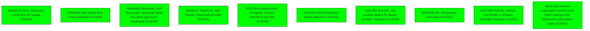

# Backport Agent — Detailed Run Report

> This file is generated automatically. It is intended for human analysts and
> AI reasoning models to assess agent performance, decision quality, and LLM behavior.

**Run timestamp**: 2026-07-06T18:04:14.545Z
**Models used**: fast=`mistral/mistral-code-agent-latest`  powerful=`mistral/mistral-medium-latest`
**Prompt log**: `/Users/rlemeill/Development/tea-ching-cline/.backport-agent/run-1783359948040.prompts.jsonl`

---

## Summary (PR body)

## Backport Agent — Sync Report

**Date**: 2026-07-06T18:04:14.545Z
**Upstream ref**: `cline/cline.git@main`
**Cut date**: `2026-06-27T00:00:00.000Z` 
**Fork ref**: `TEA-ching/cline@keypool-live`
**Sync branch**: `sync/upstream-main-2026-07-06-174754`

### Summary

- ✅ Applied: 10
- ⚠️ Needs human review: 0
- ⛔ Blocked (not attempted): 0

### Applied commits

- `3a5e372d` [high] docs: document ClinePass API usage (#11980)
- `60f4a482` [high] Add onboarding intent telemetry (#11848)
- `9a8be88e` [low] fix(protos): self-heal protoc download when bun skips grpc-tools postinstall (#12003) _(conflict resolved by agent)_
- `6c0d5c97` [high] feat(llms): add Tencent TokenHub provider (#12014)
- `9197d15a` [medium] feat(vscode): recognize Tencent TokenHub provider (#12028) _(conflict resolved by agent)_
- `f180f158` [high] Add first-request failure telemetry (#11852)
- `c331a8f4` [medium] fix(core): use curated default for legacy provider migration (#12030) _(conflict resolved by agent)_
- `be97d951` [low] fix: first-prompt truncation (#12022)
- `bbe7b6fd` [low] fix(hub): hydrate tool results in session message mapping (#12011)
- `984d70a3` [low] Add the subscription promo code when linking to the dashboard subscription page (#12019)

### Agent decision log

- Applied 10 commits successfully
- Resolved 3 conflicts manually
- All validations passed


---

## Agent Workflow Diagram

> Generated by the fast model from the run summary. Evaluate the agent's decision path.



---

## AI Sub-Agent Call Log (12 calls)

> Each entry is one sub-agent invocation. Review prompt/response pairs to assess
> reasoning quality, hallucinations, and decision accuracy.

### Call 1 / 12 — `analyze_commit_for_backport` ✅ OK

| Field | Value |
|---|---|
| **Timestamp** | 2026-07-06T17:47:06.604Z |
| **Tool** | `analyze_commit_for_backport` |
| **Model** | `mistral/mistral-code-agent-latest` |
| **Duration** | 2726 ms |
| **Tokens in** | 4395 |
| **Tokens out** | 130 |
| **Cost** | $0.000000 |

**Prompt sent to sub-agent:**

```
Commit SHA: 9a8be88e85ab96aaa9748420e1a775928972cb41
Commit message:
fix(protos): self-heal protoc download when bun skips grpc-tools postinstall (#12003)

Changed files (1):
apps/vscode/scripts/build-proto.mjs

Diff:
commit 9a8be88e85ab96aaa9748420e1a775928972cb41
Author: Dominic Cooney <dominic.cooney@cline.bot>
Date:   Wed Jul 1 08:31:04 2026 +0900

    fix(protos): self-heal protoc download when bun skips grpc-tools postinstall (#12003)
---
 apps/vscode/scripts/build-proto.mjs | 60 +++++++++++++++++++++++++++++++++----
 1 file changed, 54 insertions(+), 6 deletions(-)

diff --git a/apps/vscode/scripts/build-proto.mjs b/apps/vscode/scripts/build-proto.mjs
index 8cabd6d470..56ad8d131a 100755
--- a/apps/vscode/scripts/build-proto.mjs
+++ b/apps/vscode/scripts/build-proto.mjs
@@ -14,18 +14,66 @@ import { main as generateProtoBusSetup } from "./generate-protobus-setup.mjs"
 
 const require = createRequire(import.meta.url)
 const isWindows = process.platform === "win32"
-const GRPC_TOOLS_PROTOC = path.join(require.resolve("grpc-tools"), "../bin", isWindows ? "protoc.exe" : "protoc")
+// Resolve the grpc-tools package root via its package.json (stable regardless of `main`), so we
+// can both locate the bundled protoc and re-run its install script when the binary is missing.
+const GRPC_TOOLS_DIR = path.dirname(require.resolve("grpc-tools/package.json"))
+const GRPC_TOOLS_PROTOC = path.join(GRPC_TOOLS_DIR, "bin", isWindows ? "protoc.exe" : "protoc")
 // Legacy compatibility: some older/local Windows setups provision protoc into tmp-protoc.
 // Prefer that path when present, but fall back to the grpc-tools bundled binary used by CI/npm installs.
 const LEGACY_WINDOWS_PROTOC = path.resolve("tmp-protoc/bin/protoc.exe")
 const PROTOC = isWindows && fsSync.existsSync(LEGACY_WINDOWS_PROTOC) ? LEGACY_WINDOWS_PROTOC : GRPC_TOOLS_PROTOC
 
+// `bun install` skips grpc-tools' `install` lifecycle script (`node-pre-gyp install`), so the prebuilt
+// protoc is never downloaded into bin/. When it's missing, run that same command here to fetch it.
+// grpc-tools depends on @mapbox/node-pre-gyp, which exposes the `node-pre-gyp` CLI.
+function resolveNodePreGypCli() {
+	const candidates = ["@mapbox/node-pre-gyp/bin/node-pre-gyp", "node-pre-gyp/bin/node-pre-gyp"]
+	for (const candidate of candidates) {
+		try {
+			// Resolve from the grpc-tools package (its direct dependency).
+			return require.resolve(candidate, { paths: [GRPC_TOOLS_DIR] })
+		} catch {
+			// Fall back to resolving from this script's location (covers hoisted installs).
+			try {
+				return require.resolve(candidate)
+			} catch {
+				// try the next candidate
+			}
+		}
+	}
+	return null
+}
+
+function ensureProtocBinary() {
+	console.warn(chalk.yellow(`protoc not found at ${GRPC_TOOLS_PROTOC}; downloading the grpc-tools prebuilt binary...`))
+	const nodePreGypCli = resolveNodePreGypCli()
+	if (!nodePreGypCli) {
+		console.error(
+			chalk.red(
+				`Could not resolve the node-pre-gyp CLI from ${GRPC_TOOLS_DIR}. Run \`bun install\`, then retry \`bun run protos\`.`,
+			),
+		)
+		process.exit(1)
+	}
+	try {
+		// Mirrors grpc-tools' `scripts.install` ("node-pre-gyp install"): downloads the prebuilt
+		// protoc for the current platform/arch into grpc-tools/bin.
+		execFileSync(process.execPath, [nodePreGypCli, "install"], { cwd: GRPC_TOOLS_DIR, stdio: "inherit" })
+	} catch (error) {
+		console.error(chalk.red(`Failed to download protoc via node-pre-gyp: ${error?.message ?? error}`))
+		process.exit(1)
+	}
+	if (!fsSync.existsSync(GRPC_TOOLS_PROTOC)) {
+		console.error(chalk.red(`protoc still not found at ${GRPC_TOOLS_PROTOC} after node-pre-gyp install.`))
+		process.exit(1)
+	}
+	console.log(chalk.green("✓ protoc binary installed."))
+}
+
 if (!fsSync.existsSync(PROTOC)) {
-	const windowsHint = isWindows
-		? ` Neither ${LEGACY_WINDOWS_PROTOC} nor the grpc-tools bundled protoc at ${GRPC_TOOLS_PROTOC} exists.`
-		: ""
-	console.error(chalk.red(`protoc not found at ${PROTOC}.${windowsHint}`))
-	process.exit(1)
+	// PROTOC only differs from GRPC_TOOLS_PROTOC when the legacy Windows path exists, so a missing
+	// PROTOC always means the grpc-tools-bundled protoc needs to be fetched.
+	ensureProtocBinary()
 }
 
 const PROTO_DIR = path.resolve("proto")

Output the JSON object now.
```

**Response received:**

````
```json
{
  "summary": "Fixes protoc binary download when bun skips grpc-tools postinstall by manually running node-pre-gyp install if protoc is missing.",
  "keyChanges": [
    "Resolves protoc path via grpc-tools/package.json instead of require.resolve",
    "Adds ensureProtocBinary() to download protoc via node-pre-gyp if missing",
    "Replaces hard exit with self-healing logic when protoc is not found"
  ],
  "backportComplexity": "trivial",
  "semanticRiskFactors": [],
  "recommendation": "apply"
}
```
````

---

### Call 2 / 12 — `analyze_commit_for_backport` ✅ OK

| Field | Value |
|---|---|
| **Timestamp** | 2026-07-06T17:47:09.961Z |
| **Tool** | `analyze_commit_for_backport` |
| **Model** | `mistral/mistral-code-agent-latest` |
| **Duration** | 3326 ms |
| **Tokens in** | 8312 |
| **Tokens out** | 185 |
| **Cache read** | 3008 |
| **Cost** | $0.000000 |

**Prompt sent to sub-agent:**

```
Commit SHA: be97d951fa34b2ab4ad42e88f424a37c3dcff6a5
Commit message:
fix: first-prompt truncation (#12022)

Changed files (3):
sdk/packages/core/src/extensions/context/basic-compaction.ts
sdk/packages/core/src/extensions/context/compaction.test.ts
sdk/packages/core/src/extensions/context/compaction.ts

Diff:
commit be97d951fa34b2ab4ad42e88f424a37c3dcff6a5
Author: Bee <68532117+abeatrix@users.noreply.github.com>
Date:   Wed Jul 1 13:51:50 2026 -0700

    fix: first-prompt truncation (#12022)
    
    * Fix basic compaction first-prompt truncation
    
    Issue: shallow sessions on high-output models such as OpenRouter MiniMax M3 could auto-compact immediately and reduce the initial task prompt to only the leading <user_input> wrapper. Harbor still passed the full task into Cline and session metadata retained it, but the model conversation could receive a truncated first message and respond that the request was empty or cut off.
    
    Root cause: the output-runway target used maxInputTokens - maxTokens for every basic compaction. For MiniMax M3, maxTokens is nearly maxInputTokens, producing a tiny target. Basic compaction then used its last-resort first-user truncation path, and raw messages still contain the user_input envelope, so prefix truncation preserved the wrapper instead of the actionable task.
    
    Fix: only use the output-runway target after the transcript has at least five user-assistant pairs, so early/shallow tasks use the normal trigger-based target. Also prevent first-user truncation unless that first user message alone exceeds the trigger budget, preserving normal first-turn prompts while still allowing genuinely oversized prompts to be reduced. Added regression tests for the MiniMax-style shallow prompt case and the oversized-first-prompt escape hatch.
    
    * Fix compaction budget for huge-output models
    
    Avoid collapsing context-derived input budgets when a model reports an output limit nearly equal to its context window, such as MiniMax M3. In those cases, treating context-output as the input budget causes auto-compaction to trigger on normal-sized prompts.
    
    Only use contextWindow - maxTokens when the derived value remains at least half of the context window. Also simplify long-conversation basic compaction targeting to maxInputTokens * 0.5 instead of applying the default target ratio to maxInputTokens - maxTokens.
    
    Adds regression coverage for MiniMax-style context-only metadata so an 18k-token prompt does not compact against an incorrectly collapsed 12k input budget.
    
    * Guard compaction estimator against cumulative metrics
    
    * Address basic compaction target review comments
---
 .../src/extensions/context/basic-compaction.ts     |   6 +
 .../core/src/extensions/context/compaction.test.ts | 217 ++++++++++++++++++++-
 .../core/src/extensions/context/compaction.ts      |  92 +++++----
 3 files changed, 273 insertions(+), 42 deletions(-)

diff --git a/sdk/packages/core/src/extensions/context/basic-compaction.ts b/sdk/packages/core/src/extensions/context/basic-compaction.ts
index 0269322ba4..144c72a898 100644
--- a/sdk/packages/core/src/extensions/context/basic-compaction.ts
+++ b/sdk/packages/core/src/extensions/context/basic-compaction.ts
@@ -273,6 +273,7 @@ function trimCandidatesToBudget(
 	candidates: BasicCompactionCandidate[],
 	targetTokens: number,
 	totalTokens: number,
+	triggerTokens: number,
 	estimateMessageTokens: EstimateMessageTokens,
 ): number {
 	if (totalTokens <= targetTokens) {
@@ -311,6 +312,10 @@ function trimCandidatesToBudget(
 		(candidate) => candidate.isFirstUser,
 	);
 	if (firstUserIndex >= 0) {
+		const firstUser = candidates[firstUserIndex];
+		if (firstUser.estimatedTokens <= triggerTokens) {
+			return totalTokens;
+		}
 		while (totalTokens > targetTokens) {
 			const candidate = candidates[firstUserIndex];
 			const desiredTokens = Math.max(
@@ -431,6 +436,7 @@ export function runBasicCompaction(options: {
 		candidates,
 		targetTokens,
 		totalTokens,
+		options.context.triggerTokens,
 		options.estimateMessageTokens,
 	);
 
diff --git a/sdk/packages/core/src/extensions/context/compaction.test.ts b/sdk/packages/core/src/extensions/context/compaction.test.ts
index c7036fe889..00a37b1e6e 100644
--- a/sdk/packages/core/src/extensions/context/compaction.test.ts
+++ b/sdk/packages/core/src/extensions/context/compaction.test.ts
@@ -36,13 +36,14 @@ function totalJsonTokens(messages: LlmsProviders.Message[]): number {
 }
 
 describe("createTokenEstimator", () => {
-	it("does not treat assistant request metrics as per-message token counts", () => {
+	it("does not treat cumulative request metrics as per-message token counts", () => {
 		const estimateMessageTokens = createTokenEstimator();
 		const message: MessageWithMetadata = {
 			role: "assistant",
 			content: "short",
 			metrics: {
-				inputTokens: 12,
+				inputTokens: 100,
+				cacheReadTokens: 80,
 				outputTokens: 7,
 			},
 		};
@@ -410,6 +411,91 @@ describe("createContextCompactionPrepareTurn", () => {
 		expect(compacted).toBe(messages);
 	});
 
+	it("does not truncate a shallow first task prompt below the trigger for high-output models", async () => {
+		const prepareTurn = createContextCompactionPrepareTurn({
+			providerId: "openrouter",
+			modelId: "minimax/minimax-m3",
+			providerConfig: {
+				providerId: "openrouter",
+				modelId: "minimax/minimax-m3",
+			} as LlmsProviders.ProviderConfig,
+			compaction: {
+				enabled: true,
+				strategy: "basic",
+				maxInputTokens: 1_000,
+				thresholdRatio: 0.9,
+			},
+			logger: undefined,
+		});
+		const task =
+			'<user_input mode="act">Create /app/filter.py that removes JavaScript from HTML files. ' +
+			"Keep this task prompt intact. ".repeat(25) +
+			"</user_input>";
+		const messages: LlmsProviders.Message[] = [
+			{ role: "user", content: task },
+			{ role: "assistant", content: "old assistant context ".repeat(500) },
+			{ role: "user", content: "Continue" },
+		];
+
+		const result = await prepareTurn?.({
+			agentId: "agent-1",
+			conversationId: "conv-1",
+			parentAgentId: null,
+			iteration: 1,
+			abortSignal: new AbortController().signal,
+			systemPrompt: "You are helpful.",
+			tools: [],
+			messages,
+			apiMessages: messages,
+			model: {
+				id: "minimax/minimax-m3",
+				provider: "openrouter",
+				info: {
+					id: "minimax/minimax-m3",
+					maxInputTokens: 1_000,
+					maxTokens: 950,
+				},
+			},
+		});
+
+		expect(result?.messages?.[0]?.content).toBe(task);
+		expect(JSON.stringify(result?.messages)).toContain("Create /app/filter.py");
+		expect(JSON.stringify(result?.messages)).not.toContain("<user_input\n...");
+	});
+
+	it("can truncate an oversized first task prompt when it exceeds the trigger", () => {
+		const oversizedPrompt = "<user_input>".repeat(500);
+		const messages: LlmsProviders.Message[] = [
+			{ role: "user", content: oversizedPrompt },
+			{ role: "assistant", content: "old assistant context ".repeat(500) },
+			{ role: "user", content: "current turn" },
+		];
+
+		const compacted = runBasicCompaction({
+			context: {
+				agentId: "agent-1",
+				conversationId: "conv-1",
+				parentAgentId: null,
+				iteration: 1,
+				messages,
+				model: {
+					id: "mock-model",
+					provider: "openrouter",
+					info: { id: "mock-model", maxInputTokens: 1_000 },
+				},
+				maxInputTokens: 1_000,
+				triggerTokens: 900,
+				targetTokens: 100,
+				thresholdRatio: 0.9,
+				utilizationRatio: 2,
+			},
+			estimateMessageTokens: estimateJsonTokens,
+		});
+
+		expect(compacted?.messages[0]?.content).not.toBe(oversizedPrompt);
+		expect(String(compacted?.messages[0]?.content)).toContain("\n...");
+	});
+
 	it("does not add unsupported max output tokens to Codex OAuth summarizer requests", () => {
 		const codexConfig = resolveSummarizerConfig({
 			activeProviderConfig: {
@@ -1158,7 +1244,7 @@ describe("createContextCompactionPrepareTurn", () => {
 		expect(result).toBeUndefined();
 	});
 
-	it("targets basic compaction below the model output-reserved input budget", async () => {
+	it("targets basic compaction at half the input budget for long conversations", async () => {
 		const compact = vi.fn((_context: CoreCompactionContext) => ({
 			messages: [
 				{ role: "user" as const, content: "Compacted by target budget" },
@@ -1175,10 +1261,17 @@ describe("createContextCompactionPrepareTurn", () => {
 			logger: undefined,
 		});
 		const messages: MessageWithMetadata[] = [
-			{
-				role: "user",
-				content: "large prompt ".repeat(70_000),
-			},
+			{ role: "user", content: "turn 1" },
+			{ role: "assistant", content: "answer 1" },
+			{ role: "user", content: "turn 2" },
+			{ role: "assistant", content: "answer 2" },
+			{ role: "user", content: "turn 3" },
+			{ role: "assistant", content: "answer 3" },
+			{ role: "user", content: "turn 4" },
+			{ role: "assistant", content: "answer 4" },
+			{ role: "user", content: "turn 5" },
+			{ role: "assistant", content: "answer 5" },
+			{ role: "user", content: "large prompt ".repeat(70_000) },
 		];
 
 		await prepareTurn?.({
@@ -1205,7 +1298,69 @@ describe("createContextCompactionPrepareTurn", () => {
 		expect(compact).toHaveBeenCalledTimes(1);
 		const context = compact.mock.calls[0]?.[0];
 		expect(context?.triggerTokens).toBe(244_800);
-		expect(context?.targetTokens).toBe(100_800);
+		expect(context?.targetTokens).toBe(136_000);
+	});
+
+	it("keeps the long-conversation target below low custom trigger thresholds", async () => {
+		const compact = vi.fn((_context: CoreCompactionContext) => ({
+			messages: [
+				{ role: "user" as const, content: "Compacted by low threshold" },
+			],
+		}));
+		const prepareTurn = createContextCompactionPrepareTurn({
+			providerId: "anthropic",
+			modelId: "mock-model",
+			providerConfig: {
+				providerId: "anthropic",
+				modelId: "mock-model",
+			} as LlmsProviders.ProviderConfig,
+			compaction: {
+				enabled: true,
+				strategy: "basic",
+				thresholdRatio: 0.4,
+				compact,
+			},
+			logger: undefined,
+		});
+		const messages: MessageWithMetadata[] = [
+			{ role: "user", content: "turn 1" },
+			{ role: "assistant", content: "answer 1" },
+			{ role: "user", content: "turn 2" },
+			{ role: "assistant", content: "answer 2" },
+			{ role: "user", content: "turn 3" },
+			{ role: "assistant", content: "answer 3" },
+			{ role: "user", content: "turn 4" },
+			{ role: "assistant", content: "answer 4" },
+			{ role: "user", content: "turn 5" },
+			{ role: "assistant", content: "answer 5" },
+			{ role: "user", content: "large prompt ".repeat(20) },
+		];
+
+		await prepareTurn?.({
+			agentId: "agent-1",
+			conversationId: "conv-1",
+			parentAgentId: null,
+			iteration: 1,
+			abortSignal: new AbortController().signal,
+			systemPrompt: "You are helpful.",
+			tools: [],
+			messages,
+			apiMessages: messages,
+			model: {
+				id: "mock-model",
+				provider: "anthropic",
+				info: {
+					id: "mock-model",
+					maxInputTokens: 100,
+					maxTokens: 20,
+				},
+			},
+		});
+
+		expect(compact).toHaveBeenCalledTimes(1);
+		const context = compact.mock.calls[0]?.[0];
+		expect(context?.triggerTokens).toBe(40);
+		expect(context?.targetTokens).toBe(39);
 	});
 
 	it("derives input budget by reserving model max output tokens from context window", async () => {
@@ -1358,6 +1513,52 @@ describe("createContextCompactionPrepareTurn", () => {
 		expect(result).toBeUndefined();
 	});
 
+	it("does not collapse context-only input budget when output is nearly the full context", async () => {
+		const compact = vi.fn((_context: CoreCompactionContext) => ({
+			messages: [{ role: "user" as const, content: "Compacted by fallback" }],
+		}));
+		const prepareTurn = createContextCompactionPrepareTurn({
+			providerId: "openrouter",
+			modelId: "minimax/minimax-m3",
+			providerConfig: {
+				providerId: "openrouter",
+				modelId: "minimax/minimax-m3",
+			} as LlmsProviders.ProviderConfig,
+			compaction: { enabled: true, strategy: "basic", compact },
+			logger: undefined,
+		});
+		const messages: MessageWithMetadata[] = [
+			{
+				role: "user",
+				content: "regex prompt ".repeat(2_000),
+			},
+		];
+
+		const result = await prepareTurn?.({
+			agentId: "agent-1",
+			conversationId: "conv-1",
+			parentAgentId: null,
+			iteration: 1,
+			abortSignal: new AbortController().signal,
+			systemPrompt: "You are helpful.",
+			tools: [],
+			messages,
+			apiMessages: messages,
+			model: {
+				id: "minimax/minimax-m3",
+				provider: "openrouter",
+				info: {
+					id: "minimax/minimax-m3",
+					contextWindow: 524_288,
+					maxTokens: 512_000,
+				},
+			},
+		});
+
+		expect(compact).not.toHaveBeenCalled();
+		expect(result).toBeUndefined();
+	});
+
 	it("triggers compaction from provider-sized tool result payloads", async () => {
 		const compact = vi.fn((_context: CoreCompactionContext) => ({
 			messages: [
diff --git a/sdk/packages/core/src/extensions/context/compaction.ts b/sdk/packages/core/src/extensions/context/compaction.ts
index 3e07288307..35b64c23a7 100644
--- a/sdk/packages/core/src/extensions/context/compaction.ts
+++ b/sdk/packages/core/src/extensions/context/compaction.ts
@@ -69,6 +69,9 @@ export interface ContextCompactionPrepareTurnOptions {
 	manualTargetRatio?: number;
 }
 
+const MIN_CONTEXT_DERIVED_INPUT_RATIO = 0.5;
+const LONG_CONVERSATION_TARGET_RATIO = 0.5;
+
 function safeJsonSize(value: unknown): number {
 	try {
 		return JSON.stringify(value).length;
@@ -96,11 +99,15 @@ function resolveMaxInputTokens(input: {
 	}
 	if (isPositiveFiniteNumber(input.contextWindow)) {
 		candidates.push(input.contextWindow);
+		const derivedInputTokens = isPositiveFiniteNumber(input.modelMaxTokens)
+			? input.contextWindow - input.modelMaxTokens
+			: undefined;
 		if (
-			isPositiveFiniteNumber(input.modelMaxTokens) &&
-			input.modelMaxTokens < input.contextWindow
+			isPositiveFiniteNumber(derivedInputTokens) &&
+			derivedInputTokens >=
+				input.contextWindow * MIN_CONTEXT_DERIVED_INPUT_RATIO
 		) {
-			candidates.push(input.contextWindow - input.modelMaxTokens);
+			candidates.push(derivedInputTokens);
 		}
 	}
 	return candidates.length > 0
@@ -245,22 +252,38 @@ function resolveBasicTargetTokens(input: {
 	maxInputTokens: number;
 	modelMaxTokens?: number;
 	triggerTokens: number;
+	messagePairCount: number;
 }): number {
-	const targetBaseTokens =
+	const targetTokens =
+		input.messagePairCount >= 5 &&
 		typeof input.modelMaxTokens === "number" &&
 		Number.isFinite(input.modelMaxTokens) &&
 		input.modelMaxTokens < input.maxInputTokens
-			? input.maxInputTokens - input.modelMaxTokens
-			: input.triggerTokens;
+			? Math.floor(input.maxInputTokens * LONG_CONVERSATION_TARGET_RATIO)
+			: Math.floor(input.triggerTokens * DEFAULT_TARGET_RATIO);
+	const triggerCeiling = Math.max(1, input.triggerTokens - 1);
 	return Math.max(
 		1,
-		Math.min(
-			Math.floor(targetBaseTokens * DEFAULT_TARGET_RATIO),
-			input.maxInputTokens,
-		),
+		Math.min(targetTokens, input.maxInputTokens, triggerCeiling),
 	);
 }
 
+function countUserAssistantPairs(
+	messages: CoreCompactionContext["messages"],
+): number {
+	let pairs = 0;
+	let hasPendingUser = false;
+	for (const message of messages) {
+		if (message.role === "user") {
+			hasPendingUser = true;
+		} else if (message.role === "assistant" && hasPendingUser) {
+			pairs += 1;
+			hasPendingUser = false;
+		}
+	}
+	return pairs;
+}
+
 /**
  * Build the `prepareTurn` callback used by the agent runtime to compact the
  * transcript before each model request.
@@ -351,37 +374,38 @@ export function createContextCompactionPrepareTurn(
 		if (mode === "auto" && !triggerState.shouldCompact) {
 			return undefined;
 		}
-			const targetState =
-				mode === "manual"
-					? resolveManualTargetState({
-							inputTokens,
-							maxInputTokens,
+		const targetState =
+			mode === "manual"
+				? resolveManualTargetState({
+						inputTokens,
+						maxInputTokens,
 						autoTriggerTokens: triggerState.triggerTokens,
 						manualTargetRatio: options.manualTargetRatio,
 					})
-					: triggerState;
-			const targetTokens =
-				mode === "auto"
-					? resolveBasicTargetTokens({
-							maxInputTokens,
-							modelMaxTokens: context.model.info?.maxTokens,
-							triggerTokens: targetState.triggerTokens,
-						})
-					: undefined;
+				: triggerState;
+		const targetTokens =
+			mode === "auto"
+				? resolveBasicTargetTokens({
+						maxInputTokens,
+						modelMaxTokens: context.model.info?.maxTokens,
+						triggerTokens: targetState.triggerTokens,
+						messagePairCount: countUserAssistantPairs(context.messages),
+					})
+				: undefined;
 
-			const compactionContext = {
-				agentId: context.agentId,
-				conversationId: context.conversationId,
+		const compactionContext = {
+			agentId: context.agentId,
+			conversationId: context.conversationId,
 			parentAgentId: context.parentAgentId,
 			iteration: context.iteration,
 			messages: context.messages,
-				model: context.model,
-				maxInputTokens,
-				triggerTokens: targetState.triggerTokens,
-				targetTokens,
-				thresholdRatio: targetState.thresholdRatio,
-				utilizationRatio: maxInputTokens > 0 ? inputTokens / maxInputTokens : 0,
-			};
+			model: context.model,
+			maxInputTokens,
+			triggerTokens: targetState.triggerTokens,
+			targetTokens,
+			thresholdRatio: targetState.thresholdRatio,
+			utilizationRatio: maxInputTokens > 0 ? inputTokens / maxInputTokens : 0,
+		};
 
 		const statusReason =
 			mode === "manual" ? "manual_compaction" : "auto_compaction";

Output the JSON object now.
```

**Response received:**

````
```json
{
  "summary": "Fixes first-prompt truncation in basic compaction for high-output models by adjusting target token calculation and preventing premature truncation of shallow prompts.",
  "keyChanges": [
    "Prevents first-user message truncation unless it exceeds trigger budget",
    "Uses half of maxInputTokens for long conversations (5+ pairs)",
    "Avoids collapsing input budget when modelMaxTokens is close to contextWindow",
    "Adds regression tests for MiniMax-style shallow prompts and oversized prompts",
    "Guards against cumulative metrics in token estimation"
  ],
  "backportComplexity": "moderate",
  "semanticRiskFactors": [
    "Changes compaction logic that could affect all providers",
    "Modifies token budget calculations for high-output models"
  ],
  "recommendation": "apply-with-care"
}
```
````

---

### Call 3 / 12 — `analyze_commit_for_backport` ✅ OK

| Field | Value |
|---|---|
| **Timestamp** | 2026-07-06T17:47:13.030Z |
| **Tool** | `analyze_commit_for_backport` |
| **Model** | `mistral/mistral-code-agent-latest` |
| **Duration** | 3029 ms |
| **Tokens in** | 8358 |
| **Tokens out** | 181 |
| **Cost** | $0.000000 |

**Prompt sent to sub-agent:**

```
Commit SHA: bbe7b6fd49c7b5ff3d4dada0c7bced6ea08fa04e
Commit message:
fix(hub): hydrate tool results in session message mapping (#12011)

Changed files (4):
apps/cline-hub/src/server/session-mapping.test.ts
apps/cline-hub/src/server/session-mapping.ts
apps/cline-hub/src/webview/src/components/views/page-layout.tsx
apps/cline-hub/src/webview/src/components/views/settings/provider-list-view.tsx

Diff:
commit bbe7b6fd49c7b5ff3d4dada0c7bced6ea08fa04e
Author: Bee <68532117+abeatrix@users.noreply.github.com>
Date:   Wed Jul 1 14:28:13 2026 -0700

    fix(hub): hydrate tool results in session message mapping (#12011)
    
    * fix(hub): hydrate tool results in session message mapping
    
    Map historical tool call/use and tool result blocks into webview tool events, including same-message results and following user result messages. Add tests to verify hydrated outputs and block ordering so restored sessions render completed tool interactions correctly.
    
    * feedback
---
 apps/cline-hub/src/server/session-mapping.test.ts  | 231 +++++++++++++++++
 apps/cline-hub/src/server/session-mapping.ts       | 276 ++++++++++++++++++++-
 .../webview/src/components/views/page-layout.tsx   |   2 +-
 .../views/settings/provider-list-view.tsx          |   2 +-
 4 files changed, 501 insertions(+), 10 deletions(-)

diff --git a/apps/cline-hub/src/server/session-mapping.test.ts b/apps/cline-hub/src/server/session-mapping.test.ts
new file mode 100644
index 0000000000..e8f21eb94d
--- /dev/null
+++ b/apps/cline-hub/src/server/session-mapping.test.ts
@@ -0,0 +1,231 @@
+import { describe, expect, it } from "vitest";
+import { mapHistoryToWebviewMessages } from "./session-mapping";
+
+describe("mapHistoryToWebviewMessages", () => {
+	it("hydrates assistant tool uses with following user tool results", () => {
+		const messages = mapHistoryToWebviewMessages([
+			{
+				id: "assistant-1",
+				role: "assistant",
+				content: [
+					{ type: "text", text: "I'll inspect the file." },
+					{
+						type: "tool_use",
+						id: "toolu_1",
+						name: "read_file",
+						input: { path: "src/index.ts" },
+					},
+				],
+			},
+			{
+				id: "user-1",
+				role: "user",
+				content: [
+					{
+						type: "tool_result",
+						id: "result-block-1",
+						tool_use_id: "toolu_1",
+						name: "read_file",
+						content: "export const value = 1;",
+					},
+				],
+			},
+		]);
+
+		expect(messages).toHaveLength(1);
+		expect(messages[0]).toMatchObject({
+			id: "assistant-1",
+			role: "assistant",
+			text: "I'll inspect the file.",
+			toolEvents: [
+				{
+					toolCallId: "toolu_1",
+					name: "read_file",
+					state: "output-available",
+					input: { path: "src/index.ts" },
+					output: "export const value = 1;",
+				},
+			],
+		});
+		expect(messages[0].blocks).toEqual([
+			{
+				id: "assistant-1:text:0",
+				type: "text",
+				text: "I'll inspect the file.",
+			},
+			{
+				id: "assistant-1:tool:toolu_1",
+				type: "tool",
+				toolEvent: expect.objectContaining({
+					toolCallId: "toolu_1",
+					name: "read_file",
+					state: "output-available",
+					output: "export const value = 1;",
+				}),
+			},
+		]);
+	});
+
+	it("hydrates error tool results", () => {
+		const messages = mapHistoryToWebviewMessages([
+			{
+				id: "assistant-1",
+				role: "assistant",
+				content: [
+					{
+						type: "tool_use",
+						id: "toolu_1",
+						name: "read_file",
+						input: { path: "missing.ts" },
+					},
+				],
+			},
+			{
+				id: "user-1",
+				role: "user",
+				content: [
+					{
+						type: "tool_result",
+						tool_use_id: "toolu_1",
+						name: "read_file",
+						content: "File not found",
+						is_error: true,
+					},
+				],
+			},
+		]);
+
+		expect(messages).toHaveLength(1);
+		expect(messages[0].toolEvents).toEqual([
+			expect.objectContaining({
+				toolCallId: "toolu_1",
+				name: "read_file",
+				state: "output-error",
+				output: "File not found",
+				error: "File not found",
+			}),
+		]);
+		expect(messages[0].blocks?.[0]).toMatchObject({
+			type: "tool",
+			toolEvent: {
+				toolCallId: "toolu_1",
+				state: "output-error",
+				error: "File not found",
+			},
+		});
+	});
+
+	it("hydrates orphan tool results as standalone meta tool blocks", () => {
+		const messages = mapHistoryToWebviewMessages([
+			{
+				id: "user-1",
+				role: "user",
+				content: [
+					{
+						type: "tool_result",
+						tool_use_id: "toolu_orphan",
+						name: "read_file",
+						content: "orphan output",
+					},
+				],
+			},
+		]);
+
+		expect(messages).toHaveLength(1);
+		expect(messages[0]).toMatchObject({
+			id: "user-1",
+			role: "meta",
+			text: "",
+			toolEvents: [
+				{
+					toolCallId: "toolu_orphan",
+					name: "read_file",
+					state: "output-available",
+					input: undefined,
+					output: "orphan output",
+				},
+			],
+		});
+		expect(messages[0].blocks).toEqual([
+			{
+				id: "user-1:tool:toolu_orphan",
+				type: "tool",
+				toolEvent: expect.objectContaining({
+					toolCallId: "toolu_orphan",
+					input: undefined,
+					output: "orphan output",
+				}),
+			},
+		]);
+	});
+
+	it("hydrates plain string content as a text block", () => {
+		const messages = mapHistoryToWebviewMessages([
+			{
+				id: "assistant-1",
+				role: "assistant",
+				content: "Plain response",
+			},
+		]);
+
+		expect(messages).toEqual([
+			{
+				id: "assistant-1",
+				role: "assistant",
+				text: "Plain response",
+				reasoning: undefined,
+				reasoningRedacted: undefined,
+				toolEvents: undefined,
+				blocks: [
+					{
+						id: "assistant-1:text:0",
+						type: "text",
+						text: "Plain response",
+					},
+				],
+			},
+		]);
+	});
+
+	it("hydrates same-message tool-call and tool-result blocks", () => {
+		const messages = mapHistoryToWebviewMessages([
+			{
+				id: "assistant-1",
+				role: "assistant",
+				content: [
+					{
+						type: "tool-call",
+						toolCallId: "call_1",
+						toolName: "search",
+						input: { query: "cline" },
+					},
+					{
+						type: "tool-result",
+						toolCallId: "call_1",
+						toolName: "search",
+						output: [{ query: "cline", result: "found", success: true }],
+					},
+				],
+			},
+		]);
+
+		expect(messages).toHaveLength(1);
+		expect(messages[0].toolEvents).toEqual([
+			expect.objectContaining({
+				toolCallId: "call_1",
+				name: "search",
+				state: "output-available",
+				input: { query: "cline" },
+				output: [{ query: "cline", result: "found", success: true }],
+			}),
+		]);
+		expect(messages[0].blocks).toHaveLength(1);
+		expect(messages[0].blocks?.[0]).toMatchObject({
+			type: "tool",
+			toolEvent: {
+				toolCallId: "call_1",
+				state: "output-available",
+			},
+		});
+	});
+});
diff --git a/apps/cline-hub/src/server/session-mapping.ts b/apps/cline-hub/src/server/session-mapping.ts
index 0aeb47c886..f33a9ce149 100644
--- a/apps/cline-hub/src/server/session-mapping.ts
+++ b/apps/cline-hub/src/server/session-mapping.ts
@@ -9,6 +9,7 @@ import type { HubContext } from "./state";
 import type { SessionContext, TrackedClient, TrackedSession } from "./types";
 import {
 	asNumber,
+	asRecord,
 	asString,
 	asTimestamp,
 	basename,
@@ -88,27 +89,286 @@ function summarizeClient(client: TrackedClient): {
 	};
 }
 
+type HistoryToolLocation = {
+	messageIndex: number;
+	blockIndex: number;
+};
+
+function historyContentParts(content: unknown): Record<string, unknown>[] {
+	if (Array.isArray(content)) {
+		return content
+			.map((part) => asRecord(part))
+			.filter((part): part is Record<string, unknown> => Boolean(part));
+	}
+	if (typeof content === "string" && content.trim()) {
+		return [{ type: "text", text: content }];
+	}
+	return [];
+}
+
+function blockType(block: Record<string, unknown>): string {
+	return asString(block.type)?.toLowerCase() ?? "";
+}
+
+function toolCallIdForCall(block: Record<string, unknown>): string | undefined {
+	return (
+		asString(block.id) ??
+		asString(block.toolCallId) ??
+		asString(block.tool_call_id)
+	);
+}
+
+function toolCallIdForResult(
+	block: Record<string, unknown>,
+): string | undefined {
+	return (
+		asString(block.tool_use_id) ??
+		asString(block.toolCallId) ??
+		asString(block.tool_call_id)
+	);
+}
+
+function toolNameFor(block: Record<string, unknown>): string {
+	return (
+		asString(block.name) ??
+		asString(block.toolName) ??
+		asString(block.tool_name) ??
+		"tool"
+	);
+}
+
+function toolInputFor(block: Record<string, unknown>): unknown {
+	return block.input ?? block.args ?? block.arguments;
+}
+
+function toolOutputFor(block: Record<string, unknown>): unknown {
+	return block.output ?? block.result ?? block.content;
+}
+
+function isErrorToolResult(block: Record<string, unknown>): boolean {
+	return block.is_error === true || block.isError === true || block.error === true;
+}
+
+function pushTextBlock(
+	blocks: NonNullable<WebviewChatMessage["blocks"]>,
+	textParts: string[],
+	messageKey: string | number,
+	partIndex: number,
+	text: string,
+): void {
+	if (!text) return;
+	textParts.push(text);
+	blocks.push({
+		id: `${messageKey}:text:${partIndex}`,
+		type: "text",
+		text,
+	});
+}
+
+function pushReasoningBlock(
+	blocks: NonNullable<WebviewChatMessage["blocks"]>,
+	reasoningParts: string[],
+	messageKey: string | number,
+	partIndex: number,
+	text: string,
+	redacted?: boolean,
+): boolean {
+	if (!text) return false;
+	reasoningParts.push(text);
+	blocks.push({
+		id: `${messageKey}:reasoning:${partIndex}`,
+		type: "reasoning",
+		text,
+		redacted,
+	});
+	return redacted === true;
+}
+
 export function mapHistoryToWebviewMessages(
 	history: unknown[],
 ): WebviewChatMessage[] {
-	return history.map((entry, index) => {
+	const mapped: WebviewChatMessage[] = [];
+	const toolLocations = new Map<string, HistoryToolLocation>();
+
+	for (const [index, entry] of history.entries()) {
 		const record =
 			entry && typeof entry === "object"
 				? (entry as Record<string, unknown>)
 				: { content: entry };
+		const messageKey = asString(record.id) ?? `history-${index}`;
 		const rawRole = asString(record.role)?.toLowerCase();
-		const role: WebviewChatMessage["role"] =
+		let role: WebviewChatMessage["role"] =
 			rawRole === "user" || rawRole === "assistant" || rawRole === "error"
 				? rawRole
 				: "meta";
-		const text = stringifyContent(record.content ?? record.text ?? record);
-		return {
-			id: asString(record.id) ?? `history-${index}`,
+		const blocks: NonNullable<WebviewChatMessage["blocks"]> = [];
+		const textParts: string[] = [];
+		const reasoningParts: string[] = [];
+		const toolEvents = new Map<
+			string,
+			NonNullable<WebviewChatMessage["toolEvents"]>[number]
+		>();
+		const currentToolBlockIndexes = new Map<string, number>();
+		let reasoningRedacted = false;
+
+		const contentParts = historyContentParts(record.content);
+		if (contentParts.length === 0) {
+			const text = stringifyContent(record.content ?? record.text ?? record);
+			pushTextBlock(blocks, textParts, messageKey, 0, text);
+		}
+
+		for (const [partIndex, part] of contentParts.entries()) {
+			const type = blockType(part);
+			if (type === "text") {
+				pushTextBlock(
+					blocks,
+					textParts,
+					messageKey,
+					partIndex,
+					asString(part.text) ?? asString(part.content) ?? "",
+				);
+				continue;
+			}
+
+			if (type === "thinking" || type === "reasoning") {
+				reasoningRedacted =
+					pushReasoningBlock(
+						blocks,
+						reasoningParts,
+						messageKey,
+						partIndex,
+						asString(part.thinking) ??
+							asString(part.reasoning) ??
+							asString(part.text) ??
+							"",
+						part.redacted === true,
+					) || reasoningRedacted;
+				continue;
+			}
+
+			if (type === "redacted_thinking") {
+				reasoningRedacted =
+					pushReasoningBlock(
+						blocks,
+						reasoningParts,
+						messageKey,
+						partIndex,
+						"[redacted]",
+						true,
+					) || reasoningRedacted;
+				continue;
+			}
+
+			if (type === "tool_use" || type === "tool-call") {
+				const toolCallId =
+					toolCallIdForCall(part) ?? `${messageKey}:${partIndex}`;
+				const name = toolNameFor(part);
+				const toolEvent = {
+					id: `${messageKey}:${toolCallId}`,
+					toolCallId,
+					name,
+					text: `Running ${name}...`,
+					state: "input-available" as const,
+					input: toolInputFor(part),
+				};
+				toolEvents.set(toolCallId, toolEvent);
+				blocks.push({
+					id: `${messageKey}:tool:${toolCallId}`,
+					type: "tool",
+					toolEvent,
+				});
+				currentToolBlockIndexes.set(toolCallId, blocks.length - 1);
+				toolLocations.set(toolCallId, {
+					messageIndex: mapped.length,
+					blockIndex: blocks.length - 1,
+				});
+				continue;
+			}
+
+			if (type === "tool_result" || type === "tool-result") {
+				const toolCallId =
+					toolCallIdForResult(part) ?? `${messageKey}:${partIndex}`;
+				const name = toolNameFor(part);
+				const output = toolOutputFor(part);
+				const isError = isErrorToolResult(part);
+				const currentBlockIndex = currentToolBlockIndexes.get(toolCallId);
+				const existingLocation = toolLocations.get(toolCallId);
+				const existing =
+					currentBlockIndex !== undefined
+						? blocks[currentBlockIndex]
+						: existingLocation !== undefined
+						? mapped[existingLocation.messageIndex]?.blocks?.[
+								existingLocation.blockIndex
+							]
+						: undefined;
+				const existingToolEvent =
+					existing?.type === "tool" ? existing.toolEvent : undefined;
+				const toolEvent = {
+					id: existingToolEvent?.id ?? `${messageKey}:${toolCallId}`,
+					toolCallId,
+					name: existingToolEvent?.name ?? name,
+					text: isError
+						? `${existingToolEvent?.name ?? name} failed`
+						: `${existingToolEvent?.name ?? name} completed`,
+					state: isError
+						? ("output-error" as const)
+						: ("output-available" as const),
+					input: existingToolEvent?.input,
+					output,
+					error: isError ? stringifyContent(output) : undefined,
+				};
+
+				if (currentBlockIndex !== undefined && existing?.type === "tool") {
+					blocks[currentBlockIndex] = {
+						...existing,
+						toolEvent,
+					};
+					toolEvents.set(toolCallId, toolEvent);
+				} else if (existingLocation !== undefined && existing?.type === "tool") {
+					const target = mapped[existingLocation.messageIndex];
+					const targetBlocks = target.blocks;
+					const targetBlock = targetBlocks?.[existingLocation.blockIndex];
+					if (targetBlocks && targetBlock?.type === "tool") {
+						targetBlocks[existingLocation.blockIndex] = {
+							...targetBlock,
+							toolEvent,
+						};
+					}
+					target.toolEvents = (target.toolEvents ?? []).map((event) =>
+						event.toolCallId === toolCallId ? toolEvent : event,
+					);
+				} else {
+					toolEvents.set(toolCallId, toolEvent);
+					blocks.push({
+						id: `${messageKey}:tool:${toolCallId}`,
+						type: "tool",
+						toolEvent,
+					});
+				}
+			}
+		}
+
+		const text = textParts.join("\n");
+		const toolEventList = [...toolEvents.values()];
+		if (!text && reasoningParts.length === 0 && toolEventList.length === 0) {
+			continue;
+		}
+		if (!text && role === "user" && toolEventList.length > 0) {
+			role = "meta";
+		}
+		mapped.push({
+			id: messageKey,
 			role,
 			text,
-			blocks: text ? [{ id: `history-${index}-text`, type: "text", text }] : [],
-		};
-	});
+			reasoning:
+				reasoningParts.length > 0 ? reasoningParts.join("\n") : undefined,
+			reasoningRedacted: reasoningRedacted || undefined,
+			toolEvents: toolEventList.length > 0 ? toolEventList : undefined,
+			blocks,
+		});
+	}
+
+	return mapped;
 }
 
 export function trackSession(record: unknown): TrackedSession | undefined {
diff --git a/apps/cline-hub/src/webview/src/components/views/page-layout.tsx b/apps/cline-hub/src/webview/src/components/views/page-layout.tsx
index 5d6497e929..a49ecedb18 100644
--- a/apps/cline-hub/src/webview/src/components/views/page-layout.tsx
+++ b/apps/cline-hub/src/webview/src/components/views/page-layout.tsx
@@ -21,7 +21,7 @@ export function PageFrame({
 					className,
 				)}
 			>
-				<div className={cn("max-w-[86rem]", contentClassName)}>{children}</div>
+				<div className={cn("max-w-344", contentClassName)}>{children}</div>
 			</div>
 		</ScrollArea>
 	);
diff --git a/apps/cline-hub/src/webview/src/components/views/settings/provider-list-view.tsx b/apps/cline-hub/src/webview/src/components/views/settings/provider-list-view.tsx
index c14eec1556..8e44b78d1a 100644
--- a/apps/cline-hub/src/webview/src/components/views/settings/provider-list-view.tsx
+++ b/apps/cline-hub/src/webview/src/components/views/settings/provider-list-view.tsx
@@ -134,7 +134,7 @@ export function ProviderListContent({
 								isPanel ? "text-[24px]" : "text-[32px]",
 							)}
 						>
-							Models
+							Model Providers
 						</h1>
 						<p className="mt-3 text-[15px] leading-6 text-muted-foreground">
 							Configure model providers and choose which ones are available.{" "}

Output the JSON object now.
```

**Response received:**

````
```json
{
  "summary": "Fixes tool result hydration in session message mapping for Cline Hub, ensuring proper rendering of completed tool interactions. Adds comprehensive tests for various tool result scenarios.",
  "keyChanges": [
    "Enhanced session-mapping.ts to hydrate tool results into webview tool events",
    "Added support for same-message tool-call and tool-result blocks",
    "Implemented orphan tool result handling as standalone meta tool blocks",
    "Added comprehensive test coverage for tool result hydration scenarios",
    "Minor UI tweaks in page-layout.tsx and provider-list-view.tsx"
  ],
  "backportComplexity": "moderate",
  "semanticRiskFactors": [
    "Modifies core session message mapping logic",
    "Changes webview message structure for tool events"
  ],
  "recommendation": "apply-with-care"
}
```
````

---

### Call 4 / 12 — `analyze_commit_for_backport` ✅ OK

| Field | Value |
|---|---|
| **Timestamp** | 2026-07-06T17:47:15.331Z |
| **Tool** | `analyze_commit_for_backport` |
| **Model** | `mistral/mistral-code-agent-latest` |
| **Duration** | 2262 ms |
| **Tokens in** | 4119 |
| **Tokens out** | 132 |
| **Cache read** | 3008 |
| **Cost** | $0.000000 |

**Prompt sent to sub-agent:**

```
Commit SHA: 984d70a3510e5cf8625acb89918e2f59a0f063f6
Commit message:
Add the subscription promo code when linking to the dashboard subscription page (#12019)

Changed files (3):
apps/cli/src/tui/components/dialogs/provider-picker-helpers.ts
apps/cli/src/tui/components/dialogs/provider-picker.test.ts
apps/cli/src/utils/cline-pass-errors.ts

Diff:
commit 984d70a3510e5cf8625acb89918e2f59a0f063f6
Author: Tomás Barreiro <52393857+BarreiroT@users.noreply.github.com>
Date:   Wed Jul 1 19:47:30 2026 -0300

    Add the subscription promo code when linking to the dashboard subscription page (#12019)
    
    * Add the subscription promo code when linking to the dashboard page
    
    * revert tests
---
 apps/cli/src/tui/components/dialogs/provider-picker-helpers.ts | 3 +++
 apps/cli/src/tui/components/dialogs/provider-picker.test.ts    | 4 ++--
 apps/cli/src/utils/cline-pass-errors.ts                        | 4 +++-
 3 files changed, 8 insertions(+), 3 deletions(-)

diff --git a/apps/cli/src/tui/components/dialogs/provider-picker-helpers.ts b/apps/cli/src/tui/components/dialogs/provider-picker-helpers.ts
index d9f22c0bbb..f66443c6a8 100644
--- a/apps/cli/src/tui/components/dialogs/provider-picker-helpers.ts
+++ b/apps/cli/src/tui/components/dialogs/provider-picker-helpers.ts
@@ -1,3 +1,5 @@
+import { CLI_PROMO_CODE } from "../../../utils/cline-pass-errors";
+
 const CLINE_PASS_SUBSCRIPTION_PATH = "/dashboard/subscription";
 const DEFAULT_APP_BASE_URL = "https://app.cline.bot";
 
@@ -9,5 +11,6 @@ export function buildClinePassSubscriptionPageUrl(
 		appBaseUrl || DEFAULT_APP_BASE_URL,
 	);
 	url.searchParams.set("personal", "true");
+	url.searchParams.set("code", CLI_PROMO_CODE);
 	return url.toString();
 }
diff --git a/apps/cli/src/tui/components/dialogs/provider-picker.test.ts b/apps/cli/src/tui/components/dialogs/provider-picker.test.ts
index acbb49b116..c22b377a75 100644
--- a/apps/cli/src/tui/components/dialogs/provider-picker.test.ts
+++ b/apps/cli/src/tui/components/dialogs/provider-picker.test.ts
@@ -4,7 +4,7 @@ import { buildClinePassSubscriptionPageUrl } from "./provider-picker-helpers";
 describe("buildClinePassSubscriptionPageUrl", () => {
 	it("opens the personal subscription page on production by default", () => {
 		expect(buildClinePassSubscriptionPageUrl(undefined)).toBe(
-			"https://app.cline.bot/dashboard/subscription?personal=true",
+			"https://app.cline.bot/dashboard/subscription?personal=true&code=CLI-8OFF",
 		);
 	});
 
@@ -12,7 +12,7 @@ describe("buildClinePassSubscriptionPageUrl", () => {
 		expect(
 			buildClinePassSubscriptionPageUrl("https://staging-app.cline.bot"),
 		).toBe(
-			"https://staging-app.cline.bot/dashboard/subscription?personal=true",
+			"https://staging-app.cline.bot/dashboard/subscription?personal=true&code=CLI-8OFF",
 		);
 	});
 });
diff --git a/apps/cli/src/utils/cline-pass-errors.ts b/apps/cli/src/utils/cline-pass-errors.ts
index ac252228af..0aca30c0c9 100644
--- a/apps/cli/src/utils/cline-pass-errors.ts
+++ b/apps/cli/src/utils/cline-pass-errors.ts
@@ -11,9 +11,11 @@ import { getClineEnvironmentConfig } from "@cline/shared";
 
 export { getClineOrgIndividualInferenceSubscriptionMessage };
 
+export const CLI_PROMO_CODE = "CLI-8OFF";
+
 export function getCliSubscriptionUrl(): string {
 	return `${new URL(
-		"/promo?code=CLI-8OFF&personal=true",
+		`/promo?code=${CLI_PROMO_CODE}&personal=true`,
 		getClineEnvironmentConfig().appBaseUrl,
 	).toString()}`;
 }

Output the JSON object now.
```

**Response received:**

````
```json
{
  "summary": "Adds a subscription promo code to dashboard subscription URLs in the CLI. Modifies URL construction in provider-picker-helpers.ts and cline-pass-errors.ts, with corresponding test updates.",
  "keyChanges": [
    "Adds CLI_PROMO_CODE constant in cline-pass-errors.ts",
    "Appends promo code to subscription URLs in provider-picker-helpers.ts",
    "Updates tests to reflect new URL format"
  ],
  "backportComplexity": "trivial",
  "semanticRiskFactors": [],
  "recommendation": "apply"
}
```
````

---

### Call 5 / 12 — `analyze_commit_for_backport` ✅ OK

| Field | Value |
|---|---|
| **Timestamp** | 2026-07-06T17:47:22.578Z |
| **Tool** | `analyze_commit_for_backport` |
| **Model** | `mistral/mistral-code-agent-latest` |
| **Duration** | 2438 ms |
| **Tokens in** | 5106 |
| **Tokens out** | 138 |
| **Cost** | $0.000000 |

**Prompt sent to sub-agent:**

```
Commit SHA: 9197d15abff919d99cee6186517ddd194641f15f
Commit message:
feat(vscode): recognize Tencent TokenHub provider (#12028)

Changed files (7):
apps/vscode/src/sdk/cline-session-factory.test.ts
apps/vscode/src/sdk/model-catalog/provider-id.test.ts
apps/vscode/src/sdk/model-catalog/provider-id.ts
apps/vscode/src/shared/api.ts
apps/vscode/src/shared/proto-conversions/models/api-configuration-conversion.test.ts
apps/vscode/src/webview-ui/src/components/settings/providers/providerSettingsRegistry.test.ts
apps/vscode/src/webview-ui/src/components/settings/providers/providerSettingsRegistry.ts

Diff:
commit 9197d15abff919d99cee6186517ddd194641f15f
Author: Ara <arafat.da.khan@gmail.com>
Date:   Wed Jul 1 09:58:45 2026 -0700

    feat(vscode): recognize Tencent TokenHub provider (#12028)
---
 apps/vscode/src/sdk/cline-session-factory.test.ts                     | 2 +-
 apps/vscode/src/sdk/model-catalog/provider-id.test.ts                 | 2 ++
 apps/vscode/src/sdk/model-catalog/provider-id.ts                      | 1 +
 apps/vscode/src/shared/api.ts                                         | 1 +
 .../proto-conversions/models/api-configuration-conversion.test.ts     | 2 +-
 .../components/settings/providers/providerSettingsRegistry.test.ts    | 1 +
 .../src/components/settings/providers/providerSettingsRegistry.ts     | 4 ++++
 7 files changed, 11 insertions(+), 2 deletions(-)

diff --git a/apps/vscode/src/sdk/cline-session-factory.test.ts b/apps/vscode/src/sdk/cline-session-factory.test.ts
index 77085268ff..593e1c3233 100644
--- a/apps/vscode/src/sdk/cline-session-factory.test.ts
+++ b/apps/vscode/src/sdk/cline-session-factory.test.ts
@@ -378,7 +378,7 @@ describe("buildSessionConfig", () => {
 		const providers = [
 			{ providerId: "poolside", modelId: "poolside/laguna-m.1" },
 			{ providerId: "v0", modelId: "v0-1.5-md" },
-			{ providerId: "xiaomi", modelId: "mimo-v2-omni" },
+			{ providerId: "xiaomi", modelId: "mimo-v2.5" },
 			{ providerId: "zai-coding-plan", modelId: "glm-5.2" },
 		] as const
 
diff --git a/apps/vscode/src/sdk/model-catalog/provider-id.test.ts b/apps/vscode/src/sdk/model-catalog/provider-id.test.ts
index d1b39f50ad..bc24f0af50 100644
--- a/apps/vscode/src/sdk/model-catalog/provider-id.test.ts
+++ b/apps/vscode/src/sdk/model-catalog/provider-id.test.ts
@@ -49,6 +49,7 @@ describe("parseProviderId", () => {
 		parseProviderId("poolside")
 		parseProviderId("v0")
 		parseProviderId("xiaomi")
+		parseProviderId("tencent-tokenhub")
 
 		expect(warnSpy).not.toHaveBeenCalled()
 	})
@@ -64,6 +65,7 @@ describe("isKnownProviderId", () => {
 		expect(isKnownProviderId(parseProviderId("poolside"))).toBe(true)
 		expect(isKnownProviderId(parseProviderId("v0"))).toBe(true)
 		expect(isKnownProviderId(parseProviderId("xiaomi"))).toBe(true)
+		expect(isKnownProviderId(parseProviderId("tencent-tokenhub"))).toBe(true)
 	})
 
 	it("returns false for a custom provider id", () => {
diff --git a/apps/vscode/src/sdk/model-catalog/provider-id.ts b/apps/vscode/src/sdk/model-catalog/provider-id.ts
index 8fce5c1f59..2695284845 100644
--- a/apps/vscode/src/sdk/model-catalog/provider-id.ts
+++ b/apps/vscode/src/sdk/model-catalog/provider-id.ts
@@ -57,6 +57,7 @@ const KNOWN_API_PROVIDERS = {
 	nousResearch: true,
 	wandb: true,
 	xiaomi: true,
+	"tencent-tokenhub": true,
 	"cline-pass": true,
 } satisfies Record<ApiProvider, true>
 
diff --git a/apps/vscode/src/shared/api.ts b/apps/vscode/src/shared/api.ts
index 94ce6ae493..1a43ab8d28 100644
--- a/apps/vscode/src/shared/api.ts
+++ b/apps/vscode/src/shared/api.ts
@@ -49,6 +49,7 @@ export type ApiProvider =
 	| "nousResearch"
 	| "wandb"
 	| "xiaomi"
+	| "tencent-tokenhub"
 
 export const DEFAULT_API_PROVIDER = "openrouter" as ApiProvider
 
diff --git a/apps/vscode/src/shared/proto-conversions/models/api-configuration-conversion.test.ts b/apps/vscode/src/shared/proto-conversions/models/api-configuration-conversion.test.ts
index 5c7c205605..d46ef397f0 100644
--- a/apps/vscode/src/shared/proto-conversions/models/api-configuration-conversion.test.ts
+++ b/apps/vscode/src/shared/proto-conversions/models/api-configuration-conversion.test.ts
@@ -4,7 +4,7 @@ import { convertApiConfigurationToProto, convertProtoToApiConfiguration } from "
 
 describe("api configuration provider conversion", () => {
 	it("round-trips SDK provider ids added after the legacy enum list", () => {
-		const providers: ApiProvider[] = ["poolside", "v0", "xiaomi", "zai-coding-plan"]
+		const providers: ApiProvider[] = ["poolside", "v0", "xiaomi", "tencent-tokenhub", "zai-coding-plan"]
 
 		for (const provider of providers) {
 			const proto = convertApiConfigurationToProto({
diff --git a/apps/vscode/webview-ui/src/components/settings/providers/providerSettingsRegistry.test.ts b/apps/vscode/webview-ui/src/components/settings/providers/providerSettingsRegistry.test.ts
index e423739297..de54f5eccb 100644
--- a/apps/vscode/webview-ui/src/components/settings/providers/providerSettingsRegistry.test.ts
+++ b/apps/vscode/webview-ui/src/components/settings/providers/providerSettingsRegistry.test.ts
@@ -69,6 +69,7 @@ describe("providerSettingsRegistry", () => {
 			["nousResearch", "NousResearch", undefined],
 			["poolside", "Poolside", undefined],
 			["sambanova", "SambaNova", "https://docs.sambanova.ai/cloud/docs/get-started/overview"],
+			["tencent-tokenhub", "Tencent TokenHub", "https://cloud.tencent.com/document/product/1823/130050"],
 			["vercel-ai-gateway", "Vercel AI Gateway", "https://vercel.com/d?to=%2F%5Bteam%5D%2F%7E%2Fai"],
 			["v0", "Vercel v0", undefined],
 			["wandb", "W&B", "https://wandb.ai"],
diff --git a/apps/vscode/webview-ui/src/components/settings/providers/providerSettingsRegistry.ts b/apps/vscode/webview-ui/src/components/settings/providers/providerSettingsRegistry.ts
index 3b04610c9e..e3f666050c 100644
--- a/apps/vscode/webview-ui/src/components/settings/providers/providerSettingsRegistry.ts
+++ b/apps/vscode/webview-ui/src/components/settings/providers/providerSettingsRegistry.ts
@@ -97,6 +97,9 @@ const GENERIC_PROVIDER_PRESENTATION_OVERRIDES: Record<string, GenericProviderPre
 		signupUrl: "https://wandb.ai",
 	},
 	xiaomi: {},
+	"tencent-tokenhub": {
+		signupUrl: "https://cloud.tencent.com/document/product/1823/130050",
+	},
 	"zai-coding-plan": {},
 }
 
@@ -157,6 +160,7 @@ const FALLBACK_GENERIC_PROVIDER_NAMES = {
 	v0: "Vercel v0",
 	wandb: "W&B",
 	xiaomi: "Xiaomi",
+	"tencent-tokenhub": "Tencent TokenHub",
 	"zai-coding-plan": "Z.AI Coding Plan",
 } as const

Output the JSON object now.
```

**Response received:**

````
```json
{
  "summary": "Adds support for Tencent TokenHub provider by updating provider IDs, API types, and UI registry entries.",
  "keyChanges": [
    "Adds 'tencent-tokenhub' to KNOWN_API_PROVIDERS and ApiProvider type",
    "Updates provider settings registry with Tencent TokenHub metadata",
    "Includes Tencent TokenHub in provider ID parsing and validation tests",
    "Updates test cases to include Tencent TokenHub in provider lists"
  ],
  "backportComplexity": "trivial",
  "semanticRiskFactors": [],
  "recommendation": "apply"
}
```
````

---

### Call 6 / 12 — `analyze_commit_for_backport` ✅ OK

| Field | Value |
|---|---|
| **Timestamp** | 2026-07-06T17:47:24.476Z |
| **Tool** | `analyze_commit_for_backport` |
| **Model** | `mistral/mistral-code-agent-latest` |
| **Duration** | 1854 ms |
| **Tokens in** | 3884 |
| **Tokens out** | 105 |
| **Cost** | $0.000000 |

**Prompt sent to sub-agent:**

```
Commit SHA: c331a8f4b60c46b39f633f1c6928f8a9dc2c8450
Commit message:
fix(core): use curated default for legacy provider migration (#12030)

Changed files (2):
sdk/packages/core/src/services/storage/provider-settings-legacy-migration.test.ts
sdk/packages/core/src/services/storage/provider-settings-legacy-migration.ts

Diff:
commit c331a8f4b60c46b39f633f1c6928f8a9dc2c8450
Author: Robin Newhouse <robin@cline.bot>
Date:   Wed Jul 1 12:42:42 2026 -0700

    fix(core): use curated default for legacy provider migration (#12030)
---
 .../services/storage/provider-settings-legacy-migration.test.ts    | 7 ++++++-
 .../src/services/storage/provider-settings-legacy-migration.ts     | 6 ++++++
 2 files changed, 12 insertions(+), 1 deletion(-)

diff --git a/sdk/packages/core/src/services/storage/provider-settings-legacy-migration.test.ts b/sdk/packages/core/src/services/storage/provider-settings-legacy-migration.test.ts
index 44fd89caab..381a059b5a 100644
--- a/sdk/packages/core/src/services/storage/provider-settings-legacy-migration.test.ts
+++ b/sdk/packages/core/src/services/storage/provider-settings-legacy-migration.test.ts
@@ -1,6 +1,7 @@
 import { mkdtempSync, readFileSync, rmSync, writeFileSync } from "node:fs";
 import os from "node:os";
 import path from "node:path";
+import * as LlmsModels from "@cline/llms";
 import { afterEach, describe, expect, it } from "vitest";
 import {
 	type LegacyClineUserInfo,
@@ -146,9 +147,13 @@ describe("migrateLegacyProviderSettings", () => {
 		expect(manager.getProviderSettings("openai")?.apiKey).toBe(
 			"already-migrated",
 		);
+		const anthropicDefault =
+			LlmsModels.getProviderCollectionSync("anthropic")?.provider
+				.defaultModelId;
+		expect(anthropicDefault).toBeDefined();
 		expect(manager.getProviderSettings("anthropic")).toEqual({
 			provider: "anthropic",
-			model: "claude-fable-5",
+			model: anthropicDefault,
 			apiKey: "legacy-key",
 		});
 		expect(manager.read().providers.openai?.tokenSource).toBe("manual");
diff --git a/sdk/packages/core/src/services/storage/provider-settings-legacy-migration.ts b/sdk/packages/core/src/services/storage/provider-settings-legacy-migration.ts
index 900f29a267..9e89083ebb 100644
--- a/sdk/packages/core/src/services/storage/provider-settings-legacy-migration.ts
+++ b/sdk/packages/core/src/services/storage/provider-settings-legacy-migration.ts
@@ -416,6 +416,12 @@ function resolveLegacyCodexAuth(
 
 function getDefaultModelForProvider(providerId: string): string | undefined {
 	const builtInModels = LlmsModels.getGeneratedModelsForProvider(providerId);
+	const providerCollection = LlmsModels.getProviderCollectionSync(providerId);
+	const defaultModelId = providerCollection?.provider.defaultModelId;
+	if (defaultModelId && builtInModels[defaultModelId]) {
+		return defaultModelId;
+	}
+
 	const firstModelId = Object.keys(builtInModels)[0];
 	return firstModelId ?? undefined;
 }

Output the JSON object now.
```

**Response received:**

````
```json
{
  "summary": "Fixes legacy provider migration to use curated default model instead of hardcoded value for Anthropic provider.",
  "keyChanges": [
    "Added logic to fetch default model from provider collection",
    "Updated test to verify default model is used",
    "Fallback to first model if no default exists"
  ],
  "backportComplexity": "trivial",
  "semanticRiskFactors": [],
  "recommendation": "apply"
}
```
````

---

### Call 7 / 12 — `check_customization_compatibility` ✅ OK

| Field | Value |
|---|---|
| **Timestamp** | 2026-07-06T17:47:39.843Z |
| **Tool** | `check_customization_compatibility` |
| **Model** | `mistral/mistral-code-agent-latest` |
| **Duration** | 5639 ms |
| **Tokens in** | 2072 |
| **Tokens out** | 167 |
| **Cost** | $0.000000 |

**Prompt sent to sub-agent:**

````
Declared fork customisations:
  1. Pattern: docs/getting-started/clinepass.mdx
     Description: Custom documentation for ClinePass integration specific to TEA-ching/cline@keypool-live
     Current file content (1 file(s)):
      [docs/getting-started/clinepass.mdx]
      ---
      title: "ClinePass"
      description: "A low-cost monthly subscription that gives you reliable access to popular open coding models with 2-5x API rate limits."
      ---
      
      ClinePass is a low-cost monthly subscription — **$9.99/month** — that gives you reliable access to popular open coding models with **2-5x the API rate limits** of standard access.
      
      It's completely optional. You don't need ClinePass to use Cline, and you can always use any other provider alongside it.
      
      <Card title="Subscribe to ClinePass" icon="credit-card" href="https://app.cline.bot/dashboard/subscription?personal=true">
        Get started for $9.99/month and unlock 2-5x API rate limits.
      </Card>
      
      ## How it works
      
      ClinePass is a separate provider in Cline. After subscribing, select **ClinePass** wherever you configure your provider.
      
      - **IDE Extension**: Go to IDE extension settings, set **API Provider** to **ClinePass**, and sign in.
      
      <Frame>
        
      </Frame>
      
      - **CLI**: Go to `/settings` and select **ClinePass** as your provider.
      
      <Frame>
        
      </Frame>
      
      ## Why ClinePass
      
      Open models have gotten really good. They now reach performance close to proprietary models for coding tasks, and because many providers can serve them competitively, they're usually far cheaper.
      
      However, getting reliable access can be difficult. Providers vary in quality and availability, and standard rate limits can throttle heavy agentic workflows that read files, run commands, and iterate across many turns.
      
      ClinePass solves this by:
      
      - Curating a select group of open models tested and benchmarked for coding agent use
      - Offering **2-5x the API rate limits** so you can run long, complex agent tasks without interruption
      - Providing stable access through Cline's infrastructure
      
      <Note>
      ClinePass is

Upstream diff to evaluate:
commit 3a5e372d73dd094573b20f4e77d31f200f0419f0
Author: Renee Huang <100229782+reneehuang1@users.noreply.github.com>
Date:   Mon Jun 29 10:59:02 2026 -0700

    docs: document ClinePass API usage (#11980)
    
    * docs: add MiniMax M3, Qwen3.7 Max, Qwen3.7 Plus models to ClinePass page
    
    * more updates
    
    * explicitly direct to personal org
    
    * making the clinepass page more detailed
    
    * updates to cline provider wording
    
    * docs: document ClinePass API usage
    
    * chore: discard McpHub change from PR
    
    * docs: simplify ClinePass model slug table
    
    * updates
    
    * nit
---
 docs/getting-started/clinepass.mdx | 51 +++++++++++++++++++++++++++-----------
 1 file changed, 37 insertions(+), 14 deletions(-)

diff --git a/docs/getting-started/clinepass.mdx b/docs/getting-started/clinepass.mdx
index a377ea9e4a..a3fc46b007 100644
--- a/docs/getting-started/clinepass.mdx
+++ b/docs/getting-started/clinepass.mdx
@@ -48,20 +48,43 @@ ClinePass is a separate provider from Cline (usage-billing). You can use both in
 ClinePass includes the following models, tested and benchmarked for coding agent use:
 
 | Model | Model ID |
-|-------|----------|
-| GLM-5.2 | `glm-5.2` |
-| Kimi K2.7 Code | `kimi-k2.7-code` |
-| Kimi K2.6 | `kimi-k2.6` |
-| DeepSeek V4 Pro | `deepseek-v4-pro` |
-| DeepSeek V4 Flash | `deepseek-v4-flash` |
-| MiMo-V2.5 | `mimo-v2.5` |
-| MiMo-V2.5-Pro | `mimo-v2.5-pro` |
-| MiniMax M3 | `minimax-m3` |
-| Qwen3.7 Max | `qwen3.7-max` |
-| Qwen3.7 Plus | `qwen3.7-plus` |
-
-
-### Reference pricing
+|-------|------------|
+| GLM-5.2 | `cline-pass/glm-5.2` |
+| Kimi K2.7 Code | `cline-pass/kimi-k2.7-code` |
+| Kimi K2.6 | `cline-pass/kimi-k2.6` |
+| DeepSeek V4 Pro | `cline-pass/deepseek-v4-pro` |
+| DeepSeek V4 Flash | `cline-pass/deepseek-v4-flash` |
+| MiMo-V2.5 | `cline-pass/mimo-v2.5` |
+| MiMo-V2.5-Pro | `cline-pass/mimo-v2.5-pro` |
+| MiniMax M3 | `cline-pass/minimax-m3` |
+| Qwen3.7 Max | `cline-pass/qwen3.7-max` |
+| Qwen3.7 Plus | `cline-pass/qwen3.7-plus` |
+
+## Using ClinePass outside of Cline
+
+You can use ClinePass models from your own scripts, apps, or automation through the Cline API. The API uses the same OpenAI-compatible Chat Completions format as the rest of Cline's API.
+
+To get started, create an API key from **Settings > API Keys** in [app.cline.bot](https://app.cline.bot). For the complete walkthrough, see the [Cline API Getting Started guide](/api/getting-started).
+
+Use the full ClinePass model slug in the `model` field:
+
+```bash
+export CLINE_API_KEY="your_api_key_here"
+
+curl -X POST https://api.cline.bot/api/v1/chat/completions \
+  -H "Authorization: Bearer $CLINE_API_KEY" \
+  -H "Content-Type: application/json" \
+  -d '{
+    "model": "cline-pass/qwen3.7-max",
+    "messages": [
+      {"role": "user", "content": "Write a TypeScript function that validates an email address."}
+    ],
+    "stream": false
+  }'
+```
+
+
+## Reference pricing
 
 ClinePass is a flat monthly subscription, so you are not charged the individual API prices below. These reference prices show the underlying per-1M-token rates for each model and can help you understand how usage is measured against your ClinePass quota (2-5x quota compares to paying standard api rate).

Output the JSON object now.
````

**Response received:**

````
```json
{
  "compatible": false,
  "affectedCustomizations": [
    "docs/getting-started/clinepass.mdx"
  ],
  "semanticConflicts": [
    "updates model IDs to include 'cline-pass/' prefix, potentially breaking existing integrations using old IDs",
    "adds new API usage section that may conflict with fork-specific ClinePass integration details"
  ],
  "warnings": [
    "model ID changes require updates in any code/configuration referencing these models",
    "new API documentation may need alignment with fork's custom ClinePass provider implementation"
  ],
  "recommendation": "Review and update all references to ClinePass model IDs and verify API usage documentation aligns with fork's custom provider implementation before merging."
}
```
````

---

### Call 8 / 12 — `check_customization_compatibility` ✅ OK

| Field | Value |
|---|---|
| **Timestamp** | 2026-07-06T17:47:44.115Z |
| **Tool** | `check_customization_compatibility` |
| **Model** | `mistral/mistral-medium-latest` |
| **Duration** | 4207 ms |
| **Tokens in** | 15839 |
| **Tokens out** | 63 |
| **Cost** | $0.000000 |

**Prompt sent to sub-agent:**

```
Declared fork customisations:
  1. Pattern: sdk/packages/llms/src/providers/builtins.ts
     Description: Custom provider builtins for keypoollive-provider
     Current file content (1 file(s)):
      [sdk/packages/llms/src/providers/builtins.ts]
      import {
      	type GatewayModelCapability,
      	type GatewayModelDefinition,
      	type GatewayProviderManifest,
      	type GatewayProviderMetadata,
      	type GatewayProviderSettings,
      	getClineEnvironmentConfig,
      	type JsonValue,
      	type ProviderCapability,
      	type ProviderConfigField,
      } from "@cline/shared";
      import { getGeneratedModelsForProvider } from "../catalog/catalog.generated-access";
      import {
      	isCanonicalModelIdForAliasRules,
      	preferCanonicalModelIds,
      	VERCEL_OPENROUTER_MODEL_ID_ALIAS_RULES,
      } from "../catalog/model-id-aliases";
      import type {
      	ModelCollection,
      	ModelInfo,
      	ProviderClient,
      	ProviderProtocol,
      } from "../catalog/types";
      import {
      	ClineNotSubscribedError,
      	ClineOrgIndividualInferenceSubscriptionError,
      	isClineNotSubscribedMessage,
      	isClineOrgIndividualInferenceSubscriptionMessage,
      } from "./errors";
      import { filterOpenAICodexModels } from "./openai-codex-models";
      import {
      	ANTHROPIC_AND_QWEN_CACHE_ROUTING_METADATA,
      	ANTHROPIC_ROUTING_METADATA,
      	QWEN_CACHE_ROUTING_METADATA,
      } from "./routing/anthropic-compatible";
      import { GLM_THINKING_ROUTING_METADATA } from "./routing/glm-thinking";
      import { MINIMAX_THINKING_ROUTING_METADATA } from "./routing/minimax-thinking";
      
      export const DEFAULT_INTERNAL_OCA_BASE_URL =
      	"https://code-internal.aiservice.us-chicago-1.oci.oraclecloud.com/20250206/app/litellm";
      export const DEFAULT_EXTERNAL_OCA_BASE_URL =
      	"https://code.aiservice.us-chicago-1.oci.oraclecloud.com/20250206/app/litellm";
      const CLINE_DEFAULT_MODEL_ID = "anthropic/claude-sonnet-4.6";
      const CLINE_PASS_PROVIDER_ID = "cline-pass";
      const OPENAI_CODEX_DEFAULT_MODEL_ID = "gpt-5.4";
      const OPENROUTER_STICKY_SESSION_METADATA: GatewayProviderMetadata = {
      	stickySession: {
      		transport: "json-body",
      		field: "session_id",
      		metadataKey: "sessionId",
      	},
      };
      
      export type ProviderFamily =
      	| "keypoollive"
      	| "openai"
      	| "openai-compatible"
      	| "anthropic"
      	| "google"
      	| "vertex"
      	| "bedrock"
      	| "mistral"
      	| "cohere"
      	| "poolside"
      	| "claude-code"
      	| "openai-codex"
      	| "opencode"
      	| "dify"
      	|
  2. Pattern: sdk/packages/llms/src/providers/ids.ts
     Description: Custom provider IDs for keypoollive-provider
     Current file content (1 file(s)):
      [sdk/packages/llms/src/providers/ids.ts]
      /**
       * Built-in provider IDs
       *
       * Single source of truth for all built-in provider identifiers.
       * Use BUILT_IN_PROVIDER_IDS for runtime operations (validation, iteration)
       * Use BuiltInProviderId type for compile-time type safety
       */
      export enum BUILT_IN_PROVIDER {
      	// First-party
      	ANTHROPIC = "anthropic",
      	CLAUDE_CODE = "claude-code",
      	CLINE = "cline",
      	CLINE_PASS = "cline-pass",
      	// OpenAI variants
      	OPENAI_COMPATIBLE = "openai-compatible",
      	OPENAI_NATIVE = "openai-native",
      	OPENAI_CODEX = "openai-codex",
      	OPENAI_CODEX_CLI = "openai-codex-cli",
      	// CLI / Subscription-based providers
      	OPENCODE = "opencode",
      	// Cloud providers
      	BEDROCK = "bedrock",
      	VERTEX = "vertex",
      	GEMINI = "gemini",
      	// Local/self-hosted
      	OLLAMA = "ollama",
      	LMSTUDIO = "lmstudio",
      	// OpenAI-compatible
      	DEEPSEEK = "deepseek",
      	XAI = "xai",
      	TOGETHER = "together",
      	FIREWORKS = "fireworks",
      	GROQ = "groq",
      	POOLSIDE = "poolside",
      	CEREBRAS = "cerebras",
      	SAMBANOVA = "sambanova",
      	NEBIUS = "nebius",
      	BASETEN = "baseten",
      	REQUESTY = "requesty",
      	LITELLM = "litellm",
      	HUGGINGFACE = "huggingface",
      	VERCEL_AI_GATEWAY = "vercel-ai-gateway",
      	V0 = "v0",
      	AIHUBMIX = "aihubmix",
      	HICAP = "hicap",
      	NOUS_RESEARCH = "nousResearch",
      	HUAWEI_CLOUD_MAAS = "huawei-cloud-maas",
      	WANDB = "wandb",
      	XIAOMI = "xiaomi",
      	KILO = "kilo",
      	ZAI = "zai",
      	ZAI_CODING_PLAN = "zai-coding-plan",
      	// Regional/specialized
      	QWEN = "qwen",
      	QWEN_CODE = "qwen-code",
      	DOUBAO = "doubao",
      	MISTRAL = "mistral",
      	MOONSHOT = "moonshot",
      	ASKSAGE = "asksage",
      	MINIMAX = "minimax",
      	DIFY = "dify",
      	OCA = "oca",
      	SAPAICORE = "sapaicore",
      	// Aggregators
      	OPENROUTER = "openrouter",
      	// Key Pool
      	KEYPOOLLIVE = "keypoollive",
      }
      
      /**
       * Provider ID aliases normalized to canonical built-in IDs.
       *
       * Keep this map as the single source of truth for alias handling.
       */
      export const PROVIDER_ID_ALIASES: Record<string, BUILT_IN_PROVIDER> = {
      	openai: BUILT_IN_PROVIDER.OPENAI_COMPATIBLE,
      	togetherai: BUILT_IN_PROVIDER.TOGETHER,
      	"sap-ai-core": BUI

Upstream diff to evaluate:
commit 6c0d5c97b1e796d496478805d453e24741a4e90b
Author: Ara <arafat.da.khan@gmail.com>
Date:   Wed Jul 1 09:58:10 2026 -0700

    feat(llms): add Tencent TokenHub provider (#12014)
---
 sdk/packages/llms/src/catalog/catalog.generated.ts | 1033 +++++++++++++-------
 sdk/packages/llms/src/providers/builtins.ts        |   14 +-
 sdk/packages/llms/src/providers/ids.test.ts        |   25 +-
 sdk/packages/llms/src/providers/ids.ts             |    1 +
 sdk/packages/llms/src/providers/provider-keys.ts   |    4 +
 5 files changed, 717 insertions(+), 360 deletions(-)

diff --git a/sdk/packages/llms/src/catalog/catalog.generated.ts b/sdk/packages/llms/src/catalog/catalog.generated.ts
index df970b294c..4f42d00974 100644
--- a/sdk/packages/llms/src/catalog/catalog.generated.ts
+++ b/sdk/packages/llms/src/catalog/catalog.generated.ts
@@ -14,7 +14,7 @@ export const GENERATED_PROVIDER_MODELS: {
 	version: number;
 	providers: Record<string, Record<string, ModelInfo>>;
 } = {
-	version: 1782433320681,
+	version: 1782923987348,
 	providers: {
 		aihubmix: {
 			"glm-5.2": {
@@ -1191,6 +1191,22 @@ export const GENERATED_PROVIDER_MODELS: {
 			},
 		},
 		anthropic: {
+			"claude-sonnet-5": {
+				id: "claude-sonnet-5",
+				name: "Claude Sonnet 5",
+				contextWindow: 1000000,
+				maxInputTokens: 1000000,
+				maxTokens: 128000,
+				capabilities: ["images", "files", "tools", "reasoning", "prompt-cache"],
+				pricing: {
+					input: 2,
+					output: 10,
+					cacheRead: 0.2,
+					cacheWrite: 2.5,
+				},
+				releaseDate: "2026-06-30",
+				family: "claude-sonnet",
+			},
 			"claude-fable-5": {
 				id: "claude-fable-5",
 				name: "Claude Fable 5",
@@ -1561,28 +1577,6 @@ export const GENERATED_PROVIDER_MODELS: {
 				releaseDate: "2025-05-22",
 				family: "claude-sonnet",
 			},
-			"claude-3-5-haiku-latest": {
-				id: "claude-3-5-haiku-latest",
-				name: "Claude Haiku 3.5 (latest)",
-				contextWindow: 200000,
-				maxInputTokens: 200000,
-				maxTokens: 8192,
-				capabilities: [
-					"images",
-					"files",
-					"tools",
-					"temperature",
-					"prompt-cache",
-				],
-				pricing: {
-					input: 0.8,
-					output: 4,
-					cacheRead: 0.08,
-					cacheWrite: 1,
-				},
-				releaseDate: "2024-10-22",
-				family: "claude-haiku",
-			},
 		},
 		baseten: {
 			"zai-org/GLM-5.2": {
@@ -1655,9 +1649,9 @@ export const GENERATED_PROVIDER_MODELS: {
 			"deepseek-ai/DeepSeek-V4-Pro": {
 				id: "deepseek-ai/DeepSeek-V4-Pro",
 				name: "Deepseek V4 Pro",
-				contextWindow: 131000,
-				maxInputTokens: 131000,
-				maxTokens: 131000,
+				contextWindow: 262144,
+				maxInputTokens: 262144,
+				maxTokens: 262144,
 				capabilities: [
 					"tools",
 					"reasoning",
@@ -1831,6 +1825,144 @@ export const GENERATED_PROVIDER_MODELS: {
 			},
 		},
 		bedrock: {
+			"anthropic.claude-sonnet-5": {
+				id: "anthropic.claude-sonnet-5",
+				name: "Claude Sonnet 5",
+				contextWindow: 1000000,
+				maxInputTokens: 1000000,
+				maxTokens: 128000,
+				capabilities: [
+					"images",
+					"files",
+					"tools",
+					"reasoning",
+					"structured_output",
+					"prompt-cache",
+				],
+				pricing: {
+					input: 2,
+					output: 10,
+					cacheRead: 0.2,
+					cacheWrite: 2.5,
+				},
+				releaseDate: "2026-06-30",
+				family: "claude-sonnet",
+			},
+			"au.anthropic.claude-sonnet-5": {
+				id: "au.anthropic.claude-sonnet-5",
+				name: "Claude Sonnet 5 (AU)",
+				contextWindow: 1000000,
+				maxInputTokens: 1000000,
+				maxTokens: 128000,
+				capabilities: [
+					"images",
+					"files",
+					"tools",
+					"reasoning",
+					"structured_output",
+					"prompt-cache",
+				],
+				pricing: {
+					input: 2,
+					output: 10,
+					cacheRead: 0.2,
+					cacheWrite: 2.5,
+				},
+				releaseDate: "2026-06-30",
+				family: "claude-sonnet",
+			},
+			"eu.anthropic.claude-sonnet-5": {
+				id: "eu.anthropic.claude-sonnet-5",
+				name: "Claude Sonnet 5 (EU)",
+				contextWindow: 1000000,
+				maxInputTokens: 1000000,
+				maxTokens: 128000,
+				capabilities: [
+					"images",
+					"files",
+					"tools",
+					"reasoning",
+					"structured_output",
+					"prompt-cache",
+				],
+				pricing: {
+					input: 2.2,
+					output: 11,
+					cacheRead: 0.22,
+					cacheWrite: 2.75,
+				},
+				releaseDate: "2026-06-30",
+				family: "claude-sonnet",
+			},
+			"global.anthropic.claude-sonnet-5": {
+				id: "global.anthropic.claude-sonnet-5",
+				name: "Claude Sonnet 5 (Global)",
+				contextWindow: 1000000,
+				maxInputTokens: 1000000,
+				maxTokens: 128000,
+				capabilities: [
+					"images",
+					"files",
+					"tools",
+					"reasoning",
+					"structured_output",
+					"prompt-cache",
+				],
+				pricing: {
+					input: 2,
+					output: 10,
+					cacheRead: 0.2,
+					cacheWrite: 2.5,
+				},
+				releaseDate: "2026-06-30",
+				family: "claude-sonnet",
+			},
+			"jp.anthropic.claude-sonnet-5": {
+				id: "jp.anthropic.claude-sonnet-5",
+				name: "Claude Sonnet 5 (JP)",
+				contextWindow: 1000000,
+				maxInputTokens: 1000000,
+				maxTokens: 128000,
+				capabilities: [
+					"images",
+					"files",
+					"tools",
+					"reasoning",
+					"structured_output",
+					"prompt-cache",
+				],
+				pricing: {
+					input: 2,
+					output: 10,
+					cacheRead: 0.2,
+					cacheWrite: 2.5,
+				},
+				releaseDate: "2026-06-30",
+				family: "claude-sonnet",
+			},
+			"us.anthropic.claude-sonnet-5": {
+				id: "us.anthropic.claude-sonnet-5",
+				name: "Claude Sonnet 5 (US)",
+				contextWindow: 1000000,
+				maxInputTokens: 1000000,
+				maxTokens: 128000,
+				capabilities: [
+					"images",
+					"files",
+					"tools",
+					"reasoning",
+					"structured_output",
+					"prompt-cache",
+				],
+				pricing: {
+					input: 2,
+					output: 10,
+					cacheRead: 0.2,
+					cacheWrite: 2.5,
+				},
+				releaseDate: "2026-06-30",
+				family: "claude-sonnet",
+			},
 			"eu.anthropic.claude-fable-5": {
 				id: "eu.anthropic.claude-fable-5",
 				name: "Claude Fable 5 (EU)",
@@ -1998,6 +2130,29 @@ export const GENERATED_PROVIDER_MODELS: {
 				releaseDate: "2026-04-23",
 				family: "gpt",
 			},
+			"xai.grok-4.3": {
+				id: "xai.grok-4.3",
+				name: "Grok 4.3",
+				contextWindow: 1000000,
+				maxInputTokens: 1000000,
+				maxTokens: 131072,
+				capabilities: [
+					"images",
+					"tools",
+					"reasoning",
+					"structured_output",
+					"temperature",
+					"prompt-cache",
+				],
+				pricing: {
+					input: 1.25,
+					output: 2.5,
+					cacheRead: 0.2,
+					cacheWrite: 0,
+				},
+				releaseDate: "2026-04-17",
+				family: "grok",
+			},
 			"anthropic.claude-opus-4-7": {
 				id: "anthropic.claude-opus-4-7",
 				name: "Claude Opus 4.7",
@@ -2697,10 +2852,10 @@ export const GENERATED_PROVIDER_MODELS: {
 					"prompt-cache",
 				],
 				pricing: {
-					input: 5,
-					output: 25,
-					cacheRead: 0.5,
-					cacheWrite: 6.25,
+					input: 5.5,
+					output: 27.5,
+					cacheRead: 0.55,
+					cacheWrite: 6.875,
 				},
 				releaseDate: "2025-11-24",
 				family: "claude-opus",
@@ -2865,10 +3020,10 @@ export const GENERATED_PROVIDER_MODELS: {
 					"prompt-cache",
 				],
 				pricing: {
-					input: 1,
-					output: 5,
-					cacheRead: 0.1,
-					cacheWrite: 1.25,
+					input: 1.1,
+					output: 5.5,
+					cacheRead: 0.11,
+					cacheWrite: 1.375,
 				},
 				releaseDate: "2025-10-15",
 				family: "claude-haiku",
@@ -3746,6 +3901,53 @@ export const GENERATED_PROVIDER_MODELS: {
 			},
 		},
 		"cline-pass": {
+			"cline-pass/qwen3.7-max": {
+				name: "Qwen3.7 Max",
+				id: "cline-pass/qwen3.7-max",
+				contextWindow: 1000000,
+				maxInputTokens: 1000000,
+				maxTokens: 65536,
+				capabilities: [
+					"tools",
+					"reasoning",
+					"structured_output",
+					"temperature",
+					"prompt-cache",
+				],
+				pricing: {
+					input: 1.25,
+					output: 3.75,
+					cacheRead: 0.25,
+					cacheWrite: 1.5625,
+				},
+				releaseDate: "2026-05-21",
+				family: "qwen",
+				description: "",
+			},
+			"cline-pass/qwen3.7-plus": {
+				name: "Qwen3.7 Plus",
+				id: "cline-pass/qwen3.7-plus",
+				contextWindow: 1000000,
+				maxInputTokens: 1000000,
+				maxTokens: 65536,
+				capabilities: [
+					"images",
+					"tools",
+					"reasoning",
+					"structured_output",
+					"temperature",
+					"prompt-cache",
+				],
+				pricing: {
+					input: 0.32,
+					output: 1.28,
+					cacheRead: 0.064,
+					cacheWrite: 0.4,
+				},
+				releaseDate: "2026-06-02",
+				family: "qwen",
+				description: "",
+			},
 			"cline-pass/minimax-m3": {
 				name: "MiniMax-M3",
 				id: "cline-pass/minimax-m3",
@@ -3796,19 +3998,20 @@ export const GENERATED_PROVIDER_MODELS: {
 			"cline-pass/glm-5.2": {
 				name: "GLM-5.2",
 				id: "cline-pass/glm-5.2",
-				contextWindow: 1024000,
-				maxInputTokens: 1024000,
-				maxTokens: 128000,
+				contextWindow: 1048576,
+				maxInputTokens: 1048576,
+				maxTokens: 32768,
 				capabilities: [
 					"tools",
 					"reasoning",
 					"structured_output",
 					"temperature",
+					"prompt-cache",
 				],
 				pricing: {
-					input: 0,
-					output: 0,
-					cacheRead: 0,
+					input: 0.93,
+					output: 3,
+					cacheRead: 0.18,
 					cacheWrite: 0,
 				},
 				releaseDate: "2026-06-13",
@@ -3865,19 +4068,20 @@ export const GENERATED_PROVIDER_MODELS: {
 			"cline-pass/deepseek-v4-flash": {
 				name: "DeepSeek V4 Flash",
 				id: "cline-pass/deepseek-v4-flash",
-				contextWindow: 1024000,
-				maxInputTokens: 1024000,
-				maxTokens: 384000,
+				contextWindow: 1048575,
+				maxInputTokens: 1048575,
+				maxTokens: 65536,
 				capabilities: [
 					"tools",
 					"reasoning",
 					"structured_output",
 					"temperature",
+					"prompt-cache",
 				],
 				pricing: {
-					input: 0,
-					output: 0,
-					cacheRead: 0,
+					input: 0.098,
+					output: 0.196,
+					cacheRead: 0.02,
 					cacheWrite: 0,
 				},
 				releaseDate: "2026-04-24",
@@ -3887,19 +4091,20 @@ export const GENERATED_PROVIDER_MODELS: {
 			"cline-pass/deepseek-v4-pro": {
 				name: "DeepSeek V4 Pro",
 				id: "cline-pass/deepseek-v4-pro",
-				contextWindow: 1024000,
-				maxInputTokens: 1024000,
+				contextWindow: 1048576,
+				maxInputTokens: 1048576,
 				maxTokens: 384000,
 				capabilities: [
 					"tools",
 					"reasoning",
 					"structured_output",
 					"temperature",
+					"prompt-cache",
 				],
 				pricing: {
-					input: 0,
-					output: 0,
-					cacheRead: 0,
+					input: 0.435,
+					output: 0.87,
+					cacheRead: 0.003625,
 					cacheWrite: 0,
 				},
 				releaseDate: "2026-04-24",
@@ -3909,20 +4114,21 @@ export const GENERATED_PROVIDER_MODELS: {
 			"cline-pass/kimi-k2.6": {
 				name: "Kimi K2.6",
 				id: "cline-pass/kimi-k2.6",
-				contextWindow: 256000,
-				maxInputTokens: 256000,
-				maxTokens: 256000,
+				contextWindow: 262144,
+				maxInputTokens: 262144,
+				maxTokens: 262144,
 				capabilities: [
 					"images",
 					"tools",
 					"reasoning",
 					"structured_output",
 					"temperature",
+					"prompt-cache",
 				],
 				pricing: {
-					input: 0,
-					output: 0,
-					cacheRead: 0,
+					input: 0.55,
+					output: 3.2,
+					cacheRead: 0.11,
 					cacheWrite: 0,
 				},
 				releaseDate: "2026-04-21",
@@ -4009,11 +4215,27 @@ export const GENERATED_PROVIDER_MODELS: {
 			},
 		},
 		fireworks: {
+			"accounts/fireworks/routers/glm-5p2-fast": {
+				id: "accounts/fireworks/routers/glm-5p2-fast",
+				name: "GLM 5.2 Fast",
+				contextWindow: 1048575,
+				maxInputTokens: 1048575,
+				maxTokens: 131072,
+				capabilities: ["tools", "reasoning", "temperature", "prompt-cache"],
+				pricing: {
+					input: 2.1,
+					output: 6.6,
+					cacheRead: 0.21,
+					cacheWrite: 0,
+				},
+				releaseDate: "2026-06-26",
+				family: "glm",
+			},
 			"accounts/fireworks/models/glm-5p2": {
 				id: "accounts/fireworks/models/glm-5p2",
 				name: "GLM 5.2",
-				contextWindow: 1048576,
-				maxInputTokens: 1048576,
+				contextWindow: 1048575,
+				maxInputTokens: 1048575,
 				maxTokens: 131072,
 				capabilities: ["tools", "reasoning", "temperature", "prompt-cache"],
 				pricing: {
@@ -4596,12 +4818,11 @@ export const GENERATED_PROVIDER_MODELS: {
 					"reasoning",
 					"structured_output",
 					"temperature",
-					"prompt-cache",
 				],
 				pricing: {
 					input: 0.075,
 					output: 0.3,
-					cacheRead: 0.037,
+					cacheRead: 0,
 					cacheWrite: 0,
 				},
 				releaseDate: "2025-10-29",
@@ -5384,6 +5605,27 @@ export const GENERATED_PROVIDER_MODELS: {
 				releaseDate: "2025-08-08",
 				family: "glm",
 			},
+			"openai/gpt-oss-120b": {
+				id: "openai/gpt-oss-120b",
+				name: "GPT OSS 120B",
+				contextWindow: 131072,
+				maxInputTokens: 131072,
+				maxTokens: 32768,
+				capabilities: [
+					"tools",
+					"reasoning",
+					"structured_output",
+					"temperature",
+				],
+				pricing: {
+					input: 0.25,
+					output: 0.69,
+					cacheRead: 0,
+					cacheWrite: 0,
+				},
+				releaseDate: "2025-08-05",
+				family: "gpt-oss",
+			},
 			"zai-org/GLM-4.5": {
 				id: "zai-org/GLM-4.5",
 				name: "GLM-4.5",
@@ -8796,7 +9038,7 @@ export const GENERATED_PROVIDER_MODELS: {
 				contextWindow: 262144,
 				maxInputTokens: 262144,
 				maxTokens: 52429,
-				capabilities: ["tools", "reasoning", "temperature"],
+				capabilities: ["tools", "temperature"],
 				pricing: {
 					input: 0.071,
 					output: 0.1,
@@ -8841,7 +9083,7 @@ export const GENERATED_PROVIDER_MODELS: {
 				contextWindow: 163840,
 				maxInputTokens: 163840,
 				maxTokens: 65536,
-				capabilities: ["tools", "reasoning", "temperature", "prompt-cache"],
+				capabilities: ["tools", "temperature", "prompt-cache"],
 				pricing: {
 					input: 0.2,
 					output: 0.77,
@@ -10131,6 +10373,27 @@ export const GENERATED_PROVIDER_MODELS: {
 			},
 		},
 		nebius: {
+			"zai-org/GLM-5.2": {
+				id: "zai-org/GLM-5.2",
+				name: "GLM-5.2",
+				contextWindow: 432000,
+				maxInputTokens: 432000,
+				maxTokens: 432000,
+				capabilities: [
+					"tools",
+					"reasoning",
+					"structured_output",
+					"temperature",
+				],
+				pricing: {
+					input: 1.4,
+					output: 4.4,
+					cacheRead: 0,
+					cacheWrite: 0,
+				},
+				releaseDate: "2026-06-13",
+				family: "glm",
+			},
 			"deepseek-ai/DeepSeek-V4-Pro": {
 				id: "deepseek-ai/DeepSeek-V4-Pro",
 				name: "DeepSeek V4 Pro",
@@ -11857,6 +12120,29 @@ export const GENERATED_PROVIDER_MODELS: {
 			},
 		},
 		openrouter: {
+			"anthropic/claude-sonnet-5": {
+				id: "anthropic/claude-sonnet-5",
+				name: "Claude Sonnet 5",
+				contextWindow: 1000000,
+				maxInputTokens: 1000000,
+				maxTokens: 128000,
+				capabilities: [
+					"images",
+					"files",
+					"tools",
+					"reasoning",
+					"structured_output",
+					"prompt-cache",
+				],
+				pricing: {
+					input: 2,
+					output: 10,
+					cacheRead: 0.2,
+					cacheWrite: 2.5,
+				},
+				releaseDate: "2026-06-30",
+				family: "claude-sonnet",
+			},
 			"sakana/fugu-ultra": {
 				id: "sakana/fugu-ultra",
 				name: "Fugu Ultra",
@@ -11877,6 +12163,7 @@ export const GENERATED_PROVIDER_MODELS: {
 					cacheWrite: 0,
 				},
 				releaseDate: "2026-06-24",
+				family: "fugu",
 			},
 			"google/gemini-3-pro-image": {
 				id: "google/gemini-3-pro-image",
@@ -11920,19 +12207,20 @@ export const GENERATED_PROVIDER_MODELS: {
 			"z-ai/glm-5.2": {
 				id: "z-ai/glm-5.2",
 				name: "GLM-5.2",
-				contextWindow: 1024000,
-				maxInputTokens: 1024000,
-				maxTokens: 128000,
+				contextWindow: 1048576,
+				maxInputTokens: 1048576,
+				maxTokens: 32768,
 				capabilities: [
 					"tools",
 					"reasoning",
 					"structured_output",
 					"temperature",
+					"prompt-cache",
 				],
 				pricing: {
-					input: 0,
-					output: 0,
-					cacheRead: 0,
+					input: 0.93,
+					output: 3,
+					cacheRead: 0.18,
 					cacheWrite: 0,
 				},
 				releaseDate: "2026-06-13",
@@ -12314,26 +12602,10 @@ export const GENERATED_PROVIDER_MODELS: {
 			"nvidia/nemotron-3-nano-omni-30b-a3b-reasoning:free": {
 				id: "nvidia/nemotron-3-nano-omni-30b-a3b-reasoning:free",
 				name: "Nemotron 3 Nano Omni (free)",
-				contextWindow: 256000,
-				maxInputTokens: 256000,
-				maxTokens: 65536,
-				capabilities: ["images", "tools", "reasoning", "temperature"],
-				pricing: {
-					input: 0,
-					output: 0,
-					cacheRead: 0,
-					cacheWrite: 0,
-				},
-				releaseDate: "2026-04-28",
-				family: "nemotron",
-			},
-			"openrouter/owl-alpha": {
-				id: "openrouter/owl-alpha",
-				name: "Owl Alpha",
-				contextWindow: 1048756,
-				maxInputTokens: 1048756,
-				maxTokens: 262144,
-				capabilities: ["tools", "structured_output", "temperature"],
+				contextWindow: 256000,
+				maxInputTokens: 256000,
+				maxTokens: 65536,
+				capabilities: ["images", "tools", "reasoning", "temperature"],
 				pricing: {
 					input: 0,
 					output: 0,
@@ -12341,7 +12613,7 @@ export const GENERATED_PROVIDER_MODELS: {
 					cacheWrite: 0,
 				},
 				releaseDate: "2026-04-28",
-				family: "alpha",
+				family: "nemotron",
 			},
 			"poolside/laguna-m.1": {
 				id: "poolside/laguna-m.1",
@@ -12439,14 +12711,13 @@ export const GENERATED_PROVIDER_MODELS: {
 					"tools",
 					"reasoning",
 					"structured_output",
-					"temperature",
 					"prompt-cache",
 				],
 				pricing: {
-					input: 3,
-					output: 15,
-					cacheRead: 0.3,
-					cacheWrite: 3.75,
+					input: 2,
+					output: 10,
+					cacheRead: 0.2,
+					cacheWrite: 2.5,
 				},
 				releaseDate: "2026-04-27",
 				family: "claude-sonnet",
@@ -12502,20 +12773,21 @@ export const GENERATED_PROVIDER_MODELS: {
 			"~moonshotai/kimi-latest": {
 				id: "~moonshotai/kimi-latest",
 				name: "MoonshotAI Kimi Latest",
-				contextWindow: 256000,
-				maxInputTokens: 256000,
-				maxTokens: 256000,
+				contextWindow: 262144,
+				maxInputTokens: 262144,
+				maxTokens: 262144,
 				capabilities: [
 					"images",
 					"tools",
 					"reasoning",
 					"structured_output",
 					"temperature",
+					"prompt-cache",
 				],
 				pricing: {
-					input: 0,
-					output: 0,
-					cacheRead: 0,
+					input: 0.55,
+					output: 3.2,
+					cacheRead: 0.11,
 					cacheWrite: 0,
 				},
 				releaseDate: "2026-04-27",
@@ -12616,19 +12888,20 @@ export const GENERATED_PROVIDER_MODELS: {
 			"deepseek/deepseek-v4-flash": {
 				id: "deepseek/deepseek-v4-flash",
 				name: "DeepSeek V4 Flash",
-				contextWindow: 1024000,
-				maxInputTokens: 1024000,
-				maxTokens: 384000,
+				contextWindow: 1048575,
+				maxInputTokens: 1048575,
+				maxTokens: 65536,
 				capabilities: [
 					"tools",
 					"reasoning",
 					"structured_output",
 					"temperature",
+					"prompt-cache",
 				],
 				pricing: {
-					input: 0,
-					output: 0,
-					cacheRead: 0,
+					input: 0.098,
+					output: 0.196,
+					cacheRead: 0.02,
 					cacheWrite: 0,
 				},
 				releaseDate: "2026-04-24",
@@ -12637,19 +12910,20 @@ export const GENERATED_PROVIDER_MODELS: {
 			"deepseek/deepseek-v4-pro": {
 				id: "deepseek/deepseek-v4-pro",
 				name: "DeepSeek V4 Pro",
-				contextWindow: 1024000,
-				maxInputTokens: 1024000,
+				contextWindow: 1048576,
+				maxInputTokens: 1048576,
 				maxTokens: 384000,
 				capabilities: [
 					"tools",
 					"reasoning",
 					"structured_output",
 					"temperature",
+					"prompt-cache",
 				],
 				pricing: {
-					input: 0,
-					output: 0,
-					cacheRead: 0,
+					input: 0.435,
+					output: 0.87,
+					cacheRead: 0.003625,
 					cacheWrite: 0,
 				},
 				releaseDate: "2026-04-24",
@@ -12735,8 +13009,8 @@ export const GENERATED_PROVIDER_MODELS: {
 					"temperature",
 				],
 				pricing: {
-					input: 0.2885,
-					output: 3.17,
+					input: 0.285,
+					output: 2.4,
 					cacheRead: 0,
 					cacheWrite: 0,
 				},
@@ -12834,20 +13108,21 @@ export const GENERATED_PROVIDER_MODELS: {
 			"moonshotai/kimi-k2.6": {
 				id: "moonshotai/kimi-k2.6",
 				name: "Kimi K2.6",
-				contextWindow: 256000,
-				maxInputTokens: 256000,
-				maxTokens: 256000,
+				contextWindow: 262144,
+				maxInputTokens: 262144,
+				maxTokens: 262144,
 				capabilities: [
 					"images",
 					"tools",
 					"reasoning",
 					"structured_output",
 					"temperature",
+					"prompt-cache",
 				],
 				pricing: {
-					input: 0,
-					output: 0,
-					cacheRead: 0,
+					input: 0.55,
+					output: 3.2,
+					cacheRead: 0.11,
 					cacheWrite: 0,
 				},
 				releaseDate: "2026-04-21",
@@ -12921,6 +13196,7 @@ export const GENERATED_PROVIDER_MODELS: {
 				maxTokens: 1000000,
 				capabilities: [
 					"images",
+					"files",
 					"tools",
 					"reasoning",
 					"structured_output",
@@ -12982,35 +13258,11 @@ export const GENERATED_PROVIDER_MODELS: {
 				releaseDate: "2026-04-16",
 				family: "grok-build",
 			},
-			"anthropic/claude-opus-4.6-fast": {
-				id: "anthropic/claude-opus-4.6-fast",
-				name: "Claude Opus 4.6 (Fast)",
-				contextWindow: 1000000,
-				maxInputTokens: 1000000,
-				maxTokens: 128000,
-				capabilities: [
-					"images",
-					"files",
-					"tools",
-					"reasoning",
-					"structured_output",
-					"temperature",
-					"prompt-cache",
-				],
-				pricing: {
-					input: 30,
-					output: 150,
-					cacheRead: 3,
-					cacheWrite: 37.5,
-				},
-				releaseDate: "2026-04-07",
-				family: "claude-opus",
-			},
 			"z-ai/glm-5.1": {
 				id: "z-ai/glm-5.1",
 				name: "GLM-5.1",
-				contextWindow: 200000,
-				maxInputTokens: 200000,
+				contextWindow: 65536,
+				maxInputTokens: 65536,
 				maxTokens: 128000,
 				capabilities: [
 					"tools",
@@ -13019,8 +13271,8 @@ export const GENERATED_PROVIDER_MODELS: {
 					"temperature",
 				],
 				pricing: {
-					input: 0,
-					output: 0,
+					input: 0.975,
+					output: 4.3,
 					cacheRead: 0,
 					cacheWrite: 0,
 				},
@@ -13055,7 +13307,13 @@ export const GENERATED_PROVIDER_MODELS: {
 				contextWindow: 131072,
 				maxInputTokens: 131072,
 				maxTokens: 32768,
-				capabilities: ["images", "tools", "reasoning", "temperature"],
+				capabilities: [
+					"images",
+					"tools",
+					"reasoning",
+					"structured_output",
+					"temperature",
+				],
 				pricing: {
 					input: 0,
 					output: 0,
@@ -13195,11 +13453,16 @@ export const GENERATED_PROVIDER_MODELS: {
 				contextWindow: 256000,
 				maxInputTokens: 256000,
 				maxTokens: 80000,
-				capabilities: ["tools", "structured_output", "temperature"],
+				capabilities: [
+					"tools",
+					"structured_output",
+					"temperature",
+					"prompt-cache",
+				],
 				pricing: {
-					input: 0,
-					output: 0,
-					cacheRead: 0,
+					input: 0.3,
+					output: 1.2,
+					cacheRead: 0.06,
 					cacheWrite: 0,
 				},
 				releaseDate: "2026-03-27",
@@ -13234,8 +13497,8 @@ export const GENERATED_PROVIDER_MODELS: {
 					"temperature",
 				],
 				pricing: {
-					input: 0.24,
-					output: 0.96,
+					input: 0.18,
+					output: 0.72,
 					cacheRead: 0,
 					cacheWrite: 0,
 				},
@@ -13332,7 +13595,7 @@ export const GENERATED_PROVIDER_MODELS: {
 				name: "Nemotron 3 Super 120B A12B",
 				contextWindow: 262144,
 				maxInputTokens: 262144,
-				maxTokens: 262144,
+				maxTokens: 16384,
 				capabilities: [
 					"tools",
 					"reasoning",
@@ -13340,8 +13603,8 @@ export const GENERATED_PROVIDER_MODELS: {
 					"temperature",
 				],
 				pricing: {
-					input: 0.09,
-					output: 0.45,
+					input: 0.085,
+					output: 0.4,
 					cacheRead: 0,
 					cacheWrite: 0,
 				},
@@ -13734,8 +13997,8 @@ export const GENERATED_PROVIDER_MODELS: {
 			"qwen/qwen3.5-397b-a17b": {
 				id: "qwen/qwen3.5-397b-a17b",
 				name: "Qwen3.5 397B-A17B",
-				contextWindow: 256000,
-				maxInputTokens: 256000,
+				contextWindow: 131072,
+				maxInputTokens: 131072,
 				maxTokens: 64000,
 				capabilities: [
 					"images",
@@ -13745,8 +14008,8 @@ export const GENERATED_PROVIDER_MODELS: {
 					"temperature",
 				],
 				pricing: {
-					input: 0,
-					output: 0,
+					input: 0.385,
+					output: 2.45,
 					cacheRead: 0,
 					cacheWrite: 0,
 				},
@@ -13756,9 +14019,9 @@ export const GENERATED_PROVIDER_MODELS: {
 			"minimax/minimax-m2.5": {
 				id: "minimax/minimax-m2.5",
 				name: "MiniMax-M2.5",
-				contextWindow: 200000,
-				maxInputTokens: 200000,
-				maxTokens: 128000,
+				contextWindow: 196608,
+				maxInputTokens: 196608,
+				maxTokens: 196608,
 				capabilities: [
 					"tools",
 					"reasoning",
@@ -13766,8 +14029,8 @@ export const GENERATED_PROVIDER_MODELS: {
 					"temperature",
 				],
 				pricing: {
-					input: 0,
-					output: 0,
+					input: 0.12,
+					output: 0.48,
 					cacheRead: 0,
 					cacheWrite: 0,
 				},
@@ -13777,19 +14040,20 @@ export const GENERATED_PROVIDER_MODELS: {
 			"z-ai/glm-5": {
 				id: "z-ai/glm-5",
 				name: "GLM-5",
-				contextWindow: 198000,
-				maxInputTokens: 198000,
+				contextWindow: 202752,
+				maxInputTokens: 202752,
 				maxTokens: 128000,
 				capabilities: [
 					"tools",
 					"reasoning",
 					"structured_output",
 					"temperature",
+					"prompt-cache",
 				],
 				pricing: {
-					input: 0,
-					output: 0,
-					cacheRead: 0,
+					input: 0.6,
+					output: 1.92,
+					cacheRead: 0.12,
 					cacheWrite: 0,
 				},
 				releaseDate: "2026-02-12",
@@ -13866,14 +14130,19 @@ export const GENERATED_PROVIDER_MODELS: {
 			"qwen/qwen3-coder-next": {
 				id: "qwen/qwen3-coder-next",
 				name: "Qwen3 Coder Next",
-				contextWindow: 256000,
-				maxInputTokens: 256000,
-				maxTokens: 64000,
-				capabilities: ["tools", "structured_output", "temperature"],
+				contextWindow: 262144,
+				maxInputTokens: 262144,
+				maxTokens: 262144,
+				capabilities: [
+					"tools",
+					"structured_output",
+					"temperature",
+					"prompt-cache",
+				],
 				pricing: {
-					input: 0,
-					output: 0,
-					cacheRead: 0,
+					input: 0.11,
+					output: 0.8,
+					cacheRead: 0.07,
 					cacheWrite: 0,
 				},
 				releaseDate: "2026-02-04",
@@ -13905,12 +14174,12 @@ export const GENERATED_PROVIDER_MODELS: {
 				name: "Step 3.5 Flash",
 				contextWindow: 262144,
 				maxInputTokens: 262144,
-				maxTokens: 16384,
-				capabilities: ["tools", "reasoning", "temperature", "prompt-cache"],
+				maxTokens: 65536,
+				capabilities: ["tools", "reasoning", "temperature"],
 				pricing: {
-					input: 0.09,
+					input: 0.1,
 					output: 0.3,
-					cacheRead: 0.02,
+					cacheRead: 0,
 					cacheWrite: 0,
 				},
 				releaseDate: "2026-01-29",
@@ -14026,8 +14295,8 @@ export const GENERATED_PROVIDER_MODELS: {
 					"temperature",
 				],
 				pricing: {
-					input: 0,
-					output: 0,
+					input: 0.375,
+					output: 2.025,
 					cacheRead: 0,
 					cacheWrite: 0,
 				},
@@ -14103,19 +14372,20 @@ export const GENERATED_PROVIDER_MODELS: {
 			"z-ai/glm-4.7": {
 				id: "z-ai/glm-4.7",
 				name: "GLM-4.7",
-				contextWindow: 200000,
-				maxInputTokens: 200000,
-				maxTokens: 128000,
+				contextWindow: 202752,
+				maxInputTokens: 202752,
+				maxTokens: 131072,
 				capabilities: [
 					"tools",
 					"reasoning",
 					"structured_output",
 					"temperature",
+					"prompt-cache",
 				],
 				pricing: {
-					input: 0,
-					output: 0,
-					cacheRead: 0,
+					input: 0.4,
+					output: 1.75,
+					cacheRead: 0.08,
 					cacheWrite: 0,
 				},
 				releaseDate: "2025-12-22",
@@ -14419,8 +14689,8 @@ export const GENERATED_PROVIDER_MODELS: {
 				maxTokens: 16000,
 				capabilities: ["tools", "structured_output", "temperature"],
 				pricing: {
-					input: 0,
-					output: 0,
+					input: 0.2002,
+					output: 0.8001,
 					cacheRead: 0,
 					cacheWrite: 0,
 				},
@@ -14438,11 +14708,12 @@ export const GENERATED_PROVIDER_MODELS: {
 					"reasoning",
 					"structured_output",
 					"temperature",
+					"prompt-cache",
 				],
 				pricing: {
-					input: 0,
-					output: 0,
-					cacheRead: 0,
+					input: 0.2288,
+					output: 0.3432,
+					cacheRead: 0.02288,
 					cacheWrite: 0,
 				},
 				releaseDate: "2025-12-01",
@@ -15000,19 +15271,20 @@ export const GENERATED_PROVIDER_MODELS: {
 			"deepseek/deepseek-v3.1-terminus": {
 				id: "deepseek/deepseek-v3.1-terminus",
 				name: "DeepSeek V3.1 Terminus",
-				contextWindow: 128000,
-				maxInputTokens: 128000,
-				maxTokens: 32000,
+				contextWindow: 163840,
+				maxInputTokens: 163840,
+				maxTokens: 32768,
 				capabilities: [
 					"tools",
 					"reasoning",
 					"structured_output",
 					"temperature",
+					"prompt-cache",
 				],
 				pricing: {
-					input: 0,
-					output: 0,
-					cacheRead: 0,
+					input: 0.27,
+					output: 0.95,
+					cacheRead: 0.13,
 					cacheWrite: 0,
 				},
 				releaseDate: "2025-09-22",
@@ -15083,7 +15355,7 @@ export const GENERATED_PROVIDER_MODELS: {
 				name: "Kimi K2 0905",
 				contextWindow: 262144,
 				maxInputTokens: 262144,
-				maxTokens: 262144,
+				maxTokens: 100352,
 				capabilities: ["tools", "structured_output", "temperature"],
 				pricing: {
 					input: 0.6,
@@ -15368,10 +15640,10 @@ export const GENERATED_PROVIDER_MODELS: {
 			},
 			"openai/gpt-oss-120b": {
 				id: "openai/gpt-oss-120b",
-				name: "gpt-oss-120b",
+				name: "GPT OSS 120B",
 				contextWindow: 131072,
 				maxInputTokens: 131072,
-				maxTokens: 32768,
+				maxTokens: 131072,
 				capabilities: [
 					"tools",
 					"reasoning",
@@ -15379,8 +15651,8 @@ export const GENERATED_PROVIDER_MODELS: {
 					"temperature",
 				],
 				pricing: {
-					input: 0.039,
-					output: 0.18,
+					input: 0.03,
+					output: 0.15,
 					cacheRead: 0,
 					cacheWrite: 0,
 				},
@@ -15475,8 +15747,8 @@ export const GENERATED_PROVIDER_MODELS: {
 				maxTokens: 32000,
 				capabilities: ["tools", "structured_output", "temperature"],
 				pricing: {
-					input: 0,
-					output: 0,
+					input: 0.04815,
+					output: 0.19305,
 					cacheRead: 0,
 					cacheWrite: 0,
 				},
@@ -15550,20 +15822,19 @@ export const GENERATED_PROVIDER_MODELS: {
 			"qwen/qwen3-235b-a22b-thinking-2507": {
 				id: "qwen/qwen3-235b-a22b-thinking-2507",
 				name: "Qwen3 235B A22B Thinking 2507",
-				contextWindow: 262144,
-				maxInputTokens: 262144,
+				contextWindow: 131072,
+				maxInputTokens: 131072,
 				maxTokens: 262144,
 				capabilities: [
 					"tools",
 					"reasoning",
 					"structured_output",
 					"temperature",
-					"prompt-cache",
 				],
 				pricing: {
-					input: 0.1,
-					output: 0.1,
-					cacheRead: 0.1,
+					input: 0.1495,
+					output: 1.495,
+					cacheRead: 0,
 					cacheWrite: 0,
 				},
 				releaseDate: "2025-07-25",
@@ -15643,7 +15914,7 @@ export const GENERATED_PROVIDER_MODELS: {
 				name: "Kimi K2 0711",
 				contextWindow: 131072,
 				maxInputTokens: 131072,
-				maxTokens: 32768,
+				maxTokens: 100352,
 				capabilities: ["tools", "temperature"],
 				pricing: {
 					input: 0.57,
@@ -15807,19 +16078,20 @@ export const GENERATED_PROVIDER_MODELS: {
 			"deepseek/deepseek-r1-0528": {
 				id: "deepseek/deepseek-r1-0528",
 				name: "R1 0528",
-				contextWindow: 128000,
-				maxInputTokens: 128000,
-				maxTokens: 32000,
+				contextWindow: 163840,
+				maxInputTokens: 163840,
+				maxTokens: 32768,
 				capabilities: [
 					"tools",
 					"reasoning",
 					"structured_output",
 					"temperature",
+					"prompt-cache",
 				],
 				pricing: {
-					input: 0,
-					output: 0,
-					cacheRead: 0,
+					input: 0.5,
+					output: 2.15,
+					cacheRead: 0.35,
 					cacheWrite: 0,
 				},
 				releaseDate: "2025-05-28",
@@ -18320,23 +18592,63 @@ export const GENERATED_PROVIDER_MODELS: {
 				maxInputTokens: 200000,
 				maxTokens: 4096,
 				capabilities: [
-					"images",
-					"files",
+					"images",
+					"files",
+					"tools",
+					"temperature",
+					"prompt-cache",
+				],
+				pricing: {
+					input: 15,
+					output: 75,
+					cacheRead: 1.5,
+					cacheWrite: 18.75,
+				},
+				releaseDate: "2024-02-29",
+				family: "claude-opus",
+			},
+		},
+		"tencent-tokenhub": {
+			"hy3-preview": {
+				id: "hy3-preview",
+				name: "Hy3 preview",
+				contextWindow: 256000,
+				maxInputTokens: 256000,
+				maxTokens: 64000,
+				capabilities: ["tools", "reasoning", "temperature"],
+				pricing: {

... [truncated]

Output the JSON object now.
```

**Response received:**

```
{"compatible": true, "affectedCustomizations": [], "semanticConflicts": [], "warnings": [], "recommendation": "Merge upstream changes as they only add new provider (Tencent TokenHub) and update model metadata without affecting keypoollive customizations."}
```

---

### Call 9 / 12 — `check_customization_compatibility` ✅ OK

| Field | Value |
|---|---|
| **Timestamp** | 2026-07-06T17:47:46.264Z |
| **Tool** | `check_customization_compatibility` |
| **Model** | `mistral/mistral-medium-latest` |
| **Duration** | 2097 ms |
| **Tokens in** | 10009 |
| **Tokens out** | 109 |
| **Cost** | $0.000000 |

**Prompt sent to sub-agent:**

```
Declared fork customisations:
  1. Pattern: apps/vscode/src/sdk/cline-session-factory.ts
     Description: Custom session factory for keypoollive-provider
     Current file content (1 file(s)):
      [apps/vscode/src/sdk/cline-session-factory.ts]
      // Replaces classic task creation from src/core/task/index.ts (see origin/main)
      //
      // Creates and manages SDK sessions using ClineCore. This factory handles:
      // - Creating ClineCore instances with proper configuration
      // - Building session config from legacy state (provider, model, API key)
      // - Custom session persistence adapter reading ~/.cline/data/tasks/
      // - Mapping HistoryItem ↔ SDK session fields
      //
      // The factory does NOT handle UI concerns — that's the SdkController's job.
      
      import {
      	type ClineCoreStartInput,
      	type CoreSessionConfig,
      	getProviderAuthHandler,
      	type ProviderSettings,
      	resolveProviderApiKeyFromSettings,
      	type StartSessionResult,
      } from "@cline/core"
      import { getGeneratedModelsForProvider, MODEL_COLLECTIONS_BY_PROVIDER_ID } from "@cline/llms"
      import { buildClineSystemPrompt } from "@cline/shared"
      import type { ApiConfiguration } from "@shared/api"
      import type { HistoryItem } from "@shared/HistoryItem"
      import { DEFAULT_LANGUAGE_SETTINGS, getLanguageKey, type LanguageDisplay } from "@shared/Languages"
      import { Logger } from "@shared/services/Logger"
      import type { Settings } from "@shared/storage/state-keys"
      import type { Mode } from "@shared/storage/types"
      import { stringifyVsCodeLmModelSelector } from "@shared/vsCodeSelectorUtils"
      import { StateManager } from "@/core/storage/StateManager"
      import { ExtensionRegistryInfo } from "@/registry"
      import { getFeatureFlagsService } from "@/services/feature-flags"
      import { getDistinctId } from "@/services/logging/distinctId"
      import { fetch } from "@/shared/net"
      import { FeatureFlag } from "@/shared/services/feature-flags/feature-flags"
      import { type BedrockProviderConfig, buildBedrockProviderConfig } from "./bedrock-config"
      import { buildAgentHooks } from "./hooks-adapter"
      import { readTaskHistory, resolveDataDir } from "./legacy-state-reader"
      import { toSdkProviderId } from "./model-catalog/sdk-provider-id"
      import { getProviderSettingsManager } from "./provider-migration"
      import { buildSapProviderConfig, 

Upstream diff to evaluate:
commit f180f1584d806af2f181e03cf3f62b2b9c5b3b43
Author: Ara <arafat.da.khan@gmail.com>
Date:   Wed Jul 1 10:23:36 2026 -0700

    Add first-request failure telemetry (#11852)
    
    * fix(vscode): capture first request failure telemetry
    
    * Fix provider failure telemetry review feedback
    
    * test(vscode): avoid extension host mock matchers
    
    * fix(vscode): use session metadata for provider failure telemetry
    
    * test(vscode): document pre-session auth telemetry skip
    
    * fix(vscode): use turn-scoped provider failure gate
    
    * fix(vscode): include cline pass in auth failure checks
    
    * refactor(vscode): keep provider failure turn count in gate
---
 .../state/updateAutoApprovalSettings.test.ts       |  18 +--
 apps/vscode/src/sdk/SdkController.test.ts          |  10 ++
 apps/vscode/src/sdk/SdkController.ts               | 121 +++++++++++++++++++--
 apps/vscode/src/sdk/cline-session-factory.ts       |   2 +
 .../src/sdk/provider-failure-telemetry.test.ts     |  31 ++++++
 apps/vscode/src/sdk/provider-failure-telemetry.ts  |  48 ++++++++
 .../src/sdk/sdk-session-event-coordinator.test.ts  |  72 ++++++++++++
 .../src/sdk/sdk-session-event-coordinator.ts       |  46 +++++++-
 apps/vscode/src/sdk/sdk-session-lifecycle.test.ts  |  48 +++++++-
 apps/vscode/src/sdk/sdk-session-lifecycle.ts       |  14 +++
 .../src/sdk/sdk-task-start-coordinator.test.ts     |  16 ++-
 apps/vscode/src/sdk/sdk-task-start-coordinator.ts  |  16 +++
 apps/vscode/src/services/error/ClineError.ts       |   8 ++
 .../src/services/telemetry/TelemetryService.ts     |   6 +
 .../__tests__/TelemetryService.metrics.test.ts     |   7 ++
 15 files changed, 440 insertions(+), 23 deletions(-)

diff --git a/apps/vscode/src/core/controller/state/updateAutoApprovalSettings.test.ts b/apps/vscode/src/core/controller/state/updateAutoApprovalSettings.test.ts
index 14ff64ebcc..2449497171 100644
--- a/apps/vscode/src/core/controller/state/updateAutoApprovalSettings.test.ts
+++ b/apps/vscode/src/core/controller/state/updateAutoApprovalSettings.test.ts
@@ -58,9 +58,9 @@ describe("updateAutoApprovalSettings", () => {
 			},
 		}
 
-		expect(controller.stateManager.setGlobalState).toHaveBeenCalledWith("autoApprovalSettings", expectedSettings)
-		expect(controller.stateManager.setTaskSettings).toHaveBeenCalledWith("task-1", "autoApprovalSettings", expectedSettings)
-		expect(controller.postStateToWebview).toHaveBeenCalledOnce()
+		expect(controller.stateManager.setGlobalState.mock.calls).toEqual([["autoApprovalSettings", expectedSettings]])
+		expect(controller.stateManager.setTaskSettings.mock.calls).toEqual([["task-1", "autoApprovalSettings", expectedSettings]])
+		expect(controller.postStateToWebview.mock.calls.length).toBe(1)
 	})
 
 	it("does not create a task override when no task is active", async () => {
@@ -76,9 +76,9 @@ describe("updateAutoApprovalSettings", () => {
 			}),
 		)
 
-		expect(controller.stateManager.setGlobalState).toHaveBeenCalledOnce()
-		expect(controller.stateManager.setTaskSettings).not.toHaveBeenCalled()
-		expect(controller.postStateToWebview).toHaveBeenCalledOnce()
+		expect(controller.stateManager.setGlobalState.mock.calls.length).toBe(1)
+		expect(controller.stateManager.setTaskSettings.mock.calls.length).toBe(0)
+		expect(controller.postStateToWebview.mock.calls.length).toBe(1)
 	})
 
 	it("ignores stale auto-approval settings versions", async () => {
@@ -100,8 +100,8 @@ describe("updateAutoApprovalSettings", () => {
 			}),
 		)
 
-		expect(controller.stateManager.setGlobalState).not.toHaveBeenCalled()
-		expect(controller.stateManager.setTaskSettings).not.toHaveBeenCalled()
-		expect(controller.postStateToWebview).not.toHaveBeenCalled()
+		expect(controller.stateManager.setGlobalState.mock.calls.length).toBe(0)
+		expect(controller.stateManager.setTaskSettings.mock.calls.length).toBe(0)
+		expect(controller.postStateToWebview.mock.calls.length).toBe(0)
 	})
 })
diff --git a/apps/vscode/src/sdk/SdkController.test.ts b/apps/vscode/src/sdk/SdkController.test.ts
index f8a99a540f..0fedbcb528 100644
--- a/apps/vscode/src/sdk/SdkController.test.ts
+++ b/apps/vscode/src/sdk/SdkController.test.ts
@@ -1,6 +1,16 @@
 import { describe, expect, it } from "vitest"
+import { isClineProvider } from "@/shared/utils/cline"
 import { resolveWorkspaceRootPath } from "./workspace-root"
 
+describe("isClineProvider", () => {
+	it("treats both Cline account providers as Cline providers", () => {
+		expect(isClineProvider("cline")).toBe(true)
+		expect(isClineProvider("cline-pass")).toBe(true)
+		expect(isClineProvider("anthropic")).toBe(false)
+		expect(isClineProvider(undefined)).toBe(false)
+	})
+})
+
 describe("resolveWorkspaceRootPath", () => {
 	it("uses the first non-empty workspace path when available", () => {
 		expect(resolveWorkspaceRootPath(["", "/workspace"], "/Users/tester/Desktop")).toBe("/workspace")
diff --git a/apps/vscode/src/sdk/SdkController.ts b/apps/vscode/src/sdk/SdkController.ts
index e461fb7016..1a72243b31 100644
--- a/apps/vscode/src/sdk/SdkController.ts
+++ b/apps/vscode/src/sdk/SdkController.ts
@@ -44,6 +44,7 @@ import { telemetryService } from "@/services/telemetry"
 import type { ClineExtensionContext } from "@/shared/cline"
 import { ShowMessageRequest, ShowMessageType } from "@/shared/proto/host/window"
 import { Logger } from "@/shared/services/Logger"
+import { isClineProvider } from "@/shared/utils/cline"
 import { arePathsEqual, getDesktopDir } from "@/utils/path"
 import { ClineAccountService } from "./account-service"
 import { AuthService, LogoutReason } from "./auth-service"
@@ -53,6 +54,12 @@ import { createProviderCatalog } from "./model-catalog/catalog"
 import type { Disposable, ProviderCatalog, ProviderConfigChange, ProviderConfigStore } from "./model-catalog/contracts"
 import { parseProviderId } from "./model-catalog/provider-id"
 import { createProviderConfigStore } from "./model-catalog/store"
+import {
+	PROVIDER_FAILURE_ERROR_TYPE,
+	PROVIDER_FAILURE_PHASE,
+	type ProviderFailureTelemetry,
+	ProviderFailureTelemetryTurnGate,
+} from "./provider-failure-telemetry"
 import {
 	findVisibleCheckpointUserMessageByRun,
 	getCheckpointRunCountForMessage,
@@ -159,6 +166,7 @@ export class Controller {
 	private sessionEvents: SdkSessionEventCoordinator
 	private sessionHistory: SdkSessionHistoryLoader
 	private readonly sdkTelemetry: VscodeSdkTelemetryHandle
+	private readonly providerFailureTelemetryTurnGate = new ProviderFailureTelemetryTurnGate()
 	private readonly providerConfigStore: ProviderConfigStore
 	private readonly providerCatalog: ProviderCatalog
 	private readonly providerConfigStoreSubscription: Disposable
@@ -302,6 +310,9 @@ export class Controller {
 				}
 				return this._terminalManager
 			},
+			onSendStart: () => {
+				this.beginProviderFailureTelemetryTurn()
+			},
 			onSendComplete: async () => {
 				await this.providerChanges.handleTurnComplete(this.mode)
 
@@ -313,17 +324,39 @@ export class Controller {
 				// A turn failed — the UI shows error recovery (Retry / Sign In / Add Credits).
 				this.turnStateTracker.set("error")
 				const errorMessage = error instanceof Error ? error.message : String(error)
+				const providerId = this.getSessionProviderId(sessionId) ?? this.getActiveProviderId()
 				const isClineAuthError =
-					this.isClineProviderActive() &&
+					isClineProvider(providerId) &&
 					(errorMessage.includes(CLINE_ACCOUNT_AUTH_ERROR_MESSAGE) ||
 						errorMessage.toLowerCase().includes("missing api key") ||
 						errorMessage.toLowerCase().includes("unauthorized"))
 
 				if (isClineAuthError) {
+					this.captureProviderFailure({
+						sessionId,
+						error,
+						providerId,
+						errorType: PROVIDER_FAILURE_ERROR_TYPE.AUTH,
+						failurePhase: PROVIDER_FAILURE_PHASE.PREFLIGHT,
+					})
 					this.emitClineAuthError()
-				} else if (this.isClineProviderActive() && this.isClineBalanceError(errorMessage)) {
+				} else if (isClineProvider(providerId) && this.isClineBalanceError(errorMessage)) {
+					this.captureProviderFailure({
+						sessionId,
+						error,
+						providerId,
+						errorType: PROVIDER_FAILURE_ERROR_TYPE.BALANCE,
+						failurePhase: PROVIDER_FAILURE_PHASE.PREFLIGHT,
+					})
 					this.emitClineBalanceError(errorMessage)
 				} else {
+					this.captureProviderFailure({
+						sessionId,
+						error,
+						providerId,
+						errorType: PROVIDER_FAILURE_ERROR_TYPE.SEND_ERROR,
+						failurePhase: PROVIDER_FAILURE_PHASE.STREAMING,
+					})
 					this.messages.emitSessionEvents(
 						[
 							{
@@ -360,7 +393,7 @@ export class Controller {
 			loadInitialMessages: async (sdkHost, sessionId) =>
 				(await this.sessionHistory.loadInitialMessages(sdkHost, sessionId)) ?? [],
 			buildStartSessionInput,
-			emitClineAuthError: () => this.emitClineAuthError(),
+			emitClineAuthError: () => this.emitClineAuthErrorWithTelemetry(),
 			resetMessageTranslator: () => this.resetMessageTranslatorAndFence(),
 			postStateToWebview: () => this.postStateToWebview(),
 			getTurnPhase: () => this.turnStateTracker.currentPhase,
@@ -411,7 +444,7 @@ export class Controller {
 			buildStartSessionInput,
 			resolveContextMentions: (text) => this.resolveContextMentions(text),
 			isClineProviderActive: () => this.isClineProviderActive(),
-			emitClineAuthError: () => this.emitClineAuthError(),
+			emitClineAuthError: () => this.emitClineAuthErrorWithTelemetry(),
 			resetMessageTranslator: () => this.resetMessageTranslatorAndFence(),
 			postStateToWebview: () => this.postStateToWebview(),
 			onResumeFailed: () => {
@@ -460,7 +493,8 @@ export class Controller {
 			loadInitialMessages: (reader, taskId) => this.sessionHistory.loadInitialMessages(reader, taskId),
 			resolveContextMentions: (text) => this.resolveContextMentions(text),
 			isClineProviderActive: () => this.isClineProviderActive(),
-			emitClineAuthError: (task) => this.emitClineAuthError(task),
+			emitClineAuthError: (task) => this.emitClineAuthErrorWithTelemetry(task),
+			captureProviderApiError: (event) => this.captureProviderFailure(event),
 			postStateToWebview: () => this.postStateToWebview(),
 		})
 		this.compaction = new SdkCompactionCoordinator({
@@ -486,6 +520,8 @@ export class Controller {
 			getTask: () => this.task,
 			postStateToWebview: () => this.postStateToWebview(),
 			setTurnPhase: (phase, anchorTs) => this.turnStateTracker.set(phase, anchorTs),
+			captureProviderApiError: (event) => this.captureProviderFailure(event),
+			beginProviderFailureTelemetryTurn: () => this.beginProviderFailureTelemetryTurn(),
 		})
 		// Subscribe to MCP tool list changes so we can restart the SDK session
 		// when servers are added/removed/reconnected. The SDK's DefaultSessionBuilder
@@ -818,11 +854,78 @@ export class Controller {
 		}
 	}
 
+	private getTaskModelId(): string | undefined {
+		const modelId = this.task?.api?.getModel?.().id?.trim()
+		return modelId && modelId !== "unknown" ? modelId : undefined
+	}
+
+	private getSessionProviderId(sessionId?: string): string | undefined {
+		const activeSession = this.sessions.getActiveSession()
+		if (sessionId && activeSession?.sessionId !== sessionId) {
+			return undefined
+		}
+		const providerId =
+			activeSession?.startResult?.manifest?.provider?.trim() || activeSession?.startConfig?.providerId?.trim()
+		return providerId && providerId !== "unknown" ? providerId : undefined
+	}
+
+	private getSessionModelId(sessionId?: string): string | undefined {
+		const activeSession = this.sessions.getActiveSession()
+		if (sessionId && activeSession?.sessionId !== sessionId) {
+			return undefined
+		}
+		const modelId = activeSession?.startResult?.manifest?.model?.trim() || activeSession?.startConfig?.modelId?.trim()
+		return modelId && modelId !== "unknown" ? modelId : undefined
+	}
+
+	private beginProviderFailureTelemetryTurn(): void {
+		this.providerFailureTelemetryTurnGate.beginTurn()
+	}
+
 	/**
-	 * Check if the active API provider is 'cline' (for current mode).
+	 * Check if the active API provider uses Cline account auth for the current mode.
 	 */
 	private isClineProviderActive(): boolean {
-		return this.getActiveProviderId() === "cline"
+		return isClineProvider(this.getActiveProviderId())
+	}
+
+	private captureProviderFailure(event: ProviderFailureTelemetry): void {
+		const ulid = event.sessionId ?? this.task?.taskId ?? this.sessions.getActiveSession()?.sessionId
+		if (!ulid) {
+			return
+		}
+		if (
+			event.failurePhase === PROVIDER_FAILURE_PHASE.STREAMING &&
+			!this.providerFailureTelemetryTurnGate.shouldCaptureStreamingFailure()
+		) {
+			return
+		}
+
+		const provider = event.providerId ?? this.getSessionProviderId(event.sessionId) ?? "unknown"
+		const model = event.modelId ?? this.getSessionModelId(event.sessionId) ?? this.getTaskModelId() ?? "unknown"
+		const clineError = ClineError.transform(event.error, model, provider)
+
+		telemetryService.captureProviderApiError({
+			ulid,
+			model,
+			provider,
+			errorMessage: clineError.message || String(event.error),
+			errorStatus: clineError.status,
+			requestId: clineError.requestId,
+			errorType: event.errorType,
+			failurePhase: event.failurePhase,
+		})
+	}
+
+	private emitClineAuthErrorWithTelemetry(task?: string, sessionId?: string): void {
+		this.emitClineAuthError(task)
+		this.captureProviderFailure({
+			sessionId: sessionId ?? this.task?.taskId,
+			error: CLINE_ACCOUNT_AUTH_ERROR_MESSAGE,
+			providerId: this.getActiveProviderId(),
+			errorType: PROVIDER_FAILURE_ERROR_TYPE.AUTH,
+			failurePhase: PROVIDER_FAILURE_PHASE.PREFLIGHT,
+		})
 	}
 
 	/**
@@ -1140,7 +1243,7 @@ export class Controller {
 			const mode = this.stateManager.getGlobalSettingsKey("mode") === "plan" ? "plan" : "act"
 			const config = await this.sessionConfigBuilder.build({ cwd, mode, prompt: historyTitle })
 			if (usesClineAccountAuth(config.providerId) && !config.apiKey) {
-				this.emitClineAuthError(editedText)
+				this.emitClineAuthErrorWithTelemetry(editedText)
 				return
 			}
 
@@ -1242,7 +1345,7 @@ export class Controller {
 		const historyTitle = checkpointRunCount === 1 ? restoredText : firstUserMessage?.text || restoredText
 		const config = restoreMessages ? await this.sessionConfigBuilder.build({ cwd, mode, prompt: historyTitle }) : undefined
 		if (config && usesClineAccountAuth(config.providerId) && !config.apiKey) {
-			this.emitClineAuthError(restoredText)
+			this.emitClineAuthErrorWithTelemetry(restoredText)
 			return
 		}
 
diff --git a/apps/vscode/src/sdk/cline-session-factory.ts b/apps/vscode/src/sdk/cline-session-factory.ts
index 2c609cb6a0..d758c80320 100644
--- a/apps/vscode/src/sdk/cline-session-factory.ts
+++ b/apps/vscode/src/sdk/cline-session-factory.ts
@@ -90,6 +90,8 @@ export interface SessionConfigInput {
 export interface ActiveSession {
 	/** The session ID */
 	sessionId: string
+	/** The config used to start the active session. */
+	startConfig?: Pick<CoreSessionConfig, "providerId" | "modelId">
 	/** The runtime host instance managing this session (VscodeSessionHost) */
 	sdkHost: SdkSessionHost
 	/** Unsubscribe function for session events */
diff --git a/apps/vscode/src/sdk/provider-failure-telemetry.test.ts b/apps/vscode/src/sdk/provider-failure-telemetry.test.ts
new file mode 100644
index 0000000000..a9631c353a
--- /dev/null
+++ b/apps/vscode/src/sdk/provider-failure-telemetry.test.ts
@@ -0,0 +1,31 @@
+import { describe, expect, it } from "vitest"
+import { ProviderFailureTelemetryTurnGate } from "./provider-failure-telemetry"
+
+describe("ProviderFailureTelemetryTurnGate", () => {
+	it("captures one streaming failure per active turn", () => {
+		const gate = new ProviderFailureTelemetryTurnGate()
+
+		gate.beginTurn()
+
+		expect(gate.shouldCaptureStreamingFailure()).toBe(true)
+		expect(gate.shouldCaptureStreamingFailure()).toBe(false)
+	})
+
+	it("captures again when a new turn starts", () => {
+		const gate = new ProviderFailureTelemetryTurnGate()
+
+		gate.beginTurn()
+		expect(gate.shouldCaptureStreamingFailure()).toBe(true)
+		expect(gate.shouldCaptureStreamingFailure()).toBe(false)
+
+		gate.beginTurn()
+		expect(gate.shouldCaptureStreamingFailure()).toBe(true)
+	})
+
+	it("does not suppress streaming failures when no turn is active", () => {
+		const gate = new ProviderFailureTelemetryTurnGate()
+
+		expect(gate.shouldCaptureStreamingFailure()).toBe(true)
+		expect(gate.shouldCaptureStreamingFailure()).toBe(true)
+	})
+})
diff --git a/apps/vscode/src/sdk/provider-failure-telemetry.ts b/apps/vscode/src/sdk/provider-failure-telemetry.ts
new file mode 100644
index 0000000000..04a64a20ed
--- /dev/null
+++ b/apps/vscode/src/sdk/provider-failure-telemetry.ts
@@ -0,0 +1,48 @@
+export const PROVIDER_FAILURE_ERROR_TYPE = {
+	AUTH: "auth",
+	BALANCE: "balance",
+	SEND_ERROR: "send_error",
+	TASK_INIT: "task_init",
+	SDK_AGENT_ERROR: "sdk_agent_error",
+	SDK_AGENT_DONE_ERROR: "sdk_agent_done_error",
+} as const
+
+export const PROVIDER_FAILURE_PHASE = {
+	PREFLIGHT: "preflight",
+	STREAMING: "streaming",
+} as const
+
+export type ProviderFailureErrorType = (typeof PROVIDER_FAILURE_ERROR_TYPE)[keyof typeof PROVIDER_FAILURE_ERROR_TYPE]
+
+export type ProviderFailurePhase = (typeof PROVIDER_FAILURE_PHASE)[keyof typeof PROVIDER_FAILURE_PHASE]
+
+export type ProviderFailureTelemetry = {
+	sessionId?: string
+	error: unknown
+	providerId?: string
+	modelId?: string
+	errorType: ProviderFailureErrorType
+	failurePhase: ProviderFailurePhase
+}
+
+export class ProviderFailureTelemetryTurnGate {
+	private turnCounter = 0
+	private activeTurnId: number | undefined
+	private streamingFailureCapturedTurnId: number | undefined
+
+	beginTurn(): void {
+		this.turnCounter += 1
+		this.activeTurnId = this.turnCounter
+	}
+
+	shouldCaptureStreamingFailure(): boolean {
+		if (this.activeTurnId === undefined) {
+			return true
+		}
+		if (this.streamingFailureCapturedTurnId === this.activeTurnId) {
+			return false
+		}
+		this.streamingFailureCapturedTurnId = this.activeTurnId
+		return true
+	}
+}
diff --git a/apps/vscode/src/sdk/sdk-session-event-coordinator.test.ts b/apps/vscode/src/sdk/sdk-session-event-coordinator.test.ts
index b7726ccee1..40b086210b 100644
--- a/apps/vscode/src/sdk/sdk-session-event-coordinator.test.ts
+++ b/apps/vscode/src/sdk/sdk-session-event-coordinator.test.ts
@@ -2,6 +2,7 @@ import type { CoreSessionEvent } from "@cline/core"
 import type { ClineMessage } from "@shared/ExtensionMessage"
 import { beforeEach, describe, expect, it, vi } from "vitest"
 import { MessageTranslatorState } from "./message-translator"
+import { PROVIDER_FAILURE_ERROR_TYPE, PROVIDER_FAILURE_PHASE } from "./provider-failure-telemetry"
 import { SdkSessionEventCoordinator, type SdkSessionEventCoordinatorOptions } from "./sdk-session-event-coordinator"
 
 vi.mock("@/shared/services/Logger", () => ({
@@ -135,6 +136,7 @@ describe("SdkSessionEventCoordinator", () => {
 		await coordinator.handleSessionEvent(event)
 
 		expect(clearTurnOutcome).toHaveBeenCalledOnce()
+		expect(options.beginProviderFailureTelemetryTurn).toHaveBeenCalledOnce()
 		expect(options.sessions.setRunning).toHaveBeenCalledWith(true)
 		expect(options.setTurnPhase).toHaveBeenCalledWith("streaming")
 		expect(options.messages.appendAndEmit).toHaveBeenCalledWith([message], event)
@@ -263,6 +265,72 @@ describe("SdkSessionEventCoordinator", () => {
 		expect(options.messages.appendAndEmit).toHaveBeenCalledWith([message], event)
 		expect(options.sessions.setRunning).not.toHaveBeenCalled()
 	})
+
+	it("captures provider failure telemetry for SDK agent errors", async () => {
+		const error = new Error("provider failed")
+		const { coordinator, options } = makeCoordinator()
+		const event: CoreSessionEvent = {
+			type: "agent_event",
+			payload: {
+				sessionId: "session-123",
+				event: {
+					type: "error",
+					error,
+				},
+			},
+		} as unknown as CoreSessionEvent
+
+		await coordinator.handleSessionEvent(event)
+
+		expect(options.captureProviderApiError).toHaveBeenCalledWith({
+			sessionId: "session-123",
+			error,
+			errorType: PROVIDER_FAILURE_ERROR_TYPE.SDK_AGENT_ERROR,
+			failurePhase: PROVIDER_FAILURE_PHASE.STREAMING,
+		})
+	})
+
+	it("does not capture provider failure telemetry for SDK agent errors without an error payload", async () => {
+		const { coordinator, options } = makeCoordinator()
+		const event: CoreSessionEvent = {
+			type: "agent_event",
+			payload: {
+				sessionId: "session-123",
+				event: {
+					type: "error",
+				},
+			},
+		} as unknown as CoreSessionEvent
+
+		await coordinator.handleSessionEvent(event)
+
+		expect(options.captureProviderApiError).not.toHaveBeenCalled()
+	})
+
+	it("captures provider failure telemetry when the SDK finishes a turn with reason error", async () => {
+		const { coordinator, options } = makeCoordinator()
+		const event: CoreSessionEvent = {
+			type: "agent_event",
+			payload: {
+				sessionId: "session-123",
+				event: {
+					type: "done",
+					reason: "error",
+					text: "stream failed before assistant output",
+					iterations: 1,
+				},
+			},
+		} as unknown as CoreSessionEvent
+
+		await coordinator.handleSessionEvent(event)
+
+		expect(options.captureProviderApiError).toHaveBeenCalledWith({
+			sessionId: "session-123",
+			error: "stream failed before assistant output",
+			errorType: PROVIDER_FAILURE_ERROR_TYPE.SDK_AGENT_DONE_ERROR,
+			failurePhase: PROVIDER_FAILURE_PHASE.STREAMING,
+		})
+	})
 })
 
 function makeCoordinator(input: Partial<MakeCoordinatorInput> = {}) {
@@ -299,6 +367,8 @@ function makeCoordinator(input: Partial<MakeCoordinatorInput> = {}) {
 		getTask: vi.fn(() => input.task),
 		postStateToWebview: vi.fn().mockResolvedValue(undefined),
 		setTurnPhase: vi.fn(),
+		captureProviderApiError: vi.fn(),
+		beginProviderFailureTelemetryTurn: vi.fn(),
 		translateSessionEvent: vi.fn(() => input.translation ?? { messages: [], sessionEnded: false, turnComplete: false }),
 		isClineFreeModel: input.isClineFreeModel,
 	} as unknown as SdkSessionEventCoordinatorOptions & {
@@ -317,6 +387,8 @@ function makeCoordinator(input: Partial<MakeCoordinatorInput> = {}) {
 		}
 		taskHistory: SdkSessionEventCoordinatorOptions["taskHistory"] & { updateTaskUsage: ReturnType<typeof vi.fn> }
 		postStateToWebview: ReturnType<typeof vi.fn>
+		captureProviderApiError: ReturnType<typeof vi.fn>
+		beginProviderFailureTelemetryTurn: ReturnType<typeof vi.fn>
 		translateSessionEvent: ReturnType<typeof vi.fn>
 		messageTranslatorState: MessageTranslatorState
 	}
diff --git a/apps/vscode/src/sdk/sdk-session-event-coordinator.ts b/apps/vscode/src/sdk/sdk-session-event-coordinator.ts
index cfdae821d4..43c1b45313 100644
--- a/apps/vscode/src/sdk/sdk-session-event-coordinator.ts
+++ b/apps/vscode/src/sdk/sdk-session-event-coordinator.ts
@@ -1,4 +1,4 @@
-import type { CoreSessionEvent } from "@cline/core"
+import type { AgentEvent, CoreSessionEvent } from "@cline/core"
 import { refreshClineRecommendedModels } from "@/core/controller/models/refreshClineRecommendedModels"
 import type { StateManager } from "@/core/storage/StateManager"
 import { CLINE_RECOMMENDED_MODELS_FALLBACK } from "@/shared/cline/recommended-models"
@@ -6,6 +6,7 @@ import type { ClineApiReqInfo, TurnPhase } from "@/shared/ExtensionMessage"
 import { Logger } from "@/shared/services/Logger"
 import type { MessageTranslatorState, TranslationResult } from "./message-translator"
 import { translateSessionEvent } from "./message-translator"
+import { PROVIDER_FAILURE_ERROR_TYPE, PROVIDER_FAILURE_PHASE, type ProviderFailureTelemetry } from "./provider-failure-telemetry"
 import type { SdkMcpCoordinator } from "./sdk-mcp-coordinator"
 import type { SdkMessageCoordinator } from "./sdk-message-coordinator"
 import type { SdkModeCoordinator } from "./sdk-mode-coordinator"
@@ -18,6 +19,8 @@ function normalizeModelId(modelId: string): string {
 	return modelId.trim().toLowerCase()
 }
 
+type AgentFailureTelemetry = Pick<ProviderFailureTelemetry, "sessionId" | "error" | "errorType"> | undefined
+
 export interface SdkSessionEventCoordinatorOptions {
 	messageTranslatorState: MessageTranslatorState
 	sessions: SdkSessionLifecycle
@@ -37,6 +40,8 @@ export interface SdkSessionEventCoordinatorOptions {
 	 * error. Optional for tests.
 	 */
 	setTurnPhase?: (phase: TurnPhase, anchorTs?: number) => void
+	captureProviderApiError?: (event: ProviderFailureTelemetry) => void
+	beginProviderFailureTelemetryTurn?: () => void
 }
 
 export class SdkSessionEventCoordinator {
@@ -64,10 +69,20 @@ export class SdkSessionEventCoordinator {
 		}
 
 		const result = this.translateSessionEvent(event, this.options.messageTranslatorState)
+		const agentFailure = this.getAgentFailureTelemetry(event)
+		if (agentFailure && !this.options.messageTranslatorState.isSuppressedToolApprovalDenial(agentFailure.error)) {
+			this.options.captureProviderApiError?.({
+				sessionId: agentFailure.sessionId,
+				error: agentFailure.error,
+				errorType: agentFailure.errorType,
+				failurePhase: PROVIDER_FAILURE_PHASE.STREAMING,
+			})
+		}
 		if (event.type === "pending_prompt_submitted") {
+			this.options.beginProviderFailureTelemetryTurn?.()
 			this.options.messageTranslatorState.clearTurnOutcome()
 			this.options.sessions.setRunning(true)
-			this.options.setTurnPhase?.("streaming")
+			this.options.setTurnPhase?.(PROVIDER_FAILURE_PHASE.STREAMING)
 		}
 		const zeroCostPromise = this.zeroCostForFreeClineModel(result)
 		if (zeroCostPromise) {
@@ -147,6 +162,33 @@ export class SdkSessionEventCoordinator {
 		}
 	}
 
+	private getAgentFailureTelemetry(event: CoreSessionEvent): AgentFailureTelemetry {
+		if (event.type !== "agent_event") {
+			return undefined
+		}
+
+		const agentEvent: AgentEvent = event.payload.event
+		if (agentEvent.type === "error") {
+			if (agentEvent.error == null) {
+				return undefined
+			}
+			return {
+				sessionId: event.payload.sessionId,
+				error: agentEvent.error,
+				errorType: PROVIDER_FAILURE_ERROR_TYPE.SDK_AGENT_ERROR,
+			}
+		}
+		if (agentEvent.type === "done" && agentEvent.reason === "error") {
+			const errorMessage = agentEvent.text.trim() || "SDK agent finished with error"
+			return {
+				sessionId: event.payload.sessionId,
+				error: errorMessage,
+				errorType: PROVIDER_FAILURE_ERROR_TYPE.SDK_AGENT_DONE_ERROR,
+			}
+		}
+		return undefined
+	}
+
 	private zeroCostForFreeClineModel(result: TranslationResult): Promise<void> | undefined {
 		const hasUsageCost = typeof result.usage?.totalCost === "number" && result.usage.totalCost !== 0
 		const hasMessageCost = result.messages.some((message) => {
diff --git a/apps/vscode/src/sdk/sdk-session-lifecycle.test.ts b/apps/vscode/src/sdk/sdk-session-lifecycle.test.ts
index 4f1d84eccb..1477fe980a 100644
--- a/apps/vscode/src/sdk/sdk-session-lifecycle.test.ts
+++ b/apps/vscode/src/sdk/sdk-session-lifecycle.test.ts
@@ -41,6 +41,24 @@ describe("SdkSessionLifecycle", () => {
 		expect(lifecycle.getActiveSession()?.isRunning).toBe(true)
 	})
 
+	it("stores the provider and model config used to start the active session", async () => {
+		const sdkHost = makeSdkHost({ startResult: { sessionId: "session-123" } })
+		mockCreateSessionHost.mockResolvedValueOnce(sdkHost)
+		const lifecycle = makeLifecycle()
+
+		await lifecycle.startNewSession({
+			config: {
+				providerId: "anthropic",
+				modelId: "claude-sonnet-4",
+			},
+		} as StartInput)
+
+		expect(lifecycle.getActiveSession()?.startConfig).toEqual({
+			providerId: "anthropic",
+			modelId: "claude-sonnet-4",
+		})
+	})
+
 	it("reuses the shared session host across sessions", async () => {
 		const sdkHost = makeSdkHost({
 			start: vi.fn().mockResolvedValueOnce({ sessionId: "session-1" }).mockResolvedValueOnce({ sessionId: "session-2" }),
@@ -147,6 +165,23 @@ describe("SdkSessionLifecycle", () => {
 		expect(lifecycle.getActiveSession()?.isRunning).toBe(false)
 	})
 
+	it("calls the send-start hook before sending to the SDK host", async () => {
+		const onSendStart = vi.fn()
+		const send = vi.fn().mockResolvedValue(undefined)
+		const sdkHost = makeSdkHost({ send })
+		mockCreateSessionHost.mockResolvedValueOnce(sdkHost)
+		const lifecycle = makeLifecycle({ onSendStart })
+		// biome-ignore lint/suspicious/noExplicitAny: focused fake for lifecycle unit test
+		await lifecycle.startNewSession({} as any)
+
+		// biome-ignore lint/suspicious/noExplicitAny: focused fake for lifecycle unit test
+		lifecycle.fireAndForgetSend(sdkHost as any, "session-123", "hello")
+		await vi.waitFor(() => expect(send).toHaveBeenCalled())
+
+		expect(onSendStart).toHaveBeenCalledWith("session-123")
+		expect(onSendStart.mock.invocationCallOrder[0]).toBeLessThan(send.mock.invocationCallOrder[0])
+	})
+
 	it("leaves the active session running when a message is queued", async () => {
 		const onSendComplete = vi.fn()
 		const send = vi.fn().mockResolvedValue(undefined)
@@ -428,8 +463,13 @@ describe("SdkSessionLifecycle", () => {
 		mockCreateSessionHost.mockResolvedValueOnce(sdkHost)
 		const lifecycle = makeLifecycle()
 
-		// biome-ignore lint/suspicious/noExplicitAny: focused fake for lifecycle unit test
-		await lifecycle.startNewSession({ config: { sessionId: "source-session" } } as any)
+		await lifecycle.startNewSession({
+			config: {
+				sessionId: "source-session",
+				providerId: "openai",
+				modelId: "gpt-5",
+			},
+		} as StartInput)
 		const result = await lifecycle.restoreActiveSession({
 			sessionId: "source-session",
 			checkpointRunCount: 1,
@@ -437,6 +477,10 @@ describe("SdkSessionLifecycle", () => {
 
 		expect(result).toBe(restored)
 		expect(lifecycle.getActiveSession()?.sessionId).toBe("restored-session")
+		expect(lifecycle.getActiveSession()?.startConfig).toEqual({
+			providerId: "openai",
+			modelId: "gpt-5",
+		})
 		expect(sdkHost.stop).toHaveBeenCalledWith("source-session")
 	})
 
diff --git a/apps/vscode/src/sdk/sdk-session-lifecycle.ts b/apps/vscode/src/sdk/sdk-session-lifecycle.ts
index 802019dfe9..0321f34fe0 100644
--- a/apps/vscode/src/sdk/sdk-session-lifecycle.ts
+++ b/apps/vscode/src/sdk/sdk-session-lifecycle.ts
@@ -29,6 +29,7 @@ export interface SdkSessionLifecycleOptions {
 	getRemoteConfigIntegration?: () => PreparedRemoteConfigCoreIntegration | undefined
 	/** Shared SDK telemetry service owned by SdkController. */
 	telemetry?: ITelemetryService
+	onSendStart?: (sessionId: string) => void
 	onSendComplete: (sessionId: string) => Promise<void> | void
 	onSendError: (error: unknown, sessionId: string) => Promise<void> | void
 }
@@ -126,6 +127,12 @@ export class SdkSessionLifecycle {
 		})
 		this.activeSession = {
 			sessionId: startResult.sessionId,
+			startConfig: startInput.config
+				? {
+						providerId: startInput.config.providerId,
+						modelId: startInput.config.modelId,
+					}
+				: undefined,
 			sdkHost,
 			unsubscribe: () => {},
 			startResult,
@@ -182,6 +189,12 @@ export class SdkSessionLifecycle {
 		this.activeSession = {
 			...activeSession,
 			sessionId: restored.sessionId,
+			startConfig: input.start?.config
+				? {
+						providerId: input.start.config.providerId,
+						modelId: input.start.config.modelId,
+					}
+				: activeSession.startConfig,
 			startResult: restored.startResult,
 			isRunning: false,
 		}
@@ -324,6 +337,7 @@ export class SdkSessionLifecycle {
 			Logger.debug(`[SdkController] Ignoring ${label} of superseded send for session: ${sessionId}`)
 			return true
 		}
+		this.options.onSendStart?.(sessionId)
 		sdkHost
 			.send({
 				sessionId,
diff --git a/apps/vscode/src/sdk/sdk-task-start-coordinator.test.ts b/apps/vscode/src/sdk/sdk-task-start-coordinator.test.ts
index c15ef90acb..edd4736f9d 100644
--- a/apps/vscode/src/sdk/sdk-task-start-coordinator.test.ts
+++ b/apps/vscode/src/sdk/sdk-task-start-coordinator.test.ts
@@ -1,6 +1,7 @@
 import type { HistoryItem } from "@shared/HistoryItem"
 import { beforeEach, describe, expect, it, vi } from "vitest"
 import type { StateMana
... [truncated]

Output the JSON object now.
```

**Response received:**

```
{
  "compatible": true,
  "affectedCustomizations": ["cline-session-factory.ts"],
  "semanticConflicts": [],
  "warnings": ["Upstream adds `startConfig` to `ActiveSession` interface in cline-session-factory.ts - verify fork's session persistence adapter handles this new field"],
  "recommendation": "Review the new `startConfig` field in `ActiveSession` to ensure your custom session persistence adapter in cline-session-factory.ts accounts for it."
}
```

---

### Call 10 / 12 — `analyze_commit_for_backport` ✅ OK

| Field | Value |
|---|---|
| **Timestamp** | 2026-07-06T17:47:51.418Z |
| **Tool** | `analyze_commit_for_backport` |
| **Model** | `mistral/mistral-code-agent-latest` |
| **Duration** | 2859 ms |
| **Tokens in** | 7804 |
| **Tokens out** | 165 |
| **Cache read** | 3008 |
| **Cost** | $0.000000 |

**Prompt sent to sub-agent:**

```
Commit SHA: 60f4a482cadd774a5afe91c1871427ae46c6519f
Commit message:
Add onboarding intent telemetry (#11848)

Changed files (8):
apps/vscode/proto/cline/ui.proto
apps/vscode/src/core/controller/ui/trackIntent.ts
apps/vscode/src/extension.ts
apps/vscode/src/hosts/vscode/VscodeWebviewProvider.ts
apps/vscode/src/services/telemetry/TelemetryService.ts
apps/vscode/webview-ui/src/components/chat/chat-view/hooks/useMessageHandlers.test.tsx
apps/vscode/webview-ui/src/components/chat/chat-view/hooks/useMessageHandlers.ts
apps/vscode/webview-ui/src/components/menu/Navbar.tsx

Diff:
commit 60f4a482cadd774a5afe91c1871427ae46c6519f
Author: Ara <arafat.da.khan@gmail.com>
Date:   Tue Jun 30 14:19:51 2026 -0700

    Add onboarding intent telemetry (#11848)
    
    * Add onboarding intent telemetry
    
    * Track prompt submit intent from chat UI
---
 apps/vscode/proto/cline/ui.proto                   | 13 +++++++
 apps/vscode/src/core/controller/ui/trackIntent.ts  | 24 ++++++++++++
 apps/vscode/src/extension.ts                       |  1 +
 .../src/hosts/vscode/VscodeWebviewProvider.ts      |  3 ++
 .../src/services/telemetry/TelemetryService.ts     | 34 +++++++++++++++++
 .../chat-view/hooks/useMessageHandlers.test.tsx    | 44 ++++++++++++++++++++++
 .../chat/chat-view/hooks/useMessageHandlers.ts     | 27 ++++++++++++-
 .../webview-ui/src/components/menu/Navbar.tsx      |  9 ++++-
 8 files changed, 152 insertions(+), 3 deletions(-)

diff --git a/apps/vscode/proto/cline/ui.proto b/apps/vscode/proto/cline/ui.proto
index 8cf3793360..f1bcb82178 100644
--- a/apps/vscode/proto/cline/ui.proto
+++ b/apps/vscode/proto/cline/ui.proto
@@ -237,6 +237,16 @@ message ShowWebviewEvent {
   bool preserve_editor_focus = 1; // When true, webview should not steal focus from editor
 }
 
+message IntentEvent {
+  string action = 1;
+  string source = 2;
+  bool has_text = 3;
+  bool has_images = 4;
+  bool has_files = 5;
+  bool has_active_task = 6;
+  int32 text_length = 7;
+}
+
 // UiService provides methods for managing UI interactions
 service UiService {
   // Scrolls to a specific settings section in the settings view
@@ -292,4 +302,7 @@ service UiService {
 
   // Opens the Cline walkthrough
   rpc openWalkthrough(EmptyRequest) returns (Empty);
+
+  // Tracks intent signals before task creation or first model activity
+  rpc trackIntent(IntentEvent) returns (Empty);
 }
diff --git a/apps/vscode/src/core/controller/ui/trackIntent.ts b/apps/vscode/src/core/controller/ui/trackIntent.ts
new file mode 100644
index 0000000000..5f606ee01c
--- /dev/null
+++ b/apps/vscode/src/core/controller/ui/trackIntent.ts
@@ -0,0 +1,24 @@
+import { Empty } from "@shared/proto/cline/common"
+import type { IntentEvent } from "@shared/proto/cline/ui"
+import { telemetryService } from "@/services/telemetry"
+import type { Controller } from "../index"
+
+export async function trackIntent(_controller: Controller, request: IntentEvent): Promise<Empty> {
+	switch (request.action) {
+		case "new_task_clicked":
+			telemetryService.captureNewTaskClicked(request.source, request.hasActiveTask)
+			break
+		case "prompt_submitted":
+			telemetryService.capturePromptSubmitted({
+				source: request.source,
+				hasText: request.hasText,
+				hasImages: request.hasImages,
+				hasFiles: request.hasFiles,
+				hasActiveTask: request.hasActiveTask,
+				textLength: request.textLength,
+			})
+			break
+	}
+
+	return Empty.create({})
+}
diff --git a/apps/vscode/src/extension.ts b/apps/vscode/src/extension.ts
index 4df533bf74..641fb16f67 100644
--- a/apps/vscode/src/extension.ts
+++ b/apps/vscode/src/extension.ts
@@ -123,6 +123,7 @@ export async function activate(context: vscode.ExtensionContext) {
 	context.subscriptions.push(
 		vscode.commands.registerCommand(commands.PlusButton, async () => {
 			const sidebarInstance = WebviewProvider.getInstance()
+			telemetryService.captureNewTaskClicked("activity_bar_plus", !!sidebarInstance.controller.task)
 			await sidebarInstance.controller.clearTask()
 			await sidebarInstance.controller.postStateToWebview()
 			await sendChatButtonClickedEvent()
diff --git a/apps/vscode/src/hosts/vscode/VscodeWebviewProvider.ts b/apps/vscode/src/hosts/vscode/VscodeWebviewProvider.ts
index 6c79a5c2a6..d372e8c4ae 100644
--- a/apps/vscode/src/hosts/vscode/VscodeWebviewProvider.ts
+++ b/apps/vscode/src/hosts/vscode/VscodeWebviewProvider.ts
@@ -4,6 +4,7 @@ import * as vscode from "vscode"
 import { handleGrpcRequest, handleGrpcRequestCancel } from "@/core/controller/grpc-handler"
 import { HostProvider } from "@/hosts/host-provider"
 import { ExtensionRegistryInfo } from "@/registry"
+import { telemetryService } from "@/services/telemetry"
 import type { ExtensionMessage } from "@/shared/ExtensionMessage"
 import { Logger } from "@/shared/services/Logger"
 import { WebviewMessage } from "@/shared/WebviewMessage"
@@ -67,6 +68,7 @@ export class VscodeWebviewProvider extends WebviewProvider implements vscode.Web
 		// Sets up an event listener to listen for messages passed from the webview view context
 		// and executes code based on the message that is received
 		this.setWebviewMessageListener(webviewView.webview)
+		telemetryService.capturePanelOpened("sidebar_resolved")
 
 		// Logs show up in bottom panel > Debug Console
 		//Logger.log("registering listener")
@@ -80,6 +82,7 @@ export class VscodeWebviewProvider extends WebviewProvider implements vscode.Web
 		webviewView.onDidChangeVisibility(
 			async () => {
 				if (this.webview?.visible) {
+					telemetryService.capturePanelOpened("sidebar_visible")
 					// View becoming visible should not steal editor focus.
 					await sendShowWebviewEvent(true)
 				}
diff --git a/apps/vscode/src/services/telemetry/TelemetryService.ts b/apps/vscode/src/services/telemetry/TelemetryService.ts
index aecae299e8..18245489f6 100644
--- a/apps/vscode/src/services/telemetry/TelemetryService.ts
+++ b/apps/vscode/src/services/telemetry/TelemetryService.ts
@@ -338,6 +338,12 @@ export class TelemetryService {
 			MODEL_FAVORITE_TOGGLED: "ui.model_favorite_toggled",
 			// Tracks when a button is clicked
 			BUTTON_CLICKED: "ui.button_clicked",
+			// Tracks when the Cline panel becomes visible
+			PANEL_OPENED: "ui.panel_opened",
+			// Tracks when the user explicitly starts a new task flow
+			NEW_TASK_CLICKED: "ui.new_task_clicked",
+			// Tracks when the user submits chat composer content
+			PROMPT_SUBMITTED: "ui.prompt_submitted",
 			// Tracks when the rules menu button is clicked
 			RULES_MENU_OPENED: "ui.rules_menu_opened",
 		},
@@ -1370,6 +1376,34 @@ export class TelemetryService {
 		})
 	}
 
+	public capturePanelOpened(source?: string) {
+		this.capture({
+			event: TelemetryService.EVENTS.UI.PANEL_OPENED,
+			properties: { source },
+		})
+	}
+
+	public captureNewTaskClicked(source?: string, hasActiveTask?: boolean) {
+		this.capture({
+			event: TelemetryService.EVENTS.UI.NEW_TASK_CLICKED,
+			properties: { source, hasActiveTask },
+		})
+	}
+
+	public capturePromptSubmitted(args: {
+		source?: string
+		hasText?: boolean
+		hasImages?: boolean
+		hasFiles?: boolean
+		hasActiveTask?: boolean
+		textLength?: number
+	}) {
+		this.capture({
+			event: TelemetryService.EVENTS.UI.PROMPT_SUBMITTED,
+			properties: args,
+		})
+	}
+
 	/**
 	 * Records telemetry when an API provider returns an error
 	 * @param ulid Unique identifier for the task
diff --git a/apps/vscode/webview-ui/src/components/chat/chat-view/hooks/useMessageHandlers.test.tsx b/apps/vscode/webview-ui/src/components/chat/chat-view/hooks/useMessageHandlers.test.tsx
index ef2f0c5027..29c3d47281 100644
--- a/apps/vscode/webview-ui/src/components/chat/chat-view/hooks/useMessageHandlers.test.tsx
+++ b/apps/vscode/webview-ui/src/components/chat/chat-view/hooks/useMessageHandlers.test.tsx
@@ -7,6 +7,7 @@ import { beforeEach, describe, expect, it, vi } from "vitest"
 const newTask = vi.fn().mockResolvedValue(undefined)
 const askResponse = vi.fn().mockResolvedValue(undefined)
 const condense = vi.fn().mockResolvedValue(undefined)
+const trackIntent = vi.fn().mockResolvedValue(undefined)
 
 vi.mock("@/services/grpc-client", () => ({
 	TaskServiceClient: {
@@ -18,6 +19,9 @@ vi.mock("@/services/grpc-client", () => ({
 		condense: (req: unknown) => condense(req),
 		reportBug: vi.fn().mockResolvedValue(undefined),
 	},
+	UiServiceClient: {
+		trackIntent: (req: unknown) => trackIntent(req),
+	},
 }))
 
 // Proto request factories just echo their input so we can assert on it.
@@ -25,6 +29,9 @@ vi.mock("@shared/proto/cline/task", () => ({
 	AskResponseRequest: { create: (x: unknown) => x },
 	NewTaskRequest: { create: (x: unknown) => x },
 }))
+vi.mock("@shared/proto/cline/ui", () => ({
+	IntentEvent: { create: (x: unknown) => x },
+}))
 vi.mock("@shared/proto/cline/common", () => ({
 	EmptyRequest: { create: (x: unknown) => x },
 	StringRequest: { create: (x: unknown) => x },
@@ -93,6 +100,8 @@ describe("useMessageHandlers — send routing", () => {
 		askResponse.mockResolvedValue(undefined)
 		condense.mockReset()
 		condense.mockResolvedValue(undefined)
+		trackIntent.mockReset()
+		trackIntent.mockResolvedValue(undefined)
 		mockTurnState = undefined
 	})
 
@@ -108,6 +117,7 @@ describe("useMessageHandlers — send routing", () => {
 		expect(condense).toHaveBeenCalledWith(expect.objectContaining({ value: "compact" }))
 		expect(newTask).not.toHaveBeenCalled()
 		expect(askResponse).not.toHaveBeenCalled()
+		expect(trackIntent).not.toHaveBeenCalled()
 	})
 
 	it("routes the /smol alias to the condense RPC as well", async () => {
@@ -121,6 +131,7 @@ describe("useMessageHandlers — send routing", () => {
 		expect(condense).toHaveBeenCalledTimes(1)
 		expect(newTask).not.toHaveBeenCalled()
 		expect(askResponse).not.toHaveBeenCalled()
+		expect(trackIntent).not.toHaveBeenCalled()
 	})
 
 	it("does not intercept /compact when there is no active task (starts a new task instead)", async () => {
@@ -133,6 +144,17 @@ describe("useMessageHandlers — send routing", () => {
 
 		expect(condense).not.toHaveBeenCalled()
 		expect(newTask).toHaveBeenCalledTimes(1)
+		expect(trackIntent).toHaveBeenCalledWith(
+			expect.objectContaining({
+				action: "prompt_submitted",
+				source: "chat_submit",
+				hasText: true,
+				hasImages: false,
+				hasFiles: false,
+				hasActiveTask: false,
+				textLength: "/compact".length,
+			}),
+		)
 	})
 
 	it("after a completed turn (no clineAsk), Enter continues the conversation via askResponse — NOT newTask", async () => {
@@ -148,6 +170,17 @@ describe("useMessageHandlers — send routing", () => {
 		expect(askResponse).toHaveBeenCalledWith(
 			expect.objectContaining({ responseType: "messageResponse", text: "another question" }),
 		)
+		expect(trackIntent).toHaveBeenCalledWith(
+			expect.objectContaining({
+				action: "prompt_submitted",
+				source: "chat_submit",
+				hasText: true,
+				hasImages: false,
+				hasFiles: false,
+				hasActiveTask: true,
+				textLength: "another question".length,
+			}),
+		)
 	})
 
 	it("shows pending composer state before a follow-up askResponse resolves", async () => {
@@ -379,6 +412,17 @@ describe("useMessageHandlers — send routing", () => {
 
 		expect(newTask).toHaveBeenCalledTimes(1)
 		expect(askResponse).not.toHaveBeenCalled()
+		expect(trackIntent).toHaveBeenCalledWith(
+			expect.objectContaining({
+				action: "prompt_submitted",
+				source: "chat_submit",
+				hasText: true,
+				hasImages: false,
+				hasFiles: false,
+				hasActiveTask: false,
+				textLength: "brand new task".length,
+			}),
+		)
 	})
 
 	it("restores pending new-task UI state when the RPC fails", async () => {
diff --git a/apps/vscode/webview-ui/src/components/chat/chat-view/hooks/useMessageHandlers.ts b/apps/vscode/webview-ui/src/components/chat/chat-view/hooks/useMessageHandlers.ts
index 2dd95f8508..11cab47684 100644
--- a/apps/vscode/webview-ui/src/components/chat/chat-view/hooks/useMessageHandlers.ts
+++ b/apps/vscode/webview-ui/src/components/chat/chat-view/hooks/useMessageHandlers.ts
@@ -1,9 +1,10 @@
 import type { ClineMessage } from "@shared/ExtensionMessage"
 import { EmptyRequest, StringRequest } from "@shared/proto/cline/common"
 import { AskResponseRequest, NewTaskRequest } from "@shared/proto/cline/task"
+import { IntentEvent } from "@shared/proto/cline/ui"
 import { useCallback, useRef } from "react"
 import { useExtensionState } from "@/context/ExtensionStateContext"
-import { SlashServiceClient, TaskServiceClient } from "@/services/grpc-client"
+import { SlashServiceClient, TaskServiceClient, UiServiceClient } from "@/services/grpc-client"
 import type { ButtonActionType } from "../shared/buttonConfig"
 import type { ChatState, MessageHandlers } from "../types/chatTypes"
 
@@ -64,6 +65,19 @@ export function useMessageHandlers(messages: ClineMessage[], chatState: ChatStat
 			if (hasContent) {
 				console.log("[ChatView] handleSendMessage - Sending message:", messageToSend)
 				let messageSent = false
+				const trackPromptSubmitted = (hasActiveTask: boolean) => {
+					UiServiceClient.trackIntent(
+						IntentEvent.create({
+							action: "prompt_submitted",
+							source: "chat_submit",
+							hasText: messageToSend.length > 0,
+							hasImages: images.length > 0,
+							hasFiles: files.length > 0,
+							hasActiveTask,
+							textLength: messageToSend.length,
+						}),
+					).catch((error) => console.error("Failed to track prompt submit:", error))
+				}
 				const clearSentMessageState = () => {
 					setInputValue("")
 					setActiveQuote(null)
@@ -84,6 +98,7 @@ export function useMessageHandlers(messages: ClineMessage[], chatState: ChatStat
 					request: ReturnType<typeof AskResponseRequest.create>,
 					options: { showPendingMessage?: boolean } = {},
 				) => {
+					trackPromptSubmitted(true)
 					clearSentMessageState()
 					if (options.showPendingMessage) {
 						const afterTs = Math.max(0, ...messages.map((message) => message.ts))
@@ -118,6 +133,7 @@ export function useMessageHandlers(messages: ClineMessage[], chatState: ChatStat
 						files,
 					})
 					clearSentMessageState()
+					trackPromptSubmitted(false)
 					try {
 						await TaskServiceClient.newTask(request)
 					} catch (error) {
@@ -256,9 +272,16 @@ export function useMessageHandlers(messages: ClineMessage[], chatState: ChatStat
 
 	// Start a new task
 	const startNewTask = useCallback(async () => {
+		UiServiceClient.trackIntent(
+			IntentEvent.create({
+				action: "new_task_clicked",
+				source: "chat_new_task",
+				hasActiveTask: messages.length > 0,
+			}),
+		).catch((error) => console.error("Failed to track new task click:", error))
 		setActiveQuote(null)
 		await TaskServiceClient.clearTask(EmptyRequest.create({}))
-	}, [setActiveQuote])
+	}, [messages.length, setActiveQuote])
 
 	// Clear input state helper
 	const clearInputState = useCallback(() => {
diff --git a/apps/vscode/webview-ui/src/components/menu/Navbar.tsx b/apps/vscode/webview-ui/src/components/menu/Navbar.tsx
index 3b7562b76e..1b7e352108 100644
--- a/apps/vscode/webview-ui/src/components/menu/Navbar.tsx
+++ b/apps/vscode/webview-ui/src/components/menu/Navbar.tsx
@@ -1,8 +1,9 @@
+import { IntentEvent } from "@shared/proto/cline/ui"
 import { HistoryIcon, PlusIcon, PuzzleIcon, SettingsIcon, UserCircleIcon } from "lucide-react"
 import { useMemo } from "react"
 import { Button } from "@/components/ui/button"
 import { Tooltip, TooltipContent, TooltipTrigger } from "@/components/ui/tooltip"
-import { TaskServiceClient } from "@/services/grpc-client"
+import { TaskServiceClient, UiServiceClient } from "@/services/grpc-client"
 import { useExtensionState } from "../../context/ExtensionStateContext"
 
 export const Navbar = () => {
@@ -17,6 +18,12 @@ export const Navbar = () => {
 				tooltip: "New Task",
 				icon: PlusIcon,
 				navigate: () => {
+					UiServiceClient.trackIntent(
+						IntentEvent.create({
+							action: "new_task_clicked",
+							source: "navbar",
+						}),
+					).catch((error) => console.error("Failed to track new task click:", error))
 					// Close the current task, then navigate to the chat view
 					TaskServiceClient.clearTask({})
 						.catch((error) => {

Output the JSON object now.
```

**Response received:**

````
```json
{
  "summary": "Adds telemetry tracking for user intents (new task clicks and prompt submissions) across UI components. Introduces new proto message, service method, and telemetry events.",
  "keyChanges": [
    "New IntentEvent proto message and trackIntent RPC",
    "Telemetry events for panel opens, new tasks, and prompt submissions",
    "Tracking in chat submit, navbar, and sidebar visibility handlers",
    "Test coverage for telemetry in useMessageHandlers"
  ],
  "backportComplexity": "moderate",
  "semanticRiskFactors": [
    "Adds new telemetry events that may need customization",
    "Modifies UI interaction tracking patterns"
  ],
  "recommendation": "apply-with-care"
}
```
````

---

### Call 11 / 12 — `resolve_conflict_with_ai` ✅ OK

| Field | Value |
|---|---|
| **Timestamp** | 2026-07-06T17:49:43.536Z |
| **Tool** | `resolve_conflict_with_ai` |
| **Model** | `mistral/mistral-vibe-cli-latest` |
| **Duration** | 80210 ms |
| **Tokens in** | 5960 |
| **Tokens out** | 3943 |
| **Cost** | $0.000000 |

**Prompt sent to sub-agent:**

```
Resolve the merge conflict in file: apps/vscode/scripts/build-proto.mjs
Upstream commit message: fix(protos): self-heal protoc download when bun skips grpc-tools postinstall (#12003)

--- BASE (common ancestor) ---
(file did not exist at merge base)

--- OURS (fork version) ---
#!/usr/bin/env node

import chalk from "chalk";
import { execFileSync, execSync } from "child_process";
import fsSync from "fs";
import * as fs from "fs/promises";
import { globby } from "globby";
import { createRequire } from "module";
import os from "os";
import * as path from "path";
import { rmrf } from "./file-utils.mjs";
import { main as generateHostBridgeClient } from "./generate-host-bridge-client.mjs";
import { main as generateProtoBusSetup } from "./generate-protobus-setup.mjs";

const require = createRequire(import.meta.url);
const isWindows = process.platform === "win32";
const GRPC_TOOLS_PROTOC = path.join(
	require.resolve("grpc-tools"),
	"../bin",
	isWindows ? "protoc.exe" : "protoc",
);
// Legacy compatibility: some older/local Windows setups provision protoc into tmp-protoc.
// Prefer that path when present, but fall back to the grpc-tools bundled binary used by CI/npm installs.
const LEGACY_WINDOWS_PROTOC = path.resolve("tmp-protoc/bin/protoc.exe");
const PROTOC =
	isWindows && fsSync.existsSync(LEGACY_WINDOWS_PROTOC)
		? LEGACY_WINDOWS_PROTOC
		: GRPC_TOOLS_PROTOC;

if (!fsSync.existsSync(PROTOC)) {
	const windowsHint = isWindows
		? ` Neither ${LEGACY_WINDOWS_PROTOC} nor the grpc-tools bundled protoc at ${GRPC_TOOLS_PROTOC} exists.`
		: "";
	console.error(chalk.red(`protoc not found at ${PROTOC}.${windowsHint}`));
	process.exit(1);
}

const PROTO_DIR = path.resolve("proto");
const TS_OUT_DIR = path.resolve("src/shared/proto");
const GRPC_JS_OUT_DIR = path.resolve("src/generated/grpc-js");
const NICE_JS_OUT_DIR = path.resolve("src/generated/nice-grpc");
const DESCRIPTOR_OUT_DIR = path.resolve("dist-standalone/proto");

// protoc invokes the ts-proto plugin as a child process, so it needs a path it can
// directly execute. On POSIX the package's JS bin (with its shebang) works. On
// Windows protoc cannot exec a bare .js or bun's `.bunx` shim ("%1 is not a valid
// Win32 application"), and the package manager's `.cmd` shim location/name varies
// (npm vs bun's hoisted store). To be package-manager-agnostic, generate a tiny
// .cmd wrapper that runs the resolved plugin JS via `node`.
function resolveTsProtoPlugin() {
	const pluginJs = require.resolve("ts-proto/protoc-gen-ts_proto")
	if (!isWindows) {
		return pluginJs
	}
	const wrapperDir = path.resolve("dist-standalone")
	fsSync.mkdirSync(wrapperDir, { recursive: true })
	const wrapperPath = path.join(wrapperDir, "protoc-gen-ts_proto.cmd")
	// %* forwards protoc's plugin args/stdio to the JS entry run under node.
	fsSync.writeFileSync(wrapperPath, `@echo off\r\nnode "${pluginJs}" %*\r\n`)
	return wrapperPath
}

const TS_PROTO_PLUGIN = resolveTsProtoPlugin()

const TS_PROTO_OPTIONS = [
	"env=both",
	"esModuleInterop=true",
	"outputServices=generic-definitions", // output generic ServiceDefinitions
	"outputIndex=true", // output an index file for each package which exports all protos in the package.
	"useOptionals=none", // scalar and message fields are required unless they are marked as optional.
	"useDate=false", // Timestamp fields will not be automatically converted to Date.
];

async function main() {
	await cleanup();
	await compileProtos();
	await generateProtoBusSetup();
	await generateHostBridgeClient();
}
async function compileProtos() {
	console.log(chalk.bold.blue("Compiling Protocol Buffers..."));

	// Check for Apple Silicon compatibility before proceeding
	checkAppleSiliconCompatibility();

	// Create output directories if they don't exist
	for (const dir of [
		TS_OUT_DIR,
		GRPC_JS_OUT_DIR,
		NICE_JS_OUT_DIR,
		DESCRIPTOR_OUT_DIR,
	]) {
		await fs.mkdir(dir, { recursive: true });
	}

	// Process all proto files
	const protoFiles = await globby("**/*.proto", {
		cwd: PROTO_DIR,
		realpath: true,
	});
	console.log(
		chalk.cyan(`Processing ${protoFiles.length} proto files from`),
		PROTO_DIR,
	);

	tsProtoc(TS_OUT_DIR, protoFiles, TS_PROTO_OPTIONS);
	// grpc-js is used to generate service impls for the ProtoBus service.
	tsProtoc(GRPC_JS_OUT_DIR, protoFiles, [
		"outputServices=grpc-js",
		...TS_PROTO_OPTIONS,
	]);
	// nice-js is used for the Host Bridge client impls because it uses promises.
	tsProtoc(NICE_JS_OUT_DIR, protoFiles, [
		"outputServices=nice-grpc,useExactTypes=false",
		...TS_PROTO_OPTIONS,
	]);

	const descriptorFile = path.join(DESCRIPTOR_OUT_DIR, "descriptor_set.pb");
	const descriptorProtocArgs = [
		`--proto_path=${PROTO_DIR}`,
		`--descriptor_set_out=${descriptorFile}`,
		"--include_imports",
		...protoFiles,
	];
	try {
		log_verbose(chalk.cyan("Generating descriptor set..."));
		log_verbose(`${PROTOC} ${descriptorProtocArgs.join(" ")}`);
		execFileSync(PROTOC, descriptorProtocArgs, { stdio: "inherit" });
	} catch (error) {
		console.error(
			chalk.red("Error generating descriptor set for proto file:"),
			error,
		);
		process.exit(1);
	}

	log_verbose(
		chalk.green("Protocol Buffer code generation completed successfully."),
	);
	log_verbose(chalk.green(`TypeScript files generated in: ${TS_OUT_DIR}`));
}

function tsProtoc(outDir, protoFiles, protoOptions) {
	const pluginArgs = TS_PROTO_PLUGIN
		? [`--plugin=protoc-gen-ts_proto=${TS_PROTO_PLUGIN}`]
		: [];
	const args = [
		`--proto_path=${PROTO_DIR}`,
		...pluginArgs,
		`--ts_proto_out=${outDir}`,
		`--ts_proto_opt=${protoOptions.join(",")}`,
		...protoFiles,
	];
	try {
		log_verbose(
			chalk.cyan(
				`Generating TypeScript code in ${outDir} for:\n${protoFiles.join("\n")}...`,
			),
		);
		log_verbose(`${PROTOC} ${args.join(" ")}`);
		execFileSync(PROTOC, args, { stdio: "inherit" });
	} catch (error) {
		console.error(
			chalk.red("Error generating TypeScript for proto files:"),
			error,
		);
		process.exit(1);
	}
}

async function cleanup() {
	// Clean up existing generated files
	log_verbose(chalk.cyan("Cleaning up existing generated TypeScript files..."));
	await rmrf(TS_OUT_DIR);
	await rmrf("src/generated");

	// Clean up generated files that were moved.
	await rmrf("src/standalone/services/host-grpc-client.ts");
	await rmrf("src/standalone/server-setup.ts");
	await rmrf("src/hosts/vscode/host-grpc-service-config.ts");
	await rmrf("src/core/controller/grpc-service-config.ts");
	const oldhostbridgefiles = [
		"src/hosts/vscode/workspace/methods.ts",
		"src/hosts/vscode/workspace/index.ts",
		"src/hosts/vscode/diff/methods.ts",
		"src/hosts/vscode/diff/index.ts",
		"src/hosts/vscode/env/methods.ts",
		"src/hosts/vscode/env/index.ts",
		"src/hosts/vscode/window/methods.ts",
		"src/hosts/vscode/window/index.ts",
		"src/hosts/vscode/watch/methods.ts",
		"src/hosts/vscode/watch/index.ts",
		"src/hosts/vscode/uri/methods.ts",
		"src/hosts/vscode/uri/index.ts",
	];
	const oldprotobusfiles = [
		"src/core/controller/account/index.ts",
		"src/core/controller/account/methods.ts",
		"src/core/controller/browser/index.ts",
		"src/core/controller/browser/methods.ts",
		"src/core/controller/checkpoints/index.ts",
		"src/core/controller/checkpoints/methods.ts",
		"src/core/controller/file/index.ts",
		"src/core/controller/file/methods.ts",
		"src/core/controller/mcp/index.ts",
		"src/core/controller/mcp/methods.ts",
		"src/core/controller/models/index.ts",
		"src/core/controller/models/methods.ts",
		"src/core/controller/slash/index.ts",
		"src/core/controller/slash/methods.ts",
		"src/core/controller/state/index.ts",
		"src/core/controller/state/methods.ts",
		"src/core/controller/task/index.ts",
		"src/core/controller/task/methods.ts",
		"src/core/controller/ui/index.ts",
		"src/core/controller/ui/methods.ts",
		"src/core/controller/web/index.ts",
		"src/core/controller/web/methods.ts",
	];
	for (const file of [...oldhostbridgefiles, ...oldprotobusfiles]) {
		await rmrf(file);
	}
}

// Check for Apple Silicon compatibility
function checkAppleSiliconCompatibility() {
	// Only run check on macOS
	if (process.platform !== "darwin") {
		return;
	}

	// Check if running on Apple Silicon
	const cpuArchitecture = os.arch();
	if (cpuArchitecture === "arm64") {
		try {
			// Check if Rosetta is installed
			const rosettaCheck = execSync(
				'/usr/bin/pgrep oahd || echo "NOT_INSTALLED"',
			)
				.toString()
				.trim();

			if (rosettaCheck === "NOT_INSTALLED") {
				console.log(
					chalk.yellow("Detected Apple Silicon (ARM64) architecture."),
				);
				console.log(
					chalk.red(
						"Rosetta 2 is NOT installed. The npm version of protoc is not compatible with Apple Silicon.",
					),
				);
				console.log(
					chalk.cyan("Please install Rosetta 2 using the following command:"),
				);
				console.log(
					chalk.cyan("  softwareupdate --install-rosetta --agree-to-license"),
				);
				console.log(chalk.red("Aborting build process."));
				process.exit(1);
			}
		} catch (_error) {
			console.log(
				chalk.yellow(
					"Could not determine Rosetta installation status. Proceeding anyway.",
				),
			);
		}
	}
}

function log_verbose(s) {
	if (process.argv.includes("-v") || process.argv.includes("--verbose")) {
		console.log(s);
	}
}

// Run the main function
main().catch((error) => {
	console.error(chalk.red("Error:"), error);
	process.exit(1);
});

--- THEIRS (upstream version) ---
#!/usr/bin/env node

import chalk from "chalk"
import { execFileSync, execSync } from "child_process"
import fsSync from "fs"
import * as fs from "fs/promises"
import { globby } from "globby"
import { createRequire } from "module"
import os from "os"
import * as path from "path"
import { rmrf } from "./file-utils.mjs"
import { main as generateHostBridgeClient } from "./generate-host-bridge-client.mjs"
import { main as generateProtoBusSetup } from "./generate-protobus-setup.mjs"

const require = createRequire(import.meta.url)
const isWindows = process.platform === "win32"
// Resolve the grpc-tools package root via its package.json (stable regardless of `main`), so we
// can both locate the bundled protoc and re-run its install script when the binary is missing.
const GRPC_TOOLS_DIR = path.dirname(require.resolve("grpc-tools/package.json"))
const GRPC_TOOLS_PROTOC = path.join(GRPC_TOOLS_DIR, "bin", isWindows ? "protoc.exe" : "protoc")
// Legacy compatibility: some older/local Windows setups provision protoc into tmp-protoc.
// Prefer that path when present, but fall back to the grpc-tools bundled binary used by CI/npm installs.
const LEGACY_WINDOWS_PROTOC = path.resolve("tmp-protoc/bin/protoc.exe")
const PROTOC = isWindows && fsSync.existsSync(LEGACY_WINDOWS_PROTOC) ? LEGACY_WINDOWS_PROTOC : GRPC_TOOLS_PROTOC

// `bun install` skips grpc-tools' `install` lifecycle script (`node-pre-gyp install`), so the prebuilt
// protoc is never downloaded into bin/. When it's missing, run that same command here to fetch it.
// grpc-tools depends on @mapbox/node-pre-gyp, which exposes the `node-pre-gyp` CLI.
function resolveNodePreGypCli() {
	const candidates = ["@mapbox/node-pre-gyp/bin/node-pre-gyp", "node-pre-gyp/bin/node-pre-gyp"]
	for (const candidate of candidates) {
		try {
			// Resolve from the grpc-tools package (its direct dependency).
			return require.resolve(candidate, { paths: [GRPC_TOOLS_DIR] })
		} catch {
			// Fall back to resolving from this script's location (covers hoisted installs).
			try {
				return require.resolve(candidate)
			} catch {
				// try the next candidate
			}
		}
	}
	return null
}

function ensureProtocBinary() {
	console.warn(chalk.yellow(`protoc not found at ${GRPC_TOOLS_PROTOC}; downloading the grpc-tools prebuilt binary...`))
	const nodePreGypCli = resolveNodePreGypCli()
	if (!nodePreGypCli) {
		console.error(
			chalk.red(
				`Could not resolve the node-pre-gyp CLI from ${GRPC_TOOLS_DIR}. Run \`bun install\`, then retry \`bun run protos\`.`,
			),
		)
		process.exit(1)
	}
	try {
		// Mirrors grpc-tools' `scripts.install` ("node-pre-gyp install"): downloads the prebuilt
		// protoc for the current platform/arch into grpc-tools/bin.
		execFileSync(process.execPath, [nodePreGypCli, "install"], { cwd: GRPC_TOOLS_DIR, stdio: "inherit" })
	} catch (error) {
		console.error(chalk.red(`Failed to download protoc via node-pre-gyp: ${error?.message ?? error}`))
		process.exit(1)
	}
	if (!fsSync.existsSync(GRPC_TOOLS_PROTOC)) {
		console.error(chalk.red(`protoc still not found at ${GRPC_TOOLS_PROTOC} after node-pre-gyp install.`))
		process.exit(1)
	}
	console.log(chalk.green("✓ protoc binary installed."))
}

if (!fsSync.existsSync(PROTOC)) {
	// PROTOC only differs from GRPC_TOOLS_PROTOC when the legacy Windows path exists, so a missing
	// PROTOC always means the grpc-tools-bundled protoc needs to be fetched.
	ensureProtocBinary()
}

const PROTO_DIR = path.resolve("proto")
const TS_OUT_DIR = path.resolve("src/shared/proto")
const GRPC_JS_OUT_DIR = path.resolve("src/generated/grpc-js")
const NICE_JS_OUT_DIR = path.resolve("src/generated/nice-grpc")
const DESCRIPTOR_OUT_DIR = path.resolve("dist-standalone/proto")

// protoc invokes the ts-proto plugin as a child process, so it needs a path it can
// directly execute. On POSIX the package's JS bin (with its shebang) works. On
// Windows protoc cannot exec a bare .js or bun's `.bunx` shim ("%1 is not a valid
// Win32 application"), and the package manager's `.cmd` shim location/name varies
// (npm vs bun's hoisted store). To be package-manager-agnostic, generate a tiny
// .cmd wrapper that runs the resolved plugin JS via `node`.
function resolveTsProtoPlugin() {
	const pluginJs = require.resolve("ts-proto/protoc-gen-ts_proto")
	if (!isWindows) {
		return pluginJs
	}
	const wrapperDir = path.resolve("dist-standalone")
	fsSync.mkdirSync(wrapperDir, { recursive: true })
	const wrapperPath = path.join(wrapperDir, "protoc-gen-ts_proto.cmd")
	// %* forwards protoc's plugin args/stdio to the JS entry run under node.
	fsSync.writeFileSync(wrapperPath, `@echo off\r\nnode "${pluginJs}" %*\r\n`)
	return wrapperPath
}

const TS_PROTO_PLUGIN = resolveTsProtoPlugin()

const TS_PROTO_OPTIONS = [
	"env=both",
	"esModuleInterop=true",
	"outputServices=generic-definitions", // output generic ServiceDefinitions
	"outputIndex=true", // output an index file for each package which exports all protos in the package.
	"useOptionals=none",
	"useDate=false", // Timestamp fields will not be automatically converted to Date.
]

async function main() {
	await cleanup()
	await compileProtos()
	await generateProtoBusSetup()
	await generateHostBridgeClient()
}
async function compileProtos() {
	console.log(chalk.bold.blue("Compiling Protocol Buffers..."))

	// Check for Apple Silicon compatibility before proceeding
	checkAppleSiliconCompatibility()

	// Create output directories if they don't exist
	for (const dir of [TS_OUT_DIR, GRPC_JS_OUT_DIR, NICE_JS_OUT_DIR, DESCRIPTOR_OUT_DIR]) {
		await fs.mkdir(dir, { recursive: true })
	}

	// Process all proto files
	const protoFiles = await globby("**/*.proto", { cwd: PROTO_DIR, realpath: true })
	console.log(chalk.cyan(`Processing ${protoFiles.length} proto files from`), PROTO_DIR)

	tsProtoc(TS_OUT_DIR, protoFiles, TS_PROTO_OPTIONS)
	// grpc-js is used to generate service impls for the ProtoBus service.
	tsProtoc(GRPC_JS_OUT_DIR, protoFiles, ["outputServices=grpc-js", ...TS_PROTO_OPTIONS])
	// nice-js is used for the Host Bridge client impls because it uses promises.
	tsProtoc(NICE_JS_OUT_DIR, protoFiles, ["outputServices=nice-grpc,useExactTypes=false", ...TS_PROTO_OPTIONS])

	const descriptorFile = path.join(DESCRIPTOR_OUT_DIR, "descriptor_set.pb")
	const descriptorProtocArgs = [
		`--proto_path=${PROTO_DIR}`,
		`--descriptor_set_out=${descriptorFile}`,
		"--include_imports",
		...protoFiles,
	]
	try {
		log_verbose(chalk.cyan("Generating descriptor set..."))
		log_verbose(`${PROTOC} ${descriptorProtocArgs.join(" ")}`)
		execFileSync(PROTOC, descriptorProtocArgs, { stdio: "inherit" })
	} catch (error) {
		console.error(chalk.red("Error generating descriptor set for proto file:"), error)
		process.exit(1)
	}

	log_verbose(chalk.green("Protocol Buffer code generation completed successfully."))
	log_verbose(chalk.green(`TypeScript files generated in: ${TS_OUT_DIR}`))
}

function tsProtoc(outDir, protoFiles, protoOptions) {
	const args = [
		`--proto_path=${PROTO_DIR}`,
		`--plugin=protoc-gen-ts_proto=${TS_PROTO_PLUGIN}`,
		`--ts_proto_out=${outDir}`,
		`--ts_proto_opt=${protoOptions.join(",")}`,
		...protoFiles,
	]
	try {
		log_verbose(chalk.cyan(`Generating TypeScript code in ${outDir} for:\n${protoFiles.join("\n")}...`))
		log_verbose(`${PROTOC} ${args.join(" ")}`)
		execFileSync(PROTOC, args, { stdio: "inherit" })
	} catch (error) {
		console.error(chalk.red("Error generating TypeScript for proto files:"), error)
		process.exit(1)
	}
}

async function cleanup() {
	// Clean up existing generated files
	log_verbose(chalk.cyan("Cleaning up existing generated TypeScript files..."))
	await rmrf(TS_OUT_DIR)
	await rmrf("src/generated")

	// Clean up generated files that were moved.
	await rmrf("src/standalone/services/host-grpc-client.ts")
	await rmrf("src/standalone/server-setup.ts")
	await rmrf("src/hosts/vscode/host-grpc-service-config.ts")
	await rmrf("src/core/controller/grpc-service-config.ts")
	const oldhostbridgefiles = [
		"src/hosts/vscode/workspace/methods.ts",
		"src/hosts/vscode/workspace/index.ts",
		"src/hosts/vscode/diff/methods.ts",
		"src/hosts/vscode/diff/index.ts",
		"src/hosts/vscode/env/methods.ts",
		"src/hosts/vscode/env/index.ts",
		"src/hosts/vscode/window/methods.ts",
		"src/hosts/vscode/window/index.ts",
		"src/hosts/vscode/watch/methods.ts",
		"src/hosts/vscode/watch/index.ts",
		"src/hosts/vscode/uri/methods.ts",
		"src/hosts/vscode/uri/index.ts",
	]
	const oldprotobusfiles = [
		"src/core/controller/account/index.ts",
		"src/core/controller/account/methods.ts",
		"src/core/controller/browser/index.ts",
		"src/core/controller/browser/methods.ts",
		"src/core/controller/checkpoints/index.ts",
		"src/core/controller/checkpoints/methods.ts",
		"src/core/controller/file/index.ts",
		"src/core/controller/file/methods.ts",
		"src/core/controller/mcp/index.ts",
		"src/core/controller/mcp/methods.ts",
		"src/core/controller/models/index.ts",
		"src/core/controller/models/methods.ts",
		"src/core/controller/slash/index.ts",
		"src/core/controller/slash/methods.ts",
		"src/core/controller/state/index.ts",
		"src/core/controller/state/methods.ts",
		"src/core/controller/task/index.ts",
		"src/core/controller/task/methods.ts",
		"src/core/controller/ui/index.ts",
		"src/core/controller/ui/methods.ts",
		"src/core/controller/web/index.ts",
		"src/core/controller/web/methods.ts",
	]
	for (const file of [...oldhostbridgefiles, ...oldprotobusfiles]) {
		await rmrf(file)
	}
}

// Check for Apple Silicon compatibility
function checkAppleSiliconCompatibility() {
	// Only run check on macOS
	if (process.platform !== "darwin") {
		return
	}

	// Check if running on Apple Silicon
	const cpuArchitecture = os.arch()
	if (cpuArchitecture === "arm64") {
		try {
			// Check if Rosetta is installed
			const rosettaCheck = execSync('/usr/bin/pgrep oahd || echo "NOT_INSTALLED"').toString().trim()

			if (rosettaCheck === "NOT_INSTALLED") {
				console.log(chalk.yellow("Detected Apple Silicon (ARM64) architecture."))
				console.log(
					chalk.red("Rosetta 2 is NOT installed. The npm version of protoc is not compatible with Apple Silicon."),
				)
				console.log(chalk.cyan("Please install Rosetta 2 using the following command:"))
				console.log(chalk.cyan("  softwareupdate --install-rosetta --agree-to-license"))
				console.log(chalk.red("Aborting build process."))
				process.exit(1)
			}
		} catch (_error) {
			console.log(chalk.yellow("Could not determine Rosetta installation status. Proceeding anyway."))
		}
	}
}

function log_verbose(s) {
	if (process.argv.includes("-v") || process.argv.includes("--verbose")) {
		console.log(s)
	}
}

// Run the main function
main().catch((error) => {
	console.error(chalk.red("Error:"), error)
	process.exit(1)
})

Output the JSON object now.
```

**Response received:**

```
{
  "resolvedContent": "#!/usr/bin/env node\n\nimport chalk from \"chalk\";\nimport { execFileSync, execSync } from \"child_process\";\nimport fsSync from \"fs\";\nimport * as fs from \"fs/promises\";\nimport { globby } from \"globby\";\nimport { createRequire } from \"module\";\nimport os from \"os\";\nimport * as path from \"path\";\nimport { rmrf } from \"./file-utils.mjs\";\nimport { main as generateHostBridgeClient } from \"./generate-host-bridge-client.mjs\";\nimport { main as generateProtoBusSetup } from \"./generate-protobus-setup.mjs\";\n\nconst require = createRequire(import.meta.url);\nconst isWindows = process.platform === \"win32\";\n// Resolve the grpc-tools package root via its package.json (stable regardless of `main`), so we\n// can both locate the bundled protoc and re-run its install script when the binary is missing.\nconst GRPC_TOOLS_DIR = path.dirname(require.resolve(\"grpc-tools/package.json\"));\nconst GRPC_TOOLS_PROTOC = path.join(GRPC_TOOLS_DIR, \"bin\", isWindows ? \"protoc.exe\" : \"protoc\");\n// Legacy compatibility: some older/local Windows setups provision protoc into tmp-protoc.\n// Prefer that path when present, but fall back to the grpc-tools bundled binary used by CI/npm installs.\nconst LEGACY_WINDOWS_PROTOC = path.resolve(\"tmp-protoc/bin/protoc.exe\");\nconst PROTOC =\n\tisWindows && fsSync.existsSync(LEGACY_WINDOWS_PROTOC)\n\t\t? LEGACY_WINDOWS_PROTOC\n\t\t: GRPC_TOOLS_PROTOC;\n\n// `bun install` skips grpc-tools' `install` lifecycle script (`node-pre-gyp install`), so the prebuilt\n// protoc is never downloaded into bin/. When it's missing, run that same command here to fetch it.\n// grpc-tools depends on @mapbox/node-pre-gyp, which exposes the `node-pre-gyp` CLI.\nfunction resolveNodePreGypCli() {\n\tconst candidates = [\"@mapbox/node-pre-gyp/bin/node-pre-gyp\", \"node-pre-gyp/bin/node-pre-gyp\"];\n\tfor (const candidate of candidates) {\n\t\ttry {\n\t\t\t// Resolve from the grpc-tools package (its direct dependency).\n\t\t\treturn require.resolve(candidate, { paths: [GRPC_TOOLS_DIR] });\n\t\t} catch {\n\t\t\t// Fall back to resolving from this script's location (covers hoisted installs).\n\t\t\ttry {\n\t\t\t\treturn require.resolve(candidate);\n\t\t\t} catch {\n\t\t\t\t// try the next candidate\n\t\t\t}\n\t\t}\n\t}\n\treturn null;\n}\n\nfunction ensureProtocBinary() {\n\tconsole.warn(chalk.yellow(`protoc not found at ${GRPC_TOOLS_PROTOC}; downloading the grpc-tools prebuilt binary...`));\n\tconst nodePreGypCli = resolveNodePreGypCli();\n\tif (!nodePreGypCli) {\n\t\tconsole.error(\n\t\t\tchalk.red(\n\t\t\t\t`Could not resolve the node-pre-gyp CLI from ${GRPC_TOOLS_DIR}. Run \\`bun install\\`, then retry \\`bun run protos\\`.`,\n\t\t\t),\n\t\t);\n\t\tprocess.exit(1);\n\t}\n\ttry {\n\t\t// Mirrors grpc-tools' `scripts.install` (\"node-pre-gyp install\"): downloads the prebuilt\n\t\t// protoc for the current platform/arch into grpc-tools/bin.\n\t\texecFileSync(process.execPath, [nodePreGypCli, \"install\"], { cwd: GRPC_TOOLS_DIR, stdio: \"inherit\" });\n\t} catch (error) {\n\t\tconsole.error(chalk.red(`Failed to download protoc via node-pre-gyp: ${error?.message ?? error}`));\n\t\tprocess.exit(1);\n\t}\n\tif (!fsSync.existsSync(GRPC_TOOLS_PROTOC)) {\n\t\tconsole.error(chalk.red(`protoc still not found at ${GRPC_TOOLS_PROTOC} after node-pre-gyp install.`));\n\t\tprocess.exit(1);\n\t}\n\tconsole.log(chalk.green(\"✓ protoc binary installed.\"));\n}\n\nif (!fsSync.existsSync(PROTOC)) {\n\t// PROTOC only differs from GRPC_TOOLS_PROTOC when the legacy Windows path exists, so a missing\n\t// PROTOC always means the grpc-tools-bundled protoc needs to be fetched.\n\tensureProtocBinary();\n}\n\nconst PROTO_DIR = path.resolve(\"proto\");\nconst TS_OUT_DIR = path.resolve(\"src/shared/proto\");\nconst GRPC_JS_OUT_DIR = path.resolve(\"src/generated/grpc-js\");\nconst NICE_JS_OUT_DIR = path.resolve(\"src/generated/nice-grpc\");\nconst DESCRIPTOR_OUT_DIR = path.resolve(\"dist-standalone/proto\");\n\n// protoc invokes the ts-proto plugin as a child process, so it needs a path it can\n// directly execute. On POSIX the package's JS bin (with its shebang) works. On\n// Windows protoc cannot exec a bare .js or bun's `.bunx` shim (\"%1 is not a valid\n// Win32 application\"), and the package manager's `.cmd` shim location/name varies\n// (npm vs bun's hoisted store). To be package-manager-agnostic, generate a tiny\n// .cmd wrapper that runs the resolved plugin JS via `node`.\nfunction resolveTsProtoPlugin() {\n\tconst pluginJs = require.resolve(\"ts-proto/protoc-gen-ts_proto\");\n\tif (!isWindows) {\n\t\treturn pluginJs;\n\t}\n\tconst wrapperDir = path.resolve(\"dist-standalone\");\n\tfsSync.mkdirSync(wrapperDir, { recursive: true });\n\tconst wrapperPath = path.join(wrapperDir, \"protoc-gen-ts_proto.cmd\");\n\t// %* forwards protoc's plugin args/stdio to the JS entry run under node.\n\tfsSync.writeFileSync(wrapperPath, `@echo off\\r\\nnode \"${pluginJs}\" %*\\r\\n`);\n\treturn wrapperPath;\n}\n\nconst TS_PROTO_PLUGIN = resolveTsProtoPlugin();\n\nconst TS_PROTO_OPTIONS = [\n\t\"env=both\",\n\t\"esModuleInterop=true\",\n\t\"outputServices=generic-definitions\", // output generic ServiceDefinitions\n\t\"outputIndex=true\", // output an index file for each package which exports all protos in the package.\n\t\"useOptionals=none\", // scalar and message fields are required unless they are marked as optional.\n\t\"useDate=false\", // Timestamp fields will not be automatically converted to Date.\n];\n\nasync function main() {\n\tawait cleanup();\n\tawait compileProtos();\n\tawait generateProtoBusSetup();\n\tawait generateHostBridgeClient();\n}\n\nasync function compileProtos() {\n\tconsole.log(chalk.bold.blue(\"Compiling Protocol Buffers...\"));\n\n\t// Check for Apple Silicon compatibility before proceeding\n\tcheckAppleSiliconCompatibility();\n\n\t// Create output directories if they don't exist\n\tfor (const dir of [\n\t\tTS_OUT_DIR,\n\t\tGRPC_JS_OUT_DIR,\n\t\tNICE_JS_OUT_DIR,\n\t\tDESCRIPTOR_OUT_DIR,\n\t]) {\n\t\tawait fs.mkdir(dir, { recursive: true });\n\t}\n\n\t// Process all proto files\n\tconst protoFiles = await globby(\"**/*.proto\", {\n\t\tcwd: PROTO_DIR,\n\t\trealpath: true,\n\t});\n\tconsole.log(\n\t\tchalk.cyan(`Processing ${protoFiles.length} proto files from`),\n\t\tPROTO_DIR,\n\t);\n\n\ttsProtoc(TS_OUT_DIR, protoFiles, TS_PROTO_OPTIONS);\n\t// grpc-js is used to generate service impls for the ProtoBus service.\n\ttsProtoc(GRPC_JS_OUT_DIR, protoFiles, [\n\t\t\"outputServices=grpc-js\",\n\t\t...TS_PROTO_OPTIONS,\n\t]);\n\t// nice-js is used for the Host Bridge client impls because it uses promises.\n\ttsProtoc(NICE_JS_OUT_DIR, protoFiles, [\n\t\t\"outputServices=nice-grpc,useExactTypes=false\",\n\t\t...TS_PROTO_OPTIONS,\n\t]);\n\n\tconst descriptorFile = path.join(DESCRIPTOR_OUT_DIR, \"descriptor_set.pb\");\n\tconst descriptorProtocArgs = [\n\t\t`--proto_path=${PROTO_DIR}`,\n\t\t`--descriptor_set_out=${descriptorFile}`,\n\t\t\"--include_imports\",\n\t\t...protoFiles,\n\t];\n\ttry {\n\t\tlog_verbose(chalk.cyan(\"Generating descriptor set...\"));\n\t\tlog_verbose(`${PROTOC} ${descriptorProtocArgs.join(\" \")}`);\n\t\texecFileSync(PROTOC, descriptorProtocArgs, { stdio: \"inherit\" });\n\t} catch (error) {\n\t\tconsole.error(\n\t\t\tchalk.red(\"Error generating descriptor set for proto file:\"),\n\t\t\terror,\n\t\t);\n\t\tprocess.exit(1);\n\t}\n\n\tlog_verbose(\n\t\tchalk.green(\"Protocol Buffer code generation completed successfully.\"),\n\t);\n\tlog_verbose(chalk.green(`TypeScript files generated in: ${TS_OUT_DIR}`));\n}\n\nfunction tsProtoc(outDir, protoFiles, protoOptions) {\n\tconst pluginArgs = TS_PROTO_PLUGIN\n\t\t? [`--plugin=protoc-gen-ts_proto=${TS_PROTO_PLUGIN}`]\n\t\t: [];\n\tconst args = [\n\t\t`--proto_path=${PROTO_DIR}`,\n\t\t...pluginArgs,\n\t\t`--ts_proto_out=${outDir}`,\n\t\t`--ts_proto_opt=${protoOptions.join(\",\")}`,\n\t\t...protoFiles,\n\t];\n\ttry {\n\t\tlog_verbose(\n\t\t\tchalk.cyan(\n\t\t\t\t`Generating TypeScript code in ${outDir} for:\\n${protoFiles.join(\"\\n\")}...`,\n\t\t\t),\n\t\t);\n\t\tlog_verbose(`${PROTOC} ${args.join(\" \")}`);\n\t\texecFileSync(PROTOC, args, { stdio: \"inherit\" });\n\t} catch (error) {\n\t\tconsole.error(\n\t\t\tchalk.red(\"Error generating TypeScript for proto files:\"),\n\t\t\terror,\n\t\t);\n\t\tprocess.exit(1);\n\t}\n}\n\nasync function cleanup() {\n\t// Clean up existing generated files\n\tlog_verbose(chalk.cyan(\"Cleaning up existing generated TypeScript files...\"));\n\tawait rmrf(TS_OUT_DIR);\n\tawait rmrf(\"src/generated\");\n\n\t// Clean up generated files that were moved.\n\tawait rmrf(\"src/standalone/services/host-grpc-client.ts\");\n\tawait rmrf(\"src/standalone/server-setup.ts\");\n\tawait rmrf(\"src/hosts/vscode/host-grpc-service-config.ts\");\n\tawait rmrf(\"src/core/controller/grpc-service-config.ts\");\n\tconst oldhostbridgefiles = [\n\t\t\"src/hosts/vscode/workspace/methods.ts\",\n\t\t\"src/hosts/vscode/workspace/index.ts\",\n\t\t\"src/hosts/vscode/diff/methods.ts\",\n\t\t\"src/hosts/vscode/diff/index.ts\",\n\t\t\"src/hosts/vscode/env/methods.ts\",\n\t\t\"src/hosts/vscode/env/index.ts\",\n\t\t\"src/hosts/vscode/window/methods.ts\",\n\t\t\"src/hosts/vscode/window/index.ts\",\n\t\t\"src/hosts/vscode/watch/methods.ts\",\n\t\t\"src/hosts/vscode/watch/index.ts\",\n\t\t\"src/hosts/vscode/uri/methods.ts\",\n\t\t\"src/hosts/vscode/uri/index.ts\",\n\t];\n\tconst oldprotobusfiles = [\n\t\t\"src/core/controller/account/index.ts\",\n\t\t\"src/core/controller/account/methods.ts\",\n\t\t\"src/core/controller/browser/index.ts\",\n\t\t\"src/core/controller/browser/methods.ts\",\n\t\t\"src/core/controller/checkpoints/index.ts\",\n\t\t\"src/core/controller/checkpoints/methods.ts\",\n\t\t\"src/core/controller/file/index.ts\",\n\t\t\"src/core/controller/file/methods.ts\",\n\t\t\"src/core/controller/mcp/index.ts\",\n\t\t\"src/core/controller/mcp/methods.ts\",\n\t\t\"src/core/controller/models/index.ts\",\n\t\t\"src/core/controller/models/methods.ts\",\n\t\t\"src/core/controller/slash/index.ts\",\n\t\t\"src/core/controller/slash/methods.ts\",\n\t\t\"src/core/controller/state/index.ts\",\n\t\t\"src/core/controller/state/methods.ts\",\n\t\t\"src/core/controller/task/index.ts\",\n\t\t\"src/core/controller/task/methods.ts\",\n\t\t\"src/core/controller/ui/index.ts\",\n\t\t\"src/core/controller/ui/methods.ts\",\n\t\t\"src/core/controller/web/index.ts\",\n\t\t\"src/core/controller/web/methods.ts\",\n\t];\n\tfor (const file of [...oldhostbridgefiles, ...oldprotobusfiles]) {\n\t\tawait rmrf(file);\n\t}\n}\n\n// Check for Apple Silicon compatibility\nfunction checkAppleSiliconCompatibility() {\n\t// Only run check on macOS\n\tif (process.platform !== \"darwin\") {\n\t\treturn;\n\t}\n\n\t// Check if running on Apple Silicon\n\tconst cpuArchitecture = os.arch();\n\tif (cpuArchitecture === \"arm64\") {\n\t\ttry {\n\t\t\t// Check if Rosetta is installed\n\t\t\tconst rosettaCheck = execSync(\n\t\t\t\t'/usr/bin/pgrep oahd || echo \"NOT_INSTALLED\"',\n\t\t\t)\n\t\t\t\t.toString()\n\t\t\t\t.trim();\n\n\t\t\tif (rosettaCheck === \"NOT_INSTALLED\") {\n\t\t\t\tconsole.log(\n\t\t\t\t\tchalk.yellow(\"Detected Apple Silicon (ARM64) architecture.\"),\n\t\t\t\t);\n\t\t\t\tconsole.log(\n\t\t\t\t\tchalk.red(\n\t\t\t\t\t\t\"Rosetta 2 is NOT installed. The npm version of protoc is not compatible with Apple Silicon.\",\n\t\t\t\t\t),\n\t\t\t\t);\n\t\t\t\tconsole.log(\n\t\t\t\t\tchalk.cyan(\"Please install Rosetta 2 using the following command:\"),\n\t\t\t\t);\n\t\t\t\tconsole.log(chalk.cyan(\"  softwareupdate --install-rosetta --agree-to-license\"));\n\t\t\t\tconsole.log(chalk.red(\"Aborting build process.\"));\n\t\t\t\tprocess.exit(1);\n\t\t\t}\n\t\t} catch (_error) {\n\t\t\tconsole.log(\n\t\t\t\tchalk.yellow(\n\t\t\t\t\t\"Could not determine Rosetta installation status. Proceeding anyway.\",\n\t\t\t\t),\n\t\t\t);\n\t\t}\n\t}\n}\n\nfunction log_verbose(s) {\n\tif (process.argv.includes(\"-v\") || process.argv.includes(\"--verbose\")) {\n\t\tconsole.log(s);\n\t}\n}\n\n// Run the main function\nmain().catch((error) => {\n\tconsole.error(chalk.red(\"Error:\"), error);\n\tprocess.exit(1);\n});",
  "confidence": "high",
  "reasoning": "Integrated upstream's protoc self-healing logic while preserving all fork customisations (Apple Silicon checks, cleanup paths, and verbose logging)."
}
```

---

### Call 12 / 12 — `resolve_conflict_with_ai` ✅ OK

| Field | Value |
|---|---|
| **Timestamp** | 2026-07-06T17:51:12.806Z |
| **Tool** | `resolve_conflict_with_ai` |
| **Model** | `mistral/mistral-vibe-cli-latest` |
| **Duration** | 21149 ms |
| **Tokens in** | 5489 |
| **Tokens out** | 3502 |
| **Cost** | $0.000000 |

**Prompt sent to sub-agent:**

```
Resolve the merge conflict in file: apps/vscode/src/shared/api.ts
Upstream commit message: feat(vscode): recognize Tencent TokenHub provider (#12028)

--- BASE (common ancestor) ---
(file did not exist at merge base)

--- OURS (fork version) ---
import { ApiFormat } from "./proto/cline/models"
import type { ApiHandlerSettings } from "./storage/state-keys"

export type ApiProvider =
	| "anthropic"
	| "claude-code"
	| "openrouter"
	| "bedrock"
	| "vertex"
	| "openai"
	| "ollama"
	| "lmstudio"
	| "gemini"
	| "openai-native"
	| "openai-codex"
	| "requesty"
	| "together"
	| "deepseek"
	| "qwen"
	| "qwen-code"
	| "doubao"
	| "mistral"
	| "vscode-lm"
	| "cline"
	| "cline-pass"
	| "litellm"
	| "moonshot"
	| "nebius"
	| "fireworks"
	| "asksage"
	| "xai"
	| "sambanova"
	| "cerebras"
	| "sapaicore"
	| "groq"
	| "poolside"
	| "huggingface"
	| "huawei-cloud-maas"
	| "dify"
	| "baseten"
	| "vercel-ai-gateway"
	| "v0"
	| "zai"
	| "zai-coding-plan"
	| "oca"
	| "aihubmix"
	| "minimax"
	| "hicap"
	| "nousResearch"
	| "wandb"
	| "xiaomi"
	| "cohere"
	| "keypoollive"

export const DEFAULT_API_PROVIDER = "openrouter" as ApiProvider

export interface ApiHandlerOptions extends Partial<ApiHandlerSettings> {
	ulid?: string // Used to identify the task in API requests
	onRetryAttempt?: (attempt: number, maxRetries: number, delay: number, error: any) => void // Callback function
}

export type ApiConfiguration = ApiHandlerOptions

// Models

interface PriceTier {
	tokenLimit: number // Upper limit (inclusive) of *input* tokens for this price. Use Infinity for the highest tier.
	price: number // Price per million tokens for this tier.
}

export interface ModelInfo {
	name?: string
	maxTokens?: number
	contextWindow?: number
	supportsImages?: boolean
	supportsPromptCache: boolean // this value is hardcoded for now
	supportsReasoning?: boolean // Whether the model supports reasoning/thinking mode
	inputPrice?: number // Keep for non-tiered input models
	outputPrice?: number // Keep for non-tiered output models
	thinkingConfig?: {
		maxBudget?: number // Max allowed thinking budget tokens
		outputPrice?: number // Output price per million tokens when budget > 0
		outputPriceTiers?: PriceTier[] // Optional: Tiered output price when budget > 0
		geminiThinkingLevel?: "low" | "high" // Optional: preset thinking level
		supportsThinkingLevel?: boolean // Whether the model supports thinking level (low/high)
	}
	supportsGlobalEndpoint?: boolean // Whether the model supports a global endpoint with Vertex AI
	cacheWritesPrice?: number
	cacheReadsPrice?: number
	description?: string
	tiers?: {
		contextWindow: number
		inputPrice?: number
		outputPrice?: number
		cacheWritesPrice?: number
		cacheReadsPrice?: number
	}[]
	temperature?: number
	apiFormat?: ApiFormat // The API format used by this model
}

export interface OpenAiCompatibleModelInfo extends ModelInfo {
	temperature?: number
	isR1FormatRequired?: boolean
	systemRole?: "developer" | "system"
	supportsReasoningEffort?: boolean
	supportsTools?: boolean
	supportsStreaming?: boolean
}

export interface OcaModelInfo extends OpenAiCompatibleModelInfo {
	modelName: string
	surveyId?: string
	banner?: string
	surveyContent?: string
	supportsReasoning?: boolean
	reasoningEffortOptions: string[]
}

// Anthropic
// https://docs.anthropic.com/en/docs/about-claude/models // prices updated 2025-01-02
export type AnthropicModelId = string
export const ANTHROPIC_MIN_THINKING_BUDGET = 1_024
export const ANTHROPIC_MAX_THINKING_BUDGET = 6_000

// AWS Bedrock
// https://docs.aws.amazon.com/bedrock/latest/userguide/conversation-inference.html
export type BedrockModelId = string

// OpenRouter
// https://openrouter.ai/models?order=newest&supported_parameters=tools
export const openRouterDefaultModelId = "anthropic/claude-sonnet-4.5" // will always exist in openRouterModels
export const openRouterDefaultModelInfo: ModelInfo = {
	maxTokens: 64_000,
	contextWindow: 200_000,
	supportsImages: true,
	supportsPromptCache: true,
	inputPrice: 3.0,
	outputPrice: 15.0,
	cacheWritesPrice: 3.75,
	cacheReadsPrice: 0.3,
	description:
		"Claude Sonnet 4.5 is an Anthropic model for coding, agentic search, and AI agent workflows. It supports planning and implementation tasks across the software development lifecycle.\n\nRead more in the [blog post here](https://www.anthropic.com/claude/sonnet)",
}

export type ClinePassModelId = keyof typeof clinePassModels
export const clinePassDefaultModelId = "cline-pass/glm-5.1"
export const clinePassModelInfoSaneDefaults: ModelInfo = {
	maxTokens: 8_192,
	contextWindow: 128_000,
	supportsImages: false,
	supportsPromptCache: false,
	supportsReasoning: true,
	inputPrice: 0,
	outputPrice: 0,
	cacheReadsPrice: 0,
	cacheWritesPrice: 0,
	description: "",
}
export const clinePassModels = {
	"cline-pass/glm-5.1": {
		name: "cline-pass/glm-5.1",
		maxTokens: 131_072,
		contextWindow: 202_752,
		supportsImages: false,
		supportsPromptCache: true,
		supportsReasoning: true,
		inputPrice: 0.98,
		outputPrice: 3.08,
		cacheReadsPrice: 0.182,
		cacheWritesPrice: 0,
		description: "",
	},
} as const satisfies Record<string, ModelInfo>

export function getModelSlug(modelId: string): string {
	return modelId.split("/").at(-1) ?? modelId
}

export function buildModelInfoNameMap(models: Record<string, ModelInfo>): Record<string, ModelInfo> {
	const nameMap: Record<string, ModelInfo> = {}

	for (const [id, info] of Object.entries(models)) {
		nameMap[getModelSlug(id)] = info
	}

	return nameMap
}

export function resolveClinePassModelInfo(modelId: string, modelInfoByName?: Record<string, ModelInfo>): ModelInfo {
	return (
		clinePassModels[modelId as keyof typeof clinePassModels] ??
		modelInfoByName?.[getModelSlug(modelId)] ??
		clinePassModelInfoSaneDefaults
	)
}

export const openAiModelInfoSafeDefaults: OpenAiCompatibleModelInfo = {
	maxTokens: -1,
	contextWindow: 128_000,
	supportsImages: true,
	supportsPromptCache: false,
	isR1FormatRequired: false,
	inputPrice: 0,
	outputPrice: 0,
	temperature: 0,
}

// OpenAI Codex (ChatGPT Plus/Pro subscription)
// Uses OAuth authentication via ChatGPT, routes to chatgpt.com/backend-api/codex/responses
// Subscription-based pricing (all costs are $0).
//
// The Codex catalog and default model id are sourced from the `@cline/llms`
// SDK.
// Azure OpenAI
// https://learn.microsoft.com/en-us/azure/ai-services/openai/api-version-deprecation
// https://learn.microsoft.com/en-us/azure/ai-services/openai/reference#api-specs
export const azureOpenAiDefaultApiVersion = "2024-08-01-preview"

// Qwen
// https://bailian.console.aliyun.com/
// The first model in the list is used as the default model for each region

export enum QwenApiRegions {
	CHINA = "china",
	INTERNATIONAL = "international",
}
export const liteLlmDefaultModelId = "anthropic/claude-3-7-sonnet-20250219"
export interface LiteLLMModelInfo extends ModelInfo {
	temperature?: number
}

// Requesty
// https://requesty.ai/models
export const requestyDefaultModelId = "anthropic/claude-3-7-sonnet-latest"
export const requestyDefaultModelInfo: ModelInfo = {
	maxTokens: 8192,
	contextWindow: 200_000,
	supportsImages: true,

	supportsPromptCache: true,
	inputPrice: 3.0,
	outputPrice: 15.0,
	cacheWritesPrice: 3.75,
	cacheReadsPrice: 0.3,
	description: "Anthropic's most intelligent model. Highest level of intelligence and capability.",
}

// https://docs.cohere.com/docs/models
export type CohereModelId = keyof typeof cohereModels
export interface CohereModelInfo extends ModelInfo {
	supportsTools?: boolean
}
export const cohereDefaultModelId: CohereModelId = "command-a-03-2025"
export const cohereModels = {
	"command-a-plus-05-2026": {
		maxTokens: 64_000,
		contextWindow: 436_000,
		supportsImages: true,
		supportsPromptCache: false,
		supportsTools: true,
		inputPrice: 2.5,
		outputPrice: 10.0,
		description:
			"Cohere's most capable model optimised for complex tasks including reasoning, summarisation, and coding. Supports tool use.",
	},
	"command-a-reasoning-08-2025": {
		maxTokens: 16_000,
		contextWindow: 256_000,
		supportsImages: false,
		supportsPromptCache: false,
		supportsReasoning: true,
		supportsTools: true,
		thinkingConfig: {
			maxBudget: 32_000,
			outputPrice: 10.0,
		},
		inputPrice: 2.5,
		outputPrice: 10.0,
		description:
			"Command A Reasoning is Cohere's first reasoning model to date, excelling at real world enterprise tasks including tool use.",
	},
	"command-a-03-2025": {
		maxTokens: 8_000,
		contextWindow: 256_000,
		supportsImages: false,
		supportsPromptCache: false,
		supportsTools: true,
		inputPrice: 2.5,
		outputPrice: 10,
		description: "Command A is Cohere's most performant model to date, excelling at real world enterprise tasks including tool use.",
	},
	"north-mini-code-1-0": {
		maxTokens: 64_000,
		contextWindow: 256_000,
		supportsImages: false,
		supportsPromptCache: false,
		supportsTools: true,
		inputPrice: 2.5,
		outputPrice: 10,
		description: "North Mini Code is Cohere's coding specialist model, excelling at code generation and reasoning tasks.",
	},
} as const satisfies Record<string, CohereModelInfo>

export interface PoolsideModelInfo extends ModelInfo {
	supportsTools?: boolean
}
export const poolsideDefaultModelId: keyof typeof poolsideModels = "poolside/laguna-xs.2"
export const poolsideModels = {
	"poolside/laguna-xs.2": {
		maxTokens: 32_000,
		contextWindow: 262_144,
		supportsImages: false,
		supportsPromptCache: false,
		inputPrice: 0.6,
		outputPrice: 2.5,
		cacheReadsPrice: 0.1,
		supportsTools: true,
	},
	"poolside/laguna-m.1": {
		maxTokens: 32_000,
		contextWindow: 262_144,
		supportsImages: false,
		supportsPromptCache: false,
		inputPrice: 0.6,
		outputPrice: 2.5,
		cacheReadsPrice: 0.1,
		supportsTools: true,
	},
} as const satisfies Record<string, PoolsideModelInfo>

--- THEIRS (upstream version) ---
import { ApiFormat } from "./proto/cline/models"
import type { ApiHandlerSettings } from "./storage/state-keys"

export type ApiProvider =
	| "anthropic"
	| "claude-code"
	| "openrouter"
	| "bedrock"
	| "vertex"
	| "openai"
	| "ollama"
	| "lmstudio"
	| "gemini"
	| "openai-native"
	| "openai-codex"
	| "requesty"
	| "together"
	| "deepseek"
	| "qwen"
	| "qwen-code"
	| "doubao"
	| "mistral"
	| "vscode-lm"
	| "cline"
	| "cline-pass"
	| "litellm"
	| "moonshot"
	| "nebius"
	| "fireworks"
	| "asksage"
	| "xai"
	| "sambanova"
	| "cerebras"
	| "sapaicore"
	| "groq"
	| "poolside"
	| "huggingface"
	| "huawei-cloud-maas"
	| "dify"
	| "baseten"
	| "vercel-ai-gateway"
	| "v0"
	| "zai"
	| "zai-coding-plan"
	| "oca"
	| "aihubmix"
	| "minimax"
	| "hicap"
	| "nousResearch"
	| "wandb"
	| "xiaomi"
	| "tencent-tokenhub"

export const DEFAULT_API_PROVIDER = "openrouter" as ApiProvider

export interface ApiHandlerOptions extends Partial<ApiHandlerSettings> {
	ulid?: string // Used to identify the task in API requests
	onRetryAttempt?: (attempt: number, maxRetries: number, delay: number, error: any) => void // Callback function
}

export type ApiConfiguration = ApiHandlerOptions

// Models

interface PriceTier {
	tokenLimit: number // Upper limit (inclusive) of *input* tokens for this price. Use Infinity for the highest tier.
	price: number // Price per million tokens for this tier.
}

export interface ModelInfo {
	name?: string
	maxTokens?: number
	contextWindow?: number
	supportsImages?: boolean
	supportsPromptCache: boolean // this value is hardcoded for now
	supportsReasoning?: boolean // Whether the model supports reasoning/thinking mode
	inputPrice?: number // Keep for non-tiered input models
	outputPrice?: number // Keep for non-tiered output models
	thinkingConfig?: {
		maxBudget?: number // Max allowed thinking budget tokens
		outputPrice?: number // Output price per million tokens when budget > 0
		outputPriceTiers?: PriceTier[] // Optional: Tiered output price when budget > 0
		geminiThinkingLevel?: "low" | "high" // Optional: preset thinking level
		supportsThinkingLevel?: boolean // Whether the model supports thinking level (low/high)
	}
	supportsGlobalEndpoint?: boolean // Whether the model supports a global endpoint with Vertex AI
	cacheWritesPrice?: number
	cacheReadsPrice?: number
	description?: string
	tiers?: {
		contextWindow: number
		inputPrice?: number
		outputPrice?: number
		cacheWritesPrice?: number
		cacheReadsPrice?: number
	}[]
	temperature?: number
	apiFormat?: ApiFormat // The API format used by this model
}

export interface OpenAiCompatibleModelInfo extends ModelInfo {
	temperature?: number
	isR1FormatRequired?: boolean
	systemRole?: "developer" | "system"
	supportsReasoningEffort?: boolean
	supportsTools?: boolean
	supportsStreaming?: boolean
}

export interface OcaModelInfo extends OpenAiCompatibleModelInfo {
	modelName: string
	surveyId?: string
	banner?: string
	surveyContent?: string
	supportsReasoning?: boolean
	reasoningEffortOptions: string[]
}

// Anthropic
// https://docs.anthropic.com/en/docs/about-claude/models // prices updated 2025-01-02
export type AnthropicModelId = string
export const ANTHROPIC_MIN_THINKING_BUDGET = 1_024
export const ANTHROPIC_MAX_THINKING_BUDGET = 6_000

// AWS Bedrock
// https://docs.aws.amazon.com/bedrock/latest/userguide/conversation-inference.html
export type BedrockModelId = string

// OpenRouter
// https://openrouter.ai/models?order=newest&supported_parameters=tools
export const openRouterDefaultModelId = "anthropic/claude-sonnet-4.5" // will always exist in openRouterModels
export const openRouterDefaultModelInfo: ModelInfo = {
	maxTokens: 64_000,
	contextWindow: 200_000,
	supportsImages: true,
	supportsPromptCache: true,
	inputPrice: 3.0,
	outputPrice: 15.0,
	cacheWritesPrice: 3.75,
	cacheReadsPrice: 0.3,
	description:
		"Claude Sonnet 4.5 is an Anthropic model for coding, agentic search, and AI agent workflows. It supports planning and implementation tasks across the software development lifecycle.\n\nRead more in the [blog post here](https://www.anthropic.com/claude/sonnet)",
}

export type ClinePassModelId = keyof typeof clinePassModels
export const clinePassDefaultModelId = "cline-pass/glm-5.1"
export const clinePassModelInfoSaneDefaults: ModelInfo = {
	maxTokens: 8_192,
	contextWindow: 128_000,
	supportsImages: false,
	supportsPromptCache: false,
	supportsReasoning: true,
	inputPrice: 0,
	outputPrice: 0,
	cacheReadsPrice: 0,
	cacheWritesPrice: 0,
	description: "",
}
export const clinePassModels = {
	"cline-pass/glm-5.1": {
		name: "cline-pass/glm-5.1",
		maxTokens: 131_072,
		contextWindow: 202_752,
		supportsImages: false,
		supportsPromptCache: true,
		supportsReasoning: true,
		inputPrice: 0.98,
		outputPrice: 3.08,
		cacheReadsPrice: 0.182,
		cacheWritesPrice: 0,
		description: "",
	},
} as const satisfies Record<string, ModelInfo>

export function getModelSlug(modelId: string): string {
	return modelId.split("/").at(-1) ?? modelId
}

export function buildModelInfoNameMap(models: Record<string, ModelInfo>): Record<string, ModelInfo> {
	const nameMap: Record<string, ModelInfo> = {}

	for (const [id, info] of Object.entries(models)) {
		nameMap[getModelSlug(id)] = info
	}

	return nameMap
}

export function resolveClinePassModelInfo(modelId: string, modelInfoByName?: Record<string, ModelInfo>): ModelInfo {
	return (
		clinePassModels[modelId as keyof typeof clinePassModels] ??
		modelInfoByName?.[getModelSlug(modelId)] ??
		clinePassModelInfoSaneDefaults
	)
}

export const openAiModelInfoSafeDefaults: OpenAiCompatibleModelInfo = {
	maxTokens: -1,
	contextWindow: 128_000,
	supportsImages: true,
	supportsPromptCache: false,
	isR1FormatRequired: false,
	inputPrice: 0,
	outputPrice: 0,
	temperature: 0,
}

// OpenAI Codex (ChatGPT Plus/Pro subscription)
// Uses OAuth authentication via ChatGPT, routes to chatgpt.com/backend-api/codex/responses
// Subscription-based pricing (all costs are $0).
//
// The Codex catalog and default model id are sourced from the `@cline/llms`
// SDK.
// Azure OpenAI
// https://learn.microsoft.com/en-us/azure/ai-services/openai/api-version-deprecation
// https://learn.microsoft.com/en-us/azure/ai-services/openai/reference#api-specs
export const azureOpenAiDefaultApiVersion = "2024-08-01-preview"

// Qwen
// https://bailian.console.aliyun.com/
// The first model in the list is used as the default model for each region

export enum QwenApiRegions {
	CHINA = "china",
	INTERNATIONAL = "international",
}
export const liteLlmDefaultModelId = "anthropic/claude-3-7-sonnet-20250219"
export interface LiteLLMModelInfo extends ModelInfo {
	temperature?: number
}

// Requesty
// https://requesty.ai/models
export const requestyDefaultModelId = "anthropic/claude-3-7-sonnet-latest"
export const requestyDefaultModelInfo: ModelInfo = {
	maxTokens: 8192,
	contextWindow: 200_000,
	supportsImages: true,

	supportsPromptCache: true,
	inputPrice: 3.0,
	outputPrice: 15.0,
	cacheWritesPrice: 3.75,
	cacheReadsPrice: 0.3,
	description: "Anthropic's most intelligent model. Highest level of intelligence and capability.",
}

Output the JSON object now.
```

**Response received:**

```
{
	"resolvedContent": "import { ApiFormat } from \"./proto/cline/models\"\nimport type { ApiHandlerSettings } from \"./storage/state-keys\"\n\nexport type ApiProvider =\n\t| \"anthropic\"\n\t| \"claude-code\"\n\t| \"openrouter\"\n\t| \"bedrock\"\n\t| \"vertex\"\n\t| \"openai\"\n\t| \"ollama\"\n\t| \"lmstudio\"\n\t| \"gemini\"\n\t| \"openai-native\"\n\t| \"openai-codex\"\n\t| \"requesty\"\n\t| \"together\"\n\t| \"deepseek\"\n\t| \"qwen\"\n\t| \"qwen-code\"\n\t| \"doubao\"\n\t| \"mistral\"\n\t| \"vscode-lm\"\n\t| \"cline\"\n\t| \"cline-pass\"\n\t| \"litellm\"\n\t| \"moonshot\"\n\t| \"nebius\"\n\t| \"fireworks\"\n\t| \"asksage\"\n\t| \"xai\"\n\t| \"sambanova\"\n\t| \"cerebras\"\n\t| \"sapaicore\"\n\t| \"groq\"\n\t| \"poolside\"\n\t| \"huggingface\"\n\t| \"huawei-cloud-maas\"\n\t| \"dify\"\n\t| \"baseten\"\n\t| \"vercel-ai-gateway\"\n\t| \"v0\"\n\t| \"zai\"\n\t| \"zai-coding-plan\"\n\t| \"oca\"\n\t| \"aihubmix\"\n\t| \"minimax\"\n\t| \"hicap\"\n\t| \"nousResearch\"\n\t| \"wandb\"\n\t| \"xiaomi\"\n\t| \"cohere\"\n\t| \"keypoollive\"\n\t| \"tencent-tokenhub\"\n\nexport const DEFAULT_API_PROVIDER = \"openrouter\" as ApiProvider\n\nexport interface ApiHandlerOptions extends Partial<ApiHandlerSettings> {\n\tulid?: string // Used to identify the task in API requests\n\tonRetryAttempt?: (attempt: number, maxRetries: number, delay: number, error: any) => void // Callback function\n}\n\nexport type ApiConfiguration = ApiHandlerOptions\n\n// Models\n\ninterface PriceTier {\n\ttokenLimit: number // Upper limit (inclusive) of *input* tokens for this price. Use Infinity for the highest tier.\n\tprice: number // Price per million tokens for this tier.\n}\n\nexport interface ModelInfo {\n\tname?: string\n\tmaxTokens?: number\n\tcontextWindow?: number\n\tsupportsImages?: boolean\n\tsupportsPromptCache: boolean // this value is hardcoded for now\n\tsupportsReasoning?: boolean // Whether the model supports reasoning/thinking mode\n\tinputPrice?: number // Keep for non-tiered input models\n\toutputPrice?: number // Keep for non-tiered output models\n\tthinkingConfig?: {\n\t\tmaxBudget?: number // Max allowed thinking budget tokens\n\t\toutputPrice?: number // Output price per million tokens when budget > 0\n\t\toutputPriceTiers?: PriceTier[] // Optional: Tiered output price when budget > 0\n\t\tgeminiThinkingLevel?: \"low\" | \"high\" // Optional: preset thinking level\n\t\tsupportsThinkingLevel?: boolean // Whether the model supports thinking level (low/high)\n\t}\n\tsupportsGlobalEndpoint?: boolean // Whether the model supports a global endpoint with Vertex AI\n\tcacheWritesPrice?: number\n\tcacheReadsPrice?: number\n\tdescription?: string\n\ttiers?: {\n\t\tcontextWindow: number\n\t\tinputPrice?: number\n\t\toutputPrice?: number\n\t\tcacheWritesPrice?: number\n\t\tcacheReadsPrice?: number\n\t}[]\n\ttemperature?: number\n\tapiFormat?: ApiFormat // The API format used by this model\n}\n\nexport interface OpenAiCompatibleModelInfo extends ModelInfo {\n\ttemperature?: number\n\tisR1FormatRequired?: boolean\n\tsystemRole?: \"developer\" | \"system\"\n\tsupportsReasoningEffort?: boolean\n\tsupportsTools?: boolean\n\tsupportsStreaming?: boolean\n}\n\nexport interface OcaModelInfo extends OpenAiCompatibleModelInfo {\n\tmodelName: string\n\tsurveyId?: string\n\tbanner?: string\n\tsurveyContent?: string\n\tsupportsReasoning?: boolean\n\treasoningEffortOptions: string[]\n}\n\n// Anthropic\n// https://docs.anthropic.com/en/docs/about-claude/models // prices updated 2025-01-02\nexport type AnthropicModelId = string\nexport const ANTHROPIC_MIN_THINKING_BUDGET = 1_024\nexport const ANTHROPIC_MAX_THINKING_BUDGET = 6_000\n\n// AWS Bedrock\n// https://docs.aws.amazon.com/bedrock/latest/userguide/conversation-inference.html\nexport type BedrockModelId = string\n\n// OpenRouter\n// https://openrouter.ai/models?order=newest&supported_parameters=tools\nexport const openRouterDefaultModelId = \"anthropic/claude-sonnet-4.5\" // will always exist in openRouterModels\nexport const openRouterDefaultModelInfo: ModelInfo = {\n\tmaxTokens: 64_000,\n\tcontextWindow: 200_000,\n\tsupportsImages: true,\n\tsupportsPromptCache: true,\n\tinputPrice: 3.0,\n\toutputPrice: 15.0,\n\tcacheWritesPrice: 3.75,\n\tcacheReadsPrice: 0.3,\n\tdescription:\n\t\t\"Claude Sonnet 4.5 is an Anthropic model for coding, agentic search, and AI agent workflows. It supports planning and implementation tasks across the software development lifecycle.\\n\\nRead more in the [blog post here](https://www.anthropic.com/claude/sonnet)\",\n}\n\nexport type ClinePassModelId = keyof typeof clinePassModels\nexport const clinePassDefaultModelId = \"cline-pass/glm-5.1\"\nexport const clinePassModelInfoSaneDefaults: ModelInfo = {\n\tmaxTokens: 8_192,\n\tcontextWindow: 128_000,\n\tsupportsImages: false,\n\tsupportsPromptCache: false,\n\tsupportsReasoning: true,\n\tinputPrice: 0,\n\toutputPrice: 0,\n\tcacheReadsPrice: 0,\n\tcacheWritesPrice: 0,\n\tdescription: \"\",\n}\nexport const clinePassModels = {\n\t\"cline-pass/glm-5.1\": {\n\t\tname: \"cline-pass/glm-5.1\",\n\t\tmaxTokens: 131_072,\n\t\tcontextWindow: 202_752,\n\t\tsupportsImages: false,\n\t\tsupportsPromptCache: true,\n\t\tsupportsReasoning: true,\n\t\tinputPrice: 0.98,\n\t\toutputPrice: 3.08,\n\t\tcacheReadsPrice: 0.182,\n\t\tcacheWritesPrice: 0,\n\t\tdescription: \"\",\n\t},\n} as const satisfies Record<string, ModelInfo>\n\nexport function getModelSlug(modelId: string): string {\n\treturn modelId.split(\"/\").at(-1) ?? modelId\n}\n\nexport function buildModelInfoNameMap(models: Record<string, ModelInfo>): Record<string, ModelInfo> {\n\tconst nameMap: Record<string, ModelInfo> = {}\n\n\tfor (const [id, info] of Object.entries(models)) {\n\t\tnameMap[getModelSlug(id)] = info\n\t}\n\n\treturn nameMap\n}\n\nexport function resolveClinePassModelInfo(modelId: string, modelInfoByName?: Record<string, ModelInfo>): ModelInfo {\n\treturn (\n\t\tclinePassModels[modelId as keyof typeof clinePassModels] ??\n\t\tmodelInfoByName?.[getModelSlug(modelId)] ??\n\t\tclinePassModelInfoSaneDefaults\n\t)\n}\n\nexport const openAiModelInfoSafeDefaults: OpenAiCompatibleModelInfo = {\n\tmaxTokens: -1,\n\tcontextWindow: 128_000,\n\tsupportsImages: true,\n\tsupportsPromptCache: false,\n\tisR1FormatRequired: false,\n\tinputPrice: 0,\n\toutputPrice: 0,\n\ttemperature: 0,\n}\n\n// OpenAI Codex (ChatGPT Plus/Pro subscription)\n// Uses OAuth authentication via ChatGPT, routes to chatgpt.com/backend-api/codex/responses\n// Subscription-based pricing (all costs are $0).\n//\n// The Codex catalog and default model id are sourced from the `@cline/llms`\n// SDK.\n// Azure OpenAI\n// https://learn.microsoft.com/en-us/azure/ai-services/openai/api-version-deprecation\n// https://learn.microsoft.com/en-us/azure/ai-services/openai/reference#api-specs\nexport const azureOpenAiDefaultApiVersion = \"2024-08-01-preview\"\n\n// Qwen\n// https://bailian.console.aliyun.com/\n// The first model in the list is used as the default model for each region\n\nexport enum QwenApiRegions {\n\tCHINA = \"china\",\n\tINTERNATIONAL = \"international\",\n}\nexport const liteLlmDefaultModelId = \"anthropic/claude-3-7-sonnet-20250219\"\nexport interface LiteLLMModelInfo extends ModelInfo {\n\ttemperature?: number\n}\n\n// Requesty\n// https://requesty.ai/models\nexport const requestyDefaultModelId = \"anthropic/claude-3-7-sonnet-latest\"\nexport const requestyDefaultModelInfo: ModelInfo = {\n\tmaxTokens: 8192,\n\tcontextWindow: 200_000,\n\tsupportsImages: true,\n\n\tsupportsPromptCache: true,\n\tinputPrice: 3.0,\n\toutputPrice: 15.0,\n\tcacheWritesPrice: 3.75,\n\tcacheReadsPrice: 0.3,\n\tdescription: \"Anthropic's most intelligent model. Highest level of intelligence and capability.\",\n}\n\n// https://docs.cohere.com/docs/models\nexport type CohereModelId = keyof typeof cohereModels\nexport interface CohereModelInfo extends ModelInfo {\n\tsupportsTools?: boolean\n}\nexport const cohereDefaultModelId: CohereModelId = \"command-a-03-2025\"\nexport const cohereModels = {\n\t\"command-a-plus-05-2026\": {\n\t\tmaxTokens: 64_000,\n\t\tcontextWindow: 436_000,\n\t\tsupportsImages: true,\n\t\tsupportsPromptCache: false,\n\t\tsupportsTools: true,\n\t\tinputPrice: 2.5,\n\t\toutputPrice: 10.0,\n\t\tdescription:\n\t\t\t\"Cohere's most capable model optimised for complex tasks including reasoning, summarisation, and coding. Supports tool use.\",\n\t},\n\t\"command-a-reasoning-08-2025\": {\n\t\tmaxTokens: 16_000,\n\t\tcontextWindow: 256_000,\n\t\tsupportsImages: false,\n\t\tsupportsPromptCache: false,\n\t\tsupportsReasoning: true,\n\t\tsupportsTools: true,\n\t\tthinkingConfig: {\n\t\t\tmaxBudget: 32_000,\n\t\t\toutputPrice: 10.0,\n\t\t},\n\t\tinputPrice: 2.5,\n\t\toutputPrice: 10.0,\n\t\tdescription:\n\t\t\t\"Command A Reasoning is Cohere's first reasoning model to date, excelling at real world enterprise tasks including tool use.\",\n\t},\n\t\"command-a-03-2025\": {\n\t\tmaxTokens: 8_000,\n\t\tcontextWindow: 256_000,\n\t\tsupportsImages: false,\n\t\tsupportsPromptCache: false,\n\t\tsupportsTools: true,\n\t\tinputPrice: 2.5,\n\t\toutputPrice: 10,\n\t\tdescription: \"Command A is Cohere's most performant model to date, excelling at real world enterprise tasks including tool use.\",\n\t},\n\t\"north-mini-code-1-0\": {\n\t\tmaxTokens: 64_000,\n\t\tcontextWindow: 256_000,\n\t\tsupportsImages: false,\n\t\tsupportsPromptCache: false,\n\t\tsupportsTools: true,\n\t\tinputPrice: 2.5,\n\t\toutputPrice: 10,\n\t\tdescription: \"North Mini Code is Cohere's coding specialist model, excelling at code generation and reasoning tasks.\",\n\t},\n} as const satisfies Record<string, CohereModelInfo>\n\nexport interface PoolsideModelInfo extends ModelInfo {\n\tsupportsTools?: boolean\n}\nexport const poolsideDefaultModelId: keyof typeof poolsideModels = \"poolside/laguna-xs.2\"\nexport const poolsideModels = {\n\t\"poolside/laguna-xs.2\": {\n\t\tmaxTokens: 32_000,\n\t\tcontextWindow: 262_144,\n\t\tsupportsImages: false,\n\t\tsupportsPromptCache: false,\n\t\tinputPrice: 0.6,\n\t\toutputPrice: 2.5,\n\t\tcacheReadsPrice: 0.1,\n\t\tsupportsTools: true,\n\t},\n\t\"poolside/laguna-m.1\": {\n\t\tmaxTokens: 32_000,\n\t\tcontextWindow: 262_144,\n\t\tsupportsImages: false,\n\t\tsupportsPromptCache: false,\n\t\tinputPrice: 0.6,\n\t\toutputPrice: 2.5,\n\t\tcacheReadsPrice: 0.1,\n\t\tsupportsTools: true,\n\t},\n} as const satisfies Record<string, PoolsideModelInfo>",
	"confidence": "high",
	"reasoning": "Added 'tencent-tokenhub' to ApiProvider union type while preserving all fork customisations (cohere, keypoollive, and related model definitions)."
}
```

---

## Performance Summary

**Total AI time**: 131796 ms across 12 call(s)
**Total input tokens**: 81347
**Total output tokens**: 8820

| Tool | Calls | Total ms | Avg ms | Input tok | Output tok |
|---|---|---|---|---|---|
| `analyze_commit_for_backport` | 7 | 18494 | 2642 | 41978 | 1036 |
| `check_customization_compatibility` | 3 | 11943 | 3981 | 27920 | 339 |
| `resolve_conflict_with_ai` | 2 | 101359 | 50680 | 11449 | 7445 |

## Decision Quality Metrics

> Automated quality signals derived from tool output guards, schema validation,
> hallucination detection, and consensus checks.  Review flagged items manually.

### Conflict Resolution Quality

| Metric | Value |
|---|---|
| Total conflict resolutions | 2 |
| Confidence: high / medium / low | 1 / 0 / 1 |
| Conflict markers detected (guard triggered) | 0 |
| Syntax balance failures | 1 |
| Consensus divergences (if enabled) | 0 |
| Total guard activations | 1 |

**Guard details:**

- `resolve_conflict_with_ai` — guards: syntax_issue:Unbalanced braces (unclosed '{')

### Commit Analysis Quality

| Metric | Value |
|---|---|
| Total analyze calls | 7 |
| Commits with semantic risk factors | 4 |
| Possible hallucinated references (total) | 1 |

### Compatibility Check Quality

| Metric | Value |
|---|---|
| Total compatibility checks | 3 |
| Checks with file content enrichment | 3 |
| Incompatible results | 1 |

### Audit Event Timeline

| Timestamp | Tool | Event | Details |
|---|---|---|---|
| 17:47:06 | `analyze_commit_for_backport` | `hallucination_suspects` | sha="9a8be88e85ab96aaa9748420e1a775928972cb4, suspects=["grpc-tools/package.js"] |
| 17:47:06 | `analyze_commit_for_backport` | `analysis_complete` | sha="9a8be88e85ab96aaa9748420e1a775928972cb4, recommendation="apply", complexity="trivial" |
| 17:47:09 | `analyze_commit_for_backport` | `analysis_complete` | sha="be97d951fa34b2ab4ad42e88f424a37c3dcff6a, recommendation="apply-with-care", complexity="moderate" |
| 17:47:13 | `analyze_commit_for_backport` | `analysis_complete` | sha="bbe7b6fd49c7b5ff3d4dada0c7bced6ea08fa04, recommendation="apply-with-care", complexity="moderate" |
| 17:47:15 | `analyze_commit_for_backport` | `analysis_complete` | sha="984d70a3510e5cf8625acb89918e2f59a0f063f, recommendation="apply", complexity="trivial" |
| 17:47:22 | `analyze_commit_for_backport` | `analysis_complete` | sha="9197d15abff919d99cee6186517ddd194641f15, recommendation="apply", complexity="trivial" |
| 17:47:24 | `analyze_commit_for_backport` | `analysis_complete` | sha="c331a8f4b60c46b39f633f1c6928f8a9dc2c845, recommendation="apply", complexity="trivial" |
| 17:47:39 | `check_customization_compatibility` | `compatibility_check_complete` | compatible=false, affectedCustomizations=["docs/getting-started/clinepass.mdx"], semanticConflictsCount=2 |
| 17:47:44 | `check_customization_compatibility` | `compatibility_check_complete` | compatible=true, affectedCustomizations=[], semanticConflictsCount=0 |
| 17:47:46 | `check_customization_compatibility` | `compatibility_check_complete` | compatible=true, affectedCustomizations=["cline-session-factory.ts"], semanticConflictsCount=0 |
| 17:47:51 | `analyze_commit_for_backport` | `analysis_complete` | sha="60f4a482cadd774a5afe91c1871427ae46c6519, recommendation="apply-with-care", complexity="moderate" |
| 17:49:43 | `resolve_conflict_with_ai` | `syntax_validation_failed` | filePath="apps/vscode/scripts/build-proto.mjs", modelId="mistral/mistral-vibe-cli-latest", issue="Unbalanced braces (unclosed '{')" |
| 17:49:43 | `resolve_conflict_with_ai` | `resolution_complete` | filePath="apps/vscode/scripts/build-proto.mjs", modelId="mistral/mistral-vibe-cli-latest", label="specialist" |
| 17:51:12 | `resolve_conflict_with_ai` | `resolution_complete` | filePath="apps/vscode/src/shared/api.ts", modelId="mistral/mistral-vibe-cli-latest", label="specialist" |
