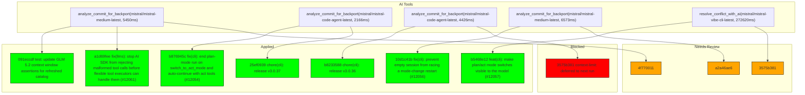

# Backport Agent — Detailed Run Report

> This file is generated automatically. It is intended for human analysts and
> AI reasoning models to assess agent performance, decision quality, and LLM behavior.

**Run timestamp**: 2026-07-06T19:49:55.374Z
**Models used**: fast=`mistral/mistral-code-agent-latest`  powerful=`mistral/mistral-medium-latest`
**Prompt log**: `/Users/rlemeill/Development/tea-ching-cline/.backport-agent/run-1783366505105.prompts.jsonl`

---

## Summary (PR body)

## Backport Agent — Sync Report

**Date**: 2026-07-06T19:49:55.374Z
**Upstream ref**: `main`
**Cut date**: `2026-06-27T00:00:00.000Z` 
**Fork ref**: `keypool-live`
**Sync branch**: `sync/upstream-main-2026-07-06-193630`

### Summary

- ✅ Applied: 7
- ⚠️ Needs human review: 3
- ⛔ Blocked (not attempted): 1

### Applied commits

- `091eccdf` [medium] test: update GLM 5.2 context window assertions for refreshed catalog
- `b876945c` [low] fix(cli): end plan-mode run on switch_to_act_mode and auto-continue with act tools (#12054)
- `b8233588` [low] chore(cli): release v3.0.36
- `10d1c41b` [low] fix(cli): prevent empty session from racing a mode-change restart (#12056)
- `b5468e12` [low] feat(cli): make plan/act mode switches visible to the model (#12057)
- `a1d69fee` [medium] fix(llms): stop AI SDK from rejecting malformed tool calls before flexible tool executors can handle them (#12061) _(conflict resolved by agent)_
- `25ef0939` [low] chore(cli): release v3.0.37

### ⚠️ Human review required

- `a2a46ae6` chore(sdk): release v0.0.55
  - Conflicted files: sdk/packages/llms/src/catalog/catalog.generated.ts
  - Context limit exceeded
- `3575b381` fix(shared): stop deleting mode_notice from outbound prompts (#12058)
  - Context limit exceeded
- `4f770011` chore(sdk): release v0.0.56
  - Conflicted files: sdk/packages/llms/src/catalog/catalog.generated.ts
  - Context limit exceeded

### Blocked commits (not attempted)

- `3575b381` [low] — context-limit: deferred to next run

### Agent decision log

- Created sync branch sync/upstream-main-2026-07-06-193630
- Applied low-risk commits first
- Applied medium-risk commits with AI analysis
- Resolved conflict in sdk/packages/llms/src/providers/ai-sdk.ts manually due to AI syntax error
- Stopped processing due to context limit; deferred remaining commits to next run


---

## Agent Workflow Diagram

> Generated by the fast model from the run summary. Evaluate the agent's decision path.



---

## AI Sub-Agent Call Log (5 calls)

> Each entry is one sub-agent invocation. Review prompt/response pairs to assess
> reasoning quality, hallucinations, and decision accuracy.

### Call 1 / 5 — `analyze_commit_for_backport` ✅ OK

| Field | Value |
|---|---|
| **Timestamp** | 2026-07-06T19:36:16.642Z |
| **Tool** | `analyze_commit_for_backport` |
| **Model** | `mistral/mistral-medium-latest` |
| **Duration** | 5450 ms |
| **Tokens in** | 19145 |
| **Tokens out** | 98 |
| **Cost** | $0.000000 |

**Prompt sent to sub-agent:**

```
Commit SHA: a2a46ae600207b47e4fc2e6706d5bd023e7fa689
Commit message:
chore(sdk): release v0.0.55

Changed files (8):
bun.lock
sdk/CHANGELOG.md
sdk/packages/agents/package.json
sdk/packages/core/package.json
sdk/packages/llms/package.json
sdk/packages/llms/src/catalog/catalog.generated.ts
sdk/packages/sdk/package.json
sdk/packages/shared/package.json

Diff:
commit a2a46ae600207b47e4fc2e6706d5bd023e7fa689
Author: Saoud Rizwan <7799382+saoudrizwan@users.noreply.github.com>
Date:   Fri Jul 3 09:56:58 2026 -0700

    chore(sdk): release v0.0.55
---
 bun.lock                                           | 424 ++++++++++-----------
 sdk/CHANGELOG.md                                   |   9 +
 sdk/packages/agents/package.json                   |   2 +-
 sdk/packages/core/package.json                     |   2 +-
 sdk/packages/llms/package.json                     |   2 +-
 sdk/packages/llms/src/catalog/catalog.generated.ts | 326 +++++++++++-----
 sdk/packages/sdk/package.json                      |   2 +-
 sdk/packages/shared/package.json                   |   2 +-
 8 files changed, 440 insertions(+), 329 deletions(-)

diff --git a/bun.lock b/bun.lock
index 0039da6763..ea0a591990 100644
--- a/bun.lock
+++ b/bun.lock
@@ -19,7 +19,7 @@
     },
     "apps/cli": {
       "name": "@cline/cli",
-      "version": "3.0.31",
+      "version": "3.0.34",
       "bin": {
         "cline": "src/index.ts",
       },
@@ -616,7 +616,7 @@
     },
     "sdk/packages/agents": {
       "name": "@cline/agents",
-      "version": "0.0.54",
+      "version": "0.0.55",
       "dependencies": {
         "@cline/llms": "workspace:*",
         "@cline/shared": "workspace:*",
@@ -625,7 +625,7 @@
     },
     "sdk/packages/core": {
       "name": "@cline/core",
-      "version": "0.0.54",
+      "version": "0.0.55",
       "dependencies": {
         "@cline/agents": "workspace:*",
         "@cline/llms": "workspace:*",
@@ -663,7 +663,7 @@
     },
     "sdk/packages/llms": {
       "name": "@cline/llms",
-      "version": "0.0.54",
+      "version": "0.0.55",
       "dependencies": {
         "@ai-sdk/amazon-bedrock": "^4.0.89",
         "@ai-sdk/anthropic": "^3.0.68",
@@ -697,14 +697,14 @@
     },
     "sdk/packages/sdk": {
       "name": "@cline/sdk",
-      "version": "0.0.54",
+      "version": "0.0.55",
       "dependencies": {
         "@cline/core": "workspace:*",
       },
     },
     "sdk/packages/shared": {
       "name": "@cline/shared",
-      "version": "0.0.54",
+      "version": "0.0.55",
       "dependencies": {
         "aws4fetch": "^1.0.20",
         "jsonrepair": "^3.13.2",
@@ -741,27 +741,27 @@
 
     "@agentclientprotocol/sdk": ["@agentclientprotocol/sdk@0.16.1", "", { "peerDependencies": { "zod": "^3.25.0 || ^4.0.0" } }, "sha512-1ad+Sc/0sCtZGHthxxvgEUo5Wsbw16I+aF+YwdiLnPwkZG8KAGUEAPK6LM6Pf69lCyJPt1Aomk1d+8oE3C4ZEw=="],
 
-    "@ai-sdk/amazon-bedrock": ["@ai-sdk/amazon-bedrock@4.0.119", "", { "dependencies": { "@ai-sdk/anthropic": "3.0.85", "@ai-sdk/openai": "3.0.73", "@ai-sdk/provider": "3.0.10", "@ai-sdk/provider-utils": "4.0.30", "@smithy/eventstream-codec": "^4.0.1", "@smithy/util-utf8": "^4.0.0", "aws4fetch": "^1.0.20" }, "peerDependencies": { "zod": "^3.25.76 || ^4.1.8" } }, "sha512-DgJugGl0Euja2g+60p3eV+2k4kQvtLtJFeYskVrAlt0KgpVGYot0XEPCOBgjDsn6aAEuyibWDSIddxJU8k9wug=="],
+    "@ai-sdk/amazon-bedrock": ["@ai-sdk/amazon-bedrock@4.0.122", "", { "dependencies": { "@ai-sdk/anthropic": "3.0.87", "@ai-sdk/openai": "3.0.75", "@ai-sdk/provider": "3.0.11", "@ai-sdk/provider-utils": "4.0.31", "@smithy/eventstream-codec": "^4.0.1", "@smithy/util-utf8": "^4.0.0", "aws4fetch": "^1.0.20" }, "peerDependencies": { "zod": "^3.25.76 || ^4.1.8" } }, "sha512-XiSsWFfX0W8lGFWZ/7NwbmdWEk/16lArmdi7LDVJkskKWwoRM1pexL6E+UPmzJ4sBsz01be+stYXIjEs64h7lQ=="],
 
-    "@ai-sdk/anthropic": ["@ai-sdk/anthropic@3.0.85", "", { "dependencies": { "@ai-sdk/provider": "3.0.10", "@ai-sdk/provider-utils": "4.0.30" }, "peerDependencies": { "zod": "^3.25.76 || ^4.1.8" } }, "sha512-fNeDB644l5wbRNQU0FnI+F7UTtOenMnPtACfMPUJaS2zJfuBlseEa1TMg+otHkETZgaJB+6Na51NQEv0+m7czw=="],
+    "@ai-sdk/anthropic": ["@ai-sdk/anthropic@3.0.87", "", { "dependencies": { "@ai-sdk/provider": "3.0.11", "@ai-sdk/provider-utils": "4.0.31" }, "peerDependencies": { "zod": "^3.25.76 || ^4.1.8" } }, "sha512-4v7uoMblNYZ3X7S5a+manSKKqKVmWXTkJOtZ8ymArHdQbhgzMd+um1qDee8MiJbDhk6wjy8T/F+D1pVhB/7HTQ=="],
 
-    "@ai-sdk/gateway": ["@ai-sdk/gateway@3.0.133", "", { "dependencies": { "@ai-sdk/provider": "3.0.10", "@ai-sdk/provider-utils": "4.0.30", "@vercel/oidc": "3.2.0" }, "peerDependencies": { "zod": "^3.25.76 || ^4.1.8" } }, "sha512-Ebs+7iS9zUgJu5B0RlxM2JmDWzq79Cpd6YdiqcCzB5qFdpfQJPUDiXutqlQP89F2XGjOdDeidulBTXUdXWzOxw=="],
+    "@ai-sdk/gateway": ["@ai-sdk/gateway@3.0.137", "", { "dependencies": { "@ai-sdk/provider": "3.0.11", "@ai-sdk/provider-utils": "4.0.31", "@vercel/oidc": "3.2.0" }, "peerDependencies": { "zod": "^3.25.76 || ^4.1.8" } }, "sha512-OIOBsRq8hrpML0kdT1QqC2s6nLnmX8G60xvukFJeWUd+jguY2WngzPVQkwlRBJN137LtEa7QyA0NMU3uxxVy3g=="],
 
-    "@ai-sdk/google": ["@ai-sdk/google@3.0.83", "", { "dependencies": { "@ai-sdk/provider": "3.0.10", "@ai-sdk/provider-utils": "4.0.30" }, "peerDependencies": { "zod": "^3.25.76 || ^4.1.8" } }, "sha512-Pz7aCX0dy+5x+r4K/37HbLZNaPtPL4q2NduzJW64VffLv5sI9Nb478wAd7PlH2r2asiypJsz/Jerf9draTciUA=="],
+    "@ai-sdk/google": ["@ai-sdk/google@3.0.84", "", { "dependencies": { "@ai-sdk/provider": "3.0.11", "@ai-sdk/provider-utils": "4.0.31" }, "peerDependencies": { "zod": "^3.25.76 || ^4.1.8" } }, "sha512-TVLcerZs7D70nHGPhtb5cwwX41CzKSVE00IEHRTRXXBa35g6BJdxi48YPglrrP9gDCAPSrl60/Nh5SBMMTwkwQ=="],
 
-    "@ai-sdk/google-vertex": ["@ai-sdk/google-vertex@4.0.147", "", { "dependencies": { "@ai-sdk/anthropic": "3.0.85", "@ai-sdk/google": "3.0.83", "@ai-sdk/openai-compatible": "2.0.51", "@ai-sdk/provider": "3.0.10", "@ai-sdk/provider-utils": "4.0.30", "google-auth-library": "^10.5.0" }, "peerDependencies": { "zod": "^3.25.76 || ^4.1.8" } }, "sha512-GWHyCCjhTJ1DVZSPUl+fITtqAu0hDsApyF2IBORQJxMaBES+d7B/YOIZW9bz64yHB89BInHuxkQoMqVRNm+LyQ=="],
+    "@ai-sdk/google-vertex": ["@ai-sdk/google-vertex@4.0.150", "", { "dependencies": { "@ai-sdk/anthropic": "3.0.87", "@ai-sdk/google": "3.0.84", "@ai-sdk/openai-compatible": "2.0.52", "@ai-sdk/provider": "3.0.11", "@ai-sdk/provider-utils": "4.0.31", "google-auth-library": "^10.5.0" }, "peerDependencies": { "zod": "^3.25.76 || ^4.1.8" } }, "sha512-67hfINiuyXHlo4eiAc6gPH+8EPSrMg9c3t0bmC2Dm6DsjW1l7M5HTt+eKtetdJJh/yBWMeJKi2ujLrP6oXvPaQ=="],
 
-    "@ai-sdk/mistral": ["@ai-sdk/mistral@3.0.40", "", { "dependencies": { "@ai-sdk/provider": "3.0.10", "@ai-sdk/provider-utils": "4.0.30" }, "peerDependencies": { "zod": "^3.25.76 || ^4.1.8" } }, "sha512-HzCV9jFsb04kpL/N+G7SCjFKJA0Q33p4Hc+1quYGGD8Ta37Pe5bzk9AjxaS8OYd//jmcny16yKhJ+e+h+P0AJg=="],
+    "@ai-sdk/mistral": ["@ai-sdk/mistral@3.0.41", "", { "dependencies": { "@ai-sdk/provider": "3.0.11", "@ai-sdk/provider-utils": "4.0.31" }, "peerDependencies": { "zod": "^3.25.76 || ^4.1.8" } }, "sha512-xpZCV8cj/cFjPeTUK/ejlSGYCjWzY3RIo+4zKbwO7iIDu7zL/3Ezj5+Jgoi9pbd68jdScYyY9McTh5cp90wYjQ=="],
 
-    "@ai-sdk/openai": ["@ai-sdk/openai@3.0.73", "", { "dependencies": { "@ai-sdk/provider": "3.0.10", "@ai-sdk/provider-utils": "4.0.30" }, "peerDependencies": { "zod": "^3.25.76 || ^4.1.8" } }, "sha512-+3x9oxHv9Xp33Iv2L8D+e5hqmZi64jofBKig/9611JKyfV59NdkaDDajtwc0CxOEfARgCVq1BW7dP+526gKOKw=="],
+    "@ai-sdk/openai": ["@ai-sdk/openai@3.0.75", "", { "dependencies": { "@ai-sdk/provider": "3.0.11", "@ai-sdk/provider-utils": "4.0.31" }, "peerDependencies": { "zod": "^3.25.76 || ^4.1.8" } }, "sha512-xKW+ZSHOdsFIUR6H2uSVjQQmzuHG+onsBZQmsr1OagDK/G55Vhx7Msd/5itoIT/kfGIhOGtCY0DTxbP0RWT7hA=="],
 
-    "@ai-sdk/openai-compatible": ["@ai-sdk/openai-compatible@2.0.51", "", { "dependencies": { "@ai-sdk/provider": "3.0.10", "@ai-sdk/provider-utils": "4.0.30" }, "peerDependencies": { "zod": "^3.25.76 || ^4.1.8" } }, "sha512-A6qfyaVs4lxmRxRux6U3ViOa8mMbsSd0OaHghpei2MpiBT6791J4zFH5MN7kaW1tLfQ246rSC2DVTMOavsycjQ=="],
+    "@ai-sdk/openai-compatible": ["@ai-sdk/openai-compatible@2.0.52", "", { "dependencies": { "@ai-sdk/provider": "3.0.11", "@ai-sdk/provider-utils": "4.0.31" }, "peerDependencies": { "zod": "^3.25.76 || ^4.1.8" } }, "sha512-WdVesd9VJQv8BLLla+x1AjLa40D3QUfnXH488+ydOcOIX7c4m6RF8Sh3JsAF+5ICa2Vknc9GTBlOvqCKoivE1w=="],
 
-    "@ai-sdk/provider": ["@ai-sdk/provider@3.0.10", "", { "dependencies": { "json-schema": "^0.4.0" } }, "sha512-Q3BZ27qfpYqnCYGvE3vt+Qi6LGOF9R5Nmzn+9JoM1lCRsD9mYaIhfJLkSunN48nfGXJ6n+XNV0J/XVpqGQl7Dw=="],
+    "@ai-sdk/provider": ["@ai-sdk/provider@3.0.11", "", { "dependencies": { "json-schema": "^0.4.0" } }, "sha512-GKu3RxsfKGWjBiXmEdsKsGR9uVgJ56mzL1w7mLsn5k2TiNtpyS2IYQo3v1NJpK3oyv2OVavlK3g801VSe+gujg=="],
 
-    "@ai-sdk/provider-utils": ["@ai-sdk/provider-utils@4.0.30", "", { "dependencies": { "@ai-sdk/provider": "3.0.10", "@standard-schema/spec": "^1.1.0", "eventsource-parser": "^3.0.8" }, "peerDependencies": { "zod": "^3.25.76 || ^4.1.8" } }, "sha512-VO7I+vPffqI5sMnPoUq5DCSqKIgQIk/naJWRdQVpz2ma2zoprC/lqiJiUEl2s6DfvTD76TbhD3q39ROjlA6rGw=="],
+    "@ai-sdk/provider-utils": ["@ai-sdk/provider-utils@4.0.31", "", { "dependencies": { "@ai-sdk/provider": "3.0.11", "@standard-schema/spec": "^1.1.0", "eventsource-parser": "^3.0.8" }, "peerDependencies": { "zod": "^3.25.76 || ^4.1.8" } }, "sha512-x4Q1NxNLw8V1AHKOunukpksbKCqzZdZEgpHgbZznUE3ZcWb2liI5j2321TlOvyfn1iL7NmNMFTD5mZYoChVx0g=="],
 
-    "@ai-sdk/react": ["@ai-sdk/react@3.0.210", "", { "dependencies": { "@ai-sdk/provider-utils": "4.0.30", "ai": "6.0.208", "swr": "^2.2.5", "throttleit": "2.1.0" }, "peerDependencies": { "react": "^18 || ~19.0.1 || ~19.1.2 || ^19.2.1" } }, "sha512-VprBlyc8yvwlpIdcIICL307vRncXrLlmcRTY/7JR5ND9+LvUcxJU16yW6prClFahqEWVza8Vr8P4Bgk5ZBtp4A=="],
+    "@ai-sdk/react": ["@ai-sdk/react@3.0.214", "", { "dependencies": { "@ai-sdk/provider-utils": "4.0.31", "ai": "6.0.212", "swr": "^2.2.5", "throttleit": "2.1.0" }, "peerDependencies": { "react": "^18 || ~19.0.1 || ~19.1.2 || ^19.2.1" } }, "sha512-GMmwzW6LAHMqrfDsv5NBnQ1EFYYHDt6SjjWdv/d2WRVx6wYUPqdfpr8JHfckVJNIr88trqrbrJAF2APWXkLTVQ=="],
 
     "@alloc/quick-lru": ["@alloc/quick-lru@5.2.0", "", {}, "sha512-UrcABB+4bUrFABwbluTIBErXwvbsU/V7TZWfmbgJfbkwiBuziS9gxdODUyuiecfdGQ85jglMW6juS3+z5TsKLw=="],
 
@@ -769,23 +769,23 @@
 
     "@antfu/install-pkg": ["@antfu/install-pkg@1.1.0", "", { "dependencies": { "package-manager-detector": "^1.3.0", "tinyexec": "^1.0.1" } }, "sha512-MGQsmw10ZyI+EJo45CdSER4zEb+p31LpDAFp2Z3gkSd1yqVZGi0Ebx++YTEMonJy4oChEMLsxZ64j8FH6sSqtQ=="],
 
-    "@anthropic-ai/claude-agent-sdk": ["@anthropic-ai/claude-agent-sdk@0.3.185", "", { "optionalDependencies": { "@anthropic-ai/claude-agent-sdk-darwin-arm64": "0.3.185", "@anthropic-ai/claude-agent-sdk-darwin-x64": "0.3.185", "@anthropic-ai/claude-agent-sdk-linux-arm64": "0.3.185", "@anthropic-ai/claude-agent-sdk-linux-arm64-musl": "0.3.185", "@anthropic-ai/claude-agent-sdk-linux-x64": "0.3.185", "@anthropic-ai/claude-agent-sdk-linux-x64-musl": "0.3.185", "@anthropic-ai/claude-agent-sdk-win32-arm64": "0.3.185", "@anthropic-ai/claude-agent-sdk-win32-x64": "0.3.185" }, "peerDependencies": { "@anthropic-ai/sdk": ">=0.93.0", "@modelcontextprotocol/sdk": "^1.29.0", "zod": "^4.0.0" } }, "sha512-UDDd0cInvOufmR88btR/Ursnh71sb5scoutNlRS2L0LBdkt7JEqYJ0jt7DnOYHEVhMx8AAcg0eYgvXztcWUnFA=="],
+    "@anthropic-ai/claude-agent-sdk": ["@anthropic-ai/claude-agent-sdk@0.3.193", "", { "optionalDependencies": { "@anthropic-ai/claude-agent-sdk-darwin-arm64": "0.3.193", "@anthropic-ai/claude-agent-sdk-darwin-x64": "0.3.193", "@anthropic-ai/claude-agent-sdk-linux-arm64": "0.3.193", "@anthropic-ai/claude-agent-sdk-linux-arm64-musl": "0.3.193", "@anthropic-ai/claude-agent-sdk-linux-x64": "0.3.193", "@anthropic-ai/claude-agent-sdk-linux-x64-musl": "0.3.193", "@anthropic-ai/claude-agent-sdk-win32-arm64": "0.3.193", "@anthropic-ai/claude-agent-sdk-win32-x64": "0.3.193" }, "peerDependencies": { "@anthropic-ai/sdk": ">=0.93.0", "@modelcontextprotocol/sdk": "^1.29.0", "zod": "^4.0.0" } }, "sha512-WzL03VJE1sT0Nz3rEpsYMYR+9n6iyQtLVt7ghMWnYC9pvDsiy6kwcMplZniWSjH8Dm6CfkUBN5t6KB4i/JfouA=="],
 
-    "@anthropic-ai/claude-agent-sdk-darwin-arm64": ["@anthropic-ai/claude-agent-sdk-darwin-arm64@0.3.185", "", { "os": "darwin", "cpu": "arm64" }, "sha512-P2Svxx1IFrS9aw4ylJBtcoJrc/OAOVnDs+o05x4TV7HoHUQUcKZ9XhWOGnadyVT0KLyoktgjyjnaK7Zdtc0Ldg=="],
+    "@anthropic-ai/claude-agent-sdk-darwin-arm64": ["@anthropic-ai/claude-agent-sdk-darwin-arm64@0.3.193", "", { "os": "darwin", "cpu": "arm64" }, "sha512-1hT7b+KIm/3E1OSJofr7PF21Xq2zT1ccnjzuVcWQ5LYXJ09lgCMvA/ZfcDBKuoyCZ4lSnuicKXZ/h5vRbWfqrA=="],
 
-    "@anthropic-ai/claude-agent-sdk-darwin-x64": ["@anthropic-ai/claude-agent-sdk-darwin-x64@0.3.185", "", { "os": "darwin", "cpu": "x64" }, "sha512-H69m2hIJawzSkCDNO/CPLQCYvDGdlbZdzGTgGF8/IQuB4O81sv8WSAh6TBXwtFXOgEi4HtrUYlxiFDmTHt7hMA=="],
+    "@anthropic-ai/claude-agent-sdk-darwin-x64": ["@anthropic-ai/claude-agent-sdk-darwin-x64@0.3.193", "", { "os": "darwin", "cpu": "x64" }, "sha512-9x5Y/L6iwETwEJFmPaYXfsE8q0cVgx75V7nL60HvSzi8K1XQNcG5u53jOzRvqDNah8mvGYOb+9AWrMCSJvmFyA=="],
 
-    "@anthropic-ai/claude-agent-sdk-linux-arm64": ["@anthropic-ai/claude-agent-sdk-linux-arm64@0.3.185", "", { "os": "linux", "cpu": "arm64" }, "sha512-KtXMCoprGYTSPb/A0/kjrO+PpDJAFbHhDd8rjqA4izU51OYjTDkahsGCcSTFM2jA8krOhPqzx/SNVuAVWmexwA=="],
+    "@anthropic-ai/claude-agent-sdk-linux-arm64": ["@anthropic-ai/claude-agent-sdk-linux-arm64@0.3.193", "", { "os": "linux", "cpu": "arm64" }, "sha512-gvfD9pKHXWxCkkIX6bC4/FOALTxqHYjAu83iT1bzn5mCv6QWSZRl6WLRRtvKpWtWuY1jpML1lL3YfKADsAX/rA=="],
 
-    "@anthropic-ai/claude-agent-sdk-linux-arm64-musl": ["@anthropic-ai/claude-agent-sdk-linux-arm64-musl@0.3.185", "", { "os": "linux", "cpu": "arm64" }, "sha512-1GRpKYrg5foomW+qLrxm/k2R/5PEU7RAuEdX65HV6lFMJR3HsGj8qfBq4KCJHTS3r4YdVrFLvPQ/mUqbY6klIA=="],
+    "@anthropic-ai/claude-agent-sdk-linux-arm64-musl": ["@anthropic-ai/claude-agent-sdk-linux-arm64-musl@0.3.193", "", { "os": "linux", "cpu": "arm64" }, "sha512-a3qsVTBe4G6ndsVavfIXEVAXLVXM8uvBUNYpm4jKqk2+ovWZQe/96CXOwmerg9U+/bllg4QJ9lSyYCsdtVIr6w=="],
 
-    "@anthropic-ai/claude-agent-sdk-linux-x64": ["@anthropic-ai/claude-agent-sdk-linux-x64@0.3.185", "", { "os": "linux", "cpu": "x64" }, "sha512-8U5wu6dNcyzRkwoae0Gu5ZHs6lRSu8CXqd9yrilX3fHR9kKICrm76bLu5q2auuSc/8dx6VL5ZXqSzFKIMp//zw=="],
+    "@anthropic-ai/claude-agent-sdk-linux-x64": ["@anthropic-ai/claude-agent-sdk-linux-x64@0.3.193", "", { "os": "linux", "cpu": "x64" }, "sha512-1sz+7cn0iuh0ThInuAYF1jpFvLyOaZ0PZYQIF7eb9JDZbBohUf6INeTCwjAwUL0ASCq2xS7Odu/qDVuTtLTeDA=="],
 
-    "@anthropic-ai/claude-agent-sdk-linux-x64-musl": ["@anthropic-ai/claude-agent-sdk-linux-x64-musl@0.3.185", "", { "os": "linux", "cpu": "x64" }, "sha512-YAky0Oez+YYrlcas/xDiaCm9AUX0z1YwM+pnk+CFxEr/ICmc7MbiFsnEIXFLPHaox9bE5iOzw4LS4b/c1tIJRg=="],
+    "@anthropic-ai/claude-agent-sdk-linux-x64-musl": ["@anthropic-ai/claude-agent-sdk-linux-x64-musl@0.3.193", "", { "os": "linux", "cpu": "x64" }, "sha512-DLXlO4tlcWygz0Ft4nu6ai5KssByYt2tOeWdc4dFXKt6uBKXpbZVziUUq3ePO5zuAFyU6w7EjYLv8MMPURbAiQ=="],
 
-    "@anthropic-ai/claude-agent-sdk-win32-arm64": ["@anthropic-ai/claude-agent-sdk-win32-arm64@0.3.185", "", { "os": "win32", "cpu": "arm64" }, "sha512-pJEOaCLQQQWSyBeseR/GAn4eEp4WtMDP/o5yPMuuAsNWeoJXM7cY4j/N3KBE6GZofgnYdWEXILF2uw3SjbtINA=="],
+    "@anthropic-ai/claude-agent-sdk-win32-arm64": ["@anthropic-ai/claude-agent-sdk-win32-arm64@0.3.193", "", { "os": "win32", "cpu": "arm64" }, "sha512-36LJKiGuKusgaPTVeh9QanL00UcaE0RcC4pgK800/0SenApbh979ndxI0XKUVfLHzlGkqlhkhT3foMdqS+zx1w=="],
 
-    "@anthropic-ai/claude-agent-sdk-win32-x64": ["@anthropic-ai/claude-agent-sdk-win32-x64@0.3.185", "", { "os": "win32", "cpu": "x64" }, "sha512-/Kf9XneSuIkSHNwrxOVY0XT7RovAEcx5nDASKzku4994cZz54otU5mT2jT6dwevDLEStfgts5x/A4z0AePwVTQ=="],
+    "@anthropic-ai/claude-agent-sdk-win32-x64": ["@anthropic-ai/claude-agent-sdk-win32-x64@0.3.193", "", { "os": "win32", "cpu": "x64" }, "sha512-VyyKZlWQpbD6nkUTeNvgmLvpqt1QaPQQBOC30tbEYwYsV5MC1I35Li0H7nWwngGqPSTtMvHpjpz6Eb2FSTn7/A=="],
 
     "@anthropic-ai/sdk": ["@anthropic-ai/sdk@0.37.0", "", { "dependencies": { "@types/node": "^18.11.18", "@types/node-fetch": "^2.6.4", "abort-controller": "^3.0.0", "agentkeepalive": "^4.2.1", "form-data-encoder": "1.7.2", "formdata-node": "^4.3.2", "node-fetch": "^2.6.7" } }, "sha512-tHjX2YbkUBwEgg0JZU3EFSSAQPoK4qQR/NFYa8Vtzd5UAyXzZksCw2In69Rml4R/TyHPBfRYaLK35XiOe33pjw=="],
 
@@ -801,41 +801,41 @@
 
     "@aws-crypto/util": ["@aws-crypto/util@5.2.0", "", { "dependencies": { "@aws-sdk/types": "^3.222.0", "@smithy/util-utf8": "^2.0.0", "tslib": "^2.6.2" } }, "sha512-4RkU9EsI6ZpBve5fseQlGNUWKMa1RLPQ1dnjnQoe07ldfIzcsGb5hC5W0Dm7u423KWzawlrpbjXBrXCEv9zazQ=="],
 
-    "@aws-sdk/client-cognito-identity": ["@aws-sdk/client-cognito-identity@3.1073.0", "", { "dependencies": { "@aws-crypto/sha256-browser": "5.2.0", "@aws-crypto/sha256-js": "5.2.0", "@aws-sdk/core": "^3.974.22", "@aws-sdk/credential-provider-node": "^3.972.57", "@aws-sdk/types": "^3.973.13", "@smithy/core": "^3.24.6", "@smithy/fetch-http-handler": "^5.4.6", "@smithy/node-http-handler": "^4.7.6", "@smithy/types": "^4.14.3", "tslib": "^2.6.2" } }, "sha512-uRUmlXq8U6/OPbuFq2enPDwBCCZpTLo1Y+OtW1Sue8Gdq1fhPxw6qxhmr/JvE05yYYW9Rc8w/KifPvfs8ctZSw=="],
+    "@aws-sdk/client-cognito-identity": ["@aws-sdk/client-cognito-identity@3.1075.0", "", { "dependencies": { "@aws-crypto/sha256-browser": "5.2.0", "@aws-crypto/sha256-js": "5.2.0", "@aws-sdk/core": "^3.974.23", "@aws-sdk/credential-provider-node": "^3.972.58", "@aws-sdk/types": "^3.973.13", "@smithy/core": "^3.24.6", "@smithy/fetch-http-handler": "^5.4.6", "@smithy/node-http-handler": "^4.7.6", "@smithy/types": "^4.14.3", "tslib": "^2.6.2" } }, "sha512-typFcdyFwIPt86QPKsO7xwcsYoEmNcDpoNqn0tqa4+Lss7niNKQzPe/765XNgAHO3I1ixiT1OKv8KD6M+CKw2w=="],
 
-    "@aws-sdk/core": ["@aws-sdk/core@3.974.22", "", { "dependencies": { "@aws-sdk/types": "^3.973.13", "@aws-sdk/xml-builder": "^3.972.30", "@aws/lambda-invoke-store": "^0.2.2", "@smithy/core": "^3.24.6", "@smithy/signature-v4": "^5.4.6", "@smithy/types": "^4.14.3", "bowser": "^2.11.0", "tslib": "^2.6.2" } }, "sha512-YofH63shc6YRdXjz80BJkpJW+Bkn0Cuu2dn4Rv7s9G2Idt58tgtzQEWxrR2xVljlVfIBeUjPuULnSVYLke3sUQ=="],
+    "@aws-sdk/core": ["@aws-sdk/core@3.974.23", "", { "dependencies": { "@aws-sdk/types": "^3.973.13", "@aws-sdk/xml-builder": "^3.972.31", "@aws/lambda-invoke-store": "^0.2.2", "@smithy/core": "^3.24.6", "@smithy/signature-v4": "^5.4.6", "@smithy/types": "^4.14.3", "bowser": "^2.11.0", "tslib": "^2.6.2" } }, "sha512-MiWR/uWjxjFXGzrE0Ghc5lWxUxzHsUWFhV+OX7M4cR9SrmrnZs6TXavnCWnzzdwJeFri34xQo81rvGNzK3c4BQ=="],
 
-    "@aws-sdk/credential-provider-cognito-identity": ["@aws-sdk/credential-provider-cognito-identity@3.972.47", "", { "dependencies": { "@aws-sdk/nested-clients": "^3.997.22", "@aws-sdk/types": "^3.973.13", "@smithy/core": "^3.24.6", "@smithy/types": "^4.14.3", "tslib": "^2.6.2" } }, "sha512-IEW+q7yXgTT6+TFgJlOW+K5FK7kj1pBFW7oc04J/jlitMxq+vOJpmU42j+xaQlhwPx2JR805ryi73aLRWicXjQ=="],
+    "@aws-sdk/credential-provider-cognito-identity": ["@aws-sdk/credential-provider-cognito-identity@3.972.48", "", { "dependencies": { "@aws-sdk/nested-clients": "^3.997.23", "@aws-sdk/types": "^3.973.13", "@smithy/core": "^3.24.6", "@smithy/types": "^4.14.3", "tslib": "^2.6.2" } }, "sha512-dTSY4wCPx87Gd1peDcTop1li61f6KLAs3LSlq/omnCxpIOvMDpAQjylJ7ZDaZk6KA88+oZ0k/XuVSou1YuWI/w=="],
 
-    "@aws-sdk/credential-provider-env": ["@aws-sdk/credential-provider-env@3.972.48", "", { "dependencies": { "@aws-sdk/core": "^3.974.22", "@aws-sdk/types": "^3.973.13", "@smithy/core": "^3.24.6", "@smithy/types": "^4.14.3", "tslib": "^2.6.2" } }, "sha512-h6FEC95fbexUd6zxm4PdgS82bTcI2PRtUb2ZwMipb/Xr8bPwtf0G8rBo2jp7NA24Mbx2JA8/WingiYpA9RCCyw=="],
+    "@aws-sdk/credential-provider-env": ["@aws-sdk/credential-provider-env@3.972.49", "", { "dependencies": { "@aws-sdk/core": "^3.974.23", "@aws-sdk/types": "^3.973.13", "@smithy/core": "^3.24.6", "@smithy/types": "^4.14.3", "tslib": "^2.6.2" } }, "sha512-liB3yQNHCM9k/gu/w36XHMKPluT7HTlnGUhRbBGSISDQkcr/Sy1zsZabiuvQj8WG5yW573u9RehrBvvnIQ9OEQ=="],
 
-    "@aws-sdk/credential-provider-http": ["@aws-sdk/credential-provider-http@3.972.50", "", { "dependencies": { "@aws-sdk/core": "^3.974.22", "@aws-sdk/types": "^3.973.13", "@smithy/core": "^3.24.6", "@smithy/fetch-http-handler": "^5.4.6", "@smithy/node-http-handler": "^4.7.6", "@smithy/types": "^4.14.3", "tslib": "^2.6.2" } }, "sha512-lJO3OLpjvz5m/RSBQmsG/CEUGsvCy5ruxKwPQaOCqxqCMuyYT2BZwQUTDZVVwqQ9LrZKuK24JSa6r31hL/tvkg=="],
+    "@aws-sdk/credential-provider-http": ["@aws-sdk/credential-provider-http@3.972.51", "", { "dependencies": { "@aws-sdk/core": "^3.974.23", "@aws-sdk/types": "^3.973.13", "@smithy/core": "^3.24.6", "@smithy/fetch-http-handler": "^5.4.6", "@smithy/node-http-handler": "^4.7.6", "@smithy/types": "^4.14.3", "tslib": "^2.6.2" } }, "sha512-XET0H2oofciJ5lMRWNIvRjAP7Q3wv2XT+JtJJEdhPWUMwe3TvQ9qcxonpu7vXmNngncvFpi4E2It+Tamas/naA=="],
 
-    "@aws-sdk/credential-provider-ini": ["@aws-sdk/credential-provider-ini@3.972.55", "", { "dependencies": { "@aws-sdk/core": "^3.974.22", "@aws-sdk/credential-provider-env": "^3.972.48", "@aws-sdk/credential-provider-http": "^3.972.50", "@aws-sdk/credential-provider-login": "^3.972.54", "@aws-sdk/credential-provider-process": "^3.972.48", "@aws-sdk/credential-provider-sso": "^3.972.54", "@aws-sdk/credential-provider-web-identity": "^3.972.54", "@aws-sdk/nested-clients": "^3.997.22", "@aws-sdk/types": "^3.973.13", "@smithy/core": "^3.24.6", "@smithy/credential-provider-imds": "^4.3.7", "@smithy/types": "^4.14.3", "tslib": "^2.6.2" } }, "sha512-TBoF4buBGYhXjdZAryayY2TrkQj2B2KfE/msG4V53XCt+w0EhEwM2JRjx8p2grJ2C6gtH5++SAwEvGMRdi0yyw=="],
+    "@aws-sdk/credential-provider-ini": ["@aws-sdk/credential-provider-ini@3.972.56", "", { "dependencies": { "@aws-sdk/core": "^3.974.23", "@aws-sdk/credential-provider-env": "^3.972.49", "@aws-sdk/credential-provider-http": "^3.972.51", "@aws-sdk/credential-provider-login": "^3.972.55", "@aws-sdk/credential-provider-process": "^3.972.49", "@aws-sdk/credential-provider-sso": "^3.972.55", "@aws-sdk/credential-provider-web-identity": "^3.972.55", "@aws-sdk/nested-clients": "^3.997.23", "@aws-sdk/types": "^3.973.13", "@smithy/core": "^3.24.6", "@smithy/credential-provider-imds": "^4.3.7", "@smithy/types": "^4.14.3", "tslib": "^2.6.2" } }, "sha512-IAmc61hbgQiHht9U3x0tnRwz0lzdwOwD/i9voRgdJrKamF+JtmrBOsW9GwB7mfFonNWOWL4qARWYrF8veEMe3w=="],
 
-    "@aws-sdk/credential-provider-login": ["@aws-sdk/credential-provider-login@3.972.54", "", { "dependencies": { "@aws-sdk/core": "^3.974.22", "@aws-sdk/nested-clients": "^3.997.22", "@aws-sdk/types": "^3.973.13", "@smithy/core": "^3.24.6", "@smithy/types": "^4.14.3", "tslib": "^2.6.2" } }, "sha512-hBWI3wZTdTGiuMfmPts6AWbAjFfRniOQnqx68tc2cQvRKWawFbN9wkLOVPWM1FAOyowZU73mC6Fi+rHSHNyLFw=="],
+    "@aws-sdk/credential-provider-login": ["@aws-sdk/credential-provider-login@3.972.55", "", { "dependencies": { "@aws-sdk/core": "^3.974.23", "@aws-sdk/nested-clients": "^3.997.23", "@aws-sdk/types": "^3.973.13", "@smithy/core": "^3.24.6", "@smithy/types": "^4.14.3", "tslib": "^2.6.2" } }, "sha512-hBBkANo3cDn+h2qxxzER4a+J8JCO9o9Z/YYmU7iky6AcaarX5RRdRcHNC6SLdwY0vAXQygn6soUbDqPn3GghaA=="],
 
-    "@aws-sdk/credential-provider-node": ["@aws-sdk/credential-provider-node@3.972.57", "", { "dependencies": { "@aws-sdk/credential-provider-env": "^3.972.48", "@aws-sdk/credential-provider-http": "^3.972.50", "@aws-sdk/credential-provider-ini": "^3.972.55", "@aws-sdk/credential-provider-process": "^3.972.48", "@aws-sdk/credential-provider-sso": "^3.972.54", "@aws-sdk/credential-provider-web-identity": "^3.972.54", "@aws-sdk/types": "^3.973.13", "@smithy/core": "^3.24.6", "@smithy/credential-provider-imds": "^4.3.7", "@smithy/types": "^4.14.3", "tslib": "^2.6.2" } }, "sha512-u6dClpzNdWf1HGWz4wwhdXi1wiOofCLniM9S4BQQGlLAN9TW7VB+ld5V533GdKrYMaFeBGFqKnj0JCYvynLqwQ=="],
+    "@aws-sdk/credential-provider-node": ["@aws-sdk/credential-provider-node@3.972.58", "", { "dependencies": { "@aws-sdk/credential-provider-env": "^3.972.49", "@aws-sdk/credential-provider-http": "^3.972.51", "@aws-sdk/credential-provider-ini": "^3.972.56", "@aws-sdk/credential-provider-process": "^3.972.49", "@aws-sdk/credential-provider-sso": "^3.972.55", "@aws-sdk/credential-provider-web-identity": "^3.972.55", "@aws-sdk/types": "^3.973.13", "@smithy/core": "^3.24.6", "@smithy/credential-provider-imds": "^4.3.7", "@smithy/types": "^4.14.3", "tslib": "^2.6.2" } }, "sha512-OyCLVmSI7pZO8hxwNVX6pXhTVlJqRBTp+ijdEfJSUj0RyjHnF602OfAarOzGq6wkGodeFkYBt8MmJ6A6ycRgWw=="],
 
-    "@aws-sdk/credential-provider-process": ["@aws-sdk/credential-provider-process@3.972.48", "", { "dependencies": { "@aws-sdk/core": "^3.974.22", "@aws-sdk/types": "^3.973.13", "@smithy/core": "^3.24.6", "@smithy/types": "^4.14.3", "tslib": "^2.6.2" } }, "sha512-w6VZwojPt12WnEkAUy6Nu4K6sWCbBmR7QX390b0nE6vRvkXbrYr9Lq9VySGkfjiMjpUA87op+J4EgvRmtWIDoQ=="],
+    "@aws-sdk/credential-provider-process": ["@aws-sdk/credential-provider-process@3.972.49", "", { "dependencies": { "@aws-sdk/core": "^3.974.23", "@aws-sdk/types": "^3.973.13", "@smithy/core": "^3.24.6", "@smithy/types": "^4.14.3", "tslib": "^2.6.2" } }, "sha512-C8h36lBuC/RnBSsjlO+dn6xZm3KbAl5vpJaVPAfQnMmz2/OISmKOc8XZcqMQgO2ADwBYNRMM6Kf3vz9G/TulMQ=="],
 
-    "@aws-sdk/credential-provider-sso": ["@aws-sdk/credential-provider-sso@3.972.54", "", { "dependencies": { "@aws-sdk/core": "^3.974.22", "@aws-sdk/nested-clients": "^3.997.22", "@aws-sdk/token-providers": "3.1071.0", "@aws-sdk/types": "^3.973.13", "@smithy/core": "^3.24.6", "@smithy/types": "^4.14.3", "tslib": "^2.6.2" } }, "sha512-23uZpIpF2SIFDCa1fcWa202tK4gGeyvX6GIIAjiB8WBsvsVRBMnJ/7dCxHzxf7eZT7GToJg837LDIBnZsl/VUg=="],
+    "@aws-sdk/credential-provider-sso": ["@aws-sdk/credential-provider-sso@3.972.55", "", { "dependencies": { "@aws-sdk/core": "^3.974.23", "@aws-sdk/nested-clients": "^3.997.23", "@aws-sdk/token-providers": "3.1074.0", "@aws-sdk/types": "^3.973.13", "@smithy/core": "^3.24.6", "@smithy/types": "^4.14.3", "tslib": "^2.6.2" } }, "sha512-1FkOz74Ea5QGS9jtIoXp55T/IkSS3spv+nLTT07fRY/+T5xmEOqaYBVIaEmX4zTNvbV6g2lrtlaVKWEoNyJt3w=="],
 
-    "@aws-sdk/credential-provider-web-identity": ["@aws-sdk/credential-provider-web-identity@3.972.54", "", { "dependencies": { "@aws-sdk/core": "^3.974.22", "@aws-sdk/nested-clients": "^3.997.22", "@aws-sdk/types": "^3.973.13", "@smithy/core": "^3.24.6", "@smithy/types": "^4.14.3", "tslib": "^2.6.2" } }, "sha512-0Iv5QttS6wcATlodYKgvQj6B9Db51rx7NU9fqu0PoLeS4BIgdYMc/QK4smwLwpm5RFrs02V/eLyEFp3FklvlNQ=="],
+    "@aws-sdk/credential-provider-web-identity": ["@aws-sdk/credential-provider-web-identity@3.972.55", "", { "dependencies": { "@aws-sdk/core": "^3.974.23", "@aws-sdk/nested-clients": "^3.997.23", "@aws-sdk/types": "^3.973.13", "@smithy/core": "^3.24.6", "@smithy/types": "^4.14.3", "tslib": "^2.6.2" } }, "sha512-g2BoECD1q01kTPByi56+VLVvdWDzMkKIcr77qixpqH0okw2t0U5CoPv+6S8v/D1Y2Wa6QKKtn6XAtDzP+Kfpvg=="],
 
-    "@aws-sdk/credential-providers": ["@aws-sdk/credential-providers@3.1073.0", "", { "dependencies": { "@aws-sdk/client-cognito-identity": "3.1073.0", "@aws-sdk/core": "^3.974.22", "@aws-sdk/credential-provider-cognito-identity": "^3.972.47", "@aws-sdk/credential-provider-env": "^3.972.48", "@aws-sdk/credential-provider-http": "^3.972.50", "@aws-sdk/credential-provider-ini": "^3.972.55", "@aws-sdk/credential-provider-login": "^3.972.54", "@aws-sdk/credential-provider-node": "^3.972.57", "@aws-sdk/credential-provider-process": "^3.972.48", "@aws-sdk/credential-provider-sso": "^3.972.54", "@aws-sdk/credential-provider-web-identity": "^3.972.54", "@aws-sdk/nested-clients": "^3.997.22", "@aws-sdk/types": "^3.973.13", "@smithy/core": "^3.24.6", "@smithy/credential-provider-imds": "^4.3.7", "@smithy/types": "^4.14.3", "tslib": "^2.6.2" } }, "sha512-30LSiM7/Wp+C/xrK5Q3JiOz8jvTxYlcSAo45jxqy4aoiT4udiCt5nSKyyF+B2v/a1LFWYuhT1rV3423PcNrdCA=="],
+    "@aws-sdk/credential-providers": ["@aws-sdk/credential-providers@3.1075.0", "", { "dependencies": { "@aws-sdk/client-cognito-identity": "3.1075.0", "@aws-sdk/core": "^3.974.23", "@aws-sdk/credential-provider-cognito-identity": "^3.972.48", "@aws-sdk/credential-provider-env": "^3.972.49", "@aws-sdk/credential-provider-http": "^3.972.51", "@aws-sdk/credential-provider-ini": "^3.972.56", "@aws-sdk/credential-provider-login": "^3.972.55", "@aws-sdk/credential-provider-node": "^3.972.58", "@aws-sdk/credential-provider-process": "^3.972.49", "@aws-sdk/credential-provider-sso": "^3.972.55", "@aws-sdk/credential-provider-web-identity": "^3.972.55", "@aws-sdk/nested-clients": "^3.997.23", "@aws-sdk/types": "^3.973.13", "@smithy/core": "^3.24.6", "@smithy/credential-provider-imds": "^4.3.7", "@smithy/types": "^4.14.3", "tslib": "^2.6.2" } }, "sha512-2HoJ1IxwdzEryyUmZvl6dVKfgWBnS6NzSDl5hOqmbHns5Cy+wCQLDFU+HGVi+kTGZgSyMZIa0rH7fQvNf7v9jQ=="],
 
-    "@aws-sdk/nested-clients": ["@aws-sdk/nested-clients@3.997.22", "", { "dependencies": { "@aws-crypto/sha256-browser": "5.2.0", "@aws-crypto/sha256-js": "5.2.0", "@aws-sdk/core": "^3.974.22", "@aws-sdk/signature-v4-multi-region": "^3.996.35", "@aws-sdk/types": "^3.973.13", "@smithy/core": "^3.24.6", "@smithy/fetch-http-handler": "^5.4.6", "@smithy/node-http-handler": "^4.7.6", "@smithy/types": "^4.14.3", "tslib": "^2.6.2" } }, "sha512-4IwtcYSxEIVw5hcp8ogq0CMbFNZFw7jJUetpfFUhFFeqsa1K8j2Ihg2hnxLyOp3stMZnXda6VzOmPi1AFZQXcg=="],
+    "@aws-sdk/nested-clients": ["@aws-sdk/nested-clients@3.997.23", "", { "dependencies": { "@aws-crypto/sha256-browser": "5.2.0", "@aws-crypto/sha256-js": "5.2.0", "@aws-sdk/core": "^3.974.23", "@aws-sdk/signature-v4-multi-region": "^3.996.35", "@aws-sdk/types": "^3.973.13", "@smithy/core": "^3.24.6", "@smithy/fetch-http-handler": "^5.4.6", "@smithy/node-http-handler": "^4.7.6", "@smithy/types": "^4.14.3", "tslib": "^2.6.2" } }, "sha512-gO93ZPsI2bxeFZD42f1/qjDw6FAZkNZcKRO94LIiT03fzOmcJ9e/tunxjVjA1Rl69ClmVJzz8H3G9CdKef10PA=="],
 
     "@aws-sdk/signature-v4-multi-region": ["@aws-sdk/signature-v4-multi-region@3.996.35", "", { "dependencies": { "@aws-sdk/types": "^3.973.13", "@smithy/signature-v4": "^5.4.6", "@smithy/types": "^4.14.3", "tslib": "^2.6.2" } }, "sha512-6L/VWs+Wch2stHemCGTmUNqKLMzURxQDK5boNG3Jn3kAOp71meDUuS5sbObpEvFxHDq0uWeSLFDNSYsjNt+Dlg=="],
 
-    "@aws-sdk/token-providers": ["@aws-sdk/token-providers@3.1071.0", "", { "dependencies": { "@aws-sdk/core": "^3.974.22", "@aws-sdk/nested-clients": "^3.997.22", "@aws-sdk/types": "^3.973.13", "@smithy/core": "^3.24.6", "@smithy/types": "^4.14.3", "tslib": "^2.6.2" } }, "sha512-4LDW2Qob6LoLFuqYSYZq2AyTE9koSE9+i+n5UZcm10GpmQOK0zRD9L4uYlzItiTKksIWgC/qMFChAi3RvKYtMg=="],
+    "@aws-sdk/token-providers": ["@aws-sdk/token-providers@3.1074.0", "", { "dependencies": { "@aws-sdk/core": "^3.974.23", "@aws-sdk/nested-clients": "^3.997.23", "@aws-sdk/types": "^3.973.13", "@smithy/core": "^3.24.6", "@smithy/types": "^4.14.3", "tslib": "^2.6.2" } }, "sha512-pv80IzgGW4RnXWtft692chZOM9i6PhebVsLCcnaM4dBEPZva2fE6FXAHs76G7Rc7s3yGyX/68G0nZMrUy+Vmpg=="],
 
     "@aws-sdk/types": ["@aws-sdk/types@3.973.13", "", { "dependencies": { "@smithy/types": "^4.14.3", "tslib": "^2.6.2" } }, "sha512-pEHZqRkAlHfnfAU9tK+WpKv/gBNjGJrHMgA3A0iYRGyswBS2t0pfez+lWlwktb3Bqa0ovh7w/QJTFwp3fDxLNg=="],
 
     "@aws-sdk/util-locate-window": ["@aws-sdk/util-locate-window@3.965.8", "", { "dependencies": { "tslib": "^2.6.2" } }, "sha512-uUbMs1cBZPafD0ohUj6EwNf0fPZ534NvBxHox4hjX+0Rxq5paSYUem7+hi833pYrzrcnBATKIYpR02MDXT5M9g=="],
 
-    "@aws-sdk/xml-builder": ["@aws-sdk/xml-builder@3.972.30", "", { "dependencies": { "@smithy/types": "^4.14.3", "fast-xml-parser": "5.7.3", "tslib": "^2.6.2" } }, "sha512-StElZPEoBquWwNqw1AcfpzEyZqJvFxouG+mpDNYlcH6ZOrqd2CuIryv+8LV8gNHZUOyKyJF3Dq9vxaXEmDR9TQ=="],
+    "@aws-sdk/xml-builder": ["@aws-sdk/xml-builder@3.972.31", "", { "dependencies": { "@smithy/types": "^4.14.3", "tslib": "^2.6.2" } }, "sha512-SzE4Pgyl+hDF+BuyuzxUSpwnuUu9lJuO1YGgteG89/4Qv0+2IQiVQqdbPV32IozLvXWQChPQcdkk/sKvb1QHiQ=="],
 
     "@aws/lambda-invoke-store": ["@aws/lambda-invoke-store@0.2.4", "", {}, "sha512-iY8yvjE0y651BixKNPgmv1WrQc+GZ142sb0z4gYnChDDY2YqI4P/jsSopBWrKfAt7LOJAkOXt7rC/hms+WclQQ=="],
 
@@ -859,11 +859,11 @@
 
     "@azure/logger": ["@azure/logger@1.3.0", "", { "dependenci
... [truncated]

Output the JSON object now.
```

**Response received:**

```
{"summary": "SDK version bump to v0.0.55 with dependency updates and catalog regeneration.", "keyChanges": ["Bumps SDK packages to 0.0.55", "Updates AI SDK dependencies (provider, anthropic, etc.)", "Regenerates catalog.generated.ts", "Updates bun.lock with new versions"], "backportComplexity": "trivial", "semanticRiskFactors": [], "recommendation": "apply"}
```

---

### Call 2 / 5 — `analyze_commit_for_backport` ✅ OK

| Field | Value |
|---|---|
| **Timestamp** | 2026-07-06T19:36:18.853Z |
| **Tool** | `analyze_commit_for_backport` |
| **Model** | `mistral/mistral-code-agent-latest` |
| **Duration** | 2166 ms |
| **Tokens in** | 3961 |
| **Tokens out** | 149 |
| **Cost** | $0.000000 |

**Prompt sent to sub-agent:**

```
Commit SHA: 091eccdfe29cb2c98cf08d9f5da23782ac9e34e6
Commit message:
test: update GLM 5.2 context window assertions for refreshed catalog

Changed files (2):
sdk/packages/core/src/services/llms/provider-defaults.test.ts
sdk/packages/llms/src/providers/builtins.test.ts

Diff:
commit 091eccdfe29cb2c98cf08d9f5da23782ac9e34e6
Author: Saoud Rizwan <7799382+saoudrizwan@users.noreply.github.com>
Date:   Fri Jul 3 10:13:23 2026 -0700

    test: update GLM 5.2 context window assertions for refreshed catalog
---
 sdk/packages/core/src/services/llms/provider-defaults.test.ts | 8 ++++----
 sdk/packages/llms/src/providers/builtins.test.ts              | 4 ++--
 2 files changed, 6 insertions(+), 6 deletions(-)

diff --git a/sdk/packages/core/src/services/llms/provider-defaults.test.ts b/sdk/packages/core/src/services/llms/provider-defaults.test.ts
index 7039f89713..ab1ffc9b3c 100644
--- a/sdk/packages/core/src/services/llms/provider-defaults.test.ts
+++ b/sdk/packages/core/src/services/llms/provider-defaults.test.ts
@@ -168,8 +168,8 @@ describe("resolveProviderConfig", () => {
 		expect(resolved?.knownModels?.["zai/glm-5.2"]).toMatchObject({
 			id: "zai/glm-5.2",
 			name: "GLM 5.2",
-			contextWindow: 1_000_000,
-			maxInputTokens: 1_000_000,
+			contextWindow: 1_040_000,
+			maxInputTokens: 1_040_000,
 		});
 		expect(resolved?.knownModels?.["z-ai/glm-5.2"]).toBeUndefined();
 	});
@@ -196,8 +196,8 @@ describe("resolveProviderConfig", () => {
 		});
 		expect(resolved?.knownModels?.["zai/glm-5.2"]).toMatchObject({
 			id: "zai/glm-5.2",
-			contextWindow: 1_000_000,
-			maxInputTokens: 1_000_000,
+			contextWindow: 1_040_000,
+			maxInputTokens: 1_040_000,
 		});
 	});
 
diff --git a/sdk/packages/llms/src/providers/builtins.test.ts b/sdk/packages/llms/src/providers/builtins.test.ts
index efb2700b94..a810a3e5aa 100644
--- a/sdk/packages/llms/src/providers/builtins.test.ts
+++ b/sdk/packages/llms/src/providers/builtins.test.ts
@@ -57,8 +57,8 @@ describe("cline builtin models", () => {
 		expect(models["zai/glm-5.2"]).toMatchObject({
 			id: "zai/glm-5.2",
 			name: "GLM 5.2",
-			contextWindow: 1_000_000,
-			maxInputTokens: 1_000_000,
+			contextWindow: 1_040_000,
+			maxInputTokens: 1_040_000,
 		});
 		expect(models["zai/glm-5.1"]).toMatchObject({
 			id: "zai/glm-5.1",

Output the JSON object now.
```

**Response received:**

````
```json
{
  "summary": "Updates test assertions for GLM 5.2 model's context window and max input tokens from 1,000,000 to 1,040,000 in two test files.",
  "keyChanges": [
    "Updated contextWindow and maxInputTokens for 'zai/glm-5.2' in provider-defaults.test.ts",
    "Updated contextWindow and maxInputTokens for 'zai/glm-5.2' in builtins.test.ts"
  ],
  "backportComplexity": "trivial",
  "semanticRiskFactors": [],
  "recommendation": "apply"
}
```
````

---

### Call 3 / 5 — `analyze_commit_for_backport` ✅ OK

| Field | Value |
|---|---|
| **Timestamp** | 2026-07-06T19:36:23.319Z |
| **Tool** | `analyze_commit_for_backport` |
| **Model** | `mistral/mistral-code-agent-latest` |
| **Duration** | 4426 ms |
| **Tokens in** | 6900 |
| **Tokens out** | 182 |
| **Cost** | $0.000000 |

**Prompt sent to sub-agent:**

```
Commit SHA: a1d69fee6fb53a10c33d20fe2984fae3e29d0b1e
Commit message:
fix(llms): stop AI SDK from rejecting malformed tool calls before flexible tool executors can handle them (#12061)

Changed files (2):
sdk/packages/llms/src/providers/ai-sdk.tool-calls.test.ts
sdk/packages/llms/src/providers/ai-sdk.ts

Diff:
commit a1d69fee6fb53a10c33d20fe2984fae3e29d0b1e
Author: Saoud Rizwan <7799382+saoudrizwan@users.noreply.github.com>
Date:   Fri Jul 3 18:55:31 2026 -0700

    fix(llms): stop AI SDK from rejecting malformed tool calls before flexible tool executors can handle them (#12061)
    
    * fix(llms): stop rejecting malformed tool calls before tools can handle them
    
    Weak models emit tool calls with schema mismatches (bare string for a
    string[] arg) or unparsable JSON. The AI SDK adapter rejected both
    before execution, so the lenient union schemas in the core tool
    executors never ran. Drop the strict validate callback (tools own input
    validation) and add experimental_repairToolCall backed by the shared
    jsonrepair parser for arguments that fail JSON parsing.
    
    * docs(llms): fix stale comment referencing removed validate callback
---
 .../llms/src/providers/ai-sdk.tool-calls.test.ts   | 264 +++++++++++++++++++++
 sdk/packages/llms/src/providers/ai-sdk.ts          |  62 ++++-
 2 files changed, 314 insertions(+), 12 deletions(-)

diff --git a/sdk/packages/llms/src/providers/ai-sdk.tool-calls.test.ts b/sdk/packages/llms/src/providers/ai-sdk.tool-calls.test.ts
new file mode 100644
index 0000000000..8855a4988c
--- /dev/null
+++ b/sdk/packages/llms/src/providers/ai-sdk.tool-calls.test.ts
@@ -0,0 +1,264 @@
+import type {
+	AgentModelEvent,
+	AgentToolDefinition,
+	GatewayProviderContext,
+	GatewayStreamRequest,
+} from "@cline/shared";
+import { NoSuchToolError } from "ai";
+import { describe, expect, it } from "vitest";
+import {
+	createOpenAICompatibleProvider,
+	repairMalformedToolCall,
+} from "./ai-sdk";
+
+/**
+ * Integration tests for malformed tool-call handling in the AI SDK adapter.
+ *
+ * Weaker models routinely emit tool calls with type mismatches (a bare string
+ * where the schema wants an array) or arguments that are not valid JSON
+ * (truncated payloads, single quotes). These tests drive the real adapter
+ * with a fake OpenAI-compatible SSE response and assert that such calls are
+ * coerced/repaired instead of being rejected before execution
+ * (`metadata.inputParseError`), which surfaced as the
+ * tool_call_type_validation / tool_call_invalid_json buckets under
+ * task.provider_api_error.
+ */
+
+const RUN_COMMANDS_TOOL: AgentToolDefinition = {
+	name: "run_commands",
+	description: "Run shell commands",
+	inputSchema: {
+		type: "object",
+		properties: {
+			commands: { type: "array", items: { type: "string" } },
+		},
+		required: ["commands"],
+	},
+};
+
+const READ_FILES_TOOL: AgentToolDefinition = {
+	name: "read_files",
+	description: "Read files",
+	inputSchema: {
+		type: "object",
+		properties: {
+			files: {
+				type: "array",
+				items: {
+					type: "object",
+					properties: { path: { type: "string" } },
+					required: ["path"],
+				},
+			},
+		},
+		required: ["files"],
+	},
+};
+
+function sseToolCall(toolName: string, args: string): string {
+	const chunk = (delta: unknown, finish: string | null = null) =>
+		`data: ${JSON.stringify({
+			id: "cmpl-1",
+			object: "chat.completion.chunk",
+			created: 1,
+			model: "test-model",
+			choices: [{ index: 0, delta, finish_reason: finish }],
+		})}\n\n`;
+	return (
+		chunk({
+			role: "assistant",
+			tool_calls: [
+				{
+					index: 0,
+					id: "call_1",
+					type: "function",
+					function: { name: toolName, arguments: "" },
+				},
+			],
+		}) +
+		chunk({ tool_calls: [{ index: 0, function: { arguments: args } }] }) +
+		chunk({}, "tool_calls") +
+		"data: [DONE]\n\n"
+	);
+}
+
+async function streamToolCallEvents(
+	sseBody: string,
+	tools: AgentToolDefinition[],
+): Promise<AgentModelEvent[]> {
+	const config = {
+		providerId: "openai-compatible",
+		apiKey: "test-key",
+		baseUrl: "http://fake.local/v1",
+		fetch: (async () =>
+			new Response(sseBody, {
+				status: 200,
+				headers: { "content-type": "text/event-stream" },
+			})) as unknown as typeof fetch,
+	};
+	const provider = await createOpenAICompatibleProvider(config);
+	const model = {
+		id: "test-model",
+		providerId: "openai-compatible",
+		name: "test-model",
+	};
+	const context = {
+		provider: {
+			id: "openai-compatible",
+			name: "OpenAI Compatible",
+			defaultModelId: "test-model",
+			models: [model],
+		},
+		model,
+		config,
+	} as unknown as GatewayProviderContext;
+	const request = {
+		providerId: "openai-compatible",
+		modelId: "test-model",
+		messages: [
+			{
+				id: "msg_user",
+				role: "user",
+				content: [{ type: "text", text: "do the thing" }],
+				createdAt: new Date(),
+			},
+		],
+		tools,
+	} as unknown as GatewayStreamRequest;
+
+	const events: AgentModelEvent[] = [];
+	for await (const event of await provider.stream(request, context)) {
+		events.push(event);
+	}
+	return events;
+}
+
+function findParseError(events: AgentModelEvent[]): string | undefined {
+	for (const event of events) {
+		if (event.type !== "tool-call-delta") continue;
+		const metadata = event.metadata as Record<string, unknown> | undefined;
+		if (typeof metadata?.inputParseError === "string") {
+			return metadata.inputParseError;
+		}
+	}
+	return undefined;
+}
+
+function findToolInput(events: AgentModelEvent[]): unknown {
+	for (const event of events) {
+		if (event.type === "tool-call-delta" && event.input !== undefined) {
+			return event.input;
+		}
+	}
+	return undefined;
+}
+
+describe("ai-sdk adapter malformed tool calls", () => {
+	it("passes schema-mismatched input through to the tool instead of rejecting", async () => {
+		// The executor's lenient union schema accepts a bare string for a
+		// string[] property; rejecting at the adapter would prevent that.
+		const events = await streamToolCallEvents(
+			sseToolCall("run_commands", '{"commands": "ls -la"}'),
+			[RUN_COMMANDS_TOOL],
+		);
+
+		expect(findParseError(events)).toBeUndefined();
+		expect(findToolInput(events)).toEqual({ commands: "ls -la" });
+	});
+
+	it("passes well-formed input through unchanged", async () => {
+		const events = await streamToolCallEvents(
+			sseToolCall("run_commands", '{"commands": ["ls", "pwd"]}'),
+			[RUN_COMMANDS_TOOL],
+		);
+
+		expect(findParseError(events)).toBeUndefined();
+		expect(findToolInput(events)).toEqual({ commands: ["ls", "pwd"] });
+	});
+
+	it("repairs truncated JSON arguments", async () => {
+		const events = await streamToolCallEvents(
+			sseToolCall("read_files", '{"files": [{"path": "/tmp/a.txt"}]'),
+			[READ_FILES_TOOL],
+		);
+
+		expect(findParseError(events)).toBeUndefined();
+		expect(findToolInput(events)).toEqual({ files: [{ path: "/tmp/a.txt" }] });
+	});
+
+	it("repairs single-quoted JSON arguments", async () => {
+		const events = await streamToolCallEvents(
+			sseToolCall("run_commands", "{'commands': ['ls']}"),
+			[RUN_COMMANDS_TOOL],
+		);
+
+		expect(findParseError(events)).toBeUndefined();
+		expect(findToolInput(events)).toEqual({ commands: ["ls"] });
+	});
+
+	it("still surfaces a parse error for unrepairable argument text", async () => {
+		const events = await streamToolCallEvents(
+			sseToolCall("run_commands", "run ls for me please"),
+			[RUN_COMMANDS_TOOL],
+		);
+
+		expect(findParseError(events)).toContain("Invalid input");
+	});
+
+	it("keeps the unavailable-tool error for unknown tools", async () => {
+		const events = await streamToolCallEvents(
+			sseToolCall("editor", '{"path": "/tmp/a.txt", "new_text": "x"}'),
+			[RUN_COMMANDS_TOOL, READ_FILES_TOOL],
+		);
+
+		expect(findParseError(events)).toContain("unavailable tool 'editor'");
+	});
+});
+
+describe("repairMalformedToolCall", () => {
+	const toolCall = (input: string) => ({
+		toolCallId: "call_1",
+		toolName: "run_commands",
+		input,
+	});
+
+	it("repairs truncated JSON", async () => {
+		const repaired = await repairMalformedToolCall({
+			toolCall: toolCall('{"commands": ["ls"'),
+			error: new Error("JSON parsing failed"),
+		});
+		expect(repaired?.input).toBe('{"commands":["ls"]}');
+	});
+
+	it("repairs single-quoted JSON", async () => {
+		const repaired = await repairMalformedToolCall({
+			toolCall: toolCall("{'commands': ['ls']}"),
+			error: new Error("JSON parsing failed"),
+		});
+		expect(repaired?.input).toBe('{"commands":["ls"]}');
+	});
+
+	it("returns null for already-valid JSON (schema failures are not repairable here)", async () => {
+		const repaired = await repairMalformedToolCall({
+			toolCall: toolCall('{"commands": "ls"}'),
+			error: new Error("Type validation failed"),
+		});
+		expect(repaired).toBeNull();
+	});
+
+	it("returns null for unknown-tool errors", async () => {
+		const repaired = await repairMalformedToolCall({
+			toolCall: toolCall('{"commands": ["ls"]}'),
+			error: new NoSuchToolError({ toolName: "run_commands" }),
+		});
+		expect(repaired).toBeNull();
+	});
+
+	it("returns null for unrepairable garbage", async () => {
+		const repaired = await repairMalformedToolCall({
+			toolCall: toolCall("run ls for me"),
+			error: new Error("JSON parsing failed"),
+		});
+		expect(repaired).toBeNull();
+	});
+});
diff --git a/sdk/packages/llms/src/providers/ai-sdk.ts b/sdk/packages/llms/src/providers/ai-sdk.ts
index c59ce8f334..20b45d434b 100644
--- a/sdk/packages/llms/src/providers/ai-sdk.ts
+++ b/sdk/packages/llms/src/providers/ai-sdk.ts
@@ -12,11 +12,11 @@ import {
 	type AiSdkFormatterPart,
 	captureSdkError,
 	formatMessagesForAiSdk,
+	parseJsonStream,
 	sanitizeSurrogates,
 } from "@cline/shared";
-import { jsonSchema, streamText } from "ai";
+import { jsonSchema, NoSuchToolError, streamText } from "ai";
 import { nanoid } from "nanoid";
-import { z } from "zod";
 import { extractErrorMessage } from "./format";
 import {
 	isAnthropicCompatibleModel,
@@ -373,6 +373,11 @@ function toAiSdkTools(
 		return undefined;
 	}
 
+	// No validate callback on purpose: schema validation belongs to the tools
+	// themselves (core executors validate with lenient union schemas that
+	// accept common weak-model shapes like a bare string for a string[]
+	// property). Rejecting here would return an error to the model without
+	// the tool's own input handling ever seeing the call.
 	return Object.fromEntries(
 		request.tools.map((definition) => [
 			definition.name,
@@ -380,22 +385,54 @@ function toAiSdkTools(
 				description: definition.description,
 				inputSchema: jsonSchema(
 					normalizeAiSdkToolInputSchema(definition.inputSchema),
-					{
-						validate: async (value) => {
-							const result = await z
-								.fromJSONSchema(definition.inputSchema)
-								.safeParseAsync(value);
-							return result.success
-								? { success: true, value: result.data }
-								: { success: false, error: result.error };
-						},
-					},
 				) as never,
 			} as unknown,
 		]),
 	);
 }
 
+interface RepairableToolCall {
+	toolCallId: string;
+	toolName: string;
+	input: string;
+}
+
+/**
+ * Last-chance repair for tool calls whose arguments are not valid JSON
+ * (truncated payloads, single quotes, unescaped newlines — common with
+ * weaker models). Runs the raw argument text through the shared jsonrepair
+ * strategies; unknown tool names and already-valid JSON are not repairable
+ * here, and returning null preserves the AI SDK's original error behavior.
+ */
+export async function repairMalformedToolCall<T extends RepairableToolCall>({
+	toolCall,
+	error,
+}: {
+	toolCall: T;
+	error: unknown;
+}): Promise<T | null> {
+	if (NoSuchToolError.isInstance(error)) {
+		return null;
+	}
+	if (typeof toolCall.input !== "string" || toolCall.input.trim() === "") {
+		return null;
+	}
+	try {
+		JSON.parse(toolCall.input);
+		// Valid JSON means the failure was a schema mismatch, not a parse
+		// error. That is left to the tool executor's own lenient union
+		// schemas; there is nothing to repair here.
+		return null;
+	} catch {
+		// Not valid JSON — attempt repair below.
+	}
+	const repaired = parseJsonStream(toolCall.input);
+	if (repaired === toolCall.input || typeof repaired === "string") {
+		return null;
+	}
+	return { ...toolCall, input: JSON.stringify(repaired) };
+}
+
 function normalizeAiSdkToolInputSchema(
 	inputSchema: Record<string, unknown>,
 ): Record<string, unknown> {
@@ -1160,6 +1197,7 @@ function createAiSdkProvider(kind: ProviderModuleKind): GatewayProviderFactory {
 						? { maxOutputTokens: request.maxTokens }
 						: {}),
 					abortSignal: request.signal,
+					experimental_repairToolCall: repairMalformedToolCall as never,
 					experimental_telemetry: {
 						isEnabled: langfuse,
 					},

Output the JSON object now.
```

**Response received:**

````
```json
{
  "summary": "Fixes AI SDK adapter to stop rejecting malformed tool calls before flexible tool executors can handle them. Adds JSON repair logic for truncated/single-quoted JSON arguments.",
  "keyChanges": [
    "Removes strict schema validation callback in AI SDK adapter",
    "Adds experimental_repairToolCall using jsonrepair for malformed JSON",
    "Preserves tool-level validation for schema mismatches",
    "Adds comprehensive test suite for malformed tool calls",
    "Updates adapter to pass malformed inputs to tools instead of rejecting"
  ],
  "backportComplexity": "moderate",
  "semanticRiskFactors": [
    "Changes tool call validation behavior in AI SDK adapter",
    "Introduces new experimental_repairToolCall API"
  ],
  "recommendation": "apply-with-care"
}
```
````

---

### Call 4 / 5 — `analyze_commit_for_backport` ✅ OK

| Field | Value |
|---|---|
| **Timestamp** | 2026-07-06T19:36:29.954Z |
| **Tool** | `analyze_commit_for_backport` |
| **Model** | `mistral/mistral-medium-latest` |
| **Duration** | 6573 ms |
| **Tokens in** | 17193 |
| **Tokens out** | 130 |
| **Cost** | $0.000000 |

**Prompt sent to sub-agent:**

```
Commit SHA: 4f770011e9dc36bf3201caac24174b47404ee5ee
Commit message:
chore(sdk): release v0.0.56

Changed files (7):
bun.lock
sdk/CHANGELOG.md
sdk/packages/agents/package.json
sdk/packages/core/package.json
sdk/packages/llms/package.json
sdk/packages/sdk/package.json
sdk/packages/shared/package.json

Diff:
commit 4f770011e9dc36bf3201caac24174b47404ee5ee
Author: Saoud Rizwan <7799382+saoudrizwan@users.noreply.github.com>
Date:   Fri Jul 3 19:11:03 2026 -0700

    chore(sdk): release v0.0.56
---
 bun.lock                         | 66 +++++++++++++++++++---------------------
 sdk/CHANGELOG.md                 |  6 ++++
 sdk/packages/agents/package.json |  2 +-
 sdk/packages/core/package.json   |  2 +-
 sdk/packages/llms/package.json   |  2 +-
 sdk/packages/sdk/package.json    |  2 +-
 sdk/packages/shared/package.json |  2 +-
 7 files changed, 43 insertions(+), 39 deletions(-)

diff --git a/bun.lock b/bun.lock
index ea0a591990..28b56bbaf4 100644
--- a/bun.lock
+++ b/bun.lock
@@ -19,7 +19,7 @@
     },
     "apps/cli": {
       "name": "@cline/cli",
-      "version": "3.0.34",
+      "version": "3.0.36",
       "bin": {
         "cline": "src/index.ts",
       },
@@ -616,7 +616,7 @@
     },
     "sdk/packages/agents": {
       "name": "@cline/agents",
-      "version": "0.0.55",
+      "version": "0.0.56",
       "dependencies": {
         "@cline/llms": "workspace:*",
         "@cline/shared": "workspace:*",
@@ -625,7 +625,7 @@
     },
     "sdk/packages/core": {
       "name": "@cline/core",
-      "version": "0.0.55",
+      "version": "0.0.56",
       "dependencies": {
         "@cline/agents": "workspace:*",
         "@cline/llms": "workspace:*",
@@ -663,7 +663,7 @@
     },
     "sdk/packages/llms": {
       "name": "@cline/llms",
-      "version": "0.0.55",
+      "version": "0.0.56",
       "dependencies": {
         "@ai-sdk/amazon-bedrock": "^4.0.89",
         "@ai-sdk/anthropic": "^3.0.68",
@@ -697,14 +697,14 @@
     },
     "sdk/packages/sdk": {
       "name": "@cline/sdk",
-      "version": "0.0.55",
+      "version": "0.0.56",
       "dependencies": {
         "@cline/core": "workspace:*",
       },
     },
     "sdk/packages/shared": {
       "name": "@cline/shared",
-      "version": "0.0.55",
+      "version": "0.0.56",
       "dependencies": {
         "aws4fetch": "^1.0.20",
         "jsonrepair": "^3.13.2",
@@ -741,27 +741,27 @@
 
     "@agentclientprotocol/sdk": ["@agentclientprotocol/sdk@0.16.1", "", { "peerDependencies": { "zod": "^3.25.0 || ^4.0.0" } }, "sha512-1ad+Sc/0sCtZGHthxxvgEUo5Wsbw16I+aF+YwdiLnPwkZG8KAGUEAPK6LM6Pf69lCyJPt1Aomk1d+8oE3C4ZEw=="],
 
-    "@ai-sdk/amazon-bedrock": ["@ai-sdk/amazon-bedrock@4.0.122", "", { "dependencies": { "@ai-sdk/anthropic": "3.0.87", "@ai-sdk/openai": "3.0.75", "@ai-sdk/provider": "3.0.11", "@ai-sdk/provider-utils": "4.0.31", "@smithy/eventstream-codec": "^4.0.1", "@smithy/util-utf8": "^4.0.0", "aws4fetch": "^1.0.20" }, "peerDependencies": { "zod": "^3.25.76 || ^4.1.8" } }, "sha512-XiSsWFfX0W8lGFWZ/7NwbmdWEk/16lArmdi7LDVJkskKWwoRM1pexL6E+UPmzJ4sBsz01be+stYXIjEs64h7lQ=="],
+    "@ai-sdk/amazon-bedrock": ["@ai-sdk/amazon-bedrock@4.0.123", "", { "dependencies": { "@ai-sdk/anthropic": "3.0.88", "@ai-sdk/openai": "3.0.76", "@ai-sdk/provider": "3.0.12", "@ai-sdk/provider-utils": "4.0.32", "@smithy/eventstream-codec": "^4.0.1", "@smithy/util-utf8": "^4.0.0", "aws4fetch": "^1.0.20" }, "peerDependencies": { "zod": "^3.25.76 || ^4.1.8" } }, "sha512-lEvz/jOJksH+KYIciVbX0iV7/80I+sG1Er7pullu4fh1fEpbhQC+o2wNwp2H+UzglJehE0uo93erd2RgQtEX6g=="],
 
-    "@ai-sdk/anthropic": ["@ai-sdk/anthropic@3.0.87", "", { "dependencies": { "@ai-sdk/provider": "3.0.11", "@ai-sdk/provider-utils": "4.0.31" }, "peerDependencies": { "zod": "^3.25.76 || ^4.1.8" } }, "sha512-4v7uoMblNYZ3X7S5a+manSKKqKVmWXTkJOtZ8ymArHdQbhgzMd+um1qDee8MiJbDhk6wjy8T/F+D1pVhB/7HTQ=="],
+    "@ai-sdk/anthropic": ["@ai-sdk/anthropic@3.0.88", "", { "dependencies": { "@ai-sdk/provider": "3.0.12", "@ai-sdk/provider-utils": "4.0.32" }, "peerDependencies": { "zod": "^3.25.76 || ^4.1.8" } }, "sha512-2IqL7Auu0XW3BnulsHJUb7C4lQKXmWQ7MU2Osq+tfJ79in2P0Li2sX2j45HJMenGJL/JhSyunsYhyv63qMRxWQ=="],
 
-    "@ai-sdk/gateway": ["@ai-sdk/gateway@3.0.137", "", { "dependencies": { "@ai-sdk/provider": "3.0.11", "@ai-sdk/provider-utils": "4.0.31", "@vercel/oidc": "3.2.0" }, "peerDependencies": { "zod": "^3.25.76 || ^4.1.8" } }, "sha512-OIOBsRq8hrpML0kdT1QqC2s6nLnmX8G60xvukFJeWUd+jguY2WngzPVQkwlRBJN137LtEa7QyA0NMU3uxxVy3g=="],
+    "@ai-sdk/gateway": ["@ai-sdk/gateway@3.0.138", "", { "dependencies": { "@ai-sdk/provider": "3.0.12", "@ai-sdk/provider-utils": "4.0.32", "@vercel/oidc": "3.2.0" }, "peerDependencies": { "zod": "^3.25.76 || ^4.1.8" } }, "sha512-mYvN5va363hgArapRvXcY6ckV5BFvF4bnimT/tasTMBg2FDmA5S7+jltckGuiaUAYa1vKE9fA06AvmBVXaZYrA=="],
 
-    "@ai-sdk/google": ["@ai-sdk/google@3.0.84", "", { "dependencies": { "@ai-sdk/provider": "3.0.11", "@ai-sdk/provider-utils": "4.0.31" }, "peerDependencies": { "zod": "^3.25.76 || ^4.1.8" } }, "sha512-TVLcerZs7D70nHGPhtb5cwwX41CzKSVE00IEHRTRXXBa35g6BJdxi48YPglrrP9gDCAPSrl60/Nh5SBMMTwkwQ=="],
+    "@ai-sdk/google": ["@ai-sdk/google@3.0.85", "", { "dependencies": { "@ai-sdk/provider": "3.0.12", "@ai-sdk/provider-utils": "4.0.32" }, "peerDependencies": { "zod": "^3.25.76 || ^4.1.8" } }, "sha512-x6JBywNpZXZZnhxJbZZFut3VhFPL4jq0kh2yWVMvCSXlqT39qaS6535WA23hxqD2Ff90wnAyuPJiap8yWsqKww=="],
 
-    "@ai-sdk/google-vertex": ["@ai-sdk/google-vertex@4.0.150", "", { "dependencies": { "@ai-sdk/anthropic": "3.0.87", "@ai-sdk/google": "3.0.84", "@ai-sdk/openai-compatible": "2.0.52", "@ai-sdk/provider": "3.0.11", "@ai-sdk/provider-utils": "4.0.31", "google-auth-library": "^10.5.0" }, "peerDependencies": { "zod": "^3.25.76 || ^4.1.8" } }, "sha512-67hfINiuyXHlo4eiAc6gPH+8EPSrMg9c3t0bmC2Dm6DsjW1l7M5HTt+eKtetdJJh/yBWMeJKi2ujLrP6oXvPaQ=="],
+    "@ai-sdk/google-vertex": ["@ai-sdk/google-vertex@4.0.151", "", { "dependencies": { "@ai-sdk/anthropic": "3.0.88", "@ai-sdk/google": "3.0.85", "@ai-sdk/openai-compatible": "2.0.53", "@ai-sdk/provider": "3.0.12", "@ai-sdk/provider-utils": "4.0.32", "google-auth-library": "^10.5.0" }, "peerDependencies": { "zod": "^3.25.76 || ^4.1.8" } }, "sha512-GV6kwRCCQxEq9jzRX6uBVUOzzJLnt0KeZmnyP6YUHdOZvBrgIn9M/EnUJStNJHV2tk0Vh1Pp5duoalaXc6lKuQ=="],
 
-    "@ai-sdk/mistral": ["@ai-sdk/mistral@3.0.41", "", { "dependencies": { "@ai-sdk/provider": "3.0.11", "@ai-sdk/provider-utils": "4.0.31" }, "peerDependencies": { "zod": "^3.25.76 || ^4.1.8" } }, "sha512-xpZCV8cj/cFjPeTUK/ejlSGYCjWzY3RIo+4zKbwO7iIDu7zL/3Ezj5+Jgoi9pbd68jdScYyY9McTh5cp90wYjQ=="],
+    "@ai-sdk/mistral": ["@ai-sdk/mistral@3.0.42", "", { "dependencies": { "@ai-sdk/provider": "3.0.12", "@ai-sdk/provider-utils": "4.0.32" }, "peerDependencies": { "zod": "^3.25.76 || ^4.1.8" } }, "sha512-ZlYELoGbNj+SrNm9L1XQSsWkfv3W71j3VEEI32MJwtLaMr0xzJAxC1V/lti+vVHHRUTHkxxp3fjOu9b4MxWe0w=="],
 
-    "@ai-sdk/openai": ["@ai-sdk/openai@3.0.75", "", { "dependencies": { "@ai-sdk/provider": "3.0.11", "@ai-sdk/provider-utils": "4.0.31" }, "peerDependencies": { "zod": "^3.25.76 || ^4.1.8" } }, "sha512-xKW+ZSHOdsFIUR6H2uSVjQQmzuHG+onsBZQmsr1OagDK/G55Vhx7Msd/5itoIT/kfGIhOGtCY0DTxbP0RWT7hA=="],
+    "@ai-sdk/openai": ["@ai-sdk/openai@3.0.76", "", { "dependencies": { "@ai-sdk/provider": "3.0.12", "@ai-sdk/provider-utils": "4.0.32" }, "peerDependencies": { "zod": "^3.25.76 || ^4.1.8" } }, "sha512-zY4A5gxWFH95jhisbuHG29qqmHPrO6zu9WkGi12SjMbRFDtok9gm676n0+FjTWifHEYoUK1YvR1nOwPorfHThg=="],
 
-    "@ai-sdk/openai-compatible": ["@ai-sdk/openai-compatible@2.0.52", "", { "dependencies": { "@ai-sdk/provider": "3.0.11", "@ai-sdk/provider-utils": "4.0.31" }, "peerDependencies": { "zod": "^3.25.76 || ^4.1.8" } }, "sha512-WdVesd9VJQv8BLLla+x1AjLa40D3QUfnXH488+ydOcOIX7c4m6RF8Sh3JsAF+5ICa2Vknc9GTBlOvqCKoivE1w=="],
+    "@ai-sdk/openai-compatible": ["@ai-sdk/openai-compatible@2.0.53", "", { "dependencies": { "@ai-sdk/provider": "3.0.12", "@ai-sdk/provider-utils": "4.0.32" }, "peerDependencies": { "zod": "^3.25.76 || ^4.1.8" } }, "sha512-SoPSkrL5cbNQnAljRsJ7pOzJ2FmWgnhC0lfFOda873ycCdFJL1A+h3Ib7mX2spcv3XnNaO13y/45/0RyqNWlIQ=="],
 
-    "@ai-sdk/provider": ["@ai-sdk/provider@3.0.11", "", { "dependencies": { "json-schema": "^0.4.0" } }, "sha512-GKu3RxsfKGWjBiXmEdsKsGR9uVgJ56mzL1w7mLsn5k2TiNtpyS2IYQo3v1NJpK3oyv2OVavlK3g801VSe+gujg=="],
+    "@ai-sdk/provider": ["@ai-sdk/provider@3.0.12", "", { "dependencies": { "json-schema": "^0.4.0" } }, "sha512-sj9DWTJ2Ze0WR9qsiOPqoqzNx3OxL6iMxHImbhvoe9qOspekbzxNDMiJ4TIGfYHYh9w4OmBjz3prvqhzTi96+Q=="],
 
-    "@ai-sdk/provider-utils": ["@ai-sdk/provider-utils@4.0.31", "", { "dependencies": { "@ai-sdk/provider": "3.0.11", "@standard-schema/spec": "^1.1.0", "eventsource-parser": "^3.0.8" }, "peerDependencies": { "zod": "^3.25.76 || ^4.1.8" } }, "sha512-x4Q1NxNLw8V1AHKOunukpksbKCqzZdZEgpHgbZznUE3ZcWb2liI5j2321TlOvyfn1iL7NmNMFTD5mZYoChVx0g=="],
+    "@ai-sdk/provider-utils": ["@ai-sdk/provider-utils@4.0.32", "", { "dependencies": { "@ai-sdk/provider": "3.0.12", "@standard-schema/spec": "^1.1.0", "eventsource-parser": "^3.0.8" }, "peerDependencies": { "zod": "^3.25.76 || ^4.1.8" } }, "sha512-Kwj499fTcN9bP/AfGoPU7JWIXeP6VZqKI6omsH062c9E2G4gdjeJczkz4z/tYSkzYjLE2AI3DtZbMfs6D7vn2Q=="],
 
-    "@ai-sdk/react": ["@ai-sdk/react@3.0.214", "", { "dependencies": { "@ai-sdk/provider-utils": "4.0.31", "ai": "6.0.212", "swr": "^2.2.5", "throttleit": "2.1.0" }, "peerDependencies": { "react": "^18 || ~19.0.1 || ~19.1.2 || ^19.2.1" } }, "sha512-GMmwzW6LAHMqrfDsv5NBnQ1EFYYHDt6SjjWdv/d2WRVx6wYUPqdfpr8JHfckVJNIr88trqrbrJAF2APWXkLTVQ=="],
+    "@ai-sdk/react": ["@ai-sdk/react@3.0.215", "", { "dependencies": { "@ai-sdk/provider-utils": "4.0.32", "ai": "6.0.213", "swr": "^2.2.5", "throttleit": "2.1.0" }, "peerDependencies": { "react": "^18 || ~19.0.1 || ~19.1.2 || ^19.2.1" } }, "sha512-OqGbF5cKZDWT6HXrprGlgzFO1M9RosodE+L5vUknX/Sk1BBsrtHLUR3zNUVYk/nytyLUmagRksOwrvdgOURBVA=="],
 
     "@alloc/quick-lru": ["@alloc/quick-lru@5.2.0", "", {}, "sha512-UrcABB+4bUrFABwbluTIBErXwvbsU/V7TZWfmbgJfbkwiBuziS9gxdODUyuiecfdGQ85jglMW6juS3+z5TsKLw=="],
 
@@ -769,23 +769,23 @@
 
     "@antfu/install-pkg": ["@antfu/install-pkg@1.1.0", "", { "dependencies": { "package-manager-detector": "^1.3.0", "tinyexec": "^1.0.1" } }, "sha512-MGQsmw10ZyI+EJo45CdSER4zEb+p31LpDAFp2Z3gkSd1yqVZGi0Ebx++YTEMonJy4oChEMLsxZ64j8FH6sSqtQ=="],
 
-    "@anthropic-ai/claude-agent-sdk": ["@anthropic-ai/claude-agent-sdk@0.3.193", "", { "optionalDependencies": { "@anthropic-ai/claude-agent-sdk-darwin-arm64": "0.3.193", "@anthropic-ai/claude-agent-sdk-darwin-x64": "0.3.193", "@anthropic-ai/claude-agent-sdk-linux-arm64": "0.3.193", "@anthropic-ai/claude-agent-sdk-linux-arm64-musl": "0.3.193", "@anthropic-ai/claude-agent-sdk-linux-x64": "0.3.193", "@anthropic-ai/claude-agent-sdk-linux-x64-musl": "0.3.193", "@anthropic-ai/claude-agent-sdk-win32-arm64": "0.3.193", "@anthropic-ai/claude-agent-sdk-win32-x64": "0.3.193" }, "peerDependencies": { "@anthropic-ai/sdk": ">=0.93.0", "@modelcontextprotocol/sdk": "^1.29.0", "zod": "^4.0.0" } }, "sha512-WzL03VJE1sT0Nz3rEpsYMYR+9n6iyQtLVt7ghMWnYC9pvDsiy6kwcMplZniWSjH8Dm6CfkUBN5t6KB4i/JfouA=="],
+    "@anthropic-ai/claude-agent-sdk": ["@anthropic-ai/claude-agent-sdk@0.3.195", "", { "optionalDependencies": { "@anthropic-ai/claude-agent-sdk-darwin-arm64": "0.3.195", "@anthropic-ai/claude-agent-sdk-darwin-x64": "0.3.195", "@anthropic-ai/claude-agent-sdk-linux-arm64": "0.3.195", "@anthropic-ai/claude-agent-sdk-linux-arm64-musl": "0.3.195", "@anthropic-ai/claude-agent-sdk-linux-x64": "0.3.195", "@anthropic-ai/claude-agent-sdk-linux-x64-musl": "0.3.195", "@anthropic-ai/claude-agent-sdk-win32-arm64": "0.3.195", "@anthropic-ai/claude-agent-sdk-win32-x64": "0.3.195" }, "peerDependencies": { "@anthropic-ai/sdk": ">=0.93.0", "@modelcontextprotocol/sdk": "^1.29.0", "zod": "^4.0.0" } }, "sha512-FVmXu9pvOMbuBKWrF8YsYQdQ/upOpv5rS8lFAnFO5jbyXT/2hN7kEPd2vd2GJpaMvNcO/KptyQUK5AxjjTz3+w=="],
 
-    "@anthropic-ai/claude-agent-sdk-darwin-arm64": ["@anthropic-ai/claude-agent-sdk-darwin-arm64@0.3.193", "", { "os": "darwin", "cpu": "arm64" }, "sha512-1hT7b+KIm/3E1OSJofr7PF21Xq2zT1ccnjzuVcWQ5LYXJ09lgCMvA/ZfcDBKuoyCZ4lSnuicKXZ/h5vRbWfqrA=="],
+    "@anthropic-ai/claude-agent-sdk-darwin-arm64": ["@anthropic-ai/claude-agent-sdk-darwin-arm64@0.3.195", "", { "os": "darwin", "cpu": "arm64" }, "sha512-WIMM/8HRCLsTDHFTIwQvvE8WCA/oaMJtdQxsP7iNyfzIGwXbuOyU95V8vYIhZfaO2yaSpbBRncunq4CtR5H4ng=="],
 
-    "@anthropic-ai/claude-agent-sdk-darwin-x64": ["@anthropic-ai/claude-agent-sdk-darwin-x64@0.3.193", "", { "os": "darwin", "cpu": "x64" }, "sha512-9x5Y/L6iwETwEJFmPaYXfsE8q0cVgx75V7nL60HvSzi8K1XQNcG5u53jOzRvqDNah8mvGYOb+9AWrMCSJvmFyA=="],
+    "@anthropic-ai/claude-agent-sdk-darwin-x64": ["@anthropic-ai/claude-agent-sdk-darwin-x64@0.3.195", "", { "os": "darwin", "cpu": "x64" }, "sha512-RY7DB+4LXosE0MJ+XELmakfPrDN1YX4lkk9CTDm28jGCVcESRz9kAEqbyaiC48dZcmN9V1NCLutzINGdcr1TBg=="],
 
-    "@anthropic-ai/claude-agent-sdk-linux-arm64": ["@anthropic-ai/claude-agent-sdk-linux-arm64@0.3.193", "", { "os": "linux", "cpu": "arm64" }, "sha512-gvfD9pKHXWxCkkIX6bC4/FOALTxqHYjAu83iT1bzn5mCv6QWSZRl6WLRRtvKpWtWuY1jpML1lL3YfKADsAX/rA=="],
+    "@anthropic-ai/claude-agent-sdk-linux-arm64": ["@anthropic-ai/claude-agent-sdk-linux-arm64@0.3.195", "", { "os": "linux", "cpu": "arm64" }, "sha512-JuIq5Fnz/F1snl0aqi1gcuRZqPWoPNrL9dJ0DuievCxKkO8hnEz/Mmn5Zos7x1X8HE//ZnEvmQXoEQEZXonJew=="],
 
-    "@anthropic-ai/claude-agent-sdk-linux-arm64-musl": ["@anthropic-ai/claude-agent-sdk-linux-arm64-musl@0.3.193", "", { "os": "linux", "cpu": "arm64" }, "sha512-a3qsVTBe4G6ndsVavfIXEVAXLVXM8uvBUNYpm4jKqk2+ovWZQe/96CXOwmerg9U+/bllg4QJ9lSyYCsdtVIr6w=="],
+    "@anthropic-ai/claude-agent-sdk-linux-arm64-musl": ["@anthropic-ai/claude-agent-sdk-linux-arm64-musl@0.3.195", "", { "os": "linux", "cpu": "arm64" }, "sha512-ZmyBA/AFzhgutcxb7dbhCm6GTjJytwNYXTxJoKE2B3A409WCYccjMqeji6vCMNxyyfylglGo5D8dVMIxW9aoug=="],
 
-    "@anthropic-ai/claude-agent-sdk-linux-x64": ["@anthropic-ai/claude-agent-sdk-linux-x64@0.3.193", "", { "os": "linux", "cpu": "x64" }, "sha512-1sz+7cn0iuh0ThInuAYF1jpFvLyOaZ0PZYQIF7eb9JDZbBohUf6INeTCwjAwUL0ASCq2xS7Odu/qDVuTtLTeDA=="],
+    "@anthropic-ai/claude-agent-sdk-linux-x64": ["@anthropic-ai/claude-agent-sdk-linux-x64@0.3.195", "", { "os": "linux", "cpu": "x64" }, "sha512-s1lNi1cL93luoqsItH+fNO4KpIhdkvnVhWGGQUQ/8ftwa2gfmcIQnOg1hG8Ks+KzeD3UUQ8L9YEVHVADnFI/9A=="],
 
-    "@anthropic-ai/claude-agent-sdk-linux-x64-musl": ["@anthropic-ai/claude-agent-sdk-linux-x64-musl@0.3.193", "", { "os": "linux", "cpu": "x64" }, "sha512-DLXlO4tlcWygz0Ft4nu6ai5KssByYt2tOeWdc4dFXKt6uBKXpbZVziUUq3ePO5zuAFyU6w7EjYLv8MMPURbAiQ=="],
+    "@anthropic-ai/claude-agent-sdk-linux-x64-musl": ["@anthropic-ai/claude-agent-sdk-linux-x64-musl@0.3.195", "", { "os": "linux", "cpu": "x64" }, "sha512-nf8Q/LauB+ZOC6QDjxNhbsvwUtYjKYnaWJLTYFwhkmsLujePnety1AtT/1ubaUoq5AM1j297DhMlYTasa79OUA=="],
 
-    "@anthropic-ai/claude-agent-sdk-win32-arm64": ["@anthropic-ai/claude-agent-sdk-win32-arm64@0.3.193", "", { "os": "win32", "cpu": "arm64" }, "sha512-36LJKiGuKusgaPTVeh9QanL00UcaE0RcC4pgK800/0SenApbh979ndxI0XKUVfLHzlGkqlhkhT3foMdqS+zx1w=="],
+    "@anthropic-ai/claude-agent-sdk-win32-arm64": ["@anthropic-ai/claude-agent-sdk-win32-arm64@0.3.195", "", { "os": "win32", "cpu": "arm64" }, "sha512-hbkDE+xPIZzRWm+D+BKrH9uJH6USIZdDIlsyrIlGi3JFHoieYoA1vdUNyldSS9+F3ZqQtfPjr2Qy08IVB6akYA=="],
 
-    "@anthropic-ai/claude-agent-sdk-win32-x64": ["@anthropic-ai/claude-agent-sdk-win32-x64@0.3.193", "", { "os": "win32", "cpu": "x64" }, "sha512-VyyKZlWQpbD6nkUTeNvgmLvpqt1QaPQQBOC30tbEYwYsV5MC1I35Li0H7nWwngGqPSTtMvHpjpz6Eb2FSTn7/A=="],
+    "@anthropic-ai/claude-agent-sdk-win32-x64": ["@anthropic-ai/claude-agent-sdk-win32-x64@0.3.195", "", { "os": "win32", "cpu": "x64" }, "sha512-av0piEB3X1Dzhpr8A+DqHVZ9y8s1jpn8enzwX0TKKUPBn5IqLTWC7wD6v66aoUgu4f+g4ThZirmDZA6shyPEZQ=="],
 
     "@anthropic-ai/sdk": ["@anthropic-ai/sdk@0.37.0", "", { "dependencies": { "@types/node": "^18.11.18", "@types/node-fetch": "^2.6.4", "abort-controller": "^3.0.0", "agentkeepalive": "^4.2.1", "form-data-encoder": "1.7.2", "formdata-node": "^4.3.2", "node-fetch": "^2.6.7" } }, "sha512-tHjX2YbkUBwEgg0JZU3EFSSAQPoK4qQR/NFYa8Vtzd5UAyXzZksCw2In69Rml4R/TyHPBfRYaLK35XiOe33pjw=="],
 
@@ -1777,7 +1777,7 @@
 
     "@protobufjs/utf8": ["@protobufjs/utf8@1.1.1", "", {}, "sha512-oOAWABowe8EAbMyWKM0tYDKi8Yaox52D+HWZhAIJqQXbqe0xI/GV7FhLWqlEKreMkfDjshR5FKgi3mnle0h6Eg=="],
 
-    "@puppeteer/browsers": ["@puppeteer/browsers@2.13.2", "", { "dependencies": { "debug": "^4.4.3", "extract-zip": "^2.0.1", "progress": "^2.0.3", "proxy-agent": "^6.5.0", "semver": "^7.7.4", "tar-fs": "^3.1.1", "yargs": "^17.7.2" }, "bin": { "browsers": "lib/cjs/main-cli.js" } }, "sha512-5EUZSUIc37H6aIXyWO0Z4y8NlF8NnjgmqeQgOGiswAU7pY0HOo16ho4+alIWmSfdZnjqBRawMsP3I5YqLSn6kw=="],
+    "@puppeteer/browsers": ["@puppeteer/browsers@2.6.1", "", { "dependencies": { "debug": "^4.4.0", "extract-zip": "^2.0.1", "progress": "^2.0.3", "proxy-agent": "^6.5.0", "semver": "^7.6.3", "tar-fs": "^3.0.6", "unbzip2-stream": "^1.4.3", "yargs": "^17.7.2" }, "bin": { "browsers": "lib/cjs/main-cli.js" } }, "sha512-aBSREisdsGH890S2rQqK82qmQYU3uFpSH8wcZWHgHzl3LfzsxAKbLNiAG9mO8v1Y0UICBeClICxPJvyr0rcuxg=="],
 
     "@radix-ui/number": ["@radix-ui/number@1.1.1", "", {}, "sha512-MkKCwxlXTgz6CFoJx3pCwn07GKp36+aZyu/u2Ln2VrA5DcdyCZkASEDBTd8x5whTQQL5CiYf4prXKLcgQdv29g=="],
 
@@ -2739,7 +2739,7 @@
 
     "agentkeepalive": ["agentkeepalive@4.6.0", "", { "dependencies": { "humanize-ms": "^1.2.1" } }, "sha512-kja8j7PjmncONqaTsB8fQ+wE2mSU2DJ9D4XKoJ5PFWIdRMa6SLSN1ff4mOr4jCbfRSsxR4keIiySJU0N9T5hIQ=="],
 
-    "ai": ["ai@6.0.212", "", { "dependencies": { "@ai-sdk/gateway": "3.0.137", "@ai-sdk/provider": "3.0.11", "@ai-sdk/provider-utils": "4.0.31", "@opentelemetry/api": "^1.9.0" }, "peerDependencies": { "zod": "^3.25.76 || ^4.1.8" } }, "sha512-BDng0yuyqUtlLz565Yy85QPpCLmOQHRd+HkpOVIKo0PXKj0GZWsbfIoDWvOkfH1kz8h2fj0MxALhTJowubuxOw=="],
+    "ai": ["ai@6.0.213", "", { "dependencies": { "@ai-sdk/gateway": "3.0.138", "@ai-sdk/provider": "3.0.12", "@ai-sdk/provider-utils": "4.0.32", "@opentelemetry/api": "^1.9.0" }, "peerDependencies": { "zod": "^3.25.76 || ^4.1.8" } }, "sha512-yL5KBSlhi+gOVfmTs7lOgwF0GmLaDkwIdbzMDouGL6e5SVwEUviijRMPRnMXf/3UYupUmzUrxKVFCAYaHr3egA=="],
 
     "ai-sdk-provider-claude-code": ["ai-sdk-provider-claude-code@3.5.0", "", { "dependencies": { "@ai-sdk/provider": "^3.0.0", "@ai-sdk/provider-utils": "^4.0.1", "@anthropic-ai/claude-agent-sdk": "^0.3.170" }, "peerDependencies": { "zod": "^4.0.0" } }, "sha512-7SZrTGkuR4G4zeNrjnJgDzYkrKZqzq7GUQJcFBKCxFH5dJpS9lbs+g9BCt7bwT1gDm4SAUmOQ0T5rKqcC2HkVQ=="],
 
@@ -3259,7 +3259,7 @@
 
     "eight-colors": ["eight-colors@1.3.3", "", {}, "sha512-4B54S2Qi4pJjeHmCbDIsveQZWQ/TSSQng4ixYJ9/SYHHpeS5nYK0pzcHvWzWUfRsvJQjwoIENhAwqg59thQceg=="],
 
-    "electron-to-chromium": ["electron-to-chromium@1.5.379", "", {}, "sha512-v/qV5aV5EUA2pGilzUCq5/eyOloZAqDZBu9UMBIzgPpLlprjSR6zswsWBTv0KpqxLGUAZEwhO95ZCt7srymNVA=="],
+    "electron-to-chromium": ["electron-to-chromium@1.5.380", "", {}, "sha512-W6d5AbuEoRayO447cqrg6lKJIlscgRnnxOZl/08kfV71BQDoEBC7Wwis68z87LjyK6f4kWyTaubuDbhHKrZkbA=="],
 
     "embla-carousel": ["embla-carousel@8.6.0", "", {}, "sha512-SjWyZBHJPbqxHOzckOfo8lHisEaJWmwd23XppYFYVh10bU66/Pn5tkVkbkCMZVdbUE5eTCI2nD8OyIP4Z+uwkA=="],
 
@@ -3781,7 +3781,7 @@
 
     "js-tokens": ["js-tokens@10.0.0", "", {}, "sha512-lM/UBzQmfJRo9ABXbPWemivdCW8V2G8FHaHdypQaIy523snUjog0W71ayWXTjiR+ixeMyVHN2XcpnTd/liPg/Q=="],
 
-    "js-yaml": ["js-yaml@4.2.0", "", { "dependencies": { "argparse": "^2.0.1" }, "bin": { "js-yaml": "bin/js-yaml.js" } }, "sha512-ePWsvanv0DWuDRsW8dnt+R4jQ31SCRCQ7hhNcPXZPsoBZiemuZNYGf7adZdqX2D86j6rvKp3RpCxVTSb8WQlOw=="],
+    "js-yaml": ["js-yaml@4.3.0", "", { "dependencies": { "argparse": "^2.0.1" }, "bin": { "js-yaml": "bin/js-yaml.js" } }, "sha512-1td788aAnnZ5qs7V2QIRl1owjtYpbKt749Y3xauqQgwIIGF/xXWz1wMTEBx5O3LK3lXLVuqXPdPxj2BoFHaW9Q=="],
 
     "jschardet": ["jschardet@3.1.4", "", {}, "sha512-/kmVISmrwVwtyYU40iQUOp3SUPk2dhNCMsZBQX0R1/jZ8maaXJ/oZIzUOiyOqcgtLnETFKYChbJ5iDC/eWmFHg=="],
 
@@ -4499,7 +4499,7 @@
 
     "real-require": ["real-require@0.2.0", "", {}, "sha512-57frrGM/OCTLqLOAh0mhVA9VBMHd+9U7Zb2THMGdBUoZVOtGbJzjxsYGDJ3A9AYYCP4hn6y1TVbaOfzWtm5GFg=="],
 
-    "recast": ["recast@0.23.11", "", { "dependencies": { "ast-types": "^0.16.1", "esprima": "~4.0.0", "source-map": "~0.6.1", "tiny-invariant": "^1.3.3", "tslib": "^2.0.1" } }, "sha512-YTUo+Flmw4ZXiWfQKGcwwc11KnoRAYgzAE2E7mXKCjSviTKShtxBsN6YUUBB2gtaBzKzeKunxhUwNHQuRryhWA=="],
+    "recast": ["recast@0.23.12", "", { "dependencies": { "ast-types": "^0.16.1", "esprima": "~4.0.0", "source-map": "~0.6.1", "tiny-invariant": "^1.3.3", "tslib": "^2.0.1" } }, "sha512-dEWRjcINDu/F4l2dYx57ugBtD7HV9KXESyxhzw/MqWLeglJrsjJKqACPyUPg+6AF8mIgm+Zi0dZ3ACoIg+QtpA=="],
 
     "recharts": ["recharts@2.15.4", "", { "dependencies": { "clsx": "^2.0.0", "eventemitter3": "^4.0.1", "lodash": "^4.17.21", "react-is": "^18.3.1", "react-smooth": "^4.0.4", "recharts-scale": "^0.4.4", "tiny-invariant": "^1.3.1", "victory-vendor": "^36.6.8" }, "peerDependencies": { "react": "^16.0.0 || ^17.0.0 || ^18.0.0 || ^19.0.0", "react-dom": "^16.0.0 || ^17.0.0 || ^18.0.0 || ^19.0.0" } }, "sha512-UT/q6fwS3c1dHbXv2uFgYJ9BMFHu3fwnd7AYZaEQhXuYQ4hgsxLvsUXzGdKeZrW5xopzDCvuA2N41WJ88I7zIw=="],
 
@@ -4627,7 +4627,7 @@
 
     "setprototypeof": ["setprototypeof@1.2.0", "", {}, "sha512-E5LDX7Wrp85Kil5bhZv46j8jOeboKq5JMmYM3gVGdGH8xFpPWXUMsNrlODCrkoxMEeNi/XZIwuRvY4XNwYMJpw=="],
 
-    "shadcn": ["shadcn@4.11.1", "", { "dependencies": { "@babel/core": "^7.28.0", "@babel/parser": "^7.28.0", "@babel/plugin-transform-typescript": "^7.28.0", "@babel/preset-typescript": "^7.27.1", "@dotenvx/dotenvx": "^1.48.4", "@modelcontextprotocol/sdk": "^1.26.0", "@types/validate-npm-package-name": "^4.0.2", "browserslist": "^4.26.2", "commander": "^14.0.0", "cosmiconfig": "^9.0.0", "dedent": "^1.6.0", "deepmerge": "^4.3.1", "diff": "^8.0.2", "execa": "^9.6.0", "fast-glob": "^3.3.3", "fs-extra": "^11.3.1", "fuzzysort": "^3.1.0", "kleur": "^4.1.5", "open": "^11.0.0", "ora": "^8.2.0", "postcss": "^8.5.6", "postcss-selector-parser": "^7.1.0", "prompts": "^2.4.2", "recast": "^0.23.11", "stringify-object": "^5.0.0", "tailwind-merge": "^3.0.1", "ts-morph": "^26.0.0", "tsconfig-paths": "^4.2.0", "undici": "^7.27.2", "validate-npm-package-name": "^7.0.1", "zod": "^3.24.1", "zod-to-json-schema": "^3.24.6" }, "bin": { "shadcn": "dist/index.js" } }, "sha512-r3P4EWKQ+XDiwBGi7BdHKri3aGUK6mE1rdoSWS7ARU0wqsfzJNW2KBB+NEfg/LIpzThb+AoeQD2T01wORADXVQ=="],
+    "shadcn": ["shadcn@4.12.0", "", { "dependencies": { "@babel/core": "^7.28.0", "@babel/parser": "^7.28.0", "@babel/plugin-transform-typescript": "^7.28.0", "@babel/preset-typescript": "^7.27.1", "@dotenvx/dotenvx": "^1.48.4", "@modelcontextprotocol/sdk": "^1.26.0", "@types/validate-npm-package-name": "^4.0.2", "browserslist": "^4.26.2", "commander": "^14.0.0", "cosmiconfig": "^9.0.0", "dedent": "^1.6.0", "deepmerge": "^4.3.1", "diff": "^8.0.2", "execa": "^9.6.0", "fast-glob": "^3.3.3", "fs-extra": "^11.3.1", "fuzzysort": "^3.1.0", "kleur": "^4.1.5", "open": "^11.0.0", "ora": "^8.2.0", "postcss": "^8.5.6", "postcss-selector-parser": "^7.1.0", "prompts": "^2.4.2", "recast": "^0.23.11", "stringify-object": "^5.0.0", "tailwind-merge": "^3.0.1", "ts-morph": "^26.0.0", "tsconfig-paths": "^4.2.0", "undici": "^7.27.2", "validate-npm-package-name": "^7.0.1", "zod": "^3.24.1", "zod-to-json-schema": "^3.24.6" }, "bin": { "shadcn": "dist/index.js" } }, "sha512-o781ieQziCnXH2FKsEqxp1fnbHdbgAPO9inTSPeZ59hQfsZXuMGp3ul8oFSV5KQS4nbUK9b+DrDE6C7OvfKKQQ=="],
 
     "shallow-clone": ["shallow-clone@3.0.1", "", { "dependencies": { "kind-of": "^6.0.2" } }, "sha512-/6KqX+GVUdqPuPPd2LxDDxzX6CAbjJehAAOKlNpqqUpAqPM6HeL8f+o3a+JsyGjn2lv0WY8UsTgUJjU9Ok55NA=="],
 
@@ -6025,8 +6025,6 @@
 
     "proxy-agent/proxy-from-env": ["proxy-from-env@1.1.0", "", {}, "sha512-D+zkORCbA9f1tdWRK0RaCR3GPv50cMxcrz4X8k5LTSUD1Dkw47mKJEZQNunItRTkWwgtaUSo1RVFRIG9ZXiFYg=="],
 
-    "puppeteer-core/@puppeteer/browsers": ["@puppeteer/browsers@2.6.1", "", { "dependencies": { "debug": "^4.4.0", "extract-zip": "^2.0.1", "progress": "^2.0.3", "proxy-agent": "^6.5.0", "semver": "^7.6.3", "tar-fs": "^3.0.6", "unbzip2-stream": "^1.4.3", "yargs": "^17.7.2" }, "bin": { "browsers": "lib/cjs/main-cli.js" } }, "sha512-aBSREisdsGH890S2rQqK82qmQYU3uFpSH8wcZWHgHzl3LfzsxAKbLNiAG9mO8v1Y0UICBeClICxPJvyr0rcuxg=="],
-
     "radix-ui/@radix-ui/primitive": ["@radix-ui/primitive@1.1.4", "", {}, "sha512-7AdCK9PQyiljKoBDbN8OuctCbd/esdwZPQ8RtOE3SsyQtUpiPb+ND75q0jEhC1m1ecBI0MFNeLJvwIh9iKHRcQ=="],
 
     "radix-ui/@radix-ui/react-accordion": ["@radix-ui/react-accordion@1.2.14", "", { "dependencies": { "@radix-ui/primitive": "1.1.4", "@radix-ui/react-collapsible": "1.1.14", "@radix-ui/react-collection": "1.1.10", "@radix-ui/react-compose-refs": "1.1.3", "@radix-ui/react-context": "1.1.4", "@radix-ui/react-direction": "1.1.2", "@radix-ui/react-id": "1.1.2", "@radix-ui/react-primitive": "2.1.6", "@radix-ui/react-use-controllable-state": "1.2.3" }, "peerDependencies": { "@types/react": "*", "@types/react-dom": "*", "react": "^16.8 || ^17.0 || ^18.0 || ^19.0 || ^19.0.0-rc", "react-dom": "^16.8 || ^17.0 || ^18.0 || ^19.0 || ^19.0.0-rc" }, "optionalPeers": ["@types/react", "@types/react-dom"] }, "sha512-iE8YB9nmTBH8zd73ofBISZ8JCzgMoMkATJr7qDwa6u5F1+7mTM81V6fa71jgZ65rpjVpecDf1vSnwIFP9Ly1zw=="],
diff --git a/sdk/CHANGELOG.md b/sdk/CHANGELOG.md
index 13aaf83ce1..bb24289b4c 100644
--- a/sdk/CHANGELOG.md
+++ b/sdk/CHANGELOG.md
@@ -1,5 +1,11 @@
 # Cline SDK Changelog
 
+## 0.0.56
+
+- Tool calls from weaker models that use slightly-off argument shapes (e.g. a bare string where an array is expected) or malformed/truncated JSON are now coerced or repaired and executed, instead of being rejected before the tools can handle them
+- Fixed plan/act mode notices being stripped from outbound prompts
+- Added support for surfacing plan/act mode switches to the model
+
 ## 0.0.55
 
 - Add Tencent TokenHub as a provider
diff --git a/sdk/packages/agents/package.json b/sdk/packages/agents/package.json
index d42f6b4f86..fda113d333 100644
--- a/sdk/packages/agents/package.json
+++ b/sdk/packages/agents/package.json
@@ -1,6 +1,6 @@
 {
 	"name": "@cline/agents",
-	"version": "0.0.55",
+	"version": "0.0.56",
 	"repository": {
 		"type": "git",
 		"url": "https://github.com/cline/cline",
diff --git a/sdk/packages/core/package.json b/sdk/packages/core/package.json
index af43f96499..7d219c2b6a 100644
--- a/sdk/packages/core/package.json
+++ b/sdk/packages/core/package.json
@@ -1,7 +1,7 @@
 {
 	"name": "@cline/core",
 	"description": "Cline Core SDK for Node Runtime",
-	"version": "0.0.55",
+	"version": "0.0.56",
 	"repository": {
 		"type": "git",
 		"url": "https://github.com/cline/cline",
diff --git a/sdk/packages/llms/package.json b/sdk/packages/llms/package.json
index 68591a95ab..f48279b55d 100644
--- a/sdk/packages/llms/package.json
+++ b/sdk/packages/llms/package.json
@@ -1,6 +1,6 @@
 {
 	"name": "@cline/llms",
-	"version": "0.0.55",
+	"version": "0.0.56",
 	"description": "Config-driven SDK for selecting, extending, and instantiating LLM providers and models",
 	"repository": {
 		"type": "git",
diff --git a/sdk/packages/sdk/package.json b/sdk/packages/sdk/package.json
index 51802693ab..e0007f9bb9 100644
--- a/sdk/packages/sdk/package.json
+++ b/sdk/packages/sdk/package.json
@@ -1,7 +1,7 @@
 {
 	"name": "@cline/sdk",
 	"description": "Cline SDK - user-facing alias for @cline/core",
-	"version": "0.0.55",
+	"version": "0.0.56",
 	"repository": {
 		"type": "git",
 		"url": "https://github.com/cline/cline",
diff --git a/sdk/packages/shared/package.json b/sdk/packages/shared/package.json
index 0adbb33242..061899caaa 100644
--- a/sdk/packages/shared/package.json
+++ b/sdk/packages/shared/package.json
@@ -1,6 +1,6 @@
 {
 	"name": "@cline/shared",
-	"version": "0.0.55",
+	"version": "0.0.56",
 	"description": "Shared utilities, types, and schemas for Cline packages",
 	"repository": {
 		"type": "git",

Output the JSON object now.
```

**Response received:**

```
{
  "summary": "SDK version bump to v0.0.56 with dependency updates and changelog entries for tool call coercion and plan/act mode fixes.",
  "keyChanges": [
    "Bumped SDK packages to v0.0.56",
    "Updated bun.lock with new dependency versions",
    "Added changelog for tool call repairs and plan/act mode",
    "Updated @ai-sdk and anthropic-ai dependencies"
  ],
  "backportComplexity": "trivial",
  "semanticRiskFactors": [],
  "recommendation": "apply"
}
```

---

### Call 5 / 5 — `resolve_conflict_with_ai` ✅ OK

| Field | Value |
|---|---|
| **Timestamp** | 2026-07-06T19:43:46.511Z |
| **Tool** | `resolve_conflict_with_ai` |
| **Model** | `mistral/mistral-vibe-cli-latest` |
| **Duration** | 272620 ms |
| **Tokens in** | 20774 |
| **Tokens out** | 14328 |
| **Cost** | $0.000000 |

**Prompt sent to sub-agent:**

```
Resolve the merge conflict in file: sdk/packages/llms/src/providers/ai-sdk.ts
Upstream commit message: fix(llms): stop AI SDK from rejecting malformed tool calls before flexible tool executors can handle them (#12061)

Fork customisation context:
No customizations in this file

--- BASE (common ancestor) ---
(file did not exist at merge base)

--- OURS (fork version) ---
import type {
	AgentMessage,
	AgentModelEvent,
	AgentModelFinishReason,
	GatewayProviderContext,
	GatewayProviderFactory,
	GatewayResolvedProviderConfig,
	GatewayStreamRequest,
} from "@cline/shared";
import {
	type AiSdkFormatterMessage,
	type AiSdkFormatterPart,
	captureSdkError,
	formatMessagesForAiSdk,
	sanitizeSurrogates,
} from "@cline/shared";
import { jsonSchema, streamText } from "ai";
import { nanoid } from "nanoid";
import { z } from "zod";
import { extractErrorMessage } from "./format";
import {
	isAnthropicCompatibleModel,
	isCerebrasProvider,
	resolveModelFamily,
} from "./model-facts";
import {
	recordProviderRequestCapture,
	wrapFetchForProviderRequestCapture,
} from "./provider-request-capture";
import {
	applyPromptCacheToLastTextPart,
	shouldApplyPromptCache,
} from "./routing/anthropic-compatible";
import {
	type AiSdkProviderOptionsTarget,
	composeAiSdkProviderOptions,
} from "./routing/provider-options";
import type {
	AiSdkStreamPart,
	AiSdkStreamResult,
	AiSdkStreamTotalUsage,
	AiSdkStreamUsage,
	ProviderFactoryResult,
} from "./vendors/types";

interface GatewayNormalizedUsage {
	inputTokens: number;
	outputTokens: number;
	cacheReadTokens: number;
	cacheWriteTokens: number;
	reasoningTokenCount?: number;
	totalCost?: number;
}
type ProviderModuleKind = AiSdkProviderOptionsTarget;

function buildCachedAiSdkMessages(
	request: GatewayStreamRequest,
	context: GatewayProviderContext,
	systemPrompt?: string,
) {
	const aiMessages = toAiSdkMessages(request.messages, systemPrompt, {
		includeReasoning: shouldIncludeReasoningHistory(request, context),
	}) as Array<Record<string, unknown>>;
	const includeAnthropic = isAnthropicCompatibleModel({
		modelId: request.modelId,
		family: resolveModelFamily(context),
	});

	for (let i = aiMessages.length - 1; i >= 0; i--) {
		if (aiMessages[i]?.role === "user") {
			applyPromptCacheToLastTextPart(
				aiMessages[i],
				request.providerId,
				includeAnthropic,
			);
			break;
		}
	}

	return aiMessages;
}

function resolveStickySession(
	request: GatewayStreamRequest,
	context: GatewayProviderContext,
):
	| {
			transport: "json-body" | "header";
			field: string;
			value: string;
	  }
	| undefined {
	const stickySession = context.provider.metadata?.stickySession;
	if (!stickySession) {
		return undefined;
	}
	const metadata = request.metadata;
	const value =
		metadata && typeof metadata === "object"
			? metadata[stickySession.metadataKey]
			: undefined;
	if (typeof value !== "string") {
		return undefined;
	}
	const trimmed = value.trim();
	if (!trimmed) {
		return undefined;
	}
	return {
		transport: stickySession.transport,
		field: stickySession.field,
		value: trimmed,
	};
}

type FetchBodyText =
	| { source: "init-body"; text: string }
	| { request: Request; source: "request"; text: string };

async function bodyTextFromFetchInput(
	input: Parameters<typeof fetch>[0],
	init: Parameters<typeof fetch>[1],
): Promise<FetchBodyText | undefined> {
	const body = init?.body;
	if (body === null) {
		return undefined;
	}
	if (typeof body === "string") {
		return { source: "init-body", text: body };
	}
	if (body instanceof URLSearchParams) {
		return { source: "init-body", text: body.toString() };
	}
	if (body instanceof ArrayBuffer) {
		return { source: "init-body", text: Buffer.from(body).toString("utf8") };
	}
	if (ArrayBuffer.isView(body)) {
		return {
			source: "init-body",
			text: Buffer.from(body.buffer, body.byteOffset, body.byteLength).toString(
				"utf8",
			),
		};
	}
	if (body !== undefined) {
		return undefined;
	}
	if (input instanceof Request) {
		try {
			return {
				request: input,
				source: "request",
				text: await input.clone().text(),
			};
		} catch {
			return undefined;
		}
	}
	return undefined;
}

async function injectJsonBodyStickySession(
	input: Parameters<typeof fetch>[0],
	init: Parameters<typeof fetch>[1],
	stickySession: { field: string; value: string },
): Promise<Parameters<typeof fetch>> {
	const bodyText = await bodyTextFromFetchInput(input, init);
	if (!bodyText?.text.trim().startsWith("{")) {
		return [input, init];
	}
	let parsed: unknown;
	try {
		parsed = JSON.parse(bodyText.text);
	} catch {
		return [input, init];
	}
	if (!parsed || typeof parsed !== "object" || Array.isArray(parsed)) {
		return [input, init];
	}
	const body = parsed as Record<string, unknown>;
	const existingValue = body[stickySession.field];
	if (typeof existingValue !== "string" || !existingValue.trim()) {
		body[stickySession.field] = stickySession.value;
	}
	const nextBody = JSON.stringify(body);
	if (bodyText.source === "init-body") {
		return [input, { ...init, body: nextBody }];
	}
	return [new Request(bodyText.request, { body: nextBody }), init];
}

function injectHeaderStickySession(
	input: Parameters<typeof fetch>[0],
	init: Parameters<typeof fetch>[1],
	stickySession: { field: string; value: string },
): Parameters<typeof fetch> {
	const headers = new Headers(
		input instanceof Request ? input.headers : undefined,
	);
	new Headers(init?.headers).forEach((value, key) => {
		headers.set(key, value);
	});
	if (!headers.get(stickySession.field)?.trim()) {
		headers.set(stickySession.field, stickySession.value);
	}
	return [input, { ...init, headers }];
}

function wrapFetchForStickySession(
	baseFetch: typeof fetch | undefined,
	request: GatewayStreamRequest,
	context: GatewayProviderContext,
): typeof fetch | undefined {
	const stickySession = resolveStickySession(request, context);
	if (!stickySession) {
		return baseFetch;
	}
	const delegate = baseFetch ?? globalThis.fetch;
	if (!delegate) {
		return baseFetch;
	}
	const sessionFetch = (async (input, init) => {
		const [nextInput, nextInit] =
			stickySession.transport === "json-body"
				? await injectJsonBodyStickySession(input, init, stickySession)
				: injectHeaderStickySession(input, init, stickySession);
		return delegate(nextInput, nextInit);
	}) as typeof fetch;
	const delegateWithPreconnect = delegate as typeof fetch & {
		preconnect?: (...args: unknown[]) => unknown;
	};
	if (typeof delegateWithPreconnect.preconnect === "function") {
		(
			sessionFetch as typeof fetch & {
				preconnect?: (...args: unknown[]) => unknown;
			}
		).preconnect = delegateWithPreconnect.preconnect.bind(delegate);
	}
	return sessionFetch;
}

function shouldIncludeReasoningHistory(
	request: GatewayStreamRequest,
	context: GatewayProviderContext,
): boolean {
	return !isCerebrasProvider(request, context);
}

async function ensureGatewayLangfuseTelemetry(
	providerId: string,
): Promise<boolean> {
	try {
		const runtime = await import("../services/langfuse-telemetry");
		return runtime.ensureLangfuseTelemetry(providerId);
	} catch {
		return false;
	}
}

function toAiSdkMessages(
	messages: readonly AgentMessage[],
	systemPrompt?: string,
	options?: { includeReasoning?: boolean },
) {
	const includeReasoning = options?.includeReasoning ?? true;
	const normalizedMessages: AiSdkFormatterMessage[] = [];

	for (const message of messages) {
		const content: AiSdkFormatterPart[] = [];
		let skippedReasoning = false;
		for (const part of message.content) {
			if (part.type === "text") {
				content.push({ type: "text", text: sanitizeSurrogates(part.text) });
				continue;
			}

			if (part.type === "reasoning") {
				if (!includeReasoning) {
					skippedReasoning = true;
					continue;
				}
				const metadata = part.metadata as Record<string, unknown> | undefined;
				const signature = metadata?.signature;
				const redactedData = metadata?.redactedData;
				content.push({
					type: "reasoning",
					text: sanitizeSurrogates(part.text),
					...(typeof signature === "string" || typeof redactedData === "string"
						? {
								providerOptions: {
									anthropic: {
										...(typeof signature === "string" ? { signature } : {}),
										...(typeof redactedData === "string"
											? { redactedData }
											: {}),
									},
								},
							}
						: {}),
				});
				continue;
			}

			if (part.type === "file") {
				content.push({
					type: "file",
					path: part.path,
					content: part.content,
				});
				continue;
			}

			if (part.type === "image") {
				content.push({
					type: "image",
					image: part.image,
					mediaType: part.mediaType,
				});
				continue;
			}

			if (part.type === "tool-call") {
				const metadata = part.metadata as Record<string, unknown> | undefined;
				const thoughtSignature =
					metadata?.thoughtSignature ??
					metadata?.signature ??
					metadata?.thought_signature;
				content.push({
					type: "tool-call",
					toolCallId: part.toolCallId,
					toolName: part.toolName,
					input: part.input,
					...(typeof thoughtSignature === "string"
						? {
								providerOptions: {
									google: { thoughtSignature },
								},
							}
						: {}),
				});
				continue;
			}

			if (part.type === "tool-result") {
				content.push({
					type: "tool-result",
					toolCallId: part.toolCallId,
					toolName: part.toolName,
					output: part.output,
					isError: part.isError ?? false,
				});
			}
		}

		if (content.length > 0) {
			normalizedMessages.push({ role: message.role, content });
		} else if (!includeReasoning && skippedReasoning) {
			continue;
		} else if (message.role === "user" || message.role === "assistant") {
			normalizedMessages.push({ role: message.role, content: "" });
		}
	}

	return formatMessagesForAiSdk(systemPrompt, normalizedMessages, {
		assistantToolCallArgKey: "input",
	});
}

function toAiSdkTools(
	request: GatewayStreamRequest,
): Record<string, unknown> | undefined {
	if (!request.tools?.length) {
		return undefined;
	}

	return Object.fromEntries(
		request.tools.map((definition) => [
			definition.name,
			{
				description: definition.description,
				inputSchema: jsonSchema(
					normalizeAiSdkToolInputSchema(definition.inputSchema),
					{
						validate: async (value) => {
							const result = await z
								.fromJSONSchema(definition.inputSchema)
								.safeParseAsync(value);
							return result.success
								? { success: true, value: result.data }
								: { success: false, error: result.error };
						},
					},
				) as never,
			} as unknown,
		]),
	);
}

function normalizeAiSdkToolInputSchema(
	inputSchema: Record<string, unknown>,
): Record<string, unknown> {
	if (inputSchema.type === "object") {
		return inputSchema;
	}

	return {
		type: "object",
		...inputSchema,
	};
}

function providerDisablesExternalToolExecution(
	context: GatewayProviderContext,
): boolean {
	return context.provider.capabilities?.includes("provider-tools") ?? false;
}

function mergeToolCallMetadata(
	current: unknown,
	patch: Record<string, unknown>,
): Record<string, unknown> {
	if (!current || typeof current !== "object" || Array.isArray(current)) {
		return patch;
	}
	return {
		...(current as Record<string, unknown>),
		...patch,
	};
}

function buildToolCallMetadata(input: {
	metadata: unknown;
	request: GatewayStreamRequest;
	context: GatewayProviderContext;
}): Record<string, unknown> {
	return mergeToolCallMetadata(input.metadata, {
		toolSource: {
			providerId: input.request.providerId,
			modelId: input.request.modelId,
			executionMode: providerDisablesExternalToolExecution(input.context)
				? "provider"
				: "runtime",
		},
	});
}

function buildRecoverableToolErrorMetadata(input: {
	part: AiSdkStreamPart;
	errorMessage: string;
	request: GatewayStreamRequest;
	context: GatewayProviderContext;
	toolName: string;
}): Record<string, unknown> {
	return buildToolCallMetadata({
		metadata: mergeToolCallMetadata(extractGoogleThoughtMetadata(input.part), {
			inputParseError: `Tool call ${input.toolName} was rejected before execution: ${input.errorMessage}`,
			aiSdkToolError: input.errorMessage,
		}),
		request: input.request,
		context: input.context,
	});
}

function resolveAiSdkSystemPrompt(
	request: GatewayStreamRequest,
): string | undefined {
	return request.providerId === "openai-codex"
		? undefined
		: request.systemPrompt;
}

function mapFinishReason(
	value: unknown,
	sawToolCalls: boolean,
): AgentModelFinishReason {
	if (value === "tool-calls" || value === "tool_calls" || sawToolCalls) {
		return "tool-calls";
	}
	if (value === "length" || value === "max_tokens") {
		return "max-tokens";
	}
	if (value === "error") {
		return "error";
	}
	return "stop";
}

function getUsageValue(
	usage: Record<string, unknown>,
	...keys: string[]
): number {
	for (const key of keys) {
		const value = usage[key];
		if (typeof value === "number" && Number.isFinite(value)) {
			return value;
		}
		if (
			typeof value === "string" &&
			value.trim().length > 0 &&
			Number.isFinite(Number(value))
		) {
			return Number(value);
		}
	}
	return 0;
}

function getNumericValue(value: unknown): number | undefined {
	if (typeof value === "number" && Number.isFinite(value)) {
		return value;
	}
	if (
		typeof value === "string" &&
		value.trim().length > 0 &&
		Number.isFinite(Number(value))
	) {
		return Number(value);
	}
	return undefined;
}

function getNestedUsageValue(
	usage: Record<string, unknown>,
	...path: string[]
): number {
	let current: unknown = usage;
	for (const key of path) {
		if (!current || typeof current !== "object") {
			return 0;
		}
		current = (current as Record<string, unknown>)[key];
	}
	return getNumericValue(current) ?? 0;
}

type UsagePath = readonly [string] | readonly [string, string];

const REASONING_TOKEN_PATHS: UsagePath[] = [
	["outputTokenDetails", "reasoningTokens"],
	["output_tokens_details", "reasoning_tokens"],
	["completion_tokens_details", "reasoning_tokens"],
	["reasoningTokens"],
	["reasoning_tokens"],
];

function getUsageValueByPath(source: unknown, path: UsagePath): number {
	let current: unknown = source;
	for (const key of path) {
		if (!current || typeof current !== "object") {
			return 0;
		}
		current = (current as Record<string, unknown>)[key];
	}
	return getNumericValue(current) ?? 0;
}

function firstUsageValue(sources: unknown[], paths: UsagePath[]): number {
	for (const source of sources) {
		for (const path of paths) {
			const value = getUsageValueByPath(source, path);
			if (value > 0) {
				return value;
			}
		}
	}
	return 0;
}

function extractProviderNestedUsage(
	value: unknown,
): Record<string, unknown> | undefined {
	if (!value || typeof value !== "object") {
		return undefined;
	}

	const providerMetadata = value as Record<string, unknown>;
	for (const nestedValue of Object.values(providerMetadata)) {
		if (!nestedValue || typeof nestedValue !== "object") {
			continue;
		}

		const nestedMetadata = nestedValue as Record<string, unknown>;
		if (nestedMetadata.usage && typeof nestedMetadata.usage === "object") {
			return nestedMetadata.usage as Record<string, unknown>;
		}
	}

	return undefined;
}

function calculateUsageCostFromPricing(
	usage: Omit<GatewayNormalizedUsage, "totalCost">,
	pricingValue: unknown,
): number | undefined {
	if (!pricingValue || typeof pricingValue !== "object") {
		return undefined;
	}

	const pricing = pricingValue as Record<string, unknown>;
	const inputPrice = getNumericValue(pricing.input);
	const outputPrice = getNumericValue(pricing.output);

	if (inputPrice === undefined || outputPrice === undefined) {
		return undefined;
	}

	const cacheReadPrice = getNumericValue(pricing.cacheRead) ?? 0;
	const cacheWritePrice =
		getNumericValue(pricing.cacheWrite) ?? inputPrice * 1.25;
	const billableInputTokens = Math.max(
		0,
		usage.inputTokens - usage.cacheReadTokens - usage.cacheWriteTokens,
	);

	return (
		(billableInputTokens / 1_000_000) * inputPrice +
		(usage.outputTokens / 1_000_000) * outputPrice +
		(usage.cacheReadTokens / 1_000_000) * cacheReadPrice +
		(usage.cacheWriteTokens / 1_000_000) * cacheWritePrice
	);
}

/**
 * Normalizes usage from various provider formats into a standard structure.
 * Accepts both AI SDK's normalized shapes (AiSdkStreamTotalUsage, AiSdkStreamUsage)
 * and raw provider responses. Handles multiple naming conventions (camelCase vs snake_case),
 * extracts costs from provider-specific fields, and falls back to pricing-based calculation.
 *
 * @param usageValue - AI SDK normalized usage or raw provider response object
 * @param providerMetadata - Provider-specific metadata for cost extraction
 * @param pricingValue - Fallback pricing config (per 1M tokens) when no explicit cost found
 */
export function normalizeUsage(
	usageValue:
		| AiSdkStreamUsage
		| AiSdkStreamTotalUsage
		| Record<string, unknown>
		| undefined,
	providerMetadata?: unknown,
	pricingValue?: unknown,
): GatewayNormalizedUsage {
	const usage =
		usageValue && typeof usageValue === "object"
			? (usageValue as Record<string, unknown>)
			: {};
	const providerUsage = extractProviderNestedUsage(providerMetadata);
	const providerMetadataRecord =
		providerMetadata && typeof providerMetadata === "object"
			? (providerMetadata as Record<string, unknown>)
			: {};
	const gatewayMetadata =
		providerMetadataRecord.gateway &&
		typeof providerMetadataRecord.gateway === "object"
			? (providerMetadataRecord.gateway as Record<string, unknown>)
			: {};
	const rawUsage =
		usage.raw && typeof usage.raw === "object"
			? (usage.raw as Record<string, unknown>)
			: usage;
	const upstreamInferenceCost =
		getNumericValue(
			(rawUsage.cost_details as Record<string, unknown> | undefined)
				?.upstream_inference_cost,
		) ?? getNumericValue(rawUsage.upstream_inference_cost);
	const marketCost =
		getNumericValue(rawUsage.market_cost) ??
		getNumericValue(rawUsage.marketCost) ??
		getNumericValue(gatewayMetadata.marketCost);
	const baseCost =
		getNumericValue(rawUsage.cost) ?? getNumericValue(gatewayMetadata.cost);
	const hasExplicitCost =
		marketCost !== undefined ||
		baseCost !== undefined ||
		upstreamInferenceCost !== undefined;
	const isByokUsage =
		rawUsage.is_byok === true ||
		rawUsage.isByok === true ||
		gatewayMetadata.is_byok === true ||
		gatewayMetadata.isByok === true;
	const shouldAddUpstreamCost =
		isByokUsage &&
		baseCost !== undefined &&
		upstreamInferenceCost !== undefined;
	const costOrUpstream =
		baseCost !== undefined && baseCost > 0
			? baseCost
			: (upstreamInferenceCost ?? baseCost);
	const totalCost =
		marketCost ??
		(shouldAddUpstreamCost ? baseCost + upstreamInferenceCost : costOrUpstream);
	const normalizedUsage = {
		inputTokens:
			getNestedUsageValue(usage, "inputTokens", "total") ||
			getUsageValue(usage, "inputTokens", "input_tokens", "prompt_tokens") ||
			getUsageValue(rawUsage, "promptTokenCount", "prompt_token_count"),
		outputTokens:
			getNestedUsageValue(usage, "outputTokens", "total") ||
			getUsageValue(
				usage,
				"outputTokens",
				"output_tokens",
				"completion_tokens",
			) ||
			getUsageValue(rawUsage, "candidatesTokenCount", "candidates_token_count"),
		cacheReadTokens:
			getNestedUsageValue(usage, "inputTokens", "cacheRead") ||
			getNestedUsageValue(usage, "inputTokenDetails", "cacheReadTokens") ||
			getUsageValue(
				usage,
				"cachedInputTokens",
				"cacheReadTokens",
				"cache_read_tokens",
				"cache_read_input_tokens",
			) ||
			getNestedUsageValue(usage, "prompt_tokens_details", "cached_tokens") ||
			getNestedUsageValue(rawUsage, "prompt_tokens_details", "cached_tokens") ||
			getUsageValue(rawUsage, "cachedContentTokenCount") ||
			getUsageValue(
				providerUsage ?? {},
				"cachedInputTokens",
				"cacheReadTokens",
				"cache_read_tokens",
				"cache_read_input_tokens",
			),
		cacheWriteTokens:
			getNestedUsageValue(usage, "inputTokens", "cacheWrite") ||
			getNestedUsageValue(usage, "inputTokenDetails", "cacheWriteTokens") ||
			getNestedUsageValue(
				usage,
				"prompt_tokens_details",
				"cache_write_tokens",
			) ||
			getUsageValue(
				usage,
				"cacheWriteTokens",
				"cache_write_tokens",
				"cache_creation_input_tokens",
			) ||
			getNestedUsageValue(
				rawUsage,
				"prompt_tokens_details",
				"cache_write_tokens",
			) ||
			getUsageValue(
				rawUsage,
				"cacheWriteTokens",
				"cache_write_tokens",
				"cache_creation_input_tokens",
			) ||
			getUsageValue(
				providerUsage ?? {},
				"cacheWriteTokens",
				"cache_write_tokens",
				"cache_creation_input_tokens",
			),
	};
	const reasoningTokenCount = firstUsageValue(
		[usage, rawUsage, providerUsage ?? {}],
		REASONING_TOKEN_PATHS,
	);
	const resolvedTotalCost =
		totalCost !== undefined
			? totalCost
			: hasExplicitCost
				? undefined
				: calculateUsageCostFromPricing(normalizedUsage, pricingValue);

	return {
		...normalizedUsage,
		...(reasoningTokenCount > 0 ? { reasoningTokenCount } : {}),
		...(typeof resolvedTotalCost === "number"
			? { totalCost: resolvedTotalCost }
			: {}),
	};
}

/**
 * Suppress unhandled rejections from AI SDK stream promises (usage, finishReason, etc.)
 * that reject with NoOutputGeneratedError when the stream encounters an error.
 *
 * The AI SDK's streamText result exposes lazy promise getters (finishReason, totalUsage,
 * steps, text, usage, etc.) backed by internal DelayedPromise instances. When the stream
 * errors with 0 recorded steps, the flush callback rejects all of them. We must access
 * each getter to obtain the promise and attach a no-op rejection handler before Bun/Node
 * surfaces them as unhandled rejections.
 */
function suppressDanglingStreamPromises(
	stream: AiSdkStreamResult | undefined,
): void {
	if (!stream) return;
	const noop = () => {};
	const suppress = (val: unknown) => {
		if (val && typeof (val as Promise<unknown>).catch === "function") {
			(val as Promise<unknown>).catch(noop);
		}
	};

	// Access known lazy promise getters on the AI SDK StreamTextResult object.
	const s = stream as Record<string, unknown>;

	// Catch-all for any remaining promise-valued own properties.
	for (const key of Object.keys(stream)) {
		try {
			suppress(s[key]);
		} catch {
			// ignore
		}
	}
}

function extractGoogleThoughtMetadata(
	part: AiSdkStreamPart,
): Record<string, unknown> | undefined {
	const metadata: Record<string, unknown> = {};

	if (typeof part.thoughtSignature === "string") {
		metadata.thoughtSignature = part.thoughtSignature;
	}
	if (typeof part.thought_signature === "string") {
		metadata.thought_signature = part.thought_signature;
	}

	const providerMetadata =
		part.providerMetadata && typeof part.providerMetadata === "object"
			? (part.providerMetadata as Record<string, unknown>)
			: undefined;
	const googleMetadata =
		providerMetadata?.google && typeof providerMetadata.google === "object"
			? (providerMetadata.google as Record<string, unknown>)
			: undefined;
	const vertexMetadata =
		providerMetadata?.vertex && typeof providerMetadata.vertex === "object"
			? (providerMetadata.vertex as Record<string, unknown>)
			: undefined;

	if (
		typeof metadata.thoughtSignature !== "string" &&
		typeof (
			googleMetadata?.thoughtSignature ?? vertexMetadata?.thoughtSignature
		) === "string"
	) {
		metadata.thoughtSignature =
			googleMetadata?.thoughtSignature ?? vertexMetadata?.thoughtSignature;
	}
	if (
		typeof metadata.thought_signature !== "string" &&
		typeof googleMetadata?.thought_signature === "string"
	) {
		metadata.thought_signature = googleMetadata.thought_signature;
	}

	return Object.keys(metadata).length > 0 ? metadata : undefined;
}

/**
 * Extracts retry_after_seconds from a provider error response.
 * Handles Vercel AI SDK's APICallError (responseBody JSON) and Retry-After headers.
 */
function extractRetryAfterSeconds(error: unknown): number | null {
	if (!error || typeof error !== "object") return null;
	const e = error as Record<string, unknown>;

	// Check Vercel AI SDK APICallError.responseBody (JSON string from provider)
	if (typeof e.responseBody === "string") {
		try {
			const body = JSON.parse(e.responseBody) as Record<string, unknown>;
			const errObj = body.error as Record<string, unknown> | undefined;
			const meta = errObj?.metadata as Record<string, unknown> | undefined;
			if (typeof meta?.retry_after_seconds === "number" && meta.retry_after_seconds > 0) {
				return meta.retry_after_seconds;
			}
		} catch { /* ignore */ }
	}

	// Check Retry-After response header (seconds format)
	const headers = e.responseHeaders as Record<string, string> | undefined;
	if (headers) {
		const retryAfter = headers["retry-after"] ?? headers["Retry-After"];
		if (typeof retryAfter === "string") {
			const val = parseInt(retryAfter, 10);
			if (!isNaN(val) && val > 0) return val;
		}
	}

	return null;
}

async function* emitAiSdkEvents(
	stream: AiSdkStreamResult,
	request: GatewayStreamRequest,
	context: GatewayProviderContext,
	pricingValue?: unknown,
	capturedError?: { current: string | undefined },
	capturedRetryAfter?: { current: number | null },
): AsyncIterable<AgentModelEvent> {
	let sawToolCalls = false;
	let sawTextDelta = false;
	const emittedToolCallIds = new Set<string>();
	let finishReason: unknown;
	let streamError: string | undefined;
	let finishUsage: unknown;
	let finishProviderMetadata: unknown;

	try {
		if (stream.fullStream) {
			for await (const part of stream.fullStream) {
				if (part.type === "text-delta") {
					const text =
						(part.textDelta as string | undefined) ??
						(part.text as string | undefined) ??
						(part.delta as string | undefined);
					if (text) {
						sawTextDelta = true;
						yield { type: "text-delta", text };
					}
					continue;
				}

				if (part.type === "reasoning-delta" || part.type === "reasoning") {
					const text =
						(part.textDelta as string | undefined) ??
						(part.text as string | undefined) ??
						(part.reasoning as string | undefined);
					if (text) {
						yield {
							type: "reasoning-delta",
							text,
							metadata: extractGoogleThoughtMetadata(part),
						};
					}
					continue;
				}

				if (part.type === "tool-call") {
					sawToolCalls = true;
					const toolCallId =
						(part.toolCallId as string | undefined) ??
						(part.id as string | undefined) ??
						`tool_${nanoid()}`;
					emittedToolCallIds.add(toolCallId);
					const input = (part.input ?? part.args ?? {}) as unknown;
					const inputText =
						typeof input === "string" ? input : JSON.stringify(input);
					yield {
						type: "tool-call-delta",
						toolCallId,
						toolName:
							(part.toolName as string | undefined) ??
							(part.name as string | undefined) ??
							"tool",
						input: typeof input === "string" ? undefined : input,
						inputText,
						metadata: buildToolCallMetadata({
							metadata: extractGoogleThoughtMetadata(part),
							request,
							context,
						}),
					};
					continue;
				}

				if (part.type === "tool-error") {
					sawToolCalls = true;
					const toolCallId =
						(part.toolCallId as string | undefined) ??
						(part.id as string | undefined) ??
						`tool_${nanoid()}`;
					const alreadyEmitted = emittedToolCallIds.has(toolCallId);
					emittedToolCallIds.add(toolCallId);
					const toolName =
						(part.toolName as string | undefined) ??
						(part.name as string | undefined) ??
						"tool";
					const input = (part.input ?? part.args ?? {}) as unknown;
					const inputText =
						typeof input === "string" ? input : JSON.stringify(input);
					const errorMessage =
						part.error === undefined
							? "Tool input was rejected by the model adapter"
							: extractErrorMessage(part.error);
					yield {
						type: "tool-call-delta",
						toolCallId,
						toolName,
						input: alreadyEmitted
							? undefined
							: typeof input === "string"
								? undefined
								: input,
						inputText: alreadyEmitted ? undefined : inputText,
						metadata: buildRecoverableToolErrorMetadata({
							part,
							errorMessage,
							request,
							context,
							toolName,
						}),
					};
					continue;
				}

				if (part.type === "finish") {
					finishUsage = part.usage ?? part.totalUsage;
					finishProviderMetadata = part.providerMetadata;
					finishReason =
						part.finishReason ?? part.rawFinishReason ?? part.reason;
				}

				if (part.type === "error") {
					streamError =
						capturedError?.current ?? extractErrorMessage(part.error);
					break;
				}

				if (part.type === "abort") {
					// abort
					break;
				}
			}
		} else if (stream.textStream) {
			for await (const text of stream.textStream) {
				yield { type: "text-delta", text };
			}
		}
	} catch (error) {
		// Prefer the real provider error from onError over the generic
		// NoOutputGeneratedError the AI SDK throws when 0 steps are recorded.
		streamError = capturedError?.current ?? extractErrorMessage(error);
		// Capture retry-after from raw error if not already captured via onError
		if (capturedRetryAfter && capturedRetryAfter.current === null) {
			capturedRetryAfter.current = extractRetryAfterSeconds(error);
		}
	}

	// Some providers (observed with Poolside's Responses API models) skip
	// incremental `response.output_text.delta` chunks and emit the full text
	// only in the terminal `response.completed` event. The AI SDK's fullStream
	// then yields zero "text-delta" parts, even though `stream.text` — which the
	// SDK assembles from the final response — has the complete text. Without this
	// fallback the agent turn finishes with empty content and nothing renders.
	if (stream.fullStream && !sawTextDelta && !streamError && stream.text) {
		try {
			const finalText = await stream.text;
			if (finalText) {
				yield { type: "text-delta", text: finalText };
			}
		} catch {
			// Ignore — usage/finish handling below still runs regardless.
		}
	}

	// Prefer stream.usage (has raw cost data) over finish part usage.
	// stream.usage may be undefined in mocked/test scenarios, fall back to finish part + its providerMetadata.
	let usageToEmit: unknown;
	let metadataToUse: unknown;
	if (streamError) {
		usageToEmit = finishUsage;
		metadataToUse = finishProviderMetadata;
	} else if (stream.usage) {
		try {
			usageToEmit = await stream.usage;
		} catch (error) {
			if (!streamError) {
				streamError = capturedError?.current ?? extractErrorMessage(error);
			}
			usageToEmit = finishUsage;
			metadataToUse = finishProviderMetadata;
		}
	} else {
		usageToEmit = finishUsage;
		metadataToUse = finishProviderMetadata;
	}

	if (usageToEmit) {
		yield {
			type: "usage",
			usage: normalizeUsage(usageToEmit, metadataToUse, pricingValue),
		};
	}

	const retryAfterSeconds = capturedRetryAfter?.current ?? null;
	const errorString = streamError
		? retryAfterSeconds !== null
			? `${streamError}\n[retry_after=${retryAfterSeconds}]`
			: streamError
		: undefined;
	yield {
		type: "finish",
		reason: streamError ? "error" : mapFinishReason(finishReason, sawToolCalls),
		error: errorString,
	};
}

async function createProviderModule(
	kind: ProviderModuleKind,
	config: GatewayResolvedProviderConfig,
	context: GatewayProviderContext,
): Promise<ProviderFactoryResult> {
	switch (kind) {
		case "openai": {
			const { createOpenAIProviderModule } = await import("./vendors/openai");
			return createOpenAIProviderModule(config, context);
		}
		case "openai-compatible": {
			const { createOpenAICompatibleProviderModule } = await import(
				"./vendors/openai-compatible"
			);
			return createOpenAICompatibleProviderModule(config, context);
		}
		case "anthropic": {
			const { createAnthropicProviderModule } = await import(
				"./vendors/anthropic"
			);
			return createAnthropicProviderModule(config, context);
		}
		case "google": {
			const { createGoogleProviderModule } = await import("./vendors/google");
			return createGoogleProviderModule(config, context);
		}
		case "vertex": {
			const { createVertexProviderModule } = await import("./vendors/vertex");
			return createVertexProviderModule(config, context);
		}
		case "bedrock": {
			const { createBedrockProviderModule } = await import("./vendors/bedrock");
			return createBedrockProviderModule(config);
		}
		case "mistral": {
			const { createMistralProviderModule } = await import("./vendors/mistral");
			return createMistralProviderModule(config);
		}
		case "cohere": {
			const { createCohereProviderModule } = await import("./vendors/cohere");
			return createCohereProviderModule(config);
		}
		case "poolside": {
			const { createPoolsideProviderModule } = await import(
				"./vendors/poolside"
			);
			return createPoolsideProviderModule(config);
		}
		case "claude-code": {
			const { createClaudeCodeProviderModule } = await import(
				"./vendors/community"
			);
			return createClaudeCodeProviderModule(config);
		}
		case "openai-codex": {
			const { createOpenAICodexProviderModule } = await import(
				"./vendors/community"
			);
			return createOpenAICodexProviderModule(config);
		}
		case "opencode": {
			const { createOpenCodeProviderModule } = await import(
				"./vendors/community"
			);
			return createOpenCodeProviderModule(config);
		}
		case "dify": {
			const { createDifyProviderModule } = await import("./vendors/community");
			return createDifyProviderModule(config);
		}
		case "sapaicore": {
			const { createSapAiCoreProviderModule } = await import(
				"./vendors/community"
			);
			return createSapAiCoreProviderModule(config);
		}
	}
}

function createAiSdkProvider(kind: ProviderModuleKind): GatewayProviderFactory {
	return async (config) => ({
		async *stream(request, context) {
			const log = context.logger;
			let stream: AiSdkStreamResult | undefined;
			const capturedError: { current: string | undefined } = {
				current: undefined,
			};
			const capturedRetryAfter: { current: number | null } = {
				current: null,
			};
			try {
				const provider = await createProviderModule(
					kind,
					{
						...config,
						fetch: wrapFetchForStickySession(
							wrapFetchForProviderRequestCapture(config.fetch, request),
							request,
							context,
						),
					},
					context,
				);
				const langfuse = await ensureGatewayLangfuseTelemetry(
					config.providerId,
				);
				const tools = providerDisablesExternalToolExecution(context)
					? undefined
					: toAiSdkTools(request);
				const systemPrompt = resolveAiSdkSystemPrompt(request);
				const useSystemOption =
					typeof systemPrompt === "string" && systemPrompt.trim().length > 0;
				const messagesSystemPrompt = useSystemOption ? undefined : systemPrompt;
				const messages = shouldApplyPromptCache(request, context)
					? buildCachedAiSdkMessages(request, context, messagesSystemPrompt)
					: toAiSdkMessages(request.messages, messagesSystemPrompt, {
							includeReasoning: shouldIncludeReasoningHistory(request, context),
						});
				const providerOptions = composeAiSdkProviderOptions(
					request,
					context,
					kind,
				) as never;
				recordProviderRequestCapture({
					stage: "ai_sdk_prompt",
					request,
					payload: {
						messages,
						...(useSystemOption ? { system: systemPrompt } : {}),
						tools,
						providerOptions,
						maxOutputTokens: request.maxTokens,
						temperature: request.temperature,
					},
				});
				stream = streamText({
					model: provider.model(context.model.id) as never,
					messages: messages as never,
					...(useSystemOption ? { system: systemPrompt } : {}),
					tools: tools as never,
					temperature: request.temperature,
					...(request.maxTokens !== undefined
						? { maxOutputTokens: request.maxTokens }
						: {}),
					abortSignal: request.signal,
					// Disable the AI SDK's own immediate retries — we handle retries
					// at a higher level with proper Retry-After delay respect.
					maxRetries: 0,
					experimental_telemetry: {
						isEnabled: langfuse,
					},
					providerOptions,
					onError: ({ error: streamError }) => {
						const msg = extractErrorMessage(streamError);
						capturedError.current = msg;
						capturedRetryAfter.current = extractRetryAfterSeconds(streamError);
						if (log?.error) {
							log.error("[ai-sdk] stream error", {
								providerId: request.providerId,
								error: streamError,
								severity: "error",
							});
						} else if (log) {
							log.log(`[ai-sdk] stream error: ${msg}`, {
								providerId: request.providerId,
								severity: "error",
							});
						}
						captureSdkError(context.telemetry, {
							component: "llms",
							operation: "provider.stream",
							error: streamError,
							severity: "error",
							handled: true,
							context: {
								providerId: request.providerId,
								modelId: request.modelId,
								providerKind: kind,
							},
						});
					},
				}) as unknown as AiSdkStreamResult;

				// Suppress dangling promise rejections (finishReason, totalUsage, steps, etc.)
				// BEFORE iterating. The AI SDK rejects these DelayedPromises inside the stream's
				// flush callback, which runs during iteration, so we must attach .catch() handlers
				// upfront or Bun/Node will surface them as unhandled rejections.
				suppressDanglingStreamPromises(stream);

				yield* emitAiSdkEvents(
					stream,
					request,
					context,
					context.model.metadata?.pricing,
					capturedError,
					capturedRetryAfter,
				);
			} catch (error) {
				suppressDanglingStreamPromises(stream);
				// Prefer the real provider error captured in onError over the generic
				// NoOutputGeneratedError that the AI SDK throws when 0 steps are recorded.
				const msg = capturedError.current ?? extractErrorMessage(error);
				const outerRetryAfter = capturedRetryAfter.current ?? extractRetryAfterSeconds(error);
				if (log?.error) {
					log.error("[ai-sdk] provider error", {
						providerId: request.providerId,
						error,
						severity: "error",
					});
				} else if (log) {
					log.log(`[ai-sdk] provider error: ${msg}`, {
						providerId: request.providerId,
						severity: "error",
					});
				}
				captureSdkError(context.telemetry, {
					component: "llms",
					operation: "provider.create_or_stream",
					error,
					severity: "error",
					handled: true,
					context: {
						providerId: request.providerId,
						modelId: request.modelId,
						providerKind: kind,
					},
				});
				yield {
					type: "finish",
					reason: "error",
					error: outerRetryAfter !== null
						? `${msg}\n[retry_after=${outerRetryAfter}]`
						: msg,
				};
			}
		},
	});
}

export const createOpenAIProvider = createAiSdkProvider("openai");
export const createOpenAICompatibleProvider =
	createAiSdkProvider("openai-compatible");
export const createAnthropicProvider = createAiSdkProvider("anthropic");
export const createGoogleProvider = createAiSdkProvider("google");
export const createVertexProvider = createAiSdkProvider("vertex");
export const createBedrockProvider = createAiSdkProvider("bedrock");
export const createMistralProvider = createAiSdkProvider("mistral");
export const createCohereProvider = createAiSdkProvider("cohere");
export const createPoolsideProvider = createAiSdkProvider("poolside");
export const createClaudeCodeProvider = createAiSdkProvider("claude-code");
export const createOpenAICodexProvider = createAiSdkProvider("openai-codex");
export const createOpenCodeProvider = createAiSdkProvider("opencode");
export const createDifyProvider = createAiSdkProvider("dify");
export const createSapAiCoreProvider = createAiSdkProvider("sapaicore");

--- THEIRS (upstream version) ---
import type {
	AgentMessage,
	AgentModelEvent,
	AgentModelFinishReason,
	GatewayProviderContext,
	GatewayProviderFactory,
	GatewayResolvedProviderConfig,
	GatewayStreamRequest,
} from "@cline/shared";
import {
	type AiSdkFormatterMessage,
	type AiSdkFormatterPart,
	captureSdkError,
	formatMessagesForAiSdk,
	parseJsonStream,
	sanitizeSurrogates,
} from "@cline/shared";
import { jsonSchema, NoSuchToolError, streamText } from "ai";
import { nanoid } from "nanoid";
import { extractErrorMessage } from "./format";
import {
	isAnthropicCompatibleModel,
	isCerebrasProvider,
	resolveModelFamily,
} from "./model-facts";
import {
	recordProviderRequestCapture,
	wrapFetchForProviderRequestCapture,
} from "./provider-request-capture";
import {
	applyPromptCacheToLastTextPart,
	shouldApplyPromptCache,
} from "./routing/anthropic-compatible";
import {
	type AiSdkProviderOptionsTarget,
	composeAiSdkProviderOptions,
} from "./routing/provider-options";
import type {
	AiSdkStreamPart,
	AiSdkStreamResult,
	AiSdkStreamTotalUsage,
	AiSdkStreamUsage,
	ProviderFactoryResult,
} from "./vendors/types";

interface GatewayNormalizedUsage {
	inputTokens: number;
	outputTokens: number;
	cacheReadTokens: number;
	cacheWriteTokens: number;
	reasoningTokenCount?: number;
	totalCost?: number;
}
type ProviderModuleKind = AiSdkProviderOptionsTarget;

function buildCachedAiSdkMessages(
	request: GatewayStreamRequest,
	context: GatewayProviderContext,
	systemPrompt?: string,
) {
	const aiMessages = toAiSdkMessages(request.messages, systemPrompt, {
		includeReasoning: shouldIncludeReasoningHistory(request, context),
	}) as Array<Record<string, unknown>>;
	const includeAnthropic = isAnthropicCompatibleModel({
		modelId: request.modelId,
		family: resolveModelFamily(context),
	});

	for (let i = aiMessages.length - 1; i >= 0; i--) {
		if (aiMessages[i]?.role === "user") {
			applyPromptCacheToLastTextPart(
				aiMessages[i],
				request.providerId,
				includeAnthropic,
			);
			break;
		}
	}

	return aiMessages;
}

function resolveStickySession(
	request: GatewayStreamRequest,
	context: GatewayProviderContext,
):
	| {
			transport: "json-body" | "header";
			field: string;
			value: string;
	  }
	| undefined {
	const stickySession = context.provider.metadata?.stickySession;
	if (!stickySession) {
		return undefined;
	}
	const metadata = request.metadata;
	const value =
		metadata && typeof metadata === "object"
			? metadata[stickySession.metadataKey]
			: undefined;
	if (typeof value !== "string") {
		return undefined;
	}
	const trimmed = value.trim();
	if (!trimmed) {
		return undefined;
	}
	return {
		transport: stickySession.transport,
		field: stickySession.field,
		value: trimmed,
	};
}

type FetchBodyText =
	| { source: "init-body"; text: string }
	| { request: Request; source: "request"; text: string };

async function bodyTextFromFetchInput(
	input: Parameters<typeof fetch>[0],
	init: Parameters<typeof fetch>[1],
): Promise<FetchBodyText | undefined> {
	const body = init?.body;
	if (body === null) {
		return undefined;
	}
	if (typeof body === "string") {
		return { source: "init-body", text: body };
	}
	if (body instanceof URLSearchParams) {
		return { source: "init-body", text: body.toString() };
	}
	if (body instanceof ArrayBuffer) {
		return { source: "init-body", text: Buffer.from(body).toString("utf8") };
	}
	if (ArrayBuffer.isView(body)) {
		return {
			source: "init-body",
			text: Buffer.from(body.buffer, body.byteOffset, body.byteLength).toString(
				"utf8",
			),
		};
	}
	if (body !== undefined) {
		return undefined;
	}
	if (input instanceof Request) {
		try {
			return {
				request: input,
				source: "request",
				text: await input.clone().text(),
			};
		} catch {
			return undefined;
		}
	}
	return undefined;
}

async function injectJsonBodyStickySession(
	input: Parameters<typeof fetch>[0],
	init: Parameters<typeof fetch>[1],
	stickySession: { field: string; value: string },
): Promise<Parameters<typeof fetch>> {
	const bodyText = await bodyTextFromFetchInput(input, init);
	if (!bodyText?.text.trim().startsWith("{")) {
		return [input, init];
	}
	let parsed: unknown;
	try {
		parsed = JSON.parse(bodyText.text);
	} catch {
		return [input, init];
	}
	if (!parsed || typeof parsed !== "object" || Array.isArray(parsed)) {
		return [input, init];
	}
	const body = parsed as Record<string, unknown>;
	const existingValue = body[stickySession.field];
	if (typeof existingValue !== "string" || !existingValue.trim()) {
		body[stickySession.field] = stickySession.value;
	}
	const nextBody = JSON.stringify(body);
	if (bodyText.source === "init-body") {
		return [input, { ...init, body: nextBody }];
	}
	return [new Request(bodyText.request, { body: nextBody }), init];
}

function injectHeaderStickySession(
	input: Parameters<typeof fetch>[0],
	init: Parameters<typeof fetch>[1],
	stickySession: { field: string; value: string },
): Parameters<typeof fetch> {
	const headers = new Headers(
		input instanceof Request ? input.headers : undefined,
	);
	new Headers(init?.headers).forEach((value, key) => {
		headers.set(key, value);
	});
	if (!headers.get(stickySession.field)?.trim()) {
		headers.set(stickySession.field, stickySession.value);
	}
	return [input, { ...init, headers }];
}

function wrapFetchForStickySession(
	baseFetch: typeof fetch | undefined,
	request: GatewayStreamRequest,
	context: GatewayProviderContext,
): typeof fetch | undefined {
	const stickySession = resolveStickySession(request, context);
	if (!stickySession) {
		return baseFetch;
	}
	const delegate = baseFetch ?? globalThis.fetch;
	if (!delegate) {
		return baseFetch;
	}
	const sessionFetch = (async (input, init) => {
		const [nextInput, nextInit] =
			stickySession.transport === "json-body"
				? await injectJsonBodyStickySession(input, init, stickySession)
				: injectHeaderStickySession(input, init, stickySession);
		return delegate(nextInput, nextInit);
	}) as typeof fetch;
	const delegateWithPreconnect = delegate as typeof fetch & {
		preconnect?: (...args: unknown[]) => unknown;
	};
	if (typeof delegateWithPreconnect.preconnect === "function") {
		(
			sessionFetch as typeof fetch & {
				preconnect?: (...args: unknown[]) => unknown;
			}
		).preconnect = delegateWithPreconnect.preconnect.bind(delegate);
	}
	return sessionFetch;
}

function shouldIncludeReasoningHistory(
	request: GatewayStreamRequest,
	context: GatewayProviderContext,
): boolean {
	return !isCerebrasProvider(request, context);
}

async function ensureGatewayLangfuseTelemetry(
	providerId: string,
): Promise<boolean> {
	try {
		const runtime = await import("../services/langfuse-telemetry");
		return runtime.ensureLangfuseTelemetry(providerId);
	} catch {
		return false;
	}
}

function toAiSdkMessages(
	messages: readonly AgentMessage[],
	systemPrompt?: string,
	options?: { includeReasoning?: boolean },
) {
	const includeReasoning = options?.includeReasoning ?? true;
	const normalizedMessages: AiSdkFormatterMessage[] = [];

	for (const message of messages) {
		const content: AiSdkFormatterPart[] = [];
		let skippedReasoning = false;
		for (const part of message.content) {
			if (part.type === "text") {
				content.push({ type: "text", text: sanitizeSurrogates(part.text) });
				continue;
			}

			if (part.type === "reasoning") {
				if (!includeReasoning) {
					skippedReasoning = true;
					continue;
				}
				const metadata = part.metadata as Record<string, unknown> | undefined;
				const signature = metadata?.signature;
				const redactedData = metadata?.redactedData;
				content.push({
					type: "reasoning",
					text: sanitizeSurrogates(part.text),
					...(typeof signature === "string" || typeof redactedData === "string"
						? {
								providerOptions: {
									anthropic: {
										...(typeof signature === "string" ? { signature } : {}),
										...(typeof redactedData === "string"
											? { redactedData }
											: {}),
									},
								},
							}
						: {}),
				});
				continue;
			}

			if (part.type === "file") {
				content.push({
					type: "file",
					path: part.path,
					content: part.content,
				});
				continue;
			}

			if (part.type === "image") {
				content.push({
					type: "image",
					image: part.image,
					mediaType: part.mediaType,
				});
				continue;
			}

			if (part.type === "tool-call") {
				const metadata = part.metadata as Record<string, unknown> | undefined;
				const thoughtSignature =
					metadata?.thoughtSignature ??
					metadata?.signature ??
					metadata?.thought_signature;
				content.push({
					type: "tool-call",
					toolCallId: part.toolCallId,
					toolName: part.toolName,
					input: part.input,
					...(typeof thoughtSignature === "string"
						? {
								providerOptions: {
									google: { thoughtSignature },
								},
							}
						: {}),
				});
				continue;
			}

			if (part.type === "tool-result") {
				content.push({
					type: "tool-result",
					toolCallId: part.toolCallId,
					toolName: part.toolName,
					output: part.output,
					isError: part.isError ?? false,
				});
			}
		}

		if (content.length > 0) {
			normalizedMessages.push({ role: message.role, content });
		} else if (!includeReasoning && skippedReasoning) {
			continue;
		} else if (message.role === "user" || message.role === "assistant") {
			normalizedMessages.push({ role: message.role, content: "" });
		}
	}

	return formatMessagesForAiSdk(systemPrompt, normalizedMessages, {
		assistantToolCallArgKey: "input",
	});
}

function toAiSdkTools(
	request: GatewayStreamRequest,
): Record<string, unknown> | undefined {
	if (!request.tools?.length) {
		return undefined;
	}

	// No validate callback on purpose: schema validation belongs to the tools
	// themselves (core executors validate with lenient union schemas that
	// accept common weak-model shapes like a bare string for a string[]
	// property). Rejecting here would return an error to the model without
	// the tool's own input handling ever seeing the call.
	return Object.fromEntries(
		request.tools.map((definition) => [
			definition.name,
			{
				description: definition.description,
				inputSchema: jsonSchema(
					normalizeAiSdkToolInputSchema(definition.inputSchema),
				) as never,
			} as unknown,
		]),
	);
}

interface RepairableToolCall {
	toolCallId: string;
	toolName: string;
	input: string;
}

/**
 * Last-chance repair for tool calls whose arguments are not valid JSON
 * (truncated payloads, single quotes, unescaped newlines — common with
 * weaker models). Runs the raw argument text through the shared jsonrepair
 * strategies; unknown tool names and already-valid JSON are not repairable
 * here, and returning null preserves the AI SDK's original error behavior.
 */
export async function repairMalformedToolCall<T extends RepairableToolCall>({
	toolCall,
	error,
}: {
	toolCall: T;
	error: unknown;
}): Promise<T | null> {
	if (NoSuchToolError.isInstance(error)) {
		return null;
	}
	if (typeof toolCall.input !== "string" || toolCall.input.trim() === "") {
		return null;
	}
	try {
		JSON.parse(toolCall.input);
		// Valid JSON means the failure was a schema mismatch, not a parse
		// error. That is left to the tool executor's own lenient union
		// schemas; there is nothing to repair here.
		return null;
	} catch {
		// Not valid JSON — attempt repair below.
	}
	const repaired = parseJsonStream(toolCall.input);
	if (repaired === toolCall.input || typeof repaired === "string") {
		return null;
	}
	return { ...toolCall, input: JSON.stringify(repaired) };
}

function normalizeAiSdkToolInputSchema(
	inputSchema: Record<string, unknown>,
): Record<string, unknown> {
	if (inputSchema.type === "object") {
		return inputSchema;
	}

	return {
		type: "object",
		...inputSchema,
	};
}

function providerDisablesExternalToolExecution(
	context: GatewayProviderContext,
): boolean {
	return context.provider.capabilities?.includes("provider-tools") ?? false;
}

function mergeToolCallMetadata(
	current: unknown,
	patch: Record<string, unknown>,
): Record<string, unknown> {
	if (!current || typeof current !== "object" || Array.isArray(current)) {
		return patch;
	}
	return {
		...(current as Record<string, unknown>),
		...patch,
	};
}

function buildToolCallMetadata(input: {
	metadata: unknown;
	request: GatewayStreamRequest;
	context: GatewayProviderContext;
}): Record<string, unknown> {
	return mergeToolCallMetadata(input.metadata, {
		toolSource: {
			providerId: input.request.providerId,
			modelId: input.request.modelId,
			executionMode: providerDisablesExternalToolExecution(input.context)
				? "provider"
				: "runtime",
		},
	});
}

function buildRecoverableToolErrorMetadata(input: {
	part: AiSdkStreamPart;
	errorMessage: string;
	request: GatewayStreamRequest;
	context: GatewayProviderContext;
	toolName: string;
}): Record<string, unknown> {
	return buildToolCallMetadata({
		metadata: mergeToolCallMetadata(extractGoogleThoughtMetadata(input.part), {
			inputParseError: `Tool call ${input.toolName} was rejected before execution: ${input.errorMessage}`,
			aiSdkToolError: input.errorMessage,
		}),
		request: input.request,
		context: input.context,
	});
}

function resolveAiSdkSystemPrompt(
	request: GatewayStreamRequest,
): string | undefined {
	return request.providerId === "openai-codex"
		? undefined
		: request.systemPrompt;
}

function mapFinishReason(
	value: unknown,
	sawToolCalls: boolean,
): AgentModelFinishReason {
	if (value === "tool-calls" || value === "tool_calls" || sawToolCalls) {
		return "tool-calls";
	}
	if (value === "length" || value === "max_tokens") {
		return "max-tokens";
	}
	if (value === "error") {
		return "error";
	}
	return "stop";
}

function getUsageValue(
	usage: Record<string, unknown>,
	...keys: string[]
): number {
	for (const key of keys) {
		const value = usage[key];
		if (typeof value === "number" && Number.isFinite(value)) {
			return value;
		}
		if (
			typeof value === "string" &&
			value.trim().length > 0 &&
			Number.isFinite(Number(value))
		) {
			return Number(value);
		}
	}
	return 0;
}

function getNumericValue(value: unknown): number | undefined {
	if (typeof value === "number" && Number.isFinite(value)) {
		return value;
	}
	if (
		typeof value === "string" &&
		value.trim().length > 0 &&
		Number.isFinite(Number(value))
	) {
		return Number(value);
	}
	return undefined;
}

function getNestedUsageValue(
	usage: Record<string, unknown>,
	...path: string[]
): number {
	let current: unknown = usage;
	for (const key of path) {
		if (!current || typeof current !== "object") {
			return 0;
		}
		current = (current as Record<string, unknown>)[key];
	}
	return getNumericValue(current) ?? 0;
}

type UsagePath = readonly [string] | readonly [string, string];

const REASONING_TOKEN_PATHS: UsagePath[] = [
	["outputTokenDetails", "reasoningTokens"],
	["output_tokens_details", "reasoning_tokens"],
	["completion_tokens_details", "reasoning_tokens"],
	["reasoningTokens"],
	["reasoning_tokens"],
];

function getUsageValueByPath(source: unknown, path: UsagePath): number {
	let current: unknown = source;
	for (const key of path) {
		if (!current || typeof current !== "object") {
			return 0;
		}
		current = (current as Record<string, unknown>)[key];
	}
	return getNumericValue(current) ?? 0;
}

function firstUsageValue(sources: unknown[], paths: UsagePath[]): number {
	for (const source of sources) {
		for (const path of paths) {
			const value = getUsageValueByPath(source, path);
			if (value > 0) {
				return value;
			}
		}
	}
	return 0;
}

function extractProviderNestedUsage(
	value: unknown,
): Record<string, unknown> | undefined {
	if (!value || typeof value !== "object") {
		return undefined;
	}

	const providerMetadata = value as Record<string, unknown>;
	for (const nestedValue of Object.values(providerMetadata)) {
		if (!nestedValue || typeof nestedValue !== "object") {
			continue;
		}

		const nestedMetadata = nestedValue as Record<string, unknown>;
		if (nestedMetadata.usage && typeof nestedMetadata.usage === "object") {
			return nestedMetadata.usage as Record<string, unknown>;
		}
	}

	return undefined;
}

function calculateUsageCostFromPricing(
	usage: Omit<GatewayNormalizedUsage, "totalCost">,
	pricingValue: unknown,
): number | undefined {
	if (!pricingValue || typeof pricingValue !== "object") {
		return undefined;
	}

	const pricing = pricingValue as Record<string, unknown>;
	const inputPrice = getNumericValue(pricing.input);
	const outputPrice = getNumericValue(pricing.output);

	if (inputPrice === undefined || outputPrice === undefined) {
		return undefined;
	}

	const cacheReadPrice = getNumericValue(pricing.cacheRead) ?? 0;
	const cacheWritePrice =
		getNumericValue(pricing.cacheWrite) ?? inputPrice * 1.25;
	const billableInputTokens = Math.max(
		0,
		usage.inputTokens - usage.cacheReadTokens - usage.cacheWriteTokens,
	);

	return (
		(billableInputTokens / 1_000_000) * inputPrice +
		(usage.outputTokens / 1_000_000) * outputPrice +
		(usage.cacheReadTokens / 1_000_000) * cacheReadPrice +
		(usage.cacheWriteTokens / 1_000_000) * cacheWritePrice
	);
}

/**
 * Normalizes usage from various provider formats into a standard structure.
 * Accepts both AI SDK's normalized shapes (AiSdkStreamTotalUsage, AiSdkStreamUsage)
 * and raw provider responses. Handles multiple naming conventions (camelCase vs snake_case),
 * extracts costs from provider-specific fields, and falls back to pricing-based calculation.
 *
 * @param usageValue - AI SDK normalized usage or raw provider response object
 * @param providerMetadata - Provider-specific metadata for cost extraction
 * @param pricingValue - Fallback pricing config (per 1M tokens) when no explicit cost found
 */
export function normalizeUsage(
	usageValue:
		| AiSdkStreamUsage
		| AiSdkStreamTotalUsage
		| Record<string, unknown>
		| undefined,
	providerMetadata?: unknown,
	pricingValue?: unknown,
): GatewayNormalizedUsage {
	const usage =
		usageValue && typeof usageValue === "object"
			? (usageValue as Record<string, unknown>)
			: {};
	const providerUsage = extractProviderNestedUsage(providerMetadata);
	const providerMetadataRecord =
		providerMetadata && typeof providerMetadata === "object"
			? (providerMetadata as Record<string, unknown>)
			: {};
	const gatewayMetadata =
		providerMetadataRecord.gateway &&
		typeof providerMetadataRecord.gateway === "object"
			? (providerMetadataRecord.gateway as Record<string, unknown>)
			: {};
	const rawUsage =
		usage.raw && typeof usage.raw === "object"
			? (usage.raw as Record<string, unknown>)
			: usage;
	const upstreamInferenceCost =
		getNumericValue(
			(rawUsage.cost_details as Record<string, unknown> | undefined)
				?.upstream_inference_cost,
		) ?? getNumericValue(rawUsage.upstream_inference_cost);
	const marketCost =
		getNumericValue(rawUsage.market_cost) ??
		getNumericValue(rawUsage.marketCost) ??
		getNumericValue(gatewayMetadata.marketCost);
	const baseCost =
		getNumericValue(rawUsage.cost) ?? getNumericValue(gatewayMetadata.cost);
	const hasExplicitCost =
		marketCost !== undefined ||
		baseCost !== undefined ||
		upstreamInferenceCost !== undefined;
	const isByokUsage =
		rawUsage.is_byok === true ||
		rawUsage.isByok === true ||
		gatewayMetadata.is_byok === true ||
		gatewayMetadata.isByok === true;
	const shouldAddUpstreamCost =
		isByokUsage &&
		baseCost !== undefined &&
		upstreamInferenceCost !== undefined;
	const costOrUpstream =
		baseCost !== undefined && baseCost > 0
			? baseCost
			: (upstreamInferenceCost ?? baseCost);
	const totalCost =
		marketCost ??
		(shouldAddUpstreamCost ? baseCost + upstreamInferenceCost : costOrUpstream);
	const normalizedUsage = {
		inputTokens:
			getNestedUsageValue(usage, "inputTokens", "total") ||
			getUsageValue(usage, "inputTokens", "input_tokens", "prompt_tokens") ||
			getUsageValue(rawUsage, "promptTokenCount", "prompt_token_count"),
		outputTokens:
			getNestedUsageValue(usage, "outputTokens", "total") ||
			getUsageValue(
				usage,
				"outputTokens",
				"output_tokens",
				"completion_tokens",
			) ||
			getUsageValue(rawUsage, "candidatesTokenCount", "candidates_token_count"),
		cacheReadTokens:
			getNestedUsageValue(usage, "inputTokens", "cacheRead") ||
			getNestedUsageValue(usage, "inputTokenDetails", "cacheReadTokens") ||
			getUsageValue(
				usage,
				"cachedInputTokens",
				"cacheReadTokens",
				"cache_read_tokens",
				"cache_read_input_tokens",
			) ||
			getNestedUsageValue(usage, "prompt_tokens_details", "cached_tokens") ||
			getNestedUsageValue(rawUsage, "prompt_tokens_details", "cached_tokens") ||
			getUsageValue(rawUsage, "cachedContentTokenCount") ||
			getUsageValue(
				providerUsage ?? {},
				"cachedInputTokens",
				"cacheReadTokens",
				"cache_read_tokens",
				"cache_read_input_tokens",
			),
		cacheWriteTokens:
			getNestedUsageValue(usage, "inputTokens", "cacheWrite") ||
			getNestedUsageValue(usage, "inputTokenDetails", "cacheWriteTokens") ||
			getNestedUsageValue(
				usage,
				"prompt_tokens_details",
				"cache_write_tokens",
			) ||
			getUsageValue(
				usage,
				"cacheWriteTokens",
				"cache_write_tokens",
				"cache_creation_input_tokens",
			) ||
			getNestedUsageValue(
				rawUsage,
				"prompt_tokens_details",
				"cache_write_tokens",
			) ||
			getUsageValue(
				rawUsage,
				"cacheWriteTokens",
				"cache_write_tokens",
				"cache_creation_input_tokens",
			) ||
			getUsageValue(
				providerUsage ?? {},
				"cacheWriteTokens",
				"cache_write_tokens",
				"cache_creation_input_tokens",
			),
	};
	const reasoningTokenCount = firstUsageValue(
		[usage, rawUsage, providerUsage ?? {}],
		REASONING_TOKEN_PATHS,
	);
	const resolvedTotalCost =
		totalCost !== undefined
			? totalCost
			: hasExplicitCost
				? undefined
				: calculateUsageCostFromPricing(normalizedUsage, pricingValue);

	return {
		...normalizedUsage,
		...(reasoningTokenCount > 0 ? { reasoningTokenCount } : {}),
		...(typeof resolvedTotalCost === "number"
			? { totalCost: resolvedTotalCost }
			: {}),
	};
}

/**
 * Suppress unhandled rejections from AI SDK stream promises (usage, finishReason, etc.)
 * that reject with NoOutputGeneratedError when the stream encounters an error.
 *
 * The AI SDK's streamText result exposes lazy promise getters (finishReason, totalUsage,
 * steps, text, usage, etc.) backed by internal DelayedPromise instances. When the stream
 * errors with 0 recorded steps, the flush callback rejects all of them. We must access
 * each getter to obtain the promise and attach a no-op rejection handler before Bun/Node
 * surfaces them as unhandled rejections.
 */
function suppressDanglingStreamPromises(
	stream: AiSdkStreamResult | undefined,
): void {
	if (!stream) return;
	const noop = () => {};
	const suppress = (val: unknown) => {
		if (val && typeof (val as Promise<unknown>).catch === "function") {
			(val as Promise<unknown>).catch(noop);
		}
	};

	// Access known lazy promise getters on the AI SDK StreamTextResult object.
	const s = stream as Record<string, unknown>;

	// Catch-all for any remaining promise-valued own properties.
	for (const key of Object.keys(stream)) {
		try {
			suppress(s[key]);
		} catch {
			// ignore
		}
	}
}

function extractGoogleThoughtMetadata(
	part: AiSdkStreamPart,
): Record<string, unknown> | undefined {
	const metadata: Record<string, unknown> = {};

	if (typeof part.thoughtSignature === "string") {
		metadata.thoughtSignature = part.thoughtSignature;
	}
	if (typeof part.thought_signature === "string") {
		metadata.thought_signature = part.thought_signature;
	}

	const providerMetadata =
		part.providerMetadata && typeof part.providerMetadata === "object"
			? (part.providerMetadata as Record<string, unknown>)
			: undefined;
	const googleMetadata =
		providerMetadata?.google && typeof providerMetadata.google === "object"
			? (providerMetadata.google as Record<string, unknown>)
			: undefined;
	const vertexMetadata =
		providerMetadata?.vertex && typeof providerMetadata.vertex === "object"
			? (providerMetadata.vertex as Record<string, unknown>)
			: undefined;

	if (
		typeof metadata.thoughtSignature !== "string" &&
		typeof (
			googleMetadata?.thoughtSignature ?? vertexMetadata?.thoughtSignature
		) === "string"
	) {
		metadata.thoughtSignature =
			googleMetadata?.thoughtSignature ?? vertexMetadata?.thoughtSignature;
	}
	if (
		typeof metadata.thought_signature !== "string" &&
		typeof googleMetadata?.thought_signature === "string"
	) {
		metadata.thought_signature = googleMetadata.thought_signature;
	}

	return Object.keys(metadata).length > 0 ? metadata : undefined;
}

/**
 * Extracts retry_after_seconds from a provider error response.
 * Handles Vercel AI SDK's APICallError (responseBody JSON) and Retry-After headers.
 */
function extractRetryAfterSeconds(error: unknown): number | null {
	if (!error || typeof error !== "object") return null;
	const e = error as Record<string, unknown>;

	// Check Vercel AI SDK APICallError.responseBody (JSON string from provider)
	if (typeof e.responseBody === "string") {
		try {
			const body = JSON.parse(e.responseBody) as Record<string, unknown>;
			const errObj = body.error as Record<string, unknown> | undefined;
			const meta = errObj?.metadata as Record<string, unknown> | undefined;
			if (typeof meta?.retry_after_seconds === "number" && meta.retry_after_seconds > 0) {
				return meta.retry_after_seconds;
			}
		} catch { /* ignore */ }
	}

	// Check Retry-After response header (seconds format)
	const headers = e.responseHeaders as Record<string, string> | undefined;
	if (headers) {
		const retryAfter = headers["retry-after"] ?? headers["Retry-After"];
		if (typeof retryAfter === "string") {
			const val = parseInt(retryAfter, 10);
			if (!isNaN(val) && val > 0) return val;
		}
	}

	return null;
}

async function* emitAiSdkEvents(
	stream: AiSdkStreamResult,
	request: GatewayStreamRequest,
	context: GatewayProviderContext,
	pricingValue?: unknown,
	capturedError?: { current: string | undefined },
	capturedRetryAfter?: { current: number | null },
): AsyncIterable<AgentModelEvent> {
	let sawToolCalls = false;
	let sawTextDelta = false;
	const emittedToolCallIds = new Set<string>();
	let finishReason: unknown;
	let streamError: string | undefined;
	let finishUsage: unknown;
	let finishProviderMetadata: unknown;

	try {
		if (stream.fullStream) {
			for await (const part of stream.fullStream) {
				if (part.type === "text-delta") {
					const text =
						(part.textDelta as string | undefined) ??
						(part.text as string | undefined) ??
						(part.delta as string | undefined);
					if (text) {
						sawTextDelta = true;
						yield { type: "text-delta", text };
					}
					continue;
				}

				if (part.type === "reasoning-delta" || part.type === "reasoning") {
					const text =
						(part.textDelta as string | undefined) ??
						(part.text as string | undefined) ??
						(part.reasoning as string | undefined);
					if (text) {
						yield {
							type: "reasoning-delta",
							text,
							metadata: extractGoogleThoughtMetadata(part),
						};
					}
					continue;
				}

				if (part.type === "tool-call") {
					sawToolCalls = true;
					const toolCallId =
						(part.toolCallId as string | undefined) ??
						(part.id as string | undefined) ??
						`tool_${nanoid()}`;
					emittedToolCallIds.add(toolCallId);
					const input = (part.input ?? part.args ?? {}) as unknown;
					const inputText =
						typeof input === "string" ? input : JSON.stringify(input);
					yield {
						type: "tool-call-delta",
						toolCallId,
						toolName:
							(part.toolName as string | undefined) ??
							(part.name as string | undefined) ??
							"tool",
						input: typeof input === "string" ? undefined : input,
						inputText,
						metadata: buildToolCallMetadata({
							metadata: extractGoogleThoughtMetadata(part),
							request,
							context,
						}),
					};
					continue;
				}

				if (part.type === "tool-error") {
					sawToolCalls = true;
					const toolCallId =
						(part.toolCallId as string | undefined) ??
						(part.id as string | undefined) ??
						`tool_${nanoid()}`;
					const alreadyEmitted = emittedToolCallIds.has(toolCallId);
					emittedToolCallIds.add(toolCallId);
					const toolName =
						(part.toolName as string | undefined) ??
						(part.name as string | undefined) ??
						"tool";
					const input = (part.input ?? part.args ?? {}) as unknown;
					const inputText =
						typeof input === "string" ? input : JSON.stringify(input);
					const errorMessage =
						part.error === undefined
							? "Tool input was rejected by the model adapter"
							: extractErrorMessage(part.error);
					yield {
						type: "tool-call-delta",
						toolCallId,
						toolName,
						input: alreadyEmitted
							? undefined
							: typeof input === "string"
								? undefined
								: input,
						inputText: alreadyEmitted ? undefined : inputText,
						metadata: buildRecoverableToolErrorMetadata({
							part,
							errorMessage,
							request,
							context,
							toolName,
						}),
					};
					continue;
				}

				if (part.type === "finish") {
					finishUsage = part.usage ?? part.totalUsage;
					finishProviderMetadata = part.providerMetadata;
					finishReason =
						part.finishReason ?? part.rawFinishReason ?? part.reason;
				}

				if (part.type === "error") {
					streamError =
						capturedError?.current ?? extractErrorMessage(part.error);
					break;
				}

				if (part.type === "abort") {
					// abort
					break;
				}
			}
		} else if (stream.textStream) {
			for await (const text of stream.textStream) {
				yield { type: "text-delta", text };
			}
		}
	} catch (error) {
		// Prefer the real provider error from onError over the generic
		// NoOutputGeneratedError the AI SDK throws when 0 steps are recorded.
		streamError = capturedError?.current ?? extractErrorMessage(error);
		// Capture retry-after from raw error if not already captured via onError
		if (capturedRetryAfter && capturedRetryAfter.current === null) {
			capturedRetryAfter.current = extractRetryAfterSeconds(error);
		}
	}

	// Some providers (observed with Poolside's Responses API models) skip
	// incremental `response.output_text.delta` chunks and emit the full text
	// only in the terminal `response.completed` event. The AI SDK's fullStream
	// then yields zero "text-delta" parts, even though `stream.text` — which the
	// SDK assembles from the final response — has the complete text. Without this
	// fallback the agent turn finishes with empty content and nothing renders.
	if (stream.fullStream && !sawTextDelta && !streamError && stream.text) {
		try {
			const finalText = await stream.text;
			if (finalText) {
				yield { type: "text-delta", text: finalText };
			}
		} catch {
			// Ignore — usage/finish handling below still runs regardless.
		}
	}

	// Prefer stream.usage (has raw cost data) over finish part usage.
	// stream.usage may be undefined in mocked/test scenarios, fall back to finish part + its providerMetadata.
	let usageToEmit: unknown;
	let metadataToUse: unknown;
	if (streamError) {
		usageToEmit = finishUsage;
		metadataToUse = finishProviderMetadata;
	} else if (stream.usage) {
		try {
			usageToEmit = await stream.usage;
		} catch (error) {
			if (!streamError) {
				streamError = capturedError?.current ?? extractErrorMessage(error);
			}
			usageToEmit = finishUsage;
			metadataToUse = finishProviderMetadata;
		}
	} else {
		usageToEmit = finishUsage;
		metadataToUse = finishProviderMetadata;
	}

	if (usageToEmit) {
		yield {
			type: "usage",
			usage: normalizeUsage(usageToEmit, metadataToUse, pricingValue),
		};
	}

	const retryAfterSeconds = capturedRetryAfter?.current ?? null;
	const errorString = streamError
		? retryAfterSeconds !== null
			? `${streamError}\n[retry_after=${retryAfterSeconds}]`
			: streamError
		: undefined;
	yield {
		type: "finish",
		reason: streamError ? "error" : mapFinishReason(finishReason, sawToolCalls),
		error: errorString,
	};
}

async function createProviderModule(
	kind: ProviderModuleKind,
	config: GatewayResolvedProviderConfig,
	context: GatewayProviderContext,
): Promise<ProviderFactoryResult> {
	switch (kind) {
		case "openai": {
			const { createOpenAIProviderModule } = await import("./vendors/openai");
			return createOpenAIProviderModule(config, context);
		}
		case "openai-compatible": {
			const { createOpenAICompatibleProviderModule } = await import(
				"./vendors/openai-compatible"
			);
			return createOpenAICompatibleProviderModule(config, context);
		}
		case "anthropic": {
			const { createAnthropicProviderModule } = await import(
				"./vendors/anthropic"
			);
			return createAnthropicProviderModule(config, context);
		}
		case "google": {
			const { createGoogleProviderModule } = await import("./vendors/google");
			return createGoogleProviderModule(config, context);
		}
		case "vertex": {
			const { createVertexProviderModule } = await import("./vendors/vertex");
			return createVertexProviderModule(config, context);
		}
		case "bedrock": {
			const { createBedrockProviderModule } = await import("./vendors/bedrock");
			return createBedrockProviderModule(config);
		}
		case "mistral": {
			const { createMistralProviderModule } = await import("./vendors/mistral");
			return createMistralProviderModule(config);
		}
		case "cohere": {
			const { createCohereProviderModule } = await import("./vendors/cohere");
			return createCohereProviderModule(config);
		}
		case "poolside": {
			const { createPoolsideProviderModule } = await import(
				"./vendors/poolside"
			);
			return createPoolsideProviderModule(config);
		}
		case "claude-code": {
			const { createClaudeCodeProviderModule } = await import(
				"./vendors/community"
			);
			return createClaudeCodeProviderModule(config);
		}
		case "openai-codex": {
			const { createOpenAICodexProviderModule } = await import(
				"./vendors/community"
			);
			return createOpenAICodexProviderModule(config);
		}
		case "opencode": {
			const { createOpenCodeProviderModule } = await import(
				"./vendors/community"
			);
			return createOpenCodeProviderModule(config);
		}
		case "dify": {
			const { createDifyProviderModule } = await import("./vendors/community");
			return createDifyProviderModule(config);
		}
		case "sapaicore": {
			const { createSapAiCoreProviderModule } = await import(
				"./vendors/community"
			);
			return createSapAiCoreProviderModule(config);
		}
	}
}

function createAiSdkProvider(kind: ProviderModuleKind): GatewayProviderFactory {
	return async (config) => ({
		async *stream(request, context) {
			const log = context.logger;
			let stream: AiSdkStreamResult | undefined;
			const capturedError: { current: string | undefined } = {
				current: undefined,
			};
			const capturedRetryAfter: { current: number | null } = {
				current: null,
			};
			try {
				const provider = await createProviderModule(
					kind,
					{
						...config,
						fetch: wrapFetchForStickySession(
							wrapFetchForProviderRequestCapture(config.fetch, request),
							request,
							context,
						),
					},
					context,
				);
				const langfuse = await ensureGatewayLangfuseTelemetry(
					config.providerId,
				);
				const tools = providerDisablesExternalToolExecution(context)
					? undefined
					: toAiSdkTools(request);
				const systemPrompt = resolveAiSdkSystemPrompt(request);
				const useSystemOption =
					typeof systemPrompt === "string" && systemPrompt.trim().length > 0;
				const messagesSystemPrompt = useSystemOption ? undefined : systemPrompt;
				const messages = shouldApplyPromptCache(request, context)
					? buildCachedAiSdkMessages(request, context, messagesSystemPrompt)
					: toAiSdkMessages(request.messages, messagesSystemPrompt, {
							includeReasoning: shouldIncludeReasoningHistory(request, context),
						});
				const providerOptions = composeAiSdkProviderOptions(
					request,
					context,
					kind,
				) as never;
				recordProviderRequestCapture({
					stage: "ai_sdk_prompt",
					request,
					payload: {
						messages,
						...(useSystemOption ? { system: systemPrompt } : {}),
						tools,
						providerOptions,
						maxOutputTokens: request.maxTokens,
						temperature: request.temperature,
					},
				});
				stream = streamText({
					model: provider.model(context.model.id) as never,
					messages: messages as never,
					...(useSystemOption ? { system: systemPrompt } : {}),
					tools: tools as never,
					temperature: request.temperature,
					...(request.maxTokens !== undefined
						? { maxOutputTokens: request.maxTokens }
						: {}),
					abortSignal: request.signal,
					experimental_repairToolCall: repairMalformedToolCall as never,
					experimental_telemetry: {
						isEnabled: langfuse,
					},
					providerOptions,
					onError: ({ error: streamError }) => {
						const msg = extractErrorMessage(streamError);
						capturedError.current = msg;
						capturedRetryAfter.current = extractRetryAfterSeconds(streamError);
						if (log?.error) {
							log.error("[ai-sdk] stream error", {
								providerId: request.providerId,
								error: streamError,
								severity: "error",
							});
						} else if (log) {
							log.log(`[ai-sdk] stream error: ${msg}`, {
								providerId: request.providerId,
								severity: "error",
							});
						}
						captureSdkError(context.telemetry, {
							component: "llms",
							operation: "provider.stream",
							error: streamError,
							severity: "error",
							handled: true,
							context: {
								providerId: request.providerId,
								modelId: request.modelId,
								providerKind: kind,
							},
						});
					},
				}) as unknown as AiSdkStreamResult;

				// Suppress dangling promise rejections (finishReason, totalUsage, steps, etc.)
				// BEFORE iterating. The AI SDK rejects these DelayedPromises inside the stream's
				// flush callback, which runs during iteration, so we must attach .catch() handlers
				// upfront or Bun/Node will surface them as unhandled rejections.
				suppressDanglingStreamPromises(stream);

				yield* emitAiSdkEvents(
					stream,
					request,
					context,
					context.model.metadata?.pricing,
					capturedError,
					capturedRetryAfter,
				);
			} catch (error) {
				suppressDanglingStreamPromises(stream);
				// Prefer the real provider error captured in onError over the generic
				// NoOutputGeneratedError that the AI SDK throws when 0 steps are recorded.
				const msg = capturedError.current ?? extractErrorMessage(error);
				const outerRetryAfter = capturedRetryAfter.current ?? extractRetryAfterSeconds(error);
				if (log?.error) {
					log.error("[ai-sdk] provider error", {
						providerId: request.providerId,
						error,
						severity: "error",
					});
				} else if (log) {
					log.log(`[ai-sdk] provider error: ${msg}`, {
						providerId: request.providerId,
						severity: "error",
					});
				}
				captureSdkError(context.telemetry, {
					component: "llms",
					operation: "provider.create_or_stream",
					error,
					severity: "error",
					handled: true,
					context: {
						providerId: request.providerId,
						modelId: request.modelId,
						providerKind: kind,
					},
				});
				yield {
					type: "finish",
					reason: "error",
					error: outerRetryAfter !== null
						? `${msg}\n[retry_after=${outerRetryAfter}]`
						: msg,
				};
			}
		},
	});
}

export const createOpenAIProvider = createAiSdkProvider("openai");
export const createOpenAICompatibleProvider =
	createAiSdkProvider("openai-compatible");
export const createAnthropicProvider = createAiSdkProvider("anthropic");
export const createGoogleProvider = createAiSdkProvider("google");
export const createVertexProvider = createAiSdkProvider("vertex");
export const createBedrockProvider = createAiSdkProvider("bedrock");
export const createMistralProvider = createAiSdkProvider("mistral");
export const createCohereProvider = createAiSdkProvider("cohere");
export const createPoolsideProvider = createAiSdkProvider("poolside");
export const createClaudeCodeProvider = createAiSdkProvider("claude-code");
export const createOpenAICodexProvider = createAiSdkProvider("openai-codex");
export const createOpenCodeProvider = createAiSdkProvider("opencode");
export const createDifyProvider = createAiSdkProvider("dify");
export const createSapAiCoreProvider = createAiSdkProvider("sapaicore");

Output the JSON object now.
```

**Response received:**

```
{"resolvedContent": "import type {\n\tAgentMessage,\n\tAgentModelEvent,\n\tAgentModelFinishReason,\n\tGatewayProviderContext,\n\tGatewayProviderFactory,\n\tGatewayResolvedProviderConfig,\n\tGatewayStreamRequest,\n} from \"@cline/shared\";\nimport {\n\ttype AiSdkFormatterMessage,\n\ttype AiSdkFormatterPart,\n\tcaptureSdkError,\n\tformatMessagesForAiSdk,\n\tparseJsonStream,\n\tsanitizeSurrogates,\n} from \"@cline/shared\";\nimport { jsonSchema, NoSuchToolError, streamText } from \"ai\";\nimport { nanoid } from \"nanoid\";\nimport { z } from \"zod\";\nimport { extractErrorMessage } from \"./format\";\nimport {\n\tisAnthropicCompatibleModel,\n\tisCerebrasProvider,\n\tresolveModelFamily,\n} from \"./model-facts\";\nimport {\n\trecordProviderRequestCapture,\n\twrapFetchForProviderRequestCapture,\n} from \"./provider-request-capture\";\nimport {\n\tapplyPromptCacheToLastTextPart,\n\tshouldApplyPromptCache,\n} from \"./routing/anthropic-compatible\";\nimport {\n\ttype AiSdkProviderOptionsTarget,\n\tcomposeAiSdkProviderOptions,\n} from \"./routing/provider-options\";\nimport type {\n\tAiSdkStreamPart,\n\tAiSdkStreamResult,\n\tAiSdkStreamTotalUsage,\n\tAiSdkStreamUsage,\n\tProviderFactoryResult,\n} from \"./vendors/types\";\n\ninterface GatewayNormalizedUsage {\n\tinputTokens: number;\n\toutputTokens: number;\n\tcacheReadTokens: number;\n\tcacheWriteTokens: number;\n\treasoningTokenCount?: number;\n\ttotalCost?: number;\n}\ntype ProviderModuleKind = AiSdkProviderOptionsTarget;\n\nfunction buildCachedAiSdkMessages(\n\trequest: GatewayStreamRequest,\n\tcontext: GatewayProviderContext,\n\tsystemPrompt?: string,\n) {\n\tconst aiMessages = toAiSdkMessages(request.messages, systemPrompt, {\n\t\tincludeReasoning: shouldIncludeReasoningHistory(request, context),\n\t}) as Array<Record<string, unknown>>;\n\tconst includeAnthropic = isAnthropicCompatibleModel({\n\t\tmodelId: request.modelId,\n\t\tfamily: resolveModelFamily(context),\n\t});\n\n\tfor (let i = aiMessages.length - 1; i >= 0; i--) {\n\t\tif (aiMessages[i]?.role === \"user\") {\n\t\t\tapplyPromptCacheToLastTextPart(\n\t\t\t\taiMessages[i],\n\t\t\t\trequest.providerId,\n\t\t\t\tincludeAnthropic,\n\t\t\t);\n\t\t\tbreak;\n\t\t}\n\t}\n\n\treturn aiMessages;\n}\n\nfunction resolveStickySession(\n\trequest: GatewayStreamRequest,\n\tcontext: GatewayProviderContext,\n):\n\t| {\n\t\t\ttransport: \"json-body\" | \"header\";\n\t\t\tfield: string;\n\t\t\tvalue: string;\n\t  }\n\t| undefined {\n\tconst stickySession = context.provider.metadata?.stickySession;\n\tif (!stickySession) {\n\t\treturn undefined;\n\t}\n\tconst metadata = request.metadata;\n\tconst value =\n\t\tmetadata && typeof metadata === \"object\"\n\t\t\t? metadata[stickySession.metadataKey]\n\t\t\t: undefined;\n\tif (typeof value !== \"string\") {\n\t\treturn undefined;\n\t}\n\tconst trimmed = value.trim();\n\tif (!trimmed) {\n\t\treturn undefined;\n\t}\n\treturn {\n\t\ttransport: stickySession.transport,\n\t\tfield: stickySession.field,\n\t\tvalue: trimmed,\n\t};\n}\n\ntype FetchBodyText =\n\t| { source: \"init-body\"; text: string }\n\t| { request: Request; source: \"request\"; text: string };\n\nasync function bodyTextFromFetchInput(\n\tinput: Parameters<typeof fetch>[0],\n\tinit: Parameters<typeof fetch>[1],\n): Promise<FetchBodyText | undefined> {\n\tconst body = init?.body;\n\tif (body === null) {\n\t\treturn undefined;\n\t}\n\tif (typeof body === \"string\") {\n\t\treturn { source: \"init-body\", text: body };\n\t}\n\tif (body instanceof URLSearchParams) {\n\t\treturn { source: \"init-body\", text: body.toString() };\n\t}\n\tif (body instanceof ArrayBuffer) {\n\t\treturn { source: \"init-body\", text: Buffer.from(body).toString(\"utf8\") };\n\t}\n\tif (ArrayBuffer.isView(body)) {\n\t\treturn {\n\t\t\tsource: \"init-body\",\n\t\t\ttext: Buffer.from(body.buffer, body.byteOffset, body.byteLength).toString(\n\t\t\t\t\"utf8\",\n\t\t\t),\n\t\t};\n\t}\n\tif (body !== undefined) {\n\t\treturn undefined;\n\t}\n\tif (input instanceof Request) {\n\t\ttry {\n\t\t\treturn {\n\t\t\t\trequest: input,\n\t\t\t\tsource: \"request\",\n\t\t\t\ttext: await input.clone().text(),\n\t\t\t};\n\t\t} catch {\n\t\t\treturn undefined;\n\t\t}\n\t}\n\treturn undefined;\n}\n\nasync function injectJsonBodyStickySession(\n\tinput: Parameters<typeof fetch>[0],\n\tinit: Parameters<typeof fetch>[1],\n\tstickySession: { field: string; value: string },\n): Promise<Parameters<typeof fetch>> {\n\tconst bodyText = await bodyTextFromFetchInput(input, init);\n\tif (!bodyText?.text.trim().startsWith(\"{\")) {\n\t\treturn [input, init];\n\t}\n\tlet parsed: unknown;\n\ttry {\n\t\tparsed = JSON.parse(bodyText.text);\n\t} catch {\n\t\treturn [input, init];\n\t}\n\tif (!parsed || typeof parsed !== \"object\" || Array.isArray(parsed)) {\n\t\treturn [input, init];\n\t}\n\tconst body = parsed as Record<string, unknown>;\n\tconst existingValue = body[stickySession.field];\n\tif (typeof existingValue !== \"string\" || !existingValue.trim()) {\n\t\tbody[stickySession.field] = stickySession.value;\n\t}\n\tconst nextBody = JSON.stringify(body);\n\tif (bodyText.source === \"init-body\") {\n\t\treturn [input, { ...init, body: nextBody }];\n\t}\n\treturn [new Request(bodyText.request, { body: nextBody }), init];\n}\n\nfunction injectHeaderStickySession(\n\tinput: Parameters<typeof fetch>[0],\n\tinit: Parameters<typeof fetch>[1],\n\tstickySession: { field: string; value: string },\n): Parameters<typeof fetch> {\n\tconst headers = new Headers(\n\t\tinput instanceof Request ? input.headers : undefined,\n\t);\n\tnew Headers(init?.headers).forEach((value, key) => {\n\t\theaders.set(key, value);\n\t});\n\tif (!headers.get(stickySession.field)?.trim()) {\n\t\theaders.set(stickySession.field, stickySession.value);\n\t}\n\treturn [input, { ...init, headers }];\n}\n\nfunction wrapFetchForStickySession(\n\tbaseFetch: typeof fetch | undefined,\n\trequest: GatewayStreamRequest,\n\tcontext: GatewayProviderContext,\n): typeof fetch | undefined {\n\tconst stickySession = resolveStickySession(request, context);\n\tif (!stickySession) {\n\t\treturn baseFetch;\n\t}\n\tconst delegate = baseFetch ?? globalThis.fetch;\n\tif (!delegate) {\n\t\treturn baseFetch;\n\t}\n\tconst sessionFetch = (async (input, init) => {\n\t\tconst [nextInput, nextInit] =\n\t\t\tstickySession.transport === \"json-body\"\n\t\t\t\t? await injectJsonBodyStickySession(input, init, stickySession)\n\t\t\t\t: injectHeaderStickySession(input, init, stickySession);\n\t\treturn delegate(nextInput, nextInit);\n\t}) as typeof fetch;\n\tconst delegateWithPreconnect = delegate as typeof fetch & {\n\t\tpreconnect?: (...args: unknown[]) => unknown;\n\t};\n\tif (typeof delegateWithPreconnect.preconnect === \"function\") {\n\t\t(\n\t\t\tsessionFetch as typeof fetch & {\n\t\t\t\tpreconnect?: (...args: unknown[]) => unknown;\n\t\t\t}\n\t\t).preconnect = delegateWithPreconnect.preconnect.bind(delegate);\n\t}\n\treturn sessionFetch;\n}\n\nfunction shouldIncludeReasoningHistory(\n\trequest: GatewayStreamRequest,\n\tcontext: GatewayProviderContext,\n): boolean {\n\treturn !isCerebrasProvider(request, context);\n}\n\nasync function ensureGatewayLangfuseTelemetry(\n\tproviderId: string,\n): Promise<boolean> {\n\ttry {\n\t\tconst runtime = await import(\"../services/langfuse-telemetry\");\n\t\treturn runtime.ensureLangfuseTelemetry(providerId);\n\t} catch {\n\t\treturn false;\n\t}\n}\n\nfunction toAiSdkMessages(\n\tmessages: readonly AgentMessage[],\n\tsystemPrompt?: string,\n\toptions?: { includeReasoning?: boolean },\n) {\n\tconst includeReasoning = options?.includeReasoning ?? true;\n\tconst normalizedMessages: AiSdkFormatterMessage[] = [];\n\n\tfor (const message of messages) {\n\t\tconst content: AiSdkFormatterPart[] = [];\n\t\tlet skippedReasoning = false;\n\t\tfor (const part of message.content) {\n\t\t\tif (part.type === \"text\") {\n\t\t\t\tcontent.push({ type: \"text\", text: sanitizeSurrogates(part.text) });\n\t\t\t\tcontinue;\n\t\t\t}\n\n\t\t\tif (part.type === \"reasoning\") {\n\t\t\t\tif (!includeReasoning) {\n\t\t\t\t\tskippedReasoning = true;\n\t\t\t\t\tcontinue;\n\t\t\t\t}\n\t\t\t\tconst metadata = part.metadata as Record<string, unknown> | undefined;\n\t\t\t\tconst signature = metadata?.signature;\n\t\t\t\tconst redactedData = metadata?.redactedData;\n\t\t\t\tcontent.push({\n\t\t\t\t\ttype: \"reasoning\",\n\t\t\t\t\ttext: sanitizeSurrogates(part.text),\n\t\t\t\t\t...(typeof signature === \"string\" || typeof redactedData === \"string\"\n\t\t\t\t\t\t? {\n\t\t\t\t\t\t\t\tproviderOptions: {\n\t\t\t\t\t\t\t\t\tanthropic: {\n\t\t\t\t\t\t\t\t\t\t...(typeof signature === \"string\" ? { signature } : {}),\n\t\t\t\t\t\t\t\t\t\t...(typeof redactedData === \"string\"\n\t\t\t\t\t\t\t\t\t\t\t? { redactedData }\n\t\t\t\t\t\t\t\t\t\t\t: {}),\n\t\t\t\t\t\t\t\t\t},\n\t\t\t\t\t\t\t\t},\n\t\t\t\t\t\t\t}\n\t\t\t\t\t\t: {}),\n\t\t\t\t});\n\t\t\t\tcontinue;\n\t\t\t}\n\n\t\t\tif (part.type === \"file\") {\n\t\t\t\tcontent.push({\n\t\t\t\t\ttype: \"file\",\n\t\t\t\t\tpath: part.path,\n\t\t\t\t\tcontent: part.content,\n\t\t\t\t});\n\t\t\t\tcontinue;\n\t\t\t}\n\n\t\t\tif (part.type === \"image\") {\n\t\t\t\tcontent.push({\n\t\t\t\t\ttype: \"image\",\n\t\t\t\t\timage: part.image,\n\t\t\t\t\tmediaType: part.mediaType,\n\t\t\t\t});\n\t\t\t\tcontinue;\n\t\t\t}\n\n\t\t\tif (part.type === \"tool-call\") {\n\t\t\t\tconst metadata = part.metadata as Record<string, unknown> | undefined;\n\t\t\t\tconst thoughtSignature =\n\t\t\t\t\tmetadata?.thoughtSignature ??\n\t\t\t\t\tmetadata?.signature ??\n\t\t\t\t\tmetadata?.thought_signature;\n\t\t\t\tcontent.push({\n\t\t\t\t\ttype: \"tool-call\",\n\t\t\t\t\ttoolCallId: part.toolCallId,\n\t\t\t\t\ttoolName: part.toolName,\n\t\t\t\t\tinput: part.input,\n\t\t\t\t\t...(typeof thoughtSignature === \"string\"\n\t\t\t\t\t\t? {\n\t\t\t\t\t\t\t\tproviderOptions: {\n\t\t\t\t\t\t\t\t\tgoogle: { thoughtSignature },\n\t\t\t\t\t\t\t\t},\n\t\t\t\t\t\t\t\t}\n\t\t\t\t\t\t\t: {}),\n\t\t\t\t});\n\t\t\t\tcontinue;\n\t\t\t}\n\n\t\t\tif (part.type === \"tool-result\") {\n\t\t\t\tcontent.push({\n\t\t\t\t\ttype: \"tool-result\",\n\t\t\t\t\ttoolCallId: part.toolCallId,\n\t\t\t\t\ttoolName: part.toolName,\n\t\t\t\t\toutput: part.output,\n\t\t\t\t\tisError: part.isError ?? false,\n\t\t\t\t});\n\t\t\t}\n\t\t}\n\n\t\tif (content.length > 0) {\n\t\t\tnormalizedMessages.push({ role: message.role, content });\n\t\t} else if (!includeReasoning && skippedReasoning) {\n\t\t\tcontinue;\n\t\t} else if (message.role === \"user\" || message.role === \"assistant\") {\n\t\t\tnormalizedMessages.push({ role: message.role, content: \"\" });\n\t\t}\n\t}\n\n\treturn formatMessagesForAiSdk(systemPrompt, normalizedMessages, {\n\t\tassistantToolCallArgKey: \"input\",\n\t});\n}\n\nfunction toAiSdkTools(\n\trequest: GatewayStreamRequest,\n): Record<string, unknown> | undefined {\n\tif (!request.tools?.length) {\n\t\treturn undefined;\n\t}\n\n\t// No validate callback on purpose: schema validation belongs to the tools\n\t// themselves (core executors validate with lenient union schemas that\n\t// accept common weak-model shapes like a bare string for a string[]\n\t// property). Rejecting here would return an error to the model without\n\t// the tool's own input handling ever seeing the call.\n\treturn Object.fromEntries(\n\t\trequest.tools.map((definition) => [\n\t\t\tdefinition.name,\n\t\t\t{\n\t\t\t\tdescription: definition.description,\n\t\t\t\tinputSchema: jsonSchema(\n\t\t\t\t\tnormalizeAiSdkToolInputSchema(definition.inputSchema),\n\t\t\t\t) as never,\n\t\t\t} as unknown,\n\t\t]),\n\t);\n}\n\ninterface RepairableToolCall {\n\ttoolCallId: string;\n\ttoolName: string;\n\tinput: string;\n}\n\n/**\n * Last-chance repair for tool calls whose arguments are not valid JSON\n * (truncated payloads, single quotes, unescaped newlines — common with\n * weaker models). Runs the raw argument text through the shared jsonrepair\n * strategies; unknown tool names and already-valid JSON are not repairable\n * here, and returning null preserves the AI SDK's original error behavior.\n */\nexport async function repairMalformedToolCall<T extends RepairableToolCall>({\n\ttoolCall,\n\terror,\n}: {\n\ttoolCall: T;\n\terror: unknown;\n}): Promise<T | null> {\n\tif (NoSuchToolError.isInstance(error)) {\n\t\treturn null;\n\t}\n\tif (typeof toolCall.input !== \"string\" || toolCall.input.trim() === \"\") {\n\t\treturn null;\n\t}\n\ttry {\n\t\tJSON.parse(toolCall.input);\n\t\t// Valid JSON means the failure was a schema mismatch, not a parse\n\t\t// error. That is left to the tool executor's own lenient union\n\t\t// schemas; there is nothing to repair here.\n\t\treturn null;\n\t} catch {\n\t\t// Not valid JSON — attempt repair below.\n\t}\n\tconst repaired = parseJsonStream(toolCall.input);\n\tif (repaired === toolCall.input || typeof repaired === \"string\") {\n\t\treturn null;\n\t}\n\treturn { ...toolCall, input: JSON.stringify(repaired) };\n}\n\nfunction normalizeAiSdkToolInputSchema(\n\tinputSchema: Record<string, unknown>,\n): Record<string, unknown> {\n\tif (inputSchema.type === \"object\") {\n\t\treturn inputSchema;\n\t}\n\n\treturn {\n\t\ttype: \"object\",\n\t\t...inputSchema,\n\t};\n}\n\nfunction providerDisablesExternalToolExecution(\n\tcontext: GatewayProviderContext,\n): boolean {\n\treturn context.provider.capabilities?.includes(\"provider-tools\") ?? false;\n}\n\nfunction mergeToolCallMetadata(\n\tcurrent: unknown,\n\tpatch: Record<string, unknown>,\n): Record<string, unknown> {\n\tif (!current || typeof current !== \"object\" || Array.isArray(current)) {\n\t\treturn patch;\n\t}\n\treturn {\n\t\t...(current as Record<string, unknown>),\n\t\t...patch,\n\t};\n}\n\nfunction buildToolCallMetadata(input: {\n\tmetadata: unknown;\n\trequest: GatewayStreamRequest;\n\tcontext: GatewayProviderContext;\n}): Record<string, unknown> {\n\treturn mergeToolCallMetadata(input.metadata, {\n\t\ttoolSource: {\n\t\t\tproviderId: input.request.providerId,\n\t\t\tmodelId: input.request.modelId,\n\t\t\texecutionMode: providerDisablesExternalToolExecution(input.context)\n\t\t\t\t? \"provider\"\n\t\t\t\t: \"runtime\",\n\t\t},\n\t});\n}\n\nfunction buildRecoverableToolErrorMetadata(input: {\n\tpart: AiSdkStreamPart;\n\terrorMessage: string;\n\trequest: GatewayStreamRequest;\n\tcontext: GatewayProviderContext;\n\ttoolName: string;\n}): Record<string, unknown> {\n\treturn buildToolCallMetadata({\n\t\tmetadata: mergeToolCallMetadata(extractGoogleThoughtMetadata(input.part), {\n\t\t\tinputParseError: `Tool call ${input.toolName} was rejected before execution: ${input.errorMessage}`,\n\t\t\taiSdkToolError: input.errorMessage,\n\t\t}),\n\t\trequest: input.request,\n\t\tcontext: input.context,\n\t});\n}\n\nfunction resolveAiSdkSystemPrompt(\n\trequest: GatewayStreamRequest,\n): string | undefined {\n\treturn request.providerId === \"openai-codex\"\n\t\t? undefined\n\t\t: request.systemPrompt;\n}\n\nfunction mapFinishReason(\n\tvalue: unknown,\n\tsawToolCalls: boolean,\n): AgentModelFinishReason {\n\tif (value === \"tool-calls\" || value === \"tool_calls\" || sawToolCalls) {\n\t\treturn \"tool-calls\";\n\t}\n\tif (value === \"length\" || value === \"max_tokens\") {\n\t\treturn \"max-tokens\";\n\t}\n\tif (value === \"error\") {\n\t\treturn \"error\";\n\t}\n\treturn \"stop\";\n}\n\nfunction getUsageValue(\n\tusage: Record<string, unknown>,\n\t...keys: string[]\n): number {\n\tfor (const key of keys) {\n\t\tconst value = usage[key];\n\t\tif (typeof value === \"number\" && Number.isFinite(value)) {\n\t\t\treturn value;\n\t\t}\n\t\tif (\n\t\t\ttypeof value === \"string\" &&\n\t\t\tvalue.trim().length > 0 &&\n\t\t\tNumber.isFinite(Number(value))\n\t\t) {\n\t\t\treturn Number(value);\n\t\t}\n\t}\n\treturn 0;\n}\n\nfunction getNumericValue(value: unknown): number | undefined {\n\tif (typeof value === \"number\" && Number.isFinite(value)) {\n\t\treturn value;\n\t}\n\tif (\n\t\ttypeof value === \"string\" &&\n\t\tvalue.trim().length > 0 &&\n\t\tNumber.isFinite(Number(value))\n\t) {\n\t\treturn Number(value);\n\t}\n\treturn undefined;\n}\n\nfunction getNestedUsageValue(\n\tusage: Record<string, unknown>,\n\t...path: string[]\n): number {\n\tlet current: unknown = usage;\n\tfor (const key of path) {\n\t\tif (!current || typeof current !== \"object\") {\n\t\t\treturn 0;\n\t\t}\n\t\tcurrent = (current as Record<string, unknown>)[key];\n\t}\n\treturn getNumericValue(current) ?? 0;\n}\n\ntype UsagePath = readonly [string] | readonly [string, string];\n\nconst REASONING_TOKEN_PATHS: UsagePath[] = [\n\t[\"outputTokenDetails\", \"reasoningTokens\"],\n\t[\"output_tokens_details\", \"reasoning_tokens\"],\n\t[\"completion_tokens_details\", \"reasoning_tokens\"],\n\t[\"reasoningTokens\"],\n\t[\"reasoning_tokens\"],\n];\n\nfunction getUsageValueByPath(source: unknown, path: UsagePath): number {\n\tlet current: unknown = source;\n\tfor (const key of path) {\n\t\tif (!current || typeof current !== \"object\") {\n\t\t\treturn 0;\n\t\t}\n\t\tcurrent = (current as Record<string, unknown>)[key];\n\t}\n\treturn getNumericValue(current) ?? 0;\n}\n\nfunction firstUsageValue(sources: unknown[], paths: UsagePath[]): number {\n\tfor (const source of sources) {\n\t\tfor (const path of paths) {\n\t\t\tconst value = getUsageValueByPath(source, path);\n\t\t\tif (value > 0) {\n\t\t\t\treturn value;\n\t\t\t}\n\t\t}\n\t}\n\treturn 0;\n}\n\nfunction extractProviderNestedUsage(\n\tvalue: unknown,\n): Record<string, unknown> | undefined {\n\tif (!value || typeof value !== \"object\") {\n\t\treturn undefined;\n\t}\n\n\tconst providerMetadata = value as Record<string, unknown>;\n\tfor (const nestedValue of Object.values(providerMetadata)) {\n\t\tif (!nestedValue || typeof nestedValue !== \"object\") {\n\t\t\tcontinue;\n\t\t}\n\n\t\tconst nestedMetadata = nestedValue as Record<string, unknown>;\n\t\tif (nestedMetadata.usage && typeof nestedMetadata.usage === \"object\") {\n\t\t\treturn nestedMetadata.usage as Record<string, unknown>;\n\t\t}\n\t}\n\n\treturn undefined;\n}\n\nfunction calculateUsageCostFromPricing(\n\tusage: Omit<GatewayNormalizedUsage, \"totalCost\">,\n\tpricingValue: unknown,\n): number | undefined {\n\tif (!pricingValue || typeof pricingValue !== \"object\") {\n\t\treturn undefined;\n\t}\n\n\tconst pricing = pricingValue as Record<string, unknown>;\n\tconst inputPrice = getNumericValue(pricing.input);\n\tconst outputPrice = getNumericValue(pricing.output);\n\n\tif (inputPrice === undefined || outputPrice === undefined) {\n\t\treturn undefined;\n\t}\n\n\tconst cacheReadPrice = getNumericValue(pricing.cacheRead) ?? 0;\n\tconst cacheWritePrice =\n\t\tgetNumericValue(pricing.cacheWrite) ?? inputPrice * 1.25;\n\tconst billableInputTokens = Math.max(\n\t\t0,\n\t\tusage.inputTokens - usage.cacheReadTokens - usage.cacheWriteTokens,\n\t);\n\n\treturn (\n\t\t(billableInputTokens / 1_000_000) * inputPrice +\n\t\t(usage.outputTokens / 1_000_000) * outputPrice +\n\t\t(usage.cacheReadTokens / 1_000_000) * cacheReadPrice +\n\t\t(usage.cacheWriteTokens / 1_000_000) * cacheWritePrice\n\t);\n}\n\n/**\n * Normalizes usage from various provider formats into a standard structure.\n * Accepts both AI SDK's normalized shapes (AiSdkStreamTotalUsage, AiSdkStreamUsage)\n * and raw provider responses. Handles multiple naming conventions (camelCase vs snake_case),\n * extracts costs from provider-specific fields, and falls back to pricing-based calculation.\n *\n * @param usageValue - AI SDK normalized usage or raw provider response object\n * @param providerMetadata - Provider-specific metadata for cost extraction\n * @param pricingValue - Fallback pricing config (per 1M tokens) when no explicit cost found\n */\nexport function normalizeUsage(\n\tusageValue:\n\t\t| AiSdkStreamUsage\n\t\t| AiSdkStreamTotalUsage\n\t\t| Record<string, unknown>\n\t\t| undefined,\n\tproviderMetadata?: unknown,\n\tpricingValue?: unknown,\n): GatewayNormalizedUsage {\n\tconst usage =\n\t\tusageValue && typeof usageValue === \"object\"\n\t\t\t? (usageValue as Record<string, unknown>)\n\t\t\t: {};\n\tconst providerUsage = extractProviderNestedUsage(providerMetadata);\n\tconst providerMetadataRecord =\n\t\tproviderMetadata && typeof providerMetadata === \"object\"\n\t\t\t? (providerMetadata as Record<string, unknown>)\n\t\t\t: {};\n\tconst gatewayMetadata =\n\t\tproviderMetadataRecord.gateway &&\n\t\ttypeof providerMetadataRecord.gateway === \"object\"\n\t\t\t? (providerMetadataRecord.gateway as Record<string, unknown>)\n\t\t\t: {};\n\tconst rawUsage =\n\t\tusage.raw && typeof usage.raw === \"object\"\n\t\t\t? (usage.raw as Record<string, unknown>)\n\t\t\t: usage;\n\tconst upstreamInferenceCost =\n\t\tgetNumericValue(\n\t\t\t(rawUsage.cost_details as Record<string, unknown> | undefined)\n\t\t\t\t?.upstream_inference_cost,\n\t\t) ?? getNumericValue(rawUsage.upstream_inference_cost);\n\tconst marketCost =\n\t\tgetNumericValue(rawUsage.market_cost) ??\n\t\tgetNumericValue(rawUsage.marketCost) ??\n\t\tgetNumericValue(gatewayMetadata.marketCost);\n\tconst baseCost =\n\t\tgetNumericValue(rawUsage.cost) ?? getNumericValue(gatewayMetadata.cost);\n\tconst hasExplicitCost =\n\t\tmarketCost !== undefined ||\n\t\tbaseCost !== undefined ||\n\t\tupstreamInferenceCost !== undefined;\n\tconst isByokUsage =\n\t\trawUsage.is_byok === true ||\n\t\trawUsage.isByok === true ||\n\t\tgatewayMetadata.is_byok === true ||\n\t\tgatewayMetadata.isByok === true;\n\tconst shouldAddUpstreamCost =\n\t\tisByokUsage &&\n\t\tbaseCost !== undefined &&\n\t\tupstreamInferenceCost !== undefined;\n\tconst costOrUpstream =\n\t\tbaseCost !== undefined && baseCost > 0\n\t\t\t? baseCost\n\t\t\t: (upstreamInferenceCost ?? baseCost);\n\tconst totalCost =\n\t\tmarketCost ??\n\t\t(shouldAddUpstreamCost ? baseCost + upstreamInferenceCost : costOrUpstream);\n\tconst normalizedUsage = {\n\t\tinputTokens:\n\t\t\tgetNestedUsageValue(usage, \"inputTokens\", \"total\") ||\n\t\t\tgetUsageValue(usage, \"inputTokens\", \"input_tokens\", \"prompt_tokens\") ||\n\t\t\tgetUsageValue(rawUsage, \"promptTokenCount\", \"prompt_token_count\"),\n\t\toutputTokens:\n\t\t\tgetNestedUsageValue(usage, \"outputTokens\", \"total\") ||\n\t\t\tgetUsageValue(\n\t\t\t\tusage,\n\t\t\t\t\"outputTokens\",\n\t\t\t\t\"output_tokens\",\n\t\t\t\t\"completion_tokens\",\n\t\t\t) ||\n\t\t\tgetUsageValue(rawUsage, \"candidatesTokenCount\", \"candidates_token_count\"),\n\t\tcacheReadTokens:\n\t\t\tgetNestedUsageValue(usage, \"inputTokens\", \"cacheRead\") ||\n\t\t\tgetNestedUsageValue(usage, \"inputTokenDetails\", \"cacheReadTokens\") ||\n\t\t\tgetUsageValue(\n\t\t\t\tusage,\n\t\t\t\t\"cachedInputTokens\",\n\t\t\t\t\"cacheReadTokens\",\n\t\t\t\t\"cache_read_tokens\",\n\t\t\t\t\"cache_read_input_tokens\",\n\t\t\t) ||\n\t\t\tgetNestedUsageValue(usage, \"prompt_tokens_details\", \"cached_tokens\") ||\n\t\t\tgetNestedUsageValue(rawUsage, \"prompt_tokens_details\", \"cached_tokens\") ||\n\t\t\tgetUsageValue(rawUsage, \"cachedContentTokenCount\") ||\n\t\t\tgetUsageValue(\n\t\t\t\tproviderUsage ?? {},\n\t\t\t\t\"cachedInputTokens\",\n\t\t\t\t\"cacheReadTokens\",\n\t\t\t\t\"cache_read_tokens\",\n\t\t\t\t\"cache_read_input_tokens\",\n\t\t\t),\n\t\tcacheWriteTokens:\n\t\t\tgetNestedUsageValue(usage, \"inputTokens\", \"cacheWrite\") ||\n\t\t\tgetNestedUsageValue(usage, \"inputTokenDetails\", \"cacheWriteTokens\") ||\n\t\t\tgetNestedUsageValue(\n\t\t\t\tusage,\n\t\t\t\t\"prompt_tokens_details\",\n\t\t\t\t\"cache_write_tokens\",\n\t\t\t) ||\n\t\t\tgetUsageValue(\n\t\t\t\tusage,\n\t\t\t\t\"cacheWriteTokens\",\n\t\t\t\t\"cache_write_tokens\",\n\t\t\t\t\"cache_creation_input_tokens\",\n\t\t\t) ||\n\t\t\tgetNestedUsageValue(\n\t\t\t\trawUsage,\n\t\t\t\t\"prompt_tokens_details\",\n\t\t\t\t\"cache_write_tokens\",\n\t\t\t) ||\n\t\t\tgetUsageValue(\n\t\t\t\trawUsage,\n\t\t\t\t\"cacheWriteTokens\",\n\t\t\t\t\"cache_write_tokens\",\n\t\t\t\t\"cache_creation_input_tokens\",\n\t\t\t) ||\n\t\t\tgetUsageValue(\n\t\t\t\tproviderUsage ?? {},\n\t\t\t\t\"cacheWriteTokens\",\n\t\t\t\t\"cache_write_tokens\",\n\t\t\t\t\"cache_creation_input_tokens\",\n\t\t\t),\n\t};\n\tconst reasoningTokenCount = firstUsageValue(\n\t\t[usage, rawUsage, providerUsage ?? {}],\n\t\tREASONING_TOKEN_PATHS,\n\t);\n\tconst resolvedTotalCost =\n\t\ttotalCost !== undefined\n\t\t\t? totalCost\n\t\t\t: hasExplicitCost\n\t\t\t\t? undefined\n\t\t\t\t: calculateUsageCostFromPricing(normalizedUsage, pricingValue);\n\n\treturn {\n\t\t...normalizedUsage,\n\t\t...(reasoningTokenCount > 0 ? { reasoningTokenCount } : {}),\n\t\t...(typeof resolvedTotalCost === \"number\"\n\t\t\t? { totalCost: resolvedTotalCost }\n\t\t\t: {}),\n\t};\n}\n\n/**\n * Suppress unhandled rejections from AI SDK stream promises (usage, finishReason, etc.)\n * that reject with NoOutputGeneratedError when the stream encounters an error.\n *\n * The AI SDK's streamText result exposes lazy promise getters (finishReason, totalUsage,\n * steps, text, usage, etc.) backed by internal DelayedPromise instances. When the stream\n * errors with 0 recorded steps, the flush callback rejects all of them. We must access\n * each getter to obtain the promise and attach a no-op rejection handler before Bun/Node\n * surfaces them as unhandled rejections.\n */\nfunction suppressDanglingStreamPromises(\n\tstream: AiSdkStreamResult | undefined,\n): void {\n\tif (!stream) return;\n\tconst noop = () => {};\n\tconst suppress = (val: unknown) => {\n\t\tif (val && typeof (val as Promise<unknown>).catch === \"function\") {\n\t\t\t(val as Promise<unknown>).catch(noop);\n\t\t}\n\t};\n\n\t// Access known lazy promise getters on the AI SDK StreamTextResult object.\n\tconst s = stream as Record<string, unknown>;\n\n\t// Catch-all for any remaining promise-valued own properties.\n\tfor (const key of Object.keys(stream)) {\n\t\ttry {\n\t\t\tsuppress(s[key]);\n\t\t} catch {\n\t\t\t// ignore\n\t\t}\n\t}\n}\n\nfunction extractGoogleThoughtMetadata(\n\tpart: AiSdkStreamPart,\n): Record<string, unknown> | undefined {\n\tconst metadata: Record<string, unknown> = {};\n\n\tif (typeof part.thoughtSignature === \"string\") {\n\t\tmetadata.thoughtSignature = part.thoughtSignature;\n\t}\n\tif (typeof part.thought_signature === \"string\") {\n\t\tmetadata.thought_signature = part.thought_signature;\n\t}\n\n\tconst providerMetadata =\n\t\tpart.providerMetadata && typeof part.providerMetadata === \"object\"\n\t\t\t? (part.providerMetadata as Record<string, unknown>)\n\t\t\t: undefined;\n\tconst googleMetadata =\n\t\tproviderMetadata?.google && typeof providerMetadata.google === \"object\"\n\t\t\t? (providerMetadata.google as Record<string, unknown>)\n\t\t\t: undefined;\n\tconst vertexMetadata =\n\t\tproviderMetadata?.vertex && typeof providerMetadata.vertex === \"object\"\n\t\t\t? (providerMetadata.vertex as Record<string, unknown>)\n\t\t\t: undefined;\n\n\tif (\n\t\ttypeof metadata.thoughtSignature !== \"string\" &&\n\t\ttypeof (\n\t\t\tgoogleMetadata?.thoughtSignature ?? vertexMetadata?.thoughtSignature\n\t\t) === \"string\"\n\t) {\n\t\tmetadata.thoughtSignature =\n\t\t\tgoogleMetadata?.thoughtSignature ?? vertexMetadata?.thoughtSignature;\n\t}\n\tif (\n\t\ttypeof metadata.thought_signature !== \"string\" &&\n\t\ttypeof googleMetadata?.thought_signature === \"string\"\n\t) {\n\t\tmetadata.thought_signature = googleMetadata.thought_signature;\n\t}\n\n\treturn Object.keys(metadata).length > 0 ? metadata : undefined;\n}\n\n/**\n * Extracts retry_after_seconds from a provider error response.\n * Handles Vercel AI SDK's APICallError (responseBody JSON) and Retry-After headers.\n */\nfunction extractRetryAfterSeconds(error: unknown): number | null {\n\tif (!error || typeof error !== \"object\") return null;\n\tconst e = error as Record<string, unknown>;\n\n\t// Check Vercel AI SDK APICallError.responseBody (JSON string from provider)\n\tif (typeof e.responseBody === \"string\") {\n\t\ttry {\n\t\t\tconst body = JSON.parse(e.responseBody) as Record<string, unknown>;\n\t\t\tconst errObj = body.error as Record<string, unknown> | undefined;\n\t\t\tconst meta = errObj?.metadata as Record<string, unknown> | undefined;\n\t\t\tif (typeof meta?.retry_after_seconds === \"number\" && meta.retry_after_seconds > 0) {\n\t\t\t\treturn meta.retry_after_seconds;\n\t\t\t}\n\t\t} catch { /* ignore */ }\n\t}\n\n\t// Check Retry-After response header (seconds format)\n\tconst headers = e.responseHeaders as Record<string, string> | undefined;\n\tif (headers) {\n\t\tconst retryAfter = headers[\"retry-after\"] ?? headers[\"Retry-After\"];\n\t\tif (typeof retryAfter === \"string\") {\n\t\t\tconst val = parseInt(retryAfter, 10);\n\t\t\tif (!isNaN(val) && val > 0) return val;\n\t\t}\n\t}\n\n\treturn null;\n}\n\nasync function* emitAiSdkEvents(\n\tstream: AiSdkStreamResult,\n\trequest: GatewayStreamRequest,\n\tcontext: GatewayProviderContext,\n\tpricingValue?: unknown,\n\tcapturedError?: { current: string | undefined },\n\tcapturedRetryAfter?: { current: number | null },\n): AsyncIterable<AgentModelEvent> {\n\tlet sawToolCalls = false;\n\tlet sawTextDelta = false;\n\tconst emittedToolCallIds = new Set<string>();\n\tlet finishReason: unknown;\n\tlet streamError: string | undefined;\n\tlet finishUsage: unknown;\n\tlet finishProviderMetadata: unknown;\n\n\ttry {\n\t\tif (stream.fullStream) {\n\t\t\tfor await (const part of stream.fullStream) {\n\t\t\t\tif (part.type === \"text-delta\") {\n\t\t\t\t\tconst text =\n\t\t\t\t\t\t(part.textDelta as string | undefined) ??\n\t\t\t\t\t\t(part.text as string | undefined) ??\n\t\t\t\t\t\t(part.delta as string | undefined);\n\t\t\t\t\tif (text) {\n\t\t\t\t\t\tsawTextDelta = true;\n\t\t\t\t\t\tyield { type: \"text-delta\", text };\n\t\t\t\t\t}\n\t\t\t\t\tcontinue;\n\t\t\t\t}\n\n\t\t\t\tif (part.type === \"reasoning-delta\" || part.type === \"reasoning\") {\n\t\t\t\t\tconst text =\n\t\t\t\t\t\t(part.textDelta as string | undefined) ??\n\t\t\t\t\t\t(part.text as string | undefined) ??\n\t\t\t\t\t\t(part.reasoning as string | undefined);\n\t\t\t\t\tif (text) {\n\t\t\t\t\t\tyield {\n\t\t\t\t\t\t\ttype: \"reasoning-delta\",\n\t\t\t\t\t\t\ttext,\n\t\t\t\t\t\t\tmetadata: extractGoogleThoughtMetadata(part),\n\t\t\t\t\t\t};\n\t\t\t\t\t}\n\t\t\t\t\tcontinue;\n\t\t\t\t}\n\n\t\t\t\tif (part.type === \"tool-call\") {\n\t\t\t\t\tsawToolCalls = true;\n\t\t\t\t\tconst toolCallId =\n\t\t\t\t\t\t(part.toolCallId as string | undefined) ??\n\t\t\t\t\t\t(part.id as string | undefined) ??\n\t\t\t\t\t\t`tool_${nanoid()}`;\n\t\t\t\t\temittedToolCallIds.add(toolCallId);\n\t\t\t\t\tconst input = (part.input ?? part.args ?? {}) as unknown;\n\t\t\t\t\tconst inputText =\n\t\t\t\t\t\ttypeof input === \"string\" ? input : JSON.stringify(input);\n\t\t\t\t\tyield {\n\t\t\t\t\t\ttype: \"tool-call-delta\",\n\t\t\t\t\t\ttoolCallId,\n\t\t\t\t\t\ttoolName:\n\t\t\t\t\t\t\t(part.toolName as string | undefined) ??\n\t\t\t\t\t\t\t(part.name as string | undefined) ??\n\t\t\t\t\t\t\t\"tool\",\n\t\t\t\t\t\tinput: typeof input === \"string\" ? undefined : input,\n\t\t\t\t\t\tinputText,\n\t\t\t\t\t\tmetadata: buildToolCallMetadata({\n\t\t\t\t\t\t\tmetadata: extractGoogleThoughtMetadata(part),\n\t\t\t\t\t\t\trequest,\n\t\t\t\t\t\t\tcontext,\n\t\t\t\t\t\t}),\n\t\t\t\t\t};\n\t\t\t\t\tcontinue;\n\t\t\t\t}\n\n\t\t\t\tif (part.type === \"tool-error\") {\n\t\t\t\t\tsawToolCalls = true;\n\t\t\t\t\tconst toolCallId =\n\t\t\t\t\t\t(part.toolCallId as string | undefined) ??\n\t\t\t\t\t\t(part.id as string | undefined) ??\n\t\t\t\t\t\t`tool_${nanoid()}`;\n\t\t\t\t\tconst alreadyEmitted = emittedToolCallIds.has(toolCallId);\n\t\t\t\t\temittedToolCallIds.add(toolCallId);\n\t\t\t\t\tconst toolName =\n\t\t\t\t\t\t(part.toolName as string | undefined) ??\n\t\t\t\t\t\t(part.name as string | undefined) ??\n\t\t\t\t\t\t\"tool\";\n\t\t\t\t\tconst input = (part.input ?? part.args ?? {}) as unknown;\n\t\t\t\t\tconst inputText =\n\t\t\t\t\t\ttypeof input === \"string\" ? input : JSON.stringify(input);\n\t\t\t\t\tconst errorMessage =\n\t\t\t\t\t\tpart.error === undefined\n\t\t\t\t\t\t\t? \"Tool input was rejected by the model adapter\"\n\t\t\t\t\t\t\t: extractErrorMessage(part.error);\n\t\t\t\t\tyield {\n\t\t\t\t\t\ttype: \"tool-call-delta\",\n\t\t\t\t\t\ttoolCallId,\n\t\t\t\t\t\ttoolName,\n\t\t\t\t\t\tinput: alreadyEmitted\n\t\t\t\t\t\t\t? undefined\n\t\t\t\t\t\t\t: typeof input === \"string\"\n\t\t\t\t\t\t\t\t? undefined\n\t\t\t\t\t\t\t\t: input,\n\t\t\t\t\t\tinputText: alreadyEmitted ? undefined : inputText,\n\t\t\t\t\t\tmetadata: buildRecoverableToolErrorMetadata({\n\t\t\t\t\t\t\tpart,\n\t\t\t\t\t\t\terrorMessage,\n\t\t\t\t\t\t\trequest,\n\t\t\t\t\t\t\tcontext,\n\t\t\t\t\t\t\ttoolName,\n\t\t\t\t\t\t}),\n\t\t\t\t\t};\n\t\t\t\t\tcontinue;\n\t\t\t\t}\n\n\t\t\t\tif (part.type === \"finish\") {\n\t\t\t\t\tfinishUsage = part.usage ?? part.totalUsage;\n\t\t\t\t\tfinishProviderMetadata = part.providerMetadata;\n\t\t\t\t\tfinishReason =\n\t\t\t\t\t\tpart.finishReason ?? part.rawFinishReason ?? part.reason;\n\t\t\t\t}\n\n\t\t\t\tif (part.type === \"error\") {\n\t\t\t\t\tstreamError =\n\t\t\t\t\t\tcapturedError?.current ?? extractErrorMessage(part.error);\n\t\t\t\t\tbreak;\n\t\t\t\t}\n\n\t\t\t\tif (part.type === \"abort\") {\n\t\t\t\t\t// abort\n\t\t\t\t\tbreak;\n\t\t\t\t}\n\t\t\t}\n\t\t} else if (stream.textStream) {\n\t\t\tfor await (const text of stream.textStream) {\n\t\t\t\tyield { type: \"text-delta\", text };\n\t\t\t}\n\t\t}\n\t} catch (error) {\n\t\t// Prefer the real provider error from onError over the generic\n\t\t// NoOutputGeneratedError the AI SDK throws when 0 steps are recorded.\n\t\tstreamError = capturedError?.current ?? extractErrorMessage(error);\n\t\t// Capture retry-after from raw error if not already captured via onError\n\t\tif (capturedRetryAfter && capturedRetryAfter.current === null) {\n\t\t\tcapturedRetryAfter.current = extractRetryAfterSeconds(error);\n\t\t}\n\t}\n\n\t// Some providers (observed with Poolside's Responses API models) skip\n\t// incremental `response.output_text.delta` chunks and emit the full text\n\t// only in the terminal `response.completed` event. The AI SDK's fullStream\n\t// then yields zero \"text-delta\" parts, even though `stream.text` — which the\n\t// SDK assembles from the final response — has the complete text. Without this\n\t// fallback the agent turn finishes with empty content and nothing renders.\n\tif (stream.fullStream && !sawTextDelta && !streamError && stream.text) {\n\t\ttry {\n\t\t\tconst finalText = await stream.text;\n\t\t\tif (finalText) {\n\t\t\t\tyield { type: \"text-delta\", text: finalText };\n\t\t\t}\n\t\t} catch {\n\t\t\t// Ignore — usage/finish handling below still runs regardless.\n\t\t}\n\t}\n\n\t// Prefer stream.usage (has raw cost data) over finish part usage.\n\t// stream.usage may be undefined in mocked/test scenarios, fall back to finish part + its providerMetadata.\n\tlet usageToEmit: unknown;\n\tlet metadataToUse: unknown;\n\tif (streamError) {\n\t\tusageToEmit = finishUsage;\n\t\tmetadataToUse = finishProviderMetadata;\n\t} else if (stream.usage) {\n\t\ttry {\n\t\t\tusageToEmit = await stream.usage;\n\t\t} catch (error) {\n\t\t\tif (!streamError) {\n\t\t\t\tstreamError = capturedError?.current ?? extractErrorMessage(error);\n\t\t\t}\n\t\t\tusageToEmit = finishUsage;\n\t\t\tmetadataToUse = finishProviderMetadata;\n\t\t}\n\t} else {\n\t\tusageToEmit = finishUsage;\n\t\tmetadataToUse = finishProviderMetadata;\n\t}\n\n\tif (usageToEmit) {\n\t\tyield {\n\t\t\ttype: \"usage\",\n\t\t\tusage: normalizeUsage(usageToEmit, metadataToUse, pricingValue),\n\t\t};\n\t}\n\n\tconst retryAfterSeconds = capturedRetryAfter?.current ?? null;\n\tconst errorString = streamError\n\t\t? retryAfterSeconds !== null\n\t\t\t? `${streamError}\\n[retry_after=${retryAfterSeconds}]`\n\t\t\t: streamError\n\t\t: undefined;\n\tyield {\n\t\ttype: \"finish\",\n\t\treason: streamError ? \"error\" : mapFinishReason(finishReason, sawToolCalls),\n\t\terror: errorString,\n\t};\n}\n\nasync function createProviderModule(\n\tkind: ProviderModuleKind,\n\tconfig: GatewayResolvedProviderConfig,\n\tcontext: GatewayProviderContext,\n): Promise<ProviderFactoryResult> {\n\tswitch (kind) {\n\t\tcase \"openai\": {\n\t\t\tconst { createOpenAIProviderModule } = await import(\"./vendors/openai\");\n\t\t\treturn createOpenAIProviderModule(config, context);\n\t\t}\n\t\tcase \"openai-compatible\": {\n\t\t\tconst { createOpenAICompatibleProviderModule } = await import(\n\t\t\t\t\"./vendors/openai-compatible\"\n\t\t\t);\n\t\t\treturn createOpenAICompatibleProviderModule(config, context);\n\t\t}\n\t\tcase \"anthropic\": {\n\t\t\tconst { createAnthropicProviderModule } = await import(\n\t\t\t\t\"./vendors/anthropic\"\n\t\t\t);\n\t\t\treturn createAnthropicProviderModule(config, context);\n\t\t}\n\t\tcase \"google\": {\n\t\t\tconst { createGoogleProviderModule } = await import(\"./vendors/google\");\n\t\t\treturn createGoogleProviderModule(config, context);\n\t\t}\n\t\tcase \"vertex\": {\n\t\t\tconst { createVertexProviderModule } = await import(\"./vendors/vertex\");\n\t\t\treturn createVertexProviderModule(config, context);\n\t\t}\n\t\tcase \"bedrock\": {\n\t\t\tconst { createBedrockProviderModule } = await import(\"./vendors/bedrock\");\n\t\t\treturn createBedrockProviderModule(config);\n\t\t}\n\t\tcase \"mistral\": {\n\t\t\tconst { createMistralProviderModule } = await import(\"./vendors/mistral\");\n\t\t\treturn createMistralProviderModule(config);\n\t\t}\n\t\tcase \"cohere\": {\n\t\t\tconst { createCohereProviderModule } = await import(\"./vendors/cohere\");\n\t\t\treturn createCohereProviderModule(config);\n\t\t}\n\t\tcase \"poolside\": {\n\t\t\tconst { createPoolsideProviderModule } = await import(\n\t\t\t\t\"./vendors/poolside\"\n\t\t\t);\n\t\t\treturn createPoolsideProviderModule(config);\n\t\t}\n\t\tcase \"claude-code\": {\n\t\t\tconst { createClaudeCodeProviderModule } = await import(\n\t\t\t\t\"./vendors/community\"\n\t\t\t);\n\t\t\treturn createClaudeCodeProviderModule(config);\n\t\t}\n\t\tcase \"openai-codex\": {\n\t\t\tconst { createOpenAICodexProviderModule } = await import(\n\t\t\t\t\"./vendors/community\"\n\t\t\t);\n\t\t\treturn createOpenAICodexProviderModule(config);\n\t\t}\n\t\tcase \"opencode\": {\n\t\t\tconst { createOpenCodeProviderModule } = await import(\n\t\t\t\t\"./vendors/community\"\n\t\t\t);\n\t\t\treturn createOpenCodeProviderModule(config);\n\t\t}\n\t\tcase \"dify\": {\n\t\t\tconst { createDifyProviderModule } = await import(\"./vendors/community\");\n\t\t\treturn createDifyProviderModule(config);\n\t\t}\n\t\tcase \"sapaicore\": {\n\t\t\tconst { createSapAiCoreProviderModule } = await import(\n\t\t\t\t\"./vendors/community\"\n\t\t\t);\n\t\t\treturn createSapAiCoreProviderModule(config);\n\t\t}\n\t\tdefault:\n\t\t\tthrow new Error(`Unknown provider module kind: ${kind}`);\n\t}\n}\n\nfunction createAiSdkProvider(kind: ProviderModuleKind): GatewayProviderFactory {\n\treturn async (config) => ({\n\t\tasync *stream(request, context) {\n\t\t\tconst log = context.logger;\n\t\t\tlet stream: AiSdkStreamResult | undefined;\n\t\t\tconst capturedError: { current: string | undefined } = {\n\t\t\t\tcurrent: undefined,\n\t\t\t};\n\t\t\tconst capturedRetryAfter: { current: number | null } = {\n\t\t\t\tcurrent: null,\n\t\t\t};\n\t\t\ttry {\n\t\t\t\tconst provider = await createProviderModule(\n\t\t\t\t\tkind,\n\t\t\t\t\t{\n\t\t\t\t\t\t...config,\n\t\t\t\t\t\tfetch: wrapFetchForStickySession(\n\t\t\t\t\t\t\twrapFetchForProviderRequestCapture(config.fetch, request),\n\t\t\t\t\t\t\trequest,\n\t\t\t\t\t\t\tcontext,\n\t\t\t\t\t\t),\n\t\t\t\t\t},\n\t\t\t\t\tcontext,\n\t\t\t\t);\n\t\t\t\tconst langfuse = await ensureGatewayLangfuseTelemetry(\n\t\t\t\t\tconfig.providerId,\n\t\t\t\t);\n\t\t\t\tconst tools = providerDisablesExternalToolExecution(context)\n\t\t\t\t\t? undefined\n\t\t\t\t\t: toAiSdkTools(request);\n\t\t\t\tconst systemPrompt = resolveAiSdkSystemPrompt(request);\n\t\t\t\tconst useSystemOption =\n\t\t\t\t\ttypeof systemPrompt === \"string\" && systemPrompt.trim().length > 0;\n\t\t\t\tconst messagesSystemPrompt = useSystemOption ? undefined : systemPrompt;\n\t\t\t\tconst messages = shouldApplyPromptCache(request, context)\n\t\t\t\t\t? buildCachedAiSdkMessages(request, context, messagesSystemPrompt)\n\t\t\t\t\t: toAiSdkMessages(request.messages, messagesSystemPrompt, {\n\t\t\t\t\t\t\tincludeReasoning: shouldIncludeReasoningHistory(request, context),\n\t\t\t\t\t\t});\n\t\t\t\tconst providerOptions = composeAiSdkProviderOptions(\n\t\t\t\t\trequest,\n\t\t\t\t\tcontext,\n\t\t\t\t\tkind,\n\t\t\t\t) as never;\n\t\t\t\trecordProviderRequestCapture({\n\t\t\t\t\tstage: \"ai_sdk_prompt\",\n\t\t\t\t\trequest,\n\t\t\t\t\tpayload: {\n\t\t\t\t\t\tmessages,\n\t\t\t\t\t\t...(useSystemOption ? { system: systemPrompt } : {}),\n\t\t\t\t\t\ttools,\n\t\t\t\t\t\tproviderOptions,\n\t\t\t\t\t\tmaxOutputTokens: request.maxTokens,\n\t\t\t\t\t\ttemperature: request.temperature,\n\t\t\t\t\t},\n\t\t\t\t});\n\t\t\t\tstream = streamText({\n\t\t\t\t\tmodel: provider.model(context.model.id) as never,\n\t\t\t\t\tmessages: messages as never,\n\t\t\t\t\t...(useSystemOption ? { system: systemPrompt } : {}),\n\t\t\t\t\ttools: tools as never,\n\t\t\t\t\ttemperature: request.temperature,\n\t\t\t\t\t...(request.maxTokens !== undefined\n\t\t\t\t\t\t? { maxOutputTokens: request.maxTokens }\n\t\t\t\t\t\t: {}),\n\t\t\t\t\tabortSignal: request.signal,\n\t\t\t\t\t// Disable the AI SDK's own immediate retries — we handle retries\n\t\t\t\t\t// at a higher level with proper Retry-After delay respect.\n\t\t\t\t\tmaxRetries: 0,\n\t\t\t\t\texperimental_repairToolCall: repairMalformedToolCall as never,\n\t\t\t\t\texperimental_telemetry: {\n\t\t\t\t\t\tisEnabled: langfuse,\n\t\t\t\t\t},\n\t\t\t\t\tproviderOptions,\n\t\t\t\t\tonError: ({ error: streamError }) => {\n\t\t\t\t\t\tconst msg = extractErrorMessage(streamError);\n\t\t\t\t\t\tcapturedError.current = msg;\n\t\t\t\t\t\tcapturedRetryAfter.current = extractRetryAfterSeconds(streamError);\n\t\t\t\t\t\tif (log?.error) {\n\t\t\t\t\t\t\tlog.error(\"[ai-sdk] stream error\", {\n\t\t\t\t\t\t\t\tproviderId: request.providerId,\n\t\t\t\t\t\t\t\terror: streamError,\n\t\t\t\t\t\t\t\tseverity: \"error\",\n\t\t\t\t\t\t\t});\n\t\t\t\t\t\t} else if (log) {\n\t\t\t\t\t\t\tlog.log(`[ai-sdk] stream error: ${msg}`, {\n\t\t\t\t\t\t\t\tproviderId: request.providerId,\n\t\t\t\t\t\t\t\tseverity: \"error\",\n\t\t\t\t\t\t\t});\n\t\t\t\t\t\t}\n\t\t\t\t\t\tcaptureSdkError(context.telemetry, {\n\t\t\t\t\t\t\tcomponent: \"llms\",\n\t\t\t\t\t\t\toperation: \"provider.stream\",\n\t\t\t\t\t\t\terror: streamError,\n\t\t\t\t\t\t\tseverity: \"error\",\n\t\t\t\t\t\t\thandled: true,\n\t\t\t\t\t\t\tcontext: {\n\t\t\t\t\t\t\t\tproviderId: request.providerId,\n\t\t\t\t\t\t\t\tmodelId: request.modelId,\n\t\t\t\t\t\t\t\tproviderKind: kind,\n\t\t\t\t\t\t\t},\n\t\t\t\t\t\t});\n\t\t\t\t\t},\n\t\t\t\t}) as unknown as AiSdkStreamResult;\n\n\t\t\t\t// Suppress dangling promise rejections (finishReason, totalUsage, steps, etc.)\n\t\t\t\t// BEFORE iterating. The AI SDK rejects these DelayedPromises inside the stream's\n\t\t\t\t// flush callback, which runs during iteration, so we must attach .catch() handlers\n\t\t\t\t// upfront or Bun/Node will surface them as unhandled rejections.\n\t\t\t\tsuppressDanglingStreamPromises(stream);\n\n\t\t\t\tyield* emitAiSdkEvents(\n\t\t\t\t\tstream,\n\t\t\t\t\trequest,\n\t\t\t\t\tcontext,\n\t\t\t\t\tcontext.model.metadata?.pricing,\n\t\t\t\t\tcapturedError,\n\t\t\t\t\tcapturedRetryAfter,\n\t\t\t\t);\n\t\t\t} catch (error) {\n\t\t\t\tsuppressDanglingStreamPromises(stream);\n\t\t\t\t// Prefer the real provider error captured in onError over the generic\n\t\t\t\t// NoOutputGeneratedError that the AI SDK throws when 0 steps are recorded.\n\t\t\t\tconst msg = capturedError.current ?? extractErrorMessage(error);\n\t\t\t\tconst outerRetryAfter = capturedRetryAfter.current ?? extractRetryAfterSeconds(error);\n\t\t\t\tif (log?.error) {\n\t\t\t\t\tlog.error(\"[ai-sdk] provider error\", {\n\t\t\t\t\t\tproviderId: request.providerId,\n\t\t\t\t\t\terror,\n\t\t\t\t\t\tseverity: \"error\",\n\t\t\t\t\t});\n\t\t\t\t} else if (log) {\n\t\t\t\t\tlog.log(`[ai-sdk] provider error: ${msg}`, {\n\t\t\t\t\t\tproviderId: request.providerId,\n\t\t\t\t\t\tseverity: \"error\",\n\t\t\t\t\t});\n\t\t\t\t}\n\t\t\t\tcaptureSdkError(context.telemetry, {\n\t\t\t\t\tcomponent: \"llms\",\n\t\t\t\t\toperation: \"provider.create_or_stream\",\n\t\t\t\t\terror,\n\t\t\t\t\tseverity: \"error\",\n\t\t\t\t\thandled: true,\n\t\t\t\t\tcontext: {\n\t\t\t\t\t\tproviderId: request.providerId,\n\t\t\t\t\t\tmodelId: request.modelId,\n\t\t\t\t\t\tproviderKind: kind,\n\t\t\t\t\t},\n\t\t\t\t});\n\t\t\t\tyield {\n\t\t\t\t\ttype: \"finish\",\n\t\t\t\t\treason: \"error\",\n\t\t\t\t\terror: outerRetryAfter !== null\n\t\t\t\t\t\t? `${msg}\\n[retry_after=${outerRetryAfter}]`\n\t\t\t\t\t\t: msg,\n\t\t\t\t};\n\t\t\t}\n\t\t},\n\t});\n}\n\nexport const createOpenAIProvider = createAiSdkProvider(\"openai\");\nexport const createOpenAICompatibleProvider =\n\tcreateAiSdkProvider(\"openai-compatible\");\nexport const createAnthropicProvider = createAiSdkProvider(\"anthropic\");\nexport const createGoogleProvider = createAiSdkProvider(\"google\");\nexport const createVertexProvider = createAiSdkProvider(\"vertex\");\nexport const createBedrockProvider = createAiSdkProvider(\"bedrock\");\nexport const createMistralProvider = createAiSdkProvider(\"mistral\");\nexport const createCohereProvider = createAiSdkProvider(\"cohere\");\nexport const createPoolsideProvider = createAiSdkProvider(\"poolside\");\nexport const createClaudeCodeProvider = createAiSdkProvider(\"claude-code\");\nexport const createOpenAICodexProvider = createAiSdkProvider(\"openai-codex\");\nexport const createOpenCodeProvider = createAiSdkProvider(\"opencode\");\nexport const createDifyProvider = createAiSdkProvider(\"dify\");\nexport const createSapAiCoreProvider = createAiSdkProvider(\"sapaicore\");", "confidence": "high", "reasoning": "Applied upstream fix by adding experimental_repairToolCall to streamText config and importing NoSuchToolError, parseJsonStream while removing the validate callback from toAiSdkTools to allow flexible tool executors to handle malformed tool calls."}
```

---

## Performance Summary

**Total AI time**: 291235 ms across 5 call(s)
**Total input tokens**: 67973
**Total output tokens**: 14887

| Tool | Calls | Total ms | Avg ms | Input tok | Output tok |
|---|---|---|---|---|---|
| `analyze_commit_for_backport` | 4 | 18615 | 4654 | 47199 | 559 |
| `resolve_conflict_with_ai` | 1 | 272620 | 272620 | 20774 | 14328 |

## Decision Quality Metrics

> Automated quality signals derived from tool output guards, schema validation,
> hallucination detection, and consensus checks.  Review flagged items manually.

### Conflict Resolution Quality

| Metric | Value |
|---|---|
| Total conflict resolutions | 1 |
| Confidence: high / medium / low | 0 / 0 / 1 |
| Conflict markers detected (guard triggered) | 0 |
| Syntax balance failures | 1 |
| Consensus divergences (if enabled) | 0 |
| Total guard activations | 1 |

**Guard details:**

- `resolve_conflict_with_ai` — guards: syntax_issue:Unbalanced braces (unclosed '{')

### Commit Analysis Quality

| Metric | Value |
|---|---|
| Total analyze calls | 4 |
| Commits with semantic risk factors | 1 |
| Possible hallucinated references (total) | 0 |

### Audit Event Timeline

| Timestamp | Tool | Event | Details |
|---|---|---|---|
| 19:36:16 | `analyze_commit_for_backport` | `analysis_complete` | sha="a2a46ae600207b47e4fc2e6706d5bd023e7fa68, recommendation="apply", complexity="trivial" |
| 19:36:18 | `analyze_commit_for_backport` | `analysis_complete` | sha="091eccdfe29cb2c98cf08d9f5da23782ac9e34e, recommendation="apply", complexity="trivial" |
| 19:36:23 | `analyze_commit_for_backport` | `analysis_complete` | sha="a1d69fee6fb53a10c33d20fe2984fae3e29d0b1, recommendation="apply-with-care", complexity="moderate" |
| 19:36:29 | `analyze_commit_for_backport` | `analysis_complete` | sha="4f770011e9dc36bf3201caac24174b47404ee5e, recommendation="apply", complexity="trivial" |
| 19:43:46 | `resolve_conflict_with_ai` | `syntax_validation_failed` | filePath="sdk/packages/llms/src/providers/ai-sdk., modelId="mistral/mistral-vibe-cli-latest", issue="Unbalanced braces (unclosed '{')" |
| 19:43:46 | `resolve_conflict_with_ai` | `resolution_complete` | filePath="sdk/packages/llms/src/providers/ai-sdk., modelId="mistral/mistral-vibe-cli-latest", label="specialist" |
