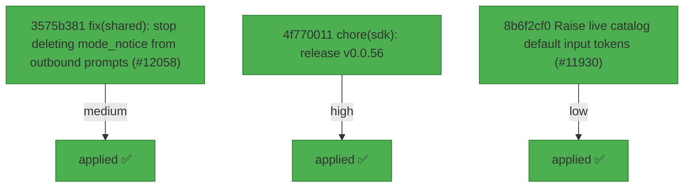

# Backport Agent — Detailed Run Report

> This file is generated automatically. It is intended for human analysts and
> AI reasoning models to assess agent performance, decision quality, and LLM behavior.

**Run timestamp**: 2026-07-06T20:24:07.524Z
**Models used**: fast=`mistral/mistral-code-agent-latest`  powerful=`mistral/mistral-medium-latest`
**Prompt log**: `/Users/rlemeill/Development/tea-ching-cline/.backport-agent/run-1783369296271.prompts.jsonl`

---

## Summary (PR body)

## Backport Agent — Sync Report

**Date**: 2026-07-06T20:24:07.524Z
**Upstream ref**: `main`
**Cut date**: `2026-06-27T00:00:00.000Z` 
**Fork ref**: `keypool-live`
**Sync branch**: `sync/upstream-main-2026-07-06-202253`

### Summary

- ✅ Applied: 3
- ⚠️ Needs human review: 0
- ⛔ Blocked (not attempted): 0

### Applied commits

- `3575b381` [medium] fix(shared): stop deleting mode_notice from outbound prompts (#12058)
- `4f770011` [high] chore(sdk): release v0.0.56
- `8b6f2cf0` [low] Raise live catalog default input tokens (#11930)

### Agent decision log

- All commits applied successfully; validation failed due to pre-existing TypeScript error in sdk/packages/llms/src/providers/ai-sdk.ts


---

## Agent Workflow Diagram

> Generated by the fast model from the run summary. Evaluate the agent's decision path.



---

## AI Sub-Agent Call Log (3 calls)

> Each entry is one sub-agent invocation. Review prompt/response pairs to assess
> reasoning quality, hallucinations, and decision accuracy.

### Call 1 / 3 — `analyze_commit_for_backport` ✅ OK

| Field | Value |
|---|---|
| **Timestamp** | 2026-07-06T20:22:44.445Z |
| **Tool** | `analyze_commit_for_backport` |
| **Model** | `mistral/mistral-code-agent-latest` |
| **Duration** | 2799 ms |
| **Tokens in** | 6014 |
| **Tokens out** | 175 |
| **Cost** | $0.000000 |

**Prompt sent to sub-agent:**

```
Commit SHA: 3575b381222df09e6e3b3d062372328af9588c65
Commit message:
fix(shared): stop deleting mode_notice from outbound prompts (#12058)

Changed files (6):
apps/cli/src/tui/hooks/use-agent-events.ts
sdk/packages/core/src/services/session-data.ts
sdk/packages/shared/src/index.browser.ts
sdk/packages/shared/src/index.ts
sdk/packages/shared/src/prompt/format.test.ts
sdk/packages/shared/src/prompt/format.ts

Diff:
commit 3575b381222df09e6e3b3d062372328af9588c65
Author: Saoud Rizwan <7799382+saoudrizwan@users.noreply.github.com>
Date:   Fri Jul 3 15:45:34 2026 -0700

    fix(shared): stop deleting mode_notice from outbound prompts (#12058)
    
    * fix(shared): stop deleting mode_notice from outbound prompts
    
    The mode-switch notice from #12057 never reached the model:
    prepareTurnInput sanitizes every outbound prompt with normalizeUserInput
    before wrapping it, and #12057 put the mode_notice strip inside
    normalizeUserInput -- so the host deleted the notice on every send. The
    transcript confirms it: messages sent after a toggle carry the
    user_input wrapper but no notice, and models asked about it confabulate
    having seen one because the system prompt describes the tag.
    
    Move the strip into a dedicated stripModeNotices() applied only at
    display boundaries: formatDisplayUserInput (TUI hydration, title
    inference), deriveTitleFromPrompt (session titles), and the TUI queued
    prompt echo. normalizeUserInput now preserves notices, with a
    regression test pinning the outbound behavior. Side benefit: notices
    survive the message-builder history normalization and the pending
    prompt queue, so queued sends deliver them too.
    
    * docs(shared): correct formatModeSwitchNotice JSDoc after strip relocation
    
    * refactor(shared): generalize notice stripping to stripTagElements
    
    stripModeNotices becomes a thin policy wrapper (DISPLAY_HIDDEN_TAGS owns
    the what-to-hide list in one place) over a generic stripTagElements that
    removes whole elements for any tag list -- the remove-element counterpart
    to xmlTagsRemoval. Call sites at display boundaries now carry comments
    explaining why stripping happens there and not in normalizeUserInput,
    which also sanitizes model-bound prompts.
    
    * revert(shared): drop stripTagElements generalization, keep simple stripModeNotices
    
    The generic tag stripper added API surface without a second use case;
    stripModeNotices goes back to the direct implementation. The display-vs-
    model call-site comments from the same commit stay.
---
 apps/cli/src/tui/hooks/use-agent-events.ts     |  9 ++++++++-
 sdk/packages/core/src/services/session-data.ts |  8 ++++++--
 sdk/packages/shared/src/index.browser.ts       |  1 +
 sdk/packages/shared/src/index.ts               |  1 +
 sdk/packages/shared/src/prompt/format.test.ts  | 18 +++++++++++++-----
 sdk/packages/shared/src/prompt/format.ts       | 21 ++++++++++++++++-----
 6 files changed, 45 insertions(+), 13 deletions(-)

diff --git a/apps/cli/src/tui/hooks/use-agent-events.ts b/apps/cli/src/tui/hooks/use-agent-events.ts
index 7d93e901f7..938472172e 100644
--- a/apps/cli/src/tui/hooks/use-agent-events.ts
+++ b/apps/cli/src/tui/hooks/use-agent-events.ts
@@ -1,4 +1,5 @@
 import type { AgentEvent, TeamEvent } from "@cline/core";
+import { formatDisplayUserInput } from "@cline/shared";
 import { useCallback, useRef } from "react";
 import type {
 	PendingPromptSnapshot,
@@ -296,7 +297,13 @@ export function useAgentEventHandlers(deps: AgentEventDeps) {
 	const handlePendingPromptSubmitted = useCallback(
 		(event: PendingPromptSubmittedEvent) => {
 			knownPendingPromptIdsRef.current.delete(event.id);
-			appendEntry({ kind: "user_submitted", text: event.prompt });
+			// Display boundary: formatDisplayUserInput strips runtime-generated
+			// notice elements (e.g. mode_notice) that normalizeUserInput must
+			// preserve, since the latter also sanitizes model-bound prompts.
+			appendEntry({
+				kind: "user_submitted",
+				text: formatDisplayUserInput(event.prompt),
+			});
 		},
 		[appendEntry],
 	);
diff --git a/sdk/packages/core/src/services/session-data.ts b/sdk/packages/core/src/services/session-data.ts
index de7b48b060..bb7e65b836 100644
--- a/sdk/packages/core/src/services/session-data.ts
+++ b/sdk/packages/core/src/services/session-data.ts
@@ -2,7 +2,7 @@ import { mkdirSync, writeFileSync } from "node:fs";
 import { dirname } from "node:path";
 import type * as LlmsProviders from "@cline/llms";
 import type { AgentConfig, AgentEvent, AgentResult } from "@cline/shared";
-import { normalizeUserInput } from "@cline/shared";
+import { normalizeUserInput, stripModeNotices } from "@cline/shared";
 import { nanoid } from "nanoid";
 import {
 	parseSubSessionId,
@@ -231,7 +231,11 @@ export function normalizeTitle(title?: string | null): string | undefined {
 export function deriveTitleFromPrompt(
 	prompt?: string | null,
 ): string | undefined {
-	const normalized = normalizeUserInput(prompt ?? "").trim();
+	// Titles are display-only, so runtime-generated notice elements are
+	// stripped here rather than inside normalizeUserInput -- that function also
+	// sanitizes model-bound prompts (prepareTurnInput), where the notice must
+	// survive to reach the model.
+	const normalized = stripModeNotices(normalizeUserInput(prompt ?? "")).trim();
 	if (!normalized) return undefined;
 	return normalizeTitle(normalized.split("\n")[0]?.trim());
 }
diff --git a/sdk/packages/shared/src/index.browser.ts b/sdk/packages/shared/src/index.browser.ts
index b84423f2a9..f99e3215b4 100644
--- a/sdk/packages/shared/src/index.browser.ts
+++ b/sdk/packages/shared/src/index.browser.ts
@@ -234,6 +234,7 @@ export {
 	formatUserInputBlock,
 	normalizeUserInput,
 	parseUserCommandEnvelope,
+	stripModeNotices,
 	xmlTagsRemoval,
 } from "./prompt/format";
 export { isClineProvider } from "./providers/utils";
diff --git a/sdk/packages/shared/src/index.ts b/sdk/packages/shared/src/index.ts
index 82321ec82e..2a783c5537 100644
--- a/sdk/packages/shared/src/index.ts
+++ b/sdk/packages/shared/src/index.ts
@@ -248,6 +248,7 @@ export {
 	formatUserInputBlock,
 	normalizeUserInput,
 	parseUserCommandEnvelope,
+	stripModeNotices,
 	xmlTagsRemoval,
 } from "./prompt/format";
 export { isClineProvider } from "./providers/utils";
diff --git a/sdk/packages/shared/src/prompt/format.test.ts b/sdk/packages/shared/src/prompt/format.test.ts
index fa8875f23e..dc16eab5ef 100644
--- a/sdk/packages/shared/src/prompt/format.test.ts
+++ b/sdk/packages/shared/src/prompt/format.test.ts
@@ -6,6 +6,7 @@ import {
 	formatUserInputBlock,
 	normalizeUserInput,
 	parseUserCommandEnvelope,
+	stripModeNotices,
 } from "./format";
 
 describe("prompt format helpers", () => {
@@ -53,26 +54,33 @@ describe("prompt format helpers", () => {
 		expect(formatDisplayUserInput(wrapped)).toBe(
 			"how should we refactor this?",
 		);
-		expect(normalizeUserInput(wrapped)).toBe("how should we refactor this?");
+	});
+
+	it("keeps mode switch notices when normalizing outbound prompts", () => {
+		// prepareTurnInput sanitizes prompts with normalizeUserInput before the
+		// host wraps them; stripping notices here would delete the switch
+		// signal before the model ever sees it.
+		const prompt = `${formatModeSwitchNotice("plan", "act")}\ndo it`;
+		expect(normalizeUserInput(prompt)).toBe(prompt);
 	});
 
 	it("removes every mode notice and leaves unclosed ones intact", () => {
 		expect(
-			normalizeUserInput(
+			stripModeNotices(
 				"<mode_notice>a</mode_notice>hello<mode_notice>b</mode_notice> there",
 			),
 		).toBe("hello there");
-		expect(normalizeUserInput("<mode_notice>dangling")).toBe(
+		expect(stripModeNotices("<mode_notice>dangling")).toBe(
 			"<mode_notice>dangling",
 		);
 	});
 
-	it("normalizes adversarial repeated open tags in linear time", () => {
+	it("strips adversarial repeated open tags in linear time", () => {
 		// Regression guard for CodeQL js/polynomial-redos: many unmatched
 		// opening tags must not trigger quadratic rescanning.
 		const hostile = "<mode_notice>".repeat(50_000);
 		const started = performance.now();
-		const result = normalizeUserInput(hostile);
+		const result = stripModeNotices(hostile);
 		expect(performance.now() - started).toBeLessThan(1_000);
 		expect(result).toBe(hostile);
 	});
diff --git a/sdk/packages/shared/src/prompt/format.ts b/sdk/packages/shared/src/prompt/format.ts
index b69c82ac5e..5f2e9bb5a5 100644
--- a/sdk/packages/shared/src/prompt/format.ts
+++ b/sdk/packages/shared/src/prompt/format.ts
@@ -16,7 +16,9 @@ export function formatUserCommandBlock(input: string, slash: string): string {
 /**
  * Marks the exact point in the conversation where the user switched between
  * plan and act modes. Prepended to the first user message sent after the
- * switch; stripped from transcript display by normalizeUserInput.
+ * switch. It survives normalizeUserInput (so the outbound sanitize in
+ * prepareTurnInput delivers it to the model) and is hidden from transcript
+ * display by stripModeNotices at display boundaries.
  */
 export function formatModeSwitchNotice(
 	from: "act" | "plan",
@@ -84,12 +86,21 @@ export function normalizeUserInput(input?: string): string {
 				: next.replace(new RegExp(`<${tag}[^>]*>`, "g"), "")
 		).trim();
 	}
-	// mode_notice is runtime-generated context, not user-typed text; unlike the
-	// wrapper tags above, the whole element (content included) is hidden.
-	next = removeTagElements(next, "mode_notice").trim();
 	return next;
 }
 
+/**
+ * Removes runtime-generated <mode_notice> elements (content included): they
+ * are not user-typed text and must not render as such. Deliberately NOT part
+ * of normalizeUserInput -- that function also sanitizes outbound prompts
+ * before the host wraps them (prepareTurnInput), and stripping there deletes
+ * the notice before the model ever sees it.
+ */
+export function stripModeNotices(input?: string): string {
+	if (!input?.trim()) return "";
+	return removeTagElements(input, "mode_notice").trim();
+}
+
 // indexOf-based rather than a regex: a lazy dot-all pattern re-scans to the
 // end of the string from every unmatched opening tag, which is polynomial on
 // adversarial transcript content (CodeQL js/polynomial-redos).
@@ -110,7 +121,7 @@ function removeTagElements(input: string, tag: string): string {
 }
 
 export function formatDisplayUserInput(input?: string): string {
-	const normalized = normalizeUserInput(input);
+	const normalized = stripModeNotices(normalizeUserInput(input));
 	const envelope = parseUserCommandEnvelope(input);
 	if (!envelope) {
 		return normalized;

Output the JSON object now.
```

**Response received:**

````
```json
{
  "summary": "Fixes a bug where mode_notice elements were incorrectly stripped from outbound prompts, preventing the model from seeing mode-switch signals. Moves notice stripping to display boundaries only.",
  "keyChanges": [
    "Moves mode_notice stripping from normalizeUserInput to stripModeNotices",
    "Applies stripModeNotices at display boundaries (TUI, titles, prompts)",
    "Adds regression test for outbound prompt preservation",
    "Updates call sites with comments explaining display-vs-model boundaries"
  ],
  "backportComplexity": "moderate",
  "semanticRiskFactors": [
    "Changes prompt sanitization behavior for mode_notice elements",
    "Introduces new exported function stripModeNotices"
  ],
  "recommendation": "apply-with-care"
}
```
````

---

### Call 2 / 3 — `analyze_commit_for_backport` ✅ OK

| Field | Value |
|---|---|
| **Timestamp** | 2026-07-06T20:22:49.573Z |
| **Tool** | `analyze_commit_for_backport` |
| **Model** | `mistral/mistral-medium-latest` |
| **Duration** | 5065 ms |
| **Tokens in** | 17193 |
| **Tokens out** | 144 |
| **Cost** | $0.000000 |

**Prompt sent to sub-agent:**

```
Commit SHA: 4f770011e9dc36bf3201caac24174b47404ee5ee
Commit message:
chore(sdk): release v0.0.56

Changed files (7):
bun.lock
sdk/CHANGELOG.md
sdk/packages/agents/package.json
sdk/packages/core/package.json
sdk/packages/llms/package.json
sdk/packages/sdk/package.json
sdk/packages/shared/package.json

Diff:
commit 4f770011e9dc36bf3201caac24174b47404ee5ee
Author: Saoud Rizwan <7799382+saoudrizwan@users.noreply.github.com>
Date:   Fri Jul 3 19:11:03 2026 -0700

    chore(sdk): release v0.0.56
---
 bun.lock                         | 66 +++++++++++++++++++---------------------
 sdk/CHANGELOG.md                 |  6 ++++
 sdk/packages/agents/package.json |  2 +-
 sdk/packages/core/package.json   |  2 +-
 sdk/packages/llms/package.json   |  2 +-
 sdk/packages/sdk/package.json    |  2 +-
 sdk/packages/shared/package.json |  2 +-
 7 files changed, 43 insertions(+), 39 deletions(-)

diff --git a/bun.lock b/bun.lock
index ea0a591990..28b56bbaf4 100644
--- a/bun.lock
+++ b/bun.lock
@@ -19,7 +19,7 @@
     },
     "apps/cli": {
       "name": "@cline/cli",
-      "version": "3.0.34",
+      "version": "3.0.36",
       "bin": {
         "cline": "src/index.ts",
       },
@@ -616,7 +616,7 @@
     },
     "sdk/packages/agents": {
       "name": "@cline/agents",
-      "version": "0.0.55",
+      "version": "0.0.56",
       "dependencies": {
         "@cline/llms": "workspace:*",
         "@cline/shared": "workspace:*",
@@ -625,7 +625,7 @@
     },
     "sdk/packages/core": {
       "name": "@cline/core",
-      "version": "0.0.55",
+      "version": "0.0.56",
       "dependencies": {
         "@cline/agents": "workspace:*",
         "@cline/llms": "workspace:*",
@@ -663,7 +663,7 @@
     },
     "sdk/packages/llms": {
       "name": "@cline/llms",
-      "version": "0.0.55",
+      "version": "0.0.56",
       "dependencies": {
         "@ai-sdk/amazon-bedrock": "^4.0.89",
         "@ai-sdk/anthropic": "^3.0.68",
@@ -697,14 +697,14 @@
     },
     "sdk/packages/sdk": {
       "name": "@cline/sdk",
-      "version": "0.0.55",
+      "version": "0.0.56",
       "dependencies": {
         "@cline/core": "workspace:*",
       },
     },
     "sdk/packages/shared": {
       "name": "@cline/shared",
-      "version": "0.0.55",
+      "version": "0.0.56",
       "dependencies": {
         "aws4fetch": "^1.0.20",
         "jsonrepair": "^3.13.2",
@@ -741,27 +741,27 @@
 
     "@agentclientprotocol/sdk": ["@agentclientprotocol/sdk@0.16.1", "", { "peerDependencies": { "zod": "^3.25.0 || ^4.0.0" } }, "sha512-1ad+Sc/0sCtZGHthxxvgEUo5Wsbw16I+aF+YwdiLnPwkZG8KAGUEAPK6LM6Pf69lCyJPt1Aomk1d+8oE3C4ZEw=="],
 
-    "@ai-sdk/amazon-bedrock": ["@ai-sdk/amazon-bedrock@4.0.122", "", { "dependencies": { "@ai-sdk/anthropic": "3.0.87", "@ai-sdk/openai": "3.0.75", "@ai-sdk/provider": "3.0.11", "@ai-sdk/provider-utils": "4.0.31", "@smithy/eventstream-codec": "^4.0.1", "@smithy/util-utf8": "^4.0.0", "aws4fetch": "^1.0.20" }, "peerDependencies": { "zod": "^3.25.76 || ^4.1.8" } }, "sha512-XiSsWFfX0W8lGFWZ/7NwbmdWEk/16lArmdi7LDVJkskKWwoRM1pexL6E+UPmzJ4sBsz01be+stYXIjEs64h7lQ=="],
+    "@ai-sdk/amazon-bedrock": ["@ai-sdk/amazon-bedrock@4.0.123", "", { "dependencies": { "@ai-sdk/anthropic": "3.0.88", "@ai-sdk/openai": "3.0.76", "@ai-sdk/provider": "3.0.12", "@ai-sdk/provider-utils": "4.0.32", "@smithy/eventstream-codec": "^4.0.1", "@smithy/util-utf8": "^4.0.0", "aws4fetch": "^1.0.20" }, "peerDependencies": { "zod": "^3.25.76 || ^4.1.8" } }, "sha512-lEvz/jOJksH+KYIciVbX0iV7/80I+sG1Er7pullu4fh1fEpbhQC+o2wNwp2H+UzglJehE0uo93erd2RgQtEX6g=="],
 
-    "@ai-sdk/anthropic": ["@ai-sdk/anthropic@3.0.87", "", { "dependencies": { "@ai-sdk/provider": "3.0.11", "@ai-sdk/provider-utils": "4.0.31" }, "peerDependencies": { "zod": "^3.25.76 || ^4.1.8" } }, "sha512-4v7uoMblNYZ3X7S5a+manSKKqKVmWXTkJOtZ8ymArHdQbhgzMd+um1qDee8MiJbDhk6wjy8T/F+D1pVhB/7HTQ=="],
+    "@ai-sdk/anthropic": ["@ai-sdk/anthropic@3.0.88", "", { "dependencies": { "@ai-sdk/provider": "3.0.12", "@ai-sdk/provider-utils": "4.0.32" }, "peerDependencies": { "zod": "^3.25.76 || ^4.1.8" } }, "sha512-2IqL7Auu0XW3BnulsHJUb7C4lQKXmWQ7MU2Osq+tfJ79in2P0Li2sX2j45HJMenGJL/JhSyunsYhyv63qMRxWQ=="],
 
-    "@ai-sdk/gateway": ["@ai-sdk/gateway@3.0.137", "", { "dependencies": { "@ai-sdk/provider": "3.0.11", "@ai-sdk/provider-utils": "4.0.31", "@vercel/oidc": "3.2.0" }, "peerDependencies": { "zod": "^3.25.76 || ^4.1.8" } }, "sha512-OIOBsRq8hrpML0kdT1QqC2s6nLnmX8G60xvukFJeWUd+jguY2WngzPVQkwlRBJN137LtEa7QyA0NMU3uxxVy3g=="],
+    "@ai-sdk/gateway": ["@ai-sdk/gateway@3.0.138", "", { "dependencies": { "@ai-sdk/provider": "3.0.12", "@ai-sdk/provider-utils": "4.0.32", "@vercel/oidc": "3.2.0" }, "peerDependencies": { "zod": "^3.25.76 || ^4.1.8" } }, "sha512-mYvN5va363hgArapRvXcY6ckV5BFvF4bnimT/tasTMBg2FDmA5S7+jltckGuiaUAYa1vKE9fA06AvmBVXaZYrA=="],
 
-    "@ai-sdk/google": ["@ai-sdk/google@3.0.84", "", { "dependencies": { "@ai-sdk/provider": "3.0.11", "@ai-sdk/provider-utils": "4.0.31" }, "peerDependencies": { "zod": "^3.25.76 || ^4.1.8" } }, "sha512-TVLcerZs7D70nHGPhtb5cwwX41CzKSVE00IEHRTRXXBa35g6BJdxi48YPglrrP9gDCAPSrl60/Nh5SBMMTwkwQ=="],
+    "@ai-sdk/google": ["@ai-sdk/google@3.0.85", "", { "dependencies": { "@ai-sdk/provider": "3.0.12", "@ai-sdk/provider-utils": "4.0.32" }, "peerDependencies": { "zod": "^3.25.76 || ^4.1.8" } }, "sha512-x6JBywNpZXZZnhxJbZZFut3VhFPL4jq0kh2yWVMvCSXlqT39qaS6535WA23hxqD2Ff90wnAyuPJiap8yWsqKww=="],
 
-    "@ai-sdk/google-vertex": ["@ai-sdk/google-vertex@4.0.150", "", { "dependencies": { "@ai-sdk/anthropic": "3.0.87", "@ai-sdk/google": "3.0.84", "@ai-sdk/openai-compatible": "2.0.52", "@ai-sdk/provider": "3.0.11", "@ai-sdk/provider-utils": "4.0.31", "google-auth-library": "^10.5.0" }, "peerDependencies": { "zod": "^3.25.76 || ^4.1.8" } }, "sha512-67hfINiuyXHlo4eiAc6gPH+8EPSrMg9c3t0bmC2Dm6DsjW1l7M5HTt+eKtetdJJh/yBWMeJKi2ujLrP6oXvPaQ=="],
+    "@ai-sdk/google-vertex": ["@ai-sdk/google-vertex@4.0.151", "", { "dependencies": { "@ai-sdk/anthropic": "3.0.88", "@ai-sdk/google": "3.0.85", "@ai-sdk/openai-compatible": "2.0.53", "@ai-sdk/provider": "3.0.12", "@ai-sdk/provider-utils": "4.0.32", "google-auth-library": "^10.5.0" }, "peerDependencies": { "zod": "^3.25.76 || ^4.1.8" } }, "sha512-GV6kwRCCQxEq9jzRX6uBVUOzzJLnt0KeZmnyP6YUHdOZvBrgIn9M/EnUJStNJHV2tk0Vh1Pp5duoalaXc6lKuQ=="],
 
-    "@ai-sdk/mistral": ["@ai-sdk/mistral@3.0.41", "", { "dependencies": { "@ai-sdk/provider": "3.0.11", "@ai-sdk/provider-utils": "4.0.31" }, "peerDependencies": { "zod": "^3.25.76 || ^4.1.8" } }, "sha512-xpZCV8cj/cFjPeTUK/ejlSGYCjWzY3RIo+4zKbwO7iIDu7zL/3Ezj5+Jgoi9pbd68jdScYyY9McTh5cp90wYjQ=="],
+    "@ai-sdk/mistral": ["@ai-sdk/mistral@3.0.42", "", { "dependencies": { "@ai-sdk/provider": "3.0.12", "@ai-sdk/provider-utils": "4.0.32" }, "peerDependencies": { "zod": "^3.25.76 || ^4.1.8" } }, "sha512-ZlYELoGbNj+SrNm9L1XQSsWkfv3W71j3VEEI32MJwtLaMr0xzJAxC1V/lti+vVHHRUTHkxxp3fjOu9b4MxWe0w=="],
 
-    "@ai-sdk/openai": ["@ai-sdk/openai@3.0.75", "", { "dependencies": { "@ai-sdk/provider": "3.0.11", "@ai-sdk/provider-utils": "4.0.31" }, "peerDependencies": { "zod": "^3.25.76 || ^4.1.8" } }, "sha512-xKW+ZSHOdsFIUR6H2uSVjQQmzuHG+onsBZQmsr1OagDK/G55Vhx7Msd/5itoIT/kfGIhOGtCY0DTxbP0RWT7hA=="],
+    "@ai-sdk/openai": ["@ai-sdk/openai@3.0.76", "", { "dependencies": { "@ai-sdk/provider": "3.0.12", "@ai-sdk/provider-utils": "4.0.32" }, "peerDependencies": { "zod": "^3.25.76 || ^4.1.8" } }, "sha512-zY4A5gxWFH95jhisbuHG29qqmHPrO6zu9WkGi12SjMbRFDtok9gm676n0+FjTWifHEYoUK1YvR1nOwPorfHThg=="],
 
-    "@ai-sdk/openai-compatible": ["@ai-sdk/openai-compatible@2.0.52", "", { "dependencies": { "@ai-sdk/provider": "3.0.11", "@ai-sdk/provider-utils": "4.0.31" }, "peerDependencies": { "zod": "^3.25.76 || ^4.1.8" } }, "sha512-WdVesd9VJQv8BLLla+x1AjLa40D3QUfnXH488+ydOcOIX7c4m6RF8Sh3JsAF+5ICa2Vknc9GTBlOvqCKoivE1w=="],
+    "@ai-sdk/openai-compatible": ["@ai-sdk/openai-compatible@2.0.53", "", { "dependencies": { "@ai-sdk/provider": "3.0.12", "@ai-sdk/provider-utils": "4.0.32" }, "peerDependencies": { "zod": "^3.25.76 || ^4.1.8" } }, "sha512-SoPSkrL5cbNQnAljRsJ7pOzJ2FmWgnhC0lfFOda873ycCdFJL1A+h3Ib7mX2spcv3XnNaO13y/45/0RyqNWlIQ=="],
 
-    "@ai-sdk/provider": ["@ai-sdk/provider@3.0.11", "", { "dependencies": { "json-schema": "^0.4.0" } }, "sha512-GKu3RxsfKGWjBiXmEdsKsGR9uVgJ56mzL1w7mLsn5k2TiNtpyS2IYQo3v1NJpK3oyv2OVavlK3g801VSe+gujg=="],
+    "@ai-sdk/provider": ["@ai-sdk/provider@3.0.12", "", { "dependencies": { "json-schema": "^0.4.0" } }, "sha512-sj9DWTJ2Ze0WR9qsiOPqoqzNx3OxL6iMxHImbhvoe9qOspekbzxNDMiJ4TIGfYHYh9w4OmBjz3prvqhzTi96+Q=="],
 
-    "@ai-sdk/provider-utils": ["@ai-sdk/provider-utils@4.0.31", "", { "dependencies": { "@ai-sdk/provider": "3.0.11", "@standard-schema/spec": "^1.1.0", "eventsource-parser": "^3.0.8" }, "peerDependencies": { "zod": "^3.25.76 || ^4.1.8" } }, "sha512-x4Q1NxNLw8V1AHKOunukpksbKCqzZdZEgpHgbZznUE3ZcWb2liI5j2321TlOvyfn1iL7NmNMFTD5mZYoChVx0g=="],
+    "@ai-sdk/provider-utils": ["@ai-sdk/provider-utils@4.0.32", "", { "dependencies": { "@ai-sdk/provider": "3.0.12", "@standard-schema/spec": "^1.1.0", "eventsource-parser": "^3.0.8" }, "peerDependencies": { "zod": "^3.25.76 || ^4.1.8" } }, "sha512-Kwj499fTcN9bP/AfGoPU7JWIXeP6VZqKI6omsH062c9E2G4gdjeJczkz4z/tYSkzYjLE2AI3DtZbMfs6D7vn2Q=="],
 
-    "@ai-sdk/react": ["@ai-sdk/react@3.0.214", "", { "dependencies": { "@ai-sdk/provider-utils": "4.0.31", "ai": "6.0.212", "swr": "^2.2.5", "throttleit": "2.1.0" }, "peerDependencies": { "react": "^18 || ~19.0.1 || ~19.1.2 || ^19.2.1" } }, "sha512-GMmwzW6LAHMqrfDsv5NBnQ1EFYYHDt6SjjWdv/d2WRVx6wYUPqdfpr8JHfckVJNIr88trqrbrJAF2APWXkLTVQ=="],
+    "@ai-sdk/react": ["@ai-sdk/react@3.0.215", "", { "dependencies": { "@ai-sdk/provider-utils": "4.0.32", "ai": "6.0.213", "swr": "^2.2.5", "throttleit": "2.1.0" }, "peerDependencies": { "react": "^18 || ~19.0.1 || ~19.1.2 || ^19.2.1" } }, "sha512-OqGbF5cKZDWT6HXrprGlgzFO1M9RosodE+L5vUknX/Sk1BBsrtHLUR3zNUVYk/nytyLUmagRksOwrvdgOURBVA=="],
 
     "@alloc/quick-lru": ["@alloc/quick-lru@5.2.0", "", {}, "sha512-UrcABB+4bUrFABwbluTIBErXwvbsU/V7TZWfmbgJfbkwiBuziS9gxdODUyuiecfdGQ85jglMW6juS3+z5TsKLw=="],
 
@@ -769,23 +769,23 @@
 
     "@antfu/install-pkg": ["@antfu/install-pkg@1.1.0", "", { "dependencies": { "package-manager-detector": "^1.3.0", "tinyexec": "^1.0.1" } }, "sha512-MGQsmw10ZyI+EJo45CdSER4zEb+p31LpDAFp2Z3gkSd1yqVZGi0Ebx++YTEMonJy4oChEMLsxZ64j8FH6sSqtQ=="],
 
-    "@anthropic-ai/claude-agent-sdk": ["@anthropic-ai/claude-agent-sdk@0.3.193", "", { "optionalDependencies": { "@anthropic-ai/claude-agent-sdk-darwin-arm64": "0.3.193", "@anthropic-ai/claude-agent-sdk-darwin-x64": "0.3.193", "@anthropic-ai/claude-agent-sdk-linux-arm64": "0.3.193", "@anthropic-ai/claude-agent-sdk-linux-arm64-musl": "0.3.193", "@anthropic-ai/claude-agent-sdk-linux-x64": "0.3.193", "@anthropic-ai/claude-agent-sdk-linux-x64-musl": "0.3.193", "@anthropic-ai/claude-agent-sdk-win32-arm64": "0.3.193", "@anthropic-ai/claude-agent-sdk-win32-x64": "0.3.193" }, "peerDependencies": { "@anthropic-ai/sdk": ">=0.93.0", "@modelcontextprotocol/sdk": "^1.29.0", "zod": "^4.0.0" } }, "sha512-WzL03VJE1sT0Nz3rEpsYMYR+9n6iyQtLVt7ghMWnYC9pvDsiy6kwcMplZniWSjH8Dm6CfkUBN5t6KB4i/JfouA=="],
+    "@anthropic-ai/claude-agent-sdk": ["@anthropic-ai/claude-agent-sdk@0.3.195", "", { "optionalDependencies": { "@anthropic-ai/claude-agent-sdk-darwin-arm64": "0.3.195", "@anthropic-ai/claude-agent-sdk-darwin-x64": "0.3.195", "@anthropic-ai/claude-agent-sdk-linux-arm64": "0.3.195", "@anthropic-ai/claude-agent-sdk-linux-arm64-musl": "0.3.195", "@anthropic-ai/claude-agent-sdk-linux-x64": "0.3.195", "@anthropic-ai/claude-agent-sdk-linux-x64-musl": "0.3.195", "@anthropic-ai/claude-agent-sdk-win32-arm64": "0.3.195", "@anthropic-ai/claude-agent-sdk-win32-x64": "0.3.195" }, "peerDependencies": { "@anthropic-ai/sdk": ">=0.93.0", "@modelcontextprotocol/sdk": "^1.29.0", "zod": "^4.0.0" } }, "sha512-FVmXu9pvOMbuBKWrF8YsYQdQ/upOpv5rS8lFAnFO5jbyXT/2hN7kEPd2vd2GJpaMvNcO/KptyQUK5AxjjTz3+w=="],
 
-    "@anthropic-ai/claude-agent-sdk-darwin-arm64": ["@anthropic-ai/claude-agent-sdk-darwin-arm64@0.3.193", "", { "os": "darwin", "cpu": "arm64" }, "sha512-1hT7b+KIm/3E1OSJofr7PF21Xq2zT1ccnjzuVcWQ5LYXJ09lgCMvA/ZfcDBKuoyCZ4lSnuicKXZ/h5vRbWfqrA=="],
+    "@anthropic-ai/claude-agent-sdk-darwin-arm64": ["@anthropic-ai/claude-agent-sdk-darwin-arm64@0.3.195", "", { "os": "darwin", "cpu": "arm64" }, "sha512-WIMM/8HRCLsTDHFTIwQvvE8WCA/oaMJtdQxsP7iNyfzIGwXbuOyU95V8vYIhZfaO2yaSpbBRncunq4CtR5H4ng=="],
 
-    "@anthropic-ai/claude-agent-sdk-darwin-x64": ["@anthropic-ai/claude-agent-sdk-darwin-x64@0.3.193", "", { "os": "darwin", "cpu": "x64" }, "sha512-9x5Y/L6iwETwEJFmPaYXfsE8q0cVgx75V7nL60HvSzi8K1XQNcG5u53jOzRvqDNah8mvGYOb+9AWrMCSJvmFyA=="],
+    "@anthropic-ai/claude-agent-sdk-darwin-x64": ["@anthropic-ai/claude-agent-sdk-darwin-x64@0.3.195", "", { "os": "darwin", "cpu": "x64" }, "sha512-RY7DB+4LXosE0MJ+XELmakfPrDN1YX4lkk9CTDm28jGCVcESRz9kAEqbyaiC48dZcmN9V1NCLutzINGdcr1TBg=="],
 
-    "@anthropic-ai/claude-agent-sdk-linux-arm64": ["@anthropic-ai/claude-agent-sdk-linux-arm64@0.3.193", "", { "os": "linux", "cpu": "arm64" }, "sha512-gvfD9pKHXWxCkkIX6bC4/FOALTxqHYjAu83iT1bzn5mCv6QWSZRl6WLRRtvKpWtWuY1jpML1lL3YfKADsAX/rA=="],
+    "@anthropic-ai/claude-agent-sdk-linux-arm64": ["@anthropic-ai/claude-agent-sdk-linux-arm64@0.3.195", "", { "os": "linux", "cpu": "arm64" }, "sha512-JuIq5Fnz/F1snl0aqi1gcuRZqPWoPNrL9dJ0DuievCxKkO8hnEz/Mmn5Zos7x1X8HE//ZnEvmQXoEQEZXonJew=="],
 
-    "@anthropic-ai/claude-agent-sdk-linux-arm64-musl": ["@anthropic-ai/claude-agent-sdk-linux-arm64-musl@0.3.193", "", { "os": "linux", "cpu": "arm64" }, "sha512-a3qsVTBe4G6ndsVavfIXEVAXLVXM8uvBUNYpm4jKqk2+ovWZQe/96CXOwmerg9U+/bllg4QJ9lSyYCsdtVIr6w=="],
+    "@anthropic-ai/claude-agent-sdk-linux-arm64-musl": ["@anthropic-ai/claude-agent-sdk-linux-arm64-musl@0.3.195", "", { "os": "linux", "cpu": "arm64" }, "sha512-ZmyBA/AFzhgutcxb7dbhCm6GTjJytwNYXTxJoKE2B3A409WCYccjMqeji6vCMNxyyfylglGo5D8dVMIxW9aoug=="],
 
-    "@anthropic-ai/claude-agent-sdk-linux-x64": ["@anthropic-ai/claude-agent-sdk-linux-x64@0.3.193", "", { "os": "linux", "cpu": "x64" }, "sha512-1sz+7cn0iuh0ThInuAYF1jpFvLyOaZ0PZYQIF7eb9JDZbBohUf6INeTCwjAwUL0ASCq2xS7Odu/qDVuTtLTeDA=="],
+    "@anthropic-ai/claude-agent-sdk-linux-x64": ["@anthropic-ai/claude-agent-sdk-linux-x64@0.3.195", "", { "os": "linux", "cpu": "x64" }, "sha512-s1lNi1cL93luoqsItH+fNO4KpIhdkvnVhWGGQUQ/8ftwa2gfmcIQnOg1hG8Ks+KzeD3UUQ8L9YEVHVADnFI/9A=="],
 
-    "@anthropic-ai/claude-agent-sdk-linux-x64-musl": ["@anthropic-ai/claude-agent-sdk-linux-x64-musl@0.3.193", "", { "os": "linux", "cpu": "x64" }, "sha512-DLXlO4tlcWygz0Ft4nu6ai5KssByYt2tOeWdc4dFXKt6uBKXpbZVziUUq3ePO5zuAFyU6w7EjYLv8MMPURbAiQ=="],
+    "@anthropic-ai/claude-agent-sdk-linux-x64-musl": ["@anthropic-ai/claude-agent-sdk-linux-x64-musl@0.3.195", "", { "os": "linux", "cpu": "x64" }, "sha512-nf8Q/LauB+ZOC6QDjxNhbsvwUtYjKYnaWJLTYFwhkmsLujePnety1AtT/1ubaUoq5AM1j297DhMlYTasa79OUA=="],
 
-    "@anthropic-ai/claude-agent-sdk-win32-arm64": ["@anthropic-ai/claude-agent-sdk-win32-arm64@0.3.193", "", { "os": "win32", "cpu": "arm64" }, "sha512-36LJKiGuKusgaPTVeh9QanL00UcaE0RcC4pgK800/0SenApbh979ndxI0XKUVfLHzlGkqlhkhT3foMdqS+zx1w=="],
+    "@anthropic-ai/claude-agent-sdk-win32-arm64": ["@anthropic-ai/claude-agent-sdk-win32-arm64@0.3.195", "", { "os": "win32", "cpu": "arm64" }, "sha512-hbkDE+xPIZzRWm+D+BKrH9uJH6USIZdDIlsyrIlGi3JFHoieYoA1vdUNyldSS9+F3ZqQtfPjr2Qy08IVB6akYA=="],
 
-    "@anthropic-ai/claude-agent-sdk-win32-x64": ["@anthropic-ai/claude-agent-sdk-win32-x64@0.3.193", "", { "os": "win32", "cpu": "x64" }, "sha512-VyyKZlWQpbD6nkUTeNvgmLvpqt1QaPQQBOC30tbEYwYsV5MC1I35Li0H7nWwngGqPSTtMvHpjpz6Eb2FSTn7/A=="],
+    "@anthropic-ai/claude-agent-sdk-win32-x64": ["@anthropic-ai/claude-agent-sdk-win32-x64@0.3.195", "", { "os": "win32", "cpu": "x64" }, "sha512-av0piEB3X1Dzhpr8A+DqHVZ9y8s1jpn8enzwX0TKKUPBn5IqLTWC7wD6v66aoUgu4f+g4ThZirmDZA6shyPEZQ=="],
 
     "@anthropic-ai/sdk": ["@anthropic-ai/sdk@0.37.0", "", { "dependencies": { "@types/node": "^18.11.18", "@types/node-fetch": "^2.6.4", "abort-controller": "^3.0.0", "agentkeepalive": "^4.2.1", "form-data-encoder": "1.7.2", "formdata-node": "^4.3.2", "node-fetch": "^2.6.7" } }, "sha512-tHjX2YbkUBwEgg0JZU3EFSSAQPoK4qQR/NFYa8Vtzd5UAyXzZksCw2In69Rml4R/TyHPBfRYaLK35XiOe33pjw=="],
 
@@ -1777,7 +1777,7 @@
 
     "@protobufjs/utf8": ["@protobufjs/utf8@1.1.1", "", {}, "sha512-oOAWABowe8EAbMyWKM0tYDKi8Yaox52D+HWZhAIJqQXbqe0xI/GV7FhLWqlEKreMkfDjshR5FKgi3mnle0h6Eg=="],
 
-    "@puppeteer/browsers": ["@puppeteer/browsers@2.13.2", "", { "dependencies": { "debug": "^4.4.3", "extract-zip": "^2.0.1", "progress": "^2.0.3", "proxy-agent": "^6.5.0", "semver": "^7.7.4", "tar-fs": "^3.1.1", "yargs": "^17.7.2" }, "bin": { "browsers": "lib/cjs/main-cli.js" } }, "sha512-5EUZSUIc37H6aIXyWO0Z4y8NlF8NnjgmqeQgOGiswAU7pY0HOo16ho4+alIWmSfdZnjqBRawMsP3I5YqLSn6kw=="],
+    "@puppeteer/browsers": ["@puppeteer/browsers@2.6.1", "", { "dependencies": { "debug": "^4.4.0", "extract-zip": "^2.0.1", "progress": "^2.0.3", "proxy-agent": "^6.5.0", "semver": "^7.6.3", "tar-fs": "^3.0.6", "unbzip2-stream": "^1.4.3", "yargs": "^17.7.2" }, "bin": { "browsers": "lib/cjs/main-cli.js" } }, "sha512-aBSREisdsGH890S2rQqK82qmQYU3uFpSH8wcZWHgHzl3LfzsxAKbLNiAG9mO8v1Y0UICBeClICxPJvyr0rcuxg=="],
 
     "@radix-ui/number": ["@radix-ui/number@1.1.1", "", {}, "sha512-MkKCwxlXTgz6CFoJx3pCwn07GKp36+aZyu/u2Ln2VrA5DcdyCZkASEDBTd8x5whTQQL5CiYf4prXKLcgQdv29g=="],
 
@@ -2739,7 +2739,7 @@
 
     "agentkeepalive": ["agentkeepalive@4.6.0", "", { "dependencies": { "humanize-ms": "^1.2.1" } }, "sha512-kja8j7PjmncONqaTsB8fQ+wE2mSU2DJ9D4XKoJ5PFWIdRMa6SLSN1ff4mOr4jCbfRSsxR4keIiySJU0N9T5hIQ=="],
 
-    "ai": ["ai@6.0.212", "", { "dependencies": { "@ai-sdk/gateway": "3.0.137", "@ai-sdk/provider": "3.0.11", "@ai-sdk/provider-utils": "4.0.31", "@opentelemetry/api": "^1.9.0" }, "peerDependencies": { "zod": "^3.25.76 || ^4.1.8" } }, "sha512-BDng0yuyqUtlLz565Yy85QPpCLmOQHRd+HkpOVIKo0PXKj0GZWsbfIoDWvOkfH1kz8h2fj0MxALhTJowubuxOw=="],
+    "ai": ["ai@6.0.213", "", { "dependencies": { "@ai-sdk/gateway": "3.0.138", "@ai-sdk/provider": "3.0.12", "@ai-sdk/provider-utils": "4.0.32", "@opentelemetry/api": "^1.9.0" }, "peerDependencies": { "zod": "^3.25.76 || ^4.1.8" } }, "sha512-yL5KBSlhi+gOVfmTs7lOgwF0GmLaDkwIdbzMDouGL6e5SVwEUviijRMPRnMXf/3UYupUmzUrxKVFCAYaHr3egA=="],
 
     "ai-sdk-provider-claude-code": ["ai-sdk-provider-claude-code@3.5.0", "", { "dependencies": { "@ai-sdk/provider": "^3.0.0", "@ai-sdk/provider-utils": "^4.0.1", "@anthropic-ai/claude-agent-sdk": "^0.3.170" }, "peerDependencies": { "zod": "^4.0.0" } }, "sha512-7SZrTGkuR4G4zeNrjnJgDzYkrKZqzq7GUQJcFBKCxFH5dJpS9lbs+g9BCt7bwT1gDm4SAUmOQ0T5rKqcC2HkVQ=="],
 
@@ -3259,7 +3259,7 @@
 
     "eight-colors": ["eight-colors@1.3.3", "", {}, "sha512-4B54S2Qi4pJjeHmCbDIsveQZWQ/TSSQng4ixYJ9/SYHHpeS5nYK0pzcHvWzWUfRsvJQjwoIENhAwqg59thQceg=="],
 
-    "electron-to-chromium": ["electron-to-chromium@1.5.379", "", {}, "sha512-v/qV5aV5EUA2pGilzUCq5/eyOloZAqDZBu9UMBIzgPpLlprjSR6zswsWBTv0KpqxLGUAZEwhO95ZCt7srymNVA=="],
+    "electron-to-chromium": ["electron-to-chromium@1.5.380", "", {}, "sha512-W6d5AbuEoRayO447cqrg6lKJIlscgRnnxOZl/08kfV71BQDoEBC7Wwis68z87LjyK6f4kWyTaubuDbhHKrZkbA=="],
 
     "embla-carousel": ["embla-carousel@8.6.0", "", {}, "sha512-SjWyZBHJPbqxHOzckOfo8lHisEaJWmwd23XppYFYVh10bU66/Pn5tkVkbkCMZVdbUE5eTCI2nD8OyIP4Z+uwkA=="],
 
@@ -3781,7 +3781,7 @@
 
     "js-tokens": ["js-tokens@10.0.0", "", {}, "sha512-lM/UBzQmfJRo9ABXbPWemivdCW8V2G8FHaHdypQaIy523snUjog0W71ayWXTjiR+ixeMyVHN2XcpnTd/liPg/Q=="],
 
-    "js-yaml": ["js-yaml@4.2.0", "", { "dependencies": { "argparse": "^2.0.1" }, "bin": { "js-yaml": "bin/js-yaml.js" } }, "sha512-ePWsvanv0DWuDRsW8dnt+R4jQ31SCRCQ7hhNcPXZPsoBZiemuZNYGf7adZdqX2D86j6rvKp3RpCxVTSb8WQlOw=="],
+    "js-yaml": ["js-yaml@4.3.0", "", { "dependencies": { "argparse": "^2.0.1" }, "bin": { "js-yaml": "bin/js-yaml.js" } }, "sha512-1td788aAnnZ5qs7V2QIRl1owjtYpbKt749Y3xauqQgwIIGF/xXWz1wMTEBx5O3LK3lXLVuqXPdPxj2BoFHaW9Q=="],
 
     "jschardet": ["jschardet@3.1.4", "", {}, "sha512-/kmVISmrwVwtyYU40iQUOp3SUPk2dhNCMsZBQX0R1/jZ8maaXJ/oZIzUOiyOqcgtLnETFKYChbJ5iDC/eWmFHg=="],
 
@@ -4499,7 +4499,7 @@
 
     "real-require": ["real-require@0.2.0", "", {}, "sha512-57frrGM/OCTLqLOAh0mhVA9VBMHd+9U7Zb2THMGdBUoZVOtGbJzjxsYGDJ3A9AYYCP4hn6y1TVbaOfzWtm5GFg=="],
 
-    "recast": ["recast@0.23.11", "", { "dependencies": { "ast-types": "^0.16.1", "esprima": "~4.0.0", "source-map": "~0.6.1", "tiny-invariant": "^1.3.3", "tslib": "^2.0.1" } }, "sha512-YTUo+Flmw4ZXiWfQKGcwwc11KnoRAYgzAE2E7mXKCjSviTKShtxBsN6YUUBB2gtaBzKzeKunxhUwNHQuRryhWA=="],
+    "recast": ["recast@0.23.12", "", { "dependencies": { "ast-types": "^0.16.1", "esprima": "~4.0.0", "source-map": "~0.6.1", "tiny-invariant": "^1.3.3", "tslib": "^2.0.1" } }, "sha512-dEWRjcINDu/F4l2dYx57ugBtD7HV9KXESyxhzw/MqWLeglJrsjJKqACPyUPg+6AF8mIgm+Zi0dZ3ACoIg+QtpA=="],
 
     "recharts": ["recharts@2.15.4", "", { "dependencies": { "clsx": "^2.0.0", "eventemitter3": "^4.0.1", "lodash": "^4.17.21", "react-is": "^18.3.1", "react-smooth": "^4.0.4", "recharts-scale": "^0.4.4", "tiny-invariant": "^1.3.1", "victory-vendor": "^36.6.8" }, "peerDependencies": { "react": "^16.0.0 || ^17.0.0 || ^18.0.0 || ^19.0.0", "react-dom": "^16.0.0 || ^17.0.0 || ^18.0.0 || ^19.0.0" } }, "sha512-UT/q6fwS3c1dHbXv2uFgYJ9BMFHu3fwnd7AYZaEQhXuYQ4hgsxLvsUXzGdKeZrW5xopzDCvuA2N41WJ88I7zIw=="],
 
@@ -4627,7 +4627,7 @@
 
     "setprototypeof": ["setprototypeof@1.2.0", "", {}, "sha512-E5LDX7Wrp85Kil5bhZv46j8jOeboKq5JMmYM3gVGdGH8xFpPWXUMsNrlODCrkoxMEeNi/XZIwuRvY4XNwYMJpw=="],
 
-    "shadcn": ["shadcn@4.11.1", "", { "dependencies": { "@babel/core": "^7.28.0", "@babel/parser": "^7.28.0", "@babel/plugin-transform-typescript": "^7.28.0", "@babel/preset-typescript": "^7.27.1", "@dotenvx/dotenvx": "^1.48.4", "@modelcontextprotocol/sdk": "^1.26.0", "@types/validate-npm-package-name": "^4.0.2", "browserslist": "^4.26.2", "commander": "^14.0.0", "cosmiconfig": "^9.0.0", "dedent": "^1.6.0", "deepmerge": "^4.3.1", "diff": "^8.0.2", "execa": "^9.6.0", "fast-glob": "^3.3.3", "fs-extra": "^11.3.1", "fuzzysort": "^3.1.0", "kleur": "^4.1.5", "open": "^11.0.0", "ora": "^8.2.0", "postcss": "^8.5.6", "postcss-selector-parser": "^7.1.0", "prompts": "^2.4.2", "recast": "^0.23.11", "stringify-object": "^5.0.0", "tailwind-merge": "^3.0.1", "ts-morph": "^26.0.0", "tsconfig-paths": "^4.2.0", "undici": "^7.27.2", "validate-npm-package-name": "^7.0.1", "zod": "^3.24.1", "zod-to-json-schema": "^3.24.6" }, "bin": { "shadcn": "dist/index.js" } }, "sha512-r3P4EWKQ+XDiwBGi7BdHKri3aGUK6mE1rdoSWS7ARU0wqsfzJNW2KBB+NEfg/LIpzThb+AoeQD2T01wORADXVQ=="],
+    "shadcn": ["shadcn@4.12.0", "", { "dependencies": { "@babel/core": "^7.28.0", "@babel/parser": "^7.28.0", "@babel/plugin-transform-typescript": "^7.28.0", "@babel/preset-typescript": "^7.27.1", "@dotenvx/dotenvx": "^1.48.4", "@modelcontextprotocol/sdk": "^1.26.0", "@types/validate-npm-package-name": "^4.0.2", "browserslist": "^4.26.2", "commander": "^14.0.0", "cosmiconfig": "^9.0.0", "dedent": "^1.6.0", "deepmerge": "^4.3.1", "diff": "^8.0.2", "execa": "^9.6.0", "fast-glob": "^3.3.3", "fs-extra": "^11.3.1", "fuzzysort": "^3.1.0", "kleur": "^4.1.5", "open": "^11.0.0", "ora": "^8.2.0", "postcss": "^8.5.6", "postcss-selector-parser": "^7.1.0", "prompts": "^2.4.2", "recast": "^0.23.11", "stringify-object": "^5.0.0", "tailwind-merge": "^3.0.1", "ts-morph": "^26.0.0", "tsconfig-paths": "^4.2.0", "undici": "^7.27.2", "validate-npm-package-name": "^7.0.1", "zod": "^3.24.1", "zod-to-json-schema": "^3.24.6" }, "bin": { "shadcn": "dist/index.js" } }, "sha512-o781ieQziCnXH2FKsEqxp1fnbHdbgAPO9inTSPeZ59hQfsZXuMGp3ul8oFSV5KQS4nbUK9b+DrDE6C7OvfKKQQ=="],
 
     "shallow-clone": ["shallow-clone@3.0.1", "", { "dependencies": { "kind-of": "^6.0.2" } }, "sha512-/6KqX+GVUdqPuPPd2LxDDxzX6CAbjJehAAOKlNpqqUpAqPM6HeL8f+o3a+JsyGjn2lv0WY8UsTgUJjU9Ok55NA=="],
 
@@ -6025,8 +6025,6 @@
 
     "proxy-agent/proxy-from-env": ["proxy-from-env@1.1.0", "", {}, "sha512-D+zkORCbA9f1tdWRK0RaCR3GPv50cMxcrz4X8k5LTSUD1Dkw47mKJEZQNunItRTkWwgtaUSo1RVFRIG9ZXiFYg=="],
 
-    "puppeteer-core/@puppeteer/browsers": ["@puppeteer/browsers@2.6.1", "", { "dependencies": { "debug": "^4.4.0", "extract-zip": "^2.0.1", "progress": "^2.0.3", "proxy-agent": "^6.5.0", "semver": "^7.6.3", "tar-fs": "^3.0.6", "unbzip2-stream": "^1.4.3", "yargs": "^17.7.2" }, "bin": { "browsers": "lib/cjs/main-cli.js" } }, "sha512-aBSREisdsGH890S2rQqK82qmQYU3uFpSH8wcZWHgHzl3LfzsxAKbLNiAG9mO8v1Y0UICBeClICxPJvyr0rcuxg=="],
-
     "radix-ui/@radix-ui/primitive": ["@radix-ui/primitive@1.1.4", "", {}, "sha512-7AdCK9PQyiljKoBDbN8OuctCbd/esdwZPQ8RtOE3SsyQtUpiPb+ND75q0jEhC1m1ecBI0MFNeLJvwIh9iKHRcQ=="],
 
     "radix-ui/@radix-ui/react-accordion": ["@radix-ui/react-accordion@1.2.14", "", { "dependencies": { "@radix-ui/primitive": "1.1.4", "@radix-ui/react-collapsible": "1.1.14", "@radix-ui/react-collection": "1.1.10", "@radix-ui/react-compose-refs": "1.1.3", "@radix-ui/react-context": "1.1.4", "@radix-ui/react-direction": "1.1.2", "@radix-ui/react-id": "1.1.2", "@radix-ui/react-primitive": "2.1.6", "@radix-ui/react-use-controllable-state": "1.2.3" }, "peerDependencies": { "@types/react": "*", "@types/react-dom": "*", "react": "^16.8 || ^17.0 || ^18.0 || ^19.0 || ^19.0.0-rc", "react-dom": "^16.8 || ^17.0 || ^18.0 || ^19.0 || ^19.0.0-rc" }, "optionalPeers": ["@types/react", "@types/react-dom"] }, "sha512-iE8YB9nmTBH8zd73ofBISZ8JCzgMoMkATJr7qDwa6u5F1+7mTM81V6fa71jgZ65rpjVpecDf1vSnwIFP9Ly1zw=="],
diff --git a/sdk/CHANGELOG.md b/sdk/CHANGELOG.md
index 13aaf83ce1..bb24289b4c 100644
--- a/sdk/CHANGELOG.md
+++ b/sdk/CHANGELOG.md
@@ -1,5 +1,11 @@
 # Cline SDK Changelog
 
+## 0.0.56
+
+- Tool calls from weaker models that use slightly-off argument shapes (e.g. a bare string where an array is expected) or malformed/truncated JSON are now coerced or repaired and executed, instead of being rejected before the tools can handle them
+- Fixed plan/act mode notices being stripped from outbound prompts
+- Added support for surfacing plan/act mode switches to the model
+
 ## 0.0.55
 
 - Add Tencent TokenHub as a provider
diff --git a/sdk/packages/agents/package.json b/sdk/packages/agents/package.json
index d42f6b4f86..fda113d333 100644
--- a/sdk/packages/agents/package.json
+++ b/sdk/packages/agents/package.json
@@ -1,6 +1,6 @@
 {
 	"name": "@cline/agents",
-	"version": "0.0.55",
+	"version": "0.0.56",
 	"repository": {
 		"type": "git",
 		"url": "https://github.com/cline/cline",
diff --git a/sdk/packages/core/package.json b/sdk/packages/core/package.json
index af43f96499..7d219c2b6a 100644
--- a/sdk/packages/core/package.json
+++ b/sdk/packages/core/package.json
@@ -1,7 +1,7 @@
 {
 	"name": "@cline/core",
 	"description": "Cline Core SDK for Node Runtime",
-	"version": "0.0.55",
+	"version": "0.0.56",
 	"repository": {
 		"type": "git",
 		"url": "https://github.com/cline/cline",
diff --git a/sdk/packages/llms/package.json b/sdk/packages/llms/package.json
index 68591a95ab..f48279b55d 100644
--- a/sdk/packages/llms/package.json
+++ b/sdk/packages/llms/package.json
@@ -1,6 +1,6 @@
 {
 	"name": "@cline/llms",
-	"version": "0.0.55",
+	"version": "0.0.56",
 	"description": "Config-driven SDK for selecting, extending, and instantiating LLM providers and models",
 	"repository": {
 		"type": "git",
diff --git a/sdk/packages/sdk/package.json b/sdk/packages/sdk/package.json
index 51802693ab..e0007f9bb9 100644
--- a/sdk/packages/sdk/package.json
+++ b/sdk/packages/sdk/package.json
@@ -1,7 +1,7 @@
 {
 	"name": "@cline/sdk",
 	"description": "Cline SDK - user-facing alias for @cline/core",
-	"version": "0.0.55",
+	"version": "0.0.56",
 	"repository": {
 		"type": "git",
 		"url": "https://github.com/cline/cline",
diff --git a/sdk/packages/shared/package.json b/sdk/packages/shared/package.json
index 0adbb33242..061899caaa 100644
--- a/sdk/packages/shared/package.json
+++ b/sdk/packages/shared/package.json
@@ -1,6 +1,6 @@
 {
 	"name": "@cline/shared",
-	"version": "0.0.55",
+	"version": "0.0.56",
 	"description": "Shared utilities, types, and schemas for Cline packages",
 	"repository": {
 		"type": "git",

Output the JSON object now.
```

**Response received:**

```
{
  "summary": "SDK version bump to v0.0.56 with dependency updates and changelog entries for tool call coercion and plan/act mode fixes.",
  "keyChanges": [
    "Bumped SDK packages to 0.0.56",
    "Updated bun.lock with new dependency versions",
    "Added changelog for tool call repairs and plan/act mode",
    "Updated @ai-sdk/* and other transitive deps"
  ],
  "backportComplexity": "moderate",
  "semanticRiskFactors": ["version bumps may require fork's package scope rewriting"],
  "recommendation": "apply-with-care"
}
```

---

### Call 3 / 3 — `analyze_commit_for_backport` ✅ OK

| Field | Value |
|---|---|
| **Timestamp** | 2026-07-06T20:22:52.419Z |
| **Tool** | `analyze_commit_for_backport` |
| **Model** | `mistral/mistral-code-agent-latest` |
| **Duration** | 2799 ms |
| **Tokens in** | 4228 |
| **Tokens out** | 185 |
| **Cost** | $0.000000 |

**Prompt sent to sub-agent:**

```
Commit SHA: 8b6f2cf0b73eba33af21b6c19a0b50492412042c
Commit message:
Raise live catalog default input tokens (#11930)

Changed files (3):
sdk/packages/core/src/extensions/context/compaction-shared.ts
sdk/packages/llms/src/catalog/catalog-live.test.ts
sdk/packages/llms/src/catalog/catalog-live.ts

Diff:
commit 8b6f2cf0b73eba33af21b6c19a0b50492412042c
Author: cline-cloud[bot] <276134852+cline-cloud[bot]@users.noreply.github.com>
Date:   Mon Jul 6 10:48:51 2026 -0700

    Raise live catalog default input tokens (#11930)
    
    * fix(llms): raise catalog default input tokens
    
    * Lower live catalog default input tokens to 128000
    
    * Lower compaction DEFAULT_MAX_INPUT_TOKENS to 128000
    
    ---------
    
    Co-authored-by: Cline Bot <bot@cline.bot>
    Co-authored-by: John Simone <john@cline.bot>
---
 sdk/packages/core/src/extensions/context/compaction-shared.ts | 2 +-
 sdk/packages/llms/src/catalog/catalog-live.test.ts            | 5 +++--
 sdk/packages/llms/src/catalog/catalog-live.ts                 | 2 +-
 3 files changed, 5 insertions(+), 4 deletions(-)

diff --git a/sdk/packages/core/src/extensions/context/compaction-shared.ts b/sdk/packages/core/src/extensions/context/compaction-shared.ts
index d0b25f370d..d6a52d8f31 100644
--- a/sdk/packages/core/src/extensions/context/compaction-shared.ts
+++ b/sdk/packages/core/src/extensions/context/compaction-shared.ts
@@ -13,7 +13,7 @@ import type {
 } from "../../types/config";
 import type { ProviderConfig } from "../../types/provider-settings";
 
-export const DEFAULT_MAX_INPUT_TOKENS = 200_000;
+export const DEFAULT_MAX_INPUT_TOKENS = 128_000;
 export const DEFAULT_THRESHOLD_RATIO = 0.9;
 export const DEFAULT_TARGET_RATIO = 0.7;
 export const DEFAULT_RESERVE_TOKENS = 16_384;
diff --git a/sdk/packages/llms/src/catalog/catalog-live.test.ts b/sdk/packages/llms/src/catalog/catalog-live.test.ts
index bfb535d676..0f2a8252c8 100644
--- a/sdk/packages/llms/src/catalog/catalog-live.test.ts
+++ b/sdk/packages/llms/src/catalog/catalog-live.test.ts
@@ -113,6 +113,7 @@ describe("models-dev-catalog", () => {
 	});
 
 	it("uses input limits as the model request context window", () => {
+		expect(resolveMaxInputTokens(undefined)).toBe(128_000);
 		expect(
 			resolveMaxInputTokens({
 				context: 400_000,
@@ -274,7 +275,7 @@ describe("models-dev-catalog", () => {
 					id: "claude-defaults",
 					name: "claude-defaults",
 					contextWindow: undefined,
-					maxInputTokens: 4096,
+					maxInputTokens: 128_000,
 					maxTokens: 4096,
 					capabilities: ["tools"],
 					pricing: {
@@ -291,7 +292,7 @@ describe("models-dev-catalog", () => {
 					id: "claude-older",
 					name: "claude-older",
 					contextWindow: undefined,
-					maxInputTokens: 4096,
+					maxInputTokens: 128_000,
 					maxTokens: 4096,
 					capabilities: ["tools"],
 					pricing: {
diff --git a/sdk/packages/llms/src/catalog/catalog-live.ts b/sdk/packages/llms/src/catalog/catalog-live.ts
index 78b4837ae1..4bef440cc9 100644
--- a/sdk/packages/llms/src/catalog/catalog-live.ts
+++ b/sdk/packages/llms/src/catalog/catalog-live.ts
@@ -37,7 +37,7 @@ interface ModelsDevProviderPayload {
 export type ModelsDevPayload = Record<string, ModelsDevProviderPayload>;
 export type ModelsDevProviderKeyMap = Record<string, string>;
 
-const DEFAULT_MAX_INPUT_TOKENS = 4096;
+const DEFAULT_MAX_INPUT_TOKENS = 128_000;
 const DEFAULT_MAX_TOKENS = 4096;
 
 function parseReleaseDate(value: string | undefined): number {

Output the JSON object now.
```

**Response received:**

````
```json
{
  "summary": "Increases default input tokens from 4096 to 128000 in live catalog and compaction shared constants.",
  "keyChanges": [
    "DEFAULT_MAX_INPUT_TOKENS raised to 128000 in compaction-shared.ts",
    "DEFAULT_MAX_INPUT_TOKENS raised to 128000 in catalog-live.ts",
    "Test cases updated to reflect new default value",
    "Test added to verify resolveMaxInputTokens(undefined) returns 128000"
  ],
  "backportComplexity": "moderate",
  "semanticRiskFactors": [
    "Changes default token limits that may affect model behavior",
    "Impacts both catalog resolution and context compaction logic"
  ],
  "recommendation": "apply-with-care"
}
```
````

---

## Performance Summary

**Total AI time**: 10663 ms across 3 call(s)
**Total input tokens**: 27435
**Total output tokens**: 504

| Tool | Calls | Total ms | Avg ms | Input tok | Output tok |
|---|---|---|---|---|---|
| `analyze_commit_for_backport` | 3 | 10663 | 3554 | 27435 | 504 |

## Decision Quality Metrics

> Automated quality signals derived from tool output guards, schema validation,
> hallucination detection, and consensus checks.  Review flagged items manually.

### Commit Analysis Quality

| Metric | Value |
|---|---|
| Total analyze calls | 3 |
| Commits with semantic risk factors | 3 |
| Possible hallucinated references (total) | 0 |

### Audit Event Timeline

| Timestamp | Tool | Event | Details |
|---|---|---|---|
| 20:22:44 | `analyze_commit_for_backport` | `analysis_complete` | sha="3575b381222df09e6e3b3d062372328af9588c6, recommendation="apply-with-care", complexity="moderate" |
| 20:22:49 | `analyze_commit_for_backport` | `analysis_complete` | sha="4f770011e9dc36bf3201caac24174b47404ee5e, recommendation="apply-with-care", complexity="moderate" |
| 20:22:52 | `analyze_commit_for_backport` | `analysis_complete` | sha="8b6f2cf0b73eba33af21b6c19a0b50492412042, recommendation="apply-with-care", complexity="moderate" |
