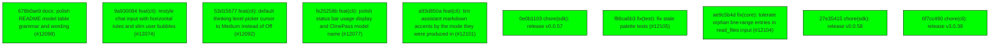

# Backport Agent — Detailed Run Report

> This file is generated automatically. It is intended for human analysts and
> AI reasoning models to assess agent performance, decision quality, and LLM behavior.

**Run timestamp**: 2026-07-07T07:58:36.424Z
**Models used**: fast=`mistral/mistral-code-agent-latest`  powerful=`mistral/mistral-medium-latest`
**Prompt log**: `/Users/rlemeill/Development/tea-ching-cline/.backport-agent/run-1783410133261.prompts.jsonl`

---

## Summary (PR body)

## Backport Agent — Sync Report

**Date**: 2026-07-07T07:58:36.424Z
**Upstream ref**: `cline/cline.git@main`
**Cut date**: `2026-06-27T00:00:00.000Z` 
**Fork ref**: `TEA-ching/cline@keypool-live`
**Sync branch**: `sync/upstream-main-2026-07-07-074350`

### Summary

- ✅ Applied: 10
- ⚠️ Needs human review: 0
- ⛔ Blocked (not attempted): 0

### Applied commits

- `678b0ae9` [high] docs: polish README model table grammar and wording (#12098) _(conflict resolved by agent)_
- `9a930084` [low] feat(cli): restyle chat input with horizontal rules and slim user bubbles (#12074)
- `53d15677` [low] feat(cli): default thinking level picker cursor to Medium instead of Off (#12092)
- `fe25258b` [low] feat(cli): polish status bar usage display and ClinePass model name (#12077) _(conflict resolved by agent)_
- `a93d850a` [low] feat(cli): tint assistant markdown accents by the mode they were produced in (#12101) _(conflict resolved by agent)_
- `0e0b1103` [high] chore(sdk): release v0.0.57 _(conflict resolved by agent)_
- `f86ca6b3` [low] fix(test): fix stale palette tests (#12105)
- `ae9c5b4d` [low] fix(core): tolerate orphan line-range entries in read_files input (#12104) _(conflict resolved by agent)_
- `27e35415` [high] chore(sdk): release v0.0.58 _(conflict resolved by agent)_
- `6f7cc490` [low] chore(cli): release v3.0.38

### Agent decision log

- All 10 commits were processed successfully
- Conflicts in status-bar.tsx and status-bar.test.ts were resolved by taking upstream versions
- Conflicts in README.md were resolved by taking upstream versions
- All validation tests passed


---

## Agent Workflow Diagram

> Generated by the fast model from the run summary. Evaluate the agent's decision path.



---

## AI Sub-Agent Call Log (7 calls)

> Each entry is one sub-agent invocation. Review prompt/response pairs to assess
> reasoning quality, hallucinations, and decision accuracy.

### Call 1 / 7 — `analyze_commit_for_backport` ✅ OK

| Field | Value |
|---|---|
| **Timestamp** | 2026-07-07T07:43:35.474Z |
| **Tool** | `analyze_commit_for_backport` |
| **Model** | `mistral/mistral-code-agent-latest` |
| **Duration** | 1727 ms |
| **Tokens in** | 3695 |
| **Tokens out** | 97 |
| **Cost** | $0.000000 |

**Prompt sent to sub-agent:**

```
Commit SHA: 678b0ae95161061ea856c5df86fc3471f21682ef
Commit message:
docs: polish README model table grammar and wording (#12098)

Changed files (1):
README.md

Diff:
commit 678b0ae95161061ea856c5df86fc3471f21682ef
Author: Saoud Rizwan <7799382+saoudrizwan@users.noreply.github.com>
Date:   Mon Jul 6 15:29:12 2026 -0700

    docs: polish README model table grammar and wording (#12098)
    
    Claude-Session: https://claude.ai/code/session_017VJNCE1o6zzcVfpjpTVnt5
    
    Co-authored-by: Claude <noreply@anthropic.com>
---
 README.md | 8 ++++----
 1 file changed, 4 insertions(+), 4 deletions(-)

diff --git a/README.md b/README.md
index 328181237c..055918ffa0 100644
--- a/README.md
+++ b/README.md
@@ -149,7 +149,7 @@ Toggle between Plan mode and Act mode. In Plan mode, Cline explores your codebas
 
 ## Rules and Skills
 
-Define project-specific rules in `.clinerules` files that guide how Cline works in your codebase: coding standards, architecture conventions, deployment procedures, testing requirements. Rules are picked up automatically by the CLI, VS Code extension, and JetBrains plugin. Use skills to let the model load specific rules when needed. 
+Define project-specific rules in `.clinerules` files that guide how Cline works in your codebase: coding standards, architecture conventions, deployment procedures, testing requirements. Rules are picked up automatically by the CLI, VS Code extension, and JetBrains plugin. Use skills to let the model load specific rules when needed.
 
 ## Works With Every Model
 
@@ -158,10 +158,10 @@ Cline is not locked to a single AI provider. Use whichever model fits your workf
 | Provider | Models |
 |----------|--------|
 | Anthropic | Claude Opus, Sonnet, Haiku |
-| OpenAI | GPT series model |
-| Google | Gemini series model |
+| OpenAI | GPT series models |
+| Google | Gemini series models |
 | OpenRouter | 200+ models from any provider |
-| Vercel AI Gateway | Models through Vercel AI Gateway |
+| Vercel AI Gateway | Route to many providers through one gateway |
 | AWS Bedrock | Claude, Llama, and more |
 | Azure / GCP Vertex | All hosted models |
 | Cerebras / Groq | Fast inference models |

Output the JSON object now.
```

**Response received:**

````
```json
{
  "summary": "Minor documentation update to polish grammar and wording in the README model table.",
  "keyChanges": [
    "Fixed pluralization in OpenAI and Google model descriptions",
    "Clarified Vercel AI Gateway description",
    "No functional or code changes"
  ],
  "backportComplexity": "trivial",
  "semanticRiskFactors": [],
  "recommendation": "apply"
}
```
````

---

### Call 2 / 7 — `analyze_commit_for_backport` ✅ OK

| Field | Value |
|---|---|
| **Timestamp** | 2026-07-07T07:43:38.196Z |
| **Tool** | `analyze_commit_for_backport` |
| **Model** | `mistral/mistral-medium-latest` |
| **Duration** | 2634 ms |
| **Tokens in** | 19077 |
| **Tokens out** | 88 |
| **Cost** | $0.000000 |

**Prompt sent to sub-agent:**

```
Commit SHA: 0e0b11032ebd55f4920a478251305d026baf3129
Commit message:
chore(sdk): release v0.0.57

Changed files (9):
bun.lock
sdk/CHANGELOG.md
sdk/packages/agents/package.json
sdk/packages/core/package.json
sdk/packages/llms/package.json
sdk/packages/llms/src/catalog/catalog.generated.ts
sdk/packages/sdk/package.json
sdk/packages/shared/package.json
sdk/packages/shared/src/prompt/format.test.ts

Diff:
commit 0e0b11032ebd55f4920a478251305d026baf3129
Author: Saoud Rizwan <7799382+saoudrizwan@users.noreply.github.com>
Date:   Mon Jul 6 18:06:43 2026 -0700

    chore(sdk): release v0.0.57
---
 bun.lock                                           | 234 ++++++------
 sdk/CHANGELOG.md                                   |   6 +
 sdk/packages/agents/package.json                   |   2 +-
 sdk/packages/core/package.json                     |   2 +-
 sdk/packages/llms/package.json                     |   2 +-
 sdk/packages/llms/src/catalog/catalog.generated.ts | 404 +++++++++++----------
 sdk/packages/sdk/package.json                      |   2 +-
 sdk/packages/shared/package.json                   |   2 +-
 sdk/packages/shared/src/prompt/format.test.ts      |   6 +-
 9 files changed, 340 insertions(+), 320 deletions(-)

diff --git a/bun.lock b/bun.lock
index 28b56bbaf4..4e62bff538 100644
--- a/bun.lock
+++ b/bun.lock
@@ -19,7 +19,7 @@
     },
     "apps/cli": {
       "name": "@cline/cli",
-      "version": "3.0.36",
+      "version": "3.0.37",
       "bin": {
         "cline": "src/index.ts",
       },
@@ -616,7 +616,7 @@
     },
     "sdk/packages/agents": {
       "name": "@cline/agents",
-      "version": "0.0.56",
+      "version": "0.0.57",
       "dependencies": {
         "@cline/llms": "workspace:*",
         "@cline/shared": "workspace:*",
@@ -625,7 +625,7 @@
     },
     "sdk/packages/core": {
       "name": "@cline/core",
-      "version": "0.0.56",
+      "version": "0.0.57",
       "dependencies": {
         "@cline/agents": "workspace:*",
         "@cline/llms": "workspace:*",
@@ -663,7 +663,7 @@
     },
     "sdk/packages/llms": {
       "name": "@cline/llms",
-      "version": "0.0.56",
+      "version": "0.0.57",
       "dependencies": {
         "@ai-sdk/amazon-bedrock": "^4.0.89",
         "@ai-sdk/anthropic": "^3.0.68",
@@ -697,14 +697,14 @@
     },
     "sdk/packages/sdk": {
       "name": "@cline/sdk",
-      "version": "0.0.56",
+      "version": "0.0.57",
       "dependencies": {
         "@cline/core": "workspace:*",
       },
     },
     "sdk/packages/shared": {
       "name": "@cline/shared",
-      "version": "0.0.56",
+      "version": "0.0.57",
       "dependencies": {
         "aws4fetch": "^1.0.20",
         "jsonrepair": "^3.13.2",
@@ -741,27 +741,27 @@
 
     "@agentclientprotocol/sdk": ["@agentclientprotocol/sdk@0.16.1", "", { "peerDependencies": { "zod": "^3.25.0 || ^4.0.0" } }, "sha512-1ad+Sc/0sCtZGHthxxvgEUo5Wsbw16I+aF+YwdiLnPwkZG8KAGUEAPK6LM6Pf69lCyJPt1Aomk1d+8oE3C4ZEw=="],
 
-    "@ai-sdk/amazon-bedrock": ["@ai-sdk/amazon-bedrock@4.0.123", "", { "dependencies": { "@ai-sdk/anthropic": "3.0.88", "@ai-sdk/openai": "3.0.76", "@ai-sdk/provider": "3.0.12", "@ai-sdk/provider-utils": "4.0.32", "@smithy/eventstream-codec": "^4.0.1", "@smithy/util-utf8": "^4.0.0", "aws4fetch": "^1.0.20" }, "peerDependencies": { "zod": "^3.25.76 || ^4.1.8" } }, "sha512-lEvz/jOJksH+KYIciVbX0iV7/80I+sG1Er7pullu4fh1fEpbhQC+o2wNwp2H+UzglJehE0uo93erd2RgQtEX6g=="],
+    "@ai-sdk/amazon-bedrock": ["@ai-sdk/amazon-bedrock@4.0.125", "", { "dependencies": { "@ai-sdk/anthropic": "3.0.90", "@ai-sdk/openai": "3.0.78", "@ai-sdk/provider": "3.0.12", "@ai-sdk/provider-utils": "4.0.33", "@smithy/eventstream-codec": "^4.0.1", "@smithy/util-utf8": "^4.0.0", "aws4fetch": "^1.0.20" }, "peerDependencies": { "zod": "^3.25.76 || ^4.1.8" } }, "sha512-7C+ud1t6biknsr+fSOSOeFJXYrPAjOouSUPu2ZJ94pXywI2W7Y3E3Rn0s2/NYViknRgY0UBcLY9GR1KKwhf1Yg=="],
 
-    "@ai-sdk/anthropic": ["@ai-sdk/anthropic@3.0.88", "", { "dependencies": { "@ai-sdk/provider": "3.0.12", "@ai-sdk/provider-utils": "4.0.32" }, "peerDependencies": { "zod": "^3.25.76 || ^4.1.8" } }, "sha512-2IqL7Auu0XW3BnulsHJUb7C4lQKXmWQ7MU2Osq+tfJ79in2P0Li2sX2j45HJMenGJL/JhSyunsYhyv63qMRxWQ=="],
+    "@ai-sdk/anthropic": ["@ai-sdk/anthropic@3.0.90", "", { "dependencies": { "@ai-sdk/provider": "3.0.12", "@ai-sdk/provider-utils": "4.0.33" }, "peerDependencies": { "zod": "^3.25.76 || ^4.1.8" } }, "sha512-7K51KyEyyQPcvBdrxB+TPmHzmuXPhyDNwTZuqTcsYp2GbB0E2SzoM1qEJ4qLb1H2Q8xx5SkkOhATmDxC4oVo9A=="],
 
-    "@ai-sdk/gateway": ["@ai-sdk/gateway@3.0.138", "", { "dependencies": { "@ai-sdk/provider": "3.0.12", "@ai-sdk/provider-utils": "4.0.32", "@vercel/oidc": "3.2.0" }, "peerDependencies": { "zod": "^3.25.76 || ^4.1.8" } }, "sha512-mYvN5va363hgArapRvXcY6ckV5BFvF4bnimT/tasTMBg2FDmA5S7+jltckGuiaUAYa1vKE9fA06AvmBVXaZYrA=="],
+    "@ai-sdk/gateway": ["@ai-sdk/gateway@3.0.140", "", { "dependencies": { "@ai-sdk/provider": "3.0.12", "@ai-sdk/provider-utils": "4.0.33", "@vercel/oidc": "3.2.0" }, "peerDependencies": { "zod": "^3.25.76 || ^4.1.8" } }, "sha512-4VyQTHHqfZ0qI1fCcurJgYgzVDgLfV4svzBMOHGGxCu4srFkAn4ZmwFj2M0J00kNt7QLsjOtZ6PhueupeIJSjA=="],
 
-    "@ai-sdk/google": ["@ai-sdk/google@3.0.85", "", { "dependencies": { "@ai-sdk/provider": "3.0.12", "@ai-sdk/provider-utils": "4.0.32" }, "peerDependencies": { "zod": "^3.25.76 || ^4.1.8" } }, "sha512-x6JBywNpZXZZnhxJbZZFut3VhFPL4jq0kh2yWVMvCSXlqT39qaS6535WA23hxqD2Ff90wnAyuPJiap8yWsqKww=="],
+    "@ai-sdk/google": ["@ai-sdk/google@3.0.86", "", { "dependencies": { "@ai-sdk/provider": "3.0.12", "@ai-sdk/provider-utils": "4.0.33" }, "peerDependencies": { "zod": "^3.25.76 || ^4.1.8" } }, "sha512-NZoFXTdK2/C7VuuGhAatoQ/wSiIvxVzw4Xr0AvcD3cotS5+iP/y0eN1J12pvFSZv+nAHa2Xl7xvFHDadzeU90g=="],
 
-    "@ai-sdk/google-vertex": ["@ai-sdk/google-vertex@4.0.151", "", { "dependencies": { "@ai-sdk/anthropic": "3.0.88", "@ai-sdk/google": "3.0.85", "@ai-sdk/openai-compatible": "2.0.53", "@ai-sdk/provider": "3.0.12", "@ai-sdk/provider-utils": "4.0.32", "google-auth-library": "^10.5.0" }, "peerDependencies": { "zod": "^3.25.76 || ^4.1.8" } }, "sha512-GV6kwRCCQxEq9jzRX6uBVUOzzJLnt0KeZmnyP6YUHdOZvBrgIn9M/EnUJStNJHV2tk0Vh1Pp5duoalaXc6lKuQ=="],
+    "@ai-sdk/google-vertex": ["@ai-sdk/google-vertex@4.0.153", "", { "dependencies": { "@ai-sdk/anthropic": "3.0.90", "@ai-sdk/google": "3.0.86", "@ai-sdk/openai-compatible": "2.0.54", "@ai-sdk/provider": "3.0.12", "@ai-sdk/provider-utils": "4.0.33", "google-auth-library": "^10.5.0" }, "peerDependencies": { "zod": "^3.25.76 || ^4.1.8" } }, "sha512-ZPPjMRkTmdRzDSjxlZFJXskuAtyTYffnPVQjbWDTNqiUTGOHQaxxRuqibepJqQ19pnDe72Yj1r+fL2kNkhml+g=="],
 
-    "@ai-sdk/mistral": ["@ai-sdk/mistral@3.0.42", "", { "dependencies": { "@ai-sdk/provider": "3.0.12", "@ai-sdk/provider-utils": "4.0.32" }, "peerDependencies": { "zod": "^3.25.76 || ^4.1.8" } }, "sha512-ZlYELoGbNj+SrNm9L1XQSsWkfv3W71j3VEEI32MJwtLaMr0xzJAxC1V/lti+vVHHRUTHkxxp3fjOu9b4MxWe0w=="],
+    "@ai-sdk/mistral": ["@ai-sdk/mistral@3.0.43", "", { "dependencies": { "@ai-sdk/provider": "3.0.12", "@ai-sdk/provider-utils": "4.0.33" }, "peerDependencies": { "zod": "^3.25.76 || ^4.1.8" } }, "sha512-FtFcf0eXEm1v8JiDYe4fyQoRz9JmK5/LLH8nawFIttkxc309TsuPNFfwpSgj2Fm5osrBFL49FGPEL9phJVav7A=="],
 
-    "@ai-sdk/openai": ["@ai-sdk/openai@3.0.76", "", { "dependencies": { "@ai-sdk/provider": "3.0.12", "@ai-sdk/provider-utils": "4.0.32" }, "peerDependencies": { "zod": "^3.25.76 || ^4.1.8" } }, "sha512-zY4A5gxWFH95jhisbuHG29qqmHPrO6zu9WkGi12SjMbRFDtok9gm676n0+FjTWifHEYoUK1YvR1nOwPorfHThg=="],
+    "@ai-sdk/openai": ["@ai-sdk/openai@3.0.78", "", { "dependencies": { "@ai-sdk/provider": "3.0.12", "@ai-sdk/provider-utils": "4.0.33" }, "peerDependencies": { "zod": "^3.25.76 || ^4.1.8" } }, "sha512-XlRHyAe1zvetAO1lXVQSNy8acsdd+kznTfmedXBCe7Pvu7lEGGePL8iUg/jH2qLqnlrIpYovuCd3jC2hSTOTsA=="],
 
-    "@ai-sdk/openai-compatible": ["@ai-sdk/openai-compatible@2.0.53", "", { "dependencies": { "@ai-sdk/provider": "3.0.12", "@ai-sdk/provider-utils": "4.0.32" }, "peerDependencies": { "zod": "^3.25.76 || ^4.1.8" } }, "sha512-SoPSkrL5cbNQnAljRsJ7pOzJ2FmWgnhC0lfFOda873ycCdFJL1A+h3Ib7mX2spcv3XnNaO13y/45/0RyqNWlIQ=="],
+    "@ai-sdk/openai-compatible": ["@ai-sdk/openai-compatible@2.0.54", "", { "dependencies": { "@ai-sdk/provider": "3.0.12", "@ai-sdk/provider-utils": "4.0.33" }, "peerDependencies": { "zod": "^3.25.76 || ^4.1.8" } }, "sha512-OyXt0zK8y2/ZIyWlbxTv2r1M7AK227S+Gl4BYOEF42q0wz1n5m4fwR8L4Fy/MQ4Ho6xje47MPsFcRdIqIyP6Rw=="],
 
     "@ai-sdk/provider": ["@ai-sdk/provider@3.0.12", "", { "dependencies": { "json-schema": "^0.4.0" } }, "sha512-sj9DWTJ2Ze0WR9qsiOPqoqzNx3OxL6iMxHImbhvoe9qOspekbzxNDMiJ4TIGfYHYh9w4OmBjz3prvqhzTi96+Q=="],
 
-    "@ai-sdk/provider-utils": ["@ai-sdk/provider-utils@4.0.32", "", { "dependencies": { "@ai-sdk/provider": "3.0.12", "@standard-schema/spec": "^1.1.0", "eventsource-parser": "^3.0.8" }, "peerDependencies": { "zod": "^3.25.76 || ^4.1.8" } }, "sha512-Kwj499fTcN9bP/AfGoPU7JWIXeP6VZqKI6omsH062c9E2G4gdjeJczkz4z/tYSkzYjLE2AI3DtZbMfs6D7vn2Q=="],
+    "@ai-sdk/provider-utils": ["@ai-sdk/provider-utils@4.0.33", "", { "dependencies": { "@ai-sdk/provider": "3.0.12", "@standard-schema/spec": "^1.1.0", "eventsource-parser": "^3.0.8" }, "peerDependencies": { "zod": "^3.25.76 || ^4.1.8" } }, "sha512-nJ0bAfegMAIJtrzMJtbzer1cS3nb7c7DsyU1S4nrPm7ZU0Mn6SBBZv5IGZZGTbpWTJwqKTSPeZJTXalbAxt1BA=="],
 
-    "@ai-sdk/react": ["@ai-sdk/react@3.0.215", "", { "dependencies": { "@ai-sdk/provider-utils": "4.0.32", "ai": "6.0.213", "swr": "^2.2.5", "throttleit": "2.1.0" }, "peerDependencies": { "react": "^18 || ~19.0.1 || ~19.1.2 || ^19.2.1" } }, "sha512-OqGbF5cKZDWT6HXrprGlgzFO1M9RosodE+L5vUknX/Sk1BBsrtHLUR3zNUVYk/nytyLUmagRksOwrvdgOURBVA=="],
+    "@ai-sdk/react": ["@ai-sdk/react@3.0.218", "", { "dependencies": { "@ai-sdk/provider-utils": "4.0.33", "ai": "6.0.216", "swr": "^2.2.5", "throttleit": "2.1.0" }, "peerDependencies": { "react": "^18 || ~19.0.1 || ~19.1.2 || ^19.2.1" } }, "sha512-gFtotqv2JmJeUIjmMigdIwwUbABXjJb786anZ26AcaLVSC/pKqhhtzYsT0uef5MuEcLquTzBAFtu6SY3Ov2I5Q=="],
 
     "@alloc/quick-lru": ["@alloc/quick-lru@5.2.0", "", {}, "sha512-UrcABB+4bUrFABwbluTIBErXwvbsU/V7TZWfmbgJfbkwiBuziS9gxdODUyuiecfdGQ85jglMW6juS3+z5TsKLw=="],
 
@@ -769,30 +769,28 @@
 
     "@antfu/install-pkg": ["@antfu/install-pkg@1.1.0", "", { "dependencies": { "package-manager-detector": "^1.3.0", "tinyexec": "^1.0.1" } }, "sha512-MGQsmw10ZyI+EJo45CdSER4zEb+p31LpDAFp2Z3gkSd1yqVZGi0Ebx++YTEMonJy4oChEMLsxZ64j8FH6sSqtQ=="],
 
-    "@anthropic-ai/claude-agent-sdk": ["@anthropic-ai/claude-agent-sdk@0.3.195", "", { "optionalDependencies": { "@anthropic-ai/claude-agent-sdk-darwin-arm64": "0.3.195", "@anthropic-ai/claude-agent-sdk-darwin-x64": "0.3.195", "@anthropic-ai/claude-agent-sdk-linux-arm64": "0.3.195", "@anthropic-ai/claude-agent-sdk-linux-arm64-musl": "0.3.195", "@anthropic-ai/claude-agent-sdk-linux-x64": "0.3.195", "@anthropic-ai/claude-agent-sdk-linux-x64-musl": "0.3.195", "@anthropic-ai/claude-agent-sdk-win32-arm64": "0.3.195", "@anthropic-ai/claude-agent-sdk-win32-x64": "0.3.195" }, "peerDependencies": { "@anthropic-ai/sdk": ">=0.93.0", "@modelcontextprotocol/sdk": "^1.29.0", "zod": "^4.0.0" } }, "sha512-FVmXu9pvOMbuBKWrF8YsYQdQ/upOpv5rS8lFAnFO5jbyXT/2hN7kEPd2vd2GJpaMvNcO/KptyQUK5AxjjTz3+w=="],
+    "@anthropic-ai/claude-agent-sdk": ["@anthropic-ai/claude-agent-sdk@0.3.196", "", { "optionalDependencies": { "@anthropic-ai/claude-agent-sdk-darwin-arm64": "0.3.196", "@anthropic-ai/claude-agent-sdk-darwin-x64": "0.3.196", "@anthropic-ai/claude-agent-sdk-linux-arm64": "0.3.196", "@anthropic-ai/claude-agent-sdk-linux-arm64-musl": "0.3.196", "@anthropic-ai/claude-agent-sdk-linux-x64": "0.3.196", "@anthropic-ai/claude-agent-sdk-linux-x64-musl": "0.3.196", "@anthropic-ai/claude-agent-sdk-win32-arm64": "0.3.196", "@anthropic-ai/claude-agent-sdk-win32-x64": "0.3.196" }, "peerDependencies": { "@anthropic-ai/sdk": ">=0.93.0", "@modelcontextprotocol/sdk": "^1.29.0", "zod": "^4.0.0" } }, "sha512-yqsp1/04T2/tJ54jz+7YLsTZOPeQ/myUCrv17/IVZ9dbl+izIMP9ULuLpPCH5pj5msXxR80es+hpVgHoFuNm0A=="],
 
-    "@anthropic-ai/claude-agent-sdk-darwin-arm64": ["@anthropic-ai/claude-agent-sdk-darwin-arm64@0.3.195", "", { "os": "darwin", "cpu": "arm64" }, "sha512-WIMM/8HRCLsTDHFTIwQvvE8WCA/oaMJtdQxsP7iNyfzIGwXbuOyU95V8vYIhZfaO2yaSpbBRncunq4CtR5H4ng=="],
+    "@anthropic-ai/claude-agent-sdk-darwin-arm64": ["@anthropic-ai/claude-agent-sdk-darwin-arm64@0.3.196", "", { "os": "darwin", "cpu": "arm64" }, "sha512-k1MKRDhSiNKpkTwhtU8QKGzfuRfr3YXS6oqsTuldMROX56L5iMXjzC7AYU1/KmPTeMl3SCQBQeDu0i8ciA0hQA=="],
 
-    "@anthropic-ai/claude-agent-sdk-darwin-x64": ["@anthropic-ai/claude-agent-sdk-darwin-x64@0.3.195", "", { "os": "darwin", "cpu": "x64" }, "sha512-RY7DB+4LXosE0MJ+XELmakfPrDN1YX4lkk9CTDm28jGCVcESRz9kAEqbyaiC48dZcmN9V1NCLutzINGdcr1TBg=="],
+    "@anthropic-ai/claude-agent-sdk-darwin-x64": ["@anthropic-ai/claude-agent-sdk-darwin-x64@0.3.196", "", { "os": "darwin", "cpu": "x64" }, "sha512-bBwx/7yKZMQ9NSUt4bg8P+zp6pgd/O/DTkzdqsRIivBvARmwo1QY/2qGrLO8RH0T8CG2lTjFNfDfOlJWbAkvAg=="],
 
-    "@anthropic-ai/claude-agent-sdk-linux-arm64": ["@anthropic-ai/claude-agent-sdk-linux-arm64@0.3.195", "", { "os": "linux", "cpu": "arm64" }, "sha512-JuIq5Fnz/F1snl0aqi1gcuRZqPWoPNrL9dJ0DuievCxKkO8hnEz/Mmn5Zos7x1X8HE//ZnEvmQXoEQEZXonJew=="],
+    "@anthropic-ai/claude-agent-sdk-linux-arm64": ["@anthropic-ai/claude-agent-sdk-linux-arm64@0.3.196", "", { "os": "linux", "cpu": "arm64" }, "sha512-fR5fy+pSQSpKZK0zTtAl3LZEGQTuwVK7svutH1bZUS5RGT2HdUWc71oltSZgW4upGaslj+gyusHGJHA5eAc+dw=="],
 
-    "@anthropic-ai/claude-agent-sdk-linux-arm64-musl": ["@anthropic-ai/claude-agent-sdk-linux-arm64-musl@0.3.195", "", { "os": "linux", "cpu": "arm64" }, "sha512-ZmyBA/AFzhgutcxb7dbhCm6GTjJytwNYXTxJoKE2B3A409WCYccjMqeji6vCMNxyyfylglGo5D8dVMIxW9aoug=="],
+    "@anthropic-ai/claude-agent-sdk-linux-arm64-musl": ["@anthropic-ai/claude-agent-sdk-linux-arm64-musl@0.3.196", "", { "os": "linux", "cpu": "arm64" }, "sha512-BhLxfx4j6mC3Uzmve1IbhFS1uvNlwATeo6uWyYDOMW4n3XKjiSgjD8bTfkamijrxCMvJo5swLju2y14ayDsokA=="],
 
-    "@anthropic-ai/claude-agent-sdk-linux-x64": ["@anthropic-ai/claude-agent-sdk-linux-x64@0.3.195", "", { "os": "linux", "cpu": "x64" }, "sha512-s1lNi1cL93luoqsItH+fNO4KpIhdkvnVhWGGQUQ/8ftwa2gfmcIQnOg1hG8Ks+KzeD3UUQ8L9YEVHVADnFI/9A=="],
+    "@anthropic-ai/claude-agent-sdk-linux-x64": ["@anthropic-ai/claude-agent-sdk-linux-x64@0.3.196", "", { "os": "linux", "cpu": "x64" }, "sha512-9spZON7/tn0q9J+jICrdfHi7o7Fmjs9pIohCCxL+Yv7HbBXWVtEYJbYipBGLTl8ICG3mgPeEVMNsvOuh/jDTuA=="],
 
-    "@anthropic-ai/claude-agent-sdk-linux-x64-musl": ["@anthropic-ai/claude-agent-sdk-linux-x64-musl@0.3.195", "", { "os": "linux", "cpu": "x64" }, "sha512-nf8Q/LauB+ZOC6QDjxNhbsvwUtYjKYnaWJLTYFwhkmsLujePnety1AtT/1ubaUoq5AM1j297DhMlYTasa79OUA=="],
+    "@anthropic-ai/claude-agent-sdk-linux-x64-musl": ["@anthropic-ai/claude-agent-sdk-linux-x64-musl@0.3.196", "", { "os": "linux", "cpu": "x64" }, "sha512-EOiNbxCXQLYzV7SQhMWkUC1ScWyTw/Qp+JyV2sEmIbzl/e7KMOxNE9J20k+lpPs6CXdxVzuMwH7yAGuDu5y+IQ=="],
 
-    "@anthropic-ai/claude-agent-sdk-win32-arm64": ["@anthropic-ai/claude-agent-sdk-win32-arm64@0.3.195", "", { "os": "win32", "cpu": "arm64" }, "sha512-hbkDE+xPIZzRWm+D+BKrH9uJH6USIZdDIlsyrIlGi3JFHoieYoA1vdUNyldSS9+F3ZqQtfPjr2Qy08IVB6akYA=="],
+    "@anthropic-ai/claude-agent-sdk-win32-arm64": ["@anthropic-ai/claude-agent-sdk-win32-arm64@0.3.196", "", { "os": "win32", "cpu": "arm64" }, "sha512-0xXkAWlDof/qFi3k5KJZ5WYbgp1X8hZHjyasOWTZWAmldoYaENI0vkL+PVMarvoAFYRRqcWoS81FSgm0QgH2sA=="],
 
-    "@anthropic-ai/claude-agent-sdk-win32-x64": ["@anthropic-ai/claude-agent-sdk-win32-x64@0.3.195", "", { "os": "win32", "cpu": "x64" }, "sha512-av0piEB3X1Dzhpr8A+DqHVZ9y8s1jpn8enzwX0TKKUPBn5IqLTWC7wD6v66aoUgu4f+g4ThZirmDZA6shyPEZQ=="],
+    "@anthropic-ai/claude-agent-sdk-win32-x64": ["@anthropic-ai/claude-agent-sdk-win32-x64@0.3.196", "", { "os": "win32", "cpu": "x64" }, "sha512-FxWLA3aOYgDf2J0o6Ov1/wgg9X6RkrgnX4ifUWO1i3+6mbc4efNLHkDZLxCHEnQgW8yBidX+iro19f9k64vV8A=="],
 
     "@anthropic-ai/sdk": ["@anthropic-ai/sdk@0.37.0", "", { "dependencies": { "@types/node": "^18.11.18", "@types/node-fetch": "^2.6.4", "abort-controller": "^3.0.0", "agentkeepalive": "^4.2.1", "form-data-encoder": "1.7.2", "formdata-node": "^4.3.2", "node-fetch": "^2.6.7" } }, "sha512-tHjX2YbkUBwEgg0JZU3EFSSAQPoK4qQR/NFYa8Vtzd5UAyXzZksCw2In69Rml4R/TyHPBfRYaLK35XiOe33pjw=="],
 
     "@asamuzakjp/css-color": ["@asamuzakjp/css-color@3.2.0", "", { "dependencies": { "@csstools/css-calc": "^2.1.3", "@csstools/css-color-parser": "^3.0.9", "@csstools/css-parser-algorithms": "^3.0.4", "@csstools/css-tokenizer": "^3.0.3", "lru-cache": "^10.4.3" } }, "sha512-K1A6z8tS3XsmCMM86xoWdn7Fkdn9m6RSVtocUrJYIwZnFVkng/PvkEoWtOWmP+Scc6saYWHWZYbndEEXxl24jw=="],
 
-    "@aws-crypto/crc32": ["@aws-crypto/crc32@5.2.0", "", { "dependencies": { "@aws-crypto/util": "^5.2.0", "@aws-sdk/types": "^3.222.0", "tslib": "^2.6.2" } }, "sha512-nLbCWqQNgUiwwtFsen1AdzAtvuLRsQS8rYgMuxCrdKf9kOssamGLuPwyTY9wyYblNr9+1XM8v6zoDTPPSIeANg=="],
-
     "@aws-crypto/sha256-browser": ["@aws-crypto/sha256-browser@5.2.0", "", { "dependencies": { "@aws-crypto/sha256-js": "^5.2.0", "@aws-crypto/supports-web-crypto": "^5.2.0", "@aws-crypto/util": "^5.2.0", "@aws-sdk/types": "^3.222.0", "@aws-sdk/util-locate-window": "^3.0.0", "@smithy/util-utf8": "^2.0.0", "tslib": "^2.6.2" } }, "sha512-AXfN/lGotSQwu6HNcEsIASo7kWXZ5HYWvfOmSNKDsEqC4OashTp8alTmaz+F7TC2L083SFv5RdB+qU3Vs1kZqw=="],
 
     "@aws-crypto/sha256-js": ["@aws-crypto/sha256-js@5.2.0", "", { "dependencies": { "@aws-crypto/util": "^5.2.0", "@aws-sdk/types": "^3.222.0", "tslib": "^2.6.2" } }, "sha512-FFQQyu7edu4ufvIZ+OadFpHHOt+eSTBaYaki44c+akjg7qZg9oOQeLlk77F6tSYqjDAFClrHJk9tMf0HdVyOvA=="],
@@ -801,41 +799,41 @@
 
     "@aws-crypto/util": ["@aws-crypto/util@5.2.0", "", { "dependencies": { "@aws-sdk/types": "^3.222.0", "@smithy/util-utf8": "^2.0.0", "tslib": "^2.6.2" } }, "sha512-4RkU9EsI6ZpBve5fseQlGNUWKMa1RLPQ1dnjnQoe07ldfIzcsGb5hC5W0Dm7u423KWzawlrpbjXBrXCEv9zazQ=="],
 
-    "@aws-sdk/client-cognito-identity": ["@aws-sdk/client-cognito-identity@3.1075.0", "", { "dependencies": { "@aws-crypto/sha256-browser": "5.2.0", "@aws-crypto/sha256-js": "5.2.0", "@aws-sdk/core": "^3.974.23", "@aws-sdk/credential-provider-node": "^3.972.58", "@aws-sdk/types": "^3.973.13", "@smithy/core": "^3.24.6", "@smithy/fetch-http-handler": "^5.4.6", "@smithy/node-http-handler": "^4.7.6", "@smithy/types": "^4.14.3", "tslib": "^2.6.2" } }, "sha512-typFcdyFwIPt86QPKsO7xwcsYoEmNcDpoNqn0tqa4+Lss7niNKQzPe/765XNgAHO3I1ixiT1OKv8KD6M+CKw2w=="],
+    "@aws-sdk/client-cognito-identity": ["@aws-sdk/client-cognito-identity@3.1076.0", "", { "dependencies": { "@aws-crypto/sha256-browser": "5.2.0", "@aws-crypto/sha256-js": "5.2.0", "@aws-sdk/core": "^3.974.24", "@aws-sdk/credential-provider-node": "^3.972.59", "@aws-sdk/types": "^3.973.14", "@smithy/core": "^3.27.0", "@smithy/fetch-http-handler": "^5.6.0", "@smithy/node-http-handler": "^4.9.0", "@smithy/types": "^4.15.0", "tslib": "^2.6.2" } }, "sha512-hSkEljVcPBXPSsB/GLeVZaNaIzrMLPAj//jg41rNObfMGa7qRvWHXtbDt7UVxXjAFlVw84wCFWNBMBSql5HynQ=="],
 
-    "@aws-sdk/core": ["@aws-sdk/core@3.974.23", "", { "dependencies": { "@aws-sdk/types": "^3.973.13", "@aws-sdk/xml-builder": "^3.972.31", "@aws/lambda-invoke-store": "^0.2.2", "@smithy/core": "^3.24.6", "@smithy/signature-v4": "^5.4.6", "@smithy/types": "^4.14.3", "bowser": "^2.11.0", "tslib": "^2.6.2" } }, "sha512-MiWR/uWjxjFXGzrE0Ghc5lWxUxzHsUWFhV+OX7M4cR9SrmrnZs6TXavnCWnzzdwJeFri34xQo81rvGNzK3c4BQ=="],
+    "@aws-sdk/core": ["@aws-sdk/core@3.974.24", "", { "dependencies": { "@aws-sdk/types": "^3.973.14", "@aws-sdk/xml-builder": "^3.972.32", "@aws/lambda-invoke-store": "^0.2.2", "@smithy/core": "^3.27.0", "@smithy/signature-v4": "^5.5.3", "@smithy/types": "^4.15.0", "bowser": "^2.11.0", "tslib": "^2.6.2" } }, "sha512-vWB/qJl21vxGKBkBN8fKPTVXgm14v/bUQWTtR5oikrfAZbIN2bxuSiCY5rRAMR4gs3vtR2Vw0aTfVDU4tdfIPg=="],
 
-    "@aws-sdk/credential-provider-cognito-identity": ["@aws-sdk/credential-provider-cognito-identity@3.972.48", "", { "dependencies": { "@aws-sdk/nested-clients": "^3.997.23", "@aws-sdk/types": "^3.973.13", "@smithy/core": "^3.24.6", "@smithy/types": "^4.14.3", "tslib": "^2.6.2" } }, "sha512-dTSY4wCPx87Gd1peDcTop1li61f6KLAs3LSlq/omnCxpIOvMDpAQjylJ7ZDaZk6KA88+oZ0k/XuVSou1YuWI/w=="],
+    "@aws-sdk/credential-provider-cognito-identity": ["@aws-sdk/credential-provider-cognito-identity@3.972.49", "", { "dependencies": { "@aws-sdk/nested-clients": "^3.997.24", "@aws-sdk/types": "^3.973.14", "@smithy/core": "^3.27.0", "@smithy/types": "^4.15.0", "tslib": "^2.6.2" } }, "sha512-PU8EJj5wMvTqp5oeBVCPK1vqraQ9ZlUVYTM5Bbvq1pBTY3WGr2wgvnGCRalFQpS7BFUQflpjumHcaQBmkOhfBA=="],
 
-    "@aws-sdk/credential-provider-env": ["@aws-sdk/credential-provider-env@3.972.49", "", { "dependencies": { "@aws-sdk/core": "^3.974.23", "@aws-sdk/types": "^3.973.13", "@smithy/core": "^3.24.6", "@smithy/types": "^4.14.3", "tslib": "^2.6.2" } }, "sha512-liB3yQNHCM9k/gu/w36XHMKPluT7HTlnGUhRbBGSISDQkcr/Sy1zsZabiuvQj8WG5yW573u9RehrBvvnIQ9OEQ=="],
+    "@aws-sdk/credential-provider-env": ["@aws-sdk/credential-provider-env@3.972.50", "", { "dependencies": { "@aws-sdk/core": "^3.974.24", "@aws-sdk/types": "^3.973.14", "@smithy/core": "^3.27.0", "@smithy/types": "^4.15.0", "tslib": "^2.6.2" } }, "sha512-l8bWzhPFTi9tDcvtURxeMlfsboul5/0sEN3SwwXxdpYudVB9+EuQcxo2pwlTzXwDo4Gm2VLGyiZ8zti3nfdOLw=="],
 
-    "@aws-sdk/credential-provider-http": ["@aws-sdk/credential-provider-http@3.972.51", "", { "dependencies": { "@aws-sdk/core": "^3.974.23", "@aws-sdk/types": "^3.973.13", "@smithy/core": "^3.24.6", "@smithy/fetch-http-handler": "^5.4.6", "@smithy/node-http-handler": "^4.7.6", "@smithy/types": "^4.14.3", "tslib": "^2.6.2" } }, "sha512-XET0H2oofciJ5lMRWNIvRjAP7Q3wv2XT+JtJJEdhPWUMwe3TvQ9qcxonpu7vXmNngncvFpi4E2It+Tamas/naA=="],
+    "@aws-sdk/credential-provider-http": ["@aws-sdk/credential-provider-http@3.972.52", "", { "dependencies": { "@aws-sdk/core": "^3.974.24", "@aws-sdk/types": "^3.973.14", "@smithy/core": "^3.27.0", "@smithy/fetch-http-handler": "^5.6.0", "@smithy/node-http-handler": "^4.9.0", "@smithy/types": "^4.15.0", "tslib": "^2.6.2" } }, "sha512-FjAlnsIvemWzO3JTM3ObuuxpqCyrqkXOewlYY2+NiR1MYO1JuFYSIJ8SJN5Q2KD1jkL5lIuab8awjb/AxsvjiQ=="],
 
-    "@aws-sdk/credential-provider-ini": ["@aws-sdk/credential-provider-ini@3.972.56", "", { "dependencies": { "@aws-sdk/core": "^3.974.23", "@aws-sdk/credential-provider-env": "^3.972.49", "@aws-sdk/credential-provider-http": "^3.972.51", "@aws-sdk/credential-provider-login": "^3.972.55", "@aws-sdk/credential-provider-process": "^3.972.49", "@aws-sdk/credential-provider-sso": "^3.972.55", "@aws-sdk/credential-provider-web-identity": "^3.972.55", "@aws-sdk/nested-clients": "^3.997.23", "@aws-sdk/types": "^3.973.13", "@smithy/core": "^3.24.6", "@smithy/credential-provider-imds": "^4.3.7", "@smithy/types": "^4.14.3", "tslib": "^2.6.2" } }, "sha512-IAmc61hbgQiHht9U3x0tnRwz0lzdwOwD/i9voRgdJrKamF+JtmrBOsW9GwB7mfFonNWOWL4qARWYrF8veEMe3w=="],
+    "@aws-sdk/credential-provider-ini": ["@aws-sdk/credential-provider-ini@3.972.57", "", { "dependencies": { "@aws-sdk/core": "^3.974.24", "@aws-sdk/credential-provider-env": "^3.972.50", "@aws-sdk/credential-provider-http": "^3.972.52", "@aws-sdk/credential-provider-login": "^3.972.56", "@aws-sdk/credential-provider-process": "^3.972.50", "@aws-sdk/credential-provider-sso": "^3.972.56", "@aws-sdk/credential-provider-web-identity": "^3.972.56", "@aws-sdk/nested-clients": "^3.997.24", "@aws-sdk/types": "^3.973.14", "@smithy/core": "^3.27.0", "@smithy/credential-provider-imds": "^4.4.3", "@smithy/types": "^4.15.0", "tslib": "^2.6.2" } }, "sha512-8qwNhQ0sK/1KaOpVEFC7TFxrWP3fxzJV1K049MzjouiMIbvTDvIGDEUtj5ND5aTmlHVK/YZxjoYnLCeV/GZU0w=="],
 
-    "@aws-sdk/credential-provider-login": ["@aws-sdk/credential-provider-login@3.972.55", "", { "dependencies": { "@aws-sdk/core": "^3.974.23", "@aws-sdk/nested-clients": "^3.997.23", "@aws-sdk/types": "^3.973.13", "@smithy/core": "^3.24.6", "@smithy/types": "^4.14.3", "tslib": "^2.6.2" } }, "sha512-hBBkANo3cDn+h2qxxzER4a+J8JCO9o9Z/YYmU7iky6AcaarX5RRdRcHNC6SLdwY0vAXQygn6soUbDqPn3GghaA=="],
+    "@aws-sdk/credential-provider-login": ["@aws-sdk/credential-provider-login@3.972.56", "", { "dependencies": { "@aws-sdk/core": "^3.974.24", "@aws-sdk/nested-clients": "^3.997.24", "@aws-sdk/types": "^3.973.14", "@smithy/core": "^3.27.0", "@smithy/types": "^4.15.0", "tslib": "^2.6.2" } }, "sha512-S36dCrDaafakFMlaCVGAF4advbQKoJuMcyMtNWVBpUz65uqhbIAsUfvAyp+djA+jkzaEfgZGd+AELjIGzTqyhw=="],
 
-    "@aws-sdk/credential-provider-node": ["@aws-sdk/credential-provider-node@3.972.58", "", { "dependencies": { "@aws-sdk/credential-provider-env": "^3.972.49", "@aws-sdk/credential-provider-http": "^3.972.51", "@aws-sdk/credential-provider-ini": "^3.972.56", "@aws-sdk/credential-provider-process": "^3.972.49", "@aws-sdk/credential-provider-sso": "^3.972.55", "@aws-sdk/credential-provider-web-identity": "^3.972.55", "@aws-sdk/types": "^3.973.13", "@smithy/core": "^3.24.6", "@smithy/credential-provider-imds": "^4.3.7", "@smithy/types": "^4.14.3", "tslib": "^2.6.2" } }, "sha512-OyCLVmSI7pZO8hxwNVX6pXhTVlJqRBTp+ijdEfJSUj0RyjHnF602OfAarOzGq6wkGodeFkYBt8MmJ6A6ycRgWw=="],
+    "@aws-sdk/credential-provider-node": ["@aws-sdk/credential-provider-node@3.972.59", "", { "dependencies": { "@aws-sdk/credential-provider-env": "^3.972.50", "@aws-sdk/credential-provider-http": "^3.972.52", "@aws-sdk/credential-provider-ini": "^3.972.57", "@aws-sdk/credential-provider-process": "^3.972.50", "@aws-sdk/credential-provider-sso": "^3.972.56", "@aws-sdk/credential-provider-web-identity": "^3.972.56", "@aws-sdk/types": "^3.973.14", "@smithy/core": "^3.27.0", "@smithy/credential-provider-imds": "^4.4.3", "@smithy/types": "^4.15.0", "tslib": "^2.6.2" } }, "sha512-LkczBXaEsdManijlEZwbKfEoo1C98Yri3LHF8gQI7CYWv+uFkmpS3OZH3BSew8g1A2ppKsScdPUSlhI6NV7a9g=="],
 
-    "@aws-sdk/credential-provider-process": ["@aws-sdk/credential-provider-process@3.972.49", "", { "dependencies": { "@aws-sdk/core": "^3.974.23", "@aws-sdk/types": "^3.973.13", "@smithy/core": "^3.24.6", "@smithy/types": "^4.14.3", "tslib": "^2.6.2" } }, "sha512-C8h36lBuC/RnBSsjlO+dn6xZm3KbAl5vpJaVPAfQnMmz2/OISmKOc8XZcqMQgO2ADwBYNRMM6Kf3vz9G/TulMQ=="],
+    "@aws-sdk/credential-provider-process": ["@aws-sdk/credential-provider-process@3.972.50", "", { "dependencies": { "@aws-sdk/core": "^3.974.24", "@aws-sdk/types": "^3.973.14", "@smithy/core": "^3.27.0", "@smithy/types": "^4.15.0", "tslib": "^2.6.2" } }, "sha512-ARBEVkOQzmowTU0a35smGVyldJ9FN/f57XIGrPatrul4mYN+vvOKxoc1njDOX3nugVze+0sHzQZWJ8kPARAtUA=="],
 
-    "@aws-sdk/credential-provider-sso": ["@aws-sdk/credential-provider-sso@3.972.55", "", { "dependencies": { "@aws-sdk/core": "^3.974.23", "@aws-sdk/nested-clients": "^3.997.23", "@aws-sdk/token-providers": "3.1074.0", "@aws-sdk/types": "^3.973.13", "@smithy/core": "^3.24.6", "@smithy/types": "^4.14.3", "tslib": "^2.6.2" } }, "sha512-1FkOz74Ea5QGS9jtIoXp55T/IkSS3spv+nLTT07fRY/+T5xmEOqaYBVIaEmX4zTNvbV6g2lrtlaVKWEoNyJt3w=="],
+    "@aws-sdk/credential-provider-sso": ["@aws-sdk/credential-provider-sso@3.972.56", "", { "dependencies": { "@aws-sdk/core": "^3.974.24", "@aws-sdk/nested-clients": "^3.997.24", "@aws-sdk/token-providers": "3.1076.0", "@aws-sdk/types": "^3.973.14", "@smithy/core": "^3.27.0", "@smithy/types": "^4.15.0", "tslib": "^2.6.2" } }, "sha512-LvbWiFcLI/D5RPaT68TrpLLHyv7x5X+dm59wJ5dFizyGPZggBC7OdgJTlP0X1bVjiSSAgE1u1oxxcBps0GCEnA=="],
 
-    "@aws-sdk/credential-provider-web-identity": ["@aws-sdk/credential-provider-web-identity@3.972.55", "", { "dependencies": { "@aws-sdk/core": "^3.974.23", "@aws-sdk/nested-clients": "^3.997.23", "@aws-sdk/types": "^3.973.13", "@smithy/core": "^3.24.6", "@smithy/types": "^4.14.3", "tslib": "^2.6.2" } }, "sha512-g2BoECD1q01kTPByi56+VLVvdWDzMkKIcr77qixpqH0okw2t0U5CoPv+6S8v/D1Y2Wa6QKKtn6XAtDzP+Kfpvg=="],
+    "@aws-sdk/credential-provider-web-identity": ["@aws-sdk/credential-provider-web-identity@3.972.56", "", { "dependencies": { "@aws-sdk/core": "^3.974.24", "@aws-sdk/nested-clients": "^3.997.24", "@aws-sdk/types": "^3.973.14", "@smithy/core": "^3.27.0", "@smithy/types": "^4.15.0", "tslib": "^2.6.2" } }, "sha512-OV3JxmqMphVGMLWupYD2UhZxX07ATk1NwyYk7RgCnAEh0y3owHmtEnkWZ3ciCZ6liiFEwS8dYQpJGmKsR6ml4Q=="],
 
-    "@aws-sdk/credential-providers": ["@aws-sdk/credential-providers@3.1075.0", "", { "dependencies": { "@aws-sdk/client-cognito-identity": "3.1075.0", "@aws-sdk/core": "^3.974.23", "@aws-sdk/credential-provider-cognito-identity": "^3.972.48", "@aws-sdk/credential-provider-env": "^3.972.49", "@aws-sdk/credential-provider-http": "^3.972.51", "@aws-sdk/credential-provider-ini": "^3.972.56", "@aws-sdk/credential-provider-login": "^3.972.55", "@aws-sdk/credential-provider-node": "^3.972.58", "@aws-sdk/credential-provider-process": "^3.972.49", "@aws-sdk/credential-provider-sso": "^3.972.55", "@aws-sdk/credential-provider-web-identity": "^3.972.55", "@aws-sdk/nested-clients": "^3.997.23", "@aws-sdk/types": "^3.973.13", "@smithy/core": "^3.24.6", "@smithy/credential-provider-imds": "^4.3.7", "@smithy/types": "^4.14.3", "tslib": "^2.6.2" } }, "sha512-2HoJ1IxwdzEryyUmZvl6dVKfgWBnS6NzSDl5hOqmbHns5Cy+wCQLDFU+HGVi+kTGZgSyMZIa0rH7fQvNf7v9jQ=="],
+    "@aws-sdk/credential-providers": ["@aws-sdk/credential-providers@3.1076.0", "", { "dependencies": { "@aws-sdk/client-cognito-identity": "3.1076.0", "@aws-sdk/core": "^3.974.24", "@aws-sdk/credential-provider-cognito-identity": "^3.972.49", "@aws-sdk/credential-provider-env": "^3.972.50", "@aws-sdk/credential-provider-http": "^3.972.52", "@aws-sdk/credential-provider-ini": "^3.972.57", "@aws-sdk/credential-provider-login": "^3.972.56", "@aws-sdk/credential-provider-node": "^3.972.59", "@aws-sdk/credential-provider-process": "^3.972.50", "@aws-sdk/credential-provider-sso": "^3.972.56", "@aws-sdk/credential-provider-web-identity": "^3.972.56", "@aws-sdk/nested-clients": "^3.997.24", "@aws-sdk/types": "^3.973.14", "@smithy/core": "^3.27.0", "@smithy/credential-provider-imds": "^4.4.3", "@smithy/types": "^4.15.0", "tslib": "^2.6.2" } }, "sha512-1jmzAXZdQzZKT/edDehSuxBfFo9M90nyLMGV65joOaZusa/p3YEPtPdHhTQ1CWoYq9kBBsMcfMElSbKjAfYTJw=="],
 
-    "@aws-sdk/nested-clients": ["@aws-sdk/nested-clients@3.997.23", "", { "dependencies": { "@aws-crypto/sha256-browser": "5.2.0", "@aws-crypto/sha256-js": "5.2.0", "@aws-sdk/core": "^3.974.23", "@aws-sdk/signature-v4-multi-region": "^3.996.35", "@aws-sdk/types": "^3.973.13", "@smithy/core": "^3.24.6", "@smithy/fetch-http-handler": "^5.4.6", "@smithy/node-http-handler": "^4.7.6", "@smithy/types": "^4.14.3", "tslib": "^2.6.2" } }, "sha512-gO93ZPsI2bxeFZD42f1/qjDw6FAZkNZcKRO94LIiT03fzOmcJ9e/tunxjVjA1Rl69ClmVJzz8H3G9CdKef10PA=="],
+    "@aws-sdk/nested-clients": ["@aws-sdk/nested-clients@3.997.24", "", { "dependencies": { "@aws-crypto/sha256-browser": "5.2.0", "@aws-crypto/sha256-js": "5.2.0", "@aws-sdk/core": "^3.974.24", "@aws-sdk/signature-v4-multi-region": "^3.996.36", "@aws-sdk/types": "^3.973.14", "@smithy/core": "^3.27.0", "@smithy/fetch-http-handler": "^5.6.0", "@smithy/node-http-handler": "^4.9.0", "@smithy/types": "^4.15.0", "tslib": "^2.6.2" } }, "sha512-+wFVfVofxeiXdRhUjRwYISB2mVfBCdiCq1wThkRipTeOc10Kyr+LS9QJTjgZuhWsna7jyLMPndrCnzLGWWvZXg=="],
 
-    "@aws-sdk/signature-v4-multi-region": ["@aws-sdk/signature-v4-multi-region@3.996.35", "", { "dependencies": { "@aws-sdk/types": "^3.973.13", "@smithy/signature-v4": "^5.4.6", "@smithy/types": "^4.14.3", "tslib": "^2.6.2" } }, "sha512-6L/VWs+Wch2stHemCGTmUNqKLMzURxQDK5boNG3Jn3kAOp71meDUuS5sbObpEvFxHDq0uWeSLFDNSYsjNt+Dlg=="],
+    "@aws-sdk/signature-v4-multi-region": ["@aws-sdk/signature-v4-multi-region@3.996.36", "", { "dependencies": { "@aws-sdk/types": "^3.973.14", "@smithy/signature-v4": "^5.5.3", "@smithy/types": "^4.15.0", "tslib": "^2.6.2" } }, "sha512-VSOWIPkI+g3a7NkxIBCO24HnsR0BZXJAi3wrKaGIZwVKyrMtNRdHxPrQI/igazgla5J9FhDzmg4RgnOSr6UQBw=="],
 
-    "@aws-sdk/token-providers": ["@aws-sdk/token-providers@3.1074.0", "", { "dependencies": { "@aws-sdk/core": "^3.974.23", "@aws-sdk/nested-clients": "^3.997.23", "@aws-sdk/types": "^3.973.13", "@smithy/core": "^3.24.6", "@smithy/types": "^4.14.3", "tslib": "^2.6.2" } }, "sha512-pv80IzgGW4RnXWtft692chZOM9i6PhebVsLCcnaM4dBEPZva2fE6FXAHs76G7Rc7s3yGyX/68G0nZMrUy+Vmpg=="],
+    "@aws-sdk/token-providers": ["@aws-sdk/token-providers@3.1076.0", "", { "depen
... [truncated]

Output the JSON object now.
```

**Response received:**

```
{"summary": "SDK version bump to v0.0.57 with dependency updates and catalog regeneration.", "keyChanges": ["version bumps in package.json files", "bun.lock dependency updates", "catalog.generated.ts regeneration", "CHANGELOG.md update", "minor test adjustment"], "backportComplexity": "trivial", "semanticRiskFactors": [], "recommendation": "apply"}
```

---

### Call 3 / 7 — `analyze_commit_for_backport` ✅ OK

| Field | Value |
|---|---|
| **Timestamp** | 2026-07-07T07:43:42.673Z |
| **Tool** | `analyze_commit_for_backport` |
| **Model** | `mistral/mistral-code-agent-latest` |
| **Duration** | 4407 ms |
| **Tokens in** | 12518 |
| **Tokens out** | 122 |
| **Cost** | $0.000000 |

**Prompt sent to sub-agent:**

```
Commit SHA: 27e35415690365b70f407813ebd219d35423846c
Commit message:
chore(sdk): release v0.0.58

Changed files (8):
bun.lock
sdk/CHANGELOG.md
sdk/packages/agents/package.json
sdk/packages/core/package.json
sdk/packages/core/src/extensions/tools/definitions.test.ts
sdk/packages/llms/package.json
sdk/packages/sdk/package.json
sdk/packages/shared/package.json

Diff:
commit 27e35415690365b70f407813ebd219d35423846c
Author: Saoud Rizwan <7799382+saoudrizwan@users.noreply.github.com>
Date:   Mon Jul 6 18:52:52 2026 -0700

    chore(sdk): release v0.0.58
---
 bun.lock                                           | 48 ++++++++++++++++------
 sdk/CHANGELOG.md                                   |  4 ++
 sdk/packages/agents/package.json                   |  2 +-
 sdk/packages/core/package.json                     |  2 +-
 .../core/src/extensions/tools/definitions.test.ts  |  4 +-
 sdk/packages/llms/package.json                     |  2 +-
 sdk/packages/sdk/package.json                      |  2 +-
 sdk/packages/shared/package.json                   |  2 +-
 8 files changed, 48 insertions(+), 18 deletions(-)

diff --git a/bun.lock b/bun.lock
index 4e62bff538..7511de0981 100644
--- a/bun.lock
+++ b/bun.lock
@@ -616,7 +616,7 @@
     },
     "sdk/packages/agents": {
       "name": "@cline/agents",
-      "version": "0.0.57",
+      "version": "0.0.58",
       "dependencies": {
         "@cline/llms": "workspace:*",
         "@cline/shared": "workspace:*",
@@ -625,7 +625,7 @@
     },
     "sdk/packages/core": {
       "name": "@cline/core",
-      "version": "0.0.57",
+      "version": "0.0.58",
       "dependencies": {
         "@cline/agents": "workspace:*",
         "@cline/llms": "workspace:*",
@@ -663,7 +663,7 @@
     },
     "sdk/packages/llms": {
       "name": "@cline/llms",
-      "version": "0.0.57",
+      "version": "0.0.58",
       "dependencies": {
         "@ai-sdk/amazon-bedrock": "^4.0.89",
         "@ai-sdk/anthropic": "^3.0.68",
@@ -697,14 +697,14 @@
     },
     "sdk/packages/sdk": {
       "name": "@cline/sdk",
-      "version": "0.0.57",
+      "version": "0.0.58",
       "dependencies": {
         "@cline/core": "workspace:*",
       },
     },
     "sdk/packages/shared": {
       "name": "@cline/shared",
-      "version": "0.0.57",
+      "version": "0.0.58",
       "dependencies": {
         "aws4fetch": "^1.0.20",
         "jsonrepair": "^3.13.2",
@@ -1775,7 +1775,7 @@
 
     "@protobufjs/utf8": ["@protobufjs/utf8@1.1.1", "", {}, "sha512-oOAWABowe8EAbMyWKM0tYDKi8Yaox52D+HWZhAIJqQXbqe0xI/GV7FhLWqlEKreMkfDjshR5FKgi3mnle0h6Eg=="],
 
-    "@puppeteer/browsers": ["@puppeteer/browsers@2.13.2", "", { "dependencies": { "debug": "^4.4.3", "extract-zip": "^2.0.1", "progress": "^2.0.3", "proxy-agent": "^6.5.0", "semver": "^7.7.4", "tar-fs": "^3.1.1", "yargs": "^17.7.2" }, "bin": { "browsers": "lib/cjs/main-cli.js" } }, "sha512-5EUZSUIc37H6aIXyWO0Z4y8NlF8NnjgmqeQgOGiswAU7pY0HOo16ho4+alIWmSfdZnjqBRawMsP3I5YqLSn6kw=="],
+    "@puppeteer/browsers": ["@puppeteer/browsers@2.6.1", "", { "dependencies": { "debug": "^4.4.0", "extract-zip": "^2.0.1", "progress": "^2.0.3", "proxy-agent": "^6.5.0", "semver": "^7.6.3", "tar-fs": "^3.0.6", "unbzip2-stream": "^1.4.3", "yargs": "^17.7.2" }, "bin": { "browsers": "lib/cjs/main-cli.js" } }, "sha512-aBSREisdsGH890S2rQqK82qmQYU3uFpSH8wcZWHgHzl3LfzsxAKbLNiAG9mO8v1Y0UICBeClICxPJvyr0rcuxg=="],
 
     "@radix-ui/number": ["@radix-ui/number@1.1.1", "", {}, "sha512-MkKCwxlXTgz6CFoJx3pCwn07GKp36+aZyu/u2Ln2VrA5DcdyCZkASEDBTd8x5whTQQL5CiYf4prXKLcgQdv29g=="],
 
@@ -3275,7 +3275,7 @@
 
     "end-of-stream": ["end-of-stream@1.4.5", "", { "dependencies": { "once": "^1.4.0" } }, "sha512-ooEGc6HP26xXq/N+GCGOT0JKCLDGrq2bQUZrQ7gyrJiZANJ/8YDTxTpQBXGMn+WbIQXNVpyWymm7KYVICQnyOg=="],
 
-    "enhanced-resolve": ["enhanced-resolve@5.24.1", "", { "dependencies": { "graceful-fs": "^4.2.4", "tapable": "^2.3.3" } }, "sha512-7DdUaTjmNwMcH2gLr1qycesKII3BK4RLy/mdAb7x10Lq7bR4aNKHt1BR1ZALSv0rPM/hF5wYF0PhGop/rJm8vw=="],
+    "enhanced-resolve": ["enhanced-resolve@5.21.6", "", { "dependencies": { "graceful-fs": "^4.2.4", "tapable": "^2.3.3" } }, "sha512-aNnGCvbJ/RIyWo1IuhNdVjnNF+EjH9wpzpNHt+ci/m9He9LJvUN8wrCcXjp9cWsGNAuvSpVFTx/vraAFQ8qGjQ=="],
 
     "enquirer": ["enquirer@2.4.1", "", { "dependencies": { "ansi-colors": "^4.1.1", "strip-ansi": "^6.0.1" } }, "sha512-rRqJg/6gd538VHvR3PSrdRBb/1Vy2YfzHqzvbhGIQpDRKIa4FgV/54b5Q1xYSxOOwKvjXweS26E0Q+nAMwp2pQ=="],
 
@@ -4901,7 +4901,7 @@
 
     "ts-poet": ["ts-poet@6.12.0", "", { "dependencies": { "dprint-node": "^1.0.8" } }, "sha512-xo+iRNMWqyvXpFTaOAvLPA5QAWO6TZrSUs5s4Odaya3epqofBu/fMLHEWl8jPmjhA0s9sgj9sNvF1BmaQlmQkA=="],
 
-    "ts-proto": ["ts-proto@2.11.9", "", { "dependencies": { "@bufbuild/protobuf": "^2.10.2", "case-anything": "^2.1.13", "ts-poet": "^6.12.0", "ts-proto-descriptors": "2.1.0" }, "bin": { "protoc-gen-ts_proto": "protoc-gen-ts_proto" } }, "sha512-rWmxXkEXV4qHc0xHteHMZ8i2V8KjUwloQ4MLb5dZwTBb0/9rtfnaFJO+4vm7irWmlV1gtkShT8O1zlY9B6lxcA=="],
+    "ts-proto": ["ts-proto@2.11.10", "", { "dependencies": { "@bufbuild/protobuf": "^2.10.2", "case-anything": "^2.1.13", "ts-poet": "^6.12.0", "ts-proto-descriptors": "2.1.0" }, "bin": { "protoc-gen-ts_proto": "protoc-gen-ts_proto" } }, "sha512-7mvz2RbOZc0J/+x8biIcVHJ0nx7xjH79vtoEnkpKT5l8yFF5ERe03dee2W3CbB5vb1QgnbQXGzeBGGryJ+Q9EA=="],
 
     "ts-proto-descriptors": ["ts-proto-descriptors@2.1.0", "", { "dependencies": { "@bufbuild/protobuf": "^2.0.0" } }, "sha512-S5EZYEQ6L9KLFfjSRpZWDIXDV/W7tAj8uW7pLsihIxyr62EAVSiKuVPwE8iWnr849Bqa53enex1jhDUcpgquzA=="],
 
@@ -5697,8 +5697,6 @@
 
     "@streamdown/code/shiki": ["shiki@3.23.0", "", { "dependencies": { "@shikijs/core": "3.23.0", "@shikijs/engine-javascript": "3.23.0", "@shikijs/engine-oniguruma": "3.23.0", "@shikijs/langs": "3.23.0", "@shikijs/themes": "3.23.0", "@shikijs/types": "3.23.0", "@shikijs/vscode-textmate": "^10.0.2", "@types/hast": "^3.0.4" } }, "sha512-55Dj73uq9ZXL5zyeRPzHQsK7Nbyt6Y10k5s7OjuFZGMhpp4r/rsLBH0o/0fstIzX1Lep9VxefWljK/SKCzygIA=="],
 
-    "@tailwindcss/node/enhanced-resolve": ["enhanced-resolve@5.21.6", "", { "dependencies": { "graceful-fs": "^4.2.4", "tapable": "^2.3.3" } }, "sha512-aNnGCvbJ/RIyWo1IuhNdVjnNF+EjH9wpzpNHt+ci/m9He9LJvUN8wrCcXjp9cWsGNAuvSpVFTx/vraAFQ8qGjQ=="],
-
     "@tailwindcss/oxide-wasm32-wasi/@emnapi/core": ["@emnapi/core@1.11.1", "", { "dependencies": { "@emnapi/wasi-threads": "1.2.2", "tslib": "^2.4.0" }, "bundled": true }, "sha512-RSvbQmHzdKzNsLYa/wHrbc3KN4sYLKAdPZxqiM2HATqv/SBk2/ENSHpvXGaLOMcsAyz0poEGqkmmKYG3OWiJEQ=="],
 
     "@tailwindcss/oxide-wasm32-wasi/@emnapi/runtime": ["@emnapi/runtime@1.11.1", "", { "dependencies": { "tslib": "^2.4.0" }, "bundled": true }, "sha512-vgj7R3y3Wgx24IQaGPA/R6YFXLHVMOZ0uVEyIQPaWs+rd1AzfEMXlAC22FYwO1XkKR6NPsq7mUandH8oIRdZFw=="],
@@ -6025,8 +6023,6 @@
 
     "proxy-agent/proxy-from-env": ["proxy-from-env@1.1.0", "", {}, "sha512-D+zkORCbA9f1tdWRK0RaCR3GPv50cMxcrz4X8k5LTSUD1Dkw47mKJEZQNunItRTkWwgtaUSo1RVFRIG9ZXiFYg=="],
 
-    "puppeteer-core/@puppeteer/browsers": ["@puppeteer/browsers@2.6.1", "", { "dependencies": { "debug": "^4.4.0", "extract-zip": "^2.0.1", "progress": "^2.0.3", "proxy-agent": "^6.5.0", "semver": "^7.6.3", "tar-fs": "^3.0.6", "unbzip2-stream": "^1.4.3", "yargs": "^17.7.2" }, "bin": { "browsers": "lib/cjs/main-cli.js" } }, "sha512-aBSREisdsGH890S2rQqK82qmQYU3uFpSH8wcZWHgHzl3LfzsxAKbLNiAG9mO8v1Y0UICBeClICxPJvyr0rcuxg=="],
-
     "radix-ui/@radix-ui/primitive": ["@radix-ui/primitive@1.1.4", "", {}, "sha512-7AdCK9PQyiljKoBDbN8OuctCbd/esdwZPQ8RtOE3SsyQtUpiPb+ND75q0jEhC1m1ecBI0MFNeLJvwIh9iKHRcQ=="],
 
     "radix-ui/@radix-ui/react-accordion": ["@radix-ui/react-accordion@1.2.14", "", { "dependencies": { "@radix-ui/primitive": "1.1.4", "@radix-ui/react-collapsible": "1.1.14", "@radix-ui/react-collection": "1.1.10", "@radix-ui/react-compose-refs": "1.1.3", "@radix-ui/react-context": "1.1.4", "@radix-ui/react-direction": "1.1.2", "@radix-ui/react-id": "1.1.2", "@radix-ui/react-primitive": "2.1.6", "@radix-ui/react-use-controllable-state": "1.2.3" }, "peerDependencies": { "@types/react": "*", "@types/react-dom": "*", "react": "^16.8 || ^17.0 || ^18.0 || ^19.0 || ^19.0.0-rc", "react-dom": "^16.8 || ^17.0 || ^18.0 || ^19.0 || ^19.0.0-rc" }, "optionalPeers": ["@types/react", "@types/react-dom"] }, "sha512-iE8YB9nmTBH8zd73ofBISZ8JCzgMoMkATJr7qDwa6u5F1+7mTM81V6fa71jgZ65rpjVpecDf1vSnwIFP9Ly1zw=="],
@@ -6219,6 +6215,8 @@
 
     "unzipper/readable-stream": ["readable-stream@2.3.8", "", { "dependencies": { "core-util-is": "~1.0.0", "inherits": "~2.0.3", "isarray": "~1.0.0", "process-nextick-args": "~2.0.0", "safe-buffer": "~5.1.1", "string_decoder": "~1.1.1", "util-deprecate": "~1.0.1" } }, "sha512-8p0AUk4XODgIewSi0l8Epjs+EVnWiK7NoDIEGU0HhE7+ZyY8D1IMY7odu5lRrFXGg71L15KG8QrPmum45RTtdA=="],
 
+    "vaul/@radix-ui/react-dialog": ["@radix-ui/react-dialog@1.1.17", "", { "dependencies": { "@radix-ui/primitive": "1.1.4", "@radix-ui/react-compose-refs": "1.1.3", "@radix-ui/react-context": "1.1.4", "@radix-ui/react-dismissable-layer": "1.1.13", "@radix-ui/react-focus-guards": "1.1.4", "@radix-ui/react-focus-scope": "1.1.10", "@radix-ui/react-id": "1.1.2", "@radix-ui/react-portal": "1.1.12", "@radix-ui/react-presence": "1.1.6", "@radix-ui/react-primitive": "2.1.6", "@radix-ui/react-slot": "1.3.0", "@radix-ui/react-use-controllable-state": "1.2.3", "aria-hidden": "^1.2.4", "react-remove-scroll": "^2.7.2" }, "peerDependencies": { "@types/react": "*", "@types/react-dom": "*", "react": "^16.8 || ^17.0 || ^18.0 || ^19.0 || ^19.0.0-rc", "react-dom": "^16.8 || ^17.0 || ^18.0 || ^19.0 || ^19.0.0-rc" }, "optionalPeers": ["@types/react", "@types/react-dom"] }, "sha512-TDTYmpdq8dI2+Xgvgj9AJ8Ghqq+Eph/TRVEdaFQPDItIY+6QSkU7MJMeevw1568Yw/2Ijz8BTphPSP2XejKphw=="],
+
     "verror/core-util-is": ["core-util-is@1.0.2", "", {}, "sha512-3lqz5YjWTYnW6dlDa5TLaTCcShfar1e40rmcJVwCBJC6mWlFuj0eCHIElmG1g5kyuJ/GD+8Wn4FFCcz4gJPfaQ=="],
 
     "vite-node/es-module-lexer": ["es-module-lexer@1.7.0", "", {}, "sha512-jEQoCwk8hyb2AZziIOLhDqpm5+2ww5uIE6lkO/6jcOCusfk6LhMHpXXfBLXTZ7Ydyt0j4VoUQv6uGNYbdW+kBA=="],
@@ -6995,6 +6993,28 @@
 
     "unzipper/readable-stream/string_decoder": ["string_decoder@1.1.1", "", { "dependencies": { "safe-buffer": "~5.1.0" } }, "sha512-n/ShnvDi6FHbbVfviro+WojiFzv+s8MPMHBczVePfUpDJLwoLT0ht1l4YwBCbi8pJAveEEdnkHyPyTP/mzRfwg=="],
 
+    "vaul/@radix-ui/react-dialog/@radix-ui/primitive": ["@radix-ui/primitive@1.1.4", "", {}, "sha512-7AdCK9PQyiljKoBDbN8OuctCbd/esdwZPQ8RtOE3SsyQtUpiPb+ND75q0jEhC1m1ecBI0MFNeLJvwIh9iKHRcQ=="],
+
+    "vaul/@radix-ui/react-dialog/@radix-ui/react-compose-refs": ["@radix-ui/react-compose-refs@1.1.3", "", { "peerDependencies": { "@types/react": "*", "react": "^16.8 || ^17.0 || ^18.0 || ^19.0 || ^19.0.0-rc" }, "optionalPeers": ["@types/react"] }, "sha512-rYOP8OMnuuPMQF1uhPVlGNcCDlkokKqGFE3JcxFViIkAXP7EvFWUliJAstrapypaBLJNHbZL6jGhbVDGTwmVhA=="],
+
+    "vaul/@radix-ui/react-dialog/@radix-ui/react-context": ["@radix-ui/react-context@1.1.4", "", { "peerDependencies": { "@types/react": "*", "react": "^16.8 || ^17.0 || ^18.0 || ^19.0 || ^19.0.0-rc" }, "optionalPeers": ["@types/react"] }, "sha512-QwH4PO5urrbO+FaGd5Aglg+YJgWTyyuZ3g/6mKvsqraLkglDdckw9JafgL5McL5VEJ6EPNduPaT3ZE9BttDAqg=="],
+
+    "vaul/@radix-ui/react-dialog/@radix-ui/react-dismissable-layer": ["@radix-ui/react-dismissable-layer@1.1.13", "", { "dependencies": { "@radix-ui/primitive": "1.1.4", "@radix-ui/react-compose-refs": "1.1.3", "@radix-ui/react-primitive": "2.1.6", "@radix-ui/react-use-callback-ref": "1.1.2", "@radix-ui/react-use-escape-keydown": "1.1.2" }, "peerDependencies": { "@types/react": "*", "@types/react-dom": "*", "react": "^16.8 || ^17.0 || ^18.0 || ^19.0 || ^19.0.0-rc", "react-dom": "^16.8 || ^17.0 || ^18.0 || ^19.0 || ^19.0.0-rc" }, "optionalPeers": ["@types/react", "@types/react-dom"] }, "sha512-2v+zNAWWe0ySxgC0D0yeXMPQ23xZVgXZTerTz+JKlmdRj6gfTqmCcR29jb6d290DezXPGgruHWDX/vYUebtErg=="],
+
+    "vaul/@radix-ui/react-dialog/@radix-ui/react-focus-guards": ["@radix-ui/react-focus-guards@1.1.4", "", { "peerDependencies": { "@types/react": "*", "react": "^16.8 || ^17.0 || ^18.0 || ^19.0 || ^19.0.0-rc" }, "optionalPeers": ["@types/react"] }, "sha512-cot/aB/mOm0IYVYTTmQcEEK1M48lZWi8FlYe5nDPQQ8NYZUlXEFgncJ9p2Kzer3RKSrY7cTTpEMLZKNo9QoP5Q=="],
+
+    "vaul/@radix-ui/react-dialog/@radix-ui/react-focus-scope": ["@radix-ui/react-focus-scope@1.1.10", "", { "dependencies": { "@radix-ui/react-compose-refs": "1.1.3", "@radix-ui/react-primitive": "2.1.6", "@radix-ui/react-use-callback-ref": "1.1.2" }, "peerDependencies": { "@types/react": "*", "@types/react-dom": "*", "react": "^16.8 || ^17.0 || ^18.0 || ^19.0 || ^19.0.0-rc", "react-dom": "^16.8 || ^17.0 || ^18.0 || ^19.0 || ^19.0.0-rc" }, "optionalPeers": ["@types/react", "@types/react-dom"] }, "sha512-Fas/lXQqhVvqwAb64s5RFeHiHYElZ6SUQbZaNd6EkfhP/Al7wTIQ9WIR4QVX475tlu5yFCEdDcJH6/UwsZjMWw=="],
+
+    "vaul/@radix-ui/react-dialog/@radix-ui/react-id": ["@radix-ui/react-id@1.1.2", "", { "dependencies": { "@radix-ui/react-use-layout-effect": "1.1.2" }, "peerDependencies": { "@types/react": "*", "react": "^16.8 || ^17.0 || ^18.0 || ^19.0 || ^19.0.0-rc" }, "optionalPeers": ["@types/react"] }, "sha512-orBC88futVpqCmhX1p4cvquNHsELQ+w+vBJnuj3ftETI5bJb0bZn3Tqu3SWN2IOcPycTnMGnhwoermvISt72sA=="],
+
+    "vaul/@radix-ui/react-dialog/@radix-ui/react-portal": ["@radix-ui/react-portal@1.1.12", "", { "dependencies": { "@radix-ui/react-primitive": "2.1.6", "@radix-ui/react-use-layout-effect": "1.1.2" }, "peerDependencies": { "@types/react": "*", "@types/react-dom": "*", "react": "^16.8 || ^17.0 || ^18.0 || ^19.0 || ^19.0.0-rc", "react-dom": "^16.8 || ^17.0 || ^18.0 || ^19.0 || ^19.0.0-rc" }, "optionalPeers": ["@types/react", "@types/react-dom"] }, "sha512-m309havGzsjLHHaIX50G5PlvRs3xkgPCsGk/5PTvYm8D5q33yG0J7w/712PTOhid7NTaFETtnSXjngHQavvhVw=="],
+
+    "vaul/@radix-ui/react-dialog/@radix-ui/react-presence": ["@radix-ui/react-presence@1.1.6", "", { "dependencies": { "@radix-ui/react-use-layout-effect": "1.1.2" }, "peerDependencies": { "@types/react": "*", "@types/react-dom": "*", "react": "^16.8 || ^17.0 || ^18.0 || ^19.0 || ^19.0.0-rc", "react-dom": "^16.8 || ^17.0 || ^18.0 || ^19.0 || ^19.0.0-rc" }, "optionalPeers": ["@types/react", "@types/react-dom"] }, "sha512-zdTk4PlUO0E18HnZ3wYbW0KkJJxWCdiNYp6g6X1PtONFhxVkg01vliTJAmwIszU6mHiyBOoW9P0rAugl5/hULQ=="],
+
+    "vaul/@radix-ui/react-dialog/@radix-ui/react-primitive": ["@radix-ui/react-primitive@2.1.6", "", { "dependencies": { "@radix-ui/react-slot": "1.3.0" }, "peerDependencies": { "@types/react": "*", "@types/react-dom": "*", "react": "^16.8 || ^17.0 || ^18.0 || ^19.0 || ^19.0.0-rc", "react-dom": "^16.8 || ^17.0 || ^18.0 || ^19.0 || ^19.0.0-rc" }, "optionalPeers": ["@types/react", "@types/react-dom"] }, "sha512-wetd0QI77DbvrPpTAvH1SqOxsYF2wZe5TNxqwOd5Ty4XDpV3dpV0s8K/1MGMJBeY5o7lg8ub5VIt1Ub+yVen6g=="],
+
+    "vaul/@radix-ui/react-dialog/@radix-ui/react-slot": ["@radix-ui/react-slot@1.3.0", "", { "dependencies": { "@radix-ui/react-compose-refs": "1.1.3" }, "peerDependencies": { "@types/react": "*", "react": "^16.8 || ^17.0 || ^18.0 || ^19.0 || ^19.0.0-rc" }, "optionalPeers": ["@types/react"] }, "sha512-MojKku4U/miO8Av4Dkb+ctMAQx7JmY96LmtDQlAarCRtd7rN52QCSzBF+XAvr5S6coSVj9HEPBgHAHKEJVk/WA=="],
+
     "webview-ui/@types/node/undici-types": ["undici-types@6.21.0", "", {}, "sha512-iwDZqg0QAGrg9Rav5H4n0M64c3mkR59cJ6wQp+7C4nI0gsmExaedaYLNO44eT4AtBBwjbTiGPMlt2Md0T9H9JQ=="],
 
     "webview-ui/@vitejs/plugin-react-swc/@rolldown/pluginutils": ["@rolldown/pluginutils@1.0.0-beta.27", "", {}, "sha512-+d0F4MKMCbeVUJwG96uQ4SgAznZNSq93I3V+9NHA4OpvqG8mRCpGdKmK8l/dl02h2CCDHwW2FqilnTyDcAnqjA=="],
@@ -7241,6 +7261,10 @@
 
     "test-exclude/minimatch/brace-expansion/balanced-match": ["balanced-match@4.0.4", "", {}, "sha512-BLrgEcRTwX2o6gGxGOCNyMvGSp35YofuYzw9h1IMTRmKqttAZZVU67bdb9Pr2vUHA8+j3i2tJfjO6C6+4myGTA=="],
 
+    "vaul/@radix-ui/react-dialog/@radix-ui/react-dismissable-layer/@radix-ui/react-use-callback-ref": ["@radix-ui/react-use-callback-ref@1.1.2", "", { "peerDependencies": { "@types/react": "*", "react": "^16.8 || ^17.0 || ^18.0 || ^19.0 || ^19.0.0-rc" }, "optionalPeers": ["@types/react"] }, "sha512-xCso9j1/u8sEgP1RNHjFrXJLApL8LiqOkI1R4ywuN00rxWdYg4oQXuwKLS3i0j5NWLromUD27/4nlxj2UFVvIw=="],
+
+    "vaul/@radix-ui/react-dialog/@radix-ui/react-focus-scope/@radix-ui/react-use-callback-ref": ["@radix-ui/react-use-callback-ref@1.1.2", "", { "peerDependencies": { "@types/react": "*", "react": "^16.8 || ^17.0 || ^18.0 || ^19.0 || ^19.0.0-rc" }, "optionalPeers": ["@types/react"] }, "sha512-xCso9j1/u8sEgP1RNHjFrXJLApL8LiqOkI1R4ywuN00rxWdYg4oQXuwKLS3i0j5NWLromUD27/4nlxj2UFVvIw=="],
+
     "webview-ui/vitest/@vitest/utils/loupe": ["loupe@3.2.1", "", {}, "sha512-CdzqowRJCeLU72bHvWqwRBBlLcMEtIvGrlvef74kMnV2AolS9Y8xUv1I0U/MNAWMhBlKIoyuEgoJ0t/bbwHbLQ=="],
 
     "webview-ui/vitest/chai/check-error": ["check-error@2.1.3", "", {}, "sha512-PAJdDJusoxnwm1VwW07VWwUN1sl7smmC3OKggvndJFadxxDRyFJBX/ggnu/KE4kQAB7a3Dp8f/YXC1FlUprWmA=="],
diff --git a/sdk/CHANGELOG.md b/sdk/CHANGELOG.md
index 42dca0ad5a..c1435fc5cb 100644
--- a/sdk/CHANGELOG.md
+++ b/sdk/CHANGELOG.md
@@ -1,5 +1,9 @@
 # Cline SDK Changelog
 
+## 0.0.58
+
+- `read_files` now tolerates malformed input from weaker models: line-range entries (`start_line`/`end_line`) sent as separate array items are coalesced back onto the preceding file path instead of being rejected
+
 ## 0.0.57
 
 - Models in the live catalog that don't report a context window now default to a 128K input-token limit (up from 4,096), so under-specified models get a usable context budget
diff --git a/sdk/packages/agents/package.json b/sdk/packages/agents/package.json
index e98aad04a7..ee74cbf4f6 100644
--- a/sdk/packages/agents/package.json
+++ b/sdk/packages/agents/package.json
@@ -1,6 +1,6 @@
 {
 	"name": "@cline/agents",
-	"version": "0.0.57",
+	"version": "0.0.58",
 	"repository": {
 		"type": "git",
 		"url": "https://github.com/cline/cline",
diff --git a/sdk/packages/core/package.json b/sdk/packages/core/package.json
index 24f3d978f4..2fd3284361 100644
--- a/sdk/packages/core/package.json
+++ b/sdk/packages/core/package.json
@@ -1,7 +1,7 @@
 {
 	"name": "@cline/core",
 	"description": "Cline Core SDK for Node Runtime",
-	"version": "0.0.57",
+	"version": "0.0.58",
 	"repository": {
 		"type": "git",
 		"url": "https://github.com/cline/cline",
diff --git a/sdk/packages/core/src/extensions/tools/definitions.test.ts b/sdk/packages/core/src/extensions/tools/definitions.test.ts
index a22840fe5d..e296beec17 100644
--- a/sdk/packages/core/src/extensions/tools/definitions.test.ts
+++ b/sdk/packages/core/src/extensions/tools/definitions.test.ts
@@ -1480,7 +1480,9 @@ describe("default read_files tool", () => {
 		// Leading orphan range: no preceding file entry to fold into.
 		await expect(
 			tool.execute(
-				{ files: [{ start_line: 1, end_line: 2 }, { path: "/tmp/a.ts" }] } as never,
+				{
+					files: [{ start_line: 1, end_line: 2 }, { path: "/tmp/a.ts" }],
+				} as never,
 				{
 					agentId: "agent-1",
 					conversationId: "conv-1",
diff --git a/sdk/packages/llms/package.json b/sdk/packages/llms/package.json
index 428a662678..b33b89c0c1 100644
--- a/sdk/packages/llms/package.json
+++ b/sdk/packages/llms/package.json
@@ -1,6 +1,6 @@
 {
 	"name": "@cline/llms",
-	"version": "0.0.57",
+	"version": "0.0.58",
 	"description": "Config-driven SDK for selecting, extending, and instantiating LLM providers and models",
 	"repository": {
 		"type": "git",
diff --git a/sdk/packages/sdk/package.json b/sdk/packages/sdk/package.json
index 6bf90a23ce..a86bbeba6d 100644
--- a/sdk/packages/sdk/package.json
+++ b/sdk/packages/sdk/package.json
@@ -1,7 +1,7 @@
 {
 	"name": "@cline/sdk",
 	"description": "Cline SDK - user-facing alias for @cline/core",
-	"version": "0.0.57",
+	"version": "0.0.58",
 	"repository": {
 		"type": "git",
 		"url": "https://github.com/cline/cline",
diff --git a/sdk/packages/shared/package.json b/sdk/packages/shared/package.json
index 80b1fcd033..53f0cd6353 100644
--- a/sdk/packages/shared/package.json
+++ b/sdk/packages/shared/package.json
@@ -1,6 +1,6 @@
 {
 	"name": "@cline/shared",
-	"version": "0.0.57",
+	"version": "0.0.58",
 	"description": "Shared utilities, types, and schemas for Cline packages",
 	"repository": {
 		"type": "git",

Output the JSON object now.
```

**Response received:**

````
```json
{
  "summary": "SDK version bump to v0.0.58 with dependency updates and a minor fix for malformed input handling in read_files tool.",
  "keyChanges": [
    "Version bump in package.json files",
    "Dependency updates in bun.lock",
    "CHANGELOG.md updated",
    "Test case adjusted for read_files tool",
    "No functional changes to customization zones"
  ],
  "backportComplexity": "trivial",
  "semanticRiskFactors": [],
  "recommendation": "apply"
}
```
````

---

### Call 4 / 7 — `check_customization_compatibility` ✅ OK

| Field | Value |
|---|---|
| **Timestamp** | 2026-07-07T07:43:47.903Z |
| **Tool** | `check_customization_compatibility` |
| **Model** | `mistral/mistral-code-agent-latest` |
| **Duration** | 1556 ms |
| **Tokens in** | 1572 |
| **Tokens out** | 89 |
| **Cost** | $0.000000 |

**Prompt sent to sub-agent:**

```
Declared fork customisations:
  1. Pattern: README.md
     Description: README.md is customized to include TEA-ching branding and additional setup instructions for the keypool-live fork.
     Current file content (1 file(s)):
      [README.md]
      <p align="center">
        
        <br>
        <a href="https://github.com/sctg-development/ai-proxy-cloudflare"></a>
        <a href="https://github.com/sctg-development/ai-proxy-cloudflare"></a>
        <a href="https://github.com/sctg-development/ai-proxy-cloudflare"></a>
        <a href="https://github.com/sctg-development/ai-proxy-cloudflare"></a>
        <a href="https://github.com/sctg-development/ai-proxy-cloudflare"></a>
      </p>
      
      <h1 align="center">ClinePool: Multi-Provider AI Agent with Shared Key Vault</h1>
      
      <p align="center">
      The open-source coding agent with <strong>smart API key management</strong> and <strong>intelligent web crawling</strong> - optimize free tiers from Mistral AI, Google Gemini, Cohere and more while maintaining security through encrypted vaults and automatic key rotation.
      </p>
      
      <div align="center">
      <table>
      <tbody>
      <td align="center">
      <a href="https://github.com/sctg-development/ai-proxy-cloudflare" target="_blank"><strong>Key Vault Docs</strong></a>
      </td>
      <td align="center">
      <a href="https://docs.cline.bot" target="_blank"><strong>Cline Docs</strong></a>
      </td>
      <td align="center">
      <a href="https://discord.gg/cline" target="_blank"><strong>Discord</strong></a>
      </td>
      <td align="center">
      <a href="https://github.com/sctg-development/ai-proxy-cloudflare/discussions" target="_blank"><strong>Discussions</strong></a>
      </td>
      <td align="center">
      <a href="https://github.com/sctg-development/ai-proxy-cloudflare/issues" target="_blank">

Upstream diff to evaluate:
commit 678b0ae95161061ea856c5df86fc3471f21682ef
Author: Saoud Rizwan <7799382+saoudrizwan@users.noreply.github.com>
Date:   Mon Jul 6 15:29:12 2026 -0700

    docs: polish README model table grammar and wording (#12098)
    
    Claude-Session: https://claude.ai/code/session_017VJNCE1o6zzcVfpjpTVnt5
    
    Co-authored-by: Claude <noreply@anthropic.com>
---
 README.md | 8 ++++----
 1 file changed, 4 insertions(+), 4 deletions(-)

diff --git a/README.md b/README.md
index 328181237c..055918ffa0 100644
--- a/README.md
+++ b/README.md
@@ -149,7 +149,7 @@ Toggle between Plan mode and Act mode. In Plan mode, Cline explores your codebas
 
 ## Rules and Skills
 
-Define project-specific rules in `.clinerules` files that guide how Cline works in your codebase: coding standards, architecture conventions, deployment procedures, testing requirements. Rules are picked up automatically by the CLI, VS Code extension, and JetBrains plugin. Use skills to let the model load specific rules when needed. 
+Define project-specific rules in `.clinerules` files that guide how Cline works in your codebase: coding standards, architecture conventions, deployment procedures, testing requirements. Rules are picked up automatically by the CLI, VS Code extension, and JetBrains plugin. Use skills to let the model load specific rules when needed.
 
 ## Works With Every Model
 
@@ -158,10 +158,10 @@ Cline is not locked to a single AI provider. Use whichever model fits your workf
 | Provider | Models |
 |----------|--------|
 | Anthropic | Claude Opus, Sonnet, Haiku |
-| OpenAI | GPT series model |
-| Google | Gemini series model |
+| OpenAI | GPT series models |
+| Google | Gemini series models |
 | OpenRouter | 200+ models from any provider |
-| Vercel AI Gateway | Models through Vercel AI Gateway |
+| Vercel AI Gateway | Route to many providers through one gateway |
 | AWS Bedrock | Claude, Llama, and more |
 | Azure / GCP Vertex | All hosted models |
 | Cerebras / Groq | Fast inference models |

Output the JSON object now.
```

**Response received:**

````
```json
{
  "compatible": true,
  "affectedCustomizations": ["README.md"],
  "semanticConflicts": [],
  "warnings": ["Upstream changes modify README.md, but only grammatical fixes in model table; no semantic impact on fork branding or setup instructions."],
  "recommendation": "Merge upstream changes as they are purely cosmetic and do not affect fork-specific content."
}
```
````

---

### Call 5 / 7 — `resolve_conflict_with_ai` ✅ OK

| Field | Value |
|---|---|
| **Timestamp** | 2026-07-07T07:44:33.472Z |
| **Tool** | `resolve_conflict_with_ai` |
| **Model** | `mistral/mistral-vibe-cli-latest` |
| **Duration** | 9555 ms |
| **Tokens in** | 2969 |
| **Tokens out** | 2185 |
| **Cost** | $0.000000 |

**Prompt sent to sub-agent:**

```
Resolve the merge conflict in file: apps/cli/src/tui/components/status-bar.test.ts
Upstream commit message: feat(cli): polish status bar usage display and ClinePass model name (#12077)

--- BASE (common ancestor) ---
(file did not exist at merge base)

--- OURS (fork version) ---
import { describe, expect, it, vi } from "vitest";
import {
	createContextBar,
	formatStatusBarUsageText,
	resolveContextBarFilledForeground,
	resolveModelDisplayName,
	resolveModelMaxInputTokens,
} from "./status-bar";

vi.mock("@opentui/react", () => ({
	useTerminalDimensions: () => ({ width: 80, height: 24 }),
}));

describe("createContextBar", () => {
	it("keeps a stable width while changing segment lengths", () => {
		expect(createContextBar(0, 100)).toEqual({
			filled: "",
			empty: "\u2588\u2588\u2588\u2588\u2588\u2588\u2588\u2588",
		});
		expect(createContextBar(50, 100)).toEqual({
			filled: "\u2588\u2588\u2588\u2588",
			empty: "\u2588\u2588\u2588\u2588",
		});
		expect(createContextBar(100, 100)).toEqual({
			filled: "\u2588\u2588\u2588\u2588\u2588\u2588\u2588\u2588",
			empty: "",
		});
	});

	it("shows a non-empty fill when usage is above zero", () => {
		expect(createContextBar(7_000, 1_000_000)).toEqual({
			filled: "\u2588",
			empty: "\u2588\u2588\u2588\u2588\u2588\u2588\u2588",
		});
	});

	it("reserves the final segment for usage at or above the limit", () => {
		expect(createContextBar(999_999, 1_000_000)).toEqual({
			filled: "\u2588\u2588\u2588\u2588\u2588\u2588\u2588",
			empty: "\u2588",
		});
		expect(createContextBar(1_000_000, 1_000_000)).toEqual({
			filled: "\u2588\u2588\u2588\u2588\u2588\u2588\u2588\u2588",
			empty: "",
		});
	});

	it("uses explicit white when terminal foreground would inherit gray", () => {
		expect(resolveContextBarFilledForeground(undefined)).toBe("#ffffff");
		expect(resolveContextBarFilledForeground("#1a1a1a")).toBe("#1a1a1a");
	});
});

describe("formatStatusBarUsageText", () => {
	it("includes cost when usage cost is visible", () => {
		expect(
			formatStatusBarUsageText({
				totalTokens: 12_345,
				totalCost: 0.123,
				providerId: "cline",
			}),
		).toBe("(12,345 tokens) $0.12");
	});

	it("displays subscription message when the provider is a subscription provider", () => {
		expect(
			formatStatusBarUsageText({
				totalTokens: 12_345,
				totalCost: 0.123,
				providerId: "cline-pass",
			}),
		).toBe("(12,345 tokens) $0.00 (included with your subscription)");
	});
});

describe("model display helpers", () => {
	it("resolves status-bar model names by model slug when provider prefixes differ", () => {
		expect(
			resolveModelDisplayName({
				modelId: "zai/glm-5.2",
				knownModels: {
					"z-ai/glm-5.2": { id: "z-ai/glm-5.2", name: "GLM-5.2" },
				},
			}),
		).toBe("GLM-5.2");
	});

	it("resolves max input tokens by model slug when provider prefixes differ", () => {
		expect(
			resolveModelMaxInputTokens({
				modelId: "zai/glm-5.2",
				knownModels: {
					"z-ai/glm-5.2": {
						id: "z-ai/glm-5.2",
						name: "GLM-5.2",
						maxInputTokens: 262_144,
					},
				},
			}),
		).toBe(262_144);
	});

	it("keeps ClinePass visible when model ids have provider prefixes", () => {
		expect(
			resolveModelDisplayName({
				providerId: "cline-pass",
				modelId: "zai/glm-5.2",
				knownModels: {
					"zai/glm-5.2": { name: "GLM 5.2" },
				},
			}),
		).toBe("ClinePass/glm-5.2");
	});

	it("uses the friendly model name for non-ClinePass providers", () => {
		expect(
			resolveModelDisplayName({
				providerId: "cline",
				modelId: "zai/glm-5.2",
				knownModels: {
					"zai/glm-5.2": { name: "GLM 5.2" },
				},
			}),
		).toBe("GLM 5.2");
	});
});

--- THEIRS (upstream version) ---
import { describe, expect, it, vi } from "vitest";
import {
	createContextBar,
	formatStatusBarUsageText,
	resolveContextBarFilledForeground,
	resolveModelDisplayName,
} from "./status-bar";

vi.mock("@opentui/react", () => ({
	useTerminalDimensions: () => ({ width: 80, height: 24 }),
}));

describe("createContextBar", () => {
	it("keeps a stable width while changing segment lengths", () => {
		expect(createContextBar(0, 100)).toEqual({
			filled: "",
			empty: "\u2588\u2588\u2588\u2588\u2588\u2588",
		});
		expect(createContextBar(50, 100)).toEqual({
			filled: "\u2588\u2588\u2588",
			empty: "\u2588\u2588\u2588",
		});
		expect(createContextBar(100, 100)).toEqual({
			filled: "\u2588\u2588\u2588\u2588\u2588\u2588",
			empty: "",
		});
	});

	it("shows a non-empty fill when usage is above zero", () => {
		expect(createContextBar(7_000, 1_000_000)).toEqual({
			filled: "\u2588",
			empty: "\u2588\u2588\u2588\u2588\u2588",
		});
	});

	it("reserves the final segment for usage at or above the limit", () => {
		expect(createContextBar(999_999, 1_000_000)).toEqual({
			filled: "\u2588\u2588\u2588\u2588\u2588",
			empty: "\u2588",
		});
		expect(createContextBar(1_000_000, 1_000_000)).toEqual({
			filled: "\u2588\u2588\u2588\u2588\u2588\u2588",
			empty: "",
		});
	});

	it("uses explicit white when terminal foreground would inherit gray", () => {
		expect(resolveContextBarFilledForeground(undefined)).toBe("#ffffff");
		expect(resolveContextBarFilledForeground("#1a1a1a")).toBe("#1a1a1a");
	});
});

describe("formatStatusBarUsageText", () => {
	it("includes cost when usage cost is visible", () => {
		expect(
			formatStatusBarUsageText({
				totalTokens: 12_345,
				totalCost: 0.123,
				providerId: "cline",
			}),
		).toBe("(12,345) $0.12");
	});

	it("rounds cost to two decimals even when tiny", () => {
		expect(
			formatStatusBarUsageText({
				totalTokens: 12_345,
				totalCost: 0.0004,
				providerId: "cline",
			}),
		).toBe("(12,345) $0.00");
	});

	it("hides cost entirely for subscription providers", () => {
		expect(
			formatStatusBarUsageText({
				totalTokens: 12_345,
				totalCost: 0.123,
				providerId: "cline-pass",
			}),
		).toBe("(12,345)");
	});
});

describe("resolveModelDisplayName", () => {
	it("uses the friendly model name with a ClinePass prefix", () => {
		expect(
			resolveModelDisplayName({
				providerId: "cline-pass",
				modelId: "zai/glm-5.2",
				knownModels: {
					"zai/glm-5.2": { name: "GLM 5.2" },
				},
			}),
		).toBe("ClinePass: GLM 5.2");
	});

	it("falls back to the bare model id with a ClinePass prefix when unknown", () => {
		expect(
			resolveModelDisplayName({
				providerId: "cline-pass",
				modelId: "zai/glm-5.2",
			}),
		).toBe("ClinePass: glm-5.2");
	});

	it("keeps the reasoning effort next to the model name", () => {
		expect(
			resolveModelDisplayName({
				providerId: "cline-pass",
				modelId: "zai/glm-5.2",
				knownModels: {
					"zai/glm-5.2": { name: "GLM 5.2" },
				},
				thinking: true,
				reasoningEffort: "high",
			}),
		).toBe("ClinePass: GLM 5.2 (high)");
	});

	it("uses the friendly model name for non-ClinePass providers", () => {
		expect(
			resolveModelDisplayName({
				providerId: "cline",
				modelId: "zai/glm-5.2",
				knownModels: {
					"zai/glm-5.2": { name: "GLM 5.2" },
				},
			}),
		).toBe("GLM 5.2");
	});
});

Output the JSON object now.
```

**Response received:**

```
{
	"resolvedContent": "import { describe, expect, it, vi } from \"vitest\";\nimport {\n\tcreateContextBar,\n\tformatStatusBarUsageText,\n\tresolveContextBarFilledForeground,\n\tresolveModelDisplayName,\n\tresolveModelMaxInputTokens,\n} from \"./status-bar\";\n\nvi.mock(\"@opentui/react\", () => ({\n\tuseTerminalDimensions: () => ({ width: 80, height: 24 }),\n}));\n\ndescribe(\"createContextBar\", () => {\n\tit(\"keeps a stable width while changing segment lengths\", () => {\n\t\texpect(createContextBar(0, 100)).toEqual({\n\t\t\tfilled: \"\",\n\t\t\tempty: \"\\u2588\\u2588\\u2588\\u2588\\u2588\\u2588\\u2588\\u2588\",\n\t\t});\n\t\texpect(createContextBar(50, 100)).toEqual({\n\t\t\tfilled: \"\\u2588\\u2588\\u2588\\u2588\",\n\t\t\tempty: \"\\u2588\\u2588\\u2588\\u2588\",\n\t\t});\n\t\texpect(createContextBar(100, 100)).toEqual({\n\t\t\tfilled: \"\\u2588\\u2588\\u2588\\u2588\\u2588\\u2588\\u2588\\u2588\",\n\t\t\tempty: \"\",\n\t\t});\n\t});\n\n\tit(\"shows a non-empty fill when usage is above zero\", () => {\n\t\texpect(createContextBar(7_000, 1_000_000)).toEqual({\n\t\t\tfilled: \"\\u2588\",\n\t\t\tempty: \"\\u2588\\u2588\\u2588\\u2588\\u2588\\u2588\\u2588\",\n\t\t});\n\t});\n\n\tit(\"reserves the final segment for usage at or above the limit\", () => {\n\t\texpect(createContextBar(999_999, 1_000_000)).toEqual({\n\t\t\tfilled: \"\\u2588\\u2588\\u2588\\u2588\\u2588\\u2588\\u2588\",\n\t\t\tempty: \"\\u2588\",\n\t\t});\n\t\texpect(createContextBar(1_000_000, 1_000_000)).toEqual({\n\t\t\tfilled: \"\\u2588\\u2588\\u2588\\u2588\\u2588\\u2588\\u2588\\u2588\",\n\t\t\tempty: \"\",\n\t\t});\n\t});\n\n\tit(\"uses explicit white when terminal foreground would inherit gray\", () => {\n\t\texpect(resolveContextBarFilledForeground(undefined)).toBe(\"#ffffff\");\n\t\texpect(resolveContextBarFilledForeground(\"#1a1a1a\")).toBe(\"#1a1a1a\");\n\t});\n});\n\ndescribe(\"formatStatusBarUsageText\", () => {\n\tit(\"includes cost when usage cost is visible\", () => {\n\t\texpect(\n\t\t\tformatStatusBarUsageText({\n\t\t\t\ttotalTokens: 12_345,\n\t\t\t\ttotalCost: 0.123,\n\t\t\t\tproviderId: \"cline\",\n\t\t\t}),\n\t\t).toBe(\"(12,345) $0.12\");\n\t});\n\n\tit(\"rounds cost to two decimals even when tiny\", () => {\n\t\texpect(\n\t\t\tformatStatusBarUsageText({\n\t\t\t\ttotalTokens: 12_345,\n\t\t\t\ttotalCost: 0.0004,\n\t\t\t\tproviderId: \"cline\",\n\t\t\t}),\n\t\t).toBe(\"(12,345) $0.00\");\n\t});\n\n\tit(\"hides cost entirely for subscription providers\", () => {\n\t\texpect(\n\t\t\tformatStatusBarUsageText({\n\t\t\t\ttotalTokens: 12_345,\n\t\t\t\ttotalCost: 0.123,\n\t\t\t\tproviderId: \"cline-pass\",\n\t\t\t}),\n\t\t).toBe(\"(12,345)\");\n\t});\n});\n\ndescribe(\"model display helpers\", () => {\n\tit(\"resolves status-bar model names by model slug when provider prefixes differ\", () => {\n\t\texpect(\n\t\t\tresolveModelDisplayName({\n\t\t\t\tmodelId: \"zai/glm-5.2\",\n\t\t\t\tknownModels: {\n\t\t\t\t\t\"z-ai/glm-5.2\": { id: \"z-ai/glm-5.2\", name: \"GLM-5.2\" },\n\t\t\t\t},\n\t\t\t}),\n\t\t).toBe(\"GLM-5.2\");\n\t});\n\n\tit(\"resolves max input tokens by model slug when provider prefixes differ\", () => {\n\t\texpect(\n\t\t\tresolveModelMaxInputTokens({\n\t\t\t\tmodelId: \"zai/glm-5.2\",\n\t\t\t\tknownModels: {\n\t\t\t\t\t\"z-ai/glm-5.2\": {\n\t\t\t\t\t\tid: \"z-ai/glm-5.2\",\n\t\t\t\t\t\tname: \"GLM-5.2\",\n\t\t\t\t\t\tmaxInputTokens: 262_144,\n\t\t\t\t\t},\n\t\t\t\t},\n\t\t\t}),\n\t\t).toBe(262_144);\n\t});\n\n\tit(\"uses the friendly model name with a ClinePass prefix\", () => {\n\t\texpect(\n\t\t\tresolveModelDisplayName({\n\t\t\t\tproviderId: \"cline-pass\",\n\t\t\t\tmodelId: \"zai/glm-5.2\",\n\t\t\t\tknownModels: {\n\t\t\t\t\t\"zai/glm-5.2\": { name: \"GLM 5.2\" },\n\t\t\t\t},\n\t\t\t}),\n\t\t).toBe(\"ClinePass: GLM 5.2\");\n\t});\n\n\tit(\"falls back to the bare model id with a ClinePass prefix when unknown\", () => {\n\t\texpect(\n\t\t\tresolveModelDisplayName({\n\t\t\t\tproviderId: \"cline-pass\",\n\t\t\t\tmodelId: \"zai/glm-5.2\",\n\t\t\t}),\n\t\t).toBe(\"ClinePass: glm-5.2\");\n\t});\n\n\tit(\"keeps the reasoning effort next to the model name\", () => {\n\t\texpect(\n\t\t\tresolveModelDisplayName({\n\t\t\t\tproviderId: \"cline-pass\",\n\t\t\t\tmodelId: \"zai/glm-5.2\",\n\t\t\t\tknownModels: {\n\t\t\t\t\t\"zai/glm-5.2\": { name: \"GLM 5.2\" },\n\t\t\t\t},\n\t\t\t\tthinking: true,\n\t\t\t\treasoningEffort: \"high\",\n\t\t\t}),\n\t\t).toBe(\"ClinePass: GLM 5.2 (high)\");\n\t});\n\n\tit(\"uses the friendly model name for non-ClinePass providers\", () => {\n\t\texpect(\n\t\t\tresolveModelDisplayName({\n\t\t\t\tproviderId: \"cline\",\n\t\t\t\tmodelId: \"zai/glm-5.2\",\n\t\t\t\tknownModels: {\n\t\t\t\t\t\"zai/glm-5.2\": { name: \"GLM 5.2\" },\n\t\t\t\t},\n\t\t\t}),\n\t\t).toBe(\"GLM 5.2\");\n\t});\n});",
	"confidence": "high",
	"reasoning": "Merged upstream's status bar polish (cost formatting, ClinePass display) with fork's existing tests for model helpers and context bar, preserving all functionality."
}
```

---

### Call 6 / 7 — `resolve_conflict_with_ai` ❌ Error

| Field | Value |
|---|---|
| **Timestamp** | 2026-07-07T07:44:46.622Z |
| **Tool** | `resolve_conflict_with_ai` |
| **Model** | `mistral/mistral-vibe-cli-latest` |
| **Duration** | 0 ms |
| **Error** | JSON Parse error: Unrecognized token '\' |

**Prompt sent to sub-agent:**

```
Resolve the merge conflict in file: apps/cli/src/tui/components/status-bar.tsx
Upstream commit message: feat(cli): polish status bar usage display and ClinePass model name (#12077)

--- BASE (common ancestor) ---
(file did not exist at merge base)

--- OURS (fork version) ---
import type { AgentMode } from "@cline/core";
import { useTerminalDimensions } from "@opentui/react";
import {
	shouldShowCliUsageCost,
	shouldShowCliUsageCoveredBySubscription,
} from "../../utils/usage-cost-display";
import {
	useTerminalBackground,
	useTerminalTheme,
} from "../hooks/use-terminal-background";
import {
	getDefaultForeground,
	getModeAccent,
	getSuccessColor,
} from "../palette";
import { HOME_VIEW_MAX_WIDTH } from "../types";
import {
	type KnownModels,
	resolveModelDisplayName as resolveKnownModelDisplayName,
	resolveKnownModelInfo,
} from "./model-selector/model-display-name";

export function createContextBar(
	used: number,
	total?: number,
	width = 8,
): { filled: string; empty: string } {
	const normalizedWidth = Math.max(0, Math.floor(width));
	const ratio = total && total > 0 ? Math.min(used / total, 1) : 0;
	const filledCount =
		total && total > 0 && used > 0
			? used >= total
				? normalizedWidth
				: Math.min(
						Math.max(1, Math.ceil(ratio * normalizedWidth)),
						Math.max(0, normalizedWidth - 1),
					)
			: 0;
	const emptyCount = Math.max(0, normalizedWidth - filledCount);
	return {
		filled: "\u2588".repeat(filledCount),
		empty: "\u2588".repeat(emptyCount),
	};
}

export function resolveContextBarFilledForeground(
	defaultForeground: string | undefined,
): string {
	return defaultForeground ?? "#ffffff";
}

function formatCost(cost: number): string {
	if (cost < 0.01) return `$${cost.toFixed(4)}`;
	return `$${cost.toFixed(2)}`;
}

function formatCostText(providerId: string, totalCost: number): string {
	if (shouldShowCliUsageCoveredBySubscription(providerId)) {
		return "$0.00 (included with your subscription)";
	}

	if (!shouldShowCliUsageCost(providerId)) {
		return "";
	}

	return formatCost(totalCost);
}

export function formatStatusBarUsageText(input: {
	totalTokens: number;
	totalCost: number;
	providerId: string;
}): string {
	const tokens = `(${input.totalTokens.toLocaleString()} tokens)`;
	const costText = formatCostText(input.providerId, input.totalCost);

	if (!costText) {
		return tokens;
	}

	return `${tokens} ${costText}`;
}

// knownModels keys are bare IDs ("claude-sonnet-4-6") but config.modelId
// may include a provider prefix ("anthropic/claude-sonnet-4-6"), so we
// try the full ID first, then strip the prefix and retry.
function lookupModelInfo(
	modelId: string,
	knownModels?: Record<string, unknown>,
): { name?: string } | undefined {
	if (!knownModels) return undefined;
	const candidates = [modelId, modelId.split("/").pop()];
	for (const key of candidates) {
		if (!key) continue;
		const hit = knownModels[key] as { name?: string } | undefined;
		if (hit) return hit;
	}
	return undefined;
}

export function resolveModelDisplayName(config: {
	providerId?: string;
	modelId: string;
	knownModels?: KnownModels;
	thinking?: boolean;
	reasoningEffort?: string;
}): string {
	const info = lookupModelInfo(config.modelId, config.knownModels);
	const modelIdTail = config.modelId.split("/").pop() ?? config.modelId;
	const displayName =
		config.providerId === "cline-pass"
			? `ClinePass/${modelIdTail}`
			: (info?.name ?? modelIdTail);
	if (config.thinking && config.reasoningEffort) {
		return `${displayName} (${config.reasoningEffort})`;
	}
	return displayName;
}

export function resolveModelMaxInputTokens(config: {
	modelId: string;
	knownModels?: KnownModels;
}): number | undefined {
	const info = resolveKnownModelInfo(config.modelId, config.knownModels) ?? {};
	if (typeof info.maxInputTokens === "number" && info.maxInputTokens > 0) {
		return info.maxInputTokens;
	}
	if (typeof info.contextWindow === "number" && info.contextWindow > 0) {
		return info.contextWindow;
	}
	return undefined;
}

export interface StatusBarProps {
	providerId: string;
	modelId: string;
	totalTokens: number;
	totalCost: number;
	maxInputTokens?: number;
	uiMode: AgentMode;
	autoApproveAll: boolean;
	workspaceName: string;
	gitBranch: string | null;
	gitDiffStats: {
		files: number;
		additions: number;
		deletions: number;
	} | null;
	onToggleMode?: () => void;
	variant?: "home" | "chat";
}

export function StatusBar(props: StatusBarProps) {
	const {
		modelId,
		totalTokens,
		totalCost,
		maxInputTokens,
		uiMode,
		autoApproveAll,
		workspaceName,
		gitBranch,
		gitDiffStats,
		onToggleMode,
	} = props;

	const { width } = useTerminalDimensions();
	const terminalBg = useTerminalBackground();
	const terminalTheme = useTerminalTheme();
	const defaultFg = getDefaultForeground(terminalBg);
	const contextBarFilledFg = resolveContextBarFilledForeground(defaultFg);
	const actAccent = getModeAccent("act", terminalTheme);
	const planAccent = getModeAccent("plan", terminalTheme);
	const successColor = getSuccessColor(terminalTheme);
	const hasMaxInputTokens =
		typeof maxInputTokens === "number" &&
		Number.isFinite(maxInputTokens) &&
		maxInputTokens > 0;
	const bar = hasMaxInputTokens
		? createContextBar(totalTokens, maxInputTokens)
		: undefined;

	// Available content width after accounting for padding.
	// Home view: parent box is capped at 60 wide, status bar adds paddingX=1 (-2).
	// Chat view: status bar adds paddingX=1 (-2).
	const avail =
		props.variant === "home"
			? Math.min(width, HOME_VIEW_MAX_WIDTH) - 2
			: width - 2;

	// Row 1 layout: [model + context info] .... [Plan/Act toggle]
	// When the full row doesn't fit, context info drops to its own row 2.
	// Model ID truncates with "..." before wrapping; toggle stays right-aligned.
	const toggleWidth = 20;
	const usageText = formatStatusBarUsageText({
		totalTokens,
		totalCost,
		providerId: props.providerId,
	});
	const contextText = bar
		? ` ${bar.filled}${bar.empty} ${usageText}`
		: ` ${usageText}`;
	const firstRowFits =
		modelId.length + contextText.length + toggleWidth + 1 <= avail;
	const renderContextText = (withLeadingSpace: boolean) => (
		<>
			{withLeadingSpace && " "}
			{bar && (
				<>
					<span fg={contextBarFilledFg}>{bar.filled}</span>
					<span fg="gray">{bar.empty}</span>{" "}
				</>
			)}
			{usageText}
		</>
	);

	const modelMaxLen = Math.max(
		10,
		avail - toggleWidth - (firstRowFits ? contextText.length : 0) - 1,
	);
	const truncatedModel =
		modelId.length > modelMaxLen
			? `${modelId.slice(0, modelMaxLen - 3)}...`
			: modelId;

	// Repo row: [workspace (branch) | N files +X -Y]
	// Git stats stay visible; path/branch truncates with "..." when narrow.
	const hasGitDiff = gitDiffStats && gitDiffStats.files > 0;
	const gitSuffix = hasGitDiff
		? ` | ${gitDiffStats.files} file${gitDiffStats.files !== 1 ? "s" : ""} +${gitDiffStats.additions} -${gitDiffStats.deletions}`
		: "";
	const pathPart = workspaceName + (gitBranch ? ` (${gitBranch})` : "");
	const pathMax = Math.max(5, avail - gitSuffix.length);
	const truncatedPath =
		pathPart.length > pathMax
			? `${pathPart.slice(0, pathMax - 3)}...`
			: pathPart;
	return (
		<box flexDirection="column" paddingX={1}>
			<box flexDirection="row" justifyContent="space-between">
				<text fg="gray">
					{truncatedModel}
					{firstRowFits && renderContextText(true)}
				</text>
				<box
					flexDirection="row"
					gap={1}
					flexShrink={0}
					onMouseDown={onToggleMode}
				>
					<text fg={uiMode === "plan" ? planAccent : "gray"}>
						{uiMode === "plan" ? "●" : "○"} Plan
					</text>
					<text fg={uiMode === "act" ? actAccent : "gray"}>
						{uiMode === "act" ? "●" : "○"} Act
					</text>
					<text fg="gray">(Tab)</text>
				</box>
			</box>

			{!firstRowFits && <text fg="gray">{renderContextText(false)}</text>}

			<text fg={defaultFg}>
				{truncatedPath}
				{hasGitDiff && (
					<span fg="gray">
						{" | "}
						{gitDiffStats.files} file
						{gitDiffStats.files !== 1 ? "s" : ""}{" "}
						<span fg={successColor}>+{gitDiffStats.additions}</span>{" "}
						<span fg="red">-{gitDiffStats.deletions}</span>
					</span>
				)}
			</text>

			{autoApproveAll ? (
				<text fg={defaultFg}>
					<span fg={successColor}>
						{"\u23f5\u23f5"} Auto-approve all enabled
					</span>
					<span fg="gray"> (Shift+Tab)</span>
				</text>
			) : (
				<text fg="gray">Auto-approve all disabled (Shift+Tab)</text>
			)}
		</box>
	);
}

--- THEIRS (upstream version) ---
import type { AgentMode } from "@cline/core";
import { useTerminalDimensions } from "@opentui/react";
import {
	shouldShowCliUsageCost,
	shouldShowCliUsageCoveredBySubscription,
} from "../../utils/usage-cost-display";
import {
	useTerminalBackground,
	useTerminalTheme,
} from "../hooks/use-terminal-background";
import {
	getDefaultForeground,
	getModeAccent,
	getSuccessColor,
} from "../palette";
import { HOME_VIEW_MAX_WIDTH } from "../types";

export function createContextBar(
	used: number,
	total?: number,
	width = 6,
): { filled: string; empty: string } {
	const normalizedWidth = Math.max(0, Math.floor(width));
	const ratio = total && total > 0 ? Math.min(used / total, 1) : 0;
	const filledCount =
		total && total > 0 && used > 0
			? used >= total
				? normalizedWidth
				: Math.min(
						Math.max(1, Math.ceil(ratio * normalizedWidth)),
						Math.max(0, normalizedWidth - 1),
					)
			: 0;
	const emptyCount = Math.max(0, normalizedWidth - filledCount);
	return {
		filled: "\u2588".repeat(filledCount),
		empty: "\u2588".repeat(emptyCount),
	};
}

export function resolveContextBarFilledForeground(
	defaultForeground: string | undefined,
): string {
	return defaultForeground ?? "#ffffff";
}

function formatCost(cost: number): string {
	return `$${cost.toFixed(2)}`;
}

function formatCostText(providerId: string, totalCost: number): string {
	// Subscription providers (ClinePass) have no per-use cost worth surfacing.
	if (shouldShowCliUsageCoveredBySubscription(providerId)) {
		return "";
	}

	if (!shouldShowCliUsageCost(providerId)) {
		return "";
	}

	return formatCost(totalCost);
}

export function formatStatusBarUsageText(input: {
	totalTokens: number;
	totalCost: number;
	providerId: string;
}): string {
	const tokens = `(${input.totalTokens.toLocaleString()})`;
	const costText = formatCostText(input.providerId, input.totalCost);

	if (!costText) {
		return tokens;
	}

	return `${tokens} ${costText}`;
}

// knownModels keys are bare IDs ("claude-sonnet-4-6") but config.modelId
// may include a provider prefix ("anthropic/claude-sonnet-4-6"), so we
// try the full ID first, then strip the prefix and retry.
function lookupModelInfo(
	modelId: string,
	knownModels?: Record<string, unknown>,
): { name?: string } | undefined {
	if (!knownModels) return undefined;
	const candidates = [modelId, modelId.split("/").pop()];
	for (const key of candidates) {
		if (!key) continue;
		const hit = knownModels[key] as { name?: string } | undefined;
		if (hit) return hit;
	}
	return undefined;
}

export function resolveModelDisplayName(config: {
	providerId?: string;
	modelId: string;
	knownModels?: Record<string, unknown>;
	thinking?: boolean;
	reasoningEffort?: string;
}): string {
	const info = lookupModelInfo(config.modelId, config.knownModels);
	const modelIdTail = config.modelId.split("/").pop() ?? config.modelId;
	let displayName = info?.name ?? modelIdTail;
	if (config.thinking && config.reasoningEffort) {
		displayName = `${displayName} (${config.reasoningEffort})`;
	}
	if (config.providerId === "cline-pass") {
		displayName = `ClinePass: ${displayName}`;
	}
	return displayName;
}

export function resolveModelMaxInputTokens(config: {
	modelId: string;
	knownModels?: Record<string, unknown>;
}): number | undefined {
	const info = (lookupModelInfo(config.modelId, config.knownModels) ?? {}) as {
		maxInputTokens?: number;
		contextWindow?: number;
	};
	if (typeof info.maxInputTokens === "number" && info.maxInputTokens > 0) {
		return info.maxInputTokens;
	}
	if (typeof info.contextWindow === "number" && info.contextWindow > 0) {
		return info.contextWindow;
	}
	return undefined;
}

export interface StatusBarProps {
	providerId: string;
	modelId: string;
	totalTokens: number;
	totalCost: number;
	maxInputTokens?: number;
	uiMode: AgentMode;
	autoApproveAll: boolean;
	workspaceName: string;
	gitBranch: string | null;
	gitDiffStats: {
		files: number;
		additions: number;
		deletions: number;
	} | null;
	onToggleMode?: () => void;
	variant?: "home" | "chat";
}

export function StatusBar(props: StatusBarProps) {
	const {
		modelId,
		totalTokens,
		totalCost,
		maxInputTokens,
		uiMode,
		autoApproveAll,
		workspaceName,
		gitBranch,
		gitDiffStats,
		onToggleMode,
	} = props;

	const { width } = useTerminalDimensions();
	const terminalBg = useTerminalBackground();
	const terminalTheme = useTerminalTheme();
	const defaultFg = getDefaultForeground(terminalBg);
	const contextBarFilledFg = resolveContextBarFilledForeground(defaultFg);
	const actAccent = getModeAccent("act", terminalTheme);
	const planAccent = getModeAccent("plan", terminalTheme);
	const successColor = getSuccessColor(terminalTheme);
	const hasMaxInputTokens =
		typeof maxInputTokens === "number" &&
		Number.isFinite(maxInputTokens) &&
		maxInputTokens > 0;
	const bar = hasMaxInputTokens
		? createContextBar(totalTokens, maxInputTokens)
		: undefined;

	// Available content width after accounting for padding.
	// Home view: parent box is capped at 60 wide, status bar adds paddingX=1 (-2).
	// Chat view: status bar adds paddingX=1 (-2).
	const avail =
		props.variant === "home"
			? Math.min(width, HOME_VIEW_MAX_WIDTH) - 2
			: width - 2;

	// Row 1 layout: [model + context info] .... [Plan/Act toggle]
	// When the full row doesn't fit, context info drops to its own row 2.
	// Model ID truncates with "..." before wrapping; toggle stays right-aligned.
	const toggleWidth = 20;
	const usageText = formatStatusBarUsageText({
		totalTokens,
		totalCost,
		providerId: props.providerId,
	});
	const contextText = bar
		? ` ${bar.filled}${bar.empty} ${usageText}`
		: ` ${usageText}`;
	const firstRowFits =
		modelId.length + contextText.length + toggleWidth + 1 <= avail;
	const renderContextText = (withLeadingSpace: boolean) => (
		<>
			{withLeadingSpace && " "}
			{bar && (
				<>
					<span fg={contextBarFilledFg}>{bar.filled}</span>
					<span fg="gray">{bar.empty}</span>{" "}
				</>
			)}
			{usageText}
		</>
	);

	const modelMaxLen = Math.max(
		10,
		avail - toggleWidth - (firstRowFits ? contextText.length : 0) - 1,
	);
	const truncatedModel =
		modelId.length > modelMaxLen
			? `${modelId.slice(0, modelMaxLen - 3)}...`
			: modelId;

	// Repo row: [workspace (branch) | N files +X -Y]
	// Git stats stay visible; path/branch truncates with "..." when narrow.
	const hasGitDiff = gitDiffStats && gitDiffStats.files > 0;
	const gitSuffix = hasGitDiff
		? ` | ${gitDiffStats.files} file${gitDiffStats.files !== 1 ? "s" : ""} +${gitDiffStats.additions} -${gitDiffStats.deletions}`
		: "";
	const pathPart = workspaceName + (gitBranch ? ` (${gitBranch})` : "");
	const pathMax = Math.max(5, avail - gitSuffix.length);
	const truncatedPath =
		pathPart.length > pathMax
			? `${pathPart.slice(0, pathMax - 3)}...`
			: pathPart;
	return (
		<box flexDirection="column" paddingX={1}>
			<box flexDirection="row" justifyContent="space-between">
				<text fg="gray">
					{truncatedModel}
					{firstRowFits && renderContextText(true)}
				</text>
				<box
					flexDirection="row"
					gap={1}
					flexShrink={0}
					onMouseDown={onToggleMode}
				>
					<text fg={uiMode === "plan" ? planAccent : "gray"}>
						{uiMode === "plan" ? "●" : "○"} Plan
					</text>
					<text fg={uiMode === "act" ? actAccent : "gray"}>
						{uiMode === "act" ? "●" : "○"} Act
					</text>
					<text fg="gray">(Tab)</text>
				</box>
			</box>

			{!firstRowFits && <text fg="gray">{renderContextText(false)}</text>}

			<text fg={defaultFg}>
				{truncatedPath}
				{hasGitDiff && (
					<span fg="gray">
						{" | "}
						{gitDiffStats.files} file
						{gitDiffStats.files !== 1 ? "s" : ""}{" "}
						<span fg={successColor}>+{gitDiffStats.additions}</span>{" "}
						<span fg="red">-{gitDiffStats.deletions}</span>
					</span>
				)}
			</text>

			{autoApproveAll ? (
				<text fg={defaultFg}>
					<span fg={successColor}>
						{"\u23f5\u23f5"} Auto-approve all enabled
					</span>
					<span fg="gray"> (Shift+Tab)</span>
				</text>
			) : (
				<text fg="gray">Auto-approve all disabled (Shift+Tab)</text>
			)}
		</box>
	);
}

Output the JSON object now.
```

**Response received:**

```
(empty)
```

---

### Call 7 / 7 — `resolve_conflict_with_ai` ❌ Error

| Field | Value |
|---|---|
| **Timestamp** | 2026-07-07T07:45:02.561Z |
| **Tool** | `resolve_conflict_with_ai` |
| **Model** | `mistral/mistral-medium-latest` |
| **Duration** | 0 ms |
| **Error** | JSON Parse error: Unrecognized token '\' |

**Prompt sent to sub-agent:**

```
Resolve the merge conflict in file: apps/cli/src/tui/components/status-bar.tsx
Upstream commit message: feat(cli): polish status bar usage display and ClinePass model name (#12077)

--- BASE (common ancestor) ---
(file did not exist at merge base)

--- OURS (fork version) ---
import type { AgentMode } from "@cline/core";
import { useTerminalDimensions } from "@opentui/react";
import {
	shouldShowCliUsageCost,
	shouldShowCliUsageCoveredBySubscription,
} from "../../utils/usage-cost-display";
import {
	useTerminalBackground,
	useTerminalTheme,
} from "../hooks/use-terminal-background";
import {
	getDefaultForeground,
	getModeAccent,
	getSuccessColor,
} from "../palette";
import { HOME_VIEW_MAX_WIDTH } from "../types";
import {
	type KnownModels,
	resolveModelDisplayName as resolveKnownModelDisplayName,
	resolveKnownModelInfo,
} from "./model-selector/model-display-name";

export function createContextBar(
	used: number,
	total?: number,
	width = 8,
): { filled: string; empty: string } {
	const normalizedWidth = Math.max(0, Math.floor(width));
	const ratio = total && total > 0 ? Math.min(used / total, 1) : 0;
	const filledCount =
		total && total > 0 && used > 0
			? used >= total
				? normalizedWidth
				: Math.min(
						Math.max(1, Math.ceil(ratio * normalizedWidth)),
						Math.max(0, normalizedWidth - 1),
					)
			: 0;
	const emptyCount = Math.max(0, normalizedWidth - filledCount);
	return {
		filled: "\u2588".repeat(filledCount),
		empty: "\u2588".repeat(emptyCount),
	};
}

export function resolveContextBarFilledForeground(
	defaultForeground: string | undefined,
): string {
	return defaultForeground ?? "#ffffff";
}

function formatCost(cost: number): string {
	if (cost < 0.01) return `$${cost.toFixed(4)}`;
	return `$${cost.toFixed(2)}`;
}

function formatCostText(providerId: string, totalCost: number): string {
	if (shouldShowCliUsageCoveredBySubscription(providerId)) {
		return "$0.00 (included with your subscription)";
	}

	if (!shouldShowCliUsageCost(providerId)) {
		return "";
	}

	return formatCost(totalCost);
}

export function formatStatusBarUsageText(input: {
	totalTokens: number;
	totalCost: number;
	providerId: string;
}): string {
	const tokens = `(${input.totalTokens.toLocaleString()} tokens)`;
	const costText = formatCostText(input.providerId, input.totalCost);

	if (!costText) {
		return tokens;
	}

	return `${tokens} ${costText}`;
}

// knownModels keys are bare IDs ("claude-sonnet-4-6") but config.modelId
// may include a provider prefix ("anthropic/claude-sonnet-4-6"), so we
// try the full ID first, then strip the prefix and retry.
function lookupModelInfo(
	modelId: string,
	knownModels?: Record<string, unknown>,
): { name?: string } | undefined {
	if (!knownModels) return undefined;
	const candidates = [modelId, modelId.split("/").pop()];
	for (const key of candidates) {
		if (!key) continue;
		const hit = knownModels[key] as { name?: string } | undefined;
		if (hit) return hit;
	}
	return undefined;
}

export function resolveModelDisplayName(config: {
	providerId?: string;
	modelId: string;
	knownModels?: KnownModels;
	thinking?: boolean;
	reasoningEffort?: string;
}): string {
	const info = lookupModelInfo(config.modelId, config.knownModels);
	const modelIdTail = config.modelId.split("/").pop() ?? config.modelId;
	const displayName =
		config.providerId === "cline-pass"
			? `ClinePass/${modelIdTail}`
			: (info?.name ?? modelIdTail);
	if (config.thinking && config.reasoningEffort) {
		return `${displayName} (${config.reasoningEffort})`;
	}
	return displayName;
}

export function resolveModelMaxInputTokens(config: {
	modelId: string;
	knownModels?: KnownModels;
}): number | undefined {
	const info = resolveKnownModelInfo(config.modelId, config.knownModels) ?? {};
	if (typeof info.maxInputTokens === "number" && info.maxInputTokens > 0) {
		return info.maxInputTokens;
	}
	if (typeof info.contextWindow === "number" && info.contextWindow > 0) {
		return info.contextWindow;
	}
	return undefined;
}

export interface StatusBarProps {
	providerId: string;
	modelId: string;
	totalTokens: number;
	totalCost: number;
	maxInputTokens?: number;
	uiMode: AgentMode;
	autoApproveAll: boolean;
	workspaceName: string;
	gitBranch: string | null;
	gitDiffStats: {
		files: number;
		additions: number;
		deletions: number;
	} | null;
	onToggleMode?: () => void;
	variant?: "home" | "chat";
}

export function StatusBar(props: StatusBarProps) {
	const {
		modelId,
		totalTokens,
		totalCost,
		maxInputTokens,
		uiMode,
		autoApproveAll,
		workspaceName,
		gitBranch,
		gitDiffStats,
		onToggleMode,
	} = props;

	const { width } = useTerminalDimensions();
	const terminalBg = useTerminalBackground();
	const terminalTheme = useTerminalTheme();
	const defaultFg = getDefaultForeground(terminalBg);
	const contextBarFilledFg = resolveContextBarFilledForeground(defaultFg);
	const actAccent = getModeAccent("act", terminalTheme);
	const planAccent = getModeAccent("plan", terminalTheme);
	const successColor = getSuccessColor(terminalTheme);
	const hasMaxInputTokens =
		typeof maxInputTokens === "number" &&
		Number.isFinite(maxInputTokens) &&
		maxInputTokens > 0;
	const bar = hasMaxInputTokens
		? createContextBar(totalTokens, maxInputTokens)
		: undefined;

	// Available content width after accounting for padding.
	// Home view: parent box is capped at 60 wide, status bar adds paddingX=1 (-2).
	// Chat view: status bar adds paddingX=1 (-2).
	const avail =
		props.variant === "home"
			? Math.min(width, HOME_VIEW_MAX_WIDTH) - 2
			: width - 2;

	// Row 1 layout: [model + context info] .... [Plan/Act toggle]
	// When the full row doesn't fit, context info drops to its own row 2.
	// Model ID truncates with "..." before wrapping; toggle stays right-aligned.
	const toggleWidth = 20;
	const usageText = formatStatusBarUsageText({
		totalTokens,
		totalCost,
		providerId: props.providerId,
	});
	const contextText = bar
		? ` ${bar.filled}${bar.empty} ${usageText}`
		: ` ${usageText}`;
	const firstRowFits =
		modelId.length + contextText.length + toggleWidth + 1 <= avail;
	const renderContextText = (withLeadingSpace: boolean) => (
		<>
			{withLeadingSpace && " "}
			{bar && (
				<>
					<span fg={contextBarFilledFg}>{bar.filled}</span>
					<span fg="gray">{bar.empty}</span>{" "}
				</>
			)}
			{usageText}
		</>
	);

	const modelMaxLen = Math.max(
		10,
		avail - toggleWidth - (firstRowFits ? contextText.length : 0) - 1,
	);
	const truncatedModel =
		modelId.length > modelMaxLen
			? `${modelId.slice(0, modelMaxLen - 3)}...`
			: modelId;

	// Repo row: [workspace (branch) | N files +X -Y]
	// Git stats stay visible; path/branch truncates with "..." when narrow.
	const hasGitDiff = gitDiffStats && gitDiffStats.files > 0;
	const gitSuffix = hasGitDiff
		? ` | ${gitDiffStats.files} file${gitDiffStats.files !== 1 ? "s" : ""} +${gitDiffStats.additions} -${gitDiffStats.deletions}`
		: "";
	const pathPart = workspaceName + (gitBranch ? ` (${gitBranch})` : "");
	const pathMax = Math.max(5, avail - gitSuffix.length);
	const truncatedPath =
		pathPart.length > pathMax
			? `${pathPart.slice(0, pathMax - 3)}...`
			: pathPart;
	return (
		<box flexDirection="column" paddingX={1}>
			<box flexDirection="row" justifyContent="space-between">
				<text fg="gray">
					{truncatedModel}
					{firstRowFits && renderContextText(true)}
				</text>
				<box
					flexDirection="row"
					gap={1}
					flexShrink={0}
					onMouseDown={onToggleMode}
				>
					<text fg={uiMode === "plan" ? planAccent : "gray"}>
						{uiMode === "plan" ? "●" : "○"} Plan
					</text>
					<text fg={uiMode === "act" ? actAccent : "gray"}>
						{uiMode === "act" ? "●" : "○"} Act
					</text>
					<text fg="gray">(Tab)</text>
				</box>
			</box>

			{!firstRowFits && <text fg="gray">{renderContextText(false)}</text>}

			<text fg={defaultFg}>
				{truncatedPath}
				{hasGitDiff && (
					<span fg="gray">
						{" | "}
						{gitDiffStats.files} file
						{gitDiffStats.files !== 1 ? "s" : ""}{" "}
						<span fg={successColor}>+{gitDiffStats.additions}</span>{" "}
						<span fg="red">-{gitDiffStats.deletions}</span>
					</span>
				)}
			</text>

			{autoApproveAll ? (
				<text fg={defaultFg}>
					<span fg={successColor}>
						{"\u23f5\u23f5"} Auto-approve all enabled
					</span>
					<span fg="gray"> (Shift+Tab)</span>
				</text>
			) : (
				<text fg="gray">Auto-approve all disabled (Shift+Tab)</text>
			)}
		</box>
	);
}

--- THEIRS (upstream version) ---
import type { AgentMode } from "@cline/core";
import { useTerminalDimensions } from "@opentui/react";
import {
	shouldShowCliUsageCost,
	shouldShowCliUsageCoveredBySubscription,
} from "../../utils/usage-cost-display";
import {
	useTerminalBackground,
	useTerminalTheme,
} from "../hooks/use-terminal-background";
import {
	getDefaultForeground,
	getModeAccent,
	getSuccessColor,
} from "../palette";
import { HOME_VIEW_MAX_WIDTH } from "../types";

export function createContextBar(
	used: number,
	total?: number,
	width = 6,
): { filled: string; empty: string } {
	const normalizedWidth = Math.max(0, Math.floor(width));
	const ratio = total && total > 0 ? Math.min(used / total, 1) : 0;
	const filledCount =
		total && total > 0 && used > 0
			? used >= total
				? normalizedWidth
				: Math.min(
						Math.max(1, Math.ceil(ratio * normalizedWidth)),
						Math.max(0, normalizedWidth - 1),
					)
			: 0;
	const emptyCount = Math.max(0, normalizedWidth - filledCount);
	return {
		filled: "\u2588".repeat(filledCount),
		empty: "\u2588".repeat(emptyCount),
	};
}

export function resolveContextBarFilledForeground(
	defaultForeground: string | undefined,
): string {
	return defaultForeground ?? "#ffffff";
}

function formatCost(cost: number): string {
	return `$${cost.toFixed(2)}`;
}

function formatCostText(providerId: string, totalCost: number): string {
	// Subscription providers (ClinePass) have no per-use cost worth surfacing.
	if (shouldShowCliUsageCoveredBySubscription(providerId)) {
		return "";
	}

	if (!shouldShowCliUsageCost(providerId)) {
		return "";
	}

	return formatCost(totalCost);
}

export function formatStatusBarUsageText(input: {
	totalTokens: number;
	totalCost: number;
	providerId: string;
}): string {
	const tokens = `(${input.totalTokens.toLocaleString()})`;
	const costText = formatCostText(input.providerId, input.totalCost);

	if (!costText) {
		return tokens;
	}

	return `${tokens} ${costText}`;
}

// knownModels keys are bare IDs ("claude-sonnet-4-6") but config.modelId
// may include a provider prefix ("anthropic/claude-sonnet-4-6"), so we
// try the full ID first, then strip the prefix and retry.
function lookupModelInfo(
	modelId: string,
	knownModels?: Record<string, unknown>,
): { name?: string } | undefined {
	if (!knownModels) return undefined;
	const candidates = [modelId, modelId.split("/").pop()];
	for (const key of candidates) {
		if (!key) continue;
		const hit = knownModels[key] as { name?: string } | undefined;
		if (hit) return hit;
	}
	return undefined;
}

export function resolveModelDisplayName(config: {
	providerId?: string;
	modelId: string;
	knownModels?: Record<string, unknown>;
	thinking?: boolean;
	reasoningEffort?: string;
}): string {
	const info = lookupModelInfo(config.modelId, config.knownModels);
	const modelIdTail = config.modelId.split("/").pop() ?? config.modelId;
	let displayName = info?.name ?? modelIdTail;
	if (config.thinking && config.reasoningEffort) {
		displayName = `${displayName} (${config.reasoningEffort})`;
	}
	if (config.providerId === "cline-pass") {
		displayName = `ClinePass: ${displayName}`;
	}
	return displayName;
}

export function resolveModelMaxInputTokens(config: {
	modelId: string;
	knownModels?: Record<string, unknown>;
}): number | undefined {
	const info = (lookupModelInfo(config.modelId, config.knownModels) ?? {}) as {
		maxInputTokens?: number;
		contextWindow?: number;
	};
	if (typeof info.maxInputTokens === "number" && info.maxInputTokens > 0) {
		return info.maxInputTokens;
	}
	if (typeof info.contextWindow === "number" && info.contextWindow > 0) {
		return info.contextWindow;
	}
	return undefined;
}

export interface StatusBarProps {
	providerId: string;
	modelId: string;
	totalTokens: number;
	totalCost: number;
	maxInputTokens?: number;
	uiMode: AgentMode;
	autoApproveAll: boolean;
	workspaceName: string;
	gitBranch: string | null;
	gitDiffStats: {
		files: number;
		additions: number;
		deletions: number;
	} | null;
	onToggleMode?: () => void;
	variant?: "home" | "chat";
}

export function StatusBar(props: StatusBarProps) {
	const {
		modelId,
		totalTokens,
		totalCost,
		maxInputTokens,
		uiMode,
		autoApproveAll,
		workspaceName,
		gitBranch,
		gitDiffStats,
		onToggleMode,
	} = props;

	const { width } = useTerminalDimensions();
	const terminalBg = useTerminalBackground();
	const terminalTheme = useTerminalTheme();
	const defaultFg = getDefaultForeground(terminalBg);
	const contextBarFilledFg = resolveContextBarFilledForeground(defaultFg);
	const actAccent = getModeAccent("act", terminalTheme);
	const planAccent = getModeAccent("plan", terminalTheme);
	const successColor = getSuccessColor(terminalTheme);
	const hasMaxInputTokens =
		typeof maxInputTokens === "number" &&
		Number.isFinite(maxInputTokens) &&
		maxInputTokens > 0;
	const bar = hasMaxInputTokens
		? createContextBar(totalTokens, maxInputTokens)
		: undefined;

	// Available content width after accounting for padding.
	// Home view: parent box is capped at 60 wide, status bar adds paddingX=1 (-2).
	// Chat view: status bar adds paddingX=1 (-2).
	const avail =
		props.variant === "home"
			? Math.min(width, HOME_VIEW_MAX_WIDTH) - 2
			: width - 2;

	// Row 1 layout: [model + context info] .... [Plan/Act toggle]
	// When the full row doesn't fit, context info drops to its own row 2.
	// Model ID truncates with "..." before wrapping; toggle stays right-aligned.
	const toggleWidth = 20;
	const usageText = formatStatusBarUsageText({
		totalTokens,
		totalCost,
		providerId: props.providerId,
	});
	const contextText = bar
		? ` ${bar.filled}${bar.empty} ${usageText}`
		: ` ${usageText}`;
	const firstRowFits =
		modelId.length + contextText.length + toggleWidth + 1 <= avail;
	const renderContextText = (withLeadingSpace: boolean) => (
		<>
			{withLeadingSpace && " "}
			{bar && (
				<>
					<span fg={contextBarFilledFg}>{bar.filled}</span>
					<span fg="gray">{bar.empty}</span>{" "}
				</>
			)}
			{usageText}
		</>
	);

	const modelMaxLen = Math.max(
		10,
		avail - toggleWidth - (firstRowFits ? contextText.length : 0) - 1,
	);
	const truncatedModel =
		modelId.length > modelMaxLen
			? `${modelId.slice(0, modelMaxLen - 3)}...`
			: modelId;

	// Repo row: [workspace (branch) | N files +X -Y]
	// Git stats stay visible; path/branch truncates with "..." when narrow.
	const hasGitDiff = gitDiffStats && gitDiffStats.files > 0;
	const gitSuffix = hasGitDiff
		? ` | ${gitDiffStats.files} file${gitDiffStats.files !== 1 ? "s" : ""} +${gitDiffStats.additions} -${gitDiffStats.deletions}`
		: "";
	const pathPart = workspaceName + (gitBranch ? ` (${gitBranch})` : "");
	const pathMax = Math.max(5, avail - gitSuffix.length);
	const truncatedPath =
		pathPart.length > pathMax
			? `${pathPart.slice(0, pathMax - 3)}...`
			: pathPart;
	return (
		<box flexDirection="column" paddingX={1}>
			<box flexDirection="row" justifyContent="space-between">
				<text fg="gray">
					{truncatedModel}
					{firstRowFits && renderContextText(true)}
				</text>
				<box
					flexDirection="row"
					gap={1}
					flexShrink={0}
					onMouseDown={onToggleMode}
				>
					<text fg={uiMode === "plan" ? planAccent : "gray"}>
						{uiMode === "plan" ? "●" : "○"} Plan
					</text>
					<text fg={uiMode === "act" ? actAccent : "gray"}>
						{uiMode === "act" ? "●" : "○"} Act
					</text>
					<text fg="gray">(Tab)</text>
				</box>
			</box>

			{!firstRowFits && <text fg="gray">{renderContextText(false)}</text>}

			<text fg={defaultFg}>
				{truncatedPath}
				{hasGitDiff && (
					<span fg="gray">
						{" | "}
						{gitDiffStats.files} file
						{gitDiffStats.files !== 1 ? "s" : ""}{" "}
						<span fg={successColor}>+{gitDiffStats.additions}</span>{" "}
						<span fg="red">-{gitDiffStats.deletions}</span>
					</span>
				)}
			</text>

			{autoApproveAll ? (
				<text fg={defaultFg}>
					<span fg={successColor}>
						{"\u23f5\u23f5"} Auto-approve all enabled
					</span>
					<span fg="gray"> (Shift+Tab)</span>
				</text>
			) : (
				<text fg="gray">Auto-approve all disabled (Shift+Tab)</text>
			)}
		</box>
	);
}

Output the JSON object now.
```

**Response received:**

```
(empty)
```

---

## Performance Summary

**Total AI time**: 19879 ms across 7 call(s)
**Total input tokens**: 39831
**Total output tokens**: 2581

| Tool | Calls | Total ms | Avg ms | Input tok | Output tok |
|---|---|---|---|---|---|
| `analyze_commit_for_backport` | 3 | 8768 | 2923 | 35290 | 307 |
| `check_customization_compatibility` | 1 | 1556 | 1556 | 1572 | 89 |
| `resolve_conflict_with_ai` | 3 | 9555 | 3185 | 2969 | 2185 |

## Decision Quality Metrics

> Automated quality signals derived from tool output guards, schema validation,
> hallucination detection, and consensus checks.  Review flagged items manually.

### Conflict Resolution Quality

| Metric | Value |
|---|---|
| Total conflict resolutions | 3 |
| Confidence: high / medium / low | 1 / 0 / 0 |
| Conflict markers detected (guard triggered) | 0 |
| Syntax balance failures | 0 |
| Consensus divergences (if enabled) | 0 |
| Total guard activations | 0 |

### Commit Analysis Quality

| Metric | Value |
|---|---|
| Total analyze calls | 3 |
| Commits with semantic risk factors | 0 |
| Possible hallucinated references (total) | 0 |

### Compatibility Check Quality

| Metric | Value |
|---|---|
| Total compatibility checks | 1 |
| Checks with file content enrichment | 1 |
| Incompatible results | 0 |

### Audit Event Timeline

| Timestamp | Tool | Event | Details |
|---|---|---|---|
| 07:43:35 | `analyze_commit_for_backport` | `analysis_complete` | sha="678b0ae95161061ea856c5df86fc3471f21682e, recommendation="apply", complexity="trivial" |
| 07:43:38 | `analyze_commit_for_backport` | `analysis_complete` | sha="0e0b11032ebd55f4920a478251305d026baf312, recommendation="apply", complexity="trivial" |
| 07:43:42 | `analyze_commit_for_backport` | `analysis_complete` | sha="27e35415690365b70f407813ebd219d35423846, recommendation="apply", complexity="trivial" |
| 07:43:47 | `check_customization_compatibility` | `compatibility_check_complete` | compatible=true, affectedCustomizations=["README.md"], semanticConflictsCount=0 |
| 07:44:33 | `resolve_conflict_with_ai` | `resolution_complete` | filePath="apps/cli/src/tui/components/status-bar., modelId="mistral/mistral-vibe-cli-latest", label="specialist" |
| 07:45:02 | `resolve_conflict_with_ai` | `resolution_failed` | filePath="apps/cli/src/tui/components/status-bar., error="JSON Parse error: Unrecognized token '\ |
