# Backport Agent — Detailed Run Report

> This file is generated automatically. It is intended for human analysts and
> AI reasoning models to assess agent performance, decision quality, and LLM behavior.

**Run timestamp**: 2026-07-09T09:39:42.381Z
**Models used**: fast=`mistral/mistral-code-agent-latest`  powerful=`gemini/gemini-3.1-pro-preview`
**Prompt log**: `/Users/rlemeill/Development/tea-ching-cline/.backport-agent/run-1783589707391.prompts.jsonl`

---

## Summary (PR body)

## Backport Agent — Sync Report

**Date**: 2026-07-09T09:39:42.381Z
**Upstream ref**: `main`
**Cut date**: `2026-06-27T00:00:00.000Z` 
**Fork ref**: `keypool-live`
**Sync branch**: `sync/upstream-main-2026-07-09-093718`

### Summary

- ✅ Applied: 7
- ⚠️ Needs human review: 1
- ⛔ Blocked (not attempted): 0
- 🔴 Validation suite FAILED during this run (host-verified)

### 🛑 Host-side gate report

- Validation suite(s) FAILED: high, final — this run requires human review regardless of per-commit statuses above.

### Applied commits

- `a93d850a` [low] feat(cli): tint assistant markdown accents by the mode they were produced in (#12101)
- `0e0b1103` [high] chore(sdk): release v0.0.57 _(conflict resolved by agent)_
- `f86ca6b3` [low] fix(test): fix stale palette tests (#12105)
- `ae9c5b4d` [medium] fix(core): tolerate orphan line-range entries in read_files input (#12104)
- `27e35415` [high] chore(sdk): release v0.0.58 _(conflict resolved by agent)_
- `6f7cc490` [low] chore(cli): release v3.0.38
- `11d5ebe8` [high] chore: schedule nightly VS Code extension publish (#12124)

### ⚠️ Human review required

- `d5db7eb8` Preserve canonical session history during compaction ENG-1967 (#10651)
  - Conflicted files: sdk/packages/llms/src/catalog/catalog.generated.ts
  - AI compatibility check failed: Unexpected end of JSON input

### Agent decision log

- Applied low-risk commits directly
- Resolved catalog.generated.ts conflicts using forced strategy 'theirs'
- Blocked d5db7eb853fc6b7f9976e0656e86641873cbb4f0 due to AI compatibility check failure


---

## Agent Workflow Diagram

> Generated by the fast model from the run summary. Evaluate the agent's decision path.

```mermaid
flowchart TD
    a93d850a["a93d850a feat(cli): tint assistant markdown accents by the mode they were produced in (#12101)"]:::applied
    0e0b1103["0e0b1103 chore(sdk): release v0.0.57"]:::applied
    f86ca6b3["f86ca6b3 fix(test): fix stale palette tests (#12105)"]:::applied
    ae9c5b4d["ae9c5b4d fix(core): tolerate orphan line-range entries in read_files input (#12104)"]:::applied
    27e35415["27e35415 chore(sdk): release v0.0.58"]:::applied
    6f7cc490["6f7cc490 chore(cli): release v3.0.38"]:::applied
    11d5ebe8["11d5ebe8 chore: schedule nightly VS Code extension publish (#12124)"]:::applied
    d5db7eb8["d5db7eb8"]:::needs_review

    classDef applied fill:#00ff00,color:#000000
    classDef blocked fill:#ff0000,color:#000000
    classDef needs_review fill:#ffa500,color:#000000
    classDef skipped fill:#808080,color:#000000
```



---

## AI Sub-Agent Call Log (8 calls)

> Each entry is one sub-agent invocation. Review prompt/response pairs to assess
> reasoning quality, hallucinations, and decision accuracy.

### Call 1 / 8 — `analyze_commit_for_backport` ❌ Error

| Field | Value |
|---|---|
| **Timestamp** | 2026-07-09T09:36:36.864Z |
| **Tool** | `analyze_commit_for_backport` |
| **Model** | `gemini/gemini-3.1-pro-preview` |
| **Duration** | 0 ms |
| **Error** | Unexpected end of JSON input |

**Prompt sent to sub-agent:**

```
Commit SHA: 0e0b11032ebd55f4920a478251305d026baf3129
Commit message:
chore(sdk): release v0.0.57

Changed files (9):
bun.lock
sdk/CHANGELOG.md
sdk/packages/agents/package.json
sdk/packages/core/package.json
sdk/packages/llms/package.json
sdk/packages/llms/src/catalog/catalog.generated.ts
sdk/packages/sdk/package.json
sdk/packages/shared/package.json
sdk/packages/shared/src/prompt/format.test.ts

Diff:
commit 0e0b11032ebd55f4920a478251305d026baf3129
Author: Saoud Rizwan <7799382+saoudrizwan@users.noreply.github.com>
Date:   Mon Jul 6 18:06:43 2026 -0700

    chore(sdk): release v0.0.57
---
 bun.lock                                           | 234 ++++++------
 sdk/CHANGELOG.md                                   |   6 +
 sdk/packages/agents/package.json                   |   2 +-
 sdk/packages/core/package.json                     |   2 +-
 sdk/packages/llms/package.json                     |   2 +-
 sdk/packages/llms/src/catalog/catalog.generated.ts | 404 +++++++++++----------
 sdk/packages/sdk/package.json                      |   2 +-
 sdk/packages/shared/package.json                   |   2 +-
 sdk/packages/shared/src/prompt/format.test.ts      |   6 +-
 9 files changed, 340 insertions(+), 320 deletions(-)

diff --git a/bun.lock b/bun.lock
index 28b56bbaf4..4e62bff538 100644
--- a/bun.lock
+++ b/bun.lock
@@ -19,7 +19,7 @@
     },
     "apps/cli": {
       "name": "@cline/cli",
-      "version": "3.0.36",
+      "version": "3.0.37",
       "bin": {
         "cline": "src/index.ts",
       },
@@ -616,7 +616,7 @@
     },
     "sdk/packages/agents": {
       "name": "@cline/agents",
-      "version": "0.0.56",
+      "version": "0.0.57",
       "dependencies": {
         "@cline/llms": "workspace:*",
         "@cline/shared": "workspace:*",
@@ -625,7 +625,7 @@
     },
     "sdk/packages/core": {
       "name": "@cline/core",
-      "version": "0.0.56",
+      "version": "0.0.57",
       "dependencies": {
         "@cline/agents": "workspace:*",
         "@cline/llms": "workspace:*",
@@ -663,7 +663,7 @@
     },
     "sdk/packages/llms": {
       "name": "@cline/llms",
-      "version": "0.0.56",
+      "version": "0.0.57",
       "dependencies": {
         "@ai-sdk/amazon-bedrock": "^4.0.89",
         "@ai-sdk/anthropic": "^3.0.68",
@@ -697,14 +697,14 @@
     },
     "sdk/packages/sdk": {
       "name": "@cline/sdk",
-      "version": "0.0.56",
+      "version": "0.0.57",
       "dependencies": {
         "@cline/core": "workspace:*",
       },
     },
     "sdk/packages/shared": {
       "name": "@cline/shared",
-      "version": "0.0.56",
+      "version": "0.0.57",
       "dependencies": {
         "aws4fetch": "^1.0.20",
         "jsonrepair": "^3.13.2",
@@ -741,27 +741,27 @@
 
     "@agentclientprotocol/sdk": ["@agentclientprotocol/sdk@0.16.1", "", { "peerDependencies": { "zod": "^3.25.0 || ^4.0.0" } }, "sha512-1ad+Sc/0sCtZGHthxxvgEUo5Wsbw16I+aF+YwdiLnPwkZG8KAGUEAPK6LM6Pf69lCyJPt1Aomk1d+8oE3C4ZEw=="],
 
-    "@ai-sdk/amazon-bedrock": ["@ai-sdk/amazon-bedrock@4.0.123", "", { "dependencies": { "@ai-sdk/anthropic": "3.0.88", "@ai-sdk/openai": "3.0.76", "@ai-sdk/provider": "3.0.12", "@ai-sdk/provider-utils": "4.0.32", "@smithy/eventstream-codec": "^4.0.1", "@smithy/util-utf8": "^4.0.0", "aws4fetch": "^1.0.20" }, "peerDependencies": { "zod": "^3.25.76 || ^4.1.8" } }, "sha512-lEvz/jOJksH+KYIciVbX0iV7/80I+sG1Er7pullu4fh1fEpbhQC+o2wNwp2H+UzglJehE0uo93erd2RgQtEX6g=="],
+    "@ai-sdk/amazon-bedrock": ["@ai-sdk/amazon-bedrock@4.0.125", "", { "dependencies": { "@ai-sdk/anthropic": "3.0.90", "@ai-sdk/openai": "3.0.78", "@ai-sdk/provider": "3.0.12", "@ai-sdk/provider-utils": "4.0.33", "@smithy/eventstream-codec": "^4.0.1", "@smithy/util-utf8": "^4.0.0", "aws4fetch": "^1.0.20" }, "peerDependencies": { "zod": "^3.25.76 || ^4.1.8" } }, "sha512-7C+ud1t6biknsr+fSOSOeFJXYrPAjOouSUPu2ZJ94pXywI2W7Y3E3Rn0s2/NYViknRgY0UBcLY9GR1KKwhf1Yg=="],
 
-    "@ai-sdk/anthropic": ["@ai-sdk/anthropic@3.0.88", "", { "dependencies": { "@ai-sdk/provider": "3.0.12", "@ai-sdk/provider-utils": "4.0.32" }, "peerDependencies": { "zod": "^3.25.76 || ^4.1.8" } }, "sha512-2IqL7Auu0XW3BnulsHJUb7C4lQKXmWQ7MU2Osq+tfJ79in2P0Li2sX2j45HJMenGJL/JhSyunsYhyv63qMRxWQ=="],
+    "@ai-sdk/anthropic": ["@ai-sdk/anthropic@3.0.90", "", { "dependencies": { "@ai-sdk/provider": "3.0.12", "@ai-sdk/provider-utils": "4.0.33" }, "peerDependencies": { "zod": "^3.25.76 || ^4.1.8" } }, "sha512-7K51KyEyyQPcvBdrxB+TPmHzmuXPhyDNwTZuqTcsYp2GbB0E2SzoM1qEJ4qLb1H2Q8xx5SkkOhATmDxC4oVo9A=="],
 
-    "@ai-sdk/gateway": ["@ai-sdk/gateway@3.0.138", "", { "dependencies": { "@ai-sdk/provider": "3.0.12", "@ai-sdk/provider-utils": "4.0.32", "@vercel/oidc": "3.2.0" }, "peerDependencies": { "zod": "^3.25.76 || ^4.1.8" } }, "sha512-mYvN5va363hgArapRvXcY6ckV5BFvF4bnimT/tasTMBg2FDmA5S7+jltckGuiaUAYa1vKE9fA06AvmBVXaZYrA=="],
+    "@ai-sdk/gateway": ["@ai-sdk/gateway@3.0.140", "", { "dependencies": { "@ai-sdk/provider": "3.0.12", "@ai-sdk/provider-utils": "4.0.33", "@vercel/oidc": "3.2.0" }, "peerDependencies": { "zod": "^3.25.76 || ^4.1.8" } }, "sha512-4VyQTHHqfZ0qI1fCcurJgYgzVDgLfV4svzBMOHGGxCu4srFkAn4ZmwFj2M0J00kNt7QLsjOtZ6PhueupeIJSjA=="],
 
-    "@ai-sdk/google": ["@ai-sdk/google@3.0.85", "", { "dependencies": { "@ai-sdk/provider": "3.0.12", "@ai-sdk/provider-utils": "4.0.32" }, "peerDependencies": { "zod": "^3.25.76 || ^4.1.8" } }, "sha512-x6JBywNpZXZZnhxJbZZFut3VhFPL4jq0kh2yWVMvCSXlqT39qaS6535WA23hxqD2Ff90wnAyuPJiap8yWsqKww=="],
+    "@ai-sdk/google": ["@ai-sdk/google@3.0.86", "", { "dependencies": { "@ai-sdk/provider": "3.0.12", "@ai-sdk/provider-utils": "4.0.33" }, "peerDependencies": { "zod": "^3.25.76 || ^4.1.8" } }, "sha512-NZoFXTdK2/C7VuuGhAatoQ/wSiIvxVzw4Xr0AvcD3cotS5+iP/y0eN1J12pvFSZv+nAHa2Xl7xvFHDadzeU90g=="],
 
-    "@ai-sdk/google-vertex": ["@ai-sdk/google-vertex@4.0.151", "", { "dependencies": { "@ai-sdk/anthropic": "3.0.88", "@ai-sdk/google": "3.0.85", "@ai-sdk/openai-compatible": "2.0.53", "@ai-sdk/provider": "3.0.12", "@ai-sdk/provider-utils": "4.0.32", "google-auth-library": "^10.5.0" }, "peerDependencies": { "zod": "^3.25.76 || ^4.1.8" } }, "sha512-GV6kwRCCQxEq9jzRX6uBVUOzzJLnt0KeZmnyP6YUHdOZvBrgIn9M/EnUJStNJHV2tk0Vh1Pp5duoalaXc6lKuQ=="],
+    "@ai-sdk/google-vertex": ["@ai-sdk/google-vertex@4.0.153", "", { "dependencies": { "@ai-sdk/anthropic": "3.0.90", "@ai-sdk/google": "3.0.86", "@ai-sdk/openai-compatible": "2.0.54", "@ai-sdk/provider": "3.0.12", "@ai-sdk/provider-utils": "4.0.33", "google-auth-library": "^10.5.0" }, "peerDependencies": { "zod": "^3.25.76 || ^4.1.8" } }, "sha512-ZPPjMRkTmdRzDSjxlZFJXskuAtyTYffnPVQjbWDTNqiUTGOHQaxxRuqibepJqQ19pnDe72Yj1r+fL2kNkhml+g=="],
 
-    "@ai-sdk/mistral": ["@ai-sdk/mistral@3.0.42", "", { "dependencies": { "@ai-sdk/provider": "3.0.12", "@ai-sdk/provider-utils": "4.0.32" }, "peerDependencies": { "zod": "^3.25.76 || ^4.1.8" } }, "sha512-ZlYELoGbNj+SrNm9L1XQSsWkfv3W71j3VEEI32MJwtLaMr0xzJAxC1V/lti+vVHHRUTHkxxp3fjOu9b4MxWe0w=="],
+    "@ai-sdk/mistral": ["@ai-sdk/mistral@3.0.43", "", { "dependencies": { "@ai-sdk/provider": "3.0.12", "@ai-sdk/provider-utils": "4.0.33" }, "peerDependencies": { "zod": "^3.25.76 || ^4.1.8" } }, "sha512-FtFcf0eXEm1v8JiDYe4fyQoRz9JmK5/LLH8nawFIttkxc309TsuPNFfwpSgj2Fm5osrBFL49FGPEL9phJVav7A=="],
 
-    "@ai-sdk/openai": ["@ai-sdk/openai@3.0.76", "", { "dependencies": { "@ai-sdk/provider": "3.0.12", "@ai-sdk/provider-utils": "4.0.32" }, "peerDependencies": { "zod": "^3.25.76 || ^4.1.8" } }, "sha512-zY4A5gxWFH95jhisbuHG29qqmHPrO6zu9WkGi12SjMbRFDtok9gm676n0+FjTWifHEYoUK1YvR1nOwPorfHThg=="],
+    "@ai-sdk/openai": ["@ai-sdk/openai@3.0.78", "", { "dependencies": { "@ai-sdk/provider": "3.0.12", "@ai-sdk/provider-utils": "4.0.33" }, "peerDependencies": { "zod": "^3.25.76 || ^4.1.8" } }, "sha512-XlRHyAe1zvetAO1lXVQSNy8acsdd+kznTfmedXBCe7Pvu7lEGGePL8iUg/jH2qLqnlrIpYovuCd3jC2hSTOTsA=="],
 
-    "@ai-sdk/openai-compatible": ["@ai-sdk/openai-compatible@2.0.53", "", { "dependencies": { "@ai-sdk/provider": "3.0.12", "@ai-sdk/provider-utils": "4.0.32" }, "peerDependencies": { "zod": "^3.25.76 || ^4.1.8" } }, "sha512-SoPSkrL5cbNQnAljRsJ7pOzJ2FmWgnhC0lfFOda873ycCdFJL1A+h3Ib7mX2spcv3XnNaO13y/45/0RyqNWlIQ=="],
+    "@ai-sdk/openai-compatible": ["@ai-sdk/openai-compatible@2.0.54", "", { "dependencies": { "@ai-sdk/provider": "3.0.12", "@ai-sdk/provider-utils": "4.0.33" }, "peerDependencies": { "zod": "^3.25.76 || ^4.1.8" } }, "sha512-OyXt0zK8y2/ZIyWlbxTv2r1M7AK227S+Gl4BYOEF42q0wz1n5m4fwR8L4Fy/MQ4Ho6xje47MPsFcRdIqIyP6Rw=="],
 
     "@ai-sdk/provider": ["@ai-sdk/provider@3.0.12", "", { "dependencies": { "json-schema": "^0.4.0" } }, "sha512-sj9DWTJ2Ze0WR9qsiOPqoqzNx3OxL6iMxHImbhvoe9qOspekbzxNDMiJ4TIGfYHYh9w4OmBjz3prvqhzTi96+Q=="],
 
-    "@ai-sdk/provider-utils": ["@ai-sdk/provider-utils@4.0.32", "", { "dependencies": { "@ai-sdk/provider": "3.0.12", "@standard-schema/spec": "^1.1.0", "eventsource-parser": "^3.0.8" }, "peerDependencies": { "zod": "^3.25.76 || ^4.1.8" } }, "sha512-Kwj499fTcN9bP/AfGoPU7JWIXeP6VZqKI6omsH062c9E2G4gdjeJczkz4z/tYSkzYjLE2AI3DtZbMfs6D7vn2Q=="],
+    "@ai-sdk/provider-utils": ["@ai-sdk/provider-utils@4.0.33", "", { "dependencies": { "@ai-sdk/provider": "3.0.12", "@standard-schema/spec": "^1.1.0", "eventsource-parser": "^3.0.8" }, "peerDependencies": { "zod": "^3.25.76 || ^4.1.8" } }, "sha512-nJ0bAfegMAIJtrzMJtbzer1cS3nb7c7DsyU1S4nrPm7ZU0Mn6SBBZv5IGZZGTbpWTJwqKTSPeZJTXalbAxt1BA=="],
 
-    "@ai-sdk/react": ["@ai-sdk/react@3.0.215", "", { "dependencies": { "@ai-sdk/provider-utils": "4.0.32", "ai": "6.0.213", "swr": "^2.2.5", "throttleit": "2.1.0" }, "peerDependencies": { "react": "^18 || ~19.0.1 || ~19.1.2 || ^19.2.1" } }, "sha512-OqGbF5cKZDWT6HXrprGlgzFO1M9RosodE+L5vUknX/Sk1BBsrtHLUR3zNUVYk/nytyLUmagRksOwrvdgOURBVA=="],
+    "@ai-sdk/react": ["@ai-sdk/react@3.0.218", "", { "dependencies": { "@ai-sdk/provider-utils": "4.0.33", "ai": "6.0.216", "swr": "^2.2.5", "throttleit": "2.1.0" }, "peerDependencies": { "react": "^18 || ~19.0.1 || ~19.1.2 || ^19.2.1" } }, "sha512-gFtotqv2JmJeUIjmMigdIwwUbABXjJb786anZ26AcaLVSC/pKqhhtzYsT0uef5MuEcLquTzBAFtu6SY3Ov2I5Q=="],
 
     "@alloc/quick-lru": ["@alloc/quick-lru@5.2.0", "", {}, "sha512-UrcABB+4bUrFABwbluTIBErXwvbsU/V7TZWfmbgJfbkwiBuziS9gxdODUyuiecfdGQ85jglMW6juS3+z5TsKLw=="],
 
@@ -769,30 +769,28 @@
 
     "@antfu/install-pkg": ["@antfu/install-pkg@1.1.0", "", { "dependencies": { "package-manager-detector": "^1.3.0", "tinyexec": "^1.0.1" } }, "sha512-MGQsmw10ZyI+EJo45CdSER4zEb+p31LpDAFp2Z3gkSd1yqVZGi0Ebx++YTEMonJy4oChEMLsxZ64j8FH6sSqtQ=="],
 
-    "@anthropic-ai/claude-agent-sdk": ["@anthropic-ai/claude-agent-sdk@0.3.195", "", { "optionalDependencies": { "@anthropic-ai/claude-agent-sdk-darwin-arm64": "0.3.195", "@anthropic-ai/claude-agent-sdk-darwin-x64": "0.3.195", "@anthropic-ai/claude-agent-sdk-linux-arm64": "0.3.195", "@anthropic-ai/claude-agent-sdk-linux-arm64-musl": "0.3.195", "@anthropic-ai/claude-agent-sdk-linux-x64": "0.3.195", "@anthropic-ai/claude-agent-sdk-linux-x64-musl": "0.3.195", "@anthropic-ai/claude-agent-sdk-win32-arm64": "0.3.195", "@anthropic-ai/claude-agent-sdk-win32-x64": "0.3.195" }, "peerDependencies": { "@anthropic-ai/sdk": ">=0.93.0", "@modelcontextprotocol/sdk": "^1.29.0", "zod": "^4.0.0" } }, "sha512-FVmXu9pvOMbuBKWrF8YsYQdQ/upOpv5rS8lFAnFO5jbyXT/2hN7kEPd2vd2GJpaMvNcO/KptyQUK5AxjjTz3+w=="],
+    "@anthropic-ai/claude-agent-sdk": ["@anthropic-ai/claude-agent-sdk@0.3.196", "", { "optionalDependencies": { "@anthropic-ai/claude-agent-sdk-darwin-arm64": "0.3.196", "@anthropic-ai/claude-agent-sdk-darwin-x64": "0.3.196", "@anthropic-ai/claude-agent-sdk-linux-arm64": "0.3.196", "@anthropic-ai/claude-agent-sdk-linux-arm64-musl": "0.3.196", "@anthropic-ai/claude-agent-sdk-linux-x64": "0.3.196", "@anthropic-ai/claude-agent-sdk-linux-x64-musl": "0.3.196", "@anthropic-ai/claude-agent-sdk-win32-arm64": "0.3.196", "@anthropic-ai/claude-agent-sdk-win32-x64": "0.3.196" }, "peerDependencies": { "@anthropic-ai/sdk": ">=0.93.0", "@modelcontextprotocol/sdk": "^1.29.0", "zod": "^4.0.0" } }, "sha512-yqsp1/04T2/tJ54jz+7YLsTZOPeQ/myUCrv17/IVZ9dbl+izIMP9ULuLpPCH5pj5msXxR80es+hpVgHoFuNm0A=="],
 
-    "@anthropic-ai/claude-agent-sdk-darwin-arm64": ["@anthropic-ai/claude-agent-sdk-darwin-arm64@0.3.195", "", { "os": "darwin", "cpu": "arm64" }, "sha512-WIMM/8HRCLsTDHFTIwQvvE8WCA/oaMJtdQxsP7iNyfzIGwXbuOyU95V8vYIhZfaO2yaSpbBRncunq4CtR5H4ng=="],
+    "@anthropic-ai/claude-agent-sdk-darwin-arm64": ["@anthropic-ai/claude-agent-sdk-darwin-arm64@0.3.196", "", { "os": "darwin", "cpu": "arm64" }, "sha512-k1MKRDhSiNKpkTwhtU8QKGzfuRfr3YXS6oqsTuldMROX56L5iMXjzC7AYU1/KmPTeMl3SCQBQeDu0i8ciA0hQA=="],
 
-    "@anthropic-ai/claude-agent-sdk-darwin-x64": ["@anthropic-ai/claude-agent-sdk-darwin-x64@0.3.195", "", { "os": "darwin", "cpu": "x64" }, "sha512-RY7DB+4LXosE0MJ+XELmakfPrDN1YX4lkk9CTDm28jGCVcESRz9kAEqbyaiC48dZcmN9V1NCLutzINGdcr1TBg=="],
+    "@anthropic-ai/claude-agent-sdk-darwin-x64": ["@anthropic-ai/claude-agent-sdk-darwin-x64@0.3.196", "", { "os": "darwin", "cpu": "x64" }, "sha512-bBwx/7yKZMQ9NSUt4bg8P+zp6pgd/O/DTkzdqsRIivBvARmwo1QY/2qGrLO8RH0T8CG2lTjFNfDfOlJWbAkvAg=="],
 
-    "@anthropic-ai/claude-agent-sdk-linux-arm64": ["@anthropic-ai/claude-agent-sdk-linux-arm64@0.3.195", "", { "os": "linux", "cpu": "arm64" }, "sha512-JuIq5Fnz/F1snl0aqi1gcuRZqPWoPNrL9dJ0DuievCxKkO8hnEz/Mmn5Zos7x1X8HE//ZnEvmQXoEQEZXonJew=="],
+    "@anthropic-ai/claude-agent-sdk-linux-arm64": ["@anthropic-ai/claude-agent-sdk-linux-arm64@0.3.196", "", { "os": "linux", "cpu": "arm64" }, "sha512-fR5fy+pSQSpKZK0zTtAl3LZEGQTuwVK7svutH1bZUS5RGT2HdUWc71oltSZgW4upGaslj+gyusHGJHA5eAc+dw=="],
 
-    "@anthropic-ai/claude-agent-sdk-linux-arm64-musl": ["@anthropic-ai/claude-agent-sdk-linux-arm64-musl@0.3.195", "", { "os": "linux", "cpu": "arm64" }, "sha512-ZmyBA/AFzhgutcxb7dbhCm6GTjJytwNYXTxJoKE2B3A409WCYccjMqeji6vCMNxyyfylglGo5D8dVMIxW9aoug=="],
+    "@anthropic-ai/claude-agent-sdk-linux-arm64-musl": ["@anthropic-ai/claude-agent-sdk-linux-arm64-musl@0.3.196", "", { "os": "linux", "cpu": "arm64" }, "sha512-BhLxfx4j6mC3Uzmve1IbhFS1uvNlwATeo6uWyYDOMW4n3XKjiSgjD8bTfkamijrxCMvJo5swLju2y14ayDsokA=="],
 
-    "@anthropic-ai/claude-agent-sdk-linux-x64": ["@anthropic-ai/claude-agent-sdk-linux-x64@0.3.195", "", { "os": "linux", "cpu": "x64" }, "sha512-s1lNi1cL93luoqsItH+fNO4KpIhdkvnVhWGGQUQ/8ftwa2gfmcIQnOg1hG8Ks+KzeD3UUQ8L9YEVHVADnFI/9A=="],
+    "@anthropic-ai/claude-agent-sdk-linux-x64": ["@anthropic-ai/claude-agent-sdk-linux-x64@0.3.196", "", { "os": "linux", "cpu": "x64" }, "sha512-9spZON7/tn0q9J+jICrdfHi7o7Fmjs9pIohCCxL+Yv7HbBXWVtEYJbYipBGLTl8ICG3mgPeEVMNsvOuh/jDTuA=="],
 
-    "@anthropic-ai/claude-agent-sdk-linux-x64-musl": ["@anthropic-ai/claude-agent-sdk-linux-x64-musl@0.3.195", "", { "os": "linux", "cpu": "x64" }, "sha512-nf8Q/LauB+ZOC6QDjxNhbsvwUtYjKYnaWJLTYFwhkmsLujePnety1AtT/1ubaUoq5AM1j297DhMlYTasa79OUA=="],
+    "@anthropic-ai/claude-agent-sdk-linux-x64-musl": ["@anthropic-ai/claude-agent-sdk-linux-x64-musl@0.3.196", "", { "os": "linux", "cpu": "x64" }, "sha512-EOiNbxCXQLYzV7SQhMWkUC1ScWyTw/Qp+JyV2sEmIbzl/e7KMOxNE9J20k+lpPs6CXdxVzuMwH7yAGuDu5y+IQ=="],
 
-    "@anthropic-ai/claude-agent-sdk-win32-arm64": ["@anthropic-ai/claude-agent-sdk-win32-arm64@0.3.195", "", { "os": "win32", "cpu": "arm64" }, "sha512-hbkDE+xPIZzRWm+D+BKrH9uJH6USIZdDIlsyrIlGi3JFHoieYoA1vdUNyldSS9+F3ZqQtfPjr2Qy08IVB6akYA=="],
+    "@anthropic-ai/claude-agent-sdk-win32-arm64": ["@anthropic-ai/claude-agent-sdk-win32-arm64@0.3.196", "", { "os": "win32", "cpu": "arm64" }, "sha512-0xXkAWlDof/qFi3k5KJZ5WYbgp1X8hZHjyasOWTZWAmldoYaENI0vkL+PVMarvoAFYRRqcWoS81FSgm0QgH2sA=="],
 
-    "@anthropic-ai/claude-agent-sdk-win32-x64": ["@anthropic-ai/claude-agent-sdk-win32-x64@0.3.195", "", { "os": "win32", "cpu": "x64" }, "sha512-av0piEB3X1Dzhpr8A+DqHVZ9y8s1jpn8enzwX0TKKUPBn5IqLTWC7wD6v66aoUgu4f+g4ThZirmDZA6shyPEZQ=="],
+    "@anthropic-ai/claude-agent-sdk-win32-x64": ["@anthropic-ai/claude-agent-sdk-win32-x64@0.3.196", "", { "os": "win32", "cpu": "x64" }, "sha512-FxWLA3aOYgDf2J0o6Ov1/wgg9X6RkrgnX4ifUWO1i3+6mbc4efNLHkDZLxCHEnQgW8yBidX+iro19f9k64vV8A=="],
 
     "@anthropic-ai/sdk": ["@anthropic-ai/sdk@0.37.0", "", { "dependencies": { "@types/node": "^18.11.18", "@types/node-fetch": "^2.6.4", "abort-controller": "^3.0.0", "agentkeepalive": "^4.2.1", "form-data-encoder": "1.7.2", "formdata-node": "^4.3.2", "node-fetch": "^2.6.7" } }, "sha512-tHjX2YbkUBwEgg0JZU3EFSSAQPoK4qQR/NFYa8Vtzd5UAyXzZksCw2In69Rml4R/TyHPBfRYaLK35XiOe33pjw=="],
 
     "@asamuzakjp/css-color": ["@asamuzakjp/css-color@3.2.0", "", { "dependencies": { "@csstools/css-calc": "^2.1.3", "@csstools/css-color-parser": "^3.0.9", "@csstools/css-parser-algorithms": "^3.0.4", "@csstools/css-tokenizer": "^3.0.3", "lru-cache": "^10.4.3" } }, "sha512-K1A6z8tS3XsmCMM86xoWdn7Fkdn9m6RSVtocUrJYIwZnFVkng/PvkEoWtOWmP+Scc6saYWHWZYbndEEXxl24jw=="],
 
-    "@aws-crypto/crc32": ["@aws-crypto/crc32@5.2.0", "", { "dependencies": { "@aws-crypto/util": "^5.2.0", "@aws-sdk/types": "^3.222.0", "tslib": "^2.6.2" } }, "sha512-nLbCWqQNgUiwwtFsen1AdzAtvuLRsQS8rYgMuxCrdKf9kOssamGLuPwyTY9wyYblNr9+1XM8v6zoDTPPSIeANg=="],
-
     "@aws-crypto/sha256-browser": ["@aws-crypto/sha256-browser@5.2.0", "", { "dependencies": { "@aws-crypto/sha256-js": "^5.2.0", "@aws-crypto/supports-web-crypto": "^5.2.0", "@aws-crypto/util": "^5.2.0", "@aws-sdk/types": "^3.222.0", "@aws-sdk/util-locate-window": "^3.0.0", "@smithy/util-utf8": "^2.0.0", "tslib": "^2.6.2" } }, "sha512-AXfN/lGotSQwu6HNcEsIASo7kWXZ5HYWvfOmSNKDsEqC4OashTp8alTmaz+F7TC2L083SFv5RdB+qU3Vs1kZqw=="],
 
     "@aws-crypto/sha256-js": ["@aws-crypto/sha256-js@5.2.0", "", { "dependencies": { "@aws-crypto/util": "^5.2.0", "@aws-sdk/types": "^3.222.0", "tslib": "^2.6.2" } }, "sha512-FFQQyu7edu4ufvIZ+OadFpHHOt+eSTBaYaki44c+akjg7qZg9oOQeLlk77F6tSYqjDAFClrHJk9tMf0HdVyOvA=="],
@@ -801,41 +799,41 @@
 
     "@aws-crypto/util": ["@aws-crypto/util@5.2.0", "", { "dependencies": { "@aws-sdk/types": "^3.222.0", "@smithy/util-utf8": "^2.0.0", "tslib": "^2.6.2" } }, "sha512-4RkU9EsI6ZpBve5fseQlGNUWKMa1RLPQ1dnjnQoe07ldfIzcsGb5hC5W0Dm7u423KWzawlrpbjXBrXCEv9zazQ=="],
 
-    "@aws-sdk/client-cognito-identity": ["@aws-sdk/client-cognito-identity@3.1075.0", "", { "dependencies": { "@aws-crypto/sha256-browser": "5.2.0", "@aws-crypto/sha256-js": "5.2.0", "@aws-sdk/core": "^3.974.23", "@aws-sdk/credential-provider-node": "^3.972.58", "@aws-sdk/types": "^3.973.13", "@smithy/core": "^3.24.6", "@smithy/fetch-http-handler": "^5.4.6", "@smithy/node-http-handler": "^4.7.6", "@smithy/types": "^4.14.3", "tslib": "^2.6.2" } }, "sha512-typFcdyFwIPt86QPKsO7xwcsYoEmNcDpoNqn0tqa4+Lss7niNKQzPe/765XNgAHO3I1ixiT1OKv8KD6M+CKw2w=="],
+    "@aws-sdk/client-cognito-identity": ["@aws-sdk/client-cognito-identity@3.1076.0", "", { "dependencies": { "@aws-crypto/sha256-browser": "5.2.0", "@aws-crypto/sha256-js": "5.2.0", "@aws-sdk/core": "^3.974.24", "@aws-sdk/credential-provider-node": "^3.972.59", "@aws-sdk/types": "^3.973.14", "@smithy/core": "^3.27.0", "@smithy/fetch-http-handler": "^5.6.0", "@smithy/node-http-handler": "^4.9.0", "@smithy/types": "^4.15.0", "tslib": "^2.6.2" } }, "sha512-hSkEljVcPBXPSsB/GLeVZaNaIzrMLPAj//jg41rNObfMGa7qRvWHXtbDt7UVxXjAFlVw84wCFWNBMBSql5HynQ=="],
 
-    "@aws-sdk/core": ["@aws-sdk/core@3.974.23", "", { "dependencies": { "@aws-sdk/types": "^3.973.13", "@aws-sdk/xml-builder": "^3.972.31", "@aws/lambda-invoke-store": "^0.2.2", "@smithy/core": "^3.24.6", "@smithy/signature-v4": "^5.4.6", "@smithy/types": "^4.14.3", "bowser": "^2.11.0", "tslib": "^2.6.2" } }, "sha512-MiWR/uWjxjFXGzrE0Ghc5lWxUxzHsUWFhV+OX7M4cR9SrmrnZs6TXavnCWnzzdwJeFri34xQo81rvGNzK3c4BQ=="],
+    "@aws-sdk/core": ["@aws-sdk/core@3.974.24", "", { "dependencies": { "@aws-sdk/types": "^3.973.14", "@aws-sdk/xml-builder": "^3.972.32", "@aws/lambda-invoke-store": "^0.2.2", "@smithy/core": "^3.27.0", "@smithy/signature-v4": "^5.5.3", "@smithy/types": "^4.15.0", "bowser": "^2.11.0", "tslib": "^2.6.2" } }, "sha512-vWB/qJl21vxGKBkBN8fKPTVXgm14v/bUQWTtR5oikrfAZbIN2bxuSiCY5rRAMR4gs3vtR2Vw0aTfVDU4tdfIPg=="],
 
-    "@aws-sdk/credential-provider-cognito-identity": ["@aws-sdk/credential-provider-cognito-identity@3.972.48", "", { "dependencies": { "@aws-sdk/nested-clients": "^3.997.23", "@aws-sdk/types": "^3.973.13", "@smithy/core": "^3.24.6", "@smithy/types": "^4.14.3", "tslib": "^2.6.2" } }, "sha512-dTSY4wCPx87Gd1peDcTop1li61f6KLAs3LSlq/omnCxpIOvMDpAQjylJ7ZDaZk6KA88+oZ0k/XuVSou1YuWI/w=="],
+    "@aws-sdk/credential-provider-cognito-identity": ["@aws-sdk/credential-provider-cognito-identity@3.972.49", "", { "dependencies": { "@aws-sdk/nested-clients": "^3.997.24", "@aws-sdk/types": "^3.973.14", "@smithy/core": "^3.27.0", "@smithy/types": "^4.15.0", "tslib": "^2.6.2" } }, "sha512-PU8EJj5wMvTqp5oeBVCPK1vqraQ9ZlUVYTM5Bbvq1pBTY3WGr2wgvnGCRalFQpS7BFUQflpjumHcaQBmkOhfBA=="],
 
-    "@aws-sdk/credential-provider-env": ["@aws-sdk/credential-provider-env@3.972.49", "", { "dependencies": { "@aws-sdk/core": "^3.974.23", "@aws-sdk/types": "^3.973.13", "@smithy/core": "^3.24.6", "@smithy/types": "^4.14.3", "tslib": "^2.6.2" } }, "sha512-liB3yQNHCM9k/gu/w36XHMKPluT7HTlnGUhRbBGSISDQkcr/Sy1zsZabiuvQj8WG5yW573u9RehrBvvnIQ9OEQ=="],
+    "@aws-sdk/credential-provider-env": ["@aws-sdk/credential-provider-env@3.972.50", "", { "dependencies": { "@aws-sdk/core": "^3.974.24", "@aws-sdk/types": "^3.973.14", "@smithy/core": "^3.27.0", "@smithy/types": "^4.15.0", "tslib": "^2.6.2" } }, "sha512-l8bWzhPFTi9tDcvtURxeMlfsboul5/0sEN3SwwXxdpYudVB9+EuQcxo2pwlTzXwDo4Gm2VLGyiZ8zti3nfdOLw=="],
 
-    "@aws-sdk/credential-provider-http": ["@aws-sdk/credential-provider-http@3.972.51", "", { "dependencies": { "@aws-sdk/core": "^3.974.23", "@aws-sdk/types": "^3.973.13", "@smithy/core": "^3.24.6", "@smithy/fetch-http-handler": "^5.4.6", "@smithy/node-http-handler": "^4.7.6", "@smithy/types": "^4.14.3", "tslib": "^2.6.2" } }, "sha512-XET0H2oofciJ5lMRWNIvRjAP7Q3wv2XT+JtJJEdhPWUMwe3TvQ9qcxonpu7vXmNngncvFpi4E2It+Tamas/naA=="],
+    "@aws-sdk/credential-provider-http": ["@aws-sdk/credential-provider-http@3.972.52", "", { "dependencies": { "@aws-sdk/core": "^3.974.24", "@aws-sdk/types": "^3.973.14", "@smithy/core": "^3.27.0", "@smithy/fetch-http-handler": "^5.6.0", "@smithy/node-http-handler": "^4.9.0", "@smithy/types": "^4.15.0", "tslib": "^2.6.2" } }, "sha512-FjAlnsIvemWzO3JTM3ObuuxpqCyrqkXOewlYY2+NiR1MYO1JuFYSIJ8SJN5Q2KD1jkL5lIuab8awjb/AxsvjiQ=="],
 
-    "@aws-sdk/credential-provider-ini": ["@aws-sdk/credential-provider-ini@3.972.56", "", { "dependencies": { "@aws-sdk/core": "^3.974.23", "@aws-sdk/credential-provider-env": "^3.972.49", "@aws-sdk/credential-provider-http": "^3.972.51", "@aws-sdk/credential-provider-login": "^3.972.55", "@aws-sdk/credential-provider-process": "^3.972.49", "@aws-sdk/credential-provider-sso": "^3.972.55", "@aws-sdk/credential-provider-web-identity": "^3.972.55", "@aws-sdk/nested-clients": "^3.997.23", "@aws-sdk/types": "^3.973.13", "@smithy/core": "^3.24.6", "@smithy/credential-provider-imds": "^4.3.7", "@smithy/types": "^4.14.3", "tslib": "^2.6.2" } }, "sha512-IAmc61hbgQiHht9U3x0tnRwz0lzdwOwD/i9voRgdJrKamF+JtmrBOsW9GwB7mfFonNWOWL4qARWYrF8veEMe3w=="],
+    "@aws-sdk/credential-provider-ini": ["@aws-sdk/credential-provider-ini@3.972.57", "", { "dependencies": { "@aws-sdk/core": "^3.974.24", "@aws-sdk/credential-provider-env": "^3.972.50", "@aws-sdk/credential-provider-http": "^3.972.52", "@aws-sdk/credential-provider-login": "^3.972.56", "@aws-sdk/credential-provider-process": "^3.972.50", "@aws-sdk/credential-provider-sso": "^3.972.56", "@aws-sdk/credential-provider-web-identity": "^3.972.56", "@aws-sdk/nested-clients": "^3.997.24", "@aws-sdk/types": "^3.973.14", "@smithy/core": "^3.27.0", "@smithy/credential-provider-imds": "^4.4.3", "@smithy/types": "^4.15.0", "tslib": "^2.6.2" } }, "sha512-8qwNhQ0sK/1KaOpVEFC7TFxrWP3fxzJV1K049MzjouiMIbvTDvIGDEUtj5ND5aTmlHVK/YZxjoYnLCeV/GZU0w=="],
 
-    "@aws-sdk/credential-provider-login": ["@aws-sdk/credential-provider-login@3.972.55", "", { "dependencies": { "@aws-sdk/core": "^3.974.23", "@aws-sdk/nested-clients": "^3.997.23", "@aws-sdk/types": "^3.973.13", "@smithy/core": "^3.24.6", "@smithy/types": "^4.14.3", "tslib": "^2.6.2" } }, "sha512-hBBkANo3cDn+h2qxxzER4a+J8JCO9o9Z/YYmU7iky6AcaarX5RRdRcHNC6SLdwY0vAXQygn6soUbDqPn3GghaA=="],
+    "@aws-sdk/credential-provider-login": ["@aws-sdk/credential-provider-login@3.972.56", "", { "dependencies": { "@aws-sdk/core": "^3.974.24", "@aws-sdk/nested-clients": "^3.997.24", "@aws-sdk/types": "^3.973.14", "@smithy/core": "^3.27.0", "@smithy/types": "^4.15.0", "tslib": "^2.6.2" } }, "sha512-S36dCrDaafakFMlaCVGAF4advbQKoJuMcyMtNWVBpUz65uqhbIAsUfvAyp+djA+jkzaEfgZGd+AELjIGzTqyhw=="],
 
-    "@aws-sdk/credential-provider-node": ["@aws-sdk/credential-provider-node@3.972.58", "", { "dependencies": { "@aws-sdk/credential-provider-env": "^3.972.49", "@aws-sdk/credential-provider-http": "^3.972.51", "@aws-sdk/credential-provider-ini": "^3.972.56", "@aws-sdk/credential-provider-process": "^3.972.49", "@aws-sdk/credential-provider-sso": "^3.972.55", "@aws-sdk/credential-provider-web-identity": "^3.972.55", "@aws-sdk/types": "^3.973.13", "@smithy/core": "^3.24.6", "@smithy/credential-provider-imds": "^4.3.7", "@smithy/types": "^4.14.3", "tslib": "^2.6.2" } }, "sha512-OyCLVmSI7pZO8hxwNVX6pXhTVlJqRBTp+ijdEfJSUj0RyjHnF602OfAarOzGq6wkGodeFkYBt8MmJ6A6ycRgWw=="],
+    "@aws-sdk/credential-provider-node": ["@aws-sdk/credential-provider-node@3.972.59", "", { "dependencies": { "@aws-sdk/credential-provider-env": "^3.972.50", "@aws-sdk/credential-provider-http": "^3.972.52", "@aws-sdk/credential-provider-ini": "^3.972.57", "@aws-sdk/credential-provider-process": "^3.972.50", "@aws-sdk/credential-provider-sso": "^3.972.56", "@aws-sdk/credential-provider-web-identity": "^3.972.56", "@aws-sdk/types": "^3.973.14", "@smithy/core": "^3.27.0", "@smithy/credential-provider-imds": "^4.4.3", "@smithy/types": "^4.15.0", "tslib": "^2.6.2" } }, "sha512-LkczBXaEsdManijlEZwbKfEoo1C98Yri3LHF8gQI7CYWv+uFkmpS3OZH3BSew8g1A2ppKsScdPUSlhI6NV7a9g=="],
 
-    "@aws-sdk/credential-provider-process": ["@aws-sdk/credential-provider-process@3.972.49", "", { "dependencies": { "@aws-sdk/core": "^3.974.23", "@aws-sdk/types": "^3.973.13", "@smithy/core": "^3.24.6", "@smithy/types": "^4.14.3", "tslib": "^2.6.2" } }, "sha512-C8h36lBuC/RnBSsjlO+dn6xZm3KbAl5vpJaVPAfQnMmz2/OISmKOc8XZcqMQgO2ADwBYNRMM6Kf3vz9G/TulMQ=="],
+    "@aws-sdk/credential-provider-process": ["@aws-sdk/credential-provider-process@3.972.50", "", { "dependencies": { "@aws-sdk/core": "^3.974.24", "@aws-sdk/types": "^3.973.14", "@smithy/core": "^3.27.0", "@smithy/types": "^4.15.0", "tslib": "^2.6.2" } }, "sha512-ARBEVkOQzmowTU0a35smGVyldJ9FN/f57XIGrPatrul4mYN+vvOKxoc1njDOX3nugVze+0sHzQZWJ8kPARAtUA=="],
 
-    "@aws-sdk/credential-provider-sso": ["@aws-sdk/credential-provider-sso@3.972.55", "", { "dependencies": { "@aws-sdk/core": "^3.974.23", "@aws-sdk/nested-clients": "^3.997.23", "@aws-sdk/token-providers": "3.1074.0", "@aws-sdk/types": "^3.973.13", "@smithy/core": "^3.24.6", "@smithy/types": "^4.14.3", "tslib": "^2.6.2" } }, "sha512-1FkOz74Ea5QGS9jtIoXp55T/IkSS3spv+nLTT07fRY/+T5xmEOqaYBVIaEmX4zTNvbV6g2lrtlaVKWEoNyJt3w=="],
+    "@aws-sdk/credential-provider-sso": ["@aws-sdk/credential-provider-sso@3.972.56", "", { "dependencies": { "@aws-sdk/core": "^3.974.24", "@aws-sdk/nested-clients": "^3.997.24", "@aws-sdk/token-providers": "3.1076.0", "@aws-sdk/types": "^3.973.14", "@smithy/core": "^3.27.0", "@smithy/types": "^4.15.0", "tslib": "^2.6.2" } }, "sha512-LvbWiFcLI/D5RPaT68TrpLLHyv7x5X+dm59wJ5dFizyGPZggBC7OdgJTlP0X1bVjiSSAgE1u1oxxcBps0GCEnA=="],
 
-    "@aws-sdk/credential-provider-web-identity": ["@aws-sdk/credential-provider-web-identity@3.972.55", "", { "dependencies": { "@aws-sdk/core": "^3.974.23", "@aws-sdk/nested-clients": "^3.997.23", "@aws-sdk/types": "^3.973.13", "@smithy/core": "^3.24.6", "@smithy/types": "^4.14.3", "tslib": "^2.6.2" } }, "sha512-g2BoECD1q01kTPByi56+VLVvdWDzMkKIcr77qixpqH0okw2t0U5CoPv+6S8v/D1Y2Wa6QKKtn6XAtDzP+Kfpvg=="],
+    "@aws-sdk/credential-provider-web-identity": ["@aws-sdk/credential-provider-web-identity@3.972.56", "", { "dependencies": { "@aws-sdk/core": "^3.974.24", "@aws-sdk/nested-clients": "^3.997.24", "@aws-sdk/types": "^3.973.14", "@smithy/core": "^3.27.0", "@smithy/types": "^4.15.0", "tslib": "^2.6.2" } }, "sha512-OV3JxmqMphVGMLWupYD2UhZxX07ATk1NwyYk7RgCnAEh0y3owHmtEnkWZ3ciCZ6liiFEwS8dYQpJGmKsR6ml4Q=="],
 
-    "@aws-sdk/credential-providers": ["@aws-sdk/credential-providers@3.1075.0", "", { "dependencies": { "@aws-sdk/client-cognito-identity": "3.1075.0", "@aws-sdk/core": "^3.974.23", "@aws-sdk/credential-provider-cognito-identity": "^3.972.48", "@aws-sdk/credential-provider-env": "^3.972.49", "@aws-sdk/credential-provider-http": "^3.972.51", "@aws-sdk/credential-provider-ini": "^3.972.56", "@aws-sdk/credential-provider-login": "^3.972.55", "@aws-sdk/credential-provider-node": "^3.972.58", "@aws-sdk/credential-provider-process": "^3.972.49", "@aws-sdk/credential-provider-sso": "^3.972.55", "@aws-sdk/credential-provider-web-identity": "^3.972.55", "@aws-sdk/nested-clients": "^3.997.23", "@aws-sdk/types": "^3.973.13", "@smithy/core": "^3.24.6", "@smithy/credential-provider-imds": "^4.3.7", "@smithy/types": "^4.14.3", "tslib": "^2.6.2" } }, "sha512-2HoJ1IxwdzEryyUmZvl6dVKfgWBnS6NzSDl5hOqmbHns5Cy+wCQLDFU+HGVi+kTGZgSyMZIa0rH7fQvNf7v9jQ=="],
+    "@aws-sdk/credential-providers": ["@aws-sdk/credential-providers@3.1076.0", "", { "dependencies": { "@aws-sdk/client-cognito-identity": "3.1076.0", "@aws-sdk/core": "^3.974.24", "@aws-sdk/credential-provider-cognito-identity": "^3.972.49", "@aws-sdk/credential-provider-env": "^3.972.50", "@aws-sdk/credential-provider-http": "^3.972.52", "@aws-sdk/credential-provider-ini": "^3.972.57", "@aws-sdk/credential-provider-login": "^3.972.56", "@aws-sdk/credential-provider-node": "^3.972.59", "@aws-sdk/credential-provider-process": "^3.972.50", "@aws-sdk/credential-provider-sso": "^3.972.56", "@aws-sdk/credential-provider-web-identity": "^3.972.56", "@aws-sdk/nested-clients": "^3.997.24", "@aws-sdk/types": "^3.973.14", "@smithy/core": "^3.27.0", "@smithy/credential-provider-imds": "^4.4.3", "@smithy/types": "^4.15.0", "tslib": "^2.6.2" } }, "sha512-1jmzAXZdQzZKT/edDehSuxBfFo9M90nyLMGV65joOaZusa/p3YEPtPdHhTQ1CWoYq9kBBsMcfMElSbKjAfYTJw=="],
 
-    "@aws-sdk/nested-clients": ["@aws-sdk/nested-clients@3.997.23", "", { "dependencies": { "@aws-crypto/sha256-browser": "5.2.0", "@aws-crypto/sha256-js": "5.2.0", "@aws-sdk/core": "^3.974.23", "@aws-sdk/signature-v4-multi-region": "^3.996.35", "@aws-sdk/types": "^3.973.13", "@smithy/core": "^3.24.6", "@smithy/fetch-http-handler": "^5.4.6", "@smithy/node-http-handler": "^4.7.6", "@smithy/types": "^4.14.3", "tslib": "^2.6.2" } }, "sha512-gO93ZPsI2bxeFZD42f1/qjDw6FAZkNZcKRO94LIiT03fzOmcJ9e/tunxjVjA1Rl69ClmVJzz8H3G9CdKef10PA=="],
+    "@aws-sdk/nested-clients": ["@aws-sdk/nested-clients@3.997.24", "", { "dependencies": { "@aws-crypto/sha256-browser": "5.2.0", "@aws-crypto/sha256-js": "5.2.0", "@aws-sdk/core": "^3.974.24", "@aws-sdk/signature-v4-multi-region": "^3.996.36", "@aws-sdk/types": "^3.973.14", "@smithy/core": "^3.27.0", "@smithy/fetch-http-handler": "^5.6.0", "@smithy/node-http-handler": "^4.9.0", "@smithy/types": "^4.15.0", "tslib": "^2.6.2" } }, "sha512-+wFVfVofxeiXdRhUjRwYISB2mVfBCdiCq1wThkRipTeOc10Kyr+LS9QJTjgZuhWsna7jyLMPndrCnzLGWWvZXg=="],
 
-    "@aws-sdk/signature-v4-multi-region": ["@aws-sdk/signature-v4-multi-region@3.996.35", "", { "dependencies": { "@aws-sdk/types": "^3.973.13", "@smithy/signature-v4": "^5.4.6", "@smithy/types": "^4.14.3", "tslib": "^2.6.2" } }, "sha512-6L/VWs+Wch2stHemCGTmUNqKLMzURxQDK5boNG3Jn3kAOp71meDUuS5sbObpEvFxHDq0uWeSLFDNSYsjNt+Dlg=="],
+    "@aws-sdk/signature-v4-multi-region": ["@aws-sdk/signature-v4-multi-region@3.996.36", "", { "dependencies": { "@aws-sdk/types": "^3.973.14", "@smithy/signature-v4": "^5.5.3", "@smithy/types": "^4.15.0", "tslib": "^2.6.2" } }, "sha512-VSOWIPkI+g3a7NkxIBCO24HnsR0BZXJAi3wrKaGIZwVKyrMtNRdHxPrQI/igazgla5J9FhDzmg4RgnOSr6UQBw=="],
 
-    "@aws-sdk/token-providers": ["@aws-sdk/token-providers@3.1074.0", "", { "dependencies": { "@aws-sdk/core": "^3.974.23", "@aws-sdk/nested-clients": "^3.997.23", "@aws-sdk/types": "^3.973.13", "@smithy/core": "^3.24.6", "@smithy/types": "^4.14.3", "tslib": "^2.6.2" } }, "sha512-pv80IzgGW4RnXWtft692chZOM9i6PhebVsLCcnaM4dBEPZva2fE6FXAHs76G7Rc7s3yGyX/68G0nZMrUy+Vmpg=="],
+    "@aws-sdk/token-providers": ["@aws-sdk/token-providers@3.1076.0", "", { "depen
... [truncated]

Output the JSON object now.
```

**Response received:**

```
(empty)
```

---

### Call 2 / 8 — `analyze_commit_for_backport` ✅ OK

| Field | Value |
|---|---|
| **Timestamp** | 2026-07-09T09:36:41.920Z |
| **Tool** | `analyze_commit_for_backport` |
| **Model** | `mistral/mistral-code-agent-latest` |
| **Duration** | 5009 ms |
| **Tokens in** | 6567 |
| **Tokens out** | 154 |
| **Cost** | $0.000000 |

**Prompt sent to sub-agent:**

```
Commit SHA: ae9c5b4d9da676a4bfe4e7db09a06746e9f453b5
Commit message:
fix(core): tolerate orphan line-range entries in read_files input (#12104)

Changed files (4):
sdk/packages/core/src/extensions/tools/definitions.test.ts
sdk/packages/core/src/extensions/tools/definitions.ts
sdk/packages/core/src/extensions/tools/helpers.ts
sdk/packages/core/src/extensions/tools/schemas.ts

Diff:
commit ae9c5b4d9da676a4bfe4e7db09a06746e9f453b5
Author: Bee <68532117+abeatrix@users.noreply.github.com>
Date:   Mon Jul 6 18:48:50 2026 -0700

    fix(core): tolerate orphan line-range entries in read_files input (#12104)
    
    Co-authored-by: Saoud Rizwan <7799382+saoudrizwan@users.noreply.github.com>
---
 .../core/src/extensions/tools/definitions.test.ts  | 83 +++++++++++++++++++++-
 .../core/src/extensions/tools/definitions.ts       | 10 ++-
 sdk/packages/core/src/extensions/tools/helpers.ts  | 57 +++++++++++++++
 sdk/packages/core/src/extensions/tools/schemas.ts  |  4 +-
 4 files changed, 148 insertions(+), 6 deletions(-)

diff --git a/sdk/packages/core/src/extensions/tools/definitions.test.ts b/sdk/packages/core/src/extensions/tools/definitions.test.ts
index 0bb1531130..a22840fe5d 100644
--- a/sdk/packages/core/src/extensions/tools/definitions.test.ts
+++ b/sdk/packages/core/src/extensions/tools/definitions.test.ts
@@ -1428,6 +1428,87 @@ describe("default read_files tool", () => {
 		);
 	});
 
+	it("folds orphan range entries into the preceding file entry", async () => {
+		const execute = vi.fn(
+			async (request: { path: string }) => `content:${request.path}`,
+		);
+		const tool = createReadFilesTool(execute);
+
+		await tool.execute(
+			{
+				files: [
+					{ path: "/tmp/example.ips" },
+					{ start_line: 45, end_line: 100 },
+				],
+			} as never,
+			{
+				agentId: "agent-1",
+				conversationId: "conv-1",
+				iteration: 1,
+			},
+		);
+		await tool.execute(
+			{ paths: ["/tmp/a.ts", { end_line: 4 }, "/tmp/b.ts"] } as never,
+			{
+				agentId: "agent-1",
+				conversationId: "conv-1",
+				iteration: 2,
+			},
+		);
+
+		expect(execute).toHaveBeenNthCalledWith(
+			1,
+			{ path: "/tmp/example.ips", start_line: 45, end_line: 100 },
+			expect.objectContaining({ iteration: 1 }),
+		);
+		expect(execute).toHaveBeenNthCalledWith(
+			2,
+			{ path: "/tmp/a.ts", end_line: 4 },
+			expect.objectContaining({ iteration: 2 }),
+		);
+		expect(execute).toHaveBeenNthCalledWith(
+			3,
+			{ path: "/tmp/b.ts" },
+			expect.objectContaining({ iteration: 2 }),
+		);
+	});
+
+	it("rejects orphan range entries that cannot be attached to a file entry", async () => {
+		const execute = vi.fn(async () => "should not run");
+		const tool = createReadFilesTool(execute);
+
+		// Leading orphan range: no preceding file entry to fold into.
+		await expect(
+			tool.execute(
+				{ files: [{ start_line: 1, end_line: 2 }, { path: "/tmp/a.ts" }] } as never,
+				{
+					agentId: "agent-1",
+					conversationId: "conv-1",
+					iteration: 1,
+				},
+			),
+		).rejects.toThrow();
+
+		// Preceding entry already has its own range: keep the conflict visible.
+		await expect(
+			tool.execute(
+				{
+					files: [
+						{ path: "/tmp/a.ts", start_line: 1 },
+						{ start_line: 4, end_line: 8 },
+					],
+				} as never,
+				{
+					agentId: "agent-1",
+					conversationId: "conv-1",
+					iteration: 2,
+				},
+			),
+		).rejects.toThrow();
+
+		expect(execute).not.toHaveBeenCalled();
+	});
+
 	it("rejects invalid union inputs before calling the executor", async () => {
 		const execute = vi.fn(async () => "should not run");
 		const tool = createReadFilesTool(execute);
@@ -1609,7 +1690,7 @@ describe("zod schema conversion", () => {
 				required: ["path"],
 			},
 			description:
-				"Array of file read requests. Omit start_line/end_line or set them to null to read from the start; provide integers to return only that inclusive one-based line range. Reads are capped, so page through long files with start_line/end_line. Prefer this tool over running terminal command to get file content for better performance and reliability.",
+				"Array of file read requests; each element is one file and must include path. Omit start_line/end_line or set them to null to read from the start; provide integers on the same object as the path to return only that inclusive one-based line range — never emit a range as its own array element. Reads are capped, so page through long files with start_line/end_line. Prefer this tool over running terminal command to get file content for better performance and reliability.",
 		});
 		expect(inputSchema.required).toEqual(["files"]);
 	});
diff --git a/sdk/packages/core/src/extensions/tools/definitions.ts b/sdk/packages/core/src/extensions/tools/definitions.ts
index 820dbd987b..cd85c3a909 100644
--- a/sdk/packages/core/src/extensions/tools/definitions.ts
+++ b/sdk/packages/core/src/extensions/tools/definitions.ts
@@ -21,6 +21,7 @@ import {
 	MAX_SEARCH_OUTPUT_CHARS,
 } from "./executors/output-limits";
 import {
+	coalesceOrphanReadRanges,
 	formatError,
 	formatReadFileQuery,
 	formatRunCommandQueryPreview,
@@ -246,9 +247,9 @@ export function createReadFilesTool(
 	return createTool<ReadFilesInput, ToolOperationResult[]>({
 		name: "read_files",
 		description:
-			"Read the content of text or image files at the provided absolute paths, or return only an inclusive one-based line range when start_line/end_line are provided. " +
+			"Read the content of text or image files at the provided absolute paths, or return only an inclusive one-based line range when start_line/end_line are provided on the same file entry as its path. " +
 			"When you already know multiple files you need, read them together in one call, and call this tool in the same response as other independent tool calls. " +
-			`Each read returns at most ${MAX_READ_LINES} lines / ~${Math.round(MAX_READ_OUTPUT_CHARS / 1024)}k characters; longer files report their total line count, page through them with start_line/end_line. ` +
+			`Each read returns at most ${MAX_READ_LINES} lines / ~${Math.round(MAX_READ_OUTPUT_CHARS / 1024)}k characters; longer files report their total line count, page through them with start_line/end_line on that file's entry. ` +
 			"Binary files that are not image and large files are not supported. " +
 			"Returns file contents or error messages for each path. ",
 		inputSchema: zodToJsonSchema(ReadFilesInputSchema),
@@ -256,7 +257,10 @@ export function createReadFilesTool(
 		retryable: true,
 		maxRetries: 1,
 		execute: async (input, context) => {
-			const validate = validateWithZod(ReadFilesInputUnionSchema, input);
+			const validate = validateWithZod(
+				ReadFilesInputUnionSchema,
+				coalesceOrphanReadRanges(input),
+			);
 			let requests: ReadFileRequest[];
 			if (typeof validate === "string") {
 				requests = [{ path: validate }];
diff --git a/sdk/packages/core/src/extensions/tools/helpers.ts b/sdk/packages/core/src/extensions/tools/helpers.ts
index fb2f3fd65e..a9a3373e4b 100644
--- a/sdk/packages/core/src/extensions/tools/helpers.ts
+++ b/sdk/packages/core/src/extensions/tools/helpers.ts
@@ -77,6 +77,63 @@ export function getReadFileRangeError(request: ReadFileRequest): string | null {
 	return `start_line must be less than or equal to end_line (received start_line: ${start_line}, end_line: ${end_line})`;
 }
 
+const READ_RANGE_KEYS = new Set(["start_line", "end_line"]);
+
+function isOrphanReadRangeEntry(
+	value: unknown,
+): value is Record<string, unknown> {
+	if (value === null || typeof value !== "object" || Array.isArray(value)) {
+		return false;
+	}
+	const keys = Object.keys(value);
+	return keys.length > 0 && keys.every((key) => READ_RANGE_KEYS.has(key));
+}
+
+function coalesceOrphanReadRangeEntries(entries: unknown[]): unknown[] {
+	const coalesced: unknown[] = [];
+	for (const entry of entries) {
+		if (isOrphanReadRangeEntry(entry)) {
+			const previous = coalesced[coalesced.length - 1];
+			if (typeof previous === "string") {
+				coalesced[coalesced.length - 1] = { path: previous, ...entry };
+				continue;
+			}
+			if (
+				previous !== null &&
+				typeof previous === "object" &&
+				!Array.isArray(previous) &&
+				"path" in previous &&
+				Object.keys(entry).every((key) => !(key in previous))
+			) {
+				coalesced[coalesced.length - 1] = { ...previous, ...entry };
+				continue;
+			}
+		}
+		coalesced.push(entry);
+	}
+	return coalesced;
+}
+
+/**
+ * Some models emit a file's line range as a separate array element instead of
+ * placing start_line/end_line on the same object as its path. Fold such
+ * orphan range entries into the preceding file entry before validation.
+ */
+export function coalesceOrphanReadRanges(input: unknown): unknown {
+	if (Array.isArray(input)) {
+		return coalesceOrphanReadRangeEntries(input);
+	}
+	if (input !== null && typeof input === "object") {
+		for (const key of ["files", "paths"] as const) {
+			const value = (input as Record<string, unknown>)[key];
+			if (Array.isArray(value)) {
+				return { ...input, [key]: coalesceOrphanReadRangeEntries(value) };
+			}
+		}
+	}
+	return input;
+}
+
 export function normalizeRunCommandsInput(
 	input: unknown,
 ): Array<string | StructuredCommandInput> {
diff --git a/sdk/packages/core/src/extensions/tools/schemas.ts b/sdk/packages/core/src/extensions/tools/schemas.ts
index 73574db20b..85fb062bc4 100644
--- a/sdk/packages/core/src/extensions/tools/schemas.ts
+++ b/sdk/packages/core/src/extensions/tools/schemas.ts
@@ -46,7 +46,7 @@ export const ReadFileRequestSchema = z
 		end_line: ReadFileLineRangeSchema.shape.end_line,
 	})
 	.describe(
-		"A file read request with optional inclusive one-based line bounds",
+		"A file read request with optional inclusive one-based line bounds. Always include path; start_line/end_line must be on the same object as the path they apply to, never in a separate array element",
 	);
 
 /**
@@ -56,7 +56,7 @@ export const ReadFilesInputSchema = z.object({
 	files: z
 		.array(ReadFileRequestSchema)
 		.describe(
-			"Array of file read requests. Omit start_line/end_line or set them to null to read from the start; provide integers to return only that inclusive one-based line range. Reads are capped, so page through long files with start_line/end_line. Prefer this tool over running terminal command to get file content for better performance and reliability.",
+			"Array of file read requests; each element is one file and must include path. Omit start_line/end_line or set them to null to read from the start; provide integers on the same object as the path to return only that inclusive one-based line range — never emit a range as its own array element. Reads are capped, so page through long files with start_line/end_line. Prefer this tool over running terminal command to get file content for better performance and reliability.",
 		),
 });

Output the JSON object now.
```

**Response received:**

````
```json
{
  "summary": "Fixes handling of orphan line-range entries in read_files tool input by folding them into preceding file entries, improving robustness for malformed inputs.",
  "keyChanges": [
    "Adds coalesceOrphanReadRanges helper to merge orphan ranges",
    "Updates validation to preprocess input before schema validation",
    "Enhances test coverage for orphan range scenarios",
    "Clarifies schema descriptions to prohibit standalone ranges"
  ],
  "backportComplexity": "moderate",
  "semanticRiskFactors": [
    "Modifies input preprocessing logic in tool execution",
    "Changes validation behavior for edge cases"
  ],
  "recommendation": "apply-with-care"
}
```
````

---

### Call 3 / 8 — `analyze_commit_for_backport` ✅ OK

| Field | Value |
|---|---|
| **Timestamp** | 2026-07-09T09:36:44.770Z |
| **Tool** | `analyze_commit_for_backport` |
| **Model** | `mistral/mistral-code-agent-latest` |
| **Duration** | 2788 ms |
| **Tokens in** | 12866 |
| **Tokens out** | 118 |
| **Cache read** | 3360 |
| **Cost** | $0.000000 |

**Prompt sent to sub-agent:**

```
Commit SHA: 27e35415690365b70f407813ebd219d35423846c
Commit message:
chore(sdk): release v0.0.58

Changed files (8):
bun.lock
sdk/CHANGELOG.md
sdk/packages/agents/package.json
sdk/packages/core/package.json
sdk/packages/core/src/extensions/tools/definitions.test.ts
sdk/packages/llms/package.json
sdk/packages/sdk/package.json
sdk/packages/shared/package.json

Diff:
commit 27e35415690365b70f407813ebd219d35423846c
Author: Saoud Rizwan <7799382+saoudrizwan@users.noreply.github.com>
Date:   Mon Jul 6 18:52:52 2026 -0700

    chore(sdk): release v0.0.58
---
 bun.lock                                           | 48 ++++++++++++++++------
 sdk/CHANGELOG.md                                   |  4 ++
 sdk/packages/agents/package.json                   |  2 +-
 sdk/packages/core/package.json                     |  2 +-
 .../core/src/extensions/tools/definitions.test.ts  |  4 +-
 sdk/packages/llms/package.json                     |  2 +-
 sdk/packages/sdk/package.json                      |  2 +-
 sdk/packages/shared/package.json                   |  2 +-
 8 files changed, 48 insertions(+), 18 deletions(-)

diff --git a/bun.lock b/bun.lock
index 4e62bff538..7511de0981 100644
--- a/bun.lock
+++ b/bun.lock
@@ -616,7 +616,7 @@
     },
     "sdk/packages/agents": {
       "name": "@cline/agents",
-      "version": "0.0.57",
+      "version": "0.0.58",
       "dependencies": {
         "@cline/llms": "workspace:*",
         "@cline/shared": "workspace:*",
@@ -625,7 +625,7 @@
     },
     "sdk/packages/core": {
       "name": "@cline/core",
-      "version": "0.0.57",
+      "version": "0.0.58",
       "dependencies": {
         "@cline/agents": "workspace:*",
         "@cline/llms": "workspace:*",
@@ -663,7 +663,7 @@
     },
     "sdk/packages/llms": {
       "name": "@cline/llms",
-      "version": "0.0.57",
+      "version": "0.0.58",
       "dependencies": {
         "@ai-sdk/amazon-bedrock": "^4.0.89",
         "@ai-sdk/anthropic": "^3.0.68",
@@ -697,14 +697,14 @@
     },
     "sdk/packages/sdk": {
       "name": "@cline/sdk",
-      "version": "0.0.57",
+      "version": "0.0.58",
       "dependencies": {
         "@cline/core": "workspace:*",
       },
     },
     "sdk/packages/shared": {
       "name": "@cline/shared",
-      "version": "0.0.57",
+      "version": "0.0.58",
       "dependencies": {
         "aws4fetch": "^1.0.20",
         "jsonrepair": "^3.13.2",
@@ -1775,7 +1775,7 @@
 
     "@protobufjs/utf8": ["@protobufjs/utf8@1.1.1", "", {}, "sha512-oOAWABowe8EAbMyWKM0tYDKi8Yaox52D+HWZhAIJqQXbqe0xI/GV7FhLWqlEKreMkfDjshR5FKgi3mnle0h6Eg=="],
 
-    "@puppeteer/browsers": ["@puppeteer/browsers@2.13.2", "", { "dependencies": { "debug": "^4.4.3", "extract-zip": "^2.0.1", "progress": "^2.0.3", "proxy-agent": "^6.5.0", "semver": "^7.7.4", "tar-fs": "^3.1.1", "yargs": "^17.7.2" }, "bin": { "browsers": "lib/cjs/main-cli.js" } }, "sha512-5EUZSUIc37H6aIXyWO0Z4y8NlF8NnjgmqeQgOGiswAU7pY0HOo16ho4+alIWmSfdZnjqBRawMsP3I5YqLSn6kw=="],
+    "@puppeteer/browsers": ["@puppeteer/browsers@2.6.1", "", { "dependencies": { "debug": "^4.4.0", "extract-zip": "^2.0.1", "progress": "^2.0.3", "proxy-agent": "^6.5.0", "semver": "^7.6.3", "tar-fs": "^3.0.6", "unbzip2-stream": "^1.4.3", "yargs": "^17.7.2" }, "bin": { "browsers": "lib/cjs/main-cli.js" } }, "sha512-aBSREisdsGH890S2rQqK82qmQYU3uFpSH8wcZWHgHzl3LfzsxAKbLNiAG9mO8v1Y0UICBeClICxPJvyr0rcuxg=="],
 
     "@radix-ui/number": ["@radix-ui/number@1.1.1", "", {}, "sha512-MkKCwxlXTgz6CFoJx3pCwn07GKp36+aZyu/u2Ln2VrA5DcdyCZkASEDBTd8x5whTQQL5CiYf4prXKLcgQdv29g=="],
 
@@ -3275,7 +3275,7 @@
 
     "end-of-stream": ["end-of-stream@1.4.5", "", { "dependencies": { "once": "^1.4.0" } }, "sha512-ooEGc6HP26xXq/N+GCGOT0JKCLDGrq2bQUZrQ7gyrJiZANJ/8YDTxTpQBXGMn+WbIQXNVpyWymm7KYVICQnyOg=="],
 
-    "enhanced-resolve": ["enhanced-resolve@5.24.1", "", { "dependencies": { "graceful-fs": "^4.2.4", "tapable": "^2.3.3" } }, "sha512-7DdUaTjmNwMcH2gLr1qycesKII3BK4RLy/mdAb7x10Lq7bR4aNKHt1BR1ZALSv0rPM/hF5wYF0PhGop/rJm8vw=="],
+    "enhanced-resolve": ["enhanced-resolve@5.21.6", "", { "dependencies": { "graceful-fs": "^4.2.4", "tapable": "^2.3.3" } }, "sha512-aNnGCvbJ/RIyWo1IuhNdVjnNF+EjH9wpzpNHt+ci/m9He9LJvUN8wrCcXjp9cWsGNAuvSpVFTx/vraAFQ8qGjQ=="],
 
     "enquirer": ["enquirer@2.4.1", "", { "dependencies": { "ansi-colors": "^4.1.1", "strip-ansi": "^6.0.1" } }, "sha512-rRqJg/6gd538VHvR3PSrdRBb/1Vy2YfzHqzvbhGIQpDRKIa4FgV/54b5Q1xYSxOOwKvjXweS26E0Q+nAMwp2pQ=="],
 
@@ -4901,7 +4901,7 @@
 
     "ts-poet": ["ts-poet@6.12.0", "", { "dependencies": { "dprint-node": "^1.0.8" } }, "sha512-xo+iRNMWqyvXpFTaOAvLPA5QAWO6TZrSUs5s4Odaya3epqofBu/fMLHEWl8jPmjhA0s9sgj9sNvF1BmaQlmQkA=="],
 
-    "ts-proto": ["ts-proto@2.11.9", "", { "dependencies": { "@bufbuild/protobuf": "^2.10.2", "case-anything": "^2.1.13", "ts-poet": "^6.12.0", "ts-proto-descriptors": "2.1.0" }, "bin": { "protoc-gen-ts_proto": "protoc-gen-ts_proto" } }, "sha512-rWmxXkEXV4qHc0xHteHMZ8i2V8KjUwloQ4MLb5dZwTBb0/9rtfnaFJO+4vm7irWmlV1gtkShT8O1zlY9B6lxcA=="],
+    "ts-proto": ["ts-proto@2.11.10", "", { "dependencies": { "@bufbuild/protobuf": "^2.10.2", "case-anything": "^2.1.13", "ts-poet": "^6.12.0", "ts-proto-descriptors": "2.1.0" }, "bin": { "protoc-gen-ts_proto": "protoc-gen-ts_proto" } }, "sha512-7mvz2RbOZc0J/+x8biIcVHJ0nx7xjH79vtoEnkpKT5l8yFF5ERe03dee2W3CbB5vb1QgnbQXGzeBGGryJ+Q9EA=="],
 
     "ts-proto-descriptors": ["ts-proto-descriptors@2.1.0", "", { "dependencies": { "@bufbuild/protobuf": "^2.0.0" } }, "sha512-S5EZYEQ6L9KLFfjSRpZWDIXDV/W7tAj8uW7pLsihIxyr62EAVSiKuVPwE8iWnr849Bqa53enex1jhDUcpgquzA=="],
 
@@ -5697,8 +5697,6 @@
 
     "@streamdown/code/shiki": ["shiki@3.23.0", "", { "dependencies": { "@shikijs/core": "3.23.0", "@shikijs/engine-javascript": "3.23.0", "@shikijs/engine-oniguruma": "3.23.0", "@shikijs/langs": "3.23.0", "@shikijs/themes": "3.23.0", "@shikijs/types": "3.23.0", "@shikijs/vscode-textmate": "^10.0.2", "@types/hast": "^3.0.4" } }, "sha512-55Dj73uq9ZXL5zyeRPzHQsK7Nbyt6Y10k5s7OjuFZGMhpp4r/rsLBH0o/0fstIzX1Lep9VxefWljK/SKCzygIA=="],
 
-    "@tailwindcss/node/enhanced-resolve": ["enhanced-resolve@5.21.6", "", { "dependencies": { "graceful-fs": "^4.2.4", "tapable": "^2.3.3" } }, "sha512-aNnGCvbJ/RIyWo1IuhNdVjnNF+EjH9wpzpNHt+ci/m9He9LJvUN8wrCcXjp9cWsGNAuvSpVFTx/vraAFQ8qGjQ=="],
-
     "@tailwindcss/oxide-wasm32-wasi/@emnapi/core": ["@emnapi/core@1.11.1", "", { "dependencies": { "@emnapi/wasi-threads": "1.2.2", "tslib": "^2.4.0" }, "bundled": true }, "sha512-RSvbQmHzdKzNsLYa/wHrbc3KN4sYLKAdPZxqiM2HATqv/SBk2/ENSHpvXGaLOMcsAyz0poEGqkmmKYG3OWiJEQ=="],
 
     "@tailwindcss/oxide-wasm32-wasi/@emnapi/runtime": ["@emnapi/runtime@1.11.1", "", { "dependencies": { "tslib": "^2.4.0" }, "bundled": true }, "sha512-vgj7R3y3Wgx24IQaGPA/R6YFXLHVMOZ0uVEyIQPaWs+rd1AzfEMXlAC22FYwO1XkKR6NPsq7mUandH8oIRdZFw=="],
@@ -6025,8 +6023,6 @@
 
     "proxy-agent/proxy-from-env": ["proxy-from-env@1.1.0", "", {}, "sha512-D+zkORCbA9f1tdWRK0RaCR3GPv50cMxcrz4X8k5LTSUD1Dkw47mKJEZQNunItRTkWwgtaUSo1RVFRIG9ZXiFYg=="],
 
-    "puppeteer-core/@puppeteer/browsers": ["@puppeteer/browsers@2.6.1", "", { "dependencies": { "debug": "^4.4.0", "extract-zip": "^2.0.1", "progress": "^2.0.3", "proxy-agent": "^6.5.0", "semver": "^7.6.3", "tar-fs": "^3.0.6", "unbzip2-stream": "^1.4.3", "yargs": "^17.7.2" }, "bin": { "browsers": "lib/cjs/main-cli.js" } }, "sha512-aBSREisdsGH890S2rQqK82qmQYU3uFpSH8wcZWHgHzl3LfzsxAKbLNiAG9mO8v1Y0UICBeClICxPJvyr0rcuxg=="],
-
     "radix-ui/@radix-ui/primitive": ["@radix-ui/primitive@1.1.4", "", {}, "sha512-7AdCK9PQyiljKoBDbN8OuctCbd/esdwZPQ8RtOE3SsyQtUpiPb+ND75q0jEhC1m1ecBI0MFNeLJvwIh9iKHRcQ=="],
 
     "radix-ui/@radix-ui/react-accordion": ["@radix-ui/react-accordion@1.2.14", "", { "dependencies": { "@radix-ui/primitive": "1.1.4", "@radix-ui/react-collapsible": "1.1.14", "@radix-ui/react-collection": "1.1.10", "@radix-ui/react-compose-refs": "1.1.3", "@radix-ui/react-context": "1.1.4", "@radix-ui/react-direction": "1.1.2", "@radix-ui/react-id": "1.1.2", "@radix-ui/react-primitive": "2.1.6", "@radix-ui/react-use-controllable-state": "1.2.3" }, "peerDependencies": { "@types/react": "*", "@types/react-dom": "*", "react": "^16.8 || ^17.0 || ^18.0 || ^19.0 || ^19.0.0-rc", "react-dom": "^16.8 || ^17.0 || ^18.0 || ^19.0 || ^19.0.0-rc" }, "optionalPeers": ["@types/react", "@types/react-dom"] }, "sha512-iE8YB9nmTBH8zd73ofBISZ8JCzgMoMkATJr7qDwa6u5F1+7mTM81V6fa71jgZ65rpjVpecDf1vSnwIFP9Ly1zw=="],
@@ -6219,6 +6215,8 @@
 
     "unzipper/readable-stream": ["readable-stream@2.3.8", "", { "dependencies": { "core-util-is": "~1.0.0", "inherits": "~2.0.3", "isarray": "~1.0.0", "process-nextick-args": "~2.0.0", "safe-buffer": "~5.1.1", "string_decoder": "~1.1.1", "util-deprecate": "~1.0.1" } }, "sha512-8p0AUk4XODgIewSi0l8Epjs+EVnWiK7NoDIEGU0HhE7+ZyY8D1IMY7odu5lRrFXGg71L15KG8QrPmum45RTtdA=="],
 
+    "vaul/@radix-ui/react-dialog": ["@radix-ui/react-dialog@1.1.17", "", { "dependencies": { "@radix-ui/primitive": "1.1.4", "@radix-ui/react-compose-refs": "1.1.3", "@radix-ui/react-context": "1.1.4", "@radix-ui/react-dismissable-layer": "1.1.13", "@radix-ui/react-focus-guards": "1.1.4", "@radix-ui/react-focus-scope": "1.1.10", "@radix-ui/react-id": "1.1.2", "@radix-ui/react-portal": "1.1.12", "@radix-ui/react-presence": "1.1.6", "@radix-ui/react-primitive": "2.1.6", "@radix-ui/react-slot": "1.3.0", "@radix-ui/react-use-controllable-state": "1.2.3", "aria-hidden": "^1.2.4", "react-remove-scroll": "^2.7.2" }, "peerDependencies": { "@types/react": "*", "@types/react-dom": "*", "react": "^16.8 || ^17.0 || ^18.0 || ^19.0 || ^19.0.0-rc", "react-dom": "^16.8 || ^17.0 || ^18.0 || ^19.0 || ^19.0.0-rc" }, "optionalPeers": ["@types/react", "@types/react-dom"] }, "sha512-TDTYmpdq8dI2+Xgvgj9AJ8Ghqq+Eph/TRVEdaFQPDItIY+6QSkU7MJMeevw1568Yw/2Ijz8BTphPSP2XejKphw=="],
+
     "verror/core-util-is": ["core-util-is@1.0.2", "", {}, "sha512-3lqz5YjWTYnW6dlDa5TLaTCcShfar1e40rmcJVwCBJC6mWlFuj0eCHIElmG1g5kyuJ/GD+8Wn4FFCcz4gJPfaQ=="],
 
     "vite-node/es-module-lexer": ["es-module-lexer@1.7.0", "", {}, "sha512-jEQoCwk8hyb2AZziIOLhDqpm5+2ww5uIE6lkO/6jcOCusfk6LhMHpXXfBLXTZ7Ydyt0j4VoUQv6uGNYbdW+kBA=="],
@@ -6995,6 +6993,28 @@
 
     "unzipper/readable-stream/string_decoder": ["string_decoder@1.1.1", "", { "dependencies": { "safe-buffer": "~5.1.0" } }, "sha512-n/ShnvDi6FHbbVfviro+WojiFzv+s8MPMHBczVePfUpDJLwoLT0ht1l4YwBCbi8pJAveEEdnkHyPyTP/mzRfwg=="],
 
+    "vaul/@radix-ui/react-dialog/@radix-ui/primitive": ["@radix-ui/primitive@1.1.4", "", {}, "sha512-7AdCK9PQyiljKoBDbN8OuctCbd/esdwZPQ8RtOE3SsyQtUpiPb+ND75q0jEhC1m1ecBI0MFNeLJvwIh9iKHRcQ=="],
+
+    "vaul/@radix-ui/react-dialog/@radix-ui/react-compose-refs": ["@radix-ui/react-compose-refs@1.1.3", "", { "peerDependencies": { "@types/react": "*", "react": "^16.8 || ^17.0 || ^18.0 || ^19.0 || ^19.0.0-rc" }, "optionalPeers": ["@types/react"] }, "sha512-rYOP8OMnuuPMQF1uhPVlGNcCDlkokKqGFE3JcxFViIkAXP7EvFWUliJAstrapypaBLJNHbZL6jGhbVDGTwmVhA=="],
+
+    "vaul/@radix-ui/react-dialog/@radix-ui/react-context": ["@radix-ui/react-context@1.1.4", "", { "peerDependencies": { "@types/react": "*", "react": "^16.8 || ^17.0 || ^18.0 || ^19.0 || ^19.0.0-rc" }, "optionalPeers": ["@types/react"] }, "sha512-QwH4PO5urrbO+FaGd5Aglg+YJgWTyyuZ3g/6mKvsqraLkglDdckw9JafgL5McL5VEJ6EPNduPaT3ZE9BttDAqg=="],
+
+    "vaul/@radix-ui/react-dialog/@radix-ui/react-dismissable-layer": ["@radix-ui/react-dismissable-layer@1.1.13", "", { "dependencies": { "@radix-ui/primitive": "1.1.4", "@radix-ui/react-compose-refs": "1.1.3", "@radix-ui/react-primitive": "2.1.6", "@radix-ui/react-use-callback-ref": "1.1.2", "@radix-ui/react-use-escape-keydown": "1.1.2" }, "peerDependencies": { "@types/react": "*", "@types/react-dom": "*", "react": "^16.8 || ^17.0 || ^18.0 || ^19.0 || ^19.0.0-rc", "react-dom": "^16.8 || ^17.0 || ^18.0 || ^19.0 || ^19.0.0-rc" }, "optionalPeers": ["@types/react", "@types/react-dom"] }, "sha512-2v+zNAWWe0ySxgC0D0yeXMPQ23xZVgXZTerTz+JKlmdRj6gfTqmCcR29jb6d290DezXPGgruHWDX/vYUebtErg=="],
+
+    "vaul/@radix-ui/react-dialog/@radix-ui/react-focus-guards": ["@radix-ui/react-focus-guards@1.1.4", "", { "peerDependencies": { "@types/react": "*", "react": "^16.8 || ^17.0 || ^18.0 || ^19.0 || ^19.0.0-rc" }, "optionalPeers": ["@types/react"] }, "sha512-cot/aB/mOm0IYVYTTmQcEEK1M48lZWi8FlYe5nDPQQ8NYZUlXEFgncJ9p2Kzer3RKSrY7cTTpEMLZKNo9QoP5Q=="],
+
+    "vaul/@radix-ui/react-dialog/@radix-ui/react-focus-scope": ["@radix-ui/react-focus-scope@1.1.10", "", { "dependencies": { "@radix-ui/react-compose-refs": "1.1.3", "@radix-ui/react-primitive": "2.1.6", "@radix-ui/react-use-callback-ref": "1.1.2" }, "peerDependencies": { "@types/react": "*", "@types/react-dom": "*", "react": "^16.8 || ^17.0 || ^18.0 || ^19.0 || ^19.0.0-rc", "react-dom": "^16.8 || ^17.0 || ^18.0 || ^19.0 || ^19.0.0-rc" }, "optionalPeers": ["@types/react", "@types/react-dom"] }, "sha512-Fas/lXQqhVvqwAb64s5RFeHiHYElZ6SUQbZaNd6EkfhP/Al7wTIQ9WIR4QVX475tlu5yFCEdDcJH6/UwsZjMWw=="],
+
+    "vaul/@radix-ui/react-dialog/@radix-ui/react-id": ["@radix-ui/react-id@1.1.2", "", { "dependencies": { "@radix-ui/react-use-layout-effect": "1.1.2" }, "peerDependencies": { "@types/react": "*", "react": "^16.8 || ^17.0 || ^18.0 || ^19.0 || ^19.0.0-rc" }, "optionalPeers": ["@types/react"] }, "sha512-orBC88futVpqCmhX1p4cvquNHsELQ+w+vBJnuj3ftETI5bJb0bZn3Tqu3SWN2IOcPycTnMGnhwoermvISt72sA=="],
+
+    "vaul/@radix-ui/react-dialog/@radix-ui/react-portal": ["@radix-ui/react-portal@1.1.12", "", { "dependencies": { "@radix-ui/react-primitive": "2.1.6", "@radix-ui/react-use-layout-effect": "1.1.2" }, "peerDependencies": { "@types/react": "*", "@types/react-dom": "*", "react": "^16.8 || ^17.0 || ^18.0 || ^19.0 || ^19.0.0-rc", "react-dom": "^16.8 || ^17.0 || ^18.0 || ^19.0 || ^19.0.0-rc" }, "optionalPeers": ["@types/react", "@types/react-dom"] }, "sha512-m309havGzsjLHHaIX50G5PlvRs3xkgPCsGk/5PTvYm8D5q33yG0J7w/712PTOhid7NTaFETtnSXjngHQavvhVw=="],
+
+    "vaul/@radix-ui/react-dialog/@radix-ui/react-presence": ["@radix-ui/react-presence@1.1.6", "", { "dependencies": { "@radix-ui/react-use-layout-effect": "1.1.2" }, "peerDependencies": { "@types/react": "*", "@types/react-dom": "*", "react": "^16.8 || ^17.0 || ^18.0 || ^19.0 || ^19.0.0-rc", "react-dom": "^16.8 || ^17.0 || ^18.0 || ^19.0 || ^19.0.0-rc" }, "optionalPeers": ["@types/react", "@types/react-dom"] }, "sha512-zdTk4PlUO0E18HnZ3wYbW0KkJJxWCdiNYp6g6X1PtONFhxVkg01vliTJAmwIszU6mHiyBOoW9P0rAugl5/hULQ=="],
+
+    "vaul/@radix-ui/react-dialog/@radix-ui/react-primitive": ["@radix-ui/react-primitive@2.1.6", "", { "dependencies": { "@radix-ui/react-slot": "1.3.0" }, "peerDependencies": { "@types/react": "*", "@types/react-dom": "*", "react": "^16.8 || ^17.0 || ^18.0 || ^19.0 || ^19.0.0-rc", "react-dom": "^16.8 || ^17.0 || ^18.0 || ^19.0 || ^19.0.0-rc" }, "optionalPeers": ["@types/react", "@types/react-dom"] }, "sha512-wetd0QI77DbvrPpTAvH1SqOxsYF2wZe5TNxqwOd5Ty4XDpV3dpV0s8K/1MGMJBeY5o7lg8ub5VIt1Ub+yVen6g=="],
+
+    "vaul/@radix-ui/react-dialog/@radix-ui/react-slot": ["@radix-ui/react-slot@1.3.0", "", { "dependencies": { "@radix-ui/react-compose-refs": "1.1.3" }, "peerDependencies": { "@types/react": "*", "react": "^16.8 || ^17.0 || ^18.0 || ^19.0 || ^19.0.0-rc" }, "optionalPeers": ["@types/react"] }, "sha512-MojKku4U/miO8Av4Dkb+ctMAQx7JmY96LmtDQlAarCRtd7rN52QCSzBF+XAvr5S6coSVj9HEPBgHAHKEJVk/WA=="],
+
     "webview-ui/@types/node/undici-types": ["undici-types@6.21.0", "", {}, "sha512-iwDZqg0QAGrg9Rav5H4n0M64c3mkR59cJ6wQp+7C4nI0gsmExaedaYLNO44eT4AtBBwjbTiGPMlt2Md0T9H9JQ=="],
 
     "webview-ui/@vitejs/plugin-react-swc/@rolldown/pluginutils": ["@rolldown/pluginutils@1.0.0-beta.27", "", {}, "sha512-+d0F4MKMCbeVUJwG96uQ4SgAznZNSq93I3V+9NHA4OpvqG8mRCpGdKmK8l/dl02h2CCDHwW2FqilnTyDcAnqjA=="],
@@ -7241,6 +7261,10 @@
 
     "test-exclude/minimatch/brace-expansion/balanced-match": ["balanced-match@4.0.4", "", {}, "sha512-BLrgEcRTwX2o6gGxGOCNyMvGSp35YofuYzw9h1IMTRmKqttAZZVU67bdb9Pr2vUHA8+j3i2tJfjO6C6+4myGTA=="],
 
+    "vaul/@radix-ui/react-dialog/@radix-ui/react-dismissable-layer/@radix-ui/react-use-callback-ref": ["@radix-ui/react-use-callback-ref@1.1.2", "", { "peerDependencies": { "@types/react": "*", "react": "^16.8 || ^17.0 || ^18.0 || ^19.0 || ^19.0.0-rc" }, "optionalPeers": ["@types/react"] }, "sha512-xCso9j1/u8sEgP1RNHjFrXJLApL8LiqOkI1R4ywuN00rxWdYg4oQXuwKLS3i0j5NWLromUD27/4nlxj2UFVvIw=="],
+
+    "vaul/@radix-ui/react-dialog/@radix-ui/react-focus-scope/@radix-ui/react-use-callback-ref": ["@radix-ui/react-use-callback-ref@1.1.2", "", { "peerDependencies": { "@types/react": "*", "react": "^16.8 || ^17.0 || ^18.0 || ^19.0 || ^19.0.0-rc" }, "optionalPeers": ["@types/react"] }, "sha512-xCso9j1/u8sEgP1RNHjFrXJLApL8LiqOkI1R4ywuN00rxWdYg4oQXuwKLS3i0j5NWLromUD27/4nlxj2UFVvIw=="],
+
     "webview-ui/vitest/@vitest/utils/loupe": ["loupe@3.2.1", "", {}, "sha512-CdzqowRJCeLU72bHvWqwRBBlLcMEtIvGrlvef74kMnV2AolS9Y8xUv1I0U/MNAWMhBlKIoyuEgoJ0t/bbwHbLQ=="],
 
     "webview-ui/vitest/chai/check-error": ["check-error@2.1.3", "", {}, "sha512-PAJdDJusoxnwm1VwW07VWwUN1sl7smmC3OKggvndJFadxxDRyFJBX/ggnu/KE4kQAB7a3Dp8f/YXC1FlUprWmA=="],
diff --git a/sdk/CHANGELOG.md b/sdk/CHANGELOG.md
index 42dca0ad5a..c1435fc5cb 100644
--- a/sdk/CHANGELOG.md
+++ b/sdk/CHANGELOG.md
@@ -1,5 +1,9 @@
 # Cline SDK Changelog
 
+## 0.0.58
+
+- `read_files` now tolerates malformed input from weaker models: line-range entries (`start_line`/`end_line`) sent as separate array items are coalesced back onto the preceding file path instead of being rejected
+
 ## 0.0.57
 
 - Models in the live catalog that don't report a context window now default to a 128K input-token limit (up from 4,096), so under-specified models get a usable context budget
diff --git a/sdk/packages/agents/package.json b/sdk/packages/agents/package.json
index e98aad04a7..ee74cbf4f6 100644
--- a/sdk/packages/agents/package.json
+++ b/sdk/packages/agents/package.json
@@ -1,6 +1,6 @@
 {
 	"name": "@cline/agents",
-	"version": "0.0.57",
+	"version": "0.0.58",
 	"repository": {
 		"type": "git",
 		"url": "https://github.com/cline/cline",
diff --git a/sdk/packages/core/package.json b/sdk/packages/core/package.json
index 24f3d978f4..2fd3284361 100644
--- a/sdk/packages/core/package.json
+++ b/sdk/packages/core/package.json
@@ -1,7 +1,7 @@
 {
 	"name": "@cline/core",
 	"description": "Cline Core SDK for Node Runtime",
-	"version": "0.0.57",
+	"version": "0.0.58",
 	"repository": {
 		"type": "git",
 		"url": "https://github.com/cline/cline",
diff --git a/sdk/packages/core/src/extensions/tools/definitions.test.ts b/sdk/packages/core/src/extensions/tools/definitions.test.ts
index a22840fe5d..e296beec17 100644
--- a/sdk/packages/core/src/extensions/tools/definitions.test.ts
+++ b/sdk/packages/core/src/extensions/tools/definitions.test.ts
@@ -1480,7 +1480,9 @@ describe("default read_files tool", () => {
 		// Leading orphan range: no preceding file entry to fold into.
 		await expect(
 			tool.execute(
-				{ files: [{ start_line: 1, end_line: 2 }, { path: "/tmp/a.ts" }] } as never,
+				{
+					files: [{ start_line: 1, end_line: 2 }, { path: "/tmp/a.ts" }],
+				} as never,
 				{
 					agentId: "agent-1",
 					conversationId: "conv-1",
diff --git a/sdk/packages/llms/package.json b/sdk/packages/llms/package.json
index 428a662678..b33b89c0c1 100644
--- a/sdk/packages/llms/package.json
+++ b/sdk/packages/llms/package.json
@@ -1,6 +1,6 @@
 {
 	"name": "@cline/llms",
-	"version": "0.0.57",
+	"version": "0.0.58",
 	"description": "Config-driven SDK for selecting, extending, and instantiating LLM providers and models",
 	"repository": {
 		"type": "git",
diff --git a/sdk/packages/sdk/package.json b/sdk/packages/sdk/package.json
index 6bf90a23ce..a86bbeba6d 100644
--- a/sdk/packages/sdk/package.json
+++ b/sdk/packages/sdk/package.json
@@ -1,7 +1,7 @@
 {
 	"name": "@cline/sdk",
 	"description": "Cline SDK - user-facing alias for @cline/core",
-	"version": "0.0.57",
+	"version": "0.0.58",
 	"repository": {
 		"type": "git",
 		"url": "https://github.com/cline/cline",
diff --git a/sdk/packages/shared/package.json b/sdk/packages/shared/package.json
index 80b1fcd033..53f0cd6353 100644
--- a/sdk/packages/shared/package.json
+++ b/sdk/packages/shared/package.json
@@ -1,6 +1,6 @@
 {
 	"name": "@cline/shared",
-	"version": "0.0.57",
+	"version": "0.0.58",
 	"description": "Shared utilities, types, and schemas for Cline packages",
 	"repository": {
 		"type": "git",

Output the JSON object now.
```

**Response received:**

````
```json
{
  "summary": "Version bump to v0.0.58 with dependency updates and a minor fix for malformed input handling in `read_files`.",
  "keyChanges": [
    "Version bump in package.json files",
    "Dependency updates in bun.lock",
    "Fix for `read_files` to handle malformed line-range entries",
    "CHANGELOG.md updated"
  ],
  "backportComplexity": "trivial",
  "semanticRiskFactors": [],
  "recommendation": "apply"
}
```
````

---

### Call 4 / 8 — `analyze_commit_for_backport` ✅ OK

| Field | Value |
|---|---|
| **Timestamp** | 2026-07-09T09:36:47.232Z |
| **Tool** | `analyze_commit_for_backport` |
| **Model** | `mistral/mistral-code-agent-latest` |
| **Duration** | 2420 ms |
| **Tokens in** | 3782 |
| **Tokens out** | 95 |
| **Cost** | $0.000000 |

**Prompt sent to sub-agent:**

```
Commit SHA: 11d5ebe8bc86106141f2e1bed92d600f9df4655e
Commit message:
chore: schedule nightly VS Code extension publish (#12124)

Changed files (1):
.github/workflows/ext-vscode-publish-nightly.yml

Diff:
commit 11d5ebe8bc86106141f2e1bed92d600f9df4655e
Author: Max <maxpaulus43@gmail.com>
Date:   Tue Jul 7 10:30:04 2026 -0700

    chore: schedule nightly VS Code extension publish (#12124)
    
    Co-authored-by: Max Paulus 🥪 <max@cline.bot>
---
 .github/workflows/ext-vscode-publish-nightly.yml | 3 +++
 1 file changed, 3 insertions(+)

diff --git a/.github/workflows/ext-vscode-publish-nightly.yml b/.github/workflows/ext-vscode-publish-nightly.yml
index d80a22b9f8..d2ad73713c 100644
--- a/.github/workflows/ext-vscode-publish-nightly.yml
+++ b/.github/workflows/ext-vscode-publish-nightly.yml
@@ -1,6 +1,9 @@
 name: ext-vscode-publish-nightly
 
 on:
+  schedule:
+    # Every day at 4:00 AM PST (12:00 UTC)
+    - cron: "0 12 * * *"
   workflow_dispatch:
 
 run-name: "Publish Nightly from ${{ github.ref_name }} @ ${{ github.sha }}"

Output the JSON object now.
```

**Response received:**

````
```json
{
  "summary": "Adds a scheduled nightly trigger to the VS Code extension publish workflow.",
  "keyChanges": [
    "Adds cron schedule to ext-vscode-publish-nightly.yml",
    "Triggers workflow daily at 12:00 UTC"
  ],
  "backportComplexity": "trivial",
  "semanticRiskFactors": [],
  "recommendation": "apply"
}
```
````

---

### Call 5 / 8 — `analyze_commit_for_backport` ❌ Error

| Field | Value |
|---|---|
| **Timestamp** | 2026-07-09T09:36:55.154Z |
| **Tool** | `analyze_commit_for_backport` |
| **Model** | `gemini/gemini-3.1-pro-preview` |
| **Duration** | 0 ms |
| **Error** | Unexpected end of JSON input |

**Prompt sent to sub-agent:**

```
Commit SHA: d5db7eb853fc6b7f9976e0656e86641873cbb4f0
Commit message:
Preserve canonical session history during compaction ENG-1967 (#10651)

Changed files (38):
apps/cli/src/runtime/interactive/compaction.test.ts
apps/cli/src/runtime/interactive/compaction.ts
apps/cli/src/runtime/interactive/session-runtime.test.ts
apps/cli/src/runtime/interactive/session-runtime.ts
apps/cli/src/tui/hooks/use-local-command-actions.test.ts
apps/cli/src/tui/types.ts
apps/cli/src/tui/utils/compaction-status.ts
sdk/ARCHITECTURE.md
sdk/packages/agents/README.md
sdk/packages/agents/src/agent-runtime.test.ts
sdk/packages/agents/src/agent-runtime.ts
sdk/packages/core/src/ClineCore.ts
sdk/packages/core/src/extensions/context/compaction.test.ts
sdk/packages/core/src/extensions/context/compaction.ts
sdk/packages/core/src/hub/runtime-host/hub-runtime-host.test.ts
sdk/packages/core/src/hub/runtime-host/hub-runtime-host.ts
sdk/packages/core/src/hub/server/boundlers/context.ts
sdk/packages/core/src/hub/server/boundlers/session-handlers.ts
sdk/packages/core/src/hub/server/hub-server-transport.ts
sdk/packages/core/src/hub/server/hub-session-records.ts
sdk/packages/core/src/index.ts
sdk/packages/core/src/runtime/host/local-runtime-host.test.ts
sdk/packages/core/src/runtime/host/local-runtime-host.ts
sdk/packages/core/src/runtime/host/runtime-host.ts
sdk/packages/core/src/runtime/orchestration/session-runtime-orchestrator.test.ts
sdk/packages/core/src/services/session-artifacts.ts
sdk/packages/core/src/session/models/session-compaction.test.ts
sdk/packages/core/src/session/models/session-compaction.ts
sdk/packages/core/src/session/models/session-manifest.ts
sdk/packages/core/src/session/models/session-row.ts
sdk/packages/core/src/session/services/persistence-service.test.ts
sdk/packages/core/src/session/services/persistence-service.ts
sdk/packages/core/src/session/stores/atomic-file.ts
sdk/packages/core/src/session/stores/session-manifest-store.ts
sdk/packages/core/src/types/session.ts
sdk/packages/shared/src/agent.ts
sdk/packages/shared/src/agents/types.ts
sdk/packages/shared/src/hub.ts

Diff:
commit d5db7eb853fc6b7f9976e0656e86641873cbb4f0
Author: Robin Newhouse <robin@cline.bot>
Date:   Tue Jul 7 13:19:05 2026 -0700

    Preserve canonical session history during compaction ENG-1967 (#10651)
    
    * Preserve canonical history with compaction sidecar
    
    * Clarify prepareTurn request projection semantics
    
    * Harden hub compaction sidecar ownership
    
    * Handle compaction sidecar edge cases
    
    * Address compaction sidecar review feedback
    
    * Tighten compaction sidecar safety
    
    * Extract atomic session file writes
    
    * Assert compaction boundary role delimiter
    
    * Simplify compaction source hashing
    
    * Fix compaction smoke test type guard
    
    * Fix async interactive runtime tests
    
    * Avoid dangling compaction path in manifests
    
    * Address compaction sidecar review nits
    
    * fix(cli): await async runtime helper in restart test
---
 .../cli/src/runtime/interactive/compaction.test.ts |  19 +-
 apps/cli/src/runtime/interactive/compaction.ts     |  31 +-
 .../runtime/interactive/session-runtime.test.ts    | 579 ++++++++++++++++++---
 .../cli/src/runtime/interactive/session-runtime.ts | 196 +++++--
 .../tui/hooks/use-local-command-actions.test.ts    |   2 +-
 apps/cli/src/tui/types.ts                          |   1 +
 apps/cli/src/tui/utils/compaction-status.ts        |  11 +-
 sdk/ARCHITECTURE.md                                |   7 +-
 sdk/packages/agents/README.md                      |  32 ++
 sdk/packages/agents/src/agent-runtime.test.ts      |  41 +-
 sdk/packages/agents/src/agent-runtime.ts           |  20 +-
 sdk/packages/core/src/ClineCore.ts                 |  12 +
 .../core/src/extensions/context/compaction.test.ts |  51 +-
 .../core/src/extensions/context/compaction.ts      |  68 +++
 .../src/hub/runtime-host/hub-runtime-host.test.ts  |  64 +++
 .../core/src/hub/runtime-host/hub-runtime-host.ts  |  61 +++
 sdk/packages/core/src/hub/server/boundary.test.ts  | 379 ++++++++++++++
 .../core/src/hub/server/handlers/context.ts        |  41 ++
 .../src/hub/server/handlers/session-handlers.ts    | 221 ++++++--
 .../core/src/hub/server/hub-server-transport.ts    |   9 +
 .../core/src/hub/server/hub-session-records.ts     |   2 +-
 sdk/packages/core/src/index.ts                     |  11 +-
 .../src/runtime/host/local-runtime-host.test.ts    | 207 ++++++++
 .../core/src/runtime/host/local-runtime-host.ts    | 268 +++++++++-
 sdk/packages/core/src/runtime/host/runtime-host.ts |   9 +
 .../session-runtime-orchestrator.test.ts           |   7 +-
 .../core/src/services/session-artifacts.ts         |   7 +
 .../src/session/models/session-compaction.test.ts  | 215 ++++++++
 .../core/src/session/models/session-compaction.ts  | 188 +++++++
 .../core/src/session/models/session-manifest.ts    |   1 +
 .../core/src/session/models/session-row.ts         |   1 +
 .../session/services/persistence-service.test.ts   | 214 +++++++-
 .../src/session/services/persistence-service.ts    |  32 +-
 .../core/src/session/stores/atomic-file.ts         |  53 ++
 .../src/session/stores/session-manifest-store.ts   |  76 +++
 sdk/packages/core/src/types/session.ts             |   3 +
 sdk/packages/shared/src/agent.ts                   |   8 +-
 sdk/packages/shared/src/agents/types.ts            |  10 +-
 sdk/packages/shared/src/hub.ts                     |   2 +
 39 files changed, 2941 insertions(+), 218 deletions(-)

diff --git a/apps/cli/src/runtime/interactive/compaction.test.ts b/apps/cli/src/runtime/interactive/compaction.test.ts
index 48ee258e8b..4adef65de8 100644
--- a/apps/cli/src/runtime/interactive/compaction.test.ts
+++ b/apps/cli/src/runtime/interactive/compaction.test.ts
@@ -126,7 +126,8 @@ describe("compactInteractiveMessages", () => {
 
 		expect(compact).toHaveBeenCalledTimes(1);
 		expect(result.compacted).toBe(true);
-		expect(result.messages).toEqual([messages[0]]);
+		expect(result.canonicalMessages).toEqual(messages);
+		expect(result.compactionState?.messages).toEqual([messages[0]]);
 	});
 
 	it("falls back to legacy contextWindow for manual compaction", async () => {
@@ -157,7 +158,8 @@ describe("compactInteractiveMessages", () => {
 
 		expect(compact).toHaveBeenCalledTimes(1);
 		expect(result.compacted).toBe(true);
-		expect(result.messages).toEqual([messages[0]]);
+		expect(result.canonicalMessages).toEqual(messages);
+		expect(result.compactionState?.messages).toEqual([messages[0]]);
 	});
 
 	it("uses a useful target budget for manual compaction", async () => {
@@ -174,7 +176,8 @@ describe("compactInteractiveMessages", () => {
 			messages,
 		});
 
-		const compactedTextLength = result.messages.reduce(
+		const compactedMessages = result.compactionState?.messages ?? [];
+		const compactedTextLength = compactedMessages.reduce(
 			(total, message) =>
 				total +
 				(typeof message.content === "string" ? message.content.length : 0),
@@ -182,8 +185,9 @@ describe("compactInteractiveMessages", () => {
 		);
 
 		expect(result.compacted).toBe(true);
-		expect(result.messages.length).toBeGreaterThan(1);
-		expect(result.messages.length).toBeLessThan(messages.length);
+		expect(result.canonicalMessages).toEqual(messages);
+		expect(compactedMessages.length).toBeGreaterThan(1);
+		expect(compactedMessages.length).toBeLessThan(messages.length);
 		expect(compactedTextLength).toBeGreaterThan(1_000);
 	});
 
@@ -214,8 +218,9 @@ describe("compactInteractiveMessages", () => {
 		});
 
 		expect(result.compacted).toBe(true);
-		expect(result.messages).toHaveLength(messages.length);
-		expect(result.messages[0]?.content).toBe(
+		expect(result.canonicalMessages).toEqual(messages);
+		expect(result.compactionState?.messages).toHaveLength(messages.length);
+		expect(result.compactionState?.messages[0]?.content).toBe(
 			"same count but content should be trimmed",
 		);
 	});
diff --git a/apps/cli/src/runtime/interactive/compaction.ts b/apps/cli/src/runtime/interactive/compaction.ts
index 61234e0748..92791819fb 100644
--- a/apps/cli/src/runtime/interactive/compaction.ts
+++ b/apps/cli/src/runtime/interactive/compaction.ts
@@ -1,9 +1,11 @@
 import {
 	createContextCompactionPrepareTurn,
+	createSessionCompactionState,
 	type ProviderConfig,
 	type ProviderSettings,
 	type ProviderSettingsManager,
 	type ReasoningSettings,
+	type SessionCompactionState,
 	toProviderConfig,
 } from "@cline/core";
 import type { Message } from "@cline/shared";
@@ -52,7 +54,12 @@ export async function compactInteractiveMessages(input: {
 	providerSettingsManager: ProviderSettingsManager;
 	sessionId: string;
 	messages: Message[];
-}): Promise<{ compacted: boolean; messages: Message[] }> {
+	abortSignal?: AbortSignal;
+}): Promise<{
+	compacted: boolean;
+	canonicalMessages: Message[];
+	compactionState?: SessionCompactionState;
+}> {
 	const modelInfo = input.config.knownModels?.[input.config.modelId];
 	const maxInputTokens =
 		input.config.compaction?.maxInputTokens ??
@@ -81,8 +88,11 @@ export async function compactInteractiveMessages(input: {
 		{ mode: "manual" },
 	);
 	if (!compact) {
-		return { compacted: false, messages: input.messages };
+		return { compacted: false, canonicalMessages: input.messages };
 	}
+	// Manual compaction intentionally summarizes the full canonical transcript
+	// instead of reusing a prior sidecar summary, which avoids summary-of-summary
+	// drift across repeated `/compact` calls.
 	const result = await compact({
 		agentId: "cli",
 		conversationId: input.sessionId,
@@ -90,7 +100,7 @@ export async function compactInteractiveMessages(input: {
 		iteration: 0,
 		messages: input.messages,
 		apiMessages: input.messages,
-		abortSignal: new AbortController().signal,
+		abortSignal: input.abortSignal ?? new AbortController().signal,
 		systemPrompt: "",
 		tools: [],
 		model: {
@@ -103,8 +113,17 @@ export async function compactInteractiveMessages(input: {
 			},
 		},
 	});
-	if (!result) {
-		return { compacted: false, messages: input.messages };
+	if (!result?.messages) {
+		return { compacted: false, canonicalMessages: input.messages };
 	}
-	return { compacted: true, messages: result.messages };
+	return {
+		compacted: true,
+		canonicalMessages: input.messages,
+		compactionState: createSessionCompactionState({
+			sourceMessages: input.messages,
+			compactedMessages: result.messages,
+			conversationId: input.sessionId,
+			systemPrompt: result.systemPrompt,
+		}),
+	};
 }
diff --git a/apps/cli/src/runtime/interactive/session-runtime.test.ts b/apps/cli/src/runtime/interactive/session-runtime.test.ts
index eb5fe148d6..322e32555f 100644
--- a/apps/cli/src/runtime/interactive/session-runtime.test.ts
+++ b/apps/cli/src/runtime/interactive/session-runtime.test.ts
@@ -1,81 +1,89 @@
-import type {
-	AgentEvent,
-	ProviderSettingsManager,
-	TeamEvent,
-	ToolApprovalRequest,
-	ToolApprovalResult,
+import {
+	createSessionCompactionState,
+	type ProviderSettingsManager,
+	type SessionManifest,
+	SessionNotFoundError,
+	SessionSource,
+	type ToolApprovalRequest,
+	type ToolApprovalResult,
 } from "@cline/core";
-import { SessionNotFoundError } from "@cline/core";
 import type { AgentTool, Message } from "@cline/shared";
 import { beforeEach, describe, expect, it, vi } from "vitest";
 import type { ChatCommandState } from "../../utils/chat-commands";
 import type { Config } from "../../utils/types";
 
-const {
-	mockCreateCliCore,
-	mockCreateRuntimeHooks,
-	mockLoadInteractiveResumeMessages,
-	mockSetActiveCliSession,
-} = vi.hoisted(() => ({
-	mockCreateCliCore: vi.fn(),
-	mockCreateRuntimeHooks: vi.fn(),
-	mockLoadInteractiveResumeMessages: vi.fn(),
-	mockSetActiveCliSession: vi.fn(),
-}));
+const createCliCoreMock = vi.hoisted(() => vi.fn());
+const compactInteractiveMessagesMock = vi.hoisted(() => vi.fn());
+const createRuntimeHooksMock = vi.hoisted(() => vi.fn());
+const setActiveCliSessionMock = vi.hoisted(() => vi.fn());
+const loadInteractiveResumeMessagesMock = vi.hoisted(() => vi.fn());
+const subscribeToAgentEventsMock = vi.hoisted(() => vi.fn());
+const subscribeToPendingPromptEventsMock = vi.hoisted(() => vi.fn());
+const markAbortInProgressMock = vi.hoisted(() => vi.fn());
+const submitAndExitInTerminalMock = vi.hoisted(() => vi.fn());
+const createInteractiveExitSummaryMock = vi.hoisted(() => vi.fn());
 
 vi.mock("../../session/session", () => ({
-	createCliCore: mockCreateCliCore,
+	createCliCore: createCliCoreMock,
+}));
+
+vi.mock("../../utils/approval", () => ({
+	submitAndExitInTerminal: submitAndExitInTerminalMock,
 }));
 
 vi.mock("../../utils/hooks", () => ({
-	createRuntimeHooks: mockCreateRuntimeHooks,
+	createRuntimeHooks: createRuntimeHooksMock,
 }));
 
 vi.mock("../../utils/output", () => ({
-	setActiveCliSession: mockSetActiveCliSession,
+	setActiveCliSession: setActiveCliSessionMock,
 }));
 
 vi.mock("../../utils/resume", () => ({
-	loadInteractiveResumeMessages: mockLoadInteractiveResumeMessages,
-}));
-
-vi.mock("../../utils/approval", () => ({
-	submitAndExitInTerminal: vi.fn(),
+	loadInteractiveResumeMessages: loadInteractiveResumeMessagesMock,
 }));
 
 vi.mock("../active-runtime", () => ({
-	markAbortInProgress: vi.fn(),
+	markAbortInProgress: markAbortInProgressMock,
 }));
 
 vi.mock("../session-events", () => ({
-	subscribeToAgentEvents: vi.fn(() => vi.fn()),
-	subscribeToPendingPromptEvents: vi.fn(() => vi.fn()),
+	subscribeToAgentEvents: subscribeToAgentEventsMock,
+	subscribeToPendingPromptEvents: subscribeToPendingPromptEventsMock,
 }));
 
-import { createInteractiveSessionRuntime } from "./session-runtime";
+vi.mock("./compaction", () => ({
+	compactInteractiveMessages: compactInteractiveMessagesMock,
+}));
+
+vi.mock("./exit-summary", () => ({
+	createInteractiveExitSummary: createInteractiveExitSummaryMock,
+}));
 
-function makeConfig(): Config {
+function createConfig(): Config {
 	return {
+		providerId: "anthropic",
+		modelId: "claude-test",
 		apiKey: "",
-		providerId: "cline",
-		modelId: "openai/gpt-5.3-codex",
-		verbose: false,
-		sandbox: false,
-		thinking: false,
-		outputMode: "text",
+		cwd: "/tmp/project",
+		workspaceRoot: "/tmp/project",
+		systemPrompt: "system",
 		mode: "act",
-		systemPrompt: "",
 		enableTools: true,
 		enableSpawnAgent: true,
-		enableAgentTeams: false,
-		defaultToolAutoApprove: false,
-		toolPolicies: {},
-		cwd: "/tmp/work",
-		workspaceRoot: "/tmp/work",
+		enableAgentTeams: true,
+		verbose: false,
+		thinking: false,
+		outputMode: "text",
+		sandbox: false,
+		defaultToolAutoApprove: true,
+		toolPolicies: {
+			"*": { autoApprove: true },
+		},
 	};
 }
 
-function makeChatCommandState(config: Config): ChatCommandState {
+function createChatCommandState(config = createConfig()): ChatCommandState {
 	return {
 		enableTools: config.enableTools,
 		autoApproveTools: config.defaultToolAutoApprove,
@@ -84,6 +92,35 @@ function makeChatCommandState(config: Config): ChatCommandState {
 	};
 }
 
+function createProviderSettingsManager(): ProviderSettingsManager {
+	return {
+		getProviderSettings: vi.fn().mockReturnValue(undefined),
+	} as unknown as ProviderSettingsManager;
+}
+
+function createManifest(sessionId: string): SessionManifest {
+	return {
+		version: 1,
+		session_id: sessionId,
+		source: SessionSource.CLI,
+		pid: 1,
+		started_at: "2026-01-01T00:00:00.000Z",
+		status: "running",
+		interactive: true,
+		provider: "anthropic",
+		model: "claude-test",
+		cwd: "/tmp/project",
+		workspace_root: "/tmp/project",
+		enable_tools: true,
+		enable_spawn: true,
+		enable_teams: true,
+	};
+}
+
+async function importRuntime() {
+	return await import("./session-runtime");
+}
+
 function makeSwitchToActModeTool(): AgentTool {
 	return {
 		name: "switch_to_act_mode",
@@ -100,9 +137,9 @@ function makeManager() {
 		const sessionId = `session-${startCount}`;
 		return {
 			sessionId,
-			manifest: {
-				session_id: sessionId,
-			},
+			manifest: createManifest(sessionId),
+			manifestPath: `/tmp/${sessionId}.json`,
+			messagesPath: `/tmp/${sessionId}.messages.json`,
 		};
 	});
 	return {
@@ -114,6 +151,8 @@ function makeManager() {
 		dispose: vi.fn(),
 		get: vi.fn(),
 		readMessages: vi.fn(async (): Promise<Message[]> => []),
+		readSessionCompactionState: vi.fn().mockResolvedValue(undefined),
+		updateSessionCompactionState: vi.fn(),
 		readTranscript: vi.fn(),
 		ingestHookEvent: vi.fn(),
 		subscribe: vi.fn(),
@@ -133,7 +172,7 @@ function makeTurnResult() {
 		toolCalls: [],
 		iterations: 1,
 		finishReason: "completed" as const,
-		model: { id: "openai/gpt-5.3-codex", provider: "cline" },
+		model: { id: "claude-test", provider: "anthropic" },
 		startedAt: new Date("2026-01-01T00:00:00.000Z"),
 		endedAt: new Date("2026-01-01T00:00:00.100Z"),
 		durationMs: 100,
@@ -150,20 +189,22 @@ function deferred<T>() {
 	return { promise, resolve, reject };
 }
 
-function makeRuntime(
+async function makeRuntime(
 	manager: ReturnType<typeof makeManager>,
 	options: {
+		config?: Config;
 		resumeSessionId?: string;
 		resolveToolPolicy?: (toolName: string) => Config["toolPolicies"][string];
 	} = {},
 ) {
-	mockCreateCliCore.mockResolvedValue(manager);
-	const config = makeConfig();
+	createCliCoreMock.mockResolvedValue(manager);
+	const config = options.config ?? createConfig();
+	const { createInteractiveSessionRuntime } = await importRuntime();
 	return createInteractiveSessionRuntime({
 		config,
-		providerSettingsManager: {} as ProviderSettingsManager,
+		providerSettingsManager: createProviderSettingsManager(),
 		resumeSessionId: options.resumeSessionId,
-		chatCommandState: makeChatCommandState(config),
+		chatCommandState: createChatCommandState(config),
 		requestToolApproval: async (
 			_request: ToolApprovalRequest,
 		): Promise<ToolApprovalResult> => ({ approved: true }),
@@ -172,26 +213,325 @@ function makeRuntime(
 		askQuestionRef: { current: null },
 		resolveMistakeLimitDecision: undefined,
 		switchToActModeTool: makeSwitchToActModeTool(),
-		onAgentEvent: (_event: AgentEvent) => {},
-		onTeamEvent: (_event: TeamEvent) => {},
-		onPendingPrompts: () => {},
-		onPendingPromptSubmitted: () => {},
+		onAgentEvent: vi.fn(),
+		onTeamEvent: vi.fn(),
+		onPendingPrompts: vi.fn(),
+		onPendingPromptSubmitted: vi.fn(),
 	});
 }
 
 describe("createInteractiveSessionRuntime", () => {
 	beforeEach(() => {
-		vi.clearAllMocks();
-		mockCreateRuntimeHooks.mockReturnValue({
+		createCliCoreMock.mockReset();
+		compactInteractiveMessagesMock.mockReset();
+		createRuntimeHooksMock.mockReset();
+		setActiveCliSessionMock.mockReset();
+		loadInteractiveResumeMessagesMock.mockReset();
+		subscribeToAgentEventsMock.mockReset();
+		subscribeToPendingPromptEventsMock.mockReset();
+		markAbortInProgressMock.mockReset();
+		submitAndExitInTerminalMock.mockReset();
+		createInteractiveExitSummaryMock.mockReset();
+		createRuntimeHooksMock.mockReturnValue({
 			hooks: undefined,
-			shutdown: vi.fn(async () => {}),
+			shutdown: vi.fn().mockResolvedValue(undefined),
 		});
-		mockLoadInteractiveResumeMessages.mockResolvedValue([]);
+		loadInteractiveResumeMessagesMock.mockResolvedValue([]);
+		subscribeToAgentEventsMock.mockReturnValue(() => {});
+		subscribeToPendingPromptEventsMock.mockReturnValue(() => {});
 	});
 
-	it("defers creating the replacement session after a new-session reset", async () => {
+	it("manual compact updates the active session sidecar without restarting", async () => {
+		const sessionId = "sess-active";
+		const messages = [
+			{ id: "u1", role: "user" as const, content: "hello" },
+			{ id: "a1", role: "assistant" as const, content: "world" },
+		];
+		const compactionState = createSessionCompactionState({
+			sourceMessages: messages,
+			compactedMessages: [
+				{ id: "summary", role: "user" as const, content: "summary" },
+			],
+			updatedAt: "2026-01-01T00:00:00.000Z",
+		});
+		const manager = {
+			start: vi.fn().mockResolvedValue({
+				sessionId,
+				manifest: createManifest(sessionId),
+				manifestPath: "/tmp/session.json",
+				messagesPath: "/tmp/session.messages.json",
+			}),
+			readMessages: vi.fn().mockResolvedValue(messages),
+			updateSessionCompactionState: vi
+				.fn()
+				.mockResolvedValue({ updated: true }),
+			stop: vi.fn().mockResolvedValue(undefined),
+			dispose: vi.fn().mockResolvedValue(undefined),
+			ingestHookEvent: vi.fn().mockResolvedValue(undefined),
+			get: vi.fn(),
+			list: vi.fn(),
+			delete: vi.fn(),
+			send: vi.fn(),
+			getAccumulatedUsage: vi.fn(),
+		};
+		createCliCoreMock.mockResolvedValue(manager);
+		compactInteractiveMessagesMock.mockResolvedValue({
+			compacted: true,
+			canonicalMessages: messages,
+			compactionState,
+		});
+		const { createInteractiveSessionRuntime } = await importRuntime();
+		const runtime = createInteractiveSessionRuntime({
+			config: createConfig(),
+			providerSettingsManager: createProviderSettingsManager(),
+			chatCommandState: createChatCommandState(),
+			requestToolApproval: vi.fn(),
+			resolveToolPolicy: () => ({ autoApprove: true }),
+			askQuestionRef: { current: null },
+			resolveMistakeLimitDecision: undefined,
+			switchToActModeTool: {} as never,
+			onAgentEvent: vi.fn(),
+			onTeamEvent: vi.fn(),
+			onPendingPrompts: vi.fn(),
+			onPendingPromptSubmitted: vi.fn(),
+		});
+
+		await runtime.ensureReady();
+		const result = await runtime.compactCurrentSession();
+
+		expect(result).toEqual({
+			messagesBefore: messages.length,
+			messagesAfter: messages.length,
+			workingContextMessagesAfter: compactionState.messages.length,
+			compacted: true,
+		});
+		expect(manager.start).toHaveBeenCalledTimes(1);
+		expect(manager.stop).not.toHaveBeenCalled();
+		expect(manager.readMessages).toHaveBeenCalledWith(sessionId);
+		expect(compactInteractiveMessagesMock).toHaveBeenCalledWith({
+			config: expect.objectContaining({
+				providerId: "anthropic",
+				modelId: "claude-test",
+			}),
+			providerSettingsManager: expect.objectContaining({
+				getProviderSettings: expect.any(Function),
+			}),
+			sessionId,
+			messages,
+			abortSignal: expect.any(AbortSignal),
+		});
+		expect(manager.updateSessionCompactionState).toHaveBeenCalledWith(
+			sessionId,
+			compactionState,
+		);
+		expect(runtime.getActiveSessionId()).toBe(sessionId);
+	});
+
+	it("rejects manual compact while the active session is running", async () => {
+		const sessionId = "sess-running";
+		const messages = [{ role: "user" as const, content: "hello" }];
+		const manager = {
+			start: vi.fn().mockResolvedValue({
+				sessionId,
+				manifest: createManifest(sessionId),
+				manifestPath: "/tmp/session.json",
+				messagesPath: "/tmp/session.messages.json",
+			}),
+			readMessages: vi.fn().mockResolvedValue(messages),
+			updateSessionCompactionState: vi
+				.fn()
+				.mockResolvedValue({ updated: true }),
+			stop: vi.fn().mockResolvedValue(undefined),
+			dispose: vi.fn().mockResolvedValue(undefined),
+			ingestHookEvent: vi.fn().mockResolvedValue(undefined),
+			get: vi.fn().mockResolvedValue({
+				sessionId,
+				status: "running",
+			}),
+			list: vi.fn(),
+			delete: vi.fn(),
+			send: vi.fn(),
+			getAccumulatedUsage: vi.fn(),
+		};
+		createCliCoreMock.mockResolvedValue(manager);
+		const { createInteractiveSessionRuntime } = await importRuntime();
+		const runtime = createInteractiveSessionRuntime({
+			config: createConfig(),
+			providerSettingsManager: createProviderSettingsManager(),
+			chatCommandState: createChatCommandState(),
+			requestToolApproval: vi.fn(),
+			resolveToolPolicy: () => ({ autoApprove: true }),
+			askQuestionRef: { current: null },
+			resolveMistakeLimitDecision: undefined,
+			switchToActModeTool: {} as never,
+			onAgentEvent: vi.fn(),
+			onTeamEvent: vi.fn(),
+			onPendingPrompts: vi.fn(),
+			onPendingPromptSubmitted: vi.fn(),
+		});
+
+		await runtime.ensureReady();
+
+		await expect(runtime.compactCurrentSession()).rejects.toThrow(
+			"Cannot compact while the current turn is running",
+		);
+		expect(manager.readMessages).toHaveBeenCalledWith(sessionId);
+		expect(compactInteractiveMessagesMock).not.toHaveBeenCalled();
+		expect(manager.updateSessionCompactionState).not.toHaveBeenCalled();
+	});
+
+	it("rejects manual compact when compaction is disabled", async () => {
 		const manager = makeManager();
-		const runtime = makeRuntime(manager);
+		const config = createConfig();
+		config.compaction = { enabled: false };
+		const runtime = await makeRuntime(manager, { config });
+
+		await runtime.ensureReady();
+
+		await expect(runtime.compactCurrentSession()).rejects.toThrow(
+			"compaction is off",
+		);
+		expect(compactInteractiveMessagesMock).not.toHaveBeenCalled();
+		expect(manager.updateSessionCompactionState).not.toHaveBeenCalled();
+	});
+
+	it("carries compacted working context across mode-switch restarts", async () => {
+		const firstSessionId = "sess-mode-before";
+		const secondSessionId = "sess-mode-after";
+		const prefixMessage = {
+			id: "u1",
+			role: "user" as const,
+			content: "large original",
+		};
+		const tailMessage = {
+			id: "u2",
+			role: "user" as const,
+			content: "new canonical tail",
+		};
+		const messages = [prefixMessage, tailMessage];
+		const summaryMessage = {
+			id: "summary",
+			role: "user" as const,
+			content: "summary",
+		};
+		const compactionState = createSessionCompactionState({
+			sourceMessages: [prefixMessage],
+			compactedMessages: [summaryMessage],
+			conversationId: firstSessionId,
+			systemPrompt: "compacted system",
+			updatedAt: "2026-01-01T00:00:00.000Z",
+		});
+		const manager = {
+			start: vi
+				.fn()
+				.mockResolvedValueOnce({
+					sessionId: firstSessionId,
+					manifest: createManifest(firstSessionId),
+					manifestPath: "/tmp/session-before.json",
+					messagesPath: "/tmp/session-before.messages.json",
+				})
+				.mockResolvedValueOnce({
+					sessionId: secondSessionId,
+					manifest: createManifest(secondSessionId),
+					manifestPath: "/tmp/session-after.json",
+					messagesPath: "/tmp/session-after.messages.json",
+				}),
+			readMessages: vi.fn().mockResolvedValue(messages),
+			readSessionCompactionState: vi.fn().mockResolvedValue(compactionState),
+			updateSessionCompactionState: vi
+				.fn()
+				.mockResolvedValue({ updated: true }),
+			stop: vi.fn().mockResolvedValue(undefined),
+			dispose: vi.fn().mockResolvedValue(undefined),
+			ingestHookEvent: vi.fn().mockResolvedValue(undefined),
+			get: vi.fn(),
+			list: vi.fn(),
+			delete: vi.fn(),
+			send: vi.fn(),
+			getAccumulatedUsage: vi.fn(),
+		};
+		createCliCoreMock.mockResolvedValue(manager);
+		const { createInteractiveSessionRuntime } = await importRuntime();
+		const runtime = createInteractiveSessionRuntime({
+			config: createConfig(),
+			providerSettingsManager: createProviderSettingsManager(),
+			chatCommandState: createChatCommandState(),
+			requestToolApproval: vi.fn(),
+			resolveToolPolicy: () => ({ autoApprove: true }),
+			askQuestionRef: { current: null },
+			resolveMistakeLimitDecision: undefined,
+			switchToActModeTool: {} as never,
+			onAgentEvent: vi.fn(),
+			onTeamEvent: vi.fn(),
+			onPendingPrompts: vi.fn(),
+			onPendingPromptSubmitted: vi.fn(),
+		});
+
+		await runtime.ensureReady();
+		await runtime.applyMode("plan");
+
+		expect(manager.readMessages).toHaveBeenCalledWith(firstSessionId);
+		expect(manager.readSessionCompactionState).toHaveBeenCalledWith(
+			firstSessionId,
+		);
+		expect(manager.stop).toHaveBeenCalledWith(firstSessionId);
+		const restartInput = manager.start.mock.calls[1]?.[0];
+		expect(restartInput).toMatchObject({
+			initialMessages: messages,
+			initialCompactionState: expect.objectContaining({
+				source_message_count: messages.length,
+				messages: [summaryMessage, tailMessage],
+				system_prompt: "compacted system",
+			}),
+		});
+		expect(restartInput.initialCompactionState).not.toHaveProperty(
+			"conversation_id",
+		);
+		expect(manager.updateSessionCompactionState).not.toHaveBeenCalled();
+		expect(runtime.getActiveSessionId()).toBe(secondSessionId);
+	});
+
+	it("defers creating the replacement session after a new-session reset", async () => {
+		let startCount = 0;
+		const manager = {
+			start: vi.fn().mockImplementation(async () => {
+				startCount += 1;
+				const sessionId = `session-${startCount}`;
+				return {
+					sessionId,
+					manifest: createManifest(sessionId),
+					manifestPath: `/tmp/${sessionId}.json`,
+					messagesPath: `/tmp/${sessionId}.messages.json`,
+				};
+			}),
+			readMessages: vi.fn().mockResolvedValue([]),
+			readSessionCompactionState: vi.fn().mockResolvedValue(undefined),
+			updateSessionCompactionState: vi.fn(),
+			stop: vi.fn().mockResolvedValue(undefined),
+			dispose: vi.fn().mockResolvedValue(undefined),
+			ingestHookEvent: vi.fn().mockResolvedValue(undefined),
+			get: vi.fn(),
+			list: vi.fn(),
+			delete: vi.fn(),
+			send: vi.fn(),
+			getAccumulatedUsage: vi.fn(),
+		};
+		createCliCoreMock.mockResolvedValue(manager);
+		const { createInteractiveSessionRuntime } = await importRuntime();
+		const runtime = createInteractiveSessionRuntime({
+			config: createConfig(),
+			providerSettingsManager: createProviderSettingsManager(),
+			chatCommandState: createChatCommandState(),
+			requestToolApproval: vi.fn(),
+			resolveToolPolicy: () => ({ autoApprove: true }),
+			askQuestionRef: { current: null },
+			resolveMistakeLimitDecision: undefined,
+			switchToActModeTool: {} as never,
+			onAgentEvent: vi.fn(),
+			onTeamEvent: vi.fn(),
+			onPendingPrompts: vi.fn(),
+			onPendingPromptSubmitted: vi.fn(),
+		});
 
 		await runtime.ensureReady();
 		expect(manager.start).toHaveBeenCalledOnce();
@@ -202,7 +542,7 @@ describe("createInteractiveSessionRuntime", () => {
 		expect(manager.stop).toHaveBeenCalledWith("session-1");
 		expect(manager.start).toHaveBeenCalledOnce();
 		expect(runtime.getActiveSessionId()).toBe("");
-		expect(mockSetActiveCliSession).toHaveBeenLastCalledWith(undefined);
+		expect(setActiveCliSessionMock).toHaveBeenLastCalledWith(undefined);
 
 		await runtime.ensureReady();
 
@@ -212,7 +552,7 @@ describe("createInteractiveSessionRuntime", () => {
 
 	it("holds concurrent ensureReady during a restart instead of booting an empty session", async () => {
 		const manager = makeManager();
-		const runtime = makeRuntime(manager);
+		const runtime = await makeRuntime(manager);
 
 		await runtime.ensureReady();
 		expect(runtime.getActiveSessionId()).toBe("session-1");
@@ -224,7 +564,9 @@ describe("createInteractiveSessionRuntime", () => {
 			await gate.promise;
 			return {
 				sessionId: "session-restarted",
-				manifest: { session_id: "session-restarted" },
+				manifest: createManifest("session-restarted"),
+				manifestPath: "/tmp/session-restarted.json",
+				messagesPath: "/tmp/session-restarted.messages.json",
 			};
 		});
 
@@ -249,13 +591,13 @@ describe("createInteractiveSessionRuntime", () => {
 		const upstreamBeforeTool = vi.fn(async () => ({
 			input: { text: "updated" },
 		}));
-		mockCreateRuntimeHooks.mockReturnValueOnce({
+		createRuntimeHooksMock.mockReturnValueOnce({
 			hooks: {
 				beforeTool: upstreamBeforeTool,
 			},
 			shutdown: vi.fn(async () => {}),
 		});
-		const runtime = makeRuntime(manager, {
+		const runtime = await makeRuntime(manager, {
 			resolveToolPolicy: (toolName) => ({
 				autoApprove: toolName === "echo",
 			}),
@@ -307,14 +649,51 @@ describe("createInteractiveSessionRuntime", () => {
 	});
 
 	it("starts fresh after resetting an initially resumed session", async () => {
-		const manager = makeManager();
-		const runtime = makeRuntime(manager, {
+		let startCount = 0;
+		const manager = {
+			start: vi.fn().mockImplementation(async () => {
+				startCount += 1;
+				const sessionId = `session-${startCount}`;
+				return {
+					sessionId,
+					manifest: createManifest(sessionId),
+					manifestPath: `/tmp/${sessionId}.json`,
+					messagesPath: `/tmp/${sessionId}.messages.json`,
+				};
+			}),
+			readMessages: vi.fn().mockResolvedValue([]),
+			readSessionCompactionState: vi.fn().mockResolvedValue(undefined),
+			updateSessionCompactionState: vi.fn(),
+			stop: vi.fn().mockResolvedValue(undefined),
+			dispose: vi.fn().mockResolvedValue(undefined),
+			ingestHookEvent: vi.fn().mockResolvedValue(undefined),
+			get: vi.fn(),
+			list: vi.fn(),
+			delete: vi.fn(),
+			send: vi.fn(),
+			getAccumulatedUsage: vi.fn(),
+		};
+		createCliCoreMock.mockResolvedValue(manager);
+		const { createInteractiveSessionRuntime } = await importRuntime();
+		const runtime = createInteractiveSessionRuntime({
+			config: createConfig(),
+			providerSettingsManager: createProviderSettingsManager(),
 			resumeSessionId: "resumed-session",
+			chatCommandState: createChatCommandState(),
+			requestToolApproval: vi.fn(),
+			resolveToolPolicy: () => ({ autoApprove: true }),
+			askQuestionRef: { current: null },
+			resolveMistakeLimitDecision: undefined,
+			switchToActModeTool: {} as never,
+			onAgentEvent: vi.fn(),
+			onTeamEvent: vi.fn(),
+			onPendingPrompts: vi.fn(),
+			onPendingPromptSubmitted: vi.fn(),
 		});
 
 		await runtime.ensureReady();
 
-		expect(mockLoadInteractiveResumeMessages).toHaveBeenNthCalledWith(
+		expect(loadInteractiveResumeMessagesMock).toHaveBeenNthCalledWith(
 			1,
 			manager,
 			"resumed-session",
@@ -322,16 +701,14 @@ describe("createInteractiveSessionRuntime", () => {
 		expect(manager.start).toHaveBeenNthCalledWith(
 			1,
 			expect.objectContaining({
-				config: expect.objectContaining({
-					sessionId: "resumed-session",
-				}),
+				config: expect.objectContaining({ sessionId: "resumed-session" }),
 			}),
 		);
 
 		await runtime.resetForNewSession();
 		await runtime.ensureReady();
 
-		expect(mockLoadInteractiveResumeMessages).toHaveBeenNthCalledWith(
+		expect(loadInteractiveResumeMessagesMock).toHaveBeenNthCalledWith(
 			2,
 			manager,
 			undefined,
@@ -348,8 +725,46 @@ describe("createInteractiveSessionRuntime", () => {
 	});
 
 	it("keeps explicit empty restarts eager f
... [truncated]

Output the JSON object now.
```

**Response received:**

```
(empty)
```

---

### Call 6 / 8 — `check_customization_compatibility` ❌ Error

| Field | Value |
|---|---|
| **Timestamp** | 2026-07-09T09:37:05.194Z |
| **Tool** | `check_customization_compatibility` |
| **Model** | `mistral/mistral-code-agent-latest` |
| **Duration** | 0 ms |
| **Error** | Unexpected end of JSON input |

**Prompt sent to sub-agent:**

```
Declared fork customisations:
  1. Pattern: sdk/packages/**/package.json
     Description: Custom package publishing metadata and private registry configuration for TEA-ching packages.
     Current file content (2 file(s)):
      [sdk/packages/shared/package.json]
      {
      	"name": "@cline/shared",
      	"version": "0.0.56",
      	"description": "Shared utilities, types, and schemas for Cline packages",
      	"repository": {
      		"type": "git",
      		"url": "https://github.com/cline/cline",
      		"directory": "sdk/packages/shared"
      	},
      	"type": "module",
      	"main": "dist/index.js",
      	"types": "dist/index.d.ts",
      	"exports": {
      		".": {
      			"browser": "./dist/index.browser.js",
      			"types": "./dist/index.d.ts",
      			"import": "./dist/index.js",
      			"default": "./dist/index.js"
      		},
      		"./browser": {
      			"types": "./dist/index.browser.d.ts",
      			"import": "./dist/index.browser.js"
      		},
      		"./types": {
      			"types": "./dist/types/index.d.ts",
      			"import": "./dist/types/index.js"
      		},
      		"./storage": {
      			"types": "./dist/storage/index.d.ts",
      			"import": "./dist/storage/index.js"
      		},
      		"./db": {
      			"types": "./dist/db/index.d.ts",
      			"import": "./dist/db/index.js"
      		},
      		"./automation": {
      			"types": "./dist/automation/index.d.ts",
      			"import": "./dist/automation/index.js"
      		},
      		"./remote-config": {
      			"types": "./dist/remote-config/index.d.ts",
      			"import": "./dist/remote-config/index.js"
      		}
      	},
      	"files": [
      		"dist"
      	],
      	"scripts": {
      		"build": "BUILD_MODE=package bun bun.mts",
      		"typecheck": "bun tsc --noEmit",
      		"test": "bun run test:unit",
      		"test:unit": "vitest run --config vitest.config.ts"
      	},
      	"engines": {
      		"node": ">=22"
      	},
      	"dependencies": {
      		"aws4fetch": "^1.0.20",
      		"jsonrepair": "^3.13.2",
      		"zod": "^4.3.6",
      		"zod-to-json-schema": "^3.25.1"
      	}
      }
      
      ---
[sdk/packages/sdk/package.json]
      {
      	"name": "@cline/sdk",
      	"description": "Cline SDK - user-facing alias for @cline/core",
      	"version": "0.0.56",
      	"repository": {
      		"type": "git",
      		"url": "https://github.com/cline/cline",
      		"directory": "sdk/packages/sdk"
      	},
      	"type": "module",
      	"types": "./dist/index.d.ts",
      	"main": "./dist/index.js",
      	"private": false,
      	"publishConfig": {
      		"access": "public"
      	},
      	"exports": {
      		".": {
      			"types": "./dist/index.d.ts",
      			"import": "./dist/index.js"
      		}
      	},
      	"scripts": {
      		"build": "bun run bun.mts && bun tsc -p tsconfig.build.json",
      		"typecheck": "bun tsc -p tsconfig.json --noEmit"
      	},
      	"dependencies": {
      		"@cline/core": "workspace:*"
      	},
      	"engines": {
      		"node": ">=22"
      	},
      	"files": [
      		"dist"
      	],
      	"license": "Apache-2.0"
      }
      

Upstream diff to evaluate:
commit 0e0b11032ebd55f4920a478251305d026baf3129
Author: Saoud Rizwan <7799382+saoudrizwan@users.noreply.github.com>
Date:   Mon Jul 6 18:06:43 2026 -0700

    chore(sdk): release v0.0.57
---
 bun.lock                                           | 234 ++++++------
 sdk/CHANGELOG.md                                   |   6 +
 sdk/packages/agents/package.json                   |   2 +-
 sdk/packages/core/package.json                     |   2 +-
 sdk/packages/llms/package.json                     |   2 +-
 sdk/packages/llms/src/catalog/catalog.generated.ts | 404 +++++++++++----------
 sdk/packages/sdk/package.json                      |   2 +-
 sdk/packages/shared/package.json                   |   2 +-
 sdk/packages/shared/src/prompt/format.test.ts      |   6 +-
 9 files changed, 340 insertions(+), 320 deletions(-)

diff --git a/bun.lock b/bun.lock
index 28b56bbaf4..4e62bff538 100644
--- a/bun.lock
+++ b/bun.lock
@@ -19,7 +19,7 @@
     },
     "apps/cli": {
       "name": "@cline/cli",
-      "version": "3.0.36",
+      "version": "3.0.37",
       "bin": {
         "cline": "src/index.ts",
       },
@@ -616,7 +616,7 @@
     },
     "sdk/packages/agents": {
       "name": "@cline/agents",
-      "version": "0.0.56",
+      "version": "0.0.57",
       "dependencies": {
         "@cline/llms": "workspace:*",
         "@cline/shared": "workspace:*",
@@ -625,7 +625,7 @@
     },
     "sdk/packages/core": {
       "name": "@cline/core",
-      "version": "0.0.56",
+      "version": "0.0.57",
       "dependencies": {
         "@cline/agents": "workspace:*",
         "@cline/llms": "workspace:*",
@@ -663,7 +663,7 @@
     },
     "sdk/packages/llms": {
       "name": "@cline/llms",
-      "version": "0.0.56",
+      "version": "0.0.57",
       "dependencies": {
         "@ai-sdk/amazon-bedrock": "^4.0.89",
         "@ai-sdk/anthropic": "^3.0.68",
@@ -697,14 +697,14 @@
     },
     "sdk/packages/sdk": {
       "name": "@cline/sdk",
-      "version": "0.0.56",
+      "version": "0.0.57",
       "dependencies": {
         "@cline/core": "workspace:*",
       },
     },
     "sdk/packages/shared": {
       "name": "@cline/shared",
-      "version": "0.0.56",
+      "version": "0.0.57",
       "dependencies": {
         "aws4fetch": "^1.0.20",
         "jsonrepair": "^3.13.2",
@@ -741,27 +741,27 @@
 
     "@agentclientprotocol/sdk": ["@agentclientprotocol/sdk@0.16.1", "", { "peerDependencies": { "zod": "^3.25.0 || ^4.0.0" } }, "sha512-1ad+Sc/0sCtZGHthxxvgEUo5Wsbw16I+aF+YwdiLnPwkZG8KAGUEAPK6LM6Pf69lCyJPt1Aomk1d+8oE3C4ZEw=="],
 
-    "@ai-sdk/amazon-bedrock": ["@ai-sdk/amazon-bedrock@4.0.123", "", { "dependencies": { "@ai-sdk/anthropic": "3.0.88", "@ai-sdk/openai": "3.0.76", "@ai-sdk/provider": "3.0.12", "@ai-sdk/provider-utils": "4.0.32", "@smithy/eventstream-codec": "^4.0.1", "@smithy/util-utf8": "^4.0.0", "aws4fetch": "^1.0.20" }, "peerDependencies": { "zod": "^3.25.76 || ^4.1.8" } }, "sha512-lEvz/jOJksH+KYIciVbX0iV7/80I+sG1Er7pullu4fh1fEpbhQC+o2wNwp2H+UzglJehE0uo93erd2RgQtEX6g=="],
+    "@ai-sdk/amazon-bedrock": ["@ai-sdk/amazon-bedrock@4.0.125", "", { "dependencies": { "@ai-sdk/anthropic": "3.0.90", "@ai-sdk/openai": "3.0.78", "@ai-sdk/provider": "3.0.12", "@ai-sdk/provider-utils": "4.0.33", "@smithy/eventstream-codec": "^4.0.1", "@smithy/util-utf8": "^4.0.0", "aws4fetch": "^1.0.20" }, "peerDependencies": { "zod": "^3.25.76 || ^4.1.8" } }, "sha512-7C+ud1t6biknsr+fSOSOeFJXYrPAjOouSUPu2ZJ94pXywI2W7Y3E3Rn0s2/NYViknRgY0UBcLY9GR1KKwhf1Yg=="],
 
-    "@ai-sdk/anthropic": ["@ai-sdk/anthropic@3.0.88", "", { "dependencies": { "@ai-sdk/provider": "3.0.12", "@ai-sdk/provider-utils": "4.0.32" }, "peerDependencies": { "zod": "^3.25.76 || ^4.1.8" } }, "sha512-2IqL7Auu0XW3BnulsHJUb7C4lQKXmWQ7MU2Osq+tfJ79in2P0Li2sX2j45HJMenGJL/JhSyunsYhyv63qMRxWQ=="],
+    "@ai-sdk/anthropic": ["@ai-sdk/anthropic@3.0.90", "", { "dependencies": { "@ai-sdk/provider": "3.0.12", "@ai-sdk/provider-utils": "4.0.33" }, "peerDependencies": { "zod": "^3.25.76 || ^4.1.8" } }, "sha512-7K51KyEyyQPcvBdrxB+TPmHzmuXPhyDNwTZuqTcsYp2GbB0E2SzoM1qEJ4qLb1H2Q8xx5SkkOhATmDxC4oVo9A=="],
 
-    "@ai-sdk/gateway": ["@ai-sdk/gateway@3.0.138", "", { "dependencies": { "@ai-sdk/provider": "3.0.12", "@ai-sdk/provider-utils": "4.0.32", "@vercel/oidc": "3.2.0" }, "peerDependencies": { "zod": "^3.25.76 || ^4.1.8" } }, "sha512-mYvN5va363hgArapRvXcY6ckV5BFvF4bnimT/tasTMBg2FDmA5S7+jltckGuiaUAYa1vKE9fA06AvmBVXaZYrA=="],
+    "@ai-sdk/gateway": ["@ai-sdk/gateway@3.0.140", "", { "dependencies": { "@ai-sdk/provider": "3.0.12", "@ai-sdk/provider-utils": "4.0.33", "@vercel/oidc": "3.2.0" }, "peerDependencies": { "zod": "^3.25.76 || ^4.1.8" } }, "sha512-4VyQTHHqfZ0qI1fCcurJgYgzVDgLfV4svzBMOHGGxCu4srFkAn4ZmwFj2M0J00kNt7QLsjOtZ6PhueupeIJSjA=="],
 
-    "@ai-sdk/google": ["@ai-sdk/google@3.0.85", "", { "dependencies": { "@ai-sdk/provider": "3.0.12", "@ai-sdk/provider-utils": "4.0.32" }, "peerDependencies": { "zod": "^3.25.76 || ^4.1.8" } }, "sha512-x6JBywNpZXZZnhxJbZZFut3VhFPL4jq0kh2yWVMvCSXlqT39qaS6535WA23hxqD2Ff90wnAyuPJiap8yWsqKww=="],
+    "@ai-sdk/google": ["@ai-sdk/google@3.0.86", "", { "dependencies": { "@ai-sdk/provider": "3.0.12", "@ai-sdk/provider-utils": "4.0.33" }, "peerDependencies": { "zod": "^3.25.76 || ^4.1.8" } }, "sha512-NZoFXTdK2/C7VuuGhAatoQ/wSiIvxVzw4Xr0AvcD3cotS5+iP/y0eN1J12pvFSZv+nAHa2Xl7xvFHDadzeU90g=="],
 
-    "@ai-sdk/google-vertex": ["@ai-sdk/google-vertex@4.0.151", "", { "dependencies": { "@ai-sdk/anthropic": "3.0.88", "@ai-sdk/google": "3.0.85", "@ai-sdk/openai-compatible": "2.0.53", "@ai-sdk/provider": "3.0.12", "@ai-sdk/provider-utils": "4.0.32", "google-auth-library": "^10.5.0" }, "peerDependencies": { "zod": "^3.25.76 || ^4.1.8" } }, "sha512-GV6kwRCCQxEq9jzRX6uBVUOzzJLnt0KeZmnyP6YUHdOZvBrgIn9M/EnUJStNJHV2tk0Vh1Pp5duoalaXc6lKuQ=="],
+    "@ai-sdk/google-vertex": ["@ai-sdk/google-vertex@4.0.153", "", { "dependencies": { "@ai-sdk/anthropic": "3.0.90", "@ai-sdk/google": "3.0.86", "@ai-sdk/openai-compatible": "2.0.54", "@ai-sdk/provider": "3.0.12", "@ai-sdk/provider-utils": "4.0.33", "google-auth-library": "^10.5.0" }, "peerDependencies": { "zod": "^3.25.76 || ^4.1.8" } }, "sha512-ZPPjMRkTmdRzDSjxlZFJXskuAtyTYffnPVQjbWDTNqiUTGOHQaxxRuqibepJqQ19pnDe72Yj1r+fL2kNkhml+g=="],
 
-    "@ai-sdk/mistral": ["@ai-sdk/mistral@3.0.42", "", { "dependencies": { "@ai-sdk/provider": "3.0.12", "@ai-sdk/provider-utils": "4.0.32" }, "peerDependencies": { "zod": "^3.25.76 || ^4.1.8" } }, "sha512-ZlYELoGbNj+SrNm9L1XQSsWkfv3W71j3VEEI32MJwtLaMr0xzJAxC1V/lti+vVHHRUTHkxxp3fjOu9b4MxWe0w=="],
+    "@ai-sdk/mistral": ["@ai-sdk/mistral@3.0.43", "", { "dependencies": { "@ai-sdk/provider": "3.0.12", "@ai-sdk/provider-utils": "4.0.33" }, "peerDependencies": { "zod": "^3.25.76 || ^4.1.8" } }, "sha512-FtFcf0eXEm1v8JiDYe4fyQoRz9JmK5/LLH8nawFIttkxc309TsuPNFfwpSgj2Fm5osrBFL49FGPEL9phJVav7A=="],
 
-    "@ai-sdk/openai": ["@ai-sdk/openai@3.0.76", "", { "dependencies": { "@ai-sdk/provider": "3.0.12", "@ai-sdk/provider-utils": "4.0.32" }, "peerDependencies": { "zod": "^3.25.76 || ^4.1.8" } }, "sha512-zY4A5gxWFH95jhisbuHG29qqmHPrO6zu9WkGi12SjMbRFDtok9gm676n0+FjTWifHEYoUK1YvR1nOwPorfHThg=="],
+    "@ai-sdk/openai": ["@ai-sdk/openai@3.0.78", "", { "dependencies": { "@ai-sdk/provider": "3.0.12", "@ai-sdk/provider-utils": "4.0.33" }, "peerDependencies": { "zod": "^3.25.76 || ^4.1.8" } }, "sha512-XlRHyAe1zvetAO1lXVQSNy8acsdd+kznTfmedXBCe7Pvu7lEGGePL8iUg/jH2qLqnlrIpYovuCd3jC2hSTOTsA=="],
 
-    "@ai-sdk/openai-compatible": ["@ai-sdk/openai-compatible@2.0.53", "", { "dependencies": { "@ai-sdk/provider": "3.0.12", "@ai-sdk/provider-utils": "4.0.32" }, "peerDependencies": { "zod": "^3.25.76 || ^4.1.8" } }, "sha512-SoPSkrL5cbNQnAljRsJ7pOzJ2FmWgnhC0lfFOda873ycCdFJL1A+h3Ib7mX2spcv3XnNaO13y/45/0RyqNWlIQ=="],
+    "@ai-sdk/openai-compatible": ["@ai-sdk/openai-compatible@2.0.54", "", { "dependencies": { "@ai-sdk/provider": "3.0.12", "@ai-sdk/provider-utils": "4.0.33" }, "peerDependencies": { "zod": "^3.25.76 || ^4.1.8" } }, "sha512-OyXt0zK8y2/ZIyWlbxTv2r1M7AK227S+Gl4BYOEF42q0wz1n5m4fwR8L4Fy/MQ4Ho6xje47MPsFcRdIqIyP6Rw=="],
 
     "@ai-sdk/provider": ["@ai-sdk/provider@3.0.12", "", { "dependencies": { "json-schema": "^0.4.0" } }, "sha512-sj9DWTJ2Ze0WR9qsiOPqoqzNx3OxL6iMxHImbhvoe9qOspekbzxNDMiJ4TIGfYHYh9w4OmBjz3prvqhzTi96+Q=="],
 
-    "@ai-sdk/provider-utils": ["@ai-sdk/provider-utils@4.0.32", "", { "dependencies": { "@ai-sdk/provider": "3.0.12", "@standard-schema/spec": "^1.1.0", "eventsource-parser": "^3.0.8" }, "peerDependencies": { "zod": "^3.25.76 || ^4.1.8" } }, "sha512-Kwj499fTcN9bP/AfGoPU7JWIXeP6VZqKI6omsH062c9E2G4gdjeJczkz4z/tYSkzYjLE2AI3DtZbMfs6D7vn2Q=="],
+    "@ai-sdk/provider-utils": ["@ai-sdk/provider-utils@4.0.33", "", { "dependencies": { "@ai-sdk/provider": "3.0.12", "@standard-schema/spec": "^1.1.0", "eventsource-parser": "^3.0.8" }, "peerDependencies": { "zod": "^3.25.76 || ^4.1.8" } }, "sha512-nJ0bAfegMAIJtrzMJtbzer1cS3nb7c7DsyU1S4nrPm7ZU0Mn6SBBZv5IGZZGTbpWTJwqKTSPeZJTXalbAxt1BA=="],
 
-    "@ai-sdk/react": ["@ai-sdk/react@3.0.215", "", { "dependencies": { "@ai-sdk/provider-utils": "4.0.32", "ai": "6.0.213", "swr": "^2.2.5", "throttleit": "2.1.0" }, "peerDependencies": { "react": "^18 || ~19.0.1 || ~19.1.2 || ^19.2.1" } }, "sha512-OqGbF5cKZDWT6HXrprGlgzFO1M9RosodE+L5vUknX/Sk1BBsrtHLUR3zNUVYk/nytyLUmagRksOwrvdgOURBVA=="],
+    "@ai-sdk/react": ["@ai-sdk/react@3.0.218", "", { "dependencies": { "@ai-sdk/provider-utils": "4.0.33", "ai": "6.0.216", "swr": "^2.2.5", "throttleit": "2.1.0" }, "peerDependencies": { "react": "^18 || ~19.0.1 || ~19.1.2 || ^19.2.1" } }, "sha512-gFtotqv2JmJeUIjmMigdIwwUbABXjJb786anZ26AcaLVSC/pKqhhtzYsT0uef5MuEcLquTzBAFtu6SY3Ov2I5Q=="],
 
     "@alloc/quick-lru": ["@alloc/quick-lru@5.2.0", "", {}, "sha512-UrcABB+4bUrFABwbluTIBErXwvbsU/V7TZWfmbgJfbkwiBuziS9gxdODUyuiecfdGQ85jglMW6juS3+z5TsKLw=="],
 
@@ -769,30 +769,28 @@
 
     "@antfu/install-pkg": ["@antfu/install-pkg@1.1.0", "", { "dependencies": { "package-manager-detector": "^1.3.0", "tinyexec": "^1.0.1" } }, "sha512-MGQsmw10ZyI+EJo45CdSER4zEb+p31LpDAFp2Z3gkSd1yqVZGi0Ebx++YTEMonJy4oChEMLsxZ64j8FH6sSqtQ=="],
 
-    "@anthropic-ai/claude-agent-sdk": ["@anthropic-ai/claude-agent-sdk@0.3.195", "", { "optionalDependencies": { "@anthropic-ai/claude-agent-sdk-darwin-arm64": "0.3.195", "@anthropic-ai/claude-agent-sdk-darwin-x64": "0.3.195", "@anthropic-ai/claude-agent-sdk-linux-arm64": "0.3.195", "@anthropic-ai/claude-agent-sdk-linux-arm64-musl": "0.3.195", "@anthropic-ai/claude-agent-sdk-linux-x64": "0.3.195", "@anthropic-ai/claude-agent-sdk-linux-x64-musl": "0.3.195", "@anthropic-ai/claude-agent-sdk-win32-arm64": "0.3.195", "@anthropic-ai/claude-agent-sdk-win32-x64": "0.3.195" }, "peerDependencies": { "@anthropic-ai/sdk": ">=0.93.0", "@modelcontextprotocol/sdk": "^1.29.0", "zod": "^4.0.0" } }, "sha512-FVmXu9pvOMbuBKWrF8YsYQdQ/upOpv5rS8lFAnFO5jbyXT/2hN7kEPd2vd2GJpaMvNcO/KptyQUK5AxjjTz3+w=="],
+    "@anthropic-ai/claude-agent-sdk": ["@anthropic-ai/claude-agent-sdk@0.3.196", "", { "optionalDependencies": { "@anthropic-ai/claude-agent-sdk-darwin-arm64": "0.3.196", "@anthropic-ai/claude-agent-sdk-darwin-x64": "0.3.196", "@anthropic-ai/claude-agent-sdk-linux-arm64": "0.3.196", "@anthropic-ai/claude-agent-sdk-linux-arm64-musl": "0.3.196", "@anthropic-ai/claude-agent-sdk-linux-x64": "0.3.196", "@anthropic-ai/claude-agent-sdk-linux-x64-musl": "0.3.196", "@anthropic-ai/claude-agent-sdk-win32-arm64": "0.3.196", "@anthropic-ai/claude-agent-sdk-win32-x64": "0.3.196" }, "peerDependencies": { "@anthropic-ai/sdk": ">=0.93.0", "@modelcontextprotocol/sdk": "^1.29.0", "zod": "^4.0.0" } }, "sha512-yqsp1/04T2/tJ54jz+7YLsTZOPeQ/myUCrv17/IVZ9dbl+izIMP9ULuLpPCH5pj5msXxR80es+hpVgHoFuNm0A=="],
 
-    "@anthropic-ai/claude-agent-sdk-darwin-arm64": ["@anthropic-ai/claude-agent-sdk-darwin-arm64@0.3.195", "", { "os": "darwin", "cpu": "arm64" }, "sha512-WIMM/8HRCLsTDHFTIwQvvE8WCA/oaMJtdQxsP7iNyfzIGwXbuOyU95V8vYIhZfaO2yaSpbBRncunq4CtR5H4ng=="],
+    "@anthropic-ai/claude-agent-sdk-darwin-arm64": ["@anthropic-ai/claude-agent-sdk-darwin-arm64@0.3.196", "", { "os": "darwin", "cpu": "arm64" }, "sha512-k1MKRDhSiNKpkTwhtU8QKGzfuRfr3YXS6oqsTuldMROX56L5iMXjzC7AYU1/KmPTeMl3SCQBQeDu0i8ciA0hQA=="],
 
-    "@anthropic-ai/claude-agent-sdk-darwin-x64": ["@anthropic-ai/claude-agent-sdk-darwin-x64@0.3.195", "", { "os": "darwin", "cpu": "x64" }, "sha512-RY7DB+4LXosE0MJ+XELmakfPrDN1YX4lkk9CTDm28jGCVcESRz9kAEqbyaiC48dZcmN9V1NCLutzINGdcr1TBg=="],
+    "@anthropic-ai/claude-agent-sdk-darwin-x64": ["@anthropic-ai/claude-agent-sdk-darwin-x64@0.3.196", "", { "os": "darwin", "cpu": "x64" }, "sha512-bBwx/7yKZMQ9NSUt4bg8P+zp6pgd/O/DTkzdqsRIivBvARmwo1QY/2qGrLO8RH0T8CG2lTjFNfDfOlJWbAkvAg=="],
 
-    "@anthropic-ai/claude-agent-sdk-linux-arm64": ["@anthropic-ai/claude-agent-sdk-linux-arm64@0.3.195", "", { "os": "linux", "cpu": "arm64" }, "sha512-JuIq5Fnz/F1snl0aqi1gcuRZqPWoPNrL9dJ0DuievCxKkO8hnEz/Mmn5Zos7x1X8HE//ZnEvmQXoEQEZXonJew=="],
+    "@anthropic-ai/claude-agent-sdk-linux-arm64": ["@anthropic-ai/claude-agent-sdk-linux-arm64@0.3.196", "", { "os": "linux", "cpu": "arm64" }, "sha512-fR5fy+pSQSpKZK0zTtAl3LZEGQTuwVK7svutH1bZUS5RGT2HdUWc71oltSZgW4upGaslj+gyusHGJHA5eAc+dw=="],
 
-    "@anthropic-ai/claude-agent-sdk-linux-arm64-musl": ["@anthropic-ai/claude-agent-sdk-linux-arm64-musl@0.3.195", "", { "os": "linux", "cpu": "arm64" }, "sha512-ZmyBA/AFzhgutcxb7dbhCm6GTjJytwNYXTxJoKE2B3A409WCYccjMqeji6vCMNxyyfylglGo5D8dVMIxW9aoug=="],
+    "@anthropic-ai/claude-agent-sdk-linux-arm64-musl": ["@anthropic-ai/claude-agent-sdk-linux-arm64-musl@0.3.196", "", { "os": "linux", "cpu": "arm64" }, "sha512-BhLxfx4j6mC3Uzmve1IbhFS1uvNlwATeo6uWyYDOMW4n3XKjiSgjD8bTfkamijrxCMvJo5swLju2y14ayDsokA=="],
 
-    "@anthropic-ai/claude-agent-sdk-linux-x64": ["@anthropic-ai/claude-agent-sdk-linux-x64@0.3.195", "", { "os": "linux", "cpu": "x64" }, "sha512-s1lNi1cL93luoqsItH+fNO4KpIhdkvnVhWGGQUQ/8ftwa2gfmcIQnOg1hG8Ks+KzeD3UUQ8L9YEVHVADnFI/9A=="],
+    "@anthropic-ai/claude-agent-sdk-linux-x64": ["@anthropic-ai/claude-agent-sdk-linux-x64@0.3.196", "", { "os": "linux", "cpu": "x64" }, "sha512-9spZON7/tn0q9J+jICrdfHi7o7Fmjs9pIohCCxL+Yv7HbBXWVtEYJbYipBGLTl8ICG3mgPeEVMNsvOuh/jDTuA=="],
 
-    "@anthropic-ai/claude-agent-sdk-linux-x64-musl": ["@anthropic-ai/claude-agent-sdk-linux-x64-musl@0.3.195", "", { "os": "linux", "cpu": "x64" }, "sha512-nf8Q/LauB+ZOC6QDjxNhbsvwUtYjKYnaWJLTYFwhkmsLujePnety1AtT/1ubaUoq5AM1j297DhMlYTasa79OUA=="],
+    "@anthropic-ai/claude-agent-sdk-linux-x64-musl": ["@anthropic-ai/claude-agent-sdk-linux-x64-musl@0.3.196", "", { "os": "linux", "cpu": "x64" }, "sha512-EOiNbxCXQLYzV7SQhMWkUC1ScWyTw/Qp+JyV2sEmIbzl/e7KMOxNE9J20k+lpPs6CXdxVzuMwH7yAGuDu5y+IQ=="],
 
-    "@anthropic-ai/claude-agent-sdk-win32-arm64": ["@anthropic-ai/claude-agent-sdk-win32-arm64@0.3.195", "", { "os": "win32", "cpu": "arm64" }, "sha512-hbkDE+xPIZzRWm+D+BKrH9uJH6USIZdDIlsyrIlGi3JFHoieYoA1vdUNyldSS9+F3ZqQtfPjr2Qy08IVB6akYA=="],
+    "@anthropic-ai/claude-agent-sdk-win32-arm64": ["@anthropic-ai/claude-agent-sdk-win32-arm64@0.3.196", "", { "os": "win32", "cpu": "arm64" }, "sha512-0xXkAWlDof/qFi3k5KJZ5WYbgp1X8hZHjyasOWTZWAmldoYaENI0vkL+PVMarvoAFYRRqcWoS81FSgm0QgH2sA=="],
 
-    "@anthropic-ai/claude-agent-sdk-win32-x64": ["@anthropic-ai/claude-agent-sdk-win32-x64@0.3.195", "", { "os": "win32", "cpu": "x64" }, "sha512-av0piEB3X1Dzhpr8A+DqHVZ9y8s1jpn8enzwX0TKKUPBn5IqLTWC7wD6v66aoUgu4f+g4ThZirmDZA6shyPEZQ=="],
+    "@anthropic-ai/claude-agent-sdk-win32-x64": ["@anthropic-ai/claude-agent-sdk-win32-x64@0.3.196", "", { "os": "win32", "cpu": "x64" }, "sha512-FxWLA3aOYgDf2J0o6Ov1/wgg9X6RkrgnX4ifUWO1i3+6mbc4efNLHkDZLxCHEnQgW8yBidX+iro19f9k64vV8A=="],
 
     "@anthropic-ai/sdk": ["@anthropic-ai/sdk@0.37.0", "", { "dependencies": { "@types/node": "^18.11.18", "@types/node-fetch": "^2.6.4", "abort-controller": "^3.0.0", "agentkeepalive": "^4.2.1", "form-data-encoder": "1.7.2", "formdata-node": "^4.3.2", "node-fetch": "^2.6.7" } }, "sha512-tHjX2YbkUBwEgg0JZU3EFSSAQPoK4qQR/NFYa8Vtzd5UAyXzZksCw2In69Rml4R/TyHPBfRYaLK35XiOe33pjw=="],
 
     "@asamuzakjp/css-color": ["@asamuzakjp/css-color@3.2.0", "", { "dependencies": { "@csstools/css-calc": "^2.1.3", "@csstools/css-color-parser": "^3.0.9", "@csstools/css-parser-algorithms": "^3.0.4", "@csstools/css-tokenizer": "^3.0.3", "lru-cache": "^10.4.3" } }, "sha512-K1A6z8tS3XsmCMM86xoWdn7Fkdn9m6RSVtocUrJYIwZnFVkng/PvkEoWtOWmP+Scc6saYWHWZYbndEEXxl24jw=="],
 
-    "@aws-crypto/crc32": ["@aws-crypto/crc32@5.2.0", "", { "dependencies": { "@aws-crypto/util": "^5.2.0", "@aws-sdk/types": "^3.222.0", "tslib": "^2.6.2" } }, "sha512-nLbCWqQNgUiwwtFsen1AdzAtvuLRsQS8rYgMuxCrdKf9kOssamGLuPwyTY9wyYblNr9+1XM8v6zoDTPPSIeANg=="],
-
     "@aws-crypto/sha256-browser": ["@aws-crypto/sha256-browser@5.2.0", "", { "dependencies": { "@aws-crypto/sha256-js": "^5.2.0", "@aws-crypto/supports-web-crypto": "^5.2.0", "@aws-crypto/util": "^5.2.0", "@aws-sdk/types": "^3.222.0", "@aws-sdk/util-locate-window": "^3.0.0", "@smithy/util-utf8": "^2.0.0", "tslib": "^2.6.2" } }, "sha512-AXfN/lGotSQwu6HNcEsIASo7kWXZ5HYWvfOmSNKDsEqC4OashTp8alTmaz+F7TC2L083SFv5RdB+qU3Vs1kZqw=="],
 
     "@aws-crypto/sha256-js": ["@aws-crypto/sha256-js@5.2.0", "", { "dependencies": { "@aws-crypto/util": "^5.2.0", "@aws-sdk/types": "^3.222.0", "tslib": "^2.6.2" } }, "sha512-FFQQyu7edu4ufvIZ+OadFpHHOt+eSTBaYaki44c+akjg7qZg9oOQeLlk77F6tSYqjDAFClrHJk9tMf0HdVyOvA=="],
@@ -801,41 +799,41 @@
 
     "@aws-crypto/util": ["@aws-crypto/util@5.2.0", "", { "dependencies": { "@aws-sdk/types": "^3.222.0", "@smithy/util-utf8": "^2.0.0", "tslib": "^2.6.2" } }, "sha512-4RkU9EsI6ZpBve5fseQlGNUWKMa1RLPQ1dnjnQoe07ldfIzcsGb5hC5W0Dm7u423KWzawlrpbjXBrXCEv9zazQ=="],
 
-    "@aws-sdk/client-cognito-identity": ["@aws-sdk/client-cognito-identity@3.1075.0", "", { "dependencies": { "@aws-crypto/sha256-browser": "5.2.0", "@aws-crypto/sha256-js": "5.2.0", "@aws-sdk/core": "^3.974.23", "@aws-sdk/credential-provider-node": "^3.972.58", "@aws-sdk/types": "^3.973.13", "@smithy/core": "^3.24.6", "@smithy/fetch-http-handler": "^5.4.6", "@smithy/node-http-handler": "^4.7.6", "@smithy/types": "^4.14.3", "tslib": "^2.6.2" } }, "sha512-typFcdyFwIPt86QPKsO7xwcsYoEmNcDpoNqn0tqa4+Lss7niNKQzPe/765XNgAHO3I1ixiT1OKv8KD6M+CKw2w=="],
+    "@aws-sdk/client-cognito-identity": ["@aws-sdk/client-cognito-identity@3.1076.0", "", { "dependencies": { "@aws-crypto/sha256-browser": "5.2.0", "@aws-crypto/sha256-js": "5.2.0", "@aws-sdk/core": "^3.974.24", "@aws-sdk/credential-provider-node": "^3.972.59", "@aws-sdk/types": "^3.973.14", "@smithy/core": "^3.27.0", "@smithy/fetch-http-handler": "^5.6.0", "@smithy/node-http-handler": "^4.9.0", "@smithy/types": "^4.15.0", "tslib": "^2.6.2" } }, "sha512-hSkEljVcPBXPSsB/GLeVZaNaIzrMLPAj//jg41rNObfMGa7qRvWHXtbDt7UVxXjAFlVw84wCFWNBMBSql5HynQ=="],
 
-    "@aws-sdk/core": ["@aws-sdk/core@3.974.23", "", { "dependencies": { "@aws-sdk/types": "^3.973.13", "@aws-sdk/xml-builder": "^3.972.31", "@aws/lambda-invoke-store": "^0.2.2", "@smithy/core": "^3.24.6", "@smithy/signature-v4": "^5.4.6", "@smithy/types": "^4.14.3", "bowser": "^2.11.0", "tslib": "^2.6.2" } }, "sha512-MiWR/uWjxjFXGzrE0Ghc5lWxUxzHsUWFhV+OX7M4cR9SrmrnZs6TXavnCWnzzdwJeFri34xQo81rvGNzK3c4BQ=="],
+    "@aws-sdk/core": ["@aws-sdk/core@3.974.24", "", { "dependencies": { "@aws-sdk/types": "^3.973.14", "@aws-sdk/xml-builder": "^3.972.32", "@aws/lambda-invoke-store": "^0.2.2", "@smithy/core": "^3.27.0", "@smithy/signature-v4": "^5.5.3", "@smithy/types": "^4.15.0", "bowser": "^2.11.0", "tslib": "^2.6.2" } }, "sha512-vWB/qJl21vxGKBkBN8fKPTVXgm14v/bUQWTtR5oikrfAZbIN2bxuSiCY5rRAMR4gs3vtR2Vw0aTfVDU4tdfIPg=="],
 
-    "@aws-sdk/credential-provider-cognito-identity": ["@aws-sdk/credential-provider-cognito-identity@3.972.48", "", { "dependencies": { "@aws-sdk/nested-clients": "^3.997.23", "@aws-sdk/types": "^3.973.13", "@smithy/core": "^3.24.6", "@smithy/types": "^4.14.3", "tslib": "^2.6.2" } }, "sha512-dTSY4wCPx87Gd1peDcTop1li61f6KLAs3LSlq/omnCxpIOvMDpAQjylJ7ZDaZk6KA88+oZ0k/XuVSou1YuWI/w=="],
+    "@aws-sdk/credential-provider-cognito-identity": ["@aws-sdk/credential-provider-cognito-identity@3.972.49", "", { "dependencies": { "@aws-sdk/nested-clients": "^3.997.24", "@aws-sdk/types": "^3.973.14", "@smithy/core": "^3.27.0", "@smithy/types": "^4.15.0", "tslib": "^2.6.2" } }, "sha512-PU8EJj5wMvTqp5oeBVCPK1vqraQ9ZlUVYTM5Bbvq1pBTY3WGr2wgvnGCRalFQpS7BFUQflpjumHcaQBmkOhfBA=="],
 
-    "@aws-sdk/credential-provider-env": ["@aws-sdk/credential-provider-env@3.972.49", "", { "dependencies": { "@aws-sdk/core": "^3.974.23", "@aws-sdk/types": "^3.973.13", "@smithy/core": "^3.24.6", "@smithy/types": "^4.14.3", "tslib": "^2.6.2" } }, "sha512-liB3yQNHCM9k/gu/w36XHMKPluT7HTlnGUhRbBGSISDQkcr/Sy1zsZabiuvQj8WG5yW573u9RehrBvvnIQ9OEQ=="],
+    "@aws-sdk/credential-provider-env": ["@aws-sdk/credential-provider-env@3.972.50", "", { "dependencies": { "@aws-sdk/core": "^3.974.24", "@aws-sdk/types": "^3.973.14", "@smithy/core": "^3.27.0", "@smithy/types": "^4.15.0", "tslib": "^2.6.2" } }, "sha512-l8bWzhPFTi9tDcvtURxeMlfsboul5/0sEN3SwwXxdpYudVB9+EuQcxo2pwlTzXwDo4Gm2VLGyiZ8zti3nfdOLw=="],
 
-    "@aws-sdk/credential-provider-http": ["@aws-sdk/credential-provider-http@3.972.51", "", { "dependencies": { "@aws-sdk/core": "^3.974.23", "@aws-sdk/types": "^3.973.13", "@smithy/core": "^3.24.6", "@smithy/fetch-http-handler": "^5.4.6", "@smithy/node-http-handler": "^4.7.6", "@smithy/types": "^4.14.3", "tslib": "^2.6.2" } }, "sha512-XET0H2oofciJ5lMRWNIvRjAP7Q3wv2XT+JtJJEdhPWUMwe3TvQ9qcxonpu7vXmNngncvFpi4E2It+Tamas/naA=="],
+    "@aws-sdk/credential-provider-http": ["@aws-sdk/credential-provider-http@3.972.52", "", { "dependencies": { "@aws-sdk/core": "^3.974.24", "@aws-sdk/types": "^3.973.14", "@smithy/core": "^3.27.0", "@smithy/fetch-http-handler": "^5.6.0", "@smithy/node-http-handler": "^4.9.0", "@smithy/types": "^4.15.0", "tslib": "^2.6.2" } }, "sha512-FjAlnsIvemWzO3JTM3ObuuxpqCyrqkXOewlYY2+NiR1MYO1JuFYSIJ8SJN5Q2KD1jkL5lIuab8awjb/AxsvjiQ=="],
 
-    "@aws-sdk/credential-provider-ini": ["@aws-sdk/credential-provider-ini@3.972.56", "", { "dependencies": { "@aws-sdk/core": "^3.974.23", "@aws-sdk/credential-provider-env": "^3.972.49", "@aws-sdk/credential-provider-http": "^3.972.51", "@aws-sdk/credential-provider-login": "^3.972.55", "@aws-sdk/credential-provider-process": "^3.972.49", "@aws-sdk/credential-provider-sso": "^3.972.55", "@aws-sdk/credential-provider-web-identity": "^3.972.55", "@aws-sdk/nested-clients": "^3.997.23", "@aws-sdk/types": "^3.973.13", "@smithy/core": "^3.24.6", "@smithy/credential-provider-imds": "^4.3.7", "@smithy/types": "^4.14.3", "tslib": "^2.6.2" } }, "sha512-IAmc61hbgQiHht9U3x0tnRwz0lzdwOwD/i9voRgdJrKamF+JtmrBOsW9GwB7mfFonNWOWL4qARWYrF8veEMe3w=="],
+    "@aws-sdk/credential-provider-ini": ["@aws-sdk/credential-provider-ini@3.972.57", "", { "dependencies": { "@aws-sdk/core": "^3.974.24", "@aws-sdk/credential-provider-env": "^3.972.50", "@aws-sdk/credential-provider-http": "^3.972.52", "@aws-sdk/credential-provider-login": "^3.972.56", "@aws-sdk/credential-provider-process": "^3.972.50", "@aws-sdk/credential-provider-sso": "^3.972.56", "@aws-sdk/credential-provider-web-identity": "^3.972.56", "@aws-sdk/nested-clients": "^3.997.24", "@aws-sdk/types": "^3.973.14", "@smithy/core": "^3.27.0", "@smithy/credential-provider-imds": "^4.4.3", "@smithy/types": "^4.15.0", "tslib": "^2.6.2" } }, "sha512-8qwNhQ0sK/1KaOpVEFC7TFxrWP3fxzJV1K049MzjouiMIbvTDvIGDEUtj5ND5aTmlHVK/YZxjoYnLCeV/GZU0w=="],
 
-    "@aws-sdk/credential-provider-login": ["@aws-sdk/credential-provider-login@3.972.55", "", { "dependencies": { "@aws-sdk/core": "^3.974.23", "@aws-sdk/nested-clients": "^3.997.23", "@aws-sdk/types": "^3.973.13", "@smithy/core": "^3.24.6", "@smithy/types": "^4.14.3", "tslib": "^2.6.2" } }, "sha512-hBBkANo3cDn+h2qxxzER4a+J8JCO9o9Z/YYmU7iky6AcaarX5RRdRcHNC6SLdwY0vAXQygn6soUbDqPn3GghaA=="],
+    "@aws-sdk/credential-provider-login": ["@aws-sdk/credential-provider-login@3.972.56", "", { "dependencies": { "@aws-sdk/core": "^3.974.24", "@aws-sdk/nested-clients": "^3.997.24", "@aws-sdk/types": "^3.973.14", "@smithy/core": "^3.27.0", "@smithy/types": "^4.15.0", "tslib": "^2.6.2" } }, "sha512-S36dCrDaafakFMlaCVGAF4advbQKoJuMcyMtNWVBpUz65uqhbIAsUfvAyp+djA+jkzaEfgZGd+AELjIGzTqyhw=="],
 
-    "@aws-sdk/credential-provider-node": ["@aws-sdk/credential-provider-node@3.972.58", "", { "dependencies": { "@aws-sdk/credential-provider-env": "^3.972.49", "@aws-sdk/credential-provider-http": "^3.972.51", "@aws-sdk/credential-provider-ini": "^3.972.56", "@aws-sdk/credential-provider-process": "^3.972.49", "@aws-sdk/credential-provider-sso": "^3.972.55", "@aws-sdk/credential-provider-web-identity": "^3.972.55", "@aws-sdk/types": "^3.973.13", "@smithy/core": "^3.24.6", "@smithy/credential-provider-imds": "^4.3.7", "@smithy/types": "^4.14.3", "tslib": "^2.6.2" } }, "sha512-OyCLVmSI7pZO8hxwNVX6pXhTVlJqRBTp+ijdEfJSUj0RyjHnF602OfAarOzGq6wkGodeFkYBt8MmJ6A6ycRgWw=="],
+    "@aws-sdk/credential-provider-node": ["@aws-sdk/credential-provider-node@3.972.59", "", { "dependencies": { "@aws-sdk/credential-provider-env": "^3.972.50", "@aws-sdk/credential-provider-http": "^3.972.52", "@aws-sdk/credential-provider-ini": "^3.972.57", "@aws-sdk/credential-provider-process": "^3.972.50", "@aws-sdk/credential-provider-sso": "^3.972.56", "@aws-sdk/credential-provider-web-identity": "^3.972.56", "@aws-sdk/types": "^3.973.14", "@smithy/core": "^3.27.0", "@smithy/credential-provider-imds": "^4.4.3", "@smithy/types": "^4.15.0", "tslib": "^2.6.2" } }, "sha512-LkczBXaEsdManijlEZwbKfEoo1C98Yri3LHF8gQI7CYWv+uFkmpS3OZH3BSew8g1A2ppKsScdPUSlhI6NV7a9g=="],
 
-    "@aws-sdk/credential-provider-process": ["@aws-sdk/credential-provider-process@3.972.49", "", { "dependencies": { "@aws-sdk/core": "^3.974.23", "@aws-sdk/types": "^3.973.13", "@smithy/core": "^3.24.6", "@smithy/types": "^4.14.3", "tslib": "^2.6.2" } }, "sha512-C8h36lBuC/RnBSsjlO+dn6xZm3KbAl5vpJaVPAfQnMmz2/OISmKOc8XZcqMQgO2ADwBYNRMM6Kf3vz9G/TulMQ=="],
+    "@aws-sdk/credential-provider-process": ["@aws-sdk/credential-provider-process@3.972.50", "", { "dependencies": { "@aws-sdk/core": "^3.974.24", "@aws-sdk/types": "^3.973.14", "@smithy/core": "^3.27.0", "@smithy/types": "^4.15.0", "tslib": "^2.6.2" } }, "sha512-ARBEVkOQzmowTU0a35smGVyldJ9FN/f57XIGrPatrul4mYN+vvOKxoc1njDOX3nugVze+0sHzQZWJ8kPARAtUA=="],
 
-    "@aws-sdk/credential-provider-sso": ["@aws-sdk/credential-provider-sso@3.972.55", "", { "dependencies": { "@aws-sdk/core": "^3.974.23", "@aws-sdk/nested-clients": "^3.997.23", "@aws-sdk/token-providers": "3.1074.0", "@aws-sdk/types": "^3.973.13", "@smithy/core": "^3.24.6", "@smithy/types": "^4.14.3", "tslib": "^2.6.2" } }, "sha512-1FkOz74Ea5QGS9jtIoXp55T/IkSS3spv+nLTT07fRY/+T5xmEOqaYBVIaEmX4zTNvbV6g2lrtlaVKWEoNyJt3w=="],
+    "@aws-sdk/credential-provider-sso": ["@aws-sdk/credential-provider-sso@3.972.56", "", { "dependencies": { "@aws-sdk/core": "^3.974.24", "@aws-sdk/nested-clients": "^3.997.24", "@aws-sdk/token-providers": "3.1076.0", "@aws-sdk/types": "^3.973.14", "@smithy/core": "^3.27.0", "@smithy/types": "^4.15.0", "tslib": "^2.6.2" } }, "sha512-LvbWiFcLI/D5RPaT68TrpLLHyv7x5X+dm59wJ5dFizyGPZggBC7OdgJTlP0X1bVjiSSAgE1u1oxxcBps0GCEnA=="],
 
-    "@aws-sdk/credential-provider-web-identity": ["@aws-sdk/credential-provider-web-identity@3.972.55", "", { "dependencies": { "@aws-sdk/core": "^3.974.23", "@aws-sdk/nested-clients": "^3.997.23", "@aws-sdk/types": "^3.973.13", "@smithy/core": "^3.24.6", "@smithy/types": "^4.14.3", "tslib": "^2.6.2" } }, "sha512-g2BoECD1q01kTPByi56+VLVvdWDzMkKIcr77qixpqH0okw2t0U5CoPv+6S8v/D1Y2Wa6QKKtn6XAtDzP+Kfpvg=="],
+    "@aws-sdk/credential-provider-web-identity": ["@aws-sdk/credential-provider-web-identity@3.972.56", "", { "dependencies": { "@aws-sdk/core": "^3.974.24", "@aws-sdk/nested-clients": "^3.997.24", "@aws-sdk/types": "^3.973.14", "@smithy/core": "^3.27.0", "@smithy/types": "^4.15.0", "tslib": "^2.6.2" } }, "sha512-OV3JxmqMphVGMLWupYD2UhZxX07ATk1NwyYk7RgCnAEh0y3owHmtEnkWZ3ciCZ6liiFEwS8dYQpJGmKsR6ml4Q=="],
 
-    "@aws-sdk/credential-providers": ["@aws-sdk/credential-providers@3.1075.0", "", { "dependencies": { "@aws-sdk/client-cognito-identity": "3.1075.0", "@aws-sdk/core": "^3.974.23", "@aws-sdk/credential-provider-cognito-identity": "^3.972.48", "@aws-sdk/credential-provider-env": "^3.972.49", "@aws-sdk/credential-provider-http": "^3.972.51", "@aws-sdk/credential-provider-ini": "^3.972.56", "@aws-sdk/credential-provider-login": "^3.972.55", "@aws-sdk/credential-provider-node": "^3.972.58", "@aws-sdk/credential-provider-process": "^3.972.49", "@aws-sdk/credential-provider-sso": "^3.972.55", "@aws-sdk/credential-provider-web-identity": "^3.972.55", "@aws-sdk/nested-clients": "^3.997.23", "@aws-sdk/types": "^3.973.13", "@smithy/core": "^3.24.6", "@smithy/credential-provider-imds": "^4.3.7", "@smithy/types": "^4.14.3", "tslib": "^2.6.2" } }, "sha512-2HoJ1IxwdzEryyUmZvl6dVKfgWBnS6NzSDl5hOqmbHns5Cy+wCQLDFU+HGVi+kTGZgSyMZIa0rH7fQvNf7v9jQ=="],
+    "@aws-sdk/credential-providers": ["@aws-sdk/credential-providers@3.1076.0", "", { "dependencies": { "@aws-sdk/client-cognito-identity": "3.1076.0", "@aws-sdk/core": "^3.974.24", "@aws-sdk/credential-provider-cognito-identity": "^3.972.49", "@aws-sdk/credential-provider-env": "^3.972.50", "@aws-sdk/credential-provider-http": "^3.972.52", "@aws-sdk/credential-provider-ini": "^3.972.57", "@aws-sdk/credential-provider-login": "^3.972.56", "@aws-sdk/credential-provider-node": "^3.972.59", "@aws-sdk/credential-provider-process": "^3.972.50", "@aws-sdk/credential-provider-sso": "^3.972.56", "@aws-sdk/credential-provider-web-identity": "^3.972.56", "@aws-sdk/nested-clients": "^3.997.24", "@aws-sdk/types": "^3.973.14", "@smithy/core": "^3.27.0", "@smithy/credential-provider-imds": "^4.4.3", "@smithy/types": "^4.15.0", "tslib": "^2.6.2" } }, "sha512-1jmzAXZdQzZKT/edDehSuxBfFo9M90nyLMGV65joOaZusa/p3YEPtPdHhTQ1CWoYq9kBBsMcfMElSbKjAfYTJw=="],
 
-    "@aws-sdk/nested-clients": ["@aws-sdk/nested-clients@3.997.23", "", { "dependencies": { "@aws-crypto/sha256-browser": "5.2.0", "@aws-crypto/sha256-js": "5.2.0", "@aws-sdk/core": "^3.974.23", "@aws-sdk/signature-v4-multi-region": "^3.996.35", "@aws-sdk/types": "^3.973.13", "@smithy/core": "^3.24.6", "@smithy/fetch-http-handler": "^5.4.6", "@smithy/node-http-handler": "^4.7.6", "@smithy/types": "^4.14.3", "tslib": "^2.6.2" } }, "sha512-gO93ZPsI2bxeFZD42f1/qjDw6FAZkNZcKRO94LIiT03fzOmcJ9e/tunxjVjA1Rl69ClmVJzz8H3G9CdKef10PA=="],
+    "@aws-sdk/nested-clients": ["@aws-sdk/nested-clients@3.997.24", "", { "dependencies": { "@aws-crypto/sha256-browser": "5.2.0", "@aws-crypto/sha256-js": "5.2.0", "@aws-sdk/core": "^3.974.24", "@aws-sdk/signature-v4-multi-region": "^3.996.36", "@aws-sdk/types": "^3.973.14", "@smithy/core": "^3.27.0", "@smithy/fetch-http-handler": "^5.6.0", "@smithy/node-http-handler": "^4.9.0", "@smithy/types": "^4.15.0", "tslib": "^2.6.2" } }, "sha512-+wFVfVofxeiXdRhUjRwYISB2mVfBCdiCq1wThkRipTeOc10Kyr+LS9QJTjgZuhWsna7jyLMPndrCnzLGWWvZXg=="],
 
-    "@aws-sdk/signature-v4-multi-region": ["@aws-sdk/signature-v4-multi-region@3.996.35", "", { "dependencies": { "@aws-sdk/types": "^3.973.13", "@smithy/signature-v4": "^5.4.6", "@smithy/types": "^4.14.3", "tslib": "^2.6.2" } }, "sha512-6L/VWs+Wch2stHemCGTmUNqKLMzURxQDK5boNG3Jn3kAOp71meDUuS5sbObpEvFxHDq0uWeSLFDNSYsjNt+Dlg=="],
+    "@aws-sdk/signature-v4-multi-region": ["@aws-sdk/signature-v4-multi-region@3.996.36", "", { "dependencies": { "@aws-sdk/types": "^3.973.14", "@smithy/signature-v4": "^5.5.3", "@smithy/types": "^4.15.0", "tslib": "^2.6.2" } }, "sha512-VSOWIPkI+g3a7NkxIBCO24HnsR0BZXJAi3wrKaGIZwVKyrMtNRdHxPrQI/igazgla5J9FhDzmg4RgnOSr6UQBw=="],
 
-    "@aws-sdk/token-providers": ["@aws-sdk/token-providers@3.1074.0", "", { "dependencies": { "@aws-sdk/core": "^3.974.23", "@aws-sdk/nested-clients": "^3.997.23", "@aws-sdk/types": "^3.973.13", "@smithy/core": "^3.24.6", "@smithy/types": "^4.14.3", "tslib": "^2.6.2" } }, "sha512-pv80IzgGW4RnXWtft692chZOM9i6PhebVsLCcnaM4dBEPZva2fE6FXAHs76G7Rc7s3yGyX/68G0nZMrUy+Vmpg=="],
+    "@aws-sdk/token-providers": ["@aws-sdk/token-providers@3.1076.0", "", { "depen
... [truncated]

Output the JSON object now.
```

**Response received:**

```
(empty)
```

---

### Call 7 / 8 — `check_customization_compatibility` ✅ OK

| Field | Value |
|---|---|
| **Timestamp** | 2026-07-09T09:37:10.024Z |
| **Tool** | `check_customization_compatibility` |
| **Model** | `mistral/mistral-code-agent-latest` |
| **Duration** | 4759 ms |
| **Tokens in** | 10652 |
| **Tokens out** | 71 |
| **Cost** | $0.000000 |

**Prompt sent to sub-agent:**

```
Declared fork customisations:
  1. Pattern: sdk/packages/**/package.json
     Description: Custom package publishing metadata and private registry configuration for TEA-ching packages.
     Current file content (2 file(s)):
      [sdk/packages/shared/package.json]
      {
      	"name": "@cline/shared",
      	"version": "0.0.56",
      	"description": "Shared utilities, types, and schemas for Cline packages",
      	"repository": {
      		"type": "git",
      		"url": "https://github.com/cline/cline",
      		"directory": "sdk/packages/shared"
      	},
      	"type": "module",
      	"main": "dist/index.js",
      	"types": "dist/index.d.ts",
      	"exports": {
      		".": {
      			"browser": "./dist/index.browser.js",
      			"types": "./dist/index.d.ts",
      			"import": "./dist/index.js",
      			"default": "./dist/index.js"
      		},
      		"./browser": {
      			"types": "./dist/index.browser.d.ts",
      			"import": "./dist/index.browser.js"
      		},
      		"./types": {
      			"types": "./dist/types/index.d.ts",
      			"import": "./dist/types/index.js"
      		},
      		"./storage": {
      			"types": "./dist/storage/index.d.ts",
      			"import": "./dist/storage/index.js"
      		},
      		"./db": {
      			"types": "./dist/db/index.d.ts",
      			"import": "./dist/db/index.js"
      		},
      		"./automation": {
      			"types": "./dist/automation/index.d.ts",
      			"import": "./dist/automation/index.js"
      		},
      		"./remote-config": {
      			"types": "./dist/remote-config/index.d.ts",
      			"import": "./dist/remote-config/index.js"
      		}
      	},
      	"files": [
      		"dist"
      	],
      	"scripts": {
      		"build": "BUILD_MODE=package bun bun.mts",
      		"typecheck": "bun tsc --noEmit",
      		"test": "bun run test:unit",
      		"test:unit": "vitest run --config vitest.config.ts"
      	},
      	"engines": {
      		"node": ">=22"
      	},
      	"dependencies": {
      		"aws4fetch": "^1.0.20",
      		"jsonrepair": "^3.13.2",
      		"zod": "^4.3.6",
      		"zod-to-json-schema": "^3.25.1"
      	}
      }
      
      ---
[sdk/packages/sdk/package.json]
      {
      	"name": "@cline/sdk",
      	"description": "Cline SDK - user-facing alias for @cline/core",
      	"version": "0.0.56",
      	"repository": {
      		"type": "git",
      		"url": "https://github.com/cline/cline",
      		"directory": "sdk/packages/sdk"
      	},
      	"type": "module",
      	"types": "./dist/index.d.ts",
      	"main": "./dist/index.js",
      	"private": false,
      	"publishConfig": {
      		"access": "public"
      	},
      	"exports": {
      		".": {
      			"types": "./dist/index.d.ts",
      			"import": "./dist/index.js"
      		}
      	},
      	"scripts": {
      		"build": "bun run bun.mts && bun tsc -p tsconfig.build.json",
      		"typecheck": "bun tsc -p tsconfig.json --noEmit"
      	},
      	"dependencies": {
      		"@cline/core": "workspace:*"
      	},
      	"engines": {
      		"node": ">=22"
      	},
      	"files": [
      		"dist"
      	],
      	"license": "Apache-2.0"
      }
      

Upstream diff to evaluate:
commit 27e35415690365b70f407813ebd219d35423846c
Author: Saoud Rizwan <7799382+saoudrizwan@users.noreply.github.com>
Date:   Mon Jul 6 18:52:52 2026 -0700

    chore(sdk): release v0.0.58
---
 bun.lock                                           | 48 ++++++++++++++++------
 sdk/CHANGELOG.md                                   |  4 ++
 sdk/packages/agents/package.json                   |  2 +-
 sdk/packages/core/package.json                     |  2 +-
 .../core/src/extensions/tools/definitions.test.ts  |  4 +-
 sdk/packages/llms/package.json                     |  2 +-
 sdk/packages/sdk/package.json                      |  2 +-
 sdk/packages/shared/package.json                   |  2 +-
 8 files changed, 48 insertions(+), 18 deletions(-)

diff --git a/bun.lock b/bun.lock
index 4e62bff538..7511de0981 100644
--- a/bun.lock
+++ b/bun.lock
@@ -616,7 +616,7 @@
     },
     "sdk/packages/agents": {
       "name": "@cline/agents",
-      "version": "0.0.57",
+      "version": "0.0.58",
       "dependencies": {
         "@cline/llms": "workspace:*",
         "@cline/shared": "workspace:*",
@@ -625,7 +625,7 @@
     },
     "sdk/packages/core": {
       "name": "@cline/core",
-      "version": "0.0.57",
+      "version": "0.0.58",
       "dependencies": {
         "@cline/agents": "workspace:*",
         "@cline/llms": "workspace:*",
@@ -663,7 +663,7 @@
     },
     "sdk/packages/llms": {
       "name": "@cline/llms",
-      "version": "0.0.57",
+      "version": "0.0.58",
       "dependencies": {
         "@ai-sdk/amazon-bedrock": "^4.0.89",
         "@ai-sdk/anthropic": "^3.0.68",
@@ -697,14 +697,14 @@
     },
     "sdk/packages/sdk": {
       "name": "@cline/sdk",
-      "version": "0.0.57",
+      "version": "0.0.58",
       "dependencies": {
         "@cline/core": "workspace:*",
       },
     },
     "sdk/packages/shared": {
       "name": "@cline/shared",
-      "version": "0.0.57",
+      "version": "0.0.58",
       "dependencies": {
         "aws4fetch": "^1.0.20",
         "jsonrepair": "^3.13.2",
@@ -1775,7 +1775,7 @@
 
     "@protobufjs/utf8": ["@protobufjs/utf8@1.1.1", "", {}, "sha512-oOAWABowe8EAbMyWKM0tYDKi8Yaox52D+HWZhAIJqQXbqe0xI/GV7FhLWqlEKreMkfDjshR5FKgi3mnle0h6Eg=="],
 
-    "@puppeteer/browsers": ["@puppeteer/browsers@2.13.2", "", { "dependencies": { "debug": "^4.4.3", "extract-zip": "^2.0.1", "progress": "^2.0.3", "proxy-agent": "^6.5.0", "semver": "^7.7.4", "tar-fs": "^3.1.1", "yargs": "^17.7.2" }, "bin": { "browsers": "lib/cjs/main-cli.js" } }, "sha512-5EUZSUIc37H6aIXyWO0Z4y8NlF8NnjgmqeQgOGiswAU7pY0HOo16ho4+alIWmSfdZnjqBRawMsP3I5YqLSn6kw=="],
+    "@puppeteer/browsers": ["@puppeteer/browsers@2.6.1", "", { "dependencies": { "debug": "^4.4.0", "extract-zip": "^2.0.1", "progress": "^2.0.3", "proxy-agent": "^6.5.0", "semver": "^7.6.3", "tar-fs": "^3.0.6", "unbzip2-stream": "^1.4.3", "yargs": "^17.7.2" }, "bin": { "browsers": "lib/cjs/main-cli.js" } }, "sha512-aBSREisdsGH890S2rQqK82qmQYU3uFpSH8wcZWHgHzl3LfzsxAKbLNiAG9mO8v1Y0UICBeClICxPJvyr0rcuxg=="],
 
     "@radix-ui/number": ["@radix-ui/number@1.1.1", "", {}, "sha512-MkKCwxlXTgz6CFoJx3pCwn07GKp36+aZyu/u2Ln2VrA5DcdyCZkASEDBTd8x5whTQQL5CiYf4prXKLcgQdv29g=="],
 
@@ -3275,7 +3275,7 @@
 
     "end-of-stream": ["end-of-stream@1.4.5", "", { "dependencies": { "once": "^1.4.0" } }, "sha512-ooEGc6HP26xXq/N+GCGOT0JKCLDGrq2bQUZrQ7gyrJiZANJ/8YDTxTpQBXGMn+WbIQXNVpyWymm7KYVICQnyOg=="],
 
-    "enhanced-resolve": ["enhanced-resolve@5.24.1", "", { "dependencies": { "graceful-fs": "^4.2.4", "tapable": "^2.3.3" } }, "sha512-7DdUaTjmNwMcH2gLr1qycesKII3BK4RLy/mdAb7x10Lq7bR4aNKHt1BR1ZALSv0rPM/hF5wYF0PhGop/rJm8vw=="],
+    "enhanced-resolve": ["enhanced-resolve@5.21.6", "", { "dependencies": { "graceful-fs": "^4.2.4", "tapable": "^2.3.3" } }, "sha512-aNnGCvbJ/RIyWo1IuhNdVjnNF+EjH9wpzpNHt+ci/m9He9LJvUN8wrCcXjp9cWsGNAuvSpVFTx/vraAFQ8qGjQ=="],
 
     "enquirer": ["enquirer@2.4.1", "", { "dependencies": { "ansi-colors": "^4.1.1", "strip-ansi": "^6.0.1" } }, "sha512-rRqJg/6gd538VHvR3PSrdRBb/1Vy2YfzHqzvbhGIQpDRKIa4FgV/54b5Q1xYSxOOwKvjXweS26E0Q+nAMwp2pQ=="],
 
@@ -4901,7 +4901,7 @@
 
     "ts-poet": ["ts-poet@6.12.0", "", { "dependencies": { "dprint-node": "^1.0.8" } }, "sha512-xo+iRNMWqyvXpFTaOAvLPA5QAWO6TZrSUs5s4Odaya3epqofBu/fMLHEWl8jPmjhA0s9sgj9sNvF1BmaQlmQkA=="],
 
-    "ts-proto": ["ts-proto@2.11.9", "", { "dependencies": { "@bufbuild/protobuf": "^2.10.2", "case-anything": "^2.1.13", "ts-poet": "^6.12.0", "ts-proto-descriptors": "2.1.0" }, "bin": { "protoc-gen-ts_proto": "protoc-gen-ts_proto" } }, "sha512-rWmxXkEXV4qHc0xHteHMZ8i2V8KjUwloQ4MLb5dZwTBb0/9rtfnaFJO+4vm7irWmlV1gtkShT8O1zlY9B6lxcA=="],
+    "ts-proto": ["ts-proto@2.11.10", "", { "dependencies": { "@bufbuild/protobuf": "^2.10.2", "case-anything": "^2.1.13", "ts-poet": "^6.12.0", "ts-proto-descriptors": "2.1.0" }, "bin": { "protoc-gen-ts_proto": "protoc-gen-ts_proto" } }, "sha512-7mvz2RbOZc0J/+x8biIcVHJ0nx7xjH79vtoEnkpKT5l8yFF5ERe03dee2W3CbB5vb1QgnbQXGzeBGGryJ+Q9EA=="],
 
     "ts-proto-descriptors": ["ts-proto-descriptors@2.1.0", "", { "dependencies": { "@bufbuild/protobuf": "^2.0.0" } }, "sha512-S5EZYEQ6L9KLFfjSRpZWDIXDV/W7tAj8uW7pLsihIxyr62EAVSiKuVPwE8iWnr849Bqa53enex1jhDUcpgquzA=="],
 
@@ -5697,8 +5697,6 @@
 
     "@streamdown/code/shiki": ["shiki@3.23.0", "", { "dependencies": { "@shikijs/core": "3.23.0", "@shikijs/engine-javascript": "3.23.0", "@shikijs/engine-oniguruma": "3.23.0", "@shikijs/langs": "3.23.0", "@shikijs/themes": "3.23.0", "@shikijs/types": "3.23.0", "@shikijs/vscode-textmate": "^10.0.2", "@types/hast": "^3.0.4" } }, "sha512-55Dj73uq9ZXL5zyeRPzHQsK7Nbyt6Y10k5s7OjuFZGMhpp4r/rsLBH0o/0fstIzX1Lep9VxefWljK/SKCzygIA=="],
 
-    "@tailwindcss/node/enhanced-resolve": ["enhanced-resolve@5.21.6", "", { "dependencies": { "graceful-fs": "^4.2.4", "tapable": "^2.3.3" } }, "sha512-aNnGCvbJ/RIyWo1IuhNdVjnNF+EjH9wpzpNHt+ci/m9He9LJvUN8wrCcXjp9cWsGNAuvSpVFTx/vraAFQ8qGjQ=="],
-
     "@tailwindcss/oxide-wasm32-wasi/@emnapi/core": ["@emnapi/core@1.11.1", "", { "dependencies": { "@emnapi/wasi-threads": "1.2.2", "tslib": "^2.4.0" }, "bundled": true }, "sha512-RSvbQmHzdKzNsLYa/wHrbc3KN4sYLKAdPZxqiM2HATqv/SBk2/ENSHpvXGaLOMcsAyz0poEGqkmmKYG3OWiJEQ=="],
 
     "@tailwindcss/oxide-wasm32-wasi/@emnapi/runtime": ["@emnapi/runtime@1.11.1", "", { "dependencies": { "tslib": "^2.4.0" }, "bundled": true }, "sha512-vgj7R3y3Wgx24IQaGPA/R6YFXLHVMOZ0uVEyIQPaWs+rd1AzfEMXlAC22FYwO1XkKR6NPsq7mUandH8oIRdZFw=="],
@@ -6025,8 +6023,6 @@
 
     "proxy-agent/proxy-from-env": ["proxy-from-env@1.1.0", "", {}, "sha512-D+zkORCbA9f1tdWRK0RaCR3GPv50cMxcrz4X8k5LTSUD1Dkw47mKJEZQNunItRTkWwgtaUSo1RVFRIG9ZXiFYg=="],
 
-    "puppeteer-core/@puppeteer/browsers": ["@puppeteer/browsers@2.6.1", "", { "dependencies": { "debug": "^4.4.0", "extract-zip": "^2.0.1", "progress": "^2.0.3", "proxy-agent": "^6.5.0", "semver": "^7.6.3", "tar-fs": "^3.0.6", "unbzip2-stream": "^1.4.3", "yargs": "^17.7.2" }, "bin": { "browsers": "lib/cjs/main-cli.js" } }, "sha512-aBSREisdsGH890S2rQqK82qmQYU3uFpSH8wcZWHgHzl3LfzsxAKbLNiAG9mO8v1Y0UICBeClICxPJvyr0rcuxg=="],
-
     "radix-ui/@radix-ui/primitive": ["@radix-ui/primitive@1.1.4", "", {}, "sha512-7AdCK9PQyiljKoBDbN8OuctCbd/esdwZPQ8RtOE3SsyQtUpiPb+ND75q0jEhC1m1ecBI0MFNeLJvwIh9iKHRcQ=="],
 
     "radix-ui/@radix-ui/react-accordion": ["@radix-ui/react-accordion@1.2.14", "", { "dependencies": { "@radix-ui/primitive": "1.1.4", "@radix-ui/react-collapsible": "1.1.14", "@radix-ui/react-collection": "1.1.10", "@radix-ui/react-compose-refs": "1.1.3", "@radix-ui/react-context": "1.1.4", "@radix-ui/react-direction": "1.1.2", "@radix-ui/react-id": "1.1.2", "@radix-ui/react-primitive": "2.1.6", "@radix-ui/react-use-controllable-state": "1.2.3" }, "peerDependencies": { "@types/react": "*", "@types/react-dom": "*", "react": "^16.8 || ^17.0 || ^18.0 || ^19.0 || ^19.0.0-rc", "react-dom": "^16.8 || ^17.0 || ^18.0 || ^19.0 || ^19.0.0-rc" }, "optionalPeers": ["@types/react", "@types/react-dom"] }, "sha512-iE8YB9nmTBH8zd73ofBISZ8JCzgMoMkATJr7qDwa6u5F1+7mTM81V6fa71jgZ65rpjVpecDf1vSnwIFP9Ly1zw=="],
@@ -6219,6 +6215,8 @@
 
     "unzipper/readable-stream": ["readable-stream@2.3.8", "", { "dependencies": { "core-util-is": "~1.0.0", "inherits": "~2.0.3", "isarray": "~1.0.0", "process-nextick-args": "~2.0.0", "safe-buffer": "~5.1.1", "string_decoder": "~1.1.1", "util-deprecate": "~1.0.1" } }, "sha512-8p0AUk4XODgIewSi0l8Epjs+EVnWiK7NoDIEGU0HhE7+ZyY8D1IMY7odu5lRrFXGg71L15KG8QrPmum45RTtdA=="],
 
+    "vaul/@radix-ui/react-dialog": ["@radix-ui/react-dialog@1.1.17", "", { "dependencies": { "@radix-ui/primitive": "1.1.4", "@radix-ui/react-compose-refs": "1.1.3", "@radix-ui/react-context": "1.1.4", "@radix-ui/react-dismissable-layer": "1.1.13", "@radix-ui/react-focus-guards": "1.1.4", "@radix-ui/react-focus-scope": "1.1.10", "@radix-ui/react-id": "1.1.2", "@radix-ui/react-portal": "1.1.12", "@radix-ui/react-presence": "1.1.6", "@radix-ui/react-primitive": "2.1.6", "@radix-ui/react-slot": "1.3.0", "@radix-ui/react-use-controllable-state": "1.2.3", "aria-hidden": "^1.2.4", "react-remove-scroll": "^2.7.2" }, "peerDependencies": { "@types/react": "*", "@types/react-dom": "*", "react": "^16.8 || ^17.0 || ^18.0 || ^19.0 || ^19.0.0-rc", "react-dom": "^16.8 || ^17.0 || ^18.0 || ^19.0 || ^19.0.0-rc" }, "optionalPeers": ["@types/react", "@types/react-dom"] }, "sha512-TDTYmpdq8dI2+Xgvgj9AJ8Ghqq+Eph/TRVEdaFQPDItIY+6QSkU7MJMeevw1568Yw/2Ijz8BTphPSP2XejKphw=="],
+
     "verror/core-util-is": ["core-util-is@1.0.2", "", {}, "sha512-3lqz5YjWTYnW6dlDa5TLaTCcShfar1e40rmcJVwCBJC6mWlFuj0eCHIElmG1g5kyuJ/GD+8Wn4FFCcz4gJPfaQ=="],
 
     "vite-node/es-module-lexer": ["es-module-lexer@1.7.0", "", {}, "sha512-jEQoCwk8hyb2AZziIOLhDqpm5+2ww5uIE6lkO/6jcOCusfk6LhMHpXXfBLXTZ7Ydyt0j4VoUQv6uGNYbdW+kBA=="],
@@ -6995,6 +6993,28 @@
 
     "unzipper/readable-stream/string_decoder": ["string_decoder@1.1.1", "", { "dependencies": { "safe-buffer": "~5.1.0" } }, "sha512-n/ShnvDi6FHbbVfviro+WojiFzv+s8MPMHBczVePfUpDJLwoLT0ht1l4YwBCbi8pJAveEEdnkHyPyTP/mzRfwg=="],
 
+    "vaul/@radix-ui/react-dialog/@radix-ui/primitive": ["@radix-ui/primitive@1.1.4", "", {}, "sha512-7AdCK9PQyiljKoBDbN8OuctCbd/esdwZPQ8RtOE3SsyQtUpiPb+ND75q0jEhC1m1ecBI0MFNeLJvwIh9iKHRcQ=="],
+
+    "vaul/@radix-ui/react-dialog/@radix-ui/react-compose-refs": ["@radix-ui/react-compose-refs@1.1.3", "", { "peerDependencies": { "@types/react": "*", "react": "^16.8 || ^17.0 || ^18.0 || ^19.0 || ^19.0.0-rc" }, "optionalPeers": ["@types/react"] }, "sha512-rYOP8OMnuuPMQF1uhPVlGNcCDlkokKqGFE3JcxFViIkAXP7EvFWUliJAstrapypaBLJNHbZL6jGhbVDGTwmVhA=="],
+
+    "vaul/@radix-ui/react-dialog/@radix-ui/react-context": ["@radix-ui/react-context@1.1.4", "", { "peerDependencies": { "@types/react": "*", "react": "^16.8 || ^17.0 || ^18.0 || ^19.0 || ^19.0.0-rc" }, "optionalPeers": ["@types/react"] }, "sha512-QwH4PO5urrbO+FaGd5Aglg+YJgWTyyuZ3g/6mKvsqraLkglDdckw9JafgL5McL5VEJ6EPNduPaT3ZE9BttDAqg=="],
+
+    "vaul/@radix-ui/react-dialog/@radix-ui/react-dismissable-layer": ["@radix-ui/react-dismissable-layer@1.1.13", "", { "dependencies": { "@radix-ui/primitive": "1.1.4", "@radix-ui/react-compose-refs": "1.1.3", "@radix-ui/react-primitive": "2.1.6", "@radix-ui/react-use-callback-ref": "1.1.2", "@radix-ui/react-use-escape-keydown": "1.1.2" }, "peerDependencies": { "@types/react": "*", "@types/react-dom": "*", "react": "^16.8 || ^17.0 || ^18.0 || ^19.0 || ^19.0.0-rc", "react-dom": "^16.8 || ^17.0 || ^18.0 || ^19.0 || ^19.0.0-rc" }, "optionalPeers": ["@types/react", "@types/react-dom"] }, "sha512-2v+zNAWWe0ySxgC0D0yeXMPQ23xZVgXZTerTz+JKlmdRj6gfTqmCcR29jb6d290DezXPGgruHWDX/vYUebtErg=="],
+
+    "vaul/@radix-ui/react-dialog/@radix-ui/react-focus-guards": ["@radix-ui/react-focus-guards@1.1.4", "", { "peerDependencies": { "@types/react": "*", "react": "^16.8 || ^17.0 || ^18.0 || ^19.0 || ^19.0.0-rc" }, "optionalPeers": ["@types/react"] }, "sha512-cot/aB/mOm0IYVYTTmQcEEK1M48lZWi8FlYe5nDPQQ8NYZUlXEFgncJ9p2Kzer3RKSrY7cTTpEMLZKNo9QoP5Q=="],
+
+    "vaul/@radix-ui/react-dialog/@radix-ui/react-focus-scope": ["@radix-ui/react-focus-scope@1.1.10", "", { "dependencies": { "@radix-ui/react-compose-refs": "1.1.3", "@radix-ui/react-primitive": "2.1.6", "@radix-ui/react-use-callback-ref": "1.1.2" }, "peerDependencies": { "@types/react": "*", "@types/react-dom": "*", "react": "^16.8 || ^17.0 || ^18.0 || ^19.0 || ^19.0.0-rc", "react-dom": "^16.8 || ^17.0 || ^18.0 || ^19.0 || ^19.0.0-rc" }, "optionalPeers": ["@types/react", "@types/react-dom"] }, "sha512-Fas/lXQqhVvqwAb64s5RFeHiHYElZ6SUQbZaNd6EkfhP/Al7wTIQ9WIR4QVX475tlu5yFCEdDcJH6/UwsZjMWw=="],
+
+    "vaul/@radix-ui/react-dialog/@radix-ui/react-id": ["@radix-ui/react-id@1.1.2", "", { "dependencies": { "@radix-ui/react-use-layout-effect": "1.1.2" }, "peerDependencies": { "@types/react": "*", "react": "^16.8 || ^17.0 || ^18.0 || ^19.0 || ^19.0.0-rc" }, "optionalPeers": ["@types/react"] }, "sha512-orBC88futVpqCmhX1p4cvquNHsELQ+w+vBJnuj3ftETI5bJb0bZn3Tqu3SWN2IOcPycTnMGnhwoermvISt72sA=="],
+
+    "vaul/@radix-ui/react-dialog/@radix-ui/react-portal": ["@radix-ui/react-portal@1.1.12", "", { "dependencies": { "@radix-ui/react-primitive": "2.1.6", "@radix-ui/react-use-layout-effect": "1.1.2" }, "peerDependencies": { "@types/react": "*", "@types/react-dom": "*", "react": "^16.8 || ^17.0 || ^18.0 || ^19.0 || ^19.0.0-rc", "react-dom": "^16.8 || ^17.0 || ^18.0 || ^19.0 || ^19.0.0-rc" }, "optionalPeers": ["@types/react", "@types/react-dom"] }, "sha512-m309havGzsjLHHaIX50G5PlvRs3xkgPCsGk/5PTvYm8D5q33yG0J7w/712PTOhid7NTaFETtnSXjngHQavvhVw=="],
+
+    "vaul/@radix-ui/react-dialog/@radix-ui/react-presence": ["@radix-ui/react-presence@1.1.6", "", { "dependencies": { "@radix-ui/react-use-layout-effect": "1.1.2" }, "peerDependencies": { "@types/react": "*", "@types/react-dom": "*", "react": "^16.8 || ^17.0 || ^18.0 || ^19.0 || ^19.0.0-rc", "react-dom": "^16.8 || ^17.0 || ^18.0 || ^19.0 || ^19.0.0-rc" }, "optionalPeers": ["@types/react", "@types/react-dom"] }, "sha512-zdTk4PlUO0E18HnZ3wYbW0KkJJxWCdiNYp6g6X1PtONFhxVkg01vliTJAmwIszU6mHiyBOoW9P0rAugl5/hULQ=="],
+
+    "vaul/@radix-ui/react-dialog/@radix-ui/react-primitive": ["@radix-ui/react-primitive@2.1.6", "", { "dependencies": { "@radix-ui/react-slot": "1.3.0" }, "peerDependencies": { "@types/react": "*", "@types/react-dom": "*", "react": "^16.8 || ^17.0 || ^18.0 || ^19.0 || ^19.0.0-rc", "react-dom": "^16.8 || ^17.0 || ^18.0 || ^19.0 || ^19.0.0-rc" }, "optionalPeers": ["@types/react", "@types/react-dom"] }, "sha512-wetd0QI77DbvrPpTAvH1SqOxsYF2wZe5TNxqwOd5Ty4XDpV3dpV0s8K/1MGMJBeY5o7lg8ub5VIt1Ub+yVen6g=="],
+
+    "vaul/@radix-ui/react-dialog/@radix-ui/react-slot": ["@radix-ui/react-slot@1.3.0", "", { "dependencies": { "@radix-ui/react-compose-refs": "1.1.3" }, "peerDependencies": { "@types/react": "*", "react": "^16.8 || ^17.0 || ^18.0 || ^19.0 || ^19.0.0-rc" }, "optionalPeers": ["@types/react"] }, "sha512-MojKku4U/miO8Av4Dkb+ctMAQx7JmY96LmtDQlAarCRtd7rN52QCSzBF+XAvr5S6coSVj9HEPBgHAHKEJVk/WA=="],
+
     "webview-ui/@types/node/undici-types": ["undici-types@6.21.0", "", {}, "sha512-iwDZqg0QAGrg9Rav5H4n0M64c3mkR59cJ6wQp+7C4nI0gsmExaedaYLNO44eT4AtBBwjbTiGPMlt2Md0T9H9JQ=="],
 
     "webview-ui/@vitejs/plugin-react-swc/@rolldown/pluginutils": ["@rolldown/pluginutils@1.0.0-beta.27", "", {}, "sha512-+d0F4MKMCbeVUJwG96uQ4SgAznZNSq93I3V+9NHA4OpvqG8mRCpGdKmK8l/dl02h2CCDHwW2FqilnTyDcAnqjA=="],
@@ -7241,6 +7261,10 @@
 
     "test-exclude/minimatch/brace-expansion/balanced-match": ["balanced-match@4.0.4", "", {}, "sha512-BLrgEcRTwX2o6gGxGOCNyMvGSp35YofuYzw9h1IMTRmKqttAZZVU67bdb9Pr2vUHA8+j3i2tJfjO6C6+4myGTA=="],
 
+    "vaul/@radix-ui/react-dialog/@radix-ui/react-dismissable-layer/@radix-ui/react-use-callback-ref": ["@radix-ui/react-use-callback-ref@1.1.2", "", { "peerDependencies": { "@types/react": "*", "react": "^16.8 || ^17.0 || ^18.0 || ^19.0 || ^19.0.0-rc" }, "optionalPeers": ["@types/react"] }, "sha512-xCso9j1/u8sEgP1RNHjFrXJLApL8LiqOkI1R4ywuN00rxWdYg4oQXuwKLS3i0j5NWLromUD27/4nlxj2UFVvIw=="],
+
+    "vaul/@radix-ui/react-dialog/@radix-ui/react-focus-scope/@radix-ui/react-use-callback-ref": ["@radix-ui/react-use-callback-ref@1.1.2", "", { "peerDependencies": { "@types/react": "*", "react": "^16.8 || ^17.0 || ^18.0 || ^19.0 || ^19.0.0-rc" }, "optionalPeers": ["@types/react"] }, "sha512-xCso9j1/u8sEgP1RNHjFrXJLApL8LiqOkI1R4ywuN00rxWdYg4oQXuwKLS3i0j5NWLromUD27/4nlxj2UFVvIw=="],
+
     "webview-ui/vitest/@vitest/utils/loupe": ["loupe@3.2.1", "", {}, "sha512-CdzqowRJCeLU72bHvWqwRBBlLcMEtIvGrlvef74kMnV2AolS9Y8xUv1I0U/MNAWMhBlKIoyuEgoJ0t/bbwHbLQ=="],
 
     "webview-ui/vitest/chai/check-error": ["check-error@2.1.3", "", {}, "sha512-PAJdDJusoxnwm1VwW07VWwUN1sl7smmC3OKggvndJFadxxDRyFJBX/ggnu/KE4kQAB7a3Dp8f/YXC1FlUprWmA=="],
diff --git a/sdk/CHANGELOG.md b/sdk/CHANGELOG.md
index 42dca0ad5a..c1435fc5cb 100644
--- a/sdk/CHANGELOG.md
+++ b/sdk/CHANGELOG.md
@@ -1,5 +1,9 @@
 # Cline SDK Changelog
 
+## 0.0.58
+
+- `read_files` now tolerates malformed input from weaker models: line-range entries (`start_line`/`end_line`) sent as separate array items are coalesced back onto the preceding file path instead of being rejected
+
 ## 0.0.57
 
 - Models in the live catalog that don't report a context window now default to a 128K input-token limit (up from 4,096), so under-specified models get a usable context budget
diff --git a/sdk/packages/agents/package.json b/sdk/packages/agents/package.json
index e98aad04a7..ee74cbf4f6 100644
--- a/sdk/packages/agents/package.json
+++ b/sdk/packages/agents/package.json
@@ -1,6 +1,6 @@
 {
 	"name": "@cline/agents",
-	"version": "0.0.57",
+	"version": "0.0.58",
 	"repository": {
 		"type": "git",
 		"url": "https://github.com/cline/cline",
diff --git a/sdk/packages/core/package.json b/sdk/packages/core/package.json
index 24f3d978f4..2fd3284361 100644
--- a/sdk/packages/core/package.json
+++ b/sdk/packages/core/package.json
@@ -1,7 +1,7 @@
 {
 	"name": "@cline/core",
 	"description": "Cline Core SDK for Node Runtime",
-	"version": "0.0.57",
+	"version": "0.0.58",
 	"repository": {
 		"type": "git",
 		"url": "https://github.com/cline/cline",
diff --git a/sdk/packages/core/src/extensions/tools/definitions.test.ts b/sdk/packages/core/src/extensions/tools/definitions.test.ts
index a22840fe5d..e296beec17 100644
--- a/sdk/packages/core/src/extensions/tools/definitions.test.ts
+++ b/sdk/packages/core/src/extensions/tools/definitions.test.ts
@@ -1480,7 +1480,9 @@ describe("default read_files tool", () => {
 		// Leading orphan range: no preceding file entry to fold into.
 		await expect(
 			tool.execute(
-				{ files: [{ start_line: 1, end_line: 2 }, { path: "/tmp/a.ts" }] } as never,
+				{
+					files: [{ start_line: 1, end_line: 2 }, { path: "/tmp/a.ts" }],
+				} as never,
 				{
 					agentId: "agent-1",
 					conversationId: "conv-1",
diff --git a/sdk/packages/llms/package.json b/sdk/packages/llms/package.json
index 428a662678..b33b89c0c1 100644
--- a/sdk/packages/llms/package.json
+++ b/sdk/packages/llms/package.json
@@ -1,6 +1,6 @@
 {
 	"name": "@cline/llms",
-	"version": "0.0.57",
+	"version": "0.0.58",
 	"description": "Config-driven SDK for selecting, extending, and instantiating LLM providers and models",
 	"repository": {
 		"type": "git",
diff --git a/sdk/packages/sdk/package.json b/sdk/packages/sdk/package.json
index 6bf90a23ce..a86bbeba6d 100644
--- a/sdk/packages/sdk/package.json
+++ b/sdk/packages/sdk/package.json
@@ -1,7 +1,7 @@
 {
 	"name": "@cline/sdk",
 	"description": "Cline SDK - user-facing alias for @cline/core",
-	"version": "0.0.57",
+	"version": "0.0.58",
 	"repository": {
 		"type": "git",
 		"url": "https://github.com/cline/cline",
diff --git a/sdk/packages/shared/package.json b/sdk/packages/shared/package.json
index 80b1fcd033..53f0cd6353 100644
--- a/sdk/packages/shared/package.json
+++ b/sdk/packages/shared/package.json
@@ -1,6 +1,6 @@
 {
 	"name": "@cline/shared",
-	"version": "0.0.57",
+	"version": "0.0.58",
 	"description": "Shared utilities, types, and schemas for Cline packages",
 	"repository": {
 		"type": "git",

Output the JSON object now.
```

**Response received:**

````
```json
{
  "compatible": true,
  "affectedCustomizations": [],
  "semanticConflicts": [],
  "warnings": [],
  "recommendation": "The upstream change is a version bump and dependency update with no semantic impact on custom package metadata or private registry configuration; safe to merge."
}
```
````

---

### Call 8 / 8 — `check_customization_compatibility` ❌ Error

| Field | Value |
|---|---|
| **Timestamp** | 2026-07-09T09:37:16.852Z |
| **Tool** | `check_customization_compatibility` |
| **Model** | `mistral/mistral-code-agent-latest` |
| **Duration** | 0 ms |
| **Error** | Unexpected end of JSON input |

**Prompt sent to sub-agent:**

````
Declared fork customisations:
  1. Pattern: sdk/packages/agents/README.md
     Description: Custom documentation for TEA-ching-specific agent behaviors and examples.
     Current file content (1 file(s)):
      [sdk/packages/agents/README.md]
      # [experimental] @cline/agents
      
      `@cline/agents` is the runtime-agnostic agent loop package in the Cline SDK.
      It gives you the core primitives for building tool-using LLM agents without
      bringing in session storage, hub transport, or host-specific default tools.
      
      ## What You Get
      
      - `Agent` / `AgentRuntime` — the same class under two names — for running and
        continuing tool-using agent conversations
      - `createAgent` / `createAgentRuntime` — factory-function equivalents
      - `AgentRuntimeHooks` for lifecycle interception (`beforeRun`, `afterRun`,
        `beforeModel`, `afterModel`, `beforeTool`, `afterTool`, `onEvent`)
      - Event streaming via `agent.subscribe(listener)` and the `hooks.onEvent`
        callback
      - Plugin setup callbacks for contributing tools and hooks at boot
      
      ## What This Package Does Not Include
      
      `@cline/agents` does not ship a full application runtime by itself.
      
      - Default host tools like filesystem access, shell execution, or web fetching live in `@cline/core`
      - Session persistence and stateful orchestration live in `@cline/core`
      - Shared hub runtime/session transport lives in `@cline/core` (see `@cline/core/hub`)
      - Sub-agent and team coordination primitives live in `@cline/core`
      
      That split keeps this package usable in Node, browser, and custom host
      environments where you want to supply your own tools and runtime policy.
      
      ## Installation
      
      ```bash
      npm install @cline/agents @cline/shared @cline/llms
      ```
      
      ## Quick Start
      
      ```ts
      import { Agent } from "@cline/agents";
      import type { AgentTool } from "@cline/shared";
      
      const getWeather: AgentTool<{ city: string }, { forecast: string }> = {
      	name: "get_weather",
      	description: "Return the current weather for a city.",
      	inputSchema: {
      		type: "object",
      		properties: { city: { type: "string" } },
      		required: ["city"],
      	},
      	async execute({ city }) {
      		return { forecast: `sunny in ${city}` };
      	},
      };
      
      const agent = new Agent({
      	providerId: "anthropic",
      	modelId: "claude-sonnet-4-6",
      	apiKey: process.env.ANTHROPIC_API_KEY,
      	systemP

Upstream diff to evaluate:
commit d5db7eb853fc6b7f9976e0656e86641873cbb4f0
Author: Robin Newhouse <robin@cline.bot>
Date:   Tue Jul 7 13:19:05 2026 -0700

    Preserve canonical session history during compaction ENG-1967 (#10651)
    
    * Preserve canonical history with compaction sidecar
    
    * Clarify prepareTurn request projection semantics
    
    * Harden hub compaction sidecar ownership
    
    * Handle compaction sidecar edge cases
    
    * Address compaction sidecar review feedback
    
    * Tighten compaction sidecar safety
    
    * Extract atomic session file writes
    
    * Assert compaction boundary role delimiter
    
    * Simplify compaction source hashing
    
    * Fix compaction smoke test type guard
    
    * Fix async interactive runtime tests
    
    * Avoid dangling compaction path in manifests
    
    * Address compaction sidecar review nits
    
    * fix(cli): await async runtime helper in restart test
---
 .../cli/src/runtime/interactive/compaction.test.ts |  19 +-
 apps/cli/src/runtime/interactive/compaction.ts     |  31 +-
 .../runtime/interactive/session-runtime.test.ts    | 579 ++++++++++++++++++---
 .../cli/src/runtime/interactive/session-runtime.ts | 196 +++++--
 .../tui/hooks/use-local-command-actions.test.ts    |   2 +-
 apps/cli/src/tui/types.ts                          |   1 +
 apps/cli/src/tui/utils/compaction-status.ts        |  11 +-
 sdk/ARCHITECTURE.md                                |   7 +-
 sdk/packages/agents/README.md                      |  32 ++
 sdk/packages/agents/src/agent-runtime.test.ts      |  41 +-
 sdk/packages/agents/src/agent-runtime.ts           |  20 +-
 sdk/packages/core/src/ClineCore.ts                 |  12 +
 .../core/src/extensions/context/compaction.test.ts |  51 +-
 .../core/src/extensions/context/compaction.ts      |  68 +++
 .../src/hub/runtime-host/hub-runtime-host.test.ts  |  64 +++
 .../core/src/hub/runtime-host/hub-runtime-host.ts  |  61 +++
 sdk/packages/core/src/hub/server/boundary.test.ts  | 379 ++++++++++++++
 .../core/src/hub/server/handlers/context.ts        |  41 ++
 .../src/hub/server/handlers/session-handlers.ts    | 221 ++++++--
 .../core/src/hub/server/hub-server-transport.ts    |   9 +
 .../core/src/hub/server/hub-session-records.ts     |   2 +-
 sdk/packages/core/src/index.ts                     |  11 +-
 .../src/runtime/host/local-runtime-host.test.ts    | 207 ++++++++
 .../core/src/runtime/host/local-runtime-host.ts    | 268 +++++++++-
 sdk/packages/core/src/runtime/host/runtime-host.ts |   9 +
 .../session-runtime-orchestrator.test.ts           |   7 +-
 .../core/src/services/session-artifacts.ts         |   7 +
 .../src/session/models/session-compaction.test.ts  | 215 ++++++++
 .../core/src/session/models/session-compaction.ts  | 188 +++++++
 .../core/src/session/models/session-manifest.ts    |   1 +
 .../core/src/session/models/session-row.ts         |   1 +
 .../session/services/persistence-service.test.ts   | 214 +++++++-
 .../src/session/services/persistence-service.ts    |  32 +-
 .../core/src/session/stores/atomic-file.ts         |  53 ++
 .../src/session/stores/session-manifest-store.ts   |  76 +++
 sdk/packages/core/src/types/session.ts             |   3 +
 sdk/packages/shared/src/agent.ts                   |   8 +-
 sdk/packages/shared/src/agents/types.ts            |  10 +-
 sdk/packages/shared/src/hub.ts                     |   2 +
 39 files changed, 2941 insertions(+), 218 deletions(-)

diff --git a/apps/cli/src/runtime/interactive/compaction.test.ts b/apps/cli/src/runtime/interactive/compaction.test.ts
index 48ee258e8b..4adef65de8 100644
--- a/apps/cli/src/runtime/interactive/compaction.test.ts
+++ b/apps/cli/src/runtime/interactive/compaction.test.ts
@@ -126,7 +126,8 @@ describe("compactInteractiveMessages", () => {
 
 		expect(compact).toHaveBeenCalledTimes(1);
 		expect(result.compacted).toBe(true);
-		expect(result.messages).toEqual([messages[0]]);
+		expect(result.canonicalMessages).toEqual(messages);
+		expect(result.compactionState?.messages).toEqual([messages[0]]);
 	});
 
 	it("falls back to legacy contextWindow for manual compaction", async () => {
@@ -157,7 +158,8 @@ describe("compactInteractiveMessages", () => {
 
 		expect(compact).toHaveBeenCalledTimes(1);
 		expect(result.compacted).toBe(true);
-		expect(result.messages).toEqual([messages[0]]);
+		expect(result.canonicalMessages).toEqual(messages);
+		expect(result.compactionState?.messages).toEqual([messages[0]]);
 	});
 
 	it("uses a useful target budget for manual compaction", async () => {
@@ -174,7 +176,8 @@ describe("compactInteractiveMessages", () => {
 			messages,
 		});
 
-		const compactedTextLength = result.messages.reduce(
+		const compactedMessages = result.compactionState?.messages ?? [];
+		const compactedTextLength = compactedMessages.reduce(
 			(total, message) =>
 				total +
 				(typeof message.content === "string" ? message.content.length : 0),
@@ -182,8 +185,9 @@ describe("compactInteractiveMessages", () => {
 		);
 
 		expect(result.compacted).toBe(true);
-		expect(result.messages.length).toBeGreaterThan(1);
-		expect(result.messages.length).toBeLessThan(messages.length);
+		expect(result.canonicalMessages).toEqual(messages);
+		expect(compactedMessages.length).toBeGreaterThan(1);
+		expect(compactedMessages.length).toBeLessThan(messages.length);
 		expect(compactedTextLength).toBeGreaterThan(1_000);
 	});
 
@@ -214,8 +218,9 @@ describe("compactInteractiveMessages", () => {
 		});
 
 		expect(result.compacted).toBe(true);
-		expect(result.messages).toHaveLength(messages.length);
-		expect(result.messages[0]?.content).toBe(
+		expect(result.canonicalMessages).toEqual(messages);
+		expect(result.compactionState?.messages).toHaveLength(messages.length);
+		expect(result.compactionState?.messages[0]?.content).toBe(
 			"same count but content should be trimmed",
 		);
 	});
diff --git a/apps/cli/src/runtime/interactive/compaction.ts b/apps/cli/src/runtime/interactive/compaction.ts
index 61234e0748..92791819fb 100644
--- a/apps/cli/src/runtime/interactive/compaction.ts
+++ b/apps/cli/src/runtime/interactive/compaction.ts
@@ -1,9 +1,11 @@
 import {
 	createContextCompactionPrepareTurn,
+	createSessionCompactionState,
 	type ProviderConfig,
 	type ProviderSettings,
 	type ProviderSettingsManager,
 	type ReasoningSettings,
+	type SessionCompactionState,
 	toProviderConfig,
 } from "@cline/core";
 import type { Message } from "@cline/shared";
@@ -52,7 +54,12 @@ export async function compactInteractiveMessages(input: {
 	providerSettingsManager: ProviderSettingsManager;
 	sessionId: string;
 	messages: Message[];
-}): Promise<{ compacted: boolean; messages: Message[] }> {
+	abortSignal?: AbortSignal;
+}): Promise<{
+	compacted: boolean;
+	canonicalMessages: Message[];
+	compactionState?: SessionCompactionState;
+}> {
 	const modelInfo = input.config.knownModels?.[input.config.modelId];
 	const maxInputTokens =
 		input.config.compaction?.maxInputTokens ??
@@ -81,8 +88,11 @@ export async function compactInteractiveMessages(input: {
 		{ mode: "manual" },
 	);
 	if (!compact) {
-		return { compacted: false, messages: input.messages };
+		return { compacted: false, canonicalMessages: input.messages };
 	}
+	// Manual compaction intentionally summarizes the full canonical transcript
+	// instead of reusing a prior sidecar summary, which avoids summary-of-summary
+	// drift across repeated `/compact` calls.
 	const result = await compact({
 		agentId: "cli",
 		conversationId: input.sessionId,
@@ -90,7 +100,7 @@ export async function compactInteractiveMessages(input: {
 		iteration: 0,
 		messages: input.messages,
 		apiMessages: input.messages,
-		abortSignal: new AbortController().signal,
+		abortSignal: input.abortSignal ?? new AbortController().signal,
 		systemPrompt: "",
 		tools: [],
 		model: {
@@ -103,8 +113,17 @@ export async function compactInteractiveMessages(input: {
 			},
 		},
 	});
-	if (!result) {
-		return { compacted: false, messages: input.messages };
+	if (!result?.messages) {
+		return { compacted: false, canonicalMessages: input.messages };
 	}
-	return { compacted: true, messages: result.messages };
+	return {
+		compacted: true,
+		canonicalMessages: input.messages,
+		compactionState: createSessionCompactionState({
+			sourceMessages: input.messages,
+			compactedMessages: result.messages,
+			conversationId: input.sessionId,
+			systemPrompt: result.systemPrompt,
+		}),
+	};
 }
diff --git a/apps/cli/src/runtime/interactive/session-runtime.test.ts b/apps/cli/src/runtime/interactive/session-runtime.test.ts
index eb5fe148d6..322e32555f 100644
--- a/apps/cli/src/runtime/interactive/session-runtime.test.ts
+++ b/apps/cli/src/runtime/interactive/session-runtime.test.ts
@@ -1,81 +1,89 @@
-import type {
-	AgentEvent,
-	ProviderSettingsManager,
-	TeamEvent,
-	ToolApprovalRequest,
-	ToolApprovalResult,
+import {
+	createSessionCompactionState,
+	type ProviderSettingsManager,
+	type SessionManifest,
+	SessionNotFoundError,
+	SessionSource,
+	type ToolApprovalRequest,
+	type ToolApprovalResult,
 } from "@cline/core";
-import { SessionNotFoundError } from "@cline/core";
 import type { AgentTool, Message } from "@cline/shared";
 import { beforeEach, describe, expect, it, vi } from "vitest";
 import type { ChatCommandState } from "../../utils/chat-commands";
 import type { Config } from "../../utils/types";
 
-const {
-	mockCreateCliCore,
-	mockCreateRuntimeHooks,
-	mockLoadInteractiveResumeMessages,
-	mockSetActiveCliSession,
-} = vi.hoisted(() => ({
-	mockCreateCliCore: vi.fn(),
-	mockCreateRuntimeHooks: vi.fn(),
-	mockLoadInteractiveResumeMessages: vi.fn(),
-	mockSetActiveCliSession: vi.fn(),
-}));
+const createCliCoreMock = vi.hoisted(() => vi.fn());
+const compactInteractiveMessagesMock = vi.hoisted(() => vi.fn());
+const createRuntimeHooksMock = vi.hoisted(() => vi.fn());
+const setActiveCliSessionMock = vi.hoisted(() => vi.fn());
+const loadInteractiveResumeMessagesMock = vi.hoisted(() => vi.fn());
+const subscribeToAgentEventsMock = vi.hoisted(() => vi.fn());
+const subscribeToPendingPromptEventsMock = vi.hoisted(() => vi.fn());
+const markAbortInProgressMock = vi.hoisted(() => vi.fn());
+const submitAndExitInTerminalMock = vi.hoisted(() => vi.fn());
+const createInteractiveExitSummaryMock = vi.hoisted(() => vi.fn());
 
 vi.mock("../../session/session", () => ({
-	createCliCore: mockCreateCliCore,
+	createCliCore: createCliCoreMock,
+}));
+
+vi.mock("../../utils/approval", () => ({
+	submitAndExitInTerminal: submitAndExitInTerminalMock,
 }));
 
 vi.mock("../../utils/hooks", () => ({
-	createRuntimeHooks: mockCreateRuntimeHooks,
+	createRuntimeHooks: createRuntimeHooksMock,
 }));
 
 vi.mock("../../utils/output", () => ({
-	setActiveCliSession: mockSetActiveCliSession,
+	setActiveCliSession: setActiveCliSessionMock,
 }));
 
 vi.mock("../../utils/resume", () => ({
-	loadInteractiveResumeMessages: mockLoadInteractiveResumeMessages,
-}));
-
-vi.mock("../../utils/approval", () => ({
-	submitAndExitInTerminal: vi.fn(),
+	loadInteractiveResumeMessages: loadInteractiveResumeMessagesMock,
 }));
 
 vi.mock("../active-runtime", () => ({
-	markAbortInProgress: vi.fn(),
+	markAbortInProgress: markAbortInProgressMock,
 }));
 
 vi.mock("../session-events", () => ({
-	subscribeToAgentEvents: vi.fn(() => vi.fn()),
-	subscribeToPendingPromptEvents: vi.fn(() => vi.fn()),
+	subscribeToAgentEvents: subscribeToAgentEventsMock,
+	subscribeToPendingPromptEvents: subscribeToPendingPromptEventsMock,
 }));
 
-import { createInteractiveSessionRuntime } from "./session-runtime";
+vi.mock("./compaction", () => ({
+	compactInteractiveMessages: compactInteractiveMessagesMock,
+}));
+
+vi.mock("./exit-summary", () => ({
+	createInteractiveExitSummary: createInteractiveExitSummaryMock,
+}));
 
-function makeConfig(): Config {
+function createConfig(): Config {
 	return {
+		providerId: "anthropic",
+		modelId: "claude-test",
 		apiKey: "",
-		providerId: "cline",
-		modelId: "openai/gpt-5.3-codex",
-		verbose: false,
-		sandbox: false,
-		thinking: false,
-		outputMode: "text",
+		cwd: "/tmp/project",
+		workspaceRoot: "/tmp/project",
+		systemPrompt: "system",
 		mode: "act",
-		systemPrompt: "",
 		enableTools: true,
 		enableSpawnAgent: true,
-		enableAgentTeams: false,
-		defaultToolAutoApprove: false,
-		toolPolicies: {},
-		cwd: "/tmp/work",
-		workspaceRoot: "/tmp/work",
+		enableAgentTeams: true,
+		verbose: false,
+		thinking: false,
+		outputMode: "text",
+		sandbox: false,
+		defaultToolAutoApprove: true,
+		toolPolicies: {
+			"*": { autoApprove: true },
+		},
 	};
 }
 
-function makeChatCommandState(config: Config): ChatCommandState {
+function createChatCommandState(config = createConfig()): ChatCommandState {
 	return {
 		enableTools: config.enableTools,
 		autoApproveTools: config.defaultToolAutoApprove,
@@ -84,6 +92,35 @@ function makeChatCommandState(config: Config): ChatCommandState {
 	};
 }
 
+function createProviderSettingsManager(): ProviderSettingsManager {
+	return {
+		getProviderSettings: vi.fn().mockReturnValue(undefined),
+	} as unknown as ProviderSettingsManager;
+}
+
+function createManifest(sessionId: string): SessionManifest {
+	return {
+		version: 1,
+		session_id: sessionId,
+		source: SessionSource.CLI,
+		pid: 1,
+		started_at: "2026-01-01T00:00:00.000Z",
+		status: "running",
+		interactive: true,
+		provider: "anthropic",
+		model: "claude-test",
+		cwd: "/tmp/project",
+		workspace_root: "/tmp/project",
+		enable_tools: true,
+		enable_spawn: true,
+		enable_teams: true,
+	};
+}
+
+async function importRuntime() {
+	return await import("./session-runtime");
+}
+
 function makeSwitchToActModeTool(): AgentTool {
 	return {
 		name: "switch_to_act_mode",
@@ -100,9 +137,9 @@ function makeManager() {
 		const sessionId = `session-${startCount}`;
 		return {
 			sessionId,
-			manifest: {
-				session_id: sessionId,
-			},
+			manifest: createManifest(sessionId),
+			manifestPath: `/tmp/${sessionId}.json`,
+			messagesPath: `/tmp/${sessionId}.messages.json`,
 		};
 	});
 	return {
@@ -114,6 +151,8 @@ function makeManager() {
 		dispose: vi.fn(),
 		get: vi.fn(),
 		readMessages: vi.fn(async (): Promise<Message[]> => []),
+		readSessionCompactionState: vi.fn().mockResolvedValue(undefined),
+		updateSessionCompactionState: vi.fn(),
 		readTranscript: vi.fn(),
 		ingestHookEvent: vi.fn(),
 		subscribe: vi.fn(),
@@ -133,7 +172,7 @@ function makeTurnResult() {
 		toolCalls: [],
 		iterations: 1,
 		finishReason: "completed" as const,
-		model: { id: "openai/gpt-5.3-codex", provider: "cline" },
+		model: { id: "claude-test", provider: "anthropic" },
 		startedAt: new Date("2026-01-01T00:00:00.000Z"),
 		endedAt: new Date("2026-01-01T00:00:00.100Z"),
 		durationMs: 100,
@@ -150,20 +189,22 @@ function deferred<T>() {
 	return { promise, resolve, reject };
 }
 
-function makeRuntime(
+async function makeRuntime(
 	manager: ReturnType<typeof makeManager>,
 	options: {
+		config?: Config;
 		resumeSessionId?: string;
 		resolveToolPolicy?: (toolName: string) => Config["toolPolicies"][string];
 	} = {},
 ) {
-	mockCreateCliCore.mockResolvedValue(manager);
-	const config = makeConfig();
+	createCliCoreMock.mockResolvedValue(manager);
+	const config = options.config ?? createConfig();
+	const { createInteractiveSessionRuntime } = await importRuntime();
 	return createInteractiveSessionRuntime({
 		config,
-		providerSettingsManager: {} as ProviderSettingsManager,
+		providerSettingsManager: createProviderSettingsManager(),
 		resumeSessionId: options.resumeSessionId,
-		chatCommandState: makeChatCommandState(config),
+		chatCommandState: createChatCommandState(config),
 		requestToolApproval: async (
 			_request: ToolApprovalRequest,
 		): Promise<ToolApprovalResult> => ({ approved: true }),
@@ -172,26 +213,325 @@ function makeRuntime(
 		askQuestionRef: { current: null },
 		resolveMistakeLimitDecision: undefined,
 		switchToActModeTool: makeSwitchToActModeTool(),
-		onAgentEvent: (_event: AgentEvent) => {},
-		onTeamEvent: (_event: TeamEvent) => {},
-		onPendingPrompts: () => {},
-		onPendingPromptSubmitted: () => {},
+		onAgentEvent: vi.fn(),
+		onTeamEvent: vi.fn(),
+		onPendingPrompts: vi.fn(),
+		onPendingPromptSubmitted: vi.fn(),
 	});
 }
 
 describe("createInteractiveSessionRuntime", () => {
 	beforeEach(() => {
-		vi.clearAllMocks();
-		mockCreateRuntimeHooks.mockReturnValue({
+		createCliCoreMock.mockReset();
+		compactInteractiveMessagesMock.mockReset();
+		createRuntimeHooksMock.mockReset();
+		setActiveCliSessionMock.mockReset();
+		loadInteractiveResumeMessagesMock.mockReset();
+		subscribeToAgentEventsMock.mockReset();
+		subscribeToPendingPromptEventsMock.mockReset();
+		markAbortInProgressMock.mockReset();
+		submitAndExitInTerminalMock.mockReset();
+		createInteractiveExitSummaryMock.mockReset();
+		createRuntimeHooksMock.mockReturnValue({
 			hooks: undefined,
-			shutdown: vi.fn(async () => {}),
+			shutdown: vi.fn().mockResolvedValue(undefined),
 		});
-		mockLoadInteractiveResumeMessages.mockResolvedValue([]);
+		loadInteractiveResumeMessagesMock.mockResolvedValue([]);
+		subscribeToAgentEventsMock.mockReturnValue(() => {});
+		subscribeToPendingPromptEventsMock.mockReturnValue(() => {});
 	});
 
-	it("defers creating the replacement session after a new-session reset", async () => {
+	it("manual compact updates the active session sidecar without restarting", async () => {
+		const sessionId = "sess-active";
+		const messages = [
+			{ id: "u1", role: "user" as const, content: "hello" },
+			{ id: "a1", role: "assistant" as const, content: "world" },
+		];
+		const compactionState = createSessionCompactionState({
+			sourceMessages: messages,
+			compactedMessages: [
+				{ id: "summary", role: "user" as const, content: "summary" },
+			],
+			updatedAt: "2026-01-01T00:00:00.000Z",
+		});
+		const manager = {
+			start: vi.fn().mockResolvedValue({
+				sessionId,
+				manifest: createManifest(sessionId),
+				manifestPath: "/tmp/session.json",
+				messagesPath: "/tmp/session.messages.json",
+			}),
+			readMessages: vi.fn().mockResolvedValue(messages),
+			updateSessionCompactionState: vi
+				.fn()
+				.mockResolvedValue({ updated: true }),
+			stop: vi.fn().mockResolvedValue(undefined),
+			dispose: vi.fn().mockResolvedValue(undefined),
+			ingestHookEvent: vi.fn().mockResolvedValue(undefined),
+			get: vi.fn(),
+			list: vi.fn(),
+			delete: vi.fn(),
+			send: vi.fn(),
+			getAccumulatedUsage: vi.fn(),
+		};
+		createCliCoreMock.mockResolvedValue(manager);
+		compactInteractiveMessagesMock.mockResolvedValue({
+			compacted: true,
+			canonicalMessages: messages,
+			compactionState,
+		});
+		const { createInteractiveSessionRuntime } = await importRuntime();
+		const runtime = createInteractiveSessionRuntime({
+			config: createConfig(),
+			providerSettingsManager: createProviderSettingsManager(),
+			chatCommandState: createChatCommandState(),
+			requestToolApproval: vi.fn(),
+			resolveToolPolicy: () => ({ autoApprove: true }),
+			askQuestionRef: { current: null },
+			resolveMistakeLimitDecision: undefined,
+			switchToActModeTool: {} as never,
+			onAgentEvent: vi.fn(),
+			onTeamEvent: vi.fn(),
+			onPendingPrompts: vi.fn(),
+			onPendingPromptSubmitted: vi.fn(),
+		});
+
+		await runtime.ensureReady();
+		const result = await runtime.compactCurrentSession();
+
+		expect(result).toEqual({
+			messagesBefore: messages.length,
+			messagesAfter: messages.length,
+			workingContextMessagesAfter: compactionState.messages.length,
+			compacted: true,
+		});
+		expect(manager.start).toHaveBeenCalledTimes(1);
+		expect(manager.stop).not.toHaveBeenCalled();
+		expect(manager.readMessages).toHaveBeenCalledWith(sessionId);
+		expect(compactInteractiveMessagesMock).toHaveBeenCalledWith({
+			config: expect.objectContaining({
+				providerId: "anthropic",
+				modelId: "claude-test",
+			}),
+			providerSettingsManager: expect.objectContaining({
+				getProviderSettings: expect.any(Function),
+			}),
+			sessionId,
+			messages,
+			abortSignal: expect.any(AbortSignal),
+		});
+		expect(manager.updateSessionCompactionState).toHaveBeenCalledWith(
+			sessionId,
+			compactionState,
+		);
+		expect(runtime.getActiveSessionId()).toBe(sessionId);
+	});
+
+	it("rejects manual compact while the active session is running", async () => {
+		const sessionId = "sess-running";
+		const messages = [{ role: "user" as const, content: "hello" }];
+		const manager = {
+			start: vi.fn().mockResolvedValue({
+				sessionId,
+				manifest: createManifest(sessionId),
+				manifestPath: "/tmp/session.json",
+				messagesPath: "/tmp/session.messages.json",
+			}),
+			readMessages: vi.fn().mockResolvedValue(messages),
+			updateSessionCompactionState: vi
+				.fn()
+				.mockResolvedValue({ updated: true }),
+			stop: vi.fn().mockResolvedValue(undefined),
+			dispose: vi.fn().mockResolvedValue(undefined),
+			ingestHookEvent: vi.fn().mockResolvedValue(undefined),
+			get: vi.fn().mockResolvedValue({
+				sessionId,
+				status: "running",
+			}),
+			list: vi.fn(),
+			delete: vi.fn(),
+			send: vi.fn(),
+			getAccumulatedUsage: vi.fn(),
+		};
+		createCliCoreMock.mockResolvedValue(manager);
+		const { createInteractiveSessionRuntime } = await importRuntime();
+		const runtime = createInteractiveSessionRuntime({
+			config: createConfig(),
+			providerSettingsManager: createProviderSettingsManager(),
+			chatCommandState: createChatCommandState(),
+			requestToolApproval: vi.fn(),
+			resolveToolPolicy: () => ({ autoApprove: true }),
+			askQuestionRef: { current: null },
+			resolveMistakeLimitDecision: undefined,
+			switchToActModeTool: {} as never,
+			onAgentEvent: vi.fn(),
+			onTeamEvent: vi.fn(),
+			onPendingPrompts: vi.fn(),
+			onPendingPromptSubmitted: vi.fn(),
+		});
+
+		await runtime.ensureReady();
+
+		await expect(runtime.compactCurrentSession()).rejects.toThrow(
+			"Cannot compact while the current turn is running",
+		);
+		expect(manager.readMessages).toHaveBeenCalledWith(sessionId);
+		expect(compactInteractiveMessagesMock).not.toHaveBeenCalled();
+		expect(manager.updateSessionCompactionState).not.toHaveBeenCalled();
+	});
+
+	it("rejects manual compact when compaction is disabled", async () => {
 		const manager = makeManager();
-		const runtime = makeRuntime(manager);
+		const config = createConfig();
+		config.compaction = { enabled: false };
+		const runtime = await makeRuntime(manager, { config });
+
+		await runtime.ensureReady();
+
+		await expect(runtime.compactCurrentSession()).rejects.toThrow(
+			"compaction is off",
+		);
+		expect(compactInteractiveMessagesMock).not.toHaveBeenCalled();
+		expect(manager.updateSessionCompactionState).not.toHaveBeenCalled();
+	});
+
+	it("carries compacted working context across mode-switch restarts", async () => {
+		const firstSessionId = "sess-mode-before";
+		const secondSessionId = "sess-mode-after";
+		const prefixMessage = {
+			id: "u1",
+			role: "user" as const,
+			content: "large original",
+		};
+		const tailMessage = {
+			id: "u2",
+			role: "user" as const,
+			content: "new canonical tail",
+		};
+		const messages = [prefixMessage, tailMessage];
+		const summaryMessage = {
+			id: "summary",
+			role: "user" as const,
+			content: "summary",
+		};
+		const compactionState = createSessionCompactionState({
+			sourceMessages: [prefixMessage],
+			compactedMessages: [summaryMessage],
+			conversationId: firstSessionId,
+			systemPrompt: "compacted system",
+			updatedAt: "2026-01-01T00:00:00.000Z",
+		});
+		const manager = {
+			start: vi
+				.fn()
+				.mockResolvedValueOnce({
+					sessionId: firstSessionId,
+					manifest: createManifest(firstSessionId),
+					manifestPath: "/tmp/session-before.json",
+					messagesPath: "/tmp/session-before.messages.json",
+				})
+				.mockResolvedValueOnce({
+					sessionId: secondSessionId,
+					manifest: createManifest(secondSessionId),
+					manifestPath: "/tmp/session-after.json",
+					messagesPath: "/tmp/session-after.messages.json",
+				}),
+			readMessages: vi.fn().mockResolvedValue(messages),
+			readSessionCompactionState: vi.fn().mockResolvedValue(compactionState),
+			updateSessionCompactionState: vi
+				.fn()
+				.mockResolvedValue({ updated: true }),
+			stop: vi.fn().mockResolvedValue(undefined),
+			dispose: vi.fn().mockResolvedValue(undefined),
+			ingestHookEvent: vi.fn().mockResolvedValue(undefined),
+			get: vi.fn(),
+			list: vi.fn(),
+			delete: vi.fn(),
+			send: vi.fn(),
+			getAccumulatedUsage: vi.fn(),
+		};
+		createCliCoreMock.mockResolvedValue(manager);
+		const { createInteractiveSessionRuntime } = await importRuntime();
+		const runtime = createInteractiveSessionRuntime({
+			config: createConfig(),
+			providerSettingsManager: createProviderSettingsManager(),
+			chatCommandState: createChatCommandState(),
+			requestToolApproval: vi.fn(),
+			resolveToolPolicy: () => ({ autoApprove: true }),
+			askQuestionRef: { current: null },
+			resolveMistakeLimitDecision: undefined,
+			switchToActModeTool: {} as never,
+			onAgentEvent: vi.fn(),
+			onTeamEvent: vi.fn(),
+			onPendingPrompts: vi.fn(),
+			onPendingPromptSubmitted: vi.fn(),
+		});
+
+		await runtime.ensureReady();
+		await runtime.applyMode("plan");
+
+		expect(manager.readMessages).toHaveBeenCalledWith(firstSessionId);
+		expect(manager.readSessionCompactionState).toHaveBeenCalledWith(
+			firstSessionId,
+		);
+		expect(manager.stop).toHaveBeenCalledWith(firstSessionId);
+		const restartInput = manager.start.mock.calls[1]?.[0];
+		expect(restartInput).toMatchObject({
+			initialMessages: messages,
+			initialCompactionState: expect.objectContaining({
+				source_message_count: messages.length,
+				messages: [summaryMessage, tailMessage],
+				system_prompt: "compacted system",
+			}),
+		});
+		expect(restartInput.initialCompactionState).not.toHaveProperty(
+			"conversation_id",
+		);
+		expect(manager.updateSessionCompactionState).not.toHaveBeenCalled();
+		expect(runtime.getActiveSessionId()).toBe(secondSessionId);
+	});
+
+	it("defers creating the replacement session after a new-session reset", async () => {
+		let startCount = 0;
+		const manager = {
+			start: vi.fn().mockImplementation(async () => {
+				startCount += 1;
+				const sessionId = `session-${startCount}`;
+				return {
+					sessionId,
+					manifest: createManifest(sessionId),
+					manifestPath: `/tmp/${sessionId}.json`,
+					messagesPath: `/tmp/${sessionId}.messages.json`,
+				};
+			}),
+			readMessages: vi.fn().mockResolvedValue([]),
+			readSessionCompactionState: vi.fn().mockResolvedValue(undefined),
+			updateSessionCompactionState: vi.fn(),
+			stop: vi.fn().mockResolvedValue(undefined),
+			dispose: vi.fn().mockResolvedValue(undefined),
+			ingestHookEvent: vi.fn().mockResolvedValue(undefined),
+			get: vi.fn(),
+			list: vi.fn(),
+			delete: vi.fn(),
+			send: vi.fn(),
+			getAccumulatedUsage: vi.fn(),
+		};
+		createCliCoreMock.mockResolvedValue(manager);
+		const { createInteractiveSessionRuntime } = await importRuntime();
+		const runtime = createInteractiveSessionRuntime({
+			config: createConfig(),
+			providerSettingsManager: createProviderSettingsManager(),
+			chatCommandState: createChatCommandState(),
+			requestToolApproval: vi.fn(),
+			resolveToolPolicy: () => ({ autoApprove: true }),
+			askQuestionRef: { current: null },
+			resolveMistakeLimitDecision: undefined,
+			switchToActModeTool: {} as never,
+			onAgentEvent: vi.fn(),
+			onTeamEvent: vi.fn(),
+			onPendingPrompts: vi.fn(),
+			onPendingPromptSubmitted: vi.fn(),
+		});
 
 		await runtime.ensureReady();
 		expect(manager.start).toHaveBeenCalledOnce();
@@ -202,7 +542,7 @@ describe("createInteractiveSessionRuntime", () => {
 		expect(manager.stop).toHaveBeenCalledWith("session-1");
 		expect(manager.start).toHaveBeenCalledOnce();
 		expect(runtime.getActiveSessionId()).toBe("");
-		expect(mockSetActiveCliSession).toHaveBeenLastCalledWith(undefined);
+		expect(setActiveCliSessionMock).toHaveBeenLastCalledWith(undefined);
 
 		await runtime.ensureReady();
 
@@ -212,7 +552,7 @@ describe("createInteractiveSessionRuntime", () => {
 
 	it("holds concurrent ensureReady during a restart instead of booting an empty session", async () => {
 		const manager = makeManager();
-		const runtime = makeRuntime(manager);
+		const runtime = await makeRuntime(manager);
 
 		await runtime.ensureReady();
 		expect(runtime.getActiveSessionId()).toBe("session-1");
@@ -224,7 +564,9 @@ describe("createInteractiveSessionRuntime", () => {
 			await gate.promise;
 			return {
 				sessionId: "session-restarted",
-				manifest: { session_id: "session-restarted" },
+				manifest: createManifest("session-restarted"),
+				manifestPath: "/tmp/session-restarted.json",
+				messagesPath: "/tmp/session-restarted.messages.json",
 			};
 		});
 
@@ -249,13 +591,13 @@ describe("createInteractiveSessionRuntime", () => {
 		const upstreamBeforeTool = vi.fn(async () => ({
 			input: { text: "updated" },
 		}));
-		mockCreateRuntimeHooks.mockReturnValueOnce({
+		createRuntimeHooksMock.mockReturnValueOnce({
 			hooks: {
 				beforeTool: upstreamBeforeTool,
 			},
 			shutdown: vi.fn(async () => {}),
 		});
-		const runtime = makeRuntime(manager, {
+		const runtime = await makeRuntime(manager, {
 			resolveToolPolicy: (toolName) => ({
 				autoApprove: toolName === "echo",
 			}),
@@ -307,14 +649,51 @@ describe("createInteractiveSessionRuntime", () => {
 	});
 
 	it("starts fresh after resetting an initially resumed session", async () => {
-		const manager = makeManager();
-		const runtime = makeRuntime(manager, {
+		let startCount = 0;
+		const manager = {
+			start: vi.fn().mockImplementation(async () => {
+				startCount += 1;
+				const sessionId = `session-${startCount}`;
+				return {
+					sessionId,
+					manifest: createManifest(sessionId),
+					manifestPath: `/tmp/${sessionId}.json`,
+					messagesPath: `/tmp/${sessionId}.messages.json`,
+				};
+			}),
+			readMessages: vi.fn().mockResolvedValue([]),
+			readSessionCompactionState: vi.fn().mockResolvedValue(undefined),
+			updateSessionCompactionState: vi.fn(),
+			stop: vi.fn().mockResolvedValue(undefined),
+			dispose: vi.fn().mockResolvedValue(undefined),
+			ingestHookEvent: vi.fn().mockResolvedValue(undefined),
+			get: vi.fn(),
+			list: vi.fn(),
+			delete: vi.fn(),
+			send: vi.fn(),
+			getAccumulatedUsage: vi.fn(),
+		};
+		createCliCoreMock.mockResolvedValue(manager);
+		const { createInteractiveSessionRuntime } = await importRuntime();
+		const runtime = createInteractiveSessionRuntime({
+			config: createConfig(),
+			providerSettingsManager: createProviderSettingsManager(),
 			resumeSessionId: "resumed-session",
+			chatCommandState: createChatCommandState(),
+			requestToolApproval: vi.fn(),
+			resolveToolPolicy: () => ({ autoApprove: true }),
+			askQuestionRef: { current: null },
+			resolveMistakeLimitDecision: undefined,
+			switchToActModeTool: {} as never,
+			onAgentEvent: vi.fn(),
+			onTeamEvent: vi.fn(),
+			onPendingPrompts: vi.fn(),
+			onPendingPromptSubmitted: vi.fn(),
 		});
 
 		await runtime.ensureReady();
 
-		expect(mockLoadInteractiveResumeMessages).toHaveBeenNthCalledWith(
+		expect(loadInteractiveResumeMessagesMock).toHaveBeenNthCalledWith(
 			1,
 			manager,
 			"resumed-session",
@@ -322,16 +701,14 @@ describe("createInteractiveSessionRuntime", () => {
 		expect(manager.start).toHaveBeenNthCalledWith(
 			1,
 			expect.objectContaining({
-				config: expect.objectContaining({
-					sessionId: "resumed-session",
-				}),
+				config: expect.objectContaining({ sessionId: "resumed-session" }),
 			}),
 		);
 
 		await runtime.resetForNewSession();
 		await runtime.ensureReady();
 
-		expect(mockLoadInteractiveResumeMessages).toHaveBeenNthCalledWith(
+		expect(loadInteractiveResumeMessagesMock).toHaveBeenNthCalledWith(
 			2,
 			manager,
 			undefined,
@@ -348,8 +725,46 @@ describe("createInteractiveSessionRuntime", () => {
 	});
 
 	it("keeps explicit empty restarts eager f
... [truncated]

Output the JSON object now.
````

**Response received:**

```
(empty)
```

---

## Performance Summary

**Total AI time**: 14976 ms across 8 call(s)
**Total input tokens**: 33867
**Total output tokens**: 438

| Tool | Calls | Total ms | Avg ms | Input tok | Output tok |
|---|---|---|---|---|---|
| `analyze_commit_for_backport` | 5 | 10217 | 2043 | 23215 | 367 |
| `check_customization_compatibility` | 3 | 4759 | 1586 | 10652 | 71 |

## Decision Quality Metrics

> Automated quality signals derived from tool output guards, schema validation,
> hallucination detection, and consensus checks.  Review flagged items manually.

### Commit Analysis Quality

| Metric | Value |
|---|---|
| Total analyze calls | 5 |
| Commits with semantic risk factors | 1 |
| Possible hallucinated references (total) | 0 |

### Compatibility Check Quality

| Metric | Value |
|---|---|
| Total compatibility checks | 3 |
| Checks with file content enrichment | 1 |
| Incompatible results | 0 |

### Audit Event Timeline

| Timestamp | Tool | Event | Details |
|---|---|---|---|
| 09:36:36 | `analyze_commit_for_backport` | `analysis_failed` | sha="0e0b11032ebd55f4920a478251305d026baf312, error="Unexpected end of JSON input" |
| 09:36:41 | `analyze_commit_for_backport` | `analysis_complete` | sha="ae9c5b4d9da676a4bfe4e7db09a06746e9f453b, recommendation="apply-with-care", complexity="moderate" |
| 09:36:44 | `analyze_commit_for_backport` | `analysis_complete` | sha="27e35415690365b70f407813ebd219d35423846, recommendation="apply", complexity="trivial" |
| 09:36:47 | `analyze_commit_for_backport` | `analysis_complete` | sha="11d5ebe8bc86106141f2e1bed92d600f9df4655, recommendation="apply", complexity="trivial" |
| 09:36:55 | `analyze_commit_for_backport` | `analysis_failed` | sha="d5db7eb853fc6b7f9976e0656e86641873cbb4f, error="Unexpected end of JSON input" |
| 09:37:05 | `check_customization_compatibility` | `compatibility_check_failed` | error="Unexpected end of JSON input" |
| 09:37:10 | `check_customization_compatibility` | `compatibility_check_complete` | compatible=true, affectedCustomizations=[], semanticConflictsCount=0 |
| 09:37:16 | `check_customization_compatibility` | `compatibility_check_failed` | error="Unexpected end of JSON input" |
