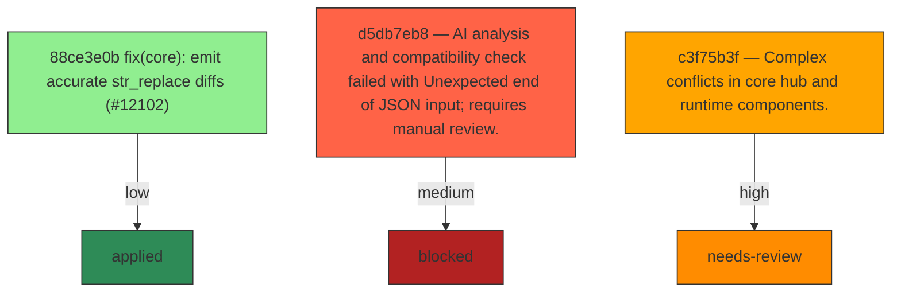

# Backport Agent — Detailed Run Report

> This file is generated automatically. It is intended for human analysts and
> AI reasoning models to assess agent performance, decision quality, and LLM behavior.

**Run timestamp**: 2026-07-14T12:08:04.041Z
**Models used**: fast=`mistral/mistral-code-agent-latest`  powerful=`openai/gpt-5-5`
**Prompt log**: `/Users/rlemeill/Development/tea-ching-cline/.backport-agent/run-1784030634682.prompts.jsonl`

---

## Summary (PR body)

## Backport Agent — Sync Report

**Date**: 2026-07-14T12:08:04.041Z
**Upstream ref**: `cline/cline:main`
**Cut date**: `2026-06-27T00:00:00.000Z` 
**Fork ref**: `TEA-ching/cline:keypool-live`
**Sync branch**: `sync/upstream-main-2026-07-14-120622`

### Summary

- ✅ Applied: 1
- ⚠️ Needs human review: 1
- ⛔ Blocked (not attempted): 2

### Applied commits

- `88ce3e0b` [low] fix(core): emit accurate str_replace diffs (#12102)

### ⚠️ Human review required

- `c3f75b3f` chore: Cline Code Desktop App update (#12012)
  - Conflicted files: .gitignore, sdk/packages/core/src/hub/runtime-host/hub-runtime-host.ts, sdk/packages/core/src/hub/server/handlers/session-handlers.ts, sdk/packages/core/src/hub/server/hub-server-transport.ts, sdk/packages/core/src/runtime/host/local-runtime-host.test.ts, sdk/packages/core/src/runtime/host/local-runtime-host.ts, sdk/packages/shared/src/hub.ts
  - Complex conflicts in core hub and runtime components.

### Blocked commits (not attempted)

- `d5db7eb8` — AI analysis and compatibility check failed with Unexpected end of JSON input; requires manual review.
- `c3f75b3f` — Complex conflicts in core hub and runtime components.

### Agent decision log

- Applied low-risk commit 88ce3e0b116c06a654d284951ff61c2b964e4b67
- Aborted cherry-pick of c3f75b3ff01087ce7a6435abc6bd1472255a0b3f due to conflicts
- Deferred d5db7eb853fc6b7f9976e0656e86641873cbb4f0 for manual review due to AI analysis failures
- Assessed 27e35415690365b70f407813ebd219d35423846c as compatible version bump; ready for cherry-pick
- Assessed dd719dce86385b42fa97677bbe9f0176d177c4f3 as apply-with-care; compatible with customizations


---

## Agent Workflow Diagram

> Generated by the fast model from the run summary. Evaluate the agent's decision path.



---

## AI Sub-Agent Call Log (7 calls)

> Each entry is one sub-agent invocation. Review prompt/response pairs to assess
> reasoning quality, hallucinations, and decision accuracy.

### Call 1 / 7 — `analyze_commit_for_backport` ✅ OK

| Field | Value |
|---|---|
| **Timestamp** | 2026-07-14T12:05:54.646Z |
| **Tool** | `analyze_commit_for_backport` |
| **Model** | `mistral/mistral-code-agent-latest` |
| **Duration** | 5585 ms |
| **Tokens in** | 12866 |
| **Tokens out** | 141 |
| **Cost** | $0.000000 |

**Prompt sent to sub-agent:**

```
Commit SHA: 27e35415690365b70f407813ebd219d35423846c
Commit message:
chore(sdk): release v0.0.58

Changed files (8):
bun.lock
sdk/CHANGELOG.md
sdk/packages/agents/package.json
sdk/packages/core/package.json
sdk/packages/core/src/extensions/tools/definitions.test.ts
sdk/packages/llms/package.json
sdk/packages/sdk/package.json
sdk/packages/shared/package.json

Diff:
commit 27e35415690365b70f407813ebd219d35423846c
Author: Saoud Rizwan <7799382+saoudrizwan@users.noreply.github.com>
Date:   Mon Jul 6 18:52:52 2026 -0700

    chore(sdk): release v0.0.58
---
 bun.lock                                           | 48 ++++++++++++++++------
 sdk/CHANGELOG.md                                   |  4 ++
 sdk/packages/agents/package.json                   |  2 +-
 sdk/packages/core/package.json                     |  2 +-
 .../core/src/extensions/tools/definitions.test.ts  |  4 +-
 sdk/packages/llms/package.json                     |  2 +-
 sdk/packages/sdk/package.json                      |  2 +-
 sdk/packages/shared/package.json                   |  2 +-
 8 files changed, 48 insertions(+), 18 deletions(-)

diff --git a/bun.lock b/bun.lock
index 4e62bff538..7511de0981 100644
--- a/bun.lock
+++ b/bun.lock
@@ -616,7 +616,7 @@
     },
     "sdk/packages/agents": {
       "name": "@cline/agents",
-      "version": "0.0.57",
+      "version": "0.0.58",
       "dependencies": {
         "@cline/llms": "workspace:*",
         "@cline/shared": "workspace:*",
@@ -625,7 +625,7 @@
     },
     "sdk/packages/core": {
       "name": "@cline/core",
-      "version": "0.0.57",
+      "version": "0.0.58",
       "dependencies": {
         "@cline/agents": "workspace:*",
         "@cline/llms": "workspace:*",
@@ -663,7 +663,7 @@
     },
     "sdk/packages/llms": {
       "name": "@cline/llms",
-      "version": "0.0.57",
+      "version": "0.0.58",
       "dependencies": {
         "@ai-sdk/amazon-bedrock": "^4.0.89",
         "@ai-sdk/anthropic": "^3.0.68",
@@ -697,14 +697,14 @@
     },
     "sdk/packages/sdk": {
       "name": "@cline/sdk",
-      "version": "0.0.57",
+      "version": "0.0.58",
       "dependencies": {
         "@cline/core": "workspace:*",
       },
     },
     "sdk/packages/shared": {
       "name": "@cline/shared",
-      "version": "0.0.57",
+      "version": "0.0.58",
       "dependencies": {
         "aws4fetch": "^1.0.20",
         "jsonrepair": "^3.13.2",
@@ -1775,7 +1775,7 @@
 
     "@protobufjs/utf8": ["@protobufjs/utf8@1.1.1", "", {}, "sha512-oOAWABowe8EAbMyWKM0tYDKi8Yaox52D+HWZhAIJqQXbqe0xI/GV7FhLWqlEKreMkfDjshR5FKgi3mnle0h6Eg=="],
 
-    "@puppeteer/browsers": ["@puppeteer/browsers@2.13.2", "", { "dependencies": { "debug": "^4.4.3", "extract-zip": "^2.0.1", "progress": "^2.0.3", "proxy-agent": "^6.5.0", "semver": "^7.7.4", "tar-fs": "^3.1.1", "yargs": "^17.7.2" }, "bin": { "browsers": "lib/cjs/main-cli.js" } }, "sha512-5EUZSUIc37H6aIXyWO0Z4y8NlF8NnjgmqeQgOGiswAU7pY0HOo16ho4+alIWmSfdZnjqBRawMsP3I5YqLSn6kw=="],
+    "@puppeteer/browsers": ["@puppeteer/browsers@2.6.1", "", { "dependencies": { "debug": "^4.4.0", "extract-zip": "^2.0.1", "progress": "^2.0.3", "proxy-agent": "^6.5.0", "semver": "^7.6.3", "tar-fs": "^3.0.6", "unbzip2-stream": "^1.4.3", "yargs": "^17.7.2" }, "bin": { "browsers": "lib/cjs/main-cli.js" } }, "sha512-aBSREisdsGH890S2rQqK82qmQYU3uFpSH8wcZWHgHzl3LfzsxAKbLNiAG9mO8v1Y0UICBeClICxPJvyr0rcuxg=="],
 
     "@radix-ui/number": ["@radix-ui/number@1.1.1", "", {}, "sha512-MkKCwxlXTgz6CFoJx3pCwn07GKp36+aZyu/u2Ln2VrA5DcdyCZkASEDBTd8x5whTQQL5CiYf4prXKLcgQdv29g=="],
 
@@ -3275,7 +3275,7 @@
 
     "end-of-stream": ["end-of-stream@1.4.5", "", { "dependencies": { "once": "^1.4.0" } }, "sha512-ooEGc6HP26xXq/N+GCGOT0JKCLDGrq2bQUZrQ7gyrJiZANJ/8YDTxTpQBXGMn+WbIQXNVpyWymm7KYVICQnyOg=="],
 
-    "enhanced-resolve": ["enhanced-resolve@5.24.1", "", { "dependencies": { "graceful-fs": "^4.2.4", "tapable": "^2.3.3" } }, "sha512-7DdUaTjmNwMcH2gLr1qycesKII3BK4RLy/mdAb7x10Lq7bR4aNKHt1BR1ZALSv0rPM/hF5wYF0PhGop/rJm8vw=="],
+    "enhanced-resolve": ["enhanced-resolve@5.21.6", "", { "dependencies": { "graceful-fs": "^4.2.4", "tapable": "^2.3.3" } }, "sha512-aNnGCvbJ/RIyWo1IuhNdVjnNF+EjH9wpzpNHt+ci/m9He9LJvUN8wrCcXjp9cWsGNAuvSpVFTx/vraAFQ8qGjQ=="],
 
     "enquirer": ["enquirer@2.4.1", "", { "dependencies": { "ansi-colors": "^4.1.1", "strip-ansi": "^6.0.1" } }, "sha512-rRqJg/6gd538VHvR3PSrdRBb/1Vy2YfzHqzvbhGIQpDRKIa4FgV/54b5Q1xYSxOOwKvjXweS26E0Q+nAMwp2pQ=="],
 
@@ -4901,7 +4901,7 @@
 
     "ts-poet": ["ts-poet@6.12.0", "", { "dependencies": { "dprint-node": "^1.0.8" } }, "sha512-xo+iRNMWqyvXpFTaOAvLPA5QAWO6TZrSUs5s4Odaya3epqofBu/fMLHEWl8jPmjhA0s9sgj9sNvF1BmaQlmQkA=="],
 
-    "ts-proto": ["ts-proto@2.11.9", "", { "dependencies": { "@bufbuild/protobuf": "^2.10.2", "case-anything": "^2.1.13", "ts-poet": "^6.12.0", "ts-proto-descriptors": "2.1.0" }, "bin": { "protoc-gen-ts_proto": "protoc-gen-ts_proto" } }, "sha512-rWmxXkEXV4qHc0xHteHMZ8i2V8KjUwloQ4MLb5dZwTBb0/9rtfnaFJO+4vm7irWmlV1gtkShT8O1zlY9B6lxcA=="],
+    "ts-proto": ["ts-proto@2.11.10", "", { "dependencies": { "@bufbuild/protobuf": "^2.10.2", "case-anything": "^2.1.13", "ts-poet": "^6.12.0", "ts-proto-descriptors": "2.1.0" }, "bin": { "protoc-gen-ts_proto": "protoc-gen-ts_proto" } }, "sha512-7mvz2RbOZc0J/+x8biIcVHJ0nx7xjH79vtoEnkpKT5l8yFF5ERe03dee2W3CbB5vb1QgnbQXGzeBGGryJ+Q9EA=="],
 
     "ts-proto-descriptors": ["ts-proto-descriptors@2.1.0", "", { "dependencies": { "@bufbuild/protobuf": "^2.0.0" } }, "sha512-S5EZYEQ6L9KLFfjSRpZWDIXDV/W7tAj8uW7pLsihIxyr62EAVSiKuVPwE8iWnr849Bqa53enex1jhDUcpgquzA=="],
 
@@ -5697,8 +5697,6 @@
 
     "@streamdown/code/shiki": ["shiki@3.23.0", "", { "dependencies": { "@shikijs/core": "3.23.0", "@shikijs/engine-javascript": "3.23.0", "@shikijs/engine-oniguruma": "3.23.0", "@shikijs/langs": "3.23.0", "@shikijs/themes": "3.23.0", "@shikijs/types": "3.23.0", "@shikijs/vscode-textmate": "^10.0.2", "@types/hast": "^3.0.4" } }, "sha512-55Dj73uq9ZXL5zyeRPzHQsK7Nbyt6Y10k5s7OjuFZGMhpp4r/rsLBH0o/0fstIzX1Lep9VxefWljK/SKCzygIA=="],
 
-    "@tailwindcss/node/enhanced-resolve": ["enhanced-resolve@5.21.6", "", { "dependencies": { "graceful-fs": "^4.2.4", "tapable": "^2.3.3" } }, "sha512-aNnGCvbJ/RIyWo1IuhNdVjnNF+EjH9wpzpNHt+ci/m9He9LJvUN8wrCcXjp9cWsGNAuvSpVFTx/vraAFQ8qGjQ=="],
-
     "@tailwindcss/oxide-wasm32-wasi/@emnapi/core": ["@emnapi/core@1.11.1", "", { "dependencies": { "@emnapi/wasi-threads": "1.2.2", "tslib": "^2.4.0" }, "bundled": true }, "sha512-RSvbQmHzdKzNsLYa/wHrbc3KN4sYLKAdPZxqiM2HATqv/SBk2/ENSHpvXGaLOMcsAyz0poEGqkmmKYG3OWiJEQ=="],
 
     "@tailwindcss/oxide-wasm32-wasi/@emnapi/runtime": ["@emnapi/runtime@1.11.1", "", { "dependencies": { "tslib": "^2.4.0" }, "bundled": true }, "sha512-vgj7R3y3Wgx24IQaGPA/R6YFXLHVMOZ0uVEyIQPaWs+rd1AzfEMXlAC22FYwO1XkKR6NPsq7mUandH8oIRdZFw=="],
@@ -6025,8 +6023,6 @@
 
     "proxy-agent/proxy-from-env": ["proxy-from-env@1.1.0", "", {}, "sha512-D+zkORCbA9f1tdWRK0RaCR3GPv50cMxcrz4X8k5LTSUD1Dkw47mKJEZQNunItRTkWwgtaUSo1RVFRIG9ZXiFYg=="],
 
-    "puppeteer-core/@puppeteer/browsers": ["@puppeteer/browsers@2.6.1", "", { "dependencies": { "debug": "^4.4.0", "extract-zip": "^2.0.1", "progress": "^2.0.3", "proxy-agent": "^6.5.0", "semver": "^7.6.3", "tar-fs": "^3.0.6", "unbzip2-stream": "^1.4.3", "yargs": "^17.7.2" }, "bin": { "browsers": "lib/cjs/main-cli.js" } }, "sha512-aBSREisdsGH890S2rQqK82qmQYU3uFpSH8wcZWHgHzl3LfzsxAKbLNiAG9mO8v1Y0UICBeClICxPJvyr0rcuxg=="],
-
     "radix-ui/@radix-ui/primitive": ["@radix-ui/primitive@1.1.4", "", {}, "sha512-7AdCK9PQyiljKoBDbN8OuctCbd/esdwZPQ8RtOE3SsyQtUpiPb+ND75q0jEhC1m1ecBI0MFNeLJvwIh9iKHRcQ=="],
 
     "radix-ui/@radix-ui/react-accordion": ["@radix-ui/react-accordion@1.2.14", "", { "dependencies": { "@radix-ui/primitive": "1.1.4", "@radix-ui/react-collapsible": "1.1.14", "@radix-ui/react-collection": "1.1.10", "@radix-ui/react-compose-refs": "1.1.3", "@radix-ui/react-context": "1.1.4", "@radix-ui/react-direction": "1.1.2", "@radix-ui/react-id": "1.1.2", "@radix-ui/react-primitive": "2.1.6", "@radix-ui/react-use-controllable-state": "1.2.3" }, "peerDependencies": { "@types/react": "*", "@types/react-dom": "*", "react": "^16.8 || ^17.0 || ^18.0 || ^19.0 || ^19.0.0-rc", "react-dom": "^16.8 || ^17.0 || ^18.0 || ^19.0 || ^19.0.0-rc" }, "optionalPeers": ["@types/react", "@types/react-dom"] }, "sha512-iE8YB9nmTBH8zd73ofBISZ8JCzgMoMkATJr7qDwa6u5F1+7mTM81V6fa71jgZ65rpjVpecDf1vSnwIFP9Ly1zw=="],
@@ -6219,6 +6215,8 @@
 
     "unzipper/readable-stream": ["readable-stream@2.3.8", "", { "dependencies": { "core-util-is": "~1.0.0", "inherits": "~2.0.3", "isarray": "~1.0.0", "process-nextick-args": "~2.0.0", "safe-buffer": "~5.1.1", "string_decoder": "~1.1.1", "util-deprecate": "~1.0.1" } }, "sha512-8p0AUk4XODgIewSi0l8Epjs+EVnWiK7NoDIEGU0HhE7+ZyY8D1IMY7odu5lRrFXGg71L15KG8QrPmum45RTtdA=="],
 
+    "vaul/@radix-ui/react-dialog": ["@radix-ui/react-dialog@1.1.17", "", { "dependencies": { "@radix-ui/primitive": "1.1.4", "@radix-ui/react-compose-refs": "1.1.3", "@radix-ui/react-context": "1.1.4", "@radix-ui/react-dismissable-layer": "1.1.13", "@radix-ui/react-focus-guards": "1.1.4", "@radix-ui/react-focus-scope": "1.1.10", "@radix-ui/react-id": "1.1.2", "@radix-ui/react-portal": "1.1.12", "@radix-ui/react-presence": "1.1.6", "@radix-ui/react-primitive": "2.1.6", "@radix-ui/react-slot": "1.3.0", "@radix-ui/react-use-controllable-state": "1.2.3", "aria-hidden": "^1.2.4", "react-remove-scroll": "^2.7.2" }, "peerDependencies": { "@types/react": "*", "@types/react-dom": "*", "react": "^16.8 || ^17.0 || ^18.0 || ^19.0 || ^19.0.0-rc", "react-dom": "^16.8 || ^17.0 || ^18.0 || ^19.0 || ^19.0.0-rc" }, "optionalPeers": ["@types/react", "@types/react-dom"] }, "sha512-TDTYmpdq8dI2+Xgvgj9AJ8Ghqq+Eph/TRVEdaFQPDItIY+6QSkU7MJMeevw1568Yw/2Ijz8BTphPSP2XejKphw=="],
+
     "verror/core-util-is": ["core-util-is@1.0.2", "", {}, "sha512-3lqz5YjWTYnW6dlDa5TLaTCcShfar1e40rmcJVwCBJC6mWlFuj0eCHIElmG1g5kyuJ/GD+8Wn4FFCcz4gJPfaQ=="],
 
     "vite-node/es-module-lexer": ["es-module-lexer@1.7.0", "", {}, "sha512-jEQoCwk8hyb2AZziIOLhDqpm5+2ww5uIE6lkO/6jcOCusfk6LhMHpXXfBLXTZ7Ydyt0j4VoUQv6uGNYbdW+kBA=="],
@@ -6995,6 +6993,28 @@
 
     "unzipper/readable-stream/string_decoder": ["string_decoder@1.1.1", "", { "dependencies": { "safe-buffer": "~5.1.0" } }, "sha512-n/ShnvDi6FHbbVfviro+WojiFzv+s8MPMHBczVePfUpDJLwoLT0ht1l4YwBCbi8pJAveEEdnkHyPyTP/mzRfwg=="],
 
+    "vaul/@radix-ui/react-dialog/@radix-ui/primitive": ["@radix-ui/primitive@1.1.4", "", {}, "sha512-7AdCK9PQyiljKoBDbN8OuctCbd/esdwZPQ8RtOE3SsyQtUpiPb+ND75q0jEhC1m1ecBI0MFNeLJvwIh9iKHRcQ=="],
+
+    "vaul/@radix-ui/react-dialog/@radix-ui/react-compose-refs": ["@radix-ui/react-compose-refs@1.1.3", "", { "peerDependencies": { "@types/react": "*", "react": "^16.8 || ^17.0 || ^18.0 || ^19.0 || ^19.0.0-rc" }, "optionalPeers": ["@types/react"] }, "sha512-rYOP8OMnuuPMQF1uhPVlGNcCDlkokKqGFE3JcxFViIkAXP7EvFWUliJAstrapypaBLJNHbZL6jGhbVDGTwmVhA=="],
+
+    "vaul/@radix-ui/react-dialog/@radix-ui/react-context": ["@radix-ui/react-context@1.1.4", "", { "peerDependencies": { "@types/react": "*", "react": "^16.8 || ^17.0 || ^18.0 || ^19.0 || ^19.0.0-rc" }, "optionalPeers": ["@types/react"] }, "sha512-QwH4PO5urrbO+FaGd5Aglg+YJgWTyyuZ3g/6mKvsqraLkglDdckw9JafgL5McL5VEJ6EPNduPaT3ZE9BttDAqg=="],
+
+    "vaul/@radix-ui/react-dialog/@radix-ui/react-dismissable-layer": ["@radix-ui/react-dismissable-layer@1.1.13", "", { "dependencies": { "@radix-ui/primitive": "1.1.4", "@radix-ui/react-compose-refs": "1.1.3", "@radix-ui/react-primitive": "2.1.6", "@radix-ui/react-use-callback-ref": "1.1.2", "@radix-ui/react-use-escape-keydown": "1.1.2" }, "peerDependencies": { "@types/react": "*", "@types/react-dom": "*", "react": "^16.8 || ^17.0 || ^18.0 || ^19.0 || ^19.0.0-rc", "react-dom": "^16.8 || ^17.0 || ^18.0 || ^19.0 || ^19.0.0-rc" }, "optionalPeers": ["@types/react", "@types/react-dom"] }, "sha512-2v+zNAWWe0ySxgC0D0yeXMPQ23xZVgXZTerTz+JKlmdRj6gfTqmCcR29jb6d290DezXPGgruHWDX/vYUebtErg=="],
+
+    "vaul/@radix-ui/react-dialog/@radix-ui/react-focus-guards": ["@radix-ui/react-focus-guards@1.1.4", "", { "peerDependencies": { "@types/react": "*", "react": "^16.8 || ^17.0 || ^18.0 || ^19.0 || ^19.0.0-rc" }, "optionalPeers": ["@types/react"] }, "sha512-cot/aB/mOm0IYVYTTmQcEEK1M48lZWi8FlYe5nDPQQ8NYZUlXEFgncJ9p2Kzer3RKSrY7cTTpEMLZKNo9QoP5Q=="],
+
+    "vaul/@radix-ui/react-dialog/@radix-ui/react-focus-scope": ["@radix-ui/react-focus-scope@1.1.10", "", { "dependencies": { "@radix-ui/react-compose-refs": "1.1.3", "@radix-ui/react-primitive": "2.1.6", "@radix-ui/react-use-callback-ref": "1.1.2" }, "peerDependencies": { "@types/react": "*", "@types/react-dom": "*", "react": "^16.8 || ^17.0 || ^18.0 || ^19.0 || ^19.0.0-rc", "react-dom": "^16.8 || ^17.0 || ^18.0 || ^19.0 || ^19.0.0-rc" }, "optionalPeers": ["@types/react", "@types/react-dom"] }, "sha512-Fas/lXQqhVvqwAb64s5RFeHiHYElZ6SUQbZaNd6EkfhP/Al7wTIQ9WIR4QVX475tlu5yFCEdDcJH6/UwsZjMWw=="],
+
+    "vaul/@radix-ui/react-dialog/@radix-ui/react-id": ["@radix-ui/react-id@1.1.2", "", { "dependencies": { "@radix-ui/react-use-layout-effect": "1.1.2" }, "peerDependencies": { "@types/react": "*", "react": "^16.8 || ^17.0 || ^18.0 || ^19.0 || ^19.0.0-rc" }, "optionalPeers": ["@types/react"] }, "sha512-orBC88futVpqCmhX1p4cvquNHsELQ+w+vBJnuj3ftETI5bJb0bZn3Tqu3SWN2IOcPycTnMGnhwoermvISt72sA=="],
+
+    "vaul/@radix-ui/react-dialog/@radix-ui/react-portal": ["@radix-ui/react-portal@1.1.12", "", { "dependencies": { "@radix-ui/react-primitive": "2.1.6", "@radix-ui/react-use-layout-effect": "1.1.2" }, "peerDependencies": { "@types/react": "*", "@types/react-dom": "*", "react": "^16.8 || ^17.0 || ^18.0 || ^19.0 || ^19.0.0-rc", "react-dom": "^16.8 || ^17.0 || ^18.0 || ^19.0 || ^19.0.0-rc" }, "optionalPeers": ["@types/react", "@types/react-dom"] }, "sha512-m309havGzsjLHHaIX50G5PlvRs3xkgPCsGk/5PTvYm8D5q33yG0J7w/712PTOhid7NTaFETtnSXjngHQavvhVw=="],
+
+    "vaul/@radix-ui/react-dialog/@radix-ui/react-presence": ["@radix-ui/react-presence@1.1.6", "", { "dependencies": { "@radix-ui/react-use-layout-effect": "1.1.2" }, "peerDependencies": { "@types/react": "*", "@types/react-dom": "*", "react": "^16.8 || ^17.0 || ^18.0 || ^19.0 || ^19.0.0-rc", "react-dom": "^16.8 || ^17.0 || ^18.0 || ^19.0 || ^19.0.0-rc" }, "optionalPeers": ["@types/react", "@types/react-dom"] }, "sha512-zdTk4PlUO0E18HnZ3wYbW0KkJJxWCdiNYp6g6X1PtONFhxVkg01vliTJAmwIszU6mHiyBOoW9P0rAugl5/hULQ=="],
+
+    "vaul/@radix-ui/react-dialog/@radix-ui/react-primitive": ["@radix-ui/react-primitive@2.1.6", "", { "dependencies": { "@radix-ui/react-slot": "1.3.0" }, "peerDependencies": { "@types/react": "*", "@types/react-dom": "*", "react": "^16.8 || ^17.0 || ^18.0 || ^19.0 || ^19.0.0-rc", "react-dom": "^16.8 || ^17.0 || ^18.0 || ^19.0 || ^19.0.0-rc" }, "optionalPeers": ["@types/react", "@types/react-dom"] }, "sha512-wetd0QI77DbvrPpTAvH1SqOxsYF2wZe5TNxqwOd5Ty4XDpV3dpV0s8K/1MGMJBeY5o7lg8ub5VIt1Ub+yVen6g=="],
+
+    "vaul/@radix-ui/react-dialog/@radix-ui/react-slot": ["@radix-ui/react-slot@1.3.0", "", { "dependencies": { "@radix-ui/react-compose-refs": "1.1.3" }, "peerDependencies": { "@types/react": "*", "react": "^16.8 || ^17.0 || ^18.0 || ^19.0 || ^19.0.0-rc" }, "optionalPeers": ["@types/react"] }, "sha512-MojKku4U/miO8Av4Dkb+ctMAQx7JmY96LmtDQlAarCRtd7rN52QCSzBF+XAvr5S6coSVj9HEPBgHAHKEJVk/WA=="],
+
     "webview-ui/@types/node/undici-types": ["undici-types@6.21.0", "", {}, "sha512-iwDZqg0QAGrg9Rav5H4n0M64c3mkR59cJ6wQp+7C4nI0gsmExaedaYLNO44eT4AtBBwjbTiGPMlt2Md0T9H9JQ=="],
 
     "webview-ui/@vitejs/plugin-react-swc/@rolldown/pluginutils": ["@rolldown/pluginutils@1.0.0-beta.27", "", {}, "sha512-+d0F4MKMCbeVUJwG96uQ4SgAznZNSq93I3V+9NHA4OpvqG8mRCpGdKmK8l/dl02h2CCDHwW2FqilnTyDcAnqjA=="],
@@ -7241,6 +7261,10 @@
 
     "test-exclude/minimatch/brace-expansion/balanced-match": ["balanced-match@4.0.4", "", {}, "sha512-BLrgEcRTwX2o6gGxGOCNyMvGSp35YofuYzw9h1IMTRmKqttAZZVU67bdb9Pr2vUHA8+j3i2tJfjO6C6+4myGTA=="],
 
+    "vaul/@radix-ui/react-dialog/@radix-ui/react-dismissable-layer/@radix-ui/react-use-callback-ref": ["@radix-ui/react-use-callback-ref@1.1.2", "", { "peerDependencies": { "@types/react": "*", "react": "^16.8 || ^17.0 || ^18.0 || ^19.0 || ^19.0.0-rc" }, "optionalPeers": ["@types/react"] }, "sha512-xCso9j1/u8sEgP1RNHjFrXJLApL8LiqOkI1R4ywuN00rxWdYg4oQXuwKLS3i0j5NWLromUD27/4nlxj2UFVvIw=="],
+
+    "vaul/@radix-ui/react-dialog/@radix-ui/react-focus-scope/@radix-ui/react-use-callback-ref": ["@radix-ui/react-use-callback-ref@1.1.2", "", { "peerDependencies": { "@types/react": "*", "react": "^16.8 || ^17.0 || ^18.0 || ^19.0 || ^19.0.0-rc" }, "optionalPeers": ["@types/react"] }, "sha512-xCso9j1/u8sEgP1RNHjFrXJLApL8LiqOkI1R4ywuN00rxWdYg4oQXuwKLS3i0j5NWLromUD27/4nlxj2UFVvIw=="],
+
     "webview-ui/vitest/@vitest/utils/loupe": ["loupe@3.2.1", "", {}, "sha512-CdzqowRJCeLU72bHvWqwRBBlLcMEtIvGrlvef74kMnV2AolS9Y8xUv1I0U/MNAWMhBlKIoyuEgoJ0t/bbwHbLQ=="],
 
     "webview-ui/vitest/chai/check-error": ["check-error@2.1.3", "", {}, "sha512-PAJdDJusoxnwm1VwW07VWwUN1sl7smmC3OKggvndJFadxxDRyFJBX/ggnu/KE4kQAB7a3Dp8f/YXC1FlUprWmA=="],
diff --git a/sdk/CHANGELOG.md b/sdk/CHANGELOG.md
index 42dca0ad5a..c1435fc5cb 100644
--- a/sdk/CHANGELOG.md
+++ b/sdk/CHANGELOG.md
@@ -1,5 +1,9 @@
 # Cline SDK Changelog
 
+## 0.0.58
+
+- `read_files` now tolerates malformed input from weaker models: line-range entries (`start_line`/`end_line`) sent as separate array items are coalesced back onto the preceding file path instead of being rejected
+
 ## 0.0.57
 
 - Models in the live catalog that don't report a context window now default to a 128K input-token limit (up from 4,096), so under-specified models get a usable context budget
diff --git a/sdk/packages/agents/package.json b/sdk/packages/agents/package.json
index e98aad04a7..ee74cbf4f6 100644
--- a/sdk/packages/agents/package.json
+++ b/sdk/packages/agents/package.json
@@ -1,6 +1,6 @@
 {
 	"name": "@cline/agents",
-	"version": "0.0.57",
+	"version": "0.0.58",
 	"repository": {
 		"type": "git",
 		"url": "https://github.com/cline/cline",
diff --git a/sdk/packages/core/package.json b/sdk/packages/core/package.json
index 24f3d978f4..2fd3284361 100644
--- a/sdk/packages/core/package.json
+++ b/sdk/packages/core/package.json
@@ -1,7 +1,7 @@
 {
 	"name": "@cline/core",
 	"description": "Cline Core SDK for Node Runtime",
-	"version": "0.0.57",
+	"version": "0.0.58",
 	"repository": {
 		"type": "git",
 		"url": "https://github.com/cline/cline",
diff --git a/sdk/packages/core/src/extensions/tools/definitions.test.ts b/sdk/packages/core/src/extensions/tools/definitions.test.ts
index a22840fe5d..e296beec17 100644
--- a/sdk/packages/core/src/extensions/tools/definitions.test.ts
+++ b/sdk/packages/core/src/extensions/tools/definitions.test.ts
@@ -1480,7 +1480,9 @@ describe("default read_files tool", () => {
 		// Leading orphan range: no preceding file entry to fold into.
 		await expect(
 			tool.execute(
-				{ files: [{ start_line: 1, end_line: 2 }, { path: "/tmp/a.ts" }] } as never,
+				{
+					files: [{ start_line: 1, end_line: 2 }, { path: "/tmp/a.ts" }],
+				} as never,
 				{
 					agentId: "agent-1",
 					conversationId: "conv-1",
diff --git a/sdk/packages/llms/package.json b/sdk/packages/llms/package.json
index 428a662678..b33b89c0c1 100644
--- a/sdk/packages/llms/package.json
+++ b/sdk/packages/llms/package.json
@@ -1,6 +1,6 @@
 {
 	"name": "@cline/llms",
-	"version": "0.0.57",
+	"version": "0.0.58",
 	"description": "Config-driven SDK for selecting, extending, and instantiating LLM providers and models",
 	"repository": {
 		"type": "git",
diff --git a/sdk/packages/sdk/package.json b/sdk/packages/sdk/package.json
index 6bf90a23ce..a86bbeba6d 100644
--- a/sdk/packages/sdk/package.json
+++ b/sdk/packages/sdk/package.json
@@ -1,7 +1,7 @@
 {
 	"name": "@cline/sdk",
 	"description": "Cline SDK - user-facing alias for @cline/core",
-	"version": "0.0.57",
+	"version": "0.0.58",
 	"repository": {
 		"type": "git",
 		"url": "https://github.com/cline/cline",
diff --git a/sdk/packages/shared/package.json b/sdk/packages/shared/package.json
index 80b1fcd033..53f0cd6353 100644
--- a/sdk/packages/shared/package.json
+++ b/sdk/packages/shared/package.json
@@ -1,6 +1,6 @@
 {
 	"name": "@cline/shared",
-	"version": "0.0.57",
+	"version": "0.0.58",
 	"description": "Shared utilities, types, and schemas for Cline packages",
 	"repository": {
 		"type": "git",

Output the JSON object now.
```

**Response received:**

````
```json
{
  "summary": "Version bump to v0.0.58 with dependency updates and a minor fix for malformed input handling in read_files tool.",
  "keyChanges": [
    "Bumped SDK package versions to 0.0.58",
    "Updated dependencies in bun.lock (e.g., @puppeteer/browsers, enhanced-resolve)",
    "Fixed read_files tool to handle malformed line-range entries",
    "Updated CHANGELOG.md with release notes"
  ],
  "backportComplexity": "trivial",
  "semanticRiskFactors": [],
  "recommendation": "apply"
}
```
````

---

### Call 2 / 7 — `analyze_commit_for_backport` ❌ Error

| Field | Value |
|---|---|
| **Timestamp** | 2026-07-14T12:05:58.026Z |
| **Tool** | `analyze_commit_for_backport` |
| **Model** | `openai/gpt-5-5` |
| **Duration** | 0 ms |
| **Error** | Unexpected end of JSON input |

**Prompt sent to sub-agent:**

```
Commit SHA: d5db7eb853fc6b7f9976e0656e86641873cbb4f0
Commit message:
Preserve canonical session history during compaction ENG-1967 (#10651)

Changed files (40):
apps/cli/src/runtime/interactive/compaction.test.ts
apps/cli/src/runtime/interactive/compaction.ts
apps/cli/src/runtime/interactive/session-runtime.test.ts
apps/cli/src/runtime/interactive/session-runtime.ts
apps/cli/src/tui/hooks/use-local-command-actions.test.ts
apps/cli/src/tui/types.ts
apps/cli/src/tui/utils/compaction-status.ts
sdk/ARCHITECTURE.md
sdk/packages/agents/README.md
sdk/packages/agents/src/agent-runtime.test.ts
sdk/packages/agents/src/agent-runtime.ts
sdk/packages/core/src/ClineCore.ts
sdk/packages/core/src/extensions/context/compaction.test.ts
sdk/packages/core/src/extensions/context/compaction.ts
sdk/packages/core/src/hub/runtime-host/hub-runtime-host.test.ts
sdk/packages/core/src/hub/runtime-host/hub-runtime-host.ts
sdk/packages/core/src/hub/server/boundary.test.ts
sdk/packages/core/src/hub/server/handlers/context.ts
sdk/packages/core/src/hub/server/handlers/session-handlers.ts
sdk/packages/core/src/hub/server/hub-runtime-host.ts
sdk/packages/core/src/hub/server/hub-server-transport.ts
sdk/packages/core/src/hub/server/hub-session-records.ts
sdk/packages/core/src/index.ts
sdk/packages/core/src/runtime/host/local-runtime-host.test.ts
sdk/packages/core/src/runtime/host/local-runtime-host.ts
sdk/packages/core/src/runtime/host/runtime-host.ts
sdk/packages/core/src/runtime/orchestration/session-runtime-orchestrator.test.ts
sdk/packages/core/src/services/session-artifacts.ts
sdk/packages/core/src/session/models/session-compaction.test.ts
sdk/packages/core/src/session/models/session-compaction.ts
sdk/packages/core/src/session/models/session-manifest.ts
sdk/packages/core/src/session/models/session-row.ts
sdk/packages/core/src/session/services/persistence-service.test.ts
sdk/packages/core/src/session/services/persistence-service.ts
sdk/packages/core/src/session/stores/atomic-file.ts
sdk/packages/core/src/session/stores/session-manifest-store.ts
sdk/packages/core/src/types/session.ts
sdk/packages/shared/src/agent.ts
sdk/packages/shared/src/agents/types.ts
sdk/packages/shared/src/hub.ts

Diff:
commit d5db7eb853fc6b7f9976e0656e86641873cbb4f0
Author: Robin Newhouse <robin@cline.bot>
Date:   Tue Jul 7 13:19:05 2026 -0700

    Preserve canonical session history during compaction ENG-1967 (#10651)
    
    * Preserve canonical history with compaction sidecar
    
    * Clarify prepareTurn request projection semantics
    
    * Harden hub compaction sidecar ownership
    
    * Handle compaction sidecar edge cases
    
    * Address compaction sidecar review feedback
    
    * Tighten compaction sidecar safety
    
    * Extract atomic session file writes
    
    * Assert compaction boundary role delimiter
    
    * Simplify compaction source hashing
    
    * Fix compaction smoke test type guard
    
    * Fix async interactive runtime tests
    
    * Avoid dangling compaction path in manifests
    
    * Address compaction sidecar review nits
    
    * fix(cli): await async runtime helper in restart test
---
 .../cli/src/runtime/interactive/compaction.test.ts |  19 +-
 apps/cli/src/runtime/interactive/compaction.ts     |  31 +-
 .../runtime/interactive/session-runtime.test.ts    | 579 ++++++++++++++++++---
 .../cli/src/runtime/interactive/session-runtime.ts | 196 +++++--
 .../tui/hooks/use-local-command-actions.test.ts    |   2 +-
 apps/cli/src/tui/types.ts                          |   1 +
 apps/cli/src/tui/utils/compaction-status.ts        |  11 +-
 sdk/ARCHITECTURE.md                                |   7 +-
 sdk/packages/agents/README.md                      |  32 ++
 sdk/packages/agents/src/agent-runtime.test.ts      |  41 +-
 sdk/packages/agents/src/agent-runtime.ts           |  20 +-
 sdk/packages/core/src/ClineCore.ts                 |  12 +
 .../core/src/extensions/context/compaction.test.ts |  51 +-
 .../core/src/extensions/context/compaction.ts      |  68 +++
 .../src/hub/runtime-host/hub-runtime-host.test.ts  |  64 +++
 .../core/src/hub/runtime-host/hub-runtime-host.ts  |  61 +++
 sdk/packages/core/src/hub/server/boundary.test.ts  | 379 ++++++++++++++
 .../core/src/hub/server/handlers/context.ts        |  41 ++
 .../src/hub/server/handlers/session-handlers.ts    | 221 ++++++--
 .../core/src/hub/server/hub-server-transport.ts    |   9 +
 .../core/src/hub/server/hub-session-records.ts     |   2 +-
 sdk/packages/core/src/index.ts                     |  11 +-
 .../src/runtime/host/local-runtime-host.test.ts    | 207 ++++++++
 .../core/src/runtime/host/local-runtime-host.ts    | 268 +++++++++-
 sdk/packages/core/src/runtime/host/runtime-host.ts |   9 +
 .../session-runtime-orchestrator.test.ts           |   7 +-
 .../core/src/services/session-artifacts.ts         |   7 +
 .../src/session/models/session-compaction.test.ts  | 215 ++++++++
 .../core/src/session/models/session-compaction.ts  | 188 +++++++
 .../core/src/session/models/session-manifest.ts    |   1 +
 .../core/src/session/models/session-row.ts         |   1 +
 .../session/services/persistence-service.test.ts   | 214 +++++++-
 .../src/session/services/persistence-service.ts    |  32 +-
 .../core/src/session/stores/atomic-file.ts         |  53 ++
 .../src/session/stores/session-manifest-store.ts   |  76 +++
 sdk/packages/core/src/types/session.ts             |   3 +
 sdk/packages/shared/src/agent.ts                   |   8 +-
 sdk/packages/shared/src/agents/types.ts            |  10 +-
 sdk/packages/shared/src/hub.ts                     |   2 +
 39 files changed, 2941 insertions(+), 218 deletions(-)

diff --git a/apps/cli/src/runtime/interactive/compaction.test.ts b/apps/cli/src/runtime/interactive/compaction.test.ts
index 48ee258e8b..4adef65de8 100644
--- a/apps/cli/src/runtime/interactive/compaction.test.ts
+++ b/apps/cli/src/runtime/interactive/compaction.test.ts
@@ -126,7 +126,8 @@ describe("compactInteractiveMessages", () => {
 
 		expect(compact).toHaveBeenCalledTimes(1);
 		expect(result.compacted).toBe(true);
-		expect(result.messages).toEqual([messages[0]]);
+		expect(result.canonicalMessages).toEqual(messages);
+		expect(result.compactionState?.messages).toEqual([messages[0]]);
 	});
 
 	it("falls back to legacy contextWindow for manual compaction", async () => {
@@ -157,7 +158,8 @@ describe("compactInteractiveMessages", () => {
 
 		expect(compact).toHaveBeenCalledTimes(1);
 		expect(result.compacted).toBe(true);
-		expect(result.messages).toEqual([messages[0]]);
+		expect(result.canonicalMessages).toEqual(messages);
+		expect(result.compactionState?.messages).toEqual([messages[0]]);
 	});
 
 	it("uses a useful target budget for manual compaction", async () => {
@@ -174,7 +176,8 @@ describe("compactInteractiveMessages", () => {
 			messages,
 		});
 
-		const compactedTextLength = result.messages.reduce(
+		const compactedMessages = result.compactionState?.messages ?? [];
+		const compactedTextLength = compactedMessages.reduce(
 			(total, message) =>
 				total +
 				(typeof message.content === "string" ? message.content.length : 0),
@@ -182,8 +185,9 @@ describe("compactInteractiveMessages", () => {
 		);
 
 		expect(result.compacted).toBe(true);
-		expect(result.messages.length).toBeGreaterThan(1);
-		expect(result.messages.length).toBeLessThan(messages.length);
+		expect(result.canonicalMessages).toEqual(messages);
+		expect(compactedMessages.length).toBeGreaterThan(1);
+		expect(compactedMessages.length).toBeLessThan(messages.length);
 		expect(compactedTextLength).toBeGreaterThan(1_000);
 	});
 
@@ -214,8 +218,9 @@ describe("compactInteractiveMessages", () => {
 		});
 
 		expect(result.compacted).toBe(true);
-		expect(result.messages).toHaveLength(messages.length);
-		expect(result.messages[0]?.content).toBe(
+		expect(result.canonicalMessages).toEqual(messages);
+		expect(result.compactionState?.messages).toHaveLength(messages.length);
+		expect(result.compactionState?.messages[0]?.content).toBe(
 			"same count but content should be trimmed",
 		);
 	});
diff --git a/apps/cli/src/runtime/interactive/compaction.ts b/apps/cli/src/runtime/interactive/compaction.ts
index 61234e0748..92791819fb 100644
--- a/apps/cli/src/runtime/interactive/compaction.ts
+++ b/apps/cli/src/runtime/interactive/compaction.ts
@@ -1,9 +1,11 @@
 import {
 	createContextCompactionPrepareTurn,
+	createSessionCompactionState,
 	type ProviderConfig,
 	type ProviderSettings,
 	type ProviderSettingsManager,
 	type ReasoningSettings,
+	type SessionCompactionState,
 	toProviderConfig,
 } from "@cline/core";
 import type { Message } from "@cline/shared";
@@ -52,7 +54,12 @@ export async function compactInteractiveMessages(input: {
 	providerSettingsManager: ProviderSettingsManager;
 	sessionId: string;
 	messages: Message[];
-}): Promise<{ compacted: boolean; messages: Message[] }> {
+	abortSignal?: AbortSignal;
+}): Promise<{
+	compacted: boolean;
+	canonicalMessages: Message[];
+	compactionState?: SessionCompactionState;
+}> {
 	const modelInfo = input.config.knownModels?.[input.config.modelId];
 	const maxInputTokens =
 		input.config.compaction?.maxInputTokens ??
@@ -81,8 +88,11 @@ export async function compactInteractiveMessages(input: {
 		{ mode: "manual" },
 	);
 	if (!compact) {
-		return { compacted: false, messages: input.messages };
+		return { compacted: false, canonicalMessages: input.messages };
 	}
+	// Manual compaction intentionally summarizes the full canonical transcript
+	// instead of reusing a prior sidecar summary, which avoids summary-of-summary
+	// drift across repeated `/compact` calls.
 	const result = await compact({
 		agentId: "cli",
 		conversationId: input.sessionId,
@@ -90,7 +100,7 @@ export async function compactInteractiveMessages(input: {
 		iteration: 0,
 		messages: input.messages,
 		apiMessages: input.messages,
-		abortSignal: new AbortController().signal,
+		abortSignal: input.abortSignal ?? new AbortController().signal,
 		systemPrompt: "",
 		tools: [],
 		model: {
@@ -103,8 +113,17 @@ export async function compactInteractiveMessages(input: {
 			},
 		},
 	});
-	if (!result) {
-		return { compacted: false, messages: input.messages };
+	if (!result?.messages) {
+		return { compacted: false, canonicalMessages: input.messages };
 	}
-	return { compacted: true, messages: result.messages };
+	return {
+		compacted: true,
+		canonicalMessages: input.messages,
+		compactionState: createSessionCompactionState({
+			sourceMessages: input.messages,
+			compactedMessages: result.messages,
+			conversationId: input.sessionId,
+			systemPrompt: result.systemPrompt,
+		}),
+	};
 }
diff --git a/apps/cli/src/runtime/interactive/session-runtime.test.ts b/apps/cli/src/runtime/interactive/session-runtime.test.ts
index eb5fe148d6..322e32555f 100644
--- a/apps/cli/src/runtime/interactive/session-runtime.test.ts
+++ b/apps/cli/src/runtime/interactive/session-runtime.test.ts
@@ -1,81 +1,89 @@
-import type {
-	AgentEvent,
-	ProviderSettingsManager,
-	TeamEvent,
-	ToolApprovalRequest,
-	ToolApprovalResult,
+import {
+	createSessionCompactionState,
+	type ProviderSettingsManager,
+	type SessionManifest,
+	SessionNotFoundError,
+	SessionSource,
+	type ToolApprovalRequest,
+	type ToolApprovalResult,
 } from "@cline/core";
-import { SessionNotFoundError } from "@cline/core";
 import type { AgentTool, Message } from "@cline/shared";
 import { beforeEach, describe, expect, it, vi } from "vitest";
 import type { ChatCommandState } from "../../utils/chat-commands";
 import type { Config } from "../../utils/types";
 
-const {
-	mockCreateCliCore,
-	mockCreateRuntimeHooks,
-	mockLoadInteractiveResumeMessages,
-	mockSetActiveCliSession,
-} = vi.hoisted(() => ({
-	mockCreateCliCore: vi.fn(),
-	mockCreateRuntimeHooks: vi.fn(),
-	mockLoadInteractiveResumeMessages: vi.fn(),
-	mockSetActiveCliSession: vi.fn(),
-}));
+const createCliCoreMock = vi.hoisted(() => vi.fn());
+const compactInteractiveMessagesMock = vi.hoisted(() => vi.fn());
+const createRuntimeHooksMock = vi.hoisted(() => vi.fn());
+const setActiveCliSessionMock = vi.hoisted(() => vi.fn());
+const loadInteractiveResumeMessagesMock = vi.hoisted(() => vi.fn());
+const subscribeToAgentEventsMock = vi.hoisted(() => vi.fn());
+const subscribeToPendingPromptEventsMock = vi.hoisted(() => vi.fn());
+const markAbortInProgressMock = vi.hoisted(() => vi.fn());
+const submitAndExitInTerminalMock = vi.hoisted(() => vi.fn());
+const createInteractiveExitSummaryMock = vi.hoisted(() => vi.fn());
 
 vi.mock("../../session/session", () => ({
-	createCliCore: mockCreateCliCore,
+	createCliCore: createCliCoreMock,
+}));
+
+vi.mock("../../utils/approval", () => ({
+	submitAndExitInTerminal: submitAndExitInTerminalMock,
 }));
 
 vi.mock("../../utils/hooks", () => ({
-	createRuntimeHooks: mockCreateRuntimeHooks,
+	createRuntimeHooks: createRuntimeHooksMock,
 }));
 
 vi.mock("../../utils/output", () => ({
-	setActiveCliSession: mockSetActiveCliSession,
+	setActiveCliSession: setActiveCliSessionMock,
 }));
 
 vi.mock("../../utils/resume", () => ({
-	loadInteractiveResumeMessages: mockLoadInteractiveResumeMessages,
-}));
-
-vi.mock("../../utils/approval", () => ({
-	submitAndExitInTerminal: vi.fn(),
+	loadInteractiveResumeMessages: loadInteractiveResumeMessagesMock,
 }));
 
 vi.mock("../active-runtime", () => ({
-	markAbortInProgress: vi.fn(),
+	markAbortInProgress: markAbortInProgressMock,
 }));
 
 vi.mock("../session-events", () => ({
-	subscribeToAgentEvents: vi.fn(() => vi.fn()),
-	subscribeToPendingPromptEvents: vi.fn(() => vi.fn()),
+	subscribeToAgentEvents: subscribeToAgentEventsMock,
+	subscribeToPendingPromptEvents: subscribeToPendingPromptEventsMock,
 }));
 
-import { createInteractiveSessionRuntime } from "./session-runtime";
+vi.mock("./compaction", () => ({
+	compactInteractiveMessages: compactInteractiveMessagesMock,
+}));
+
+vi.mock("./exit-summary", () => ({
+	createInteractiveExitSummary: createInteractiveExitSummaryMock,
+}));
 
-function makeConfig(): Config {
+function createConfig(): Config {
 	return {
+		providerId: "anthropic",
+		modelId: "claude-test",
 		apiKey: "",
-		providerId: "cline",
-		modelId: "openai/gpt-5.3-codex",
-		verbose: false,
-		sandbox: false,
-		thinking: false,
-		outputMode: "text",
+		cwd: "/tmp/project",
+		workspaceRoot: "/tmp/project",
+		systemPrompt: "system",
 		mode: "act",
-		systemPrompt: "",
 		enableTools: true,
 		enableSpawnAgent: true,
-		enableAgentTeams: false,
-		defaultToolAutoApprove: false,
-		toolPolicies: {},
-		cwd: "/tmp/work",
-		workspaceRoot: "/tmp/work",
+		enableAgentTeams: true,
+		verbose: false,
+		thinking: false,
+		outputMode: "text",
+		sandbox: false,
+		defaultToolAutoApprove: true,
+		toolPolicies: {
+			"*": { autoApprove: true },
+		},
 	};
 }
 
-function makeChatCommandState(config: Config): ChatCommandState {
+function createChatCommandState(config = createConfig()): ChatCommandState {
 	return {
 		enableTools: config.enableTools,
 		autoApproveTools: config.defaultToolAutoApprove,
@@ -84,6 +92,35 @@ function makeChatCommandState(config: Config): ChatCommandState {
 	};
 }
 
+function createProviderSettingsManager(): ProviderSettingsManager {
+	return {
+		getProviderSettings: vi.fn().mockReturnValue(undefined),
+	} as unknown as ProviderSettingsManager;
+}
+
+function createManifest(sessionId: string): SessionManifest {
+	return {
+		version: 1,
+		session_id: sessionId,
+		source: SessionSource.CLI,
+		pid: 1,
+		started_at: "2026-01-01T00:00:00.000Z",
+		status: "running",
+		interactive: true,
+		provider: "anthropic",
+		model: "claude-test",
+		cwd: "/tmp/project",
+		workspace_root: "/tmp/project",
+		enable_tools: true,
+		enable_spawn: true,
+		enable_teams: true,
+	};
+}
+
+async function importRuntime() {
+	return await import("./session-runtime");
+}
+
 function makeSwitchToActModeTool(): AgentTool {
 	return {
 		name: "switch_to_act_mode",
@@ -100,9 +137,9 @@ function makeManager() {
 		const sessionId = `session-${startCount}`;
 		return {
 			sessionId,
-			manifest: {
-				session_id: sessionId,
-			},
+			manifest: createManifest(sessionId),
+			manifestPath: `/tmp/${sessionId}.json`,
+			messagesPath: `/tmp/${sessionId}.messages.json`,
 		};
 	});
 	return {
@@ -114,6 +151,8 @@ function makeManager() {
 		dispose: vi.fn(),
 		get: vi.fn(),
 		readMessages: vi.fn(async (): Promise<Message[]> => []),
+		readSessionCompactionState: vi.fn().mockResolvedValue(undefined),
+		updateSessionCompactionState: vi.fn(),
 		readTranscript: vi.fn(),
 		ingestHookEvent: vi.fn(),
 		subscribe: vi.fn(),
@@ -133,7 +172,7 @@ function makeTurnResult() {
 		toolCalls: [],
 		iterations: 1,
 		finishReason: "completed" as const,
-		model: { id: "openai/gpt-5.3-codex", provider: "cline" },
+		model: { id: "claude-test", provider: "anthropic" },
 		startedAt: new Date("2026-01-01T00:00:00.000Z"),
 		endedAt: new Date("2026-01-01T00:00:00.100Z"),
 		durationMs: 100,
@@ -150,20 +189,22 @@ function deferred<T>() {
 	return { promise, resolve, reject };
 }
 
-function makeRuntime(
+async function makeRuntime(
 	manager: ReturnType<typeof makeManager>,
 	options: {
+		config?: Config;
 		resumeSessionId?: string;
 		resolveToolPolicy?: (toolName: string) => Config["toolPolicies"][string];
 	} = {},
 ) {
-	mockCreateCliCore.mockResolvedValue(manager);
-	const config = makeConfig();
+	createCliCoreMock.mockResolvedValue(manager);
+	const config = options.config ?? createConfig();
+	const { createInteractiveSessionRuntime } = await importRuntime();
 	return createInteractiveSessionRuntime({
 		config,
-		providerSettingsManager: {} as ProviderSettingsManager,
+		providerSettingsManager: createProviderSettingsManager(),
 		resumeSessionId: options.resumeSessionId,
-		chatCommandState: makeChatCommandState(config),
+		chatCommandState: createChatCommandState(config),
 		requestToolApproval: async (
 			_request: ToolApprovalRequest,
 		): Promise<ToolApprovalResult> => ({ approved: true }),
@@ -172,26 +213,325 @@ function makeRuntime(
 		askQuestionRef: { current: null },
 		resolveMistakeLimitDecision: undefined,
 		switchToActModeTool: makeSwitchToActModeTool(),
-		onAgentEvent: (_event: AgentEvent) => {},
-		onTeamEvent: (_event: TeamEvent) => {},
-		onPendingPrompts: () => {},
-		onPendingPromptSubmitted: () => {},
+		onAgentEvent: vi.fn(),
+		onTeamEvent: vi.fn(),
+		onPendingPrompts: vi.fn(),
+		onPendingPromptSubmitted: vi.fn(),
 	});
 }
 
 describe("createInteractiveSessionRuntime", () => {
 	beforeEach(() => {
-		vi.clearAllMocks();
-		mockCreateRuntimeHooks.mockReturnValue({
+		createCliCoreMock.mockReset();
+		compactInteractiveMessagesMock.mockReset();
+		createRuntimeHooksMock.mockReset();
+		setActiveCliSessionMock.mockReset();
+		loadInteractiveResumeMessagesMock.mockReset();
+		subscribeToAgentEventsMock.mockReset();
+		subscribeToPendingPromptEventsMock.mockReset();
+		markAbortInProgressMock.mockReset();
+		submitAndExitInTerminalMock.mockReset();
+		createInteractiveExitSummaryMock.mockReset();
+		createRuntimeHooksMock.mockReturnValue({
 			hooks: undefined,
-			shutdown: vi.fn(async () => {}),
+			shutdown: vi.fn().mockResolvedValue(undefined),
 		});
-		mockLoadInteractiveResumeMessages.mockResolvedValue([]);
+		loadInteractiveResumeMessagesMock.mockResolvedValue([]);
+		subscribeToAgentEventsMock.mockReturnValue(() => {});
+		subscribeToPendingPromptEventsMock.mockReturnValue(() => {});
 	});
 
-	it("defers creating the replacement session after a new-session reset", async () => {
+	it("manual compact updates the active session sidecar without restarting", async () => {
+		const sessionId = "sess-active";
+		const messages = [
+			{ id: "u1", role: "user" as const, content: "hello" },
+			{ id: "a1", role: "assistant" as const, content: "world" },
+		];
+		const compactionState = createSessionCompactionState({
+			sourceMessages: messages,
+			compactedMessages: [
+				{ id: "summary", role: "user" as const, content: "summary" },
+			],
+			updatedAt: "2026-01-01T00:00:00.000Z",
+		});
+		const manager = {
+			start: vi.fn().mockResolvedValue({
+				sessionId,
+				manifest: createManifest(sessionId),
+				manifestPath: "/tmp/session.json",
+				messagesPath: "/tmp/session.messages.json",
+			}),
+			readMessages: vi.fn().mockResolvedValue(messages),
+			updateSessionCompactionState: vi
+				.fn()
+				.mockResolvedValue({ updated: true }),
+			stop: vi.fn().mockResolvedValue(undefined),
+			dispose: vi.fn().mockResolvedValue(undefined),
+			ingestHookEvent: vi.fn().mockResolvedValue(undefined),
+			get: vi.fn(),
+			list: vi.fn(),
+			delete: vi.fn(),
+			send: vi.fn(),
+			getAccumulatedUsage: vi.fn(),
+		};
+		createCliCoreMock.mockResolvedValue(manager);
+		compactInteractiveMessagesMock.mockResolvedValue({
+			compacted: true,
+			canonicalMessages: messages,
+			compactionState,
+		});
+		const { createInteractiveSessionRuntime } = await importRuntime();
+		const runtime = createInteractiveSessionRuntime({
+			config: createConfig(),
+			providerSettingsManager: createProviderSettingsManager(),
+			chatCommandState: createChatCommandState(),
+			requestToolApproval: vi.fn(),
+			resolveToolPolicy: () => ({ autoApprove: true }),
+			askQuestionRef: { current: null },
+			resolveMistakeLimitDecision: undefined,
+			switchToActModeTool: {} as never,
+			onAgentEvent: vi.fn(),
+			onTeamEvent: vi.fn(),
+			onPendingPrompts: vi.fn(),
+			onPendingPromptSubmitted: vi.fn(),
+		});
+
+		await runtime.ensureReady();
+		const result = await runtime.compactCurrentSession();
+
+		expect(result).toEqual({
+			messagesBefore: messages.length,
+			messagesAfter: messages.length,
+			workingContextMessagesAfter: compactionState.messages.length,
+			compacted: true,
+		});
+		expect(manager.start).toHaveBeenCalledTimes(1);
+		expect(manager.stop).not.toHaveBeenCalled();
+		expect(manager.readMessages).toHaveBeenCalledWith(sessionId);
+		expect(compactInteractiveMessagesMock).toHaveBeenCalledWith({
+			config: expect.objectContaining({
+				providerId: "anthropic",
+				modelId: "claude-test",
+			}),
+			providerSettingsManager: expect.objectContaining({
+				getProviderSettings: expect.any(Function),
+			}),
+			sessionId,
+			messages,
+			abortSignal: expect.any(AbortSignal),
+		});
+		expect(manager.updateSessionCompactionState).toHaveBeenCalledWith(
+			sessionId,
+			compactionState,
+		);
+		expect(runtime.getActiveSessionId()).toBe(sessionId);
+	});
+
+	it("rejects manual compact while the active session is running", async () => {
+		const sessionId = "sess-running";
+		const messages = [{ role: "user" as const, content: "hello" }];
+		const manager = {
+			start: vi.fn().mockResolvedValue({
+				sessionId,
+				manifest: createManifest(sessionId),
+				manifestPath: "/tmp/session.json",
+				messagesPath: "/tmp/session.messages.json",
+			}),
+			readMessages: vi.fn().mockResolvedValue(messages),
+			updateSessionCompactionState: vi
+				.fn()
+				.mockResolvedValue({ updated: true }),
+			stop: vi.fn().mockResolvedValue(undefined),
+			dispose: vi.fn().mockResolvedValue(undefined),
+			ingestHookEvent: vi.fn().mockResolvedValue(undefined),
+			get: vi.fn().mockResolvedValue({
+				sessionId,
+				status: "running",
+			}),
+			list: vi.fn(),
+			delete: vi.fn(),
+			send: vi.fn(),
+			getAccumulatedUsage: vi.fn(),
+		};
+		createCliCoreMock.mockResolvedValue(manager);
+		const { createInteractiveSessionRuntime } = await importRuntime();
+		const runtime = createInteractiveSessionRuntime({
+			config: createConfig(),
+			providerSettingsManager: createProviderSettingsManager(),
+			chatCommandState: createChatCommandState(),
+			requestToolApproval: vi.fn(),
+			resolveToolPolicy: () => ({ autoApprove: true }),
+			askQuestionRef: { current: null },
+			resolveMistakeLimitDecision: undefined,
+			switchToActModeTool: {} as never,
+			onAgentEvent: vi.fn(),
+			onTeamEvent: vi.fn(),
+			onPendingPrompts: vi.fn(),
+			onPendingPromptSubmitted: vi.fn(),
+		});
+
+		await runtime.ensureReady();
+
+		await expect(runtime.compactCurrentSession()).rejects.toThrow(
+			"Cannot compact while the current turn is running",
+		);
+		expect(manager.readMessages).toHaveBeenCalledWith(sessionId);
+		expect(compactInteractiveMessagesMock).not.toHaveBeenCalled();
+		expect(manager.updateSessionCompactionState).not.toHaveBeenCalled();
+	});
+
+	it("rejects manual compact when compaction is disabled", async () => {
 		const manager = makeManager();
-		const runtime = makeRuntime(manager);
+		const config = createConfig();
+		config.compaction = { enabled: false };
+		const runtime = await makeRuntime(manager, { config });
+
+		await runtime.ensureReady();
+
+		await expect(runtime.compactCurrentSession()).rejects.toThrow(
+			"compaction is off",
+		);
+		expect(compactInteractiveMessagesMock).not.toHaveBeenCalled();
+		expect(manager.updateSessionCompactionState).not.toHaveBeenCalled();
+	});
+
+	it("carries compacted working context across mode-switch restarts", async () => {
+		const firstSessionId = "sess-mode-before";
+		const secondSessionId = "sess-mode-after";
+		const prefixMessage = {
+			id: "u1",
+			role: "user" as const,
+			content: "large original",
+		};
+		const tailMessage = {
+			id: "u2",
+			role: "user" as const,
+			content: "new canonical tail",
+		};
+		const messages = [prefixMessage, tailMessage];
+		const summaryMessage = {
+			id: "summary",
+			role: "user" as const,
+			content: "summary",
+		};
+		const compactionState = createSessionCompactionState({
+			sourceMessages: [prefixMessage],
+			compactedMessages: [summaryMessage],
+			conversationId: firstSessionId,
+			systemPrompt: "compacted system",
+			updatedAt: "2026-01-01T00:00:00.000Z",
+		});
+		const manager = {
+			start: vi
+				.fn()
+				.mockResolvedValueOnce({
+					sessionId: firstSessionId,
+					manifest: createManifest(firstSessionId),
+					manifestPath: "/tmp/session-before.json",
+					messagesPath: "/tmp/session-before.messages.json",
+				})
+				.mockResolvedValueOnce({
+					sessionId: secondSessionId,
+					manifest: createManifest(secondSessionId),
+					manifestPath: "/tmp/session-after.json",
+					messagesPath: "/tmp/session-after.messages.json",
+				}),
+			readMessages: vi.fn().mockResolvedValue(messages),
+			readSessionCompactionState: vi.fn().mockResolvedValue(compactionState),
+			updateSessionCompactionState: vi
+				.fn()
+				.mockResolvedValue({ updated: true }),
+			stop: vi.fn().mockResolvedValue(undefined),
+			dispose: vi.fn().mockResolvedValue(undefined),
+			ingestHookEvent: vi.fn().mockResolvedValue(undefined),
+			get: vi.fn(),
+			list: vi.fn(),
+			delete: vi.fn(),
+			send: vi.fn(),
+			getAccumulatedUsage: vi.fn(),
+		};
+		createCliCoreMock.mockResolvedValue(manager);
+		const { createInteractiveSessionRuntime } = await importRuntime();
+		const runtime = createInteractiveSessionRuntime({
+			config: createConfig(),
+			providerSettingsManager: createProviderSettingsManager(),
+			chatCommandState: createChatCommandState(),
+			requestToolApproval: vi.fn(),
+			resolveToolPolicy: () => ({ autoApprove: true }),
+			askQuestionRef: { current: null },
+			resolveMistakeLimitDecision: undefined,
+			switchToActModeTool: {} as never,
+			onAgentEvent: vi.fn(),
+			onTeamEvent: vi.fn(),
+			onPendingPrompts: vi.fn(),
+			onPendingPromptSubmitted: vi.fn(),
+		});
+
+		await runtime.ensureReady();
+		await runtime.applyMode("plan");
+
+		expect(manager.readMessages).toHaveBeenCalledWith(firstSessionId);
+		expect(manager.readSessionCompactionState).toHaveBeenCalledWith(
+			firstSessionId,
+		);
+		expect(manager.stop).toHaveBeenCalledWith(firstSessionId);
+		const restartInput = manager.start.mock.calls[1]?.[0];
+		expect(restartInput).toMatchObject({
+			initialMessages: messages,
+			initialCompactionState: expect.objectContaining({
+				source_message_count: messages.length,
+				messages: [summaryMessage, tailMessage],
+				system_prompt: "compacted system",
+			}),
+		});
+		expect(restartInput.initialCompactionState).not.toHaveProperty(
+			"conversation_id",
+		);
+		expect(manager.updateSessionCompactionState).not.toHaveBeenCalled();
+		expect(runtime.getActiveSessionId()).toBe(secondSessionId);
+	});
+
+	it("defers creating the replacement session after a new-session reset", async () => {
+		let startCount = 0;
+		const manager = {
+			start: vi.fn().mockImplementation(async () => {
+				startCount += 1;
+				const sessionId = `session-${startCount}`;
+				return {
+					sessionId,
+					manifest: createManifest(sessionId),
+					manifestPath: `/tmp/${sessionId}.json`,
+					messagesPath: `/tmp/${sessionId}.messages.json`,
+				};
+			}),
+			readMessages: vi.fn().mockResolvedValue([]),
+			readSessionCompactionState: vi.fn().mockResolvedValue(undefined),
+			updateSessionCompactionState: vi.fn(),
+			stop: vi.fn().mockResolvedValue(undefined),
+			dispose: vi.fn().mockResolvedValue(undefined),
+			ingestHookEvent: vi.fn().mockResolvedValue(undefined),
+			get: vi.fn(),
+			list: vi.fn(),
+			delete: vi.fn(),
+			send: vi.fn(),
+			getAccumulatedUsage: vi.fn(),
+		};
+		createCliCoreMock.mockResolvedValue(manager);
+		const { createInteractiveSessionRuntime } = await importRuntime();
+		const runtime = createInteractiveSessionRuntime({
+			config: createConfig(),
+			providerSettingsManager: createProviderSettingsManager(),
+			chatCommandState: createChatCommandState(),
+			requestToolApproval: vi.fn(),
+			resolveToolPolicy: () => ({ autoApprove: true }),
+			askQuestionRef: { current: null },
+			resolveMistakeLimitDecision: undefined,
+			switchToActModeTool: {} as never,
+			onAgentEvent: vi.fn(),
+			onTeamEvent: vi.fn(),
+			onPendingPrompts: vi.fn(),
+			onPendingPromptSubmitted: vi.fn(),
+		});
 
 		await runtime.ensureReady();
 		expect(manager.start).toHaveBeenCalledOnce();
@@ -202,7 +542,7 @@ describe("createInteractiveSessionRuntime", () => {
 		expect(manager.stop).toHaveBeenCalledWith("session-1");
 		expect(manager.start).toHaveBeenCalledOnce();
 		expect(runtime.getActiveSessionId()).toBe("");
-		expect(mockSetActiveCliSession).toHaveBeenLastCalledWith(undefined);
+		expect(setActiveCliSessionMock).toHaveBeenLastCalledWith(undefined);
 
 		await runtime.ensureReady();
 
@@ -212,7 +552,7 @@ describe("createInteractiveSessionRuntime", () => {
 
 	it("holds concurrent ensureReady during a restart instead of booting an empty session", async () => {
 		const manager = makeManager();
-		const runtime = makeRuntime(manager);
+		const runtime = await makeRuntime(manager);
 
 		await runtime.ensureReady();
 		expect(runtime.getActiveSessionId()).toBe("session-1");
@@ -224,7 +564,9 @@ describe("createInteractiveSessionRuntime", () => {
 			await gate.promise;
 			return {
 				sessionId: "session-restarted",
-				manifest: { session_id: "session-restarted" },
+				manifest: createManifest("session-restarted"),
+				manifestPath: "/tmp/session-restarted.json",
+				messagesPath: "/tmp/session-restarted.messages.json",
 			};
 		});
 
@@ -249,13 +591,13 @@ describe("createInteractiveSessionRuntime", () => {
 		const upstreamBeforeTool = vi.fn(async () => ({
 			input: { text: "updated" },
 		}));
-		mockCreateRuntimeHooks.mockReturnValueOnce({
+		createRuntimeHooksMock.mockReturnValueOnce({
 			hooks: {
 				beforeTool: upstreamBeforeTool,
 			},
 			shutdown: vi.fn(async () => {}),
 		});
-		const runtime = makeRuntime(manager, {
+		const runtime = await makeRuntime(manager, {
 			resolveToolPolicy: (toolName) => ({
 				autoApprove: toolName === "echo",
 			}),
@@ -307,14 +649,51 @@ describe("createInteractiveSessionRuntime", () => {
 	});
 
 	it("starts fresh after resetting an initially resumed session", async () => {
-		const manager = makeManager();
-		const runtime = makeRuntime(manager, {
+		let startCount = 0;
+		const manager = {
+			start: vi.fn().mockImplementation(async () => {
+				startCount += 1;
+				const sessionId = `session-${startCount}`;
+				return {
+					sessionId,
+					manifest: createManifest(sessionId),
+					manifestPath: `/tmp/${sessionId}.json`,
+					messagesPath: `/tmp/${sessionId}.messages.json`,
+				};
+			}),
+			readMessages: vi.fn().mockResolvedValue([]),
+			readSessionCompactionState: vi.fn().mockResolvedValue(undefined),
+			updateSessionCompactionState: vi.fn(),
+			stop: vi.fn().mockResolvedValue(undefined),
+			dispose: vi.fn().mockResolvedValue(undefined),
+			ingestHookEvent: vi.fn().mockResolvedValue(undefined),
+			get: vi.fn(),
+			list: vi.fn(),
+			delete: vi.fn(),
+			send: vi.fn(),
+			getAccumulatedUsage: vi.fn(),
+		};
+		createCliCoreMock.mockResolvedValue(manager);
+		const { createInteractiveSessionRuntime } = await importRuntime();
+		const runtime = createInteractiveSessionRuntime({
+			config: createConfig(),
+			providerSettingsManager: createProviderSettingsManager(),
 			resumeSessionId: "resumed-session",
+			chatCommandState: createChatCommandState(),
+			requestToolApproval: vi.fn(),
+			resolveToolPolicy: () => ({ autoApprove: true }),
+			askQuestionRef: { current: null },
+			resolveMistakeLimitDecision: undefined,
+			switchToActModeTool: {} as never,
+			onAgentEvent: vi.fn(),
+			onTeamEvent: vi.fn(),
+			onPendingPrompts: vi.fn(),
+			onPendingPromptSubmitted: vi.fn(),
 		});
 
 		await runtime.ensureReady();
 
-		expect(mockLoadInteractiveResumeMessages).toHaveBeenNthCalledWith(
+		expect(loadInteractiveResumeMessagesMock).toHaveBeenNthCalledWith(
 			1,
 			manager,
 			"resumed-session",
@@ -322,16 +701,14 @@ describe("createInteractiveSessionRuntime", () => {
 		expect(manager.start).toHaveBeenNthCalledWith(
 			1,
 			expect.objectContaining({
-				config: expect.objectContaining({
-					sessionId: "resumed-session",
-				}),
+				config: expect.objectContaining({ sessionId: "resumed-session" }),
 			}),
 		);
 
 		await runtime.resetForNewSession();
 		await runtime.ensureReady();
 
-		expect(mockLoadInteractiveResumeMessages).toHaveBeenNthCalledWith(
+		expect(loadInteractiveResumeMessagesMock).toHaveBeenNthCalledWith(
 			2,
 			manager,
 			undefined,
@@ -348,8 +725,46 @@ describe("createInteractiveSessionRuntime", () => {
 	});
 
 	it("keeps explicit empty restarts eager f
... [truncated]

Output the JSON object now.
```

**Response received:**

```
(empty)
```

---

### Call 3 / 7 — `analyze_commit_for_backport` ✅ OK

| Field | Value |
|---|---|
| **Timestamp** | 2026-07-14T12:06:02.620Z |
| **Tool** | `analyze_commit_for_backport` |
| **Model** | `mistral/mistral-code-agent-latest` |
| **Duration** | 4543 ms |
| **Tokens in** | 8219 |
| **Tokens out** | 223 |
| **Cache read** | 3360 |
| **Cost** | $0.000000 |

**Prompt sent to sub-agent:**

```
Commit SHA: dd719dce86385b42fa97677bbe9f0176d177c4f3
Commit message:
fix(llms): OpenAI Codex model metadata for GPT Subscription provider (#12129)

Changed files (7):
sdk/packages/core/src/services/llms/provider-defaults.test.ts
sdk/packages/llms/src/index.browser.ts
sdk/packages/llms/src/index.ts
sdk/packages/llms/src/models.ts
sdk/packages/llms/src/providers/builtins.test.ts
sdk/packages/llms/src/providers/openai-codex-models.test.ts
sdk/packages/llms/src/providers/openai-codex-models.ts

Diff:
commit dd719dce86385b42fa97677bbe9f0176d177c4f3
Author: Bee <68532117+abeatrix@users.noreply.github.com>
Date:   Wed Jul 8 06:57:21 2026 +0800

    fix(llms): OpenAI Codex model metadata for GPT Subscription provider (#12129)
    
    * fix(llms): OpenAI Codex model metadata for GPT Subscription provider
    
    * add unit tests
    
    * Update stale unit tests
    
    * clarify doc string
    
    * Update docs format
    
    * update old test
---
 .../src/services/llms/provider-defaults.test.ts    |  18 +--
 sdk/packages/llms/src/index.browser.ts             |   1 +
 sdk/packages/llms/src/index.ts                     |   1 +
 sdk/packages/llms/src/models.ts                    |   5 +-
 sdk/packages/llms/src/providers/builtins.test.ts   |  12 +-
 .../llms/src/providers/openai-codex-models.test.ts | 122 +++++++++++++++++++++
 .../llms/src/providers/openai-codex-models.ts      |  66 +++++++----
 7 files changed, 190 insertions(+), 35 deletions(-)

diff --git a/sdk/packages/core/src/services/llms/provider-defaults.test.ts b/sdk/packages/core/src/services/llms/provider-defaults.test.ts
index ab1ffc9b3c..d3cc63dfcc 100644
--- a/sdk/packages/core/src/services/llms/provider-defaults.test.ts
+++ b/sdk/packages/core/src/services/llms/provider-defaults.test.ts
@@ -216,8 +216,8 @@ describe("resolveProviderConfig", () => {
 									family: "gpt",
 									release_date: "2027-01-01",
 								},
-								"gpt-5.4-live": {
-									name: "GPT-5.4 Live",
+								"gpt-5.3-live": {
+									name: "GPT-5.3 Live",
 									tool_call: true,
 									reasoning: true,
 									family: "gpt",
@@ -256,7 +256,7 @@ describe("resolveProviderConfig", () => {
 		});
 
 		expect(resolved?.knownModels?.["gpt-5.6-live"]?.name).toBe("GPT-5.6 Live");
-		expect(resolved?.knownModels?.["gpt-5.4-live"]).toBeUndefined();
+		expect(resolved?.knownModels?.["gpt-5.3-live"]).toBeUndefined();
 		expect(resolved?.knownModels?.["gpt-5.4-nano"]).toBeUndefined();
 		expect(resolved?.knownModels?.["o-live"]).toBeUndefined();
 	});
@@ -481,9 +481,8 @@ describe("resolveProviderConfig", () => {
 		const openAiResolved = await resolveProviderConfig("openai-native");
 		const modelIds = Object.keys(resolved?.knownModels ?? {});
 
-		expect(modelIds).toEqual(
-			expect.arrayContaining(["gpt-5.5", "gpt-5.5-pro", "gpt-5.4"]),
-		);
+		expect(modelIds).toEqual(expect.arrayContaining(["gpt-5.5", "gpt-5.4"]));
+		expect(modelIds).not.toContain("gpt-5.5-pro");
 		expect(modelIds).not.toContain("gpt-5.1-codex-max");
 		expect(modelIds).not.toContain("gpt-5.2-codex");
 		expect(modelIds).not.toContain("gpt-5.4-nano");
@@ -492,8 +491,10 @@ describe("resolveProviderConfig", () => {
 		expect(resolved?.knownModels?.["gpt-5.5"]).toEqual(
 			expect.objectContaining({
 				...openAiResolved?.knownModels?.["gpt-5.5"],
-				maxInputTokens: 272_000,
+				// ChatGPT/Codex backend caps: 272K input at the 95% effective budget
+				maxInputTokens: 272_000 * 0.95,
 				contextWindow: 400_000,
+				maxTokens: 128_000,
 			}),
 		);
 	});
@@ -516,7 +517,8 @@ describe("resolveProviderConfig", () => {
 		expect(resolved?.knownModels?.["gpt-5.4-mini"]).toEqual(
 			expect.objectContaining({
 				name: "GPT-5.4 mini",
-				maxInputTokens: 272_000,
+				// catalog input cap scaled to the 95% effective Codex budget
+				maxInputTokens: 272_000 * 0.95,
 				contextWindow: 400_000,
 			}),
 		);
diff --git a/sdk/packages/llms/src/index.browser.ts b/sdk/packages/llms/src/index.browser.ts
index a3b0b54f24..2dd9c38af2 100644
--- a/sdk/packages/llms/src/index.browser.ts
+++ b/sdk/packages/llms/src/index.browser.ts
@@ -7,6 +7,7 @@ export type {
 	ProviderInfo,
 } from "./models";
 export {
+	CODEX_EFFECTIVE_CONTEXT_WINDOW_PERCENT,
 	filterOpenAICodexModels,
 	getAllProviders,
 	getGeneratedModelsForProvider,
diff --git a/sdk/packages/llms/src/index.ts b/sdk/packages/llms/src/index.ts
index 213f8c93f8..a975e6a0d5 100644
--- a/sdk/packages/llms/src/index.ts
+++ b/sdk/packages/llms/src/index.ts
@@ -9,6 +9,7 @@ export type {
 	ProviderProtocol,
 } from "./models";
 export {
+	CODEX_EFFECTIVE_CONTEXT_WINDOW_PERCENT,
 	fetchLiveProviderModels,
 	fetchModelsDevProviderModels,
 	filterOpenAICodexModels,
diff --git a/sdk/packages/llms/src/models.ts b/sdk/packages/llms/src/models.ts
index 5f5ba55cc5..806bfac313 100644
--- a/sdk/packages/llms/src/models.ts
+++ b/sdk/packages/llms/src/models.ts
@@ -35,4 +35,7 @@ export {
 	resetRegistry,
 	unregisterProvider,
 } from "./providers/model-registry";
-export { filterOpenAICodexModels } from "./providers/openai-codex-models";
+export {
+	CODEX_EFFECTIVE_CONTEXT_WINDOW_PERCENT,
+	filterOpenAICodexModels,
+} from "./providers/openai-codex-models";
diff --git a/sdk/packages/llms/src/providers/builtins.test.ts b/sdk/packages/llms/src/providers/builtins.test.ts
index a810a3e5aa..e7f63a32dc 100644
--- a/sdk/packages/llms/src/providers/builtins.test.ts
+++ b/sdk/packages/llms/src/providers/builtins.test.ts
@@ -120,13 +120,9 @@ describe("built-in provider metadata", () => {
 		const modelIds = Object.keys(chatGptModels);
 
 		expect(modelIds).toEqual(
-			expect.arrayContaining([
-				"gpt-5.5",
-				"gpt-5.5-pro",
-				"gpt-5.4",
-				"gpt-5.4-mini",
-			]),
+			expect.arrayContaining(["gpt-5.5", "gpt-5.4", "gpt-5.4-mini"]),
 		);
+		expect(modelIds).not.toContain("gpt-5.5-pro");
 		expect(modelIds).not.toContain("gpt-5.1-codex-max");
 		expect(modelIds).not.toContain("gpt-5.2");
 		expect(modelIds).not.toContain("gpt-5.2-codex");
@@ -137,8 +133,10 @@ describe("built-in provider metadata", () => {
 		expect(chatGptModels["gpt-5.5"]).toEqual(
 			expect.objectContaining({
 				...openAiModels["gpt-5.5"],
-				maxInputTokens: 272_000,
+				// ChatGPT/Codex backend caps: 272K input at the 95% effective budget
+				maxInputTokens: 272_000 * 0.95,
 				contextWindow: 400_000,
+				maxTokens: 128_000,
 			}),
 		);
 		expect(chatGptModels["gpt-5.4"]).toEqual(
diff --git a/sdk/packages/llms/src/providers/openai-codex-models.test.ts b/sdk/packages/llms/src/providers/openai-codex-models.test.ts
new file mode 100644
index 0000000000..264b5ed0bf
--- /dev/null
+++ b/sdk/packages/llms/src/providers/openai-codex-models.test.ts
@@ -0,0 +1,122 @@
+import { describe, expect, it } from "vitest";
+import type { ModelInfo } from "../catalog/types";
+import {
+	CODEX_EFFECTIVE_CONTEXT_WINDOW_PERCENT,
+	filterOpenAICodexModels,
+} from "./openai-codex-models";
+
+function makeModel(id: string, overrides: Partial<ModelInfo> = {}): ModelInfo {
+	return {
+		id,
+		contextWindow: 400_000,
+		maxInputTokens: 300_000,
+		maxTokens: 100_000,
+		family: id.replace(/^gpt-/, "gpt"),
+		...overrides,
+	};
+}
+
+function filterOne(
+	id: string,
+	overrides: Partial<ModelInfo> = {},
+): ModelInfo | undefined {
+	return filterOpenAICodexModels({ [id]: makeModel(id, overrides) })[id];
+}
+
+describe("filterOpenAICodexModels", () => {
+	describe("model eligibility", () => {
+		it.each([
+			["gpt-5.4", true],
+			["gpt-5.5", true],
+			["gpt-5.5-codex", true],
+			["gpt-6.0", true],
+			["gpt-10.1", true],
+		])("allows %s (newer than 5.3)", (id, allowed) => {
+			expect(filterOne(id) !== undefined).toBe(allowed);
+		});
+
+		it.each([
+			["gpt-5.3", "at the 5.3 cutoff"],
+			["gpt-5.1", "older than 5.3"],
+			["gpt-4.1", "older major version"],
+			["gpt-5", "no minor version"],
+			["chatgpt-5.5", "id does not start with gpt-"],
+			["davinci", "not a gpt model"],
+		])("rejects %s (%s)", (id) => {
+			expect(filterOne(id)).toBeUndefined();
+		});
+
+		it.each([
+			["o-series", "o4"],
+			["pro variant", "gpt5.5-pro"],
+			["nano variant", "gpt5.5-nano"],
+		])("rejects %s families regardless of id version", (_label, family) => {
+			expect(filterOne("gpt-6.0", { family })).toBeUndefined();
+		});
+
+		it("falls back to the id version check when family is missing", () => {
+			expect(filterOne("gpt-6.0", { family: undefined })).toBeDefined();
+			expect(filterOne("gpt-5.0", { family: undefined })).toBeUndefined();
+		});
+	});
+
+	describe("context window adjustment", () => {
+		it.each(["gpt-5.4", "gpt-5.4-mini", "gpt-6.0"])(
+			"scales %s maxInputTokens down to the effective Codex budget — the backend cap applies to every model, not just gpt-5.5",
+			(id) => {
+				const maxInputTokens = 200_000;
+				const result = filterOne(id, { maxInputTokens });
+				expect(result?.maxInputTokens).toBe(
+					maxInputTokens * CODEX_EFFECTIVE_CONTEXT_WINDOW_PERCENT,
+				);
+			},
+		);
+
+		it("leaves other limits untouched for non-5.5 models", () => {
+			const result = filterOne("gpt-6.0", {
+				contextWindow: 500_000,
+				maxTokens: 64_000,
+			});
+			expect(result?.contextWindow).toBe(500_000);
+			expect(result?.maxTokens).toBe(64_000);
+		});
+
+		it("preserves an undefined maxInputTokens instead of producing NaN", () => {
+			const result = filterOne("gpt-6.0", { maxInputTokens: undefined });
+			expect(result?.maxInputTokens).toBeUndefined();
+		});
+
+		it("overrides gpt-5.5 limits with the ChatGPT backend caps", () => {
+			const result = filterOne("gpt-5.5-codex", {
+				contextWindow: 1_000_000,
+				maxInputTokens: 900_000,
+				maxTokens: 900_000,
+			});
+			expect(result).toMatchObject({
+				contextWindow: 400_000,
+				maxInputTokens: 272_000 * CODEX_EFFECTIVE_CONTEXT_WINDOW_PERCENT,
+				maxTokens: 128_000,
+			});
+		});
+
+		it("does not mutate the input models", () => {
+			const model = makeModel("gpt-6.0");
+			const snapshot = structuredClone(model);
+			filterOpenAICodexModels({ "gpt-6.0": model });
+			expect(model).toEqual(snapshot);
+		});
+	});
+
+	it("keeps allowed models and drops disallowed ones from a mixed catalog", () => {
+		const models: Record<string, ModelInfo> = {
+			"gpt-5.5": makeModel("gpt-5.5"),
+			"gpt-6.0": makeModel("gpt-6.0"),
+			"gpt-5.1": makeModel("gpt-5.1"),
+			"o4-mini": makeModel("o4-mini", { family: "o4" }),
+		};
+		expect(Object.keys(filterOpenAICodexModels(models)).sort()).toEqual([
+			"gpt-5.5",
+			"gpt-6.0",
+		]);
+	});
+});
diff --git a/sdk/packages/llms/src/providers/openai-codex-models.ts b/sdk/packages/llms/src/providers/openai-codex-models.ts
index 613b0dcb7e..30e7d23462 100644
--- a/sdk/packages/llms/src/providers/openai-codex-models.ts
+++ b/sdk/packages/llms/src/providers/openai-codex-models.ts
@@ -1,35 +1,63 @@
 import type { ModelInfo } from "../catalog/types";
 
-const OPENAI_CODEX_ALLOWED_MODELS = new Set([
-	"gpt-5.5",
-	"gpt-5.4",
-	"gpt-5.4-mini",
-]);
+/**
+ * The ChatGPT/Codex backend starts rejecting requests around 95% of a
+ * model's advertised input cap, so every model exposed through this
+ * provider gets its maxInputTokens scaled down to the effective budget.
+ *
+ * REF: https://github.com/openai/codex/issues/19319
+ */
+export const CODEX_EFFECTIVE_CONTEXT_WINDOW_PERCENT = 0.95;
 
-function isOpenAICodexAllowedModel(id: string): boolean {
-	if (OPENAI_CODEX_ALLOWED_MODELS.has(id)) return true;
-	const match = id.match(/^gpt-(\d+\.\d+)/);
-	return match ? Number.parseFloat(match[1]) > 5.4 : false;
+const GPT_VERSION_REGEX = /^gpt-(\d+\.\d+)/;
+
+function isOpenAICodexAllowedModel(id: string, model: ModelInfo): boolean {
+	// O, pro, and nano variants are not supported
+	const family = model.family;
+	if (
+		family &&
+		(family.startsWith("o") ||
+			family.includes("pro") ||
+			family.includes("nano"))
+	) {
+		return false;
+	}
+	// Must be newer than 5.3
+	const match = id.match(GPT_VERSION_REGEX);
+	return match ? Number.parseFloat(match[1]) > 5.3 : false;
 }
 
+/**
+ * Applies the effective input budget to every allowed model. GPT-5.5
+ * additionally gets hardcoded limits because the ChatGPT/Codex backend
+ * enforces a 272K input / 128K output cap that is lower than what the
+ * generated OpenAI API catalog reports.
+ */
 function toOpenAICodexModel(id: string, model: ModelInfo): ModelInfo {
-	if (!id.includes("gpt-5.5")) {
-		return model;
+	if (id.includes("gpt-5.5")) {
+		return {
+			...model,
+			contextWindow: 400_000,
+			maxInputTokens: 272_000 * CODEX_EFFECTIVE_CONTEXT_WINDOW_PERCENT,
+			maxTokens: 128_000,
+		};
 	}
 	return {
 		...model,
-		contextWindow: 400_000,
-		maxInputTokens: 272_000,
-		maxTokens: 128_000,
+		maxInputTokens: model.maxInputTokens
+			? model.maxInputTokens * CODEX_EFFECTIVE_CONTEXT_WINDOW_PERCENT
+			: model.maxInputTokens,
 	};
 }
 
 export function filterOpenAICodexModels(
 	models: Record<string, ModelInfo>,
 ): Record<string, ModelInfo> {
-	return Object.fromEntries(
-		Object.entries(models)
-			.filter(([id]) => isOpenAICodexAllowedModel(id))
-			.map(([id, model]) => [id, toOpenAICodexModel(id, model)]),
-	);
+	const result: Record<string, ModelInfo> = {};
+	for (const [id, model] of Object.entries(models)) {
+		if (isOpenAICodexAllowedModel(id, model)) {
+			result[id] = toOpenAICodexModel(id, model);
+		}
+	}
+	return result;
 }

Output the JSON object now.
```

**Response received:**

````
```json
{
  "summary": "Fixes OpenAI Codex model metadata for GPT Subscription provider, adjusting maxInputTokens to 95% of advertised cap and adding gpt-5.5-specific limits.",
  "keyChanges": [
    "Adds CODEX_EFFECTIVE_CONTEXT_WINDOW_PERCENT constant (0.95)",
    "Updates filterOpenAICodexModels to scale maxInputTokens for all models",
    "Hardcodes gpt-5.5 contextWindow (400K), maxInputTokens (272K*0.95), and maxTokens (128K)",
    "Removes gpt-5.5-pro from allowed models",
    "Adds comprehensive unit tests for filtering logic"
  ],
  "backportComplexity": "moderate",
  "semanticRiskFactors": [
    "Changes model metadata resolution logic for OpenAI Codex provider",
    "Introduces new exported constant that may affect downstream calculations"
  ],
  "recommendation": "apply-with-care"
}
```
````

---

### Call 4 / 7 — `analyze_commit_for_backport` ❌ Error

| Field | Value |
|---|---|
| **Timestamp** | 2026-07-14T12:06:02.969Z |
| **Tool** | `analyze_commit_for_backport` |
| **Model** | `openai/gpt-5-5` |
| **Duration** | 0 ms |
| **Error** | Unexpected end of JSON input |

**Prompt sent to sub-agent:**

````
Commit SHA: c3f75b3ff01087ce7a6435abc6bd1472255a0b3f
Commit message:
chore: Cline Code Desktop App update (#12012)

Changed files (75):
.gitignore
apps/cline-hub/src/server/desktop-commands.ts
apps/cline-hub/src/server/providers.ts
apps/cline-hub/src/webview/src/components/views/settings/settings-view.tsx
apps/cline-hub/src/webview/src/lib/provider-schema.ts
apps/examples/desktop-app/README.md
apps/examples/desktop-app/package.json
apps/examples/desktop-app/scripts/package-desktop.ts
apps/examples/desktop-app/sidecar/chat-session.test.ts
apps/examples/desktop-app/sidecar/chat-session.ts
apps/examples/desktop-app/sidecar/commands.ts
apps/examples/desktop-app/sidecar/connectors.ts
apps/examples/desktop-app/sidecar/context.test.ts
apps/examples/desktop-app/sidecar/context.ts
apps/examples/desktop-app/sidecar/marketplace.ts
apps/examples/desktop-app/sidecar/mcp.ts
apps/examples/desktop-app/sidecar/server.test.ts
apps/examples/desktop-app/sidecar/server.ts
apps/examples/desktop-app/sidecar/types.ts
apps/examples/desktop-app/src-tauri/entitlements.plist
apps/examples/desktop-app/src-tauri/src/main.rs
apps/examples/desktop-app/src-tauri/tauri.conf.json
apps/examples/desktop-app/vitest.config.ts
apps/examples/desktop-app/webview/app/api/marketplace/catalog/route.ts
apps/examples/desktop-app/webview/app/globals.css
apps/examples/desktop-app/webview/app/page.tsx
apps/examples/desktop-app/webview/components/agent-header.tsx
apps/examples/desktop-app/webview/components/agent-sidebar.tsx
apps/examples/desktop-app/webview/components/ui/switch.tsx
apps/examples/desktop-app/webview/components/views/chat/chat-input-bar.tsx
apps/examples/desktop-app/webview/components/views/chat/chat-messages.tsx
apps/examples/desktop-app/webview/components/views/chat/welcome-chat.tsx
apps/examples/desktop-app/webview/components/views/marketplace-view.tsx
apps/examples/desktop-app/webview/components/views/page-layout.tsx
apps/examples/desktop-app/webview/components/views/sessions/sessions-view.tsx
apps/examples/desktop-app/webview/components/views/settings/channels-view.tsx
apps/examples/desktop-app/webview/components/views/settings/extensions-view.tsx
apps/examples/desktop-app/webview/components/views/settings/mcp-view.tsx
apps/examples/desktop-app/webview/components/views/settings/provider-list-view.tsx
apps/examples/desktop-app/webview/components/views/settings/routine-view.tsx
apps/examples/desktop-app/webview/components/views/settings/settings-patch.ts
apps/examples/desktop-app/webview/components/views/settings/settings-view.tsx
apps/examples/desktop-app/webview/hooks/chat-session/constants.ts
apps/examples/desktop-app/webview/hooks/chat-session/helpers.ts
apps/examples/desktop-app/webview/hooks/chat-session/types.ts
apps/examples/desktop-app/webview/hooks/use-chat-session.ts
apps/examples/desktop-app/webview/hooks/use-session-history.ts
apps/examples/desktop-app/webview/lib/chat-schema.ts
apps/examples/desktop-app/webview/lib/desktop-client.ts
apps/examples/desktop-app/webview/lib/desktop-transport.ts
apps/examples/desktop-app/webview/lib/marketplace.ts
apps/examples/desktop-app/webview/lib/provider-schema.ts
apps/examples/desktop-app/webview/lib/session-diff.ts
apps/examples/desktop-app/webview/lib/theme.ts
apps/examples/desktop-app/webview/next-env.dts
sdk/packages/core/src/ClineCore.ts
sdk/packages/core/src/cline-core/runtime-services.ts
sdk/packages/core/src/extensions/tools/team/delegated-agent.ts
sdk/packages/core/src/hub/runtime-host/hub-runtime-host.ts
sdk/packages/core/src/hub/server/handlers/context.ts
sdk/packages/core/src/hub/server/handlers/session-handlers.test.ts
sdk/packages/core/src/hub/server/handlers/session-handlers.ts
sdk/packages/core/src/hub/server/hub-server-transport.ts
sdk/packages/core/src/index.ts
sdk/packages/core/src/runtime/config/connection-update.ts
sdk/packages/core/src/runtime/host/local-runtime-host.test.ts
sdk/packages/core/src/runtime/host/local-runtime-host.ts
sdk/packages/core/src/runtime/host/runtime-host.ts
sdk/packages/core/src/runtime/orchestration/runtime-builder.ts
sdk/packages/core/src/runtime/orchestration/session-runtime-orchestrator.test.ts
sdk/packages/core/src/runtime/orchestration/session-runtime-orchestrator.ts
sdk/packages/core/src/services/providers/local-provider-service.test.ts
sdk/packages/core/src/services/providers/local-provider-service.ts
sdk/packages/core/src/types/config.ts
sdk/packages/shared/src/hub.ts

Diff:
commit c3f75b3ff01087ce7a6435abc6bd1472255a0b3f
Author: Bee <68532117+abeatrix@users.noreply.github.com>
Date:   Wed Jul 8 09:08:34 2026 +0800

    chore: Cline Code Desktop App update (#12012)
    
    * wip: Cline Code Desktop App
    
    Add Bun/Tauri desktop packaging commands for macOS, Windows, and Linux, including output to dist/desktop. Enforce macOS signing and notarization requirements for shareable builds while allowing an explicit unsigned local test path.
    
    Document desktop packaging prerequisites, ignore generated build artifacts, and wire runtime session connection updates needed by the desktop app.
    
    Clean up and update sidecar functions.
    Safe to merge as this is not a published app.
    
    * fixes
    
    * chat
    
    * apply
    
    * ClinePass support
    
    * add build instructions and use system theme
    
    * fix: diff status
    
    * update tool calls display
    
    * connection updates
    
    * lint fix
    
    * fix keydown
---
 .gitignore                                         |    7 +
 apps/cline-hub/src/server/desktop-commands.ts      |   10 +-
 apps/cline-hub/src/server/providers.ts             |   10 +-
 .../components/views/settings/settings-view.tsx    |    6 +-
 .../src/webview/src/lib/provider-schema.ts         |    1 +
 apps/examples/desktop-app/README.md                |   43 +
 apps/examples/desktop-app/package.json             |    7 +-
 .../desktop-app/scripts/package-desktop.ts         |  311 ++++
 .../desktop-app/sidecar/chat-session.test.ts       |   51 +
 apps/examples/desktop-app/sidecar/chat-session.ts  |  104 ++
 apps/examples/desktop-app/sidecar/commands.ts      |   69 +-
 apps/examples/desktop-app/sidecar/connectors.ts    |  307 ++++
 apps/examples/desktop-app/sidecar/context.test.ts  |   46 +
 apps/examples/desktop-app/sidecar/context.ts       |   19 +
 apps/examples/desktop-app/sidecar/marketplace.ts   |  998 ++++++++++++
 apps/examples/desktop-app/sidecar/mcp.ts           |  154 ++
 apps/examples/desktop-app/sidecar/server.test.ts   |   84 +
 apps/examples/desktop-app/sidecar/server.ts        |  106 +-
 apps/examples/desktop-app/sidecar/types.ts         |    2 +
 .../desktop-app/src-tauri/entitlements.plist       |   13 +
 apps/examples/desktop-app/src-tauri/src/main.rs    |   43 +-
 .../examples/desktop-app/src-tauri/tauri.conf.json |    8 +-
 apps/examples/desktop-app/vitest.config.ts         |    7 +
 .../webview/app/api/marketplace/catalog/route.ts   |   41 +
 apps/examples/desktop-app/webview/app/globals.css  |  109 +-
 apps/examples/desktop-app/webview/app/page.tsx     |   75 +-
 .../webview/components/agent-header.tsx            |    4 +-
 .../webview/components/agent-sidebar.tsx           | 1691 ++++++--------------
 .../desktop-app/webview/components/ui/switch.tsx   |    2 +-
 .../components/views/chat/chat-input-bar.tsx       |  118 +-
 .../components/views/chat/chat-messages.tsx        |  449 ++++--
 .../webview/components/views/chat/welcome-chat.tsx |    4 +-
 .../webview/components/views/marketplace-view.tsx  | 1011 ++++++++++++
 .../webview/components/views/page-layout.tsx       |  111 ++
 .../components/views/sessions/sessions-view.tsx    |  550 +++++++
 .../components/views/settings/channels-view.tsx    |  642 ++++++++
 .../components/views/settings/extensions-view.tsx  | 1643 ++++++++++++-------
 .../webview/components/views/settings/mcp-view.tsx |  288 ++--
 .../views/settings/provider-list-view.tsx          |  408 +++--
 .../components/views/settings/routine-view.tsx     |  858 ++++++----
 .../components/views/settings/settings-patch.ts    |   32 +
 .../components/views/settings/settings-view.tsx    |  354 ++--
 .../webview/hooks/chat-session/constants.ts        |    2 +
 .../webview/hooks/chat-session/helpers.ts          |    3 +
 .../webview/hooks/chat-session/types.ts            |    6 +-
 .../desktop-app/webview/hooks/use-chat-session.ts  |   54 +-
 .../webview/hooks/use-session-history.ts           | 1251 +++++++++++++++
 .../desktop-app/webview/lib/chat-schema.ts         |    2 +
 .../desktop-app/webview/lib/desktop-client.ts      |   53 +-
 .../desktop-app/webview/lib/desktop-transport.ts   |    6 +-
 .../desktop-app/webview/lib/marketplace.ts         |  222 +++
 .../desktop-app/webview/lib/provider-schema.ts     |    1 +
 .../desktop-app/webview/lib/session-diff.ts        |   72 +-
 apps/examples/desktop-app/webview/lib/theme.ts     |   56 +
 apps/examples/desktop-app/webview/next-env.d.ts    |    6 +
 sdk/packages/core/src/ClineCore.ts                 |   16 +-
 .../core/src/cline-core/runtime-services.ts        |    2 +
 .../src/extensions/tools/team/delegated-agent.ts   |    4 +
 .../core/src/hub/runtime-host/hub-runtime-host.ts  |   22 +
 .../core/src/hub/server/handlers/context.ts        |    7 +-
 .../hub/server/handlers/session-handlers.test.ts   |   27 +
 .../src/hub/server/handlers/session-handlers.ts    |  100 +-
 .../core/src/hub/server/hub-server-transport.ts    |    3 +
 sdk/packages/core/src/index.ts                     |    1 +
 .../core/src/runtime/config/connection-update.ts   |   44 +
 .../src/runtime/host/local-runtime-host.test.ts    |  108 +-
 .../core/src/runtime/host/local-runtime-host.ts    |   77 +-
 sdk/packages/core/src/runtime/host/runtime-host.ts |   10 +
 .../src/runtime/orchestration/runtime-builder.ts   |    2 +
 .../session-runtime-orchestrator.test.ts           |   49 +
 .../orchestration/session-runtime-orchestrator.ts  |   50 +-
 .../providers/local-provider-service.test.ts       |   46 +
 .../services/providers/local-provider-service.ts   |   26 +-
 sdk/packages/core/src/types/config.ts              |    4 +
 sdk/packages/shared/src/hub.ts                     |    2 +
 75 files changed, 10368 insertions(+), 2762 deletions(-)

diff --git a/.gitignore b/.gitignore
index 5f967a7308..ce1a8787d5 100644
--- a/.gitignore
+++ b/.gitignore
@@ -85,3 +85,10 @@ apps/vscode/webview-ui/src/**/*.js.map
 .cline/**/managed.json
 .cline/**/bundle.json
 apps/vscode/tsconfig.test.generated.json
+.next/dev/static
+**/src-tauri/target/debug/.fingerprint
+apps/examples/desktop-app/src-tauri/target
+apps/examples/desktop-app/webview/.next
+
+# Next.js generated type shim (churns between dev and build)
+apps/examples/desktop-app/webview/next-env.d.ts
diff --git a/apps/cline-hub/src/server/desktop-commands.ts b/apps/cline-hub/src/server/desktop-commands.ts
index 5e2f703cf7..6624a2c9b9 100644
--- a/apps/cline-hub/src/server/desktop-commands.ts
+++ b/apps/cline-hub/src/server/desktop-commands.ts
@@ -11,6 +11,7 @@ import {
 	getValidClineCredentials,
 	listLocalProviders,
 	loginAndSaveLocalProviderOAuthCredentials,
+	markLocalProviderEnabled,
 	normalizeOAuthProvider,
 	type ProviderCapability,
 	type ProviderClient,
@@ -103,7 +104,9 @@ export async function handleDesktopCommand(
 ): Promise<unknown> {
 	if (command === "list_provider_catalog") {
 		await ensureCustomProvidersLoaded(providerSettingsManager);
-		return await listLocalProviders(providerSettingsManager);
+		return await listLocalProviders(providerSettingsManager, {
+			isClinePassEnabled: true,
+		});
 	}
 	if (command === "list_provider_models") {
 		const provider = String(args?.provider ?? "").trim();
@@ -165,6 +168,11 @@ export async function handleDesktopCommand(
 			providerId,
 			openExternalUrl,
 		);
+		if (saved.provider !== providerId) {
+			markLocalProviderEnabled(providerSettingsManager, providerId, {
+				tokenSource: "oauth",
+			});
+		}
 		return {
 			provider: providerId,
 			accessToken: saved.auth?.accessToken ?? saved.apiKey ?? "",
diff --git a/apps/cline-hub/src/server/providers.ts b/apps/cline-hub/src/server/providers.ts
index 12f73d759e..de334fb125 100644
--- a/apps/cline-hub/src/server/providers.ts
+++ b/apps/cline-hub/src/server/providers.ts
@@ -5,6 +5,7 @@ import {
 	Llms,
 	listLocalProviders,
 	loginAndSaveLocalProviderOAuthCredentials,
+	markLocalProviderEnabled,
 	normalizeOAuthProvider,
 	saveLocalProviderSettings,
 } from "@cline/core";
@@ -99,7 +100,9 @@ export async function sendProviderCatalog(
 	peer: BrowserPeer,
 ): Promise<void> {
 	await ensureCustomProvidersLoaded(providerSettingsManager);
-	const payload = await listLocalProviders(providerSettingsManager);
+	const payload = await listLocalProviders(providerSettingsManager, {
+		isClinePassEnabled: true,
+	});
 	ctx.send(peer, {
 		type: "provider_catalog",
 		providers: payload.providers,
@@ -138,6 +141,11 @@ export async function runProviderOAuthLogin(
 		normalized,
 		openExternalUrl,
 	);
+	if (saved.provider !== normalized) {
+		markLocalProviderEnabled(providerSettingsManager, normalized, {
+			tokenSource: "oauth",
+		});
+	}
 	ctx.send(peer, {
 		type: "provider_oauth_login_done",
 		providerId: normalized,
diff --git a/apps/cline-hub/src/webview/src/components/views/settings/settings-view.tsx b/apps/cline-hub/src/webview/src/components/views/settings/settings-view.tsx
index c30f69506e..413240b8f5 100644
--- a/apps/cline-hub/src/webview/src/components/views/settings/settings-view.tsx
+++ b/apps/cline-hub/src/webview/src/components/views/settings/settings-view.tsx
@@ -258,8 +258,8 @@ export function SettingsView({
 		? (providers.find((p) => p.id === selectedProviderId) ?? null)
 		: null;
 
-	const isOAuthProvider = (id: string) =>
-		id === "cline" || id === "oca" || id === "openai-codex";
+	const usesOAuth = (provider: Provider) =>
+		provider.capabilities?.includes("oauth") ?? false;
 
 	const runOAuthProviderLogin = async (id: string) => {
 		setOauthSigningProviderId(id);
@@ -386,7 +386,7 @@ export function SettingsView({
 					onBack={backToProviderList}
 					onLoadModels={() => void loadProviderModels(selectedProvider.id)}
 					onOAuthLogin={
-						isOAuthProvider(selectedProvider.id)
+						usesOAuth(selectedProvider)
 							? () => void runOAuthProviderLogin(selectedProvider.id)
 							: undefined
 					}
diff --git a/apps/cline-hub/src/webview/src/lib/provider-schema.ts b/apps/cline-hub/src/webview/src/lib/provider-schema.ts
index ee6baf3ce4..495b74beea 100644
--- a/apps/cline-hub/src/webview/src/lib/provider-schema.ts
+++ b/apps/cline-hub/src/webview/src/lib/provider-schema.ts
@@ -46,6 +46,7 @@ export interface Provider {
 	docUrl?: string;
 	docLabel?: string;
 	defaultModelId?: string;
+	capabilities?: string[];
 	authDescription?: string;
 	baseUrlDescription?: string;
 	configFields?: ProviderConfigField[];
diff --git a/apps/examples/desktop-app/README.md b/apps/examples/desktop-app/README.md
index cdf192004b..96ae1fae76 100644
--- a/apps/examples/desktop-app/README.md
+++ b/apps/examples/desktop-app/README.md
@@ -13,8 +13,51 @@ From `apps/examples/desktop-app/`:
 - `bun run build:sidecar` - build the Bun sidecar bundle
 - `bun run build:sidecar:bin` - compile the Bun sidecar into a local binary
 - `bun run build:binary` - build desktop binary
+- `bun run package:desktop` - package the current OS desktop app into `dist/desktop/`
 - `bun run typecheck` - TypeScript check
 
+## Shareable Desktop Packages
+
+Tauri desktop bundles are OS-specific, so build each package on the target OS:
+
+- macOS: `bun run package:desktop:mac`
+- Windows: `bun run package:desktop:windows`
+- Linux: `bun run package:desktop:linux`
+
+The macOS package script refuses to create a shareable package unless Developer ID signing and notarization credentials are configured. This prevents the common Gatekeeper failure where a downloaded unsigned build appears damaged on a teammate's Mac.
+
+Set either `APPLE_CERTIFICATE` or `APPLE_SIGNING_IDENTITY`, plus one notarization credential set before packaging macOS:
+
+- `APPLE_ID`, `APPLE_PASSWORD`, `APPLE_TEAM_ID`
+- `APPLE_API_KEY` or `APPLE_API_KEY_PATH`, `APPLE_API_KEY_ID`, `APPLE_API_ISSUER`
+
+For local-only macOS testing, use `bun run package:desktop:mac --allow-unsigned-mac`. That ad-hoc signs the `.app` and strips quarantine attributes, but it is not suitable for a downloaded build shared with teammates.
+
+### macOS signing & notarization, step by step
+
+One-time keychain setup:
+
+1. Get the **Developer ID Application** identity from your team admin. A `.cer` alone is not enough — you need the private key. If the admin generated the CSR, have them export the identity from Keychain Access as a `.p12` and import it:
+   `security import BeeCertificates.p12 -k ~/Library/Keychains/login.keychain-db -T /usr/bin/codesign -T /usr/bin/security`
+2. If `security find-identity -v -p codesigning` still reports `0 valid identities`, the Apple intermediate CA is missing. Install it:
+   `curl -O https://www.apple.com/certificateauthority/DeveloperIDG2CA.cer && security import DeveloperIDG2CA.cer -k ~/Library/Keychains/login.keychain-db`
+3. Re-run `security find-identity -v -p codesigning` — it should now list `Developer ID Application: <Team Name> (<TEAMID>)`. That exact quoted string is your `APPLE_SIGNING_IDENTITY`.
+4. Get an **App Store Connect API key** from the admin: the `AuthKey_<KEYID>.p8` file, the Key ID, and the Issuer ID (a UUID from App Store Connect → Users and Access → Integrations). This is used for notarization only — nothing is published.
+
+Per-build:
+
+```bash
+export APPLE_SIGNING_IDENTITY="Developer ID Application: <Team Name> (<TEAMID>)"
+export APPLE_API_KEY="<KEYID>"           # Tauri reads APPLE_API_KEY (the Key ID); APPLE_API_KEY_ID alone silently skips notarization
+export APPLE_API_KEY_PATH="/path/to/AuthKey_<KEYID>.p8"
+export APPLE_API_ISSUER="<issuer UUID>"
+bun run package:desktop:mac
+```
+
+The first signing run pops a keychain dialog — enter your macOS login password and click **Always Allow**. Notarization uploads the app to Apple's automated malware scan (typically 2–10 minutes) and staples the ticket. Artifacts land in `dist/desktop/`; share the `.dmg`. The DMG name takes its version from `src-tauri/tauri.conf.json`, the zip name from `package.json` — bump both.
+
+Do not remove `src-tauri/entitlements.plist` or the `bundle.macOS.entitlements` reference in `tauri.conf.json`: notarization requires the hardened runtime, which breaks the Bun-compiled sidecar (`SharedArrayBuffer is not defined`, surfacing in-app as "desktop backend endpoint not ready") unless the JIT entitlements are present.
+
 ## Runtime Overview
 
 Startup flow:
diff --git a/apps/examples/desktop-app/package.json b/apps/examples/desktop-app/package.json
index b32ab66852..a2d7cb8b4b 100644
--- a/apps/examples/desktop-app/package.json
+++ b/apps/examples/desktop-app/package.json
@@ -1,6 +1,6 @@
 {
 	"name": "@cline/code",
-	"version": "0.0.0",
+	"version": "0.0.1",
 	"private": true,
 	"scripts": {
 		"dev:web": "next dev webview -p 3125 --turbo",
@@ -10,6 +10,11 @@
 		"build:sidecar": "mkdir -p dist/sidecar && bun build ./sidecar/index.ts --outfile ./dist/sidecar/index.js --target bun",
 		"build:sidecar:bin": "bun run scripts/build-sidecar-bin.ts",
 		"build:binary": "tauri build",
+		"package": "bun run package:desktop",
+		"package:desktop": "bun run scripts/package-desktop.ts",
+		"package:desktop:mac": "bun run scripts/package-desktop.ts --platform mac",
+		"package:desktop:windows": "bun run scripts/package-desktop.ts --platform windows",
+		"package:desktop:linux": "bun run scripts/package-desktop.ts --platform linux",
 		"start": "next start webview",
 		"typecheck": "tsc -p tsconfig.dev.json --noEmit",
 		"clean": "rm -rf webview/.next webview/out node_modules dist && (cd src-tauri && rm -rf target node_modules dist)"
diff --git a/apps/examples/desktop-app/scripts/package-desktop.ts b/apps/examples/desktop-app/scripts/package-desktop.ts
new file mode 100644
index 0000000000..deeb13ce2c
--- /dev/null
+++ b/apps/examples/desktop-app/scripts/package-desktop.ts
@@ -0,0 +1,311 @@
+import {
+	cpSync,
+	existsSync,
+	mkdirSync,
+	readdirSync,
+	rmSync,
+	statSync,
+} from "node:fs";
+import path from "node:path";
+import { $ } from "bun";
+
+type DesktopPlatform = "mac" | "windows" | "linux";
+
+const BOOLEAN_FLAGS = new Set(["--allow-unsigned-mac", "--skip-build"]);
+const VALUE_FLAGS = new Set(["--platform", "--target"]);
+const VALID_FLAGS = [...BOOLEAN_FLAGS, ...VALUE_FLAGS];
+
+const APP_NAME = "Cline Code";
+const APP_ROOT = path.resolve(import.meta.dir, "..");
+const BUNDLE_ROOT = path.join(
+	APP_ROOT,
+	"src-tauri",
+	"target",
+	"release",
+	"bundle",
+);
+const PACKAGE_ROOT = path.join(APP_ROOT, "dist", "desktop");
+
+process.chdir(APP_ROOT);
+
+const validateArgs = (): void => {
+	const args = process.argv.slice(2);
+
+	for (let index = 0; index < args.length; index++) {
+		const arg = args[index];
+		if (BOOLEAN_FLAGS.has(arg)) {
+			continue;
+		}
+
+		if (VALUE_FLAGS.has(arg)) {
+			const value = args[index + 1];
+			if (!value || value.startsWith("--")) {
+				throw new Error(`missing value for ${arg}`);
+			}
+			index += 1;
+			continue;
+		}
+
+		if (VALID_FLAGS.some((flag) => arg.startsWith(`${flag}=`))) {
+			continue;
+		}
+
+		if (arg.startsWith("--")) {
+			const suggestion = VALID_FLAGS.find((flag) => flag.startsWith(arg));
+			throw new Error(
+				suggestion
+					? `unknown option ${arg}. Did you mean ${suggestion}?`
+					: `unknown option ${arg}`,
+			);
+		}
+
+		throw new Error(`unexpected argument ${arg}`);
+	}
+};
+
+const getArgValue = (name: string): string | undefined => {
+	const prefix = `${name}=`;
+	const inline = process.argv.find((arg) => arg.startsWith(prefix));
+	if (inline) {
+		return inline.slice(prefix.length);
+	}
+
+	const index = process.argv.indexOf(name);
+	if (index >= 0) {
+		return process.argv[index + 1];
+	}
+
+	return undefined;
+};
+
+const hasArg = (name: string): boolean => process.argv.includes(name);
+
+const hostPlatform = (): DesktopPlatform => {
+	if (process.platform === "darwin") {
+		return "mac";
+	}
+	if (process.platform === "win32") {
+		return "windows";
+	}
+	if (process.platform === "linux") {
+		return "linux";
+	}
+	throw new Error(`unsupported desktop packaging host: ${process.platform}`);
+};
+
+const resolveRequestedPlatform = (): DesktopPlatform => {
+	const platform =
+		getArgValue("--platform") ?? getArgValue("--target") ?? "current";
+	if (platform === "current") {
+		return hostPlatform();
+	}
+	if (platform === "mac" || platform === "windows" || platform === "linux") {
+		return platform;
+	}
+	throw new Error(
+		`unsupported platform "${platform}". Use mac, windows, linux, or current.`,
+	);
+};
+
+const sanitizeName = (value: string): string =>
+	value.replace(/[^a-zA-Z0-9._-]+/g, "-").replace(/^-|-$/g, "");
+
+const packageVersion = async (): Promise<string> => {
+	const packageJson = await Bun.file(
+		path.join(APP_ROOT, "package.json"),
+	).json();
+	return String(packageJson.version ?? "0.0.0");
+};
+
+const macDistributionCredentialsConfigured = (): boolean => {
+	const hasCertificate = Boolean(
+		process.env.APPLE_CERTIFICATE || process.env.APPLE_SIGNING_IDENTITY,
+	);
+	const hasAppleIdNotarization = Boolean(
+		process.env.APPLE_ID &&
+			process.env.APPLE_PASSWORD &&
+			process.env.APPLE_TEAM_ID,
+	);
+	const hasApiKeyNotarization = Boolean(
+		(process.env.APPLE_API_KEY || process.env.APPLE_API_KEY_PATH) &&
+			process.env.APPLE_API_KEY_ID &&
+			process.env.APPLE_API_ISSUER,
+	);
+	return hasCertificate && (hasAppleIdNotarization || hasApiKeyNotarization);
+};
+
+const assertCanBuildPlatform = (platform: DesktopPlatform): void => {
+	const host = hostPlatform();
+	if (platform !== host) {
+		throw new Error(
+			[
+				`cannot build ${platform} desktop bundles from ${host}.`,
+				"Tauri desktop bundles are produced on the target OS because the native bundle tools and sidecar binary are platform-specific.",
+				"Run this same package script on macOS, Windows, and Linux runners to produce all three artifact sets.",
+			].join("\n"),
+		);
+	}
+};
+
+const assertMacDistributionReady = (allowUnsignedMac: boolean): void => {
+	if (hostPlatform() !== "mac") {
+		return;
+	}
+	if (macDistributionCredentialsConfigured() || allowUnsignedMac) {
+		return;
+	}
+
+	throw new Error(
+		[
+			"refusing to create a shareable macOS package without Developer ID signing and notarization credentials.",
+			"Unsigned quarantined macOS downloads can show as damaged on a teammate's Mac.",
+			"Set APPLE_CERTIFICATE or APPLE_SIGNING_IDENTITY plus notarization credentials before running this script.",
+			"Supported notarization env sets: APPLE_ID + APPLE_PASSWORD + APPLE_TEAM_ID, or APPLE_API_KEY/APPLE_API_KEY_PATH + APPLE_API_KEY_ID + APPLE_API_ISSUER.",
+			"For local-only testing, rerun with --allow-unsigned-mac or ALLOW_UNSIGNED_MAC=1.",
+		].join("\n"),
+	);
+};
+
+const walkFiles = (root: string): string[] => {
+	if (!existsSync(root)) {
+		return [];
+	}
+
+	const paths: string[] = [];
+	for (const entry of readdirSync(root)) {
+		const fullPath = path.join(root, entry);
+		const stats = statSync(fullPath);
+		if (stats.isDirectory()) {
+			paths.push(...walkFiles(fullPath));
+			continue;
+		}
+		paths.push(fullPath);
+	}
+	return paths;
+};
+
+const copyArtifact = (source: string, outputName: string): string => {
+	const destination = path.join(PACKAGE_ROOT, outputName);
+	rmSync(destination, { force: true, recursive: true });
+	cpSync(source, destination, { recursive: true });
+	return destination;
+};
+
+const signUnsignedMacApp = async (appPath: string): Promise<void> => {
+	await $`codesign --force --deep --sign - ${appPath}`;
+	await $`codesign --verify --deep --strict --verbose=2 ${appPath}`;
+	await $`xattr -cr ${appPath}`;
+};
+
+const verifySignedMacApp = async (appPath: string): Promise<void> => {
+	await $`codesign --verify --deep --strict --verbose=2 ${appPath}`;
+	await $`spctl --assess --type execute --verbose ${appPath}`;
+	await $`xattr -cr ${appPath}`;
+};
+
+const collectMacArtifacts = async (
+	version: string,
+	allowUnsignedMac: boolean,
+): Promise<string[]> => {
+	const appPath = path.join(BUNDLE_ROOT, "macos", `${APP_NAME}.app`);
+	if (!existsSync(appPath)) {
+		throw new Error(`macOS app bundle was not created at ${appPath}`);
+	}
+
+	if (allowUnsignedMac && !macDistributionCredentialsConfigured()) {
+		console.warn(
+			"creating a local-only ad-hoc signed macOS package; this is not suitable for quarantined downloads.",
+		);
+		await signUnsignedMacApp(appPath);
+	} else {
+		await verifySignedMacApp(appPath);
+	}
+
+	const arch = process.arch === "arm64" ? "arm64" : "x64";
+	const suffix =
+		allowUnsignedMac && !macDistributionCredentialsConfigured()
+			? "-local-unsigned"
+			: "";
+	const zipName = `${sanitizeName(APP_NAME)}-${version}-macos-${arch}${suffix}.zip`;
+	const zipPath = path.join(PACKAGE_ROOT, zipName);
+	rmSync(zipPath, { force: true });
+	await $`ditto -c -k --keepParent ${appPath} ${zipPath}`;
+
+	const artifacts = [zipPath];
+	if (!suffix) {
+		for (const dmgPath of walkFiles(path.join(BUNDLE_ROOT, "dmg")).filter(
+			(file) => file.endsWith(".dmg"),
+		)) {
+			artifacts.push(copyArtifact(dmgPath, path.basename(dmgPath)));
+		}
+	}
+
+	return artifacts;
+};
+
+const collectWindowsArtifacts = (): string[] =>
+	walkFiles(BUNDLE_ROOT)
+		.filter((file) => file.endsWith(".msi") || file.endsWith(".exe"))
+		.map((file) => copyArtifact(file, path.basename(file)));
+
+const collectLinuxArtifacts = (): string[] =>
+	walkFiles(BUNDLE_ROOT)
+		.filter(
+			(file) =>
+				file.endsWith(".AppImage") ||
+				file.endsWith(".deb") ||
+				file.endsWith(".rpm"),
+		)
+		.map((file) => copyArtifact(file, path.basename(file)));
+
+const collectArtifacts = async (
+	platform: DesktopPlatform,
+	allowUnsignedMac: boolean,
+): Promise<string[]> => {
+	const version = await packageVersion();
+	rmSync(PACKAGE_ROOT, { force: true, recursive: true });
+	mkdirSync(PACKAGE_ROOT, { recursive: true });
+
+	if (platform === "mac") {
+		return collectMacArtifacts(version, allowUnsignedMac);
+	}
+	if (platform === "windows") {
+		return collectWindowsArtifacts();
+	}
+	return collectLinuxArtifacts();
+};
+
+const main = async () => {
+	validateArgs();
+
+	const platform = resolveRequestedPlatform();
+	const allowUnsignedMac =
+		hasArg("--allow-unsigned-mac") || process.env.ALLOW_UNSIGNED_MAC === "1";
+	const skipBuild = hasArg("--skip-build");
+
+	assertCanBuildPlatform(platform);
+	if (platform === "mac") {
+		assertMacDistributionReady(allowUnsignedMac);
+	}
+
+	if (!skipBuild) {
+		await $`bun run build:binary`;
+	}
+
+	const artifacts = await collectArtifacts(platform, allowUnsignedMac);
+	if (artifacts.length === 0) {
+		throw new Error(
+			`no ${platform} desktop artifacts were found under ${BUNDLE_ROOT}`,
+		);
+	}
+
+	console.log(`Packaged ${platform} desktop artifacts:`);
+	for (const artifact of artifacts) {
+		console.log(`- ${path.relative(APP_ROOT, artifact)}`);
+	}
+};
+
+main().catch((error: unknown) => {
+	console.error(error instanceof Error ? error.message : error);
+	process.exitCode = 1;
+});
diff --git a/apps/examples/desktop-app/sidecar/chat-session.test.ts b/apps/examples/desktop-app/sidecar/chat-session.test.ts
new file mode 100644
index 0000000000..b25fb1f7e9
--- /dev/null
+++ b/apps/examples/desktop-app/sidecar/chat-session.test.ts
@@ -0,0 +1,51 @@
+import { describe, expect, it } from "vitest";
+import { buildSessionConnectionUpdate } from "./chat-session";
+
+describe("buildSessionConnectionUpdate", () => {
+	it("does not clear reasoning settings when config omits reasoning fields", () => {
+		const update = buildSessionConnectionUpdate({
+			provider: "cline",
+			model: "anthropic/claude-sonnet-4.6",
+		});
+
+		expect(update).toEqual({
+			providerId: "cline",
+			modelId: "anthropic/claude-sonnet-4.6",
+		});
+		expect(Object.hasOwn(update, "thinking")).toBe(false);
+		expect(Object.hasOwn(update, "reasoningEffort")).toBe(false);
+		expect(Object.hasOwn(update, "thinkingBudgetTokens")).toBe(false);
+	});
+
+	it("clears reasoning settings when thinking is explicitly disabled", () => {
+		expect(
+			buildSessionConnectionUpdate({
+				provider: "cline",
+				model: "anthropic/claude-sonnet-4.6",
+				thinking: false,
+			}),
+		).toEqual({
+			providerId: "cline",
+			modelId: "anthropic/claude-sonnet-4.6",
+			thinking: false,
+			reasoningEffort: null,
+			thinkingBudgetTokens: null,
+		});
+	});
+
+	it("updates explicit reasoning settings without clearing omitted settings", () => {
+		const update = buildSessionConnectionUpdate({
+			provider: "cline",
+			model: "anthropic/claude-sonnet-4.6",
+			reasoningEffort: "high",
+		});
+
+		expect(update).toEqual({
+			providerId: "cline",
+			modelId: "anthropic/claude-sonnet-4.6",
+			thinking: true,
+			reasoningEffort: "high",
+		});
+		expect(Object.hasOwn(update, "thinkingBudgetTokens")).toBe(false);
+	});
+});
diff --git a/apps/examples/desktop-app/sidecar/chat-session.ts b/apps/examples/desktop-app/sidecar/chat-session.ts
index fdbc4bfc69..081bf44dc1 100644
--- a/apps/examples/desktop-app/sidecar/chat-session.ts
+++ b/apps/examples/desktop-app/sidecar/chat-session.ts
@@ -20,6 +20,10 @@ import type {
 	SidecarContext,
 } from "./types";
 
+type SessionConnectionUpdate = Parameters<
+	ClineCore["updateSessionConnection"]
+>[1];
+
 // ---------------------------------------------------------------------------
 // Session data helpers
 // ---------------------------------------------------------------------------
@@ -103,7 +107,40 @@ function isoTimestampToMs(
 	return Number.isFinite(parsed) ? parsed : undefined;
 }
 
+function readReasoningEffort(
+	value: unknown,
+): "low" | "medium" | "high" | "xhigh" | undefined {
+	if (
+		value === "low" ||
+		value === "medium" ||
+		value === "high" ||
+		value === "xhigh"
+	) {
+		return value;
+	}
+	return undefined;
+}
+
+function readPositiveInteger(value: unknown): number | undefined {
+	if (typeof value === "number" && Number.isFinite(value) && value > 0) {
+		return Math.trunc(value);
+	}
+	return undefined;
+}
+
 function buildCoreSessionConfig(config: JsonRecord): JsonRecord {
+	const thinking =
+		typeof config.thinking === "boolean" ? config.thinking : undefined;
+	const reasoningEffort =
+		thinking === false
+			? undefined
+			: readReasoningEffort(config.reasoningEffort);
+	const thinkingBudgetTokens =
+		thinking === false
+			? undefined
+			: readPositiveInteger(
+					config.thinkingBudgetTokens ?? config.thinking_budget_tokens,
+				);
 	return {
 		sessionId: config.sessionId ?? config.session_id,
 		providerId: config.provider ?? config.providerId ?? "",
@@ -125,6 +162,9 @@ function buildCoreSessionConfig(config: JsonRecord): JsonRecord {
 			config.enableAgentTeams ??
 			config.enable_teams ??
 			false,
+		...(thinking !== undefined ? { thinking } : {}),
+		...(reasoningEffort ? { reasoningEffort } : {}),
+		...(thinkingBudgetTokens !== undefined ? { thinkingBudgetTokens } : {}),
 		teamName: config.teamName ?? config.team_name,
 		missionLogIntervalSteps:
 			config.missionStepInterval ?? config.missionLogIntervalSteps,
@@ -136,6 +176,63 @@ function buildCoreSessionConfig(config: JsonRecord): JsonRecord {
 	};
 }
 
+export function buildSessionConnectionUpdate(
+	config: JsonRecord,
+): SessionConnectionUpdate {
+	const thinking =
+		typeof config.thinking === "boolean" ? config.thinking : undefined;
+	const reasoningEffort = readReasoningEffort(config.reasoningEffort);
+	const thinkingBudgetTokens = readPositiveInteger(
+		config.thinkingBudgetTokens ?? config.thinking_budget_tokens,
+	);
+	const updates: SessionConnectionUpdate = {};
+	const providerId = String(config.provider ?? config.providerId ?? "").trim();
+	if (providerId) {
+		updates.providerId = providerId;
+	}
+	const modelId = String(config.model ?? config.modelId ?? "").trim();
+	if (modelId) {
+		updates.modelId = modelId;
+	}
+	const apiKey =
+		typeof config.apiKey === "string"
+			? config.apiKey.trim()
+			: typeof config.api_key === "string"
+				? config.api_key.trim()
+				: undefined;
+	if (apiKey) {
+		updates.apiKey = apiKey;
+	}
+	if (typeof config.baseUrl === "string" && config.baseUrl.trim()) {
+		updates.baseUrl = config.baseUrl.trim();
+	}
+	if (config.headers && typeof config.headers === "object") {
+		updates.headers = config.headers as Record<string, string>;
+	}
+	if (config.providerConfig && typeof config.providerConfig === "object") {
+		updates.providerConfig =
+			config.providerConfig as SessionConnectionUpdate["providerConfig"];
+	}
+	if (thinking === false) {
+		updates.thinking = false;
+		updates.reasoningEffort = null;
+		updates.thinkingBudgetTokens = null;
+		return updates;
+	}
+	if (thinking === true) {
+		updates.thinking = true;
+	}
+	if (reasoningEffort) {
+		updates.thinking = true;
+		updates.reasoningEffort = reasoningEffort;
+	}
+	if (thinkingBudgetTokens !== undefined) {
+		updates.thinking = true;
+		updates.thinkingBudgetTokens = thinkingBudgetTokens;
+	}
+	return updates;
+}
+
 async function resolveSystemPrompt(config: JsonRecord): Promise<string> {
 	const cwd = String(
 		config.cwd ?? config.workspaceRoot ?? config.workspace_root ?? "",
@@ -363,6 +460,13 @@ async function handleSend(
 	if (!prompt) throw new Error("prompt is required");
 	const manager = getSessionManager(ctx);
 	const session = ctx.liveSessions.get(sessionId);
+	if (request.config) {
+		const connectionUpdate = buildSessionConnectionUpdate(request.config);
+		await manager.updateSessionConnection(sessionId, connectionUpdate);
+		if (session) {
+			session.config = { ...session.config, ...request.config };
+		}
+	}
 
 	// Determine effective delivery mode.
 	// When the session is busy and no explicit delivery was requested, queue it
diff --git a/apps/examples/desktop-app/sidecar/commands.ts b/apps/examples/desktop-app/sidecar/commands.ts
index 5b1e46b396..cd193d7611 100644
--- a/apps/examples/desktop-app/sidecar/commands.ts
+++ b/apps/examples/desktop-app/sidecar/commands.ts
@@ -25,6 +25,7 @@ import {
 	listLocalProviders,
 	listPluginTools,
 	loginAndSaveLocalProviderOAuthCredentials,
+	markLocalProviderEnabled,
 	normalizeOAuthProvider,
 	ProviderSettingsManager,
 	readGlobalSettings,
@@ -35,13 +36,26 
... [truncated]

Output the JSON object now.
````

**Response received:**

```
(empty)
```

---

### Call 5 / 7 — `check_customization_compatibility` ✅ OK

| Field | Value |
|---|---|
| **Timestamp** | 2026-07-14T12:06:10.125Z |
| **Tool** | `check_customization_compatibility` |
| **Model** | `mistral/mistral-code-agent-latest` |
| **Duration** | 2536 ms |
| **Tokens in** | 10653 |
| **Tokens out** | 66 |
| **Cost** | $0.000000 |

**Prompt sent to sub-agent:**

```
Declared fork customisations:
  1. Pattern: sdk/packages/**/package.json
     Description: Custom package publishing workflow: scoped registry, private versions, and custom build scripts.
     Current file content (2 file(s)):
      [sdk/packages/shared/package.json]
      {
      	"name": "@cline/shared",
      	"version": "0.0.57",
      	"description": "Shared utilities, types, and schemas for Cline packages",
      	"repository": {
      		"type": "git",
      		"url": "https://github.com/cline/cline",
      		"directory": "sdk/packages/shared"
      	},
      	"type": "module",
      	"main": "dist/index.js",
      	"types": "dist/index.d.ts",
      	"exports": {
      		".": {
      			"browser": "./dist/index.browser.js",
      			"types": "./dist/index.d.ts",
      			"import": "./dist/index.js",
      			"default": "./dist/index.js"
      		},
      		"./browser": {
      			"types": "./dist/index.browser.d.ts",
      			"import": "./dist/index.browser.js"
      		},
      		"./types": {
      			"types": "./dist/types/index.d.ts",
      			"import": "./dist/types/index.js"
      		},
      		"./storage": {
      			"types": "./dist/storage/index.d.ts",
      			"import": "./dist/storage/index.js"
      		},
      		"./db": {
      			"types": "./dist/db/index.d.ts",
      			"import": "./dist/db/index.js"
      		},
      		"./automation": {
      			"types": "./dist/automation/index.d.ts",
      			"import": "./dist/automation/index.js"
      		},
      		"./remote-config": {
      			"types": "./dist/remote-config/index.d.ts",
      			"import": "./dist/remote-config/index.js"
      		}
      	},
      	"files": [
      		"dist"
      	],
      	"scripts": {
      		"build": "BUILD_MODE=package bun bun.mts",
      		"typecheck": "bun tsc --noEmit",
      		"test": "bun run test:unit",
      		"test:unit": "vitest run --config vitest.config.ts"
      	},
      	"engines": {
      		"node": ">=22"
      	},
      	"dependencies": {
      		"aws4fetch": "^1.0.20",
      		"jsonrepair": "^3.13.2",
      		"zod": "^4.3.6",
      		"zod-to-json-schema": "^3.25.1"
      	}
      }
      
      ---
[sdk/packages/sdk/package.json]
      {
      	"name": "@cline/sdk",
      	"description": "Cline SDK - user-facing alias for @cline/core",
      	"version": "0.0.57",
      	"repository": {
      		"type": "git",
      		"url": "https://github.com/cline/cline",
      		"directory": "sdk/packages/sdk"
      	},
      	"type": "module",
      	"types": "./dist/index.d.ts",
      	"main": "./dist/index.js",
      	"private": false,
      	"publishConfig": {
      		"access": "public"
      	},
      	"exports": {
      		".": {
      			"types": "./dist/index.d.ts",
      			"import": "./dist/index.js"
      		}
      	},
      	"scripts": {
      		"build": "bun run bun.mts && bun tsc -p tsconfig.build.json",
      		"typecheck": "bun tsc -p tsconfig.json --noEmit"
      	},
      	"dependencies": {
      		"@cline/core": "workspace:*"
      	},
      	"engines": {
      		"node": ">=22"
      	},
      	"files": [
      		"dist"
      	],
      	"license": "Apache-2.0"
      }
      

Upstream diff to evaluate:
commit 27e35415690365b70f407813ebd219d35423846c
Author: Saoud Rizwan <7799382+saoudrizwan@users.noreply.github.com>
Date:   Mon Jul 6 18:52:52 2026 -0700

    chore(sdk): release v0.0.58
---
 bun.lock                                           | 48 ++++++++++++++++------
 sdk/CHANGELOG.md                                   |  4 ++
 sdk/packages/agents/package.json                   |  2 +-
 sdk/packages/core/package.json                     |  2 +-
 .../core/src/extensions/tools/definitions.test.ts  |  4 +-
 sdk/packages/llms/package.json                     |  2 +-
 sdk/packages/sdk/package.json                      |  2 +-
 sdk/packages/shared/package.json                   |  2 +-
 8 files changed, 48 insertions(+), 18 deletions(-)

diff --git a/bun.lock b/bun.lock
index 4e62bff538..7511de0981 100644
--- a/bun.lock
+++ b/bun.lock
@@ -616,7 +616,7 @@
     },
     "sdk/packages/agents": {
       "name": "@cline/agents",
-      "version": "0.0.57",
+      "version": "0.0.58",
       "dependencies": {
         "@cline/llms": "workspace:*",
         "@cline/shared": "workspace:*",
@@ -625,7 +625,7 @@
     },
     "sdk/packages/core": {
       "name": "@cline/core",
-      "version": "0.0.57",
+      "version": "0.0.58",
       "dependencies": {
         "@cline/agents": "workspace:*",
         "@cline/llms": "workspace:*",
@@ -663,7 +663,7 @@
     },
     "sdk/packages/llms": {
       "name": "@cline/llms",
-      "version": "0.0.57",
+      "version": "0.0.58",
       "dependencies": {
         "@ai-sdk/amazon-bedrock": "^4.0.89",
         "@ai-sdk/anthropic": "^3.0.68",
@@ -697,14 +697,14 @@
     },
     "sdk/packages/sdk": {
       "name": "@cline/sdk",
-      "version": "0.0.57",
+      "version": "0.0.58",
       "dependencies": {
         "@cline/core": "workspace:*",
       },
     },
     "sdk/packages/shared": {
       "name": "@cline/shared",
-      "version": "0.0.57",
+      "version": "0.0.58",
       "dependencies": {
         "aws4fetch": "^1.0.20",
         "jsonrepair": "^3.13.2",
@@ -1775,7 +1775,7 @@
 
     "@protobufjs/utf8": ["@protobufjs/utf8@1.1.1", "", {}, "sha512-oOAWABowe8EAbMyWKM0tYDKi8Yaox52D+HWZhAIJqQXbqe0xI/GV7FhLWqlEKreMkfDjshR5FKgi3mnle0h6Eg=="],
 
-    "@puppeteer/browsers": ["@puppeteer/browsers@2.13.2", "", { "dependencies": { "debug": "^4.4.3", "extract-zip": "^2.0.1", "progress": "^2.0.3", "proxy-agent": "^6.5.0", "semver": "^7.7.4", "tar-fs": "^3.1.1", "yargs": "^17.7.2" }, "bin": { "browsers": "lib/cjs/main-cli.js" } }, "sha512-5EUZSUIc37H6aIXyWO0Z4y8NlF8NnjgmqeQgOGiswAU7pY0HOo16ho4+alIWmSfdZnjqBRawMsP3I5YqLSn6kw=="],
+    "@puppeteer/browsers": ["@puppeteer/browsers@2.6.1", "", { "dependencies": { "debug": "^4.4.0", "extract-zip": "^2.0.1", "progress": "^2.0.3", "proxy-agent": "^6.5.0", "semver": "^7.6.3", "tar-fs": "^3.0.6", "unbzip2-stream": "^1.4.3", "yargs": "^17.7.2" }, "bin": { "browsers": "lib/cjs/main-cli.js" } }, "sha512-aBSREisdsGH890S2rQqK82qmQYU3uFpSH8wcZWHgHzl3LfzsxAKbLNiAG9mO8v1Y0UICBeClICxPJvyr0rcuxg=="],
 
     "@radix-ui/number": ["@radix-ui/number@1.1.1", "", {}, "sha512-MkKCwxlXTgz6CFoJx3pCwn07GKp36+aZyu/u2Ln2VrA5DcdyCZkASEDBTd8x5whTQQL5CiYf4prXKLcgQdv29g=="],
 
@@ -3275,7 +3275,7 @@
 
     "end-of-stream": ["end-of-stream@1.4.5", "", { "dependencies": { "once": "^1.4.0" } }, "sha512-ooEGc6HP26xXq/N+GCGOT0JKCLDGrq2bQUZrQ7gyrJiZANJ/8YDTxTpQBXGMn+WbIQXNVpyWymm7KYVICQnyOg=="],
 
-    "enhanced-resolve": ["enhanced-resolve@5.24.1", "", { "dependencies": { "graceful-fs": "^4.2.4", "tapable": "^2.3.3" } }, "sha512-7DdUaTjmNwMcH2gLr1qycesKII3BK4RLy/mdAb7x10Lq7bR4aNKHt1BR1ZALSv0rPM/hF5wYF0PhGop/rJm8vw=="],
+    "enhanced-resolve": ["enhanced-resolve@5.21.6", "", { "dependencies": { "graceful-fs": "^4.2.4", "tapable": "^2.3.3" } }, "sha512-aNnGCvbJ/RIyWo1IuhNdVjnNF+EjH9wpzpNHt+ci/m9He9LJvUN8wrCcXjp9cWsGNAuvSpVFTx/vraAFQ8qGjQ=="],
 
     "enquirer": ["enquirer@2.4.1", "", { "dependencies": { "ansi-colors": "^4.1.1", "strip-ansi": "^6.0.1" } }, "sha512-rRqJg/6gd538VHvR3PSrdRBb/1Vy2YfzHqzvbhGIQpDRKIa4FgV/54b5Q1xYSxOOwKvjXweS26E0Q+nAMwp2pQ=="],
 
@@ -4901,7 +4901,7 @@
 
     "ts-poet": ["ts-poet@6.12.0", "", { "dependencies": { "dprint-node": "^1.0.8" } }, "sha512-xo+iRNMWqyvXpFTaOAvLPA5QAWO6TZrSUs5s4Odaya3epqofBu/fMLHEWl8jPmjhA0s9sgj9sNvF1BmaQlmQkA=="],
 
-    "ts-proto": ["ts-proto@2.11.9", "", { "dependencies": { "@bufbuild/protobuf": "^2.10.2", "case-anything": "^2.1.13", "ts-poet": "^6.12.0", "ts-proto-descriptors": "2.1.0" }, "bin": { "protoc-gen-ts_proto": "protoc-gen-ts_proto" } }, "sha512-rWmxXkEXV4qHc0xHteHMZ8i2V8KjUwloQ4MLb5dZwTBb0/9rtfnaFJO+4vm7irWmlV1gtkShT8O1zlY9B6lxcA=="],
+    "ts-proto": ["ts-proto@2.11.10", "", { "dependencies": { "@bufbuild/protobuf": "^2.10.2", "case-anything": "^2.1.13", "ts-poet": "^6.12.0", "ts-proto-descriptors": "2.1.0" }, "bin": { "protoc-gen-ts_proto": "protoc-gen-ts_proto" } }, "sha512-7mvz2RbOZc0J/+x8biIcVHJ0nx7xjH79vtoEnkpKT5l8yFF5ERe03dee2W3CbB5vb1QgnbQXGzeBGGryJ+Q9EA=="],
 
     "ts-proto-descriptors": ["ts-proto-descriptors@2.1.0", "", { "dependencies": { "@bufbuild/protobuf": "^2.0.0" } }, "sha512-S5EZYEQ6L9KLFfjSRpZWDIXDV/W7tAj8uW7pLsihIxyr62EAVSiKuVPwE8iWnr849Bqa53enex1jhDUcpgquzA=="],
 
@@ -5697,8 +5697,6 @@
 
     "@streamdown/code/shiki": ["shiki@3.23.0", "", { "dependencies": { "@shikijs/core": "3.23.0", "@shikijs/engine-javascript": "3.23.0", "@shikijs/engine-oniguruma": "3.23.0", "@shikijs/langs": "3.23.0", "@shikijs/themes": "3.23.0", "@shikijs/types": "3.23.0", "@shikijs/vscode-textmate": "^10.0.2", "@types/hast": "^3.0.4" } }, "sha512-55Dj73uq9ZXL5zyeRPzHQsK7Nbyt6Y10k5s7OjuFZGMhpp4r/rsLBH0o/0fstIzX1Lep9VxefWljK/SKCzygIA=="],
 
-    "@tailwindcss/node/enhanced-resolve": ["enhanced-resolve@5.21.6", "", { "dependencies": { "graceful-fs": "^4.2.4", "tapable": "^2.3.3" } }, "sha512-aNnGCvbJ/RIyWo1IuhNdVjnNF+EjH9wpzpNHt+ci/m9He9LJvUN8wrCcXjp9cWsGNAuvSpVFTx/vraAFQ8qGjQ=="],
-
     "@tailwindcss/oxide-wasm32-wasi/@emnapi/core": ["@emnapi/core@1.11.1", "", { "dependencies": { "@emnapi/wasi-threads": "1.2.2", "tslib": "^2.4.0" }, "bundled": true }, "sha512-RSvbQmHzdKzNsLYa/wHrbc3KN4sYLKAdPZxqiM2HATqv/SBk2/ENSHpvXGaLOMcsAyz0poEGqkmmKYG3OWiJEQ=="],
 
     "@tailwindcss/oxide-wasm32-wasi/@emnapi/runtime": ["@emnapi/runtime@1.11.1", "", { "dependencies": { "tslib": "^2.4.0" }, "bundled": true }, "sha512-vgj7R3y3Wgx24IQaGPA/R6YFXLHVMOZ0uVEyIQPaWs+rd1AzfEMXlAC22FYwO1XkKR6NPsq7mUandH8oIRdZFw=="],
@@ -6025,8 +6023,6 @@
 
     "proxy-agent/proxy-from-env": ["proxy-from-env@1.1.0", "", {}, "sha512-D+zkORCbA9f1tdWRK0RaCR3GPv50cMxcrz4X8k5LTSUD1Dkw47mKJEZQNunItRTkWwgtaUSo1RVFRIG9ZXiFYg=="],
 
-    "puppeteer-core/@puppeteer/browsers": ["@puppeteer/browsers@2.6.1", "", { "dependencies": { "debug": "^4.4.0", "extract-zip": "^2.0.1", "progress": "^2.0.3", "proxy-agent": "^6.5.0", "semver": "^7.6.3", "tar-fs": "^3.0.6", "unbzip2-stream": "^1.4.3", "yargs": "^17.7.2" }, "bin": { "browsers": "lib/cjs/main-cli.js" } }, "sha512-aBSREisdsGH890S2rQqK82qmQYU3uFpSH8wcZWHgHzl3LfzsxAKbLNiAG9mO8v1Y0UICBeClICxPJvyr0rcuxg=="],
-
     "radix-ui/@radix-ui/primitive": ["@radix-ui/primitive@1.1.4", "", {}, "sha512-7AdCK9PQyiljKoBDbN8OuctCbd/esdwZPQ8RtOE3SsyQtUpiPb+ND75q0jEhC1m1ecBI0MFNeLJvwIh9iKHRcQ=="],
 
     "radix-ui/@radix-ui/react-accordion": ["@radix-ui/react-accordion@1.2.14", "", { "dependencies": { "@radix-ui/primitive": "1.1.4", "@radix-ui/react-collapsible": "1.1.14", "@radix-ui/react-collection": "1.1.10", "@radix-ui/react-compose-refs": "1.1.3", "@radix-ui/react-context": "1.1.4", "@radix-ui/react-direction": "1.1.2", "@radix-ui/react-id": "1.1.2", "@radix-ui/react-primitive": "2.1.6", "@radix-ui/react-use-controllable-state": "1.2.3" }, "peerDependencies": { "@types/react": "*", "@types/react-dom": "*", "react": "^16.8 || ^17.0 || ^18.0 || ^19.0 || ^19.0.0-rc", "react-dom": "^16.8 || ^17.0 || ^18.0 || ^19.0 || ^19.0.0-rc" }, "optionalPeers": ["@types/react", "@types/react-dom"] }, "sha512-iE8YB9nmTBH8zd73ofBISZ8JCzgMoMkATJr7qDwa6u5F1+7mTM81V6fa71jgZ65rpjVpecDf1vSnwIFP9Ly1zw=="],
@@ -6219,6 +6215,8 @@
 
     "unzipper/readable-stream": ["readable-stream@2.3.8", "", { "dependencies": { "core-util-is": "~1.0.0", "inherits": "~2.0.3", "isarray": "~1.0.0", "process-nextick-args": "~2.0.0", "safe-buffer": "~5.1.1", "string_decoder": "~1.1.1", "util-deprecate": "~1.0.1" } }, "sha512-8p0AUk4XODgIewSi0l8Epjs+EVnWiK7NoDIEGU0HhE7+ZyY8D1IMY7odu5lRrFXGg71L15KG8QrPmum45RTtdA=="],
 
+    "vaul/@radix-ui/react-dialog": ["@radix-ui/react-dialog@1.1.17", "", { "dependencies": { "@radix-ui/primitive": "1.1.4", "@radix-ui/react-compose-refs": "1.1.3", "@radix-ui/react-context": "1.1.4", "@radix-ui/react-dismissable-layer": "1.1.13", "@radix-ui/react-focus-guards": "1.1.4", "@radix-ui/react-focus-scope": "1.1.10", "@radix-ui/react-id": "1.1.2", "@radix-ui/react-portal": "1.1.12", "@radix-ui/react-presence": "1.1.6", "@radix-ui/react-primitive": "2.1.6", "@radix-ui/react-slot": "1.3.0", "@radix-ui/react-use-controllable-state": "1.2.3", "aria-hidden": "^1.2.4", "react-remove-scroll": "^2.7.2" }, "peerDependencies": { "@types/react": "*", "@types/react-dom": "*", "react": "^16.8 || ^17.0 || ^18.0 || ^19.0 || ^19.0.0-rc", "react-dom": "^16.8 || ^17.0 || ^18.0 || ^19.0 || ^19.0.0-rc" }, "optionalPeers": ["@types/react", "@types/react-dom"] }, "sha512-TDTYmpdq8dI2+Xgvgj9AJ8Ghqq+Eph/TRVEdaFQPDItIY+6QSkU7MJMeevw1568Yw/2Ijz8BTphPSP2XejKphw=="],
+
     "verror/core-util-is": ["core-util-is@1.0.2", "", {}, "sha512-3lqz5YjWTYnW6dlDa5TLaTCcShfar1e40rmcJVwCBJC6mWlFuj0eCHIElmG1g5kyuJ/GD+8Wn4FFCcz4gJPfaQ=="],
 
     "vite-node/es-module-lexer": ["es-module-lexer@1.7.0", "", {}, "sha512-jEQoCwk8hyb2AZziIOLhDqpm5+2ww5uIE6lkO/6jcOCusfk6LhMHpXXfBLXTZ7Ydyt0j4VoUQv6uGNYbdW+kBA=="],
@@ -6995,6 +6993,28 @@
 
     "unzipper/readable-stream/string_decoder": ["string_decoder@1.1.1", "", { "dependencies": { "safe-buffer": "~5.1.0" } }, "sha512-n/ShnvDi6FHbbVfviro+WojiFzv+s8MPMHBczVePfUpDJLwoLT0ht1l4YwBCbi8pJAveEEdnkHyPyTP/mzRfwg=="],
 
+    "vaul/@radix-ui/react-dialog/@radix-ui/primitive": ["@radix-ui/primitive@1.1.4", "", {}, "sha512-7AdCK9PQyiljKoBDbN8OuctCbd/esdwZPQ8RtOE3SsyQtUpiPb+ND75q0jEhC1m1ecBI0MFNeLJvwIh9iKHRcQ=="],
+
+    "vaul/@radix-ui/react-dialog/@radix-ui/react-compose-refs": ["@radix-ui/react-compose-refs@1.1.3", "", { "peerDependencies": { "@types/react": "*", "react": "^16.8 || ^17.0 || ^18.0 || ^19.0 || ^19.0.0-rc" }, "optionalPeers": ["@types/react"] }, "sha512-rYOP8OMnuuPMQF1uhPVlGNcCDlkokKqGFE3JcxFViIkAXP7EvFWUliJAstrapypaBLJNHbZL6jGhbVDGTwmVhA=="],
+
+    "vaul/@radix-ui/react-dialog/@radix-ui/react-context": ["@radix-ui/react-context@1.1.4", "", { "peerDependencies": { "@types/react": "*", "react": "^16.8 || ^17.0 || ^18.0 || ^19.0 || ^19.0.0-rc" }, "optionalPeers": ["@types/react"] }, "sha512-QwH4PO5urrbO+FaGd5Aglg+YJgWTyyuZ3g/6mKvsqraLkglDdckw9JafgL5McL5VEJ6EPNduPaT3ZE9BttDAqg=="],
+
+    "vaul/@radix-ui/react-dialog/@radix-ui/react-dismissable-layer": ["@radix-ui/react-dismissable-layer@1.1.13", "", { "dependencies": { "@radix-ui/primitive": "1.1.4", "@radix-ui/react-compose-refs": "1.1.3", "@radix-ui/react-primitive": "2.1.6", "@radix-ui/react-use-callback-ref": "1.1.2", "@radix-ui/react-use-escape-keydown": "1.1.2" }, "peerDependencies": { "@types/react": "*", "@types/react-dom": "*", "react": "^16.8 || ^17.0 || ^18.0 || ^19.0 || ^19.0.0-rc", "react-dom": "^16.8 || ^17.0 || ^18.0 || ^19.0 || ^19.0.0-rc" }, "optionalPeers": ["@types/react", "@types/react-dom"] }, "sha512-2v+zNAWWe0ySxgC0D0yeXMPQ23xZVgXZTerTz+JKlmdRj6gfTqmCcR29jb6d290DezXPGgruHWDX/vYUebtErg=="],
+
+    "vaul/@radix-ui/react-dialog/@radix-ui/react-focus-guards": ["@radix-ui/react-focus-guards@1.1.4", "", { "peerDependencies": { "@types/react": "*", "react": "^16.8 || ^17.0 || ^18.0 || ^19.0 || ^19.0.0-rc" }, "optionalPeers": ["@types/react"] }, "sha512-cot/aB/mOm0IYVYTTmQcEEK1M48lZWi8FlYe5nDPQQ8NYZUlXEFgncJ9p2Kzer3RKSrY7cTTpEMLZKNo9QoP5Q=="],
+
+    "vaul/@radix-ui/react-dialog/@radix-ui/react-focus-scope": ["@radix-ui/react-focus-scope@1.1.10", "", { "dependencies": { "@radix-ui/react-compose-refs": "1.1.3", "@radix-ui/react-primitive": "2.1.6", "@radix-ui/react-use-callback-ref": "1.1.2" }, "peerDependencies": { "@types/react": "*", "@types/react-dom": "*", "react": "^16.8 || ^17.0 || ^18.0 || ^19.0 || ^19.0.0-rc", "react-dom": "^16.8 || ^17.0 || ^18.0 || ^19.0 || ^19.0.0-rc" }, "optionalPeers": ["@types/react", "@types/react-dom"] }, "sha512-Fas/lXQqhVvqwAb64s5RFeHiHYElZ6SUQbZaNd6EkfhP/Al7wTIQ9WIR4QVX475tlu5yFCEdDcJH6/UwsZjMWw=="],
+
+    "vaul/@radix-ui/react-dialog/@radix-ui/react-id": ["@radix-ui/react-id@1.1.2", "", { "dependencies": { "@radix-ui/react-use-layout-effect": "1.1.2" }, "peerDependencies": { "@types/react": "*", "react": "^16.8 || ^17.0 || ^18.0 || ^19.0 || ^19.0.0-rc" }, "optionalPeers": ["@types/react"] }, "sha512-orBC88futVpqCmhX1p4cvquNHsELQ+w+vBJnuj3ftETI5bJb0bZn3Tqu3SWN2IOcPycTnMGnhwoermvISt72sA=="],
+
+    "vaul/@radix-ui/react-dialog/@radix-ui/react-portal": ["@radix-ui/react-portal@1.1.12", "", { "dependencies": { "@radix-ui/react-primitive": "2.1.6", "@radix-ui/react-use-layout-effect": "1.1.2" }, "peerDependencies": { "@types/react": "*", "@types/react-dom": "*", "react": "^16.8 || ^17.0 || ^18.0 || ^19.0 || ^19.0.0-rc", "react-dom": "^16.8 || ^17.0 || ^18.0 || ^19.0 || ^19.0.0-rc" }, "optionalPeers": ["@types/react", "@types/react-dom"] }, "sha512-m309havGzsjLHHaIX50G5PlvRs3xkgPCsGk/5PTvYm8D5q33yG0J7w/712PTOhid7NTaFETtnSXjngHQavvhVw=="],
+
+    "vaul/@radix-ui/react-dialog/@radix-ui/react-presence": ["@radix-ui/react-presence@1.1.6", "", { "dependencies": { "@radix-ui/react-use-layout-effect": "1.1.2" }, "peerDependencies": { "@types/react": "*", "@types/react-dom": "*", "react": "^16.8 || ^17.0 || ^18.0 || ^19.0 || ^19.0.0-rc", "react-dom": "^16.8 || ^17.0 || ^18.0 || ^19.0 || ^19.0.0-rc" }, "optionalPeers": ["@types/react", "@types/react-dom"] }, "sha512-zdTk4PlUO0E18HnZ3wYbW0KkJJxWCdiNYp6g6X1PtONFhxVkg01vliTJAmwIszU6mHiyBOoW9P0rAugl5/hULQ=="],
+
+    "vaul/@radix-ui/react-dialog/@radix-ui/react-primitive": ["@radix-ui/react-primitive@2.1.6", "", { "dependencies": { "@radix-ui/react-slot": "1.3.0" }, "peerDependencies": { "@types/react": "*", "@types/react-dom": "*", "react": "^16.8 || ^17.0 || ^18.0 || ^19.0 || ^19.0.0-rc", "react-dom": "^16.8 || ^17.0 || ^18.0 || ^19.0 || ^19.0.0-rc" }, "optionalPeers": ["@types/react", "@types/react-dom"] }, "sha512-wetd0QI77DbvrPpTAvH1SqOxsYF2wZe5TNxqwOd5Ty4XDpV3dpV0s8K/1MGMJBeY5o7lg8ub5VIt1Ub+yVen6g=="],
+
+    "vaul/@radix-ui/react-dialog/@radix-ui/react-slot": ["@radix-ui/react-slot@1.3.0", "", { "dependencies": { "@radix-ui/react-compose-refs": "1.1.3" }, "peerDependencies": { "@types/react": "*", "react": "^16.8 || ^17.0 || ^18.0 || ^19.0 || ^19.0.0-rc" }, "optionalPeers": ["@types/react"] }, "sha512-MojKku4U/miO8Av4Dkb+ctMAQx7JmY96LmtDQlAarCRtd7rN52QCSzBF+XAvr5S6coSVj9HEPBgHAHKEJVk/WA=="],
+
     "webview-ui/@types/node/undici-types": ["undici-types@6.21.0", "", {}, "sha512-iwDZqg0QAGrg9Rav5H4n0M64c3mkR59cJ6wQp+7C4nI0gsmExaedaYLNO44eT4AtBBwjbTiGPMlt2Md0T9H9JQ=="],
 
     "webview-ui/@vitejs/plugin-react-swc/@rolldown/pluginutils": ["@rolldown/pluginutils@1.0.0-beta.27", "", {}, "sha512-+d0F4MKMCbeVUJwG96uQ4SgAznZNSq93I3V+9NHA4OpvqG8mRCpGdKmK8l/dl02h2CCDHwW2FqilnTyDcAnqjA=="],
@@ -7241,6 +7261,10 @@
 
     "test-exclude/minimatch/brace-expansion/balanced-match": ["balanced-match@4.0.4", "", {}, "sha512-BLrgEcRTwX2o6gGxGOCNyMvGSp35YofuYzw9h1IMTRmKqttAZZVU67bdb9Pr2vUHA8+j3i2tJfjO6C6+4myGTA=="],
 
+    "vaul/@radix-ui/react-dialog/@radix-ui/react-dismissable-layer/@radix-ui/react-use-callback-ref": ["@radix-ui/react-use-callback-ref@1.1.2", "", { "peerDependencies": { "@types/react": "*", "react": "^16.8 || ^17.0 || ^18.0 || ^19.0 || ^19.0.0-rc" }, "optionalPeers": ["@types/react"] }, "sha512-xCso9j1/u8sEgP1RNHjFrXJLApL8LiqOkI1R4ywuN00rxWdYg4oQXuwKLS3i0j5NWLromUD27/4nlxj2UFVvIw=="],
+
+    "vaul/@radix-ui/react-dialog/@radix-ui/react-focus-scope/@radix-ui/react-use-callback-ref": ["@radix-ui/react-use-callback-ref@1.1.2", "", { "peerDependencies": { "@types/react": "*", "react": "^16.8 || ^17.0 || ^18.0 || ^19.0 || ^19.0.0-rc" }, "optionalPeers": ["@types/react"] }, "sha512-xCso9j1/u8sEgP1RNHjFrXJLApL8LiqOkI1R4ywuN00rxWdYg4oQXuwKLS3i0j5NWLromUD27/4nlxj2UFVvIw=="],
+
     "webview-ui/vitest/@vitest/utils/loupe": ["loupe@3.2.1", "", {}, "sha512-CdzqowRJCeLU72bHvWqwRBBlLcMEtIvGrlvef74kMnV2AolS9Y8xUv1I0U/MNAWMhBlKIoyuEgoJ0t/bbwHbLQ=="],
 
     "webview-ui/vitest/chai/check-error": ["check-error@2.1.3", "", {}, "sha512-PAJdDJusoxnwm1VwW07VWwUN1sl7smmC3OKggvndJFadxxDRyFJBX/ggnu/KE4kQAB7a3Dp8f/YXC1FlUprWmA=="],
diff --git a/sdk/CHANGELOG.md b/sdk/CHANGELOG.md
index 42dca0ad5a..c1435fc5cb 100644
--- a/sdk/CHANGELOG.md
+++ b/sdk/CHANGELOG.md
@@ -1,5 +1,9 @@
 # Cline SDK Changelog
 
+## 0.0.58
+
+- `read_files` now tolerates malformed input from weaker models: line-range entries (`start_line`/`end_line`) sent as separate array items are coalesced back onto the preceding file path instead of being rejected
+
 ## 0.0.57
 
 - Models in the live catalog that don't report a context window now default to a 128K input-token limit (up from 4,096), so under-specified models get a usable context budget
diff --git a/sdk/packages/agents/package.json b/sdk/packages/agents/package.json
index e98aad04a7..ee74cbf4f6 100644
--- a/sdk/packages/agents/package.json
+++ b/sdk/packages/agents/package.json
@@ -1,6 +1,6 @@
 {
 	"name": "@cline/agents",
-	"version": "0.0.57",
+	"version": "0.0.58",
 	"repository": {
 		"type": "git",
 		"url": "https://github.com/cline/cline",
diff --git a/sdk/packages/core/package.json b/sdk/packages/core/package.json
index 24f3d978f4..2fd3284361 100644
--- a/sdk/packages/core/package.json
+++ b/sdk/packages/core/package.json
@@ -1,7 +1,7 @@
 {
 	"name": "@cline/core",
 	"description": "Cline Core SDK for Node Runtime",
-	"version": "0.0.57",
+	"version": "0.0.58",
 	"repository": {
 		"type": "git",
 		"url": "https://github.com/cline/cline",
diff --git a/sdk/packages/core/src/extensions/tools/definitions.test.ts b/sdk/packages/core/src/extensions/tools/definitions.test.ts
index a22840fe5d..e296beec17 100644
--- a/sdk/packages/core/src/extensions/tools/definitions.test.ts
+++ b/sdk/packages/core/src/extensions/tools/definitions.test.ts
@@ -1480,7 +1480,9 @@ describe("default read_files tool", () => {
 		// Leading orphan range: no preceding file entry to fold into.
 		await expect(
 			tool.execute(
-				{ files: [{ start_line: 1, end_line: 2 }, { path: "/tmp/a.ts" }] } as never,
+				{
+					files: [{ start_line: 1, end_line: 2 }, { path: "/tmp/a.ts" }],
+				} as never,
 				{
 					agentId: "agent-1",
 					conversationId: "conv-1",
diff --git a/sdk/packages/llms/package.json b/sdk/packages/llms/package.json
index 428a662678..b33b89c0c1 100644
--- a/sdk/packages/llms/package.json
+++ b/sdk/packages/llms/package.json
@@ -1,6 +1,6 @@
 {
 	"name": "@cline/llms",
-	"version": "0.0.57",
+	"version": "0.0.58",
 	"description": "Config-driven SDK for selecting, extending, and instantiating LLM providers and models",
 	"repository": {
 		"type": "git",
diff --git a/sdk/packages/sdk/package.json b/sdk/packages/sdk/package.json
index 6bf90a23ce..a86bbeba6d 100644
--- a/sdk/packages/sdk/package.json
+++ b/sdk/packages/sdk/package.json
@@ -1,7 +1,7 @@
 {
 	"name": "@cline/sdk",
 	"description": "Cline SDK - user-facing alias for @cline/core",
-	"version": "0.0.57",
+	"version": "0.0.58",
 	"repository": {
 		"type": "git",
 		"url": "https://github.com/cline/cline",
diff --git a/sdk/packages/shared/package.json b/sdk/packages/shared/package.json
index 80b1fcd033..53f0cd6353 100644
--- a/sdk/packages/shared/package.json
+++ b/sdk/packages/shared/package.json
@@ -1,6 +1,6 @@
 {
 	"name": "@cline/shared",
-	"version": "0.0.57",
+	"version": "0.0.58",
 	"description": "Shared utilities, types, and schemas for Cline packages",
 	"repository": {
 		"type": "git",

Output the JSON object now.
```

**Response received:**

````
```json
{
  "compatible": true,
  "affectedCustomizations": [],
  "semanticConflicts": [],
  "warnings": [],
  "recommendation": "The upstream change is a version bump with no breaking changes to custom package publishing workflows; safe to merge."
}
```
````

---

### Call 6 / 7 — `check_customization_compatibility` ❌ Error

| Field | Value |
|---|---|
| **Timestamp** | 2026-07-14T12:06:10.457Z |
| **Tool** | `check_customization_compatibility` |
| **Model** | `mistral/mistral-code-agent-latest` |
| **Duration** | 0 ms |
| **Error** | Unexpected end of JSON input |

**Prompt sent to sub-agent:**

```
Declared fork customisations:
  1. Pattern: sdk/packages/**/README.md
     Description: Customized SDK documentation with fork-specific examples and branding.
     Current file content (2 file(s)):
      [sdk/packages/README.md]
      # Packages Overview
      
      This directory is the single documentation source for package-level responsibilities.
      
      - High-level package roles: this file (`packages/README.md`)
      - Package interaction and runtime flows: [`ARCHITECTURE.md`](./ARCHITECTURE.md)
      
      ## Package Responsibilities
      
      | Package | Primary responsibility | Typical consumers | Internal deps |
      | --- | --- | --- | --- |
      | `@cline/shared` | Cross-package shared primitives (path resolution, session common types, indexing helpers) | `@cline/agents`, `@cline/core`, apps | None |
      | `@cline/llms` | Model catalog + provider settings schema + handler creation SDK | `@cline/agents`, `@cline/core`, apps | None |
      | `@cline/agents` | Stateless agent runtime loop (tools, hooks, extensions, teams, streaming) | `@cline/core`, apps | `@cline/llms`, `@cline/shared` |
      | `@cline/core` | Stateful runtime orchestration (runtime composition, session lifecycle/storage, local and hub runtime services, hub discovery and client helpers) | CLI/Desktop apps | `@cline/agents`, `@cline/llms`, `@cline/shared` |
      
      ## How Packages Work Together
      
      1. `@cline/llms` defines model/provider capabilities and builds concrete handlers.
      2. `@cline/agents` runs the agent loop on top of those handlers and tool execution primitives.
      3. `@cline/core` composes runtime behavior with persistent sessions/storage and local or hub-backed runtime services.
      4. `@cline/core` hub services orchestrate scheduled runtime execution, execution history, and schedule command handling.
      5. `@cline/core/hub` exposes discovery, the detached hub daemon, and session-oriented client APIs (`HubSessionClient`, `HubUIClient`) when hosts need a shared daemon.
      6. `@cline/shared` provides the shared contracts and path/session primitives used across the stack.
      
      ## Practical Boundary Rules
      
      - Put provider/model schema, cataloging, and handler wiring in `@cline/llms`.
      - Put loop/tool/hook/team execution behavior in `@cline/agents`.
      - Put persistence, session lifecycle, and runtime assembly 
      ---
[sdk/packages/shared/README.md]
      # [experimental] @cline/shared
      
      Package-level docs are centralized:
      
      - Overview: [`packages/README.md`](../README.md)
      - Architecture and interactions: [`ARCHITECTURE.md`](./ARCHITECTURE.md)
      
      `@cline/shared` owns shared cross-package primitives (session common types/utilities).
      
      Node-only filesystem path resolvers live under the storage subpath export:
      
      - `@cline/shared/storage`
      - examples: `resolveClineDataDir`, `resolveDbDataDir`, `resolveSessionDataDir`, `resolveTeamDataDir`
      
      It also exports cross-client logging contracts, including `BasicLogger`, so
      runtime, SDK, and host applications can share a single logger type.
      
      Session config primitives are also centralized here so hosts/runtimes can
      compose one base shape instead of redefining similar fields repeatedly:
      
      - `AgentMode`
      - `SessionPromptConfig`
      - `SessionWorkspaceConfig`
      - `SessionExecutionConfig` (includes canonical `ToolPolicy` map shape)
      
      It now also exports hook session context primitives used across agents/core/CLI:
      
      - `HookSessionContext`
      - `resolveHookSessionContext(...)`
      - `resolveRootSessionId(...)`
      - `resolveHookLogPath(...)`
      
      It also exports cross-client runtime payload DTOs used by multiple hosts
      (`@cline/cli`, `@cline/code`) so request/response contracts are not duplicated
      outside transport wiring:
      
      - chat runtime payloads (`ChatStartSessionRequest`, `ChatRunTurnRequest`, `ChatTurnResult`)
      - provider runtime payloads (`ProviderActionRequest`, `ProviderCatalogResponse`, `ProviderOAuthLoginResponse`)
      - Cline account action payloads (`ClineAccountActionRequest`)
      - provider action requests include provider catalog/model operations plus provider add/save operations for settings hosts
      - provider action payloads now expose granular request/type contracts for reuse:
        `AddProviderActionRequest`, `SaveProviderSettingsActionRequest`,
        `ProviderCapability`, and `OAuthProviderId`
      
      Chat runtime payload notes:
      - `ChatStartSessionRequest` supports `initialMessages`, optional `toolPolicies`, optional `rules` fo

Upstream diff to evaluate:
commit d5db7eb853fc6b7f9976e0656e86641873cbb4f0
Author: Robin Newhouse <robin@cline.bot>
Date:   Tue Jul 7 13:19:05 2026 -0700

    Preserve canonical session history during compaction ENG-1967 (#10651)
    
    * Preserve canonical history with compaction sidecar
    
    * Clarify prepareTurn request projection semantics
    
    * Harden hub compaction sidecar ownership
    
    * Handle compaction sidecar edge cases
    
    * Address compaction sidecar review feedback
    
    * Tighten compaction sidecar safety
    
    * Extract atomic session file writes
    
    * Assert compaction boundary role delimiter
    
    * Simplify compaction source hashing
    
    * Fix compaction smoke test type guard
    
    * Fix async interactive runtime tests
    
    * Avoid dangling compaction path in manifests
    
    * Address compaction sidecar review nits
    
    * fix(cli): await async runtime helper in restart test
---
 .../cli/src/runtime/interactive/compaction.test.ts |  19 +-
 apps/cli/src/runtime/interactive/compaction.ts     |  31 +-
 .../runtime/interactive/session-runtime.test.ts    | 579 ++++++++++++++++++---
 .../cli/src/runtime/interactive/session-runtime.ts | 196 +++++--
 .../tui/hooks/use-local-command-actions.test.ts    |   2 +-
 apps/cli/src/tui/types.ts                          |   1 +
 apps/cli/src/tui/utils/compaction-status.ts        |  11 +-
 sdk/ARCHITECTURE.md                                |   7 +-
 sdk/packages/agents/README.md                      |  32 ++
 sdk/packages/agents/src/agent-runtime.test.ts      |  41 +-
 sdk/packages/agents/src/agent-runtime.ts           |  20 +-
 sdk/packages/core/src/ClineCore.ts                 |  12 +
 .../core/src/extensions/context/compaction.test.ts |  51 +-
 .../core/src/extensions/context/compaction.ts      |  68 +++
 .../src/hub/runtime-host/hub-runtime-host.test.ts  |  64 +++
 .../core/src/hub/runtime-host/hub-runtime-host.ts  |  61 +++
 sdk/packages/core/src/hub/server/boundary.test.ts  | 379 ++++++++++++++
 .../core/src/hub/server/handlers/context.ts        |  41 ++
 .../src/hub/server/handlers/session-handlers.ts    | 221 ++++++--
 .../core/src/hub/server/hub-server-transport.ts    |   9 +
 .../core/src/hub/server/hub-session-records.ts     |   2 +-
 sdk/packages/core/src/index.ts                     |  11 +-
 .../src/runtime/host/local-runtime-host.test.ts    | 207 ++++++++
 .../core/src/runtime/host/local-runtime-host.ts    | 268 +++++++++-
 sdk/packages/core/src/runtime/host/runtime-host.ts |   9 +
 .../session-runtime-orchestrator.test.ts           |   7 +-
 .../core/src/services/session-artifacts.ts         |   7 +
 .../src/session/models/session-compaction.test.ts  | 215 ++++++++
 .../core/src/session/models/session-compaction.ts  | 188 +++++++
 .../core/src/session/models/session-manifest.ts    |   1 +
 .../core/src/session/models/session-row.ts         |   1 +
 .../session/services/persistence-service.test.ts   | 214 +++++++-
 .../src/session/services/persistence-service.ts    |  32 +-
 .../core/src/session/stores/atomic-file.ts         |  53 ++
 .../src/session/stores/session-manifest-store.ts   |  76 +++
 sdk/packages/core/src/types/session.ts             |   3 +
 sdk/packages/shared/src/agent.ts                   |   8 +-
 sdk/packages/shared/src/agents/types.ts            |  10 +-
 sdk/packages/shared/src/hub.ts                     |   2 +
 39 files changed, 2941 insertions(+), 218 deletions(-)

diff --git a/apps/cli/src/runtime/interactive/compaction.test.ts b/apps/cli/src/runtime/interactive/compaction.test.ts
index 48ee258e8b..4adef65de8 100644
--- a/apps/cli/src/runtime/interactive/compaction.test.ts
+++ b/apps/cli/src/runtime/interactive/compaction.test.ts
@@ -126,7 +126,8 @@ describe("compactInteractiveMessages", () => {
 
 		expect(compact).toHaveBeenCalledTimes(1);
 		expect(result.compacted).toBe(true);
-		expect(result.messages).toEqual([messages[0]]);
+		expect(result.canonicalMessages).toEqual(messages);
+		expect(result.compactionState?.messages).toEqual([messages[0]]);
 	});
 
 	it("falls back to legacy contextWindow for manual compaction", async () => {
@@ -157,7 +158,8 @@ describe("compactInteractiveMessages", () => {
 
 		expect(compact).toHaveBeenCalledTimes(1);
 		expect(result.compacted).toBe(true);
-		expect(result.messages).toEqual([messages[0]]);
+		expect(result.canonicalMessages).toEqual(messages);
+		expect(result.compactionState?.messages).toEqual([messages[0]]);
 	});
 
 	it("uses a useful target budget for manual compaction", async () => {
@@ -174,7 +176,8 @@ describe("compactInteractiveMessages", () => {
 			messages,
 		});
 
-		const compactedTextLength = result.messages.reduce(
+		const compactedMessages = result.compactionState?.messages ?? [];
+		const compactedTextLength = compactedMessages.reduce(
 			(total, message) =>
 				total +
 				(typeof message.content === "string" ? message.content.length : 0),
@@ -182,8 +185,9 @@ describe("compactInteractiveMessages", () => {
 		);
 
 		expect(result.compacted).toBe(true);
-		expect(result.messages.length).toBeGreaterThan(1);
-		expect(result.messages.length).toBeLessThan(messages.length);
+		expect(result.canonicalMessages).toEqual(messages);
+		expect(compactedMessages.length).toBeGreaterThan(1);
+		expect(compactedMessages.length).toBeLessThan(messages.length);
 		expect(compactedTextLength).toBeGreaterThan(1_000);
 	});
 
@@ -214,8 +218,9 @@ describe("compactInteractiveMessages", () => {
 		});
 
 		expect(result.compacted).toBe(true);
-		expect(result.messages).toHaveLength(messages.length);
-		expect(result.messages[0]?.content).toBe(
+		expect(result.canonicalMessages).toEqual(messages);
+		expect(result.compactionState?.messages).toHaveLength(messages.length);
+		expect(result.compactionState?.messages[0]?.content).toBe(
 			"same count but content should be trimmed",
 		);
 	});
diff --git a/apps/cli/src/runtime/interactive/compaction.ts b/apps/cli/src/runtime/interactive/compaction.ts
index 61234e0748..92791819fb 100644
--- a/apps/cli/src/runtime/interactive/compaction.ts
+++ b/apps/cli/src/runtime/interactive/compaction.ts
@@ -1,9 +1,11 @@
 import {
 	createContextCompactionPrepareTurn,
+	createSessionCompactionState,
 	type ProviderConfig,
 	type ProviderSettings,
 	type ProviderSettingsManager,
 	type ReasoningSettings,
+	type SessionCompactionState,
 	toProviderConfig,
 } from "@cline/core";
 import type { Message } from "@cline/shared";
@@ -52,7 +54,12 @@ export async function compactInteractiveMessages(input: {
 	providerSettingsManager: ProviderSettingsManager;
 	sessionId: string;
 	messages: Message[];
-}): Promise<{ compacted: boolean; messages: Message[] }> {
+	abortSignal?: AbortSignal;
+}): Promise<{
+	compacted: boolean;
+	canonicalMessages: Message[];
+	compactionState?: SessionCompactionState;
+}> {
 	const modelInfo = input.config.knownModels?.[input.config.modelId];
 	const maxInputTokens =
 		input.config.compaction?.maxInputTokens ??
@@ -81,8 +88,11 @@ export async function compactInteractiveMessages(input: {
 		{ mode: "manual" },
 	);
 	if (!compact) {
-		return { compacted: false, messages: input.messages };
+		return { compacted: false, canonicalMessages: input.messages };
 	}
+	// Manual compaction intentionally summarizes the full canonical transcript
+	// instead of reusing a prior sidecar summary, which avoids summary-of-summary
+	// drift across repeated `/compact` calls.
 	const result = await compact({
 		agentId: "cli",
 		conversationId: input.sessionId,
@@ -90,7 +100,7 @@ export async function compactInteractiveMessages(input: {
 		iteration: 0,
 		messages: input.messages,
 		apiMessages: input.messages,
-		abortSignal: new AbortController().signal,
+		abortSignal: input.abortSignal ?? new AbortController().signal,
 		systemPrompt: "",
 		tools: [],
 		model: {
@@ -103,8 +113,17 @@ export async function compactInteractiveMessages(input: {
 			},
 		},
 	});
-	if (!result) {
-		return { compacted: false, messages: input.messages };
+	if (!result?.messages) {
+		return { compacted: false, canonicalMessages: input.messages };
 	}
-	return { compacted: true, messages: result.messages };
+	return {
+		compacted: true,
+		canonicalMessages: input.messages,
+		compactionState: createSessionCompactionState({
+			sourceMessages: input.messages,
+			compactedMessages: result.messages,
+			conversationId: input.sessionId,
+			systemPrompt: result.systemPrompt,
+		}),
+	};
 }
diff --git a/apps/cli/src/runtime/interactive/session-runtime.test.ts b/apps/cli/src/runtime/interactive/session-runtime.test.ts
index eb5fe148d6..322e32555f 100644
--- a/apps/cli/src/runtime/interactive/session-runtime.test.ts
+++ b/apps/cli/src/runtime/interactive/session-runtime.test.ts
@@ -1,81 +1,89 @@
-import type {
-	AgentEvent,
-	ProviderSettingsManager,
-	TeamEvent,
-	ToolApprovalRequest,
-	ToolApprovalResult,
+import {
+	createSessionCompactionState,
+	type ProviderSettingsManager,
+	type SessionManifest,
+	SessionNotFoundError,
+	SessionSource,
+	type ToolApprovalRequest,
+	type ToolApprovalResult,
 } from "@cline/core";
-import { SessionNotFoundError } from "@cline/core";
 import type { AgentTool, Message } from "@cline/shared";
 import { beforeEach, describe, expect, it, vi } from "vitest";
 import type { ChatCommandState } from "../../utils/chat-commands";
 import type { Config } from "../../utils/types";
 
-const {
-	mockCreateCliCore,
-	mockCreateRuntimeHooks,
-	mockLoadInteractiveResumeMessages,
-	mockSetActiveCliSession,
-} = vi.hoisted(() => ({
-	mockCreateCliCore: vi.fn(),
-	mockCreateRuntimeHooks: vi.fn(),
-	mockLoadInteractiveResumeMessages: vi.fn(),
-	mockSetActiveCliSession: vi.fn(),
-}));
+const createCliCoreMock = vi.hoisted(() => vi.fn());
+const compactInteractiveMessagesMock = vi.hoisted(() => vi.fn());
+const createRuntimeHooksMock = vi.hoisted(() => vi.fn());
+const setActiveCliSessionMock = vi.hoisted(() => vi.fn());
+const loadInteractiveResumeMessagesMock = vi.hoisted(() => vi.fn());
+const subscribeToAgentEventsMock = vi.hoisted(() => vi.fn());
+const subscribeToPendingPromptEventsMock = vi.hoisted(() => vi.fn());
+const markAbortInProgressMock = vi.hoisted(() => vi.fn());
+const submitAndExitInTerminalMock = vi.hoisted(() => vi.fn());
+const createInteractiveExitSummaryMock = vi.hoisted(() => vi.fn());
 
 vi.mock("../../session/session", () => ({
-	createCliCore: mockCreateCliCore,
+	createCliCore: createCliCoreMock,
+}));
+
+vi.mock("../../utils/approval", () => ({
+	submitAndExitInTerminal: submitAndExitInTerminalMock,
 }));
 
 vi.mock("../../utils/hooks", () => ({
-	createRuntimeHooks: mockCreateRuntimeHooks,
+	createRuntimeHooks: createRuntimeHooksMock,
 }));
 
 vi.mock("../../utils/output", () => ({
-	setActiveCliSession: mockSetActiveCliSession,
+	setActiveCliSession: setActiveCliSessionMock,
 }));
 
 vi.mock("../../utils/resume", () => ({
-	loadInteractiveResumeMessages: mockLoadInteractiveResumeMessages,
-}));
-
-vi.mock("../../utils/approval", () => ({
-	submitAndExitInTerminal: vi.fn(),
+	loadInteractiveResumeMessages: loadInteractiveResumeMessagesMock,
 }));
 
 vi.mock("../active-runtime", () => ({
-	markAbortInProgress: vi.fn(),
+	markAbortInProgress: markAbortInProgressMock,
 }));
 
 vi.mock("../session-events", () => ({
-	subscribeToAgentEvents: vi.fn(() => vi.fn()),
-	subscribeToPendingPromptEvents: vi.fn(() => vi.fn()),
+	subscribeToAgentEvents: subscribeToAgentEventsMock,
+	subscribeToPendingPromptEvents: subscribeToPendingPromptEventsMock,
 }));
 
-import { createInteractiveSessionRuntime } from "./session-runtime";
+vi.mock("./compaction", () => ({
+	compactInteractiveMessages: compactInteractiveMessagesMock,
+}));
+
+vi.mock("./exit-summary", () => ({
+	createInteractiveExitSummary: createInteractiveExitSummaryMock,
+}));
 
-function makeConfig(): Config {
+function createConfig(): Config {
 	return {
+		providerId: "anthropic",
+		modelId: "claude-test",
 		apiKey: "",
-		providerId: "cline",
-		modelId: "openai/gpt-5.3-codex",
-		verbose: false,
-		sandbox: false,
-		thinking: false,
-		outputMode: "text",
+		cwd: "/tmp/project",
+		workspaceRoot: "/tmp/project",
+		systemPrompt: "system",
 		mode: "act",
-		systemPrompt: "",
 		enableTools: true,
 		enableSpawnAgent: true,
-		enableAgentTeams: false,
-		defaultToolAutoApprove: false,
-		toolPolicies: {},
-		cwd: "/tmp/work",
-		workspaceRoot: "/tmp/work",
+		enableAgentTeams: true,
+		verbose: false,
+		thinking: false,
+		outputMode: "text",
+		sandbox: false,
+		defaultToolAutoApprove: true,
+		toolPolicies: {
+			"*": { autoApprove: true },
+		},
 	};
 }
 
-function makeChatCommandState(config: Config): ChatCommandState {
+function createChatCommandState(config = createConfig()): ChatCommandState {
 	return {
 		enableTools: config.enableTools,
 		autoApproveTools: config.defaultToolAutoApprove,
@@ -84,6 +92,35 @@ function makeChatCommandState(config: Config): ChatCommandState {
 	};
 }
 
+function createProviderSettingsManager(): ProviderSettingsManager {
+	return {
+		getProviderSettings: vi.fn().mockReturnValue(undefined),
+	} as unknown as ProviderSettingsManager;
+}
+
+function createManifest(sessionId: string): SessionManifest {
+	return {
+		version: 1,
+		session_id: sessionId,
+		source: SessionSource.CLI,
+		pid: 1,
+		started_at: "2026-01-01T00:00:00.000Z",
+		status: "running",
+		interactive: true,
+		provider: "anthropic",
+		model: "claude-test",
+		cwd: "/tmp/project",
+		workspace_root: "/tmp/project",
+		enable_tools: true,
+		enable_spawn: true,
+		enable_teams: true,
+	};
+}
+
+async function importRuntime() {
+	return await import("./session-runtime");
+}
+
 function makeSwitchToActModeTool(): AgentTool {
 	return {
 		name: "switch_to_act_mode",
@@ -100,9 +137,9 @@ function makeManager() {
 		const sessionId = `session-${startCount}`;
 		return {
 			sessionId,
-			manifest: {
-				session_id: sessionId,
-			},
+			manifest: createManifest(sessionId),
+			manifestPath: `/tmp/${sessionId}.json`,
+			messagesPath: `/tmp/${sessionId}.messages.json`,
 		};
 	});
 	return {
@@ -114,6 +151,8 @@ function makeManager() {
 		dispose: vi.fn(),
 		get: vi.fn(),
 		readMessages: vi.fn(async (): Promise<Message[]> => []),
+		readSessionCompactionState: vi.fn().mockResolvedValue(undefined),
+		updateSessionCompactionState: vi.fn(),
 		readTranscript: vi.fn(),
 		ingestHookEvent: vi.fn(),
 		subscribe: vi.fn(),
@@ -133,7 +172,7 @@ function makeTurnResult() {
 		toolCalls: [],
 		iterations: 1,
 		finishReason: "completed" as const,
-		model: { id: "openai/gpt-5.3-codex", provider: "cline" },
+		model: { id: "claude-test", provider: "anthropic" },
 		startedAt: new Date("2026-01-01T00:00:00.000Z"),
 		endedAt: new Date("2026-01-01T00:00:00.100Z"),
 		durationMs: 100,
@@ -150,20 +189,22 @@ function deferred<T>() {
 	return { promise, resolve, reject };
 }
 
-function makeRuntime(
+async function makeRuntime(
 	manager: ReturnType<typeof makeManager>,
 	options: {
+		config?: Config;
 		resumeSessionId?: string;
 		resolveToolPolicy?: (toolName: string) => Config["toolPolicies"][string];
 	} = {},
 ) {
-	mockCreateCliCore.mockResolvedValue(manager);
-	const config = makeConfig();
+	createCliCoreMock.mockResolvedValue(manager);
+	const config = options.config ?? createConfig();
+	const { createInteractiveSessionRuntime } = await importRuntime();
 	return createInteractiveSessionRuntime({
 		config,
-		providerSettingsManager: {} as ProviderSettingsManager,
+		providerSettingsManager: createProviderSettingsManager(),
 		resumeSessionId: options.resumeSessionId,
-		chatCommandState: makeChatCommandState(config),
+		chatCommandState: createChatCommandState(config),
 		requestToolApproval: async (
 			_request: ToolApprovalRequest,
 		): Promise<ToolApprovalResult> => ({ approved: true }),
@@ -172,26 +213,325 @@ function makeRuntime(
 		askQuestionRef: { current: null },
 		resolveMistakeLimitDecision: undefined,
 		switchToActModeTool: makeSwitchToActModeTool(),
-		onAgentEvent: (_event: AgentEvent) => {},
-		onTeamEvent: (_event: TeamEvent) => {},
-		onPendingPrompts: () => {},
-		onPendingPromptSubmitted: () => {},
+		onAgentEvent: vi.fn(),
+		onTeamEvent: vi.fn(),
+		onPendingPrompts: vi.fn(),
+		onPendingPromptSubmitted: vi.fn(),
 	});
 }
 
 describe("createInteractiveSessionRuntime", () => {
 	beforeEach(() => {
-		vi.clearAllMocks();
-		mockCreateRuntimeHooks.mockReturnValue({
+		createCliCoreMock.mockReset();
+		compactInteractiveMessagesMock.mockReset();
+		createRuntimeHooksMock.mockReset();
+		setActiveCliSessionMock.mockReset();
+		loadInteractiveResumeMessagesMock.mockReset();
+		subscribeToAgentEventsMock.mockReset();
+		subscribeToPendingPromptEventsMock.mockReset();
+		markAbortInProgressMock.mockReset();
+		submitAndExitInTerminalMock.mockReset();
+		createInteractiveExitSummaryMock.mockReset();
+		createRuntimeHooksMock.mockReturnValue({
 			hooks: undefined,
-			shutdown: vi.fn(async () => {}),
+			shutdown: vi.fn().mockResolvedValue(undefined),
 		});
-		mockLoadInteractiveResumeMessages.mockResolvedValue([]);
+		loadInteractiveResumeMessagesMock.mockResolvedValue([]);
+		subscribeToAgentEventsMock.mockReturnValue(() => {});
+		subscribeToPendingPromptEventsMock.mockReturnValue(() => {});
 	});
 
-	it("defers creating the replacement session after a new-session reset", async () => {
+	it("manual compact updates the active session sidecar without restarting", async () => {
+		const sessionId = "sess-active";
+		const messages = [
+			{ id: "u1", role: "user" as const, content: "hello" },
+			{ id: "a1", role: "assistant" as const, content: "world" },
+		];
+		const compactionState = createSessionCompactionState({
+			sourceMessages: messages,
+			compactedMessages: [
+				{ id: "summary", role: "user" as const, content: "summary" },
+			],
+			updatedAt: "2026-01-01T00:00:00.000Z",
+		});
+		const manager = {
+			start: vi.fn().mockResolvedValue({
+				sessionId,
+				manifest: createManifest(sessionId),
+				manifestPath: "/tmp/session.json",
+				messagesPath: "/tmp/session.messages.json",
+			}),
+			readMessages: vi.fn().mockResolvedValue(messages),
+			updateSessionCompactionState: vi
+				.fn()
+				.mockResolvedValue({ updated: true }),
+			stop: vi.fn().mockResolvedValue(undefined),
+			dispose: vi.fn().mockResolvedValue(undefined),
+			ingestHookEvent: vi.fn().mockResolvedValue(undefined),
+			get: vi.fn(),
+			list: vi.fn(),
+			delete: vi.fn(),
+			send: vi.fn(),
+			getAccumulatedUsage: vi.fn(),
+		};
+		createCliCoreMock.mockResolvedValue(manager);
+		compactInteractiveMessagesMock.mockResolvedValue({
+			compacted: true,
+			canonicalMessages: messages,
+			compactionState,
+		});
+		const { createInteractiveSessionRuntime } = await importRuntime();
+		const runtime = createInteractiveSessionRuntime({
+			config: createConfig(),
+			providerSettingsManager: createProviderSettingsManager(),
+			chatCommandState: createChatCommandState(),
+			requestToolApproval: vi.fn(),
+			resolveToolPolicy: () => ({ autoApprove: true }),
+			askQuestionRef: { current: null },
+			resolveMistakeLimitDecision: undefined,
+			switchToActModeTool: {} as never,
+			onAgentEvent: vi.fn(),
+			onTeamEvent: vi.fn(),
+			onPendingPrompts: vi.fn(),
+			onPendingPromptSubmitted: vi.fn(),
+		});
+
+		await runtime.ensureReady();
+		const result = await runtime.compactCurrentSession();
+
+		expect(result).toEqual({
+			messagesBefore: messages.length,
+			messagesAfter: messages.length,
+			workingContextMessagesAfter: compactionState.messages.length,
+			compacted: true,
+		});
+		expect(manager.start).toHaveBeenCalledTimes(1);
+		expect(manager.stop).not.toHaveBeenCalled();
+		expect(manager.readMessages).toHaveBeenCalledWith(sessionId);
+		expect(compactInteractiveMessagesMock).toHaveBeenCalledWith({
+			config: expect.objectContaining({
+				providerId: "anthropic",
+				modelId: "claude-test",
+			}),
+			providerSettingsManager: expect.objectContaining({
+				getProviderSettings: expect.any(Function),
+			}),
+			sessionId,
+			messages,
+			abortSignal: expect.any(AbortSignal),
+		});
+		expect(manager.updateSessionCompactionState).toHaveBeenCalledWith(
+			sessionId,
+			compactionState,
+		);
+		expect(runtime.getActiveSessionId()).toBe(sessionId);
+	});
+
+	it("rejects manual compact while the active session is running", async () => {
+		const sessionId = "sess-running";
+		const messages = [{ role: "user" as const, content: "hello" }];
+		const manager = {
+			start: vi.fn().mockResolvedValue({
+				sessionId,
+				manifest: createManifest(sessionId),
+				manifestPath: "/tmp/session.json",
+				messagesPath: "/tmp/session.messages.json",
+			}),
+			readMessages: vi.fn().mockResolvedValue(messages),
+			updateSessionCompactionState: vi
+				.fn()
+				.mockResolvedValue({ updated: true }),
+			stop: vi.fn().mockResolvedValue(undefined),
+			dispose: vi.fn().mockResolvedValue(undefined),
+			ingestHookEvent: vi.fn().mockResolvedValue(undefined),
+			get: vi.fn().mockResolvedValue({
+				sessionId,
+				status: "running",
+			}),
+			list: vi.fn(),
+			delete: vi.fn(),
+			send: vi.fn(),
+			getAccumulatedUsage: vi.fn(),
+		};
+		createCliCoreMock.mockResolvedValue(manager);
+		const { createInteractiveSessionRuntime } = await importRuntime();
+		const runtime = createInteractiveSessionRuntime({
+			config: createConfig(),
+			providerSettingsManager: createProviderSettingsManager(),
+			chatCommandState: createChatCommandState(),
+			requestToolApproval: vi.fn(),
+			resolveToolPolicy: () => ({ autoApprove: true }),
+			askQuestionRef: { current: null },
+			resolveMistakeLimitDecision: undefined,
+			switchToActModeTool: {} as never,
+			onAgentEvent: vi.fn(),
+			onTeamEvent: vi.fn(),
+			onPendingPrompts: vi.fn(),
+			onPendingPromptSubmitted: vi.fn(),
+		});
+
+		await runtime.ensureReady();
+
+		await expect(runtime.compactCurrentSession()).rejects.toThrow(
+			"Cannot compact while the current turn is running",
+		);
+		expect(manager.readMessages).toHaveBeenCalledWith(sessionId);
+		expect(compactInteractiveMessagesMock).not.toHaveBeenCalled();
+		expect(manager.updateSessionCompactionState).not.toHaveBeenCalled();
+	});
+
+	it("rejects manual compact when compaction is disabled", async () => {
 		const manager = makeManager();
-		const runtime = makeRuntime(manager);
+		const config = createConfig();
+		config.compaction = { enabled: false };
+		const runtime = await makeRuntime(manager, { config });
+
+		await runtime.ensureReady();
+
+		await expect(runtime.compactCurrentSession()).rejects.toThrow(
+			"compaction is off",
+		);
+		expect(compactInteractiveMessagesMock).not.toHaveBeenCalled();
+		expect(manager.updateSessionCompactionState).not.toHaveBeenCalled();
+	});
+
+	it("carries compacted working context across mode-switch restarts", async () => {
+		const firstSessionId = "sess-mode-before";
+		const secondSessionId = "sess-mode-after";
+		const prefixMessage = {
+			id: "u1",
+			role: "user" as const,
+			content: "large original",
+		};
+		const tailMessage = {
+			id: "u2",
+			role: "user" as const,
+			content: "new canonical tail",
+		};
+		const messages = [prefixMessage, tailMessage];
+		const summaryMessage = {
+			id: "summary",
+			role: "user" as const,
+			content: "summary",
+		};
+		const compactionState = createSessionCompactionState({
+			sourceMessages: [prefixMessage],
+			compactedMessages: [summaryMessage],
+			conversationId: firstSessionId,
+			systemPrompt: "compacted system",
+			updatedAt: "2026-01-01T00:00:00.000Z",
+		});
+		const manager = {
+			start: vi
+				.fn()
+				.mockResolvedValueOnce({
+					sessionId: firstSessionId,
+					manifest: createManifest(firstSessionId),
+					manifestPath: "/tmp/session-before.json",
+					messagesPath: "/tmp/session-before.messages.json",
+				})
+				.mockResolvedValueOnce({
+					sessionId: secondSessionId,
+					manifest: createManifest(secondSessionId),
+					manifestPath: "/tmp/session-after.json",
+					messagesPath: "/tmp/session-after.messages.json",
+				}),
+			readMessages: vi.fn().mockResolvedValue(messages),
+			readSessionCompactionState: vi.fn().mockResolvedValue(compactionState),
+			updateSessionCompactionState: vi
+				.fn()
+				.mockResolvedValue({ updated: true }),
+			stop: vi.fn().mockResolvedValue(undefined),
+			dispose: vi.fn().mockResolvedValue(undefined),
+			ingestHookEvent: vi.fn().mockResolvedValue(undefined),
+			get: vi.fn(),
+			list: vi.fn(),
+			delete: vi.fn(),
+			send: vi.fn(),
+			getAccumulatedUsage: vi.fn(),
+		};
+		createCliCoreMock.mockResolvedValue(manager);
+		const { createInteractiveSessionRuntime } = await importRuntime();
+		const runtime = createInteractiveSessionRuntime({
+			config: createConfig(),
+			providerSettingsManager: createProviderSettingsManager(),
+			chatCommandState: createChatCommandState(),
+			requestToolApproval: vi.fn(),
+			resolveToolPolicy: () => ({ autoApprove: true }),
+			askQuestionRef: { current: null },
+			resolveMistakeLimitDecision: undefined,
+			switchToActModeTool: {} as never,
+			onAgentEvent: vi.fn(),
+			onTeamEvent: vi.fn(),
+			onPendingPrompts: vi.fn(),
+			onPendingPromptSubmitted: vi.fn(),
+		});
+
+		await runtime.ensureReady();
+		await runtime.applyMode("plan");
+
+		expect(manager.readMessages).toHaveBeenCalledWith(firstSessionId);
+		expect(manager.readSessionCompactionState).toHaveBeenCalledWith(
+			firstSessionId,
+		);
+		expect(manager.stop).toHaveBeenCalledWith(firstSessionId);
+		const restartInput = manager.start.mock.calls[1]?.[0];
+		expect(restartInput).toMatchObject({
+			initialMessages: messages,
+			initialCompactionState: expect.objectContaining({
+				source_message_count: messages.length,
+				messages: [summaryMessage, tailMessage],
+				system_prompt: "compacted system",
+			}),
+		});
+		expect(restartInput.initialCompactionState).not.toHaveProperty(
+			"conversation_id",
+		);
+		expect(manager.updateSessionCompactionState).not.toHaveBeenCalled();
+		expect(runtime.getActiveSessionId()).toBe(secondSessionId);
+	});
+
+	it("defers creating the replacement session after a new-session reset", async () => {
+		let startCount = 0;
+		const manager = {
+			start: vi.fn().mockImplementation(async () => {
+				startCount += 1;
+				const sessionId = `session-${startCount}`;
+				return {
+					sessionId,
+					manifest: createManifest(sessionId),
+					manifestPath: `/tmp/${sessionId}.json`,
+					messagesPath: `/tmp/${sessionId}.messages.json`,
+				};
+			}),
+			readMessages: vi.fn().mockResolvedValue([]),
+			readSessionCompactionState: vi.fn().mockResolvedValue(undefined),
+			updateSessionCompactionState: vi.fn(),
+			stop: vi.fn().mockResolvedValue(undefined),
+			dispose: vi.fn().mockResolvedValue(undefined),
+			ingestHookEvent: vi.fn().mockResolvedValue(undefined),
+			get: vi.fn(),
+			list: vi.fn(),
+			delete: vi.fn(),
+			send: vi.fn(),
+			getAccumulatedUsage: vi.fn(),
+		};
+		createCliCoreMock.mockResolvedValue(manager);
+		const { createInteractiveSessionRuntime } = await importRuntime();
+		const runtime = createInteractiveSessionRuntime({
+			config: createConfig(),
+			providerSettingsManager: createProviderSettingsManager(),
+			chatCommandState: createChatCommandState(),
+			requestToolApproval: vi.fn(),
+			resolveToolPolicy: () => ({ autoApprove: true }),
+			askQuestionRef: { current: null },
+			resolveMistakeLimitDecision: undefined,
+			switchToActModeTool: {} as never,
+			onAgentEvent: vi.fn(),
+			onTeamEvent: vi.fn(),
+			onPendingPrompts: vi.fn(),
+			onPendingPromptSubmitted: vi.fn(),
+		});
 
 		await runtime.ensureReady();
 		expect(manager.start).toHaveBeenCalledOnce();
@@ -202,7 +542,7 @@ describe("createInteractiveSessionRuntime", () => {
 		expect(manager.stop).toHaveBeenCalledWith("session-1");
 		expect(manager.start).toHaveBeenCalledOnce();
 		expect(runtime.getActiveSessionId()).toBe("");
-		expect(mockSetActiveCliSession).toHaveBeenLastCalledWith(undefined);
+		expect(setActiveCliSessionMock).toHaveBeenLastCalledWith(undefined);
 
 		await runtime.ensureReady();
 
@@ -212,7 +552,7 @@ describe("createInteractiveSessionRuntime", () => {
 
 	it("holds concurrent ensureReady during a restart instead of booting an empty session", async () => {
 		const manager = makeManager();
-		const runtime = makeRuntime(manager);
+		const runtime = await makeRuntime(manager);
 
 		await runtime.ensureReady();
 		expect(runtime.getActiveSessionId()).toBe("session-1");
@@ -224,7 +564,9 @@ describe("createInteractiveSessionRuntime", () => {
 			await gate.promise;
 			return {
 				sessionId: "session-restarted",
-				manifest: { session_id: "session-restarted" },
+				manifest: createManifest("session-restarted"),
+				manifestPath: "/tmp/session-restarted.json",
+				messagesPath: "/tmp/session-restarted.messages.json",
 			};
 		});
 
@@ -249,13 +591,13 @@ describe("createInteractiveSessionRuntime", () => {
 		const upstreamBeforeTool = vi.fn(async () => ({
 			input: { text: "updated" },
 		}));
-		mockCreateRuntimeHooks.mockReturnValueOnce({
+		createRuntimeHooksMock.mockReturnValueOnce({
 			hooks: {
 				beforeTool: upstreamBeforeTool,
 			},
 			shutdown: vi.fn(async () => {}),
 		});
-		const runtime = makeRuntime(manager, {
+		const runtime = await makeRuntime(manager, {
 			resolveToolPolicy: (toolName) => ({
 				autoApprove: toolName === "echo",
 			}),
@@ -307,14 +649,51 @@ describe("createInteractiveSessionRuntime", () => {
 	});
 
 	it("starts fresh after resetting an initially resumed session", async () => {
-		const manager = makeManager();
-		const runtime = makeRuntime(manager, {
+		let startCount = 0;
+		const manager = {
+			start: vi.fn().mockImplementation(async () => {
+				startCount += 1;
+				const sessionId = `session-${startCount}`;
+				return {
+					sessionId,
+					manifest: createManifest(sessionId),
+					manifestPath: `/tmp/${sessionId}.json`,
+					messagesPath: `/tmp/${sessionId}.messages.json`,
+				};
+			}),
+			readMessages: vi.fn().mockResolvedValue([]),
+			readSessionCompactionState: vi.fn().mockResolvedValue(undefined),
+			updateSessionCompactionState: vi.fn(),
+			stop: vi.fn().mockResolvedValue(undefined),
+			dispose: vi.fn().mockResolvedValue(undefined),
+			ingestHookEvent: vi.fn().mockResolvedValue(undefined),
+			get: vi.fn(),
+			list: vi.fn(),
+			delete: vi.fn(),
+			send: vi.fn(),
+			getAccumulatedUsage: vi.fn(),
+		};
+		createCliCoreMock.mockResolvedValue(manager);
+		const { createInteractiveSessionRuntime } = await importRuntime();
+		const runtime = createInteractiveSessionRuntime({
+			config: createConfig(),
+			providerSettingsManager: createProviderSettingsManager(),
 			resumeSessionId: "resumed-session",
+			chatCommandState: createChatCommandState(),
+			requestToolApproval: vi.fn(),
+			resolveToolPolicy: () => ({ autoApprove: true }),
+			askQuestionRef: { current: null },
+			resolveMistakeLimitDecision: undefined,
+			switchToActModeTool: {} as never,
+			onAgentEvent: vi.fn(),
+			onTeamEvent: vi.fn(),
+			onPendingPrompts: vi.fn(),
+			onPendingPromptSubmitted: vi.fn(),
 		});
 
 		await runtime.ensureReady();
 
-		expect(mockLoadInteractiveResumeMessages).toHaveBeenNthCalledWith(
+		expect(loadInteractiveResumeMessagesMock).toHaveBeenNthCalledWith(
 			1,
 			manager,
 			"resumed-session",
@@ -322,16 +701,14 @@ describe("createInteractiveSessionRuntime", () => {
 		expect(manager.start).toHaveBeenNthCalledWith(
 			1,
 			expect.objectContaining({
-				config: expect.objectContaining({
-					sessionId: "resumed-session",
-				}),
+				config: expect.objectContaining({ sessionId: "resumed-session" }),
 			}),
 		);
 
 		await runtime.resetForNewSession();
 		await runtime.ensureReady();
 
-		expect(mockLoadInteractiveResumeMessages).toHaveBeenNthCalledWith(
+		expect(loadInteractiveResumeMessagesMock).toHaveBeenNthCalledWith(
 			2,
 			manager,
 			undefined,
@@ -348,8 +725,46 @@ describe("createInteractiveSessionRuntime", () => {
 	});
 
 	it("keeps explicit empty restarts eager f
... [truncated]

Output the JSON object now.
```

**Response received:**

```
(empty)
```

---

### Call 7 / 7 — `check_customization_compatibility` ✅ OK

| Field | Value |
|---|---|
| **Timestamp** | 2026-07-14T12:06:12.355Z |
| **Tool** | `check_customization_compatibility` |
| **Model** | `mistral/mistral-code-agent-latest` |
| **Duration** | 1848 ms |
| **Tokens in** | 5619 |
| **Tokens out** | 78 |
| **Cost** | $0.000000 |

**Prompt sent to sub-agent:**

```
Declared fork customisations:
  1. Pattern: sdk/packages/llms/src/index.ts
     Description: Smart web crawling integration: custom LLM provider with enhanced web fetch capabilities.
     Current file content (1 file(s)):
      [sdk/packages/llms/src/index.ts]
      export type {
      	ModelCollection,
      	ModelIdAliasRule,
      	ModelInfo,
      	ModelInfo as CatalogModelInfo,
      	ProviderCapability as CatalogProviderCapability,
      	ProviderClient,
      	ProviderInfo,
      	ProviderProtocol,
      } from "./models";
      export {
      	fetchLiveProviderModels,
      	fetchModelsDevProviderModels,
      	filterOpenAICodexModels,
      	getAllProviders,
      	getGeneratedModelsForProvider,
      	getGeneratedProviderModels,
      	getModelsForProvider,
      	getProvider,
      	getProviderCollection,
      	getProviderCollectionSync,
      	getProviderIds,
      	hasProvider,
      	isCanonicalModelIdForAliasRules,
      	MODEL_COLLECTIONS_BY_PROVIDER_ID,
      	preferCanonicalModelIds,
      	registerModel,
      	registerProvider,
      	resetRegistry,
      	sortModelsByReleaseDate,
      	unregisterProvider,
      	VERCEL_OPENROUTER_MODEL_ID_ALIAS_RULES,
      } from "./models";
      export type {
      	ApiHandler,
      	ApiStreamChunk,
      	BuiltInProviderId,
      	ContentBlock,
      	FileContent,
      	HandlerFactory,
      	HandlerModelInfo,
      	ImageContent,
      	LazyHandlerFactory,
      	Message,
      	MessageRole,
      	MessageWithMetadata,
      	ProviderCapability,
      	ProviderConfig,
      	ProviderId,
      	RedactedThinkingContent,
      	TextContent,
      	ThinkingContent,
      	ToolDefinition,
      	ToolResultContent,
      	ToolUseContent,
      } from "./providers";
      export {
      	BUILT_IN_PROVIDER,
      	BUILT_IN_PROVIDER_IDS,
      	ClineNotSubscribedError,
      	ClineOrgIndividualInferenceSubscriptionError,
      	createHandler,
      	createHandlerAsync,
      	getClineOrgIndividualInferenceSubscriptionMessage,
      	getClineNotSubscribedMessage,
      	getClinePassSubscriptionUrl,
      	getRegisteredHandler,
      	getRegisteredHandlerAsync,
      	hasRegisteredHandler,
      	isBuiltInProviderId,
      	isClineNotSubscribedError,
      	isClineNotSubscribedMessage,
      	isClineOrgIndividualInferenceSubscriptionError,
      	isClineOrgIndividualInferenceSubscriptionMessage,
      	isRegisteredHandlerAsync,
      	normalizeProviderId,
      	registerAsyncHandler,
      	registerHandler,
      } from "./providers";
      export {
      	type ProviderUsageCostDisplay,
      	resolveProviderUsageCostDisplay,
      	shouldShowProviderUsageCost,
      } from "./providers/billing";
      export type * from "./providers/gateway";
      export { createGateway, De

Upstream diff to evaluate:
commit dd719dce86385b42fa97677bbe9f0176d177c4f3
Author: Bee <68532117+abeatrix@users.noreply.github.com>
Date:   Wed Jul 8 06:57:21 2026 +0800

    fix(llms): OpenAI Codex model metadata for GPT Subscription provider (#12129)
    
    * fix(llms): OpenAI Codex model metadata for GPT Subscription provider
    
    * add unit tests
    
    * Update stale unit tests
    
    * clarify doc string
    
    * Update docs format
    
    * update old test
---
 .../src/services/llms/provider-defaults.test.ts    |  18 +--
 sdk/packages/llms/src/index.browser.ts             |   1 +
 sdk/packages/llms/src/index.ts                     |   1 +
 sdk/packages/llms/src/models.ts                    |   5 +-
 sdk/packages/llms/src/providers/builtins.test.ts   |  12 +-
 .../llms/src/providers/openai-codex-models.test.ts | 122 +++++++++++++++++++++
 .../llms/src/providers/openai-codex-models.ts      |  66 +++++++----
 7 files changed, 190 insertions(+), 35 deletions(-)

diff --git a/sdk/packages/core/src/services/llms/provider-defaults.test.ts b/sdk/packages/core/src/services/llms/provider-defaults.test.ts
index ab1ffc9b3c..d3cc63dfcc 100644
--- a/sdk/packages/core/src/services/llms/provider-defaults.test.ts
+++ b/sdk/packages/core/src/services/llms/provider-defaults.test.ts
@@ -216,8 +216,8 @@ describe("resolveProviderConfig", () => {
 									family: "gpt",
 									release_date: "2027-01-01",
 								},
-								"gpt-5.4-live": {
-									name: "GPT-5.4 Live",
+								"gpt-5.3-live": {
+									name: "GPT-5.3 Live",
 									tool_call: true,
 									reasoning: true,
 									family: "gpt",
@@ -256,7 +256,7 @@ describe("resolveProviderConfig", () => {
 		});
 
 		expect(resolved?.knownModels?.["gpt-5.6-live"]?.name).toBe("GPT-5.6 Live");
-		expect(resolved?.knownModels?.["gpt-5.4-live"]).toBeUndefined();
+		expect(resolved?.knownModels?.["gpt-5.3-live"]).toBeUndefined();
 		expect(resolved?.knownModels?.["gpt-5.4-nano"]).toBeUndefined();
 		expect(resolved?.knownModels?.["o-live"]).toBeUndefined();
 	});
@@ -481,9 +481,8 @@ describe("resolveProviderConfig", () => {
 		const openAiResolved = await resolveProviderConfig("openai-native");
 		const modelIds = Object.keys(resolved?.knownModels ?? {});
 
-		expect(modelIds).toEqual(
-			expect.arrayContaining(["gpt-5.5", "gpt-5.5-pro", "gpt-5.4"]),
-		);
+		expect(modelIds).toEqual(expect.arrayContaining(["gpt-5.5", "gpt-5.4"]));
+		expect(modelIds).not.toContain("gpt-5.5-pro");
 		expect(modelIds).not.toContain("gpt-5.1-codex-max");
 		expect(modelIds).not.toContain("gpt-5.2-codex");
 		expect(modelIds).not.toContain("gpt-5.4-nano");
@@ -492,8 +491,10 @@ describe("resolveProviderConfig", () => {
 		expect(resolved?.knownModels?.["gpt-5.5"]).toEqual(
 			expect.objectContaining({
 				...openAiResolved?.knownModels?.["gpt-5.5"],
-				maxInputTokens: 272_000,
+				// ChatGPT/Codex backend caps: 272K input at the 95% effective budget
+				maxInputTokens: 272_000 * 0.95,
 				contextWindow: 400_000,
+				maxTokens: 128_000,
 			}),
 		);
 	});
@@ -516,7 +517,8 @@ describe("resolveProviderConfig", () => {
 		expect(resolved?.knownModels?.["gpt-5.4-mini"]).toEqual(
 			expect.objectContaining({
 				name: "GPT-5.4 mini",
-				maxInputTokens: 272_000,
+				// catalog input cap scaled to the 95% effective Codex budget
+				maxInputTokens: 272_000 * 0.95,
 				contextWindow: 400_000,
 			}),
 		);
diff --git a/sdk/packages/llms/src/index.browser.ts b/sdk/packages/llms/src/index.browser.ts
index a3b0b54f24..2dd9c38af2 100644
--- a/sdk/packages/llms/src/index.browser.ts
+++ b/sdk/packages/llms/src/index.browser.ts
@@ -7,6 +7,7 @@ export type {
 	ProviderInfo,
 } from "./models";
 export {
+	CODEX_EFFECTIVE_CONTEXT_WINDOW_PERCENT,
 	filterOpenAICodexModels,
 	getAllProviders,
 	getGeneratedModelsForProvider,
diff --git a/sdk/packages/llms/src/index.ts b/sdk/packages/llms/src/index.ts
index 213f8c93f8..a975e6a0d5 100644
--- a/sdk/packages/llms/src/index.ts
+++ b/sdk/packages/llms/src/index.ts
@@ -9,6 +9,7 @@ export type {
 	ProviderProtocol,
 } from "./models";
 export {
+	CODEX_EFFECTIVE_CONTEXT_WINDOW_PERCENT,
 	fetchLiveProviderModels,
 	fetchModelsDevProviderModels,
 	filterOpenAICodexModels,
diff --git a/sdk/packages/llms/src/models.ts b/sdk/packages/llms/src/models.ts
index 5f5ba55cc5..806bfac313 100644
--- a/sdk/packages/llms/src/models.ts
+++ b/sdk/packages/llms/src/models.ts
@@ -35,4 +35,7 @@ export {
 	resetRegistry,
 	unregisterProvider,
 } from "./providers/model-registry";
-export { filterOpenAICodexModels } from "./providers/openai-codex-models";
+export {
+	CODEX_EFFECTIVE_CONTEXT_WINDOW_PERCENT,
+	filterOpenAICodexModels,
+} from "./providers/openai-codex-models";
diff --git a/sdk/packages/llms/src/providers/builtins.test.ts b/sdk/packages/llms/src/providers/builtins.test.ts
index a810a3e5aa..e7f63a32dc 100644
--- a/sdk/packages/llms/src/providers/builtins.test.ts
+++ b/sdk/packages/llms/src/providers/builtins.test.ts
@@ -120,13 +120,9 @@ describe("built-in provider metadata", () => {
 		const modelIds = Object.keys(chatGptModels);
 
 		expect(modelIds).toEqual(
-			expect.arrayContaining([
-				"gpt-5.5",
-				"gpt-5.5-pro",
-				"gpt-5.4",
-				"gpt-5.4-mini",
-			]),
+			expect.arrayContaining(["gpt-5.5", "gpt-5.4", "gpt-5.4-mini"]),
 		);
+		expect(modelIds).not.toContain("gpt-5.5-pro");
 		expect(modelIds).not.toContain("gpt-5.1-codex-max");
 		expect(modelIds).not.toContain("gpt-5.2");
 		expect(modelIds).not.toContain("gpt-5.2-codex");
@@ -137,8 +133,10 @@ describe("built-in provider metadata", () => {
 		expect(chatGptModels["gpt-5.5"]).toEqual(
 			expect.objectContaining({
 				...openAiModels["gpt-5.5"],
-				maxInputTokens: 272_000,
+				// ChatGPT/Codex backend caps: 272K input at the 95% effective budget
+				maxInputTokens: 272_000 * 0.95,
 				contextWindow: 400_000,
+				maxTokens: 128_000,
 			}),
 		);
 		expect(chatGptModels["gpt-5.4"]).toEqual(
diff --git a/sdk/packages/llms/src/providers/openai-codex-models.test.ts b/sdk/packages/llms/src/providers/openai-codex-models.test.ts
new file mode 100644
index 0000000000..264b5ed0bf
--- /dev/null
+++ b/sdk/packages/llms/src/providers/openai-codex-models.test.ts
@@ -0,0 +1,122 @@
+import { describe, expect, it } from "vitest";
+import type { ModelInfo } from "../catalog/types";
+import {
+	CODEX_EFFECTIVE_CONTEXT_WINDOW_PERCENT,
+	filterOpenAICodexModels,
+} from "./openai-codex-models";
+
+function makeModel(id: string, overrides: Partial<ModelInfo> = {}): ModelInfo {
+	return {
+		id,
+		contextWindow: 400_000,
+		maxInputTokens: 300_000,
+		maxTokens: 100_000,
+		family: id.replace(/^gpt-/, "gpt"),
+		...overrides,
+	};
+}
+
+function filterOne(
+	id: string,
+	overrides: Partial<ModelInfo> = {},
+): ModelInfo | undefined {
+	return filterOpenAICodexModels({ [id]: makeModel(id, overrides) })[id];
+}
+
+describe("filterOpenAICodexModels", () => {
+	describe("model eligibility", () => {
+		it.each([
+			["gpt-5.4", true],
+			["gpt-5.5", true],
+			["gpt-5.5-codex", true],
+			["gpt-6.0", true],
+			["gpt-10.1", true],
+		])("allows %s (newer than 5.3)", (id, allowed) => {
+			expect(filterOne(id) !== undefined).toBe(allowed);
+		});
+
+		it.each([
+			["gpt-5.3", "at the 5.3 cutoff"],
+			["gpt-5.1", "older than 5.3"],
+			["gpt-4.1", "older major version"],
+			["gpt-5", "no minor version"],
+			["chatgpt-5.5", "id does not start with gpt-"],
+			["davinci", "not a gpt model"],
+		])("rejects %s (%s)", (id) => {
+			expect(filterOne(id)).toBeUndefined();
+		});
+
+		it.each([
+			["o-series", "o4"],
+			["pro variant", "gpt5.5-pro"],
+			["nano variant", "gpt5.5-nano"],
+		])("rejects %s families regardless of id version", (_label, family) => {
+			expect(filterOne("gpt-6.0", { family })).toBeUndefined();
+		});
+
+		it("falls back to the id version check when family is missing", () => {
+			expect(filterOne("gpt-6.0", { family: undefined })).toBeDefined();
+			expect(filterOne("gpt-5.0", { family: undefined })).toBeUndefined();
+		});
+	});
+
+	describe("context window adjustment", () => {
+		it.each(["gpt-5.4", "gpt-5.4-mini", "gpt-6.0"])(
+			"scales %s maxInputTokens down to the effective Codex budget — the backend cap applies to every model, not just gpt-5.5",
+			(id) => {
+				const maxInputTokens = 200_000;
+				const result = filterOne(id, { maxInputTokens });
+				expect(result?.maxInputTokens).toBe(
+					maxInputTokens * CODEX_EFFECTIVE_CONTEXT_WINDOW_PERCENT,
+				);
+			},
+		);
+
+		it("leaves other limits untouched for non-5.5 models", () => {
+			const result = filterOne("gpt-6.0", {
+				contextWindow: 500_000,
+				maxTokens: 64_000,
+			});
+			expect(result?.contextWindow).toBe(500_000);
+			expect(result?.maxTokens).toBe(64_000);
+		});
+
+		it("preserves an undefined maxInputTokens instead of producing NaN", () => {
+			const result = filterOne("gpt-6.0", { maxInputTokens: undefined });
+			expect(result?.maxInputTokens).toBeUndefined();
+		});
+
+		it("overrides gpt-5.5 limits with the ChatGPT backend caps", () => {
+			const result = filterOne("gpt-5.5-codex", {
+				contextWindow: 1_000_000,
+				maxInputTokens: 900_000,
+				maxTokens: 900_000,
+			});
+			expect(result).toMatchObject({
+				contextWindow: 400_000,
+				maxInputTokens: 272_000 * CODEX_EFFECTIVE_CONTEXT_WINDOW_PERCENT,
+				maxTokens: 128_000,
+			});
+		});
+
+		it("does not mutate the input models", () => {
+			const model = makeModel("gpt-6.0");
+			const snapshot = structuredClone(model);
+			filterOpenAICodexModels({ "gpt-6.0": model });
+			expect(model).toEqual(snapshot);
+		});
+	});
+
+	it("keeps allowed models and drops disallowed ones from a mixed catalog", () => {
+		const models: Record<string, ModelInfo> = {
+			"gpt-5.5": makeModel("gpt-5.5"),
+			"gpt-6.0": makeModel("gpt-6.0"),
+			"gpt-5.1": makeModel("gpt-5.1"),
+			"o4-mini": makeModel("o4-mini", { family: "o4" }),
+		};
+		expect(Object.keys(filterOpenAICodexModels(models)).sort()).toEqual([
+			"gpt-5.5",
+			"gpt-6.0",
+		]);
+	});
+});
diff --git a/sdk/packages/llms/src/providers/openai-codex-models.ts b/sdk/packages/llms/src/providers/openai-codex-models.ts
index 613b0dcb7e..30e7d23462 100644
--- a/sdk/packages/llms/src/providers/openai-codex-models.ts
+++ b/sdk/packages/llms/src/providers/openai-codex-models.ts
@@ -1,35 +1,63 @@
 import type { ModelInfo } from "../catalog/types";
 
-const OPENAI_CODEX_ALLOWED_MODELS = new Set([
-	"gpt-5.5",
-	"gpt-5.4",
-	"gpt-5.4-mini",
-]);
+/**
+ * The ChatGPT/Codex backend starts rejecting requests around 95% of a
+ * model's advertised input cap, so every model exposed through this
+ * provider gets its maxInputTokens scaled down to the effective budget.
+ *
+ * REF: https://github.com/openai/codex/issues/19319
+ */
+export const CODEX_EFFECTIVE_CONTEXT_WINDOW_PERCENT = 0.95;
 
-function isOpenAICodexAllowedModel(id: string): boolean {
-	if (OPENAI_CODEX_ALLOWED_MODELS.has(id)) return true;
-	const match = id.match(/^gpt-(\d+\.\d+)/);
-	return match ? Number.parseFloat(match[1]) > 5.4 : false;
+const GPT_VERSION_REGEX = /^gpt-(\d+\.\d+)/;
+
+function isOpenAICodexAllowedModel(id: string, model: ModelInfo): boolean {
+	// O, pro, and nano variants are not supported
+	const family = model.family;
+	if (
+		family &&
+		(family.startsWith("o") ||
+			family.includes("pro") ||
+			family.includes("nano"))
+	) {
+		return false;
+	}
+	// Must be newer than 5.3
+	const match = id.match(GPT_VERSION_REGEX);
+	return match ? Number.parseFloat(match[1]) > 5.3 : false;
 }
 
+/**
+ * Applies the effective input budget to every allowed model. GPT-5.5
+ * additionally gets hardcoded limits because the ChatGPT/Codex backend
+ * enforces a 272K input / 128K output cap that is lower than what the
+ * generated OpenAI API catalog reports.
+ */
 function toOpenAICodexModel(id: string, model: ModelInfo): ModelInfo {
-	if (!id.includes("gpt-5.5")) {
-		return model;
+	if (id.includes("gpt-5.5")) {
+		return {
+			...model,
+			contextWindow: 400_000,
+			maxInputTokens: 272_000 * CODEX_EFFECTIVE_CONTEXT_WINDOW_PERCENT,
+			maxTokens: 128_000,
+		};
 	}
 	return {
 		...model,
-		contextWindow: 400_000,
-		maxInputTokens: 272_000,
-		maxTokens: 128_000,
+		maxInputTokens: model.maxInputTokens
+			? model.maxInputTokens * CODEX_EFFECTIVE_CONTEXT_WINDOW_PERCENT
+			: model.maxInputTokens,
 	};
 }
 
 export function filterOpenAICodexModels(
 	models: Record<string, ModelInfo>,
 ): Record<string, ModelInfo> {
-	return Object.fromEntries(
-		Object.entries(models)
-			.filter(([id]) => isOpenAICodexAllowedModel(id))
-			.map(([id, model]) => [id, toOpenAICodexModel(id, model)]),
-	);
+	const result: Record<string, ModelInfo> = {};
+	for (const [id, model] of Object.entries(models)) {
+		if (isOpenAICodexAllowedModel(id, model)) {
+			result[id] = toOpenAICodexModel(id, model);
+		}
+	}
+	return result;
 }

Output the JSON object now.
```

**Response received:**

````
```json
{
  "compatible": true,
  "affectedCustomizations": [],
  "semanticConflicts": [],
  "warnings": [],
  "recommendation": "The upstream change is compatible with the fork's customisations as it only affects OpenAI Codex model metadata and does not modify the LLM provider interface or web fetch capabilities."
}
```
````

---

## Performance Summary

**Total AI time**: 14512 ms across 7 call(s)
**Total input tokens**: 37357
**Total output tokens**: 508

| Tool | Calls | Total ms | Avg ms | Input tok | Output tok |
|---|---|---|---|---|---|
| `analyze_commit_for_backport` | 4 | 10128 | 2532 | 21085 | 364 |
| `check_customization_compatibility` | 3 | 4384 | 1461 | 16272 | 144 |

## Decision Quality Metrics

> Automated quality signals derived from tool output guards, schema validation,
> hallucination detection, and consensus checks.  Review flagged items manually.

### Commit Analysis Quality

| Metric | Value |
|---|---|
| Total analyze calls | 4 |
| Commits with semantic risk factors | 1 |
| Possible hallucinated references (total) | 0 |

### Compatibility Check Quality

| Metric | Value |
|---|---|
| Total compatibility checks | 3 |
| Checks with file content enrichment | 2 |
| Incompatible results | 0 |

### Audit Event Timeline

| Timestamp | Tool | Event | Details |
|---|---|---|---|
| 12:05:54 | `analyze_commit_for_backport` | `analysis_complete` | sha="27e35415690365b70f407813ebd219d35423846, recommendation="apply", complexity="trivial" |
| 12:05:58 | `analyze_commit_for_backport` | `analysis_failed` | sha="d5db7eb853fc6b7f9976e0656e86641873cbb4f, error="Unexpected end of JSON input" |
| 12:06:02 | `analyze_commit_for_backport` | `analysis_complete` | sha="dd719dce86385b42fa97677bbe9f0176d177c4f, recommendation="apply-with-care", complexity="moderate" |
| 12:06:02 | `analyze_commit_for_backport` | `analysis_failed` | sha="c3f75b3ff01087ce7a6435abc6bd1472255a0b3, error="Unexpected end of JSON input" |
| 12:06:10 | `check_customization_compatibility` | `compatibility_check_complete` | compatible=true, affectedCustomizations=[], semanticConflictsCount=0 |
| 12:06:10 | `check_customization_compatibility` | `compatibility_check_failed` | error="Unexpected end of JSON input" |
| 12:06:12 | `check_customization_compatibility` | `compatibility_check_complete` | compatible=true, affectedCustomizations=[], semanticConflictsCount=0 |
| 12:06:21 | `reconcile_ai_assessments` | `no_contradiction` | sha="27e35415690365b70f407813ebd219d35423846, analyzeRecommendation="apply", compatibilityCompatible=true |
| 12:06:21 | `reconcile_ai_assessments` | `no_contradiction` | sha="d5db7eb853fc6b7f9976e0656e86641873cbb4f, analyzeRecommendation="review-required", compatibilityCompatible=false |
