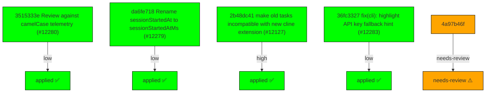

# Backport Agent — Detailed Run Report

> This file is generated automatically. It is intended for human analysts and
> AI reasoning models to assess agent performance, decision quality, and LLM behavior.

**Run timestamp**: 2026-07-15T08:21:15.890Z
**Models used**: fast=`mistral/mistral-code-agent-latest`  powerful=`openai/gpt-5-5`
**Prompt log**: `/Users/rlemeill/Development/tea-ching-cline/.backport-agent/run-1784102839058.prompts.jsonl`

---

## Summary (PR body)

## Backport Agent — Sync Report

**Date**: 2026-07-15T08:21:15.890Z
**Upstream ref**: `main`
**Cut date**: `2026-06-27T00:00:00.000Z` 
**Fork ref**: `keypool-live`
**Sync branch**: `sync/upstream-main-2026-07-15-080843`

### Summary

- ✅ Applied: 4
- ⚠️ Needs human review: 1
- ⛔ Blocked (not attempted): 0

### Applied commits

- `3515333e` [low] Review against camelCase telemetry (#12280)
- `da6fe718` [low] Rename sessionStartedAt to sessionStartedAtMs (#12279)
- `2b48dc41` [high] make old tasks incompatible with new cline extension (#12127)
- `36fc3327` [low] fix(cli): highlight API key fallback hint (#12283)

### ⚠️ Human review required

- `4a97b46f` refactor(core): simplifies context compaction trigger (#12217)
  - AI analysis failed: Unexpected end of JSON input

### Agent decision log

- Applied low-risk commit 3515333e23eaefe1fb83453d4790c59544bf11d1
- Applied low-risk commit da6fe718d02491ccbde200b3025a4b11a1f2285d
- Applied high-risk commit 2b48dc411fb597260e70aefcfa68d3450f4c5fcf
- Applied low-risk commit 36fc3327ac9286c9e08ea08740d73323e947147b
- Blocked medium-risk commit 4a97b46f5f894ee4d1c31b2fa39682d0ebd1a1e5 due to AI analysis failure


---

## Agent Workflow Diagram

> Generated by the fast model from the run summary. Evaluate the agent's decision path.



---

## AI Sub-Agent Call Log (1 call)

> Each entry is one sub-agent invocation. Review prompt/response pairs to assess
> reasoning quality, hallucinations, and decision accuracy.

### Call 1 / 1 — `analyze_commit_for_backport` ❌ Error

| Field | Value |
|---|---|
| **Timestamp** | 2026-07-15T08:08:52.823Z |
| **Tool** | `analyze_commit_for_backport` |
| **Model** | `openai/gpt-5-5` |
| **Duration** | 0 ms |
| **Error** | Unexpected end of JSON input |

**Prompt sent to sub-agent:**

```
Commit SHA: 4a97b46f5f894ee4d1c31b2fa39682d0ebd1a1e5
Commit message:
refactor(core): simplifies context compaction trigger (#12217)

Changed files (19):
apps/cli/src/runtime/interactive/compaction.test.ts
apps/cli/src/runtime/interactive/compaction.ts
apps/cli/src/utils/compaction-mode.test.ts
apps/vscode/src/sdk/sdk-compaction.test.ts
apps/vscode/src/sdk/sdk-compaction.ts
sdk/packages/core/src/extensions/context/agentic-compaction.ts
sdk/packages/core/src/extensions/context/basic-compaction.ts
sdk/packages/core/src/extensions/context/compaction-shared.ts
sdk/packages/core/src/extensions/context/compaction.live.test.ts
sdk/packages/core/src/extensions/context/compaction.test.ts
sdk/packages/core/src/extensions/context/compaction.ts
sdk/packages/core/src/runtime/host/runtime-host.ts
sdk/packages/core/src/services/telemetry/core-events.ts
sdk/packages/core/src/types/config.ts
sdk/packages/llms/src/providers/gateway.test.ts
sdk/packages/llms/src/providers/gateway.ts
sdk/packages/shared/src/index.browser.ts
sdk/packages/shared/src/index.ts
sdk/packages/shared/src/llms/tokens.ts

Diff:
commit 4a97b46f5f894ee4d1c31b2fa39682d0ebd1a1e5
Author: Bee <68532117+abeatrix@users.noreply.github.com>
Date:   Wed Jul 15 02:11:38 2026 +0800

    refactor(core): simplifies context compaction trigger (#12217)
    
    * refactor(core): simplifies context compaction trigger
    
    Simplifies automatic context compaction so it always triggers when input usage reaches 80% of the model’s effective maximum input-token limit.
    
    * add bound
    
    * feedback apply
    
    * complete
    
    ---------
    
    Co-authored-by: Saoud Rizwan <7799382+saoudrizwan@users.noreply.github.com>
---
 .../cli/src/runtime/interactive/compaction.test.ts |   6 +-
 apps/cli/src/runtime/interactive/compaction.ts     |  20 +-
 apps/cli/src/utils/compaction-mode.test.ts         |   6 +-
 apps/vscode/src/sdk/sdk-compaction.test.ts         |  23 +
 apps/vscode/src/sdk/sdk-compaction.ts              |  20 +-
 .../src/extensions/context/agentic-compaction.ts   |  37 +-
 .../src/extensions/context/basic-compaction.ts     |  12 +-
 .../src/extensions/context/compaction-shared.ts    |  49 ++-
 .../src/extensions/context/compaction.live.test.ts |   1 -
 .../core/src/extensions/context/compaction.test.ts | 486 +++++++++++++++++----
 .../core/src/extensions/context/compaction.ts      | 295 +++++--------
 sdk/packages/core/src/runtime/host/runtime-host.ts |   3 -
 .../core/src/services/telemetry/core-events.ts     |   4 +-
 sdk/packages/core/src/types/config.ts              |  37 +-
 sdk/packages/llms/src/providers/gateway.test.ts    |  12 +-
 sdk/packages/llms/src/providers/gateway.ts         |  48 +-
 sdk/packages/shared/src/index.browser.ts           |   7 +-
 sdk/packages/shared/src/index.ts                   |   7 +-
 sdk/packages/shared/src/llms/tokens.ts             |  55 +++
 19 files changed, 740 insertions(+), 388 deletions(-)

diff --git a/apps/cli/src/runtime/interactive/compaction.test.ts b/apps/cli/src/runtime/interactive/compaction.test.ts
index 4adef65de8..f3d7fc8538 100644
--- a/apps/cli/src/runtime/interactive/compaction.test.ts
+++ b/apps/cli/src/runtime/interactive/compaction.test.ts
@@ -106,7 +106,7 @@ describe("compactInteractiveMessages", () => {
 		}));
 		const config = createConfig();
 		const compact = vi.fn((context: CoreCompactionContext) => {
-			expect(context.maxInputTokens).toBe(400_000);
+			expect(context.budget.request.maxInputTokens).toBe(400_000);
 			return { messages: [messages[0]] };
 		});
 		config.knownModels = {
@@ -130,7 +130,7 @@ describe("compactInteractiveMessages", () => {
 		expect(result.compactionState?.messages).toEqual([messages[0]]);
 	});
 
-	it("falls back to legacy contextWindow for manual compaction", async () => {
+	it("uses 90 percent of legacy contextWindow for manual compaction", async () => {
 		const longText = "x".repeat(16_000);
 		const messages = Array.from({ length: 10 }, (_, index) => ({
 			role: index % 2 === 0 ? ("user" as const) : ("assistant" as const),
@@ -138,7 +138,7 @@ describe("compactInteractiveMessages", () => {
 		}));
 		const config = createConfig();
 		const compact = vi.fn((context: CoreCompactionContext) => {
-			expect(context.maxInputTokens).toBe(400_000);
+			expect(context.budget.request.maxInputTokens).toBe(360_000);
 			return { messages: [messages[0]] };
 		});
 		config.knownModels = {
diff --git a/apps/cli/src/runtime/interactive/compaction.ts b/apps/cli/src/runtime/interactive/compaction.ts
index 92791819fb..8be964d40e 100644
--- a/apps/cli/src/runtime/interactive/compaction.ts
+++ b/apps/cli/src/runtime/interactive/compaction.ts
@@ -61,11 +61,15 @@ export async function compactInteractiveMessages(input: {
 	compactionState?: SessionCompactionState;
 }> {
 	const modelInfo = input.config.knownModels?.[input.config.modelId];
-	const maxInputTokens =
-		input.config.compaction?.maxInputTokens ??
-		modelInfo?.maxInputTokens ??
-		modelInfo?.contextWindow ??
-		FALLBACK_MANUAL_COMPACTION_MAX_INPUT_TOKENS;
+	const compactionModelInfo = modelInfo
+		? {
+				...modelInfo,
+				id: modelInfo.id ?? input.config.modelId,
+			}
+		: {
+				id: input.config.modelId,
+				maxInputTokens: FALLBACK_MANUAL_COMPACTION_MAX_INPUT_TOKENS,
+			};
 	const compact = createContextCompactionPrepareTurn(
 		{
 			providerConfig: resolveCompactionProviderConfig(
@@ -106,11 +110,7 @@ export async function compactInteractiveMessages(input: {
 		model: {
 			id: input.config.modelId,
 			provider: input.config.providerId,
-			info: {
-				...(modelInfo ?? {}),
-				id: modelInfo?.id ?? input.config.modelId,
-				maxInputTokens: maxInputTokens,
-			},
+			info: compactionModelInfo,
 		},
 	});
 	if (!result?.messages) {
diff --git a/apps/cli/src/utils/compaction-mode.test.ts b/apps/cli/src/utils/compaction-mode.test.ts
index d60ec64a5a..1bf23afe78 100644
--- a/apps/cli/src/utils/compaction-mode.test.ts
+++ b/apps/cli/src/utils/compaction-mode.test.ts
@@ -26,20 +26,20 @@ describe("CLI compaction mode helpers", () => {
 	});
 
 	it("maps basic and off modes to core compaction config", () => {
-		const config = createConfig({ enabled: true, maxInputTokens: 123 });
+		const config = createConfig({ enabled: true, preserveRecentTokens: 123 });
 
 		applyCliCompactionMode(config, "basic");
 		expect(config.compaction).toEqual({
 			enabled: true,
 			strategy: "basic",
-			maxInputTokens: 123,
+			preserveRecentTokens: 123,
 		});
 		expect(getCliCompactionMode(config)).toBe("basic");
 
 		applyCliCompactionMode(config, "off");
 		expect(config.compaction).toEqual({
 			enabled: false,
-			maxInputTokens: 123,
+			preserveRecentTokens: 123,
 		});
 		expect(getCliCompactionMode(config)).toBe("off");
 	});
diff --git a/apps/vscode/src/sdk/sdk-compaction.test.ts b/apps/vscode/src/sdk/sdk-compaction.test.ts
index 76a557d5c5..f11e3ede9c 100644
--- a/apps/vscode/src/sdk/sdk-compaction.test.ts
+++ b/apps/vscode/src/sdk/sdk-compaction.test.ts
@@ -75,6 +75,29 @@ describe("compactSessionMessages", () => {
 		})
 	})
 
+	it("preserves context-only model limits for the shared resolver", async () => {
+		const compact = vi.fn().mockResolvedValue({ messages: [{ role: "user", content: "summary" }] })
+		createContextCompactionPrepareTurn.mockReturnValueOnce(compact)
+		const contextOnlyConfig = {
+			...baseConfig,
+			knownModels: { claude: { id: "claude", contextWindow: 400_000 } },
+		} as unknown as Parameters<typeof compactSessionMessages>[0]["config"]
+
+		await compactSessionMessages({
+			config: contextOnlyConfig,
+			sessionId: "s-context-only",
+			messages: [{ role: "user", content: "long context" }],
+		})
+
+		expect(compact).toHaveBeenCalledWith(
+			expect.objectContaining({
+				model: expect.objectContaining({
+					info: { id: "claude", contextWindow: 400_000 },
+				}),
+			}),
+		)
+	})
+
 	it("returns compacted=false when prepareTurn is unavailable", async () => {
 		createContextCompactionPrepareTurn.mockReturnValueOnce(undefined)
 
diff --git a/apps/vscode/src/sdk/sdk-compaction.ts b/apps/vscode/src/sdk/sdk-compaction.ts
index 28cfec071d..175778eb06 100644
--- a/apps/vscode/src/sdk/sdk-compaction.ts
+++ b/apps/vscode/src/sdk/sdk-compaction.ts
@@ -54,11 +54,15 @@ export async function compactSessionMessages(input: CompactSessionMessagesInput)
 	}
 
 	const modelInfo: SdkModelInfo | undefined = input.config.knownModels?.[input.config.modelId]
-	const maxInputTokens =
-		input.config.compaction?.maxInputTokens ??
-		modelInfo?.maxInputTokens ??
-		modelInfo?.contextWindow ??
-		FALLBACK_MANUAL_COMPACTION_MAX_INPUT_TOKENS
+	const compactionModelInfo: SdkModelInfo = modelInfo
+		? {
+				...modelInfo,
+				id: modelInfo.id ?? input.config.modelId,
+			}
+		: {
+				id: input.config.modelId,
+				maxInputTokens: FALLBACK_MANUAL_COMPACTION_MAX_INPUT_TOKENS,
+			}
 
 	const compact = createContextCompactionPrepareTurn(
 		{
@@ -98,11 +102,7 @@ export async function compactSessionMessages(input: CompactSessionMessagesInput)
 		model: {
 			id: input.config.modelId,
 			provider: input.config.providerId,
-			info: {
-				...(modelInfo ?? {}),
-				id: modelInfo?.id ?? input.config.modelId,
-				maxInputTokens,
-			},
+			info: compactionModelInfo,
 		},
 	})
 	if (!result) {
diff --git a/sdk/packages/core/src/extensions/context/agentic-compaction.ts b/sdk/packages/core/src/extensions/context/agentic-compaction.ts
index 8247fa5597..239ebcb9a9 100644
--- a/sdk/packages/core/src/extensions/context/agentic-compaction.ts
+++ b/sdk/packages/core/src/extensions/context/agentic-compaction.ts
@@ -7,8 +7,8 @@ import type {
 } from "../../types/config";
 import type { ProviderConfig } from "../../types/provider-settings";
 import {
-	buildBudgetProjection,
 	type BudgetProjectionResult,
+	buildBudgetProjection,
 } from "./budget-projection";
 import {
 	buildSummaryMessage,
@@ -20,6 +20,7 @@ import {
 	findCutIndex,
 	findLatestSummaryIndex,
 	getCompactionSummaryMetadata,
+	resolveEffectiveMaxInputTokens,
 	resolveSummarizerConfig,
 	serializeConversation,
 } from "./compaction-shared";
@@ -29,23 +30,19 @@ const MIN_AGENTIC_SUMMARY_INPUT_TOKENS = 1_024;
 function resolveProviderMaxInputTokens(
 	providerConfig: ProviderConfig,
 ): number | undefined {
-	const explicit = providerConfig.maxInputTokens;
-	if (typeof explicit === "number" && Number.isFinite(explicit)) {
-		return explicit;
-	}
-	const modelInfoLimit =
-		providerConfig.modelInfo?.maxInputTokens ??
-		providerConfig.modelInfo?.contextWindow;
-	if (typeof modelInfoLimit === "number" && Number.isFinite(modelInfoLimit)) {
+	const modelInfoLimit = resolveEffectiveMaxInputTokens({
+		maxInputTokens:
+			providerConfig.maxInputTokens ?? providerConfig.modelInfo?.maxInputTokens,
+		contextWindow: providerConfig.modelInfo?.contextWindow,
+	});
+	if (modelInfoLimit !== undefined) {
 		return modelInfoLimit;
 	}
 	const knownModelInfo = providerConfig.knownModels?.[providerConfig.modelId];
-	const knownModelLimit =
-		knownModelInfo?.maxInputTokens ?? knownModelInfo?.contextWindow;
-	if (typeof knownModelLimit === "number" && Number.isFinite(knownModelLimit)) {
-		return knownModelLimit;
-	}
-	return undefined;
+	return resolveEffectiveMaxInputTokens({
+		maxInputTokens: knownModelInfo?.maxInputTokens,
+		contextWindow: knownModelInfo?.contextWindow,
+	});
 }
 
 export function buildAgenticSummaryInputBudget(options: {
@@ -143,8 +140,8 @@ export async function runAgenticCompaction(options: {
 	);
 	const canUseActiveContextLimit = options.summarizer === undefined;
 	const activeCompactionInputLimit = Math.max(
-		options.context.maxInputTokens,
-		options.context.triggerTokens,
+		options.context.budget.request.maxInputTokens,
+		options.context.budget.request.triggerTokens,
 		MIN_AGENTIC_SUMMARY_INPUT_TOKENS,
 	);
 	if (resolvedSummarizerInputLimit === undefined && !canUseActiveContextLimit) {
@@ -230,8 +227,8 @@ export async function runAgenticCompaction(options: {
 		summarizerProviderId: summarizerProviderConfig.providerId,
 		summarizerModelId: summarizerProviderConfig.modelId,
 		summarizerInputLimit,
-		maxInputTokens: options.context.maxInputTokens,
-		triggerTokens: options.context.triggerTokens,
+		maxInputTokens: options.context.budget.request.maxInputTokens,
+		triggerTokens: options.context.budget.request.triggerTokens,
 	});
 	const rawSummary = await generateSummary({
 		providerConfig: summarizerProviderConfig,
@@ -266,7 +263,7 @@ export async function runAgenticCompaction(options: {
 		messagesPreserved: messages.length - cutIndex,
 		tokensBefore,
 		tokensAfter,
-		maxInputTokens: options.context.maxInputTokens,
+		maxInputTokens: options.context.budget.request.maxInputTokens,
 	});
 	const budgetActionCount = summaryInputBudget.actions.filter(
 		(action) =>
diff --git a/sdk/packages/core/src/extensions/context/basic-compaction.ts b/sdk/packages/core/src/extensions/context/basic-compaction.ts
index ebfe6ae16d..12e1505b4b 100644
--- a/sdk/packages/core/src/extensions/context/basic-compaction.ts
+++ b/sdk/packages/core/src/extensions/context/basic-compaction.ts
@@ -9,7 +9,6 @@ import type {
 } from "../../types/config";
 import { buildBudgetProjection } from "./budget-projection";
 import {
-	DEFAULT_TARGET_RATIO,
 	type EstimateMessageTokens,
 	findFirstUserMessageIndex,
 	findLastAssistantIndex,
@@ -373,9 +372,8 @@ export function runBasicCompaction(options: {
 	const totalTargetTokens = Math.max(
 		1,
 		Math.min(
-			options.context.targetTokens ??
-				Math.floor(options.context.triggerTokens * DEFAULT_TARGET_RATIO),
-			options.context.maxInputTokens,
+			options.context.budget.messages.targetTokens,
+			options.context.budget.messages.triggerTokens,
 		),
 	);
 	const { compactable, protectedTail } = splitLatestTurn(
@@ -437,7 +435,7 @@ export function runBasicCompaction(options: {
 		candidates,
 		targetTokens,
 		totalTokens,
-		options.context.triggerTokens,
+		options.context.budget.messages.triggerTokens,
 		options.estimateMessageTokens,
 	);
 
@@ -459,7 +457,7 @@ export function runBasicCompaction(options: {
 			budgetWarnings: budgeted.warnings.map((warning) => warning.code),
 			projectedTokens: budgeted.estimatedTokens,
 			targetTokens: totalTargetTokens,
-			maxInputTokens: options.context.maxInputTokens,
+			maxInputTokens: options.context.budget.request.maxInputTokens,
 		});
 	}
 	const resultMessages = budgeted.messages;
@@ -487,7 +485,7 @@ export function runBasicCompaction(options: {
 		budgetActions: budgetActionCount,
 		budgetWarnings: budgeted.warnings.map((warning) => warning.code),
 		targetTokens: totalTargetTokens,
-		maxInputTokens: options.context.maxInputTokens,
+		maxInputTokens: options.context.budget.request.maxInputTokens,
 	});
 
 	return {
diff --git a/sdk/packages/core/src/extensions/context/compaction-shared.ts b/sdk/packages/core/src/extensions/context/compaction-shared.ts
index 6db5e71d3d..fb2202776e 100644
--- a/sdk/packages/core/src/extensions/context/compaction-shared.ts
+++ b/sdk/packages/core/src/extensions/context/compaction-shared.ts
@@ -1,4 +1,4 @@
-import type { ToolResultContent } from "@cline/llms";
+import type { ModelInfo, ToolResultContent } from "@cline/llms";
 import {
 	CHARS_PER_TOKEN,
 	estimateTokens,
@@ -7,16 +7,15 @@ import {
 
 export { CHARS_PER_TOKEN, estimateTokens };
 
-import type {
-	CoreCompactionContext,
-	CoreCompactionSummarizerConfig,
-} from "../../types/config";
+import type { CoreCompactionSummarizerConfig } from "../../types/config";
 import type { ProviderConfig } from "../../types/provider-settings";
 
 export const DEFAULT_MAX_INPUT_TOKENS = 128_000;
-export const DEFAULT_THRESHOLD_RATIO = 0.9;
+/** Estimate the usable input share when only a context window is reported. */
+export const CONTEXT_WINDOW_INPUT_RATIO = 0.9;
+/** Compact once the transcript consumes this share of the usable input budget. */
+export const COMPACTION_TRIGGER_RATIO = 0.9;
 export const DEFAULT_TARGET_RATIO = 0.7;
-export const DEFAULT_RESERVE_TOKENS = 16_384;
 export const DEFAULT_PRESERVE_RECENT_TOKENS = 20_000;
 export const DEFAULT_SUMMARY_MAX_OUTPUT_TOKENS = 1_024;
 export const TOOL_RESULT_CHAR_LIMIT = 2_000;
@@ -38,6 +37,36 @@ export interface CompactionSummaryMetadata {
 
 export type EstimateMessageTokens = (message: MessageWithMetadata) => number;
 
+function isPositiveFiniteNumber(value: unknown): value is number {
+	return typeof value === "number" && Number.isFinite(value) && value > 0;
+}
+
+/**
+ * Resolve the model's usable prompt budget. A reported input limit is
+ * authoritative but cannot exceed the context window. When the model only
+ * reports a context window, retain a conservative margin for request overhead.
+ */
+export function resolveEffectiveMaxInputTokens(
+	input: Pick<ModelInfo, "maxInputTokens" | "contextWindow">,
+): number | undefined {
+	const contextWindow = isPositiveFiniteNumber(input.contextWindow)
+		? input.contextWindow
+		: undefined;
+	const maxInputTokens = isPositiveFiniteNumber(input.maxInputTokens)
+		? input.maxInputTokens
+		: undefined;
+
+	if (maxInputTokens !== undefined) {
+		return contextWindow === undefined
+			? maxInputTokens
+			: Math.min(maxInputTokens, contextWindow);
+	}
+
+	return contextWindow === undefined
+		? undefined
+		: contextWindow * CONTEXT_WINDOW_INPUT_RATIO;
+}
+
 export function truncateText(text: string, limit: number): string {
 	if (text.length <= limit) {
 		return text;
@@ -509,9 +538,3 @@ export function buildSummaryMessage(options: {
 		} satisfies CompactionSummaryMetadata,
 	};
 }
-
-export function getMaxInputTokens(
-	context: Pick<CoreCompactionContext, "maxInputTokens">,
-): number {
-	return context.maxInputTokens;
-}
diff --git a/sdk/packages/core/src/extensions/context/compaction.live.test.ts b/sdk/packages/core/src/extensions/context/compaction.live.test.ts
index 8e50d0b300..1444373aa2 100644
--- a/sdk/packages/core/src/extensions/context/compaction.live.test.ts
+++ b/sdk/packages/core/src/extensions/context/compaction.live.test.ts
@@ -274,7 +274,6 @@ async function runOversizedToolResultCompaction(
 				enabled: true,
 				strategy: "agentic",
 				preserveRecentTokens: 1,
-				maxInputTokens: 16_000,
 			},
 		},
 		{ mode: "manual", manualTargetRatio: 0.1 },
diff --git a/sdk/packages/core/src/extensions/context/compaction.test.ts b/sdk/packages/core/src/extensions/context/compaction.test.ts
index c7cb66f54c..57c7f4fb73 100644
--- a/sdk/packages/core/src/extensions/context/compaction.test.ts
+++ b/sdk/packages/core/src/extensions/context/compaction.test.ts
@@ -1,5 +1,8 @@
 import type * as LlmsProviders from "@cline/llms";
-import type { MessageWithMetadata } from "@cline/shared";
+import {
+	estimateRequestInputTokens,
+	type MessageWithMetadata,
+} from "@cline/shared";
 import { beforeEach, describe, expect, it, vi } from "vitest";
 import { createSessionCompactionState } from "../../session/models/session-compaction";
 import type { CoreCompactionContext } from "../../types/config";
@@ -12,6 +15,7 @@ import {
 import {
 	createTokenEstimator,
 	estimateTokens,
+	resolveEffectiveMaxInputTokens,
 	resolveSummarizerConfig,
 	serializeMessage,
 	TOOL_RESULT_CHAR_LIMIT,
@@ -75,6 +79,60 @@ describe("createTokenEstimator", () => {
 	});
 });
 
+describe("resolveEffectiveMaxInputTokens", () => {
+	it("uses maxInputTokens when it differs from contextWindow", () => {
+		expect(
+			resolveEffectiveMaxInputTokens({
+				maxInputTokens: 200_000,
+				contextWindow: 400_000,
+			}),
+		).toBe(200_000);
+	});
+
+	it("caps maxInputTokens at contextWindow", () => {
+		expect(
+			resolveEffectiveMaxInputTokens({
+				maxInputTokens: 500_000,
+				contextWindow: 400_000,
+			}),
+		).toBe(400_000);
+	});
+
+	it("keeps maxInputTokens authoritative when it equals contextWindow", () => {
+		expect(
+			resolveEffectiveMaxInputTokens({
+				maxInputTokens: 400_000,
+				contextWindow: 400_000,
+			}),
+		).toBe(400_000);
+	});
+
+	it("uses 90 percent of contextWindow when maxTokens is unavailable", () => {
+		expect(
+			resolveEffectiveMaxInputTokens({
+				contextWindow: 400_000,
+			}),
+		).toBe(360_000);
+	});
+
+	it("does not reserve catalog maxTokens when only contextWindow is available", () => {
+		const modelInfo = {
+			contextWindow: 400_000,
+			maxTokens: 128_000,
+		};
+		expect(resolveEffectiveMaxInputTokens(modelInfo)).toBe(360_000);
+	});
+
+	it("keeps maxInputTokens when maxTokens would leave no input budget", () => {
+		const modelInfo = {
+			maxInputTokens: 200_000,
+			contextWindow: 200_000,
+			maxTokens: 200_000,
+		};
+		expect(resolveEffectiveMaxInputTokens(modelInfo)).toBe(200_000);
+	});
+});
+
 function runForcedBasicCompaction(
 	messages: LlmsProviders.Message[],
 	targetTokens: number,
@@ -91,10 +149,23 @@ function runForcedBasicCompaction(
 				provider: "anthropic",
 				info: { id: "mock-model", maxInputTokens: targetTokens },
 			},
-			maxInputTokens: targetTokens,
-			triggerTokens: targetTokens,
-			thresholdRatio: 1,
-			utilizationRatio: 2,
+			mode: "manual",
+			budget: {
+				request: {
+					inputTokens: targetTokens * 2,
+					maxInputTokens: targetTokens,
+					triggerTokens: targetTokens,
+					targetTokens,
+					overheadTokens: 0,
+					thresholdRatio: 1,
+					utilizationRatio: 2,
+				},
+				messages: {
+					inputTokens: targetTokens * 2,
+					triggerTokens: targetTokens,
+					targetTokens,
+				},
+			},
 		},
 		estimateMessageTokens: estimateJsonTokens,
 	});
@@ -266,10 +337,23 @@ describe("createContextCompactionPrepareTurn", () => {
 					provider: "anthropic",
 					info: { id: "mock-model", maxInputTokens: 100_000 },
 				},
-				maxInputTokens: 100_000,
-				triggerTokens: 100_000,
-				thresholdRatio: 1,
-				utilizationRatio: 0.1,
+				mode: "manual",
+				budget: {
+					request: {
+						inputTokens: 10_000,
+						maxInputTokens: 100_000,
+						triggerTokens: 100_000,
+						targetTokens: 100_000,
+						overheadTokens: 0,
+						thresholdRatio: 1,
+						utilizationRatio: 0.1,
+					},
+					messages: {
+						inputTokens: 10_000,
+						triggerTokens: 100_000,
+						targetTokens: 100_000,
+					},
+				},
 			},
 			estimateMessageTokens: createTokenEstimator(),
 		});
@@ -444,8 +528,6 @@ describe("createContextCompactionPrepareTurn", () => {
 			compaction: {
 				enabled: true,
 				strategy: "basic",
-				maxInputTokens: 1_000,
-				thresholdRatio: 0.9,
 			},
 			logger: undefined,
 		});
@@ -505,11 +587,23 @@ describe("createContextCompactionPrepareTurn", () => {
 					provider: "openrouter",
 					info: { id: "mock-model", maxInputTokens: 1_000 },
 				},
-				maxInputTokens: 1_000,
-				triggerTokens: 900,
-				targetTokens: 100,
-				thresholdRatio: 0.9,
-				utilizationRatio: 2,
+				mode: "manual",
+				budget: {
+					request: {
+						inputTokens: 2_000,
+						maxInputTokens: 1_000,
+						triggerTokens: 900,
+						targetTokens: 100,
+						overheadTokens: 0,
+						thresholdRatio: 0.9,
+						utilizationRatio: 2,
+					},
+					messages: {
+						inputTokens: 2_000,
+						triggerTokens: 900,
+						targetTokens: 100,
+					},
+				},
 			},
 			estimateMessageTokens: estimateJsonTokens,
 		});
@@ -581,7 +675,6 @@ describe("createContextCompactionPrepareTurn", () => {
 				enabled: true,
 				strategy: "agentic",
 				preserveRecentTokens: 1,
-				reserveTokens: 5,
 			},
 			logger: undefined,
 		});
@@ -718,7 +811,6 @@ describe("createContextCompactionPrepareTurn", () => {
 				enabled: true,
 				strategy: "agentic",
 				preserveRecentTokens: 1,
-				reserveTokens: 5,
 			},
 			logger: undefined,
 		});
@@ -877,7 +969,6 @@ describe("createContextCompactionPrepareTurn", () => {
 				// would land at the most recent message (the tool_result),
 				// splitting the pair before the snap-to-turn-start fix.
 				preserveRecentTokens: 1,
-				reserveTokens: 5,
 			},
 			logger: undefined,
 		});
@@ -971,7 +1062,6 @@ describe("createContextCompactionPrepareTurn", () => {
 				enabled: true,
 				strategy: "agentic",
 				preserveRecentTokens: 1,
-				reserveTokens: 5,
 				summarizer: {
 					providerId: "openai",
 					modelId: "gpt-summary",
@@ -1046,7 +1136,6 @@ describe("createContextCompactionPrepareTurn", () => {
 				enabled: true,
 				strategy: "agentic",
 				preserveRecentTokens: 1,
-				reserveTokens: 5,
 				summarizer: {
 					providerId: "openai",
 					modelId: "small-summary",
@@ -1105,7 +1194,6 @@ describe("createContextCompactionPrepareTurn", () => {
 			compaction: {
 				enabled: true,
 				strategy: "basic",
-				reserveTokens: 5,
 			},
 			logger: undefined,
 		});
@@ -1252,9 +1340,9 @@ describe("createContextCompactionPrepareTurn", () => {
 		}
 	});
 
-	it("uses the default reserve when no trigger is configured", async () => {
+	it("triggers compaction when input reaches exactly 90 percent", async () => {
 		const compact = vi.fn((_context: CoreCompactionContext) => ({
-			messages: [{ role: "user" as const, content: "Compacted by reserve" }],
+			messages: [{ role: "user" as const, content: "Compacted at 90%" }],
 		}));
 		const prepareTurn = createContextCompactionPrepareTurn({
 			providerId: "anthropic",
@@ -1267,6 +1355,15 @@ describe("createContextCompactionPrepareTurn", () => {
 			logger: undefined,
 		});
 
+		const messages: MessageWithMetadata[] = [
+			{ role: "user", content: "At the exact compaction boundary" },
+		];
+		const inputTokens = estimateRequestInputTokens({
+			systemPrompt: "You are helpful.",
+			messages,
+			tools: [],
+		});
+		const maxInputTokens = inputTokens / 0.9;
 		const result = await prepareTurn?.({
 			agentId: "agent-1",
 			conversationId: "conv-1",
@@ -1275,31 +1372,178 @@ describe("createContextCompactionPrepareTurn", () => {
 			abortSignal: new AbortController().signal,
 			systemPrompt: "You are helpful.",
 			tools: [],
-			messages: [
-				{ role: "user", content: "x".repeat(340) },
-				{ role: "assistant", content: "y".repeat(340) },
-			],
-			apiMessages: [
-				{ role: "user", content: "x".repeat(340) },
-				{ role: "assistant", content: "y".repeat(340) },
-			],
+			messages,
+			apiMessages: messages,
 			model: {
 				id: "mock-model",
 				provider: "openai-codex",
-				info: { id: "mock-model", maxInputTokens: 200 },
+				info: { id: "mock-model", maxInputTokens },
 			},
 		});
 
 		expect(createHandlerMock).not.toHaveBeenCalled();
 		expect(compact).toHaveBeenCalledTimes(1);
 		const context = compact.mock.calls[0]?.[0];
-		expect(context?.triggerTokens).toBe(0);
+		expect(context?.budget.request.triggerTokens).toBe(inputTokens);
+		expect(context?.budget.request.thresholdRatio).toBe(0.9);
 		expect(result?.messages).toEqual([
-			{ role: "user", content: "Compacted by reserve" },
+			{ role: "user", content: "Compacted at 90%" },
 		]);
 	});
 
-	it("caps the default trigger at 90 percent of the context window", async () => {
+	it("triggers at 81 percent when only contextWindow is available", async () => {
+		const compact = vi.fn((_context: CoreCompactionContext) => ({
+			messages: [{ role: "user" as const, content: "Compacted at 81%" }],
+		}));
+		const prepareTurn = createContextCompactionPrepareTurn({
+			providerId: "anthropic",
+			modelId: "mock-model",
+			providerConfig: {
+				providerId: "anthropic",
+				modelId: "mock-model",
+			} as LlmsProviders.ProviderConfig,
+			compaction: { enabled: true, compact },
+			logger: undefined,
+		});
+		const messages: MessageWithMetadata[] = [
+			{ role: "user", content: "At the context fallback boundary" },
+		];
+		const inputTokens = estimateRequestInputTokens({
+			systemPrompt: "You are helpful.",
+			messages,
+			tools: [],
+		});
+		const contextWindow = inputTokens / 0.81;
+
+		const result = await prepareTurn?.({
+			agentId: "agent-1",
+			conversationId: "conv-1",
+			parentAgentId: null,
+			iteration: 1,
+			abortSignal: new AbortController().signal,
+			systemPrompt: "You are helpful.",
+			tools: [],
+			messages,
+			apiMessages: messages,
+			model: {
+				id: "mock-model",
+				provider: "anthropic",
+				info: {
+					id: "mock-model",
+					contextWindow,
+				},
+			},
+		});
+
+		expect(compact).toHaveBeenCalledTimes(1);
+		const context = compact.mock.calls[0]?.[0];
+		expect(context?.budget.request.maxInputTokens).toBeCloseTo(
+			contextWindow * 0.9,
+		);
+		expect(context?.budget.request.triggerTokens).toBeCloseTo(inputTokens);
+		expect(result?.messages).toEqual([
+			{ role: "user", content: "Compacted at 81%" },
+		]);
+	});
+
+	it("includes system prompt and tools in the automatic trigger", async () => {
+		const compact = vi.fn((_context: CoreCompactionContext) => ({
+			messages: [{ role: "user" as const, content: "Compacted full request" }],
+		}));
+		const prepareTurn = createContextCompactionPrepareTurn({
+			providerId: "anthropic",
+			modelId: "mock-model",
+			providerConfig: {
+				providerId: "anthropic",
+				modelId: "mock-model",
+			} as LlmsProviders.ProviderConfig,
+			compaction: { enabled: true, compact },
+			logger: undefined,
+		});
+		const messages: MessageWithMetadata[] = [
+			{ role: "user", content: "small message" },
+		];
+		const systemPrompt = "s".repeat(3_000);
+		const tools = [
+			{
+				name: "large_tool",
+				description: "t".repeat(3_000),
+				inputSchema: { type: "object" },
+			},
+		];
+
+		await prepareTurn?.({
+			agentId: "agent-1",
+			conversationId: "conv-1",
+			parentAgentId: null,
+			iteration: 1,
+			abortSignal: new AbortController().signal,
+			systemPrompt,
+			tools,
+			messages,
+			apiMessages: messages,
+			model: {
+				id: "mock-model",
+				provider: "anthropic",
+				info: { id: "mock-model", maxInputTokens: 2_000 },
+			},
+		});
+
+		expect(createTokenEstimator()(messages[0])).toBeLessThan(1_800);
+		expect(
+			estimateRequestInputTokens({ systemPrompt, messages, tools }),
+		).toBeGreaterThanOrEqual(1_800);
+		expect(compact).toHaveBeenCalledTimes(1);
+	});
+
+	it("translates full-request targets into attainable message budgets", async () => {
+		const messages: MessageWithMetadata[] = [
+			{ role: "user", content: `old request ${"u".repeat(800)}` },
+			{ role: "assistant", content: `old answer ${"a".repeat(800)}` },
+			{ role: "user", content: `latest request ${"l".repeat(800)}` },
+		];
+		const systemPrompt = "s".repeat(4_000);
+		const requestInputTokens = estimateRequestInputTokens({
+			systemPrompt,
+			messages,
+			tools: [],
+		});
+		const prepareTurn = createContextCompactionPrepareTurn({
+			providerId: "anthropic",
+			modelId: "mock-model",
+			providerConfig: {
+				providerId: "anthropic",
+				modelId: "mock-model",
+			} as LlmsProviders.ProviderConfig,
+			compaction: { enabled: true, strategy: "basic" },
+			logger: undefined,
+		});
+
+		const result = await prepareTurn?.({
+			agentId: "agent-1",
+			conversationId: "conv-1",
+			parentAgentId: null,
+			iteration: 1,
+			abortSignal: new AbortController().signal,
+			systemPrompt,
+			tools: [],
+			messages,
+			apiMessages: messages,
+			model: {
+				id: "mock-model",
+				provider: "anthropic",
+				info: {
+					id: "mock-model",
+					maxInputTokens: requestInputTokens / 0.91,
+				},
+			},
+		});
+
+		expect(result?.messages).toBeDefined();
+		expect(result?.messages).not.toEqual(messages);
+	});
+
+	it("triggers at 90 percent of maxInputTokens", async () => {
 		const compact = vi.fn((_context: CoreCompactionContext) => ({
 			messages: [{ role: "user" as const, content: "Compacted by ratio" }],
 		}));
@@ -1340,14 +1584,14 @@ describe("createContextCompactionPrepareTurn", () => {
 		expect(createHandlerMock).not.toHaveBeenCalled();
 		expect(compact).toHaveBeenCalledTimes(1);
 		const context = compact.mock.calls[0]?.[0];
-		expect(context?.triggerTokens).toBe(180_000);
-		expect(context?.thresholdRatio).toBe(0.9);
+		expect(context?.budget.request.triggerTokens).toBe(180_000);
+		expect(context?.budget.request.thresholdRatio).toBe(0.9);
 		expect(result?.messages).toEqual([
 			{ role: "user", content: "Compacted by ratio" },
 		]);
 	});
 
-	it("does not subtract model max output tokens from an explicit input budget", async () => {
+	it("does not subtract maxTokens when maxInputTokens differs from contextWindow", async () => {
 		const compact = vi.fn((_context: CoreCompactionContext) => ({
 			messages: [
 				{ role: "user" as const, content: "Compacted by input budget" },
@@ -1360,7 +1604,7 @@ describe("createContextCompactionPrepareTurn", () => {
 				providerId: "openai-codex",
 				modelId: "gpt-5.4-mini",
 			} as LlmsProviders.ProviderConfig,
-			compaction: { enabled: true, maxInputTokens: 200_000, compact },
+			compaction: { enabled: true, compact },
 			logger: undefined,
 		});
 		const messages: MessageWithMetadata[] = [
@@ -1385,6 +1629,7 @@ describe("createContextCompactionPrepareTurn", () => {
 				provider: "openai-codex",
 				info: {
 					id: "gpt-5.4-mini",
+					contextWindow: 400_000,
 					maxInputTokens: 200_000,
 					maxTokens: 128_000,
 				},
@@ -1448,11 +1693,15 @@ describe("createContextCompactionPrepareTurn", () => {
 
 		expect(compact).toHaveBeenCalledTimes(1);
 		const context = 
... [truncated]

Output the JSON object now.
```

**Response received:**

```
(empty)
```

---

## Performance Summary

**Total AI time**: 0 ms across 1 call(s)

| Tool | Calls | Total ms | Avg ms |
|---|---|---|---|
| `analyze_commit_for_backport` | 1 | 0 | 0 |

## Decision Quality Metrics

> Automated quality signals derived from tool output guards, schema validation,
> hallucination detection, and consensus checks.  Review flagged items manually.

### Commit Analysis Quality

| Metric | Value |
|---|---|
| Total analyze calls | 1 |
| Commits with semantic risk factors | 0 |
| Possible hallucinated references (total) | 0 |

### Audit Event Timeline

| Timestamp | Tool | Event | Details |
|---|---|---|---|
| 08:08:52 | `analyze_commit_for_backport` | `analysis_failed` | sha="4a97b46f5f894ee4d1c31b2fa39682d0ebd1a1e, error="Unexpected end of JSON input" |
