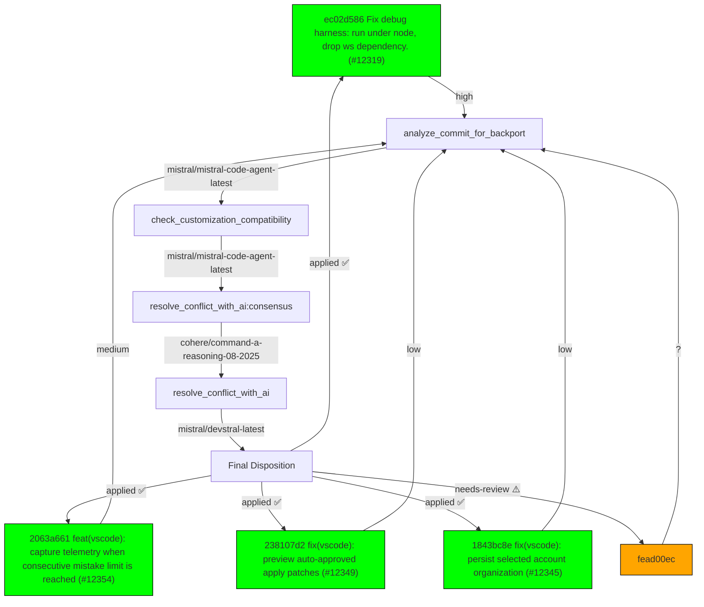

# Backport Agent — Detailed Run Report

> This file is generated automatically. It is intended for human analysts and
> AI reasoning models to assess agent performance, decision quality, and LLM behavior.

**Run timestamp**: 2026-07-17T07:58:46.109Z
**Models used**: fast=`mistral/mistral-code-agent-latest`  powerful=`cohere/command-a-reasoning-08-2025`
**Prompt log**: `/Users/rlemeill/Development/tea-ching-cline/.backport-agent/run-1784274104599.prompts.jsonl`

---

## Summary (PR body)

## Backport Agent — Sync Report

**Date**: 2026-07-17T07:58:46.109Z
**Upstream ref**: `main`
**Cut date**: `2026-06-27T00:00:00.000Z` 
**Fork ref**: `keypool-live`
**Sync branch**: `sync/upstream-main-2026-07-17-074328`

### Summary

- ✅ Applied: 4
- ⚠️ Needs human review: 1
- ⛔ Blocked (not attempted): 0

### 🛑 Host-side gate report

- apply_resolved_file refused for apps/vscode/webview-ui/src/components/settings/ApiOptions.tsx: AI confidence "low" is below minAutoApplyConfidence "medium" (guards: syntax_issue:Unexpected ')')

### Applied commits

- `ec02d586` [high] Fix debug harness: run under node, drop ws dependency. (#12319)
- `2063a661` [medium] feat(vscode): capture telemetry when consecutive mistake limit is reached (#12354)
- `238107d2` [low] fix(vscode): preview auto-approved apply patches (#12349)
- `1843bc8e` [low] fix(vscode): persist selected account organization (#12345)

### ⚠️ Human review required

- `fead00ec` fix(vscode): avoid duplicate OpenAI provider settings (#12346)
  - Conflicted files: apps/vscode/webview-ui/src/components/settings/ApiOptions.tsx
  - AI resolution confidence too low

### Agent decision log

- Applied high-risk commit ec02d5862e7dc3caaf1907513c346aeb63875758 with human review flagged due to runtime change
- Applied medium-risk commit 2063a661bdee4af3d1a07a2c3dda259be8418863
- Applied low-risk commit 238107d21c10130bb1d315a50f111b93e123e917
- Conflict-blocked commit fead00ec579b58c8ecdee6288f36e9c1f2d3b1ce due to low AI resolution confidence
- Applied low-risk commit 1843bc8ed08bf7743f9b121ca0e59f949fa3c41c
- Ran high-risk validation suite
- Ran final comprehensive validation suite


---

## Agent Workflow Diagram

> Generated by the fast model from the run summary. Evaluate the agent's decision path.



---

## AI Sub-Agent Call Log (6 calls)

> Each entry is one sub-agent invocation. Review prompt/response pairs to assess
> reasoning quality, hallucinations, and decision accuracy.

### Call 1 / 6 — `analyze_commit_for_backport` ✅ OK

| Field | Value |
|---|---|
| **Timestamp** | 2026-07-17T07:43:12.758Z |
| **Tool** | `analyze_commit_for_backport` |
| **Model** | `mistral/mistral-code-agent-latest` |
| **Duration** | 3956 ms |
| **Tokens in** | 5141 |
| **Tokens out** | 116 |
| **Cost** | $0.000000 |

**Prompt sent to sub-agent:**

````
Commit SHA: ec02d5862e7dc3caaf1907513c346aeb63875758
Commit message:
Fix debug harness: run under node, drop ws dependency. (#12319)

Changed files (3):
.clinerules/debug-harness.md
apps/vscode/src/dev/debug-harness/README.md
apps/vscode/src/dev/debug-harness/server.ts

Diff:
commit ec02d5862e7dc3caaf1907513c346aeb63875758
Author: Dominic Cooney <dominic.cooney@cline.bot>
Date:   Fri Jul 17 07:43:32 2026 +0900

    Fix debug harness: run under node, drop ws dependency. (#12319)
    
    The harness rotted after the npm-to-bun migration: the 'ws' package it imported is no longer in the dependency tree, and Playwright's _electron.launch() times out under bun (the debugee Electron starts but Playwright never finishes attaching; the same launch attaches in under a second under node). Use the runtime's built-in WebSocket for the CDP client and document that the harness must be run with node.
---
 .clinerules/debug-harness.md                |  5 +++--
 apps/vscode/src/dev/debug-harness/README.md |  9 +++++----
 apps/vscode/src/dev/debug-harness/server.ts | 24 +++++++++++++++---------
 3 files changed, 23 insertions(+), 15 deletions(-)

diff --git a/.clinerules/debug-harness.md b/.clinerules/debug-harness.md
index daa064f9d0..9e2a7c7398 100644
--- a/.clinerules/debug-harness.md
+++ b/.clinerules/debug-harness.md
@@ -8,8 +8,9 @@ HTTP-controlled debugger for the VSCode extension at `src/dev/debug-harness/serv
 # Build extension first if needed (protos + esbuild):
 bun run protos && IS_DEV=true bun esbuild.mjs
 
-# Launch (skip-build if already built):
-bun src/dev/debug-harness/server.ts --skip-build --auto-launch
+# Launch (skip-build if already built). Run with node, NOT bun — Playwright's
+# Electron launch times out under bun:
+node src/dev/debug-harness/server.ts --skip-build --auto-launch
 
 # In another terminal:
 curl localhost:19229/api -d '{"method":"status"}'
diff --git a/apps/vscode/src/dev/debug-harness/README.md b/apps/vscode/src/dev/debug-harness/README.md
index 2c8b76cb9f..211eec7dc5 100644
--- a/apps/vscode/src/dev/debug-harness/README.md
+++ b/apps/vscode/src/dev/debug-harness/README.md
@@ -15,8 +15,9 @@ Designed to be driven from an agentic loop via `curl` commands.
 ## Quick Start
 
 ```bash
-# Terminal 1: Start the debug harness server
-bun src/dev/debug-harness/server.ts --auto-launch --skip-build
+# Terminal 1: Start the debug harness server.
+# Run with node, NOT bun — Playwright's Electron launch times out under bun.
+node src/dev/debug-harness/server.ts --auto-launch --skip-build
 
 # Terminal 2: Interact via curl
 curl localhost:19229/api -d '{"method":"status"}'
@@ -27,7 +28,7 @@ curl localhost:19229/api -d '{"method":"ui.screenshot"}'
 ## Server Options
 
 ```
-bun src/dev/debug-harness/server.ts [options]
+node src/dev/debug-harness/server.ts [options]
 
 Options:
   --skip-build        Skip building extension/webview (use existing dist/)
@@ -42,7 +43,7 @@ Options:
 ```bash
 # This builds protos, extension (unminified+sourcemaps), webview (unminified+sourcemaps),
 # downloads VSCode, launches it, and connects CDP to the extension host.
-bun src/dev/debug-harness/server.ts --auto-launch
+node src/dev/debug-harness/server.ts --auto-launch
 ```
 
 ## Data Isolation
diff --git a/apps/vscode/src/dev/debug-harness/server.ts b/apps/vscode/src/dev/debug-harness/server.ts
index 6e707dcbb2..ef9d6af860 100644
--- a/apps/vscode/src/dev/debug-harness/server.ts
+++ b/apps/vscode/src/dev/debug-harness/server.ts
@@ -1,4 +1,4 @@
-#!/usr/bin/env bun
+#!/usr/bin/env node
 
 /**
  * Debug Harness Server
@@ -10,7 +10,12 @@
  *   - UI automation (click, type, screenshot) via Playwright
  *
  * Usage:
- *   bun src/dev/debug-harness/server.ts [options]
+ *   node src/dev/debug-harness/server.ts [options]
+ *
+ * Run with node, not bun: Playwright's _electron.launch() never finishes
+ * attaching to the debugee under bun (the Electron process starts, but the
+ * launch times out), while the same launch works under node. Node >= 22.6
+ * runs this file directly via type stripping.
  *
  * Options:
  *   --skip-build        Skip building extension/webview
@@ -39,7 +44,6 @@ import path from "node:path"
 import { fileURLToPath } from "node:url"
 import { downloadAndUnzipVSCode, SilentReporter } from "@vscode/test-electron"
 import { _electron, type CDPSession, type ElectronApplication, type Frame, type Page } from "playwright"
-import WebSocket from "ws"
 
 const __script_dir = typeof __dirname !== "undefined" ? __dirname : path.dirname(fileURLToPath(import.meta.url))
 
@@ -201,19 +205,21 @@ class CdpClient {
 
 	async connect(wsUrl: string): Promise<void> {
 		return new Promise((resolve, reject) => {
+			// The runtime's built-in WebSocket (browser-style events), so the
+			// harness has no dependency on the `ws` package.
 			const ws = new WebSocket(wsUrl)
-			ws.on("open", () => {
+			ws.addEventListener("open", () => {
 				this.ws = ws
 				resolve()
 			})
-			ws.on("error", (e: Error) => {
-				if (!this.ws) reject(e)
+			ws.addEventListener("error", () => {
+				if (!this.ws) reject(new Error(`WebSocket connection failed: ${wsUrl}`))
 			})
-			ws.on("close", () => {
+			ws.addEventListener("close", () => {
 				this.ws = null
 			})
-			ws.on("message", (raw: WebSocket.Data) => {
-				const msg = JSON.parse(raw.toString())
+			ws.addEventListener("message", (event: MessageEvent) => {
+				const msg = JSON.parse(typeof event.data === "string" ? event.data : Buffer.from(event.data).toString())
 				if (msg.id !== undefined) {
 					const p = this.pending.get(msg.id)
 					if (p) {

Output the JSON object now.
````

**Response received:**

````
```json
{
  "summary": "Fixes debug harness by switching from 'ws' dependency to runtime WebSocket and mandating Node.js execution due to Playwright Electron launch issues under Bun.",
  "keyChanges": [
    "Replace 'ws' import with runtime WebSocket",
    "Update shebang and docs to require Node.js",
    "Adjust WebSocket event listeners to browser-style API"
  ],
  "backportComplexity": "trivial",
  "semanticRiskFactors": [],
  "recommendation": "apply"
}
```
````

---

### Call 2 / 6 — `analyze_commit_for_backport` ✅ OK

| Field | Value |
|---|---|
| **Timestamp** | 2026-07-17T07:43:16.327Z |
| **Tool** | `analyze_commit_for_backport` |
| **Model** | `mistral/mistral-code-agent-latest` |
| **Duration** | 3520 ms |
| **Tokens in** | 4264 |
| **Tokens out** | 110 |
| **Cost** | $0.000000 |

**Prompt sent to sub-agent:**

```
Commit SHA: fead00ec579b58c8ecdee6288f36e9c1f2d3b1ce
Commit message:
fix(vscode): avoid duplicate OpenAI provider settings (#12346)

Changed files (2):
apps/vscode/webview-ui/src/components/settings/ApiOptions.tsx
apps/vscode/webview-ui/src/components/settings/__tests__/APIOptions.spec.tsx

Diff:
commit fead00ec579b58c8ecdee6288f36e9c1f2d3b1ce
Author: Max <maxpaulus43@gmail.com>
Date:   Thu Jul 16 16:07:48 2026 -0700

    fix(vscode): avoid duplicate OpenAI provider settings (#12346)
    
    Co-authored-by: Max Paulus 🥪 <max@cline.bot>
    Co-authored-by: Saoud Rizwan <7799382+saoudrizwan@users.noreply.github.com>
---
 .../webview-ui/src/components/settings/ApiOptions.tsx |  2 +-
 .../components/settings/__tests__/APIOptions.spec.tsx | 19 +++++++++++++++++++
 2 files changed, 20 insertions(+), 1 deletion(-)

diff --git a/apps/vscode/webview-ui/src/components/settings/ApiOptions.tsx b/apps/vscode/webview-ui/src/components/settings/ApiOptions.tsx
index ed45a6cee8..21d5897b61 100644
--- a/apps/vscode/webview-ui/src/components/settings/ApiOptions.tsx
+++ b/apps/vscode/webview-ui/src/components/settings/ApiOptions.tsx
@@ -510,7 +510,7 @@ const ApiOptions = ({
 				<AIhubmixProvider currentMode={currentMode} isPopup={isPopup} showModelOptions={showModelOptions} />
 			)}
 
-			{apiConfiguration && (selectedProvider.includes("openai") || isCustomProvider) && (
+			{apiConfiguration && (selectedProvider === "openai" || isCustomProvider) && (
 				<OpenAICompatibleProvider
 					currentMode={currentMode}
 					isPopup={isPopup}
diff --git a/apps/vscode/webview-ui/src/components/settings/__tests__/APIOptions.spec.tsx b/apps/vscode/webview-ui/src/components/settings/__tests__/APIOptions.spec.tsx
index 242d6b1d28..a67883dd02 100644
--- a/apps/vscode/webview-ui/src/components/settings/__tests__/APIOptions.spec.tsx
+++ b/apps/vscode/webview-ui/src/components/settings/__tests__/APIOptions.spec.tsx
@@ -97,6 +97,25 @@ describe("ApiOptions Component", () => {
 		expect(modelIdInput).toBeInTheDocument()
 	})
 
+	it.each([
+		["openai-native", "OpenAI API Key"],
+		["openai-codex", "Sign in to OpenAI Codex"],
+	])("renders only the dedicated form for %s", (provider, dedicatedFormText) => {
+		mockExtensionState({
+			planModeApiProvider: provider as any,
+			actModeApiProvider: provider as any,
+		})
+
+		render(
+			<ExtensionStateContextProvider>
+				<ApiOptions currentMode="plan" showModelOptions={false} />
+			</ExtensionStateContextProvider>,
+		)
+
+		expect(screen.getByText(dedicatedFormText)).toBeInTheDocument()
+		expect(screen.queryByText("Custom Headers")).not.toBeInTheDocument()
+	})
+
 	it("renders the OpenAI-compatible form for custom/unknown catalog providers", () => {
 		vi.mocked(useProviderListings).mockReturnValue({
 			providers: [

Output the JSON object now.
```

**Response received:**

````
```json
{
  "summary": "Fixes duplicate OpenAI provider settings in VSCode UI by changing condition from `includes` to strict equality for 'openai' provider.",
  "keyChanges": [
    "Changed `selectedProvider.includes('openai')` to `selectedProvider === 'openai'`",
    "Added test cases for dedicated OpenAI forms"
  ],
  "backportComplexity": "trivial",
  "semanticRiskFactors": [],
  "recommendation": "apply"
}
```
````

---

### Call 3 / 6 — `check_customization_compatibility` ✅ OK

| Field | Value |
|---|---|
| **Timestamp** | 2026-07-17T07:43:22.669Z |
| **Tool** | `check_customization_compatibility` |
| **Model** | `mistral/mistral-code-agent-latest` |
| **Duration** | 2042 ms |
| **Tokens in** | 1995 |
| **Tokens out** | 108 |
| **Cost** | $0.000000 |

**Prompt sent to sub-agent:**

````
Declared fork customisations:
  1. Pattern: .clinerules/**
     Description: Backport agent infrastructure and rulesets

Upstream diff to evaluate:
commit ec02d5862e7dc3caaf1907513c346aeb63875758
Author: Dominic Cooney <dominic.cooney@cline.bot>
Date:   Fri Jul 17 07:43:32 2026 +0900

    Fix debug harness: run under node, drop ws dependency. (#12319)
    
    The harness rotted after the npm-to-bun migration: the 'ws' package it imported is no longer in the dependency tree, and Playwright's _electron.launch() times out under bun (the debugee Electron starts but Playwright never finishes attaching; the same launch attaches in under a second under node). Use the runtime's built-in WebSocket for the CDP client and document that the harness must be run with node.
---
 .clinerules/debug-harness.md                |  5 +++--
 apps/vscode/src/dev/debug-harness/README.md |  9 +++++----
 apps/vscode/src/dev/debug-harness/server.ts | 24 +++++++++++++++---------
 3 files changed, 23 insertions(+), 15 deletions(-)

diff --git a/.clinerules/debug-harness.md b/.clinerules/debug-harness.md
index daa064f9d0..9e2a7c7398 100644
--- a/.clinerules/debug-harness.md
+++ b/.clinerules/debug-harness.md
@@ -8,8 +8,9 @@ HTTP-controlled debugger for the VSCode extension at `src/dev/debug-harness/serv
 # Build extension first if needed (protos + esbuild):
 bun run protos && IS_DEV=true bun esbuild.mjs
 
-# Launch (skip-build if already built):
-bun src/dev/debug-harness/server.ts --skip-build --auto-launch
+# Launch (skip-build if already built). Run with node, NOT bun — Playwright's
+# Electron launch times out under bun:
+node src/dev/debug-harness/server.ts --skip-build --auto-launch
 
 # In another terminal:
 curl localhost:19229/api -d '{"method":"status"}'
diff --git a/apps/vscode/src/dev/debug-harness/README.md b/apps/vscode/src/dev/debug-harness/README.md
index 2c8b76cb9f..211eec7dc5 100644
--- a/apps/vscode/src/dev/debug-harness/README.md
+++ b/apps/vscode/src/dev/debug-harness/README.md
@@ -15,8 +15,9 @@ Designed to be driven from an agentic loop via `curl` commands.
 ## Quick Start
 
 ```bash
-# Terminal 1: Start the debug harness server
-bun src/dev/debug-harness/server.ts --auto-launch --skip-build
+# Terminal 1: Start the debug harness server.
+# Run with node, NOT bun — Playwright's Electron launch times out under bun.
+node src/dev/debug-harness/server.ts --auto-launch --skip-build
 
 # Terminal 2: Interact via curl
 curl localhost:19229/api -d '{"method":"status"}'
@@ -27,7 +28,7 @@ curl localhost:19229/api -d '{"method":"ui.screenshot"}'
 ## Server Options
 
 ```
-bun src/dev/debug-harness/server.ts [options]
+node src/dev/debug-harness/server.ts [options]
 
 Options:
   --skip-build        Skip building extension/webview (use existing dist/)
@@ -42,7 +43,7 @@ Options:
 ```bash
 # This builds protos, extension (unminified+sourcemaps), webview (unminified+sourcemaps),
 # downloads VSCode, launches it, and connects CDP to the extension host.
-bun src/dev/debug-harness/server.ts --auto-launch
+node src/dev/debug-harness/server.ts --auto-launch
 ```
 
 ## Data Isolation
diff --git a/apps/vscode/src/dev/debug-harness/server.ts b/apps/vscode/src/dev/debug-harness/server.ts
index 6e707dcbb2..ef9d6af860 100644
--- a/apps/vscode/src/dev/debug-harness/server.ts
+++ b/apps/vscode/src/dev/debug-harness/server.ts
@@ -1,4 +1,4 @@
-#!/usr/bin/env bun
+#!/usr/bin/env node
 
 /**
  * Debug Harness Server
@@ -10,7 +10,12 @@
  *   - UI automation (click, type, screenshot) via Playwright
  *
  * Usage:
- *   bun src/dev/debug-harness/server.ts [options]
+ *   node src/dev/debug-harness/server.ts [options]
+ *
+ * Run with node, not bun: Playwright's _electron.launch() never finishes
+ * attaching to the debugee under bun (the Electron process starts, but the
+ * launch times out), while the same launch works under node. Node >= 22.6
+ * runs this file directly via type stripping.
  *
  * Options:
  *   --skip-build        Skip building extension/webview
@@ -39,7 +44,6 @@ import path from "node:path"
 import { fileURLToPath } from "node:url"
 import { downloadAndUnzipVSCode, SilentReporter } from "@vscode/test-electron"
 import { _electron, type CDPSession, type ElectronApplication, type Frame, type Page } from "playwright"
-import WebSocket from "ws"
 
 const __script_dir = typeof __dirname !== "undefined" ? __dirname : path.dirname(fileURLToPath(import.meta.url))
 
@@ -201,19 +205,21 @@ class CdpClient {
 
 	async connect(wsUrl: string): Promise<void> {
 		return new Promise((resolve, reject) => {
+			// The runtime's built-in WebSocket (browser-style events), so the
+			// harness has no dependency on the `ws` package.
 			const ws = new WebSocket(wsUrl)
-			ws.on("open", () => {
+			ws.addEventListener("open", () => {
 				this.ws = ws
 				resolve()
 			})
-			ws.on("error", (e: Error) => {
-				if (!this.ws) reject(e)
+			ws.addEventListener("error", () => {
+				if (!this.ws) reject(new Error(`WebSocket connection failed: ${wsUrl}`))
 			})
-			ws.on("close", () => {
+			ws.addEventListener("close", () => {
 				this.ws = null
 			})
-			ws.on("message", (raw: WebSocket.Data) => {
-				const msg = JSON.parse(raw.toString())
+			ws.addEventListener("message", (event: MessageEvent) => {
+				const msg = JSON.parse(typeof event.data === "string" ? event.data : Buffer.from(event.data).toString())
 				if (msg.id !== undefined) {
 					const p = this.pending.get(msg.id)
 					if (p) {

Output the JSON object now.
````

**Response received:**

````
```json
{
  "compatible": true,
  "affectedCustomizations": [".clinerules/**"],
  "semanticConflicts": [],
  "warnings": ["The change modifies runtime requirements (node instead of bun) and WebSocket handling in the debug harness. Ensure the fork's environment supports node >= 22.6."],
  "recommendation": "Review the runtime change (bun → node) and WebSocket implementation to confirm compatibility with the fork's infrastructure."
}
```
````

---

### Call 4 / 6 — `check_customization_compatibility` ✅ OK

| Field | Value |
|---|---|
| **Timestamp** | 2026-07-17T07:43:24.144Z |
| **Tool** | `check_customization_compatibility` |
| **Model** | `mistral/mistral-code-agent-latest` |
| **Duration** | 1423 ms |
| **Tokens in** | 2848 |
| **Tokens out** | 77 |
| **Cost** | $0.000000 |

**Prompt sent to sub-agent:**

```
Declared fork customisations:
  1. Pattern: apps/vscode/webview-ui/src/components/settings/ApiOptions.tsx
     Description: Cohere provider UI customizations
     Current file content (1 file(s)):
      [apps/vscode/webview-ui/src/components/settings/ApiOptions.tsx]
      import { StringRequest } from "@shared/proto/cline/common"
      import type { Mode } from "@shared/storage/types"
      import { VSCodeTextField } from "@vscode/webview-ui-toolkit/react"
      import Fuse from "fuse.js"
      import { type KeyboardEvent, useCallback, useEffect, useMemo, useRef, useState } from "react"
      import { useInterval } from "react-use"
      import styled from "styled-components"
      
      import { Tooltip, TooltipContent, TooltipTrigger } from "@/components/ui/tooltip"
      import { PLATFORM_CONFIG, PlatformType } from "@/config/platform.config"
      import { CLINE_PASS_FEATURE_FLAG } from "@/constants/featureFlags"
      import { useExtensionState } from "@/context/ExtensionStateContext"
      import { useHasFeatureFlag } from "@/hooks/useFeatureFlag"
      import { useProviderListings } from "@/hooks/useProviderListings"
      import { ModelsServiceClient } from "@/services/grpc-client"
      import { OPENROUTER_MODEL_PICKER_Z_INDEX } from "./OpenRouterModelPicker"
      import { AIhubmixProvider } from "./providers/AihubmixProvider"
      import { AnthropicProvider } from "./providers/AnthropicProvider"
      import { AskSageProvider } from "./providers/AskSageProvider"
      import { BasetenProvider } from "./providers/BasetenProvider"
      import { BedrockProvider } from "./providers/BedrockProvider"
      import { ClaudeCodeProvider } from "./providers/ClaudeCodeProvider"
      import { ClinePassProvider } from "./providers/ClinePassProvider"
      import { ClineProvider } from "./providers/ClineProvider"
      import { DifyProvider } from "./providers/DifyProvider"
      import { GenericProviderSettings } from "./providers/GenericProviderSettings"
      import { GroqProvider } from "./providers/GroqProvider"
      import { HicapProvider } from "./providers/HicapProvider"
      import { HuggingFaceProvider } from "./providers/HuggingFaceProvider"
      import { KeypoolLiveProvider } from "./providers/KeypoolLiveProvider"
      import { LiteLlmProvider } from "./providers/LiteLlmProvider"
      import { LMStudioProvider } from "./providers/LMStudioProvider"
      import { MoonshotProvider } from "./providers/Moons
  2. Pattern: apps/vscode/webview-ui/src/components/settings/ApiOptions.tsx
     Description: Poolside provider UI customizations
     Current file content (1 file(s)):
      [apps/vscode/webview-ui/src/components/settings/ApiOptions.tsx]
      import { StringRequest } from "@shared/proto/cline/common"
      import type { Mode } from "@shared/storage/types"
      import { VSCodeTextField } from "@vscode/webview-ui-toolkit/react"
      import Fuse from "fuse.js"
      import { type KeyboardEvent, useCallback, useEffect, useMemo, useRef, useState } from "react"
      import { useInterval } from "react-use"
      import styled from "styled-components"
      
      import { Tooltip, TooltipContent, TooltipTrigger } from "@/components/ui/tooltip"
      import { PLATFORM_CONFIG, PlatformType } from "@/config/platform.config"
      import { CLINE_PASS_FEATURE_FLAG } from "@/constants/featureFlags"
      import { useExtensionState } from "@/context/ExtensionStateContext"
      import { useHasFeatureFlag } from "@/hooks/useFeatureFlag"
      import { useProviderListings } from "@/hooks/useProviderListings"
      import { ModelsServiceClient } from "@/services/grpc-client"
      import { OPENROUTER_MODEL_PICKER_Z_INDEX } from "./OpenRouterModelPicker"
      import { AIhubmixProvider } from "./providers/AihubmixProvider"
      import { AnthropicProvider } from "./providers/AnthropicProvider"
      import { AskSageProvider } from "./providers/AskSageProvider"
      import { BasetenProvider } from "./providers/BasetenProvider"
      import { BedrockProvider } from "./providers/BedrockProvider"
      import { ClaudeCodeProvider } from "./providers/ClaudeCodeProvider"
      import { ClinePassProvider } from "./providers/ClinePassProvider"
      import { ClineProvider } from "./providers/ClineProvider"
      import { DifyProvider } from "./providers/DifyProvider"
      import { GenericProviderSettings } from "./providers/GenericProviderSettings"
      import { GroqProvider } from "./providers/GroqProvider"
      import { HicapProvider } from "./providers/HicapProvider"
      import { HuggingFaceProvider } from "./providers/HuggingFaceProvider"
      import { KeypoolLiveProvider } from "./providers/KeypoolLiveProvider"
      import { LiteLlmProvider } from "./providers/LiteLlmProvider"
      import { LMStudioProvider } from "./providers/LMStudioProvider"
      import { MoonshotProvider } from "./providers/Moons
  3. Pattern: apps/vscode/webview-ui/src/components/settings/ApiOptions.tsx
     Description: Keypool Live provider UI customizations
     Current file content (1 file(s)):
      [apps/vscode/webview-ui/src/components/settings/ApiOptions.tsx]
      import { StringRequest } from "@shared/proto/cline/common"
      import type { Mode } from "@shared/storage/types"
      import { VSCodeTextField } from "@vscode/webview-ui-toolkit/react"
      import Fuse from "fuse.js"
      import { type KeyboardEvent, useCallback, useEffect, useMemo, useRef, useState } from "react"
      import { useInterval } from "react-use"
      import styled from "styled-components"
      
      import { Tooltip, TooltipContent, TooltipTrigger } from "@/components/ui/tooltip"
      import { PLATFORM_CONFIG, PlatformType } from "@/config/platform.config"
      import { CLINE_PASS_FEATURE_FLAG } from "@/constants/featureFlags"
      import { useExtensionState } from "@/context/ExtensionStateContext"
      import { useHasFeatureFlag } from "@/hooks/useFeatureFlag"
      import { useProviderListings } from "@/hooks/useProviderListings"
      import { ModelsServiceClient } from "@/services/grpc-client"
      import { OPENROUTER_MODEL_PICKER_Z_INDEX } from "./OpenRouterModelPicker"
      import { AIhubmixProvider } from "./providers/AihubmixProvider"
      import { AnthropicProvider } from "./providers/AnthropicProvider"
      import { AskSageProvider } from "./providers/AskSageProvider"
      import { BasetenProvider } from "./providers/BasetenProvider"
      import { BedrockProvider } from "./providers/BedrockProvider"
      import { ClaudeCodeProvider } from "./providers/ClaudeCodeProvider"
      import { ClinePassProvider } from "./providers/ClinePassProvider"
      import { ClineProvider } from "./providers/ClineProvider"
      import { DifyProvider } from "./providers/DifyProvider"
      import { GenericProviderSettings } from "./providers/GenericProviderSettings"
      import { GroqProvider } from "./providers/GroqProvider"
      import { HicapProvider } from "./providers/HicapProvider"
      import { HuggingFaceProvider } from "./providers/HuggingFaceProvider"
      import { KeypoolLiveProvider } from "./providers/KeypoolLiveProvider"
      import { LiteLlmProvider } from "./providers/LiteLlmProvider"
      import { LMStudioProvider } from "./providers/LMStudioProvider"
      import { MoonshotProvider } from "./providers/Moons

Upstream diff to evaluate:
commit fead00ec579b58c8ecdee6288f36e9c1f2d3b1ce
Author: Max <maxpaulus43@gmail.com>
Date:   Thu Jul 16 16:07:48 2026 -0700

    fix(vscode): avoid duplicate OpenAI provider settings (#12346)
    
    Co-authored-by: Max Paulus 🥪 <max@cline.bot>
    Co-authored-by: Saoud Rizwan <7799382+saoudrizwan@users.noreply.github.com>
---
 .../webview-ui/src/components/settings/ApiOptions.tsx |  2 +-
 .../components/settings/__tests__/APIOptions.spec.tsx | 19 +++++++++++++++++++
 2 files changed, 20 insertions(+), 1 deletion(-)

diff --git a/apps/vscode/webview-ui/src/components/settings/ApiOptions.tsx b/apps/vscode/webview-ui/src/components/settings/ApiOptions.tsx
index ed45a6cee8..21d5897b61 100644
--- a/apps/vscode/webview-ui/src/components/settings/ApiOptions.tsx
+++ b/apps/vscode/webview-ui/src/components/settings/ApiOptions.tsx
@@ -510,7 +510,7 @@ const ApiOptions = ({
 				<AIhubmixProvider currentMode={currentMode} isPopup={isPopup} showModelOptions={showModelOptions} />
 			)}
 
-			{apiConfiguration && (selectedProvider.includes("openai") || isCustomProvider) && (
+			{apiConfiguration && (selectedProvider === "openai" || isCustomProvider) && (
 				<OpenAICompatibleProvider
 					currentMode={currentMode}
 					isPopup={isPopup}
diff --git a/apps/vscode/webview-ui/src/components/settings/__tests__/APIOptions.spec.tsx b/apps/vscode/webview-ui/src/components/settings/__tests__/APIOptions.spec.tsx
index 242d6b1d28..a67883dd02 100644
--- a/apps/vscode/webview-ui/src/components/settings/__tests__/APIOptions.spec.tsx
+++ b/apps/vscode/webview-ui/src/components/settings/__tests__/APIOptions.spec.tsx
@@ -97,6 +97,25 @@ describe("ApiOptions Component", () => {
 		expect(modelIdInput).toBeInTheDocument()
 	})
 
+	it.each([
+		["openai-native", "OpenAI API Key"],
+		["openai-codex", "Sign in to OpenAI Codex"],
+	])("renders only the dedicated form for %s", (provider, dedicatedFormText) => {
+		mockExtensionState({
+			planModeApiProvider: provider as any,
+			actModeApiProvider: provider as any,
+		})
+
+		render(
+			<ExtensionStateContextProvider>
+				<ApiOptions currentMode="plan" showModelOptions={false} />
+			</ExtensionStateContextProvider>,
+		)
+
+		expect(screen.getByText(dedicatedFormText)).toBeInTheDocument()
+		expect(screen.queryByText("Custom Headers")).not.toBeInTheDocument()
+	})
+
 	it("renders the OpenAI-compatible form for custom/unknown catalog providers", () => {
 		vi.mocked(useProviderListings).mockReturnValue({
 			providers: [

Output the JSON object now.
```

**Response received:**

````
```json
{
  "compatible": true,
  "affectedCustomizations": [],
  "semanticConflicts": [],
  "warnings": [],
  "recommendation": "The upstream change is safe to merge as it only modifies OpenAI provider logic and does not affect Cohere, Poolside, or Keypool Live customizations."
}
```
````

---

### Call 5 / 6 — `resolve_conflict_with_ai:consensus` ✅ OK

| Field | Value |
|---|---|
| **Timestamp** | 2026-07-17T07:43:57.043Z |
| **Tool** | `resolve_conflict_with_ai:consensus` |
| **Model** | `cohere/command-a-reasoning-08-2025` |
| **Duration** | 10561 ms |
| **Tokens in** | 2997 |
| **Tokens out** | 1353 |
| **Cost** | $0.000000 |

**Prompt sent to sub-agent:**

```
Resolve the merge conflict in file: apps/vscode/webview-ui/src/components/settings/ApiOptions.tsx
Upstream commit message: fix(vscode): avoid duplicate OpenAI provider settings (#12346)

Fork customisation context:
This file contains Cohere, Poolside, and Keypool Live provider UI customizations. The upstream change modifies the OpenAI provider condition from `includes` to strict equality, which should not affect the custom providers.

--- BASE (common ancestor) ---
(file did not exist at merge base)

--- OURS (fork version) ---
<<<<<<< HEAD
			{apiConfiguration && selectedProvider === "keypoollive" && (
				<KeypoolLiveProvider currentMode={currentMode} isPopup={isPopup} />
			)}

			{apiConfiguration && (selectedProvider.includes("openai") || isCustomProvider) && (
=======
			{apiConfiguration && (selectedProvider === "openai" || isCustomProvider) && (
>>>>>>> fead00ec57 (fix(vscode): avoid duplicate OpenAI provider settings (#12346))
				<OpenAICompatibleProvider
					currentMode={currentMode}
					isPopup={isPopup}
					providerId={selectedProvider}
					showModelOptions={showModelOptions}
				/>
			)}

			{apiErrorMessage && (
				<p
					style={{
						margin: "-10px 0 4px 0",
						fontSize: 12,
						color: "var(--vscode-errorForeground)",
					}}>
					{apiErrorMessage}
				</p>
			)}
			{modelIdErrorMessage && (
				<p
					style={{
						margin: "-10px 0 4px 0",
						fontSize: 12,
						color: "var(--vscode-errorForeground)",
					}}>
					{modelIdErrorMessage}
				</p>
			)}
		</div>
	)
}

export default ApiOptions

const ProviderDropdownWrapper = styled.div`
	position: relative;
	width: 100%;
`

const ProviderDropdownList = styled.div`
	position: absolute;
	top: calc(100% - 3px);
	left: 0;
	width: calc(100% - 2px);
	max-height: 200px;
	overflow-y: auto;
	background-color: var(--vscode-dropdown-background);
	border: 1px solid var(--vscode-list-activeSelectionBackground);
	z-index: ${DROPDOWN_Z_INDEX - 1};
	border-bottom-left-radius: 3px;
	border-bottom-right-radius: 3px;
`

const ProviderDropdownItem = styled.div<{ isSelected: boolean }>`
	padding: 5px 10px;
	cursor: pointer;
	word-break: break-all;
	white-space: normal;

	background-color: ${({ isSelected }) => (isSelected ? "var(--vscode-list-activeSelectionBackground)" : "inherit")};

	&:hover {
		background-color: var(--vscode-list-activeSelectionBackground);
	}
`

--- THEIRS (upstream version) ---
			{apiConfiguration && selectedProvider === "keypoollive" && (
				<KeypoolLiveProvider currentMode={currentMode} isPopup={isPopup} />
			)}

			{apiConfiguration && (selectedProvider === "openai" || isCustomProvider) && (
				<OpenAICompatibleProvider
					currentMode={currentMode}
					isPopup={isPopup}
					providerId={selectedProvider}
					showModelOptions={showModelOptions}
				/>
			)}

			{apiErrorMessage && (
				<p
					style={{
						margin: "-10px 0 4px 0",
						fontSize: 12,
						color: "var(--vscode-errorForeground)",
					}}>
					{apiErrorMessage}
				</p>
			)}
			{modelIdErrorMessage && (
				<p
					style={{
						margin: "-10px 0 4px 0",
						fontSize: 12,
						color: "var(--vscode-errorForeground)",
					}}>
					{modelIdErrorMessage}
				</p>
			)}
		</div>
	)
}

export default ApiOptions

const ProviderDropdownWrapper = styled.div`
	position: relative;
	width: 100%;
`

const ProviderDropdownList = styled.div`
	position: absolute;
	top: calc(100% - 3px);
	left: 0;
	width: calc(100% - 2px);
	max-height: 200px;
	overflow-y: auto;
	background-color: var(--vscode-dropdown-background);
	border: 1px solid var(--vscode-list-activeSelectionBackground);
	z-index: ${DROPDOWN_Z_INDEX - 1};
	border-bottom-left-radius: 3px;
	border-bottom-right-radius: 3px;
`

const ProviderDropdownItem = styled.div<{ isSelected: boolean }>`
	padding: 5px 10px;
	cursor: pointer;
	word-break: break-all;
	white-space: normal;

	background-color: ${({ isSelected }) => (isSelected ? "var(--vscode-list-activeSelectionBackground)" : "inherit")};

	&:hover {
		background-color: var(--vscode-list-activeSelectionBackground);
	}
`

Output the JSON object now.
```

**Response received:**

```
{
  "resolvedContent": "\t\t\t{apiConfiguration && selectedProvider === \"keypoollive\" && (\n\t\t\t\t<KeypoolLiveProvider currentMode={currentMode} isPopup={isPopup} />\n\t\t\t)}\n\n\t\t\t{apiConfiguration && (selectedProvider === \"openai\" || isCustomProvider) && (\n\t\t\t\t<OpenAICompatibleProvider\n\t\t\t\t\tcurrentMode={currentMode}\n\t\t\t\t\tisPopup={isPopup}\n\t\t\t\t\tproviderId={selectedProvider}\n\t\t\t\t\tshowModelOptions={showModelOptions}\n\t\t\t\t/>\n\t\t\t)}\n\n\t\t\t{apiErrorMessage && (\n\t\t\t\t<p\n\t\t\t\t\tstyle={{\n\t\t\t\t\t\tmargin: \"-10px 0 4px 0\",\n\t\t\t\t\t\tfontSize: 12,\n\t\t\t\t\t\tcolor: \"var(--vscode-errorForeground)\",\n\t\t\t\t\t}}>\n\t\t\t\t\t{apiErrorMessage}\n\t\t\t\t</p>\n\t\t\t)}\n\t\t\t{modelIdErrorMessage && (\n\t\t\t\t<p\n\t\t\t\t\tstyle={{\n\t\t\t\t\t\tmargin: \"-10px 0 4px 0\",\n\t\t\t\t\t\tfontSize: 12,\n\t\t\t\t\t\tcolor: \"var(--vscode-errorForeground)\",\n\t\t\t\t\t}}>\n\t\t\t\t\t{modelIdErrorMessage}\n\t\t\t\t</p>\n\t\t\t)}\n\t\t</div>\n\t)\n}\n\nexport default ApiOptions\n\nconst ProviderDropdownWrapper = styled.div`\n\tposition: relative;\n\twidth: 100%;\n`\n\nconst ProviderDropdownList = styled.div`\n\tposition: absolute;\n\ttop: calc(100% - 3px);\n\tleft: 0;\n\twidth: calc(100% - 2px);\n\tmax-height: 200px;\n\toverflow-y: auto;\n\tbackground-color: var(--vscode-dropdown-background);\n\tborder: 1px solid var(--vscode-list-activeSelectionBackground);\n\tz-index: ${DROPDOWN_Z_INDEX - 1};\n\tborder-bottom-left-radius: 3px;\n\tborder-bottom-right-radius: 3px;\n`\n\nconst ProviderDropdownItem = styled.div<{ isSelected: boolean }>`\n\tpadding: 5px 10px;\n\tcursor: pointer;\n\tword-break: break-all;\n\twhite-space: normal;\n\n\tbackground-color: ${({ isSelected }) => \n\t\tisSelected ? \"var(--vscode-list-activeSelectionBackground)\" : \"inherit\"};\n\n\t&:hover {\n\t\tbackground-color: var(--vscode-list-activeSelectionBackground);\n\t}\n`",
  "confidence": "high",
  "reasoning": "Applied upstream's strict equality check for OpenAI while preserving fork's custom provider handling via isCustomProvider."
}
```

---

### Call 6 / 6 — `resolve_conflict_with_ai` ✅ OK

| Field | Value |
|---|---|
| **Timestamp** | 2026-07-17T07:43:57.044Z |
| **Tool** | `resolve_conflict_with_ai` |
| **Model** | `mistral/devstral-latest` |
| **Duration** | 7025 ms |
| **Tokens in** | 1445 |
| **Tokens out** | 765 |
| **Cost** | $0.000000 |

**Prompt sent to sub-agent:**

```
Resolve the merge conflict in file: apps/vscode/webview-ui/src/components/settings/ApiOptions.tsx
Upstream commit message: fix(vscode): avoid duplicate OpenAI provider settings (#12346)

Fork customisation context:
This file contains Cohere, Poolside, and Keypool Live provider UI customizations. The upstream change modifies the OpenAI provider condition from `includes` to strict equality, which should not affect the custom providers.

--- BASE (common ancestor) ---
(file did not exist at merge base)

--- OURS (fork version) ---
<<<<<<< HEAD
			{apiConfiguration && selectedProvider === "keypoollive" && (
				<KeypoolLiveProvider currentMode={currentMode} isPopup={isPopup} />
			)}

			{apiConfiguration && (selectedProvider.includes("openai") || isCustomProvider) && (
=======
			{apiConfiguration && (selectedProvider === "openai" || isCustomProvider) && (
>>>>>>> fead00ec57 (fix(vscode): avoid duplicate OpenAI provider settings (#12346))
				<OpenAICompatibleProvider
					currentMode={currentMode}
					isPopup={isPopup}
					providerId={selectedProvider}
					showModelOptions={showModelOptions}
				/>
			)}

			{apiErrorMessage && (
				<p
					style={{
						margin: "-10px 0 4px 0",
						fontSize: 12,
						color: "var(--vscode-errorForeground)",
					}}>
					{apiErrorMessage}
				</p>
			)}
			{modelIdErrorMessage && (
				<p
					style={{
						margin: "-10px 0 4px 0",
						fontSize: 12,
						color: "var(--vscode-errorForeground)",
					}}>
					{modelIdErrorMessage}
				</p>
			)}
		</div>
	)
}

export default ApiOptions

const ProviderDropdownWrapper = styled.div`
	position: relative;
	width: 100%;
`

const ProviderDropdownList = styled.div`
	position: absolute;
	top: calc(100% - 3px);
	left: 0;
	width: calc(100% - 2px);
	max-height: 200px;
	overflow-y: auto;
	background-color: var(--vscode-dropdown-background);
	border: 1px solid var(--vscode-list-activeSelectionBackground);
	z-index: ${DROPDOWN_Z_INDEX - 1};
	border-bottom-left-radius: 3px;
	border-bottom-right-radius: 3px;
`

const ProviderDropdownItem = styled.div<{ isSelected: boolean }>`
	padding: 5px 10px;
	cursor: pointer;
	word-break: break-all;
	white-space: normal;

	background-color: ${({ isSelected }) => (isSelected ? "var(--vscode-list-activeSelectionBackground)" : "inherit")};

	&:hover {
		background-color: var(--vscode-list-activeSelectionBackground);
	}
`

--- THEIRS (upstream version) ---
			{apiConfiguration && selectedProvider === "keypoollive" && (
				<KeypoolLiveProvider currentMode={currentMode} isPopup={isPopup} />
			)}

			{apiConfiguration && (selectedProvider === "openai" || isCustomProvider) && (
				<OpenAICompatibleProvider
					currentMode={currentMode}
					isPopup={isPopup}
					providerId={selectedProvider}
					showModelOptions={showModelOptions}
				/>
			)}

			{apiErrorMessage && (
				<p
					style={{
						margin: "-10px 0 4px 0",
						fontSize: 12,
						color: "var(--vscode-errorForeground)",
					}}>
					{apiErrorMessage}
				</p>
			)}
			{modelIdErrorMessage && (
				<p
					style={{
						margin: "-10px 0 4px 0",
						fontSize: 12,
						color: "var(--vscode-errorForeground)",
					}}>
					{modelIdErrorMessage}
				</p>
			)}
		</div>
	)
}

export default ApiOptions

const ProviderDropdownWrapper = styled.div`
	position: relative;
	width: 100%;
`

const ProviderDropdownList = styled.div`
	position: absolute;
	top: calc(100% - 3px);
	left: 0;
	width: calc(100% - 2px);
	max-height: 200px;
	overflow-y: auto;
	background-color: var(--vscode-dropdown-background);
	border: 1px solid var(--vscode-list-activeSelectionBackground);
	z-index: ${DROPDOWN_Z_INDEX - 1};
	border-bottom-left-radius: 3px;
	border-bottom-right-radius: 3px;
`

const ProviderDropdownItem = styled.div<{ isSelected: boolean }>`
	padding: 5px 10px;
	cursor: pointer;
	word-break: break-all;
	white-space: normal;

	background-color: ${({ isSelected }) => (isSelected ? "var(--vscode-list-activeSelectionBackground)" : "inherit")};

	&:hover {
		background-color: var(--vscode-list-activeSelectionBackground);
	}
`

Output the JSON object now.
```

**Response received:**

````
```json
{
  "resolvedContent": "\t\t\t{apiConfiguration && selectedProvider === \"keypoollive\" && (\n\t\t\t\t<KeypoolLiveProvider currentMode={currentMode} isPopup={isPopup} />\n\t\t\t)}\n\n\t\t\t{apiConfiguration && (selectedProvider === \"openai\" || isCustomProvider) && (\n\t\t\t\t<OpenAICompatibleProvider\n\t\t\t\t\tcurrentMode={currentMode}\n\t\t\t\t\tisPopup={isPopup}\n\t\t\t\t\tproviderId={selectedProvider}\n\t\t\t\t\tshowModelOptions={showModelOptions}\n\t\t\t\t/>\n\t\t\t)}\n\n\t\t\t{apiErrorMessage && (\n\t\t\t\t<p\n\t\t\t\t\tstyle={{\n\t\t\t\t\t\tmargin: \"-10px 0 4px 0\",\n\t\t\t\t\t\tfontSize: 12,\n\t\t\t\t\t\tcolor: \"var(--vscode-errorForeground)\",\n\t\t\t\t\t}}>\n\t\t\t\t\t{apiErrorMessage}\n\t\t\t\t</p>\n\t\t\t)}\n\t\t\t{modelIdErrorMessage && (\n\t\t\t\t<p\n\t\t\t\t\tstyle={{\n\t\t\t\t\t\tmargin: \"-10px 0 4px 0\",\n\t\t\t\t\t\tfontSize: 12,\n\t\t\t\t\t\tcolor: \"var(--vscode-errorForeground)\",\n\t\t\t\t\t}}>\n\t\t\t\t\t{modelIdErrorMessage}\n\t\t\t\t</p>\n\t\t\t)}\n\t\t</div>\n\t)}\n}\n\nexport default ApiOptions\n\nconst ProviderDropdownWrapper = styled.div`\n\tposition: relative;\n\twidth: 100%;\n`\n\nconst ProviderDropdownList = styled.div`\n\tposition: absolute;\n\ttop: calc(100% - 3px);\n\tleft: 0;\n\twidth: calc(100% - 2px);\n\tmax-height: 200px;\n\toverflow-y: auto;\n\tbackground-color: var(--vscode-dropdown-background);\n\tborder: 1px solid var(--vscode-list-activeSelectionBackground);\n\tz-index: ${DROPDOWN_Z_INDEX - 1};\n\tborder-bottom-left-radius: 3px;\n\tborder-bottom-right-radius: 3px;\n`\n\nconst ProviderDropdownItem = styled.div<{ isSelected: boolean }>`\n\tpadding: 5px 10px;\n\tcursor: pointer;\n\tword-break: break-all;\n\twhite-space: normal;\n\n\tbackground-color: ${({ isSelected }) => (isSelected ? \"var(--vscode-list-activeSelectionBackground)\" : \"inherit\")};\n\n\t&:hover {\n\t\tbackground-color: var(--vscode-list-activeSelectionBackground);\n\t}\n`",
  "confidence": "high",
  "reasoning": "The upstream change only modified the OpenAI provider condition from `includes` to strict equality, which does not conflict with the fork's custom providers (Cohere, Poolside, Keypool Live), so both intents were preserved without modification."
}
```
````

---

## Performance Summary

**Total AI time**: 28527 ms across 6 call(s)
**Total input tokens**: 18690
**Total output tokens**: 2529

| Tool | Calls | Total ms | Avg ms | Input tok | Output tok |
|---|---|---|---|---|---|
| `analyze_commit_for_backport` | 2 | 7476 | 3738 | 9405 | 226 |
| `check_customization_compatibility` | 2 | 3465 | 1733 | 4843 | 185 |
| `resolve_conflict_with_ai:consensus` | 1 | 10561 | 10561 | 2997 | 1353 |
| `resolve_conflict_with_ai` | 1 | 7025 | 7025 | 1445 | 765 |

## Decision Quality Metrics

> Automated quality signals derived from tool output guards, schema validation,
> hallucination detection, and consensus checks.  Review flagged items manually.

### Conflict Resolution Quality

| Metric | Value |
|---|---|
| Total conflict resolutions | 1 |
| Confidence: high / medium / low | 0 / 0 / 1 |
| Conflict markers detected (guard triggered) | 0 |
| Syntax balance failures | 1 |
| Consensus divergences (if enabled) | 0 |
| Total guard activations | 1 |

**Guard details:**

- `resolve_conflict_with_ai` — guards: syntax_issue:Unexpected ')'

### Commit Analysis Quality

| Metric | Value |
|---|---|
| Total analyze calls | 2 |
| Commits with semantic risk factors | 1 |
| Possible hallucinated references (total) | 1 |

### Compatibility Check Quality

| Metric | Value |
|---|---|
| Total compatibility checks | 2 |
| Checks with file content enrichment | 2 |
| Incompatible results | 0 |

### Audit Event Timeline

| Timestamp | Tool | Event | Details |
|---|---|---|---|
| 07:43:12 | `analyze_commit_for_backport` | `hallucination_suspects` | sha="ec02d5862e7dc3caaf1907513c346aeb6387575, suspects=["Node.js"] |
| 07:43:12 | `analyze_commit_for_backport` | `analysis_complete` | sha="ec02d5862e7dc3caaf1907513c346aeb6387575, recommendation="apply", complexity="trivial" |
| 07:43:16 | `analyze_commit_for_backport` | `analysis_complete` | sha="fead00ec579b58c8ecdee6288f36e9c1f2d3b1c, recommendation="apply", complexity="trivial" |
| 07:43:22 | `check_customization_compatibility` | `compatibility_check_complete` | compatible=true, affectedCustomizations=[".clinerules/**"], semanticConflictsCount=0 |
| 07:43:24 | `check_customization_compatibility` | `compatibility_check_complete` | compatible=true, affectedCustomizations=[], semanticConflictsCount=0 |
| 07:43:26 | `reconcile_ai_assessments` | `no_contradiction` | sha="ec02d5862e7dc3caaf1907513c346aeb6387575, analyzeRecommendation="apply", compatibilityCompatible=true |
| 07:43:26 | `reconcile_ai_assessments` | `no_contradiction` | sha="fead00ec579b58c8ecdee6288f36e9c1f2d3b1c, analyzeRecommendation="apply", compatibilityCompatible=true |
| 07:43:46 | `resolve_conflict_with_ai` | `syntax_validation_failed` | filePath="apps/vscode/webview-ui/src/components/s, modelId="mistral/devstral-latest", issue="Unexpected ')'" |
| 07:43:57 | `resolve_conflict_with_ai` | `consensus_passed` | filePath="apps/vscode/webview-ui/src/components/s, similarity=0.9591836734693877 |
| 07:43:57 | `resolve_conflict_with_ai` | `resolution_complete` | filePath="apps/vscode/webview-ui/src/components/s, modelId="mistral/devstral-latest", label="specialist" |
