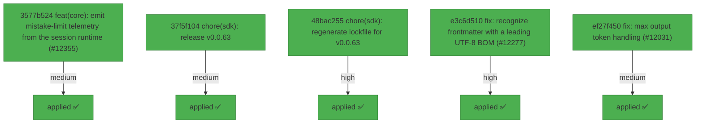

# Backport Agent — Detailed Run Report

> This file is generated automatically. It is intended for human analysts and
> AI reasoning models to assess agent performance, decision quality, and LLM behavior.

**Run timestamp**: 2026-07-17T11:22:00.252Z
**Models used**: fast=`mistral/mistral-code-agent-latest`  powerful=`cohere/command-a-reasoning-08-2025`
**Prompt log**: `/Users/rlemeill/Development/tea-ching-cline/.backport-agent/run-1784286451836.prompts.jsonl`

---

## Summary (PR body)

## Backport Agent — Sync Report

**Date**: 2026-07-17T11:22:00.252Z
**Upstream ref**: `main`
**Cut date**: `2026-06-27T00:00:00.000Z` 
**Fork ref**: `keypool-live`
**Sync branch**: `sync/upstream-main-2026-07-17-110951`

### Summary

- ✅ Applied: 5
- ⚠️ Needs human review: 0
- ⛔ Blocked (not attempted): 0

### Applied commits

- `3577b524` [medium] feat(core): emit mistake-limit telemetry from the session runtime (#12355)
- `37f5f104` [medium] chore(sdk): release v0.0.63
- `48bac255` [high] chore(sdk): regenerate lockfile for v0.0.63
- `e3c6d510` [high] fix: recognize frontmatter with a leading UTF-8 BOM (#12277)
- `ef27f450` [medium] fix: max output token handling (#12031)

### Agent decision log

- All commits applied cleanly without conflicts
- All validation suites passed
- No customization conflicts detected


---

## Agent Workflow Diagram

> Generated by the fast model from the run summary. Evaluate the agent's decision path.



---

## AI Sub-Agent Call Log (7 calls)

> Each entry is one sub-agent invocation. Review prompt/response pairs to assess
> reasoning quality, hallucinations, and decision accuracy.

### Call 1 / 7 — `analyze_commit_for_backport` ✅ OK

| Field | Value |
|---|---|
| **Timestamp** | 2026-07-17T11:09:03.026Z |
| **Tool** | `analyze_commit_for_backport` |
| **Model** | `mistral/mistral-code-agent-latest` |
| **Duration** | 3423 ms |
| **Tokens in** | 8615 |
| **Tokens out** | 186 |
| **Cost** | $0.000000 |

**Prompt sent to sub-agent:**

```
Commit SHA: 3577b5240404b01de66cb1486c7052475655b52c
Commit message:
feat(core): emit mistake-limit telemetry from the session runtime (#12355)

Changed files (8):
apps/vscode/src/sdk/SdkController.ts
apps/vscode/src/services/telemetry/TelemetryService.ts
sdk/packages/core/src/index.ts
sdk/packages/core/src/runtime/orchestration/session-runtime-orchestrator.test.ts
sdk/packages/core/src/runtime/orchestration/session-runtime-orchestrator.ts
sdk/packages/core/src/runtime/safety/mistake-tracker.ts
sdk/packages/core/src/services/telemetry/core-events.test.ts
sdk/packages/core/src/services/telemetry/core-events.ts

Diff:
commit 3577b5240404b01de66cb1486c7052475655b52c
Author: Saoud Rizwan <7799382+saoudrizwan@users.noreply.github.com>
Date:   Thu Jul 16 16:39:50 2026 -0700

    feat(core): emit mistake-limit telemetry from the session runtime (#12355)
    
    Moves the task.mistake_limit_reached capture (#12354) from the VS Code
    SdkController wrapper into @cline/core so every host (CLI, VS Code,
    hub daemon) emits it via its session telemetry service.
    
    The MistakeTracker gains an onLimitTelemetry hook fired exactly once
    per limit hit, before the limit decision is resolved — including when
    no onConsecutiveMistakeLimitReached callback is configured (the
    default-stop path, which the extension-side capture missed). The
    orchestrator wires the hook to captureMistakeLimitReached using its
    reserved telemetry field, reading sessionId/modelId/providerId at fire
    time so mid-session connection updates are reflected.
    
    The now-redundant extension wrapper and TelemetryService method are
    removed to avoid double-counting in VS Code.
---
 apps/vscode/src/sdk/SdkController.ts               | 31 +-----------
 .../src/services/telemetry/TelemetryService.ts     | 29 ------------
 sdk/packages/core/src/index.ts                     | 11 +++--
 .../session-runtime-orchestrator.test.ts           | 55 ++++++++++++++++++++++
 .../orchestration/session-runtime-orchestrator.ts  | 25 ++++++++--
 .../core/src/runtime/safety/mistake-tracker.ts     | 22 ++++++---
 .../src/services/telemetry/core-events.test.ts     | 30 ++++++++++++
 .../core/src/services/telemetry/core-events.ts     | 23 +++++++++
 8 files changed, 152 insertions(+), 74 deletions(-)

diff --git a/apps/vscode/src/sdk/SdkController.ts b/apps/vscode/src/sdk/SdkController.ts
index 63a48b2fc0..9e58a9ade2 100644
--- a/apps/vscode/src/sdk/SdkController.ts
+++ b/apps/vscode/src/sdk/SdkController.ts
@@ -15,12 +15,7 @@ import {
 	setTelemetryOptOutGlobally,
 	type UserInstructionConfigService,
 } from "@cline/core"
-import {
-	type ConsecutiveMistakeLimitContext,
-	formatDisplayUserInput,
-	type RemoteConfig,
-	type RemoteConfigBundle,
-} from "@cline/shared"
+import { formatDisplayUserInput, type RemoteConfig, type RemoteConfigBundle } from "@cline/shared"
 import type { ApiConfiguration, ModelInfo } from "@shared/api"
 import type { ChatContent } from "@shared/ChatContent"
 import { CLINE_ACCOUNT_AUTH_ERROR_MESSAGE } from "@shared/ClineAccount"
@@ -302,10 +297,7 @@ export class Controller {
 				this.mode.queueSwitchToActMode()
 			},
 			shouldStopAfterModeSwitch: () => this.mode.hasPendingModeChange(),
-			onConsecutiveMistakeLimitReached: (context) => {
-				this.captureMistakeLimitReached(context)
-				return this.interactions.handleConsecutiveMistakeLimitReached(context)
-			},
+			onConsecutiveMistakeLimitReached: (context) => this.interactions.handleConsecutiveMistakeLimitReached(context),
 		})
 		this.diffEdits = new SdkDiffEditCoordinator({
 			getCwd: () => this.getWorkspaceRoot(),
@@ -975,25 +967,6 @@ export class Controller {
 		this.providerFailureTelemetryTurnGate.beginTurn()
 	}
 
-	/**
-	 * Fires once per consecutive-mistake-limit hit, right before the
-	 * mistake_limit_reached ask is surfaced to the user.
-	 */
-	private captureMistakeLimitReached(context: ConsecutiveMistakeLimitContext): void {
-		const ulid = this.sessions.getActiveSession()?.sessionId ?? this.task?.taskId
-		if (!ulid) {
-			return
-		}
-		telemetryService.captureMistakeLimitReached({
-			ulid,
-			model: this.getSessionModelId() ?? this.getTaskModelId() ?? "unknown",
-			provider: this.getSessionProviderId() ?? "unknown",
-			reason: context.reason,
-			consecutiveMistakes: context.consecutiveMistakes,
-			maxConsecutiveMistakes: context.maxConsecutiveMistakes,
-		})
-	}
-
 	/**
 	 * Check if the active API provider uses Cline account auth for the current mode.
 	 */
diff --git a/apps/vscode/src/services/telemetry/TelemetryService.ts b/apps/vscode/src/services/telemetry/TelemetryService.ts
index 68a42d03e7..c40eee87f7 100644
--- a/apps/vscode/src/services/telemetry/TelemetryService.ts
+++ b/apps/vscode/src/services/telemetry/TelemetryService.ts
@@ -313,8 +313,6 @@ export class TelemetryService {
 			GEMINI_API_PERFORMANCE: "task.gemini_api_performance",
 			// Tracks when API providers return errors
 			PROVIDER_API_ERROR: "task.provider_api_error",
-			// Tracks when the consecutive mistake limit is reached and the user is prompted
-			MISTAKE_LIMIT_REACHED: "task.mistake_limit_reached",
 			// Tracks when users enable the focus chain feature
 			FOCUS_CHAIN_ENABLED: "task.focus_chain_enabled",
 			// Tracks when users disable the focus chain feature
@@ -1502,33 +1500,6 @@ export class TelemetryService {
 		this.recordHistogram(TelemetryService.METRICS.ERRORS.PER_TASK, errorCount, errorAttributes)
 	}
 
-	/**
-	 * Records when the consecutive mistake limit is reached and the user is shown
-	 * the mistake_limit_reached prompt
-	 * @param ulid Unique identifier for the task/session
-	 * @param model Identifier of the model used
-	 * @param provider Identifier of the API provider used
-	 * @param reason What kind of mistake tripped the limit (api_error, invalid_tool_call, tool_execution_failed)
-	 * @param consecutiveMistakes Number of consecutive mistakes recorded when the limit was hit
-	 * @param maxConsecutiveMistakes The configured mistake limit
-	 */
-	public captureMistakeLimitReached(args: {
-		ulid: string
-		model: string
-		provider: string
-		reason: string
-		consecutiveMistakes: number
-		maxConsecutiveMistakes: number
-	}) {
-		this.capture({
-			event: TelemetryService.EVENTS.TASK.MISTAKE_LIMIT_REACHED,
-			properties: {
-				...args,
-				timestamp: new Date().toISOString(),
-			},
-		})
-	}
-
 	/**
 	 * Records when focus chain is enabled/disabled by the user
 	 * @param enabled Whether focus chain was enabled (true) or disabled (false)
diff --git a/sdk/packages/core/src/index.ts b/sdk/packages/core/src/index.ts
index 37f69dbcab..7a0f530d3e 100644
--- a/sdk/packages/core/src/index.ts
+++ b/sdk/packages/core/src/index.ts
@@ -136,11 +136,6 @@ export {
 	type UserRemoteConfigOrganization,
 	type UserRemoteConfigResponse,
 } from "./account";
-export {
-	hashSecret,
-	setSdkLogger,
-	sdkDebug,
-} from "./logging/early-logger";
 export {
 	createOAuthClientCallbacks,
 	type OAuthClientCallbacksOptions,
@@ -406,6 +401,11 @@ export type {
 export * from "./hub";
 export { HubRuntimeHost } from "./hub/runtime-host/hub-runtime-host";
 export { RemoteRuntimeHost } from "./hub/runtime-host/remote-runtime-host";
+export {
+	hashSecret,
+	sdkDebug,
+	setSdkLogger,
+} from "./logging/early-logger";
 export {
 	buildRemoteConfigSessionBlobUploadMetadata,
 	createRemoteConfigSessionMessagesArtifactUploader,
@@ -651,6 +651,7 @@ export {
 	captureMentionFailed,
 	captureMentionSearchResults,
 	captureMentionUsed,
+	captureMistakeLimitReached,
 	captureModeSwitch,
 	captureProviderApiError,
 	captureProviderConfigured,
diff --git a/sdk/packages/core/src/runtime/orchestration/session-runtime-orchestrator.test.ts b/sdk/packages/core/src/runtime/orchestration/session-runtime-orchestrator.test.ts
index 943fe3215b..8ee09e6a9e 100644
--- a/sdk/packages/core/src/runtime/orchestration/session-runtime-orchestrator.test.ts
+++ b/sdk/packages/core/src/runtime/orchestration/session-runtime-orchestrator.test.ts
@@ -2189,6 +2189,61 @@ describe("SessionRuntime.run — tracker wiring (P1 #3)", () => {
 		expect(abortCalls).toHaveLength(0);
 	});
 
+	it("captures task.mistake_limit_reached telemetry exactly once when the limit is hit", async () => {
+		const capture = vi.fn();
+		const telemetry = {
+			capture,
+			captureRequired: vi.fn(),
+			setDistinctId: vi.fn(),
+			setMetadata: vi.fn(),
+			updateMetadata: vi.fn(),
+			setCommonProperties: vi.fn(),
+			updateCommonProperties: vi.fn(),
+			isEnabled: vi.fn(() => true),
+			recordCounter: vi.fn(),
+			recordHistogram: vi.fn(),
+			recordGauge: vi.fn(),
+			flush: vi.fn(async () => {}),
+			dispose: vi.fn(async () => {}),
+		};
+		const { deps } = makeScriptedRuntime({
+			events: failedToolTurnEvents(),
+		});
+		const session = new SessionRuntime(
+			makeAgentConfig({
+				execution: { maxConsecutiveMistakes: 2 },
+				sessionId: "sess_mistakes",
+				telemetry,
+			}),
+			deps,
+		);
+
+		await session.run("one");
+		// First failed turn — counter 1 < 2, no telemetry yet.
+		const limitEvents = () =>
+			capture.mock.calls
+				.map((call) => call[0])
+				.filter((event) => event.event === "task.mistake_limit_reached");
+		expect(limitEvents()).toHaveLength(0);
+
+		await session.continue("two");
+		// Second failed turn hits the limit: exactly one event, even though
+		// no `onConsecutiveMistakeLimitReached` callback is configured (the
+		// tracker falls back to the default stop decision).
+		const events = limitEvents();
+		expect(events).toHaveLength(1);
+		expect(events[0].properties).toMatchObject({
+			ulid: "sess_mistakes",
+			model: "claude-3-5-sonnet",
+			provider: "anthropic",
+			reason: "tool_execution_failed",
+			consecutiveMistakes: 2,
+			maxConsecutiveMistakes: 2,
+			isSubagent: false,
+		});
+		expect(events[0].properties.agentId).toMatch(/^agent_/);
+	});
+
 	it("aborts on hard-threshold loop detection of identical tool calls", async () => {
 		const identical = (i: number): AgentRuntimeEvent => ({
 			type: "tool-started",
diff --git a/sdk/packages/core/src/runtime/orchestration/session-runtime-orchestrator.ts b/sdk/packages/core/src/runtime/orchestration/session-runtime-orchestrator.ts
index 3ba2c5a07f..bda8d8f846 100644
--- a/sdk/packages/core/src/runtime/orchestration/session-runtime-orchestrator.ts
+++ b/sdk/packages/core/src/runtime/orchestration/session-runtime-orchestrator.ts
@@ -52,6 +52,7 @@ import {
 	createAgentModelFromConfig,
 	resolveKnownModelsFromConfig,
 } from "../../services/llms/handler-factory";
+import { captureMistakeLimitReached } from "../../services/telemetry/core-events";
 import { CLINE_INTERNAL_TELEMETRY_METADATA_KEY } from "../../services/telemetry/tool-context";
 import {
 	getMessageBuilderOptionsFromEnv,
@@ -276,10 +277,10 @@ export class SessionRuntime {
 	private readonly agentId: string;
 	private readonly parentAgentId?: string;
 	private readonly logger?: BasicLogger;
-	// Reserved for §3.4.4 telemetry parity (not yet consumed — §3.4.4
-	// listed as explicitly deferred until telemetry wiring is added).
-	// Typed as `readonly` to preserve the field slot for future use
-	// without re-touching the constructor.
+	// §3.4.4 telemetry parity. Currently consumed by the MistakeTracker's
+	// `onLimitTelemetry` hook (task.mistake_limit_reached); most other
+	// runtime telemetry is emitted host-side from the agent event stream
+	// (services/agent-events.ts).
 	readonly telemetry?: ITelemetryService;
 	private readonly conversation: ConversationStore;
 	private readonly mistakeTracker: MistakeTracker;
@@ -401,6 +402,22 @@ export class SessionRuntime {
 		this.mistakeTracker = new MistakeTracker({
 			maxConsecutiveMistakes: maxMistakes,
 			onLimitReached: config.onConsecutiveMistakeLimitReached,
+			onLimitTelemetry: (context) => {
+				// Read connection fields from `this.config` at fire time so a
+				// mid-session `updateConnection` is reflected in the event.
+				captureMistakeLimitReached(this.telemetry, {
+					ulid: this.config.sessionId ?? this.conversation.getConversationId(),
+					model: this.config.modelId,
+					provider: this.config.providerId,
+					reason: context.reason,
+					consecutiveMistakes: context.consecutiveMistakes,
+					maxConsecutiveMistakes: context.maxConsecutiveMistakes,
+					agentId: this.agentId,
+					conversationId: this.conversation.getConversationId(),
+					parentAgentId: this.parentAgentId,
+					isSubagent: Boolean(this.parentAgentId),
+				});
+			},
 			emit: (event) => this.emitLegacyEvent(event),
 			log: (level, message, metadata) =>
 				leveledLog(this.logger, level, message, metadata),
diff --git a/sdk/packages/core/src/runtime/safety/mistake-tracker.ts b/sdk/packages/core/src/runtime/safety/mistake-tracker.ts
index 46df1a53d8..edacbe5700 100644
--- a/sdk/packages/core/src/runtime/safety/mistake-tracker.ts
+++ b/sdk/packages/core/src/runtime/safety/mistake-tracker.ts
@@ -60,6 +60,12 @@ export interface MistakeTrackerOptions {
 	) =>
 		| Promise<ConsecutiveMistakeLimitDecision>
 		| ConsecutiveMistakeLimitDecision;
+	/**
+	 * Observability hook fired exactly once per limit hit, right before the
+	 * limit decision is resolved — regardless of whether `onLimitReached` is
+	 * configured or what it decides. Used for telemetry.
+	 */
+	readonly onLimitTelemetry?: (ctx: ConsecutiveMistakeLimitContext) => void;
 	readonly emit: (event: AgentEvent) => void;
 	readonly log: LeveledLog;
 	readonly agentId: string;
@@ -107,14 +113,16 @@ export class MistakeTracker {
 			return { action: "continue" };
 		}
 
+		const limitContext: ConsecutiveMistakeLimitContext = {
+			iteration: input.iteration,
+			consecutiveMistakes: next,
+			maxConsecutiveMistakes: max,
+			reason: input.reason,
+			details: input.details,
+		};
+		this.options.onLimitTelemetry?.(limitContext);
 		const decision = await resolveConsecutiveMistakeDecision(
-			{
-				iteration: input.iteration,
-				consecutiveMistakes: next,
-				maxConsecutiveMistakes: max,
-				reason: input.reason,
-				details: input.details,
-			},
+			limitContext,
 			this.options.onLimitReached,
 		);
 
diff --git a/sdk/packages/core/src/services/telemetry/core-events.test.ts b/sdk/packages/core/src/services/telemetry/core-events.test.ts
index 3186e737d2..6093cb095c 100644
--- a/sdk/packages/core/src/services/telemetry/core-events.test.ts
+++ b/sdk/packages/core/src/services/telemetry/core-events.test.ts
@@ -9,6 +9,7 @@ import {
 	captureCompactionExecuted,
 	captureCompactionSkipped,
 	captureExtensionActivated,
+	captureMistakeLimitReached,
 	captureProviderConfigured,
 	captureRunCommandsTimeout,
 	captureTelemetryOptOut,
@@ -270,6 +271,35 @@ describe("captureWorkspacePathResolved", () => {
 		).not.toThrow();
 	});
 });
+
+describe("captureMistakeLimitReached", () => {
+	const baseProps = {
+		ulid: "sess-1",
+		model: "claude-3-5-sonnet",
+		provider: "anthropic",
+		reason: "tool_execution_failed",
+		consecutiveMistakes: 3,
+		maxConsecutiveMistakes: 3,
+	};
+
+	test("emits task.mistake_limit_reached with limit context and a timestamp", () => {
+		const stub = createTelemetryStub();
+		captureMistakeLimitReached(stub.telemetry, baseProps);
+		expect(stub.capture).toHaveBeenCalledTimes(1);
+		expect(stub.captureRequired).not.toHaveBeenCalled();
+		const { event, properties } = captureCallAt(stub, 0);
+		expect(event).toBe("task.mistake_limit_reached");
+		expect(properties).toMatchObject(baseProps);
+		expect(typeof properties?.timestamp).toBe("string");
+	});
+
+	test("no-ops when telemetry is undefined", () => {
+		expect(() =>
+			captureMistakeLimitReached(undefined, baseProps),
+		).not.toThrow();
+	});
+});
+
 describe("captureCompactionExecuted", () => {
 	const baseProps = {
 		ulid: "ulid-1",
diff --git a/sdk/packages/core/src/services/telemetry/core-events.ts b/sdk/packages/core/src/services/telemetry/core-events.ts
index 0f49e07b42..86ce7a9b1b 100644
--- a/sdk/packages/core/src/services/telemetry/core-events.ts
+++ b/sdk/packages/core/src/services/telemetry/core-events.ts
@@ -63,6 +63,7 @@ export const CORE_TELEMETRY_EVENTS = {
 		SKILL_USED: "task.skill_used",
 		DIFF_EDIT_FAILED: "task.diff_edit_failed",
 		PROVIDER_API_ERROR: "task.provider_api_error",
+		MISTAKE_LIMIT_REACHED: "task.mistake_limit_reached",
 		MENTION_USED: "task.mention_used",
 		MENTION_FAILED: "task.mention_failed",
 		MENTION_SEARCH_RESULTS: "task.mention_search_results",
@@ -490,6 +491,28 @@ export function captureProviderApiError(
 	});
 }
 
+/**
+ * Records when the consecutive mistake limit is reached, right before the
+ * limit decision (host prompt / auto-stop) is resolved.
+ */
+export function captureMistakeLimitReached(
+	telemetry: ITelemetryService | undefined,
+	properties: {
+		ulid: string;
+		model: string;
+		provider?: string;
+		/** What kind of mistake tripped the limit. */
+		reason: string;
+		consecutiveMistakes: number;
+		maxConsecutiveMistakes: number;
+	} & Partial<TelemetryAgentIdentityProperties>,
+): void {
+	emit(telemetry, CORE_TELEMETRY_EVENTS.TASK.MISTAKE_LIMIT_REACHED, {
+		...properties,
+		timestamp: new Date().toISOString(),
+	});
+}
+
 export function captureRunCommandsTimeout(
 	telemetry: ITelemetryService | undefined,
 	properties: RunCommandsTimeoutTelemetryProperties,

Output the JSON object now.
```

**Response received:**

````
```json
{
  "summary": "Moves mistake-limit telemetry from VS Code SdkController to @cline/core, ensuring all hosts emit it via a new MistakeTracker hook. Removes redundant VS Code wrapper to avoid double-counting.",
  "keyChanges": [
    "Adds onLimitTelemetry hook to MistakeTracker",
    "Wires hook to captureMistakeLimitReached in SessionRuntime",
    "Removes VS Code-specific captureMistakeLimitReached",
    "Adds core-events captureMistakeLimitReached function",
    "Updates exports in core index.ts"
  ],
  "backportComplexity": "moderate",
  "semanticRiskFactors": [
    "Changes telemetry emission pattern across hosts",
    "Removes VS Code-specific telemetry method"
  ],
  "recommendation": "apply-with-care"
}
```
````

---

### Call 2 / 7 — `analyze_commit_for_backport` ✅ OK

| Field | Value |
|---|---|
| **Timestamp** | 2026-07-17T11:09:04.872Z |
| **Tool** | `analyze_commit_for_backport` |
| **Model** | `mistral/mistral-code-agent-latest` |
| **Duration** | 1804 ms |
| **Tokens in** | 4623 |
| **Tokens out** | 95 |
| **Cost** | $0.000000 |

**Prompt sent to sub-agent:**

```
Commit SHA: 37f5f104f32bd32b151d0b4ec7bfbdb4a693e8fc
Commit message:
chore(sdk): release v0.0.63

Changed files (6):
sdk/CHANGELOG.md
sdk/packages/agents/package.json
sdk/packages/core/package.json
sdk/packages/llms/package.json
sdk/packages/sdk/package.json
sdk/packages/shared/package.json

Diff:
commit 37f5f104f32bd32b151d0b4ec7bfbdb4a693e8fc
Author: Saoud Rizwan <7799382+saoudrizwan@users.noreply.github.com>
Date:   Thu Jul 16 16:47:40 2026 -0700

    chore(sdk): release v0.0.63
---
 sdk/CHANGELOG.md                 | 4 ++++
 sdk/packages/agents/package.json | 2 +-
 sdk/packages/core/package.json   | 2 +-
 sdk/packages/llms/package.json   | 2 +-
 sdk/packages/sdk/package.json    | 2 +-
 sdk/packages/shared/package.json | 2 +-
 6 files changed, 9 insertions(+), 5 deletions(-)

diff --git a/sdk/CHANGELOG.md b/sdk/CHANGELOG.md
index b9d92a6295..b085a5aa34 100644
--- a/sdk/CHANGELOG.md
+++ b/sdk/CHANGELOG.md
@@ -1,5 +1,9 @@
 # Cline SDK Changelog
 
+## 0.0.63
+
+- The session runtime now emits `task.mistake_limit_reached` telemetry when the consecutive-mistake limit is hit, so every host (CLI, VS Code extension, hub daemon) captures it — including auto-stops when no host prompt is configured
+
 ## 0.0.62
 
 - Fixed Ollama native API routing so context window and timeout settings work again
diff --git a/sdk/packages/agents/package.json b/sdk/packages/agents/package.json
index f6f1c76b31..2ce2334968 100644
--- a/sdk/packages/agents/package.json
+++ b/sdk/packages/agents/package.json
@@ -1,6 +1,6 @@
 {
 	"name": "@cline/agents",
-	"version": "0.0.62",
+	"version": "0.0.63",
 	"repository": {
 		"type": "git",
 		"url": "https://github.com/cline/cline",
diff --git a/sdk/packages/core/package.json b/sdk/packages/core/package.json
index 47a9dd88d1..6e0531ebb6 100644
--- a/sdk/packages/core/package.json
+++ b/sdk/packages/core/package.json
@@ -1,7 +1,7 @@
 {
 	"name": "@cline/core",
 	"description": "Cline Core SDK for Node Runtime",
-	"version": "0.0.62",
+	"version": "0.0.63",
 	"repository": {
 		"type": "git",
 		"url": "https://github.com/cline/cline",
diff --git a/sdk/packages/llms/package.json b/sdk/packages/llms/package.json
index 9e453c8962..5aa04a0c1f 100644
--- a/sdk/packages/llms/package.json
+++ b/sdk/packages/llms/package.json
@@ -1,6 +1,6 @@
 {
 	"name": "@cline/llms",
-	"version": "0.0.62",
+	"version": "0.0.63",
 	"description": "Config-driven SDK for selecting, extending, and instantiating LLM providers and models",
 	"repository": {
 		"type": "git",
diff --git a/sdk/packages/sdk/package.json b/sdk/packages/sdk/package.json
index b6ee2e3294..c8c17cb467 100644
--- a/sdk/packages/sdk/package.json
+++ b/sdk/packages/sdk/package.json
@@ -1,7 +1,7 @@
 {
 	"name": "@cline/sdk",
 	"description": "Cline SDK - user-facing alias for @cline/core",
-	"version": "0.0.62",
+	"version": "0.0.63",
 	"repository": {
 		"type": "git",
 		"url": "https://github.com/cline/cline",
diff --git a/sdk/packages/shared/package.json b/sdk/packages/shared/package.json
index 39f53943ac..d9bb5d5ab6 100644
--- a/sdk/packages/shared/package.json
+++ b/sdk/packages/shared/package.json
@@ -1,6 +1,6 @@
 {
 	"name": "@cline/shared",
-	"version": "0.0.62",
+	"version": "0.0.63",
 	"description": "Shared utilities, types, and schemas for Cline packages",
 	"repository": {
 		"type": "git",

Output the JSON object now.
```

**Response received:**

````
```json
{
  "summary": "Version bump to v0.0.63 with a telemetry change for mistake limits in the session runtime.",
  "keyChanges": [
    "Version bump in package.json files",
    "Added telemetry event for mistake limits in CHANGELOG"
  ],
  "backportComplexity": "trivial",
  "semanticRiskFactors": [],
  "recommendation": "apply"
}
```
````

---

### Call 3 / 7 — `analyze_commit_for_backport` ✅ OK

| Field | Value |
|---|---|
| **Timestamp** | 2026-07-17T11:09:13.375Z |
| **Tool** | `analyze_commit_for_backport` |
| **Model** | `cohere/command-a-reasoning-08-2025` |
| **Duration** | 8455 ms |
| **Tokens in** | 21566 |
| **Tokens out** | 639 |
| **Cost** | $0.000000 |

**Prompt sent to sub-agent:**

```
Commit SHA: 48bac25548057ee16b89070c9bd719070b6c378a
Commit message:
chore(sdk): regenerate lockfile for v0.0.63

Changed files (1):
bun.lock

Diff:
commit 48bac25548057ee16b89070c9bd719070b6c378a
Author: Saoud Rizwan <7799382+saoudrizwan@users.noreply.github.com>
Date:   Thu Jul 16 17:13:44 2026 -0700

    chore(sdk): regenerate lockfile for v0.0.63
---
 bun.lock | 272 ++++++++++++++++++++++++++++++++++++---------------------------
 1 file changed, 156 insertions(+), 116 deletions(-)

diff --git a/bun.lock b/bun.lock
index 6025fc103b..b61c3d013f 100644
--- a/bun.lock
+++ b/bun.lock
@@ -19,7 +19,7 @@
     },
     "apps/cli": {
       "name": "@cline/cli",
-      "version": "3.0.41",
+      "version": "3.0.42",
       "bin": {
         "cline": "src/index.ts",
       },
@@ -632,7 +632,7 @@
     },
     "sdk/packages/agents": {
       "name": "@cline/agents",
-      "version": "0.0.62",
+      "version": "0.0.63",
       "dependencies": {
         "@cline/llms": "workspace:*",
         "@cline/shared": "workspace:*",
@@ -641,7 +641,7 @@
     },
     "sdk/packages/core": {
       "name": "@cline/core",
-      "version": "0.0.62",
+      "version": "0.0.63",
       "dependencies": {
         "@cline/agents": "workspace:*",
         "@cline/llms": "workspace:*",
@@ -679,7 +679,7 @@
     },
     "sdk/packages/llms": {
       "name": "@cline/llms",
-      "version": "0.0.62",
+      "version": "0.0.63",
       "dependencies": {
         "@ai-sdk/amazon-bedrock": "^4.0.89",
         "@ai-sdk/anthropic": "^3.0.68",
@@ -714,14 +714,14 @@
     },
     "sdk/packages/sdk": {
       "name": "@cline/sdk",
-      "version": "0.0.62",
+      "version": "0.0.63",
       "dependencies": {
         "@cline/core": "workspace:*",
       },
     },
     "sdk/packages/shared": {
       "name": "@cline/shared",
-      "version": "0.0.62",
+      "version": "0.0.63",
       "dependencies": {
         "aws4fetch": "^1.0.20",
         "jsonrepair": "^3.13.2",
@@ -768,27 +768,27 @@
 
     "@agentclientprotocol/sdk": ["@agentclientprotocol/sdk@0.16.1", "", { "peerDependencies": { "zod": "^3.25.0 || ^4.0.0" } }, "sha512-1ad+Sc/0sCtZGHthxxvgEUo5Wsbw16I+aF+YwdiLnPwkZG8KAGUEAPK6LM6Pf69lCyJPt1Aomk1d+8oE3C4ZEw=="],
 
-    "@ai-sdk/amazon-bedrock": ["@ai-sdk/amazon-bedrock@4.0.131", "", { "dependencies": { "@ai-sdk/anthropic": "3.0.95", "@ai-sdk/openai": "3.0.82", "@ai-sdk/provider": "3.0.13", "@ai-sdk/provider-utils": "4.0.37", "@smithy/eventstream-codec": "^4.0.1", "@smithy/util-utf8": "^4.0.0", "aws4fetch": "^1.0.20" }, "peerDependencies": { "zod": "^3.25.76 || ^4.1.8" } }, "sha512-UrbM28zGFJV6xTn7wpv/uCsp/wMKb79MCuZC3Ff1a59PGjLr+iMN+Nlul7cWV04pjE5u5kLP5SybtGZtDP2EkQ=="],
+    "@ai-sdk/amazon-bedrock": ["@ai-sdk/amazon-bedrock@4.0.132", "", { "dependencies": { "@ai-sdk/anthropic": "3.0.96", "@ai-sdk/openai": "3.0.83", "@ai-sdk/provider": "3.0.14", "@ai-sdk/provider-utils": "4.0.38", "@smithy/eventstream-codec": "^4.0.1", "@smithy/util-utf8": "^4.0.0", "aws4fetch": "^1.0.20" }, "peerDependencies": { "zod": "^3.25.76 || ^4.1.8" } }, "sha512-ngtWAA4BHhtRrC0Vx1by9+KwcYtXbKcKjEoKbKhqJxNes8w6JNtdp5nQfK3ZE9Wbcdq8i6a8s08xXFm3pHe3iA=="],
 
-    "@ai-sdk/anthropic": ["@ai-sdk/anthropic@3.0.95", "", { "dependencies": { "@ai-sdk/provider": "3.0.13", "@ai-sdk/provider-utils": "4.0.37" }, "peerDependencies": { "zod": "^3.25.76 || ^4.1.8" } }, "sha512-Q7NhioTX6m0hKni14Ip9EO6WedbIYcldQ/PsGB7gVAveRNog39FfX31f+9HYoEUrfm9L7QxIcB5aAzJV/hmNRg=="],
+    "@ai-sdk/anthropic": ["@ai-sdk/anthropic@3.0.96", "", { "dependencies": { "@ai-sdk/provider": "3.0.14", "@ai-sdk/provider-utils": "4.0.38" }, "peerDependencies": { "zod": "^3.25.76 || ^4.1.8" } }, "sha512-6VQzaXQdm5FkX6NWOyKzV5GB11C8IqkgsKZE91lg/bdwyvnQJLDwal2qkE0+fC8CCGeW5d+VV8Mw/+H+OcDC1A=="],
 
-    "@ai-sdk/gateway": ["@ai-sdk/gateway@3.0.145", "", { "dependencies": { "@ai-sdk/provider": "3.0.13", "@ai-sdk/provider-utils": "4.0.37", "@vercel/oidc": "3.2.0" }, "peerDependencies": { "zod": "^3.25.76 || ^4.1.8" } }, "sha512-cqSQ+I0Bjj2W9g1oFyE1O1mSowsWXb+U1wK9vtg5kRQqB95iWVIKbtdr14gGf46cueJSiBlKfPTT24gDDVuFmw=="],
+    "@ai-sdk/gateway": ["@ai-sdk/gateway@3.0.146", "", { "dependencies": { "@ai-sdk/provider": "3.0.14", "@ai-sdk/provider-utils": "4.0.38", "@vercel/oidc": "3.2.0" }, "peerDependencies": { "zod": "^3.25.76 || ^4.1.8" } }, "sha512-QK922LzOfGeHdZ9QGvghDizQx/tPOolTQSHvMlnUPeaTW5qpiIqpfbLwYiyxEt5YOGLLM/0t232Dut+95udo/Q=="],
 
-    "@ai-sdk/google": ["@ai-sdk/google@3.0.90", "", { "dependencies": { "@ai-sdk/provider": "3.0.13", "@ai-sdk/provider-utils": "4.0.37" }, "peerDependencies": { "zod": "^3.25.76 || ^4.1.8" } }, "sha512-nn2bSLFZDV5Xhl2oh+C3ckpBUM849zrHLoLe6B9DVu2DcgtIvxKYO0pKLO/vB9XQVKON5XORp7uV7P+60L5XUQ=="],
+    "@ai-sdk/google": ["@ai-sdk/google@3.0.91", "", { "dependencies": { "@ai-sdk/provider": "3.0.14", "@ai-sdk/provider-utils": "4.0.38" }, "peerDependencies": { "zod": "^3.25.76 || ^4.1.8" } }, "sha512-d/ho+sDjArFjreE2002t9jE4LXX3wde97dN2HCLCX1l41gaJV3wf/c/19axjUNfIf/4uUq+nJmhBO0lW/dg3yw=="],
 
-    "@ai-sdk/google-vertex": ["@ai-sdk/google-vertex@4.0.158", "", { "dependencies": { "@ai-sdk/anthropic": "3.0.95", "@ai-sdk/google": "3.0.90", "@ai-sdk/openai-compatible": "2.0.58", "@ai-sdk/provider": "3.0.13", "@ai-sdk/provider-utils": "4.0.37", "google-auth-library": "^10.5.0" }, "peerDependencies": { "zod": "^3.25.76 || ^4.1.8" } }, "sha512-Z7KPZ2+M7DFnXPEDgElwazDQxDxYqd9HQdFLuCMSpc0No/1Dr0TKRT+Q5pJwstHJfIQeAMApFvalzGOfTe/ShQ=="],
+    "@ai-sdk/google-vertex": ["@ai-sdk/google-vertex@4.0.159", "", { "dependencies": { "@ai-sdk/anthropic": "3.0.96", "@ai-sdk/google": "3.0.91", "@ai-sdk/openai-compatible": "2.0.59", "@ai-sdk/provider": "3.0.14", "@ai-sdk/provider-utils": "4.0.38", "google-auth-library": "^10.5.0" }, "peerDependencies": { "zod": "^3.25.76 || ^4.1.8" } }, "sha512-AvHvV3Nw+LaLjTBveP96hBbKFXHoQBMeQa1fd9SV1UnXCvmCfl7cQempb+pZnho12rbTFHwgdX419nFTMNmATw=="],
 
-    "@ai-sdk/mistral": ["@ai-sdk/mistral@3.0.47", "", { "dependencies": { "@ai-sdk/provider": "3.0.13", "@ai-sdk/provider-utils": "4.0.37" }, "peerDependencies": { "zod": "^3.25.76 || ^4.1.8" } }, "sha512-A/ov/CTrQ0rDztrvgYo9ql4u6tlyfTrwMN4u76zqLM0JqUWy82T82Y8HzP4fCQOs7gZggrruHaNbWnqnE9IwKA=="],
+    "@ai-sdk/mistral": ["@ai-sdk/mistral@3.0.48", "", { "dependencies": { "@ai-sdk/provider": "3.0.14", "@ai-sdk/provider-utils": "4.0.38" }, "peerDependencies": { "zod": "^3.25.76 || ^4.1.8" } }, "sha512-SOZMjV48dyAn1rsiZSN7emeO0KYKnr9/SqMFPpJYUddPcnLSjac9GGWVKn+LnSzD7Woh3lYbYbJWdbJOQ2U2sQ=="],
 
-    "@ai-sdk/openai": ["@ai-sdk/openai@3.0.82", "", { "dependencies": { "@ai-sdk/provider": "3.0.13", "@ai-sdk/provider-utils": "4.0.37" }, "peerDependencies": { "zod": "^3.25.76 || ^4.1.8" } }, "sha512-Gn1YliuNMneXoBmuLX1kH/e5SR/VnU9FXLvJ8WyiV61Noo+wPdE4nuzxRGt3lfV6rla1wyCb1syV4jU0A310ew=="],
+    "@ai-sdk/openai": ["@ai-sdk/openai@3.0.83", "", { "dependencies": { "@ai-sdk/provider": "3.0.14", "@ai-sdk/provider-utils": "4.0.38" }, "peerDependencies": { "zod": "^3.25.76 || ^4.1.8" } }, "sha512-gYsQPmBQYgWc8+sFdmO4lSbNJoBdt9wgx1wZ1YOi0wX8X0d/K3FYOnNS0/TGymiDk8kh+wKj6PLC6UyA8bwVFA=="],
 
-    "@ai-sdk/openai-compatible": ["@ai-sdk/openai-compatible@2.0.58", "", { "dependencies": { "@ai-sdk/provider": "3.0.13", "@ai-sdk/provider-utils": "4.0.37" }, "peerDependencies": { "zod": "^3.25.76 || ^4.1.8" } }, "sha512-0SXA0xVt18F4ki7ttVshqaM0oLXSB475ACOU0/2RK3OZS3UYqrmKF+DJwYBYUZmqCq2nZ2vkNZEXpWP2wfGsrQ=="],
+    "@ai-sdk/openai-compatible": ["@ai-sdk/openai-compatible@2.0.59", "", { "dependencies": { "@ai-sdk/provider": "3.0.14", "@ai-sdk/provider-utils": "4.0.38" }, "peerDependencies": { "zod": "^3.25.76 || ^4.1.8" } }, "sha512-CFsUizO+jL+jSlN13rW2nQE9EbWx+8PSFBdB3TtD0UGYOxtefCVa5hsrNo5NUOJJGX5f4xHiXE1i2m5nQ80QPg=="],
 
-    "@ai-sdk/provider": ["@ai-sdk/provider@3.0.13", "", { "dependencies": { "json-schema": "^0.4.0" } }, "sha512-ZPtVYt5QIJzOta1kdUiDuCx4HhFkvNPv/rvmZ2b1iXwybYjJsCnNYR4PAw4kW7rgVfDARvHXcU64efWuqNp6bw=="],
+    "@ai-sdk/provider": ["@ai-sdk/provider@3.0.14", "", { "dependencies": { "json-schema": "^0.4.0" } }, "sha512-5X1k57JBJ4H7H1QjX7CnJYAB1I19r/trVZTMcSms7/kLNZ8RaU4Nt2agcwZzv82Hfx6Q7/TOLU7agAKeFfc8cA=="],
 
-    "@ai-sdk/provider-utils": ["@ai-sdk/provider-utils@4.0.37", "", { "dependencies": { "@ai-sdk/provider": "3.0.13", "@standard-schema/spec": "^1.1.0", "eventsource-parser": "^3.0.8" }, "peerDependencies": { "zod": "^3.25.76 || ^4.1.8" } }, "sha512-VG4tpVXCuzm21U9xjg05BCMZnjZOazC72+MxBkLAa7hCKsnqNt542GYWUUqwmHSczJwgbSXN8UvaNgSerUaKdw=="],
+    "@ai-sdk/provider-utils": ["@ai-sdk/provider-utils@4.0.38", "", { "dependencies": { "@ai-sdk/provider": "3.0.14", "@standard-schema/spec": "^1.1.0", "eventsource-parser": "^3.0.8" }, "peerDependencies": { "zod": "^3.25.76 || ^4.1.8" } }, "sha512-/HHGmtKllqjg1OLc023v9w9kK3laW7Z6TzfZukYQWCsGBbzB9p60zTvvpXFVcs44NZBVXL3viOa1HRKUbeee8g=="],
 
-    "@ai-sdk/react": ["@ai-sdk/react@3.0.223", "", { "dependencies": { "@ai-sdk/provider-utils": "4.0.37", "ai": "6.0.221", "swr": "^2.2.5", "throttleit": "2.1.0" }, "peerDependencies": { "react": "^18 || ~19.0.1 || ~19.1.2 || ^19.2.1" } }, "sha512-b7Ri+wLOR9pZkKlEKii3ZuXi79Rh3rC5rYUEFDpXUOJLazztIE4MPM4dQRXCojYgOuPa61gVO2BFjuRVLGsOfw=="],
+    "@ai-sdk/react": ["@ai-sdk/react@3.0.224", "", { "dependencies": { "@ai-sdk/provider-utils": "4.0.38", "ai": "6.0.222", "swr": "^2.2.5", "throttleit": "2.1.0" }, "peerDependencies": { "react": "^18 || ~19.0.1 || ~19.1.2 || ^19.2.1" } }, "sha512-bfCVv6uTNS+gwMLLpsJQUBZqedCphqNiFkMVjL4kzunlgpC0uFyyYRYd99884NuYZJAF9AKKROK9t+/v1N9tow=="],
 
     "@alloc/quick-lru": ["@alloc/quick-lru@5.2.0", "", {}, "sha512-UrcABB+4bUrFABwbluTIBErXwvbsU/V7TZWfmbgJfbkwiBuziS9gxdODUyuiecfdGQ85jglMW6juS3+z5TsKLw=="],
 
@@ -796,23 +796,23 @@
 
     "@antfu/install-pkg": ["@antfu/install-pkg@1.1.0", "", { "dependencies": { "package-manager-detector": "^1.3.0", "tinyexec": "^1.0.1" } }, "sha512-MGQsmw10ZyI+EJo45CdSER4zEb+p31LpDAFp2Z3gkSd1yqVZGi0Ebx++YTEMonJy4oChEMLsxZ64j8FH6sSqtQ=="],
 
-    "@anthropic-ai/claude-agent-sdk": ["@anthropic-ai/claude-agent-sdk@0.3.205", "", { "optionalDependencies": { "@anthropic-ai/claude-agent-sdk-darwin-arm64": "0.3.205", "@anthropic-ai/claude-agent-sdk-darwin-x64": "0.3.205", "@anthropic-ai/claude-agent-sdk-linux-arm64": "0.3.205", "@anthropic-ai/claude-agent-sdk-linux-arm64-musl": "0.3.205", "@anthropic-ai/claude-agent-sdk-linux-x64": "0.3.205", "@anthropic-ai/claude-agent-sdk-linux-x64-musl": "0.3.205", "@anthropic-ai/claude-agent-sdk-win32-arm64": "0.3.205", "@anthropic-ai/claude-agent-sdk-win32-x64": "0.3.205" }, "peerDependencies": { "@anthropic-ai/sdk": ">=0.93.0", "@modelcontextprotocol/sdk": "^1.29.0", "zod": "^4.0.0" } }, "sha512-ft6iBw9kXudsusiXNpeybIPBJ07Z3tqp1ROSg5cEJqgA+9i+JJj2sRfQth+QD+lyenbbAU8yPieLxIimvfBhtw=="],
+    "@anthropic-ai/claude-agent-sdk": ["@anthropic-ai/claude-agent-sdk@0.3.206", "", { "optionalDependencies": { "@anthropic-ai/claude-agent-sdk-darwin-arm64": "0.3.206", "@anthropic-ai/claude-agent-sdk-darwin-x64": "0.3.206", "@anthropic-ai/claude-agent-sdk-linux-arm64": "0.3.206", "@anthropic-ai/claude-agent-sdk-linux-arm64-musl": "0.3.206", "@anthropic-ai/claude-agent-sdk-linux-x64": "0.3.206", "@anthropic-ai/claude-agent-sdk-linux-x64-musl": "0.3.206", "@anthropic-ai/claude-agent-sdk-win32-arm64": "0.3.206", "@anthropic-ai/claude-agent-sdk-win32-x64": "0.3.206" }, "peerDependencies": { "@anthropic-ai/sdk": ">=0.93.0", "@modelcontextprotocol/sdk": "^1.29.0", "zod": "^4.0.0" } }, "sha512-KljDh9Pg4YCYpoXS8dnWoVSsOHtU4yLCW268K2iOruSxFXE8/Tay6DPvmJzYuqjP5YLNYfj05ZGykwZSUn6GXA=="],
 
-    "@anthropic-ai/claude-agent-sdk-darwin-arm64": ["@anthropic-ai/claude-agent-sdk-darwin-arm64@0.3.205", "", { "os": "darwin", "cpu": "arm64" }, "sha512-lrfJ4eVtzfPkCpbSkBOGSMQCBbvmW6nbPzgHE4IwMN3scZlpuFMUFqh2aaJa/X2SAcWD9H2S0t2WWvSRgM7BjA=="],
+    "@anthropic-ai/claude-agent-sdk-darwin-arm64": ["@anthropic-ai/claude-agent-sdk-darwin-arm64@0.3.206", "", { "os": "darwin", "cpu": "arm64" }, "sha512-FL2+NKcMMN47vcnCW2Fkt3AOgeRRlQxrisbPNaxrxqPJFzhUKs17x5j0XzLefd0xRbDAr74hd0PK/tnp6PHM6w=="],
 
-    "@anthropic-ai/claude-agent-sdk-darwin-x64": ["@anthropic-ai/claude-agent-sdk-darwin-x64@0.3.205", "", { "os": "darwin", "cpu": "x64" }, "sha512-G6ETPmL5mNzJ2DFsWxG3jmsmrXgZX1N2ZCJvxaGUUpjTsKZJ4Tup1cWYvcd/m7o5fYZmx9REmgzTwsAIc1fdPQ=="],
+    "@anthropic-ai/claude-agent-sdk-darwin-x64": ["@anthropic-ai/claude-agent-sdk-darwin-x64@0.3.206", "", { "os": "darwin", "cpu": "x64" }, "sha512-mRW8PPMfQN15EunLwpdmcVzk3XuM4DXQUM8DOzaeA1Hr1yxYPaVVBLr9hkdBKOqr8XTl3ueoTR6RZAy6a/n7OA=="],
 
-    "@anthropic-ai/claude-agent-sdk-linux-arm64": ["@anthropic-ai/claude-agent-sdk-linux-arm64@0.3.205", "", { "os": "linux", "cpu": "arm64" }, "sha512-CXzySK3PV3EizCRPXnxPqeaAtgrBFDnMFOVpMe36oC3U16yDb1b1tAJGqZi/7uFrVvAiaXvnSFxhUWnDDSaO+A=="],
+    "@anthropic-ai/claude-agent-sdk-linux-arm64": ["@anthropic-ai/claude-agent-sdk-linux-arm64@0.3.206", "", { "os": "linux", "cpu": "arm64" }, "sha512-Id6H8l6EsGb7849EAZDOB4Ic+FQpbzt4D5HGOwp59CTW3o/1c4etjQA/Kl1K+DSEWn3FGo6D5UMVgc/rwhBj8g=="],
 
-    "@anthropic-ai/claude-agent-sdk-linux-arm64-musl": ["@anthropic-ai/claude-agent-sdk-linux-arm64-musl@0.3.205", "", { "os": "linux", "cpu": "arm64" }, "sha512-91fgdG4aTnQ29sKOcUqgH4+tKCW2ut6PWGRSYmXNDbROasJm1rAlPdzC5brdu/e4c0CDSNV6TWyE5JCjaS/jlQ=="],
+    "@anthropic-ai/claude-agent-sdk-linux-arm64-musl": ["@anthropic-ai/claude-agent-sdk-linux-arm64-musl@0.3.206", "", { "os": "linux", "cpu": "arm64" }, "sha512-aMZe1Kl+kYv5QlA15W9Ae25MAzBsA9FA40f5TOtJebA+M/xliF0r2LLb2NdyBviiZCDllcE31l0zgYE0rQqFQw=="],
 
-    "@anthropic-ai/claude-agent-sdk-linux-x64": ["@anthropic-ai/claude-agent-sdk-linux-x64@0.3.205", "", { "os": "linux", "cpu": "x64" }, "sha512-siS+1iNqBSlGFZZvJY6+mhzZ/6/ec/TbX9GMuwmTF0E6fxGhIIp797jJxR1q8r6FAq7d39mEoRNhC0Ffo60uNQ=="],
+    "@anthropic-ai/claude-agent-sdk-linux-x64": ["@anthropic-ai/claude-agent-sdk-linux-x64@0.3.206", "", { "os": "linux", "cpu": "x64" }, "sha512-egZhOC1RlEVhZyq6Oa1b04AF7hh4hO+8oCsJCZ3gOifJQuHih1oW3lZ8fOUxU85jlT2ytAnt5kRp4uQr6PJgbg=="],
 
-    "@anthropic-ai/claude-agent-sdk-linux-x64-musl": ["@anthropic-ai/claude-agent-sdk-linux-x64-musl@0.3.205", "", { "os": "linux", "cpu": "x64" }, "sha512-vvsb7GlnA8CTSVvvTkrXjcSeRKqxSM7p/tU3Od9ICAZeWHglptekEyzLEApzLuLbI5ewfFF/F0q3NwOBbo18dg=="],
+    "@anthropic-ai/claude-agent-sdk-linux-x64-musl": ["@anthropic-ai/claude-agent-sdk-linux-x64-musl@0.3.206", "", { "os": "linux", "cpu": "x64" }, "sha512-xQBOBhlcmTNc7YeYT5qLZOikpSq3WHlsJ/t6i7kJqUWrcXlOPaAoSMdKp5xO/V0CjAdzdJoWB88I55UAh8mclQ=="],
 
-    "@anthropic-ai/claude-agent-sdk-win32-arm64": ["@anthropic-ai/claude-agent-sdk-win32-arm64@0.3.205", "", { "os": "win32", "cpu": "arm64" }, "sha512-SpP5zF68weFez/6pKrGzq/UVAJDMDNphWqmkLfOpWTDBL5xy6XlIZw5Bl4EXoVnfi2VLFkwuffNeFe+9SdX7kw=="],
+    "@anthropic-ai/claude-agent-sdk-win32-arm64": ["@anthropic-ai/claude-agent-sdk-win32-arm64@0.3.206", "", { "os": "win32", "cpu": "arm64" }, "sha512-oRQk23bFXSz4QRhOxqnnvlLWq/KiF2PtSBYXrMg1AQrCOHJd2k66aOAS7AJ4ZSzejiyV4N6sS6UThfmF6ipHBQ=="],
 
-    "@anthropic-ai/claude-agent-sdk-win32-x64": ["@anthropic-ai/claude-agent-sdk-win32-x64@0.3.205", "", { "os": "win32", "cpu": "x64" }, "sha512-kg2kkXyeSoFLruO3Ic2IruLxzBR0xCUtmlJHdWi3SYW7JhAKNJg4fcrdJsWcardmEw23Y2UDGDJbRyxqSVx6wg=="],
+    "@anthropic-ai/claude-agent-sdk-win32-x64": ["@anthropic-ai/claude-agent-sdk-win32-x64@0.3.206", "", { "os": "win32", "cpu": "x64" }, "sha512-BdjKmDojZjc5RjN+8Q6K7Yqf1WYhel6I3DkMXc9zdxS/xIuN42sx7zgQpdMGY73pm7ROPLqo3LieOeMhVH161w=="],
 
     "@anthropic-ai/sdk": ["@anthropic-ai/sdk@0.37.0", "", { "dependencies": { "@types/node": "^18.11.18", "@types/node-fetch": "^2.6.4", "abort-controller": "^3.0.0", "agentkeepalive": "^4.2.1", "form-data-encoder": "1.7.2", "formdata-node": "^4.3.2", "node-fetch": "^2.6.7" } }, "sha512-tHjX2YbkUBwEgg0JZU3EFSSAQPoK4qQR/NFYa8Vtzd5UAyXzZksCw2In69Rml4R/TyHPBfRYaLK35XiOe33pjw=="],
 
@@ -838,7 +838,7 @@
 
     "@aws-sdk/credential-provider-web-identity": ["@aws-sdk/credential-provider-web-identity@3.972.63", "", { "dependencies": { "@aws-sdk/core": "^3.975.1", "@aws-sdk/nested-clients": "^3.997.31", "@aws-sdk/types": "^3.974.0", "@smithy/core": "^3.29.2", "@smithy/types": "^4.16.0", "tslib": "^2.6.2" } }, "sha512-8qZLFhM69eKcS37m459ctPR05Qimycm/74OPVioe6wNZabMT54GYhwBju0+J656RkMasNSawWQu+c8CmBe3TUQ=="],
 
-    "@aws-sdk/credential-providers": ["@aws-sdk/credential-providers@3.1083.0", "", { "dependencies": { "@aws-sdk/core": "^3.975.1", "@aws-sdk/credential-provider-cognito-identity": "^3.972.56", "@aws-sdk/credential-provider-env": "^3.972.57", "@aws-sdk/credential-provider-http": "^3.972.59", "@aws-sdk/credential-provider-ini": "^3.973.1", "@aws-sdk/credential-provider-login": "^3.972.63", "@aws-sdk/credential-provider-node": "^3.972.66", "@aws-sdk/credential-provider-process": "^3.972.57", "@aws-sdk/credential-provider-sso": "^3.973.1", "@aws-sdk/credential-provider-web-identity": "^3.972.63", "@aws-sdk/nested-clients": "^3.997.31", "@aws-sdk/types": "^3.974.0", "@smithy/core": "^3.29.2", "@smithy/credential-provider-imds": "^4.4.7", "@smithy/types": "^4.16.0", "tslib": "^2.6.2" } }, "sha512-i2q3Jgt365lZp7BSDqDSf283WvISrXob1zsql093LK3G2svYRHRvcNv995SsKtAzRENwHem2TC2vWeghrgBkxg=="],
+    "@aws-sdk/credential-providers": ["@aws-sdk/credential-providers@3.1084.0", "", { "dependencies": { "@aws-sdk/core": "^3.975.1", "@aws-sdk/credential-provider-cognito-identity": "^3.972.56", "@aws-sdk/credential-provider-env": "^3.972.57", "@aws-sdk/credential-provider-http": "^3.972.59", "@aws-sdk/credential-provider-ini": "^3.973.1", "@aws-sdk/credential-provider-login": "^3.972.63", "@aws-sdk/credential-provider-node": "^3.972.66", "@aws-sdk/credential-provider-process": "^3.972.57", "@aws-sdk/credential-provider-sso": "^3.973.1", "@aws-sdk/credential-provider-web-identity": "^3.972.63", "@aws-sdk/nested-clients": "^3.997.31", "@aws-sdk/types": "^3.974.0", "@smithy/core": "^3.29.2", "@smithy/credential-provider-imds": "^4.4.7", "@smithy/types": "^4.16.0", "tslib": "^2.6.2" } }, "sha512-6MT9xigrduBftpOEq2HKzGqp2Up0Jwe8dK5W3GyBpePywzgMK6029XEYXkCC5wRYwXwhSPzpjnjRlWUA7K/KNQ=="],
 
     "@aws-sdk/nested-clients": ["@aws-sdk/nested-clients@3.997.31", "", { "dependencies": { "@aws-sdk/core": "^3.975.1", "@aws-sdk/signature-v4-multi-region": "^3.996.39", "@aws-sdk/types": "^3.974.0", "@smithy/core": "^3.29.2", "@smithy/fetch-http-handler": "^5.6.4", "@smithy/node-http-handler": "^4.9.4", "@smithy/types": "^4.16.0", "tslib": "^2.6.2" } }, "sha512-BDHTpwcsZHEBNEJzOg/B1BkFYJxAXY50dau/NyVWs3d51F0WgIUGSWZot/Os+N3KpDhXeaXnz37mWffAvduREw=="],
 
@@ -1680,7 +1680,7 @@
 
     "@openai/codex-win32-x64": ["@openai/codex@0.130.0-win32-x64", "", { "os": "win32", "cpu": "x64" }, "sha512-FzMznm7fr5/nbjZgOujZ9Y9AbdGm7ji1FOoWiY3U+srqauvZaTgn6o6aCheSL7kuymu7nTLOO/cAyWV6NuesqQ=="],
 
-    "@opencode-ai/sdk": ["@opencode-ai/sdk@1.17.15", "", { "dependencies": { "cross-spawn": "7.0.6" } }, "sha512-gWRQOEggHTELJ9+BtelxnuAczk9qutCXVZenPgRPaT8oVxePf52jfWbqfhyFjnrN8Vlp8tCCTdkEpFW5pZAuEA=="],
+    "@opencode-ai/sdk": ["@opencode-ai/sdk@1.17.18", "", { "dependencies": { "cross-spawn": "7.0.6" } }, "sha512-c/C9PhY8PrbcxDY+JIYtOZsrmMD0KzoVvxq+RGUrZ6LQp57SuVBbT4lfwA2G8Se5RNC1N5JtYjiuaXeECnF2SQ=="],
 
     "@opentelemetry/api": ["@opentelemetry/api@1.9.1", "", {}, "sha512-gLyJlPHPZYdAk1JENA9LeHejZe1Ti77/pTeFm/nMXmQH/HFZlcS/O2XJB+L8fkbrNSqhdtlvjBVjxwUYanNH5Q=="],
 
@@ -1740,7 +1740,7 @@
 
     "@opentelemetry/sdk-trace-node": ["@opentelemetry/sdk-trace-node@2.9.0", "", { "dependencies": { "@opentelemetry/context-async-hooks": "2.9.0", "@opentelemetry/core": "2.9.0", "@opentelemetry/sdk-trace-base": "2.9.0" }, "peerDependencies": { "@opentelemetry/api": ">=1.0.0 <1.10.0" } }, "sha512-ec9a7ps37huy5itYk0MalaZdSLlM6AXWp/FhtEjgMpp5leEGojBDvAl/UWttQnkMZOvFHKzRESn8TD3yKTF5nQ=="],
 
-    "@opentelemetry/semantic-conventions": ["@opentelemetry/semantic-conventions@1.42.0", "", {}, "sha512-icc5xCzndZfhuJMy5oqk5AvloWquR7jtae74qzpkKkhGp8BivK+oCcEXgGnjCdTfp8hA44l+w8gE8yYJbocJJw=="],
+    "@opentelemetry/semantic-conventions": ["@opentelemetry/semantic-conventions@1.43.0", "", {}, "sha512-eSYWTm620tTk45EKSedaUL8MFYI8hW164hIXsgIHyxu3VobUB3fFCu5t0hQby6OoWRPsG1KkKUG2M5UadiLiVg=="],
 
     "@opentui-ui/dialog": ["@opentui-ui/dialog@0.1.2", "", { "peerDependencies": { "@opentui/core": "^0.1.69", "@opentui/react": "^0.1.69", "@opentui/solid": "^0.1.69" }, "optionalPeers": ["@opentui/react", "@opentui/solid"] }, "sha512-EZ4FG5u5sxU75+6pcsJsLzsD5JqO05So/1ceZUKUu7nxZ9IF7gcZEi+MU4HnYC9cb2Q7w6hM9y3/iW+jE1C53w=="],
 
@@ -1772,7 +1772,7 @@
 
     "@playwright/test": ["@playwright/test@1.61.1", "", { "dependencies": { "playwright": "1.61.1" }, "bin": { "playwright": "cli.js" } }, "sha512-8nKv6+0RJSL9FE4jYOEGXnPeM/Hg12qZpmqzZjRh3qM0Y7c3z1mrOTfFLids72RDQYVh9WpLEfR5WdpNX4fkig=="],
 
-    "@posthog/core": ["@posthog/core@1.40.0", "", { "dependencies": { "@posthog/types": "^1.393.0" } }, "sha512-oGDbIwlTquNwdHbEL5ZLEkuW4UFkkEanfx3QAxDgyVbISv+OAA6YGQwrvo0JD3MUJEbJZvyh8XsX+WYDGw9XHw=="],
+    "@posthog/core": ["@posthog/core@1.40.1", "", { "dependencies": { "@posthog/types": "^1.393.0" } }, "sha512-jXuMtZCwA7AMpYlo1wjm6GlC58YBlz/ZxpDIsF9hroUfqYoPPDmQbsQb4iiZAS43+o/kwloxdKJIlE0IiwQ5HQ=="],
 
     "@posthog/types": ["@posthog/types@1.393.0", "", {}, "sha512-vzWeEJZ7ERQhFRoQYaP5jzN1JvIu46UJyHXsuv+dTGW2r3sMgREOhNxXLZjmFHwZ8/FOHQoyqqQmXTCXZSfMSg=="],
 
@@ -1796,7 +1796,7 @@
 
     "@protobufjs/utf8": ["@protobufjs/utf8@1.1.2", "", {}, "sha512-b1UQwcEZ4yCnMCD8DAL1VlbvBJE9/IX4FTIp7BG1xYpf29SLazLSrqUkj4w7Y5y7cCVP6E5tcqqcI0xemPkHug=="],
 
-    "@puppeteer/browsers": ["@puppeteer/browsers@2.6.1", "", { "dependencies": { "debug": "^4.4.0", "extract-zip": "^2.0.1", "progress": "^2.0.3", "proxy-agent": "^6.5.0", "semver": "^7.6.3", "tar-fs": "^3.0.6", "unbzip2-stream": "^1.4.3", "yargs": "^17.7.2" }, "bin": { "browsers": "lib/cjs/main-cli.js" } }, "sha512-aBSREisdsGH890S2rQqK82qmQYU3uFpSH8wcZWHgHzl3LfzsxAKbLNiAG9mO8v1Y0UICBeClICxPJvyr0rcuxg=="],
+    "@puppeteer/browsers": ["@puppeteer/browsers@2.13.2", "", { "dependencies": { "debug": "^4.4.3", "extract-zip": "^2.0.1", "progress": "^2.0.3", "proxy-agent": "^6.5.0", "semver": "^7.7.4", "tar-fs": "^3.1.1", "yargs": "^17.7.2" }, "bin": { "browsers": "lib/cjs/main-cli.js" } }, "sha512-5EUZSUIc37H6aIXyWO0Z4y8NlF8NnjgmqeQgOGiswAU7pY0HOo16ho4+alIWmSfdZnjqBRawMsP3I5YqLSn6kw=="],
 
     "@radix-ui/number": ["@radix-ui/number@1.1.1", "", {}, "sha512-MkKCwxlXTgz6CFoJx3pCwn07GKp36+aZyu/u2Ln2VrA5DcdyCZkASEDBTd8x5whTQQL5CiYf4prXKLcgQdv29g=="],
 
@@ -1820,7 +1820,7 @@
 
     "@radix-ui/react-collection": ["@radix-ui/react-collection@1.1.7", "", { "dependencies": { "@radix-ui/react-compose-refs": "1.1.2", "@radix-ui/react-context": "1.1.2", "@radix-ui/react-primitive": "2.1.3", "@radix-ui/react-slot": "1.2.3" }, "peerDependencies": { "@types/react": "*", "@types/react-dom": "*", "react": "^16.8 || ^17.0 || ^18.0 || ^19.0 || ^19.0.0-rc", "react-dom": "^16.8 || ^17.0 || ^18.0 || ^19.0 || ^19.0.0-rc" }, "optionalPeers": ["@types/react", "@types/react-dom"] }, "sha512-Fh9rGN0MoI4ZFUNyfFVNU4y9LUz93u9/0K+yLgA2bwRojxM8JU1DyvvMBabnZPBgMWREAJvU2jjVzq+LrFUglw=="],
 
-    "@radix-ui/react-compose-refs": ["@radix-ui/react-compose-refs@1.1.2", "", { "peerDependencies": { "@types/react": "*", "react": "^16.8 || ^17.0 || ^18.0 || ^19.0 || ^19.0.0-rc" }, "optionalPeers": ["@types/react"] }, "sha512-z4eqJvfiNnFMHIIvXP3CY57y2WJs5g2v3X0zm9mEJkrkNv4rDxu+sg9Jh8EkXyeqBkB7SOcboo9dMVqhyrACIg=="],
+    "@radix-ui/react-compose-refs": ["@radix-ui/react-compose-refs@1.1.3", "", { "peerDependencies": { "@types/react": "*", "react": "^16.8 || ^17.0 || ^18.0 || ^19.0 || ^19.0.0-rc" }, "optionalPeers": ["@types/react"] }, "sha512-rYOP8OMnuuPMQF1uhPVlGNcCDlkokKqGFE3JcxFViIkAXP7EvFWUliJAstrapypaBLJNHbZL6jGhbVDGTwmVhA=="],
 
     "@radix-ui/react-context": ["@radix-ui/react-context@1.1.2", "", { "peerDependencies": { "@types/react": "*", "react": "^16.8 || ^17.0 || ^18.0 || ^19.0 || ^19.0.0-rc" }, "optionalPeers": ["@types/react"] }, "sha512-jCi/QKUM2r1Ju5a3J64TH2A5SpKAgh0LpknyqdQ4m6DCV0xJ2HG1xARRwNGPQfi1SLdLWZ1OJz6F4OMBBNiGJA=="],
 
@@ -1842,7 +1842,7 @@
 
     "@radix-ui/react-hover-card": ["@radix-ui/react-hover-card@1.1.15", "", { "dependencies": { "@radix-ui/primitive": "1.1.3", "@radix-ui/react-compose-refs": "1.1.2", "@radix-ui/react-context": "1.1.2", "@radix-ui/react-dismissable-layer": "1.1.11", "@radix-ui/react-popper": "1.2.8", "@radix-ui/react-portal": "1.1.9", "@radix-ui/react-presence": "1.1.5", "@radix-ui/react-primitive": "2.1.3", "@radix-ui/react-use-controllable-state": "1.2.2" }, "peerDependencies": { "@types/react": "*", "@types/react-dom": "*", "react": "^16.8 || ^17.0 || ^18.0 || ^19.0 || ^19.0.0-rc", "react-dom": "^16.8 || ^17.0 || ^18.0 || ^19.0 || ^19.0.0-rc" }, "optionalPeers": ["@types/react", "@types/react-dom"] }, "sha512-qgTkjNT1CfKMoP0rcasmlH2r1DAiYicWsDsufxl940sT2wHNEWWv6FMWIQXWhVdmC1d/HYfbhQx60KYyAtKxjg=="],
 
-    "@radix-ui/react-id": ["@radix-ui/react-id@1.1.1", "", { "dependencies": { "@radix-ui/react-use-layout-effect": "1.1.1" }, "peerDependencies": { "@types/react": "*", "react": "^16.8 || ^17.0 || ^18.0 || ^19.0 || ^19.0.0-rc" }, "optionalPeers": ["@types/react"] }, "sha512-kGkGegYIdQsOb4XjsfM97rXsiHaBwco+hFI66oO4s9LU+PLAC5oJ7khdOVFxkhsmlbpUqDAvXw11CluXP+jkHg=="],
+    "@radix-ui/react-id": ["@radix-ui/react-id@1.1.2", "", { "dependencies": { "@radix-ui/react-use-layout-effect": "1.1.2" }, "peerDependencies": { "@types/react": "*", "react": "^16.8 || ^17.0 || ^18.0 || ^19.0 || ^19.0.0-rc" }, "optionalPeers": ["@types/react"] }, "sha512-orBC88futVpqCmhX1p4cvquNHsELQ+w+vBJnuj3ftETI5bJb0bZn3Tqu3SWN2IOcPycTnMGnhwoermvISt72sA=="],
 
     "@radix-ui/react-label": ["@radix-ui/react-label@2.1.8", "", { "dependencies": { "@radix-ui/react-primitive": "2.1.4" }, "peerDependencies": { "@types/react": "*", "@types/react-dom": "*", "react": "^16.8 || ^17.0 || ^18.0 || ^19.0 || ^19.0.0-rc", "react-dom": "^16.8 || ^17.0 || ^18.0 || ^19.0 || ^19.0.0-rc" }, "optionalPeers": ["@types/react", "@types/react-dom"] }, "sha512-FmXs37I6hSBVDlO4y764TNz1rLgKwjJMQ0EGte6F3Cb3f4bIuHB/iLa/8I9VKkmOy+gNHq8rql3j686ACVV21A=="],
 
@@ -1864,7 +1864,7 @@
 
     "@radix-ui/react-presence": ["@radix-ui/react-presence@1.1.5", "", { "dependencies": { "@radix-ui/react-compose-refs": "1.1.2", "@radix-ui/react-use-layout-effect": "1.1.1" }, "peerDependencies": { "@types/react": "*", "@types/react-dom": "*", "react": "^16.8 || ^17.0 || ^18.0 || ^19.0 || ^19.0.0-rc", "react-dom": "^16.8 || ^17.0 || ^18.0 || ^19.0 || ^19.0.0-rc" }, "optionalPeers": ["@types/react", "@types/react-dom"] }, "sha512-/jfEwNDdQVBCNvjkGit4h6pMOzq8bHkopq458dPt2lMjx+eBQUohZNG9A7DtO/O5ukSbxuaNGXMjHicgwy6rQQ=="],
 
-    "@radix-ui/react-primitive": ["@radix-ui/react-primitive@2.1.4", "", { "dependencies": { "@radix-ui/react-slot": "1.2.4" }, "peerDependencies": { "@types/react": "*", "@types/react-dom": "*", "react": "^16.8 || ^17.0 || ^18.0 || ^19.0 || ^19.0.0-rc", "react-dom": "^16.8 || ^17.0 || ^18.0 || ^19.0 || ^19.0.0-rc" }, "optionalPeers": ["@types/react", "@types/react-dom"] }, "sha512-9hQc4+GNVtJAIEPEqlYqW5RiYdrr8ea5XQ0ZOnD6fgru+83kqT15mq2OCcbe8KnjRZl5vF3ks69AKz3kh1jrhg=="],
+    "@radix-ui/react-primitive": ["@radix-ui/react-primitive@2.1.7", "", { "dependencies": { "@radix-ui/react-slot": "1.3.0" }, "peerDependencies": { "@types/react": "*", "@types/react-dom": "*", "react": "^16.8 || ^17.0 || ^18.0 || ^19.0 || ^19.0.0-rc", "react-dom": "^16.8 || ^17.0 || ^18.0 || ^19.0 || ^19.0.0-rc" }, "optionalPeers": ["@types/react", "@types/react-dom"] }, "sha512-bC3NiwsprbxKjuon9l7X6BUTw7FPVzEYaL92MPEY5SCd/9hUTPXVFtVwRix7778wtRsVao+zE062gL79FZleeQ=="],
 
     "@radix-ui/react-progress": ["@radix-ui/react-progress@1.1.8", "", { "dependencies": { "@radix-ui/react-context": "1.1.3", "@radix-ui/react-primitive": "2.1.4" }, "peerDependencies": { "@types/react": "*", "@types/react-dom": "*", "react": "^16.8 || ^17.0 || ^18.0 || ^19.0 || ^19.0.0-rc", "react-dom": "^16.8 || ^17.0 || ^18.0 || ^19.0 || ^19.0.0-rc" }, "optionalPeers": ["@types/react", "@types/react-dom"] }, "sha512-+gISHcSPUJ7ktBy9RnTqbdKW78bcGke3t6taawyZ71pio1JewwGSJizycs7rLhGTvMJYCQB1DBK4KQsxs7U8dA=="],
 
@@ -2260,7 +2260,7 @@
 
     "@simple-git/argv-parser": ["@simple-git/argv-parser@1.1.1", "", { "dependencies": { "@simple-git/args-pathspec": "^1.0.3" } }, "sha512-Q9lBcfQ+VQCpQqGJFHe5yooOS5hGdLFFbJ5R+R5aDsnkPCahtn1hSkMcORX65J2Z5lxSkD0lQorMsncuBQxYUw=="],
 
-    "@sinclair/typebox": ["@sinclair/typebox@0.34.49", "", {}, "sha512-brySQQs7Jtn0joV8Xh9ZV/hZb9Ozb0pmazDIASBkYKCjXrXU3mpcFahmK/z4YDhGkQvP9mWJbVyahdtU5wQA+A=="],
+    "@sinclair/typebox": ["@sinclair/typebox@0.34.50", "", {}, "sha512-ydBWw0G6WFwWHzh9RK4B5c690UkreOG0llq0r+DaI7LgKgxigf8mhHzIPI3S0850g1BPkq/zpuCfrq4QFgUlTQ=="],
 
     "@sindresorhus/merge-streams": ["@sindresorhus/merge-streams@4.0.0", "", {}, "sha512-tlqY9xq5ukxTUZBmoOp+m61cqwQD5pHJtFY3Mn8CA8ps6yghLH/Hw8UPdqg4OLmFW3IFlcXnQNmo/dh8HzXYIQ=="],
 
@@ -2556,7 +2556,7 @@
 
     "@types/get-folder-size": ["@types/get-folder-size@3.0.4", "", { "dependencies": { "@types/node": "*" } }, "sha512-tSf/k7Undx6jKRwpChR9tl+0ZPf0BVwkjBRtJ5qSnz6iWm2ZRYMAS2MktC2u7YaTAFHmxpL/LBxI85M7ioJCSg=="],
 
-    "@types/hast": ["@types/hast@3.0.4", "", { "dependencies": { "@types/unist": "*" } }, "sha512-WPs+bbQw5aCj+x6laNGWLH3wviHtoCv/P3+otBhbOhJgG8qtpdAMlTCxLtsTWA7LH1Oh/bFCHsBn0TPS5m30EQ=="],
+    "@types/hast": ["@types/hast@3.0.5", "", { "dependencies": { "@types/unist": "*" } }, "sha512-rp/ezSWaD1m44dPKICGhiskI13nVr7qTloFwDa/IYkhhf5nzwP+zIQcIJh3WIFSBOy/H1PzB40jPjMDksN4F+g=="],
 
     "@types/istanbul-lib-coverage": ["@types/istanbul-lib-coverage@2.0.6", "", {}, "sha512-2QF/t/auWm0lsy8XtKVPG19v3sSOQlJe/YHZgfjb/KBBHOGSV+J2q/S671rcq9uTBrLAXmZpqJiaQbMT+zNU1w=="],
 
@@ -2754,7 +2754,7 @@
 
     "agentkeepalive": ["agentkeepalive@4.6.0", "", { "dependencies": { "humanize-ms": "^1.2.1" } }, "sha512-kja8j7PjmncONqaTsB8fQ+wE2mSU2DJ9D4XKoJ5PFWIdRMa6SLSN1ff4mOr4jCbfRSsxR4keIiySJU0N9T5hIQ=="],
 
-    "ai": ["ai@6.0.221", "", { "dependencies": { "@ai-sdk/gateway": "3.0.145", "@ai-sdk/provider": "3.0.13", "@ai-sdk/provider-utils": "4.0.37", "@opentelemetry/api": "^1.9.0" }, "peerDependencies": { "zod": "^3.25.76 || ^4.1.8" } }, "sha512-cB7qJbNTMuD5spdJEo+guejX0rkjhSQpc4PHITNB+iBFBnGYHLUZOM+uSeIkY4mS4sVVKBKm3kSQQoI5cUwU3g=="],
+    "ai": ["ai@6.0.222", "", { "dependencies": { "@ai-sdk/gateway": "3.0.146", "@ai-sdk/provider": "3.0.14", "@ai-sdk/provider-utils": "4.0.38", "@opentelemetry/api": "^1.9.0" }, "peerDependencies": { "zod": "^3.25.76 || ^4.1.8" } }, "sha512-kUzBaIHIfaDgBX7X22V4tE48MyYyS2IgCuj/zfANx0JfDAwgKwzKjl9pZUpYSnYPChI7i7yRGRoeTkebAFx1VQ=="],
 
     "ai-sdk-ollama": ["ai-sdk-ollama@3.8.8", "", { "dependencies": { "@ai-sdk/provider": "^3.0.10", "@ai-sdk/provider-utils": "^4.0.30", "jsonrepair": "^3.14.0", "ollama": "^0.6.3" }, "peerDependencies": { "ai": "^6.0.197" } }, "sha512-peWelPf6sVsRULQyYhfyu1dMZhwewRszsbQVfbuhNLflh+ncRXn6pe1BRE3NAcSsWd7JMRZAV5RzcuR3R9ZfaQ=="],
 
@@ -3292,7 +3292,7 @@
 
     "end-of-stream": ["end-of-stream@1.4.5", "", { "dependencies": { "once": "^1.4.0" } }, "sha512-ooEGc6HP26xXq/N+GCGOT0JKCLDGrq2bQUZrQ7gyrJiZANJ/8YDTxTpQBXGMn+WbIQXNVpyWymm7KYVICQnyOg=="],
 
-    "enhanced-resolve": ["enhanced-resolve@5.21.6", "", { "dependencies": { "graceful-fs": "^4.2.4", "tapable": "^2.3.3" } }, "sha512-aNnGCvbJ/RIyWo1IuhNdVjnNF+EjH9wpzpNHt+ci/m9He9LJvUN8wrCcXjp9cWsGNAuvSpVFTx/vraAFQ8qGjQ=="],
+    "enhanced-resolve": ["enhanced-resolve@5.24.2", "", { "dependencies": { "graceful-fs": "^4.2.4", "tapable": "^2.3.3" } }, "sha512-rpsZEGT1jFuve6QlpyRp9ckQ+kN61hvF9BzCPyMdaKTm8UJce96KBn3sorXOFXlzjPrs3Vc4T1NsSroZ3PxlFw=="],
 
     "enquirer": ["enquirer@2.4.1", "", { "dependencies": { "ansi-colors": "^4.1.1", "strip-ansi": "^6.0.1" } }, "sha512-rRqJg/6gd538VHvR3PSrdRBb/1Vy2YfzHqzvbhGIQpDRKIa4FgV/54b5Q1xYSxOOwKvjXweS26E0Q+nAMwp2pQ=="],
 
@@ -3402,7 +3402,7 @@
 
     "fast-deep-equal": ["fast-deep-equal@3.1.3", "", {}, "sha512-f3qQ9oQy9j2AhBe/H9VC91wLmKBCCU/gDOnKNAYG5hswO7BLKj09Hc5HYNz9cGI++xlpDCIgDaitVs03ATR84Q=="],
 
-    "fast-equals": ["fast-equals@5.4.0", "", {}, "sha512-jt2DW/aNFNwke7AUd+Z+e6pz39KO5rzdbbFCg2sGafS4mk13MI7Z8O5z9cADNn5l
... [truncated]

Output the JSON object now.
```

**Response received:**

```
{
  "summary": "Updates SDK lockfile to v0.0.63, bumping multiple dependencies. No direct changes to custom provider code, but dependency updates may affect compatibility.",
  "keyChanges": [
    "Bumps SDK packages (@cline/*) from 0.0.62 → 0.0.63",
    "Updates AI provider dependencies (e.g., @ai-sdk/anthropic, @ai-sdk/openai)",
    "Modifies 156 lines in bun.lock with dependency version changes"
  ],
  "backportComplexity": "moderate",
  "semanticRiskFactors": [
    "Dependency version bumps may introduce breaking changes in provider APIs used by custom zones",
    "Potential zod version conflicts (peerDependencies in AI SDKs)"
  ],
  "recommendation": "apply-with-care"
}
```

---

### Call 4 / 7 — `analyze_commit_for_backport` ✅ OK

| Field | Value |
|---|---|
| **Timestamp** | 2026-07-17T11:09:24.287Z |
| **Tool** | `analyze_commit_for_backport` |
| **Model** | `cohere/command-a-reasoning-08-2025` |
| **Duration** | 10864 ms |
| **Tokens in** | 16009 |
| **Tokens out** | 681 |
| **Cost** | $0.000000 |

**Prompt sent to sub-agent:**

```
Commit SHA: e3c6d51072006c111a36d71ab5d6d6c7bf40cf02
Commit message:
fix: recognize frontmatter with a leading UTF-8 BOM (#12277)

Changed files (25):
.clinerules/general.md
apps/cli/src/commands/config.ts
apps/cli/src/tui/interactive-config.ts
apps/cline-hub/src/server/user-instructions.ts
apps/examples/desktop-app/sidecar/commands.ts
apps/vscode/src/core/context/instructions/user-instructions/__tests__/frontmatter.test.ts
apps/vscode/src/core/context/instructions/user-instructions/__tests__/skills.test.ts
apps/vscode/src/core/context/instructions/user-instructions/frontmatter.ts
sdk/biome.json
sdk/examples/plugins/agents-squad/index.ts
sdk/packages/core/src/extensions/config/skill-frontmatter-toggle.test.ts
sdk/packages/core/src/extensions/config/skill-frontmatter-toggle.ts
sdk/packages/core/src/extensions/config/user-instruction-config-loader.test.ts
sdk/packages/core/src/extensions/config/user-instruction-config-loader.ts
sdk/packages/core/src/extensions/tools/team/configured-agent-config.test.ts
sdk/packages/core/src/extensions/tools/team/configured-agent-config.ts
sdk/packages/core/src/index.ts
sdk/packages/shared/bun.mts
sdk/packages/shared/package.json
sdk/packages/shared/src/index.browser.ts
sdk/packages/shared/src/index.ts
sdk/packages/shared/src/node.test.ts
sdk/packages/shared/src/node.ts
sdk/packages/shared/src/parse/string.test.ts
sdk/packages/shared/src/parse/string.ts

Diff:
commit e3c6d51072006c111a36d71ab5d6d6c7bf40cf02
Author: Dominic Cooney <dominic.cooney@cline.bot>
Date:   Fri Jul 17 09:37:20 2026 +0900

    fix: recognize frontmatter with a leading UTF-8 BOM (#12277)
    
    * fix(vscode): recognize SKILL.md frontmatter with a leading UTF-8 BOM
    
    SKILL.md files saved with a UTF-8 BOM (e.g. by Windows Notepad's 'UTF-8 with BOM' encoding) were silently skipped and not recognized as skills, because gray-matter/regex-style frontmatter parsers require '---' at byte offset 0 and never accounted for the leading BOM byte sequence Node's utf-8 decoder does not strip.
    
    Fixes the shared parseYamlFrontmatter() helper (used by skills, rules, workflows, and remote skill entries in the VS Code extension) and every duplicated ad-hoc frontmatter regex across the SDK/CLI/hub/desktop-app/example-plugin code paths to strip a leading BOM before matching.
    
    Adds regression tests exercising the exact reported scenario (BOM-prefixed SKILL.md silently missing name/description) in frontmatter.test.ts, skills.test.ts, skill-frontmatter-toggle.test.ts, user-instruction-config-loader.test.ts, and configured-agent-config.test.ts.
    
    Fixes https://github.com/cline/cline/issues/12151
    
    * refactor(shared): centralize UTF-8 BOM stripping
    
    * refactor(shared): add UTF-8 file readers
    
    * docs: guide UTF-8 configuration reads
---
 .clinerules/general.md                             |  1 +
 apps/cli/src/commands/config.ts                    |  5 ++-
 apps/cli/src/tui/interactive-config.ts             |  3 +-
 apps/cline-hub/src/server/user-instructions.ts     |  3 +-
 apps/examples/desktop-app/sidecar/commands.ts      |  3 +-
 .../__tests__/frontmatter.test.ts                  | 12 ++++++
 .../user-instructions/__tests__/skills.test.ts     | 28 ++++++++++++++
 .../instructions/user-instructions/frontmatter.ts  | 12 ++++--
 sdk/biome.json                                     |  1 +
 sdk/examples/plugins/agents-squad/index.ts         |  4 ++
 .../config/skill-frontmatter-toggle.test.ts        | 18 +++++++++
 .../extensions/config/skill-frontmatter-toggle.ts  | 10 ++++-
 .../config/user-instruction-config-loader.test.ts  | 17 +++++++++
 .../config/user-instruction-config-loader.ts       | 12 ++++--
 .../tools/team/configured-agent-config.test.ts     | 17 +++++++++
 .../tools/team/configured-agent-config.ts          |  6 +++
 sdk/packages/core/src/index.ts                     |  1 +
 sdk/packages/shared/bun.mts                        |  1 +
 sdk/packages/shared/package.json                   |  4 ++
 sdk/packages/shared/src/index.browser.ts           |  1 +
 sdk/packages/shared/src/index.ts                   |  1 +
 sdk/packages/shared/src/node.test.ts               | 44 ++++++++++++++++++++++
 sdk/packages/shared/src/node.ts                    | 18 +++++++++
 sdk/packages/shared/src/parse/string.test.ts       | 22 ++++++++++-
 sdk/packages/shared/src/parse/string.ts            | 19 ++++++++++
 25 files changed, 249 insertions(+), 14 deletions(-)

diff --git a/.clinerules/general.md b/.clinerules/general.md
index 32daac1aa2..4bb12eab0e 100644
--- a/.clinerules/general.md
+++ b/.clinerules/general.md
@@ -16,6 +16,7 @@ This file is the secret sauce for working effectively in this codebase. It captu
 - The whole repo (including `apps/vscode`) uses **bun** for package management and task running. Emit `bun run X` / `bun install` / `bunx <bin>` / `bun file.ts`, never npm/npx. Node remains the *runtime* (VS Code's extension host and the standalone cline-core are Node), so Node-runtime tokens are legitimate and must not be "fixed" to bun — see @.clinerules/bun-and-node.md for the keep-list vs rewrite-list.
 - Avoid provider-specific string matching / hardcoded provider branches when fixing provider/config plumbing. Prefer provider metadata, shared catalog/defaults, explicit protocol/client capabilities, or centralized normalization utilities that apply by data shape rather than `providerId === "..."`. If a provider exception seems necessary, stop and explain why instead of adding ad-hoc string matching.
 - This is a VS Code extension—check `package.json` for available scripts before trying to verify builds (e.g., `bun run compile`, not `bun run build`).
+- When reading a configuration files that users may edit, use `readFileStrippingUtf8Bom`, `readFileSyncStrippingUtf8Bom`, or `stripUtf8Bom` from `@cline/shared/node`. DON'T strip byte order marks of user files handled by tools/passed to models.
 - When creating PRs, contributors should not create changelog-entry files. Maintainers handle release versioning and changelog curation during the release process.
 - When adding new feature flags, see this PR as a reference https://github.com/cline/cline/pull/7566
 - Additional instructions about making requests: @.clinerules/network.md
diff --git a/apps/cli/src/commands/config.ts b/apps/cli/src/commands/config.ts
index e8b74b9442..637e38b994 100644
--- a/apps/cli/src/commands/config.ts
+++ b/apps/cli/src/commands/config.ts
@@ -1,4 +1,4 @@
-import { existsSync, readdirSync, readFileSync } from "node:fs";
+import { existsSync, readdirSync } from "node:fs";
 import { homedir } from "node:os";
 import { basename, extname, join } from "node:path";
 import {
@@ -15,6 +15,7 @@ import {
 	type SkillConfig,
 	type WorkflowConfig,
 } from "@cline/core";
+import { readFileSyncStrippingUtf8Bom } from "@cline/shared/node";
 import { Command } from "commander";
 import { getToolCatalog } from "../runtime/tools";
 import { loadInteractiveConfigData } from "../tui/interactive-config";
@@ -209,7 +210,7 @@ async function runAgentsConfigCommand(
 					continue;
 				}
 				const filePath = join(directory, entry.name);
-				const raw = readFileSync(filePath, "utf8");
+				const raw = readFileSyncStrippingUtf8Bom(filePath);
 				const frontmatterMatch = raw.match(/^---\r?\n([\s\S]*?)\r?\n---/);
 				const frontmatter = frontmatterMatch?.[1] ?? "";
 				const nameMatch = frontmatter.match(/^\s*name:\s*(.+?)\s*$/m);
diff --git a/apps/cli/src/tui/interactive-config.ts b/apps/cli/src/tui/interactive-config.ts
index 912a9e9aed..844509bac1 100644
--- a/apps/cli/src/tui/interactive-config.ts
+++ b/apps/cli/src/tui/interactive-config.ts
@@ -27,6 +27,7 @@ import {
 	type UserInstructionConfigService,
 	type WorkflowConfig,
 } from "@cline/core";
+import { readFileSyncStrippingUtf8Bom } from "@cline/shared/node";
 import { getToolCatalog } from "../runtime/tools";
 import {
 	type InteractiveSlashCommand,
@@ -195,7 +196,7 @@ function loadAgentConfigItems(workspaceRoot: string): InteractiveConfigItem[] {
 					continue;
 				}
 				const filePath = join(directory, entry.name);
-				const raw = readFileSync(filePath, "utf8");
+				const raw = readFileSyncStrippingUtf8Bom(filePath);
 				const frontmatterMatch = raw.match(/^---\r?\n([\s\S]*?)\r?\n---/);
 				const frontmatter = frontmatterMatch?.[1] ?? "";
 				const nameMatch = frontmatter.match(/^\s*name:\s*(.+?)\s*$/m);
diff --git a/apps/cline-hub/src/server/user-instructions.ts b/apps/cline-hub/src/server/user-instructions.ts
index 181704b062..a3dce695ab 100644
--- a/apps/cline-hub/src/server/user-instructions.ts
+++ b/apps/cline-hub/src/server/user-instructions.ts
@@ -18,6 +18,7 @@ import {
 	resolvePluginConfigSearchPaths,
 	resolveAgentConfigSearchPaths as resolveSharedAgentConfigSearchPaths,
 } from "@cline/core";
+import { readFileSyncStrippingUtf8Bom } from "@cline/shared/node";
 import { readMcpServersResponse } from "./mcp";
 import type { JsonRecord } from "./types";
 
@@ -114,7 +115,7 @@ export async function listUserInstructionConfigs(
 					const ext = extname(entry.name).toLowerCase();
 					if (ext !== ".yml" && ext !== ".yaml") continue;
 					const filePath = join(directory, entry.name);
-					const raw = readFileSync(filePath, "utf8");
+					const raw = readFileSyncStrippingUtf8Bom(filePath);
 					const fmMatch = raw.match(/^---\r?\n([\s\S]*?)\r?\n---/);
 					const fm = fmMatch?.[1] ?? "";
 					const nameMatch = fm.match(/^\s*name:\s*(.+?)\s*$/m);
diff --git a/apps/examples/desktop-app/sidecar/commands.ts b/apps/examples/desktop-app/sidecar/commands.ts
index f3bfe46c57..03c9701549 100644
--- a/apps/examples/desktop-app/sidecar/commands.ts
+++ b/apps/examples/desktop-app/sidecar/commands.ts
@@ -50,6 +50,7 @@ import {
 	updateMcpSettingsFileSync,
 } from "@cline/core";
 import { getClineEnvironmentConfig } from "@cline/shared";
+import { readFileSyncStrippingUtf8Bom } from "@cline/shared/node";
 import {
 	connectorChannelsPayload,
 	startConnectorChannel,
@@ -558,7 +559,7 @@ async function listUserInstructionConfigs(
 					const ext = extname(entry.name).toLowerCase();
 					if (ext !== ".yml" && ext !== ".yaml") continue;
 					const filePath = join(directory, entry.name);
-					const raw = readFileSync(filePath, "utf8");
+					const raw = readFileSyncStrippingUtf8Bom(filePath);
 					const fmMatch = raw.match(/^---\r?\n([\s\S]*?)\r?\n---/);
 					const fm = fmMatch?.[1] ?? "";
 					const nameMatch = fm.match(/^\s*name:\s*(.+?)\s*$/m);
diff --git a/apps/vscode/src/core/context/instructions/user-instructions/__tests__/frontmatter.test.ts b/apps/vscode/src/core/context/instructions/user-instructions/__tests__/frontmatter.test.ts
index f61290cb80..cba674fce8 100644
--- a/apps/vscode/src/core/context/instructions/user-instructions/__tests__/frontmatter.test.ts
+++ b/apps/vscode/src/core/context/instructions/user-instructions/__tests__/frontmatter.test.ts
@@ -56,4 +56,16 @@ describe("parseYamlFrontmatter", () => {
 		expect(result.data).to.deep.equal({ count: 42, enabled: true, tags: ["a", "b"] })
 		expect(result.body.trim()).to.equal("Content")
 	})
+
+	// Regression test for https://github.com/cline/cline/issues/12151
+	// A leading UTF-8 BOM (e.g. saved by Windows Notepad's "UTF-8 with BOM" encoding) must not
+	// prevent frontmatter from being recognized.
+	it("parses frontmatter correctly when the content has a leading UTF-8 BOM", () => {
+		const input = `\uFEFF---\nname: my-skill\ndescription: A test skill\n---\n# my-skill\nThis is a test skill.`
+		const result = parseYamlFrontmatter(input)
+		expect(result.hadFrontmatter).to.equal(true)
+		expect(result.parseError).to.equal(undefined)
+		expect(result.data).to.deep.equal({ name: "my-skill", description: "A test skill" })
+		expect(result.body.trim()).to.equal("# my-skill\nThis is a test skill.")
+	})
 })
diff --git a/apps/vscode/src/core/context/instructions/user-instructions/__tests__/skills.test.ts b/apps/vscode/src/core/context/instructions/user-instructions/__tests__/skills.test.ts
index 6f2098cfd8..ded04ff0e7 100644
--- a/apps/vscode/src/core/context/instructions/user-instructions/__tests__/skills.test.ts
+++ b/apps/vscode/src/core/context/instructions/user-instructions/__tests__/skills.test.ts
@@ -139,6 +139,34 @@ Instructions here`)
 			expect(skills[0].source).to.equal("global")
 		})
 
+		// Regression test for https://github.com/cline/cline/issues/12151:
+		// SKILL.md files saved with a UTF-8 BOM (e.g. by Windows Notepad's "UTF-8 with BOM"
+		// encoding) were silently skipped because the frontmatter regex required "---" at the
+		// very start of the file and never accounted for the leading \uFEFF byte sequence.
+		it("should discover skills whose SKILL.md starts with a UTF-8 BOM", async () => {
+			const skillDir = path.join(GLOBAL_SKILLS_DIR, "my-skill")
+			const skillMdPath = path.join(skillDir, "SKILL.md")
+
+			fileExistsStub.withArgs(GLOBAL_SKILLS_DIR).resolves(true)
+			fileExistsStub.withArgs(skillMdPath).resolves(true)
+			isDirectoryStub.withArgs(GLOBAL_SKILLS_DIR).resolves(true)
+			readdirStub.withArgs(GLOBAL_SKILLS_DIR).resolves(["my-skill"])
+			statStub.withArgs(skillDir).resolves({ isDirectory: () => true })
+			readFileStub.withArgs(skillMdPath, "utf-8").resolves(`\uFEFF---
+name: my-skill
+description: A test skill
+---
+# my-skill
+This is a test skill.`)
+
+			const skills = await discoverSkills(TEST_CWD)
+
+			expect(skills).to.have.lengthOf(1)
+			expect(skills[0].name).to.equal("my-skill")
+			expect(skills[0].description).to.equal("A test skill")
+			expect(skills[0].source).to.equal("global")
+		})
+
 		it("should discover skills from project .clinerules/skills directory", async () => {
 			const projectSkillsDir = path.join(TEST_CWD, ".clinerules", "skills")
 			const skillDir = path.join(projectSkillsDir, "explaining-code")
diff --git a/apps/vscode/src/core/context/instructions/user-instructions/frontmatter.ts b/apps/vscode/src/core/context/instructions/user-instructions/frontmatter.ts
index 2d2d2c75e4..9becde9909 100644
--- a/apps/vscode/src/core/context/instructions/user-instructions/frontmatter.ts
+++ b/apps/vscode/src/core/context/instructions/user-instructions/frontmatter.ts
@@ -1,3 +1,4 @@
+import { stripUtf8Bom } from "@cline/shared"
 import * as yaml from "js-yaml"
 
 export type FrontmatterParseResult = {
@@ -35,11 +36,16 @@ export type FrontmatterParseResult = {
  * - If no frontmatter exists, returns data={} and body=original markdown.
  */
 export function parseYamlFrontmatter(markdown: string): FrontmatterParseResult {
+	// Strip a leading UTF-8 BOM (e.g. added by Windows Notepad's "UTF-8 with BOM" encoding),
+	// which Node's `utf-8` decoding does not strip on its own. Without this the frontmatter
+	// regex below never matches a file that starts with "\uFEFF---" (see cline/cline#12151).
+	const normalizedMarkdown = stripUtf8Bom(markdown)
+
 	const frontmatterRegex = /^---\r?\n([\s\S]*?)\r?\n---\r?\n?([\s\S]*)$/
-	const match = markdown.match(frontmatterRegex)
+	const match = normalizedMarkdown.match(frontmatterRegex)
 
 	if (!match) {
-		return { data: {}, body: markdown, hadFrontmatter: false }
+		return { data: {}, body: normalizedMarkdown, hadFrontmatter: false }
 	}
 
 	const [, yamlContent, body] = match
@@ -48,6 +54,6 @@ export function parseYamlFrontmatter(markdown: string): FrontmatterParseResult {
 		return { data, body, hadFrontmatter: true }
 	} catch (error) {
 		const message = error instanceof Error ? error.message : String(error)
-		return { data: {}, body: markdown, hadFrontmatter: true, parseError: message }
+		return { data: {}, body: normalizedMarkdown, hadFrontmatter: true, parseError: message }
 	}
 }
diff --git a/sdk/biome.json b/sdk/biome.json
index 55f5cb2374..1eeeff4ee3 100644
--- a/sdk/biome.json
+++ b/sdk/biome.json
@@ -68,6 +68,7 @@
 									"!@cline/core/telemetry",
 									"!@cline/core/rpc",
 									"!@cline/shared/browser",
+									"!@cline/shared/node",
 									"!@cline/shared/types",
 									"!@cline/shared/storage",
 									"!@cline/shared/db"
diff --git a/sdk/examples/plugins/agents-squad/index.ts b/sdk/examples/plugins/agents-squad/index.ts
index aba0fc9c31..55237b2b9a 100644
--- a/sdk/examples/plugins/agents-squad/index.ts
+++ b/sdk/examples/plugins/agents-squad/index.ts
@@ -13,6 +13,7 @@ import {
 	type AgentToolContext,
 	ClineCore,
 	createTool,
+	stripUtf8Bom,
 } from "@cline/core";
 import YAML from "yaml";
 import { z } from "zod";
@@ -179,6 +180,9 @@ function parseFrontmatter(md: string): {
 	data: Record<string, unknown>;
 	body: string;
 } {
+	// stripUtf8Bom keeps the frontmatter match below working for files saved with a leading
+	// UTF-8 BOM (see cline/cline#12151).
+	md = stripUtf8Bom(md);
 	const m = md.match(/^---\r?\n([\s\S]*?)\r?\n---\r?\n?([\s\S]*)$/);
 	if (!m) return { data: {}, body: md.trim() };
 	try {
diff --git a/sdk/packages/core/src/extensions/config/skill-frontmatter-toggle.test.ts b/sdk/packages/core/src/extensions/config/skill-frontmatter-toggle.test.ts
index 02818ec492..809cdee305 100644
--- a/sdk/packages/core/src/extensions/config/skill-frontmatter-toggle.test.ts
+++ b/sdk/packages/core/src/extensions/config/skill-frontmatter-toggle.test.ts
@@ -86,6 +86,24 @@ ${content}`);
 		expect(updateSkillMarkdownEnabledState(content, true)).toBe(content);
 	});
 
+	// Regression test for https://github.com/cline/cline/issues/12151: a leading UTF-8 BOM
+	// (e.g. saved by Windows Notepad's "UTF-8 with BOM" encoding) must not prevent frontmatter
+	// from being recognized when toggling a skill's enabled state.
+	it("disables a skill whose content starts with a UTF-8 BOM", () => {
+		const content = `\uFEFF---
+name: code-review
+description: Review code carefully
+---
+First line.`;
+
+		const updated = updateSkillMarkdownEnabledState(content, false);
+		const parsed = parseSkillConfigFromMarkdown(updated, "fallback");
+
+		expect(parsed.disabled).toBe(true);
+		expect(parsed.frontmatter.name).toBe("code-review");
+		expect(parsed.frontmatter.description).toBe("Review code carefully");
+	});
+
 	it("writes toggled content and returns the resulting state", async () => {
 		const tempRoot = await mkdtemp(join(tmpdir(), "core-skill-toggle-"));
 		tempRoots.push(tempRoot);
diff --git a/sdk/packages/core/src/extensions/config/skill-frontmatter-toggle.ts b/sdk/packages/core/src/extensions/config/skill-frontmatter-toggle.ts
index 9dff660bea..e07211b1e2 100644
--- a/sdk/packages/core/src/extensions/config/skill-frontmatter-toggle.ts
+++ b/sdk/packages/core/src/extensions/config/skill-frontmatter-toggle.ts
@@ -1,4 +1,5 @@
 import { readFile, writeFile } from "node:fs/promises";
+import { stripUtf8Bom } from "@cline/shared";
 import YAML from "yaml";
 
 export interface ToggleSkillFrontmatterOptions {
@@ -19,10 +20,15 @@ interface MarkdownFrontmatterParts {
 }
 
 function parseMarkdownFrontmatter(content: string): MarkdownFrontmatterParts {
+	// Strip a leading UTF-8 BOM (e.g. added by Windows Notepad's "UTF-8 with BOM" encoding),
+	// which Node's `utf-8` decoding does not strip on its own. Without this the frontmatter
+	// regex below never matches a file that starts with "\uFEFF---" (see cline/cline#12151).
+	const normalizedContent = stripUtf8Bom(content);
+
 	const frontmatterRegex = /^---\r?\n([\s\S]*?)\r?\n---\r?\n?([\s\S]*)$/;
-	const match = content.match(frontmatterRegex);
+	const match = normalizedContent.match(frontmatterRegex);
 	if (!match) {
-		return { data: {}, body: content, hadFrontmatter: false };
+		return { data: {}, body: normalizedContent, hadFrontmatter: false };
 	}
 
 	const [, yamlContent, body] = match;
diff --git a/sdk/packages/core/src/extensions/config/user-instruction-config-loader.test.ts b/sdk/packages/core/src/extensions/config/user-instruction-config-loader.test.ts
index a39f21740d..ab7cd1e434 100644
--- a/sdk/packages/core/src/extensions/config/user-instruction-config-loader.test.ts
+++ b/sdk/packages/core/src/extensions/config/user-instruction-config-loader.test.ts
@@ -137,6 +137,23 @@ Document rollout and rollback steps.`,
 		expect(workflow.disabled).toBe(true);
 	});
 
+	// Regression test for https://github.com/cline/cline/issues/12151: a leading UTF-8 BOM
+	// (e.g. saved by Windows Notepad's "UTF-8 with BOM" encoding) must not prevent frontmatter
+	// from being recognized.
+	it("parses markdown frontmatter when the content starts with a UTF-8 BOM", () => {
+		const skill = parseSkillConfigFromMarkdown(
+			`\uFEFF---
+name: my-skill
+description: A test skill
+---
+This is a test skill.`,
+			"fallback",
+		);
+		expect(skill.name).toBe("my-skill");
+		expect(skill.description).toBe("A test skill");
+		expect(skill.instructions).toBe("This is a test skill.");
+	});
+
 	it("emits typed events for skills, rules, and workflows in one watcher", async () => {
 		const tempRoot = await mkdtemp(
 			join(tmpdir(), "core-user-instructions-loader-"),
diff --git a/sdk/packages/core/src/extensions/config/user-instruction-config-loader.ts b/sdk/packages/core/src/extensions/config/user-instruction-config-loader.ts
index 96258e8cd5..47972f87d5 100644
--- a/sdk/packages/core/src/extensions/config/user-instruction-config-loader.ts
+++ b/sdk/packages/core/src/extensions/config/user-instruction-config-loader.ts
@@ -1,5 +1,6 @@
 import { readdir, readFile, stat } from "node:fs/promises";
 import { basename, dirname, extname, join, resolve } from "node:path";
+import { stripUtf8Bom } from "@cline/shared";
 import {
 	AGENTS_RULES_FILE_NAME,
 	RULES_CONFIG_DIRECTORY_NAME,
@@ -193,10 +194,15 @@ async function discoverManagedPluginRoots(
 function parseMarkdownFrontmatter(
 	content: string,
 ): ParseMarkdownFrontmatterResult {
+	// Strip a leading UTF-8 BOM (e.g. added by Windows Notepad's "UTF-8 with BOM" encoding),
+	// which Node's `utf-8` decoding does not strip on its own. Without this the frontmatter
+	// regex below never matches a file that starts with "\uFEFF---" (see cline/cline#12151).
+	const normalizedContent = stripUtf8Bom(content);
+
 	const frontmatterRegex = /^---\r?\n([\s\S]*?)\r?\n---\r?\n?([\s\S]*)$/;
-	const match = content.match(frontmatterRegex);
+	const match = normalizedContent.match(frontmatterRegex);
 	if (!match) {
-		return { data: {}, body: content, hadFrontmatter: false };
+		return { data: {}, body: normalizedContent, hadFrontmatter: false };
 	}
 
 	const [, yamlContent, body] = match;
@@ -211,7 +217,7 @@ function parseMarkdownFrontmatter(
 		const message = error instanceof Error ? error.message : String(error);
 		return {
 			data: {},
-			body: content,
+			body: normalizedContent,
 			hadFrontmatter: true,
 			parseError: message,
 		};
diff --git a/sdk/packages/core/src/extensions/tools/team/configured-agent-config.test.ts b/sdk/packages/core/src/extensions/tools/team/configured-agent-config.test.ts
index 84f05d4f22..4fcebbb414 100644
--- a/sdk/packages/core/src/extensions/tools/team/configured-agent-config.test.ts
+++ b/sdk/packages/core/src/extensions/tools/team/configured-agent-config.test.ts
@@ -23,6 +23,23 @@ You are a code reviewer.`);
 		});
 	});
 
+	// Regression test for https://github.com/cline/cline/issues/12151: a leading UTF-8 BOM
+	// (e.g. saved by Windows Notepad's "UTF-8 with BOM" encoding) must not prevent frontmatter
+	// from being recognized.
+	it("parses frontmatter when the content starts with a UTF-8 BOM", () => {
+		const config = parseConfiguredAgentConfig(`\uFEFF---
+name: code-reviewer
+description: Reviews code
+---
+You are a code reviewer.`);
+
+		expect(config).toMatchObject({
+			name: "code-reviewer",
+			description: "Reviews code",
+			systemPrompt: "You are a code reviewer.",
+		});
+	});
+
 	it("does not treat delimiter lines in the body as frontmatter delimiters", () => {
 		const config = parseConfiguredAgentConfig(`---
 name: code-reviewer
diff --git a/sdk/packages/core/src/extensions/tools/team/configured-agent-config.ts b/sdk/packages/core/src/extensions/tools/team/configured-agent-config.ts
index 50f38d9f68..8984dc595e 100644
--- a/sdk/packages/core/src/extensions/tools/team/configured-agent-config.ts
+++ b/sdk/packages/core/src/extensions/tools/team/configured-agent-config.ts
@@ -1,5 +1,6 @@
 import { type Dirent, existsSync, readdirSync, readFileSync } from "node:fs";
 import { basename, extname, join } from "node:path";
+import { stripUtf8Bom } from "@cline/shared";
 import { resolveAgentConfigSearchPaths } from "@cline/shared/storage";
 import YAML from "yaml";
 import { z } from "zod";
@@ -40,6 +41,11 @@ function splitFrontmatter(content: string): {
 	frontmatter: string;
 	body: string;
 } {
+	// Strip a leading UTF-8 BOM (e.g. added by Windows Notepad's "UTF-8 with BOM" encoding),
+	// which Node's `utf-8` decoding does not strip on its own. Without this the frontmatter
+	// match below never matches a file that starts with "\uFEFF---" (see cline/cline#12151).
+	content = stripUtf8Bom(content);
+
 	const firstLineMatch = content.match(/^(---)[^\S\r\n]*(?:\r?\n|$)/);
 	if (!firstLineMatch) {
 		throw new Error("Missing YAML frontmatter block in agent config file.");
diff --git a/sdk/packages/core/src/index.ts b/sdk/packages/core/src/index.ts
index 7a0f530d3e..c0e9c10543 100644
--- a/sdk/packages/core/src/index.ts
+++ b/sdk/packages/core/src/index.ts
@@ -112,6 +112,7 @@ export {
 	parseUserCommandEnvelope,
 	registerDisposable,
 	SDK_ERROR_TELEMETRY_EVENT,
+	stripUtf8Bom,
 } from "@cline/shared";
 export * from "@cline/shared/storage";
 export {
diff --git a/sdk/packages/shared/bun.mts b/sdk/packages/shared/bun.mts
index 6f74d1c538..ef7c12fea5 100644
--- a/sdk/packages/shared/bun.mts
+++ b/sdk/packages/shared/bun.mts
@@ -37,6 +37,7 @@ await runBuild("node", {
 		"./src/index.ts",
 		"./src/automation/index.ts",
 		"./src/db/index.ts",
+		"./src/node.ts",
 		"./src/remote-config/index.ts",
 		"./src/storage/index.ts",
 	],
diff --git a/sdk/packages/shared/package.json b/sdk/packages/shared/package.json
index d9bb5d5ab6..0208bbac32 100644
--- a/sdk/packages/shared/package.json
+++ b/sdk/packages/shared/package.json
@@ -33,6 +33,10 @@
 			"types": "./dist/db/index.d.ts",
 			"import": "./dist/db/index.js"
 		},
+		"./node": {
+			"types": "./dist/node.d.ts",
+			"import": "./dist/node.js"
+		},
 		"./automation": {
 			"types": "./dist/automation/index.d.ts",
 			"import": "./dist/automation/index.js"
diff --git a/sdk/packages/shared/src/index.browser.ts b/sdk/packages/shared/src/index.browser.ts
index 87481a9aef..6bccea9d83 100644
--- a/sdk/packages/shared/src/index.browser.ts
+++ b/sdk/packages/shared/src/index.browser.ts
@@ -224,6 +224,7 @@ export { getDefaultShell, getShellArgs } from "./parse/shell";
 export {
 	maskSecret,
 	sanitizeFileName,
+	stripUtf8Bom,
 	trimNonEmpty,
 	truncateSplit,
 	truncateStr,
diff --git a/sdk/packages/shared/src/index.ts b/sdk/packages/shared/src/index.ts
index 8597934673..fc86ecb52e 100644
--- a/sdk/packages/shared/src/index.ts
+++ b/sdk/packages/shared/src/index.ts
@@ -238,6 +238,7 @@ export { getDefaultShell, getShellArgs } from "./parse/shell";
 export {
 	maskSecret,
 	sanitizeFileName,
+	stripUtf8Bom,
 	trimNonEmpty,
 	truncateSplit,
 	truncateStr,
diff --git a/sdk/packages/shared/src/node.test.ts b/sdk/packages/shared/src/node.test.ts
new file mode 100644
index 0000000000..7179d57342
--- /dev/null
+++ b/sdk/packages/shared/src/node.test.ts
@@ -0,0 +1,44 @@
+import { mkdtemp, rm, writeFile } from "node:fs/promises";
+import { tmpdir } from "node:os";
+import { join } from "node:path";
+import { afterEach, describe, expect, it } from "vitest";
+import { readFileStrippingUtf8Bom, readFileSyncStrippingUtf8Bom } from "./node";
+
+describe("UTF-8 file readers", () => {
+	const tempDirectories: string[] = [];
+
+	afterEach(async () => {
+		await Promise.all(
+			tempDirectories
+				.splice(0)
+				.map((directory) => rm(directory, { recursive: true, force: true })),
+		);
+	});
+
+	async function writeTempFile(content: string): Promise<string> {
+		const directory = await mkdtemp(join(tmpdir(), "cline-utf8-file-"));
+		tempDirectories.push(directory);
+		const filePath = join(directory, "example.txt");
+		await writeFile(filePath, content, "utf8");
+		return filePath;
+	}
+
+	it("strips a leading BOM in synchronous reads", async () => {
+		const filePath = await writeTempFile("\uFEFFcontent");
+
+		expect(readFileSyncStrippingUtf8Bom(filePath)).toBe("content");
+	});
+
+	it("strips a leading BOM in asynchronous reads", async () => {
+		const filePath = await writeTempFile("\uFEFFcontent");
+
+		await expect(readFileStrippingUtf8Bom(filePath)).resolves.toBe("content");
+	});
+
+	it("preserves interior BOM characters", async () => {
+		const filePath = await writeTempFile("a\uFEFFb");
+
+		expect(readFileSyncStrippingUtf8Bom(filePath)).toBe("a\uFEFFb");
+		await expect(readFileStrippingUtf8Bom(filePath)).resolves.toBe("a\uFEFFb");
+	});
+});
diff --git a/sdk/packages/shared/src/node.ts b/sdk/packages/shared/src/node.ts
new file mode 100644
index 0000000000..0104b313d6
--- /dev/null
+++ b/sdk/packages/shared/src/node.ts
@@ -0,0 +1,18 @@
+import { readFileSync } from "node:fs";
+import { readFile } from "node:fs/promises";
+import { stripUtf8Bom } from "./parse/string";
+
+type ReadFileSyncPath = Parameters<typeof readFileSync>[0];
+type ReadFilePath = Parameters<typeof readFile>[0];
+
+/** Read a UTF-8 text file and remove its optional leading byte order mark. */
+export function readFileSyncStrippingUtf8Bom(path: ReadFileSyncPath): string {
+	return stripUtf8Bom(readFileSync(path, "utf8"));
+}
+
+/** Read a UTF-8 text file and remove its optional leading byte order mark. */
+export async function readFileStrippingUtf8Bom(
+	path: ReadFilePath,
+): Promise<string> {
+	return stripUtf8Bom(await readFile(path, "utf8"));
+}
diff --git a/sdk/packages/shared/src/parse/string.test.ts b/sdk/packages/shared/src/parse/string.test.ts
index b6ffba8f4c..7d67393d97 100644
--- a/sdk/packages/shared/src/parse/string.test.ts
+++ b/sdk/packages/shared/src/parse/string.test.ts
@@ -1,5 +1,5 @@
 import { describe, expect, it } from "vitest";
-import { trimNonEmpty } from "./string";
+import { stripUtf8Bom, trimNonEmpty } from "./string";
 
 describe("trimNonEmpty", () => {
 	it("returns trimmed strings and omits empty values", () => {
@@ -10,3 +10,23 @@ describe("trimNonEmpty", () => {
 		expect(trimNonEmpty(null)).toBeUndefined();
 	});
 });
+
+describe("stripUtf8Bom", () => {
+	it("removes a leading BOM character", () => {
+		expect(stripUtf8Bom("\uFEFF---\nname: foo\n---\n")).toBe(
+			"---\nname: foo\n---\n",
+		);
+	});
+
+	it("leaves text without a BOM unchanged", () => {
+		expect(stripUtf8Bom("---\nname: foo\n---\n")).toBe("---\nname: foo\n---\n");
+	});
+
+	it("only strips a BOM at the start of the string", () => {
+		expect(stripUtf8Bom("a\uFEFFb")).toBe("a\uFEFFb");
+	});
+
+	it("handles empty strings", () => {
+		expect(stripUtf8Bom("")).toBe("");
+	});
+});
diff --git a/sdk/packages/shared/src/parse/string.ts b/sdk/packages/shared/src/parse/string.ts
index f6bb256fb7..77b4a012a8 100644
--- a/sdk/packages/shared/src/parse/string.ts
+++ b/sdk/packages/shared/src/parse/string.ts
@@ -34,3 +34,22 @@ export function maskSecret(value: string): string {
 	}
 	return `${value.slice(0, 4)}...${value.slice(-4)}`;
 }
+
+/**
+ * Strip a leading UTF-8 byte order mark (BOM, U+FEFF) from decoded text.
+ *
+ * Text editors on Windows (e.g. Notepad's "UTF-8" encoding option) prepend this mark to
+ * signal the encoding, but `fs.readFileSync(path, "utf8")` does not strip it, so it survives
+ * into the decoded string as a leading `\uFEFF` character. Frontmatter parsers anchor on
+ * `^---` and silently fail to match when that character is present, hiding the file's
+ * name/description (see cline/cline#12151).
+ *
+ * We only need to check for this one mark: a BOM disambiguates byte order for multi-byte
+ * code units (UTF-16, UTF-32), but UTF-8 is a byte-oriented encoding with no byte-order
+ * ambiguity to resolve, so it has exactly one BOM encoding (`EF BB BF`, i.e. U+FEFF) rather
+ * than a family of them. Every caller of this helper already reads its input as `utf8`, so a
+ * file actually encoded as UTF-16/32 would be mis-decoded well before reaching here.
+ */
+export function stripUtf8Bom(text: string): string {
+	return text.charCodeAt(0) === 0xfeff ? text.slice(1) : text;
+}

Output the JSON object now.
```

**Response received:**

```
{
  "summary": "This commit fixes UTF-8 BOM handling in frontmatter parsing across CLI, VS Code, and SDK components, ensuring files saved with BOM (e.g., by Windows Notepad) are recognized correctly.",
  "keyChanges": [
    "Centralized BOM stripping in `stripUtf8Bom` utility",
    "Updated frontmatter parsers in VS Code, CLI, and SDK tools",
    "Added regression tests for BOM-prefixed files",
    "Modified file readers to use BOM-aware utilities",
    "Updated documentation to mandate BOM-safe file reading"
  ],
  "backportComplexity": "moderate",
  "semanticRiskFactors": [
    "Modifies shared parsing utilities used across fork components",
    "Changes file reading behavior in CLI/SDK which fork tools might rely on"
  ],
  "recommendation": "apply-with-care"
}
```

---

### Call 5 / 7 — `analyze_commit_for_backport` ✅ OK

| Field | Value |
|---|---|
| **Timestamp** | 2026-07-17T11:09:34.218Z |
| **Tool** | `analyze_commit_for_backport` |
| **Model** | `cohere/command-a-reasoning-08-2025` |
| **Duration** | 9883 ms |
| **Tokens in** | 15973 |
| **Tokens out** | 843 |
| **Cost** | $0.000000 |

**Prompt sent to sub-agent:**

````
Commit SHA: ef27f45080f834fbf1c8f3cdbf56b766c1633961
Commit message:
fix: max output token handling (#12031)

Changed files (18):
sdk/packages/agents/src/agent-runtime.test.ts
sdk/packages/agents/src/agent-runtime.ts
sdk/packages/llms/src/catalog/README.md
sdk/packages/llms/src/providers/ai-sdk.ts
sdk/packages/llms/src/providers/compat.test.ts
sdk/packages/llms/src/providers/gateway.test.ts
sdk/packages/llms/src/providers/gateway.ts
sdk/packages/llms/src/providers/routing/provider-option-rules.ts
sdk/packages/llms/src/providers/routing/provider-options.test.ts
sdk/packages/llms/src/providers/routing/reasoning-codecs.ts
sdk/packages/llms/src/providers/utils.ts
sdk/packages/llms/src/providers/vendors/openai.test.ts
sdk/packages/llms/src/providers/vendors/openai.ts
sdk/packages/llms/src/providers/vendors/types.ts
sdk/packages/llms/src/providers/vendors/types.ts
sdk/packages/llms/src/tests/provider-vcr/anthropic-claude-sonnet-4-6.json
sdk/packages/llms/src/tests/provider-vcr/cline-anthropic-sonnet.json
sdk/packages/shared/src/llms/gateway.ts

Diff:
commit ef27f45080f834fbf1c8f3cdbf56b766c1633961
Author: Bee <68532117+abeatrix@users.noreply.github.com>
Date:   Thu Jul 16 17:50:22 2026 -0700

    fix: max output token handling (#12031)
    
    * fix: max output token handling
    
    * shared
    
    * max reasoning budgetTokens
    
    * fix unit test
    
    * fix: address review feedback on max output token handling
    
    - OpenRouter effort branch sends only reasoning.effort (OpenRouter rejects
      effort combined with reasoning.max_tokens)
    - OpenAI Responses forwards explicit caller maxTokens for API-key usage;
      ChatGPT OAuth and synthesized gateway defaults are still omitted
    - Gateway lifts the synthesized default output cap above explicit Anthropic
      reasoning budgets so max_tokens > thinking.budget_tokens holds
    
    Co-Authored-By: Claude Fable 5 <noreply@anthropic.com>
    
    * fix: address second-round review feedback on max output token handling
    
    - Replace the gateway-only requestedMaxTokens field with a defaultedMaxTokens
      flag set when the gateway synthesizes a cap, so explicit maxTokens from
      direct provider callers is forwarded by default (greptile P1)
    - Check the parsed hostname instead of a URL substring when detecting the
      ChatGPT OAuth backend (CodeQL)
    - Drop the empty else-if branch in toAiSdkMessages in favor of an explicit
      emptiedByDroppedReasoning condition (greptile P2; biome rejects the
      suggested bare continue)
    - Dedupe isPositiveFiniteNumber by exporting it from gateway.ts (greptile P2)
    
    Co-Authored-By: Claude Fable 5 <noreply@anthropic.com>
    
    * refactor: extract isPositiveFiniteNumber into providers/utils.ts
    
    Move the shared helper to its own module as suggested in review instead
    of exporting it from gateway.ts.
    
    Co-Authored-By: Claude Fable 5 <noreply@anthropic.com>
    
    * chore: remove unrelated VS Code changes
    
    ---------
    
    Co-authored-by: Claude Fable 5 <noreply@anthropic.com>
    Co-authored-by: Saoud Rizwan <7799382+saoudrizwan@users.noreply.github.com>
---
 sdk/packages/agents/src/agent-runtime.test.ts      |  52 +++++++++
 sdk/packages/agents/src/agent-runtime.ts           |  26 ++++-
 sdk/packages/llms/src/catalog/README.md            |  13 ++-
 sdk/packages/llms/src/providers/ai-sdk.ts          |  34 ++++--
 sdk/packages/llms/src/providers/compat.test.ts     |   8 +-
 sdk/packages/llms/src/providers/gateway.test.ts    | 109 ++++++++++++++++-
 sdk/packages/llms/src/providers/gateway.ts         |  68 +++++++----
 .../src/providers/routing/provider-option-rules.ts |   2 +-
 .../src/providers/routing/provider-options.test.ts |  67 ++++++++++-
 .../llms/src/providers/routing/reasoning-codecs.ts |  44 ++++++-
 sdk/packages/llms/src/providers/utils.ts           |   3 +
 .../llms/src/providers/vendors/openai.test.ts      | 130 +++++++++++++++++++++
 sdk/packages/llms/src/providers/vendors/openai.ts  |  27 +++++
 sdk/packages/llms/src/providers/vendors/types.ts   |  10 ++
 .../provider-vcr/anthropic-claude-sonnet-4-6.json  |   2 +-
 .../tests/provider-vcr/cline-anthropic-sonnet.json |   2 +-
 sdk/packages/shared/src/llms/gateway.ts            |   8 ++
 17 files changed, 543 insertions(+), 62 deletions(-)

diff --git a/sdk/packages/agents/src/agent-runtime.test.ts b/sdk/packages/agents/src/agent-runtime.test.ts
index dcaabfe991..21854bf2e4 100644
--- a/sdk/packages/agents/src/agent-runtime.test.ts
+++ b/sdk/packages/agents/src/agent-runtime.test.ts
@@ -69,6 +69,50 @@ describe("AgentRuntime", () => {
 		expect(model.requests).toHaveLength(1);
 	});
 
+	it("fails a turn that hits the model output token limit before completion", async () => {
+		const logger = {
+			debug: vi.fn(),
+			log: vi.fn(),
+			error: vi.fn(),
+		};
+		const model = new ScriptedModel([
+			() => [
+				{ type: "reasoning-delta", text: "thinking..." },
+				{ type: "finish", reason: "max-tokens" },
+			],
+		]);
+		const runtime = new AgentRuntime({ model, logger });
+
+		const result = await runtime.run("Hi");
+
+		expect(result.status).toBe("failed");
+		expect(result.error?.message).toContain("maximum output token limit");
+		expect(model.requests).toHaveLength(1);
+		expect(result.messages).toHaveLength(2);
+		expect(result.messages.at(-1)).toMatchObject({
+			role: "assistant",
+			content: [{ type: "reasoning", text: "thinking..." }],
+		});
+		expect(logger.log).toHaveBeenCalledWith(
+			"Agent loop caught error",
+			expect.objectContaining({
+				severity: "error",
+				status: "failed",
+				errorMessage: expect.stringContaining("maximum output token limit"),
+				iteration: 1,
+				assistantContentPartCount: 1,
+			}),
+		);
+		expect(logger.error).toHaveBeenCalledWith(
+			"Agent run failed",
+			expect.objectContaining({
+				error: expect.objectContaining({
+					message: expect.stringContaining("maximum output token limit"),
+				}),
+			}),
+		);
+	});
+
 	it("does not persist an empty assistant message when the model stream fails", async () => {
 		const model = new ScriptedModel([
 			() => [{ type: "finish", reason: "error", error: "upstream failed" }],
@@ -1725,6 +1769,14 @@ describe("AgentRuntime", () => {
 
 		expect(result.status).toBe("failed");
 		expect(events).toContain("run-failed");
+		expect(logger.log).toHaveBeenCalledWith(
+			"Agent loop caught error",
+			expect.objectContaining({
+				severity: "error",
+				status: "failed",
+				errorMessage: "model failed",
+			}),
+		);
 		expect(logger.error).toHaveBeenCalled();
 		expect(telemetry.capture).toHaveBeenCalled();
 	});
diff --git a/sdk/packages/agents/src/agent-runtime.ts b/sdk/packages/agents/src/agent-runtime.ts
index 2edf49156a..bebcd4af9b 100644
--- a/sdk/packages/agents/src/agent-runtime.ts
+++ b/sdk/packages/agents/src/agent-runtime.ts
@@ -34,6 +34,9 @@ import {
 } from "@cline/shared";
 import { nanoid } from "nanoid";
 
+const MAX_TOKENS_INCOMPLETE_TURN_MESSAGE =
+	"Model reached the maximum output token limit before completing the turn";
+
 // Local `createUID` helper. The clinee source imports this from
 // `@cline/shared` (see `packages/shared/dist/identifier.ts`), but
 // sdk-re's shared package does not expose it yet. Inlining here keeps
@@ -645,6 +648,9 @@ export class AgentRuntime {
 					finishReason,
 				});
 
+				if (finishReason === "max-tokens" && toolCalls.length === 0) {
+					throw new Error(MAX_TOKENS_INCOMPLETE_TURN_MESSAGE);
+				}
 				if (finishReason === "error" && toolCalls.length === 0) {
 					throw new Error(this.state.lastError ?? "Model stream failed");
 				}
@@ -718,23 +724,33 @@ export class AgentRuntime {
 			const normalized =
 				error instanceof Error ? error : new Error(String(error));
 			const isControlledStop = normalized instanceof ControlledStopError;
-			const status =
-				this.abortController.signal.aborted || isControlledStop
-					? "aborted"
-					: "failed";
+			const isAborted = this.abortController.signal.aborted || isControlledStop;
+			const status = isAborted ? "aborted" : "failed";
 			this.state.status = status;
 			this.state.lastError = normalized.message;
+			const lastAssistantMessage = this.findLastAssistantMessage();
 			const result: AgentRunResult = {
 				agentId: this.state.agentId,
 				agentRole: this.state.agentRole,
 				runId: this.state.runId ?? createUID("run"),
 				status,
 				iterations: this.state.iteration,
-				outputText: textFromMessage(this.findLastAssistantMessage()),
+				outputText: textFromMessage(lastAssistantMessage),
 				messages: cloneMessages(this.state.messages),
 				usage: cloneUsage(this.state.usage),
 				error: status === "failed" ? normalized : undefined,
 			};
+			this.config.logger?.log?.("Agent loop caught error", {
+				severity: status === "failed" ? "error" : "warn",
+				agentId: this.state.agentId,
+				agentRole: this.state.agentRole,
+				runId: result.runId,
+				status,
+				iteration: this.state.iteration,
+				errorName: normalized.name,
+				errorMessage: normalized.message,
+				assistantContentPartCount: lastAssistantMessage?.content.length ?? 0,
+			});
 			await this.callAfterRunHooks(result);
 			if (status === "failed") {
 				await this.emit({
diff --git a/sdk/packages/llms/src/catalog/README.md b/sdk/packages/llms/src/catalog/README.md
index 1388f8af65..be3b230f35 100644
--- a/sdk/packages/llms/src/catalog/README.md
+++ b/sdk/packages/llms/src/catalog/README.md
@@ -77,13 +77,16 @@ while generating the catalog. Conceptually:
 safeOutputTokens = min(
 	modelReportedMaxOutput,
 	contextWindow - estimatedPromptTokens - reserveTokens,
-	userConfiguredOutputCap,
+	userConfiguredOutputCap or productDefaultOutputCap,
 )
 ```
 
-The SDK gateway only sends an output token limit when the caller provides
-`request.options.maxTokens` or an equivalent host configuration. Catalog
-metadata does not become a request parameter by itself.
+The SDK gateway resolves an output token limit for the provider request. It uses
+`request.options.maxTokens` or an equivalent host configuration when present,
+otherwise it applies the product default output cap
+(`DEFAULT_GATEWAY_MAX_OUTPUT_TOKENS`, currently 32000) when the model catalog has
+either an output limit or a context window. Provider modules are responsible for
+forwarding that limit only to wire API surfaces that support it.
 
 The exact request-limit policy belongs in the provider/gateway/core request
 path, not in generated catalog data.
@@ -161,5 +164,5 @@ and observable.
 - `catalog-live.test.ts`: tests catalog normalization behavior.
 - `catalog.generated.ts`: checked-in generated provider/model catalog.
 - `../../scripts/generate-models.ts`: writes generated catalog output.
-- `../providers/ai-sdk.ts`: passes `maxOutputTokens` into AI SDK.
+- `../providers/ai-sdk.ts`: conditionally passes `maxOutputTokens` into AI SDK.
 - `../providers/gateway.ts`: resolves per-request/default `maxTokens`.
diff --git a/sdk/packages/llms/src/providers/ai-sdk.ts b/sdk/packages/llms/src/providers/ai-sdk.ts
index 47c84428eb..ebd8f77099 100644
--- a/sdk/packages/llms/src/providers/ai-sdk.ts
+++ b/sdk/packages/llms/src/providers/ai-sdk.ts
@@ -15,7 +15,7 @@ import {
 	parseJsonStream,
 	sanitizeSurrogates,
 } from "@cline/shared";
-import { jsonSchema, NoSuchToolError, streamText } from "ai";
+import { type CallSettings, jsonSchema, NoSuchToolError, streamText } from "ai";
 import { nanoid } from "nanoid";
 import { extractErrorMessage } from "./format";
 import {
@@ -53,6 +53,18 @@ interface GatewayNormalizedUsage {
 }
 type ProviderModuleKind = AiSdkProviderOptionsTarget;
 
+export function buildAiSdkStreamConfig(
+	request: GatewayStreamRequest,
+	_context: GatewayProviderContext,
+): Partial<CallSettings> {
+	return {
+		...(request.maxTokens !== undefined
+			? { maxOutputTokens: request.maxTokens }
+			: {}),
+		temperature: request.temperature,
+	};
+}
+
 function buildCachedAiSdkMessages(
 	request: GatewayStreamRequest,
 	context: GatewayProviderContext,
@@ -352,10 +364,15 @@ function toAiSdkMessages(
 			}
 		}
 
+		// A message left empty only because its reasoning was dropped is
+		// omitted entirely instead of forwarded as an empty turn.
+		const emptiedByDroppedReasoning = !includeReasoning && skippedReasoning;
 		if (content.length > 0) {
 			normalizedMessages.push({ role: message.role, content });
-		} else if (!includeReasoning && skippedReasoning) {
-		} else if (message.role === "user" || message.role === "assistant") {
+		} else if (
+			!emptiedByDroppedReasoning &&
+			(message.role === "user" || message.role === "assistant")
+		) {
 			normalizedMessages.push({ role: message.role, content: "" });
 		}
 	}
@@ -1178,6 +1195,9 @@ function createAiSdkProvider(kind: ProviderModuleKind): GatewayProviderFactory {
 					context,
 					kind,
 				) as never;
+				const requestConfig = provider.buildStreamConfig
+					? provider.buildStreamConfig(request, context)
+					: buildAiSdkStreamConfig(request, context);
 				recordProviderRequestCapture({
 					stage: "ai_sdk_prompt",
 					request,
@@ -1186,8 +1206,7 @@ function createAiSdkProvider(kind: ProviderModuleKind): GatewayProviderFactory {
 						...(useSystemOption ? { system: systemPrompt } : {}),
 						tools,
 						providerOptions,
-						maxOutputTokens: request.maxTokens,
-						temperature: request.temperature,
+						...requestConfig,
 					},
 				});
 				stream = streamText({
@@ -1195,16 +1214,13 @@ function createAiSdkProvider(kind: ProviderModuleKind): GatewayProviderFactory {
 					messages: messages as never,
 					...(useSystemOption ? { system: systemPrompt } : {}),
 					tools: tools as never,
-					temperature: request.temperature,
-					...(request.maxTokens !== undefined
-						? { maxOutputTokens: request.maxTokens }
-						: {}),
 					abortSignal: request.signal,
 					experimental_repairToolCall: repairMalformedToolCall as never,
 					experimental_telemetry: {
 						isEnabled: langfuse,
 					},
 					providerOptions,
+					...requestConfig,
 					onError: ({ error: streamError }) => {
 						const msg = extractErrorMessage(streamError);
 						capturedError.current = msg;
diff --git a/sdk/packages/llms/src/providers/compat.test.ts b/sdk/packages/llms/src/providers/compat.test.ts
index 14ca972451..a017b79369 100644
--- a/sdk/packages/llms/src/providers/compat.test.ts
+++ b/sdk/packages/llms/src/providers/compat.test.ts
@@ -5,6 +5,7 @@ import {
 	toGatewayRequestMessages,
 } from "./compat";
 import { ClineNotSubscribedError } from "./errors";
+import { DEFAULT_GATEWAY_MAX_OUTPUT_TOKENS } from "./gateway";
 import type { Message } from "./types";
 
 const streamTextSpy = vi.fn();
@@ -361,7 +362,7 @@ describe("createGatewayApiHandler.createMessage", () => {
 		openaiCompatibleSpy.mockClear();
 	});
 
-	it("does not convert catalog maxTokens into request maxOutputTokens", async () => {
+	it("uses the default maxOutputTokens without expanding to catalog maxTokens", async () => {
 		streamTextSpy.mockReturnValue({
 			fullStream: (async function* () {
 				yield { type: "finish", finishReason: "stop" };
@@ -395,7 +396,10 @@ describe("createGatewayApiHandler.createMessage", () => {
 		const call = streamTextSpy.mock.calls.at(-1)?.[0] as
 			| { maxOutputTokens?: unknown }
 			| undefined;
-		expect(call).not.toHaveProperty("maxOutputTokens");
+		expect(call).toHaveProperty(
+			"maxOutputTokens",
+			DEFAULT_GATEWAY_MAX_OUTPUT_TOKENS,
+		);
 	});
 
 	it("sends configured OpenAI-compatible maxOutputTokens to the provider request", async () => {
diff --git a/sdk/packages/llms/src/providers/gateway.test.ts b/sdk/packages/llms/src/providers/gateway.test.ts
index 83bd21b656..d98d29c4d8 100644
--- a/sdk/packages/llms/src/providers/gateway.test.ts
+++ b/sdk/packages/llms/src/providers/gateway.test.ts
@@ -15,7 +15,11 @@ import {
 } from "@cline/shared";
 import { beforeEach, describe, expect, it, vi } from "vitest";
 import { normalizeModelsDevProviderModels } from "../catalog/catalog-live";
-import { createGateway, resolveGatewayRequestMaxTokens } from "./gateway";
+import {
+	createGateway,
+	DEFAULT_GATEWAY_MAX_OUTPUT_TOKENS,
+	resolveGatewayRequestMaxTokens,
+} from "./gateway";
 
 const streamTextSpy = vi.fn();
 const openaiCompatibleFactorySpy = vi.fn();
@@ -218,14 +222,46 @@ describe("sdk-gateway", () => {
 		}
 	});
 
-	it("does not synthesize request max tokens from catalog metadata", () => {
+	it("uses the old default output cap when request max tokens are omitted", () => {
 		expect(
 			resolveGatewayRequestMaxTokens({
 				requestedMaxTokens: undefined,
 				model: { maxOutputTokens: 202_800, contextWindow: 202_800 },
 				estimatedInputTokens: 1_000,
 			}),
-		).toBeUndefined();
+		).toBe(DEFAULT_GATEWAY_MAX_OUTPUT_TOKENS);
+	});
+
+	it("lifts the default output cap above an explicit reasoning budget", () => {
+		expect(
+			resolveGatewayRequestMaxTokens({
+				requestedMaxTokens: undefined,
+				reasoningBudgetTokens: 50_000,
+				model: { maxOutputTokens: 202_800, contextWindow: 202_800 },
+				estimatedInputTokens: 1_000,
+				outputReserveTokens: 1_024,
+			}),
+		).toBe(51_024);
+
+		// Still clamped by the model's max output tokens.
+		expect(
+			resolveGatewayRequestMaxTokens({
+				requestedMaxTokens: undefined,
+				reasoningBudgetTokens: 50_000,
+				model: { maxOutputTokens: 40_000, contextWindow: 202_800 },
+				estimatedInputTokens: 1_000,
+			}),
+		).toBe(40_000);
+
+		// Explicit request max tokens still win over the reasoning floor.
+		expect(
+			resolveGatewayRequestMaxTokens({
+				requestedMaxTokens: 8_192,
+				reasoningBudgetTokens: 50_000,
+				model: { maxOutputTokens: 202_800, contextWindow: 202_800 },
+				estimatedInputTokens: 1_000,
+			}),
+		).toBe(8_192);
 	});
 
 	it("resolves explicit request max tokens from model and context caps", () => {
@@ -290,10 +326,10 @@ describe("sdk-gateway", () => {
 		expect(estimatedTokens).toBeGreaterThan(4_000);
 	});
 
-	it("does not apply catalog output caps when the request omits max tokens", async () => {
+	it("applies the old default output cap when the request omits max tokens", async () => {
 		const createProvider = vi.fn(() => ({
 			async *stream(request: { maxTokens?: number }) {
-				expect(request.maxTokens).toBeUndefined();
+				expect(request.maxTokens).toBe(DEFAULT_GATEWAY_MAX_OUTPUT_TOKENS);
 				yield { type: "finish", reason: "stop" } satisfies AgentModelEvent;
 			},
 		}));
@@ -582,6 +618,41 @@ describe("sdk-gateway", () => {
 			}),
 		});
 		expect(events.at(-1)).toEqual({ type: "finish", reason: "tool-calls" });
+		const call = streamTextSpy.mock.calls.at(-1)?.[0] as
+			| { maxOutputTokens?: unknown }
+			| undefined;
+		expect(call).not.toHaveProperty("maxOutputTokens");
+	});
+
+	it("sends explicit maxOutputTokens through the OpenAI Responses provider", async () => {
+		streamTextSpy.mockReturnValue({
+			fullStream: makeStreamParts([
+				{ type: "finish", usage: { inputTokens: 1, outputTokens: 1 } },
+			]),
+		});
+
+		const gateway = createGateway({
+			providerConfigs: [
+				{
+					providerId: "openai-native",
+					apiKey: "test",
+				},
+			],
+		});
+
+		await collect(
+			await gateway.stream({
+				providerId: "openai-native",
+				modelId: "gpt-5-mini",
+				messages: baseMessages,
+				maxTokens: 8_192,
+			}),
+		);
+
+		const call = streamTextSpy.mock.calls.at(-1)?.[0] as
+			| { maxOutputTokens?: unknown }
+			| undefined;
+		expect(call?.maxOutputTokens).toBe(8_192);
 	});
 
 	it("surfaces nested AI SDK stream errors as human-readable finish messages", async () => {
@@ -2249,6 +2320,32 @@ describe("sdk-gateway", () => {
 		expect(call).not.toHaveProperty("maxOutputTokens");
 	});
 
+	it("does not send explicit maxOutputTokens to ChatGPT OAuth", async () => {
+		streamTextSpy.mockReturnValue({
+			fullStream: makeStreamParts([
+				{ type: "finish", usage: { inputTokens: 1, outputTokens: 1 } },
+			]),
+		});
+
+		const gateway = createGateway({
+			providerConfigs: [{ providerId: "openai-codex" }],
+		});
+
+		await collect(
+			await gateway.stream({
+				providerId: "openai-codex",
+				modelId: "gpt-5.4",
+				messages: baseMessages,
+				maxTokens: 8_192,
+			}),
+		);
+
+		const call = streamTextSpy.mock.calls.at(-1)?.[0] as
+			| { maxOutputTokens?: unknown }
+			| undefined;
+		expect(call).not.toHaveProperty("maxOutputTokens");
+	});
+
 	it("passes Codex instructions through provider options and removes the system message from messages", async () => {
 		streamTextSpy.mockReturnValue({
 			fullStream: makeStreamParts([
@@ -3496,7 +3593,7 @@ describe("sdk-gateway", () => {
 						reasoning: { enabled: true },
 					}),
 					openrouter: expect.objectContaining({
-						reasoning: { enabled: true },
+						reasoning: { enabled: true, max_tokens: 19_200 },
 					}),
 				}),
 			}),
diff --git a/sdk/packages/llms/src/providers/gateway.ts b/sdk/packages/llms/src/providers/gateway.ts
index 16bbcac993..6bdb37369a 100644
--- a/sdk/packages/llms/src/providers/gateway.ts
+++ b/sdk/packages/llms/src/providers/gateway.ts
@@ -15,9 +15,11 @@ import { estimateRequestInputTokens } from "@cline/shared";
 import { toAsyncIterable } from "./async";
 import { BUILTIN_PROVIDER_REGISTRATIONS } from "./builtins-runtime";
 import { GatewayRegistry } from "./registry";
+import { isPositiveFiniteNumber } from "./utils";
 
 export type * from "@cline/shared";
 
+export const DEFAULT_GATEWAY_MAX_OUTPUT_TOKENS = 32_000;
 const GATEWAY_OUTPUT_RESERVE_TOKENS = 1_024;
 
 function mergeRequestMetadata(
@@ -115,27 +117,42 @@ class GatewayModelAdapter implements AgentModel {
 	}
 }
 
-function isPositiveFiniteNumber(value: unknown): value is number {
-	return typeof value === "number" && Number.isFinite(value) && value > 0;
-}
-
 export function resolveGatewayRequestMaxTokens(input: {
 	requestedMaxTokens?: number;
 	model: Pick<GatewayModelDefinition, "contextWindow" | "maxOutputTokens">;
 	estimatedInputTokens: number;
+	defaultMaxOutputTokens?: number;
 	outputReserveTokens?: number;
+	reasoningBudgetTokens?: number;
 	onContextOverflow?: (details: {
 		contextWindow: number;
 		estimatedInputTokens: number;
 		reserveTokens: number;
 	}) => void;
 }): number | undefined {
-	if (!isPositiveFiniteNumber(input.requestedMaxTokens)) {
-		return undefined;
+	const caps: number[] = [];
+	if (isPositiveFiniteNumber(input.requestedMaxTokens)) {
+		caps.push(Math.floor(input.requestedMaxTokens));
+	} else {
+		// Providers like Anthropic require max_tokens to exceed the thinking
+		// budget, so an explicit reasoning budget lifts the synthesized default
+		// (still clamped by model max output and remaining context below).
+		const reasoningFloor = isPositiveFiniteNumber(input.reasoningBudgetTokens)
+			? Math.floor(input.reasoningBudgetTokens) +
+				(input.outputReserveTokens ?? GATEWAY_OUTPUT_RESERVE_TOKENS)
+			: 0;
+		const defaultMaxOutputTokens = Math.max(
+			input.defaultMaxOutputTokens ?? DEFAULT_GATEWAY_MAX_OUTPUT_TOKENS,
+			reasoningFloor,
+		);
+		if (
+			isPositiveFiniteNumber(input.model.maxOutputTokens) ||
+			isPositiveFiniteNumber(input.model.contextWindow)
+		) {
+			caps.push(defaultMaxOutputTokens);
+		}
 	}
 
-	const caps: number[] = [Math.floor(input.requestedMaxTokens)];
-
 	if (isPositiveFiniteNumber(input.model.maxOutputTokens)) {
 		caps.push(Math.floor(input.model.maxOutputTokens));
 	}
@@ -234,30 +251,31 @@ export class DefaultGateway implements Gateway {
 			request.providerId,
 		);
 		const provider = await providerRecord.createProvider(providerRecord.config);
-		const maxTokens = isPositiveFiniteNumber(request.maxTokens)
-			? resolveGatewayRequestMaxTokens({
-					requestedMaxTokens: request.maxTokens,
-					model: resolved.model,
-					estimatedInputTokens: estimateRequestInputTokens(request),
-					onContextOverflow: (details) => {
-						this.logger?.log(
-							"Estimated prompt tokens exceed model context window",
-							{
-								severity: "warn",
-								providerId: resolved.provider.id,
-								modelId: resolved.model.id,
-								...details,
-							},
-						);
+		const maxTokens = resolveGatewayRequestMaxTokens({
+			requestedMaxTokens: request.maxTokens,
+			model: resolved.model,
+			estimatedInputTokens: estimateRequestInputTokens(request),
+			reasoningBudgetTokens: request.reasoning?.budgetTokens,
+			onContextOverflow: (details) => {
+				this.logger?.log(
+					"Estimated prompt tokens exceed model context window",
+					{
+						severity: "warn",
+						providerId: resolved.provider.id,
+						modelId: resolved.model.id,
+						...details,
 					},
-				})
-			: undefined;
+				);
+			},
+		});
 		const stream = await provider.stream(
 			{
 				...request,
 				modelId: resolved.model.id,
 				providerId: resolved.provider.id,
 				maxTokens,
+				defaultedMaxTokens:
+					maxTokens !== undefined && !isPositiveFiniteNumber(request.maxTokens),
 			},
 			{
 				provider: resolved.provider,
diff --git a/sdk/packages/llms/src/providers/routing/provider-option-rules.ts b/sdk/packages/llms/src/providers/routing/provider-option-rules.ts
index a4fb80cb59..75a16c2d00 100644
--- a/sdk/packages/llms/src/providers/routing/provider-option-rules.ts
+++ b/sdk/packages/llms/src/providers/routing/provider-option-rules.ts
@@ -283,7 +283,7 @@ const openRouterReasoningRule: ProviderOptionRule = {
 	build: (input) =>
 		buildReasoningPatchForProvider(
 			input,
-			buildOpenRouterReasoningOptions(input.request),
+			buildOpenRouterReasoningOptions(input.request, input.context),
 		),
 };
 
diff --git a/sdk/packages/llms/src/providers/routing/provider-options.test.ts b/sdk/packages/llms/src/providers/routing/provider-options.test.ts
index 6a5611716a..b18f6b494a 100644
--- a/sdk/packages/llms/src/providers/routing/provider-options.test.ts
+++ b/sdk/packages/llms/src/providers/routing/provider-options.test.ts
@@ -20,6 +20,7 @@ type ContextOverrides = {
 	providerId?: string;
 	modelId?: string;
 	family?: string;
+	maxOutputTokens?: number;
 	modelMetadata?: NonNullable<GatewayProviderContext["model"]["metadata"]>;
 	capabilities?: GatewayProviderContext["model"]["capabilities"];
 	metadata?: GatewayProviderContext["provider"]["metadata"];
@@ -87,6 +88,7 @@ function makeContext(options?: ContextOverrides): GatewayProviderContext {
 			id: modelId,
 			name: modelId,
 			providerId,
+			maxOutputTokens: options?.maxOutputTokens,
 			capabilities: options?.capabilities,
 			metadata: modelMetadata,
 		},
@@ -605,7 +607,7 @@ describe("composeAiSdkProviderOptions: family/provider thinking patches", () =>
 			expect: [
 				{
 					bucket: "openrouter",
-					has: { reasoning: { enabled: true } },
+					has: { reasoning: { enabled: true, max_tokens: 19_200 } },
 					lacks: ["thinking", "effort", "reasoningEffort"],
 				},
 				{
@@ -614,6 +616,65 @@ describe("composeAiSdkProviderOptions: family/provider thinking patches", () =>
 				},
 			],
 		},
+		{
+			name: "openrouter reasoning enabled-only uses resolved output cap for reasoning budget",
+			request: {
+				providerId: "openrouter",
+				modelId: "openai/gpt-oss-120b",
+				maxTokens: 10_000,
+				reasoning: { enabled: true },
+			},
+			expect: [
+				{
+					bucket: "openrouter",
+					has: { reasoning: { enabled: true, max_tokens: 6_000 } },
+					lacks: ["thinking", "effort", "reasoningEffort"],
+				},
+				{
+					bucket: "openaiCompatible",
+					lacks: ["thinking", "reasoning", "effort", "reasoningEffort"],
+				},
+			],
+		},
+		{
+			name: "openrouter reasoning enabled-only uses model output cap when request cap is absent",
+			request: {
+				providerId: "openrouter",
+				modelId: "openai/gpt-oss-120b",
+				reasoning: { enabled: true },
+			},
+			context: { maxOutputTokens: 12_000 },
+			expect: [
+				{
+					bucket: "openrouter",
+					has: { reasoning: { enabled: true, max_tokens: 7_200 } },
+					lacks: ["thinking", "effort", "reasoningEffort"],
+				},
+				{
+					bucket: "openaiCompatible",
+					lacks: ["thinking", "reasoning", "effort", "reasoningEffort"],
+				},
+			],
+		},
+		{
+			name: "openrouter reasoning effort sends only effort (no max_tokens, which OpenRouter rejects alongside effort)",
+			request: {
+				providerId: "openrouter",
+				modelId: "openai/gpt-oss-120b",
+				reasoning: { effort: "high" },
+			},
+			expect: [
+				{
+					bucket: "openrouter",
+					has: { reasoning: { effort: "high" } },
+					lacks: ["thinking", "reasoningEffort"],
+				},
+				{
+					bucket: "openaiCompatible",
+					lacks: ["thinking", "reasoning", "effort", "reasoningEffort"],
+				},
+			],
+		},
 		{
 			name: "openrouter unset reasoning -> no reasoning field",
 			request: {
@@ -665,7 +726,7 @@ describe("composeAiSdkProviderOptions: family/provider thinking patches", () =>
 			expect: [
 				{
 					bucket: "openrouter",
-					has: { reasoning: { enabled: true } },
+					has: { reasoning: { enabled: true, max_tokens: 19_200 } },
 					lacks: ["thinking"],
 				},
 				{
@@ -1307,7 +1368,7 @@ describe("composeAiSdkProviderOptions: family/provider thinking patches", () =>
 			expect: [
 				{
 					bucket: "openrouter",
-					has: { reasoning: { enabled: true } },
+					has: { reasoning: { enabled: true, max_tokens: 19_200 } },
 					lacks: ["thinking", "effort", "reasoningEffort"],
 				},
 				{
diff --git a/sdk/packages/llms/src/providers/routing/reasoning-codecs.ts b/sdk/packages/llms/src/providers/routing/reasoning-codecs.ts
index f3d3e4b632..c11e8f9815 100644
--- a/sdk/packages/llms/src/providers/routing/reasoning-codecs.ts
+++ b/sdk/packages/llms/src/providers/routing/reasoning-codecs.ts
@@ -1,4 +1,16 @@
-import type { GatewayStreamRequest } from "@cline/shared";
+import type {
+	GatewayProviderContext,
+	GatewayStreamRequest,
+} from "@cline/shared";
+import { DEFAULT_GATEWAY_MAX_OUTPUT_TOKENS } from "../gateway";
+import { isPositiveFiniteNumber } from "../utils";
+
+// OpenRouter separates total output limits (`max_tokens` / `max_output_tokens`)
+// from `reasoning.max_tokens`, which caps only the reasoning-token portion.
+// Sources:
+// - https://openrouter.ai/docs/api/reference/parameters
+// - https://openrouter.ai/docs/api/reference/responses/reasoning
+const OPENROUTER_REASONING_BUDGET_FRACTION = 0.6;
 
 export function hasReasoningControls(
 	reasoning: GatewayStreamRequest["reasoning"],
@@ -10,8 +22,24 @@ export function hasReasoningControls(
 	);
 }
 
+function resolveOpenRouterReasoningMaxTokens(
+	request: GatewayStreamRequest,
+	context?: GatewayProviderContext,
+): number {
+	const outputMaxTokens = isPositiveFiniteNumber(request.maxTokens)
+		? request.maxTokens
+		: isPositiveFiniteNumber(context?.model.maxOutputTokens)
+			? context.model.maxOutputTokens
+			: DEFAULT_GATEWAY_MAX_OUTPUT_TOKENS;
+	return Math.max(
+		1,
+		Math.floor(outputMaxTokens * OPENROUTER_REASONING_BUDGET_FRACTION),
+	);
+}
+
 export function buildOpenRouterReasoningOptions(
 	request: GatewayStreamRequest,
+	context?: GatewayProviderContext,
 ): Record<string, unknown> | undefined {
 	const reasoning = request.reasoning;
 	if (!hasReasoningControls(reasoning)) {
@@ -22,8 +50,13 @@ export function buildOpenRouterReasoningOptions(
 		return { effort: "none" };
 	}
 
-	// OpenRouter accepts one reasoning control mode. Preserve this precedence:
-	// explicit disable, exact token budget, effort level, then plain enable.
+	// AI SDK `maxOutputTokens` still caps the whole response. This provider option
+	// reserves room within that response by capping OpenRouter reasoning tokens.
+	// Preserve explicit reasoning budgets when present; otherwise derive the cap
+	// from the resolved request budget, model catalog output limit, or default.
+	// OpenRouter rejects requests carrying both `reasoning.effort` and
+	// `reasoning.max_tokens`, so the effort branch sends only `effort`.
+	// DOCS: https://openrouter.ai/docs/api/reference/responses/reasoning
 	if (typeof reasoning?.budgetTokens === "number") {
 		return { max_tokens: reasoning.budgetTokens };
 	}
@@ -33,7 +66,10 @@ export function buildOpenRouterReasoningOptions(
 	}
 
 	if (reasoning?.enabled === true) {
-		return { enabled: true };
+		return {
+			enabled: true,
+			max_tokens: resolveOpenRouterReasoningMaxTokens(request, context),
+		};
 	}
 
 	return undefined;
diff --git a/sdk/packages/llms/src/providers/utils.ts b/sdk/packages/llms/src/providers/utils.ts
new file mode 100644
index 0000000000..4f7de3b0d3
--- /dev/null
+++ b/sdk/packages/llms/src/providers/utils.ts
@@ -0,0 +1,3 @@
+export function isPositiveFiniteNumber(value: unknown): value is number {
+	return typeof value === "number" && Number.isFinite(value) && value > 0;
+}
diff --git a/sdk/packages/llms/src/providers/vendors/openai.test.ts b/sdk/packages/llms/src/providers/vendors/openai.test.ts
new file mode 100644
index 0000000000..8b07f4a659
--- /dev/null
+++ b/sdk/packages/llms/src/providers/vendors/openai.test.ts
@@ -0,0 +1,130 @@
+import type {
+	GatewayResolvedProviderConfig,
+	GatewayStreamRequest,
+} from "@cline/shared";
+import { beforeEach, describe, e
... [truncated]

Output the JSON object now.
````

**Response received:**

```
{
  "summary": "Fixes max output token handling across providers, introducing reasoning budget logic for OpenRouter and default token caps. No direct conflicts with fork customization zones, but modifies core provider option handling.",
  "keyChanges": [
    "Adds DEFAULT_GATEWAY_MAX_OUTPUT_TOKENS (32k) for requests without explicit limits",
    "Implements OpenRouter reasoning token budgets (60% of output cap)",
    "Updates agent runtime to handle max-token failures",
    "Modifies provider option rules for OpenRouter",
    "Changes maxTokens resolution logic in gateway"
  ],
  "backportComplexity": "moderate",
  "semanticRiskFactors": [
    "Altered provider option synthesis could interact with KeypoolLive's token handling",
    "New default token caps may require adjustment for fork-specific providers",
    "Agent runtime error handling changes need integration with custom logging"
  ],
  "recommendation": "apply-with-care"
}
```

---

### Call 6 / 7 — `check_customization_compatibility` ✅ OK

| Field | Value |
|---|---|
| **Timestamp** | 2026-07-17T11:09:42.347Z |
| **Tool** | `check_customization_compatibility` |
| **Model** | `mistral/mistral-code-agent-latest` |
| **Duration** | 1319 ms |
| **Tokens in** | 2484 |
| **Tokens out** | 70 |
| **Cost** | $0.000000 |

**Prompt sent to sub-agent:**

```
Declared fork customisations:
  1. Pattern: sdk/packages/*/package.json
     Description: Custom package publishing: scoped @keypool-live packages, custom publishConfig, and fork-specific dependencies like @keypool-live/llms-provider.
     Current file content (2 file(s)):
      [sdk/packages/ui/package.json]
      {
      	"name": "@cline/ui",
      	"version": "0.0.0",
      	"description": "Shared Cline web theme and UI foundations",
      	"repository": {
      		"type": "git",
      		"url": "https://github.com/cline/cline",
      		"directory": "sdk/packages/ui"
      	},
      	"private": true,
      	"internal": true,
      	"type": "module",
      	"exports": {
      		"./theme/index.css": "./theme/index.css",
      		"./theme/tokens.css": "./theme/tokens.css",
      		"./theme/theme.css": "./theme/theme.css",
      		"./theme/base.css": "./theme/base.css",
      		"./package.json": "./package.json"
      	},
      	"files": [
      		"theme",
      		"README.md"
      	],
      	"sideEffects": [
      		"./theme/*.css"
      	],
      	"scripts": {
      		"build": "bun scripts/validate-theme.ts",
      		"typecheck": "bun tsc -p tsconfig.json --noEmit",
      		"test": "vitest run --config vitest.config.ts"
      	},
      	"peerDependencies": {
      		"tailwindcss": ">=4.0.0 <5"
      	},
      	"peerDependenciesMeta": {
      		"tailwindcss": {
      			"optional": true
      		}
      	}
      }
      
      ---
[sdk/packages/shared/package.json]
      {
      	"name": "@cline/shared",
      	"version": "0.0.62",
      	"description": "Shared utilities, types, and schemas for Cline packages",
      	"repository": {
      		"type": "git",
      		"url": "https://github.com/cline/cline",
      		"directory": "sdk/packages/shared"
      	},
      	"type": "module",
      	"main": "dist/index.js",
      	"types": "dist/index.d.ts",
      	"exports": {
      		".": {
      			"browser": "./dist/index.browser.js",
      			"types": "./dist/index.d.ts",
      			"import": "./dist/index.js",
      			"default": "./dist/index.js"
      		},
      		"./browser": {
      			"types": "./dist/index.browser.d.ts",
      			"import": "./dist/index.browser.js"
      		},
      		"./types": {
      			"types": "./dist/types/index.d.ts",
      			"import": "./dist/types/index.js"
      		},
      		"./storage": {
      			"types": "./dist/storage/index.d.ts",
      			"import": "./dist/storage/index.js"
      		},
      		"./db": {
      			"types": "./dist/db/index.d.ts",
      			"import": "./dist/db/index.js"
      		},
      		"./automation": {
      			"types": "./dist/automation/index.d.ts",
      			"import": "./dist/automation/index.js"
      		},
      		"./remote-config": {
      			"types": "./dist/remote-config/index.d.ts",
      			"import": "./dist/remote-config/index.js"
      		}
      	},
      	"files": [
      		"dist"
      	],
      	"scripts": {
      		"build": "BUILD_MODE=package bun bun.mts",
      		"typecheck": "bun tsc --noEmit",
      		"test": "bun run test:unit",
      		"test:unit": "vitest run --config vitest.config.ts"
      	},
      	"engines": {
      		"node": ">=22"
      	},
      	"dependencies": {
      		"aws4fetch": "^1.0.20",
      		"jsonrepair": "^3.13.2",
      		"zod": "^4.3.6",
      		"zod-to-json-schema": "^3.25.1"
      	}
      }
      

Upstream diff to evaluate:
commit 37f5f104f32bd32b151d0b4ec7bfbdb4a693e8fc
Author: Saoud Rizwan <7799382+saoudrizwan@users.noreply.github.com>
Date:   Thu Jul 16 16:47:40 2026 -0700

    chore(sdk): release v0.0.63
---
 sdk/CHANGELOG.md                 | 4 ++++
 sdk/packages/agents/package.json | 2 +-
 sdk/packages/core/package.json   | 2 +-
 sdk/packages/llms/package.json   | 2 +-
 sdk/packages/sdk/package.json    | 2 +-
 sdk/packages/shared/package.json | 2 +-
 6 files changed, 9 insertions(+), 5 deletions(-)

diff --git a/sdk/CHANGELOG.md b/sdk/CHANGELOG.md
index b9d92a6295..b085a5aa34 100644
--- a/sdk/CHANGELOG.md
+++ b/sdk/CHANGELOG.md
@@ -1,5 +1,9 @@
 # Cline SDK Changelog
 
+## 0.0.63
+
+- The session runtime now emits `task.mistake_limit_reached` telemetry when the consecutive-mistake limit is hit, so every host (CLI, VS Code extension, hub daemon) captures it — including auto-stops when no host prompt is configured
+
 ## 0.0.62
 
 - Fixed Ollama native API routing so context window and timeout settings work again
diff --git a/sdk/packages/agents/package.json b/sdk/packages/agents/package.json
index f6f1c76b31..2ce2334968 100644
--- a/sdk/packages/agents/package.json
+++ b/sdk/packages/agents/package.json
@@ -1,6 +1,6 @@
 {
 	"name": "@cline/agents",
-	"version": "0.0.62",
+	"version": "0.0.63",
 	"repository": {
 		"type": "git",
 		"url": "https://github.com/cline/cline",
diff --git a/sdk/packages/core/package.json b/sdk/packages/core/package.json
index 47a9dd88d1..6e0531ebb6 100644
--- a/sdk/packages/core/package.json
+++ b/sdk/packages/core/package.json
@@ -1,7 +1,7 @@
 {
 	"name": "@cline/core",
 	"description": "Cline Core SDK for Node Runtime",
-	"version": "0.0.62",
+	"version": "0.0.63",
 	"repository": {
 		"type": "git",
 		"url": "https://github.com/cline/cline",
diff --git a/sdk/packages/llms/package.json b/sdk/packages/llms/package.json
index 9e453c8962..5aa04a0c1f 100644
--- a/sdk/packages/llms/package.json
+++ b/sdk/packages/llms/package.json
@@ -1,6 +1,6 @@
 {
 	"name": "@cline/llms",
-	"version": "0.0.62",
+	"version": "0.0.63",
 	"description": "Config-driven SDK for selecting, extending, and instantiating LLM providers and models",
 	"repository": {
 		"type": "git",
diff --git a/sdk/packages/sdk/package.json b/sdk/packages/sdk/package.json
index b6ee2e3294..c8c17cb467 100644
--- a/sdk/packages/sdk/package.json
+++ b/sdk/packages/sdk/package.json
@@ -1,7 +1,7 @@
 {
 	"name": "@cline/sdk",
 	"description": "Cline SDK - user-facing alias for @cline/core",
-	"version": "0.0.62",
+	"version": "0.0.63",
 	"repository": {
 		"type": "git",
 		"url": "https://github.com/cline/cline",
diff --git a/sdk/packages/shared/package.json b/sdk/packages/shared/package.json
index 39f53943ac..d9bb5d5ab6 100644
--- a/sdk/packages/shared/package.json
+++ b/sdk/packages/shared/package.json
@@ -1,6 +1,6 @@
 {
 	"name": "@cline/shared",
-	"version": "0.0.62",
+	"version": "0.0.63",
 	"description": "Shared utilities, types, and schemas for Cline packages",
 	"repository": {
 		"type": "git",

Output the JSON object now.
```

**Response received:**

````
```json
{
  "compatible": true,
  "affectedCustomizations": [],
  "semanticConflicts": [],
  "warnings": [],
  "recommendation": "The upstream change is a version bump and changelog update with no structural or dependency changes, so it is safe to merge."
}
```
````

---

### Call 7 / 7 — `check_customization_compatibility` ✅ OK

| Field | Value |
|---|---|
| **Timestamp** | 2026-07-17T11:09:50.077Z |
| **Tool** | `check_customization_compatibility` |
| **Model** | `cohere/command-a-reasoning-08-2025` |
| **Duration** | 7678 ms |
| **Tokens in** | 13485 |
| **Tokens out** | 639 |
| **Cost** | $0.000000 |

**Prompt sent to sub-agent:**

```
Declared fork customisations:
  1. Pattern: .clinerules/general.md
     Description: Backport agent infrastructure: custom rules for fork-specific file handling and telemetry.
     Current file content (1 file(s)):
      [.clinerules/general.md]
      This file is the secret sauce for working effectively in this codebase. It captures tribal knowledge—the nuanced, non-obvious patterns that make the difference between a quick fix and hours of back-and-forth & human intervention.
      
      **When to add to this file:**
      - User had to intervene, correct, or hand-hold
      - Multiple back-and-forth attempts were needed to get something working
      - You discovered something that required reading many files to understand
      - A change touched files you wouldn't have guessed
      - Something worked differently than you expected
      - User explicitly asks to "add this to CLAUDE.md"
      
      **Proactively suggest additions** when any of the above happen—don't wait to be asked.
      
      **What NOT to add:** Stuff you can figure out from reading a few files, obvious patterns, or standard practices. This file should be high-signal, not comprehensive.
      
      ## Miscellaneous
      - The whole repo (including `apps/vscode`) uses **bun** for package management and task running. Emit `bun run X` / `bun install` / `bunx <bin>` / `bun file.ts`, never npm/npx. Node remains the *runtime* (VS Code's extension host and the standalone cline-core are Node), so Node-runtime tokens are legitimate and must not be "fixed" to bun — see @.clinerules/bun-and-node.md for the keep-list vs rewrite-list.
      - Avoid provider-specific string matching / hardcoded provider branches when fixing provider/config plumbing. Prefer provider metadata, shared catalog/defaults, explicit protocol/client capabilities, or centralized normalization utilities that apply by data shape rather than `providerId === "..."`. If a provider exception seems necessary, stop and explain why instead of adding ad-hoc string matching.
      - This is a VS Code extension—check `package.json` for available scripts before trying to verify builds (e.g., `bun run compile`, not `bun run build`).
      - When creating PRs, contributors should not create changelog-entry files. Maintainers handle release versioning and changelog curation during the release pro
  2. Pattern: sdk/packages/shared/package.json
     Description: Custom package publishing: scoped @keypool-live packages, custom publishConfig, and fork-specific dependencies like @keypool-live/llms-provider.
     Current file content (1 file(s)):
      [sdk/packages/shared/package.json]
      {
      	"name": "@cline/shared",
      	"version": "0.0.62",
      	"description": "Shared utilities, types, and schemas for Cline packages",
      	"repository": {
      		"type": "git",
      		"url": "https://github.com/cline/cline",
      		"directory": "sdk/packages/shared"
      	},
      	"type": "module",
      	"main": "dist/index.js",
      	"types": "dist/index.d.ts",
      	"exports": {
      		".": {
      			"browser": "./dist/index.browser.js",
      			"types": "./dist/index.d.ts",
      			"import": "./dist/index.js",
      			"default": "./dist/index.js"
      		},
      		"./browser": {
      			"types": "./dist/index.browser.d.ts",
      			"import": "./dist/index.browser.js"
      		},
      		"./types": {
      			"types": "./dist/types/index.d.ts",
      			"import": "./dist/types/index.js"
      		},
      		"./storage": {
      			"types": "./dist/storage/index.d.ts",
      			"import": "./dist/storage/index.js"
      		},
      		"./db": {
      			"types": "./dist/db/index.d.ts",
      			"import": "./dist/db/index.js"
      		},
      		"./automation": {
      			"types": "./dist/automation/index.d.ts",
      			"import": "./dist/automation/index.js"
      		},
      		"./remote-config": {
      			"types": "./dist/remote-config/index.d.ts",
      			"import": "./dist/remote-config/index.js"
      		}
      	},
      	"files": [
      		"dist"
      	],
      	"scripts": {
      		"build": "BUILD_MODE=package bun bun.mts",
      		"typecheck": "bun tsc --noEmit",
      		"test": "bun run test:unit",
      		"test:unit": "vitest run --config vitest.config.ts"
      	},
      	"engines": {
      		"node": ">=22"
      	},
      	"dependencies": {
      		"aws4fetch": "^1.0.20",
      		"jsonrepair": "^3.13.2",
      		"zod": "^4.3.6",
      		"zod-to-json-schema": "^3.25.1"
      	}
      }
      

Upstream diff to evaluate:
commit e3c6d51072006c111a36d71ab5d6d6c7bf40cf02
Author: Dominic Cooney <dominic.cooney@cline.bot>
Date:   Fri Jul 17 09:37:20 2026 +0900

    fix: recognize frontmatter with a leading UTF-8 BOM (#12277)
    
    * fix(vscode): recognize SKILL.md frontmatter with a leading UTF-8 BOM
    
    SKILL.md files saved with a UTF-8 BOM (e.g. by Windows Notepad's 'UTF-8 with BOM' encoding) were silently skipped and not recognized as skills, because gray-matter/regex-style frontmatter parsers require '---' at byte offset 0 and never accounted for the leading BOM byte sequence Node's utf-8 decoder does not strip.
    
    Fixes the shared parseYamlFrontmatter() helper (used by skills, rules, workflows, and remote skill entries in the VS Code extension) and every duplicated ad-hoc frontmatter regex across the SDK/CLI/hub/desktop-app/example-plugin code paths to strip a leading BOM before matching.
    
    Adds regression tests exercising the exact reported scenario (BOM-prefixed SKILL.md silently missing name/description) in frontmatter.test.ts, skills.test.ts, skill-frontmatter-toggle.test.ts, user-instruction-config-loader.test.ts, and configured-agent-config.test.ts.
    
    Fixes https://github.com/cline/cline/issues/12151
    
    * refactor(shared): centralize UTF-8 BOM stripping
    
    * refactor(shared): add UTF-8 file readers
    
    * docs: guide UTF-8 configuration reads
---
 .clinerules/general.md                             |  1 +
 apps/cli/src/commands/config.ts                    |  5 ++-
 apps/cli/src/tui/interactive-config.ts             |  3 +-
 apps/cline-hub/src/server/user-instructions.ts     |  3 +-
 apps/examples/desktop-app/sidecar/commands.ts      |  3 +-
 .../__tests__/frontmatter.test.ts                  | 12 ++++++
 .../user-instructions/__tests__/skills.test.ts     | 28 ++++++++++++++
 .../instructions/user-instructions/frontmatter.ts  | 12 ++++--
 sdk/biome.json                                     |  1 +
 sdk/examples/plugins/agents-squad/index.ts         |  4 ++
 .../config/skill-frontmatter-toggle.test.ts        | 18 +++++++++
 .../extensions/config/skill-frontmatter-toggle.ts  | 10 ++++-
 .../config/user-instruction-config-loader.test.ts  | 17 +++++++++
 .../config/user-instruction-config-loader.ts       | 12 ++++--
 .../tools/team/configured-agent-config.test.ts     | 17 +++++++++
 .../tools/team/configured-agent-config.ts          |  6 +++
 sdk/packages/core/src/index.ts                     |  1 +
 sdk/packages/shared/bun.mts                        |  1 +
 sdk/packages/shared/package.json                   |  4 ++
 sdk/packages/shared/src/index.browser.ts           |  1 +
 sdk/packages/shared/src/index.ts                   |  1 +
 sdk/packages/shared/src/node.test.ts               | 44 ++++++++++++++++++++++
 sdk/packages/shared/src/node.ts                    | 18 +++++++++
 sdk/packages/shared/src/parse/string.test.ts       | 22 ++++++++++-
 sdk/packages/shared/src/parse/string.ts            | 19 ++++++++++
 25 files changed, 249 insertions(+), 14 deletions(-)

diff --git a/.clinerules/general.md b/.clinerules/general.md
index 32daac1aa2..4bb12eab0e 100644
--- a/.clinerules/general.md
+++ b/.clinerules/general.md
@@ -16,6 +16,7 @@ This file is the secret sauce for working effectively in this codebase. It captu
 - The whole repo (including `apps/vscode`) uses **bun** for package management and task running. Emit `bun run X` / `bun install` / `bunx <bin>` / `bun file.ts`, never npm/npx. Node remains the *runtime* (VS Code's extension host and the standalone cline-core are Node), so Node-runtime tokens are legitimate and must not be "fixed" to bun — see @.clinerules/bun-and-node.md for the keep-list vs rewrite-list.
 - Avoid provider-specific string matching / hardcoded provider branches when fixing provider/config plumbing. Prefer provider metadata, shared catalog/defaults, explicit protocol/client capabilities, or centralized normalization utilities that apply by data shape rather than `providerId === "..."`. If a provider exception seems necessary, stop and explain why instead of adding ad-hoc string matching.
 - This is a VS Code extension—check `package.json` for available scripts before trying to verify builds (e.g., `bun run compile`, not `bun run build`).
+- When reading a configuration files that users may edit, use `readFileStrippingUtf8Bom`, `readFileSyncStrippingUtf8Bom`, or `stripUtf8Bom` from `@cline/shared/node`. DON'T strip byte order marks of user files handled by tools/passed to models.
 - When creating PRs, contributors should not create changelog-entry files. Maintainers handle release versioning and changelog curation during the release process.
 - When adding new feature flags, see this PR as a reference https://github.com/cline/cline/pull/7566
 - Additional instructions about making requests: @.clinerules/network.md
diff --git a/apps/cli/src/commands/config.ts b/apps/cli/src/commands/config.ts
index e8b74b9442..637e38b994 100644
--- a/apps/cli/src/commands/config.ts
+++ b/apps/cli/src/commands/config.ts
@@ -1,4 +1,4 @@
-import { existsSync, readdirSync, readFileSync } from "node:fs";
+import { existsSync, readdirSync } from "node:fs";
 import { homedir } from "node:os";
 import { basename, extname, join } from "node:path";
 import {
@@ -15,6 +15,7 @@ import {
 	type SkillConfig,
 	type WorkflowConfig,
 } from "@cline/core";
+import { readFileSyncStrippingUtf8Bom } from "@cline/shared/node";
 import { Command } from "commander";
 import { getToolCatalog } from "../runtime/tools";
 import { loadInteractiveConfigData } from "../tui/interactive-config";
@@ -209,7 +210,7 @@ async function runAgentsConfigCommand(
 					continue;
 				}
 				const filePath = join(directory, entry.name);
-				const raw = readFileSync(filePath, "utf8");
+				const raw = readFileSyncStrippingUtf8Bom(filePath);
 				const frontmatterMatch = raw.match(/^---\r?\n([\s\S]*?)\r?\n---/);
 				const frontmatter = frontmatterMatch?.[1] ?? "";
 				const nameMatch = frontmatter.match(/^\s*name:\s*(.+?)\s*$/m);
diff --git a/apps/cli/src/tui/interactive-config.ts b/apps/cli/src/tui/interactive-config.ts
index 912a9e9aed..844509bac1 100644
--- a/apps/cli/src/tui/interactive-config.ts
+++ b/apps/cli/src/tui/interactive-config.ts
@@ -27,6 +27,7 @@ import {
 	type UserInstructionConfigService,
 	type WorkflowConfig,
 } from "@cline/core";
+import { readFileSyncStrippingUtf8Bom } from "@cline/shared/node";
 import { getToolCatalog } from "../runtime/tools";
 import {
 	type InteractiveSlashCommand,
@@ -195,7 +196,7 @@ function loadAgentConfigItems(workspaceRoot: string): InteractiveConfigItem[] {
 					continue;
 				}
 				const filePath = join(directory, entry.name);
-				const raw = readFileSync(filePath, "utf8");
+				const raw = readFileSyncStrippingUtf8Bom(filePath);
 				const frontmatterMatch = raw.match(/^---\r?\n([\s\S]*?)\r?\n---/);
 				const frontmatter = frontmatterMatch?.[1] ?? "";
 				const nameMatch = frontmatter.match(/^\s*name:\s*(.+?)\s*$/m);
diff --git a/apps/cline-hub/src/server/user-instructions.ts b/apps/cline-hub/src/server/user-instructions.ts
index 181704b062..a3dce695ab 100644
--- a/apps/cline-hub/src/server/user-instructions.ts
+++ b/apps/cline-hub/src/server/user-instructions.ts
@@ -18,6 +18,7 @@ import {
 	resolvePluginConfigSearchPaths,
 	resolveAgentConfigSearchPaths as resolveSharedAgentConfigSearchPaths,
 } from "@cline/core";
+import { readFileSyncStrippingUtf8Bom } from "@cline/shared/node";
 import { readMcpServersResponse } from "./mcp";
 import type { JsonRecord } from "./types";
 
@@ -114,7 +115,7 @@ export async function listUserInstructionConfigs(
 					const ext = extname(entry.name).toLowerCase();
 					if (ext !== ".yml" && ext !== ".yaml") continue;
 					const filePath = join(directory, entry.name);
-					const raw = readFileSync(filePath, "utf8");
+					const raw = readFileSyncStrippingUtf8Bom(filePath);
 					const fmMatch = raw.match(/^---\r?\n([\s\S]*?)\r?\n---/);
 					const fm = fmMatch?.[1] ?? "";
 					const nameMatch = fm.match(/^\s*name:\s*(.+?)\s*$/m);
diff --git a/apps/examples/desktop-app/sidecar/commands.ts b/apps/examples/desktop-app/sidecar/commands.ts
index f3bfe46c57..03c9701549 100644
--- a/apps/examples/desktop-app/sidecar/commands.ts
+++ b/apps/examples/desktop-app/sidecar/commands.ts
@@ -50,6 +50,7 @@ import {
 	updateMcpSettingsFileSync,
 } from "@cline/core";
 import { getClineEnvironmentConfig } from "@cline/shared";
+import { readFileSyncStrippingUtf8Bom } from "@cline/shared/node";
 import {
 	connectorChannelsPayload,
 	startConnectorChannel,
@@ -558,7 +559,7 @@ async function listUserInstructionConfigs(
 					const ext = extname(entry.name).toLowerCase();
 					if (ext !== ".yml" && ext !== ".yaml") continue;
 					const filePath = join(directory, entry.name);
-					const raw = readFileSync(filePath, "utf8");
+					const raw = readFileSyncStrippingUtf8Bom(filePath);
 					const fmMatch = raw.match(/^---\r?\n([\s\S]*?)\r?\n---/);
 					const fm = fmMatch?.[1] ?? "";
 					const nameMatch = fm.match(/^\s*name:\s*(.+?)\s*$/m);
diff --git a/apps/vscode/src/core/context/instructions/user-instructions/__tests__/frontmatter.test.ts b/apps/vscode/src/core/context/instructions/user-instructions/__tests__/frontmatter.test.ts
index f61290cb80..cba674fce8 100644
--- a/apps/vscode/src/core/context/instructions/user-instructions/__tests__/frontmatter.test.ts
+++ b/apps/vscode/src/core/context/instructions/user-instructions/__tests__/frontmatter.test.ts
@@ -56,4 +56,16 @@ describe("parseYamlFrontmatter", () => {
 		expect(result.data).to.deep.equal({ count: 42, enabled: true, tags: ["a", "b"] })
 		expect(result.body.trim()).to.equal("Content")
 	})
+
+	// Regression test for https://github.com/cline/cline/issues/12151
+	// A leading UTF-8 BOM (e.g. saved by Windows Notepad's "UTF-8 with BOM" encoding) must not
+	// prevent frontmatter from being recognized.
+	it("parses frontmatter correctly when the content has a leading UTF-8 BOM", () => {
+		const input = `\uFEFF---\nname: my-skill\ndescription: A test skill\n---\n# my-skill\nThis is a test skill.`
+		const result = parseYamlFrontmatter(input)
+		expect(result.hadFrontmatter).to.equal(true)
+		expect(result.parseError).to.equal(undefined)
+		expect(result.data).to.deep.equal({ name: "my-skill", description: "A test skill" })
+		expect(result.body.trim()).to.equal("# my-skill\nThis is a test skill.")
+	})
 })
diff --git a/apps/vscode/src/core/context/instructions/user-instructions/__tests__/skills.test.ts b/apps/vscode/src/core/context/instructions/user-instructions/__tests__/skills.test.ts
index 6f2098cfd8..ded04ff0e7 100644
--- a/apps/vscode/src/core/context/instructions/user-instructions/__tests__/skills.test.ts
+++ b/apps/vscode/src/core/context/instructions/user-instructions/__tests__/skills.test.ts
@@ -139,6 +139,34 @@ Instructions here`)
 			expect(skills[0].source).to.equal("global")
 		})
 
+		// Regression test for https://github.com/cline/cline/issues/12151:
+		// SKILL.md files saved with a UTF-8 BOM (e.g. by Windows Notepad's "UTF-8 with BOM"
+		// encoding) were silently skipped because the frontmatter regex required "---" at the
+		// very start of the file and never accounted for the leading \uFEFF byte sequence.
+		it("should discover skills whose SKILL.md starts with a UTF-8 BOM", async () => {
+			const skillDir = path.join(GLOBAL_SKILLS_DIR, "my-skill")
+			const skillMdPath = path.join(skillDir, "SKILL.md")
+
+			fileExistsStub.withArgs(GLOBAL_SKILLS_DIR).resolves(true)
+			fileExistsStub.withArgs(skillMdPath).resolves(true)
+			isDirectoryStub.withArgs(GLOBAL_SKILLS_DIR).resolves(true)
+			readdirStub.withArgs(GLOBAL_SKILLS_DIR).resolves(["my-skill"])
+			statStub.withArgs(skillDir).resolves({ isDirectory: () => true })
+			readFileStub.withArgs(skillMdPath, "utf-8").resolves(`\uFEFF---
+name: my-skill
+description: A test skill
+---
+# my-skill
+This is a test skill.`)
+
+			const skills = await discoverSkills(TEST_CWD)
+
+			expect(skills).to.have.lengthOf(1)
+			expect(skills[0].name).to.equal("my-skill")
+			expect(skills[0].description).to.equal("A test skill")
+			expect(skills[0].source).to.equal("global")
+		})
+
 		it("should discover skills from project .clinerules/skills directory", async () => {
 			const projectSkillsDir = path.join(TEST_CWD, ".clinerules", "skills")
 			const skillDir = path.join(projectSkillsDir, "explaining-code")
diff --git a/apps/vscode/src/core/context/instructions/user-instructions/frontmatter.ts b/apps/vscode/src/core/context/instructions/user-instructions/frontmatter.ts
index 2d2d2c75e4..9becde9909 100644
--- a/apps/vscode/src/core/context/instructions/user-instructions/frontmatter.ts
+++ b/apps/vscode/src/core/context/instructions/user-instructions/frontmatter.ts
@@ -1,3 +1,4 @@
+import { stripUtf8Bom } from "@cline/shared"
 import * as yaml from "js-yaml"
 
 export type FrontmatterParseResult = {
@@ -35,11 +36,16 @@ export type FrontmatterParseResult = {
  * - If no frontmatter exists, returns data={} and body=original markdown.
  */
 export function parseYamlFrontmatter(markdown: string): FrontmatterParseResult {
+	// Strip a leading UTF-8 BOM (e.g. added by Windows Notepad's "UTF-8 with BOM" encoding),
+	// which Node's `utf-8` decoding does not strip on its own. Without this the frontmatter
+	// regex below never matches a file that starts with "\uFEFF---" (see cline/cline#12151).
+	const normalizedMarkdown = stripUtf8Bom(markdown)
+
 	const frontmatterRegex = /^---\r?\n([\s\S]*?)\r?\n---\r?\n?([\s\S]*)$/
-	const match = markdown.match(frontmatterRegex)
+	const match = normalizedMarkdown.match(frontmatterRegex)
 
 	if (!match) {
-		return { data: {}, body: markdown, hadFrontmatter: false }
+		return { data: {}, body: normalizedMarkdown, hadFrontmatter: false }
 	}
 
 	const [, yamlContent, body] = match
@@ -48,6 +54,6 @@ export function parseYamlFrontmatter(markdown: string): FrontmatterParseResult {
 		return { data, body, hadFrontmatter: true }
 	} catch (error) {
 		const message = error instanceof Error ? error.message : String(error)
-		return { data: {}, body: markdown, hadFrontmatter: true, parseError: message }
+		return { data: {}, body: normalizedMarkdown, hadFrontmatter: true, parseError: message }
 	}
 }
diff --git a/sdk/biome.json b/sdk/biome.json
index 55f5cb2374..1eeeff4ee3 100644
--- a/sdk/biome.json
+++ b/sdk/biome.json
@@ -68,6 +68,7 @@
 									"!@cline/core/telemetry",
 									"!@cline/core/rpc",
 									"!@cline/shared/browser",
+									"!@cline/shared/node",
 									"!@cline/shared/types",
 									"!@cline/shared/storage",
 									"!@cline/shared/db"
diff --git a/sdk/examples/plugins/agents-squad/index.ts b/sdk/examples/plugins/agents-squad/index.ts
index aba0fc9c31..55237b2b9a 100644
--- a/sdk/examples/plugins/agents-squad/index.ts
+++ b/sdk/examples/plugins/agents-squad/index.ts
@@ -13,6 +13,7 @@ import {
 	type AgentToolContext,
 	ClineCore,
 	createTool,
+	stripUtf8Bom,
 } from "@cline/core";
 import YAML from "yaml";
 import { z } from "zod";
@@ -179,6 +180,9 @@ function parseFrontmatter(md: string): {
 	data: Record<string, unknown>;
 	body: string;
 } {
+	// stripUtf8Bom keeps the frontmatter match below working for files saved with a leading
+	// UTF-8 BOM (see cline/cline#12151).
+	md = stripUtf8Bom(md);
 	const m = md.match(/^---\r?\n([\s\S]*?)\r?\n---\r?\n?([\s\S]*)$/);
 	if (!m) return { data: {}, body: md.trim() };
 	try {
diff --git a/sdk/packages/core/src/extensions/config/skill-frontmatter-toggle.test.ts b/sdk/packages/core/src/extensions/config/skill-frontmatter-toggle.test.ts
index 02818ec492..809cdee305 100644
--- a/sdk/packages/core/src/extensions/config/skill-frontmatter-toggle.test.ts
+++ b/sdk/packages/core/src/extensions/config/skill-frontmatter-toggle.test.ts
@@ -86,6 +86,24 @@ ${content}`);
 		expect(updateSkillMarkdownEnabledState(content, true)).toBe(content);
 	});
 
+	// Regression test for https://github.com/cline/cline/issues/12151: a leading UTF-8 BOM
+	// (e.g. saved by Windows Notepad's "UTF-8 with BOM" encoding) must not prevent frontmatter
+	// from being recognized when toggling a skill's enabled state.
+	it("disables a skill whose content starts with a UTF-8 BOM", () => {
+		const content = `\uFEFF---
+name: code-review
+description: Review code carefully
+---
+First line.`;
+
+		const updated = updateSkillMarkdownEnabledState(content, false);
+		const parsed = parseSkillConfigFromMarkdown(updated, "fallback");
+
+		expect(parsed.disabled).toBe(true);
+		expect(parsed.frontmatter.name).toBe("code-review");
+		expect(parsed.frontmatter.description).toBe("Review code carefully");
+	});
+
 	it("writes toggled content and returns the resulting state", async () => {
 		const tempRoot = await mkdtemp(join(tmpdir(), "core-skill-toggle-"));
 		tempRoots.push(tempRoot);
diff --git a/sdk/packages/core/src/extensions/config/skill-frontmatter-toggle.ts b/sdk/packages/core/src/extensions/config/skill-frontmatter-toggle.ts
index 9dff660bea..e07211b1e2 100644
--- a/sdk/packages/core/src/extensions/config/skill-frontmatter-toggle.ts
+++ b/sdk/packages/core/src/extensions/config/skill-frontmatter-toggle.ts
@@ -1,4 +1,5 @@
 import { readFile, writeFile } from "node:fs/promises";
+import { stripUtf8Bom } from "@cline/shared";
 import YAML from "yaml";
 
 export interface ToggleSkillFrontmatterOptions {
@@ -19,10 +20,15 @@ interface MarkdownFrontmatterParts {
 }
 
 function parseMarkdownFrontmatter(content: string): MarkdownFrontmatterParts {
+	// Strip a leading UTF-8 BOM (e.g. added by Windows Notepad's "UTF-8 with BOM" encoding),
+	// which Node's `utf-8` decoding does not strip on its own. Without this the frontmatter
+	// regex below never matches a file that starts with "\uFEFF---" (see cline/cline#12151).
+	const normalizedContent = stripUtf8Bom(content);
+
 	const frontmatterRegex = /^---\r?\n([\s\S]*?)\r?\n---\r?\n?([\s\S]*)$/;
-	const match = content.match(frontmatterRegex);
+	const match = normalizedContent.match(frontmatterRegex);
 	if (!match) {
-		return { data: {}, body: content, hadFrontmatter: false };
+		return { data: {}, body: normalizedContent, hadFrontmatter: false };
 	}
 
 	const [, yamlContent, body] = match;
diff --git a/sdk/packages/core/src/extensions/config/user-instruction-config-loader.test.ts b/sdk/packages/core/src/extensions/config/user-instruction-config-loader.test.ts
index a39f21740d..ab7cd1e434 100644
--- a/sdk/packages/core/src/extensions/config/user-instruction-config-loader.test.ts
+++ b/sdk/packages/core/src/extensions/config/user-instruction-config-loader.test.ts
@@ -137,6 +137,23 @@ Document rollout and rollback steps.`,
 		expect(workflow.disabled).toBe(true);
 	});
 
+	// Regression test for https://github.com/cline/cline/issues/12151: a leading UTF-8 BOM
+	// (e.g. saved by Windows Notepad's "UTF-8 with BOM" encoding) must not prevent frontmatter
+	// from being recognized.
+	it("parses markdown frontmatter when the content starts with a UTF-8 BOM", () => {
+		const skill = parseSkillConfigFromMarkdown(
+			`\uFEFF---
+name: my-skill
+description: A test skill
+---
+This is a test skill.`,
+			"fallback",
+		);
+		expect(skill.name).toBe("my-skill");
+		expect(skill.description).toBe("A test skill");
+		expect(skill.instructions).toBe("This is a test skill.");
+	});
+
 	it("emits typed events for skills, rules, and workflows in one watcher", async () => {
 		const tempRoot = await mkdtemp(
 			join(tmpdir(), "core-user-instructions-loader-"),
diff --git a/sdk/packages/core/src/extensions/config/user-instruction-config-loader.ts b/sdk/packages/core/src/extensions/config/user-instruction-config-loader.ts
index 96258e8cd5..47972f87d5 100644
--- a/sdk/packages/core/src/extensions/config/user-instruction-config-loader.ts
+++ b/sdk/packages/core/src/extensions/config/user-instruction-config-loader.ts
@@ -1,5 +1,6 @@
 import { readdir, readFile, stat } from "node:fs/promises";
 import { basename, dirname, extname, join, resolve } from "node:path";
+import { stripUtf8Bom } from "@cline/shared";
 import {
 	AGENTS_RULES_FILE_NAME,
 	RULES_CONFIG_DIRECTORY_NAME,
@@ -193,10 +194,15 @@ async function discoverManagedPluginRoots(
 function parseMarkdownFrontmatter(
 	content: string,
 ): ParseMarkdownFrontmatterResult {
+	// Strip a leading UTF-8 BOM (e.g. added by Windows Notepad's "UTF-8 with BOM" encoding),
+	// which Node's `utf-8` decoding does not strip on its own. Without this the frontmatter
+	// regex below never matches a file that starts with "\uFEFF---" (see cline/cline#12151).
+	const normalizedContent = stripUtf8Bom(content);
+
 	const frontmatterRegex = /^---\r?\n([\s\S]*?)\r?\n---\r?\n?([\s\S]*)$/;
-	const match = content.match(frontmatterRegex);
+	const match = normalizedContent.match(frontmatterRegex);
 	if (!match) {
-		return { data: {}, body: content, hadFrontmatter: false };
+		return { data: {}, body: normalizedContent, hadFrontmatter: false };
 	}
 
 	const [, yamlContent, body] = match;
@@ -211,7 +217,7 @@ function parseMarkdownFrontmatter(
 		const message = error instanceof Error ? error.message : String(error);
 		return {
 			data: {},
-			body: content,
+			body: normalizedContent,
 			hadFrontmatter: true,
 			parseError: message,
 		};
diff --git a/sdk/packages/core/src/extensions/tools/team/configured-agent-config.test.ts b/sdk/packages/core/src/extensions/tools/team/configured-agent-config.test.ts
index 84f05d4f22..4fcebbb414 100644
--- a/sdk/packages/core/src/extensions/tools/team/configured-agent-config.test.ts
+++ b/sdk/packages/core/src/extensions/tools/team/configured-agent-config.test.ts
@@ -23,6 +23,23 @@ You are a code reviewer.`);
 		});
 	});
 
+	// Regression test for https://github.com/cline/cline/issues/12151: a leading UTF-8 BOM
+	// (e.g. saved by Windows Notepad's "UTF-8 with BOM" encoding) must not prevent frontmatter
+	// from being recognized.
+	it("parses frontmatter when the content starts with a UTF-8 BOM", () => {
+		const config = parseConfiguredAgentConfig(`\uFEFF---
+name: code-reviewer
+description: Reviews code
+---
+You are a code reviewer.`);
+
+		expect(config).toMatchObject({
+			name: "code-reviewer",
+			description: "Reviews code",
+			systemPrompt: "You are a code reviewer.",
+		});
+	});
+
 	it("does not treat delimiter lines in the body as frontmatter delimiters", () => {
 		const config = parseConfiguredAgentConfig(`---
 name: code-reviewer
diff --git a/sdk/packages/core/src/extensions/tools/team/configured-agent-config.ts b/sdk/packages/core/src/extensions/tools/team/configured-agent-config.ts
index 50f38d9f68..8984dc595e 100644
--- a/sdk/packages/core/src/extensions/tools/team/configured-agent-config.ts
+++ b/sdk/packages/core/src/extensions/tools/team/configured-agent-config.ts
@@ -1,5 +1,6 @@
 import { type Dirent, existsSync, readdirSync, readFileSync } from "node:fs";
 import { basename, extname, join } from "node:path";
+import { stripUtf8Bom } from "@cline/shared";
 import { resolveAgentConfigSearchPaths } from "@cline/shared/storage";
 import YAML from "yaml";
 import { z } from "zod";
@@ -40,6 +41,11 @@ function splitFrontmatter(content: string): {
 	frontmatter: string;
 	body: string;
 } {
+	// Strip a leading UTF-8 BOM (e.g. added by Windows Notepad's "UTF-8 with BOM" encoding),
+	// which Node's `utf-8` decoding does not strip on its own. Without this the frontmatter
+	// match below never matches a file that starts with "\uFEFF---" (see cline/cline#12151).
+	content = stripUtf8Bom(content);
+
 	const firstLineMatch = content.match(/^(---)[^\S\r\n]*(?:\r?\n|$)/);
 	if (!firstLineMatch) {
 		throw new Error("Missing YAML frontmatter block in agent config file.");
diff --git a/sdk/packages/core/src/index.ts b/sdk/packages/core/src/index.ts
index 7a0f530d3e..c0e9c10543 100644
--- a/sdk/packages/core/src/index.ts
+++ b/sdk/packages/core/src/index.ts
@@ -112,6 +112,7 @@ export {
 	parseUserCommandEnvelope,
 	registerDisposable,
 	SDK_ERROR_TELEMETRY_EVENT,
+	stripUtf8Bom,
 } from "@cline/shared";
 export * from "@cline/shared/storage";
 export {
diff --git a/sdk/packages/shared/bun.mts b/sdk/packages/shared/bun.mts
index 6f74d1c538..ef7c12fea5 100644
--- a/sdk/packages/shared/bun.mts
+++ b/sdk/packages/shared/bun.mts
@@ -37,6 +37,7 @@ await runBuild("node", {
 		"./src/index.ts",
 		"./src/automation/index.ts",
 		"./src/db/index.ts",
+		"./src/node.ts",
 		"./src/remote-config/index.ts",
 		"./src/storage/index.ts",
 	],
diff --git a/sdk/packages/shared/package.json b/sdk/packages/shared/package.json
index d9bb5d5ab6..0208bbac32 100644
--- a/sdk/packages/shared/package.json
+++ b/sdk/packages/shared/package.json
@@ -33,6 +33,10 @@
 			"types": "./dist/db/index.d.ts",
 			"import": "./dist/db/index.js"
 		},
+		"./node": {
+			"types": "./dist/node.d.ts",
+			"import": "./dist/node.js"
+		},
 		"./automation": {
 			"types": "./dist/automation/index.d.ts",
 			"import": "./dist/automation/index.js"
diff --git a/sdk/packages/shared/src/index.browser.ts b/sdk/packages/shared/src/index.browser.ts
index 87481a9aef..6bccea9d83 100644
--- a/sdk/packages/shared/src/index.browser.ts
+++ b/sdk/packages/shared/src/index.browser.ts
@@ -224,6 +224,7 @@ export { getDefaultShell, getShellArgs } from "./parse/shell";
 export {
 	maskSecret,
 	sanitizeFileName,
+	stripUtf8Bom,
 	trimNonEmpty,
 	truncateSplit,
 	truncateStr,
diff --git a/sdk/packages/shared/src/index.ts b/sdk/packages/shared/src/index.ts
index 8597934673..fc86ecb52e 100644
--- a/sdk/packages/shared/src/index.ts
+++ b/sdk/packages/shared/src/index.ts
@@ -238,6 +238,7 @@ export { getDefaultShell, getShellArgs } from "./parse/shell";
 export {
 	maskSecret,
 	sanitizeFileName,
+	stripUtf8Bom,
 	trimNonEmpty,
 	truncateSplit,
 	truncateStr,
diff --git a/sdk/packages/shared/src/node.test.ts b/sdk/packages/shared/src/node.test.ts
new file mode 100644
index 0000000000..7179d57342
--- /dev/null
+++ b/sdk/packages/shared/src/node.test.ts
@@ -0,0 +1,44 @@
+import { mkdtemp, rm, writeFile } from "node:fs/promises";
+import { tmpdir } from "node:os";
+import { join } from "node:path";
+import { afterEach, describe, expect, it } from "vitest";
+import { readFileStrippingUtf8Bom, readFileSyncStrippingUtf8Bom } from "./node";
+
+describe("UTF-8 file readers", () => {
+	const tempDirectories: string[] = [];
+
+	afterEach(async () => {
+		await Promise.all(
+			tempDirectories
+				.splice(0)
+				.map((directory) => rm(directory, { recursive: true, force: true })),
+		);
+	});
+
+	async function writeTempFile(content: string): Promise<string> {
+		const directory = await mkdtemp(join(tmpdir(), "cline-utf8-file-"));
+		tempDirectories.push(directory);
+		const filePath = join(directory, "example.txt");
+		await writeFile(filePath, content, "utf8");
+		return filePath;
+	}
+
+	it("strips a leading BOM in synchronous reads", async () => {
+		const filePath = await writeTempFile("\uFEFFcontent");
+
+		expect(readFileSyncStrippingUtf8Bom(filePath)).toBe("content");
+	});
+
+	it("strips a leading BOM in asynchronous reads", async () => {
+		const filePath = await writeTempFile("\uFEFFcontent");
+
+		await expect(readFileStrippingUtf8Bom(filePath)).resolves.toBe("content");
+	});
+
+	it("preserves interior BOM characters", async () => {
+		const filePath = await writeTempFile("a\uFEFFb");
+
+		expect(readFileSyncStrippingUtf8Bom(filePath)).toBe("a\uFEFFb");
+		await expect(readFileStrippingUtf8Bom(filePath)).resolves.toBe("a\uFEFFb");
+	});
+});
diff --git a/sdk/packages/shared/src/node.ts b/sdk/packages/shared/src/node.ts
new file mode 100644
index 0000000000..0104b313d6
--- /dev/null
+++ b/sdk/packages/shared/src/node.ts
@@ -0,0 +1,18 @@
+import { readFileSync } from "node:fs";
+import { readFile } from "node:fs/promises";
+import { stripUtf8Bom } from "./parse/string";
+
+type ReadFileSyncPath = Parameters<typeof readFileSync>[0];
+type ReadFilePath = Parameters<typeof readFile>[0];
+
+/** Read a UTF-8 text file and remove its optional leading byte order mark. */
+export function readFileSyncStrippingUtf8Bom(path: ReadFileSyncPath): string {
+	return stripUtf8Bom(readFileSync(path, "utf8"));
+}
+
+/** Read a UTF-8 text file and remove its optional leading byte order mark. */
+export async function readFileStrippingUtf8Bom(
+	path: ReadFilePath,
+): Promise<string> {
+	return stripUtf8Bom(await readFile(path, "utf8"));
+}
diff --git a/sdk/packages/shared/src/parse/string.test.ts b/sdk/packages/shared/src/parse/string.test.ts
index b6ffba8f4c..7d67393d97 100644
--- a/sdk/packages/shared/src/parse/string.test.ts
+++ b/sdk/packages/shared/src/parse/string.test.ts
@@ -1,5 +1,5 @@
 import { describe, expect, it } from "vitest";
-import { trimNonEmpty } from "./string";
+import { stripUtf8Bom, trimNonEmpty } from "./string";
 
 describe("trimNonEmpty", () => {
 	it("returns trimmed strings and omits empty values", () => {
@@ -10,3 +10,23 @@ describe("trimNonEmpty", () => {
 		expect(trimNonEmpty(null)).toBeUndefined();
 	});
 });
+
+describe("stripUtf8Bom", () => {
+	it("removes a leading BOM character", () => {
+		expect(stripUtf8Bom("\uFEFF---\nname: foo\n---\n")).toBe(
+			"---\nname: foo\n---\n",
+		);
+	});
+
+	it("leaves text without a BOM unchanged", () => {
+		expect(stripUtf8Bom("---\nname: foo\n---\n")).toBe("---\nname: foo\n---\n");
+	});
+
+	it("only strips a BOM at the start of the string", () => {
+		expect(stripUtf8Bom("a\uFEFFb")).toBe("a\uFEFFb");
+	});
+
+	it("handles empty strings", () => {
+		expect(stripUtf8Bom("")).toBe("");
+	});
+});
diff --git a/sdk/packages/shared/src/parse/string.ts b/sdk/packages/shared/src/parse/string.ts
index f6bb256fb7..77b4a012a8 100644
--- a/sdk/packages/shared/src/parse/string.ts
+++ b/sdk/packages/shared/src/parse/string.ts
@@ -34,3 +34,22 @@ export function maskSecret(value: string): string {
 	}
 	return `${value.slice(0, 4)}...${value.slice(-4)}`;
 }
+
+/**
+ * Strip a leading UTF-8 byte order mark (BOM, U+FEFF) from decoded text.
+ *
+ * Text editors on Windows (e.g. Notepad's "UTF-8" encoding option) prepend this mark to
+ * signal the encoding, but `fs.readFileSync(path, "utf8")` does not strip it, so it survives
+ * into the decoded string as a leading `\uFEFF` character. Frontmatter parsers anchor on
+ * `^---` and silently fail to match when that character is present, hiding the file's
+ * name/description (see cline/cline#12151).
+ *
+ * We only need to check for this one mark: a BOM disambiguates byte order for multi-byte
+ * code units (UTF-16, UTF-32), but UTF-8 is a byte-oriented encoding with no byte-order
+ * ambiguity to resolve, so it has exactly one BOM encoding (`EF BB BF`, i.e. U+FEFF) rather
+ * than a family of them. Every caller of this helper already reads its input as `utf8`, so a
+ * file actually encoded as UTF-16/32 would be mis-decoded well before reaching here.
+ */
+export function stripUtf8Bom(text: string): string {
+	return text.charCodeAt(0) === 0xfeff ? text.slice(1) : text;
+}

Output the JSON object now.
```

**Response received:**

````
```json
{
  "compatible": true,
  "affectedCustomizations": [],
  "semanticConflicts": [],
  "warnings": [],
  "recommendation": "Merge upstream changes; no conflicts with declared customisations."
}
```
````

---

## Performance Summary

**Total AI time**: 43426 ms across 7 call(s)
**Total input tokens**: 82755
**Total output tokens**: 3153

| Tool | Calls | Total ms | Avg ms | Input tok | Output tok |
|---|---|---|---|---|---|
| `analyze_commit_for_backport` | 5 | 34429 | 6886 | 66786 | 2444 |
| `check_customization_compatibility` | 2 | 8997 | 4499 | 15969 | 709 |

## Decision Quality Metrics

> Automated quality signals derived from tool output guards, schema validation,
> hallucination detection, and consensus checks.  Review flagged items manually.

### Commit Analysis Quality

| Metric | Value |
|---|---|
| Total analyze calls | 5 |
| Commits with semantic risk factors | 4 |
| Possible hallucinated references (total) | 0 |

### Compatibility Check Quality

| Metric | Value |
|---|---|
| Total compatibility checks | 2 |
| Checks with file content enrichment | 2 |
| Incompatible results | 0 |

### Audit Event Timeline

| Timestamp | Tool | Event | Details |
|---|---|---|---|
| 11:09:03 | `analyze_commit_for_backport` | `analysis_complete` | sha="3577b5240404b01de66cb1486c7052475655b52, recommendation="apply-with-care", complexity="moderate" |
| 11:09:04 | `analyze_commit_for_backport` | `analysis_complete` | sha="37f5f104f32bd32b151d0b4ec7bfbdb4a693e8f, recommendation="apply", complexity="trivial" |
| 11:09:13 | `analyze_commit_for_backport` | `analysis_complete` | sha="48bac25548057ee16b89070c9bd719070b6c378, recommendation="apply-with-care", complexity="moderate" |
| 11:09:24 | `analyze_commit_for_backport` | `analysis_complete` | sha="e3c6d51072006c111a36d71ab5d6d6c7bf40cf0, recommendation="apply-with-care", complexity="moderate" |
| 11:09:34 | `analyze_commit_for_backport` | `analysis_complete` | sha="ef27f45080f834fbf1c8f3cdbf56b766c163396, recommendation="apply-with-care", complexity="moderate" |
| 11:09:42 | `check_customization_compatibility` | `compatibility_check_complete` | compatible=true, affectedCustomizations=[], semanticConflictsCount=0 |
| 11:09:50 | `check_customization_compatibility` | `compatibility_check_complete` | compatible=true, affectedCustomizations=[], semanticConflictsCount=0 |
