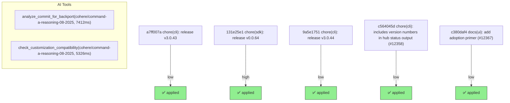

# Backport Agent — Detailed Run Report

> This file is generated automatically. It is intended for human analysts and
> AI reasoning models to assess agent performance, decision quality, and LLM behavior.

**Run timestamp**: 2026-07-18T19:40:41.162Z
**Models used**: fast=`mistral/mistral-code-agent-latest`  powerful=`cohere/command-a-reasoning-08-2025`
**Prompt log**: `/Users/rlemeill/Development/tea-ching-cline/.backport-agent/run-1784402908439.prompts.jsonl`

---

## Summary (PR body)

## Backport Agent — Sync Report

**Date**: 2026-07-18T19:40:41.162Z
**Upstream ref**: `cline/cline.git@main`
**Cut date**: `2026-06-27T00:00:00.000Z` 
**Fork ref**: `TEA-ching/cline@keypool-live`
**Sync branch**: `sync/upstream-main-2026-07-18-192954`

### Summary

- ✅ Applied: 5
- ⚠️ Needs human review: 0
- ⛔ Blocked (not attempted): 0

### Applied commits

- `a7ff007a` [low] chore(cli): release v3.0.43
- `131e25e1` [high] chore(sdk): release v0.0.64
- `9a5e1751` [low] chore(cli): release v3.0.44
- `c564045d` [low] chore(cli): includes version numbers in hub status output (#12358)
- `c380daf4` [low] docs(ui): add adoption primer (#12367)

### Agent decision log

- All commits were successfully cherry-picked without conflicts.
- Validation passed for all risk levels including final comprehensive build.


---

## Agent Workflow Diagram

> Generated by the fast model from the run summary. Evaluate the agent's decision path.



---

## AI Sub-Agent Call Log (2 calls)

> Each entry is one sub-agent invocation. Review prompt/response pairs to assess
> reasoning quality, hallucinations, and decision accuracy.

### Call 1 / 2 — `analyze_commit_for_backport` ✅ OK

| Field | Value |
|---|---|
| **Timestamp** | 2026-07-18T19:29:47.690Z |
| **Tool** | `analyze_commit_for_backport` |
| **Model** | `cohere/command-a-reasoning-08-2025` |
| **Duration** | 7412 ms |
| **Tokens in** | 21360 |
| **Tokens out** | 596 |
| **Cost** | $0.000000 |

**Prompt sent to sub-agent:**

```
Commit SHA: 131e25e1a167f8ffaa7eca796331d61826f3f528
Commit message:
chore(sdk): release v0.0.64

Changed files (7):
bun.lock
sdk/CHANGELOG.md
sdk/packages/agents/package.json
sdk/packages/core/package.json
sdk/packages/llms/package.json
sdk/packages/sdk/package.json
sdk/packages/shared/package.json

Diff:
commit 131e25e1a167f8ffaa7eca796331d61826f3f528
Author: Saoud Rizwan <7799382+saoudrizwan@users.noreply.github.com>
Date:   Thu Jul 16 18:14:58 2026 -0700

    chore(sdk): release v0.0.64
---
 bun.lock                         | 80 ++++++++++++++++++----------------------
 sdk/CHANGELOG.md                 |  5 +++
 sdk/packages/agents/package.json |  2 +-
 sdk/packages/core/package.json   |  2 +-
 sdk/packages/llms/package.json   |  2 +-
 sdk/packages/sdk/package.json    |  2 +-
 sdk/packages/shared/package.json |  2 +-
 7 files changed, 45 insertions(+), 50 deletions(-)

diff --git a/bun.lock b/bun.lock
index b61c3d013f..39c7789221 100644
--- a/bun.lock
+++ b/bun.lock
@@ -19,7 +19,7 @@
     },
     "apps/cli": {
       "name": "@cline/cli",
-      "version": "3.0.42",
+      "version": "3.0.43",
       "bin": {
         "cline": "src/index.ts",
       },
@@ -632,7 +632,7 @@
     },
     "sdk/packages/agents": {
       "name": "@cline/agents",
-      "version": "0.0.63",
+      "version": "0.0.64",
       "dependencies": {
         "@cline/llms": "workspace:*",
         "@cline/shared": "workspace:*",
@@ -641,7 +641,7 @@
     },
     "sdk/packages/core": {
       "name": "@cline/core",
-      "version": "0.0.63",
+      "version": "0.0.64",
       "dependencies": {
         "@cline/agents": "workspace:*",
         "@cline/llms": "workspace:*",
@@ -679,7 +679,7 @@
     },
     "sdk/packages/llms": {
       "name": "@cline/llms",
-      "version": "0.0.63",
+      "version": "0.0.64",
       "dependencies": {
         "@ai-sdk/amazon-bedrock": "^4.0.89",
         "@ai-sdk/anthropic": "^3.0.68",
@@ -714,14 +714,14 @@
     },
     "sdk/packages/sdk": {
       "name": "@cline/sdk",
-      "version": "0.0.63",
+      "version": "0.0.64",
       "dependencies": {
         "@cline/core": "workspace:*",
       },
     },
     "sdk/packages/shared": {
       "name": "@cline/shared",
-      "version": "0.0.63",
+      "version": "0.0.64",
       "dependencies": {
         "aws4fetch": "^1.0.20",
         "jsonrepair": "^3.13.2",
@@ -1796,7 +1796,7 @@
 
     "@protobufjs/utf8": ["@protobufjs/utf8@1.1.2", "", {}, "sha512-b1UQwcEZ4yCnMCD8DAL1VlbvBJE9/IX4FTIp7BG1xYpf29SLazLSrqUkj4w7Y5y7cCVP6E5tcqqcI0xemPkHug=="],
 
-    "@puppeteer/browsers": ["@puppeteer/browsers@2.13.2", "", { "dependencies": { "debug": "^4.4.3", "extract-zip": "^2.0.1", "progress": "^2.0.3", "proxy-agent": "^6.5.0", "semver": "^7.7.4", "tar-fs": "^3.1.1", "yargs": "^17.7.2" }, "bin": { "browsers": "lib/cjs/main-cli.js" } }, "sha512-5EUZSUIc37H6aIXyWO0Z4y8NlF8NnjgmqeQgOGiswAU7pY0HOo16ho4+alIWmSfdZnjqBRawMsP3I5YqLSn6kw=="],
+    "@puppeteer/browsers": ["@puppeteer/browsers@2.6.1", "", { "dependencies": { "debug": "^4.4.0", "extract-zip": "^2.0.1", "progress": "^2.0.3", "proxy-agent": "^6.5.0", "semver": "^7.6.3", "tar-fs": "^3.0.6", "unbzip2-stream": "^1.4.3", "yargs": "^17.7.2" }, "bin": { "browsers": "lib/cjs/main-cli.js" } }, "sha512-aBSREisdsGH890S2rQqK82qmQYU3uFpSH8wcZWHgHzl3LfzsxAKbLNiAG9mO8v1Y0UICBeClICxPJvyr0rcuxg=="],
 
     "@radix-ui/number": ["@radix-ui/number@1.1.1", "", {}, "sha512-MkKCwxlXTgz6CFoJx3pCwn07GKp36+aZyu/u2Ln2VrA5DcdyCZkASEDBTd8x5whTQQL5CiYf4prXKLcgQdv29g=="],
 
@@ -4610,7 +4610,7 @@
 
     "rw": ["rw@1.3.3", "", {}, "sha512-PdhdWy89SiZogBLaw42zdeqtRJ//zFd2PgQavcICDUgJT5oW10QCRKbJ6bg4r0/UY2M6BWd5tkxuGFRvCkgfHQ=="],
 
-    "safe-buffer": ["safe-buffer@5.2.1", "", {}, "sha512-rp3So07KcdmmKbGvgaNxQSJr7bGVSVk5S9Eq1F+ppbRo70+YeaDxkw5Dd8NPN+GD6bjnYm2VuPuCXmpuYvmCXQ=="],
+    "safe-buffer": ["safe-buffer@5.1.2", "", {}, "sha512-Gd2UZBJDkXlY7GbJxfsE8/nvKkUEU1G38c1siN6QP6a9PT9MmHB8GnpscSmMJSoF8LOIrt8ud/wPtojys4G6+g=="],
 
     "safe-stable-stringify": ["safe-stable-stringify@2.5.0", "", {}, "sha512-b3rppTKm9T+PsVCBEOUR46GWI7fdOs00VKZ1+9c1EWDaDMvjQc6tUwuFyIprgGgTcWoVHSKrU8H31ZHA2e0RHA=="],
 
@@ -5734,8 +5734,6 @@
 
     "@react-aria/menu/@react-stately/collections": ["@react-stately/collections@3.13.1", "", { "dependencies": { "@swc/helpers": "^0.5.0", "react-stately": "^3.46.0" }, "peerDependencies": { "react": "^16.8.0 || ^17.0.0-rc.1 || ^18.0.0 || ^19.0.0-rc.1", "react-dom": "^16.8.0 || ^17.0.0-rc.1 || ^18.0.0 || ^19.0.0-rc.1" } }, "sha512-o1QSrtHyR7ODTdPyna87pZlgzvxBFOR8nI8XB+tQLIW2AMhE76pLYu4TN9CrZVy6nSAtE06IntyBV4toJIhorA=="],
 
-    "@react-aria/selection/@react-types/shared": ["@react-types/shared@3.36.0", "", { "peerDependencies": { "react": "^16.8.0 || ^17.0.0-rc.1 || ^18.0.0 || ^19.0.0-rc.1" } }, "sha512-DkP/H0C2YjjS7gZWKNqOmU8a16qHPjQNdzMwmTq9SzplM6Iw0kVMTZ0OIoe6FOgGqa+FwMsE2QbPjh/n3g/jXQ=="],
-
     "@react-aria/table/@react-stately/collections": ["@react-stately/collections@3.13.1", "", { "dependencies": { "@swc/helpers": "^0.5.0", "react-stately": "^3.46.0" }, "peerDependencies": { "react": "^16.8.0 || ^17.0.0-rc.1 || ^18.0.0 || ^19.0.0-rc.1", "react-dom": "^16.8.0 || ^17.0.0-rc.1 || ^18.0.0 || ^19.0.0-rc.1" } }, "sha512-o1QSrtHyR7ODTdPyna87pZlgzvxBFOR8nI8XB+tQLIW2AMhE76pLYu4TN9CrZVy6nSAtE06IntyBV4toJIhorA=="],
 
     "@react-aria/tabs/@react-aria/selection": ["@react-aria/selection@3.28.1", "", { "dependencies": { "@swc/helpers": "^0.5.0", "react-aria": "^3.48.0" }, "peerDependencies": { "react": "^16.8.0 || ^17.0.0-rc.1 || ^18.0.0 || ^19.0.0-rc.1", "react-dom": "^16.8.0 || ^17.0.0-rc.1 || ^18.0.0 || ^19.0.0-rc.1" } }, "sha512-gGa9HkRnWsKxRhrtVASvecNyetMtP9fNF/Vcsy9Z+6NigjGUSN4SU0bhfglZ706B4t/NSMoVhcBJXlyFiG0hQw=="],
@@ -5788,7 +5786,7 @@
 
     "@tailwindcss/node/enhanced-resolve": ["enhanced-resolve@5.21.6", "", { "dependencies": { "graceful-fs": "^4.2.4", "tapable": "^2.3.3" } }, "sha512-aNnGCvbJ/RIyWo1IuhNdVjnNF+EjH9wpzpNHt+ci/m9He9LJvUN8wrCcXjp9cWsGNAuvSpVFTx/vraAFQ8qGjQ=="],
 
-    "@tailwindcss/oxide-wasm32-wasi/@emnapi/core": ["@emnapi/core@1.11.2", "", { "dependencies": { "@emnapi/wasi-threads": "1.2.2", "tslib": "^2.4.0" }, "bundled": true }, "sha512-TC8MkTuZUtcTSiFeuC0ksCh9QIJ5+F21MvZ4Wn4ORfYaFJ/0dsiudv5tVkejgwZlwQ39jL9WWDe2lz8x0WglOA=="],
+    "@tailwindcss/oxide-wasm32-wasi/@emnapi/core": ["@emnapi/core@1.11.1", "", { "dependencies": { "@emnapi/wasi-threads": "1.2.2", "tslib": "^2.4.0" }, "bundled": true }, "sha512-RSvbQmHzdKzNsLYa/wHrbc3KN4sYLKAdPZxqiM2HATqv/SBk2/ENSHpvXGaLOMcsAyz0poEGqkmmKYG3OWiJEQ=="],
 
     "@tailwindcss/oxide-wasm32-wasi/@emnapi/runtime": ["@emnapi/runtime@1.11.2", "", { "dependencies": { "tslib": "^2.4.0" }, "bundled": true }, "sha512-kyOl3X0DuTiT1h2ft8r2fYO8JYtU9a9Xis/zBSiGArNaagCOWx90N1k2wxp18czFDH+OgcWGb5ZP/XMt3dcyPA=="],
 
@@ -5902,6 +5900,8 @@
 
     "cliui/wrap-ansi": ["wrap-ansi@7.0.0", "", { "dependencies": { "ansi-styles": "^4.0.0", "string-width": "^4.1.0", "strip-ansi": "^6.0.0" } }, "sha512-YVGIj2kamLSTxw6NsZjoBxfSwsn0ycdesmc4p+Q21c5zPuZ1pl+NfxVdxPtdHvmNVOQ6XSYG4AUtyt/Fi7D16Q=="],
 
+    "cmdk/@radix-ui/react-dialog": ["@radix-ui/react-dialog@1.1.19", "", { "dependencies": { "@radix-ui/primitive": "1.1.5", "@radix-ui/react-compose-refs": "1.1.3", "@radix-ui/react-context": "1.2.0", "@radix-ui/react-dismissable-layer": "1.1.15", "@radix-ui/react-focus-guards": "1.1.4", "@radix-ui/react-focus-scope": "1.1.12", "@radix-ui/react-id": "1.1.2", "@radix-ui/react-portal": "1.1.13", "@radix-ui/react-presence": "1.1.7", "@radix-ui/react-primitive": "2.1.7", "@radix-ui/react-slot": "1.3.0", "@radix-ui/react-use-controllable-state": "1.2.3", "aria-hidden": "^1.2.4", "react-remove-scroll": "^2.7.2" }, "peerDependencies": { "@types/react": "*", "@types/react-dom": "*", "react": "^16.8 || ^17.0 || ^18.0 || ^19.0 || ^19.0.0-rc", "react-dom": "^16.8 || ^17.0 || ^18.0 || ^19.0 || ^19.0.0-rc" }, "optionalPeers": ["@types/react", "@types/react-dom"] }, "sha512-+HhbN2+YtkRgVirjZ2afMeutQRuGOrdkWR5+EFC58SJojGmtyNQwYzgi6tHBpOxvFHefMtPeHdgtjz0BOGxFQg=="],
+
     "compress-commons/is-stream": ["is-stream@2.0.1", "", {}, "sha512-hFoiJiTl63nn+kstHGBtewWSKnQLpyb155KHheA1l39uvtO9nWIop1p3udqPcUd/xbF1VLMO4n7OI6p7RbngDg=="],
 
     "conf/ajv": ["ajv@8.20.0", "", { "dependencies": { "fast-deep-equal": "^3.1.3", "fast-uri": "^3.0.1", "json-schema-traverse": "^1.0.0", "require-from-string": "^2.0.2" } }, "sha512-Thbli+OlOj+iMPYFBVBfJ3OmCAnaSyNn4M1vz9T6Gka5Jt9ba/HIR56joy65tY6kx/FCF5VXNB819Y7/GUrBGA=="],
@@ -6026,6 +6026,8 @@
 
     "jszip/readable-stream": ["readable-stream@2.3.8", "", { "dependencies": { "core-util-is": "~1.0.0", "inherits": "~2.0.3", "isarray": "~1.0.0", "process-nextick-args": "~2.0.0", "safe-buffer": "~5.1.1", "string_decoder": "~1.1.1", "util-deprecate": "~1.0.1" } }, "sha512-8p0AUk4XODgIewSi0l8Epjs+EVnWiK7NoDIEGU0HhE7+ZyY8D1IMY7odu5lRrFXGg71L15KG8QrPmum45RTtdA=="],
 
+    "jwa/safe-buffer": ["safe-buffer@5.2.1", "", {}, "sha512-rp3So07KcdmmKbGvgaNxQSJr7bGVSVk5S9Eq1F+ppbRo70+YeaDxkw5Dd8NPN+GD6bjnYm2VuPuCXmpuYvmCXQ=="],
+
     "katex/commander": ["commander@8.3.0", "", {}, "sha512-OkTL9umf+He2DZkUq8f8J9of7yL6RJKI24dVITBmNfZBmri9zYZQrKkuXiKhyfPSu8tUhnVBB1iKXevvnlR4Ww=="],
 
     "keytar/node-addon-api": ["node-addon-api@4.3.0", "", {}, "sha512-73sE9+3UaLYYFmDsFZnqCInzPyh3MqIwZO9cw58yIqAZhONrrabrYyYe3TuIqtIiOuTXVhsGau8hcrhhwSsDIQ=="],
@@ -6116,8 +6118,6 @@
 
     "proxy-agent/proxy-from-env": ["proxy-from-env@1.1.0", "", {}, "sha512-D+zkORCbA9f1tdWRK0RaCR3GPv50cMxcrz4X8k5LTSUD1Dkw47mKJEZQNunItRTkWwgtaUSo1RVFRIG9ZXiFYg=="],
 
-    "puppeteer-core/@puppeteer/browsers": ["@puppeteer/browsers@2.6.1", "", { "dependencies": { "debug": "^4.4.0", "extract-zip": "^2.0.1", "progress": "^2.0.3", "proxy-agent": "^6.5.0", "semver": "^7.6.3", "tar-fs": "^3.0.6", "unbzip2-stream": "^1.4.3", "yargs": "^17.7.2" }, "bin": { "browsers": "lib/cjs/main-cli.js" } }, "sha512-aBSREisdsGH890S2rQqK82qmQYU3uFpSH8wcZWHgHzl3LfzsxAKbLNiAG9mO8v1Y0UICBeClICxPJvyr0rcuxg=="],
-
     "radix-ui/@radix-ui/primitive": ["@radix-ui/primitive@1.1.5", "", {}, "sha512-d86WIWFYNtGA0H/d8exstrTRTp7eWJYlYJbtNofxr/3ljupZYn6EFDG/Qgu/0Kc8v7yMUxySagqJsL1+PdYjWg=="],
 
     "radix-ui/@radix-ui/react-accordion": ["@radix-ui/react-accordion@1.2.16", "", { "dependencies": { "@radix-ui/primitive": "1.1.5", "@radix-ui/react-collapsible": "1.1.16", "@radix-ui/react-collection": "1.1.12", "@radix-ui/react-compose-refs": "1.1.3", "@radix-ui/react-context": "1.2.0", "@radix-ui/react-direction": "1.1.2", "@radix-ui/react-id": "1.1.2", "@radix-ui/react-primitive": "2.1.7", "@radix-ui/react-use-controllable-state": "1.2.3" }, "peerDependencies": { "@types/react": "*", "@types/react-dom": "*", "react": "^16.8 || ^17.0 || ^18.0 || ^19.0 || ^19.0.0-rc", "react-dom": "^16.8 || ^17.0 || ^18.0 || ^19.0 || ^19.0.0-rc" }, "optionalPeers": ["@types/react", "@types/react-dom"] }, "sha512-BpZJNmetujnGgUI6OX0jEhEmlA46WPqgub8Rv09Kyquwd0cc1ndMKpiPYCjmBU6KSSRPAMtgLpEoZSG/tdNIWQ=="],
@@ -6278,6 +6278,8 @@
 
     "string-width-cjs/strip-ansi": ["strip-ansi@6.0.1", "", { "dependencies": { "ansi-regex": "^5.0.1" } }, "sha512-Y38VPSHcqkFrCpFnQ9vuSXmquuv5oXOKpGeT6aGrr3o3Gc9AlVa6JBfUSOCnbxGGZF+/0ooI7KrPuUSztUdU5A=="],
 
+    "string_decoder/safe-buffer": ["safe-buffer@5.2.1", "", {}, "sha512-rp3So07KcdmmKbGvgaNxQSJr7bGVSVk5S9Eq1F+ppbRo70+YeaDxkw5Dd8NPN+GD6bjnYm2VuPuCXmpuYvmCXQ=="],
+
     "strip-ansi-cjs/ansi-regex": ["ansi-regex@5.0.1", "", {}, "sha512-quJQXlTSUGL2LH9SUXo8VwsY4soanhgo6LNSm84E1LBcE8s3O0wpdiRzyR9z/ZZJMlMWv37qOOb9pdJlMUEKFQ=="],
 
     "strip-literal/js-tokens": ["js-tokens@9.0.1", "", {}, "sha512-mxa9E9ITFOt0ban3j6L5MpjwegGz6lBQmM1IJkWeBZGcMxto50+eWdjC/52xDbS2vy0k7vIMK0Fe2wfL9OQSpQ=="],
@@ -6306,8 +6308,6 @@
 
     "unzipper/readable-stream": ["readable-stream@2.3.8", "", { "dependencies": { "core-util-is": "~1.0.0", "inherits": "~2.0.3", "isarray": "~1.0.0", "process-nextick-args": "~2.0.0", "safe-buffer": "~5.1.1", "string_decoder": "~1.1.1", "util-deprecate": "~1.0.1" } }, "sha512-8p0AUk4XODgIewSi0l8Epjs+EVnWiK7NoDIEGU0HhE7+ZyY8D1IMY7odu5lRrFXGg71L15KG8QrPmum45RTtdA=="],
 
-    "vaul/@radix-ui/react-dialog": ["@radix-ui/react-dialog@1.1.19", "", { "dependencies": { "@radix-ui/primitive": "1.1.5", "@radix-ui/react-compose-refs": "1.1.3", "@radix-ui/react-context": "1.2.0", "@radix-ui/react-dismissable-layer": "1.1.15", "@radix-ui/react-focus-guards": "1.1.4", "@radix-ui/react-focus-scope": "1.1.12", "@radix-ui/react-id": "1.1.2", "@radix-ui/react-portal": "1.1.13", "@radix-ui/react-presence": "1.1.7", "@radix-ui/react-primitive": "2.1.7", "@radix-ui/react-slot": "1.3.0", "@radix-ui/react-use-controllable-state": "1.2.3", "aria-hidden": "^1.2.4", "react-remove-scroll": "^2.7.2" }, "peerDependencies": { "@types/react": "*", "@types/react-dom": "*", "react": "^16.8 || ^17.0 || ^18.0 || ^19.0 || ^19.0.0-rc", "react-dom": "^16.8 || ^17.0 || ^18.0 || ^19.0 || ^19.0.0-rc" }, "optionalPeers": ["@types/react", "@types/react-dom"] }, "sha512-+HhbN2+YtkRgVirjZ2afMeutQRuGOrdkWR5+EFC58SJojGmtyNQwYzgi6tHBpOxvFHefMtPeHdgtjz0BOGxFQg=="],
-
     "verror/core-util-is": ["core-util-is@1.0.2", "", {}, "sha512-3lqz5YjWTYnW6dlDa5TLaTCcShfar1e40rmcJVwCBJC6mWlFuj0eCHIElmG1g5kyuJ/GD+8Wn4FFCcz4gJPfaQ=="],
 
     "vite-node/es-module-lexer": ["es-module-lexer@1.7.0", "", {}, "sha512-jEQoCwk8hyb2AZziIOLhDqpm5+2ww5uIE6lkO/6jcOCusfk6LhMHpXXfBLXTZ7Ydyt0j4VoUQv6uGNYbdW+kBA=="],
@@ -6894,6 +6894,22 @@
 
     "cliui/strip-ansi/ansi-regex": ["ansi-regex@5.0.1", "", {}, "sha512-quJQXlTSUGL2LH9SUXo8VwsY4soanhgo6LNSm84E1LBcE8s3O0wpdiRzyR9z/ZZJMlMWv37qOOb9pdJlMUEKFQ=="],
 
+    "cmdk/@radix-ui/react-dialog/@radix-ui/primitive": ["@radix-ui/primitive@1.1.5", "", {}, "sha512-d86WIWFYNtGA0H/d8exstrTRTp7eWJYlYJbtNofxr/3ljupZYn6EFDG/Qgu/0Kc8v7yMUxySagqJsL1+PdYjWg=="],
+
+    "cmdk/@radix-ui/react-dialog/@radix-ui/react-context": ["@radix-ui/react-context@1.2.0", "", { "peerDependencies": { "@types/react": "*", "react": "^16.8 || ^17.0 || ^18.0 || ^19.0 || ^19.0.0-rc" }, "optionalPeers": ["@types/react"] }, "sha512-fOE+JtN9rygNZkCnHRBEP0TAvLldlhyOxMsbwFvTP4nAs+nBmfnna+o/Zski2wkmY1YMrFC0aSzsHoLY47iLrg=="],
+
+    "cmdk/@radix-ui/react-dialog/@radix-ui/react-dismissable-layer": ["@radix-ui/react-dismissable-layer@1.1.15", "", { "dependencies": { "@radix-ui/primitive": "1.1.5", "@radix-ui/react-compose-refs": "1.1.3", "@radix-ui/react-primitive": "2.1.7", "@radix-ui/react-use-callback-ref": "1.1.2", "@radix-ui/react-use-effect-event": "0.0.3" }, "peerDependencies": { "@types/react": "*", "@types/react-dom": "*", "react": "^16.8 || ^17.0 || ^18.0 || ^19.0 || ^19.0.0-rc", "react-dom": "^16.8 || ^17.0 || ^18.0 || ^19.0 || ^19.0.0-rc" }, "optionalPeers": ["@types/react", "@types/react-dom"] }, "sha512-b0XaRlzn2QKuo10XyNgi2DAJDf5XC9d1nD3FJcuvCjbR7+4Ad28zmZsLsqx+hvDEzMnRuZaZxZm9gYObV6RmRA=="],
+
+    "cmdk/@radix-ui/react-dialog/@radix-ui/react-focus-guards": ["@radix-ui/react-focus-guards@1.1.4", "", { "peerDependencies": { "@types/react": "*", "react": "^16.8 || ^17.0 || ^18.0 || ^19.0 || ^19.0.0-rc" }, "optionalPeers": ["@types/react"] }, "sha512-cot/aB/mOm0IYVYTTmQcEEK1M48lZWi8FlYe5nDPQQ8NYZUlXEFgncJ9p2Kzer3RKSrY7cTTpEMLZKNo9QoP5Q=="],
+
+    "cmdk/@radix-ui/react-dialog/@radix-ui/react-focus-scope": ["@radix-ui/react-focus-scope@1.1.12", "", { "dependencies": { "@radix-ui/react-compose-refs": "1.1.3", "@radix-ui/react-primitive": "2.1.7", "@radix-ui/react-use-callback-ref": "1.1.2" }, "peerDependencies": { "@types/react": "*", "@types/react-dom": "*", "react": "^16.8 || ^17.0 || ^18.0 || ^19.0 || ^19.0.0-rc", "react-dom": "^16.8 || ^17.0 || ^18.0 || ^19.0 || ^19.0.0-rc" }, "optionalPeers": ["@types/react", "@types/react-dom"] }, "sha512-jjk/lqTeNL0azUx5ZYzVrl4NgaDIrdzTNE4mABV9yBFI7FQqN7pIgzV1bTleUezP2QiTGA1BFTqY8MegDgWX9A=="],
+
+    "cmdk/@radix-ui/react-dialog/@radix-ui/react-portal": ["@radix-ui/react-portal@1.1.13", "", { "dependencies": { "@radix-ui/react-primitive": "2.1.7", "@radix-ui/react-use-layout-effect": "1.1.2" }, "peerDependencies": { "@types/react": "*", "@types/react-dom": "*", "react": "^16.8 || ^17.0 || ^18.0 || ^19.0 || ^19.0.0-rc", "react-dom": "^16.8 || ^17.0 || ^18.0 || ^19.0 || ^19.0.0-rc" }, "optionalPeers": ["@types/react", "@types/react-dom"] }, "sha512-z3oXfmaHLJTF1wktbjgD6cn9jiEbq3WSondB10LIuIt2m2Ym4iJlrW04/euMwENDdWDdE7z+OuY7Qyp1YpRSwA=="],
+
+    "cmdk/@radix-ui/react-dialog/@radix-ui/react-presence": ["@radix-ui/react-presence@1.1.7", "", { "dependencies": { "@radix-ui/react-use-layout-effect": "1.1.2" }, "peerDependencies": { "@types/react": "*", "@types/react-dom": "*", "react": "^16.8 || ^17.0 || ^18.0 || ^19.0 || ^19.0.0-rc", "react-dom": "^16.8 || ^17.0 || ^18.0 || ^19.0 || ^19.0.0-rc" }, "optionalPeers": ["@types/react", "@types/react-dom"] }, "sha512-zBZ4QM5XG3JRanDmqXYf3MD6th4AFXFmgU6KNMFzUaV6F3uw9I5/zjMUvFriSEn5ewo1nxuibvyxJdmLlDcslA=="],
+
+    "cmdk/@radix-ui/react-dialog/@radix-ui/react-slot": ["@radix-ui/react-slot@1.3.0", "", { "dependencies": { "@radix-ui/react-compose-refs": "1.1.3" }, "peerDependencies": { "@types/react": "*", "react": "^16.8 || ^17.0 || ^18.0 || ^19.0 || ^19.0.0-rc" }, "optionalPeers": ["@types/react"] }, "sha512-MojKku4U/miO8Av4Dkb+ctMAQx7JmY96LmtDQlAarCRtd7rN52QCSzBF+XAvr5S6coSVj9HEPBgHAHKEJVk/WA=="],
+
     "conf/ajv/json-schema-traverse": ["json-schema-traverse@1.0.0", "", {}, "sha512-NM8/P9n3XjXhIZn1lLhkFaACTOURQXjWhV4BA/RnOv8xvgqtqpAX9IO4mRQxSx1Rlo4tqzeqb0sOlruaOy3dug=="],
 
     "cross-spawn/which/isexe": ["isexe@2.0.0", "", {}, "sha512-RHxMLp9lnKHGHRng9QFhRCMbYAcVpn69smSGcq3f36xjgVVWThj4qqLbTLlq7Ssj8B+fIQ1EuCEGI2lKsyQeIw=="],
@@ -6904,8 +6920,6 @@
 
     "d3-sankey/d3-shape/d3-path": ["d3-path@1.0.9", "", {}, "sha512-VLaYcn81dtHVTjEHd8B+pbe9yHWpXKZUC87PzoFmsFrJqgFwDe/qxfp5MlfsfM1V5E/iVt0MmEbWQ7FVIXh/bg=="],
 
-    "duplexer2/readable-stream/safe-buffer": ["safe-buffer@5.1.2", "", {}, "sha512-Gd2UZBJDkXlY7GbJxfsE8/nvKkUEU1G38c1siN6QP6a9PT9MmHB8GnpscSmMJSoF8LOIrt8ud/wPtojys4G6+g=="],
-
     "duplexer2/readable-stream/string_decoder": ["string_decoder@1.1.1", "", { "dependencies": { "safe-buffer": "~5.1.0" } }, "sha512-n/ShnvDi6FHbbVfviro+WojiFzv+s8MPMHBczVePfUpDJLwoLT0ht1l4YwBCbi8pJAveEEdnkHyPyTP/mzRfwg=="],
 
     "enquirer/strip-ansi/ansi-regex": ["ansi-regex@5.0.1", "", {}, "sha512-quJQXlTSUGL2LH9SUXo8VwsY4soanhgo6LNSm84E1LBcE8s3O0wpdiRzyR9z/ZZJMlMWv37qOOb9pdJlMUEKFQ=="],
@@ -6958,12 +6972,8 @@
 
     "jest-util/chalk/supports-color": ["supports-color@7.2.0", "", { "dependencies": { "has-flag": "^4.0.0" } }, "sha512-qpCAvRl9stuOHveKsn7HncJRvv501qIacKzQlO/+Lwxc9+0q2wLyv4Dfvt80/DPn2pqOBsJdDiogXGR9+OvwRw=="],
 
-    "jszip/readable-stream/safe-buffer": ["safe-buffer@5.1.2", "", {}, "sha512-Gd2UZBJDkXlY7GbJxfsE8/nvKkUEU1G38c1siN6QP6a9PT9MmHB8GnpscSmMJSoF8LOIrt8ud/wPtojys4G6+g=="],
-
     "jszip/readable-stream/string_decoder": ["string_decoder@1.1.1", "", { "dependencies": { "safe-buffer": "~5.1.0" } }, "sha512-n/ShnvDi6FHbbVfviro+WojiFzv+s8MPMHBczVePfUpDJLwoLT0ht1l4YwBCbi8pJAveEEdnkHyPyTP/mzRfwg=="],
 
-    "lazystream/readable-stream/safe-buffer": ["safe-buffer@5.1.2", "", {}, "sha512-Gd2UZBJDkXlY7GbJxfsE8/nvKkUEU1G38c1siN6QP6a9PT9MmHB8GnpscSmMJSoF8LOIrt8ud/wPtojys4G6+g=="],
-
     "lazystream/readable-stream/string_decoder": ["string_decoder@1.1.1", "", { "dependencies": { "safe-buffer": "~5.1.0" } }, "sha512-n/ShnvDi6FHbbVfviro+WojiFzv+s8MPMHBczVePfUpDJLwoLT0ht1l4YwBCbi8pJAveEEdnkHyPyTP/mzRfwg=="],
 
     "log-symbols/chalk/supports-color": ["supports-color@7.2.0", "", { "dependencies": { "has-flag": "^4.0.0" } }, "sha512-qpCAvRl9stuOHveKsn7HncJRvv501qIacKzQlO/+Lwxc9+0q2wLyv4Dfvt80/DPn2pqOBsJdDiogXGR9+OvwRw=="],
@@ -7112,26 +7122,8 @@
 
     "test-exclude/minimatch/brace-expansion": ["brace-expansion@5.0.7", "", { "dependencies": { "balanced-match": "^4.0.2" } }, "sha512-7oFy703dxfY3/NLxC1fh2SUCQ0H9rmAY+5EpDVfXjUTTs+HEwR2nYaqLv+GWcTsumwxPfiz6CzCNkwXwBUwqCA=="],
 
-    "unzipper/readable-stream/safe-buffer": ["safe-buffer@5.1.2", "", {}, "sha512-Gd2UZBJDkXlY7GbJxfsE8/nvKkUEU1G38c1siN6QP6a9PT9MmHB8GnpscSmMJSoF8LOIrt8ud/wPtojys4G6+g=="],
-
     "unzipper/readable-stream/string_decoder": ["string_decoder@1.1.1", "", { "dependencies": { "safe-buffer": "~5.1.0" } }, "sha512-n/ShnvDi6FHbbVfviro+WojiFzv+s8MPMHBczVePfUpDJLwoLT0ht1l4YwBCbi8pJAveEEdnkHyPyTP/mzRfwg=="],
 
-    "vaul/@radix-ui/react-dialog/@radix-ui/primitive": ["@radix-ui/primitive@1.1.5", "", {}, "sha512-d86WIWFYNtGA0H/d8exstrTRTp7eWJYlYJbtNofxr/3ljupZYn6EFDG/Qgu/0Kc8v7yMUxySagqJsL1+PdYjWg=="],
-
-    "vaul/@radix-ui/react-dialog/@radix-ui/react-context": ["@radix-ui/react-context@1.2.0", "", { "peerDependencies": { "@types/react": "*", "react": "^16.8 || ^17.0 || ^18.0 || ^19.0 || ^19.0.0-rc" }, "optionalPeers": ["@types/react"] }, "sha512-fOE+JtN9rygNZkCnHRBEP0TAvLldlhyOxMsbwFvTP4nAs+nBmfnna+o/Zski2wkmY1YMrFC0aSzsHoLY47iLrg=="],
-
-    "vaul/@radix-ui/react-dialog/@radix-ui/react-dismissable-layer": ["@radix-ui/react-dismissable-layer@1.1.15", "", { "dependencies": { "@radix-ui/primitive": "1.1.5", "@radix-ui/react-compose-refs": "1.1.3", "@radix-ui/react-primitive": "2.1.7", "@radix-ui/react-use-callback-ref": "1.1.2", "@radix-ui/react-use-effect-event": "0.0.3" }, "peerDependencies": { "@types/react": "*", "@types/react-dom": "*", "react": "^16.8 || ^17.0 || ^18.0 || ^19.0 || ^19.0.0-rc", "react-dom": "^16.8 || ^17.0 || ^18.0 || ^19.0 || ^19.0.0-rc" }, "optionalPeers": ["@types/react", "@types/react-dom"] }, "sha512-b0XaRlzn2QKuo10XyNgi2DAJDf5XC9d1nD3FJcuvCjbR7+4Ad28zmZsLsqx+hvDEzMnRuZaZxZm9gYObV6RmRA=="],
-
-    "vaul/@radix-ui/react-dialog/@radix-ui/react-focus-guards": ["@radix-ui/react-focus-guards@1.1.4", "", { "peerDependencies": { "@types/react": "*", "react": "^16.8 || ^17.0 || ^18.0 || ^19.0 || ^19.0.0-rc" }, "optionalPeers": ["@types/react"] }, "sha512-cot/aB/mOm0IYVYTTmQcEEK1M48lZWi8FlYe5nDPQQ8NYZUlXEFgncJ9p2Kzer3RKSrY7cTTpEMLZKNo9QoP5Q=="],
-
-    "vaul/@radix-ui/react-dialog/@radix-ui/react-focus-scope": ["@radix-ui/react-focus-scope@1.1.12", "", { "dependencies": { "@radix-ui/react-compose-refs": "1.1.3", "@radix-ui/react-primitive": "2.1.7", "@radix-ui/react-use-callback-ref": "1.1.2" }, "peerDependencies": { "@types/react": "*", "@types/react-dom": "*", "react": "^16.8 || ^17.0 || ^18.0 || ^19.0 || ^19.0.0-rc", "react-dom": "^16.8 || ^17.0 || ^18.0 || ^19.0 || ^19.0.0-rc" }, "optionalPeers": ["@types/react", "@types/react-dom"] }, "sha512-jjk/lqTeNL0azUx5ZYzVrl4NgaDIrdzTNE4mABV9yBFI7FQqN7pIgzV1bTleUezP2QiTGA1BFTqY8MegDgWX9A=="],
-
-    "vaul/@radix-ui/react-dialog/@radix-ui/react-portal": ["@radix-ui/react-portal@1.1.13", "", { "dependencies": { "@radix-ui/react-primitive": "2.1.7", "@radix-ui/react-use-layout-effect": "1.1.2" }, "peerDependencies": { "@types/react": "*", "@types/react-dom": "*", "react": "^16.8 || ^17.0 || ^18.0 || ^19.0 || ^19.0.0-rc", "react-dom": "^16.8 || ^17.0 || ^18.0 || ^19.0 || ^19.0.0-rc" }, "optionalPeers": ["@types/react", "@types/react-dom"] }, "sha512-z3oXfmaHLJTF1wktbjgD6cn9jiEbq3WSondB10LIuIt2m2Ym4iJlrW04/euMwENDdWDdE7z+OuY7Qyp1YpRSwA=="],
-
-    "vaul/@radix-ui/react-dialog/@radix-ui/react-presence": ["@radix-ui/react-presence@1.1.7", "", { "dependencies": { "@radix-ui/react-use-layout-effect": "1.1.2" }, "peerDependencies": { "@types/react": "*", "@types/react-dom": "*", "react": "^16.8 || ^17.0 || ^18.0 || ^19.0 || ^19.0.0-rc", "react-dom": "^16.8 || ^17.0 || ^18.0 || ^19.0 || ^19.0.0-rc" }, "optionalPeers": ["@types/react", "@types/react-dom"] }, "sha512-zBZ4QM5XG3JRanDmqXYf3MD6th4AFXFmgU6KNMFzUaV6F3uw9I5/zjMUvFriSEn5ewo1nxuibvyxJdmLlDcslA=="],
-
-    "vaul/@radix-ui/react-dialog/@radix-ui/react-slot": ["@radix-ui/react-slot@1.3.0", "", { "dependencies": { "@radix-ui/react-compose-refs": "1.1.3" }, "peerDependencies": { "@types/react": "*", "react": "^16.8 || ^17.0 || ^18.0 || ^19.0 || ^19.0.0-rc" }, "optionalPeers": ["@types/react"] }, "sha512-MojKku4U/miO8Av4Dkb+ctMAQx7JmY96LmtDQlAarCRtd7rN52QCSzBF+XAvr5S6coSVj9HEPBgHAHKEJVk/WA=="],
-
     "webview-ui/@types/node/undici-types": ["undici-types@6.21.0", "", {}, "sha512-iwDZqg0QAGrg9Rav5H4n0M64c3mkR59cJ6wQp+7C4nI0gsmExaedaYLNO44eT4AtBBwjbTiGPMlt2Md0T9H9JQ=="],
 
     "webview-ui/@vitejs/plugin-react-swc/@rolldown/pluginutils": ["@rolldown/pluginutils@1.0.0-beta.27", "", {}, "sha512-+d0F4MKMCbeVUJwG96uQ4SgAznZNSq93I3V+9NHA4OpvqG8mRCpGdKmK8l/dl02h2CCDHwW2FqilnTyDcAnqjA=="],
@@ -7306,6 +7298,10 @@
 
     "claude-dev/@opentelemetry/sdk-trace-node/@opentelemetry/sdk-trace-base/@opentelemetry/semantic-conventions": ["@opentelemetry/semantic-conventions@1.28.0", "", {}, "sha512-lp4qAiMTD4sNWW4DbKLBkfiMZ4jbAboJIGOQr5DvciMRI494OapieI9qiODpOt0XBr1LjIDy1xAGAnVs5supTA=="],
 
+    "cmdk/@radix-ui/react-dialog/@radix-ui/react-dismissable-layer/@radix-ui/react-use-callback-ref": ["@radix-ui/react-use-callback-ref@1.1.2", "", { "peerDependencies": { "@types/react": "*", "react": "^16.8 || ^17.0 || ^18.0 || ^19.0 || ^19.0.0-rc" }, "optionalPeers": ["@types/react"] }, "sha512-xCso9j1/u8sEgP1RNHjFrXJLApL8LiqOkI1R4ywuN00rxWdYg4oQXuwKLS3i0j5NWLromUD27/4nlxj2UFVvIw=="],
+
+    "cmdk/@radix-ui/react-dialog/@radix-ui/react-focus-scope/@radix-ui/react-use-callback-ref": ["@radix-ui/react-use-callback-ref@1.1.2", "", { "peerDependencies": { "@types/react": "*", "react": "^16.8 || ^17.0 || ^18.0 || ^19.0 || ^19.0.0-rc" }, "optionalPeers": ["@types/react"] }, "sha512-xCso9j1/u8sEgP1RNHjFrXJLApL8LiqOkI1R4ywuN00rxWdYg4oQXuwKLS3i0j5NWLromUD27/4nlxj2UFVvIw=="],
+
     "exceljs/archiver/archiver-utils/glob": ["glob@7.2.3", "", { "dependencies": { "fs.realpath": "^1.0.0", "inflight": "^1.0.4", "inherits": "2", "minimatch": "^3.1.1", "once": "^1.3.0", "path-is-absolute": "^1.0.0" } }, "sha512-nFR0zLpU2YCaRxwoCJvL6UvCH2JFyFVIvwTLsIf21AuHlMskA1hhTdk+LlYJtOlYt9v6dvszD2BGRqBL+iQK9Q=="],
 
     "exceljs/archiver/archiver-utils/readable-stream": ["readable-stream@2.3.8", "", { "dependencies": { "core-util-is": "~1.0.0", "inherits": "~2.0.3", "isarray": "~1.0.0", "process-nextick-args": "~2.0.0", "safe-buffer": "~5.1.1", "string_decoder": "~1.1.1", "util-deprecate": "~1.0.1" } }, "sha512-8p0AUk4XODgIewSi0l8Epjs+EVnWiK7NoDIEGU0HhE7+ZyY8D1IMY7odu5lRrFXGg71L15KG8QrPmum45RTtdA=="],
@@ -7384,10 +7380,6 @@
 
     "test-exclude/minimatch/brace-expansion/balanced-match": ["balanced-match@4.0.4", "", {}, "sha512-BLrgEcRTwX2o6gGxGOCNyMvGSp35YofuYzw9h1IMTRmKqttAZZVU67bdb9Pr2vUHA8+j3i2tJfjO6C6+4myGTA=="],
 
-    "vaul/@radix-ui/react-dialog/@radix-ui/react-dismissable-layer/@radix-ui/react-use-callback-ref": ["@radix-ui/react-use-callback-ref@1.1.2", "", { "peerDependencies": { "@types/react": "*", "react": "^16.8 || ^17.0 || ^18.0 || ^19.0 || ^19.0.0-rc" }, "optionalPeers": ["@types/react"] }, "sha512-xCso9j1/u8sEgP1RNHjFrXJLApL8LiqOkI1R4ywuN00rxWdYg4oQXuwKLS3i0j5NWLromUD27/4nlxj2UFVvIw=="],
-
-    "vaul/@radix-ui/react-dialog/@radix-ui/react-focus-scope/@radix-ui/react-use-callback-ref": ["@radix-ui/react-use-callback-ref@1.1.2", "", { "peerDependencies": { "@types/react": "*", "react": "^16.8 || ^17.0 || ^18.0 || ^19.0 || ^19.0.0-rc" }, "optionalPeers": ["@types/react"] }, "sha512-xCso9j1/u8sEgP1RNHjFrXJLApL8LiqOkI1R4ywuN00rxWdYg4oQXuwKLS3i0j5NWLromUD27/4nlxj2UFVvIw=="],
-
     "webview-ui/vitest/@vitest/utils/loupe": ["loupe@3.2.1", "", {}, "sha512-CdzqowRJCeLU72bHvWqwRBBlLcMEtIvGrlvef74kMnV2AolS9Y8xUv1I0U/MNAWMhBlKIoyuEgoJ0t/bbwHbLQ=="],
 
     "webview-ui/vitest/chai/check-error": ["check-error@2.1.3", "", {}, "sha512-PAJdDJusoxnwm1VwW07VWwUN1sl7smmC3OKggvndJFadxxDRyFJBX/ggnu/KE4kQAB7a3Dp8f/YXC1FlUprWmA=="],
@@ -7444,8 +7436,6 @@
 
     "claude-dev/@opentelemetry/exporter-metrics-otlp-http/@opentelemetry/otlp-transformer/@opentelemetry/sdk-trace-base/@opentelemetry/semantic-conventions": ["@opentelemetry/semantic-conventions@1.28.0", "", {}, "sha512-lp4qAiMTD4sNWW4DbKLBkfiMZ4jbAboJIGOQr5DvciMRI494OapieI9qiODpOt0XBr1LjIDy1xAGAnVs5supTA=="],
 
-    "exceljs/archiver/archiver-utils/readable-stream/safe-buffer": ["safe-buffer@5.1.2", "", {}, "sha512-Gd2UZBJDkXlY7GbJxfsE8/nvKkUEU1G38c1siN6QP6a9PT9MmHB8GnpscSmMJSoF8LOIrt8ud/wPtojys4G6+g=="],
-
     "exceljs/archiver/archiver-utils/readable-stream/string_decoder": ["string_decoder@1.1.1", "", { "dependencies": { "safe-buffer": "~5.1.0" } }, "sha512-n/ShnvDi6FHbbVfviro+WojiFzv+s8MPMHBczVePfUpDJLwoLT0ht1l4YwBCbi8pJAveEEdnkHyPyTP/mzRfwg=="],
 
     "exceljs/archiver/zip-stream/archiver-utils/glob": ["glob@7.2.3", "", { "dependencies": { "fs.realpath": "^1.0.0", "inflight": "^1.0.4", "inherits": "2", "minimatch": "^3.1.1", "once": "^1.3.0", "path-is-absolute": "^1.0.0" } }, "sha512-nFR0zLpU2YCaRxwoCJvL6UvCH2JFyFVIvwTLsIf21AuHlMskA1hhTdk+LlYJtOlYt9v6dvszD2BGRqBL+iQK9Q=="],
diff --git a/sdk/CHANGELOG.md b/sdk/CHANGELOG.md
index b085a5aa34..aa7fe2abd8 100644
--- a/sdk/CHANGELOG.md
+++ b/sdk/CHANGELOG.md
@@ -1,5 +1,10 @@
 # Cline SDK Changelog
 
+## 0.0.64
+
+- Improved max output token handling across providers (gateway routing, OpenAI vendor, and reasoning models)
+- Frontmatter and user-instruction files that start with a UTF-8 byte order mark (e.g. saved by Windows editors) now parse correctly
+
 ## 0.0.63
 
 - The session runtime now emits `task.mistake_limit_reached` telemetry when the consecutive-mistake limit is hit, so every host (CLI, VS Code extension, hub daemon) captures it — including auto-stops when no host prompt is configured
diff --git a/sdk/packages/agents/package.json b/sdk/packages/agents/package.json
index 2ce2334968..9db373c8a4 100644
--- a/sdk/packages/agents/package.json
+++ b/sdk/packages/agents/package.json
@@ -1,6 +1,6 @@
 {
 	"name": "@cline/agents",
-	"version": "0.0.63",
+	"version": "0.0.64",
 	"repository": {
 		"type": "git",
 		"url": "https://github.com/cline/cline",
diff --git a/sdk/packages/core/package.json b/sdk/packages/core/package.json
index 6e0531ebb6..9c11a54c96 100644
--- a/sdk/packages/core/package.json
+++ b/sdk/packages/core/package.json
@@ -1,7 +1,7 @@
 {
 	"name": "@cline/core",
 	"description": "Cline Core SDK for Node Runtime",
-	"version": "0.0.63",
+	"version": "0.0.64",
 	"repository": {
 		"type": "git",
 		"url": "https://github.com/cline/cline",
diff --git a/sdk/packages/llms/package.json b/sdk/packages/llms/package.json
index 5aa04a0c1f..68088af69d 100644
--- a/sdk/packages/llms/package.json
+++ b/sdk/packages/llms/package.json
@@ -1,6 +1,6 @@
 {
 	"name": "@cline/llms",
-	"version": "0.0.63",
+	"version": "0.0.64",
 	"description": "Config-driven SDK for selecting, extending, and instantiating LLM providers and models",
 	"repository": {
 		"type": "git",
diff --git a/sdk/packages/sdk/package.json b/sdk/packages/sdk/package.json
index c8c17cb467..062ca38401 100644
--- a/sdk/packages/sdk/package.json
+++ b/sdk/packages/sdk/package.json
@@ -1,7 +1,7 @@
 {
 	"name": "@cline/sdk",
 	"description": "Cline SDK - user-facing alias for @cline/core",
-	"version": "0.0.63",
+	"version": "0.0.64",
 	"repository": {
 		"type": "git",
 		"url": "https://github.com/cline/cline",
diff --git a/sdk/packages/shared/package.json b/sdk/packages/shared/package.json
index 0208bbac32..0374988674 100644
--- a/sdk/packages/shared/package.json
+++ b/sdk/packages/shared/package.json
@@ -1,6 +1,6 @@
 {
 	"name": "@cline/shared",
-	"version": "0.0.63",
+	"version": "0.0.64",
 	"description": "Shared utilities, types, and schemas for Cline packages",
 	"repository": {
 		"type": "git",

Output the JSON object now.
```

**Response received:**

````
```json
{
  "summary": "Bumps SDK package versions to 0.0.64 and updates dependencies in bun.lock, with no changes to fork-specific customization zones.",
  "keyChanges": [
    "Bumps @cline/agents, @cline/core, @cline/llms, @cline/sdk, and @cline/shared from 0.0.63 to 0.0.64",
    "Updates bun.lock dependencies (e.g., downgrades @puppeteer/browsers and safe-buffer)",
    "Adds changelog entries for max token handling and UTF-8 BOM parsing fixes",
    "No modifications to fork-specific files or customization zones"
  ],
  "backportComplexity": "trivial",
  "semanticRiskFactors": [],
  "recommendation": "apply"
}
```
````

---

### Call 2 / 2 — `check_customization_compatibility` ✅ OK

| Field | Value |
|---|---|
| **Timestamp** | 2026-07-18T19:29:53.176Z |
| **Tool** | `check_customization_compatibility` |
| **Model** | `cohere/command-a-reasoning-08-2025` |
| **Duration** | 5326 ms |
| **Tokens in** | 18161 |
| **Tokens out** | 393 |
| **Cost** | $0.000000 |

**Prompt sent to sub-agent:**

```
Declared fork customisations:
  1. Pattern: sdk/packages/**/package.json
     Description: Custom package publishing configuration for TEA-ching
     Current file content (2 file(s)):
      [sdk/packages/ui/package.json]
      {
      	"name": "@cline/ui",
      	"version": "0.0.0",
      	"description": "Shared Cline web theme and UI foundations",
      	"repository": {
      		"type": "git",
      		"url": "https://github.com/cline/cline",
      		"directory": "sdk/packages/ui"
      	},
      	"private": true,
      	"internal": true,
      	"type": "module",
      	"exports": {
      		"./theme/index.css": "./theme/index.css",
      		"./theme/tokens.css": "./theme/tokens.css",
      		"./theme/theme.css": "./theme/theme.css",
      		"./theme/base.css": "./theme/base.css",
      		"./package.json": "./package.json"
      	},
      	"files": [
      		"theme",
      		"README.md"
      	],
      	"sideEffects": [
      		"./theme/*.css"
      	],
      	"scripts": {
      		"build": "bun scripts/validate-theme.ts",
      		"typecheck": "bun tsc -p tsconfig.json --noEmit",
      		"test": "vitest run --config vitest.config.ts"
      	},
      	"peerDependencies": {
      		"tailwindcss": ">=4.0.0 <5"
      	},
      	"peerDependenciesMeta": {
      		"tailwindcss": {
      			"optional": true
      		}
      	}
      }
      
      ---
[sdk/packages/shared/package.json]
      {
      	"name": "@cline/shared",
      	"version": "0.0.63",
      	"description": "Shared utilities, types, and schemas for Cline packages",
      	"repository": {
      		"type": "git",
      		"url": "https://github.com/cline/cline",
      		"directory": "sdk/packages/shared"
      	},
      	"type": "module",
      	"main": "dist/index.js",
      	"types": "dist/index.d.ts",
      	"exports": {
      		".": {
      			"browser": "./dist/index.browser.js",
      			"types": "./dist/index.d.ts",
      			"import": "./dist/index.js",
      			"default": "./dist/index.js"
      		},
      		"./browser": {
      			"types": "./dist/index.browser.d.ts",
      			"import": "./dist/index.browser.js"
      		},
      		"./types": {
      			"types": "./dist/types/index.d.ts",
      			"import": "./dist/types/index.js"
      		},
      		"./storage": {
      			"types": "./dist/storage/index.d.ts",
      			"import": "./dist/storage/index.js"
      		},
      		"./db": {
      			"types": "./dist/db/index.d.ts",
      			"import": "./dist/db/index.js"
      		},
      		"./node": {
      			"types": "./dist/node.d.ts",
      			"import": "./dist/node.js"
      		},
      		"./automation": {
      			"types": "./dist/automation/index.d.ts",
      			"import": "./dist/automation/index.js"
      		},
      		"./remote-config": {
      			"types": "./dist/remote-config/index.d.ts",
      			"import": "./dist/remote-config/index.js"
      		}
      	},
      	"files": [
      		"dist"
      	],
      	"scripts": {
      		"build": "BUILD_MODE=package bun bun.mts",
      		"typecheck": "bun tsc --noEmit",
      		"test": "bun run test:unit",
      		"test:unit": "vitest run --config vitest.config.ts"
      	},
      	"engines": {
      		"node": ">=22"
      	},
      	"dependencies": {
      		"aws4fetch": "^1.0.20",
      		"jsonrepair": "^3.13.2",
      		"zod": "^4.3.6",
      		"zod-to-json-schema": "^3.25.1"
      	}
      }
      

Upstream diff to evaluate:
commit 131e25e1a167f8ffaa7eca796331d61826f3f528
Author: Saoud Rizwan <7799382+saoudrizwan@users.noreply.github.com>
Date:   Thu Jul 16 18:14:58 2026 -0700

    chore(sdk): release v0.0.64
---
 bun.lock                         | 80 ++++++++++++++++++----------------------
 sdk/CHANGELOG.md                 |  5 +++
 sdk/packages/agents/package.json |  2 +-
 sdk/packages/core/package.json   |  2 +-
 sdk/packages/llms/package.json   |  2 +-
 sdk/packages/sdk/package.json    |  2 +-
 sdk/packages/shared/package.json |  2 +-
 7 files changed, 45 insertions(+), 50 deletions(-)

diff --git a/bun.lock b/bun.lock
index b61c3d013f..39c7789221 100644
--- a/bun.lock
+++ b/bun.lock
@@ -19,7 +19,7 @@
     },
     "apps/cli": {
       "name": "@cline/cli",
-      "version": "3.0.42",
+      "version": "3.0.43",
       "bin": {
         "cline": "src/index.ts",
       },
@@ -632,7 +632,7 @@
     },
     "sdk/packages/agents": {
       "name": "@cline/agents",
-      "version": "0.0.63",
+      "version": "0.0.64",
       "dependencies": {
         "@cline/llms": "workspace:*",
         "@cline/shared": "workspace:*",
@@ -641,7 +641,7 @@
     },
     "sdk/packages/core": {
       "name": "@cline/core",
-      "version": "0.0.63",
+      "version": "0.0.64",
       "dependencies": {
         "@cline/agents": "workspace:*",
         "@cline/llms": "workspace:*",
@@ -679,7 +679,7 @@
     },
     "sdk/packages/llms": {
       "name": "@cline/llms",
-      "version": "0.0.63",
+      "version": "0.0.64",
       "dependencies": {
         "@ai-sdk/amazon-bedrock": "^4.0.89",
         "@ai-sdk/anthropic": "^3.0.68",
@@ -714,14 +714,14 @@
     },
     "sdk/packages/sdk": {
       "name": "@cline/sdk",
-      "version": "0.0.63",
+      "version": "0.0.64",
       "dependencies": {
         "@cline/core": "workspace:*",
       },
     },
     "sdk/packages/shared": {
       "name": "@cline/shared",
-      "version": "0.0.63",
+      "version": "0.0.64",
       "dependencies": {
         "aws4fetch": "^1.0.20",
         "jsonrepair": "^3.13.2",
@@ -1796,7 +1796,7 @@
 
     "@protobufjs/utf8": ["@protobufjs/utf8@1.1.2", "", {}, "sha512-b1UQwcEZ4yCnMCD8DAL1VlbvBJE9/IX4FTIp7BG1xYpf29SLazLSrqUkj4w7Y5y7cCVP6E5tcqqcI0xemPkHug=="],
 
-    "@puppeteer/browsers": ["@puppeteer/browsers@2.13.2", "", { "dependencies": { "debug": "^4.4.3", "extract-zip": "^2.0.1", "progress": "^2.0.3", "proxy-agent": "^6.5.0", "semver": "^7.7.4", "tar-fs": "^3.1.1", "yargs": "^17.7.2" }, "bin": { "browsers": "lib/cjs/main-cli.js" } }, "sha512-5EUZSUIc37H6aIXyWO0Z4y8NlF8NnjgmqeQgOGiswAU7pY0HOo16ho4+alIWmSfdZnjqBRawMsP3I5YqLSn6kw=="],
+    "@puppeteer/browsers": ["@puppeteer/browsers@2.6.1", "", { "dependencies": { "debug": "^4.4.0", "extract-zip": "^2.0.1", "progress": "^2.0.3", "proxy-agent": "^6.5.0", "semver": "^7.6.3", "tar-fs": "^3.0.6", "unbzip2-stream": "^1.4.3", "yargs": "^17.7.2" }, "bin": { "browsers": "lib/cjs/main-cli.js" } }, "sha512-aBSREisdsGH890S2rQqK82qmQYU3uFpSH8wcZWHgHzl3LfzsxAKbLNiAG9mO8v1Y0UICBeClICxPJvyr0rcuxg=="],
 
     "@radix-ui/number": ["@radix-ui/number@1.1.1", "", {}, "sha512-MkKCwxlXTgz6CFoJx3pCwn07GKp36+aZyu/u2Ln2VrA5DcdyCZkASEDBTd8x5whTQQL5CiYf4prXKLcgQdv29g=="],
 
@@ -4610,7 +4610,7 @@
 
     "rw": ["rw@1.3.3", "", {}, "sha512-PdhdWy89SiZogBLaw42zdeqtRJ//zFd2PgQavcICDUgJT5oW10QCRKbJ6bg4r0/UY2M6BWd5tkxuGFRvCkgfHQ=="],
 
-    "safe-buffer": ["safe-buffer@5.2.1", "", {}, "sha512-rp3So07KcdmmKbGvgaNxQSJr7bGVSVk5S9Eq1F+ppbRo70+YeaDxkw5Dd8NPN+GD6bjnYm2VuPuCXmpuYvmCXQ=="],
+    "safe-buffer": ["safe-buffer@5.1.2", "", {}, "sha512-Gd2UZBJDkXlY7GbJxfsE8/nvKkUEU1G38c1siN6QP6a9PT9MmHB8GnpscSmMJSoF8LOIrt8ud/wPtojys4G6+g=="],
 
     "safe-stable-stringify": ["safe-stable-stringify@2.5.0", "", {}, "sha512-b3rppTKm9T+PsVCBEOUR46GWI7fdOs00VKZ1+9c1EWDaDMvjQc6tUwuFyIprgGgTcWoVHSKrU8H31ZHA2e0RHA=="],
 
@@ -5734,8 +5734,6 @@
 
     "@react-aria/menu/@react-stately/collections": ["@react-stately/collections@3.13.1", "", { "dependencies": { "@swc/helpers": "^0.5.0", "react-stately": "^3.46.0" }, "peerDependencies": { "react": "^16.8.0 || ^17.0.0-rc.1 || ^18.0.0 || ^19.0.0-rc.1", "react-dom": "^16.8.0 || ^17.0.0-rc.1 || ^18.0.0 || ^19.0.0-rc.1" } }, "sha512-o1QSrtHyR7ODTdPyna87pZlgzvxBFOR8nI8XB+tQLIW2AMhE76pLYu4TN9CrZVy6nSAtE06IntyBV4toJIhorA=="],
 
-    "@react-aria/selection/@react-types/shared": ["@react-types/shared@3.36.0", "", { "peerDependencies": { "react": "^16.8.0 || ^17.0.0-rc.1 || ^18.0.0 || ^19.0.0-rc.1" } }, "sha512-DkP/H0C2YjjS7gZWKNqOmU8a16qHPjQNdzMwmTq9SzplM6Iw0kVMTZ0OIoe6FOgGqa+FwMsE2QbPjh/n3g/jXQ=="],
-
     "@react-aria/table/@react-stately/collections": ["@react-stately/collections@3.13.1", "", { "dependencies": { "@swc/helpers": "^0.5.0", "react-stately": "^3.46.0" }, "peerDependencies": { "react": "^16.8.0 || ^17.0.0-rc.1 || ^18.0.0 || ^19.0.0-rc.1", "react-dom": "^16.8.0 || ^17.0.0-rc.1 || ^18.0.0 || ^19.0.0-rc.1" } }, "sha512-o1QSrtHyR7ODTdPyna87pZlgzvxBFOR8nI8XB+tQLIW2AMhE76pLYu4TN9CrZVy6nSAtE06IntyBV4toJIhorA=="],
 
     "@react-aria/tabs/@react-aria/selection": ["@react-aria/selection@3.28.1", "", { "dependencies": { "@swc/helpers": "^0.5.0", "react-aria": "^3.48.0" }, "peerDependencies": { "react": "^16.8.0 || ^17.0.0-rc.1 || ^18.0.0 || ^19.0.0-rc.1", "react-dom": "^16.8.0 || ^17.0.0-rc.1 || ^18.0.0 || ^19.0.0-rc.1" } }, "sha512-gGa9HkRnWsKxRhrtVASvecNyetMtP9fNF/Vcsy9Z+6NigjGUSN4SU0bhfglZ706B4t/NSMoVhcBJXlyFiG0hQw=="],
@@ -5788,7 +5786,7 @@
 
     "@tailwindcss/node/enhanced-resolve": ["enhanced-resolve@5.21.6", "", { "dependencies": { "graceful-fs": "^4.2.4", "tapable": "^2.3.3" } }, "sha512-aNnGCvbJ/RIyWo1IuhNdVjnNF+EjH9wpzpNHt+ci/m9He9LJvUN8wrCcXjp9cWsGNAuvSpVFTx/vraAFQ8qGjQ=="],
 
-    "@tailwindcss/oxide-wasm32-wasi/@emnapi/core": ["@emnapi/core@1.11.2", "", { "dependencies": { "@emnapi/wasi-threads": "1.2.2", "tslib": "^2.4.0" }, "bundled": true }, "sha512-TC8MkTuZUtcTSiFeuC0ksCh9QIJ5+F21MvZ4Wn4ORfYaFJ/0dsiudv5tVkejgwZlwQ39jL9WWDe2lz8x0WglOA=="],
+    "@tailwindcss/oxide-wasm32-wasi/@emnapi/core": ["@emnapi/core@1.11.1", "", { "dependencies": { "@emnapi/wasi-threads": "1.2.2", "tslib": "^2.4.0" }, "bundled": true }, "sha512-RSvbQmHzdKzNsLYa/wHrbc3KN4sYLKAdPZxqiM2HATqv/SBk2/ENSHpvXGaLOMcsAyz0poEGqkmmKYG3OWiJEQ=="],
 
     "@tailwindcss/oxide-wasm32-wasi/@emnapi/runtime": ["@emnapi/runtime@1.11.2", "", { "dependencies": { "tslib": "^2.4.0" }, "bundled": true }, "sha512-kyOl3X0DuTiT1h2ft8r2fYO8JYtU9a9Xis/zBSiGArNaagCOWx90N1k2wxp18czFDH+OgcWGb5ZP/XMt3dcyPA=="],
 
@@ -5902,6 +5900,8 @@
 
     "cliui/wrap-ansi": ["wrap-ansi@7.0.0", "", { "dependencies": { "ansi-styles": "^4.0.0", "string-width": "^4.1.0", "strip-ansi": "^6.0.0" } }, "sha512-YVGIj2kamLSTxw6NsZjoBxfSwsn0ycdesmc4p+Q21c5zPuZ1pl+NfxVdxPtdHvmNVOQ6XSYG4AUtyt/Fi7D16Q=="],
 
+    "cmdk/@radix-ui/react-dialog": ["@radix-ui/react-dialog@1.1.19", "", { "dependencies": { "@radix-ui/primitive": "1.1.5", "@radix-ui/react-compose-refs": "1.1.3", "@radix-ui/react-context": "1.2.0", "@radix-ui/react-dismissable-layer": "1.1.15", "@radix-ui/react-focus-guards": "1.1.4", "@radix-ui/react-focus-scope": "1.1.12", "@radix-ui/react-id": "1.1.2", "@radix-ui/react-portal": "1.1.13", "@radix-ui/react-presence": "1.1.7", "@radix-ui/react-primitive": "2.1.7", "@radix-ui/react-slot": "1.3.0", "@radix-ui/react-use-controllable-state": "1.2.3", "aria-hidden": "^1.2.4", "react-remove-scroll": "^2.7.2" }, "peerDependencies": { "@types/react": "*", "@types/react-dom": "*", "react": "^16.8 || ^17.0 || ^18.0 || ^19.0 || ^19.0.0-rc", "react-dom": "^16.8 || ^17.0 || ^18.0 || ^19.0 || ^19.0.0-rc" }, "optionalPeers": ["@types/react", "@types/react-dom"] }, "sha512-+HhbN2+YtkRgVirjZ2afMeutQRuGOrdkWR5+EFC58SJojGmtyNQwYzgi6tHBpOxvFHefMtPeHdgtjz0BOGxFQg=="],
+
     "compress-commons/is-stream": ["is-stream@2.0.1", "", {}, "sha512-hFoiJiTl63nn+kstHGBtewWSKnQLpyb155KHheA1l39uvtO9nWIop1p3udqPcUd/xbF1VLMO4n7OI6p7RbngDg=="],
 
     "conf/ajv": ["ajv@8.20.0", "", { "dependencies": { "fast-deep-equal": "^3.1.3", "fast-uri": "^3.0.1", "json-schema-traverse": "^1.0.0", "require-from-string": "^2.0.2" } }, "sha512-Thbli+OlOj+iMPYFBVBfJ3OmCAnaSyNn4M1vz9T6Gka5Jt9ba/HIR56joy65tY6kx/FCF5VXNB819Y7/GUrBGA=="],
@@ -6026,6 +6026,8 @@
 
     "jszip/readable-stream": ["readable-stream@2.3.8", "", { "dependencies": { "core-util-is": "~1.0.0", "inherits": "~2.0.3", "isarray": "~1.0.0", "process-nextick-args": "~2.0.0", "safe-buffer": "~5.1.1", "string_decoder": "~1.1.1", "util-deprecate": "~1.0.1" } }, "sha512-8p0AUk4XODgIewSi0l8Epjs+EVnWiK7NoDIEGU0HhE7+ZyY8D1IMY7odu5lRrFXGg71L15KG8QrPmum45RTtdA=="],
 
+    "jwa/safe-buffer": ["safe-buffer@5.2.1", "", {}, "sha512-rp3So07KcdmmKbGvgaNxQSJr7bGVSVk5S9Eq1F+ppbRo70+YeaDxkw5Dd8NPN+GD6bjnYm2VuPuCXmpuYvmCXQ=="],
+
     "katex/commander": ["commander@8.3.0", "", {}, "sha512-OkTL9umf+He2DZkUq8f8J9of7yL6RJKI24dVITBmNfZBmri9zYZQrKkuXiKhyfPSu8tUhnVBB1iKXevvnlR4Ww=="],
 
     "keytar/node-addon-api": ["node-addon-api@4.3.0", "", {}, "sha512-73sE9+3UaLYYFmDsFZnqCInzPyh3MqIwZO9cw58yIqAZhONrrabrYyYe3TuIqtIiOuTXVhsGau8hcrhhwSsDIQ=="],
@@ -6116,8 +6118,6 @@
 
     "proxy-agent/proxy-from-env": ["proxy-from-env@1.1.0", "", {}, "sha512-D+zkORCbA9f1tdWRK0RaCR3GPv50cMxcrz4X8k5LTSUD1Dkw47mKJEZQNunItRTkWwgtaUSo1RVFRIG9ZXiFYg=="],
 
-    "puppeteer-core/@puppeteer/browsers": ["@puppeteer/browsers@2.6.1", "", { "dependencies": { "debug": "^4.4.0", "extract-zip": "^2.0.1", "progress": "^2.0.3", "proxy-agent": "^6.5.0", "semver": "^7.6.3", "tar-fs": "^3.0.6", "unbzip2-stream": "^1.4.3", "yargs": "^17.7.2" }, "bin": { "browsers": "lib/cjs/main-cli.js" } }, "sha512-aBSREisdsGH890S2rQqK82qmQYU3uFpSH8wcZWHgHzl3LfzsxAKbLNiAG9mO8v1Y0UICBeClICxPJvyr0rcuxg=="],
-
     "radix-ui/@radix-ui/primitive": ["@radix-ui/primitive@1.1.5", "", {}, "sha512-d86WIWFYNtGA0H/d8exstrTRTp7eWJYlYJbtNofxr/3ljupZYn6EFDG/Qgu/0Kc8v7yMUxySagqJsL1+PdYjWg=="],
 
     "radix-ui/@radix-ui/react-accordion": ["@radix-ui/react-accordion@1.2.16", "", { "dependencies": { "@radix-ui/primitive": "1.1.5", "@radix-ui/react-collapsible": "1.1.16", "@radix-ui/react-collection": "1.1.12", "@radix-ui/react-compose-refs": "1.1.3", "@radix-ui/react-context": "1.2.0", "@radix-ui/react-direction": "1.1.2", "@radix-ui/react-id": "1.1.2", "@radix-ui/react-primitive": "2.1.7", "@radix-ui/react-use-controllable-state": "1.2.3" }, "peerDependencies": { "@types/react": "*", "@types/react-dom": "*", "react": "^16.8 || ^17.0 || ^18.0 || ^19.0 || ^19.0.0-rc", "react-dom": "^16.8 || ^17.0 || ^18.0 || ^19.0 || ^19.0.0-rc" }, "optionalPeers": ["@types/react", "@types/react-dom"] }, "sha512-BpZJNmetujnGgUI6OX0jEhEmlA46WPqgub8Rv09Kyquwd0cc1ndMKpiPYCjmBU6KSSRPAMtgLpEoZSG/tdNIWQ=="],
@@ -6278,6 +6278,8 @@
 
     "string-width-cjs/strip-ansi": ["strip-ansi@6.0.1", "", { "dependencies": { "ansi-regex": "^5.0.1" } }, "sha512-Y38VPSHcqkFrCpFnQ9vuSXmquuv5oXOKpGeT6aGrr3o3Gc9AlVa6JBfUSOCnbxGGZF+/0ooI7KrPuUSztUdU5A=="],
 
+    "string_decoder/safe-buffer": ["safe-buffer@5.2.1", "", {}, "sha512-rp3So07KcdmmKbGvgaNxQSJr7bGVSVk5S9Eq1F+ppbRo70+YeaDxkw5Dd8NPN+GD6bjnYm2VuPuCXmpuYvmCXQ=="],
+
     "strip-ansi-cjs/ansi-regex": ["ansi-regex@5.0.1", "", {}, "sha512-quJQXlTSUGL2LH9SUXo8VwsY4soanhgo6LNSm84E1LBcE8s3O0wpdiRzyR9z/ZZJMlMWv37qOOb9pdJlMUEKFQ=="],
 
     "strip-literal/js-tokens": ["js-tokens@9.0.1", "", {}, "sha512-mxa9E9ITFOt0ban3j6L5MpjwegGz6lBQmM1IJkWeBZGcMxto50+eWdjC/52xDbS2vy0k7vIMK0Fe2wfL9OQSpQ=="],
@@ -6306,8 +6308,6 @@
 
     "unzipper/readable-stream": ["readable-stream@2.3.8", "", { "dependencies": { "core-util-is": "~1.0.0", "inherits": "~2.0.3", "isarray": "~1.0.0", "process-nextick-args": "~2.0.0", "safe-buffer": "~5.1.1", "string_decoder": "~1.1.1", "util-deprecate": "~1.0.1" } }, "sha512-8p0AUk4XODgIewSi0l8Epjs+EVnWiK7NoDIEGU0HhE7+ZyY8D1IMY7odu5lRrFXGg71L15KG8QrPmum45RTtdA=="],
 
-    "vaul/@radix-ui/react-dialog": ["@radix-ui/react-dialog@1.1.19", "", { "dependencies": { "@radix-ui/primitive": "1.1.5", "@radix-ui/react-compose-refs": "1.1.3", "@radix-ui/react-context": "1.2.0", "@radix-ui/react-dismissable-layer": "1.1.15", "@radix-ui/react-focus-guards": "1.1.4", "@radix-ui/react-focus-scope": "1.1.12", "@radix-ui/react-id": "1.1.2", "@radix-ui/react-portal": "1.1.13", "@radix-ui/react-presence": "1.1.7", "@radix-ui/react-primitive": "2.1.7", "@radix-ui/react-slot": "1.3.0", "@radix-ui/react-use-controllable-state": "1.2.3", "aria-hidden": "^1.2.4", "react-remove-scroll": "^2.7.2" }, "peerDependencies": { "@types/react": "*", "@types/react-dom": "*", "react": "^16.8 || ^17.0 || ^18.0 || ^19.0 || ^19.0.0-rc", "react-dom": "^16.8 || ^17.0 || ^18.0 || ^19.0 || ^19.0.0-rc" }, "optionalPeers": ["@types/react", "@types/react-dom"] }, "sha512-+HhbN2+YtkRgVirjZ2afMeutQRuGOrdkWR5+EFC58SJojGmtyNQwYzgi6tHBpOxvFHefMtPeHdgtjz0BOGxFQg=="],
-
     "verror/core-util-is": ["core-util-is@1.0.2", "", {}, "sha512-3lqz5YjWTYnW6dlDa5TLaTCcShfar1e40rmcJVwCBJC6mWlFuj0eCHIElmG1g5kyuJ/GD+8Wn4FFCcz4gJPfaQ=="],
 
     "vite-node/es-module-lexer": ["es-module-lexer@1.7.0", "", {}, "sha512-jEQoCwk8hyb2AZziIOLhDqpm5+2ww5uIE6lkO/6jcOCusfk6LhMHpXXfBLXTZ7Ydyt0j4VoUQv6uGNYbdW+kBA=="],
@@ -6894,6 +6894,22 @@
 
     "cliui/strip-ansi/ansi-regex": ["ansi-regex@5.0.1", "", {}, "sha512-quJQXlTSUGL2LH9SUXo8VwsY4soanhgo6LNSm84E1LBcE8s3O0wpdiRzyR9z/ZZJMlMWv37qOOb9pdJlMUEKFQ=="],
 
+    "cmdk/@radix-ui/react-dialog/@radix-ui/primitive": ["@radix-ui/primitive@1.1.5", "", {}, "sha512-d86WIWFYNtGA0H/d8exstrTRTp7eWJYlYJbtNofxr/3ljupZYn6EFDG/Qgu/0Kc8v7yMUxySagqJsL1+PdYjWg=="],
+
+    "cmdk/@radix-ui/react-dialog/@radix-ui/react-context": ["@radix-ui/react-context@1.2.0", "", { "peerDependencies": { "@types/react": "*", "react": "^16.8 || ^17.0 || ^18.0 || ^19.0 || ^19.0.0-rc" }, "optionalPeers": ["@types/react"] }, "sha512-fOE+JtN9rygNZkCnHRBEP0TAvLldlhyOxMsbwFvTP4nAs+nBmfnna+o/Zski2wkmY1YMrFC0aSzsHoLY47iLrg=="],
+
+    "cmdk/@radix-ui/react-dialog/@radix-ui/react-dismissable-layer": ["@radix-ui/react-dismissable-layer@1.1.15", "", { "dependencies": { "@radix-ui/primitive": "1.1.5", "@radix-ui/react-compose-refs": "1.1.3", "@radix-ui/react-primitive": "2.1.7", "@radix-ui/react-use-callback-ref": "1.1.2", "@radix-ui/react-use-effect-event": "0.0.3" }, "peerDependencies": { "@types/react": "*", "@types/react-dom": "*", "react": "^16.8 || ^17.0 || ^18.0 || ^19.0 || ^19.0.0-rc", "react-dom": "^16.8 || ^17.0 || ^18.0 || ^19.0 || ^19.0.0-rc" }, "optionalPeers": ["@types/react", "@types/react-dom"] }, "sha512-b0XaRlzn2QKuo10XyNgi2DAJDf5XC9d1nD3FJcuvCjbR7+4Ad28zmZsLsqx+hvDEzMnRuZaZxZm9gYObV6RmRA=="],
+
+    "cmdk/@radix-ui/react-dialog/@radix-ui/react-focus-guards": ["@radix-ui/react-focus-guards@1.1.4", "", { "peerDependencies": { "@types/react": "*", "react": "^16.8 || ^17.0 || ^18.0 || ^19.0 || ^19.0.0-rc" }, "optionalPeers": ["@types/react"] }, "sha512-cot/aB/mOm0IYVYTTmQcEEK1M48lZWi8FlYe5nDPQQ8NYZUlXEFgncJ9p2Kzer3RKSrY7cTTpEMLZKNo9QoP5Q=="],
+
+    "cmdk/@radix-ui/react-dialog/@radix-ui/react-focus-scope": ["@radix-ui/react-focus-scope@1.1.12", "", { "dependencies": { "@radix-ui/react-compose-refs": "1.1.3", "@radix-ui/react-primitive": "2.1.7", "@radix-ui/react-use-callback-ref": "1.1.2" }, "peerDependencies": { "@types/react": "*", "@types/react-dom": "*", "react": "^16.8 || ^17.0 || ^18.0 || ^19.0 || ^19.0.0-rc", "react-dom": "^16.8 || ^17.0 || ^18.0 || ^19.0 || ^19.0.0-rc" }, "optionalPeers": ["@types/react", "@types/react-dom"] }, "sha512-jjk/lqTeNL0azUx5ZYzVrl4NgaDIrdzTNE4mABV9yBFI7FQqN7pIgzV1bTleUezP2QiTGA1BFTqY8MegDgWX9A=="],
+
+    "cmdk/@radix-ui/react-dialog/@radix-ui/react-portal": ["@radix-ui/react-portal@1.1.13", "", { "dependencies": { "@radix-ui/react-primitive": "2.1.7", "@radix-ui/react-use-layout-effect": "1.1.2" }, "peerDependencies": { "@types/react": "*", "@types/react-dom": "*", "react": "^16.8 || ^17.0 || ^18.0 || ^19.0 || ^19.0.0-rc", "react-dom": "^16.8 || ^17.0 || ^18.0 || ^19.0 || ^19.0.0-rc" }, "optionalPeers": ["@types/react", "@types/react-dom"] }, "sha512-z3oXfmaHLJTF1wktbjgD6cn9jiEbq3WSondB10LIuIt2m2Ym4iJlrW04/euMwENDdWDdE7z+OuY7Qyp1YpRSwA=="],
+
+    "cmdk/@radix-ui/react-dialog/@radix-ui/react-presence": ["@radix-ui/react-presence@1.1.7", "", { "dependencies": { "@radix-ui/react-use-layout-effect": "1.1.2" }, "peerDependencies": { "@types/react": "*", "@types/react-dom": "*", "react": "^16.8 || ^17.0 || ^18.0 || ^19.0 || ^19.0.0-rc", "react-dom": "^16.8 || ^17.0 || ^18.0 || ^19.0 || ^19.0.0-rc" }, "optionalPeers": ["@types/react", "@types/react-dom"] }, "sha512-zBZ4QM5XG3JRanDmqXYf3MD6th4AFXFmgU6KNMFzUaV6F3uw9I5/zjMUvFriSEn5ewo1nxuibvyxJdmLlDcslA=="],
+
+    "cmdk/@radix-ui/react-dialog/@radix-ui/react-slot": ["@radix-ui/react-slot@1.3.0", "", { "dependencies": { "@radix-ui/react-compose-refs": "1.1.3" }, "peerDependencies": { "@types/react": "*", "react": "^16.8 || ^17.0 || ^18.0 || ^19.0 || ^19.0.0-rc" }, "optionalPeers": ["@types/react"] }, "sha512-MojKku4U/miO8Av4Dkb+ctMAQx7JmY96LmtDQlAarCRtd7rN52QCSzBF+XAvr5S6coSVj9HEPBgHAHKEJVk/WA=="],
+
     "conf/ajv/json-schema-traverse": ["json-schema-traverse@1.0.0", "", {}, "sha512-NM8/P9n3XjXhIZn1lLhkFaACTOURQXjWhV4BA/RnOv8xvgqtqpAX9IO4mRQxSx1Rlo4tqzeqb0sOlruaOy3dug=="],
 
     "cross-spawn/which/isexe": ["isexe@2.0.0", "", {}, "sha512-RHxMLp9lnKHGHRng9QFhRCMbYAcVpn69smSGcq3f36xjgVVWThj4qqLbTLlq7Ssj8B+fIQ1EuCEGI2lKsyQeIw=="],
@@ -6904,8 +6920,6 @@
 
     "d3-sankey/d3-shape/d3-path": ["d3-path@1.0.9", "", {}, "sha512-VLaYcn81dtHVTjEHd8B+pbe9yHWpXKZUC87PzoFmsFrJqgFwDe/qxfp5MlfsfM1V5E/iVt0MmEbWQ7FVIXh/bg=="],
 
-    "duplexer2/readable-stream/safe-buffer": ["safe-buffer@5.1.2", "", {}, "sha512-Gd2UZBJDkXlY7GbJxfsE8/nvKkUEU1G38c1siN6QP6a9PT9MmHB8GnpscSmMJSoF8LOIrt8ud/wPtojys4G6+g=="],
-
     "duplexer2/readable-stream/string_decoder": ["string_decoder@1.1.1", "", { "dependencies": { "safe-buffer": "~5.1.0" } }, "sha512-n/ShnvDi6FHbbVfviro+WojiFzv+s8MPMHBczVePfUpDJLwoLT0ht1l4YwBCbi8pJAveEEdnkHyPyTP/mzRfwg=="],
 
     "enquirer/strip-ansi/ansi-regex": ["ansi-regex@5.0.1", "", {}, "sha512-quJQXlTSUGL2LH9SUXo8VwsY4soanhgo6LNSm84E1LBcE8s3O0wpdiRzyR9z/ZZJMlMWv37qOOb9pdJlMUEKFQ=="],
@@ -6958,12 +6972,8 @@
 
     "jest-util/chalk/supports-color": ["supports-color@7.2.0", "", { "dependencies": { "has-flag": "^4.0.0" } }, "sha512-qpCAvRl9stuOHveKsn7HncJRvv501qIacKzQlO/+Lwxc9+0q2wLyv4Dfvt80/DPn2pqOBsJdDiogXGR9+OvwRw=="],
 
-    "jszip/readable-stream/safe-buffer": ["safe-buffer@5.1.2", "", {}, "sha512-Gd2UZBJDkXlY7GbJxfsE8/nvKkUEU1G38c1siN6QP6a9PT9MmHB8GnpscSmMJSoF8LOIrt8ud/wPtojys4G6+g=="],
-
     "jszip/readable-stream/string_decoder": ["string_decoder@1.1.1", "", { "dependencies": { "safe-buffer": "~5.1.0" } }, "sha512-n/ShnvDi6FHbbVfviro+WojiFzv+s8MPMHBczVePfUpDJLwoLT0ht1l4YwBCbi8pJAveEEdnkHyPyTP/mzRfwg=="],
 
-    "lazystream/readable-stream/safe-buffer": ["safe-buffer@5.1.2", "", {}, "sha512-Gd2UZBJDkXlY7GbJxfsE8/nvKkUEU1G38c1siN6QP6a9PT9MmHB8GnpscSmMJSoF8LOIrt8ud/wPtojys4G6+g=="],
-
     "lazystream/readable-stream/string_decoder": ["string_decoder@1.1.1", "", { "dependencies": { "safe-buffer": "~5.1.0" } }, "sha512-n/ShnvDi6FHbbVfviro+WojiFzv+s8MPMHBczVePfUpDJLwoLT0ht1l4YwBCbi8pJAveEEdnkHyPyTP/mzRfwg=="],
 
     "log-symbols/chalk/supports-color": ["supports-color@7.2.0", "", { "dependencies": { "has-flag": "^4.0.0" } }, "sha512-qpCAvRl9stuOHveKsn7HncJRvv501qIacKzQlO/+Lwxc9+0q2wLyv4Dfvt80/DPn2pqOBsJdDiogXGR9+OvwRw=="],
@@ -7112,26 +7122,8 @@
 
     "test-exclude/minimatch/brace-expansion": ["brace-expansion@5.0.7", "", { "dependencies": { "balanced-match": "^4.0.2" } }, "sha512-7oFy703dxfY3/NLxC1fh2SUCQ0H9rmAY+5EpDVfXjUTTs+HEwR2nYaqLv+GWcTsumwxPfiz6CzCNkwXwBUwqCA=="],
 
-    "unzipper/readable-stream/safe-buffer": ["safe-buffer@5.1.2", "", {}, "sha512-Gd2UZBJDkXlY7GbJxfsE8/nvKkUEU1G38c1siN6QP6a9PT9MmHB8GnpscSmMJSoF8LOIrt8ud/wPtojys4G6+g=="],
-
     "unzipper/readable-stream/string_decoder": ["string_decoder@1.1.1", "", { "dependencies": { "safe-buffer": "~5.1.0" } }, "sha512-n/ShnvDi6FHbbVfviro+WojiFzv+s8MPMHBczVePfUpDJLwoLT0ht1l4YwBCbi8pJAveEEdnkHyPyTP/mzRfwg=="],
 
-    "vaul/@radix-ui/react-dialog/@radix-ui/primitive": ["@radix-ui/primitive@1.1.5", "", {}, "sha512-d86WIWFYNtGA0H/d8exstrTRTp7eWJYlYJbtNofxr/3ljupZYn6EFDG/Qgu/0Kc8v7yMUxySagqJsL1+PdYjWg=="],
-
-    "vaul/@radix-ui/react-dialog/@radix-ui/react-context": ["@radix-ui/react-context@1.2.0", "", { "peerDependencies": { "@types/react": "*", "react": "^16.8 || ^17.0 || ^18.0 || ^19.0 || ^19.0.0-rc" }, "optionalPeers": ["@types/react"] }, "sha512-fOE+JtN9rygNZkCnHRBEP0TAvLldlhyOxMsbwFvTP4nAs+nBmfnna+o/Zski2wkmY1YMrFC0aSzsHoLY47iLrg=="],
-
-    "vaul/@radix-ui/react-dialog/@radix-ui/react-dismissable-layer": ["@radix-ui/react-dismissable-layer@1.1.15", "", { "dependencies": { "@radix-ui/primitive": "1.1.5", "@radix-ui/react-compose-refs": "1.1.3", "@radix-ui/react-primitive": "2.1.7", "@radix-ui/react-use-callback-ref": "1.1.2", "@radix-ui/react-use-effect-event": "0.0.3" }, "peerDependencies": { "@types/react": "*", "@types/react-dom": "*", "react": "^16.8 || ^17.0 || ^18.0 || ^19.0 || ^19.0.0-rc", "react-dom": "^16.8 || ^17.0 || ^18.0 || ^19.0 || ^19.0.0-rc" }, "optionalPeers": ["@types/react", "@types/react-dom"] }, "sha512-b0XaRlzn2QKuo10XyNgi2DAJDf5XC9d1nD3FJcuvCjbR7+4Ad28zmZsLsqx+hvDEzMnRuZaZxZm9gYObV6RmRA=="],
-
-    "vaul/@radix-ui/react-dialog/@radix-ui/react-focus-guards": ["@radix-ui/react-focus-guards@1.1.4", "", { "peerDependencies": { "@types/react": "*", "react": "^16.8 || ^17.0 || ^18.0 || ^19.0 || ^19.0.0-rc" }, "optionalPeers": ["@types/react"] }, "sha512-cot/aB/mOm0IYVYTTmQcEEK1M48lZWi8FlYe5nDPQQ8NYZUlXEFgncJ9p2Kzer3RKSrY7cTTpEMLZKNo9QoP5Q=="],
-
-    "vaul/@radix-ui/react-dialog/@radix-ui/react-focus-scope": ["@radix-ui/react-focus-scope@1.1.12", "", { "dependencies": { "@radix-ui/react-compose-refs": "1.1.3", "@radix-ui/react-primitive": "2.1.7", "@radix-ui/react-use-callback-ref": "1.1.2" }, "peerDependencies": { "@types/react": "*", "@types/react-dom": "*", "react": "^16.8 || ^17.0 || ^18.0 || ^19.0 || ^19.0.0-rc", "react-dom": "^16.8 || ^17.0 || ^18.0 || ^19.0 || ^19.0.0-rc" }, "optionalPeers": ["@types/react", "@types/react-dom"] }, "sha512-jjk/lqTeNL0azUx5ZYzVrl4NgaDIrdzTNE4mABV9yBFI7FQqN7pIgzV1bTleUezP2QiTGA1BFTqY8MegDgWX9A=="],
-
-    "vaul/@radix-ui/react-dialog/@radix-ui/react-portal": ["@radix-ui/react-portal@1.1.13", "", { "dependencies": { "@radix-ui/react-primitive": "2.1.7", "@radix-ui/react-use-layout-effect": "1.1.2" }, "peerDependencies": { "@types/react": "*", "@types/react-dom": "*", "react": "^16.8 || ^17.0 || ^18.0 || ^19.0 || ^19.0.0-rc", "react-dom": "^16.8 || ^17.0 || ^18.0 || ^19.0 || ^19.0.0-rc" }, "optionalPeers": ["@types/react", "@types/react-dom"] }, "sha512-z3oXfmaHLJTF1wktbjgD6cn9jiEbq3WSondB10LIuIt2m2Ym4iJlrW04/euMwENDdWDdE7z+OuY7Qyp1YpRSwA=="],
-
-    "vaul/@radix-ui/react-dialog/@radix-ui/react-presence": ["@radix-ui/react-presence@1.1.7", "", { "dependencies": { "@radix-ui/react-use-layout-effect": "1.1.2" }, "peerDependencies": { "@types/react": "*", "@types/react-dom": "*", "react": "^16.8 || ^17.0 || ^18.0 || ^19.0 || ^19.0.0-rc", "react-dom": "^16.8 || ^17.0 || ^18.0 || ^19.0 || ^19.0.0-rc" }, "optionalPeers": ["@types/react", "@types/react-dom"] }, "sha512-zBZ4QM5XG3JRanDmqXYf3MD6th4AFXFmgU6KNMFzUaV6F3uw9I5/zjMUvFriSEn5ewo1nxuibvyxJdmLlDcslA=="],
-
-    "vaul/@radix-ui/react-dialog/@radix-ui/react-slot": ["@radix-ui/react-slot@1.3.0", "", { "dependencies": { "@radix-ui/react-compose-refs": "1.1.3" }, "peerDependencies": { "@types/react": "*", "react": "^16.8 || ^17.0 || ^18.0 || ^19.0 || ^19.0.0-rc" }, "optionalPeers": ["@types/react"] }, "sha512-MojKku4U/miO8Av4Dkb+ctMAQx7JmY96LmtDQlAarCRtd7rN52QCSzBF+XAvr5S6coSVj9HEPBgHAHKEJVk/WA=="],
-
     "webview-ui/@types/node/undici-types": ["undici-types@6.21.0", "", {}, "sha512-iwDZqg0QAGrg9Rav5H4n0M64c3mkR59cJ6wQp+7C4nI0gsmExaedaYLNO44eT4AtBBwjbTiGPMlt2Md0T9H9JQ=="],
 
     "webview-ui/@vitejs/plugin-react-swc/@rolldown/pluginutils": ["@rolldown/pluginutils@1.0.0-beta.27", "", {}, "sha512-+d0F4MKMCbeVUJwG96uQ4SgAznZNSq93I3V+9NHA4OpvqG8mRCpGdKmK8l/dl02h2CCDHwW2FqilnTyDcAnqjA=="],
@@ -7306,6 +7298,10 @@
 
     "claude-dev/@opentelemetry/sdk-trace-node/@opentelemetry/sdk-trace-base/@opentelemetry/semantic-conventions": ["@opentelemetry/semantic-conventions@1.28.0", "", {}, "sha512-lp4qAiMTD4sNWW4DbKLBkfiMZ4jbAboJIGOQr5DvciMRI494OapieI9qiODpOt0XBr1LjIDy1xAGAnVs5supTA=="],
 
+    "cmdk/@radix-ui/react-dialog/@radix-ui/react-dismissable-layer/@radix-ui/react-use-callback-ref": ["@radix-ui/react-use-callback-ref@1.1.2", "", { "peerDependencies": { "@types/react": "*", "react": "^16.8 || ^17.0 || ^18.0 || ^19.0 || ^19.0.0-rc" }, "optionalPeers": ["@types/react"] }, "sha512-xCso9j1/u8sEgP1RNHjFrXJLApL8LiqOkI1R4ywuN00rxWdYg4oQXuwKLS3i0j5NWLromUD27/4nlxj2UFVvIw=="],
+
+    "cmdk/@radix-ui/react-dialog/@radix-ui/react-focus-scope/@radix-ui/react-use-callback-ref": ["@radix-ui/react-use-callback-ref@1.1.2", "", { "peerDependencies": { "@types/react": "*", "react": "^16.8 || ^17.0 || ^18.0 || ^19.0 || ^19.0.0-rc" }, "optionalPeers": ["@types/react"] }, "sha512-xCso9j1/u8sEgP1RNHjFrXJLApL8LiqOkI1R4ywuN00rxWdYg4oQXuwKLS3i0j5NWLromUD27/4nlxj2UFVvIw=="],
+
     "exceljs/archiver/archiver-utils/glob": ["glob@7.2.3", "", { "dependencies": { "fs.realpath": "^1.0.0", "inflight": "^1.0.4", "inherits": "2", "minimatch": "^3.1.1", "once": "^1.3.0", "path-is-absolute": "^1.0.0" } }, "sha512-nFR0zLpU2YCaRxwoCJvL6UvCH2JFyFVIvwTLsIf21AuHlMskA1hhTdk+LlYJtOlYt9v6dvszD2BGRqBL+iQK9Q=="],
 
     "exceljs/archiver/archiver-utils/readable-stream": ["readable-stream@2.3.8", "", { "dependencies": { "core-util-is": "~1.0.0", "inherits": "~2.0.3", "isarray": "~1.0.0", "process-nextick-args": "~2.0.0", "safe-buffer": "~5.1.1", "string_decoder": "~1.1.1", "util-deprecate": "~1.0.1" } }, "sha512-8p0AUk4XODgIewSi0l8Epjs+EVnWiK7NoDIEGU0HhE7+ZyY8D1IMY7odu5lRrFXGg71L15KG8QrPmum45RTtdA=="],
@@ -7384,10 +7380,6 @@
 
     "test-exclude/minimatch/brace-expansion/balanced-match": ["balanced-match@4.0.4", "", {}, "sha512-BLrgEcRTwX2o6gGxGOCNyMvGSp35YofuYzw9h1IMTRmKqttAZZVU67bdb9Pr2vUHA8+j3i2tJfjO6C6+4myGTA=="],
 
-    "vaul/@radix-ui/react-dialog/@radix-ui/react-dismissable-layer/@radix-ui/react-use-callback-ref": ["@radix-ui/react-use-callback-ref@1.1.2", "", { "peerDependencies": { "@types/react": "*", "react": "^16.8 || ^17.0 || ^18.0 || ^19.0 || ^19.0.0-rc" }, "optionalPeers": ["@types/react"] }, "sha512-xCso9j1/u8sEgP1RNHjFrXJLApL8LiqOkI1R4ywuN00rxWdYg4oQXuwKLS3i0j5NWLromUD27/4nlxj2UFVvIw=="],
-
-    "vaul/@radix-ui/react-dialog/@radix-ui/react-focus-scope/@radix-ui/react-use-callback-ref": ["@radix-ui/react-use-callback-ref@1.1.2", "", { "peerDependencies": { "@types/react": "*", "react": "^16.8 || ^17.0 || ^18.0 || ^19.0 || ^19.0.0-rc" }, "optionalPeers": ["@types/react"] }, "sha512-xCso9j1/u8sEgP1RNHjFrXJLApL8LiqOkI1R4ywuN00rxWdYg4oQXuwKLS3i0j5NWLromUD27/4nlxj2UFVvIw=="],
-
     "webview-ui/vitest/@vitest/utils/loupe": ["loupe@3.2.1", "", {}, "sha512-CdzqowRJCeLU72bHvWqwRBBlLcMEtIvGrlvef74kMnV2AolS9Y8xUv1I0U/MNAWMhBlKIoyuEgoJ0t/bbwHbLQ=="],
 
     "webview-ui/vitest/chai/check-error": ["check-error@2.1.3", "", {}, "sha512-PAJdDJusoxnwm1VwW07VWwUN1sl7smmC3OKggvndJFadxxDRyFJBX/ggnu/KE4kQAB7a3Dp8f/YXC1FlUprWmA=="],
@@ -7444,8 +7436,6 @@
 
     "claude-dev/@opentelemetry/exporter-metrics-otlp-http/@opentelemetry/otlp-transformer/@opentelemetry/sdk-trace-base/@opentelemetry/semantic-conventions": ["@opentelemetry/semantic-conventions@1.28.0", "", {}, "sha512-lp4qAiMTD4sNWW4DbKLBkfiMZ4jbAboJIGOQr5DvciMRI494OapieI9qiODpOt0XBr1LjIDy1xAGAnVs5supTA=="],
 
-    "exceljs/archiver/archiver-utils/readable-stream/safe-buffer": ["safe-buffer@5.1.2", "", {}, "sha512-Gd2UZBJDkXlY7GbJxfsE8/nvKkUEU1G38c1siN6QP6a9PT9MmHB8GnpscSmMJSoF8LOIrt8ud/wPtojys4G6+g=="],
-
     "exceljs/archiver/archiver-utils/readable-stream/string_decoder": ["string_decoder@1.1.1", "", { "dependencies": { "safe-buffer": "~5.1.0" } }, "sha512-n/ShnvDi6FHbbVfviro+WojiFzv+s8MPMHBczVePfUpDJLwoLT0ht1l4YwBCbi8pJAveEEdnkHyPyTP/mzRfwg=="],
 
     "exceljs/archiver/zip-stream/archiver-utils/glob": ["glob@7.2.3", "", { "dependencies": { "fs.realpath": "^1.0.0", "inflight": "^1.0.4", "inherits": "2", "minimatch": "^3.1.1", "once": "^1.3.0", "path-is-absolute": "^1.0.0" } }, "sha512-nFR0zLpU2YCaRxwoCJvL6UvCH2JFyFVIvwTLsIf21AuHlMskA1hhTdk+LlYJtOlYt9v6dvszD2BGRqBL+iQK9Q=="],
diff --git a/sdk/CHANGELOG.md b/sdk/CHANGELOG.md
index b085a5aa34..aa7fe2abd8 100644
--- a/sdk/CHANGELOG.md
+++ b/sdk/CHANGELOG.md
@@ -1,5 +1,10 @@
 # Cline SDK Changelog
 
+## 0.0.64
+
+- Improved max output token handling across providers (gateway routing, OpenAI vendor, and reasoning models)
+- Frontmatter and user-instruction files that start with a UTF-8 byte order mark (e.g. saved by Windows editors) now parse correctly
+
 ## 0.0.63
 
 - The session runtime now emits `task.mistake_limit_reached` telemetry when the consecutive-mistake limit is hit, so every host (CLI, VS Code extension, hub daemon) captures it — including auto-stops when no host prompt is configured
diff --git a/sdk/packages/agents/package.json b/sdk/packages/agents/package.json
index 2ce2334968..9db373c8a4 100644
--- a/sdk/packages/agents/package.json
+++ b/sdk/packages/agents/package.json
@@ -1,6 +1,6 @@
 {
 	"name": "@cline/agents",
-	"version": "0.0.63",
+	"version": "0.0.64",
 	"repository": {
 		"type": "git",
 		"url": "https://github.com/cline/cline",
diff --git a/sdk/packages/core/package.json b/sdk/packages/core/package.json
index 6e0531ebb6..9c11a54c96 100644
--- a/sdk/packages/core/package.json
+++ b/sdk/packages/core/package.json
@@ -1,7 +1,7 @@
 {
 	"name": "@cline/core",
 	"description": "Cline Core SDK for Node Runtime",
-	"version": "0.0.63",
+	"version": "0.0.64",
 	"repository": {
 		"type": "git",
 		"url": "https://github.com/cline/cline",
diff --git a/sdk/packages/llms/package.json b/sdk/packages/llms/package.json
index 5aa04a0c1f..68088af69d 100644
--- a/sdk/packages/llms/package.json
+++ b/sdk/packages/llms/package.json
@@ -1,6 +1,6 @@
 {
 	"name": "@cline/llms",
-	"version": "0.0.63",
+	"version": "0.0.64",
 	"description": "Config-driven SDK for selecting, extending, and instantiating LLM providers and models",
 	"repository": {
 		"type": "git",
diff --git a/sdk/packages/sdk/package.json b/sdk/packages/sdk/package.json
index c8c17cb467..062ca38401 100644
--- a/sdk/packages/sdk/package.json
+++ b/sdk/packages/sdk/package.json
@@ -1,7 +1,7 @@
 {
 	"name": "@cline/sdk",
 	"description": "Cline SDK - user-facing alias for @cline/core",
-	"version": "0.0.63",
+	"version": "0.0.64",
 	"repository": {
 		"type": "git",
 		"url": "https://github.com/cline/cline",
diff --git a/sdk/packages/shared/package.json b/sdk/packages/shared/package.json
index 0208bbac32..0374988674 100644
--- a/sdk/packages/shared/package.json
+++ b/sdk/packages/shared/package.json
@@ -1,6 +1,6 @@
 {
 	"name": "@cline/shared",
-	"version": "0.0.63",
+	"version": "0.0.64",
 	"description": "Shared utilities, types, and schemas for Cline packages",
 	"repository": {
 		"type": "git",

Output the JSON object now.
```

**Response received:**

```
{
  "compatible": true,
  "affectedCustomizations": [],
  "semanticConflicts": [],
  "warnings": [],
  "recommendation": "Merge upstream changes; version bumps don't impact custom UI/shared configs."
}
```

---

## Performance Summary

**Total AI time**: 12738 ms across 2 call(s)
**Total input tokens**: 39521
**Total output tokens**: 989

| Tool | Calls | Total ms | Avg ms | Input tok | Output tok |
|---|---|---|---|---|---|
| `analyze_commit_for_backport` | 1 | 7412 | 7412 | 21360 | 596 |
| `check_customization_compatibility` | 1 | 5326 | 5326 | 18161 | 393 |

## Decision Quality Metrics

> Automated quality signals derived from tool output guards, schema validation,
> hallucination detection, and consensus checks.  Review flagged items manually.

### Commit Analysis Quality

| Metric | Value |
|---|---|
| Total analyze calls | 1 |
| Commits with semantic risk factors | 0 |
| Possible hallucinated references (total) | 0 |

### Compatibility Check Quality

| Metric | Value |
|---|---|
| Total compatibility checks | 1 |
| Checks with file content enrichment | 1 |
| Incompatible results | 0 |

### Audit Event Timeline

| Timestamp | Tool | Event | Details |
|---|---|---|---|
| 19:29:47 | `analyze_commit_for_backport` | `analysis_complete` | sha="131e25e1a167f8ffaa7eca796331d61826f3f52, recommendation="apply", complexity="trivial" |
| 19:29:53 | `check_customization_compatibility` | `compatibility_check_complete` | compatible=true, affectedCustomizations=[], semanticConflictsCount=0 |
