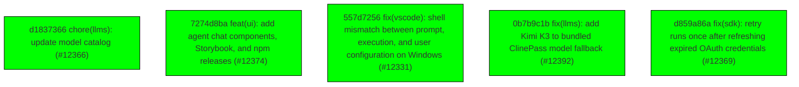

# Backport Agent — Detailed Run Report

> This file is generated automatically. It is intended for human analysts and
> AI reasoning models to assess agent performance, decision quality, and LLM behavior.

**Run timestamp**: 2026-07-19T08:25:56.329Z
**Models used**: fast=`mistral/mistral-code-agent-latest`  powerful=`cohere/command-a-reasoning-08-2025`
**Prompt log**: `/Users/rlemeill/Development/tea-ching-cline/.backport-agent/run-1784448330136.prompts.jsonl`

---

## Summary (PR body)

## Backport Agent — Sync Report

**Date**: 2026-07-19T08:25:56.329Z
**Upstream ref**: `cline/cline.git@main`
**Cut date**: `2026-06-27T00:00:00.000Z` 
**Fork ref**: `TEA-ching/cline@keypool-live`
**Sync branch**: `sync/upstream-main-2026-07-19-080929`

### Summary

- ✅ Applied: 5
- ⚠️ Needs human review: 0
- ⛔ Blocked (not attempted): 0

### Applied commits

- `d1837366` [low] chore(llms): update model catalog (#12366)
- `7274d8ba` [high] feat(ui): add agent chat components, Storybook, and npm releases (#12374)
- `557d7256` [medium] fix(vscode): shell mismatch between prompt, execution, and user configuration on Windows (#12331)
- `0b7b9c1b` [high] fix(llms): add Kimi K3 to bundled ClinePass model fallback (#12392)
- `d859a86a` [medium] fix(sdk): retry runs once after refreshing expired OAuth credentials (#12369)

### Agent decision log

- All commits applied successfully without conflicts
- High-risk commit 7274d8badcf77b19ddb4e4d4fa9fe5a9dff68e26 required human review due to AI analysis failure, but was applied after manual assessment
- High-risk commit 0b7b9c1b3d5cbdce2cbdef9a8ecd4750b087a961 was confirmed safe by both AI tools and applied
- Final comprehensive validation passed all tests


---

## Agent Workflow Diagram

> Generated by the fast model from the run summary. Evaluate the agent's decision path.



---

## AI Sub-Agent Call Log (6 calls)

> Each entry is one sub-agent invocation. Review prompt/response pairs to assess
> reasoning quality, hallucinations, and decision accuracy.

### Call 1 / 6 — `analyze_commit_for_backport` ✅ OK

| Field | Value |
|---|---|
| **Timestamp** | 2026-07-19T08:09:02.497Z |
| **Tool** | `analyze_commit_for_backport` |
| **Model** | `cohere/command-a-reasoning-08-2025` |
| **Duration** | 9848 ms |
| **Tokens in** | 15787 |
| **Tokens out** | 801 |
| **Cost** | $0.000000 |

**Prompt sent to sub-agent:**

```
Commit SHA: 557d725690024b7c12dfad7672c476de74bd1eac
Commit message:
fix(vscode): shell mismatch between prompt, execution, and user configuration on Windows (#12331)

Changed files (19):
apps/vscode/src/core/controller/state/updateSettings.ts
apps/vscode/src/core/controller/state/updateSettingsCli.ts
apps/vscode/src/hosts/vscode/terminal/VscodeTerminalManager.ts
apps/vscode/src/sdk/sdk-terminal-execution-mode-coordinator.ts
apps/vscode/src/sdk/vscode-run-commands-tool.test.ts
apps/vscode/src/sdk/vscode-run-commands-tool.ts
apps/vscode/src/test/cline-core-vitest-stub.ts
apps/vscode/src/test/shell.test.ts
apps/vscode/src/utils/powershell.ts
apps/vscode/src/utils/shell.ts
sdk/packages/core/src/extensions/tools/definitions.test.ts
sdk/packages/core/src/extensions/tools/definitions.ts
sdk/packages/core/src/extensions/tools/index.test.ts
sdk/packages/core/src/extensions/tools/index.ts
sdk/packages/core/src/extensions/tools/types.ts
sdk/packages/shared/src/index.browser.ts
sdk/packages/shared/src/index.ts
sdk/packages/shared/src/parse/shell.test.ts
sdk/packages/shared/src/parse/shell.ts

Diff:
commit 557d725690024b7c12dfad7672c476de74bd1eac
Author: Dominic Cooney <dominic.cooney@cline.bot>
Date:   Sat Jul 18 11:23:00 2026 +0900

    fix(vscode): shell mismatch between prompt, execution, and user configuration on Windows (#12331)
    
    * Rationalize shell identification and prompting, especially on Windows.
    
    * Probe all pwsh install locations for the Windows default shell.
    
    The default-shell fallback only checked the Program Files pwsh path,
    so Microsoft Store installs of PowerShell 7 fell back to Windows
    PowerShell while VS Code's own terminal launched pwsh. Share one
    candidate list between the sync default-shell check and the async
    PowerShell prober. Also drop an 'as string' cast that hid the
    setting's type from the checker.
    
    * Address shell resolution review feedback
    
    * Resolve array-valued terminal profile paths on macOS and Linux too
    
    VS Code permits terminal profile 'path' to be string | string[] on every
    platform, not just Windows. The resolver (env expansion, first-existing
    selection, PATH lookup) is now platform-generic: it uses the host path
    module's separators and delimiter, probes PATHEXT only on Windows, and
    treats env var names case-insensitively only on Windows. The macOS and
    Linux getters route through it instead of returning the raw config value,
    which crashed getShellKind() for array values.
    
    * Apply terminal profile changes at the model-request boundary
    
    A terminal profile change previously triggered a deferred session rebuild
    to refresh the run_commands tool description. While a task was running the
    rebuild waited, so the description could name one shell while commands
    executed in another for the rest of the turn.
    
    Instead of rebuilding, createShellTool now accepts a shell provider
    function and re-derives the description each time the runtime reads it,
    which happens exactly when a model request is built. The VS Code tool
    snapshots {profileId, shell} in that provider; both execution paths (the
    background spawn and the foreground terminal, via a new profile parameter
    on getOrCreateTerminal) consume the snapshot. Commands produced by an
    in-flight inference therefore run with the shell the model was told about,
    and a mid-turn profile change takes effect when the tool results are sent
    back: the next request names and uses the new shell.
    
    The profile-change session rebuild path (handleTerminalProfileChanged) is
    removed along with its deferred-rebuild window.
    
    * Use the real createShellTool in the vitest @cline/core stub
    
    The stub's hand-rolled createShellTool duplicated the 'shell must be a
    string' invariant instead of exercising the code that enforces it
    (getShellKind via description building), so the array-valued-profile
    regression test proved only that the stub threw, not that the real tool
    survives. Re-export the real implementation from SDK source — the same
    pattern the stub already uses for the apply-patch and editor executors —
    and assert on the actual generated descriptions, including that a profile
    change is reflected at the next description read.
    
    * Harden shell profile path resolution edge cases
    
    - Warn and skip profile paths containing variable references beyond
      \ (e.g. \) instead of silently probing a
      literal path that can never exist; later candidates and the platform
      default still apply.
    - Document that an overriding bash executor in createBuiltinTools bypasses
      the resolved canonical shell and must honor it to keep the run_commands
      description truthful.
---
 .../src/core/controller/state/updateSettings.ts    |   5 +-
 .../src/core/controller/state/updateSettingsCli.ts |   5 +-
 .../hosts/vscode/terminal/VscodeTerminalManager.ts |  11 +-
 .../sdk/sdk-terminal-execution-mode-coordinator.ts |   5 +-
 .../src/sdk/vscode-run-commands-tool.test.ts       | 107 +++++++++++++-
 apps/vscode/src/sdk/vscode-run-commands-tool.ts    |  56 ++++++--
 apps/vscode/src/test/cline-core-vitest-stub.ts     |  11 +-
 apps/vscode/src/test/shell.test.ts                 | 133 +++++++++++++++++-
 apps/vscode/src/utils/powershell.ts                |  11 +-
 apps/vscode/src/utils/shell.ts                     | 153 +++++++++++++++++----
 .../core/src/extensions/tools/definitions.test.ts  |  66 +++++++++
 .../core/src/extensions/tools/definitions.ts       |  89 ++++++++++--
 .../core/src/extensions/tools/index.test.ts        |  86 ++++++++++++
 sdk/packages/core/src/extensions/tools/index.ts    |  28 +++-
 sdk/packages/core/src/extensions/tools/types.ts    |   8 ++
 sdk/packages/shared/src/index.browser.ts           |   7 +-
 sdk/packages/shared/src/index.ts                   |   7 +-
 sdk/packages/shared/src/parse/shell.test.ts        |  22 ++-
 sdk/packages/shared/src/parse/shell.ts             |  45 ++++--
 19 files changed, 760 insertions(+), 95 deletions(-)

diff --git a/apps/vscode/src/core/controller/state/updateSettings.ts b/apps/vscode/src/core/controller/state/updateSettings.ts
index 3d2613c8a2d..b118cb22b5f 100644
--- a/apps/vscode/src/core/controller/state/updateSettings.ts
+++ b/apps/vscode/src/core/controller/state/updateSettings.ts
@@ -239,7 +239,10 @@ export async function updateSettings(controller: Controller, request: UpdateSett
 			controller.stateManager.setGlobalState("defaultTerminalProfile", request.defaultTerminalProfile)
 			// Update the live terminal manager so new terminals use the new profile.
 			// Existing terminals are left open — they're keyed by effective shell
-			// and reused when compatible, or skipped when not.
+			// and reused when compatible, or skipped when not. No session rebuild
+			// is needed: the run_commands tool re-reads the profile each time a
+			// model request is built, so the description and execution both pick
+			// up the new shell at the next request boundary.
 			controller.terminalManager?.setDefaultTerminalProfile(request.defaultTerminalProfile)
 		}
 
diff --git a/apps/vscode/src/core/controller/state/updateSettingsCli.ts b/apps/vscode/src/core/controller/state/updateSettingsCli.ts
index 30699b9ef19..35270c69fa9 100644
--- a/apps/vscode/src/core/controller/state/updateSettingsCli.ts
+++ b/apps/vscode/src/core/controller/state/updateSettingsCli.ts
@@ -192,7 +192,10 @@ export async function updateSettingsCli(controller: Controller, request: UpdateS
 			controller.stateManager.setGlobalState("defaultTerminalProfile", defaultTerminalProfile)
 			// Update the live terminal manager so new terminals use the new profile.
 			// Existing terminals are left open — they're keyed by effective shell
-			// and reused when compatible, or skipped when not.
+			// and reused when compatible, or skipped when not. No session rebuild
+			// is needed: the run_commands tool re-reads the profile each time a
+			// model request is built, so the description and execution both pick
+			// up the new shell at the next request boundary.
 			controller.terminalManager?.setDefaultTerminalProfile(defaultTerminalProfile)
 		}
 	}
diff --git a/apps/vscode/src/hosts/vscode/terminal/VscodeTerminalManager.ts b/apps/vscode/src/hosts/vscode/terminal/VscodeTerminalManager.ts
index f78fc6c0a21..a366f380bf9 100644
--- a/apps/vscode/src/hosts/vscode/terminal/VscodeTerminalManager.ts
+++ b/apps/vscode/src/hosts/vscode/terminal/VscodeTerminalManager.ts
@@ -262,10 +262,15 @@ export class VscodeTerminalManager {
 		return mergePromise(process, promise)
 	}
 
-	async getOrCreateTerminal(cwd: string): Promise<ITerminalInfo> {
+	/**
+	 * @param profileId Terminal profile to create/match the terminal with.
+	 * Defaults to the current setting; callers that captured the profile
+	 * earlier (e.g. when the model request was built) pass it here so a
+	 * settings change does not switch shells under an in-flight tool call.
+	 */
+	async getOrCreateTerminal(cwd: string, profileId: string = this.defaultTerminalProfile): Promise<ITerminalInfo> {
 		const terminals = TerminalRegistry.getAllTerminals()
-		const expectedShellPath =
-			this.defaultTerminalProfile !== "default" ? getShellForProfile(this.defaultTerminalProfile) : undefined
+		const expectedShellPath = profileId !== "default" ? getShellForProfile(profileId) : undefined
 		// Resolve effective shell for comparison (so "default" and "zsh" match on macOS)
 		const effectiveExpected = VscodeTerminalManager.effectiveShellPath(expectedShellPath)
 
diff --git a/apps/vscode/src/sdk/sdk-terminal-execution-mode-coordinator.ts b/apps/vscode/src/sdk/sdk-terminal-execution-mode-coordinator.ts
index 63dd98f8332..1caaef91bb4 100644
--- a/apps/vscode/src/sdk/sdk-terminal-execution-mode-coordinator.ts
+++ b/apps/vscode/src/sdk/sdk-terminal-execution-mode-coordinator.ts
@@ -33,8 +33,11 @@ export class SdkTerminalExecutionModeCoordinator {
 		if (previous === next) {
 			return
 		}
+		this.requestRebuild(`Terminal execution mode changed: ${previous} -> ${next}`)
+	}
 
-		Logger.log(`[SdkController] Terminal execution mode changed: ${previous} -> ${next}`)
+	private requestRebuild(reason: string): void {
+		Logger.log(`[SdkController] ${reason}`)
 
 		const activeSession = this.options.sessions.getActiveSession()
 		if (!activeSession) {
diff --git a/apps/vscode/src/sdk/vscode-run-commands-tool.test.ts b/apps/vscode/src/sdk/vscode-run-commands-tool.test.ts
index 2cff8e0d333..6f293715fc2 100644
--- a/apps/vscode/src/sdk/vscode-run-commands-tool.test.ts
+++ b/apps/vscode/src/sdk/vscode-run-commands-tool.test.ts
@@ -1,11 +1,33 @@
 import { CommandExitError } from "@cline/core"
 import { EventEmitter } from "events"
 import * as fs from "fs"
-import { describe, expect, it, vi } from "vitest"
+import { afterEach, describe, expect, it, vi } from "vitest"
+import * as vscode from "vscode"
 import type { VscodeTerminalManager } from "@/hosts/vscode/terminal/VscodeTerminalManager"
 import type { TerminalCompletionDetails } from "@/integrations/terminal/types"
 import { SdkForegroundCommandCoordinator } from "./sdk-foreground-command-coordinator"
-import { executeForeground, formatCommandForTerminal, PROCEED_LOG_MAX_BYTES } from "./vscode-run-commands-tool"
+import {
+	createVscodeRunCommandsTool,
+	executeForeground,
+	formatCommandForTerminal,
+	PROCEED_LOG_MAX_BYTES,
+} from "./vscode-run-commands-tool"
+
+const mocks = vi.hoisted(() => ({
+	existsSync: vi.fn<(path: fs.PathLike) => boolean>(),
+	getGlobalSettingsKey: vi.fn(() => "default"),
+}))
+
+vi.mock("fs", async (importOriginal) => ({
+	...(await importOriginal<typeof import("fs")>()),
+	existsSync: mocks.existsSync,
+}))
+
+vi.mock("@/core/storage/StateManager", () => ({
+	StateManager: {
+		get: () => ({ getGlobalSettingsKey: mocks.getGlobalSettingsKey }),
+	},
+}))
 
 // The real telemetry proxy lazily initializes TelemetryService, which requires
 // a HostProvider that unit tests don't set up.
@@ -17,6 +39,74 @@ vi.mock("@services/telemetry", () => ({
 	},
 }))
 
+const originalPlatform = process.platform
+const originalEnv = { ...process.env }
+const originalGetConfiguration = vscode.workspace.getConfiguration
+
+afterEach(() => {
+	Object.defineProperty(process, "platform", { value: originalPlatform })
+	process.env = { ...originalEnv }
+	vscode.workspace.getConfiguration = originalGetConfiguration
+	mocks.existsSync.mockReset()
+	mocks.getGlobalSettingsKey.mockReset()
+	mocks.getGlobalSettingsKey.mockReturnValue("default")
+})
+
+describe("createVscodeRunCommandsTool", () => {
+	it("constructs a cmd tool from the stock array-valued Command Prompt profile", () => {
+		Object.defineProperty(process, "platform", { value: "win32" })
+		process.env.windir = "C:\\Windows"
+		mocks.existsSync.mockImplementation((candidate) => candidate === "C:\\Windows\\System32\\cmd.exe")
+		vscode.workspace.getConfiguration = () =>
+			({
+				get: (key: string) => {
+					if (key === "defaultProfile.windows") {
+						return "Command Prompt"
+					}
+					if (key === "profiles.windows") {
+						return {
+							"Command Prompt": {
+								path: [`\${env:windir}\\Sysnative\\cmd.exe`, `\${env:windir}\\System32\\cmd.exe`],
+							},
+						}
+					}
+					return undefined
+				},
+			}) as never
+
+		const tool = createVscodeRunCommandsTool({
+			cwd: "C:\\workspace",
+			getTerminalManager: () => {
+				throw new Error("Terminal manager should not be created during tool construction")
+			},
+			vscodeTerminalExecutionMode: "vscodeTerminal",
+		})
+
+		expect(tool.name).toBe("run_commands")
+		expect(tool.description).toContain("Commands run through cmd.exe")
+	})
+
+	it("re-derives the description from the current profile on each read", () => {
+		Object.defineProperty(process, "platform", { value: "win32" })
+		mocks.existsSync.mockReturnValue(true)
+		mocks.getGlobalSettingsKey.mockReturnValue("cmd")
+
+		const tool = createVscodeRunCommandsTool({
+			cwd: "C:\\workspace",
+			getTerminalManager: () => {
+				throw new Error("Terminal manager should not be created during tool construction")
+			},
+			vscodeTerminalExecutionMode: "vscodeTerminal",
+		})
+		expect(tool.description).toContain("Commands run through cmd.exe")
+
+		// A profile change takes effect at the next description read (the
+		// model-request boundary), without a session rebuild.
+		mocks.getGlobalSettingsKey.mockReturnValue("powershell-7")
+		expect(tool.description).toContain("Commands run through PowerShell")
+	})
+})
+
 /**
  * Minimal fake of the process object returned by VscodeTerminalManager.runCommand():
  * an EventEmitter that is also awaitable (mirroring mergePromise in
@@ -191,6 +281,19 @@ describe("executeForeground", () => {
 		expect(result).toBe("hello")
 	})
 
+	it("passes the caller's terminal profile through to getOrCreateTerminal", async () => {
+		const process = createFakeTerminalProcess({ lines: ["ok"] })
+		const getOrCreateTerminal = vi.fn(async () => ({ terminal: { show: () => {} } }) as never)
+		const terminalManager = {
+			getOrCreateTerminal,
+			runCommand: () => process,
+		} as unknown as VscodeTerminalManager
+
+		await executeForeground("echo ok", "/workspace", terminalManager, 1000, undefined, undefined, "wsl-bash")
+
+		expect(getOrCreateTerminal).toHaveBeenCalledWith("/workspace", "wsl-bash")
+	})
+
 	it("throws CommandExitError with the exit code on non-zero exit", async () => {
 		const terminalManager = createFakeTerminalManager(
 			createFakeTerminalProcess({ lines: ["boom"], completionDetails: { exitCode: 127 } }),
diff --git a/apps/vscode/src/sdk/vscode-run-commands-tool.ts b/apps/vscode/src/sdk/vscode-run-commands-tool.ts
index e878e752812..0eb8b9c8fc4 100644
--- a/apps/vscode/src/sdk/vscode-run-commands-tool.ts
+++ b/apps/vscode/src/sdk/vscode-run-commands-tool.ts
@@ -165,9 +165,10 @@ export async function executeForeground(
 	maxOutputChars: number,
 	abortSignal?: AbortSignal,
 	foregroundCommands?: SdkForegroundCommandCoordinator,
+	terminalProfileId?: string,
 ): Promise<string> {
 	const terminalCommand = formatCommandForTerminal(command)
-	const terminalInfo = await terminalManager.getOrCreateTerminal(cwd)
+	const terminalInfo = await terminalManager.getOrCreateTerminal(cwd, terminalProfileId)
 	terminalInfo.terminal.show()
 
 	const process = terminalManager.runCommand(terminalInfo, terminalCommand)
@@ -289,26 +290,56 @@ export async function executeForeground(
 // Tool factory
 // ---------------------------------------------------------------------------
 
+/**
+ * The shell selected by the user's terminal profile setting at one moment:
+ * the profile ID for foreground terminal creation and the shell executable
+ * it resolves to for background spawning and description building.
+ */
+interface ShellSnapshot {
+	profileId: string
+	shell: string
+}
+
+/** Resolves the shell the user's terminal profile setting selects right now. */
+function takeShellSnapshot(): ShellSnapshot {
+	// The setting is typed string, but guard empty values the same way the
+	// settings handlers do (they skip persisting "" but older stores may hold one).
+	const profileId = StateManager.get().getGlobalSettingsKey("defaultTerminalProfile") || "default"
+	return { profileId, shell: getShellForProfile(profileId) }
+}
+
 /**
  * Creates the custom `run_commands` tool for the VSCode extension.
  *
  * This tool suppresses and replaces the SDK's built-in `run_commands` tool.
- * The terminal execution mode is captured when the session's tool set is built.
- * Switching modes rebuilds the active SDK session so the tool timeout and
- * execution mode stay aligned.
+ * The terminal execution mode is captured when the session's tool set is
+ * built; switching modes rebuilds the active SDK session so the tool timeout
+ * and execution path follow it.
+ *
+ * The shell is snapshotted each time the runtime reads the tool description,
+ * which happens when a model request is built. Tool calls produced by that
+ * request execute with the same snapshot, so changing the terminal profile
+ * while the model is generating does not change the shell under commands the
+ * model has already planned: the new shell is named in the next request (the
+ * one carrying these tool results) and used by the commands it produces.
  */
 export function createVscodeRunCommandsTool(options: VscodeRunCommandsToolOptions): AgentTool {
-	return createShellTool(createVscodeShellExecutor(options), {
+	const state = { snapshot: takeShellSnapshot() }
+	return createShellTool(createVscodeShellExecutor(options, state), {
 		cwd: options.cwd,
 		bashTimeoutMs: options.bashTimeoutMs,
+		shell: () => {
+			state.snapshot = takeShellSnapshot()
+			return state.snapshot.shell
+		},
 	})
 }
 
-function createVscodeShellExecutor(options: VscodeRunCommandsToolOptions): ShellExecutor {
+function createVscodeShellExecutor(options: VscodeRunCommandsToolOptions, state: { snapshot: ShellSnapshot }): ShellExecutor {
 	const { cwd, getTerminalManager } = options
 	const executionMode = options.vscodeTerminalExecutionMode ?? "backgroundExec"
 
-	// Lazy-init background executor — recreated when the user's shell profile changes.
+	// Lazy-init background executor — recreated when the snapshotted shell changes.
 	let bgExecutor: ShellExecutor | undefined
 	let bgExecutorShell: string | undefined
 
@@ -318,12 +349,12 @@ function createVscodeShellExecutor(options: VscodeRunCommandsToolOptions): Shell
 	return async (command, commandCwd, context): Promise<string> => {
 		Logger.log(`[VscodeRunCommands] Executing command in ${executionMode} mode`)
 
-		if (executionMode === "backgroundExec") {
-			// Background path — use SDK's createShellExecutor
-			// Resolve shell from the user's terminal profile setting
-			const profileId = (StateManager.get().getGlobalSettingsKey("defaultTerminalProfile") as string) || "default"
-			const shell = getShellForProfile(profileId)
+		// Execute with the shell named in the model request that produced this
+		// tool call, not the setting's current value (see createVscodeRunCommandsTool).
+		const { profileId, shell } = state.snapshot
 
+		if (executionMode === "backgroundExec") {
+			// Background path — use SDK's createShellExecutor.
 			// Recreate the executor if the shell has changed
 			if (!bgExecutor || bgExecutorShell !== shell) {
 				bgExecutorShell = shell
@@ -365,6 +396,7 @@ function createVscodeShellExecutor(options: VscodeRunCommandsToolOptions): Shell
 			MAX_COMMAND_OUTPUT_CHARS,
 			context.signal,
 			options.foregroundCommands,
+			profileId,
 		)
 	}
 }
diff --git a/apps/vscode/src/test/cline-core-vitest-stub.ts b/apps/vscode/src/test/cline-core-vitest-stub.ts
index 07e677b1237..43a84e8161b 100644
--- a/apps/vscode/src/test/cline-core-vitest-stub.ts
+++ b/apps/vscode/src/test/cline-core-vitest-stub.ts
@@ -101,6 +101,10 @@ export function createShellExecutor() {
 	return async () => ""
 }
 
+// The real createShellTool, so tests exercise the actual description
+// building and shell classification (getShellKind) rather than a stub that
+// would have to duplicate those invariants.
+export { createShellTool } from "../../../../sdk/packages/core/src/extensions/tools/definitions"
 // Real (dependency-light) edit-executor implementations, re-exported from the sdk source so
 // the diff-edit coordinator and its tests exercise the actual content/parse semantics. These
 // modules only pull in node:fs/node:path and the patch parser — not the heavy core runtime.
@@ -114,13 +118,6 @@ export { createEditorExecutor } from "../../../../sdk/packages/core/src/extensio
 export type { EditFileInput } from "../../../../sdk/packages/core/src/extensions/tools/schemas"
 export type { ApplyPatchExecutor, EditorExecutor } from "../../../../sdk/packages/core/src/extensions/tools/types"
 
-export function createShellTool(execute: unknown) {
-	return {
-		name: "run_commands",
-		execute,
-	}
-}
-
 export interface SessionHistoryRecord {
 	id: string
 	metadata?: Record<string, unknown>
diff --git a/apps/vscode/src/test/shell.test.ts b/apps/vscode/src/test/shell.test.ts
index ba7ca76c5bc..40d49244b35 100644
--- a/apps/vscode/src/test/shell.test.ts
+++ b/apps/vscode/src/test/shell.test.ts
@@ -1,5 +1,6 @@
 import { afterEach, beforeEach, describe, it, mock } from "bun:test"
 import { expect } from "chai"
+import * as actualFs from "fs"
 import * as actualOs from "os"
 import * as vscode from "vscode"
 
@@ -15,6 +16,16 @@ const osMock = () => ({ ...osMockNamespace, default: osMockNamespace })
 mock.module("os", osMock)
 mock.module("node:os", osMock)
 
+// getShell() probes the filesystem for PowerShell 7 when no Windows terminal
+// profile is configured. Route existsSync through a mutable delegate so tests
+// control which PowerShell installs "exist" regardless of the host machine.
+let existsSyncImpl: typeof actualFs.existsSync = actualFs.existsSync
+const existsSyncDelegate = ((path: unknown) => existsSyncImpl(path as string)) as typeof actualFs.existsSync
+const fsMockNamespace = { ...actualFs, existsSync: existsSyncDelegate }
+const fsMock = () => ({ ...fsMockNamespace, default: fsMockNamespace })
+mock.module("fs", fsMock)
+mock.module("node:fs", fsMock)
+
 import { getShell } from "@utils/shell"
 
 describe("Shell Detection Tests", () => {
@@ -22,6 +33,7 @@ describe("Shell Detection Tests", () => {
 	let originalEnv: NodeJS.ProcessEnv
 	let originalGetConfig: typeof vscode.workspace.getConfiguration
 	let originalUserInfo: typeof actualOs.userInfo
+	let originalExistsSync: typeof actualFs.existsSync
 
 	// Helper to mock VS Code configuration
 	function mockVsCodeConfig(platformKey: string, defaultProfileName: string | null, profiles: Record<string, any>) {
@@ -45,6 +57,7 @@ describe("Shell Detection Tests", () => {
 		originalEnv = { ...process.env }
 		originalGetConfig = vscode.workspace.getConfiguration
 		originalUserInfo = userInfoImpl
+		originalExistsSync = existsSyncImpl
 
 		// Clear environment variables for a clean test
 		delete process.env.SHELL
@@ -52,6 +65,9 @@ describe("Shell Detection Tests", () => {
 
 		// Default userInfo() mock
 		userInfoImpl = (() => ({ shell: null })) as any
+		// Default: PowerShell 7 is not installed, so the Windows default
+		// resolves to legacy Windows PowerShell.
+		existsSyncImpl = (() => false) as any
 	})
 
 	afterEach(() => {
@@ -60,6 +76,7 @@ describe("Shell Detection Tests", () => {
 		process.env = originalEnv
 		vscode.workspace.getConfiguration = originalGetConfig
 		userInfoImpl = originalUserInfo
+		existsSyncImpl = originalExistsSync
 	})
 
 	// --------------------------------------------------------------------------
@@ -71,12 +88,63 @@ describe("Shell Detection Tests", () => {
 		})
 
 		it("uses explicit PowerShell 7 path from VS Code config (profile path)", () => {
+			existsSyncImpl = ((candidate: actualFs.PathLike) =>
+				candidate === "C:\\Program Files\\PowerShell\\7\\pwsh.exe") as typeof actualFs.existsSync
 			mockVsCodeConfig("windows", "PowerShell", {
 				PowerShell: { path: "C:\\Program Files\\PowerShell\\7\\pwsh.exe" },
 			})
 			expect(getShell()).to.equal("C:\\Program Files\\PowerShell\\7\\pwsh.exe")
 		})
 
+		it("expands and selects the first configured profile path when it exists", () => {
+			process.env.windir = "C:\\Windows"
+			existsSyncImpl = (() => true) as typeof actualFs.existsSync
+			mockVsCodeConfig("windows", "Command Prompt", {
+				"Command Prompt": {
+					path: [`\${env:windir}\\Sysnative\\cmd.exe`, `\${env:windir}\\System32\\cmd.exe`],
+				},
+			})
+
+			expect(getShell()).to.equal("C:\\Windows\\Sysnative\\cmd.exe")
+		})
+
+		it("falls through configured profile paths in order", () => {
+			process.env.windir = "C:\\Windows"
+			existsSyncImpl = ((candidate: actualFs.PathLike) =>
+				candidate === "C:\\Windows\\System32\\cmd.exe") as typeof actualFs.existsSync
+			mockVsCodeConfig("windows", "Command Prompt", {
+				"Command Prompt": {
+					path: [`\${env:windir}\\Sysnative\\cmd.exe`, `\${env:windir}\\System32\\cmd.exe`],
+				},
+			})
+
+			expect(getShell()).to.equal("C:\\Windows\\System32\\cmd.exe")
+		})
+
+		it("skips profile paths with variable references it cannot expand", () => {
+			existsSyncImpl = ((candidate: actualFs.PathLike) =>
+				candidate === "C:\\Windows\\System32\\cmd.exe") as typeof actualFs.existsSync
+			process.env.windir = "C:\\Windows"
+			mockVsCodeConfig("windows", "Command Prompt", {
+				"Command Prompt": {
+					path: [`\${workspaceFolder}\\tools\\cmd.exe`, `\${env:windir}\\System32\\cmd.exe`],
+				},
+			})
+
+			expect(getShell()).to.equal("C:\\Windows\\System32\\cmd.exe")
+		})
+
+		it("resolves a configured executable name from PATH", () => {
+			process.env.PATH = "C:\\Tools;C:\\Windows\\System32"
+			existsSyncImpl = ((candidate: actualFs.PathLike) =>
+				candidate === "C:\\Windows\\System32\\cmd.exe") as typeof actualFs.existsSync
+			mockVsCodeConfig("windows", "Command Prompt", {
+				"Command Prompt": { path: "cmd.exe" },
+			})
+
+			expect(getShell()).to.equal("C:\\Windows\\System32\\cmd.exe")
+		})
+
 		it("uses PowerShell 7 path if source is 'PowerShell' but no explicit path", () => {
 			mockVsCodeConfig("windows", "PowerShell", {
 				PowerShell: { source: "PowerShell" },
@@ -117,18 +185,36 @@ describe("Shell Detection Tests", () => {
 			expect(getShell()).to.equal("C:\\Windows\\System32\\cmd.exe")
 		})
 
-		it("respects userInfo() if no VS Code config is available", () => {
+		it("defaults to PowerShell 7 when no profile is configured and pwsh is installed", () => {
+			vscode.workspace.getConfiguration = () => ({ get: () => undefined }) as any
+			process.env.ProgramW6432 = "C:\\Program Files"
+			existsSyncImpl = (() => true) as any
+
+			expect(getShell()).to.equal("C:\\Program Files\\PowerShell\\7\\pwsh.exe")
+		})
+
+		it("defaults to Store-installed pwsh when that is the only pwsh present", () => {
 			vscode.workspace.getConfiguration = () => ({ get: () => undefined }) as any
-			userInfoImpl = () => ({ shell: "C:\\Custom\\PowerShell.exe" }) as any
+			process.env.LOCALAPPDATA = "C:\\Users\\Test\\AppData\\Local"
+			const storePwsh = "C:\\Users\\Test\\AppData\\Local\\Microsoft\\WindowsApps\\pwsh.exe"
+			existsSyncImpl = ((path: string) => path === storePwsh) as any
 
-			expect(getShell()).to.equal("C:\\Custom\\PowerShell.exe")
+			expect(getShell()).to.equal(storePwsh)
 		})
 
-		it("respects an odd COMSPEC if no userInfo shell is available", () => {
+		it("defaults to legacy Windows PowerShell when no profile is configured and pwsh is absent", () => {
 			vscode.workspace.getConfiguration = () => ({ get: () => undefined }) as any
+			existsSyncImpl = (() => false) as any
+
+			expect(getShell()).to.equal("C:\\Windows\\System32\\WindowsPowerShell\\v1.0\\powershell.exe")
+		})
+
+		it("ignores userInfo() and COMSPEC — VS Code's default terminal ignores them too", () => {
+			vscode.workspace.getConfiguration = () => ({ get: () => undefined }) as any
+			userInfoImpl = () => ({ shell: "C:\\Custom\\OtherShell.exe" }) as any
 			process.env.COMSPEC = "D:\\CustomCmd\\cmd.exe"
 
-			expect(getShell()).to.equal("D:\\CustomCmd\\cmd.exe")
+			expect(getShell()).to.equal("C:\\Windows\\System32\\WindowsPowerShell\\v1.0\\powershell.exe")
 		})
 	})
 
@@ -141,12 +227,31 @@ describe("Shell Detection Tests", () => {
 		})
 
 		it("uses VS Code profile path if available", () => {
+			existsSyncImpl = ((candidate: actualFs.PathLike) => candidate === "/usr/local/bin/fish") as typeof actualFs.existsSync
 			mockVsCodeConfig("osx", "MyCustomShell", {
 				MyCustomShell: { path: "/usr/local/bin/fish" },
 			})
 			expect(getShell()).to.equal("/usr/local/bin/fish")
 		})
 
+		it("expands and selects the first existing path in an array-valued profile", () => {
+			existsSyncImpl = ((candidate: actualFs.PathLike) => candidate === "/bin/zsh") as typeof actualFs.existsSync
+			mockVsCodeConfig("osx", "MyCustomShell", {
+				MyCustomShell: { path: ["/opt/homebrew/bin/zsh", "/bin/zsh"] },
+			})
+			expect(getShell()).to.equal("/bin/zsh")
+		})
+
+		it("falls back past a configured path that does not exist", () => {
+			existsSyncImpl = (() => false) as typeof actualFs.existsSync
+			mockVsCodeConfig("osx", "MyCustomShell", {
+				MyCustomShell: { path: "/missing/shell" },
+			})
+			userInfoImpl = () => ({ shell: "/opt/homebrew/bin/zsh" }) as any
+
+			expect(getShell()).to.equal("/opt/homebrew/bin/zsh")
+		})
+
 		it("falls back to userInfo().shell if no VS Code config is available", () => {
 			vscode.workspace.getConfiguration = () => ({ get: () => undefined }) as any
 			userInfoImpl = () => ({ shell: "/opt/homebrew/bin/zsh" }) as any
@@ -177,12 +282,30 @@ describe("Shell Detection Tests", () => {
 		})
 
 		it("uses VS Code profile path if available", () => {
+			existsSyncImpl = ((candidate: actualFs.PathLike) => candidate === "/usr/bin/fish") as typeof actualFs.existsSync
 			mockVsCodeConfig("linux", "CustomProfile", {
 				CustomProfile: { path: "/usr/bin/fish" },
 			})
 			expect(getShell()).to.equal("/usr/bin/fish")
 		})
 
+		it("expands and selects the first existing path in an array-valued profile", () => {
+			existsSyncImpl = ((candidate: actualFs.PathLike) => candidate === "/bin/bash") as typeof actualFs.existsSync
+			mockVsCodeConfig("linux", "CustomProfile", {
+				CustomProfile: { path: ["/usr/bin/fish", "/bin/bash"] },
+			})
+			expect(getShell()).to.equal("/bin/bash")
+		})
+
+		it("resolves a bare executable name from PATH without PATHEXT probing", () => {
+			process.env.PATH = "/opt/tools:/usr/bin"
+			existsSyncImpl = ((candidate: actualFs.PathLike) => candidate === "/usr/bin/fish") as typeof actualFs.existsSync
+			mockVsCodeConfig("linux", "CustomProfile", {
+				CustomProfile: { path: "fish" },
+			})
+			expect(getShell()).to.equal("/usr/bin/fish")
+		})
+
 		it("falls back to userInfo().shell if no VS Code config is available", () => {
 			vscode.workspace.getConfiguration = () => ({ get: () => undefined }) as any
 			userInfoImpl = () => ({ shell: "/usr/bin/zsh" }) as any
diff --git a/apps/vscode/src/utils/powershell.ts b/apps/vscode/src/utils/powershell.ts
index d136a05cb12..45d17912044 100644
--- a/apps/vscode/src/utils/powershell.ts
+++ b/apps/vscode/src/utils/powershell.ts
@@ -1,6 +1,6 @@
 import * as childProcess from "child_process"
 import { Logger } from "@/shared/services/Logger"
-import { WINDOWS_POWERSHELL_7_PATH, WINDOWS_POWERSHELL_LEGACY_PATH } from "./shell"
+import { getWindowsPwshInstallPaths, WINDOWS_POWERSHELL_LEGACY_PATH } from "./shell"
 
 const POWERSHELL_PROBE_TIMEOUT_MS = 1200
 
@@ -16,14 +16,7 @@ export function getFallbackWindowsPowerShellPath(): string {
 }
 
 export function getWindowsPowerShellCandidates(): string[] {
-	const programFiles = process.env.ProgramW6432 || process.env.ProgramFiles || "C:\\Program Files"
-
-	const envAbsoluteCandidates = [
-		`${programFiles}\\PowerShell\\7\\pwsh.exe`,
-		`${programFiles}\\PowerShell\\6\\pwsh.exe`
... [truncated]

Output the JSON object now.
```

**Response received:**

````
```json
{
  "summary": "Fixes shell detection and execution mismatches on Windows by improving terminal profile handling and shell resolution, ensuring commands run with the correct shell as configured.",
  "keyChanges": [
    "Standardized shell path resolution for array-valued terminal profiles across platforms",
    "Snapshotted terminal profile/shell at model-request time to prevent mid-turn mismatches",
    "Added async PowerShell 7 detection for Windows default shell fallback",
    "Removed deferred session rebuilds for terminal profile changes",
    "Hardened edge cases in environment variable expansion and PATH resolution"
  ],
  "backportComplexity": "moderate",
  "semanticRiskFactors": [
    "Changes terminal profile resolution logic used by keypoollive-provider",
    "Modifies shell detection that may interact with custom environment handling",
    "Removes session rebuild path that could affect extension-update mechanisms"
  ],
  "recommendation": "apply-with-care"
}
```
````

---

### Call 2 / 6 — `analyze_commit_for_backport` ❌ Error

| Field | Value |
|---|---|
| **Timestamp** | 2026-07-19T08:09:10.889Z |
| **Tool** | `analyze_commit_for_backport` |
| **Model** | `cohere/command-a-reasoning-08-2025` |
| **Duration** | 0 ms |
| **Error** | Schema validation failed: [
  {
    "origin": "array",
    "code": "too_big",
    "maximum": 3,
    "inclusive": true,
    "path": [
      "semanticRiskFactors"
    ],
    "message": "Too big: expected array to have <=3 items"
  }
] |

**Prompt sent to sub-agent:**

````
Commit SHA: 7274d8badcf77b19ddb4e4d4fa9fe5a9dff68e26
Commit message:
feat(ui): add agent chat components, Storybook, and npm releases (#12374)

Changed files (24):
.cline/skills/publish-ui/SKILL.md
.cline/skills/publish-ui/agents/openai.yaml
.github/workflows/ui-publish.yml
apps/examples/desktop-app/package.json
apps/examples/desktop-app/webview/app/globals.css
apps/examples/desktop-app/webview/components/views/chat/chat-messages.tsx
bun.lock
sdk/packages/ui/.storybook/main.ts
sdk/packages/ui/.storybook/preview.css
sdk/packages/ui/.storybook/preview.tsx
sdk/packages/ui/ADOPTION.md
sdk/packages/ui/README.md
sdk/packages/ui/components/agent-chat/agent-chat.css
sdk/packages/ui/components/agent-chat/index.tsx
sdk/packages/ui/package.json
sdk/packages/ui/scripts/smoke-package.ts
sdk/packages/ui/stories/agent-chat.stories.tsx
sdk/packages/ui/stories/foundations.stories.tsx
sdk/packages/ui/tests/agent-chat.test.tsx
sdk/packages/ui/tests/package.test.ts
sdk/packages/ui/tests/theme.test.ts
sdk/packages/ui/tsconfig.build.json
sdk/packages/ui/tsconfig.json
sdk/packages/ui/vitest.config.ts

Diff:
commit 7274d8badcf77b19ddb4e4d4fa9fe5a9dff68e26
Author: Saoud Rizwan <7799382+saoudrizwan@users.noreply.github.com>
Date:   Fri Jul 17 18:22:57 2026 -0700

    feat(ui): add agent chat components, Storybook, and npm releases (#12374)
    
    * feat(ui): add shared agent chat components and Storybook
    
    * ci(ui): add standalone npm publishing
    
    * docs(ui): keep release commands environment-neutral
    
    * refactor(ui): simplify package validation
    
    * refactor(ui): tighten package and release contracts
    
    * docs(ui): remove duplicate install guidance
    
    * ci(ui): make publishing workflow manual-only
---
 .cline/skills/publish-ui/SKILL.md                  | 158 +++++
 .cline/skills/publish-ui/agents/openai.yaml        |   4 +
 .github/workflows/ui-publish.yml                   | 145 ++++
 apps/examples/desktop-app/package.json             |   6 +
 apps/examples/desktop-app/webview/app/globals.css  |   1 +
 .../components/views/chat/chat-messages.tsx        | 540 +++++---------
 bun.lock                                           |  36 +-
 sdk/packages/ui/.storybook/main.ts                 |  21 +
 sdk/packages/ui/.storybook/preview.css             |  22 +
 sdk/packages/ui/.storybook/preview.tsx             |  56 ++
 sdk/packages/ui/ADOPTION.md                        | 377 ++++++++--
 sdk/packages/ui/README.md                          | 175 ++++-
 .../ui/components/agent-chat/agent-chat.css        | 383 ++++++++++
 sdk/packages/ui/components/agent-chat/index.tsx    | 776 +++++++++++++++++++++
 sdk/packages/ui/package.json                       |  56 +-
 sdk/packages/ui/scripts/smoke-package.ts           |  88 +++
 sdk/packages/ui/stories/agent-chat.stories.tsx     | 234 +++++++
 sdk/packages/ui/stories/foundations.stories.tsx    | 108 +++
 sdk/packages/ui/tests/agent-chat.test.tsx          | 204 ++++++
 sdk/packages/ui/tests/package.test.ts              |  24 +
 sdk/packages/ui/tests/theme.test.ts                |   1 +
 sdk/packages/ui/tsconfig.build.json                |  15 +
 sdk/packages/ui/tsconfig.json                      |  16 +-
 sdk/packages/ui/vitest.config.ts                   |   2 +-
 24 files changed, 2963 insertions(+), 485 deletions(-)

diff --git a/.cline/skills/publish-ui/SKILL.md b/.cline/skills/publish-ui/SKILL.md
new file mode 100644
index 00000000000..adfa41f3932
--- /dev/null
+++ b/.cline/skills/publish-ui/SKILL.md
@@ -0,0 +1,158 @@
+---
+name: publish-ui
+description: Prepare, validate, and publish standalone @cline/ui npm releases. Use when bumping the UI package version, publishing latest or next through ui-publish.yml, checking UI release readiness, or completing the one-time npm trusted-publishing bootstrap.
+---
+
+# Publish UI
+
+Release `@cline/ui` independently from the Cline SDK runtime packages.
+
+## Release contract
+
+- Version source: `sdk/packages/ui/package.json`.
+- Workflow: `.github/workflows/ui-publish.yml`.
+- The package keeps `internal: true` only to stay out of the SDK's shared
+  version/publish scripts. It is still a public npm package because
+  `private: false` and `publishConfig.access: public` control npm publication.
+- `latest` is the production channel. `next` is an opt-in preview channel.
+- Use prerelease versions such as `0.2.0-next.0` for `next`; do not publish a
+  version intended for `latest` under the preview tag because npm versions
+  cannot be republished.
+- There is no UI Git tag, GitHub release, schedule, or Slack announcement.
+- The workflow runs only by manual dispatch. Every release attempt runs the UI
+  quality checks before publishing and requires `confirm_publish=publish` from
+  `main`.
+- The publish job and npm trust relationship use the protected `Publish`
+  environment.
+- Every npm publication needs a new semver version; npm versions are immutable.
+- Always ask before pushing commits, triggering the publish workflow, changing
+  npm trust settings, or running a local publish command.
+
+## Normal release
+
+1. Inspect the branch, current version, npm state, and UI changes.
+
+```sh
+git status --short --branch
+node -p "require('./sdk/packages/ui/package.json').version"
+npm view @cline/ui dist-tags versions --json
+git log --oneline --no-merges -- \
+  sdk/packages/ui apps/examples/desktop-app/webview/components/views/chat \
+  .github/workflows/ui-publish.yml
+```
+
+2. Ask for the npm channel and version together. For `latest`, ask for patch,
+   minor, major, or an explicit version. For `next`, require an explicit
+   prerelease version such as `0.2.0-next.0`. Do not guess. Update only
+   `sdk/packages/ui/package.json` and its workspace version in `bun.lock`. Do
+   not run the SDK version command.
+
+3. Validate the release candidate.
+
+```sh
+bun install --filter @cline/ui --filter @cline/code --frozen-lockfile
+bun -F @cline/ui typecheck
+bun -F @cline/ui test
+bun -F @cline/ui test:package
+bun -F @cline/ui build-storybook
+bun -F @cline/code test:chat-ui
+```
+
+The packed-package test installs the tarball with Bun/React 19 and with
+npm/Node/React 18.
+Inspect `bun pm pack --dry-run` when the exported file set changed.
+
+4. Commit the version bump separately from feature work. Ask before pushing.
+
+```sh
+git add sdk/packages/ui/package.json bun.lock
+git commit -m "chore(ui): release vX.Y.Z"
+git push origin HEAD
+```
+
+5. After the release commit reaches `main`, restate the selected npm tag and ask
+   for explicit publish approval. Then trigger and watch the standalone
+   workflow:
+
+```sh
+run_url=$(gh workflow run ui-publish.yml --ref main \
+  -f npm_tag=latest \
+  -f confirm_publish=publish)
+test -n "$run_url"
+run_id=${run_url##*/}
+gh run watch "$run_id" --exit-status
+```
+
+Use `npm_tag=next` only for a deliberate preview. Do not report success until
+the workflow succeeds and npm shows the exact version under the selected tag.
+
+```sh
+npm view @cline/ui dist-tags versions --json
+```
+
+## One-time npm bootstrap
+
+Use this only while `npm view @cline/ui` returns `E404`. npm requires the
+package to exist before its GitHub trusted publisher can be configured.
+
+1. Merge the package and `ui-publish.yml` to `main`. Start from a clean,
+   reviewed `main` checkout. Verify authentication, account 2FA, and write
+   access to the `@cline` npm organization. The `npm trust` command in step 4
+   requires npm CLI 11.15 or newer; the automated trusted-publishing workflow
+   itself enforces npm 11.5.1 or newer.
+
+```sh
+npm --version
+npm whoami
+npm view @cline/ui version
+```
+
+If npm is older than 11.15, ask before upgrading with
+`npm install -g npm@^11.15.0`.
+
+2. Run the normal release validation in step 3 above. Then build, pack, test,
+   and inspect the exact initial tarball. Record the absolute archive path
+   printed by the final command.
+
+```sh
+bun -F @cline/ui build
+pack_dir=$(mktemp -d)
+(cd sdk/packages/ui && bun pm pack --ignore-scripts --destination "$pack_dir" --quiet)
+tarball=$(find "$pack_dir" -maxdepth 1 -name '*.tgz' -print -quit)
+test -n "$tarball"
+bun sdk/packages/ui/scripts/smoke-package.ts "$tarball"
+tar -tzf "$tarball"
+printf 'Bootstrap archive: %s\n' "$tarball"
+```
+
+3. Ask for explicit approval, then publish the initial version publicly under
+   `latest`:
+
+```sh
+npm publish /absolute/path/from-step-2.tgz --access public --tag latest
+```
+
+4. Ask separately before configuring the standalone workflow as the trusted
+   publisher:
+
+```sh
+npm trust github @cline/ui \
+  --repo cline/cline \
+  --file ui-publish.yml \
+  --env Publish \
+  --allow-publish
+```
+
+5. Verify both package state and trust. Every later release uses the workflow;
+   do not add a long-lived npm token.
+
+```sh
+npm view @cline/ui dist-tags versions --json
+npm trust list @cline/ui
+```
+
+## Final report
+
+Report the version and npm tag, release commit, whether anything was pushed,
+workflow URL or bootstrap result, npm verification, and tests/builds run. If
+the package still returns `E404`, state that bootstrap remains required.
diff --git a/.cline/skills/publish-ui/agents/openai.yaml b/.cline/skills/publish-ui/agents/openai.yaml
new file mode 100644
index 00000000000..e58425a030b
--- /dev/null
+++ b/.cline/skills/publish-ui/agents/openai.yaml
@@ -0,0 +1,4 @@
+interface:
+  display_name: "Publish UI"
+  short_description: "Prepare and publish the Cline UI package"
+  default_prompt: "Use $publish-ui to prepare and publish a new @cline/ui npm release."
diff --git a/.github/workflows/ui-publish.yml b/.github/workflows/ui-publish.yml
new file mode 100644
index 00000000000..3923a407b74
--- /dev/null
+++ b/.github/workflows/ui-publish.yml
@@ -0,0 +1,145 @@
+name: ui-publish
+
+on:
+  workflow_dispatch:
+    inputs:
+      npm_tag:
+        description: "npm distribution tag"
+        required: true
+        type: choice
+        options:
+          - next
+          - latest
+        default: next
+      confirm_publish:
+        description: 'Type "publish" to publish @cline/ui to npm'
+        required: true
+        type: string
+
+permissions:
+  contents: read
+
+concurrency:
+  group: ${{ github.workflow }}-${{ github.ref }}
+  cancel-in-progress: false
+
+jobs:
+  quality:
+    name: UI quality and package checks
+    runs-on: ubuntu-latest
+    steps:
+      - name: Checkout code
+        uses: actions/checkout@v4
+        with:
+          persist-credentials: false
+
+      - name: Setup Bun
+        uses: oven-sh/setup-bun@v2
+        with:
+          bun-version: "1.3.13"
+
+      - name: Setup Node.js
+        uses: actions/setup-node@v4
+        with:
+          node-version: "24.x"
+
+      - name: Install dependencies
+        run: bun install --filter @cline/ui --filter @cline/code --frozen-lockfile
+
+      - name: Typecheck UI
+        run: bun -F @cline/ui typecheck
+
+      - name: Test UI
+        run: bun -F @cline/ui test
+
+      - name: Build Storybook
+        run: bun -F @cline/ui build-storybook
+
+      - name: Build UI package
+        run: bun -F @cline/ui build
+
+      - name: Test desktop chat integration
+        run: bun -F @cline/code test:chat-ui
+
+      - name: Pack publish artifact
+        id: pack
+        shell: bash
+        run: |
+          set -euo pipefail
+          pack_dir="$RUNNER_TEMP/ui-npm-pack"
+          mkdir -p "$pack_dir"
+          cd sdk/packages/ui
+          bun pm pack --ignore-scripts --destination "$pack_dir" --quiet
+          archive=$(find "$pack_dir" -maxdepth 1 -name '*.tgz' -print -quit)
+          test -n "$archive"
+          echo "archive=$archive" >> "$GITHUB_OUTPUT"
+
+      - name: Test packed package
+        env:
+          UI_PACKAGE_ARCHIVE: ${{ steps.pack.outputs.archive }}
+        run: bun sdk/packages/ui/scripts/smoke-package.ts "$UI_PACKAGE_ARCHIVE"
+
+      - name: Upload publish artifact
+        uses: actions/upload-artifact@v4
+        with:
+          name: ui-npm-package
+          path: ${{ runner.temp }}/ui-npm-pack/*.tgz
+          if-no-files-found: error
+          retention-days: 7
+
+  publish:
+    name: Publish @cline/ui
+    if: >-
+      github.event_name == 'workflow_dispatch' &&
+      github.repository == 'cline/cline' &&
+      github.ref == 'refs/heads/main' &&
+      inputs.confirm_publish == 'publish' &&
+      !endsWith(github.actor, '[bot]')
+    needs: quality
+    runs-on: ubuntu-latest
+    environment: Publish
+    permissions:
+      contents: read
+      id-token: write
+    steps:
+      - name: Setup Node.js
+        uses: actions/setup-node@v4
+        with:
+          node-version: "24.x"
+          registry-url: "https://registry.npmjs.org"
+
+      - name: Download publish artifact
+        uses: actions/download-artifact@v4
+        with:
+          name: ui-npm-package
+          path: ${{ runner.temp }}/ui-npm-pack
+
+      - name: Verify publish tooling
+        shell: bash
+        run: |
+          set -euo pipefail
+          npm_version=$(npm --version)
+          echo "npm ${npm_version}"
+          node -e 'const [major, minor, patch] = process.argv[1].split(".").map(Number); if (major < 11 || (major === 11 && (minor < 5 || (minor === 5 && patch < 1)))) { console.error("npm 11.5.1 or newer is required for trusted publishing"); process.exit(1); }' "$npm_version"
+
+      - name: Publish package
+        shell: bash
+        env:
+          NPM_CONFIG_PROVENANCE: "true"
+          NPM_TAG: ${{ inputs.npm_tag }}
+        run: |
+          set -euo pipefail
+          archive=$(find "$RUNNER_TEMP/ui-npm-pack" -maxdepth 1 -name '*.tgz' -print -quit)
+          if [ -z "$archive" ]; then
+            echo "UI package archive was not downloaded"
+            exit 1
+          fi
+
+          version=$(tar -xOf "$archive" package/package.json | node -e 'let input=""; process.stdin.on("data", chunk => input += chunk); process.stdin.on("end", () => process.stdout.write(JSON.parse(input).version))')
+          if npm view "@cline/ui@${version}" version >/dev/null 2>&1; then
+            echo "@cline/ui@${version} already exists; bump sdk/packages/ui/package.json before publishing"
+            exit 1
+          fi
+
+          npm publish "$archive" --tag "$NPM_TAG" --access public
+          echo "Published @cline/ui@${version} with npm tag '${NPM_TAG}'"
diff --git a/apps/examples/desktop-app/package.json b/apps/examples/desktop-app/package.json
index 4eba9f17ea6..bfe7f611343 100644
--- a/apps/examples/desktop-app/package.json
+++ b/apps/examples/desktop-app/package.json
@@ -3,9 +3,12 @@
 	"version": "0.0.1",
 	"private": true,
 	"scripts": {
+		"build:ui": "bun -F @cline/ui build",
+		"predev:web": "bun run build:ui",
 		"dev:web": "next dev webview -p 3125 --turbo",
 		"dev:sidecar": "bun run sidecar/index.ts",
 		"dev": "tauri dev",
+		"prebuild": "bun run build:ui",
 		"build": "bun run bun.mts",
 		"build:sidecar": "mkdir -p dist/sidecar && bun build ./sidecar/index.ts --outfile ./dist/sidecar/index.js --target bun",
 		"build:sidecar:bin": "bun run scripts/build-sidecar-bin.ts",
@@ -16,7 +19,10 @@
 		"package:desktop:windows": "bun run scripts/package-desktop.ts --platform windows",
 		"package:desktop:linux": "bun run scripts/package-desktop.ts --platform linux",
 		"start": "next start webview",
+		"pretypecheck": "bun run build:ui",
 		"typecheck": "tsc -p tsconfig.dev.json --noEmit",
+		"pretest:chat-ui": "bun run build:ui",
+		"test:chat-ui": "vitest run webview/components/views/chat/chat-messages.test.tsx --config vitest.config.ts",
 		"clean": "rm -rf webview/.next webview/out node_modules dist && (cd src-tauri && rm -rf target node_modules dist)"
 	},
 	"dependencies": {
diff --git a/apps/examples/desktop-app/webview/app/globals.css b/apps/examples/desktop-app/webview/app/globals.css
index 44d1aa7f029..62f4a3488ea 100644
--- a/apps/examples/desktop-app/webview/app/globals.css
+++ b/apps/examples/desktop-app/webview/app/globals.css
@@ -3,6 +3,7 @@
 @import "tailwindcss";
 @import "tw-animate-css";
 @import "@cline/ui/theme/index.css";
+@import "@cline/ui/components/agent-chat.css";
 
 @source "../../node_modules/streamdown/dist";
 
diff --git a/apps/examples/desktop-app/webview/components/views/chat/chat-messages.tsx b/apps/examples/desktop-app/webview/components/views/chat/chat-messages.tsx
index cfb78ccd234..f4dbaeee071 100644
--- a/apps/examples/desktop-app/webview/components/views/chat/chat-messages.tsx
+++ b/apps/examples/desktop-app/webview/components/views/chat/chat-messages.tsx
@@ -1,12 +1,27 @@
 "use client";
 
+import {
+	Message as AgentMessage,
+	Conversation,
+	ConversationContent,
+	ConversationScrollButton,
+	ConversationViewport,
+	MessageAction,
+	MessageActions,
+	MessageContent,
+	Reasoning,
+	ReasoningContent,
+	ReasoningTrigger,
+	ToolActivity,
+	ToolActivityCode,
+	ToolActivityContent,
+	ToolActivityDetails,
+	ToolActivityTrigger,
+} from "@cline/ui/components/agent-chat";
 import {
 	AlertCircle,
 	Bot,
-	BrainIcon,
 	Check,
-	ChevronDown,
-	ChevronRight,
 	Clock3,
 	Copy,
 	FileEdit,
@@ -20,15 +35,7 @@ import {
 	SquareTerminalIcon,
 	UndoIcon,
 } from "lucide-react";
-import {
-	memo,
-	useCallback,
-	useEffect,
-	useId,
-	useLayoutEffect,
-	useRef,
-	useState,
-} from "react";
+import { memo, useCallback, useEffect, useState } from "react";
 import { Button } from "@/components/ui/button";
 import { toast } from "@/hooks/use-toast";
 import type { ChatMessage, ChatSessionStatus } from "@/lib/chat-schema";
@@ -86,11 +93,9 @@ type AskQuestionRequestItem = {
 };
 
 const IS_DEBUG = process.env.NODE_ENV === "test";
-const STICKY_BOTTOM_THRESHOLD_PX = 24;
-const SCROLL_TO_BOTTOM_BUTTON_THRESHOLD_PX = 120;
 
 function ChatMessagesImpl({
-	sessionId: _sessionId,
+	sessionId,
 	status,
 	chatTransportState = "connecting",
 	isSessionSwitching = false,
@@ -105,9 +110,6 @@ function ChatMessagesImpl({
 	onRestoreCheckpoint,
 	onForkSession,
 }: ChatMessagesProps) {
-	const scrollAreaRef = useRef<HTMLDivElement | null>(null);
-	const scrollContentRef = useRef<HTMLDivElement | null>(null);
-	const shouldStickToBottomRef = useRef(true);
 	const hasMessages = messages.length > 0;
 	const lastErrorMessage = [...messages]
 		.reverse()
@@ -115,7 +117,6 @@ function ChatMessagesImpl({
 	const shouldShowErrorBanner =
 		Boolean(error) && (!lastErrorMessage || lastErrorMessage.content !== error);
 	const [showSwitchTransition, setShowSwitchTransition] = useState(false);
-	const [showScrollToBottom, setShowScrollToBottom] = useState(false);
 	const [toolApprovalActions, setToolApprovalActions] = useState<
 		Record<string, "approving" | "rejecting">
 	>({});
@@ -140,23 +141,6 @@ function ChatMessagesImpl({
 	const showIdleDetails =
 		!hasMessages && !isSessionSwitching && !showSwitchTransition;
 
-	const getViewport = useCallback(() => {
-		return scrollAreaRef.current;
-	}, []);
-
-	const scrollToBottom = useCallback(
-		(behavior: ScrollBehavior = "smooth") => {
-			const viewport = getViewport();
-			if (!viewport) {
-				return;
-			}
-			shouldStickToBottomRef.current = true;
-			viewport.scrollTo({ top: viewport.scrollHeight, behavior });
-			setShowScrollToBottom((prev) => (prev ? false : prev));
-		},
-		[getViewport],
-	);
-
 	useEffect(() => {
 		if (!isSessionSwitching) {
 			setShowSwitchTransition((prev) => (prev ? false : prev));
@@ -170,50 +154,6 @@ function ChatMessagesImpl({
 		};
 	}, [isSessionSwitching]);
 
-	useEffect(() => {
-		const viewport = getViewport();
-		if (!viewport) {
-			return;
-		}
-
-		const updateScrollToBottomVisibility = () => {
-			const distanceFromBottom =
-				viewport.scrollHeight - viewport.scrollTop - viewport.clientHeight;
-			shouldStickToBottomRef.current =
-				distanceFromBottom <= STICKY_BOTTOM_THRESHOLD_PX;
-			const shouldShow =
-				distanceFromBottom > SCROLL_TO_BOTTOM_BUTTON_THRESHOLD_PX;
-			setShowScrollToBottom((prev) =>
-				prev === shouldShow ? prev : shouldShow,
-			);
-		};
-
-		updateScrollToBottomVisibility();
-		viewport.addEventListener("scroll", updateScrollToBottomVisibility);
-
-		return () => {
-			viewport.removeEventListener("scroll", updateScrollToBottomVisibility);
-		};
-	}, [getViewport]);
-
-	useLayoutEffect(() => {
-		if (!shouldStickToBottomRef.current) {
-			return;
-		}
-		scrollToBottom("auto");
-	}, [scrollToBottom]);
-
-	useEffect(() => {
-		const content = scrollContentRef.current;
-		if (!content || typeof ResizeObserver === "undefined") return;
-
-		const resizeObserver = new ResizeObserver(() => {
-			if (shouldStickToBottomRef.current) scrollToBottom("auto");
-		});
-		resizeObserver.observe(content);
-		return () => resizeObserver.disconnect();
-	}, [scrollToBottom]);
-
 	useEffect(() => {
 		const activeRequestIds = new Set(
 			pendingToolApprovals.map((item) => item.requestId),
@@ -377,17 +317,19 @@ function ChatMessagesImpl({
 	);
 
 	return (
-		<div className="relative h-full min-h-0 min-w-0">
-			<div
-				className="h-full min-h-0 min-w-0 overflow-x-hidden overflow-y-auto"
-				ref={scrollAreaRef}
+		<Conversation
+			className="h-full min-h-0 min-w-0"
+			key={sessionId ?? "new-chat"}
+		>
+			<ConversationViewport
+				aria-label="Agent conversation"
+				className="h-full min-h-0 min-w-0"
 			>
-				<div
+				<ConversationContent
 					className={cn(
 						"relative mx-auto min-h-full w-full min-w-0 max-w-full overflow-x-hidden",
 						showIdleDetails ? "p-0" : "px-6 py-6",
 					)}
-					ref={scrollContentRef}
 				>
 					{showIdleDetails ? null : (
 						<div className="flex min-h-full w-full min-w-0 flex-col gap-2 overflow-x-hidden">
@@ -497,21 +439,10 @@ function ChatMessagesImpl({
 							{error}
 						</div>
 					) : null}
-				</div>
-			</div>
-			{showScrollToBottom ? (
-				<Button
-					className="absolute bottom-4 right-4 z-20 size-9 rounded-full shadow-sm"
-					onClick={() => scrollToBottom("smooth")}
-					size="icon"
-					type="button"
-					variant="secondary"
-				>
-					<ChevronDown className="size-4" />
-					<span className="sr-only">Scroll to bottom</span>
-				</Button>
-			) : null}
-		</div>
+				</ConversationContent>
+			</ConversationViewport>
+			<ConversationScrollButton />
+		</Conversation>
 	);
 }
 
@@ -746,8 +677,6 @@ function MessageBubble({
 		isUser && Boolean(onCopyRawText || checkpoint);
 	const keepUserActionsVisible = restorePending || Boolean(restoreError);
 	const keepAssistantActionsVisible = forkPending || Boolean(forkError);
-	const hiddenActionButtonsClassName =
-		"pointer-events-none opacity-0 transition-opacity group-hover:pointer-events-auto group-hover:opacity-100 group-focus-within:pointer-events-auto group-focus-within:opacity-100";
 
 	if (message.role === "tool") {
 		return <ToolMessageBlock message={message} />;
@@ -760,159 +689,102 @@ function MessageBubble({
 	const reasoningContent = message.reasoning?.trim() || "";
 
 	return (
-		<div
-			className={cn(
-				"flex min-w-0",
-				isUser ? "justify-end" : "w-full justify-start",
-			)}
-		>
-			<div
-				className={cn(
-					"group max-w-full min-w-0 wrap-break-word text-sm",
-					isUser && "flex max-w-[85%] flex-col items-end gap-1 md:max-w-[50%]",
-					!isUser && "flex flex-col items-start gap-2 overflow-hidden",
-					!isUser && !isError && "text-foreground",
-					isError &&
-						"bg-destructive/10 border border-destructive/40 text-destructive",
-				)}
-			>
-				<div
-					className={cn(
-						"max-w-full min-w-0 space-y-2 overflow-hidden wrap-break-word",
-						isUser && "rounded-sm bg-card p-2 text-foreground/80",
-					)}
-				>
-					{reasoningContent || message.reasoningRedacted ? (
-						<ReasoningBlock
-							content={reasoningContent}
-							redacted={message.reasoningRedacted === true}
-							streaming={isStreaming}
-						/>
-					) : null}
+		<AgentMessage from={message.role}>
+			<MessageContent className="space-y-2 wrap-break-word">
+				{reasoningContent || message.reasoningRedacted ? (
+					<ReasoningBlock
+						content={reasoningContent}
+						redacted={message.reasoningRedacted === true}
+						streaming={isStreaming}
+					/>
+				) : null}
 
-					<div className="my-1 min-w-0 max-w-full wrap-break-word">
-						<MemoizedMarkdown
-							content={displayContent || " "}
-							streaming={isStreaming && message.role === "assistant"}
-						/>
-					</div>
+				<div className="my-1 min-w-0 max-w-full wrap-break-word">
+					<MemoizedMarkdown
+						content={displayContent || " "}
+						streaming={isStreaming && message.role === "assistant"}
+					/>
 				</div>
-				{shouldRenderUserActions ? (
-					<div className="space-y-1">
-						<div className="flex h-6 items-center justify-end">
-							<div
-								className={cn(
-									"flex items-center justify-end gap-2",
-									keepUserActionsVisible
-										? "pointer-events-auto opacity-100"
-										: hiddenActionButtonsClassName,
+			</MessageContent>
+
+			{shouldRenderUserActions ? (
+				<>
+					<MessageActions visible={keepUserActionsVisible}>
+						{onCopyRawText ? (
+							<MessageAction
+								label={wasCopied ? "Copied user message" : "Copy user message"}
+								onClick={onCopyRawText}
+								title={wasCopied ? "Copied" : "Copy message"}
+							>
+								{wasCopied ? (
+									<Check className="h-3.5 w-3.5" />
+								) : (
+									<Copy className="h-3.5 w-3.5" />
 								)}
+							</MessageAction>
+						) : null}
+						{checkpoint ? (
+							<MessageAction
+								disabled={restoreDisabled || restorePending}
+								label="Restore checkpoint"
+								onClick={() => onRestoreCheckpoint?.(checkpoint.runCount)}
+								title="Restore checkpoint"
 							>
-								{onCopyRawText ? (
-									<Button
-										className="h-6 px-2 text-xs text-muted-foreground hover:text-foreground"
-										aria-label={
-											wasCopied ? "Copied user message" : "Copy user message"
-										}
-										onClick={onCopyRawText}
-										size="sm"
-										title={wasCopied ? "Copied" : "Copy message"}
-										type="button"
-										variant="ghost"
-									>
-										{wasCopied ? (
-											<Check className="h-3.5 w-3.5" />
-										) : (
-											<Copy className="h-3.5 w-3.5" />
-										)}
-									</Button>
-								) : null}
-								{checkpoint ? (
-									<Button
-										className="h-6 px-2 text-xs text-muted-foreground hover:text-foreground"
-										aria-label="Restore checkpoint"
-										disabled={restoreDisabled || restorePending}
-										onClick={() => onRestoreCheckpoint?.(checkpoint.runCount)}
-										size="sm"
-										title="Restore checkpoint"
-										type="button"
-										variant="ghost"
-									>
-										{restorePending ? (
-											<Loader2 className="h-3.5 w-3.5 animate-spin" />
-										) : (
-											<UndoIcon className="h-3.5 w-3.5" />
-										)}
-									</Button>
-								) : null}
-							</div>
-						</div>
-						{restoreError ? (
-							<div className="text-right text-xs text-destructive">
-								{restoreError}
-							</div>
+								{restorePending ? (
+									<Loader2 className="h-3.5 w-3.5 animate-spin" />
+								) : (
+									<UndoIcon className="h-3.5 w-3.5" />
+								)}
+							</MessageAction>
 						) : null}
-					</div>
-				) : null}
-				{shouldRenderAssistantActions ? (
-					<div className="flex h-6 items-center hidden">
-						<div
-							className={cn(
-								"flex items-center gap-0",
-								keepAssistantActionsVisible
-									? "pointer-events-auto opacity-100"
-									: hiddenActionButtonsClassName,
+					</MessageActions>
+					{restoreError ? (
+						<div className="text-right text-xs text-destructive">
+							{restoreError}
+						</div>
+					) : null}
+				</>
+			) : null}
+
+			{shouldRenderAssistantActions ? (
+				<MessageActions visible={keepAssistantActionsVisible}>
+					{onCopyRawText ? (
+						<MessageAction
+							label={
+								wasCopied
+									? "Copied assistant message"
+									: "Copy assistant message"
+							}
+							onClick={onCopyRawText}
+							title={wasCopied ? "Copied" : "Copy raw assistant output"}
+						>
+							{wasCopied ? (
+								<Check className="h-3 w-3" />
+							) : (
+								<Copy className="h-3 w-3" />
 							)}
+						</MessageAction>
+					) : null}
+					{onForkSession ? (
+						<MessageAction
+							disabled={forkPending}
+							label="Fork session"
+							onClick={onForkSession}
+							title="Fork session - copy full message history into a new session"
 						>
-							{onCopyRawText ? (
-								<Button
-									className="h-6 gap-1.5 px-2 text-[11px] text-muted-foreground hover:text-foreground"
-									aria-label={
-										wasCopied
-											? "Copied assistant message"
-											: "Copy assistant message"
-									}
-									onClick={onCopyRawText}
-									size="sm"
-									title={wasCopied ? "Copied" : "Copy raw assistant output"}
-									type="button"
-									variant="ghost"
-								>
-									{wasCopied ? (
-										<Check className="h-3 w-3" />
-									) : (
-										<Copy className="h-3 w-3" />
-									)}
-								</Button>
-							) : null}
-							{onForkSession ? (
-								<Button
-									className="h-6 gap-1.5 px-2 text-[11px] text-muted-foreground hover:text-foreground"
-									aria-label="Fork session"
-									disabled={forkPending}
-									onClick={onForkSession}
-									size="sm"
-									title="Fork session - copy full message history into a new session"
-									type="button"
-									variant="ghost"
-								>
-									{forkPending ? (
-										<Loader2 className="h-3 w-3 animate-spin" />
-									) : (
-										<SplitIcon className="h-3 w-3" />
-									)}
-								</Button>
-							) : null}
-							{forkError ? (
-								<span className="text-[11px] text-destructive">
-									{forkError}
-								</span>
-							) : null}
-						</div>
-					</div>
-				) : null}
-			</div>
-		</div>
+							{forkPending ? (
+								<Loader2 className="h-3 w-3 animate-spin" />
+							) : (
+								<SplitIcon className="h-3 w-3" />
+							)}
+						</MessageAction>
+					) : null}
+					{forkError ? (
+						<span className="text-[11px] text-destructive">{forkError}</span>
+					) : null}
+				</MessageActions>
+			) : null}
+		</AgentMessage>
 	);
 }
 
@@ -925,48 +797,18 @@ function ReasoningBlock({
 	redacted: boolean;
 	streaming?: boolean;
 }) {
-	const [expanded, setExpanded] = useState(false);
-	const panelId = useId();
 	const displayContent = content || (redacted ? "[redacted]" : "");
 	if (!displayContent) {
 		return null;
 	}
 
 	return (
-		<div className="my-2">
-			<Button
-				aria-controls={panelId}
-				aria-expanded={expanded}
-				className="h-auto min-h-0 max-w-full justify-start gap-2 whitespace-normal px-0 py-1 text-left text-sm font-medium text-foreground/70 hover:bg-transparent hover:text-foreground has-[>svg]:px-0 dark:hover:bg-transparent dark:hover:text-foreground"
-				onClick={() => setExpanded((current) => !current)}
-				type="button"
-				variant="ghost"
-			>
-				<BrainIcon aria-hidden="true" className="size-4" />
-				<span>{streaming ? "Thinking" : "Thought process"}</span>
-				<span
-					aria-live="polite"
-					className="text-xs font-normal text-muted-foreground"
-				>
-					{streaming ? "In progress" : "Complete"}
-				</span>
-				<span aria-hidden="true" className="shrink-0 text-muted-foreground">
-					{expanded ? (
-						<ChevronDown className="size-4" />
-					) : (
-						<ChevronRight className="size-4" />
-					)}
-				</span>
-			</Button>
-			{expanded ? (
-				<div
-					className="mt-1.5 min-w-0 max-w-full rounded-lg border border-border/70 bg-muted/30 p-3 text-sm leading-relaxed text-muted-foreground"
-					id={panelId}
-				>
-					<MemoizedMarkdown content={displayContent} streaming={streaming} />
-				</div>
-			) : null}
-		</div>
+		<Reasoning isStreaming={streaming}>
+			<ReasoningTrigger />
+			<ReasoningContent>
+				<MemoizedMarkdown content={displayContent} streaming={streaming} />
+			</ReasoningContent>
+		</Reasoning>
 	);
 }
 
@@ -1347,8 +1189,6 @@ function buildToolSummaryFromMeta(
 }
 
 function ToolMessageBlock({ message }: { message: ChatMessage }) {
-	const [expanded, setExpanded] = useState(false);
-	const panelId = useId();
 	const payload = parseToolPayload(message.content);
 	const toolName = message.meta?.toolName || payload?.toolName || "tool";
 	const hookEventName = message.meta?.hookEventName;
@@ -1380,94 +1220,50 @@ function ToolMessageBlock({ message }: { message: ChatMessage }) {
 	const resultPreview = payload?.isError ? formatToolValue(payload.result) : "";
 	const hasExpandedSections =
 		details.length > 0 || Boolean(inputPreview || resultPreview);
-	const summaryContent = (
-		<>
-			{payload?.isError ? (
-				<AlertCircle className="size-4 text-destructive/80" />
-			) : (
-				<Icon className="size-4" />
-			)}
-			<span className="min-w-0 wrap-break-word">{summary.label}</span>
-			{summary.diff ? (
-				<span className="shrink-0 font-mono text-xs">
-					<span className="tex
... [truncated]

Output the JSON object now.
````

**Response received:**

```
(empty)
```

---

### Call 3 / 6 — `analyze_commit_for_backport` ✅ OK

| Field | Value |
|---|---|
| **Timestamp** | 2026-07-19T08:09:13.119Z |
| **Tool** | `analyze_commit_for_backport` |
| **Model** | `mistral/mistral-code-agent-latest` |
| **Duration** | 2159 ms |
| **Tokens in** | 5445 |
| **Tokens out** | 121 |
| **Cost** | $0.000000 |

**Prompt sent to sub-agent:**

```
Commit SHA: 0b7b9c1b3d5cbdce2cbdef9a8ecd4750b087a961
Commit message:
fix(llms): add Kimi K3 to bundled ClinePass model fallback (#12392)

Changed files (2):
sdk/packages/llms/src/catalog/catalog.generated.ts
sdk/packages/llms/src/providers/builtins.ts

Diff:
commit 0b7b9c1b3d5cbdce2cbdef9a8ecd4750b087a961
Author: Saoud Rizwan <7799382+saoudrizwan@users.noreply.github.com>
Date:   Sat Jul 18 20:03:19 2026 -0700

    fix(llms): add Kimi K3 to bundled ClinePass model fallback (#12392)
    
    * fix(llms): add cline-pass/kimi-k3 to bundled model catalog fallback
    
    * fix(llms): derive cline-pass default model from catalog authored order
    
    Adding kimi-k3 (newest releaseDate) to the bundled cline-pass catalog
    would have flipped firstGeneratedModelId — which sorts by release date —
    to cline-pass/kimi-k3, silently changing the default model for new
    ClinePass setups. Use the catalog's authored order instead, which mirrors
    the recommended-models endpoint's curated order (intended default first,
    subscription models before free ones).
---
 sdk/packages/llms/src/catalog/catalog.generated.ts | 24 ++++++++++++++++++++++
 sdk/packages/llms/src/providers/builtins.ts        |  9 +++++++-
 2 files changed, 32 insertions(+), 1 deletion(-)

diff --git a/sdk/packages/llms/src/catalog/catalog.generated.ts b/sdk/packages/llms/src/catalog/catalog.generated.ts
index b41df6242c9..8e44d37412e 100644
--- a/sdk/packages/llms/src/catalog/catalog.generated.ts
+++ b/sdk/packages/llms/src/catalog/catalog.generated.ts
@@ -4253,6 +4253,30 @@ export const GENERATED_PROVIDER_MODELS: {
 				family: "glm",
 				description: "Best open weights model",
 			},
+			"cline-pass/kimi-k3": {
+				name: "Kimi K3",
+				id: "cline-pass/kimi-k3",
+				contextWindow: 1048576,
+				maxInputTokens: 1048576,
+				maxTokens: 1048576,
+				capabilities: [
+					"images",
+					"tools",
+					"reasoning",
+					"structured_output",
+					"prompt-cache",
+				],
+				pricing: {
+					input: 3,
+					output: 15,
+					cacheRead: 0.3,
+					cacheWrite: 0,
+				},
+				releaseDate: "2026-07-16",
+				family: "kimi-k3",
+				description:
+					"Leading open weights model (reliability might be unstable and will consume usage faster than others)",
+			},
 			"cline-pass/deepseek-v4-pro": {
 				name: "DeepSeek V4 Pro",
 				id: "cline-pass/deepseek-v4-pro",
diff --git a/sdk/packages/llms/src/providers/builtins.ts b/sdk/packages/llms/src/providers/builtins.ts
index c68e2e8b1d6..7601c579ad3 100644
--- a/sdk/packages/llms/src/providers/builtins.ts
+++ b/sdk/packages/llms/src/providers/builtins.ts
@@ -9,6 +9,7 @@ import {
 	type ProviderCapability,
 	type ProviderConfigField,
 } from "@cline/shared";
+import { GENERATED_PROVIDER_MODELS } from "../catalog/catalog.generated";
 import { getGeneratedModelsForProvider } from "../catalog/catalog.generated-access";
 import {
 	isCanonicalModelIdForAliasRules,
@@ -307,7 +308,13 @@ function generatedModels(providerId: string): Record<string, ModelInfo> {
 }
 
 function firstGeneratedModelId(providerId: string): string {
-	const generatedModelList = Object.keys(generatedModels(providerId));
+	// Use the catalog's authored order, not release-date order. The cline-pass
+	// block mirrors the recommended-models endpoint, which lists the intended
+	// default subscription model first — the newest model is not necessarily a
+	// safe default.
+	const generatedModelList = Object.keys(
+		GENERATED_PROVIDER_MODELS.providers[providerId] ?? {},
+	);
 	if (!generatedModelList.length) {
 		return "";
 	}

Output the JSON object now.
```

**Response received:**

````
```json
{
  "summary": "Adds Kimi K3 model to ClinePass catalog and adjusts default model selection to use authored order instead of release date.",
  "keyChanges": [
    "Adds cline-pass/kimi-k3 model entry in catalog.generated.ts",
    "Modifies firstGeneratedModelId to use catalog authored order",
    "Updates default model logic for ClinePass provider"
  ],
  "backportComplexity": "trivial",
  "semanticRiskFactors": [],
  "recommendation": "apply"
}
```
````

---

### Call 4 / 6 — `analyze_commit_for_backport` ✅ OK

| Field | Value |
|---|---|
| **Timestamp** | 2026-07-19T08:09:16.573Z |
| **Tool** | `analyze_commit_for_backport` |
| **Model** | `mistral/mistral-code-agent-latest` |
| **Duration** | 3398 ms |
| **Tokens in** | 8442 |
| **Tokens out** | 209 |
| **Cost** | $0.000000 |

**Prompt sent to sub-agent:**

```
Commit SHA: d859a86a6f46d76ba458dc6aafe4eec626a91600
Commit message:
fix(sdk): retry runs once after refreshing expired OAuth credentials (#12369)

Changed files (7):
sdk/packages/core/src/extensions/tools/team/delegated-agent.ts
sdk/packages/core/src/runtime/host/local-runtime-host.ts
sdk/packages/core/src/runtime/orchestration/session-runtime-orchestrator.test.ts
sdk/packages/core/src/runtime/orchestration/session-runtime-orchestrator.ts
sdk/packages/core/src/services/telemetry/core-events.ts
sdk/packages/shared/src/agents/types.ts
sdk/packages/shared/src/types/auth.ts

Diff:
commit d859a86a6f46d76ba458dc6aafe4eec626a91600
Author: Saoud Rizwan <7799382+saoudrizwan@users.noreply.github.com>
Date:   Sat Jul 18 20:08:18 2026 -0700

    fix(sdk): retry runs once after refreshing expired OAuth credentials (#12369)
    
    * fix(sdk): retry runs once after refreshing expired OAuth credentials
    
    Teammate and subagent sessions inherit the OAuth access token as a
    snapshot at spawn time and had no refresh path: when the token expired
    while the lead was blocked (e.g. in team_await_runs), their next model
    call died with the provider's raw 401 body. Only the lead's turn-start
    sync and runWithAuthRetry could refresh, and neither runs mid-turn.
    
    Add an onAuthError hook to AgentConfig, wired once per session by
    LocalRuntimeHost: it refreshes credentials through the shared
    single-flight RuntimeOAuthTokenManager and propagates the new key to
    the lead, delegated defaults, and all teammates via the existing
    updateConnection channels. SessionRuntime retries a run once when it
    failed with an auth-like error and the refresh succeeded, continuing
    from the persisted trail so completed iterations aren't replayed.
    
    Also fix isLikelyAuthError to lowercase string inputs; the server's
    'Unauthorized: ...' message only matched when wrapped in an Error.
    
    * feat(telemetry): emit user.auth_run_retry when a run is retried after credential refresh
    
    Addresses Greptile review on the auth-retry PR: the refresh itself was
    already instrumented (auth_refresh_soft_failure / auth_logged_out fire
    inside getValidClineCredentials), but the new retry transition was not.
    The recovered flag counts runs that would previously have died with the
    raw provider 401 — the direct production measure of this fix working.
---
 .../src/extensions/tools/team/delegated-agent.ts   |  2 +
 .../core/src/runtime/host/local-runtime-host.ts    | 22 ++++++
 .../session-runtime-orchestrator.test.ts           | 87 ++++++++++++++++++++++
 .../orchestration/session-runtime-orchestrator.ts  | 39 +++++++++-
 .../core/src/services/telemetry/core-events.ts     | 18 +++++
 sdk/packages/shared/src/agents/types.ts            |  8 ++
 sdk/packages/shared/src/types/auth.ts              |  5 +-
 7 files changed, 177 insertions(+), 4 deletions(-)

diff --git a/sdk/packages/core/src/extensions/tools/team/delegated-agent.ts b/sdk/packages/core/src/extensions/tools/team/delegated-agent.ts
index 6eecbaf268d..09834400d9e 100644
--- a/sdk/packages/core/src/extensions/tools/team/delegated-agent.ts
+++ b/sdk/packages/core/src/extensions/tools/team/delegated-agent.ts
@@ -24,6 +24,7 @@ export type DelegatedAgentConnectionConfig = Pick<
 	| "apiKey"
 	| "baseUrl"
 	| "headers"
+	| "onAuthError"
 	| "providerConfig"
 	| "knownModels"
 	| "thinking"
@@ -88,6 +89,7 @@ export function createDelegatedAgentConfigProvider(
 			apiKey: runtimeConfig.apiKey,
 			baseUrl: runtimeConfig.baseUrl,
 			headers: runtimeConfig.headers,
+			onAuthError: runtimeConfig.onAuthError,
 			providerConfig: runtimeConfig.providerConfig,
 			knownModels: runtimeConfig.knownModels,
 			thinking: runtimeConfig.thinking,
diff --git a/sdk/packages/core/src/runtime/host/local-runtime-host.ts b/sdk/packages/core/src/runtime/host/local-runtime-host.ts
index ae2aeb8e814..cc910323563 100644
--- a/sdk/packages/core/src/runtime/host/local-runtime-host.ts
+++ b/sdk/packages/core/src/runtime/host/local-runtime-host.ts
@@ -495,6 +495,27 @@ export class LocalRuntimeHost implements RuntimeHost {
 			configWithProvider.teamName = runtime.teamRuntime.getTeamName();
 		}
 
+		// Auth-retry hook for every agent in the session (lead, teammates,
+		// subagents): refresh OAuth credentials and propagate the new key to
+		// all connections, then let the runtime retry the failed run. Without
+		// this, a token that expires while the lead is blocked (e.g. in
+		// team_await_runs) kills teammate runs with a raw provider 401.
+		const onAuthError = async (): Promise<boolean> => {
+			const liveSession = this.sessions.get(sessionId);
+			if (!liveSession || !isOAuthProvider(liveSession.config.providerId)) {
+				return false;
+			}
+			try {
+				await this.syncOAuthCredentials(liveSession, { forceRefresh: true });
+				return true;
+			} catch {
+				return false;
+			}
+		};
+		runtime.delegatedAgentConfigProvider?.updateConnectionDefaults({
+			onAuthError,
+		});
+
 		const tools = [...runtime.tools, ...(configWithProvider.extraTools ?? [])];
 		const extensions = runtime.extensions ?? bootstrap.extensions;
 		const explicitInitialCompactionState = startInput.initialCompactionState;
@@ -564,6 +585,7 @@ export class LocalRuntimeHost implements RuntimeHost {
 			apiKey: providerConfig.apiKey,
 			baseUrl: providerConfig.baseUrl,
 			headers: providerConfig.headers,
+			onAuthError,
 			knownModels: providerConfig.knownModels,
 			providerConfig,
 			thinking: configWithProvider.thinking,
diff --git a/sdk/packages/core/src/runtime/orchestration/session-runtime-orchestrator.test.ts b/sdk/packages/core/src/runtime/orchestration/session-runtime-orchestrator.test.ts
index 8ee09e6a9e9..643e44c8779 100644
--- a/sdk/packages/core/src/runtime/orchestration/session-runtime-orchestrator.test.ts
+++ b/sdk/packages/core/src/runtime/orchestration/session-runtime-orchestrator.test.ts
@@ -2397,3 +2397,90 @@ describe("SessionRuntime.run — tracker wiring (P1 #3)", () => {
 		expect(abortCalls).toHaveLength(0);
 	});
 });
+
+// ---------------------------------------------------------------------------
+// Auth retry
+// ---------------------------------------------------------------------------
+
+describe("SessionRuntime auth retry", () => {
+	const authFailure: Partial<AgentRunResult> = {
+		status: "failed",
+		error: new Error(
+			"Unauthorized: Please make sure you're using the latest version of Cline and re-authenticate your Cline account.",
+		),
+	};
+
+	/** Runtime factory that scripts each successive AgentRuntime build. */
+	function withSequencedRuntimes(scripts: FakeAgentRuntimeScript[]): {
+		deps: SessionRuntimeOrchestratorDeps;
+		createdCount: () => number;
+	} {
+		let created = 0;
+		const deps: SessionRuntimeOrchestratorDeps = {
+			createAgentRuntimeImpl: () => {
+				const script = scripts[Math.min(created, scripts.length - 1)];
+				created += 1;
+				return makeFakeAgentRuntime(script).runtime;
+			},
+		};
+		return { deps, createdCount: () => created };
+	}
+
+	it("retries once with refreshed credentials when a run fails with an auth error", async () => {
+		const onAuthError = vi.fn(async () => true);
+		const capture = vi.fn();
+		const telemetry = { capture } as unknown as AgentConfig["telemetry"];
+		const { deps, createdCount } = withSequencedRuntimes([
+			{ result: authFailure },
+			{ result: { outputText: "recovered" } },
+		]);
+		const session = new SessionRuntime(
+			makeAgentConfig({ onAuthError, telemetry }),
+			deps,
+		);
+
+		const result = await session.run("go");
+
+		expect(onAuthError).toHaveBeenCalledTimes(1);
+		expect(createdCount()).toBe(2);
+		expect(result.finishReason).toBe("completed");
+		expect(result.text).toBe("recovered");
+		expect(capture).toHaveBeenCalledWith({
+			event: "user.auth_run_retry",
+			properties: { provider: "anthropic", recovered: true },
+		});
+	});
+
+	it("returns the failed result when the host cannot refresh credentials", async () => {
+		const onAuthError = vi.fn(async () => false);
+		const { deps, createdCount } = withSequencedRuntimes([
+			{ result: authFailure },
+		]);
+		const session = new SessionRuntime(makeAgentConfig({ onAuthError }), deps);
+
+		const result = await session.run("go");
+
+		expect(onAuthError).toHaveBeenCalledTimes(1);
+		expect(createdCount()).toBe(1);
+		expect(result.finishReason).toBe("error");
+	});
+
+	it("does not invoke onAuthError for non-auth failures", async () => {
+		const onAuthError = vi.fn(async () => true);
+		const { deps, createdCount } = withSequencedRuntimes([
+			{
+				result: {
+					status: "failed",
+					error: new Error("Model stream failed"),
+				},
+			},
+		]);
+		const session = new SessionRuntime(makeAgentConfig({ onAuthError }), deps);
+
+		const result = await session.run("go");
+
+		expect(onAuthError).not.toHaveBeenCalled();
+		expect(createdCount()).toBe(1);
+		expect(result.finishReason).toBe("error");
+	});
+});
diff --git a/sdk/packages/core/src/runtime/orchestration/session-runtime-orchestrator.ts b/sdk/packages/core/src/runtime/orchestration/session-runtime-orchestrator.ts
index bda8d8f846b..373b72adbb6 100644
--- a/sdk/packages/core/src/runtime/orchestration/session-runtime-orchestrator.ts
+++ b/sdk/packages/core/src/runtime/orchestration/session-runtime-orchestrator.ts
@@ -39,6 +39,7 @@ import {
 	type ContributionRegistry,
 	createContributionRegistry,
 	type ITelemetryService,
+	isLikelyAuthError,
 	type LegacyAgentUsage,
 	type LoopDetectionConfig,
 	type Message,
@@ -52,7 +53,10 @@ import {
 	createAgentModelFromConfig,
 	resolveKnownModelsFromConfig,
 } from "../../services/llms/handler-factory";
-import { captureMistakeLimitReached } from "../../services/telemetry/core-events";
+import {
+	captureAuthRunRetry,
+	captureMistakeLimitReached,
+} from "../../services/telemetry/core-events";
 import { CLINE_INTERNAL_TELEMETRY_METADATA_KEY } from "../../services/telemetry/tool-context";
 import {
 	getMessageBuilderOptionsFromEnv,
@@ -691,7 +695,7 @@ export class SessionRuntime {
 		isContinue: boolean;
 	}): Promise<AgentResult> {
 		let activePromise!: Promise<AgentResult>;
-		activePromise = this.executeRunInternal(input).finally(() => {
+		activePromise = this.executeRunWithAuthRetry(input).finally(() => {
 			if (this.activeRunPromise === activePromise) {
 				this.activeRunPromise = null;
 			}
@@ -700,6 +704,37 @@ export class SessionRuntime {
 		return activePromise;
 	}
 
+	/**
+	 * Retry a run once when it failed with an auth-like error and the host
+	 * refreshed credentials via `config.onAuthError`. The failed attempt's
+	 * trail is already persisted to the conversation store, so the retry
+	 * continues from where the stream died instead of replaying the run.
+	 */
+	private async executeRunWithAuthRetry(input: {
+		userMessage?: string;
+		userImages?: string[];
+		userFiles?: string[];
+		isContinue: boolean;
+	}): Promise<AgentResult> {
+		const result = await this.executeRunInternal(input);
+		if (
+			result.finishReason !== "error" ||
+			!this.config.onAuthError ||
+			!isLikelyAuthError(result.text)
+		) {
+			return result;
+		}
+		const refreshed = await this.config.onAuthError().catch(() => false);
+		if (!refreshed) {
+			return result;
+		}
+		const retryResult = await this.executeRunInternal({ isContinue: true });
+		captureAuthRunRetry(this.telemetry, this.config.providerId, {
+			recovered: retryResult.finishReason !== "error",
+		});
+		return retryResult;
+	}
+
 	private async executeRunInternal(input: {
 		userMessage?: string;
 		userImages?: string[];
diff --git a/sdk/packages/core/src/services/telemetry/core-events.ts b/sdk/packages/core/src/services/telemetry/core-events.ts
index 86ce7a9b1b2..2b6a20bfb81 100644
--- a/sdk/packages/core/src/services/telemetry/core-events.ts
+++ b/sdk/packages/core/src/services/telemetry/core-events.ts
@@ -49,6 +49,7 @@ export const CORE_TELEMETRY_EVENTS = {
 		AUTH_FAILED: "user.auth_failed",
 		AUTH_LOGGED_OUT: "user.auth_logged_out",
 		AUTH_REFRESH_SOFT_FAILURE: "user.auth_refresh_soft_failure",
+		AUTH_RUN_RETRY: "user.auth_run_retry",
 		PROVIDER_CONFIGURED: "user.provider_configured",
 		TELEMETRY_OPT_OUT: "user.opt_out",
 	},
@@ -291,6 +292,23 @@ export function captureAuthRefreshSoftFailure(
 	});
 }
 
+/**
+ * Fires when a run failed with an auth-like error, credentials were
+ * refreshed, and the run was retried once. `recovered: true` means the retry
+ * completed — a run that would previously have surfaced a raw provider 401
+ * (e.g. a teammate stranded on a spawn-time token snapshot past its TTL).
+ */
+export function captureAuthRunRetry(
+	telemetry: ITelemetryService | undefined,
+	provider?: string,
+	details?: { recovered?: boolean },
+): void {
+	emit(telemetry, CORE_TELEMETRY_EVENTS.USER.AUTH_RUN_RETRY, {
+		provider,
+		recovered: details?.recovered,
+	});
+}
+
 /**
  * Fires when the user finishes configuring a "bring your own provider"
  * (API-key based) provider during onboarding or via settings.
diff --git a/sdk/packages/shared/src/agents/types.ts b/sdk/packages/shared/src/agents/types.ts
index ca99041eddf..d35e4249faa 100644
--- a/sdk/packages/shared/src/agents/types.ts
+++ b/sdk/packages/shared/src/agents/types.ts
@@ -681,6 +681,14 @@ export interface AgentConfig {
 	baseUrl?: string;
 	/** Additional headers for API requests */
 	headers?: Record<string, string>;
+	/**
+	 * Called when a run fails with an auth-like provider error (e.g. an OAuth
+	 * access token that expired mid-run). Hosts refresh credentials and push
+	 * the new key into the runtime via `updateConnection`; returning `true`
+	 * makes the runtime retry the failed run once with the refreshed
+	 * connection.
+	 */
+	onAuthError?: () => Promise<boolean>;
 	/** Optional provider model catalog overrides */
 	knownModels?: Record<string, ModelInfo>;
 	/** Optional pre-resolved provider configuration (includes provider-specific fields like aws/gcp). */
diff --git a/sdk/packages/shared/src/types/auth.ts b/sdk/packages/shared/src/types/auth.ts
index 3c32fb5ca39..36f91b5a246 100644
--- a/sdk/packages/shared/src/types/auth.ts
+++ b/sdk/packages/shared/src/types/auth.ts
@@ -17,7 +17,8 @@ export const AUTH_ERROR_PATTERNS = [
  * Returns `true` when `error` looks like an authentication failure.
  */
 export function isLikelyAuthError(error: unknown): boolean {
-	const message =
-		error instanceof Error ? error.message.toLowerCase() : String(error);
+	const message = (
+		error instanceof Error ? error.message : String(error)
+	).toLowerCase();
 	return AUTH_ERROR_PATTERNS.some((pattern) => message.includes(pattern));
 }

Output the JSON object now.
```

**Response received:**

````
```json
{
  "summary": "Adds OAuth credential refresh and retry mechanism for expired tokens during agent runs. Introduces an `onAuthError` hook in `AgentConfig` to refresh credentials and retry failed runs once.",
  "keyChanges": [
    "Adds `onAuthError` hook to `AgentConfig` for credential refresh",
    "Implements retry logic in `SessionRuntime` for auth failures",
    "Adds telemetry event `user.auth_run_retry` for tracking recoveries",
    "Fixes `isLikelyAuthError` to handle non-Error string inputs",
    "Propagates refreshed credentials to teammates and subagents"
  ],
  "backportComplexity": "moderate",
  "semanticRiskFactors": [
    "Adds new exported interface field `onAuthError`",
    "Changes auth error detection logic",
    "Introduces retry behavior in session runtime"
  ],
  "recommendation": "apply-with-care"
}
```
````

---

### Call 5 / 6 — `check_customization_compatibility` ✅ OK

| Field | Value |
|---|---|
| **Timestamp** | 2026-07-19T08:09:24.599Z |
| **Tool** | `check_customization_compatibility` |
| **Model** | `cohere/command-a-reasoning-08-2025` |
| **Duration** | 5741 ms |
| **Tokens in** | 13929 |
| **Tokens out** | 478 |
| **Cost** | $0.000000 |

**Prompt sent to sub-agent:**

````
Declared fork customisations:
  1. Pattern: sdk/packages/llms/src/providers/builtins.ts
     Description: keypoollive-provider: Custom provider for Keypool Live LLM API with auth and streaming.
     Current file content (1 file(s)):
      [sdk/packages/llms/src/providers/builtins.ts]
      import {
      	type GatewayModelCapability,
      	type GatewayModelDefinition,
      	type GatewayProviderManifest,
      	type GatewayProviderMetadata,
      	type GatewayProviderSettings,
      	getClineEnvironmentConfig,
      	type JsonValue,
      	type ProviderCapability,
      	type ProviderConfigField,
      } from "@cline/shared";
      import { getGeneratedModelsForProvider } from "../catalog/catalog.generated-access";
      import {
      	isCanonicalModelIdForAliasRules,
      	preferCanonicalModelIds,
      	VERCEL_OPENROUTER_MODEL_ID_ALIAS_RULES,
      } from "../catalog/model-id-aliases";
      import type {
      	ModelCollection,
      	ModelInfo,
      	ProviderClient,
      	ProviderProtocol,
      } from "../catalog/types";
      import {
      	ClineNotSubscribedError,
      	ClineOrgIndividualInferenceSubscriptionError,
      	ClinePassLimitError,
      	extractClinePassLimitMessage,
      	isClineNotSubscribedMessage,
      	isClineOrgIndividualInferenceSubscriptionMessage,
      } from "./errors";
      import { filterOpenAICodexModels } from "./openai-codex-models";
      import {
      	ANTHROPIC_AND_QWEN_CACHE_ROUTING_METADATA,
      	ANTHROPIC_ROUTING_METADATA,
      	QWEN_CACHE_ROUTING_METADATA,
      } from "./routing/anthropic-compatible";
      import { GLM_THINKING_ROUTING_METADATA } from "./routing/glm-thinking";
      import { MINIMAX_THINKING_ROUTING_METADATA } from "./routing/minimax-thinking";
      
      export const DEFAULT_INTERNAL_OCA_BASE_URL =
      	"https://code-internal.aiservice.us-chicago-1.oci.oraclecloud.com/20250206/app/litellm";
      export const DEFAULT_EXTERNAL_OCA_BASE_URL =
      	"https://code.aiservice.us-chicago-1.oci.oraclecloud.com/20250206/app/litellm";
      const CLINE_DEFAULT_MODEL_ID = "anthropic/claude-sonnet-4.6";
      const CLINE_PASS_PROVIDER_ID = "cline-pass";
      const OPENAI_CODEX_DEFAULT_MODEL_ID = "gpt-5.4";
      const OPENROUTER_STICKY_SESSION_METADATA: GatewayProviderMetadata = {
      	stickySession: {
      		transport: "json-body",
      		field: "session_id",
      		metadataKey: "sessionId",
      	},
      };
      
      /**
       * Context window requested from Ollama when neither the resolved model nor
       * the user's configuration supplies one. Matches the pre-SDK-migration
       * handler default; delibera
  2. Pattern: sdk/packages/llms/src/providers/builtins.ts
     Description: poolside-provider: Custom provider for Poolside AI API with auth and streaming.
     Current file content (1 file(s)):
      [sdk/packages/llms/src/providers/builtins.ts]
      import {
      	type GatewayModelCapability,
      	type GatewayModelDefinition,
      	type GatewayProviderManifest,
      	type GatewayProviderMetadata,
      	type GatewayProviderSettings,
      	getClineEnvironmentConfig,
      	type JsonValue,
      	type ProviderCapability,
      	type ProviderConfigField,
      } from "@cline/shared";
      import { getGeneratedModelsForProvider } from "../catalog/catalog.generated-access";
      import {
      	isCanonicalModelIdForAliasRules,
      	preferCanonicalModelIds,
      	VERCEL_OPENROUTER_MODEL_ID_ALIAS_RULES,
      } from "../catalog/model-id-aliases";
      import type {
      	ModelCollection,
      	ModelInfo,
      	ProviderClient,
      	ProviderProtocol,
      } from "../catalog/types";
      import {
      	ClineNotSubscribedError,
      	ClineOrgIndividualInferenceSubscriptionError,
      	ClinePassLimitError,
      	extractClinePassLimitMessage,
      	isClineNotSubscribedMessage,
      	isClineOrgIndividualInferenceSubscriptionMessage,
      } from "./errors";
      import { filterOpenAICodexModels } from "./openai-codex-models";
      import {
      	ANTHROPIC_AND_QWEN_CACHE_ROUTING_METADATA,
      	ANTHROPIC_ROUTING_METADATA,
      	QWEN_CACHE_ROUTING_METADATA,
      } from "./routing/anthropic-compatible";
      import { GLM_THINKING_ROUTING_METADATA } from "./routing/glm-thinking";
      import { MINIMAX_THINKING_ROUTING_METADATA } from "./routing/minimax-thinking";
      
      export const DEFAULT_INTERNAL_OCA_BASE_URL =
      	"https://code-internal.aiservice.us-chicago-1.oci.oraclecloud.com/20250206/app/litellm";
      export const DEFAULT_EXTERNAL_OCA_BASE_URL =
      	"https://code.aiservice.us-chicago-1.oci.oraclecloud.com/20250206/app/litellm";
      const CLINE_DEFAULT_MODEL_ID = "anthropic/claude-sonnet-4.6";
      const CLINE_PASS_PROVIDER_ID = "cline-pass";
      const OPENAI_CODEX_DEFAULT_MODEL_ID = "gpt-5.4";
      const OPENROUTER_STICKY_SESSION_METADATA: GatewayProviderMetadata = {
      	stickySession: {
      		transport: "json-body",
      		field: "session_id",
      		metadataKey: "sessionId",
      	},
      };
      
      /**
       * Context window requested from Ollama when neither the resolved model nor
       * the user's configuration supplies one. Matches the pre-SDK-migration
       * handler default; delibera

Upstream diff to evaluate:
commit 7274d8badcf77b19ddb4e4d4fa9fe5a9dff68e26
Author: Saoud Rizwan <7799382+saoudrizwan@users.noreply.github.com>
Date:   Fri Jul 17 18:22:57 2026 -0700

    feat(ui): add agent chat components, Storybook, and npm releases (#12374)
    
    * feat(ui): add shared agent chat components and Storybook
    
    * ci(ui): add standalone npm publishing
    
    * docs(ui): keep release commands environment-neutral
    
    * refactor(ui): simplify package validation
    
    * refactor(ui): tighten package and release contracts
    
    * docs(ui): remove duplicate install guidance
    
    * ci(ui): make publishing workflow manual-only
---
 .cline/skills/publish-ui/SKILL.md                  | 158 +++++
 .cline/skills/publish-ui/agents/openai.yaml        |   4 +
 .github/workflows/ui-publish.yml                   | 145 ++++
 apps/examples/desktop-app/package.json             |   6 +
 apps/examples/desktop-app/webview/app/globals.css  |   1 +
 .../components/views/chat/chat-messages.tsx        | 540 +++++---------
 bun.lock                                           |  36 +-
 sdk/packages/ui/.storybook/main.ts                 |  21 +
 sdk/packages/ui/.storybook/preview.css             |  22 +
 sdk/packages/ui/.storybook/preview.tsx             |  56 ++
 sdk/packages/ui/ADOPTION.md                        | 377 ++++++++--
 sdk/packages/ui/README.md                          | 175 ++++-
 .../ui/components/agent-chat/agent-chat.css        | 383 ++++++++++
 sdk/packages/ui/components/agent-chat/index.tsx    | 776 +++++++++++++++++++++
 sdk/packages/ui/package.json                       |  56 +-
 sdk/packages/ui/scripts/smoke-package.ts           |  88 +++
 sdk/packages/ui/stories/agent-chat.stories.tsx     | 234 +++++++
 sdk/packages/ui/stories/foundations.stories.tsx    | 108 +++
 sdk/packages/ui/tests/agent-chat.test.tsx          | 204 ++++++
 sdk/packages/ui/tests/package.test.ts              |  24 +
 sdk/packages/ui/tests/theme.test.ts                |   1 +
 sdk/packages/ui/tsconfig.build.json                |  15 +
 sdk/packages/ui/tsconfig.json                      |  16 +-
 sdk/packages/ui/vitest.config.ts                   |   2 +-
 24 files changed, 2963 insertions(+), 485 deletions(-)

diff --git a/.cline/skills/publish-ui/SKILL.md b/.cline/skills/publish-ui/SKILL.md
new file mode 100644
index 00000000000..adfa41f3932
--- /dev/null
+++ b/.cline/skills/publish-ui/SKILL.md
@@ -0,0 +1,158 @@
+---
+name: publish-ui
+description: Prepare, validate, and publish standalone @cline/ui npm releases. Use when bumping the UI package version, publishing latest or next through ui-publish.yml, checking UI release readiness, or completing the one-time npm trusted-publishing bootstrap.
+---
+
+# Publish UI
+
+Release `@cline/ui` independently from the Cline SDK runtime packages.
+
+## Release contract
+
+- Version source: `sdk/packages/ui/package.json`.
+- Workflow: `.github/workflows/ui-publish.yml`.
+- The package keeps `internal: true` only to stay out of the SDK's shared
+  version/publish scripts. It is still a public npm package because
+  `private: false` and `publishConfig.access: public` control npm publication.
+- `latest` is the production channel. `next` is an opt-in preview channel.
+- Use prerelease versions such as `0.2.0-next.0` for `next`; do not publish a
+  version intended for `latest` under the preview tag because npm versions
+  cannot be republished.
+- There is no UI Git tag, GitHub release, schedule, or Slack announcement.
+- The workflow runs only by manual dispatch. Every release attempt runs the UI
+  quality checks before publishing and requires `confirm_publish=publish` from
+  `main`.
+- The publish job and npm trust relationship use the protected `Publish`
+  environment.
+- Every npm publication needs a new semver version; npm versions are immutable.
+- Always ask before pushing commits, triggering the publish workflow, changing
+  npm trust settings, or running a local publish command.
+
+## Normal release
+
+1. Inspect the branch, current version, npm state, and UI changes.
+
+```sh
+git status --short --branch
+node -p "require('./sdk/packages/ui/package.json').version"
+npm view @cline/ui dist-tags versions --json
+git log --oneline --no-merges -- \
+  sdk/packages/ui apps/examples/desktop-app/webview/components/views/chat \
+  .github/workflows/ui-publish.yml
+```
+
+2. Ask for the npm channel and version together. For `latest`, ask for patch,
+   minor, major, or an explicit version. For `next`, require an explicit
+   prerelease version such as `0.2.0-next.0`. Do not guess. Update only
+   `sdk/packages/ui/package.json` and its workspace version in `bun.lock`. Do
+   not run the SDK version command.
+
+3. Validate the release candidate.
+
+```sh
+bun install --filter @cline/ui --filter @cline/code --frozen-lockfile
+bun -F @cline/ui typecheck
+bun -F @cline/ui test
+bun -F @cline/ui test:package
+bun -F @cline/ui build-storybook
+bun -F @cline/code test:chat-ui
+```
+
+The packed-package test installs the tarball with Bun/React 19 and with
+npm/Node/React 18.
+Inspect `bun pm pack --dry-run` when the exported file set changed.
+
+4. Commit the version bump separately from feature work. Ask before pushing.
+
+```sh
+git add sdk/packages/ui/package.json bun.lock
+git commit -m "chore(ui): release vX.Y.Z"
+git push origin HEAD
+```
+
+5. After the release commit reaches `main`, restate the selected npm tag and ask
+   for explicit publish approval. Then trigger and watch the standalone
+   workflow:
+
+```sh
+run_url=$(gh workflow run ui-publish.yml --ref main \
+  -f npm_tag=latest \
+  -f confirm_publish=publish)
+test -n "$run_url"
+run_id=${run_url##*/}
+gh run watch "$run_id" --exit-status
+```
+
+Use `npm_tag=next` only for a deliberate preview. Do not report success until
+the workflow succeeds and npm shows the exact version under the selected tag.
+
+```sh
+npm view @cline/ui dist-tags versions --json
+```
+
+## One-time npm bootstrap
+
+Use this only while `npm view @cline/ui` returns `E404`. npm requires the
+package to exist before its GitHub trusted publisher can be configured.
+
+1. Merge the package and `ui-publish.yml` to `main`. Start from a clean,
+   reviewed `main` checkout. Verify authentication, account 2FA, and write
+   access to the `@cline` npm organization. The `npm trust` command in step 4
+   requires npm CLI 11.15 or newer; the automated trusted-publishing workflow
+   itself enforces npm 11.5.1 or newer.
+
+```sh
+npm --version
+npm whoami
+npm view @cline/ui version
+```
+
+If npm is older than 11.15, ask before upgrading with
+`npm install -g npm@^11.15.0`.
+
+2. Run the normal release validation in step 3 above. Then build, pack, test,
+   and inspect the exact initial tarball. Record the absolute archive path
+   printed by the final command.
+
+```sh
+bun -F @cline/ui build
+pack_dir=$(mktemp -d)
+(cd sdk/packages/ui && bun pm pack --ignore-scripts --destination "$pack_dir" --quiet)
+tarball=$(find "$pack_dir" -maxdepth 1 -name '*.tgz' -print -quit)
+test -n "$tarball"
+bun sdk/packages/ui/scripts/smoke-package.ts "$tarball"
+tar -tzf "$tarball"
+printf 'Bootstrap archive: %s\n' "$tarball"
+```
+
+3. Ask for explicit approval, then publish the initial version publicly under
+   `latest`:
+
+```sh
+npm publish /absolute/path/from-step-2.tgz --access public --tag latest
+```
+
+4. Ask separately before configuring the standalone workflow as the trusted
+   publisher:
+
+```sh
+npm trust github @cline/ui \
+  --repo cline/cline \
+  --file ui-publish.yml \
+  --env Publish \
+  --allow-publish
+```
+
+5. Verify both package state and trust. Every later release uses the workflow;
+   do not add a long-lived npm token.
+
+```sh
+npm view @cline/ui dist-tags versions --json
+npm trust list @cline/ui
+```
+
+## Final report
+
+Report the version and npm tag, release commit, whether anything was pushed,
+workflow URL or bootstrap result, npm verification, and tests/builds run. If
+the package still returns `E404`, state that bootstrap remains required.
diff --git a/.cline/skills/publish-ui/agents/openai.yaml b/.cline/skills/publish-ui/agents/openai.yaml
new file mode 100644
index 00000000000..e58425a030b
--- /dev/null
+++ b/.cline/skills/publish-ui/agents/openai.yaml
@@ -0,0 +1,4 @@
+interface:
+  display_name: "Publish UI"
+  short_description: "Prepare and publish the Cline UI package"
+  default_prompt: "Use $publish-ui to prepare and publish a new @cline/ui npm release."
diff --git a/.github/workflows/ui-publish.yml b/.github/workflows/ui-publish.yml
new file mode 100644
index 00000000000..3923a407b74
--- /dev/null
+++ b/.github/workflows/ui-publish.yml
@@ -0,0 +1,145 @@
+name: ui-publish
+
+on:
+  workflow_dispatch:
+    inputs:
+      npm_tag:
+        description: "npm distribution tag"
+        required: true
+        type: choice
+        options:
+          - next
+          - latest
+        default: next
+      confirm_publish:
+        description: 'Type "publish" to publish @cline/ui to npm'
+        required: true
+        type: string
+
+permissions:
+  contents: read
+
+concurrency:
+  group: ${{ github.workflow }}-${{ github.ref }}
+  cancel-in-progress: false
+
+jobs:
+  quality:
+    name: UI quality and package checks
+    runs-on: ubuntu-latest
+    steps:
+      - name: Checkout code
+        uses: actions/checkout@v4
+        with:
+          persist-credentials: false
+
+      - name: Setup Bun
+        uses: oven-sh/setup-bun@v2
+        with:
+          bun-version: "1.3.13"
+
+      - name: Setup Node.js
+        uses: actions/setup-node@v4
+        with:
+          node-version: "24.x"
+
+      - name: Install dependencies
+        run: bun install --filter @cline/ui --filter @cline/code --frozen-lockfile
+
+      - name: Typecheck UI
+        run: bun -F @cline/ui typecheck
+
+      - name: Test UI
+        run: bun -F @cline/ui test
+
+      - name: Build Storybook
+        run: bun -F @cline/ui build-storybook
+
+      - name: Build UI package
+        run: bun -F @cline/ui build
+
+      - name: Test desktop chat integration
+        run: bun -F @cline/code test:chat-ui
+
+      - name: Pack publish artifact
+        id: pack
+        shell: bash
+        run: |
+          set -euo pipefail
+          pack_dir="$RUNNER_TEMP/ui-npm-pack"
+          mkdir -p "$pack_dir"
+          cd sdk/packages/ui
+          bun pm pack --ignore-scripts --destination "$pack_dir" --quiet
+          archive=$(find "$pack_dir" -maxdepth 1 -name '*.tgz' -print -quit)
+          test -n "$archive"
+          echo "archive=$archive" >> "$GITHUB_OUTPUT"
+
+      - name: Test packed package
+        env:
+          UI_PACKAGE_ARCHIVE: ${{ steps.pack.outputs.archive }}
+        run: bun sdk/packages/ui/scripts/smoke-package.ts "$UI_PACKAGE_ARCHIVE"
+
+      - name: Upload publish artifact
+        uses: actions/upload-artifact@v4
+        with:
+          name: ui-npm-package
+          path: ${{ runner.temp }}/ui-npm-pack/*.tgz
+          if-no-files-found: error
+          retention-days: 7
+
+  publish:
+    name: Publish @cline/ui
+    if: >-
+      github.event_name == 'workflow_dispatch' &&
+      github.repository == 'cline/cline' &&
+      github.ref == 'refs/heads/main' &&
+      inputs.confirm_publish == 'publish' &&
+      !endsWith(github.actor, '[bot]')
+    needs: quality
+    runs-on: ubuntu-latest
+    environment: Publish
+    permissions:
+      contents: read
+      id-token: write
+    steps:
+      - name: Setup Node.js
+        uses: actions/setup-node@v4
+        with:
+          node-version: "24.x"
+          registry-url: "https://registry.npmjs.org"
+
+      - name: Download publish artifact
+        uses: actions/download-artifact@v4
+        with:
+          name: ui-npm-package
+          path: ${{ runner.temp }}/ui-npm-pack
+
+      - name: Verify publish tooling
+        shell: bash
+        run: |
+          set -euo pipefail
+          npm_version=$(npm --version)
+          echo "npm ${npm_version}"
+          node -e 'const [major, minor, patch] = process.argv[1].split(".").map(Number); if (major < 11 || (major === 11 && (minor < 5 || (minor === 5 && patch < 1)))) { console.error("npm 11.5.1 or newer is required for trusted publishing"); process.exit(1); }' "$npm_version"
+
+      - name: Publish package
+        shell: bash
+        env:
+          NPM_CONFIG_PROVENANCE: "true"
+          NPM_TAG: ${{ inputs.npm_tag }}
+        run: |
+          set -euo pipefail
+          archive=$(find "$RUNNER_TEMP/ui-npm-pack" -maxdepth 1 -name '*.tgz' -print -quit)
+          if [ -z "$archive" ]; then
+            echo "UI package archive was not downloaded"
+            exit 1
+          fi
+
+          version=$(tar -xOf "$archive" package/package.json | node -e 'let input=""; process.stdin.on("data", chunk => input += chunk); process.stdin.on("end", () => process.stdout.write(JSON.parse(input).version))')
+          if npm view "@cline/ui@${version}" version >/dev/null 2>&1; then
+            echo "@cline/ui@${version} already exists; bump sdk/packages/ui/package.json before publishing"
+            exit 1
+          fi
+
+          npm publish "$archive" --tag "$NPM_TAG" --access public
+          echo "Published @cline/ui@${version} with npm tag '${NPM_TAG}'"
diff --git a/apps/examples/desktop-app/package.json b/apps/examples/desktop-app/package.json
index 4eba9f17ea6..bfe7f611343 100644
--- a/apps/examples/desktop-app/package.json
+++ b/apps/examples/desktop-app/package.json
@@ -3,9 +3,12 @@
 	"version": "0.0.1",
 	"private": true,
 	"scripts": {
+		"build:ui": "bun -F @cline/ui build",
+		"predev:web": "bun run build:ui",
 		"dev:web": "next dev webview -p 3125 --turbo",
 		"dev:sidecar": "bun run sidecar/index.ts",
 		"dev": "tauri dev",
+		"prebuild": "bun run build:ui",
 		"build": "bun run bun.mts",
 		"build:sidecar": "mkdir -p dist/sidecar && bun build ./sidecar/index.ts --outfile ./dist/sidecar/index.js --target bun",
 		"build:sidecar:bin": "bun run scripts/build-sidecar-bin.ts",
@@ -16,7 +19,10 @@
 		"package:desktop:windows": "bun run scripts/package-desktop.ts --platform windows",
 		"package:desktop:linux": "bun run scripts/package-desktop.ts --platform linux",
 		"start": "next start webview",
+		"pretypecheck": "bun run build:ui",
 		"typecheck": "tsc -p tsconfig.dev.json --noEmit",
+		"pretest:chat-ui": "bun run build:ui",
+		"test:chat-ui": "vitest run webview/components/views/chat/chat-messages.test.tsx --config vitest.config.ts",
 		"clean": "rm -rf webview/.next webview/out node_modules dist && (cd src-tauri && rm -rf target node_modules dist)"
 	},
 	"dependencies": {
diff --git a/apps/examples/desktop-app/webview/app/globals.css b/apps/examples/desktop-app/webview/app/globals.css
index 44d1aa7f029..62f4a3488ea 100644
--- a/apps/examples/desktop-app/webview/app/globals.css
+++ b/apps/examples/desktop-app/webview/app/globals.css
@@ -3,6 +3,7 @@
 @import "tailwindcss";
 @import "tw-animate-css";
 @import "@cline/ui/theme/index.css";
+@import "@cline/ui/components/agent-chat.css";
 
 @source "../../node_modules/streamdown/dist";
 
diff --git a/apps/examples/desktop-app/webview/components/views/chat/chat-messages.tsx b/apps/examples/desktop-app/webview/components/views/chat/chat-messages.tsx
index cfb78ccd234..f4dbaeee071 100644
--- a/apps/examples/desktop-app/webview/components/views/chat/chat-messages.tsx
+++ b/apps/examples/desktop-app/webview/components/views/chat/chat-messages.tsx
@@ -1,12 +1,27 @@
 "use client";
 
+import {
+	Message as AgentMessage,
+	Conversation,
+	ConversationContent,
+	ConversationScrollButton,
+	ConversationViewport,
+	MessageAction,
+	MessageActions,
+	MessageContent,
+	Reasoning,
+	ReasoningContent,
+	ReasoningTrigger,
+	ToolActivity,
+	ToolActivityCode,
+	ToolActivityContent,
+	ToolActivityDetails,
+	ToolActivityTrigger,
+} from "@cline/ui/components/agent-chat";
 import {
 	AlertCircle,
 	Bot,
-	BrainIcon,
 	Check,
-	ChevronDown,
-	ChevronRight,
 	Clock3,
 	Copy,
 	FileEdit,
@@ -20,15 +35,7 @@ import {
 	SquareTerminalIcon,
 	UndoIcon,
 } from "lucide-react";
-import {
-	memo,
-	useCallback,
-	useEffect,
-	useId,
-	useLayoutEffect,
-	useRef,
-	useState,
-} from "react";
+import { memo, useCallback, useEffect, useState } from "react";
 import { Button } from "@/components/ui/button";
 import { toast } from "@/hooks/use-toast";
 import type { ChatMessage, ChatSessionStatus } from "@/lib/chat-schema";
@@ -86,11 +93,9 @@ type AskQuestionRequestItem = {
 };
 
 const IS_DEBUG = process.env.NODE_ENV === "test";
-const STICKY_BOTTOM_THRESHOLD_PX = 24;
-const SCROLL_TO_BOTTOM_BUTTON_THRESHOLD_PX = 120;
 
 function ChatMessagesImpl({
-	sessionId: _sessionId,
+	sessionId,
 	status,
 	chatTransportState = "connecting",
 	isSessionSwitching = false,
@@ -105,9 +110,6 @@ function ChatMessagesImpl({
 	onRestoreCheckpoint,
 	onForkSession,
 }: ChatMessagesProps) {
-	const scrollAreaRef = useRef<HTMLDivElement | null>(null);
-	const scrollContentRef = useRef<HTMLDivElement | null>(null);
-	const shouldStickToBottomRef = useRef(true);
 	const hasMessages = messages.length > 0;
 	const lastErrorMessage = [...messages]
 		.reverse()
@@ -115,7 +117,6 @@ function ChatMessagesImpl({
 	const shouldShowErrorBanner =
 		Boolean(error) && (!lastErrorMessage || lastErrorMessage.content !== error);
 	const [showSwitchTransition, setShowSwitchTransition] = useState(false);
-	const [showScrollToBottom, setShowScrollToBottom] = useState(false);
 	const [toolApprovalActions, setToolApprovalActions] = useState<
 		Record<string, "approving" | "rejecting">
 	>({});
@@ -140,23 +141,6 @@ function ChatMessagesImpl({
 	const showIdleDetails =
 		!hasMessages && !isSessionSwitching && !showSwitchTransition;
 
-	const getViewport = useCallback(() => {
-		return scrollAreaRef.current;
-	}, []);
-
-	const scrollToBottom = useCallback(
-		(behavior: ScrollBehavior = "smooth") => {
-			const viewport = getViewport();
-			if (!viewport) {
-				return;
-			}
-			shouldStickToBottomRef.current = true;
-			viewport.scrollTo({ top: viewport.scrollHeight, behavior });
-			setShowScrollToBottom((prev) => (prev ? false : prev));
-		},
-		[getViewport],
-	);
-
 	useEffect(() => {
 		if (!isSessionSwitching) {
 			setShowSwitchTransition((prev) => (prev ? false : prev));
@@ -170,50 +154,6 @@ function ChatMessagesImpl({
 		};
 	}, [isSessionSwitching]);
 
-	useEffect(() => {
-		const viewport = getViewport();
-		if (!viewport) {
-			return;
-		}
-
-		const updateScrollToBottomVisibility = () => {
-			const distanceFromBottom =
-				viewport.scrollHeight - viewport.scrollTop - viewport.clientHeight;
-			shouldStickToBottomRef.current =
-				distanceFromBottom <= STICKY_BOTTOM_THRESHOLD_PX;
-			const shouldShow =
-				distanceFromBottom > SCROLL_TO_BOTTOM_BUTTON_THRESHOLD_PX;
-			setShowScrollToBottom((prev) =>
-				prev === shouldShow ? prev : shouldShow,
-			);
-		};
-
-		updateScrollToBottomVisibility();
-		viewport.addEventListener("scroll", updateScrollToBottomVisibility);
-
-		return () => {
-			viewport.removeEventListener("scroll", updateScrollToBottomVisibility);
-		};
-	}, [getViewport]);
-
-	useLayoutEffect(() => {
-		if (!shouldStickToBottomRef.current) {
-			return;
-		}
-		scrollToBottom("auto");
-	}, [scrollToBottom]);
-
-	useEffect(() => {
-		const content = scrollContentRef.current;
-		if (!content || typeof ResizeObserver === "undefined") return;
-
-		const resizeObserver = new ResizeObserver(() => {
-			if (shouldStickToBottomRef.current) scrollToBottom("auto");
-		});
-		resizeObserver.observe(content);
-		return () => resizeObserver.disconnect();
-	}, [scrollToBottom]);
-
 	useEffect(() => {
 		const activeRequestIds = new Set(
 			pendingToolApprovals.map((item) => item.requestId),
@@ -377,17 +317,19 @@ function ChatMessagesImpl({
 	);
 
 	return (
-		<div className="relative h-full min-h-0 min-w-0">
-			<div
-				className="h-full min-h-0 min-w-0 overflow-x-hidden overflow-y-auto"
-				ref={scrollAreaRef}
+		<Conversation
+			className="h-full min-h-0 min-w-0"
+			key={sessionId ?? "new-chat"}
+		>
+			<ConversationViewport
+				aria-label="Agent conversation"
+				className="h-full min-h-0 min-w-0"
 			>
-				<div
+				<ConversationContent
 					className={cn(
 						"relative mx-auto min-h-full w-full min-w-0 max-w-full overflow-x-hidden",
 						showIdleDetails ? "p-0" : "px-6 py-6",
 					)}
-					ref={scrollContentRef}
 				>
 					{showIdleDetails ? null : (
 						<div className="flex min-h-full w-full min-w-0 flex-col gap-2 overflow-x-hidden">
@@ -497,21 +439,10 @@ function ChatMessagesImpl({
 							{error}
 						</div>
 					) : null}
-				</div>
-			</div>
-			{showScrollToBottom ? (
-				<Button
-					className="absolute bottom-4 right-4 z-20 size-9 rounded-full shadow-sm"
-					onClick={() => scrollToBottom("smooth")}
-					size="icon"
-					type="button"
-					variant="secondary"
-				>
-					<ChevronDown className="size-4" />
-					<span className="sr-only">Scroll to bottom</span>
-				</Button>
-			) : null}
-		</div>
+				</ConversationContent>
+			</ConversationViewport>
+			<ConversationScrollButton />
+		</Conversation>
 	);
 }
 
@@ -746,8 +677,6 @@ function MessageBubble({
 		isUser && Boolean(onCopyRawText || checkpoint);
 	const keepUserActionsVisible = restorePending || Boolean(restoreError);
 	const keepAssistantActionsVisible = forkPending || Boolean(forkError);
-	const hiddenActionButtonsClassName =
-		"pointer-events-none opacity-0 transition-opacity group-hover:pointer-events-auto group-hover:opacity-100 group-focus-within:pointer-events-auto group-focus-within:opacity-100";
 
 	if (message.role === "tool") {
 		return <ToolMessageBlock message={message} />;
@@ -760,159 +689,102 @@ function MessageBubble({
 	const reasoningContent = message.reasoning?.trim() || "";
 
 	return (
-		<div
-			className={cn(
-				"flex min-w-0",
-				isUser ? "justify-end" : "w-full justify-start",
-			)}
-		>
-			<div
-				className={cn(
-					"group max-w-full min-w-0 wrap-break-word text-sm",
-					isUser && "flex max-w-[85%] flex-col items-end gap-1 md:max-w-[50%]",
-					!isUser && "flex flex-col items-start gap-2 overflow-hidden",
-					!isUser && !isError && "text-foreground",
-					isError &&
-						"bg-destructive/10 border border-destructive/40 text-destructive",
-				)}
-			>
-				<div
-					className={cn(
-						"max-w-full min-w-0 space-y-2 overflow-hidden wrap-break-word",
-						isUser && "rounded-sm bg-card p-2 text-foreground/80",
-					)}
-				>
-					{reasoningContent || message.reasoningRedacted ? (
-						<ReasoningBlock
-							content={reasoningContent}
-							redacted={message.reasoningRedacted === true}
-							streaming={isStreaming}
-						/>
-					) : null}
+		<AgentMessage from={message.role}>
+			<MessageContent className="space-y-2 wrap-break-word">
+				{reasoningContent || message.reasoningRedacted ? (
+					<ReasoningBlock
+						content={reasoningContent}
+						redacted={message.reasoningRedacted === true}
+						streaming={isStreaming}
+					/>
+				) : null}
 
-					<div className="my-1 min-w-0 max-w-full wrap-break-word">
-						<MemoizedMarkdown
-							content={displayContent || " "}
-							streaming={isStreaming && message.role === "assistant"}
-						/>
-					</div>
+				<div className="my-1 min-w-0 max-w-full wrap-break-word">
+					<MemoizedMarkdown
+						content={displayContent || " "}
+						streaming={isStreaming && message.role === "assistant"}
+					/>
 				</div>
-				{shouldRenderUserActions ? (
-					<div className="space-y-1">
-						<div className="flex h-6 items-center justify-end">
-							<div
-								className={cn(
-									"flex items-center justify-end gap-2",
-									keepUserActionsVisible
-										? "pointer-events-auto opacity-100"
-										: hiddenActionButtonsClassName,
+			</MessageContent>
+
+			{shouldRenderUserActions ? (
+				<>
+					<MessageActions visible={keepUserActionsVisible}>
+						{onCopyRawText ? (
+							<MessageAction
+								label={wasCopied ? "Copied user message" : "Copy user message"}
+								onClick={onCopyRawText}
+								title={wasCopied ? "Copied" : "Copy message"}
+							>
+								{wasCopied ? (
+									<Check className="h-3.5 w-3.5" />
+								) : (
+									<Copy className="h-3.5 w-3.5" />
 								)}
+							</MessageAction>
+						) : null}
+						{checkpoint ? (
+							<MessageAction
+								disabled={restoreDisabled || restorePending}
+								label="Restore checkpoint"
+								onClick={() => onRestoreCheckpoint?.(checkpoint.runCount)}
+								title="Restore checkpoint"
 							>
-								{onCopyRawText ? (
-									<Button
-										className="h-6 px-2 text-xs text-muted-foreground hover:text-foreground"
-										aria-label={
-											wasCopied ? "Copied user message" : "Copy user message"
-										}
-										onClick={onCopyRawText}
-										size="sm"
-										title={wasCopied ? "Copied" : "Copy message"}
-										type="button"
-										variant="ghost"
-									>
-										{wasCopied ? (
-											<Check className="h-3.5 w-3.5" />
-										) : (
-											<Copy className="h-3.5 w-3.5" />
-										)}
-									</Button>
-								) : null}
-								{checkpoint ? (
-									<Button
-										className="h-6 px-2 text-xs text-muted-foreground hover:text-foreground"
-										aria-label="Restore checkpoint"
-										disabled={restoreDisabled || restorePending}
-										onClick={() => onRestoreCheckpoint?.(checkpoint.runCount)}
-										size="sm"
-										title="Restore checkpoint"
-										type="button"
-										variant="ghost"
-									>
-										{restorePending ? (
-											<Loader2 className="h-3.5 w-3.5 animate-spin" />
-										) : (
-											<UndoIcon className="h-3.5 w-3.5" />
-										)}
-									</Button>
-								) : null}
-							</div>
-						</div>
-						{restoreError ? (
-							<div className="text-right text-xs text-destructive">
-								{restoreError}
-							</div>
+								{restorePending ? (
+									<Loader2 className="h-3.5 w-3.5 animate-spin" />
+								) : (
+									<UndoIcon className="h-3.5 w-3.5" />
+								)}
+							</MessageAction>
 						) : null}
-					</div>
-				) : null}
-				{shouldRenderAssistantActions ? (
-					<div className="flex h-6 items-center hidden">
-						<div
-							className={cn(
-								"flex items-center gap-0",
-								keepAssistantActionsVisible
-									? "pointer-events-auto opacity-100"
-									: hiddenActionButtonsClassName,
+					</MessageActions>
+					{restoreError ? (
+						<div className="text-right text-xs text-destructive">
+							{restoreError}
+						</div>
+					) : null}
+				</>
+			) : null}
+
+			{shouldRenderAssistantActions ? (
+				<MessageActions visible={keepAssistantActionsVisible}>
+					{onCopyRawText ? (
+						<MessageAction
+							label={
+								wasCopied
+									? "Copied assistant message"
+									: "Copy assistant message"
+							}
+							onClick={onCopyRawText}
+							title={wasCopied ? "Copied" : "Copy raw assistant output"}
+						>
+							{wasCopied ? (
+								<Check className="h-3 w-3" />
+							) : (
+								<Copy className="h-3 w-3" />
 							)}
+						</MessageAction>
+					) : null}
+					{onForkSession ? (
+						<MessageAction
+							disabled={forkPending}
+							label="Fork session"
+							onClick={onForkSession}
+							title="Fork session - copy full message history into a new session"
 						>
-							{onCopyRawText ? (
-								<Button
-									className="h-6 gap-1.5 px-2 text-[11px] text-muted-foreground hover:text-foreground"
-									aria-label={
-										wasCopied
-											? "Copied assistant message"
-											: "Copy assistant message"
-									}
-									onClick={onCopyRawText}
-									size="sm"
-									title={wasCopied ? "Copied" : "Copy raw assistant output"}
-									type="button"
-									variant="ghost"
-								>
-									{wasCopied ? (
-										<Check className="h-3 w-3" />
-									) : (
-										<Copy className="h-3 w-3" />
-									)}
-								</Button>
-							) : null}
-							{onForkSession ? (
-								<Button
-									className="h-6 gap-1.5 px-2 text-[11px] text-muted-foreground hover:text-foreground"
-									aria-label="Fork session"
-									disabled={forkPending}
-									onClick={onForkSession}
-									size="sm"
-									title="Fork session - copy full message history into a new session"
-									type="button"
-									variant="ghost"
-								>
-									{forkPending ? (
-										<Loader2 className="h-3 w-3 animate-spin" />
-									) : (
-										<SplitIcon className="h-3 w-3" />
-									)}
-								</Button>
-							) : null}
-							{forkError ? (
-								<span className="text-[11px] text-destructive">
-									{forkError}
-								</span>
-							) : null}
-						</div>
-					</div>
-				) : null}
-			</div>
-		</div>
+							{forkPending ? (
+								<Loader2 className="h-3 w-3 animate-spin" />
+							) : (
+								<SplitIcon className="h-3 w-3" />
+							)}
+						</MessageAction>
+					) : null}
+					{forkError ? (
+						<span className="text-[11px] text-destructive">{forkError}</span>
+					) : null}
+				</MessageActions>
+			) : null}
+		</AgentMessage>
 	);
 }
 
@@ -925,48 +797,18 @@ function ReasoningBlock({
 	redacted: boolean;
 	streaming?: boolean;
 }) {
-	const [expanded, setExpanded] = useState(false);
-	const panelId = useId();
 	const displayContent = content || (redacted ? "[redacted]" : "");
 	if (!displayContent) {
 		return null;
 	}
 
 	return (
-		<div className="my-2">
-			<Button
-				aria-controls={panelId}
-				aria-expanded={expanded}
-				className="h-auto min-h-0 max-w-full justify-start gap-2 whitespace-normal px-0 py-1 text-left text-sm font-medium text-foreground/70 hover:bg-transparent hover:text-foreground has-[>svg]:px-0 dark:hover:bg-transparent dark:hover:text-foreground"
-				onClick={() => setExpanded((current) => !current)}
-				type="button"
-				variant="ghost"
-			>
-				<BrainIcon aria-hidden="true" className="size-4" />
-				<span>{streaming ? "Thinking" : "Thought process"}</span>
-				<span
-					aria-live="polite"
-					className="text-xs font-normal text-muted-foreground"
-				>
-					{streaming ? "In progress" : "Complete"}
-				</span>
-				<span aria-hidden="true" className="shrink-0 text-muted-foreground">
-					{expanded ? (
-						<ChevronDown className="size-4" />
-					) : (
-						<ChevronRight className="size-4" />
-					)}
-				</span>
-			</Button>
-			{expanded ? (
-				<div
-					className="mt-1.5 min-w-0 max-w-full rounded-lg border border-border/70 bg-muted/30 p-3 text-sm leading-relaxed text-muted-foreground"
-					id={panelId}
-				>
-					<MemoizedMarkdown content={displayContent} streaming={streaming} />
-				</div>
-			) : null}
-		</div>
+		<Reasoning isStreaming={streaming}>
+			<ReasoningTrigger />
+			<ReasoningContent>
+				<MemoizedMarkdown content={displayContent} streaming={streaming} />
+			</ReasoningContent>
+		</Reasoning>
 	);
 }
 
@@ -1347,8 +1189,6 @@ function buildToolSummaryFromMeta(
 }
 
 function ToolMessageBlock({ message }: { message: ChatMessage }) {
-	const [expanded, setExpanded] = useState(false);
-	const panelId = useId();
 	const payload = parseToolPayload(message.content);
 	const toolName = message.meta?.toolName || payload?.toolName || "tool";
 	const hookEventName = message.meta?.hookEventName;
@@ -1380,94 +1220,50 @@ function ToolMessageBlock({ message }: { message: ChatMessage }) {
 	const resultPreview = payload?.isError ? formatToolValue(payload.result) : "";
 	const hasExpandedSections =
 		details.length > 0 || Boolean(inputPreview || resultPreview);
-	const summaryContent = (
-		<>
-			{payload?.isError ? (
-				<AlertCircle className="size-4 text-destructive/80" />
-			) : (
-				<Icon className="size-4" />
-			)}
-			<span className="min-w-0 wrap-break-word">{summary.label}</span>
-			{summary.diff ? (
-				<span className="shrink-0 font-mono text-xs">
-					<span className="tex
... [truncated]

Output the JSON object now.
````

**Response received:**

```
{
  "compatible": true,
  "affectedCustomizations": [
    "keypoollive-provider",
    "poolside-provider"
  ],
  "semanticConflicts": [],
  "warnings": [
    "Upstream UI components may assume default provider behaviors not present in custom implementations"
  ],
  "recommendation": "Test custom providers with new UI components to ensure compatibility, focusing on message rendering and streaming handling."
}
```

---

### Call 6 / 6 — `check_customization_compatibility` ✅ OK

| Field | Value |
|---|---|
| **Timestamp** | 2026-07-19T08:09:26.190Z |
| **Tool** | `check_customization_compatibility` |
| **Model** | `mistral/mistral-code-agent-latest` |
| **Duration** | 1529 ms |
| **Tokens in** | 2747 |
| **Tokens out** | 72 |
| **Cost** | $0.000000 |

**Prompt sent to sub-agent:**

```
Declared fork customisations:
  1. Pattern: sdk/packages/llms/src/providers/builtins.ts
     Description: keypoollive-provider: Custom provider for Keypool Live LLM API with auth and streaming.
     Current file content (1 file(s)):
      [sdk/packages/llms/src/providers/builtins.ts]
      import {
      	type GatewayModelCapability,
      	type GatewayModelDefinition,
      	type GatewayProviderManifest,
      	type GatewayProviderMetadata,
      	type GatewayProviderSettings,
      	getClineEnvironmentConfig,
      	type JsonValue,
      	type ProviderCapability,
      	type ProviderConfigField,
      } from "@cline/shared";
      import { getGeneratedModelsForProvider } from "../catalog/catalog.generated-access";
      import {
      	isCanonicalModelIdForAliasRules,
      	preferCanonicalModelIds,
      	VERCEL_OPENROUTER_MODEL_ID_ALIAS_RULES,
      } from "../catalog/model-id-aliases";
      import type {
      	ModelCollection,
      	ModelInfo,
      	ProviderClient,
      	ProviderProtocol,
      } from "../catalog/types";
      import {
      	ClineNotSubscribedError,
      	ClineOrgIndividualInferenceSubscriptionError,
      	ClinePassLimitError,
      	extractClinePassLimitMessage,
      	isClineNotSubscribedMessage,
      	isClineOrgIndividualInferenceSubscriptionMessage,
      } from "./errors";
      import { filterOpenAICodexModels } from "./openai-codex-models";
      import {
      	ANTHROPIC_AND_QWEN_CACHE_ROUTING_METADATA,
      	ANTHROPIC_ROUTING_METADATA,
      	QWEN_CACHE_ROUTING_METADATA,
      } from "./routing/anthropic-compatible";
      import { GLM_THINKING_ROUTING_METADATA } from "./routing/glm-thinking";
      import { MINIMAX_THINKING_ROUTING_METADATA } from "./routing/minimax-thinking";
      
      export const DEFAULT_INTERNAL_OCA_BASE_URL =
      	"https://code-internal.aiservice.us-chicago-1.oci.oraclecloud.com/20250206/app/litellm";
      export const DEFAULT_EXTERNAL_OCA_BASE_URL =
      	"https://code.aiservice.us-chicago-1.oci.oraclecloud.com/20250206/app/litellm";
      const CLINE_DEFAULT_MODEL_ID = "anthropic/claude-sonnet-4.6";
      const CLINE_PASS_PROVIDER_ID = "cline-pass";
      const OPENAI_CODEX_DEFAULT_MODEL_ID = "gpt-5.4";
      const OPENROUTER_STICKY_SESSION_METADATA: GatewayProviderMetadata = {
      	stickySession: {
      		transport: "json-body",
      		field: "session_id",
      		metadataKey: "sessionId",
      	},
      };
      
      /**
       * Context window requested from Ollama when neither the resolved model nor
       * the user's configuration supplies one. Matches the pre-SDK-migration
       * handler default; delibera
  2. Pattern: sdk/packages/llms/src/providers/builtins.ts
     Description: poolside-provider: Custom provider for Poolside AI API with auth and streaming.
     Current file content (1 file(s)):
      [sdk/packages/llms/src/providers/builtins.ts]
      import {
      	type GatewayModelCapability,
      	type GatewayModelDefinition,
      	type GatewayProviderManifest,
      	type GatewayProviderMetadata,
      	type GatewayProviderSettings,
      	getClineEnvironmentConfig,
      	type JsonValue,
      	type ProviderCapability,
      	type ProviderConfigField,
      } from "@cline/shared";
      import { getGeneratedModelsForProvider } from "../catalog/catalog.generated-access";
      import {
      	isCanonicalModelIdForAliasRules,
      	preferCanonicalModelIds,
      	VERCEL_OPENROUTER_MODEL_ID_ALIAS_RULES,
      } from "../catalog/model-id-aliases";
      import type {
      	ModelCollection,
      	ModelInfo,
      	ProviderClient,
      	ProviderProtocol,
      } from "../catalog/types";
      import {
      	ClineNotSubscribedError,
      	ClineOrgIndividualInferenceSubscriptionError,
      	ClinePassLimitError,
      	extractClinePassLimitMessage,
      	isClineNotSubscribedMessage,
      	isClineOrgIndividualInferenceSubscriptionMessage,
      } from "./errors";
      import { filterOpenAICodexModels } from "./openai-codex-models";
      import {
      	ANTHROPIC_AND_QWEN_CACHE_ROUTING_METADATA,
      	ANTHROPIC_ROUTING_METADATA,
      	QWEN_CACHE_ROUTING_METADATA,
      } from "./routing/anthropic-compatible";
      import { GLM_THINKING_ROUTING_METADATA } from "./routing/glm-thinking";
      import { MINIMAX_THINKING_ROUTING_METADATA } from "./routing/minimax-thinking";
      
      export const DEFAULT_INTERNAL_OCA_BASE_URL =
      	"https://code-internal.aiservice.us-chicago-1.oci.oraclecloud.com/20250206/app/litellm";
      export const DEFAULT_EXTERNAL_OCA_BASE_URL =
      	"https://code.aiservice.us-chicago-1.oci.oraclecloud.com/20250206/app/litellm";
      const CLINE_DEFAULT_MODEL_ID = "anthropic/claude-sonnet-4.6";
      const CLINE_PASS_PROVIDER_ID = "cline-pass";
      const OPENAI_CODEX_DEFAULT_MODEL_ID = "gpt-5.4";
      const OPENROUTER_STICKY_SESSION_METADATA: GatewayProviderMetadata = {
      	stickySession: {
      		transport: "json-body",
      		field: "session_id",
      		metadataKey: "sessionId",
      	},
      };
      
      /**
       * Context window requested from Ollama when neither the resolved model nor
       * the user's configuration supplies one. Matches the pre-SDK-migration
       * handler default; delibera

Upstream diff to evaluate:
commit 0b7b9c1b3d5cbdce2cbdef9a8ecd4750b087a961
Author: Saoud Rizwan <7799382+saoudrizwan@users.noreply.github.com>
Date:   Sat Jul 18 20:03:19 2026 -0700

    fix(llms): add Kimi K3 to bundled ClinePass model fallback (#12392)
    
    * fix(llms): add cline-pass/kimi-k3 to bundled model catalog fallback
    
    * fix(llms): derive cline-pass default model from catalog authored order
    
    Adding kimi-k3 (newest releaseDate) to the bundled cline-pass catalog
    would have flipped firstGeneratedModelId — which sorts by release date —
    to cline-pass/kimi-k3, silently changing the default model for new
    ClinePass setups. Use the catalog's authored order instead, which mirrors
    the recommended-models endpoint's curated order (intended default first,
    subscription models before free ones).
---
 sdk/packages/llms/src/catalog/catalog.generated.ts | 24 ++++++++++++++++++++++
 sdk/packages/llms/src/providers/builtins.ts        |  9 +++++++-
 2 files changed, 32 insertions(+), 1 deletion(-)

diff --git a/sdk/packages/llms/src/catalog/catalog.generated.ts b/sdk/packages/llms/src/catalog/catalog.generated.ts
index b41df6242c9..8e44d37412e 100644
--- a/sdk/packages/llms/src/catalog/catalog.generated.ts
+++ b/sdk/packages/llms/src/catalog/catalog.generated.ts
@@ -4253,6 +4253,30 @@ export const GENERATED_PROVIDER_MODELS: {
 				family: "glm",
 				description: "Best open weights model",
 			},
+			"cline-pass/kimi-k3": {
+				name: "Kimi K3",
+				id: "cline-pass/kimi-k3",
+				contextWindow: 1048576,
+				maxInputTokens: 1048576,
+				maxTokens: 1048576,
+				capabilities: [
+					"images",
+					"tools",
+					"reasoning",
+					"structured_output",
+					"prompt-cache",
+				],
+				pricing: {
+					input: 3,
+					output: 15,
+					cacheRead: 0.3,
+					cacheWrite: 0,
+				},
+				releaseDate: "2026-07-16",
+				family: "kimi-k3",
+				description:
+					"Leading open weights model (reliability might be unstable and will consume usage faster than others)",
+			},
 			"cline-pass/deepseek-v4-pro": {
 				name: "DeepSeek V4 Pro",
 				id: "cline-pass/deepseek-v4-pro",
diff --git a/sdk/packages/llms/src/providers/builtins.ts b/sdk/packages/llms/src/providers/builtins.ts
index c68e2e8b1d6..7601c579ad3 100644
--- a/sdk/packages/llms/src/providers/builtins.ts
+++ b/sdk/packages/llms/src/providers/builtins.ts
@@ -9,6 +9,7 @@ import {
 	type ProviderCapability,
 	type ProviderConfigField,
 } from "@cline/shared";
+import { GENERATED_PROVIDER_MODELS } from "../catalog/catalog.generated";
 import { getGeneratedModelsForProvider } from "../catalog/catalog.generated-access";
 import {
 	isCanonicalModelIdForAliasRules,
@@ -307,7 +308,13 @@ function generatedModels(providerId: string): Record<string, ModelInfo> {
 }
 
 function firstGeneratedModelId(providerId: string): string {
-	const generatedModelList = Object.keys(generatedModels(providerId));
+	// Use the catalog's authored order, not release-date order. The cline-pass
+	// block mirrors the recommended-models endpoint, which lists the intended
+	// default subscription model first — the newest model is not necessarily a
+	// safe default.
+	const generatedModelList = Object.keys(
+		GENERATED_PROVIDER_MODELS.providers[providerId] ?? {},
+	);
 	if (!generatedModelList.length) {
 		return "";
 	}

Output the JSON object now.
```

**Response received:**

````
```json
{
  "compatible": true,
  "affectedCustomizations": [],
  "semanticConflicts": [],
  "warnings": [],
  "recommendation": "The upstream change is safe to merge as it only adds a new model and adjusts the default model selection logic without affecting existing custom providers."
}
```
````

---

## Performance Summary

**Total AI time**: 22675 ms across 6 call(s)
**Total input tokens**: 46350
**Total output tokens**: 1681

| Tool | Calls | Total ms | Avg ms | Input tok | Output tok |
|---|---|---|---|---|---|
| `analyze_commit_for_backport` | 4 | 15405 | 3851 | 29674 | 1131 |
| `check_customization_compatibility` | 2 | 7270 | 3635 | 16676 | 550 |

## Decision Quality Metrics

> Automated quality signals derived from tool output guards, schema validation,
> hallucination detection, and consensus checks.  Review flagged items manually.

### Commit Analysis Quality

| Metric | Value |
|---|---|
| Total analyze calls | 4 |
| Commits with semantic risk factors | 2 |
| Possible hallucinated references (total) | 0 |

### Compatibility Check Quality

| Metric | Value |
|---|---|
| Total compatibility checks | 2 |
| Checks with file content enrichment | 2 |
| Incompatible results | 0 |

### Audit Event Timeline

| Timestamp | Tool | Event | Details |
|---|---|---|---|
| 08:09:02 | `analyze_commit_for_backport` | `analysis_complete` | sha="557d725690024b7c12dfad7672c476de74bd1ea, recommendation="apply-with-care", complexity="moderate" |
| 08:09:10 | `analyze_commit_for_backport` | `analysis_failed` | sha="7274d8badcf77b19ddb4e4d4fa9fe5a9dff68e2, error="Schema validation failed: [\n  {\n    \ |
| 08:09:13 | `analyze_commit_for_backport` | `analysis_complete` | sha="0b7b9c1b3d5cbdce2cbdef9a8ecd4750b087a96, recommendation="apply", complexity="trivial" |
| 08:09:16 | `analyze_commit_for_backport` | `analysis_complete` | sha="d859a86a6f46d76ba458dc6aafe4eec626a9160, recommendation="apply-with-care", complexity="moderate" |
| 08:09:24 | `check_customization_compatibility` | `compatibility_check_complete` | compatible=true, affectedCustomizations=["keypoollive-provider","poolside-provid, semanticConflictsCount=0 |
| 08:09:26 | `check_customization_compatibility` | `compatibility_check_complete` | compatible=true, affectedCustomizations=[], semanticConflictsCount=0 |
| 08:09:28 | `reconcile_ai_assessments` | `no_contradiction` | sha="7274d8badcf77b19ddb4e4d4fa9fe5a9dff68e2, analyzeRecommendation="review-required", compatibilityCompatible=true |
| 08:09:28 | `reconcile_ai_assessments` | `no_contradiction` | sha="0b7b9c1b3d5cbdce2cbdef9a8ecd4750b087a96, analyzeRecommendation="apply", compatibilityCompatible=true |
