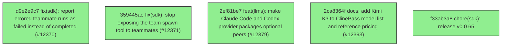

# Backport Agent — Detailed Run Report

> This file is generated automatically. It is intended for human analysts and
> AI reasoning models to assess agent performance, decision quality, and LLM behavior.

**Run timestamp**: 2026-07-19T11:23:02.431Z
**Models used**: fast=`mistral/mistral-code-agent-latest`  powerful=`cohere/command-a-reasoning-08-2025`
**Prompt log**: `/Users/rlemeill/Development/tea-ching-cline/.backport-agent/run-1784459380835.prompts.jsonl`

---

## Summary (PR body)

## Backport Agent — Sync Report

**Date**: 2026-07-19T11:23:02.431Z
**Upstream ref**: `cline/cline.git@main`
**Cut date**: `2026-06-27T00:00:00.000Z` 
**Fork ref**: `TEA-ching/cline@keypool-live`
**Sync branch**: `sync/upstream-main-2026-07-19-111130`

### Summary

- ✅ Applied: 5
- ⚠️ Needs human review: 0
- ⛔ Blocked (not attempted): 0

### Applied commits

- `d9e2e9c7` [low] fix(sdk): report errored teammate runs as failed instead of completed (#12370)
- `359445ae` [low] fix(sdk): stop exposing the team spawn tool to teammates (#12371)
- `2ef81be7` [high] feat(llms): make Claude Code and Codex provider packages optional peers (#12379)
- `2ca8364f` [low] docs: add Kimi K3 to ClinePass model list and reference pricing (#12393)
- `f33ab3a8` [high] chore(sdk): release v0.0.65

### Agent decision log

- All commits applied successfully
- Validation passed


---

## Agent Workflow Diagram

> Generated by the fast model from the run summary. Evaluate the agent's decision path.



---

## AI Sub-Agent Call Log (4 calls)

> Each entry is one sub-agent invocation. Review prompt/response pairs to assess
> reasoning quality, hallucinations, and decision accuracy.

### Call 1 / 4 — `analyze_commit_for_backport` ✅ OK

| Field | Value |
|---|---|
| **Timestamp** | 2026-07-19T11:11:02.412Z |
| **Tool** | `analyze_commit_for_backport` |
| **Model** | `mistral/mistral-code-agent-latest` |
| **Duration** | 2638 ms |
| **Tokens in** | 7335 |
| **Tokens out** | 167 |
| **Cost** | $0.000000 |

**Prompt sent to sub-agent:**

```
Commit SHA: 2ef81be70395b6934f9dcb718f7293612230b7e7
Commit message:
feat(llms): make Claude Code and Codex provider packages optional peers (#12379)

Changed files (3):
bun.lock
sdk/packages/llms/package.json
sdk/packages/llms/src/providers/vendors/community.ts

Diff:
commit 2ef81be70395b6934f9dcb718f7293612230b7e7
Author: Saoud Rizwan <7799382+saoudrizwan@users.noreply.github.com>
Date:   Sat Jul 18 20:30:24 2026 -0700

    feat(llms): make Claude Code and Codex provider packages optional peers (#12379)
    
    ai-sdk-provider-claude-code and ai-sdk-provider-codex-cli were hard
    dependencies of @cline/llms, so every npm install of the cline CLI
    pulled their native binaries (~250MB claude-agent-sdk platform binary,
    ~105MB @openai/codex) even for users who never select those providers.
    
    Move both to optional peerDependencies (kept as devDependencies so
    monorepo builds still bundle the JS) and load them via literal dynamic
    imports in community.ts, mirroring the existing opencode-sdk pattern.
    
    The Claude Code provider now resolves the claude executable explicitly:
    bundled platform package when present, otherwise a user-installed
    claude from PATH, passed via defaultSettings.pathToClaudeCodeExecutable.
    The agent SDK's own resolution cannot be used from Bun-compiled
    binaries because it anchors on the virtual bunfs where node_modules
    lookups never see packages on disk. Codex already degrades gracefully
    (npx -y @openai/codex, then codex on PATH).
---
 bun.lock                                           |  12 ++-
 sdk/packages/llms/package.json                     |  16 +++-
 .../llms/src/providers/vendors/community.ts        | 105 ++++++++++++++++++++-
 3 files changed, 124 insertions(+), 9 deletions(-)

diff --git a/bun.lock b/bun.lock
index 942db621509..50a8368353e 100644
--- a/bun.lock
+++ b/bun.lock
@@ -19,7 +19,7 @@
     },
     "apps/cli": {
       "name": "@cline/cli",
-      "version": "3.0.43",
+      "version": "3.0.44",
       "bin": {
         "cline": "src/index.ts",
       },
@@ -698,18 +698,24 @@
         "@streamparser/json": "^0.0.21",
         "ai": "^6.0.144",
         "ai-sdk-ollama": "^3.8.8",
-        "ai-sdk-provider-claude-code": "^3.4.3",
-        "ai-sdk-provider-codex-cli": "^1.1.0",
         "ai-sdk-provider-opencode-sdk": "^3.0.1",
         "dify-ai-provider": "^1.1.0",
         "nanoid": "^5.1.7",
         "zod": "^4.3.6",
       },
+      "devDependencies": {
+        "ai-sdk-provider-claude-code": "^3.4.3",
+        "ai-sdk-provider-codex-cli": "^1.1.0",
+      },
       "peerDependencies": {
         "@aws-sdk/client-bedrock-runtime": "^3.0.0",
+        "ai-sdk-provider-claude-code": "^3.4.3",
+        "ai-sdk-provider-codex-cli": "^1.1.0",
       },
       "optionalPeers": [
         "@aws-sdk/client-bedrock-runtime",
+        "ai-sdk-provider-claude-code",
+        "ai-sdk-provider-codex-cli",
       ],
     },
     "sdk/packages/sdk": {
diff --git a/sdk/packages/llms/package.json b/sdk/packages/llms/package.json
index 68088af69d8..83a4039ee62 100644
--- a/sdk/packages/llms/package.json
+++ b/sdk/packages/llms/package.json
@@ -41,6 +41,12 @@
 	"peerDependenciesMeta": {
 		"@aws-sdk/client-bedrock-runtime": {
 			"optional": true
+		},
+		"ai-sdk-provider-claude-code": {
+			"optional": true
+		},
+		"ai-sdk-provider-codex-cli": {
+			"optional": true
 		}
 	},
 	"dependencies": {
@@ -61,14 +67,18 @@
 		"@streamparser/json": "^0.0.21",
 		"ai": "^6.0.144",
 		"ai-sdk-ollama": "^3.8.8",
-		"ai-sdk-provider-claude-code": "^3.4.3",
-		"ai-sdk-provider-codex-cli": "^1.1.0",
 		"ai-sdk-provider-opencode-sdk": "^3.0.1",
 		"dify-ai-provider": "^1.1.0",
 		"nanoid": "^5.1.7",
 		"zod": "^4.3.6"
 	},
 	"peerDependencies": {
-		"@aws-sdk/client-bedrock-runtime": "^3.0.0"
+		"@aws-sdk/client-bedrock-runtime": "^3.0.0",
+		"ai-sdk-provider-claude-code": "^3.4.3",
+		"ai-sdk-provider-codex-cli": "^1.1.0"
+	},
+	"devDependencies": {
+		"ai-sdk-provider-claude-code": "^3.4.3",
+		"ai-sdk-provider-codex-cli": "^1.1.0"
 	}
 }
diff --git a/sdk/packages/llms/src/providers/vendors/community.ts b/sdk/packages/llms/src/providers/vendors/community.ts
index f5df774ac6f..19146421b23 100644
--- a/sdk/packages/llms/src/providers/vendors/community.ts
+++ b/sdk/packages/llms/src/providers/vendors/community.ts
@@ -1,11 +1,12 @@
+import { accessSync, constants as fsConstants } from "node:fs";
+import { createRequire } from "node:module";
+import { delimiter, dirname, join } from "node:path";
 import type { GatewayResolvedProviderConfig } from "@cline/shared";
 // Keep this import static so the VS Code extension bundle includes the SAP
 // provider. Hiding it behind a computed dynamic import leaves the published
 // extension trying to load @jerome-benoit/sap-ai-provider from node_modules at
 // runtime, but VSIX packaging uses the bundled extension output.
 import { createSAPAIProvider } from "@jerome-benoit/sap-ai-provider";
-import { createClaudeCode } from "ai-sdk-provider-claude-code";
-import { createCodexExec } from "ai-sdk-provider-codex-cli";
 import { createDifyProvider } from "dify-ai-provider";
 import { resolveApiKey } from "../http";
 import type { ProviderFactoryResult } from "./types";
@@ -24,10 +25,94 @@ function readOptions(
 	return (config.options as Record<string, unknown> | undefined) ?? {};
 }
 
+function findExecutableOnPath(name: string): string | undefined {
+	const extensions =
+		process.platform === "win32" ? [".exe", ".cmd", ".bat", ""] : [""];
+	for (const dir of (process.env.PATH ?? "").split(delimiter)) {
+		if (!dir) continue;
+		for (const ext of extensions) {
+			const candidate = join(dir, `${name}${ext}`);
+			try {
+				accessSync(candidate, fsConstants.X_OK);
+				return candidate;
+			} catch {
+				// not here; keep looking
+			}
+		}
+	}
+	return undefined;
+}
+
+// The agent SDK spawns a `claude` executable shipped in per-platform optional
+// packages (@anthropic-ai/claude-agent-sdk-<platform>-<arch>[-musl]). Those
+// are no longer installed by default (~250MB), so resolve an explicit path:
+// the bundled platform binary when present, otherwise a user-installed
+// Claude Code from PATH. The SDK's own resolution cannot be relied on here:
+// inside a Bun-compiled binary it anchors on the virtual bunfs, where
+// node_modules lookups never see packages on disk.
+function resolveClaudeExecutable(): string | undefined {
+	const suffixes =
+		process.platform === "linux"
+			? [
+					`${process.platform}-${process.arch}`,
+					`${process.platform}-${process.arch}-musl`,
+				]
+			: [`${process.platform}-${process.arch}`];
+	const executableName = process.platform === "win32" ? "claude.exe" : "claude";
+	// Anchor on the real executable location first so resolution works from
+	// compiled binaries; fall back to this module's location for plain node.
+	const anchors = [
+		join(dirname(process.execPath), "noop.js"),
+		import.meta.url,
+	];
+	for (const anchor of anchors) {
+		for (const suffix of suffixes) {
+			try {
+				const manifest = createRequire(anchor).resolve(
+					`@anthropic-ai/claude-agent-sdk-${suffix}/package.json`,
+				);
+				const executable = join(dirname(manifest), executableName);
+				accessSync(executable, fsConstants.X_OK);
+				return executable;
+			} catch {
+				// keep looking
+			}
+		}
+	}
+	return findExecutableOnPath("claude");
+}
+
 export async function createClaudeCodeProviderModule(
 	config: GatewayResolvedProviderConfig,
 ): Promise<ProviderFactoryResult> {
-	const provider = createClaudeCode(readOptions(config));
+	// Dynamic import is intentional: ai-sdk-provider-claude-code is an
+	// optional peer dependency so default installs skip its ~250MB
+	// @anthropic-ai/claude-agent-sdk platform binary. It also runs
+	// createClaudeCode() at module scope, so loading lazily contains that
+	// side effect to actual Claude Code usage.
+	let createClaudeCode: typeof import("ai-sdk-provider-claude-code").createClaudeCode;
+	try {
+		({ createClaudeCode } = await import("ai-sdk-provider-claude-code"));
+	} catch (error) {
+		throw new Error(
+			"The Claude Code provider requires the optional 'ai-sdk-provider-claude-code' package. " +
+				"Install it alongside @cline/llms to use this provider.",
+			{ cause: error },
+		);
+	}
+	const options = readOptions(config);
+	const defaultSettings =
+		(options.defaultSettings as Record<string, unknown> | undefined) ?? {};
+	if (defaultSettings.pathToClaudeCodeExecutable === undefined) {
+		const executable = resolveClaudeExecutable();
+		if (executable !== undefined) {
+			options.defaultSettings = {
+				...defaultSettings,
+				pathToClaudeCodeExecutable: executable,
+			};
+		}
+	}
+	const provider = createClaudeCode(options);
 	return {
 		model: (modelId) => provider(modelId),
 	};
@@ -36,6 +121,20 @@ export async function createClaudeCodeProviderModule(
 export async function createOpenAICodexProviderModule(
 	config: GatewayResolvedProviderConfig,
 ): Promise<ProviderFactoryResult> {
+	// Dynamic import is intentional: ai-sdk-provider-codex-cli is an optional
+	// peer dependency so default installs skip its ~105MB @openai/codex
+	// optional dependency. The provider itself degrades gracefully when the
+	// bundled binary is absent (npx -y @openai/codex, then `codex` on PATH).
+	let createCodexExec: typeof import("ai-sdk-provider-codex-cli").createCodexExec;
+	try {
+		({ createCodexExec } = await import("ai-sdk-provider-codex-cli"));
+	} catch (error) {
+		throw new Error(
+			"The OpenAI Codex provider requires the optional 'ai-sdk-provider-codex-cli' package. " +
+				"Install it alongside @cline/llms to use this provider.",
+			{ cause: error },
+		);
+	}
 	const provider = createCodexExec(readOptions(config));
 	return {
 		model: (modelId) => provider(modelId),

Output the JSON object now.
```

**Response received:**

````
```json
{
  "summary": "Makes Claude Code and Codex provider packages optional peer dependencies to reduce default install size (~355MB). Implements dynamic imports and executable resolution for graceful degradation.",
  "keyChanges": [
    "Move ai-sdk-provider-claude-code and ai-sdk-provider-codex-cli to optional peerDependencies",
    "Add dynamic imports in community.ts with error handling",
    "Implement PATH-based executable resolution for Claude Code",
    "Update bun.lock and package.json dependency metadata"
  ],
  "backportComplexity": "moderate",
  "semanticRiskFactors": [
    "Changes provider initialization pattern (dynamic imports)",
    "Modifies dependency tree (peerDependencies vs dependencies)"
  ],
  "recommendation": "apply-with-care"
}
```
````

---

### Call 2 / 4 — `analyze_commit_for_backport` ✅ OK

| Field | Value |
|---|---|
| **Timestamp** | 2026-07-19T11:11:10.551Z |
| **Tool** | `analyze_commit_for_backport` |
| **Model** | `cohere/command-a-reasoning-08-2025` |
| **Duration** | 8081 ms |
| **Tokens in** | 22720 |
| **Tokens out** | 653 |
| **Cost** | $0.000000 |

**Prompt sent to sub-agent:**

```
Commit SHA: f33ab3a872091952f44e43d0c8f5438099a60ada
Commit message:
chore(sdk): release v0.0.65

Changed files (7):
bun.lock
sdk/CHANGELOG.md
sdk/packages/agents/package.json
sdk/packages/core/package.json
sdk/packages/llms/package.json
sdk/packages/sdk/package.json
sdk/packages/shared/package.json

Diff:
commit f33ab3a872091952f44e43d0c8f5438099a60ada
Author: Saoud Rizwan <7799382+saoudrizwan@users.noreply.github.com>
Date:   Sat Jul 18 20:46:28 2026 -0700

    chore(sdk): release v0.0.65
---
 bun.lock                         | 374 ++++++++++++++++++---------------------
 sdk/CHANGELOG.md                 |  11 ++
 sdk/packages/agents/package.json |   2 +-
 sdk/packages/core/package.json   |   2 +-
 sdk/packages/llms/package.json   |   2 +-
 sdk/packages/sdk/package.json    |   2 +-
 sdk/packages/shared/package.json |   2 +-
 7 files changed, 188 insertions(+), 207 deletions(-)

diff --git a/bun.lock b/bun.lock
index 50a8368353e..2b19da7da78 100644
--- a/bun.lock
+++ b/bun.lock
@@ -632,7 +632,7 @@
     },
     "sdk/packages/agents": {
       "name": "@cline/agents",
-      "version": "0.0.64",
+      "version": "0.0.65",
       "dependencies": {
         "@cline/llms": "workspace:*",
         "@cline/shared": "workspace:*",
@@ -641,7 +641,7 @@
     },
     "sdk/packages/core": {
       "name": "@cline/core",
-      "version": "0.0.64",
+      "version": "0.0.65",
       "dependencies": {
         "@cline/agents": "workspace:*",
         "@cline/llms": "workspace:*",
@@ -679,7 +679,7 @@
     },
     "sdk/packages/llms": {
       "name": "@cline/llms",
-      "version": "0.0.64",
+      "version": "0.0.65",
       "dependencies": {
         "@ai-sdk/amazon-bedrock": "^4.0.89",
         "@ai-sdk/anthropic": "^3.0.68",
@@ -720,14 +720,14 @@
     },
     "sdk/packages/sdk": {
       "name": "@cline/sdk",
-      "version": "0.0.64",
+      "version": "0.0.65",
       "dependencies": {
         "@cline/core": "workspace:*",
       },
     },
     "sdk/packages/shared": {
       "name": "@cline/shared",
-      "version": "0.0.64",
+      "version": "0.0.65",
       "dependencies": {
         "aws4fetch": "^1.0.20",
         "jsonrepair": "^3.13.2",
@@ -794,11 +794,11 @@
 
     "@agentclientprotocol/sdk": ["@agentclientprotocol/sdk@0.16.1", "", { "peerDependencies": { "zod": "^3.25.0 || ^4.0.0" } }, "sha512-1ad+Sc/0sCtZGHthxxvgEUo5Wsbw16I+aF+YwdiLnPwkZG8KAGUEAPK6LM6Pf69lCyJPt1Aomk1d+8oE3C4ZEw=="],
 
-    "@ai-sdk/amazon-bedrock": ["@ai-sdk/amazon-bedrock@4.0.132", "", { "dependencies": { "@ai-sdk/anthropic": "3.0.96", "@ai-sdk/openai": "3.0.83", "@ai-sdk/provider": "3.0.14", "@ai-sdk/provider-utils": "4.0.38", "@smithy/eventstream-codec": "^4.0.1", "@smithy/util-utf8": "^4.0.0", "aws4fetch": "^1.0.20" }, "peerDependencies": { "zod": "^3.25.76 || ^4.1.8" } }, "sha512-ngtWAA4BHhtRrC0Vx1by9+KwcYtXbKcKjEoKbKhqJxNes8w6JNtdp5nQfK3ZE9Wbcdq8i6a8s08xXFm3pHe3iA=="],
+    "@ai-sdk/amazon-bedrock": ["@ai-sdk/amazon-bedrock@4.0.133", "", { "dependencies": { "@ai-sdk/anthropic": "3.0.96", "@ai-sdk/openai": "3.0.84", "@ai-sdk/provider": "3.0.14", "@ai-sdk/provider-utils": "4.0.38", "@smithy/eventstream-codec": "^4.0.1", "@smithy/util-utf8": "^4.0.0", "aws4fetch": "^1.0.20" }, "peerDependencies": { "zod": "^3.25.76 || ^4.1.8" } }, "sha512-B1WkPajjTkVvG3OZJPxZQ/ZWdIja71qybt9W5HHLF9ooTIlr0Ldo6QVOy31IiVO53iJEtUXu4rTEZlMJE3TzJA=="],
 
     "@ai-sdk/anthropic": ["@ai-sdk/anthropic@3.0.96", "", { "dependencies": { "@ai-sdk/provider": "3.0.14", "@ai-sdk/provider-utils": "4.0.38" }, "peerDependencies": { "zod": "^3.25.76 || ^4.1.8" } }, "sha512-6VQzaXQdm5FkX6NWOyKzV5GB11C8IqkgsKZE91lg/bdwyvnQJLDwal2qkE0+fC8CCGeW5d+VV8Mw/+H+OcDC1A=="],
 
-    "@ai-sdk/gateway": ["@ai-sdk/gateway@3.0.146", "", { "dependencies": { "@ai-sdk/provider": "3.0.14", "@ai-sdk/provider-utils": "4.0.38", "@vercel/oidc": "3.2.0" }, "peerDependencies": { "zod": "^3.25.76 || ^4.1.8" } }, "sha512-QK922LzOfGeHdZ9QGvghDizQx/tPOolTQSHvMlnUPeaTW5qpiIqpfbLwYiyxEt5YOGLLM/0t232Dut+95udo/Q=="],
+    "@ai-sdk/gateway": ["@ai-sdk/gateway@3.0.148", "", { "dependencies": { "@ai-sdk/provider": "3.0.14", "@ai-sdk/provider-utils": "4.0.38", "@vercel/oidc": "3.2.0" }, "peerDependencies": { "zod": "^3.25.76 || ^4.1.8" } }, "sha512-C/mTeSdmhu8dAnH3vZaRXffD8Oewo1r4QEGxvCdR8eC9b4PKPs2CLsbg3DVJH/X3Bea5fAu87Ob7P3fSS+oq/g=="],
 
     "@ai-sdk/google": ["@ai-sdk/google@3.0.91", "", { "dependencies": { "@ai-sdk/provider": "3.0.14", "@ai-sdk/provider-utils": "4.0.38" }, "peerDependencies": { "zod": "^3.25.76 || ^4.1.8" } }, "sha512-d/ho+sDjArFjreE2002t9jE4LXX3wde97dN2HCLCX1l41gaJV3wf/c/19axjUNfIf/4uUq+nJmhBO0lW/dg3yw=="],
 
@@ -806,7 +806,7 @@
 
     "@ai-sdk/mistral": ["@ai-sdk/mistral@3.0.48", "", { "dependencies": { "@ai-sdk/provider": "3.0.14", "@ai-sdk/provider-utils": "4.0.38" }, "peerDependencies": { "zod": "^3.25.76 || ^4.1.8" } }, "sha512-SOZMjV48dyAn1rsiZSN7emeO0KYKnr9/SqMFPpJYUddPcnLSjac9GGWVKn+LnSzD7Woh3lYbYbJWdbJOQ2U2sQ=="],
 
-    "@ai-sdk/openai": ["@ai-sdk/openai@3.0.83", "", { "dependencies": { "@ai-sdk/provider": "3.0.14", "@ai-sdk/provider-utils": "4.0.38" }, "peerDependencies": { "zod": "^3.25.76 || ^4.1.8" } }, "sha512-gYsQPmBQYgWc8+sFdmO4lSbNJoBdt9wgx1wZ1YOi0wX8X0d/K3FYOnNS0/TGymiDk8kh+wKj6PLC6UyA8bwVFA=="],
+    "@ai-sdk/openai": ["@ai-sdk/openai@3.0.84", "", { "dependencies": { "@ai-sdk/provider": "3.0.14", "@ai-sdk/provider-utils": "4.0.38" }, "peerDependencies": { "zod": "^3.25.76 || ^4.1.8" } }, "sha512-cmgbeJL0bbY0yTJH4/AdmP5E7MjWRL9G8UdhIi0JlV/So03o82ORJofW8OzwCZPTORVQblFbpZXYGDcUd9NdUQ=="],
 
     "@ai-sdk/openai-compatible": ["@ai-sdk/openai-compatible@2.0.59", "", { "dependencies": { "@ai-sdk/provider": "3.0.14", "@ai-sdk/provider-utils": "4.0.38" }, "peerDependencies": { "zod": "^3.25.76 || ^4.1.8" } }, "sha512-CFsUizO+jL+jSlN13rW2nQE9EbWx+8PSFBdB3TtD0UGYOxtefCVa5hsrNo5NUOJJGX5f4xHiXE1i2m5nQ80QPg=="],
 
@@ -814,7 +814,7 @@
 
     "@ai-sdk/provider-utils": ["@ai-sdk/provider-utils@4.0.38", "", { "dependencies": { "@ai-sdk/provider": "3.0.14", "@standard-schema/spec": "^1.1.0", "eventsource-parser": "^3.0.8" }, "peerDependencies": { "zod": "^3.25.76 || ^4.1.8" } }, "sha512-/HHGmtKllqjg1OLc023v9w9kK3laW7Z6TzfZukYQWCsGBbzB9p60zTvvpXFVcs44NZBVXL3viOa1HRKUbeee8g=="],
 
-    "@ai-sdk/react": ["@ai-sdk/react@3.0.224", "", { "dependencies": { "@ai-sdk/provider-utils": "4.0.38", "ai": "6.0.222", "swr": "^2.2.5", "throttleit": "2.1.0" }, "peerDependencies": { "react": "^18 || ~19.0.1 || ~19.1.2 || ^19.2.1" } }, "sha512-bfCVv6uTNS+gwMLLpsJQUBZqedCphqNiFkMVjL4kzunlgpC0uFyyYRYd99884NuYZJAF9AKKROK9t+/v1N9tow=="],
+    "@ai-sdk/react": ["@ai-sdk/react@3.0.226", "", { "dependencies": { "@ai-sdk/provider-utils": "4.0.38", "ai": "6.0.224", "swr": "^2.2.5", "throttleit": "2.1.0" }, "peerDependencies": { "react": "^18 || ~19.0.1 || ~19.1.2 || ^19.2.1" } }, "sha512-pPLSwLlxpXzYypkIpDRWENtIB1aDvi1TSxXrt5UZjLX1e0uHNaTUZJiGa52M8G0sN00a2Q2+ASARqMZKaTZbXQ=="],
 
     "@alloc/quick-lru": ["@alloc/quick-lru@5.2.0", "", {}, "sha512-UrcABB+4bUrFABwbluTIBErXwvbsU/V7TZWfmbgJfbkwiBuziS9gxdODUyuiecfdGQ85jglMW6juS3+z5TsKLw=="],
 
@@ -822,23 +822,23 @@
 
     "@antfu/install-pkg": ["@antfu/install-pkg@1.1.0", "", { "dependencies": { "package-manager-detector": "^1.3.0", "tinyexec": "^1.0.1" } }, "sha512-MGQsmw10ZyI+EJo45CdSER4zEb+p31LpDAFp2Z3gkSd1yqVZGi0Ebx++YTEMonJy4oChEMLsxZ64j8FH6sSqtQ=="],
 
-    "@anthropic-ai/claude-agent-sdk": ["@anthropic-ai/claude-agent-sdk@0.3.206", "", { "optionalDependencies": { "@anthropic-ai/claude-agent-sdk-darwin-arm64": "0.3.206", "@anthropic-ai/claude-agent-sdk-darwin-x64": "0.3.206", "@anthropic-ai/claude-agent-sdk-linux-arm64": "0.3.206", "@anthropic-ai/claude-agent-sdk-linux-arm64-musl": "0.3.206", "@anthropic-ai/claude-agent-sdk-linux-x64": "0.3.206", "@anthropic-ai/claude-agent-sdk-linux-x64-musl": "0.3.206", "@anthropic-ai/claude-agent-sdk-win32-arm64": "0.3.206", "@anthropic-ai/claude-agent-sdk-win32-x64": "0.3.206" }, "peerDependencies": { "@anthropic-ai/sdk": ">=0.93.0", "@modelcontextprotocol/sdk": "^1.29.0", "zod": "^4.0.0" } }, "sha512-KljDh9Pg4YCYpoXS8dnWoVSsOHtU4yLCW268K2iOruSxFXE8/Tay6DPvmJzYuqjP5YLNYfj05ZGykwZSUn6GXA=="],
+    "@anthropic-ai/claude-agent-sdk": ["@anthropic-ai/claude-agent-sdk@0.3.207", "", { "optionalDependencies": { "@anthropic-ai/claude-agent-sdk-darwin-arm64": "0.3.207", "@anthropic-ai/claude-agent-sdk-darwin-x64": "0.3.207", "@anthropic-ai/claude-agent-sdk-linux-arm64": "0.3.207", "@anthropic-ai/claude-agent-sdk-linux-arm64-musl": "0.3.207", "@anthropic-ai/claude-agent-sdk-linux-x64": "0.3.207", "@anthropic-ai/claude-agent-sdk-linux-x64-musl": "0.3.207", "@anthropic-ai/claude-agent-sdk-win32-arm64": "0.3.207", "@anthropic-ai/claude-agent-sdk-win32-x64": "0.3.207" }, "peerDependencies": { "@anthropic-ai/sdk": ">=0.93.0", "@modelcontextprotocol/sdk": "^1.29.0", "zod": "^4.0.0" } }, "sha512-y0PkQRmQBi96MHiN5Xzfq+GaddxCZCqI/cXEQBLYBLXGa4i1nDSlulQqkMBj2RorrrSGQJ6Wdw+uhu6OfHNPzA=="],
 
-    "@anthropic-ai/claude-agent-sdk-darwin-arm64": ["@anthropic-ai/claude-agent-sdk-darwin-arm64@0.3.206", "", { "os": "darwin", "cpu": "arm64" }, "sha512-FL2+NKcMMN47vcnCW2Fkt3AOgeRRlQxrisbPNaxrxqPJFzhUKs17x5j0XzLefd0xRbDAr74hd0PK/tnp6PHM6w=="],
+    "@anthropic-ai/claude-agent-sdk-darwin-arm64": ["@anthropic-ai/claude-agent-sdk-darwin-arm64@0.3.207", "", { "os": "darwin", "cpu": "arm64" }, "sha512-08xSo1FDx8h0aLhL5tvcRxa2SMmcUV3aDWeZiEJVTclyiDAs61BgTjAxCg+SZcu1CndjJO8cfO0yM5dhamxz3g=="],
 
-    "@anthropic-ai/claude-agent-sdk-darwin-x64": ["@anthropic-ai/claude-agent-sdk-darwin-x64@0.3.206", "", { "os": "darwin", "cpu": "x64" }, "sha512-mRW8PPMfQN15EunLwpdmcVzk3XuM4DXQUM8DOzaeA1Hr1yxYPaVVBLr9hkdBKOqr8XTl3ueoTR6RZAy6a/n7OA=="],
+    "@anthropic-ai/claude-agent-sdk-darwin-x64": ["@anthropic-ai/claude-agent-sdk-darwin-x64@0.3.207", "", { "os": "darwin", "cpu": "x64" }, "sha512-1o7K4EYqyCixZ/oeOZSh7AzSy6TM86xoOuf4VuORjPSS31hBnoqY0NGZd27+2VDs9LGtsdksmsTqcNGx9xd1hA=="],
 
-    "@anthropic-ai/claude-agent-sdk-linux-arm64": ["@anthropic-ai/claude-agent-sdk-linux-arm64@0.3.206", "", { "os": "linux", "cpu": "arm64" }, "sha512-Id6H8l6EsGb7849EAZDOB4Ic+FQpbzt4D5HGOwp59CTW3o/1c4etjQA/Kl1K+DSEWn3FGo6D5UMVgc/rwhBj8g=="],
+    "@anthropic-ai/claude-agent-sdk-linux-arm64": ["@anthropic-ai/claude-agent-sdk-linux-arm64@0.3.207", "", { "os": "linux", "cpu": "arm64" }, "sha512-X4uezYOifDiNTTmmugfRCdg3nNamrr1LFRY9hg30vWYTShL+bbN+nfC3KaFfSYCl4GTtsEEUbYdOTC2F3bBpcA=="],
 
-    "@anthropic-ai/claude-agent-sdk-linux-arm64-musl": ["@anthropic-ai/claude-agent-sdk-linux-arm64-musl@0.3.206", "", { "os": "linux", "cpu": "arm64" }, "sha512-aMZe1Kl+kYv5QlA15W9Ae25MAzBsA9FA40f5TOtJebA+M/xliF0r2LLb2NdyBviiZCDllcE31l0zgYE0rQqFQw=="],
+    "@anthropic-ai/claude-agent-sdk-linux-arm64-musl": ["@anthropic-ai/claude-agent-sdk-linux-arm64-musl@0.3.207", "", { "os": "linux", "cpu": "arm64" }, "sha512-oPj+g2DslhH4Y9nCTs7al4t9wZv78FZwLFQwOCg99BXuz1o0ZOpKmxyvR7J9eBR+GPszeMMS8gYplQTiZC9o2w=="],
 
-    "@anthropic-ai/claude-agent-sdk-linux-x64": ["@anthropic-ai/claude-agent-sdk-linux-x64@0.3.206", "", { "os": "linux", "cpu": "x64" }, "sha512-egZhOC1RlEVhZyq6Oa1b04AF7hh4hO+8oCsJCZ3gOifJQuHih1oW3lZ8fOUxU85jlT2ytAnt5kRp4uQr6PJgbg=="],
+    "@anthropic-ai/claude-agent-sdk-linux-x64": ["@anthropic-ai/claude-agent-sdk-linux-x64@0.3.207", "", { "os": "linux", "cpu": "x64" }, "sha512-Kg6BPH8Ee0ny/oEUWJmvT1jCRBne4jVpRSOMsJcYp1Fav1rMEgpU219oJJs+LWwx4ifuuLtNWedqJNnVw7mnKg=="],
 
-    "@anthropic-ai/claude-agent-sdk-linux-x64-musl": ["@anthropic-ai/claude-agent-sdk-linux-x64-musl@0.3.206", "", { "os": "linux", "cpu": "x64" }, "sha512-xQBOBhlcmTNc7YeYT5qLZOikpSq3WHlsJ/t6i7kJqUWrcXlOPaAoSMdKp5xO/V0CjAdzdJoWB88I55UAh8mclQ=="],
+    "@anthropic-ai/claude-agent-sdk-linux-x64-musl": ["@anthropic-ai/claude-agent-sdk-linux-x64-musl@0.3.207", "", { "os": "linux", "cpu": "x64" }, "sha512-uRv+D5oG/7EYr41FAJ9IPo2pZYBe2ZMaA6nSHCeizsgPxCSMtl5bNppmU21+jZJvo4hivObEgkGFERAhdGqygg=="],
 
-    "@anthropic-ai/claude-agent-sdk-win32-arm64": ["@anthropic-ai/claude-agent-sdk-win32-arm64@0.3.206", "", { "os": "win32", "cpu": "arm64" }, "sha512-oRQk23bFXSz4QRhOxqnnvlLWq/KiF2PtSBYXrMg1AQrCOHJd2k66aOAS7AJ4ZSzejiyV4N6sS6UThfmF6ipHBQ=="],
+    "@anthropic-ai/claude-agent-sdk-win32-arm64": ["@anthropic-ai/claude-agent-sdk-win32-arm64@0.3.207", "", { "os": "win32", "cpu": "arm64" }, "sha512-9fWpUzfkXlPAg2tf8JpQe7w9avFaomAUbfAwyAmykQgSIf66LwaJjvI5hNqhNqczRKyfsXPn3ei2S5HKlmFP+Q=="],
 
-    "@anthropic-ai/claude-agent-sdk-win32-x64": ["@anthropic-ai/claude-agent-sdk-win32-x64@0.3.206", "", { "os": "win32", "cpu": "x64" }, "sha512-BdjKmDojZjc5RjN+8Q6K7Yqf1WYhel6I3DkMXc9zdxS/xIuN42sx7zgQpdMGY73pm7ROPLqo3LieOeMhVH161w=="],
+    "@anthropic-ai/claude-agent-sdk-win32-x64": ["@anthropic-ai/claude-agent-sdk-win32-x64@0.3.207", "", { "os": "win32", "cpu": "x64" }, "sha512-YPjVT0q6aXEM2MgN4CI6/9fqiTXwETji+4NoPOzCYuqAkhXZqp30Jsk7/NHqYGNNSfURKrsuAoliKB0rsbpbjg=="],
 
     "@anthropic-ai/sdk": ["@anthropic-ai/sdk@0.37.0", "", { "dependencies": { "@types/node": "^18.11.18", "@types/node-fetch": "^2.6.4", "abort-controller": "^3.0.0", "agentkeepalive": "^4.2.1", "form-data-encoder": "1.7.2", "formdata-node": "^4.3.2", "node-fetch": "^2.6.7" } }, "sha512-tHjX2YbkUBwEgg0JZU3EFSSAQPoK4qQR/NFYa8Vtzd5UAyXzZksCw2In69Rml4R/TyHPBfRYaLK35XiOe33pjw=="],
 
@@ -864,7 +864,7 @@
 
     "@aws-sdk/credential-provider-web-identity": ["@aws-sdk/credential-provider-web-identity@3.972.63", "", { "dependencies": { "@aws-sdk/core": "^3.975.1", "@aws-sdk/nested-clients": "^3.997.31", "@aws-sdk/types": "^3.974.0", "@smithy/core": "^3.29.2", "@smithy/types": "^4.16.0", "tslib": "^2.6.2" } }, "sha512-8qZLFhM69eKcS37m459ctPR05Qimycm/74OPVioe6wNZabMT54GYhwBju0+J656RkMasNSawWQu+c8CmBe3TUQ=="],
 
-    "@aws-sdk/credential-providers": ["@aws-sdk/credential-providers@3.1084.0", "", { "dependencies": { "@aws-sdk/core": "^3.975.1", "@aws-sdk/credential-provider-cognito-identity": "^3.972.56", "@aws-sdk/credential-provider-env": "^3.972.57", "@aws-sdk/credential-provider-http": "^3.972.59", "@aws-sdk/credential-provider-ini": "^3.973.1", "@aws-sdk/credential-provider-login": "^3.972.63", "@aws-sdk/credential-provider-node": "^3.972.66", "@aws-sdk/credential-provider-process": "^3.972.57", "@aws-sdk/credential-provider-sso": "^3.973.1", "@aws-sdk/credential-provider-web-identity": "^3.972.63", "@aws-sdk/nested-clients": "^3.997.31", "@aws-sdk/types": "^3.974.0", "@smithy/core": "^3.29.2", "@smithy/credential-provider-imds": "^4.4.7", "@smithy/types": "^4.16.0", "tslib": "^2.6.2" } }, "sha512-6MT9xigrduBftpOEq2HKzGqp2Up0Jwe8dK5W3GyBpePywzgMK6029XEYXkCC5wRYwXwhSPzpjnjRlWUA7K/KNQ=="],
+    "@aws-sdk/credential-providers": ["@aws-sdk/credential-providers@3.1085.0", "", { "dependencies": { "@aws-sdk/core": "^3.975.1", "@aws-sdk/credential-provider-cognito-identity": "^3.972.56", "@aws-sdk/credential-provider-env": "^3.972.57", "@aws-sdk/credential-provider-http": "^3.972.59", "@aws-sdk/credential-provider-ini": "^3.973.1", "@aws-sdk/credential-provider-login": "^3.972.63", "@aws-sdk/credential-provider-node": "^3.972.66", "@aws-sdk/credential-provider-process": "^3.972.57", "@aws-sdk/credential-provider-sso": "^3.973.1", "@aws-sdk/credential-provider-web-identity": "^3.972.63", "@aws-sdk/nested-clients": "^3.997.31", "@aws-sdk/types": "^3.974.0", "@smithy/core": "^3.29.2", "@smithy/credential-provider-imds": "^4.4.7", "@smithy/types": "^4.16.0", "tslib": "^2.6.2" } }, "sha512-t9bNvRalbNaU8lt/jA1LeFIwowf9ZDlBu/G2l8QnCVYs7yZ2muh/RYdMF0eT+PfgDto8yQ+ncrxFO0bi2uN6oA=="],
 
     "@aws-sdk/nested-clients": ["@aws-sdk/nested-clients@3.997.31", "", { "dependencies": { "@aws-sdk/core": "^3.975.1", "@aws-sdk/signature-v4-multi-region": "^3.996.39", "@aws-sdk/types": "^3.974.0", "@smithy/core": "^3.29.2", "@smithy/fetch-http-handler": "^5.6.4", "@smithy/node-http-handler": "^4.9.4", "@smithy/types": "^4.16.0", "tslib": "^2.6.2" } }, "sha512-BDHTpwcsZHEBNEJzOg/B1BkFYJxAXY50dau/NyVWs3d51F0WgIUGSWZot/Os+N3KpDhXeaXnz37mWffAvduREw=="],
 
@@ -988,7 +988,7 @@
 
     "@braintree/sanitize-url": ["@braintree/sanitize-url@7.1.2", "", {}, "sha512-jigsZK+sMF/cuiB7sERuo9V7N9jx+dhmHHnQyDSVdpZwVutaBu7WvNYqMDLSgFgfB30n452TP3vjDAvFC973mA=="],
 
-    "@bufbuild/buf": ["@bufbuild/buf@1.71.0", "", { "optionalDependencies": { "@bufbuild/buf-darwin-arm64": "1.71.0", "@bufbuild/buf-darwin-x64": "1.71.0", "@bufbuild/buf-linux-aarch64": "1.71.0", "@bufbuild/buf-linux-armv7": "1.71.0", "@bufbuild/buf-linux-x64": "1.71.0", "@bufbuild/buf-win32-arm64": "1.71.0", "@bufbuild/buf-win32-x64": "1.71.0" }, "bin": { "buf": "bin/buf", "protoc-gen-buf-breaking": "bin/protoc-gen-buf-breaking", "protoc-gen-buf-lint": "bin/protoc-gen-buf-lint" } }, "sha512-GDcjBCwLgHT/4nX4YSnYatZ7sDZDpHV6dxQvoT2/P6gKvV23O6hl8NryzLIRKmeau0FRXpQKHVy1dMfnBSpy+w=="],
+    "@bufbuild/buf": ["@bufbuild/buf@1.71.0", "", { "optionalDependencies": { "@bufbuild/buf-darwin-arm64": "1.71.0", "@bufbuild/buf-darwin-x64": "1.71.0", "@bufbuild/buf-linux-aarch64": "1.71.0", "@bufbuild/buf-linux-armv7": "1.71.0", "@bufbuild/buf-linux-x64": "1.71.0", "@bufbuild/buf-win32-arm64": "1.71.0", "@bufbuild/buf-win32-x64": "1.71.0" }, "bin": { "buf": "bin/buf", "protoc-gen-buf-lint": "bin/protoc-gen-buf-lint", "protoc-gen-buf-breaking": "bin/protoc-gen-buf-breaking" } }, "sha512-GDcjBCwLgHT/4nX4YSnYatZ7sDZDpHV6dxQvoT2/P6gKvV23O6hl8NryzLIRKmeau0FRXpQKHVy1dMfnBSpy+w=="],
 
     "@bufbuild/buf-darwin-arm64": ["@bufbuild/buf-darwin-arm64@1.71.0", "", { "os": "darwin", "cpu": "arm64" }, "sha512-qZ7xZQyen/jOKFPVs3dlN9pMA56PI4YEo3r4/9ixtiH9gyFgfowR31axsocUgXGThjiN8mvOA8WfpG2tvaSvsw=="],
 
@@ -1170,9 +1170,9 @@
 
     "@eslint/core": ["@eslint/core@0.17.0", "", { "dependencies": { "@types/json-schema": "^7.0.15" } }, "sha512-yL/sLrpmtDaFEiUj1osRP4TI2MDz1AddJL+jZ7KSqvBuliN4xqYY54IfdN8qD8Toa6g1iloph1fxQNkjOxrrpQ=="],
 
-    "@eslint/eslintrc": ["@eslint/eslintrc@3.3.5", "", { "dependencies": { "ajv": "^6.14.0", "debug": "^4.3.2", "espree": "^10.0.1", "globals": "^14.0.0", "ignore": "^5.2.0", "import-fresh": "^3.2.1", "js-yaml": "^4.1.1", "minimatch": "^3.1.5", "strip-json-comments": "^3.1.1" } }, "sha512-4IlJx0X0qftVsN5E+/vGujTRIFtwuLbNsVUe7TO6zYPDR1O6nFwvwhIKEKSrl6dZchmYBITazxKoUYOjdtjlRg=="],
+    "@eslint/eslintrc": ["@eslint/eslintrc@3.3.6", "", { "dependencies": { "ajv": "^6.14.0", "debug": "^4.3.2", "espree": "^10.0.1", "globals": "^14.0.0", "ignore": "^5.2.0", "import-fresh": "^3.2.1", "js-yaml": "^4.3.0", "minimatch": "^3.1.5", "strip-json-comments": "^3.1.1" } }, "sha512-l2Ul9PrHsPCKcEY/ac7VgFj9D80C7S68sOKc618SyHDPK36s1XcFebXY0iTzUVn4Yq+YbwvSnDmCz9yxjX+QrA=="],
 
-    "@eslint/js": ["@eslint/js@9.39.4", "", {}, "sha512-nE7DEIchvtiFTwBw4Lfbu59PG+kCofhjsKaCWzxTpt4lfRjRMqG6uMBzKXuEcyXhOHoUp9riAm7/aWYGhXZ9cw=="],
+    "@eslint/js": ["@eslint/js@9.39.5", "", {}, "sha512-QywQuszQh77pIXCsq998c8hbhSTI/azTty1Z6N53dmAudKHhy573j3yvRLsX2BSp8YpLtoCEG8E9DJe+8zUh4A=="],
 
     "@eslint/object-schema": ["@eslint/object-schema@2.1.7", "", {}, "sha512-VtAOaymWVfZcmZbp6E2mympDIHvyjXs/12LqWYjVw6qjrfF+VK+fyG33kChz3nnK+SU5/NeHOqrTEHS8sXO3OA=="],
 
@@ -1270,15 +1270,15 @@
 
     "@firebase/webchannel-wrapper": ["@firebase/webchannel-wrapper@1.0.3", "", {}, "sha512-2xCRM9q9FlzGZCdgDMJwc0gyUkWFtkosy7Xxr6sFgQwn+wMNIWd7xIvYNauU1r64B5L5rsGKy/n9TKJ0aAFeqQ=="],
 
-    "@floating-ui/core": ["@floating-ui/core@1.7.5", "", { "dependencies": { "@floating-ui/utils": "^0.2.11" } }, "sha512-1Ih4WTWyw0+lKyFMcBHGbb5U5FtuHJuujoyyr5zTaWS5EYMeT6Jb2AuDeftsCsEuchO+mM2ij5+q9crhydzLhQ=="],
+    "@floating-ui/core": ["@floating-ui/core@1.8.0", "", { "dependencies": { "@floating-ui/utils": "^0.2.12" } }, "sha512-0CIZ5itps/8x7BG8dEIhs53BvCUH2PCoogtakwRTut+Arm58sJooJ0AuZhLw2HJYIR5cMLNPBSS728sPho2khQ=="],
 
-    "@floating-ui/dom": ["@floating-ui/dom@1.7.6", "", { "dependencies": { "@floating-ui/core": "^1.7.5", "@floating-ui/utils": "^0.2.11" } }, "sha512-9gZSAI5XM36880PPMm//9dfiEngYoC6Am2izES1FF406YFsjvyBMmeJ2g4SAju3xWwtuynNRFL2s9hgxpLI5SQ=="],
+    "@floating-ui/dom": ["@floating-ui/dom@1.8.0", "", { "dependencies": { "@floating-ui/core": "^1.8.0", "@floating-ui/utils": "^0.2.12" } }, "sha512-yXSrzeHZBTZadLOlfyhCkJHNeLJnHRnRInwdZ40L7ZiaAtrBwoYlsDrX3v5zB1Utk7CLfzcOVnVVWoXEky7Ceg=="],
 
-    "@floating-ui/react": ["@floating-ui/react@0.27.19", "", { "dependencies": { "@floating-ui/react-dom": "^2.1.8", "@floating-ui/utils": "^0.2.11", "tabbable": "^6.0.0" }, "peerDependencies": { "react": ">=17.0.0", "react-dom": ">=17.0.0" } }, "sha512-31B8h5mm8YxotlE7/AU/PhNAl8eWxAmjL/v2QOxroDNkTFLk3Uu82u63N3b6TXa4EGJeeZLVcd/9AlNlVqzeog=="],
+    "@floating-ui/react": ["@floating-ui/react@0.27.20", "", { "dependencies": { "@floating-ui/react-dom": "^2.1.9", "@floating-ui/utils": "^0.2.12", "tabbable": "^6.0.0" }, "peerDependencies": { "react": ">=17.0.0", "react-dom": ">=17.0.0" } }, "sha512-CMqMy7OaXl9W0eq1Uy7L7i2Y/anPvHmFmESd2CEw0t5YvZhcVCeo4MBevAmswRllX7Y2dEidA4ozGPunLSTQpw=="],
 
-    "@floating-ui/react-dom": ["@floating-ui/react-dom@2.1.8", "", { "dependencies": { "@floating-ui/dom": "^1.7.6" }, "peerDependencies": { "react": ">=16.8.0", "react-dom": ">=16.8.0" } }, "sha512-cC52bHwM/n/CxS87FH0yWdngEZrjdtLW/qVruo68qg+prK7ZQ4YGdut2GyDVpoGeAYe/h899rVeOVm6Oi40k2A=="],
+    "@floating-ui/react-dom": ["@floating-ui/react-dom@2.1.9", "", { "dependencies": { "@floating-ui/dom": "^1.8.0" }, "peerDependencies": { "react": ">=16.8.0", "react-dom": ">=16.8.0" } }, "sha512-JDjEFGCpImxDCA7JJKviA0M9+RtmJdj0m/NVU5IMgBK+AmZouAQQ7/+2GLH0GXXY0YMw9oXPB8hKdbPYg5QLYg=="],
 
-    "@floating-ui/utils": ["@floating-ui/utils@0.2.11", "", {}, "sha512-RiB/yIh78pcIxl6lLMG0CgBXAZ2Y0eVHqMPYugu+9U0AeT6YBeiJpf7lbdJNIugFP5SIjwNRgo4DhR1Qxi26Gg=="],
+    "@floating-ui/utils": ["@floating-ui/utils@0.2.12", "", {}, "sha512-HpCo8tmWzLVad5s2d19EhAz5zqrrQ6s69qd6moPMQvkOuSwDT1YgRfWSVuc4ennqrgv3OHppiOGMQ7oC13yIww=="],
 
     "@fontsource-variable/geist": ["@fontsource-variable/geist@5.2.9", "", {}, "sha512-TP+QSBG3wxKGPE33CbMy/L0Nu3qvJ6Fy81Yc4LnQ95xH+i+cfEp8fyU8/kfV14YwszxIFPhnoMTbjL71waVpyQ=="],
 
@@ -1694,19 +1694,19 @@
 
     "@nodelib/fs.walk": ["@nodelib/fs.walk@1.2.8", "", { "dependencies": { "@nodelib/fs.scandir": "2.1.5", "fastq": "^1.6.0" } }, "sha512-oGB+UxlgWcgQkgwo8GcEGwemoTFt3FIO9ababBmaGwXIoBKZ+GTy0pP185beGg7Llih/NSHSV2XAs1lnznocSg=="],
 
-    "@openai/codex": ["@openai/codex@0.130.0", "", { "optionalDependencies": { "@openai/codex-darwin-arm64": "npm:@openai/codex@0.130.0-darwin-arm64", "@openai/codex-darwin-x64": "npm:@openai/codex@0.130.0-darwin-x64", "@openai/codex-linux-arm64": "npm:@openai/codex@0.130.0-linux-arm64", "@openai/codex-linux-x64": "npm:@openai/codex@0.130.0-linux-x64", "@openai/codex-win32-arm64": "npm:@openai/codex@0.130.0-win32-arm64", "@openai/codex-win32-x64": "npm:@openai/codex@0.130.0-win32-x64" }, "bin": { "codex": "bin/codex.js" } }, "sha512-WGDj+RZ3TXWC/7MlwprgLWOqzpwatPIINPhP3IRzHA0ni+o3QZ4i4xrS2uWwGmHUJ395J5JHwoZAAZYyfJyz6w=="],
+    "@openai/codex": ["@openai/codex@0.144.1", "", { "optionalDependencies": { "@openai/codex-darwin-arm64": "npm:@openai/codex@0.144.1-darwin-arm64", "@openai/codex-darwin-x64": "npm:@openai/codex@0.144.1-darwin-x64", "@openai/codex-linux-arm64": "npm:@openai/codex@0.144.1-linux-arm64", "@openai/codex-linux-x64": "npm:@openai/codex@0.144.1-linux-x64", "@openai/codex-win32-arm64": "npm:@openai/codex@0.144.1-win32-arm64", "@openai/codex-win32-x64": "npm:@openai/codex@0.144.1-win32-x64" }, "bin": { "codex": "bin/codex.js" } }, "sha512-Xir1zqPfpenhdoAoshN53uonzbBXj18COyzRkFlVZpSNyEl5XtkuYu9oddELePFN7K/0sXUcSO34Ad5IeCXPbw=="],
 
-    "@openai/codex-darwin-arm64": ["@openai/codex@0.130.0-darwin-arm64", "", { "os": "darwin", "cpu": "arm64" }, "sha512-R9pkGC7kwC8yQ8el5hvBlmugQlcsG/pHMEFgZluu03X9fD2TezGxdq3KqRDRCZuMYl07ILamVEoqknuJ0cq7MA=="],
+    "@openai/codex-darwin-arm64": ["@openai/codex@0.144.1-darwin-arm64", "", { "os": "darwin", "cpu": "arm64" }, "sha512-dABeDK+ATqMG54MGBd3VjpKfh5EOoqx9PKVQB2QYDaEXx3F6CdUCXue5QIMfr4OxziUj8pUcLAQyd+KFqiTUFw=="],
 
-    "@openai/codex-darwin-x64": ["@openai/codex@0.130.0-darwin-x64", "", { "os": "darwin", "cpu": "x64" }, "sha512-gJ+7J8djevgtdra+NgDAiQQPW+O3KTsgGfE3E5dpDfww3zS5OCeV0V2dhxqnJdlOjOSDw99o0P2LqBv19mhpRw=="],
+    "@openai/codex-darwin-x64": ["@openai/codex@0.144.1-darwin-x64", "", { "os": "darwin", "cpu": "x64" }, "sha512-K2g3Q3tNxzFhV0SuzO6HcsYK7EQrp/o4HyeReyhkwVrwwUPoYwyIbB0IRjHIiDzRhbKriDccid2iyF5aPqdTcg=="],
 
-    "@openai/codex-linux-arm64": ["@openai/codex@0.130.0-linux-arm64", "", { "os": "linux", "cpu": "arm64" }, "sha512-tFtH0V9/hEI3d9y7zP92BXI9FM4Z3+STNQaOR52Czv18TRtCFUp7CbIUYaToopuq6UBfnE1VKr8RLhwT5FcbmA=="],
+    "@openai/codex-linux-arm64": ["@openai/codex@0.144.1-linux-arm64", "", { "os": "linux", "cpu": "arm64" }, "sha512-451o15+XtaXCCb35t/KCyyPqXHnTPxPxtdqEYOnE3e4sH5AfnI/uVJwfdjOksMG6vRLy6R+fLvSDOMguRFLmQw=="],
 
-    "@openai/codex-linux-x64": ["@openai/codex@0.130.0-linux-x64", "", { "os": "linux", "cpu": "x64" }, "sha512-3VcNlez99xdnEf+kB1IOpWv9fICYV9PiGj4sLCO4TCcShLnyxe+YBGa3poknkvXLnMG0qiN9SMnYS2FGrMxQcA=="],
+    "@openai/codex-linux-x64": ["@openai/codex@0.144.1-linux-x64", "", { "os": "linux", "cpu": "x64" }, "sha512-HNGVI+BulrOaC/0IzBvd6EL62j7LrlbFKibrhw6hZjjCjAeUYzRB2jB4qDzXN1NfqDi6Xrvniof3kwbwab24lg=="],
 
-    "@openai/codex-win32-arm64": ["@openai/codex@0.130.0-win32-arm64", "", { "os": "win32", "cpu": "arm64" }, "sha512-vdpmiNp57L/arZabltLXn8TyEtNa7W1meOEkr+3R6W/8ZyBt++wuqz1Orv134OT2grrcFJsIVCAIPiqUxCvBkA=="],
+    "@openai/codex-win32-arm64": ["@openai/codex@0.144.1-win32-arm64", "", { "os": "win32", "cpu": "arm64" }, "sha512-L4aDVEh9o1u7WYoxpSyv3un9Bz26YZYocOFqE2oHdEQDL2s6/LdtutLQc3oUZruLlEbkNsjSU0HI1OKsP0+Ctg=="],
 
-    "@openai/codex-win32-x64": ["@openai/codex@0.130.0-win32-x64", "", { "os": "win32", "cpu": "x64" }, "sha512-FzMznm7fr5/nbjZgOujZ9Y9AbdGm7ji1FOoWiY3U+srqauvZaTgn6o6aCheSL7kuymu7nTLOO/cAyWV6NuesqQ=="],
+    "@openai/codex-win32-x64": ["@openai/codex@0.144.1-win32-x64", "", { "os": "win32", "cpu": "x64" }, "sha512-qv2HOp6v/nVP31p5I5GxYyL0wa79PMzim1+W9CKSV0UldjFV9AMbualA8PeXcYhbvvh9Y1UASXxwjuQdlyfAvw=="],
 
     "@opencode-ai/sdk": ["@opencode-ai/sdk@1.17.18", "", { "dependencies": { "cross-spawn": "7.0.6" } }, "sha512-c/C9PhY8PrbcxDY+JIYtOZsrmMD0KzoVvxq+RGUrZ6LQp57SuVBbT4lfwA2G8Se5RNC1N5JtYjiuaXeECnF2SQ=="],
 
@@ -1800,7 +1800,7 @@
 
     "@playwright/test": ["@playwright/test@1.61.1", "", { "dependencies": { "playwright": "1.61.1" }, "bin": { "playwright": "cli.js" } }, "sha512-8nKv6+0RJSL9FE4jYOEGXnPeM/Hg12qZpmqzZjRh3qM0Y7c3z1mrOTfFLids72RDQYVh9WpLEfR5WdpNX4fkig=="],
 
-    "@posthog/core": ["@posthog/core@1.40.1", "", { "dependencies": { "@posthog/types": "^1.393.0" } }, "sha512-jXuMtZCwA7AMpYlo1wjm6GlC58YBlz/ZxpDIsF9hroUfqYoPPDmQbsQb4iiZAS43+o/kwloxdKJIlE0IiwQ5HQ=="],
+    "@posthog/core": ["@posthog/core@1.40.2", "", { "dependencies": { "@posthog/types": "^1.393.0" } }, "sha512-H12j7O9iHGvpK9t2ko8W4pvfbV1pBDxrsWC1LA6yp2RhzwvC4T3sWhu+AekDQJSRSrJEWlB0t/Ueq9QhPSq7FQ=="],
 
     "@posthog/types": ["@posthog/types@1.393.0", "", {}, "sha512-vzWeEJZ7ERQhFRoQYaP5jzN1JvIu46UJyHXsuv+dTGW2r3sMgREOhNxXLZjmFHwZ8/FOHQoyqqQmXTCXZSfMSg=="],
 
@@ -1848,7 +1848,7 @@
 
     "@radix-ui/react-collection": ["@radix-ui/react-collection@1.1.7", "", { "dependencies": { "@radix-ui/react-compose-refs": "1.1.2", "@radix-ui/react-context": "1.1.2", "@radix-ui/react-primitive": "2.1.3", "@radix-ui/react-slot": "1.2.3" }, "peerDependencies": { "@types/react": "*", "@types/react-dom": "*", "react": "^16.8 || ^17.0 || ^18.0 || ^19.0 || ^19.0.0-rc", "react-dom": "^16.8 || ^17.0 || ^18.0 || ^19.0 || ^19.0.0-rc" }, "optionalPeers": ["@types/react", "@types/react-dom"] }, "sha512-Fh9rGN0MoI4ZFUNyfFVNU4y9LUz93u9/0K+yLgA2bwRojxM8JU1DyvvMBabnZPBgMWREAJvU2jjVzq+LrFUglw=="],
 
-    "@radix-ui/react-compose-refs": ["@radix-ui/react-compose-refs@1.1.3", "", { "peerDependencies": { "@types/react": "*", "react": "^16.8 || ^17.0 || ^18.0 || ^19.0 || ^19.0.0-rc" }, "optionalPeers": ["@types/react"] }, "sha512-rYOP8OMnuuPMQF1uhPVlGNcCDlkokKqGFE3JcxFViIkAXP7EvFWUliJAstrapypaBLJNHbZL6jGhbVDGTwmVhA=="],
+    "@radix-ui/react-compose-refs": ["@radix-ui/react-compose-refs@1.1.2", "", { "peerDependencies": { "@types/react": "*", "react": "^16.8 || ^17.0 || ^18.0 || ^19.0 || ^19.0.0-rc" }, "optionalPeers": ["@types/react"] }, "sha512-z4eqJvfiNnFMHIIvXP3CY57y2WJs5g2v3X0zm9mEJkrkNv4rDxu+sg9Jh8EkXyeqBkB7SOcboo9dMVqhyrACIg=="],
 
     "@radix-ui/react-context": ["@radix-ui/react-context@1.1.2", "", { "peerDependencies": { "@types/react": "*", "react": "^16.8 || ^17.0 || ^18.0 || ^19.0 || ^19.0.0-rc" }, "optionalPeers": ["@types/react"] }, "sha512-jCi/QKUM2r1Ju5a3J64TH2A5SpKAgh0LpknyqdQ4m6DCV0xJ2HG1xARRwNGPQfi1SLdLWZ1OJz6F4OMBBNiGJA=="],
 
@@ -1870,7 +1870,7 @@
 
     "@radix-ui/react-hover-card": ["@radix-ui/react-hover-card@1.1.15", "", { "dependencies": { "@radix-ui/primitive": "1.1.3", "@radix-ui/react-compose-refs": "1.1.2", "@radix-ui/react-context": "1.1.2", "@radix-ui/react-dismissable-layer": "1.1.11", "@radix-ui/react-popper": "1.2.8", "@radix-ui/react-portal": "1.1.9", "@radix-ui/react-presence": "1.1.5", "@radix-ui/react-primitive": "2.1.3", "@radix-ui/react-use-controllable-state": "1.2.2" }, "peerDependencies": { "@types/react": "*", "@types/react-dom": "*", "react": "^16.8 || ^17.0 || ^18.0 || ^19.0 || ^19.0.0-rc", "react-dom": "^16.8 || ^17.0 || ^18.0 || ^19.0 || ^19.0.0-rc" }, "optionalPeers": ["@types/react", "@types/react-dom"] }, "sha512-qgTkjNT1CfKMoP0rcasmlH2r1DAiYicWsDsufxl940sT2wHNEWWv6FMWIQXWhVdmC1d/HYfbhQx60KYyAtKxjg=="],
 
-    "@radix-ui/react-id": ["@radix-ui/react-id@1.1.2", "", { "dependencies": { "@radix-ui/react-use-layout-effect": "1.1.2" }, "peerDependencies": { "@types/react": "*", "react": "^16.8 || ^17.0 || ^18.0 || ^19.0 || ^19.0.0-rc" }, "optionalPeers": ["@types/react"] }, "sha512-orBC88futVpqCmhX1p4cvquNHsELQ+w+vBJnuj3ftETI5bJb0bZn3Tqu3SWN2IOcPycTnMGnhwoermvISt72sA=="],
+    "@radix-ui/react-id": ["@radix-ui/react-id@1.1.1", "", { "dependencies": { "@radix-ui/react-use-layout-effect": "1.1.1" }, "peerDependencies": { "@types/react": "*", "react": "^16.8 || ^17.0 || ^18.0 || ^19.0 || ^19.0.0-rc" }, "optionalPeers": ["@types/react"] }, "sha512-kGkGegYIdQsOb4XjsfM97rXsiHaBwco+hFI66oO4s9LU+PLAC5oJ7khdOVFxkhsmlbpUqDAvXw11CluXP+jkHg=="],
 
     "@radix-ui/react-label": ["@radix-ui/react-label@2.1.8", "", { "dependencies": { "@radix-ui/react-primitive": "2.1.4" }, "peerDependencies": { "@types/react": "*", "@types/react-dom": "*", "react": "^16.8 || ^17.0 || ^18.0 || ^19.0 || ^19.0.0-rc", "react-dom": "^16.8 || ^17.0 || ^18.0 || ^19.0 || ^19.0.0-rc" }, "optionalPeers": ["@types/react", "@types/react-dom"] }, "sha512-FmXs37I6hSBVDlO4y764TNz1rLgKwjJMQ0EGte6F3Cb3f4bIuHB/iLa/8I9VKkmOy+gNHq8rql3j686ACVV21A=="],
 
@@ -1892,7 +1892,7 @@
 
     "@radix-ui/react-presence": ["@radix-ui/react-presence@1.1.5", "", { "dependencies": { "@radix-ui/react-compose-refs": "1.1.2", "@radix-ui/react-use-layout-effect": "1.1.1" }, "peerDependencies": { "@types/react": "*", "@types/react-dom": "*", "react": "^16.8 || ^17.0 || ^18.0 || ^19.0 || ^19.0.0-rc", "react-dom": "^16.8 || ^17.0 || ^18.0 || ^19.0 || ^19.0.0-rc" }, "optionalPeers": ["@types/react", "@types/react-dom"] }, "sha512-/jfEwNDdQVBCNvjkGit4h6pMOzq8bHkopq458dPt2lMjx+eBQUohZNG9A7DtO/O5ukSbxuaNGXMjHicgwy6rQQ=="],
 
-    "@radix-ui/react-primitive": ["@radix-ui/react-primitive@2.1.7", "", { "dependencies": { "@radix-ui/react-slot": "1.3.0" }, "peerDependencies": { "@types/react": "*", "@types/react-dom": "*", "react": "^16.8 || ^17.0 || ^18.0 || ^19.0 || ^19.0.0-rc", "react-dom": "^16.8 || ^17.0 || ^18.0 || ^19.0 || ^19.0.0-rc" }, "optionalPeers": ["@types/react", "@types/react-dom"] }, "sha512-bC3NiwsprbxKjuon9l7X6BUTw7FPVzEYaL92MPEY5SCd/9hUTPXVFtVwRix7778wtRsVao+zE062gL79FZleeQ=="],
+    "@radix-ui/react-primitive": ["@radix-ui/react-primitive@2.1.4", "", { "dependencies": { "@radix-ui/react-slot": "1.2.4" }, "peerDependencies": { "@types/react": "*", "@types/react-dom": "*", "react": "^16.8 || ^17.0 || ^18.0 || ^19.0 || ^19.0.0-rc", "react-dom": "^16.8 || ^17.0 || ^18.0 || ^19.0 || ^19.0.0-rc" }, "optionalPeers": ["@types/react", "@types/react-dom"] }, "sha512-9hQc4+GNVtJAIEPEqlYqW5RiYdrr8ea5XQ0ZOnD6fgru+83kqT15mq2OCcbe8KnjRZl5vF3ks69AKz3kh1jrhg=="],
 
     "@radix-ui/react-progress": ["@radix-ui/react-progress@1.1.8", "", { "dependencies": { "@radix-ui/react-context": "1.1.3", "@radix-ui
... [truncated]

Output the JSON object now.
```

**Response received:**

````
```json
{
  "summary": "Updates SDK dependencies and versions in a routine release, affecting package manifests and lockfile.",
  "keyChanges": [
    "Bumps SDK package versions to 0.0.65",
    "Updates multiple AI provider dependencies (e.g., Bedrock, OpenAI, Claude)",
    "Revises React-related dependencies including floating-ui and Radix UI components"
  ],
  "backportComplexity": "moderate",
  "semanticRiskFactors": [
    "Dependency version changes might conflict with fork's custom provider integrations",
    "Radix UI version mismatches could affect KeypoolLive webview components"
  ],
  "recommendation": "apply-with-care"
}
```
````

---

### Call 3 / 4 — `check_customization_compatibility` ✅ OK

| Field | Value |
|---|---|
| **Timestamp** | 2026-07-19T11:11:15.192Z |
| **Tool** | `check_customization_compatibility` |
| **Model** | `mistral/mistral-code-agent-latest` |
| **Duration** | 1402 ms |
| **Tokens in** | 4192 |
| **Tokens out** | 72 |
| **Cost** | $0.000000 |

**Prompt sent to sub-agent:**

```
Declared fork customisations:
  1. Pattern: sdk/packages/llms/package.json
     Description: Custom provider integrations and dependency overrides for KeypoolLive
     Current file content (1 file(s)):
      [sdk/packages/llms/package.json]
      {
      	"name": "@cline/llms",
      	"version": "0.0.64",
      	"description": "Config-driven SDK for selecting, extending, and instantiating LLM providers and models",
      	"repository": {
      		"type": "git",
      		"url": "https://github.com/cline/cline",
      		"directory": "sdk/packages/llms"
      	},
      	"main": "./dist/index.js",
      	"module": "./dist/index.js",
      	"engines": {
      		"node": ">=22"
      	},
      	"type": "module",
      	"types": "./dist/index.d.ts",
      	"exports": {
      		".": {
      			"workerd": "./dist/index.js",
      			"browser": "./dist/index.browser.js",
      			"react-server": "./dist/index.browser.js",
      			"import": "./dist/index.js",
      			"types": "./dist/index.d.ts"
      		},
      		"./browser": {
      			"import": "./dist/index.browser.js",
      			"types": "./dist/index.browser.d.ts"
      		},
      		"./worker": {
      			"import": "./dist/index.js",
      			"types": "./dist/index.d.ts"
      		}
      	},
      	"files": [
      		"dist"
      	],
      	"scripts": {
      		"build": "bun run bun.mts && bun tsc -p tsconfig.build.json",
      		"typecheck": "bun tsc -p tsconfig.dev.json --noEmit",
      		"test": "vitest run",
      		"test:live": "vitest run src/tests/provider-live*.test.ts",
      		"test:vcr": "vitest run src/tests/provider-vcr.test.ts",
      		"test:watch": "vitest",
      		"generate:models": "bun run scripts/generate-models.ts"
      	},
      	"peerDependenciesMeta": {
      		"@aws-sdk/client-bedrock-runtime": {
      			"optional": true
      		}
      	},
      	"dependencies": {
      		"@ai-sdk/amazon-bedrock": "^4.0.89",
      		"@ai-sdk/anthropic": "^3.0.68",
      		"@ai-sdk/cohere": "^3.0.36",
      		"@ai-sdk/google": "^3.0.60",
      		"@ai-sdk/google-vertex": "^4.0.100",
      		"@ai-sdk/mistral": "^3.0.28",
      		"@ai-sdk/openai": "^3.0.52",
      		"@ai-sdk/openai-compatible": "^2.0.38",
      		"@ai-sdk/provider": "^3.0.8",
      		"@aws-sdk/credential-providers": "^3.922.0",
      		"@cline/shared": "workspace:*",
      		"@jerome-benoit/sap-ai-provider": "4.6.9",
      		"@langfuse/otel": "^4.0.0",
      		"@opentelemetry/api": "^1.9.0",
      		"@opentelemetry/sdk-trace-node": "^2.6.1",
      		"@streamparser/json": "^0.0.21",
      		"ai": "^6.0.144",
      		"ai-sdk-ollama": "^3.8.8",
      		"ai-sdk-provider-claude-code": "^3.4.3",
      		"ai-s

Upstream diff to evaluate:
commit 2ef81be70395b6934f9dcb718f7293612230b7e7
Author: Saoud Rizwan <7799382+saoudrizwan@users.noreply.github.com>
Date:   Sat Jul 18 20:30:24 2026 -0700

    feat(llms): make Claude Code and Codex provider packages optional peers (#12379)
    
    ai-sdk-provider-claude-code and ai-sdk-provider-codex-cli were hard
    dependencies of @cline/llms, so every npm install of the cline CLI
    pulled their native binaries (~250MB claude-agent-sdk platform binary,
    ~105MB @openai/codex) even for users who never select those providers.
    
    Move both to optional peerDependencies (kept as devDependencies so
    monorepo builds still bundle the JS) and load them via literal dynamic
    imports in community.ts, mirroring the existing opencode-sdk pattern.
    
    The Claude Code provider now resolves the claude executable explicitly:
    bundled platform package when present, otherwise a user-installed
    claude from PATH, passed via defaultSettings.pathToClaudeCodeExecutable.
    The agent SDK's own resolution cannot be used from Bun-compiled
    binaries because it anchors on the virtual bunfs where node_modules
    lookups never see packages on disk. Codex already degrades gracefully
    (npx -y @openai/codex, then codex on PATH).
---
 bun.lock                                           |  12 ++-
 sdk/packages/llms/package.json                     |  16 +++-
 .../llms/src/providers/vendors/community.ts        | 105 ++++++++++++++++++++-
 3 files changed, 124 insertions(+), 9 deletions(-)

diff --git a/bun.lock b/bun.lock
index 942db621509..50a8368353e 100644
--- a/bun.lock
+++ b/bun.lock
@@ -19,7 +19,7 @@
     },
     "apps/cli": {
       "name": "@cline/cli",
-      "version": "3.0.43",
+      "version": "3.0.44",
       "bin": {
         "cline": "src/index.ts",
       },
@@ -698,18 +698,24 @@
         "@streamparser/json": "^0.0.21",
         "ai": "^6.0.144",
         "ai-sdk-ollama": "^3.8.8",
-        "ai-sdk-provider-claude-code": "^3.4.3",
-        "ai-sdk-provider-codex-cli": "^1.1.0",
         "ai-sdk-provider-opencode-sdk": "^3.0.1",
         "dify-ai-provider": "^1.1.0",
         "nanoid": "^5.1.7",
         "zod": "^4.3.6",
       },
+      "devDependencies": {
+        "ai-sdk-provider-claude-code": "^3.4.3",
+        "ai-sdk-provider-codex-cli": "^1.1.0",
+      },
       "peerDependencies": {
         "@aws-sdk/client-bedrock-runtime": "^3.0.0",
+        "ai-sdk-provider-claude-code": "^3.4.3",
+        "ai-sdk-provider-codex-cli": "^1.1.0",
       },
       "optionalPeers": [
         "@aws-sdk/client-bedrock-runtime",
+        "ai-sdk-provider-claude-code",
+        "ai-sdk-provider-codex-cli",
       ],
     },
     "sdk/packages/sdk": {
diff --git a/sdk/packages/llms/package.json b/sdk/packages/llms/package.json
index 68088af69d8..83a4039ee62 100644
--- a/sdk/packages/llms/package.json
+++ b/sdk/packages/llms/package.json
@@ -41,6 +41,12 @@
 	"peerDependenciesMeta": {
 		"@aws-sdk/client-bedrock-runtime": {
 			"optional": true
+		},
+		"ai-sdk-provider-claude-code": {
+			"optional": true
+		},
+		"ai-sdk-provider-codex-cli": {
+			"optional": true
 		}
 	},
 	"dependencies": {
@@ -61,14 +67,18 @@
 		"@streamparser/json": "^0.0.21",
 		"ai": "^6.0.144",
 		"ai-sdk-ollama": "^3.8.8",
-		"ai-sdk-provider-claude-code": "^3.4.3",
-		"ai-sdk-provider-codex-cli": "^1.1.0",
 		"ai-sdk-provider-opencode-sdk": "^3.0.1",
 		"dify-ai-provider": "^1.1.0",
 		"nanoid": "^5.1.7",
 		"zod": "^4.3.6"
 	},
 	"peerDependencies": {
-		"@aws-sdk/client-bedrock-runtime": "^3.0.0"
+		"@aws-sdk/client-bedrock-runtime": "^3.0.0",
+		"ai-sdk-provider-claude-code": "^3.4.3",
+		"ai-sdk-provider-codex-cli": "^1.1.0"
+	},
+	"devDependencies": {
+		"ai-sdk-provider-claude-code": "^3.4.3",
+		"ai-sdk-provider-codex-cli": "^1.1.0"
 	}
 }
diff --git a/sdk/packages/llms/src/providers/vendors/community.ts b/sdk/packages/llms/src/providers/vendors/community.ts
index f5df774ac6f..19146421b23 100644
--- a/sdk/packages/llms/src/providers/vendors/community.ts
+++ b/sdk/packages/llms/src/providers/vendors/community.ts
@@ -1,11 +1,12 @@
+import { accessSync, constants as fsConstants } from "node:fs";
+import { createRequire } from "node:module";
+import { delimiter, dirname, join } from "node:path";
 import type { GatewayResolvedProviderConfig } from "@cline/shared";
 // Keep this import static so the VS Code extension bundle includes the SAP
 // provider. Hiding it behind a computed dynamic import leaves the published
 // extension trying to load @jerome-benoit/sap-ai-provider from node_modules at
 // runtime, but VSIX packaging uses the bundled extension output.
 import { createSAPAIProvider } from "@jerome-benoit/sap-ai-provider";
-import { createClaudeCode } from "ai-sdk-provider-claude-code";
-import { createCodexExec } from "ai-sdk-provider-codex-cli";
 import { createDifyProvider } from "dify-ai-provider";
 import { resolveApiKey } from "../http";
 import type { ProviderFactoryResult } from "./types";
@@ -24,10 +25,94 @@ function readOptions(
 	return (config.options as Record<string, unknown> | undefined) ?? {};
 }
 
+function findExecutableOnPath(name: string): string | undefined {
+	const extensions =
+		process.platform === "win32" ? [".exe", ".cmd", ".bat", ""] : [""];
+	for (const dir of (process.env.PATH ?? "").split(delimiter)) {
+		if (!dir) continue;
+		for (const ext of extensions) {
+			const candidate = join(dir, `${name}${ext}`);
+			try {
+				accessSync(candidate, fsConstants.X_OK);
+				return candidate;
+			} catch {
+				// not here; keep looking
+			}
+		}
+	}
+	return undefined;
+}
+
+// The agent SDK spawns a `claude` executable shipped in per-platform optional
+// packages (@anthropic-ai/claude-agent-sdk-<platform>-<arch>[-musl]). Those
+// are no longer installed by default (~250MB), so resolve an explicit path:
+// the bundled platform binary when present, otherwise a user-installed
+// Claude Code from PATH. The SDK's own resolution cannot be relied on here:
+// inside a Bun-compiled binary it anchors on the virtual bunfs, where
+// node_modules lookups never see packages on disk.
+function resolveClaudeExecutable(): string | undefined {
+	const suffixes =
+		process.platform === "linux"
+			? [
+					`${process.platform}-${process.arch}`,
+					`${process.platform}-${process.arch}-musl`,
+				]
+			: [`${process.platform}-${process.arch}`];
+	const executableName = process.platform === "win32" ? "claude.exe" : "claude";
+	// Anchor on the real executable location first so resolution works from
+	// compiled binaries; fall back to this module's location for plain node.
+	const anchors = [
+		join(dirname(process.execPath), "noop.js"),
+		import.meta.url,
+	];
+	for (const anchor of anchors) {
+		for (const suffix of suffixes) {
+			try {
+				const manifest = createRequire(anchor).resolve(
+					`@anthropic-ai/claude-agent-sdk-${suffix}/package.json`,
+				);
+				const executable = join(dirname(manifest), executableName);
+				accessSync(executable, fsConstants.X_OK);
+				return executable;
+			} catch {
+				// keep looking
+			}
+		}
+	}
+	return findExecutableOnPath("claude");
+}
+
 export async function createClaudeCodeProviderModule(
 	config: GatewayResolvedProviderConfig,
 ): Promise<ProviderFactoryResult> {
-	const provider = createClaudeCode(readOptions(config));
+	// Dynamic import is intentional: ai-sdk-provider-claude-code is an
+	// optional peer dependency so default installs skip its ~250MB
+	// @anthropic-ai/claude-agent-sdk platform binary. It also runs
+	// createClaudeCode() at module scope, so loading lazily contains that
+	// side effect to actual Claude Code usage.
+	let createClaudeCode: typeof import("ai-sdk-provider-claude-code").createClaudeCode;
+	try {
+		({ createClaudeCode } = await import("ai-sdk-provider-claude-code"));
+	} catch (error) {
+		throw new Error(
+			"The Claude Code provider requires the optional 'ai-sdk-provider-claude-code' package. " +
+				"Install it alongside @cline/llms to use this provider.",
+			{ cause: error },
+		);
+	}
+	const options = readOptions(config);
+	const defaultSettings =
+		(options.defaultSettings as Record<string, unknown> | undefined) ?? {};
+	if (defaultSettings.pathToClaudeCodeExecutable === undefined) {
+		const executable = resolveClaudeExecutable();
+		if (executable !== undefined) {
+			options.defaultSettings = {
+				...defaultSettings,
+				pathToClaudeCodeExecutable: executable,
+			};
+		}
+	}
+	const provider = createClaudeCode(options);
 	return {
 		model: (modelId) => provider(modelId),
 	};
@@ -36,6 +121,20 @@ export async function createClaudeCodeProviderModule(
 export async function createOpenAICodexProviderModule(
 	config: GatewayResolvedProviderConfig,
 ): Promise<ProviderFactoryResult> {
+	// Dynamic import is intentional: ai-sdk-provider-codex-cli is an optional
+	// peer dependency so default installs skip its ~105MB @openai/codex
+	// optional dependency. The provider itself degrades gracefully when the
+	// bundled binary is absent (npx -y @openai/codex, then `codex` on PATH).
+	let createCodexExec: typeof import("ai-sdk-provider-codex-cli").createCodexExec;
+	try {
+		({ createCodexExec } = await import("ai-sdk-provider-codex-cli"));
+	} catch (error) {
+		throw new Error(
+			"The OpenAI Codex provider requires the optional 'ai-sdk-provider-codex-cli' package. " +
+				"Install it alongside @cline/llms to use this provider.",
+			{ cause: error },
+		);
+	}
 	const provider = createCodexExec(readOptions(config));
 	return {
 		model: (modelId) => provider(modelId),

Output the JSON object now.
```

**Response received:**

````
```json
{
  "compatible": true,
  "affectedCustomizations": [],
  "semanticConflicts": [],
  "warnings": [],
  "recommendation": "The upstream change is compatible; it only affects optional peer dependencies and dynamic imports, which do not impact the fork's custom provider integrations."
}
```
````

---

### Call 4 / 4 — `check_customization_compatibility` ✅ OK

| Field | Value |
|---|---|
| **Timestamp** | 2026-07-19T11:11:25.520Z |
| **Tool** | `check_customization_compatibility` |
| **Model** | `cohere/command-a-reasoning-08-2025` |
| **Duration** | 10266 ms |
| **Tokens in** | 21831 |
| **Tokens out** | 869 |
| **Cost** | $0.000000 |

**Prompt sent to sub-agent:**

```
Declared fork customisations:
  1. Pattern: sdk/packages/agents/package.json
     Description: Custom agent configurations for KeypoolLive
     Current file content (1 file(s)):
      [sdk/packages/agents/package.json]
      {
      	"name": "@cline/agents",
      	"version": "0.0.64",
      	"repository": {
      		"type": "git",
      		"url": "https://github.com/cline/cline",
      		"directory": "sdk/packages/agents"
      	},
      	"main": "dist/index.js",
      	"dependencies": {
      		"@cline/llms": "workspace:*",
      		"@cline/shared": "workspace:*",
      		"nanoid": "^5.1.7"
      	},
      	"exports": {
      		".": {
      			"browser": "./dist/index.js",
      			"types": "./dist/index.d.ts",
      			"import": "./dist/index.js"
      		}
      	},
      	"description": "Browser-safe agent runtime for the next-generation Cline SDK",
      	"files": [
      		"dist"
      	],
      	"keywords": [
      		"llm",
      		"agents",
      		"ai",
      		"tool-calling"
      	],
      	"license": "Apache-2.0",
      	"scripts": {
      		"build": "bun run bun.mts && bun tsc -p tsconfig.build.json",
      		"dev": "bun build ./src/index.ts --outdir ./dist --target node --format esm --watch",
      		"typecheck": "bun tsc -p tsconfig.dev.json --noEmit",
      		"test": "vitest run",
      		"test:watch": "vitest"
      	},
      	"engines": {
      		"node": ">=22"
      	},
      	"type": "module",
      	"types": "dist/index.d.ts"
      }
      
  2. Pattern: sdk/packages/core/package.json
     Description: Core SDK customizations for KeypoolLive
     Current file content (1 file(s)):
      [sdk/packages/core/package.json]
      {
      	"name": "@cline/core",
      	"description": "Cline Core SDK for Node Runtime",
      	"version": "0.0.64",
      	"repository": {
      		"type": "git",
      		"url": "https://github.com/cline/cline",
      		"directory": "sdk/packages/core"
      	},
      	"type": "module",
      	"types": "./dist/index.d.ts",
      	"main": "./dist/index.js",
      	"private": false,
      	"publishConfig": {
      		"access": "public"
      	},
      	"exports": {
      		".": {
      			"types": "./dist/index.d.ts",
      			"import": "./dist/index.js"
      		},
      		"./hub": {
      			"types": "./dist/hub/index.d.ts",
      			"import": "./dist/hub/index.js"
      		},
      		"./hub/daemon-entry": {
      			"types": "./dist/hub/daemon/entry.d.ts",
      			"import": "./dist/hub/daemon/entry.js"
      		},
      		"./telemetry": {
      			"types": "./dist/services/telemetry/index.d.ts",
      			"import": "./dist/services/telemetry/index.js"
      		},
      		"./services/feature-flags/posthog": {
      			"types": "./dist/services/feature-flags/posthog.d.ts",
      			"import": "./dist/services/feature-flags/posthog.js"
      		}
      	},
      	"scripts": {
      		"build": "bun run ./bun.mts && bun tsc -p tsconfig.build.json",
      		"typecheck": "bun tsc -p tsconfig.dev.json --noEmit && bun run typecheck:smoke",
      		"typecheck:smoke": "bun tsc -p tsconfig.smoke.json --noEmit",
      		"test": "bun run test:unit && bun run test:e2e",
      		"test:live": "vitest run --config vitest.config.ts src/extensions/context/compaction.live.test.ts",
      		"test:unit": "vitest run --config vitest.config.ts",
      		"test:e2e": "vitest run --config vitest.e2e.config.ts",
      		"verify:routines": "zsh -lc 'bunx vitest run src/cron/schedule-service.test.ts --config vitest.config.ts'",
      		"test:watch": "vitest --config vitest.config.ts"
      	},
      	"dependencies": {
      		"@cline/agents": "workspace:*",
      		"@cline/shared": "workspace:*",
      		"@cline/llms": "workspace:*",
      		"@modelcontextprotocol/sdk": "^1.29.0",
      		"@opentelemetry/api": "^1.9.0",
      		"@opentelemetry/api-logs": "^0.214.0",
      		"@opentelemetry/exporter-logs-otlp-http": "^0.214.0",
      		"@opentelemetry/exporter-metrics-otlp-http": "^0.214.0",
      		"@opentelemetry/exporter-trace-otlp-http": "^
  3. Pattern: sdk/packages/llms/package.json
     Description: Custom provider integrations and dependency overrides for KeypoolLive
     Current file content (1 file(s)):
      [sdk/packages/llms/package.json]
      {
      	"name": "@cline/llms",
      	"version": "0.0.64",
      	"description": "Config-driven SDK for selecting, extending, and instantiating LLM providers and models",
      	"repository": {
      		"type": "git",
      		"url": "https://github.com/cline/cline",
      		"directory": "sdk/packages/llms"
      	},
      	"main": "./dist/index.js",
      	"module": "./dist/index.js",
      	"engines": {
      		"node": ">=22"
      	},
      	"type": "module",
      	"types": "./dist/index.d.ts",
      	"exports": {
      		".": {
      			"workerd": "./dist/index.js",
      			"browser": "./dist/index.browser.js",
      			"react-server": "./dist/index.browser.js",
      			"import": "./dist/index.js",
      			"types": "./dist/index.d.ts"
      		},
      		"./browser": {
      			"import": "./dist/index.browser.js",
      			"types": "./dist/index.browser.d.ts"
      		},
      		"./worker": {
      			"import": "./dist/index.js",
      			"types": "./dist/index.d.ts"
      		}
      	},
      	"files": [
      		"dist"
      	],
      	"scripts": {
      		"build": "bun run bun.mts && bun tsc -p tsconfig.build.json",
      		"typecheck": "bun tsc -p tsconfig.dev.json --noEmit",
      		"test": "vitest run",
      		"test:live": "vitest run src/tests/provider-live*.test.ts",
      		"test:vcr": "vitest run src/tests/provider-vcr.test.ts",
      		"test:watch": "vitest",
      		"generate:models": "bun run scripts/generate-models.ts"
      	},
      	"peerDependenciesMeta": {
      		"@aws-sdk/client-bedrock-runtime": {
      			"optional": true
      		}
      	},
      	"dependencies": {
      		"@ai-sdk/amazon-bedrock": "^4.0.89",
      		"@ai-sdk/anthropic": "^3.0.68",
      		"@ai-sdk/cohere": "^3.0.36",
      		"@ai-sdk/google": "^3.0.60",
      		"@ai-sdk/google-vertex": "^4.0.100",
      		"@ai-sdk/mistral": "^3.0.28",
      		"@ai-sdk/openai": "^3.0.52",
      		"@ai-sdk/openai-compatible": "^2.0.38",
      		"@ai-sdk/provider": "^3.0.8",
      		"@aws-sdk/credential-providers": "^3.922.0",
      		"@cline/shared": "workspace:*",
      		"@jerome-benoit/sap-ai-provider": "4.6.9",
      		"@langfuse/otel": "^4.0.0",
      		"@opentelemetry/api": "^1.9.0",
      		"@opentelemetry/sdk-trace-node": "^2.6.1",
      		"@streamparser/json": "^0.0.21",
      		"ai": "^6.0.144",
      		"ai-sdk-ollama": "^3.8.8",
      		"ai-sdk-provider-claude-code": "^3.4.3",
      		"ai-s
  4. Pattern: sdk/packages/sdk/package.json
     Description: SDK package customizations for KeypoolLive
     Current file content (1 file(s)):
      [sdk/packages/sdk/package.json]
      {
      	"name": "@cline/sdk",
      	"description": "Cline SDK - user-facing alias for @cline/core",
      	"version": "0.0.64",
      	"repository": {
      		"type": "git",
      		"url": "https://github.com/cline/cline",
      		"directory": "sdk/packages/sdk"
      	},
      	"type": "module",
      	"types": "./dist/index.d.ts",
      	"main": "./dist/index.js",
      	"private": false,
      	"publishConfig": {
      		"access": "public"
      	},
      	"exports": {
      		".": {
      			"types": "./dist/index.d.ts",
      			"import": "./dist/index.js"
      		}
      	},
      	"scripts": {
      		"build": "bun run bun.mts && bun tsc -p tsconfig.build.json",
      		"typecheck": "bun tsc -p tsconfig.json --noEmit"
      	},
      	"dependencies": {
      		"@cline/core": "workspace:*"
      	},
      	"engines": {
      		"node": ">=22"
      	},
      	"files": [
      		"dist"
      	],
      	"license": "Apache-2.0"
      }
      
  5. Pattern: sdk/packages/shared/package.json
     Description: Shared utilities customizations for KeypoolLive
     Current file content (1 file(s)):
      [sdk/packages/shared/package.json]
      {
      	"name": "@cline/shared",
      	"version": "0.0.64",
      	"description": "Shared utilities, types, and schemas for Cline packages",
      	"repository": {
      		"type": "git",
      		"url": "https://github.com/cline/cline",
      		"directory": "sdk/packages/shared"
      	},
      	"type": "module",
      	"main": "dist/index.js",
      	"types": "dist/index.d.ts",
      	"exports": {
      		".": {
      			"browser": "./dist/index.browser.js",
      			"types": "./dist/index.d.ts",
      			"import": "./dist/index.js",
      			"default": "./dist/index.js"
      		},
      		"./browser": {
      			"types": "./dist/index.browser.d.ts",
      			"import": "./dist/index.browser.js"
      		},
      		"./types": {
      			"types": "./dist/types/index.d.ts",
      			"import": "./dist/types/index.js"
      		},
      		"./storage": {
      			"types": "./dist/storage/index.d.ts",
      			"import": "./dist/storage/index.js"
      		},
      		"./db": {
      			"types": "./dist/db/index.d.ts",
      			"import": "./dist/db/index.js"
      		},
      		"./node": {
      			"types": "./dist/node.d.ts",
      			"import": "./dist/node.js"
      		},
      		"./automation": {
      			"types": "./dist/automation/index.d.ts",
      			"import": "./dist/automation/index.js"
      		},
      		"./remote-config": {
      			"types": "./dist/remote-config/index.d.ts",
      			"import": "./dist/remote-config/index.js"
      		}
      	},
      	"files": [
      		"dist"
      	],
      	"scripts": {
      		"build": "BUILD_MODE=package bun bun.mts",
      		"typecheck": "bun tsc --noEmit",
      		"test": "bun run test:unit",
      		"test:unit": "vitest run --config vitest.config.ts"
      	},
      	"engines": {
      		"node": ">=22"
      	},
      	"dependencies": {
      		"aws4fetch": "^1.0.20",
      		"jsonrepair": "^3.13.2",
      		"zod": "^4.3.6",
      		"zod-to-json-schema": "^3.25.1"
      	}
      }
      

Upstream diff to evaluate:
commit f33ab3a872091952f44e43d0c8f5438099a60ada
Author: Saoud Rizwan <7799382+saoudrizwan@users.noreply.github.com>
Date:   Sat Jul 18 20:46:28 2026 -0700

    chore(sdk): release v0.0.65
---
 bun.lock                         | 374 ++++++++++++++++++---------------------
 sdk/CHANGELOG.md                 |  11 ++
 sdk/packages/agents/package.json |   2 +-
 sdk/packages/core/package.json   |   2 +-
 sdk/packages/llms/package.json   |   2 +-
 sdk/packages/sdk/package.json    |   2 +-
 sdk/packages/shared/package.json |   2 +-
 7 files changed, 188 insertions(+), 207 deletions(-)

diff --git a/bun.lock b/bun.lock
index 50a8368353e..2b19da7da78 100644
--- a/bun.lock
+++ b/bun.lock
@@ -632,7 +632,7 @@
     },
     "sdk/packages/agents": {
       "name": "@cline/agents",
-      "version": "0.0.64",
+      "version": "0.0.65",
       "dependencies": {
         "@cline/llms": "workspace:*",
         "@cline/shared": "workspace:*",
@@ -641,7 +641,7 @@
     },
     "sdk/packages/core": {
       "name": "@cline/core",
-      "version": "0.0.64",
+      "version": "0.0.65",
       "dependencies": {
         "@cline/agents": "workspace:*",
         "@cline/llms": "workspace:*",
@@ -679,7 +679,7 @@
     },
     "sdk/packages/llms": {
       "name": "@cline/llms",
-      "version": "0.0.64",
+      "version": "0.0.65",
       "dependencies": {
         "@ai-sdk/amazon-bedrock": "^4.0.89",
         "@ai-sdk/anthropic": "^3.0.68",
@@ -720,14 +720,14 @@
     },
     "sdk/packages/sdk": {
       "name": "@cline/sdk",
-      "version": "0.0.64",
+      "version": "0.0.65",
       "dependencies": {
         "@cline/core": "workspace:*",
       },
     },
     "sdk/packages/shared": {
       "name": "@cline/shared",
-      "version": "0.0.64",
+      "version": "0.0.65",
       "dependencies": {
         "aws4fetch": "^1.0.20",
         "jsonrepair": "^3.13.2",
@@ -794,11 +794,11 @@
 
     "@agentclientprotocol/sdk": ["@agentclientprotocol/sdk@0.16.1", "", { "peerDependencies": { "zod": "^3.25.0 || ^4.0.0" } }, "sha512-1ad+Sc/0sCtZGHthxxvgEUo5Wsbw16I+aF+YwdiLnPwkZG8KAGUEAPK6LM6Pf69lCyJPt1Aomk1d+8oE3C4ZEw=="],
 
-    "@ai-sdk/amazon-bedrock": ["@ai-sdk/amazon-bedrock@4.0.132", "", { "dependencies": { "@ai-sdk/anthropic": "3.0.96", "@ai-sdk/openai": "3.0.83", "@ai-sdk/provider": "3.0.14", "@ai-sdk/provider-utils": "4.0.38", "@smithy/eventstream-codec": "^4.0.1", "@smithy/util-utf8": "^4.0.0", "aws4fetch": "^1.0.20" }, "peerDependencies": { "zod": "^3.25.76 || ^4.1.8" } }, "sha512-ngtWAA4BHhtRrC0Vx1by9+KwcYtXbKcKjEoKbKhqJxNes8w6JNtdp5nQfK3ZE9Wbcdq8i6a8s08xXFm3pHe3iA=="],
+    "@ai-sdk/amazon-bedrock": ["@ai-sdk/amazon-bedrock@4.0.133", "", { "dependencies": { "@ai-sdk/anthropic": "3.0.96", "@ai-sdk/openai": "3.0.84", "@ai-sdk/provider": "3.0.14", "@ai-sdk/provider-utils": "4.0.38", "@smithy/eventstream-codec": "^4.0.1", "@smithy/util-utf8": "^4.0.0", "aws4fetch": "^1.0.20" }, "peerDependencies": { "zod": "^3.25.76 || ^4.1.8" } }, "sha512-B1WkPajjTkVvG3OZJPxZQ/ZWdIja71qybt9W5HHLF9ooTIlr0Ldo6QVOy31IiVO53iJEtUXu4rTEZlMJE3TzJA=="],
 
     "@ai-sdk/anthropic": ["@ai-sdk/anthropic@3.0.96", "", { "dependencies": { "@ai-sdk/provider": "3.0.14", "@ai-sdk/provider-utils": "4.0.38" }, "peerDependencies": { "zod": "^3.25.76 || ^4.1.8" } }, "sha512-6VQzaXQdm5FkX6NWOyKzV5GB11C8IqkgsKZE91lg/bdwyvnQJLDwal2qkE0+fC8CCGeW5d+VV8Mw/+H+OcDC1A=="],
 
-    "@ai-sdk/gateway": ["@ai-sdk/gateway@3.0.146", "", { "dependencies": { "@ai-sdk/provider": "3.0.14", "@ai-sdk/provider-utils": "4.0.38", "@vercel/oidc": "3.2.0" }, "peerDependencies": { "zod": "^3.25.76 || ^4.1.8" } }, "sha512-QK922LzOfGeHdZ9QGvghDizQx/tPOolTQSHvMlnUPeaTW5qpiIqpfbLwYiyxEt5YOGLLM/0t232Dut+95udo/Q=="],
+    "@ai-sdk/gateway": ["@ai-sdk/gateway@3.0.148", "", { "dependencies": { "@ai-sdk/provider": "3.0.14", "@ai-sdk/provider-utils": "4.0.38", "@vercel/oidc": "3.2.0" }, "peerDependencies": { "zod": "^3.25.76 || ^4.1.8" } }, "sha512-C/mTeSdmhu8dAnH3vZaRXffD8Oewo1r4QEGxvCdR8eC9b4PKPs2CLsbg3DVJH/X3Bea5fAu87Ob7P3fSS+oq/g=="],
 
     "@ai-sdk/google": ["@ai-sdk/google@3.0.91", "", { "dependencies": { "@ai-sdk/provider": "3.0.14", "@ai-sdk/provider-utils": "4.0.38" }, "peerDependencies": { "zod": "^3.25.76 || ^4.1.8" } }, "sha512-d/ho+sDjArFjreE2002t9jE4LXX3wde97dN2HCLCX1l41gaJV3wf/c/19axjUNfIf/4uUq+nJmhBO0lW/dg3yw=="],
 
@@ -806,7 +806,7 @@
 
     "@ai-sdk/mistral": ["@ai-sdk/mistral@3.0.48", "", { "dependencies": { "@ai-sdk/provider": "3.0.14", "@ai-sdk/provider-utils": "4.0.38" }, "peerDependencies": { "zod": "^3.25.76 || ^4.1.8" } }, "sha512-SOZMjV48dyAn1rsiZSN7emeO0KYKnr9/SqMFPpJYUddPcnLSjac9GGWVKn+LnSzD7Woh3lYbYbJWdbJOQ2U2sQ=="],
 
-    "@ai-sdk/openai": ["@ai-sdk/openai@3.0.83", "", { "dependencies": { "@ai-sdk/provider": "3.0.14", "@ai-sdk/provider-utils": "4.0.38" }, "peerDependencies": { "zod": "^3.25.76 || ^4.1.8" } }, "sha512-gYsQPmBQYgWc8+sFdmO4lSbNJoBdt9wgx1wZ1YOi0wX8X0d/K3FYOnNS0/TGymiDk8kh+wKj6PLC6UyA8bwVFA=="],
+    "@ai-sdk/openai": ["@ai-sdk/openai@3.0.84", "", { "dependencies": { "@ai-sdk/provider": "3.0.14", "@ai-sdk/provider-utils": "4.0.38" }, "peerDependencies": { "zod": "^3.25.76 || ^4.1.8" } }, "sha512-cmgbeJL0bbY0yTJH4/AdmP5E7MjWRL9G8UdhIi0JlV/So03o82ORJofW8OzwCZPTORVQblFbpZXYGDcUd9NdUQ=="],
 
     "@ai-sdk/openai-compatible": ["@ai-sdk/openai-compatible@2.0.59", "", { "dependencies": { "@ai-sdk/provider": "3.0.14", "@ai-sdk/provider-utils": "4.0.38" }, "peerDependencies": { "zod": "^3.25.76 || ^4.1.8" } }, "sha512-CFsUizO+jL+jSlN13rW2nQE9EbWx+8PSFBdB3TtD0UGYOxtefCVa5hsrNo5NUOJJGX5f4xHiXE1i2m5nQ80QPg=="],
 
@@ -814,7 +814,7 @@
 
     "@ai-sdk/provider-utils": ["@ai-sdk/provider-utils@4.0.38", "", { "dependencies": { "@ai-sdk/provider": "3.0.14", "@standard-schema/spec": "^1.1.0", "eventsource-parser": "^3.0.8" }, "peerDependencies": { "zod": "^3.25.76 || ^4.1.8" } }, "sha512-/HHGmtKllqjg1OLc023v9w9kK3laW7Z6TzfZukYQWCsGBbzB9p60zTvvpXFVcs44NZBVXL3viOa1HRKUbeee8g=="],
 
-    "@ai-sdk/react": ["@ai-sdk/react@3.0.224", "", { "dependencies": { "@ai-sdk/provider-utils": "4.0.38", "ai": "6.0.222", "swr": "^2.2.5", "throttleit": "2.1.0" }, "peerDependencies": { "react": "^18 || ~19.0.1 || ~19.1.2 || ^19.2.1" } }, "sha512-bfCVv6uTNS+gwMLLpsJQUBZqedCphqNiFkMVjL4kzunlgpC0uFyyYRYd99884NuYZJAF9AKKROK9t+/v1N9tow=="],
+    "@ai-sdk/react": ["@ai-sdk/react@3.0.226", "", { "dependencies": { "@ai-sdk/provider-utils": "4.0.38", "ai": "6.0.224", "swr": "^2.2.5", "throttleit": "2.1.0" }, "peerDependencies": { "react": "^18 || ~19.0.1 || ~19.1.2 || ^19.2.1" } }, "sha512-pPLSwLlxpXzYypkIpDRWENtIB1aDvi1TSxXrt5UZjLX1e0uHNaTUZJiGa52M8G0sN00a2Q2+ASARqMZKaTZbXQ=="],
 
     "@alloc/quick-lru": ["@alloc/quick-lru@5.2.0", "", {}, "sha512-UrcABB+4bUrFABwbluTIBErXwvbsU/V7TZWfmbgJfbkwiBuziS9gxdODUyuiecfdGQ85jglMW6juS3+z5TsKLw=="],
 
@@ -822,23 +822,23 @@
 
     "@antfu/install-pkg": ["@antfu/install-pkg@1.1.0", "", { "dependencies": { "package-manager-detector": "^1.3.0", "tinyexec": "^1.0.1" } }, "sha512-MGQsmw10ZyI+EJo45CdSER4zEb+p31LpDAFp2Z3gkSd1yqVZGi0Ebx++YTEMonJy4oChEMLsxZ64j8FH6sSqtQ=="],
 
-    "@anthropic-ai/claude-agent-sdk": ["@anthropic-ai/claude-agent-sdk@0.3.206", "", { "optionalDependencies": { "@anthropic-ai/claude-agent-sdk-darwin-arm64": "0.3.206", "@anthropic-ai/claude-agent-sdk-darwin-x64": "0.3.206", "@anthropic-ai/claude-agent-sdk-linux-arm64": "0.3.206", "@anthropic-ai/claude-agent-sdk-linux-arm64-musl": "0.3.206", "@anthropic-ai/claude-agent-sdk-linux-x64": "0.3.206", "@anthropic-ai/claude-agent-sdk-linux-x64-musl": "0.3.206", "@anthropic-ai/claude-agent-sdk-win32-arm64": "0.3.206", "@anthropic-ai/claude-agent-sdk-win32-x64": "0.3.206" }, "peerDependencies": { "@anthropic-ai/sdk": ">=0.93.0", "@modelcontextprotocol/sdk": "^1.29.0", "zod": "^4.0.0" } }, "sha512-KljDh9Pg4YCYpoXS8dnWoVSsOHtU4yLCW268K2iOruSxFXE8/Tay6DPvmJzYuqjP5YLNYfj05ZGykwZSUn6GXA=="],
+    "@anthropic-ai/claude-agent-sdk": ["@anthropic-ai/claude-agent-sdk@0.3.207", "", { "optionalDependencies": { "@anthropic-ai/claude-agent-sdk-darwin-arm64": "0.3.207", "@anthropic-ai/claude-agent-sdk-darwin-x64": "0.3.207", "@anthropic-ai/claude-agent-sdk-linux-arm64": "0.3.207", "@anthropic-ai/claude-agent-sdk-linux-arm64-musl": "0.3.207", "@anthropic-ai/claude-agent-sdk-linux-x64": "0.3.207", "@anthropic-ai/claude-agent-sdk-linux-x64-musl": "0.3.207", "@anthropic-ai/claude-agent-sdk-win32-arm64": "0.3.207", "@anthropic-ai/claude-agent-sdk-win32-x64": "0.3.207" }, "peerDependencies": { "@anthropic-ai/sdk": ">=0.93.0", "@modelcontextprotocol/sdk": "^1.29.0", "zod": "^4.0.0" } }, "sha512-y0PkQRmQBi96MHiN5Xzfq+GaddxCZCqI/cXEQBLYBLXGa4i1nDSlulQqkMBj2RorrrSGQJ6Wdw+uhu6OfHNPzA=="],
 
-    "@anthropic-ai/claude-agent-sdk-darwin-arm64": ["@anthropic-ai/claude-agent-sdk-darwin-arm64@0.3.206", "", { "os": "darwin", "cpu": "arm64" }, "sha512-FL2+NKcMMN47vcnCW2Fkt3AOgeRRlQxrisbPNaxrxqPJFzhUKs17x5j0XzLefd0xRbDAr74hd0PK/tnp6PHM6w=="],
+    "@anthropic-ai/claude-agent-sdk-darwin-arm64": ["@anthropic-ai/claude-agent-sdk-darwin-arm64@0.3.207", "", { "os": "darwin", "cpu": "arm64" }, "sha512-08xSo1FDx8h0aLhL5tvcRxa2SMmcUV3aDWeZiEJVTclyiDAs61BgTjAxCg+SZcu1CndjJO8cfO0yM5dhamxz3g=="],
 
-    "@anthropic-ai/claude-agent-sdk-darwin-x64": ["@anthropic-ai/claude-agent-sdk-darwin-x64@0.3.206", "", { "os": "darwin", "cpu": "x64" }, "sha512-mRW8PPMfQN15EunLwpdmcVzk3XuM4DXQUM8DOzaeA1Hr1yxYPaVVBLr9hkdBKOqr8XTl3ueoTR6RZAy6a/n7OA=="],
+    "@anthropic-ai/claude-agent-sdk-darwin-x64": ["@anthropic-ai/claude-agent-sdk-darwin-x64@0.3.207", "", { "os": "darwin", "cpu": "x64" }, "sha512-1o7K4EYqyCixZ/oeOZSh7AzSy6TM86xoOuf4VuORjPSS31hBnoqY0NGZd27+2VDs9LGtsdksmsTqcNGx9xd1hA=="],
 
-    "@anthropic-ai/claude-agent-sdk-linux-arm64": ["@anthropic-ai/claude-agent-sdk-linux-arm64@0.3.206", "", { "os": "linux", "cpu": "arm64" }, "sha512-Id6H8l6EsGb7849EAZDOB4Ic+FQpbzt4D5HGOwp59CTW3o/1c4etjQA/Kl1K+DSEWn3FGo6D5UMVgc/rwhBj8g=="],
+    "@anthropic-ai/claude-agent-sdk-linux-arm64": ["@anthropic-ai/claude-agent-sdk-linux-arm64@0.3.207", "", { "os": "linux", "cpu": "arm64" }, "sha512-X4uezYOifDiNTTmmugfRCdg3nNamrr1LFRY9hg30vWYTShL+bbN+nfC3KaFfSYCl4GTtsEEUbYdOTC2F3bBpcA=="],
 
-    "@anthropic-ai/claude-agent-sdk-linux-arm64-musl": ["@anthropic-ai/claude-agent-sdk-linux-arm64-musl@0.3.206", "", { "os": "linux", "cpu": "arm64" }, "sha512-aMZe1Kl+kYv5QlA15W9Ae25MAzBsA9FA40f5TOtJebA+M/xliF0r2LLb2NdyBviiZCDllcE31l0zgYE0rQqFQw=="],
+    "@anthropic-ai/claude-agent-sdk-linux-arm64-musl": ["@anthropic-ai/claude-agent-sdk-linux-arm64-musl@0.3.207", "", { "os": "linux", "cpu": "arm64" }, "sha512-oPj+g2DslhH4Y9nCTs7al4t9wZv78FZwLFQwOCg99BXuz1o0ZOpKmxyvR7J9eBR+GPszeMMS8gYplQTiZC9o2w=="],
 
-    "@anthropic-ai/claude-agent-sdk-linux-x64": ["@anthropic-ai/claude-agent-sdk-linux-x64@0.3.206", "", { "os": "linux", "cpu": "x64" }, "sha512-egZhOC1RlEVhZyq6Oa1b04AF7hh4hO+8oCsJCZ3gOifJQuHih1oW3lZ8fOUxU85jlT2ytAnt5kRp4uQr6PJgbg=="],
+    "@anthropic-ai/claude-agent-sdk-linux-x64": ["@anthropic-ai/claude-agent-sdk-linux-x64@0.3.207", "", { "os": "linux", "cpu": "x64" }, "sha512-Kg6BPH8Ee0ny/oEUWJmvT1jCRBne4jVpRSOMsJcYp1Fav1rMEgpU219oJJs+LWwx4ifuuLtNWedqJNnVw7mnKg=="],
 
-    "@anthropic-ai/claude-agent-sdk-linux-x64-musl": ["@anthropic-ai/claude-agent-sdk-linux-x64-musl@0.3.206", "", { "os": "linux", "cpu": "x64" }, "sha512-xQBOBhlcmTNc7YeYT5qLZOikpSq3WHlsJ/t6i7kJqUWrcXlOPaAoSMdKp5xO/V0CjAdzdJoWB88I55UAh8mclQ=="],
+    "@anthropic-ai/claude-agent-sdk-linux-x64-musl": ["@anthropic-ai/claude-agent-sdk-linux-x64-musl@0.3.207", "", { "os": "linux", "cpu": "x64" }, "sha512-uRv+D5oG/7EYr41FAJ9IPo2pZYBe2ZMaA6nSHCeizsgPxCSMtl5bNppmU21+jZJvo4hivObEgkGFERAhdGqygg=="],
 
-    "@anthropic-ai/claude-agent-sdk-win32-arm64": ["@anthropic-ai/claude-agent-sdk-win32-arm64@0.3.206", "", { "os": "win32", "cpu": "arm64" }, "sha512-oRQk23bFXSz4QRhOxqnnvlLWq/KiF2PtSBYXrMg1AQrCOHJd2k66aOAS7AJ4ZSzejiyV4N6sS6UThfmF6ipHBQ=="],
+    "@anthropic-ai/claude-agent-sdk-win32-arm64": ["@anthropic-ai/claude-agent-sdk-win32-arm64@0.3.207", "", { "os": "win32", "cpu": "arm64" }, "sha512-9fWpUzfkXlPAg2tf8JpQe7w9avFaomAUbfAwyAmykQgSIf66LwaJjvI5hNqhNqczRKyfsXPn3ei2S5HKlmFP+Q=="],
 
-    "@anthropic-ai/claude-agent-sdk-win32-x64": ["@anthropic-ai/claude-agent-sdk-win32-x64@0.3.206", "", { "os": "win32", "cpu": "x64" }, "sha512-BdjKmDojZjc5RjN+8Q6K7Yqf1WYhel6I3DkMXc9zdxS/xIuN42sx7zgQpdMGY73pm7ROPLqo3LieOeMhVH161w=="],
+    "@anthropic-ai/claude-agent-sdk-win32-x64": ["@anthropic-ai/claude-agent-sdk-win32-x64@0.3.207", "", { "os": "win32", "cpu": "x64" }, "sha512-YPjVT0q6aXEM2MgN4CI6/9fqiTXwETji+4NoPOzCYuqAkhXZqp30Jsk7/NHqYGNNSfURKrsuAoliKB0rsbpbjg=="],
 
     "@anthropic-ai/sdk": ["@anthropic-ai/sdk@0.37.0", "", { "dependencies": { "@types/node": "^18.11.18", "@types/node-fetch": "^2.6.4", "abort-controller": "^3.0.0", "agentkeepalive": "^4.2.1", "form-data-encoder": "1.7.2", "formdata-node": "^4.3.2", "node-fetch": "^2.6.7" } }, "sha512-tHjX2YbkUBwEgg0JZU3EFSSAQPoK4qQR/NFYa8Vtzd5UAyXzZksCw2In69Rml4R/TyHPBfRYaLK35XiOe33pjw=="],
 
@@ -864,7 +864,7 @@
 
     "@aws-sdk/credential-provider-web-identity": ["@aws-sdk/credential-provider-web-identity@3.972.63", "", { "dependencies": { "@aws-sdk/core": "^3.975.1", "@aws-sdk/nested-clients": "^3.997.31", "@aws-sdk/types": "^3.974.0", "@smithy/core": "^3.29.2", "@smithy/types": "^4.16.0", "tslib": "^2.6.2" } }, "sha512-8qZLFhM69eKcS37m459ctPR05Qimycm/74OPVioe6wNZabMT54GYhwBju0+J656RkMasNSawWQu+c8CmBe3TUQ=="],
 
-    "@aws-sdk/credential-providers": ["@aws-sdk/credential-providers@3.1084.0", "", { "dependencies": { "@aws-sdk/core": "^3.975.1", "@aws-sdk/credential-provider-cognito-identity": "^3.972.56", "@aws-sdk/credential-provider-env": "^3.972.57", "@aws-sdk/credential-provider-http": "^3.972.59", "@aws-sdk/credential-provider-ini": "^3.973.1", "@aws-sdk/credential-provider-login": "^3.972.63", "@aws-sdk/credential-provider-node": "^3.972.66", "@aws-sdk/credential-provider-process": "^3.972.57", "@aws-sdk/credential-provider-sso": "^3.973.1", "@aws-sdk/credential-provider-web-identity": "^3.972.63", "@aws-sdk/nested-clients": "^3.997.31", "@aws-sdk/types": "^3.974.0", "@smithy/core": "^3.29.2", "@smithy/credential-provider-imds": "^4.4.7", "@smithy/types": "^4.16.0", "tslib": "^2.6.2" } }, "sha512-6MT9xigrduBftpOEq2HKzGqp2Up0Jwe8dK5W3GyBpePywzgMK6029XEYXkCC5wRYwXwhSPzpjnjRlWUA7K/KNQ=="],
+    "@aws-sdk/credential-providers": ["@aws-sdk/credential-providers@3.1085.0", "", { "dependencies": { "@aws-sdk/core": "^3.975.1", "@aws-sdk/credential-provider-cognito-identity": "^3.972.56", "@aws-sdk/credential-provider-env": "^3.972.57", "@aws-sdk/credential-provider-http": "^3.972.59", "@aws-sdk/credential-provider-ini": "^3.973.1", "@aws-sdk/credential-provider-login": "^3.972.63", "@aws-sdk/credential-provider-node": "^3.972.66", "@aws-sdk/credential-provider-process": "^3.972.57", "@aws-sdk/credential-provider-sso": "^3.973.1", "@aws-sdk/credential-provider-web-identity": "^3.972.63", "@aws-sdk/nested-clients": "^3.997.31", "@aws-sdk/types": "^3.974.0", "@smithy/core": "^3.29.2", "@smithy/credential-provider-imds": "^4.4.7", "@smithy/types": "^4.16.0", "tslib": "^2.6.2" } }, "sha512-t9bNvRalbNaU8lt/jA1LeFIwowf9ZDlBu/G2l8QnCVYs7yZ2muh/RYdMF0eT+PfgDto8yQ+ncrxFO0bi2uN6oA=="],
 
     "@aws-sdk/nested-clients": ["@aws-sdk/nested-clients@3.997.31", "", { "dependencies": { "@aws-sdk/core": "^3.975.1", "@aws-sdk/signature-v4-multi-region": "^3.996.39", "@aws-sdk/types": "^3.974.0", "@smithy/core": "^3.29.2", "@smithy/fetch-http-handler": "^5.6.4", "@smithy/node-http-handler": "^4.9.4", "@smithy/types": "^4.16.0", "tslib": "^2.6.2" } }, "sha512-BDHTpwcsZHEBNEJzOg/B1BkFYJxAXY50dau/NyVWs3d51F0WgIUGSWZot/Os+N3KpDhXeaXnz37mWffAvduREw=="],
 
@@ -988,7 +988,7 @@
 
     "@braintree/sanitize-url": ["@braintree/sanitize-url@7.1.2", "", {}, "sha512-jigsZK+sMF/cuiB7sERuo9V7N9jx+dhmHHnQyDSVdpZwVutaBu7WvNYqMDLSgFgfB30n452TP3vjDAvFC973mA=="],
 
-    "@bufbuild/buf": ["@bufbuild/buf@1.71.0", "", { "optionalDependencies": { "@bufbuild/buf-darwin-arm64": "1.71.0", "@bufbuild/buf-darwin-x64": "1.71.0", "@bufbuild/buf-linux-aarch64": "1.71.0", "@bufbuild/buf-linux-armv7": "1.71.0", "@bufbuild/buf-linux-x64": "1.71.0", "@bufbuild/buf-win32-arm64": "1.71.0", "@bufbuild/buf-win32-x64": "1.71.0" }, "bin": { "buf": "bin/buf", "protoc-gen-buf-breaking": "bin/protoc-gen-buf-breaking", "protoc-gen-buf-lint": "bin/protoc-gen-buf-lint" } }, "sha512-GDcjBCwLgHT/4nX4YSnYatZ7sDZDpHV6dxQvoT2/P6gKvV23O6hl8NryzLIRKmeau0FRXpQKHVy1dMfnBSpy+w=="],
+    "@bufbuild/buf": ["@bufbuild/buf@1.71.0", "", { "optionalDependencies": { "@bufbuild/buf-darwin-arm64": "1.71.0", "@bufbuild/buf-darwin-x64": "1.71.0", "@bufbuild/buf-linux-aarch64": "1.71.0", "@bufbuild/buf-linux-armv7": "1.71.0", "@bufbuild/buf-linux-x64": "1.71.0", "@bufbuild/buf-win32-arm64": "1.71.0", "@bufbuild/buf-win32-x64": "1.71.0" }, "bin": { "buf": "bin/buf", "protoc-gen-buf-lint": "bin/protoc-gen-buf-lint", "protoc-gen-buf-breaking": "bin/protoc-gen-buf-breaking" } }, "sha512-GDcjBCwLgHT/4nX4YSnYatZ7sDZDpHV6dxQvoT2/P6gKvV23O6hl8NryzLIRKmeau0FRXpQKHVy1dMfnBSpy+w=="],
 
     "@bufbuild/buf-darwin-arm64": ["@bufbuild/buf-darwin-arm64@1.71.0", "", { "os": "darwin", "cpu": "arm64" }, "sha512-qZ7xZQyen/jOKFPVs3dlN9pMA56PI4YEo3r4/9ixtiH9gyFgfowR31axsocUgXGThjiN8mvOA8WfpG2tvaSvsw=="],
 
@@ -1170,9 +1170,9 @@
 
     "@eslint/core": ["@eslint/core@0.17.0", "", { "dependencies": { "@types/json-schema": "^7.0.15" } }, "sha512-yL/sLrpmtDaFEiUj1osRP4TI2MDz1AddJL+jZ7KSqvBuliN4xqYY54IfdN8qD8Toa6g1iloph1fxQNkjOxrrpQ=="],
 
-    "@eslint/eslintrc": ["@eslint/eslintrc@3.3.5", "", { "dependencies": { "ajv": "^6.14.0", "debug": "^4.3.2", "espree": "^10.0.1", "globals": "^14.0.0", "ignore": "^5.2.0", "import-fresh": "^3.2.1", "js-yaml": "^4.1.1", "minimatch": "^3.1.5", "strip-json-comments": "^3.1.1" } }, "sha512-4IlJx0X0qftVsN5E+/vGujTRIFtwuLbNsVUe7TO6zYPDR1O6nFwvwhIKEKSrl6dZchmYBITazxKoUYOjdtjlRg=="],
+    "@eslint/eslintrc": ["@eslint/eslintrc@3.3.6", "", { "dependencies": { "ajv": "^6.14.0", "debug": "^4.3.2", "espree": "^10.0.1", "globals": "^14.0.0", "ignore": "^5.2.0", "import-fresh": "^3.2.1", "js-yaml": "^4.3.0", "minimatch": "^3.1.5", "strip-json-comments": "^3.1.1" } }, "sha512-l2Ul9PrHsPCKcEY/ac7VgFj9D80C7S68sOKc618SyHDPK36s1XcFebXY0iTzUVn4Yq+YbwvSnDmCz9yxjX+QrA=="],
 
-    "@eslint/js": ["@eslint/js@9.39.4", "", {}, "sha512-nE7DEIchvtiFTwBw4Lfbu59PG+kCofhjsKaCWzxTpt4lfRjRMqG6uMBzKXuEcyXhOHoUp9riAm7/aWYGhXZ9cw=="],
+    "@eslint/js": ["@eslint/js@9.39.5", "", {}, "sha512-QywQuszQh77pIXCsq998c8hbhSTI/azTty1Z6N53dmAudKHhy573j3yvRLsX2BSp8YpLtoCEG8E9DJe+8zUh4A=="],
 
     "@eslint/object-schema": ["@eslint/object-schema@2.1.7", "", {}, "sha512-VtAOaymWVfZcmZbp6E2mympDIHvyjXs/12LqWYjVw6qjrfF+VK+fyG33kChz3nnK+SU5/NeHOqrTEHS8sXO3OA=="],
 
@@ -1270,15 +1270,15 @@
 
     "@firebase/webchannel-wrapper": ["@firebase/webchannel-wrapper@1.0.3", "", {}, "sha512-2xCRM9q9FlzGZCdgDMJwc0gyUkWFtkosy7Xxr6sFgQwn+wMNIWd7xIvYNauU1r64B5L5rsGKy/n9TKJ0aAFeqQ=="],
 
-    "@floating-ui/core": ["@floating-ui/core@1.7.5", "", { "dependencies": { "@floating-ui/utils": "^0.2.11" } }, "sha512-1Ih4WTWyw0+lKyFMcBHGbb5U5FtuHJuujoyyr5zTaWS5EYMeT6Jb2AuDeftsCsEuchO+mM2ij5+q9crhydzLhQ=="],
+    "@floating-ui/core": ["@floating-ui/core@1.8.0", "", { "dependencies": { "@floating-ui/utils": "^0.2.12" } }, "sha512-0CIZ5itps/8x7BG8dEIhs53BvCUH2PCoogtakwRTut+Arm58sJooJ0AuZhLw2HJYIR5cMLNPBSS728sPho2khQ=="],
 
-    "@floating-ui/dom": ["@floating-ui/dom@1.7.6", "", { "dependencies": { "@floating-ui/core": "^1.7.5", "@floating-ui/utils": "^0.2.11" } }, "sha512-9gZSAI5XM36880PPMm//9dfiEngYoC6Am2izES1FF406YFsjvyBMmeJ2g4SAju3xWwtuynNRFL2s9hgxpLI5SQ=="],
+    "@floating-ui/dom": ["@floating-ui/dom@1.8.0", "", { "dependencies": { "@floating-ui/core": "^1.8.0", "@floating-ui/utils": "^0.2.12" } }, "sha512-yXSrzeHZBTZadLOlfyhCkJHNeLJnHRnRInwdZ40L7ZiaAtrBwoYlsDrX3v5zB1Utk7CLfzcOVnVVWoXEky7Ceg=="],
 
-    "@floating-ui/react": ["@floating-ui/react@0.27.19", "", { "dependencies": { "@floating-ui/react-dom": "^2.1.8", "@floating-ui/utils": "^0.2.11", "tabbable": "^6.0.0" }, "peerDependencies": { "react": ">=17.0.0", "react-dom": ">=17.0.0" } }, "sha512-31B8h5mm8YxotlE7/AU/PhNAl8eWxAmjL/v2QOxroDNkTFLk3Uu82u63N3b6TXa4EGJeeZLVcd/9AlNlVqzeog=="],
+    "@floating-ui/react": ["@floating-ui/react@0.27.20", "", { "dependencies": { "@floating-ui/react-dom": "^2.1.9", "@floating-ui/utils": "^0.2.12", "tabbable": "^6.0.0" }, "peerDependencies": { "react": ">=17.0.0", "react-dom": ">=17.0.0" } }, "sha512-CMqMy7OaXl9W0eq1Uy7L7i2Y/anPvHmFmESd2CEw0t5YvZhcVCeo4MBevAmswRllX7Y2dEidA4ozGPunLSTQpw=="],
 
-    "@floating-ui/react-dom": ["@floating-ui/react-dom@2.1.8", "", { "dependencies": { "@floating-ui/dom": "^1.7.6" }, "peerDependencies": { "react": ">=16.8.0", "react-dom": ">=16.8.0" } }, "sha512-cC52bHwM/n/CxS87FH0yWdngEZrjdtLW/qVruo68qg+prK7ZQ4YGdut2GyDVpoGeAYe/h899rVeOVm6Oi40k2A=="],
+    "@floating-ui/react-dom": ["@floating-ui/react-dom@2.1.9", "", { "dependencies": { "@floating-ui/dom": "^1.8.0" }, "peerDependencies": { "react": ">=16.8.0", "react-dom": ">=16.8.0" } }, "sha512-JDjEFGCpImxDCA7JJKviA0M9+RtmJdj0m/NVU5IMgBK+AmZouAQQ7/+2GLH0GXXY0YMw9oXPB8hKdbPYg5QLYg=="],
 
-    "@floating-ui/utils": ["@floating-ui/utils@0.2.11", "", {}, "sha512-RiB/yIh78pcIxl6lLMG0CgBXAZ2Y0eVHqMPYugu+9U0AeT6YBeiJpf7lbdJNIugFP5SIjwNRgo4DhR1Qxi26Gg=="],
+    "@floating-ui/utils": ["@floating-ui/utils@0.2.12", "", {}, "sha512-HpCo8tmWzLVad5s2d19EhAz5zqrrQ6s69qd6moPMQvkOuSwDT1YgRfWSVuc4ennqrgv3OHppiOGMQ7oC13yIww=="],
 
     "@fontsource-variable/geist": ["@fontsource-variable/geist@5.2.9", "", {}, "sha512-TP+QSBG3wxKGPE33CbMy/L0Nu3qvJ6Fy81Yc4LnQ95xH+i+cfEp8fyU8/kfV14YwszxIFPhnoMTbjL71waVpyQ=="],
 
@@ -1694,19 +1694,19 @@
 
     "@nodelib/fs.walk": ["@nodelib/fs.walk@1.2.8", "", { "dependencies": { "@nodelib/fs.scandir": "2.1.5", "fastq": "^1.6.0" } }, "sha512-oGB+UxlgWcgQkgwo8GcEGwemoTFt3FIO9ababBmaGwXIoBKZ+GTy0pP185beGg7Llih/NSHSV2XAs1lnznocSg=="],
 
-    "@openai/codex": ["@openai/codex@0.130.0", "", { "optionalDependencies": { "@openai/codex-darwin-arm64": "npm:@openai/codex@0.130.0-darwin-arm64", "@openai/codex-darwin-x64": "npm:@openai/codex@0.130.0-darwin-x64", "@openai/codex-linux-arm64": "npm:@openai/codex@0.130.0-linux-arm64", "@openai/codex-linux-x64": "npm:@openai/codex@0.130.0-linux-x64", "@openai/codex-win32-arm64": "npm:@openai/codex@0.130.0-win32-arm64", "@openai/codex-win32-x64": "npm:@openai/codex@0.130.0-win32-x64" }, "bin": { "codex": "bin/codex.js" } }, "sha512-WGDj+RZ3TXWC/7MlwprgLWOqzpwatPIINPhP3IRzHA0ni+o3QZ4i4xrS2uWwGmHUJ395J5JHwoZAAZYyfJyz6w=="],
+    "@openai/codex": ["@openai/codex@0.144.1", "", { "optionalDependencies": { "@openai/codex-darwin-arm64": "npm:@openai/codex@0.144.1-darwin-arm64", "@openai/codex-darwin-x64": "npm:@openai/codex@0.144.1-darwin-x64", "@openai/codex-linux-arm64": "npm:@openai/codex@0.144.1-linux-arm64", "@openai/codex-linux-x64": "npm:@openai/codex@0.144.1-linux-x64", "@openai/codex-win32-arm64": "npm:@openai/codex@0.144.1-win32-arm64", "@openai/codex-win32-x64": "npm:@openai/codex@0.144.1-win32-x64" }, "bin": { "codex": "bin/codex.js" } }, "sha512-Xir1zqPfpenhdoAoshN53uonzbBXj18COyzRkFlVZpSNyEl5XtkuYu9oddELePFN7K/0sXUcSO34Ad5IeCXPbw=="],
 
-    "@openai/codex-darwin-arm64": ["@openai/codex@0.130.0-darwin-arm64", "", { "os": "darwin", "cpu": "arm64" }, "sha512-R9pkGC7kwC8yQ8el5hvBlmugQlcsG/pHMEFgZluu03X9fD2TezGxdq3KqRDRCZuMYl07ILamVEoqknuJ0cq7MA=="],
+    "@openai/codex-darwin-arm64": ["@openai/codex@0.144.1-darwin-arm64", "", { "os": "darwin", "cpu": "arm64" }, "sha512-dABeDK+ATqMG54MGBd3VjpKfh5EOoqx9PKVQB2QYDaEXx3F6CdUCXue5QIMfr4OxziUj8pUcLAQyd+KFqiTUFw=="],
 
-    "@openai/codex-darwin-x64": ["@openai/codex@0.130.0-darwin-x64", "", { "os": "darwin", "cpu": "x64" }, "sha512-gJ+7J8djevgtdra+NgDAiQQPW+O3KTsgGfE3E5dpDfww3zS5OCeV0V2dhxqnJdlOjOSDw99o0P2LqBv19mhpRw=="],
+    "@openai/codex-darwin-x64": ["@openai/codex@0.144.1-darwin-x64", "", { "os": "darwin", "cpu": "x64" }, "sha512-K2g3Q3tNxzFhV0SuzO6HcsYK7EQrp/o4HyeReyhkwVrwwUPoYwyIbB0IRjHIiDzRhbKriDccid2iyF5aPqdTcg=="],
 
-    "@openai/codex-linux-arm64": ["@openai/codex@0.130.0-linux-arm64", "", { "os": "linux", "cpu": "arm64" }, "sha512-tFtH0V9/hEI3d9y7zP92BXI9FM4Z3+STNQaOR52Czv18TRtCFUp7CbIUYaToopuq6UBfnE1VKr8RLhwT5FcbmA=="],
+    "@openai/codex-linux-arm64": ["@openai/codex@0.144.1-linux-arm64", "", { "os": "linux", "cpu": "arm64" }, "sha512-451o15+XtaXCCb35t/KCyyPqXHnTPxPxtdqEYOnE3e4sH5AfnI/uVJwfdjOksMG6vRLy6R+fLvSDOMguRFLmQw=="],
 
-    "@openai/codex-linux-x64": ["@openai/codex@0.130.0-linux-x64", "", { "os": "linux", "cpu": "x64" }, "sha512-3VcNlez99xdnEf+kB1IOpWv9fICYV9PiGj4sLCO4TCcShLnyxe+YBGa3poknkvXLnMG0qiN9SMnYS2FGrMxQcA=="],
+    "@openai/codex-linux-x64": ["@openai/codex@0.144.1-linux-x64", "", { "os": "linux", "cpu": "x64" }, "sha512-HNGVI+BulrOaC/0IzBvd6EL62j7LrlbFKibrhw6hZjjCjAeUYzRB2jB4qDzXN1NfqDi6Xrvniof3kwbwab24lg=="],
 
-    "@openai/codex-win32-arm64": ["@openai/codex@0.130.0-win32-arm64", "", { "os": "win32", "cpu": "arm64" }, "sha512-vdpmiNp57L/arZabltLXn8TyEtNa7W1meOEkr+3R6W/8ZyBt++wuqz1Orv134OT2grrcFJsIVCAIPiqUxCvBkA=="],
+    "@openai/codex-win32-arm64": ["@openai/codex@0.144.1-win32-arm64", "", { "os": "win32", "cpu": "arm64" }, "sha512-L4aDVEh9o1u7WYoxpSyv3un9Bz26YZYocOFqE2oHdEQDL2s6/LdtutLQc3oUZruLlEbkNsjSU0HI1OKsP0+Ctg=="],
 
-    "@openai/codex-win32-x64": ["@openai/codex@0.130.0-win32-x64", "", { "os": "win32", "cpu": "x64" }, "sha512-FzMznm7fr5/nbjZgOujZ9Y9AbdGm7ji1FOoWiY3U+srqauvZaTgn6o6aCheSL7kuymu7nTLOO/cAyWV6NuesqQ=="],
+    "@openai/codex-win32-x64": ["@openai/codex@0.144.1-win32-x64", "", { "os": "win32", "cpu": "x64" }, "sha512-qv2HOp6v/nVP31p5I5GxYyL0wa79PMzim1+W9CKSV0UldjFV9AMbualA8PeXcYhbvvh9Y1UASXxwjuQdlyfAvw=="],
 
     "@opencode-ai/sdk": ["@opencode-ai/sdk@1.17.18", "", { "dependencies": { "cross-spawn": "7.0.6" } }, "sha512-c/C9PhY8PrbcxDY+JIYtOZsrmMD0KzoVvxq+RGUrZ6LQp57SuVBbT4lfwA2G8Se5RNC1N5JtYjiuaXeECnF2SQ=="],
 
@@ -1800,7 +1800,7 @@
 
     "@playwright/test": ["@playwright/test@1.61.1", "", { "dependencies": { "playwright": "1.61.1" }, "bin": { "playwright": "cli.js" } }, "sha512-8nKv6+0RJSL9FE4jYOEGXnPeM/Hg12qZpmqzZjRh3qM0Y7c3z1mrOTfFLids72RDQYVh9WpLEfR5WdpNX4fkig=="],
 
-    "@posthog/core": ["@posthog/core@1.40.1", "", { "dependencies": { "@posthog/types": "^1.393.0" } }, "sha512-jXuMtZCwA7AMpYlo1wjm6GlC58YBlz/ZxpDIsF9hroUfqYoPPDmQbsQb4iiZAS43+o/kwloxdKJIlE0IiwQ5HQ=="],
+    "@posthog/core": ["@posthog/core@1.40.2", "", { "dependencies": { "@posthog/types": "^1.393.0" } }, "sha512-H12j7O9iHGvpK9t2ko8W4pvfbV1pBDxrsWC1LA6yp2RhzwvC4T3sWhu+AekDQJSRSrJEWlB0t/Ueq9QhPSq7FQ=="],
 
     "@posthog/types": ["@posthog/types@1.393.0", "", {}, "sha512-vzWeEJZ7ERQhFRoQYaP5jzN1JvIu46UJyHXsuv+dTGW2r3sMgREOhNxXLZjmFHwZ8/FOHQoyqqQmXTCXZSfMSg=="],
 
@@ -1848,7 +1848,7 @@
 
     "@radix-ui/react-collection": ["@radix-ui/react-collection@1.1.7", "", { "dependencies": { "@radix-ui/react-compose-refs": "1.1.2", "@radix-ui/react-context": "1.1.2", "@radix-ui/react-primitive": "2.1.3", "@radix-ui/react-slot": "1.2.3" }, "peerDependencies": { "@types/react": "*", "@types/react-dom": "*", "react": "^16.8 || ^17.0 || ^18.0 || ^19.0 || ^19.0.0-rc", "react-dom": "^16.8 || ^17.0 || ^18.0 || ^19.0 || ^19.0.0-rc" }, "optionalPeers": ["@types/react", "@types/react-dom"] }, "sha512-Fh9rGN0MoI4ZFUNyfFVNU4y9LUz93u9/0K+yLgA2bwRojxM8JU1DyvvMBabnZPBgMWREAJvU2jjVzq+LrFUglw=="],
 
-    "@radix-ui/react-compose-refs": ["@radix-ui/react-compose-refs@1.1.3", "", { "peerDependencies": { "@types/react": "*", "react": "^16.8 || ^17.0 || ^18.0 || ^19.0 || ^19.0.0-rc" }, "optionalPeers": ["@types/react"] }, "sha512-rYOP8OMnuuPMQF1uhPVlGNcCDlkokKqGFE3JcxFViIkAXP7EvFWUliJAstrapypaBLJNHbZL6jGhbVDGTwmVhA=="],
+    "@radix-ui/react-compose-refs": ["@radix-ui/react-compose-refs@1.1.2", "", { "peerDependencies": { "@types/react": "*", "react": "^16.8 || ^17.0 || ^18.0 || ^19.0 || ^19.0.0-rc" }, "optionalPeers": ["@types/react"] }, "sha512-z4eqJvfiNnFMHIIvXP3CY57y2WJs5g2v3X0zm9mEJkrkNv4rDxu+sg9Jh8EkXyeqBkB7SOcboo9dMVqhyrACIg=="],
 
     "@radix-ui/react-context": ["@radix-ui/react-context@1.1.2", "", { "peerDependencies": { "@types/react": "*", "react": "^16.8 || ^17.0 || ^18.0 || ^19.0 || ^19.0.0-rc" }, "optionalPeers": ["@types/react"] }, "sha512-jCi/QKUM2r1Ju5a3J64TH2A5SpKAgh0LpknyqdQ4m6DCV0xJ2HG1xARRwNGPQfi1SLdLWZ1OJz6F4OMBBNiGJA=="],
 
@@ -1870,7 +1870,7 @@
 
     "@radix-ui/react-hover-card": ["@radix-ui/react-hover-card@1.1.15", "", { "dependencies": { "@radix-ui/primitive": "1.1.3", "@radix-ui/react-compose-refs": "1.1.2", "@radix-ui/react-context": "1.1.2", "@radix-ui/react-dismissable-layer": "1.1.11", "@radix-ui/react-popper": "1.2.8", "@radix-ui/react-portal": "1.1.9", "@radix-ui/react-presence": "1.1.5", "@radix-ui/react-primitive": "2.1.3", "@radix-ui/react-use-controllable-state": "1.2.2" }, "peerDependencies": { "@types/react": "*", "@types/react-dom": "*", "react": "^16.8 || ^17.0 || ^18.0 || ^19.0 || ^19.0.0-rc", "react-dom": "^16.8 || ^17.0 || ^18.0 || ^19.0 || ^19.0.0-rc" }, "optionalPeers": ["@types/react", "@types/react-dom"] }, "sha512-qgTkjNT1CfKMoP0rcasmlH2r1DAiYicWsDsufxl940sT2wHNEWWv6FMWIQXWhVdmC1d/HYfbhQx60KYyAtKxjg=="],
 
-    "@radix-ui/react-id": ["@radix-ui/react-id@1.1.2", "", { "dependencies": { "@radix-ui/react-use-layout-effect": "1.1.2" }, "peerDependencies": { "@types/react": "*", "react": "^16.8 || ^17.0 || ^18.0 || ^19.0 || ^19.0.0-rc" }, "optionalPeers": ["@types/react"] }, "sha512-orBC88futVpqCmhX1p4cvquNHsELQ+w+vBJnuj3ftETI5bJb0bZn3Tqu3SWN2IOcPycTnMGnhwoermvISt72sA=="],
+    "@radix-ui/react-id": ["@radix-ui/react-id@1.1.1", "", { "dependencies": { "@radix-ui/react-use-layout-effect": "1.1.1" }, "peerDependencies": { "@types/react": "*", "react": "^16.8 || ^17.0 || ^18.0 || ^19.0 || ^19.0.0-rc" }, "optionalPeers": ["@types/react"] }, "sha512-kGkGegYIdQsOb4XjsfM97rXsiHaBwco+hFI66oO4s9LU+PLAC5oJ7khdOVFxkhsmlbpUqDAvXw11CluXP+jkHg=="],
 
     "@radix-ui/react-label": ["@radix-ui/react-label@2.1.8", "", { "dependencies": { "@radix-ui/react-primitive": "2.1.4" }, "peerDependencies": { "@types/react": "*", "@types/react-dom": "*", "react": "^16.8 || ^17.0 || ^18.0 || ^19.0 || ^19.0.0-rc", "react-dom": "^16.8 || ^17.0 || ^18.0 || ^19.0 || ^19.0.0-rc" }, "optionalPeers": ["@types/react", "@types/react-dom"] }, "sha512-FmXs37I6hSBVDlO4y764TNz1rLgKwjJMQ0EGte6F3Cb3f4bIuHB/iLa/8I9VKkmOy+gNHq8rql3j686ACVV21A=="],
 
@@ -1892,7 +1892,7 @@
 
     "@radix-ui/react-presence": ["@radix-ui/react-presence@1.1.5", "", { "dependencies": { "@radix-ui/react-compose-refs": "1.1.2", "@radix-ui/react-use-layout-effect": "1.1.1" }, "peerDependencies": { "@types/react": "*", "@types/react-dom": "*", "react": "^16.8 || ^17.0 || ^18.0 || ^19.0 || ^19.0.0-rc", "react-dom": "^16.8 || ^17.0 || ^18.0 || ^19.0 || ^19.0.0-rc" }, "optionalPeers": ["@types/react", "@types/react-dom"] }, "sha512-/jfEwNDdQVBCNvjkGit4h6pMOzq8bHkopq458dPt2lMjx+eBQUohZNG9A7DtO/O5ukSbxuaNGXMjHicgwy6rQQ=="],
 
-    "@radix-ui/react-primitive": ["@radix-ui/react-primitive@2.1.7", "", { "dependencies": { "@radix-ui/react-slot": "1.3.0" }, "peerDependencies": { "@types/react": "*", "@types/react-dom": "*", "react": "^16.8 || ^17.0 || ^18.0 || ^19.0 || ^19.0.0-rc", "react-dom": "^16.8 || ^17.0 || ^18.0 || ^19.0 || ^19.0.0-rc" }, "optionalPeers": ["@types/react", "@types/react-dom"] }, "sha512-bC3NiwsprbxKjuon9l7X6BUTw7FPVzEYaL92MPEY5SCd/9hUTPXVFtVwRix7778wtRsVao+zE062gL79FZleeQ=="],
+    "@radix-ui/react-primitive": ["@radix-ui/react-primitive@2.1.4", "", { "dependencies": { "@radix-ui/react-slot": "1.2.4" }, "peerDependencies": { "@types/react": "*", "@types/react-dom": "*", "react": "^16.8 || ^17.0 || ^18.0 || ^19.0 || ^19.0.0-rc", "react-dom": "^16.8 || ^17.0 || ^18.0 || ^19.0 || ^19.0.0-rc" }, "optionalPeers": ["@types/react", "@types/react-dom"] }, "sha512-9hQc4+GNVtJAIEPEqlYqW5RiYdrr8ea5XQ0ZOnD6fgru+83kqT15mq2OCcbe8KnjRZl5vF3ks69AKz3kh1jrhg=="],
 
     "@radix-ui/react-progress": ["@radix-ui/react-progress@1.1.8", "", { "dependencies": { "@radix-ui/react-context": "1.1.3", "@radix-ui
... [truncated]

Output the JSON object now.
```

**Response received:**

```
{
  "compatible": true,
  "affectedCustomizations": [
    "sdk/packages/llms/package.json"
  ],
  "semanticConflicts": [
    "AI SDK dependency updates (e.g., @ai-sdk/openai 3.0.83→3.0.84) may affect custom provider integrations if API behaviors changed",
    "Claude Agent SDK bump (0.3.206→0.3.207) could impact KeypoolLive's agent configurations if internals changed"
  ],
  "warnings": [
    "Thoroughly test LLM provider integrations for behavioral regressions"
  ],
  "recommendation": "Test custom provider integrations with updated dependencies before merging. Focus on API compatibility and runtime behavior."
}
```

---

## Performance Summary

**Total AI time**: 22387 ms across 4 call(s)
**Total input tokens**: 56078
**Total output tokens**: 1761

| Tool | Calls | Total ms | Avg ms | Input tok | Output tok |
|---|---|---|---|---|---|
| `analyze_commit_for_backport` | 2 | 10719 | 5360 | 30055 | 820 |
| `check_customization_compatibility` | 2 | 11668 | 5834 | 26023 | 941 |

## Decision Quality Metrics

> Automated quality signals derived from tool output guards, schema validation,
> hallucination detection, and consensus checks.  Review flagged items manually.

### Commit Analysis Quality

| Metric | Value |
|---|---|
| Total analyze calls | 2 |
| Commits with semantic risk factors | 2 |
| Possible hallucinated references (total) | 0 |

### Compatibility Check Quality

| Metric | Value |
|---|---|
| Total compatibility checks | 2 |
| Checks with file content enrichment | 2 |
| Incompatible results | 0 |

### Audit Event Timeline

| Timestamp | Tool | Event | Details |
|---|---|---|---|
| 11:11:02 | `analyze_commit_for_backport` | `analysis_complete` | sha="2ef81be70395b6934f9dcb718f7293612230b7e, recommendation="apply-with-care", complexity="moderate" |
| 11:11:10 | `analyze_commit_for_backport` | `analysis_complete` | sha="f33ab3a872091952f44e43d0c8f5438099a60ad, recommendation="apply-with-care", complexity="moderate" |
| 11:11:15 | `check_customization_compatibility` | `compatibility_check_complete` | compatible=true, affectedCustomizations=[], semanticConflictsCount=0 |
| 11:11:25 | `check_customization_compatibility` | `compatibility_check_complete` | compatible=true, affectedCustomizations=["sdk/packages/llms/package.json"], semanticConflictsCount=2 |
| 11:11:28 | `reconcile_ai_assessments` | `no_contradiction` | sha="2ef81be70395b6934f9dcb718f7293612230b7e, analyzeRecommendation="apply-with-care", compatibilityCompatible=true |
| 11:11:28 | `reconcile_ai_assessments` | `no_contradiction` | sha="f33ab3a872091952f44e43d0c8f5438099a60ad, analyzeRecommendation="apply-with-care", compatibilityCompatible=true |
