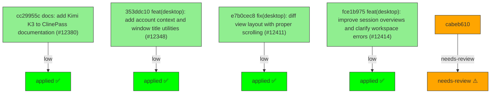

# Backport Agent — Detailed Run Report

> This file is generated automatically. It is intended for human analysts and
> AI reasoning models to assess agent performance, decision quality, and LLM behavior.

**Run timestamp**: 2026-07-21T10:43:54.992Z
**Models used**: fast=`mistral/mistral-code-agent-latest`  powerful=`cohere/command-a-reasoning-08-2025`
**Prompt log**: `/Users/rlemeill/Development/tea-ching-cline/.backport-agent/run-1784629983806.prompts.jsonl`

---

## Summary (PR body)

## Backport Agent — Sync Report

**Date**: 2026-07-21T10:43:54.992Z
**Upstream ref**: `main`
**Cut date**: `2026-06-27T00:00:00.000Z` 
**Fork ref**: `keypool-live`
**Sync branch**: `sync/upstream-main-2026-07-21-103450`

### Summary

- ✅ Applied: 4
- ⚠️ Needs human review: 1
- ⛔ Blocked (not attempted): 0

### Applied commits

- `cc29955c` [low] docs: add Kimi K3 to ClinePass documentation (#12380)
- `353ddc10` [low] feat(desktop): add account context and window title utilities (#12348)
- `e7b0cec8` [low] fix(desktop): diff view layout with proper scrolling (#12411)
- `fce1b975` [low] feat(desktop): improve session overviews and clarify workspace errors (#12414)

### ⚠️ Human review required

- `cabeb610` Add minimal task lifecycle telemetry (#11851)
  - Semantic conflicts: Upstream adds task lifecycle telemetry phases (e.g., provider_request_started) that may alter iteration counting semantics used by the deterministic checkpoint test; New abort handling and error types in AgentRuntime could change run completion/restart behavior, breaking the fork's restart counting logic

### Agent decision log

- Applied 4 low-risk commits
- Skipped 1 medium-risk commit due to semantic conflicts with fork customizations


---

## Agent Workflow Diagram

> Generated by the fast model from the run summary. Evaluate the agent's decision path.



---

## AI Sub-Agent Call Log (2 calls)

> Each entry is one sub-agent invocation. Review prompt/response pairs to assess
> reasoning quality, hallucinations, and decision accuracy.

### Call 1 / 2 — `analyze_commit_for_backport` ✅ OK

| Field | Value |
|---|---|
| **Timestamp** | 2026-07-21T10:34:37.894Z |
| **Tool** | `analyze_commit_for_backport` |
| **Model** | `cohere/command-a-reasoning-08-2025` |
| **Duration** | 8060 ms |
| **Tokens in** | 15746 |
| **Tokens out** | 705 |
| **Cost** | $0.000000 |

**Prompt sent to sub-agent:**

```
Commit SHA: cabeb61036561b83b857d34fe1089460b04485a8
Commit message:
Add minimal task lifecycle telemetry (#11851)

Changed files (8):
apps/vscode/src/core/controller/state/updateAutoApprovalSettings.test.ts
sdk/packages/agents/src/agent-runtime.test.ts
sdk/packages/agents/src/agent-runtime.ts
sdk/packages/core/src/services/telemetry/core-events.test.ts
sdk/packages/core/src/services/telemetry/core-events.ts
sdk/packages/shared/src/index.browser.ts
sdk/packages/shared/src/index.ts
sdk/packages/shared/src/services/telemetry.ts

Diff:
commit cabeb61036561b83b857d34fe1089460b04485a8
Author: Ara <arafat.da.khan@gmail.com>
Date:   Mon Jul 20 20:45:02 2026 +0200

    Add minimal task lifecycle telemetry (#11851)
    
    * Add minimal task lifecycle telemetry
    
    * fix(vscode): use runner-safe auto approval assertions
    
    * fix task lifecycle telemetry cancellation ordering
---
 .../state/updateAutoApprovalSettings.test.ts       |  23 +-
 sdk/packages/agents/src/agent-runtime.test.ts      | 263 ++++++++++++++++++++-
 sdk/packages/agents/src/agent-runtime.ts           | 141 ++++++++++-
 .../src/services/telemetry/core-events.test.ts     |  27 +++
 .../core/src/services/telemetry/core-events.ts     |  14 ++
 sdk/packages/shared/src/index.browser.ts           |   7 +
 sdk/packages/shared/src/index.ts                   |   7 +
 sdk/packages/shared/src/services/telemetry.ts      |  55 +++++
 8 files changed, 525 insertions(+), 12 deletions(-)

diff --git a/apps/vscode/src/core/controller/state/updateAutoApprovalSettings.test.ts b/apps/vscode/src/core/controller/state/updateAutoApprovalSettings.test.ts
index 2449497171a..e46fd88348e 100644
--- a/apps/vscode/src/core/controller/state/updateAutoApprovalSettings.test.ts
+++ b/apps/vscode/src/core/controller/state/updateAutoApprovalSettings.test.ts
@@ -1,6 +1,7 @@
+import assert from "node:assert/strict"
 import { DEFAULT_AUTO_APPROVAL_SETTINGS } from "@shared/AutoApprovalSettings"
 import { AutoApprovalSettingsRequest } from "@shared/proto/cline/state"
-import { describe, expect, it, vi } from "vitest"
+import { describe, it, vi } from "vitest"
 import type { Controller } from ".."
 import { updateAutoApprovalSettings } from "./updateAutoApprovalSettings"
 
@@ -58,9 +59,11 @@ describe("updateAutoApprovalSettings", () => {
 			},
 		}
 
-		expect(controller.stateManager.setGlobalState.mock.calls).toEqual([["autoApprovalSettings", expectedSettings]])
-		expect(controller.stateManager.setTaskSettings.mock.calls).toEqual([["task-1", "autoApprovalSettings", expectedSettings]])
-		expect(controller.postStateToWebview.mock.calls.length).toBe(1)
+		assert.deepEqual(controller.stateManager.setGlobalState.mock.calls, [["autoApprovalSettings", expectedSettings]])
+		assert.deepEqual(controller.stateManager.setTaskSettings.mock.calls, [
+			["task-1", "autoApprovalSettings", expectedSettings],
+		])
+		assert.equal(controller.postStateToWebview.mock.calls.length, 1)
 	})
 
 	it("does not create a task override when no task is active", async () => {
@@ -76,9 +79,9 @@ describe("updateAutoApprovalSettings", () => {
 			}),
 		)
 
-		expect(controller.stateManager.setGlobalState.mock.calls.length).toBe(1)
-		expect(controller.stateManager.setTaskSettings.mock.calls.length).toBe(0)
-		expect(controller.postStateToWebview.mock.calls.length).toBe(1)
+		assert.equal(controller.stateManager.setGlobalState.mock.calls.length, 1)
+		assert.equal(controller.stateManager.setTaskSettings.mock.calls.length, 0)
+		assert.equal(controller.postStateToWebview.mock.calls.length, 1)
 	})
 
 	it("ignores stale auto-approval settings versions", async () => {
@@ -100,8 +103,8 @@ describe("updateAutoApprovalSettings", () => {
 			}),
 		)
 
-		expect(controller.stateManager.setGlobalState.mock.calls.length).toBe(0)
-		expect(controller.stateManager.setTaskSettings.mock.calls.length).toBe(0)
-		expect(controller.postStateToWebview.mock.calls.length).toBe(0)
+		assert.equal(controller.stateManager.setGlobalState.mock.calls.length, 0)
+		assert.equal(controller.stateManager.setTaskSettings.mock.calls.length, 0)
+		assert.equal(controller.postStateToWebview.mock.calls.length, 0)
 	})
 })
diff --git a/sdk/packages/agents/src/agent-runtime.test.ts b/sdk/packages/agents/src/agent-runtime.test.ts
index 21854bf2e48..948900676ef 100644
--- a/sdk/packages/agents/src/agent-runtime.test.ts
+++ b/sdk/packages/agents/src/agent-runtime.test.ts
@@ -7,7 +7,14 @@ import type {
 	AgentTool,
 	ITelemetryService,
 } from "@cline/shared";
-import { AGENT_UNEXPECTED_REASONING_TOKENS_EVENT } from "@cline/shared";
+import {
+	AGENT_UNEXPECTED_REASONING_TOKENS_EVENT,
+	TASK_CANCELLED_EVENT,
+	TASK_FIRST_CHUNK_RECEIVED_EVENT,
+	TASK_PROVIDER_REQUEST_STARTED_EVENT,
+	TASK_PROVIDER_STREAM_FAILED_EVENT,
+	TASK_PROVIDER_STREAM_STARTED_EVENT,
+} from "@cline/shared";
 import { describe, expect, it, vi } from "vitest";
 import { AgentRuntime } from "./index";
 
@@ -51,6 +58,31 @@ const createEchoTool = (): AgentTool<{ text: string }, { echoed: string }> => ({
 	},
 });
 
+function createTelemetryMock(): {
+	telemetry: ITelemetryService;
+	capture: ReturnType<typeof vi.fn>;
+} {
+	const capture = vi.fn();
+	return {
+		capture,
+		telemetry: {
+			capture,
+			captureRequired: vi.fn(),
+			setDistinctId: vi.fn(),
+			setMetadata: vi.fn(),
+			updateMetadata: vi.fn(),
+			setCommonProperties: vi.fn(),
+			updateCommonProperties: vi.fn(),
+			isEnabled: () => true,
+			recordCounter: vi.fn(),
+			recordHistogram: vi.fn(),
+			recordGauge: vi.fn(),
+			flush: vi.fn(async () => undefined),
+			dispose: vi.fn(async () => undefined),
+		} as unknown as ITelemetryService,
+	};
+}
+
 describe("AgentRuntime", () => {
 	it("completes a simple turn without tools", async () => {
 		const model = new ScriptedModel([
@@ -1202,6 +1234,235 @@ describe("AgentRuntime", () => {
 		);
 	});
 
+	it("captures task lifecycle telemetry around a successful model stream", async () => {
+		const { capture, telemetry } = createTelemetryMock();
+		const model = new ScriptedModel([
+			() => [
+				{ type: "text-delta", text: "hello" },
+				{ type: "finish", reason: "stop" },
+			],
+		]);
+		const runtime = new AgentRuntime({
+			model,
+			agentId: "agent-1",
+			conversationId: "conversation-1",
+			sessionId: "session-1",
+			messageModelInfo: {
+				id: "anthropic/claude-sonnet-4.6",
+				provider: "openrouter",
+			},
+			telemetry,
+		});
+
+		const result = await runtime.run("Hi");
+
+		expect(result.status).toBe("completed");
+		const taskEvents = capture.mock.calls
+			.map(([input]) => input)
+			.filter((input) => input.event.startsWith("task."));
+		expect(taskEvents.map((input) => input.event)).toEqual([
+			TASK_PROVIDER_REQUEST_STARTED_EVENT,
+			TASK_PROVIDER_STREAM_STARTED_EVENT,
+			TASK_FIRST_CHUNK_RECEIVED_EVENT,
+		]);
+		expect(taskEvents[0]).toEqual(
+			expect.objectContaining({
+				event: TASK_PROVIDER_REQUEST_STARTED_EVENT,
+				properties: expect.objectContaining({
+					agentId: "agent-1",
+					conversationId: "conversation-1",
+					sessionId: "session-1",
+					ulid: "session-1",
+					iteration: 1,
+					provider: "openrouter",
+					providerId: "openrouter",
+					model: "anthropic/claude-sonnet-4.6",
+					modelId: "anthropic/claude-sonnet-4.6",
+					phase: "provider_request_started",
+				}),
+			}),
+		);
+		expect(taskEvents[2]?.properties).toEqual(
+			expect.objectContaining({
+				eventType: "text-delta",
+				phase: "first_chunk_received",
+			}),
+		);
+	});
+
+	it("captures task lifecycle telemetry when the provider stream fails", async () => {
+		const { capture, telemetry } = createTelemetryMock();
+		const model = new ScriptedModel([]);
+		const runtime = new AgentRuntime({
+			model,
+			agentId: "agent-1",
+			sessionId: "session-1",
+			messageModelInfo: {
+				id: "deepseek/deepseek-v4-flash",
+				provider: "cline",
+			},
+			telemetry,
+		});
+
+		const result = await runtime.run("Hi");
+
+		expect(result.status).toBe("failed");
+		const taskEvents = capture.mock.calls
+			.map(([input]) => input)
+			.filter((input) => input.event.startsWith("task."));
+		expect(taskEvents.map((input) => input.event)).toEqual([
+			TASK_PROVIDER_REQUEST_STARTED_EVENT,
+			TASK_PROVIDER_STREAM_FAILED_EVENT,
+		]);
+		expect(taskEvents[1]?.properties).toEqual(
+			expect.objectContaining({
+				error_message: "No scripted model step available",
+				error_type: "Error",
+				phase: "provider_request_started",
+				provider: "cline",
+				model: "deepseek/deepseek-v4-flash",
+			}),
+		);
+	});
+
+	it("captures task cancellation without reporting provider failure", async () => {
+		const { capture, telemetry } = createTelemetryMock();
+		let resolveStreamStarted: (() => void) | undefined;
+		const streamStarted = new Promise<void>((resolve) => {
+			resolveStreamStarted = resolve;
+		});
+		const model = new ScriptedModel([
+			async function* (request: AgentModelRequest) {
+				await new Promise<void>((_resolve, reject) => {
+					request.signal?.addEventListener(
+						"abort",
+						() => reject(request.signal?.reason),
+						{ once: true },
+					);
+					resolveStreamStarted?.();
+				});
+			},
+		]);
+		const runtime = new AgentRuntime({
+			model,
+			agentId: "agent-1",
+			sessionId: "session-1",
+			messageModelInfo: {
+				id: "deepseek/deepseek-v4-pro",
+				provider: "cline",
+			},
+			telemetry,
+		});
+
+		const run = runtime.run("Hi");
+		await streamStarted;
+		runtime.abort("user cancelled");
+		const result = await run;
+
+		expect(result.status).toBe("aborted");
+		const taskEvents = capture.mock.calls
+			.map(([input]) => input)
+			.filter((input) => input.event.startsWith("task."));
+		expect(taskEvents.map((input) => input.event)).toEqual([
+			TASK_PROVIDER_REQUEST_STARTED_EVENT,
+			TASK_PROVIDER_STREAM_STARTED_EVENT,
+			TASK_CANCELLED_EVENT,
+		]);
+		expect(taskEvents[2]?.properties).toEqual(
+			expect.objectContaining({
+				error_message: "user cancelled",
+				error_type: "AgentRuntimeAbortError",
+			}),
+		);
+	});
+
+	it("does not report provider failure when cancelled before stream opens", async () => {
+		const { capture, telemetry } = createTelemetryMock();
+		let resolveStreamCalled: (() => void) | undefined;
+		const streamCalled = new Promise<void>((resolve) => {
+			resolveStreamCalled = resolve;
+		});
+		const model: AgentModel = {
+			async stream(request: AgentModelRequest) {
+				resolveStreamCalled?.();
+				await new Promise<void>((resolve) => {
+					request.signal?.addEventListener("abort", () => resolve(), {
+						once: true,
+					});
+				});
+				return toAsyncIterable([]);
+			},
+		};
+		const runtime = new AgentRuntime({
+			model,
+			agentId: "agent-1",
+			sessionId: "session-1",
+			messageModelInfo: {
+				id: "deepseek/deepseek-v4-pro",
+				provider: "cline",
+			},
+			telemetry,
+		});
+
+		const run = runtime.run("Hi");
+		await streamCalled;
+		runtime.abort("user cancelled before stream opened");
+		const result = await run;
+
+		expect(result.status).toBe("aborted");
+		const taskEvents = capture.mock.calls
+			.map(([input]) => input)
+			.filter((input) => input.event.startsWith("task."));
+		expect(taskEvents.map((input) => input.event)).toEqual([
+			TASK_PROVIDER_REQUEST_STARTED_EVENT,
+			TASK_CANCELLED_EVENT,
+		]);
+	});
+
+	it("does not emit provider request telemetry when cancelled during beforeModel hooks", async () => {
+		const { capture, telemetry } = createTelemetryMock();
+		let resolveHookStarted: (() => void) | undefined;
+		const hookStarted = new Promise<void>((resolve) => {
+			resolveHookStarted = resolve;
+		});
+		let resolveHook: (() => void) | undefined;
+		const hookCanFinish = new Promise<void>((resolve) => {
+			resolveHook = resolve;
+		});
+		const model = new ScriptedModel([
+			() => [
+				{ type: "text-delta", text: "should not happen" },
+				{ type: "finish", reason: "stop" },
+			],
+		]);
+		const runtime = new AgentRuntime({
+			model,
+			sessionId: "session-1",
+			telemetry,
+			hooks: {
+				beforeModel: async () => {
+					resolveHookStarted?.();
+					await hookCanFinish;
+				},
+			},
+		});
+
+		const run = runtime.run("Hi");
+		await hookStarted;
+		runtime.abort("user cancelled during hook");
+		resolveHook?.();
+		const result = await run;
+
+		expect(result.status).toBe("aborted");
+		expect(model.requests).toHaveLength(0);
+		const taskEvents = capture.mock.calls
+			.map(([input]) => input)
+			.filter((input) => input.event.startsWith("task."));
+		expect(taskEvents.map((input) => input.event)).toEqual([
+			TASK_CANCELLED_EVENT,
+		]);
+	});
+
 	it("stops a run from beforeModel hooks and returns an aborted result", async () => {
 		const model = new ScriptedModel([
 			() => [
diff --git a/sdk/packages/agents/src/agent-runtime.ts b/sdk/packages/agents/src/agent-runtime.ts
index bebcd4af9bb..523515043c7 100644
--- a/sdk/packages/agents/src/agent-runtime.ts
+++ b/sdk/packages/agents/src/agent-runtime.ts
@@ -6,6 +6,7 @@ import type {
 	AgentMessage,
 	AgentMessagePart,
 	AgentModel,
+	AgentModelEvent,
 	AgentModelFinishReason,
 	AgentModelRequest,
 	AgentRunResult,
@@ -19,6 +20,7 @@ import type {
 	AgentToolResult,
 	AgentUsage,
 	AgentRuntimeConfig as BaseAgentRuntimeConfig,
+	CaptureTaskLifecycleEventInput,
 	TelemetryProperties,
 	ToolApprovalResult,
 	ToolPolicy,
@@ -26,10 +28,16 @@ import type {
 import {
 	captureAgentUnexpectedReasoningTokens,
 	captureSdkError,
+	captureTaskLifecycleEvent,
 	estimateTokens,
 	mergeModelOptions,
 	normalizeJsonLikeStringsForSchema,
 	omitUndefinedValues,
+	TASK_CANCELLED_EVENT,
+	TASK_FIRST_CHUNK_RECEIVED_EVENT,
+	TASK_PROVIDER_REQUEST_STARTED_EVENT,
+	TASK_PROVIDER_STREAM_FAILED_EVENT,
+	TASK_PROVIDER_STREAM_STARTED_EVENT,
 	trimNonEmpty,
 } from "@cline/shared";
 import { nanoid } from "nanoid";
@@ -414,8 +422,16 @@ export class AgentRuntime {
 	};
 	private initialization?: Promise<void>;
 	private abortController?: AbortController;
+	private readonly telemetryProviderId?: string;
+	private readonly telemetryModelId?: string;
 
 	constructor(config: AgentRuntimeConfig) {
+		this.telemetryProviderId =
+			trimNonEmpty(config.messageModelInfo?.provider) ??
+			("providerId" in config ? trimNonEmpty(config.providerId) : undefined);
+		this.telemetryModelId =
+			trimNonEmpty(config.messageModelInfo?.id) ??
+			("modelId" in config ? trimNonEmpty(config.modelId) : undefined);
 		const resolved = resolveRuntimeConfig(config);
 		this.config = {
 			...resolved,
@@ -439,11 +455,17 @@ export class AgentRuntime {
 		if (!this.abortController) {
 			return;
 		}
+		if (this.abortController.signal.aborted) {
+			return;
+		}
 		const abortError =
 			reason instanceof AgentRuntimeAbortError
 				? reason
 				: new AgentRuntimeAbortError(reason);
 		this.state.lastError = abortError.message;
+		this.captureTaskLifecycle(TASK_CANCELLED_EVENT, {
+			error: abortError,
+		});
 		this.abortController.abort(abortError);
 	}
 
@@ -812,6 +834,10 @@ export class AgentRuntime {
 			}),
 		};
 
+		const taskLifecycleStartedAt = Date.now();
+		const getTaskLifecycleDurationMs = () =>
+			Date.now() - taskLifecycleStartedAt;
+
 		if (this.state.iteration > 1) {
 			const pendingUserMessage = await this.consumePendingUserMessage();
 			if (pendingUserMessage) {
@@ -826,12 +852,14 @@ export class AgentRuntime {
 		}
 
 		request = await this.prepareTurnForModelRequest(request);
+		this.throwIfAborted();
 
 		for (const hook of this.hooks.beforeModel) {
 			const result = (await hook({
 				snapshot: this.snapshot(),
 				request,
 			})) as AgentBeforeModelResult | undefined;
+			this.throwIfAborted();
 			this.applyStopControl(result);
 			if (result?.messages) {
 				request = { ...request, messages: cloneMessages(result.messages) };
@@ -861,7 +889,16 @@ export class AgentRuntime {
 			...summarizeModelRequest(request),
 		});
 
-		const stream = await this.config.model.stream(request);
+		this.throwIfAborted();
+		this.captureTaskLifecycle(TASK_PROVIDER_REQUEST_STARTED_EVENT, {
+			durationMs: getTaskLifecycleDurationMs(),
+			phase: "provider_request_started",
+		});
+		const stream = this.openTaskLifecycleStream(
+			request,
+			getTaskLifecycleDurationMs,
+		);
+
 		const content: AgentMessagePart[] = [];
 		const toolAssemblies = new Map<string, PendingToolAssembly>();
 		const invalidToolCalls: InvalidToolCall[] = [];
@@ -1039,6 +1076,108 @@ export class AgentRuntime {
 		return { message, finishReason };
 	}
 
+	private async *openTaskLifecycleStream(
+		request: AgentModelRequest,
+		getTaskLifecycleDurationMs: () => number | undefined,
+	): AsyncIterable<AgentModelEvent> {
+		let stream: AsyncIterable<AgentModelEvent>;
+		let phase = "provider_request_started";
+		try {
+			stream = await this.config.model.stream(request);
+			this.throwIfAborted();
+			phase = "provider_stream_started";
+			this.captureTaskLifecycle(TASK_PROVIDER_STREAM_STARTED_EVENT, {
+				durationMs: getTaskLifecycleDurationMs(),
+				phase,
+			});
+		} catch (error) {
+			if (!this.isAbortError(error)) {
+				this.captureTaskLifecycleFailure(
+					error,
+					phase,
+					getTaskLifecycleDurationMs(),
+				);
+			}
+			throw error;
+		}
+
+		let receivedFirstChunk = false;
+		try {
+			for await (const event of stream) {
+				if (!receivedFirstChunk) {
+					receivedFirstChunk = true;
+					phase = "first_chunk_received";
+					this.captureTaskLifecycle(TASK_FIRST_CHUNK_RECEIVED_EVENT, {
+						durationMs: getTaskLifecycleDurationMs(),
+						phase,
+						eventType: event.type,
+					});
+				}
+				yield event;
+			}
+		} catch (error) {
+			if (!this.isAbortError(error)) {
+				this.captureTaskLifecycleFailure(
+					error,
+					phase,
+					getTaskLifecycleDurationMs(),
+				);
+			}
+			throw error;
+		}
+	}
+
+	private captureTaskLifecycleFailure(
+		error: unknown,
+		phase: string,
+		durationMs: number | undefined,
+	): void {
+		this.captureTaskLifecycle(TASK_PROVIDER_STREAM_FAILED_EVENT, {
+			durationMs,
+			error,
+			phase,
+		});
+	}
+
+	private captureTaskLifecycle(
+		event: string,
+		input: Partial<Omit<CaptureTaskLifecycleEventInput, "event">> = {},
+	): void {
+		const sessionId = trimNonEmpty(this.config.sessionId);
+		captureTaskLifecycleEvent(this.config.telemetry, {
+			event,
+			sessionId,
+			ulid: sessionId,
+			agentId: this.state.agentId,
+			conversationId: trimNonEmpty(this.config.conversationId),
+			runId: this.state.runId,
+			iteration: this.state.iteration > 0 ? this.state.iteration : undefined,
+			providerId: this.getTelemetryProviderId(),
+			modelId: this.getTelemetryModelId(),
+			...input,
+		});
+	}
+
+	private getTelemetryProviderId(): string | undefined {
+		return (
+			trimNonEmpty(this.config.messageModelInfo?.provider) ??
+			this.telemetryProviderId
+		);
+	}
+
+	private getTelemetryModelId(): string | undefined {
+		return (
+			trimNonEmpty(this.config.messageModelInfo?.id) ?? this.telemetryModelId
+		);
+	}
+
+	private isAbortError(error: unknown): boolean {
+		return (
+			error instanceof AgentRuntimeAbortError ||
+			this.abortController?.signal.aborted === true
+		);
+	}
+
 	private captureUnexpectedReasoningTokens(
 		request: AgentModelRequest,
 		metrics: NonNullable<AgentMessage["metrics"]>,
diff --git a/sdk/packages/core/src/services/telemetry/core-events.test.ts b/sdk/packages/core/src/services/telemetry/core-events.test.ts
index 6093cb095c7..e189e811822 100644
--- a/sdk/packages/core/src/services/telemetry/core-events.test.ts
+++ b/sdk/packages/core/src/services/telemetry/core-events.test.ts
@@ -1,6 +1,12 @@
 import {
 	AGENT_UNEXPECTED_REASONING_TOKENS_EVENT,
 	type ITelemetryService,
+	TASK_CANCELLED_EVENT,
+	TASK_FIRST_CHUNK_RECEIVED_EVENT,
+	TASK_PROVIDER_REQUEST_STARTED_EVENT,
+	TASK_PROVIDER_STREAM_FAILED_EVENT,
+	TASK_PROVIDER_STREAM_STARTED_EVENT,
+	captureTaskLifecycleEvent as captureSharedTaskLifecycleEvent,
 } from "@cline/shared";
 import { describe, expect, test, vi } from "vitest";
 import {
@@ -13,6 +19,7 @@ import {
 	captureProviderConfigured,
 	captureRunCommandsTimeout,
 	captureTelemetryOptOut,
+	captureTaskLifecycleEvent,
 	captureWorkspaceInitError,
 	captureWorkspaceInitialized,
 	captureWorkspacePathResolved,
@@ -88,6 +95,26 @@ describe("CORE_TELEMETRY_EVENTS", () => {
 			AGENT_UNEXPECTED_REASONING_TOKENS_EVENT,
 		);
 	});
+
+	test("catalogs task lifecycle events", () => {
+		expect(CORE_TELEMETRY_EVENTS.TASK.PROVIDER_REQUEST_STARTED).toBe(
+			TASK_PROVIDER_REQUEST_STARTED_EVENT,
+		);
+		expect(CORE_TELEMETRY_EVENTS.TASK.PROVIDER_STREAM_STARTED).toBe(
+			TASK_PROVIDER_STREAM_STARTED_EVENT,
+		);
+		expect(CORE_TELEMETRY_EVENTS.TASK.FIRST_CHUNK_RECEIVED).toBe(
+			TASK_FIRST_CHUNK_RECEIVED_EVENT,
+		);
+		expect(CORE_TELEMETRY_EVENTS.TASK.PROVIDER_STREAM_FAILED).toBe(
+			TASK_PROVIDER_STREAM_FAILED_EVENT,
+		);
+		expect(CORE_TELEMETRY_EVENTS.TASK.CANCELLED).toBe(TASK_CANCELLED_EVENT);
+	});
+
+	test("re-exports the task lifecycle telemetry helper", () => {
+		expect(captureTaskLifecycleEvent).toBe(captureSharedTaskLifecycleEvent);
+	});
 });
 
 describe("captureProviderConfigured", () => {
diff --git a/sdk/packages/core/src/services/telemetry/core-events.ts b/sdk/packages/core/src/services/telemetry/core-events.ts
index 2b6a20bfb81..0e5cb9bd3ad 100644
--- a/sdk/packages/core/src/services/telemetry/core-events.ts
+++ b/sdk/packages/core/src/services/telemetry/core-events.ts
@@ -1,9 +1,16 @@
 import {
 	AGENT_UNEXPECTED_REASONING_TOKENS_EVENT,
 	type CaptureAgentUnexpectedReasoningTokensInput,
+	type CaptureTaskLifecycleEventInput,
 	captureAgentUnexpectedReasoningTokens,
+	captureTaskLifecycleEvent,
 	type ITelemetryService,
 	SDK_ERROR_TELEMETRY_EVENT,
+	TASK_CANCELLED_EVENT,
+	TASK_FIRST_CHUNK_RECEIVED_EVENT,
+	TASK_PROVIDER_REQUEST_STARTED_EVENT,
+	TASK_PROVIDER_STREAM_FAILED_EVENT,
+	TASK_PROVIDER_STREAM_STARTED_EVENT,
 	type TelemetryProperties,
 } from "@cline/shared";
 import type {
@@ -65,6 +72,11 @@ export const CORE_TELEMETRY_EVENTS = {
 		DIFF_EDIT_FAILED: "task.diff_edit_failed",
 		PROVIDER_API_ERROR: "task.provider_api_error",
 		MISTAKE_LIMIT_REACHED: "task.mistake_limit_reached",
+		PROVIDER_REQUEST_STARTED: TASK_PROVIDER_REQUEST_STARTED_EVENT,
+		PROVIDER_STREAM_STARTED: TASK_PROVIDER_STREAM_STARTED_EVENT,
+		FIRST_CHUNK_RECEIVED: TASK_FIRST_CHUNK_RECEIVED_EVENT,
+		PROVIDER_STREAM_FAILED: TASK_PROVIDER_STREAM_FAILED_EVENT,
+		CANCELLED: TASK_CANCELLED_EVENT,
 		MENTION_USED: "task.mention_used",
 		MENTION_FAILED: "task.mention_failed",
 		MENTION_SEARCH_RESULTS: "task.mention_search_results",
@@ -112,7 +124,9 @@ export interface RunCommandsTimeoutTelemetryProperties {
 
 export {
 	captureAgentUnexpectedReasoningTokens,
+	captureTaskLifecycleEvent,
 	type CaptureAgentUnexpectedReasoningTokensInput,
+	type CaptureTaskLifecycleEventInput,
 };
 
 export interface WorkspaceInitializedProperties {
diff --git a/sdk/packages/shared/src/index.browser.ts b/sdk/packages/shared/src/index.browser.ts
index 14ae024e186..a64f97018bd 100644
--- a/sdk/packages/shared/src/index.browser.ts
+++ b/sdk/packages/shared/src/index.browser.ts
@@ -380,6 +380,7 @@ export {
 export type {
 	CaptureAgentUnexpectedReasoningTokensInput,
 	CaptureSdkErrorInput,
+	CaptureTaskLifecycleEventInput,
 	ITelemetryService,
 	OpenTelemetryClientConfig,
 	SdkTelemetryErrorComponent,
@@ -396,8 +397,14 @@ export {
 	buildSdkErrorProperties,
 	captureAgentUnexpectedReasoningTokens,
 	captureSdkError,
+	captureTaskLifecycleEvent,
 	normalizeSdkError,
 	SDK_ERROR_TELEMETRY_EVENT,
+	TASK_CANCELLED_EVENT,
+	TASK_FIRST_CHUNK_RECEIVED_EVENT,
+	TASK_PROVIDER_REQUEST_STARTED_EVENT,
+	TASK_PROVIDER_STREAM_FAILED_EVENT,
+	TASK_PROVIDER_STREAM_STARTED_EVENT,
 } from "./services/telemetry";
 export type { ClineTelemetryServiceConfig } from "./services/telemetry-config";
 export {
diff --git a/sdk/packages/shared/src/index.ts b/sdk/packages/shared/src/index.ts
index e237b6bd3a4..5547c75118f 100644
--- a/sdk/packages/shared/src/index.ts
+++ b/sdk/packages/shared/src/index.ts
@@ -432,6 +432,7 @@ export {
 export type {
 	CaptureAgentUnexpectedReasoningTokensInput,
 	CaptureSdkErrorInput,
+	CaptureTaskLifecycleEventInput,
 	ITelemetryService,
 	OpenTelemetryClientConfig,
 	SdkTelemetryErrorComponent,
@@ -448,8 +449,14 @@ export {
 	buildSdkErrorProperties,
 	captureAgentUnexpectedReasoningTokens,
 	captureSdkError,
+	captureTaskLifecycleEvent,
 	normalizeSdkError,
 	SDK_ERROR_TELEMETRY_EVENT,
+	TASK_CANCELLED_EVENT,
+	TASK_FIRST_CHUNK_RECEIVED_EVENT,
+	TASK_PROVIDER_REQUEST_STARTED_EVENT,
+	TASK_PROVIDER_STREAM_FAILED_EVENT,
+	TASK_PROVIDER_STREAM_STARTED_EVENT,
 } from "./services/telemetry";
 export type { ClineTelemetryServiceConfig } from "./services/telemetry-config";
 export {
diff --git a/sdk/packages/shared/src/services/telemetry.ts b/sdk/packages/shared/src/services/telemetry.ts
index 30422d7b29b..13db7dd4ada 100644
--- a/sdk/packages/shared/src/services/telemetry.ts
+++ b/sdk/packages/shared/src/services/telemetry.ts
@@ -55,6 +55,31 @@ export interface CaptureAgentUnexpectedReasoningTokensInput {
 	reasoningTokenCount: number;
 }
 
+export const TASK_PROVIDER_REQUEST_STARTED_EVENT =
+	"task.provider_request_started";
+export const TASK_PROVIDER_STREAM_STARTED_EVENT =
+	"task.provider_stream_started";
+export const TASK_FIRST_CHUNK_RECEIVED_EVENT = "task.first_chunk_received";
+export const TASK_PROVIDER_STREAM_FAILED_EVENT = "task.provider_stream_failed";
+export const TASK_CANCELLED_EVENT = "task.cancelled";
+
+export interface CaptureTaskLifecycleEventInput {
+	event: string;
+	sessionId?: string;
+	ulid?: string;
+	agentId?: string;
+	conversationId?: string;
+	runId?: string;
+	iteration?: number;
+	providerId?: string;
+	modelId?: string;
+	phase?: string;
+	durationMs?: number;
+	eventType?: string;
+	error?: unknown;
+	messageLimit?: number;
+}
+
 export interface TelemetryMetadata {
 	extension_version: string;
 	cline_type: string;
@@ -121,6 +146,36 @@ export function captureAgentUnexpectedReasoningTokens(
 	});
 }
 
+export function captureTaskLifecycleEvent(
+	telemetry: ITelemetryService | undefined,
+	input: CaptureTaskLifecycleEventInput,
+): void {
+	if (!telemetry) {
+		return;
+	}
+	telemetry.capture({
+		event: input.event,
+		properties: stripUndefinedTelemetryProperties({
+			sessionId: input.sessionId,
+			ulid: input.ulid ?? input.sessionId,
+			agentId: input.agentId,
+			conversationId: input.conversationId,
+			runId: input.runId,
+			iteration: input.iteration,
+			provider: input.providerId,
+			providerId: input.providerId,
+			model: input.modelId,
+			modelId: input.modelId,
+			phase: input.phase,
+			durationMs: input.durationMs,
+			eventType: input.eventType,
+			...(input.error === undefined
+				? {}
+				: normalizeSdkError(input.error, input.messageLimit)),
+		}),
+	});
+}
+
 export function captureSdkError(
 	telemetry: ITelemetryService | undefined,
 	input: CaptureSdkErrorInput,

Output the JSON object now.
```

**Response received:**

````
```json
{
  "summary": "This commit adds task lifecycle telemetry to track events like request start, stream initiation, and cancellation in the agent runtime, improving observability without altering core functionality.",
  "keyChanges": [
    "Introduces telemetry events for task lifecycle phases (request start, stream start, first chunk, failure, cancellation)",
    "Implements telemetry capture in `AgentRuntime` with error handling and abort logic",
    "Exports new telemetry constants and helpers in shared services",
    "Updates tests to validate telemetry behavior",
    "Replaces Vitest `expect` with Node.js `assert` in auto-approval tests"
  ],
  "backportComplexity": "moderate",
  "semanticRiskFactors": [
    "New telemetry events might conflict with fork-specific monitoring",
    "Changes to `AgentRuntime` could interact with custom provider integrations"
  ],
  "recommendation": "apply-with-care"
}
```
````

---

### Call 2 / 2 — `check_customization_compatibility` ✅ OK

| Field | Value |
|---|---|
| **Timestamp** | 2026-07-21T10:34:44.691Z |
| **Tool** | `check_customization_compatibility` |
| **Model** | `cohere/command-a-reasoning-08-2025` |
| **Duration** | 6725 ms |
| **Tokens in** | 11472 |
| **Tokens out** | 544 |
| **Cost** | $0.000000 |

**Prompt sent to sub-agent:**

```
Declared fork customisations:
  1. Pattern: sdk/packages/agents/src/agent-runtime.test.ts
     Description: Fix checkpoint run counting to ensure deterministic behavior across restarts
     Current file content (1 file(s)):
      [sdk/packages/agents/src/agent-runtime.test.ts]
      import type {
      	AgentMessage,
      	AgentModel,
      	AgentModelEvent,
      	AgentModelRequest,
      	AgentRuntimePlugin,
      	AgentTool,
      	ITelemetryService,
      } from "@cline/shared";
      import { AGENT_UNEXPECTED_REASONING_TOKENS_EVENT } from "@cline/shared";
      import { describe, expect, it, vi } from "vitest";
      import { AgentRuntime } from "./index";
      
      const createGatewayMock = vi.hoisted(() => vi.fn());
      
      vi.mock("@cline/llms", () => ({
      	createGateway: createGatewayMock,
      }));
      
      class ScriptedModel implements AgentModel {
      	public readonly requests: AgentModelRequest[] = [];
      
      	constructor(
      		private readonly steps: Array<
      			(
      				request: AgentModelRequest,
      			) => Iterable<AgentModelEvent> | AsyncIterable<AgentModelEvent>
      		>,
      	) {}
      
      	async stream(
      		request: AgentModelRequest,
      	): Promise<AsyncIterable<AgentModelEvent>> {
      		this.requests.push(request);
      		const step = this.steps.shift();
      		if (!step) {
      			throw new Error("No scripted model step available");
      		}
      		return toAsyncIterable(step(request));
      	}
      }
      
      async function* toAsyncIterable(
      	events: Iterable<AgentModelEvent> | AsyncIterable<AgentModelEvent>,
      ): AsyncIterable<AgentModelEvent> {
      	for await (const event of events) {
      		yield event;
      	}
      }
      
      const createEchoTool = (): AgentTool<{ text: string }, { echoed: string }> => ({
      	name: "echo",
      	description: "Echo input text",
      	inputSchema: { type: "object" },
      	async execute(input) {
      		return { echoed: input.text };
      	},
      });
      
      describe("AgentRuntime", () => {
      	it("completes a simple turn without tools", async () => {
      		const model = new ScriptedModel([
      			() => [
      				{ type: "text-delta", text: "hello" },
      				{ type: "finish", reason: "stop" },
      			],
      		]);
      		const runtime = new AgentRuntime({ model });
      
      		const result = await runtime.run("Hi");
      
      		expect(result.status).toBe("completed");
      		expect(result.outputText).toBe("hello");
      		expect(result.messages).toHaveLength(2);
      		expect(model.requests).toHaveLength(1);
      	});
      
      	it("fails a turn that hits the model output token limit before completion", async (

Upstream diff to evaluate:
commit cabeb61036561b83b857d34fe1089460b04485a8
Author: Ara <arafat.da.khan@gmail.com>
Date:   Mon Jul 20 20:45:02 2026 +0200

    Add minimal task lifecycle telemetry (#11851)
    
    * Add minimal task lifecycle telemetry
    
    * fix(vscode): use runner-safe auto approval assertions
    
    * fix task lifecycle telemetry cancellation ordering
---
 .../state/updateAutoApprovalSettings.test.ts       |  23 +-
 sdk/packages/agents/src/agent-runtime.test.ts      | 263 ++++++++++++++++++++-
 sdk/packages/agents/src/agent-runtime.ts           | 141 ++++++++++-
 .../src/services/telemetry/core-events.test.ts     |  27 +++
 .../core/src/services/telemetry/core-events.ts     |  14 ++
 sdk/packages/shared/src/index.browser.ts           |   7 +
 sdk/packages/shared/src/index.ts                   |   7 +
 sdk/packages/shared/src/services/telemetry.ts      |  55 +++++
 8 files changed, 525 insertions(+), 12 deletions(-)

diff --git a/apps/vscode/src/core/controller/state/updateAutoApprovalSettings.test.ts b/apps/vscode/src/core/controller/state/updateAutoApprovalSettings.test.ts
index 2449497171a..e46fd88348e 100644
--- a/apps/vscode/src/core/controller/state/updateAutoApprovalSettings.test.ts
+++ b/apps/vscode/src/core/controller/state/updateAutoApprovalSettings.test.ts
@@ -1,6 +1,7 @@
+import assert from "node:assert/strict"
 import { DEFAULT_AUTO_APPROVAL_SETTINGS } from "@shared/AutoApprovalSettings"
 import { AutoApprovalSettingsRequest } from "@shared/proto/cline/state"
-import { describe, expect, it, vi } from "vitest"
+import { describe, it, vi } from "vitest"
 import type { Controller } from ".."
 import { updateAutoApprovalSettings } from "./updateAutoApprovalSettings"
 
@@ -58,9 +59,11 @@ describe("updateAutoApprovalSettings", () => {
 			},
 		}
 
-		expect(controller.stateManager.setGlobalState.mock.calls).toEqual([["autoApprovalSettings", expectedSettings]])
-		expect(controller.stateManager.setTaskSettings.mock.calls).toEqual([["task-1", "autoApprovalSettings", expectedSettings]])
-		expect(controller.postStateToWebview.mock.calls.length).toBe(1)
+		assert.deepEqual(controller.stateManager.setGlobalState.mock.calls, [["autoApprovalSettings", expectedSettings]])
+		assert.deepEqual(controller.stateManager.setTaskSettings.mock.calls, [
+			["task-1", "autoApprovalSettings", expectedSettings],
+		])
+		assert.equal(controller.postStateToWebview.mock.calls.length, 1)
 	})
 
 	it("does not create a task override when no task is active", async () => {
@@ -76,9 +79,9 @@ describe("updateAutoApprovalSettings", () => {
 			}),
 		)
 
-		expect(controller.stateManager.setGlobalState.mock.calls.length).toBe(1)
-		expect(controller.stateManager.setTaskSettings.mock.calls.length).toBe(0)
-		expect(controller.postStateToWebview.mock.calls.length).toBe(1)
+		assert.equal(controller.stateManager.setGlobalState.mock.calls.length, 1)
+		assert.equal(controller.stateManager.setTaskSettings.mock.calls.length, 0)
+		assert.equal(controller.postStateToWebview.mock.calls.length, 1)
 	})
 
 	it("ignores stale auto-approval settings versions", async () => {
@@ -100,8 +103,8 @@ describe("updateAutoApprovalSettings", () => {
 			}),
 		)
 
-		expect(controller.stateManager.setGlobalState.mock.calls.length).toBe(0)
-		expect(controller.stateManager.setTaskSettings.mock.calls.length).toBe(0)
-		expect(controller.postStateToWebview.mock.calls.length).toBe(0)
+		assert.equal(controller.stateManager.setGlobalState.mock.calls.length, 0)
+		assert.equal(controller.stateManager.setTaskSettings.mock.calls.length, 0)
+		assert.equal(controller.postStateToWebview.mock.calls.length, 0)
 	})
 })
diff --git a/sdk/packages/agents/src/agent-runtime.test.ts b/sdk/packages/agents/src/agent-runtime.test.ts
index 21854bf2e48..948900676ef 100644
--- a/sdk/packages/agents/src/agent-runtime.test.ts
+++ b/sdk/packages/agents/src/agent-runtime.test.ts
@@ -7,7 +7,14 @@ import type {
 	AgentTool,
 	ITelemetryService,
 } from "@cline/shared";
-import { AGENT_UNEXPECTED_REASONING_TOKENS_EVENT } from "@cline/shared";
+import {
+	AGENT_UNEXPECTED_REASONING_TOKENS_EVENT,
+	TASK_CANCELLED_EVENT,
+	TASK_FIRST_CHUNK_RECEIVED_EVENT,
+	TASK_PROVIDER_REQUEST_STARTED_EVENT,
+	TASK_PROVIDER_STREAM_FAILED_EVENT,
+	TASK_PROVIDER_STREAM_STARTED_EVENT,
+} from "@cline/shared";
 import { describe, expect, it, vi } from "vitest";
 import { AgentRuntime } from "./index";
 
@@ -51,6 +58,31 @@ const createEchoTool = (): AgentTool<{ text: string }, { echoed: string }> => ({
 	},
 });
 
+function createTelemetryMock(): {
+	telemetry: ITelemetryService;
+	capture: ReturnType<typeof vi.fn>;
+} {
+	const capture = vi.fn();
+	return {
+		capture,
+		telemetry: {
+			capture,
+			captureRequired: vi.fn(),
+			setDistinctId: vi.fn(),
+			setMetadata: vi.fn(),
+			updateMetadata: vi.fn(),
+			setCommonProperties: vi.fn(),
+			updateCommonProperties: vi.fn(),
+			isEnabled: () => true,
+			recordCounter: vi.fn(),
+			recordHistogram: vi.fn(),
+			recordGauge: vi.fn(),
+			flush: vi.fn(async () => undefined),
+			dispose: vi.fn(async () => undefined),
+		} as unknown as ITelemetryService,
+	};
+}
+
 describe("AgentRuntime", () => {
 	it("completes a simple turn without tools", async () => {
 		const model = new ScriptedModel([
@@ -1202,6 +1234,235 @@ describe("AgentRuntime", () => {
 		);
 	});
 
+	it("captures task lifecycle telemetry around a successful model stream", async () => {
+		const { capture, telemetry } = createTelemetryMock();
+		const model = new ScriptedModel([
+			() => [
+				{ type: "text-delta", text: "hello" },
+				{ type: "finish", reason: "stop" },
+			],
+		]);
+		const runtime = new AgentRuntime({
+			model,
+			agentId: "agent-1",
+			conversationId: "conversation-1",
+			sessionId: "session-1",
+			messageModelInfo: {
+				id: "anthropic/claude-sonnet-4.6",
+				provider: "openrouter",
+			},
+			telemetry,
+		});
+
+		const result = await runtime.run("Hi");
+
+		expect(result.status).toBe("completed");
+		const taskEvents = capture.mock.calls
+			.map(([input]) => input)
+			.filter((input) => input.event.startsWith("task."));
+		expect(taskEvents.map((input) => input.event)).toEqual([
+			TASK_PROVIDER_REQUEST_STARTED_EVENT,
+			TASK_PROVIDER_STREAM_STARTED_EVENT,
+			TASK_FIRST_CHUNK_RECEIVED_EVENT,
+		]);
+		expect(taskEvents[0]).toEqual(
+			expect.objectContaining({
+				event: TASK_PROVIDER_REQUEST_STARTED_EVENT,
+				properties: expect.objectContaining({
+					agentId: "agent-1",
+					conversationId: "conversation-1",
+					sessionId: "session-1",
+					ulid: "session-1",
+					iteration: 1,
+					provider: "openrouter",
+					providerId: "openrouter",
+					model: "anthropic/claude-sonnet-4.6",
+					modelId: "anthropic/claude-sonnet-4.6",
+					phase: "provider_request_started",
+				}),
+			}),
+		);
+		expect(taskEvents[2]?.properties).toEqual(
+			expect.objectContaining({
+				eventType: "text-delta",
+				phase: "first_chunk_received",
+			}),
+		);
+	});
+
+	it("captures task lifecycle telemetry when the provider stream fails", async () => {
+		const { capture, telemetry } = createTelemetryMock();
+		const model = new ScriptedModel([]);
+		const runtime = new AgentRuntime({
+			model,
+			agentId: "agent-1",
+			sessionId: "session-1",
+			messageModelInfo: {
+				id: "deepseek/deepseek-v4-flash",
+				provider: "cline",
+			},
+			telemetry,
+		});
+
+		const result = await runtime.run("Hi");
+
+		expect(result.status).toBe("failed");
+		const taskEvents = capture.mock.calls
+			.map(([input]) => input)
+			.filter((input) => input.event.startsWith("task."));
+		expect(taskEvents.map((input) => input.event)).toEqual([
+			TASK_PROVIDER_REQUEST_STARTED_EVENT,
+			TASK_PROVIDER_STREAM_FAILED_EVENT,
+		]);
+		expect(taskEvents[1]?.properties).toEqual(
+			expect.objectContaining({
+				error_message: "No scripted model step available",
+				error_type: "Error",
+				phase: "provider_request_started",
+				provider: "cline",
+				model: "deepseek/deepseek-v4-flash",
+			}),
+		);
+	});
+
+	it("captures task cancellation without reporting provider failure", async () => {
+		const { capture, telemetry } = createTelemetryMock();
+		let resolveStreamStarted: (() => void) | undefined;
+		const streamStarted = new Promise<void>((resolve) => {
+			resolveStreamStarted = resolve;
+		});
+		const model = new ScriptedModel([
+			async function* (request: AgentModelRequest) {
+				await new Promise<void>((_resolve, reject) => {
+					request.signal?.addEventListener(
+						"abort",
+						() => reject(request.signal?.reason),
+						{ once: true },
+					);
+					resolveStreamStarted?.();
+				});
+			},
+		]);
+		const runtime = new AgentRuntime({
+			model,
+			agentId: "agent-1",
+			sessionId: "session-1",
+			messageModelInfo: {
+				id: "deepseek/deepseek-v4-pro",
+				provider: "cline",
+			},
+			telemetry,
+		});
+
+		const run = runtime.run("Hi");
+		await streamStarted;
+		runtime.abort("user cancelled");
+		const result = await run;
+
+		expect(result.status).toBe("aborted");
+		const taskEvents = capture.mock.calls
+			.map(([input]) => input)
+			.filter((input) => input.event.startsWith("task."));
+		expect(taskEvents.map((input) => input.event)).toEqual([
+			TASK_PROVIDER_REQUEST_STARTED_EVENT,
+			TASK_PROVIDER_STREAM_STARTED_EVENT,
+			TASK_CANCELLED_EVENT,
+		]);
+		expect(taskEvents[2]?.properties).toEqual(
+			expect.objectContaining({
+				error_message: "user cancelled",
+				error_type: "AgentRuntimeAbortError",
+			}),
+		);
+	});
+
+	it("does not report provider failure when cancelled before stream opens", async () => {
+		const { capture, telemetry } = createTelemetryMock();
+		let resolveStreamCalled: (() => void) | undefined;
+		const streamCalled = new Promise<void>((resolve) => {
+			resolveStreamCalled = resolve;
+		});
+		const model: AgentModel = {
+			async stream(request: AgentModelRequest) {
+				resolveStreamCalled?.();
+				await new Promise<void>((resolve) => {
+					request.signal?.addEventListener("abort", () => resolve(), {
+						once: true,
+					});
+				});
+				return toAsyncIterable([]);
+			},
+		};
+		const runtime = new AgentRuntime({
+			model,
+			agentId: "agent-1",
+			sessionId: "session-1",
+			messageModelInfo: {
+				id: "deepseek/deepseek-v4-pro",
+				provider: "cline",
+			},
+			telemetry,
+		});
+
+		const run = runtime.run("Hi");
+		await streamCalled;
+		runtime.abort("user cancelled before stream opened");
+		const result = await run;
+
+		expect(result.status).toBe("aborted");
+		const taskEvents = capture.mock.calls
+			.map(([input]) => input)
+			.filter((input) => input.event.startsWith("task."));
+		expect(taskEvents.map((input) => input.event)).toEqual([
+			TASK_PROVIDER_REQUEST_STARTED_EVENT,
+			TASK_CANCELLED_EVENT,
+		]);
+	});
+
+	it("does not emit provider request telemetry when cancelled during beforeModel hooks", async () => {
+		const { capture, telemetry } = createTelemetryMock();
+		let resolveHookStarted: (() => void) | undefined;
+		const hookStarted = new Promise<void>((resolve) => {
+			resolveHookStarted = resolve;
+		});
+		let resolveHook: (() => void) | undefined;
+		const hookCanFinish = new Promise<void>((resolve) => {
+			resolveHook = resolve;
+		});
+		const model = new ScriptedModel([
+			() => [
+				{ type: "text-delta", text: "should not happen" },
+				{ type: "finish", reason: "stop" },
+			],
+		]);
+		const runtime = new AgentRuntime({
+			model,
+			sessionId: "session-1",
+			telemetry,
+			hooks: {
+				beforeModel: async () => {
+					resolveHookStarted?.();
+					await hookCanFinish;
+				},
+			},
+		});
+
+		const run = runtime.run("Hi");
+		await hookStarted;
+		runtime.abort("user cancelled during hook");
+		resolveHook?.();
+		const result = await run;
+
+		expect(result.status).toBe("aborted");
+		expect(model.requests).toHaveLength(0);
+		const taskEvents = capture.mock.calls
+			.map(([input]) => input)
+			.filter((input) => input.event.startsWith("task."));
+		expect(taskEvents.map((input) => input.event)).toEqual([
+			TASK_CANCELLED_EVENT,
+		]);
+	});
+
 	it("stops a run from beforeModel hooks and returns an aborted result", async () => {
 		const model = new ScriptedModel([
 			() => [
diff --git a/sdk/packages/agents/src/agent-runtime.ts b/sdk/packages/agents/src/agent-runtime.ts
index bebcd4af9bb..523515043c7 100644
--- a/sdk/packages/agents/src/agent-runtime.ts
+++ b/sdk/packages/agents/src/agent-runtime.ts
@@ -6,6 +6,7 @@ import type {
 	AgentMessage,
 	AgentMessagePart,
 	AgentModel,
+	AgentModelEvent,
 	AgentModelFinishReason,
 	AgentModelRequest,
 	AgentRunResult,
@@ -19,6 +20,7 @@ import type {
 	AgentToolResult,
 	AgentUsage,
 	AgentRuntimeConfig as BaseAgentRuntimeConfig,
+	CaptureTaskLifecycleEventInput,
 	TelemetryProperties,
 	ToolApprovalResult,
 	ToolPolicy,
@@ -26,10 +28,16 @@ import type {
 import {
 	captureAgentUnexpectedReasoningTokens,
 	captureSdkError,
+	captureTaskLifecycleEvent,
 	estimateTokens,
 	mergeModelOptions,
 	normalizeJsonLikeStringsForSchema,
 	omitUndefinedValues,
+	TASK_CANCELLED_EVENT,
+	TASK_FIRST_CHUNK_RECEIVED_EVENT,
+	TASK_PROVIDER_REQUEST_STARTED_EVENT,
+	TASK_PROVIDER_STREAM_FAILED_EVENT,
+	TASK_PROVIDER_STREAM_STARTED_EVENT,
 	trimNonEmpty,
 } from "@cline/shared";
 import { nanoid } from "nanoid";
@@ -414,8 +422,16 @@ export class AgentRuntime {
 	};
 	private initialization?: Promise<void>;
 	private abortController?: AbortController;
+	private readonly telemetryProviderId?: string;
+	private readonly telemetryModelId?: string;
 
 	constructor(config: AgentRuntimeConfig) {
+		this.telemetryProviderId =
+			trimNonEmpty(config.messageModelInfo?.provider) ??
+			("providerId" in config ? trimNonEmpty(config.providerId) : undefined);
+		this.telemetryModelId =
+			trimNonEmpty(config.messageModelInfo?.id) ??
+			("modelId" in config ? trimNonEmpty(config.modelId) : undefined);
 		const resolved = resolveRuntimeConfig(config);
 		this.config = {
 			...resolved,
@@ -439,11 +455,17 @@ export class AgentRuntime {
 		if (!this.abortController) {
 			return;
 		}
+		if (this.abortController.signal.aborted) {
+			return;
+		}
 		const abortError =
 			reason instanceof AgentRuntimeAbortError
 				? reason
 				: new AgentRuntimeAbortError(reason);
 		this.state.lastError = abortError.message;
+		this.captureTaskLifecycle(TASK_CANCELLED_EVENT, {
+			error: abortError,
+		});
 		this.abortController.abort(abortError);
 	}
 
@@ -812,6 +834,10 @@ export class AgentRuntime {
 			}),
 		};
 
+		const taskLifecycleStartedAt = Date.now();
+		const getTaskLifecycleDurationMs = () =>
+			Date.now() - taskLifecycleStartedAt;
+
 		if (this.state.iteration > 1) {
 			const pendingUserMessage = await this.consumePendingUserMessage();
 			if (pendingUserMessage) {
@@ -826,12 +852,14 @@ export class AgentRuntime {
 		}
 
 		request = await this.prepareTurnForModelRequest(request);
+		this.throwIfAborted();
 
 		for (const hook of this.hooks.beforeModel) {
 			const result = (await hook({
 				snapshot: this.snapshot(),
 				request,
 			})) as AgentBeforeModelResult | undefined;
+			this.throwIfAborted();
 			this.applyStopControl(result);
 			if (result?.messages) {
 				request = { ...request, messages: cloneMessages(result.messages) };
@@ -861,7 +889,16 @@ export class AgentRuntime {
 			...summarizeModelRequest(request),
 		});
 
-		const stream = await this.config.model.stream(request);
+		this.throwIfAborted();
+		this.captureTaskLifecycle(TASK_PROVIDER_REQUEST_STARTED_EVENT, {
+			durationMs: getTaskLifecycleDurationMs(),
+			phase: "provider_request_started",
+		});
+		const stream = this.openTaskLifecycleStream(
+			request,
+			getTaskLifecycleDurationMs,
+		);
+
 		const content: AgentMessagePart[] = [];
 		const toolAssemblies = new Map<string, PendingToolAssembly>();
 		const invalidToolCalls: InvalidToolCall[] = [];
@@ -1039,6 +1076,108 @@ export class AgentRuntime {
 		return { message, finishReason };
 	}
 
+	private async *openTaskLifecycleStream(
+		request: AgentModelRequest,
+		getTaskLifecycleDurationMs: () => number | undefined,
+	): AsyncIterable<AgentModelEvent> {
+		let stream: AsyncIterable<AgentModelEvent>;
+		let phase = "provider_request_started";
+		try {
+			stream = await this.config.model.stream(request);
+			this.throwIfAborted();
+			phase = "provider_stream_started";
+			this.captureTaskLifecycle(TASK_PROVIDER_STREAM_STARTED_EVENT, {
+				durationMs: getTaskLifecycleDurationMs(),
+				phase,
+			});
+		} catch (error) {
+			if (!this.isAbortError(error)) {
+				this.captureTaskLifecycleFailure(
+					error,
+					phase,
+					getTaskLifecycleDurationMs(),
+				);
+			}
+			throw error;
+		}
+
+		let receivedFirstChunk = false;
+		try {
+			for await (const event of stream) {
+				if (!receivedFirstChunk) {
+					receivedFirstChunk = true;
+					phase = "first_chunk_received";
+					this.captureTaskLifecycle(TASK_FIRST_CHUNK_RECEIVED_EVENT, {
+						durationMs: getTaskLifecycleDurationMs(),
+						phase,
+						eventType: event.type,
+					});
+				}
+				yield event;
+			}
+		} catch (error) {
+			if (!this.isAbortError(error)) {
+				this.captureTaskLifecycleFailure(
+					error,
+					phase,
+					getTaskLifecycleDurationMs(),
+				);
+			}
+			throw error;
+		}
+	}
+
+	private captureTaskLifecycleFailure(
+		error: unknown,
+		phase: string,
+		durationMs: number | undefined,
+	): void {
+		this.captureTaskLifecycle(TASK_PROVIDER_STREAM_FAILED_EVENT, {
+			durationMs,
+			error,
+			phase,
+		});
+	}
+
+	private captureTaskLifecycle(
+		event: string,
+		input: Partial<Omit<CaptureTaskLifecycleEventInput, "event">> = {},
+	): void {
+		const sessionId = trimNonEmpty(this.config.sessionId);
+		captureTaskLifecycleEvent(this.config.telemetry, {
+			event,
+			sessionId,
+			ulid: sessionId,
+			agentId: this.state.agentId,
+			conversationId: trimNonEmpty(this.config.conversationId),
+			runId: this.state.runId,
+			iteration: this.state.iteration > 0 ? this.state.iteration : undefined,
+			providerId: this.getTelemetryProviderId(),
+			modelId: this.getTelemetryModelId(),
+			...input,
+		});
+	}
+
+	private getTelemetryProviderId(): string | undefined {
+		return (
+			trimNonEmpty(this.config.messageModelInfo?.provider) ??
+			this.telemetryProviderId
+		);
+	}
+
+	private getTelemetryModelId(): string | undefined {
+		return (
+			trimNonEmpty(this.config.messageModelInfo?.id) ?? this.telemetryModelId
+		);
+	}
+
+	private isAbortError(error: unknown): boolean {
+		return (
+			error instanceof AgentRuntimeAbortError ||
+			this.abortController?.signal.aborted === true
+		);
+	}
+
 	private captureUnexpectedReasoningTokens(
 		request: AgentModelRequest,
 		metrics: NonNullable<AgentMessage["metrics"]>,
diff --git a/sdk/packages/core/src/services/telemetry/core-events.test.ts b/sdk/packages/core/src/services/telemetry/core-events.test.ts
index 6093cb095c7..e189e811822 100644
--- a/sdk/packages/core/src/services/telemetry/core-events.test.ts
+++ b/sdk/packages/core/src/services/telemetry/core-events.test.ts
@@ -1,6 +1,12 @@
 import {
 	AGENT_UNEXPECTED_REASONING_TOKENS_EVENT,
 	type ITelemetryService,
+	TASK_CANCELLED_EVENT,
+	TASK_FIRST_CHUNK_RECEIVED_EVENT,
+	TASK_PROVIDER_REQUEST_STARTED_EVENT,
+	TASK_PROVIDER_STREAM_FAILED_EVENT,
+	TASK_PROVIDER_STREAM_STARTED_EVENT,
+	captureTaskLifecycleEvent as captureSharedTaskLifecycleEvent,
 } from "@cline/shared";
 import { describe, expect, test, vi } from "vitest";
 import {
@@ -13,6 +19,7 @@ import {
 	captureProviderConfigured,
 	captureRunCommandsTimeout,
 	captureTelemetryOptOut,
+	captureTaskLifecycleEvent,
 	captureWorkspaceInitError,
 	captureWorkspaceInitialized,
 	captureWorkspacePathResolved,
@@ -88,6 +95,26 @@ describe("CORE_TELEMETRY_EVENTS", () => {
 			AGENT_UNEXPECTED_REASONING_TOKENS_EVENT,
 		);
 	});
+
+	test("catalogs task lifecycle events", () => {
+		expect(CORE_TELEMETRY_EVENTS.TASK.PROVIDER_REQUEST_STARTED).toBe(
+			TASK_PROVIDER_REQUEST_STARTED_EVENT,
+		);
+		expect(CORE_TELEMETRY_EVENTS.TASK.PROVIDER_STREAM_STARTED).toBe(
+			TASK_PROVIDER_STREAM_STARTED_EVENT,
+		);
+		expect(CORE_TELEMETRY_EVENTS.TASK.FIRST_CHUNK_RECEIVED).toBe(
+			TASK_FIRST_CHUNK_RECEIVED_EVENT,
+		);
+		expect(CORE_TELEMETRY_EVENTS.TASK.PROVIDER_STREAM_FAILED).toBe(
+			TASK_PROVIDER_STREAM_FAILED_EVENT,
+		);
+		expect(CORE_TELEMETRY_EVENTS.TASK.CANCELLED).toBe(TASK_CANCELLED_EVENT);
+	});
+
+	test("re-exports the task lifecycle telemetry helper", () => {
+		expect(captureTaskLifecycleEvent).toBe(captureSharedTaskLifecycleEvent);
+	});
 });
 
 describe("captureProviderConfigured", () => {
diff --git a/sdk/packages/core/src/services/telemetry/core-events.ts b/sdk/packages/core/src/services/telemetry/core-events.ts
index 2b6a20bfb81..0e5cb9bd3ad 100644
--- a/sdk/packages/core/src/services/telemetry/core-events.ts
+++ b/sdk/packages/core/src/services/telemetry/core-events.ts
@@ -1,9 +1,16 @@
 import {
 	AGENT_UNEXPECTED_REASONING_TOKENS_EVENT,
 	type CaptureAgentUnexpectedReasoningTokensInput,
+	type CaptureTaskLifecycleEventInput,
 	captureAgentUnexpectedReasoningTokens,
+	captureTaskLifecycleEvent,
 	type ITelemetryService,
 	SDK_ERROR_TELEMETRY_EVENT,
+	TASK_CANCELLED_EVENT,
+	TASK_FIRST_CHUNK_RECEIVED_EVENT,
+	TASK_PROVIDER_REQUEST_STARTED_EVENT,
+	TASK_PROVIDER_STREAM_FAILED_EVENT,
+	TASK_PROVIDER_STREAM_STARTED_EVENT,
 	type TelemetryProperties,
 } from "@cline/shared";
 import type {
@@ -65,6 +72,11 @@ export const CORE_TELEMETRY_EVENTS = {
 		DIFF_EDIT_FAILED: "task.diff_edit_failed",
 		PROVIDER_API_ERROR: "task.provider_api_error",
 		MISTAKE_LIMIT_REACHED: "task.mistake_limit_reached",
+		PROVIDER_REQUEST_STARTED: TASK_PROVIDER_REQUEST_STARTED_EVENT,
+		PROVIDER_STREAM_STARTED: TASK_PROVIDER_STREAM_STARTED_EVENT,
+		FIRST_CHUNK_RECEIVED: TASK_FIRST_CHUNK_RECEIVED_EVENT,
+		PROVIDER_STREAM_FAILED: TASK_PROVIDER_STREAM_FAILED_EVENT,
+		CANCELLED: TASK_CANCELLED_EVENT,
 		MENTION_USED: "task.mention_used",
 		MENTION_FAILED: "task.mention_failed",
 		MENTION_SEARCH_RESULTS: "task.mention_search_results",
@@ -112,7 +124,9 @@ export interface RunCommandsTimeoutTelemetryProperties {
 
 export {
 	captureAgentUnexpectedReasoningTokens,
+	captureTaskLifecycleEvent,
 	type CaptureAgentUnexpectedReasoningTokensInput,
+	type CaptureTaskLifecycleEventInput,
 };
 
 export interface WorkspaceInitializedProperties {
diff --git a/sdk/packages/shared/src/index.browser.ts b/sdk/packages/shared/src/index.browser.ts
index 14ae024e186..a64f97018bd 100644
--- a/sdk/packages/shared/src/index.browser.ts
+++ b/sdk/packages/shared/src/index.browser.ts
@@ -380,6 +380,7 @@ export {
 export type {
 	CaptureAgentUnexpectedReasoningTokensInput,
 	CaptureSdkErrorInput,
+	CaptureTaskLifecycleEventInput,
 	ITelemetryService,
 	OpenTelemetryClientConfig,
 	SdkTelemetryErrorComponent,
@@ -396,8 +397,14 @@ export {
 	buildSdkErrorProperties,
 	captureAgentUnexpectedReasoningTokens,
 	captureSdkError,
+	captureTaskLifecycleEvent,
 	normalizeSdkError,
 	SDK_ERROR_TELEMETRY_EVENT,
+	TASK_CANCELLED_EVENT,
+	TASK_FIRST_CHUNK_RECEIVED_EVENT,
+	TASK_PROVIDER_REQUEST_STARTED_EVENT,
+	TASK_PROVIDER_STREAM_FAILED_EVENT,
+	TASK_PROVIDER_STREAM_STARTED_EVENT,
 } from "./services/telemetry";
 export type { ClineTelemetryServiceConfig } from "./services/telemetry-config";
 export {
diff --git a/sdk/packages/shared/src/index.ts b/sdk/packages/shared/src/index.ts
index e237b6bd3a4..5547c75118f 100644
--- a/sdk/packages/shared/src/index.ts
+++ b/sdk/packages/shared/src/index.ts
@@ -432,6 +432,7 @@ export {
 export type {
 	CaptureAgentUnexpectedReasoningTokensInput,
 	CaptureSdkErrorInput,
+	CaptureTaskLifecycleEventInput,
 	ITelemetryService,
 	OpenTelemetryClientConfig,
 	SdkTelemetryErrorComponent,
@@ -448,8 +449,14 @@ export {
 	buildSdkErrorProperties,
 	captureAgentUnexpectedReasoningTokens,
 	captureSdkError,
+	captureTaskLifecycleEvent,
 	normalizeSdkError,
 	SDK_ERROR_TELEMETRY_EVENT,
+	TASK_CANCELLED_EVENT,
+	TASK_FIRST_CHUNK_RECEIVED_EVENT,
+	TASK_PROVIDER_REQUEST_STARTED_EVENT,
+	TASK_PROVIDER_STREAM_FAILED_EVENT,
+	TASK_PROVIDER_STREAM_STARTED_EVENT,
 } from "./services/telemetry";
 export type { ClineTelemetryServiceConfig } from "./services/telemetry-config";
 export {
diff --git a/sdk/packages/shared/src/services/telemetry.ts b/sdk/packages/shared/src/services/telemetry.ts
index 30422d7b29b..13db7dd4ada 100644
--- a/sdk/packages/shared/src/services/telemetry.ts
+++ b/sdk/packages/shared/src/services/telemetry.ts
@@ -55,6 +55,31 @@ export interface CaptureAgentUnexpectedReasoningTokensInput {
 	reasoningTokenCount: number;
 }
 
+export const TASK_PROVIDER_REQUEST_STARTED_EVENT =
+	"task.provider_request_started";
+export const TASK_PROVIDER_STREAM_STARTED_EVENT =
+	"task.provider_stream_started";
+export const TASK_FIRST_CHUNK_RECEIVED_EVENT = "task.first_chunk_received";
+export const TASK_PROVIDER_STREAM_FAILED_EVENT = "task.provider_stream_failed";
+export const TASK_CANCELLED_EVENT = "task.cancelled";
+
+export interface CaptureTaskLifecycleEventInput {
+	event: string;
+	sessionId?: string;
+	ulid?: string;
+	agentId?: string;
+	conversationId?: string;
+	runId?: string;
+	iteration?: number;
+	providerId?: string;
+	modelId?: string;
+	phase?: string;
+	durationMs?: number;
+	eventType?: string;
+	error?: unknown;
+	messageLimit?: number;
+}
+
 export interface TelemetryMetadata {
 	extension_version: string;
 	cline_type: string;
@@ -121,6 +146,36 @@ export function captureAgentUnexpectedReasoningTokens(
 	});
 }
 
+export function captureTaskLifecycleEvent(
+	telemetry: ITelemetryService | undefined,
+	input: CaptureTaskLifecycleEventInput,
+): void {
+	if (!telemetry) {
+		return;
+	}
+	telemetry.capture({
+		event: input.event,
+		properties: stripUndefinedTelemetryProperties({
+			sessionId: input.sessionId,
+			ulid: input.ulid ?? input.sessionId,
+			agentId: input.agentId,
+			conversationId: input.conversationId,
+			runId: input.runId,
+			iteration: input.iteration,
+			provider: input.providerId,
+			providerId: input.providerId,
+			model: input.modelId,
+			modelId: input.modelId,
+			phase: input.phase,
+			durationMs: input.durationMs,
+			eventType: input.eventType,
+			...(input.error === undefined
+				? {}
+				: normalizeSdkError(input.error, input.messageLimit)),
+		}),
+	});
+}
+
 export function captureSdkError(
 	telemetry: ITelemetryService | undefined,
 	input: CaptureSdkErrorInput,

Output the JSON object now.
```

**Response received:**

```
{
  "compatible": false,
  "affectedCustomizations": [
    "agent-runtime.test.ts checkpoint run counting test"
  ],
  "semanticConflicts": [
    "Upstream adds task lifecycle telemetry phases (e.g., provider_request_started) that may alter iteration counting semantics used by the deterministic checkpoint test",
    "New abort handling and error types in AgentRuntime could change run completion/restart behavior, breaking the fork's restart counting logic"
  ],
  "warnings": [],
  "recommendation": "Rebase fork and adjust checkpoint test to account for new telemetry phases. Verify run counting remains deterministic with altered runtime state transitions."
}
```

---

## Performance Summary

**Total AI time**: 14785 ms across 2 call(s)
**Total input tokens**: 27218
**Total output tokens**: 1249

| Tool | Calls | Total ms | Avg ms | Input tok | Output tok |
|---|---|---|---|---|---|
| `analyze_commit_for_backport` | 1 | 8060 | 8060 | 15746 | 705 |
| `check_customization_compatibility` | 1 | 6725 | 6725 | 11472 | 544 |

## Decision Quality Metrics

> Automated quality signals derived from tool output guards, schema validation,
> hallucination detection, and consensus checks.  Review flagged items manually.

### Commit Analysis Quality

| Metric | Value |
|---|---|
| Total analyze calls | 1 |
| Commits with semantic risk factors | 1 |
| Possible hallucinated references (total) | 1 |

### Compatibility Check Quality

| Metric | Value |
|---|---|
| Total compatibility checks | 1 |
| Checks with file content enrichment | 1 |
| Incompatible results | 1 |

### ⚠️ AI Assessment Contradictions

> 1 contradiction(s) were detected by `reconcile_ai_assessments`.
> These are cases where analyze_commit recommended apply but check_customization found issues.

- **SHA**: `cabeb610`  analyze=`apply-with-care`  compatible=`false`  final=`review-required`

### Audit Event Timeline

| Timestamp | Tool | Event | Details |
|---|---|---|---|
| 10:34:37 | `analyze_commit_for_backport` | `hallucination_suspects` | sha="cabeb61036561b83b857d34fe1089460b04485a, suspects=["Node.js"] |
| 10:34:37 | `analyze_commit_for_backport` | `analysis_complete` | sha="cabeb61036561b83b857d34fe1089460b04485a, recommendation="apply-with-care", complexity="moderate" |
| 10:34:44 | `check_customization_compatibility` | `compatibility_check_complete` | compatible=false, affectedCustomizations=["agent-runtime.test.ts checkpoint run c, semanticConflictsCount=2 |
| 10:34:48 | `reconcile_ai_assessments` | `contradiction_detected` | sha="cabeb61036561b83b857d34fe1089460b04485a, analyzeRecommendation="apply-with-care", compatibilityCompatible=false |
