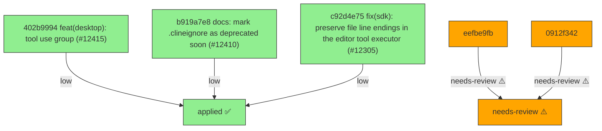

# Backport Agent — Detailed Run Report

> This file is generated automatically. It is intended for human analysts and
> AI reasoning models to assess agent performance, decision quality, and LLM behavior.

**Run timestamp**: 2026-07-24T07:22:18.302Z
**Models used**: fast=`mistral/mistral-code-agent-latest`  powerful=`cohere/command-a-reasoning-08-2025`
**Prompt log**: `/Users/rlemeill/Development/tea-ching-cline/.backport-agent/run-1784877116733.prompts.jsonl`

---

## Summary (PR body)

## Backport Agent — Sync Report

**Date**: 2026-07-24T07:22:18.302Z
**Upstream ref**: `main`
**Cut date**: `2026-06-27T00:00:00.000Z` 
**Fork ref**: `keypool-live`
**Sync branch**: `sync/upstream-main-2026-07-24-071427`

### Summary

- ✅ Applied: 3
- ⚠️ Needs human review: 2
- ⛔ Blocked (not attempted): 0

### Applied commits

- `402b9994` [low] feat(desktop): tool use group (#12415)
- `b919a7e8` [low] docs: mark .clineignore as deprecated soon (#12410)
- `c92d4e75` [low] fix(sdk): preserve file line endings in the editor tool executor (#12305)

### ⚠️ Human review required

- `eefbe9fb` feat(desktop): log telemetry events in desktop app (#12416)
  - Conflicted files: sdk/packages/core/src/services/local-runtime-bootstrap.ts
  - AI resolution failed on all models: Unexpected non-whitespace character after JSON at position 18385 (line 5 column 2)
- `0912f342` fix(deps): bump mermaid to 11.16.0 and protobufjs to 7.6.5 (#12445)
  - Conflicted files: sdk/packages/core/src/services/local-runtime-bootstrap.ts
  - Conflict detected in sdk/packages/core/src/services/local-runtime-bootstrap.ts

### Agent decision log

- Applied 3 low-risk commits successfully
- Blocked 2 high-risk commits due to conflicts with fork customizations
- Validation passed for applied commits


---

## Agent Workflow Diagram

> Generated by the fast model from the run summary. Evaluate the agent's decision path.



---

## AI Sub-Agent Call Log (6 calls)

> Each entry is one sub-agent invocation. Review prompt/response pairs to assess
> reasoning quality, hallucinations, and decision accuracy.

### Call 1 / 6 — `analyze_commit_for_backport` ✅ OK

| Field | Value |
|---|---|
| **Timestamp** | 2026-07-24T07:13:41.333Z |
| **Tool** | `analyze_commit_for_backport` |
| **Model** | `cohere/command-a-reasoning-08-2025` |
| **Duration** | 7422 ms |
| **Tokens in** | 17751 |
| **Tokens out** | 576 |
| **Cost** | $0.000000 |

**Prompt sent to sub-agent:**

```
Commit SHA: eefbe9fb18a47bfcf82b7ce8eabf89f94b2546b4
Commit message:
feat(desktop): log telemetry events in desktop app (#12416)

Changed files (20):
apps/examples/desktop-app/README.md
apps/examples/desktop-app/package.json
apps/examples/desktop-app/sidecar/chat-session.ts
apps/examples/desktop-app/sidecar/commands.ts
apps/examples/desktop-app/sidecar/context.test.ts
apps/examples/desktop-app/sidecar/context.ts
apps/examples/desktop-app/sidecar/index.ts
apps/examples/desktop-app/sidecar/logging.test.ts
apps/examples/desktop-app/sidecar/logging.ts
apps/examples/desktop-app/sidecar/observability.test.ts
apps/examples/desktop-app/sidecar/observability.ts
apps/examples/desktop-app/sidecar/server.ts
apps/examples/desktop-app/sidecar/types.ts
bun.lock
sdk/packages/core/src/hub/server/fetch-wiring.test.ts
sdk/packages/core/src/hub/server/hub-server-options.ts
sdk/packages/core/src/hub/server/hub-server-transport.ts
sdk/packages/core/src/runtime/host/host.ts
sdk/packages/core/src/runtime/host/local-runtime-host.ts
sdk/packages/core/src/services/local-runtime-bootstrap.ts

Diff:
commit eefbe9fb18a47bfcf82b7ce8eabf89f94b2546b4
Author: Bee <68532117+abeatrix@users.noreply.github.com>
Date:   Mon Jul 20 17:50:56 2026 -0700

    feat(desktop): log telemetry events in desktop app (#12416)
    
    * feat(desktop): log telemetry events in desktop app
    
    * Address feedback
---
 apps/examples/desktop-app/README.md                |  15 ++
 apps/examples/desktop-app/package.json             |   1 +
 apps/examples/desktop-app/sidecar/chat-session.ts  |  29 +--
 apps/examples/desktop-app/sidecar/commands.ts      |  18 +-
 apps/examples/desktop-app/sidecar/context.test.ts  |  29 +++
 apps/examples/desktop-app/sidecar/context.ts       |  21 +-
 apps/examples/desktop-app/sidecar/index.ts         |  55 ++++-
 apps/examples/desktop-app/sidecar/logging.test.ts  |  95 ++++++++
 apps/examples/desktop-app/sidecar/logging.ts       | 245 +++++++++++++++++++++
 .../desktop-app/sidecar/observability.test.ts      |  81 +++++++
 apps/examples/desktop-app/sidecar/observability.ts |  63 ++++++
 apps/examples/desktop-app/sidecar/server.ts        |   8 +-
 apps/examples/desktop-app/sidecar/types.ts         |   4 +
 bun.lock                                           |   1 +
 .../core/src/hub/server/fetch-wiring.test.ts       |  24 ++
 .../core/src/hub/server/hub-server-options.ts      |   7 +-
 .../core/src/hub/server/hub-server-transport.ts    |   1 +
 sdk/packages/core/src/runtime/host/host.ts         |   1 +
 .../core/src/runtime/host/local-runtime-host.ts    |   5 +
 .../core/src/services/local-runtime-bootstrap.ts   |  11 +-
 20 files changed, 677 insertions(+), 37 deletions(-)

diff --git a/apps/examples/desktop-app/README.md b/apps/examples/desktop-app/README.md
index 98341ed0ba..4d7c7e20f2 100644
--- a/apps/examples/desktop-app/README.md
+++ b/apps/examples/desktop-app/README.md
@@ -108,6 +108,21 @@ Desktop transport envelope:
 - `<sessionId>.hooks.jsonl` is observability/debug telemetry and should not be required for normal history replay/export flows.
 - Full v1 schema for the persisted messages file, including failure/retry semantics and golden fixtures, is documented in [`packages/core/docs/messages-contract-v1.md`](../../../sdk/packages/core/docs/messages-contract-v1.md).
 
+## Sidecar observability
+
+The desktop sidecar sends SDK telemetry through the same configured OpenTelemetry
+pipeline used by the CLI and writes structured runtime logs to
+`~/.cline/data/logs/code.log` by default. Telemetry continues to honor the global
+opt-out setting exposed in the desktop settings UI. The sidecar truncates stale
+logs and rotates the active file before it exceeds 50 MiB.
+
+Logging can be configured with the same environment variables as the CLI:
+
+- `CLINE_LOG_ENABLED=0` disables file logging.
+- `CLINE_LOG_LEVEL` sets the Pino level (for example, `debug` or `warn`).
+- `CLINE_LOG_PATH` overrides the log destination.
+- `CLINE_LOG_NAME` overrides the logger name.
+
 ## Troubleshooting
 
 - If live updates stall, verify the desktop backend websocket is connected and `chat_event` messages are arriving.
diff --git a/apps/examples/desktop-app/package.json b/apps/examples/desktop-app/package.json
index bfe7f61134..1b9ab01f2a 100644
--- a/apps/examples/desktop-app/package.json
+++ b/apps/examples/desktop-app/package.json
@@ -76,6 +76,7 @@
 		"lucide-react": "^0.564.0",
 		"next": "16.2.6",
 		"next-themes": "^0.4.6",
+		"pino": "^10.3.1",
 		"radix-ui": "^1.4.3",
 		"react": "19.2.4",
 		"react-day-picker": "9.13.2",
diff --git a/apps/examples/desktop-app/sidecar/chat-session.ts b/apps/examples/desktop-app/sidecar/chat-session.ts
index 9256a071e1..83772b110a 100644
--- a/apps/examples/desktop-app/sidecar/chat-session.ts
+++ b/apps/examples/desktop-app/sidecar/chat-session.ts
@@ -412,9 +412,10 @@ async function handleStart(
 	// the frontend call the separate "send" action to dispatch the prompt.
 	// This avoids a double-execution bug where start() would run the turn AND
 	// the subsequent manager.send() fire-and-forget would run it again.
-	console.error(
-		`[sidecar:handleStart] calling manager.start provider=${coreConfig.providerId} model=${coreConfig.modelId}`,
-	);
+	ctx.logger?.log("Starting desktop chat session", {
+		providerId: String(coreConfig.providerId ?? ""),
+		modelId: String(coreConfig.modelId ?? ""),
+	});
 	const startResult = await manager.start({
 		...splitCoreSessionConfig(coreConfig as unknown as CoreSessionConfig),
 		source: SessionSource.DESKTOP,
@@ -425,7 +426,7 @@ async function handleStart(
 		toolPolicies: resolveToolPolicies(request.config),
 	});
 	const sessionId = startResult.sessionId;
-	console.error(`[sidecar:handleStart] session started sessionId=${sessionId}`);
+	ctx.logger?.log("Desktop chat session started", { sessionId });
 	const session = createLiveSession(request.config, {
 		messages: initialMessages,
 		prompt: initialMessages
@@ -570,18 +571,22 @@ async function handleSend(
 		session.status = "running";
 	}
 	try {
-		console.error(
-			`[sidecar:handleSend] calling manager.send sessionId=${sessionId} prompt=${prompt.slice(0, 80)}`,
-		);
+		ctx.logger?.debug("Sending desktop chat prompt", {
+			sessionId,
+			promptLength: prompt.length,
+			delivery,
+		});
 		const result = await manager.send({
 			sessionId,
 			prompt,
 			delivery,
 			userImages: request.attachments?.userImages,
 		});
-		console.error(
-			`[sidecar:handleSend] manager.send resolved sessionId=${sessionId} finishReason=${result?.finishReason} textLen=${result?.text?.length ?? 0}`,
-		);
+		ctx.logger?.log("Desktop chat prompt completed", {
+			sessionId,
+			finishReason: result?.finishReason,
+			textLength: result?.text?.length ?? 0,
+		});
 		if (session) {
 			session.busy = false;
 			session.status = "idle";
@@ -602,9 +607,7 @@ async function handleSend(
 				: undefined,
 		};
 	} catch (error) {
-		console.error(
-			`[sidecar:handleSend] manager.send THREW sessionId=${sessionId} error=${error instanceof Error ? error.message : String(error)}`,
-		);
+		ctx.logger?.error?.("Desktop chat prompt failed", { sessionId, error });
 		if (session) {
 			session.busy = false;
 			session.status = "error";
diff --git a/apps/examples/desktop-app/sidecar/commands.ts b/apps/examples/desktop-app/sidecar/commands.ts
index 8178420bd4..4b2a65ddd1 100644
--- a/apps/examples/desktop-app/sidecar/commands.ts
+++ b/apps/examples/desktop-app/sidecar/commands.ts
@@ -876,9 +876,7 @@ export async function handleCommand(
 	if (command === "delete_chat_session" || command === "delete_cli_session") {
 		const sessionId = String(args?.sessionId ?? args?.session_id ?? "").trim();
 		if (!sessionId) throw new Error("session id is required");
-		console.error(
-			`[sidecar:delete] request command=${command} sessionId=${sessionId}`,
-		);
+		ctx.logger?.log("Deleting desktop chat session", { command, sessionId });
 		const store = new SqliteSessionStore();
 		const row = store.get(sessionId);
 		const manifest = readSessionManifest(sessionId);
@@ -956,14 +954,16 @@ export async function handleCommand(
 			}
 		}
 		if (!deleted && deleteError) {
-			console.error(
-				`[sidecar:delete] failed sessionId=${sessionId} error=${deleteError.message}`,
-			);
+			ctx.logger?.error?.("Failed to delete desktop chat session", {
+				sessionId,
+				error: deleteError,
+			});
 			throw deleteError;
 		}
-		console.error(
-			`[sidecar:delete] result sessionId=${sessionId} deleted=${deleted}`,
-		);
+		ctx.logger?.log("Desktop chat session delete completed", {
+			sessionId,
+			deleted,
+		});
 		if (deleted) {
 			broadcastEvent(ctx, "session_deleted", {
 				sessionId,
diff --git a/apps/examples/desktop-app/sidecar/context.test.ts b/apps/examples/desktop-app/sidecar/context.test.ts
index 64955e4cb7..a087eabe0a 100644
--- a/apps/examples/desktop-app/sidecar/context.test.ts
+++ b/apps/examples/desktop-app/sidecar/context.test.ts
@@ -118,6 +118,35 @@ describe("Code sidecar runtime capabilities", () => {
 		);
 	});
 
+	it("wires the desktop logger and telemetry through the client and embedded hub", async () => {
+		const { createSidecarContext, initializeSessionManager } = await import(
+			"./context"
+		);
+		const logger = {
+			debug: vi.fn(),
+			log: vi.fn(),
+			error: vi.fn(),
+		};
+		const telemetry = { capture: vi.fn() };
+		const ctx = createSidecarContext("/workspace/project", {
+			logger,
+			telemetry: telemetry as never,
+		});
+
+		await initializeSessionManager(ctx);
+
+		expect(startHubWebSocketServerMock).toHaveBeenCalledWith(
+			expect.objectContaining({ logger, telemetry }),
+		);
+		expect(createCoreMock).toHaveBeenCalledWith(
+			expect.objectContaining({
+				clientName: "cline-code",
+				logger,
+				telemetry,
+			}),
+		);
+	});
+
 	it("resolves askQuestion through the websocket request/response protocol", async () => {
 		const { createSidecarContext, initializeSessionManager } = await import(
 			"./context"
diff --git a/apps/examples/desktop-app/sidecar/context.ts b/apps/examples/desktop-app/sidecar/context.ts
index 56174fa5b6..dc30953fc4 100644
--- a/apps/examples/desktop-app/sidecar/context.ts
+++ b/apps/examples/desktop-app/sidecar/context.ts
@@ -4,12 +4,14 @@ import { homedir } from "node:os";
 import { dirname } from "node:path";
 import {
 	type AgentToolContext,
+	type BasicLogger,
 	ClineCore,
-	createLocalHubScheduleRuntimeHandlers,
 	type CoreSessionEvent,
+	createLocalHubScheduleRuntimeHandlers,
+	type ITelemetryService,
 	NodeHubClient,
-	resolveHubOwnerContext,
 	type RuntimeCapabilities,
+	resolveHubOwnerContext,
 	setHomeDirIfUnset,
 	startHubWebSocketServer,
 	type ToolApprovalRequest,
@@ -380,7 +382,13 @@ function handleCoreSessionEvent(
 // Context factory
 // ---------------------------------------------------------------------------
 
-export function createSidecarContext(workspaceRoot: string): SidecarContext {
+export function createSidecarContext(
+	workspaceRoot: string,
+	observability: {
+		logger?: BasicLogger;
+		telemetry?: ITelemetryService;
+	} = {},
+): SidecarContext {
 	return {
 		liveSessions: new Map(),
 		streamIndices: new Map(),
@@ -391,6 +399,8 @@ export function createSidecarContext(workspaceRoot: string): SidecarContext {
 		hubClient: null,
 		hubServer: null,
 		workspaceRoot,
+		logger: observability.logger,
+		telemetry: observability.telemetry,
 		unsubscribeSessionEvents: null,
 	};
 }
@@ -698,10 +708,15 @@ export async function initializeSessionManager(
 			`code-sidecar:${process.pid}:${randomUUID()}`,
 		),
 		runtimeHandlers: createLocalHubScheduleRuntimeHandlers(),
+		logger: ctx.logger,
+		telemetry: ctx.telemetry,
 	});
 	const sessionManager = await ClineCore.create({
+		clientName: "cline-code",
 		backendMode: "hub",
 		capabilities: createSidecarRuntimeCapabilities(ctx),
+		logger: ctx.logger,
+		telemetry: ctx.telemetry,
 		hub: {
 			endpoint: hubServer.url,
 			authToken: hubServer.authToken,
diff --git a/apps/examples/desktop-app/sidecar/index.ts b/apps/examples/desktop-app/sidecar/index.ts
index 3439985e7f..85942347ae 100644
--- a/apps/examples/desktop-app/sidecar/index.ts
+++ b/apps/examples/desktop-app/sidecar/index.ts
@@ -1,14 +1,20 @@
+import { homedir } from "node:os";
+import { setHomeDirIfUnset } from "@cline/core";
 import { prewarmWorkspaceMetadata } from "./chat-session";
 import {
 	createSidecarContext,
 	disposeSidecarContext,
 	initializeSessionManager,
 } from "./context";
+import { createDesktopObservability } from "./observability";
 import { resolveWorkspaceRoot } from "./paths";
 import { startServer } from "./server";
 import { BunRuntime, SIDECAR_HOST, SIDECAR_MODE, SIDECAR_PORT } from "./types";
 
 const SHUTDOWN_TIMEOUT_MS = 5_000;
+let activeObservability:
+	| ReturnType<typeof createDesktopObservability>
+	| undefined;
 
 function withTimeout<T>(promise: Promise<T>, timeoutMs: number): Promise<T> {
 	let timeout: ReturnType<typeof setTimeout> | undefined;
@@ -33,18 +39,36 @@ async function main() {
 	}
 
 	const workspaceRoot = resolveWorkspaceRoot(process.cwd());
-	const ctx = createSidecarContext(workspaceRoot);
+	setHomeDirIfUnset(homedir());
+	const observability = createDesktopObservability();
+	activeObservability = observability;
+	const ctx = createSidecarContext(workspaceRoot, observability);
+	observability.logger.log("Desktop sidecar starting", {
+		workspaceRoot,
+		pid: process.pid,
+	});
 
 	prewarmWorkspaceMetadata(workspaceRoot);
 	await initializeSessionManager(ctx);
 
 	let shuttingDown = false;
+	let handlingFatalError = false;
 	const shutdown = async (reason = "code_sidecar_shutdown"): Promise<void> => {
 		if (shuttingDown) {
 			return;
 		}
 		shuttingDown = true;
-		await withTimeout(disposeSidecarContext(ctx, reason), SHUTDOWN_TIMEOUT_MS);
+		observability.logger.log("Desktop sidecar shutting down", { reason });
+		await withTimeout(
+			(async () => {
+				try {
+					await disposeSidecarContext(ctx, reason);
+				} finally {
+					await observability.dispose();
+				}
+			})(),
+			SHUTDOWN_TIMEOUT_MS,
+		);
 	};
 
 	const shutdownAndExit = (signal: string): void => {
@@ -55,11 +79,32 @@ async function main() {
 
 	process.once("SIGINT", () => shutdownAndExit("SIGINT"));
 	process.once("SIGTERM", () => shutdownAndExit("SIGTERM"));
+	const handleFatalError = (kind: string, error: unknown): void => {
+		if (handlingFatalError) {
+			process.exit(1);
+		}
+		handlingFatalError = true;
+		observability.logger.error?.("Desktop sidecar process error", {
+			kind,
+			error,
+		});
+		void shutdown(`code_sidecar_${kind}`).finally(() => process.exit(1));
+	};
+	process.on("uncaughtException", (error) => {
+		handleFatalError("uncaught_exception", error);
+	});
+	process.on("unhandledRejection", (error) => {
+		handleFatalError("unhandled_rejection", error);
+	});
 	process.once("beforeExit", () => {
 		void shutdown("code_sidecar_before_exit");
 	});
 
 	const { port } = startServer(ctx, SIDECAR_PORT, shutdown);
+	observability.logger.log("Desktop sidecar ready", {
+		port,
+		mode: SIDECAR_MODE,
+	});
 
 	// A wildcard bind isn't a dialable address; advertise loopback instead.
 	const dialHost = SIDECAR_HOST === "0.0.0.0" ? "127.0.0.1" : SIDECAR_HOST;
@@ -76,8 +121,12 @@ async function main() {
 	);
 }
 
-main().catch((error) => {
+main().catch(async (error) => {
 	const message = error instanceof Error ? error.message : String(error);
+	activeObservability?.logger.error?.("Desktop sidecar process failed", {
+		error,
+	});
+	await activeObservability?.dispose();
 	process.stderr.write(`${message}\n`);
 	process.exit(1);
 });
diff --git a/apps/examples/desktop-app/sidecar/logging.test.ts b/apps/examples/desktop-app/sidecar/logging.test.ts
new file mode 100644
index 0000000000..91c803f57a
--- /dev/null
+++ b/apps/examples/desktop-app/sidecar/logging.test.ts
@@ -0,0 +1,95 @@
+import {
+	mkdirSync,
+	mkdtempSync,
+	readFileSync,
+	rmSync,
+	statSync,
+	truncateSync,
+	writeFileSync,
+} from "node:fs";
+import { tmpdir } from "node:os";
+import { join } from "node:path";
+import { afterEach, describe, expect, it, vi } from "vitest";
+import { createDesktopLoggerAdapter, DESKTOP_LOG_MAX_BYTES } from "./logging";
+
+const originalEnv = {
+	CLINE_LOG_ENABLED: process.env.CLINE_LOG_ENABLED,
+	CLINE_LOG_LEVEL: process.env.CLINE_LOG_LEVEL,
+	CLINE_LOG_NAME: process.env.CLINE_LOG_NAME,
+	CLINE_LOG_PATH: process.env.CLINE_LOG_PATH,
+};
+
+afterEach(() => {
+	for (const [key, value] of Object.entries(originalEnv)) {
+		if (value === undefined) delete process.env[key];
+		else process.env[key] = value;
+	}
+});
+
+describe("desktop sidecar logging", () => {
+	it("writes structured SDK logs to the configured file", () => {
+		const directory = mkdtempSync(join(tmpdir(), "cline-code-logging-"));
+		const destination = join(directory, "sidecar.log");
+		process.env.CLINE_LOG_PATH = destination;
+		process.env.CLINE_LOG_LEVEL = "debug";
+		delete process.env.CLINE_LOG_ENABLED;
+
+		try {
+			const adapter = createDesktopLoggerAdapter();
+			adapter.core.debug("desktop runtime event", { sessionId: "session-1" });
+			adapter.dispose();
+
+			const contents = readFileSync(destination, "utf8");
+			expect(contents).toContain("desktop runtime event");
+			expect(contents).toContain('"sessionId":"session-1"');
+			expect(adapter.runtimeConfig.name).toBe("cline-code.sidecar");
+		} finally {
+			rmSync(directory, { recursive: true, force: true });
+		}
+	});
+
+	it("warns once before falling back to stderr when the log file cannot open", () => {
+		const directory = mkdtempSync(join(tmpdir(), "cline-code-fallback-"));
+		process.env.CLINE_LOG_PATH = directory;
+		delete process.env.CLINE_LOG_ENABLED;
+		const stderr = vi.spyOn(process.stderr, "write").mockReturnValue(true);
+
+		try {
+			const adapter = createDesktopLoggerAdapter();
+			adapter.dispose();
+
+			expect(stderr).toHaveBeenCalledWith(
+				expect.stringContaining("Unable to open log file"),
+			);
+			expect(stderr).toHaveBeenCalledWith(
+				expect.stringContaining("falling back to stderr"),
+			);
+		} finally {
+			stderr.mockRestore();
+			rmSync(directory, { recursive: true, force: true });
+		}
+	});
+
+	it("rotates the active log before a write exceeds the size limit", () => {
+		const directory = mkdtempSync(join(tmpdir(), "cline-code-rotation-"));
+		const destination = join(directory, "sidecar.log");
+		process.env.CLINE_LOG_PATH = destination;
+		delete process.env.CLINE_LOG_ENABLED;
+
+		try {
+			mkdirSync(directory, { recursive: true });
+			writeFileSync(destination, "");
+			truncateSync(destination, DESKTOP_LOG_MAX_BYTES - 1);
+			const adapter = createDesktopLoggerAdapter();
+			adapter.core.log("rotate before writing this entry");
+			adapter.dispose();
+
+			expect(statSync(destination).size).toBeLessThan(1_024);
+			expect(readFileSync(destination, "utf8")).toContain(
+				"rotate before writing this entry",
+			);
+		} finally {
+			rmSync(directory, { recursive: true, force: true });
+		}
+	});
+});
diff --git a/apps/examples/desktop-app/sidecar/logging.ts b/apps/examples/desktop-app/sidecar/logging.ts
new file mode 100644
index 0000000000..5835f514fa
--- /dev/null
+++ b/apps/examples/desktop-app/sidecar/logging.ts
@@ -0,0 +1,245 @@
+import {
+	closeSync,
+	mkdirSync,
+	openSync,
+	statSync,
+	truncateSync,
+} from "node:fs";
+import { dirname, join } from "node:path";
+import {
+	type BasicLogger,
+	type RuntimeLoggerConfig,
+	resolveClineDataDir,
+} from "@cline/core";
+import pino, {
+	type DestinationStream,
+	type LevelWithSilent,
+	type Logger as PinoLogger,
+} from "pino";
+
+const LOG_MAX_AGE_MS = 2 * 24 * 60 * 60 * 1_000;
+export const DESKTOP_LOG_MAX_BYTES = 50 * 1024 * 1024;
+const LOG_LEVELS: ReadonlySet<LevelWithSilent> = new Set([
+	"trace",
+	"debug",
+	"info",
+	"warn",
+	"error",
+	"fatal",
+	"silent",
+]);
+
+export interface DesktopLoggerAdapter {
+	readonly core: BasicLogger;
+	readonly runtimeConfig: Required<RuntimeLoggerConfig>;
+	flush(): void;
+	dispose(): void;
+}
+
+function resolveLogLevel(value: string | undefined): LevelWithSilent {
+	const candidate = value?.trim().toLowerCase() as LevelWithSilent | undefined;
+	return candidate && LOG_LEVELS.has(candidate) ? candidate : "info";
+}
+
+function resolveRuntimeConfig(): Required<RuntimeLoggerConfig> {
+	const enabledValue = process.env.CLINE_LOG_ENABLED?.trim().toLowerCase();
+	return {
+		enabled: enabledValue !== "0" && enabledValue !== "false",
+		level: resolveLogLevel(process.env.CLINE_LOG_LEVEL),
+		destination:
+			process.env.CLINE_LOG_PATH?.trim() ||
+			join(resolveClineDataDir(), "logs", "code.log"),
+		name: process.env.CLINE_LOG_NAME?.trim() || "cline-code.sidecar",
+		bindings: {},
+	};
+}
+
+type ManagedDestination = DestinationStream & {
+	flushSync(): void;
+	end(): void;
+};
+
+type DestinationResult =
+	| { destination: ManagedDestination; error?: never }
+	| { destination?: never; error: unknown };
+
+function createDestination(path: string): DestinationResult {
+	try {
+		mkdirSync(dirname(path), { recursive: true });
+		const fd = openSync(path, "a");
+		closeSync(fd);
+		const initialStats = statSync(path);
+		if (
+			Date.now() - initialStats.mtimeMs >= LOG_MAX_AGE_MS ||
+			initialStats.size >= DESKTOP_LOG_MAX_BYTES
+		) {
+			truncateSync(path, 0);
+		}
+		const rawDestination = pino.destination({
+			dest: path,
+			mkdir: true,
+			sync: true,
+		});
+		const rawFlushSync = rawDestination.flushSync.bind(rawDestination);
+		let currentSize = statSync(path).size;
+		const destination: ManagedDestination = {
+			write(message: string) {
+				const messageSize = Buffer.byteLength(message);
+				if (currentSize + messageSize > DESKTOP_LOG_MAX_BYTES) {
+					try {
+						rawFlushSync();
+						truncateSync(path, 0);
+						currentSize = 0;
+					} catch {
+						// Rotation is best-effort; preserve the log entry if it fails.
+					}
+				}
+				rawDestination.write(message);
+				currentSize += messageSize;
+			},
+			flushSync() {
+				try {
+					rawFlushSync();
+				} catch {
+					// The synchronous stream may already be closed during teardown.
+				}
+			},
+			end() {
+				rawDestination.end();
+			},
+		};
+		return { destination };
+	} catch (error) {
+		return { error };
+	}
+}
+
+function writeDestinationFallbackWarning(path: string, error: unknown): void {
+	try {
+		const message = error instanceof Error ? error.message : String(error);
+		process.stderr.write(
+			`[cline-code] Unable to open log file ${path}; falling back to stderr (${message})\n`,
+		);
+	} catch {
+		// The fallback warning must never prevent sidecar startup.
+	}
+}
+
+function flushDestination(destination: ManagedDestination | undefined): void {
+	if (!destination) return;
+	try {
+		destination.flushSync();
+	} catch {
+		// Logging is best-effort during shutdown.
+	}
+}
+
+function closeDestination(destination: ManagedDestination | undefined): void {
+	if (!destination) return;
+	try {
+		destination.end();
+	} catch {
+		// Logging is best-effort during shutdown.
+	}
+}
+
+function createFallbackDestination(): DestinationStream {
+	return {
+		write(message: string) {
+			process.stderr.write(message);
+		},
+	};
+}
+
+/*
+	The adapter intentionally owns the destination lifecycle. Pino receives a
+	synchronous stream so telemetry and fatal-process logs can be flushed before
+	the sidecar exits.
+*/
+function createPinoLogger(
+	runtimeConfig: Required<RuntimeLoggerConfig>,
+	destination: ManagedDestination | undefined,
+): PinoLogger {
+	return pino(
+		{
+			name: runtimeConfig.name,
+			level: runtimeConfig.enabled ? runtimeConfig.level : "silent",
+			enabled: runtimeConfig.enabled,
+			timestamp: pino.stdTimeFunctions.isoTime,
+		},
+		destination ?? createFallbackDestination(),
+	).child({ component: "sidecar" });
+}
+
+function flushLogger(logger: PinoLogger): void {
+	try {
+		logger.flush?.();
+	} catch {
+		// Logging is best-effort during shutdown.
+	}
+}
+
+function toFields(
+	metadata?: Record<string, unknown>,
+): Record<string, unknown> | undefined {
+	if (!metadata) return undefined;
+	const { error, ...rest } = metadata;
+	const fields = error === undefined ? rest : { ...rest, err: error };
+	return Object.keys(fields).length > 0 ? fields : undefined;
+}
+
+function createCoreLogger(logger: PinoLogger): BasicLogger {
+	return {
+		debug(message, metadata) {
+			const fields = toFields(metadata);
+			fields ? logger.debug(fields, message) : logger.debug(message);
+		},
+		log(message, metadata) {
+			const fields = toFields(metadata);
+			const write =
+				metadata?.severity === "error"
+					? logger.error
+					: metadata?.severity === "warn"
+						? logger.warn
+						: logger.info;
+			fields
+				? write.call(logger, fields, message)
+				: write.call(logger, message);
+		},
+		error(message, metadata) {
+			const fields = toFields(metadata);
+			fields ? logger.error(fields, message) : logger.error(message);
+		},
+	};
+}
+
+export function createDesktopLoggerAdapter(): DesktopLoggerAdapter {
+	const runtimeConfig = resolveRuntimeConfig();
+	const destinationResult = runtimeConfig.enabled
+		? createDestination(runtimeConfig.destination)
+		: undefined;
+	const destination = destinationResult?.destination;
+	if (destinationResult?.error !== undefined) {
+		writeDestinationFallbackWarning(
+			runtimeConfig.destination,
+			destinationResult.error,
+		);
+	}
+	const logger = createPinoLogger(runtimeConfig, destination);
+	let disposed = false;
+	const flush = () => {
+		flushDestination(destination);
+		flushLogger(logger);
+	};
+	return {
+		core: createCoreLogger(logger),
+		runtimeConfig,
+		flush,
+		dispose() {
+			if (disposed) return;
+			disposed = true;
+			flush();
+			closeDestination(destination);
+		},
+	};
+}
diff --git a/apps/examples/desktop-app/sidecar/observability.test.ts b/apps/examples/desktop-app/sidecar/observability.test.ts
new file mode 100644
index 0000000000..19ce913338
--- /dev/null
+++ b/apps/examples/desktop-app/sidecar/observability.test.ts
@@ -0,0 +1,81 @@
+import { beforeEach, describe, expect, it, vi } from "vitest";
+
+const mocks = vi.hoisted(() => ({
+	captureExtensionActivated: vi.fn(),
+	createClineTelemetryServiceConfig: vi.fn((config: unknown) => config),
+	createConfiguredTelemetryHandle: vi.fn(),
+	disposeTelemetry: vi.fn(async () => {}),
+	disposeLogger: vi.fn(),
+	identifyAccount: vi.fn(),
+	setSdkLogger: vi.fn(),
+}));
+
+const logger = {
+	debug: vi.fn(),
+	log: vi.fn(),
+	error: vi.fn(),
+};
+const telemetry = { capture: vi.fn() };
+
+vi.mock("@cline/core", async () => {
+	const actual =
+		await vi.importActual<typeof import("@cline/core")>("@cline/core");
+	return {
+		...actual,
+		captureExtensionActivated: mocks.captureExtensionActivated,
+		createClineTelemetryServiceConfig: mocks.createClineTelemetryServiceConfig,
+		createConfiguredTelemetryHandle: mocks.createConfiguredTelemetryHandle,
+		identifyAccount: mocks.identifyAccount,
+		ProviderSettingsManager: class {
+			getProviderSettings() {
+				return { auth: { accountId: "account-1" } };
+			}
+		},
+		setSdkLogger: mocks.setSdkLogger,
+	};
+});
+
+vi.mock("./logging", () => ({
+	createDesktopLoggerAdapter: () => ({
+		core: logger,
+		dispose: mocks.disposeLogger,
+	}),
+}));
+
+describe("desktop observability", () => {
+	beforeEach(() => {
+		vi.clearAllMocks();
+		mocks.createConfiguredTelemetryHandle.mockReturnValue({
+			telemetry,
+			dispose: mocks.disposeTelemetry,
+		});
+	});
+
+	it("configures desktop telemetry, identity, activation, and lifecycle", async () => {
+		const { createDesktopObservability } = await import("./observability");
+		const observability = createDesktopObservability();
+
+		expect(mocks.createClineTelemetryServiceConfig).toHaveBeenCalledWith({
+			metadata: expect.objectContaining({
+				cline_type: "desktop",
+				platform: "Cline Code",
+			}),
+		});
+		expect(mocks.createConfiguredTelemetryHandle).toHaveBeenCalledWith(
+			expect.objectContaining({ logger }),
+		);
+		expect(mocks.identifyAccount).toHaveBeenCalledWith(telemetry, {
+			id: "account-1",
+			provider: "cline",
+		});
+		expect(mocks.captureExtensionActivated).toHaveBeenCalledWith(telemetry);
+		expect(mocks.setSdkLogger).toHaveBeenCalledWith(logger);
+
+		await observability.dispose();
+		await observability.dispose();
+
+		expect(mocks.disposeTelemetry).toHaveBeenCalledTimes(1);
+		expect(mocks.setSdkLogger).toHaveBeenLastCalledWith(undefined);
+		expect(mocks.disposeLogger).toHaveBeenCalledTimes(1);
+	});
+});
diff --git a/apps/examples/desktop-app/sidecar/observability.ts b/apps/examples/desktop-app/sidecar/observability.ts
new file mode 100644
index 0000000000..50c59e7ef4
--- /dev/null
+++ b/apps/examples/desktop-app/sidecar/observability.ts
@@ -0,0 +1,63 @@
+import * as os from "node:os";
+import {
+	captureExtensionActivated,
+	createClineTelemetryServiceConfig,
+	createConfiguredTelemetryHandle,
+	type ITelemetryService,
+	identifyAccount,
+	ProviderSettingsManager,
+	setSdkLogger,
+} from "@cline/core";
+import { version } from "../package.json";
+import {
+	createDesktopLoggerAdapter,
+	type DesktopLoggerAdapter,
+} from "./logging";
+
+export interface DesktopObservability {
+	readonly logger: DesktopLoggerAdapter["core"];
+	readonly telemetry: ITelemetryService;
+	dispose(): Promise<void>;
+}
+
+export function createDesktopObservability(): DesktopObservability {
+	const loggerAdapter = createDesktopLoggerAdapter();
+	const logger = loggerAdapter.core;
+	setSdkLogger(logger);
+
+	const telemetryHandle = createConfiguredTelemetryHandle({
+		...createClineTelemetryServiceConfig({
+			metadata: {
+				extension_version: version,
+				cline_type: "desktop",
+				platform: "Cline Code",
+				platform_version: process.version,
+				os_type: os.platform(),
+				os_version: os.version(),
+			},
+		}),
+		logger,
+	});
+	const telemetry = telemetryHandle.telemetry;
+	const auth = new ProviderSettingsManager().getProviderSettings("cline")?.auth;
+	if (auth?.accountId) {
+		identifyAccount(telemetry, {
+			id: auth.accountId,
+			provider: "cline",
+		});
+	}
+	captureExtensionActivated(telemetry);
+
+	let disposed = false;
+	return {
+		logger,
+		telemetry,
+		async dispose() {
+			if (disposed) return;
+			disposed = true;
+			await telemetryHandle.dispose();
+			setSdkLogger(undefined);
+			loggerAdapter.dispose();
+		},
+	};
+}
diff --git a/apps/examples/desktop-app/sidecar/server.ts b/apps/examples/desktop-app/sidecar/server.ts
index e0fe038252..3849671423 100644
--- a/apps/examples/desktop-app/sidecar/server.ts
+++ b/apps/examples/desktop-app/sidecar/server.ts
@@ -143,7 +143,7 @@ export function startServer(
 }
 
 export function createFetchHandler(
-	_ctx: SidecarContext,
+	ctx: SidecarContext,
 	onShutdown?: (reason?: string) => Promise<void>,
 ) {
 	return async (req: Request, server: SidecarServer) => {
@@ -199,11 +199,7 @@ export function createFetchHandler(
 			queueMicrotask(() => {
 				void onShutdown?.("code_sidecar_shutdown_endpoint")
 					.catch((error) => {
-						process.stderr.write(
-							`sidecar shutdown failed: ${
-								error instanceof Error ? error.message : String(error)
-							}\n`,
-						);
+						ctx.logger?.error?.("Desktop sidecar shutdown failed", { error });
 					})
 					.finally(() => process.exit(0));
 			});
diff --git a/apps/examples/desktop-app/sidecar/types.ts b/apps/examples/desktop-app/sidecar/types.ts
index e8dfd6767b..c54c2c6a22 100644
--- a/apps/examples/desktop-app/sidecar/types.ts
+++ b/apps/examples/desktop-app/sidecar/types.ts
@@ -1,7 +1,9 @@
 import type {
 	AgentToolContext,
+	BasicLogger,
 	ClineCore,
 	HubServer,
+	ITelemetryService,
 	NodeHubClient,
 	ToolApprovalResult,
 } from "@cline/core";
@@ -106,6 +108,8 @@ export type SidecarContext = {
 	hubClient: NodeHubClient | null;
 	hubServer: HubServer | null;
 	workspaceRoot: string;
+	logger?: BasicLogger;
+	telemetry?: ITelemetryService;
 	unsubscribeSessionEvents: (() => void) | null;
 };
 export type BunRuntimeApi = {
diff --git a/bun.lock b/bun.lock
index b933c81de3..cec478b4b6 100644
--- a/bun.lock
+++ b/bun.lock
@@ -213,6 +213,7 @@
         "lucide-react": "^0.564.0",
         "next": "16.2.6",
         "next-themes": "^0.4.6",
+        "pino": "^10.3.1",
         "radix-ui": "^1.4.3",
         "react": "19.2.4",
         "react-day-picker": "9.13.2",
diff --git a/sdk/packages/core/src/hub/server/fetch-wiring.test.ts b/sdk/packages/core/src/hub/server/fetch-wiring.test.ts
index b512eabceb..339df1c65b 100644
--- a/sdk/packages/core/src/hub/server/fetch-wiring.test.ts
+++ b/sdk/packages/core/src/hub/server/fetch-wiring.test.ts
@@ -18,6 +18,30 @@ vi.mock("../../runtime/host/local-runtime-host", () => ({
 }));
 
 describe("hub server fetch wiring", () => {
+	it("forwards observability into the internal LocalRuntimeHost", async () => {
+		localRuntimeHostMock.mockClear();
+		const { HubServerTransport } = (await import(".")) as unknown as {
+			HubServerTransport: new (options: unknown) => unknown;
+		};
+		const logger = { debug: vi.fn(), log: v
... [truncated]

Output the JSON object now.
```

**Response received:**

```
{
  "summary": "Adds telemetry logging to the desktop app using Pino and OpenTelemetry, integrating with SDK core components for observability.",
  "keyChanges": [
    "Introduces Pino for structured logging in the desktop app, configurable via env vars",
    "Integrates OpenTelemetry for telemetry, respecting global opt-out settings",
    "Extends SDK core to accept logger/telemetry in HubServerTransport and LocalRuntimeHost",
    "Adds log rotation and size limits for desktop logs",
    "Captures extension activation and account identity in telemetry"
  ],
  "backportComplexity": "moderate",
  "semanticRiskFactors": [
    "SDK core now requires logger/telemetry parameters in runtime host initialization",
    "New logging env vars (CLINE_LOG_*) may conflict with fork's existing logging setup",
    "Telemetry integration could interfere with keypoollive-provider's custom metrics"
  ],
  "recommendation": "review-required"
}
```

---

### Call 2 / 6 — `analyze_commit_for_backport` ✅ OK

| Field | Value |
|---|---|
| **Timestamp** | 2026-07-24T07:13:48.933Z |
| **Tool** | `analyze_commit_for_backport` |
| **Model** | `cohere/command-a-reasoning-08-2025` |
| **Duration** | 7507 ms |
| **Tokens in** | 22390 |
| **Tokens out** | 540 |
| **Cost** | $0.000000 |

**Prompt sent to sub-agent:**

```
Commit SHA: 0912f34286d52160dd2c35e64b6d57d0d1bd360a
Commit message:
fix(deps): bump mermaid to 11.16.0 and protobufjs to 7.6.5 (#12445)

Changed files (6):
apps/cline-hub/src/webview/package.json
apps/vscode/standalone/runtime-files/package-lock.json
apps/vscode/standalone/runtime-files/package.json
apps/vscode/webview-ui/package.json
bun.lock
package.json

Diff:
commit 0912f34286d52160dd2c35e64b6d57d0d1bd360a
Author: TheRealSpencer <32678829+TheRealSpencer@users.noreply.github.com>
Date:   Tue Jul 21 15:38:59 2026 -0500

    fix(deps): bump mermaid to 11.16.0 and protobufjs to 7.6.5 (#12445)
    
    Address mermaid CVEs (CVE-2026-41148/41149/41150/41159) and
    protobufjs CVEs (CVE-2026-54269, CVE-2026-48712) by pinning
    patched versions via package deps and workspace overrides.
---
 apps/cline-hub/src/webview/package.json            |   2 +-
 .../standalone/runtime-files/package-lock.json     |  34 ++-
 apps/vscode/standalone/runtime-files/package.json  |   2 +-
 apps/vscode/webview-ui/package.json                |   4 +-
 bun.lock                                           | 235 +++++++++++++++++++--
 package.json                                       |   3 +-
 6 files changed, 240 insertions(+), 40 deletions(-)

diff --git a/apps/cline-hub/src/webview/package.json b/apps/cline-hub/src/webview/package.json
index abe314a5d3..d92e2c21c3 100644
--- a/apps/cline-hub/src/webview/package.json
+++ b/apps/cline-hub/src/webview/package.json
@@ -26,7 +26,7 @@
 		"embla-carousel-react": "^8.6.0",
 		"lucide-react": "^0.577.0",
 		"media-chrome": "^4.18.1",
-		"mermaid": "^11.15.0",
+		"mermaid": "11.16.0",
 		"motion": "^12.38.0",
 		"nanoid": "^5.1.7",
 		"next-themes": "^0.4.6",
diff --git a/apps/vscode/standalone/runtime-files/package-lock.json b/apps/vscode/standalone/runtime-files/package-lock.json
index 2141428562..6c44527a06 100644
--- a/apps/vscode/standalone/runtime-files/package-lock.json
+++ b/apps/vscode/standalone/runtime-files/package-lock.json
@@ -89,19 +89,18 @@
 			"license": "BSD-3-Clause"
 		},
 		"node_modules/@protobufjs/eventemitter": {
-			"version": "1.1.0",
-			"resolved": "https://registry.npmjs.org/@protobufjs/eventemitter/-/eventemitter-1.1.0.tgz",
-			"integrity": "sha512-j9ednRT81vYJ9OfVuXG6ERSTdEL1xVsNgqpkxMsbIabzSo3goCjDIveeGv5d03om39ML71RdmrGNjG5SReBP/Q==",
+			"version": "1.1.1",
+			"resolved": "https://registry.npmjs.org/@protobufjs/eventemitter/-/eventemitter-1.1.1.tgz",
+			"integrity": "sha512-vW1GmwMZNnL+gMRaovlh9yZX74kc+TTU3FObkkurpMaRtBfLP3ldjS9KQWlwZgraRE0+dheEEoAxdzcJQ8eXZg==",
 			"license": "BSD-3-Clause"
 		},
 		"node_modules/@protobufjs/fetch": {
-			"version": "1.1.0",
-			"resolved": "https://registry.npmjs.org/@protobufjs/fetch/-/fetch-1.1.0.tgz",
-			"integrity": "sha512-lljVXpqXebpsijW71PZaCYeIcE5on1w5DlQy5WH6GLbFryLUrBD4932W/E2BSpfRJWseIL4v/KPgBFxDOIdKpQ==",
+			"version": "1.1.1",
+			"resolved": "https://registry.npmjs.org/@protobufjs/fetch/-/fetch-1.1.1.tgz",
+			"integrity": "sha512-GpptLrs57adMSuHi3VNj0mAF8dwh36LMaYF6XyJ6JMWlVsc+t42tm1HSEDmOs3A8fC9yyeisgLhsTVQokOZ0zw==",
 			"license": "BSD-3-Clause",
 			"dependencies": {
-				"@protobufjs/aspromise": "^1.1.1",
-				"@protobufjs/inquire": "^1.1.0"
+				"@protobufjs/aspromise": "^1.1.1"
 			}
 		},
 		"node_modules/@protobufjs/float": {
@@ -110,12 +109,6 @@
 			"integrity": "sha512-Ddb+kVXlXst9d+R9PfTIxh1EdNkgoRe5tOX6t01f1lYWOvJnSPDBlG241QLzcyPdoNTsblLUdujGSE4RzrTZGQ==",
 			"license": "BSD-3-Clause"
 		},
-		"node_modules/@protobufjs/inquire": {
-			"version": "1.1.2",
-			"resolved": "https://registry.npmjs.org/@protobufjs/inquire/-/inquire-1.1.2.tgz",
-			"integrity": "sha512-pa0vFRuws4wkvaXKK1uXZMAwAX4/t8ANaJo45iw/oQHNQ9q5xUzwgFmVJGXiga2BeN+zpX7Vf9vmsiIa2J+MUw==",
-			"license": "BSD-3-Clause"
-		},
 		"node_modules/@protobufjs/path": {
 			"version": "1.1.2",
 			"resolved": "https://registry.npmjs.org/@protobufjs/path/-/path-1.1.2.tgz",
@@ -667,24 +660,23 @@
 			}
 		},
 		"node_modules/protobufjs": {
-			"version": "7.5.8",
-			"resolved": "https://registry.npmjs.org/protobufjs/-/protobufjs-7.5.8.tgz",
-			"integrity": "sha512-dvpCIeLPbXZS/Ete7yLaO7RenOdken2NHKykBXbsaGxZT0UTltcarBciw+A78SRQs9iMAAVpsYA+l8b1hTePIA==",
+			"version": "7.6.5",
+			"resolved": "https://registry.npmjs.org/protobufjs/-/protobufjs-7.6.5.tgz",
+			"integrity": "sha512-/FPD0nUc9jH6rfFjji9IBqOz4pcSE3CsT1m7Ep6Mdb0LxSUMj8hgl6GomOvZzpNpAqqGaXA0P3VSrZLFzIhQrw==",
 			"hasInstallScript": true,
 			"license": "BSD-3-Clause",
 			"dependencies": {
 				"@protobufjs/aspromise": "^1.1.2",
 				"@protobufjs/base64": "^1.1.2",
 				"@protobufjs/codegen": "^2.0.5",
-				"@protobufjs/eventemitter": "^1.1.0",
-				"@protobufjs/fetch": "^1.1.0",
+				"@protobufjs/eventemitter": "^1.1.1",
+				"@protobufjs/fetch": "^1.1.1",
 				"@protobufjs/float": "^1.0.2",
-				"@protobufjs/inquire": "^1.1.1",
 				"@protobufjs/path": "^1.1.2",
 				"@protobufjs/pool": "^1.1.0",
 				"@protobufjs/utf8": "^1.1.1",
 				"@types/node": ">=13.7.0",
-				"long": "^5.0.0"
+				"long": "^5.3.2"
 			},
 			"engines": {
 				"node": ">=12.0.0"
diff --git a/apps/vscode/standalone/runtime-files/package.json b/apps/vscode/standalone/runtime-files/package.json
index 0672b2a3dd..e27103d065 100644
--- a/apps/vscode/standalone/runtime-files/package.json
+++ b/apps/vscode/standalone/runtime-files/package.json
@@ -12,6 +12,6 @@
 	},
 	"overrides": {
 		"tar-fs": "^3.1.1",
-		"protobufjs": "7.5.8"
+		"protobufjs": "7.6.5"
 	}
 }
diff --git a/apps/vscode/webview-ui/package.json b/apps/vscode/webview-ui/package.json
index fc7ed19024..32359479b8 100644
--- a/apps/vscode/webview-ui/package.json
+++ b/apps/vscode/webview-ui/package.json
@@ -45,7 +45,7 @@
 		"lucide-react": "^0.511.0",
 		"magic-string": "^0.30.21",
 		"marked": "^15.0.12",
-		"mermaid": "11.12.3",
+		"mermaid": "11.16.0",
 		"posthog-js": "^1.224.0",
 		"pretty-bytes": "^6.1.1",
 		"react": "^18.3.1",
@@ -92,7 +92,7 @@
 		"vitest": "^3.0.5"
 	},
 	"overrides": {
-		"protobufjs": "7.5.8"
+		"protobufjs": "7.6.5"
 	},
 	"optionalDependencies": {
 		"@rollup/rollup-linux-arm64-gnu": "^4.40.0",
diff --git a/bun.lock b/bun.lock
index cec478b4b6..a4070658a9 100644
--- a/bun.lock
+++ b/bun.lock
@@ -19,7 +19,7 @@
     },
     "apps/cli": {
       "name": "@cline/cli",
-      "version": "3.0.45",
+      "version": "3.0.46",
       "bin": {
         "cline": "src/index.ts",
       },
@@ -91,7 +91,7 @@
         "embla-carousel-react": "^8.6.0",
         "lucide-react": "^0.577.0",
         "media-chrome": "^4.18.1",
-        "mermaid": "^11.15.0",
+        "mermaid": "11.16.0",
         "motion": "^12.38.0",
         "nanoid": "^5.1.7",
         "next-themes": "^0.4.6",
@@ -549,7 +549,7 @@
         "lucide-react": "^0.511.0",
         "magic-string": "^0.30.21",
         "marked": "^15.0.12",
-        "mermaid": "11.12.3",
+        "mermaid": "11.16.0",
         "posthog-js": "^1.224.0",
         "pretty-bytes": "^6.1.1",
         "react": "^18.3.1",
@@ -779,7 +779,8 @@
     "@sap-cloud-sdk/util": "4.6.0",
     "diff": "8.0.4",
     "js-yaml": "^4.1.1",
-    "protobufjs": "7.5.8",
+    "mermaid": "11.16.0",
+    "protobufjs": "7.6.5",
     "serialize-javascript": ">=7.0.3",
     "tar": "^7.5.2",
     "tar-fs": ">=3.1.1",
@@ -1817,8 +1818,6 @@
 
     "@protobufjs/float": ["@protobufjs/float@1.0.2", "", {}, "sha512-Ddb+kVXlXst9d+R9PfTIxh1EdNkgoRe5tOX6t01f1lYWOvJnSPDBlG241QLzcyPdoNTsblLUdujGSE4RzrTZGQ=="],
 
-    "@protobufjs/inquire": ["@protobufjs/inquire@1.1.2", "", {}, "sha512-pa0vFRuws4wkvaXKK1uXZMAwAX4/t8ANaJo45iw/oQHNQ9q5xUzwgFmVJGXiga2BeN+zpX7Vf9vmsiIa2J+MUw=="],
-
     "@protobufjs/path": ["@protobufjs/path@1.1.2", "", {}, "sha512-6JOcJ5Tm08dOHAbdR3GrvP+yUUfkjG5ePsHYczMFLq3ZmMkAD98cDgcT2iA1lJ9NVwFd4tH/iSSoe44YWkltEA=="],
 
     "@protobufjs/pool": ["@protobufjs/pool@1.1.0", "", {}, "sha512-0kELaGSIDBKvcgS4zkjz1PeddatrjYcmMWOlAuAPwAeccUrPHdUqo/J6LiymHHEiJT5NrF1UVwxY14f+fy4WQw=="],
@@ -4449,7 +4448,7 @@
 
     "property-information": ["property-information@7.2.0", "", {}, "sha512-IAtzIB6sUiWaJYrX9smp3V46pBGbBeLFRGdh25kg1334VcBlD8HzhPeNIWQH9zhGmo2itIe25EHt9dQP7G5hmg=="],
 
-    "protobufjs": ["protobufjs@7.5.8", "", { "dependencies": { "@protobufjs/aspromise": "^1.1.2", "@protobufjs/base64": "^1.1.2", "@protobufjs/codegen": "^2.0.5", "@protobufjs/eventemitter": "^1.1.0", "@protobufjs/fetch": "^1.1.0", "@protobufjs/float": "^1.0.2", "@protobufjs/inquire": "^1.1.1", "@protobufjs/path": "^1.1.2", "@protobufjs/pool": "^1.1.0", "@protobufjs/utf8": "^1.1.1", "@types/node": ">=13.7.0", "long": "^5.0.0" } }, "sha512-dvpCIeLPbXZS/Ete7yLaO7RenOdken2NHKykBXbsaGxZT0UTltcarBciw+A78SRQs9iMAAVpsYA+l8b1hTePIA=="],
+    "protobufjs": ["protobufjs@7.6.5", "", { "dependencies": { "@protobufjs/aspromise": "^1.1.2", "@protobufjs/base64": "^1.1.2", "@protobufjs/codegen": "^2.0.5", "@protobufjs/eventemitter": "^1.1.1", "@protobufjs/fetch": "^1.1.1", "@protobufjs/float": "^1.0.2", "@protobufjs/path": "^1.1.2", "@protobufjs/pool": "^1.1.0", "@protobufjs/utf8": "^1.1.1", "@types/node": ">=13.7.0", "long": "^5.3.2" } }, "sha512-/FPD0nUc9jH6rfFjji9IBqOz4pcSE3CsT1m7Ep6Mdb0LxSUMj8hgl6GomOvZzpNpAqqGaXA0P3VSrZLFzIhQrw=="],
 
     "protoc-gen-ts": ["protoc-gen-ts@0.8.7", "", { "bin": { "protoc-gen-ts": "protoc-gen-ts.js" } }, "sha512-jr4VJey2J9LVYCV7EVyVe53g1VMw28cCmYJhBe5e3YX5wiyiDwgxWxeDf9oTqAe4P1bN/YGAkW2jhlH8LohwiQ=="],
 
@@ -6291,6 +6290,28 @@
 
     "webview/@types/node": ["@types/node@24.13.3", "", { "dependencies": { "undici-types": "~7.18.0" } }, "sha512-Dh8vAsV36ig5wa9OX4pXvMc9D3Veibfw2wix0CUwYODLD8nkj9UsLjASr49nPg+2eKzxhBV+v7L8pXvT4e639Q=="],
 
+    "webview-ui/@radix-ui/react-dialog": ["@radix-ui/react-dialog@1.1.19", "", { "dependencies": { "@radix-ui/primitive": "1.1.5", "@radix-ui/react-compose-refs": "1.1.3", "@radix-ui/react-context": "1.2.0", "@radix-ui/react-dismissable-layer": "1.1.15", "@radix-ui/react-focus-guards": "1.1.4", "@radix-ui/react-focus-scope": "1.1.12", "@radix-ui/react-id": "1.1.2", "@radix-ui/react-portal": "1.1.13", "@radix-ui/react-presence": "1.1.7", "@radix-ui/react-primitive": "2.1.7", "@radix-ui/react-slot": "1.3.0", "@radix-ui/react-use-controllable-state": "1.2.3", "aria-hidden": "^1.2.4", "react-remove-scroll": "^2.7.2" }, "peerDependencies": { "@types/react": "*", "@types/react-dom": "*", "react": "^16.8 || ^17.0 || ^18.0 || ^19.0 || ^19.0.0-rc", "react-dom": "^16.8 || ^17.0 || ^18.0 || ^19.0 || ^19.0.0-rc" }, "optionalPeers": ["@types/react", "@types/react-dom"] }, "sha512-+HhbN2+YtkRgVirjZ2afMeutQRuGOrdkWR5+EFC58SJojGmtyNQwYzgi6tHBpOxvFHefMtPeHdgtjz0BOGxFQg=="],
+
+    "webview-ui/@radix-ui/react-hover-card": ["@radix-ui/react-hover-card@1.1.19", "", { "dependencies": { "@radix-ui/primitive": "1.1.5", "@radix-ui/react-compose-refs": "1.1.3", "@radix-ui/react-context": "1.2.0", "@radix-ui/react-dismissable-layer": "1.1.15", "@radix-ui/react-popper": "1.3.3", "@radix-ui/react-portal": "1.1.13", "@radix-ui/react-presence": "1.1.7", "@radix-ui/react-primitive": "2.1.7", "@radix-ui/react-use-controllable-state": "1.2.3" }, "peerDependencies": { "@types/react": "*", "@types/react-dom": "*", "react": "^16.8 || ^17.0 || ^18.0 || ^19.0 || ^19.0.0-rc", "react-dom": "^16.8 || ^17.0 || ^18.0 || ^19.0 || ^19.0.0-rc" }, "optionalPeers": ["@types/react", "@types/react-dom"] }, "sha512-2KTgMLQtKvicznQgbindEI2RZ3QbDIwU5gabjUPwFJsormjGDz+rUvO4NANmYwzEEpTcTONUt33vBHIfTIVSfw=="],
+
+    "webview-ui/@radix-ui/react-label": ["@radix-ui/react-label@2.1.11", "", { "dependencies": { "@radix-ui/react-primitive": "2.1.7" }, "peerDependencies": { "@types/react": "*", "@types/react-dom": "*", "react": "^16.8 || ^17.0 || ^18.0 || ^19.0 || ^19.0.0-rc", "react-dom": "^16.8 || ^17.0 || ^18.0 || ^19.0 || ^19.0.0-rc" }, "optionalPeers": ["@types/react", "@types/react-dom"] }, "sha512-3PKvDDxOn62k0oV1n4QtNtD2vpu+zYjXR7ojLBPaO6SPvhy53yg0vAmgNeBQeJW5rV3dffoRG+HYfLBZuzw0CQ=="],
+
+    "webview-ui/@radix-ui/react-popover": ["@radix-ui/react-popover@1.1.19", "", { "dependencies": { "@radix-ui/primitive": "1.1.5", "@radix-ui/react-compose-refs": "1.1.3", "@radix-ui/react-context": "1.2.0", "@radix-ui/react-dismissable-layer": "1.1.15", "@radix-ui/react-focus-guards": "1.1.4", "@radix-ui/react-focus-scope": "1.1.12", "@radix-ui/react-id": "1.1.2", "@radix-ui/react-popper": "1.3.3", "@radix-ui/react-portal": "1.1.13", "@radix-ui/react-presence": "1.1.7", "@radix-ui/react-primitive": "2.1.7", "@radix-ui/react-slot": "1.3.0", "@radix-ui/react-use-controllable-state": "1.2.3", "aria-hidden": "^1.2.4", "react-remove-scroll": "^2.7.2" }, "peerDependencies": { "@types/react": "*", "@types/react-dom": "*", "react": "^16.8 || ^17.0 || ^18.0 || ^19.0 || ^19.0.0-rc", "react-dom": "^16.8 || ^17.0 || ^18.0 || ^19.0 || ^19.0.0-rc" }, "optionalPeers": ["@types/react", "@types/react-dom"] }, "sha512-jkrTdQVxnIB8fpn0NyyxW9CTB5aCXZZelVz5z+Xmii6g5WxMqS3fInNslZ63puP39+Puu4jYohUK31y3dT87gQ=="],
+
+    "webview-ui/@radix-ui/react-progress": ["@radix-ui/react-progress@1.1.12", "", { "dependencies": { "@radix-ui/react-context": "1.2.0", "@radix-ui/react-primitive": "2.1.7" }, "peerDependencies": { "@types/react": "*", "@types/react-dom": "*", "react": "^16.8 || ^17.0 || ^18.0 || ^19.0 || ^19.0.0-rc", "react-dom": "^16.8 || ^17.0 || ^18.0 || ^19.0 || ^19.0.0-rc" }, "optionalPeers": ["@types/react", "@types/react-dom"] }, "sha512-ZPHyI0JyzoH/rP0tq2uRaIZTj/4s8+kAbqPz+e2N8+ejHvwPJ889dHhqn+vh7PNvNeq+boAoH9yzqeoShzwF2w=="],
+
+    "webview-ui/@radix-ui/react-select": ["@radix-ui/react-select@2.3.3", "", { "dependencies": { "@radix-ui/number": "1.1.2", "@radix-ui/primitive": "1.1.5", "@radix-ui/react-collection": "1.1.12", "@radix-ui/react-compose-refs": "1.1.3", "@radix-ui/react-context": "1.2.0", "@radix-ui/react-direction": "1.1.2", "@radix-ui/react-dismissable-layer": "1.1.15", "@radix-ui/react-focus-guards": "1.1.4", "@radix-ui/react-focus-scope": "1.1.12", "@radix-ui/react-id": "1.1.2", "@radix-ui/react-popper": "1.3.3", "@radix-ui/react-portal": "1.1.13", "@radix-ui/react-presence": "1.1.7", "@radix-ui/react-primitive": "2.1.7", "@radix-ui/react-slot": "1.3.0", "@radix-ui/react-use-callback-ref": "1.1.2", "@radix-ui/react-use-controllable-state": "1.2.3", "@radix-ui/react-use-layout-effect": "1.1.2", "@radix-ui/react-use-previous": "1.1.2", "@radix-ui/react-visually-hidden": "1.2.7", "aria-hidden": "^1.2.4", "react-remove-scroll": "^2.7.2" }, "peerDependencies": { "@types/react": "*", "@types/react-dom": "*", "react": "^16.8 || ^17.0 || ^18.0 || ^19.0 || ^19.0.0-rc", "react-dom": "^16.8 || ^17.0 || ^18.0 || ^19.0 || ^19.0.0-rc" }, "optionalPeers": ["@types/react", "@types/react-dom"] }, "sha512-L5RQTXz6Anxsf9CCv+pTgiAsUpyVj7rJxsGtmhFaEOJ++cVfXucv4qWfsIO0AIB4NAhi3yovWGVMKKS1Xf1Wrg=="],
+
+    "webview-ui/@radix-ui/react-separator": ["@radix-ui/react-separator@1.1.11", "", { "dependencies": { "@radix-ui/react-primitive": "2.1.7" }, "peerDependencies": { "@types/react": "*", "@types/react-dom": "*", "react": "^16.8 || ^17.0 || ^18.0 || ^19.0 || ^19.0.0-rc", "react-dom": "^16.8 || ^17.0 || ^18.0 || ^19.0 || ^19.0.0-rc" }, "optionalPeers": ["@types/react", "@types/react-dom"] }, "sha512-jRhe86+8PF7VZ1u14eOWVOuh2BuAhALg/FT1VcMC4OHedMTRUazDnDlKTt+yxo5cRNKHMfmvZ4sSQtWDeMV4CQ=="],
+
+    "webview-ui/@radix-ui/react-slider": ["@radix-ui/react-slider@1.4.3", "", { "dependencies": { "@radix-ui/number": "1.1.2", "@radix-ui/primitive": "1.1.5", "@radix-ui/react-collection": "1.1.12", "@radix-ui/react-compose-refs": "1.1.3", "@radix-ui/react-context": "1.2.0", "@radix-ui/react-direction": "1.1.2", "@radix-ui/react-primitive": "2.1.7", "@radix-ui/react-use-controllable-state": "1.2.3", "@radix-ui/react-use-layout-effect": "1.1.2", "@radix-ui/react-use-previous": "1.1.2", "@radix-ui/react-use-size": "1.1.2" }, "peerDependencies": { "@types/react": "*", "@types/react-dom": "*", "react": "^16.8 || ^17.0 || ^18.0 || ^19.0 || ^19.0.0-rc", "react-dom": "^16.8 || ^17.0 || ^18.0 || ^19.0 || ^19.0.0-rc" }, "optionalPeers": ["@types/react", "@types/react-dom"] }, "sha512-CWVVj+XaTom0SKCqw1EUgb0NuiLwS+N3OFG73mVEezKEjgNIvZiu0EevMelSSU+CbX3owbqJweG2gPU31WGC5A=="],
+
+    "webview-ui/@radix-ui/react-slot": ["@radix-ui/react-slot@1.3.0", "", { "dependencies": { "@radix-ui/react-compose-refs": "1.1.3" }, "peerDependencies": { "@types/react": "*", "react": "^16.8 || ^17.0 || ^18.0 || ^19.0 || ^19.0.0-rc" }, "optionalPeers": ["@types/react"] }, "sha512-MojKku4U/miO8Av4Dkb+ctMAQx7JmY96LmtDQlAarCRtd7rN52QCSzBF+XAvr5S6coSVj9HEPBgHAHKEJVk/WA=="],
+
+    "webview-ui/@radix-ui/react-switch": ["@radix-ui/react-switch@1.3.3", "", { "dependencies": { "@radix-ui/primitive": "1.1.5", "@radix-ui/react-compose-refs": "1.1.3", "@radix-ui/react-context": "1.2.0", "@radix-ui/react-primitive": "2.1.7", "@radix-ui/react-use-controllable-state": "1.2.3", "@radix-ui/react-use-previous": "1.1.2", "@radix-ui/react-use-size": "1.1.2" }, "peerDependencies": { "@types/react": "*", "@types/react-dom": "*", "react": "^16.8 || ^17.0 || ^18.0 || ^19.0 || ^19.0.0-rc", "react-dom": "^16.8 || ^17.0 || ^18.0 || ^19.0 || ^19.0.0-rc" }, "optionalPeers": ["@types/react", "@types/react-dom"] }, "sha512-1+mlB4/lxJfk5tgJ4g+R5mUCbRpPE1T9+UsEyeLYbGgMtwiMgmuTnfKz4Mw1nHALHjuwyxw4MLd4cSHn6pNSlQ=="],
+
+    "webview-ui/@radix-ui/react-tooltip": ["@radix-ui/react-tooltip@1.2.12", "", { "dependencies": { "@radix-ui/primitive": "1.1.5", "@radix-ui/react-compose-refs": "1.1.3", "@radix-ui/react-context": "1.2.0", "@radix-ui/react-dismissable-layer": "1.1.15", "@radix-ui/react-id": "1.1.2", "@radix-ui/react-popper": "1.3.3", "@radix-ui/react-portal": "1.1.13", "@radix-ui/react-presence": "1.1.7", "@radix-ui/react-primitive": "2.1.7", "@radix-ui/react-slot": "1.3.0", "@radix-ui/react-use-controllable-state": "1.2.3", "@radix-ui/react-visually-hidden": "1.2.7" }, "peerDependencies": { "@types/react": "*", "@types/react-dom": "*", "react": "^16.8 || ^17.0 || ^18.0 || ^19.0 || ^19.0.0-rc", "react-dom": "^16.8 || ^17.0 || ^18.0 || ^19.0 || ^19.0.0-rc" }, "optionalPeers": ["@types/react", "@types/react-dom"] }, "sha512-U3HoftgWnmla78vzQbLvKKb7bUYJxoiiqYFzp1wu/TBMyDqMZSuCl3aRICsD6EfVEwcJD2mumGDGUXLFVqQHKA=="],
+
     "webview-ui/@types/node": ["@types/node@22.15.1", "", { "dependencies": { "undici-types": "~6.21.0" } }, "sha512-gSZyd0Qmv7qvbd2fJ9HGdYmv1yhNdelIA4YOtN6vkcmSwFhthxSEsBgU/JYZcXjWT6DFzoATcHrc52Ckh8SeRA=="],
 
     "webview-ui/@types/react": ["@types/react@18.3.31", "", { "dependencies": { "@types/prop-types": "*", "csstype": "^3.2.2" } }, "sha512-vfEqpXTvwT91yhmwdfouStN2hSKwTvyRs8qpLfADyrq/kxDw0hZM7Wk9Ug1FELj8hIby+S/+kQCSRFF32nv2Qw=="],
@@ -6305,8 +6326,6 @@
 
     "webview-ui/lucide-react": ["lucide-react@0.511.0", "", { "peerDependencies": { "react": "^16.5.1 || ^17.0.0 || ^18.0.0 || ^19.0.0" } }, "sha512-VK5a2ydJ7xm8GvBeKLS9mu1pVK6ucef9780JVUjw6bAjJL/QXnd4Y0p7SPeOUMC27YhzNCZvm5d/QX0Tp3rc0w=="],
 
-    "webview-ui/mermaid": ["mermaid@11.12.3", "", { "dependencies": { "@braintree/sanitize-url": "^7.1.1", "@iconify/utils": "^3.0.1", "@mermaid-js/parser": "^1.0.0", "@types/d3": "^7.4.3", "cytoscape": "^3.29.3", "cytoscape-cose-bilkent": "^4.1.0", "cytoscape-fcose": "^2.2.0", "d3": "^7.9.0", "d3-sankey": "^0.12.3", "dagre-d3-es": "7.0.13", "dayjs": "^1.11.18", "dompurify": "^3.2.5", "katex": "^0.16.22", "khroma": "^2.1.0", "lodash-es": "^4.17.23", "marked": "^16.2.1", "roughjs": "^4.6.6", "stylis": "^4.3.6", "ts-dedent": "^2.2.0", "uuid": "^11.1.0" } }, "sha512-wN5ZSgJQIC+CHJut9xaKWsknLxaFBwCPwPkGTSUYrTiHORWvpT8RxGk849HPnpUAQ+/9BPRqYb80jTpearrHzQ=="],
-
     "webview-ui/react": ["react@18.3.1", "", { "dependencies": { "loose-envify": "^1.1.0" } }, "sha512-wS+hAgJShR0KhEvPJArfuPVN1+Hz1t0Y6n5jLrGQbkb4urgPE/0Rve+1kMB1v/oWgHgm4WIcV+i7F2pTVj+2iQ=="],
 
     "webview-ui/react-dom": ["react-dom@18.3.1", "", { "dependencies": { "loose-envify": "^1.1.0", "scheduler": "^0.23.2" }, "peerDependencies": { "react": "^18.3.1" } }, "sha512-5m4nQKp+rZRb09LNH59GM4BxTh9251/ylbKIbpe7TpGxfJ+9kv6BLkLBXIjjspbgbnIBNqlI23tRnTWT0snUIw=="],
@@ -7137,15 +7156,161 @@
 
     "vaul/@radix-ui/react-dialog/@radix-ui/react-slot": ["@radix-ui/react-slot@1.3.0", "", { "dependencies": { "@radix-ui/react-compose-refs": "1.1.3" }, "peerDependencies": { "@types/react": "*", "react": "^16.8 || ^17.0 || ^18.0 || ^19.0 || ^19.0.0-rc" }, "optionalPeers": ["@types/react"] }, "sha512-MojKku4U/miO8Av4Dkb+ctMAQx7JmY96LmtDQlAarCRtd7rN52QCSzBF+XAvr5S6coSVj9HEPBgHAHKEJVk/WA=="],
 
-    "webview-ui/@types/node/undici-types": ["undici-types@6.21.0", "", {}, "sha512-iwDZqg0QAGrg9Rav5H4n0M64c3mkR59cJ6wQp+7C4nI0gsmExaedaYLNO44eT4AtBBwjbTiGPMlt2Md0T9H9JQ=="],
+    "webview-ui/@radix-ui/react-dialog/@radix-ui/primitive": ["@radix-ui/primitive@1.1.5", "", {}, "sha512-d86WIWFYNtGA0H/d8exstrTRTp7eWJYlYJbtNofxr/3ljupZYn6EFDG/Qgu/0Kc8v7yMUxySagqJsL1+PdYjWg=="],
 
-    "webview-ui/@vitejs/plugin-react-swc/@rolldown/pluginutils": ["@rolldown/pluginutils@1.0.0-beta.27", "", {}, "sha512-+d0F4MKMCbeVUJwG96uQ4SgAznZNSq93I3V+9NHA4OpvqG8mRCpGdKmK8l/dl02h2CCDHwW2FqilnTyDcAnqjA=="],
+    "webview-ui/@radix-ui/react-dialog/@radix-ui/react-compose-refs": ["@radix-ui/react-compose-refs@1.1.3", "", { "peerDependencies": { "@types/react": "*", "react": "^16.8 || ^17.0 || ^18.0 || ^19.0 || ^19.0.0-rc" }, "optionalPeers": ["@types/react"] }, "sha512-rYOP8OMnuuPMQF1uhPVlGNcCDlkokKqGFE3JcxFViIkAXP7EvFWUliJAstrapypaBLJNHbZL6jGhbVDGTwmVhA=="],
+
+    "webview-ui/@radix-ui/react-dialog/@radix-ui/react-context": ["@radix-ui/react-context@1.2.0", "", { "peerDependencies": { "@types/react": "*", "react": "^16.8 || ^17.0 || ^18.0 || ^19.0 || ^19.0.0-rc" }, "optionalPeers": ["@types/react"] }, "sha512-fOE+JtN9rygNZkCnHRBEP0TAvLldlhyOxMsbwFvTP4nAs+nBmfnna+o/Zski2wkmY1YMrFC0aSzsHoLY47iLrg=="],
+
+    "webview-ui/@radix-ui/react-dialog/@radix-ui/react-dismissable-layer": ["@radix-ui/react-dismissable-layer@1.1.15", "", { "dependencies": { "@radix-ui/primitive": "1.1.5", "@radix-ui/react-compose-refs": "1.1.3", "@radix-ui/react-primitive": "2.1.7", "@radix-ui/react-use-callback-ref": "1.1.2", "@radix-ui/react-use-effect-event": "0.0.3" }, "peerDependencies": { "@types/react": "*", "@types/react-dom": "*", "react": "^16.8 || ^17.0 || ^18.0 || ^19.0 || ^19.0.0-rc", "react-dom": "^16.8 || ^17.0 || ^18.0 || ^19.0 || ^19.0.0-rc" }, "optionalPeers": ["@types/react", "@types/react-dom"] }, "sha512-b0XaRlzn2QKuo10XyNgi2DAJDf5XC9d1nD3FJcuvCjbR7+4Ad28zmZsLsqx+hvDEzMnRuZaZxZm9gYObV6RmRA=="],
+
+    "webview-ui/@radix-ui/react-dialog/@radix-ui/react-focus-guards": ["@radix-ui/react-focus-guards@1.1.4", "", { "peerDependencies": { "@types/react": "*", "react": "^16.8 || ^17.0 || ^18.0 || ^19.0 || ^19.0.0-rc" }, "optionalPeers": ["@types/react"] }, "sha512-cot/aB/mOm0IYVYTTmQcEEK1M48lZWi8FlYe5nDPQQ8NYZUlXEFgncJ9p2Kzer3RKSrY7cTTpEMLZKNo9QoP5Q=="],
+
+    "webview-ui/@radix-ui/react-dialog/@radix-ui/react-focus-scope": ["@radix-ui/react-focus-scope@1.1.12", "", { "dependencies": { "@radix-ui/react-compose-refs": "1.1.3", "@radix-ui/react-primitive": "2.1.7", "@radix-ui/react-use-callback-ref": "1.1.2" }, "peerDependencies": { "@types/react": "*", "@types/react-dom": "*", "react": "^16.8 || ^17.0 || ^18.0 || ^19.0 || ^19.0.0-rc", "react-dom": "^16.8 || ^17.0 || ^18.0 || ^19.0 || ^19.0.0-rc" }, "optionalPeers": ["@types/react", "@types/react-dom"] }, "sha512-jjk/lqTeNL0azUx5ZYzVrl4NgaDIrdzTNE4mABV9yBFI7FQqN7pIgzV1bTleUezP2QiTGA1BFTqY8MegDgWX9A=="],
+
+    "webview-ui/@radix-ui/react-dialog/@radix-ui/react-id": ["@radix-ui/react-id@1.1.2", "", { "dependencies": { "@radix-ui/react-use-layout-effect": "1.1.2" }, "peerDependencies": { "@types/react": "*", "react": "^16.8 || ^17.0 || ^18.0 || ^19.0 || ^19.0.0-rc" }, "optionalPeers": ["@types/react"] }, "sha512-orBC88futVpqCmhX1p4cvquNHsELQ+w+vBJnuj3ftETI5bJb0bZn3Tqu3SWN2IOcPycTnMGnhwoermvISt72sA=="],
+
+    "webview-ui/@radix-ui/react-dialog/@radix-ui/react-portal": ["@radix-ui/react-portal@1.1.13", "", { "dependencies": { "@radix-ui/react-primitive": "2.1.7", "@radix-ui/react-use-layout-effect": "1.1.2" }, "peerDependencies": { "@types/react": "*", "@types/react-dom": "*", "react": "^16.8 || ^17.0 || ^18.0 || ^19.0 || ^19.0.0-rc", "react-dom": "^16.8 || ^17.0 || ^18.0 || ^19.0 || ^19.0.0-rc" }, "optionalPeers": ["@types/react", "@types/react-dom"] }, "sha512-z3oXfmaHLJTF1wktbjgD6cn9jiEbq3WSondB10LIuIt2m2Ym4iJlrW04/euMwENDdWDdE7z+OuY7Qyp1YpRSwA=="],
+
+    "webview-ui/@radix-ui/react-dialog/@radix-ui/react-presence": ["@radix-ui/react-presence@1.1.7", "", { "dependencies": { "@radix-ui/react-use-layout-effect": "1.1.2" }, "peerDependencies": { "@types/react": "*", "@types/react-dom": "*", "react": "^16.8 || ^17.0 || ^18.0 || ^19.0 || ^19.0.0-rc", "react-dom": "^16.8 || ^17.0 || ^18.0 || ^19.0 || ^19.0.0-rc" }, "optionalPeers": ["@types/react", "@types/react-dom"] }, "sha512-zBZ4QM5XG3JRanDmqXYf3MD6th4AFXFmgU6KNMFzUaV6F3uw9I5/zjMUvFriSEn5ewo1nxuibvyxJdmLlDcslA=="],
+
+    "webview-ui/@radix-ui/react-dialog/@radix-ui/react-primitive": ["@radix-ui/react-primitive@2.1.7", "", { "dependencies": { "@radix-ui/react-slot": "1.3.0" }, "peerDependencies": { "@types/react": "*", "@types/react-dom": "*", "react": "^16.8 || ^17.0 || ^18.0 || ^19.0 || ^19.0.0-rc", "react-dom": "^16.8 || ^17.0 || ^18.0 || ^19.0 || ^19.0.0-rc" }, "optionalPeers": ["@types/react", "@types/react-dom"] }, "sha512-bC3NiwsprbxKjuon9l7X6BUTw7FPVzEYaL92MPEY5SCd/9hUTPXVFtVwRix7778wtRsVao+zE062gL79FZleeQ=="],
+
+    "webview-ui/@radix-ui/react-hover-card/@radix-ui/primitive": ["@radix-ui/primitive@1.1.5", "", {}, "sha512-d86WIWFYNtGA0H/d8exstrTRTp7eWJYlYJbtNofxr/3ljupZYn6EFDG/Qgu/0Kc8v7yMUxySagqJsL1+PdYjWg=="],
+
+    "webview-ui/@radix-ui/react-hover-card/@radix-ui/react-compose-refs": ["@radix-ui/react-compose-refs@1.1.3", "", { "peerDependencies": { "@types/react": "*", "react": "^16.8 || ^17.0 || ^18.0 || ^19.0 || ^19.0.0-rc" }, "optionalPeers": ["@types/react"] }, "sha512-rYOP8OMnuuPMQF1uhPVlGNcCDlkokKqGFE3JcxFViIkAXP7EvFWUliJAstrapypaBLJNHbZL6jGhbVDGTwmVhA=="],
+
+    "webview-ui/@radix-ui/react-hover-card/@radix-ui/react-context": ["@radix-ui/react-context@1.2.0", "", { "peerDependencies": { "@types/react": "*", "react": "^16.8 || ^17.0 || ^18.0 || ^19.0 || ^19.0.0-rc" }, "optionalPeers": ["@types/react"] }, "sha512-fOE+JtN9rygNZkCnHRBEP0TAvLldlhyOxMsbwFvTP4nAs+nBmfnna+o/Zski2wkmY1YMrFC0aSzsHoLY47iLrg=="],
+
+    "webview-ui/@radix-ui/react-hover-card/@radix-ui/react-dismissable-layer": ["@radix-ui/react-dismissable-layer@1.1.15", "", { "dependencies": { "@radix-ui/primitive": "1.1.5", "@radix-ui/react-compose-refs": "1.1.3", "@radix-ui/react-primitive": "2.1.7", "@radix-ui/react-use-callback-ref": "1.1.2", "@radix-ui/react-use-effect-event": "0.0.3" }, "peerDependencies": { "@types/react": "*", "@types/react-dom": "*", "react": "^16.8 || ^17.0 || ^18.0 || ^19.0 || ^19.0.0-rc", "react-dom": "^16.8 || ^17.0 || ^18.0 || ^19.0 || ^19.0.0-rc" }, "optionalPeers": ["@types/react", "@types/react-dom"] }, "sha512-b0XaRlzn2QKuo10XyNgi2DAJDf5XC9d1nD3FJcuvCjbR7+4Ad28zmZsLsqx+hvDEzMnRuZaZxZm9gYObV6RmRA=="],
+
+    "webview-ui/@radix-ui/react-hover-card/@radix-ui/react-popper": ["@radix-ui/react-popper@1.3.3", "", { "dependencies": { "@floating-ui/react-dom": "^2.0.0", "@radix-ui/react-arrow": "1.1.11", "@radix-ui/react-compose-refs": "1.1.3", "@radix-ui/react-context": "1.2.0", "@radix-ui/react-primitive": "2.1.7", "@radix-ui/react-use-callback-ref": "1.1.2", "@radix-ui/react-use-layout-effect": "1.1.2", "@radix-ui/react-use-rect": "1.1.2", "@radix-ui/react-use-size": "1.1.2", "@radix-ui/rect": "1.1.2" }, "peerDependencies": { "@types/react": "*", "@types/react-dom": "*", "react": "^16.8 || ^17.0 || ^18.0 || ^19.0 || ^19.0.0-rc", "react-dom": "^16.8 || ^17.0 || ^18.0 || ^19.0 || ^19.0.0-rc" }, "optionalPeers": ["@types/react", "@types/react-dom"] }, "sha512-mS7dGpyjv6b+gsDjLF7e0ia1W4Im1B1hSCy2yuXlHuvnZxHKagfDaobt/KAKt27EpZMit2pss8eJBVyVjEWM+g=="],
+
+    "webview-ui/@radix-ui/react-hover-card/@radix-ui/react-portal": ["@radix-ui/react-portal@1.1.13", "", { "dependencies": { "@radix-ui/react-primitive": "2.1.7", "@radix-ui/react-use-layout-effect": "1.1.2" }, "peerDependencies": { "@types/react": "*", "@types/react-dom": "*", "react": "^16.8 || ^17.0 || ^18.0 || ^19.0 || ^19.0.0-rc", "react-dom": "^16.8 || ^17.0 || ^18.0 || ^19.0 || ^19.0.0-rc" }, "optionalPeers": ["@types/react", "@types/react-dom"] }, "sha512-z3oXfmaHLJTF1wktbjgD6cn9jiEbq3WSondB10LIuIt2m2Ym4iJlrW04/euMwENDdWDdE7z+OuY7Qyp1YpRSwA=="],
+
+    "webview-ui/@radix-ui/react-hover-card/@radix-ui/react-presence": ["@radix-ui/react-presence@1.1.7", "", { "dependencies": { "@radix-ui/react-use-layout-effect": "1.1.2" }, "peerDependencies": { "@types/react": "*", "@types/react-dom": "*", "react": "^16.8 || ^17.0 || ^18.0 || ^19.0 || ^19.0.0-rc", "react-dom": "^16.8 || ^17.0 || ^18.0 || ^19.0 || ^19.0.0-rc" }, "optionalPeers": ["@types/react", "@types/react-dom"] }, "sha512-zBZ4QM5XG3JRanDmqXYf3MD6th4AFXFmgU6KNMFzUaV6F3uw9I5/zjMUvFriSEn5ewo1nxuibvyxJdmLlDcslA=="],
+
+    "webview-ui/@radix-ui/react-hover-card/@radix-ui/react-primitive": ["@radix-ui/react-primitive@2.1.7", "", { "dependencies": { "@radix-ui/react-slot": "1.3.0" }, "peerDependencies": { "@types/react": "*", "@types/react-dom": "*", "react": "^16.8 || ^17.0 || ^18.0 || ^19.0 || ^19.0.0-rc", "react-dom": "^16.8 || ^17.0 || ^18.0 || ^19.0 || ^19.0.0-rc" }, "optionalPeers": ["@types/react", "@types/react-dom"] }, "sha512-bC3NiwsprbxKjuon9l7X6BUTw7FPVzEYaL92MPEY5SCd/9hUTPXVFtVwRix7778wtRsVao+zE062gL79FZleeQ=="],
+
+    "webview-ui/@radix-ui/react-label/@radix-ui/react-primitive": ["@radix-ui/react-primitive@2.1.7", "", { "dependencies": { "@radix-ui/react-slot": "1.3.0" }, "peerDependencies": { "@types/react": "*", "@types/react-dom": "*", "react": "^16.8 || ^17.0 || ^18.0 || ^19.0 || ^19.0.0-rc", "react-dom": "^16.8 || ^17.0 || ^18.0 || ^19.0 || ^19.0.0-rc" }, "optionalPeers": ["@types/react", "@types/react-dom"] }, "sha512-bC3NiwsprbxKjuon9l7X6BUTw7FPVzEYaL92MPEY5SCd/9hUTPXVFtVwRix7778wtRsVao+zE062gL79FZleeQ=="],
+
+    "webview-ui/@radix-ui/react-popover/@radix-ui/primitive": ["@radix-ui/primitive@1.1.5", "", {}, "sha512-d86WIWFYNtGA0H/d8exstrTRTp7eWJYlYJbtNofxr/3ljupZYn6EFDG/Qgu/0Kc8v7yMUxySagqJsL1+PdYjWg=="],
+
+    "webview-ui/@radix-ui/react-popover/@radix-ui/react-compose-refs": ["@radix-ui/react-compose-refs@1.1.3", "", { "peerDependencies": { "@types/react": "*", "react": "^16.8 || ^17.0 || ^18.0 || ^19.0 || ^19.0.0-rc" }, "optionalPeers": ["@types/react"] }, "sha512-rYOP8OMnuuPMQF1uhPVlGNcCDlkokKqGFE3JcxFViIkAXP7EvFWUliJAstrapypaBLJNHbZL6jGhbVDGTwmVhA=="],
+
+    "webview-ui/@radix-ui/react-popover/@radix-ui/react-context": ["@radix-ui/react-context@1.2.0", "", { "peerDependencies": { "@types/react": "*", "react": "^16.8 || ^17.0 || ^18.0 || ^19.0 || ^19.0.0-rc" }, "optionalPeers": ["@types/react"] }, "sha512-fOE+JtN9rygNZkCnHRBEP0TAvLldlhyOxMsbwFvTP4nAs+nBmfnna+o/Zski2wkmY1YMrFC0aSzsHoLY47iLrg=="],
+
+    "webview-ui/@radix-ui/react-popover/@radix-ui/react-dismissable-layer": ["@radix-ui/react-dismissable-layer@1.1.15", "", { "dependencies": { "@radix-ui/primitive": "1.1.5", "@radix-ui/react-compose-refs": "1.1.3", "@radix-ui/react-primitive": "2.1.7", "@radix-ui/react-use-callback-ref": "1.1.2", "@radix-ui/react-use-effect-event": "0.0.3" }, "peerDependencies": { "@types/react": "*", "@types/react-dom": "*", "react": "^16.8 || ^17.0 || ^18.0 || ^19.0 || ^19.0.0-rc", "react-dom": "^16.8 || ^17.0 || ^18.0 || ^19.0 || ^19.0.0-rc" }, "optionalPeers": ["@types/react", "@types/react-dom"] }, "sha512-b0XaRlzn2QKuo10XyNgi2DAJDf5XC9d1nD3FJcuvCjbR7+4Ad28zmZsLsqx+hvDEzMnRuZaZxZm9gYObV6RmRA=="],
+
+    "webview-ui/@radix-ui/react-popover/@radix-ui/react-focus-guards": ["@radix-ui/react-focus-guards@1.1.4", "", { "peerDependencies": { "@types/react": "*", "react": "^16.8 || ^17.0 || ^18.0 || ^19.0 || ^19.0.0-rc" }, "optionalPeers": ["@types/react"] }, "sha512-cot/aB/mOm0IYVYTTmQcEEK1M48lZWi8FlYe5nDPQQ8NYZUlXEFgncJ9p2Kzer3RKSrY7cTTpEMLZKNo9QoP5Q=="],
+
+    "webview-ui/@radix-ui/react-popover/@radix-ui/react-focus-scope": ["@radix-ui/react-focus-scope@1.1.12", "", { "dependencies": { "@radix-ui/react-compose-refs": "1.1.3", "@radix-ui/react-primitive": "2.1.7", "@radix-ui/react-use-callback-ref": "1.1.2" }, "peerDependencies": { "@types/react": "*", "@types/react-dom": "*", "react": "^16.8 || ^17.0 || ^18.0 || ^19.0 || ^19.0.0-rc", "react-dom": "^16.8 || ^17.0 || ^18.0 || ^1
... [truncated]

Output the JSON object now.
```

**Response received:**

````
```json
{
  "summary": "This commit updates mermaid and protobufjs dependencies to patch critical security vulnerabilities, affecting UI components and communication layers in the fork's custom zones.",
  "keyChanges": [
    "Bumps mermaid from 11.15.0/11.12.3 to 11.16.0 (addresses CVE-2026-41148/41149/41150/41159)",
    "Bumps protobufjs from 7.5.8 to 7.6.5 (addresses CVE-2026-54269, CVE-2026-48712)",
    "Updates dependency overrides in multiple package.json and package-lock.json files",
    "Modifies bun.lock with 240 insertions and 40 deletions for dependency tree adjustments",
    "Affects webview-ui components using mermaid and protobufjs-dependent communication"
  ],
  "backportComplexity": "moderate",
  "semanticRiskFactors": [
    "Potential UI regression in mermaid-rendered diagrams (webview-ui components)",
    "Breaking changes in protobufjs API affecting gRPC communication (keypoollive-provider)",
    "Dependency tree conflicts with fork's overrides and scoped packages (@sctg/cline-*)"
  ],
  "recommendation": "apply-with-care"
}
```
````

---

### Call 3 / 6 — `check_customization_compatibility` ✅ OK

| Field | Value |
|---|---|
| **Timestamp** | 2026-07-24T07:14:02.658Z |
| **Tool** | `check_customization_compatibility` |
| **Model** | `cohere/command-a-reasoning-08-2025` |
| **Duration** | 9663 ms |
| **Tokens in** | 13739 |
| **Tokens out** | 873 |
| **Cost** | $0.000000 |

**Prompt sent to sub-agent:**

```
Declared fork customisations:
  1. Pattern: sdk/packages/core/src/services/local-runtime-bootstrap.ts
     Description: Custom runtime bootstrap for keypoollive-provider with modified checkpoint restoration and session lifecycle.
     Current file content (1 file(s)):
      [sdk/packages/core/src/services/local-runtime-bootstrap.ts]
      import { resolveProviderRequestHeaders } from "@cline/llms";
      import type {
          AgentConfig,
          AgentEvent,
          AgentHooks,
          AgentTool,
          ExtensionContext,
          ITelemetryService,
          RuntimeConfigExtensionKind,
          ToolApprovalRequest,
          ToolApprovalResult,
          WorkspaceInfo,
      } from "@cline/shared";
      import { hasRuntimeConfigExtension } from "@cline/shared";
      import { version as corePackageVersion } from "../../package.json";
      import {
          resolveAndLoadAgentPlugins,
          resolvePluginSkillDirectoriesFromPaths,
      } from "../extensions/plugin/plugin-config-loader";
      import type {
          PluginInitializationFailure,
          PluginInitializationWarning,
      } from "../extensions/plugin/plugin-load-report";
      import type {
          SubAgentEndContext,
          SubAgentStartContext,
          TeamEvent,
      } from "../extensions/tools/team";
      import { createCheckpointHooks } from "../hooks/checkpoint-hooks";
      import {
          createHookAuditHooks,
          createHookConfigFileExtension,
          mergeAgentHooks,
      } from "../hooks/hook-file-hooks";
      import type { RuntimeCapabilities } from "../runtime/capabilities";
      import { normalizeRuntimeCapabilities } from "../runtime/capabilities";
      import type {
          LocalRuntimeStartOptions,
          StartSessionInput,
      } from "../runtime/host/runtime-host";
      import type { RuntimeBuilderInput } from "../runtime/orchestration/session-runtime";
      import { SessionSource } from "../types/common";
      import type { CoreSessionConfig } from "../types/config";
      import {
          type ProviderConfig,
          type ProviderSettings,
          toProviderConfig,
      } from "../types/provider-settings";
      import { createKeypoolCrawlerResolver } from "@cline/llms";
      import type { KeypoolEventHandler } from "@cline/shared";
      import { createWebFetchExecutor, createWebSearchExecutor } from "../extensions/tools/executors";
      import type { ToolExecutors } from "../extensions/tools";
      import { resolveWorkspacePath } from "./config";
      import { filterExtensionToolRegistrations } from "./global-settings";
      import { hasRuntimeHooks, mergeAgentExten
  2. Pattern: sdk/packages/core/src/runtime/host/local-runtime-host.ts
     Description: Custom host runtime for checkpoint-runcount-fix with modified run counting and checkpoint restoration logic.
     Current file content (1 file(s)):
      [sdk/packages/core/src/runtime/host/local-runtime-host.ts]
      import { readdirSync } from "node:fs";
      import { homedir } from "node:os";
      import { isAbsolute, join, resolve } from "node:path";
      import type * as LlmsProviders from "@cline/llms";
      import {
      	type AgentConfig,
      	type AgentEvent,
      	type AgentResult,
      	captureSdkError,
      	createSessionId,
      	type ITelemetryService,
      	isLikelyAuthError,
      	type KeypoolEventHandler,
      	normalizeUserInput,
      } from "@cline/shared";
      import { setHomeDirIfUnset } from "@cline/shared/storage";
      import { isOAuthProvider } from "../../auth/provider-auth-registry";
      import {
      	createCompactionStateAwarePrepareTurn,
      	createContextCompactionPrepareTurn,
      } from "../../extensions/context/compaction";
      import type { ToolExecutors } from "../../extensions/tools";
      import { DefaultToolNames } from "../../extensions/tools";
      import type { TeamEvent } from "../../extensions/tools/team";
      import type { HookEventPayload } from "../../hooks";
      import { buildTelemetryAgentIdentity } from "../../services/agent-events";
      import { resolveWorkspacePath } from "../../services/config";
      import { prepareLocalRuntimeBootstrap } from "../../services/local-runtime-bootstrap";
      import { nowIso } from "../../services/session-artifacts";
      import {
      	toSessionRecord,
      	withLatestAssistantTurnMetadata,
      } from "../../services/session-data";
      import {
      	emitMentionTelemetry,
      	emitSessionCreationTelemetry,
      } from "../../services/session-telemetry";
      import { ProviderSettingsManager } from "../../services/storage/provider-settings-manager";
      import {
      	captureAgentCreated,
      	captureAgentTeamCreated,
      	captureConversationTurnEvent,
      	captureModeSwitch,
      	captureTaskCompleted,
      } from "../../services/telemetry/core-events";
      import { resolveCoreDistinctId } from "../../services/telemetry/distinct-id";
      import {
      	accumulateUsageTotals,
      	createInitialAccumulatedUsage,
      	summarizeUsageFromMessages,
      	sumUsageTotals,
      } from "../../services/usage";
      import { enrichPromptWithMentions } from "../../services/workspace";
      import {
      	type GitWorkspaceState,
      	hasCurrentSessionGitMetad

Upstream diff to evaluate:
commit eefbe9fb18a47bfcf82b7ce8eabf89f94b2546b4
Author: Bee <68532117+abeatrix@users.noreply.github.com>
Date:   Mon Jul 20 17:50:56 2026 -0700

    feat(desktop): log telemetry events in desktop app (#12416)
    
    * feat(desktop): log telemetry events in desktop app
    
    * Address feedback
---
 apps/examples/desktop-app/README.md                |  15 ++
 apps/examples/desktop-app/package.json             |   1 +
 apps/examples/desktop-app/sidecar/chat-session.ts  |  29 +--
 apps/examples/desktop-app/sidecar/commands.ts      |  18 +-
 apps/examples/desktop-app/sidecar/context.test.ts  |  29 +++
 apps/examples/desktop-app/sidecar/context.ts       |  21 +-
 apps/examples/desktop-app/sidecar/index.ts         |  55 ++++-
 apps/examples/desktop-app/sidecar/logging.test.ts  |  95 ++++++++
 apps/examples/desktop-app/sidecar/logging.ts       | 245 +++++++++++++++++++++
 .../desktop-app/sidecar/observability.test.ts      |  81 +++++++
 apps/examples/desktop-app/sidecar/observability.ts |  63 ++++++
 apps/examples/desktop-app/sidecar/server.ts        |   8 +-
 apps/examples/desktop-app/sidecar/types.ts         |   4 +
 bun.lock                                           |   1 +
 .../core/src/hub/server/fetch-wiring.test.ts       |  24 ++
 .../core/src/hub/server/hub-server-options.ts      |   7 +-
 .../core/src/hub/server/hub-server-transport.ts    |   1 +
 sdk/packages/core/src/runtime/host/host.ts         |   1 +
 .../core/src/runtime/host/local-runtime-host.ts    |   5 +
 .../core/src/services/local-runtime-bootstrap.ts   |  11 +-
 20 files changed, 677 insertions(+), 37 deletions(-)

diff --git a/apps/examples/desktop-app/README.md b/apps/examples/desktop-app/README.md
index 98341ed0ba..4d7c7e20f2 100644
--- a/apps/examples/desktop-app/README.md
+++ b/apps/examples/desktop-app/README.md
@@ -108,6 +108,21 @@ Desktop transport envelope:
 - `<sessionId>.hooks.jsonl` is observability/debug telemetry and should not be required for normal history replay/export flows.
 - Full v1 schema for the persisted messages file, including failure/retry semantics and golden fixtures, is documented in [`packages/core/docs/messages-contract-v1.md`](../../../sdk/packages/core/docs/messages-contract-v1.md).
 
+## Sidecar observability
+
+The desktop sidecar sends SDK telemetry through the same configured OpenTelemetry
+pipeline used by the CLI and writes structured runtime logs to
+`~/.cline/data/logs/code.log` by default. Telemetry continues to honor the global
+opt-out setting exposed in the desktop settings UI. The sidecar truncates stale
+logs and rotates the active file before it exceeds 50 MiB.
+
+Logging can be configured with the same environment variables as the CLI:
+
+- `CLINE_LOG_ENABLED=0` disables file logging.
+- `CLINE_LOG_LEVEL` sets the Pino level (for example, `debug` or `warn`).
+- `CLINE_LOG_PATH` overrides the log destination.
+- `CLINE_LOG_NAME` overrides the logger name.
+
 ## Troubleshooting
 
 - If live updates stall, verify the desktop backend websocket is connected and `chat_event` messages are arriving.
diff --git a/apps/examples/desktop-app/package.json b/apps/examples/desktop-app/package.json
index bfe7f61134..1b9ab01f2a 100644
--- a/apps/examples/desktop-app/package.json
+++ b/apps/examples/desktop-app/package.json
@@ -76,6 +76,7 @@
 		"lucide-react": "^0.564.0",
 		"next": "16.2.6",
 		"next-themes": "^0.4.6",
+		"pino": "^10.3.1",
 		"radix-ui": "^1.4.3",
 		"react": "19.2.4",
 		"react-day-picker": "9.13.2",
diff --git a/apps/examples/desktop-app/sidecar/chat-session.ts b/apps/examples/desktop-app/sidecar/chat-session.ts
index 9256a071e1..83772b110a 100644
--- a/apps/examples/desktop-app/sidecar/chat-session.ts
+++ b/apps/examples/desktop-app/sidecar/chat-session.ts
@@ -412,9 +412,10 @@ async function handleStart(
 	// the frontend call the separate "send" action to dispatch the prompt.
 	// This avoids a double-execution bug where start() would run the turn AND
 	// the subsequent manager.send() fire-and-forget would run it again.
-	console.error(
-		`[sidecar:handleStart] calling manager.start provider=${coreConfig.providerId} model=${coreConfig.modelId}`,
-	);
+	ctx.logger?.log("Starting desktop chat session", {
+		providerId: String(coreConfig.providerId ?? ""),
+		modelId: String(coreConfig.modelId ?? ""),
+	});
 	const startResult = await manager.start({
 		...splitCoreSessionConfig(coreConfig as unknown as CoreSessionConfig),
 		source: SessionSource.DESKTOP,
@@ -425,7 +426,7 @@ async function handleStart(
 		toolPolicies: resolveToolPolicies(request.config),
 	});
 	const sessionId = startResult.sessionId;
-	console.error(`[sidecar:handleStart] session started sessionId=${sessionId}`);
+	ctx.logger?.log("Desktop chat session started", { sessionId });
 	const session = createLiveSession(request.config, {
 		messages: initialMessages,
 		prompt: initialMessages
@@ -570,18 +571,22 @@ async function handleSend(
 		session.status = "running";
 	}
 	try {
-		console.error(
-			`[sidecar:handleSend] calling manager.send sessionId=${sessionId} prompt=${prompt.slice(0, 80)}`,
-		);
+		ctx.logger?.debug("Sending desktop chat prompt", {
+			sessionId,
+			promptLength: prompt.length,
+			delivery,
+		});
 		const result = await manager.send({
 			sessionId,
 			prompt,
 			delivery,
 			userImages: request.attachments?.userImages,
 		});
-		console.error(
-			`[sidecar:handleSend] manager.send resolved sessionId=${sessionId} finishReason=${result?.finishReason} textLen=${result?.text?.length ?? 0}`,
-		);
+		ctx.logger?.log("Desktop chat prompt completed", {
+			sessionId,
+			finishReason: result?.finishReason,
+			textLength: result?.text?.length ?? 0,
+		});
 		if (session) {
 			session.busy = false;
 			session.status = "idle";
@@ -602,9 +607,7 @@ async function handleSend(
 				: undefined,
 		};
 	} catch (error) {
-		console.error(
-			`[sidecar:handleSend] manager.send THREW sessionId=${sessionId} error=${error instanceof Error ? error.message : String(error)}`,
-		);
+		ctx.logger?.error?.("Desktop chat prompt failed", { sessionId, error });
 		if (session) {
 			session.busy = false;
 			session.status = "error";
diff --git a/apps/examples/desktop-app/sidecar/commands.ts b/apps/examples/desktop-app/sidecar/commands.ts
index 8178420bd4..4b2a65ddd1 100644
--- a/apps/examples/desktop-app/sidecar/commands.ts
+++ b/apps/examples/desktop-app/sidecar/commands.ts
@@ -876,9 +876,7 @@ export async function handleCommand(
 	if (command === "delete_chat_session" || command === "delete_cli_session") {
 		const sessionId = String(args?.sessionId ?? args?.session_id ?? "").trim();
 		if (!sessionId) throw new Error("session id is required");
-		console.error(
-			`[sidecar:delete] request command=${command} sessionId=${sessionId}`,
-		);
+		ctx.logger?.log("Deleting desktop chat session", { command, sessionId });
 		const store = new SqliteSessionStore();
 		const row = store.get(sessionId);
 		const manifest = readSessionManifest(sessionId);
@@ -956,14 +954,16 @@ export async function handleCommand(
 			}
 		}
 		if (!deleted && deleteError) {
-			console.error(
-				`[sidecar:delete] failed sessionId=${sessionId} error=${deleteError.message}`,
-			);
+			ctx.logger?.error?.("Failed to delete desktop chat session", {
+				sessionId,
+				error: deleteError,
+			});
 			throw deleteError;
 		}
-		console.error(
-			`[sidecar:delete] result sessionId=${sessionId} deleted=${deleted}`,
-		);
+		ctx.logger?.log("Desktop chat session delete completed", {
+			sessionId,
+			deleted,
+		});
 		if (deleted) {
 			broadcastEvent(ctx, "session_deleted", {
 				sessionId,
diff --git a/apps/examples/desktop-app/sidecar/context.test.ts b/apps/examples/desktop-app/sidecar/context.test.ts
index 64955e4cb7..a087eabe0a 100644
--- a/apps/examples/desktop-app/sidecar/context.test.ts
+++ b/apps/examples/desktop-app/sidecar/context.test.ts
@@ -118,6 +118,35 @@ describe("Code sidecar runtime capabilities", () => {
 		);
 	});
 
+	it("wires the desktop logger and telemetry through the client and embedded hub", async () => {
+		const { createSidecarContext, initializeSessionManager } = await import(
+			"./context"
+		);
+		const logger = {
+			debug: vi.fn(),
+			log: vi.fn(),
+			error: vi.fn(),
+		};
+		const telemetry = { capture: vi.fn() };
+		const ctx = createSidecarContext("/workspace/project", {
+			logger,
+			telemetry: telemetry as never,
+		});
+
+		await initializeSessionManager(ctx);
+
+		expect(startHubWebSocketServerMock).toHaveBeenCalledWith(
+			expect.objectContaining({ logger, telemetry }),
+		);
+		expect(createCoreMock).toHaveBeenCalledWith(
+			expect.objectContaining({
+				clientName: "cline-code",
+				logger,
+				telemetry,
+			}),
+		);
+	});
+
 	it("resolves askQuestion through the websocket request/response protocol", async () => {
 		const { createSidecarContext, initializeSessionManager } = await import(
 			"./context"
diff --git a/apps/examples/desktop-app/sidecar/context.ts b/apps/examples/desktop-app/sidecar/context.ts
index 56174fa5b6..dc30953fc4 100644
--- a/apps/examples/desktop-app/sidecar/context.ts
+++ b/apps/examples/desktop-app/sidecar/context.ts
@@ -4,12 +4,14 @@ import { homedir } from "node:os";
 import { dirname } from "node:path";
 import {
 	type AgentToolContext,
+	type BasicLogger,
 	ClineCore,
-	createLocalHubScheduleRuntimeHandlers,
 	type CoreSessionEvent,
+	createLocalHubScheduleRuntimeHandlers,
+	type ITelemetryService,
 	NodeHubClient,
-	resolveHubOwnerContext,
 	type RuntimeCapabilities,
+	resolveHubOwnerContext,
 	setHomeDirIfUnset,
 	startHubWebSocketServer,
 	type ToolApprovalRequest,
@@ -380,7 +382,13 @@ function handleCoreSessionEvent(
 // Context factory
 // ---------------------------------------------------------------------------
 
-export function createSidecarContext(workspaceRoot: string): SidecarContext {
+export function createSidecarContext(
+	workspaceRoot: string,
+	observability: {
+		logger?: BasicLogger;
+		telemetry?: ITelemetryService;
+	} = {},
+): SidecarContext {
 	return {
 		liveSessions: new Map(),
 		streamIndices: new Map(),
@@ -391,6 +399,8 @@ export function createSidecarContext(workspaceRoot: string): SidecarContext {
 		hubClient: null,
 		hubServer: null,
 		workspaceRoot,
+		logger: observability.logger,
+		telemetry: observability.telemetry,
 		unsubscribeSessionEvents: null,
 	};
 }
@@ -698,10 +708,15 @@ export async function initializeSessionManager(
 			`code-sidecar:${process.pid}:${randomUUID()}`,
 		),
 		runtimeHandlers: createLocalHubScheduleRuntimeHandlers(),
+		logger: ctx.logger,
+		telemetry: ctx.telemetry,
 	});
 	const sessionManager = await ClineCore.create({
+		clientName: "cline-code",
 		backendMode: "hub",
 		capabilities: createSidecarRuntimeCapabilities(ctx),
+		logger: ctx.logger,
+		telemetry: ctx.telemetry,
 		hub: {
 			endpoint: hubServer.url,
 			authToken: hubServer.authToken,
diff --git a/apps/examples/desktop-app/sidecar/index.ts b/apps/examples/desktop-app/sidecar/index.ts
index 3439985e7f..85942347ae 100644
--- a/apps/examples/desktop-app/sidecar/index.ts
+++ b/apps/examples/desktop-app/sidecar/index.ts
@@ -1,14 +1,20 @@
+import { homedir } from "node:os";
+import { setHomeDirIfUnset } from "@cline/core";
 import { prewarmWorkspaceMetadata } from "./chat-session";
 import {
 	createSidecarContext,
 	disposeSidecarContext,
 	initializeSessionManager,
 } from "./context";
+import { createDesktopObservability } from "./observability";
 import { resolveWorkspaceRoot } from "./paths";
 import { startServer } from "./server";
 import { BunRuntime, SIDECAR_HOST, SIDECAR_MODE, SIDECAR_PORT } from "./types";
 
 const SHUTDOWN_TIMEOUT_MS = 5_000;
+let activeObservability:
+	| ReturnType<typeof createDesktopObservability>
+	| undefined;
 
 function withTimeout<T>(promise: Promise<T>, timeoutMs: number): Promise<T> {
 	let timeout: ReturnType<typeof setTimeout> | undefined;
@@ -33,18 +39,36 @@ async function main() {
 	}
 
 	const workspaceRoot = resolveWorkspaceRoot(process.cwd());
-	const ctx = createSidecarContext(workspaceRoot);
+	setHomeDirIfUnset(homedir());
+	const observability = createDesktopObservability();
+	activeObservability = observability;
+	const ctx = createSidecarContext(workspaceRoot, observability);
+	observability.logger.log("Desktop sidecar starting", {
+		workspaceRoot,
+		pid: process.pid,
+	});
 
 	prewarmWorkspaceMetadata(workspaceRoot);
 	await initializeSessionManager(ctx);
 
 	let shuttingDown = false;
+	let handlingFatalError = false;
 	const shutdown = async (reason = "code_sidecar_shutdown"): Promise<void> => {
 		if (shuttingDown) {
 			return;
 		}
 		shuttingDown = true;
-		await withTimeout(disposeSidecarContext(ctx, reason), SHUTDOWN_TIMEOUT_MS);
+		observability.logger.log("Desktop sidecar shutting down", { reason });
+		await withTimeout(
+			(async () => {
+				try {
+					await disposeSidecarContext(ctx, reason);
+				} finally {
+					await observability.dispose();
+				}
+			})(),
+			SHUTDOWN_TIMEOUT_MS,
+		);
 	};
 
 	const shutdownAndExit = (signal: string): void => {
@@ -55,11 +79,32 @@ async function main() {
 
 	process.once("SIGINT", () => shutdownAndExit("SIGINT"));
 	process.once("SIGTERM", () => shutdownAndExit("SIGTERM"));
+	const handleFatalError = (kind: string, error: unknown): void => {
+		if (handlingFatalError) {
+			process.exit(1);
+		}
+		handlingFatalError = true;
+		observability.logger.error?.("Desktop sidecar process error", {
+			kind,
+			error,
+		});
+		void shutdown(`code_sidecar_${kind}`).finally(() => process.exit(1));
+	};
+	process.on("uncaughtException", (error) => {
+		handleFatalError("uncaught_exception", error);
+	});
+	process.on("unhandledRejection", (error) => {
+		handleFatalError("unhandled_rejection", error);
+	});
 	process.once("beforeExit", () => {
 		void shutdown("code_sidecar_before_exit");
 	});
 
 	const { port } = startServer(ctx, SIDECAR_PORT, shutdown);
+	observability.logger.log("Desktop sidecar ready", {
+		port,
+		mode: SIDECAR_MODE,
+	});
 
 	// A wildcard bind isn't a dialable address; advertise loopback instead.
 	const dialHost = SIDECAR_HOST === "0.0.0.0" ? "127.0.0.1" : SIDECAR_HOST;
@@ -76,8 +121,12 @@ async function main() {
 	);
 }
 
-main().catch((error) => {
+main().catch(async (error) => {
 	const message = error instanceof Error ? error.message : String(error);
+	activeObservability?.logger.error?.("Desktop sidecar process failed", {
+		error,
+	});
+	await activeObservability?.dispose();
 	process.stderr.write(`${message}\n`);
 	process.exit(1);
 });
diff --git a/apps/examples/desktop-app/sidecar/logging.test.ts b/apps/examples/desktop-app/sidecar/logging.test.ts
new file mode 100644
index 0000000000..91c803f57a
--- /dev/null
+++ b/apps/examples/desktop-app/sidecar/logging.test.ts
@@ -0,0 +1,95 @@
+import {
+	mkdirSync,
+	mkdtempSync,
+	readFileSync,
+	rmSync,
+	statSync,
+	truncateSync,
+	writeFileSync,
+} from "node:fs";
+import { tmpdir } from "node:os";
+import { join } from "node:path";
+import { afterEach, describe, expect, it, vi } from "vitest";
+import { createDesktopLoggerAdapter, DESKTOP_LOG_MAX_BYTES } from "./logging";
+
+const originalEnv = {
+	CLINE_LOG_ENABLED: process.env.CLINE_LOG_ENABLED,
+	CLINE_LOG_LEVEL: process.env.CLINE_LOG_LEVEL,
+	CLINE_LOG_NAME: process.env.CLINE_LOG_NAME,
+	CLINE_LOG_PATH: process.env.CLINE_LOG_PATH,
+};
+
+afterEach(() => {
+	for (const [key, value] of Object.entries(originalEnv)) {
+		if (value === undefined) delete process.env[key];
+		else process.env[key] = value;
+	}
+});
+
+describe("desktop sidecar logging", () => {
+	it("writes structured SDK logs to the configured file", () => {
+		const directory = mkdtempSync(join(tmpdir(), "cline-code-logging-"));
+		const destination = join(directory, "sidecar.log");
+		process.env.CLINE_LOG_PATH = destination;
+		process.env.CLINE_LOG_LEVEL = "debug";
+		delete process.env.CLINE_LOG_ENABLED;
+
+		try {
+			const adapter = createDesktopLoggerAdapter();
+			adapter.core.debug("desktop runtime event", { sessionId: "session-1" });
+			adapter.dispose();
+
+			const contents = readFileSync(destination, "utf8");
+			expect(contents).toContain("desktop runtime event");
+			expect(contents).toContain('"sessionId":"session-1"');
+			expect(adapter.runtimeConfig.name).toBe("cline-code.sidecar");
+		} finally {
+			rmSync(directory, { recursive: true, force: true });
+		}
+	});
+
+	it("warns once before falling back to stderr when the log file cannot open", () => {
+		const directory = mkdtempSync(join(tmpdir(), "cline-code-fallback-"));
+		process.env.CLINE_LOG_PATH = directory;
+		delete process.env.CLINE_LOG_ENABLED;
+		const stderr = vi.spyOn(process.stderr, "write").mockReturnValue(true);
+
+		try {
+			const adapter = createDesktopLoggerAdapter();
+			adapter.dispose();
+
+			expect(stderr).toHaveBeenCalledWith(
+				expect.stringContaining("Unable to open log file"),
+			);
+			expect(stderr).toHaveBeenCalledWith(
+				expect.stringContaining("falling back to stderr"),
+			);
+		} finally {
+			stderr.mockRestore();
+			rmSync(directory, { recursive: true, force: true });
+		}
+	});
+
+	it("rotates the active log before a write exceeds the size limit", () => {
+		const directory = mkdtempSync(join(tmpdir(), "cline-code-rotation-"));
+		const destination = join(directory, "sidecar.log");
+		process.env.CLINE_LOG_PATH = destination;
+		delete process.env.CLINE_LOG_ENABLED;
+
+		try {
+			mkdirSync(directory, { recursive: true });
+			writeFileSync(destination, "");
+			truncateSync(destination, DESKTOP_LOG_MAX_BYTES - 1);
+			const adapter = createDesktopLoggerAdapter();
+			adapter.core.log("rotate before writing this entry");
+			adapter.dispose();
+
+			expect(statSync(destination).size).toBeLessThan(1_024);
+			expect(readFileSync(destination, "utf8")).toContain(
+				"rotate before writing this entry",
+			);
+		} finally {
+			rmSync(directory, { recursive: true, force: true });
+		}
+	});
+});
diff --git a/apps/examples/desktop-app/sidecar/logging.ts b/apps/examples/desktop-app/sidecar/logging.ts
new file mode 100644
index 0000000000..5835f514fa
--- /dev/null
+++ b/apps/examples/desktop-app/sidecar/logging.ts
@@ -0,0 +1,245 @@
+import {
+	closeSync,
+	mkdirSync,
+	openSync,
+	statSync,
+	truncateSync,
+} from "node:fs";
+import { dirname, join } from "node:path";
+import {
+	type BasicLogger,
+	type RuntimeLoggerConfig,
+	resolveClineDataDir,
+} from "@cline/core";
+import pino, {
+	type DestinationStream,
+	type LevelWithSilent,
+	type Logger as PinoLogger,
+} from "pino";
+
+const LOG_MAX_AGE_MS = 2 * 24 * 60 * 60 * 1_000;
+export const DESKTOP_LOG_MAX_BYTES = 50 * 1024 * 1024;
+const LOG_LEVELS: ReadonlySet<LevelWithSilent> = new Set([
+	"trace",
+	"debug",
+	"info",
+	"warn",
+	"error",
+	"fatal",
+	"silent",
+]);
+
+export interface DesktopLoggerAdapter {
+	readonly core: BasicLogger;
+	readonly runtimeConfig: Required<RuntimeLoggerConfig>;
+	flush(): void;
+	dispose(): void;
+}
+
+function resolveLogLevel(value: string | undefined): LevelWithSilent {
+	const candidate = value?.trim().toLowerCase() as LevelWithSilent | undefined;
+	return candidate && LOG_LEVELS.has(candidate) ? candidate : "info";
+}
+
+function resolveRuntimeConfig(): Required<RuntimeLoggerConfig> {
+	const enabledValue = process.env.CLINE_LOG_ENABLED?.trim().toLowerCase();
+	return {
+		enabled: enabledValue !== "0" && enabledValue !== "false",
+		level: resolveLogLevel(process.env.CLINE_LOG_LEVEL),
+		destination:
+			process.env.CLINE_LOG_PATH?.trim() ||
+			join(resolveClineDataDir(), "logs", "code.log"),
+		name: process.env.CLINE_LOG_NAME?.trim() || "cline-code.sidecar",
+		bindings: {},
+	};
+}
+
+type ManagedDestination = DestinationStream & {
+	flushSync(): void;
+	end(): void;
+};
+
+type DestinationResult =
+	| { destination: ManagedDestination; error?: never }
+	| { destination?: never; error: unknown };
+
+function createDestination(path: string): DestinationResult {
+	try {
+		mkdirSync(dirname(path), { recursive: true });
+		const fd = openSync(path, "a");
+		closeSync(fd);
+		const initialStats = statSync(path);
+		if (
+			Date.now() - initialStats.mtimeMs >= LOG_MAX_AGE_MS ||
+			initialStats.size >= DESKTOP_LOG_MAX_BYTES
+		) {
+			truncateSync(path, 0);
+		}
+		const rawDestination = pino.destination({
+			dest: path,
+			mkdir: true,
+			sync: true,
+		});
+		const rawFlushSync = rawDestination.flushSync.bind(rawDestination);
+		let currentSize = statSync(path).size;
+		const destination: ManagedDestination = {
+			write(message: string) {
+				const messageSize = Buffer.byteLength(message);
+				if (currentSize + messageSize > DESKTOP_LOG_MAX_BYTES) {
+					try {
+						rawFlushSync();
+						truncateSync(path, 0);
+						currentSize = 0;
+					} catch {
+						// Rotation is best-effort; preserve the log entry if it fails.
+					}
+				}
+				rawDestination.write(message);
+				currentSize += messageSize;
+			},
+			flushSync() {
+				try {
+					rawFlushSync();
+				} catch {
+					// The synchronous stream may already be closed during teardown.
+				}
+			},
+			end() {
+				rawDestination.end();
+			},
+		};
+		return { destination };
+	} catch (error) {
+		return { error };
+	}
+}
+
+function writeDestinationFallbackWarning(path: string, error: unknown): void {
+	try {
+		const message = error instanceof Error ? error.message : String(error);
+		process.stderr.write(
+			`[cline-code] Unable to open log file ${path}; falling back to stderr (${message})\n`,
+		);
+	} catch {
+		// The fallback warning must never prevent sidecar startup.
+	}
+}
+
+function flushDestination(destination: ManagedDestination | undefined): void {
+	if (!destination) return;
+	try {
+		destination.flushSync();
+	} catch {
+		// Logging is best-effort during shutdown.
+	}
+}
+
+function closeDestination(destination: ManagedDestination | undefined): void {
+	if (!destination) return;
+	try {
+		destination.end();
+	} catch {
+		// Logging is best-effort during shutdown.
+	}
+}
+
+function createFallbackDestination(): DestinationStream {
+	return {
+		write(message: string) {
+			process.stderr.write(message);
+		},
+	};
+}
+
+/*
+	The adapter intentionally owns the destination lifecycle. Pino receives a
+	synchronous stream so telemetry and fatal-process logs can be flushed before
+	the sidecar exits.
+*/
+function createPinoLogger(
+	runtimeConfig: Required<RuntimeLoggerConfig>,
+	destination: ManagedDestination | undefined,
+): PinoLogger {
+	return pino(
+		{
+			name: runtimeConfig.name,
+			level: runtimeConfig.enabled ? runtimeConfig.level : "silent",
+			enabled: runtimeConfig.enabled,
+			timestamp: pino.stdTimeFunctions.isoTime,
+		},
+		destination ?? createFallbackDestination(),
+	).child({ component: "sidecar" });
+}
+
+function flushLogger(logger: PinoLogger): void {
+	try {
+		logger.flush?.();
+	} catch {
+		// Logging is best-effort during shutdown.
+	}
+}
+
+function toFields(
+	metadata?: Record<string, unknown>,
+): Record<string, unknown> | undefined {
+	if (!metadata) return undefined;
+	const { error, ...rest } = metadata;
+	const fields = error === undefined ? rest : { ...rest, err: error };
+	return Object.keys(fields).length > 0 ? fields : undefined;
+}
+
+function createCoreLogger(logger: PinoLogger): BasicLogger {
+	return {
+		debug(message, metadata) {
+			const fields = toFields(metadata);
+			fields ? logger.debug(fields, message) : logger.debug(message);
+		},
+		log(message, metadata) {
+			const fields = toFields(metadata);
+			const write =
+				metadata?.severity === "error"
+					? logger.error
+					: metadata?.severity === "warn"
+						? logger.warn
+						: logger.info;
+			fields
+				? write.call(logger, fields, message)
+				: write.call(logger, message);
+		},
+		error(message, metadata) {
+			const fields = toFields(metadata);
+			fields ? logger.error(fields, message) : logger.error(message);
+		},
+	};
+}
+
+export function createDesktopLoggerAdapter(): DesktopLoggerAdapter {
+	const runtimeConfig = resolveRuntimeConfig();
+	const destinationResult = runtimeConfig.enabled
+		? createDestination(runtimeConfig.destination)
+		: undefined;
+	const destination = destinationResult?.destination;
+	if (destinationResult?.error !== undefined) {
+		writeDestinationFallbackWarning(
+			runtimeConfig.destination,
+			destinationResult.error,
+		);
+	}
+	const logger = createPinoLogger(runtimeConfig, destination);
+	let disposed = false;
+	const flush = () => {
+		flushDestination(destination);
+		flushLogger(logger);
+	};
+	return {
+		core: createCoreLogger(logger),
+		runtimeConfig,
+		flush,
+		dispose() {
+			if (disposed) return;
+			disposed = true;
+			flush();
+			closeDestination(destination);
+		},
+	};
+}
diff --git a/apps/examples/desktop-app/sidecar/observability.test.ts b/apps/examples/desktop-app/sidecar/observability.test.ts
new file mode 100644
index 0000000000..19ce913338
--- /dev/null
+++ b/apps/examples/desktop-app/sidecar/observability.test.ts
@@ -0,0 +1,81 @@
+import { beforeEach, describe, expect, it, vi } from "vitest";
+
+const mocks = vi.hoisted(() => ({
+	captureExtensionActivated: vi.fn(),
+	createClineTelemetryServiceConfig: vi.fn((config: unknown) => config),
+	createConfiguredTelemetryHandle: vi.fn(),
+	disposeTelemetry: vi.fn(async () => {}),
+	disposeLogger: vi.fn(),
+	identifyAccount: vi.fn(),
+	setSdkLogger: vi.fn(),
+}));
+
+const logger = {
+	debug: vi.fn(),
+	log: vi.fn(),
+	error: vi.fn(),
+};
+const telemetry = { capture: vi.fn() };
+
+vi.mock("@cline/core", async () => {
+	const actual =
+		await vi.importActual<typeof import("@cline/core")>("@cline/core");
+	return {
+		...actual,
+		captureExtensionActivated: mocks.captureExtensionActivated,
+		createClineTelemetryServiceConfig: mocks.createClineTelemetryServiceConfig,
+		createConfiguredTelemetryHandle: mocks.createConfiguredTelemetryHandle,
+		identifyAccount: mocks.identifyAccount,
+		ProviderSettingsManager: class {
+			getProviderSettings() {
+				return { auth: { accountId: "account-1" } };
+			}
+		},
+		setSdkLogger: mocks.setSdkLogger,
+	};
+});
+
+vi.mock("./logging", () => ({
+	createDesktopLoggerAdapter: () => ({
+		core: logger,
+		dispose: mocks.disposeLogger,
+	}),
+}));
+
+describe("desktop observability", () => {
+	beforeEach(() => {
+		vi.clearAllMocks();
+		mocks.createConfiguredTelemetryHandle.mockReturnValue({
+			telemetry,
+			dispose: mocks.disposeTelemetry,
+		});
+	});
+
+	it("configures desktop telemetry, identity, activation, and lifecycle", async () => {
+		const { createDesktopObservability } = await import("./observability");
+		const observability = createDesktopObservability();
+
+		expect(mocks.createClineTelemetryServiceConfig).toHaveBeenCalledWith({
+			metadata: expect.objectContaining({
+				cline_type: "desktop",
+				platform: "Cline Code",
+			}),
+		});
+		expect(mocks.createConfiguredTelemetryHandle).toHaveBeenCalledWith(
+			expect.objectContaining({ logger }),
+		);
+		expect(mocks.identifyAccount).toHaveBeenCalledWith(telemetry, {
+			id: "account-1",
+			provider: "cline",
+		});
+		expect(mocks.captureExtensionActivated).toHaveBeenCalledWith(telemetry);
+		expect(mocks.setSdkLogger).toHaveBeenCalledWith(logger);
+
+		await observability.dispose();
+		await observability.dispose();
+
+		expect(mocks.disposeTelemetry).toHaveBeenCalledTimes(1);
+		expect(mocks.setSdkLogger).toHaveBeenLastCalledWith(undefined);
+		expect(mocks.disposeLogger).toHaveBeenCalledTimes(1);
+	});
+});
diff --git a/apps/examples/desktop-app/sidecar/observability.ts b/apps/examples/desktop-app/sidecar/observability.ts
new file mode 100644
index 0000000000..50c59e7ef4
--- /dev/null
+++ b/apps/examples/desktop-app/sidecar/observability.ts
@@ -0,0 +1,63 @@
+import * as os from "node:os";
+import {
+	captureExtensionActivated,
+	createClineTelemetryServiceConfig,
+	createConfiguredTelemetryHandle,
+	type ITelemetryService,
+	identifyAccount,
+	ProviderSettingsManager,
+	setSdkLogger,
+} from "@cline/core";
+import { version } from "../package.json";
+import {
+	createDesktopLoggerAdapter,
+	type DesktopLoggerAdapter,
+} from "./logging";
+
+export interface DesktopObservability {
+	readonly logger: DesktopLoggerAdapter["core"];
+	readonly telemetry: ITelemetryService;
+	dispose(): Promise<void>;
+}
+
+export function createDesktopObservability(): DesktopObservability {
+	const loggerAdapter = createDesktopLoggerAdapter();
+	const logger = loggerAdapter.core;
+	setSdkLogger(logger);
+
+	const telemetryHandle = createConfiguredTelemetryHandle({
+		...createClineTelemetryServiceConfig({
+			metadata: {
+				extension_version: version,
+				cline_type: "desktop",
+				platform: "Cline Code",
+				platform_version: process.version,
+				os_type: os.platform(),
+				os_version: os.version(),
+			},
+		}),
+		logger,
+	});
+	const telemetry = telemetryHandle.telemetry;
+	const auth = new ProviderSettingsManager().getProviderSettings("cline")?.auth;
+	if (auth?.accountId) {
+		identifyAccount(telemetry, {
+			id: auth.accountId,
+			provider: "cline",
+		});
+	}
+	captureExtensionActivated(telemetry);
+
+	let disposed = false;
+	return {
+		logger,
+		telemetry,
+		async dispose() {
+			if (disposed) return;
+			disposed = true;
+			await telemetryHandle.dispose();
+			setSdkLogger(undefined);
+			loggerAdapter.dispose();
+		},
+	};
+}
diff --git a/apps/examples/desktop-app/sidecar/server.ts b/apps/examples/desktop-app/sidecar/server.ts
index e0fe038252..3849671423 100644
--- a/apps/examples/desktop-app/sidecar/server.ts
+++ b/apps/examples/desktop-app/sidecar/server.ts
@@ -143,7 +143,7 @@ export function startServer(
 }
 
 export function createFetchHandler(
-	_ctx: SidecarContext,
+	ctx: SidecarContext,
 	onShutdown?: (reason?: string) => Promise<void>,
 ) {
 	return async (req: Request, server: SidecarServer) => {
@@ -199,11 +199,7 @@ export function createFetchHandler(
 			queueMicrotask(() => {
 				void onShutdown?.("code_sidecar_shutdown_endpoint")
 					.catch((error) => {
-						process.stderr.write(
-							`sidecar shutdown failed: ${
-								error instanceof Error ? error.message : String(error)
-							}\n`,
-						);
+						ctx.logger?.error?.("Desktop sidecar shutdown failed", { error });
 					})
 					.finally(() => process.exit(0));
 			});
diff --git a/apps/examples/desktop-app/sidecar/types.ts b/apps/examples/desktop-app/sidecar/types.ts
index e8dfd6767b..c54c2c6a22 100644
--- a/apps/examples/desktop-app/sidecar/types.ts
+++ b/apps/examples/desktop-app/sidecar/types.ts
@@ -1,7 +1,9 @@
 import type {
 	AgentToolContext,
+	BasicLogger,
 	ClineCore,
 	HubServer,
+	ITelemetryService,
 	NodeHubClient,
 	ToolApprovalResult,
 } from "@cline/core";
@@ -106,6 +108,8 @@ export type SidecarContext = {
 	hubClient: NodeHubClient | null;
 	hubServer: HubServer | null;
 	workspaceRoot: string;
+	logger?: BasicLogger;
+	telemetry?: ITelemetryService;
 	unsubscribeSessionEvents: (() => void) | null;
 };
 export type BunRuntimeApi = {
diff --git a/bun.lock b/bun.lock
index b933c81de3..cec478b4b6 100644
--- a/bun.lock
+++ b/bun.lock
@@ -213,6 +213,7 @@
         "lucide-react": "^0.564.0",
         "next": "16.2.6",
         "next-themes": "^0.4.6",
+        "pino": "^10.3.1",
         "radix-ui": "^1.4.3",
         "react": "19.2.4",
         "react-day-picker": "9.13.2",
diff --git a/sdk/packages/core/src/hub/server/fetch-wiring.test.ts b/sdk/packages/core/src/hub/server/fetch-wiring.test.ts
index b512eabceb..339df1c65b 100644
--- a/sdk/packages/core/src/hub/server/fetch-wiring.test.ts
+++ b/sdk/packages/core/src/hub/server/fetch-wiring.test.ts
@@ -18,6 +18,30 @@ vi.mock("../../runtime/host/local-runtime-host", () => ({
 }));
 
 describe("hub server fetch wiring", () => {
+	it("forwards observability into the internal LocalRuntimeHost", async () => {
+		localRuntimeHostMock.mockClear();
+		const { HubServerTransport } = (await import(".")) as unknown as {
+			HubServerTransport: new (options: unknown) => unknown;
+		};
+		const logger = { debug: vi.fn(), log: v
... [truncated]

Output the JSON object now.
```

**Response received:**

```
{
  "compatible": false,
  "affectedCustomizations": [
    "Custom runtime bootstrap for keypoollive-provider",
    "Custom host runtime for checkpoint-runcount-fix"
  ],
  "semanticConflicts": [
    "Upstream telemetry logging in local-runtime-bootstrap.ts may interfere with custom checkpoint restoration hooks",
    "New session event logging in local-runtime-host.ts could conflict with modified run counting logic"
  ],
  "warnings": [],
  "recommendation": "Review telemetry additions against custom session lifecycle logic before merging. Focus on checkpoint restoration and run counting interactions."
}
```

---

### Call 4 / 6 — `check_customization_compatibility` ✅ OK

| Field | Value |
|---|---|
| **Timestamp** | 2026-07-24T07:14:09.336Z |
| **Tool** | `check_customization_compatibility` |
| **Model** | `cohere/command-a-reasoning-08-2025` |
| **Duration** | 6380 ms |
| **Tokens in** | 19247 |
| **Tokens out** | 502 |
| **Cost** | $0.000000 |

**Prompt sent to sub-agent:**

```
Declared fork customisations:
  1. Pattern: apps/vscode/webview-ui/package.json
     Description: Custom webview UI dependencies for keypoollive-provider with modified mermaid and protobufjs versions.
     Current file content (1 file(s)):
      [apps/vscode/webview-ui/package.json]
      {
      	"name": "webview-ui",
      	"version": "0.3.0",
      	"private": true,
      	"type": "module",
      	"scripts": {
      		"dev": "vite",
      		"build": "tsc -b && vite build",
      		"build:test": "tsc -b && vite build -- --dev-build",
      		"preview": "vite preview",
      		"lint": "biome lint --changed --no-errors-on-unmatched",
      		"test": "vitest run",
      		"test:watch": "vitest dev",
      		"test:coverage": "vitest run --coverage",
      		"storybook": "storybook dev -p 6006",
      		"build-storybook": "storybook build"
      	},
      	"dependencies": {
      		"@floating-ui/react": "^0.27.4",
      		"@fontsource/azeret-mono": "^5.2.9",
      		"@heroui/react": "^2.8.0-beta.2",
      		"@heroui/theme": "2.4.26",
      		"@paper-design/shaders-react": "^0.0.46",
      		"@radix-ui/react-dialog": "^1.1.15",
      		"@radix-ui/react-hover-card": "^1.1.15",
      		"@radix-ui/react-label": "^2.1.7",
      		"@radix-ui/react-popover": "^1.1.15",
      		"@radix-ui/react-progress": "^1.1.7",
      		"@radix-ui/react-select": "^2.2.6",
      		"@radix-ui/react-separator": "^1.1.7",
      		"@radix-ui/react-slider": "^1.3.6",
      		"@radix-ui/react-slot": "^1.2.3",
      		"@radix-ui/react-switch": "^1.2.6",
      		"@radix-ui/react-tooltip": "^1.2.8",
      		"@vscode/webview-ui-toolkit": "^1.4.0",
      		"class-variance-authority": "^0.7.1",
      		"clsx": "^2.1.1",
      		"debounce": "^2.1.1",
      		"dompurify": "^3.3.3",
      		"fast-deep-equal": "^3.1.3",
      		"firebase": "^11.3.0",
      		"framer-motion": "^12.7.4",
      		"fuse.js": "^7.0.0",
      		"fzf": "^0.5.2",
      		"lucide-react": "^0.511.0",
      		"magic-string": "^0.30.21",
      		"marked": "^15.0.12",
      		"mermaid": "11.12.3",
      		"posthog-js": "^1.224.0",
      		"pretty-bytes": "^6.1.1",
      		"react": "^18.3.1",
      		"react-dom": "^18.3.1",
      		"react-markdown": "^10.1.0",
      		"react-remark": "^2.1.0",
      		"react-textarea-autosize": "^8.5.7",
      		"react-use": "^17.6.0",
      		"react-virtuoso": "^4.12.3",
      		"rehype-highlight": "^7.0.1",
      		"rehype-parse": "^9.0.1",
      		"rehype-remark": "^10.0.1",
      		"remark-gfm": "^4.0.1",
      		"remark-stringify": "^11.0.0",
      		"styled-components": "^6.1.15",
      		"tailwind-merge": "^3.3.1",
      		"tailwindcss-animate": "^1.0.7",
      		
  2. Pattern: package.json
     Description: Root package.json with custom dependency overrides for keypoollive-provider.
     Current file content (1 file(s)):
      [package.json]
      {
          "name": "@cline/packages",
          "private": true,
          "workspaces": [
              "sdk/packages/*",
              "apps/*",
              "apps/vscode/webview-ui",
              "apps/vscode/testing-platform",
              "apps/cline-hub/src/webview",
              "apps/examples/*",
              "apps/examples/vscode/src/webview",
              "sdk/examples",
              "sdk/examples/plugins/*"
          ],
          "scripts": {
              "prepare": "husky",
              "build": "bun run clean && bun install && bun run build:sdk && bun -F @cline/cli build",
              "build:sdk": "bun --production -F './sdk/packages/*' build",
              "build:apps": "bun -F './apps/**' --production build",
              "build:models": "bun -F @cline/llms generate:models",
              "dev": "bun --conditions=development run build:sdk && bun run cli && bun run cli hub stop",
              "cli": "bun --conditions=development --cwd apps/cli dev",
              "code": "bun --conditions=development -F @cline/code dev",
              "clean": "bun run sdk/scripts/clean.ts",
              "types": "bun --parallel -F '*' typecheck",
              "test": "bun --parallel -F './sdk/packages/**' -F @cline/cli -F @cline/cline-hub test",
              "test:unit": "bash -lc 'set -euo pipefail; bun -F @cline/agents test & p1=$!; bun -F @cline/llms test & p2=$!; bun -F @cline/core test:unit & p3=$!; bun -F @cline/cli test:unit & p4=$!; bun -F @cline/cline-hub test & p5=$!; wait $p1; wait $p2; wait $p3; wait $p4; wait $p5'",
              "test:mine": "bash -lc 'set -euo pipefail; bun -F @cline/llms test src/providers/ids.test.ts src/providers/vendors/keypoollive.test.ts src/providers/vendors/cohere.test.ts src/providers/vendors/poolside.test.ts -t \"[Pp]oolside|[Kk]eypool[Ll]ive|[Cc]ohere\" && bun -F @cline/core test:unit -- src/services/llms/provider-defaults.test.ts -t \"[Pp]oolside|[Kk]eypool[Ll]ive|[Cc]ohere\" && bun -F webview-ui test src/components/settings/providers/CohereProvider.test.tsx src/components/settings/providers/PoolsideProvider.test.tsx src/components/settings/providers/KeypoolLiveProv

Upstream diff to evaluate:
commit 0912f34286d52160dd2c35e64b6d57d0d1bd360a
Author: TheRealSpencer <32678829+TheRealSpencer@users.noreply.github.com>
Date:   Tue Jul 21 15:38:59 2026 -0500

    fix(deps): bump mermaid to 11.16.0 and protobufjs to 7.6.5 (#12445)
    
    Address mermaid CVEs (CVE-2026-41148/41149/41150/41159) and
    protobufjs CVEs (CVE-2026-54269, CVE-2026-48712) by pinning
    patched versions via package deps and workspace overrides.
---
 apps/cline-hub/src/webview/package.json            |   2 +-
 .../standalone/runtime-files/package-lock.json     |  34 ++-
 apps/vscode/standalone/runtime-files/package.json  |   2 +-
 apps/vscode/webview-ui/package.json                |   4 +-
 bun.lock                                           | 235 +++++++++++++++++++--
 package.json                                       |   3 +-
 6 files changed, 240 insertions(+), 40 deletions(-)

diff --git a/apps/cline-hub/src/webview/package.json b/apps/cline-hub/src/webview/package.json
index abe314a5d3..d92e2c21c3 100644
--- a/apps/cline-hub/src/webview/package.json
+++ b/apps/cline-hub/src/webview/package.json
@@ -26,7 +26,7 @@
 		"embla-carousel-react": "^8.6.0",
 		"lucide-react": "^0.577.0",
 		"media-chrome": "^4.18.1",
-		"mermaid": "^11.15.0",
+		"mermaid": "11.16.0",
 		"motion": "^12.38.0",
 		"nanoid": "^5.1.7",
 		"next-themes": "^0.4.6",
diff --git a/apps/vscode/standalone/runtime-files/package-lock.json b/apps/vscode/standalone/runtime-files/package-lock.json
index 2141428562..6c44527a06 100644
--- a/apps/vscode/standalone/runtime-files/package-lock.json
+++ b/apps/vscode/standalone/runtime-files/package-lock.json
@@ -89,19 +89,18 @@
 			"license": "BSD-3-Clause"
 		},
 		"node_modules/@protobufjs/eventemitter": {
-			"version": "1.1.0",
-			"resolved": "https://registry.npmjs.org/@protobufjs/eventemitter/-/eventemitter-1.1.0.tgz",
-			"integrity": "sha512-j9ednRT81vYJ9OfVuXG6ERSTdEL1xVsNgqpkxMsbIabzSo3goCjDIveeGv5d03om39ML71RdmrGNjG5SReBP/Q==",
+			"version": "1.1.1",
+			"resolved": "https://registry.npmjs.org/@protobufjs/eventemitter/-/eventemitter-1.1.1.tgz",
+			"integrity": "sha512-vW1GmwMZNnL+gMRaovlh9yZX74kc+TTU3FObkkurpMaRtBfLP3ldjS9KQWlwZgraRE0+dheEEoAxdzcJQ8eXZg==",
 			"license": "BSD-3-Clause"
 		},
 		"node_modules/@protobufjs/fetch": {
-			"version": "1.1.0",
-			"resolved": "https://registry.npmjs.org/@protobufjs/fetch/-/fetch-1.1.0.tgz",
-			"integrity": "sha512-lljVXpqXebpsijW71PZaCYeIcE5on1w5DlQy5WH6GLbFryLUrBD4932W/E2BSpfRJWseIL4v/KPgBFxDOIdKpQ==",
+			"version": "1.1.1",
+			"resolved": "https://registry.npmjs.org/@protobufjs/fetch/-/fetch-1.1.1.tgz",
+			"integrity": "sha512-GpptLrs57adMSuHi3VNj0mAF8dwh36LMaYF6XyJ6JMWlVsc+t42tm1HSEDmOs3A8fC9yyeisgLhsTVQokOZ0zw==",
 			"license": "BSD-3-Clause",
 			"dependencies": {
-				"@protobufjs/aspromise": "^1.1.1",
-				"@protobufjs/inquire": "^1.1.0"
+				"@protobufjs/aspromise": "^1.1.1"
 			}
 		},
 		"node_modules/@protobufjs/float": {
@@ -110,12 +109,6 @@
 			"integrity": "sha512-Ddb+kVXlXst9d+R9PfTIxh1EdNkgoRe5tOX6t01f1lYWOvJnSPDBlG241QLzcyPdoNTsblLUdujGSE4RzrTZGQ==",
 			"license": "BSD-3-Clause"
 		},
-		"node_modules/@protobufjs/inquire": {
-			"version": "1.1.2",
-			"resolved": "https://registry.npmjs.org/@protobufjs/inquire/-/inquire-1.1.2.tgz",
-			"integrity": "sha512-pa0vFRuws4wkvaXKK1uXZMAwAX4/t8ANaJo45iw/oQHNQ9q5xUzwgFmVJGXiga2BeN+zpX7Vf9vmsiIa2J+MUw==",
-			"license": "BSD-3-Clause"
-		},
 		"node_modules/@protobufjs/path": {
 			"version": "1.1.2",
 			"resolved": "https://registry.npmjs.org/@protobufjs/path/-/path-1.1.2.tgz",
@@ -667,24 +660,23 @@
 			}
 		},
 		"node_modules/protobufjs": {
-			"version": "7.5.8",
-			"resolved": "https://registry.npmjs.org/protobufjs/-/protobufjs-7.5.8.tgz",
-			"integrity": "sha512-dvpCIeLPbXZS/Ete7yLaO7RenOdken2NHKykBXbsaGxZT0UTltcarBciw+A78SRQs9iMAAVpsYA+l8b1hTePIA==",
+			"version": "7.6.5",
+			"resolved": "https://registry.npmjs.org/protobufjs/-/protobufjs-7.6.5.tgz",
+			"integrity": "sha512-/FPD0nUc9jH6rfFjji9IBqOz4pcSE3CsT1m7Ep6Mdb0LxSUMj8hgl6GomOvZzpNpAqqGaXA0P3VSrZLFzIhQrw==",
 			"hasInstallScript": true,
 			"license": "BSD-3-Clause",
 			"dependencies": {
 				"@protobufjs/aspromise": "^1.1.2",
 				"@protobufjs/base64": "^1.1.2",
 				"@protobufjs/codegen": "^2.0.5",
-				"@protobufjs/eventemitter": "^1.1.0",
-				"@protobufjs/fetch": "^1.1.0",
+				"@protobufjs/eventemitter": "^1.1.1",
+				"@protobufjs/fetch": "^1.1.1",
 				"@protobufjs/float": "^1.0.2",
-				"@protobufjs/inquire": "^1.1.1",
 				"@protobufjs/path": "^1.1.2",
 				"@protobufjs/pool": "^1.1.0",
 				"@protobufjs/utf8": "^1.1.1",
 				"@types/node": ">=13.7.0",
-				"long": "^5.0.0"
+				"long": "^5.3.2"
 			},
 			"engines": {
 				"node": ">=12.0.0"
diff --git a/apps/vscode/standalone/runtime-files/package.json b/apps/vscode/standalone/runtime-files/package.json
index 0672b2a3dd..e27103d065 100644
--- a/apps/vscode/standalone/runtime-files/package.json
+++ b/apps/vscode/standalone/runtime-files/package.json
@@ -12,6 +12,6 @@
 	},
 	"overrides": {
 		"tar-fs": "^3.1.1",
-		"protobufjs": "7.5.8"
+		"protobufjs": "7.6.5"
 	}
 }
diff --git a/apps/vscode/webview-ui/package.json b/apps/vscode/webview-ui/package.json
index fc7ed19024..32359479b8 100644
--- a/apps/vscode/webview-ui/package.json
+++ b/apps/vscode/webview-ui/package.json
@@ -45,7 +45,7 @@
 		"lucide-react": "^0.511.0",
 		"magic-string": "^0.30.21",
 		"marked": "^15.0.12",
-		"mermaid": "11.12.3",
+		"mermaid": "11.16.0",
 		"posthog-js": "^1.224.0",
 		"pretty-bytes": "^6.1.1",
 		"react": "^18.3.1",
@@ -92,7 +92,7 @@
 		"vitest": "^3.0.5"
 	},
 	"overrides": {
-		"protobufjs": "7.5.8"
+		"protobufjs": "7.6.5"
 	},
 	"optionalDependencies": {
 		"@rollup/rollup-linux-arm64-gnu": "^4.40.0",
diff --git a/bun.lock b/bun.lock
index cec478b4b6..a4070658a9 100644
--- a/bun.lock
+++ b/bun.lock
@@ -19,7 +19,7 @@
     },
     "apps/cli": {
       "name": "@cline/cli",
-      "version": "3.0.45",
+      "version": "3.0.46",
       "bin": {
         "cline": "src/index.ts",
       },
@@ -91,7 +91,7 @@
         "embla-carousel-react": "^8.6.0",
         "lucide-react": "^0.577.0",
         "media-chrome": "^4.18.1",
-        "mermaid": "^11.15.0",
+        "mermaid": "11.16.0",
         "motion": "^12.38.0",
         "nanoid": "^5.1.7",
         "next-themes": "^0.4.6",
@@ -549,7 +549,7 @@
         "lucide-react": "^0.511.0",
         "magic-string": "^0.30.21",
         "marked": "^15.0.12",
-        "mermaid": "11.12.3",
+        "mermaid": "11.16.0",
         "posthog-js": "^1.224.0",
         "pretty-bytes": "^6.1.1",
         "react": "^18.3.1",
@@ -779,7 +779,8 @@
     "@sap-cloud-sdk/util": "4.6.0",
     "diff": "8.0.4",
     "js-yaml": "^4.1.1",
-    "protobufjs": "7.5.8",
+    "mermaid": "11.16.0",
+    "protobufjs": "7.6.5",
     "serialize-javascript": ">=7.0.3",
     "tar": "^7.5.2",
     "tar-fs": ">=3.1.1",
@@ -1817,8 +1818,6 @@
 
     "@protobufjs/float": ["@protobufjs/float@1.0.2", "", {}, "sha512-Ddb+kVXlXst9d+R9PfTIxh1EdNkgoRe5tOX6t01f1lYWOvJnSPDBlG241QLzcyPdoNTsblLUdujGSE4RzrTZGQ=="],
 
-    "@protobufjs/inquire": ["@protobufjs/inquire@1.1.2", "", {}, "sha512-pa0vFRuws4wkvaXKK1uXZMAwAX4/t8ANaJo45iw/oQHNQ9q5xUzwgFmVJGXiga2BeN+zpX7Vf9vmsiIa2J+MUw=="],
-
     "@protobufjs/path": ["@protobufjs/path@1.1.2", "", {}, "sha512-6JOcJ5Tm08dOHAbdR3GrvP+yUUfkjG5ePsHYczMFLq3ZmMkAD98cDgcT2iA1lJ9NVwFd4tH/iSSoe44YWkltEA=="],
 
     "@protobufjs/pool": ["@protobufjs/pool@1.1.0", "", {}, "sha512-0kELaGSIDBKvcgS4zkjz1PeddatrjYcmMWOlAuAPwAeccUrPHdUqo/J6LiymHHEiJT5NrF1UVwxY14f+fy4WQw=="],
@@ -4449,7 +4448,7 @@
 
     "property-information": ["property-information@7.2.0", "", {}, "sha512-IAtzIB6sUiWaJYrX9smp3V46pBGbBeLFRGdh25kg1334VcBlD8HzhPeNIWQH9zhGmo2itIe25EHt9dQP7G5hmg=="],
 
-    "protobufjs": ["protobufjs@7.5.8", "", { "dependencies": { "@protobufjs/aspromise": "^1.1.2", "@protobufjs/base64": "^1.1.2", "@protobufjs/codegen": "^2.0.5", "@protobufjs/eventemitter": "^1.1.0", "@protobufjs/fetch": "^1.1.0", "@protobufjs/float": "^1.0.2", "@protobufjs/inquire": "^1.1.1", "@protobufjs/path": "^1.1.2", "@protobufjs/pool": "^1.1.0", "@protobufjs/utf8": "^1.1.1", "@types/node": ">=13.7.0", "long": "^5.0.0" } }, "sha512-dvpCIeLPbXZS/Ete7yLaO7RenOdken2NHKykBXbsaGxZT0UTltcarBciw+A78SRQs9iMAAVpsYA+l8b1hTePIA=="],
+    "protobufjs": ["protobufjs@7.6.5", "", { "dependencies": { "@protobufjs/aspromise": "^1.1.2", "@protobufjs/base64": "^1.1.2", "@protobufjs/codegen": "^2.0.5", "@protobufjs/eventemitter": "^1.1.1", "@protobufjs/fetch": "^1.1.1", "@protobufjs/float": "^1.0.2", "@protobufjs/path": "^1.1.2", "@protobufjs/pool": "^1.1.0", "@protobufjs/utf8": "^1.1.1", "@types/node": ">=13.7.0", "long": "^5.3.2" } }, "sha512-/FPD0nUc9jH6rfFjji9IBqOz4pcSE3CsT1m7Ep6Mdb0LxSUMj8hgl6GomOvZzpNpAqqGaXA0P3VSrZLFzIhQrw=="],
 
     "protoc-gen-ts": ["protoc-gen-ts@0.8.7", "", { "bin": { "protoc-gen-ts": "protoc-gen-ts.js" } }, "sha512-jr4VJey2J9LVYCV7EVyVe53g1VMw28cCmYJhBe5e3YX5wiyiDwgxWxeDf9oTqAe4P1bN/YGAkW2jhlH8LohwiQ=="],
 
@@ -6291,6 +6290,28 @@
 
     "webview/@types/node": ["@types/node@24.13.3", "", { "dependencies": { "undici-types": "~7.18.0" } }, "sha512-Dh8vAsV36ig5wa9OX4pXvMc9D3Veibfw2wix0CUwYODLD8nkj9UsLjASr49nPg+2eKzxhBV+v7L8pXvT4e639Q=="],
 
+    "webview-ui/@radix-ui/react-dialog": ["@radix-ui/react-dialog@1.1.19", "", { "dependencies": { "@radix-ui/primitive": "1.1.5", "@radix-ui/react-compose-refs": "1.1.3", "@radix-ui/react-context": "1.2.0", "@radix-ui/react-dismissable-layer": "1.1.15", "@radix-ui/react-focus-guards": "1.1.4", "@radix-ui/react-focus-scope": "1.1.12", "@radix-ui/react-id": "1.1.2", "@radix-ui/react-portal": "1.1.13", "@radix-ui/react-presence": "1.1.7", "@radix-ui/react-primitive": "2.1.7", "@radix-ui/react-slot": "1.3.0", "@radix-ui/react-use-controllable-state": "1.2.3", "aria-hidden": "^1.2.4", "react-remove-scroll": "^2.7.2" }, "peerDependencies": { "@types/react": "*", "@types/react-dom": "*", "react": "^16.8 || ^17.0 || ^18.0 || ^19.0 || ^19.0.0-rc", "react-dom": "^16.8 || ^17.0 || ^18.0 || ^19.0 || ^19.0.0-rc" }, "optionalPeers": ["@types/react", "@types/react-dom"] }, "sha512-+HhbN2+YtkRgVirjZ2afMeutQRuGOrdkWR5+EFC58SJojGmtyNQwYzgi6tHBpOxvFHefMtPeHdgtjz0BOGxFQg=="],
+
+    "webview-ui/@radix-ui/react-hover-card": ["@radix-ui/react-hover-card@1.1.19", "", { "dependencies": { "@radix-ui/primitive": "1.1.5", "@radix-ui/react-compose-refs": "1.1.3", "@radix-ui/react-context": "1.2.0", "@radix-ui/react-dismissable-layer": "1.1.15", "@radix-ui/react-popper": "1.3.3", "@radix-ui/react-portal": "1.1.13", "@radix-ui/react-presence": "1.1.7", "@radix-ui/react-primitive": "2.1.7", "@radix-ui/react-use-controllable-state": "1.2.3" }, "peerDependencies": { "@types/react": "*", "@types/react-dom": "*", "react": "^16.8 || ^17.0 || ^18.0 || ^19.0 || ^19.0.0-rc", "react-dom": "^16.8 || ^17.0 || ^18.0 || ^19.0 || ^19.0.0-rc" }, "optionalPeers": ["@types/react", "@types/react-dom"] }, "sha512-2KTgMLQtKvicznQgbindEI2RZ3QbDIwU5gabjUPwFJsormjGDz+rUvO4NANmYwzEEpTcTONUt33vBHIfTIVSfw=="],
+
+    "webview-ui/@radix-ui/react-label": ["@radix-ui/react-label@2.1.11", "", { "dependencies": { "@radix-ui/react-primitive": "2.1.7" }, "peerDependencies": { "@types/react": "*", "@types/react-dom": "*", "react": "^16.8 || ^17.0 || ^18.0 || ^19.0 || ^19.0.0-rc", "react-dom": "^16.8 || ^17.0 || ^18.0 || ^19.0 || ^19.0.0-rc" }, "optionalPeers": ["@types/react", "@types/react-dom"] }, "sha512-3PKvDDxOn62k0oV1n4QtNtD2vpu+zYjXR7ojLBPaO6SPvhy53yg0vAmgNeBQeJW5rV3dffoRG+HYfLBZuzw0CQ=="],
+
+    "webview-ui/@radix-ui/react-popover": ["@radix-ui/react-popover@1.1.19", "", { "dependencies": { "@radix-ui/primitive": "1.1.5", "@radix-ui/react-compose-refs": "1.1.3", "@radix-ui/react-context": "1.2.0", "@radix-ui/react-dismissable-layer": "1.1.15", "@radix-ui/react-focus-guards": "1.1.4", "@radix-ui/react-focus-scope": "1.1.12", "@radix-ui/react-id": "1.1.2", "@radix-ui/react-popper": "1.3.3", "@radix-ui/react-portal": "1.1.13", "@radix-ui/react-presence": "1.1.7", "@radix-ui/react-primitive": "2.1.7", "@radix-ui/react-slot": "1.3.0", "@radix-ui/react-use-controllable-state": "1.2.3", "aria-hidden": "^1.2.4", "react-remove-scroll": "^2.7.2" }, "peerDependencies": { "@types/react": "*", "@types/react-dom": "*", "react": "^16.8 || ^17.0 || ^18.0 || ^19.0 || ^19.0.0-rc", "react-dom": "^16.8 || ^17.0 || ^18.0 || ^19.0 || ^19.0.0-rc" }, "optionalPeers": ["@types/react", "@types/react-dom"] }, "sha512-jkrTdQVxnIB8fpn0NyyxW9CTB5aCXZZelVz5z+Xmii6g5WxMqS3fInNslZ63puP39+Puu4jYohUK31y3dT87gQ=="],
+
+    "webview-ui/@radix-ui/react-progress": ["@radix-ui/react-progress@1.1.12", "", { "dependencies": { "@radix-ui/react-context": "1.2.0", "@radix-ui/react-primitive": "2.1.7" }, "peerDependencies": { "@types/react": "*", "@types/react-dom": "*", "react": "^16.8 || ^17.0 || ^18.0 || ^19.0 || ^19.0.0-rc", "react-dom": "^16.8 || ^17.0 || ^18.0 || ^19.0 || ^19.0.0-rc" }, "optionalPeers": ["@types/react", "@types/react-dom"] }, "sha512-ZPHyI0JyzoH/rP0tq2uRaIZTj/4s8+kAbqPz+e2N8+ejHvwPJ889dHhqn+vh7PNvNeq+boAoH9yzqeoShzwF2w=="],
+
+    "webview-ui/@radix-ui/react-select": ["@radix-ui/react-select@2.3.3", "", { "dependencies": { "@radix-ui/number": "1.1.2", "@radix-ui/primitive": "1.1.5", "@radix-ui/react-collection": "1.1.12", "@radix-ui/react-compose-refs": "1.1.3", "@radix-ui/react-context": "1.2.0", "@radix-ui/react-direction": "1.1.2", "@radix-ui/react-dismissable-layer": "1.1.15", "@radix-ui/react-focus-guards": "1.1.4", "@radix-ui/react-focus-scope": "1.1.12", "@radix-ui/react-id": "1.1.2", "@radix-ui/react-popper": "1.3.3", "@radix-ui/react-portal": "1.1.13", "@radix-ui/react-presence": "1.1.7", "@radix-ui/react-primitive": "2.1.7", "@radix-ui/react-slot": "1.3.0", "@radix-ui/react-use-callback-ref": "1.1.2", "@radix-ui/react-use-controllable-state": "1.2.3", "@radix-ui/react-use-layout-effect": "1.1.2", "@radix-ui/react-use-previous": "1.1.2", "@radix-ui/react-visually-hidden": "1.2.7", "aria-hidden": "^1.2.4", "react-remove-scroll": "^2.7.2" }, "peerDependencies": { "@types/react": "*", "@types/react-dom": "*", "react": "^16.8 || ^17.0 || ^18.0 || ^19.0 || ^19.0.0-rc", "react-dom": "^16.8 || ^17.0 || ^18.0 || ^19.0 || ^19.0.0-rc" }, "optionalPeers": ["@types/react", "@types/react-dom"] }, "sha512-L5RQTXz6Anxsf9CCv+pTgiAsUpyVj7rJxsGtmhFaEOJ++cVfXucv4qWfsIO0AIB4NAhi3yovWGVMKKS1Xf1Wrg=="],
+
+    "webview-ui/@radix-ui/react-separator": ["@radix-ui/react-separator@1.1.11", "", { "dependencies": { "@radix-ui/react-primitive": "2.1.7" }, "peerDependencies": { "@types/react": "*", "@types/react-dom": "*", "react": "^16.8 || ^17.0 || ^18.0 || ^19.0 || ^19.0.0-rc", "react-dom": "^16.8 || ^17.0 || ^18.0 || ^19.0 || ^19.0.0-rc" }, "optionalPeers": ["@types/react", "@types/react-dom"] }, "sha512-jRhe86+8PF7VZ1u14eOWVOuh2BuAhALg/FT1VcMC4OHedMTRUazDnDlKTt+yxo5cRNKHMfmvZ4sSQtWDeMV4CQ=="],
+
+    "webview-ui/@radix-ui/react-slider": ["@radix-ui/react-slider@1.4.3", "", { "dependencies": { "@radix-ui/number": "1.1.2", "@radix-ui/primitive": "1.1.5", "@radix-ui/react-collection": "1.1.12", "@radix-ui/react-compose-refs": "1.1.3", "@radix-ui/react-context": "1.2.0", "@radix-ui/react-direction": "1.1.2", "@radix-ui/react-primitive": "2.1.7", "@radix-ui/react-use-controllable-state": "1.2.3", "@radix-ui/react-use-layout-effect": "1.1.2", "@radix-ui/react-use-previous": "1.1.2", "@radix-ui/react-use-size": "1.1.2" }, "peerDependencies": { "@types/react": "*", "@types/react-dom": "*", "react": "^16.8 || ^17.0 || ^18.0 || ^19.0 || ^19.0.0-rc", "react-dom": "^16.8 || ^17.0 || ^18.0 || ^19.0 || ^19.0.0-rc" }, "optionalPeers": ["@types/react", "@types/react-dom"] }, "sha512-CWVVj+XaTom0SKCqw1EUgb0NuiLwS+N3OFG73mVEezKEjgNIvZiu0EevMelSSU+CbX3owbqJweG2gPU31WGC5A=="],
+
+    "webview-ui/@radix-ui/react-slot": ["@radix-ui/react-slot@1.3.0", "", { "dependencies": { "@radix-ui/react-compose-refs": "1.1.3" }, "peerDependencies": { "@types/react": "*", "react": "^16.8 || ^17.0 || ^18.0 || ^19.0 || ^19.0.0-rc" }, "optionalPeers": ["@types/react"] }, "sha512-MojKku4U/miO8Av4Dkb+ctMAQx7JmY96LmtDQlAarCRtd7rN52QCSzBF+XAvr5S6coSVj9HEPBgHAHKEJVk/WA=="],
+
+    "webview-ui/@radix-ui/react-switch": ["@radix-ui/react-switch@1.3.3", "", { "dependencies": { "@radix-ui/primitive": "1.1.5", "@radix-ui/react-compose-refs": "1.1.3", "@radix-ui/react-context": "1.2.0", "@radix-ui/react-primitive": "2.1.7", "@radix-ui/react-use-controllable-state": "1.2.3", "@radix-ui/react-use-previous": "1.1.2", "@radix-ui/react-use-size": "1.1.2" }, "peerDependencies": { "@types/react": "*", "@types/react-dom": "*", "react": "^16.8 || ^17.0 || ^18.0 || ^19.0 || ^19.0.0-rc", "react-dom": "^16.8 || ^17.0 || ^18.0 || ^19.0 || ^19.0.0-rc" }, "optionalPeers": ["@types/react", "@types/react-dom"] }, "sha512-1+mlB4/lxJfk5tgJ4g+R5mUCbRpPE1T9+UsEyeLYbGgMtwiMgmuTnfKz4Mw1nHALHjuwyxw4MLd4cSHn6pNSlQ=="],
+
+    "webview-ui/@radix-ui/react-tooltip": ["@radix-ui/react-tooltip@1.2.12", "", { "dependencies": { "@radix-ui/primitive": "1.1.5", "@radix-ui/react-compose-refs": "1.1.3", "@radix-ui/react-context": "1.2.0", "@radix-ui/react-dismissable-layer": "1.1.15", "@radix-ui/react-id": "1.1.2", "@radix-ui/react-popper": "1.3.3", "@radix-ui/react-portal": "1.1.13", "@radix-ui/react-presence": "1.1.7", "@radix-ui/react-primitive": "2.1.7", "@radix-ui/react-slot": "1.3.0", "@radix-ui/react-use-controllable-state": "1.2.3", "@radix-ui/react-visually-hidden": "1.2.7" }, "peerDependencies": { "@types/react": "*", "@types/react-dom": "*", "react": "^16.8 || ^17.0 || ^18.0 || ^19.0 || ^19.0.0-rc", "react-dom": "^16.8 || ^17.0 || ^18.0 || ^19.0 || ^19.0.0-rc" }, "optionalPeers": ["@types/react", "@types/react-dom"] }, "sha512-U3HoftgWnmla78vzQbLvKKb7bUYJxoiiqYFzp1wu/TBMyDqMZSuCl3aRICsD6EfVEwcJD2mumGDGUXLFVqQHKA=="],
+
     "webview-ui/@types/node": ["@types/node@22.15.1", "", { "dependencies": { "undici-types": "~6.21.0" } }, "sha512-gSZyd0Qmv7qvbd2fJ9HGdYmv1yhNdelIA4YOtN6vkcmSwFhthxSEsBgU/JYZcXjWT6DFzoATcHrc52Ckh8SeRA=="],
 
     "webview-ui/@types/react": ["@types/react@18.3.31", "", { "dependencies": { "@types/prop-types": "*", "csstype": "^3.2.2" } }, "sha512-vfEqpXTvwT91yhmwdfouStN2hSKwTvyRs8qpLfADyrq/kxDw0hZM7Wk9Ug1FELj8hIby+S/+kQCSRFF32nv2Qw=="],
@@ -6305,8 +6326,6 @@
 
     "webview-ui/lucide-react": ["lucide-react@0.511.0", "", { "peerDependencies": { "react": "^16.5.1 || ^17.0.0 || ^18.0.0 || ^19.0.0" } }, "sha512-VK5a2ydJ7xm8GvBeKLS9mu1pVK6ucef9780JVUjw6bAjJL/QXnd4Y0p7SPeOUMC27YhzNCZvm5d/QX0Tp3rc0w=="],
 
-    "webview-ui/mermaid": ["mermaid@11.12.3", "", { "dependencies": { "@braintree/sanitize-url": "^7.1.1", "@iconify/utils": "^3.0.1", "@mermaid-js/parser": "^1.0.0", "@types/d3": "^7.4.3", "cytoscape": "^3.29.3", "cytoscape-cose-bilkent": "^4.1.0", "cytoscape-fcose": "^2.2.0", "d3": "^7.9.0", "d3-sankey": "^0.12.3", "dagre-d3-es": "7.0.13", "dayjs": "^1.11.18", "dompurify": "^3.2.5", "katex": "^0.16.22", "khroma": "^2.1.0", "lodash-es": "^4.17.23", "marked": "^16.2.1", "roughjs": "^4.6.6", "stylis": "^4.3.6", "ts-dedent": "^2.2.0", "uuid": "^11.1.0" } }, "sha512-wN5ZSgJQIC+CHJut9xaKWsknLxaFBwCPwPkGTSUYrTiHORWvpT8RxGk849HPnpUAQ+/9BPRqYb80jTpearrHzQ=="],
-
     "webview-ui/react": ["react@18.3.1", "", { "dependencies": { "loose-envify": "^1.1.0" } }, "sha512-wS+hAgJShR0KhEvPJArfuPVN1+Hz1t0Y6n5jLrGQbkb4urgPE/0Rve+1kMB1v/oWgHgm4WIcV+i7F2pTVj+2iQ=="],
 
     "webview-ui/react-dom": ["react-dom@18.3.1", "", { "dependencies": { "loose-envify": "^1.1.0", "scheduler": "^0.23.2" }, "peerDependencies": { "react": "^18.3.1" } }, "sha512-5m4nQKp+rZRb09LNH59GM4BxTh9251/ylbKIbpe7TpGxfJ+9kv6BLkLBXIjjspbgbnIBNqlI23tRnTWT0snUIw=="],
@@ -7137,15 +7156,161 @@
 
     "vaul/@radix-ui/react-dialog/@radix-ui/react-slot": ["@radix-ui/react-slot@1.3.0", "", { "dependencies": { "@radix-ui/react-compose-refs": "1.1.3" }, "peerDependencies": { "@types/react": "*", "react": "^16.8 || ^17.0 || ^18.0 || ^19.0 || ^19.0.0-rc" }, "optionalPeers": ["@types/react"] }, "sha512-MojKku4U/miO8Av4Dkb+ctMAQx7JmY96LmtDQlAarCRtd7rN52QCSzBF+XAvr5S6coSVj9HEPBgHAHKEJVk/WA=="],
 
-    "webview-ui/@types/node/undici-types": ["undici-types@6.21.0", "", {}, "sha512-iwDZqg0QAGrg9Rav5H4n0M64c3mkR59cJ6wQp+7C4nI0gsmExaedaYLNO44eT4AtBBwjbTiGPMlt2Md0T9H9JQ=="],
+    "webview-ui/@radix-ui/react-dialog/@radix-ui/primitive": ["@radix-ui/primitive@1.1.5", "", {}, "sha512-d86WIWFYNtGA0H/d8exstrTRTp7eWJYlYJbtNofxr/3ljupZYn6EFDG/Qgu/0Kc8v7yMUxySagqJsL1+PdYjWg=="],
 
-    "webview-ui/@vitejs/plugin-react-swc/@rolldown/pluginutils": ["@rolldown/pluginutils@1.0.0-beta.27", "", {}, "sha512-+d0F4MKMCbeVUJwG96uQ4SgAznZNSq93I3V+9NHA4OpvqG8mRCpGdKmK8l/dl02h2CCDHwW2FqilnTyDcAnqjA=="],
+    "webview-ui/@radix-ui/react-dialog/@radix-ui/react-compose-refs": ["@radix-ui/react-compose-refs@1.1.3", "", { "peerDependencies": { "@types/react": "*", "react": "^16.8 || ^17.0 || ^18.0 || ^19.0 || ^19.0.0-rc" }, "optionalPeers": ["@types/react"] }, "sha512-rYOP8OMnuuPMQF1uhPVlGNcCDlkokKqGFE3JcxFViIkAXP7EvFWUliJAstrapypaBLJNHbZL6jGhbVDGTwmVhA=="],
+
+    "webview-ui/@radix-ui/react-dialog/@radix-ui/react-context": ["@radix-ui/react-context@1.2.0", "", { "peerDependencies": { "@types/react": "*", "react": "^16.8 || ^17.0 || ^18.0 || ^19.0 || ^19.0.0-rc" }, "optionalPeers": ["@types/react"] }, "sha512-fOE+JtN9rygNZkCnHRBEP0TAvLldlhyOxMsbwFvTP4nAs+nBmfnna+o/Zski2wkmY1YMrFC0aSzsHoLY47iLrg=="],
+
+    "webview-ui/@radix-ui/react-dialog/@radix-ui/react-dismissable-layer": ["@radix-ui/react-dismissable-layer@1.1.15", "", { "dependencies": { "@radix-ui/primitive": "1.1.5", "@radix-ui/react-compose-refs": "1.1.3", "@radix-ui/react-primitive": "2.1.7", "@radix-ui/react-use-callback-ref": "1.1.2", "@radix-ui/react-use-effect-event": "0.0.3" }, "peerDependencies": { "@types/react": "*", "@types/react-dom": "*", "react": "^16.8 || ^17.0 || ^18.0 || ^19.0 || ^19.0.0-rc", "react-dom": "^16.8 || ^17.0 || ^18.0 || ^19.0 || ^19.0.0-rc" }, "optionalPeers": ["@types/react", "@types/react-dom"] }, "sha512-b0XaRlzn2QKuo10XyNgi2DAJDf5XC9d1nD3FJcuvCjbR7+4Ad28zmZsLsqx+hvDEzMnRuZaZxZm9gYObV6RmRA=="],
+
+    "webview-ui/@radix-ui/react-dialog/@radix-ui/react-focus-guards": ["@radix-ui/react-focus-guards@1.1.4", "", { "peerDependencies": { "@types/react": "*", "react": "^16.8 || ^17.0 || ^18.0 || ^19.0 || ^19.0.0-rc" }, "optionalPeers": ["@types/react"] }, "sha512-cot/aB/mOm0IYVYTTmQcEEK1M48lZWi8FlYe5nDPQQ8NYZUlXEFgncJ9p2Kzer3RKSrY7cTTpEMLZKNo9QoP5Q=="],
+
+    "webview-ui/@radix-ui/react-dialog/@radix-ui/react-focus-scope": ["@radix-ui/react-focus-scope@1.1.12", "", { "dependencies": { "@radix-ui/react-compose-refs": "1.1.3", "@radix-ui/react-primitive": "2.1.7", "@radix-ui/react-use-callback-ref": "1.1.2" }, "peerDependencies": { "@types/react": "*", "@types/react-dom": "*", "react": "^16.8 || ^17.0 || ^18.0 || ^19.0 || ^19.0.0-rc", "react-dom": "^16.8 || ^17.0 || ^18.0 || ^19.0 || ^19.0.0-rc" }, "optionalPeers": ["@types/react", "@types/react-dom"] }, "sha512-jjk/lqTeNL0azUx5ZYzVrl4NgaDIrdzTNE4mABV9yBFI7FQqN7pIgzV1bTleUezP2QiTGA1BFTqY8MegDgWX9A=="],
+
+    "webview-ui/@radix-ui/react-dialog/@radix-ui/react-id": ["@radix-ui/react-id@1.1.2", "", { "dependencies": { "@radix-ui/react-use-layout-effect": "1.1.2" }, "peerDependencies": { "@types/react": "*", "react": "^16.8 || ^17.0 || ^18.0 || ^19.0 || ^19.0.0-rc" }, "optionalPeers": ["@types/react"] }, "sha512-orBC88futVpqCmhX1p4cvquNHsELQ+w+vBJnuj3ftETI5bJb0bZn3Tqu3SWN2IOcPycTnMGnhwoermvISt72sA=="],
+
+    "webview-ui/@radix-ui/react-dialog/@radix-ui/react-portal": ["@radix-ui/react-portal@1.1.13", "", { "dependencies": { "@radix-ui/react-primitive": "2.1.7", "@radix-ui/react-use-layout-effect": "1.1.2" }, "peerDependencies": { "@types/react": "*", "@types/react-dom": "*", "react": "^16.8 || ^17.0 || ^18.0 || ^19.0 || ^19.0.0-rc", "react-dom": "^16.8 || ^17.0 || ^18.0 || ^19.0 || ^19.0.0-rc" }, "optionalPeers": ["@types/react", "@types/react-dom"] }, "sha512-z3oXfmaHLJTF1wktbjgD6cn9jiEbq3WSondB10LIuIt2m2Ym4iJlrW04/euMwENDdWDdE7z+OuY7Qyp1YpRSwA=="],
+
+    "webview-ui/@radix-ui/react-dialog/@radix-ui/react-presence": ["@radix-ui/react-presence@1.1.7", "", { "dependencies": { "@radix-ui/react-use-layout-effect": "1.1.2" }, "peerDependencies": { "@types/react": "*", "@types/react-dom": "*", "react": "^16.8 || ^17.0 || ^18.0 || ^19.0 || ^19.0.0-rc", "react-dom": "^16.8 || ^17.0 || ^18.0 || ^19.0 || ^19.0.0-rc" }, "optionalPeers": ["@types/react", "@types/react-dom"] }, "sha512-zBZ4QM5XG3JRanDmqXYf3MD6th4AFXFmgU6KNMFzUaV6F3uw9I5/zjMUvFriSEn5ewo1nxuibvyxJdmLlDcslA=="],
+
+    "webview-ui/@radix-ui/react-dialog/@radix-ui/react-primitive": ["@radix-ui/react-primitive@2.1.7", "", { "dependencies": { "@radix-ui/react-slot": "1.3.0" }, "peerDependencies": { "@types/react": "*", "@types/react-dom": "*", "react": "^16.8 || ^17.0 || ^18.0 || ^19.0 || ^19.0.0-rc", "react-dom": "^16.8 || ^17.0 || ^18.0 || ^19.0 || ^19.0.0-rc" }, "optionalPeers": ["@types/react", "@types/react-dom"] }, "sha512-bC3NiwsprbxKjuon9l7X6BUTw7FPVzEYaL92MPEY5SCd/9hUTPXVFtVwRix7778wtRsVao+zE062gL79FZleeQ=="],
+
+    "webview-ui/@radix-ui/react-hover-card/@radix-ui/primitive": ["@radix-ui/primitive@1.1.5", "", {}, "sha512-d86WIWFYNtGA0H/d8exstrTRTp7eWJYlYJbtNofxr/3ljupZYn6EFDG/Qgu/0Kc8v7yMUxySagqJsL1+PdYjWg=="],
+
+    "webview-ui/@radix-ui/react-hover-card/@radix-ui/react-compose-refs": ["@radix-ui/react-compose-refs@1.1.3", "", { "peerDependencies": { "@types/react": "*", "react": "^16.8 || ^17.0 || ^18.0 || ^19.0 || ^19.0.0-rc" }, "optionalPeers": ["@types/react"] }, "sha512-rYOP8OMnuuPMQF1uhPVlGNcCDlkokKqGFE3JcxFViIkAXP7EvFWUliJAstrapypaBLJNHbZL6jGhbVDGTwmVhA=="],
+
+    "webview-ui/@radix-ui/react-hover-card/@radix-ui/react-context": ["@radix-ui/react-context@1.2.0", "", { "peerDependencies": { "@types/react": "*", "react": "^16.8 || ^17.0 || ^18.0 || ^19.0 || ^19.0.0-rc" }, "optionalPeers": ["@types/react"] }, "sha512-fOE+JtN9rygNZkCnHRBEP0TAvLldlhyOxMsbwFvTP4nAs+nBmfnna+o/Zski2wkmY1YMrFC0aSzsHoLY47iLrg=="],
+
+    "webview-ui/@radix-ui/react-hover-card/@radix-ui/react-dismissable-layer": ["@radix-ui/react-dismissable-layer@1.1.15", "", { "dependencies": { "@radix-ui/primitive": "1.1.5", "@radix-ui/react-compose-refs": "1.1.3", "@radix-ui/react-primitive": "2.1.7", "@radix-ui/react-use-callback-ref": "1.1.2", "@radix-ui/react-use-effect-event": "0.0.3" }, "peerDependencies": { "@types/react": "*", "@types/react-dom": "*", "react": "^16.8 || ^17.0 || ^18.0 || ^19.0 || ^19.0.0-rc", "react-dom": "^16.8 || ^17.0 || ^18.0 || ^19.0 || ^19.0.0-rc" }, "optionalPeers": ["@types/react", "@types/react-dom"] }, "sha512-b0XaRlzn2QKuo10XyNgi2DAJDf5XC9d1nD3FJcuvCjbR7+4Ad28zmZsLsqx+hvDEzMnRuZaZxZm9gYObV6RmRA=="],
+
+    "webview-ui/@radix-ui/react-hover-card/@radix-ui/react-popper": ["@radix-ui/react-popper@1.3.3", "", { "dependencies": { "@floating-ui/react-dom": "^2.0.0", "@radix-ui/react-arrow": "1.1.11", "@radix-ui/react-compose-refs": "1.1.3", "@radix-ui/react-context": "1.2.0", "@radix-ui/react-primitive": "2.1.7", "@radix-ui/react-use-callback-ref": "1.1.2", "@radix-ui/react-use-layout-effect": "1.1.2", "@radix-ui/react-use-rect": "1.1.2", "@radix-ui/react-use-size": "1.1.2", "@radix-ui/rect": "1.1.2" }, "peerDependencies": { "@types/react": "*", "@types/react-dom": "*", "react": "^16.8 || ^17.0 || ^18.0 || ^19.0 || ^19.0.0-rc", "react-dom": "^16.8 || ^17.0 || ^18.0 || ^19.0 || ^19.0.0-rc" }, "optionalPeers": ["@types/react", "@types/react-dom"] }, "sha512-mS7dGpyjv6b+gsDjLF7e0ia1W4Im1B1hSCy2yuXlHuvnZxHKagfDaobt/KAKt27EpZMit2pss8eJBVyVjEWM+g=="],
+
+    "webview-ui/@radix-ui/react-hover-card/@radix-ui/react-portal": ["@radix-ui/react-portal@1.1.13", "", { "dependencies": { "@radix-ui/react-primitive": "2.1.7", "@radix-ui/react-use-layout-effect": "1.1.2" }, "peerDependencies": { "@types/react": "*", "@types/react-dom": "*", "react": "^16.8 || ^17.0 || ^18.0 || ^19.0 || ^19.0.0-rc", "react-dom": "^16.8 || ^17.0 || ^18.0 || ^19.0 || ^19.0.0-rc" }, "optionalPeers": ["@types/react", "@types/react-dom"] }, "sha512-z3oXfmaHLJTF1wktbjgD6cn9jiEbq3WSondB10LIuIt2m2Ym4iJlrW04/euMwENDdWDdE7z+OuY7Qyp1YpRSwA=="],
+
+    "webview-ui/@radix-ui/react-hover-card/@radix-ui/react-presence": ["@radix-ui/react-presence@1.1.7", "", { "dependencies": { "@radix-ui/react-use-layout-effect": "1.1.2" }, "peerDependencies": { "@types/react": "*", "@types/react-dom": "*", "react": "^16.8 || ^17.0 || ^18.0 || ^19.0 || ^19.0.0-rc", "react-dom": "^16.8 || ^17.0 || ^18.0 || ^19.0 || ^19.0.0-rc" }, "optionalPeers": ["@types/react", "@types/react-dom"] }, "sha512-zBZ4QM5XG3JRanDmqXYf3MD6th4AFXFmgU6KNMFzUaV6F3uw9I5/zjMUvFriSEn5ewo1nxuibvyxJdmLlDcslA=="],
+
+    "webview-ui/@radix-ui/react-hover-card/@radix-ui/react-primitive": ["@radix-ui/react-primitive@2.1.7", "", { "dependencies": { "@radix-ui/react-slot": "1.3.0" }, "peerDependencies": { "@types/react": "*", "@types/react-dom": "*", "react": "^16.8 || ^17.0 || ^18.0 || ^19.0 || ^19.0.0-rc", "react-dom": "^16.8 || ^17.0 || ^18.0 || ^19.0 || ^19.0.0-rc" }, "optionalPeers": ["@types/react", "@types/react-dom"] }, "sha512-bC3NiwsprbxKjuon9l7X6BUTw7FPVzEYaL92MPEY5SCd/9hUTPXVFtVwRix7778wtRsVao+zE062gL79FZleeQ=="],
+
+    "webview-ui/@radix-ui/react-label/@radix-ui/react-primitive": ["@radix-ui/react-primitive@2.1.7", "", { "dependencies": { "@radix-ui/react-slot": "1.3.0" }, "peerDependencies": { "@types/react": "*", "@types/react-dom": "*", "react": "^16.8 || ^17.0 || ^18.0 || ^19.0 || ^19.0.0-rc", "react-dom": "^16.8 || ^17.0 || ^18.0 || ^19.0 || ^19.0.0-rc" }, "optionalPeers": ["@types/react", "@types/react-dom"] }, "sha512-bC3NiwsprbxKjuon9l7X6BUTw7FPVzEYaL92MPEY5SCd/9hUTPXVFtVwRix7778wtRsVao+zE062gL79FZleeQ=="],
+
+    "webview-ui/@radix-ui/react-popover/@radix-ui/primitive": ["@radix-ui/primitive@1.1.5", "", {}, "sha512-d86WIWFYNtGA0H/d8exstrTRTp7eWJYlYJbtNofxr/3ljupZYn6EFDG/Qgu/0Kc8v7yMUxySagqJsL1+PdYjWg=="],
+
+    "webview-ui/@radix-ui/react-popover/@radix-ui/react-compose-refs": ["@radix-ui/react-compose-refs@1.1.3", "", { "peerDependencies": { "@types/react": "*", "react": "^16.8 || ^17.0 || ^18.0 || ^19.0 || ^19.0.0-rc" }, "optionalPeers": ["@types/react"] }, "sha512-rYOP8OMnuuPMQF1uhPVlGNcCDlkokKqGFE3JcxFViIkAXP7EvFWUliJAstrapypaBLJNHbZL6jGhbVDGTwmVhA=="],
+
+    "webview-ui/@radix-ui/react-popover/@radix-ui/react-context": ["@radix-ui/react-context@1.2.0", "", { "peerDependencies": { "@types/react": "*", "react": "^16.8 || ^17.0 || ^18.0 || ^19.0 || ^19.0.0-rc" }, "optionalPeers": ["@types/react"] }, "sha512-fOE+JtN9rygNZkCnHRBEP0TAvLldlhyOxMsbwFvTP4nAs+nBmfnna+o/Zski2wkmY1YMrFC0aSzsHoLY47iLrg=="],
+
+    "webview-ui/@radix-ui/react-popover/@radix-ui/react-dismissable-layer": ["@radix-ui/react-dismissable-layer@1.1.15", "", { "dependencies": { "@radix-ui/primitive": "1.1.5", "@radix-ui/react-compose-refs": "1.1.3", "@radix-ui/react-primitive": "2.1.7", "@radix-ui/react-use-callback-ref": "1.1.2", "@radix-ui/react-use-effect-event": "0.0.3" }, "peerDependencies": { "@types/react": "*", "@types/react-dom": "*", "react": "^16.8 || ^17.0 || ^18.0 || ^19.0 || ^19.0.0-rc", "react-dom": "^16.8 || ^17.0 || ^18.0 || ^19.0 || ^19.0.0-rc" }, "optionalPeers": ["@types/react", "@types/react-dom"] }, "sha512-b0XaRlzn2QKuo10XyNgi2DAJDf5XC9d1nD3FJcuvCjbR7+4Ad28zmZsLsqx+hvDEzMnRuZaZxZm9gYObV6RmRA=="],
+
+    "webview-ui/@radix-ui/react-popover/@radix-ui/react-focus-guards": ["@radix-ui/react-focus-guards@1.1.4", "", { "peerDependencies": { "@types/react": "*", "react": "^16.8 || ^17.0 || ^18.0 || ^19.0 || ^19.0.0-rc" }, "optionalPeers": ["@types/react"] }, "sha512-cot/aB/mOm0IYVYTTmQcEEK1M48lZWi8FlYe5nDPQQ8NYZUlXEFgncJ9p2Kzer3RKSrY7cTTpEMLZKNo9QoP5Q=="],
+
+    "webview-ui/@radix-ui/react-popover/@radix-ui/react-focus-scope": ["@radix-ui/react-focus-scope@1.1.12", "", { "dependencies": { "@radix-ui/react-compose-refs": "1.1.3", "@radix-ui/react-primitive": "2.1.7", "@radix-ui/react-use-callback-ref": "1.1.2" }, "peerDependencies": { "@types/react": "*", "@types/react-dom": "*", "react": "^16.8 || ^17.0 || ^18.0 || ^19.0 || ^19.0.0-rc", "react-dom": "^16.8 || ^17.0 || ^18.0 || ^1
... [truncated]

Output the JSON object now.
```

**Response received:**

```
{
  "compatible": false,
  "affectedCustomizations": [
    "apps/vscode/webview-ui/package.json",
    "package.json"
  ],
  "semanticConflicts": [
    "Upstream mermaid 11.16.0 may break fork's modified diagram rendering for keypoollive-provider",
    "protobufjs 7.6.5 could introduce API changes affecting forked provider protocol handling"
  ],
  "warnings": [],
  "recommendation": "Test upstream dependency versions in fork or backport CVE fixes to existing pinned versions."
}
```

---

### Call 5 / 6 — `resolve_conflict_with_ai` ❌ Error

| Field | Value |
|---|---|
| **Timestamp** | 2026-07-24T07:17:46.849Z |
| **Tool** | `resolve_conflict_with_ai` |
| **Model** | `mistral/devstral-latest` |
| **Duration** | 0 ms |
| **Error** | Bad control character in string literal in JSON at position 7721 (line 2 column 7720) |

**Prompt sent to sub-agent:**

```
Resolve the merge conflict in file: sdk/packages/core/src/services/local-runtime-bootstrap.ts
Upstream commit message: feat(desktop): log telemetry events in desktop app (#12416)

Fork customisation context:
Custom runtime bootstrap for keypoollive-provider with modified checkpoint restoration and session lifecycle.

--- BASE (common ancestor) ---
(file did not exist at merge base)

--- OURS (fork version) ---
import { resolveProviderRequestHeaders } from "@cline/llms";
import type {
    AgentConfig,
    AgentEvent,
    AgentHooks,
    AgentTool,
    ExtensionContext,
    ITelemetryService,
    RuntimeConfigExtensionKind,
    ToolApprovalRequest,
    ToolApprovalResult,
    WorkspaceInfo,
} from "@cline/shared";
import { hasRuntimeConfigExtension } from "@cline/shared";
import { version as corePackageVersion } from "../../package.json";
import {
    resolveAndLoadAgentPlugins,
    resolvePluginSkillDirectoriesFromPaths,
} from "../extensions/plugin/plugin-config-loader";
import type {
    PluginInitializationFailure,
    PluginInitializationWarning,
} from "../extensions/plugin/plugin-load-report";
import type {
    SubAgentEndContext,
    SubAgentStartContext,
    TeamEvent,
} from "../extensions/tools/team";
import { createCheckpointHooks } from "../hooks/checkpoint-hooks";
import {
    createHookAuditHooks,
    createHookConfigFileExtension,
    mergeAgentHooks,
} from "../hooks/hook-file-hooks";
import type { RuntimeCapabilities } from "../runtime/capabilities";
import { normalizeRuntimeCapabilities } from "../runtime/capabilities";
import type {
    LocalRuntimeStartOptions,
    StartSessionInput,
} from "../runtime/host/runtime-host";
import type { RuntimeBuilderInput } from "../runtime/orchestration/session-runtime";
import { SessionSource } from "../types/common";
import type { CoreSessionConfig } from "../types/config";
import {
    type ProviderConfig,
    type ProviderSettings,
    toProviderConfig,
} from "../types/provider-settings";
import { createKeypoolCrawlerResolver } from "@cline/llms";
import type { KeypoolEventHandler } from "@cline/shared";
import { createWebFetchExecutor, createWebSearchExecutor } from "../extensions/tools/executors";
import type { ToolExecutors } from "../extensions/tools";
import { resolveWorkspacePath } from "./config";
import { filterExtensionToolRegistrations } from "./global-settings";
import { hasRuntimeHooks, mergeAgentExtensions } from "./session-data";
import type { ProviderSettingsManager } from "./storage/provider-settings-manager";
import { InMemoryWorkspaceManager } from "./workspace/workspace-manager";
import type { GitWorkspaceState } from "./workspace/workspace-manifest";
import { buildWorkspaceMetadataWithInfo } from "./workspace/workspace-manifest";
import { emitWorkspaceLifecycleTelemetry } from "./workspace/workspace-telemetry";

function augmentWithKeypoolWebFetch(
	executors?: Partial<ToolExecutors>,
): Partial<ToolExecutors> | undefined {
	const vaultUrl = process.env.KEYPOOL_VAULT_URL;
	if (!vaultUrl) return executors;
	const resolver = createKeypoolCrawlerResolver(vaultUrl);
	const result = { ...executors };
	if (!result.webFetch) {
		console.log('[Bootstrap] KEYPOOL_VAULT_URL found, injecting SmartWebFetch executor');
		result.webFetch = createWebFetchExecutor({ crawlerResolver: resolver });
	}
	if (!result.webSearch) {
		console.log('[Bootstrap] KEYPOOL_VAULT_URL found, injecting WebSearch executor');
		result.webSearch = createWebSearchExecutor(resolver);
	}
	return result;
}

function formatPluginFailure(failure: PluginInitializationFailure): string {
	const label = failure.pluginName ?? failure.pluginPath;
	return `${label}: ${failure.message}`;
}

function logPluginDiagnostics(
	failures: PluginInitializationFailure[],
	warnings: PluginInitializationWarning[],
	logger: CoreSessionConfig["logger"],
): void {
	if (warnings.length > 0) {
		for (const warning of warnings) {
			logger?.log(warning.message, { severity: "warn" });
		}
	}
	if (failures.length === 0) {
		return;
	}
	const preview = failures.slice(0, 3).map(formatPluginFailure).join("; ");
	const suffix = failures.length > 3 ? `; and ${failures.length - 3} more` : "";
	logger?.log(
		`Some plugins failed to initialize. ${preview}${suffix}. Use --verbose for more details.`,
		{ severity: "warn" },
	);
	for (const failure of failures) {
		logger?.log(
			`Plugin initialization failed (${failure.phase}) for ${failure.pluginPath}`,
			{
				severity: "warn",
				stack: failure.stack,
				pluginPath: failure.pluginPath,
				pluginName: failure.pluginName,
			},
		);
	}
}

function resolveReasoningSettings(
	config: CoreSessionConfig,
	storedReasoning: ProviderSettings["reasoning"],
): ProviderSettings["reasoning"] {
	const hasThinking = typeof config.thinking === "boolean";
	const hasEffort = typeof config.reasoningEffort === "string";
	if (!hasThinking && !hasEffort) return storedReasoning;
	return {
		...(storedReasoning ?? {}),
		...(hasThinking ? { enabled: config.thinking } : {}),
		...(hasEffort ? { effort: config.reasoningEffort } : {}),
	};
}

function hasConfigExtension(
	extensions: ReadonlyArray<RuntimeConfigExtensionKind> | undefined,
	kind: RuntimeConfigExtensionKind,
): boolean {
	return hasRuntimeConfigExtension(extensions, kind);
}

export function buildKeyPoolLiveHeader(input: {
	configHeaders: CoreSessionConfig["headers"];
	storedHeaders: ProviderSettings["headers"];
	onEvent?: KeypoolEventHandler;
}): Record<string, string> | undefined {
	const headers: Record<string, string> = {
		...(input.storedHeaders ?? {}),
		...(input.configHeaders ?? {}),
	};

	const existingUa = headers["User-Agent"];
	if (!existingUa) {
		headers["User-Agent"] = `Cline/${process.env.npm_package_version || "1.0.0"}`;
	}
	input.onEvent?.({
		type: "user-agent-set",
		userAgent: headers["User-Agent"],
		source: existingUa ? "config" : "default",
	});

	return headers;
}

export function buildProviderConfig(
	config: CoreSessionConfig,
	sessionId: string,
	source: StartSessionInput["source"],
	providerSettingsManager: ProviderSettingsManager,
	modelCatalogDefaults?: Partial<ProviderSettings["modelCatalog"]>,
	defaultFetch?: typeof fetch,
	keypoolEventHandler?: KeypoolEventHandler,
): ProviderConfig {
	const stored = providerSettingsManager.getProviderSettings(config.providerId);
	const modelCatalog =
		modelCatalogDefaults || stored?.modelCatalog
			? {
					...(modelCatalogDefaults ?? {}),
					...(stored?.modelCatalog ?? {}),
				}
			: undefined;
	const sessionProviderConfig =
		config.providerConfig?.providerId === config.providerId
			? config.providerConfig
			: undefined;
	const resolvedHeaders =
		config.providerId === "keypoollive"
			? buildKeyPoolLiveHeader({
					configHeaders: config.headers,
					storedHeaders: stored?.headers,
					onEvent: keypoolEventHandler,
				})
			: resolveProviderRequestHeaders({
					providerId: config.providerId,
					sessionId,
					source,
					defaultSource: SessionSource.CLI,
					client: {
						name: config.extensionContext?.client?.name,
						version: config.extensionContext?.client?.version,
						versionHeaderFallback: config.headers?.["X-CLIENT-VERSION"],
						platform: config.extensionContext?.client?.platform,
						platformVersion: config.extensionContext?.client?.platformVersion,
						isMultiRoot: config.extensionContext?.client?.isMultiRoot,
					},
					coreVersion: corePackageVersion,
					openAiCodex: {
						accountId: sessionProviderConfig?.accountId ?? stored?.auth?.accountId,
						accessToken:
							sessionProviderConfig?.accessToken ??
							config.apiKey ??
							stored?.auth?.accessToken ??
							stored?.apiKey,
						userAgentVersion: process.env.npm_package_version,
					},
					headers: {
						stored: stored?.headers,
						config: config.headers,
						session: sessionProviderConfig?.headers,
					},
				});
	const settings: ProviderSettings = {
		...(stored ?? {}),
		provider: config.providerId,
		model: config.modelId,
		apiKey: config.apiKey ?? stored?.apiKey,
		baseUrl: config.baseUrl ?? stored?.baseUrl,
		headers: undefined,
		reasoning: resolveReasoningSettings(config, stored?.reasoning),
		modelCatalog,
	};
	const providerConfig: ProviderConfig = {
		...toProviderConfig(settings),
		...(sessionProviderConfig ?? {}),
	};
	if (resolvedHeaders) {
		providerConfig.headers = resolvedHeaders;
	}
	if (config.knownModels) {
		providerConfig.knownModels = config.knownModels;
	}
	if (config.extensionContext) {
		providerConfig.extensionContext = config.extensionContext;
	}
	// Thread a host-provided custom fetch through to the AI gateway providers.
	// Precedence: explicit per-session config > stored provider settings > host default.
	const sessionFetch = (config as { fetch?: typeof fetch }).fetch;
	const resolvedFetch = sessionFetch ?? providerConfig.fetch ?? defaultFetch;
	if (resolvedFetch) {
		providerConfig.fetch = resolvedFetch;
	}
	return providerConfig;
}

export interface PrepareLocalRuntimeBootstrapOptions {
	input: StartSessionInput;
	localRuntime?: LocalRuntimeStartOptions;
	sessionId: string;
	providerSettingsManager: ProviderSettingsManager;
	defaultTelemetry?: ITelemetryService;
	defaultCapabilities?: RuntimeCapabilities;
	defaultToolPolicies?: AgentConfig["toolPolicies"];
	/**
	 * Host-level default `fetch` threaded into `ProviderConfig.fetch` so the
	 * AI gateway providers can use a custom HTTP implementation.
	 */
	defaultFetch?: typeof fetch;
	/**
	 * Optional callback for keypoollive bootstrap events (e.g. `user-agent-set`).
	 * Fires once at session initialisation, before any LLM call is made.
	 */
	keypoolEventHandler?: KeypoolEventHandler;
	onPluginEvent: (event: { name: string; payload?: unknown }) => void;
	onTeamEvent: (event: TeamEvent) => void;
	createSubAgentLifecycleCallbacks?: (config: CoreSessionConfig) => {
		onSubAgentEvent?: (event: AgentEvent) => void;
		onSubAgentStart?: (context: SubAgentStartContext) => void | Promise<void>;
		onSubAgentEnd?: (context: SubAgentEndContext) => void | Promise<void>;
	};
	createSpawnTool: () => AgentTool;
	readSessionMetadata: () => Promise<Record<string, unknown> | undefined>;
	writeSessionMetadata: (
		updater: (
			current: Record<string, unknown> | undefined,
		) => Record<string, unknown>,
	) => Promise<void> | void;
}

export interface LocalRuntimeBootstrap {
	effectiveInput: StartSessionInput;
	config: CoreSessionConfig;
	providerConfig: ProviderConfig;
	workspaceMetadata: string;
	/** Structured git + path metadata generated alongside workspaceMetadata. */
	workspaceInfo: WorkspaceInfo;
	gitState: GitWorkspaceState;
	extensions: AgentConfig["extensions"];
	hooks: AgentHooks | undefined;
	toolPolicies: AgentConfig["toolPolicies"];
	requestToolApproval?: (
		request: ToolApprovalRequest,
	) => Promise<ToolApprovalResult> | ToolApprovalResult;
	pluginSandboxShutdown?: () => Promise<void>;
	runtimeBuilderInput: RuntimeBuilderInput;
}

export async function prepareLocalRuntimeBootstrap(
	options: PrepareLocalRuntimeBootstrapOptions,
): Promise<LocalRuntimeBootstrap> {
	const {
		input,
		sessionId,
		providerSettingsManager,
		defaultTelemetry,
		defaultCapabilities,
		defaultToolPolicies,
		defaultFetch,
		keypoolEventHandler,
		onPluginEvent,
		onTeamEvent,
		createSubAgentLifecycleCallbacks,
		createSpawnTool,
		localRuntime,
		readSessionMetadata,
		writeSessionMetadata,
	} = options;
	const workspacePath = resolveWorkspacePath(input.config);
	const {
		modelCatalogDefaults,
		userInstructionService,
		configExtensions,
		onTeamRestored,
		...localConfigFields
	} = localRuntime ?? {};
	const localConfig =
		Object.keys(localConfigFields).length > 0
			? (localConfigFields as Partial<CoreSessionConfig>)
			: undefined;

	// Generate workspace + git metadata once, early, so it can be forwarded to
	// hooks and extensions. The serialized string goes into CoreSessionConfig
	// as workspaceMetadata; the structured object is kept as workspaceInfo.
	const {
		workspaceInfo,
		workspaceMetadata,
		gitState,
		durationMs,
		vcsType,
		initError,
	} = await buildWorkspaceMetadataWithInfo(workspacePath);
	const configuredExtensionContext = localConfig?.extensionContext;
	const extensionContext: ExtensionContext = {
		...(configuredExtensionContext ?? {}),
		workspace: {
			...workspaceInfo,
			...(configuredExtensionContext?.workspace ?? {}),
		},
		session: {
			...(configuredExtensionContext?.session ?? {}),
			sessionId,
		},
		logger: configuredExtensionContext?.logger ?? localConfig?.logger,
		telemetry:
			configuredExtensionContext?.telemetry ??
			localConfig?.telemetry ??
			defaultTelemetry,
	};
	emitWorkspaceLifecycleTelemetry({
		telemetry: extensionContext.telemetry,
		rootPath: workspaceInfo.rootPath,
		workspaceInfo,
		rootCount: 1,
		vcsType,
		durationMs,
		initError,
		featureFlagEnabled: true,
	});

	const fileHookExtension = createHookConfigFileExtension({
		cwd: input.config.cwd,
		workspacePath,
		rootSessionId: sessionId,
		logger: localConfig?.logger,
		workspaceInfo,
	});
	const auditHooks = hasRuntimeHooks(localConfig?.hooks)
		? undefined
		: createHookAuditHooks({
				rootSessionId: sessionId,
				workspacePath,
				workspaceInfo,
			});
	const baseHooks = mergeAgentHooks([localConfig?.hooks, auditHooks]);

	let loadedPlugins:
		| Awaited<ReturnType<typeof resolveAndLoadAgentPlugins>>
		| undefined;
	if (hasConfigExtension(configExtensions, "plugins")) {
		try {
			loadedPlugins = await resolveAndLoadAgentPlugins({
				pluginPaths: localConfig?.pluginPaths,
				workspacePath,
				cwd: input.config.cwd,
				onEvent: onPluginEvent,
				providerId: input.config.providerId,
				modelId: input.config.modelId,
				workspaceInfo,
				session: extensionContext.session,
				client: extensionContext.client,
				user: extensionContext.user,
				logger: extensionContext.logger,
				telemetry: extensionContext.telemetry,
				automation: extensionContext.automation,
			});
			logPluginDiagnostics(
				loadedPlugins.failures,
				loadedPlugins.warnings,
				localConfig?.logger,
			);
		} catch (error) {
			const message = error instanceof Error ? error.message : String(error);
			localConfig?.logger?.log?.(
				`plugin loading failed; continuing without plugins (${message})`,
			);
		}
	}

	const builtInExtensions = fileHookExtension ? [fileHookExtension] : undefined;
	const extensions = mergeAgentExtensions(
		builtInExtensions,
		mergeAgentExtensions(
			localConfig?.extensions,
			filterExtensionToolRegistrations(loadedPlugins?.extensions),
		),
	);
	const pluginSkillDirectories = hasConfigExtension(configExtensions, "plugins")
		? resolvePluginSkillDirectoriesFromPaths(loadedPlugins?.pluginPaths ?? [])
		: undefined;
	const baseConfig: CoreSessionConfig = {
		...input.config,
		...(localConfig ?? {}),
		sessionId,
		hooks: baseHooks,
		extensions,
		extensionContext,
		telemetry: extensionContext.telemetry,
	};
	const providerConfig = buildProviderConfig(
		baseConfig,
		sessionId,
		input.source,
		providerSettingsManager,
		modelCatalogDefaults,
		defaultFetch,
		keypoolEventHandler,
	);
	const hooks = mergeAgentHooks([
		baseConfig.hooks,
		baseConfig.checkpoint?.enabled === true
			? createCheckpointHooks({
					cwd: baseConfig.cwd,
					sessionId,
					logger: baseConfig.logger,
					createCheckpoint: baseConfig.checkpoint?.createCheckpoint,
					readSessionMetadata,
					writeSessionMetadata,
				})
			: undefined,
	]);
	const config: CoreSessionConfig = {
		...baseConfig,
		providerConfig,
		workspaceMetadata,
		hooks,
	};
	const toolPolicies =
		input.toolPolicies ?? baseConfig.toolPolicies ?? defaultToolPolicies;
	const capabilities = normalizeRuntimeCapabilities(
		defaultCapabilities,
		input.capabilities,
	);
	const requestToolApproval = capabilities?.requestToolApproval;
	const effectiveToolExecutors = augmentWithKeypoolWebFetch(capabilities?.toolExecutors);
	const subAgentLifecycleCallbacks = createSubAgentLifecycleCallbacks?.(config);
	const workspaceManager = new InMemoryWorkspaceManager({
		currentWorkspacePath: workspaceInfo.rootPath,
		workspaces: {
			[workspaceInfo.rootPath]: workspaceInfo,
		},
	});

	return {
		effectiveInput: input,
		config,
		providerConfig,
		workspaceMetadata,
		workspaceInfo,
		gitState,
		extensions,
		hooks,
		toolPolicies,
		requestToolApproval,
		pluginSandboxShutdown: loadedPlugins?.shutdown,
		runtimeBuilderInput: {
			config,
			hooks,
			extensions,
			onTeamEvent,
			createSpawnTool,
			onTeamRestored: onTeamRestored,
			onSubAgentEvent: subAgentLifecycleCallbacks?.onSubAgentEvent,
			onSubAgentStart: subAgentLifecycleCallbacks?.onSubAgentStart,
			onSubAgentEnd: subAgentLifecycleCallbacks?.onSubAgentEnd,
			userInstructionService: userInstructionService,
			pluginSkillDirectories,
			configExtensions: configExtensions,
			toolExecutors: effectiveToolExecutors,
			toolPolicies,
			workspaceManager,
			logger: config.logger,
			telemetry: config.telemetry,
			requestToolApproval,
		},
	};
}

--- THEIRS (upstream version) ---
import { resolveProviderRequestHeaders } from "@cline/llms";
import type {
	AgentConfig,
	AgentEvent,
	AgentHooks,
	AgentTool,
	BasicLogger,
	ExtensionContext,
	ITelemetryService,
	RuntimeConfigExtensionKind,
	ToolApprovalRequest,
	ToolApprovalResult,
	WorkspaceInfo,
} from "@cline/shared";
import { hasRuntimeConfigExtension } from "@cline/shared";
import { version as corePackageVersion } from "../../package.json";
import {
	resolveAndLoadAgentPlugins,
	resolvePluginSkillDirectoriesFromPaths,
} from "../extensions/plugin/plugin-config-loader";
import type {
	PluginInitializationFailure,
	PluginInitializationWarning,
} from "../extensions/plugin/plugin-load-report";
import type {
	SubAgentEndContext,
	SubAgentStartContext,
	TeamEvent,
} from "../extensions/tools/team";
import { createCheckpointHooks } from "../hooks/checkpoint-hooks";
import {
	createHookAuditHooks,
	createHookConfigFileExtension,
	mergeAgentHooks,
} from "../hooks/hook-file-hooks";
import type { RuntimeCapabilities } from "../runtime/capabilities";
import { normalizeRuntimeCapabilities } from "../runtime/capabilities";
import type {
	LocalRuntimeStartOptions,
	StartSessionInput,
} from "../runtime/host/runtime-host";
import type { RuntimeBuilderInput } from "../runtime/orchestration/session-runtime";
import { SessionSource } from "../types/common";
import type { CoreSessionConfig } from "../types/config";
import {
	type ProviderConfig,
	type ProviderSettings,
	toProviderConfig,
} from "../types/provider-settings";
import { createKeypoolCrawlerResolver } from "@cline/llms";
import type { KeypoolEventHandler } from "@cline/shared";
import { createWebFetchExecutor, createWebSearchExecutor } from "../extensions/tools/executors";
import type { ToolExecutors } from "../extensions/tools";
import { resolveWorkspacePath } from "./config";
import { filterExtensionToolRegistrations } from "./global-settings";
import { hasRuntimeHooks, mergeAgentExtensions } from "./session-data";
import type { ProviderSettingsManager } from "./storage/provider-settings-manager";
import { InMemoryWorkspaceManager } from "./workspace/workspace-manager";
import type { GitWorkspaceState } from "./workspace/workspace-manifest";
import { buildWorkspaceMetadataWithInfo } from "./workspace/workspace-manifest";
import { emitWorkspaceLifecycleTelemetry } from "./workspace/workspace-telemetry";

function augmentWithKeypoolWebFetch(
	executors?: Partial<ToolExecutors>,
): Partial<ToolExecutors> | undefined {
	const vaultUrl = process.env.KEYPOOL_VAULT_URL;
	if (!vaultUrl) return executors;
	const resolver = createKeypoolCrawlerResolver(vaultUrl);
	const result = { ...executors };
	if (!result.webFetch) {
		console.log('[Bootstrap] KEYPOOL_VAULT_URL found, injecting SmartWebFetch executor');
		result.webFetch = createWebFetchExecutor({ crawlerResolver: resolver });
	}
	if (!result.webSearch) {
		console.log('[Bootstrap] KEYPOOL_VAULT_URL found, injecting WebSearch executor');
		result.webSearch = createWebSearchExecutor(resolver);
	}
	return result;
}

function formatPluginFailure(failure: PluginInitializationFailure): string {
	const label = failure.pluginName ?? failure.pluginPath;
	return `${label}: ${failure.message}`;
}

function logPluginDiagnostics(
	failures: PluginInitializationFailure[],
	warnings: PluginInitializationWarning[],
	logger: CoreSessionConfig["logger"],
): void {
	if (warnings.length > 0) {
		for (const warning of warnings) {
			logger?.log(warning.message, { severity: "warn" });
		}
	}
	if (failures.length === 0) {
		return;
	}
	const preview = failures.slice(0, 3).map(formatPluginFailure).join("; ");
	const suffix = failures.length > 3 ? `; and ${failures.length - 3} more` : "";
	logger?.log(
		`Some plugins failed to initialize. ${preview}${suffix}. Use --verbose for more details.`,
		{ severity: "warn" },
	);
	for (const failure of failures) {
		logger?.log(
			`Plugin initialization failed (${failure.phase}) for ${failure.pluginPath}`,
			{
				severity: "warn",
				stack: failure.stack,
				pluginPath: failure.pluginPath,
				pluginName: failure.pluginName,
			},
		);
	}
}

function resolveReasoningSettings(
	config: CoreSessionConfig,
	storedReasoning: ProviderSettings["reasoning"],
): ProviderSettings["reasoning"] {
	const hasThinking = typeof config.thinking === "boolean";
	const hasEffort = typeof config.reasoningEffort === "string";
	if (!hasThinking && !hasEffort) return storedReasoning;
	return {
		...(storedReasoning ?? {}),
		...(hasThinking ? { enabled: config.thinking } : {}),
		...(hasEffort ? { effort: config.reasoningEffort } : {}),
	};
}

function hasConfigExtension(
	extensions: ReadonlyArray<RuntimeConfigExtensionKind> | undefined,
	kind: RuntimeConfigExtensionKind,
): boolean {
	return hasRuntimeConfigExtension(extensions, kind);
}

export function buildKeyPoolLiveHeader(input: {
	configHeaders: CoreSessionConfig["headers"];
	storedHeaders: ProviderSettings["headers"];
	onEvent?: KeypoolEventHandler;
}): Record<string, string> | undefined {
	const headers: Record<string, string> = {
		...(input.storedHeaders ?? {}),
		...(input.configHeaders ?? {}),
	};

	const existingUa = headers["User-Agent"];
	if (!existingUa) {
		headers["User-Agent"] = `Cline/${process.env.npm_package_version || "1.0.0"}`;
	}
	input.onEvent?.({
		type: "user-agent-set",
		userAgent: headers["User-Agent"],
		source: existingUa ? "config" : "default",
	});

	return headers;
}

export function buildProviderConfig(
	config: CoreSessionConfig,
	sessionId: string,
	source: StartSessionInput["source"],
	providerSettingsManager: ProviderSettingsManager,
	modelCatalogDefaults?: Partial<ProviderSettings["modelCatalog"]>,
	defaultFetch?: typeof fetch,
	keypoolEventHandler?: KeypoolEventHandler,
): ProviderConfig {
	const stored = providerSettingsManager.getProviderSettings(config.providerId);
	const modelCatalog =
		modelCatalogDefaults || stored?.modelCatalog
			? {
					...(modelCatalogDefaults ?? {}),
					...(stored?.modelCatalog ?? {}),
				}
			: undefined;
	const sessionProviderConfig =
		config.providerConfig?.providerId === config.providerId
			? config.providerConfig
			: undefined;
	const resolvedHeaders = resolveProviderRequestHeaders({
		providerId: config.providerId,
		sessionId,
		source,
		defaultSource: SessionSource.CLI,
		client: {
			name: config.extensionContext?.client?.name,
			version: config.extensionContext?.client?.version,
			versionHeaderFallback: config.headers?.["X-CLIENT-VERSION"],
			platform: config.extensionContext?.client?.platform,
			platformVersion: config.extensionContext?.client?.platformVersion,
			isMultiRoot: config.extensionContext?.client?.isMultiRoot,
		},
		coreVersion: corePackageVersion,
		openAiCodex: {
			accountId: sessionProviderConfig?.accountId ?? stored?.auth?.accountId,
			accessToken:
				sessionProviderConfig?.accessToken ??
				config.apiKey ??
				stored?.auth?.accessToken ??
				stored?.apiKey,
			userAgentVersion: process.env.npm_package_version,
		},
		headers: {
			stored: stored?.headers,
			config: config.headers,
			session: sessionProviderConfig?.headers,
		},
	});
	const settings: ProviderSettings = {
		...(stored ?? {}),
		provider: config.providerId,
		model: config.modelId,
		apiKey: config.apiKey ?? stored?.apiKey,
		baseUrl: config.baseUrl ?? stored?.baseUrl,
		headers: undefined,
		reasoning: resolveReasoningSettings(config, stored?.reasoning),
		modelCatalog,
	};
	const providerConfig: ProviderConfig = {
		...toProviderConfig(settings),
		...(sessionProviderConfig ?? {}),
	};
	if (resolvedHeaders) {
		providerConfig.headers = resolvedHeaders;
	}
	if (config.knownModels) {
		providerConfig.knownModels = config.knownModels;
	}
	if (config.extensionContext) {
		providerConfig.extensionContext = config.extensionContext;
	}
	// Thread a host-provided custom fetch through to the AI gateway providers.
	// Precedence: explicit per-session config > stored provider settings > host default.
	const sessionFetch = (config as { fetch?: typeof fetch }).fetch;
	const resolvedFetch = sessionFetch ?? providerConfig.fetch ?? defaultFetch;
	if (resolvedFetch) {
		providerConfig.fetch = resolvedFetch;
	}
	return providerConfig;
}

export interface PrepareLocalRuntimeBootstrapOptions {
	input: StartSessionInput;
	localRuntime?: LocalRuntimeStartOptions;
	sessionId: string;
	providerSettingsManager: ProviderSettingsManager;
	defaultTelemetry?: ITelemetryService;
	defaultLogger?: BasicLogger;
	defaultCapabilities?: RuntimeCapabilities;
	defaultToolPolicies?: AgentConfig["toolPolicies"];
	/**
	 * Host-level default `fetch` threaded into `ProviderConfig.fetch` so the
	 * AI gateway providers can use a custom HTTP implementation.
	 */
	defaultFetch?: typeof fetch;
	/**
	 * Optional callback for keypoollive bootstrap events (e.g. `user-agent-set`).
	 * Fires once at session initialisation, before any LLM call is made.
	 */
	keypoolEventHandler?: KeypoolEventHandler;
	onPluginEvent: (event: { name: string; payload?: unknown }) => void;
	onTeamEvent: (event: TeamEvent) => void;
	createSubAgentLifecycleCallbacks?: (config: CoreSessionConfig) => {
		onSubAgentEvent?: (event: AgentEvent) => void;
		onSubAgentStart?: (context: SubAgentStartContext) => void | Promise<void>;
		onSubAgentEnd?: (context: SubAgentEndContext) => void | Promise<void>;
	};
	createSpawnTool: () => AgentTool;
	readSessionMetadata: () => Promise<Record<string, unknown> | undefined>;
	writeSessionMetadata: (
		metadata: Record<string, unknown>,
	) => Promise<void> | void;
}

export interface LocalRuntimeBootstrap {
	effectiveInput: StartSessionInput;
	config: CoreSessionConfig;
	providerConfig: ProviderConfig;
	workspaceMetadata: string;
	/** Structured git + path metadata generated alongside workspaceMetadata. */
	workspaceInfo: WorkspaceInfo;
	gitState: GitWorkspaceState;
	extensions: AgentConfig["extensions"];
	hooks: AgentHooks | undefined;
	toolPolicies: AgentConfig["toolPolicies"];
	requestToolApproval?: (
		request: ToolApprovalRequest,
	) => Promise<ToolApprovalResult> | ToolApprovalResult;
	pluginSandboxShutdown?: () => Promise<void>;
	runtimeBuilderInput: RuntimeBuilderInput;
}

export async function prepareLocalRuntimeBootstrap(
	options: PrepareLocalRuntimeBootstrapOptions,
): Promise<LocalRuntimeBootstrap> {
	const {
		input,
		sessionId,
		providerSettingsManager,
		defaultTelemetry,
		defaultLogger,
		defaultCapabilities,
		defaultToolPolicies,
		defaultFetch,
		keypoolEventHandler,
		onPluginEvent,
		onTeamEvent,
		createSubAgentLifecycleCallbacks,
		createSpawnTool,
		localRuntime,
		readSessionMetadata,
		writeSessionMetadata,
	} = options;
	const workspacePath = resolveWorkspacePath(input.config);
	const {
		modelCatalogDefaults,
		userInstructionService,
		configExtensions,
		onTeamRestored,
		...localConfigFields
	} = localRuntime ?? {};
	const localConfig =
		Object.keys(localConfigFields).length > 0
			? (localConfigFields as Partial<CoreSessionConfig>)
			: undefined;

	// Generate workspace + git metadata once, early, so it can be forwarded to
	// hooks and extensions. The serialized string goes into CoreSessionConfig
	// as workspaceMetadata; the structured object is kept as workspaceInfo.
	const {
		workspaceInfo,
		workspaceMetadata,
		gitState,
		durationMs,
		vcsType,
		initError,
	} = await buildWorkspaceMetadataWithInfo(workspacePath);
	const configuredExtensionContext = localConfig?.extensionContext;
	const extensionContext: ExtensionContext = {
		...(configuredExtensionContext ?? {}),
		workspace: {
			...workspaceInfo,
			...(configuredExtensionContext?.workspace ?? {}),
		},
		session: {
			...(configuredExtensionContext?.session ?? {}),
			sessionId,
		},
		logger:
			configuredExtensionContext?.logger ??
			localConfig?.logger ??
			defaultLogger,
		telemetry:
			configuredExtensionContext?.telemetry ??
			localConfig?.telemetry ??
			defaultTelemetry,
	};
	emitWorkspaceLifecycleTelemetry({
		telemetry: extensionContext.telemetry,
		rootPath: workspaceInfo.rootPath,
		workspaceInfo,
		rootCount: 1,
		vcsType,
		durationMs,
		initError,
		featureFlagEnabled: true,
	});

	const fileHookExtension = createHookConfigFileExtension({
		cwd: input.config.cwd,
		workspacePath,
		rootSessionId: sessionId,
		logger: localConfig?.logger,
		workspaceInfo,
	});
	const auditHooks = hasRuntimeHooks(localConfig?.hooks)
		? undefined
		: createHookAuditHooks({
				rootSessionId: sessionId,
				workspacePath,
				workspaceInfo,
			});
	const baseHooks = mergeAgentHooks([localConfig?.hooks, auditHooks]);

	let loadedPlugins:
		| Awaited<ReturnType<typeof resolveAndLoadAgentPlugins>>
		| undefined;
	if (hasConfigExtension(configExtensions, "plugins")) {
		try {
			loadedPlugins = await resolveAndLoadAgentPlugins({
				pluginPaths: localConfig?.pluginPaths,
				workspacePath,
				cwd: input.config.cwd,
				onEvent: onPluginEvent,
				providerId: input.config.providerId,
				modelId: input.config.modelId,
				workspaceInfo,
				session: extensionContext.session,
				client: extensionContext.client,
				user: extensionContext.user,
				logger: extensionContext.logger,
				telemetry: extensionContext.telemetry,
				automation: extensionContext.automation,
			});
			logPluginDiagnostics(
				loadedPlugins.failures,
				loadedPlugins.warnings,
				localConfig?.logger,
			);
		} catch (error) {
			const message = error instanceof Error ? error.message : String(error);
			localConfig?.logger?.log?.(
				`plugin loading failed; continuing without plugins (${message})`,
			);
		}
	}

	const builtInExtensions = fileHookExtension ? [fileHookExtension] : undefined;
	const extensions = mergeAgentExtensions(
		builtInExtensions,
		mergeAgentExtensions(
			localConfig?.extensions,
			filterExtensionToolRegistrations(loadedPlugins?.extensions),
		),
	);
	const pluginSkillDirectories = hasConfigExtension(configExtensions, "plugins")
		? resolvePluginSkillDirectoriesFromPaths(loadedPlugins?.pluginPaths ?? [])
		: undefined;
	const baseConfig: CoreSessionConfig = {
		...input.config,
		...(localConfig ?? {}),
		sessionId,
		hooks: baseHooks,
		extensions,
		extensionContext,
		telemetry: extensionContext.telemetry,
		logger: extensionContext.logger,
	};
	const providerConfig = buildProviderConfig(
		baseConfig,
		sessionId,
		input.source,
		providerSettingsManager,
		modelCatalogDefaults,
		defaultFetch,
		keypoolEventHandler,
	);
	const hooks = mergeAgentHooks([
		baseConfig.hooks,
		baseConfig.checkpoint?.enabled === true
			? createCheckpointHooks({
					cwd: baseConfig.cwd,
					sessionId,
					logger: baseConfig.logger,
					createCheckpoint: baseConfig.checkpoint?.createCheckpoint,
					initialRunCount: countSeededRootRuns(input.initialMessages),
					readSessionMetadata,
					writeSessionMetadata,
				})
			: undefined,
	]);
	const config: CoreSessionConfig = {
		...baseConfig,
		providerConfig,
		workspaceMetadata,
		hooks,
	};
	const toolPolicies =
		input.toolPolicies ?? baseConfig.toolPolicies ?? defaultToolPolicies;
	const capabilities = normalizeRuntimeCapabilities(
		defaultCapabilities,
		input.capabilities,
	);
	const requestToolApproval = capabilities?.requestToolApproval;
	const effectiveToolExecutors = augmentWithKeypoolWebFetch(capabilities?.toolExecutors);
	const subAgentLifecycleCallbacks = createSubAgentLifecycleCallbacks?.(config);
	const workspaceManager = new InMemoryWorkspaceManager({
		currentWorkspacePath: workspaceInfo.rootPath,
		workspaces: {
			[workspaceInfo.rootPath]: workspaceInfo,
		},
	});

	return {
		effectiveInput: input,
		config,
		providerConfig,
		workspaceMetadata,
		workspaceInfo,
		gitState,
		extensions,
		hooks,
		toolPolicies,
		requestToolApproval,
		pluginSandboxShutdown: loadedPlugins?.shutdown,
		runtimeBuilderInput: {
			config,
			hooks,
			extensions,
			onTeamEvent,
			createSpawnTool,
			onTeamRestored: onTeamRestored,
			onSubAgentEvent: subAgentLifecycleCallbacks?.onSubAgentEvent,
			onSubAgentStart: subAgentLifecycleCallbacks?.onSubAgentStart,
			onSubAgentEnd: subAgentLifecycleCallbacks?.onSubAgentEnd,
			userInstructionService: userInstructionService,
			pluginSkillDirectories,
			configExtensions: configExtensions,
			toolExecutors: effectiveToolExecutors,
			toolPolicies,
			workspaceManager,
			logger: config.logger,
			telemetry: config.telemetry,
			requestToolApproval,
		},
	};
}

Output the JSON object now.
```

**Response received:**

```
(empty)
```

---

### Call 6 / 6 — `resolve_conflict_with_ai` ❌ Error

| Field | Value |
|---|---|
| **Timestamp** | 2026-07-24T07:19:58.491Z |
| **Tool** | `resolve_conflict_with_ai` |
| **Model** | `cohere/command-a-reasoning-08-2025` |
| **Duration** | 0 ms |
| **Error** | Unexpected non-whitespace character after JSON at position 18385 (line 5 column 2) |

**Prompt sent to sub-agent:**

```
Resolve the merge conflict in file: sdk/packages/core/src/services/local-runtime-bootstrap.ts
Upstream commit message: feat(desktop): log telemetry events in desktop app (#12416)

Fork customisation context:
Custom runtime bootstrap for keypoollive-provider with modified checkpoint restoration and session lifecycle.

--- BASE (common ancestor) ---
(file did not exist at merge base)

--- OURS (fork version) ---
import { resolveProviderRequestHeaders } from "@cline/llms";
import type {
    AgentConfig,
    AgentEvent,
    AgentHooks,
    AgentTool,
    ExtensionContext,
    ITelemetryService,
    RuntimeConfigExtensionKind,
    ToolApprovalRequest,
    ToolApprovalResult,
    WorkspaceInfo,
} from "@cline/shared";
import { hasRuntimeConfigExtension } from "@cline/shared";
import { version as corePackageVersion } from "../../package.json";
import {
    resolveAndLoadAgentPlugins,
    resolvePluginSkillDirectoriesFromPaths,
} from "../extensions/plugin/plugin-config-loader";
import type {
    PluginInitializationFailure,
    PluginInitializationWarning,
} from "../extensions/plugin/plugin-load-report";
import type {
    SubAgentEndContext,
    SubAgentStartContext,
    TeamEvent,
} from "../extensions/tools/team";
import { createCheckpointHooks } from "../hooks/checkpoint-hooks";
import {
    createHookAuditHooks,
    createHookConfigFileExtension,
    mergeAgentHooks,
} from "../hooks/hook-file-hooks";
import type { RuntimeCapabilities } from "../runtime/capabilities";
import { normalizeRuntimeCapabilities } from "../runtime/capabilities";
import type {
    LocalRuntimeStartOptions,
    StartSessionInput,
} from "../runtime/host/runtime-host";
import type { RuntimeBuilderInput } from "../runtime/orchestration/session-runtime";
import { SessionSource } from "../types/common";
import type { CoreSessionConfig } from "../types/config";
import {
    type ProviderConfig,
    type ProviderSettings,
    toProviderConfig,
} from "../types/provider-settings";
import { createKeypoolCrawlerResolver } from "@cline/llms";
import type { KeypoolEventHandler } from "@cline/shared";
import { createWebFetchExecutor, createWebSearchExecutor } from "../extensions/tools/executors";
import type { ToolExecutors } from "../extensions/tools";
import { resolveWorkspacePath } from "./config";
import { filterExtensionToolRegistrations } from "./global-settings";
import { hasRuntimeHooks, mergeAgentExtensions } from "./session-data";
import type { ProviderSettingsManager } from "./storage/provider-settings-manager";
import { InMemoryWorkspaceManager } from "./workspace/workspace-manager";
import type { GitWorkspaceState } from "./workspace/workspace-manifest";
import { buildWorkspaceMetadataWithInfo } from "./workspace/workspace-manifest";
import { emitWorkspaceLifecycleTelemetry } from "./workspace/workspace-telemetry";

function augmentWithKeypoolWebFetch(
	executors?: Partial<ToolExecutors>,
): Partial<ToolExecutors> | undefined {
	const vaultUrl = process.env.KEYPOOL_VAULT_URL;
	if (!vaultUrl) return executors;
	const resolver = createKeypoolCrawlerResolver(vaultUrl);
	const result = { ...executors };
	if (!result.webFetch) {
		console.log('[Bootstrap] KEYPOOL_VAULT_URL found, injecting SmartWebFetch executor');
		result.webFetch = createWebFetchExecutor({ crawlerResolver: resolver });
	}
	if (!result.webSearch) {
		console.log('[Bootstrap] KEYPOOL_VAULT_URL found, injecting WebSearch executor');
		result.webSearch = createWebSearchExecutor(resolver);
	}
	return result;
}

function formatPluginFailure(failure: PluginInitializationFailure): string {
	const label = failure.pluginName ?? failure.pluginPath;
	return `${label}: ${failure.message}`;
}

function logPluginDiagnostics(
	failures: PluginInitializationFailure[],
	warnings: PluginInitializationWarning[],
	logger: CoreSessionConfig["logger"],
): void {
	if (warnings.length > 0) {
		for (const warning of warnings) {
			logger?.log(warning.message, { severity: "warn" });
		}
	}
	if (failures.length === 0) {
		return;
	}
	const preview = failures.slice(0, 3).map(formatPluginFailure).join("; ");
	const suffix = failures.length > 3 ? `; and ${failures.length - 3} more` : "";
	logger?.log(
		`Some plugins failed to initialize. ${preview}${suffix}. Use --verbose for more details.`,
		{ severity: "warn" },
	);
	for (const failure of failures) {
		logger?.log(
			`Plugin initialization failed (${failure.phase}) for ${failure.pluginPath}`,
			{
				severity: "warn",
				stack: failure.stack,
				pluginPath: failure.pluginPath,
				pluginName: failure.pluginName,
			},
		);
	}
}

function resolveReasoningSettings(
	config: CoreSessionConfig,
	storedReasoning: ProviderSettings["reasoning"],
): ProviderSettings["reasoning"] {
	const hasThinking = typeof config.thinking === "boolean";
	const hasEffort = typeof config.reasoningEffort === "string";
	if (!hasThinking && !hasEffort) return storedReasoning;
	return {
		...(storedReasoning ?? {}),
		...(hasThinking ? { enabled: config.thinking } : {}),
		...(hasEffort ? { effort: config.reasoningEffort } : {}),
	};
}

function hasConfigExtension(
	extensions: ReadonlyArray<RuntimeConfigExtensionKind> | undefined,
	kind: RuntimeConfigExtensionKind,
): boolean {
	return hasRuntimeConfigExtension(extensions, kind);
}

export function buildKeyPoolLiveHeader(input: {
	configHeaders: CoreSessionConfig["headers"];
	storedHeaders: ProviderSettings["headers"];
	onEvent?: KeypoolEventHandler;
}): Record<string, string> | undefined {
	const headers: Record<string, string> = {
		...(input.storedHeaders ?? {}),
		...(input.configHeaders ?? {}),
	};

	const existingUa = headers["User-Agent"];
	if (!existingUa) {
		headers["User-Agent"] = `Cline/${process.env.npm_package_version || "1.0.0"}`;
	}
	input.onEvent?.({
		type: "user-agent-set",
		userAgent: headers["User-Agent"],
		source: existingUa ? "config" : "default",
	});

	return headers;
}

export function buildProviderConfig(
	config: CoreSessionConfig,
	sessionId: string,
	source: StartSessionInput["source"],
	providerSettingsManager: ProviderSettingsManager,
	modelCatalogDefaults?: Partial<ProviderSettings["modelCatalog"]>,
	defaultFetch?: typeof fetch,
	keypoolEventHandler?: KeypoolEventHandler,
): ProviderConfig {
	const stored = providerSettingsManager.getProviderSettings(config.providerId);
	const modelCatalog =
		modelCatalogDefaults || stored?.modelCatalog
			? {
					...(modelCatalogDefaults ?? {}),
					...(stored?.modelCatalog ?? {}),
				}
			: undefined;
	const sessionProviderConfig =
		config.providerConfig?.providerId === config.providerId
			? config.providerConfig
			: undefined;
	const resolvedHeaders =
		config.providerId === "keypoollive"
			? buildKeyPoolLiveHeader({
					configHeaders: config.headers,
					storedHeaders: stored?.headers,
					onEvent: keypoolEventHandler,
				})
			: resolveProviderRequestHeaders({
					providerId: config.providerId,
					sessionId,
					source,
					defaultSource: SessionSource.CLI,
					client: {
						name: config.extensionContext?.client?.name,
						version: config.extensionContext?.client?.version,
						versionHeaderFallback: config.headers?.["X-CLIENT-VERSION"],
						platform: config.extensionContext?.client?.platform,
						platformVersion: config.extensionContext?.client?.platformVersion,
						isMultiRoot: config.extensionContext?.client?.isMultiRoot,
					},
					coreVersion: corePackageVersion,
					openAiCodex: {
						accountId: sessionProviderConfig?.accountId ?? stored?.auth?.accountId,
						accessToken:
							sessionProviderConfig?.accessToken ??
							config.apiKey ??
							stored?.auth?.accessToken ??
							stored?.apiKey,
						userAgentVersion: process.env.npm_package_version,
					},
					headers: {
						stored: stored?.headers,
						config: config.headers,
						session: sessionProviderConfig?.headers,
					},
				});
	const settings: ProviderSettings = {
		...(stored ?? {}),
		provider: config.providerId,
		model: config.modelId,
		apiKey: config.apiKey ?? stored?.apiKey,
		baseUrl: config.baseUrl ?? stored?.baseUrl,
		headers: undefined,
		reasoning: resolveReasoningSettings(config, stored?.reasoning),
		modelCatalog,
	};
	const providerConfig: ProviderConfig = {
		...toProviderConfig(settings),
		...(sessionProviderConfig ?? {}),
	};
	if (resolvedHeaders) {
		providerConfig.headers = resolvedHeaders;
	}
	if (config.knownModels) {
		providerConfig.knownModels = config.knownModels;
	}
	if (config.extensionContext) {
		providerConfig.extensionContext = config.extensionContext;
	}
	// Thread a host-provided custom fetch through to the AI gateway providers.
	// Precedence: explicit per-session config > stored provider settings > host default.
	const sessionFetch = (config as { fetch?: typeof fetch }).fetch;
	const resolvedFetch = sessionFetch ?? providerConfig.fetch ?? defaultFetch;
	if (resolvedFetch) {
		providerConfig.fetch = resolvedFetch;
	}
	return providerConfig;
}

export interface PrepareLocalRuntimeBootstrapOptions {
	input: StartSessionInput;
	localRuntime?: LocalRuntimeStartOptions;
	sessionId: string;
	providerSettingsManager: ProviderSettingsManager;
	defaultTelemetry?: ITelemetryService;
	defaultCapabilities?: RuntimeCapabilities;
	defaultToolPolicies?: AgentConfig["toolPolicies"];
	/**
	 * Host-level default `fetch` threaded into `ProviderConfig.fetch` so the
	 * AI gateway providers can use a custom HTTP implementation.
	 */
	defaultFetch?: typeof fetch;
	/**
	 * Optional callback for keypoollive bootstrap events (e.g. `user-agent-set`).
	 * Fires once at session initialisation, before any LLM call is made.
	 */
	keypoolEventHandler?: KeypoolEventHandler;
	onPluginEvent: (event: { name: string; payload?: unknown }) => void;
	onTeamEvent: (event: TeamEvent) => void;
	createSubAgentLifecycleCallbacks?: (config: CoreSessionConfig) => {
		onSubAgentEvent?: (event: AgentEvent) => void;
		onSubAgentStart?: (context: SubAgentStartContext) => void | Promise<void>;
		onSubAgentEnd?: (context: SubAgentEndContext) => void | Promise<void>;
	};
	createSpawnTool: () => AgentTool;
	readSessionMetadata: () => Promise<Record<string, unknown> | undefined>;
	writeSessionMetadata: (
		updater: (
			current: Record<string, unknown> | undefined,
		) => Record<string, unknown>,
	) => Promise<void> | void;
}

export interface LocalRuntimeBootstrap {
	effectiveInput: StartSessionInput;
	config: CoreSessionConfig;
	providerConfig: ProviderConfig;
	workspaceMetadata: string;
	/** Structured git + path metadata generated alongside workspaceMetadata. */
	workspaceInfo: WorkspaceInfo;
	gitState: GitWorkspaceState;
	extensions: AgentConfig["extensions"];
	hooks: AgentHooks | undefined;
	toolPolicies: AgentConfig["toolPolicies"];
	requestToolApproval?: (
		request: ToolApprovalRequest,
	) => Promise<ToolApprovalResult> | ToolApprovalResult;
	pluginSandboxShutdown?: () => Promise<void>;
	runtimeBuilderInput: RuntimeBuilderInput;
}

export async function prepareLocalRuntimeBootstrap(
	options: PrepareLocalRuntimeBootstrapOptions,
): Promise<LocalRuntimeBootstrap> {
	const {
		input,
		sessionId,
		providerSettingsManager,
		defaultTelemetry,
		defaultCapabilities,
		defaultToolPolicies,
		defaultFetch,
		keypoolEventHandler,
		onPluginEvent,
		onTeamEvent,
		createSubAgentLifecycleCallbacks,
		createSpawnTool,
		localRuntime,
		readSessionMetadata,
		writeSessionMetadata,
	} = options;
	const workspacePath = resolveWorkspacePath(input.config);
	const {
		modelCatalogDefaults,
		userInstructionService,
		configExtensions,
		onTeamRestored,
		...localConfigFields
	} = localRuntime ?? {};
	const localConfig =
		Object.keys(localConfigFields).length > 0
			? (localConfigFields as Partial<CoreSessionConfig>)
			: undefined;

	// Generate workspace + git metadata once, early, so it can be forwarded to
	// hooks and extensions. The serialized string goes into CoreSessionConfig
	// as workspaceMetadata; the structured object is kept as workspaceInfo.
	const {
		workspaceInfo,
		workspaceMetadata,
		gitState,
		durationMs,
		vcsType,
		initError,
	} = await buildWorkspaceMetadataWithInfo(workspacePath);
	const configuredExtensionContext = localConfig?.extensionContext;
	const extensionContext: ExtensionContext = {
		...(configuredExtensionContext ?? {}),
		workspace: {
			...workspaceInfo,
			...(configuredExtensionContext?.workspace ?? {}),
		},
		session: {
			...(configuredExtensionContext?.session ?? {}),
			sessionId,
		},
		logger: configuredExtensionContext?.logger ?? localConfig?.logger,
		telemetry:
			configuredExtensionContext?.telemetry ??
			localConfig?.telemetry ??
			defaultTelemetry,
	};
	emitWorkspaceLifecycleTelemetry({
		telemetry: extensionContext.telemetry,
		rootPath: workspaceInfo.rootPath,
		workspaceInfo,
		rootCount: 1,
		vcsType,
		durationMs,
		initError,
		featureFlagEnabled: true,
	});

	const fileHookExtension = createHookConfigFileExtension({
		cwd: input.config.cwd,
		workspacePath,
		rootSessionId: sessionId,
		logger: localConfig?.logger,
		workspaceInfo,
	});
	const auditHooks = hasRuntimeHooks(localConfig?.hooks)
		? undefined
		: createHookAuditHooks({
				rootSessionId: sessionId,
				workspacePath,
				workspaceInfo,
			});
	const baseHooks = mergeAgentHooks([localConfig?.hooks, auditHooks]);

	let loadedPlugins:
		| Awaited<ReturnType<typeof resolveAndLoadAgentPlugins>>
		| undefined;
	if (hasConfigExtension(configExtensions, "plugins")) {
		try {
			loadedPlugins = await resolveAndLoadAgentPlugins({
				pluginPaths: localConfig?.pluginPaths,
				workspacePath,
				cwd: input.config.cwd,
				onEvent: onPluginEvent,
				providerId: input.config.providerId,
				modelId: input.config.modelId,
				workspaceInfo,
				session: extensionContext.session,
				client: extensionContext.client,
				user: extensionContext.user,
				logger: extensionContext.logger,
				telemetry: extensionContext.telemetry,
				automation: extensionContext.automation,
			});
			logPluginDiagnostics(
				loadedPlugins.failures,
				loadedPlugins.warnings,
				localConfig?.logger,
			);
		} catch (error) {
			const message = error instanceof Error ? error.message : String(error);
			localConfig?.logger?.log?.(
				`plugin loading failed; continuing without plugins (${message})`,
			);
		}
	}

	const builtInExtensions = fileHookExtension ? [fileHookExtension] : undefined;
	const extensions = mergeAgentExtensions(
		builtInExtensions,
		mergeAgentExtensions(
			localConfig?.extensions,
			filterExtensionToolRegistrations(loadedPlugins?.extensions),
		),
	);
	const pluginSkillDirectories = hasConfigExtension(configExtensions, "plugins")
		? resolvePluginSkillDirectoriesFromPaths(loadedPlugins?.pluginPaths ?? [])
		: undefined;
	const baseConfig: CoreSessionConfig = {
		...input.config,
		...(localConfig ?? {}),
		sessionId,
		hooks: baseHooks,
		extensions,
		extensionContext,
		telemetry: extensionContext.telemetry,
	};
	const providerConfig = buildProviderConfig(
		baseConfig,
		sessionId,
		input.source,
		providerSettingsManager,
		modelCatalogDefaults,
		defaultFetch,
		keypoolEventHandler,
	);
	const hooks = mergeAgentHooks([
		baseConfig.hooks,
		baseConfig.checkpoint?.enabled === true
			? createCheckpointHooks({
					cwd: baseConfig.cwd,
					sessionId,
					logger: baseConfig.logger,
					createCheckpoint: baseConfig.checkpoint?.createCheckpoint,
					readSessionMetadata,
					writeSessionMetadata,
				})
			: undefined,
	]);
	const config: CoreSessionConfig = {
		...baseConfig,
		providerConfig,
		workspaceMetadata,
		hooks,
	};
	const toolPolicies =
		input.toolPolicies ?? baseConfig.toolPolicies ?? defaultToolPolicies;
	const capabilities = normalizeRuntimeCapabilities(
		defaultCapabilities,
		input.capabilities,
	);
	const requestToolApproval = capabilities?.requestToolApproval;
	const effectiveToolExecutors = augmentWithKeypoolWebFetch(capabilities?.toolExecutors);
	const subAgentLifecycleCallbacks = createSubAgentLifecycleCallbacks?.(config);
	const workspaceManager = new InMemoryWorkspaceManager({
		currentWorkspacePath: workspaceInfo.rootPath,
		workspaces: {
			[workspaceInfo.rootPath]: workspaceInfo,
		},
	});

	return {
		effectiveInput: input,
		config,
		providerConfig,
		workspaceMetadata,
		workspaceInfo,
		gitState,
		extensions,
		hooks,
		toolPolicies,
		requestToolApproval,
		pluginSandboxShutdown: loadedPlugins?.shutdown,
		runtimeBuilderInput: {
			config,
			hooks,
			extensions,
			onTeamEvent,
			createSpawnTool,
			onTeamRestored: onTeamRestored,
			onSubAgentEvent: subAgentLifecycleCallbacks?.onSubAgentEvent,
			onSubAgentStart: subAgentLifecycleCallbacks?.onSubAgentStart,
			onSubAgentEnd: subAgentLifecycleCallbacks?.onSubAgentEnd,
			userInstructionService: userInstructionService,
			pluginSkillDirectories,
			configExtensions: configExtensions,
			toolExecutors: effectiveToolExecutors,
			toolPolicies,
			workspaceManager,
			logger: config.logger,
			telemetry: config.telemetry,
			requestToolApproval,
		},
	};
}

--- THEIRS (upstream version) ---
import { resolveProviderRequestHeaders } from "@cline/llms";
import type {
	AgentConfig,
	AgentEvent,
	AgentHooks,
	AgentTool,
	BasicLogger,
	ExtensionContext,
	ITelemetryService,
	RuntimeConfigExtensionKind,
	ToolApprovalRequest,
	ToolApprovalResult,
	WorkspaceInfo,
} from "@cline/shared";
import { hasRuntimeConfigExtension } from "@cline/shared";
import { version as corePackageVersion } from "../../package.json";
import {
	resolveAndLoadAgentPlugins,
	resolvePluginSkillDirectoriesFromPaths,
} from "../extensions/plugin/plugin-config-loader";
import type {
	PluginInitializationFailure,
	PluginInitializationWarning,
} from "../extensions/plugin/plugin-load-report";
import type {
	SubAgentEndContext,
	SubAgentStartContext,
	TeamEvent,
} from "../extensions/tools/team";
import { createCheckpointHooks } from "../hooks/checkpoint-hooks";
import {
	createHookAuditHooks,
	createHookConfigFileExtension,
	mergeAgentHooks,
} from "../hooks/hook-file-hooks";
import type { RuntimeCapabilities } from "../runtime/capabilities";
import { normalizeRuntimeCapabilities } from "../runtime/capabilities";
import type {
	LocalRuntimeStartOptions,
	StartSessionInput,
} from "../runtime/host/runtime-host";
import type { RuntimeBuilderInput } from "../runtime/orchestration/session-runtime";
import { SessionSource } from "../types/common";
import type { CoreSessionConfig } from "../types/config";
import {
	type ProviderConfig,
	type ProviderSettings,
	toProviderConfig,
} from "../types/provider-settings";
import { createKeypoolCrawlerResolver } from "@cline/llms";
import type { KeypoolEventHandler } from "@cline/shared";
import { createWebFetchExecutor, createWebSearchExecutor } from "../extensions/tools/executors";
import type { ToolExecutors } from "../extensions/tools";
import { resolveWorkspacePath } from "./config";
import { filterExtensionToolRegistrations } from "./global-settings";
import { hasRuntimeHooks, mergeAgentExtensions } from "./session-data";
import type { ProviderSettingsManager } from "./storage/provider-settings-manager";
import { InMemoryWorkspaceManager } from "./workspace/workspace-manager";
import type { GitWorkspaceState } from "./workspace/workspace-manifest";
import { buildWorkspaceMetadataWithInfo } from "./workspace/workspace-manifest";
import { emitWorkspaceLifecycleTelemetry } from "./workspace/workspace-telemetry";

function augmentWithKeypoolWebFetch(
	executors?: Partial<ToolExecutors>,
): Partial<ToolExecutors> | undefined {
	const vaultUrl = process.env.KEYPOOL_VAULT_URL;
	if (!vaultUrl) return executors;
	const resolver = createKeypoolCrawlerResolver(vaultUrl);
	const result = { ...executors };
	if (!result.webFetch) {
		console.log('[Bootstrap] KEYPOOL_VAULT_URL found, injecting SmartWebFetch executor');
		result.webFetch = createWebFetchExecutor({ crawlerResolver: resolver });
	}
	if (!result.webSearch) {
		console.log('[Bootstrap] KEYPOOL_VAULT_URL found, injecting WebSearch executor');
		result.webSearch = createWebSearchExecutor(resolver);
	}
	return result;
}

function formatPluginFailure(failure: PluginInitializationFailure): string {
	const label = failure.pluginName ?? failure.pluginPath;
	return `${label}: ${failure.message}`;
}

function logPluginDiagnostics(
	failures: PluginInitializationFailure[],
	warnings: PluginInitializationWarning[],
	logger: CoreSessionConfig["logger"],
): void {
	if (warnings.length > 0) {
		for (const warning of warnings) {
			logger?.log(warning.message, { severity: "warn" });
		}
	}
	if (failures.length === 0) {
		return;
	}
	const preview = failures.slice(0, 3).map(formatPluginFailure).join("; ");
	const suffix = failures.length > 3 ? `; and ${failures.length - 3} more` : "";
	logger?.log(
		`Some plugins failed to initialize. ${preview}${suffix}. Use --verbose for more details.`,
		{ severity: "warn" },
	);
	for (const failure of failures) {
		logger?.log(
			`Plugin initialization failed (${failure.phase}) for ${failure.pluginPath}`,
			{
				severity: "warn",
				stack: failure.stack,
				pluginPath: failure.pluginPath,
				pluginName: failure.pluginName,
			},
		);
	}
}

function resolveReasoningSettings(
	config: CoreSessionConfig,
	storedReasoning: ProviderSettings["reasoning"],
): ProviderSettings["reasoning"] {
	const hasThinking = typeof config.thinking === "boolean";
	const hasEffort = typeof config.reasoningEffort === "string";
	if (!hasThinking && !hasEffort) return storedReasoning;
	return {
		...(storedReasoning ?? {}),
		...(hasThinking ? { enabled: config.thinking } : {}),
		...(hasEffort ? { effort: config.reasoningEffort } : {}),
	};
}

function hasConfigExtension(
	extensions: ReadonlyArray<RuntimeConfigExtensionKind> | undefined,
	kind: RuntimeConfigExtensionKind,
): boolean {
	return hasRuntimeConfigExtension(extensions, kind);
}

export function buildKeyPoolLiveHeader(input: {
	configHeaders: CoreSessionConfig["headers"];
	storedHeaders: ProviderSettings["headers"];
	onEvent?: KeypoolEventHandler;
}): Record<string, string> | undefined {
	const headers: Record<string, string> = {
		...(input.storedHeaders ?? {}),
		...(input.configHeaders ?? {}),
	};

	const existingUa = headers["User-Agent"];
	if (!existingUa) {
		headers["User-Agent"] = `Cline/${process.env.npm_package_version || "1.0.0"}`;
	}
	input.onEvent?.({
		type: "user-agent-set",
		userAgent: headers["User-Agent"],
		source: existingUa ? "config" : "default",
	});

	return headers;
}

export function buildProviderConfig(
	config: CoreSessionConfig,
	sessionId: string,
	source: StartSessionInput["source"],
	providerSettingsManager: ProviderSettingsManager,
	modelCatalogDefaults?: Partial<ProviderSettings["modelCatalog"]>,
	defaultFetch?: typeof fetch,
	keypoolEventHandler?: KeypoolEventHandler,
): ProviderConfig {
	const stored = providerSettingsManager.getProviderSettings(config.providerId);
	const modelCatalog =
		modelCatalogDefaults || stored?.modelCatalog
			? {
					...(modelCatalogDefaults ?? {}),
					...(stored?.modelCatalog ?? {}),
				}
			: undefined;
	const sessionProviderConfig =
		config.providerConfig?.providerId === config.providerId
			? config.providerConfig
			: undefined;
	const resolvedHeaders = resolveProviderRequestHeaders({
		providerId: config.providerId,
		sessionId,
		source,
		defaultSource: SessionSource.CLI,
		client: {
			name: config.extensionContext?.client?.name,
			version: config.extensionContext?.client?.version,
			versionHeaderFallback: config.headers?.["X-CLIENT-VERSION"],
			platform: config.extensionContext?.client?.platform,
			platformVersion: config.extensionContext?.client?.platformVersion,
			isMultiRoot: config.extensionContext?.client?.isMultiRoot,
		},
		coreVersion: corePackageVersion,
		openAiCodex: {
			accountId: sessionProviderConfig?.accountId ?? stored?.auth?.accountId,
			accessToken:
				sessionProviderConfig?.accessToken ??
				config.apiKey ??
				stored?.auth?.accessToken ??
				stored?.apiKey,
			userAgentVersion: process.env.npm_package_version,
		},
		headers: {
			stored: stored?.headers,
			config: config.headers,
			session: sessionProviderConfig?.headers,
		},
	});
	const settings: ProviderSettings = {
		...(stored ?? {}),
		provider: config.providerId,
		model: config.modelId,
		apiKey: config.apiKey ?? stored?.apiKey,
		baseUrl: config.baseUrl ?? stored?.baseUrl,
		headers: undefined,
		reasoning: resolveReasoningSettings(config, stored?.reasoning),
		modelCatalog,
	};
	const providerConfig: ProviderConfig = {
		...toProviderConfig(settings),
		...(sessionProviderConfig ?? {}),
	};
	if (resolvedHeaders) {
		providerConfig.headers = resolvedHeaders;
	}
	if (config.knownModels) {
		providerConfig.knownModels = config.knownModels;
	}
	if (config.extensionContext) {
		providerConfig.extensionContext = config.extensionContext;
	}
	// Thread a host-provided custom fetch through to the AI gateway providers.
	// Precedence: explicit per-session config > stored provider settings > host default.
	const sessionFetch = (config as { fetch?: typeof fetch }).fetch;
	const resolvedFetch = sessionFetch ?? providerConfig.fetch ?? defaultFetch;
	if (resolvedFetch) {
		providerConfig.fetch = resolvedFetch;
	}
	return providerConfig;
}

export interface PrepareLocalRuntimeBootstrapOptions {
	input: StartSessionInput;
	localRuntime?: LocalRuntimeStartOptions;
	sessionId: string;
	providerSettingsManager: ProviderSettingsManager;
	defaultTelemetry?: ITelemetryService;
	defaultLogger?: BasicLogger;
	defaultCapabilities?: RuntimeCapabilities;
	defaultToolPolicies?: AgentConfig["toolPolicies"];
	/**
	 * Host-level default `fetch` threaded into `ProviderConfig.fetch` so the
	 * AI gateway providers can use a custom HTTP implementation.
	 */
	defaultFetch?: typeof fetch;
	/**
	 * Optional callback for keypoollive bootstrap events (e.g. `user-agent-set`).
	 * Fires once at session initialisation, before any LLM call is made.
	 */
	keypoolEventHandler?: KeypoolEventHandler;
	onPluginEvent: (event: { name: string; payload?: unknown }) => void;
	onTeamEvent: (event: TeamEvent) => void;
	createSubAgentLifecycleCallbacks?: (config: CoreSessionConfig) => {
		onSubAgentEvent?: (event: AgentEvent) => void;
		onSubAgentStart?: (context: SubAgentStartContext) => void | Promise<void>;
		onSubAgentEnd?: (context: SubAgentEndContext) => void | Promise<void>;
	};
	createSpawnTool: () => AgentTool;
	readSessionMetadata: () => Promise<Record<string, unknown> | undefined>;
	writeSessionMetadata: (
		metadata: Record<string, unknown>,
	) => Promise<void> | void;
}

export interface LocalRuntimeBootstrap {
	effectiveInput: StartSessionInput;
	config: CoreSessionConfig;
	providerConfig: ProviderConfig;
	workspaceMetadata: string;
	/** Structured git + path metadata generated alongside workspaceMetadata. */
	workspaceInfo: WorkspaceInfo;
	gitState: GitWorkspaceState;
	extensions: AgentConfig["extensions"];
	hooks: AgentHooks | undefined;
	toolPolicies: AgentConfig["toolPolicies"];
	requestToolApproval?: (
		request: ToolApprovalRequest,
	) => Promise<ToolApprovalResult> | ToolApprovalResult;
	pluginSandboxShutdown?: () => Promise<void>;
	runtimeBuilderInput: RuntimeBuilderInput;
}

export async function prepareLocalRuntimeBootstrap(
	options: PrepareLocalRuntimeBootstrapOptions,
): Promise<LocalRuntimeBootstrap> {
	const {
		input,
		sessionId,
		providerSettingsManager,
		defaultTelemetry,
		defaultLogger,
		defaultCapabilities,
		defaultToolPolicies,
		defaultFetch,
		keypoolEventHandler,
		onPluginEvent,
		onTeamEvent,
		createSubAgentLifecycleCallbacks,
		createSpawnTool,
		localRuntime,
		readSessionMetadata,
		writeSessionMetadata,
	} = options;
	const workspacePath = resolveWorkspacePath(input.config);
	const {
		modelCatalogDefaults,
		userInstructionService,
		configExtensions,
		onTeamRestored,
		...localConfigFields
	} = localRuntime ?? {};
	const localConfig =
		Object.keys(localConfigFields).length > 0
			? (localConfigFields as Partial<CoreSessionConfig>)
			: undefined;

	// Generate workspace + git metadata once, early, so it can be forwarded to
	// hooks and extensions. The serialized string goes into CoreSessionConfig
	// as workspaceMetadata; the structured object is kept as workspaceInfo.
	const {
		workspaceInfo,
		workspaceMetadata,
		gitState,
		durationMs,
		vcsType,
		initError,
	} = await buildWorkspaceMetadataWithInfo(workspacePath);
	const configuredExtensionContext = localConfig?.extensionContext;
	const extensionContext: ExtensionContext = {
		...(configuredExtensionContext ?? {}),
		workspace: {
			...workspaceInfo,
			...(configuredExtensionContext?.workspace ?? {}),
		},
		session: {
			...(configuredExtensionContext?.session ?? {}),
			sessionId,
		},
		logger:
			configuredExtensionContext?.logger ??
			localConfig?.logger ??
			defaultLogger,
		telemetry:
			configuredExtensionContext?.telemetry ??
			localConfig?.telemetry ??
			defaultTelemetry,
	};
	emitWorkspaceLifecycleTelemetry({
		telemetry: extensionContext.telemetry,
		rootPath: workspaceInfo.rootPath,
		workspaceInfo,
		rootCount: 1,
		vcsType,
		durationMs,
		initError,
		featureFlagEnabled: true,
	});

	const fileHookExtension = createHookConfigFileExtension({
		cwd: input.config.cwd,
		workspacePath,
		rootSessionId: sessionId,
		logger: localConfig?.logger,
		workspaceInfo,
	});
	const auditHooks = hasRuntimeHooks(localConfig?.hooks)
		? undefined
		: createHookAuditHooks({
				rootSessionId: sessionId,
				workspacePath,
				workspaceInfo,
			});
	const baseHooks = mergeAgentHooks([localConfig?.hooks, auditHooks]);

	let loadedPlugins:
		| Awaited<ReturnType<typeof resolveAndLoadAgentPlugins>>
		| undefined;
	if (hasConfigExtension(configExtensions, "plugins")) {
		try {
			loadedPlugins = await resolveAndLoadAgentPlugins({
				pluginPaths: localConfig?.pluginPaths,
				workspacePath,
				cwd: input.config.cwd,
				onEvent: onPluginEvent,
				providerId: input.config.providerId,
				modelId: input.config.modelId,
				workspaceInfo,
				session: extensionContext.session,
				client: extensionContext.client,
				user: extensionContext.user,
				logger: extensionContext.logger,
				telemetry: extensionContext.telemetry,
				automation: extensionContext.automation,
			});
			logPluginDiagnostics(
				loadedPlugins.failures,
				loadedPlugins.warnings,
				localConfig?.logger,
			);
		} catch (error) {
			const message = error instanceof Error ? error.message : String(error);
			localConfig?.logger?.log?.(
				`plugin loading failed; continuing without plugins (${message})`,
			);
		}
	}

	const builtInExtensions = fileHookExtension ? [fileHookExtension] : undefined;
	const extensions = mergeAgentExtensions(
		builtInExtensions,
		mergeAgentExtensions(
			localConfig?.extensions,
			filterExtensionToolRegistrations(loadedPlugins?.extensions),
		),
	);
	const pluginSkillDirectories = hasConfigExtension(configExtensions, "plugins")
		? resolvePluginSkillDirectoriesFromPaths(loadedPlugins?.pluginPaths ?? [])
		: undefined;
	const baseConfig: CoreSessionConfig = {
		...input.config,
		...(localConfig ?? {}),
		sessionId,
		hooks: baseHooks,
		extensions,
		extensionContext,
		telemetry: extensionContext.telemetry,
		logger: extensionContext.logger,
	};
	const providerConfig = buildProviderConfig(
		baseConfig,
		sessionId,
		input.source,
		providerSettingsManager,
		modelCatalogDefaults,
		defaultFetch,
		keypoolEventHandler,
	);
	const hooks = mergeAgentHooks([
		baseConfig.hooks,
		baseConfig.checkpoint?.enabled === true
			? createCheckpointHooks({
					cwd: baseConfig.cwd,
					sessionId,
					logger: baseConfig.logger,
					createCheckpoint: baseConfig.checkpoint?.createCheckpoint,
					initialRunCount: countSeededRootRuns(input.initialMessages),
					readSessionMetadata,
					writeSessionMetadata,
				})
			: undefined,
	]);
	const config: CoreSessionConfig = {
		...baseConfig,
		providerConfig,
		workspaceMetadata,
		hooks,
	};
	const toolPolicies =
		input.toolPolicies ?? baseConfig.toolPolicies ?? defaultToolPolicies;
	const capabilities = normalizeRuntimeCapabilities(
		defaultCapabilities,
		input.capabilities,
	);
	const requestToolApproval = capabilities?.requestToolApproval;
	const effectiveToolExecutors = augmentWithKeypoolWebFetch(capabilities?.toolExecutors);
	const subAgentLifecycleCallbacks = createSubAgentLifecycleCallbacks?.(config);
	const workspaceManager = new InMemoryWorkspaceManager({
		currentWorkspacePath: workspaceInfo.rootPath,
		workspaces: {
			[workspaceInfo.rootPath]: workspaceInfo,
		},
	});

	return {
		effectiveInput: input,
		config,
		providerConfig,
		workspaceMetadata,
		workspaceInfo,
		gitState,
		extensions,
		hooks,
		toolPolicies,
		requestToolApproval,
		pluginSandboxShutdown: loadedPlugins?.shutdown,
		runtimeBuilderInput: {
			config,
			hooks,
			extensions,
			onTeamEvent,
			createSpawnTool,
			onTeamRestored: onTeamRestored,
			onSubAgentEvent: subAgentLifecycleCallbacks?.onSubAgentEvent,
			onSubAgentStart: subAgentLifecycleCallbacks?.onSubAgentStart,
			onSubAgentEnd: subAgentLifecycleCallbacks?.onSubAgentEnd,
			userInstructionService: userInstructionService,
			pluginSkillDirectories,
			configExtensions: configExtensions,
			toolExecutors: effectiveToolExecutors,
			toolPolicies,
			workspaceManager,
			logger: config.logger,
			telemetry: config.telemetry,
			requestToolApproval,
		},
	};
}

Output the JSON object now.
```

**Response received:**

```
(empty)
```

---

## Performance Summary

**Total AI time**: 30972 ms across 6 call(s)
**Total input tokens**: 73127
**Total output tokens**: 2491

| Tool | Calls | Total ms | Avg ms | Input tok | Output tok |
|---|---|---|---|---|---|
| `analyze_commit_for_backport` | 2 | 14929 | 7465 | 40141 | 1116 |
| `check_customization_compatibility` | 2 | 16043 | 8022 | 32986 | 1375 |
| `resolve_conflict_with_ai` | 2 | 0 | 0 | 0 | 0 |

## Decision Quality Metrics

> Automated quality signals derived from tool output guards, schema validation,
> hallucination detection, and consensus checks.  Review flagged items manually.

### Conflict Resolution Quality

| Metric | Value |
|---|---|
| Total conflict resolutions | 2 |
| Confidence: high / medium / low | 0 / 0 / 0 |
| Conflict markers detected (guard triggered) | 0 |
| Syntax balance failures | 0 |
| Consensus divergences (if enabled) | 0 |
| Total guard activations | 0 |

### Commit Analysis Quality

| Metric | Value |
|---|---|
| Total analyze calls | 2 |
| Commits with semantic risk factors | 2 |
| Possible hallucinated references (total) | 0 |

### Compatibility Check Quality

| Metric | Value |
|---|---|
| Total compatibility checks | 2 |
| Checks with file content enrichment | 2 |
| Incompatible results | 2 |

### ⚠️ AI Assessment Contradictions

> 1 contradiction(s) were detected by `reconcile_ai_assessments`.
> These are cases where analyze_commit recommended apply but check_customization found issues.

- **SHA**: `0912f342`  analyze=`apply-with-care`  compatible=`false`  final=`review-required`

### Audit Event Timeline

| Timestamp | Tool | Event | Details |
|---|---|---|---|
| 07:13:41 | `analyze_commit_for_backport` | `analysis_complete` | sha="eefbe9fb18a47bfcf82b7ce8eabf89f94b2546b, recommendation="review-required", complexity="moderate" |
| 07:13:48 | `analyze_commit_for_backport` | `analysis_complete` | sha="0912f34286d52160dd2c35e64b6d57d0d1bd360, recommendation="apply-with-care", complexity="moderate" |
| 07:14:02 | `check_customization_compatibility` | `compatibility_check_complete` | compatible=false, affectedCustomizations=["Custom runtime bootstrap for keypoolli, semanticConflictsCount=2 |
| 07:14:09 | `check_customization_compatibility` | `compatibility_check_complete` | compatible=false, affectedCustomizations=["apps/vscode/webview-ui/package.json",", semanticConflictsCount=2 |
| 07:14:25 | `reconcile_ai_assessments` | `no_contradiction` | sha="eefbe9fb18a47bfcf82b7ce8eabf89f94b2546b, analyzeRecommendation="review-required", compatibilityCompatible=false |
| 07:14:25 | `reconcile_ai_assessments` | `contradiction_detected` | sha="0912f34286d52160dd2c35e64b6d57d0d1bd360, analyzeRecommendation="apply-with-care", compatibilityCompatible=false |
| 07:19:58 | `resolve_conflict_with_ai` | `resolution_failed` | filePath="sdk/packages/core/src/services/local-ru, error="Unexpected non-whitespace character aft |
