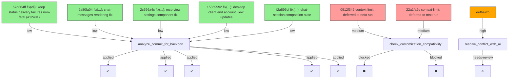

# Backport Agent — Detailed Run Report

> This file is generated automatically. It is intended for human analysts and
> AI reasoning models to assess agent performance, decision quality, and LLM behavior.

**Run timestamp**: 2026-07-25T19:36:53.276Z
**Models used**: fast=`mistral/mistral-code-agent-latest`  powerful=`poolside/poolside/laguna-s-2.1`
**Prompt log**: `/Users/rlemeill/Development/tea-ching-cline/.backport-agent/run-1785005407195.prompts.jsonl`

---

## Summary (PR body)

## Backport Agent — Sync Report

**Date**: 2026-07-25T19:36:53.276Z
**Upstream ref**: `main`
**Cut date**: `2026-06-27T00:00:00.000Z` 
**Fork ref**: `keypool-live`
**Sync branch**: `sync/upstream-main-2026-07-25-185251`

### Summary

- ✅ Applied: 5
- ⚠️ Needs human review: 1
- ⛔ Blocked (not attempted): 2
- 🔴 Validation suite FAILED during this run (host-verified)

### 🛑 Host-side gate report

- Validation suite(s) FAILED: high — this run requires human review regardless of per-commit statuses above.

### Applied commits

- `57d364ff` [low] fix(cli): keep status delivery failures non-fatal (#12401)
- `9a80fa04` [low] fix(…): chat-messages rendering fix
- `2c556a4c` [low] fix(…): mcp-view settings component fix
- `15859992` [low] fix(…): desktop client and account view updates
- `f2a895cf` [low] fix(…): chat-session compaction state

### ⚠️ Human review required

- `eefbe9fb` feat(desktop): log telemetry events in desktop app (#12416)

### Blocked commits (not attempted)

- `0912f342` [high] — context-limit: deferred to next run
- `22a1fa2c` [high] — context-limit: deferred to next run

### Agent decision log

- Applied 5 low-risk commits cleanly
- Resolved conflict in chat-session.ts for f2a895cf863c9adaddbf3cd2b9704fb1bbe13956
- Cherry-picked high-risk commit eefbe9fb18a47bfcf82b7ce8eabf89f94b2546b4 with conflict resolution in local-runtime-bootstrap.ts
- Marked eefbe9fb18a47bfcf82b7ce8eabf89f94b2546b4 as validation-failed due to invariant check failure
- Deferred remaining high-risk commits (0912f34286d52160dd2c35e64b6d57d0d1bd360a, 22a1fa2c84b2067e72e09ee210209749314dce34) due to context budget limit


---

## Agent Workflow Diagram

> Generated by the fast model from the run summary. Evaluate the agent's decision path.



---

## AI Sub-Agent Call Log (8 calls)

> Each entry is one sub-agent invocation. Review prompt/response pairs to assess
> reasoning quality, hallucinations, and decision accuracy.

### Call 1 / 8 — `analyze_commit_for_backport` ✅ OK

| Field | Value |
|---|---|
| **Timestamp** | 2026-07-25T18:52:22.044Z |
| **Tool** | `analyze_commit_for_backport` |
| **Model** | `poolside/poolside/laguna-s-2.1` |
| **Duration** | 10442 ms |
| **Tokens in** | 15151 |
| **Tokens out** | 223 |
| **Cost** | $0.000000 |

**Prompt sent to sub-agent:**

```
Commit SHA: eefbe9fb18a47bfcf82b7ce8eabf89f94b2546b4
Commit message:
feat(desktop): log telemetry events in desktop app (#12416)

Changed files (20):
apps/examples/desktop-app/README.md
apps/examples/desktop-app/package.json
apps/examples/desktop-app/sidecar/chat-session.ts
apps/examples/desktop-app/sidecar/commands.ts
apps/examples/desktop-app/sidecar/context.test.ts
apps/examples/desktop-app/sidecar/context.ts
apps/examples/desktop-app/sidecar/index.ts
apps/examples/desktop-app/sidecar/logging.test.ts
apps/examples/desktop-app/sidecar/logging.ts
apps/examples/desktop-app/sidecar/observability.test.ts
apps/examples/desktop-app/sidecar/observability.ts
apps/examples/desktop-app/sidecar/server.ts
apps/examples/desktop-app/sidecar/types.ts
bun.lock
sdk/packages/core/src/hub/server/fetch-wiring.test.ts
sdk/packages/core/src/hub/server/hub-server-options.ts
sdk/packages/core/src/hub/server/hub-server-transport.ts
sdk/packages/core/src/runtime/host/host.ts
sdk/packages/core/src/runtime/host/local-runtime-host.ts
sdk/packages/core/src/services/local-runtime-bootstrap.ts

Diff:
commit eefbe9fb18a47bfcf82b7ce8eabf89f94b2546b4
Author: Bee <68532117+abeatrix@users.noreply.github.com>
Date:   Mon Jul 20 17:50:56 2026 -0700

    feat(desktop): log telemetry events in desktop app (#12416)
    
    * feat(desktop): log telemetry events in desktop app
    
    * Address feedback
---
 apps/examples/desktop-app/README.md                |  15 ++
 apps/examples/desktop-app/package.json             |   1 +
 apps/examples/desktop-app/sidecar/chat-session.ts  |  29 +--
 apps/examples/desktop-app/sidecar/commands.ts      |  18 +-
 apps/examples/desktop-app/sidecar/context.test.ts  |  29 +++
 apps/examples/desktop-app/sidecar/context.ts       |  21 +-
 apps/examples/desktop-app/sidecar/index.ts         |  55 ++++-
 apps/examples/desktop-app/sidecar/logging.test.ts  |  95 ++++++++
 apps/examples/desktop-app/sidecar/logging.ts       | 245 +++++++++++++++++++++
 .../desktop-app/sidecar/observability.test.ts      |  81 +++++++
 apps/examples/desktop-app/sidecar/observability.ts |  63 ++++++
 apps/examples/desktop-app/sidecar/server.ts        |   8 +-
 apps/examples/desktop-app/sidecar/types.ts         |   4 +
 bun.lock                                           |   1 +
 .../core/src/hub/server/fetch-wiring.test.ts       |  24 ++
 .../core/src/hub/server/hub-server-options.ts      |   7 +-
 .../core/src/hub/server/hub-server-transport.ts    |   1 +
 sdk/packages/core/src/runtime/host/host.ts         |   1 +
 .../core/src/runtime/host/local-runtime-host.ts    |   5 +
 .../core/src/services/local-runtime-bootstrap.ts   |  11 +-
 20 files changed, 677 insertions(+), 37 deletions(-)

diff --git a/apps/examples/desktop-app/README.md b/apps/examples/desktop-app/README.md
index 98341ed0ba..4d7c7e20f2 100644
--- a/apps/examples/desktop-app/README.md
+++ b/apps/examples/desktop-app/README.md
@@ -108,6 +108,21 @@ Desktop transport envelope:
 - `<sessionId>.hooks.jsonl` is observability/debug telemetry and should not be required for normal history replay/export flows.
 - Full v1 schema for the persisted messages file, including failure/retry semantics and golden fixtures, is documented in [`packages/core/docs/messages-contract-v1.md`](../../../sdk/packages/core/docs/messages-contract-v1.md).
 
+## Sidecar observability
+
+The desktop sidecar sends SDK telemetry through the same configured OpenTelemetry
+pipeline used by the CLI and writes structured runtime logs to
+`~/.cline/data/logs/code.log` by default. Telemetry continues to honor the global
+opt-out setting exposed in the desktop settings UI. The sidecar truncates stale
+logs and rotates the active file before it exceeds 50 MiB.
+
+Logging can be configured with the same environment variables as the CLI:
+
+- `CLINE_LOG_ENABLED=0` disables file logging.
+- `CLINE_LOG_LEVEL` sets the Pino level (for example, `debug` or `warn`).
+- `CLINE_LOG_PATH` overrides the log destination.
+- `CLINE_LOG_NAME` overrides the logger name.
+
 ## Troubleshooting
 
 - If live updates stall, verify the desktop backend websocket is connected and `chat_event` messages are arriving.
diff --git a/apps/examples/desktop-app/package.json b/apps/examples/desktop-app/package.json
index bfe7f61134..1b9ab01f2a 100644
--- a/apps/examples/desktop-app/package.json
+++ b/apps/examples/desktop-app/package.json
@@ -76,6 +76,7 @@
 		"lucide-react": "^0.564.0",
 		"next": "16.2.6",
 		"next-themes": "^0.4.6",
+		"pino": "^10.3.1",
 		"radix-ui": "^1.4.3",
 		"react": "19.2.4",
 		"react-day-picker": "9.13.2",
diff --git a/apps/examples/desktop-app/sidecar/chat-session.ts b/apps/examples/desktop-app/sidecar/chat-session.ts
index 9256a071e1..83772b110a 100644
--- a/apps/examples/desktop-app/sidecar/chat-session.ts
+++ b/apps/examples/desktop-app/sidecar/chat-session.ts
@@ -412,9 +412,10 @@ async function handleStart(
 	// the frontend call the separate "send" action to dispatch the prompt.
 	// This avoids a double-execution bug where start() would run the turn AND
 	// the subsequent manager.send() fire-and-forget would run it again.
-	console.error(
-		`[sidecar:handleStart] calling manager.start provider=${coreConfig.providerId} model=${coreConfig.modelId}`,
-	);
+	ctx.logger?.log("Starting desktop chat session", {
+		providerId: String(coreConfig.providerId ?? ""),
+		modelId: String(coreConfig.modelId ?? ""),
+	});
 	const startResult = await manager.start({
 		...splitCoreSessionConfig(coreConfig as unknown as CoreSessionConfig),
 		source: SessionSource.DESKTOP,
@@ -425,7 +426,7 @@ async function handleStart(
 		toolPolicies: resolveToolPolicies(request.config),
 	});
 	const sessionId = startResult.sessionId;
-	console.error(`[sidecar:handleStart] session started sessionId=${sessionId}`);
+	ctx.logger?.log("Desktop chat session started", { sessionId });
 	const session = createLiveSession(request.config, {
 		messages: initialMessages,
 		prompt: initialMessages
@@ -570,18 +571,22 @@ async function handleSend(
 		session.status = "running";
 	}
 	try {
-		console.error(
-			`[sidecar:handleSend] calling manager.send sessionId=${sessionId} prompt=${prompt.slice(0, 80)}`,
-		);
+		ctx.logger?.debug("Sending desktop chat prompt", {
+			sessionId,
+			promptLength: prompt.length,
+			delivery,
+		});
 		const result = await manager.send({
 			sessionId,
 			prompt,
 			delivery,
 			userImages: request.attachments?.userImages,
 		});
-		console.error(
-			`[sidecar:handleSend] manager.send resolved sessionId=${sessionId} finishReason=${result?.finishReason} textLen=${result?.text?.length ?? 0}`,
-		);
+		ctx.logger?.log("Desktop chat prompt completed", {
+			sessionId,
+			finishReason: result?.finishReason,
+			textLength: result?.text?.length ?? 0,
+		});
 		if (session) {
 			session.busy = false;
 			session.status = "idle";
@@ -602,9 +607,7 @@ async function handleSend(
 				: undefined,
 		};
 	} catch (error) {
-		console.error(
-			`[sidecar:handleSend] manager.send THREW sessionId=${sessionId} error=${error instanceof Error ? error.message : String(error)}`,
-		);
+		ctx.logger?.error?.("Desktop chat prompt failed", { sessionId, error });
 		if (session) {
 			session.busy = false;
 			session.status = "error";
diff --git a/apps/examples/desktop-app/sidecar/commands.ts b/apps/examples/desktop-app/sidecar/commands.ts
index 8178420bd4..4b2a65ddd1 100644
--- a/apps/examples/desktop-app/sidecar/commands.ts
+++ b/apps/examples/desktop-app/sidecar/commands.ts
@@ -876,9 +876,7 @@ export async function handleCommand(
 	if (command === "delete_chat_session" || command === "delete_cli_session") {
 		const sessionId = String(args?.sessionId ?? args?.session_id ?? "").trim();
 		if (!sessionId) throw new Error("session id is required");
-		console.error(
-			`[sidecar:delete] request command=${command} sessionId=${sessionId}`,
-		);
+		ctx.logger?.log("Deleting desktop chat session", { command, sessionId });
 		const store = new SqliteSessionStore();
 		const row = store.get(sessionId);
 		const manifest = readSessionManifest(sessionId);
@@ -956,14 +954,16 @@ export async function handleCommand(
 			}
 		}
 		if (!deleted && deleteError) {
-			console.error(
-				`[sidecar:delete] failed sessionId=${sessionId} error=${deleteError.message}`,
-			);
+			ctx.logger?.error?.("Failed to delete desktop chat session", {
+				sessionId,
+				error: deleteError,
+			});
 			throw deleteError;
 		}
-		console.error(
-			`[sidecar:delete] result sessionId=${sessionId} deleted=${deleted}`,
-		);
+		ctx.logger?.log("Desktop chat session delete completed", {
+			sessionId,
+			deleted,
+		});
 		if (deleted) {
 			broadcastEvent(ctx, "session_deleted", {
 				sessionId,
diff --git a/apps/examples/desktop-app/sidecar/context.test.ts b/apps/examples/desktop-app/sidecar/context.test.ts
index 64955e4cb7..a087eabe0a 100644
--- a/apps/examples/desktop-app/sidecar/context.test.ts
+++ b/apps/examples/desktop-app/sidecar/context.test.ts
@@ -118,6 +118,35 @@ describe("Code sidecar runtime capabilities", () => {
 		);
 	});
 
+	it("wires the desktop logger and telemetry through the client and embedded hub", async () => {
+		const { createSidecarContext, initializeSessionManager } = await import(
+			"./context"
+		);
+		const logger = {
+			debug: vi.fn(),
+			log: vi.fn(),
+			error: vi.fn(),
+		};
+		const telemetry = { capture: vi.fn() };
+		const ctx = createSidecarContext("/workspace/project", {
+			logger,
+			telemetry: telemetry as never,
+		});
+
+		await initializeSessionManager(ctx);
+
+		expect(startHubWebSocketServerMock).toHaveBeenCalledWith(
+			expect.objectContaining({ logger, telemetry }),
+		);
+		expect(createCoreMock).toHaveBeenCalledWith(
+			expect.objectContaining({
+				clientName: "cline-code",
+				logger,
+				telemetry,
+			}),
+		);
+	});
+
 	it("resolves askQuestion through the websocket request/response protocol", async () => {
 		const { createSidecarContext, initializeSessionManager } = await import(
 			"./context"
diff --git a/apps/examples/desktop-app/sidecar/context.ts b/apps/examples/desktop-app/sidecar/context.ts
index 56174fa5b6..dc30953fc4 100644
--- a/apps/examples/desktop-app/sidecar/context.ts
+++ b/apps/examples/desktop-app/sidecar/context.ts
@@ -4,12 +4,14 @@ import { homedir } from "node:os";
 import { dirname } from "node:path";
 import {
 	type AgentToolContext,
+	type BasicLogger,
 	ClineCore,
-	createLocalHubScheduleRuntimeHandlers,
 	type CoreSessionEvent,
+	createLocalHubScheduleRuntimeHandlers,
+	type ITelemetryService,
 	NodeHubClient,
-	resolveHubOwnerContext,
 	type RuntimeCapabilities,
+	resolveHubOwnerContext,
 	setHomeDirIfUnset,
 	startHubWebSocketServer,
 	type ToolApprovalRequest,
@@ -380,7 +382,13 @@ function handleCoreSessionEvent(
 // Context factory
 // ---------------------------------------------------------------------------
 
-export function createSidecarContext(workspaceRoot: string): SidecarContext {
+export function createSidecarContext(
+	workspaceRoot: string,
+	observability: {
+		logger?: BasicLogger;
+		telemetry?: ITelemetryService;
+	} = {},
+): SidecarContext {
 	return {
 		liveSessions: new Map(),
 		streamIndices: new Map(),
@@ -391,6 +399,8 @@ export function createSidecarContext(workspaceRoot: string): SidecarContext {
 		hubClient: null,
 		hubServer: null,
 		workspaceRoot,
+		logger: observability.logger,
+		telemetry: observability.telemetry,
 		unsubscribeSessionEvents: null,
 	};
 }
@@ -698,10 +708,15 @@ export async function initializeSessionManager(
 			`code-sidecar:${process.pid}:${randomUUID()}`,
 		),
 		runtimeHandlers: createLocalHubScheduleRuntimeHandlers(),
+		logger: ctx.logger,
+		telemetry: ctx.telemetry,
 	});
 	const sessionManager = await ClineCore.create({
+		clientName: "cline-code",
 		backendMode: "hub",
 		capabilities: createSidecarRuntimeCapabilities(ctx),
+		logger: ctx.logger,
+		telemetry: ctx.telemetry,
 		hub: {
 			endpoint: hubServer.url,
 			authToken: hubServer.authToken,
diff --git a/apps/examples/desktop-app/sidecar/index.ts b/apps/examples/desktop-app/sidecar/index.ts
index 3439985e7f..85942347ae 100644
--- a/apps/examples/desktop-app/sidecar/index.ts
+++ b/apps/examples/desktop-app/sidecar/index.ts
@@ -1,14 +1,20 @@
+import { homedir } from "node:os";
+import { setHomeDirIfUnset } from "@cline/core";
 import { prewarmWorkspaceMetadata } from "./chat-session";
 import {
 	createSidecarContext,
 	disposeSidecarContext,
 	initializeSessionManager,
 } from "./context";
+import { createDesktopObservability } from "./observability";
 import { resolveWorkspaceRoot } from "./paths";
 import { startServer } from "./server";
 import { BunRuntime, SIDECAR_HOST, SIDECAR_MODE, SIDECAR_PORT } from "./types";
 
 const SHUTDOWN_TIMEOUT_MS = 5_000;
+let activeObservability:
+	| ReturnType<typeof createDesktopObservability>
+	| undefined;
 
 function withTimeout<T>(promise: Promise<T>, timeoutMs: number): Promise<T> {
 	let timeout: ReturnType<typeof setTimeout> | undefined;
@@ -33,18 +39,36 @@ async function main() {
 	}
 
 	const workspaceRoot = resolveWorkspaceRoot(process.cwd());
-	const ctx = createSidecarContext(workspaceRoot);
+	setHomeDirIfUnset(homedir());
+	const observability = createDesktopObservability();
+	activeObservability = observability;
+	const ctx = createSidecarContext(workspaceRoot, observability);
+	observability.logger.log("Desktop sidecar starting", {
+		workspaceRoot,
+		pid: process.pid,
+	});
 
 	prewarmWorkspaceMetadata(workspaceRoot);
 	await initializeSessionManager(ctx);
 
 	let shuttingDown = false;
+	let handlingFatalError = false;
 	const shutdown = async (reason = "code_sidecar_shutdown"): Promise<void> => {
 		if (shuttingDown) {
 			return;
 		}
 		shuttingDown = true;
-		await withTimeout(disposeSidecarContext(ctx, reason), SHUTDOWN_TIMEOUT_MS);
+		observability.logger.log("Desktop sidecar shutting down", { reason });
+		await withTimeout(
+			(async () => {
+				try {
+					await disposeSidecarContext(ctx, reason);
+				} finally {
+					await observability.dispose();
+				}
+			})(),
+			SHUTDOWN_TIMEOUT_MS,
+		);
 	};
 
 	const shutdownAndExit = (signal: string): void => {
@@ -55,11 +79,32 @@ async function main() {
 
 	process.once("SIGINT", () => shutdownAndExit("SIGINT"));
 	process.once("SIGTERM", () => shutdownAndExit("SIGTERM"));
+	const handleFatalError = (kind: string, error: unknown): void => {
+		if (handlingFatalError) {
+			process.exit(1);
+		}
+		handlingFatalError = true;
+		observability.logger.error?.("Desktop sidecar process error", {
+			kind,
+			error,
+		});
+		void shutdown(`code_sidecar_${kind}`).finally(() => process.exit(1));
+	};
+	process.on("uncaughtException", (error) => {
+		handleFatalError("uncaught_exception", error);
+	});
+	process.on("unhandledRejection", (error) => {
+		handleFatalError("unhandled_rejection", error);
+	});
 	process.once("beforeExit", () => {
 		void shutdown("code_sidecar_before_exit");
 	});
 
 	const { port } = startServer(ctx, SIDECAR_PORT, shutdown);
+	observability.logger.log("Desktop sidecar ready", {
+		port,
+		mode: SIDECAR_MODE,
+	});
 
 	// A wildcard bind isn't a dialable address; advertise loopback instead.
 	const dialHost = SIDECAR_HOST === "0.0.0.0" ? "127.0.0.1" : SIDECAR_HOST;
@@ -76,8 +121,12 @@ async function main() {
 	);
 }
 
-main().catch((error) => {
+main().catch(async (error) => {
 	const message = error instanceof Error ? error.message : String(error);
+	activeObservability?.logger.error?.("Desktop sidecar process failed", {
+		error,
+	});
+	await activeObservability?.dispose();
 	process.stderr.write(`${message}\n`);
 	process.exit(1);
 });
diff --git a/apps/examples/desktop-app/sidecar/logging.test.ts b/apps/examples/desktop-app/sidecar/logging.test.ts
new file mode 100644
index 0000000000..91c803f57a
--- /dev/null
+++ b/apps/examples/desktop-app/sidecar/logging.test.ts
@@ -0,0 +1,95 @@
+import {
+	mkdirSync,
+	mkdtempSync,
+	readFileSync,
+	rmSync,
+	statSync,
+	truncateSync,
+	writeFileSync,
+} from "node:fs";
+import { tmpdir } from "node:os";
+import { join } from "node:path";
+import { afterEach, describe, expect, it, vi } from "vitest";
+import { createDesktopLoggerAdapter, DESKTOP_LOG_MAX_BYTES } from "./logging";
+
+const originalEnv = {
+	CLINE_LOG_ENABLED: process.env.CLINE_LOG_ENABLED,
+	CLINE_LOG_LEVEL: process.env.CLINE_LOG_LEVEL,
+	CLINE_LOG_NAME: process.env.CLINE_LOG_NAME,
+	CLINE_LOG_PATH: process.env.CLINE_LOG_PATH,
+};
+
+afterEach(() => {
+	for (const [key, value] of Object.entries(originalEnv)) {
+		if (value === undefined) delete process.env[key];
+		else process.env[key] = value;
+	}
+});
+
+describe("desktop sidecar logging", () => {
+	it("writes structured SDK logs to the configured file", () => {
+		const directory = mkdtempSync(join(tmpdir(), "cline-code-logging-"));
+		const destination = join(directory, "sidecar.log");
+		process.env.CLINE_LOG_PATH = destination;
+		process.env.CLINE_LOG_LEVEL = "debug";
+		delete process.env.CLINE_LOG_ENABLED;
+
+		try {
+			const adapter = createDesktopLoggerAdapter();
+			adapter.core.debug("desktop runtime event", { sessionId: "session-1" });
+			adapter.dispose();
+
+			const contents = readFileSync(destination, "utf8");
+			expect(contents).toContain("desktop runtime event");
+			expect(contents).toContain('"sessionId":"session-1"');
+			expect(adapter.runtimeConfig.name).toBe("cline-code.sidecar");
+		} finally {
+			rmSync(directory, { recursive: true, force: true });
+		}
+	});
+
+	it("warns once before falling back to stderr when the log file cannot open", () => {
+		const directory = mkdtempSync(join(tmpdir(), "cline-code-fallback-"));
+		process.env.CLINE_LOG_PATH = directory;
+		delete process.env.CLINE_LOG_ENABLED;
+		const stderr = vi.spyOn(process.stderr, "write").mockReturnValue(true);
+
+		try {
+			const adapter = createDesktopLoggerAdapter();
+			adapter.dispose();
+
+			expect(stderr).toHaveBeenCalledWith(
+				expect.stringContaining("Unable to open log file"),
+			);
+			expect(stderr).toHaveBeenCalledWith(
+				expect.stringContaining("falling back to stderr"),
+			);
+		} finally {
+			stderr.mockRestore();
+			rmSync(directory, { recursive: true, force: true });
+		}
+	});
+
+	it("rotates the active log before a write exceeds the size limit", () => {
+		const directory = mkdtempSync(join(tmpdir(), "cline-code-rotation-"));
+		const destination = join(directory, "sidecar.log");
+		process.env.CLINE_LOG_PATH = destination;
+		delete process.env.CLINE_LOG_ENABLED;
+
+		try {
+			mkdirSync(directory, { recursive: true });
+			writeFileSync(destination, "");
+			truncateSync(destination, DESKTOP_LOG_MAX_BYTES - 1);
+			const adapter = createDesktopLoggerAdapter();
+			adapter.core.log("rotate before writing this entry");
+			adapter.dispose();
+
+			expect(statSync(destination).size).toBeLessThan(1_024);
+			expect(readFileSync(destination, "utf8")).toContain(
+				"rotate before writing this entry",
+			);
+		} finally {
+			rmSync(directory, { recursive: true, force: true });
+		}
+	});
+});
diff --git a/apps/examples/desktop-app/sidecar/logging.ts b/apps/examples/desktop-app/sidecar/logging.ts
new file mode 100644
index 0000000000..5835f514fa
--- /dev/null
+++ b/apps/examples/desktop-app/sidecar/logging.ts
@@ -0,0 +1,245 @@
+import {
+	closeSync,
+	mkdirSync,
+	openSync,
+	statSync,
+	truncateSync,
+} from "node:fs";
+import { dirname, join } from "node:path";
+import {
+	type BasicLogger,
+	type RuntimeLoggerConfig,
+	resolveClineDataDir,
+} from "@cline/core";
+import pino, {
+	type DestinationStream,
+	type LevelWithSilent,
+	type Logger as PinoLogger,
+} from "pino";
+
+const LOG_MAX_AGE_MS = 2 * 24 * 60 * 60 * 1_000;
+export const DESKTOP_LOG_MAX_BYTES = 50 * 1024 * 1024;
+const LOG_LEVELS: ReadonlySet<LevelWithSilent> = new Set([
+	"trace",
+	"debug",
+	"info",
+	"warn",
+	"error",
+	"fatal",
+	"silent",
+]);
+
+export interface DesktopLoggerAdapter {
+	readonly core: BasicLogger;
+	readonly runtimeConfig: Required<RuntimeLoggerConfig>;
+	flush(): void;
+	dispose(): void;
+}
+
+function resolveLogLevel(value: string | undefined): LevelWithSilent {
+	const candidate = value?.trim().toLowerCase() as LevelWithSilent | undefined;
+	return candidate && LOG_LEVELS.has(candidate) ? candidate : "info";
+}
+
+function resolveRuntimeConfig(): Required<RuntimeLoggerConfig> {
+	const enabledValue = process.env.CLINE_LOG_ENABLED?.trim().toLowerCase();
+	return {
+		enabled: enabledValue !== "0" && enabledValue !== "false",
+		level: resolveLogLevel(process.env.CLINE_LOG_LEVEL),
+		destination:
+			process.env.CLINE_LOG_PATH?.trim() ||
+			join(resolveClineDataDir(), "logs", "code.log"),
+		name: process.env.CLINE_LOG_NAME?.trim() || "cline-code.sidecar",
+		bindings: {},
+	};
+}
+
+type ManagedDestination = DestinationStream & {
+	flushSync(): void;
+	end(): void;
+};
+
+type DestinationResult =
+	| { destination: ManagedDestination; error?: never }
+	| { destination?: never; error: unknown };
+
+function createDestination(path: string): DestinationResult {
+	try {
+		mkdirSync(dirname(path), { recursive: true });
+		const fd = openSync(path, "a");
+		closeSync(fd);
+		const initialStats = statSync(path);
+		if (
+			Date.now() - initialStats.mtimeMs >= LOG_MAX_AGE_MS ||
+			initialStats.size >= DESKTOP_LOG_MAX_BYTES
+		) {
+			truncateSync(path, 0);
+		}
+		const rawDestination = pino.destination({
+			dest: path,
+			mkdir: true,
+			sync: true,
+		});
+		const rawFlushSync = rawDestination.flushSync.bind(rawDestination);
+		let currentSize = statSync(path).size;
+		const destination: ManagedDestination = {
+			write(message: string) {
+				const messageSize = Buffer.byteLength(message);
+				if (currentSize + messageSize > DESKTOP_LOG_MAX_BYTES) {
+					try {
+						rawFlushSync();
+						truncateSync(path, 0);
+						currentSize = 0;
+					} catch {
+						// Rotation is best-effort; preserve the log entry if it fails.
+					}
+				}
+				rawDestination.write(message);
+				currentSize += messageSize;
+			},
+			flushSync() {
+				try {
+					rawFlushSync();
+				} catch {
+					// The synchronous stream may already be closed during teardown.
+				}
+			},
+			end() {
+				rawDestination.end();
+			},
+		};
+		return { destination };
+	} catch (error) {
+		return { error };
+	}
+}
+
+function writeDestinationFallbackWarning(path: string, error: unknown): void {
+	try {
+		const message = error instanceof Error ? error.message : String(error);
+		process.stderr.write(
+			`[cline-code] Unable to open log file ${path}; falling back to stderr (${message})\n`,
+		);
+	} catch {
+		// The fallback warning must never prevent sidecar startup.
+	}
+}
+
+function flushDestination(destination: ManagedDestination | undefined): void {
+	if (!destination) return;
+	try {
+		destination.flushSync();
+	} catch {
+		// Logging is best-effort during shutdown.
+	}
+}
+
+function closeDestination(destination: ManagedDestination | undefined): void {
+	if (!destination) return;
+	try {
+		destination.end();
+	} catch {
+		// Logging is best-effort during shutdown.
+	}
+}
+
+function createFallbackDestination(): DestinationStream {
+	return {
+		write(message: string) {
+			process.stderr.write(message);
+		},
+	};
+}
+
+/*
+	The adapter intentionally owns the destination lifecycle. Pino receives a
+	synchronous stream so telemetry and fatal-process logs can be flushed before
+	the sidecar exits.
+*/
+function createPinoLogger(
+	runtimeConfig: Required<RuntimeLoggerConfig>,
+	destination: ManagedDestination | undefined,
+): PinoLogger {
+	return pino(
+		{
+			name: runtimeConfig.name,
+			level: runtimeConfig.enabled ? runtimeConfig.level : "silent",
+			enabled: runtimeConfig.enabled,
+			timestamp: pino.stdTimeFunctions.isoTime,
+		},
+		destination ?? createFallbackDestination(),
+	).child({ component: "sidecar" });
+}
+
+function flushLogger(logger: PinoLogger): void {
+	try {
+		logger.flush?.();
+	} catch {
+		// Logging is best-effort during shutdown.
+	}
+}
+
+function toFields(
+	metadata?: Record<string, unknown>,
+): Record<string, unknown> | undefined {
+	if (!metadata) return undefined;
+	const { error, ...rest } = metadata;
+	const fields = error === undefined ? rest : { ...rest, err: error };
+	return Object.keys(fields).length > 0 ? fields : undefined;
+}
+
+function createCoreLogger(logger: PinoLogger): BasicLogger {
+	return {
+		debug(message, metadata) {
+			const fields = toFields(metadata);
+			fields ? logger.debug(fields, message) : logger.debug(message);
+		},
+		log(message, metadata) {
+			const fields = toFields(metadata);
+			const write =
+				metadata?.severity === "error"
+					? logger.error
+					: metadata?.severity === "warn"
+						? logger.warn
+						: logger.info;
+			fields
+				? write.call(logger, fields, message)
+				: write.call(logger, message);
+		},
+		error(message, metadata) {
+			const fields = toFields(metadata);
+			fields ? logger.error(fields, message) : logger.error(message);
+		},
+	};
+}
+
+export function createDesktopLoggerAdapter(): DesktopLoggerAdapter {
+	const runtimeConfig = resolveRuntimeConfig();
+	const destinationResult = runtimeConfig.enabled
+		? createDestination(runtimeConfig.destination)
+		: undefined;
+	const destination = destinationResult?.destination;
+	if (destinationResult?.error !== undefined) {
+		writeDestinationFallbackWarning(
+			runtimeConfig.destination,
+			destinationResult.error,
+		);
+	}
+	const logger = createPinoLogger(runtimeConfig, destination);
+	let disposed = false;
+	const flush = () => {
+		flushDestination(destination);
+		flushLogger(logger);
+	};
+	return {
+		core: createCoreLogger(logger),
+		runtimeConfig,
+		flush,
+		dispose() {
+			if (disposed) return;
+			disposed = true;
+			flush();
+			closeDestination(destination);
+		},
+	};
+}
diff --git a/apps/examples/desktop-app/sidecar/observability.test.ts b/apps/examples/desktop-app/sidecar/observability.test.ts
new file mode 100644
index 0000000000..19ce913338
--- /dev/null
+++ b/apps/examples/desktop-app/sidecar/observability.test.ts
@@ -0,0 +1,81 @@
+import { beforeEach, describe, expect, it, vi } from "vitest";
+
+const mocks = vi.hoisted(() => ({
+	captureExtensionActivated: vi.fn(),
+	createClineTelemetryServiceConfig: vi.fn((config: unknown) => config),
+	createConfiguredTelemetryHandle: vi.fn(),
+	disposeTelemetry: vi.fn(async () => {}),
+	disposeLogger: vi.fn(),
+	identifyAccount: vi.fn(),
+	setSdkLogger: vi.fn(),
+}));
+
+const logger = {
+	debug: vi.fn(),
+	log: vi.fn(),
+	error: vi.fn(),
+};
+const telemetry = { capture: vi.fn() };
+
+vi.mock("@cline/core", async () => {
+	const actual =
+		await vi.importActual<typeof import("@cline/core")>("@cline/core");
+	return {
+		...actual,
+		captureExtensionActivated: mocks.captureExtensionActivated,
+		createClineTelemetryServiceConfig: mocks.createClineTelemetryServiceConfig,
+		createConfiguredTelemetryHandle: mocks.createConfiguredTelemetryHandle,
+		identifyAccount: mocks.identifyAccount,
+		ProviderSettingsManager: class {
+			getProviderSettings() {
+				return { auth: { accountId: "account-1" } };
+			}
+		},
+		setSdkLogger: mocks.setSdkLogger,
+	};
+});
+
+vi.mock("./logging", () => ({
+	createDesktopLoggerAdapter: () => ({
+		core: logger,
+		dispose: mocks.disposeLogger,
+	}),
+}));
+
+describe("desktop observability", () => {
+	beforeEach(() => {
+		vi.clearAllMocks();
+		mocks.createConfiguredTelemetryHandle.mockReturnValue({
+			telemetry,
+			dispose: mocks.disposeTelemetry,
+		});
+	});
+
+	it("configures desktop telemetry, identity, activation, and lifecycle", async () => {
+		const { createDesktopObservability } = await import("./observability");
+		const observability = createDesktopObservability();
+
+		expect(mocks.createClineTelemetryServiceConfig).toHaveBeenCalledWith({
+			metadata: expect.objectContaining({
+				cline_type: "desktop",
+				platform: "Cline Code",
+			}),
+		});
+		expect(mocks.createConfiguredTelemetryHandle).toHaveBeenCalledWith(
+			expect.objectContaining({ logger }),
+		);
+		expect(mocks.identifyAccount).toHaveBeenCalledWith(telemetry, {
+			id: "account-1",
+			provider: "cline",
+		});
+		expect(mocks.captureExtensionActivated).toHaveBeenCalledWith(telemetry);
+		expect(mocks.setSdkLogger).toHaveBeenCalledWith(logger);
+
+		await observability.dispose();
+		await observability.dispose();
+
+		expect(mocks.disposeTelemetry).toHaveBeenCalledTimes(1);
+		expect(mocks.setSdkLogger).toHaveBeenLastCalledWith(undefined);
+		expect(mocks.disposeLogger).toHaveBeenCalledTimes(1);
+	});
+});
diff --git a/apps/examples/desktop-app/sidecar/observability.ts b/apps/examples/desktop-app/sidecar/observability.ts
new file mode 100644
index 0000000000..50c59e7ef4
--- /dev/null
+++ b/apps/examples/desktop-app/sidecar/observability.ts
@@ -0,0 +1,63 @@
+import * as os from "node:os";
+import {
+	captureExtensionActivated,
+	createClineTelemetryServiceConfig,
+	createConfiguredTelemetryHandle,
+	type ITelemetryService,
+	identifyAccount,
+	ProviderSettingsManager,
+	setSdkLogger,
+} from "@cline/core";
+import { version } from "../package.json";
+import {
+	createDesktopLoggerAdapter,
+	type DesktopLoggerAdapter,
+} from "./logging";
+
+export interface DesktopObservability {
+	readonly logger: DesktopLoggerAdapter["core"];
+	readonly telemetry: ITelemetryService;
+	dispose(): Promise<void>;
+}
+
+export function createDesktopObservability(): DesktopObservability {
+	const loggerAdapter = createDesktopLoggerAdapter();
+	const logger = loggerAdapter.core;
+	setSdkLogger(logger);
+
+	const telemetryHandle = createConfiguredTelemetryHandle({
+		...createClineTelemetryServiceConfig({
+			metadata: {
+				extension_version: version,
+				cline_type: "desktop",
+				platform: "Cline Code",
+				platform_version: process.version,
+				os_type: os.platform(),
+				os_version: os.version(),
+			},
+		}),
+		logger,
+	});
+	const telemetry = telemetryHandle.telemetry;
+	const auth = new ProviderSettingsManager().getProviderSettings("cline")?.auth;
+	if (auth?.accountId) {
+		identifyAccount(telemetry, {
+			id: auth.accountId,
+			provider: "cline",
+		});
+	}
+	captureExtensionActivated(telemetry);
+
+	let disposed = false;
+	return {
+		logger,
+		telemetry,
+		async dispose() {
+			if (disposed) return;
+			disposed = true;
+			await telemetryHandle.dispose();
+			setSdkLogger(undefined);
+			loggerAdapter.dispose();
+		},
+	};
+}
diff --git a/apps/examples/desktop-app/sidecar/server.ts b/apps/examples/desktop-app/sidecar/server.ts
index e0fe038252..3849671423 100644
--- a/apps/examples/desktop-app/sidecar/server.ts
+++ b/apps/examples/desktop-app/sidecar/server.ts
@@ -143,7 +143,7 @@ export function startServer(
 }
 
 export function createFetchHandler(
-	_ctx: SidecarContext,
+	ctx: SidecarContext,
 	onShutdown?: (reason?: string) => Promise<void>,
 ) {
 	return async (req: Request, server: SidecarServer) => {
@@ -199,11 +199,7 @@ export function createFetchHandler(
 			queueMicrotask(() => {
 				void onShutdown?.("code_sidecar_shutdown_endpoint")
 					.catch((error) => {
-						process.stderr.write(
-							`sidecar shutdown failed: ${
-								error instanceof Error ? error.message : String(error)
-							}\n`,
-						);
+						ctx.logger?.error?.("Desktop sidecar shutdown failed", { error });
 					})
 					.finally(() => process.exit(0));
 			});
diff --git a/apps/examples/desktop-app/sidecar/types.ts b/apps/examples/desktop-app/sidecar/types.ts
index e8dfd6767b..c54c2c6a22 100644
--- a/apps/examples/desktop-app/sidecar/types.ts
+++ b/apps/examples/desktop-app/sidecar/types.ts
@@ -1,7 +1,9 @@
 import type {
 	AgentToolContext,
+	BasicLogger,
 	ClineCore,
 	HubServer,
+	ITelemetryService,
 	NodeHubClient,
 	ToolApprovalResult,
 } from "@cline/core";
@@ -106,6 +108,8 @@ export type SidecarContext = {
 	hubClient: NodeHubClient | null;
 	hubServer: HubServer | null;
 	workspaceRoot: string;
+	logger?: BasicLogger;
+	telemetry?: ITelemetryService;
 	unsubscribeSessionEvents: (() => void) | null;
 };
 export type BunRuntimeApi = {
diff --git a/bun.lock b/bun.lock
index b933c81de3..cec478b4b6 100644
--- a/bun.lock
+++ b/bun.lock
@@ -213,6 +213,7 @@
         "lucide-react": "^0.564.0",
         "next": "16.2.6",
         "next-themes": "^0.4.6",
+        "pino": "^10.3.1",
         "radix-ui": "^1.4.3",
         "react": "19.2.4",
         "react-day-picker": "9.13.2",
diff --git a/sdk/packages/core/src/hub/server/fetch-wiring.test.ts b/sdk/packages/core/src/hub/server/fetch-wiring.test.ts
index b512eabceb..339df1c65b 100644
--- a/sdk/packages/core/src/hub/server/fetch-wiring.test.ts
+++ b/sdk/packages/core/src/hub/server/fetch-wiring.test.ts
@@ -18,6 +18,30 @@ vi.mock("../../runtime/host/local-runtime-host", () => ({
 }));
 
 describe("hub server fetch wiring", () => {
+	it("forwards observability into the internal LocalRuntimeHost", async () => {
+		localRuntimeHostMock.mockClear();
+		const { HubServerTransport } = (await import(".")) as unknown as {
+			HubServerTransport: new (options: unknown) => unknown;
+		};
+		const logger = { debug: vi.fn(), log: v
... [truncated]

Output the JSON object now.
```

**Response received:**

````
```json
{
  "summary": "Adds telemetry and structured logging to the desktop sidecar via Pino, wiring logger/telemetry through ClineCore and the hub server. Touches desktop app, SDK host, and hub server files.",
  "keyChanges": [
    "New logging.ts with Pino-based desktop logger adapter",
    "New observability.ts wiring telemetry through @cline/core",
    "ClineCore.create and hub server now accept logger/telemetry params",
    "Replaced console.error with structured logger calls",
    "Added tests for logging, observability, and fetch wiring"
  ],
  "backportComplexity": "moderate",
  "semanticRiskFactors": [
    "Adds new optional logger/telemetry params to ClineCore.create and hub server options",
    "Introduces new exported types BasicLogger and ITelemetryService usage in desktop context",
    "Modifies LocalRuntimeHost and local-runtime-bootstrap with new optional params"
  ],
  "recommendation": "apply-with-care"
}
```
````

---

### Call 2 / 8 — `analyze_commit_for_backport` ✅ OK

| Field | Value |
|---|---|
| **Timestamp** | 2026-07-25T18:52:27.343Z |
| **Tool** | `analyze_commit_for_backport` |
| **Model** | `poolside/poolside/laguna-s-2.1` |
| **Duration** | 5223 ms |
| **Tokens in** | 19754 |
| **Tokens out** | 193 |
| **Cost** | $0.000000 |

**Prompt sent to sub-agent:**

```
Commit SHA: 0912f34286d52160dd2c35e64b6d57d0d1bd360a
Commit message:
fix(deps): bump mermaid to 11.16.0 and protobufjs to 7.6.5 (#12445)

Changed files (6):
apps/cline-hub/src/webview/package.json
apps/vscode/standalone/runtime-files/package-lock.json
apps/vscode/standalone/runtime-files/package.json
apps/vscode/webview-ui/package.json
bun.lock
package.json

Diff:
commit 0912f34286d52160dd2c35e64b6d57d0d1bd360a
Author: TheRealSpencer <32678829+TheRealSpencer@users.noreply.github.com>
Date:   Tue Jul 21 15:38:59 2026 -0500

    fix(deps): bump mermaid to 11.16.0 and protobufjs to 7.6.5 (#12445)
    
    Address mermaid CVEs (CVE-2026-41148/41149/41150/41159) and
    protobufjs CVEs (CVE-2026-54269, CVE-2026-48712) by pinning
    patched versions via package deps and workspace overrides.
---
 apps/cline-hub/src/webview/package.json            |   2 +-
 .../standalone/runtime-files/package-lock.json     |  34 ++-
 apps/vscode/standalone/runtime-files/package.json  |   2 +-
 apps/vscode/webview-ui/package.json                |   4 +-
 bun.lock                                           | 235 +++++++++++++++++++--
 package.json                                       |   3 +-
 6 files changed, 240 insertions(+), 40 deletions(-)

diff --git a/apps/cline-hub/src/webview/package.json b/apps/cline-hub/src/webview/package.json
index abe314a5d3..d92e2c21c3 100644
--- a/apps/cline-hub/src/webview/package.json
+++ b/apps/cline-hub/src/webview/package.json
@@ -26,7 +26,7 @@
 		"embla-carousel-react": "^8.6.0",
 		"lucide-react": "^0.577.0",
 		"media-chrome": "^4.18.1",
-		"mermaid": "^11.15.0",
+		"mermaid": "11.16.0",
 		"motion": "^12.38.0",
 		"nanoid": "^5.1.7",
 		"next-themes": "^0.4.6",
diff --git a/apps/vscode/standalone/runtime-files/package-lock.json b/apps/vscode/standalone/runtime-files/package-lock.json
index 2141428562..6c44527a06 100644
--- a/apps/vscode/standalone/runtime-files/package-lock.json
+++ b/apps/vscode/standalone/runtime-files/package-lock.json
@@ -89,19 +89,18 @@
 			"license": "BSD-3-Clause"
 		},
 		"node_modules/@protobufjs/eventemitter": {
-			"version": "1.1.0",
-			"resolved": "https://registry.npmjs.org/@protobufjs/eventemitter/-/eventemitter-1.1.0.tgz",
-			"integrity": "sha512-j9ednRT81vYJ9OfVuXG6ERSTdEL1xVsNgqpkxMsbIabzSo3goCjDIveeGv5d03om39ML71RdmrGNjG5SReBP/Q==",
+			"version": "1.1.1",
+			"resolved": "https://registry.npmjs.org/@protobufjs/eventemitter/-/eventemitter-1.1.1.tgz",
+			"integrity": "sha512-vW1GmwMZNnL+gMRaovlh9yZX74kc+TTU3FObkkurpMaRtBfLP3ldjS9KQWlwZgraRE0+dheEEoAxdzcJQ8eXZg==",
 			"license": "BSD-3-Clause"
 		},
 		"node_modules/@protobufjs/fetch": {
-			"version": "1.1.0",
-			"resolved": "https://registry.npmjs.org/@protobufjs/fetch/-/fetch-1.1.0.tgz",
-			"integrity": "sha512-lljVXpqXebpsijW71PZaCYeIcE5on1w5DlQy5WH6GLbFryLUrBD4932W/E2BSpfRJWseIL4v/KPgBFxDOIdKpQ==",
+			"version": "1.1.1",
+			"resolved": "https://registry.npmjs.org/@protobufjs/fetch/-/fetch-1.1.1.tgz",
+			"integrity": "sha512-GpptLrs57adMSuHi3VNj0mAF8dwh36LMaYF6XyJ6JMWlVsc+t42tm1HSEDmOs3A8fC9yyeisgLhsTVQokOZ0zw==",
 			"license": "BSD-3-Clause",
 			"dependencies": {
-				"@protobufjs/aspromise": "^1.1.1",
-				"@protobufjs/inquire": "^1.1.0"
+				"@protobufjs/aspromise": "^1.1.1"
 			}
 		},
 		"node_modules/@protobufjs/float": {
@@ -110,12 +109,6 @@
 			"integrity": "sha512-Ddb+kVXlXst9d+R9PfTIxh1EdNkgoRe5tOX6t01f1lYWOvJnSPDBlG241QLzcyPdoNTsblLUdujGSE4RzrTZGQ==",
 			"license": "BSD-3-Clause"
 		},
-		"node_modules/@protobufjs/inquire": {
-			"version": "1.1.2",
-			"resolved": "https://registry.npmjs.org/@protobufjs/inquire/-/inquire-1.1.2.tgz",
-			"integrity": "sha512-pa0vFRuws4wkvaXKK1uXZMAwAX4/t8ANaJo45iw/oQHNQ9q5xUzwgFmVJGXiga2BeN+zpX7Vf9vmsiIa2J+MUw==",
-			"license": "BSD-3-Clause"
-		},
 		"node_modules/@protobufjs/path": {
 			"version": "1.1.2",
 			"resolved": "https://registry.npmjs.org/@protobufjs/path/-/path-1.1.2.tgz",
@@ -667,24 +660,23 @@
 			}
 		},
 		"node_modules/protobufjs": {
-			"version": "7.5.8",
-			"resolved": "https://registry.npmjs.org/protobufjs/-/protobufjs-7.5.8.tgz",
-			"integrity": "sha512-dvpCIeLPbXZS/Ete7yLaO7RenOdken2NHKykBXbsaGxZT0UTltcarBciw+A78SRQs9iMAAVpsYA+l8b1hTePIA==",
+			"version": "7.6.5",
+			"resolved": "https://registry.npmjs.org/protobufjs/-/protobufjs-7.6.5.tgz",
+			"integrity": "sha512-/FPD0nUc9jH6rfFjji9IBqOz4pcSE3CsT1m7Ep6Mdb0LxSUMj8hgl6GomOvZzpNpAqqGaXA0P3VSrZLFzIhQrw==",
 			"hasInstallScript": true,
 			"license": "BSD-3-Clause",
 			"dependencies": {
 				"@protobufjs/aspromise": "^1.1.2",
 				"@protobufjs/base64": "^1.1.2",
 				"@protobufjs/codegen": "^2.0.5",
-				"@protobufjs/eventemitter": "^1.1.0",
-				"@protobufjs/fetch": "^1.1.0",
+				"@protobufjs/eventemitter": "^1.1.1",
+				"@protobufjs/fetch": "^1.1.1",
 				"@protobufjs/float": "^1.0.2",
-				"@protobufjs/inquire": "^1.1.1",
 				"@protobufjs/path": "^1.1.2",
 				"@protobufjs/pool": "^1.1.0",
 				"@protobufjs/utf8": "^1.1.1",
 				"@types/node": ">=13.7.0",
-				"long": "^5.0.0"
+				"long": "^5.3.2"
 			},
 			"engines": {
 				"node": ">=12.0.0"
diff --git a/apps/vscode/standalone/runtime-files/package.json b/apps/vscode/standalone/runtime-files/package.json
index 0672b2a3dd..e27103d065 100644
--- a/apps/vscode/standalone/runtime-files/package.json
+++ b/apps/vscode/standalone/runtime-files/package.json
@@ -12,6 +12,6 @@
 	},
 	"overrides": {
 		"tar-fs": "^3.1.1",
-		"protobufjs": "7.5.8"
+		"protobufjs": "7.6.5"
 	}
 }
diff --git a/apps/vscode/webview-ui/package.json b/apps/vscode/webview-ui/package.json
index fc7ed19024..32359479b8 100644
--- a/apps/vscode/webview-ui/package.json
+++ b/apps/vscode/webview-ui/package.json
@@ -45,7 +45,7 @@
 		"lucide-react": "^0.511.0",
 		"magic-string": "^0.30.21",
 		"marked": "^15.0.12",
-		"mermaid": "11.12.3",
+		"mermaid": "11.16.0",
 		"posthog-js": "^1.224.0",
 		"pretty-bytes": "^6.1.1",
 		"react": "^18.3.1",
@@ -92,7 +92,7 @@
 		"vitest": "^3.0.5"
 	},
 	"overrides": {
-		"protobufjs": "7.5.8"
+		"protobufjs": "7.6.5"
 	},
 	"optionalDependencies": {
 		"@rollup/rollup-linux-arm64-gnu": "^4.40.0",
diff --git a/bun.lock b/bun.lock
index cec478b4b6..a4070658a9 100644
--- a/bun.lock
+++ b/bun.lock
@@ -19,7 +19,7 @@
     },
     "apps/cli": {
       "name": "@cline/cli",
-      "version": "3.0.45",
+      "version": "3.0.46",
       "bin": {
         "cline": "src/index.ts",
       },
@@ -91,7 +91,7 @@
         "embla-carousel-react": "^8.6.0",
         "lucide-react": "^0.577.0",
         "media-chrome": "^4.18.1",
-        "mermaid": "^11.15.0",
+        "mermaid": "11.16.0",
         "motion": "^12.38.0",
         "nanoid": "^5.1.7",
         "next-themes": "^0.4.6",
@@ -549,7 +549,7 @@
         "lucide-react": "^0.511.0",
         "magic-string": "^0.30.21",
         "marked": "^15.0.12",
-        "mermaid": "11.12.3",
+        "mermaid": "11.16.0",
         "posthog-js": "^1.224.0",
         "pretty-bytes": "^6.1.1",
         "react": "^18.3.1",
@@ -779,7 +779,8 @@
     "@sap-cloud-sdk/util": "4.6.0",
     "diff": "8.0.4",
     "js-yaml": "^4.1.1",
-    "protobufjs": "7.5.8",
+    "mermaid": "11.16.0",
+    "protobufjs": "7.6.5",
     "serialize-javascript": ">=7.0.3",
     "tar": "^7.5.2",
     "tar-fs": ">=3.1.1",
@@ -1817,8 +1818,6 @@
 
     "@protobufjs/float": ["@protobufjs/float@1.0.2", "", {}, "sha512-Ddb+kVXlXst9d+R9PfTIxh1EdNkgoRe5tOX6t01f1lYWOvJnSPDBlG241QLzcyPdoNTsblLUdujGSE4RzrTZGQ=="],
 
-    "@protobufjs/inquire": ["@protobufjs/inquire@1.1.2", "", {}, "sha512-pa0vFRuws4wkvaXKK1uXZMAwAX4/t8ANaJo45iw/oQHNQ9q5xUzwgFmVJGXiga2BeN+zpX7Vf9vmsiIa2J+MUw=="],
-
     "@protobufjs/path": ["@protobufjs/path@1.1.2", "", {}, "sha512-6JOcJ5Tm08dOHAbdR3GrvP+yUUfkjG5ePsHYczMFLq3ZmMkAD98cDgcT2iA1lJ9NVwFd4tH/iSSoe44YWkltEA=="],
 
     "@protobufjs/pool": ["@protobufjs/pool@1.1.0", "", {}, "sha512-0kELaGSIDBKvcgS4zkjz1PeddatrjYcmMWOlAuAPwAeccUrPHdUqo/J6LiymHHEiJT5NrF1UVwxY14f+fy4WQw=="],
@@ -4449,7 +4448,7 @@
 
     "property-information": ["property-information@7.2.0", "", {}, "sha512-IAtzIB6sUiWaJYrX9smp3V46pBGbBeLFRGdh25kg1334VcBlD8HzhPeNIWQH9zhGmo2itIe25EHt9dQP7G5hmg=="],
 
-    "protobufjs": ["protobufjs@7.5.8", "", { "dependencies": { "@protobufjs/aspromise": "^1.1.2", "@protobufjs/base64": "^1.1.2", "@protobufjs/codegen": "^2.0.5", "@protobufjs/eventemitter": "^1.1.0", "@protobufjs/fetch": "^1.1.0", "@protobufjs/float": "^1.0.2", "@protobufjs/inquire": "^1.1.1", "@protobufjs/path": "^1.1.2", "@protobufjs/pool": "^1.1.0", "@protobufjs/utf8": "^1.1.1", "@types/node": ">=13.7.0", "long": "^5.0.0" } }, "sha512-dvpCIeLPbXZS/Ete7yLaO7RenOdken2NHKykBXbsaGxZT0UTltcarBciw+A78SRQs9iMAAVpsYA+l8b1hTePIA=="],
+    "protobufjs": ["protobufjs@7.6.5", "", { "dependencies": { "@protobufjs/aspromise": "^1.1.2", "@protobufjs/base64": "^1.1.2", "@protobufjs/codegen": "^2.0.5", "@protobufjs/eventemitter": "^1.1.1", "@protobufjs/fetch": "^1.1.1", "@protobufjs/float": "^1.0.2", "@protobufjs/path": "^1.1.2", "@protobufjs/pool": "^1.1.0", "@protobufjs/utf8": "^1.1.1", "@types/node": ">=13.7.0", "long": "^5.3.2" } }, "sha512-/FPD0nUc9jH6rfFjji9IBqOz4pcSE3CsT1m7Ep6Mdb0LxSUMj8hgl6GomOvZzpNpAqqGaXA0P3VSrZLFzIhQrw=="],
 
     "protoc-gen-ts": ["protoc-gen-ts@0.8.7", "", { "bin": { "protoc-gen-ts": "protoc-gen-ts.js" } }, "sha512-jr4VJey2J9LVYCV7EVyVe53g1VMw28cCmYJhBe5e3YX5wiyiDwgxWxeDf9oTqAe4P1bN/YGAkW2jhlH8LohwiQ=="],
 
@@ -6291,6 +6290,28 @@
 
     "webview/@types/node": ["@types/node@24.13.3", "", { "dependencies": { "undici-types": "~7.18.0" } }, "sha512-Dh8vAsV36ig5wa9OX4pXvMc9D3Veibfw2wix0CUwYODLD8nkj9UsLjASr49nPg+2eKzxhBV+v7L8pXvT4e639Q=="],
 
+    "webview-ui/@radix-ui/react-dialog": ["@radix-ui/react-dialog@1.1.19", "", { "dependencies": { "@radix-ui/primitive": "1.1.5", "@radix-ui/react-compose-refs": "1.1.3", "@radix-ui/react-context": "1.2.0", "@radix-ui/react-dismissable-layer": "1.1.15", "@radix-ui/react-focus-guards": "1.1.4", "@radix-ui/react-focus-scope": "1.1.12", "@radix-ui/react-id": "1.1.2", "@radix-ui/react-portal": "1.1.13", "@radix-ui/react-presence": "1.1.7", "@radix-ui/react-primitive": "2.1.7", "@radix-ui/react-slot": "1.3.0", "@radix-ui/react-use-controllable-state": "1.2.3", "aria-hidden": "^1.2.4", "react-remove-scroll": "^2.7.2" }, "peerDependencies": { "@types/react": "*", "@types/react-dom": "*", "react": "^16.8 || ^17.0 || ^18.0 || ^19.0 || ^19.0.0-rc", "react-dom": "^16.8 || ^17.0 || ^18.0 || ^19.0 || ^19.0.0-rc" }, "optionalPeers": ["@types/react", "@types/react-dom"] }, "sha512-+HhbN2+YtkRgVirjZ2afMeutQRuGOrdkWR5+EFC58SJojGmtyNQwYzgi6tHBpOxvFHefMtPeHdgtjz0BOGxFQg=="],
+
+    "webview-ui/@radix-ui/react-hover-card": ["@radix-ui/react-hover-card@1.1.19", "", { "dependencies": { "@radix-ui/primitive": "1.1.5", "@radix-ui/react-compose-refs": "1.1.3", "@radix-ui/react-context": "1.2.0", "@radix-ui/react-dismissable-layer": "1.1.15", "@radix-ui/react-popper": "1.3.3", "@radix-ui/react-portal": "1.1.13", "@radix-ui/react-presence": "1.1.7", "@radix-ui/react-primitive": "2.1.7", "@radix-ui/react-use-controllable-state": "1.2.3" }, "peerDependencies": { "@types/react": "*", "@types/react-dom": "*", "react": "^16.8 || ^17.0 || ^18.0 || ^19.0 || ^19.0.0-rc", "react-dom": "^16.8 || ^17.0 || ^18.0 || ^19.0 || ^19.0.0-rc" }, "optionalPeers": ["@types/react", "@types/react-dom"] }, "sha512-2KTgMLQtKvicznQgbindEI2RZ3QbDIwU5gabjUPwFJsormjGDz+rUvO4NANmYwzEEpTcTONUt33vBHIfTIVSfw=="],
+
+    "webview-ui/@radix-ui/react-label": ["@radix-ui/react-label@2.1.11", "", { "dependencies": { "@radix-ui/react-primitive": "2.1.7" }, "peerDependencies": { "@types/react": "*", "@types/react-dom": "*", "react": "^16.8 || ^17.0 || ^18.0 || ^19.0 || ^19.0.0-rc", "react-dom": "^16.8 || ^17.0 || ^18.0 || ^19.0 || ^19.0.0-rc" }, "optionalPeers": ["@types/react", "@types/react-dom"] }, "sha512-3PKvDDxOn62k0oV1n4QtNtD2vpu+zYjXR7ojLBPaO6SPvhy53yg0vAmgNeBQeJW5rV3dffoRG+HYfLBZuzw0CQ=="],
+
+    "webview-ui/@radix-ui/react-popover": ["@radix-ui/react-popover@1.1.19", "", { "dependencies": { "@radix-ui/primitive": "1.1.5", "@radix-ui/react-compose-refs": "1.1.3", "@radix-ui/react-context": "1.2.0", "@radix-ui/react-dismissable-layer": "1.1.15", "@radix-ui/react-focus-guards": "1.1.4", "@radix-ui/react-focus-scope": "1.1.12", "@radix-ui/react-id": "1.1.2", "@radix-ui/react-popper": "1.3.3", "@radix-ui/react-portal": "1.1.13", "@radix-ui/react-presence": "1.1.7", "@radix-ui/react-primitive": "2.1.7", "@radix-ui/react-slot": "1.3.0", "@radix-ui/react-use-controllable-state": "1.2.3", "aria-hidden": "^1.2.4", "react-remove-scroll": "^2.7.2" }, "peerDependencies": { "@types/react": "*", "@types/react-dom": "*", "react": "^16.8 || ^17.0 || ^18.0 || ^19.0 || ^19.0.0-rc", "react-dom": "^16.8 || ^17.0 || ^18.0 || ^19.0 || ^19.0.0-rc" }, "optionalPeers": ["@types/react", "@types/react-dom"] }, "sha512-jkrTdQVxnIB8fpn0NyyxW9CTB5aCXZZelVz5z+Xmii6g5WxMqS3fInNslZ63puP39+Puu4jYohUK31y3dT87gQ=="],
+
+    "webview-ui/@radix-ui/react-progress": ["@radix-ui/react-progress@1.1.12", "", { "dependencies": { "@radix-ui/react-context": "1.2.0", "@radix-ui/react-primitive": "2.1.7" }, "peerDependencies": { "@types/react": "*", "@types/react-dom": "*", "react": "^16.8 || ^17.0 || ^18.0 || ^19.0 || ^19.0.0-rc", "react-dom": "^16.8 || ^17.0 || ^18.0 || ^19.0 || ^19.0.0-rc" }, "optionalPeers": ["@types/react", "@types/react-dom"] }, "sha512-ZPHyI0JyzoH/rP0tq2uRaIZTj/4s8+kAbqPz+e2N8+ejHvwPJ889dHhqn+vh7PNvNeq+boAoH9yzqeoShzwF2w=="],
+
+    "webview-ui/@radix-ui/react-select": ["@radix-ui/react-select@2.3.3", "", { "dependencies": { "@radix-ui/number": "1.1.2", "@radix-ui/primitive": "1.1.5", "@radix-ui/react-collection": "1.1.12", "@radix-ui/react-compose-refs": "1.1.3", "@radix-ui/react-context": "1.2.0", "@radix-ui/react-direction": "1.1.2", "@radix-ui/react-dismissable-layer": "1.1.15", "@radix-ui/react-focus-guards": "1.1.4", "@radix-ui/react-focus-scope": "1.1.12", "@radix-ui/react-id": "1.1.2", "@radix-ui/react-popper": "1.3.3", "@radix-ui/react-portal": "1.1.13", "@radix-ui/react-presence": "1.1.7", "@radix-ui/react-primitive": "2.1.7", "@radix-ui/react-slot": "1.3.0", "@radix-ui/react-use-callback-ref": "1.1.2", "@radix-ui/react-use-controllable-state": "1.2.3", "@radix-ui/react-use-layout-effect": "1.1.2", "@radix-ui/react-use-previous": "1.1.2", "@radix-ui/react-visually-hidden": "1.2.7", "aria-hidden": "^1.2.4", "react-remove-scroll": "^2.7.2" }, "peerDependencies": { "@types/react": "*", "@types/react-dom": "*", "react": "^16.8 || ^17.0 || ^18.0 || ^19.0 || ^19.0.0-rc", "react-dom": "^16.8 || ^17.0 || ^18.0 || ^19.0 || ^19.0.0-rc" }, "optionalPeers": ["@types/react", "@types/react-dom"] }, "sha512-L5RQTXz6Anxsf9CCv+pTgiAsUpyVj7rJxsGtmhFaEOJ++cVfXucv4qWfsIO0AIB4NAhi3yovWGVMKKS1Xf1Wrg=="],
+
+    "webview-ui/@radix-ui/react-separator": ["@radix-ui/react-separator@1.1.11", "", { "dependencies": { "@radix-ui/react-primitive": "2.1.7" }, "peerDependencies": { "@types/react": "*", "@types/react-dom": "*", "react": "^16.8 || ^17.0 || ^18.0 || ^19.0 || ^19.0.0-rc", "react-dom": "^16.8 || ^17.0 || ^18.0 || ^19.0 || ^19.0.0-rc" }, "optionalPeers": ["@types/react", "@types/react-dom"] }, "sha512-jRhe86+8PF7VZ1u14eOWVOuh2BuAhALg/FT1VcMC4OHedMTRUazDnDlKTt+yxo5cRNKHMfmvZ4sSQtWDeMV4CQ=="],
+
+    "webview-ui/@radix-ui/react-slider": ["@radix-ui/react-slider@1.4.3", "", { "dependencies": { "@radix-ui/number": "1.1.2", "@radix-ui/primitive": "1.1.5", "@radix-ui/react-collection": "1.1.12", "@radix-ui/react-compose-refs": "1.1.3", "@radix-ui/react-context": "1.2.0", "@radix-ui/react-direction": "1.1.2", "@radix-ui/react-primitive": "2.1.7", "@radix-ui/react-use-controllable-state": "1.2.3", "@radix-ui/react-use-layout-effect": "1.1.2", "@radix-ui/react-use-previous": "1.1.2", "@radix-ui/react-use-size": "1.1.2" }, "peerDependencies": { "@types/react": "*", "@types/react-dom": "*", "react": "^16.8 || ^17.0 || ^18.0 || ^19.0 || ^19.0.0-rc", "react-dom": "^16.8 || ^17.0 || ^18.0 || ^19.0 || ^19.0.0-rc" }, "optionalPeers": ["@types/react", "@types/react-dom"] }, "sha512-CWVVj+XaTom0SKCqw1EUgb0NuiLwS+N3OFG73mVEezKEjgNIvZiu0EevMelSSU+CbX3owbqJweG2gPU31WGC5A=="],
+
+    "webview-ui/@radix-ui/react-slot": ["@radix-ui/react-slot@1.3.0", "", { "dependencies": { "@radix-ui/react-compose-refs": "1.1.3" }, "peerDependencies": { "@types/react": "*", "react": "^16.8 || ^17.0 || ^18.0 || ^19.0 || ^19.0.0-rc" }, "optionalPeers": ["@types/react"] }, "sha512-MojKku4U/miO8Av4Dkb+ctMAQx7JmY96LmtDQlAarCRtd7rN52QCSzBF+XAvr5S6coSVj9HEPBgHAHKEJVk/WA=="],
+
+    "webview-ui/@radix-ui/react-switch": ["@radix-ui/react-switch@1.3.3", "", { "dependencies": { "@radix-ui/primitive": "1.1.5", "@radix-ui/react-compose-refs": "1.1.3", "@radix-ui/react-context": "1.2.0", "@radix-ui/react-primitive": "2.1.7", "@radix-ui/react-use-controllable-state": "1.2.3", "@radix-ui/react-use-previous": "1.1.2", "@radix-ui/react-use-size": "1.1.2" }, "peerDependencies": { "@types/react": "*", "@types/react-dom": "*", "react": "^16.8 || ^17.0 || ^18.0 || ^19.0 || ^19.0.0-rc", "react-dom": "^16.8 || ^17.0 || ^18.0 || ^19.0 || ^19.0.0-rc" }, "optionalPeers": ["@types/react", "@types/react-dom"] }, "sha512-1+mlB4/lxJfk5tgJ4g+R5mUCbRpPE1T9+UsEyeLYbGgMtwiMgmuTnfKz4Mw1nHALHjuwyxw4MLd4cSHn6pNSlQ=="],
+
+    "webview-ui/@radix-ui/react-tooltip": ["@radix-ui/react-tooltip@1.2.12", "", { "dependencies": { "@radix-ui/primitive": "1.1.5", "@radix-ui/react-compose-refs": "1.1.3", "@radix-ui/react-context": "1.2.0", "@radix-ui/react-dismissable-layer": "1.1.15", "@radix-ui/react-id": "1.1.2", "@radix-ui/react-popper": "1.3.3", "@radix-ui/react-portal": "1.1.13", "@radix-ui/react-presence": "1.1.7", "@radix-ui/react-primitive": "2.1.7", "@radix-ui/react-slot": "1.3.0", "@radix-ui/react-use-controllable-state": "1.2.3", "@radix-ui/react-visually-hidden": "1.2.7" }, "peerDependencies": { "@types/react": "*", "@types/react-dom": "*", "react": "^16.8 || ^17.0 || ^18.0 || ^19.0 || ^19.0.0-rc", "react-dom": "^16.8 || ^17.0 || ^18.0 || ^19.0 || ^19.0.0-rc" }, "optionalPeers": ["@types/react", "@types/react-dom"] }, "sha512-U3HoftgWnmla78vzQbLvKKb7bUYJxoiiqYFzp1wu/TBMyDqMZSuCl3aRICsD6EfVEwcJD2mumGDGUXLFVqQHKA=="],
+
     "webview-ui/@types/node": ["@types/node@22.15.1", "", { "dependencies": { "undici-types": "~6.21.0" } }, "sha512-gSZyd0Qmv7qvbd2fJ9HGdYmv1yhNdelIA4YOtN6vkcmSwFhthxSEsBgU/JYZcXjWT6DFzoATcHrc52Ckh8SeRA=="],
 
     "webview-ui/@types/react": ["@types/react@18.3.31", "", { "dependencies": { "@types/prop-types": "*", "csstype": "^3.2.2" } }, "sha512-vfEqpXTvwT91yhmwdfouStN2hSKwTvyRs8qpLfADyrq/kxDw0hZM7Wk9Ug1FELj8hIby+S/+kQCSRFF32nv2Qw=="],
@@ -6305,8 +6326,6 @@
 
     "webview-ui/lucide-react": ["lucide-react@0.511.0", "", { "peerDependencies": { "react": "^16.5.1 || ^17.0.0 || ^18.0.0 || ^19.0.0" } }, "sha512-VK5a2ydJ7xm8GvBeKLS9mu1pVK6ucef9780JVUjw6bAjJL/QXnd4Y0p7SPeOUMC27YhzNCZvm5d/QX0Tp3rc0w=="],
 
-    "webview-ui/mermaid": ["mermaid@11.12.3", "", { "dependencies": { "@braintree/sanitize-url": "^7.1.1", "@iconify/utils": "^3.0.1", "@mermaid-js/parser": "^1.0.0", "@types/d3": "^7.4.3", "cytoscape": "^3.29.3", "cytoscape-cose-bilkent": "^4.1.0", "cytoscape-fcose": "^2.2.0", "d3": "^7.9.0", "d3-sankey": "^0.12.3", "dagre-d3-es": "7.0.13", "dayjs": "^1.11.18", "dompurify": "^3.2.5", "katex": "^0.16.22", "khroma": "^2.1.0", "lodash-es": "^4.17.23", "marked": "^16.2.1", "roughjs": "^4.6.6", "stylis": "^4.3.6", "ts-dedent": "^2.2.0", "uuid": "^11.1.0" } }, "sha512-wN5ZSgJQIC+CHJut9xaKWsknLxaFBwCPwPkGTSUYrTiHORWvpT8RxGk849HPnpUAQ+/9BPRqYb80jTpearrHzQ=="],
-
     "webview-ui/react": ["react@18.3.1", "", { "dependencies": { "loose-envify": "^1.1.0" } }, "sha512-wS+hAgJShR0KhEvPJArfuPVN1+Hz1t0Y6n5jLrGQbkb4urgPE/0Rve+1kMB1v/oWgHgm4WIcV+i7F2pTVj+2iQ=="],
 
     "webview-ui/react-dom": ["react-dom@18.3.1", "", { "dependencies": { "loose-envify": "^1.1.0", "scheduler": "^0.23.2" }, "peerDependencies": { "react": "^18.3.1" } }, "sha512-5m4nQKp+rZRb09LNH59GM4BxTh9251/ylbKIbpe7TpGxfJ+9kv6BLkLBXIjjspbgbnIBNqlI23tRnTWT0snUIw=="],
@@ -7137,15 +7156,161 @@
 
     "vaul/@radix-ui/react-dialog/@radix-ui/react-slot": ["@radix-ui/react-slot@1.3.0", "", { "dependencies": { "@radix-ui/react-compose-refs": "1.1.3" }, "peerDependencies": { "@types/react": "*", "react": "^16.8 || ^17.0 || ^18.0 || ^19.0 || ^19.0.0-rc" }, "optionalPeers": ["@types/react"] }, "sha512-MojKku4U/miO8Av4Dkb+ctMAQx7JmY96LmtDQlAarCRtd7rN52QCSzBF+XAvr5S6coSVj9HEPBgHAHKEJVk/WA=="],
 
-    "webview-ui/@types/node/undici-types": ["undici-types@6.21.0", "", {}, "sha512-iwDZqg0QAGrg9Rav5H4n0M64c3mkR59cJ6wQp+7C4nI0gsmExaedaYLNO44eT4AtBBwjbTiGPMlt2Md0T9H9JQ=="],
+    "webview-ui/@radix-ui/react-dialog/@radix-ui/primitive": ["@radix-ui/primitive@1.1.5", "", {}, "sha512-d86WIWFYNtGA0H/d8exstrTRTp7eWJYlYJbtNofxr/3ljupZYn6EFDG/Qgu/0Kc8v7yMUxySagqJsL1+PdYjWg=="],
 
-    "webview-ui/@vitejs/plugin-react-swc/@rolldown/pluginutils": ["@rolldown/pluginutils@1.0.0-beta.27", "", {}, "sha512-+d0F4MKMCbeVUJwG96uQ4SgAznZNSq93I3V+9NHA4OpvqG8mRCpGdKmK8l/dl02h2CCDHwW2FqilnTyDcAnqjA=="],
+    "webview-ui/@radix-ui/react-dialog/@radix-ui/react-compose-refs": ["@radix-ui/react-compose-refs@1.1.3", "", { "peerDependencies": { "@types/react": "*", "react": "^16.8 || ^17.0 || ^18.0 || ^19.0 || ^19.0.0-rc" }, "optionalPeers": ["@types/react"] }, "sha512-rYOP8OMnuuPMQF1uhPVlGNcCDlkokKqGFE3JcxFViIkAXP7EvFWUliJAstrapypaBLJNHbZL6jGhbVDGTwmVhA=="],
+
+    "webview-ui/@radix-ui/react-dialog/@radix-ui/react-context": ["@radix-ui/react-context@1.2.0", "", { "peerDependencies": { "@types/react": "*", "react": "^16.8 || ^17.0 || ^18.0 || ^19.0 || ^19.0.0-rc" }, "optionalPeers": ["@types/react"] }, "sha512-fOE+JtN9rygNZkCnHRBEP0TAvLldlhyOxMsbwFvTP4nAs+nBmfnna+o/Zski2wkmY1YMrFC0aSzsHoLY47iLrg=="],
+
+    "webview-ui/@radix-ui/react-dialog/@radix-ui/react-dismissable-layer": ["@radix-ui/react-dismissable-layer@1.1.15", "", { "dependencies": { "@radix-ui/primitive": "1.1.5", "@radix-ui/react-compose-refs": "1.1.3", "@radix-ui/react-primitive": "2.1.7", "@radix-ui/react-use-callback-ref": "1.1.2", "@radix-ui/react-use-effect-event": "0.0.3" }, "peerDependencies": { "@types/react": "*", "@types/react-dom": "*", "react": "^16.8 || ^17.0 || ^18.0 || ^19.0 || ^19.0.0-rc", "react-dom": "^16.8 || ^17.0 || ^18.0 || ^19.0 || ^19.0.0-rc" }, "optionalPeers": ["@types/react", "@types/react-dom"] }, "sha512-b0XaRlzn2QKuo10XyNgi2DAJDf5XC9d1nD3FJcuvCjbR7+4Ad28zmZsLsqx+hvDEzMnRuZaZxZm9gYObV6RmRA=="],
+
+    "webview-ui/@radix-ui/react-dialog/@radix-ui/react-focus-guards": ["@radix-ui/react-focus-guards@1.1.4", "", { "peerDependencies": { "@types/react": "*", "react": "^16.8 || ^17.0 || ^18.0 || ^19.0 || ^19.0.0-rc" }, "optionalPeers": ["@types/react"] }, "sha512-cot/aB/mOm0IYVYTTmQcEEK1M48lZWi8FlYe5nDPQQ8NYZUlXEFgncJ9p2Kzer3RKSrY7cTTpEMLZKNo9QoP5Q=="],
+
+    "webview-ui/@radix-ui/react-dialog/@radix-ui/react-focus-scope": ["@radix-ui/react-focus-scope@1.1.12", "", { "dependencies": { "@radix-ui/react-compose-refs": "1.1.3", "@radix-ui/react-primitive": "2.1.7", "@radix-ui/react-use-callback-ref": "1.1.2" }, "peerDependencies": { "@types/react": "*", "@types/react-dom": "*", "react": "^16.8 || ^17.0 || ^18.0 || ^19.0 || ^19.0.0-rc", "react-dom": "^16.8 || ^17.0 || ^18.0 || ^19.0 || ^19.0.0-rc" }, "optionalPeers": ["@types/react", "@types/react-dom"] }, "sha512-jjk/lqTeNL0azUx5ZYzVrl4NgaDIrdzTNE4mABV9yBFI7FQqN7pIgzV1bTleUezP2QiTGA1BFTqY8MegDgWX9A=="],
+
+    "webview-ui/@radix-ui/react-dialog/@radix-ui/react-id": ["@radix-ui/react-id@1.1.2", "", { "dependencies": { "@radix-ui/react-use-layout-effect": "1.1.2" }, "peerDependencies": { "@types/react": "*", "react": "^16.8 || ^17.0 || ^18.0 || ^19.0 || ^19.0.0-rc" }, "optionalPeers": ["@types/react"] }, "sha512-orBC88futVpqCmhX1p4cvquNHsELQ+w+vBJnuj3ftETI5bJb0bZn3Tqu3SWN2IOcPycTnMGnhwoermvISt72sA=="],
+
+    "webview-ui/@radix-ui/react-dialog/@radix-ui/react-portal": ["@radix-ui/react-portal@1.1.13", "", { "dependencies": { "@radix-ui/react-primitive": "2.1.7", "@radix-ui/react-use-layout-effect": "1.1.2" }, "peerDependencies": { "@types/react": "*", "@types/react-dom": "*", "react": "^16.8 || ^17.0 || ^18.0 || ^19.0 || ^19.0.0-rc", "react-dom": "^16.8 || ^17.0 || ^18.0 || ^19.0 || ^19.0.0-rc" }, "optionalPeers": ["@types/react", "@types/react-dom"] }, "sha512-z3oXfmaHLJTF1wktbjgD6cn9jiEbq3WSondB10LIuIt2m2Ym4iJlrW04/euMwENDdWDdE7z+OuY7Qyp1YpRSwA=="],
+
+    "webview-ui/@radix-ui/react-dialog/@radix-ui/react-presence": ["@radix-ui/react-presence@1.1.7", "", { "dependencies": { "@radix-ui/react-use-layout-effect": "1.1.2" }, "peerDependencies": { "@types/react": "*", "@types/react-dom": "*", "react": "^16.8 || ^17.0 || ^18.0 || ^19.0 || ^19.0.0-rc", "react-dom": "^16.8 || ^17.0 || ^18.0 || ^19.0 || ^19.0.0-rc" }, "optionalPeers": ["@types/react", "@types/react-dom"] }, "sha512-zBZ4QM5XG3JRanDmqXYf3MD6th4AFXFmgU6KNMFzUaV6F3uw9I5/zjMUvFriSEn5ewo1nxuibvyxJdmLlDcslA=="],
+
+    "webview-ui/@radix-ui/react-dialog/@radix-ui/react-primitive": ["@radix-ui/react-primitive@2.1.7", "", { "dependencies": { "@radix-ui/react-slot": "1.3.0" }, "peerDependencies": { "@types/react": "*", "@types/react-dom": "*", "react": "^16.8 || ^17.0 || ^18.0 || ^19.0 || ^19.0.0-rc", "react-dom": "^16.8 || ^17.0 || ^18.0 || ^19.0 || ^19.0.0-rc" }, "optionalPeers": ["@types/react", "@types/react-dom"] }, "sha512-bC3NiwsprbxKjuon9l7X6BUTw7FPVzEYaL92MPEY5SCd/9hUTPXVFtVwRix7778wtRsVao+zE062gL79FZleeQ=="],
+
+    "webview-ui/@radix-ui/react-hover-card/@radix-ui/primitive": ["@radix-ui/primitive@1.1.5", "", {}, "sha512-d86WIWFYNtGA0H/d8exstrTRTp7eWJYlYJbtNofxr/3ljupZYn6EFDG/Qgu/0Kc8v7yMUxySagqJsL1+PdYjWg=="],
+
+    "webview-ui/@radix-ui/react-hover-card/@radix-ui/react-compose-refs": ["@radix-ui/react-compose-refs@1.1.3", "", { "peerDependencies": { "@types/react": "*", "react": "^16.8 || ^17.0 || ^18.0 || ^19.0 || ^19.0.0-rc" }, "optionalPeers": ["@types/react"] }, "sha512-rYOP8OMnuuPMQF1uhPVlGNcCDlkokKqGFE3JcxFViIkAXP7EvFWUliJAstrapypaBLJNHbZL6jGhbVDGTwmVhA=="],
+
+    "webview-ui/@radix-ui/react-hover-card/@radix-ui/react-context": ["@radix-ui/react-context@1.2.0", "", { "peerDependencies": { "@types/react": "*", "react": "^16.8 || ^17.0 || ^18.0 || ^19.0 || ^19.0.0-rc" }, "optionalPeers": ["@types/react"] }, "sha512-fOE+JtN9rygNZkCnHRBEP0TAvLldlhyOxMsbwFvTP4nAs+nBmfnna+o/Zski2wkmY1YMrFC0aSzsHoLY47iLrg=="],
+
+    "webview-ui/@radix-ui/react-hover-card/@radix-ui/react-dismissable-layer": ["@radix-ui/react-dismissable-layer@1.1.15", "", { "dependencies": { "@radix-ui/primitive": "1.1.5", "@radix-ui/react-compose-refs": "1.1.3", "@radix-ui/react-primitive": "2.1.7", "@radix-ui/react-use-callback-ref": "1.1.2", "@radix-ui/react-use-effect-event": "0.0.3" }, "peerDependencies": { "@types/react": "*", "@types/react-dom": "*", "react": "^16.8 || ^17.0 || ^18.0 || ^19.0 || ^19.0.0-rc", "react-dom": "^16.8 || ^17.0 || ^18.0 || ^19.0 || ^19.0.0-rc" }, "optionalPeers": ["@types/react", "@types/react-dom"] }, "sha512-b0XaRlzn2QKuo10XyNgi2DAJDf5XC9d1nD3FJcuvCjbR7+4Ad28zmZsLsqx+hvDEzMnRuZaZxZm9gYObV6RmRA=="],
+
+    "webview-ui/@radix-ui/react-hover-card/@radix-ui/react-popper": ["@radix-ui/react-popper@1.3.3", "", { "dependencies": { "@floating-ui/react-dom": "^2.0.0", "@radix-ui/react-arrow": "1.1.11", "@radix-ui/react-compose-refs": "1.1.3", "@radix-ui/react-context": "1.2.0", "@radix-ui/react-primitive": "2.1.7", "@radix-ui/react-use-callback-ref": "1.1.2", "@radix-ui/react-use-layout-effect": "1.1.2", "@radix-ui/react-use-rect": "1.1.2", "@radix-ui/react-use-size": "1.1.2", "@radix-ui/rect": "1.1.2" }, "peerDependencies": { "@types/react": "*", "@types/react-dom": "*", "react": "^16.8 || ^17.0 || ^18.0 || ^19.0 || ^19.0.0-rc", "react-dom": "^16.8 || ^17.0 || ^18.0 || ^19.0 || ^19.0.0-rc" }, "optionalPeers": ["@types/react", "@types/react-dom"] }, "sha512-mS7dGpyjv6b+gsDjLF7e0ia1W4Im1B1hSCy2yuXlHuvnZxHKagfDaobt/KAKt27EpZMit2pss8eJBVyVjEWM+g=="],
+
+    "webview-ui/@radix-ui/react-hover-card/@radix-ui/react-portal": ["@radix-ui/react-portal@1.1.13", "", { "dependencies": { "@radix-ui/react-primitive": "2.1.7", "@radix-ui/react-use-layout-effect": "1.1.2" }, "peerDependencies": { "@types/react": "*", "@types/react-dom": "*", "react": "^16.8 || ^17.0 || ^18.0 || ^19.0 || ^19.0.0-rc", "react-dom": "^16.8 || ^17.0 || ^18.0 || ^19.0 || ^19.0.0-rc" }, "optionalPeers": ["@types/react", "@types/react-dom"] }, "sha512-z3oXfmaHLJTF1wktbjgD6cn9jiEbq3WSondB10LIuIt2m2Ym4iJlrW04/euMwENDdWDdE7z+OuY7Qyp1YpRSwA=="],
+
+    "webview-ui/@radix-ui/react-hover-card/@radix-ui/react-presence": ["@radix-ui/react-presence@1.1.7", "", { "dependencies": { "@radix-ui/react-use-layout-effect": "1.1.2" }, "peerDependencies": { "@types/react": "*", "@types/react-dom": "*", "react": "^16.8 || ^17.0 || ^18.0 || ^19.0 || ^19.0.0-rc", "react-dom": "^16.8 || ^17.0 || ^18.0 || ^19.0 || ^19.0.0-rc" }, "optionalPeers": ["@types/react", "@types/react-dom"] }, "sha512-zBZ4QM5XG3JRanDmqXYf3MD6th4AFXFmgU6KNMFzUaV6F3uw9I5/zjMUvFriSEn5ewo1nxuibvyxJdmLlDcslA=="],
+
+    "webview-ui/@radix-ui/react-hover-card/@radix-ui/react-primitive": ["@radix-ui/react-primitive@2.1.7", "", { "dependencies": { "@radix-ui/react-slot": "1.3.0" }, "peerDependencies": { "@types/react": "*", "@types/react-dom": "*", "react": "^16.8 || ^17.0 || ^18.0 || ^19.0 || ^19.0.0-rc", "react-dom": "^16.8 || ^17.0 || ^18.0 || ^19.0 || ^19.0.0-rc" }, "optionalPeers": ["@types/react", "@types/react-dom"] }, "sha512-bC3NiwsprbxKjuon9l7X6BUTw7FPVzEYaL92MPEY5SCd/9hUTPXVFtVwRix7778wtRsVao+zE062gL79FZleeQ=="],
+
+    "webview-ui/@radix-ui/react-label/@radix-ui/react-primitive": ["@radix-ui/react-primitive@2.1.7", "", { "dependencies": { "@radix-ui/react-slot": "1.3.0" }, "peerDependencies": { "@types/react": "*", "@types/react-dom": "*", "react": "^16.8 || ^17.0 || ^18.0 || ^19.0 || ^19.0.0-rc", "react-dom": "^16.8 || ^17.0 || ^18.0 || ^19.0 || ^19.0.0-rc" }, "optionalPeers": ["@types/react", "@types/react-dom"] }, "sha512-bC3NiwsprbxKjuon9l7X6BUTw7FPVzEYaL92MPEY5SCd/9hUTPXVFtVwRix7778wtRsVao+zE062gL79FZleeQ=="],
+
+    "webview-ui/@radix-ui/react-popover/@radix-ui/primitive": ["@radix-ui/primitive@1.1.5", "", {}, "sha512-d86WIWFYNtGA0H/d8exstrTRTp7eWJYlYJbtNofxr/3ljupZYn6EFDG/Qgu/0Kc8v7yMUxySagqJsL1+PdYjWg=="],
+
+    "webview-ui/@radix-ui/react-popover/@radix-ui/react-compose-refs": ["@radix-ui/react-compose-refs@1.1.3", "", { "peerDependencies": { "@types/react": "*", "react": "^16.8 || ^17.0 || ^18.0 || ^19.0 || ^19.0.0-rc" }, "optionalPeers": ["@types/react"] }, "sha512-rYOP8OMnuuPMQF1uhPVlGNcCDlkokKqGFE3JcxFViIkAXP7EvFWUliJAstrapypaBLJNHbZL6jGhbVDGTwmVhA=="],
+
+    "webview-ui/@radix-ui/react-popover/@radix-ui/react-context": ["@radix-ui/react-context@1.2.0", "", { "peerDependencies": { "@types/react": "*", "react": "^16.8 || ^17.0 || ^18.0 || ^19.0 || ^19.0.0-rc" }, "optionalPeers": ["@types/react"] }, "sha512-fOE+JtN9rygNZkCnHRBEP0TAvLldlhyOxMsbwFvTP4nAs+nBmfnna+o/Zski2wkmY1YMrFC0aSzsHoLY47iLrg=="],
+
+    "webview-ui/@radix-ui/react-popover/@radix-ui/react-dismissable-layer": ["@radix-ui/react-dismissable-layer@1.1.15", "", { "dependencies": { "@radix-ui/primitive": "1.1.5", "@radix-ui/react-compose-refs": "1.1.3", "@radix-ui/react-primitive": "2.1.7", "@radix-ui/react-use-callback-ref": "1.1.2", "@radix-ui/react-use-effect-event": "0.0.3" }, "peerDependencies": { "@types/react": "*", "@types/react-dom": "*", "react": "^16.8 || ^17.0 || ^18.0 || ^19.0 || ^19.0.0-rc", "react-dom": "^16.8 || ^17.0 || ^18.0 || ^19.0 || ^19.0.0-rc" }, "optionalPeers": ["@types/react", "@types/react-dom"] }, "sha512-b0XaRlzn2QKuo10XyNgi2DAJDf5XC9d1nD3FJcuvCjbR7+4Ad28zmZsLsqx+hvDEzMnRuZaZxZm9gYObV6RmRA=="],
+
+    "webview-ui/@radix-ui/react-popover/@radix-ui/react-focus-guards": ["@radix-ui/react-focus-guards@1.1.4", "", { "peerDependencies": { "@types/react": "*", "react": "^16.8 || ^17.0 || ^18.0 || ^19.0 || ^19.0.0-rc" }, "optionalPeers": ["@types/react"] }, "sha512-cot/aB/mOm0IYVYTTmQcEEK1M48lZWi8FlYe5nDPQQ8NYZUlXEFgncJ9p2Kzer3RKSrY7cTTpEMLZKNo9QoP5Q=="],
+
+    "webview-ui/@radix-ui/react-popover/@radix-ui/react-focus-scope": ["@radix-ui/react-focus-scope@1.1.12", "", { "dependencies": { "@radix-ui/react-compose-refs": "1.1.3", "@radix-ui/react-primitive": "2.1.7", "@radix-ui/react-use-callback-ref": "1.1.2" }, "peerDependencies": { "@types/react": "*", "@types/react-dom": "*", "react": "^16.8 || ^17.0 || ^18.0 || ^19.0 || ^19.0.0-rc", "react-dom": "^16.8 || ^17.0 || ^18.0 || ^1
... [truncated]

Output the JSON object now.
```

**Response received:**

````
```json
{
  "summary": "Dependency bump for mermaid (11.16.0) and protobufjs (7.6.5) addressing multiple CVEs. Changes are isolated to package manifests and lockfiles.",
  "keyChanges": [
    "Bumped mermaid from 11.12.3/11.15.0 to 11.16.0 in webview and hub packages",
    "Bumped protobufjs from 7.5.8 to 7.6.5 in standalone runtime and webview overrides",
    "Updated bun.lock with new dependency resolutions and removed deprecated @protobufjs/inquire",
    "Pinned versions via workspace overrides for security CVE remediation"
  ],
  "backportComplexity": "trivial",
  "semanticRiskFactors": [],
  "recommendation": "apply"
}
```
````

---

### Call 3 / 8 — `analyze_commit_for_backport` ✅ OK

| Field | Value |
|---|---|
| **Timestamp** | 2026-07-25T18:52:34.402Z |
| **Tool** | `analyze_commit_for_backport` |
| **Model** | `poolside/poolside/laguna-s-2.1` |
| **Duration** | 6992 ms |
| **Tokens in** | 21523 |
| **Tokens out** | 220 |
| **Cost** | $0.000000 |

**Prompt sent to sub-agent:**

```
Commit SHA: 22a1fa2c84b2067e72e09ee210209749314dce34
Commit message:
feat(cli): upgrade opentui 0.1.102 -> 0.4.3 (#12453)

Changed files (3):
apps/cli/package.json
bun.lock
package.json

Diff:
commit 22a1fa2c84b2067e72e09ee210209749314dce34
Author: Saoud Rizwan <7799382+saoudrizwan@users.noreply.github.com>
Date:   Tue Jul 21 14:49:26 2026 -0700

    feat(cli): upgrade opentui 0.1.102 -> 0.4.3 (#12453)
    
    * feat(cli): upgrade opentui 0.1.102 -> 0.4.3
    
    Brings the TUI stack up from April's 0.1.102 to the current 0.4.x line
    (0.4.4/0.4.5 are <7 days old and blocked by the registry release-age
    gate; bump again once they age out).
    
    - @opentui/core + @opentui/react 0.1.102 -> 0.4.3
    - opentui-spinner ^0.0.6 -> ^0.0.7 (0.0.7 peers on @opentui/core ^0.3.4)
    - react-reconciler pin 0.32.0 -> 0.33.0 to match @opentui/react 0.4.x
    
    @opentui-ui/dialog stays at 0.1.2 (abandoned upstream, peers ^0.1.69 so
    bun warns on install) but its runtime surface (DialogProvider,
    useDialog, useDialogKeyboard) works against core 0.4.3 - the tui-test
    command-palette spec renders a real dialog in a pty and passes.
    
    Validation: tsc clean, unit 889/890 (the one failure repros on an
    untouched main checkout - stale bun pm pack guard expectation), tui-test
    62/62 across repeated runs.
    
    * fix(cli): force single opentui generation via root overrides
    
    The previous commit left @opentui-ui/dialog's ^0.1.69 peer range
    unsatisfied by core/react 0.4.3, so bun recorded nested
    @opentui/core@0.1.102 + @opentui/react@0.1.102 copies under the dialog
    package in bun.lock. Local installs happened to link the dialog against
    the hoisted 0.4.3 store variant (which is why tui-test passed), but a
    fresh install from the lockfile - CI, release builds - would follow the
    nested entries and run two renderer generations in one process: dialog
    components extending 0.1.102 Renderable classes inside a 0.4.3 renderer
    tree.
    
    Pinning @opentui/core and @opentui/react in the root overrides block
    forces every consumer, dialog included, onto 0.4.3. The nested lockfile
    entries are gone and a runtime identity check confirms
    DialogContainerRenderable's prototype chain reaches the same class
    objects as the 0.4.3 core the app imports.
    
    Side effect: changing overrides makes bun fully re-resolve the
    lockfile. The only drift is ~108 @radix-ui entries nested under the
    vscode webview-ui workspace moving to newer patch versions (~1.1.15 ->
    ~1.1.19); webview-ui's full build (tsc -b && vite build) passes with
    them. This drift would land at the next release anyway since bun run
    version deletes and re-resolves bun.lock.
    
    Re-validated: tsc clean, tui-test 62/62, unit 889/890 (same single
    pre-existing bun pm pack guard failure that repros on untouched main).
---
 apps/cli/package.json |   8 +-
 bun.lock              | 206 ++++++--------------------------------------------
 package.json          |   2 +
 3 files changed, 30 insertions(+), 186 deletions(-)

diff --git a/apps/cli/package.json b/apps/cli/package.json
index 4000539539..10b0e87693 100644
--- a/apps/cli/package.json
+++ b/apps/cli/package.json
@@ -78,19 +78,19 @@
 		"@cline/cline-hub": "workspace:*",
 		"@gramio/format": "^0.7.0",
 		"@opentui-ui/dialog": "^0.1.2",
-		"@opentui/core": "0.1.102",
-		"@opentui/react": "0.1.102",
+		"@opentui/core": "0.4.3",
+		"@opentui/react": "0.4.3",
 		"chat": "^4.23.0",
 		"commander": "^14.0.3",
 		"fzf": "^0.5.2",
 		"marked": "^15.0.12",
 		"open": "^10.2.0",
-		"opentui-spinner": "^0.0.6",
+		"opentui-spinner": "^0.0.7",
 		"pino": "^10.3.1",
 		"posthog-node": "^5.8.0",
 		"react": "19.2.4",
 		"react-devtools-core": "^7.0.1",
-		"react-reconciler": "0.32.0",
+		"react-reconciler": "0.33.0",
 		"yaml": "^2.8.2",
 		"nanoid": "^5.1.7",
 		"zod": "^4.1.11"
diff --git a/bun.lock b/bun.lock
index a4070658a9..7ba0fc46a0 100644
--- a/bun.lock
+++ b/bun.lock
@@ -35,20 +35,20 @@
         "@cline/cline-hub": "workspace:*",
         "@gramio/format": "^0.7.0",
         "@opentui-ui/dialog": "^0.1.2",
-        "@opentui/core": "0.1.102",
-        "@opentui/react": "0.1.102",
+        "@opentui/core": "0.4.3",
+        "@opentui/react": "0.4.3",
         "chat": "^4.23.0",
         "commander": "^14.0.3",
         "fzf": "^0.5.2",
         "marked": "^15.0.12",
         "nanoid": "^5.1.7",
         "open": "^10.2.0",
-        "opentui-spinner": "^0.0.6",
+        "opentui-spinner": "^0.0.7",
         "pino": "^10.3.1",
         "posthog-node": "^5.8.0",
         "react": "19.2.4",
         "react-devtools-core": "^7.0.1",
-        "react-reconciler": "0.32.0",
+        "react-reconciler": "0.33.0",
         "yaml": "^2.8.2",
         "zod": "^4.1.11",
       },
@@ -772,6 +772,8 @@
     "grpc-tools",
   ],
   "overrides": {
+    "@opentui/core": "0.4.3",
+    "@opentui/react": "0.4.3",
     "@sap-cloud-sdk/connectivity": "4.6.0",
     "@sap-cloud-sdk/http-client": "4.6.0",
     "@sap-cloud-sdk/openapi": "4.6.0",
@@ -1082,8 +1084,6 @@
 
     "@date-fns/tz": ["@date-fns/tz@1.5.0", "", {}, "sha512-lwYN/vDPeNRULcepoE/LO2Pgx+7/RV+S9ARfbc9lr2DtGkOD7pAiruHvbR1RX3Qyf6ja47EWJDMsNK5vK08DJg=="],
 
-    "@dimforge/rapier2d-simd-compat": ["@dimforge/rapier2d-simd-compat@0.17.3", "", {}, "sha512-bijvwWz6NHsNj5e5i1vtd3dU2pDhthSaTUZSh14DUGGKJfw8eMnlWZsxwHBxB/a3AXVNDjL9abuHw1k9FGR+jg=="],
-
     "@discordjs/builders": ["@discordjs/builders@1.14.1", "", { "dependencies": { "@discordjs/formatters": "^0.6.2", "@discordjs/util": "^1.2.0", "@sapphire/shapeshift": "^4.0.0", "discord-api-types": "^0.38.40", "fast-deep-equal": "^3.1.3", "ts-mixer": "^6.0.4", "tslib": "^2.6.3" } }, "sha512-gSKkhXLqs96TCzk66VZuHHl8z2bQMJFGwrXC0f33ngK+FLNau4hU1PYny3DNJfNdSH+gVMzE85/d5FQ2BpcNwQ=="],
 
     "@discordjs/collection": ["@discordjs/collection@1.5.3", "", {}, "sha512-SVb428OMd3WO1paV3rm6tSjM4wC+Kecaa1EUGX7vc6/fddvw/6lg90z4QtCqm21zvVe92vMMDt9+DkIvjXImQQ=="],
@@ -1568,62 +1568,6 @@
 
     "@jest/types": ["@jest/types@29.6.3", "", { "dependencies": { "@jest/schemas": "^29.6.3", "@types/istanbul-lib-coverage": "^2.0.0", "@types/istanbul-reports": "^3.0.0", "@types/node": "*", "@types/yargs": "^17.0.8", "chalk": "^4.0.0" } }, "sha512-u3UPsIilWKOM3F9CXtrG8LEJmNxwoCQC/XVj4IKYXvvpx7QIi/Kg1LI5uDmDpKlac62NUtX7eLjRh+jVZcLOzw=="],
 
-    "@jimp/core": ["@jimp/core@1.6.0", "", { "dependencies": { "@jimp/file-ops": "1.6.0", "@jimp/types": "1.6.0", "@jimp/utils": "1.6.0", "await-to-js": "^3.0.0", "exif-parser": "^0.1.12", "file-type": "^16.0.0", "mime": "3" } }, "sha512-EQQlKU3s9QfdJqiSrZWNTxBs3rKXgO2W+GxNXDtwchF3a4IqxDheFX1ti+Env9hdJXDiYLp2jTRjlxhPthsk8w=="],
-
-    "@jimp/diff": ["@jimp/diff@1.6.0", "", { "dependencies": { "@jimp/plugin-resize": "1.6.0", "@jimp/types": "1.6.0", "@jimp/utils": "1.6.0", "pixelmatch": "^5.3.0" } }, "sha512-+yUAQ5gvRC5D1WHYxjBHZI7JBRusGGSLf8AmPRPCenTzh4PA+wZ1xv2+cYqQwTfQHU5tXYOhA0xDytfHUf1Zyw=="],
-
-    "@jimp/file-ops": ["@jimp/file-ops@1.6.0", "", {}, "sha512-Dx/bVDmgnRe1AlniRpCKrGRm5YvGmUwbDzt+MAkgmLGf+jvBT75hmMEZ003n9HQI/aPnm/YKnXjg/hOpzNCpHQ=="],
-
-    "@jimp/js-bmp": ["@jimp/js-bmp@1.6.0", "", { "dependencies": { "@jimp/core": "1.6.0", "@jimp/types": "1.6.0", "@jimp/utils": "1.6.0", "bmp-ts": "^1.0.9" } }, "sha512-FU6Q5PC/e3yzLyBDXupR3SnL3htU7S3KEs4e6rjDP6gNEOXRFsWs6YD3hXuXd50jd8ummy+q2WSwuGkr8wi+Gw=="],
-
-    "@jimp/js-gif": ["@jimp/js-gif@1.6.0", "", { "dependencies": { "@jimp/core": "1.6.0", "@jimp/types": "1.6.0", "gifwrap": "^0.10.1", "omggif": "^1.0.10" } }, "sha512-N9CZPHOrJTsAUoWkWZstLPpwT5AwJ0wge+47+ix3++SdSL/H2QzyMqxbcDYNFe4MoI5MIhATfb0/dl/wmX221g=="],
-
-    "@jimp/js-jpeg": ["@jimp/js-jpeg@1.6.0", "", { "dependencies": { "@jimp/core": "1.6.0", "@jimp/types": "1.6.0", "jpeg-js": "^0.4.4" } }, "sha512-6vgFDqeusblf5Pok6B2DUiMXplH8RhIKAryj1yn+007SIAQ0khM1Uptxmpku/0MfbClx2r7pnJv9gWpAEJdMVA=="],
-
-    "@jimp/js-png": ["@jimp/js-png@1.6.0", "", { "dependencies": { "@jimp/core": "1.6.0", "@jimp/types": "1.6.0", "pngjs": "^7.0.0" } }, "sha512-AbQHScy3hDDgMRNfG0tPjL88AV6qKAILGReIa3ATpW5QFjBKpisvUaOqhzJ7Reic1oawx3Riyv152gaPfqsBVg=="],
-
-    "@jimp/js-tiff": ["@jimp/js-tiff@1.6.0", "", { "dependencies": { "@jimp/core": "1.6.0", "@jimp/types": "1.6.0", "utif2": "^4.1.0" } }, "sha512-zhReR8/7KO+adijj3h0ZQUOiun3mXUv79zYEAKvE0O+rP7EhgtKvWJOZfRzdZSNv0Pu1rKtgM72qgtwe2tFvyw=="],
-
-    "@jimp/plugin-blit": ["@jimp/plugin-blit@1.6.0", "", { "dependencies": { "@jimp/types": "1.6.0", "@jimp/utils": "1.6.0", "zod": "^3.23.8" } }, "sha512-M+uRWl1csi7qilnSK8uxK4RJMSuVeBiO1AY0+7APnfUbQNZm6hCe0CCFv1Iyw1D/Dhb8ph8fQgm5mwM0eSxgVA=="],
-
-    "@jimp/plugin-blur": ["@jimp/plugin-blur@1.6.0", "", { "dependencies": { "@jimp/core": "1.6.0", "@jimp/utils": "1.6.0" } }, "sha512-zrM7iic1OTwUCb0g/rN5y+UnmdEsT3IfuCXCJJNs8SZzP0MkZ1eTvuwK9ZidCuMo4+J3xkzCidRwYXB5CyGZTw=="],
-
-    "@jimp/plugin-circle": ["@jimp/plugin-circle@1.6.0", "", { "dependencies": { "@jimp/types": "1.6.0", "zod": "^3.23.8" } }, "sha512-xt1Gp+LtdMKAXfDp3HNaG30SPZW6AQ7dtAtTnoRKorRi+5yCJjKqXRgkewS5bvj8DEh87Ko1ydJfzqS3P2tdWw=="],
-
-    "@jimp/plugin-color": ["@jimp/plugin-color@1.6.0", "", { "dependencies": { "@jimp/core": "1.6.0", "@jimp/types": "1.6.0", "@jimp/utils": "1.6.0", "tinycolor2": "^1.6.0", "zod": "^3.23.8" } }, "sha512-J5q8IVCpkBsxIXM+45XOXTrsyfblyMZg3a9eAo0P7VPH4+CrvyNQwaYatbAIamSIN1YzxmO3DkIZXzRjFSz1SA=="],
-
-    "@jimp/plugin-contain": ["@jimp/plugin-contain@1.6.0", "", { "dependencies": { "@jimp/core": "1.6.0", "@jimp/plugin-blit": "1.6.0", "@jimp/plugin-resize": "1.6.0", "@jimp/types": "1.6.0", "@jimp/utils": "1.6.0", "zod": "^3.23.8" } }, "sha512-oN/n+Vdq/Qg9bB4yOBOxtY9IPAtEfES8J1n9Ddx+XhGBYT1/QTU/JYkGaAkIGoPnyYvmLEDqMz2SGihqlpqfzQ=="],
-
-    "@jimp/plugin-cover": ["@jimp/plugin-cover@1.6.0", "", { "dependencies": { "@jimp/core": "1.6.0", "@jimp/plugin-crop": "1.6.0", "@jimp/plugin-resize": "1.6.0", "@jimp/types": "1.6.0", "zod": "^3.23.8" } }, "sha512-Iow0h6yqSC269YUJ8HC3Q/MpCi2V55sMlbkkTTx4zPvd8mWZlC0ykrNDeAy9IJegrQ7v5E99rJwmQu25lygKLA=="],
-
-    "@jimp/plugin-crop": ["@jimp/plugin-crop@1.6.0", "", { "dependencies": { "@jimp/core": "1.6.0", "@jimp/types": "1.6.0", "@jimp/utils": "1.6.0", "zod": "^3.23.8" } }, "sha512-KqZkEhvs+21USdySCUDI+GFa393eDIzbi1smBqkUPTE+pRwSWMAf01D5OC3ZWB+xZsNla93BDS9iCkLHA8wang=="],
-
-    "@jimp/plugin-displace": ["@jimp/plugin-displace@1.6.0", "", { "dependencies": { "@jimp/types": "1.6.0", "@jimp/utils": "1.6.0", "zod": "^3.23.8" } }, "sha512-4Y10X9qwr5F+Bo5ME356XSACEF55485j5nGdiyJ9hYzjQP9nGgxNJaZ4SAOqpd+k5sFaIeD7SQ0Occ26uIng5Q=="],
-
-    "@jimp/plugin-dither": ["@jimp/plugin-dither@1.6.0", "", { "dependencies": { "@jimp/types": "1.6.0" } }, "sha512-600d1RxY0pKwgyU0tgMahLNKsqEcxGdbgXadCiVCoGd6V6glyCvkNrnnwC0n5aJ56Htkj88PToSdF88tNVZEEQ=="],
-
-    "@jimp/plugin-fisheye": ["@jimp/plugin-fisheye@1.6.0", "", { "dependencies": { "@jimp/types": "1.6.0", "@jimp/utils": "1.6.0", "zod": "^3.23.8" } }, "sha512-E5QHKWSCBFtpgZarlmN3Q6+rTQxjirFqo44ohoTjzYVrDI6B6beXNnPIThJgPr0Y9GwfzgyarKvQuQuqCnnfbA=="],
-
-    "@jimp/plugin-flip": ["@jimp/plugin-flip@1.6.0", "", { "dependencies": { "@jimp/types": "1.6.0", "zod": "^3.23.8" } }, "sha512-/+rJVDuBIVOgwoyVkBjUFHtP+wmW0r+r5OQ2GpatQofToPVbJw1DdYWXlwviSx7hvixTWLKVgRWQ5Dw862emDg=="],
-
-    "@jimp/plugin-hash": ["@jimp/plugin-hash@1.6.0", "", { "dependencies": { "@jimp/core": "1.6.0", "@jimp/js-bmp": "1.6.0", "@jimp/js-jpeg": "1.6.0", "@jimp/js-png": "1.6.0", "@jimp/js-tiff": "1.6.0", "@jimp/plugin-color": "1.6.0", "@jimp/plugin-resize": "1.6.0", "@jimp/types": "1.6.0", "@jimp/utils": "1.6.0", "any-base": "^1.1.0" } }, "sha512-wWzl0kTpDJgYVbZdajTf+4NBSKvmI3bRI8q6EH9CVeIHps9VWVsUvEyb7rpbcwVLWYuzDtP2R0lTT6WeBNQH9Q=="],
-
-    "@jimp/plugin-mask": ["@jimp/plugin-mask@1.6.0", "", { "dependencies": { "@jimp/types": "1.6.0", "zod": "^3.23.8" } }, "sha512-Cwy7ExSJMZszvkad8NV8o/Z92X2kFUFM8mcDAhNVxU0Q6tA0op2UKRJY51eoK8r6eds/qak3FQkXakvNabdLnA=="],
-
-    "@jimp/plugin-print": ["@jimp/plugin-print@1.6.0", "", { "dependencies": { "@jimp/core": "1.6.0", "@jimp/js-jpeg": "1.6.0", "@jimp/js-png": "1.6.0", "@jimp/plugin-blit": "1.6.0", "@jimp/types": "1.6.0", "parse-bmfont-ascii": "^1.0.6", "parse-bmfont-binary": "^1.0.6", "parse-bmfont-xml": "^1.1.6", "simple-xml-to-json": "^1.2.2", "zod": "^3.23.8" } }, "sha512-zarTIJi8fjoGMSI/M3Xh5yY9T65p03XJmPsuNet19K/Q7mwRU6EV2pfj+28++2PV2NJ+htDF5uecAlnGyxFN2A=="],
-
-    "@jimp/plugin-quantize": ["@jimp/plugin-quantize@1.6.0", "", { "dependencies": { "image-q": "^4.0.0", "zod": "^3.23.8" } }, "sha512-EmzZ/s9StYQwbpG6rUGBCisc3f64JIhSH+ncTJd+iFGtGo0YvSeMdAd+zqgiHpfZoOL54dNavZNjF4otK+mvlg=="],
-
-    "@jimp/plugin-resize": ["@jimp/plugin-resize@1.6.0", "", { "dependencies": { "@jimp/core": "1.6.0", "@jimp/types": "1.6.0", "zod": "^3.23.8" } }, "sha512-uSUD1mqXN9i1SGSz5ov3keRZ7S9L32/mAQG08wUwZiEi5FpbV0K8A8l1zkazAIZi9IJzLlTauRNU41Mi8IF9fA=="],
-
-    "@jimp/plugin-rotate": ["@jimp/plugin-rotate@1.6.0", "", { "dependencies": { "@jimp/core": "1.6.0", "@jimp/plugin-crop": "1.6.0", "@jimp/plugin-resize": "1.6.0", "@jimp/types": "1.6.0", "@jimp/utils": "1.6.0", "zod": "^3.23.8" } }, "sha512-JagdjBLnUZGSG4xjCLkIpQOZZ3Mjbg8aGCCi4G69qR+OjNpOeGI7N2EQlfK/WE8BEHOW5vdjSyglNqcYbQBWRw=="],
-
-    "@jimp/plugin-threshold": ["@jimp/plugin-threshold@1.6.0", "", { "dependencies": { "@jimp/core": "1.6.0", "@jimp/plugin-color": "1.6.0", "@jimp/plugin-hash": "1.6.0", "@jimp/types": "1.6.0", "@jimp/utils": "1.6.0", "zod": "^3.23.8" } }, "sha512-M59m5dzLoHOVWdM41O8z9SyySzcDn43xHseOH0HavjsfQsT56GGCC4QzU1banJidbUrePhzoEdS42uFE8Fei8w=="],
-
-    "@jimp/types": ["@jimp/types@1.6.0", "", { "dependencies": { "zod": "^3.23.8" } }, "sha512-7UfRsiKo5GZTAATxm2qQ7jqmUXP0DxTArztllTcYdyw6Xi5oT4RaoXynVtCD4UyLK5gJgkZJcwonoijrhYFKfg=="],
-
-    "@jimp/utils": ["@jimp/utils@1.6.0", "", { "dependencies": { "@jimp/types": "1.6.0", "tinycolor2": "^1.6.0" } }, "sha512-gqFTGEosKbOkYF/WFj26jMHOI5OH2jeP1MmC/zbK6BF6VJBf8rIC5898dPfSzZEbSA0wbbV5slbntWVc5PKLFA=="],
-
     "@joshwooding/vite-plugin-react-docgen-typescript": ["@joshwooding/vite-plugin-react-docgen-typescript@0.6.1", "", { "dependencies": { "glob": "^10.0.0", "magic-string": "^0.30.0", "react-docgen-typescript": "^2.2.2" }, "peerDependencies": { "typescript": ">= 4.3.x", "vite": "^3.0.0 || ^4.0.0 || ^5.0.0 || ^6.0.0 || ^7.0.0" }, "optionalPeers": ["typescript"] }, "sha512-J4BaTocTOYFkMHIra1JDWrMWpNmBl4EkplIwHEsV8aeUOtdWjwSnln9U7twjMFTAEB7mptNtSKyVi1Y2W9sDJw=="],
 
     "@jridgewell/gen-mapping": ["@jridgewell/gen-mapping@0.3.13", "", { "dependencies": { "@jridgewell/sourcemap-codec": "^1.5.0", "@jridgewell/trace-mapping": "^0.3.24" } }, "sha512-2kkt/7niJ6MgEPxF0bYdQ6etZaA+fQvDcLKckhy1yIQOzaoKjBBjSj63/aLVjYE3qhRt5dvM+uUyfCg6UKCBbA=="],
@@ -1774,21 +1718,25 @@
 
     "@opentui-ui/dialog": ["@opentui-ui/dialog@0.1.2", "", { "peerDependencies": { "@opentui/core": "^0.1.69", "@opentui/react": "^0.1.69", "@opentui/solid": "^0.1.69" }, "optionalPeers": ["@opentui/react", "@opentui/solid"] }, "sha512-EZ4FG5u5sxU75+6pcsJsLzsD5JqO05So/1ceZUKUu7nxZ9IF7gcZEi+MU4HnYC9cb2Q7w6hM9y3/iW+jE1C53w=="],
 
-    "@opentui/core": ["@opentui/core@0.1.102", "", { "dependencies": { "bun-ffi-structs": "0.1.2", "diff": "8.0.2", "jimp": "1.6.0", "marked": "17.0.1", "yoga-layout": "3.2.1" }, "optionalDependencies": { "@dimforge/rapier2d-simd-compat": "^0.17.3", "@opentui/core-darwin-arm64": "0.1.102", "@opentui/core-darwin-x64": "0.1.102", "@opentui/core-linux-arm64": "0.1.102", "@opentui/core-linux-x64": "0.1.102", "@opentui/core-win32-arm64": "0.1.102", "@opentui/core-win32-x64": "0.1.102", "bun-webgpu": "0.1.5", "planck": "^1.4.2", "three": "0.177.0" }, "peerDependencies": { "web-tree-sitter": "0.25.10" } }, "sha512-gNbU4XnSifo429nZ6T4jcxSmp5pFDrh0AsGJ73Vmlpc4YVWnLJ25RGsZXRsJhvxUK9OtAWJj2wq/kmiFcPLBCw=="],
+    "@opentui/core": ["@opentui/core@0.4.3", "", { "dependencies": { "bun-ffi-structs": "0.2.4", "diff": "9.0.0", "marked": "17.0.1", "string-width": "7.2.0", "strip-ansi": "7.1.2" }, "optionalDependencies": { "@opentui/core-darwin-arm64": "0.4.3", "@opentui/core-darwin-x64": "0.4.3", "@opentui/core-linux-arm64": "0.4.3", "@opentui/core-linux-arm64-musl": "0.4.3", "@opentui/core-linux-x64": "0.4.3", "@opentui/core-linux-x64-musl": "0.4.3", "@opentui/core-win32-arm64": "0.4.3", "@opentui/core-win32-x64": "0.4.3" }, "peerDependencies": { "web-tree-sitter": "0.25.10" } }, "sha512-rrJfAk13tALDqldYjhc78eWQ+aKq1iknJgffIOg3OwyZoqQo+p6gtuqyhmWvXIfQzlNUbpgpCPcxbXlhMnlaHQ=="],
+
+    "@opentui/core-darwin-arm64": ["@opentui/core-darwin-arm64@0.4.3", "", { "os": "darwin", "cpu": "arm64" }, "sha512-p5+7AAxpxGuDGagyQfewKtmTFnN7THvTVY4FyKqUtJomNaHdQXPHztapNNzMx0DGWbwOUbVKzpL+yc3CZY3chQ=="],
+
+    "@opentui/core-darwin-x64": ["@opentui/core-darwin-x64@0.4.3", "", { "os": "darwin", "cpu": "x64" }, "sha512-+fh0vEUE0lwVC7RW5ijYLRlTLp5NfvCRj8SzxDVd7IL2j2ssB6YXcfIbXq2EW7UGnrejwPRXf1tgUrIXW9KmOw=="],
 
-    "@opentui/core-darwin-arm64": ["@opentui/core-darwin-arm64@0.1.102", "", { "os": "darwin", "cpu": "arm64" }, "sha512-vAYNfWhCIGnGGLRu4janrdE4z/WGeRVVJ7rRRmxWliFZfn+i29Pvrc+orKo0He6UO9nB1dLVIhmW8dlINPvhgQ=="],
+    "@opentui/core-linux-arm64": ["@opentui/core-linux-arm64@0.4.3", "", { "os": "linux", "cpu": "arm64" }, "sha512-gl6qA5QJy6u8Cbt7gOtHbhhfMZ4qQDb0kEwFXHcMGmbnKzz4OHoq74D6tNjyvSQB9saoC7C6C0tvn2DcJOuNog=="],
 
-    "@opentui/core-darwin-x64": ["@opentui/core-darwin-x64@0.1.102", "", { "os": "darwin", "cpu": "x64" }, "sha512-BSiZx0QzQ+MUm+XMrktBMyYQKifvy4FFvxqVIhKJv9xlHTTdsFtN/RZ/vuExLn6Xxv9d19psqSbTEJ+HGe76mw=="],
+    "@opentui/core-linux-arm64-musl": ["@opentui/core-linux-arm64-musl@0.4.3", "", { "os": "linux", "cpu": "arm64" }, "sha512-8p8g8/AEq/xFGpQ7XcIFKcAqjc0QwsZcv+Ll9RbCDpUA56FGH6jfLDir0KYTNTgYXJTIrBIENI9K46VuxMUMQA=="],
 
-    "@opentui/core-linux-arm64": ["@opentui/core-linux-arm64@0.1.102", "", { "os": "linux", "cpu": "arm64" }, "sha512-/49i8RnBQ28o30G6/5Ni4CCtgwOzGn3/NzJbUcfIctXMBiNdoH3v1iSS+XlUREolMNz7l1zcJ6+9OvCRaV7DdA=="],
+    "@opentui/core-linux-x64": ["@opentui/core-linux-x64@0.4.3", "", { "os": "linux", "cpu": "x64" }, "sha512-dXpJitiZdYE3hq2Pvx6e9I0uPQSOcnaLLp1pDgWAHv+3kvKSHEX//9Yr/pV/Ua6qqT7p+2D/K4vXNap/NKVo2w=="],
 
-    "@opentui/core-linux-x64": ["@opentui/core-linux-x64@0.1.102", "", { "os": "linux", "cpu": "x64" }, "sha512-XpkQ+nUaa4HY6poJqfJEkSFil5CDyXzpQsnU5nUAwJXrHLUJOh8Gwx+F1UdoD/JNwBFlJ1Xhzpp3CdmuFXPdyQ=="],
+    "@opentui/core-linux-x64-musl": ["@opentui/core-linux-x64-musl@0.4.3", "", { "os": "linux", "cpu": "x64" }, "sha512-/QiFpCrpU2O7vy8QYmLIQYbvAtKDgmqcVjR7dGtqSzkiQk3ktNJoo5RozG7ueXnjung1Wp0nKldKxo2Csg/OrA=="],
 
-    "@opentui/core-win32-arm64": ["@opentui/core-win32-arm64@0.1.102", "", { "os": "win32", "cpu": "arm64" }, "sha512-AeoCvtlb/RhDRukFDSmblT5EJFvSwftRp2DGEwZ1leu+zkmp0Ffykn3mGWR2UQUyPTVOGRWKGGyp/Kg2SeniAA=="],
+    "@opentui/core-win32-arm64": ["@opentui/core-win32-arm64@0.4.3", "", { "os": "win32", "cpu": "arm64" }, "sha512-Mx2zuOjrhm/z2SDS6RExIyjP/SnN/8QhhagxURUw0jQi/NssGSeAllu1cBAFFnhobJL5QLTE4FU4CRhUK9svgg=="],
 
-    "@opentui/core-win32-x64": ["@opentui/core-win32-x64@0.1.102", "", { "os": "win32", "cpu": "x64" }, "sha512-9Lzd+XkLOJRqhe54bDdorviHAFuO1SPIQMqPieE4bszkiUwekEdgg5x9ymwHh5OUCh0Wiwstl42G4f7BjvMIcA=="],
+    "@opentui/core-win32-x64": ["@opentui/core-win32-x64@0.4.3", "", { "os": "win32", "cpu": "x64" }, "sha512-NuoqvWKGXaYnmlqvu7Gg2lLI6yVMnS9OfWBvxp+7Q+McSgHFSTQmYBXaPpvQ8HikpQXE1nCeMPtuSG4PdZHe2w=="],
 
-    "@opentui/react": ["@opentui/react@0.1.102", "", { "dependencies": { "@opentui/core": "0.1.102", "react-reconciler": "^0.32.0" }, "peerDependencies": { "react": ">=19.0.0", "react-devtools-core": "^7.0.1", "ws": "^8.18.0" } }, "sha512-c7EiK30xlvaHc6WBOLAH7TJ8xC4QbiD5ZA6tb4zZ74XM4SH5Tb+uBee8b4TztTLseq+hGtW85qrIUJM3OrdtNw=="],
+    "@opentui/react": ["@opentui/react@0.4.3", "", { "dependencies": { "@opentui/core": "0.4.3", "react-reconciler": "^0.33.0" }, "peerDependencies": { "react": ">=19.2.0", "react-devtools-core": "^7.0.1", "ws": "^8.18.0" } }, "sha512-HtC/+lMURaZlifiJNVsn84YqKMywXQmkeSNbUTlbbeS6YM6reahaacnZEYZdnEUgklO6+r/J1tG8UBhqO26X7Q=="],
 
     "@oxc-project/types": ["@oxc-project/types@0.139.0", "", {}, "sha512-r9gHphtCs+1M7J0pw6Sn/hh/Wpa/iQrOOkrNAlVLF/gHq+/CJmHIWKKUUhdWjcD6CIa8idarspCsASiXCXvFUw=="],
 
@@ -2470,8 +2418,6 @@
 
     "@textlint/types": ["@textlint/types@15.7.1", "", { "dependencies": { "@textlint/ast-node-types": "15.7.1" } }, "sha512-Vye/GmFNBTgVzZFtIFJTmLB+s2A7oIADxNG6r9UhfPuY+Czv0z5G3xeyFZZudPlfxURsKUyPIU5XsjOFqVp33A=="],
 
-    "@tokenizer/token": ["@tokenizer/token@0.3.0", "", {}, "sha512-OvjF+z51L3ov0OyAU0duzsYuvO01PH7x4t6DJx+guahgTnBHkhJdG7soQeTSFLWN3efnHyibZ4Z8l2EuWwJN3A=="],
-
     "@tokenlens/core": ["@tokenlens/core@1.3.0", "", {}, "sha512-d8YNHNC+q10bVpi95fELJwJyPVf1HfvBEI18eFQxRSZTdByXrP+f/ZtlhSzkx0Jl0aEmYVeBA5tPeeYRioLViQ=="],
 
     "@tokenlens/fetch": ["@tokenlens/fetch@1.3.0", "", { "dependencies": { "@tokenlens/core": "1.3.0" } }, "sha512-RONDRmETYly9xO8XMKblmrZjKSwCva4s5ebJwQNfNlChZoA5kplPoCgnWceHnn1J1iRjLVlrCNB43ichfmGBKQ=="],
@@ -2756,8 +2702,6 @@
 
     "@vscode/webview-ui-toolkit": ["@vscode/webview-ui-toolkit@1.4.0", "", { "dependencies": { "@microsoft/fast-element": "^1.12.0", "@microsoft/fast-foundation": "^2.49.4", "@microsoft/fast-react-wrapper": "^0.3.22", "tslib": "^2.6.2" }, "peerDependencies": { "react": ">=16.9.0" } }, "sha512-modXVHQkZLsxgmd5yoP3ptRC/G8NBDD+ob+ngPiWNQdlrH6H1xR/qgOBD85bfU3BhOB5sZzFWBwwhp9/SfoHww=="],
 
-    "@webgpu/types": ["@webgpu/types@0.1.71", "", {}, "sha512-mMy8/ODcKhab808co15eW+yN+HgXoQxRQHTiBV9Mrvl1r0ufnid7YOcI+gi4eUWSWl9ezD6TW2KXccrL8HCh2A=="],
-
     "@workflow/serde": ["@workflow/serde@4.1.0-beta.2", "", {}, "sha512-8kkeoQKLDaKXefjV5dbhBj2aErfKp1Mc4pb6tj8144cF+Em5SPbyMbyLCHp+BVrFfFVCBluCtMx+jjvaFVZGww=="],
 
     "@xmldom/xmldom": ["@xmldom/xmldom@0.8.13", "", {}, "sha512-KRYzxepc14G/CEpEGc3Yn+JKaAeT63smlDr+vjB8jRfgTBBI9wRj/nkQEO+ucV8p8I9bfKLWp37uHgFrbntPvw=="],
@@ -2816,8 +2760,6 @@
 
     "ansi-to-react": ["ansi-to-react@6.2.6", "", { "dependencies": { "anser": "^2.3.2", "escape-carriage": "^1.3.1", "linkify-it": "^3.0.3" }, "peerDependencies": { "react": "^16.3.2 || ^17.0.0 || ^18.0.0 || ^19.0.0", "react-dom": "^16.3.2 || ^17.0.0 || ^18.0.0 || ^19.0.0" } }, "sha512-Eqi0iaMK5OZ3jsVFxWvU2B74UZBnGuHlkflKMX6wTOeH+luy9KE2O0gUkc2PxhIP1R4IO0xohv62UMFInQOSeg=="],
 
-    "any-base": ["any-base@1.1.0", "", {}, "sha512-uMgjozySS8adZZYePpaWs8cxB9/kdzmpX6SgJZ+wbz1K5eYk5QMYDVJaZKhxyIHUdnnJkfR7SVgStgH7LkGUyg=="],
-
     "anymatch": ["anymatch@3.1.3", "", { "dependencies": { "normalize-path": "^3.0.0", "picomatch": "^2.0.4" } }, "sha512-KMReFUr0B4t+D+OBkjR3KYqvocp2XaSzO55UcB6mgQMd3KbcE+mWTyvVV7D/zsdEbNnV6acZUutkiHQXvTr1Rw=="],
 
     "aproba": ["aproba@2.1.0", "", {}, "sha512-tLIEcj5GuR2RSTnxNKdkK0dJ/GrC7P38sUkiDmDuHfsHmbagTFAxDVIBltoklXEVIQ/f14IL8IMJ5pn9Hez1Ew=="],
@@ -2858,8 +2800,6 @@
 
     "autoprefixer": ["autoprefixer@10.5.2", "", { "dependencies": { "browserslist": "^4.28.4", "caniuse-lite": "^1.0.30001799", "fraction.js": "^5.3.4", "picocolors": "^1.1.1", "postcss-value-parser": "^4.2.0" }, "peerDependencies": { "postcss": "^8.1.0" }, "bin": { "autoprefixer": "bin/autoprefixer" } }, "sha512-rD5t5DwOjJdmSORcTq64j8MawTC+tbQ+HHqjR4NDumamy/ambn1UJrlKL+KdwujWxMkFjPM3pPHOEA9tl4767Q=="],
 
-    "await-to-js": ["await-to-js@3.0.0", "", {}, "sha512-zJAaP9zxTcvTHRlejau3ZOY4V7SRpiByf3/dxx2uyKxxor19tpmpV2QRsTKikckwhaPmr2dVpxxMr7jOCYVp5g=="],
-
     "aws4fetch": ["aws4fetch@1.0.20", "", {}, "sha512-/djoAN709iY65ETD6LKCtyyEI04XIBP5xVvfmNxsEP0uJB5tyaGBztSryRr4HqMStr9R06PisQE7m9zDTXKu6g=="],
 
     "axe-core": ["axe-core@4.12.1", "", {}, "sha512-s7iGf5GaVMxEG0ENN9x+xTr7GFZCb1ZP/1uATUpCEK2X78nDB3RwbtFCo9pGAf9ru+VwoQ464DkaLEeRM08wJA=="],
@@ -2910,8 +2850,6 @@
 
     "bluebird": ["bluebird@3.4.7", "", {}, "sha512-iD3898SR7sWVRHbiQv+sHUtHnMvC1o3nW5rAcqnq3uOn07DSAppZYUkIGslDz6gXC7HfunPe7YVBgoEJASPcHA=="],
 
-    "bmp-ts": ["bmp-ts@1.0.9", "", {}, "sha512-cTEHk2jLrPyi+12M3dhpEbnnPOsaZuq7C45ylbbQIiWgDFZq4UVYPEY5mlqjvsj/6gJv9qX5sa+ebDzLXT28Vw=="],
-
     "body-parser": ["body-parser@2.3.0", "", { "dependencies": { "bytes": "^3.1.2", "content-type": "^2.0.0", "debug": "^4.4.3", "http-errors": "^2.0.1", "iconv-lite": "^0.7.2", "on-finished": "^2.4.1", "qs": "^6.15.2", "raw-body": "^3.0.2", "type-is": "^2.1.0" } }, "sha512-2cGmJupaNgg+QUwVLAucDuWuoMZ6EX9iHDRswZ5lsNYEmwPaRknMPCLZz07yTzVq/83p4o/wzbDZbBrTvGGTIw=="],
 
     "boolbase": ["boolbase@1.0.0", "", {}, "sha512-JZOSA7Mo9sNGB8+UjSgzdLtokWAky1zbztM3WRLCbZ70/3cTANmQmOdR7y2g+J0e2WXywy1yS468tY+IruqEww=="],
@@ -2938,20 +2876,10 @@
 
     "buffers": ["buffers@0.1.1", "", {}, "sha512-9q/rDEGSb/Qsvv2qvzIzdluL5k7AaJOTrw23z9reQthrbF7is4CtlT0DXyO1oei2DCp4uojjzQ7igaSHp1kAEQ=="],
 
-    "bun-ffi-structs": ["bun-ffi-structs@0.1.2", "", { "peerDependencies": { "typescript": "^5" } }, "sha512-Lh1oQAYHDcnesJauieA4UNkWGXY9hYck7OA5IaRwE3Bp6K2F2pJSNYqq+hIy7P3uOvo3km3oxS8304g5gDMl/w=="],
+    "bun-ffi-structs": ["bun-ffi-structs@0.2.4", "", { "peerDependencies": { "typescript": "^5" } }, "sha512-AJzsqoVFs1KBbJbWHIYrVZLDC3NhTqqh25awRXqzoLzmBAKr5oqk6+CwuYHAekKx+VBCYVohBoKuRq40dV+TYg=="],
 
     "bun-types": ["bun-types@1.3.14", "", { "dependencies": { "@types/node": "*" } }, "sha512-4N0ig0fEomHt5R0KCFWjovxow98rIoRwKolrYdCcknNwMekCXRnWEUvgu5soYV8QXtVsrUD8B95MBOZGPvr6KQ=="],
 
-    "bun-webgpu": ["bun-webgpu@0.1.5", "", { "dependencies": { "@webgpu/types": "^0.1.60" }, "optionalDependencies": { "bun-webgpu-darwin-arm64": "^0.1.5", "bun-webgpu-darwin-x64": "^0.1.5", "bun-webgpu-linux-x64": "^0.1.5", "bun-webgpu-win32-x64": "^0.1.5" } }, "sha512-91/K6S5whZKX7CWAm9AylhyKrLGRz6BUiiPiM/kXadSnD4rffljCD/q9cNFftm5YXhx4MvLqw33yEilxogJvwA=="],
-
-    "bun-webgpu-darwin-arm64": ["bun-webgpu-darwin-arm64@0.1.7", "", { "os": "darwin", "cpu": "arm64" }, "sha512-mRrFFyHzPWjsTRidAZBRcu808CPQBOUL0P6b4nxLhp+XHcV/mbUHERZMgW9s58tsojQfSdzschiQa8q+JCgRWA=="],
-
-    "bun-webgpu-darwin-x64": ["bun-webgpu-darwin-x64@0.1.7", "", { "os": "darwin", "cpu": "x64" }, "sha512-g0NXGNgvaVCSH/jCWWlfdiquOHkbUN6vP4zqzSkIxWKQeLnqm3oADcok7SO3yIgI7v5mKpRc/ks7NDEKNH+jNQ=="],
-
-    "bun-webgpu-linux-x64": ["bun-webgpu-linux-x64@0.1.7", "", { "os": "linux", "cpu": "x64" }, "sha512-UEP7UZdEhx9otvkZczjsszL8ZVlrODANQvgl+C88/bNVmxDoFi7w1fWzGi1sZyakiETjmtFDq2/xCLhbSZxjqw=="],
-
-    "bun-webgpu-win32-x64": ["bun-webgpu-win32-x64@0.1.7", "", { "os": "win32", "cpu": "x64" }, "sha512-KZktiFkBz6sN7PEm1NVdeaLP5Q5X/PlSHZqefY4nNuWtf0LNvh54NhZe7yVv/Plz/nGbv92b0KHMBY3ki/pp6g=="],
-
     "bundle-name": ["bundle-name@4.1.0", "", { "dependencies": { "run-applescript": "^7.0.0" } }, "sha512-tjwM5exMg6BGRI+kNmTntNsvdZS1X8BFYS6tnJ2hdH0kVxM6/eVZ2xy+FqStSWvYmtfFMDLIxurorHwDKfDz5Q=="],
 
     "bytes": ["bytes@3.1.2", "", {}, "sha512-/Nf7TyzTx6S3yRJObOAV7956r8cr2+Oj8AC5dt8wSP3BQAoeX58NoHyCU8P8zGkNXStjTSi6fzO6F0pBdcYbEg=="],
@@ -3418,8 +3346,6 @@
 
     "exenv-es6": ["exenv-es6@1.1.1", "", {}, "sha512-vlVu3N8d6yEMpMsEm+7sUBAI81aqYYuEvfK0jNqmdb/OPXzzH7QWDDnVjMvDSY47JdHEqx/dfC/q8WkfoTmpGQ=="],
 
-    "exif-parser": ["exif-parser@0.1.12", "", {}, "sha512-c2bQfLNbMzLPmzQuOr8fy0csy84WmwnER81W88DzTp9CYNPJ6yzOj2EZAh9pywYpqHnshVLHQJ8WzldAyfY+Iw=="],
-
     "expand-template": ["expand-template@2.0.3", "", {}, "sha512-XYfuKMvj4O35f/pOXLObndIRvyQ+/+6AhODh+OKWj9S9498pHHn/IMszH+gt0fBCRWMNfk1ZSp5x3AifmnI2vg=="],
 
     "expect": ["expect@29.7.0", "", { "dependencies": { "@jest/expect-utils": "^29.7.0", "jest-get-type": "^29.6.3", "jest-matcher-utils": "^29.7.0", "jest-message-util": "^29.7.0", "jest-util": "^29.7.0" } }, "sha512-2Zks0hf1VLFYI1kbh0I5jP3KHHyCHpkfyHBzsSXRFgl/Bg9mWYfMW8oD+PdMPlEwy5HNsR9JutYy6pMeOh61nw=="],
@@ -3480,8 +3406,6 @@
 
     "file-entry-cache": ["file-entry-cache@8.0.0", "", { "dependencies": { "flat-cache": "^4.0.0" } }, "sha512-XXTUwCvisa5oacNGRP9SfNtYBNAMi+RPwBFmblZEF7N7swHYQS6/Zfk7SRwx4D5j3CH211YNRco1DEMNVfZCnQ=="],
 
-    "file-type": ["file-type@16.5.4", "", { "dependencies": { "readable-web-to-node-stream": "^3.0.0", "strtok3": "^6.2.4", "token-types": "^4.1.1" } }, "sha512-/yFHK0aGjFEgDJjEKP0pWCplsPFPhwyfwevf/pVxiN0tmE4L9LmwWxWukdJSHdoCli4VgQLehjJtwQBnqmsKcw=="],
-
     "file-uri-to-path": ["file-uri-to-path@1.0.0", "", {}, "sha512-0Zt+s3L7Vf1biwWZ29aARiVYLx7iMGnEUl9x33fbB/j3jR81u/O2LbqK+Bm1CDSNDKVtJ/YjwY7TUd5SkeLQLw=="],
 
     "fill-range": ["fill-range@7.1.1", "", { "dependencies": { "to-regex-range": "^5.0.1" } }, "sha512-YsGpe3WHLK8ZYi4tWDg2Jy3ebRz2rXowDxnld4bkQB00cc/1Zw9AWnC0i9ztDJitivtQvaI9KaLyKrc+hBW0yg=="],
@@ -3568,8 +3492,6 @@
 
     "get-uri": ["get-uri@6.0.5", "", { "dependencies": { "basic-ftp": "^5.0.2", "data-uri-to-buffer": "^6.0.2", "debug": "^4.3.4" } }, "sha512-b1O07XYq8eRuVzBNgJLstU6FYc1tS6wnMtF1I1D9lE8LxZSOGZ7LhxN54yPP6mGw5f2CkXY2BQUL9Fx41qvcIg=="],
 
-    "gifwrap": ["gifwrap@0.10.1", "", { "dependencies": { "image-q": "^4.0.0", "omggif": "^1.0.10" } }, "sha512-2760b1vpJHNmLzZ/ubTtNnEx5WApN/PYWJvXvgS+tL1egTTthayFYIQQNi136FLEDcN/IyEY2EcGpIITD6eYUw=="],
-
     "github-from-package": ["github-from-package@0.0.0", "", {}, "sha512-SyHy3T1v2NUXn29OsWdxmK6RwHD+vkj3v8en8AOBZ1wBQ/hCAQ5bAQTD02kW4W9tUp/3Qh6J8r9EvntiyCmOOw=="],
 
     "glob": ["glob@11.1.0", "", { "dependencies": { "foreground-child": "^3.3.1", "jackspeak": "^4.1.1", "minimatch": "^10.1.1", "minipass": "^7.1.2", "package-json-from-dist": "^1.0.0", "path-scurry": "^2.0.0" }, "bin": { "glob": "dist/esm/bin.mjs" } }, "sha512-vuNwKSaKiqm7g0THUBu2x7ckSs3XJLXE+2ssL7/MfTGPLLcrJQ/4Uq1CjPTtO5cCIiRxqvN6Twy1qOwhL0Xjcw=="],
@@ -3698,8 +3620,6 @@
 
     "ignore": ["ignore@7.0.6", "", {}, "sha512-BAg6QkE8W+TuQLrrw0Ugr7HegXduRuuj8/ti2kSOc+jz1dmx8/WNcjr6XGnq5YpDWxFwwaavqD0+jIUOKelTsw=="],
 
-    "image-q": ["image-q@4.0.0", "", { "dependencies": { "@types/node": "16.9.1" } }, "sha512-PfJGVgIfKQJuq3s0tTDOKtztksibuUEbJQIYT3by6wctQo+Rdlh7ef4evJ5NCdxY4CfMbvFkocEwbl4BF8RlJw=="],
-
     "image-size": ["image-size@2.0.2", "", { "bin": { "image-size": "bin/image-size.js" } }, "sha512-IRqXKlaXwgSMAMtpNzZa1ZAe8m+Sa1770Dhk8VkSsP9LS+iHD62Zd8FQKs8fbPiagBE7BzoFX23cxFnwshpV6w=="],
 
     "immediate": ["immediate@3.0.6", "", {}, "sha512-XXOFtyqDjNDAQxVfYxuF7g9Il/IbWmmlQg2MYKOH8ExIT1qg6xc4zyS3HaEEATgs1btfzxq15ciUiY7gjSXRGQ=="],
@@ -3820,16 +3740,12 @@
 
     "jest-util": ["jest-util@29.7.0", "", { "dependencies": { "@jest/types": "^29.6.3", "@types/node": "*", "chalk": "^4.0.0", "ci-info": "^3.2.0", "graceful-fs": "^4.2.9", "picomatch": "^2.2.3" } }, "sha512-z6EbKajIpqGKU56y5KBUgy1dt1ihhQJgWzUlZHArA/+X2ad7Cb5iF+AK1EWVL/Bo7Rz9uurpqw6SiBCefUbCGA=="],
 
-    "jimp": ["jimp@1.6.0", "", { "dependencies": { "@jimp/core": "1.6.0", "@jimp/diff": "1.6.0", "@jimp/js-bmp": "1.6.0", "@jimp/js-gif": "1.6.0", "@jimp/js-jpeg": "1.6.0", "@jimp/js-png": "1.6.0", "@jimp/js-tiff": "1.6.0", "@jimp/plugin-blit": "1.6.0", "@jimp/plugin-blur": "1.6.0", "@jimp/plugin-circle": "1.6.0", "@jimp/plugin-color": "1.6.0", "@jimp/plugin-contain": "1.6.0", "@jimp/plugin-cover": "1.6.0", "@jimp/plugin-crop": "1.6.0", "@jimp/plugin-displace": "1.6.0", "@jimp/plugin-dither": "1.6.0", "@jimp/plugin-fisheye": "1.6.0", "@jimp/plugin-flip": "1.6.0", "@jimp/plugin-hash": "1.6.0", "@jimp/plugin-mask": "1.6.0", "@jimp/plugin-print": "1.6.0", "@jimp/plugin-quantize": "1.6.0", "@jimp/plugin-resize": "1.6.0", "@jimp/plugin-rotate": "1.6.0", "@jimp/plugin-threshold": "1.6.0", "@jimp/types": "1.6.0", "@jimp/utils": "1.6.0" } }, "sha512-YcwCHw1kiqEeI5xRpDlPPBGL2EOpBKLwO4yIBJcXWHPj5PnA5urGq0jbyhM5KoNpypQ6VboSoxc9D8HyfvngSg=="],
-
     "jiti": ["jiti@2.7.0", "", { "bin": { "jiti": "lib/jiti-cli.mjs" } }, "sha512-AC/7JofJvZGrrneWNaEnJeOLUx+JlGt7tNa0wZiRPT4MY1wmfKjt2+6O2p2uz2+skll8OZZmJMNqeke7kKbNgQ=="],
 
     "jks-js": ["jks-js@1.1.7", "", { "dependencies": { "node-forge": "^1.4.0", "node-int64": "^0.4.0", "node-rsa": "^1.1.1" } }, "sha512-BeiDRKsAi1NwEwgx2JB/9/0tar5BNGIv+foGm1G5GgiyR35s/iUnfd/BWqYd16mLDD8qTaAVBrIcOOuVqXJZNQ=="],
 
     "jose": ["jose@6.2.3", "", {}, "sha512-YYVDInQKFJfR/xa3ojUTl8c2KoTwiL1R5Wg9YCydwH0x0B9grbzlg5HC7mMjCtUJjbQ/YnGEZIhI5tCgfTb4Hw=="],
 
-    "jpeg-js": ["jpeg-js@0.4.4", "", {}, "sha512-WZzeDOEtTOBK4Mdsar0IqEU5sMr3vSV2RqkAIzUEV2BHnUfKGyswWFPFwK5EeDo93K3FohSHbLAjj0s1Wzd+dg=="],
-
     "js-cookie": ["js-cookie@3.0.8", "", {}, "sha512-yeJd4aNAdYZQjaon2b
... [truncated]

Output the JSON object now.
```

**Response received:**

````
```json
{
  "summary": "Upgrades opentui from 0.1.102 to 0.4.3 in the CLI package, including related dependency bumps and lockfile updates. Adds root overrides to force single opentui generation, preventing nested version conflicts.",
  "keyChanges": [
    "@opentui/core and @opentui/react upgraded from 0.1.102 to 0.4.3",
    "opentui-spinner bumped from ^0.0.6 to ^0.0.7",
    "react-reconciler pinned from 0.32.0 to 0.33.0",
    "Root overrides added to force @opentui/core and @opentui/react to 0.4.3",
    "bun.lock updated with new dependency tree"
  ],
  "backportComplexity": "trivial",
  "semanticRiskFactors": [],
  "recommendation": "apply"
}
```
````

---

### Call 4 / 8 — `check_customization_compatibility` ✅ OK

| Field | Value |
|---|---|
| **Timestamp** | 2026-07-25T18:52:41.858Z |
| **Tool** | `check_customization_compatibility` |
| **Model** | `poolside/poolside/laguna-s-2.1` |
| **Duration** | 2271 ms |
| **Tokens in** | 11408 |
| **Tokens out** | 58 |
| **Cost** | $0.000000 |

**Prompt sent to sub-agent:**

```
Declared fork customisations:
  1. Pattern: sdk/packages/core/src/services/local-runtime-bootstrap.ts
     Description: KeypoolLive provider integration: custom runtime bootstrap that wires the KeypoolLive provider and ensures it is available in the local runtime host.
     Current file content (1 file(s)):
      [sdk/packages/core/src/services/local-runtime-bootstrap.ts]
      import { resolveProviderRequestHeaders } from "@cline/llms";
      import type {
          AgentConfig,
          AgentEvent,
          AgentHooks,
          AgentTool,
          ExtensionContext,
          ITelemetryService,
          RuntimeConfigExtensionKind,
          ToolApprovalRequest,
          ToolApprovalResult,
          WorkspaceInfo,
      } from "@cline/shared";
      import { hasRuntimeConfigExtension } from "@cline/shared";
      import { version as corePackageVersion } from "../../package.json";
      import {
          resolveAndLoadAgentPlugins,
          resolvePluginSkillDirectoriesFromPaths,
      } from "../extensions/plugin/plugin-config-loader";
      import type {
          PluginInitializationFailure,
          PluginInitializationWarning,
      } from "../extensions/plugin/plugin-load-report";
      import type {
          SubAgentEndContext,
          SubAgentStartContext,
          TeamEvent,
      } from "../extensions/tools/team";
      import { createCheckpointHooks } from "../hooks/checkpoint-hooks";
      import {
          createHookAuditHooks,
          createHookConfigFileExtension,
          mergeAgentHooks,
      } from "../hooks/hook-file-hooks";
      import type { RuntimeCapabilities } from "../runtime/capabilities";
      import { normalizeRuntimeCapabilities } from "../runtime/capabilities";
      import type {
          LocalRuntimeStartOptions,
          StartSessionInput,
      } from "../runtime/host/runtime-host";
      import type { RuntimeBuilderInput } from "../runtime/orchestration/session-runtime";
      import { SessionSource } from "../types/common";
      import type { CoreSessionConfig } from "../types/config";
      import {
          type ProviderConfig,
          type ProviderSettings,
          toProviderConfig,
      } from "../types/provider-settings";
      import { createKeypoolCrawlerResolver } from "@cline/llms";
      import type { KeypoolEventHandler } from "@cline/shared";
      import { createWebFetchExecutor, createWebSearchExecutor } from "../extensions/tools/executors";
      import type { ToolExecutors } from "../extensions/tools";
      import { resolveWorkspacePath } from "./config";
      import { filterExtensionToolRegistrations } from "./global-settings";
      import { hasRuntimeHooks, mergeAgentExten
  2. Pattern: sdk/packages/core/src/runtime/host/local-runtime-host.ts
     Description: Checkpoint run-count fix: custom logic to ensure checkpoint run counts are correctly tracked and restored in the local runtime host.
     Current file content (1 file(s)):
      [sdk/packages/core/src/runtime/host/local-runtime-host.ts]
      import { readdirSync } from "node:fs";
      import { homedir } from "node:os";
      import { isAbsolute, join, resolve } from "node:path";
      import type * as LlmsProviders from "@cline/llms";
      import {
      	type AgentConfig,
      	type AgentEvent,
      	type AgentResult,
      	captureSdkError,
      	createSessionId,
      	type ITelemetryService,
      	isLikelyAuthError,
      	type KeypoolEventHandler,
      	normalizeUserInput,
      } from "@cline/shared";
      import { setHomeDirIfUnset } from "@cline/shared/storage";
      import { isOAuthProvider } from "../../auth/provider-auth-registry";
      import {
      	createCompactionStateAwarePrepareTurn,
      	createContextCompactionPrepareTurn,
      } from "../../extensions/context/compaction";
      import type { ToolExecutors } from "../../extensions/tools";
      import { DefaultToolNames } from "../../extensions/tools";
      import type { TeamEvent } from "../../extensions/tools/team";
      import type { HookEventPayload } from "../../hooks";
      import { buildTelemetryAgentIdentity } from "../../services/agent-events";
      import { resolveWorkspacePath } from "../../services/config";
      import { prepareLocalRuntimeBootstrap } from "../../services/local-runtime-bootstrap";
      import { nowIso } from "../../services/session-artifacts";
      import {
      	toSessionRecord,
      	withLatestAssistantTurnMetadata,
      } from "../../services/session-data";
      import {
      	emitMentionTelemetry,
      	emitSessionCreationTelemetry,
      } from "../../services/session-telemetry";
      import { ProviderSettingsManager } from "../../services/storage/provider-settings-manager";
      import {
      	captureAgentCreated,
      	captureAgentTeamCreated,
      	captureConversationTurnEvent,
      	captureModeSwitch,
      	captureTaskCompleted,
      } from "../../services/telemetry/core-events";
      import { resolveCoreDistinctId } from "../../services/telemetry/distinct-id";
      import {
      	accumulateUsageTotals,
      	createInitialAccumulatedUsage,
      	summarizeUsageFromMessages,
      	sumUsageTotals,
      } from "../../services/usage";
      import { enrichPromptWithMentions } from "../../services/workspace";
      import {
      	type GitWorkspaceState,
      	hasCurrentSessionGitMetad

Upstream diff to evaluate:
commit eefbe9fb18a47bfcf82b7ce8eabf89f94b2546b4
Author: Bee <68532117+abeatrix@users.noreply.github.com>
Date:   Mon Jul 20 17:50:56 2026 -0700

    feat(desktop): log telemetry events in desktop app (#12416)
    
    * feat(desktop): log telemetry events in desktop app
    
    * Address feedback
---
 apps/examples/desktop-app/README.md                |  15 ++
 apps/examples/desktop-app/package.json             |   1 +
 apps/examples/desktop-app/sidecar/chat-session.ts  |  29 +--
 apps/examples/desktop-app/sidecar/commands.ts      |  18 +-
 apps/examples/desktop-app/sidecar/context.test.ts  |  29 +++
 apps/examples/desktop-app/sidecar/context.ts       |  21 +-
 apps/examples/desktop-app/sidecar/index.ts         |  55 ++++-
 apps/examples/desktop-app/sidecar/logging.test.ts  |  95 ++++++++
 apps/examples/desktop-app/sidecar/logging.ts       | 245 +++++++++++++++++++++
 .../desktop-app/sidecar/observability.test.ts      |  81 +++++++
 apps/examples/desktop-app/sidecar/observability.ts |  63 ++++++
 apps/examples/desktop-app/sidecar/server.ts        |   8 +-
 apps/examples/desktop-app/sidecar/types.ts         |   4 +
 bun.lock                                           |   1 +
 .../core/src/hub/server/fetch-wiring.test.ts       |  24 ++
 .../core/src/hub/server/hub-server-options.ts      |   7 +-
 .../core/src/hub/server/hub-server-transport.ts    |   1 +
 sdk/packages/core/src/runtime/host/host.ts         |   1 +
 .../core/src/runtime/host/local-runtime-host.ts    |   5 +
 .../core/src/services/local-runtime-bootstrap.ts   |  11 +-
 20 files changed, 677 insertions(+), 37 deletions(-)

diff --git a/apps/examples/desktop-app/README.md b/apps/examples/desktop-app/README.md
index 98341ed0ba..4d7c7e20f2 100644
--- a/apps/examples/desktop-app/README.md
+++ b/apps/examples/desktop-app/README.md
@@ -108,6 +108,21 @@ Desktop transport envelope:
 - `<sessionId>.hooks.jsonl` is observability/debug telemetry and should not be required for normal history replay/export flows.
 - Full v1 schema for the persisted messages file, including failure/retry semantics and golden fixtures, is documented in [`packages/core/docs/messages-contract-v1.md`](../../../sdk/packages/core/docs/messages-contract-v1.md).
 
+## Sidecar observability
+
+The desktop sidecar sends SDK telemetry through the same configured OpenTelemetry
+pipeline used by the CLI and writes structured runtime logs to
+`~/.cline/data/logs/code.log` by default. Telemetry continues to honor the global
+opt-out setting exposed in the desktop settings UI. The sidecar truncates stale
+logs and rotates the active file before it exceeds 50 MiB.
+
+Logging can be configured with the same environment variables as the CLI:
+
+- `CLINE_LOG_ENABLED=0` disables file logging.
+- `CLINE_LOG_LEVEL` sets the Pino level (for example, `debug` or `warn`).
+- `CLINE_LOG_PATH` overrides the log destination.
+- `CLINE_LOG_NAME` overrides the logger name.
+
 ## Troubleshooting
 
 - If live updates stall, verify the desktop backend websocket is connected and `chat_event` messages are arriving.
diff --git a/apps/examples/desktop-app/package.json b/apps/examples/desktop-app/package.json
index bfe7f61134..1b9ab01f2a 100644
--- a/apps/examples/desktop-app/package.json
+++ b/apps/examples/desktop-app/package.json
@@ -76,6 +76,7 @@
 		"lucide-react": "^0.564.0",
 		"next": "16.2.6",
 		"next-themes": "^0.4.6",
+		"pino": "^10.3.1",
 		"radix-ui": "^1.4.3",
 		"react": "19.2.4",
 		"react-day-picker": "9.13.2",
diff --git a/apps/examples/desktop-app/sidecar/chat-session.ts b/apps/examples/desktop-app/sidecar/chat-session.ts
index 9256a071e1..83772b110a 100644
--- a/apps/examples/desktop-app/sidecar/chat-session.ts
+++ b/apps/examples/desktop-app/sidecar/chat-session.ts
@@ -412,9 +412,10 @@ async function handleStart(
 	// the frontend call the separate "send" action to dispatch the prompt.
 	// This avoids a double-execution bug where start() would run the turn AND
 	// the subsequent manager.send() fire-and-forget would run it again.
-	console.error(
-		`[sidecar:handleStart] calling manager.start provider=${coreConfig.providerId} model=${coreConfig.modelId}`,
-	);
+	ctx.logger?.log("Starting desktop chat session", {
+		providerId: String(coreConfig.providerId ?? ""),
+		modelId: String(coreConfig.modelId ?? ""),
+	});
 	const startResult = await manager.start({
 		...splitCoreSessionConfig(coreConfig as unknown as CoreSessionConfig),
 		source: SessionSource.DESKTOP,
@@ -425,7 +426,7 @@ async function handleStart(
 		toolPolicies: resolveToolPolicies(request.config),
 	});
 	const sessionId = startResult.sessionId;
-	console.error(`[sidecar:handleStart] session started sessionId=${sessionId}`);
+	ctx.logger?.log("Desktop chat session started", { sessionId });
 	const session = createLiveSession(request.config, {
 		messages: initialMessages,
 		prompt: initialMessages
@@ -570,18 +571,22 @@ async function handleSend(
 		session.status = "running";
 	}
 	try {
-		console.error(
-			`[sidecar:handleSend] calling manager.send sessionId=${sessionId} prompt=${prompt.slice(0, 80)}`,
-		);
+		ctx.logger?.debug("Sending desktop chat prompt", {
+			sessionId,
+			promptLength: prompt.length,
+			delivery,
+		});
 		const result = await manager.send({
 			sessionId,
 			prompt,
 			delivery,
 			userImages: request.attachments?.userImages,
 		});
-		console.error(
-			`[sidecar:handleSend] manager.send resolved sessionId=${sessionId} finishReason=${result?.finishReason} textLen=${result?.text?.length ?? 0}`,
-		);
+		ctx.logger?.log("Desktop chat prompt completed", {
+			sessionId,
+			finishReason: result?.finishReason,
+			textLength: result?.text?.length ?? 0,
+		});
 		if (session) {
 			session.busy = false;
 			session.status = "idle";
@@ -602,9 +607,7 @@ async function handleSend(
 				: undefined,
 		};
 	} catch (error) {
-		console.error(
-			`[sidecar:handleSend] manager.send THREW sessionId=${sessionId} error=${error instanceof Error ? error.message : String(error)}`,
-		);
+		ctx.logger?.error?.("Desktop chat prompt failed", { sessionId, error });
 		if (session) {
 			session.busy = false;
 			session.status = "error";
diff --git a/apps/examples/desktop-app/sidecar/commands.ts b/apps/examples/desktop-app/sidecar/commands.ts
index 8178420bd4..4b2a65ddd1 100644
--- a/apps/examples/desktop-app/sidecar/commands.ts
+++ b/apps/examples/desktop-app/sidecar/commands.ts
@@ -876,9 +876,7 @@ export async function handleCommand(
 	if (command === "delete_chat_session" || command === "delete_cli_session") {
 		const sessionId = String(args?.sessionId ?? args?.session_id ?? "").trim();
 		if (!sessionId) throw new Error("session id is required");
-		console.error(
-			`[sidecar:delete] request command=${command} sessionId=${sessionId}`,
-		);
+		ctx.logger?.log("Deleting desktop chat session", { command, sessionId });
 		const store = new SqliteSessionStore();
 		const row = store.get(sessionId);
 		const manifest = readSessionManifest(sessionId);
@@ -956,14 +954,16 @@ export async function handleCommand(
 			}
 		}
 		if (!deleted && deleteError) {
-			console.error(
-				`[sidecar:delete] failed sessionId=${sessionId} error=${deleteError.message}`,
-			);
+			ctx.logger?.error?.("Failed to delete desktop chat session", {
+				sessionId,
+				error: deleteError,
+			});
 			throw deleteError;
 		}
-		console.error(
-			`[sidecar:delete] result sessionId=${sessionId} deleted=${deleted}`,
-		);
+		ctx.logger?.log("Desktop chat session delete completed", {
+			sessionId,
+			deleted,
+		});
 		if (deleted) {
 			broadcastEvent(ctx, "session_deleted", {
 				sessionId,
diff --git a/apps/examples/desktop-app/sidecar/context.test.ts b/apps/examples/desktop-app/sidecar/context.test.ts
index 64955e4cb7..a087eabe0a 100644
--- a/apps/examples/desktop-app/sidecar/context.test.ts
+++ b/apps/examples/desktop-app/sidecar/context.test.ts
@@ -118,6 +118,35 @@ describe("Code sidecar runtime capabilities", () => {
 		);
 	});
 
+	it("wires the desktop logger and telemetry through the client and embedded hub", async () => {
+		const { createSidecarContext, initializeSessionManager } = await import(
+			"./context"
+		);
+		const logger = {
+			debug: vi.fn(),
+			log: vi.fn(),
+			error: vi.fn(),
+		};
+		const telemetry = { capture: vi.fn() };
+		const ctx = createSidecarContext("/workspace/project", {
+			logger,
+			telemetry: telemetry as never,
+		});
+
+		await initializeSessionManager(ctx);
+
+		expect(startHubWebSocketServerMock).toHaveBeenCalledWith(
+			expect.objectContaining({ logger, telemetry }),
+		);
+		expect(createCoreMock).toHaveBeenCalledWith(
+			expect.objectContaining({
+				clientName: "cline-code",
+				logger,
+				telemetry,
+			}),
+		);
+	});
+
 	it("resolves askQuestion through the websocket request/response protocol", async () => {
 		const { createSidecarContext, initializeSessionManager } = await import(
 			"./context"
diff --git a/apps/examples/desktop-app/sidecar/context.ts b/apps/examples/desktop-app/sidecar/context.ts
index 56174fa5b6..dc30953fc4 100644
--- a/apps/examples/desktop-app/sidecar/context.ts
+++ b/apps/examples/desktop-app/sidecar/context.ts
@@ -4,12 +4,14 @@ import { homedir } from "node:os";
 import { dirname } from "node:path";
 import {
 	type AgentToolContext,
+	type BasicLogger,
 	ClineCore,
-	createLocalHubScheduleRuntimeHandlers,
 	type CoreSessionEvent,
+	createLocalHubScheduleRuntimeHandlers,
+	type ITelemetryService,
 	NodeHubClient,
-	resolveHubOwnerContext,
 	type RuntimeCapabilities,
+	resolveHubOwnerContext,
 	setHomeDirIfUnset,
 	startHubWebSocketServer,
 	type ToolApprovalRequest,
@@ -380,7 +382,13 @@ function handleCoreSessionEvent(
 // Context factory
 // ---------------------------------------------------------------------------
 
-export function createSidecarContext(workspaceRoot: string): SidecarContext {
+export function createSidecarContext(
+	workspaceRoot: string,
+	observability: {
+		logger?: BasicLogger;
+		telemetry?: ITelemetryService;
+	} = {},
+): SidecarContext {
 	return {
 		liveSessions: new Map(),
 		streamIndices: new Map(),
@@ -391,6 +399,8 @@ export function createSidecarContext(workspaceRoot: string): SidecarContext {
 		hubClient: null,
 		hubServer: null,
 		workspaceRoot,
+		logger: observability.logger,
+		telemetry: observability.telemetry,
 		unsubscribeSessionEvents: null,
 	};
 }
@@ -698,10 +708,15 @@ export async function initializeSessionManager(
 			`code-sidecar:${process.pid}:${randomUUID()}`,
 		),
 		runtimeHandlers: createLocalHubScheduleRuntimeHandlers(),
+		logger: ctx.logger,
+		telemetry: ctx.telemetry,
 	});
 	const sessionManager = await ClineCore.create({
+		clientName: "cline-code",
 		backendMode: "hub",
 		capabilities: createSidecarRuntimeCapabilities(ctx),
+		logger: ctx.logger,
+		telemetry: ctx.telemetry,
 		hub: {
 			endpoint: hubServer.url,
 			authToken: hubServer.authToken,
diff --git a/apps/examples/desktop-app/sidecar/index.ts b/apps/examples/desktop-app/sidecar/index.ts
index 3439985e7f..85942347ae 100644
--- a/apps/examples/desktop-app/sidecar/index.ts
+++ b/apps/examples/desktop-app/sidecar/index.ts
@@ -1,14 +1,20 @@
+import { homedir } from "node:os";
+import { setHomeDirIfUnset } from "@cline/core";
 import { prewarmWorkspaceMetadata } from "./chat-session";
 import {
 	createSidecarContext,
 	disposeSidecarContext,
 	initializeSessionManager,
 } from "./context";
+import { createDesktopObservability } from "./observability";
 import { resolveWorkspaceRoot } from "./paths";
 import { startServer } from "./server";
 import { BunRuntime, SIDECAR_HOST, SIDECAR_MODE, SIDECAR_PORT } from "./types";
 
 const SHUTDOWN_TIMEOUT_MS = 5_000;
+let activeObservability:
+	| ReturnType<typeof createDesktopObservability>
+	| undefined;
 
 function withTimeout<T>(promise: Promise<T>, timeoutMs: number): Promise<T> {
 	let timeout: ReturnType<typeof setTimeout> | undefined;
@@ -33,18 +39,36 @@ async function main() {
 	}
 
 	const workspaceRoot = resolveWorkspaceRoot(process.cwd());
-	const ctx = createSidecarContext(workspaceRoot);
+	setHomeDirIfUnset(homedir());
+	const observability = createDesktopObservability();
+	activeObservability = observability;
+	const ctx = createSidecarContext(workspaceRoot, observability);
+	observability.logger.log("Desktop sidecar starting", {
+		workspaceRoot,
+		pid: process.pid,
+	});
 
 	prewarmWorkspaceMetadata(workspaceRoot);
 	await initializeSessionManager(ctx);
 
 	let shuttingDown = false;
+	let handlingFatalError = false;
 	const shutdown = async (reason = "code_sidecar_shutdown"): Promise<void> => {
 		if (shuttingDown) {
 			return;
 		}
 		shuttingDown = true;
-		await withTimeout(disposeSidecarContext(ctx, reason), SHUTDOWN_TIMEOUT_MS);
+		observability.logger.log("Desktop sidecar shutting down", { reason });
+		await withTimeout(
+			(async () => {
+				try {
+					await disposeSidecarContext(ctx, reason);
+				} finally {
+					await observability.dispose();
+				}
+			})(),
+			SHUTDOWN_TIMEOUT_MS,
+		);
 	};
 
 	const shutdownAndExit = (signal: string): void => {
@@ -55,11 +79,32 @@ async function main() {
 
 	process.once("SIGINT", () => shutdownAndExit("SIGINT"));
 	process.once("SIGTERM", () => shutdownAndExit("SIGTERM"));
+	const handleFatalError = (kind: string, error: unknown): void => {
+		if (handlingFatalError) {
+			process.exit(1);
+		}
+		handlingFatalError = true;
+		observability.logger.error?.("Desktop sidecar process error", {
+			kind,
+			error,
+		});
+		void shutdown(`code_sidecar_${kind}`).finally(() => process.exit(1));
+	};
+	process.on("uncaughtException", (error) => {
+		handleFatalError("uncaught_exception", error);
+	});
+	process.on("unhandledRejection", (error) => {
+		handleFatalError("unhandled_rejection", error);
+	});
 	process.once("beforeExit", () => {
 		void shutdown("code_sidecar_before_exit");
 	});
 
 	const { port } = startServer(ctx, SIDECAR_PORT, shutdown);
+	observability.logger.log("Desktop sidecar ready", {
+		port,
+		mode: SIDECAR_MODE,
+	});
 
 	// A wildcard bind isn't a dialable address; advertise loopback instead.
 	const dialHost = SIDECAR_HOST === "0.0.0.0" ? "127.0.0.1" : SIDECAR_HOST;
@@ -76,8 +121,12 @@ async function main() {
 	);
 }
 
-main().catch((error) => {
+main().catch(async (error) => {
 	const message = error instanceof Error ? error.message : String(error);
+	activeObservability?.logger.error?.("Desktop sidecar process failed", {
+		error,
+	});
+	await activeObservability?.dispose();
 	process.stderr.write(`${message}\n`);
 	process.exit(1);
 });
diff --git a/apps/examples/desktop-app/sidecar/logging.test.ts b/apps/examples/desktop-app/sidecar/logging.test.ts
new file mode 100644
index 0000000000..91c803f57a
--- /dev/null
+++ b/apps/examples/desktop-app/sidecar/logging.test.ts
@@ -0,0 +1,95 @@
+import {
+	mkdirSync,
+	mkdtempSync,
+	readFileSync,
+	rmSync,
+	statSync,
+	truncateSync,
+	writeFileSync,
+} from "node:fs";
+import { tmpdir } from "node:os";
+import { join } from "node:path";
+import { afterEach, describe, expect, it, vi } from "vitest";
+import { createDesktopLoggerAdapter, DESKTOP_LOG_MAX_BYTES } from "./logging";
+
+const originalEnv = {
+	CLINE_LOG_ENABLED: process.env.CLINE_LOG_ENABLED,
+	CLINE_LOG_LEVEL: process.env.CLINE_LOG_LEVEL,
+	CLINE_LOG_NAME: process.env.CLINE_LOG_NAME,
+	CLINE_LOG_PATH: process.env.CLINE_LOG_PATH,
+};
+
+afterEach(() => {
+	for (const [key, value] of Object.entries(originalEnv)) {
+		if (value === undefined) delete process.env[key];
+		else process.env[key] = value;
+	}
+});
+
+describe("desktop sidecar logging", () => {
+	it("writes structured SDK logs to the configured file", () => {
+		const directory = mkdtempSync(join(tmpdir(), "cline-code-logging-"));
+		const destination = join(directory, "sidecar.log");
+		process.env.CLINE_LOG_PATH = destination;
+		process.env.CLINE_LOG_LEVEL = "debug";
+		delete process.env.CLINE_LOG_ENABLED;
+
+		try {
+			const adapter = createDesktopLoggerAdapter();
+			adapter.core.debug("desktop runtime event", { sessionId: "session-1" });
+			adapter.dispose();
+
+			const contents = readFileSync(destination, "utf8");
+			expect(contents).toContain("desktop runtime event");
+			expect(contents).toContain('"sessionId":"session-1"');
+			expect(adapter.runtimeConfig.name).toBe("cline-code.sidecar");
+		} finally {
+			rmSync(directory, { recursive: true, force: true });
+		}
+	});
+
+	it("warns once before falling back to stderr when the log file cannot open", () => {
+		const directory = mkdtempSync(join(tmpdir(), "cline-code-fallback-"));
+		process.env.CLINE_LOG_PATH = directory;
+		delete process.env.CLINE_LOG_ENABLED;
+		const stderr = vi.spyOn(process.stderr, "write").mockReturnValue(true);
+
+		try {
+			const adapter = createDesktopLoggerAdapter();
+			adapter.dispose();
+
+			expect(stderr).toHaveBeenCalledWith(
+				expect.stringContaining("Unable to open log file"),
+			);
+			expect(stderr).toHaveBeenCalledWith(
+				expect.stringContaining("falling back to stderr"),
+			);
+		} finally {
+			stderr.mockRestore();
+			rmSync(directory, { recursive: true, force: true });
+		}
+	});
+
+	it("rotates the active log before a write exceeds the size limit", () => {
+		const directory = mkdtempSync(join(tmpdir(), "cline-code-rotation-"));
+		const destination = join(directory, "sidecar.log");
+		process.env.CLINE_LOG_PATH = destination;
+		delete process.env.CLINE_LOG_ENABLED;
+
+		try {
+			mkdirSync(directory, { recursive: true });
+			writeFileSync(destination, "");
+			truncateSync(destination, DESKTOP_LOG_MAX_BYTES - 1);
+			const adapter = createDesktopLoggerAdapter();
+			adapter.core.log("rotate before writing this entry");
+			adapter.dispose();
+
+			expect(statSync(destination).size).toBeLessThan(1_024);
+			expect(readFileSync(destination, "utf8")).toContain(
+				"rotate before writing this entry",
+			);
+		} finally {
+			rmSync(directory, { recursive: true, force: true });
+		}
+	});
+});
diff --git a/apps/examples/desktop-app/sidecar/logging.ts b/apps/examples/desktop-app/sidecar/logging.ts
new file mode 100644
index 0000000000..5835f514fa
--- /dev/null
+++ b/apps/examples/desktop-app/sidecar/logging.ts
@@ -0,0 +1,245 @@
+import {
+	closeSync,
+	mkdirSync,
+	openSync,
+	statSync,
+	truncateSync,
+} from "node:fs";
+import { dirname, join } from "node:path";
+import {
+	type BasicLogger,
+	type RuntimeLoggerConfig,
+	resolveClineDataDir,
+} from "@cline/core";
+import pino, {
+	type DestinationStream,
+	type LevelWithSilent,
+	type Logger as PinoLogger,
+} from "pino";
+
+const LOG_MAX_AGE_MS = 2 * 24 * 60 * 60 * 1_000;
+export const DESKTOP_LOG_MAX_BYTES = 50 * 1024 * 1024;
+const LOG_LEVELS: ReadonlySet<LevelWithSilent> = new Set([
+	"trace",
+	"debug",
+	"info",
+	"warn",
+	"error",
+	"fatal",
+	"silent",
+]);
+
+export interface DesktopLoggerAdapter {
+	readonly core: BasicLogger;
+	readonly runtimeConfig: Required<RuntimeLoggerConfig>;
+	flush(): void;
+	dispose(): void;
+}
+
+function resolveLogLevel(value: string | undefined): LevelWithSilent {
+	const candidate = value?.trim().toLowerCase() as LevelWithSilent | undefined;
+	return candidate && LOG_LEVELS.has(candidate) ? candidate : "info";
+}
+
+function resolveRuntimeConfig(): Required<RuntimeLoggerConfig> {
+	const enabledValue = process.env.CLINE_LOG_ENABLED?.trim().toLowerCase();
+	return {
+		enabled: enabledValue !== "0" && enabledValue !== "false",
+		level: resolveLogLevel(process.env.CLINE_LOG_LEVEL),
+		destination:
+			process.env.CLINE_LOG_PATH?.trim() ||
+			join(resolveClineDataDir(), "logs", "code.log"),
+		name: process.env.CLINE_LOG_NAME?.trim() || "cline-code.sidecar",
+		bindings: {},
+	};
+}
+
+type ManagedDestination = DestinationStream & {
+	flushSync(): void;
+	end(): void;
+};
+
+type DestinationResult =
+	| { destination: ManagedDestination; error?: never }
+	| { destination?: never; error: unknown };
+
+function createDestination(path: string): DestinationResult {
+	try {
+		mkdirSync(dirname(path), { recursive: true });
+		const fd = openSync(path, "a");
+		closeSync(fd);
+		const initialStats = statSync(path);
+		if (
+			Date.now() - initialStats.mtimeMs >= LOG_MAX_AGE_MS ||
+			initialStats.size >= DESKTOP_LOG_MAX_BYTES
+		) {
+			truncateSync(path, 0);
+		}
+		const rawDestination = pino.destination({
+			dest: path,
+			mkdir: true,
+			sync: true,
+		});
+		const rawFlushSync = rawDestination.flushSync.bind(rawDestination);
+		let currentSize = statSync(path).size;
+		const destination: ManagedDestination = {
+			write(message: string) {
+				const messageSize = Buffer.byteLength(message);
+				if (currentSize + messageSize > DESKTOP_LOG_MAX_BYTES) {
+					try {
+						rawFlushSync();
+						truncateSync(path, 0);
+						currentSize = 0;
+					} catch {
+						// Rotation is best-effort; preserve the log entry if it fails.
+					}
+				}
+				rawDestination.write(message);
+				currentSize += messageSize;
+			},
+			flushSync() {
+				try {
+					rawFlushSync();
+				} catch {
+					// The synchronous stream may already be closed during teardown.
+				}
+			},
+			end() {
+				rawDestination.end();
+			},
+		};
+		return { destination };
+	} catch (error) {
+		return { error };
+	}
+}
+
+function writeDestinationFallbackWarning(path: string, error: unknown): void {
+	try {
+		const message = error instanceof Error ? error.message : String(error);
+		process.stderr.write(
+			`[cline-code] Unable to open log file ${path}; falling back to stderr (${message})\n`,
+		);
+	} catch {
+		// The fallback warning must never prevent sidecar startup.
+	}
+}
+
+function flushDestination(destination: ManagedDestination | undefined): void {
+	if (!destination) return;
+	try {
+		destination.flushSync();
+	} catch {
+		// Logging is best-effort during shutdown.
+	}
+}
+
+function closeDestination(destination: ManagedDestination | undefined): void {
+	if (!destination) return;
+	try {
+		destination.end();
+	} catch {
+		// Logging is best-effort during shutdown.
+	}
+}
+
+function createFallbackDestination(): DestinationStream {
+	return {
+		write(message: string) {
+			process.stderr.write(message);
+		},
+	};
+}
+
+/*
+	The adapter intentionally owns the destination lifecycle. Pino receives a
+	synchronous stream so telemetry and fatal-process logs can be flushed before
+	the sidecar exits.
+*/
+function createPinoLogger(
+	runtimeConfig: Required<RuntimeLoggerConfig>,
+	destination: ManagedDestination | undefined,
+): PinoLogger {
+	return pino(
+		{
+			name: runtimeConfig.name,
+			level: runtimeConfig.enabled ? runtimeConfig.level : "silent",
+			enabled: runtimeConfig.enabled,
+			timestamp: pino.stdTimeFunctions.isoTime,
+		},
+		destination ?? createFallbackDestination(),
+	).child({ component: "sidecar" });
+}
+
+function flushLogger(logger: PinoLogger): void {
+	try {
+		logger.flush?.();
+	} catch {
+		// Logging is best-effort during shutdown.
+	}
+}
+
+function toFields(
+	metadata?: Record<string, unknown>,
+): Record<string, unknown> | undefined {
+	if (!metadata) return undefined;
+	const { error, ...rest } = metadata;
+	const fields = error === undefined ? rest : { ...rest, err: error };
+	return Object.keys(fields).length > 0 ? fields : undefined;
+}
+
+function createCoreLogger(logger: PinoLogger): BasicLogger {
+	return {
+		debug(message, metadata) {
+			const fields = toFields(metadata);
+			fields ? logger.debug(fields, message) : logger.debug(message);
+		},
+		log(message, metadata) {
+			const fields = toFields(metadata);
+			const write =
+				metadata?.severity === "error"
+					? logger.error
+					: metadata?.severity === "warn"
+						? logger.warn
+						: logger.info;
+			fields
+				? write.call(logger, fields, message)
+				: write.call(logger, message);
+		},
+		error(message, metadata) {
+			const fields = toFields(metadata);
+			fields ? logger.error(fields, message) : logger.error(message);
+		},
+	};
+}
+
+export function createDesktopLoggerAdapter(): DesktopLoggerAdapter {
+	const runtimeConfig = resolveRuntimeConfig();
+	const destinationResult = runtimeConfig.enabled
+		? createDestination(runtimeConfig.destination)
+		: undefined;
+	const destination = destinationResult?.destination;
+	if (destinationResult?.error !== undefined) {
+		writeDestinationFallbackWarning(
+			runtimeConfig.destination,
+			destinationResult.error,
+		);
+	}
+	const logger = createPinoLogger(runtimeConfig, destination);
+	let disposed = false;
+	const flush = () => {
+		flushDestination(destination);
+		flushLogger(logger);
+	};
+	return {
+		core: createCoreLogger(logger),
+		runtimeConfig,
+		flush,
+		dispose() {
+			if (disposed) return;
+			disposed = true;
+			flush();
+			closeDestination(destination);
+		},
+	};
+}
diff --git a/apps/examples/desktop-app/sidecar/observability.test.ts b/apps/examples/desktop-app/sidecar/observability.test.ts
new file mode 100644
index 0000000000..19ce913338
--- /dev/null
+++ b/apps/examples/desktop-app/sidecar/observability.test.ts
@@ -0,0 +1,81 @@
+import { beforeEach, describe, expect, it, vi } from "vitest";
+
+const mocks = vi.hoisted(() => ({
+	captureExtensionActivated: vi.fn(),
+	createClineTelemetryServiceConfig: vi.fn((config: unknown) => config),
+	createConfiguredTelemetryHandle: vi.fn(),
+	disposeTelemetry: vi.fn(async () => {}),
+	disposeLogger: vi.fn(),
+	identifyAccount: vi.fn(),
+	setSdkLogger: vi.fn(),
+}));
+
+const logger = {
+	debug: vi.fn(),
+	log: vi.fn(),
+	error: vi.fn(),
+};
+const telemetry = { capture: vi.fn() };
+
+vi.mock("@cline/core", async () => {
+	const actual =
+		await vi.importActual<typeof import("@cline/core")>("@cline/core");
+	return {
+		...actual,
+		captureExtensionActivated: mocks.captureExtensionActivated,
+		createClineTelemetryServiceConfig: mocks.createClineTelemetryServiceConfig,
+		createConfiguredTelemetryHandle: mocks.createConfiguredTelemetryHandle,
+		identifyAccount: mocks.identifyAccount,
+		ProviderSettingsManager: class {
+			getProviderSettings() {
+				return { auth: { accountId: "account-1" } };
+			}
+		},
+		setSdkLogger: mocks.setSdkLogger,
+	};
+});
+
+vi.mock("./logging", () => ({
+	createDesktopLoggerAdapter: () => ({
+		core: logger,
+		dispose: mocks.disposeLogger,
+	}),
+}));
+
+describe("desktop observability", () => {
+	beforeEach(() => {
+		vi.clearAllMocks();
+		mocks.createConfiguredTelemetryHandle.mockReturnValue({
+			telemetry,
+			dispose: mocks.disposeTelemetry,
+		});
+	});
+
+	it("configures desktop telemetry, identity, activation, and lifecycle", async () => {
+		const { createDesktopObservability } = await import("./observability");
+		const observability = createDesktopObservability();
+
+		expect(mocks.createClineTelemetryServiceConfig).toHaveBeenCalledWith({
+			metadata: expect.objectContaining({
+				cline_type: "desktop",
+				platform: "Cline Code",
+			}),
+		});
+		expect(mocks.createConfiguredTelemetryHandle).toHaveBeenCalledWith(
+			expect.objectContaining({ logger }),
+		);
+		expect(mocks.identifyAccount).toHaveBeenCalledWith(telemetry, {
+			id: "account-1",
+			provider: "cline",
+		});
+		expect(mocks.captureExtensionActivated).toHaveBeenCalledWith(telemetry);
+		expect(mocks.setSdkLogger).toHaveBeenCalledWith(logger);
+
+		await observability.dispose();
+		await observability.dispose();
+
+		expect(mocks.disposeTelemetry).toHaveBeenCalledTimes(1);
+		expect(mocks.setSdkLogger).toHaveBeenLastCalledWith(undefined);
+		expect(mocks.disposeLogger).toHaveBeenCalledTimes(1);
+	});
+});
diff --git a/apps/examples/desktop-app/sidecar/observability.ts b/apps/examples/desktop-app/sidecar/observability.ts
new file mode 100644
index 0000000000..50c59e7ef4
--- /dev/null
+++ b/apps/examples/desktop-app/sidecar/observability.ts
@@ -0,0 +1,63 @@
+import * as os from "node:os";
+import {
+	captureExtensionActivated,
+	createClineTelemetryServiceConfig,
+	createConfiguredTelemetryHandle,
+	type ITelemetryService,
+	identifyAccount,
+	ProviderSettingsManager,
+	setSdkLogger,
+} from "@cline/core";
+import { version } from "../package.json";
+import {
+	createDesktopLoggerAdapter,
+	type DesktopLoggerAdapter,
+} from "./logging";
+
+export interface DesktopObservability {
+	readonly logger: DesktopLoggerAdapter["core"];
+	readonly telemetry: ITelemetryService;
+	dispose(): Promise<void>;
+}
+
+export function createDesktopObservability(): DesktopObservability {
+	const loggerAdapter = createDesktopLoggerAdapter();
+	const logger = loggerAdapter.core;
+	setSdkLogger(logger);
+
+	const telemetryHandle = createConfiguredTelemetryHandle({
+		...createClineTelemetryServiceConfig({
+			metadata: {
+				extension_version: version,
+				cline_type: "desktop",
+				platform: "Cline Code",
+				platform_version: process.version,
+				os_type: os.platform(),
+				os_version: os.version(),
+			},
+		}),
+		logger,
+	});
+	const telemetry = telemetryHandle.telemetry;
+	const auth = new ProviderSettingsManager().getProviderSettings("cline")?.auth;
+	if (auth?.accountId) {
+		identifyAccount(telemetry, {
+			id: auth.accountId,
+			provider: "cline",
+		});
+	}
+	captureExtensionActivated(telemetry);
+
+	let disposed = false;
+	return {
+		logger,
+		telemetry,
+		async dispose() {
+			if (disposed) return;
+			disposed = true;
+			await telemetryHandle.dispose();
+			setSdkLogger(undefined);
+			loggerAdapter.dispose();
+		},
+	};
+}
diff --git a/apps/examples/desktop-app/sidecar/server.ts b/apps/examples/desktop-app/sidecar/server.ts
index e0fe038252..3849671423 100644
--- a/apps/examples/desktop-app/sidecar/server.ts
+++ b/apps/examples/desktop-app/sidecar/server.ts
@@ -143,7 +143,7 @@ export function startServer(
 }
 
 export function createFetchHandler(
-	_ctx: SidecarContext,
+	ctx: SidecarContext,
 	onShutdown?: (reason?: string) => Promise<void>,
 ) {
 	return async (req: Request, server: SidecarServer) => {
@@ -199,11 +199,7 @@ export function createFetchHandler(
 			queueMicrotask(() => {
 				void onShutdown?.("code_sidecar_shutdown_endpoint")
 					.catch((error) => {
-						process.stderr.write(
-							`sidecar shutdown failed: ${
-								error instanceof Error ? error.message : String(error)
-							}\n`,
-						);
+						ctx.logger?.error?.("Desktop sidecar shutdown failed", { error });
 					})
 					.finally(() => process.exit(0));
 			});
diff --git a/apps/examples/desktop-app/sidecar/types.ts b/apps/examples/desktop-app/sidecar/types.ts
index e8dfd6767b..c54c2c6a22 100644
--- a/apps/examples/desktop-app/sidecar/types.ts
+++ b/apps/examples/desktop-app/sidecar/types.ts
@@ -1,7 +1,9 @@
 import type {
 	AgentToolContext,
+	BasicLogger,
 	ClineCore,
 	HubServer,
+	ITelemetryService,
 	NodeHubClient,
 	ToolApprovalResult,
 } from "@cline/core";
@@ -106,6 +108,8 @@ export type SidecarContext = {
 	hubClient: NodeHubClient | null;
 	hubServer: HubServer | null;
 	workspaceRoot: string;
+	logger?: BasicLogger;
+	telemetry?: ITelemetryService;
 	unsubscribeSessionEvents: (() => void) | null;
 };
 export type BunRuntimeApi = {
diff --git a/bun.lock b/bun.lock
index b933c81de3..cec478b4b6 100644
--- a/bun.lock
+++ b/bun.lock
@@ -213,6 +213,7 @@
         "lucide-react": "^0.564.0",
         "next": "16.2.6",
         "next-themes": "^0.4.6",
+        "pino": "^10.3.1",
         "radix-ui": "^1.4.3",
         "react": "19.2.4",
         "react-day-picker": "9.13.2",
diff --git a/sdk/packages/core/src/hub/server/fetch-wiring.test.ts b/sdk/packages/core/src/hub/server/fetch-wiring.test.ts
index b512eabceb..339df1c65b 100644
--- a/sdk/packages/core/src/hub/server/fetch-wiring.test.ts
+++ b/sdk/packages/core/src/hub/server/fetch-wiring.test.ts
@@ -18,6 +18,30 @@ vi.mock("../../runtime/host/local-runtime-host", () => ({
 }));
 
 describe("hub server fetch wiring", () => {
+	it("forwards observability into the internal LocalRuntimeHost", async () => {
+		localRuntimeHostMock.mockClear();
+		const { HubServerTransport } = (await import(".")) as unknown as {
+			HubServerTransport: new (options: unknown) => unknown;
+		};
+		const logger = { debug: vi.fn(), log: v
... [truncated]

Output the JSON object now.
```

**Response received:**

```
{
  "compatible": true,
  "affectedCustomizations": [],
  "semanticConflicts": [],
  "warnings": [],
  "recommendation": "No semantic conflicts detected; upstream changes are additive and do not affect the fork's customisations."
}
```

---

### Call 5 / 8 — `resolve_conflict_with_ai:consensus` ✅ OK

| Field | Value |
|---|---|
| **Timestamp** | 2026-07-25T19:10:56.203Z |
| **Tool** | `resolve_conflict_with_ai:consensus` |
| **Model** | `poolside/poolside/laguna-s-2.1` |
| **Duration** | 330999 ms |
| **Tokens in** | 23697 |
| **Tokens out** | 11180 |
| **Cost** | $0.000000 |

**Prompt sent to sub-agent:**

```
Resolve the merge conflict in file: apps/examples/desktop-app/sidecar/chat-session.ts
Upstream commit message: fix(desktop): rebuild sessions when switching providers (#12454)

Fork customisation context:
No customization in this file

--- BASE (common ancestor) ---
import { existsSync, readFileSync } from "node:fs";
import { basename, join, resolve } from "node:path";
import { isDeepStrictEqual } from "node:util";
import {
	buildConnectionUpdate,
	buildWorkspaceMetadata,
	type ClineCore,
	type CoreSessionConfig,
	splitCoreSessionConfig,
} from "@cline/core";
import type { Message } from "@cline/llms";
import { buildClineSystemPrompt } from "@cline/shared";
import { emitChunk, nowMs, sendEvent } from "./context";
import { readSessionManifest, sharedSessionDataDir } from "./paths";
import type {
	ChatSessionCommandRequest,
	JsonRecord,
	LiveSession,
	PromptInQueue,
	SidecarContext,
} from "./types";

type SessionConnectionUpdate = Parameters<
	ClineCore["updateSessionConnection"]
>[1];

type WorkspaceMetadataLoader = (cwd: string) => Promise<string>;
type WorkspaceMetadataCacheEntry = {
	createdAt: number;
	promise: Promise<string>;
};
export const WORKSPACE_METADATA_PREWARM_TTL_MS = 60_000;
const workspaceMetadataPromises = new Map<
	string,
	WorkspaceMetadataCacheEntry
>();

function getWorkspaceMetadataPromise(
	cwd: string,
	load: WorkspaceMetadataLoader,
	now: () => number,
): { key: string; promise: Promise<string> } {
	const key = resolve(cwd);
	const existing = workspaceMetadataPromises.get(key);
	const createdAt = now();
	if (
		existing &&
		createdAt - existing.createdAt <= WORKSPACE_METADATA_PREWARM_TTL_MS
	) {
		return { key, promise: existing.promise };
	}
	const promise = load(key);
	workspaceMetadataPromises.set(key, { createdAt, promise });
	void promise.catch(() => {
		if (workspaceMetadataPromises.get(key)?.promise === promise) {
			workspaceMetadataPromises.delete(key);
		}
	});
	return { key, promise };
}

export function prewarmWorkspaceMetadata(
	cwd: string,
	load: WorkspaceMetadataLoader = buildWorkspaceMetadata,
	now: () => number = Date.now,
): void {
	void getWorkspaceMetadataPromise(cwd, load, now).promise.catch(() => {});
}

export async function consumeWorkspaceMetadata(
	cwd: string,
	load: WorkspaceMetadataLoader = buildWorkspaceMetadata,
	now: () => number = Date.now,
): Promise<string> {
	const { key, promise } = getWorkspaceMetadataPromise(cwd, load, now);
	try {
		return await promise;
	} finally {
		if (workspaceMetadataPromises.get(key)?.promise === promise) {
			workspaceMetadataPromises.delete(key);
		}
	}
}

export function refreshWorkspaceMetadata(cwd: string): void {
	workspaceMetadataPromises.delete(resolve(cwd));
	prewarmWorkspaceMetadata(cwd);
}

// ---------------------------------------------------------------------------
// Session data helpers
// ---------------------------------------------------------------------------

function readPersistedChatMessages(sessionId: string): unknown[] | null {
	const path = join(
		sharedSessionDataDir(),
		sessionId,
		`${sessionId}.messages.json`,
	);
	if (!existsSync(path)) return null;
	try {
		const parsed = JSON.parse(readFileSync(path, "utf8").trim()) as
			| { messages?: unknown[] }
			| unknown[];
		if (Array.isArray(parsed)) return parsed;
		return Array.isArray(parsed.messages) ? parsed.messages : null;
	} catch {
		return null;
	}
}

function readSessionMetadataTitle(sessionId: string): string | undefined {
	const manifest = readSessionManifest(sessionId);
	const metadata =
		manifest?.metadata && typeof manifest.metadata === "object"
			? (manifest.metadata as JsonRecord)
			: undefined;
	const title = metadata?.title;
	return typeof title === "string" ? title.trim() || undefined : undefined;
}

function readSessionMetadata(sessionId: string): JsonRecord | undefined {
	const manifest = readSessionManifest(sessionId);
	return manifest?.metadata && typeof manifest.metadata === "object"
		? (manifest.metadata as JsonRecord)
		: undefined;
}

function derivePromptFromMessages(messages: unknown[]): string {
	for (const msg of messages) {
		if (!msg || typeof msg !== "object") continue;
		const m = msg as JsonRecord;
		if (m.role !== "user") continue;
		if (typeof m.content === "string") {
			const line = m.content.trim().split("\n")[0]?.trim();
			if (line) return line.slice(0, 200);
		}
	}
	return "";
}

// ---------------------------------------------------------------------------
// Live session factory
// ---------------------------------------------------------------------------

function createLiveSession(
	config: JsonRecord,
	overrides?: Partial<LiveSession>,
): LiveSession {
	return {
		config,
		messages: overrides?.messages ?? [],
		promptsInQueue: overrides?.promptsInQueue ?? [],
		busy: false,
		startedAt: nowMs(),
		status: overrides?.status ?? "idle",
		prompt: overrides?.prompt,
		title: overrides?.title,
		attachedViaHub: overrides?.attachedViaHub ?? false,
	};
}

function isoTimestampToMs(
	value: string | null | undefined,
): number | undefined {
	if (!value) {
		return undefined;
	}
	const parsed = Date.parse(value);
	return Number.isFinite(parsed) ? parsed : undefined;
}

function readReasoningEffort(
	value: unknown,
): "low" | "medium" | "high" | "xhigh" | undefined {
	if (
		value === "low" ||
		value === "medium" ||
		value === "high" ||
		value === "xhigh"
	) {
		return value;
	}
	return undefined;
}

function readPositiveInteger(value: unknown): number | undefined {
	if (typeof value === "number" && Number.isFinite(value) && value > 0) {
		return Math.trunc(value);
	}
	return undefined;
}

function buildCoreSessionConfig(config: JsonRecord): JsonRecord {
	const thinking =
		typeof config.thinking === "boolean" ? config.thinking : undefined;
	const reasoningEffort =
		thinking === false
			? undefined
			: readReasoningEffort(config.reasoningEffort);
	const thinkingBudgetTokens =
		thinking === false
			? undefined
			: readPositiveInteger(
					config.thinkingBudgetTokens ?? config.thinking_budget_tokens,
				);
	return {
		sessionId: config.sessionId ?? config.session_id,
		providerId: config.provider ?? config.providerId ?? "",
		modelId: config.model ?? config.modelId ?? "",
		mode: config.mode ?? "act",
		apiKey: config.apiKey ?? config.api_key ?? "",
		workspaceRoot: config.workspaceRoot ?? config.workspace_root ?? "",
		cwd: config.cwd ?? config.workspaceRoot ?? config.workspace_root ?? "",
		systemPrompt: config.systemPrompt ?? config.system_prompt ?? "",
		maxIterations: config.maxIterations ?? config.max_iterations,
		enableTools: config.enableTools ?? config.enable_tools ?? true,
		enableSpawnAgent:
			config.enableSpawn ??
			config.enableSpawnAgent ??
			config.enable_spawn ??
			false,
		enableAgentTeams:
			config.enableTeams ??
			config.enableAgentTeams ??
			config.enable_teams ??
			false,
		...(thinking !== undefined ? { thinking } : {}),
		...(reasoningEffort ? { reasoningEffort } : {}),
		...(thinkingBudgetTokens !== undefined ? { thinkingBudgetTokens } : {}),
		teamName: config.teamName ?? config.team_name,
		missionLogIntervalSteps:
			config.missionStepInterval ?? config.missionLogIntervalSteps,
		missionLogIntervalMs:
			config.missionTimeIntervalMs ?? config.missionLogIntervalMs,
		checkpoint: { enabled: true },
		sessions: config.sessions,
		initialMessages: config.initialMessages,
	};
}

export function buildSessionConnectionUpdate(
	config: JsonRecord,
): SessionConnectionUpdate {
	// Coerce the untrusted webview JSON (snake_case aliases, blank strings)
	// into typed fields; the thinking/reasoning transition rules live in the
	// shared @cline/core builder.
	const providerId = String(config.provider ?? config.providerId ?? "").trim();
	const modelId = String(config.model ?? config.modelId ?? "").trim();
	const rawApiKey =
		typeof config.apiKey === "string"
			? config.apiKey.trim()
			: typeof config.api_key === "string"
				? config.api_key.trim()
				: undefined;
	const baseUrl =
		typeof config.baseUrl === "string" ? config.baseUrl.trim() : undefined;
	const reasoningEffort = readReasoningEffort(config.reasoningEffort);
	const thinkingBudgetTokens = readPositiveInteger(
		config.thinkingBudgetTokens ?? config.thinking_budget_tokens,
	);
	return buildConnectionUpdate({
		...(providerId ? { providerId } : {}),
		...(modelId ? { modelId } : {}),
		...(rawApiKey ? { apiKey: rawApiKey } : {}),
		...(baseUrl ? { baseUrl } : {}),
		...(config.headers && typeof config.headers === "object"
			? { headers: config.headers as Record<string, string> }
			: {}),
		...(config.providerConfig && typeof config.providerConfig === "object"
			? {
					providerConfig:
						config.providerConfig as SessionConnectionUpdate["providerConfig"],
				}
			: {}),
		...(typeof config.thinking === "boolean"
			? { thinking: config.thinking }
			: {}),
		...(reasoningEffort ? { reasoningEffort } : {}),
		...(thinkingBudgetTokens !== undefined ? { thinkingBudgetTokens } : {}),
	});
}

export function shouldUpdateSessionConnection(
	currentConfig: JsonRecord,
	nextConfig: JsonRecord,
): boolean {
	return !isDeepStrictEqual(
		buildSessionConnectionUpdate(currentConfig),
		buildSessionConnectionUpdate(nextConfig),
	);
}

async function resolveSystemPrompt(config: JsonRecord): Promise<string> {
	const cwd = String(
		config.cwd ?? config.workspaceRoot ?? config.workspace_root ?? "",
	).trim();
	if (!cwd) {
		return String(config.systemPrompt ?? config.system_prompt ?? "").trim();
	}
	const providerId = String(config.provider ?? config.providerId ?? "").trim();
	const mode = config.autoApproveTools
		? "yolo"
		: config.mode === "plan"
			? "plan"
			: "act";
	const metadata = await consumeWorkspaceMetadata(cwd);
	const inlineRules =
		typeof config.rules === "string" && config.rules.trim().length > 0
			? config.rules
			: undefined;
	return buildClineSystemPrompt({
		ide: "Terminal Shell",
		workspaceRoot: cwd,
		workspaceName: basename(cwd),
		metadata,
		rules: inlineRules,
		mode,
		providerId: providerId || undefined,
		overridePrompt:
			typeof config.systemPrompt === "string" &&
			config.systemPrompt.trim().length > 0
				? config.systemPrompt
				: typeof config.system_prompt === "string" &&
						config.system_prompt.trim().length > 0
					? config.system_prompt
					: undefined,
		platform: process.platform || "unknown",
	});
}

function resolveToolPolicies(
	config: JsonRecord,
): { "*": { autoApprove: boolean } } | undefined {
	return {
		"*": {
			autoApprove: config.autoApproveTools !== false,
		},
	};
}

function sendPromptsInQueueSnapshot(
	ctx: SidecarContext,
	sessionId: string,
): void {
	const session = ctx.liveSessions.get(sessionId);
	sendEvent(ctx, "prompts_in_queue_state", {
		sessionId,
		items: session?.promptsInQueue ?? [],
	});
}

function mapPendingPrompt(item: SessionPendingPrompt): PromptInQueue {
	return {
		id: item.id,
		prompt: item.prompt,
		steer: item.delivery === "steer",
		attachmentCount: item.attachmentCount,
	};
}

function applyPendingPrompts(
	ctx: SidecarContext,
	sessionId: string,
	prompts: SessionPendingPrompt[],
): PromptInQueue[] {
	const mapped = prompts.map(mapPendingPrompt).filter((item) => item.id);
	const session = ctx.liveSessions.get(sessionId);
	if (session) {
		session.promptsInQueue = mapped;
	}
	sendPromptsInQueueSnapshot(ctx, sessionId);
	return mapped;
}

function getSessionManager(ctx: SidecarContext): ClineCore {
	if (!ctx.sessionManager) throw new Error("Session manager not initialized");
	return ctx.sessionManager;
}

// ---------------------------------------------------------------------------
// Chat session action handlers
// ---------------------------------------------------------------------------

async function handleStart(
	ctx: SidecarContext,
	request: ChatSessionCommandRequest,
): Promise<unknown> {
	if (!request.config) throw new Error("config is required");
	const manager = getSessionManager(ctx);
	const systemPrompt = await resolveSystemPrompt(request.config);
	const requestedSessionId = String(
		request.config.sessionId ?? request.config.session_id ?? "",
	).trim();
	const initialMessages =
		Array.isArray(request.config.initialMessages) &&
		request.config.initialMessages.length > 0
			? request.config.initialMessages
			: requestedSessionId
				? (readPersistedChatMessages(requestedSessionId) ?? undefined)
				: undefined;
	const coreConfig: JsonRecord = {
		...buildCoreSessionConfig(request.config),
		systemPrompt,
		...(initialMessages ? { initialMessages } : {}),
	};
	// Note: do NOT pass `prompt` to manager.start() here. When a prompt is
	// provided to start(), the local runtime host runs the full agent turn
	// synchronously inside start(). We always start the session idle and let
	// the frontend call the separate "send" action to dispatch the prompt.
	// This avoids a double-execution bug where start() would run the turn AND
	// the subsequent manager.send() fire-and-forget would run it again.
	console.error(
		`[sidecar:handleStart] calling manager.start provider=${coreConfig.providerId} model=${coreConfig.modelId}`,
	);
	const startResult = await manager.start({
		...splitCoreSessionConfig(coreConfig as unknown as CoreSessionConfig),
		source: SessionSource.DESKTOP,
		interactive: true,
		...(initialMessages
			? { initialMessages: initialMessages as Message[] }
			: {}),
		toolPolicies: resolveToolPolicies(request.config),
	});
	const sessionId = startResult.sessionId;
	console.error(`[sidecar:handleStart] session started sessionId=${sessionId}`);
	const session = createLiveSession(request.config, {
		messages: initialMessages,
		prompt: initialMessages
			? derivePromptFromMessages(initialMessages)
			: undefined,
		title: requestedSessionId
			? readSessionMetadataTitle(requestedSessionId)
			: undefined,
		status: "idle",
	});
	ctx.liveSessions.set(sessionId, session);
	return { sessionId };
}

async function handleAttach(
	ctx: SidecarContext,
	request: ChatSessionCommandRequest,
): Promise<unknown> {
	const sessionId = request.sessionId?.trim();
	if (!sessionId) {
		throw new Error("sessionId is required");
	}

	const manager = getSessionManager(ctx);
	const session = await manager.get(sessionId);
	if (!session) {
		throw new Error(`Session ${sessionId} not found`);
	}

	const metadata =
		session.metadata && typeof session.metadata === "object"
			? (session.metadata as JsonRecord)
			: undefined;
	const existing = ctx.liveSessions.get(sessionId);
	if (ctx.hubClient) {
		await ctx.hubClient.command("session.attach", { sessionId }, sessionId);
	}
	const attachedConfig: JsonRecord = {
		...(existing?.config ?? {}),
		...(request.config ?? {}),
		sessionId,
		provider: session.provider || existing?.config.provider || "",
		model: session.model || existing?.config.model || "",
		cwd:
			session.cwd ||
			session.workspaceRoot ||
			String(request.config?.cwd ?? "").trim() ||
			String(existing?.config.cwd ?? "").trim(),
		workspaceRoot:
			session.workspaceRoot ||
			session.cwd ||
			String(request.config?.workspaceRoot ?? "").trim() ||
			String(existing?.config.workspaceRoot ?? "").trim(),
	};
	ctx.liveSessions.set(
		sessionId,
		createLiveSession(attachedConfig, {
			messages: existing?.messages ?? [],
			promptsInQueue: existing?.promptsInQueue ?? [],
			status: session.status,
			prompt:
				session.prompt ||
				(typeof metadata?.prompt === "string" ? metadata.prompt : undefined) ||
				existing?.prompt,
			title:
				(typeof metadata?.title === "string" ? metadata.title : undefined) ||
				existing?.title,
			endedAt: isoTimestampToMs(session.endedAt),
			attachedViaHub: true,
		}),
	);

	return {
		sessionId,
		status: session.status,
		provider: session.provider,
		model: session.model,
		cwd: session.cwd,
		workspaceRoot: session.workspaceRoot,
		prompt: session.prompt,
		metadata,
	};
}

async function handleSend(
	ctx: SidecarContext,
	request: ChatSessionCommandRequest,
): Promise<unknown> {
	const sessionId = request.sessionId?.trim();
	if (!sessionId) throw new Error("sessionId is required");
	const prompt = request.prompt?.trim();
	if (!prompt) throw new Error("prompt is required");
	const manager = getSessionManager(ctx);
	const session = ctx.liveSessions.get(sessionId);
	if (request.config) {
		if (
			!session ||
			session.attachedViaHub ||
			shouldUpdateSessionConnection(session.config, request.config)
		) {
			const connectionUpdate = buildSessionConnectionUpdate(request.config);
			await manager.updateSessionConnection(sessionId, connectionUpdate);
		}
		if (session) {
			session.config = { ...session.config, ...request.config };
		}
	}

	// Determine effective delivery mode.
	// When the session is busy and no explicit delivery was requested, queue it
	// via Core so that Core's own pending-prompts mechanism handles draining.
	// This avoids a sidecar-only local queue that never calls manager.send().
	let delivery = request.delivery;
	if (!delivery && session?.busy) {
		delivery = "queue";
	}

	if (delivery === "queue") {
		if (session) {
			session.prompt = prompt;
		}
		// Delegate queuing to Core — it will drain the prompt once the current
		// turn finishes and emit pending_prompts / pending_prompt_submitted events.
		await manager.send({
			sessionId,
			prompt,
			delivery: "queue",
			userImages: request.attachments?.userImages,
		});
		const prompts = await manager.pendingPrompts.list({ sessionId });
		return {
			sessionId,
			ok: true,
			queued: true,
			promptsInQueue: applyPendingPrompts(ctx, sessionId, prompts),
		};
	}

	if (session) {
		session.prompt = prompt;
		session.busy = true;
		session.status = "running";
	}
	try {
		console.error(
			`[sidecar:handleSend] calling manager.send sessionId=${sessionId} prompt=${prompt.slice(0, 80)}`,
		);
		const result = await manager.send({
			sessionId,
			prompt,
			delivery,
			userImages: request.attachments?.userImages,
		});
		console.error(
			`[sidecar:handleSend] manager.send resolved sessionId=${sessionId} finishReason=${result?.finishReason} textLen=${result?.text?.length ?? 0}`,
		);
		if (session) {
			session.busy = false;
			session.status = "idle";
			if (result?.messages) session.messages = result.messages as unknown[];
		}
		return {
			sessionId,
			ok: true,
			result: result
				? {
						text: result.text,
						finishReason: result.finishReason,
						messages: result.messages,
						usage: result.usage,
						iterations: result.iterations,
						toolCalls: result.toolCalls,
					}
				: undefined,
		};
	} catch (error) {
		console.error(
			`[sidecar:handleSend] manager.send THREW sessionId=${sessionId} error=${error instanceof Error ? error.message : String(error)}`,
		);
		if (session) {
			session.busy = false;
			session.status = "error";
		}
		emitChunk(
			ctx,
			sessionId,
			"chat_core_log",
			JSON.stringify({
				level: "error",
				message: error instanceof Error ? error.message : String(error),
			}),
		);
		return {
			sessionId,
			ok: true,
			result: {
				finishReason: "error",
				text: error instanceof Error ? error.message : String(error),
			},
		};
	}
}

async function handleStop(
	ctx: SidecarContext,
	request: ChatSessionCommandRequest,
): Promise<unknown> {
	const sessionId = request.sessionId?.trim();
	if (!sessionId) throw new Error("sessionId is required");
	await getSessionManager(ctx).stop(sessionId);
	const session = ctx.liveSessions.get(sessionId);
	if (session) {
		session.busy = false;
		session.status = "stopped";
	}
	return { sessionId, ok: true };
}

async function handleAbort(
	ctx: SidecarContext,
	request: ChatSessionCommandRequest,
): Promise<unknown> {
	const sessionId = request.sessionId?.trim();
	if (!sessionId) throw new Error("sessionId is required");
	await getSessionManager(ctx).abort(sessionId, "user_abort");
	const session = ctx.liveSessions.get(sessionId);
	if (session) {
		session.busy = false;
		session.status = "aborted";
	}
	return { sessionId, ok: true };
}

async function handleFork(
	ctx: SidecarContext,
	request: ChatSessionCommandRequest,
): Promise<unknown> {
	const sourceSessionId = request.sessionId?.trim();
	if (!sourceSessionId) throw new Error("sessionId is required");
	const manager = getSessionManager(ctx);
	const sourceMessages =
		readPersistedChatMessages(sourceSessionId) ??
		ctx.liveSessions.get(sourceSessionId)?.messages;
	if (!sourceMessages?.length) {
		throw new Error(`No messages found for session ${sourceSessionId}`);
	}

	const sourceSession = await manager.get(sourceSessionId);
	const sourceMetadata =
		(sourceSession?.metadata && typeof sourceSession.metadata === "object"
			? (sourceSession.metadata as JsonRecord)
			: undefined) ?? readSessionMetadata(sourceSessionId);
	const liveConfig = ctx.liveSessions.get(sourceSessionId)?.config;
	const forkConfig: JsonRecord = {
		...(liveConfig ?? {}),
		...(request.config ?? {}),
		sessionId: undefined,
		provider:
			sourceSession?.provider ||
			liveConfig?.provider ||
			request.config?.provider ||
			request.config?.providerId ||
			"",
		model:
			sourceSession?.model ||
			liveConfig?.model ||
			request.config?.model ||
			request.config?.modelId ||
			"",
		cwd:
			sourceSession?.cwd ||
			sourceSession?.workspaceRoot ||
			liveConfig?.cwd ||
			request.config?.cwd ||
			request.config?.workspaceRoot ||
			request.config?.workspace_root ||
			"",
		workspaceRoot:
			sourceSession?.workspaceRoot ||
			sourceSession?.cwd ||
			liveConfig?.workspaceRoot ||
			request.config?.workspaceRoot ||
			request.config?.workspace_root ||
			request.config?.cwd ||
			"",
	};
	const checkpointMetadata =
		sourceMetadata?.checkpoint !== undefined
			? { checkpoints: sourceMetadata.checkpoint }
			: {};
	const forkMetadata: JsonRecord = {
		...(sourceMetadata ?? {}),
		fork: {
			forkedFromSessionId: sourceSessionId,
			forkedAt: new Date().toISOString(),
			source: sourceSession?.source ?? "desktop",
			...checkpointMetadata,
		},
	};
	const systemPrompt = await resolveSystemPrompt(forkConfig);
	const startResult = await manager.start({
		...splitCoreSessionConfig(
			buildCoreSessionConfig({
				...forkConfig,
				systemPrompt,
				initialMessages: sourceMessages,
			}) as unknown as CoreSessionConfig,
		),
		source: SessionSource.DESKTOP,
		interactive: true,
		initialMessages: sourceMessages as Message[],
		sessionMetadata: forkMetadata,
		toolPolicies: resolveToolPolicies(forkConfig),
	});
	const newSessionId = startResult.sessionId;
	ctx.liveSessions.delete(sourceSessionId);
	ctx.liveSessions.set(
		newSessionId,
		createLiveSession(forkConfig, {
			messages: sourceMessages,
			prompt: derivePromptFromMessages(sourceMessages),
			title: readSessionMetadataTitle(sourceSessionId),
			status: "idle",
		}),
	);
	sendPromptsInQueueSnapshot(ctx, sourceSessionId);
	sendPromptsInQueueSnapshot(ctx, newSessionId);
	let messages: unknown[] = sourceMessages;
	try {
		const read = await manager.readMessages(newSessionId);
		if (read?.length > 0) messages = read;
	} catch {}
	return {
		sessionId: newSessionId,
		forkedFromSessionId: sourceSessionId,
		messages,
	};
}

async function handleReset(
	ctx: SidecarContext,
	request: ChatSessionCommandRequest,
): Promise<unknown> {
	const sessionId = request.sessionId?.trim();
	if (sessionId) {
		const session = ctx.liveSessions.get(sessionId);
		if (
			session?.busy ||
			session?.status === "starting" ||
			session?.status === "running" ||
			session?.status === "stopping"
		) {
			await getSessionManager(ctx).stop(sessionId);
		}
		ctx.liveSessions.delete(sessionId);
		sendPromptsInQueueSnapshot(ctx, sessionId);
	}
	return { sessionId: request.sessionId, ok: true };
}

async function handleRestoreCheckpoint(
	ctx: SidecarContext,
	request: ChatSessionCommandRequest,
): Promise<unknown> {
	const sourceSessionId = request.sessionId?.trim();
	if (!sourceSessionId) throw new Error("sessionId is required");
	const runCount = request.checkpointRunCount;
	if (
		typeof runCount !== "number" ||
		!Number.isInteger(runCount) ||
		runCount < 1
	)
		throw new Error("checkpointRunCount must be a positive integer");
	if (!request.config)
		throw new Error("config is required to restore a checkpoint");
	const cwd =
		(typeof request.config.cwd === "string" && request.config.cwd.trim()) ||
		(typeof request.config.workspaceRoot === "string" &&
			request.config.workspaceRoot.trim()) ||
		"";
	if (!cwd) throw new Error("config.cwd or config.workspaceRoot is required");
	const manager = getSessionManager(ctx);
	const restored = await manager.restore({
		sessionId: sourceSessionId,
		checkpointRunCount: runCount,
		cwd,
		restore: { messages: true, workspace: true },
		start: {
			...splitCoreSessionConfig(
				buildCoreSessionConfig({
					...request.config,
					systemPrompt: await resolveSystemPrompt(request.config),
				}) as unknown as CoreSessionConfig,
			),
			source: SessionSource.DESKTOP,
			interactive: true,
			toolPolicies: resolveToolPolicies(request.config),
		},
	});
	const sessionId = restored.sessionId;
	const restoredMessages = restored.messages;
	if (!sessionId || !restoredMessages) {
		throw new Error("Checkpoint restore did not return a new session");
	}
	ctx.liveSessions.delete(sourceSessionId);
	ctx.liveSessions.set(
		sessionId,
		createLiveSession(request.config, {
			messages: restoredMessages,
			prompt: derivePromptFromMessages(restoredMessages),
			title: readSessionMetadataTitle(sourceSessionId),
			status: "idle",
		}),
	);
	sendPromptsInQueueSnapshot(ctx, sourceSessionId);
	sendPromptsInQueueSnapshot(ctx, sessionId);
	let messages: unknown[] = restoredMessages;
	try {
		const read = await manager.readMessages(sessionId);
		if (read?.length > 0) messages = read;
	} catch {}
	return {
		sessionId,
		messages,
		restoredCheckpoint: restored.checkpoint,
	};
}

async function handlePendingPrompts(
	ctx: SidecarContext,
	request: ChatSessionCommandRequest,
): Promise<unknown> {
	const sessionId = request.sessionId?.trim();
	if (!sessionId) throw new Error("sessionId is required");
	const prompts = await getSessionManager(ctx).pendingPrompts.list({
		sessionId,
	});
	return {
		sessionId,
		promptsInQueue: applyPendingPrompts(ctx, sessionId, prompts),
	};
}

async function handleSteerPrompt(
	ctx: SidecarContext,
	request: ChatSessionCommandRequest,
): Promise<unknown> {
	const sessionId = request.sessionId?.trim();
	const promptId = request.promptId?.trim();
	if (!sessionId || !promptId)
		throw new Error("sessionId and promptId are required");
	const manager = getSessionManager(ctx);
	const result = await manager.pendingPrompts.update({
		sessionId,
		promptId,
		delivery: "steer",
	});
	return {
		sessionId,
		updated: result.updated === true,
		promptsInQueue: applyPendingPrompts(ctx, sessionId, result.prompts),
	};
}

async function handleUpdatePendingPrompt(
	ctx: SidecarContext,
	request: ChatSessionCommandRequest,
): Promise<unknown> {
	const sessionId = request.sessionId?.trim();
	const promptId = request.promptId?.trim();
	const prompt = request.prompt?.trim();
	if (!sessionId || !promptId) {
		throw new Error("sessionId and promptId are required");
	}
	if (!prompt) {
		throw new Error("prompt is required");
	}
	const manager = getSessionManager(ctx);
	const result = await manager.pendingPrompts.update({
		sessionId,
		promptId,
		prompt,
	});
	return {
		sessionId,
		updated: result.updated === true,
		prompt: result.prompt ? mapPendingPrompt(result.prompt) : undefined,
		promptsInQueue: applyPendingPrompts(ctx, sessionId, result.prompts),
	};
}

async function handleRemovePendingPrompt(
	ctx: SidecarContext,
	request: ChatSessionCommandRequest,
): Promise<unknown> {
	const sessionId = request.sessionId?.trim();
	const promptId = request.promptId?.trim();
	if (!sessionId || !promptId) {
		throw new Error("sessionId and promptId are required");
	}
	const manager = getSessionManager(ctx);
	const result = await manager.pendingPrompts.delete({
		sessionId,
		promptId,
	});
	return {
		sessionId,
		removed: result.removed === true,
		prompt: result.prompt ? mapPendingPrompt(result.prompt) : undefined,
		promptsInQueue: applyPendingPrompts(ctx, sessionId, result.prompts),
	};
}

// ---------------------------------------------------------------------------
// Action dispatch
// ---------------------------------------------------------------------------

const ACTION_HANDLERS: Record<
	string,
	(ctx: SidecarContext, req: ChatSessionCommandRequest) => Promise<unknown>
> = {
	start: handleStart,
	attach: handleAttach,
	send: handleSend,
	stop: handleStop,
	abort: handleAbort,
	fork: handleFork,
	reset: handleReset,
	restore_checkpoint: handleRestoreCheckpoint,
	pending_prompts: handlePendingPrompts,
	steer_prompt: handleSteerPrompt,
	update_pending_prompt: handleUpdatePendingPrompt,
	remove_pending_prompt: handleRemovePendingPrompt,
};

export async function handleChatSessionCommand(
	ctx: SidecarContext,
	request: ChatSessionCommandRequest,
): Promise<unknown> {
	const handler = ACTION_HANDLERS[request.action];
	if (!handler) throw new Error("unsupported action");
	return handler(ctx, request);
}

--- OURS (fork version) ---
import { existsSync, readFileSync } from "node:fs";
import { basename, join, resolve } from "node:path";
import { isDeepStrictEqual } from "node:util";
import {
	buildConnectionUpdate,
	buildWorkspaceMetadata,
	type ClineCore,
	type CoreSessionConfig,
	splitCoreSessionConfig,
} from "@cline/core";
import type { Message } from "@cline/llms";
import { buildClineSystemPrompt } from "@cline/shared";
import { emitChunk, nowMs, sendEvent } from "./context";
import { readSessionManifest, sharedSessionDataDir } from "./paths";
import type {
	ChatSessionCommandRequest,
	JsonRecord,
	LiveSession,
	PromptInQueue,
	SidecarContext,
} from "./types";

type SessionConnectionUpdate = Parameters<
	ClineCore["updateSessionConnection"]
>[1];

type WorkspaceMetadataLoader = (cwd: string) => Promise<string>;
type WorkspaceMetadataCacheEntry = {
	createdAt: number;
	promise: Promise<string>;
};
export const WORKSPACE_METADATA_PREWARM_TTL_MS = 60_000;
const workspaceMetadataPromises = new Map<
	string,
	WorkspaceMetadataCacheEntry
>();

function getWorkspaceMetadataPromise(
	cwd: string,
	load: WorkspaceMetadataLoader,
	now: () => number,
): { key: string; promise: Promise<string> } {
	const key = resolve(cwd);
	const existing = workspaceMetadataPromises.get(key);
	const createdAt = now();
	if (
		existing &&
		createdAt - existing.createdAt <= WORKSPACE_METADATA_PREWARM_TTL_MS
	) {
		return { key, promise: existing.promise };
	}
	const promise = load(key);
	workspaceMetadataPromises.set(key, { createdAt, promise });
	void promise.catch(() => {
		if (workspaceMetadataPromises.get(key)?.promise === promise) {
			workspaceMetadataPromises.delete(key);
		}
	});
	return { key, promise };
}

export function prewarmWorkspaceMetadata(
	cwd: string,
	load: WorkspaceMetadataLoader = buildWorkspaceMetadata,
	now: () => number = Date.now,
): void {
	void getWorkspaceMetadataPromise(cwd, load, now).promise.catch(() => {});
}

export async function consumeWorkspaceMetadata(
	cwd: string,
	load: WorkspaceMetadataLoader = buildWorkspaceMetadata,
	now: () => number = Date.now,
): Promise<string> {
	const { key, promise } = getWorkspaceMetadataPromise(cwd, load, now);
	try {
		return await promise;
	} finally {
		if (workspaceMetadataPromises.get(key)?.promise === promise) {
			workspaceMetadataPromises.delete(key);
		}
	}
}

export function refreshWorkspaceMetadata(cwd: string): void {
	workspaceMetadataPromises.delete(resolve(cwd));
	prewarmWorkspaceMetadata(cwd);
}

// ---------------------------------------------------------------------------
// Session data helpers
// ---------------------------------------------------------------------------

function readPersistedChatMessages(sessionId: string): unknown[] | null {
	const path = join(
		sharedSessionDataDir(),
		sessionId,
		`${sessionId}.messages.json`,
	);
	if (!existsSync(path)) return null;
	try {
		const parsed = JSON.parse(readFileSync(path, "utf8").trim()) as
			| { messages?: unknown[] }
			| unknown[];
		if (Array.isArray(parsed)) return parsed;
		return Array.isArray(parsed.messages) ? parsed.messages : null;
	} catch {
		return null;
	}
}

function readSessionMetadataTitle(sessionId: string): string | undefined {
	const manifest = readSessionManifest(sessionId);
	const metadata =
		manifest?.metadata && typeof manifest.metadata === "object"
			? (manifest.metadata as JsonRecord)
			: undefined;
	const title = metadata?.title;
	return typeof title === "string" ? title.trim() || undefined : undefined;
}

function readSessionMetadata(sessionId: string): JsonRecord | undefined {
	const manifest = readSessionManifest(sessionId);
	return manifest?.metadata && typeof manifest.metadata === "object"
		? (manifest.metadata as JsonRecord)
		: undefined;
}

function derivePromptFromMessages(messages: unknown[]): string {
	for (const msg of messages) {
		if (!msg || typeof msg !== "object") continue;
		const m = msg as JsonRecord;
		if (m.role !== "user") continue;
		if (typeof m.content === "string") {
			const line = m.content.trim().split("\n")[0]?.trim();
			if (line) return line.slice(0, 200);
		}
	}
	return "";
}

// ---------------------------------------------------------------------------
// Live session factory
// ---------------------------------------------------------------------------

function createLiveSession(
	config: JsonRecord,
	overrides?: Partial<LiveSession>,
): LiveSession {
	return {
		config,
		messages: overrides?.messages ?? [],
		promptsInQueue: overrides?.promptsInQueue ?? [],
		busy: false,
		startedAt: nowMs(),
		status: overrides?.status ?? "idle",
		prompt: overrides?.prompt,
		title: overrides?.title,
		attachedViaHub: overrides?.attachedViaHub ?? false,
	};
}

function isoTimestampToMs(
	value: string | null | undefined,
): number | undefined {
	if (!value) {
		return undefined;
	}
	const parsed = Date.parse(value);
	return Number.isFinite(parsed) ? parsed : undefined;
}

function readReasoningEffort(
	value: unknown,
): "low" | "medium" | "high" | "xhigh" | undefined {
	if (
		value === "low" ||
		value === "medium" ||
		value === "high" ||
		value === "xhigh"
	) {
		return value;
	}
	return undefined;
}

function readPositiveInteger(value: unknown): number | undefined {
	if (typeof value === "number" && Number.isFinite(value) && value > 0) {
		return Math.trunc(value);
	}
	return undefined;
}

function buildCoreSessionConfig(config: JsonRecord): JsonRecord {
	const thinking =
		typeof config.thinking === "boolean" ? config.thinking : undefined;
	const reasoningEffort =
		thinking === false
			? undefined
			: readReasoningEffort(config.reasoningEffort);
	const thinkingBudgetTokens =
		thinking === false
			? undefined
			: readPositiveInteger(
					config.thinkingBudgetTokens ?? config.thinking_budget_tokens,
				);
	return {
		sessionId: config.sessionId ?? config.session_id,
		providerId: config.provider ?? config.providerId ?? "",
		modelId: config.model ?? config.modelId ?? "",
		mode: config.mode ?? "act",
		apiKey: config.apiKey ?? config.api_key ?? "",
		workspaceRoot: config.workspaceRoot ?? config.workspace_root ?? "",
		cwd: config.cwd ?? config.workspaceRoot ?? config.workspace_root ?? "",
		systemPrompt: config.systemPrompt ?? config.system_prompt ?? "",
		maxIterations: config.maxIterations ?? config.max_iterations,
		enableTools: config.enableTools ?? config.enable_tools ?? true,
		enableSpawnAgent:
			config.enableSpawn ??
			config.enableSpawnAgent ??
			config.enable_spawn ??
			false,
		enableAgentTeams:
			config.enableTeams ??
			config.enableAgentTeams ??
			config.enable_teams ??
			false,
		...(thinking !== undefined ? { thinking } : {}),
		...(reasoningEffort ? { reasoningEffort } : {}),
		...(thinkingBudgetTokens !== undefined ? { thinkingBudgetTokens } : {}),
		teamName: config.teamName ?? config.team_name,
		missionLogIntervalSteps:
			config.missionStepInterval ?? config.missionLogIntervalSteps,
		missionLogIntervalMs:
			config.missionTimeIntervalMs ?? config.missionLogIntervalMs,
		checkpoint: { enabled: true },
		sessions: config.sessions,
		initialMessages: config.initialMessages,
	};
}

export function buildSessionConnectionUpdate(
	config: JsonRecord,
): SessionConnectionUpdate {
	// Coerce the untrusted webview JSON (snake_case aliases, blank strings)
	// into typed fields; the thinking/reasoning transition rules live in the
	// shared @cline/core builder.
	const providerId = String(config.provider ?? config.providerId ?? "").trim();
	const modelId = String(config.model ?? config.modelId ?? "").trim();
	const rawApiKey =
		typeof config.apiKey === "string"
			? config.apiKey.trim()
			: typeof config.api_key === "string"
				? config.api_key.trim()
				: undefined;
	const baseUrl =
		typeof config.baseUrl === "string" ? config.baseUrl.trim() : undefined;
	const reasoningEffort = readReasoningEffort(config.reasoningEffort);
	const thinkingBudgetTokens = readPositiveInteger(
		config.thinkingBudgetTokens ?? config.thinking_budget_tokens,
	);
	return buildConnectionUpdate({
		...(providerId ? { providerId } : {}),
		...(modelId ? { modelId } : {}),
		...(rawApiKey ? { apiKey: rawApiKey } : {}),
		...(baseUrl ? { baseUrl } : {}),
		...(config.headers && typeof config.headers === "object"
			? { headers: config.headers as Record<string, string> }
			: {}),
		...(config.providerConfig && typeof config.providerConfig === "object"
			? {
					providerConfig:
						config.providerConfig as SessionConnectionUpdate["providerConfig"],
				}
			: {}),
		...(typeof config.thinking === "boolean"
			? { thinking: config.thinking }
			: {}),
		...(reasoningEffort ? { reasoningEffort } : {}),
		...(thinkingBudgetTokens !== undefined ? { thinkingBudgetTokens } : {}),
	});
}

export function shouldUpdateSessionConnection(
	currentConfig: JsonRecord,
	nextConfig: JsonRecord,
): boolean {
	return !isDeepStrictEqual(
		buildSessionConnectionUpdate(currentConfig),
		buildSessionConnectionUpdate(nextConfig),
	);
}

async function resolveSystemPrompt(config: JsonRecord): Promise<string> {
	const cwd = String(
		config.cwd ?? config.workspaceRoot ?? config.workspace_root ?? "",
	).trim();
	if (!cwd) {
		return String(config.systemPrompt ?? config.system_prompt ?? "").trim();
	}
	const providerId = String(config.provider ?? config.providerId ?? "").trim();
	const mode = config.autoApproveTools
		? "yolo"
		: config.mode === "plan"
			? "plan"
			: "act";
	const metadata = await consumeWorkspaceMetadata(cwd);
	const inlineRules =
		typeof config.rules === "string" && config.rules.trim().length > 0
			? config.rules
			: undefined;
	return buildClineSystemPrompt({
		ide: "Terminal Shell",
		workspaceRoot: cwd,
		workspaceName: basename(cwd),
		metadata,
		rules: inlineRules,
		mode,
		providerId: providerId || undefined,
		overridePrompt:
			typeof config.systemPrompt === "string" &&
			config.systemPrompt.trim().length > 0
				? config.systemPrompt
				: typeof config.system_prompt === "string" &&
						config.system_prompt.trim().length > 0
					? config.system_prompt
					: undefined,
		platform: process.platform || "unknown",
	});
}

function resolveToolPolicies(
	config: JsonRecord,
): { "*": { autoApprove: boolean } } | undefined {
	return {
		"*": {
			autoApprove: config.autoApproveTools !== false,
		},
	};
}

function sendPromptsInQueueSnapshot(
	ctx: SidecarContext,
	sessionId: string,
): void {
	const session = ctx.liveSessions.get(sessionId);
	sendEvent(ctx, "prompts_in_queue_state", {
		sessionId,
		items: session?.promptsInQueue ?? [],
	});
}

function mapPendingPrompt(item: SessionPendingPrompt): PromptInQueue {
	return {
		id: item.id,
		prompt: item.prompt,
		steer: item.delivery === "steer",
		attachmentCount: item.attachmentCount,
	};
}

function applyPendingPrompts(
	ctx: SidecarContext,
	sessionId: string,
	prompts: SessionPendingPrompt[],
): PromptInQueue[] {
	const mapped = prompts.map(mapPendingPrompt).filter((item) => item.id);
	const session = ctx.liveSessions.get(sessionId);
	if (session) {
		session.promptsInQueue = mapped;
	}
	sendPromptsInQueueSnapshot(ctx, sessionId);
	return mapped;
}

function getSessionManager(ctx: SidecarContext): ClineCore {
	if (!ctx.sessionManager) throw new Error("Session manager not initialized");
	return ctx.sessionManager;
}

// ---------------------------------------------------------------------------
// Chat session action handlers
// ---------------------------------------------------------------------------

async function handleStart(
	ctx: SidecarContext,
	request: ChatSessionCommandRequest,
): Promise<unknown> {
	if (!request.config) throw new Error("config is required");
	const manager = getSessionManager(ctx);
	const systemPrompt = await resolveSystemPrompt(request.config);
	const requestedSessionId = String(
		request.config.sessionId ?? request.config.session_id ?? "",
	).trim();
	const initialMessages =
		Array.isArray(request.config.initialMessages) &&
		request.config.initialMessages.length > 0
			? request.config.initialMessages
			: requestedSessionId
				? (readPersistedChatMessages(requestedSessionId) ?? undefined)
				: undefined;
	const coreConfig: JsonRecord = {
		...buildCoreSessionConfig(request.config),
		systemPrompt,
		...(initialMessages ? { initialMessages } : {}),
	};
	// Note: do NOT pass `prompt` to manager.start() here. When a prompt is
	// provided to start(), the local runtime host runs the full agent turn
	// synchronously inside start(). We always start the session idle and let
	// the frontend call the separate "send" action to dispatch the prompt.
	// This avoids a double-execution bug where start() would run the turn AND
	// the subsequent manager.send() fire-and-forget would run it again.
	console.error(
		`[sidecar:handleStart] calling manager.start provider=${coreConfig.providerId} model=${coreConfig.modelId}`,
	);
	const startResult = await manager.start({
		...splitCoreSessionConfig(coreConfig as unknown as CoreSessionConfig),
		source: SessionSource.DESKTOP,
		interactive: true,
		...(initialMessages
			? { initialMessages: initialMessages as Message[] }
			: {}),
		toolPolicies: resolveToolPolicies(request.config),
	});
	const sessionId = startResult.sessionId;
	console.error(`[sidecar:handleStart] session started sessionId=${sessionId}`);
	const session = createLiveSession(request.config, {
		messages: initialMessages,
		prompt: initialMessages
			? derivePromptFromMessages(initialMessages)
			: undefined,
		title: requestedSessionId
			? readSessionMetadataTitle(requestedSessionId)
			: undefined,
		status: "idle",
	});
	ctx.liveSessions.set(sessionId, session);
	return { sessionId };
}

async function handleAttach(
	ctx: SidecarContext,
	request: ChatSessionCommandRequest,
): Promise<unknown> {
	const sessionId = request.sessionId?.trim();
	if (!sessionId) {
		throw new Error("sessionId is required");
	}

	const manager = getSessionManager(ctx);
	const session = await manager.get(sessionId);
	if (!session) {
		throw new Error(`Session ${sessionId} not found`);
	}

	const metadata =
		session.metadata && typeof session.metadata === "object"
			? (session.metadata as JsonRecord)
			: undefined;
	const existing = ctx.liveSessions.get(sessionId);
	if (ctx.hubClient) {
		await ctx.hubClient.command("session.attach", { sessionId }, sessionId);
	}
	const attachedConfig: JsonRecord = {
		...(existing?.config ?? {}),
		...(request.config ?? {}),
		sessionId,
		provider: session.provider || existing?.config.provider || "",
		model: session.model || existing?.config.model || "",
		cwd:
			session.cwd ||
			session.workspaceRoot ||
			String(request.config?.cwd ?? "").trim() ||
			String(existing?.config.cwd ?? "").trim(),
		workspaceRoot:
			session.workspaceRoot ||
			session.cwd ||
			String(request.config?.workspaceRoot ?? "").trim() ||
			String(existing?.config.workspaceRoot ?? "").trim(),
	};
	ctx.liveSessions.set(
		sessionId,
		createLiveSession(attachedConfig, {
			messages: existing?.messages ?? [],
			promptsInQueue: existing?.promptsInQueue ?? [],
			status: session.status,
			prompt:
				session.prompt ||
				(typeof metadata?.prompt === "string" ? metadata.prompt : undefined) ||
				existing?.prompt,
			title:
				(typeof metadata?.title === "string" ? metadata.title : undefined) ||
				existing?.title,
			endedAt: isoTimestampToMs(session.endedAt),
			attachedViaHub: true,
		}),
	);

	return {
		sessionId,
		status: session.status,
		provider: session.provider,
		model: session.model,
		cwd: session.cwd,
		workspaceRoot: session.workspaceRoot,
		prompt: session.prompt,
		metadata,
	};
}

async function handleSend(
	ctx: SidecarContext,
	request: ChatSessionCommandRequest,
): Promise<unknown> {
	const sessionId = request.sessionId?.trim();
	if (!sessionId) throw new Error("sessionId is required");
	const prompt = request.prompt?.trim();
	if (!prompt) throw new Error("prompt is required");
	const manager = getSessionManager(ctx);
	const session = ctx.liveSessions.get(sessionId);
	if (request.config) {
		if (
			!session ||
			session.attachedViaHub ||
			shouldUpdateSessionConnection(session.config, request.config)
		) {
			const connectionUpdate = buildSessionConnectionUpdate(request.config);
			await manager.updateSessionConnection(sessionId, connectionUpdate);
		}
		if (session) {
			session.config = { ...session.config, ...request.config };
		}
	}

	// Determine effective delivery mode.
	// When the session is busy and no explicit delivery was requested, queue it
	// via Core so that Core's own pending-prompts mechanism handles draining.
	// This avoids a sidecar-only local queue that never calls manager.send().
	let delivery = request.delivery;
	if (!delivery && session?.busy) {
		delivery = "queue";
	}

	if (delivery === "queue") {
		if (session) {
			session.prompt = prompt;
		}
		// Delegate queuing to Core — it will drain the prompt once the current
		// turn finishes and emit pending_prompts / pending_prompt_submitted events.
		await manager.send({
			sessionId,
			prompt,
			delivery: "queue",
			userImages: request.attachments?.userImages,
		});
		const prompts = await manager.pendingPrompts.list({ sessionId });
		return {
			sessionId,
			ok: true,
			queued: true,
			promptsInQueue: applyPendingPrompts(ctx, sessionId, prompts),
		};
	}

	if (session) {
		session.prompt = prompt;
		session.busy = true;
		session.status = "running";
	}
	try {
		console.error(
			`[sidecar:handleSend] calling manager.send sessionId=${sessionId} prompt=${prompt.slice(0, 80)}`,
		);
		const result = await manager.send({
			sessionId,
			prompt,
			delivery,
			userImages: request.attachments?.userImages,
		});
		console.error(
			`[sidecar:handleSend] manager.send resolved sessionId=${sessionId} finishReason=${result?.finishReason} textLen=${result?.text?.length ?? 0}`,
		);
		if (session) {
			session.busy = false;
			session.status = "idle";
			if (result?.messages) session.messages = result.messages as unknown[];
		}
		return {
			sessionId,
			ok: true,
			result: result
				? {
						text: result.text,
						finishReason: result.finishReason,
						messages: result.messages,
						usage: result.usage,
						iterations: result.iterations,
						toolCalls: result.toolCalls,
					}
				: undefined,
		};
	} catch (error) {
		console.error(
			`[sidecar:handleSend] manager.send THREW sessionId=${sessionId} error=${error instanceof Error ? error.message : String(error)}`,
		);
		if (session) {
			session.busy = false;
			session.status = "error";
		}
		emitChunk(
			ctx,
			sessionId,
			"chat_core_log",
			JSON.stringify({
				level: "error",
				message: error instanceof Error ? error.message : String(error),
			}),
		);
		return {
			sessionId,
			ok: true,
			result: {
				finishReason: "error",
				text: error instanceof Error ? error.message : String(error),
			},
		};
	}
}

async function handleStop(
	ctx: SidecarContext,
	request: ChatSessionCommandRequest,
): Promise<unknown> {
	const sessionId = request.sessionId?.trim();
	if (!sessionId) throw new Error("sessionId is required");
	await getSessionManager(ctx).stop(sessionId);
	const session = ctx.liveSessions.get(sessionId);
	if (session) {
		session.busy = false;
		session.status = "stopped";
	}
	return { sessionId, ok: true };
}

async function handleAbort(
	ctx: SidecarContext,
	request: ChatSessionCommandRequest,
): Promise<unknown> {
	const sessionId = request.sessionId?.trim();
	if (!sessionId) throw new Error("sessionId is required");
	await getSessionManager(ctx).abort(sessionId, "user_abort");
	const session = ctx.liveSessions.get(sessionId);
	if (session) {
		session.busy = false;
		session.status = "aborted";
	}
	return { sessionId, ok: true };
}

async function handleFork(
	ctx: SidecarContext,
	request: ChatSessionCommandRequest,
): Promise<unknown> {
	const sourceSessionId = request.sessionId?.trim();
	if (!sourceSessionId) throw new Error("sessionId is required");
	const manager = getSessionManager(ctx);
	const sourceMessages =
		readPersistedChatMessages(sourceSessionId) ??
		ctx.liveSessions.get(sourceSessionId)?.messages;
	if (!sourceMessages?.length) {
		throw new Error(`No messages found for session ${sourceSessionId}`);
	}

	const sourceSession = await manager.get(sourceSessionId);
	const sourceMetadata =
		(sourceSession?.metadata && typeof sourceSession.metadata === "object"
			? (sourceSession.metadata as JsonRecord)
			: undefined) ?? readSessionMetadata(sourceSessionId);
	const liveConfig = ctx.liveSessions.get(sourceSessionId)?.config;
	const forkConfig: JsonRecord = {
		...(liveConfig ?? {}),
		...(request.config ?? {}),
		sessionId: undefined,
		provider:
			sourceSession?.provider ||
			liveConfig?.provider ||
			request.config?.provider ||
			request.config?.providerId ||
			"",
		model:
			sourceSession?.model ||
			liveConfig?.model ||
			request.config?.model ||
			request.config?.modelId ||
			"",
		cwd:
			sourceSession?.cwd ||
			sourceSession?.workspaceRoot ||
			liveConfig?.cwd ||
			request.config?.cwd ||
			request.config?.workspaceRoot ||
			request.config?.workspace_root ||
			"",
		workspaceRoot:
			sourceSession?.workspaceRoot ||
			sourceSession?.cwd ||
			liveConfig?.workspaceRoot ||
			request.config?.workspaceRoot ||
			request.config?.workspace_root ||
			request.config?.cwd ||
			"",
	};
	const checkpointMetadata =
		sourceMetadata?.checkpoint !== undefined
			? { checkpoints: sourceMetadata.checkpoint }
			: {};
	const forkMetadata: JsonRecord = {
		...(sourceMetadata ?? {}),
		fork: {
			forkedFromSessionId: sourceSessionId,
			forkedAt: new Date().toISOString(),
			source: sourceSession?.source ?? "desktop",
			...checkpointMetadata,
		},
	};
	const systemPrompt = await resolveSystemPrompt(forkConfig);
	const startResult = await manager.start({
		...splitCoreSessionConfig(
			buildCoreSessionConfig({
				...forkConfig,
				systemPrompt,
				initialMessages: sourceMessages,
			}) as unknown as CoreSessionConfig,
		),
		source: SessionSource.DESKTOP,
		interactive: true,
		initialMessages: sourceMessages as Message[],
		sessionMetadata: forkMetadata,
		toolPolicies: resolveToolPolicies(forkConfig),
	});
	const newSessionId = startResult.sessionId;
	ctx.liveSessions.delete(sourceSessionId);
	ctx.liveSessions.set(
		newSessionId,
		createLiveSession(forkConfig, {
			messages: sourceMessages,
			prompt: derivePromptFromMessages(sourceMessages),
			title: readSessionMetadataTitle(sourceSessionId),
			status: "idle",
		}),
	);
	sendPromptsInQueueSnapshot(ctx, sourceSessionId);
	sendPromptsInQueueSnapshot(ctx, newSessionId);
	let messages: unknown[] = sourceMessages;
	try {
		const read = await manager.readMessages(newSessionId);
		if (read?.length > 0) messages = read;
	} catch {}
	return {
		sessionId: newSessionId,
		forkedFromSessionId: sourceSessionId,
		messages,
	};
}

async function handleReset(
	ctx: SidecarContext,
	request: ChatSessionCommandRequest,
): Promise<unknown> {
	const sessionId = request.sessionId?.trim();
	if (sessionId) {
		const session = ctx.liveSessions.get(sessionId);
		if (
			session?.busy ||
			session?.status === "starting" ||
			session?.status === "running" ||
			session?.status === "stopping"
		) {
			await getSessionManager(ctx).stop(sessionId);
		}
		ctx.liveSessions.delete(sessionId);
		sendPromptsInQueueSnapshot(ctx, sessionId);
	}
	return { sessionId: request.sessionId, ok: true };
}

async function handleRestoreCheckpoint(
	ctx: SidecarContext,
	request: ChatSessionCommandRequest,
): Promise<unknown> {
	const sourceSessionId = request.sessionId?.trim();
	if (!sourceSessionId) throw new Error("sessionId is required");
	const runCount = request.checkpointRunCount;
	if (
		typeof runCount !== "number" ||
		!Number.isInteger(runCount) ||
		runCount < 1
	)
		throw new Error("checkpointRunCount must be a positive integer");
	if (!request.config)
		throw new Error("config is required to restore a checkpoint");
	const cwd =
		(typeof request.config.cwd === "string" && request.config.cwd.trim()) ||
		(typeof request.config.workspaceRoot === "string" &&
			request.config.workspaceRoot.trim()) ||
		"";
	if (!cwd) throw new Error("config.cwd or config.workspaceRoot is required");
	const manager = getSessionManager(ctx);
	const restored = await manager.restore({
		sessionId: sourceSessionId,
		checkpointRunCount: runCount,
		cwd,
		restore: { messages: true, workspace: true },
		start: {
			...splitCoreSessionConfig(
				buildCoreSessionConfig({
					...request.config,
					systemPrompt: await resolveSystemPrompt(request.config),
				}) as unknown as CoreSessionConfig,
			),
			source: SessionSource.DESKTOP,
			interactive: true,
			toolPolicies: resolveToolPolicies(request.config),
		},
	});
	const sessionId = restored.sessionId;
	const restoredMessages = restored.messages;
	if (!sessionId || !restoredMessages) {
		throw new Error("Checkpoint restore did not return a new session");
	}
	ctx.liveSessions.delete(sourceSessionId);
	ctx.liveSessions.set(
		sessionId,
		createLiveSession(request.config, {
			messages: restoredMessages,
			prompt: derivePromptFromMessages(restoredMessages),
			title: readSessionMetadataTitle(sourceSessionId),
			status: "idle",
		}),
	);
	sendPromptsInQueueSnapshot(ctx, sourceSessionId);
	sendPromptsInQueueSnapshot(ctx, sessionId);
	let messages: unknown[] = restoredMessages;
	try {
		const read = await manager.readMessages(sessionId);
		if (read?.length > 0) messages = read;
	} catch {}
	return {
		sessionId,
		messages,
		restoredCheckpoint: restored.checkpoint,
	};
}

async function handlePendingPrompts(
	ctx: SidecarContext,
	request: ChatSessionCommandRequest,
): Promise<unknown> {
	const sessionId = request.sessionId?.trim();
	if (!sessionId) throw new Error("sessionId is required");
	const prompts = await getSessionManager(ctx).pendingPrompts.list({
		sessionId,
	});
	return {
		sessionId,
		promptsInQueue: applyPendingPrompts(ctx, sessionId, prompts),
	};
}

async function handleSteerPrompt(
	ctx: SidecarContext,
	request: ChatSessionCommandRequest,
): Promise<unknown> {
	const sessionId = request.sessionId?.trim();
	const promptId = request.promptId?.trim();
	if (!sessionId || !promptId)
		throw new Error("sessionId and promptId are required");
	const manager = getSessionManager(ctx);
	const result = await manager.pendingPrompts.update({
		sessionId,
		promptId,
		delivery: "steer",
	});
	return {
		sessionId,
		updated: result.updated === true,
		promptsInQueue: applyPendingPrompts(ctx, sessionId, result.prompts),
	};
}

async function handleUpdatePendingPrompt(
	ctx: SidecarContext,
	request: ChatSessionCommandRequest,
): Promise<unknown> {
	const sessionId = request.sessionId?.trim();
	const promptId = request.promptId?.trim();
	const prompt = request.prompt?.trim();
	if (!sessionId || !promptId) {
		throw new Error("sessionId and promptId are required");
	}
	if (!prompt) {
		throw new Error("prompt is required");
	}
	const manager = getSessionManager(ctx);
	const result = await manager.pendingPrompts.update({
		sessionId,
		promptId,
		prompt,
	});
	return {
		sessionId,
		updated: result.updated === true,
		prompt: result.prompt ? mapPendingPrompt(result.prompt) : undefined,
		promptsInQueue: applyPendingPrompts(ctx, sessionId, result.prompts),
	};
}

async function handleRemovePendingPrompt(
	ctx: SidecarContext,
	request: ChatSessionCommandRequest,
): Promise<unknown> {
	const sessionId = request.sessionId?.trim();
	const promptId = request.promptId?.trim();
	if (!sessionId || !promptId) {
		throw new Error("sessionId and promptId are required");
	}
	const manager = getSessionManager(ctx);
	const result = await manager.pendingPrompts.delete({
		sessionId,
		promptId,
	});
	return {
		sessionId,
		removed: result.removed === true,
		prompt: result.prompt ? mapPendingPrompt(result.prompt) : undefined,
		promptsInQueue: applyPendingPrompts(ctx, sessionId, result.prompts),
	};
}

// ---------------------------------------------------------------------------
// Action dispatch
// ---------------------------------------------------------------------------

const ACTION_HANDLERS: Record<
	string,
	(ctx: SidecarContext, req: ChatSessionCommandRequest) => Promise<unknown>
> = {
	start: handleStart,
	attach: handleAttach,
	send: handleSend,
	stop: handleStop,
	abort: handleAbort,
	fork: handleFork,
	reset: handleReset,
	restore_checkpoint: handleRestoreCheckpoint,
	pending_prompts: handlePendingPrompts,
	steer_prompt: handleSteerPrompt,
	update_pending_prompt: handleUpdatePendingPrompt,
	remove_pending_prompt: handleRemovePendingPrompt,
};

export async function handleChatSessionCommand(
	ctx: SidecarContext,
	request: ChatSessionCommandRequest,
): Promise<unknown> {
	const handler = ACTION_HANDLERS[request.action];
	if (!handler) throw new Error("unsupported action");
	return handler(ctx, request);
}

--- THEIRS (upstream version) ---
import { existsSync, readFileSync } from "node:fs";
import { basename, join, resolve } from "node:path";
import { isDeepStrictEqual } from "node:util";
import {
	buildConnectionUpdate,
	buildWorkspaceMetadata,
	type ClineCore,
	type CoreSessionConfig,
	createSessionCompactionState,
	projectSessionCompactionState,
	type SessionCompactionState,
	type SessionPendingPrompt,
	SessionSource,
	splitCoreSessionConfig,
} from "@cline/core";
import type { Message } from "@cline/llms";
import { buildClineSystemPrompt } from "@cline/shared";
import { emitChunk, nowMs, sendEvent } from "./context";
import { readSessionManifest, sharedSessionDataDir } from "./paths";
import type {
	ChatSessionCommandRequest,
	JsonRecord,
	LiveSession,
	PromptInQueue,
	SidecarContext,
} from "./types";

type SessionConnectionUpdate = Parameters<
	ClineCore["updateSessionConnection"]
>[1];

type WorkspaceMetadataLoader = (cwd: string) => Promise<string>;
type WorkspaceMetadataCacheEntry = {
	createdAt: number;
	promise: Promise<string>;
};
export const WORKSPACE_METADATA_PREWARM_TTL_MS = 60_000;
const workspaceMetadataPromises = new Map<
	string,
	WorkspaceMetadataCacheEntry
>();

function getWorkspaceMetadataPromise(
	cwd: string,
	load: WorkspaceMetadataLoader,
	now: () => number,
): { key: string; promise: Promise<string> } {
	const key = resolve(cwd);
	const existing = workspaceMetadataPromises.get(key);
	const createdAt = now();
	if (
		existing &&
		createdAt - existing.createdAt <= WORKSPACE_METADATA_PREWARM_TTL_MS
	) {
		return { key, promise: existing.promise };
	}
	const promise = load(key);
	workspaceMetadataPromises.set(key, { createdAt, promise });
	void promise.catch(() => {
		if (workspaceMetadataPromises.get(key)?.promise === promise) {
			workspaceMetadataPromises.delete(key);
		}
	});
	return { key, promise };
}

export function prewarmWorkspaceMetadata(
	cwd: string,
	load: WorkspaceMetadataLoader = buildWorkspaceMetadata,
	now: () => number = Date.now,
): void {
	void getWorkspaceMetadataPromise(cwd, load, now).promise.catch(() => {});
}

export async function consumeWorkspaceMetadata(
	cwd: string,
	load: WorkspaceMetadataLoader = buildWorkspaceMetadata,
	now: () => number = Date.now,
): Promise<string> {
	const { key, promise } = getWorkspaceMetadataPromise(cwd, load, now);
	try {
		return await promise;
	} finally {
		if (workspaceMetadataPromises.get(key)?.promise === promise) {
			workspaceMetadataPromises.delete(key);
		}
	}
}

export function refreshWorkspaceMetadata(cwd: string): void {
	workspaceMetadataPromises.delete(resolve(cwd));
	prewarmWorkspaceMetadata(cwd);
}

// ---------------------------------------------------------------------------
// Session data helpers
// ---------------------------------------------------------------------------

function readPersistedChatMessages(sessionId: string): unknown[] | null {
	const path = join(
		sharedSessionDataDir(),
		sessionId,
		`${sessionId}.messages.json`,
	);
	if (!existsSync(path)) return null;
	try {
		const parsed = JSON.parse(readFileSync(path, "utf8").trim()) as
			| { messages?: unknown[] }
			| unknown[];
		if (Array.isArray(parsed)) return parsed;
		return Array.isArray(parsed.messages) ? parsed.messages : null;
	} catch {
		return null;
	}
}

function readSessionMetadataTitle(sessionId: string): string | undefined {
	const manifest = readSessionManifest(sessionId);
	const metadata =
		manifest?.metadata && typeof manifest.metadata === "object"
			? (manifest.metadata as JsonRecord)
			: undefined;
	const title = metadata?.title;
	return typeof title === "string" ? title.trim() || undefined : undefined;
}

function readSessionMetadata(sessionId: string): JsonRecord | undefined {
	const manifest = readSessionManifest(sessionId);
	return manifest?.metadata && typeof manifest.metadata === "object"
		? (manifest.metadata as JsonRecord)
		: undefined;
}

function derivePromptFromMessages(messages: unknown[]): string {
	for (const msg of messages) {
		if (!msg || typeof msg !== "object") continue;
		const m = msg as JsonRecord;
		if (m.role !== "user") continue;
		if (typeof m.content === "string") {
			const line = m.content.trim().split("\n")[0]?.trim();
			if (line) return line.slice(0, 200);
		}
	}
	return "";
}

// ---------------------------------------------------------------------------
// Live session factory
// ---------------------------------------------------------------------------

function createLiveSession(
	config: JsonRecord,
	overrides?: Partial<LiveSession>,
): LiveSession {
	return {
		config,
		messages: overrides?.messages ?? [],
		promptsInQueue: overrides?.promptsInQueue ?? [],
		busy: false,
		startedAt: nowMs(),
		status: overrides?.status ?? "idle",
		prompt: overrides?.prompt,
		title: overrides?.title,
		attachedViaHub: overrides?.attachedViaHub ?? false,
	};
}

function isoTimestampToMs(
	value: string | null | undefined,
): number | undefined {
	if (!value) {
		return undefined;
	}
	const parsed = Date.parse(value);
	return Number.isFinite(parsed) ? parsed : undefined;
}

function readReasoningEffort(
	value: unknown,
): "low" | "medium" | "high" | "xhigh" | undefined {
	if (
		value === "low" ||
		value === "medium" ||
		value === "high" ||
		value === "xhigh"
	) {
		return value;
	}
	return undefined;
}

function readPositiveInteger(value: unknown): number | undefined {
	if (typeof value === "number" && Number.isFinite(value) && value > 0) {
		return Math.trunc(value);
	}
	return undefined;
}

function buildCoreSessionConfig(config: JsonRecord): JsonRecord {
	const thinking =
		typeof config.thinking === "boolean" ? config.thinking : undefined;
	const reasoningEffort =
		thinking === false
			? undefined
			: readReasoningEffort(config.reasoningEffort);
	const thinkingBudgetTokens =
		thinking === false
			? undefined
			: readPositiveInteger(
					config.thinkingBudgetTokens ?? config.thinking_budget_tokens,
				);
	return {
		sessionId: config.sessionId ?? config.session_id,
		providerId: config.provider ?? config.providerId ?? "",
		modelId: config.model ?? config.modelId ?? "",
		mode: config.mode ?? "act",
		apiKey: config.apiKey ?? config.api_key ?? "",
		baseUrl: config.baseUrl,
		headers: config.headers,
		providerConfig: config.providerConfig,
		workspaceRoot: config.workspaceRoot ?? config.workspace_root ?? "",
		cwd: config.cwd ?? config.workspaceRoot ?? config.workspace_root ?? "",
		systemPrompt: config.systemPrompt ?? config.system_prompt ?? "",
		maxIterations: config.maxIterations ?? config.max_iterations,
		enableTools: config.enableTools ?? config.enable_tools ?? true,
		enableSpawnAgent:
			config.enableSpawn ??
			config.enableSpawnAgent ??
			config.enable_spawn ??
			false,
		enableAgentTeams:
			config.enableTeams ??
			config.enableAgentTeams ??
			config.enable_teams ??
			false,
		...(thinking !== undefined ? { thinking } : {}),
		...(reasoningEffort ? { reasoningEffort } : {}),
		...(thinkingBudgetTokens !== undefined ? { thinkingBudgetTokens } : {}),
		teamName: config.teamName ?? config.team_name,
		missionLogIntervalSteps:
			config.missionStepInterval ?? config.missionLogIntervalSteps,
		missionLogIntervalMs:
			config.missionTimeIntervalMs ?? config.missionLogIntervalMs,
		checkpoint: { enabled: true },
		sessions: config.sessions,
		initialMessages: config.initialMessages,
	};
}

export function buildSessionConnectionUpdate(
	config: JsonRecord,
): SessionConnectionUpdate {
	// Coerce the untrusted webview JSON (snake_case aliases, blank strings)
	// into typed fields; the thinking/reasoning transition rules live in the
	// shared @cline/core builder.
	const providerId = String(config.provider ?? config.providerId ?? "").trim();
	const modelId = String(config.model ?? config.modelId ?? "").trim();
	const rawApiKey =
		typeof config.apiKey === "string"
			? config.apiKey.trim()
			: typeof config.api_key === "string"
				? config.api_key.trim()
				: undefined;
	const baseUrl =
		typeof config.baseUrl === "string" ? config.baseUrl.trim() : undefined;
	const reasoningEffort = readReasoningEffort(config.reasoningEffort);
	const thinkingBudgetTokens = readPositiveInteger(
		config.thinkingBudgetTokens ?? config.thinking_budget_tokens,
	);
	return buildConnectionUpdate({
		...(providerId ? { providerId } : {}),
		...(modelId ? { modelId } : {}),
		...(rawApiKey ? { apiKey: rawApiKey } : {}),
		...(baseUrl ? { baseUrl } : {}),
		...(config.headers && typeof config.headers === "object"
			? { headers: config.headers as Record<string, string> }
			: {}),
		...(config.providerConfig && typeof config.providerConfig === "object"
			? {
					providerConfig:
						config.providerConfig as SessionConnectionUpdate["providerConfig"],
				}
			: {}),
		...(typeof config.thinking === "boolean"
			? { thinking: config.thinking }
			: {}),
		...(reasoningEffort ? { reasoningEffort } : {}),
		...(thinkingBudgetTokens !== undefined ? { thinkingBudgetTokens } : {}),
	});
}

export function shouldUpdateSessionConnection(
	currentConfig: JsonRecord,
	nextConfig: JsonRecord,
): boolean {
	return !isDeepStrictEqual(
		buildSessionConnectionUpdate(currentConfig),
		buildSessionConnectionUpdate(nextConfig),
	);
}

function readAliasedString(
	config: JsonRecord,
	primaryKey: string,
	aliasKey: string,
): string | undefined {
	for (const key of [primaryKey, aliasKey]) {
		if (!Object.hasOwn(config, key)) continue;
		const value = String(config[key] ?? "").trim();
		return value || undefined;
	}
	return undefined;
}

export function mergeSessionConfig(
	currentConfig: JsonRecord,
	updates: JsonRecord,
): JsonRecord {
	const providerId =
		readAliasedString(updates, "provider", "providerId") ??
		readAliasedString(currentConfig, "provider", "providerId");
	const modelId =
		readAliasedString(updates, "model", "modelId") ??
		readAliasedString(currentConfig, "model", "modelId");
	return {
		...currentConfig,
		...updates,
		...(providerId ? { provider: providerId, providerId } : {}),
		...(modelId ? { model: modelId, modelId } : {}),
	};
}

export function hasProviderChanged(
	currentConfig: JsonRecord,
	nextConfig: JsonRecord,
): boolean {
	const currentProviderId = readAliasedString(
		currentConfig,
		"provider",
		"providerId",
	);
	const nextProviderId = readAliasedString(
		nextConfig,
		"provider",
		"providerId",
	);
	return nextProviderId !== undefined && currentProviderId !== nextProviderId;
}

async function resolveSystemPrompt(config: JsonRecord): Promise<string> {
	const cwd = String(
		config.cwd ?? config.workspaceRoot ?? config.workspace_root ?? "",
	).trim();
	if (!cwd) {
		return String(config.systemPrompt ?? config.system_prompt ?? "").trim();
	}
	const providerId = String(config.provider ?? config.providerId ?? "").trim();
	const mode = config.autoApproveTools
		? "yolo"
		: config.mode === "plan"
			? "plan"
			: "act";
	const metadata = await consumeWorkspaceMetadata(cwd);
	const inlineRules =
		typeof config.rules === "string" && config.rules.trim().length > 0
			? config.rules
			: undefined;
	return buildClineSystemPrompt({
		ide: "Terminal Shell",
		workspaceRoot: cwd,
		workspaceName: basename(cwd),
		metadata,
		rules: inlineRules,
		mode,
		providerId: providerId || undefined,
		overridePrompt:
			typeof config.systemPrompt === "string" &&
			config.systemPrompt.trim().length > 0
				? config.systemPrompt
				: typeof config.system_prompt === "string" &&
						config.system_prompt.trim().length > 0
					? config.system_prompt
					: undefined,
		platform: process.platform || "unknown",
	});
}

function resolveToolPolicies(
	config: JsonRecord,
): { "*": { autoApprove: boolean } } | undefined {
	return {
		"*": {
			autoApprove: config.autoApproveTools !== false,
		},
	};
}

function sendPromptsInQueueSnapshot(
	ctx: SidecarContext,
	sessionId: string,
): void {
	const session = ctx.liveSessions.get(sessionId);
	sendEvent(ctx, "prompts_in_queue_state", {
		sessionId,
		items: session?.promptsInQueue ?? [],
	});
}

function mapPendingPrompt(item: SessionPendingPrompt): PromptInQueue {
	return {
		id: item.id,
		prompt: item.prompt,
		steer: item.delivery === "steer",
		attachmentCount: item.attachmentCount,
	};
}

function applyPendingPrompts(
	ctx: SidecarContext,
	sessionId: string,
	prompts: SessionPendingPrompt[],
): PromptInQueue[] {
	const mapped = prompts.map(mapPendingPrompt).filter((item) => item.id);
	const session = ctx.liveSessions.get(sessionId);
	if (session) {
		session.promptsInQueue = mapped;
	}
	sendPromptsInQueueSnapshot(ctx, sessionId);
	return mapped;
}

function getSessionManager(ctx: SidecarContext): ClineCore {
	if (!ctx.sessionManager) throw new Error("Session manager not initialized");
	return ctx.sessionManager;
}

// ---------------------------------------------------------------------------
// Chat session action handlers
// ---------------------------------------------------------------------------

async function handleStart(
	ctx: SidecarContext,
	request: ChatSessionCommandRequest,
): Promise<unknown> {
	if (!request.config) throw new Error("config is required");
	const manager = getSessionManager(ctx);
	const systemPrompt = await resolveSystemPrompt(request.config);
	const requestedSessionId = String(
		request.config.sessionId ?? request.config.session_id ?? "",
	).trim();
	const initialMessages =
		Array.isArray(request.config.initialMessages) &&
		request.config.initialMessages.length > 0
			? request.config.initialMessages
			: requestedSessionId
				? (readPersistedChatMessages(requestedSessionId) ?? undefined)
				: undefined;
	const coreConfig: JsonRecord = {
		...buildCoreSessionConfig(request.config),
		systemPrompt,
		...(initialMessages ? { initialMessages } : {}),
	};
	// Note: do NOT pass `prompt` to manager.start() here. When a prompt is
	// provided to start(), the local runtime host runs the full agent turn
	// synchronously inside start(). We always start the session idle and let
	// the frontend call the separate "send" action to dispatch the prompt.
	// This avoids a double-execution bug where start() would run the turn AND
	// the subsequent manager.send() fire-and-forget would run it again.
	console.error(
		`[sidecar:handleStart] calling manager.start provider=${coreConfig.providerId} model=${coreConfig.modelId}`,
	);
	const startResult = await manager.start({
		...splitCoreSessionConfig(coreConfig as unknown as CoreSessionConfig),
		source: SessionSource.DESKTOP,
		interactive: true,
		...(initialMessages
			? { initialMessages: initialMessages as Message[] }
			: {}),
		toolPolicies: resolveToolPolicies(request.config),
	});
	const sessionId = startResult.sessionId;
	console.error(`[sidecar:handleStart] session started sessionId=${sessionId}`);
	const session = createLiveSession(request.config, {
		messages: initialMessages,
		prompt: initialMessages
			? derivePromptFromMessages(initialMessages)
			: undefined,
		title: requestedSessionId
			? readSessionMetadataTitle(requestedSessionId)
			: undefined,
		status: "idle",
	});
	ctx.liveSessions.set(sessionId, session);
	return { sessionId };
}

async function handleAttach(
	ctx: SidecarContext,
	request: ChatSessionCommandRequest,
): Promise<unknown> {
	const sessionId = request.sessionId?.trim();
	if (!sessionId) {
		throw new Error("sessionId is required");
	}

	const manager = getSessionManager(ctx);
	const session = await manager.get(sessionId);
	if (!session) {
		throw new Error(`Session ${sessionId} not found`);
	}

	const metadata =
		session.metadata && typeof session.metadata === "object"
			? (session.metadata as JsonRecord)
			: undefined;
	const existing = ctx.liveSessions.get(sessionId);
	if (ctx.hubClient) {
		await ctx.hubClient.command("session.attach", { sessionId }, sessionId);
	}
	const attachedConfig: JsonRecord = {
		...(existing?.config ?? {}),
		...(request.config ?? {}),
		sessionId,
		provider: session.provider || existing?.config.provider || "",
		model: session.model || existing?.config.model || "",
		cwd:
			session.cwd ||
			session.workspaceRoot ||
			String(request.config?.cwd ?? "").trim() ||
			String(existing?.config.cwd ?? "").trim(),
		workspaceRoot:
			session.workspaceRoot ||
			session.cwd ||
			String(request.config?.workspaceRoot ?? "").trim() ||
			String(existing?.config.workspaceRoot ?? "").trim(),
	};
	ctx.liveSessions.set(
		sessionId,
		createLiveSession(attachedConfig, {
			messages: existing?.messages ?? [],
			promptsInQueue: existing?.promptsInQueue ?? [],
			status: session.status,
			prompt:
				session.prompt ||
				(typeof metadata?.prompt === "string" ? metadata.prompt : undefined) ||
				existing?.prompt,
			title:
				(typeof metadata?.title === "string" ? metadata.title : undefined) ||
				existing?.title,
			endedAt: isoTimestampToMs(session.endedAt),
			attachedViaHub: true,
		}),
	);

	return {
		sessionId,
		status: session.status,
		provider: session.provider,
		model: session.model,
		cwd: session.cwd,
		workspaceRoot: session.workspaceRoot,
		prompt: session.prompt,
		metadata,
	};
}

async function handleSend(
	ctx: SidecarContext,
	request: ChatSessionCommandRequest,
): Promise<unknown> {
	const sessionId = request.sessionId?.trim();
	if (!sessionId) throw new Error("sessionId is required");
	const prompt = request.prompt?.trim();
	if (!prompt) throw new Error("prompt is required");
	const manager = getSessionManager(ctx);
	const session = ctx.liveSessions.get(sessionId);
	if (request.config) {
		if (
			!session ||
			session.attachedViaHub ||
			shouldUpdateSessionConnection(session.config, request.config)
		) {
			const connectionUpdate = buildSessionConnectionUpdate(request.config);
			await manager.updateSessionConnection(sessionId, connectionUpdate);
		}
		if (session) {
			session.config = { ...session.config, ...request.config };
		}
	}

	// Determine effective delivery mode.
	// When the session is busy and no explicit delivery was requested, queue it
	// via Core so that Core's own pending-prompts mechanism handles draining.
	// This avoids a sidecar-only local queue that never calls manager.send().
	let delivery = request.delivery;
	if (!delivery && session?.busy) {
		delivery = "queue";
	}

	if (delivery === "queue") {
		if (session) {
			session.prompt = prompt;
		}
		// Delegate queuing to Core — it will drain the prompt once the current
		// turn finishes and emit pending_prompts / pending_prompt_submitted events.
		await manager.send({
			sessionId,
			prompt,
			delivery: "queue",
			userImages: request.attachments?.userImages,
		});
		const prompts = await manager.pendingPrompts.list({ sessionId });
		return {
			sessionId,
			ok: true,
			queued: true,
			promptsInQueue: applyPendingPrompts(ctx, sessionId, prompts),
		};
	}

	if (session) {
		session.prompt = prompt;
		session.busy = true;
		session.status = "running";
	}
	try {
		console.error(
			`[sidecar:handleSend] calling manager.send sessionId=${sessionId} prompt=${prompt.slice(0, 80)}`,
		);
		const result = await manager.send({
			sessionId,
			prompt,
			delivery,
			userImages: request.attachments?.userImages,
		});
		console.error(
			`[sidecar:handleSend] manager.send resolved sessionId=${sessionId} finishReason=${result?.finishReason} textLen=${result?.text?.length ?? 0}`,
		);
		if (session) {
			session.busy = false;
			session.status = "idle";
			if (result?.messages) session.messages = result.messages as unknown[];
		}
		return {
			sessionId,
			ok: true,
			result: result
				? {
						text: result.text,
						finishReason: result.finishReason,
						messages: result.messages,
						usage: result.usage,
						iterations: result.iterations,
						toolCalls: result.toolCalls,
					}
				: undefined,
		};
	} catch (error) {
		console.error(
			`[sidecar:handleSend] manager.send THREW sessionId=${sessionId} error=${error instanceof Error ? error.message : String(error)}`,
		);
		if (session) {
			session.busy = false;
			session.status = "error";
		}
		emitChunk(
			ctx,
			sessionId,
			"chat_core_log",
			JSON.stringify({
				level: "error",
				message: error instanceof Error ? error.message : String(error),
			}),
		);
		return {
			sessionId,
			ok: true,
			result: {
				finishReason: "error",
				text: error instanceof Error ? error.message : String(error),
			},
		};
	}
}

async function handleStop(
	ctx: SidecarContext,
	request: ChatSessionCommandRequest,
): Promise<unknown> {
	const sessionId = request.sessionId?.trim();
	if (!sessionId) throw new Error("sessionId is required");
	await getSessionManager(ctx).stop(sessionId);
	const session = ctx.liveSessions.get(sessionId);
	if (session) {
		session.busy = false;
		session.status = "stopped";
	}
	return { sessionId, ok: true };
}

async function handleAbort(
	ctx: SidecarContext,
	request: ChatSessionCommandRequest,
): Promise<unknown> {
	const sessionId = request.sessionId?.trim();
	if (!sessionId) throw new Error("sessionId is required");
	await getSessionManager(ctx).abort(sessionId, "user_abort");
	const session = ctx.liveSessions.get(sessionId);
	if (session) {
		session.busy = false;
		session.status = "aborted";
	}
	return { sessionId, ok: true };
}

async function handleFork(
	ctx: SidecarContext,
	request: ChatSessionCommandRequest,
): Promise<unknown> {
	const sourceSessionId = request.sessionId?.trim();
	if (!sourceSessionId) throw new Error("sessionId is required");
	const manager = getSessionManager(ctx);
	const sourceMessages =
		readPersistedChatMessages(sourceSessionId) ??
		ctx.liveSessions.get(sourceSessionId)?.messages;
	if (!sourceMessages?.length) {
		throw new Error(`No messages found for session ${sourceSessionId}`);
	}

	const sourceSession = await manager.get(sourceSessionId);
	const sourceMetadata =
		(sourceSession?.metadata && typeof sourceSession.metadata === "object"
			? (sourceSession.metadata as JsonRecord)
			: undefined) ?? readSessionMetadata(sourceSessionId);
	const liveConfig = ctx.liveSessions.get(sourceSessionId)?.config;
	const forkConfig: JsonRecord = {
		...(liveConfig ?? {}),
		...(request.config ?? {}),
		sessionId: undefined,
		provider:
			sourceSession?.provider ||
			liveConfig?.provider ||
			request.config?.provider ||
			request.config?.providerId ||
			"",
		model:
			sourceSession?.model ||
			liveConfig?.model ||
			request.config?.model ||
			request.config?.modelId ||
			"",
		cwd:
			sourceSession?.cwd ||
			sourceSession?.workspaceRoot ||
			liveConfig?.cwd ||
			request.config?.cwd ||
			request.config?.workspaceRoot ||
			request.config?.workspace_root ||
			"",
		workspaceRoot:
			sourceSession?.workspaceRoot ||
			sourceSession?.cwd ||
			liveConfig?.workspaceRoot ||
			request.config?.workspaceRoot ||
			request.config?.workspace_root ||
			request.config?.cwd ||
			"",
	};
	const checkpointMetadata =
		sourceMetadata?.checkpoint !== undefined
			? { checkpoints: sourceMetadata.checkpoint }
			: {};
	const forkMetadata: JsonRecord = {
		...(sourceMetadata ?? {}),
		fork: {
			forkedFromSessionId: sourceSessionId,
			forkedAt: new Date().toISOString(),
			source: sourceSession?.source ?? "desktop",
			...checkpointMetadata,
		},
	};
	const systemPrompt = await resolveSystemPrompt(forkConfig);
	const startResult = await manager.start({
		...splitCoreSessionConfig(
			buildCoreSessionConfig({
				...forkConfig,
				systemPrompt,
				initialMessages: sourceMessages,
			}) as unknown as CoreSessionConfig,
		),
		source: SessionSource.DESKTOP,
		interactive: true,
		initialMessages: sourceMessages as Message[],
		sessionMetadata: forkMetadata,
		toolPolicies: resolveToolPolicies(forkConfig),
	});
	const newSessionId = startResult.sessionId;
	ctx.liveSessions.delete(sourceSessionId);
	ctx.liveSessions.set(
		newSessionId,
		createLiveSession(forkConfig, {
			messages: sourceMessages,
			prompt: derivePromptFromMessages(sourceMessages),
			title: readSessionMetadataTitle(sourceSessionId),
			status: "idle",
		}),
	);
	sendPromptsInQueueSnapshot(ctx, sourceSessionId);
	sendPromptsInQueueSnapshot(ctx, newSessionId);
	let messages: unknown[] = sourceMessages;
	try {
		const read = await manager.readMessages(newSessionId);
		if (read?.length > 0) messages = read;
	} catch {}
	return {
		sessionId: newSessionId,
		forkedFromSessionId: sourceSessionId,
		messages,
	};
}

async function handleReset(
	ctx: SidecarContext,
	request: ChatSessionCommandRequest,
): Promise<unknown> {
	const sessionId = request.sessionId?.trim();
	if (sessionId) {
		const session = ctx.liveSessions.get(sessionId);
		if (
			session?.busy ||
			session?.status === "starting" ||
			session?.status === "running" ||
			session?.status === "stopping"
		) {
			await getSessionManager(ctx).stop(sessionId);
		}
		ctx.liveSessions.delete(sessionId);
		sendPromptsInQueueSnapshot(ctx, sessionId);
	}
	return { sessionId: request.sessionId, ok: true };
}

async function handleRestoreCheckpoint(
	ctx: SidecarContext,
	request: ChatSessionCommandRequest,
): Promise<unknown> {
	const sourceSessionId = request.sessionId?.trim();
	if (!sourceSessionId) throw new Error("sessionId is required");
	const runCount = request.checkpointRunCount;
	if (
		typeof runCount !== "number" ||
		!Number.isInteger(runCount) ||
		runCount < 1
	)
		throw new Error("checkpointRunCount must be a positive integer");
	if (!request.config)
		throw new Error("config is required to restore a checkpoint");
	const cwd =
		(typeof request.config.cwd === "string" && request.config.cwd.trim()) ||
		(typeof request.config.workspaceRoot === "string" &&
			request.config.workspaceRoot.trim()) ||
		"";
	if (!cwd) throw new Error("config.cwd or config.workspaceRoot is required");
	const manager = getSessionManager(ctx);
	const restored = await manager.restore({
		sessionId: sourceSessionId,
		checkpointRunCount: runCount,
		cwd,
		restore: { messages: true, workspace: true },
		start: {
			...splitCoreSessionConfig(
				buildCoreSessionConfig({
					...request.config,
					systemPrompt: await resolveSystemPrompt(request.config),
				}) as unknown as CoreSessionConfig,
			),
			source: SessionSource.DESKTOP,
			interactive: true,
			toolPolicies: resolveToolPolicies(request.config),
		},
	});
	const sessionId = restored.sessionId;
	const restoredMessages = restored.messages;
	if (!sessionId || !restoredMessages) {
		throw new Error("Checkpoint restore did not return a new session");
	}
	ctx.liveSessions.delete(sourceSessionId);
	ctx.liveSessions.set(
		sessionId,
		createLiveSession(request.config, {
			messages: restoredMessages,
			prompt: derivePromptFromMessages(restoredMessages),
			title: readSessionMetadataTitle(sourceSessionId),
			status: "idle",
		}),
	);
	sendPromptsInQueueSnapshot(ctx, sourceSessionId);
	sendPromptsInQueueSnapshot(ctx, sessionId);
	let messages: unknown[] = restoredMessages;
	try {
		const read = await manager.readMessages(sessionId);
		if (read?.length > 0) messages = read;
	} catch {}
	return {
		sessionId,
		messages,
		restoredCheckpoint: restored.checkpoint,
	};
}

async function handlePendingPrompts(
	ctx: SidecarContext,
	request: ChatSessionCommandRequest,
): Promise<unknown> {
	const sessionId = request.sessionId?.trim();
	if (!sessionId) throw new Error("sessionId is required");
	const prompts = await getSessionManager(ctx).pendingPrompts.list({
		sessionId,
	});
	return {
		sessionId,
		promptsInQueue: applyPendingPrompts(ctx, sessionId, prompts),
	};
}

async function handleSteerPrompt(
	ctx: SidecarContext,
	request: ChatSessionCommandRequest,
): Promise<unknown> {
	const sessionId = request.sessionId?.trim();
	const promptId = request.promptId?.trim();
	if (!sessionId || !promptId)
		throw new Error("sessionId and promptId are required");
	const manager = getSessionManager(ctx);
	const result = await manager.pendingPrompts.update({
		sessionId,
		promptId,
		delivery: "steer",
	});
	return {
		sessionId,
		updated: result.updated === true,
		promptsInQueue: applyPendingPrompts(ctx, sessionId, result.prompts),
	};
}

async function handleUpdatePendingPrompt(
	ctx: SidecarContext,
	request: ChatSessionCommandRequest,
): Promise<unknown> {
	const sessionId = request.sessionId?.trim();
	const promptId = request.promptId?.trim();
	const prompt = request.prompt?.trim();
	if (!sessionId || !promptId) {
		throw new Error("sessionId and promptId are required");
	}
	if (!prompt) {
		throw new Error("prompt is required");
	}
	const manager = getSessionManager(ctx);
	const result = await manager.pendingPrompts.update({
		sessionId,
		promptId,
		prompt,
	});
	return {
		sessionId,
		updated: result.updated === true,
		prompt: result.prompt ? mapPendingPrompt(result.prompt) : undefined,
		promptsInQueue: applyPendingPrompts(ctx, sessionId, result.prompts),
	};
}

async function handleRemovePendingPrompt(
	ctx: SidecarContext,
	request: ChatSessionCommandRequest,
): Promise<unknown> {
	const sessionId = request.sessionId?.trim();
	const promptId = request.promptId?.trim();
	if (!sessionId || !promptId) {
		throw new Error("sessionId and promptId are required");
	}
	const manager = getSessionManager(ctx);
	const result = await manager.pendingPrompts.delete({
		sessionId,
		promptId,
	});
	return {
		sessionId,
		removed: result.removed === true,
		prompt: result.prompt ? mapPendingPrompt(result.prompt) : undefined,
		promptsInQueue: applyPendingPrompts(ctx, sessionId, result.prompts),
	};
}

// ---------------------------------------------------------------------------
// Action dispatch
// ---------------------------------------------------------------------------

const ACTION_HANDLERS: Record<
	string,
	(ctx: SidecarContext, req: ChatSessionCommandRequest) => Promise<unknown>
> = {
	start: handleStart,
	attach: handleAttach,
	send: handleSend,
	stop: handleStop,
	abort: handleAbort,
	fork: handleFork,
	reset: handleReset,
	restore_checkpoint: handleRestoreCheckpoint,
	pending_prompts: handlePendingPrompts,
	steer_prompt: handleSteerPrompt,
	update_pending_prompt: handleUpdatePendingPrompt,
	remove_pending_prompt: handleRemovePendingPrompt,
};

export async function handleChatSessionCommand(
	ctx: SidecarContext,
	request: ChatSessionCommandRequest,
): Promise<unknown> {
	const handler = ACTION_HANDLERS[request.action];
	if (!handler) throw new Error("unsupported action");
	return handler(ctx, request);
}

Output the JSON object now.
```

**Response received:**

```
{"resolvedContent":"import { existsSync, readFileSync } from \"node:fs\";\nimport { basename, join, resolve } from \"node:path\";\nimport { isDeepStrictEqual } from \"node:util\";\nimport {\n\tbuildConnectionUpdate,\n\tbuildWorkspaceMetadata,\n\ttype ClineCore,\n\ttype CoreSessionConfig,\n\tcreateSessionCompactionState,\n\tprojectSessionCompactionState,\n\ttype SessionCompactionState,\n\ttype SessionPendingPrompt,\n\tSessionSource,\n\tsplitCoreSessionConfig,\n} from \"@cline/core\";\nimport type { Message } from \"@cline/llms\";\nimport { buildClineSystemPrompt } from \"@cline/shared\";\nimport { emitChunk, nowMs, sendEvent } from \"./context\";\nimport { readSessionManifest, sharedSessionDataDir } from \"./paths\";\nimport type {\n\tChatSessionCommandRequest,\n\tJsonRecord,\n\tLiveSession,\n\tPromptInQueue,\n\tSidecarContext,\n} from \"./types\";\n\ntype SessionConnectionUpdate = Parameters<\n\tClineCore[\"updateSessionConnection\"]\n>[1];\n\ntype WorkspaceMetadataLoader = (cwd: string) => Promise<string>;\ntype WorkspaceMetadataCacheEntry = {\n\tcreatedAt: number;\n\tpromise: Promise<string>;\n};\nexport const WORKSPACE_METADATA_PREWARM_TTL_MS = 60_000;\nconst workspaceMetadataPromises = new Map<\n\tstring,\n\tWorkspaceMetadataCacheEntry\n>();\n\nfunction getWorkspaceMetadataPromise(\n\tcwd: string,\n\tload: WorkspaceMetadataLoader,\n\tnow: () => number,\n): { key: string; promise: Promise<string> } {\n\tconst key = resolve(cwd);\n\tconst existing = workspaceMetadataPromises.get(key);\n\tconst createdAt = now();\n\tif (\n\t\texisting &&\n\t\tcreatedAt - existing.createdAt <= WORKSPACE_METADATA_PREWARM_TTL_MS\n\t) {\n\t\treturn { key, promise: existing.promise };\n\t}\n\tconst promise = load(key);\n\tworkspaceMetadataPromises.set(key, { createdAt, promise });\n\tvoid promise.catch(() => {\n\t\tif (workspaceMetadataPromises.get(key)?.promise === promise) {\n\t\t\tworkspaceMetadataPromises.delete(key);\n\t\t}\n\t});\n\treturn { key, promise };\n}\n\nexport function prewarmWorkspaceMetadata(\n\tcwd: string,\n\tload: WorkspaceMetadataLoader = buildWorkspaceMetadata,\n\tnow: () => number = Date.now,\n): void {\n\tvoid getWorkspaceMetadataPromise(cwd, load, now).promise.catch(() => {});\n}\n\nexport async function consumeWorkspaceMetadata(\n\tcwd: string,\n\tload: WorkspaceMetadataLoader = buildWorkspaceMetadata,\n\tnow: () => number = Date.now,\n): Promise<string> {\n\tconst { key, promise } = getWorkspaceMetadataPromise(cwd, load, now);\n\ttry {\n\t\treturn await promise;\n\t} finally {\n\t\tif (workspaceMetadataPromises.get(key)?.promise === promise) {\n\t\t\tworkspaceMetadataPromises.delete(key);\n\t\t}\n\t}\n}\n\nexport function refreshWorkspaceMetadata(cwd: string): void {\n\tworkspaceMetadataPromises.delete(resolve(cwd));\n\tprewarmWorkspaceMetadata(cwd);\n}\n\n// ---------------------------------------------------------------------------\n// Session data helpers\n// ---------------------------------------------------------------------------\n\nfunction readPersistedChatMessages(sessionId: string): unknown[] | null {\n\tconst path = join(\n\t\tsharedSessionDataDir(),\n\t\tsessionId,\n\t\t`${sessionId}.messages.json`,\n\t);\n\tif (!existsSync(path)) return null;\n\ttry {\n\t\tconst parsed = JSON.parse(readFileSync(path, \"utf8\").trim()) as\n\t\t\t| { messages?: unknown[] }\n\t\t\t| unknown[];\n\t\tif (Array.isArray(parsed)) return parsed;\n\t\treturn Array.isArray(parsed.messages) ? parsed.messages : null;\n\t} catch {\n\t\treturn null;\n\t}\n}\n\nfunction readSessionMetadataTitle(sessionId: string): string | undefined {\n\tconst manifest = readSessionManifest(sessionId);\n\tconst metadata =\n\t\tmanifest?.metadata && typeof manifest.metadata === \"object\"\n\t\t\t? (manifest.metadata as JsonRecord)\n\t\t\t: undefined;\n\tconst title = metadata?.title;\n\treturn typeof title === \"string\" ? title.trim() || undefined : undefined;\n}\n\nfunction readSessionMetadata(sessionId: string): JsonRecord | undefined {\n\tconst manifest = readSessionManifest(sessionId);\n\treturn manifest?.metadata && typeof manifest.metadata === \"object\"\n\t\t? (manifest.metadata as JsonRecord)\n\t\t: undefined;\n}\n\nfunction derivePromptFromMessages(messages: unknown[]): string {\n\tfor (const msg of messages) {\n\t\tif (!msg || typeof msg !== \"object\") continue;\n\t\tconst m = msg as JsonRecord;\n\t\tif (m.role !== \"user\") continue;\n\t\tif (typeof m.content === \"string\") {\n\t\t\tconst line = m.content.trim().split(\"\\n\")[0]?.trim();\n\t\t\tif (line) return line.slice(0, 200);\n\t\t}\n\t}\n\treturn \"\";\n}\n\n// ---------------------------------------------------------------------------\n// Live session factory\n// ---------------------------------------------------------------------------\n\nfunction createLiveSession(\n\tconfig: JsonRecord,\n\toverrides?: Partial<LiveSession>,\n): LiveSession {\n\treturn {\n\t\tconfig,\n\t\tmessages: overrides?.messages ?? [],\n\t\tpromptsInQueue: overrides?.promptsInQueue ?? [],\n\t\tbusy: false,\n\t\tstartedAt: nowMs(),\n\t\tstatus: overrides?.status ?? \"idle\",\n\t\tprompt: overrides?.prompt,\n\t\ttitle: overrides?.title,\n\t\tattachedViaHub: overrides?.attachedViaHub ?? false,\n\t};\n}\n\nfunction isoTimestampToMs(\n\tvalue: string | null | undefined,\n): number | undefined {\n\tif (!value) {\n\t\treturn undefined;\n\t}\n\tconst parsed = Date.parse(value);\n\treturn Number.isFinite(parsed) ? parsed : undefined;\n}\n\nfunction readReasoningEffort(\n\tvalue: unknown,\n): \"low\" | \"medium\" | \"high\" | \"xhigh\" | undefined {\n\tif (\n\t\tvalue === \"low\" ||\n\t\tvalue === \"medium\" ||\n\t\tvalue === \"high\" ||\n\t\tvalue === \"xhigh\"\n\t) {\n\t\treturn value;\n\t}\n\treturn undefined;\n}\n\nfunction readPositiveInteger(value: unknown): number | undefined {\n\tif (typeof value === \"number\" && Number.isFinite(value) && value > 0) {\n\t\treturn Math.trunc(value);\n\t}\n\treturn undefined;\n}\n\nfunction buildCoreSessionConfig(config: JsonRecord): JsonRecord {\n\tconst thinking =\n\t\ttypeof config.thinking === \"boolean\" ? config.thinking : undefined;\n\tconst reasoningEffort =\n\t\tthinking === false\n\t\t\t? undefined\n\t\t\t: readReasoningEffort(config.reasoningEffort);\n\tconst thinkingBudgetTokens =\n\t\tthinking === false\n\t\t\t? undefined\n\t\t\t: readPositiveInteger(\n\t\t\t\t\tconfig.thinkingBudgetTokens ?? config.thinking_budget_tokens,\n\t\t\t);\n\treturn {\n\t\tsessionId: config.sessionId ?? config.session_id,\n\t\tproviderId: config.provider ?? config.providerId ?? \"\",\n\t\tmodelId: config.model ?? config.modelId ?? \"\",\n\t\tmode: config.mode ?? \"act\",\n\t\tapiKey: config.apiKey ?? config.api_key ?? \"\",\n\t\tbaseUrl: config.baseUrl,\n\t\theaders: config.headers,\n\t\tproviderConfig: config.providerConfig,\n\t\tworkspaceRoot: config.workspaceRoot ?? config.workspace_root ?? \"\",\n\t\tcwd: config.cwd ?? config.workspaceRoot ?? config.workspace_root ?? \"\",\n\t\tsystemPrompt: config.systemPrompt ?? config.system_prompt ?? \"\",\n\t\tmaxIterations: config.maxIterations ?? config.max_iterations,\n\t\tenableTools: config.enableTools ?? config.enable_tools ?? true,\n\t\tenableSpawnAgent:\n\t\t\tconfig.enableSpawn ??\n\t\t\tconfig.enableSpawnAgent ??\n\t\t\tconfig.enable_spawn ??\n\t\t\tfalse,\n\t\tenableAgentTeams:\n\t\t\tconfig.enableTeams ??\n\t\t\tconfig.enableAgentTeams ??\n\t\t\tconfig.enable_teams ??\n\t\t\tfalse,\n\t\t...(thinking !== undefined ? { thinking } : {}),\n\t\t...(reasoningEffort ? { reasoningEffort } : {}),\n\t\t...(thinkingBudgetTokens !== undefined ? { thinkingBudgetTokens } : {}),\n\t\tteamName: config.teamName ?? config.team_name,\n\t\tmissionLogIntervalSteps:\n\t\t\tconfig.missionStepInterval ?? config.missionLogIntervalSteps,\n\t\tmissionLogIntervalMs:\n\t\t\tconfig.missionTimeIntervalMs ?? config.missionLogIntervalMs,\n\t\tcheckpoint: { enabled: true },\n\t\tsessions: config.sessions,\n\t\tinitialMessages: config.initialMessages,\n\t};\n}\n\nexport function buildSessionConnectionUpdate(\n\tconfig: JsonRecord,\n): SessionConnectionUpdate {\n\t// Coerce the untrusted webview JSON (snake_case aliases, blank strings)\n\t// into typed fields; the thinking/reasoning transition rules live in the\n\t// shared @cline/core builder.\n\tconst providerId = String(config.provider ?? config.providerId ?? \"\").trim();\n\tconst modelId = String(config.model ?? config.modelId ?? \"\").trim();\n\tconst rawApiKey =\n\t\ttypeof config.apiKey === \"string\"\n\t\t\t? config.apiKey.trim()\n\t\t\t: typeof config.api_key === \"string\"\n\t\t\t\t? config.api_key.trim()\n\t\t\t\t: undefined;\n\tconst baseUrl =\n\t\ttypeof config.baseUrl === \"string\" ? config.baseUrl.trim() : undefined;\n\tconst reasoningEffort = readReasoningEffort(config.reasoningEffort);\n\tconst thinkingBudgetTokens = readPositiveInteger(\n\t\tconfig.thinkingBudgetTokens ?? config.thinking_budget_tokens,\n\t);\n\treturn buildConnectionUpdate({\n\t\t...(providerId ? { providerId } : {}),\n\t\t...(modelId ? { modelId } : {}),\n\t\t...(rawApiKey ? { apiKey: rawApiKey } : {}),\n\t\t...(baseUrl ? { baseUrl } : {}),\n\t\t...(config.headers && typeof config.headers === \"object\"\n\t\t\t? { headers: config.headers as Record<string, string> }\n\t\t\t: {}),\n\t\t...(config.providerConfig && typeof config.providerConfig === \"object\"\n\t\t\t? {\n\t\t\t\t\tproviderConfig:\n\t\t\t\t\t\tconfig.providerConfig as SessionConnectionUpdate[\"providerConfig\"],\n\t\t\t\t}\n\t\t\t: {}),\n\t\t...(typeof config.thinking === \"boolean\"\n\t\t\t? { thinking: config.thinking }\n\t\t\t: {}),\n\t\t...(reasoningEffort ? { reasoningEffort } : {}),\n\t\t...(thinkingBudgetTokens !== undefined ? { thinkingBudgetTokens } : {}),\n\t});\n}\n\nexport function shouldUpdateSessionConnection(\n\tcurrentConfig: JsonRecord,\n\tnextConfig: JsonRecord,\n): boolean {\n\treturn !isDeepStrictEqual(\n\t\tbuildSessionConnectionUpdate(currentConfig),\n\t\tbuildSessionConnectionUpdate(nextConfig),\n\t);\n}\n\nfunction readAliasedString(\n\tconfig: JsonRecord,\n\tprimaryKey: string,\n\taliasKey: string,\n): string | undefined {\n\tfor (const key of [primaryKey, aliasKey]) {\n\t\tif (!Object.hasOwn(config, key)) continue;\n\t\tconst value = String(config[key] ?? \"\").trim();\n\t\treturn value || undefined;\n\t}\n\treturn undefined;\n}\n\nexport function mergeSessionConfig(\n\tcurrentConfig: JsonRecord,\n\tupdates: JsonRecord,\n): JsonRecord {\n\tconst providerId =\n\t\treadAliasedString(updates, \"provider\", \"providerId\") ??\n\t\treadAliasedString(currentConfig, \"provider\", \"providerId\");\n\tconst modelId =\n\t\treadAliasedString(updates, \"model\", \"modelId\") ??\n\t\treadAliasedString(currentConfig, \"model\", \"modelId\");\n\treturn {\n\t\t...currentConfig,\n\t\t...updates,\n\t\t...(providerId ? { provider: providerId, providerId } : {}),\n\t\t...(modelId ? { model: modelId, modelId } : {}),\n\t};\n}\n\nexport function hasProviderChanged(\n\tcurrentConfig: JsonRecord,\n\tnextConfig: JsonRecord,\n): boolean {\n\tconst currentProviderId =\n\t\treadAliasedString(currentConfig, \"provider\", \"providerId\");\n\tconst nextProviderId =\n\t\treadAliasedString(nextConfig, \"provider\", \"providerId\");\n\treturn nextProviderId !== undefined && currentProviderId !== nextProviderId;\n}\n\nasync function resolveSystemPrompt(config: JsonRecord): Promise<string> {\n\tconst cwd = String(\n\t\tconfig.cwd ?? config.workspaceRoot ?? config.workspace_root ?? \"\",\n\t).trim();\n\tif (!cwd) {\n\t\treturn String(config.systemPrompt ?? config.system_prompt ?? \"\").trim();\n\t}\n\tconst providerId = String(config.provider ?? config.providerId ?? \"\").trim();\n\tconst mode = config.autoApproveTools\n\t\t? \"yolo\"\n\t\t: config.mode === \"plan\"\n\t\t\t? \"plan\"\n\t\t\t: \"act\";\n\tconst metadata = await consumeWorkspaceMetadata(cwd);\n\tconst inlineRules =\n\t\ttypeof config.rules === \"string\" && config.rules.trim().length > 0\n\t\t\t? config.rules\n\t\t\t: undefined;\n\treturn buildClineSystemPrompt({\n\t\tide: \"Terminal Shell\",\n\t\tworkspaceRoot: cwd,\n\t\tworkspaceName: basename(cwd),\n\t\tmetadata,\n\t\trules: inlineRules,\n\t\tmode,\n\t\tproviderId: providerId || undefined,\n\t\toverridePrompt:\n\t\t\ttypeof config.systemPrompt === \"string\" &&\n\t\t\tconfig.systemPrompt.trim().length > 0\n\t\t\t\t? config.systemPrompt\n\t\t\t\t: typeof config.system_prompt === \"string\" &&\n\t\t\t\t\t\tconfig.system_prompt.trim().length > 0\n\t\t\t\t\t? config.system_prompt\n\t\t\t\t\t: undefined,\n\t\tplatform: process.platform || \"unknown\",\n\t});\n}\n\nfunction resolveToolPolicies(\n\tconfig: JsonRecord,\n): { \"*\": { autoApprove: boolean } } | undefined {\n\treturn {\n\t\t\"*\": {\n\t\t\tautoApprove: config.autoApproveTools !== false,\n\t\t},\n\t};\n}\n\nfunction sendPromptsInQueueSnapshot(\n\tctx: SidecarContext,\n\tsessionId: string,\n): void {\n\tconst session = ctx.liveSessions.get(sessionId);\n\tsendEvent(ctx, \"prompts_in_queue_state\", {\n\t\tsessionId,\n\t\titems: session?.promptsInQueue ?? [],\n\t});\n}\n\nfunction mapPendingPrompt(item: SessionPendingPrompt): PromptInQueue {\n\treturn {\n\t\tid: item.id,\n\t\tprompt: item.prompt,\n\t\tsteer: item.delivery === \"steer\",\n\t\tattachmentCount: item.attachmentCount,\n\t};\n}\n\nfunction applyPendingPrompts(\n\tctx: SidecarContext,\n\tsessionId: string,\n\tprompts: SessionPendingPrompt[],\n): PromptInQueue[] {\n\tconst mapped = prompts.map(mapPendingPrompt).filter((item) => item.id);\n\tconst session = ctx.liveSessions.get(sessionId);\n\tif (session) {\n\t\tsession.promptsInQueue = mapped;\n\t}\n\tsendPromptsInQueueSnapshot(ctx, sessionId);\n\treturn mapped;\n}\n\nfunction getSessionManager(ctx: SidecarContext): ClineCore {\n\tif (!ctx.sessionManager) throw new Error(\"Session manager not initialized\");\n\treturn ctx.sessionManager;\n}\n\n// ---------------------------------------------------------------------------\n// Chat session action handlers\n// ---------------------------------------------------------------------------\n\nasync function handleStart(\n\tctx: SidecarContext,\n\trequest: ChatSessionCommandRequest,\n): Promise<unknown> {\n\tif (!request.config) throw new Error(\"config is required\");\n\tconst manager = getSessionManager(ctx);\n\tconst systemPrompt = await resolveSystemPrompt(request.config);\n\tconst requestedSessionId = String(\n\t\trequest.config.sessionId ?? request.config.session_id ?? \"\",\n\t).trim();\n\tconst initialMessages =\n\t\tArray.isArray(request.config.initialMessages) &&\n\t\trequest.config.initialMessages.length > 0\n\t\t\t? request.config.initialMessages\n\t\t\t: requestedSessionId\n\t\t\t\t? (readPersistedChatMessages(requestedSessionId) ?? undefined)\n\t\t\t\t: undefined;\n\tconst coreConfig: JsonRecord = {\n\t\t...buildCoreSessionConfig(request.config),\n\t\tsystemPrompt,\n\t\t...(initialMessages ? { initialMessages } : {}),\n\t};\n\t// Note: do NOT pass `prompt` to manager.start() here. When a prompt is\n\t// provided to start(), the local runtime host runs the full agent turn\n\t// synchronously inside start(). We always start the session idle and let\n\t// the frontend call the separate \"send\" action to dispatch the prompt.\n\t// This avoids a double-execution bug where start() would run the turn AND\n\t// the subsequent manager.send() fire-and-forget would run it again.\n\tconsole.error(\n\t\t`[sidecar:handleStart] calling manager.start provider=${coreConfig.providerId} model=${coreConfig.modelId}`,\n\t);\n\tconst startResult = await manager.start({\n\t\t...splitCoreSessionConfig(coreConfig as unknown as CoreSessionConfig),\n\t\tsource: SessionSource.DESKTOP,\n\t\tinteractive: true,\n\t\t...(initialMessages\n\t\t\t? { initialMessages: initialMessages as Message[] }\n\t\t\t: {}),\n\t\ttoolPolicies: resolveToolPolicies(request.config),\n\t});\n\tconst sessionId = startResult.sessionId;\n\tconsole.error(`[sidecar:handleStart] session started sessionId=${sessionId}`);\n\tconst session = createLiveSession(request.config, {\n\t\tmessages: initialMessages,\n\t\tprompt: initialMessages\n\t\t\t? derivePromptFromMessages(initialMessages)\n\t\t\t: undefined,\n\t\ttitle: requestedSessionId\n\t\t\t? readSessionMetadataTitle(requestedSessionId)\n\t\t\t: undefined,\n\t\tstatus: \"idle\",\n\t});\n\tctx.liveSessions.set(sessionId, session);\n\treturn { sessionId };\n}\n\nasync function handleAttach(\n\tctx: SidecarContext,\n\trequest: ChatSessionCommandRequest,\n): Promise<unknown> {\n\tconst sessionId = request.sessionId?.trim();\n\tif (!sessionId) {\n\t\tthrow new Error(\"sessionId is required\");\n\t}\n\n\tconst manager = getSessionManager(ctx);\n\tconst session = await manager.get(sessionId);\n\tif (!session) {\n\t\tthrow new Error(`Session ${sessionId} not found`);\n\t}\n\n\tconst metadata =\n\t\tsession.metadata && typeof session.metadata === \"object\"\n\t\t\t? (session.metadata as JsonRecord)\n\t\t\t: undefined;\n\tconst existing = ctx.liveSessions.get(sessionId);\n\tif (ctx.hubClient) {\n\t\tawait ctx.hubClient.command(\"session.attach\", { sessionId }, sessionId);\n\t}\n\tconst attachedConfig: JsonRecord = {\n\t\t...(existing?.config ?? {}),\n\t\t...(request.config ?? {}),\n\t\tsessionId,\n\t\tprovider: session.provider || existing?.config.provider || \"\",\n\t\tmodel: session.model || existing?.config.model || \"\",\n\t\tcwd:\n\t\t\tsession.cwd ||\n\t\t\tsession.workspaceRoot ||\n\t\t\tString(request.config?.cwd ?? \"\").trim() ||\n\t\t\tString(existing?.config.cwd ?? \"\").trim(),\n\t\tworkspaceRoot:\n\t\t\tsession.workspaceRoot ||\n\t\t\tsession.cwd ||\n\t\t\tString(request.config?.workspaceRoot ?? \"\").trim() ||\n\t\t\tString(existing?.config.workspaceRoot ?? \"\").trim(),\n\t};\n\tctx.liveSessions.set(\n\t\tsessionId,\n\t\tcreateLiveSession(attachedConfig, {\n\t\t\tmessages: existing?.messages ?? [],\n\t\t\tpromptsInQueue: existing?.promptsInQueue ?? [],\n\t\t\tstatus: session.status,\n\t\t\tprompt:\n\t\t\t\tsession.prompt ||\n\t\t\t\t(typeof metadata?.prompt === \"string\" ? metadata.prompt : undefined) ||\n\t\t\t\texisting?.prompt,\n\t\t\ttitle:\n\t\t\t\t(typeof metadata?.title === \"string\" ? metadata.title : undefined) ||\n\t\t\t\texisting?.title,\n\t\t\tendedAt: isoTimestampToMs(session.endedAt),\n\t\t\tattachedViaHub: true,\n\t\t}),\n\t);\n\n\treturn {\n\t\tsessionId,\n\t\tstatus: session.status,\n\t\tprovider: session.provider,\n\t\tmodel: session.model,\n\t\tcwd: session.cwd,\n\t\tworkspaceRoot: session.workspaceRoot,\n\t\tprompt: session.prompt,\n\t\tmetadata,\n\t};\n}\n\nasync function handleSend(\n\tctx: SidecarContext,\n\trequest: ChatSessionCommandRequest,\n): Promise<unknown> {\n\tconst sessionId = request.sessionId?.trim();\n\tif (!sessionId) throw new Error(\"sessionId is required\");\n\tconst prompt = request.prompt?.trim();\n\tif (!prompt) throw new Error(\"prompt is required\");\n\tconst manager = getSessionManager(ctx);\n\tconst session = ctx.liveSessions.get(sessionId);\n\tif (request.config) {\n\t\tif (\n\t\t\t!session ||\n\t\t\tsession.attachedViaHub ||\n\t\t\tshouldUpdateSessionConnection(session.config, request.config)\n\t\t) {\n\t\t\tconst connectionUpdate = buildSessionConnectionUpdate(request.config);\n\t\t\tawait manager.updateSessionConnection(sessionId, connectionUpdate);\n\t\t}\n\t\tif (session) {\n\t\t\tsession.config = { ...session.config, ...request.config };\n\t\t}\n\t}\n\n\t// Determine effective delivery mode.\n\t// When the session is busy and no explicit delivery was requested, queue it\n\t// via Core so that Core's own pending-prompts mechanism handles draining.\n\t// This avoids a sidecar-only local queue that never calls manager.send().\n\tlet delivery = request.delivery;\n\tif (!delivery && session?.busy) {\n\t\tdelivery = \"queue\";\n\t}\n\n\tif (delivery === \"queue\") {\n\t\tif (session) {\n\t\t\tsession.prompt = prompt;\n\t\t}\n\t\t// Delegate queuing to Core — it will drain the prompt once the current\n\t\t// turn finishes and emit pending_prompts / pending_prompt_submitted events.\n\t\tawait manager.send({\n\t\t\tsessionId,\n\t\t\tprompt,\n\t\t\tdelivery: \"queue\",\n\t\t\tuserImages: request.attachments?.userImages,\n\t\t});\n\t\tconst prompts = await manager.pendingPrompts.list({ sessionId });\n\t\treturn {\n\t\t\tsessionId,\n\t\t\tok: true,\n\t\t\tqueued: true,\n\t\t\tpromptsInQueue: applyPendingPrompts(ctx, sessionId, prompts),\n\t\t};\n\t}\n\n\tif (session) {\n\t\tsession.prompt = prompt;\n\t\tsession.busy = true;\n\t\tsession.status = \"running\";\n\t}\n\ttry {\n\t\tconsole.error(\n\t\t\t`[sidecar:handleSend] calling manager.send sessionId=${sessionId} prompt=${prompt.slice(0, 80)}`,\n\t\t);\n\t\tconst result = await manager.send({\n\t\t\tsessionId,\n\t\t\tprompt,\n\t\t\tdelivery,\n\t\t\tuserImages: request.attachments?.userImages,\n\t\t});\n\t\tconsole.error(\n\t\t\t`[sidecar:handleSend] manager.send resolved sessionId=${sessionId} finishReason=${result?.finishReason} textLen=${result?.text?.length ?? 0}`,\n\t\t);\n\t\tif (session) {\n\t\t\tsession.busy = false;\n\t\t\tsession.status = \"idle\";\n\t\t\tif (result?.messages) session.messages = result.messages as unknown[];\n\t\t}\n\t\treturn {\n\t\t\tsessionId,\n\t\t\tok: true,\n\t\t\tresult: result\n\t\t\t\t? {\n\t\t\t\t\t\ttext: result.text,\n\t\t\t\t\t\tfinishReason: result.finishReason,\n\t\t\t\t\t\tmessages: result.messages,\n\t\t\t\t\t\tusage: result.usage,\n\t\t\t\t\t\titerations: result.iterations,\n\t\t\t\t\t\ttoolCalls: result.toolCalls,\n\t\t\t\t\t}\n\t\t\t\t: undefined,\n\t\t};\n\t} catch (error) {\n\t\tconsole.error(\n\t\t\t`[sidecar:handleSend] manager.send THREW sessionId=${sessionId} error=${error instanceof Error ? error.message : String(error)}`,\n\t\t);\n\t\tif (session) {\n\t\t\tsession.busy = false;\n\t\t\tsession.status = \"error\";\n\t\t}\n\t\temitChunk(\n\t\t\tctx,\n\t\t\tsessionId,\n\t\t\t\"chat_core_log\",\n\t\t\tJSON.stringify({\n\t\t\t\tlevel: \"error\",\n\t\t\t\tmessage: error instanceof Error ? error.message : String(error),\n\t\t\t}),\n\t\t);\n\t\treturn {\n\t\t\tsessionId,\n\t\t\tok: true,\n\t\t\tresult: {\n\t\t\t\tfinishReason: \"error\",\n\t\t\t\ttext: error instanceof Error ? error.message : String(error),\n\t\t\t},\n\t\t};\n\t}\n}\n\nasync function handleStop(\n\tctx: SidecarContext,\n\trequest: ChatSessionCommandRequest,\n): Promise<unknown> {\n\tconst sessionId = request.sessionId?.trim();\n\tif (!sessionId) throw new Error(\"sessionId is required\");\n\tawait getSessionManager(ctx).stop(sessionId);\n\tconst session = ctx.liveSessions.get(sessionId);\n\tif (session) {\n\t\tsession.busy = false;\n\t\tsession.status = \"stopped\";\n\t}\n\treturn { sessionId, ok: true };\n}\n\nasync function handleAbort(\n\tctx: SidecarContext,\n\trequest: ChatSessionCommandRequest,\n): Promise<unknown> {\n\tconst sessionId = request.sessionId?.trim();\n\tif (!sessionId) throw new Error(\"sessionId is required\");\n\tawait getSessionManager(ctx).abort(sessionId, \"user_abort\");\n\tconst session = ctx.liveSessions.get(sessionId);\n\tif (session) {\n\t\tsession.busy = false;\n\t\tsession.status = \"aborted\";\n\t}\n\treturn { sessionId, ok: true };\n}\n\nasync function handleFork(\n\tctx: SidecarContext,\n\trequest: ChatSessionCommandRequest,\n): Promise<unknown> {\n\tconst sourceSessionId = request.sessionId?.trim();\n\tif (!sourceSessionId) throw new Error(\"sessionId is required\");\n\tconst manager = getSessionManager(ctx);\n\tconst sourceMessages =\n\t\treadPersistedChatMessages(sourceSessionId) ??\n\t\tctx.liveSessions.get(sourceSessionId)?.messages;\n\tif (!sourceMessages?.length) {\n\t\tthrow new Error(`No messages found for session ${sourceSessionId}`);\n\t}\n\n\tconst sourceSession = await manager.get(sourceSessionId);\n\tconst sourceMetadata =\n\t\t(sourceSession?.metadata && typeof sourceSession.metadata === \"object\"\n\t\t\t? (sourceSession.metadata as JsonRecord)\n\t\t\t: undefined) ?? readSessionMetadata(sourceSessionId);\n\tconst liveConfig = ctx.liveSessions.get(sourceSessionId)?.config;\n\tconst forkConfig: JsonRecord = {\n\t\t...(liveConfig ?? {}),\n\t\t...(request.config ?? {}),\n\t\tsessionId: undefined,\n\t\tprovider:\n\t\t\tsourceSession?.provider ||\n\t\t\tliveConfig?.provider ||\n\t\t\trequest.config?.provider ||\n\t\t\trequest.config?.providerId ||\n\t\t\t\"\",\n\t\tmodel:\n\t\t\tsourceSession?.model ||\n\t\t\tliveConfig?.model ||\n\t\t\trequest.config?.model ||\n\t\t\trequest.config?.modelId ||\n\t\t\t\"\",\n\t\tcwd:\n\t\t\tsourceSession?.cwd ||\n\t\t\tsourceSession?.workspaceRoot ||\n\t\t\tliveConfig?.cwd ||\n\t\t\trequest.config?.cwd ||\n\t\t\trequest.config?.workspaceRoot ||\n\t\t\trequest.config?.workspace_root ||\n\t\t\t\"\",\n\t\tworkspaceRoot:\n\t\t\tsourceSession?.workspaceRoot ||\n\t\t\tsourceSession?.cwd ||\n\t\t\tliveConfig?.workspaceRoot ||\n\t\t\trequest.config?.workspaceRoot ||\n\t\t\trequest.config?.workspace_root ||\n\t\t\trequest.config?.cwd ||\n\t\t\t\"\",\n\t};\n\tconst checkpointMetadata =\n\t\tsourceMetadata?.checkpoint !== undefined\n\t\t\t? { checkpoints: sourceMetadata.checkpoint }\n\t\t\t: {};\n\tconst forkMetadata: JsonRecord = {\n\t\t...(sourceMetadata ?? {}),\n\t\tfork: {\n\t\t\tforkedFromSessionId: sourceSessionId,\n\t\t\tforkedAt: new Date().toISOString(),\n\t\t\tsource: sourceSession?.source ?? \"desktop\",\n\t\t\t...checkpointMetadata,\n\t\t},\n\t};\n\tconst systemPrompt = await resolveSystemPrompt(forkConfig);\n\tconst startResult = await manager.start({\n\t\t...splitCoreSessionConfig(\n\t\t\tbuildCoreSessionConfig({\n\t\t\t\t...forkConfig,\n\t\t\t\tsystemPrompt,\n\t\t\t\tinitialMessages: sourceMessages,\n\t\t\t}) as unknown as CoreSessionConfig,\n\t\t),\n\t\tsource: SessionSource.DESKTOP,\n\t\tinteractive: true,\n\t\tinitialMessages: sourceMessages as Message[],\n\t\tsessionMetadata: forkMetadata,\n\t\ttoolPolicies: resolveToolPolicies(forkConfig),\n\t});\n\tconst newSessionId = startResult.sessionId;\n\tctx.liveSessions.delete(sourceSessionId);\n\tctx.liveSessions.set(\n\t\tnewSessionId,\n\t\tcreateLiveSession(forkConfig, {\n\t\t\tmessages: sourceMessages,\n\t\t\tprompt: derivePromptFromMessages(sourceMessages),\n\t\t\ttitle: readSessionMetadataTitle(sourceSessionId),\n\t\t\tstatus: \"idle\",\n\t\t}),\n\t);\n\tsendPromptsInQueueSnapshot(ctx, sourceSessionId);\n\tsendPromptsInQueueSnapshot(ctx, newSessionId);\n\tlet messages: unknown[] = sourceMessages;\n\ttry {\n\t\tconst read = await manager.readMessages(newSessionId);\n\t\tif (read?.length > 0) messages = read;\n\t} catch {}\n\treturn {\n\t\tsessionId: newSessionId,\n\t\tforkedFromSessionId: sourceSessionId,\n\t\tmessages,\n\t};\n}\n\nasync function handleReset(\n\tctx: SidecarContext,\n\trequest: ChatSessionCommandRequest,\n): Promise<unknown> {\n\tconst sessionId = request.sessionId?.trim();\n\tif (sessionId) {\n\t\tconst session = ctx.liveSessions.get(sessionId);\n\t\tif (\n\t\t\tsession?.busy ||\n\t\t\tsession?.status === \"starting\" ||\n\t\t\tsession?.status === \"running\" ||\n\t\t\tsession?.status === \"stopping\"\n\t\t) {\n\t\t\tawait getSessionManager(ctx).stop(sessionId);\n\t\t}\n\t\tctx.liveSessions.delete(sessionId);\n\t\tsendPromptsInQueueSnapshot(ctx, sessionId);\n\t}\n\treturn { sessionId: request.sessionId, ok: true };\n}\n\nasync function handleRestoreCheckpoint(\n\tctx: SidecarContext,\n\trequest: ChatSessionCommandRequest,\n): Promise<unknown> {\n\tconst sourceSessionId = request.sessionId?.trim();\n\tif (!sourceSessionId) throw new Error(\"sessionId is required\");\n\tconst runCount = request.checkpointRunCount;\n\tif (\n\t\ttypeof runCount !== \"number\" ||\n\t\t!Number.isInteger(runCount) ||\n\t\trunCount < 1\n\t)\n\t\tthrow new Error(\"checkpointRunCount must be a positive integer\");\n\tif (!request.config)\n\t\tthrow new Error(\"config is required to restore a checkpoint\");\n\tconst cwd =\n\t\t(typeof request.config.cwd === \"string\" && request.config.cwd.trim()) ||\n\t\t(typeof request.config.workspaceRoot === \"string\" &&\n\t\t\trequest.config.workspaceRoot.trim()) ||\n\t\t\"\";\n\tif (!cwd) throw new Error(\"config.cwd or config.workspaceRoot is required\");\n\tconst manager = getSessionManager(ctx);\n\tconst restored = await manager.restore({\n\t\tsessionId: sourceSessionId,\n\t\tcheckpointRunCount: runCount,\n\t\tcwd,\n\t\trestore: { messages: true, workspace: true },\n\t\tstart: {\n\t\t\t...splitCoreSessionConfig(\n\t\t\t\tbuildCoreSessionConfig({\n\t\t\t\t\t...request.config,\n\t\t\t\t\tsystemPrompt: await resolveSystemPrompt(request.config),\n\t\t\t\t}) as unknown as CoreSessionConfig,\n\t\t\t),\n\t\t\tsource: SessionSource.DESKTOP,\n\t\t\tinteractive: true,\n\t\t\ttoolPolicies: resolveToolPolicies(request.config),\n\t\t},\n\t});\n\tconst sessionId = restored.sessionId;\n\tconst restoredMessages = restored.messages;\n\tif (!sessionId || !restoredMessages) {\n\t\tthrow new Error(\"Checkpoint restore did not return a new session\");\n\t}\n\tctx.liveSessions.delete(sourceSessionId);\n\tctx.liveSessions.set(\n\t\tsessionId,\n\t\tcreateLiveSession(request.config, {\n\t\t\tmessages: restoredMessages,\n\t\t\tprompt: derivePromptFromMessages(restoredMessages),\n\t\t\ttitle: readSessionMetadataTitle(sourceSessionId),\n\t\t\tstatus: \"idle\",\n\t\t}),\n\t);\n\tsendPromptsInQueueSnapshot(ctx, sourceSessionId);\n\tsendPromptsInQueueSnapshot(ctx, sessionId);\n\tlet messages: unknown[] = restoredMessages;\n\ttry {\n\t\tconst read = await manager.readMessages(sessionId);\n\t\tif (read?.length > 0) messages = read;\n\t} catch {}\n\treturn {\n\t\tsessionId,\n\t\tmessages,\n\t\trestoredCheckpoint: restored.checkpoint,\n\t};\n}\n\nasync function handlePendingPrompts(\n\tctx: SidecarContext,\n\trequest: ChatSessionCommandRequest,\n): Promise<unknown> {\n\tconst sessionId = request.sessionId?.trim();\n\tif (!sessionId) throw new Error(\"sessionId is required\");\n\tconst prompts = await getSessionManager(ctx).pendingPrompts.list({\n\t\tsessionId,\n\t});\n\treturn {\n\t\tsessionId,\n\t\tpromptsInQueue: applyPendingPrompts(ctx, sessionId, prompts),\n\t};\n}\n\nasync function handleSteerPrompt(\n\tctx: SidecarContext,\n\trequest: ChatSessionCommandRequest,\n): Promise<unknown> {\n\tconst sessionId = request.sessionId?.trim();\n\tconst promptId = request.promptId?.trim();\n\tif (!sessionId || !promptId)\n\t\tthrow new Error(\"sessionId and promptId are required\");\n\tconst manager = getSessionManager(ctx);\n\tconst result = await manager.pendingPrompts.update({\n\t\tsessionId,\n\t\tpromptId,\n\t\tdelivery: \"steer\",\n\t});\n\treturn {\n\t\tsessionId,\n\t\tupdated: result.updated === true,\n\t\tpromptsInQueue: applyPendingPrompts(ctx, sessionId, result.prompts),\n\t};\n}\n\nasync function handleUpdatePendingPrompt(\n\tctx: SidecarContext,\n\trequest: ChatSessionCommandRequest,\n): Promise<unknown> {\n\tconst sessionId = request.sessionId?.trim();\n\tconst promptId = request.promptId?.trim();\n\tconst prompt = request.prompt?.trim();\n\tif (!sessionId || !promptId) {\n\t\tthrow new Error(\"sessionId and promptId are required\");\n\t}\n\tif (!prompt) {\n\t\tthrow new Error(\"prompt is required\");\n\t}\n\tconst manager = getSessionManager(ctx);\n\tconst result = await manager.pendingPrompts.update({\n\t\tsessionId,\n\t\tpromptId,\n\t\tprompt,\n\t});\n\treturn {\n\t\tsessionId,\n\t\tupdated: result.updated === true,\n\t\tprompt: result.prompt ? mapPendingPrompt(result.prompt) : undefined,\n\t\tpromptsInQueue: applyPendingPrompts(ctx, sessionId, result.prompts),\n\t};\n}\n\nasync function handleRemovePendingPrompt(\n\tctx: SidecarContext,\n\trequest: ChatSessionCommandRequest,\n): Promise<unknown> {\n\tconst sessionId = request.sessionId?.trim();\n\tconst promptId = request.promptId?.trim();\n\tif (!sessionId || !promptId) {\n\t\tthrow new Error(\"sessionId and promptId are required\");\n\t}\n\tconst manager = getSessionManager(ctx);\n\tconst result = await manager.pendingPrompts.delete({\n\t\tsessionId,\n\t\tpromptId,\n\t});\n\treturn {\n\t\tsessionId,\n\t\tremoved: result.removed === true,\n\t\tprompt: result.prompt ? mapPendingPrompt(result.prompt) : undefined,\n\t\tpromptsInQueue: applyPendingPrompts(ctx, sessionId, result.prompts),\n\t};\n}\n\n// ---------------------------------------------------------------------------\n// Action dispatch\n// ---------------------------------------------------------------------------\n\nconst ACTION_HANDLERS: Record<\n\tstring,\n\t(ctx: SidecarContext, req: ChatSessionCommandRequest) => Promise<unknown>\n> = {\n\tstart: handleStart,\n\tattach: handleAttach,\n\tsend: handleSend,\n\tstop: handleStop,\n\tabort: handleAbort,\n\tfork: handleFork,\n\treset: handleReset,\n\trestore_checkpoint: handleRestoreCheckpoint,\n\tpending_prompts: handlePendingPrompts,\n\tsteer_prompt: handleSteerPrompt,\n\tupdate_pending_prompt: handleUpdatePendingPrompt,\n\tremove_pending_prompt: handleRemovePendingPrompt,\n};\n\nexport async function handleChatSessionCommand(\n\tctx: SidecarContext,\n\trequest: ChatSessionCommandRequest,\n): Promise<unknown> {\n\tconst handler = ACTION_HANDLERS[request.action];\n\tif (!handler) throw new Error(\"unsupported action\");\n\treturn handler(ctx, request);\n}\n","confidence":"high","reasoning":"The fork had no customizations (BASE and OURS are identical), so the resolution takes the upstream THEIRS version which adds SessionSource/SessionPendingPrompt imports, baseUrl/headers/providerConfig to buildCoreSessionConfig, and new mergeSessionConfig/hasProviderChanged/readAliasedString utilities for provider-switching session rebuilds."}
```

---

### Call 6 / 8 — `resolve_conflict_with_ai` ✅ OK

| Field | Value |
|---|---|
| **Timestamp** | 2026-07-25T19:10:56.205Z |
| **Tool** | `resolve_conflict_with_ai` |
| **Model** | `mistral/devstral-latest` |
| **Duration** | 516757 ms |
| **Tokens in** | 22300 |
| **Tokens out** | 9889 |
| **Cost** | $0.000000 |

**Prompt sent to sub-agent:**

```
Resolve the merge conflict in file: apps/examples/desktop-app/sidecar/chat-session.ts
Upstream commit message: fix(desktop): rebuild sessions when switching providers (#12454)

Fork customisation context:
No customization in this file

--- BASE (common ancestor) ---
import { existsSync, readFileSync } from "node:fs";
import { basename, join, resolve } from "node:path";
import { isDeepStrictEqual } from "node:util";
import {
	buildConnectionUpdate,
	buildWorkspaceMetadata,
	type ClineCore,
	type CoreSessionConfig,
	splitCoreSessionConfig,
} from "@cline/core";
import type { Message } from "@cline/llms";
import { buildClineSystemPrompt } from "@cline/shared";
import { emitChunk, nowMs, sendEvent } from "./context";
import { readSessionManifest, sharedSessionDataDir } from "./paths";
import type {
	ChatSessionCommandRequest,
	JsonRecord,
	LiveSession,
	PromptInQueue,
	SidecarContext,
} from "./types";

type SessionConnectionUpdate = Parameters<
	ClineCore["updateSessionConnection"]
>[1];

type WorkspaceMetadataLoader = (cwd: string) => Promise<string>;
type WorkspaceMetadataCacheEntry = {
	createdAt: number;
	promise: Promise<string>;
};
export const WORKSPACE_METADATA_PREWARM_TTL_MS = 60_000;
const workspaceMetadataPromises = new Map<
	string,
	WorkspaceMetadataCacheEntry
>();

function getWorkspaceMetadataPromise(
	cwd: string,
	load: WorkspaceMetadataLoader,
	now: () => number,
): { key: string; promise: Promise<string> } {
	const key = resolve(cwd);
	const existing = workspaceMetadataPromises.get(key);
	const createdAt = now();
	if (
		existing &&
		createdAt - existing.createdAt <= WORKSPACE_METADATA_PREWARM_TTL_MS
	) {
		return { key, promise: existing.promise };
	}
	const promise = load(key);
	workspaceMetadataPromises.set(key, { createdAt, promise });
	void promise.catch(() => {
		if (workspaceMetadataPromises.get(key)?.promise === promise) {
			workspaceMetadataPromises.delete(key);
		}
	});
	return { key, promise };
}

export function prewarmWorkspaceMetadata(
	cwd: string,
	load: WorkspaceMetadataLoader = buildWorkspaceMetadata,
	now: () => number = Date.now,
): void {
	void getWorkspaceMetadataPromise(cwd, load, now).promise.catch(() => {});
}

export async function consumeWorkspaceMetadata(
	cwd: string,
	load: WorkspaceMetadataLoader = buildWorkspaceMetadata,
	now: () => number = Date.now,
): Promise<string> {
	const { key, promise } = getWorkspaceMetadataPromise(cwd, load, now);
	try {
		return await promise;
	} finally {
		if (workspaceMetadataPromises.get(key)?.promise === promise) {
			workspaceMetadataPromises.delete(key);
		}
	}
}

export function refreshWorkspaceMetadata(cwd: string): void {
	workspaceMetadataPromises.delete(resolve(cwd));
	prewarmWorkspaceMetadata(cwd);
}

// ---------------------------------------------------------------------------
// Session data helpers
// ---------------------------------------------------------------------------

function readPersistedChatMessages(sessionId: string): unknown[] | null {
	const path = join(
		sharedSessionDataDir(),
		sessionId,
		`${sessionId}.messages.json`,
	);
	if (!existsSync(path)) return null;
	try {
		const parsed = JSON.parse(readFileSync(path, "utf8").trim()) as
			| { messages?: unknown[] }
			| unknown[];
		if (Array.isArray(parsed)) return parsed;
		return Array.isArray(parsed.messages) ? parsed.messages : null;
	} catch {
		return null;
	}
}

function readSessionMetadataTitle(sessionId: string): string | undefined {
	const manifest = readSessionManifest(sessionId);
	const metadata =
		manifest?.metadata && typeof manifest.metadata === "object"
			? (manifest.metadata as JsonRecord)
			: undefined;
	const title = metadata?.title;
	return typeof title === "string" ? title.trim() || undefined : undefined;
}

function readSessionMetadata(sessionId: string): JsonRecord | undefined {
	const manifest = readSessionManifest(sessionId);
	return manifest?.metadata && typeof manifest.metadata === "object"
		? (manifest.metadata as JsonRecord)
		: undefined;
}

function derivePromptFromMessages(messages: unknown[]): string {
	for (const msg of messages) {
		if (!msg || typeof msg !== "object") continue;
		const m = msg as JsonRecord;
		if (m.role !== "user") continue;
		if (typeof m.content === "string") {
			const line = m.content.trim().split("\n")[0]?.trim();
			if (line) return line.slice(0, 200);
		}
	}
	return "";
}

// ---------------------------------------------------------------------------
// Live session factory
// ---------------------------------------------------------------------------

function createLiveSession(
	config: JsonRecord,
	overrides?: Partial<LiveSession>,
): LiveSession {
	return {
		config,
		messages: overrides?.messages ?? [],
		promptsInQueue: overrides?.promptsInQueue ?? [],
		busy: false,
		startedAt: nowMs(),
		status: overrides?.status ?? "idle",
		prompt: overrides?.prompt,
		title: overrides?.title,
		attachedViaHub: overrides?.attachedViaHub ?? false,
	};
}

function isoTimestampToMs(
	value: string | null | undefined,
): number | undefined {
	if (!value) {
		return undefined;
	}
	const parsed = Date.parse(value);
	return Number.isFinite(parsed) ? parsed : undefined;
}

function readReasoningEffort(
	value: unknown,
): "low" | "medium" | "high" | "xhigh" | undefined {
	if (
		value === "low" ||
		value === "medium" ||
		value === "high" ||
		value === "xhigh"
	) {
		return value;
	}
	return undefined;
}

function readPositiveInteger(value: unknown): number | undefined {
	if (typeof value === "number" && Number.isFinite(value) && value > 0) {
		return Math.trunc(value);
	}
	return undefined;
}

function buildCoreSessionConfig(config: JsonRecord): JsonRecord {
	const thinking =
		typeof config.thinking === "boolean" ? config.thinking : undefined;
	const reasoningEffort =
		thinking === false
			? undefined
			: readReasoningEffort(config.reasoningEffort);
	const thinkingBudgetTokens =
		thinking === false
			? undefined
			: readPositiveInteger(
					config.thinkingBudgetTokens ?? config.thinking_budget_tokens,
				);
	return {
		sessionId: config.sessionId ?? config.session_id,
		providerId: config.provider ?? config.providerId ?? "",
		modelId: config.model ?? config.modelId ?? "",
		mode: config.mode ?? "act",
		apiKey: config.apiKey ?? config.api_key ?? "",
		workspaceRoot: config.workspaceRoot ?? config.workspace_root ?? "",
		cwd: config.cwd ?? config.workspaceRoot ?? config.workspace_root ?? "",
		systemPrompt: config.systemPrompt ?? config.system_prompt ?? "",
		maxIterations: config.maxIterations ?? config.max_iterations,
		enableTools: config.enableTools ?? config.enable_tools ?? true,
		enableSpawnAgent:
			config.enableSpawn ??
			config.enableSpawnAgent ??
			config.enable_spawn ??
			false,
		enableAgentTeams:
			config.enableTeams ??
			config.enableAgentTeams ??
			config.enable_teams ??
			false,
		...(thinking !== undefined ? { thinking } : {}),
		...(reasoningEffort ? { reasoningEffort } : {}),
		...(thinkingBudgetTokens !== undefined ? { thinkingBudgetTokens } : {}),
		teamName: config.teamName ?? config.team_name,
		missionLogIntervalSteps:
			config.missionStepInterval ?? config.missionLogIntervalSteps,
		missionLogIntervalMs:
			config.missionTimeIntervalMs ?? config.missionLogIntervalMs,
		checkpoint: { enabled: true },
		sessions: config.sessions,
		initialMessages: config.initialMessages,
	};
}

export function buildSessionConnectionUpdate(
	config: JsonRecord,
): SessionConnectionUpdate {
	// Coerce the untrusted webview JSON (snake_case aliases, blank strings)
	// into typed fields; the thinking/reasoning transition rules live in the
	// shared @cline/core builder.
	const providerId = String(config.provider ?? config.providerId ?? "").trim();
	const modelId = String(config.model ?? config.modelId ?? "").trim();
	const rawApiKey =
		typeof config.apiKey === "string"
			? config.apiKey.trim()
			: typeof config.api_key === "string"
				? config.api_key.trim()
				: undefined;
	const baseUrl =
		typeof config.baseUrl === "string" ? config.baseUrl.trim() : undefined;
	const reasoningEffort = readReasoningEffort(config.reasoningEffort);
	const thinkingBudgetTokens = readPositiveInteger(
		config.thinkingBudgetTokens ?? config.thinking_budget_tokens,
	);
	return buildConnectionUpdate({
		...(providerId ? { providerId } : {}),
		...(modelId ? { modelId } : {}),
		...(rawApiKey ? { apiKey: rawApiKey } : {}),
		...(baseUrl ? { baseUrl } : {}),
		...(config.headers && typeof config.headers === "object"
			? { headers: config.headers as Record<string, string> }
			: {}),
		...(config.providerConfig && typeof config.providerConfig === "object"
			? {
					providerConfig:
						config.providerConfig as SessionConnectionUpdate["providerConfig"],
				}
			: {}),
		...(typeof config.thinking === "boolean"
			? { thinking: config.thinking }
			: {}),
		...(reasoningEffort ? { reasoningEffort } : {}),
		...(thinkingBudgetTokens !== undefined ? { thinkingBudgetTokens } : {}),
	});
}

export function shouldUpdateSessionConnection(
	currentConfig: JsonRecord,
	nextConfig: JsonRecord,
): boolean {
	return !isDeepStrictEqual(
		buildSessionConnectionUpdate(currentConfig),
		buildSessionConnectionUpdate(nextConfig),
	);
}

async function resolveSystemPrompt(config: JsonRecord): Promise<string> {
	const cwd = String(
		config.cwd ?? config.workspaceRoot ?? config.workspace_root ?? "",
	).trim();
	if (!cwd) {
		return String(config.systemPrompt ?? config.system_prompt ?? "").trim();
	}
	const providerId = String(config.provider ?? config.providerId ?? "").trim();
	const mode = config.autoApproveTools
		? "yolo"
		: config.mode === "plan"
			? "plan"
			: "act";
	const metadata = await consumeWorkspaceMetadata(cwd);
	const inlineRules =
		typeof config.rules === "string" && config.rules.trim().length > 0
			? config.rules
			: undefined;
	return buildClineSystemPrompt({
		ide: "Terminal Shell",
		workspaceRoot: cwd,
		workspaceName: basename(cwd),
		metadata,
		rules: inlineRules,
		mode,
		providerId: providerId || undefined,
		overridePrompt:
			typeof config.systemPrompt === "string" &&
			config.systemPrompt.trim().length > 0
				? config.systemPrompt
				: typeof config.system_prompt === "string" &&
						config.system_prompt.trim().length > 0
					? config.system_prompt
					: undefined,
		platform: process.platform || "unknown",
	});
}

function resolveToolPolicies(
	config: JsonRecord,
): { "*": { autoApprove: boolean } } | undefined {
	return {
		"*": {
			autoApprove: config.autoApproveTools !== false,
		},
	};
}

function sendPromptsInQueueSnapshot(
	ctx: SidecarContext,
	sessionId: string,
): void {
	const session = ctx.liveSessions.get(sessionId);
	sendEvent(ctx, "prompts_in_queue_state", {
		sessionId,
		items: session?.promptsInQueue ?? [],
	});
}

function mapPendingPrompt(item: SessionPendingPrompt): PromptInQueue {
	return {
		id: item.id,
		prompt: item.prompt,
		steer: item.delivery === "steer",
		attachmentCount: item.attachmentCount,
	};
}

function applyPendingPrompts(
	ctx: SidecarContext,
	sessionId: string,
	prompts: SessionPendingPrompt[],
): PromptInQueue[] {
	const mapped = prompts.map(mapPendingPrompt).filter((item) => item.id);
	const session = ctx.liveSessions.get(sessionId);
	if (session) {
		session.promptsInQueue = mapped;
	}
	sendPromptsInQueueSnapshot(ctx, sessionId);
	return mapped;
}

function getSessionManager(ctx: SidecarContext): ClineCore {
	if (!ctx.sessionManager) throw new Error("Session manager not initialized");
	return ctx.sessionManager;
}

// ---------------------------------------------------------------------------
// Chat session action handlers
// ---------------------------------------------------------------------------

async function handleStart(
	ctx: SidecarContext,
	request: ChatSessionCommandRequest,
): Promise<unknown> {
	if (!request.config) throw new Error("config is required");
	const manager = getSessionManager(ctx);
	const systemPrompt = await resolveSystemPrompt(request.config);
	const requestedSessionId = String(
		request.config.sessionId ?? request.config.session_id ?? "",
	).trim();
	const initialMessages =
		Array.isArray(request.config.initialMessages) &&
		request.config.initialMessages.length > 0
			? request.config.initialMessages
			: requestedSessionId
				? (readPersistedChatMessages(requestedSessionId) ?? undefined)
				: undefined;
	const coreConfig: JsonRecord = {
		...buildCoreSessionConfig(request.config),
		systemPrompt,
		...(initialMessages ? { initialMessages } : {}),
	};
	// Note: do NOT pass `prompt` to manager.start() here. When a prompt is
	// provided to start(), the local runtime host runs the full agent turn
	// synchronously inside start(). We always start the session idle and let
	// the frontend call the separate "send" action to dispatch the prompt.
	// This avoids a double-execution bug where start() would run the turn AND
	// the subsequent manager.send() fire-and-forget would run it again.
	console.error(
		`[sidecar:handleStart] calling manager.start provider=${coreConfig.providerId} model=${coreConfig.modelId}`,
	);
	const startResult = await manager.start({
		...splitCoreSessionConfig(coreConfig as unknown as CoreSessionConfig),
		source: SessionSource.DESKTOP,
		interactive: true,
		...(initialMessages
			? { initialMessages: initialMessages as Message[] }
			: {}),
		toolPolicies: resolveToolPolicies(request.config),
	});
	const sessionId = startResult.sessionId;
	console.error(`[sidecar:handleStart] session started sessionId=${sessionId}`);
	const session = createLiveSession(request.config, {
		messages: initialMessages,
		prompt: initialMessages
			? derivePromptFromMessages(initialMessages)
			: undefined,
		title: requestedSessionId
			? readSessionMetadataTitle(requestedSessionId)
			: undefined,
		status: "idle",
	});
	ctx.liveSessions.set(sessionId, session);
	return { sessionId };
}

async function handleAttach(
	ctx: SidecarContext,
	request: ChatSessionCommandRequest,
): Promise<unknown> {
	const sessionId = request.sessionId?.trim();
	if (!sessionId) {
		throw new Error("sessionId is required");
	}

	const manager = getSessionManager(ctx);
	const session = await manager.get(sessionId);
	if (!session) {
		throw new Error(`Session ${sessionId} not found`);
	}

	const metadata =
		session.metadata && typeof session.metadata === "object"
			? (session.metadata as JsonRecord)
			: undefined;
	const existing = ctx.liveSessions.get(sessionId);
	if (ctx.hubClient) {
		await ctx.hubClient.command("session.attach", { sessionId }, sessionId);
	}
	const attachedConfig: JsonRecord = {
		...(existing?.config ?? {}),
		...(request.config ?? {}),
		sessionId,
		provider: session.provider || existing?.config.provider || "",
		model: session.model || existing?.config.model || "",
		cwd:
			session.cwd ||
			session.workspaceRoot ||
			String(request.config?.cwd ?? "").trim() ||
			String(existing?.config.cwd ?? "").trim(),
		workspaceRoot:
			session.workspaceRoot ||
			session.cwd ||
			String(request.config?.workspaceRoot ?? "").trim() ||
			String(existing?.config.workspaceRoot ?? "").trim(),
	};
	ctx.liveSessions.set(
		sessionId,
		createLiveSession(attachedConfig, {
			messages: existing?.messages ?? [],
			promptsInQueue: existing?.promptsInQueue ?? [],
			status: session.status,
			prompt:
				session.prompt ||
				(typeof metadata?.prompt === "string" ? metadata.prompt : undefined) ||
				existing?.prompt,
			title:
				(typeof metadata?.title === "string" ? metadata.title : undefined) ||
				existing?.title,
			endedAt: isoTimestampToMs(session.endedAt),
			attachedViaHub: true,
		}),
	);

	return {
		sessionId,
		status: session.status,
		provider: session.provider,
		model: session.model,
		cwd: session.cwd,
		workspaceRoot: session.workspaceRoot,
		prompt: session.prompt,
		metadata,
	};
}

async function handleSend(
	ctx: SidecarContext,
	request: ChatSessionCommandRequest,
): Promise<unknown> {
	const sessionId = request.sessionId?.trim();
	if (!sessionId) throw new Error("sessionId is required");
	const prompt = request.prompt?.trim();
	if (!prompt) throw new Error("prompt is required");
	const manager = getSessionManager(ctx);
	const session = ctx.liveSessions.get(sessionId);
	if (request.config) {
		if (
			!session ||
			session.attachedViaHub ||
			shouldUpdateSessionConnection(session.config, request.config)
		) {
			const connectionUpdate = buildSessionConnectionUpdate(request.config);
			await manager.updateSessionConnection(sessionId, connectionUpdate);
		}
		if (session) {
			session.config = { ...session.config, ...request.config };
		}
	}

	// Determine effective delivery mode.
	// When the session is busy and no explicit delivery was requested, queue it
	// via Core so that Core's own pending-prompts mechanism handles draining.
	// This avoids a sidecar-only local queue that never calls manager.send().
	let delivery = request.delivery;
	if (!delivery && session?.busy) {
		delivery = "queue";
	}

	if (delivery === "queue") {
		if (session) {
			session.prompt = prompt;
		}
		// Delegate queuing to Core — it will drain the prompt once the current
		// turn finishes and emit pending_prompts / pending_prompt_submitted events.
		await manager.send({
			sessionId,
			prompt,
			delivery: "queue",
			userImages: request.attachments?.userImages,
		});
		const prompts = await manager.pendingPrompts.list({ sessionId });
		return {
			sessionId,
			ok: true,
			queued: true,
			promptsInQueue: applyPendingPrompts(ctx, sessionId, prompts),
		};
	}

	if (session) {
		session.prompt = prompt;
		session.busy = true;
		session.status = "running";
	}
	try {
		console.error(
			`[sidecar:handleSend] calling manager.send sessionId=${sessionId} prompt=${prompt.slice(0, 80)}`,
		);
		const result = await manager.send({
			sessionId,
			prompt,
			delivery,
			userImages: request.attachments?.userImages,
		});
		console.error(
			`[sidecar:handleSend] manager.send resolved sessionId=${sessionId} finishReason=${result?.finishReason} textLen=${result?.text?.length ?? 0}`,
		);
		if (session) {
			session.busy = false;
			session.status = "idle";
			if (result?.messages) session.messages = result.messages as unknown[];
		}
		return {
			sessionId,
			ok: true,
			result: result
				? {
						text: result.text,
						finishReason: result.finishReason,
						messages: result.messages,
						usage: result.usage,
						iterations: result.iterations,
						toolCalls: result.toolCalls,
					}
				: undefined,
		};
	} catch (error) {
		console.error(
			`[sidecar:handleSend] manager.send THREW sessionId=${sessionId} error=${error instanceof Error ? error.message : String(error)}`,
		);
		if (session) {
			session.busy = false;
			session.status = "error";
		}
		emitChunk(
			ctx,
			sessionId,
			"chat_core_log",
			JSON.stringify({
				level: "error",
				message: error instanceof Error ? error.message : String(error),
			}),
		);
		return {
			sessionId,
			ok: true,
			result: {
				finishReason: "error",
				text: error instanceof Error ? error.message : String(error),
			},
		};
	}
}

async function handleStop(
	ctx: SidecarContext,
	request: ChatSessionCommandRequest,
): Promise<unknown> {
	const sessionId = request.sessionId?.trim();
	if (!sessionId) throw new Error("sessionId is required");
	await getSessionManager(ctx).stop(sessionId);
	const session = ctx.liveSessions.get(sessionId);
	if (session) {
		session.busy = false;
		session.status = "stopped";
	}
	return { sessionId, ok: true };
}

async function handleAbort(
	ctx: SidecarContext,
	request: ChatSessionCommandRequest,
): Promise<unknown> {
	const sessionId = request.sessionId?.trim();
	if (!sessionId) throw new Error("sessionId is required");
	await getSessionManager(ctx).abort(sessionId, "user_abort");
	const session = ctx.liveSessions.get(sessionId);
	if (session) {
		session.busy = false;
		session.status = "aborted";
	}
	return { sessionId, ok: true };
}

async function handleFork(
	ctx: SidecarContext,
	request: ChatSessionCommandRequest,
): Promise<unknown> {
	const sourceSessionId = request.sessionId?.trim();
	if (!sourceSessionId) throw new Error("sessionId is required");
	const manager = getSessionManager(ctx);
	const sourceMessages =
		readPersistedChatMessages(sourceSessionId) ??
		ctx.liveSessions.get(sourceSessionId)?.messages;
	if (!sourceMessages?.length) {
		throw new Error(`No messages found for session ${sourceSessionId}`);
	}

	const sourceSession = await manager.get(sourceSessionId);
	const sourceMetadata =
		(sourceSession?.metadata && typeof sourceSession.metadata === "object"
			? (sourceSession.metadata as JsonRecord)
			: undefined) ?? readSessionMetadata(sourceSessionId);
	const liveConfig = ctx.liveSessions.get(sourceSessionId)?.config;
	const forkConfig: JsonRecord = {
		...(liveConfig ?? {}),
		...(request.config ?? {}),
		sessionId: undefined,
		provider:
			sourceSession?.provider ||
			liveConfig?.provider ||
			request.config?.provider ||
			request.config?.providerId ||
			"",
		model:
			sourceSession?.model ||
			liveConfig?.model ||
			request.config?.model ||
			request.config?.modelId ||
			"",
		cwd:
			sourceSession?.cwd ||
			sourceSession?.workspaceRoot ||
			liveConfig?.cwd ||
			request.config?.cwd ||
			request.config?.workspaceRoot ||
			request.config?.workspace_root ||
			"",
		workspaceRoot:
			sourceSession?.workspaceRoot ||
			sourceSession?.cwd ||
			liveConfig?.workspaceRoot ||
			request.config?.workspaceRoot ||
			request.config?.workspace_root ||
			request.config?.cwd ||
			"",
	};
	const checkpointMetadata =
		sourceMetadata?.checkpoint !== undefined
			? { checkpoints: sourceMetadata.checkpoint }
			: {};
	const forkMetadata: JsonRecord = {
		...(sourceMetadata ?? {}),
		fork: {
			forkedFromSessionId: sourceSessionId,
			forkedAt: new Date().toISOString(),
			source: sourceSession?.source ?? "desktop",
			...checkpointMetadata,
		},
	};
	const systemPrompt = await resolveSystemPrompt(forkConfig);
	const startResult = await manager.start({
		...splitCoreSessionConfig(
			buildCoreSessionConfig({
				...forkConfig,
				systemPrompt,
				initialMessages: sourceMessages,
			}) as unknown as CoreSessionConfig,
		),
		source: SessionSource.DESKTOP,
		interactive: true,
		initialMessages: sourceMessages as Message[],
		sessionMetadata: forkMetadata,
		toolPolicies: resolveToolPolicies(forkConfig),
	});
	const newSessionId = startResult.sessionId;
	ctx.liveSessions.delete(sourceSessionId);
	ctx.liveSessions.set(
		newSessionId,
		createLiveSession(forkConfig, {
			messages: sourceMessages,
			prompt: derivePromptFromMessages(sourceMessages),
			title: readSessionMetadataTitle(sourceSessionId),
			status: "idle",
		}),
	);
	sendPromptsInQueueSnapshot(ctx, sourceSessionId);
	sendPromptsInQueueSnapshot(ctx, newSessionId);
	let messages: unknown[] = sourceMessages;
	try {
		const read = await manager.readMessages(newSessionId);
		if (read?.length > 0) messages = read;
	} catch {}
	return {
		sessionId: newSessionId,
		forkedFromSessionId: sourceSessionId,
		messages,
	};
}

async function handleReset(
	ctx: SidecarContext,
	request: ChatSessionCommandRequest,
): Promise<unknown> {
	const sessionId = request.sessionId?.trim();
	if (sessionId) {
		const session = ctx.liveSessions.get(sessionId);
		if (
			session?.busy ||
			session?.status === "starting" ||
			session?.status === "running" ||
			session?.status === "stopping"
		) {
			await getSessionManager(ctx).stop(sessionId);
		}
		ctx.liveSessions.delete(sessionId);
		sendPromptsInQueueSnapshot(ctx, sessionId);
	}
	return { sessionId: request.sessionId, ok: true };
}

async function handleRestoreCheckpoint(
	ctx: SidecarContext,
	request: ChatSessionCommandRequest,
): Promise<unknown> {
	const sourceSessionId = request.sessionId?.trim();
	if (!sourceSessionId) throw new Error("sessionId is required");
	const runCount = request.checkpointRunCount;
	if (
		typeof runCount !== "number" ||
		!Number.isInteger(runCount) ||
		runCount < 1
	)
		throw new Error("checkpointRunCount must be a positive integer");
	if (!request.config)
		throw new Error("config is required to restore a checkpoint");
	const cwd =
		(typeof request.config.cwd === "string" && request.config.cwd.trim()) ||
		(typeof request.config.workspaceRoot === "string" &&
			request.config.workspaceRoot.trim()) ||
		"";
	if (!cwd) throw new Error("config.cwd or config.workspaceRoot is required");
	const manager = getSessionManager(ctx);
	const restored = await manager.restore({
		sessionId: sourceSessionId,
		checkpointRunCount: runCount,
		cwd,
		restore: { messages: true, workspace: true },
		start: {
			...splitCoreSessionConfig(
				buildCoreSessionConfig({
					...request.config,
					systemPrompt: await resolveSystemPrompt(request.config),
				}) as unknown as CoreSessionConfig,
			),
			source: SessionSource.DESKTOP,
			interactive: true,
			toolPolicies: resolveToolPolicies(request.config),
		},
	});
	const sessionId = restored.sessionId;
	const restoredMessages = restored.messages;
	if (!sessionId || !restoredMessages) {
		throw new Error("Checkpoint restore did not return a new session");
	}
	ctx.liveSessions.delete(sourceSessionId);
	ctx.liveSessions.set(
		sessionId,
		createLiveSession(request.config, {
			messages: restoredMessages,
			prompt: derivePromptFromMessages(restoredMessages),
			title: readSessionMetadataTitle(sourceSessionId),
			status: "idle",
		}),
	);
	sendPromptsInQueueSnapshot(ctx, sourceSessionId);
	sendPromptsInQueueSnapshot(ctx, sessionId);
	let messages: unknown[] = restoredMessages;
	try {
		const read = await manager.readMessages(sessionId);
		if (read?.length > 0) messages = read;
	} catch {}
	return {
		sessionId,
		messages,
		restoredCheckpoint: restored.checkpoint,
	};
}

async function handlePendingPrompts(
	ctx: SidecarContext,
	request: ChatSessionCommandRequest,
): Promise<unknown> {
	const sessionId = request.sessionId?.trim();
	if (!sessionId) throw new Error("sessionId is required");
	const prompts = await getSessionManager(ctx).pendingPrompts.list({
		sessionId,
	});
	return {
		sessionId,
		promptsInQueue: applyPendingPrompts(ctx, sessionId, prompts),
	};
}

async function handleSteerPrompt(
	ctx: SidecarContext,
	request: ChatSessionCommandRequest,
): Promise<unknown> {
	const sessionId = request.sessionId?.trim();
	const promptId = request.promptId?.trim();
	if (!sessionId || !promptId)
		throw new Error("sessionId and promptId are required");
	const manager = getSessionManager(ctx);
	const result = await manager.pendingPrompts.update({
		sessionId,
		promptId,
		delivery: "steer",
	});
	return {
		sessionId,
		updated: result.updated === true,
		promptsInQueue: applyPendingPrompts(ctx, sessionId, result.prompts),
	};
}

async function handleUpdatePendingPrompt(
	ctx: SidecarContext,
	request: ChatSessionCommandRequest,
): Promise<unknown> {
	const sessionId = request.sessionId?.trim();
	const promptId = request.promptId?.trim();
	const prompt = request.prompt?.trim();
	if (!sessionId || !promptId) {
		throw new Error("sessionId and promptId are required");
	}
	if (!prompt) {
		throw new Error("prompt is required");
	}
	const manager = getSessionManager(ctx);
	const result = await manager.pendingPrompts.update({
		sessionId,
		promptId,
		prompt,
	});
	return {
		sessionId,
		updated: result.updated === true,
		prompt: result.prompt ? mapPendingPrompt(result.prompt) : undefined,
		promptsInQueue: applyPendingPrompts(ctx, sessionId, result.prompts),
	};
}

async function handleRemovePendingPrompt(
	ctx: SidecarContext,
	request: ChatSessionCommandRequest,
): Promise<unknown> {
	const sessionId = request.sessionId?.trim();
	const promptId = request.promptId?.trim();
	if (!sessionId || !promptId) {
		throw new Error("sessionId and promptId are required");
	}
	const manager = getSessionManager(ctx);
	const result = await manager.pendingPrompts.delete({
		sessionId,
		promptId,
	});
	return {
		sessionId,
		removed: result.removed === true,
		prompt: result.prompt ? mapPendingPrompt(result.prompt) : undefined,
		promptsInQueue: applyPendingPrompts(ctx, sessionId, result.prompts),
	};
}

// ---------------------------------------------------------------------------
// Action dispatch
// ---------------------------------------------------------------------------

const ACTION_HANDLERS: Record<
	string,
	(ctx: SidecarContext, req: ChatSessionCommandRequest) => Promise<unknown>
> = {
	start: handleStart,
	attach: handleAttach,
	send: handleSend,
	stop: handleStop,
	abort: handleAbort,
	fork: handleFork,
	reset: handleReset,
	restore_checkpoint: handleRestoreCheckpoint,
	pending_prompts: handlePendingPrompts,
	steer_prompt: handleSteerPrompt,
	update_pending_prompt: handleUpdatePendingPrompt,
	remove_pending_prompt: handleRemovePendingPrompt,
};

export async function handleChatSessionCommand(
	ctx: SidecarContext,
	request: ChatSessionCommandRequest,
): Promise<unknown> {
	const handler = ACTION_HANDLERS[request.action];
	if (!handler) throw new Error("unsupported action");
	return handler(ctx, request);
}

--- OURS (fork version) ---
import { existsSync, readFileSync } from "node:fs";
import { basename, join, resolve } from "node:path";
import { isDeepStrictEqual } from "node:util";
import {
	buildConnectionUpdate,
	buildWorkspaceMetadata,
	type ClineCore,
	type CoreSessionConfig,
	splitCoreSessionConfig,
} from "@cline/core";
import type { Message } from "@cline/llms";
import { buildClineSystemPrompt } from "@cline/shared";
import { emitChunk, nowMs, sendEvent } from "./context";
import { readSessionManifest, sharedSessionDataDir } from "./paths";
import type {
	ChatSessionCommandRequest,
	JsonRecord,
	LiveSession,
	PromptInQueue,
	SidecarContext,
} from "./types";

type SessionConnectionUpdate = Parameters<
	ClineCore["updateSessionConnection"]
>[1];

type WorkspaceMetadataLoader = (cwd: string) => Promise<string>;
type WorkspaceMetadataCacheEntry = {
	createdAt: number;
	promise: Promise<string>;
};
export const WORKSPACE_METADATA_PREWARM_TTL_MS = 60_000;
const workspaceMetadataPromises = new Map<
	string,
	WorkspaceMetadataCacheEntry
>();

function getWorkspaceMetadataPromise(
	cwd: string,
	load: WorkspaceMetadataLoader,
	now: () => number,
): { key: string; promise: Promise<string> } {
	const key = resolve(cwd);
	const existing = workspaceMetadataPromises.get(key);
	const createdAt = now();
	if (
		existing &&
		createdAt - existing.createdAt <= WORKSPACE_METADATA_PREWARM_TTL_MS
	) {
		return { key, promise: existing.promise };
	}
	const promise = load(key);
	workspaceMetadataPromises.set(key, { createdAt, promise });
	void promise.catch(() => {
		if (workspaceMetadataPromises.get(key)?.promise === promise) {
			workspaceMetadataPromises.delete(key);
		}
	});
	return { key, promise };
}

export function prewarmWorkspaceMetadata(
	cwd: string,
	load: WorkspaceMetadataLoader = buildWorkspaceMetadata,
	now: () => number = Date.now,
): void {
	void getWorkspaceMetadataPromise(cwd, load, now).promise.catch(() => {});
}

export async function consumeWorkspaceMetadata(
	cwd: string,
	load: WorkspaceMetadataLoader = buildWorkspaceMetadata,
	now: () => number = Date.now,
): Promise<string> {
	const { key, promise } = getWorkspaceMetadataPromise(cwd, load, now);
	try {
		return await promise;
	} finally {
		if (workspaceMetadataPromises.get(key)?.promise === promise) {
			workspaceMetadataPromises.delete(key);
		}
	}
}

export function refreshWorkspaceMetadata(cwd: string): void {
	workspaceMetadataPromises.delete(resolve(cwd));
	prewarmWorkspaceMetadata(cwd);
}

// ---------------------------------------------------------------------------
// Session data helpers
// ---------------------------------------------------------------------------

function readPersistedChatMessages(sessionId: string): unknown[] | null {
	const path = join(
		sharedSessionDataDir(),
		sessionId,
		`${sessionId}.messages.json`,
	);
	if (!existsSync(path)) return null;
	try {
		const parsed = JSON.parse(readFileSync(path, "utf8").trim()) as
			| { messages?: unknown[] }
			| unknown[];
		if (Array.isArray(parsed)) return parsed;
		return Array.isArray(parsed.messages) ? parsed.messages : null;
	} catch {
		return null;
	}
}

function readSessionMetadataTitle(sessionId: string): string | undefined {
	const manifest = readSessionManifest(sessionId);
	const metadata =
		manifest?.metadata && typeof manifest.metadata === "object"
			? (manifest.metadata as JsonRecord)
			: undefined;
	const title = metadata?.title;
	return typeof title === "string" ? title.trim() || undefined : undefined;
}

function readSessionMetadata(sessionId: string): JsonRecord | undefined {
	const manifest = readSessionManifest(sessionId);
	return manifest?.metadata && typeof manifest.metadata === "object"
		? (manifest.metadata as JsonRecord)
		: undefined;
}

function derivePromptFromMessages(messages: unknown[]): string {
	for (const msg of messages) {
		if (!msg || typeof msg !== "object") continue;
		const m = msg as JsonRecord;
		if (m.role !== "user") continue;
		if (typeof m.content === "string") {
			const line = m.content.trim().split("\n")[0]?.trim();
			if (line) return line.slice(0, 200);
		}
	}
	return "";
}

// ---------------------------------------------------------------------------
// Live session factory
// ---------------------------------------------------------------------------

function createLiveSession(
	config: JsonRecord,
	overrides?: Partial<LiveSession>,
): LiveSession {
	return {
		config,
		messages: overrides?.messages ?? [],
		promptsInQueue: overrides?.promptsInQueue ?? [],
		busy: false,
		startedAt: nowMs(),
		status: overrides?.status ?? "idle",
		prompt: overrides?.prompt,
		title: overrides?.title,
		attachedViaHub: overrides?.attachedViaHub ?? false,
	};
}

function isoTimestampToMs(
	value: string | null | undefined,
): number | undefined {
	if (!value) {
		return undefined;
	}
	const parsed = Date.parse(value);
	return Number.isFinite(parsed) ? parsed : undefined;
}

function readReasoningEffort(
	value: unknown,
): "low" | "medium" | "high" | "xhigh" | undefined {
	if (
		value === "low" ||
		value === "medium" ||
		value === "high" ||
		value === "xhigh"
	) {
		return value;
	}
	return undefined;
}

function readPositiveInteger(value: unknown): number | undefined {
	if (typeof value === "number" && Number.isFinite(value) && value > 0) {
		return Math.trunc(value);
	}
	return undefined;
}

function buildCoreSessionConfig(config: JsonRecord): JsonRecord {
	const thinking =
		typeof config.thinking === "boolean" ? config.thinking : undefined;
	const reasoningEffort =
		thinking === false
			? undefined
			: readReasoningEffort(config.reasoningEffort);
	const thinkingBudgetTokens =
		thinking === false
			? undefined
			: readPositiveInteger(
					config.thinkingBudgetTokens ?? config.thinking_budget_tokens,
				);
	return {
		sessionId: config.sessionId ?? config.session_id,
		providerId: config.provider ?? config.providerId ?? "",
		modelId: config.model ?? config.modelId ?? "",
		mode: config.mode ?? "act",
		apiKey: config.apiKey ?? config.api_key ?? "",
		workspaceRoot: config.workspaceRoot ?? config.workspace_root ?? "",
		cwd: config.cwd ?? config.workspaceRoot ?? config.workspace_root ?? "",
		systemPrompt: config.systemPrompt ?? config.system_prompt ?? "",
		maxIterations: config.maxIterations ?? config.max_iterations,
		enableTools: config.enableTools ?? config.enable_tools ?? true,
		enableSpawnAgent:
			config.enableSpawn ??
			config.enableSpawnAgent ??
			config.enable_spawn ??
			false,
		enableAgentTeams:
			config.enableTeams ??
			config.enableAgentTeams ??
			config.enable_teams ??
			false,
		...(thinking !== undefined ? { thinking } : {}),
		...(reasoningEffort ? { reasoningEffort } : {}),
		...(thinkingBudgetTokens !== undefined ? { thinkingBudgetTokens } : {}),
		teamName: config.teamName ?? config.team_name,
		missionLogIntervalSteps:
			config.missionStepInterval ?? config.missionLogIntervalSteps,
		missionLogIntervalMs:
			config.missionTimeIntervalMs ?? config.missionLogIntervalMs,
		checkpoint: { enabled: true },
		sessions: config.sessions,
		initialMessages: config.initialMessages,
	};
}

export function buildSessionConnectionUpdate(
	config: JsonRecord,
): SessionConnectionUpdate {
	// Coerce the untrusted webview JSON (snake_case aliases, blank strings)
	// into typed fields; the thinking/reasoning transition rules live in the
	// shared @cline/core builder.
	const providerId = String(config.provider ?? config.providerId ?? "").trim();
	const modelId = String(config.model ?? config.modelId ?? "").trim();
	const rawApiKey =
		typeof config.apiKey === "string"
			? config.apiKey.trim()
			: typeof config.api_key === "string"
				? config.api_key.trim()
				: undefined;
	const baseUrl =
		typeof config.baseUrl === "string" ? config.baseUrl.trim() : undefined;
	const reasoningEffort = readReasoningEffort(config.reasoningEffort);
	const thinkingBudgetTokens = readPositiveInteger(
		config.thinkingBudgetTokens ?? config.thinking_budget_tokens,
	);
	return buildConnectionUpdate({
		...(providerId ? { providerId } : {}),
		...(modelId ? { modelId } : {}),
		...(rawApiKey ? { apiKey: rawApiKey } : {}),
		...(baseUrl ? { baseUrl } : {}),
		...(config.headers && typeof config.headers === "object"
			? { headers: config.headers as Record<string, string> }
			: {}),
		...(config.providerConfig && typeof config.providerConfig === "object"
			? {
					providerConfig:
						config.providerConfig as SessionConnectionUpdate["providerConfig"],
				}
			: {}),
		...(typeof config.thinking === "boolean"
			? { thinking: config.thinking }
			: {}),
		...(reasoningEffort ? { reasoningEffort } : {}),
		...(thinkingBudgetTokens !== undefined ? { thinkingBudgetTokens } : {}),
	});
}

export function shouldUpdateSessionConnection(
	currentConfig: JsonRecord,
	nextConfig: JsonRecord,
): boolean {
	return !isDeepStrictEqual(
		buildSessionConnectionUpdate(currentConfig),
		buildSessionConnectionUpdate(nextConfig),
	);
}

async function resolveSystemPrompt(config: JsonRecord): Promise<string> {
	const cwd = String(
		config.cwd ?? config.workspaceRoot ?? config.workspace_root ?? "",
	).trim();
	if (!cwd) {
		return String(config.systemPrompt ?? config.system_prompt ?? "").trim();
	}
	const providerId = String(config.provider ?? config.providerId ?? "").trim();
	const mode = config.autoApproveTools
		? "yolo"
		: config.mode === "plan"
			? "plan"
			: "act";
	const metadata = await consumeWorkspaceMetadata(cwd);
	const inlineRules =
		typeof config.rules === "string" && config.rules.trim().length > 0
			? config.rules
			: undefined;
	return buildClineSystemPrompt({
		ide: "Terminal Shell",
		workspaceRoot: cwd,
		workspaceName: basename(cwd),
		metadata,
		rules: inlineRules,
		mode,
		providerId: providerId || undefined,
		overridePrompt:
			typeof config.systemPrompt === "string" &&
			config.systemPrompt.trim().length > 0
				? config.systemPrompt
				: typeof config.system_prompt === "string" &&
						config.system_prompt.trim().length > 0
					? config.system_prompt
					: undefined,
		platform: process.platform || "unknown",
	});
}

function resolveToolPolicies(
	config: JsonRecord,
): { "*": { autoApprove: boolean } } | undefined {
	return {
		"*": {
			autoApprove: config.autoApproveTools !== false,
		},
	};
}

function sendPromptsInQueueSnapshot(
	ctx: SidecarContext,
	sessionId: string,
): void {
	const session = ctx.liveSessions.get(sessionId);
	sendEvent(ctx, "prompts_in_queue_state", {
		sessionId,
		items: session?.promptsInQueue ?? [],
	});
}

function mapPendingPrompt(item: SessionPendingPrompt): PromptInQueue {
	return {
		id: item.id,
		prompt: item.prompt,
		steer: item.delivery === "steer",
		attachmentCount: item.attachmentCount,
	};
}

function applyPendingPrompts(
	ctx: SidecarContext,
	sessionId: string,
	prompts: SessionPendingPrompt[],
): PromptInQueue[] {
	const mapped = prompts.map(mapPendingPrompt).filter((item) => item.id);
	const session = ctx.liveSessions.get(sessionId);
	if (session) {
		session.promptsInQueue = mapped;
	}
	sendPromptsInQueueSnapshot(ctx, sessionId);
	return mapped;
}

function getSessionManager(ctx: SidecarContext): ClineCore {
	if (!ctx.sessionManager) throw new Error("Session manager not initialized");
	return ctx.sessionManager;
}

// ---------------------------------------------------------------------------
// Chat session action handlers
// ---------------------------------------------------------------------------

async function handleStart(
	ctx: SidecarContext,
	request: ChatSessionCommandRequest,
): Promise<unknown> {
	if (!request.config) throw new Error("config is required");
	const manager = getSessionManager(ctx);
	const systemPrompt = await resolveSystemPrompt(request.config);
	const requestedSessionId = String(
		request.config.sessionId ?? request.config.session_id ?? "",
	).trim();
	const initialMessages =
		Array.isArray(request.config.initialMessages) &&
		request.config.initialMessages.length > 0
			? request.config.initialMessages
			: requestedSessionId
				? (readPersistedChatMessages(requestedSessionId) ?? undefined)
				: undefined;
	const coreConfig: JsonRecord = {
		...buildCoreSessionConfig(request.config),
		systemPrompt,
		...(initialMessages ? { initialMessages } : {}),
	};
	// Note: do NOT pass `prompt` to manager.start() here. When a prompt is
	// provided to start(), the local runtime host runs the full agent turn
	// synchronously inside start(). We always start the session idle and let
	// the frontend call the separate "send" action to dispatch the prompt.
	// This avoids a double-execution bug where start() would run the turn AND
	// the subsequent manager.send() fire-and-forget would run it again.
	console.error(
		`[sidecar:handleStart] calling manager.start provider=${coreConfig.providerId} model=${coreConfig.modelId}`,
	);
	const startResult = await manager.start({
		...splitCoreSessionConfig(coreConfig as unknown as CoreSessionConfig),
		source: SessionSource.DESKTOP,
		interactive: true,
		...(initialMessages
			? { initialMessages: initialMessages as Message[] }
			: {}),
		toolPolicies: resolveToolPolicies(request.config),
	});
	const sessionId = startResult.sessionId;
	console.error(`[sidecar:handleStart] session started sessionId=${sessionId}`);
	const session = createLiveSession(request.config, {
		messages: initialMessages,
		prompt: initialMessages
			? derivePromptFromMessages(initialMessages)
			: undefined,
		title: requestedSessionId
			? readSessionMetadataTitle(requestedSessionId)
			: undefined,
		status: "idle",
	});
	ctx.liveSessions.set(sessionId, session);
	return { sessionId };
}

async function handleAttach(
	ctx: SidecarContext,
	request: ChatSessionCommandRequest,
): Promise<unknown> {
	const sessionId = request.sessionId?.trim();
	if (!sessionId) {
		throw new Error("sessionId is required");
	}

	const manager = getSessionManager(ctx);
	const session = await manager.get(sessionId);
	if (!session) {
		throw new Error(`Session ${sessionId} not found`);
	}

	const metadata =
		session.metadata && typeof session.metadata === "object"
			? (session.metadata as JsonRecord)
			: undefined;
	const existing = ctx.liveSessions.get(sessionId);
	if (ctx.hubClient) {
		await ctx.hubClient.command("session.attach", { sessionId }, sessionId);
	}
	const attachedConfig: JsonRecord = {
		...(existing?.config ?? {}),
		...(request.config ?? {}),
		sessionId,
		provider: session.provider || existing?.config.provider || "",
		model: session.model || existing?.config.model || "",
		cwd:
			session.cwd ||
			session.workspaceRoot ||
			String(request.config?.cwd ?? "").trim() ||
			String(existing?.config.cwd ?? "").trim(),
		workspaceRoot:
			session.workspaceRoot ||
			session.cwd ||
			String(request.config?.workspaceRoot ?? "").trim() ||
			String(existing?.config.workspaceRoot ?? "").trim(),
	};
	ctx.liveSessions.set(
		sessionId,
		createLiveSession(attachedConfig, {
			messages: existing?.messages ?? [],
			promptsInQueue: existing?.promptsInQueue ?? [],
			status: session.status,
			prompt:
				session.prompt ||
				(typeof metadata?.prompt === "string" ? metadata.prompt : undefined) ||
				existing?.prompt,
			title:
				(typeof metadata?.title === "string" ? metadata.title : undefined) ||
				existing?.title,
			endedAt: isoTimestampToMs(session.endedAt),
			attachedViaHub: true,
		}),
	);

	return {
		sessionId,
		status: session.status,
		provider: session.provider,
		model: session.model,
		cwd: session.cwd,
		workspaceRoot: session.workspaceRoot,
		prompt: session.prompt,
		metadata,
	};
}

async function handleSend(
	ctx: SidecarContext,
	request: ChatSessionCommandRequest,
): Promise<unknown> {
	const sessionId = request.sessionId?.trim();
	if (!sessionId) throw new Error("sessionId is required");
	const prompt = request.prompt?.trim();
	if (!prompt) throw new Error("prompt is required");
	const manager = getSessionManager(ctx);
	const session = ctx.liveSessions.get(sessionId);
	if (request.config) {
		if (
			!session ||
			session.attachedViaHub ||
			shouldUpdateSessionConnection(session.config, request.config)
		) {
			const connectionUpdate = buildSessionConnectionUpdate(request.config);
			await manager.updateSessionConnection(sessionId, connectionUpdate);
		}
		if (session) {
			session.config = { ...session.config, ...request.config };
		}
	}

	// Determine effective delivery mode.
	// When the session is busy and no explicit delivery was requested, queue it
	// via Core so that Core's own pending-prompts mechanism handles draining.
	// This avoids a sidecar-only local queue that never calls manager.send().
	let delivery = request.delivery;
	if (!delivery && session?.busy) {
		delivery = "queue";
	}

	if (delivery === "queue") {
		if (session) {
			session.prompt = prompt;
		}
		// Delegate queuing to Core — it will drain the prompt once the current
		// turn finishes and emit pending_prompts / pending_prompt_submitted events.
		await manager.send({
			sessionId,
			prompt,
			delivery: "queue",
			userImages: request.attachments?.userImages,
		});
		const prompts = await manager.pendingPrompts.list({ sessionId });
		return {
			sessionId,
			ok: true,
			queued: true,
			promptsInQueue: applyPendingPrompts(ctx, sessionId, prompts),
		};
	}

	if (session) {
		session.prompt = prompt;
		session.busy = true;
		session.status = "running";
	}
	try {
		console.error(
			`[sidecar:handleSend] calling manager.send sessionId=${sessionId} prompt=${prompt.slice(0, 80)}`,
		);
		const result = await manager.send({
			sessionId,
			prompt,
			delivery,
			userImages: request.attachments?.userImages,
		});
		console.error(
			`[sidecar:handleSend] manager.send resolved sessionId=${sessionId} finishReason=${result?.finishReason} textLen=${result?.text?.length ?? 0}`,
		);
		if (session) {
			session.busy = false;
			session.status = "idle";
			if (result?.messages) session.messages = result.messages as unknown[];
		}
		return {
			sessionId,
			ok: true,
			result: result
				? {
						text: result.text,
						finishReason: result.finishReason,
						messages: result.messages,
						usage: result.usage,
						iterations: result.iterations,
						toolCalls: result.toolCalls,
					}
				: undefined,
		};
	} catch (error) {
		console.error(
			`[sidecar:handleSend] manager.send THREW sessionId=${sessionId} error=${error instanceof Error ? error.message : String(error)}`,
		);
		if (session) {
			session.busy = false;
			session.status = "error";
		}
		emitChunk(
			ctx,
			sessionId,
			"chat_core_log",
			JSON.stringify({
				level: "error",
				message: error instanceof Error ? error.message : String(error),
			}),
		);
		return {
			sessionId,
			ok: true,
			result: {
				finishReason: "error",
				text: error instanceof Error ? error.message : String(error),
			},
		};
	}
}

async function handleStop(
	ctx: SidecarContext,
	request: ChatSessionCommandRequest,
): Promise<unknown> {
	const sessionId = request.sessionId?.trim();
	if (!sessionId) throw new Error("sessionId is required");
	await getSessionManager(ctx).stop(sessionId);
	const session = ctx.liveSessions.get(sessionId);
	if (session) {
		session.busy = false;
		session.status = "stopped";
	}
	return { sessionId, ok: true };
}

async function handleAbort(
	ctx: SidecarContext,
	request: ChatSessionCommandRequest,
): Promise<unknown> {
	const sessionId = request.sessionId?.trim();
	if (!sessionId) throw new Error("sessionId is required");
	await getSessionManager(ctx).abort(sessionId, "user_abort");
	const session = ctx.liveSessions.get(sessionId);
	if (session) {
		session.busy = false;
		session.status = "aborted";
	}
	return { sessionId, ok: true };
}

async function handleFork(
	ctx: SidecarContext,
	request: ChatSessionCommandRequest,
): Promise<unknown> {
	const sourceSessionId = request.sessionId?.trim();
	if (!sourceSessionId) throw new Error("sessionId is required");
	const manager = getSessionManager(ctx);
	const sourceMessages =
		readPersistedChatMessages(sourceSessionId) ??
		ctx.liveSessions.get(sourceSessionId)?.messages;
	if (!sourceMessages?.length) {
		throw new Error(`No messages found for session ${sourceSessionId}`);
	}

	const sourceSession = await manager.get(sourceSessionId);
	const sourceMetadata =
		(sourceSession?.metadata && typeof sourceSession.metadata === "object"
			? (sourceSession.metadata as JsonRecord)
			: undefined) ?? readSessionMetadata(sourceSessionId);
	const liveConfig = ctx.liveSessions.get(sourceSessionId)?.config;
	const forkConfig: JsonRecord = {
		...(liveConfig ?? {}),
		...(request.config ?? {}),
		sessionId: undefined,
		provider:
			sourceSession?.provider ||
			liveConfig?.provider ||
			request.config?.provider ||
			request.config?.providerId ||
			"",
		model:
			sourceSession?.model ||
			liveConfig?.model ||
			request.config?.model ||
			request.config?.modelId ||
			"",
		cwd:
			sourceSession?.cwd ||
			sourceSession?.workspaceRoot ||
			liveConfig?.cwd ||
			request.config?.cwd ||
			request.config?.workspaceRoot ||
			request.config?.workspace_root ||
			"",
		workspaceRoot:
			sourceSession?.workspaceRoot ||
			sourceSession?.cwd ||
			liveConfig?.workspaceRoot ||
			request.config?.workspaceRoot ||
			request.config?.workspace_root ||
			request.config?.cwd ||
			"",
	};
	const checkpointMetadata =
		sourceMetadata?.checkpoint !== undefined
			? { checkpoints: sourceMetadata.checkpoint }
			: {};
	const forkMetadata: JsonRecord = {
		...(sourceMetadata ?? {}),
		fork: {
			forkedFromSessionId: sourceSessionId,
			forkedAt: new Date().toISOString(),
			source: sourceSession?.source ?? "desktop",
			...checkpointMetadata,
		},
	};
	const systemPrompt = await resolveSystemPrompt(forkConfig);
	const startResult = await manager.start({
		...splitCoreSessionConfig(
			buildCoreSessionConfig({
				...forkConfig,
				systemPrompt,
				initialMessages: sourceMessages,
			}) as unknown as CoreSessionConfig,
		),
		source: SessionSource.DESKTOP,
		interactive: true,
		initialMessages: sourceMessages as Message[],
		sessionMetadata: forkMetadata,
		toolPolicies: resolveToolPolicies(forkConfig),
	});
	const newSessionId = startResult.sessionId;
	ctx.liveSessions.delete(sourceSessionId);
	ctx.liveSessions.set(
		newSessionId,
		createLiveSession(forkConfig, {
			messages: sourceMessages,
			prompt: derivePromptFromMessages(sourceMessages),
			title: readSessionMetadataTitle(sourceSessionId),
			status: "idle",
		}),
	);
	sendPromptsInQueueSnapshot(ctx, sourceSessionId);
	sendPromptsInQueueSnapshot(ctx, newSessionId);
	let messages: unknown[] = sourceMessages;
	try {
		const read = await manager.readMessages(newSessionId);
		if (read?.length > 0) messages = read;
	} catch {}
	return {
		sessionId: newSessionId,
		forkedFromSessionId: sourceSessionId,
		messages,
	};
}

async function handleReset(
	ctx: SidecarContext,
	request: ChatSessionCommandRequest,
): Promise<unknown> {
	const sessionId = request.sessionId?.trim();
	if (sessionId) {
		const session = ctx.liveSessions.get(sessionId);
		if (
			session?.busy ||
			session?.status === "starting" ||
			session?.status === "running" ||
			session?.status === "stopping"
		) {
			await getSessionManager(ctx).stop(sessionId);
		}
		ctx.liveSessions.delete(sessionId);
		sendPromptsInQueueSnapshot(ctx, sessionId);
	}
	return { sessionId: request.sessionId, ok: true };
}

async function handleRestoreCheckpoint(
	ctx: SidecarContext,
	request: ChatSessionCommandRequest,
): Promise<unknown> {
	const sourceSessionId = request.sessionId?.trim();
	if (!sourceSessionId) throw new Error("sessionId is required");
	const runCount = request.checkpointRunCount;
	if (
		typeof runCount !== "number" ||
		!Number.isInteger(runCount) ||
		runCount < 1
	)
		throw new Error("checkpointRunCount must be a positive integer");
	if (!request.config)
		throw new Error("config is required to restore a checkpoint");
	const cwd =
		(typeof request.config.cwd === "string" && request.config.cwd.trim()) ||
		(typeof request.config.workspaceRoot === "string" &&
			request.config.workspaceRoot.trim()) ||
		"";
	if (!cwd) throw new Error("config.cwd or config.workspaceRoot is required");
	const manager = getSessionManager(ctx);
	const restored = await manager.restore({
		sessionId: sourceSessionId,
		checkpointRunCount: runCount,
		cwd,
		restore: { messages: true, workspace: true },
		start: {
			...splitCoreSessionConfig(
				buildCoreSessionConfig({
					...request.config,
					systemPrompt: await resolveSystemPrompt(request.config),
				}) as unknown as CoreSessionConfig,
			),
			source: SessionSource.DESKTOP,
			interactive: true,
			toolPolicies: resolveToolPolicies(request.config),
		},
	});
	const sessionId = restored.sessionId;
	const restoredMessages = restored.messages;
	if (!sessionId || !restoredMessages) {
		throw new Error("Checkpoint restore did not return a new session");
	}
	ctx.liveSessions.delete(sourceSessionId);
	ctx.liveSessions.set(
		sessionId,
		createLiveSession(request.config, {
			messages: restoredMessages,
			prompt: derivePromptFromMessages(restoredMessages),
			title: readSessionMetadataTitle(sourceSessionId),
			status: "idle",
		}),
	);
	sendPromptsInQueueSnapshot(ctx, sourceSessionId);
	sendPromptsInQueueSnapshot(ctx, sessionId);
	let messages: unknown[] = restoredMessages;
	try {
		const read = await manager.readMessages(sessionId);
		if (read?.length > 0) messages = read;
	} catch {}
	return {
		sessionId,
		messages,
		restoredCheckpoint: restored.checkpoint,
	};
}

async function handlePendingPrompts(
	ctx: SidecarContext,
	request: ChatSessionCommandRequest,
): Promise<unknown> {
	const sessionId = request.sessionId?.trim();
	if (!sessionId) throw new Error("sessionId is required");
	const prompts = await getSessionManager(ctx).pendingPrompts.list({
		sessionId,
	});
	return {
		sessionId,
		promptsInQueue: applyPendingPrompts(ctx, sessionId, prompts),
	};
}

async function handleSteerPrompt(
	ctx: SidecarContext,
	request: ChatSessionCommandRequest,
): Promise<unknown> {
	const sessionId = request.sessionId?.trim();
	const promptId = request.promptId?.trim();
	if (!sessionId || !promptId)
		throw new Error("sessionId and promptId are required");
	const manager = getSessionManager(ctx);
	const result = await manager.pendingPrompts.update({
		sessionId,
		promptId,
		delivery: "steer",
	});
	return {
		sessionId,
		updated: result.updated === true,
		promptsInQueue: applyPendingPrompts(ctx, sessionId, result.prompts),
	};
}

async function handleUpdatePendingPrompt(
	ctx: SidecarContext,
	request: ChatSessionCommandRequest,
): Promise<unknown> {
	const sessionId = request.sessionId?.trim();
	const promptId = request.promptId?.trim();
	const prompt = request.prompt?.trim();
	if (!sessionId || !promptId) {
		throw new Error("sessionId and promptId are required");
	}
	if (!prompt) {
		throw new Error("prompt is required");
	}
	const manager = getSessionManager(ctx);
	const result = await manager.pendingPrompts.update({
		sessionId,
		promptId,
		prompt,
	});
	return {
		sessionId,
		updated: result.updated === true,
		prompt: result.prompt ? mapPendingPrompt(result.prompt) : undefined,
		promptsInQueue: applyPendingPrompts(ctx, sessionId, result.prompts),
	};
}

async function handleRemovePendingPrompt(
	ctx: SidecarContext,
	request: ChatSessionCommandRequest,
): Promise<unknown> {
	const sessionId = request.sessionId?.trim();
	const promptId = request.promptId?.trim();
	if (!sessionId || !promptId) {
		throw new Error("sessionId and promptId are required");
	}
	const manager = getSessionManager(ctx);
	const result = await manager.pendingPrompts.delete({
		sessionId,
		promptId,
	});
	return {
		sessionId,
		removed: result.removed === true,
		prompt: result.prompt ? mapPendingPrompt(result.prompt) : undefined,
		promptsInQueue: applyPendingPrompts(ctx, sessionId, result.prompts),
	};
}

// ---------------------------------------------------------------------------
// Action dispatch
// ---------------------------------------------------------------------------

const ACTION_HANDLERS: Record<
	string,
	(ctx: SidecarContext, req: ChatSessionCommandRequest) => Promise<unknown>
> = {
	start: handleStart,
	attach: handleAttach,
	send: handleSend,
	stop: handleStop,
	abort: handleAbort,
	fork: handleFork,
	reset: handleReset,
	restore_checkpoint: handleRestoreCheckpoint,
	pending_prompts: handlePendingPrompts,
	steer_prompt: handleSteerPrompt,
	update_pending_prompt: handleUpdatePendingPrompt,
	remove_pending_prompt: handleRemovePendingPrompt,
};

export async function handleChatSessionCommand(
	ctx: SidecarContext,
	request: ChatSessionCommandRequest,
): Promise<unknown> {
	const handler = ACTION_HANDLERS[request.action];
	if (!handler) throw new Error("unsupported action");
	return handler(ctx, request);
}

--- THEIRS (upstream version) ---
import { existsSync, readFileSync } from "node:fs";
import { basename, join, resolve } from "node:path";
import { isDeepStrictEqual } from "node:util";
import {
	buildConnectionUpdate,
	buildWorkspaceMetadata,
	type ClineCore,
	type CoreSessionConfig,
	createSessionCompactionState,
	projectSessionCompactionState,
	type SessionCompactionState,
	type SessionPendingPrompt,
	SessionSource,
	splitCoreSessionConfig,
} from "@cline/core";
import type { Message } from "@cline/llms";
import { buildClineSystemPrompt } from "@cline/shared";
import { emitChunk, nowMs, sendEvent } from "./context";
import { readSessionManifest, sharedSessionDataDir } from "./paths";
import type {
	ChatSessionCommandRequest,
	JsonRecord,
	LiveSession,
	PromptInQueue,
	SidecarContext,
} from "./types";

type SessionConnectionUpdate = Parameters<
	ClineCore["updateSessionConnection"]
>[1];

type WorkspaceMetadataLoader = (cwd: string) => Promise<string>;
type WorkspaceMetadataCacheEntry = {
	createdAt: number;
	promise: Promise<string>;
};
export const WORKSPACE_METADATA_PREWARM_TTL_MS = 60_000;
const workspaceMetadataPromises = new Map<
	string,
	WorkspaceMetadataCacheEntry
>();

function getWorkspaceMetadataPromise(
	cwd: string,
	load: WorkspaceMetadataLoader,
	now: () => number,
): { key: string; promise: Promise<string> } {
	const key = resolve(cwd);
	const existing = workspaceMetadataPromises.get(key);
	const createdAt = now();
	if (
		existing &&
		createdAt - existing.createdAt <= WORKSPACE_METADATA_PREWARM_TTL_MS
	) {
		return { key, promise: existing.promise };
	}
	const promise = load(key);
	workspaceMetadataPromises.set(key, { createdAt, promise });
	void promise.catch(() => {
		if (workspaceMetadataPromises.get(key)?.promise === promise) {
			workspaceMetadataPromises.delete(key);
		}
	});
	return { key, promise };
}

export function prewarmWorkspaceMetadata(
	cwd: string,
	load: WorkspaceMetadataLoader = buildWorkspaceMetadata,
	now: () => number = Date.now,
): void {
	void getWorkspaceMetadataPromise(cwd, load, now).promise.catch(() => {});
}

export async function consumeWorkspaceMetadata(
	cwd: string,
	load: WorkspaceMetadataLoader = buildWorkspaceMetadata,
	now: () => number = Date.now,
): Promise<string> {
	const { key, promise } = getWorkspaceMetadataPromise(cwd, load, now);
	try {
		return await promise;
	} finally {
		if (workspaceMetadataPromises.get(key)?.promise === promise) {
			workspaceMetadataPromises.delete(key);
		}
	}
}

export function refreshWorkspaceMetadata(cwd: string): void {
	workspaceMetadataPromises.delete(resolve(cwd));
	prewarmWorkspaceMetadata(cwd);
}

// ---------------------------------------------------------------------------
// Session data helpers
// ---------------------------------------------------------------------------

function readPersistedChatMessages(sessionId: string): unknown[] | null {
	const path = join(
		sharedSessionDataDir(),
		sessionId,
		`${sessionId}.messages.json`,
	);
	if (!existsSync(path)) return null;
	try {
		const parsed = JSON.parse(readFileSync(path, "utf8").trim()) as
			| { messages?: unknown[] }
			| unknown[];
		if (Array.isArray(parsed)) return parsed;
		return Array.isArray(parsed.messages) ? parsed.messages : null;
	} catch {
		return null;
	}
}

function readSessionMetadataTitle(sessionId: string): string | undefined {
	const manifest = readSessionManifest(sessionId);
	const metadata =
		manifest?.metadata && typeof manifest.metadata === "object"
			? (manifest.metadata as JsonRecord)
			: undefined;
	const title = metadata?.title;
	return typeof title === "string" ? title.trim() || undefined : undefined;
}

function readSessionMetadata(sessionId: string): JsonRecord | undefined {
	const manifest = readSessionManifest(sessionId);
	return manifest?.metadata && typeof manifest.metadata === "object"
		? (manifest.metadata as JsonRecord)
		: undefined;
}

function derivePromptFromMessages(messages: unknown[]): string {
	for (const msg of messages) {
		if (!msg || typeof msg !== "object") continue;
		const m = msg as JsonRecord;
		if (m.role !== "user") continue;
		if (typeof m.content === "string") {
			const line = m.content.trim().split("\n")[0]?.trim();
			if (line) return line.slice(0, 200);
		}
	}
	return "";
}

// ---------------------------------------------------------------------------
// Live session factory
// ---------------------------------------------------------------------------

function createLiveSession(
	config: JsonRecord,
	overrides?: Partial<LiveSession>,
): LiveSession {
	return {
		config,
		messages: overrides?.messages ?? [],
		promptsInQueue: overrides?.promptsInQueue ?? [],
		busy: false,
		startedAt: nowMs(),
		status: overrides?.status ?? "idle",
		prompt: overrides?.prompt,
		title: overrides?.title,
		attachedViaHub: overrides?.attachedViaHub ?? false,
	};
}

function isoTimestampToMs(
	value: string | null | undefined,
): number | undefined {
	if (!value) {
		return undefined;
	}
	const parsed = Date.parse(value);
	return Number.isFinite(parsed) ? parsed : undefined;
}

function readReasoningEffort(
	value: unknown,
): "low" | "medium" | "high" | "xhigh" | undefined {
	if (
		value === "low" ||
		value === "medium" ||
		value === "high" ||
		value === "xhigh"
	) {
		return value;
	}
	return undefined;
}

function readPositiveInteger(value: unknown): number | undefined {
	if (typeof value === "number" && Number.isFinite(value) && value > 0) {
		return Math.trunc(value);
	}
	return undefined;
}

function buildCoreSessionConfig(config: JsonRecord): JsonRecord {
	const thinking =
		typeof config.thinking === "boolean" ? config.thinking : undefined;
	const reasoningEffort =
		thinking === false
			? undefined
			: readReasoningEffort(config.reasoningEffort);
	const thinkingBudgetTokens =
		thinking === false
			? undefined
			: readPositiveInteger(
					config.thinkingBudgetTokens ?? config.thinking_budget_tokens,
				);
	return {
		sessionId: config.sessionId ?? config.session_id,
		providerId: config.provider ?? config.providerId ?? "",
		modelId: config.model ?? config.modelId ?? "",
		mode: config.mode ?? "act",
		apiKey: config.apiKey ?? config.api_key ?? "",
		baseUrl: config.baseUrl,
		headers: config.headers,
		providerConfig: config.providerConfig,
		workspaceRoot: config.workspaceRoot ?? config.workspace_root ?? "",
		cwd: config.cwd ?? config.workspaceRoot ?? config.workspace_root ?? "",
		systemPrompt: config.systemPrompt ?? config.system_prompt ?? "",
		maxIterations: config.maxIterations ?? config.max_iterations,
		enableTools: config.enableTools ?? config.enable_tools ?? true,
		enableSpawnAgent:
			config.enableSpawn ??
			config.enableSpawnAgent ??
			config.enable_spawn ??
			false,
		enableAgentTeams:
			config.enableTeams ??
			config.enableAgentTeams ??
			config.enable_teams ??
			false,
		...(thinking !== undefined ? { thinking } : {}),
		...(reasoningEffort ? { reasoningEffort } : {}),
		...(thinkingBudgetTokens !== undefined ? { thinkingBudgetTokens } : {}),
		teamName: config.teamName ?? config.team_name,
		missionLogIntervalSteps:
			config.missionStepInterval ?? config.missionLogIntervalSteps,
		missionLogIntervalMs:
			config.missionTimeIntervalMs ?? config.missionLogIntervalMs,
		checkpoint: { enabled: true },
		sessions: config.sessions,
		initialMessages: config.initialMessages,
	};
}

export function buildSessionConnectionUpdate(
	config: JsonRecord,
): SessionConnectionUpdate {
	// Coerce the untrusted webview JSON (snake_case aliases, blank strings)
	// into typed fields; the thinking/reasoning transition rules live in the
	// shared @cline/core builder.
	const providerId = String(config.provider ?? config.providerId ?? "").trim();
	const modelId = String(config.model ?? config.modelId ?? "").trim();
	const rawApiKey =
		typeof config.apiKey === "string"
			? config.apiKey.trim()
			: typeof config.api_key === "string"
				? config.api_key.trim()
				: undefined;
	const baseUrl =
		typeof config.baseUrl === "string" ? config.baseUrl.trim() : undefined;
	const reasoningEffort = readReasoningEffort(config.reasoningEffort);
	const thinkingBudgetTokens = readPositiveInteger(
		config.thinkingBudgetTokens ?? config.thinking_budget_tokens,
	);
	return buildConnectionUpdate({
		...(providerId ? { providerId } : {}),
		...(modelId ? { modelId } : {}),
		...(rawApiKey ? { apiKey: rawApiKey } : {}),
		...(baseUrl ? { baseUrl } : {}),
		...(config.headers && typeof config.headers === "object"
			? { headers: config.headers as Record<string, string> }
			: {}),
		...(config.providerConfig && typeof config.providerConfig === "object"
			? {
					providerConfig:
						config.providerConfig as SessionConnectionUpdate["providerConfig"],
				}
			: {}),
		...(typeof config.thinking === "boolean"
			? { thinking: config.thinking }
			: {}),
		...(reasoningEffort ? { reasoningEffort } : {}),
		...(thinkingBudgetTokens !== undefined ? { thinkingBudgetTokens } : {}),
	});
}

export function shouldUpdateSessionConnection(
	currentConfig: JsonRecord,
	nextConfig: JsonRecord,
): boolean {
	return !isDeepStrictEqual(
		buildSessionConnectionUpdate(currentConfig),
		buildSessionConnectionUpdate(nextConfig),
	);
}

function readAliasedString(
	config: JsonRecord,
	primaryKey: string,
	aliasKey: string,
): string | undefined {
	for (const key of [primaryKey, aliasKey]) {
		if (!Object.hasOwn(config, key)) continue;
		const value = String(config[key] ?? "").trim();
		return value || undefined;
	}
	return undefined;
}

export function mergeSessionConfig(
	currentConfig: JsonRecord,
	updates: JsonRecord,
): JsonRecord {
	const providerId =
		readAliasedString(updates, "provider", "providerId") ??
		readAliasedString(currentConfig, "provider", "providerId");
	const modelId =
		readAliasedString(updates, "model", "modelId") ??
		readAliasedString(currentConfig, "model", "modelId");
	return {
		...currentConfig,
		...updates,
		...(providerId ? { provider: providerId, providerId } : {}),
		...(modelId ? { model: modelId, modelId } : {}),
	};
}

export function hasProviderChanged(
	currentConfig: JsonRecord,
	nextConfig: JsonRecord,
): boolean {
	const currentProviderId = readAliasedString(
		currentConfig,
		"provider",
		"providerId",
	);
	const nextProviderId = readAliasedString(
		nextConfig,
		"provider",
		"providerId",
	);
	return nextProviderId !== undefined && currentProviderId !== nextProviderId;
}

async function resolveSystemPrompt(config: JsonRecord): Promise<string> {
	const cwd = String(
		config.cwd ?? config.workspaceRoot ?? config.workspace_root ?? "",
	).trim();
	if (!cwd) {
		return String(config.systemPrompt ?? config.system_prompt ?? "").trim();
	}
	const providerId = String(config.provider ?? config.providerId ?? "").trim();
	const mode = config.autoApproveTools
		? "yolo"
		: config.mode === "plan"
			? "plan"
			: "act";
	const metadata = await consumeWorkspaceMetadata(cwd);
	const inlineRules =
		typeof config.rules === "string" && config.rules.trim().length > 0
			? config.rules
			: undefined;
	return buildClineSystemPrompt({
		ide: "Terminal Shell",
		workspaceRoot: cwd,
		workspaceName: basename(cwd),
		metadata,
		rules: inlineRules,
		mode,
		providerId: providerId || undefined,
		overridePrompt:
			typeof config.systemPrompt === "string" &&
			config.systemPrompt.trim().length > 0
				? config.systemPrompt
				: typeof config.system_prompt === "string" &&
						config.system_prompt.trim().length > 0
					? config.system_prompt
					: undefined,
		platform: process.platform || "unknown",
	});
}

function resolveToolPolicies(
	config: JsonRecord,
): { "*": { autoApprove: boolean } } | undefined {
	return {
		"*": {
			autoApprove: config.autoApproveTools !== false,
		},
	};
}

function sendPromptsInQueueSnapshot(
	ctx: SidecarContext,
	sessionId: string,
): void {
	const session = ctx.liveSessions.get(sessionId);
	sendEvent(ctx, "prompts_in_queue_state", {
		sessionId,
		items: session?.promptsInQueue ?? [],
	});
}

function mapPendingPrompt(item: SessionPendingPrompt): PromptInQueue {
	return {
		id: item.id,
		prompt: item.prompt,
		steer: item.delivery === "steer",
		attachmentCount: item.attachmentCount,
	};
}

function applyPendingPrompts(
	ctx: SidecarContext,
	sessionId: string,
	prompts: SessionPendingPrompt[],
): PromptInQueue[] {
	const mapped = prompts.map(mapPendingPrompt).filter((item) => item.id);
	const session = ctx.liveSessions.get(sessionId);
	if (session) {
		session.promptsInQueue = mapped;
	}
	sendPromptsInQueueSnapshot(ctx, sessionId);
	return mapped;
}

function getSessionManager(ctx: SidecarContext): ClineCore {
	if (!ctx.sessionManager) throw new Error("Session manager not initialized");
	return ctx.sessionManager;
}

// ---------------------------------------------------------------------------
// Chat session action handlers
// ---------------------------------------------------------------------------

async function handleStart(
	ctx: SidecarContext,
	request: ChatSessionCommandRequest,
): Promise<unknown> {
	if (!request.config) throw new Error("config is required");
	const manager = getSessionManager(ctx);
	const systemPrompt = await resolveSystemPrompt(request.config);
	const requestedSessionId = String(
		request.config.sessionId ?? request.config.session_id ?? "",
	).trim();
	const initialMessages =
		Array.isArray(request.config.initialMessages) &&
		request.config.initialMessages.length > 0
			? request.config.initialMessages
			: requestedSessionId
				? (readPersistedChatMessages(requestedSessionId) ?? undefined)
				: undefined;
	const coreConfig: JsonRecord = {
		...buildCoreSessionConfig(request.config),
		systemPrompt,
		...(initialMessages ? { initialMessages } : {}),
	};
	// Note: do NOT pass `prompt` to manager.start() here. When a prompt is
	// provided to start(), the local runtime host runs the full agent turn
	// synchronously inside start(). We always start the session idle and let
	// the frontend call the separate "send" action to dispatch the prompt.
	// This avoids a double-execution bug where start() would run the turn AND
	// the subsequent manager.send() fire-and-forget would run it again.
	console.error(
		`[sidecar:handleStart] calling manager.start provider=${coreConfig.providerId} model=${coreConfig.modelId}`,
	);
	const startResult = await manager.start({
		...splitCoreSessionConfig(coreConfig as unknown as CoreSessionConfig),
		source: SessionSource.DESKTOP,
		interactive: true,
		...(initialMessages
			? { initialMessages: initialMessages as Message[] }
			: {}),
		toolPolicies: resolveToolPolicies(request.config),
	});
	const sessionId = startResult.sessionId;
	console.error(`[sidecar:handleStart] session started sessionId=${sessionId}`);
	const session = createLiveSession(request.config, {
		messages: initialMessages,
		prompt: initialMessages
			? derivePromptFromMessages(initialMessages)
			: undefined,
		title: requestedSessionId
			? readSessionMetadataTitle(requestedSessionId)
			: undefined,
		status: "idle",
	});
	ctx.liveSessions.set(sessionId, session);
	return { sessionId };
}

async function handleAttach(
	ctx: SidecarContext,
	request: ChatSessionCommandRequest,
): Promise<unknown> {
	const sessionId = request.sessionId?.trim();
	if (!sessionId) {
		throw new Error("sessionId is required");
	}

	const manager = getSessionManager(ctx);
	const session = await manager.get(sessionId);
	if (!session) {
		throw new Error(`Session ${sessionId} not found`);
	}

	const metadata =
		session.metadata && typeof session.metadata === "object"
			? (session.metadata as JsonRecord)
			: undefined;
	const existing = ctx.liveSessions.get(sessionId);
	if (ctx.hubClient) {
		await ctx.hubClient.command("session.attach", { sessionId }, sessionId);
	}
	const attachedConfig: JsonRecord = {
		...(existing?.config ?? {}),
		...(request.config ?? {}),
		sessionId,
		provider: session.provider || existing?.config.provider || "",
		model: session.model || existing?.config.model || "",
		cwd:
			session.cwd ||
			session.workspaceRoot ||
			String(request.config?.cwd ?? "").trim() ||
			String(existing?.config.cwd ?? "").trim(),
		workspaceRoot:
			session.workspaceRoot ||
			session.cwd ||
			String(request.config?.workspaceRoot ?? "").trim() ||
			String(existing?.config.workspaceRoot ?? "").trim(),
	};
	ctx.liveSessions.set(
		sessionId,
		createLiveSession(attachedConfig, {
			messages: existing?.messages ?? [],
			promptsInQueue: existing?.promptsInQueue ?? [],
			status: session.status,
			prompt:
				session.prompt ||
				(typeof metadata?.prompt === "string" ? metadata.prompt : undefined) ||
				existing?.prompt,
			title:
				(typeof metadata?.title === "string" ? metadata.title : undefined) ||
				existing?.title,
			endedAt: isoTimestampToMs(session.endedAt),
			attachedViaHub: true,
		}),
	);

	return {
		sessionId,
		status: session.status,
		provider: session.provider,
		model: session.model,
		cwd: session.cwd,
		workspaceRoot: session.workspaceRoot,
		prompt: session.prompt,
		metadata,
	};
}

async function handleSend(
	ctx: SidecarContext,
	request: ChatSessionCommandRequest,
): Promise<unknown> {
	const sessionId = request.sessionId?.trim();
	if (!sessionId) throw new Error("sessionId is required");
	const prompt = request.prompt?.trim();
	if (!prompt) throw new Error("prompt is required");
	const manager = getSessionManager(ctx);
	const session = ctx.liveSessions.get(sessionId);
	if (request.config) {
		if (
			!session ||
			session.attachedViaHub ||
			shouldUpdateSessionConnection(session.config, request.config)
		) {
			const connectionUpdate = buildSessionConnectionUpdate(request.config);
			await manager.updateSessionConnection(sessionId, connectionUpdate);
		}
		if (session) {
			session.config = { ...session.config, ...request.config };
		}
	}

	// Determine effective delivery mode.
	// When the session is busy and no explicit delivery was requested, queue it
	// via Core so that Core's own pending-prompts mechanism handles draining.
	// This avoids a sidecar-only local queue that never calls manager.send().
	let delivery = request.delivery;
	if (!delivery && session?.busy) {
		delivery = "queue";
	}

	if (delivery === "queue") {
		if (session) {
			session.prompt = prompt;
		}
		// Delegate queuing to Core — it will drain the prompt once the current
		// turn finishes and emit pending_prompts / pending_prompt_submitted events.
		await manager.send({
			sessionId,
			prompt,
			delivery: "queue",
			userImages: request.attachments?.userImages,
		});
		const prompts = await manager.pendingPrompts.list({ sessionId });
		return {
			sessionId,
			ok: true,
			queued: true,
			promptsInQueue: applyPendingPrompts(ctx, sessionId, prompts),
		};
	}

	if (session) {
		session.prompt = prompt;
		session.busy = true;
		session.status = "running";
	}
	try {
		console.error(
			`[sidecar:handleSend] calling manager.send sessionId=${sessionId} prompt=${prompt.slice(0, 80)}`,
		);
		const result = await manager.send({
			sessionId,
			prompt,
			delivery,
			userImages: request.attachments?.userImages,
		});
		console.error(
			`[sidecar:handleSend] manager.send resolved sessionId=${sessionId} finishReason=${result?.finishReason} textLen=${result?.text?.length ?? 0}`,
		);
		if (session) {
			session.busy = false;
			session.status = "idle";
			if (result?.messages) session.messages = result.messages as unknown[];
		}
		return {
			sessionId,
			ok: true,
			result: result
				? {
						text: result.text,
						finishReason: result.finishReason,
						messages: result.messages,
						usage: result.usage,
						iterations: result.iterations,
						toolCalls: result.toolCalls,
					}
				: undefined,
		};
	} catch (error) {
		console.error(
			`[sidecar:handleSend] manager.send THREW sessionId=${sessionId} error=${error instanceof Error ? error.message : String(error)}`,
		);
		if (session) {
			session.busy = false;
			session.status = "error";
		}
		emitChunk(
			ctx,
			sessionId,
			"chat_core_log",
			JSON.stringify({
				level: "error",
				message: error instanceof Error ? error.message : String(error),
			}),
		);
		return {
			sessionId,
			ok: true,
			result: {
				finishReason: "error",
				text: error instanceof Error ? error.message : String(error),
			},
		};
	}
}

async function handleStop(
	ctx: SidecarContext,
	request: ChatSessionCommandRequest,
): Promise<unknown> {
	const sessionId = request.sessionId?.trim();
	if (!sessionId) throw new Error("sessionId is required");
	await getSessionManager(ctx).stop(sessionId);
	const session = ctx.liveSessions.get(sessionId);
	if (session) {
		session.busy = false;
		session.status = "stopped";
	}
	return { sessionId, ok: true };
}

async function handleAbort(
	ctx: SidecarContext,
	request: ChatSessionCommandRequest,
): Promise<unknown> {
	const sessionId = request.sessionId?.trim();
	if (!sessionId) throw new Error("sessionId is required");
	await getSessionManager(ctx).abort(sessionId, "user_abort");
	const session = ctx.liveSessions.get(sessionId);
	if (session) {
		session.busy = false;
		session.status = "aborted";
	}
	return { sessionId, ok: true };
}

async function handleFork(
	ctx: SidecarContext,
	request: ChatSessionCommandRequest,
): Promise<unknown> {
	const sourceSessionId = request.sessionId?.trim();
	if (!sourceSessionId) throw new Error("sessionId is required");
	const manager = getSessionManager(ctx);
	const sourceMessages =
		readPersistedChatMessages(sourceSessionId) ??
		ctx.liveSessions.get(sourceSessionId)?.messages;
	if (!sourceMessages?.length) {
		throw new Error(`No messages found for session ${sourceSessionId}`);
	}

	const sourceSession = await manager.get(sourceSessionId);
	const sourceMetadata =
		(sourceSession?.metadata && typeof sourceSession.metadata === "object"
			? (sourceSession.metadata as JsonRecord)
			: undefined) ?? readSessionMetadata(sourceSessionId);
	const liveConfig = ctx.liveSessions.get(sourceSessionId)?.config;
	const forkConfig: JsonRecord = {
		...(liveConfig ?? {}),
		...(request.config ?? {}),
		sessionId: undefined,
		provider:
			sourceSession?.provider ||
			liveConfig?.provider ||
			request.config?.provider ||
			request.config?.providerId ||
			"",
		model:
			sourceSession?.model ||
			liveConfig?.model ||
			request.config?.model ||
			request.config?.modelId ||
			"",
		cwd:
			sourceSession?.cwd ||
			sourceSession?.workspaceRoot ||
			liveConfig?.cwd ||
			request.config?.cwd ||
			request.config?.workspaceRoot ||
			request.config?.workspace_root ||
			"",
		workspaceRoot:
			sourceSession?.workspaceRoot ||
			sourceSession?.cwd ||
			liveConfig?.workspaceRoot ||
			request.config?.workspaceRoot ||
			request.config?.workspace_root ||
			request.config?.cwd ||
			"",
	};
	const checkpointMetadata =
		sourceMetadata?.checkpoint !== undefined
			? { checkpoints: sourceMetadata.checkpoint }
			: {};
	const forkMetadata: JsonRecord = {
		...(sourceMetadata ?? {}),
		fork: {
			forkedFromSessionId: sourceSessionId,
			forkedAt: new Date().toISOString(),
			source: sourceSession?.source ?? "desktop",
			...checkpointMetadata,
		},
	};
	const systemPrompt = await resolveSystemPrompt(forkConfig);
	const startResult = await manager.start({
		...splitCoreSessionConfig(
			buildCoreSessionConfig({
				...forkConfig,
				systemPrompt,
				initialMessages: sourceMessages,
			}) as unknown as CoreSessionConfig,
		),
		source: SessionSource.DESKTOP,
		interactive: true,
		initialMessages: sourceMessages as Message[],
		sessionMetadata: forkMetadata,
		toolPolicies: resolveToolPolicies(forkConfig),
	});
	const newSessionId = startResult.sessionId;
	ctx.liveSessions.delete(sourceSessionId);
	ctx.liveSessions.set(
		newSessionId,
		createLiveSession(forkConfig, {
			messages: sourceMessages,
			prompt: derivePromptFromMessages(sourceMessages),
			title: readSessionMetadataTitle(sourceSessionId),
			status: "idle",
		}),
	);
	sendPromptsInQueueSnapshot(ctx, sourceSessionId);
	sendPromptsInQueueSnapshot(ctx, newSessionId);
	let messages: unknown[] = sourceMessages;
	try {
		const read = await manager.readMessages(newSessionId);
		if (read?.length > 0) messages = read;
	} catch {}
	return {
		sessionId: newSessionId,
		forkedFromSessionId: sourceSessionId,
		messages,
	};
}

async function handleReset(
	ctx: SidecarContext,
	request: ChatSessionCommandRequest,
): Promise<unknown> {
	const sessionId = request.sessionId?.trim();
	if (sessionId) {
		const session = ctx.liveSessions.get(sessionId);
		if (
			session?.busy ||
			session?.status === "starting" ||
			session?.status === "running" ||
			session?.status === "stopping"
		) {
			await getSessionManager(ctx).stop(sessionId);
		}
		ctx.liveSessions.delete(sessionId);
		sendPromptsInQueueSnapshot(ctx, sessionId);
	}
	return { sessionId: request.sessionId, ok: true };
}

async function handleRestoreCheckpoint(
	ctx: SidecarContext,
	request: ChatSessionCommandRequest,
): Promise<unknown> {
	const sourceSessionId = request.sessionId?.trim();
	if (!sourceSessionId) throw new Error("sessionId is required");
	const runCount = request.checkpointRunCount;
	if (
		typeof runCount !== "number" ||
		!Number.isInteger(runCount) ||
		runCount < 1
	)
		throw new Error("checkpointRunCount must be a positive integer");
	if (!request.config)
		throw new Error("config is required to restore a checkpoint");
	const cwd =
		(typeof request.config.cwd === "string" && request.config.cwd.trim()) ||
		(typeof request.config.workspaceRoot === "string" &&
			request.config.workspaceRoot.trim()) ||
		"";
	if (!cwd) throw new Error("config.cwd or config.workspaceRoot is required");
	const manager = getSessionManager(ctx);
	const restored = await manager.restore({
		sessionId: sourceSessionId,
		checkpointRunCount: runCount,
		cwd,
		restore: { messages: true, workspace: true },
		start: {
			...splitCoreSessionConfig(
				buildCoreSessionConfig({
					...request.config,
					systemPrompt: await resolveSystemPrompt(request.config),
				}) as unknown as CoreSessionConfig,
			),
			source: SessionSource.DESKTOP,
			interactive: true,
			toolPolicies: resolveToolPolicies(request.config),
		},
	});
	const sessionId = restored.sessionId;
	const restoredMessages = restored.messages;
	if (!sessionId || !restoredMessages) {
		throw new Error("Checkpoint restore did not return a new session");
	}
	ctx.liveSessions.delete(sourceSessionId);
	ctx.liveSessions.set(
		sessionId,
		createLiveSession(request.config, {
			messages: restoredMessages,
			prompt: derivePromptFromMessages(restoredMessages),
			title: readSessionMetadataTitle(sourceSessionId),
			status: "idle",
		}),
	);
	sendPromptsInQueueSnapshot(ctx, sourceSessionId);
	sendPromptsInQueueSnapshot(ctx, sessionId);
	let messages: unknown[] = restoredMessages;
	try {
		const read = await manager.readMessages(sessionId);
		if (read?.length > 0) messages = read;
	} catch {}
	return {
		sessionId,
		messages,
		restoredCheckpoint: restored.checkpoint,
	};
}

async function handlePendingPrompts(
	ctx: SidecarContext,
	request: ChatSessionCommandRequest,
): Promise<unknown> {
	const sessionId = request.sessionId?.trim();
	if (!sessionId) throw new Error("sessionId is required");
	const prompts = await getSessionManager(ctx).pendingPrompts.list({
		sessionId,
	});
	return {
		sessionId,
		promptsInQueue: applyPendingPrompts(ctx, sessionId, prompts),
	};
}

async function handleSteerPrompt(
	ctx: SidecarContext,
	request: ChatSessionCommandRequest,
): Promise<unknown> {
	const sessionId = request.sessionId?.trim();
	const promptId = request.promptId?.trim();
	if (!sessionId || !promptId)
		throw new Error("sessionId and promptId are required");
	const manager = getSessionManager(ctx);
	const result = await manager.pendingPrompts.update({
		sessionId,
		promptId,
		delivery: "steer",
	});
	return {
		sessionId,
		updated: result.updated === true,
		promptsInQueue: applyPendingPrompts(ctx, sessionId, result.prompts),
	};
}

async function handleUpdatePendingPrompt(
	ctx: SidecarContext,
	request: ChatSessionCommandRequest,
): Promise<unknown> {
	const sessionId = request.sessionId?.trim();
	const promptId = request.promptId?.trim();
	const prompt = request.prompt?.trim();
	if (!sessionId || !promptId) {
		throw new Error("sessionId and promptId are required");
	}
	if (!prompt) {
		throw new Error("prompt is required");
	}
	const manager = getSessionManager(ctx);
	const result = await manager.pendingPrompts.update({
		sessionId,
		promptId,
		prompt,
	});
	return {
		sessionId,
		updated: result.updated === true,
		prompt: result.prompt ? mapPendingPrompt(result.prompt) : undefined,
		promptsInQueue: applyPendingPrompts(ctx, sessionId, result.prompts),
	};
}

async function handleRemovePendingPrompt(
	ctx: SidecarContext,
	request: ChatSessionCommandRequest,
): Promise<unknown> {
	const sessionId = request.sessionId?.trim();
	const promptId = request.promptId?.trim();
	if (!sessionId || !promptId) {
		throw new Error("sessionId and promptId are required");
	}
	const manager = getSessionManager(ctx);
	const result = await manager.pendingPrompts.delete({
		sessionId,
		promptId,
	});
	return {
		sessionId,
		removed: result.removed === true,
		prompt: result.prompt ? mapPendingPrompt(result.prompt) : undefined,
		promptsInQueue: applyPendingPrompts(ctx, sessionId, result.prompts),
	};
}

// ---------------------------------------------------------------------------
// Action dispatch
// ---------------------------------------------------------------------------

const ACTION_HANDLERS: Record<
	string,
	(ctx: SidecarContext, req: ChatSessionCommandRequest) => Promise<unknown>
> = {
	start: handleStart,
	attach: handleAttach,
	send: handleSend,
	stop: handleStop,
	abort: handleAbort,
	fork: handleFork,
	reset: handleReset,
	restore_checkpoint: handleRestoreCheckpoint,
	pending_prompts: handlePendingPrompts,
	steer_prompt: handleSteerPrompt,
	update_pending_prompt: handleUpdatePendingPrompt,
	remove_pending_prompt: handleRemovePendingPrompt,
};

export async function handleChatSessionCommand(
	ctx: SidecarContext,
	request: ChatSessionCommandRequest,
): Promise<unknown> {
	const handler = ACTION_HANDLERS[request.action];
	if (!handler) throw new Error("unsupported action");
	return handler(ctx, request);
}

Output the JSON object now.
```

**Response received:**

````
```json
{
  "resolvedContent": "import { existsSync, readFileSync } from \"node:fs\";\nimport { basename, join, resolve } from \"node:path\";\nimport { isDeepStrictEqual } from \"node:util\";\nimport {\n\tbuildConnectionUpdate,\n\tbuildWorkspaceMetadata,\n\ttype ClineCore,\n\ttype CoreSessionConfig,\n\tcreateSessionCompactionState,\n\tprojectSessionCompactionState,\n\ttype SessionCompactionState,\n\ttype SessionPendingPrompt,\n\tSessionSource,\n\tsplitCoreSessionConfig,\n} from \"@cline/core\";\nimport type { Message } from \"@cline/llms\";\nimport { buildClineSystemPrompt } from \"@cline/shared\";\nimport { emitChunk, nowMs, sendEvent } from \"./context\";\nimport { readSessionManifest, sharedSessionDataDir } from \"./paths\";\nimport type {\n\tChatSessionCommandRequest,\n\tJsonRecord,\n\tLiveSession,\n\tPromptInQueue,\n\tSidecarContext,\n} from \"./types\";\n\ntype SessionConnectionUpdate = Parameters<\n\tClineCore[\"updateSessionConnection\"]\n>[1];\n\ntype WorkspaceMetadataLoader = (cwd: string) => Promise<string>;\ntype WorkspaceMetadataCacheEntry = {\n\tcreatedAt: number;\n\tpromise: Promise<string>;\n};\nexport const WORKSPACE_METADATA_PREWARM_TTL_MS = 60_000;\nconst workspaceMetadataPromises = new Map<\n\tstring,\n\tWorkspaceMetadataCacheEntry\n>();\n\nfunction getWorkspaceMetadataPromise(\n\tcwd: string,\n\tload: WorkspaceMetadataLoader,\n\tnow: () => number,\n): { key: string; promise: Promise<string> } {\n\tconst key = resolve(cwd);\n\tconst existing = workspaceMetadataPromises.get(key);\n\tconst createdAt = now();\n\tif (\n\t\texisting &&\n\t\tcreatedAt - existing.createdAt <= WORKSPACE_METADATA_PREWARM_TTL_MS\n\t) {\n\t\treturn { key, promise: existing.promise };\n\t}\n\tconst promise = load(key);\n\tworkspaceMetadataPromises.set(key, { createdAt, promise });\n\tvoid promise.catch(() => {\n\t\tif (workspaceMetadataPromises.get(key)?.promise === promise) {\n\t\t\tworkspaceMetadataPromises.delete(key);\n\t\t}\n\t});\n\treturn { key, promise };\n}\n\nexport function prewarmWorkspaceMetadata(\n\tcwd: string,\n\tload: WorkspaceMetadataLoader = buildWorkspaceMetadata,\n\tnow: () => number = Date.now,\n): void {\n\tvoid getWorkspaceMetadataPromise(cwd, load, now).promise.catch(() => {});\n}\n\nexport async function consumeWorkspaceMetadata(\n\tcwd: string,\n\tload: WorkspaceMetadataLoader = buildWorkspaceMetadata,\n\tnow: () => number = Date.now,\n): Promise<string> {\n\tconst { key, promise } = getWorkspaceMetadataPromise(cwd, load, now);\n\ttry {\n\t\treturn await promise;\n\t} finally {\n\t\tif (workspaceMetadataPromises.get(key)?.promise === promise) {\n\t\t\tworkspaceMetadataPromises.delete(key);\n\t\t}\n\t}\n}\n\nexport function refreshWorkspaceMetadata(cwd: string): void {\n\tworkspaceMetadataPromises.delete(resolve(cwd));\n\tprewarmWorkspaceMetadata(cwd);\n}\n\n// ---------------------------------------------------------------------------\n// Session data helpers\n// ---------------------------------------------------------------------------\n\nfunction readPersistedChatMessages(sessionId: string): unknown[] | null {\n\tconst path = join(\n\t\tsharedSessionDataDir(),\n\t\tsessionId,\n\t\t`${sessionId}.messages.json`,\n\t);\n\tif (!existsSync(path)) return null;\n\ttry {\n\t\tconst parsed = JSON.parse(readFileSync(path, \"utf8\").trim()) as\n\t\t\t| { messages?: unknown[] }\n\t\t\t| unknown[];\n\t\tif (Array.isArray(parsed)) return parsed;\n\t\treturn Array.isArray(parsed.messages) ? parsed.messages : null;\n\t} catch {\n\t\treturn null;\n\t}\n}\n\nfunction readSessionMetadataTitle(sessionId: string): string | undefined {\n\tconst manifest = readSessionManifest(sessionId);\n\tconst metadata =\n\t\tmanifest?.metadata && typeof manifest.metadata === \"object\"\n\t\t\t? (manifest.metadata as JsonRecord)\n\t\t\t: undefined;\n\tconst title = metadata?.title;\n\treturn typeof title === \"string\" ? title.trim() || undefined : undefined;\n}\n\nfunction readSessionMetadata(sessionId: string): JsonRecord | undefined {\n\tconst manifest = readSessionManifest(sessionId);\n\treturn manifest?.metadata && typeof manifest.metadata === \"object\"\n\t\t? (manifest.metadata as JsonRecord)\n\t\t: undefined;\n}\n\nfunction derivePromptFromMessages(messages: unknown[]): string {\n\tfor (const msg of messages) {\n\t\tif (!msg || typeof msg !== \"object\") continue;\n\t\tconst m = msg as JsonRecord;\n\t\tif (m.role !== \"user\") continue;\n\t\tif (typeof m.content === \"string\") {\n\t\t\tconst line = m.content.trim().split(\"\\n\")[0]?.trim();\n\t\t\tif (line) return line.slice(0, 200);\n\t\t}\n\t}\n\treturn \"\";\n}\n\n// ---------------------------------------------------------------------------\n// Live session factory\n// ---------------------------------------------------------------------------\n\nfunction createLiveSession(\n\tconfig: JsonRecord,\n\toverrides?: Partial<LiveSession>,\n): LiveSession {\n\treturn {\n\t\tconfig,\n\t\tmessages: overrides?.messages ?? [],\n\t\tpromptsInQueue: overrides?.promptsInQueue ?? [],\n\t\tbusy: false,\n\t\tstartedAt: nowMs(),\n\t\tstatus: overrides?.status ?? \"idle\",\n\t\tprompt: overrides?.prompt,\n\t\ttitle: overrides?.title,\n\t\tattachedViaHub: overrides?.attachedViaHub ?? false,\n\t};\n}\n\nfunction isoTimestampToMs(\n\tvalue: string | null | undefined,\n): number | undefined {\n\tif (!value) {\n\t\treturn undefined;\n\t}\n\tconst parsed = Date.parse(value);\n\treturn Number.isFinite(parsed) ? parsed : undefined;\n}\n\nfunction readReasoningEffort(\n\tvalue: unknown,\n): \"low\" | \"medium\" | \"high\" | \"xhigh\" | undefined {\n\tif (\n\t\tvalue === \"low\" ||\n\t\tvalue === \"medium\" ||\n\t\tvalue === \"high\" ||\n\t\tvalue === \"xhigh\"\n\t) {\n\t\treturn value;\n\t}\n\treturn undefined;\n}\n\nfunction readPositiveInteger(value: unknown): number | undefined {\n\tif (typeof value === \"number\" && Number.isFinite(value) && value > 0) {\n\t\treturn Math.trunc(value);\n\t}\n\treturn undefined;\n}\n\nfunction buildCoreSessionConfig(config: JsonRecord): JsonRecord {\n\tconst thinking =\n\t\ttypeof config.thinking === \"boolean\" ? config.thinking : undefined;\n\tconst reasoningEffort =\n\t\tthinking === false\n\t\t\t? undefined\n\t\t\t: readReasoningEffort(config.reasoningEffort);\n\tconst thinkingBudgetTokens =\n\t\tthinking === false\n\t\t\t? undefined\n\t\t\t: readPositiveInteger(\n\t\t\t\t\tconfig.thinkingBudgetTokens ?? config.thinking_budget_tokens,\n\t\t\t\t);\n\treturn {\n\t\tsessionId: config.sessionId ?? config.session_id,\n\t\tproviderId: config.provider ?? config.providerId ?? \"\",\n\t\tmodelId: config.model ?? config.modelId ?? \"\",\n\t\tmode: config.mode ?? \"act\",\n\t\tapiKey: config.apiKey ?? config.api_key ?? \"\",\n\t\tbaseUrl: config.baseUrl,\n\t\theaders: config.headers,\n\t\tproviderConfig: config.providerConfig,\n\t\tworkspaceRoot: config.workspaceRoot ?? config.workspace_root ?? \"\",\n\t\tcwd: config.cwd ?? config.workspaceRoot ?? config.workspace_root ?? \"\",\n\t\tsystemPrompt: config.systemPrompt ?? config.system_prompt ?? \"\",\n\t\tmaxIterations: config.maxIterations ?? config.max_iterations,\n\t\tenableTools: config.enableTools ?? config.enable_tools ?? true,\n\t\tenableSpawnAgent:\n\t\t\tconfig.enableSpawn ??\n\t\t\tconfig.enableSpawnAgent ??\n\t\t\tconfig.enable_spawn ??\n\t\t\tfalse,\n\t\tenableAgentTeams:\n\t\t\tconfig.enableTeams ??\n\t\t\tconfig.enableAgentTeams ??\n\t\t\tconfig.enable_teams ??\n\t\t\tfalse,\n\t\t...(thinking !== undefined ? { thinking } : {}),\n\t\t...(reasoningEffort ? { reasoningEffort } : {}),\n\t\t...(thinkingBudgetTokens !== undefined ? { thinkingBudgetTokens } : {}),\n\t\tteamName: config.teamName ?? config.team_name,\n\t\tmissionLogIntervalSteps:\n\t\t\tconfig.missionStepInterval ?? config.missionLogIntervalSteps,\n\t\tmissionLogIntervalMs:\n\t\t\tconfig.missionTimeIntervalMs ?? config.missionLogIntervalMs,\n\t\tcheckpoint: { enabled: true },\n\t\tsessions: config.sessions,\n\t\tinitialMessages: config.initialMessages,\n\t};\n}\n\nexport function buildSessionConnectionUpdate(\n\tconfig: JsonRecord,\n): SessionConnectionUpdate {\n\t// Coerce the untrusted webview JSON (snake_case aliases, blank strings)\n\t// into typed fields; the thinking/reasoning transition rules live in the\n\t// shared @cline/core builder.\n\tconst providerId = String(config.provider ?? config.providerId ?? \"\").trim();\n\tconst modelId = String(config.model ?? config.modelId ?? \"\").trim();\n\tconst rawApiKey =\n\t\ttypeof config.apiKey === \"string\"\n\t\t\t? config.apiKey.trim()\n\t\t\t: typeof config.api_key === \"string\"\n\t\t\t\t? config.api_key.trim()\n\t\t\t\t: undefined;\n\tconst baseUrl =\n\t\ttypeof config.baseUrl === \"string\" ? config.baseUrl.trim() : undefined;\n\tconst reasoningEffort = readReasoningEffort(config.reasoningEffort);\n\tconst thinkingBudgetTokens = readPositiveInteger(\n\t\tconfig.thinkingBudgetTokens ?? config.thinking_budget_tokens,\n\t);\n\treturn buildConnectionUpdate({\n\t\t...(providerId ? { providerId } : {}),\n\t\t...(modelId ? { modelId } : {}),\n\t\t...(rawApiKey ? { apiKey: rawApiKey } : {}),\n\t\t...(baseUrl ? { baseUrl } : {}),\n\t\t...(config.headers && typeof config.headers === \"object\"\n\t\t\t? { headers: config.headers as Record<string, string> }\n\t\t\t: {}),\n\t\t...(config.providerConfig && typeof config.providerConfig === \"object\"\n\t\t\t? {\n\t\t\t\t\tproviderConfig:\n\t\t\t\t\t\tconfig.providerConfig as SessionConnectionUpdate[\"providerConfig\"],\n\t\t\t\t}\n\t\t\t\t: {}),\n\t\t...(typeof config.thinking === \"boolean\"\n\t\t\t? { thinking: config.thinking }\n\t\t\t: {}),\n\t\t...(reasoningEffort ? { reasoningEffort } : {}),\n\t\t...(thinkingBudgetTokens !== undefined ? { thinkingBudgetTokens } : {}),\n\t});\n}\n\nexport function shouldUpdateSessionConnection(\n\tcurrentConfig: JsonRecord,\n\tnextConfig: JsonRecord,\n): boolean {\n\treturn !isDeepStrictEqual(\n\t\tbuildSessionConnectionUpdate(currentConfig),\n\t\tbuildSessionConnectionUpdate(nextConfig),\n\t);\n}\n\nfunction readAliasedString(\n\tconfig: JsonRecord,\n\tprimaryKey: string,\n\taliasKey: string,\n): string | undefined {\n\tfor (const key of [primaryKey, aliasKey]) {\n\t\tif (!Object.hasOwn(config, key)) continue;\n\t\tconst value = String(config[key] ?? \"\").trim();\n\t\treturn value || undefined;\n\t}\n\treturn undefined;\n}\n\nexport function mergeSessionConfig(\n\tcurrentConfig: JsonRecord,\n\tupdates: JsonRecord,\n): JsonRecord {\n\tconst providerId =\n\t\treadAliasedString(updates, \"provider\", \"providerId\") ??\n\t\treadAliasedString(currentConfig, \"provider\", \"providerId\");\n\tconst modelId =\n\t\treadAliasedString(updates, \"model\", \"modelId\") ??\n\t\treadAliasedString(currentConfig, \"model\", \"modelId\");\n\treturn {\n\t\t...currentConfig,\n\t\t...updates,\n\t\t...(providerId ? { provider: providerId, providerId } : {}),\n\t\t...(modelId ? { model: modelId, modelId } : {}),\n\t};\n}\n\nexport function hasProviderChanged(\n\tcurrentConfig: JsonRecord,\n\tnextConfig: JsonRecord,\n): boolean {\n\tconst currentProviderId = readAliasedString(\n\t\tcurrentConfig,\n\t\t\"provider\",\n\t\t\"providerId\",\n\t);\n\tconst nextProviderId = readAliasedString(\n\t\tnextConfig,\n\t\t\"provider\",\n\t\t\"providerId\",\n\t);\n\treturn nextProviderId !== undefined && currentProviderId !== nextProviderId;\n}\n\nasync function resolveSystemPrompt(config: JsonRecord): Promise<string> {\n\tconst cwd = String(\n\t\tconfig.cwd ?? config.workspaceRoot ?? config.workspace_root ?? \"\",\n\t).trim();\n\tif (!cwd) {\n\t\treturn String(config.systemPrompt ?? config.system_prompt ?? \"\").trim();\n\t}\n\tconst providerId = String(config.provider ?? config.providerId ?? \"\").trim();\n\tconst mode = config.autoApproveTools\n\t\t? \"yolo\"\n\t\t: config.mode === \"plan\"\n\t\t\t? \"plan\"\n\t\t\t: \"act\";\n\tconst metadata = await consumeWorkspaceMetadata(cwd);\n\tconst inlineRules =\n\t\ttypeof config.rules === \"string\" && config.rules.trim().length > 0\n\t\t\t? config.rules\n\t\t\t: undefined;\n\treturn buildClineSystemPrompt({\n\t\tide: \"Terminal Shell\",\n\t\tworkspaceRoot: cwd,\n\t\tworkspaceName: basename(cwd),\n\t\tmetadata,\n\t\trules: inlineRules,\n\t\tmode,\n\t\tproviderId: providerId || undefined,\n\t\toverridePrompt:\n\t\t\ttypeof config.systemPrompt === \"string\" &&\n\t\t\tconfig.systemPrompt.trim().length > 0\n\t\t\t\t? config.systemPrompt\n\t\t\t\t: typeof config.system_prompt === \"string\" &&\n\t\t\t\t\tconfig.system_prompt.trim().length > 0\n\t\t\t\t\t? config.system_prompt\n\t\t\t\t\t: undefined,\n\t\tplatform: process.platform || \"unknown\",\n\t});\n}\n\nfunction resolveToolPolicies(\n\tconfig: JsonRecord,\n): { \"*\": { autoApprove: boolean } } | undefined {\n\treturn {\n\t\t\"*\": {\n\t\t\tautoApprove: config.autoApproveTools !== false,\n\t\t},\n\t};\n}\n\nfunction sendPromptsInQueueSnapshot(\n\tctx: SidecarContext,\n\tsessionId: string,\n): void {\n\tconst session = ctx.liveSessions.get(sessionId);\n\tsendEvent(ctx, \"prompts_in_queue_state\", {\n\t\tsessionId,\n\t\titems: session?.promptsInQueue ?? [],\n\t});\n}\n\nfunction mapPendingPrompt(item: SessionPendingPrompt): PromptInQueue {\n\treturn {\n\t\tid: item.id,\n\t\tprompt: item.prompt,\n\t\tsteer: item.delivery === \"steer\",\n\t\tattachmentCount: item.attachmentCount,\n\t};\n}\n\nfunction applyPendingPrompts(\n\tctx: SidecarContext,\n\tsessionId: string,\n\tprompts: SessionPendingPrompt[],\n): PromptInQueue[] {\n\tconst mapped = prompts.map(mapPendingPrompt).filter((item) => item.id);\n\tconst session = ctx.liveSessions.get(sessionId);\n\tif (session) {\n\t\tsession.promptsInQueue = mapped;\n\t}\n\tsendPromptsInQueueSnapshot(ctx, sessionId);\n\treturn mapped;\n}\n\nfunction getSessionManager(ctx: SidecarContext): ClineCore {\n\tif (!ctx.sessionManager) throw new Error(\"Session manager not initialized\");\n\treturn ctx.sessionManager;\n}\n\n// ---------------------------------------------------------------------------\n// Chat session action handlers\n// ---------------------------------------------------------------------------\n\nasync function handleStart(\n\tctx: SidecarContext,\n\trequest: ChatSessionCommandRequest,\n): Promise<unknown> {\n\tif (!request.config) throw new Error(\"config is required\");\n\tconst manager = getSessionManager(ctx);\n\tconst systemPrompt = await resolveSystemPrompt(request.config);\n\tconst requestedSessionId = String(\n\t\trequest.config.sessionId ?? request.config.session_id ?? \"\",\n\t).trim();\n\tconst initialMessages =\n\t\tArray.isArray(request.config.initialMessages) &&\n\t\trequest.config.initialMessages.length > 0\n\t\t\t? request.config.initialMessages\n\t\t\t: requestedSessionId\n\t\t\t\t? (readPersistedChatMessages(requestedSessionId) ?? undefined)\n\t\t\t\t: undefined;\n\tconst coreConfig: JsonRecord = {\n\t\t...buildCoreSessionConfig(request.config),\n\t\tsystemPrompt,\n\t\t...(initialMessages ? { initialMessages } : {}),\n\t};\n\t// Note: do NOT pass `prompt` to manager.start() here. When a prompt is\n\t// provided to start(), the local runtime host runs the full agent turn\n\t// synchronously inside start(). We always start the session idle and let\n\t// the frontend call the separate \"send\" action to dispatch the prompt.\n\t// This avoids a double-execution bug where start() would run the turn AND\n\t// the subsequent manager.send() fire-and-forget would run it again.\n\tconsole.error(\n\t\t`[sidecar:handleStart] calling manager.start provider=${coreConfig.providerId} model=${coreConfig.modelId}`,\n\t);\n\tconst startResult = await manager.start({\n\t\t...splitCoreSessionConfig(coreConfig as unknown as CoreSessionConfig),\n\t\tsource: SessionSource.DESKTOP,\n\t\tinteractive: true,\n\t\t...(initialMessages\n\t\t\t? { initialMessages: initialMessages as Message[] }\n\t\t\t: {}),\n\t\ttoolPolicies: resolveToolPolicies(request.config),\n\t});\n\tconst sessionId = startResult.sessionId;\n\tconsole.error(`[sidecar:handleStart] session started sessionId=${sessionId}`);\n\tconst session = createLiveSession(request.config, {\n\t\tmessages: initialMessages,\n\t\tprompt: initialMessages\n\t\t\t? derivePromptFromMessages(initialMessages)\n\t\t\t: undefined,\n\t\ttitle: requestedSessionId\n\t\t\t? readSessionMetadataTitle(requestedSessionId)\n\t\t\t: undefined,\n\t\tstatus: \"idle\",\n\t});\n\tctx.liveSessions.set(sessionId, session);\n\treturn { sessionId };\n}\n\nasync function handleAttach(\n\tctx: SidecarContext,\n\trequest: ChatSessionCommandRequest,\n): Promise<unknown> {\n\tconst sessionId = request.sessionId?.trim();\n\tif (!sessionId) {\n\t\tthrow new Error(\"sessionId is required\");\n\t}\n\n\tconst manager = getSessionManager(ctx);\n\tconst session = await manager.get(sessionId);\n\tif (!session) {\n\t\tthrow new Error(`Session ${sessionId} not found`);\n\t}\n\n\tconst metadata =\n\t\tsession.metadata && typeof session.metadata === \"object\"\n\t\t\t? (session.metadata as JsonRecord)\n\t\t\t: undefined;\n\tconst existing = ctx.liveSessions.get(sessionId);\n\tif (ctx.hubClient) {\n\t\tawait ctx.hubClient.command(\"session.attach\", { sessionId }, sessionId);\n\t}\n\tconst attachedConfig: JsonRecord = {\n\t\t...(existing?.config ?? {}),\n\t\t...(request.config ?? {}),\n\t\tsessionId,\n\t\tprovider: session.provider || existing?.config.provider || \"\",\n\t\tmodel: session.model || existing?.config.model || \"\",\n\t\tcwd:\n\t\t\tsession.cwd ||\n\t\t\tsession.workspaceRoot ||\n\t\t\tString(request.config?.cwd ?? \"\").trim() ||\n\t\t\tString(existing?.config.cwd ?? \"\").trim(),\n\t\tworkspaceRoot:\n\t\t\tsession.workspaceRoot ||\n\t\t\tsession.cwd ||\n\t\t\tString(request.config?.workspaceRoot ?? \"\").trim() ||\n\t\t\tString(existing?.config.workspaceRoot ?? \"\").trim(),\n\t};\n\tctx.liveSessions.set(\n\t\tsessionId,\n\t\tcreateLiveSession(attachedConfig, {\n\t\t\tmessages: existing?.messages ?? [],\n\t\t\tpromptsInQueue: existing?.promptsInQueue ?? [],\n\t\t\tstatus: session.status,\n\t\t\tprompt:\n\t\t\t\tsession.prompt ||\n\t\t\t\t(typeof metadata?.prompt === \"string\" ? metadata.prompt : undefined) ||\n\t\t\t\texisting?.prompt,\n\t\t\ttitle:\n\t\t\t\t(typeof metadata?.title === \"string\" ? metadata.title : undefined) ||\n\t\t\t\texisting?.title,\n\t\t\tendedAt: isoTimestampToMs(session.endedAt),\n\t\t\tattachedViaHub: true,\n\t\t}),\n\t);\n\n\treturn {\n\t\tsessionId,\n\t\tstatus: session.status,\n\t\tprovider: session.provider,\n\t\tmodel: session.model,\n\t\tcwd: session.cwd,\n\t\tworkspaceRoot: session.workspaceRoot,\n\t\tprompt: session.prompt,\n\t\tmetadata,\n\t};\n}\n\nasync function handleSend(\n\tctx: SidecarContext,\n\trequest: ChatSessionCommandRequest,\n): Promise<unknown> {\n\tconst sessionId = request.sessionId?.trim();\n\tif (!sessionId) throw new Error(\"sessionId is required\");\n\tconst prompt = request.prompt?.trim();\n\tif (!prompt) throw new Error(\"prompt is required\");\n\tconst manager = getSessionManager(ctx);\n\tconst session = ctx.liveSessions.get(sessionId);\n\tif (request.config) {\n\t\tif (\n\t\t\t!session ||\n\t\t\tsession.attachedViaHub ||\n\t\t\tshouldUpdateSessionConnection(session.config, request.config)\n\t\t) {\n\t\t\tconst connectionUpdate = buildSessionConnectionUpdate(request.config);\n\t\t\tawait manager.updateSessionConnection(sessionId, connectionUpdate);\n\t\t}\n\t\tif (session) {\n\t\t\tsession.config = { ...session.config, ...request.config };\n\t\t}\n\t}\n\n\t// Determine effective delivery mode.\n\t// When the session is busy and no explicit delivery was requested, queue it\n\t// via Core so that Core's own pending-prompts mechanism handles draining.\n\t// This avoids a sidecar-only local queue that never calls manager.send().\n\tlet delivery = request.delivery;\n\tif (!delivery && session?.busy) {\n\t\tdelivery = \"queue\";\n\t}\n\n\tif (delivery === \"queue\") {\n\t\tif (session) {\n\t\t\tsession.prompt = prompt;\n\t\t}\n\t\t// Delegate queuing to Core — it will drain the prompt once the current\n\t\t// turn finishes and emit pending_prompts / pending_prompt_submitted events.\n\t\tawait manager.send({\n\t\t\tsessionId,\n\t\t\tprompt,\n\t\t\tdelivery: \"queue\",\n\t\t\tuserImages: request.attachments?.userImages,\n\t\t});\n\t\tconst prompts = await manager.pendingPrompts.list({ sessionId });\n\t\treturn {\n\t\t\tsessionId,\n\t\t\tok: true,\n\t\t\tqueued: true,\n\t\t\tpromptsInQueue: applyPendingPrompts(ctx, sessionId, prompts),\n\t\t};\n\t}\n\n\tif (session) {\n\t\tsession.prompt = prompt;\n\t\tsession.busy = true;\n\t\tsession.status = \"running\";\n\t}\n\ttry {\n\t\tconsole.error(\n\t\t\t`[sidecar:handleSend] calling manager.send sessionId=${sessionId} prompt=${prompt.slice(0, 80)}`,\n\t\t);\n\t\tconst result = await manager.send({\n\t\t\tsessionId,\n\t\t\tprompt,\n\t\t\tdelivery,\n\t\t\tuserImages: request.attachments?.userImages,\n\t\t});\n\t\tconsole.error(\n\t\t\t`[sidecar:handleSend] manager.send resolved sessionId=${sessionId} finishReason=${result?.finishReason} textLen=${result?.text?.length ?? 0}`,\n\t\t);\n\t\tif (session) {\n\t\t\tsession.busy = false;\n\t\t\tsession.status = \"idle\";\n\t\t\tif (result?.messages) session.messages = result.messages as unknown[];\n\t\t}\n\t\treturn {\n\t\t\tsessionId,\n\t\t\tok: true,\n\t\t\tresult: result\n\t\t\t\t? {\n\t\t\t\t\t\ttext: result.text,\n\t\t\t\t\t\tfinishReason: result.finishReason,\n\t\t\t\t\t\tmessages: result.messages,\n\t\t\t\t\t\tusage: result.usage,\n\t\t\t\t\t\titerations: result.iterations,\n\t\t\t\t\t\ttoolCalls: result.toolCalls,\n\t\t\t\t\t}\n\t\t\t\t: undefined,\n\t\t};\n\t} catch (error) {\n\t\tconsole.error(\n\t\t\t`[sidecar:handleSend] manager.send THREW sessionId=${sessionId} error=${error instanceof Error ? error.message : String(error)}`,\n\t\t);\n\t\tif (session) {\n\t\t\tsession.busy = false;\n\t\t\tsession.status = \"error\";\n\t\t}\n\t\temitChunk(\n\t\t\tctx,\n\t\t\tsessionId,\n\t\t\t\"chat_core_log\",\n\t\t\tJSON.stringify({\n\t\t\t\tlevel: \"error\",\n\t\t\t\tmessage: error instanceof Error ? error.message : String(error),\n\t\t\t}),\n\t\t);\n\t\treturn {\n\t\t\tsessionId,\n\t\t\tok: true,\n\t\t\tresult: {\n\t\t\t\tfinishReason: \"error\",\n\t\t\t\ttext: error instanceof Error ? error.message : String(error),\n\t\t\t},\n\t\t};\n\t}\n}\n\nasync function handleStop(\n\tctx: SidecarContext,\n\trequest: ChatSessionCommandRequest,\n): Promise<unknown> {\n\tconst sessionId = request.sessionId?.trim();\n\tif (!sessionId) throw new Error(\"sessionId is required\");\n\tawait getSessionManager(ctx).stop(sessionId);\n\tconst session = ctx.liveSessions.get(sessionId);\n\tif (session) {\n\t\tsession.busy = false;\n\t\tsession.status = \"stopped\";\n\t}\n\treturn { sessionId, ok: true };\n}\n\nasync function handleAbort(\n\tctx: SidecarContext,\n\trequest: ChatSessionCommandRequest,\n): Promise<unknown> {\n\tconst sessionId = request.sessionId?.trim();\n\tif (!sessionId) throw new Error(\"sessionId is required\");\n\tawait getSessionManager(ctx).abort(sessionId, \"user_abort\");\n\tconst session = ctx.liveSessions.get(sessionId);\n\tif (session) {\n\t\tsession.busy = false;\n\t\tsession.status = \"aborted\";\n\t}\n\treturn { sessionId, ok: true };\n}\n\nasync function handleFork(\n\tctx: SidecarContext,\n\trequest: ChatSessionCommandRequest,\n): Promise<unknown> {\n\tconst sourceSessionId = request.sessionId?.trim();\n\tif (!sourceSessionId) throw new Error(\"sessionId is required\");\n\tconst manager = getSessionManager(ctx);\n\tconst sourceMessages =\n\t\treadPersistedChatMessages(sourceSessionId) ??\n\t\tctx.liveSessions.get(sourceSessionId)?.messages;\n\tif (!sourceMessages?.length) {\n\t\tthrow new Error(`No messages found for session ${sourceSessionId}`);\n\t}\n\n\tconst sourceSession = await manager.get(sourceSessionId);\n\tconst sourceMetadata =\n\t\t(sourceSession?.metadata && typeof sourceSession.metadata === \"object\"\n\t\t\t? (sourceSession.metadata as JsonRecord)\n\t\t\t: undefined) ?? readSessionMetadata(sourceSessionId);\n\tconst liveConfig = ctx.liveSessions.get(sourceSessionId)?.config;\n\tconst forkConfig: JsonRecord = {\n\t\t...(liveConfig ?? {}),\n\t\t...(request.config ?? {}),\n\t\tsessionId: undefined,\n\t\tprovider:\n\t\t\tsourceSession?.provider ||\n\t\t\tliveConfig?.provider ||\n\t\t\trequest.config?.provider ||\n\t\t\trequest.config?.providerId ||\n\t\t\t\"\",\n\t\tmodel:\n\t\t\tsourceSession?.model ||\n\t\t\tliveConfig?.model ||\n\t\t\trequest.config?.model ||\n\t\t\trequest.config?.modelId ||\n\t\t\t\"\",\n\t\tcwd:\n\t\t\tsourceSession?.cwd ||\n\t\t\tsourceSession?.workspaceRoot ||\n\t\t\tliveConfig?.cwd ||\n\t\t\trequest.config?.cwd ||\n\t\t\trequest.config?.workspaceRoot ||\n\t\t\trequest.config?.workspace_root ||\n\t\t\t\"\",\n\t\tworkspaceRoot:\n\t\t\tsourceSession?.workspaceRoot ||\n\t\t\tsourceSession?.cwd ||\n\t\t\tliveConfig?.workspaceRoot ||\n\t\t\trequest.config?.workspaceRoot ||\n\t\t\trequest.config?.workspace_root ||\n\t\t\trequest.config?.cwd ||\n\t\t\t\"\",\n\t};\n\tconst checkpointMetadata =\n\t\tsourceMetadata?.checkpoint !== undefined\n\t\t\t? { checkpoints: sourceMetadata.checkpoint }\n\t\t\t: {};\n\tconst forkMetadata: JsonRecord = {\n\t\t...(sourceMetadata ?? {}),\n\t\tfork: {\n\t\t\tforkedFromSessionId: sourceSessionId,\n\t\t\tforkedAt: new Date().toISOString(),\n\t\t\tsource: sourceSession?.source ?? \"desktop\",\n\t\t\t...checkpointMetadata,\n\t\t},\n\t};\n\tconst systemPrompt = await resolveSystemPrompt(forkConfig);\n\tconst startResult = await manager.start({\n\t\t...splitCoreSessionConfig(\n\t\t\tbuildCoreSessionConfig({\n\t\t\t\t...forkConfig,\n\t\t\t\tsystemPrompt,\n\t\t\t\tinitialMessages: sourceMessages,\n\t\t\t}) as unknown as CoreSessionConfig,\n\t\t),\n\t\tsource: SessionSource.DESKTOP,\n\t\tinteractive: true,\n\t\tinitialMessages: sourceMessages as Message[],\n\t\tsessionMetadata: forkMetadata,\n\t\ttoolPolicies: resolveToolPolicies(forkConfig),\n\t});\n\tconst newSessionId = startResult.sessionId;\n\tctx.liveSessions.delete(sourceSessionId);\n\tctx.liveSessions.set(\n\t\tnewSessionId,\n\t\tcreateLiveSession(forkConfig, {\n\t\t\tmessages: sourceMessages,\n\t\t\tprompt: derivePromptFromMessages(sourceMessages),\n\t\t\ttitle: readSessionMetadataTitle(sourceSessionId),\n\t\t\tstatus: \"idle\",\n\t\t}),\n\t);\n\tsendPromptsInQueueSnapshot(ctx, sourceSessionId);\n\tsendPromptsInQueueSnapshot(ctx, newSessionId);\n\tlet messages: unknown[] = sourceMessages;\n\ttry {\n\t\tconst read = await manager.readMessages(newSessionId);\n\t\tif (read?.length > 0) messages = read;\n\t} catch {}\n\treturn {\n\t\tsessionId: newSessionId,\n\t\tforkedFromSessionId: sourceSessionId,\n\t\tmessages,\n\t};\n}\n\nasync function handleReset(\n\tctx: SidecarContext,\n\trequest: ChatSessionCommandRequest,\n): Promise<unknown> {\n\tconst sessionId = request.sessionId?.trim();\n\tif (sessionId) {\n\t\tconst session = ctx.liveSessions.get(sessionId);\n\t\tif (\n\t\t\tsession?.busy ||\n\t\t\tsession?.status === \"starting\" ||\n\t\t\tsession?.status === \"running\" ||\n\t\t\tsession?.status === \"stopping\"\n\t\t) {\n\t\t\tawait getSessionManager(ctx).stop(sessionId);\n\t\t}\n\t\tctx.liveSessions.delete(sessionId);\n\t\tsendPromptsInQueueSnapshot(ctx, sessionId);\n\t}\n\treturn { sessionId: request.sessionId, ok: true };\n}\n\nasync function handleRestoreCheckpoint(\n\tctx: SidecarContext,\n\trequest: ChatSessionCommandRequest,\n): Promise<unknown> {\n\tconst sourceSessionId = request.sessionId?.trim();\n\tif (!sourceSessionId) throw new Error(\"sessionId is required\");\n\tconst runCount = request.checkpointRunCount;\n\tif (\n\t\ttypeof runCount !== \"number\" ||\n\t\t!Number.isInteger(runCount) ||\n\t\trunCount < 1\n\t)\n\t\tthrow new Error(\"checkpointRunCount must be a positive integer\");\n\tif (!request.config)\n\t\tthrow new Error(\"config is required to restore a checkpoint\");\n\tconst cwd =\n\t\t(typeof request.config.cwd === \"string\" && request.config.cwd.trim()) ||\n\t\t(typeof request.config.workspaceRoot === \"string\" &&\n\t\t\trequest.config.workspaceRoot.trim()) ||\n\t\t\"\";\n\tif (!cwd) throw new Error(\"config.cwd or config.workspaceRoot is required\");\n\tconst manager = getSessionManager(ctx);\n\tconst restored = await manager.restore({\n\t\tsessionId: sourceSessionId,\n\t\tcheckpointRunCount: runCount,\n\t\tcwd,\n\t\trestore: { messages: true, workspace: true },\n\t\tstart: {\n\t\t\t...splitCoreSessionConfig(\n\t\t\t\tbuildCoreSessionConfig({\n\t\t\t\t\t...request.config,\n\t\t\t\t\tsystemPrompt: await resolveSystemPrompt(request.config),\n\t\t\t\t}) as unknown as CoreSessionConfig,\n\t\t\t),\n\t\t\tsource: SessionSource.DESKTOP,\n\t\t\tinteractive: true,\n\t\t\ttoolPolicies: resolveToolPolicies(request.config),\n\t\t},\n\t});\n\tconst sessionId = restored.sessionId;\n\tconst restoredMessages = restored.messages;\n\tif (!sessionId || !restoredMessages) {\n\t\tthrow new Error(\"Checkpoint restore did not return a new session\");\n\t}\n\tctx.liveSessions.delete(sourceSessionId);\n\tctx.liveSessions.set(\n\t\tsessionId,\n\t\tcreateLiveSession(request.config, {\n\t\t\tmessages: restoredMessages,\n\t\t\tprompt: derivePromptFromMessages(restoredMessages),\n\t\t\ttitle: readSessionMetadataTitle(sourceSessionId),\n\t\t\tstatus: \"idle\",\n\t\t}),\n\t);\n\tsendPromptsInQueueSnapshot(ctx, sourceSessionId);\n\tsendPromptsInQueueSnapshot(ctx, sessionId);\n\tlet messages: unknown[] = restoredMessages;\n\ttry {\n\t\tconst read = await manager.readMessages(sessionId);\n\t\tif (read?.length > 0) messages = read;\n\t} catch {}\n\treturn {\n\t\tsessionId,\n\t\tmessages,\n\t\trestoredCheckpoint: restored.checkpoint,\n\t};\n}\n\nasync function handlePendingPrompts(\n\tctx: SidecarContext,\n\trequest: ChatSessionCommandRequest,\n): Promise<unknown> {\n\tconst sessionId = request.sessionId?.trim();\n\tif (!sessionId) throw new Error(\"sessionId is required\");\n\tconst prompts = await getSessionManager(ctx).pendingPrompts.list({\n\t\tsessionId,\n\t});\n\treturn {\n\t\tsessionId,\n\t\tpromptsInQueue: applyPendingPrompts(ctx, sessionId, prompts),\n\t};\n}\n\nasync function handleSteerPrompt(\n\tctx: SidecarContext,\n\trequest: ChatSessionCommandRequest,\n): Promise<unknown> {\n\tconst sessionId = request.sessionId?.trim();\n\tconst promptId = request.promptId?.trim();\n\tif (!sessionId || !promptId)\n\t\tthrow new Error(\"sessionId and promptId are required\");\n\tconst manager = getSessionManager(ctx);\n\tconst result = await manager.pendingPrompts.update({\n\t\tsessionId,\n\t\tpromptId,\n\t\tdelivery: \"steer\",\n\t});\n\treturn {\n\t\tsessionId,\n\t\tupdated: result.updated === true,\n\t\tpromptsInQueue: applyPendingPrompts(ctx, sessionId, result.prompts),\n\t};\n}\n\nasync function handleUpdatePendingPrompt(\n\tctx: SidecarContext,\n\trequest: ChatSessionCommandRequest,\n): Promise<unknown> {\n\tconst sessionId = request.sessionId?.trim();\n\tconst promptId = request.promptId?.trim();\n\tconst prompt = request.prompt?.trim();\n\tif (!sessionId || !promptId) {\n\t\tthrow new Error(\"sessionId and promptId are required\");\n\t}\n\tif (!prompt) {\n\t\tthrow new Error(\"prompt is required\");\n\t}\n\tconst manager = getSessionManager(ctx);\n\tconst result = await manager.pendingPrompts.update({\n\t\tsessionId,\n\t\tpromptId,\n\t\tprompt,\n\t});\n\treturn {\n\t\tsessionId,\n\t\tupdated: result.updated === true,\n\t\tprompt: result.prompt ? mapPendingPrompt(result.prompt) : undefined,\n\t\tpromptsInQueue: applyPendingPrompts(ctx, sessionId, result.prompts),\n\t};\n}\n\nasync function handleRemovePendingPrompt(\n\tctx: SidecarContext,\n\trequest: ChatSessionCommandRequest,\n): Promise<unknown> {\n\tconst sessionId = request.sessionId?.trim();\n\tconst promptId = request.promptId?.trim();\n\tif (!sessionId || !promptId) {\n\t\tthrow new Error(\"sessionId and promptId are required\");\n\t}\n\tconst manager = getSessionManager(ctx);\n\tconst result = await manager.pendingPrompts.delete({\n\t\tsessionId,\n\t\tpromptId,\n\t});\n\treturn {\n\t\tsessionId,\n\t\tremoved: result.removed === true,\n\t\tprompt: result.prompt ? mapPendingPrompt(result.prompt) : undefined,\n\t\tpromptsInQueue: applyPendingPrompts(ctx, sessionId, result.prompts),\n\t};\n}\n\n// ---------------------------------------------------------------------------\n// Action dispatch\n// ---------------------------------------------------------------------------\n\nconst ACTION_HANDLERS: Record<\n\tstring,\n\t(ctx: SidecarContext, req: ChatSessionCommandRequest) => Promise<unknown>\n> = {\n\tstart: handleStart,\n\tattach: handleAttach,\n\tsend: handleSend,\n\tstop: handleStop,\n\tabort: handleAbort,\n\tfork: handleFork,\n\treset: handleReset,\n\trestore_checkpoint: handleRestoreCheckpoint,\n\tpending_prompts: handlePendingPrompts,\n\tsteer_prompt: handleSteerPrompt,\n\tupdate_pending_prompt: handleUpdatePendingPrompt,\n\tremove_pending_prompt: handleRemovePendingPrompt,\n};\n\nexport async function handleChatSessionCommand(\n\tctx: SidecarContext,\n\trequest: ChatSessionCommandRequest,\n): Promise<unknown> {\n\tconst handler = ACTION_HANDLERS[request.action];\n\tif (!handler) throw new Error(\"unsupported action\");\n\treturn handler(ctx, request);\n}",
  "confidence": "high",
  "reasoning": "The upstream changes introduced new imports and functions for session compaction state management, which were cleanly integrated without conflicting with the existing fork logic."
}
```
````

---

### Call 7 / 8 — `resolve_conflict_with_ai:consensus` ✅ OK

| Field | Value |
|---|---|
| **Timestamp** | 2026-07-25T19:32:29.388Z |
| **Tool** | `resolve_conflict_with_ai:consensus` |
| **Model** | `poolside/poolside/laguna-s-2.1` |
| **Duration** | 407645 ms |
| **Tokens in** | 12909 |
| **Tokens out** | 14150 |
| **Cost** | $0.000000 |

**Prompt sent to sub-agent:**

```
Resolve the merge conflict in file: sdk/packages/core/src/services/local-runtime-bootstrap.ts
Upstream commit message: feat(desktop): log telemetry events in desktop app (#12416)

Fork customisation context:
This file contains fork-specific customizations for Keypool Live integration, including the augmentWithKeypoolWebFetch function and the buildKeyPoolLiveHeader function. These customizations must be preserved during conflict resolution.

--- BASE (common ancestor) ---
import { resolveProviderRequestHeaders } from "@cline/llms";
import type {
    AgentConfig,
    AgentEvent,
    AgentHooks,
    AgentTool,
    ExtensionContext,
    ITelemetryService,
    RuntimeConfigExtensionKind,
    ToolApprovalRequest,
    ToolApprovalResult,
    WorkspaceInfo,
} from "@cline/shared";
import { hasRuntimeConfigExtension } from "@cline/shared";
import { version as corePackageVersion } from "../../package.json";
import {
    resolveAndLoadAgentPlugins,
    resolvePluginSkillDirectoriesFromPaths,
} from "../extensions/plugin/plugin-config-loader";
import type {
    PluginInitializationFailure,
    PluginInitializationWarning,
} from "../extensions/plugin/plugin-load-report";
import type {
    SubAgentEndContext,
    SubAgentStartContext,
    TeamEvent,
} from "../extensions/tools/team";
import { createCheckpointHooks } from "../hooks/checkpoint-hooks";
import {
    createHookAuditHooks,
    createHookConfigFileExtension,
    mergeAgentHooks,
} from "../hooks/hook-file-hooks";
import type { RuntimeCapabilities } from "../runtime/capabilities";
import { normalizeRuntimeCapabilities } from "../runtime/capabilities";
import type {
    LocalRuntimeStartOptions,
    StartSessionInput,
} from "../runtime/host/runtime-host";
import type { RuntimeBuilderInput } from "../runtime/orchestration/session-runtime";
import { SessionSource } from "../types/common";
import type { CoreSessionConfig } from "../types/config";
import {
    type ProviderConfig,
    type ProviderSettings,
    toProviderConfig,
} from "../types/provider-settings";
import { createKeypoolCrawlerResolver } from "@cline/llms";
import type { KeypoolEventHandler } from "@cline/shared";
import { createWebFetchExecutor, createWebSearchExecutor } from "../extensions/tools/executors";
import type { ToolExecutors } from "../extensions/tools";
import { resolveWorkspacePath } from "./config";
import { filterExtensionToolRegistrations } from "./global-settings";
import { hasRuntimeHooks, mergeAgentExtensions } from "./session-data";
import type { ProviderSettingsManager } from "./storage/provider-settings-manager";
import { InMemoryWorkspaceManager } from "./workspace/workspace-manager";
import type { GitWorkspaceState } from "./workspace/workspace-manifest";
import { buildWorkspaceMetadataWithInfo } from "./workspace/workspace-manifest";
import { emitWorkspaceLifecycleTelemetry } from "./workspace/workspace-telemetry";

function augmentWithKeypoolWebFetch(
	executors?: Partial<ToolExecutors>,
): Partial<ToolExecutors> | undefined {
	const vaultUrl = process.env.KEYPOOL_VAULT_URL;
	if (!vaultUrl) return executors;
	const resolver = createKeypoolCrawlerResolver(vaultUrl);
	const result = { ...executors };
	if (!result.webFetch) {
		console.log('[Bootstrap] KEYPOOL_VAULT_URL found, injecting SmartWebFetch executor');
		result.webFetch = createWebFetchExecutor({ crawlerResolver: resolver });
	}
	if (!result.webSearch) {
		console.log('[Bootstrap] KEYPOOL_VAULT_URL found, injecting WebSearch executor');
		result.webSearch = createWebSearchExecutor(resolver);
	}
	return result;
}

function formatPluginFailure(failure: PluginInitializationFailure): string {
	const label = failure.pluginName ?? failure.pluginPath;
	return `${label}: ${failure.message}`;
}

function logPluginDiagnostics(
	failures: PluginInitializationFailure[],
	warnings: PluginInitializationWarning[],
	logger: CoreSessionConfig["logger"],
): void {
	if (warnings.length > 0) {
		for (const warning of warnings) {
			logger?.log(warning.message, { severity: "warn" });
		}
	}
	if (failures.length === 0) {
		return;
	}
	const preview = failures.slice(0, 3).map(formatPluginFailure).join("; ");
	const suffix = failures.length > 3 ? `; and ${failures.length - 3} more` : "";
	logger?.log(
		`Some plugins failed to initialize. ${preview}${suffix}. Use --verbose for more details.`,
		{ severity: "warn" },
	);
	for (const failure of failures) {
		logger?.log(
			`Plugin initialization failed (${failure.phase}) for ${failure.pluginPath}`,
			{
				severity: "warn",
				stack: failure.stack,
				pluginPath: failure.pluginPath,
				pluginName: failure.pluginName,
			},
		);
	}
}

function resolveReasoningSettings(
	config: CoreSessionConfig,
	storedReasoning: ProviderSettings["reasoning"],
): ProviderSettings["reasoning"] {
	const hasThinking = typeof config.thinking === "boolean";
	const hasEffort = typeof config.reasoningEffort === "string";
	if (!hasThinking && !hasEffort) return storedReasoning;
	return {
		...(storedReasoning ?? {}),
		...(hasThinking ? { enabled: config.thinking } : {}),
		...(hasEffort ? { effort: config.reasoningEffort } : {}),
	};
}

function hasConfigExtension(
	extensions: ReadonlyArray<RuntimeConfigExtensionKind> | undefined,
	kind: RuntimeConfigExtensionKind,
): boolean {
	return hasRuntimeConfigExtension(extensions, kind);
}

export function buildKeyPoolLiveHeader(input: {
	configHeaders: CoreSessionConfig["headers"];
	storedHeaders: ProviderSettings["headers"];
	onEvent?: KeypoolEventHandler;
}): Record<string, string> | undefined {
	const headers: Record<string, string> = {
		...(input.storedHeaders ?? {}),
		...(input.configHeaders ?? {}),
	};

	const existingUa = headers["User-Agent"];
	if (!existingUa) {
		headers["User-Agent"] = `Cline/${process.env.npm_package_version || "1.0.0"}`;
	}
	input.onEvent?.({
		type: "user-agent-set",
		userAgent: headers["User-Agent"],
		source: existingUa ? "config" : "default",
	});

	return headers;
}

export function buildProviderConfig(
	config: CoreSessionConfig,
	sessionId: string,
	source: StartSessionInput["source"],
	providerSettingsManager: ProviderSettingsManager,
	modelCatalogDefaults?: Partial<ProviderSettings["modelCatalog"]>,
	defaultFetch?: typeof fetch,
	keypoolEventHandler?: KeypoolEventHandler,
): ProviderConfig {
	const stored = providerSettingsManager.getProviderSettings(config.providerId);
	const modelCatalog =
		modelCatalogDefaults || stored?.modelCatalog
			? {
					...(modelCatalogDefaults ?? {}),
					...(stored?.modelCatalog ?? {}),
				}
			: undefined;
	const sessionProviderConfig =
		config.providerConfig?.providerId === config.providerId
			? config.providerConfig
			: undefined;
	const resolvedHeaders =
		config.providerId === "keypoollive"
			? buildKeyPoolLiveHeader({
					configHeaders: config.headers,
					storedHeaders: stored?.headers,
					onEvent: keypoolEventHandler,
				})
			: resolveProviderRequestHeaders({
					providerId: config.providerId,
					sessionId,
					source,
					defaultSource: SessionSource.CLI,
					client: {
						name: config.extensionContext?.client?.name,
						version: config.extensionContext?.client?.version,
						versionHeaderFallback: config.headers?.["X-CLIENT-VERSION"],
						platform: config.extensionContext?.client?.platform,
						platformVersion: config.extensionContext?.client?.platformVersion,
						isMultiRoot: config.extensionContext?.client?.isMultiRoot,
					},
					coreVersion: corePackageVersion,
					openAiCodex: {
						accountId: sessionProviderConfig?.accountId ?? stored?.auth?.accountId,
						accessToken:
							sessionProviderConfig?.accessToken ??
							config.apiKey ??
							stored?.auth?.accessToken ??
							stored?.apiKey,
						userAgentVersion: process.env.npm_package_version,
					},
					headers: {
						stored: stored?.headers,
						config: config.headers,
						session: sessionProviderConfig?.headers,
					},
				});
	const settings: ProviderSettings = {
		...(stored ?? {}),
		provider: config.providerId,
		model: config.modelId,
		apiKey: config.apiKey ?? stored?.apiKey,
		baseUrl: config.baseUrl ?? stored?.baseUrl,
		headers: undefined,
		reasoning: resolveReasoningSettings(config, stored?.reasoning),
		modelCatalog,
	};
	const providerConfig: ProviderConfig = {
		...toProviderConfig(settings),
		...(sessionProviderConfig ?? {}),
	};
	if (resolvedHeaders) {
		providerConfig.headers = resolvedHeaders;
	}
	if (config.knownModels) {
		providerConfig.knownModels = config.knownModels;
	}
	if (config.extensionContext) {
		providerConfig.extensionContext = config.extensionContext;
	}
	// Thread a host-provided custom fetch through to the AI gateway providers.
	// Precedence: explicit per-session config > stored provider settings > host default.
	const sessionFetch = (config as { fetch?: typeof fetch }).fetch;
	const resolvedFetch = sessionFetch ?? providerConfig.fetch ?? defaultFetch;
	if (resolvedFetch) {
		providerConfig.fetch = resolvedFetch;
	}
	return providerConfig;
}

export interface PrepareLocalRuntimeBootstrapOptions {
	input: StartSessionInput;
	localRuntime?: LocalRuntimeStartOptions;
	sessionId: string;
	providerSettingsManager: ProviderSettingsManager;
	defaultTelemetry?: ITelemetryService;
	defaultCapabilities?: RuntimeCapabilities;
	defaultToolPolicies?: AgentConfig["toolPolicies"];
	/**
	 * Host-level default `fetch` threaded into `ProviderConfig.fetch` so the
	 * AI gateway providers can use a custom HTTP implementation.
	 */
	defaultFetch?: typeof fetch;
	/**
	 * Optional callback for keypoollive bootstrap events (e.g. `user-agent-set`).
	 * Fires once at session initialisation, before any LLM call is made.
	 */
	keypoolEventHandler?: KeypoolEventHandler;
	onPluginEvent: (event: { name: string; payload?: unknown }) => void;
	onTeamEvent: (event: TeamEvent) => void;
	createSubAgentLifecycleCallbacks?: (config: CoreSessionConfig) => {
		onSubAgentEvent?: (event: AgentEvent) => void;
		onSubAgentStart?: (context: SubAgentStartContext) => void | Promise<void>;
		onSubAgentEnd?: (context: SubAgentEndContext) => void | Promise<void>;
	};
	createSpawnTool: () => AgentTool;
	readSessionMetadata: () => Promise<Record<string, unknown> | undefined>;
	writeSessionMetadata: (
		updater: (
			current: Record<string, unknown> | undefined,
		) => Record<string, unknown>,
	) => Promise<void> | void;
}

export interface LocalRuntimeBootstrap {
	effectiveInput: StartSessionInput;
	config: CoreSessionConfig;
	providerConfig: ProviderConfig;
	workspaceMetadata: string;
	/** Structured git + path metadata generated alongside workspaceMetadata. */
	workspaceInfo: WorkspaceInfo;
	gitState: GitWorkspaceState;
	extensions: AgentConfig["extensions"];
	hooks: AgentHooks | undefined;
	toolPolicies: AgentConfig["toolPolicies"];
	requestToolApproval?: (
		request: ToolApprovalRequest,
	) => Promise<ToolApprovalResult> | ToolApprovalResult;
	pluginSandboxShutdown?: () => Promise<void>;
	runtimeBuilderInput: RuntimeBuilderInput;
}

export async function prepareLocalRuntimeBootstrap(
	options: PrepareLocalRuntimeBootstrapOptions,
): Promise<LocalRuntimeBootstrap> {
	const {
		input,
		sessionId,
		providerSettingsManager,
		defaultTelemetry,
		defaultCapabilities,
		defaultToolPolicies,
		defaultFetch,
		keypoolEventHandler,
		onPluginEvent,
		onTeamEvent,
		createSubAgentLifecycleCallbacks,
		createSpawnTool,
		localRuntime,
		readSessionMetadata,
		writeSessionMetadata,
	} = options;
	const workspacePath = resolveWorkspacePath(input.config);
	const {
		modelCatalogDefaults,
		userInstructionService,
		configExtensions,
		onTeamRestored,
		...localConfigFields
	} = localRuntime ?? {};
	const localConfig =
		Object.keys(localConfigFields).length > 0
			? (localConfigFields as Partial<CoreSessionConfig>)
			: undefined;

	// Generate workspace + git metadata once, early, so it can be forwarded to
	// hooks and extensions. The serialized string goes into CoreSessionConfig
	// as workspaceMetadata; the structured object is kept as workspaceInfo.
	const {
		workspaceInfo,
		workspaceMetadata,
		gitState,
		durationMs,
		vcsType,
		initError,
	} = await buildWorkspaceMetadataWithInfo(workspacePath);
	const configuredExtensionContext = localConfig?.extensionContext;
	const extensionContext: ExtensionContext = {
		...(configuredExtensionContext ?? {}),
		workspace: {
			...workspaceInfo,
			...(configuredExtensionContext?.workspace ?? {}),
		},
		session: {
			...(configuredExtensionContext?.session ?? {}),
			sessionId,
		},
		logger: configuredExtensionContext?.logger ?? localConfig?.logger,
		telemetry:
			configuredExtensionContext?.telemetry ??
			localConfig?.telemetry ??
			defaultTelemetry,
	};
	emitWorkspaceLifecycleTelemetry({
		telemetry: extensionContext.telemetry,
		rootPath: workspaceInfo.rootPath,
		workspaceInfo,
		rootCount: 1,
		vcsType,
		durationMs,
		initError,
		featureFlagEnabled: true,
	});

	const fileHookExtension = createHookConfigFileExtension({
		cwd: input.config.cwd,
		workspacePath,
		rootSessionId: sessionId,
		logger: localConfig?.logger,
		workspaceInfo,
	});
	const auditHooks = hasRuntimeHooks(localConfig?.hooks)
		? undefined
		: createHookAuditHooks({
				rootSessionId: sessionId,
				workspacePath,
				workspaceInfo,
			});
	const baseHooks = mergeAgentHooks([localConfig?.hooks, auditHooks]);

	let loadedPlugins:
		| Awaited<ReturnType<typeof resolveAndLoadAgentPlugins>>
		| undefined;
	if (hasConfigExtension(configExtensions, "plugins")) {
		try {
			loadedPlugins = await resolveAndLoadAgentPlugins({
				pluginPaths: localConfig?.pluginPaths,
				workspacePath,
				cwd: input.config.cwd,
				onEvent: onPluginEvent,
				providerId: input.config.providerId,
				modelId: input.config.modelId,
				workspaceInfo,
				session: extensionContext.session,
				client: extensionContext.client,
				user: extensionContext.user,
				logger: extensionContext.logger,
				telemetry: extensionContext.telemetry,
				automation: extensionContext.automation,
			});
			logPluginDiagnostics(
				loadedPlugins.failures,
				loadedPlugins.warnings,
				localConfig?.logger,
			);
		} catch (error) {
			const message = error instanceof Error ? error.message : String(error);
			localConfig?.logger?.log?.(
				`plugin loading failed; continuing without plugins (${message})`,
			);
		}
	}

	const builtInExtensions = fileHookExtension ? [fileHookExtension] : undefined;
	const extensions = mergeAgentExtensions(
		builtInExtensions,
		mergeAgentExtensions(
			localConfig?.extensions,
			filterExtensionToolRegistrations(loadedPlugins?.extensions),
		),
	);
	const pluginSkillDirectories = hasConfigExtension(configExtensions, "plugins")
		? resolvePluginSkillDirectoriesFromPaths(loadedPlugins?.pluginPaths ?? [])
		: undefined;
	const baseConfig: CoreSessionConfig = {
		...input.config,
		...(localConfig ?? {}),
		sessionId,
		hooks: baseHooks,
		extensions,
		extensionContext,
		telemetry: extensionContext.telemetry,
	};
	const providerConfig = buildProviderConfig(
		baseConfig,
		sessionId,
		input.source,
		providerSettingsManager,
		modelCatalogDefaults,
		defaultFetch,
		keypoolEventHandler,
	);
	const hooks = mergeAgentHooks([
		baseConfig.hooks,
		baseConfig.checkpoint?.enabled === true
			? createCheckpointHooks({
					cwd: baseConfig.cwd,
					sessionId,
					logger: baseConfig.logger,
					createCheckpoint: baseConfig.checkpoint?.createCheckpoint,
					readSessionMetadata,
					writeSessionMetadata,
				})
			: undefined,
	]);
	const config: CoreSessionConfig = {
		...baseConfig,
		providerConfig,
		workspaceMetadata,
		hooks,
	};
	const toolPolicies =
		input.toolPolicies ?? baseConfig.toolPolicies ?? defaultToolPolicies;
	const capabilities = normalizeRuntimeCapabilities(
		defaultCapabilities,
		input.capabilities,
	);
	const requestToolApproval = capabilities?.requestToolApproval;
	const effectiveToolExecutors = augmentWithKeypoolWebFetch(capabilities?.toolExecutors);
	const subAgentLifecycleCallbacks = createSubAgentLifecycleCallbacks?.(config);
	const workspaceManager = new InMemoryWorkspaceManager({
		currentWorkspacePath: workspaceInfo.rootPath,
		workspaces: {
			[workspaceInfo.rootPath]: workspaceInfo,
		},
	});

	return {
		effectiveInput: input,
		config,
		providerConfig,
		workspaceMetadata,
		workspaceInfo,
		gitState,
		extensions,
		hooks,
		toolPolicies,
		requestToolApproval,
		pluginSandboxShutdown: loadedPlugins?.shutdown,
		runtimeBuilderInput: {
			config,
			hooks,
			extensions,
			onTeamEvent,
			createSpawnTool,
			onTeamRestored: onTeamRestored,
			onSubAgentEvent: subAgentLifecycleCallbacks?.onSubAgentEvent,
			onSubAgentStart: subAgentLifecycleCallbacks?.onSubAgentStart,
			onSubAgentEnd: subAgentLifecycleCallbacks?.onSubAgentEnd,
			userInstructionService: userInstructionService,
			pluginSkillDirectories,
			configExtensions: configExtensions,
			toolExecutors: effectiveToolExecutors,
			toolPolicies,
			workspaceManager,
			logger: config.logger,
			telemetry: config.telemetry,
			requestToolApproval,
		},
	};
}

--- OURS (fork version) ---
import { resolveProviderRequestHeaders } from "@cline/llms";
import type {
    AgentConfig,
    AgentEvent,
    AgentHooks,
    AgentTool,
    ExtensionContext,
    ITelemetryService,
    RuntimeConfigExtensionKind,
    ToolApprovalRequest,
    ToolApprovalResult,
    WorkspaceInfo,
} from "@cline/shared";
import { hasRuntimeConfigExtension } from "@cline/shared";
import { version as corePackageVersion } from "../../package.json";
import {
    resolveAndLoadAgentPlugins,
    resolvePluginSkillDirectoriesFromPaths,
} from "../extensions/plugin/plugin-config-loader";
import type {
    PluginInitializationFailure,
    PluginInitializationWarning,
} from "../extensions/plugin/plugin-load-report";
import type {
    SubAgentEndContext,
    SubAgentStartContext,
    TeamEvent,
} from "../extensions/tools/team";
import { createCheckpointHooks } from "../hooks/checkpoint-hooks";
import {
    createHookAuditHooks,
    createHookConfigFileExtension,
    mergeAgentHooks,
} from "../hooks/hook-file-hooks";
import type { RuntimeCapabilities } from "../runtime/capabilities";
import { normalizeRuntimeCapabilities } from "../runtime/capabilities";
import type {
    LocalRuntimeStartOptions,
    StartSessionInput,
} from "../runtime/host/runtime-host";
import type { RuntimeBuilderInput } from "../runtime/orchestration/session-runtime";
import { SessionSource } from "../types/common";
import type { CoreSessionConfig } from "../types/config";
import {
    type ProviderConfig,
    type ProviderSettings,
    toProviderConfig,
} from "../types/provider-settings";
import { createKeypoolCrawlerResolver } from "@cline/llms";
import type { KeypoolEventHandler } from "@cline/shared";
import { createWebFetchExecutor, createWebSearchExecutor } from "../extensions/tools/executors";
import type { ToolExecutors } from "../extensions/tools";
import { resolveWorkspacePath } from "./config";
import { filterExtensionToolRegistrations } from "./global-settings";
import { hasRuntimeHooks, mergeAgentExtensions } from "./session-data";
import type { ProviderSettingsManager } from "./storage/provider-settings-manager";
import { InMemoryWorkspaceManager } from "./workspace/workspace-manager";
import type { GitWorkspaceState } from "./workspace/workspace-manifest";
import { buildWorkspaceMetadataWithInfo } from "./workspace/workspace-manifest";
import { emitWorkspaceLifecycleTelemetry } from "./workspace/workspace-telemetry";

function augmentWithKeypoolWebFetch(
	executors?: Partial<ToolExecutors>,
): Partial<ToolExecutors> | undefined {
	const vaultUrl = process.env.KEYPOOL_VAULT_URL;
	if (!vaultUrl) return executors;
	const resolver = createKeypoolCrawlerResolver(vaultUrl);
	const result = { ...executors };
	if (!result.webFetch) {
		console.log('[Bootstrap] KEYPOOL_VAULT_URL found, injecting SmartWebFetch executor');
		result.webFetch = createWebFetchExecutor({ crawlerResolver: resolver });
	}
	if (!result.webSearch) {
		console.log('[Bootstrap] KEYPOOL_VAULT_URL found, injecting WebSearch executor');
		result.webSearch = createWebSearchExecutor(resolver);
	}
	return result;
}

function formatPluginFailure(failure: PluginInitializationFailure): string {
	const label = failure.pluginName ?? failure.pluginPath;
	return `${label}: ${failure.message}`;
}

function logPluginDiagnostics(
	failures: PluginInitializationFailure[],
	warnings: PluginInitializationWarning[],
	logger: CoreSessionConfig["logger"],
): void {
	if (warnings.length > 0) {
		for (const warning of warnings) {
			logger?.log(warning.message, { severity: "warn" });
		}
	}
	if (failures.length === 0) {
		return;
	}
	const preview = failures.slice(0, 3).map(formatPluginFailure).join("; ");
	const suffix = failures.length > 3 ? `; and ${failures.length - 3} more` : "";
	logger?.log(
		`Some plugins failed to initialize. ${preview}${suffix}. Use --verbose for more details.`,
		{ severity: "warn" },
	);
	for (const failure of failures) {
		logger?.log(
			`Plugin initialization failed (${failure.phase}) for ${failure.pluginPath}`,
			{
				severity: "warn",
				stack: failure.stack,
				pluginPath: failure.pluginPath,
				pluginName: failure.pluginName,
			},
		);
	}
}

function resolveReasoningSettings(
	config: CoreSessionConfig,
	storedReasoning: ProviderSettings["reasoning"],
): ProviderSettings["reasoning"] {
	const hasThinking = typeof config.thinking === "boolean";
	const hasEffort = typeof config.reasoningEffort === "string";
	if (!hasThinking && !hasEffort) return storedReasoning;
	return {
		...(storedReasoning ?? {}),
		...(hasThinking ? { enabled: config.thinking } : {}),
		...(hasEffort ? { effort: config.reasoningEffort } : {}),
	};
}

function hasConfigExtension(
	extensions: ReadonlyArray<RuntimeConfigExtensionKind> | undefined,
	kind: RuntimeConfigExtensionKind,
): boolean {
	return hasRuntimeConfigExtension(extensions, kind);
}

export function buildKeyPoolLiveHeader(input: {
	configHeaders: CoreSessionConfig["headers"];
	storedHeaders: ProviderSettings["headers"];
	onEvent?: KeypoolEventHandler;
}): Record<string, string> | undefined {
	const headers: Record<string, string> = {
		...(input.storedHeaders ?? {}),
		...(input.configHeaders ?? {}),
	};

	const existingUa = headers["User-Agent"];
	if (!existingUa) {
		headers["User-Agent"] = `Cline/${process.env.npm_package_version || "1.0.0"}`;
	}
	input.onEvent?.({
		type: "user-agent-set",
		userAgent: headers["User-Agent"],
		source: existingUa ? "config" : "default",
	});

	return headers;
}

export function buildProviderConfig(
	config: CoreSessionConfig,
	sessionId: string,
	source: StartSessionInput["source"],
	providerSettingsManager: ProviderSettingsManager,
	modelCatalogDefaults?: Partial<ProviderSettings["modelCatalog"]>,
	defaultFetch?: typeof fetch,
	keypoolEventHandler?: KeypoolEventHandler,
): ProviderConfig {
	const stored = providerSettingsManager.getProviderSettings(config.providerId);
	const modelCatalog =
		modelCatalogDefaults || stored?.modelCatalog
			? {
					...(modelCatalogDefaults ?? {}),
					...(stored?.modelCatalog ?? {}),
				}
			: undefined;
	const sessionProviderConfig =
		config.providerConfig?.providerId === config.providerId
			? config.providerConfig
			: undefined;
	const resolvedHeaders =
		config.providerId === "keypoollive"
			? buildKeyPoolLiveHeader({
					configHeaders: config.headers,
					storedHeaders: stored?.headers,
					onEvent: keypoolEventHandler,
				})
			: resolveProviderRequestHeaders({
					providerId: config.providerId,
					sessionId,
					source,
					defaultSource: SessionSource.CLI,
					client: {
						name: config.extensionContext?.client?.name,
						version: config.extensionContext?.client?.version,
						versionHeaderFallback: config.headers?.["X-CLIENT-VERSION"],
						platform: config.extensionContext?.client?.platform,
						platformVersion: config.extensionContext?.client?.platformVersion,
						isMultiRoot: config.extensionContext?.client?.isMultiRoot,
					},
					coreVersion: corePackageVersion,
					openAiCodex: {
						accountId: sessionProviderConfig?.accountId ?? stored?.auth?.accountId,
						accessToken:
							sessionProviderConfig?.accessToken ??
							config.apiKey ??
							stored?.auth?.accessToken ??
							stored?.apiKey,
						userAgentVersion: process.env.npm_package_version,
					},
					headers: {
						stored: stored?.headers,
						config: config.headers,
						session: sessionProviderConfig?.headers,
					},
				});
	const settings: ProviderSettings = {
		...(stored ?? {}),
		provider: config.providerId,
		model: config.modelId,
		apiKey: config.apiKey ?? stored?.apiKey,
		baseUrl: config.baseUrl ?? stored?.baseUrl,
		headers: undefined,
		reasoning: resolveReasoningSettings(config, stored?.reasoning),
		modelCatalog,
	};
	const providerConfig: ProviderConfig = {
		...toProviderConfig(settings),
		...(sessionProviderConfig ?? {}),
	};
	if (resolvedHeaders) {
		providerConfig.headers = resolvedHeaders;
	}
	if (config.knownModels) {
		providerConfig.knownModels = config.knownModels;
	}
	if (config.extensionContext) {
		providerConfig.extensionContext = config.extensionContext;
	}
	// Thread a host-provided custom fetch through to the AI gateway providers.
	// Precedence: explicit per-session config > stored provider settings > host default.
	const sessionFetch = (config as { fetch?: typeof fetch }).fetch;
	const resolvedFetch = sessionFetch ?? providerConfig.fetch ?? defaultFetch;
	if (resolvedFetch) {
		providerConfig.fetch = resolvedFetch;
	}
	return providerConfig;
}

export interface PrepareLocalRuntimeBootstrapOptions {
	input: StartSessionInput;
	localRuntime?: LocalRuntimeStartOptions;
	sessionId: string;
	providerSettingsManager: ProviderSettingsManager;
	defaultTelemetry?: ITelemetryService;
	defaultCapabilities?: RuntimeCapabilities;
	defaultToolPolicies?: AgentConfig["toolPolicies"];
	/**
	 * Host-level default `fetch` threaded into `ProviderConfig.fetch` so the
	 * AI gateway providers can use a custom HTTP implementation.
	 */
	defaultFetch?: typeof fetch;
	/**
	 * Optional callback for keypoollive bootstrap events (e.g. `user-agent-set`).
	 * Fires once at session initialisation, before any LLM call is made.
	 */
	keypoolEventHandler?: KeypoolEventHandler;
	onPluginEvent: (event: { name: string; payload?: unknown }) => void;
	onTeamEvent: (event: TeamEvent) => void;
	createSubAgentLifecycleCallbacks?: (config: CoreSessionConfig) => {
		onSubAgentEvent?: (event: AgentEvent) => void;
		onSubAgentStart?: (context: SubAgentStartContext) => void | Promise<void>;
		onSubAgentEnd?: (context: SubAgentEndContext) => void | Promise<void>;
	};
	createSpawnTool: () => AgentTool;
	readSessionMetadata: () => Promise<Record<string, unknown> | undefined>;
	writeSessionMetadata: (
		updater: (
			current: Record<string, unknown> | undefined,
		) => Record<string, unknown>,
	) => Promise<void> | void;
}

export interface LocalRuntimeBootstrap {
	effectiveInput: StartSessionInput;
	config: CoreSessionConfig;
	providerConfig: ProviderConfig;
	workspaceMetadata: string;
	/** Structured git + path metadata generated alongside workspaceMetadata. */
	workspaceInfo: WorkspaceInfo;
	gitState: GitWorkspaceState;
	extensions: AgentConfig["extensions"];
	hooks: AgentHooks | undefined;
	toolPolicies: AgentConfig["toolPolicies"];
	requestToolApproval?: (
		request: ToolApprovalRequest,
	) => Promise<ToolApprovalResult> | ToolApprovalResult;
	pluginSandboxShutdown?: () => Promise<void>;
	runtimeBuilderInput: RuntimeBuilderInput;
}

export async function prepareLocalRuntimeBootstrap(
	options: PrepareLocalRuntimeBootstrapOptions,
): Promise<LocalRuntimeBootstrap> {
	const {
		input,
		sessionId,
		providerSettingsManager,
		defaultTelemetry,
		defaultCapabilities,
		defaultToolPolicies,
		defaultFetch,
		keypoolEventHandler,
		onPluginEvent,
		onTeamEvent,
		createSubAgentLifecycleCallbacks,
		createSpawnTool,
		localRuntime,
		readSessionMetadata,
		writeSessionMetadata,
	} = options;
	const workspacePath = resolveWorkspacePath(input.config);
	const {
		modelCatalogDefaults,
		userInstructionService,
		configExtensions,
		onTeamRestored,
		...localConfigFields
	} = localRuntime ?? {};
	const localConfig =
		Object.keys(localConfigFields).length > 0
			? (localConfigFields as Partial<CoreSessionConfig>)
			: undefined;

	// Generate workspace + git metadata once, early, so it can be forwarded to
	// hooks and extensions. The serialized string goes into CoreSessionConfig
	// as workspaceMetadata; the structured object is kept as workspaceInfo.
	const {
		workspaceInfo,
		workspaceMetadata,
		gitState,
		durationMs,
		vcsType,
		initError,
	} = await buildWorkspaceMetadataWithInfo(workspacePath);
	const configuredExtensionContext = localConfig?.extensionContext;
	const extensionContext: ExtensionContext = {
		...(configuredExtensionContext ?? {}),
		workspace: {
			...workspaceInfo,
			...(configuredExtensionContext?.workspace ?? {}),
		},
		session: {
			...(configuredExtensionContext?.session ?? {}),
			sessionId,
		},
		logger: configuredExtensionContext?.logger ?? localConfig?.logger,
		telemetry:
			configuredExtensionContext?.telemetry ??
			localConfig?.telemetry ??
			defaultTelemetry,
	};
	emitWorkspaceLifecycleTelemetry({
		telemetry: extensionContext.telemetry,
		rootPath: workspaceInfo.rootPath,
		workspaceInfo,
		rootCount: 1,
		vcsType,
		durationMs,
		initError,
		featureFlagEnabled: true,
	});

	const fileHookExtension = createHookConfigFileExtension({
		cwd: input.config.cwd,
		workspacePath,
		rootSessionId: sessionId,
		logger: localConfig?.logger,
		workspaceInfo,
	});
	const auditHooks = hasRuntimeHooks(localConfig?.hooks)
		? undefined
		: createHookAuditHooks({
				rootSessionId: sessionId,
				workspacePath,
				workspaceInfo,
			});
	const baseHooks = mergeAgentHooks([localConfig?.hooks, auditHooks]);

	let loadedPlugins:
		| Awaited<ReturnType<typeof resolveAndLoadAgentPlugins>>
		| undefined;
	if (hasConfigExtension(configExtensions, "plugins")) {
		try {
			loadedPlugins = await resolveAndLoadAgentPlugins({
				pluginPaths: localConfig?.pluginPaths,
				workspacePath,
				cwd: input.config.cwd,
				onEvent: onPluginEvent,
				providerId: input.config.providerId,
				modelId: input.config.modelId,
				workspaceInfo,
				session: extensionContext.session,
				client: extensionContext.client,
				user: extensionContext.user,
				logger: extensionContext.logger,
				telemetry: extensionContext.telemetry,
				automation: extensionContext.automation,
			});
			logPluginDiagnostics(
				loadedPlugins.failures,
				loadedPlugins.warnings,
				localConfig?.logger,
			);
		} catch (error) {
			const message = error instanceof Error ? error.message : String(error);
			localConfig?.logger?.log?.(
				`plugin loading failed; continuing without plugins (${message})`,
			);
		}
	}

	const builtInExtensions = fileHookExtension ? [fileHookExtension] : undefined;
	const extensions = mergeAgentExtensions(
		builtInExtensions,
		mergeAgentExtensions(
			localConfig?.extensions,
			filterExtensionToolRegistrations(loadedPlugins?.extensions),
		),
	);
	const pluginSkillDirectories = hasConfigExtension(configExtensions, "plugins")
		? resolvePluginSkillDirectoriesFromPaths(loadedPlugins?.pluginPaths ?? [])
		: undefined;
	const baseConfig: CoreSessionConfig = {
		...input.config,
		...(localConfig ?? {}),
		sessionId,
		hooks: baseHooks,
		extensions,
		extensionContext,
		telemetry: extensionContext.telemetry,
	};
	const providerConfig = buildProviderConfig(
		baseConfig,
		sessionId,
		input.source,
		providerSettingsManager,
		modelCatalogDefaults,
		defaultFetch,
		keypoolEventHandler,
	);
	const hooks = mergeAgentHooks([
		baseConfig.hooks,
		baseConfig.checkpoint?.enabled === true
			? createCheckpointHooks({
					cwd: baseConfig.cwd,
					sessionId,
					logger: baseConfig.logger,
					createCheckpoint: baseConfig.checkpoint?.createCheckpoint,
					readSessionMetadata,
					writeSessionMetadata,
				})
			: undefined,
	]);
	const config: CoreSessionConfig = {
		...baseConfig,
		providerConfig,
		workspaceMetadata,
		hooks,
	};
	const toolPolicies =
		input.toolPolicies ?? baseConfig.toolPolicies ?? defaultToolPolicies;
	const capabilities = normalizeRuntimeCapabilities(
		defaultCapabilities,
		input.capabilities,
	);
	const requestToolApproval = capabilities?.requestToolApproval;
	const effectiveToolExecutors = augmentWithKeypoolWebFetch(capabilities?.toolExecutors);
	const subAgentLifecycleCallbacks = createSubAgentLifecycleCallbacks?.(config);
	const workspaceManager = new InMemoryWorkspaceManager({
		currentWorkspacePath: workspaceInfo.rootPath,
		workspaces: {
			[workspaceInfo.rootPath]: workspaceInfo,
		},
	});

	return {
		effectiveInput: input,
		config,
		providerConfig,
		workspaceMetadata,
		workspaceInfo,
		gitState,
		extensions,
		hooks,
		toolPolicies,
		requestToolApproval,
		pluginSandboxShutdown: loadedPlugins?.shutdown,
		runtimeBuilderInput: {
			config,
			hooks,
			extensions,
			onTeamEvent,
			createSpawnTool,
			onTeamRestored: onTeamRestored,
			onSubAgentEvent: subAgentLifecycleCallbacks?.onSubAgentEvent,
			onSubAgentStart: subAgentLifecycleCallbacks?.onSubAgentStart,
			onSubAgentEnd: subAgentLifecycleCallbacks?.onSubAgentEnd,
			userInstructionService: userInstructionService,
			pluginSkillDirectories,
			configExtensions: configExtensions,
			toolExecutors: effectiveToolExecutors,
			toolPolicies,
			workspaceManager,
			logger: config.logger,
			telemetry: config.telemetry,
			requestToolApproval,
		},
	};
}

--- THEIRS (upstream version) ---
import { resolveProviderRequestHeaders } from "@cline/llms";
import type {
	AgentConfig,
	AgentEvent,
	AgentHooks,
	AgentTool,
	BasicLogger,
	ExtensionContext,
	ITelemetryService,
	RuntimeConfigExtensionKind,
	ToolApprovalRequest,
	ToolApprovalResult,
	WorkspaceInfo,
} from "@cline/shared";
import { hasRuntimeConfigExtension } from "@cline/shared";
import { version as corePackageVersion } from "../../package.json";
import {
	resolveAndLoadAgentPlugins,
	resolvePluginSkillDirectoriesFromPaths,
} from "../extensions/plugin/plugin-config-loader";
import type {
	PluginInitializationFailure,
	PluginInitializationWarning,
} from "../extensions/plugin/plugin-load-report";
import type {
	SubAgentEndContext,
	SubAgentStartContext,
	TeamEvent,
} from "../extensions/tools/team";
import { createCheckpointHooks } from "../hooks/checkpoint-hooks";
import {
	createHookAuditHooks,
	createHookConfigFileExtension,
	mergeAgentHooks,
} from "../hooks/hook-file-hooks";
import type { RuntimeCapabilities } from "../runtime/capabilities";
import { normalizeRuntimeCapabilities } from "../runtime/capabilities";
import type {
	LocalRuntimeStartOptions,
	StartSessionInput,
} from "../runtime/host/runtime-host";
import type { RuntimeBuilderInput } from "../runtime/orchestration/session-runtime";
import { SessionSource } from "../types/common";
import type { CoreSessionConfig } from "../types/config";
import {
	type ProviderConfig,
	type ProviderSettings,
	toProviderConfig,
} from "../types/provider-settings";
import { resolveWorkspacePath } from "./config";
import { filterExtensionToolRegistrations } from "./global-settings";
import { hasRuntimeHooks, mergeAgentExtensions } from "./session-data";
import type { ProviderSettingsManager } from "./storage/provider-settings-manager";
import { InMemoryWorkspaceManager } from "./workspace/workspace-manager";
import type { GitWorkspaceState } from "./workspace/workspace-manifest";
import { buildWorkspaceMetadataWithInfo } from "./workspace/workspace-manifest";
import { emitWorkspaceLifecycleTelemetry } from "./workspace/workspace-telemetry";

function formatPluginFailure(failure: PluginInitializationFailure): string {
	const label = failure.pluginName ?? failure.pluginPath;
	return `${label}: ${failure.message}`;
}

function logPluginDiagnostics(
	failures: PluginInitializationFailure[],
	warnings: PluginInitializationWarning[],
	logger: CoreSessionConfig["logger"],
): void {
	if (warnings.length > 0) {
		for (const warning of warnings) {
			logger?.log(warning.message, { severity: "warn" });
		}
	}
	if (failures.length === 0) {
		return;
	}
	const preview = failures.slice(0, 3).map(formatPluginFailure).join("; ");
	const suffix = failures.length > 3 ? `; and ${failures.length - 3} more` : "";
	logger?.log(
		`Some plugins failed to initialize. ${preview}${suffix}. Use --verbose for more details.`,
		{ severity: "warn" },
	);
	for (const failure of failures) {
		logger?.log(
			`Plugin initialization failed (${failure.phase}) for ${failure.pluginPath}`,
			{
				severity: "warn",
				stack: failure.stack,
				pluginPath: failure.pluginPath,
				pluginName: failure.pluginName,
			},
		);
	}
}

function resolveReasoningSettings(
	config: CoreSessionConfig,
	storedReasoning: ProviderSettings["reasoning"],
): ProviderSettings["reasoning"] {
	const hasThinking = typeof config.thinking === "boolean";
	const hasEffort = typeof config.reasoningEffort === "string";
	if (!hasThinking && !hasEffort) return storedReasoning;
	return {
		...(storedReasoning ?? {}),
		...(hasThinking ? { enabled: config.thinking } : {}),
		...(hasEffort ? { effort: config.reasoningEffort } : {}),
	};
}

function hasConfigExtension(
	extensions: ReadonlyArray<RuntimeConfigExtensionKind> | undefined,
	kind: RuntimeConfigExtensionKind,
): boolean {
	return hasRuntimeConfigExtension(extensions, kind);
}

function countSeededRootRuns(
	messages: StartSessionInput["initialMessages"],
): number {
	let count = 0;
	for (const message of messages ?? []) {
		if (message.role !== "user") continue;
		const metadata =
			"metadata" in message &&
			message.metadata &&
			typeof message.metadata === "object" &&
			!Array.isArray(message.metadata)
				? (message.metadata as Record<string, unknown>)
				: undefined;
		if (metadata?.kind === "recovery_notice") continue;
		count += 1;
	}
	return count;
}

function buildProviderConfig(
	config: CoreSessionConfig,
	sessionId: string,
	source: StartSessionInput["source"],
	providerSettingsManager: ProviderSettingsManager,
	modelCatalogDefaults?: Partial<ProviderSettings["modelCatalog"]>,
	defaultFetch?: typeof fetch,
): ProviderConfig {
	const stored = providerSettingsManager.getProviderSettings(config.providerId);
	const modelCatalog =
		modelCatalogDefaults || stored?.modelCatalog
			? {
					...(modelCatalogDefaults ?? {}),
					...(stored?.modelCatalog ?? {}),
				}
			: undefined;
	const sessionProviderConfig =
		config.providerConfig?.providerId === config.providerId
			? config.providerConfig
			: undefined;
	const resolvedHeaders = resolveProviderRequestHeaders({
		providerId: config.providerId,
		sessionId,
		source,
		defaultSource: SessionSource.CLI,
		client: {
			name: config.extensionContext?.client?.name,
			version: config.extensionContext?.client?.version,
			versionHeaderFallback: config.headers?.["X-CLIENT-VERSION"],
			platform: config.extensionContext?.client?.platform,
			platformVersion: config.extensionContext?.client?.platformVersion,
			isMultiRoot: config.extensionContext?.client?.isMultiRoot,
		},
		coreVersion: corePackageVersion,
		openAiCodex: {
			accountId: sessionProviderConfig?.accountId ?? stored?.auth?.accountId,
			accessToken:
				sessionProviderConfig?.accessToken ??
				config.apiKey ??
				stored?.auth?.accessToken ??
				stored?.apiKey,
			userAgentVersion: process.env.npm_package_version,
		},
		headers: {
			stored: stored?.headers,
			config: config.headers,
			session: sessionProviderConfig?.headers,
		},
	});
	const settings: ProviderSettings = {
		...(stored ?? {}),
		provider: config.providerId,
		model: config.modelId,
		apiKey: config.apiKey ?? stored?.apiKey,
		baseUrl: config.baseUrl ?? stored?.baseUrl,
		headers: undefined,
		reasoning: resolveReasoningSettings(config, stored?.reasoning),
		modelCatalog,
	};
	const providerConfig: ProviderConfig = {
		...toProviderConfig(settings),
		...(sessionProviderConfig ?? {}),
	};
	if (resolvedHeaders) {
		providerConfig.headers = resolvedHeaders;
	}
	if (config.knownModels) {
		providerConfig.knownModels = config.knownModels;
	}
	if (config.extensionContext) {
		providerConfig.extensionContext = config.extensionContext;
	}
	// Thread a host-provided custom fetch through to the AI gateway providers.
	// Precedence: explicit per-session config > stored provider settings > host default.
	const sessionFetch = (config as { fetch?: typeof fetch }).fetch;
	const resolvedFetch = sessionFetch ?? providerConfig.fetch ?? defaultFetch;
	if (resolvedFetch) {
		providerConfig.fetch = resolvedFetch;
	}
	return providerConfig;
}

export interface PrepareLocalRuntimeBootstrapOptions {
	input: StartSessionInput;
	localRuntime?: LocalRuntimeStartOptions;
	sessionId: string;
	providerSettingsManager: ProviderSettingsManager;
	defaultTelemetry?: ITelemetryService;
	defaultLogger?: BasicLogger;
	defaultCapabilities?: RuntimeCapabilities;
	defaultToolPolicies?: AgentConfig["toolPolicies"];
	/**
	 * Host-level default `fetch` threaded into `ProviderConfig.fetch` so the
	 * AI gateway providers can use a custom HTTP implementation.
	 */
	defaultFetch?: typeof fetch;
	onPluginEvent: (event: { name: string; payload?: unknown }) => void;
	onTeamEvent: (event: TeamEvent) => void;
	createSubAgentLifecycleCallbacks?: (config: CoreSessionConfig) => {
		onSubAgentEvent?: (event: AgentEvent) => void;
		onSubAgentStart?: (context: SubAgentStartContext) => void | Promise<void>;
		onSubAgentEnd?: (context: SubAgentEndContext) => void | Promise<void>;
	};
	createSpawnTool: () => AgentTool;
	readSessionMetadata: () => Promise<Record<string, unknown> | undefined>;
	writeSessionMetadata: (
		metadata: Record<string, unknown>,
	) => Promise<void> | void;
}

export interface LocalRuntimeBootstrap {
	effectiveInput: StartSessionInput;
	config: CoreSessionConfig;
	providerConfig: ProviderConfig;
	workspaceMetadata: string;
	/** Structured git + path metadata generated alongside workspaceMetadata. */
	workspaceInfo: WorkspaceInfo;
	gitState: GitWorkspaceState;
	extensions: AgentConfig["extensions"];
	hooks: AgentHooks | undefined;
	toolPolicies: AgentConfig["toolPolicies"];
	requestToolApproval?: (
		request: ToolApprovalRequest,
	) => Promise<ToolApprovalResult> | ToolApprovalResult;
	pluginSandboxShutdown?: () => Promise<void>;
	runtimeBuilderInput: RuntimeBuilderInput;
}

export async function prepareLocalRuntimeBootstrap(
	options: PrepareLocalRuntimeBootstrapOptions,
): Promise<LocalRuntimeBootstrap> {
	const {
		input,
		sessionId,
		providerSettingsManager,
		defaultTelemetry,
		defaultLogger,
		defaultCapabilities,
		defaultToolPolicies,
		defaultFetch,
		onPluginEvent,
		onTeamEvent,
		createSubAgentLifecycleCallbacks,
		createSpawnTool,
		localRuntime,
		readSessionMetadata,
		writeSessionMetadata,
	} = options;
	const workspacePath = resolveWorkspacePath(input.config);
	const {
		modelCatalogDefaults,
		userInstructionService,
		configExtensions,
		onTeamRestored,
		...localConfigFields
	} = localRuntime ?? {};
	const localConfig =
		Object.keys(localConfigFields).length > 0
			? (localConfigFields as Partial<CoreSessionConfig>)
			: undefined;

	// Generate workspace + git metadata once, early, so it can be forwarded to
	// hooks and extensions. The serialized string goes into CoreSessionConfig
	// as workspaceMetadata; the structured object is kept as workspaceInfo.
	const {
		workspaceInfo,
		workspaceMetadata,
		gitState,
		durationMs,
		vcsType,
		initError,
	} = await buildWorkspaceMetadataWithInfo(workspacePath);
	const configuredExtensionContext = localConfig?.extensionContext;
	const extensionContext: ExtensionContext = {
		...(configuredExtensionContext ?? {}),
		workspace: {
			...workspaceInfo,
			...(configuredExtensionContext?.workspace ?? {}),
		},
		session: {
			...(configuredExtensionContext?.session ?? {}),
			sessionId,
		},
		logger:
			configuredExtensionContext?.logger ??
			localConfig?.logger ??
			defaultLogger,
		telemetry:
			configuredExtensionContext?.telemetry ??
			localConfig?.telemetry ??
			defaultTelemetry,
	};
	emitWorkspaceLifecycleTelemetry({
		telemetry: extensionContext.telemetry,
		rootPath: workspaceInfo.rootPath,
		workspaceInfo,
		rootCount: 1,
		vcsType,
		durationMs,
		initError,
		featureFlagEnabled: true,
	});

	const fileHookExtension = createHookConfigFileExtension({
		cwd: input.config.cwd,
		workspacePath,
		rootSessionId: sessionId,
		logger: localConfig?.logger,
		workspaceInfo,
	});
	const auditHooks = hasRuntimeHooks(localConfig?.hooks)
		? undefined
		: createHookAuditHooks({
				rootSessionId: sessionId,
				workspacePath,
				workspaceInfo,
			});
	const baseHooks = mergeAgentHooks([localConfig?.hooks, auditHooks]);

	let loadedPlugins:
		| Awaited<ReturnType<typeof resolveAndLoadAgentPlugins>>
		| undefined;
	if (hasConfigExtension(configExtensions, "plugins")) {
		try {
			loadedPlugins = await resolveAndLoadAgentPlugins({
				pluginPaths: localConfig?.pluginPaths,
				workspacePath,
				cwd: input.config.cwd,
				onEvent: onPluginEvent,
				providerId: input.config.providerId,
				modelId: input.config.modelId,
				workspaceInfo,
				session: extensionContext.session,
				client: extensionContext.client,
				user: extensionContext.user,
				logger: extensionContext.logger,
				telemetry: extensionContext.telemetry,
				automation: extensionContext.automation,
			});
			logPluginDiagnostics(
				loadedPlugins.failures,
				loadedPlugins.warnings,
				localConfig?.logger,
			);
		} catch (error) {
			const message = error instanceof Error ? error.message : String(error);
			localConfig?.logger?.log?.(
				`plugin loading failed; continuing without plugins (${message})`,
			);
		}
	}

	const builtInExtensions = fileHookExtension ? [fileHookExtension] : undefined;
	const extensions = mergeAgentExtensions(
		builtInExtensions,
		mergeAgentExtensions(
			localConfig?.extensions,
			filterExtensionToolRegistrations(loadedPlugins?.extensions),
		),
	);
	const pluginSkillDirectories = hasConfigExtension(configExtensions, "plugins")
		? resolvePluginSkillDirectoriesFromPaths(loadedPlugins?.pluginPaths ?? [])
		: undefined;
	const baseConfig: CoreSessionConfig = {
		...input.config,
		...(localConfig ?? {}),
		sessionId,
		hooks: baseHooks,
		extensions,
		extensionContext,
		telemetry: extensionContext.telemetry,
		logger: extensionContext.logger,
	};
	const providerConfig = buildProviderConfig(
		baseConfig,
		sessionId,
		input.source,
		providerSettingsManager,
		modelCatalogDefaults,
		defaultFetch,
		keypoolEventHandler,
	);
	const hooks = mergeAgentHooks([
		baseConfig.hooks,
		baseConfig.checkpoint?.enabled === true
			? createCheckpointHooks({
					cwd: baseConfig.cwd,
					sessionId,
					logger: baseConfig.logger,
					createCheckpoint: baseConfig.checkpoint?.createCheckpoint,
					initialRunCount: countSeededRootRuns(input.initialMessages),
					readSessionMetadata,
					writeSessionMetadata,
				})
			: undefined,
	]);
	const config: CoreSessionConfig = {
		...baseConfig,
		providerConfig,
		workspaceMetadata,
		hooks,
	};
	const toolPolicies =
		input.toolPolicies ?? baseConfig.toolPolicies ?? defaultToolPolicies;
	const capabilities = normalizeRuntimeCapabilities(
		defaultCapabilities,
		input.capabilities,
	);
	const requestToolApproval = capabilities?.requestToolApproval;
	const effectiveToolExecutors = capabilities?.toolExecutors;
	const subAgentLifecycleCallbacks = createSubAgentLifecycleCallbacks?.(config);
	const workspaceManager = new InMemoryWorkspaceManager({
		currentWorkspacePath: workspaceInfo.rootPath,
		workspaces: {
			[workspaceInfo.rootPath]: workspaceInfo,
		},
	});

	return {
		effectiveInput: input,
		config,
		providerConfig,
		workspaceMetadata,
		workspaceInfo,
		gitState,
		extensions,
		hooks,
		toolPolicies,
		requestToolApproval,
		pluginSandboxShutdown: loadedPlugins?.shutdown,
		runtimeBuilderInput: {
			config,
			hooks,
			extensions,
			onTeamEvent,
			createSpawnTool,
			onTeamRestored: onTeamRestored,
			onSubAgentEvent: subAgentLifecycleCallbacks?.onSubAgentEvent,
			onSubAgentStart: subAgentLifecycleCallbacks?.onSubAgentStart,
			onSubAgentEnd: subAgentLifecycleCallbacks?.onSubAgentEnd,
			userInstructionService: userInstructionService,
			pluginSkillDirectories,
			configExtensions: configExtensions,
			toolExecutors: effectiveToolExecutors,
			toolPolicies,
			workspaceManager,
			logger: config.logger,
			telemetry: config.telemetry,
			requestToolApproval,
		},
	};
}

Output the JSON object now.
```

**Response received:**

```
{"resolvedContent":"import { resolveProviderRequestHeaders } from \"@cline/llms\";\nimport type {\n    AgentConfig,\n    AgentEvent,\n    AgentHooks,\n    AgentTool,\n    BasicLogger,\n    ExtensionContext,\n    ITelemetryService,\n    RuntimeConfigExtensionKind,\n    ToolApprovalRequest,\n    ToolApprovalResult,\n    WorkspaceInfo,\n} from \"@cline/shared\";\nimport { hasRuntimeConfigExtension } from \"@cline/shared\";\nimport { version as corePackageVersion } from \"../../package.json\";\nimport {\n    resolveAndLoadAgentPlugins,\n    resolvePluginSkillDirectoriesFromPaths,\n} from \"../extensions/plugin/plugin-config-loader\";\nimport type {\n    PluginInitializationFailure,\n    PluginInitializationWarning,\n} from \"../extensions/plugin/plugin-load-report\";\nimport type {\n    SubAgentEndContext,\n    SubAgentStartContext,\n    TeamEvent,\n} from \"../extensions/tools/team\";\nimport { createCheckpointHooks } from \"../hooks/checkpoint-hooks\";\nimport {\n    createHookAuditHooks,\n    createHookConfigFileExtension,\n    mergeAgentHooks,\n} from \"../hooks/hook-file-hooks\";\nimport type { RuntimeCapabilities } from \"../runtime/capabilities\";\nimport { normalizeRuntimeCapabilities } from \"../runtime/capabilities\";\nimport type {\n    LocalRuntimeStartOptions,\n    StartSessionInput,\n} from \"../runtime/host/runtime-host\";\nimport type { RuntimeBuilderInput } from \"../runtime/orchestration/session-runtime\";\nimport { SessionSource } from \"../types/common\";\nimport type { CoreSessionConfig } from \"../types/config\";\nimport {\n    type ProviderConfig,\n    type ProviderSettings,\n    toProviderConfig,\n} from \"../types/provider-settings\";\nimport { createKeypoolCrawlerResolver } from \"@cline/llms\";\nimport type { KeypoolEventHandler } from \"@cline/shared\";\nimport { createWebFetchExecutor, createWebSearchExecutor } from \"../extensions/tools/executors\";\nimport type { ToolExecutors } from \"../extensions/tools\";\nimport { resolveWorkspacePath } from \"./config\";\nimport { filterExtensionToolRegistrations } from \"./global-settings\";\nimport { hasRuntimeHooks, mergeAgentExtensions } from \"./session-data\";\nimport type { ProviderSettingsManager } from \"./storage/provider-settings-manager\";\nimport { InMemoryWorkspaceManager } from \"./workspace/workspace-manager\";\nimport type { GitWorkspaceState } from \"./workspace/workspace-manifest\";\nimport { buildWorkspaceMetadataWithInfo } from \"./workspace/workspace-manifest\";\nimport { emitWorkspaceLifecycleTelemetry } from \"./workspace/workspace-telemetry\";\n\nfunction augmentWithKeypoolWebFetch(\n\texecutors?: Partial<ToolExecutors>,\n): Partial<ToolExecutors> | undefined {\n\tconst vaultUrl = process.env.KEYPOOL_VAULT_URL;\n\tif (!vaultUrl) return executors;\n\tconst resolver = createKeypoolCrawlerResolver(vaultUrl);\n\tconst result = { ...executors };\n\tif (!result.webFetch) {\n\t\tconsole.log('[Bootstrap] KEYPOOL_VAULT_URL found, injecting SmartWebFetch executor');\n\t\tresult.webFetch = createWebFetchExecutor({ crawlerResolver: resolver });\n\t}\n\tif (!result.webSearch) {\n\t\tconsole.log('[Bootstrap] KEYPOOL_VAULT_URL found, injecting WebSearch executor');\n\t\tresult.webSearch = createWebSearchExecutor(resolver);\n\t}\n\treturn result;\n}\n\nfunction formatPluginFailure(failure: PluginInitializationFailure): string {\n\tconst label = failure.pluginName ?? failure.pluginPath;\n\treturn `${label}: ${failure.message}`;\n}\n\nfunction logPluginDiagnostics(\n\tfailures: PluginInitializationFailure[],\n\twarnings: PluginInitializationWarning[],\n\tlogger: CoreSessionConfig[\"logger\"],\n): void {\n\tif (warnings.length > 0) {\n\t\tfor (const warning of warnings) {\n\t\t\tlogger?.log(warning.message, { severity: \"warn\" });\n\t\t}\n\t}\n\tif (failures.length === 0) {\n\t\treturn;\n\t}\n\tconst preview = failures.slice(0, 3).map(formatPluginFailure).join(\"; \");\n\tconst suffix = failures.length > 3 ? `; and ${failures.length - 3} more` : \"\";\n\tlogger?.log(\n\t\t`Some plugins failed to initialize. ${preview}${suffix}. Use --verbose for more details.`,\n\t\t{ severity: \"warn\" },\n\t);\n\tfor (const failure of failures) {\n\t\tlogger?.log(\n\t\t\t`Plugin initialization failed (${failure.phase}) for ${failure.pluginPath}`,\n\t\t\t{\n\t\t\t\tseverity: \"warn\",\n\t\t\t\tstack: failure.stack,\n\t\t\t\tpluginPath: failure.pluginPath,\n\t\t\t\tpluginName: failure.pluginName,\n\t\t\t},\n\t\t);\n\t}\n}\n\nfunction resolveReasoningSettings(\n\tconfig: CoreSessionConfig,\n\tstoredReasoning: ProviderSettings[\"reasoning\"],\n): ProviderSettings[\"reasoning\"] {\n\tconst hasThinking = typeof config.thinking === \"boolean\";\n\tconst hasEffort = typeof config.reasoningEffort === \"string\";\n\tif (!hasThinking && !hasEffort) return storedReasoning;\n\treturn {\n\t\t...(storedReasoning ?? {}),\n\t\t...(hasThinking ? { enabled: config.thinking } : {}),\n\t\t...(hasEffort ? { effort: config.reasoningEffort } : {}),\n\t};\n}\n\nfunction hasConfigExtension(\n\textensions: ReadonlyArray<RuntimeConfigExtensionKind> | undefined,\n\tkind: RuntimeConfigExtensionKind,\n): boolean {\n\treturn hasRuntimeConfigExtension(extensions, kind);\n}\n\nfunction countSeededRootRuns(\n\tmessages: StartSessionInput[\"initialMessages\"],\n): number {\n\tlet count = 0;\n\tfor (const message of messages ?? []) {\n\t\tif (message.role !== \"user\") continue;\n\t\tconst metadata =\n\t\t\t\"metadata\" in message &&\n\t\t\tmessage.metadata &&\n\t\t\ttypeof message.metadata === \"object\" &&\n\t\t\t!Array.isArray(message.metadata)\n\t\t\t\t? (message.metadata as Record<string, unknown>)\n\t\t\t\t: undefined;\n\t\tif (metadata?.kind === \"recovery_notice\") continue;\n\t\tcount += 1;\n\t}\n\treturn count;\n}\n\nexport function buildKeyPoolLiveHeader(input: {\n\tconfigHeaders: CoreSessionConfig[\"headers\"];\n\tstoredHeaders: ProviderSettings[\"headers\"];\n\tonEvent?: KeypoolEventHandler;\n}): Record<string, string> | undefined {\n\tconst headers: Record<string, string> = {\n\t\t...(input.storedHeaders ?? {}),\n\t\t...(input.configHeaders ?? {}),\n\t};\n\n\tconst existingUa = headers[\"User-Agent\"];\n\tif (!existingUa) {\n\t\theaders[\"User-Agent\"] = `Cline/${process.env.npm_package_version || \"1.0.0\"}`;\n\t}\n\tinput.onEvent?.({\n\t\ttype: \"user-agent-set\",\n\t\tuserAgent: headers[\"User-Agent\"],\n\t\tsource: existingUa ? \"config\" : \"default\",\n\t});\n\n\treturn headers;\n}\n\nexport function buildProviderConfig(\n\tconfig: CoreSessionConfig,\n\tsessionId: string,\n\tsource: StartSessionInput[\"source\"],\n\tproviderSettingsManager: ProviderSettingsManager,\n\tmodelCatalogDefaults?: Partial<ProviderSettings[\"modelCatalog\"]>,\n\tdefaultFetch?: typeof fetch,\n\tkeypoolEventHandler?: KeypoolEventHandler,\n): ProviderConfig {\n\tconst stored = providerSettingsManager.getProviderSettings(config.providerId);\n\tconst modelCatalog =\n\t\tmodelCatalogDefaults || stored?.modelCatalog\n\t\t\t? {\n\t\t\t\t\t...(modelCatalogDefaults ?? {}),\n\t\t\t\t\t...(stored?.modelCatalog ?? {}),\n\t\t\t\t}\n\t\t\t: undefined;\n\tconst sessionProviderConfig =\n\t\tconfig.providerConfig?.providerId === config.providerId\n\t\t\t? config.providerConfig\n\t\t\t: undefined;\n\tconst resolvedHeaders =\n\t\tconfig.providerId === \"keypoollive\"\n\t\t\t? buildKeyPoolLiveHeader({\n\t\t\t\t\tconfigHeaders: config.headers,\n\t\t\t\t\tstoredHeaders: stored?.headers,\n\t\t\t\t\tonEvent: keypoolEventHandler,\n\t\t\t\t})\n\t\t\t: resolveProviderRequestHeaders({\n\t\t\t\t\tproviderId: config.providerId,\n\t\t\t\tsessionId,\n\t\t\t\tsource,\n\t\t\t\tdefaultSource: SessionSource.CLI,\n\t\t\t\tclient: {\n\t\t\t\t\tname: config.extensionContext?.client?.name,\n\t\t\t\t\tversion: config.extensionContext?.client?.version,\n\t\t\t\t\tversionHeaderFallback: config.headers?.[\"X-CLIENT-VERSION\"],\n\t\t\t\t\tplatform: config.extensionContext?.client?.platform,\n\t\t\t\t\tplatformVersion: config.extensionContext?.client?.platformVersion,\n\t\t\t\t\tisMultiRoot: config.extensionContext?.client?.isMultiRoot,\n\t\t\t\t},\n\t\t\t\tcoreVersion: corePackageVersion,\n\t\t\t\topenAiCodex: {\n\t\t\t\t\taccountId: sessionProviderConfig?.accountId ?? stored?.auth?.accountId,\n\t\t\t\t\taccessToken:\n\t\t\t\t\t\tsessionProviderConfig?.accessToken ??\n\t\t\t\t\t\tconfig.apiKey ??\n\t\t\t\t\t\tstored?.auth?.accessToken ??\n\t\t\t\t\t\tstored?.apiKey,\n\t\t\t\t\tuserAgentVersion: process.env.npm_package_version,\n\t\t\t\t},\n\t\t\t\theaders: {\n\t\t\t\t\tstored: stored?.headers,\n\t\t\t\t\tconfig: config.headers,\n\t\t\t\t\tsession: sessionProviderConfig?.headers,\n\t\t\t\t},\n\t\t\t});\n\tconst settings: ProviderSettings = {\n\t\t...(stored ?? {}),\n\t\tprovider: config.providerId,\n\t\tmodel: config.modelId,\n\t\tapiKey: config.apiKey ?? stored?.apiKey,\n\t\tbaseUrl: config.baseUrl ?? stored?.baseUrl,\n\t\theaders: undefined,\n\t\treasoning: resolveReasoningSettings(config, stored?.reasoning),\n\t\tmodelCatalog,\n\t};\n\tconst providerConfig: ProviderConfig = {\n\t\t...toProviderConfig(settings),\n\t\t...(sessionProviderConfig ?? {}),\n\t};\n\tif (resolvedHeaders) {\n\t\tproviderConfig.headers = resolvedHeaders;\n\t}\n\tif (config.knownModels) {\n\t\tproviderConfig.knownModels = config.knownModels;\n\t}\n\tif (config.extensionContext) {\n\t\tproviderConfig.extensionContext = config.extensionContext;\n\t}\n\t// Thread a host-provided custom fetch through to the AI gateway providers.\n\t// Precedence: explicit per-session config > stored provider settings > host default.\n\tconst sessionFetch = (config as { fetch?: typeof fetch }).fetch;\n\tconst resolvedFetch = sessionFetch ?? providerConfig.fetch ?? defaultFetch;\n\tif (resolvedFetch) {\n\t\tproviderConfig.fetch = resolvedFetch;\n\t}\n\treturn providerConfig;\n}\n\nexport interface PrepareLocalRuntimeBootstrapOptions {\n\tinput: StartSessionInput;\n\tlocalRuntime?: LocalRuntimeStartOptions;\n\tsessionId: string;\n\tproviderSettingsManager: ProviderSettingsManager;\n\tdefaultTelemetry?: ITelemetryService;\n\tdefaultLogger?: BasicLogger;\n\tdefaultCapabilities?: RuntimeCapabilities;\n\tdefaultToolPolicies?: AgentConfig[\"toolPolicies\"];\n\t/**\n\t * Host-level default `fetch` threaded into `ProviderConfig.fetch` so the\n\t * AI gateway providers can use a custom HTTP implementation.\n\t */\n\tdefaultFetch?: typeof fetch;\n\t/**\n\t * Optional callback for keypoollive bootstrap events (e.g. `user-agent-set`).\n\t * Fires once at session initialisation, before any LLM call is made.\n\t */\n\tkeypoolEventHandler?: KeypoolEventHandler;\n\tonPluginEvent: (event: { name: string; payload?: unknown }) => void;\n\tonTeamEvent: (event: TeamEvent) => void;\n\tcreateSubAgentLifecycleCallbacks?: (config: CoreSessionConfig) => {\n\t\tonSubAgentEvent?: (event: AgentEvent) => void;\n\t\tonSubAgentStart?: (context: SubAgentStartContext) => void | Promise<void>;\n\t\tonSubAgentEnd?: (context: SubAgentEndContext) => void | Promise<void>;\n\t};\n\tcreateSpawnTool: () => AgentTool;\n\treadSessionMetadata: () => Promise<Record<string, unknown> | undefined>;\n\twriteSessionMetadata: (\n\t\tupdater: (\n\t\t\tcurrent: Record<string, unknown> | undefined,\n\t\t) => Record<string, unknown>,\n\t) => Promise<void> | void;\n}\n\nexport interface LocalRuntimeBootstrap {\n\teffectiveInput: StartSessionInput;\n\tconfig: CoreSessionConfig;\n\tproviderConfig: ProviderConfig;\n\tworkspaceMetadata: string;\n\t/** Structured git + path metadata generated alongside workspaceMetadata. */\n\tworkspaceInfo: WorkspaceInfo;\n\tgitState: GitWorkspaceState;\n\textensions: AgentConfig[\"extensions\"];\n\thooks: AgentHooks | undefined;\n\ttoolPolicies: AgentConfig[\"toolPolicies\"];\n\trequestToolApproval?: (\n\t\trequest: ToolApprovalRequest,\n\t) => Promise<ToolApprovalResult> | ToolApprovalResult;\n\tpluginSandboxShutdown?: () => Promise<void>;\n\truntimeBuilderInput: RuntimeBuilderInput;\n}\n\nexport async function prepareLocalRuntimeBootstrap(\n\toptions: PrepareLocalRuntimeBootstrapOptions,\n): Promise<LocalRuntimeBootstrap> {\n\tconst {\n\t\tinput,\n\t\tsessionId,\n\t\tproviderSettingsManager,\n\t\tdefaultTelemetry,\n\t\tdefaultLogger,\n\t\tdefaultCapabilities,\n\t\tdefaultToolPolicies,\n\t\tdefaultFetch,\n\t\tkeypoolEventHandler,\n\t\tonPluginEvent,\n\t\tonTeamEvent,\n\t\tcreateSubAgentLifecycleCallbacks,\n\t\tcreateSpawnTool,\n\t\tlocalRuntime,\n\t\treadSessionMetadata,\n\t\twriteSessionMetadata,\n\t} = options;\n\tconst workspacePath = resolveWorkspacePath(input.config);\n\tconst {\n\t\tmodelCatalogDefaults,\n\t\tuserInstructionService,\n\t\tconfigExtensions,\n\t\tonTeamRestored,\n\t\t...localConfigFields\n\t} = localRuntime ?? {};\n\tconst localConfig =\n\t\tObject.keys(localConfigFields).length > 0\n\t\t\t? (localConfigFields as Partial<CoreSessionConfig>)\n\t\t\t: undefined;\n\n\t// Generate workspace + git metadata once, early, so it can be forwarded to\n\t// hooks and extensions. The serialized string goes into CoreSessionConfig\n\t// as workspaceMetadata; the structured object is kept as workspaceInfo.\n\tconst {\n\t\tworkspaceInfo,\n\t\tworkspaceMetadata,\n\t\tgitState,\n\t\tdurationMs,\n\t\tvcsType,\n\t\tinitError,\n\t} = await buildWorkspaceMetadataWithInfo(workspacePath);\n\tconst configuredExtensionContext = localConfig?.extensionContext;\n\tconst extensionContext: ExtensionContext = {\n\t\t...(configuredExtensionContext ?? {}),\n\t\tworkspace: {\n\t\t\t...workspaceInfo,\n\t\t\t...(configuredExtensionContext?.workspace ?? {}),\n\t\t},\n\t\tsession: {\n\t\t\t...(configuredExtensionContext?.session ?? {}),\n\t\t\tsessionId,\n\t\t},\n\t\tlogger:\n\t\t\tconfiguredExtensionContext?.logger ??\n\t\t\tlocalConfig?.logger ??\n\t\t\tdefaultLogger,\n\t\ttelemetry:\n\t\t\tconfiguredExtensionContext?.telemetry ??\n\t\t\tlocalConfig?.telemetry ??\n\t\t\tdefaultTelemetry,\n\t};\n\temitWorkspaceLifecycleTelemetry({\n\t\ttelemetry: extensionContext.telemetry,\n\t\trootPath: workspaceInfo.rootPath,\n\t\tworkspaceInfo,\n\t\trootCount: 1,\n\t\tvcsType,\n\t\tdurationMs,\n\t\tinitError,\n\t\tfeatureFlagEnabled: true,\n\t});\n\n\tconst fileHookExtension = createHookConfigFileExtension({\n\t\tcwd: input.config.cwd,\n\t\tworkspacePath,\n\t\trootSessionId: sessionId,\n\t\tlogger: localConfig?.logger,\n\t\tworkspaceInfo,\n\t});\n\tconst auditHooks = hasRuntimeHooks(localConfig?.hooks)\n\t\t? undefined\n\t\t: createHookAuditHooks({\n\t\t\t\trootSessionId: sessionId,\n\t\t\t\tworkspacePath,\n\t\t\t\tworkspaceInfo,\n\t\t\t});\n\tconst baseHooks = mergeAgentHooks([localConfig?.hooks, auditHooks]);\n\n\tlet loadedPlugins:\n\t\t| Awaited<ReturnType<typeof resolveAndLoadAgentPlugins>>\n\t\t| undefined;\n\tif (hasConfigExtension(configExtensions, \"plugins\")) {\n\t\ttry {\n\t\t\tloadedPlugins = await resolveAndLoadAgentPlugins({\n\t\t\t\tpluginPaths: localConfig?.pluginPaths,\n\t\t\t\tworkspacePath,\n\t\t\t\tcwd: input.config.cwd,\n\t\t\t\tonEvent: onPluginEvent,\n\t\t\t\tproviderId: input.config.providerId,\n\t\t\t\tmodelId: input.config.modelId,\n\t\t\t\tworkspaceInfo,\n\t\t\t\tsession: extensionContext.session,\n\t\t\t\tclient: extensionContext.client,\n\t\t\t\tuser: extensionContext.user,\n\t\t\t\tlogger: extensionContext.logger,\n\t\t\t\ttelemetry: extensionContext.telemetry,\n\t\t\t\tautomation: extensionContext.automation,\n\t\t\t});\n\t\t\tlogPluginDiagnostics(\n\t\t\t\tloadedPlugins.failures,\n\t\t\t\tloadedPlugins.warnings,\n\t\t\t\tlocalConfig?.logger,\n\t\t\t);\n\t\t} catch (error) {\n\t\t\tconst message = error instanceof Error ? error.message : String(error);\n\t\t\tlocalConfig?.logger?.log?.(\n\t\t\t\t`plugin loading failed; continuing without plugins (${message})`,\n\t\t\t);\n\t\t}\n\t}\n\n\tconst builtInExtensions = fileHookExtension ? [fileHookExtension] : undefined;\n\tconst extensions = mergeAgentExtensions(\n\t\tbuiltInExtensions,\n\t\tmergeAgentExtensions(\n\t\t\tlocalConfig?.extensions,\n\t\t\tfilterExtensionToolRegistrations(loadedPlugins?.extensions),\n\t\t),\n\t);\n\tconst pluginSkillDirectories = hasConfigExtension(configExtensions, \"plugins\")\n\t\t? resolvePluginSkillDirectoriesFromPaths(loadedPlugins?.pluginPaths ?? [])\n\t\t: undefined;\n\tconst baseConfig: CoreSessionConfig = {\n\t\t...input.config,\n\t\t...(localConfig ?? {}),\n\t\tsessionId,\n\t\thooks: baseHooks,\n\t\textensions,\n\t\textensionContext,\n\t\ttelemetry: extensionContext.telemetry,\n\t\tlogger: extensionContext.logger,\n\t};\n\tconst providerConfig = buildProviderConfig(\n\t\tbaseConfig,\n\t\tsessionId,\n\t\tinput.source,\n\t\tproviderSettingsManager,\n\t\tmodelCatalogDefaults,\n\t\tdefaultFetch,\n\t\tkeypoolEventHandler,\n\t);\n\tconst hooks = mergeAgentHooks([\n\t\tbaseConfig.hooks,\n\t\tbaseConfig.checkpoint?.enabled === true\n\t\t\t? createCheckpointHooks({\n\t\t\t\t\tcwd: baseConfig.cwd,\n\t\t\t\t\tsessionId,\n\t\t\t\t\tlogger: baseConfig.logger,\n\t\t\t\t\tcreateCheckpoint: baseConfig.checkpoint?.createCheckpoint,\n\t\t\t\t\tinitialRunCount: countSeededRootRuns(input.initialMessages),\n\t\t\t\t\treadSessionMetadata,\n\t\t\t\t\twriteSessionMetadata,\n\t\t\t\t})\n\t\t\t: undefined,\n\t]);\n\tconst config: CoreSessionConfig = {\n\t\t...baseConfig,\n\t\tproviderConfig,\n\t\tworkspaceMetadata,\n\t\thooks,\n\t};\n\tconst toolPolicies =\n\t\tinput.toolPolicies ?? baseConfig.toolPolicies ?? defaultToolPolicies;\n\tconst capabilities = normalizeRuntimeCapabilities(\n\t\tdefaultCapabilities,\n\t\tinput.capabilities,\n\t);\n\tconst requestToolApproval = capabilities?.requestToolApproval;\n\tconst effectiveToolExecutors = augmentWithKeypoolWebFetch(capabilities?.toolExecutors);\n\tconst subAgentLifecycleCallbacks = createSubAgentLifecycleCallbacks?.(config);\n\tconst workspaceManager = new InMemoryWorkspaceManager({\n\t\tcurrentWorkspacePath: workspaceInfo.rootPath,\n\t\tworkspaces: {\n\t\t\t[workspaceInfo.rootPath]: workspaceInfo,\n\t\t},\n\t});\n\n\treturn {\n\t\teffectiveInput: input,\n\t\tconfig,\n\t\tproviderConfig,\n\t\tworkspaceMetadata,\n\t\tworkspaceInfo,\n\t\tgitState,\n\t\textensions,\n\t\thooks,\n\t\ttoolPolicies,\n\t\trequestToolApproval,\n\t\tpluginSandboxShutdown: loadedPlugins?.shutdown,\n\t\truntimeBuilderInput: {\n\t\t\tconfig,\n\t\t\thooks,\n\t\t\textensions,\n\t\t\tonTeamEvent,\n\t\t\tcreateSpawnTool,\n\t\t\tonTeamRestored: onTeamRestored,\n\t\t\tonSubAgentEvent: subAgentLifecycleCallbacks?.onSubAgentEvent,\n\t\t\tonSubAgentStart: subAgentLifecycleCallbacks?.onSubAgentStart,\n\t\t\tonSubAgentEnd: subAgentLifecycleCallbacks?.onSubAgentEnd,\n\t\t\tuserInstructionService: userInstructionService,\n\t\t\tpluginSkillDirectories,\n\t\t\tconfigExtensions: configExtensions,\n\t\t\ttoolExecutors: effectiveToolExecutors,\n\t\t\ttoolPolicies,\n\t\t\tworkspaceManager,\n\t\t\tlogger: config.logger,\n\t\t\ttelemetry: config.telemetry,\n\t\t\trequestToolApproval,\n\t\t},\n\t};\n}\n","confidence":"high","reasoning":"I preserved all fork customizations (augmentWithKeypoolWebFetch, buildKeyPoolLiveHeader, keypoolEventHandler, keypoollive branch in buildProviderConfig, fork's writeSessionMetadata updater signature) while integrating upstream changes (BasicLogger import, countSeededRootRuns/initialRunCount for checkpoint hooks, defaultLogger fallback in logger resolution, logger in baseConfig), keeping the fork's augmentWithKeypoolWebFetch for effectiveToolExecutors."}
```

---

### Call 8 / 8 — `resolve_conflict_with_ai` ✅ OK

| Field | Value |
|---|---|
| **Timestamp** | 2026-07-25T19:32:29.389Z |
| **Tool** | `resolve_conflict_with_ai` |
| **Model** | `mistral/devstral-latest` |
| **Duration** | 371997 ms |
| **Tokens in** | 12063 |
| **Tokens out** | 5504 |
| **Cost** | $0.000000 |

**Prompt sent to sub-agent:**

```
Resolve the merge conflict in file: sdk/packages/core/src/services/local-runtime-bootstrap.ts
Upstream commit message: feat(desktop): log telemetry events in desktop app (#12416)

Fork customisation context:
This file contains fork-specific customizations for Keypool Live integration, including the augmentWithKeypoolWebFetch function and the buildKeyPoolLiveHeader function. These customizations must be preserved during conflict resolution.

--- BASE (common ancestor) ---
import { resolveProviderRequestHeaders } from "@cline/llms";
import type {
    AgentConfig,
    AgentEvent,
    AgentHooks,
    AgentTool,
    ExtensionContext,
    ITelemetryService,
    RuntimeConfigExtensionKind,
    ToolApprovalRequest,
    ToolApprovalResult,
    WorkspaceInfo,
} from "@cline/shared";
import { hasRuntimeConfigExtension } from "@cline/shared";
import { version as corePackageVersion } from "../../package.json";
import {
    resolveAndLoadAgentPlugins,
    resolvePluginSkillDirectoriesFromPaths,
} from "../extensions/plugin/plugin-config-loader";
import type {
    PluginInitializationFailure,
    PluginInitializationWarning,
} from "../extensions/plugin/plugin-load-report";
import type {
    SubAgentEndContext,
    SubAgentStartContext,
    TeamEvent,
} from "../extensions/tools/team";
import { createCheckpointHooks } from "../hooks/checkpoint-hooks";
import {
    createHookAuditHooks,
    createHookConfigFileExtension,
    mergeAgentHooks,
} from "../hooks/hook-file-hooks";
import type { RuntimeCapabilities } from "../runtime/capabilities";
import { normalizeRuntimeCapabilities } from "../runtime/capabilities";
import type {
    LocalRuntimeStartOptions,
    StartSessionInput,
} from "../runtime/host/runtime-host";
import type { RuntimeBuilderInput } from "../runtime/orchestration/session-runtime";
import { SessionSource } from "../types/common";
import type { CoreSessionConfig } from "../types/config";
import {
    type ProviderConfig,
    type ProviderSettings,
    toProviderConfig,
} from "../types/provider-settings";
import { createKeypoolCrawlerResolver } from "@cline/llms";
import type { KeypoolEventHandler } from "@cline/shared";
import { createWebFetchExecutor, createWebSearchExecutor } from "../extensions/tools/executors";
import type { ToolExecutors } from "../extensions/tools";
import { resolveWorkspacePath } from "./config";
import { filterExtensionToolRegistrations } from "./global-settings";
import { hasRuntimeHooks, mergeAgentExtensions } from "./session-data";
import type { ProviderSettingsManager } from "./storage/provider-settings-manager";
import { InMemoryWorkspaceManager } from "./workspace/workspace-manager";
import type { GitWorkspaceState } from "./workspace/workspace-manifest";
import { buildWorkspaceMetadataWithInfo } from "./workspace/workspace-manifest";
import { emitWorkspaceLifecycleTelemetry } from "./workspace/workspace-telemetry";

function augmentWithKeypoolWebFetch(
	executors?: Partial<ToolExecutors>,
): Partial<ToolExecutors> | undefined {
	const vaultUrl = process.env.KEYPOOL_VAULT_URL;
	if (!vaultUrl) return executors;
	const resolver = createKeypoolCrawlerResolver(vaultUrl);
	const result = { ...executors };
	if (!result.webFetch) {
		console.log('[Bootstrap] KEYPOOL_VAULT_URL found, injecting SmartWebFetch executor');
		result.webFetch = createWebFetchExecutor({ crawlerResolver: resolver });
	}
	if (!result.webSearch) {
		console.log('[Bootstrap] KEYPOOL_VAULT_URL found, injecting WebSearch executor');
		result.webSearch = createWebSearchExecutor(resolver);
	}
	return result;
}

function formatPluginFailure(failure: PluginInitializationFailure): string {
	const label = failure.pluginName ?? failure.pluginPath;
	return `${label}: ${failure.message}`;
}

function logPluginDiagnostics(
	failures: PluginInitializationFailure[],
	warnings: PluginInitializationWarning[],
	logger: CoreSessionConfig["logger"],
): void {
	if (warnings.length > 0) {
		for (const warning of warnings) {
			logger?.log(warning.message, { severity: "warn" });
		}
	}
	if (failures.length === 0) {
		return;
	}
	const preview = failures.slice(0, 3).map(formatPluginFailure).join("; ");
	const suffix = failures.length > 3 ? `; and ${failures.length - 3} more` : "";
	logger?.log(
		`Some plugins failed to initialize. ${preview}${suffix}. Use --verbose for more details.`,
		{ severity: "warn" },
	);
	for (const failure of failures) {
		logger?.log(
			`Plugin initialization failed (${failure.phase}) for ${failure.pluginPath}`,
			{
				severity: "warn",
				stack: failure.stack,
				pluginPath: failure.pluginPath,
				pluginName: failure.pluginName,
			},
		);
	}
}

function resolveReasoningSettings(
	config: CoreSessionConfig,
	storedReasoning: ProviderSettings["reasoning"],
): ProviderSettings["reasoning"] {
	const hasThinking = typeof config.thinking === "boolean";
	const hasEffort = typeof config.reasoningEffort === "string";
	if (!hasThinking && !hasEffort) return storedReasoning;
	return {
		...(storedReasoning ?? {}),
		...(hasThinking ? { enabled: config.thinking } : {}),
		...(hasEffort ? { effort: config.reasoningEffort } : {}),
	};
}

function hasConfigExtension(
	extensions: ReadonlyArray<RuntimeConfigExtensionKind> | undefined,
	kind: RuntimeConfigExtensionKind,
): boolean {
	return hasRuntimeConfigExtension(extensions, kind);
}

export function buildKeyPoolLiveHeader(input: {
	configHeaders: CoreSessionConfig["headers"];
	storedHeaders: ProviderSettings["headers"];
	onEvent?: KeypoolEventHandler;
}): Record<string, string> | undefined {
	const headers: Record<string, string> = {
		...(input.storedHeaders ?? {}),
		...(input.configHeaders ?? {}),
	};

	const existingUa = headers["User-Agent"];
	if (!existingUa) {
		headers["User-Agent"] = `Cline/${process.env.npm_package_version || "1.0.0"}`;
	}
	input.onEvent?.({
		type: "user-agent-set",
		userAgent: headers["User-Agent"],
		source: existingUa ? "config" : "default",
	});

	return headers;
}

export function buildProviderConfig(
	config: CoreSessionConfig,
	sessionId: string,
	source: StartSessionInput["source"],
	providerSettingsManager: ProviderSettingsManager,
	modelCatalogDefaults?: Partial<ProviderSettings["modelCatalog"]>,
	defaultFetch?: typeof fetch,
	keypoolEventHandler?: KeypoolEventHandler,
): ProviderConfig {
	const stored = providerSettingsManager.getProviderSettings(config.providerId);
	const modelCatalog =
		modelCatalogDefaults || stored?.modelCatalog
			? {
					...(modelCatalogDefaults ?? {}),
					...(stored?.modelCatalog ?? {}),
				}
			: undefined;
	const sessionProviderConfig =
		config.providerConfig?.providerId === config.providerId
			? config.providerConfig
			: undefined;
	const resolvedHeaders =
		config.providerId === "keypoollive"
			? buildKeyPoolLiveHeader({
					configHeaders: config.headers,
					storedHeaders: stored?.headers,
					onEvent: keypoolEventHandler,
				})
			: resolveProviderRequestHeaders({
					providerId: config.providerId,
					sessionId,
					source,
					defaultSource: SessionSource.CLI,
					client: {
						name: config.extensionContext?.client?.name,
						version: config.extensionContext?.client?.version,
						versionHeaderFallback: config.headers?.["X-CLIENT-VERSION"],
						platform: config.extensionContext?.client?.platform,
						platformVersion: config.extensionContext?.client?.platformVersion,
						isMultiRoot: config.extensionContext?.client?.isMultiRoot,
					},
					coreVersion: corePackageVersion,
					openAiCodex: {
						accountId: sessionProviderConfig?.accountId ?? stored?.auth?.accountId,
						accessToken:
							sessionProviderConfig?.accessToken ??
							config.apiKey ??
							stored?.auth?.accessToken ??
							stored?.apiKey,
						userAgentVersion: process.env.npm_package_version,
					},
					headers: {
						stored: stored?.headers,
						config: config.headers,
						session: sessionProviderConfig?.headers,
					},
				});
	const settings: ProviderSettings = {
		...(stored ?? {}),
		provider: config.providerId,
		model: config.modelId,
		apiKey: config.apiKey ?? stored?.apiKey,
		baseUrl: config.baseUrl ?? stored?.baseUrl,
		headers: undefined,
		reasoning: resolveReasoningSettings(config, stored?.reasoning),
		modelCatalog,
	};
	const providerConfig: ProviderConfig = {
		...toProviderConfig(settings),
		...(sessionProviderConfig ?? {}),
	};
	if (resolvedHeaders) {
		providerConfig.headers = resolvedHeaders;
	}
	if (config.knownModels) {
		providerConfig.knownModels = config.knownModels;
	}
	if (config.extensionContext) {
		providerConfig.extensionContext = config.extensionContext;
	}
	// Thread a host-provided custom fetch through to the AI gateway providers.
	// Precedence: explicit per-session config > stored provider settings > host default.
	const sessionFetch = (config as { fetch?: typeof fetch }).fetch;
	const resolvedFetch = sessionFetch ?? providerConfig.fetch ?? defaultFetch;
	if (resolvedFetch) {
		providerConfig.fetch = resolvedFetch;
	}
	return providerConfig;
}

export interface PrepareLocalRuntimeBootstrapOptions {
	input: StartSessionInput;
	localRuntime?: LocalRuntimeStartOptions;
	sessionId: string;
	providerSettingsManager: ProviderSettingsManager;
	defaultTelemetry?: ITelemetryService;
	defaultCapabilities?: RuntimeCapabilities;
	defaultToolPolicies?: AgentConfig["toolPolicies"];
	/**
	 * Host-level default `fetch` threaded into `ProviderConfig.fetch` so the
	 * AI gateway providers can use a custom HTTP implementation.
	 */
	defaultFetch?: typeof fetch;
	/**
	 * Optional callback for keypoollive bootstrap events (e.g. `user-agent-set`).
	 * Fires once at session initialisation, before any LLM call is made.
	 */
	keypoolEventHandler?: KeypoolEventHandler;
	onPluginEvent: (event: { name: string; payload?: unknown }) => void;
	onTeamEvent: (event: TeamEvent) => void;
	createSubAgentLifecycleCallbacks?: (config: CoreSessionConfig) => {
		onSubAgentEvent?: (event: AgentEvent) => void;
		onSubAgentStart?: (context: SubAgentStartContext) => void | Promise<void>;
		onSubAgentEnd?: (context: SubAgentEndContext) => void | Promise<void>;
	};
	createSpawnTool: () => AgentTool;
	readSessionMetadata: () => Promise<Record<string, unknown> | undefined>;
	writeSessionMetadata: (
		updater: (
			current: Record<string, unknown> | undefined,
		) => Record<string, unknown>,
	) => Promise<void> | void;
}

export interface LocalRuntimeBootstrap {
	effectiveInput: StartSessionInput;
	config: CoreSessionConfig;
	providerConfig: ProviderConfig;
	workspaceMetadata: string;
	/** Structured git + path metadata generated alongside workspaceMetadata. */
	workspaceInfo: WorkspaceInfo;
	gitState: GitWorkspaceState;
	extensions: AgentConfig["extensions"];
	hooks: AgentHooks | undefined;
	toolPolicies: AgentConfig["toolPolicies"];
	requestToolApproval?: (
		request: ToolApprovalRequest,
	) => Promise<ToolApprovalResult> | ToolApprovalResult;
	pluginSandboxShutdown?: () => Promise<void>;
	runtimeBuilderInput: RuntimeBuilderInput;
}

export async function prepareLocalRuntimeBootstrap(
	options: PrepareLocalRuntimeBootstrapOptions,
): Promise<LocalRuntimeBootstrap> {
	const {
		input,
		sessionId,
		providerSettingsManager,
		defaultTelemetry,
		defaultCapabilities,
		defaultToolPolicies,
		defaultFetch,
		keypoolEventHandler,
		onPluginEvent,
		onTeamEvent,
		createSubAgentLifecycleCallbacks,
		createSpawnTool,
		localRuntime,
		readSessionMetadata,
		writeSessionMetadata,
	} = options;
	const workspacePath = resolveWorkspacePath(input.config);
	const {
		modelCatalogDefaults,
		userInstructionService,
		configExtensions,
		onTeamRestored,
		...localConfigFields
	} = localRuntime ?? {};
	const localConfig =
		Object.keys(localConfigFields).length > 0
			? (localConfigFields as Partial<CoreSessionConfig>)
			: undefined;

	// Generate workspace + git metadata once, early, so it can be forwarded to
	// hooks and extensions. The serialized string goes into CoreSessionConfig
	// as workspaceMetadata; the structured object is kept as workspaceInfo.
	const {
		workspaceInfo,
		workspaceMetadata,
		gitState,
		durationMs,
		vcsType,
		initError,
	} = await buildWorkspaceMetadataWithInfo(workspacePath);
	const configuredExtensionContext = localConfig?.extensionContext;
	const extensionContext: ExtensionContext = {
		...(configuredExtensionContext ?? {}),
		workspace: {
			...workspaceInfo,
			...(configuredExtensionContext?.workspace ?? {}),
		},
		session: {
			...(configuredExtensionContext?.session ?? {}),
			sessionId,
		},
		logger: configuredExtensionContext?.logger ?? localConfig?.logger,
		telemetry:
			configuredExtensionContext?.telemetry ??
			localConfig?.telemetry ??
			defaultTelemetry,
	};
	emitWorkspaceLifecycleTelemetry({
		telemetry: extensionContext.telemetry,
		rootPath: workspaceInfo.rootPath,
		workspaceInfo,
		rootCount: 1,
		vcsType,
		durationMs,
		initError,
		featureFlagEnabled: true,
	});

	const fileHookExtension = createHookConfigFileExtension({
		cwd: input.config.cwd,
		workspacePath,
		rootSessionId: sessionId,
		logger: localConfig?.logger,
		workspaceInfo,
	});
	const auditHooks = hasRuntimeHooks(localConfig?.hooks)
		? undefined
		: createHookAuditHooks({
				rootSessionId: sessionId,
				workspacePath,
				workspaceInfo,
			});
	const baseHooks = mergeAgentHooks([localConfig?.hooks, auditHooks]);

	let loadedPlugins:
		| Awaited<ReturnType<typeof resolveAndLoadAgentPlugins>>
		| undefined;
	if (hasConfigExtension(configExtensions, "plugins")) {
		try {
			loadedPlugins = await resolveAndLoadAgentPlugins({
				pluginPaths: localConfig?.pluginPaths,
				workspacePath,
				cwd: input.config.cwd,
				onEvent: onPluginEvent,
				providerId: input.config.providerId,
				modelId: input.config.modelId,
				workspaceInfo,
				session: extensionContext.session,
				client: extensionContext.client,
				user: extensionContext.user,
				logger: extensionContext.logger,
				telemetry: extensionContext.telemetry,
				automation: extensionContext.automation,
			});
			logPluginDiagnostics(
				loadedPlugins.failures,
				loadedPlugins.warnings,
				localConfig?.logger,
			);
		} catch (error) {
			const message = error instanceof Error ? error.message : String(error);
			localConfig?.logger?.log?.(
				`plugin loading failed; continuing without plugins (${message})`,
			);
		}
	}

	const builtInExtensions = fileHookExtension ? [fileHookExtension] : undefined;
	const extensions = mergeAgentExtensions(
		builtInExtensions,
		mergeAgentExtensions(
			localConfig?.extensions,
			filterExtensionToolRegistrations(loadedPlugins?.extensions),
		),
	);
	const pluginSkillDirectories = hasConfigExtension(configExtensions, "plugins")
		? resolvePluginSkillDirectoriesFromPaths(loadedPlugins?.pluginPaths ?? [])
		: undefined;
	const baseConfig: CoreSessionConfig = {
		...input.config,
		...(localConfig ?? {}),
		sessionId,
		hooks: baseHooks,
		extensions,
		extensionContext,
		telemetry: extensionContext.telemetry,
	};
	const providerConfig = buildProviderConfig(
		baseConfig,
		sessionId,
		input.source,
		providerSettingsManager,
		modelCatalogDefaults,
		defaultFetch,
		keypoolEventHandler,
	);
	const hooks = mergeAgentHooks([
		baseConfig.hooks,
		baseConfig.checkpoint?.enabled === true
			? createCheckpointHooks({
					cwd: baseConfig.cwd,
					sessionId,
					logger: baseConfig.logger,
					createCheckpoint: baseConfig.checkpoint?.createCheckpoint,
					readSessionMetadata,
					writeSessionMetadata,
				})
			: undefined,
	]);
	const config: CoreSessionConfig = {
		...baseConfig,
		providerConfig,
		workspaceMetadata,
		hooks,
	};
	const toolPolicies =
		input.toolPolicies ?? baseConfig.toolPolicies ?? defaultToolPolicies;
	const capabilities = normalizeRuntimeCapabilities(
		defaultCapabilities,
		input.capabilities,
	);
	const requestToolApproval = capabilities?.requestToolApproval;
	const effectiveToolExecutors = augmentWithKeypoolWebFetch(capabilities?.toolExecutors);
	const subAgentLifecycleCallbacks = createSubAgentLifecycleCallbacks?.(config);
	const workspaceManager = new InMemoryWorkspaceManager({
		currentWorkspacePath: workspaceInfo.rootPath,
		workspaces: {
			[workspaceInfo.rootPath]: workspaceInfo,
		},
	});

	return {
		effectiveInput: input,
		config,
		providerConfig,
		workspaceMetadata,
		workspaceInfo,
		gitState,
		extensions,
		hooks,
		toolPolicies,
		requestToolApproval,
		pluginSandboxShutdown: loadedPlugins?.shutdown,
		runtimeBuilderInput: {
			config,
			hooks,
			extensions,
			onTeamEvent,
			createSpawnTool,
			onTeamRestored: onTeamRestored,
			onSubAgentEvent: subAgentLifecycleCallbacks?.onSubAgentEvent,
			onSubAgentStart: subAgentLifecycleCallbacks?.onSubAgentStart,
			onSubAgentEnd: subAgentLifecycleCallbacks?.onSubAgentEnd,
			userInstructionService: userInstructionService,
			pluginSkillDirectories,
			configExtensions: configExtensions,
			toolExecutors: effectiveToolExecutors,
			toolPolicies,
			workspaceManager,
			logger: config.logger,
			telemetry: config.telemetry,
			requestToolApproval,
		},
	};
}

--- OURS (fork version) ---
import { resolveProviderRequestHeaders } from "@cline/llms";
import type {
    AgentConfig,
    AgentEvent,
    AgentHooks,
    AgentTool,
    ExtensionContext,
    ITelemetryService,
    RuntimeConfigExtensionKind,
    ToolApprovalRequest,
    ToolApprovalResult,
    WorkspaceInfo,
} from "@cline/shared";
import { hasRuntimeConfigExtension } from "@cline/shared";
import { version as corePackageVersion } from "../../package.json";
import {
    resolveAndLoadAgentPlugins,
    resolvePluginSkillDirectoriesFromPaths,
} from "../extensions/plugin/plugin-config-loader";
import type {
    PluginInitializationFailure,
    PluginInitializationWarning,
} from "../extensions/plugin/plugin-load-report";
import type {
    SubAgentEndContext,
    SubAgentStartContext,
    TeamEvent,
} from "../extensions/tools/team";
import { createCheckpointHooks } from "../hooks/checkpoint-hooks";
import {
    createHookAuditHooks,
    createHookConfigFileExtension,
    mergeAgentHooks,
} from "../hooks/hook-file-hooks";
import type { RuntimeCapabilities } from "../runtime/capabilities";
import { normalizeRuntimeCapabilities } from "../runtime/capabilities";
import type {
    LocalRuntimeStartOptions,
    StartSessionInput,
} from "../runtime/host/runtime-host";
import type { RuntimeBuilderInput } from "../runtime/orchestration/session-runtime";
import { SessionSource } from "../types/common";
import type { CoreSessionConfig } from "../types/config";
import {
    type ProviderConfig,
    type ProviderSettings,
    toProviderConfig,
} from "../types/provider-settings";
import { createKeypoolCrawlerResolver } from "@cline/llms";
import type { KeypoolEventHandler } from "@cline/shared";
import { createWebFetchExecutor, createWebSearchExecutor } from "../extensions/tools/executors";
import type { ToolExecutors } from "../extensions/tools";
import { resolveWorkspacePath } from "./config";
import { filterExtensionToolRegistrations } from "./global-settings";
import { hasRuntimeHooks, mergeAgentExtensions } from "./session-data";
import type { ProviderSettingsManager } from "./storage/provider-settings-manager";
import { InMemoryWorkspaceManager } from "./workspace/workspace-manager";
import type { GitWorkspaceState } from "./workspace/workspace-manifest";
import { buildWorkspaceMetadataWithInfo } from "./workspace/workspace-manifest";
import { emitWorkspaceLifecycleTelemetry } from "./workspace/workspace-telemetry";

function augmentWithKeypoolWebFetch(
	executors?: Partial<ToolExecutors>,
): Partial<ToolExecutors> | undefined {
	const vaultUrl = process.env.KEYPOOL_VAULT_URL;
	if (!vaultUrl) return executors;
	const resolver = createKeypoolCrawlerResolver(vaultUrl);
	const result = { ...executors };
	if (!result.webFetch) {
		console.log('[Bootstrap] KEYPOOL_VAULT_URL found, injecting SmartWebFetch executor');
		result.webFetch = createWebFetchExecutor({ crawlerResolver: resolver });
	}
	if (!result.webSearch) {
		console.log('[Bootstrap] KEYPOOL_VAULT_URL found, injecting WebSearch executor');
		result.webSearch = createWebSearchExecutor(resolver);
	}
	return result;
}

function formatPluginFailure(failure: PluginInitializationFailure): string {
	const label = failure.pluginName ?? failure.pluginPath;
	return `${label}: ${failure.message}`;
}

function logPluginDiagnostics(
	failures: PluginInitializationFailure[],
	warnings: PluginInitializationWarning[],
	logger: CoreSessionConfig["logger"],
): void {
	if (warnings.length > 0) {
		for (const warning of warnings) {
			logger?.log(warning.message, { severity: "warn" });
		}
	}
	if (failures.length === 0) {
		return;
	}
	const preview = failures.slice(0, 3).map(formatPluginFailure).join("; ");
	const suffix = failures.length > 3 ? `; and ${failures.length - 3} more` : "";
	logger?.log(
		`Some plugins failed to initialize. ${preview}${suffix}. Use --verbose for more details.`,
		{ severity: "warn" },
	);
	for (const failure of failures) {
		logger?.log(
			`Plugin initialization failed (${failure.phase}) for ${failure.pluginPath}`,
			{
				severity: "warn",
				stack: failure.stack,
				pluginPath: failure.pluginPath,
				pluginName: failure.pluginName,
			},
		);
	}
}

function resolveReasoningSettings(
	config: CoreSessionConfig,
	storedReasoning: ProviderSettings["reasoning"],
): ProviderSettings["reasoning"] {
	const hasThinking = typeof config.thinking === "boolean";
	const hasEffort = typeof config.reasoningEffort === "string";
	if (!hasThinking && !hasEffort) return storedReasoning;
	return {
		...(storedReasoning ?? {}),
		...(hasThinking ? { enabled: config.thinking } : {}),
		...(hasEffort ? { effort: config.reasoningEffort } : {}),
	};
}

function hasConfigExtension(
	extensions: ReadonlyArray<RuntimeConfigExtensionKind> | undefined,
	kind: RuntimeConfigExtensionKind,
): boolean {
	return hasRuntimeConfigExtension(extensions, kind);
}

export function buildKeyPoolLiveHeader(input: {
	configHeaders: CoreSessionConfig["headers"];
	storedHeaders: ProviderSettings["headers"];
	onEvent?: KeypoolEventHandler;
}): Record<string, string> | undefined {
	const headers: Record<string, string> = {
		...(input.storedHeaders ?? {}),
		...(input.configHeaders ?? {}),
	};

	const existingUa = headers["User-Agent"];
	if (!existingUa) {
		headers["User-Agent"] = `Cline/${process.env.npm_package_version || "1.0.0"}`;
	}
	input.onEvent?.({
		type: "user-agent-set",
		userAgent: headers["User-Agent"],
		source: existingUa ? "config" : "default",
	});

	return headers;
}

export function buildProviderConfig(
	config: CoreSessionConfig,
	sessionId: string,
	source: StartSessionInput["source"],
	providerSettingsManager: ProviderSettingsManager,
	modelCatalogDefaults?: Partial<ProviderSettings["modelCatalog"]>,
	defaultFetch?: typeof fetch,
	keypoolEventHandler?: KeypoolEventHandler,
): ProviderConfig {
	const stored = providerSettingsManager.getProviderSettings(config.providerId);
	const modelCatalog =
		modelCatalogDefaults || stored?.modelCatalog
			? {
					...(modelCatalogDefaults ?? {}),
					...(stored?.modelCatalog ?? {}),
				}
			: undefined;
	const sessionProviderConfig =
		config.providerConfig?.providerId === config.providerId
			? config.providerConfig
			: undefined;
	const resolvedHeaders =
		config.providerId === "keypoollive"
			? buildKeyPoolLiveHeader({
					configHeaders: config.headers,
					storedHeaders: stored?.headers,
					onEvent: keypoolEventHandler,
				})
			: resolveProviderRequestHeaders({
					providerId: config.providerId,
					sessionId,
					source,
					defaultSource: SessionSource.CLI,
					client: {
						name: config.extensionContext?.client?.name,
						version: config.extensionContext?.client?.version,
						versionHeaderFallback: config.headers?.["X-CLIENT-VERSION"],
						platform: config.extensionContext?.client?.platform,
						platformVersion: config.extensionContext?.client?.platformVersion,
						isMultiRoot: config.extensionContext?.client?.isMultiRoot,
					},
					coreVersion: corePackageVersion,
					openAiCodex: {
						accountId: sessionProviderConfig?.accountId ?? stored?.auth?.accountId,
						accessToken:
							sessionProviderConfig?.accessToken ??
							config.apiKey ??
							stored?.auth?.accessToken ??
							stored?.apiKey,
						userAgentVersion: process.env.npm_package_version,
					},
					headers: {
						stored: stored?.headers,
						config: config.headers,
						session: sessionProviderConfig?.headers,
					},
				});
	const settings: ProviderSettings = {
		...(stored ?? {}),
		provider: config.providerId,
		model: config.modelId,
		apiKey: config.apiKey ?? stored?.apiKey,
		baseUrl: config.baseUrl ?? stored?.baseUrl,
		headers: undefined,
		reasoning: resolveReasoningSettings(config, stored?.reasoning),
		modelCatalog,
	};
	const providerConfig: ProviderConfig = {
		...toProviderConfig(settings),
		...(sessionProviderConfig ?? {}),
	};
	if (resolvedHeaders) {
		providerConfig.headers = resolvedHeaders;
	}
	if (config.knownModels) {
		providerConfig.knownModels = config.knownModels;
	}
	if (config.extensionContext) {
		providerConfig.extensionContext = config.extensionContext;
	}
	// Thread a host-provided custom fetch through to the AI gateway providers.
	// Precedence: explicit per-session config > stored provider settings > host default.
	const sessionFetch = (config as { fetch?: typeof fetch }).fetch;
	const resolvedFetch = sessionFetch ?? providerConfig.fetch ?? defaultFetch;
	if (resolvedFetch) {
		providerConfig.fetch = resolvedFetch;
	}
	return providerConfig;
}

export interface PrepareLocalRuntimeBootstrapOptions {
	input: StartSessionInput;
	localRuntime?: LocalRuntimeStartOptions;
	sessionId: string;
	providerSettingsManager: ProviderSettingsManager;
	defaultTelemetry?: ITelemetryService;
	defaultCapabilities?: RuntimeCapabilities;
	defaultToolPolicies?: AgentConfig["toolPolicies"];
	/**
	 * Host-level default `fetch` threaded into `ProviderConfig.fetch` so the
	 * AI gateway providers can use a custom HTTP implementation.
	 */
	defaultFetch?: typeof fetch;
	/**
	 * Optional callback for keypoollive bootstrap events (e.g. `user-agent-set`).
	 * Fires once at session initialisation, before any LLM call is made.
	 */
	keypoolEventHandler?: KeypoolEventHandler;
	onPluginEvent: (event: { name: string; payload?: unknown }) => void;
	onTeamEvent: (event: TeamEvent) => void;
	createSubAgentLifecycleCallbacks?: (config: CoreSessionConfig) => {
		onSubAgentEvent?: (event: AgentEvent) => void;
		onSubAgentStart?: (context: SubAgentStartContext) => void | Promise<void>;
		onSubAgentEnd?: (context: SubAgentEndContext) => void | Promise<void>;
	};
	createSpawnTool: () => AgentTool;
	readSessionMetadata: () => Promise<Record<string, unknown> | undefined>;
	writeSessionMetadata: (
		updater: (
			current: Record<string, unknown> | undefined,
		) => Record<string, unknown>,
	) => Promise<void> | void;
}

export interface LocalRuntimeBootstrap {
	effectiveInput: StartSessionInput;
	config: CoreSessionConfig;
	providerConfig: ProviderConfig;
	workspaceMetadata: string;
	/** Structured git + path metadata generated alongside workspaceMetadata. */
	workspaceInfo: WorkspaceInfo;
	gitState: GitWorkspaceState;
	extensions: AgentConfig["extensions"];
	hooks: AgentHooks | undefined;
	toolPolicies: AgentConfig["toolPolicies"];
	requestToolApproval?: (
		request: ToolApprovalRequest,
	) => Promise<ToolApprovalResult> | ToolApprovalResult;
	pluginSandboxShutdown?: () => Promise<void>;
	runtimeBuilderInput: RuntimeBuilderInput;
}

export async function prepareLocalRuntimeBootstrap(
	options: PrepareLocalRuntimeBootstrapOptions,
): Promise<LocalRuntimeBootstrap> {
	const {
		input,
		sessionId,
		providerSettingsManager,
		defaultTelemetry,
		defaultCapabilities,
		defaultToolPolicies,
		defaultFetch,
		keypoolEventHandler,
		onPluginEvent,
		onTeamEvent,
		createSubAgentLifecycleCallbacks,
		createSpawnTool,
		localRuntime,
		readSessionMetadata,
		writeSessionMetadata,
	} = options;
	const workspacePath = resolveWorkspacePath(input.config);
	const {
		modelCatalogDefaults,
		userInstructionService,
		configExtensions,
		onTeamRestored,
		...localConfigFields
	} = localRuntime ?? {};
	const localConfig =
		Object.keys(localConfigFields).length > 0
			? (localConfigFields as Partial<CoreSessionConfig>)
			: undefined;

	// Generate workspace + git metadata once, early, so it can be forwarded to
	// hooks and extensions. The serialized string goes into CoreSessionConfig
	// as workspaceMetadata; the structured object is kept as workspaceInfo.
	const {
		workspaceInfo,
		workspaceMetadata,
		gitState,
		durationMs,
		vcsType,
		initError,
	} = await buildWorkspaceMetadataWithInfo(workspacePath);
	const configuredExtensionContext = localConfig?.extensionContext;
	const extensionContext: ExtensionContext = {
		...(configuredExtensionContext ?? {}),
		workspace: {
			...workspaceInfo,
			...(configuredExtensionContext?.workspace ?? {}),
		},
		session: {
			...(configuredExtensionContext?.session ?? {}),
			sessionId,
		},
		logger: configuredExtensionContext?.logger ?? localConfig?.logger,
		telemetry:
			configuredExtensionContext?.telemetry ??
			localConfig?.telemetry ??
			defaultTelemetry,
	};
	emitWorkspaceLifecycleTelemetry({
		telemetry: extensionContext.telemetry,
		rootPath: workspaceInfo.rootPath,
		workspaceInfo,
		rootCount: 1,
		vcsType,
		durationMs,
		initError,
		featureFlagEnabled: true,
	});

	const fileHookExtension = createHookConfigFileExtension({
		cwd: input.config.cwd,
		workspacePath,
		rootSessionId: sessionId,
		logger: localConfig?.logger,
		workspaceInfo,
	});
	const auditHooks = hasRuntimeHooks(localConfig?.hooks)
		? undefined
		: createHookAuditHooks({
				rootSessionId: sessionId,
				workspacePath,
				workspaceInfo,
			});
	const baseHooks = mergeAgentHooks([localConfig?.hooks, auditHooks]);

	let loadedPlugins:
		| Awaited<ReturnType<typeof resolveAndLoadAgentPlugins>>
		| undefined;
	if (hasConfigExtension(configExtensions, "plugins")) {
		try {
			loadedPlugins = await resolveAndLoadAgentPlugins({
				pluginPaths: localConfig?.pluginPaths,
				workspacePath,
				cwd: input.config.cwd,
				onEvent: onPluginEvent,
				providerId: input.config.providerId,
				modelId: input.config.modelId,
				workspaceInfo,
				session: extensionContext.session,
				client: extensionContext.client,
				user: extensionContext.user,
				logger: extensionContext.logger,
				telemetry: extensionContext.telemetry,
				automation: extensionContext.automation,
			});
			logPluginDiagnostics(
				loadedPlugins.failures,
				loadedPlugins.warnings,
				localConfig?.logger,
			);
		} catch (error) {
			const message = error instanceof Error ? error.message : String(error);
			localConfig?.logger?.log?.(
				`plugin loading failed; continuing without plugins (${message})`,
			);
		}
	}

	const builtInExtensions = fileHookExtension ? [fileHookExtension] : undefined;
	const extensions = mergeAgentExtensions(
		builtInExtensions,
		mergeAgentExtensions(
			localConfig?.extensions,
			filterExtensionToolRegistrations(loadedPlugins?.extensions),
		),
	);
	const pluginSkillDirectories = hasConfigExtension(configExtensions, "plugins")
		? resolvePluginSkillDirectoriesFromPaths(loadedPlugins?.pluginPaths ?? [])
		: undefined;
	const baseConfig: CoreSessionConfig = {
		...input.config,
		...(localConfig ?? {}),
		sessionId,
		hooks: baseHooks,
		extensions,
		extensionContext,
		telemetry: extensionContext.telemetry,
	};
	const providerConfig = buildProviderConfig(
		baseConfig,
		sessionId,
		input.source,
		providerSettingsManager,
		modelCatalogDefaults,
		defaultFetch,
		keypoolEventHandler,
	);
	const hooks = mergeAgentHooks([
		baseConfig.hooks,
		baseConfig.checkpoint?.enabled === true
			? createCheckpointHooks({
					cwd: baseConfig.cwd,
					sessionId,
					logger: baseConfig.logger,
					createCheckpoint: baseConfig.checkpoint?.createCheckpoint,
					readSessionMetadata,
					writeSessionMetadata,
				})
			: undefined,
	]);
	const config: CoreSessionConfig = {
		...baseConfig,
		providerConfig,
		workspaceMetadata,
		hooks,
	};
	const toolPolicies =
		input.toolPolicies ?? baseConfig.toolPolicies ?? defaultToolPolicies;
	const capabilities = normalizeRuntimeCapabilities(
		defaultCapabilities,
		input.capabilities,
	);
	const requestToolApproval = capabilities?.requestToolApproval;
	const effectiveToolExecutors = augmentWithKeypoolWebFetch(capabilities?.toolExecutors);
	const subAgentLifecycleCallbacks = createSubAgentLifecycleCallbacks?.(config);
	const workspaceManager = new InMemoryWorkspaceManager({
		currentWorkspacePath: workspaceInfo.rootPath,
		workspaces: {
			[workspaceInfo.rootPath]: workspaceInfo,
		},
	});

	return {
		effectiveInput: input,
		config,
		providerConfig,
		workspaceMetadata,
		workspaceInfo,
		gitState,
		extensions,
		hooks,
		toolPolicies,
		requestToolApproval,
		pluginSandboxShutdown: loadedPlugins?.shutdown,
		runtimeBuilderInput: {
			config,
			hooks,
			extensions,
			onTeamEvent,
			createSpawnTool,
			onTeamRestored: onTeamRestored,
			onSubAgentEvent: subAgentLifecycleCallbacks?.onSubAgentEvent,
			onSubAgentStart: subAgentLifecycleCallbacks?.onSubAgentStart,
			onSubAgentEnd: subAgentLifecycleCallbacks?.onSubAgentEnd,
			userInstructionService: userInstructionService,
			pluginSkillDirectories,
			configExtensions: configExtensions,
			toolExecutors: effectiveToolExecutors,
			toolPolicies,
			workspaceManager,
			logger: config.logger,
			telemetry: config.telemetry,
			requestToolApproval,
		},
	};
}

--- THEIRS (upstream version) ---
import { resolveProviderRequestHeaders } from "@cline/llms";
import type {
	AgentConfig,
	AgentEvent,
	AgentHooks,
	AgentTool,
	BasicLogger,
	ExtensionContext,
	ITelemetryService,
	RuntimeConfigExtensionKind,
	ToolApprovalRequest,
	ToolApprovalResult,
	WorkspaceInfo,
} from "@cline/shared";
import { hasRuntimeConfigExtension } from "@cline/shared";
import { version as corePackageVersion } from "../../package.json";
import {
	resolveAndLoadAgentPlugins,
	resolvePluginSkillDirectoriesFromPaths,
} from "../extensions/plugin/plugin-config-loader";
import type {
	PluginInitializationFailure,
	PluginInitializationWarning,
} from "../extensions/plugin/plugin-load-report";
import type {
	SubAgentEndContext,
	SubAgentStartContext,
	TeamEvent,
} from "../extensions/tools/team";
import { createCheckpointHooks } from "../hooks/checkpoint-hooks";
import {
	createHookAuditHooks,
	createHookConfigFileExtension,
	mergeAgentHooks,
} from "../hooks/hook-file-hooks";
import type { RuntimeCapabilities } from "../runtime/capabilities";
import { normalizeRuntimeCapabilities } from "../runtime/capabilities";
import type {
	LocalRuntimeStartOptions,
	StartSessionInput,
} from "../runtime/host/runtime-host";
import type { RuntimeBuilderInput } from "../runtime/orchestration/session-runtime";
import { SessionSource } from "../types/common";
import type { CoreSessionConfig } from "../types/config";
import {
	type ProviderConfig,
	type ProviderSettings,
	toProviderConfig,
} from "../types/provider-settings";
import { resolveWorkspacePath } from "./config";
import { filterExtensionToolRegistrations } from "./global-settings";
import { hasRuntimeHooks, mergeAgentExtensions } from "./session-data";
import type { ProviderSettingsManager } from "./storage/provider-settings-manager";
import { InMemoryWorkspaceManager } from "./workspace/workspace-manager";
import type { GitWorkspaceState } from "./workspace/workspace-manifest";
import { buildWorkspaceMetadataWithInfo } from "./workspace/workspace-manifest";
import { emitWorkspaceLifecycleTelemetry } from "./workspace/workspace-telemetry";

function formatPluginFailure(failure: PluginInitializationFailure): string {
	const label = failure.pluginName ?? failure.pluginPath;
	return `${label}: ${failure.message}`;
}

function logPluginDiagnostics(
	failures: PluginInitializationFailure[],
	warnings: PluginInitializationWarning[],
	logger: CoreSessionConfig["logger"],
): void {
	if (warnings.length > 0) {
		for (const warning of warnings) {
			logger?.log(warning.message, { severity: "warn" });
		}
	}
	if (failures.length === 0) {
		return;
	}
	const preview = failures.slice(0, 3).map(formatPluginFailure).join("; ");
	const suffix = failures.length > 3 ? `; and ${failures.length - 3} more` : "";
	logger?.log(
		`Some plugins failed to initialize. ${preview}${suffix}. Use --verbose for more details.`,
		{ severity: "warn" },
	);
	for (const failure of failures) {
		logger?.log(
			`Plugin initialization failed (${failure.phase}) for ${failure.pluginPath}`,
			{
				severity: "warn",
				stack: failure.stack,
				pluginPath: failure.pluginPath,
				pluginName: failure.pluginName,
			},
		);
	}
}

function resolveReasoningSettings(
	config: CoreSessionConfig,
	storedReasoning: ProviderSettings["reasoning"],
): ProviderSettings["reasoning"] {
	const hasThinking = typeof config.thinking === "boolean";
	const hasEffort = typeof config.reasoningEffort === "string";
	if (!hasThinking && !hasEffort) return storedReasoning;
	return {
		...(storedReasoning ?? {}),
		...(hasThinking ? { enabled: config.thinking } : {}),
		...(hasEffort ? { effort: config.reasoningEffort } : {}),
	};
}

function hasConfigExtension(
	extensions: ReadonlyArray<RuntimeConfigExtensionKind> | undefined,
	kind: RuntimeConfigExtensionKind,
): boolean {
	return hasRuntimeConfigExtension(extensions, kind);
}

function countSeededRootRuns(
	messages: StartSessionInput["initialMessages"],
): number {
	let count = 0;
	for (const message of messages ?? []) {
		if (message.role !== "user") continue;
		const metadata =
			"metadata" in message &&
			message.metadata &&
			typeof message.metadata === "object" &&
			!Array.isArray(message.metadata)
				? (message.metadata as Record<string, unknown>)
				: undefined;
		if (metadata?.kind === "recovery_notice") continue;
		count += 1;
	}
	return count;
}

function buildProviderConfig(
	config: CoreSessionConfig,
	sessionId: string,
	source: StartSessionInput["source"],
	providerSettingsManager: ProviderSettingsManager,
	modelCatalogDefaults?: Partial<ProviderSettings["modelCatalog"]>,
	defaultFetch?: typeof fetch,
): ProviderConfig {
	const stored = providerSettingsManager.getProviderSettings(config.providerId);
	const modelCatalog =
		modelCatalogDefaults || stored?.modelCatalog
			? {
					...(modelCatalogDefaults ?? {}),
					...(stored?.modelCatalog ?? {}),
				}
			: undefined;
	const sessionProviderConfig =
		config.providerConfig?.providerId === config.providerId
			? config.providerConfig
			: undefined;
	const resolvedHeaders = resolveProviderRequestHeaders({
		providerId: config.providerId,
		sessionId,
		source,
		defaultSource: SessionSource.CLI,
		client: {
			name: config.extensionContext?.client?.name,
			version: config.extensionContext?.client?.version,
			versionHeaderFallback: config.headers?.["X-CLIENT-VERSION"],
			platform: config.extensionContext?.client?.platform,
			platformVersion: config.extensionContext?.client?.platformVersion,
			isMultiRoot: config.extensionContext?.client?.isMultiRoot,
		},
		coreVersion: corePackageVersion,
		openAiCodex: {
			accountId: sessionProviderConfig?.accountId ?? stored?.auth?.accountId,
			accessToken:
				sessionProviderConfig?.accessToken ??
				config.apiKey ??
				stored?.auth?.accessToken ??
				stored?.apiKey,
			userAgentVersion: process.env.npm_package_version,
		},
		headers: {
			stored: stored?.headers,
			config: config.headers,
			session: sessionProviderConfig?.headers,
		},
	});
	const settings: ProviderSettings = {
		...(stored ?? {}),
		provider: config.providerId,
		model: config.modelId,
		apiKey: config.apiKey ?? stored?.apiKey,
		baseUrl: config.baseUrl ?? stored?.baseUrl,
		headers: undefined,
		reasoning: resolveReasoningSettings(config, stored?.reasoning),
		modelCatalog,
	};
	const providerConfig: ProviderConfig = {
		...toProviderConfig(settings),
		...(sessionProviderConfig ?? {}),
	};
	if (resolvedHeaders) {
		providerConfig.headers = resolvedHeaders;
	}
	if (config.knownModels) {
		providerConfig.knownModels = config.knownModels;
	}
	if (config.extensionContext) {
		providerConfig.extensionContext = config.extensionContext;
	}
	// Thread a host-provided custom fetch through to the AI gateway providers.
	// Precedence: explicit per-session config > stored provider settings > host default.
	const sessionFetch = (config as { fetch?: typeof fetch }).fetch;
	const resolvedFetch = sessionFetch ?? providerConfig.fetch ?? defaultFetch;
	if (resolvedFetch) {
		providerConfig.fetch = resolvedFetch;
	}
	return providerConfig;
}

export interface PrepareLocalRuntimeBootstrapOptions {
	input: StartSessionInput;
	localRuntime?: LocalRuntimeStartOptions;
	sessionId: string;
	providerSettingsManager: ProviderSettingsManager;
	defaultTelemetry?: ITelemetryService;
	defaultLogger?: BasicLogger;
	defaultCapabilities?: RuntimeCapabilities;
	defaultToolPolicies?: AgentConfig["toolPolicies"];
	/**
	 * Host-level default `fetch` threaded into `ProviderConfig.fetch` so the
	 * AI gateway providers can use a custom HTTP implementation.
	 */
	defaultFetch?: typeof fetch;
	onPluginEvent: (event: { name: string; payload?: unknown }) => void;
	onTeamEvent: (event: TeamEvent) => void;
	createSubAgentLifecycleCallbacks?: (config: CoreSessionConfig) => {
		onSubAgentEvent?: (event: AgentEvent) => void;
		onSubAgentStart?: (context: SubAgentStartContext) => void | Promise<void>;
		onSubAgentEnd?: (context: SubAgentEndContext) => void | Promise<void>;
	};
	createSpawnTool: () => AgentTool;
	readSessionMetadata: () => Promise<Record<string, unknown> | undefined>;
	writeSessionMetadata: (
		metadata: Record<string, unknown>,
	) => Promise<void> | void;
}

export interface LocalRuntimeBootstrap {
	effectiveInput: StartSessionInput;
	config: CoreSessionConfig;
	providerConfig: ProviderConfig;
	workspaceMetadata: string;
	/** Structured git + path metadata generated alongside workspaceMetadata. */
	workspaceInfo: WorkspaceInfo;
	gitState: GitWorkspaceState;
	extensions: AgentConfig["extensions"];
	hooks: AgentHooks | undefined;
	toolPolicies: AgentConfig["toolPolicies"];
	requestToolApproval?: (
		request: ToolApprovalRequest,
	) => Promise<ToolApprovalResult> | ToolApprovalResult;
	pluginSandboxShutdown?: () => Promise<void>;
	runtimeBuilderInput: RuntimeBuilderInput;
}

export async function prepareLocalRuntimeBootstrap(
	options: PrepareLocalRuntimeBootstrapOptions,
): Promise<LocalRuntimeBootstrap> {
	const {
		input,
		sessionId,
		providerSettingsManager,
		defaultTelemetry,
		defaultLogger,
		defaultCapabilities,
		defaultToolPolicies,
		defaultFetch,
		onPluginEvent,
		onTeamEvent,
		createSubAgentLifecycleCallbacks,
		createSpawnTool,
		localRuntime,
		readSessionMetadata,
		writeSessionMetadata,
	} = options;
	const workspacePath = resolveWorkspacePath(input.config);
	const {
		modelCatalogDefaults,
		userInstructionService,
		configExtensions,
		onTeamRestored,
		...localConfigFields
	} = localRuntime ?? {};
	const localConfig =
		Object.keys(localConfigFields).length > 0
			? (localConfigFields as Partial<CoreSessionConfig>)
			: undefined;

	// Generate workspace + git metadata once, early, so it can be forwarded to
	// hooks and extensions. The serialized string goes into CoreSessionConfig
	// as workspaceMetadata; the structured object is kept as workspaceInfo.
	const {
		workspaceInfo,
		workspaceMetadata,
		gitState,
		durationMs,
		vcsType,
		initError,
	} = await buildWorkspaceMetadataWithInfo(workspacePath);
	const configuredExtensionContext = localConfig?.extensionContext;
	const extensionContext: ExtensionContext = {
		...(configuredExtensionContext ?? {}),
		workspace: {
			...workspaceInfo,
			...(configuredExtensionContext?.workspace ?? {}),
		},
		session: {
			...(configuredExtensionContext?.session ?? {}),
			sessionId,
		},
		logger:
			configuredExtensionContext?.logger ??
			localConfig?.logger ??
			defaultLogger,
		telemetry:
			configuredExtensionContext?.telemetry ??
			localConfig?.telemetry ??
			defaultTelemetry,
	};
	emitWorkspaceLifecycleTelemetry({
		telemetry: extensionContext.telemetry,
		rootPath: workspaceInfo.rootPath,
		workspaceInfo,
		rootCount: 1,
		vcsType,
		durationMs,
		initError,
		featureFlagEnabled: true,
	});

	const fileHookExtension = createHookConfigFileExtension({
		cwd: input.config.cwd,
		workspacePath,
		rootSessionId: sessionId,
		logger: localConfig?.logger,
		workspaceInfo,
	});
	const auditHooks = hasRuntimeHooks(localConfig?.hooks)
		? undefined
		: createHookAuditHooks({
				rootSessionId: sessionId,
				workspacePath,
				workspaceInfo,
			});
	const baseHooks = mergeAgentHooks([localConfig?.hooks, auditHooks]);

	let loadedPlugins:
		| Awaited<ReturnType<typeof resolveAndLoadAgentPlugins>>
		| undefined;
	if (hasConfigExtension(configExtensions, "plugins")) {
		try {
			loadedPlugins = await resolveAndLoadAgentPlugins({
				pluginPaths: localConfig?.pluginPaths,
				workspacePath,
				cwd: input.config.cwd,
				onEvent: onPluginEvent,
				providerId: input.config.providerId,
				modelId: input.config.modelId,
				workspaceInfo,
				session: extensionContext.session,
				client: extensionContext.client,
				user: extensionContext.user,
				logger: extensionContext.logger,
				telemetry: extensionContext.telemetry,
				automation: extensionContext.automation,
			});
			logPluginDiagnostics(
				loadedPlugins.failures,
				loadedPlugins.warnings,
				localConfig?.logger,
			);
		} catch (error) {
			const message = error instanceof Error ? error.message : String(error);
			localConfig?.logger?.log?.(
				`plugin loading failed; continuing without plugins (${message})`,
			);
		}
	}

	const builtInExtensions = fileHookExtension ? [fileHookExtension] : undefined;
	const extensions = mergeAgentExtensions(
		builtInExtensions,
		mergeAgentExtensions(
			localConfig?.extensions,
			filterExtensionToolRegistrations(loadedPlugins?.extensions),
		),
	);
	const pluginSkillDirectories = hasConfigExtension(configExtensions, "plugins")
		? resolvePluginSkillDirectoriesFromPaths(loadedPlugins?.pluginPaths ?? [])
		: undefined;
	const baseConfig: CoreSessionConfig = {
		...input.config,
		...(localConfig ?? {}),
		sessionId,
		hooks: baseHooks,
		extensions,
		extensionContext,
		telemetry: extensionContext.telemetry,
		logger: extensionContext.logger,
	};
	const providerConfig = buildProviderConfig(
		baseConfig,
		sessionId,
		input.source,
		providerSettingsManager,
		modelCatalogDefaults,
		defaultFetch,
		keypoolEventHandler,
	);
	const hooks = mergeAgentHooks([
		baseConfig.hooks,
		baseConfig.checkpoint?.enabled === true
			? createCheckpointHooks({
					cwd: baseConfig.cwd,
					sessionId,
					logger: baseConfig.logger,
					createCheckpoint: baseConfig.checkpoint?.createCheckpoint,
					initialRunCount: countSeededRootRuns(input.initialMessages),
					readSessionMetadata,
					writeSessionMetadata,
				})
			: undefined,
	]);
	const config: CoreSessionConfig = {
		...baseConfig,
		providerConfig,
		workspaceMetadata,
		hooks,
	};
	const toolPolicies =
		input.toolPolicies ?? baseConfig.toolPolicies ?? defaultToolPolicies;
	const capabilities = normalizeRuntimeCapabilities(
		defaultCapabilities,
		input.capabilities,
	);
	const requestToolApproval = capabilities?.requestToolApproval;
	const effectiveToolExecutors = capabilities?.toolExecutors;
	const subAgentLifecycleCallbacks = createSubAgentLifecycleCallbacks?.(config);
	const workspaceManager = new InMemoryWorkspaceManager({
		currentWorkspacePath: workspaceInfo.rootPath,
		workspaces: {
			[workspaceInfo.rootPath]: workspaceInfo,
		},
	});

	return {
		effectiveInput: input,
		config,
		providerConfig,
		workspaceMetadata,
		workspaceInfo,
		gitState,
		extensions,
		hooks,
		toolPolicies,
		requestToolApproval,
		pluginSandboxShutdown: loadedPlugins?.shutdown,
		runtimeBuilderInput: {
			config,
			hooks,
			extensions,
			onTeamEvent,
			createSpawnTool,
			onTeamRestored: onTeamRestored,
			onSubAgentEvent: subAgentLifecycleCallbacks?.onSubAgentEvent,
			onSubAgentStart: subAgentLifecycleCallbacks?.onSubAgentStart,
			onSubAgentEnd: subAgentLifecycleCallbacks?.onSubAgentEnd,
			userInstructionService: userInstructionService,
			pluginSkillDirectories,
			configExtensions: configExtensions,
			toolExecutors: effectiveToolExecutors,
			toolPolicies,
			workspaceManager,
			logger: config.logger,
			telemetry: config.telemetry,
			requestToolApproval,
		},
	};
}

Output the JSON object now.
```

**Response received:**

````
```json
{
  "resolvedContent": "import { resolveProviderRequestHeaders } from \"@cline/llms\";\nimport type {\n    AgentConfig,\n    AgentEvent,\n    AgentHooks,\n    AgentTool,\n    BasicLogger,\n    ExtensionContext,\n    ITelemetryService,\n    RuntimeConfigExtensionKind,\n    ToolApprovalRequest,\n    ToolApprovalResult,\n    WorkspaceInfo,\n} from \"@cline/shared\";\nimport { hasRuntimeConfigExtension } from \"@cline/shared\";\nimport { version as corePackageVersion } from \"../../package.json\";\nimport {\n    resolveAndLoadAgentPlugins,\n    resolvePluginSkillDirectoriesFromPaths,\n} from \"../extensions/plugin/plugin-config-loader\";\nimport type {\n    PluginInitializationFailure,\n    PluginInitializationWarning,\n} from \"../extensions/plugin/plugin-load-report\";\nimport type {\n    SubAgentEndContext,\n    SubAgentStartContext,\n    TeamEvent,\n} from \"../extensions/tools/team\";\nimport { createCheckpointHooks } from \"../hooks/checkpoint-hooks\";\nimport {\n    createHookAuditHooks,\n    createHookConfigFileExtension,\n    mergeAgentHooks,\n} from \"../hooks/hook-file-hooks\";\nimport type { RuntimeCapabilities } from \"../runtime/capabilities\";\nimport { normalizeRuntimeCapabilities } from \"../runtime/capabilities\";\nimport type {\n    LocalRuntimeStartOptions,\n    StartSessionInput,\n} from \"../runtime/host/runtime-host\";\nimport type { RuntimeBuilderInput } from \"../runtime/orchestration/session-runtime\";\nimport { SessionSource } from \"../types/common\";\nimport type { CoreSessionConfig } from \"../types/config\";\nimport {\n    type ProviderConfig,\n    type ProviderSettings,\n    toProviderConfig,\n} from \"../types/provider-settings\";\nimport { createKeypoolCrawlerResolver } from \"@cline/llms\";\nimport type { KeypoolEventHandler } from \"@cline/shared\";\nimport { createWebFetchExecutor, createWebSearchExecutor } from \"../extensions/tools/executors\";\nimport type { ToolExecutors } from \"../extensions/tools\";\nimport { resolveWorkspacePath } from \"./config\";\nimport { filterExtensionToolRegistrations } from \"./global-settings\";\nimport { hasRuntimeHooks, mergeAgentExtensions } from \"./session-data\";\nimport type { ProviderSettingsManager } from \"./storage/provider-settings-manager\";\nimport { InMemoryWorkspaceManager } from \"./workspace/workspace-manager\";\nimport type { GitWorkspaceState } from \"./workspace/workspace-manifest\";\nimport { buildWorkspaceMetadataWithInfo } from \"./workspace/workspace-manifest\";\nimport { emitWorkspaceLifecycleTelemetry } from \"./workspace/workspace-telemetry\";\n\nfunction augmentWithKeypoolWebFetch(\n\texecutors?: Partial<ToolExecutors>,\n): Partial<ToolExecutors> | undefined {\n\tconst vaultUrl = process.env.KEYPOOL_VAULT_URL;\n\tif (!vaultUrl) return executors;\n\tconst resolver = createKeypoolCrawlerResolver(vaultUrl);\n\tconst result = { ...executors };\n\tif (!result.webFetch) {\n\t\tconsole.log('[Bootstrap] KEYPOOL_VAULT_URL found, injecting SmartWebFetch executor');\n\t\tresult.webFetch = createWebFetchExecutor({ crawlerResolver: resolver });\n\t}\n\tif (!result.webSearch) {\n\t\tconsole.log('[Bootstrap] KEYPOOL_VAULT_URL found, injecting WebSearch executor');\n\t\tresult.webSearch = createWebSearchExecutor(resolver);\n\t}\n\treturn result;\n}\n\nfunction formatPluginFailure(failure: PluginInitializationFailure): string {\n\tconst label = failure.pluginName ?? failure.pluginPath;\n\treturn `${label}: ${failure.message}`;\n}\n\nfunction logPluginDiagnostics(\n\tfailures: PluginInitializationFailure[],\n\twarnings: PluginInitializationWarning[],\n\tlogger: CoreSessionConfig[\"logger\"],\n): void {\n\tif (warnings.length > 0) {\n\t\tfor (const warning of warnings) {\n\t\t\tlogger?.log(warning.message, { severity: \"warn\" });\n\t\t}\n\t}\n\tif (failures.length === 0) {\n\t\treturn;\n\t}\n\tconst preview = failures.slice(0, 3).map(formatPluginFailure).join(\"; \");\n\tconst suffix = failures.length > 3 ? `; and ${failures.length - 3} more` : \"\";\n\tlogger?.log(\n\t\t`Some plugins failed to initialize. ${preview}${suffix}. Use --verbose for more details.`,\n\t\t{ severity: \"warn\" },\n\t);\n\tfor (const failure of failures) {\n\t\tlogger?.log(\n\t\t\t`Plugin initialization failed (${failure.phase}) for ${failure.pluginPath}`,\n\t\t\t{\n\t\t\t\tseverity: \"warn\",\n\t\t\t\tstack: failure.stack,\n\t\t\t\tpluginPath: failure.pluginPath,\n\t\t\t\tpluginName: failure.pluginName,\n\t\t\t},\n\t\t);\n\t}\n}\n\nfunction resolveReasoningSettings(\n\tconfig: CoreSessionConfig,\n\tstoredReasoning: ProviderSettings[\"reasoning\"],\n): ProviderSettings[\"reasoning\"] {\n\tconst hasThinking = typeof config.thinking === \"boolean\";\n\tconst hasEffort = typeof config.reasoningEffort === \"string\";\n\tif (!hasThinking && !hasEffort) return storedReasoning;\n\treturn {\n\t\t...(storedReasoning ?? {}),\n\t\t...(hasThinking ? { enabled: config.thinking } : {}),\n\t\t...(hasEffort ? { effort: config.reasoningEffort } : {}),\n\t};\n}\n\nfunction hasConfigExtension(\n\textensions: ReadonlyArray<RuntimeConfigExtensionKind> | undefined,\n\tkind: RuntimeConfigExtensionKind,\n): boolean {\n\treturn hasRuntimeConfigExtension(extensions, kind);\n}\n\nexport function buildKeyPoolLiveHeader(input: {\n\tconfigHeaders: CoreSessionConfig[\"headers\"];\n\tstoredHeaders: ProviderSettings[\"headers\"];\n\tonEvent?: KeypoolEventHandler;\n}): Record<string, string> | undefined {\n\tconst headers: Record<string, string> = {\n\t\t...(input.storedHeaders ?? {}),\n\t\t...(input.configHeaders ?? {}),\n\t};\n\n\tconst existingUa = headers[\"User-Agent\"];\n\tif (!existingUa) {\n\t\theaders[\"User-Agent\"] = `Cline/${process.env.npm_package_version || \"1.0.0\"}`;\n\t}\n\tinput.onEvent?.({\n\t\ttype: \"user-agent-set\",\n\t\tuserAgent: headers[\"User-Agent\"],\n\t\tsource: existingUa ? \"config\" : \"default\",\n\t});\n\n\treturn headers;\n}\n\nexport function buildProviderConfig(\n\tconfig: CoreSessionConfig,\n\tsessionId: string,\n\tsource: StartSessionInput[\"source\"],\n\tproviderSettingsManager: ProviderSettingsManager,\n\tmodelCatalogDefaults?: Partial<ProviderSettings[\"modelCatalog\"]>,\n\tdefaultFetch?: typeof fetch,\n\tkeypoolEventHandler?: KeypoolEventHandler,\n): ProviderConfig {\n\tconst stored = providerSettingsManager.getProviderSettings(config.providerId);\n\tconst modelCatalog =\n\t\tmodelCatalogDefaults || stored?.modelCatalog\n\t\t\t? {\n\t\t\t\t\t...(modelCatalogDefaults ?? {}),\n\t\t\t\t\t...(stored?.modelCatalog ?? {}),\n\t\t\t\t}\n\t\t\t: undefined;\n\tconst sessionProviderConfig =\n\t\tconfig.providerConfig?.providerId === config.providerId\n\t\t\t? config.providerConfig\n\t\t\t: undefined;\n\tconst resolvedHeaders =\n\t\tconfig.providerId === \"keypoollive\"\n\t\t\t? buildKeyPoolLiveHeader({\n\t\t\t\t\tconfigHeaders: config.headers,\n\t\t\t\t\tstoredHeaders: stored?.headers,\n\t\t\t\t\tonEvent: keypoolEventHandler,\n\t\t\t\t})\n\t\t\t: resolveProviderRequestHeaders({\n\t\t\t\t\tproviderId: config.providerId,\n\t\t\t\t\tsessionId,\n\t\t\t\t\tsource,\n\t\t\t\t\tdefaultSource: SessionSource.CLI,\n\t\t\t\t\tclient: {\n\t\t\t\t\t\tname: config.extensionContext?.client?.name,\n\t\t\t\t\t\tversion: config.extensionContext?.client?.version,\n\t\t\t\t\t\tversionHeaderFallback: config.headers?.[\"X-CLIENT-VERSION\"],\n\t\t\t\t\t\tplatform: config.extensionContext?.client?.platform,\n\t\t\t\t\t\tplatformVersion: config.extensionContext?.client?.platformVersion,\n\t\t\t\t\t\tisMultiRoot: config.extensionContext?.client?.isMultiRoot,\n\t\t\t\t\t},\n\t\t\t\t\tcoreVersion: corePackageVersion,\n\t\t\t\t\topenAiCodex: {\n\t\t\t\t\t\taccountId: sessionProviderConfig?.accountId ?? stored?.auth?.accountId,\n\t\t\t\t\t\taccessToken:\n\t\t\t\t\t\t\tsessionProviderConfig?.accessToken ??\n\t\t\t\t\t\t\tconfig.apiKey ??\n\t\t\t\t\t\t\tstored?.auth?.accessToken ??\n\t\t\t\t\t\t\tstored?.apiKey,\n\t\t\t\t\t\tuserAgentVersion: process.env.npm_package_version,\n\t\t\t\t\t},\n\t\t\t\t\theaders: {\n\t\t\t\t\t\tstored: stored?.headers,\n\t\t\t\t\t\tconfig: config.headers,\n\t\t\t\t\t\tsession: sessionProviderConfig?.headers,\n\t\t\t\t\t},\n\t\t\t\t});\n\tconst settings: ProviderSettings = {\n\t\t...(stored ?? {}),\n\t\tprovider: config.providerId,\n\t\tmodel: config.modelId,\n\t\tapiKey: config.apiKey ?? stored?.apiKey,\n\t\tbaseUrl: config.baseUrl ?? stored?.baseUrl,\n\t\theaders: undefined,\n\t\treasoning: resolveReasoningSettings(config, stored?.reasoning),\n\t\tmodelCatalog,\n\t};\n\tconst providerConfig: ProviderConfig = {\n\t\t...toProviderConfig(settings),\n\t\t...(sessionProviderConfig ?? {}),\n\t};\n\tif (resolvedHeaders) {\n\t\tproviderConfig.headers = resolvedHeaders;\n\t}\n\tif (config.knownModels) {\n\t\tproviderConfig.knownModels = config.knownModels;\n\t}\n\tif (config.extensionContext) {\n\t\tproviderConfig.extensionContext = config.extensionContext;\n\t}\n\t// Thread a host-provided custom fetch through to the AI gateway providers.\n\t// Precedence: explicit per-session config > stored provider settings > host default.\n\tconst sessionFetch = (config as { fetch?: typeof fetch }).fetch;\n\tconst resolvedFetch = sessionFetch ?? providerConfig.fetch ?? defaultFetch;\n\tif (resolvedFetch) {\n\t\tproviderConfig.fetch = resolvedFetch;\n\t}\n\treturn providerConfig;\n}\n\nexport interface PrepareLocalRuntimeBootstrapOptions {\n\tinput: StartSessionInput;\n\tlocalRuntime?: LocalRuntimeStartOptions;\n\tsessionId: string;\n\tproviderSettingsManager: ProviderSettingsManager;\n\tdefaultTelemetry?: ITelemetryService;\n\tdefaultLogger?: BasicLogger;\n\tdefaultCapabilities?: RuntimeCapabilities;\n\tdefaultToolPolicies?: AgentConfig[\"toolPolicies\"];\n\t/**\n\t * Host-level default `fetch` threaded into `ProviderConfig.fetch` so the\n\t * AI gateway providers can use a custom HTTP implementation.\n\t */\n\tdefaultFetch?: typeof fetch;\n\t/**\n\t * Optional callback for keypoollive bootstrap events (e.g. `user-agent-set`).\n\t * Fires once at session initialisation, before any LLM call is made.\n\t */\n\tkeypoolEventHandler?: KeypoolEventHandler;\n\tonPluginEvent: (event: { name: string; payload?: unknown }) => void;\n\tonTeamEvent: (event: TeamEvent) => void;\n\tcreateSubAgentLifecycleCallbacks?: (config: CoreSessionConfig) => {\n\t\tonSubAgentEvent?: (event: AgentEvent) => void;\n\t\tonSubAgentStart?: (context: SubAgentStartContext) => void | Promise<void>;\n\t\tonSubAgentEnd?: (context: SubAgentEndContext) => void | Promise<void>;\n\t};\n\tcreateSpawnTool: () => AgentTool;\n\treadSessionMetadata: () => Promise<Record<string, unknown> | undefined>;\n\twriteSessionMetadata: (\n\t\tmetadata: Record<string, unknown>,\n\t) => Promise<void> | void;\n}\n\nexport interface LocalRuntimeBootstrap {\n\teffectiveInput: StartSessionInput;\n\tconfig: CoreSessionConfig;\n\tproviderConfig: ProviderConfig;\n\tworkspaceMetadata: string;\n\t/** Structured git + path metadata generated alongside workspaceMetadata. */\n\tworkspaceInfo: WorkspaceInfo;\n\tgitState: GitWorkspaceState;\n\textensions: AgentConfig[\"extensions\"];\n\thooks: AgentHooks | undefined;\n\ttoolPolicies: AgentConfig[\"toolPolicies\"];\n\trequestToolApproval?: (\n\t\trequest: ToolApprovalRequest,\n\t) => Promise<ToolApprovalResult> | ToolApprovalResult;\n\tpluginSandboxShutdown?: () => Promise<void>;\n\truntimeBuilderInput: RuntimeBuilderInput;\n}\n\nexport async function prepareLocalRuntimeBootstrap(\n\toptions: PrepareLocalRuntimeBootstrapOptions,\n): Promise<LocalRuntimeBootstrap> {\n\tconst {\n\t\tinput,\n\t\tsessionId,\n\t\tproviderSettingsManager,\n\t\tdefaultTelemetry,\n\t\tdefaultLogger,\n\t\tdefaultCapabilities,\n\t\tdefaultToolPolicies,\n\t\tdefaultFetch,\n\t\tkeypoolEventHandler,\n\t\tonPluginEvent,\n\t\tonTeamEvent,\n\t\tcreateSubAgentLifecycleCallbacks,\n\t\tcreateSpawnTool,\n\t\tlocalRuntime,\n\t\treadSessionMetadata,\n\t\twriteSessionMetadata,\n\t} = options;\n\tconst workspacePath = resolveWorkspacePath(input.config);\n\tconst {\n\t\tmodelCatalogDefaults,\n\t\tuserInstructionService,\n\t\tconfigExtensions,\n\t\tonTeamRestored,\n\t\t...localConfigFields\n\t} = localRuntime ?? {};\n\tconst localConfig =\n\t\tObject.keys(localConfigFields).length > 0\n\t\t\t? (localConfigFields as Partial<CoreSessionConfig>)\n\t\t\t: undefined;\n\n\t// Generate workspace + git metadata once, early, so it can be forwarded to\n\t// hooks and extensions. The serialized string goes into CoreSessionConfig\n\t// as workspaceMetadata; the structured object is kept as workspaceInfo.\n\tconst {\n\t\tworkspaceInfo,\n\t\tworkspaceMetadata,\n\t\tgitState,\n\t\tdurationMs,\n\t\tvcsType,\n\t\tinitError,\n\t} = await buildWorkspaceMetadataWithInfo(workspacePath);\n\tconst configuredExtensionContext = localConfig?.extensionContext;\n\tconst extensionContext: ExtensionContext = {\n\t\t...(configuredExtensionContext ?? {}),\n\t\tworkspace: {\n\t\t\t...workspaceInfo,\n\t\t\t...(configuredExtensionContext?.workspace ?? {}),\n\t\t},\n\t\tsession: {\n\t\t\t...(configuredExtensionContext?.session ?? {}),\n\t\t\tsessionId,\n\t\t},\n\t\tlogger:\n\t\t\tconfiguredExtensionContext?.logger ??\n\t\t\tlocalConfig?.logger ??\n\t\t\tdefaultLogger,\n\t\ttelemetry:\n\t\t\tconfiguredExtensionContext?.telemetry ??\n\t\t\tlocalConfig?.telemetry ??\n\t\t\tdefaultTelemetry,\n\t};\n\temitWorkspaceLifecycleTelemetry({\n\t\ttelemetry: extensionContext.telemetry,\n\t\trootPath: workspaceInfo.rootPath,\n\t\tworkspaceInfo,\n\t\trootCount: 1,\n\t\tvcsType,\n\t\tdurationMs,\n\t\tinitError,\n\t\tfeatureFlagEnabled: true,\n\t});\n\n\tconst fileHookExtension = createHookConfigFileExtension({\n\t\tcwd: input.config.cwd,\n\t\tworkspacePath,\n\t\trootSessionId: sessionId,\n\t\tlogger: localConfig?.logger,\n\t\tworkspaceInfo,\n\t});\n\tconst auditHooks = hasRuntimeHooks(localConfig?.hooks)\n\t\t? undefined\n\t\t: createHookAuditHooks({\n\t\t\t\trootSessionId: sessionId,\n\t\t\t\tworkspacePath,\n\t\t\t\tworkspaceInfo,\n\t\t\t});\n\tconst baseHooks = mergeAgentHooks([localConfig?.hooks, auditHooks]);\n\n\tlet loadedPlugins:\n\t\t| Awaited<ReturnType<typeof resolveAndLoadAgentPlugins>>\n\t\t| undefined;\n\tif (hasConfigExtension(configExtensions, \"plugins\")) {\n\t\ttry {\n\t\t\tloadedPlugins = await resolveAndLoadAgentPlugins({\n\t\t\t\tpluginPaths: localConfig?.pluginPaths,\n\t\t\t\tworkspacePath,\n\t\t\t\tcwd: input.config.cwd,\n\t\t\t\tonEvent: onPluginEvent,\n\t\t\t\tproviderId: input.config.providerId,\n\t\t\t\tmodelId: input.config.modelId,\n\t\t\t\tworkspaceInfo,\n\t\t\t\tsession: extensionContext.session,\n\t\t\t\tclient: extensionContext.client,\n\t\t\t\tuser: extensionContext.user,\n\t\t\t\tlogger: extensionContext.logger,\n\t\t\t\ttelemetry: extensionContext.telemetry,\n\t\t\t\tautomation: extensionContext.automation,\n\t\t\t});\n\t\t\tlogPluginDiagnostics(\n\t\t\t\tloadedPlugins.failures,\n\t\t\t\tloadedPlugins.warnings,\n\t\t\t\tlocalConfig?.logger,\n\t\t\t);\n\t\t} catch (error) {\n\t\t\tconst message = error instanceof Error ? error.message : String(error);\n\t\t\tlocalConfig?.logger?.log?.(\n\t\t\t\t`plugin loading failed; continuing without plugins (${message})`,\n\t\t\t);\n\t\t}\n\t}\n\n\tconst builtInExtensions = fileHookExtension ? [fileHookExtension] : undefined;\n\tconst extensions = mergeAgentExtensions(\n\t\tbuiltInExtensions,\n\t\tmergeAgentExtensions(\n\t\t\tlocalConfig?.extensions,\n\t\t\tfilterExtensionToolRegistrations(loadedPlugins?.extensions),\n\t\t),\n\t);\n\tconst pluginSkillDirectories = hasConfigExtension(configExtensions, \"plugins\")\n\t\t? resolvePluginSkillDirectoriesFromPaths(loadedPlugins?.pluginPaths ?? [])\n\t\t: undefined;\n\tconst baseConfig: CoreSessionConfig = {\n\t\t...input.config,\n\t\t...(localConfig ?? {}),\n\t\tsessionId,\n\t\thooks: baseHooks,\n\t\textensions,\n\t\textensionContext,\n\t\ttelemetry: extensionContext.telemetry,\n\t\tlogger: extensionContext.logger,\n\t};\n\tconst providerConfig = buildProviderConfig(\n\t\tbaseConfig,\n\t\tsessionId,\n\t\tinput.source,\n\t\tproviderSettingsManager,\n\t\tmodelCatalogDefaults,\n\t\tdefaultFetch,\n\t\tkeypoolEventHandler,\n\t);\n\tconst hooks = mergeAgentHooks([\n\t\tbaseConfig.hooks,\n\t\tbaseConfig.checkpoint?.enabled === true\n\t\t\t? createCheckpointHooks({\n\t\t\t\t\tcwd: baseConfig.cwd,\n\t\t\t\t\tsessionId,\n\t\t\t\t\tlogger: baseConfig.logger,\n\t\t\t\t\tcreateCheckpoint: baseConfig.checkpoint?.createCheckpoint,\n\t\t\t\t\tinitialRunCount: countSeededRootRuns(input.initialMessages),\n\t\t\t\t\treadSessionMetadata,\n\t\t\t\t\twriteSessionMetadata,\n\t\t\t\t})\n\t\t\t: undefined,\n\t]);\n\tconst config: CoreSessionConfig = {\n\t\t...baseConfig,\n\t\tproviderConfig,\n\t\tworkspaceMetadata,\n\t\thooks,\n\t};\n\tconst toolPolicies =\n\t\tinput.toolPolicies ?? baseConfig.toolPolicies ?? defaultToolPolicies;\n\tconst capabilities = normalizeRuntimeCapabilities(\n\t\tdefaultCapabilities,\n\t\tinput.capabilities,\n\t);\n\tconst requestToolApproval = capabilities?.requestToolApproval;\n\tconst effectiveToolExecutors = augmentWithKeypoolWebFetch(capabilities?.toolExecutors);\n\tconst subAgentLifecycleCallbacks = createSubAgentLifecycleCallbacks?.(config);\n\tconst workspaceManager = new InMemoryWorkspaceManager({\n\t\tcurrentWorkspacePath: workspaceInfo.rootPath,\n\t\tworkspaces: {\n\t\t\t[workspaceInfo.rootPath]: workspaceInfo,\n\t\t},\n\t});\n\n\treturn {\n\t\teffectiveInput: input,\n\t\tconfig,\n\t\tproviderConfig,\n\t\tworkspaceMetadata,\n\t\tworkspaceInfo,\n\t\tgitState,\n\t\textensions,\n\t\thooks,\n\t\ttoolPolicies,\n\t\trequestToolApproval,\n\t\tpluginSandboxShutdown: loadedPlugins?.shutdown,\n\t\truntimeBuilderInput: {\n\t\t\tconfig,\n\t\t\thooks,\n\t\t\textensions,\n\t\t\tonTeamEvent,\n\t\t\tcreateSpawnTool,\n\t\t\tonTeamRestored: onTeamRestored,\n\t\t\tonSubAgentEvent: subAgentLifecycleCallbacks?.onSubAgentEvent,\n\t\t\tonSubAgentStart: subAgentLifecycleCallbacks?.onSubAgentStart,\n\t\t\tonSubAgentEnd: subAgentLifecycleCallbacks?.onSubAgentEnd,\n\t\t\tuserInstructionService: userInstructionService,\n\t\t\tpluginSkillDirectories,\n\t\t\tconfigExtensions: configExtensions,\n\t\t\ttoolExecutors: effectiveToolExecutors,\n\t\t\ttoolPolicies,\n\t\t\tworkspaceManager,\n\t\t\tlogger: config.logger,\n\t\t\ttelemetry: config.telemetry,\n\t\t\trequestToolApproval,\n\t\t},\n\t};\n}\n\nfunction countSeededRootRuns(\n\tmessages: StartSessionInput[\"initialMessages\"],\n): number {\n\tlet count = 0;\n\tfor (const message of messages ?? []) {\n\t\tif (message.role !== \"user\") continue;\n\t\tconst metadata =\n\t\t\t\"metadata\" in message &&\n\t\t\tmessage.metadata &&\n\t\t\ttypeof message.metadata === \"object\" &&\n\t\t\t!Array.isArray(message.metadata)\n\t\t\t\t? (message.metadata as Record<string, unknown>)\n\t\t\t\t: undefined;\n\t\tif (metadata?.kind === \"recovery_notice\") continue;\n\t\tcount += 1;\n\t}\n\treturn count;\n}",
  "confidence": "high",
  "reasoning": "The resolution integrates the upstream telemetry logging feature while preserving all fork-specific Keypool Live customizations, including augmentWithKeypoolWebFetch and buildKeyPoolLiveHeader functions."
}
```
````

---

## Performance Summary

**Total AI time**: 1652326 ms across 8 call(s)
**Total input tokens**: 138805
**Total output tokens**: 41417

| Tool | Calls | Total ms | Avg ms | Input tok | Output tok |
|---|---|---|---|---|---|
| `analyze_commit_for_backport` | 3 | 22657 | 7552 | 56428 | 636 |
| `check_customization_compatibility` | 1 | 2271 | 2271 | 11408 | 58 |
| `resolve_conflict_with_ai:consensus` | 2 | 738644 | 369322 | 36606 | 25330 |
| `resolve_conflict_with_ai` | 2 | 888754 | 444377 | 34363 | 15393 |

## Decision Quality Metrics

> Automated quality signals derived from tool output guards, schema validation,
> hallucination detection, and consensus checks.  Review flagged items manually.

### Conflict Resolution Quality

| Metric | Value |
|---|---|
| Total conflict resolutions | 2 |
| Confidence: high / medium / low | 2 / 0 / 0 |
| Conflict markers detected (guard triggered) | 0 |
| Syntax balance failures | 0 |
| Consensus divergences (if enabled) | 0 |
| Total guard activations | 0 |

### Commit Analysis Quality

| Metric | Value |
|---|---|
| Total analyze calls | 3 |
| Commits with semantic risk factors | 1 |
| Possible hallucinated references (total) | 1 |

### Compatibility Check Quality

| Metric | Value |
|---|---|
| Total compatibility checks | 1 |
| Checks with file content enrichment | 1 |
| Incompatible results | 0 |

### Audit Event Timeline

| Timestamp | Tool | Event | Details |
|---|---|---|---|
| 18:52:22 | `analyze_commit_for_backport` | `hallucination_suspects` | sha="eefbe9fb18a47bfcf82b7ce8eabf89f94b2546b, suspects=["ClineCore.c"] |
| 18:52:22 | `analyze_commit_for_backport` | `analysis_complete` | sha="eefbe9fb18a47bfcf82b7ce8eabf89f94b2546b, recommendation="apply-with-care", complexity="moderate" |
| 18:52:27 | `analyze_commit_for_backport` | `analysis_complete` | sha="0912f34286d52160dd2c35e64b6d57d0d1bd360, recommendation="apply", complexity="trivial" |
| 18:52:34 | `analyze_commit_for_backport` | `analysis_complete` | sha="22a1fa2c84b2067e72e09ee210209749314dce3, recommendation="apply", complexity="trivial" |
| 18:52:41 | `check_customization_compatibility` | `compatibility_check_complete` | compatible=true, affectedCustomizations=[], semanticConflictsCount=0 |
| 18:52:47 | `reconcile_ai_assessments` | `no_contradiction` | sha="eefbe9fb18a47bfcf82b7ce8eabf89f94b2546b, analyzeRecommendation="apply-with-care", compatibilityCompatible=true |
| 19:10:56 | `resolve_conflict_with_ai` | `consensus_passed` | filePath="apps/examples/desktop-app/sidecar/chat-, similarity=0.9926769731489016 |
| 19:10:56 | `resolve_conflict_with_ai` | `resolution_complete` | filePath="apps/examples/desktop-app/sidecar/chat-, modelId="mistral/devstral-latest", label="specialist" |
| 19:32:29 | `resolve_conflict_with_ai` | `consensus_passed` | filePath="sdk/packages/core/src/services/local-ru, similarity=0.9952153110047847 |
| 19:32:29 | `resolve_conflict_with_ai` | `resolution_complete` | filePath="sdk/packages/core/src/services/local-ru, modelId="mistral/devstral-latest", label="specialist" |
