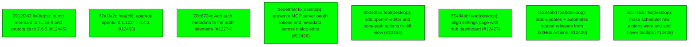

# Backport Agent — Detailed Run Report

> This file is generated automatically. It is intended for human analysts and
> AI reasoning models to assess agent performance, decision quality, and LLM behavior.

**Run timestamp**: 2026-07-26T10:43:51.218Z
**Models used**: fast=`mistral/mistral-code-agent-latest`  powerful=`poolside/poolside/laguna-s-2.1`
**Prompt log**: `/Users/rlemeill/Development/tea-ching-cline/.backport-agent/run-1785061706531.prompts.jsonl`

---

## Summary (PR body)

## Backport Agent — Sync Report

**Date**: 2026-07-26T10:43:51.218Z
**Upstream ref**: `cline/cline.git@main`
**Cut date**: `2026-06-27T00:00:00.000Z` 
**Fork ref**: `TEA-ching/cline@keypool-live`
**Sync branch**: `sync/upstream-main-2026-07-26-103026`

### Summary

- ✅ Applied: 8
- ⚠️ Needs human review: 0
- ⛔ Blocked (not attempted): 0

### Applied commits

- `0912f342` [high] fix(deps): bump mermaid to 11.16.0 and protobufjs to 7.6.5 (#12445)
- `22a1fa2c` [high] feat(cli): upgrade opentui 0.1.102 -> 0.4.3 (#12453)
- `78c6724c` [medium] Add auth metadata to the auth telemetry (#12274)
- `1e2e8fe8` [low] fix(desktop): preserve MCP server oauth tokens and metadata across dialog edits (#12426)
- `0b0e2fba` [low] feat(desktop): add open-in-editor and copy-path actions to diff view (#12434)
- `85484abf` [low] feat(desktop): align settings page with hub dashboard (#12427)
- `f5224abd` [high] feat(desktop): auto-updates + automated signed releases from GitHub Actions (#12420)
- `ecb71ba7` [low] fix(desktop): make scheduler row actions work and add hover tooltips (#12428)

### Agent decision log

- All commits were successfully applied without conflicts.
- All validations passed.


---

## Agent Workflow Diagram

> Generated by the fast model from the run summary. Evaluate the agent's decision path.



---

## AI Sub-Agent Call Log (4 calls)

> Each entry is one sub-agent invocation. Review prompt/response pairs to assess
> reasoning quality, hallucinations, and decision accuracy.

### Call 1 / 4 — `analyze_commit_for_backport` ✅ OK

| Field | Value |
|---|---|
| **Timestamp** | 2026-07-26T10:30:03.698Z |
| **Tool** | `analyze_commit_for_backport` |
| **Model** | `poolside/poolside/laguna-s-2.1` |
| **Duration** | 8534 ms |
| **Tokens in** | 19754 |
| **Tokens out** | 204 |
| **Cost** | $0.000000 |

**Prompt sent to sub-agent:**

```
Commit SHA: 0912f34286d52160dd2c35e64b6d57d0d1bd360a
Commit message:
fix(deps): bump mermaid to 11.16.0 and protobufjs to 7.6.5 (#12445)

Changed files (6):
apps/cline-hub/src/webview/package.json
apps/vscode/standalone/runtime-files/package-lock.json
apps/vscode/standalone/runtime-files/package.json
apps/vscode/webview-ui/package.json
bun.lock
package.json

Diff:
commit 0912f34286d52160dd2c35e64b6d57d0d1bd360a
Author: TheRealSpencer <32678829+TheRealSpencer@users.noreply.github.com>
Date:   Tue Jul 21 15:38:59 2026 -0500

    fix(deps): bump mermaid to 11.16.0 and protobufjs to 7.6.5 (#12445)
    
    Address mermaid CVEs (CVE-2026-41148/41149/41150/41159) and
    protobufjs CVEs (CVE-2026-54269, CVE-2026-48712) by pinning
    patched versions via package deps and workspace overrides.
---
 apps/cline-hub/src/webview/package.json            |   2 +-
 .../standalone/runtime-files/package-lock.json     |  34 ++-
 apps/vscode/standalone/runtime-files/package.json  |   2 +-
 apps/vscode/webview-ui/package.json                |   4 +-
 bun.lock                                           | 235 +++++++++++++++++++--
 package.json                                       |   3 +-
 6 files changed, 240 insertions(+), 40 deletions(-)

diff --git a/apps/cline-hub/src/webview/package.json b/apps/cline-hub/src/webview/package.json
index abe314a5d3..d92e2c21c3 100644
--- a/apps/cline-hub/src/webview/package.json
+++ b/apps/cline-hub/src/webview/package.json
@@ -26,7 +26,7 @@
 		"embla-carousel-react": "^8.6.0",
 		"lucide-react": "^0.577.0",
 		"media-chrome": "^4.18.1",
-		"mermaid": "^11.15.0",
+		"mermaid": "11.16.0",
 		"motion": "^12.38.0",
 		"nanoid": "^5.1.7",
 		"next-themes": "^0.4.6",
diff --git a/apps/vscode/standalone/runtime-files/package-lock.json b/apps/vscode/standalone/runtime-files/package-lock.json
index 2141428562..6c44527a06 100644
--- a/apps/vscode/standalone/runtime-files/package-lock.json
+++ b/apps/vscode/standalone/runtime-files/package-lock.json
@@ -89,19 +89,18 @@
 			"license": "BSD-3-Clause"
 		},
 		"node_modules/@protobufjs/eventemitter": {
-			"version": "1.1.0",
-			"resolved": "https://registry.npmjs.org/@protobufjs/eventemitter/-/eventemitter-1.1.0.tgz",
-			"integrity": "sha512-j9ednRT81vYJ9OfVuXG6ERSTdEL1xVsNgqpkxMsbIabzSo3goCjDIveeGv5d03om39ML71RdmrGNjG5SReBP/Q==",
+			"version": "1.1.1",
+			"resolved": "https://registry.npmjs.org/@protobufjs/eventemitter/-/eventemitter-1.1.1.tgz",
+			"integrity": "sha512-vW1GmwMZNnL+gMRaovlh9yZX74kc+TTU3FObkkurpMaRtBfLP3ldjS9KQWlwZgraRE0+dheEEoAxdzcJQ8eXZg==",
 			"license": "BSD-3-Clause"
 		},
 		"node_modules/@protobufjs/fetch": {
-			"version": "1.1.0",
-			"resolved": "https://registry.npmjs.org/@protobufjs/fetch/-/fetch-1.1.0.tgz",
-			"integrity": "sha512-lljVXpqXebpsijW71PZaCYeIcE5on1w5DlQy5WH6GLbFryLUrBD4932W/E2BSpfRJWseIL4v/KPgBFxDOIdKpQ==",
+			"version": "1.1.1",
+			"resolved": "https://registry.npmjs.org/@protobufjs/fetch/-/fetch-1.1.1.tgz",
+			"integrity": "sha512-GpptLrs57adMSuHi3VNj0mAF8dwh36LMaYF6XyJ6JMWlVsc+t42tm1HSEDmOs3A8fC9yyeisgLhsTVQokOZ0zw==",
 			"license": "BSD-3-Clause",
 			"dependencies": {
-				"@protobufjs/aspromise": "^1.1.1",
-				"@protobufjs/inquire": "^1.1.0"
+				"@protobufjs/aspromise": "^1.1.1"
 			}
 		},
 		"node_modules/@protobufjs/float": {
@@ -110,12 +109,6 @@
 			"integrity": "sha512-Ddb+kVXlXst9d+R9PfTIxh1EdNkgoRe5tOX6t01f1lYWOvJnSPDBlG241QLzcyPdoNTsblLUdujGSE4RzrTZGQ==",
 			"license": "BSD-3-Clause"
 		},
-		"node_modules/@protobufjs/inquire": {
-			"version": "1.1.2",
-			"resolved": "https://registry.npmjs.org/@protobufjs/inquire/-/inquire-1.1.2.tgz",
-			"integrity": "sha512-pa0vFRuws4wkvaXKK1uXZMAwAX4/t8ANaJo45iw/oQHNQ9q5xUzwgFmVJGXiga2BeN+zpX7Vf9vmsiIa2J+MUw==",
-			"license": "BSD-3-Clause"
-		},
 		"node_modules/@protobufjs/path": {
 			"version": "1.1.2",
 			"resolved": "https://registry.npmjs.org/@protobufjs/path/-/path-1.1.2.tgz",
@@ -667,24 +660,23 @@
 			}
 		},
 		"node_modules/protobufjs": {
-			"version": "7.5.8",
-			"resolved": "https://registry.npmjs.org/protobufjs/-/protobufjs-7.5.8.tgz",
-			"integrity": "sha512-dvpCIeLPbXZS/Ete7yLaO7RenOdken2NHKykBXbsaGxZT0UTltcarBciw+A78SRQs9iMAAVpsYA+l8b1hTePIA==",
+			"version": "7.6.5",
+			"resolved": "https://registry.npmjs.org/protobufjs/-/protobufjs-7.6.5.tgz",
+			"integrity": "sha512-/FPD0nUc9jH6rfFjji9IBqOz4pcSE3CsT1m7Ep6Mdb0LxSUMj8hgl6GomOvZzpNpAqqGaXA0P3VSrZLFzIhQrw==",
 			"hasInstallScript": true,
 			"license": "BSD-3-Clause",
 			"dependencies": {
 				"@protobufjs/aspromise": "^1.1.2",
 				"@protobufjs/base64": "^1.1.2",
 				"@protobufjs/codegen": "^2.0.5",
-				"@protobufjs/eventemitter": "^1.1.0",
-				"@protobufjs/fetch": "^1.1.0",
+				"@protobufjs/eventemitter": "^1.1.1",
+				"@protobufjs/fetch": "^1.1.1",
 				"@protobufjs/float": "^1.0.2",
-				"@protobufjs/inquire": "^1.1.1",
 				"@protobufjs/path": "^1.1.2",
 				"@protobufjs/pool": "^1.1.0",
 				"@protobufjs/utf8": "^1.1.1",
 				"@types/node": ">=13.7.0",
-				"long": "^5.0.0"
+				"long": "^5.3.2"
 			},
 			"engines": {
 				"node": ">=12.0.0"
diff --git a/apps/vscode/standalone/runtime-files/package.json b/apps/vscode/standalone/runtime-files/package.json
index 0672b2a3dd..e27103d065 100644
--- a/apps/vscode/standalone/runtime-files/package.json
+++ b/apps/vscode/standalone/runtime-files/package.json
@@ -12,6 +12,6 @@
 	},
 	"overrides": {
 		"tar-fs": "^3.1.1",
-		"protobufjs": "7.5.8"
+		"protobufjs": "7.6.5"
 	}
 }
diff --git a/apps/vscode/webview-ui/package.json b/apps/vscode/webview-ui/package.json
index fc7ed19024..32359479b8 100644
--- a/apps/vscode/webview-ui/package.json
+++ b/apps/vscode/webview-ui/package.json
@@ -45,7 +45,7 @@
 		"lucide-react": "^0.511.0",
 		"magic-string": "^0.30.21",
 		"marked": "^15.0.12",
-		"mermaid": "11.12.3",
+		"mermaid": "11.16.0",
 		"posthog-js": "^1.224.0",
 		"pretty-bytes": "^6.1.1",
 		"react": "^18.3.1",
@@ -92,7 +92,7 @@
 		"vitest": "^3.0.5"
 	},
 	"overrides": {
-		"protobufjs": "7.5.8"
+		"protobufjs": "7.6.5"
 	},
 	"optionalDependencies": {
 		"@rollup/rollup-linux-arm64-gnu": "^4.40.0",
diff --git a/bun.lock b/bun.lock
index cec478b4b6..a4070658a9 100644
--- a/bun.lock
+++ b/bun.lock
@@ -19,7 +19,7 @@
     },
     "apps/cli": {
       "name": "@cline/cli",
-      "version": "3.0.45",
+      "version": "3.0.46",
       "bin": {
         "cline": "src/index.ts",
       },
@@ -91,7 +91,7 @@
         "embla-carousel-react": "^8.6.0",
         "lucide-react": "^0.577.0",
         "media-chrome": "^4.18.1",
-        "mermaid": "^11.15.0",
+        "mermaid": "11.16.0",
         "motion": "^12.38.0",
         "nanoid": "^5.1.7",
         "next-themes": "^0.4.6",
@@ -549,7 +549,7 @@
         "lucide-react": "^0.511.0",
         "magic-string": "^0.30.21",
         "marked": "^15.0.12",
-        "mermaid": "11.12.3",
+        "mermaid": "11.16.0",
         "posthog-js": "^1.224.0",
         "pretty-bytes": "^6.1.1",
         "react": "^18.3.1",
@@ -779,7 +779,8 @@
     "@sap-cloud-sdk/util": "4.6.0",
     "diff": "8.0.4",
     "js-yaml": "^4.1.1",
-    "protobufjs": "7.5.8",
+    "mermaid": "11.16.0",
+    "protobufjs": "7.6.5",
     "serialize-javascript": ">=7.0.3",
     "tar": "^7.5.2",
     "tar-fs": ">=3.1.1",
@@ -1817,8 +1818,6 @@
 
     "@protobufjs/float": ["@protobufjs/float@1.0.2", "", {}, "sha512-Ddb+kVXlXst9d+R9PfTIxh1EdNkgoRe5tOX6t01f1lYWOvJnSPDBlG241QLzcyPdoNTsblLUdujGSE4RzrTZGQ=="],
 
-    "@protobufjs/inquire": ["@protobufjs/inquire@1.1.2", "", {}, "sha512-pa0vFRuws4wkvaXKK1uXZMAwAX4/t8ANaJo45iw/oQHNQ9q5xUzwgFmVJGXiga2BeN+zpX7Vf9vmsiIa2J+MUw=="],
-
     "@protobufjs/path": ["@protobufjs/path@1.1.2", "", {}, "sha512-6JOcJ5Tm08dOHAbdR3GrvP+yUUfkjG5ePsHYczMFLq3ZmMkAD98cDgcT2iA1lJ9NVwFd4tH/iSSoe44YWkltEA=="],
 
     "@protobufjs/pool": ["@protobufjs/pool@1.1.0", "", {}, "sha512-0kELaGSIDBKvcgS4zkjz1PeddatrjYcmMWOlAuAPwAeccUrPHdUqo/J6LiymHHEiJT5NrF1UVwxY14f+fy4WQw=="],
@@ -4449,7 +4448,7 @@
 
     "property-information": ["property-information@7.2.0", "", {}, "sha512-IAtzIB6sUiWaJYrX9smp3V46pBGbBeLFRGdh25kg1334VcBlD8HzhPeNIWQH9zhGmo2itIe25EHt9dQP7G5hmg=="],
 
-    "protobufjs": ["protobufjs@7.5.8", "", { "dependencies": { "@protobufjs/aspromise": "^1.1.2", "@protobufjs/base64": "^1.1.2", "@protobufjs/codegen": "^2.0.5", "@protobufjs/eventemitter": "^1.1.0", "@protobufjs/fetch": "^1.1.0", "@protobufjs/float": "^1.0.2", "@protobufjs/inquire": "^1.1.1", "@protobufjs/path": "^1.1.2", "@protobufjs/pool": "^1.1.0", "@protobufjs/utf8": "^1.1.1", "@types/node": ">=13.7.0", "long": "^5.0.0" } }, "sha512-dvpCIeLPbXZS/Ete7yLaO7RenOdken2NHKykBXbsaGxZT0UTltcarBciw+A78SRQs9iMAAVpsYA+l8b1hTePIA=="],
+    "protobufjs": ["protobufjs@7.6.5", "", { "dependencies": { "@protobufjs/aspromise": "^1.1.2", "@protobufjs/base64": "^1.1.2", "@protobufjs/codegen": "^2.0.5", "@protobufjs/eventemitter": "^1.1.1", "@protobufjs/fetch": "^1.1.1", "@protobufjs/float": "^1.0.2", "@protobufjs/path": "^1.1.2", "@protobufjs/pool": "^1.1.0", "@protobufjs/utf8": "^1.1.1", "@types/node": ">=13.7.0", "long": "^5.3.2" } }, "sha512-/FPD0nUc9jH6rfFjji9IBqOz4pcSE3CsT1m7Ep6Mdb0LxSUMj8hgl6GomOvZzpNpAqqGaXA0P3VSrZLFzIhQrw=="],
 
     "protoc-gen-ts": ["protoc-gen-ts@0.8.7", "", { "bin": { "protoc-gen-ts": "protoc-gen-ts.js" } }, "sha512-jr4VJey2J9LVYCV7EVyVe53g1VMw28cCmYJhBe5e3YX5wiyiDwgxWxeDf9oTqAe4P1bN/YGAkW2jhlH8LohwiQ=="],
 
@@ -6291,6 +6290,28 @@
 
     "webview/@types/node": ["@types/node@24.13.3", "", { "dependencies": { "undici-types": "~7.18.0" } }, "sha512-Dh8vAsV36ig5wa9OX4pXvMc9D3Veibfw2wix0CUwYODLD8nkj9UsLjASr49nPg+2eKzxhBV+v7L8pXvT4e639Q=="],
 
+    "webview-ui/@radix-ui/react-dialog": ["@radix-ui/react-dialog@1.1.19", "", { "dependencies": { "@radix-ui/primitive": "1.1.5", "@radix-ui/react-compose-refs": "1.1.3", "@radix-ui/react-context": "1.2.0", "@radix-ui/react-dismissable-layer": "1.1.15", "@radix-ui/react-focus-guards": "1.1.4", "@radix-ui/react-focus-scope": "1.1.12", "@radix-ui/react-id": "1.1.2", "@radix-ui/react-portal": "1.1.13", "@radix-ui/react-presence": "1.1.7", "@radix-ui/react-primitive": "2.1.7", "@radix-ui/react-slot": "1.3.0", "@radix-ui/react-use-controllable-state": "1.2.3", "aria-hidden": "^1.2.4", "react-remove-scroll": "^2.7.2" }, "peerDependencies": { "@types/react": "*", "@types/react-dom": "*", "react": "^16.8 || ^17.0 || ^18.0 || ^19.0 || ^19.0.0-rc", "react-dom": "^16.8 || ^17.0 || ^18.0 || ^19.0 || ^19.0.0-rc" }, "optionalPeers": ["@types/react", "@types/react-dom"] }, "sha512-+HhbN2+YtkRgVirjZ2afMeutQRuGOrdkWR5+EFC58SJojGmtyNQwYzgi6tHBpOxvFHefMtPeHdgtjz0BOGxFQg=="],
+
+    "webview-ui/@radix-ui/react-hover-card": ["@radix-ui/react-hover-card@1.1.19", "", { "dependencies": { "@radix-ui/primitive": "1.1.5", "@radix-ui/react-compose-refs": "1.1.3", "@radix-ui/react-context": "1.2.0", "@radix-ui/react-dismissable-layer": "1.1.15", "@radix-ui/react-popper": "1.3.3", "@radix-ui/react-portal": "1.1.13", "@radix-ui/react-presence": "1.1.7", "@radix-ui/react-primitive": "2.1.7", "@radix-ui/react-use-controllable-state": "1.2.3" }, "peerDependencies": { "@types/react": "*", "@types/react-dom": "*", "react": "^16.8 || ^17.0 || ^18.0 || ^19.0 || ^19.0.0-rc", "react-dom": "^16.8 || ^17.0 || ^18.0 || ^19.0 || ^19.0.0-rc" }, "optionalPeers": ["@types/react", "@types/react-dom"] }, "sha512-2KTgMLQtKvicznQgbindEI2RZ3QbDIwU5gabjUPwFJsormjGDz+rUvO4NANmYwzEEpTcTONUt33vBHIfTIVSfw=="],
+
+    "webview-ui/@radix-ui/react-label": ["@radix-ui/react-label@2.1.11", "", { "dependencies": { "@radix-ui/react-primitive": "2.1.7" }, "peerDependencies": { "@types/react": "*", "@types/react-dom": "*", "react": "^16.8 || ^17.0 || ^18.0 || ^19.0 || ^19.0.0-rc", "react-dom": "^16.8 || ^17.0 || ^18.0 || ^19.0 || ^19.0.0-rc" }, "optionalPeers": ["@types/react", "@types/react-dom"] }, "sha512-3PKvDDxOn62k0oV1n4QtNtD2vpu+zYjXR7ojLBPaO6SPvhy53yg0vAmgNeBQeJW5rV3dffoRG+HYfLBZuzw0CQ=="],
+
+    "webview-ui/@radix-ui/react-popover": ["@radix-ui/react-popover@1.1.19", "", { "dependencies": { "@radix-ui/primitive": "1.1.5", "@radix-ui/react-compose-refs": "1.1.3", "@radix-ui/react-context": "1.2.0", "@radix-ui/react-dismissable-layer": "1.1.15", "@radix-ui/react-focus-guards": "1.1.4", "@radix-ui/react-focus-scope": "1.1.12", "@radix-ui/react-id": "1.1.2", "@radix-ui/react-popper": "1.3.3", "@radix-ui/react-portal": "1.1.13", "@radix-ui/react-presence": "1.1.7", "@radix-ui/react-primitive": "2.1.7", "@radix-ui/react-slot": "1.3.0", "@radix-ui/react-use-controllable-state": "1.2.3", "aria-hidden": "^1.2.4", "react-remove-scroll": "^2.7.2" }, "peerDependencies": { "@types/react": "*", "@types/react-dom": "*", "react": "^16.8 || ^17.0 || ^18.0 || ^19.0 || ^19.0.0-rc", "react-dom": "^16.8 || ^17.0 || ^18.0 || ^19.0 || ^19.0.0-rc" }, "optionalPeers": ["@types/react", "@types/react-dom"] }, "sha512-jkrTdQVxnIB8fpn0NyyxW9CTB5aCXZZelVz5z+Xmii6g5WxMqS3fInNslZ63puP39+Puu4jYohUK31y3dT87gQ=="],
+
+    "webview-ui/@radix-ui/react-progress": ["@radix-ui/react-progress@1.1.12", "", { "dependencies": { "@radix-ui/react-context": "1.2.0", "@radix-ui/react-primitive": "2.1.7" }, "peerDependencies": { "@types/react": "*", "@types/react-dom": "*", "react": "^16.8 || ^17.0 || ^18.0 || ^19.0 || ^19.0.0-rc", "react-dom": "^16.8 || ^17.0 || ^18.0 || ^19.0 || ^19.0.0-rc" }, "optionalPeers": ["@types/react", "@types/react-dom"] }, "sha512-ZPHyI0JyzoH/rP0tq2uRaIZTj/4s8+kAbqPz+e2N8+ejHvwPJ889dHhqn+vh7PNvNeq+boAoH9yzqeoShzwF2w=="],
+
+    "webview-ui/@radix-ui/react-select": ["@radix-ui/react-select@2.3.3", "", { "dependencies": { "@radix-ui/number": "1.1.2", "@radix-ui/primitive": "1.1.5", "@radix-ui/react-collection": "1.1.12", "@radix-ui/react-compose-refs": "1.1.3", "@radix-ui/react-context": "1.2.0", "@radix-ui/react-direction": "1.1.2", "@radix-ui/react-dismissable-layer": "1.1.15", "@radix-ui/react-focus-guards": "1.1.4", "@radix-ui/react-focus-scope": "1.1.12", "@radix-ui/react-id": "1.1.2", "@radix-ui/react-popper": "1.3.3", "@radix-ui/react-portal": "1.1.13", "@radix-ui/react-presence": "1.1.7", "@radix-ui/react-primitive": "2.1.7", "@radix-ui/react-slot": "1.3.0", "@radix-ui/react-use-callback-ref": "1.1.2", "@radix-ui/react-use-controllable-state": "1.2.3", "@radix-ui/react-use-layout-effect": "1.1.2", "@radix-ui/react-use-previous": "1.1.2", "@radix-ui/react-visually-hidden": "1.2.7", "aria-hidden": "^1.2.4", "react-remove-scroll": "^2.7.2" }, "peerDependencies": { "@types/react": "*", "@types/react-dom": "*", "react": "^16.8 || ^17.0 || ^18.0 || ^19.0 || ^19.0.0-rc", "react-dom": "^16.8 || ^17.0 || ^18.0 || ^19.0 || ^19.0.0-rc" }, "optionalPeers": ["@types/react", "@types/react-dom"] }, "sha512-L5RQTXz6Anxsf9CCv+pTgiAsUpyVj7rJxsGtmhFaEOJ++cVfXucv4qWfsIO0AIB4NAhi3yovWGVMKKS1Xf1Wrg=="],
+
+    "webview-ui/@radix-ui/react-separator": ["@radix-ui/react-separator@1.1.11", "", { "dependencies": { "@radix-ui/react-primitive": "2.1.7" }, "peerDependencies": { "@types/react": "*", "@types/react-dom": "*", "react": "^16.8 || ^17.0 || ^18.0 || ^19.0 || ^19.0.0-rc", "react-dom": "^16.8 || ^17.0 || ^18.0 || ^19.0 || ^19.0.0-rc" }, "optionalPeers": ["@types/react", "@types/react-dom"] }, "sha512-jRhe86+8PF7VZ1u14eOWVOuh2BuAhALg/FT1VcMC4OHedMTRUazDnDlKTt+yxo5cRNKHMfmvZ4sSQtWDeMV4CQ=="],
+
+    "webview-ui/@radix-ui/react-slider": ["@radix-ui/react-slider@1.4.3", "", { "dependencies": { "@radix-ui/number": "1.1.2", "@radix-ui/primitive": "1.1.5", "@radix-ui/react-collection": "1.1.12", "@radix-ui/react-compose-refs": "1.1.3", "@radix-ui/react-context": "1.2.0", "@radix-ui/react-direction": "1.1.2", "@radix-ui/react-primitive": "2.1.7", "@radix-ui/react-use-controllable-state": "1.2.3", "@radix-ui/react-use-layout-effect": "1.1.2", "@radix-ui/react-use-previous": "1.1.2", "@radix-ui/react-use-size": "1.1.2" }, "peerDependencies": { "@types/react": "*", "@types/react-dom": "*", "react": "^16.8 || ^17.0 || ^18.0 || ^19.0 || ^19.0.0-rc", "react-dom": "^16.8 || ^17.0 || ^18.0 || ^19.0 || ^19.0.0-rc" }, "optionalPeers": ["@types/react", "@types/react-dom"] }, "sha512-CWVVj+XaTom0SKCqw1EUgb0NuiLwS+N3OFG73mVEezKEjgNIvZiu0EevMelSSU+CbX3owbqJweG2gPU31WGC5A=="],
+
+    "webview-ui/@radix-ui/react-slot": ["@radix-ui/react-slot@1.3.0", "", { "dependencies": { "@radix-ui/react-compose-refs": "1.1.3" }, "peerDependencies": { "@types/react": "*", "react": "^16.8 || ^17.0 || ^18.0 || ^19.0 || ^19.0.0-rc" }, "optionalPeers": ["@types/react"] }, "sha512-MojKku4U/miO8Av4Dkb+ctMAQx7JmY96LmtDQlAarCRtd7rN52QCSzBF+XAvr5S6coSVj9HEPBgHAHKEJVk/WA=="],
+
+    "webview-ui/@radix-ui/react-switch": ["@radix-ui/react-switch@1.3.3", "", { "dependencies": { "@radix-ui/primitive": "1.1.5", "@radix-ui/react-compose-refs": "1.1.3", "@radix-ui/react-context": "1.2.0", "@radix-ui/react-primitive": "2.1.7", "@radix-ui/react-use-controllable-state": "1.2.3", "@radix-ui/react-use-previous": "1.1.2", "@radix-ui/react-use-size": "1.1.2" }, "peerDependencies": { "@types/react": "*", "@types/react-dom": "*", "react": "^16.8 || ^17.0 || ^18.0 || ^19.0 || ^19.0.0-rc", "react-dom": "^16.8 || ^17.0 || ^18.0 || ^19.0 || ^19.0.0-rc" }, "optionalPeers": ["@types/react", "@types/react-dom"] }, "sha512-1+mlB4/lxJfk5tgJ4g+R5mUCbRpPE1T9+UsEyeLYbGgMtwiMgmuTnfKz4Mw1nHALHjuwyxw4MLd4cSHn6pNSlQ=="],
+
+    "webview-ui/@radix-ui/react-tooltip": ["@radix-ui/react-tooltip@1.2.12", "", { "dependencies": { "@radix-ui/primitive": "1.1.5", "@radix-ui/react-compose-refs": "1.1.3", "@radix-ui/react-context": "1.2.0", "@radix-ui/react-dismissable-layer": "1.1.15", "@radix-ui/react-id": "1.1.2", "@radix-ui/react-popper": "1.3.3", "@radix-ui/react-portal": "1.1.13", "@radix-ui/react-presence": "1.1.7", "@radix-ui/react-primitive": "2.1.7", "@radix-ui/react-slot": "1.3.0", "@radix-ui/react-use-controllable-state": "1.2.3", "@radix-ui/react-visually-hidden": "1.2.7" }, "peerDependencies": { "@types/react": "*", "@types/react-dom": "*", "react": "^16.8 || ^17.0 || ^18.0 || ^19.0 || ^19.0.0-rc", "react-dom": "^16.8 || ^17.0 || ^18.0 || ^19.0 || ^19.0.0-rc" }, "optionalPeers": ["@types/react", "@types/react-dom"] }, "sha512-U3HoftgWnmla78vzQbLvKKb7bUYJxoiiqYFzp1wu/TBMyDqMZSuCl3aRICsD6EfVEwcJD2mumGDGUXLFVqQHKA=="],
+
     "webview-ui/@types/node": ["@types/node@22.15.1", "", { "dependencies": { "undici-types": "~6.21.0" } }, "sha512-gSZyd0Qmv7qvbd2fJ9HGdYmv1yhNdelIA4YOtN6vkcmSwFhthxSEsBgU/JYZcXjWT6DFzoATcHrc52Ckh8SeRA=="],
 
     "webview-ui/@types/react": ["@types/react@18.3.31", "", { "dependencies": { "@types/prop-types": "*", "csstype": "^3.2.2" } }, "sha512-vfEqpXTvwT91yhmwdfouStN2hSKwTvyRs8qpLfADyrq/kxDw0hZM7Wk9Ug1FELj8hIby+S/+kQCSRFF32nv2Qw=="],
@@ -6305,8 +6326,6 @@
 
     "webview-ui/lucide-react": ["lucide-react@0.511.0", "", { "peerDependencies": { "react": "^16.5.1 || ^17.0.0 || ^18.0.0 || ^19.0.0" } }, "sha512-VK5a2ydJ7xm8GvBeKLS9mu1pVK6ucef9780JVUjw6bAjJL/QXnd4Y0p7SPeOUMC27YhzNCZvm5d/QX0Tp3rc0w=="],
 
-    "webview-ui/mermaid": ["mermaid@11.12.3", "", { "dependencies": { "@braintree/sanitize-url": "^7.1.1", "@iconify/utils": "^3.0.1", "@mermaid-js/parser": "^1.0.0", "@types/d3": "^7.4.3", "cytoscape": "^3.29.3", "cytoscape-cose-bilkent": "^4.1.0", "cytoscape-fcose": "^2.2.0", "d3": "^7.9.0", "d3-sankey": "^0.12.3", "dagre-d3-es": "7.0.13", "dayjs": "^1.11.18", "dompurify": "^3.2.5", "katex": "^0.16.22", "khroma": "^2.1.0", "lodash-es": "^4.17.23", "marked": "^16.2.1", "roughjs": "^4.6.6", "stylis": "^4.3.6", "ts-dedent": "^2.2.0", "uuid": "^11.1.0" } }, "sha512-wN5ZSgJQIC+CHJut9xaKWsknLxaFBwCPwPkGTSUYrTiHORWvpT8RxGk849HPnpUAQ+/9BPRqYb80jTpearrHzQ=="],
-
     "webview-ui/react": ["react@18.3.1", "", { "dependencies": { "loose-envify": "^1.1.0" } }, "sha512-wS+hAgJShR0KhEvPJArfuPVN1+Hz1t0Y6n5jLrGQbkb4urgPE/0Rve+1kMB1v/oWgHgm4WIcV+i7F2pTVj+2iQ=="],
 
     "webview-ui/react-dom": ["react-dom@18.3.1", "", { "dependencies": { "loose-envify": "^1.1.0", "scheduler": "^0.23.2" }, "peerDependencies": { "react": "^18.3.1" } }, "sha512-5m4nQKp+rZRb09LNH59GM4BxTh9251/ylbKIbpe7TpGxfJ+9kv6BLkLBXIjjspbgbnIBNqlI23tRnTWT0snUIw=="],
@@ -7137,15 +7156,161 @@
 
     "vaul/@radix-ui/react-dialog/@radix-ui/react-slot": ["@radix-ui/react-slot@1.3.0", "", { "dependencies": { "@radix-ui/react-compose-refs": "1.1.3" }, "peerDependencies": { "@types/react": "*", "react": "^16.8 || ^17.0 || ^18.0 || ^19.0 || ^19.0.0-rc" }, "optionalPeers": ["@types/react"] }, "sha512-MojKku4U/miO8Av4Dkb+ctMAQx7JmY96LmtDQlAarCRtd7rN52QCSzBF+XAvr5S6coSVj9HEPBgHAHKEJVk/WA=="],
 
-    "webview-ui/@types/node/undici-types": ["undici-types@6.21.0", "", {}, "sha512-iwDZqg0QAGrg9Rav5H4n0M64c3mkR59cJ6wQp+7C4nI0gsmExaedaYLNO44eT4AtBBwjbTiGPMlt2Md0T9H9JQ=="],
+    "webview-ui/@radix-ui/react-dialog/@radix-ui/primitive": ["@radix-ui/primitive@1.1.5", "", {}, "sha512-d86WIWFYNtGA0H/d8exstrTRTp7eWJYlYJbtNofxr/3ljupZYn6EFDG/Qgu/0Kc8v7yMUxySagqJsL1+PdYjWg=="],
 
-    "webview-ui/@vitejs/plugin-react-swc/@rolldown/pluginutils": ["@rolldown/pluginutils@1.0.0-beta.27", "", {}, "sha512-+d0F4MKMCbeVUJwG96uQ4SgAznZNSq93I3V+9NHA4OpvqG8mRCpGdKmK8l/dl02h2CCDHwW2FqilnTyDcAnqjA=="],
+    "webview-ui/@radix-ui/react-dialog/@radix-ui/react-compose-refs": ["@radix-ui/react-compose-refs@1.1.3", "", { "peerDependencies": { "@types/react": "*", "react": "^16.8 || ^17.0 || ^18.0 || ^19.0 || ^19.0.0-rc" }, "optionalPeers": ["@types/react"] }, "sha512-rYOP8OMnuuPMQF1uhPVlGNcCDlkokKqGFE3JcxFViIkAXP7EvFWUliJAstrapypaBLJNHbZL6jGhbVDGTwmVhA=="],
+
+    "webview-ui/@radix-ui/react-dialog/@radix-ui/react-context": ["@radix-ui/react-context@1.2.0", "", { "peerDependencies": { "@types/react": "*", "react": "^16.8 || ^17.0 || ^18.0 || ^19.0 || ^19.0.0-rc" }, "optionalPeers": ["@types/react"] }, "sha512-fOE+JtN9rygNZkCnHRBEP0TAvLldlhyOxMsbwFvTP4nAs+nBmfnna+o/Zski2wkmY1YMrFC0aSzsHoLY47iLrg=="],
+
+    "webview-ui/@radix-ui/react-dialog/@radix-ui/react-dismissable-layer": ["@radix-ui/react-dismissable-layer@1.1.15", "", { "dependencies": { "@radix-ui/primitive": "1.1.5", "@radix-ui/react-compose-refs": "1.1.3", "@radix-ui/react-primitive": "2.1.7", "@radix-ui/react-use-callback-ref": "1.1.2", "@radix-ui/react-use-effect-event": "0.0.3" }, "peerDependencies": { "@types/react": "*", "@types/react-dom": "*", "react": "^16.8 || ^17.0 || ^18.0 || ^19.0 || ^19.0.0-rc", "react-dom": "^16.8 || ^17.0 || ^18.0 || ^19.0 || ^19.0.0-rc" }, "optionalPeers": ["@types/react", "@types/react-dom"] }, "sha512-b0XaRlzn2QKuo10XyNgi2DAJDf5XC9d1nD3FJcuvCjbR7+4Ad28zmZsLsqx+hvDEzMnRuZaZxZm9gYObV6RmRA=="],
+
+    "webview-ui/@radix-ui/react-dialog/@radix-ui/react-focus-guards": ["@radix-ui/react-focus-guards@1.1.4", "", { "peerDependencies": { "@types/react": "*", "react": "^16.8 || ^17.0 || ^18.0 || ^19.0 || ^19.0.0-rc" }, "optionalPeers": ["@types/react"] }, "sha512-cot/aB/mOm0IYVYTTmQcEEK1M48lZWi8FlYe5nDPQQ8NYZUlXEFgncJ9p2Kzer3RKSrY7cTTpEMLZKNo9QoP5Q=="],
+
+    "webview-ui/@radix-ui/react-dialog/@radix-ui/react-focus-scope": ["@radix-ui/react-focus-scope@1.1.12", "", { "dependencies": { "@radix-ui/react-compose-refs": "1.1.3", "@radix-ui/react-primitive": "2.1.7", "@radix-ui/react-use-callback-ref": "1.1.2" }, "peerDependencies": { "@types/react": "*", "@types/react-dom": "*", "react": "^16.8 || ^17.0 || ^18.0 || ^19.0 || ^19.0.0-rc", "react-dom": "^16.8 || ^17.0 || ^18.0 || ^19.0 || ^19.0.0-rc" }, "optionalPeers": ["@types/react", "@types/react-dom"] }, "sha512-jjk/lqTeNL0azUx5ZYzVrl4NgaDIrdzTNE4mABV9yBFI7FQqN7pIgzV1bTleUezP2QiTGA1BFTqY8MegDgWX9A=="],
+
+    "webview-ui/@radix-ui/react-dialog/@radix-ui/react-id": ["@radix-ui/react-id@1.1.2", "", { "dependencies": { "@radix-ui/react-use-layout-effect": "1.1.2" }, "peerDependencies": { "@types/react": "*", "react": "^16.8 || ^17.0 || ^18.0 || ^19.0 || ^19.0.0-rc" }, "optionalPeers": ["@types/react"] }, "sha512-orBC88futVpqCmhX1p4cvquNHsELQ+w+vBJnuj3ftETI5bJb0bZn3Tqu3SWN2IOcPycTnMGnhwoermvISt72sA=="],
+
+    "webview-ui/@radix-ui/react-dialog/@radix-ui/react-portal": ["@radix-ui/react-portal@1.1.13", "", { "dependencies": { "@radix-ui/react-primitive": "2.1.7", "@radix-ui/react-use-layout-effect": "1.1.2" }, "peerDependencies": { "@types/react": "*", "@types/react-dom": "*", "react": "^16.8 || ^17.0 || ^18.0 || ^19.0 || ^19.0.0-rc", "react-dom": "^16.8 || ^17.0 || ^18.0 || ^19.0 || ^19.0.0-rc" }, "optionalPeers": ["@types/react", "@types/react-dom"] }, "sha512-z3oXfmaHLJTF1wktbjgD6cn9jiEbq3WSondB10LIuIt2m2Ym4iJlrW04/euMwENDdWDdE7z+OuY7Qyp1YpRSwA=="],
+
+    "webview-ui/@radix-ui/react-dialog/@radix-ui/react-presence": ["@radix-ui/react-presence@1.1.7", "", { "dependencies": { "@radix-ui/react-use-layout-effect": "1.1.2" }, "peerDependencies": { "@types/react": "*", "@types/react-dom": "*", "react": "^16.8 || ^17.0 || ^18.0 || ^19.0 || ^19.0.0-rc", "react-dom": "^16.8 || ^17.0 || ^18.0 || ^19.0 || ^19.0.0-rc" }, "optionalPeers": ["@types/react", "@types/react-dom"] }, "sha512-zBZ4QM5XG3JRanDmqXYf3MD6th4AFXFmgU6KNMFzUaV6F3uw9I5/zjMUvFriSEn5ewo1nxuibvyxJdmLlDcslA=="],
+
+    "webview-ui/@radix-ui/react-dialog/@radix-ui/react-primitive": ["@radix-ui/react-primitive@2.1.7", "", { "dependencies": { "@radix-ui/react-slot": "1.3.0" }, "peerDependencies": { "@types/react": "*", "@types/react-dom": "*", "react": "^16.8 || ^17.0 || ^18.0 || ^19.0 || ^19.0.0-rc", "react-dom": "^16.8 || ^17.0 || ^18.0 || ^19.0 || ^19.0.0-rc" }, "optionalPeers": ["@types/react", "@types/react-dom"] }, "sha512-bC3NiwsprbxKjuon9l7X6BUTw7FPVzEYaL92MPEY5SCd/9hUTPXVFtVwRix7778wtRsVao+zE062gL79FZleeQ=="],
+
+    "webview-ui/@radix-ui/react-hover-card/@radix-ui/primitive": ["@radix-ui/primitive@1.1.5", "", {}, "sha512-d86WIWFYNtGA0H/d8exstrTRTp7eWJYlYJbtNofxr/3ljupZYn6EFDG/Qgu/0Kc8v7yMUxySagqJsL1+PdYjWg=="],
+
+    "webview-ui/@radix-ui/react-hover-card/@radix-ui/react-compose-refs": ["@radix-ui/react-compose-refs@1.1.3", "", { "peerDependencies": { "@types/react": "*", "react": "^16.8 || ^17.0 || ^18.0 || ^19.0 || ^19.0.0-rc" }, "optionalPeers": ["@types/react"] }, "sha512-rYOP8OMnuuPMQF1uhPVlGNcCDlkokKqGFE3JcxFViIkAXP7EvFWUliJAstrapypaBLJNHbZL6jGhbVDGTwmVhA=="],
+
+    "webview-ui/@radix-ui/react-hover-card/@radix-ui/react-context": ["@radix-ui/react-context@1.2.0", "", { "peerDependencies": { "@types/react": "*", "react": "^16.8 || ^17.0 || ^18.0 || ^19.0 || ^19.0.0-rc" }, "optionalPeers": ["@types/react"] }, "sha512-fOE+JtN9rygNZkCnHRBEP0TAvLldlhyOxMsbwFvTP4nAs+nBmfnna+o/Zski2wkmY1YMrFC0aSzsHoLY47iLrg=="],
+
+    "webview-ui/@radix-ui/react-hover-card/@radix-ui/react-dismissable-layer": ["@radix-ui/react-dismissable-layer@1.1.15", "", { "dependencies": { "@radix-ui/primitive": "1.1.5", "@radix-ui/react-compose-refs": "1.1.3", "@radix-ui/react-primitive": "2.1.7", "@radix-ui/react-use-callback-ref": "1.1.2", "@radix-ui/react-use-effect-event": "0.0.3" }, "peerDependencies": { "@types/react": "*", "@types/react-dom": "*", "react": "^16.8 || ^17.0 || ^18.0 || ^19.0 || ^19.0.0-rc", "react-dom": "^16.8 || ^17.0 || ^18.0 || ^19.0 || ^19.0.0-rc" }, "optionalPeers": ["@types/react", "@types/react-dom"] }, "sha512-b0XaRlzn2QKuo10XyNgi2DAJDf5XC9d1nD3FJcuvCjbR7+4Ad28zmZsLsqx+hvDEzMnRuZaZxZm9gYObV6RmRA=="],
+
+    "webview-ui/@radix-ui/react-hover-card/@radix-ui/react-popper": ["@radix-ui/react-popper@1.3.3", "", { "dependencies": { "@floating-ui/react-dom": "^2.0.0", "@radix-ui/react-arrow": "1.1.11", "@radix-ui/react-compose-refs": "1.1.3", "@radix-ui/react-context": "1.2.0", "@radix-ui/react-primitive": "2.1.7", "@radix-ui/react-use-callback-ref": "1.1.2", "@radix-ui/react-use-layout-effect": "1.1.2", "@radix-ui/react-use-rect": "1.1.2", "@radix-ui/react-use-size": "1.1.2", "@radix-ui/rect": "1.1.2" }, "peerDependencies": { "@types/react": "*", "@types/react-dom": "*", "react": "^16.8 || ^17.0 || ^18.0 || ^19.0 || ^19.0.0-rc", "react-dom": "^16.8 || ^17.0 || ^18.0 || ^19.0 || ^19.0.0-rc" }, "optionalPeers": ["@types/react", "@types/react-dom"] }, "sha512-mS7dGpyjv6b+gsDjLF7e0ia1W4Im1B1hSCy2yuXlHuvnZxHKagfDaobt/KAKt27EpZMit2pss8eJBVyVjEWM+g=="],
+
+    "webview-ui/@radix-ui/react-hover-card/@radix-ui/react-portal": ["@radix-ui/react-portal@1.1.13", "", { "dependencies": { "@radix-ui/react-primitive": "2.1.7", "@radix-ui/react-use-layout-effect": "1.1.2" }, "peerDependencies": { "@types/react": "*", "@types/react-dom": "*", "react": "^16.8 || ^17.0 || ^18.0 || ^19.0 || ^19.0.0-rc", "react-dom": "^16.8 || ^17.0 || ^18.0 || ^19.0 || ^19.0.0-rc" }, "optionalPeers": ["@types/react", "@types/react-dom"] }, "sha512-z3oXfmaHLJTF1wktbjgD6cn9jiEbq3WSondB10LIuIt2m2Ym4iJlrW04/euMwENDdWDdE7z+OuY7Qyp1YpRSwA=="],
+
+    "webview-ui/@radix-ui/react-hover-card/@radix-ui/react-presence": ["@radix-ui/react-presence@1.1.7", "", { "dependencies": { "@radix-ui/react-use-layout-effect": "1.1.2" }, "peerDependencies": { "@types/react": "*", "@types/react-dom": "*", "react": "^16.8 || ^17.0 || ^18.0 || ^19.0 || ^19.0.0-rc", "react-dom": "^16.8 || ^17.0 || ^18.0 || ^19.0 || ^19.0.0-rc" }, "optionalPeers": ["@types/react", "@types/react-dom"] }, "sha512-zBZ4QM5XG3JRanDmqXYf3MD6th4AFXFmgU6KNMFzUaV6F3uw9I5/zjMUvFriSEn5ewo1nxuibvyxJdmLlDcslA=="],
+
+    "webview-ui/@radix-ui/react-hover-card/@radix-ui/react-primitive": ["@radix-ui/react-primitive@2.1.7", "", { "dependencies": { "@radix-ui/react-slot": "1.3.0" }, "peerDependencies": { "@types/react": "*", "@types/react-dom": "*", "react": "^16.8 || ^17.0 || ^18.0 || ^19.0 || ^19.0.0-rc", "react-dom": "^16.8 || ^17.0 || ^18.0 || ^19.0 || ^19.0.0-rc" }, "optionalPeers": ["@types/react", "@types/react-dom"] }, "sha512-bC3NiwsprbxKjuon9l7X6BUTw7FPVzEYaL92MPEY5SCd/9hUTPXVFtVwRix7778wtRsVao+zE062gL79FZleeQ=="],
+
+    "webview-ui/@radix-ui/react-label/@radix-ui/react-primitive": ["@radix-ui/react-primitive@2.1.7", "", { "dependencies": { "@radix-ui/react-slot": "1.3.0" }, "peerDependencies": { "@types/react": "*", "@types/react-dom": "*", "react": "^16.8 || ^17.0 || ^18.0 || ^19.0 || ^19.0.0-rc", "react-dom": "^16.8 || ^17.0 || ^18.0 || ^19.0 || ^19.0.0-rc" }, "optionalPeers": ["@types/react", "@types/react-dom"] }, "sha512-bC3NiwsprbxKjuon9l7X6BUTw7FPVzEYaL92MPEY5SCd/9hUTPXVFtVwRix7778wtRsVao+zE062gL79FZleeQ=="],
+
+    "webview-ui/@radix-ui/react-popover/@radix-ui/primitive": ["@radix-ui/primitive@1.1.5", "", {}, "sha512-d86WIWFYNtGA0H/d8exstrTRTp7eWJYlYJbtNofxr/3ljupZYn6EFDG/Qgu/0Kc8v7yMUxySagqJsL1+PdYjWg=="],
+
+    "webview-ui/@radix-ui/react-popover/@radix-ui/react-compose-refs": ["@radix-ui/react-compose-refs@1.1.3", "", { "peerDependencies": { "@types/react": "*", "react": "^16.8 || ^17.0 || ^18.0 || ^19.0 || ^19.0.0-rc" }, "optionalPeers": ["@types/react"] }, "sha512-rYOP8OMnuuPMQF1uhPVlGNcCDlkokKqGFE3JcxFViIkAXP7EvFWUliJAstrapypaBLJNHbZL6jGhbVDGTwmVhA=="],
+
+    "webview-ui/@radix-ui/react-popover/@radix-ui/react-context": ["@radix-ui/react-context@1.2.0", "", { "peerDependencies": { "@types/react": "*", "react": "^16.8 || ^17.0 || ^18.0 || ^19.0 || ^19.0.0-rc" }, "optionalPeers": ["@types/react"] }, "sha512-fOE+JtN9rygNZkCnHRBEP0TAvLldlhyOxMsbwFvTP4nAs+nBmfnna+o/Zski2wkmY1YMrFC0aSzsHoLY47iLrg=="],
+
+    "webview-ui/@radix-ui/react-popover/@radix-ui/react-dismissable-layer": ["@radix-ui/react-dismissable-layer@1.1.15", "", { "dependencies": { "@radix-ui/primitive": "1.1.5", "@radix-ui/react-compose-refs": "1.1.3", "@radix-ui/react-primitive": "2.1.7", "@radix-ui/react-use-callback-ref": "1.1.2", "@radix-ui/react-use-effect-event": "0.0.3" }, "peerDependencies": { "@types/react": "*", "@types/react-dom": "*", "react": "^16.8 || ^17.0 || ^18.0 || ^19.0 || ^19.0.0-rc", "react-dom": "^16.8 || ^17.0 || ^18.0 || ^19.0 || ^19.0.0-rc" }, "optionalPeers": ["@types/react", "@types/react-dom"] }, "sha512-b0XaRlzn2QKuo10XyNgi2DAJDf5XC9d1nD3FJcuvCjbR7+4Ad28zmZsLsqx+hvDEzMnRuZaZxZm9gYObV6RmRA=="],
+
+    "webview-ui/@radix-ui/react-popover/@radix-ui/react-focus-guards": ["@radix-ui/react-focus-guards@1.1.4", "", { "peerDependencies": { "@types/react": "*", "react": "^16.8 || ^17.0 || ^18.0 || ^19.0 || ^19.0.0-rc" }, "optionalPeers": ["@types/react"] }, "sha512-cot/aB/mOm0IYVYTTmQcEEK1M48lZWi8FlYe5nDPQQ8NYZUlXEFgncJ9p2Kzer3RKSrY7cTTpEMLZKNo9QoP5Q=="],
+
+    "webview-ui/@radix-ui/react-popover/@radix-ui/react-focus-scope": ["@radix-ui/react-focus-scope@1.1.12", "", { "dependencies": { "@radix-ui/react-compose-refs": "1.1.3", "@radix-ui/react-primitive": "2.1.7", "@radix-ui/react-use-callback-ref": "1.1.2" }, "peerDependencies": { "@types/react": "*", "@types/react-dom": "*", "react": "^16.8 || ^17.0 || ^18.0 || ^19.0 || ^19.0.0-rc", "react-dom": "^16.8 || ^17.0 || ^18.0 || ^1
... [truncated]

Output the JSON object now.
```

**Response received:**

````
```json
{
  "summary": "This commit bumps mermaid to 11.16.0 and protobufjs to 7.6.5 to address several CVEs. It modifies dependency versions in package.json files and lockfiles across the monorepo.",
  "keyChanges": [
    "Bumped mermaid from 11.15.0/11.12.3 to 11.16.0 in webview and hub packages",
    "Bumped protobufjs from 7.5.8 to 7.6.5 with updated sub-dependencies",
    "Removed deprecated @protobufjs/inquire dependency",
    "Updated bun.lock with new dependency tree including radix-ui packages",
    "Applied workspace overrides for protobufjs in standalone runtime files"
  ],
  "backportComplexity": "trivial",
  "semanticRiskFactors": [],
  "recommendation": "apply"
}
```
````

---

### Call 2 / 4 — `analyze_commit_for_backport` ✅ OK

| Field | Value |
|---|---|
| **Timestamp** | 2026-07-26T10:30:08.907Z |
| **Tool** | `analyze_commit_for_backport` |
| **Model** | `poolside/poolside/laguna-s-2.1` |
| **Duration** | 5142 ms |
| **Tokens in** | 21523 |
| **Tokens out** | 233 |
| **Cost** | $0.000000 |

**Prompt sent to sub-agent:**

```
Commit SHA: 22a1fa2c84b2067e72e09ee210209749314dce34
Commit message:
feat(cli): upgrade opentui 0.1.102 -> 0.4.3 (#12453)

Changed files (3):
apps/cli/package.json
bun.lock
package.json

Diff:
commit 22a1fa2c84b2067e72e09ee210209749314dce34
Author: Saoud Rizwan <7799382+saoudrizwan@users.noreply.github.com>
Date:   Tue Jul 21 14:49:26 2026 -0700

    feat(cli): upgrade opentui 0.1.102 -> 0.4.3 (#12453)
    
    * feat(cli): upgrade opentui 0.1.102 -> 0.4.3
    
    Brings the TUI stack up from April's 0.1.102 to the current 0.4.x line
    (0.4.4/0.4.5 are <7 days old and blocked by the registry release-age
    gate; bump again once they age out).
    
    - @opentui/core + @opentui/react 0.1.102 -> 0.4.3
    - opentui-spinner ^0.0.6 -> ^0.0.7 (0.0.7 peers on @opentui/core ^0.3.4)
    - react-reconciler pin 0.32.0 -> 0.33.0 to match @opentui/react 0.4.x
    
    @opentui-ui/dialog stays at 0.1.2 (abandoned upstream, peers ^0.1.69 so
    bun warns on install) but its runtime surface (DialogProvider,
    useDialog, useDialogKeyboard) works against core 0.4.3 - the tui-test
    command-palette spec renders a real dialog in a pty and passes.
    
    Validation: tsc clean, unit 889/890 (the one failure repros on an
    untouched main checkout - stale bun pm pack guard expectation), tui-test
    62/62 across repeated runs.
    
    * fix(cli): force single opentui generation via root overrides
    
    The previous commit left @opentui-ui/dialog's ^0.1.69 peer range
    unsatisfied by core/react 0.4.3, so bun recorded nested
    @opentui/core@0.1.102 + @opentui/react@0.1.102 copies under the dialog
    package in bun.lock. Local installs happened to link the dialog against
    the hoisted 0.4.3 store variant (which is why tui-test passed), but a
    fresh install from the lockfile - CI, release builds - would follow the
    nested entries and run two renderer generations in one process: dialog
    components extending 0.1.102 Renderable classes inside a 0.4.3 renderer
    tree.
    
    Pinning @opentui/core and @opentui/react in the root overrides block
    forces every consumer, dialog included, onto 0.4.3. The nested lockfile
    entries are gone and a runtime identity check confirms
    DialogContainerRenderable's prototype chain reaches the same class
    objects as the 0.4.3 core the app imports.
    
    Side effect: changing overrides makes bun fully re-resolve the
    lockfile. The only drift is ~108 @radix-ui entries nested under the
    vscode webview-ui workspace moving to newer patch versions (~1.1.15 ->
    ~1.1.19); webview-ui's full build (tsc -b && vite build) passes with
    them. This drift would land at the next release anyway since bun run
    version deletes and re-resolves bun.lock.
    
    Re-validated: tsc clean, tui-test 62/62, unit 889/890 (same single
    pre-existing bun pm pack guard failure that repros on untouched main).
---
 apps/cli/package.json |   8 +-
 bun.lock              | 206 ++++++--------------------------------------------
 package.json          |   2 +
 3 files changed, 30 insertions(+), 186 deletions(-)

diff --git a/apps/cli/package.json b/apps/cli/package.json
index 4000539539..10b0e87693 100644
--- a/apps/cli/package.json
+++ b/apps/cli/package.json
@@ -78,19 +78,19 @@
 		"@cline/cline-hub": "workspace:*",
 		"@gramio/format": "^0.7.0",
 		"@opentui-ui/dialog": "^0.1.2",
-		"@opentui/core": "0.1.102",
-		"@opentui/react": "0.1.102",
+		"@opentui/core": "0.4.3",
+		"@opentui/react": "0.4.3",
 		"chat": "^4.23.0",
 		"commander": "^14.0.3",
 		"fzf": "^0.5.2",
 		"marked": "^15.0.12",
 		"open": "^10.2.0",
-		"opentui-spinner": "^0.0.6",
+		"opentui-spinner": "^0.0.7",
 		"pino": "^10.3.1",
 		"posthog-node": "^5.8.0",
 		"react": "19.2.4",
 		"react-devtools-core": "^7.0.1",
-		"react-reconciler": "0.32.0",
+		"react-reconciler": "0.33.0",
 		"yaml": "^2.8.2",
 		"nanoid": "^5.1.7",
 		"zod": "^4.1.11"
diff --git a/bun.lock b/bun.lock
index a4070658a9..7ba0fc46a0 100644
--- a/bun.lock
+++ b/bun.lock
@@ -35,20 +35,20 @@
         "@cline/cline-hub": "workspace:*",
         "@gramio/format": "^0.7.0",
         "@opentui-ui/dialog": "^0.1.2",
-        "@opentui/core": "0.1.102",
-        "@opentui/react": "0.1.102",
+        "@opentui/core": "0.4.3",
+        "@opentui/react": "0.4.3",
         "chat": "^4.23.0",
         "commander": "^14.0.3",
         "fzf": "^0.5.2",
         "marked": "^15.0.12",
         "nanoid": "^5.1.7",
         "open": "^10.2.0",
-        "opentui-spinner": "^0.0.6",
+        "opentui-spinner": "^0.0.7",
         "pino": "^10.3.1",
         "posthog-node": "^5.8.0",
         "react": "19.2.4",
         "react-devtools-core": "^7.0.1",
-        "react-reconciler": "0.32.0",
+        "react-reconciler": "0.33.0",
         "yaml": "^2.8.2",
         "zod": "^4.1.11",
       },
@@ -772,6 +772,8 @@
     "grpc-tools",
   ],
   "overrides": {
+    "@opentui/core": "0.4.3",
+    "@opentui/react": "0.4.3",
     "@sap-cloud-sdk/connectivity": "4.6.0",
     "@sap-cloud-sdk/http-client": "4.6.0",
     "@sap-cloud-sdk/openapi": "4.6.0",
@@ -1082,8 +1084,6 @@
 
     "@date-fns/tz": ["@date-fns/tz@1.5.0", "", {}, "sha512-lwYN/vDPeNRULcepoE/LO2Pgx+7/RV+S9ARfbc9lr2DtGkOD7pAiruHvbR1RX3Qyf6ja47EWJDMsNK5vK08DJg=="],
 
-    "@dimforge/rapier2d-simd-compat": ["@dimforge/rapier2d-simd-compat@0.17.3", "", {}, "sha512-bijvwWz6NHsNj5e5i1vtd3dU2pDhthSaTUZSh14DUGGKJfw8eMnlWZsxwHBxB/a3AXVNDjL9abuHw1k9FGR+jg=="],
-
     "@discordjs/builders": ["@discordjs/builders@1.14.1", "", { "dependencies": { "@discordjs/formatters": "^0.6.2", "@discordjs/util": "^1.2.0", "@sapphire/shapeshift": "^4.0.0", "discord-api-types": "^0.38.40", "fast-deep-equal": "^3.1.3", "ts-mixer": "^6.0.4", "tslib": "^2.6.3" } }, "sha512-gSKkhXLqs96TCzk66VZuHHl8z2bQMJFGwrXC0f33ngK+FLNau4hU1PYny3DNJfNdSH+gVMzE85/d5FQ2BpcNwQ=="],
 
     "@discordjs/collection": ["@discordjs/collection@1.5.3", "", {}, "sha512-SVb428OMd3WO1paV3rm6tSjM4wC+Kecaa1EUGX7vc6/fddvw/6lg90z4QtCqm21zvVe92vMMDt9+DkIvjXImQQ=="],
@@ -1568,62 +1568,6 @@
 
     "@jest/types": ["@jest/types@29.6.3", "", { "dependencies": { "@jest/schemas": "^29.6.3", "@types/istanbul-lib-coverage": "^2.0.0", "@types/istanbul-reports": "^3.0.0", "@types/node": "*", "@types/yargs": "^17.0.8", "chalk": "^4.0.0" } }, "sha512-u3UPsIilWKOM3F9CXtrG8LEJmNxwoCQC/XVj4IKYXvvpx7QIi/Kg1LI5uDmDpKlac62NUtX7eLjRh+jVZcLOzw=="],
 
-    "@jimp/core": ["@jimp/core@1.6.0", "", { "dependencies": { "@jimp/file-ops": "1.6.0", "@jimp/types": "1.6.0", "@jimp/utils": "1.6.0", "await-to-js": "^3.0.0", "exif-parser": "^0.1.12", "file-type": "^16.0.0", "mime": "3" } }, "sha512-EQQlKU3s9QfdJqiSrZWNTxBs3rKXgO2W+GxNXDtwchF3a4IqxDheFX1ti+Env9hdJXDiYLp2jTRjlxhPthsk8w=="],
-
-    "@jimp/diff": ["@jimp/diff@1.6.0", "", { "dependencies": { "@jimp/plugin-resize": "1.6.0", "@jimp/types": "1.6.0", "@jimp/utils": "1.6.0", "pixelmatch": "^5.3.0" } }, "sha512-+yUAQ5gvRC5D1WHYxjBHZI7JBRusGGSLf8AmPRPCenTzh4PA+wZ1xv2+cYqQwTfQHU5tXYOhA0xDytfHUf1Zyw=="],
-
-    "@jimp/file-ops": ["@jimp/file-ops@1.6.0", "", {}, "sha512-Dx/bVDmgnRe1AlniRpCKrGRm5YvGmUwbDzt+MAkgmLGf+jvBT75hmMEZ003n9HQI/aPnm/YKnXjg/hOpzNCpHQ=="],
-
-    "@jimp/js-bmp": ["@jimp/js-bmp@1.6.0", "", { "dependencies": { "@jimp/core": "1.6.0", "@jimp/types": "1.6.0", "@jimp/utils": "1.6.0", "bmp-ts": "^1.0.9" } }, "sha512-FU6Q5PC/e3yzLyBDXupR3SnL3htU7S3KEs4e6rjDP6gNEOXRFsWs6YD3hXuXd50jd8ummy+q2WSwuGkr8wi+Gw=="],
-
-    "@jimp/js-gif": ["@jimp/js-gif@1.6.0", "", { "dependencies": { "@jimp/core": "1.6.0", "@jimp/types": "1.6.0", "gifwrap": "^0.10.1", "omggif": "^1.0.10" } }, "sha512-N9CZPHOrJTsAUoWkWZstLPpwT5AwJ0wge+47+ix3++SdSL/H2QzyMqxbcDYNFe4MoI5MIhATfb0/dl/wmX221g=="],
-
-    "@jimp/js-jpeg": ["@jimp/js-jpeg@1.6.0", "", { "dependencies": { "@jimp/core": "1.6.0", "@jimp/types": "1.6.0", "jpeg-js": "^0.4.4" } }, "sha512-6vgFDqeusblf5Pok6B2DUiMXplH8RhIKAryj1yn+007SIAQ0khM1Uptxmpku/0MfbClx2r7pnJv9gWpAEJdMVA=="],
-
-    "@jimp/js-png": ["@jimp/js-png@1.6.0", "", { "dependencies": { "@jimp/core": "1.6.0", "@jimp/types": "1.6.0", "pngjs": "^7.0.0" } }, "sha512-AbQHScy3hDDgMRNfG0tPjL88AV6qKAILGReIa3ATpW5QFjBKpisvUaOqhzJ7Reic1oawx3Riyv152gaPfqsBVg=="],
-
-    "@jimp/js-tiff": ["@jimp/js-tiff@1.6.0", "", { "dependencies": { "@jimp/core": "1.6.0", "@jimp/types": "1.6.0", "utif2": "^4.1.0" } }, "sha512-zhReR8/7KO+adijj3h0ZQUOiun3mXUv79zYEAKvE0O+rP7EhgtKvWJOZfRzdZSNv0Pu1rKtgM72qgtwe2tFvyw=="],
-
-    "@jimp/plugin-blit": ["@jimp/plugin-blit@1.6.0", "", { "dependencies": { "@jimp/types": "1.6.0", "@jimp/utils": "1.6.0", "zod": "^3.23.8" } }, "sha512-M+uRWl1csi7qilnSK8uxK4RJMSuVeBiO1AY0+7APnfUbQNZm6hCe0CCFv1Iyw1D/Dhb8ph8fQgm5mwM0eSxgVA=="],
-
-    "@jimp/plugin-blur": ["@jimp/plugin-blur@1.6.0", "", { "dependencies": { "@jimp/core": "1.6.0", "@jimp/utils": "1.6.0" } }, "sha512-zrM7iic1OTwUCb0g/rN5y+UnmdEsT3IfuCXCJJNs8SZzP0MkZ1eTvuwK9ZidCuMo4+J3xkzCidRwYXB5CyGZTw=="],
-
-    "@jimp/plugin-circle": ["@jimp/plugin-circle@1.6.0", "", { "dependencies": { "@jimp/types": "1.6.0", "zod": "^3.23.8" } }, "sha512-xt1Gp+LtdMKAXfDp3HNaG30SPZW6AQ7dtAtTnoRKorRi+5yCJjKqXRgkewS5bvj8DEh87Ko1ydJfzqS3P2tdWw=="],
-
-    "@jimp/plugin-color": ["@jimp/plugin-color@1.6.0", "", { "dependencies": { "@jimp/core": "1.6.0", "@jimp/types": "1.6.0", "@jimp/utils": "1.6.0", "tinycolor2": "^1.6.0", "zod": "^3.23.8" } }, "sha512-J5q8IVCpkBsxIXM+45XOXTrsyfblyMZg3a9eAo0P7VPH4+CrvyNQwaYatbAIamSIN1YzxmO3DkIZXzRjFSz1SA=="],
-
-    "@jimp/plugin-contain": ["@jimp/plugin-contain@1.6.0", "", { "dependencies": { "@jimp/core": "1.6.0", "@jimp/plugin-blit": "1.6.0", "@jimp/plugin-resize": "1.6.0", "@jimp/types": "1.6.0", "@jimp/utils": "1.6.0", "zod": "^3.23.8" } }, "sha512-oN/n+Vdq/Qg9bB4yOBOxtY9IPAtEfES8J1n9Ddx+XhGBYT1/QTU/JYkGaAkIGoPnyYvmLEDqMz2SGihqlpqfzQ=="],
-
-    "@jimp/plugin-cover": ["@jimp/plugin-cover@1.6.0", "", { "dependencies": { "@jimp/core": "1.6.0", "@jimp/plugin-crop": "1.6.0", "@jimp/plugin-resize": "1.6.0", "@jimp/types": "1.6.0", "zod": "^3.23.8" } }, "sha512-Iow0h6yqSC269YUJ8HC3Q/MpCi2V55sMlbkkTTx4zPvd8mWZlC0ykrNDeAy9IJegrQ7v5E99rJwmQu25lygKLA=="],
-
-    "@jimp/plugin-crop": ["@jimp/plugin-crop@1.6.0", "", { "dependencies": { "@jimp/core": "1.6.0", "@jimp/types": "1.6.0", "@jimp/utils": "1.6.0", "zod": "^3.23.8" } }, "sha512-KqZkEhvs+21USdySCUDI+GFa393eDIzbi1smBqkUPTE+pRwSWMAf01D5OC3ZWB+xZsNla93BDS9iCkLHA8wang=="],
-
-    "@jimp/plugin-displace": ["@jimp/plugin-displace@1.6.0", "", { "dependencies": { "@jimp/types": "1.6.0", "@jimp/utils": "1.6.0", "zod": "^3.23.8" } }, "sha512-4Y10X9qwr5F+Bo5ME356XSACEF55485j5nGdiyJ9hYzjQP9nGgxNJaZ4SAOqpd+k5sFaIeD7SQ0Occ26uIng5Q=="],
-
-    "@jimp/plugin-dither": ["@jimp/plugin-dither@1.6.0", "", { "dependencies": { "@jimp/types": "1.6.0" } }, "sha512-600d1RxY0pKwgyU0tgMahLNKsqEcxGdbgXadCiVCoGd6V6glyCvkNrnnwC0n5aJ56Htkj88PToSdF88tNVZEEQ=="],
-
-    "@jimp/plugin-fisheye": ["@jimp/plugin-fisheye@1.6.0", "", { "dependencies": { "@jimp/types": "1.6.0", "@jimp/utils": "1.6.0", "zod": "^3.23.8" } }, "sha512-E5QHKWSCBFtpgZarlmN3Q6+rTQxjirFqo44ohoTjzYVrDI6B6beXNnPIThJgPr0Y9GwfzgyarKvQuQuqCnnfbA=="],
-
-    "@jimp/plugin-flip": ["@jimp/plugin-flip@1.6.0", "", { "dependencies": { "@jimp/types": "1.6.0", "zod": "^3.23.8" } }, "sha512-/+rJVDuBIVOgwoyVkBjUFHtP+wmW0r+r5OQ2GpatQofToPVbJw1DdYWXlwviSx7hvixTWLKVgRWQ5Dw862emDg=="],
-
-    "@jimp/plugin-hash": ["@jimp/plugin-hash@1.6.0", "", { "dependencies": { "@jimp/core": "1.6.0", "@jimp/js-bmp": "1.6.0", "@jimp/js-jpeg": "1.6.0", "@jimp/js-png": "1.6.0", "@jimp/js-tiff": "1.6.0", "@jimp/plugin-color": "1.6.0", "@jimp/plugin-resize": "1.6.0", "@jimp/types": "1.6.0", "@jimp/utils": "1.6.0", "any-base": "^1.1.0" } }, "sha512-wWzl0kTpDJgYVbZdajTf+4NBSKvmI3bRI8q6EH9CVeIHps9VWVsUvEyb7rpbcwVLWYuzDtP2R0lTT6WeBNQH9Q=="],
-
-    "@jimp/plugin-mask": ["@jimp/plugin-mask@1.6.0", "", { "dependencies": { "@jimp/types": "1.6.0", "zod": "^3.23.8" } }, "sha512-Cwy7ExSJMZszvkad8NV8o/Z92X2kFUFM8mcDAhNVxU0Q6tA0op2UKRJY51eoK8r6eds/qak3FQkXakvNabdLnA=="],
-
-    "@jimp/plugin-print": ["@jimp/plugin-print@1.6.0", "", { "dependencies": { "@jimp/core": "1.6.0", "@jimp/js-jpeg": "1.6.0", "@jimp/js-png": "1.6.0", "@jimp/plugin-blit": "1.6.0", "@jimp/types": "1.6.0", "parse-bmfont-ascii": "^1.0.6", "parse-bmfont-binary": "^1.0.6", "parse-bmfont-xml": "^1.1.6", "simple-xml-to-json": "^1.2.2", "zod": "^3.23.8" } }, "sha512-zarTIJi8fjoGMSI/M3Xh5yY9T65p03XJmPsuNet19K/Q7mwRU6EV2pfj+28++2PV2NJ+htDF5uecAlnGyxFN2A=="],
-
-    "@jimp/plugin-quantize": ["@jimp/plugin-quantize@1.6.0", "", { "dependencies": { "image-q": "^4.0.0", "zod": "^3.23.8" } }, "sha512-EmzZ/s9StYQwbpG6rUGBCisc3f64JIhSH+ncTJd+iFGtGo0YvSeMdAd+zqgiHpfZoOL54dNavZNjF4otK+mvlg=="],
-
-    "@jimp/plugin-resize": ["@jimp/plugin-resize@1.6.0", "", { "dependencies": { "@jimp/core": "1.6.0", "@jimp/types": "1.6.0", "zod": "^3.23.8" } }, "sha512-uSUD1mqXN9i1SGSz5ov3keRZ7S9L32/mAQG08wUwZiEi5FpbV0K8A8l1zkazAIZi9IJzLlTauRNU41Mi8IF9fA=="],
-
-    "@jimp/plugin-rotate": ["@jimp/plugin-rotate@1.6.0", "", { "dependencies": { "@jimp/core": "1.6.0", "@jimp/plugin-crop": "1.6.0", "@jimp/plugin-resize": "1.6.0", "@jimp/types": "1.6.0", "@jimp/utils": "1.6.0", "zod": "^3.23.8" } }, "sha512-JagdjBLnUZGSG4xjCLkIpQOZZ3Mjbg8aGCCi4G69qR+OjNpOeGI7N2EQlfK/WE8BEHOW5vdjSyglNqcYbQBWRw=="],
-
-    "@jimp/plugin-threshold": ["@jimp/plugin-threshold@1.6.0", "", { "dependencies": { "@jimp/core": "1.6.0", "@jimp/plugin-color": "1.6.0", "@jimp/plugin-hash": "1.6.0", "@jimp/types": "1.6.0", "@jimp/utils": "1.6.0", "zod": "^3.23.8" } }, "sha512-M59m5dzLoHOVWdM41O8z9SyySzcDn43xHseOH0HavjsfQsT56GGCC4QzU1banJidbUrePhzoEdS42uFE8Fei8w=="],
-
-    "@jimp/types": ["@jimp/types@1.6.0", "", { "dependencies": { "zod": "^3.23.8" } }, "sha512-7UfRsiKo5GZTAATxm2qQ7jqmUXP0DxTArztllTcYdyw6Xi5oT4RaoXynVtCD4UyLK5gJgkZJcwonoijrhYFKfg=="],
-
-    "@jimp/utils": ["@jimp/utils@1.6.0", "", { "dependencies": { "@jimp/types": "1.6.0", "tinycolor2": "^1.6.0" } }, "sha512-gqFTGEosKbOkYF/WFj26jMHOI5OH2jeP1MmC/zbK6BF6VJBf8rIC5898dPfSzZEbSA0wbbV5slbntWVc5PKLFA=="],
-
     "@joshwooding/vite-plugin-react-docgen-typescript": ["@joshwooding/vite-plugin-react-docgen-typescript@0.6.1", "", { "dependencies": { "glob": "^10.0.0", "magic-string": "^0.30.0", "react-docgen-typescript": "^2.2.2" }, "peerDependencies": { "typescript": ">= 4.3.x", "vite": "^3.0.0 || ^4.0.0 || ^5.0.0 || ^6.0.0 || ^7.0.0" }, "optionalPeers": ["typescript"] }, "sha512-J4BaTocTOYFkMHIra1JDWrMWpNmBl4EkplIwHEsV8aeUOtdWjwSnln9U7twjMFTAEB7mptNtSKyVi1Y2W9sDJw=="],
 
     "@jridgewell/gen-mapping": ["@jridgewell/gen-mapping@0.3.13", "", { "dependencies": { "@jridgewell/sourcemap-codec": "^1.5.0", "@jridgewell/trace-mapping": "^0.3.24" } }, "sha512-2kkt/7niJ6MgEPxF0bYdQ6etZaA+fQvDcLKckhy1yIQOzaoKjBBjSj63/aLVjYE3qhRt5dvM+uUyfCg6UKCBbA=="],
@@ -1774,21 +1718,25 @@
 
     "@opentui-ui/dialog": ["@opentui-ui/dialog@0.1.2", "", { "peerDependencies": { "@opentui/core": "^0.1.69", "@opentui/react": "^0.1.69", "@opentui/solid": "^0.1.69" }, "optionalPeers": ["@opentui/react", "@opentui/solid"] }, "sha512-EZ4FG5u5sxU75+6pcsJsLzsD5JqO05So/1ceZUKUu7nxZ9IF7gcZEi+MU4HnYC9cb2Q7w6hM9y3/iW+jE1C53w=="],
 
-    "@opentui/core": ["@opentui/core@0.1.102", "", { "dependencies": { "bun-ffi-structs": "0.1.2", "diff": "8.0.2", "jimp": "1.6.0", "marked": "17.0.1", "yoga-layout": "3.2.1" }, "optionalDependencies": { "@dimforge/rapier2d-simd-compat": "^0.17.3", "@opentui/core-darwin-arm64": "0.1.102", "@opentui/core-darwin-x64": "0.1.102", "@opentui/core-linux-arm64": "0.1.102", "@opentui/core-linux-x64": "0.1.102", "@opentui/core-win32-arm64": "0.1.102", "@opentui/core-win32-x64": "0.1.102", "bun-webgpu": "0.1.5", "planck": "^1.4.2", "three": "0.177.0" }, "peerDependencies": { "web-tree-sitter": "0.25.10" } }, "sha512-gNbU4XnSifo429nZ6T4jcxSmp5pFDrh0AsGJ73Vmlpc4YVWnLJ25RGsZXRsJhvxUK9OtAWJj2wq/kmiFcPLBCw=="],
+    "@opentui/core": ["@opentui/core@0.4.3", "", { "dependencies": { "bun-ffi-structs": "0.2.4", "diff": "9.0.0", "marked": "17.0.1", "string-width": "7.2.0", "strip-ansi": "7.1.2" }, "optionalDependencies": { "@opentui/core-darwin-arm64": "0.4.3", "@opentui/core-darwin-x64": "0.4.3", "@opentui/core-linux-arm64": "0.4.3", "@opentui/core-linux-arm64-musl": "0.4.3", "@opentui/core-linux-x64": "0.4.3", "@opentui/core-linux-x64-musl": "0.4.3", "@opentui/core-win32-arm64": "0.4.3", "@opentui/core-win32-x64": "0.4.3" }, "peerDependencies": { "web-tree-sitter": "0.25.10" } }, "sha512-rrJfAk13tALDqldYjhc78eWQ+aKq1iknJgffIOg3OwyZoqQo+p6gtuqyhmWvXIfQzlNUbpgpCPcxbXlhMnlaHQ=="],
+
+    "@opentui/core-darwin-arm64": ["@opentui/core-darwin-arm64@0.4.3", "", { "os": "darwin", "cpu": "arm64" }, "sha512-p5+7AAxpxGuDGagyQfewKtmTFnN7THvTVY4FyKqUtJomNaHdQXPHztapNNzMx0DGWbwOUbVKzpL+yc3CZY3chQ=="],
+
+    "@opentui/core-darwin-x64": ["@opentui/core-darwin-x64@0.4.3", "", { "os": "darwin", "cpu": "x64" }, "sha512-+fh0vEUE0lwVC7RW5ijYLRlTLp5NfvCRj8SzxDVd7IL2j2ssB6YXcfIbXq2EW7UGnrejwPRXf1tgUrIXW9KmOw=="],
 
-    "@opentui/core-darwin-arm64": ["@opentui/core-darwin-arm64@0.1.102", "", { "os": "darwin", "cpu": "arm64" }, "sha512-vAYNfWhCIGnGGLRu4janrdE4z/WGeRVVJ7rRRmxWliFZfn+i29Pvrc+orKo0He6UO9nB1dLVIhmW8dlINPvhgQ=="],
+    "@opentui/core-linux-arm64": ["@opentui/core-linux-arm64@0.4.3", "", { "os": "linux", "cpu": "arm64" }, "sha512-gl6qA5QJy6u8Cbt7gOtHbhhfMZ4qQDb0kEwFXHcMGmbnKzz4OHoq74D6tNjyvSQB9saoC7C6C0tvn2DcJOuNog=="],
 
-    "@opentui/core-darwin-x64": ["@opentui/core-darwin-x64@0.1.102", "", { "os": "darwin", "cpu": "x64" }, "sha512-BSiZx0QzQ+MUm+XMrktBMyYQKifvy4FFvxqVIhKJv9xlHTTdsFtN/RZ/vuExLn6Xxv9d19psqSbTEJ+HGe76mw=="],
+    "@opentui/core-linux-arm64-musl": ["@opentui/core-linux-arm64-musl@0.4.3", "", { "os": "linux", "cpu": "arm64" }, "sha512-8p8g8/AEq/xFGpQ7XcIFKcAqjc0QwsZcv+Ll9RbCDpUA56FGH6jfLDir0KYTNTgYXJTIrBIENI9K46VuxMUMQA=="],
 
-    "@opentui/core-linux-arm64": ["@opentui/core-linux-arm64@0.1.102", "", { "os": "linux", "cpu": "arm64" }, "sha512-/49i8RnBQ28o30G6/5Ni4CCtgwOzGn3/NzJbUcfIctXMBiNdoH3v1iSS+XlUREolMNz7l1zcJ6+9OvCRaV7DdA=="],
+    "@opentui/core-linux-x64": ["@opentui/core-linux-x64@0.4.3", "", { "os": "linux", "cpu": "x64" }, "sha512-dXpJitiZdYE3hq2Pvx6e9I0uPQSOcnaLLp1pDgWAHv+3kvKSHEX//9Yr/pV/Ua6qqT7p+2D/K4vXNap/NKVo2w=="],
 
-    "@opentui/core-linux-x64": ["@opentui/core-linux-x64@0.1.102", "", { "os": "linux", "cpu": "x64" }, "sha512-XpkQ+nUaa4HY6poJqfJEkSFil5CDyXzpQsnU5nUAwJXrHLUJOh8Gwx+F1UdoD/JNwBFlJ1Xhzpp3CdmuFXPdyQ=="],
+    "@opentui/core-linux-x64-musl": ["@opentui/core-linux-x64-musl@0.4.3", "", { "os": "linux", "cpu": "x64" }, "sha512-/QiFpCrpU2O7vy8QYmLIQYbvAtKDgmqcVjR7dGtqSzkiQk3ktNJoo5RozG7ueXnjung1Wp0nKldKxo2Csg/OrA=="],
 
-    "@opentui/core-win32-arm64": ["@opentui/core-win32-arm64@0.1.102", "", { "os": "win32", "cpu": "arm64" }, "sha512-AeoCvtlb/RhDRukFDSmblT5EJFvSwftRp2DGEwZ1leu+zkmp0Ffykn3mGWR2UQUyPTVOGRWKGGyp/Kg2SeniAA=="],
+    "@opentui/core-win32-arm64": ["@opentui/core-win32-arm64@0.4.3", "", { "os": "win32", "cpu": "arm64" }, "sha512-Mx2zuOjrhm/z2SDS6RExIyjP/SnN/8QhhagxURUw0jQi/NssGSeAllu1cBAFFnhobJL5QLTE4FU4CRhUK9svgg=="],
 
-    "@opentui/core-win32-x64": ["@opentui/core-win32-x64@0.1.102", "", { "os": "win32", "cpu": "x64" }, "sha512-9Lzd+XkLOJRqhe54bDdorviHAFuO1SPIQMqPieE4bszkiUwekEdgg5x9ymwHh5OUCh0Wiwstl42G4f7BjvMIcA=="],
+    "@opentui/core-win32-x64": ["@opentui/core-win32-x64@0.4.3", "", { "os": "win32", "cpu": "x64" }, "sha512-NuoqvWKGXaYnmlqvu7Gg2lLI6yVMnS9OfWBvxp+7Q+McSgHFSTQmYBXaPpvQ8HikpQXE1nCeMPtuSG4PdZHe2w=="],
 
-    "@opentui/react": ["@opentui/react@0.1.102", "", { "dependencies": { "@opentui/core": "0.1.102", "react-reconciler": "^0.32.0" }, "peerDependencies": { "react": ">=19.0.0", "react-devtools-core": "^7.0.1", "ws": "^8.18.0" } }, "sha512-c7EiK30xlvaHc6WBOLAH7TJ8xC4QbiD5ZA6tb4zZ74XM4SH5Tb+uBee8b4TztTLseq+hGtW85qrIUJM3OrdtNw=="],
+    "@opentui/react": ["@opentui/react@0.4.3", "", { "dependencies": { "@opentui/core": "0.4.3", "react-reconciler": "^0.33.0" }, "peerDependencies": { "react": ">=19.2.0", "react-devtools-core": "^7.0.1", "ws": "^8.18.0" } }, "sha512-HtC/+lMURaZlifiJNVsn84YqKMywXQmkeSNbUTlbbeS6YM6reahaacnZEYZdnEUgklO6+r/J1tG8UBhqO26X7Q=="],
 
     "@oxc-project/types": ["@oxc-project/types@0.139.0", "", {}, "sha512-r9gHphtCs+1M7J0pw6Sn/hh/Wpa/iQrOOkrNAlVLF/gHq+/CJmHIWKKUUhdWjcD6CIa8idarspCsASiXCXvFUw=="],
 
@@ -2470,8 +2418,6 @@
 
     "@textlint/types": ["@textlint/types@15.7.1", "", { "dependencies": { "@textlint/ast-node-types": "15.7.1" } }, "sha512-Vye/GmFNBTgVzZFtIFJTmLB+s2A7oIADxNG6r9UhfPuY+Czv0z5G3xeyFZZudPlfxURsKUyPIU5XsjOFqVp33A=="],
 
-    "@tokenizer/token": ["@tokenizer/token@0.3.0", "", {}, "sha512-OvjF+z51L3ov0OyAU0duzsYuvO01PH7x4t6DJx+guahgTnBHkhJdG7soQeTSFLWN3efnHyibZ4Z8l2EuWwJN3A=="],
-
     "@tokenlens/core": ["@tokenlens/core@1.3.0", "", {}, "sha512-d8YNHNC+q10bVpi95fELJwJyPVf1HfvBEI18eFQxRSZTdByXrP+f/ZtlhSzkx0Jl0aEmYVeBA5tPeeYRioLViQ=="],
 
     "@tokenlens/fetch": ["@tokenlens/fetch@1.3.0", "", { "dependencies": { "@tokenlens/core": "1.3.0" } }, "sha512-RONDRmETYly9xO8XMKblmrZjKSwCva4s5ebJwQNfNlChZoA5kplPoCgnWceHnn1J1iRjLVlrCNB43ichfmGBKQ=="],
@@ -2756,8 +2702,6 @@
 
     "@vscode/webview-ui-toolkit": ["@vscode/webview-ui-toolkit@1.4.0", "", { "dependencies": { "@microsoft/fast-element": "^1.12.0", "@microsoft/fast-foundation": "^2.49.4", "@microsoft/fast-react-wrapper": "^0.3.22", "tslib": "^2.6.2" }, "peerDependencies": { "react": ">=16.9.0" } }, "sha512-modXVHQkZLsxgmd5yoP3ptRC/G8NBDD+ob+ngPiWNQdlrH6H1xR/qgOBD85bfU3BhOB5sZzFWBwwhp9/SfoHww=="],
 
-    "@webgpu/types": ["@webgpu/types@0.1.71", "", {}, "sha512-mMy8/ODcKhab808co15eW+yN+HgXoQxRQHTiBV9Mrvl1r0ufnid7YOcI+gi4eUWSWl9ezD6TW2KXccrL8HCh2A=="],
-
     "@workflow/serde": ["@workflow/serde@4.1.0-beta.2", "", {}, "sha512-8kkeoQKLDaKXefjV5dbhBj2aErfKp1Mc4pb6tj8144cF+Em5SPbyMbyLCHp+BVrFfFVCBluCtMx+jjvaFVZGww=="],
 
     "@xmldom/xmldom": ["@xmldom/xmldom@0.8.13", "", {}, "sha512-KRYzxepc14G/CEpEGc3Yn+JKaAeT63smlDr+vjB8jRfgTBBI9wRj/nkQEO+ucV8p8I9bfKLWp37uHgFrbntPvw=="],
@@ -2816,8 +2760,6 @@
 
     "ansi-to-react": ["ansi-to-react@6.2.6", "", { "dependencies": { "anser": "^2.3.2", "escape-carriage": "^1.3.1", "linkify-it": "^3.0.3" }, "peerDependencies": { "react": "^16.3.2 || ^17.0.0 || ^18.0.0 || ^19.0.0", "react-dom": "^16.3.2 || ^17.0.0 || ^18.0.0 || ^19.0.0" } }, "sha512-Eqi0iaMK5OZ3jsVFxWvU2B74UZBnGuHlkflKMX6wTOeH+luy9KE2O0gUkc2PxhIP1R4IO0xohv62UMFInQOSeg=="],
 
-    "any-base": ["any-base@1.1.0", "", {}, "sha512-uMgjozySS8adZZYePpaWs8cxB9/kdzmpX6SgJZ+wbz1K5eYk5QMYDVJaZKhxyIHUdnnJkfR7SVgStgH7LkGUyg=="],
-
     "anymatch": ["anymatch@3.1.3", "", { "dependencies": { "normalize-path": "^3.0.0", "picomatch": "^2.0.4" } }, "sha512-KMReFUr0B4t+D+OBkjR3KYqvocp2XaSzO55UcB6mgQMd3KbcE+mWTyvVV7D/zsdEbNnV6acZUutkiHQXvTr1Rw=="],
 
     "aproba": ["aproba@2.1.0", "", {}, "sha512-tLIEcj5GuR2RSTnxNKdkK0dJ/GrC7P38sUkiDmDuHfsHmbagTFAxDVIBltoklXEVIQ/f14IL8IMJ5pn9Hez1Ew=="],
@@ -2858,8 +2800,6 @@
 
     "autoprefixer": ["autoprefixer@10.5.2", "", { "dependencies": { "browserslist": "^4.28.4", "caniuse-lite": "^1.0.30001799", "fraction.js": "^5.3.4", "picocolors": "^1.1.1", "postcss-value-parser": "^4.2.0" }, "peerDependencies": { "postcss": "^8.1.0" }, "bin": { "autoprefixer": "bin/autoprefixer" } }, "sha512-rD5t5DwOjJdmSORcTq64j8MawTC+tbQ+HHqjR4NDumamy/ambn1UJrlKL+KdwujWxMkFjPM3pPHOEA9tl4767Q=="],
 
-    "await-to-js": ["await-to-js@3.0.0", "", {}, "sha512-zJAaP9zxTcvTHRlejau3ZOY4V7SRpiByf3/dxx2uyKxxor19tpmpV2QRsTKikckwhaPmr2dVpxxMr7jOCYVp5g=="],
-
     "aws4fetch": ["aws4fetch@1.0.20", "", {}, "sha512-/djoAN709iY65ETD6LKCtyyEI04XIBP5xVvfmNxsEP0uJB5tyaGBztSryRr4HqMStr9R06PisQE7m9zDTXKu6g=="],
 
     "axe-core": ["axe-core@4.12.1", "", {}, "sha512-s7iGf5GaVMxEG0ENN9x+xTr7GFZCb1ZP/1uATUpCEK2X78nDB3RwbtFCo9pGAf9ru+VwoQ464DkaLEeRM08wJA=="],
@@ -2910,8 +2850,6 @@
 
     "bluebird": ["bluebird@3.4.7", "", {}, "sha512-iD3898SR7sWVRHbiQv+sHUtHnMvC1o3nW5rAcqnq3uOn07DSAppZYUkIGslDz6gXC7HfunPe7YVBgoEJASPcHA=="],
 
-    "bmp-ts": ["bmp-ts@1.0.9", "", {}, "sha512-cTEHk2jLrPyi+12M3dhpEbnnPOsaZuq7C45ylbbQIiWgDFZq4UVYPEY5mlqjvsj/6gJv9qX5sa+ebDzLXT28Vw=="],
-
     "body-parser": ["body-parser@2.3.0", "", { "dependencies": { "bytes": "^3.1.2", "content-type": "^2.0.0", "debug": "^4.4.3", "http-errors": "^2.0.1", "iconv-lite": "^0.7.2", "on-finished": "^2.4.1", "qs": "^6.15.2", "raw-body": "^3.0.2", "type-is": "^2.1.0" } }, "sha512-2cGmJupaNgg+QUwVLAucDuWuoMZ6EX9iHDRswZ5lsNYEmwPaRknMPCLZz07yTzVq/83p4o/wzbDZbBrTvGGTIw=="],
 
     "boolbase": ["boolbase@1.0.0", "", {}, "sha512-JZOSA7Mo9sNGB8+UjSgzdLtokWAky1zbztM3WRLCbZ70/3cTANmQmOdR7y2g+J0e2WXywy1yS468tY+IruqEww=="],
@@ -2938,20 +2876,10 @@
 
     "buffers": ["buffers@0.1.1", "", {}, "sha512-9q/rDEGSb/Qsvv2qvzIzdluL5k7AaJOTrw23z9reQthrbF7is4CtlT0DXyO1oei2DCp4uojjzQ7igaSHp1kAEQ=="],
 
-    "bun-ffi-structs": ["bun-ffi-structs@0.1.2", "", { "peerDependencies": { "typescript": "^5" } }, "sha512-Lh1oQAYHDcnesJauieA4UNkWGXY9hYck7OA5IaRwE3Bp6K2F2pJSNYqq+hIy7P3uOvo3km3oxS8304g5gDMl/w=="],
+    "bun-ffi-structs": ["bun-ffi-structs@0.2.4", "", { "peerDependencies": { "typescript": "^5" } }, "sha512-AJzsqoVFs1KBbJbWHIYrVZLDC3NhTqqh25awRXqzoLzmBAKr5oqk6+CwuYHAekKx+VBCYVohBoKuRq40dV+TYg=="],
 
     "bun-types": ["bun-types@1.3.14", "", { "dependencies": { "@types/node": "*" } }, "sha512-4N0ig0fEomHt5R0KCFWjovxow98rIoRwKolrYdCcknNwMekCXRnWEUvgu5soYV8QXtVsrUD8B95MBOZGPvr6KQ=="],
 
-    "bun-webgpu": ["bun-webgpu@0.1.5", "", { "dependencies": { "@webgpu/types": "^0.1.60" }, "optionalDependencies": { "bun-webgpu-darwin-arm64": "^0.1.5", "bun-webgpu-darwin-x64": "^0.1.5", "bun-webgpu-linux-x64": "^0.1.5", "bun-webgpu-win32-x64": "^0.1.5" } }, "sha512-91/K6S5whZKX7CWAm9AylhyKrLGRz6BUiiPiM/kXadSnD4rffljCD/q9cNFftm5YXhx4MvLqw33yEilxogJvwA=="],
-
-    "bun-webgpu-darwin-arm64": ["bun-webgpu-darwin-arm64@0.1.7", "", { "os": "darwin", "cpu": "arm64" }, "sha512-mRrFFyHzPWjsTRidAZBRcu808CPQBOUL0P6b4nxLhp+XHcV/mbUHERZMgW9s58tsojQfSdzschiQa8q+JCgRWA=="],
-
-    "bun-webgpu-darwin-x64": ["bun-webgpu-darwin-x64@0.1.7", "", { "os": "darwin", "cpu": "x64" }, "sha512-g0NXGNgvaVCSH/jCWWlfdiquOHkbUN6vP4zqzSkIxWKQeLnqm3oADcok7SO3yIgI7v5mKpRc/ks7NDEKNH+jNQ=="],
-
-    "bun-webgpu-linux-x64": ["bun-webgpu-linux-x64@0.1.7", "", { "os": "linux", "cpu": "x64" }, "sha512-UEP7UZdEhx9otvkZczjsszL8ZVlrODANQvgl+C88/bNVmxDoFi7w1fWzGi1sZyakiETjmtFDq2/xCLhbSZxjqw=="],
-
-    "bun-webgpu-win32-x64": ["bun-webgpu-win32-x64@0.1.7", "", { "os": "win32", "cpu": "x64" }, "sha512-KZktiFkBz6sN7PEm1NVdeaLP5Q5X/PlSHZqefY4nNuWtf0LNvh54NhZe7yVv/Plz/nGbv92b0KHMBY3ki/pp6g=="],
-
     "bundle-name": ["bundle-name@4.1.0", "", { "dependencies": { "run-applescript": "^7.0.0" } }, "sha512-tjwM5exMg6BGRI+kNmTntNsvdZS1X8BFYS6tnJ2hdH0kVxM6/eVZ2xy+FqStSWvYmtfFMDLIxurorHwDKfDz5Q=="],
 
     "bytes": ["bytes@3.1.2", "", {}, "sha512-/Nf7TyzTx6S3yRJObOAV7956r8cr2+Oj8AC5dt8wSP3BQAoeX58NoHyCU8P8zGkNXStjTSi6fzO6F0pBdcYbEg=="],
@@ -3418,8 +3346,6 @@
 
     "exenv-es6": ["exenv-es6@1.1.1", "", {}, "sha512-vlVu3N8d6yEMpMsEm+7sUBAI81aqYYuEvfK0jNqmdb/OPXzzH7QWDDnVjMvDSY47JdHEqx/dfC/q8WkfoTmpGQ=="],
 
-    "exif-parser": ["exif-parser@0.1.12", "", {}, "sha512-c2bQfLNbMzLPmzQuOr8fy0csy84WmwnER81W88DzTp9CYNPJ6yzOj2EZAh9pywYpqHnshVLHQJ8WzldAyfY+Iw=="],
-
     "expand-template": ["expand-template@2.0.3", "", {}, "sha512-XYfuKMvj4O35f/pOXLObndIRvyQ+/+6AhODh+OKWj9S9498pHHn/IMszH+gt0fBCRWMNfk1ZSp5x3AifmnI2vg=="],
 
     "expect": ["expect@29.7.0", "", { "dependencies": { "@jest/expect-utils": "^29.7.0", "jest-get-type": "^29.6.3", "jest-matcher-utils": "^29.7.0", "jest-message-util": "^29.7.0", "jest-util": "^29.7.0" } }, "sha512-2Zks0hf1VLFYI1kbh0I5jP3KHHyCHpkfyHBzsSXRFgl/Bg9mWYfMW8oD+PdMPlEwy5HNsR9JutYy6pMeOh61nw=="],
@@ -3480,8 +3406,6 @@
 
     "file-entry-cache": ["file-entry-cache@8.0.0", "", { "dependencies": { "flat-cache": "^4.0.0" } }, "sha512-XXTUwCvisa5oacNGRP9SfNtYBNAMi+RPwBFmblZEF7N7swHYQS6/Zfk7SRwx4D5j3CH211YNRco1DEMNVfZCnQ=="],
 
-    "file-type": ["file-type@16.5.4", "", { "dependencies": { "readable-web-to-node-stream": "^3.0.0", "strtok3": "^6.2.4", "token-types": "^4.1.1" } }, "sha512-/yFHK0aGjFEgDJjEKP0pWCplsPFPhwyfwevf/pVxiN0tmE4L9LmwWxWukdJSHdoCli4VgQLehjJtwQBnqmsKcw=="],
-
     "file-uri-to-path": ["file-uri-to-path@1.0.0", "", {}, "sha512-0Zt+s3L7Vf1biwWZ29aARiVYLx7iMGnEUl9x33fbB/j3jR81u/O2LbqK+Bm1CDSNDKVtJ/YjwY7TUd5SkeLQLw=="],
 
     "fill-range": ["fill-range@7.1.1", "", { "dependencies": { "to-regex-range": "^5.0.1" } }, "sha512-YsGpe3WHLK8ZYi4tWDg2Jy3ebRz2rXowDxnld4bkQB00cc/1Zw9AWnC0i9ztDJitivtQvaI9KaLyKrc+hBW0yg=="],
@@ -3568,8 +3492,6 @@
 
     "get-uri": ["get-uri@6.0.5", "", { "dependencies": { "basic-ftp": "^5.0.2", "data-uri-to-buffer": "^6.0.2", "debug": "^4.3.4" } }, "sha512-b1O07XYq8eRuVzBNgJLstU6FYc1tS6wnMtF1I1D9lE8LxZSOGZ7LhxN54yPP6mGw5f2CkXY2BQUL9Fx41qvcIg=="],
 
-    "gifwrap": ["gifwrap@0.10.1", "", { "dependencies": { "image-q": "^4.0.0", "omggif": "^1.0.10" } }, "sha512-2760b1vpJHNmLzZ/ubTtNnEx5WApN/PYWJvXvgS+tL1egTTthayFYIQQNi136FLEDcN/IyEY2EcGpIITD6eYUw=="],
-
     "github-from-package": ["github-from-package@0.0.0", "", {}, "sha512-SyHy3T1v2NUXn29OsWdxmK6RwHD+vkj3v8en8AOBZ1wBQ/hCAQ5bAQTD02kW4W9tUp/3Qh6J8r9EvntiyCmOOw=="],
 
     "glob": ["glob@11.1.0", "", { "dependencies": { "foreground-child": "^3.3.1", "jackspeak": "^4.1.1", "minimatch": "^10.1.1", "minipass": "^7.1.2", "package-json-from-dist": "^1.0.0", "path-scurry": "^2.0.0" }, "bin": { "glob": "dist/esm/bin.mjs" } }, "sha512-vuNwKSaKiqm7g0THUBu2x7ckSs3XJLXE+2ssL7/MfTGPLLcrJQ/4Uq1CjPTtO5cCIiRxqvN6Twy1qOwhL0Xjcw=="],
@@ -3698,8 +3620,6 @@
 
     "ignore": ["ignore@7.0.6", "", {}, "sha512-BAg6QkE8W+TuQLrrw0Ugr7HegXduRuuj8/ti2kSOc+jz1dmx8/WNcjr6XGnq5YpDWxFwwaavqD0+jIUOKelTsw=="],
 
-    "image-q": ["image-q@4.0.0", "", { "dependencies": { "@types/node": "16.9.1" } }, "sha512-PfJGVgIfKQJuq3s0tTDOKtztksibuUEbJQIYT3by6wctQo+Rdlh7ef4evJ5NCdxY4CfMbvFkocEwbl4BF8RlJw=="],
-
     "image-size": ["image-size@2.0.2", "", { "bin": { "image-size": "bin/image-size.js" } }, "sha512-IRqXKlaXwgSMAMtpNzZa1ZAe8m+Sa1770Dhk8VkSsP9LS+iHD62Zd8FQKs8fbPiagBE7BzoFX23cxFnwshpV6w=="],
 
     "immediate": ["immediate@3.0.6", "", {}, "sha512-XXOFtyqDjNDAQxVfYxuF7g9Il/IbWmmlQg2MYKOH8ExIT1qg6xc4zyS3HaEEATgs1btfzxq15ciUiY7gjSXRGQ=="],
@@ -3820,16 +3740,12 @@
 
     "jest-util": ["jest-util@29.7.0", "", { "dependencies": { "@jest/types": "^29.6.3", "@types/node": "*", "chalk": "^4.0.0", "ci-info": "^3.2.0", "graceful-fs": "^4.2.9", "picomatch": "^2.2.3" } }, "sha512-z6EbKajIpqGKU56y5KBUgy1dt1ihhQJgWzUlZHArA/+X2ad7Cb5iF+AK1EWVL/Bo7Rz9uurpqw6SiBCefUbCGA=="],
 
-    "jimp": ["jimp@1.6.0", "", { "dependencies": { "@jimp/core": "1.6.0", "@jimp/diff": "1.6.0", "@jimp/js-bmp": "1.6.0", "@jimp/js-gif": "1.6.0", "@jimp/js-jpeg": "1.6.0", "@jimp/js-png": "1.6.0", "@jimp/js-tiff": "1.6.0", "@jimp/plugin-blit": "1.6.0", "@jimp/plugin-blur": "1.6.0", "@jimp/plugin-circle": "1.6.0", "@jimp/plugin-color": "1.6.0", "@jimp/plugin-contain": "1.6.0", "@jimp/plugin-cover": "1.6.0", "@jimp/plugin-crop": "1.6.0", "@jimp/plugin-displace": "1.6.0", "@jimp/plugin-dither": "1.6.0", "@jimp/plugin-fisheye": "1.6.0", "@jimp/plugin-flip": "1.6.0", "@jimp/plugin-hash": "1.6.0", "@jimp/plugin-mask": "1.6.0", "@jimp/plugin-print": "1.6.0", "@jimp/plugin-quantize": "1.6.0", "@jimp/plugin-resize": "1.6.0", "@jimp/plugin-rotate": "1.6.0", "@jimp/plugin-threshold": "1.6.0", "@jimp/types": "1.6.0", "@jimp/utils": "1.6.0" } }, "sha512-YcwCHw1kiqEeI5xRpDlPPBGL2EOpBKLwO4yIBJcXWHPj5PnA5urGq0jbyhM5KoNpypQ6VboSoxc9D8HyfvngSg=="],
-
     "jiti": ["jiti@2.7.0", "", { "bin": { "jiti": "lib/jiti-cli.mjs" } }, "sha512-AC/7JofJvZGrrneWNaEnJeOLUx+JlGt7tNa0wZiRPT4MY1wmfKjt2+6O2p2uz2+skll8OZZmJMNqeke7kKbNgQ=="],
 
     "jks-js": ["jks-js@1.1.7", "", { "dependencies": { "node-forge": "^1.4.0", "node-int64": "^0.4.0", "node-rsa": "^1.1.1" } }, "sha512-BeiDRKsAi1NwEwgx2JB/9/0tar5BNGIv+foGm1G5GgiyR35s/iUnfd/BWqYd16mLDD8qTaAVBrIcOOuVqXJZNQ=="],
 
     "jose": ["jose@6.2.3", "", {}, "sha512-YYVDInQKFJfR/xa3ojUTl8c2KoTwiL1R5Wg9YCydwH0x0B9grbzlg5HC7mMjCtUJjbQ/YnGEZIhI5tCgfTb4Hw=="],
 
-    "jpeg-js": ["jpeg-js@0.4.4", "", {}, "sha512-WZzeDOEtTOBK4Mdsar0IqEU5sMr3vSV2RqkAIzUEV2BHnUfKGyswWFPFwK5EeDo93K3FohSHbLAjj0s1Wzd+dg=="],
-
     "js-cookie": ["js-cookie@3.0.8", "", {}, "sha512-yeJd4aNAdYZQjaon2b
... [truncated]

Output the JSON object now.
```

**Response received:**

````
```json
{
  "summary": "Upgrades @opentui/core and @opentui/react from 0.1.102 to 0.4.3 in the CLI workspace, with root overrides to prevent nested duplicate installations. The change is isolated to dependency versions and lockfile entries.",
  "keyChanges": [
    "@opentui/core and @opentui/react bumped from 0.1.102 to 0.4.3 in apps/cli/package.json",
    "opentui-spinner upgraded from ^0.0.6 to ^0.0.7",
    "react-reconciler pinned from 0.32.0 to 0.33.0",
    "Root overrides added to force single opentui generation across all consumers",
    "bun.lock re-resolved with ~108 @radix-ui patch version drifts under webview-ui"
  ],
  "backportComplexity": "trivial",
  "semanticRiskFactors": [],
  "recommendation": "apply"
}
```
````

---

### Call 3 / 4 — `analyze_commit_for_backport` ✅ OK

| Field | Value |
|---|---|
| **Timestamp** | 2026-07-26T10:30:18.458Z |
| **Tool** | `analyze_commit_for_backport` |
| **Model** | `poolside/poolside/laguna-s-2.1` |
| **Duration** | 9501 ms |
| **Tokens in** | 14332 |
| **Tokens out** | 115 |
| **Cache read** | 4992 |
| **Cost** | $0.000000 |

**Prompt sent to sub-agent:**

````
Commit SHA: f5224abdf527fe6679a3c8bf1ba35d84222eccbe
Commit message:
feat(desktop): auto-updates + automated signed releases from GitHub Actions (#12420)

Changed files (16):
.agents/skills/publish-desktop
.claude/skills/publish-desktop
.cline/skills/publish-desktop/SKILL.md
.github/workflows/desktop-publish.yml
apps/examples/desktop-app/CHANGELOG.md
apps/examples/desktop-app/README.md
apps/examples/desktop-app/scripts/build-sidecar-bin.ts
apps/examples/desktop-app/scripts/generate-update-manifest.test.ts
apps/examples/desktop-app/scripts/generate-update-manifest.ts
apps/examples/desktop-app/src-tauri/Cargo.toml
apps/examples/desktop-app/src-tauri/src/main.rs
apps/examples/desktop-app/src-tauri/tauri.conf.json
apps/examples/desktop-app/src-tauri/tauri.release.conf.json
apps/examples/desktop-app/webview/app/page.tsx
apps/examples/desktop-app/webview/hooks/use-app-update.tsx
apps/examples/desktop-app/webview/lib/desktop-client.ts

Diff:
commit f5224abdf527fe6679a3c8bf1ba35d84222eccbe
Author: Saoud Rizwan <7799382+saoudrizwan@users.noreply.github.com>
Date:   Tue Jul 21 16:37:18 2026 -0700

    feat(desktop): auto-updates + automated signed releases from GitHub Actions (#12420)
    
    * feat(desktop): auto-update via Tauri updater with restart prompt
    
    The Rust shell now checks the desktop-latest GitHub release feed on launch
    and every 2 hours, downloads and stages updates in the background, and
    exposes get_update_status/restart_to_apply_update commands. The webview
    polls the status and shows a persistent toast with a one-click restart once
    an update is staged; ignored updates apply on next launch. Updater
    artifacts are only produced with the CI config overlay
    (tauri.release.conf.json) so local packaging keeps working without the
    updater signing key. Also mounts the previously-unmounted Toaster so
    existing toast() calls render.
    
    * ci(desktop): add desktop-publish release workflow and publish-desktop skill
    
    desktop-publish.yml mirrors cli-publish: dispatch with a desktop-vX.Y.Z
    tag + confirm gate, validates the tag against package.json and
    tauri.conf.json, builds signed+notarized DMGs for aarch64 (native) and
    x86_64 (cross-compiled sidecar via bun --target), generates the updater
    manifest, publishes the versioned GitHub release, refreshes the rolling
    desktop-latest auto-update feed, and posts to Slack. Adds the release
    skill, changelog, and README docs for the required GitHub secrets.
    
    * fix(desktop): address review — outlast sidecar shutdown window, dedupe update toast across remounts
    
    stop() now polls for 7s before escalating to kill, past the sidecar's own
    5s SHUTDOWN_TIMEOUT_MS graceful-shutdown budget, so clicking Restart now
    (or quitting) during session persistence can't SIGKILL the sidecar
    mid-write. notifiedVersion moves to module scope so a page remount doesn't
    re-toast an update the user already dismissed.
    
    * docs(desktop): move publish-desktop skill to .cline/skills, slim README release section
    
    Match the publish-cli convention: the skill lives in .cline/skills/ and is
    symlinked from both .agents/skills/ and .claude/skills/ so all agents pick
    it up. The README's release section shrinks to a pointer + the two
    never-lose invariants (desktop-latest feed, updater private key); the repo
    secrets table moves into the skill, which also fixes its dangling reference
    to a 'Release automation' README section and escapes the pipe that broke
    the GFM table cell.
---
 .agents/skills/publish-desktop                     |   1 +
 .claude/skills/publish-desktop                     |   1 +
 .cline/skills/publish-desktop/SKILL.md             | 127 +++++++++
 .github/workflows/desktop-publish.yml              | 310 +++++++++++++++++++++
 apps/examples/desktop-app/CHANGELOG.md             |   6 +
 apps/examples/desktop-app/README.md                |  16 +-
 .../desktop-app/scripts/build-sidecar-bin.ts       |  22 +-
 .../scripts/generate-update-manifest.test.ts       |  77 +++++
 .../scripts/generate-update-manifest.ts            | 133 +++++++++
 apps/examples/desktop-app/src-tauri/Cargo.toml     |   2 +
 apps/examples/desktop-app/src-tauri/src/main.rs    | 143 +++++++++-
 .../examples/desktop-app/src-tauri/tauri.conf.json |   8 +
 .../desktop-app/src-tauri/tauri.release.conf.json  |   6 +
 apps/examples/desktop-app/webview/app/page.tsx     |   3 +
 .../desktop-app/webview/hooks/use-app-update.tsx   |  79 ++++++
 .../desktop-app/webview/lib/desktop-client.ts      |   2 +
 16 files changed, 932 insertions(+), 4 deletions(-)

diff --git a/.agents/skills/publish-desktop b/.agents/skills/publish-desktop
new file mode 120000
index 0000000000..da01013e29
--- /dev/null
+++ b/.agents/skills/publish-desktop
@@ -0,0 +1 @@
+../../.cline/skills/publish-desktop
\ No newline at end of file
diff --git a/.claude/skills/publish-desktop b/.claude/skills/publish-desktop
new file mode 120000
index 0000000000..da01013e29
--- /dev/null
+++ b/.claude/skills/publish-desktop
@@ -0,0 +1 @@
+../../.cline/skills/publish-desktop
\ No newline at end of file
diff --git a/.cline/skills/publish-desktop/SKILL.md b/.cline/skills/publish-desktop/SKILL.md
new file mode 100644
index 0000000000..3766e1d25f
--- /dev/null
+++ b/.cline/skills/publish-desktop/SKILL.md
@@ -0,0 +1,127 @@
+---
+name: publish-desktop
+description: Use when preparing, tagging, and publishing a Cline Code desktop app (apps/examples/desktop-app) release. Guides changelog drafting, version bumps in package.json + tauri.conf.json, desktop-vX.Y.Z tags, and the desktop-publish GitHub workflow that builds, signs, notarizes, and updates the auto-update feed.
+---
+
+# Desktop App Release
+
+Use this skill when the user asks to release the desktop app, publish Cline Code, bump the desktop version, create a `desktop-vX.Y.Z` tag, or trigger the desktop publish workflow.
+
+> Working directory: run every command below from the repository root.
+
+Desktop releases are macOS-only today (signed + notarized DMG for Apple Silicon and Intel) and are built entirely in GitHub Actions — there is no local publish path. Installed apps discover new releases automatically through the Tauri updater, so publishing a release is what ships the update to every existing user.
+
+## Release contract
+
+- Version sources (must match each other and the tag): `apps/examples/desktop-app/package.json` and `apps/examples/desktop-app/src-tauri/tauri.conf.json`. (`src-tauri/Cargo.toml` has its own version but `tauri.conf.json` overrides it; no need to touch it.)
+- Release tag: `desktop-vX.Y.Z`, where `X.Y.Z` matches both version files.
+- Release prep includes approved release notes, the version bumps, and an `apps/examples/desktop-app/CHANGELOG.md` update.
+- Publish path: `.github/workflows/desktop-publish.yml` (workflow_dispatch, requires the tag to exist, point at the checked-out commit, and be reachable from `origin/main`).
+- The workflow creates the `desktop-vX.Y.Z` GitHub release (DMGs + updater artifacts + `latest.json`) and refreshes the rolling `desktop-latest` release, which is the static auto-update feed every installed app polls. Never delete the `desktop-latest` release or tag.
+- The changelog's top `## X.Y.Z` section is extracted verbatim into the GitHub release body, the Slack announcement, and the updater manifest notes.
+- Always ask before pushing commits or tags.
+
+## Workflow
+
+1. Gather context.
+
+```sh
+git status --short --branch
+git fetch origin --tags
+git tag --list 'desktop-v*' --sort=-v:refname | head -10
+node -p "require('./apps/examples/desktop-app/package.json').version"
+node -p "require('./apps/examples/desktop-app/src-tauri/tauri.conf.json').version"
+```
+
+If there is no `desktop-v*` tag yet, this is the first release; use the desktop app's first commit as the baseline and say the baseline is inferred.
+
+2. Collect release commits.
+
+```sh
+git log <last-desktop-tag>..HEAD --oneline --no-merges -- apps/examples/desktop-app sdk/packages .github/workflows/desktop-publish.yml
+```
+
+The sidecar bundles `@cline/core` and friends from the monorepo, so SDK changes ship inside the desktop app too. Fold user-visible SDK changes (providers, models, behavior fixes) into the notes; skip purely internal ones.
+
+3. Draft user-facing release notes.
+
+Flat bullet list, user-facing language. Present the draft and wait for approval before editing files.
+
+4. Decide the version bump.
+
+Ask whether this is patch, minor, major, or an explicit version. Do not guess if the user has not made it clear.
+
+5. Update release files.
+
+- `apps/examples/desktop-app/package.json` → new version
+- `apps/examples/desktop-app/src-tauri/tauri.conf.json` → same version
+- Prepend `## X.Y.Z` (no date) to `apps/examples/desktop-app/CHANGELOG.md` with the approved notes.
+
+6. Verify before committing.
+
+```sh
+bun -F @cline/code typecheck
+bun test apps/examples/desktop-app/scripts/generate-update-manifest.test.ts
+```
+
+The full desktop bundle can only be built on macOS; the workflow's build job is the real verification. For extra local confidence on a Mac checkout, `bun run package:desktop:mac --allow-unsigned-mac` from the app directory.
+
+7. Commit release changes.
+
+```sh
+git add apps/examples/desktop-app/package.json apps/examples/desktop-app/src-tauri/tauri.conf.json apps/examples/desktop-app/CHANGELOG.md
+git commit -m "chore(desktop): release vX.Y.Z"
+```
+
+Ask before pushing the release commit, then before creating and pushing the tag:
+
+```sh
+git push origin HEAD
+git tag -a desktop-vX.Y.Z -m "Desktop vX.Y.Z"
+git push origin refs/tags/desktop-vX.Y.Z
+```
+
+8. Publish.
+
+The release commit must be on `main` and the tag pushed first.
+
+```sh
+gh workflow run desktop-publish.yml -f git_tag=desktop-vX.Y.Z -f confirm_publish=publish
+gh run list --workflow=desktop-publish.yml --limit=1 --json url,status,conclusion,createdAt --jq '.[0]'
+```
+
+The workflow builds both architectures in parallel (aarch64 native, x86_64 cross-compiled), signs with the Developer ID certificate, notarizes with the App Store Connect API key, signs updater artifacts with the Tauri updater key, creates the GitHub release, refreshes `desktop-latest/latest.json`, and posts to Slack. Notarization typically adds 2–10 minutes.
+
+If the workflow fails on missing credentials, see "Repo secrets (one-time setup)" below.
+
+9. Verify the update feed after the run succeeds.
+
+```sh
+curl -sL https://github.com/cline/cline/releases/download/desktop-latest/latest.json | head -30
+```
+
+The `version` field must be the new release and both `darwin-aarch64` and `darwin-x86_64` URLs must point at the new `desktop-vX.Y.Z` assets. Installed apps pick the update up on next launch or within 2 hours.
+
+10. Final response.
+
+Report: version, tag, changelog updated, commit hash, what was pushed, workflow URL, and the feed verification result.
+
+## Repo secrets (one-time setup)
+
+The workflow needs these repository secrets. The Apple ones come from the same
+Apple Developer account used for manual signing (see the app README's "macOS
+signing & notarization" section for how to obtain them):
+
+| Secret | Value |
+| --- | --- |
+| `APPLE_CERTIFICATE` | Base64 of the **Developer ID Application** identity exported from Keychain Access as `.p12` (must include the private key): `base64 -i certificate.p12 \| pbcopy` |
+| `APPLE_CERTIFICATE_PASSWORD` | The password chosen when exporting the `.p12` |
+| `APPLE_SIGNING_IDENTITY` | `Developer ID Application: <Team Name> (<TEAMID>)` — from `security find-identity -v -p codesigning` |
+| `APPLE_API_KEY` | App Store Connect API **Key ID** (notarization) |
+| `APPLE_API_KEY_CONTENT` | Contents of the `AuthKey_<KEYID>.p8` file |
+| `APPLE_API_ISSUER` | App Store Connect **Issuer ID** (UUID from Users and Access → Integrations) |
+| `TAURI_SIGNING_PRIVATE_KEY` | Contents of the Tauri updater private key (`tauri signer generate`). If this key is ever lost, shipped apps can no longer verify updates — guard it. |
+| `TAURI_SIGNING_PRIVATE_KEY_PASSWORD` | Password for that key |
+
+The Slack + telemetry secrets (`SLACK_RELEASE_BOT_TOKEN`, `TELEMETRY_SERVICE_API_KEY`,
+OTEL settings) are shared with the CLI publish workflow and already configured.
diff --git a/.github/workflows/desktop-publish.yml b/.github/workflows/desktop-publish.yml
new file mode 100644
index 0000000000..f3ad2199c8
--- /dev/null
+++ b/.github/workflows/desktop-publish.yml
@@ -0,0 +1,310 @@
+name: desktop-publish
+
+on:
+  workflow_dispatch:
+    inputs:
+      git_tag:
+        description: "Existing release tag to publish, for example desktop-v0.1.0"
+        required: true
+        type: string
+      confirm_publish:
+        description: 'Type "publish" to confirm the desktop release.'
+        required: true
+        type: string
+
+permissions:
+  contents: read
+
+defaults:
+  run:
+    working-directory: .
+
+jobs:
+  validate:
+    name: Validate release tag
+    if: |
+      github.repository == 'cline/cline' &&
+      github.event.inputs.confirm_publish == 'publish' &&
+      !endsWith(github.actor, '[bot]')
+    runs-on: ubuntu-latest
+    outputs:
+      version: ${{ steps.version.outputs.version }}
+      tag: ${{ steps.version.outputs.tag }}
+    steps:
+      - name: Checkout code
+        uses: actions/checkout@v4
+        with:
+          ref: ${{ github.event.inputs.git_tag }}
+          fetch-depth: 0
+          fetch-tags: true
+
+      - name: Validate release tag
+        id: version
+        env:
+          TAG: ${{ github.event.inputs.git_tag }}
+        run: |
+          if ! printf "%s\n" "$TAG" | grep -Eq '^desktop-v[0-9]+\.[0-9]+\.[0-9]+(-[0-9A-Za-z.-]+)?$'; then
+            echo "git_tag must look like desktop-vX.Y.Z, got: ${TAG}"
+            exit 1
+          fi
+
+          VERSION="${TAG#desktop-v}"
+          PACKAGE_VERSION=$(node -p "require('./apps/examples/desktop-app/package.json').version")
+          TAURI_VERSION=$(node -p "require('./apps/examples/desktop-app/src-tauri/tauri.conf.json').version")
+
+          if [ "$PACKAGE_VERSION" != "$VERSION" ]; then
+            echo "apps/examples/desktop-app/package.json version ${PACKAGE_VERSION} does not match ${TAG}"
+            exit 1
+          fi
+
+          if [ "$TAURI_VERSION" != "$VERSION" ]; then
+            echo "apps/examples/desktop-app/src-tauri/tauri.conf.json version ${TAURI_VERSION} does not match ${TAG}"
+            exit 1
+          fi
+
+          TAG_COMMIT=$(git rev-parse "${TAG}^{commit}")
+          HEAD_COMMIT=$(git rev-parse HEAD)
+          if [ "$TAG_COMMIT" != "$HEAD_COMMIT" ]; then
+            echo "${TAG} does not point at the checked out commit"
+            exit 1
+          fi
+
+          git fetch origin +main:refs/remotes/origin/main
+          if ! git merge-base --is-ancestor "$HEAD_COMMIT" origin/main; then
+            echo "${TAG} is not reachable from origin/main"
+            exit 1
+          fi
+
+          echo "version=${VERSION}" >> "$GITHUB_OUTPUT"
+          echo "tag=${TAG}" >> "$GITHUB_OUTPUT"
+
+  build:
+    name: Build macOS (${{ matrix.arch }})
+    needs: validate
+    runs-on: macos-latest
+    timeout-minutes: 90
+    strategy:
+      fail-fast: true
+      matrix:
+        include:
+          - target: aarch64-apple-darwin
+            arch: aarch64
+          - target: x86_64-apple-darwin
+            arch: x86_64
+    steps:
+      - name: Checkout code
+        uses: actions/checkout@v4
+        with:
+          ref: ${{ needs.validate.outputs.tag }}
+
+      - name: Setup Bun
+        uses: oven-sh/setup-bun@v2
+        with:
+          bun-version: "1.3.13"
+
+      - name: Setup Rust
+        uses: dtolnay/rust-toolchain@stable
+        with:
+          targets: ${{ matrix.target }}
+
+      - name: Cache Rust build
+        uses: swatinem/rust-cache@v2
+        with:
+          workspaces: apps/examples/desktop-app/src-tauri
+          key: ${{ matrix.target }}
+
+      - name: Install dependencies
+        run: bun install
+        env:
+          GITHUB_TOKEN: ${{ secrets.GITHUB_TOKEN }}
+
+      - name: Build SDK packages
+        run: bun run build:sdk
+        env:
+          TELEMETRY_SERVICE_API_KEY: ${{ secrets.TELEMETRY_SERVICE_API_KEY }}
+          ERROR_SERVICE_API_KEY: ${{ secrets.ERROR_SERVICE_API_KEY }}
+          OTEL_TELEMETRY_ENABLED: ${{ secrets.OTEL_TELEMETRY_ENABLED }}
+          OTEL_LOGS_EXPORTER: otlp
+          OTEL_METRICS_EXPORTER: otlp
+          OTEL_EXPORTER_OTLP_PROTOCOL: ${{ secrets.OTEL_EXPORTER_OTLP_PROTOCOL }}
+          OTEL_EXPORTER_OTLP_ENDPOINT: ${{ secrets.OTEL_EXPORTER_OTLP_ENDPOINT }}
+          OTEL_EXPORTER_OTLP_HEADERS: ${{ secrets.OTEL_EXPORTER_OTLP_HEADERS }}
+
+      - name: Write App Store Connect API key
+        env:
+          APPLE_API_KEY_CONTENT: ${{ secrets.APPLE_API_KEY_CONTENT }}
+        run: |
+          if [ -z "$APPLE_API_KEY_CONTENT" ]; then
+            echo "APPLE_API_KEY_CONTENT secret is not configured"
+            exit 1
+          fi
+          printf "%s" "$APPLE_API_KEY_CONTENT" > "$RUNNER_TEMP/AuthKey.p8"
+
+      - name: Build, sign, and notarize desktop bundle
+        working-directory: apps/examples/desktop-app
+        run: bunx tauri build --target ${{ matrix.target }} --config src-tauri/tauri.release.conf.json
+        env:
+          # Developer ID signing (Tauri imports the cert into a temp keychain)
+          APPLE_CERTIFICATE: ${{ secrets.APPLE_CERTIFICATE }}
+          APPLE_CERTIFICATE_PASSWORD: ${{ secrets.APPLE_CERTIFICATE_PASSWORD }}
+          APPLE_SIGNING_IDENTITY: ${{ secrets.APPLE_SIGNING_IDENTITY }}
+          # Notarization via App Store Connect API key. Tauri reads the Key ID
+          # from APPLE_API_KEY; APPLE_API_KEY_ID alone silently skips notarization.
+          APPLE_API_KEY: ${{ secrets.APPLE_API_KEY }}
+          APPLE_API_KEY_PATH: ${{ runner.temp }}/AuthKey.p8
+          APPLE_API_ISSUER: ${{ secrets.APPLE_API_ISSUER }}
+          # Updater artifact signing (minisign keypair, independent of Apple)
+          TAURI_SIGNING_PRIVATE_KEY: ${{ secrets.TAURI_SIGNING_PRIVATE_KEY }}
+          TAURI_SIGNING_PRIVATE_KEY_PASSWORD: ${{ secrets.TAURI_SIGNING_PRIVATE_KEY_PASSWORD }}
+
+      - name: Collect artifacts
+        working-directory: apps/examples/desktop-app
+        env:
+          VERSION: ${{ needs.validate.outputs.version }}
+          ARCH: ${{ matrix.arch }}
+          TARGET: ${{ matrix.target }}
+        run: |
+          BUNDLE_DIR="src-tauri/target/${TARGET}/release/bundle"
+          OUT="dist/publish"
+          mkdir -p "$OUT"
+
+          DMG=$(find "$BUNDLE_DIR/dmg" -name '*.dmg' -print -quit)
+          if [ -z "$DMG" ]; then
+            echo "no DMG produced under $BUNDLE_DIR/dmg"
+            exit 1
+          fi
+          cp "$DMG" "$OUT/Cline-Code_${VERSION}_${ARCH}.dmg"
+
+          TARBALL=$(find "$BUNDLE_DIR/macos" -name '*.app.tar.gz' -print -quit)
+          if [ -z "$TARBALL" ] || [ ! -f "${TARBALL}.sig" ]; then
+            echo "updater artifact or signature missing under $BUNDLE_DIR/macos"
+            exit 1
+          fi
+          cp "$TARBALL" "$OUT/Cline-Code_${VERSION}_${ARCH}.app.tar.gz"
+          cp "${TARBALL}.sig" "$OUT/Cline-Code_${VERSION}_${ARCH}.app.tar.gz.sig"
+
+          ls -lh "$OUT"
+
+      - name: Upload artifacts
+        uses: actions/upload-artifact@v4
+        with:
+          name: desktop-${{ matrix.arch }}
+          path: apps/examples/desktop-app/dist/publish/*
+          if-no-files-found: error
+
+  release:
+    name: Create GitHub release
+    needs: [validate, build]
+    runs-on: ubuntu-latest
+    permissions:
+      contents: write
+    steps:
+      - name: Checkout code
+        uses: actions/checkout@v4
+        with:
+          ref: ${{ needs.validate.outputs.tag }}
+          fetch-depth: 0
+          fetch-tags: true
+
+      - name: Setup Bun
+        uses: oven-sh/setup-bun@v2
+        with:
+          bun-version: "1.3.13"
+
+      - name: Download artifacts
+        uses: actions/download-artifact@v4
+        with:
+          path: dist/desktop
+          merge-multiple: true
+
+      - name: Get Changelog Entry
+        id: changelog
+        run: |
+          # Grab content between the first "## " header and the next one
+          CONTENT=$(awk '/^## [0-9]/{if(found) exit; found=1; next} found{print}' apps/examples/desktop-app/CHANGELOG.md)
+          echo "content<<EOF" >> $GITHUB_OUTPUT
+          echo "$CONTENT" >> $GITHUB_OUTPUT
+          echo "EOF" >> $GITHUB_OUTPUT
+          printf "%s\n" "$CONTENT" > "$RUNNER_TEMP/release-notes.md"
+
+      - name: Generate updater manifest
+        env:
+          VERSION: ${{ needs.validate.outputs.version }}
+          TAG: ${{ needs.validate.outputs.tag }}
+        run: |
+          bun apps/examples/desktop-app/scripts/generate-update-manifest.ts \
+            --version "$VERSION" \
+            --tag "$TAG" \
+            --dir dist/desktop \
+            --out dist/desktop/latest.json \
+            --repo "$GITHUB_REPOSITORY" \
+            --notes-file "$RUNNER_TEMP/release-notes.md"
+          cat dist/desktop/latest.json
+
+      - name: Get Previous Desktop Tag
+        id: prev_tag
+        env:
+          CURRENT_TAG: ${{ needs.validate.outputs.tag }}
+        run: |
+          PREV_TAG=$(git describe --tags --abbrev=0 --match 'desktop-v*' "$CURRENT_TAG^" 2>/dev/null || echo "")
+          echo "prev_tag=$PREV_TAG" >> $GITHUB_OUTPUT
+
+      - name: Create GitHub Release
+        uses: softprops/action-gh-release@v1
+        with:
+          tag_name: ${{ needs.validate.outputs.tag }}
+          name: "Desktop v${{ needs.validate.outputs.version }}"
+          # The repo-wide "latest" release stays owned by CLI releases; the
+          # desktop auto-update feed is the rolling desktop-latest release.
+          make_latest: "false"
+          files: dist/desktop/*
+          body: |
+            ${{ steps.changelog.outputs.content }}
+
+            ${{ steps.prev_tag.outputs.prev_tag != '' && format('**Full Changelog**: https://github.com/{0}/compare/{1}...{2}', github.repository, steps.prev_tag.outputs.prev_tag, needs.validate.outputs.tag) || '' }}
+        env:
+          GITHUB_TOKEN: ${{ secrets.GITHUB_TOKEN }}
+
+      - name: Update auto-update feed (desktop-latest)
+        env:
+          GH_TOKEN: ${{ secrets.GITHUB_TOKEN }}
+        run: |
+          if ! gh release view desktop-latest >/dev/null 2>&1; then
+            gh release create desktop-latest \
+              --title "Cline Code desktop (auto-update feed)" \
+              --notes "Rolling release backing the desktop app auto-updater. The latest.json asset points at the newest desktop-vX.Y.Z release. Do not delete." \
+              --latest=false \
+              --target "$(git rev-parse HEAD)"
+          fi
+          gh release upload desktop-latest dist/desktop/latest.json --clobber
+
+      - name: Summary
+        env:
+          VERSION: ${{ needs.validate.outputs.version }}
+          TAG: ${{ needs.validate.outputs.tag }}
+        run: |
+          echo "Published Cline Code desktop v${VERSION}"
+          echo "Release: https://github.com/${GITHUB_REPOSITORY}/releases/tag/${TAG}"
+          echo "Auto-update feed refreshed: https://github.com/${GITHUB_REPOSITORY}/releases/download/desktop-latest/latest.json"
+
+      - name: Post release to Slack
+        uses: slackapi/slack-github-action@v3.0.1
+        with:
+          method: chat.postMessage
+          token: ${{ secrets.SLACK_RELEASE_BOT_TOKEN }}
+          payload: |
+            channel: "C0APVKGGZFC"
+            text: "Cline Code desktop v${{ needs.validate.outputs.version }}"
+            blocks:
+              - type: "section"
+                text:
+                  type: "mrkdwn"
+                  text: "Cline Code desktop v${{ needs.validate.outputs.version }}"
+              - type: "section"
+                text:
+                  type: "mrkdwn"
+                  text: ${{ toJSON(steps.changelog.outputs.content) }}
+              - type: "context"
+                elements:
+                  - type: "mrkdwn"
+                    text: "<https://github.com/${{ github.repository }}/releases/tag/${{ needs.validate.outputs.tag }}|Download DMG> — installed apps auto-update on next launch${{ steps.prev_tag.outputs.prev_tag != '' && format(' | Full Changelog: https://github.com/{0}/compare/{1}...{2}', github.repository, steps.prev_tag.outputs.prev_tag, needs.validate.outputs.tag) || '' }}"
diff --git a/apps/examples/desktop-app/CHANGELOG.md b/apps/examples/desktop-app/CHANGELOG.md
new file mode 100644
index 0000000000..1c23585205
--- /dev/null
+++ b/apps/examples/desktop-app/CHANGELOG.md
@@ -0,0 +1,6 @@
+# Cline Code Desktop Changelog
+
+## 0.1.0
+
+- First automated release, published from GitHub Actions with Developer ID signing and notarization.
+- The app now keeps itself up to date: it checks for new releases on launch and every 2 hours, downloads updates in the background, and shows a "Restart now" prompt when the new version is ready. Ignored updates apply on the next launch.
diff --git a/apps/examples/desktop-app/README.md b/apps/examples/desktop-app/README.md
index 4d7c7e20f2..df32053713 100644
--- a/apps/examples/desktop-app/README.md
+++ b/apps/examples/desktop-app/README.md
@@ -25,7 +25,21 @@ Tailwind adapter and shared base styles without depending on the desktop
 runtime. See [`webview/styles/README.md`](./webview/styles/README.md) for the
 desktop integration notes.
 
-## Shareable Desktop Packages
+## Releases & Auto-Updates
+
+Releases are built, signed, notarized, and published by the `desktop-publish`
+GitHub workflow. The step-by-step flow (version bumps, changelog, tag, repo
+secrets) lives in the `publish-desktop` skill
+(`.cline/skills/publish-desktop/SKILL.md`).
+
+Installed apps auto-update via the Tauri updater: they poll the rolling
+`desktop-latest` release's `latest.json` on launch and every 2 hours, install
+updates in the background, and prompt for a restart. Two things must never be
+lost: the `desktop-latest` release/tag (its feed URL is baked into shipped
+apps) and the updater private key (`TAURI_SIGNING_PRIVATE_KEY` — without it,
+shipped apps can't verify new updates).
+
+## Shareable Desktop Packages (manual fallback)
 
 Tauri desktop bundles are OS-specific, so build each package on the target OS:
 
diff --git a/apps/examples/desktop-app/scripts/build-sidecar-bin.ts b/apps/examples/desktop-app/scripts/build-sidecar-bin.ts
index bd21fea6c2..a70b564463 100644
--- a/apps/examples/desktop-app/scripts/build-sidecar-bin.ts
+++ b/apps/examples/desktop-app/scripts/build-sidecar-bin.ts
@@ -17,13 +17,33 @@ const resolveTargetTriple = async (): Promise<string> => {
 	return host;
 };
 
+// Bun cross-compiles --compile binaries, so a CI runner can produce the
+// sidecar for a different architecture than its own (e.g. the x86_64 macOS
+// bundle from an arm64 runner). Without an explicit --target, bun always
+// emits a host-arch binary even when Tauri is building for another triple.
+const resolveBunCompileTarget = (targetTriple: string): string | undefined => {
+	if (targetTriple.startsWith("aarch64-apple-darwin"))
+		return "bun-darwin-arm64";
+	if (targetTriple.startsWith("x86_64-apple-darwin")) return "bun-darwin-x64";
+	if (targetTriple.startsWith("x86_64-pc-windows")) return "bun-windows-x64";
+	if (targetTriple.startsWith("x86_64-unknown-linux")) return "bun-linux-x64";
+	if (targetTriple.startsWith("aarch64-unknown-linux"))
+		return "bun-linux-arm64";
+	return undefined;
+};
+
 const main = async () => {
 	const targetTriple = await resolveTargetTriple();
 	const extension = targetTriple.includes("windows") ? ".exe" : "";
 	const outfile = `./src-tauri/bin/code-sidecar-${targetTriple}${extension}`;
+	const bunTarget = resolveBunCompileTarget(targetTriple);
 
 	await $`mkdir -p src-tauri/bin`;
-	await $`bun build ./sidecar/index.ts --compile --outfile ${outfile}`;
+	if (bunTarget) {
+		await $`bun build ./sidecar/index.ts --compile --target=${bunTarget} --outfile ${outfile}`;
+	} else {
+		await $`bun build ./sidecar/index.ts --compile --outfile ${outfile}`;
+	}
 };
 
 main().catch((error: unknown) => {
diff --git a/apps/examples/desktop-app/scripts/generate-update-manifest.test.ts b/apps/examples/desktop-app/scripts/generate-update-manifest.test.ts
new file mode 100644
index 0000000000..5b1ee32c7f
--- /dev/null
+++ b/apps/examples/desktop-app/scripts/generate-update-manifest.test.ts
@@ -0,0 +1,77 @@
+import { describe, expect, test } from "bun:test";
+import { mkdtempSync, writeFileSync } from "node:fs";
+import { tmpdir } from "node:os";
+import path from "node:path";
+import { buildUpdateManifest } from "./generate-update-manifest";
+
+const makeArtifactDir = (): string => {
+	const dir = mkdtempSync(path.join(tmpdir(), "update-manifest-"));
+	writeFileSync(path.join(dir, "Cline-Code_0.1.0_aarch64.app.tar.gz"), "tar");
+	writeFileSync(
+		path.join(dir, "Cline-Code_0.1.0_aarch64.app.tar.gz.sig"),
+		"sig-aarch64\n",
+	);
+	writeFileSync(path.join(dir, "Cline-Code_0.1.0_x86_64.app.tar.gz"), "tar");
+	writeFileSync(
+		path.join(dir, "Cline-Code_0.1.0_x86_64.app.tar.gz.sig"),
+		"sig-x86_64\n",
+	);
+	writeFileSync(path.join(dir, "Cline-Code_0.1.0_aarch64.dmg"), "dmg");
+	return dir;
+};
+
+describe("buildUpdateManifest", () => {
+	test("maps updater artifacts to darwin platform entries", () => {
+		const dir = makeArtifactDir();
+		const manifest = buildUpdateManifest({
+			version: "0.1.0",
+			tag: "desktop-v0.1.0",
+			dir,
+			repo: "cline/cline",
+			notes: "notes",
+			pubDate: "2026-07-21T00:00:00.000Z",
+		});
+
+		expect(manifest.version).toBe("0.1.0");
+		expect(manifest.platforms["darwin-aarch64"]).toEqual({
+			signature: "sig-aarch64",
+			url: "https://github.com/cline/cline/releases/download/desktop-v0.1.0/Cline-Code_0.1.0_aarch64.app.tar.gz",
+		});
+		expect(manifest.platforms["darwin-x86_64"]).toEqual({
+			signature: "sig-x86_64",
+			url: "https://github.com/cline/cline/releases/download/desktop-v0.1.0/Cline-Code_0.1.0_x86_64.app.tar.gz",
+		});
+		// The DMG is a first-install artifact, not an updater artifact.
+		expect(Object.keys(manifest.platforms)).toHaveLength(2);
+	});
+
+	test("throws when a signature file is missing", () => {
+		const dir = mkdtempSync(path.join(tmpdir(), "update-manifest-"));
+		writeFileSync(path.join(dir, "Cline-Code_0.1.0_aarch64.app.tar.gz"), "tar");
+		expect(() =>
+			buildUpdateManifest({
+				version: "0.1.0",
+				tag: "desktop-v0.1.0",
+				dir,
+				repo: "cline/cline",
+				notes: "notes",
+				pubDate: "2026-07-21T00:00:00.000Z",
+			}),
+		).toThrow();
+	});
+
+	test("throws when no updater artifacts exist", () => {
+		const dir = mkdtempSync(path.join(tmpdir(), "update-manifest-"));
+		writeFileSync(path.join(dir, "Cline-Code_0.1.0_aarch64.dmg"), "dmg");
+		expect(() =>
+			buildUpdateManifest({
+				version: "0.1.0",
+				tag: "desktop-v0.1.0",
+				dir,
+				repo: "cline/cline",
+				notes: "notes",
+				pubDate: "2026-07-21T00:00:00.000Z",
+			}),
+		).toThrow(/no updater artifacts/);
+	});
+});
diff --git a/apps/examples/desktop-app/scripts/generate-update-manifest.ts b/apps/examples/desktop-app/scripts/generate-update-manifest.ts
new file mode 100644
index 0000000000..d9d682842c
--- /dev/null
+++ b/apps/examples/desktop-app/scripts/generate-update-manifest.ts
@@ -0,0 +1,133 @@
+// Generates the Tauri updater manifest (latest.json) from the updater
+// artifacts produced by the desktop-publish workflow. The manifest is uploaded
+// to the rolling `desktop-latest` GitHub release, which is the static endpoint
+// configured in src-tauri/tauri.conf.json; its platform URLs point back at the
+// immutable per-version release assets.
+//
+// Usage:
+//   bun scripts/generate-update-manifest.ts \
+//     --version 0.1.0 --tag desktop-v0.1.0 --dir dist/desktop \
+//     --out dist/desktop/latest.json [--repo cline/cline] [--notes-file notes.md]
+
+import { readdirSync, readFileSync, writeFileSync } from "node:fs";
+import path from "node:path";
+
+type UpdaterPlatformEntry = {
+	signature: string;
+	url: string;
+};
+
+export type UpdateManifest = {
+	version: string;
+	notes: string;
+	pub_date: string;
+	platforms: Record<string, UpdaterPlatformEntry>;
+};
+
+// Maps the arch token embedded in artifact file names (see the "Collect
+// artifacts" workflow step) to the platform keys the Tauri updater requests.
+const PLATFORM_KEY_BY_ARCH_SUFFIX: Record<string, string> = {
+	aarch64: "darwin-aarch64",
+	x86_64: "darwin-x86_64",
+};
+
+const getArgValue = (args: string[], name: string): string | undefined => {
+	const index = args.indexOf(name);
+	if (index >= 0 && args[index + 1] && !args[index + 1].startsWith("--")) {
+		return args[index + 1
... [truncated]

Output the JSON object now.
````

**Response received:**

```
{"summary": "Adds Tauri auto-update system with signed GitHub releases for the desktop app. All changes are in apps/examples/desktop-app and .github/workflows/desktop-publish.yml.", "keyChanges": ["Tauri updater integration with background downloads and restart prompts", "desktop-publish.yml workflow for signed macOS releases", "Updater manifest generation script and tests", "Cross-compilation support for x86_64 sidecar binaries", "Auto-update feed (desktop-latest) management"], "backportComplexity": "trivial", "semanticRiskFactors": [], "recommendation": "apply"}
```

---

### Call 4 / 4 — `analyze_commit_for_backport` ✅ OK

| Field | Value |
|---|---|
| **Timestamp** | 2026-07-26T10:30:22.417Z |
| **Tool** | `analyze_commit_for_backport` |
| **Model** | `mistral/mistral-code-agent-latest` |
| **Duration** | 3911 ms |
| **Tokens in** | 8395 |
| **Tokens out** | 157 |
| **Cost** | $0.000000 |

**Prompt sent to sub-agent:**

```
Commit SHA: 78c6724c6adef6bc7b1d6a9edec2dd53c2e9e3a8
Commit message:
Add auth metadata to the auth telemetry (#12274)

Changed files (3):
sdk/packages/core/src/auth/cline.test.ts
sdk/packages/core/src/auth/cline.ts
sdk/packages/core/src/services/telemetry/core-events.ts

Diff:
commit 78c6724c6adef6bc7b1d6a9edec2dd53c2e9e3a8
Author: Tomás Barreiro <52393857+BarreiroT@users.noreply.github.com>
Date:   Tue Jul 21 19:41:43 2026 -0300

    Add auth metadata to the auth telemetry (#12274)
    
    * Add session and user id to auth telemetry events
    
    * Add the auth metadata
    
    * Address comments
    
    * Add metadata to successful events
    
    * remove user ids from the types
    
    * fix tests
    
    * address comments
    
    * replace startedAtMs with sessionDurationMs
    
    * fix tests
    
    * update based on latest main
    
    * fix imports
---
 sdk/packages/core/src/auth/cline.test.ts           | 60 ++++++++++++++++--
 sdk/packages/core/src/auth/cline.ts                | 74 +++++++++++++++++++++-
 .../core/src/services/telemetry/core-events.ts     | 26 +++++---
 3 files changed, 145 insertions(+), 15 deletions(-)

diff --git a/sdk/packages/core/src/auth/cline.test.ts b/sdk/packages/core/src/auth/cline.test.ts
index 2552cea21c..5369bcaa07 100644
--- a/sdk/packages/core/src/auth/cline.test.ts
+++ b/sdk/packages/core/src/auth/cline.test.ts
@@ -7,6 +7,17 @@ const PROVIDER_OPTIONS = {
 };
 const ORIGINAL_FETCH = globalThis.fetch;
 
+function toBase64Url(value: string): string {
+	return Buffer.from(value, "utf8").toString("base64url");
+}
+
+function createJwt(payload: Record<string, unknown>): string {
+	const settings = toBase64Url(JSON.stringify({ alg: "none", typ: "JWT" }));
+	const jwtPayload = toBase64Url(JSON.stringify(payload));
+
+	return `${settings}.${jwtPayload}.sig`;
+}
+
 function createCredentials(
 	overrides: Partial<ClineOAuthCredentials> = {},
 ): ClineOAuthCredentials {
@@ -125,7 +136,12 @@ describe("auth/cline getValidClineCredentials", () => {
 
 	it("returns null when refresh fails with invalid_grant", async () => {
 		const nowSpy = vi.spyOn(Date, "now").mockReturnValue(100_000);
-		const current = createCredentials({ expires: 101_000 });
+		const current = createCredentials({
+			access: createJwt({ sid: "sid-1", sub: "user-1" }),
+			expires: 101_000,
+			accountId: "cline-user-1",
+			metadata: { provider: "google", sessionStartedAtMs: 12_345 },
+		});
 		globalThis.fetch = vi.fn(
 			async () =>
 				new Response(
@@ -153,6 +169,8 @@ describe("auth/cline getValidClineCredentials", () => {
 					reason: "invalid_grant",
 					status: 401,
 					errorCode: "invalid_grant",
+					sessionId: "sid-1",
+					sessionDurationMs: Date.now() - 12_345,
 				}),
 			}),
 		);
@@ -161,7 +179,22 @@ describe("auth/cline getValidClineCredentials", () => {
 
 	it("keeps current credentials on transient refresh error while token remains valid", async () => {
 		const nowSpy = vi.spyOn(Date, "now").mockReturnValue(100_000);
-		const current = createCredentials({ expires: 150_000 });
+		const current = createCredentials({
+			access: createJwt({ sid: "sid-2", sub: "-2" }),
+			expires: 150_000,
+			accountId: undefined,
+			metadata: {
+				provider: "google",
+				sessionStartedAtMs: 67_890,
+				userInfo: {
+					subject: "subject-2",
+					email: "user@example.com",
+					name: "User",
+					clineUserId: "cline-user-2",
+					accounts: [],
+				},
+			},
+		});
 		globalThis.fetch = vi.fn(
 			async () =>
 				new Response(
@@ -192,6 +225,8 @@ describe("auth/cline getValidClineCredentials", () => {
 				properties: expect.objectContaining({
 					status: 500,
 					tokenExpired: false,
+					sessionId: "sid-2",
+					sessionDurationMs: Date.now() - 67_890,
 				}),
 			}),
 		);
@@ -250,6 +285,7 @@ describe("auth/cline loginClineOAuth", () => {
 
 	it("completes WorkOS device auth and registers tokens", async () => {
 		const nowSpy = vi.spyOn(Date, "now").mockReturnValue(200_000);
+		const loginAccessToken = createJwt({ sid: "sid-login" });
 		const fetchMock = vi
 			.fn()
 			.mockResolvedValueOnce(
@@ -282,7 +318,7 @@ describe("auth/cline loginClineOAuth", () => {
 					JSON.stringify({
 						success: true,
 						data: {
-							accessToken: "cline-access",
+							accessToken: loginAccessToken,
 							refreshToken: "cline-refresh",
 							tokenType: "Bearer",
 							expiresAt: "2030-01-01T00:00:00.000Z",
@@ -301,9 +337,15 @@ describe("auth/cline loginClineOAuth", () => {
 		globalThis.fetch = fetchMock as unknown as typeof fetch;
 
 		const onAuth = vi.fn();
+		const capture = vi.fn();
 		const credentials = await loginClineOAuth({
 			apiBaseUrl: "https://api.cline.bot",
 			useWorkOSDeviceAuth: true,
+			telemetry: {
+				capture,
+				setDistinctId: vi.fn(),
+				updateCommonProperties: vi.fn(),
+			} as never,
 			callbacks: {
 				onAuth,
 				onPrompt: async () => "",
@@ -315,7 +357,7 @@ describe("auth/cline loginClineOAuth", () => {
 			url: "https://example.com/device?user_code=ABCD-EFGH",
 		});
 		expect(credentials).toMatchObject({
-			access: "cline-access",
+			access: loginAccessToken,
 			refresh: "cline-refresh",
 			accountId: "acct-1",
 			email: "user@example.com",
@@ -335,6 +377,16 @@ describe("auth/cline loginClineOAuth", () => {
 			accessToken: "workos-access",
 			refreshToken: "workos-refresh",
 		});
+		expect(capture).toHaveBeenCalledWith(
+			expect.objectContaining({
+				event: "user.auth_succeeded",
+				properties: expect.objectContaining({
+					provider: "cline",
+					sessionId: "sid-login",
+					sessionDurationMs: Date.now() - 200_000,
+				}),
+			}),
+		);
 		nowSpy.mockRestore();
 	});
 });
diff --git a/sdk/packages/core/src/auth/cline.ts b/sdk/packages/core/src/auth/cline.ts
index e6093a27ea..5467c0c00f 100644
--- a/sdk/packages/core/src/auth/cline.ts
+++ b/sdk/packages/core/src/auth/cline.ts
@@ -1,4 +1,5 @@
 import {
+	decodeJwtPayload,
 	getClineEnvironmentConfig,
 	type ITelemetryService,
 } from "@cline/shared";
@@ -75,6 +76,17 @@ type ClineTokenResponse = {
 type HeaderMap = Record<string, string>;
 type HeaderInput = HeaderMap | (() => Promise<HeaderMap> | HeaderMap);
 
+type AuthTokenTelemetryClaims = {
+	sessionId?: string;
+};
+
+type AuthCredentialTelemetryProperties = {
+	sessionDurationMs?: number;
+};
+
+type AuthTelemetryDetails = AuthTokenTelemetryClaims &
+	AuthCredentialTelemetryProperties;
+
 export interface ClineOAuthProviderOptions {
 	apiBaseUrl: string;
 	headers?: HeaderInput;
@@ -173,6 +185,48 @@ function toSeconds(value: unknown, fallback: number): number {
 	return Math.floor(value);
 }
 
+function asNonEmptyString(value: unknown): string | undefined {
+	return (typeof value === "string" && value.trim()) || undefined;
+}
+
+function getAuthTokenTelemetryClaims(token: string): AuthTokenTelemetryClaims {
+	const payload = decodeJwtPayload(token);
+	if (!payload) {
+		return {};
+	}
+
+	return {
+		sessionId: asNonEmptyString(payload.sid),
+	};
+}
+
+function getAuthCredentialTelemetryProperties(
+	credentials: ClineOAuthCredentials,
+): AuthCredentialTelemetryProperties {
+	const authProperties: AuthCredentialTelemetryProperties = {};
+
+	const sessionStartedAtMs = credentials.metadata?.sessionStartedAtMs;
+
+	if (
+		typeof sessionStartedAtMs === "number" &&
+		Number.isFinite(sessionStartedAtMs) &&
+		sessionStartedAtMs > 0
+	) {
+		authProperties.sessionDurationMs = Date.now() - sessionStartedAtMs;
+	}
+
+	return authProperties;
+}
+
+function getAuthTelemetryDetails(
+	credentials: ClineOAuthCredentials,
+): AuthTelemetryDetails {
+	return {
+		...getAuthTokenTelemetryClaims(credentials.access),
+		...getAuthCredentialTelemetryProperties(credentials),
+	};
+}
+
 async function sleep(ms: number): Promise<void> {
 	await new Promise((resolve) => setTimeout(resolve, ms));
 }
@@ -540,7 +594,11 @@ export async function loginClineOAuth(
 			);
 		}
 
-		captureAuthSucceeded(options.telemetry, options.provider ?? "cline");
+		captureAuthSucceeded(
+			options.telemetry,
+			options.provider ?? "cline",
+			getAuthTelemetryDetails(credentials),
+		);
 		identifyAccount(options.telemetry, {
 			id: credentials.accountId,
 			email: credentials.email,
@@ -606,7 +664,11 @@ export async function completeClineDeviceAuth(options: {
 			},
 			options.provider,
 		);
-		captureAuthSucceeded(options.telemetry, providerName);
+		captureAuthSucceeded(
+			options.telemetry,
+			providerName,
+			getAuthTelemetryDetails(credentials),
+		);
 		identifyAccount(options.telemetry, {
 			id: credentials.accountId,
 			email: credentials.email,
@@ -715,10 +777,12 @@ export async function getValidClineCredentials(
 	try {
 		return await refreshClineToken(currentCredentials, providerOptions);
 	} catch (error) {
+		const authTelemetryDetails = getAuthTelemetryDetails(currentCredentials);
 		const failureDetails = {
 			status: error instanceof ClineOAuthTokenError ? error.status : undefined,
 			errorCode:
 				error instanceof ClineOAuthTokenError ? error.errorCode : undefined,
+			...authTelemetryDetails,
 			errorName: error instanceof Error ? error.name : undefined,
 		};
 		if (error instanceof ClineOAuthTokenError && error.isLikelyInvalidGrant()) {
@@ -729,7 +793,11 @@ export async function getValidClineCredentials(
 				providerOptions.telemetry,
 				providerOptions.provider ?? "cline",
 				"invalid_grant",
-				{ status: error.status, errorCode: error.errorCode },
+				{
+					status: error.status,
+					errorCode: error.errorCode,
+					...authTelemetryDetails,
+				},
 			);
 			return null;
 		}
diff --git a/sdk/packages/core/src/services/telemetry/core-events.ts b/sdk/packages/core/src/services/telemetry/core-events.ts
index 0e5cb9bd3a..4b3cd16e2f 100644
--- a/sdk/packages/core/src/services/telemetry/core-events.ts
+++ b/sdk/packages/core/src/services/telemetry/core-events.ts
@@ -250,8 +250,15 @@ export function captureAuthStarted(
 export function captureAuthSucceeded(
 	telemetry: ITelemetryService | undefined,
 	provider?: string,
+	details?: {
+		sessionId?: string;
+		sessionDurationMs?: number;
+	},
 ): void {
-	emit(telemetry, CORE_TELEMETRY_EVENTS.USER.AUTH_SUCCEEDED, { provider });
+	emit(telemetry, CORE_TELEMETRY_EVENTS.USER.AUTH_SUCCEEDED, {
+		provider,
+		...details,
+	});
 }
 
 export function captureAuthFailed(
@@ -269,13 +276,17 @@ export function captureAuthLoggedOut(
 	telemetry: ITelemetryService | undefined,
 	provider?: string,
 	reason?: string,
-	details?: { status?: number; errorCode?: string },
+	details?: {
+		status?: number;
+		errorCode?: string;
+		sessionId?: string;
+		sessionDurationMs?: number;
+	},
 ): void {
 	emit(telemetry, CORE_TELEMETRY_EVENTS.USER.AUTH_LOGGED_OUT, {
 		provider,
 		reason,
-		status: details?.status,
-		errorCode: details?.errorCode,
+		...details,
 	});
 }
 
@@ -295,14 +306,13 @@ export function captureAuthRefreshSoftFailure(
 		errorCode?: string;
 		errorName?: string;
 		tokenExpired?: boolean;
+		sessionId?: string;
+		sessionDurationMs?: number;
 	},
 ): void {
 	emit(telemetry, CORE_TELEMETRY_EVENTS.USER.AUTH_REFRESH_SOFT_FAILURE, {
 		provider,
-		status: details?.status,
-		errorCode: details?.errorCode,
-		errorName: details?.errorName,
-		tokenExpired: details?.tokenExpired,
+		...details,
 	});
 }

Output the JSON object now.
```

**Response received:**

````
```json
{
  "summary": "Adds session and user metadata to auth telemetry events, including session ID and duration. Enhances telemetry for successful and failed auth events.",
  "keyChanges": [
    "Extracts session ID from JWT tokens",
    "Calculates session duration from metadata",
    "Enriches auth telemetry events with session details",
    "Updates telemetry event signatures to include metadata",
    "Adds comprehensive test coverage for new telemetry"
  ],
  "backportComplexity": "moderate",
  "semanticRiskFactors": [
    "Changes telemetry event signatures",
    "Adds new metadata fields to auth events"
  ],
  "recommendation": "apply-with-care"
}
```
````

---

## Performance Summary

**Total AI time**: 27088 ms across 4 call(s)
**Total input tokens**: 64004
**Total output tokens**: 709

| Tool | Calls | Total ms | Avg ms | Input tok | Output tok |
|---|---|---|---|---|---|
| `analyze_commit_for_backport` | 4 | 27088 | 6772 | 64004 | 709 |

## Decision Quality Metrics

> Automated quality signals derived from tool output guards, schema validation,
> hallucination detection, and consensus checks.  Review flagged items manually.

### Commit Analysis Quality

| Metric | Value |
|---|---|
| Total analyze calls | 4 |
| Commits with semantic risk factors | 1 |
| Possible hallucinated references (total) | 0 |

### Audit Event Timeline

| Timestamp | Tool | Event | Details |
|---|---|---|---|
| 10:30:03 | `analyze_commit_for_backport` | `analysis_complete` | sha="0912f34286d52160dd2c35e64b6d57d0d1bd360, recommendation="apply", complexity="trivial" |
| 10:30:08 | `analyze_commit_for_backport` | `analysis_complete` | sha="22a1fa2c84b2067e72e09ee210209749314dce3, recommendation="apply", complexity="trivial" |
| 10:30:18 | `analyze_commit_for_backport` | `analysis_complete` | sha="f5224abdf527fe6679a3c8bf1ba35d84222eccb, recommendation="apply", complexity="trivial" |
| 10:30:22 | `analyze_commit_for_backport` | `analysis_complete` | sha="78c6724c6adef6bc7b1d6a9edec2dd53c2e9e3a, recommendation="apply-with-care", complexity="moderate" |
