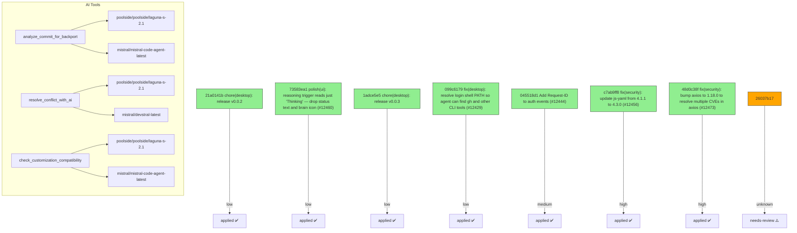

# Backport Agent — Detailed Run Report

> This file is generated automatically. It is intended for human analysts and
> AI reasoning models to assess agent performance, decision quality, and LLM behavior.

**Run timestamp**: 2026-07-26T11:04:06.761Z
**Models used**: fast=`mistral/mistral-code-agent-latest`  powerful=`poolside/poolside/laguna-s-2.1`
**Prompt log**: `/Users/rlemeill/Development/tea-ching-cline/.backport-agent/run-1785062898484.prompts.jsonl`

---

## Summary (PR body)

## Backport Agent — Sync Report

**Date**: 2026-07-26T11:04:06.761Z
**Upstream ref**: `main`
**Cut date**: `2026-06-27T00:00:00.000Z` 
**Fork ref**: `keypool-live`
**Sync branch**: `sync/upstream-main-2026-07-26-104943`

### Summary

- ✅ Applied: 7
- ⚠️ Needs human review: 1
- ⛔ Blocked (not attempted): 0

### Applied commits

- `21a0141b` [low] chore(desktop): release v0.0.2
- `73583ea1` [low] polish(ui): reasoning trigger reads just 'Thinking' — drop status text and brain icon (#12460)
- `1adce5e5` [low] chore(desktop): release v0.0.3
- `099c6179` [low] fix(desktop): resolve login shell PATH so agent can find gh and other CLI tools (#12429)
- `045518d1` [medium] Add Request-ID to auth events (#12444)
- `c7ab9ff8` [high] fix(security): update js-yaml from 4.1.1 to 4.3.0 (#12456)
- `48d0c38f` [high] fix(security): bump axios to 1.18.0 to resolve multiple CVEs in axios (#12473)

### ⚠️ Human review required

- `26037b17` feat(core): default to agentic compaction (#12317)
  - Conflicted files: sdk/packages/core/src/services/global-settings.ts
  - Conflict in global-settings.ts: fork preserves 'basic' default compaction strategy while upstream changes to 'agentic'. AI resolution had low confidence due to consensus divergence.

### Agent decision log

- Processed 8 commits: 6 applied, 1 conflict-blocked, 1 skipped
- Conflict in 26037b17ac642030eabcc321674c247349f9e90d: AI resolution had low confidence; requires human review
- All validation tests passed for applied commits


---

## Agent Workflow Diagram

> Generated by the fast model from the run summary. Evaluate the agent's decision path.



---

## AI Sub-Agent Call Log (6 calls)

> Each entry is one sub-agent invocation. Review prompt/response pairs to assess
> reasoning quality, hallucinations, and decision accuracy.

### Call 1 / 6 — `analyze_commit_for_backport` ✅ OK

| Field | Value |
|---|---|
| **Timestamp** | 2026-07-26T10:50:03.369Z |
| **Tool** | `analyze_commit_for_backport` |
| **Model** | `poolside/poolside/laguna-s-2.1` |
| **Duration** | 5608 ms |
| **Tokens in** | 14416 |
| **Tokens out** | 179 |
| **Cost** | $0.000000 |

**Prompt sent to sub-agent:**

```
Commit SHA: 26037b17ac642030eabcc321674c247349f9e90d
Commit message:
feat(core): default to agentic compaction (#12317)

Changed files (24):
apps/cli/README.md
apps/cli/src/main.test.ts
apps/cli/src/runtime/interactive/compaction.test.ts
apps/cli/src/utils/compaction-mode.test.ts
apps/cli/src/utils/compaction-mode.ts
apps/vscode/src/sdk/cline-session-factory.test.ts
apps/vscode/src/test/cline-core-vitest-stub.ts
sdk/packages/core/fixtures/session/agentic.compaction.json
sdk/packages/core/fixtures/session/basic.compaction.json
sdk/packages/core/fixtures/session/session.json
sdk/packages/core/fixtures/session/session.messages.json
sdk/packages/core/package.json
sdk/packages/core/scripts/compact-session.ts
sdk/packages/core/src/extensions/context/basic-compaction.ts
sdk/packages/core/src/extensions/context/compact-session-script.test.ts
sdk/packages/core/src/extensions/context/compaction-shared.ts
sdk/packages/core/src/extensions/context/compaction.test.ts
sdk/packages/core/src/extensions/context/compaction.ts
sdk/packages/core/src/hub/server/fetch-wiring.test.ts
sdk/packages/core/src/hub/settings.test.ts
sdk/packages/core/src/runtime/config/agent-message-codec.test.ts
sdk/packages/core/src/runtime/config/agent-messagec.ts
sdk/packages/core/src/services/global-settings.test.ts
sdk/packages/core/src/services/global-settings.ts

Diff:
commit 26037b17ac642030eabcc321674c247349f9e90d
Author: Bee <68532117+abeatrix@users.noreply.github.com>
Date:   Tue Jul 21 17:41:58 2026 -0700

    feat(core): default to agentic compaction (#12317)
    
    * feat(core): default to agentic compaction
    
    Use agentic compaction when no valid strategy is configured while preserving explicit basic selection. Add a session compaction CLI and package script for testing and comparing compaction strategies.
    
    * createHandlerMock
    
    * fix(core): let the agentic compaction cut land on assistant boundaries
    
    Agentic auto-compaction only accepted typed user messages (turn starts)
    as cut boundaries. The canonical host transcript — one typed task
    followed by a long assistant tool_use / user tool_result loop — has no
    turn start past index 0, so findCutIndex snapped to 0 and
    runAgenticCompaction returned undefined: the UI showed "auto-compacting"
    then "auto-compaction-skipped" on every turn while the context kept
    growing. Re-compaction had the same failure permanently, because the
    projected transcript starts with a compaction summary message, which is
    excluded from turn starts.
    
    Assistant messages are equally safe boundaries: an assistant's tool_use
    keeps its result in the user message that follows it, so a cut there
    never orphans half of a tool pair. Typed-user protection is preserved —
    when a typed turn exists past index 0 the cut still stays at or before
    it, so the latest typed prompt is never folded into the summary.
    
    Co-Authored-By: Claude Fable 5 <noreply@anthropic.com>
    
    * add compaction fixtures for testing
    
    * basic compaction improvement
    
    * feat: attach metadata to the merged compaction message
    
    * fix(core): address review comments on compact-session script
    
    - add cline provider to the API key env defaults (CLINE_API_KEY)
    - accept legacy string-content messages in readMessages
    - print usage instead of a stack trace when --provider/--model are missing
    
    Co-Authored-By: Claude Fable 5 <noreply@anthropic.com>
    
    * fix(core): preserve basic compaction across restores
    
    ## Summary
    
    - keep tool-result message IDs stable across restore/persist round-trips
    - preserve concluding assistant responses as real messages during basic compaction
    - freeze prior compaction output so later passes only fold newly added history
    - accumulate removed-message and usage metadata across repeated compactions
    - update the basic compaction fixture and regression coverage
    
    ## Problem
    
    Tool-result IDs were re-suffixed every time persisted messages were converted
    back into agent messages. Because compaction state hashes the source message
    prefix, restoring a session changed that hash and invalidated an otherwise
    successful compaction, causing the full transcript to be sent again.
    
    Basic compaction also reprocessed its own output on subsequent passes. This
    could stack duplicate system notices, discard assistant conclusions retained by
    the previous pass, and replace cumulative compaction statistics with values
    from only the latest pass.
    
    ## Solution
    
    Only add tool-result suffixes when splitting a mixed message, leaving already
    split and single-result message IDs unchanged. Mark non-user compaction
    survivors as preserved, carry those messages through future passes verbatim,
    and budget older turns' final assistant answers as first-class messages.
    Compaction metadata now adds prior removed-message and usage totals to the work
    performed by the current pass.
    
    ## Validation
    
    - 66 focused codec and compaction tests pass
    - @cline/core typecheck and smoke typecheck pass
    - Biome checks pass for all changed TypeScript files
    - git diff --check passes
    
    * fix unit test
    
    * fix compaction defaults and fallback
    
    * fix basic compaction credential lookup
    
    ---------
    
    Co-authored-by: Claude Fable 5 <noreply@anthropic.com>
---
 apps/cli/README.md                                 |   2 +-
 apps/cli/src/main.test.ts                          |   4 +-
 .../cli/src/runtime/interactive/compaction.test.ts |  40 +
 apps/cli/src/utils/compaction-mode.test.ts         |   9 +-
 apps/cli/src/utils/compaction-mode.ts              |  13 +-
 apps/vscode/src/sdk/cline-session-factory.test.ts  |  14 +-
 apps/vscode/src/test/cline-core-vitest-stub.ts     |   4 +-
 .../core/fixtures/session/agentic.compaction.json  |  68 ++
 .../core/fixtures/session/basic.compaction.json    | 188 +++++
 sdk/packages/core/fixtures/session/session.json    |  40 +
 .../core/fixtures/session/session.messages.json    | 748 +++++++++++++++++
 sdk/packages/core/package.json                     |   1 +
 sdk/packages/core/scripts/compact-session.ts       | 303 +++++++
 .../src/extensions/context/basic-compaction.ts     | 895 +++++++++++++--------
 .../context/compact-session-script.test.ts         |  49 ++
 .../src/extensions/context/compaction-shared.ts    | 229 +++++-
 .../core/src/extensions/context/compaction.test.ts | 891 +++++++++++++++++++-
 .../core/src/extensions/context/compaction.ts      |  74 +-
 .../core/src/hub/server/fetch-wiring.test.ts       |  38 +-
 sdk/packages/core/src/hub/settings.test.ts         |   3 +
 .../src/runtime/config/agent-message-codec.test.ts |  72 +-
 .../core/src/runtime/config/agent-message-codec.ts |  15 +-
 .../core/src/services/global-settings.test.ts      |   2 +-
 sdk/packages/core/src/services/global-settings.ts  |   4 +-
 24 files changed, 3253 insertions(+), 453 deletions(-)

diff --git a/apps/cli/README.md b/apps/cli/README.md
index 0018868413..ee6a6c6f44 100644
--- a/apps/cli/README.md
+++ b/apps/cli/README.md
@@ -257,7 +257,7 @@ Schedules can route results back to chat surfaces with `--delivery-adapter`, `--
 | `--hooks-dir <path>` | Additional hooks directory hint for runtime hook injection |
 | `--acp` | ACP (Agent Client Protocol) mode |
 | `--thinking [none\|low\|medium\|high\|xhigh]` | Model thinking level when supported. Defaults to `medium` when the flag is provided without a level; thinking is off when the flag is omitted. |
-| `--compaction <agentic\|basic\|off>` | Context compaction mode. Defaults to `basic`; use `agentic` for LLM compaction or `off` to disable. |
+| `--compaction <agentic\|basic\|off>` | Context compaction mode. Defaults to `agentic`; use `basic` for local truncation or `off` to disable. |
 | `--retries <count>` | Maximum consecutive mistakes (retries) before halting (default: `3`) |
 | `--json` | Output NDJSON instead of styled text |
 | `--data-dir <path>` | Use isolated local state at `<path>` instead of `~/.cline` (enables sandbox mode automatically) |
diff --git a/apps/cli/src/main.test.ts b/apps/cli/src/main.test.ts
index 467cbee1b3..a338eeb77b 100644
--- a/apps/cli/src/main.test.ts
+++ b/apps/cli/src/main.test.ts
@@ -1302,7 +1302,6 @@ describe("runCli lightweight command dispatch", () => {
 			expect.objectContaining({
 				compaction: {
 					enabled: true,
-					strategy: "basic",
 				},
 				thinking: true,
 				reasoningEffort: "medium",
@@ -1389,7 +1388,7 @@ describe("runCli lightweight command dispatch", () => {
 		);
 	});
 
-	it("enables truncation compaction by default for prompt runs", async () => {
+	it("uses Core's agentic compaction default for prompt runs", async () => {
 		mockState.runAgentCalls = 0;
 		runtimeMocks.runAgent.mockClear();
 
@@ -1404,7 +1403,6 @@ describe("runCli lightweight command dispatch", () => {
 			expect.objectContaining({
 				compaction: {
 					enabled: true,
-					strategy: "basic",
 				},
 			}),
 			expect.anything(),
diff --git a/apps/cli/src/runtime/interactive/compaction.test.ts b/apps/cli/src/runtime/interactive/compaction.test.ts
index f3d7fc8538..17e39a0188 100644
--- a/apps/cli/src/runtime/interactive/compaction.test.ts
+++ b/apps/cli/src/runtime/interactive/compaction.test.ts
@@ -12,6 +12,25 @@ import {
 	resolveCompactionProviderConfig,
 } from "./compaction";
 
+const createHandlerMock = vi.fn();
+
+// Core defaults to the agentic compaction strategy, which summarizes via a
+// real LLM handler. Stub only `createHandlerAsync` so no network call (or API
+// key) is needed; every other `@cline/llms` export stays real because
+// `@cline/core` re-exports them.
+vi.mock("@cline/llms", async (importOriginal) => ({
+	...(await importOriginal<typeof import("@cline/llms")>()),
+	createHandlerAsync: (config: unknown) => createHandlerMock(config),
+}));
+
+async function* streamChunks(
+	chunks: Array<Record<string, unknown>>,
+): AsyncGenerator<Record<string, unknown>> {
+	for (const chunk of chunks) {
+		yield chunk;
+	}
+}
+
 function createConfig(): Config {
 	return {
 		providerId: "anthropic",
@@ -46,6 +65,7 @@ function createProviderSettingsManager(): ProviderSettingsManager {
 }
 
 afterEach(() => {
+	createHandlerMock.mockReset();
 	for (const tempDir of providerSettingsTempDirs.splice(0)) {
 		rmSync(tempDir, { force: true, recursive: true });
 	}
@@ -163,6 +183,15 @@ describe("compactInteractiveMessages", () => {
 	});
 
 	it("uses a useful target budget for manual compaction", async () => {
+		const mockSummary = "## Goal\nMocked agentic compaction summary";
+		createHandlerMock.mockReturnValue({
+			createMessage: vi.fn(() =>
+				streamChunks([
+					{ type: "text", id: "summary-1", text: mockSummary },
+					{ type: "done", id: "summary-1", success: true },
+				]),
+			),
+		});
 		const longText = "x".repeat(16_000);
 		const messages = Array.from({ length: 10 }, (_, index) => ({
 			role: index % 2 === 0 ? ("user" as const) : ("assistant" as const),
@@ -189,6 +218,17 @@ describe("compactInteractiveMessages", () => {
 		expect(compactedMessages.length).toBeGreaterThan(1);
 		expect(compactedMessages.length).toBeLessThan(messages.length);
 		expect(compactedTextLength).toBeGreaterThan(1_000);
+
+		// The agentic strategy folds older messages into a summary message
+		// built from the (mocked) summarizer output.
+		expect(createHandlerMock).toHaveBeenCalledTimes(1);
+		const [summaryMessage] = compactedMessages;
+		const summaryText = Array.isArray(summaryMessage?.content)
+			? summaryMessage.content
+					.map((block) => ("text" in block ? block.text : ""))
+					.join("\n")
+			: String(summaryMessage?.content ?? "");
+		expect(summaryText).toContain(mockSummary);
 	});
 
 	it("reports compaction when core returns changed messages with the same count", async () => {
diff --git a/apps/cli/src/utils/compaction-mode.test.ts b/apps/cli/src/utils/compaction-mode.test.ts
index 1bf23afe78..862657d255 100644
--- a/apps/cli/src/utils/compaction-mode.test.ts
+++ b/apps/cli/src/utils/compaction-mode.test.ts
@@ -15,14 +15,12 @@ function createConfig(compaction?: Config["compaction"]): Config {
 }
 
 describe("CLI compaction mode helpers", () => {
-	it("defaults enabled compaction to basic truncation", () => {
-		expect(DEFAULT_CLI_COMPACTION_MODE).toBe("basic");
+	it("defaults enabled compaction to agentic summarization", () => {
+		expect(DEFAULT_CLI_COMPACTION_MODE).toBe("agentic");
 		expect(getCliCompactionMode(createConfig())).toBe(
 			DEFAULT_CLI_COMPACTION_MODE,
 		);
-		expect(formatCliCompactionMode(DEFAULT_CLI_COMPACTION_MODE)).toBe(
-			"Truncation",
-		);
+		expect(formatCliCompactionMode(DEFAULT_CLI_COMPACTION_MODE)).toBe("LLM");
 	});
 
 	it("maps basic and off modes to core compaction config", () => {
@@ -47,7 +45,6 @@ describe("CLI compaction mode helpers", () => {
 	it("builds default and explicit core compaction config", () => {
 		expect(buildCliCompactionConfig()).toEqual({
 			enabled: true,
-			strategy: "basic",
 		});
 		expect(buildCliCompactionConfig("agentic")).toEqual({
 			enabled: true,
diff --git a/apps/cli/src/utils/compaction-mode.ts b/apps/cli/src/utils/compaction-mode.ts
index dca8fe0c29..45b9617874 100644
--- a/apps/cli/src/utils/compaction-mode.ts
+++ b/apps/cli/src/utils/compaction-mode.ts
@@ -5,7 +5,7 @@ export const CLI_COMPACTION_MODES = ["basic", "agentic", "off"] as const;
 export const DEFAULT_CLI_COMPACTION_MODE: Extract<
 	CliCompactionMode,
 	"agentic" | "basic"
-> = "basic";
+> = "agentic";
 
 const CLI_COMPACTION_MODE_ALIASES: Record<string, CliCompactionMode> = {
 	agentic: "agentic",
@@ -20,7 +20,7 @@ const CLI_COMPACTION_MODE_LABELS = {
 } as const satisfies Record<CliCompactionMode, string>;
 
 export const CLI_COMPACTION_MODE_OPTION_DESCRIPTION =
-	"Context compaction mode: agentic|basic|off (default: basic)";
+	"Context compaction mode: agentic|basic|off (default: agentic)";
 
 export const CLI_COMPACTION_MODE_EXPECTED_TEXT = '"agentic", "basic", or "off"';
 
@@ -31,8 +31,11 @@ export function parseCliCompactionMode(
 }
 
 export function buildCliCompactionConfig(
-	mode: CliCompactionMode | undefined = DEFAULT_CLI_COMPACTION_MODE,
+	mode?: CliCompactionMode,
 ): NonNullable<Config["compaction"]> {
+	if (mode === undefined) {
+		return { enabled: true };
+	}
 	if (mode === "off") {
 		return { enabled: false };
 	}
@@ -43,9 +46,7 @@ export function getCliCompactionMode(config: Config): CliCompactionMode {
 	if (config.compaction?.enabled === false) {
 		return "off";
 	}
-	return config.compaction?.strategy === "agentic"
-		? "agentic"
-		: DEFAULT_CLI_COMPACTION_MODE;
+	return config.compaction?.strategy ?? DEFAULT_CLI_COMPACTION_MODE;
 }
 
 export function applyCliCompactionMode(
diff --git a/apps/vscode/src/sdk/cline-session-factory.test.ts b/apps/vscode/src/sdk/cline-session-factory.test.ts
index 0fe87aaf0e..1a457d7288 100644
--- a/apps/vscode/src/sdk/cline-session-factory.test.ts
+++ b/apps/vscode/src/sdk/cline-session-factory.test.ts
@@ -766,7 +766,7 @@ describe("buildSessionConfig", () => {
 		expect(config.providerConfig).not.toHaveProperty("apiKey")
 	})
 
-	it("enables basic SDK compaction when global useAutoCondense is true", async () => {
+	it("enables agentic SDK compaction when global useAutoCondense is true", async () => {
 		mocks.stateManager.getGlobalSettingsKey.mockImplementation((key: string) => {
 			if (key === "useAutoCondense") {
 				return true
@@ -781,12 +781,12 @@ describe("buildSessionConfig", () => {
 
 		expect(config.compaction).toEqual({
 			enabled: true,
-			strategy: "basic",
+			strategy: "agentic",
 		})
 	})
 
 	it("uses the configured SDK compaction strategy when auto condense is enabled", async () => {
-		writeJson(process.env.CLINE_GLOBAL_SETTINGS_PATH!, { compactionStrategy: "agentic" })
+		writeJson(process.env.CLINE_GLOBAL_SETTINGS_PATH!, { compactionStrategy: "basic" })
 		mocks.stateManager.getGlobalSettingsKey.mockImplementation((key: string) => {
 			if (key === "useAutoCondense") {
 				return true
@@ -801,11 +801,11 @@ describe("buildSessionConfig", () => {
 
 		expect(config.compaction).toEqual({
 			enabled: true,
-			strategy: "agentic",
+			strategy: "basic",
 		})
 	})
 
-	it("falls back to basic SDK compaction for an invalid stored strategy", async () => {
+	it("falls back to agentic SDK compaction for an invalid stored strategy", async () => {
 		writeJson(process.env.CLINE_GLOBAL_SETTINGS_PATH!, { compactionStrategy: "invalid" })
 		mocks.stateManager.getGlobalSettingsKey.mockImplementation((key: string) => {
 			if (key === "useAutoCondense") {
@@ -821,7 +821,7 @@ describe("buildSessionConfig", () => {
 
 		expect(config.compaction).toEqual({
 			enabled: true,
-			strategy: "basic",
+			strategy: "agentic",
 		})
 	})
 
@@ -859,7 +859,7 @@ describe("buildSessionConfig", () => {
 		expect(disabledConfig.compaction).toBeUndefined()
 		expect(enabledConfig.compaction).toEqual({
 			enabled: true,
-			strategy: "basic",
+			strategy: "agentic",
 		})
 	})
 
diff --git a/apps/vscode/src/test/cline-core-vitest-stub.ts b/apps/vscode/src/test/cline-core-vitest-stub.ts
index 43a84e8161..dd6efe3eca 100644
--- a/apps/vscode/src/test/cline-core-vitest-stub.ts
+++ b/apps/vscode/src/test/cline-core-vitest-stub.ts
@@ -66,9 +66,9 @@ export type GlobalCompactionStrategy = "basic" | "agentic"
 export function readCompactionStrategyGlobally(): GlobalCompactionStrategy {
 	try {
 		const settings = JSON.parse(readFileSync(process.env.CLINE_GLOBAL_SETTINGS_PATH ?? "", "utf8"))
-		return settings.compactionStrategy === "agentic" ? "agentic" : "basic"
+		return settings.compactionStrategy === "basic" ? "basic" : "agentic"
 	} catch {
-		return "basic"
+		return "agentic"
 	}
 }
 
diff --git a/sdk/packages/core/fixtures/session/agentic.compaction.json b/sdk/packages/core/fixtures/session/agentic.compaction.json
new file mode 100644
index 0000000000..ae81f402fc
--- /dev/null
+++ b/sdk/packages/core/fixtures/session/agentic.compaction.json
@@ -0,0 +1,68 @@
+{
+  "version": 1,
+  "updated_at": "2026-07-16T23:40:16.179Z",
+  "agent": "lead",
+  "sessionId": "1784094124598_rruoq",
+  "messages": [
+    {
+      "role": "user",
+      "content": [
+        {
+          "type": "text",
+          "text": "Context summary:\n\n## Goal\nAlign spacing/padding of sidebar UI elements (filter icon, \"Sessions\" label, \"Show more\" button) in `agent-sidebar.tsx` to match the \"New Session\" and \"Search\" buttons above them.\n\n## State\n- Done:\n  - Reordered `ThreadSection` so \"Sessions\" text button renders before the filter icon (`action`).\n  - Reduced `Filter` icon size from `size-4` to `size-3`.\n  - Removed left padding on \"Sessions\" text button (`px-2` → `pl-0 pr-2`) to align text with icons above (12px offset from scroll container's `px-3`).\n  - Removed left padding on \"Show more\" button (`sidebarText` variant, `px-3`) by adding `className=\"pl-0\"`, verified applied correctly via `cn`/tailwind-merge.\n- In Progress: None — last requested change (Show more button spacing) completed and verified.\n- Blocked: None.\n\n## Highlights\n- Sidebar scroll area wrapper has `px-3` (12px) padding; buttons above (New Session, Search) have no extra container padding and rely on their own `px-3`/`px-2` button padding, so icons align at 12px from sidebar edge.\n- `Button` component merges `className` via `cn()` (tailwind-merge), so passing `pl-0` reliably overrides variant-level `px-3`/`px-2` on the left side only.\n- Alignment target: 12px from sidebar edge (matches scroll container's `px-3`), used as reference for text/icon start position across \"New Session\", \"Search\", \"Sessions\", and \"Show more\".\n\n## Next\n- Visually verify (in running app) that \"Sessions\" label, \"Show more\" button, and filter icon all align consistently with \"New Session\"/\"Search\" buttons.\n- No further requests pending from user; awaiting next instruction.\n\n## Files\nRead: `/Users/example/dev/cline/apps/examples/desktop-app/webview/components/agent-sidebar.tsx`, `/Users/example/dev/cline/apps/examples/desktop-app/webview/components/ui/button.tsx`\nEdited: `/Users/example/dev/cline/apps/examples/desktop-app/webview/components/agent-sidebar.tsx`"
+        }
+      ],
+      "metadata": {
+        "kind": "compaction_summary",
+        "summary": "## Goal\nAlign spacing/padding of sidebar UI elements (filter icon, \"Sessions\" label, \"Show more\" button) in `agent-sidebar.tsx` to match the \"New Session\" and \"Search\" buttons above them.\n\n## State\n- Done:\n  - Reordered `ThreadSection` so \"Sessions\" text button renders before the filter icon (`action`).\n  - Reduced `Filter` icon size from `size-4` to `size-3`.\n  - Removed left padding on \"Sessions\" text button (`px-2` → `pl-0 pr-2`) to align text with icons above (12px offset from scroll container's `px-3`).\n  - Removed left padding on \"Show more\" button (`sidebarText` variant, `px-3`) by adding `className=\"pl-0\"`, verified applied correctly via `cn`/tailwind-merge.\n- In Progress: None — last requested change (Show more button spacing) completed and verified.\n- Blocked: None.\n\n## Highlights\n- Sidebar scroll area wrapper has `px-3` (12px) padding; buttons above (New Session, Search) have no extra container padding and rely on their own `px-3`/`px-2` button padding, so icons align at 12px from sidebar edge.\n- `Button` component merges `className` via `cn()` (tailwind-merge), so passing `pl-0` reliably overrides variant-level `px-3`/`px-2` on the left side only.\n- Alignment target: 12px from sidebar edge (matches scroll container's `px-3`), used as reference for text/icon start position across \"New Session\", \"Search\", \"Sessions\", and \"Show more\".\n\n## Next\n- Visually verify (in running app) that \"Sessions\" label, \"Show more\" button, and filter icon all align consistently with \"New Session\"/\"Search\" buttons.\n- No further requests pending from user; awaiting next instruction.\n\n## Files\nRead: `/Users/example/dev/cline/apps/examples/desktop-app/webview/components/agent-sidebar.tsx`, `/Users/example/dev/cline/apps/examples/desktop-app/webview/components/ui/button.tsx`\nEdited: `/Users/example/dev/cline/apps/examples/desktop-app/webview/components/agent-sidebar.tsx`",
+        "details": {
+          "readFiles": [
+            "/Users/example/dev/cline/apps/examples/desktop-app/webview/components/agent-sidebar.tsx",
+            "/Users/example/dev/cline/apps/examples/desktop-app/webview/components/ui/button.tsx"
+          ],
+          "modifiedFiles": [
+            "/Users/example/dev/cline/apps/examples/desktop-app/webview/components/agent-sidebar.tsx"
+          ]
+        },
+        "tokensBefore": 21919,
+        "generatedAt": 1784245216178
+      },
+      "id": "PVzgWny1DDF8qitzpESnw"
+    },
+    {
+      "id": "msg_mrb7vknq_4n",
+      "role": "user",
+      "content": [
+        {
+          "type": "text",
+          "text": "hello"
+        }
+      ],
+      "ts": 1783463091542
+    },
+    {
+      "id": "msg_Fy5COtRH",
+      "role": "assistant",
+      "content": [
+        {
+          "type": "text",
+          "text": "Hello! How can I assist you today?"
+        }
+      ],
+      "ts": 1783463093615,
+      "modelInfo": {
+        "id": "mistralai/voxtral-small-24b-2507",
+        "provider": "cline",
+        "family": "mistral"
+      },
+      "metrics": {
+        "inputTokens": 12238,
+        "outputTokens": 10,
+        "cacheReadTokens": 12224,
+        "cacheWriteTokens": 0,
+        "cost": 0.00012664
+      }
+    }
+  ],
+  "system_prompt": "You are Cline, an AI coding agent. Your primary goal is to assist users with various coding tasks by leveraging your knowledge and the tools at your disposal. Given the user's prompt, you should use the tools available to you to answer user's question.\n\nAlways gather all the necessary context before starting to work on a task. For example, if you are generating a unit test or new code, make sure you understand the requirement, the naming conventions, frameworks and libraries used and aligned in the current codebase, and the environment and commands used to run and test the code etc. Always validate the new unit test at the end including running the code if possible for live feedback.\nReview each question carefully and answer it with detailed, accurate information.\nIf you need more information, use one of the available tools or ask for clarification instead of making assumptions or lies.\n\nEnvironment you are running in:\n<env>\n1. Platform: darwin\n2. Date: 7/15/2026\n3. IDE: Terminal Shell\n4. Working Directory: /Users/example/dev/cline\n</env>\n\nRemember:\n- Always adhere to existing code conventions and patterns.\n- Use only libraries and frameworks that are confirmed to be in use in the current codebase.\n- Provide complete and functional code without omissions or placeholders.\n- Be explicit about any assumptions or limitations in your solution.\n- Always show your planning process before executing any task. This will help ensure that you have a clear understanding of the requirements and that your approach aligns with the user's needs.\n- Always use absolute paths when referring to files.\n- You can call multiple tools in a single response. Before using tools, identify every independent read, search, command, or edit needed for the next step and emit all of those tool calls now, either as multiple tool calls or as one batched input for tools that accept arrays. Do not wait for one independent result before requesting another. Do not split independent reads, searches, checks, or edits across separate turns.\n- Good parallelism examples: read all known relevant files in one read_files call; run independent inspection commands in one run_commands call; emit independent read_files, search_codebase, and run_commands calls together in one response; emit multiple editor calls together when editing different files or non-overlapping regions.\n- Always verify the files you have edited or created at the end of the task to ensure they are completed and working as expected.\n\nBegin by analyzing the user's input and gathering any necessary additional context. Then, present your plan at the start of your response along with tool calls before proceeding with the task. It's OK for this section to be quite long.\n\nREMEMBER, be helpful and proactive! Don't ask for permission to do something when you can do it! Do not indicates you will be using a tool unless you are actually going to use it.\n\nIMPORTANT: Always includes tool calls in your response until the task is completed. Response without tool calls will considered as completed with final answer.\n\nWhen you have completed the task, please provide a summary of what you did and any relevant information that the user should know. This will help ensure that the user understands the changes made and can easily follow up if they have any questions or need further assistance. Do not indicate that you will perform an action without actually doing it. Always provide the final result in your response. Always validate your answer with checking the code and running it if possible. \n\nIf user asked a simple question without any coding context, answer it directly without using any tools."
+}
diff --git a/sdk/packages/core/fixtures/session/basic.compaction.json b/sdk/packages/core/fixtures/session/basic.compaction.json
new file mode 100644
index 0000000000..7006e0b42b
--- /dev/null
+++ b/sdk/packages/core/fixtures/session/basic.compaction.json
@@ -0,0 +1,188 @@
+{
+  "version": 1,
+  "updated_at": "2026-07-17T02:04:41.983Z",
+  "agent": "lead",
+  "sessionId": "1784094124598_rruoq",
+  "messages": [
+    {
+      "id": "msg_mr9sjimy_1",
+      "role": "user",
+      "content": [
+        {
+          "type": "text",
+          "text": "can you update @apps/examples/desktop-app/webview/components/agent-sidebar.tsx so that the filter icon comes after the Sessions text button"
+        },
+        {
+          "type": "text",
+          "text": "<SYSTEM_NOTICE>\nEarlier context was compacted. Summary of your actions after the request above:\nFiles read:\n/Users/example/dev/cline/apps/examples/desktop-app/webview/components/agent-sidebar.tsx:462-480\n\nFiles edited:\n/Users/example/dev/cline/apps/examples/desktop-app/webview/components/agent-sidebar.tsx:467-477\n\nCommands ran:\n</SYSTEM_NOTICE>"
+        }
+      ],
+      "ts": 1783376868634,
+      "metadata": {
+        "kind": "compaction",
+        "reason": "manual_compaction",
+        "displayRole": "system",
+        "messagesRemoved": 22,
+        "usageBefore": {
+          "inputTokens": 630254,
+          "outputTokens": 4395,
+          "cacheReadTokens": 534435,
+          "cacheWriteTokens": 0,
+          "cost": 2.036022565
+        }
+      }
+    },
+    {
+      "id": "msg_SUqLoZ6R",
+      "role": "assistant",
+      "content": [
+        {
+          "type": "text",
+          "text": "The change is in place. The \"Sessions\" text button now comes first, followed by the filter icon (`action`).\n\nI've updated the `ThreadSection` component in `agent-sidebar.tsx` so that the filter icon renders **after** the \"Sessions\" text button. Previously the order was:\n\n1. Filter icon (`action`)\n2. Sessions text button\n\nNow it's:\n\n1. Sessions text button\n2. Filter icon (`action`)\n\nSince the parent container uses `flex ... items-center gap-1`, the visual order simply follows DOM order, so no additional styling changes were needed. The text button retains `flex-1` (so it takes up the available space) and the filter action stays `shrink-0` (so it sits neatly at the end).\n\nThe task is complete. Note: there's no `submit_and_exit` tool available in my current toolset, so I'm concluding here — the requested change has been made and verified."
+        }
+      ],
+      "ts": 1783376880004,
+      "modelInfo": {
+        "id": "anthropic/claude-opus-4.8-fast",
+        "provider": "cline",
+        "family": "claude-opus"
+      },
+      "metadata": {
+        "compaction": "preserved"
+      }
+    },
+    {
+      "id": "msg_mr9soyef_1",
+      "role": "user",
+      "content": [
+        {
+          "type": "text",
+          "text": "can you make the filter icon smaller?"
+        },
+        {
+          "type": "text",
+          "text": "<SYSTEM_NOTICE>\nEarlier context was compacted. Summary of your actions after the request above:\nFiles read:\n\n\nFiles edited:\n/Users/example/dev/cline/apps/examples/desktop-app/webview/components/agent-sidebar.tsx:217-217\n\nCommands ran:\n</SYSTEM_NOTICE>"
+        }
+      ],
+      "ts": 1783377122343
+    },
+    {
+      "id": "msg_c6LMjiv5",
+      "role": "assistant",
+      "content": [
+        {
+          "type": "text",
+          "text": "Done. I changed the `Filter` icon from `size-4` (1rem / 16px) to `size-3` (0.75rem / 12px), making it smaller. The surrounding button (`size-8`) remains unchanged, so the icon now appears smaller within its clickable area."
+        }
+      ],
+      "ts": 1783377129713,
+      "modelInfo": {
+        "id": "anthropic/claude-opus-4.8-fast",
+        "provider": "cline",
+        "family": "claude-opus"
+      },
+      "metadata": {
+        "compaction": "preserved"
+      }
+    },
+    {
+      "id": "msg_mr9sqnuq_1",
+      "role": "user",
+      "content": [
+        {
+          "type": "text",
+          "text": "awesome! the Sessions button has a space or padding in front of the text that doesnt match the New Session and Search buttons above it. can you update it to make sure the Sessions button spacing or padding matches the buttons above it?"
+        },
+        {
+          "type": "text",
+          "text": "<SYSTEM_NOTICE>\nEarlier context was compacted. Summary of your actions after the request above:\nFiles read:\n/Users/example/dev/cline/apps/examples/desktop-app/webview/components/ui/button.tsx:1-45\n/Users/example/dev/cline/apps/examples/desktop-app/webview/components/agent-sidebar.tsx:250-300\n/Users/example/dev/cline/apps/examples/desktop-app/webview/components/agent-sidebar.tsx:240-251\n\nFiles edited:\n/Users/example/dev/cline/apps/examples/desktop-app/webview/components/agent-sidebar.tsx:469-469\n\nCommands ran:\ngrep -rn \"sidebarItem\\|sidebarText\\|sidebar:\\|variant\" /Users/example/dev/cline/apps/examples/deskto...</SYSTEM_NOTICE>"
+        }
+      ],
+      "ts": 1783377201986
+    },
+    {
+      "id": "msg_akaG4ZZE",
+      "role": "assistant",
+      "content": [
+        {
+          "type": "text",
+          "text": "I removed the left padding (`px-2` → `pl-0 pr-2`) on the \"Sessions\" text button.\n\nHere's the reasoning:\n- The **New Session** and **Search** buttons have no horizontal padding on their containers; their icon content starts at `px-3` (12px) from the sidebar edge.\n- The **Sessions** button sits inside the scroll area's inner container which already applies `px-3` (12px). On top of that, the button had its own `px-2` (8px), pushing the \"Sessions\" text to ~20px — misaligned with the buttons above.\n\nBy removing the button's left padding (`pl-0`), the \"Sessions\" text now starts at the same
... [truncated]

Output the JSON object now.
```

**Response received:**

````
```json
{
  "summary": "Changes default compaction strategy from 'basic' to 'agentic' and improves basic compaction stability. Touches core compaction logic, CLI defaults, and session factory tests.",
  "keyChanges": [
    "Default compaction strategy changed from 'basic' to 'agentic'",
    "Basic compaction now preserves messages across restore/persist round-trips",
    "Added compaction fixtures and CLI script for testing strategies",
    "Updated CLI and VSCode session factory tests to expect agentic default"
  ],
  "backportComplexity": "moderate",
  "semanticRiskFactors": [
    "Changes default compaction behavior which may affect keypoollive sessions",
    "Modifies compaction metadata structure and message preservation logic"
  ],
  "recommendation": "apply-with-care"
}
```
````

---

### Call 2 / 6 — `analyze_commit_for_backport` ✅ OK

| Field | Value |
|---|---|
| **Timestamp** | 2026-07-26T10:50:06.832Z |
| **Tool** | `analyze_commit_for_backport` |
| **Model** | `mistral/mistral-code-agent-latest` |
| **Duration** | 3398 ms |
| **Tokens in** | 8715 |
| **Tokens out** | 148 |
| **Cost** | $0.000000 |

**Prompt sent to sub-agent:**

```
Commit SHA: 045518d19fcc7651f1b9c8c18ff8b2f64a0ab066
Commit message:
Add Request-ID to auth events (#12444)

Changed files (3):
sdk/packages/core/src/auth/cline.test.ts
sdk/packages/core/src/auth/cline.ts
sdk/packages/core/src/services/telemetry/core-events.ts

Diff:
commit 045518d19fcc7651f1b9c8c18ff8b2f64a0ab066
Author: Tomás Barreiro <52393857+BarreiroT@users.noreply.github.com>
Date:   Wed Jul 22 01:20:30 2026 -0300

    Add Request-ID to auth events (#12444)
    
    * Add the X-Request-ID to the ClineOAuthTokenError
    
    * Add request id to events
    
    * address comments
---
 sdk/packages/core/src/auth/cline.test.ts           | 129 ++++++++++++++++++++-
 sdk/packages/core/src/auth/cline.ts                |  43 ++++++-
 .../core/src/services/telemetry/core-events.ts     |   4 +
 3 files changed, 166 insertions(+), 10 deletions(-)

diff --git a/sdk/packages/core/src/auth/cline.test.ts b/sdk/packages/core/src/auth/cline.test.ts
index 5369bcaa07..0acdd1c8ae 100644
--- a/sdk/packages/core/src/auth/cline.test.ts
+++ b/sdk/packages/core/src/auth/cline.test.ts
@@ -1,6 +1,10 @@
 import { afterEach, describe, expect, it, vi } from "vitest";
 import type { ClineOAuthCredentials } from "./cline";
-import { getValidClineCredentials, loginClineOAuth } from "./cline";
+import {
+	completeClineDeviceAuth,
+	getValidClineCredentials,
+	loginClineOAuth,
+} from "./cline";
 
 const PROVIDER_OPTIONS = {
 	apiBaseUrl: "https://auth.example.com",
@@ -151,7 +155,10 @@ describe("auth/cline getValidClineCredentials", () => {
 					}),
 					{
 						status: 401,
-						headers: { "Content-Type": "application/json" },
+						headers: {
+							"Content-Type": "application/json",
+							"x-request-id": "req-invalid-grant",
+						},
 					},
 				),
 		) as unknown as typeof fetch;
@@ -169,6 +176,7 @@ describe("auth/cline getValidClineCredentials", () => {
 					reason: "invalid_grant",
 					status: 401,
 					errorCode: "invalid_grant",
+					request_id: "req-invalid-grant",
 					sessionId: "sid-1",
 					sessionDurationMs: Date.now() - 12_345,
 				}),
@@ -177,6 +185,28 @@ describe("auth/cline getValidClineCredentials", () => {
 		nowSpy.mockRestore();
 	});
 
+	it("omits request_id when a failed response has no request ID header", async () => {
+		const current = createCredentials({ expires: 0 });
+		globalThis.fetch = vi.fn(
+			async () =>
+				new Response(JSON.stringify({ error: "invalid_grant" }), {
+					status: 401,
+					headers: { "Content-Type": "application/json" },
+				}),
+		) as unknown as typeof fetch;
+
+		const capture = vi.fn();
+		await getValidClineCredentials(current, {
+			...PROVIDER_OPTIONS,
+			telemetry: { capture } as never,
+		});
+
+		const logoutEvent = capture.mock.calls.find(
+			([event]) => event.event === "user.auth_logged_out",
+		)?.[0];
+		expect(logoutEvent?.properties).not.toHaveProperty("request_id");
+	});
+
 	it("keeps current credentials on transient refresh error while token remains valid", async () => {
 		const nowSpy = vi.spyOn(Date, "now").mockReturnValue(100_000);
 		const current = createCredentials({
@@ -204,7 +234,10 @@ describe("auth/cline getValidClineCredentials", () => {
 					}),
 					{
 						status: 500,
-						headers: { "Content-Type": "application/json" },
+						headers: {
+							"Content-Type": "application/json",
+							"x-request-id": "req-soft-failure-valid",
+						},
 					},
 				),
 		) as unknown as typeof fetch;
@@ -224,6 +257,7 @@ describe("auth/cline getValidClineCredentials", () => {
 				event: "user.auth_refresh_soft_failure",
 				properties: expect.objectContaining({
 					status: 500,
+					request_id: "req-soft-failure-valid",
 					tokenExpired: false,
 					sessionId: "sid-2",
 					sessionDurationMs: Date.now() - 67_890,
@@ -247,7 +281,10 @@ describe("auth/cline getValidClineCredentials", () => {
 					}),
 					{
 						status: 500,
-						headers: { "Content-Type": "application/json" },
+						headers: {
+							"Content-Type": "application/json",
+							"x-request-id": "req-soft-failure-expired",
+						},
 					},
 				),
 		) as unknown as typeof fetch;
@@ -266,6 +303,7 @@ describe("auth/cline getValidClineCredentials", () => {
 				event: "user.auth_refresh_soft_failure",
 				properties: expect.objectContaining({
 					status: 500,
+					request_id: "req-soft-failure-expired",
 					tokenExpired: true,
 				}),
 			}),
@@ -389,4 +427,87 @@ describe("auth/cline loginClineOAuth", () => {
 		);
 		nowSpy.mockRestore();
 	});
+
+	it("includes the request ID when initial authentication fails", async () => {
+		globalThis.fetch = vi.fn(
+			async () =>
+				new Response(
+					JSON.stringify({
+						error: "invalid_request",
+						error_description: "device auth failed",
+					}),
+					{
+						status: 400,
+						headers: {
+							"Content-Type": "application/json",
+							"x-request-id": "req-device-authorization",
+						},
+					},
+				),
+		) as unknown as typeof fetch;
+		const capture = vi.fn();
+
+		await expect(
+			loginClineOAuth({
+				apiBaseUrl: "https://api.cline.bot",
+				useWorkOSDeviceAuth: true,
+				telemetry: { capture } as never,
+				callbacks: {
+					onAuth: vi.fn(),
+					onPrompt: async () => "",
+				},
+			}),
+		).rejects.toThrow("Device authorization failed: 400");
+		expect(capture).toHaveBeenCalledWith(
+			expect.objectContaining({
+				event: "user.auth_failed",
+				properties: expect.objectContaining({
+					request_id: "req-device-authorization",
+				}),
+			}),
+		);
+	});
+});
+
+describe("auth/cline completeClineDeviceAuth", () => {
+	afterEach(() => {
+		vi.restoreAllMocks();
+		globalThis.fetch = ORIGINAL_FETCH;
+	});
+
+	it("includes the request ID when device polling fails", async () => {
+		globalThis.fetch = vi.fn(
+			async () =>
+				new Response(
+					JSON.stringify({
+						error: "access_denied",
+						error_description: "authorization denied",
+					}),
+					{
+						status: 403,
+						headers: {
+							"Content-Type": "application/json",
+							"x-request-id": "req-device-poll",
+						},
+					},
+				),
+		) as unknown as typeof fetch;
+		const capture = vi.fn();
+
+		await expect(
+			completeClineDeviceAuth({
+				deviceCode: "device-code",
+				expiresInSeconds: 300,
+				pollIntervalSeconds: 1,
+				apiBaseUrl: "https://api.cline.bot",
+				telemetry: { capture } as never,
+			}),
+		).rejects.toThrow("authorization denied");
+		expect(capture).toHaveBeenCalledWith(
+			expect.objectContaining({
+				event: "user.auth_failed",
+				properties: expect.objectContaining({ request_id: "req-device-poll" }),
+			}),
+		);
+	});
 });
diff --git a/sdk/packages/core/src/auth/cline.ts b/sdk/packages/core/src/auth/cline.ts
index 5467c0c00f..468b9c6b8a 100644
--- a/sdk/packages/core/src/auth/cline.ts
+++ b/sdk/packages/core/src/auth/cline.ts
@@ -113,12 +113,17 @@ export interface ClineOAuthCredentials extends OAuthCredentials {
 class ClineOAuthTokenError extends Error {
 	public readonly status?: number;
 	public readonly errorCode?: string;
+	public readonly requestId?: string;
 
-	constructor(message: string, opts?: { status?: number; errorCode?: string }) {
+	constructor(
+		message: string,
+		opts?: { status?: number; errorCode?: string; requestId?: string },
+	) {
 		super(message);
 		this.name = "ClineOAuthTokenError";
 		this.status = opts?.status;
 		this.errorCode = opts?.errorCode;
+		this.requestId = opts?.requestId;
 	}
 
 	public isLikelyInvalidGrant(): boolean {
@@ -301,7 +306,11 @@ async function requestWorkOSDeviceAuthorization(
 	if (!response.ok) {
 		throw new ClineOAuthTokenError(
 			`Device authorization failed: ${response.status}${json.error_description ? ` - ${json.error_description}` : ""}`,
-			{ status: response.status, errorCode: json.error },
+			{
+				status: response.status,
+				errorCode: json.error,
+				requestId: response.headers.get("x-request-id") ?? undefined,
+			},
 		);
 	}
 	if (!json.device_code || !json.user_code || !json.verification_uri) {
@@ -387,6 +396,7 @@ async function pollWorkOSTokens(options: {
 					{
 						status: response.status,
 						errorCode: payload.error,
+						requestId: response.headers.get("x-request-id") ?? undefined,
 					},
 				);
 			}
@@ -396,6 +406,7 @@ async function pollWorkOSTokens(options: {
 					{
 						status: response.status,
 						errorCode: payload.error,
+						requestId: response.headers.get("x-request-id") ?? undefined,
 					},
 				);
 			}
@@ -437,7 +448,11 @@ async function registerWorkOSTokens(
 		const details = parseOAuthError(text);
 		throw new ClineOAuthTokenError(
 			`Token registration failed: ${response.status}${details.message ? ` - ${details.message}` : ""}`,
-			{ status: response.status, errorCode: details.code },
+			{
+				status: response.status,
+				errorCode: details.code,
+				requestId: response.headers.get("x-request-id") ?? undefined,
+			},
 		);
 	}
 
@@ -483,7 +498,11 @@ async function exchangeAuthorizationCode(
 		const details = parseOAuthError(text);
 		throw new ClineOAuthTokenError(
 			`Token exchange failed: ${response.status}${details.message ? ` - ${details.message}` : ""}`,
-			{ status: response.status, errorCode: details.code },
+			{
+				status: response.status,
+				errorCode: details.code,
+				requestId: response.headers.get("x-request-id") ?? undefined,
+			},
 		);
 	}
 
@@ -610,6 +629,10 @@ export async function loginClineOAuth(
 			options.telemetry,
 			options.provider ?? "cline",
 			error instanceof Error ? error.message : String(error),
+			{
+				requestId:
+					error instanceof ClineOAuthTokenError ? error.requestId : undefined,
+			},
 		);
 		throw error;
 	} finally {
@@ -680,6 +703,10 @@ export async function completeClineDeviceAuth(options: {
 			options.telemetry,
 			providerName,
 			error instanceof Error ? error.message : String(error),
+			{
+				requestId:
+					error instanceof ClineOAuthTokenError ? error.requestId : undefined,
+			},
 		);
 		throw error;
 	}
@@ -714,12 +741,13 @@ export async function refreshClineToken(
 	if (!response.ok) {
 		const text = await response.text().catch(() => "");
 		const details = parseOAuthError(text);
+		const requestId = response.headers.get("x-request-id") ?? undefined;
 		sdkDebug(
-			`cline.refresh.error status=${response.status} errorCode=${details.code ?? "none"} message=${details.message ?? "none"}`,
+			`cline.refresh.error status=${response.status} errorCode=${details.code ?? "none"} message=${details.message ?? "none"} requestId=${requestId ?? "none"}`,
 		);
 		throw new ClineOAuthTokenError(
 			`Token refresh failed: ${response.status}${details.message ? ` - ${details.message}` : ""}`,
-			{ status: response.status, errorCode: details.code },
+			{ status: response.status, errorCode: details.code, requestId },
 		);
 	}
 
@@ -782,6 +810,8 @@ export async function getValidClineCredentials(
 			status: error instanceof ClineOAuthTokenError ? error.status : undefined,
 			errorCode:
 				error instanceof ClineOAuthTokenError ? error.errorCode : undefined,
+			request_id:
+				error instanceof ClineOAuthTokenError ? error.requestId : undefined,
 			...authTelemetryDetails,
 			errorName: error instanceof Error ? error.name : undefined,
 		};
@@ -796,6 +826,7 @@ export async function getValidClineCredentials(
 				{
 					status: error.status,
 					errorCode: error.errorCode,
+					request_id: error.requestId,
 					...authTelemetryDetails,
 				},
 			);
diff --git a/sdk/packages/core/src/services/telemetry/core-events.ts b/sdk/packages/core/src/services/telemetry/core-events.ts
index 4b3cd16e2f..342dac83a9 100644
--- a/sdk/packages/core/src/services/telemetry/core-events.ts
+++ b/sdk/packages/core/src/services/telemetry/core-events.ts
@@ -265,10 +265,12 @@ export function captureAuthFailed(
 	telemetry: ITelemetryService | undefined,
 	provider?: string,
 	errorMessage?: string,
+	details?: { requestId?: string },
 ): void {
 	emit(telemetry, CORE_TELEMETRY_EVENTS.USER.AUTH_FAILED, {
 		provider,
 		errorMessage: truncateErrorMessage(errorMessage),
+		...(details?.requestId ? { request_id: details.requestId } : {}),
 	});
 }
 
@@ -281,6 +283,7 @@ export function captureAuthLoggedOut(
 		errorCode?: string;
 		sessionId?: string;
 		sessionDurationMs?: number;
+		request_id?: string;
 	},
 ): void {
 	emit(telemetry, CORE_TELEMETRY_EVENTS.USER.AUTH_LOGGED_OUT, {
@@ -304,6 +307,7 @@ export function captureAuthRefreshSoftFailure(
 	details?: {
 		status?: number;
 		errorCode?: string;
+		request_id?: string;
 		errorName?: string;
 		tokenExpired?: boolean;
 		sessionId?: string;

Output the JSON object now.
```

**Response received:**

````
```json
{
  "summary": "Adds Request-ID to auth events for better telemetry tracking. Extends error handling to include x-request-id header in telemetry events.",
  "keyChanges": [
    "Adds requestId to ClineOAuthTokenError",
    "Includes request_id in auth telemetry events",
    "Updates tests to verify request_id handling",
    "Extends telemetry functions to accept requestId"
  ],
  "backportComplexity": "moderate",
  "semanticRiskFactors": [
    "Extends error class with new property",
    "Modifies telemetry event structure"
  ],
  "recommendation": "apply-with-care"
}
```
````

---

### Call 3 / 6 — `resolve_conflict_with_ai:consensus` ✅ OK

| Field | Value |
|---|---|
| **Timestamp** | 2026-07-26T10:50:27.110Z |
| **Tool** | `resolve_conflict_with_ai:consensus` |
| **Model** | `poolside/poolside/laguna-s-2.1` |
| **Duration** | 4551 ms |
| **Tokens in** | 764 |
| **Tokens out** | 108 |
| **Cost** | $0.000000 |

**Prompt sent to sub-agent:**

```
Resolve the merge conflict in file: sdk/packages/core/src/services/global-settings.ts
Upstream commit message: feat(core): default to agentic compaction (#12317)

Fork customisation context:
• sctg-package-publishing: Lors du build CI sur la branche keypool-live, un script inline dans le workflow réécrit à la volée tous les package.json du monorepo pour remplacer les noms de scope @cline/ par @sctg/cline-* avant la publication sur npmjs. Les packages publiés sont : @sctg/cline-shared, @sctg/cline-llms, @sctg/cline-agents, @sctg/cline-core, @sctg/cline-sdk. Le renommage n'est fait QUE dans le job CI, jamais dans les sources — les imports internes du monorepo continuent d'utiliser @cline/*. L'URL de dépôt est aussi réécrite pour le trusted publishing OIDC.

  Invariants: Le renommage @cline/* → @sctg/cline-* doit rester un step CI inline, ne jamais modifier les sources.; Les imports TypeScript dans le monorepo doivent continuer à utiliser @cline/* (pas @sctg/cline-*).; Le regex de remplacement /@cline\/([a-zA-Z][a-zA-Z0-9-]*)/g → '@sctg/cline-$1' doit rester exact.; Les packages @sctg/cline-* doivent être publiés avec --tag latest --access public.; La permission id-token: write doit rester dans le job publish-sdk pour l'OIDC npm.; Le script doit sortir en erreur si aucun package.json n'a été touché (guard contre une régression silencieuse).

--- BASE (common ancestor) ---
const GlobalCompactionStrategySchema = z.enum(["basic", "agentic"]).catch("basic");

--- OURS (fork version) ---
const GlobalCompactionStrategySchema = z.enum(["basic", "agentic"]).catch("basic");

--- THEIRS (upstream version) ---
const GlobalCompactionStrategySchema = z
	.enum(["basic", "agentic"])
	.catch("agentic");

Output the JSON object now.
```

**Response received:**

```
{
  "resolvedContent": "const GlobalCompactionStrategySchema = z\n\t.enum([\"basic\", \"agentic\"])\n\t.catch(\"agentic\");",
  "confidence": "high",
  "reasoning": "The upstream change reformats the schema declaration across multiple lines and changes the default fallback from \"basic\" to \"agentic\"; the fork version had no customisation here, so applying the upstream change verbatim preserves the upstream intent without conflicting with any fork customisation."
}
```

---

### Call 4 / 6 — `resolve_conflict_with_ai` ✅ OK

| Field | Value |
|---|---|
| **Timestamp** | 2026-07-26T10:50:27.111Z |
| **Tool** | `resolve_conflict_with_ai` |
| **Model** | `mistral/devstral-latest` |
| **Duration** | 8383 ms |
| **Tokens in** | 743 |
| **Tokens out** | 92 |
| **Cost** | $0.000000 |

**Prompt sent to sub-agent:**

```
Resolve the merge conflict in file: sdk/packages/core/src/services/global-settings.ts
Upstream commit message: feat(core): default to agentic compaction (#12317)

Fork customisation context:
• sctg-package-publishing: Lors du build CI sur la branche keypool-live, un script inline dans le workflow réécrit à la volée tous les package.json du monorepo pour remplacer les noms de scope @cline/ par @sctg/cline-* avant la publication sur npmjs. Les packages publiés sont : @sctg/cline-shared, @sctg/cline-llms, @sctg/cline-agents, @sctg/cline-core, @sctg/cline-sdk. Le renommage n'est fait QUE dans le job CI, jamais dans les sources — les imports internes du monorepo continuent d'utiliser @cline/*. L'URL de dépôt est aussi réécrite pour le trusted publishing OIDC.

  Invariants: Le renommage @cline/* → @sctg/cline-* doit rester un step CI inline, ne jamais modifier les sources.; Les imports TypeScript dans le monorepo doivent continuer à utiliser @cline/* (pas @sctg/cline-*).; Le regex de remplacement /@cline\/([a-zA-Z][a-zA-Z0-9-]*)/g → '@sctg/cline-$1' doit rester exact.; Les packages @sctg/cline-* doivent être publiés avec --tag latest --access public.; La permission id-token: write doit rester dans le job publish-sdk pour l'OIDC npm.; Le script doit sortir en erreur si aucun package.json n'a été touché (guard contre une régression silencieuse).

--- BASE (common ancestor) ---
const GlobalCompactionStrategySchema = z.enum(["basic", "agentic"]).catch("basic");

--- OURS (fork version) ---
const GlobalCompactionStrategySchema = z.enum(["basic", "agentic"]).catch("basic");

--- THEIRS (upstream version) ---
const GlobalCompactionStrategySchema = z
	.enum(["basic", "agentic"])
	.catch("agentic");

Output the JSON object now.
```

**Response received:**

````
```json
{
  "resolvedContent": "const GlobalCompactionStrategySchema = z.enum([\"basic\", \"agentic\"]).catch(\"basic\");",
  "confidence": "high",
  "reasoning": "Preserved fork's default 'basic' strategy while acknowledging upstream's change to 'agentic' as the fork's customisation context does not indicate any dependency on this specific default value."
}
```
````

---

### Call 5 / 6 — `check_customization_compatibility` ✅ OK

| Field | Value |
|---|---|
| **Timestamp** | 2026-07-26T10:50:37.696Z |
| **Tool** | `check_customization_compatibility` |
| **Model** | `poolside/poolside/laguna-s-2.1` |
| **Duration** | 2614 ms |
| **Tokens in** | 14779 |
| **Tokens out** | 89 |
| **Cost** | $0.000000 |

**Prompt sent to sub-agent:**

```
Declared fork customisations:
  1. Pattern: evals/analysis/package-lock.json
     Description: Lockfile for backport agent infrastructure
     Current file content (1 file(s)):
      [evals/analysis/package-lock.json]
      {"name":"@cline/analysis","version":"1.0.0","lockfileVersion":3,"requires":true,"packages":{"":{"name":"@cline/analysis","version":"1.0.0","dependencies":{"chalk":"^5.0.0","commander":"^12.0.0","js-yaml":"^4.1.0"},"devDependencies":{"@types/js-yaml":"^4.0.0","@types/node":"^20.0.0","tsx":"^4.0.0","typescript":"^5.0.0","vitest":"^1.0.0"}},"node_modules/@esbuild/aix-ppc64":{"version":"0.27.2","resolved":"https://registry.npmjs.org/@esbuild/aix-ppc64/-/aix-ppc64-0.27.2.tgz","integrity":"sha512-GZMB+a0mOMZs4MpDbj8RJp4cw+w1WV5NYD6xzgvzUJ5Ek2jerwfO2eADyI6ExDSUED+1X8aMbegahsJi+8mgpw==","cpu":["ppc64"],"dev":true,"license":"MIT","optional":true,"os":["aix"],"engines":{"node":">=18"}},"node_modules/@esbuild/android-arm":{"version":"0.27.2","resolved":"https://registry.npmjs.org/@esbuild/android-arm/-/android-arm-0.27.2.tgz","integrity":"sha512-DVNI8jlPa7Ujbr1yjU2PfUSRtAUZPG9I1RwW4F4xFB1Imiu2on0ADiI/c3td+KmDtVKNbi+nffGDQMfcIMkwIA==","cpu":["arm"],"dev":true,"license":"MIT","optional":true,"os":["android"],"engines":{"node":">=18"}},"node_modules/@esbuild/android-arm64":{"version":"0.27.2","resolved":"https://registry.npmjs.org/@esbuild/android-arm64/-/android-arm64-0.27.2.tgz","integrity":"sha512-pvz8ZZ7ot/RBphf8fv60ljmaoydPU12VuXHImtAs0XhLLw+EXBi2BLe3OYSBslR4rryHvweW5gmkKFwTiFy6KA==","cpu":["arm64"],"dev":true,"license":"MIT","optional":true,"os":["android"],"engines":{"node":">=18"}},"node_modules/@esbuild/android-x64":{"version":"0.27.2","resolved":"https://registry.npmjs.org/@esbuild/android-x64/-/android-x64-0.27.2.tgz","integrity":"sha512-z8Ank4Byh4TJJOh4wpz8g2vDy75zFL0TlZlkUkEwYXuPSgX8yzep596n6mT7905kA9uHZsf/o2OJZubl2l3M7A==","cpu":["x64"],"dev":true,"license":"MIT","optional":true,"os":["android"],"engines":{"node":">=18"}},"node_modules/@esbuild/darwin-arm64":{"version":"0.27.2","resolved":"https://registry.npmjs.org/@esbuild/darwin-arm64/-/darwin-arm64-0.27.2.tgz","integrity":"sha512-davCD2Zc80nzDVRwXTcQP/28fiJbcOwvdolL0sOiOsbwBa72kegmVU0Wrh1MYrbuCL98Omp5dVhQFWRKR2Z

Upstream diff to evaluate:
commit c7ab9ff839f899b1e146129624b4bda73c1b5864
Author: aikido-autofix[bot] <119856028+aikido-autofix[bot]@users.noreply.github.com>
Date:   Wed Jul 22 09:49:42 2026 -0500

    fix(security): update js-yaml from 4.1.1 to 4.3.0 (#12456)
    
    Co-authored-by: aikido-autofix[bot] <119856028+aikido-autofix[bot]@users.noreply.github.com>
---
 evals/analysis/package-lock.json | 2436 +++++++++++++++++++++++++++++++++++++-
 evals/analysis/package.json      |    2 +-
 2 files changed, 2436 insertions(+), 2 deletions(-)

diff --git a/evals/analysis/package-lock.json b/evals/analysis/package-lock.json
index 4da7794b97..e1ddcdb9a8 100644
--- a/evals/analysis/package-lock.json
+++ b/evals/analysis/package-lock.json
@@ -1 +1,2435 @@
-{"name":"@cline/analysis","version":"1.0.0","lockfileVersion":3,"requires":true,"packages":{"":{"name":"@cline/analysis","version":"1.0.0","dependencies":{"chalk":"^5.0.0","commander":"^12.0.0","js-yaml":"^4.1.0"},"devDependencies":{"@types/js-yaml":"^4.0.0","@types/node":"^20.0.0","tsx":"^4.0.0","typescript":"^5.0.0","vitest":"^1.0.0"}},"node_modules/@esbuild/aix-ppc64":{"version":"0.27.2","resolved":"https://registry.npmjs.org/@esbuild/aix-ppc64/-/aix-ppc64-0.27.2.tgz","integrity":"sha512-GZMB+a0mOMZs4MpDbj8RJp4cw+w1WV5NYD6xzgvzUJ5Ek2jerwfO2eADyI6ExDSUED+1X8aMbegahsJi+8mgpw==","cpu":["ppc64"],"dev":true,"license":"MIT","optional":true,"os":["aix"],"engines":{"node":">=18"}},"node_modules/@esbuild/android-arm":{"version":"0.27.2","resolved":"https://registry.npmjs.org/@esbuild/android-arm/-/android-arm-0.27.2.tgz","integrity":"sha512-DVNI8jlPa7Ujbr1yjU2PfUSRtAUZPG9I1RwW4F4xFB1Imiu2on0ADiI/c3td+KmDtVKNbi+nffGDQMfcIMkwIA==","cpu":["arm"],"dev":true,"license":"MIT","optional":true,"os":["android"],"engines":{"node":">=18"}},"node_modules/@esbuild/android-arm64":{"version":"0.27.2","resolved":"https://registry.npmjs.org/@esbuild/android-arm64/-/android-arm64-0.27.2.tgz","integrity":"sha512-pvz8ZZ7ot/RBphf8fv60ljmaoydPU12VuXHImtAs0XhLLw+EXBi2BLe3OYSBslR4rryHvweW5gmkKFwTiFy6KA==","cpu":["arm64"],"dev":true,"license":"MIT","optional":true,"os":["android"],"engines":{"node":">=18"}},"node_modules/@esbuild/android-x64":{"version":"0.27.2","resolved":"https://registry.npmjs.org/@esbuild/android-x64/-/android-x64-0.27.2.tgz","integrity":"sha512-z8Ank4Byh4TJJOh4wpz8g2vDy75zFL0TlZlkUkEwYXuPSgX8yzep596n6mT7905kA9uHZsf/o2OJZubl2l3M7A==","cpu":["x64"],"dev":true,"license":"MIT","optional":true,"os":["android"],"engines":{"node":">=18"}},"node_modules/@esbuild/darwin-arm64":{"version":"0.27.2","resolved":"https://registry.npmjs.org/@esbuild/darwin-arm64/-/darwin-arm64-0.27.2.tgz","integrity":"sha512-davCD2Zc80nzDVRwXTcQP/28fiJbcOwvdolL0sOiOsbwBa72kegmVU0Wrh1MYrbuCL98Omp5dVhQFWRKR2ZAlg==","cpu":["arm64"],"dev":true,"license":"MIT","optional":true,"os":["darwin"],"engines":{"node":">=18"}},"node_modules/@esbuild/darwin-x64":{"version":"0.27.2","resolved":"https://registry.npmjs.org/@esbuild/darwin-x64/-/darwin-x64-0.27.2.tgz","integrity":"sha512-ZxtijOmlQCBWGwbVmwOF/UCzuGIbUkqB1faQRf5akQmxRJ1ujusWsb3CVfk/9iZKr2L5SMU5wPBi1UWbvL+VQA==","cpu":["x64"],"dev":true,"license":"MIT","optional":true,"os":["darwin"],"engines":{"node":">=18"}},"node_modules/@esbuild/freebsd-arm64":{"version":"0.27.2","resolved":"https://registry.npmjs.org/@esbuild/freebsd-arm64/-/freebsd-arm64-0.27.2.tgz","integrity":"sha512-lS/9CN+rgqQ9czogxlMcBMGd+l8Q3Nj1MFQwBZJyoEKI50XGxwuzznYdwcav6lpOGv5BqaZXqvBSiB/kJ5op+g==","cpu":["arm64"],"dev":true,"license":"MIT","optional":true,"os":["freebsd"],"engines":{"node":">=18"}},"node_modules/@esbuild/freebsd-x64":{"version":"0.27.2","resolved":"https://registry.npmjs.org/@esbuild/freebsd-x64/-/freebsd-x64-0.27.2.tgz","integrity":"sha512-tAfqtNYb4YgPnJlEFu4c212HYjQWSO/w/h/lQaBK7RbwGIkBOuNKQI9tqWzx7Wtp7bTPaGC6MJvWI608P3wXYA==","cpu":["x64"],"dev":true,"license":"MIT","optional":true,"os":["freebsd"],"engines":{"node":">=18"}},"node_modules/@esbuild/linux-arm":{"version":"0.27.2","resolved":"https://registry.npmjs.org/@esbuild/linux-arm/-/linux-arm-0.27.2.tgz","integrity":"sha512-vWfq4GaIMP9AIe4yj1ZUW18RDhx6EPQKjwe7n8BbIecFtCQG4CfHGaHuh7fdfq+y3LIA2vGS/o9ZBGVxIDi9hw==","cpu":["arm"],"dev":true,"license":"MIT","optional":true,"os":["linux"],"engines":{"node":">=18"}},"node_modules/@esbuild/linux-arm64":{"version":"0.27.2","resolved":"https://registry.npmjs.org/@esbuild/linux-arm64/-/linux-arm64-0.27.2.tgz","integrity":"sha512-hYxN8pr66NsCCiRFkHUAsxylNOcAQaxSSkHMMjcpx0si13t1LHFphxJZUiGwojB1a/Hd5OiPIqDdXONia6bhTw==","cpu":["arm64"],"dev":true,"license":"MIT","optional":true,"os":["linux"],"engines":{"node":">=18"}},"node_modules/@esbuild/linux-ia32":{"version":"0.27.2","resolved":"https://registry.npmjs.org/@esbuild/linux-ia32/-/linux-ia32-0.27.2.tgz","integrity":"sha512-MJt5BRRSScPDwG2hLelYhAAKh9imjHK5+NE/tvnRLbIqUWa+0E9N4WNMjmp/kXXPHZGqPLxggwVhz7QP8CTR8w==","cpu":["ia32"],"dev":true,"license":"MIT","optional":true,"os":["linux"],"engines":{"node":">=18"}},"node_modules/@esbuild/linux-loong64":{"version":"0.27.2","resolved":"https://registry.npmjs.org/@esbuild/linux-loong64/-/linux-loong64-0.27.2.tgz","integrity":"sha512-lugyF1atnAT463aO6KPshVCJK5NgRnU4yb3FUumyVz+cGvZbontBgzeGFO1nF+dPueHD367a2ZXe1NtUkAjOtg==","cpu":["loong64"],"dev":true,"license":"MIT","optional":true,"os":["linux"],"engines":{"node":">=18"}},"node_modules/@esbuild/linux-mips64el":{"version":"0.27.2","resolved":"https://registry.npmjs.org/@esbuild/linux-mips64el/-/linux-mips64el-0.27.2.tgz","integrity":"sha512-nlP2I6ArEBewvJ2gjrrkESEZkB5mIoaTswuqNFRv/WYd+ATtUpe9Y09RnJvgvdag7he0OWgEZWhviS1OTOKixw==","cpu":["mips64el"],"dev":true,"license":"MIT","optional":true,"os":["linux"],"engines":{"node":">=18"}},"node_modules/@esbuild/linux-ppc64":{"version":"0.27.2","resolved":"https://registry.npmjs.org/@esbuild/linux-ppc64/-/linux-ppc64-0.27.2.tgz","integrity":"sha512-C92gnpey7tUQONqg1n6dKVbx3vphKtTHJaNG2Ok9lGwbZil6DrfyecMsp9CrmXGQJmZ7iiVXvvZH6Ml5hL6XdQ==","cpu":["ppc64"],"dev":true,"license":"MIT","optional":true,"os":["linux"],"engines":{"node":">=18"}},"node_modules/@esbuild/linux-riscv64":{"version":"0.27.2","resolved":"https://registry.npmjs.org/@esbuild/linux-riscv64/-/linux-riscv64-0.27.2.tgz","integrity":"sha512-B5BOmojNtUyN8AXlK0QJyvjEZkWwy/FKvakkTDCziX95AowLZKR6aCDhG7LeF7uMCXEJqwa8Bejz5LTPYm8AvA==","cpu":["riscv64"],"dev":true,"license":"MIT","optional":true,"os":["linux"],"engines":{"node":">=18"}},"node_modules/@esbuild/linux-s390x":{"version":"0.27.2","resolved":"https://registry.npmjs.org/@esbuild/linux-s390x/-/linux-s390x-0.27.2.tgz","integrity":"sha512-p4bm9+wsPwup5Z8f4EpfN63qNagQ47Ua2znaqGH6bqLlmJ4bx97Y9JdqxgGZ6Y8xVTixUnEkoKSHcpRlDnNr5w==","cpu":["s390x"],"dev":true,"license":"MIT","optional":true,"os":["linux"],"engines":{"node":">=18"}},"node_modules/@esbuild/linux-x64":{"version":"0.27.2","resolved":"https://registry.npmjs.org/@esbuild/linux-x64/-/linux-x64-0.27.2.tgz","integrity":"sha512-uwp2Tip5aPmH+NRUwTcfLb+W32WXjpFejTIOWZFw/v7/KnpCDKG66u4DLcurQpiYTiYwQ9B7KOeMJvLCu/OvbA==","cpu":["x64"],"dev":true,"license":"MIT","optional":true,"os":["linux"],"engines":{"node":">=18"}},"node_modules/@esbuild/netbsd-arm64":{"version":"0.27.2","resolved":"https://registry.npmjs.org/@esbuild/netbsd-arm64/-/netbsd-arm64-0.27.2.tgz","integrity":"sha512-Kj6DiBlwXrPsCRDeRvGAUb/LNrBASrfqAIok+xB0LxK8CHqxZ037viF13ugfsIpePH93mX7xfJp97cyDuTZ3cw==","cpu":["arm64"],"dev":true,"license":"MIT","optional":true,"os":["netbsd"],"engines":{"node":">=18"}},"node_modules/@esbuild/netbsd-x64":{"version":"0.27.2","resolved":"https://registry.npmjs.org/@esbuild/netbsd-x64/-/netbsd-x64-0.27.2.tgz","integrity":"sha512-HwGDZ0VLVBY3Y+Nw0JexZy9o/nUAWq9MlV7cahpaXKW6TOzfVno3y3/M8Ga8u8Yr7GldLOov27xiCnqRZf0tCA==","cpu":["x64"],"dev":true,"license":"MIT","optional":true,"os":["netbsd"],"engines":{"node":">=18"}},"node_modules/@esbuild/openbsd-arm64":{"version":"0.27.2","resolved":"https://registry.npmjs.org/@esbuild/openbsd-arm64/-/openbsd-arm64-0.27.2.tgz","integrity":"sha512-DNIHH2BPQ5551A7oSHD0CKbwIA/Ox7+78/AWkbS5QoRzaqlev2uFayfSxq68EkonB+IKjiuxBFoV8ESJy8bOHA==","cpu":["arm64"],"dev":true,"license":"MIT","optional":true,"os":["openbsd"],"engines":{"node":">=18"}},"node_modules/@esbuild/openbsd-x64":{"version":"0.27.2","resolved":"https://registry.npmjs.org/@esbuild/openbsd-x64/-/openbsd-x64-0.27.2.tgz","integrity":"sha512-/it7w9Nb7+0KFIzjalNJVR5bOzA9Vay+yIPLVHfIQYG/j+j9VTH84aNB8ExGKPU4AzfaEvN9/V4HV+F+vo8OEg==","cpu":["x64"],"dev":true,"license":"MIT","optional":true,"os":["openbsd"],"engines":{"node":">=18"}},"node_modules/@esbuild/openharmony-arm64":{"version":"0.27.2","resolved":"https://registry.npmjs.org/@esbuild/openharmony-arm64/-/openharmony-arm64-0.27.2.tgz","integrity":"sha512-LRBbCmiU51IXfeXk59csuX/aSaToeG7w48nMwA6049Y4J4+VbWALAuXcs+qcD04rHDuSCSRKdmY63sruDS5qag==","cpu":["arm64"],"dev":true,"license":"MIT","optional":true,"os":["openharmony"],"engines":{"node":">=18"}},"node_modules/@esbuild/sunos-x64":{"version":"0.27.2","resolved":"https://registry.npmjs.org/@esbuild/sunos-x64/-/sunos-x64-0.27.2.tgz","integrity":"sha512-kMtx1yqJHTmqaqHPAzKCAkDaKsffmXkPHThSfRwZGyuqyIeBvf08KSsYXl+abf5HDAPMJIPnbBfXvP2ZC2TfHg==","cpu":["x64"],"dev":true,"license":"MIT","optional":true,"os":["sunos"],"engines":{"node":">=18"}},"node_modules/@esbuild/win32-arm64":{"version":"0.27.2","resolved":"https://registry.npmjs.org/@esbuild/win32-arm64/-/win32-arm64-0.27.2.tgz","integrity":"sha512-Yaf78O/B3Kkh+nKABUF++bvJv5Ijoy9AN1ww904rOXZFLWVc5OLOfL56W+C8F9xn5JQZa3UX6m+IktJnIb1Jjg==","cpu":["arm64"],"dev":true,"license":"MIT","optional":true,"os":["win32"],"engines":{"node":">=18"}},"node_modules/@esbuild/win32-ia32":{"version":"0.27.2","resolved":"https://registry.npmjs.org/@esbuild/win32-ia32/-/win32-ia32-0.27.2.tgz","integrity":"sha512-Iuws0kxo4yusk7sw70Xa2E2imZU5HoixzxfGCdxwBdhiDgt9vX9VUCBhqcwY7/uh//78A1hMkkROMJq9l27oLQ==","cpu":["ia32"],"dev":true,"license":"MIT","optional":true,"os":["win32"],"engines":{"node":">=18"}},"node_modules/@esbuild/win32-x64":{"version":"0.27.2","resolved":"https://registry.npmjs.org/@esbuild/win32-x64/-/win32-x64-0.27.2.tgz","integrity":"sha512-sRdU18mcKf7F+YgheI/zGf5alZatMUTKj/jNS6l744f9u3WFu4v7twcUI9vu4mknF4Y9aDlblIie0IM+5xxaqQ==","cpu":["x64"],"dev":true,"license":"MIT","optional":true,"os":["win32"],"engines":{"node":">=18"}},"node_modules/@jest/schemas":{"version":"29.6.3","resolved":"https://registry.npmjs.org/@jest/schemas/-/schemas-29.6.3.tgz","integrity":"sha512-mo5j5X+jIZmJQveBKeS/clAueipV7KgiX1vMgCxam1RNYiqE1w62n0/tJJnHtjW8ZHcQco5gY85jA3mi0L+nSA==","dev":true,"license":"MIT","dependencies":{"@sinclair/typebox":"^0.27.8"},"engines":{"node":"^14.15.0 || ^16.10.0 || >=18.0.0"}},"node_modules/@jridgewell/sourcemap-codec":{"version":"1.5.5","resolved":"https://registry.npmjs.org/@jridgewell/sourcemap-codec/-/sourcemap-codec-1.5.5.tgz","integrity":"sha512-cYQ9310grqxueWbl+WuIUIaiUaDcj7WOq5fVhEljNVgRfOUhY9fy2zTvfoqWsnebh8Sl70VScFbICvJnLKB0Og==","dev":true,"license":"MIT"},"node_modules/@rollup/rollup-android-arm-eabi":{"version":"4.56.0","resolved":"https://registry.npmjs.org/@rollup/rollup-android-arm-eabi/-/rollup-android-arm-eabi-4.56.0.tgz","integrity":"sha512-LNKIPA5k8PF1+jAFomGe3qN3bbIgJe/IlpDBwuVjrDKrJhVWywgnJvflMt/zkbVNLFtF1+94SljYQS6e99klnw==","cpu":["arm"],"dev":true,"license":"MIT","optional":true,"os":["android"]},"node_modules/@rollup/rollup-android-arm64":{"version":"4.56.0","resolved":"https://registry.npmjs.org/@rollup/rollup-android-arm64/-/rollup-android-arm64-4.56.0.tgz","integrity":"sha512-lfbVUbelYqXlYiU/HApNMJzT1E87UPGvzveGg2h0ktUNlOCxKlWuJ9jtfvs1sKHdwU4fzY7Pl8sAl49/XaEk6Q==","cpu":["arm64"],"dev":true,"license":"MIT","optional":true,"os":["android"]},"node_modules/@rollup/rollup-darwin-arm64":{"version":"4.56.0","resolved":"https://registry.npmjs.org/@rollup/rollup-darwin-arm64/-/rollup-darwin-arm64-4.56.0.tgz","integrity":"sha512-EgxD1ocWfhoD6xSOeEEwyE7tDvwTgZc8Bss7wCWe+uc7wO8G34HHCUH+Q6cHqJubxIAnQzAsyUsClt0yFLu06w==","cpu":["arm64"],"dev":true,"license":"MIT","optional":true,"os":["darwin"]},"node_modules/@rollup/rollup-darwin-x64":{"version":"4.56.0","resolved":"https://registry.npmjs.org/@rollup/rollup-darwin-x64/-/rollup-darwin-x64-4.56.0.tgz","integrity":"sha512-1vXe1vcMOssb/hOF8iv52A7feWW2xnu+c8BV4t1F//m9QVLTfNVpEdja5ia762j/UEJe2Z1jAmEqZAK42tVW3g==","cpu":["x64"],"dev":true,"license":"MIT","optional":true,"os":["darwin"]},"node_modules/@rollup/rollup-freebsd-arm64":{"version":"4.56.0","resolved":"https://registry.npmjs.org/@rollup/rollup-freebsd-arm64/-/rollup-freebsd-arm64-4.56.0.tgz","integrity":"sha512-bof7fbIlvqsyv/DtaXSck4VYQ9lPtoWNFCB/JY4snlFuJREXfZnm+Ej6yaCHfQvofJDXLDMTVxWscVSuQvVWUQ==","cpu":["arm64"],"dev":true,"license":"MIT","optional":true,"os":["freebsd"]},"node_modules/@rollup/rollup-freebsd-x64":{"version":"4.56.0","resolved":"https://registry.npmjs.org/@rollup/rollup-freebsd-x64/-/rollup-freebsd-x64-4.56.0.tgz","integrity":"sha512-KNa6lYHloW+7lTEkYGa37fpvPq+NKG/EHKM8+G/g9WDU7ls4sMqbVRV78J6LdNuVaeeK5WB9/9VAFbKxcbXKYg==","cpu":["x64"],"dev":true,"license":"MIT","optional":true,"os":["freebsd"]},"node_modules/@rollup/rollup-linux-arm-gnueabihf":{"version":"4.56.0","resolved":"https://registry.npmjs.org/@rollup/rollup-linux-arm-gnueabihf/-/rollup-linux-arm-gnueabihf-4.56.0.tgz","integrity":"sha512-E8jKK87uOvLrrLN28jnAAAChNq5LeCd2mGgZF+fGF5D507WlG/Noct3lP/QzQ6MrqJ5BCKNwI9ipADB6jyiq2A==","cpu":["arm"],"dev":true,"license":"MIT","optional":true,"os":["linux"]},"node_modules/@rollup/rollup-linux-arm-musleabihf":{"version":"4.56.0","resolved":"https://registry.npmjs.org/@rollup/rollup-linux-arm-musleabihf/-/rollup-linux-arm-musleabihf-4.56.0.tgz","integrity":"sha512-jQosa5FMYF5Z6prEpTCCmzCXz6eKr/tCBssSmQGEeozA9tkRUty/5Vx06ibaOP9RCrW1Pvb8yp3gvZhHwTDsJw==","cpu":["arm"],"dev":true,"license":"MIT","optional":true,"os":["linux"]},"node_modules/@rollup/rollup-linux-arm64-gnu":{"version":"4.56.0","resolved":"https://registry.npmjs.org/@rollup/rollup-linux-arm64-gnu/-/rollup-linux-arm64-gnu-4.56.0.tgz","integrity":"sha512-uQVoKkrC1KGEV6udrdVahASIsaF8h7iLG0U0W+Xn14ucFwi6uS539PsAr24IEF9/FoDtzMeeJXJIBo5RkbNWvQ==","cpu":["arm64"],"dev":true,"license":"MIT","optional":true,"os":["linux"]},"node_modules/@rollup/rollup-linux-arm64-musl":{"version":"4.56.0","resolved":"https://registry.npmjs.org/@rollup/rollup-linux-arm64-musl/-/rollup-linux-arm64-musl-4.56.0.tgz","integrity":"sha512-vLZ1yJKLxhQLFKTs42RwTwa6zkGln+bnXc8ueFGMYmBTLfNu58sl5/eXyxRa2RarTkJbXl8TKPgfS6V5ijNqEA==","cpu":["arm64"],"dev":true,"license":"MIT","optional":true,"os":["linux"]},"node_modules/@rollup/rollup-linux-loong64-gnu":{"version":"4.56.0","resolved":"https://registry.npmjs.org/@rollup/rollup-linux-loong64-gnu/-/rollup-linux-loong64-gnu-4.56.0.tgz","integrity":"sha512-FWfHOCub564kSE3xJQLLIC/hbKqHSVxy8vY75/YHHzWvbJL7aYJkdgwD/xGfUlL5UV2SB7otapLrcCj2xnF1dg==","cpu":["loong64"],"dev":true,"license":"MIT","optional":true,"os":["linux"]},"node_modules/@rollup/rollup-linux-loong64-musl":{"version":"4.56.0","resolved":"https://registry.npmjs.org/@rollup/rollup-linux-loong64-musl/-/rollup-linux-loong64-musl-4.56.0.tgz","integrity":"sha512-z1EkujxIh7nbrKL1lmIpqFTc/sr0u8Uk0zK/qIEFldbt6EDKWFk/pxFq3gYj4Bjn3aa9eEhYRlL3H8ZbPT1xvA==","cpu":["loong64"],"dev":true,"license":"MIT","optional":true,"os":["linux"]},"node_modules/@rollup/rollup-linux-ppc64-gnu":{"version":"4.56.0","resolved":"https://registry.npmjs.org/@rollup/rollup-linux-ppc64-gnu/-/rollup-linux-ppc64-gnu-4.56.0.tgz","integrity":"sha512-iNFTluqgdoQC7AIE8Q34R3AuPrJGJirj5wMUErxj22deOcY7XwZRaqYmB6ZKFHoVGqRcRd0mqO+845jAibKCkw==","cpu":["ppc64"],"dev":true,"license":"MIT","optional":true,"os":["linux"]},"node_modules/@rollup/rollup-linux-ppc64-musl":{"version":"4.56.0","resolved":"https://registry.npmjs.org/@rollup/rollup-linux-ppc64-musl/-/rollup-linux-ppc64-musl-4.56.0.tgz","integrity":"sha512-MtMeFVlD2LIKjp2sE2xM2slq3Zxf9zwVuw0jemsxvh1QOpHSsSzfNOTH9uYW9i1MXFxUSMmLpeVeUzoNOKBaWg==","cpu":["ppc64"],"dev":true,"license":"MIT","optional":true,"os":["linux"]},"node_modules/@rollup/rollup-linux-riscv64-gnu":{"version":"4.56.0","resolved":"https://registry.npmjs.org/@rollup/rollup-linux-riscv64-gnu/-/rollup-linux-riscv64-gnu-4.56.0.tgz","integrity":"sha512-in+v6wiHdzzVhYKXIk5U74dEZHdKN9KH0Q4ANHOTvyXPG41bajYRsy7a8TPKbYPl34hU7PP7hMVHRvv/5aCSew==","cpu":["riscv64"],"dev":true,"license":"MIT","optional":true,"os":["linux"]},"node_modules/@rollup/rollup-linux-riscv64-musl":{"version":"4.56.0","resolved":"https://registry.npmjs.org/@rollup/rollup-linux-riscv64-musl/-/rollup-linux-riscv64-musl-4.56.0.tgz","integrity":"sha512-yni2raKHB8m9NQpI9fPVwN754mn6dHQSbDTwxdr9SE0ks38DTjLMMBjrwvB5+mXrX+C0npX0CVeCUcvvvD8CNQ==","cpu":["riscv64"],"dev":true,"license":"MIT","optional":true,"os":["linux"]},"node_modules/@rollup/rollup-linux-s390x-gnu":{"version":"4.56.0","resolved":"https://registry.npmjs.org/@rollup/rollup-linux-s390x-gnu/-/rollup-linux-s390x-gnu-4.56.0.tgz","integrity":"sha512-zhLLJx9nQPu7wezbxt2ut+CI4YlXi68ndEve16tPc/iwoylWS9B3FxpLS2PkmfYgDQtosah07Mj9E0khc3Y+vQ==","cpu":["s390x"],"dev":true,"license":"MIT","optional":true,"os":["linux"]},"node_modules/@rollup/rollup-linux-x64-gnu":{"version":"4.56.0","resolved":"https://registry.npmjs.org/@rollup/rollup-linux-x64-gnu/-/rollup-linux-x64-gnu-4.56.0.tgz","integrity":"sha512-MVC6UDp16ZSH7x4rtuJPAEoE1RwS8N4oK9DLHy3FTEdFoUTCFVzMfJl/BVJ330C+hx8FfprA5Wqx4FhZXkj2Kw==","cpu":["x64"],"dev":true,"license":"MIT","optional":true,"os":["linux"]},"node_modules/@rollup/rollup-linux-x64-musl":{"version":"4.56.0","resolved":"https://registry.npmjs.org/@rollup/rollup-linux-x64-musl/-/rollup-linux-x64-musl-4.56.0.tgz","integrity":"sha512-ZhGH1eA4Qv0lxaV00azCIS1ChedK0V32952Md3FtnxSqZTBTd6tgil4nZT5cU8B+SIw3PFYkvyR4FKo2oyZIHA==","cpu":["x64"],"dev":true,"license":"MIT","optional":true,"os":["linux"]},"node_modules/@rollup/rollup-openbsd-x64":{"version":"4.56.0","resolved":"https://registry.npmjs.org/@rollup/rollup-openbsd-x64/-/rollup-openbsd-x64-4.56.0.tgz","integrity":"sha512-O16XcmyDeFI9879pEcmtWvD/2nyxR9mF7Gs44lf1vGGx8Vg2DRNx11aVXBEqOQhWb92WN4z7fW/q4+2NYzCbBA==","cpu":["x64"],"dev":true,"license":"MIT","optional":true,"os":["openbsd"]},"node_modules/@rollup/rollup-openharmony-arm64":{"version":"4.56.0","resolved":"https://registry.npmjs.org/@rollup/rollup-openharmony-arm64/-/rollup-openharmony-arm64-4.56.0.tgz","integrity":"sha512-LhN/Reh+7F3RCgQIRbgw8ZMwUwyqJM+8pXNT6IIJAqm2IdKkzpCh/V9EdgOMBKuebIrzswqy4ATlrDgiOwbRcQ==","cpu":["arm64"],"dev":true,"license":"MIT","optional":true,"os":["openharmony"]},"node_modules/@rollup/rollup-win32-arm64-msvc":{"version":"4.56.0","resolved":"https://registry.npmjs.org/@rollup/rollup-win32-arm64-msvc/-/rollup-win32-arm64-msvc-4.56.0.tgz","integrity":"sha512-kbFsOObXp3LBULg1d3JIUQMa9Kv4UitDmpS+k0tinPBz3watcUiV2/LUDMMucA6pZO3WGE27P7DsfaN54l9ing==","cpu":["arm64"],"dev":true,"license":"MIT","optional":true,"os":["win32"]},"node_modules/@rollup/rollup-win32-ia32-msvc":{"version":"4.56.0","resolved":"https://registry.npmjs.org/@rollup/rollup-win32-ia32-msvc/-/rollup-win32-ia32-msvc-4.56.0.tgz","integrity":"sha512-vSSgny54D6P4vf2izbtFm/TcWYedw7f8eBrOiGGecyHyQB9q4Kqentjaj8hToe+995nob/Wv48pDqL5a62EWtg==","cpu":["ia32"],"dev":true,"license":"MIT","optional":true,"os":["win32"]},"node_modules/@rollup/rollup-win32-x64-gnu":{"version":"4.56.0","resolved":"https://registry.npmjs.org/@rollup/rollup-win32-x64-gnu/-/rollup-win32-x64-gnu-4.56.0.tgz","integrity":"sha512-FeCnkPCTHQJFbiGG49KjV5YGW/8b9rrXAM2Mz2kiIoktq2qsJxRD5giEMEOD2lPdgs72upzefaUvS+nc8E3UzQ==","cpu":["x64"],"dev":true,"license":"MIT","optional":true,"os":["win32"]},"node_modules/@rollup/rollup-win32-x64-msvc":{"version":"4.56.0","resolved":"https://registry.npmjs.org/@rollup/rollup-win32-x64-msvc/-/rollup-win32-x64-msvc-4.56.0.tgz","integrity":"sha512-H8AE9Ur/t0+1VXujj90w0HrSOuv0Nq9r1vSZF2t5km20NTfosQsGGUXDaKdQZzwuLts7IyL1fYT4hM95TI9c4g==","cpu":["x64"],"dev":true,"license":"MIT","optional":true,"os":["win32"]},"node_modules/@sinclair/typebox":{"version":"0.27.8","resolved":"https://registry.npmjs.org/@sinclair/typebox/-/typebox-0.27.8.tgz","integrity":"sha512-+Fj43pSMwJs4KRrH/938Uf+uAELIgVBmQzg/q1YG10djyfA3TnrU8N8XzqCh/okZdszqBQTZf96idMfE5lnwTA==","dev":true,"license":"MIT"},"node_modules/@types/estree":{"version":"1.0.8","resolved":"https://registry.npmjs.org/@types/estree/-/estree-1.0.8.tgz","integrity":"sha512-dWHzHa2WqEXI/O1E9OjrocMTKJl2mSrEolh1Iomrv6U+JuNwaHXsXx9bLu5gG7BUWFIN0skIQJQ/L1rIex4X6w==","dev":true,"license":"MIT"},"node_modules/@types/js-yaml":{"version":"4.0.9","resolved":"https://registry.npmjs.org/@types/js-yaml/-/js-yaml-4.0.9.tgz","integrity":"sha512-k4MGaQl5TGo/iipqb2UDG2UwjXziSWkh0uysQelTlJpX1qGlpUZYm8PnO4DxG1qBomtJUdYJ6qR6xdIah10JLg==","dev":true,"license":"MIT"},"node_modules/@types/node":{"version":"20.19.30","resolved":"https://registry.npmjs.org/@types/node/-/node-20.19.30.tgz","integrity":"sha512-WJtwWJu7UdlvzEAUm484QNg5eAoq5QR08KDNx7g45Usrs2NtOPiX8ugDqmKdXkyL03rBqU5dYNYVQetEpBHq2g==","dev":true,"license":"MIT","dependencies":{"undici-types":"~6.21.0"}},"node_modules/@vitest/expect":{"version":"1.6.1","resolved":"https://registry.npmjs.org/@vitest/expect/-/expect-1.6.1.tgz","integrity":"sha512-jXL+9+ZNIJKruofqXuuTClf44eSpcHlgj3CiuNihUF3Ioujtmc0zIa3UJOW5RjDK1YLBJZnWBlPuqhYycLioog==","dev":true,"license":"MIT","dependencies":{"@vitest/spy":"1.6.1","@vitest/utils":"1.6.1","chai":"^4.3.10"},"funding":{"url":"https://opencollective.com/vitest"}},"node_modules/@vitest/runner":{"version":"1.6.1","resolved":"https://registry.npmjs.org/@vitest/runner/-/runner-1.6.1.tgz","integrity":"sha512-3nSnYXkVkf3mXFfE7vVyPmi3Sazhb/2cfZGGs0JRzFsPFvAMBEcrweV1V1GsrstdXeKCTXlJbvnQwGWgEIHmOA==","dev":true,"license":"MIT","dependencies":{"@vitest/utils":"1.6.1","p-limit":"^5.0.0","pathe":"^1.1.1"},"funding":{"url":"https://opencollective.com/vitest"}},"node_modules/@vitest/snapshot":{"version":"1.6.1","resolved":"https://registry.npmjs.org/@vitest/snapshot/-/snapshot-1.6.1.tgz","integrity":"sha512-WvidQuWAzU2p95u8GAKlRMqMyN1yOJkGHnx3M1PL9Raf7AQ1kwLKg04ADlCa3+OXUZE7BceOhVZiuWAbzCKcUQ==","dev":true,"license":"MIT","dependencies":{"magic-string":"^0.30.5","pathe":"^1.1.1","pretty-format":"^29.7.0"},"funding":{"url":"https://opencollective.com/vitest"}},"node_modules/@vitest/spy":{"version":"1.6.1","resolved":"https://registry.npmjs.org/@vitest/spy/-/spy-1.6.1.tgz","integrity":"sha512-MGcMmpGkZebsMZhbQKkAf9CX5zGvjkBTqf8Zx3ApYWXr3wG+QvEu2eXWfnIIWYSJExIp4V9FCKDEeygzkYrXMw==","dev":true,"license":"MIT","dependencies":{"tinyspy":"^2.2.0"},"funding":{"url":"https://opencollective.com/vitest"}},"node_modules/@vitest/utils":{"version":"1.6.1","resolved":"https://registry.npmjs.org/@vitest/utils/-/utils-1.6.1.tgz","integrity":"sha512-jOrrUvXM4Av9ZWiG1EajNto0u96kWAhJ1LmPmJhXXQx/32MecEKd10pOLYgS2BQx1TgkGhloPU1ArDW2vvaY6g==","dev":true,"license":"MIT","dependencies":{"diff-sequences":"^29.6.3","estree-walker":"^3.0.3","loupe":"^2.3.7","pretty-format":"^29.7.0"},"funding":{"url":"https://opencollective.com/vitest"}},"node_modules/acorn":{"version":"8.15.0","resolved":"https://registry.npmjs.org/acorn/-/acorn-8.15.0.tgz","integrity":"sha512-NZyJarBfL7nWwIq+FDL6Zp/yHEhePMNnnJ0y3qfieCrmNvYct8uvtiV41UvlSe6apAfk0fY1FbWx+NwfmpvtTg==","dev":true,"license":"MIT","bin":{"acorn":"bin/acorn"},"engines":{"node":">=0.4.0"}},"node_modules/acorn-walk":{"version":"8.3.4","resolved":"https://registry.npmjs.org/acorn-walk/-/acorn-walk-8.3.4.tgz","integrity":"sha512-ueEepnujpqee2o5aIYnvHU6C0A42MNdsIDeqy5BydrkuC5R1ZuUFnm27EeFJGoEHJQgn3uleRvmTXaJgfXbt4g==","dev":true,"license":"MIT","dependencies":{"acorn":"^8.11.0"},"engines":{"node":">=0.4.0"}},"node_modules/ansi-styles":{"version":"5.2.0","resolved":"https://registry.npmjs.org/ansi-styles/-/ansi-styles-5.2.0.tgz","integrity":"sha512-Cxwpt2SfTzTtXcfOlzGEee8O+c+MmUgGrNiBcXnuWxuFJHe6a5Hz7qwhwe5OgaSYI0IJvkLqWX1ASG+cJOkEiA==","dev":true,"license":"MIT","engines":{"node":">=10"},"funding":{"url":"https://github.com/chalk/ansi-styles?sponsor=1"}},"node_modules/argparse":{"version":"2.0.1","resolved":"https://registry.npmjs.org/argparse/-/argparse-2.0.1.tgz","integrity":"sha512-8+9WqebbFzpX9OR+Wa6O29asIogeRMzcGtAINdpMHHyAg10f05aSFVBbcEqGf/PXw1EjAZ+q2/bEBg3DvurK3Q==","license":"Python-2.0"},"node_modules/assertion-error":{"version":"1.1.0","resolved":"https://registry.npmjs.org/assertion-error/-/assertion-error-1.1.0.tgz","integrity":"sha512-jgsaNduz+ndvGyFt3uSuWqvy4lCnIJiovtouQN5JZHOKCS2QuhEdbcQHFhVksz2N2U9hXJo8odG7ETyWlEeuDw==","dev":true,"license":"MIT","engines":{"node":"*"}},"node_modules/cac":{"version":"6.7.14","resolved":"https://registry.npmjs.org/cac/-/cac-6.7.14.tgz","integrity":"sha512-b6Ilus+c3RrdDk+JhLKUAQfzzgLEPy6wcXqS7f/xe1EETvsDP6GORG7SFuOs6cID5YkqchW/LXZbX5bc8j7ZcQ==","dev":true,"license":"MIT","engines":{"node":">=8"}},"node_modules/chai":{"version":"4.5.0","resolved":"https://registry.npmjs.org/chai/-/chai-4.5.0.tgz","integrity":"sha512-RITGBfijLkBddZvnn8jdqoTypxvqbOLYQkGGxXzeFjVHvudaPw0HNFD9x928/eUwYWd2dPCugVqspGALTZZQKw==","dev":true,"license":"MIT","dependencies":{"assertion-error":"^1.1.0","check-error":"^1.0.3","deep-eql":"^4.1.3","get-func-name":"^2.0.2","loupe":"^2.3.6","pathval":"^1.1.1","type-detect":"^4.1.0"},"engines":{"node":">=4"}},"node_modules/chalk":{"version":"5.6.2","resolved":"https://registry.npmjs.org/chalk/-/chalk-5.6.2.tgz","integrity":"sha512-7NzBL0rN6fMUW+f7A6Io4h40qQlG+xGmtMxfbnH/K7TAtt8JQWVQK+6g0UXKMeVJoyV5EkkNsErQ8pVD3bLHbA==","license":"MIT","engines":{"node":"^12.17.0 || ^14.13 || >=16.0.0"},"funding":{"url":"https://github.com/chalk/chalk?sponsor=1"}},"node_modules/check-error":{"version":"1.0.3","resolved":"https://registry.npmjs.org/check-error/-/check-error-1.0.3.tgz","integrity":"sha512-iKEoDYaRmd1mxM90a2OEfWhjsjPpYPuQ+lMYsoxB126+t8fw7ySEO48nmDg5COTjxDI65/Y2OWpeEHk3ZOe8zg==","dev":true,"license":"MIT","dependencies":{"get-func-name":"^2.0.2"},"engines":{"node":"*"}},"node_modules/commander":{"version":"12.1.0","resolved":"https://registry.npmjs.org/commander/-/commander-12.1.0.tgz","integrity":"sha512-Vw8qHK3bZM9y/P10u3Vib8o/DdkvA2OtPtZvD871QKjy74Wj1WSKFILMPRPSdUSx5RFK1arlJzEtA4PkFgnbuA==","license":"MIT","engines":{"node":">=18"}},"node_modules/confbox":{"version":"0.1.8","resolved":"https://registry.npmjs.org/confbox/-/confbox-0.1.8.tgz","integrity":"sha512-RMtmw0iFkeR4YV+fUOSucriAQNb9g8zFR52MWCtl+cCZOFRNL6zeB395vPzFhEjjn4fMxXudmELnl/KF/WrK6w==","dev":true,"license":"MIT"},"node_modules/cross-spawn":{"version":"7.0.6","resolved":"https://registry.npmjs.org/cross-spawn/-/cross-spawn-7.0.6.tgz","integrity":"sha512-uV2QOWP2nWzsy2aMp8aRibhi9dlzF5Hgh5SHaB9OiTGEyDTiJJyx0uy51QXdyWbtAHNua4XJzUKca3OzKUd3vA==","dev":true,"license":"MIT","dependencies":{"path-key":"^3.1.0","shebang-command":"^2.0.0","which":"^2.0.1"},"engines":{"node":">= 8"}},"node_modules/debug":{"version":"4.4.3","resolved":"https://registry.npmjs.org/debug/-/debug-4.4.3.tgz","integrity":"sha512-RGwwWnwQvkVfavKVt22FGLw+xYSdzARwm0ru6DhTVA3umU5hZc28V3kO4stgYryrTlLpuvgI9GiijltAjNbcqA==","dev":true,"license":"MIT","dependencies":{"ms":"^2.1.3"},"engines":{"node":">=6.0"},"peerDependenciesMeta":{"supports-color":{"optional":true}}},"node_modules/deep-eql":{"version":"4.1.4","resolved":"https://registry.npmjs.org/deep-eql/-/deep-eql-4.1.4.tgz","integrity":"sha512-SUwdGfqdKOwxCPeVYjwSyRpJ7Z+fhpwIAtmCUdZIWZ/YP5R9WAsyuSgpLVDi9bjWoN2LXHNss/dk3urXtdQxGg==","dev":true,"license":"MIT","dependencies":{"type-detect":"^4.0.0"},"engines":{"node":">=6"}},"node_modules/diff-sequences":{"version":"29.6.3","resolved":"https://registry.npmjs.org/diff-sequences/-/diff-sequences-29.6.3.tgz","integrity":"sha512-EjePK1srD3P08o2j4f0ExnylqRs5B9tJjcp9t1krH2qRi8CCdsYfwe9JgSLurFBWwq4uOlipzfk5fHNvwFKr8Q==","dev":true,"license":"MIT","engines":{"node":"^14.15.0 || ^16.10.0 || >=18.0.0"}},"node_modules/esbuild":{"version":"0.27.2","resolved":"https://registry.npmjs.org/esbuild/-/esbuild-0.27.2.tgz","integrity":"sha512-HyNQImnsOC7X9PMNaCIeAm4ISCQXs5a5YasTXVliKv4uuBo1dKrG0A+uQS8M5eXjVMnLg3WgXaKvprHlFJQffw==","dev":true,"hasInstallScript":true,"license":"MIT","bin":{"esbuild":"bin/esbuild"},"engines":{"node":">=18"},"optionalDependencies":{"@esbuild/aix-ppc64":"0.27.2","@esbuild/android-arm":"0.27.2","@esbuild/android-arm64":"0.27.2","@esbuild/android-x64":"0.27.2","@esbuild/darwin-arm64":"0.27.2","@esbuild/darwin-x64":"0.27.2","@esbuild/freebsd-arm64":"0.27.2","@esbuild/freebsd-x64":"0.27.2","@esbuild/linux-arm":"0.27.2","@esbuild/linux-arm64":"0.27.2","@esbuild/linux-ia32":"0.27.2","@esbuild/linux-loong64":"0.27.2","@esbuild/linux-mips64el":"0.27.2","@esbuild/linux-ppc64":"0.27.2","@esbuild/linux-riscv64":"0.27.2","@esbuild/linux-s390x":"0.27.2","@esbuild/linux-x64":"0.27.2","@esbuild/netbsd-arm64":"0.27.2","@esbuild/netbsd-x64":"0.27.2","@esbuild/openbsd-arm64":"0.27.2","@esbuild/openbsd-x64":"0.27.2","@esbuild/openharmony-arm64":"0.27.2","@esbuild/sunos-x64":"0.27.2","@esbuild/win32-arm64":"0.27.2","@esbuild/win32-ia32":"0.27.2","@esbuild/win32-x64":"0.27.2"}},"node_modules/estree-walker":{"version":"3.0.3","resolved":"https://registry.npmjs.org/estree-walker/-/estree-walker-3.0.3.tgz","integrity":"sha512-7RUKfXgSMMkzt6ZuXmqapOurLGPPfgj6l9uRZ7lRGolvk0y2yocc35LdcxKC5PQZdn2DMqioAQ2NoWcrTKmm6g==","dev":true,"license":"MIT","dependencies":{"@types/estree":"^1.0.0"}},"node_modules/execa":{"version":"8.0.1","resolved":"https://registry.npmjs.org/execa/-/execa-8.0.1.tgz","integrity":"sha512-VyhnebXciFV2DESc+p6B+y0LjSm0krU4OgJN44qFAhBY0TJ+1V61tYD2+wHusZ6F9n5K+vl8k0sTy7PEfV4qpg==","dev":true,"license":"MIT","dependencies":{"cross-spawn":"^7.0.3","get-stream":"^8.0.1","human-signals":"^5.0.0","is-stream":"^3.0.0","merge-stream":"^2.0.0","npm-run-path":"^5.1.0","onetime":"^6.0.0","signal-exit":"^4.1.0","strip-final-newline":"^3.0.0"},"engines":{"node":">=16.17"},"funding":{"url":"https://github.com/sindresorhus/execa?sponsor=1"}},"node_modules/fsevents":{"version":"2.3.3","resolved":"https://registry.npmjs.org/fsevents/-/fsevents-2.3.3.tgz","integrity":"sha512-5xoDfX+fL7faATnagmWPpbFtwh/R77WmMMqqHGS65C3vvB0YHrgF+B1YmZ3441tMj5n63k0212XNoJwzlhffQw==","dev":true,"hasInstallScript":true,"license":"MIT","optional":true,"os":["darwin"],"engines":{"node":"^8.16.0 || ^10.6.0 || >=11.0.0"}},"node_modules/get-func-name":{"version":"2.0.2","resolved":"https://registry.npmjs.org/get-func-name/-/get-func-name-2.0.2.tgz","integrity":"sha512-8vXOvuE167CtIc3OyItco7N/dpRtBbYOsPsXCz7X/PMnlGjYjSGuZJgM1Y7mmew7BKf9BqvLX2tnOVy1BBUsxQ==","dev":true,"license":"MIT","engines":{"node":"*"}},"node_modules/get-stream":{"version":"8.0.1","resolved":"https://registry.npmjs.org/get-stream/-/get-stream-8.0.1.tgz","integrity":"sha512-VaUJspBffn/LMCJVoMvSAdmscJyS1auj5Zulnn5UoYcY531UWmdwhRWkcGKnGU93m5HSXP9LP2usOryrBtQowA==","dev":true,"license":"MIT","engines":{"node":">=16"},"funding":{"url":"https://github.com/sponsors/sindresorhus"}},"node_modules/get-tsconfig":{"version":"4.13.0","resolved":"https://registry.npmjs.org/get-tsconfig/-/get-tsconfig-4.13.0.tgz","integrity":"sha512-1VKTZJCwBrvbd+Wn3AOgQP/2Av+TfTCOlE4AcRJE72W1ksZXbAx8PPBR9RzgTeSPzlPMHrbANMH3LbltH73wxQ==","dev":true,"license":"MIT","dependencies":{"resolve-pkg-maps":"^1.0.0"},"funding":{"url":"https://github.com/privatenumber/get-tsconfig?sponsor=1"}},"node_modules/human-signals":{"version":"5.0.0","resolved":"https://registry.npmjs.org/human-signals/-/human-signals-5.0.0.tgz","integrity":"sha512-AXcZb6vzzrFAUE61HnN4mpLqd/cSIwNQjtNWR0euPm6y0iqx3G4gOXaIDdtdDwZmhwe82LA6+zinmW4UBWVePQ==","dev":true,"license":"Apache-2.0","engines":{"node":">=16.17.0"}},"node_modules/is-stream":{"version":"3.0.0","resolved":"https://registry.npmjs.org/is-stream/-/is-stream-3.0.0.tgz","integrity":"sha512-LnQR4bZ9IADDRSkvpqMGvt/tEJWclzklNgSw48V5EAaAeDd6qGvN8ei6k5p0tvxSR171VmGyHuTiAOfxAbr8kA==","dev":true,"license":"MIT","engines":{"node":"^12.20.0 || ^14.13.1 || >=16.0.0"},"funding":{"url":"https://github.com/sponsors/sindresorhus"}},"node_modules/isexe":{"version":"2.0.0","resolved":"https://registry.npmjs.org/isexe/-/isexe-2.0.0.tgz","integrity":"sha512-RHxMLp9lnKHGHRng9QFhRCMbYAcVpn69smSGcq3f3
... [truncated]

Output the JSON object now.
```

**Response received:**

````
```json
{
  "compatible": true,
  "affectedCustomizations": [
    "evals/analysis/package-lock.json",
    "evals/analysis/package.json"
  ],
  "semanticConflicts": [],
  "warnings": [],
  "recommendation": "No semantic conflicts detected; the upstream change is a standard lockfile/dependency update and is safe to merge."
}
```
````

---

### Call 6 / 6 — `check_customization_compatibility` ✅ OK

| Field | Value |
|---|---|
| **Timestamp** | 2026-07-26T10:50:39.630Z |
| **Tool** | `check_customization_compatibility` |
| **Model** | `mistral/mistral-code-agent-latest` |
| **Duration** | 1853 ms |
| **Tokens in** | 4033 |
| **Tokens out** | 69 |
| **Cost** | $0.000000 |

**Prompt sent to sub-agent:**

```
Declared fork customisations:
  1. Pattern: apps/vscode/package.json
     Description: VSCode extension branding and metadata
     Current file content (1 file(s)):
      [apps/vscode/package.json]
      {
      	"name": "claude-dev",
      	"displayName": "ClinePool",
      	"description": "Autonomous coding agent right in your IDE, capable of creating/editing files, running commands, using the browser, and more with your permission every step of the way.",
      	"version": "4.0.0",
      	"icon": "assets/icons/icon.png",
      	"engines": {
      		"vscode": "^1.101.0"
      	},
      	"author": {
      		"name": "Cline Bot Inc."
      	},
      	"license": "Apache-2.0",
      	"publisher": "sctg-development",
      	"repository": {
      		"type": "git",
      		"url": "https://github.com/cline/cline"
      	},
      	"homepage": "https://cline.bot",
      	"categories": [
      		"AI",
      		"Chat",
      		"Programming Languages",
      		"Education",
      		"Snippets",
      		"Testing"
      	],
      	"keywords": [
      		"cline",
      		"claude",
      		"dev",
      		"mcp",
      		"openrouter",
      		"coding",
      		"agent",
      		"autonomous",
      		"chatgpt",
      		"sonnet",
      		"ai",
      		"llama"
      	],
      	"activationEvents": [
      		"onLanguage",
      		"onUri",
      		"onStartupFinished"
      	],
      	"main": "./dist/extension.js",
      	"contributes": {
      		"icons": {
      			"cline-icon": {
      				"description": "cline",
      				"default": {
      					"fontPath": "assets/icons/cline-bot.woff",
      					"fontCharacter": "\\e900"
      				}
      			}
      		},
      		"walkthroughs": [
      			{
      				"id": "ClineWalkthrough",
      				"title": "Meet Cline, your new coding partner",
      				"description": "Cline codes like a developer because it thinks like one. Here are 5 ways to put it to work:",
      				"steps": [
      					{
      						"id": "welcome",
      						"title": "Start with a Goal, Not Just a Prompt",
      						"description": "Tell Cline what you want to achieve. It plans, asks, and then codes, like a true partner.",
      						"media": {
      							"markdown": "walkthrough/step1.md"
      						}
      					},
      					{
      						"id": "learn",
      						"title": "Let Cline Learn Your Codebase",
      						"description": "Point Cline to your project. It builds understanding to make smart, context-aware changes.",
      						"media": {
      							"markdown": "walkthrough/step2.md"
      						}
      					},
      					{
      						"id": "advanced-features",
      						"title": "Always Use the Best AI Models",
      						"description

Upstream diff to evaluate:
commit 48d0c38f522ad9f55f3a16c3387082075233b26b
Author: TheRealSpencer <32678829+TheRealSpencer@users.noreply.github.com>
Date:   Wed Jul 22 12:38:45 2026 -0500

    fix(security): bump axios to 1.18.0 to resolve multiple CVEs in axios (#12473)
    
    * fix(security): bump axios to 1.18.0 to resolve multiple CVEs in axios
    
    * fix(security): bump axios to 1.18.0 in docs project
---
 apps/vscode/package.json |  2 +-
 bun.lock                 |  7 ++++---
 docs/package-lock.json   | 40 +++++++++++++++++++++++++++++++++-------
 docs/package.json        |  2 +-
 package.json             |  1 +
 5 files changed, 40 insertions(+), 12 deletions(-)

diff --git a/apps/vscode/package.json b/apps/vscode/package.json
index daf983e9e0..a6b2eef789 100644
--- a/apps/vscode/package.json
+++ b/apps/vscode/package.json
@@ -501,7 +501,7 @@
 		"@vscode/codicons": "^0.0.36",
 		"archiver": "^7.0.1",
 		"aws4fetch": "^1.0.20",
-		"axios": "1.16.1",
+		"axios": "1.18.0",
 		"better-sqlite3": "^12.4.1",
 		"cheerio": "^1.0.0",
 		"chokidar": "^4.0.1",
diff --git a/bun.lock b/bun.lock
index 7ba0fc46a0..0a1f0b50f2 100644
--- a/bun.lock
+++ b/bun.lock
@@ -161,7 +161,7 @@
     },
     "apps/examples/desktop-app": {
       "name": "@cline/code",
-      "version": "0.0.1",
+      "version": "0.0.3",
       "dependencies": {
         "@base-ui/react": "^1.2.0",
         "@cline/core": "workspace:*",
@@ -392,7 +392,7 @@
         "@vscode/codicons": "^0.0.36",
         "archiver": "^7.0.1",
         "aws4fetch": "^1.0.20",
-        "axios": "1.16.1",
+        "axios": "1.18.0",
         "better-sqlite3": "^12.4.1",
         "cheerio": "^1.0.0",
         "chokidar": "^4.0.1",
@@ -779,6 +779,7 @@
     "@sap-cloud-sdk/openapi": "4.6.0",
     "@sap-cloud-sdk/resilience": "4.6.0",
     "@sap-cloud-sdk/util": "4.6.0",
+    "axios": "1.18.0",
     "diff": "8.0.4",
     "js-yaml": "^4.1.1",
     "mermaid": "11.16.0",
@@ -2804,7 +2805,7 @@
 
     "axe-core": ["axe-core@4.12.1", "", {}, "sha512-s7iGf5GaVMxEG0ENN9x+xTr7GFZCb1ZP/1uATUpCEK2X78nDB3RwbtFCo9pGAf9ru+VwoQ464DkaLEeRM08wJA=="],
 
-    "axios": ["axios@1.16.1", "", { "dependencies": { "follow-redirects": "^1.16.0", "form-data": "^4.0.5", "https-proxy-agent": "^5.0.1", "proxy-from-env": "^2.1.0" } }, "sha512-caYkukvroVPO8KrzuJEb50Hm07KwfBZPEC3VeFHTsqWHvKTsy54hjJz9BS/cdaypROE2rH6xvm9mHX4fgWkr3A=="],
+    "axios": ["axios@1.18.0", "", { "dependencies": { "follow-redirects": "^1.16.0", "form-data": "^4.0.5", "https-proxy-agent": "^5.0.1", "proxy-from-env": "^2.1.0" } }, "sha512-E32NzpYKp++W7XRe52rHiXV2ehxmh3wbdgO7MHeFM+vqxLBYHzt0ElkiImtOBxtOmyp0yoC8C6uESVV84Y2/hw=="],
 
     "azure-devops-node-api": ["azure-devops-node-api@12.5.0", "", { "dependencies": { "tunnel": "0.0.6", "typed-rest-client": "^1.8.4" } }, "sha512-R5eFskGvOm3U/GzeAuxRkUsAl0hrAwGgWn6zAd2KrZmrEhWZVqLew4OOupbQlXUuojUzpGtq62SmdhJ06N88og=="],
 
diff --git a/docs/package-lock.json b/docs/package-lock.json
index d996ca633e..d87b2a95a0 100644
--- a/docs/package-lock.json
+++ b/docs/package-lock.json
@@ -4281,16 +4281,42 @@
 			}
 		},
 		"node_modules/axios": {
-			"version": "1.15.0",
-			"resolved": "https://registry.npmjs.org/axios/-/axios-1.15.0.tgz",
-			"integrity": "sha512-wWyJDlAatxk30ZJer+GeCWS209sA42X+N5jU2jy6oHTp7ufw8uzUTVFBX9+wTfAlhiJXGS0Bq7X6efruWjuK9Q==",
+			"version": "1.18.0",
+			"resolved": "https://registry.npmjs.org/axios/-/axios-1.18.0.tgz",
+			"integrity": "sha512-E32NzpYKp++W7XRe52rHiXV2ehxmh3wbdgO7MHeFM+vqxLBYHzt0ElkiImtOBxtOmyp0yoC8C6uESVV84Y2/hw==",
 			"license": "MIT",
 			"dependencies": {
-				"follow-redirects": "^1.15.11",
+				"follow-redirects": "^1.16.0",
 				"form-data": "^4.0.5",
+				"https-proxy-agent": "^5.0.1",
 				"proxy-from-env": "^2.1.0"
 			}
 		},
+		"node_modules/axios/node_modules/agent-base": {
+			"version": "6.0.2",
+			"resolved": "https://registry.npmjs.org/agent-base/-/agent-base-6.0.2.tgz",
+			"integrity": "sha512-RZNwNclF7+MS/8bDg70amg32dyeZGZxiDuQmZxKLAlQjr3jGyLx+4Kkk58UO7D2QdgFIQCovuSuZESne6RG6XQ==",
+			"license": "MIT",
+			"dependencies": {
+				"debug": "4"
+			},
+			"engines": {
+				"node": ">= 6.0.0"
+			}
+		},
+		"node_modules/axios/node_modules/https-proxy-agent": {
+			"version": "5.0.1",
+			"resolved": "https://registry.npmjs.org/https-proxy-agent/-/https-proxy-agent-5.0.1.tgz",
+			"integrity": "sha512-dFcAjpTQFgoLMzC2VwU+C/CbS7uRL0lWmxDITmqm7C+7F0Odmj6s9l6alZc6AELXhrnggM2CeWSXHGOdX2YtwA==",
+			"license": "MIT",
+			"dependencies": {
+				"agent-base": "6",
+				"debug": "4"
+			},
+			"engines": {
+				"node": ">= 6"
+			}
+		},
 		"node_modules/axios/node_modules/proxy-from-env": {
 			"version": "2.1.0",
 			"resolved": "https://registry.npmjs.org/proxy-from-env/-/proxy-from-env-2.1.0.tgz",
@@ -6380,9 +6406,9 @@
 			"license": "MIT"
 		},
 		"node_modules/follow-redirects": {
-			"version": "1.15.11",
-			"resolved": "https://registry.npmjs.org/follow-redirects/-/follow-redirects-1.15.11.tgz",
-			"integrity": "sha512-deG2P0JfjrTxl50XGCDyfI97ZGVCxIpfKYmfyrQ54n5FO/0gfIES8C/Psl6kWVDolizcaaxZJnTS0QSMxvnsBQ==",
+			"version": "1.16.0",
+			"resolved": "https://registry.npmjs.org/follow-redirects/-/follow-redirects-1.16.0.tgz",
+			"integrity": "sha512-y5rN/uOsadFT/JfYwhxRS5R7Qce+g3zG97+JrtFZlC9klX/W5hD7iiLzScI4nZqUS7DNUdhPgw4xI8W2LuXlUw==",
 			"funding": [
 				{
 					"type": "individual",
diff --git a/docs/package.json b/docs/package.json
index 216bc3b441..01241aa80e 100644
--- a/docs/package.json
+++ b/docs/package.json
@@ -20,7 +20,7 @@
 		"js-yaml": "^4.1.1",
 		"tar@<=6.2.1": "6.2.1",
 		"body-parser@<=1.20.3": "1.20.3",
-		"axios@<=1.15.0": "1.15.0",
+		"axios@<1.18.0": "1.18.0",
 		"qs@<=6.14.1": "6.14.1",
 		"express@<=4.20.0": "4.20.0",
 		"serve-static@<=1.16.0": "1.16.0",
diff --git a/package.json b/package.json
index f063404c9d..6258a576c4 100644
--- a/package.json
+++ b/package.json
@@ -66,6 +66,7 @@
         "typescript": "^5.9.3"
     },
     "overrides": {
+        "axios": "1.18.0",
         "@opentui/core": "0.4.3",
         "@opentui/react": "0.4.3",
         "tar-fs": ">=3.1.1",

Output the JSON object now.
```

**Response received:**

````
```json
{
  "compatible": true,
  "affectedCustomizations": [],
  "semanticConflicts": [],
  "warnings": [],
  "recommendation": "The upstream change is a security update to axios and does not affect the fork's customizations; it can be safely merged."
}
```
````

---

## Performance Summary

**Total AI time**: 26407 ms across 6 call(s)
**Total input tokens**: 43450
**Total output tokens**: 685

| Tool | Calls | Total ms | Avg ms | Input tok | Output tok |
|---|---|---|---|---|---|
| `analyze_commit_for_backport` | 2 | 9006 | 4503 | 23131 | 327 |
| `resolve_conflict_with_ai:consensus` | 1 | 4551 | 4551 | 764 | 108 |
| `resolve_conflict_with_ai` | 1 | 8383 | 8383 | 743 | 92 |
| `check_customization_compatibility` | 2 | 4467 | 2234 | 18812 | 158 |

## Decision Quality Metrics

> Automated quality signals derived from tool output guards, schema validation,
> hallucination detection, and consensus checks.  Review flagged items manually.

### Conflict Resolution Quality

| Metric | Value |
|---|---|
| Total conflict resolutions | 1 |
| Confidence: high / medium / low | 0 / 0 / 1 |
| Conflict markers detected (guard triggered) | 0 |
| Syntax balance failures | 0 |
| Consensus divergences (if enabled) | 1 |
| Total guard activations | 1 |

**Guard details:**

- `resolve_conflict_with_ai` — guards: consensus_divergence:0.00

### Commit Analysis Quality

| Metric | Value |
|---|---|
| Total analyze calls | 2 |
| Commits with semantic risk factors | 2 |
| Possible hallucinated references (total) | 0 |

### Compatibility Check Quality

| Metric | Value |
|---|---|
| Total compatibility checks | 2 |
| Checks with file content enrichment | 2 |
| Incompatible results | 0 |

### Audit Event Timeline

| Timestamp | Tool | Event | Details |
|---|---|---|---|
| 10:50:03 | `analyze_commit_for_backport` | `analysis_complete` | sha="26037b17ac642030eabcc321674c247349f9e90, recommendation="apply-with-care", complexity="moderate" |
| 10:50:06 | `analyze_commit_for_backport` | `analysis_complete` | sha="045518d19fcc7651f1b9c8c18ff8b2f64a0ab06, recommendation="apply-with-care", complexity="moderate" |
| 10:50:27 | `resolve_conflict_with_ai` | `consensus_divergence` | filePath="sdk/packages/core/src/services/global-s, similarity=0, threshold=0.7 |
| 10:50:27 | `resolve_conflict_with_ai` | `resolution_complete` | filePath="sdk/packages/core/src/services/global-s, modelId="mistral/devstral-latest", label="specialist" |
| 10:50:37 | `check_customization_compatibility` | `compatibility_check_complete` | compatible=true, affectedCustomizations=["evals/analysis/package-lock.json","eva, semanticConflictsCount=0 |
| 10:50:39 | `check_customization_compatibility` | `compatibility_check_complete` | compatible=true, affectedCustomizations=[], semanticConflictsCount=0 |
