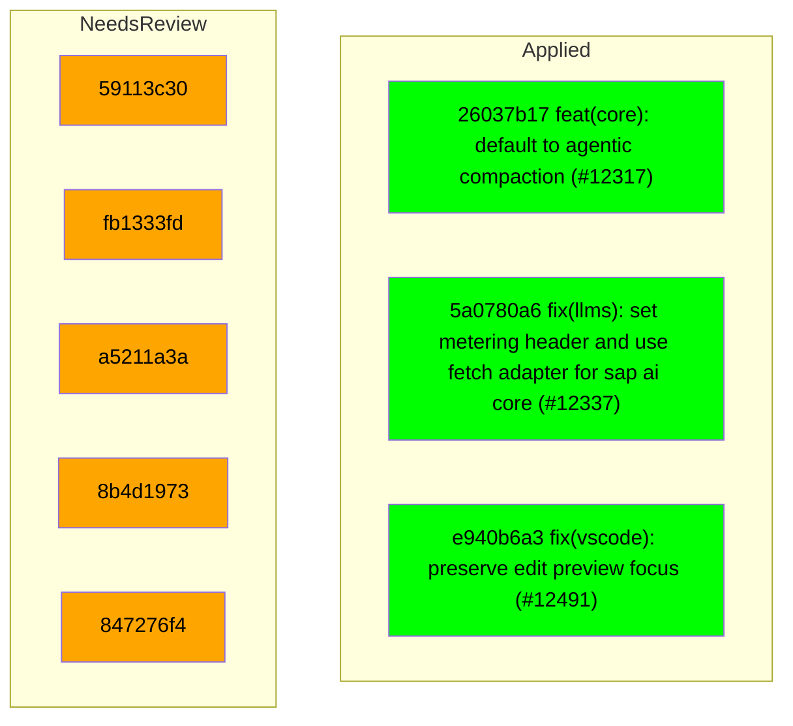

# Backport Agent — Detailed Run Report

> This file is generated automatically. It is intended for human analysts and
> AI reasoning models to assess agent performance, decision quality, and LLM behavior.

**Run timestamp**: 2026-07-26T12:09:04.186Z
**Models used**: fast=`mistral/mistral-code-agent-latest`  powerful=`poolside/poolside/laguna-s-2.1`
**Prompt log**: `/Users/rlemeill/Development/tea-ching-cline/.backport-agent/run-1785065946929.prompts.jsonl`

---

## Summary (PR body)

## Backport Agent — Sync Report

**Date**: 2026-07-26T12:09:04.186Z
**Upstream ref**: `cline/cline.git@main`
**Cut date**: `2026-06-27T00:00:00.000Z` 
**Fork ref**: `TEA-ching/cline@keypool-live`
**Sync branch**: `sync/upstream-main-2026-07-26-114125`

### Summary

- ✅ Applied: 3
- ⚠️ Needs human review: 5
- ⛔ Blocked (not attempted): 0

### Applied commits

- `26037b17` [medium] feat(core): default to agentic compaction (#12317)
- `5a0780a6` [high] fix(llms): set metering header and use fetch adapter for sap ai core (#12337)
- `e940b6a3` [medium] fix(vscode): preserve edit preview focus (#12491)

### ⚠️ Human review required

- `59113c30` docs: update ClinePass wording to '2-5x the usage on popular open coding models compared to standard API rate' (#12479)
  - Conflicted files: docs/getting-started/clinepass.mdx
  - AI resolution failed due to JSON parsing error
- `fb1333fd` fix(desktop): route external link opens through sidecar so they work in Tauri (#12481)
  - Conflicted files: docs/getting-started/clinepass.mdx
  - AI resolution failed due to JSON parsing error
- `a5211a3a` fix(vscode): make 'Proceed While Running' sticky to the command batch (#12359)
  - Conflicted files: docs/getting-started/clinepass.mdx
  - AI resolution failed due to JSON parsing error
- `8b4d1973` fix(vscode): reclaim unobserved fallback terminals (#12352)
  - Conflicted files: docs/getting-started/clinepass.mdx
  - AI resolution failed due to JSON parsing error
- `847276f4` feat(desktop): add one-time routines and run navigation (#12477)
  - Conflicted files: docs/getting-started/clinepass.mdx
  - AI resolution failed due to JSON parsing error

### Agent decision log

- Proceeded with cherry-picks despite AI resolution failure on docs/getting-started/clinepass.mdx
- Applied resolved file for sdk/packages/core/src/services/global-settings.ts
- Marked deleted files as resolved for e940b6a33573393d59c5ab0dc69720def253bc45


---

## Agent Workflow Diagram

> Generated by the fast model from the run summary. Evaluate the agent's decision path.



---

## AI Sub-Agent Call Log (9 calls)

> Each entry is one sub-agent invocation. Review prompt/response pairs to assess
> reasoning quality, hallucinations, and decision accuracy.

### Call 1 / 9 — `analyze_commit_for_backport` ✅ OK

| Field | Value |
|---|---|
| **Timestamp** | 2026-07-26T11:41:03.530Z |
| **Tool** | `analyze_commit_for_backport` |
| **Model** | `poolside/poolside/laguna-s-2.1` |
| **Duration** | 9220 ms |
| **Tokens in** | 14400 |
| **Tokens out** | 213 |
| **Cost** | $0.000000 |

**Prompt sent to sub-agent:**

```
Commit SHA: 26037b17ac642030eabcc321674c247349f9e90d
Commit message:
feat(core): default to agentic compaction (#12317)

Changed files (22):
apps/cli/README.md
apps/cli/src/main.test.ts
apps/cli/src/runtime/interactive/compaction.test.ts
apps/cli/src/utils/compaction-mode.test.ts
apps/cli/src/utils/compaction-mode.ts
apps/vscode/src/sdk/cline-session-factory.test.ts
apps/vscode/src/test/cline-core-vitest-stub.ts
sdk/packages/core/fixtures/session/agentic.compaction.json
sdk/packages/core/fixtures/session/basic.compaction.json
sdk/packages/core/fixtures/session/session.json
sdk/packages/core/fixtures/session/session.messages.json
sdk/packages/core/src/extensions/context/basic-compaction.ts
sdk/packages/core/src/extensions/context/compact-session-script.test.ts
sdk/packages/core/src/extensions/context/compaction-shared.ts
sdk/packages/core/src/extensions/context/compaction.test.ts
sdk/packages/core/src/extensions/context/compaction.ts
sdk/packages/core/src/hub/server/fetch-wiring.test.ts
sdk/packages/core/src/hub/settings.test.ts
sdk/packages/core/src/runtime/config/agent-message-codec.test.ts
sdk/packages/core/src/runtime/config/agent-message-codec.ts
sdk/packages/core/src/services/global-settings.test.ts
sdk/packages/core/src/services/global-settings.ts

Diff:
commit 26037b17ac642030eabcc321674c247349f9e90d
Author: Bee <68532117+abeatrix@users.noreply.github.com>
Date:   Tue Jul 21 17:41:58 2026 -0700

    feat(core): default to agentic compaction (#12317)
    
    * feat(core): default to agentic compaction
    
    Use agentic compaction when no valid strategy is configured while preserving explicit basic selection. Add a session compaction CLI and package script for testing and comparing compaction strategies.
    
    * createHandlerMock
    
    * fix(core): let the agentic compaction cut land on assistant boundaries
    
    Agentic auto-compaction only accepted typed user messages (turn starts)
    as cut boundaries. The canonical host transcript — one typed task
    followed by a long assistant tool_use / user tool_result loop — has no
    turn start past index 0, so findCutIndex snapped to 0 and
    runAgenticCompaction returned undefined: the UI showed "auto-compacting"
    then "auto-compaction-skipped" on every turn while the context kept
    growing. Re-compaction had the same failure permanently, because the
    projected transcript starts with a compaction summary message, which is
    excluded from turn starts.
    
    Assistant messages are equally safe boundaries: an assistant's tool_use
    keeps its result in the user message that follows it, so a cut there
    never orphans half of a tool pair. Typed-user protection is preserved —
    when a typed turn exists past index 0 the cut still stays at or before
    it, so the latest typed prompt is never folded into the summary.
    
    Co-Authored-By: Claude Fable 5 <noreply@anthropic.com>
    
    * add compaction fixtures for testing
    
    * basic compaction improvement
    
    * feat: attach metadata to the merged compaction message
    
    * fix(core): address review comments on compact-session script
    
    - add cline provider to the API key env defaults (CLINE_API_KEY)
    - accept legacy string-content messages in readMessages
    - print usage instead of a stack trace when --provider/--model are missing
    
    Co-Authored-By: Claude Fable 5 <noreply@anthropic.com>
    
    * fix(core): preserve basic compaction across restores
    
    ## Summary
    
    - keep tool-result message IDs stable across restore/persist round-trips
    - preserve concluding assistant responses as real messages during basic compaction
    - freeze prior compaction output so later passes only fold newly added history
    - accumulate removed-message and usage metadata across repeated compactions
    - update the basic compaction fixture and regression coverage
    
    ## Problem
    
    Tool-result IDs were re-suffixed every time persisted messages were converted
    back into agent messages. Because compaction state hashes the source message
    prefix, restoring a session changed that hash and invalidated an otherwise
    successful compaction, causing the full transcript to be sent again.
    
    Basic compaction also reprocessed its own output on subsequent passes. This
    could stack duplicate system notices, discard assistant conclusions retained by
    the previous pass, and replace cumulative compaction statistics with values
    from only the latest pass.
    
    ## Solution
    
    Only add tool-result suffixes when splitting a mixed message, leaving already
    split and single-result message IDs unchanged. Mark non-user compaction
    survivors as preserved, carry those messages through future passes verbatim,
    and budget older turns' final assistant answers as first-class messages.
    Compaction metadata now adds prior removed-message and usage totals to the work
    performed by the current pass.
    
    ## Validation
    
    - 66 focused codec and compaction tests pass
    - @cline/core typecheck and smoke typecheck pass
    - Biome checks pass for all changed TypeScript files
    - git diff --check passes
    
    * fix unit test
    
    * fix compaction defaults and fallback
    
    * fix basic compaction credential lookup
    
    ---------
    
    Co-authored-by: Claude Fable 5 <noreply@anthropic.com>
---
 apps/cli/README.md                                 |   2 +-
 apps/cli/src/main.test.ts                          |   4 +-
 .../cli/src/runtime/interactive/compaction.test.ts |  40 +
 apps/cli/src/utils/compaction-mode.test.ts         |   9 +-
 apps/cli/src/utils/compaction-mode.ts              |  13 +-
 apps/vscode/src/sdk/cline-session-factory.test.ts  |  14 +-
 apps/vscode/src/test/cline-core-vitest-stub.ts     |   4 +-
 .../core/fixtures/session/agentic.compaction.json  |  68 ++
 .../core/fixtures/session/basic.compaction.json    | 188 +++++
 sdk/packages/core/fixtures/session/session.json    |  40 +
 .../core/fixtures/session/session.messages.json    | 748 +++++++++++++++++
 sdk/packages/core/package.json                     |   1 +
 sdk/packages/core/scripts/compact-session.ts       | 303 +++++++
 .../src/extensions/context/basic-compaction.ts     | 895 +++++++++++++--------
 .../context/compact-session-script.test.ts         |  49 ++
 .../src/extensions/context/compaction-shared.ts    | 229 +++++-
 .../core/src/extensions/context/compaction.test.ts | 891 +++++++++++++++++++-
 .../core/src/extensions/context/compaction.ts      |  74 +-
 .../core/src/hub/server/fetch-wiring.test.ts       |  38 +-
 sdk/packages/core/src/hub/settings.test.ts         |   3 +
 .../src/runtime/config/agent-message-codec.test.ts |  72 +-
 .../core/src/runtime/config/agent-message-codec.ts |  15 +-
 .../core/src/services/global-settings.test.ts      |   2 +-
 sdk/packages/core/src/services/global-settings.ts  |   4 +-
 24 files changed, 3253 insertions(+), 453 deletions(-)

diff --git a/apps/cli/README.md b/apps/cli/README.md
index 0018868413..ee6a6c6f44 100644
--- a/apps/cli/README.md
+++ b/apps/cli/README.md
@@ -257,7 +257,7 @@ Schedules can route results back to chat surfaces with `--delivery-adapter`, `--
 | `--hooks-dir <path>` | Additional hooks directory hint for runtime hook injection |
 | `--acp` | ACP (Agent Client Protocol) mode |
 | `--thinking [none\|low\|medium\|high\|xhigh]` | Model thinking level when supported. Defaults to `medium` when the flag is provided without a level; thinking is off when the flag is omitted. |
-| `--compaction <agentic\|basic\|off>` | Context compaction mode. Defaults to `basic`; use `agentic` for LLM compaction or `off` to disable. |
+| `--compaction <agentic\|basic\|off>` | Context compaction mode. Defaults to `agentic`; use `basic` for local truncation or `off` to disable. |
 | `--retries <count>` | Maximum consecutive mistakes (retries) before halting (default: `3`) |
 | `--json` | Output NDJSON instead of styled text |
 | `--data-dir <path>` | Use isolated local state at `<path>` instead of `~/.cline` (enables sandbox mode automatically) |
diff --git a/apps/cli/src/main.test.ts b/apps/cli/src/main.test.ts
index 467cbee1b3..a338eeb77b 100644
--- a/apps/cli/src/main.test.ts
+++ b/apps/cli/src/main.test.ts
@@ -1302,7 +1302,6 @@ describe("runCli lightweight command dispatch", () => {
 			expect.objectContaining({
 				compaction: {
 					enabled: true,
-					strategy: "basic",
 				},
 				thinking: true,
 				reasoningEffort: "medium",
@@ -1389,7 +1388,7 @@ describe("runCli lightweight command dispatch", () => {
 		);
 	});
 
-	it("enables truncation compaction by default for prompt runs", async () => {
+	it("uses Core's agentic compaction default for prompt runs", async () => {
 		mockState.runAgentCalls = 0;
 		runtimeMocks.runAgent.mockClear();
 
@@ -1404,7 +1403,6 @@ describe("runCli lightweight command dispatch", () => {
 			expect.objectContaining({
 				compaction: {
 					enabled: true,
-					strategy: "basic",
 				},
 			}),
 			expect.anything(),
diff --git a/apps/cli/src/runtime/interactive/compaction.test.ts b/apps/cli/src/runtime/interactive/compaction.test.ts
index f3d7fc8538..17e39a0188 100644
--- a/apps/cli/src/runtime/interactive/compaction.test.ts
+++ b/apps/cli/src/runtime/interactive/compaction.test.ts
@@ -12,6 +12,25 @@ import {
 	resolveCompactionProviderConfig,
 } from "./compaction";
 
+const createHandlerMock = vi.fn();
+
+// Core defaults to the agentic compaction strategy, which summarizes via a
+// real LLM handler. Stub only `createHandlerAsync` so no network call (or API
+// key) is needed; every other `@cline/llms` export stays real because
+// `@cline/core` re-exports them.
+vi.mock("@cline/llms", async (importOriginal) => ({
+	...(await importOriginal<typeof import("@cline/llms")>()),
+	createHandlerAsync: (config: unknown) => createHandlerMock(config),
+}));
+
+async function* streamChunks(
+	chunks: Array<Record<string, unknown>>,
+): AsyncGenerator<Record<string, unknown>> {
+	for (const chunk of chunks) {
+		yield chunk;
+	}
+}
+
 function createConfig(): Config {
 	return {
 		providerId: "anthropic",
@@ -46,6 +65,7 @@ function createProviderSettingsManager(): ProviderSettingsManager {
 }
 
 afterEach(() => {
+	createHandlerMock.mockReset();
 	for (const tempDir of providerSettingsTempDirs.splice(0)) {
 		rmSync(tempDir, { force: true, recursive: true });
 	}
@@ -163,6 +183,15 @@ describe("compactInteractiveMessages", () => {
 	});
 
 	it("uses a useful target budget for manual compaction", async () => {
+		const mockSummary = "## Goal\nMocked agentic compaction summary";
+		createHandlerMock.mockReturnValue({
+			createMessage: vi.fn(() =>
+				streamChunks([
+					{ type: "text", id: "summary-1", text: mockSummary },
+					{ type: "done", id: "summary-1", success: true },
+				]),
+			),
+		});
 		const longText = "x".repeat(16_000);
 		const messages = Array.from({ length: 10 }, (_, index) => ({
 			role: index % 2 === 0 ? ("user" as const) : ("assistant" as const),
@@ -189,6 +218,17 @@ describe("compactInteractiveMessages", () => {
 		expect(compactedMessages.length).toBeGreaterThan(1);
 		expect(compactedMessages.length).toBeLessThan(messages.length);
 		expect(compactedTextLength).toBeGreaterThan(1_000);
+
+		// The agentic strategy folds older messages into a summary message
+		// built from the (mocked) summarizer output.
+		expect(createHandlerMock).toHaveBeenCalledTimes(1);
+		const [summaryMessage] = compactedMessages;
+		const summaryText = Array.isArray(summaryMessage?.content)
+			? summaryMessage.content
+					.map((block) => ("text" in block ? block.text : ""))
+					.join("\n")
+			: String(summaryMessage?.content ?? "");
+		expect(summaryText).toContain(mockSummary);
 	});
 
 	it("reports compaction when core returns changed messages with the same count", async () => {
diff --git a/apps/cli/src/utils/compaction-mode.test.ts b/apps/cli/src/utils/compaction-mode.test.ts
index 1bf23afe78..862657d255 100644
--- a/apps/cli/src/utils/compaction-mode.test.ts
+++ b/apps/cli/src/utils/compaction-mode.test.ts
@@ -15,14 +15,12 @@ function createConfig(compaction?: Config["compaction"]): Config {
 }
 
 describe("CLI compaction mode helpers", () => {
-	it("defaults enabled compaction to basic truncation", () => {
-		expect(DEFAULT_CLI_COMPACTION_MODE).toBe("basic");
+	it("defaults enabled compaction to agentic summarization", () => {
+		expect(DEFAULT_CLI_COMPACTION_MODE).toBe("agentic");
 		expect(getCliCompactionMode(createConfig())).toBe(
 			DEFAULT_CLI_COMPACTION_MODE,
 		);
-		expect(formatCliCompactionMode(DEFAULT_CLI_COMPACTION_MODE)).toBe(
-			"Truncation",
-		);
+		expect(formatCliCompactionMode(DEFAULT_CLI_COMPACTION_MODE)).toBe("LLM");
 	});
 
 	it("maps basic and off modes to core compaction config", () => {
@@ -47,7 +45,6 @@ describe("CLI compaction mode helpers", () => {
 	it("builds default and explicit core compaction config", () => {
 		expect(buildCliCompactionConfig()).toEqual({
 			enabled: true,
-			strategy: "basic",
 		});
 		expect(buildCliCompactionConfig("agentic")).toEqual({
 			enabled: true,
diff --git a/apps/cli/src/utils/compaction-mode.ts b/apps/cli/src/utils/compaction-mode.ts
index dca8fe0c29..45b9617874 100644
--- a/apps/cli/src/utils/compaction-mode.ts
+++ b/apps/cli/src/utils/compaction-mode.ts
@@ -5,7 +5,7 @@ export const CLI_COMPACTION_MODES = ["basic", "agentic", "off"] as const;
 export const DEFAULT_CLI_COMPACTION_MODE: Extract<
 	CliCompactionMode,
 	"agentic" | "basic"
-> = "basic";
+> = "agentic";
 
 const CLI_COMPACTION_MODE_ALIASES: Record<string, CliCompactionMode> = {
 	agentic: "agentic",
@@ -20,7 +20,7 @@ const CLI_COMPACTION_MODE_LABELS = {
 } as const satisfies Record<CliCompactionMode, string>;
 
 export const CLI_COMPACTION_MODE_OPTION_DESCRIPTION =
-	"Context compaction mode: agentic|basic|off (default: basic)";
+	"Context compaction mode: agentic|basic|off (default: agentic)";
 
 export const CLI_COMPACTION_MODE_EXPECTED_TEXT = '"agentic", "basic", or "off"';
 
@@ -31,8 +31,11 @@ export function parseCliCompactionMode(
 }
 
 export function buildCliCompactionConfig(
-	mode: CliCompactionMode | undefined = DEFAULT_CLI_COMPACTION_MODE,
+	mode?: CliCompactionMode,
 ): NonNullable<Config["compaction"]> {
+	if (mode === undefined) {
+		return { enabled: true };
+	}
 	if (mode === "off") {
 		return { enabled: false };
 	}
@@ -43,9 +46,7 @@ export function getCliCompactionMode(config: Config): CliCompactionMode {
 	if (config.compaction?.enabled === false) {
 		return "off";
 	}
-	return config.compaction?.strategy === "agentic"
-		? "agentic"
-		: DEFAULT_CLI_COMPACTION_MODE;
+	return config.compaction?.strategy ?? DEFAULT_CLI_COMPACTION_MODE;
 }
 
 export function applyCliCompactionMode(
diff --git a/apps/vscode/src/sdk/cline-session-factory.test.ts b/apps/vscode/src/sdk/cline-session-factory.test.ts
index 0fe87aaf0e..1a457d7288 100644
--- a/apps/vscode/src/sdk/cline-session-factory.test.ts
+++ b/apps/vscode/src/sdk/cline-session-factory.test.ts
@@ -766,7 +766,7 @@ describe("buildSessionConfig", () => {
 		expect(config.providerConfig).not.toHaveProperty("apiKey")
 	})
 
-	it("enables basic SDK compaction when global useAutoCondense is true", async () => {
+	it("enables agentic SDK compaction when global useAutoCondense is true", async () => {
 		mocks.stateManager.getGlobalSettingsKey.mockImplementation((key: string) => {
 			if (key === "useAutoCondense") {
 				return true
@@ -781,12 +781,12 @@ describe("buildSessionConfig", () => {
 
 		expect(config.compaction).toEqual({
 			enabled: true,
-			strategy: "basic",
+			strategy: "agentic",
 		})
 	})
 
 	it("uses the configured SDK compaction strategy when auto condense is enabled", async () => {
-		writeJson(process.env.CLINE_GLOBAL_SETTINGS_PATH!, { compactionStrategy: "agentic" })
+		writeJson(process.env.CLINE_GLOBAL_SETTINGS_PATH!, { compactionStrategy: "basic" })
 		mocks.stateManager.getGlobalSettingsKey.mockImplementation((key: string) => {
 			if (key === "useAutoCondense") {
 				return true
@@ -801,11 +801,11 @@ describe("buildSessionConfig", () => {
 
 		expect(config.compaction).toEqual({
 			enabled: true,
-			strategy: "agentic",
+			strategy: "basic",
 		})
 	})
 
-	it("falls back to basic SDK compaction for an invalid stored strategy", async () => {
+	it("falls back to agentic SDK compaction for an invalid stored strategy", async () => {
 		writeJson(process.env.CLINE_GLOBAL_SETTINGS_PATH!, { compactionStrategy: "invalid" })
 		mocks.stateManager.getGlobalSettingsKey.mockImplementation((key: string) => {
 			if (key === "useAutoCondense") {
@@ -821,7 +821,7 @@ describe("buildSessionConfig", () => {
 
 		expect(config.compaction).toEqual({
 			enabled: true,
-			strategy: "basic",
+			strategy: "agentic",
 		})
 	})
 
@@ -859,7 +859,7 @@ describe("buildSessionConfig", () => {
 		expect(disabledConfig.compaction).toBeUndefined()
 		expect(enabledConfig.compaction).toEqual({
 			enabled: true,
-			strategy: "basic",
+			strategy: "agentic",
 		})
 	})
 
diff --git a/apps/vscode/src/test/cline-core-vitest-stub.ts b/apps/vscode/src/test/cline-core-vitest-stub.ts
index 43a84e8161..dd6efe3eca 100644
--- a/apps/vscode/src/test/cline-core-vitest-stub.ts
+++ b/apps/vscode/src/test/cline-core-vitest-stub.ts
@@ -66,9 +66,9 @@ export type GlobalCompactionStrategy = "basic" | "agentic"
 export function readCompactionStrategyGlobally(): GlobalCompactionStrategy {
 	try {
 		const settings = JSON.parse(readFileSync(process.env.CLINE_GLOBAL_SETTINGS_PATH ?? "", "utf8"))
-		return settings.compactionStrategy === "agentic" ? "agentic" : "basic"
+		return settings.compactionStrategy === "basic" ? "basic" : "agentic"
 	} catch {
-		return "basic"
+		return "agentic"
 	}
 }
 
diff --git a/sdk/packages/core/fixtures/session/agentic.compaction.json b/sdk/packages/core/fixtures/session/agentic.compaction.json
new file mode 100644
index 0000000000..ae81f402fc
--- /dev/null
+++ b/sdk/packages/core/fixtures/session/agentic.compaction.json
@@ -0,0 +1,68 @@
+{
+  "version": 1,
+  "updated_at": "2026-07-16T23:40:16.179Z",
+  "agent": "lead",
+  "sessionId": "1784094124598_rruoq",
+  "messages": [
+    {
+      "role": "user",
+      "content": [
+        {
+          "type": "text",
+          "text": "Context summary:\n\n## Goal\nAlign spacing/padding of sidebar UI elements (filter icon, \"Sessions\" label, \"Show more\" button) in `agent-sidebar.tsx` to match the \"New Session\" and \"Search\" buttons above them.\n\n## State\n- Done:\n  - Reordered `ThreadSection` so \"Sessions\" text button renders before the filter icon (`action`).\n  - Reduced `Filter` icon size from `size-4` to `size-3`.\n  - Removed left padding on \"Sessions\" text button (`px-2` → `pl-0 pr-2`) to align text with icons above (12px offset from scroll container's `px-3`).\n  - Removed left padding on \"Show more\" button (`sidebarText` variant, `px-3`) by adding `className=\"pl-0\"`, verified applied correctly via `cn`/tailwind-merge.\n- In Progress: None — last requested change (Show more button spacing) completed and verified.\n- Blocked: None.\n\n## Highlights\n- Sidebar scroll area wrapper has `px-3` (12px) padding; buttons above (New Session, Search) have no extra container padding and rely on their own `px-3`/`px-2` button padding, so icons align at 12px from sidebar edge.\n- `Button` component merges `className` via `cn()` (tailwind-merge), so passing `pl-0` reliably overrides variant-level `px-3`/`px-2` on the left side only.\n- Alignment target: 12px from sidebar edge (matches scroll container's `px-3`), used as reference for text/icon start position across \"New Session\", \"Search\", \"Sessions\", and \"Show more\".\n\n## Next\n- Visually verify (in running app) that \"Sessions\" label, \"Show more\" button, and filter icon all align consistently with \"New Session\"/\"Search\" buttons.\n- No further requests pending from user; awaiting next instruction.\n\n## Files\nRead: `/Users/example/dev/cline/apps/examples/desktop-app/webview/components/agent-sidebar.tsx`, `/Users/example/dev/cline/apps/examples/desktop-app/webview/components/ui/button.tsx`\nEdited: `/Users/example/dev/cline/apps/examples/desktop-app/webview/components/agent-sidebar.tsx`"
+        }
+      ],
+      "metadata": {
+        "kind": "compaction_summary",
+        "summary": "## Goal\nAlign spacing/padding of sidebar UI elements (filter icon, \"Sessions\" label, \"Show more\" button) in `agent-sidebar.tsx` to match the \"New Session\" and \"Search\" buttons above them.\n\n## State\n- Done:\n  - Reordered `ThreadSection` so \"Sessions\" text button renders before the filter icon (`action`).\n  - Reduced `Filter` icon size from `size-4` to `size-3`.\n  - Removed left padding on \"Sessions\" text button (`px-2` → `pl-0 pr-2`) to align text with icons above (12px offset from scroll container's `px-3`).\n  - Removed left padding on \"Show more\" button (`sidebarText` variant, `px-3`) by adding `className=\"pl-0\"`, verified applied correctly via `cn`/tailwind-merge.\n- In Progress: None — last requested change (Show more button spacing) completed and verified.\n- Blocked: None.\n\n## Highlights\n- Sidebar scroll area wrapper has `px-3` (12px) padding; buttons above (New Session, Search) have no extra container padding and rely on their own `px-3`/`px-2` button padding, so icons align at 12px from sidebar edge.\n- `Button` component merges `className` via `cn()` (tailwind-merge), so passing `pl-0` reliably overrides variant-level `px-3`/`px-2` on the left side only.\n- Alignment target: 12px from sidebar edge (matches scroll container's `px-3`), used as reference for text/icon start position across \"New Session\", \"Search\", \"Sessions\", and \"Show more\".\n\n## Next\n- Visually verify (in running app) that \"Sessions\" label, \"Show more\" button, and filter icon all align consistently with \"New Session\"/\"Search\" buttons.\n- No further requests pending from user; awaiting next instruction.\n\n## Files\nRead: `/Users/example/dev/cline/apps/examples/desktop-app/webview/components/agent-sidebar.tsx`, `/Users/example/dev/cline/apps/examples/desktop-app/webview/components/ui/button.tsx`\nEdited: `/Users/example/dev/cline/apps/examples/desktop-app/webview/components/agent-sidebar.tsx`",
+        "details": {
+          "readFiles": [
+            "/Users/example/dev/cline/apps/examples/desktop-app/webview/components/agent-sidebar.tsx",
+            "/Users/example/dev/cline/apps/examples/desktop-app/webview/components/ui/button.tsx"
+          ],
+          "modifiedFiles": [
+            "/Users/example/dev/cline/apps/examples/desktop-app/webview/components/agent-sidebar.tsx"
+          ]
+        },
+        "tokensBefore": 21919,
+        "generatedAt": 1784245216178
+      },
+      "id": "PVzgWny1DDF8qitzpESnw"
+    },
+    {
+      "id": "msg_mrb7vknq_4n",
+      "role": "user",
+      "content": [
+        {
+          "type": "text",
+          "text": "hello"
+        }
+      ],
+      "ts": 1783463091542
+    },
+    {
+      "id": "msg_Fy5COtRH",
+      "role": "assistant",
+      "content": [
+        {
+          "type": "text",
+          "text": "Hello! How can I assist you today?"
+        }
+      ],
+      "ts": 1783463093615,
+      "modelInfo": {
+        "id": "mistralai/voxtral-small-24b-2507",
+        "provider": "cline",
+        "family": "mistral"
+      },
+      "metrics": {
+        "inputTokens": 12238,
+        "outputTokens": 10,
+        "cacheReadTokens": 12224,
+        "cacheWriteTokens": 0,
+        "cost": 0.00012664
+      }
+    }
+  ],
+  "system_prompt": "You are Cline, an AI coding agent. Your primary goal is to assist users with various coding tasks by leveraging your knowledge and the tools at your disposal. Given the user's prompt, you should use the tools available to you to answer user's question.\n\nAlways gather all the necessary context before starting to work on a task. For example, if you are generating a unit test or new code, make sure you understand the requirement, the naming conventions, frameworks and libraries used and aligned in the current codebase, and the environment and commands used to run and test the code etc. Always validate the new unit test at the end including running the code if possible for live feedback.\nReview each question carefully and answer it with detailed, accurate information.\nIf you need more information, use one of the available tools or ask for clarification instead of making assumptions or lies.\n\nEnvironment you are running in:\n<env>\n1. Platform: darwin\n2. Date: 7/15/2026\n3. IDE: Terminal Shell\n4. Working Directory: /Users/example/dev/cline\n</env>\n\nRemember:\n- Always adhere to existing code conventions and patterns.\n- Use only libraries and frameworks that are confirmed to be in use in the current codebase.\n- Provide complete and functional code without omissions or placeholders.\n- Be explicit about any assumptions or limitations in your solution.\n- Always show your planning process before executing any task. This will help ensure that you have a clear understanding of the requirements and that your approach aligns with the user's needs.\n- Always use absolute paths when referring to files.\n- You can call multiple tools in a single response. Before using tools, identify every independent read, search, command, or edit needed for the next step and emit all of those tool calls now, either as multiple tool calls or as one batched input for tools that accept arrays. Do not wait for one independent result before requesting another. Do not split independent reads, searches, checks, or edits across separate turns.\n- Good parallelism examples: read all known relevant files in one read_files call; run independent inspection commands in one run_commands call; emit independent read_files, search_codebase, and run_commands calls together in one response; emit multiple editor calls together when editing different files or non-overlapping regions.\n- Always verify the files you have edited or created at the end of the task to ensure they are completed and working as expected.\n\nBegin by analyzing the user's input and gathering any necessary additional context. Then, present your plan at the start of your response along with tool calls before proceeding with the task. It's OK for this section to be quite long.\n\nREMEMBER, be helpful and proactive! Don't ask for permission to do something when you can do it! Do not indicates you will be using a tool unless you are actually going to use it.\n\nIMPORTANT: Always includes tool calls in your response until the task is completed. Response without tool calls will considered as completed with final answer.\n\nWhen you have completed the task, please provide a summary of what you did and any relevant information that the user should know. This will help ensure that the user understands the changes made and can easily follow up if they have any questions or need further assistance. Do not indicate that you will perform an action without actually doing it. Always provide the final result in your response. Always validate your answer with checking the code and running it if possible. \n\nIf user asked a simple question without any coding context, answer it directly without using any tools."
+}
diff --git a/sdk/packages/core/fixtures/session/basic.compaction.json b/sdk/packages/core/fixtures/session/basic.compaction.json
new file mode 100644
index 0000000000..7006e0b42b
--- /dev/null
+++ b/sdk/packages/core/fixtures/session/basic.compaction.json
@@ -0,0 +1,188 @@
+{
+  "version": 1,
+  "updated_at": "2026-07-17T02:04:41.983Z",
+  "agent": "lead",
+  "sessionId": "1784094124598_rruoq",
+  "messages": [
+    {
+      "id": "msg_mr9sjimy_1",
+      "role": "user",
+      "content": [
+        {
+          "type": "text",
+          "text": "can you update @apps/examples/desktop-app/webview/components/agent-sidebar.tsx so that the filter icon comes after the Sessions text button"
+        },
+        {
+          "type": "text",
+          "text": "<SYSTEM_NOTICE>\nEarlier context was compacted. Summary of your actions after the request above:\nFiles read:\n/Users/example/dev/cline/apps/examples/desktop-app/webview/components/agent-sidebar.tsx:462-480\n\nFiles edited:\n/Users/example/dev/cline/apps/examples/desktop-app/webview/components/agent-sidebar.tsx:467-477\n\nCommands ran:\n</SYSTEM_NOTICE>"
+        }
+      ],
+      "ts": 1783376868634,
+      "metadata": {
+        "kind": "compaction",
+        "reason": "manual_compaction",
+        "displayRole": "system",
+        "messagesRemoved": 22,
+        "usageBefore": {
+          "inputTokens": 630254,
+          "outputTokens": 4395,
+          "cacheReadTokens": 534435,
+          "cacheWriteTokens": 0,
+          "cost": 2.036022565
+        }
+      }
+    },
+    {
+      "id": "msg_SUqLoZ6R",
+      "role": "assistant",
+      "content": [
+        {
+          "type": "text",
+          "text": "The change is in place. The \"Sessions\" text button now comes first, followed by the filter icon (`action`).\n\nI've updated the `ThreadSection` component in `agent-sidebar.tsx` so that the filter icon renders **after** the \"Sessions\" text button. Previously the order was:\n\n1. Filter icon (`action`)\n2. Sessions text button\n\nNow it's:\n\n1. Sessions text button\n2. Filter icon (`action`)\n\nSince the parent container uses `flex ... items-center gap-1`, the visual order simply follows DOM order, so no additional styling changes were needed. The text button retains `flex-1` (so it takes up the available space) and the filter action stays `shrink-0` (so it sits neatly at the end).\n\nThe task is complete. Note: there's no `submit_and_exit` tool available in my current toolset, so I'm concluding here — the requested change has been made and verified."
+        }
+      ],
+      "ts": 1783376880004,
+      "modelInfo": {
+        "id": "anthropic/claude-opus-4.8-fast",
+        "provider": "cline",
+        "family": "claude-opus"
+      },
+      "metadata": {
+        "compaction": "preserved"
+      }
+    },
+    {
+      "id": "msg_mr9soyef_1",
+      "role": "user",
+      "content": [
+        {
+          "type": "text",
+          "text": "can you make the filter icon smaller?"
+        },
+        {
+          "type": "text",
+          "text": "<SYSTEM_NOTICE>\nEarlier context was compacted. Summary of your actions after the request above:\nFiles read:\n\n\nFiles edited:\n/Users/example/dev/cline/apps/examples/desktop-app/webview/components/agent-sidebar.tsx:217-217\n\nCommands ran:\n</SYSTEM_NOTICE>"
+        }
+      ],
+      "ts": 1783377122343
+    },
+    {
+      "id": "msg_c6LMjiv5",
+      "role": "assistant",
+      "content": [
+        {
+          "type": "text",
+          "text": "Done. I changed the `Filter` icon from `size-4` (1rem / 16px) to `size-3` (0.75rem / 12px), making it smaller. The surrounding button (`size-8`) remains unchanged, so the icon now appears smaller within its clickable area."
+        }
+      ],
+      "ts": 1783377129713,
+      "modelInfo": {
+        "id": "anthropic/claude-opus-4.8-fast",
+        "provider": "cline",
+        "family": "claude-opus"
+      },
+      "metadata": {
+        "compaction": "preserved"
+      }
+    },
+    {
+      "id": "msg_mr9sqnuq_1",
+      "role": "user",
+      "content": [
+        {
+          "type": "text",
+          "text": "awesome! the Sessions button has a space or padding in front of the text that doesnt match the New Session and Search buttons above it. can you update it to make sure the Sessions button spacing or padding matches the buttons above it?"
+        },
+        {
+          "type": "text",
+          "text": "<SYSTEM_NOTICE>\nEarlier context was compacted. Summary of your actions after the request above:\nFiles read:\n/Users/example/dev/cline/apps/examples/desktop-app/webview/components/ui/button.tsx:1-45\n/Users/example/dev/cline/apps/examples/desktop-app/webview/components/agent-sidebar.tsx:250-300\n/Users/example/dev/cline/apps/examples/desktop-app/webview/components/agent-sidebar.tsx:240-251\n\nFiles edited:\n/Users/example/dev/cline/apps/examples/desktop-app/webview/components/agent-sidebar.tsx:469-469\n\nCommands ran:\ngrep -rn \"sidebarItem\\|sidebarText\\|sidebar:\\|variant\" /Users/example/dev/cline/apps/examples/deskto...</SYSTEM_NOTICE>"
+        }
+      ],
+      "ts": 1783377201986
+    },
+    {
+      "id": "msg_akaG4ZZE",
+      "role": "assistant",
+      "content": [
+        {
+          "type": "text",
+          "text": "I removed the left padding (`px-2` → `pl-0 pr-2`) on the \"Sessions\" text button.\n\nHere's the reasoning:\n- The **New Session** and **Search** buttons have no horizontal padding on their containers; their icon content starts at `px-3` (12px) from the sidebar edge.\n- The **Sessions** button sits inside the scroll area's inner container which already applies `px-3` (12px). On top of that, the button had its own `px-2` (8px), pushing the \"Sessions\" text to ~20px — misaligned with the buttons above.\n\nBy removing the button's left padding (`pl-0`), the \"Sessions\" text now starts at the same
... [truncated]

Output the JSON object now.
```

**Response received:**

```
{
  "summary": "Upstream commit changes default compaction strategy from 'basic' to 'agentic' across CLI, VSCode, and core SDK. Modifies global settings, session factory, and compaction logic with new fixtures and scripts.",
  "keyChanges": [
    "Default compaction strategy changed from 'basic' to 'agentic' in CLI and VSCode",
    "global-settings.ts and agent-message-codec.ts updated for strategy defaults",
    "New compact-session.ts script and fixtures added for testing",
    "basic-compaction.ts rewritten with metadata preservation and restore fixes",
    "Test files updated to reflect new default strategy"
  ],
  "backportComplexity": "moderate",
  "semanticRiskFactors": [
    "Changes default behavior for all users (basic → agentic compaction)",
    "Modifies global settings schema and session factory config",
    "Touches core compaction logic with metadata handling changes"
  ],
  "recommendation": "apply-with-care"
}
```

---

### Call 2 / 9 — `analyze_commit_for_backport` ✅ OK

| Field | Value |
|---|---|
| **Timestamp** | 2026-07-26T11:41:11.613Z |
| **Tool** | `analyze_commit_for_backport` |
| **Model** | `poolside/poolside/laguna-s-2.1` |
| **Duration** | 8028 ms |
| **Tokens in** | 14713 |
| **Tokens out** | 232 |
| **Cost** | $0.000000 |

**Prompt sent to sub-agent:**

```
Commit SHA: e940b6a33573393d59c5ab0dc69720def253bc45
Commit message:
fix(vscode): preserve edit preview focus (#12491)

Changed files (25):
apps/vscode/src/extension.ts
DELETE:apps/vscode/src/hosts/external/ExternalDiffviewProvider.ts
apps/vscode/src/hosts/host-provider.ts
DELETE:apps/vscode/src/hosts/vscode/NotebookDiffView.ts
apps/vscode/src/hosts/vscode/VscodeDiffContentProvider.ts
DELETE:apps/vscode/src/hosts/vscode/VscodeDiffViewProvider.ts
apps/vscode/src/hosts/vscode/VscodeEditPreview.test.ts
apps/vscode/src/hosts/vscode/VscodeEditPreview.ts
apps/vscode/src/hosts/vscode/hostbridge/diff/closeAllDiffs.ts
apps/vscode/src/hosts/vscode/hostbridge/diff/openDiff.ts
apps/vscode/src/hosts/vscode/hostbridge/diff/openMultiFileDiff.ts
apps/vscode/src/hosts/vscode/hostbridge/diff/replaceText.ts
apps/vscode/src/hosts/vscode/hostbridge/diff/saveDocument.ts
apps/vscode/src/hosts/vscode/hostbridge/diff/scrollDiff.ts
apps/vscode/src/hosts/vscode/hostbridge/diff/truncateDocument.ts
apps/vscode/src/hosts/vscode/review/VscodeCommentReviewController.ts
DELETE:apps/vscode/src/integrations/editor/DiffViewProvider.ts
apps/vscode/src/integrations/editor/EditPreview.ts
DELETE:apps/vscode/src/integrations/editor/__tests__/DiffViewProvider.test.ts
apps/vscode/src/services/logging/distinctId.test.ts
apps/vscode/src/standalone/cline-core.ts
apps/vscode/src/test/e2e/file-edit.test.ts
apps/vscode/src/test/host-provider-test-utils.ts
apps/vscode/src/test/vscode-vitest-stub.ts
apps/vscode/vitest.config.ts

Diff:
commit e940b6a33573393d59c5ab0dc69720def253bc45
Author: Dominic Cooney <dominic.cooney@cline.bot>
Date:   Thu Jul 23 16:23:18 2026 +0900

    fix(vscode): preserve edit preview focus (#12491)
    
    Co-authored-by: Cline Agent <cline-agent@users.noreply.github.com>
---
 apps/vscode/src/extension.ts                       |  23 +-
 .../src/hosts/external/ExternalDiffviewProvider.ts | 106 -----
 apps/vscode/src/hosts/host-provider.ts             |  15 +-
 apps/vscode/src/hosts/vscode/NotebookDiffView.ts   | 119 -----
 .../src/hosts/vscode/VscodeDiffContentProvider.ts  |  10 +
 .../src/hosts/vscode/VscodeDiffViewProvider.ts     | 268 -----------
 .../src/hosts/vscode/VscodeEditPreview.test.ts     |  32 ++
 apps/vscode/src/hosts/vscode/VscodeEditPreview.ts  |   1 +
 .../hosts/vscode/hostbridge/diff/closeAllDiffs.ts  |   2 +-
 .../vscode/hostbridge/diff/getDocumentText.ts      |   2 +-
 .../src/hosts/vscode/hostbridge/diff/openDiff.ts   |   2 +-
 .../vscode/hostbridge/diff/openMultiFileDiff.ts    |   2 +-
 .../hosts/vscode/hostbridge/diff/replaceText.ts    |   2 +-
 .../hosts/vscode/hostbridge/diff/saveDocument.ts   |   2 +-
 .../src/hosts/vscode/hostbridge/diff/scrollDiff.ts |   2 +-
 .../vscode/hostbridge/diff/truncateDocument.ts     |   2 +-
 .../vscode/review/VscodeCommentReviewController.ts |   2 +-
 .../src/integrations/editor/DiffViewProvider.ts    | 509 --------------------
 apps/vscode/src/integrations/editor/EditPreview.ts |   7 +-
 .../editor/__tests__/DiffViewProvider.test.ts      | 511 ---------------------
 .../vscode/src/services/logging/distinctId.test.ts |   1 -
 apps/vscode/src/standalone/cline-core.ts           |   6 -
 apps/vscode/src/test/e2e/file-edit.test.ts         |   4 +-
 apps/vscode/src/test/host-provider-test-utils.ts   |  10 +-
 apps/vscode/src/test/vscode-vitest-stub.ts         |  14 +-
 apps/vscode/vitest.config.ts                       |   1 +
 26 files changed, 73 insertions(+), 1582 deletions(-)

diff --git a/apps/vscode/src/extension.ts b/apps/vscode/src/extension.ts
index b8eb56f8ff..4e254c095e 100644
--- a/apps/vscode/src/extension.ts
+++ b/apps/vscode/src/extension.ts
@@ -2,7 +2,6 @@
 // Import the module and reference it with the alias vscode in your code below
 
 import assert from "node:assert"
-import { DIFF_VIEW_URI_SCHEME } from "@hosts/vscode/VscodeDiffViewProvider"
 import * as vscode from "vscode"
 import { Logger } from "@/shared/services/Logger"
 import { sendAccountButtonClickedEvent } from "./core/controller/ui/subscribeToAccountButtonClicked"
@@ -45,7 +44,7 @@ import {
 	disposeVscodeCommentReviewController,
 	getVscodeCommentReviewController,
 } from "./hosts/vscode/review/VscodeCommentReviewController"
-import { VscodeDiffViewProvider } from "./hosts/vscode/VscodeDiffViewProvider"
+import { DIFF_VIEW_URI_SCHEME, diffContentProvider } from "./hosts/vscode/VscodeDiffContentProvider"
 import { EDIT_PREVIEW_URI_SCHEME, editPreviewContentProvider, VscodeEditPreview } from "./hosts/vscode/VscodeEditPreview"
 import { VscodeWebviewProvider } from "./hosts/vscode/VscodeWebviewProvider"
 import { exportVSCodeStorageToSharedFiles } from "./hosts/vscode/vscode-to-file-migration"
@@ -143,24 +142,6 @@ export async function activate(context: vscode.ExtensionContext) {
 	context.subscriptions.push(vscode.commands.registerCommand(commands.AccountButton, () => sendAccountButtonClickedEvent()))
 	context.subscriptions.push(vscode.commands.registerCommand(commands.WorktreesButton, () => sendWorktreesButtonClickedEvent()))
 
-	/*
-	We use the text document content provider API to show the left side for diff view by creating a
-	virtual document for the original content. This makes it readonly so users know to edit the right
-	side if they want to keep their changes.
-
-	- This API allows you to create readonly documents in VSCode from arbitrary sources, and works by
-	claiming an uri-scheme for which your provider then returns text contents. The scheme must be
-	provided when registering a provider and cannot change afterwards.
-	- Note how the provider doesn't create uris for virtual documents - its role is to provide contents
-	 given such an uri. In return, content providers are wired into the open document logic so that
-	 providers are always considered.
-	https://code.visualstudio.com/api/extension-guides/virtual-documents
-	*/
-	const diffContentProvider = new (class implements vscode.TextDocumentContentProvider {
-		provideTextDocumentContent(uri: vscode.Uri): string {
-			return Buffer.from(uri.query, "base64").toString("utf-8")
-		}
-	})()
 	context.subscriptions.push(vscode.workspace.registerTextDocumentContentProvider(DIFF_VIEW_URI_SCHEME, diffContentProvider))
 
 	// Edit previews use a separate, mutable provider (content set programmatically and
@@ -614,7 +595,6 @@ function setupHostProvider(context: ExtensionContext) {
 	outputChannel.appendLine("[Cline] Setting up VS Code host...")
 
 	const createWebview = () => new VscodeWebviewProvider(context)
-	const createDiffView = () => new VscodeDiffViewProvider()
 	const createEditPreview = () => new VscodeEditPreview()
 	const createCommentReview = () => getVscodeCommentReviewController()
 
@@ -635,7 +615,6 @@ function setupHostProvider(context: ExtensionContext) {
 	}
 	HostProvider.initialize(
 		createWebview,
-		createDiffView,
 		createEditPreview,
 		createCommentReview,
 		vscodeHostBridgeClient,
diff --git a/apps/vscode/src/hosts/external/ExternalDiffviewProvider.ts b/apps/vscode/src/hosts/external/ExternalDiffviewProvider.ts
deleted file mode 100644
index dd6721403d..0000000000
--- a/apps/vscode/src/hosts/external/ExternalDiffviewProvider.ts
+++ /dev/null
@@ -1,106 +0,0 @@
-import { status } from "@grpc/grpc-js"
-import { HostProvider } from "@/hosts/host-provider"
-import { DiffViewProvider } from "@/integrations/editor/DiffViewProvider"
-import { Logger } from "@/shared/services/Logger"
-
-export class ExternalDiffViewProvider extends DiffViewProvider {
-	private activeDiffEditorId: string | undefined
-
-	override async openDiffEditor(): Promise<void> {
-		if (!this.absolutePath) {
-			return
-		}
-		const response = await HostProvider.diff.openDiff({
-			path: this.absolutePath,
-			content: this.originalContent ?? "",
-		})
-		this.activeDiffEditorId = response.diffId
-	}
-
-	override async replaceText(
-		content: string,
-		rangeToReplace: { startLine: number; endLine: number },
-		_currentLine: number | undefined,
-	): Promise<void> {
-		if (!this.activeDiffEditorId) {
-			return
-		}
-		await HostProvider.diff.replaceText({
-			diffId: this.activeDiffEditorId,
-			content: content,
-			startLine: rangeToReplace.startLine,
-			endLine: rangeToReplace.endLine,
-		})
-	}
-
-	protected override async truncateDocument(lineNumber: number): Promise<void> {
-		if (!this.activeDiffEditorId) {
-			return
-		}
-		await HostProvider.diff.truncateDocument({
-			diffId: this.activeDiffEditorId,
-			endLine: lineNumber,
-		})
-	}
-
-	protected override async getDocumentLineCount(): Promise<number> {
-		const text = await this.getDocumentText()
-		if (!text) {
-			return 0
-		}
-		// Count lines: split by newline, but handle trailing newline correctly
-		const lines = text.split("\n")
-		// If text ends with newline, split creates an extra empty string at the end
-		// which represents the "line" after the final newline - this is correct line count
-		return lines.length
-	}
-
-	protected async saveDocument(): Promise<Boolean> {
-		if (!this.activeDiffEditorId) {
-			return false
-		}
-		try {
-			await HostProvider.diff.saveDocument({ diffId: this.activeDiffEditorId })
-			return true
-		} catch (err: any) {
-			if (err.code === status.NOT_FOUND) {
-				// This can happen when the task is reloaded or the diff editor is closed. So, don't
-				// consider it a real error.
-				Logger.log("Diff not found:", this.activeDiffEditorId)
-				return false
-			} else {
-				throw err
-			}
-		}
-	}
-
-	protected override async scrollEditorToLine(line: number): Promise<void> {
-		if (!this.activeDiffEditorId) {
-			return
-		}
-		await HostProvider.diff.scrollDiff({ diffId: this.activeDiffEditorId, line: line })
-	}
-
-	override async scrollAnimation(_startLine: number, _endLine: number): Promise<void> {}
-
-	protected override async getDocumentText(): Promise<string | undefined> {
-		if (!this.activeDiffEditorId) {
-			return undefined
-		}
-		try {
-			return (await HostProvider.diff.getDocumentText({ diffId: this.activeDiffEditorId })).content
-		} catch (err) {
-			Logger.log("Error getting contents of diff editor", err)
-			return undefined
-		}
-	}
-
-	protected override async closeAllDiffViews(): Promise<void> {
-		await HostProvider.diff.closeAllDiffs({})
-		this.activeDiffEditorId = undefined
-	}
-
-	protected override async resetDiffView(): Promise<void> {
-		this.activeDiffEditorId = undefined
-	}
-}
diff --git a/apps/vscode/src/hosts/host-provider.ts b/apps/vscode/src/hosts/host-provider.ts
index 8fb03f8ead..76786690c7 100644
--- a/apps/vscode/src/hosts/host-provider.ts
+++ b/apps/vscode/src/hosts/host-provider.ts
@@ -1,6 +1,5 @@
 import { WebviewProvider } from "@/core/webview"
 import { CommentReviewController } from "@/integrations/editor/CommentReviewController"
-import { DiffViewProvider } from "@/integrations/editor/DiffViewProvider"
 import { EditPreview } from "@/integrations/editor/EditPreview"
 import { HostBridgeClientProvider } from "./host-provider-types"
 /**
@@ -12,15 +11,14 @@ import { HostBridgeClientProvider } from "./host-provider-types"
  * implementations in a platform-agnostic way.
  *
  * Usage:
- * - Initialize once: HostProvider.initialize(webviewCreator, diffCreator, hostBridge)
+ * - Initialize once: HostProvider.initialize(webviewCreator, editPreviewCreator, hostBridge)
  * - Access HostBridge services: HostProvider.window.showMessage()
- * - Access Host Provider factories: HostProvider.get().createDiffViewProvider()
+ * - Access Host Provider factories: HostProvider.get().createEditPreview()
  */
 export class HostProvider {
 	private static instance: HostProvider | null = null
 
 	createWebviewProvider: WebviewProviderCreator
-	createDiffViewProvider: DiffViewProviderCreator
 	createEditPreview: EditPreviewCreator
 	createCommentReviewController: CommentReviewControllerCreator
 	hostBridge: HostBridgeClientProvider
@@ -50,7 +48,6 @@ export class HostProvider {
 	// Private constructor to enforce singleton pattern
 	private constructor(
 		createWebviewProvider: WebviewProviderCreator,
-		createDiffViewProvider: DiffViewProviderCreator,
 		createEditPreview: EditPreviewCreator,
 		createCommentReviewController: CommentReviewControllerCreator,
 		hostBridge: HostBridgeClientProvider,
@@ -61,7 +58,6 @@ export class HostProvider {
 		globalStorageFsPath: string,
 	) {
 		this.createWebviewProvider = createWebviewProvider
-		this.createDiffViewProvider = createDiffViewProvider
 		this.createEditPreview = createEditPreview
 		this.createCommentReviewController = createCommentReviewController
 		this.hostBridge = hostBridge
@@ -74,7 +70,6 @@ export class HostProvider {
 
 	public static initialize(
 		webviewProviderCreator: WebviewProviderCreator,
-		diffViewProviderCreator: DiffViewProviderCreator,
 		editPreviewCreator: EditPreviewCreator,
 		commentReviewControllerCreator: CommentReviewControllerCreator,
 		hostBridgeProvider: HostBridgeClientProvider,
@@ -89,7 +84,6 @@ export class HostProvider {
 		}
 		HostProvider.instance = new HostProvider(
 			webviewProviderCreator,
-			diffViewProviderCreator,
 			editPreviewCreator,
 			commentReviewControllerCreator,
 			hostBridgeProvider,
@@ -146,11 +140,6 @@ export class HostProvider {
  */
 export type WebviewProviderCreator = () => WebviewProvider
 
-/**
- * A function that creates DiffViewProvider instances
- */
-export type DiffViewProviderCreator = () => DiffViewProvider
-
 /**
  * A function that creates EditPreview instances (read-only virtual diff previews)
  */
diff --git a/apps/vscode/src/hosts/vscode/NotebookDiffView.ts b/apps/vscode/src/hosts/vscode/NotebookDiffView.ts
deleted file mode 100644
index 22fa61dffe..0000000000
--- a/apps/vscode/src/hosts/vscode/NotebookDiffView.ts
+++ /dev/null
@@ -1,119 +0,0 @@
-import * as os from "os"
-import * as path from "path"
-import * as vscode from "vscode"
-import { Logger } from "@/shared/services/Logger"
-
-/**
- * Handles Jupyter notebook diff views with cell-level rendering.
- *
- * Creates a temporary file with modified content and opens VS Code's native
- * notebook diff view, which provides meaningful cell-level comparisons instead
- * of raw JSON diffs.
- */
-export class NotebookDiffView {
-	private tempModifiedUri?: vscode.Uri
-	private tempFileWatcher?: vscode.FileSystemWatcher
-
-	/**
-	 * Opens a notebook diff view for the given file.
-	 *
-	 * @param absolutePath Path to the notebook file
-	 * @param editor The active text editor containing modified content
-	 */
-	async open(absolutePath: string, editor: vscode.TextEditor): Promise<void> {
-		const uri = vscode.Uri.file(absolutePath)
-		const fileName = path.basename(uri.fsPath)
-
-		// Check if Jupyter extension is available
-		const jupyterExtension = vscode.extensions.getExtension("ms-toolsai.jupyter")
-		if (!jupyterExtension) {
-			vscode.window.showErrorMessage("Jupyter extension is required for notebook diffs.")
-			return
-		}
-
-		if (!jupyterExtension.isActive) {
-			await jupyterExtension.activate()
-		}
-
-		await this.createDiffView(uri, fileName, editor)
-	}
-
-	private async createDiffView(uri: vscode.Uri, fileName: string, editor: vscode.TextEditor): Promise<void> {
-		const tempDir = os.tmpdir()
-		const timestamp = Date.now()
-		const tempModifiedPath = path.join(tempDir, `cline-modified-${timestamp}-${fileName}`)
-
-		const currentContent = editor.document.getText()
-
-		// Validate JSON before creating notebook diff
-		try {
-			JSON.parse(currentContent)
-		} catch {
-			Logger.error(`Invalid JSON content for notebook file ${fileName}, skipping notebook diff view`)
-			return
-		}
-
-		await vscode.workspace.fs.writeFile(vscode.Uri.file(tempModifiedPath), new TextEncoder().encode(currentContent))
-
-		this.tempModifiedUri = vscode.Uri.file(tempModifiedPath)
-		this.setupFileWatcher(editor)
-
-		await vscode.commands.executeCommand(
-			"vscode.diff",
-			uri,
-			this.tempModifiedUri,
-			`${fileName}: Original ↔ Cline's Changes (Notebook)`,
-		)
-
-		// Brief delay to allow VS Code to render the notebook diff view
-		await new Promise((resolve) => setTimeout(resolve, 500))
-	}
-
-	private setupFileWatcher(editor: vscode.TextEditor): void {
-		if (!this.tempModifiedUri) {
-			return
-		}
-
-		const tempDir = path.dirname(this.tempModifiedUri.fsPath)
-		const tempFileName = path.basename(this.tempModifiedUri.fsPath)
-		this.tempFileWatcher = vscode.workspace.createFileSystemWatcher(new vscode.RelativePattern(tempDir, tempFileName))
-
-		this.tempFileWatcher.onDidChange(async () => {
-			await this.syncToEditor(editor)
-		})
-	}
-
-	private async syncToEditor(editor: vscode.TextEditor): Promise<void> {
-		if (!this.tempModifiedUri || !editor.document) {
-			return
-		}
-
-		try {
-			const tempContent = await vscode.workspace.fs.readFile(this.tempModifiedUri)
-			const tempContentString = new TextDecoder().decode(tempContent)
-
-			const edit = new vscode.WorkspaceEdit()
-			const fullRange = new vscode.Range(0, 0, editor.document.lineCount, 0)
-			edit.replace(editor.document.uri, fullRange, tempContentString)
-			await vscode.workspace.applyEdit(edit)
-		} catch (error) {
-			Logger.error("Failed to sync temp file to editor:", error)
-		}
-	}
-
-	async cleanup(): Promise<void> {
-		if (this.tempFileWatcher) {
-			this.tempFileWatcher.dispose()
-			this.tempFileWatcher = undefined
-		}
-
-		if (this.tempModifiedUri) {
-			try {
-				await vscode.workspace.fs.delete(this.tempModifiedUri)
-			} catch (error) {
-				Logger.error(`Failed to cleanup temporary file: ${error}`)
-			}
-			this.tempModifiedUri = undefined
-		}
-	}
-}
diff --git a/apps/vscode/src/hosts/vscode/VscodeDiffContentProvider.ts b/apps/vscode/src/hosts/vscode/VscodeDiffContentProvider.ts
new file mode 100644
index 0000000000..be776f8989
--- /dev/null
+++ b/apps/vscode/src/hosts/vscode/VscodeDiffContentProvider.ts
@@ -0,0 +1,10 @@
+import * as vscode from "vscode"
+
+/** URI scheme for immutable virtual documents used by multi-file diffs and review comments. */
+export const DIFF_VIEW_URI_SCHEME = "cline-diff"
+
+export const diffContentProvider: vscode.TextDocumentContentProvider = {
+	provideTextDocumentContent(uri: vscode.Uri): string {
+		return Buffer.from(uri.query, "base64").toString("utf-8")
+	},
+}
diff --git a/apps/vscode/src/hosts/vscode/VscodeDiffViewProvider.ts b/apps/vscode/src/hosts/vscode/VscodeDiffViewProvider.ts
deleted file mode 100644
index ee5ee3b4d5..0000000000
--- a/apps/vscode/src/hosts/vscode/VscodeDiffViewProvider.ts
+++ /dev/null
@@ -1,268 +0,0 @@
-import { DiffViewProvider } from "@integrations/editor/DiffViewProvider"
-import * as path from "path"
-import * as vscode from "vscode"
-import { DecorationController } from "@/hosts/vscode/DecorationController"
-import { NotebookDiffView } from "@/hosts/vscode/NotebookDiffView"
-import { Logger } from "@/shared/services/Logger"
-import { arePathsEqual } from "@/utils/path"
-
-export const DIFF_VIEW_URI_SCHEME = "cline-diff"
-
-export class VscodeDiffViewProvider extends DiffViewProvider {
-	private activeDiffEditor?: vscode.TextEditor
-
-	private fadedOverlayController?: DecorationController
-	private activeLineController?: DecorationController
-	private notebookDiffView?: NotebookDiffView
-
-	override async openDiffEditor(): Promise<void> {
-		if (!this.absolutePath) {
-			throw new Error("No file path set")
-		}
-
-		// if the file was already open, close it (must happen after showing the diff view since if it's the only tab the column will close)
-		this.documentWasOpen = false
-		// close the tab if it's open (it's already been saved)
-		const tabs = vscode.window.tabGroups.all
-			.flatMap((tg) => tg.tabs)
-			.filter((tab) => tab.input instanceof vscode.TabInputText && arePathsEqual(tab.input.uri.fsPath, this.absolutePath))
-		for (const tab of tabs) {
-			if (!tab.isDirty) {
-				try {
-					await vscode.window.tabGroups.close(tab)
-				} catch (error) {
-					Logger.warn("Tab close retry failed:", error.message)
-				}
-			}
-			this.documentWasOpen = true
-		}
-
-		const uri = vscode.Uri.file(this.absolutePath)
-		// If this diff editor is already open (ie if a previous write file was interrupted) then we should activate that instead of opening a new diff
-		const diffTab = vscode.window.tabGroups.all
-			.flatMap((group) => group.tabs)
-			.find(
-				(tab) =>
-					tab.input instanceof vscode.TabInputTextDiff &&
-					tab.input?.original?.scheme === DIFF_VIEW_URI_SCHEME &&
-					arePathsEqual(tab.input.modified.fsPath, uri.fsPath),
-			)
-
-		if (diffTab && diffTab.input instanceof vscode.TabInputTextDiff) {
-			// Use already open diff editor.
-			this.activeDiffEditor = await vscode.window.showTextDocument(diffTab.input.modified, {
-				preserveFocus: true,
-			})
-		} else {
-			// Open new diff editor.
-			this.activeDiffEditor = await new Promise<vscode.TextEditor>((resolve, reject) => {
-				const fileName = path.basename(uri.fsPath)
-				const fileExists = this.editType === "modify"
-				const disposable = vscode.window.onDidChangeActiveTextEditor((editor) => {
-					if (editor && arePathsEqual(editor.document.uri.fsPath, uri.fsPath)) {
-						disposable.dispose()
-						resolve(editor)
-					}
-				})
-				vscode.commands.executeCommand(
-					"vscode.diff",
-					vscode.Uri.parse(
-						`${DIFF_VIEW_URI_SCHEME}:${fileName.replace(/%/g, "%25").replace(/#/g, "%23").replace(/\?/g, "%3F")}`,
-					).with({
-						query: Buffer.from(this.originalContent ?? "").toString("base64"),
-					}),
-					uri,
-					`${fileName}: ${fileExists ? "Original ↔ Cline's Changes" : "New File"} (Editable)`,
-					{
-						preserveFocus: true,
-					},
-				)
-				// This may happen on very slow machines ie project idx
-				setTimeout(() => {
-					disposable.dispose()
-					reject(new Error("Failed to open diff editor, please try again..."))
-				}, 10_000)
-			})
-		}
-
-		this.fadedOverlayController = new DecorationController("fadedOverlay", this.activeDiffEditor)
-		this.activeLineController = new DecorationController("activeLine", this.activeDiffEditor)
-		// Apply faded overlay to all lines initially
-		this.fadedOverlayController.addLines(0, this.activeDiffEditor.document.lineCount)
-	}
-
-	override async replaceText(
-		content: string,
-		rangeToReplace: { startLine: number; endLine: number },
-		currentLine: number | undefined,
-	): Promise<void> {
-		if (!this.activeDiffEditor || !this.activeDiffEditor.document) {
-			throw new Error("User closed text editor, unable to edit file...")
-		}
-
-		// Place cursor at the beginning of the diff editor to keep it out of the way of the stream animation
-		const beginningOfDocument = new vscode.Position(0, 0)
-		this.activeDiffEditor.selection = new vscode.Selection(beginningOfDocument, beginningOfDocument)
-
-		// Replace the text in the diff editor document.
-		const document = this.activeDiffEditor?.document
-		const replacingToEnd = rangeToReplace.endLine >= document.lineCount
-		const edit = new vscode.WorkspaceEdit()
-		const range = new vscode.Range(rangeToReplace.startLine, 0, rangeToReplace.endLine, 0)
-		edit.replace(document.uri, range, content)
-		await vscode.workspace.applyEdit(edit)
-
-		// VS Code can normalize trailing newlines on full-document replacements.
-		// Only fix up when replacing to the end to avoid touching untouched content.
-		if (replacingToEnd) {
-			const desiredTrailingNewlines = countTrailingNewlines(content)
-			const actualTrailingNewlines = countTrailingNewlines(document.getText())
-			const newlineDelta = desiredTrailingNewlines - actualTrailingNewlines
-
-			if (newlineDelta > 0) {
-				const fixEdit = new vscode.WorkspaceEdit()
-				fixEdit.insert(document.uri, document.lineAt(document.lineCount - 1).range.end, "\n".repeat(newlineDelta))
-				await vscode.workspace.applyEdit(fixEdit)
-			} else if (newlineDelta < 0) {
-				const fixEdit = new vscode.WorkspaceEdit()
-				const startLine = Math.max(0, document.lineCount + newlineDelta)
-				fixEdit.delete(document.uri, new vscode.Range(startLine, 0, document.lineCount, 0))
-				await vscode.workspace.applyEdit(fixEdit)
-			}
-		}
-
-		if (currentLine !== undefined) {
-			// Update decorations for the entire changed section
-			this.activeLineController?.setActiveLine(currentLine)
-			this.fadedOverlayController?.updateOverlayAfterLine(currentLine, document.lineCount)
-		}
-	}
-
-	override async scrollEditorToLine(line: number): Promise<void> {
-		if (!this.activeDiffEditor) {
-			return
-		}
-		const scrollLine = line + 4
-		this.activeDiffEditor.revealRange(new vscode.Range(scrollLine, 0, scrollLine, 0), vscode.TextEditorRevealType.InCenter)
-	}
-
-	override async scrollAnimation(startLine: number, endLine: number): Promise<void> {
-		if (!this.activeDiffEditor) {
-			return
-		}
-		const totalLines = endLine - startLine
-		const numSteps = 10 // Adjust this number to control animation speed
-		const stepSize = Math.max(1, Math.floor(totalLines / numSteps))
-
-		// Create and await the smooth scrolling animation
-		for (let line = startLine; line <= endLine; line += stepSize) {
-			this.activeDiffEditor.revealRange(new vscode.Range(line, 0, line, 0), vscode.TextEditorRevealType.InCenter)
-			await new Promise((resolve) => setTimeout(resolve, 16)) // ~60fps
-		}
-	}
-
-	override async truncateDocument(lineNumber: number): Promise<void> {
-		if (!this.activeDiffEditor) {
-			return
-		}
-		const document = this.activeDiffEditor.document
-		if (lineNumber < document.lineCount) {
-			const edit = new vscode.WorkspaceEdit()
-			edit.delete(document.uri, new vscode.Range(lineNumber, 0, document.lineCount, 0))
-			await vscode.workspace.applyEdit(edit)
-		}
-	}
-
-	protected override async onFinalUpdate(): Promise<void> {
-		// Clear all decorations at the end of streaming
-		this.fadedOverlayController?.clear()
-		this.activeLineController?.clear()
-	}
-
-	protected override async getDocumentLineCount(): Promise<number> {
-		return this.activeDiffEditor?.document.lineCount ?? 0
-	}
-
-	protected override async getDocumentText(): Promise<string | undefined> {
-		if (!this.activeDiffEditor || !this.activeDiffEditor.document) {
-			return undefined
-		}
-		return this.activeDiffEditor.document.getText()
-	}
-
-	protected override async saveDocument(): Promise<Boolean> {
-		if (!this.activeDiffEditor) {
-			return false
-		}
-		if (!this.activeDiffEditor.document.isDirty) {
-			return false
-		}
-		await this.activeDiffEditor.document.save()
-		return true
-	}
-
-	protected async closeAllDiffViews(): Promise<void> {
-		// Close all the cline diff views.
-		const tabs = vscode.window.tabGroups.all
-			.flatMap((tg) => tg.tabs)
-			.filter((tab) => tab.input instanceof vscode.TabInputTextDiff && tab.input?.original?.scheme === DIFF_VIEW_URI_SCHEME)
-		for (const tab of tabs) {
-			// trying to close dirty views results in save popup
-			if (!tab.isDirty) {
-				try {
-					await vscode.window.tabGroups.close(tab)
-				} catch (error) {
-					Logger.warn("Tab close retry failed:", error.message)
-				}
-			}
-		}
-	}
-
-	protected override async resetDiffView(): Promise<void> {
-		if (this.notebookDiffView) {
-			await this.notebookDiffView.cleanup()
-			this.notebookDiffView = undefined
-		}
-
-		this.activeDiffEditor = undefined
-		this.fadedOverlayController = undefined
-		this.activeLineController = undefined
-	}
-
-	protected override async switchToSpecializedEditor(): Promise<void> {
-		if (!this.isNotebookFile() || !this.activeDiffEditor || !this.absolutePath) {
-			return
-		}
-
-		try {
-			this.notebookDiffView = new NotebookDiffView()
-			await this.notebookDiffView.open(this.absolutePath, this.activeDiffEditor)
-		} catch (error) {
-			Logger.error("Failed to create notebook diff view:", error)
-		}
-	}
-
-	override async showFile(absolutePath: string): Promise<void> {
-		const uri = vscode.Uri.file(absolutePath)
-
-		if (this.isNotebookFile()) {
-			// Open with Jupyter notebook editor if available
-			const jupyterExtension = vscode.extensions.getExtension("ms-toolsai.jupyter")
-			if (jupyterExtension) {
-				await vscode.commands.executeCommand("vscode.openWith", uri, "jupyter-notebook")
-				return
-			}
-		}
-
-		// Default: open as text
-		await vscode.window.showTextDocument(uri, { preview: false })
-	}
-}
-
-function countTrailingNewlines(text: string): number {
-	let count = 0
-	for (let i = text.length - 1; i >= 0 && text[i] === "\n"; i -= 1) {
-		count += 1
-	}
-	return count
-}
diff --git a/apps/vscode/src/hosts/vscode/VscodeEditPreview.test.ts b/apps/vscode/src/hosts/vscode/VscodeEditPreview.test.ts
new file mode 100644
index 0000000000..2e864707f4
--- /dev/null
+++ b/apps/vscode/src/hosts/vscode/VscodeEditPreview.test.ts
@@ -0,0 +1,32 @@
+import { afterEach, describe, expect, it, vi } from "vitest"
+import * as vscode from "vscode"
+import { VscodeEditPreview } from "./VscodeEditPreview"
+
+describe("VscodeEditPreview", () => {
+	afterEach(() => {
+		vi.restoreAllMocks()
+	})
+
+	it("opens edit previews without taking keyboard focus", async () => {
+		const executeCommand = vi.spyOn(vscode.commands, "executeCommand").mockResolvedValue(undefined)
+		const preview = new VscodeEditPreview()
+
+		await preview.open({
+			title: "example.ts: Original ↔ Cline's Changes (Preview)",
+			absolutePath: "/workspace/example.ts",
+			displayPath: "example.ts",
+			leftContent: "before",
+			rightContent: "after",
+		})
+
+		expect(executeCommand).toHaveBeenCalledWith(
+			"vscode.diff",
+			expect.any(vscode.Uri),
+			expect.any(vscode.Uri),
+			"example.ts: Original ↔ Cline's Changes (Preview)",
+			{ preview: false, preserveFocus: true },
+		)
+
+		await preview.close()
+	})
+})
diff --git a/apps/vscode/src/hosts/vscode/VscodeEditPreview.ts b/apps/vscode/src/hosts/vscode/VscodeEditPreview.ts
index e2aaee0498..33f7653cc7 100644
--- a/apps/vscode/src/hosts/vscode/VscodeEditPreview.ts
+++ b/apps/vscode/src/hosts/vscode/VscodeEditPreview.ts
@@ -91,6 +91,7 @@ export class VscodeEditPreview extends EditPreview {
 
 		await vscode.commands.executeCommand("vscode.diff", this.leftUri, this.rightUri, content.title, {
 			preview: false,
+			preserveFocus: true,
 		})
 
 		// Fire-and-forget: the approval ask should render while the animation plays,
diff --git a/apps/vscode/src/hosts/vscode/hostbridge/diff/closeAllDiffs.ts b/apps/vscode/src/hosts/vscode/hostbridge/diff/closeAllDiffs.ts
index 5470eea1ac..c5718dac73 100644
--- a/apps/vscode/src/hosts/vscode/hostbridge/diff/closeAllDiffs.ts
+++ b/apps/vscode/src/hosts/vscode/hostbridge/diff/closeAllDiffs.ts
@@ -1,5 +1,5 @@
 import { CloseAllDiffsRequest, CloseAllDiffsResponse } from "@/shared/proto/index.host"
 
 export async function closeAllDiffs(_request: CloseAllDiffsRequest): Promise<CloseAllDiffsResponse> {
-	throw new Error("diffService is not supported. Use the VscodeDiffViewProvider.")
+	throw new Error("closeAllDiffs is not supported by the VS Code diff service.")
 }
diff --git a/apps/vscode/src/hosts/vscode/hostbridge/diff/getDocumentText.ts b/apps/vscode/src/hosts/vscode/hostbridge/diff/getDocumentText.ts
index f32f5dc45c..72f48d6572 100644
--- a/apps/vscode/src/hosts/vscode/hostbridge/diff/getDocumentText.ts
+++ b/apps/vscode/src/hosts/vscode/hostbridge/diff/getDocumentText.ts
@@ -1,5 +1,5 @@
 import { GetDocumentTextRequest, GetDocumentTextResponse } from "@/shared/proto/index.host"
 
 export async function getDocumentText(_request: GetDocumentTextRequest): Promise<GetDocumentTextResponse> {
-	throw new Error("diffService is not supported. Use the VscodeDiffViewProvider.")
+	throw new Error("getDocumentText is not supported by the VS Code diff service.")
 }
diff --git a/apps/vscode/src/hosts/vscode/hostbridge/diff/openDiff.ts b/apps/vscode/src/hosts/vscode/hostbridge/diff/openDiff.ts
index 850fc525d7..f92d6db7da 100644
--- a/apps/vscode/src/hosts/vscode/hostbridge/diff/openDiff.ts
+++ b/apps/vscode/src/hosts/vscode/hostbridge/diff/openDiff.ts
@@ -1,5 +1,5 @@
 import { OpenDiffRequest, OpenDiffResponse } from "@/shared/proto/index.host"
 
 export async function openDiff(_request: OpenDiffRequest): Promise<OpenDiffResponse> {
-	throw new Error("diffService is not supported. Use the VscodeDiffViewProvider.")
+	throw new Error("openDiff is not supported by the VS Code diff service.")
 }
diff --git a/apps/vscode/src/hosts/vscode/hostbridge/diff/openMultiFileDiff.ts b/apps/vscode/src/hosts/vscode/hostbridge/diff/openMultiFileDiff.ts
index fecd7d1007..20a9d78578 100644
--- a/apps/vscode/src/hosts/vscode/hostbridge/diff/openMultiFileDiff.ts
+++ b/apps/vscode/src/hosts/vscode/hostbridge/diff/openMultiFileDiff.ts
@@ -2,7 +2,7 @@ import path from "path"
 import * as vscode from "vscode"
 import { OpenMultiFileDiffRequest, OpenMultiFileDiffResponse } from "@/shared/proto/index.host"
 import { getCwd } from "@/utils/path"
-import { DIFF_VIEW_URI_SCHEME } from "../../VscodeDiffViewProvider"
+import { DIFF_VIEW_URI_SCHEME } from "../../VscodeDiffContentProvider"
 
 export async function openMultiFileDiff(request: OpenMultiFileDiffRequest): Promise<OpenMultiFileDiffResponse> {
 	const cwd = await getCwd()
diff --git a/apps/vscode/src/hosts/vscode/hostbridge/diff/replaceText.ts b/apps/vscode/src/hosts/vscode/hostbridge/diff/replaceText.ts
index c2e81e5afa..6347642822 100644
--- a/apps/vscode/src/hosts/vscode/hostbridge/diff/replaceText.ts
+++ b/apps/vscode/src/hosts/vscode/hostbridge/diff/replaceText.ts
@@ -1,5 +1,5 @@
 import { ReplaceTextRequest, ReplaceTextResponse } from "@/shared/proto/index.host"
 
 export async function replaceText(_request: ReplaceTextRequ
... [truncated]

Output the JSON object now.
```

**Response received:**

````
```json
{
  "summary": "Refactors diff view handling by removing the legacy VscodeDiffViewProvider and ExternalDiffViewProvider, consolidating content provider logic into VscodeDiffContentProvider. Preserves edit preview focus by adding preserveFocus: true to diff commands.",
  "keyChanges": [
    "Removed VscodeDiffViewProvider and NotebookDiffView classes",
    "Extracted DIFF_VIEW_URI_SCHEME and diffContentProvider into VscodeDiffContentProvider",
    "Removed DiffViewProvider from HostProvider initialization",
    "Added preserveFocus: true to VscodeEditPreview diff command",
    "Updated hostbridge diff functions to reference VscodeDiffContentProvider"
  ],
  "backportComplexity": "moderate",
  "semanticRiskFactors": [
    "Removes DiffViewProvider from HostProvider, affecting initialization pattern",
    "Deletes ExternalDiffViewProvider used for external diff views",
    "Changes import paths for DIFF_VIEW_URI_SCHEME across hostbridge functions"
  ],
  "recommendation": "apply-with-care"
}
```
````

---

### Call 3 / 9 — `check_customization_compatibility` ✅ OK

| Field | Value |
|---|---|
| **Timestamp** | 2026-07-26T11:41:14.761Z |
| **Tool** | `check_customization_compatibility` |
| **Model** | `poolside/poolside/laguna-s-2.1` |
| **Duration** | 3075 ms |
| **Tokens in** | 10239 |
| **Tokens out** | 112 |
| **Cost** | $0.000000 |

**Prompt sent to sub-agent:**

```
Declared fork customisations:
  1. Pattern: sdk/packages/core/package.json
     Description: Custom package publishing metadata and scripts for the core SDK package
     Current file content (1 file(s)):
      [sdk/packages/core/package.json]
      {
      	"name": "@cline/core",
      	"description": "Cline Core SDK for Node Runtime",
      	"version": "0.0.65",
      	"repository": {
      		"type": "git",
      		"url": "https://github.com/cline/cline",
      		"directory": "sdk/packages/core"
      	},
      	"type": "module",
      	"types": "./dist/index.d.ts",
      	"main": "./dist/index.js",
      	"private": false,
      	"publishConfig": {
      		"access": "public"
      	},
      	"exports": {
      		".": {
      			"types": "./dist/index.d.ts",
      			"import": "./dist/index.js"
      		},
      		"./hub": {
      			"types": "./dist/hub/index.d.ts",
      			"import": "./dist/hub/index.js"
      		},
      		"./hub/daemon-entry": {
      			"types": "./dist/hub/daemon/entry.d.ts",
      			"import": "./dist/hub/daemon/entry.js"
      		},
      		"./telemetry": {
      			"types": "./dist/services/telemetry/index.d.ts",
      			"import": "./dist/services/telemetry/index.js"
      		},
      		"./services/feature-flags/posthog": {
      			"types": "./dist/services/feature-flags/posthog.d.ts",
      			"import": "./dist/services/feature-flags/posthog.js"
      		}
      	},
      	"scripts": {
      		"build": "bun run ./bun.mts && bun tsc -p tsconfig.build.json",
      		"typecheck": "bun tsc -p tsconfig.dev.json --noEmit && bun run typecheck:smoke",
      		"typecheck:smoke": "bun tsc -p tsconfig.smoke.json --noEmit",
      		"test": "bun run test:unit && bun run test:e2e",
      		"test:live": "vitest run --config vitest.config.ts src/extensions/context/compaction.live.test.ts",
      		"test:unit": "vitest run --config vitest.config.ts",
      		"test:e2e": "vitest run --config vitest.e2e.config.ts",
      		"verify:routines": "zsh -lc 'bunx vitest run src/cron/schedule-service.test.ts --config vitest.config.ts'",
      		"test:watch": "vitest --config vitest.config.ts"
      	},
      	"dependencies": {
      		"@cline/agents": "workspace:*",
      		"@cline/shared": "workspace:*",
      		"@cline/llms": "workspace:*",
      		"@modelcontextprotocol/sdk": "^1.29.0",
      		"@opentelemetry/api": "^1.9.0",
      		"@opentelemetry/api-logs": "^0.214.0",
      		"@opentelemetry/exporter-logs-otlp-http": "^0.214.0",
      		"@opentelemetry/exporter-metrics-otlp-http": "^0.214.0",
      		"@opentelemetry/exporter-trace-otlp-http": "^

Upstream diff to evaluate:
commit 26037b17ac642030eabcc321674c247349f9e90d
Author: Bee <68532117+abeatrix@users.noreply.github.com>
Date:   Tue Jul 21 17:41:58 2026 -0700

    feat(core): default to agentic compaction (#12317)
    
    * feat(core): default to agentic compaction
    
    Use agentic compaction when no valid strategy is configured while preserving explicit basic selection. Add a session compaction CLI and package script for testing and comparing compaction strategies.
    
    * createHandlerMock
    
    * fix(core): let the agentic compaction cut land on assistant boundaries
    
    Agentic auto-compaction only accepted typed user messages (turn starts)
    as cut boundaries. The canonical host transcript — one typed task
    followed by a long assistant tool_use / user tool_result loop — has no
    turn start past index 0, so findCutIndex snapped to 0 and
    runAgenticCompaction returned undefined: the UI showed "auto-compacting"
    then "auto-compaction-skipped" on every turn while the context kept
    growing. Re-compaction had the same failure permanently, because the
    projected transcript starts with a compaction summary message, which is
    excluded from turn starts.
    
    Assistant messages are equally safe boundaries: an assistant's tool_use
    keeps its result in the user message that follows it, so a cut there
    never orphans half of a tool pair. Typed-user protection is preserved —
    when a typed turn exists past index 0 the cut still stays at or before
    it, so the latest typed prompt is never folded into the summary.
    
    Co-Authored-By: Claude Fable 5 <noreply@anthropic.com>
    
    * add compaction fixtures for testing
    
    * basic compaction improvement
    
    * feat: attach metadata to the merged compaction message
    
    * fix(core): address review comments on compact-session script
    
    - add cline provider to the API key env defaults (CLINE_API_KEY)
    - accept legacy string-content messages in readMessages
    - print usage instead of a stack trace when --provider/--model are missing
    
    Co-Authored-By: Claude Fable 5 <noreply@anthropic.com>
    
    * fix(core): preserve basic compaction across restores
    
    ## Summary
    
    - keep tool-result message IDs stable across restore/persist round-trips
    - preserve concluding assistant responses as real messages during basic compaction
    - freeze prior compaction output so later passes only fold newly added history
    - accumulate removed-message and usage metadata across repeated compactions
    - update the basic compaction fixture and regression coverage
    
    ## Problem
    
    Tool-result IDs were re-suffixed every time persisted messages were converted
    back into agent messages. Because compaction state hashes the source message
    prefix, restoring a session changed that hash and invalidated an otherwise
    successful compaction, causing the full transcript to be sent again.
    
    Basic compaction also reprocessed its own output on subsequent passes. This
    could stack duplicate system notices, discard assistant conclusions retained by
    the previous pass, and replace cumulative compaction statistics with values
    from only the latest pass.
    
    ## Solution
    
    Only add tool-result suffixes when splitting a mixed message, leaving already
    split and single-result message IDs unchanged. Mark non-user compaction
    survivors as preserved, carry those messages through future passes verbatim,
    and budget older turns' final assistant answers as first-class messages.
    Compaction metadata now adds prior removed-message and usage totals to the work
    performed by the current pass.
    
    ## Validation
    
    - 66 focused codec and compaction tests pass
    - @cline/core typecheck and smoke typecheck pass
    - Biome checks pass for all changed TypeScript files
    - git diff --check passes
    
    * fix unit test
    
    * fix compaction defaults and fallback
    
    * fix basic compaction credential lookup
    
    ---------
    
    Co-authored-by: Claude Fable 5 <noreply@anthropic.com>
---
 apps/cli/README.md                                 |   2 +-
 apps/cli/src/main.test.ts                          |   4 +-
 .../cli/src/runtime/interactive/compaction.test.ts |  40 +
 apps/cli/src/utils/compaction-mode.test.ts         |   9 +-
 apps/cli/src/utils/compaction-mode.ts              |  13 +-
 apps/vscode/src/sdk/cline-session-factory.test.ts  |  14 +-
 apps/vscode/src/test/cline-core-vitest-stub.ts     |   4 +-
 .../core/fixtures/session/agentic.compaction.json  |  68 ++
 .../core/fixtures/session/basic.compaction.json    | 188 +++++
 sdk/packages/core/fixtures/session/session.json    |  40 +
 .../core/fixtures/session/session.messages.json    | 748 +++++++++++++++++
 sdk/packages/core/package.json                     |   1 +
 sdk/packages/core/scripts/compact-session.ts       | 303 +++++++
 .../src/extensions/context/basic-compaction.ts     | 895 +++++++++++++--------
 .../context/compact-session-script.test.ts         |  49 ++
 .../src/extensions/context/compaction-shared.ts    | 229 +++++-
 .../core/src/extensions/context/compaction.test.ts | 891 +++++++++++++++++++-
 .../core/src/extensions/context/compaction.ts      |  74 +-
 .../core/src/hub/server/fetch-wiring.test.ts       |  38 +-
 sdk/packages/core/src/hub/settings.test.ts         |   3 +
 .../src/runtime/config/agent-message-codec.test.ts |  72 +-
 .../core/src/runtime/config/agent-message-codec.ts |  15 +-
 .../core/src/services/global-settings.test.ts      |   2 +-
 sdk/packages/core/src/services/global-settings.ts  |   4 +-
 24 files changed, 3253 insertions(+), 453 deletions(-)

diff --git a/apps/cli/README.md b/apps/cli/README.md
index 0018868413..ee6a6c6f44 100644
--- a/apps/cli/README.md
+++ b/apps/cli/README.md
@@ -257,7 +257,7 @@ Schedules can route results back to chat surfaces with `--delivery-adapter`, `--
 | `--hooks-dir <path>` | Additional hooks directory hint for runtime hook injection |
 | `--acp` | ACP (Agent Client Protocol) mode |
 | `--thinking [none\|low\|medium\|high\|xhigh]` | Model thinking level when supported. Defaults to `medium` when the flag is provided without a level; thinking is off when the flag is omitted. |
-| `--compaction <agentic\|basic\|off>` | Context compaction mode. Defaults to `basic`; use `agentic` for LLM compaction or `off` to disable. |
+| `--compaction <agentic\|basic\|off>` | Context compaction mode. Defaults to `agentic`; use `basic` for local truncation or `off` to disable. |
 | `--retries <count>` | Maximum consecutive mistakes (retries) before halting (default: `3`) |
 | `--json` | Output NDJSON instead of styled text |
 | `--data-dir <path>` | Use isolated local state at `<path>` instead of `~/.cline` (enables sandbox mode automatically) |
diff --git a/apps/cli/src/main.test.ts b/apps/cli/src/main.test.ts
index 467cbee1b3..a338eeb77b 100644
--- a/apps/cli/src/main.test.ts
+++ b/apps/cli/src/main.test.ts
@@ -1302,7 +1302,6 @@ describe("runCli lightweight command dispatch", () => {
 			expect.objectContaining({
 				compaction: {
 					enabled: true,
-					strategy: "basic",
 				},
 				thinking: true,
 				reasoningEffort: "medium",
@@ -1389,7 +1388,7 @@ describe("runCli lightweight command dispatch", () => {
 		);
 	});
 
-	it("enables truncation compaction by default for prompt runs", async () => {
+	it("uses Core's agentic compaction default for prompt runs", async () => {
 		mockState.runAgentCalls = 0;
 		runtimeMocks.runAgent.mockClear();
 
@@ -1404,7 +1403,6 @@ describe("runCli lightweight command dispatch", () => {
 			expect.objectContaining({
 				compaction: {
 					enabled: true,
-					strategy: "basic",
 				},
 			}),
 			expect.anything(),
diff --git a/apps/cli/src/runtime/interactive/compaction.test.ts b/apps/cli/src/runtime/interactive/compaction.test.ts
index f3d7fc8538..17e39a0188 100644
--- a/apps/cli/src/runtime/interactive/compaction.test.ts
+++ b/apps/cli/src/runtime/interactive/compaction.test.ts
@@ -12,6 +12,25 @@ import {
 	resolveCompactionProviderConfig,
 } from "./compaction";
 
+const createHandlerMock = vi.fn();
+
+// Core defaults to the agentic compaction strategy, which summarizes via a
+// real LLM handler. Stub only `createHandlerAsync` so no network call (or API
+// key) is needed; every other `@cline/llms` export stays real because
+// `@cline/core` re-exports them.
+vi.mock("@cline/llms", async (importOriginal) => ({
+	...(await importOriginal<typeof import("@cline/llms")>()),
+	createHandlerAsync: (config: unknown) => createHandlerMock(config),
+}));
+
+async function* streamChunks(
+	chunks: Array<Record<string, unknown>>,
+): AsyncGenerator<Record<string, unknown>> {
+	for (const chunk of chunks) {
+		yield chunk;
+	}
+}
+
 function createConfig(): Config {
 	return {
 		providerId: "anthropic",
@@ -46,6 +65,7 @@ function createProviderSettingsManager(): ProviderSettingsManager {
 }
 
 afterEach(() => {
+	createHandlerMock.mockReset();
 	for (const tempDir of providerSettingsTempDirs.splice(0)) {
 		rmSync(tempDir, { force: true, recursive: true });
 	}
@@ -163,6 +183,15 @@ describe("compactInteractiveMessages", () => {
 	});
 
 	it("uses a useful target budget for manual compaction", async () => {
+		const mockSummary = "## Goal\nMocked agentic compaction summary";
+		createHandlerMock.mockReturnValue({
+			createMessage: vi.fn(() =>
+				streamChunks([
+					{ type: "text", id: "summary-1", text: mockSummary },
+					{ type: "done", id: "summary-1", success: true },
+				]),
+			),
+		});
 		const longText = "x".repeat(16_000);
 		const messages = Array.from({ length: 10 }, (_, index) => ({
 			role: index % 2 === 0 ? ("user" as const) : ("assistant" as const),
@@ -189,6 +218,17 @@ describe("compactInteractiveMessages", () => {
 		expect(compactedMessages.length).toBeGreaterThan(1);
 		expect(compactedMessages.length).toBeLessThan(messages.length);
 		expect(compactedTextLength).toBeGreaterThan(1_000);
+
+		// The agentic strategy folds older messages into a summary message
+		// built from the (mocked) summarizer output.
+		expect(createHandlerMock).toHaveBeenCalledTimes(1);
+		const [summaryMessage] = compactedMessages;
+		const summaryText = Array.isArray(summaryMessage?.content)
+			? summaryMessage.content
+					.map((block) => ("text" in block ? block.text : ""))
+					.join("\n")
+			: String(summaryMessage?.content ?? "");
+		expect(summaryText).toContain(mockSummary);
 	});
 
 	it("reports compaction when core returns changed messages with the same count", async () => {
diff --git a/apps/cli/src/utils/compaction-mode.test.ts b/apps/cli/src/utils/compaction-mode.test.ts
index 1bf23afe78..862657d255 100644
--- a/apps/cli/src/utils/compaction-mode.test.ts
+++ b/apps/cli/src/utils/compaction-mode.test.ts
@@ -15,14 +15,12 @@ function createConfig(compaction?: Config["compaction"]): Config {
 }
 
 describe("CLI compaction mode helpers", () => {
-	it("defaults enabled compaction to basic truncation", () => {
-		expect(DEFAULT_CLI_COMPACTION_MODE).toBe("basic");
+	it("defaults enabled compaction to agentic summarization", () => {
+		expect(DEFAULT_CLI_COMPACTION_MODE).toBe("agentic");
 		expect(getCliCompactionMode(createConfig())).toBe(
 			DEFAULT_CLI_COMPACTION_MODE,
 		);
-		expect(formatCliCompactionMode(DEFAULT_CLI_COMPACTION_MODE)).toBe(
-			"Truncation",
-		);
+		expect(formatCliCompactionMode(DEFAULT_CLI_COMPACTION_MODE)).toBe("LLM");
 	});
 
 	it("maps basic and off modes to core compaction config", () => {
@@ -47,7 +45,6 @@ describe("CLI compaction mode helpers", () => {
 	it("builds default and explicit core compaction config", () => {
 		expect(buildCliCompactionConfig()).toEqual({
 			enabled: true,
-			strategy: "basic",
 		});
 		expect(buildCliCompactionConfig("agentic")).toEqual({
 			enabled: true,
diff --git a/apps/cli/src/utils/compaction-mode.ts b/apps/cli/src/utils/compaction-mode.ts
index dca8fe0c29..45b9617874 100644
--- a/apps/cli/src/utils/compaction-mode.ts
+++ b/apps/cli/src/utils/compaction-mode.ts
@@ -5,7 +5,7 @@ export const CLI_COMPACTION_MODES = ["basic", "agentic", "off"] as const;
 export const DEFAULT_CLI_COMPACTION_MODE: Extract<
 	CliCompactionMode,
 	"agentic" | "basic"
-> = "basic";
+> = "agentic";
 
 const CLI_COMPACTION_MODE_ALIASES: Record<string, CliCompactionMode> = {
 	agentic: "agentic",
@@ -20,7 +20,7 @@ const CLI_COMPACTION_MODE_LABELS = {
 } as const satisfies Record<CliCompactionMode, string>;
 
 export const CLI_COMPACTION_MODE_OPTION_DESCRIPTION =
-	"Context compaction mode: agentic|basic|off (default: basic)";
+	"Context compaction mode: agentic|basic|off (default: agentic)";
 
 export const CLI_COMPACTION_MODE_EXPECTED_TEXT = '"agentic", "basic", or "off"';
 
@@ -31,8 +31,11 @@ export function parseCliCompactionMode(
 }
 
 export function buildCliCompactionConfig(
-	mode: CliCompactionMode | undefined = DEFAULT_CLI_COMPACTION_MODE,
+	mode?: CliCompactionMode,
 ): NonNullable<Config["compaction"]> {
+	if (mode === undefined) {
+		return { enabled: true };
+	}
 	if (mode === "off") {
 		return { enabled: false };
 	}
@@ -43,9 +46,7 @@ export function getCliCompactionMode(config: Config): CliCompactionMode {
 	if (config.compaction?.enabled === false) {
 		return "off";
 	}
-	return config.compaction?.strategy === "agentic"
-		? "agentic"
-		: DEFAULT_CLI_COMPACTION_MODE;
+	return config.compaction?.strategy ?? DEFAULT_CLI_COMPACTION_MODE;
 }
 
 export function applyCliCompactionMode(
diff --git a/apps/vscode/src/sdk/cline-session-factory.test.ts b/apps/vscode/src/sdk/cline-session-factory.test.ts
index 0fe87aaf0e..1a457d7288 100644
--- a/apps/vscode/src/sdk/cline-session-factory.test.ts
+++ b/apps/vscode/src/sdk/cline-session-factory.test.ts
@@ -766,7 +766,7 @@ describe("buildSessionConfig", () => {
 		expect(config.providerConfig).not.toHaveProperty("apiKey")
 	})
 
-	it("enables basic SDK compaction when global useAutoCondense is true", async () => {
+	it("enables agentic SDK compaction when global useAutoCondense is true", async () => {
 		mocks.stateManager.getGlobalSettingsKey.mockImplementation((key: string) => {
 			if (key === "useAutoCondense") {
 				return true
@@ -781,12 +781,12 @@ describe("buildSessionConfig", () => {
 
 		expect(config.compaction).toEqual({
 			enabled: true,
-			strategy: "basic",
+			strategy: "agentic",
 		})
 	})
 
 	it("uses the configured SDK compaction strategy when auto condense is enabled", async () => {
-		writeJson(process.env.CLINE_GLOBAL_SETTINGS_PATH!, { compactionStrategy: "agentic" })
+		writeJson(process.env.CLINE_GLOBAL_SETTINGS_PATH!, { compactionStrategy: "basic" })
 		mocks.stateManager.getGlobalSettingsKey.mockImplementation((key: string) => {
 			if (key === "useAutoCondense") {
 				return true
@@ -801,11 +801,11 @@ describe("buildSessionConfig", () => {
 
 		expect(config.compaction).toEqual({
 			enabled: true,
-			strategy: "agentic",
+			strategy: "basic",
 		})
 	})
 
-	it("falls back to basic SDK compaction for an invalid stored strategy", async () => {
+	it("falls back to agentic SDK compaction for an invalid stored strategy", async () => {
 		writeJson(process.env.CLINE_GLOBAL_SETTINGS_PATH!, { compactionStrategy: "invalid" })
 		mocks.stateManager.getGlobalSettingsKey.mockImplementation((key: string) => {
 			if (key === "useAutoCondense") {
@@ -821,7 +821,7 @@ describe("buildSessionConfig", () => {
 
 		expect(config.compaction).toEqual({
 			enabled: true,
-			strategy: "basic",
+			strategy: "agentic",
 		})
 	})
 
@@ -859,7 +859,7 @@ describe("buildSessionConfig", () => {
 		expect(disabledConfig.compaction).toBeUndefined()
 		expect(enabledConfig.compaction).toEqual({
 			enabled: true,
-			strategy: "basic",
+			strategy: "agentic",
 		})
 	})
 
diff --git a/apps/vscode/src/test/cline-core-vitest-stub.ts b/apps/vscode/src/test/cline-core-vitest-stub.ts
index 43a84e8161..dd6efe3eca 100644
--- a/apps/vscode/src/test/cline-core-vitest-stub.ts
+++ b/apps/vscode/src/test/cline-core-vitest-stub.ts
@@ -66,9 +66,9 @@ export type GlobalCompactionStrategy = "basic" | "agentic"
 export function readCompactionStrategyGlobally(): GlobalCompactionStrategy {
 	try {
 		const settings = JSON.parse(readFileSync(process.env.CLINE_GLOBAL_SETTINGS_PATH ?? "", "utf8"))
-		return settings.compactionStrategy === "agentic" ? "agentic" : "basic"
+		return settings.compactionStrategy === "basic" ? "basic" : "agentic"
 	} catch {
-		return "basic"
+		return "agentic"
 	}
 }
 
diff --git a/sdk/packages/core/fixtures/session/agentic.compaction.json b/sdk/packages/core/fixtures/session/agentic.compaction.json
new file mode 100644
index 0000000000..ae81f402fc
--- /dev/null
+++ b/sdk/packages/core/fixtures/session/agentic.compaction.json
@@ -0,0 +1,68 @@
+{
+  "version": 1,
+  "updated_at": "2026-07-16T23:40:16.179Z",
+  "agent": "lead",
+  "sessionId": "1784094124598_rruoq",
+  "messages": [
+    {
+      "role": "user",
+      "content": [
+        {
+          "type": "text",
+          "text": "Context summary:\n\n## Goal\nAlign spacing/padding of sidebar UI elements (filter icon, \"Sessions\" label, \"Show more\" button) in `agent-sidebar.tsx` to match the \"New Session\" and \"Search\" buttons above them.\n\n## State\n- Done:\n  - Reordered `ThreadSection` so \"Sessions\" text button renders before the filter icon (`action`).\n  - Reduced `Filter` icon size from `size-4` to `size-3`.\n  - Removed left padding on \"Sessions\" text button (`px-2` → `pl-0 pr-2`) to align text with icons above (12px offset from scroll container's `px-3`).\n  - Removed left padding on \"Show more\" button (`sidebarText` variant, `px-3`) by adding `className=\"pl-0\"`, verified applied correctly via `cn`/tailwind-merge.\n- In Progress: None — last requested change (Show more button spacing) completed and verified.\n- Blocked: None.\n\n## Highlights\n- Sidebar scroll area wrapper has `px-3` (12px) padding; buttons above (New Session, Search) have no extra container padding and rely on their own `px-3`/`px-2` button padding, so icons align at 12px from sidebar edge.\n- `Button` component merges `className` via `cn()` (tailwind-merge), so passing `pl-0` reliably overrides variant-level `px-3`/`px-2` on the left side only.\n- Alignment target: 12px from sidebar edge (matches scroll container's `px-3`), used as reference for text/icon start position across \"New Session\", \"Search\", \"Sessions\", and \"Show more\".\n\n## Next\n- Visually verify (in running app) that \"Sessions\" label, \"Show more\" button, and filter icon all align consistently with \"New Session\"/\"Search\" buttons.\n- No further requests pending from user; awaiting next instruction.\n\n## Files\nRead: `/Users/example/dev/cline/apps/examples/desktop-app/webview/components/agent-sidebar.tsx`, `/Users/example/dev/cline/apps/examples/desktop-app/webview/components/ui/button.tsx`\nEdited: `/Users/example/dev/cline/apps/examples/desktop-app/webview/components/agent-sidebar.tsx`"
+        }
+      ],
+      "metadata": {
+        "kind": "compaction_summary",
+        "summary": "## Goal\nAlign spacing/padding of sidebar UI elements (filter icon, \"Sessions\" label, \"Show more\" button) in `agent-sidebar.tsx` to match the \"New Session\" and \"Search\" buttons above them.\n\n## State\n- Done:\n  - Reordered `ThreadSection` so \"Sessions\" text button renders before the filter icon (`action`).\n  - Reduced `Filter` icon size from `size-4` to `size-3`.\n  - Removed left padding on \"Sessions\" text button (`px-2` → `pl-0 pr-2`) to align text with icons above (12px offset from scroll container's `px-3`).\n  - Removed left padding on \"Show more\" button (`sidebarText` variant, `px-3`) by adding `className=\"pl-0\"`, verified applied correctly via `cn`/tailwind-merge.\n- In Progress: None — last requested change (Show more button spacing) completed and verified.\n- Blocked: None.\n\n## Highlights\n- Sidebar scroll area wrapper has `px-3` (12px) padding; buttons above (New Session, Search) have no extra container padding and rely on their own `px-3`/`px-2` button padding, so icons align at 12px from sidebar edge.\n- `Button` component merges `className` via `cn()` (tailwind-merge), so passing `pl-0` reliably overrides variant-level `px-3`/`px-2` on the left side only.\n- Alignment target: 12px from sidebar edge (matches scroll container's `px-3`), used as reference for text/icon start position across \"New Session\", \"Search\", \"Sessions\", and \"Show more\".\n\n## Next\n- Visually verify (in running app) that \"Sessions\" label, \"Show more\" button, and filter icon all align consistently with \"New Session\"/\"Search\" buttons.\n- No further requests pending from user; awaiting next instruction.\n\n## Files\nRead: `/Users/example/dev/cline/apps/examples/desktop-app/webview/components/agent-sidebar.tsx`, `/Users/example/dev/cline/apps/examples/desktop-app/webview/components/ui/button.tsx`\nEdited: `/Users/example/dev/cline/apps/examples/desktop-app/webview/components/agent-sidebar.tsx`",
+        "details": {
+          "readFiles": [
+            "/Users/example/dev/cline/apps/examples/desktop-app/webview/components/agent-sidebar.tsx",
+            "/Users/example/dev/cline/apps/examples/desktop-app/webview/components/ui/button.tsx"
+          ],
+          "modifiedFiles": [
+            "/Users/example/dev/cline/apps/examples/desktop-app/webview/components/agent-sidebar.tsx"
+          ]
+        },
+        "tokensBefore": 21919,
+        "generatedAt": 1784245216178
+      },
+      "id": "PVzgWny1DDF8qitzpESnw"
+    },
+    {
+      "id": "msg_mrb7vknq_4n",
+      "role": "user",
+      "content": [
+        {
+          "type": "text",
+          "text": "hello"
+        }
+      ],
+      "ts": 1783463091542
+    },
+    {
+      "id": "msg_Fy5COtRH",
+      "role": "assistant",
+      "content": [
+        {
+          "type": "text",
+          "text": "Hello! How can I assist you today?"
+        }
+      ],
+      "ts": 1783463093615,
+      "modelInfo": {
+        "id": "mistralai/voxtral-small-24b-2507",
+        "provider": "cline",
+        "family": "mistral"
+      },
+      "metrics": {
+        "inputTokens": 12238,
+        "outputTokens": 10,
+        "cacheReadTokens": 12224,
+        "cacheWriteTokens": 0,
+        "cost": 0.00012664
+      }
+    }
+  ],
+  "system_prompt": "You are Cline, an AI coding agent. Your primary goal is to assist users with various coding tasks by leveraging your knowledge and the tools at your disposal. Given the user's prompt, you should use the tools available to you to answer user's question.\n\nAlways gather all the necessary context before starting to work on a task. For example, if you are generating a unit test or new code, make sure you understand the requirement, the naming conventions, frameworks and libraries used and aligned in the current codebase, and the environment and commands used to run and test the code etc. Always validate the new unit test at the end including running the code if possible for live feedback.\nReview each question carefully and answer it with detailed, accurate information.\nIf you need more information, use one of the available tools or ask for clarification instead of making assumptions or lies.\n\nEnvironment you are running in:\n<env>\n1. Platform: darwin\n2. Date: 7/15/2026\n3. IDE: Terminal Shell\n4. Working Directory: /Users/example/dev/cline\n</env>\n\nRemember:\n- Always adhere to existing code conventions and patterns.\n- Use only libraries and frameworks that are confirmed to be in use in the current codebase.\n- Provide complete and functional code without omissions or placeholders.\n- Be explicit about any assumptions or limitations in your solution.\n- Always show your planning process before executing any task. This will help ensure that you have a clear understanding of the requirements and that your approach aligns with the user's needs.\n- Always use absolute paths when referring to files.\n- You can call multiple tools in a single response. Before using tools, identify every independent read, search, command, or edit needed for the next step and emit all of those tool calls now, either as multiple tool calls or as one batched input for tools that accept arrays. Do not wait for one independent result before requesting another. Do not split independent reads, searches, checks, or edits across separate turns.\n- Good parallelism examples: read all known relevant files in one read_files call; run independent inspection commands in one run_commands call; emit independent read_files, search_codebase, and run_commands calls together in one response; emit multiple editor calls together when editing different files or non-overlapping regions.\n- Always verify the files you have edited or created at the end of the task to ensure they are completed and working as expected.\n\nBegin by analyzing the user's input and gathering any necessary additional context. Then, present your plan at the start of your response along with tool calls before proceeding with the task. It's OK for this section to be quite long.\n\nREMEMBER, be helpful and proactive! Don't ask for permission to do something when you can do it! Do not indicates you will be using a tool unless you are actually going to use it.\n\nIMPORTANT: Always includes tool calls in your response until the task is completed. Response without tool calls will considered as completed with final answer.\n\nWhen you have completed the task, please provide a summary of what you did and any relevant information that the user should know. This will help ensure that the user understands the changes made and can easily follow up if they have any questions or need further assistance. Do not indicate that you will perform an action without actually doing it. Always provide the final result in your response. Always validate your answer with checking the code and running it if possible. \n\nIf user asked a simple question without any coding context, answer it directly without using any tools."
+}
diff --git a/sdk/packages/core/fixtures/session/basic.compaction.json b/sdk/packages/core/fixtures/session/basic.compaction.json
new file mode 100644
index 0000000000..7006e0b42b
--- /dev/null
+++ b/sdk/packages/core/fixtures/session/basic.compaction.json
@@ -0,0 +1,188 @@
+{
+  "version": 1,
+  "updated_at": "2026-07-17T02:04:41.983Z",
+  "agent": "lead",
+  "sessionId": "1784094124598_rruoq",
+  "messages": [
+    {
+      "id": "msg_mr9sjimy_1",
+      "role": "user",
+      "content": [
+        {
+          "type": "text",
+          "text": "can you update @apps/examples/desktop-app/webview/components/agent-sidebar.tsx so that the filter icon comes after the Sessions text button"
+        },
+        {
+          "type": "text",
+          "text": "<SYSTEM_NOTICE>\nEarlier context was compacted. Summary of your actions after the request above:\nFiles read:\n/Users/example/dev/cline/apps/examples/desktop-app/webview/components/agent-sidebar.tsx:462-480\n\nFiles edited:\n/Users/example/dev/cline/apps/examples/desktop-app/webview/components/agent-sidebar.tsx:467-477\n\nCommands ran:\n</SYSTEM_NOTICE>"
+        }
+      ],
+      "ts": 1783376868634,
+      "metadata": {
+        "kind": "compaction",
+        "reason": "manual_compaction",
+        "displayRole": "system",
+        "messagesRemoved": 22,
+        "usageBefore": {
+          "inputTokens": 630254,
+          "outputTokens": 4395,
+          "cacheReadTokens": 534435,
+          "cacheWriteTokens": 0,
+          "cost": 2.036022565
+        }
+      }
+    },
+    {
+      "id": "msg_SUqLoZ6R",
+      "role": "assistant",
+      "content": [
+        {
+          "type": "text",
+          "text": "The change is in place. The \"Sessions\" text button now comes first, followed by the filter icon (`action`).\n\nI've updated the `ThreadSection` component in `agent-sidebar.tsx` so that the filter icon renders **after** the \"Sessions\" text button. Previously the order was:\n\n1. Filter icon (`action`)\n2. Sessions text button\n\nNow it's:\n\n1. Sessions text button\n2. Filter icon (`action`)\n\nSince the parent container uses `flex ... items-center gap-1`, the visual order simply follows DOM order, so no additional styling changes were needed. The text button retains `flex-1` (so it takes up the available space) and the filter action stays `shrink-0` (so it sits neatly at the end).\n\nThe task is complete. Note: there's no `submit_and_exit` tool available in my current toolset, so I'm concluding here — the requested change has been made and verified."
+        }
+      ],
+      "ts": 1783376880004,
+      "modelInfo": {
+        "id": "anthropic/claude-opus-4.8-fast",
+        "provider": "cline",
+        "family": "claude-opus"
+      },
+      "metadata": {
+        "compaction": "preserved"
+      }
+    },
+    {
+      "id": "msg_mr9soyef_1",
+      "role": "user",
+      "content": [
+        {
+          "type": "text",
+          "text": "can you make the filter icon smaller?"
+        },
+        {
+          "type": "text",
+          "text": "<SYSTEM_NOTICE>\nEarlier context was compacted. Summary of your actions after the request above:\nFiles read:\n\n\nFiles edited:\n/Users/example/dev/cline/apps/examples/desktop-app/webview/components/agent-sidebar.tsx:217-217\n\nCommands ran:\n</SYSTEM_NOTICE>"
+        }
+      ],
+      "ts": 1783377122343
+    },
+    {
+      "id": "msg_c6LMjiv5",
+      "role": "assistant",
+      "content": [
+        {
+          "type": "text",
+          "text": "Done. I changed the `Filter` icon from `size-4` (1rem / 16px) to `size-3` (0.75rem / 12px), making it smaller. The surrounding button (`size-8`) remains unchanged, so the icon now appears smaller within its clickable area."
+        }
+      ],
+      "ts": 1783377129713,
+      "modelInfo": {
+        "id": "anthropic/claude-opus-4.8-fast",
+        "provider": "cline",
+        "family": "claude-opus"
+      },
+      "metadata": {
+        "compaction": "preserved"
+      }
+    },
+    {
+      "id": "msg_mr9sqnuq_1",
+      "role": "user",
+      "content": [
+        {
+          "type": "text",
+          "text": "awesome! the Sessions button has a space or padding in front of the text that doesnt match the New Session and Search buttons above it. can you update it to make sure the Sessions button spacing or padding matches the buttons above it?"
+        },
+        {
+          "type": "text",
+          "text": "<SYSTEM_NOTICE>\nEarlier context was compacted. Summary of your actions after the request above:\nFiles read:\n/Users/example/dev/cline/apps/examples/desktop-app/webview/components/ui/button.tsx:1-45\n/Users/example/dev/cline/apps/examples/desktop-app/webview/components/agent-sidebar.tsx:250-300\n/Users/example/dev/cline/apps/examples/desktop-app/webview/components/agent-sidebar.tsx:240-251\n\nFiles edited:\n/Users/example/dev/cline/apps/examples/desktop-app/webview/components/agent-sidebar.tsx:469-469\n\nCommands ran:\ngrep -rn \"sidebarItem\\|sidebarText\\|sidebar:\\|variant\" /Users/example/dev/cline/apps/examples/deskto...</SYSTEM_NOTICE>"
+        }
+      ],
+      "ts": 1783377201986
+    },
+    {
+      "id": "msg_akaG4ZZE",
+      "role": "assistant",
+      "content": [
+        {
+          "type": "text",
+          "text": "I removed the left padding (`px-2` → `pl-0 pr-2`) on the \"Sessions\" text button.\n\nHere's the reasoning:\n- The **New Session** and **Search** buttons have no horizontal padding on their containers; their icon content starts at `px-3` (12px) from the sidebar edge.\n- The **Sessions** button sits inside the scroll area's inner container which already applies `px-3` (12px). On top of that, the button had its own `px-2` (8px), pushing the \"Sessions\" text to ~20px — misaligned with the buttons above.\n\nBy removing the button's left padding (`pl-0`), the \"Sessions\" text now starts at the same
... [truncated]

Output the JSON object now.
```

**Response received:**

````
```json
{
  "compatible": true,
  "affectedCustomizations": [
    "sdk/packages/core/package.json: added compact-session script"
  ],
  "semanticConflicts": [],
  "warnings": [
    "Upstream adds a new 'compact-session' script and fixture files; fork's custom package.json scripts should be preserved during merge."
  ],
  "recommendation": "Verify the fork's custom scripts in package.json are preserved when merging the new compact-session script addition."
}
```
````

---

### Call 4 / 9 — `check_customization_compatibility` ✅ OK

| Field | Value |
|---|---|
| **Timestamp** | 2026-07-26T11:41:18.164Z |
| **Tool** | `check_customization_compatibility` |
| **Model** | `mistral/mistral-code-agent-latest` |
| **Duration** | 3332 ms |
| **Tokens in** | 4236 |
| **Tokens out** | 120 |
| **Cost** | $0.000000 |

**Prompt sent to sub-agent:**

```
Declared fork customisations:
  1. Pattern: sdk/packages/llms/package.json
     Description: Custom package publishing metadata and scripts for the llms SDK package
     Current file content (1 file(s)):
      [sdk/packages/llms/package.json]
      {
      	"name": "@cline/llms",
      	"version": "0.0.65",
      	"description": "Config-driven SDK for selecting, extending, and instantiating LLM providers and models",
      	"repository": {
      		"type": "git",
      		"url": "https://github.com/cline/cline",
      		"directory": "sdk/packages/llms"
      	},
      	"main": "./dist/index.js",
      	"module": "./dist/index.js",
      	"engines": {
      		"node": ">=22"
      	},
      	"type": "module",
      	"types": "./dist/index.d.ts",
      	"exports": {
      		".": {
      			"workerd": "./dist/index.js",
      			"browser": "./dist/index.browser.js",
      			"react-server": "./dist/index.browser.js",
      			"import": "./dist/index.js",
      			"types": "./dist/index.d.ts"
      		},
      		"./browser": {
      			"import": "./dist/index.browser.js",
      			"types": "./dist/index.browser.d.ts"
      		},
      		"./worker": {
      			"import": "./dist/index.js",
      			"types": "./dist/index.d.ts"
      		}
      	},
      	"files": [
      		"dist"
      	],
      	"scripts": {
      		"build": "bun run bun.mts && bun tsc -p tsconfig.build.json",
      		"typecheck": "bun tsc -p tsconfig.dev.json --noEmit",
      		"test": "vitest run",
      		"test:live": "vitest run src/tests/provider-live*.test.ts",
      		"test:vcr": "vitest run src/tests/provider-vcr.test.ts",
      		"test:watch": "vitest",
      		"generate:models": "bun run scripts/generate-models.ts"
      	},
      	"peerDependenciesMeta": {
      		"@aws-sdk/client-bedrock-runtime": {
      			"optional": false
      		},
      		"ai-sdk-provider-claude-code": {
      			"optional": false
      		},
      		"ai-sdk-provider-codex-cli": {
      			"optional": false
      		}
      	},
      	"dependencies": {
      		"@ai-sdk/amazon-bedrock": "^4.0.89",
      		"@ai-sdk/anthropic": "^3.0.68",
      		"@ai-sdk/cohere": "^3.0.36",
      		"@ai-sdk/google": "^3.0.60",
      		"@ai-sdk/google-vertex": "^4.0.100",
      		"@ai-sdk/mistral": "^3.0.28",
      		"@ai-sdk/openai": "^3.0.52",
      		"@ai-sdk/openai-compatible": "^2.0.38",
      		"@ai-sdk/provider": "^3.0.8",
      		"@aws-sdk/credential-providers": "^3.922.0",
      		"@cline/shared": "workspace:*",
      		"@jerome-benoit/sap-ai-provider": "4.6.9",
      		"@langfuse/otel": "^4.0.0",
      		"@opentelemetry/api": "^1.9.0",
      		"@opentelemetry/sdk-trace-node": "^2.6.1",
      		"@streampar
  2. Pattern: bun.lock
     Description: Lockfile for the bun package manager
     Current file content (1 file(s)):
      [bun.lock]
      {
        "lockfileVersion": 1,
        "configVersion": 1,
        "workspaces": {
          "": {
            "name": "@cline/packages",
            "devDependencies": {
              "@biomejs/biome": "2.4.5",
              "@types/bun": "^1.3.13",
              "@types/node": "^25.3.5",
              "fast-glob": "^3.3.3",
              "husky": "^9.1.7",
              "lint-staged": "^16.3.2",
              "vitest": "^4.0.18",
            },
            "peerDependencies": {
              "nanoid": "^5.1.7",
              "typescript": "^5.9.3",
            },
          },
          "apps/chatbot": {
            "name": "@sctg/cline-chatbot",
            "version": "0.2.0",
            "dependencies": {
              "@heroui/react": "3.1.0",
              "@heroui/styles": "3.1.0",
              "@jitl/quickjs-singlefile-browser-release-asyncify": "^0.32.0",
              "@jitl/quickjs-singlefile-browser-release-sync": "^0.32.0",
              "@tailwindcss/vite": "^4.3.0",
              "dompurify": "^3.4.11",
              "embed-eslint": "^3.1.0",
              "embed-typescript": "^3.1.0",
              "highlight.js": "^11.11.1",
              "idb": "^8.0.0",
              "jspdf": "^4.2.1",
              "lucide-react": "^1.17.0",
              "markdown-docx": "^1.6.0",
              "marked": "^18.0.5",
              "marked-highlight": "^2.2.4",
              "mermaid": "^11.15.0",
              "pdf-lib": "^1.17.1",
              "pdfjs-dist": "^6.0.227",
              "pyodide": "^314.0.0",
              "quickjs-emscripten": "^0.32.0",
              "shiki": "^4.2.0",
              "sucrase": "^3.35.1",
              "tailwindcss": "^4.3.0",
              "use-sync-external-store": "^1.6.0",
              "zod": "^4.4.3",
            },
            "devDependencies": {
              "@cline/agents": "workspace:*",
              "@cline/llms": "workspace:*",
              "@cline/shared": "workspace:*",
              "@eslint/js": "^10.0.1",
              "@types/node": "^20.14.11",
              "@types/react": "^19.2.17",
              "@types/react-dom": "^19.2.3",
              "@typescript-eslint/eslint-plugin": "^8.60.1",
              "@typescript-eslint/parser": "^8.60.1",
              "@vitejs/plugin-react": "^6.0.2",
              "eslint": "^10.5.0",
              "eslint-plugin-react-hooks": "^7.1.

Upstream diff to evaluate:
commit 5a0780a6f965b04c1b6ca8659fef64076c22f7af
Author: David Knaack <david.knaack@sap.com>
Date:   Thu Jul 23 09:05:27 2026 +0200

    fix(llms): set metering header and use fetch adapter for sap ai core (#12337)
---
 bun.lock                                           |  4 +-
 sdk/packages/llms/package.json                     |  2 +-
 .../llms/src/providers/vendors/community.test.ts   | 53 ++++++++++++++++++++++
 .../llms/src/providers/vendors/community.ts        |  8 ++++
 4 files changed, 64 insertions(+), 3 deletions(-)

diff --git a/bun.lock b/bun.lock
index 0a1f0b50f2..f4a8874aa2 100644
--- a/bun.lock
+++ b/bun.lock
@@ -692,7 +692,7 @@
         "@ai-sdk/provider": "^3.0.8",
         "@aws-sdk/credential-providers": "^3.922.0",
         "@cline/shared": "workspace:*",
-        "@jerome-benoit/sap-ai-provider": "4.6.9",
+        "@jerome-benoit/sap-ai-provider": "4.8.0",
         "@langfuse/otel": "^4.0.0",
         "@opentelemetry/api": "^1.9.0",
         "@opentelemetry/sdk-trace-node": "^2.6.1",
@@ -1557,7 +1557,7 @@
 
     "@istanbuljs/schema": ["@istanbuljs/schema@0.1.6", "", {}, "sha512-+Sg6GCR/wy1oSmQDFq4LQDAhm3ETKnorxN+y5nbLULOR3P0c14f2Wurzj3/xqPXtasLFfHd5iRFQ7AJt4KH2cw=="],
 
-    "@jerome-benoit/sap-ai-provider": ["@jerome-benoit/sap-ai-provider@4.6.9", "", { "dependencies": { "@ai-sdk/provider": "^3.0.10", "@ai-sdk/provider-utils": "^4.0.26", "@sap-ai-sdk/foundation-models": "^2.10.0", "@sap-ai-sdk/orchestration": "^2.10.0", "zod": "^4.4.2" }, "peerDependencies": { "ai": "^5.0.0 || ^6.0.0" } }, "sha512-z+ayDBasD2/PB4iAO6Lp6myQ96KZYjN/gBX3WAisaFKcCeRIsJyzHcBQh26lDu0cpzAybRmI5XUrWzn3nRaqgA=="],
+    "@jerome-benoit/sap-ai-provider": ["@jerome-benoit/sap-ai-provider@4.8.0", "", { "dependencies": { "@ai-sdk/provider": "^3.0.13", "@ai-sdk/provider-utils": "^4.0.35", "@sap-ai-sdk/foundation-models": "^2.12.0", "@sap-ai-sdk/orchestration": "^2.12.0", "zod": "^4.4.3" }, "peerDependencies": { "ai": "^5.0.0 || ^6.0.0" } }, "sha512-rJvAW9eDFj+IFTJQ+UK0CrPyq78BG+PF6AgmHE5C0bHAalJewT119rryHqttITVpCNuX49k2ajBSax8r0+SXcg=="],
 
     "@jest/diff-sequences": ["@jest/diff-sequences@30.4.0", "", {}, "sha512-zOpzlfUs45l6u7jm39qr87JCHUDsaeCtvL+kQe/Vn9jSnRB4/5IPXISm0h9I1vZW/o00Kn4UTJ2MOlhnUGwv3g=="],
 
diff --git a/sdk/packages/llms/package.json b/sdk/packages/llms/package.json
index 429e08db01..e173416645 100644
--- a/sdk/packages/llms/package.json
+++ b/sdk/packages/llms/package.json
@@ -60,7 +60,7 @@
 		"@ai-sdk/provider": "^3.0.8",
 		"@aws-sdk/credential-providers": "^3.922.0",
 		"@cline/shared": "workspace:*",
-		"@jerome-benoit/sap-ai-provider": "4.6.9",
+		"@jerome-benoit/sap-ai-provider": "4.8.0",
 		"@langfuse/otel": "^4.0.0",
 		"@opentelemetry/api": "^1.9.0",
 		"@opentelemetry/sdk-trace-node": "^2.6.1",
diff --git a/sdk/packages/llms/src/providers/vendors/community.test.ts b/sdk/packages/llms/src/providers/vendors/community.test.ts
index eb5469e142..d8a5c1b3f7 100644
--- a/sdk/packages/llms/src/providers/vendors/community.test.ts
+++ b/sdk/packages/llms/src/providers/vendors/community.test.ts
@@ -185,6 +185,59 @@ describe("createSapAiCoreProviderModule", () => {
 		expect(model.config?.providerApi).toBe("orchestration");
 	});
 
+	it("sets requestConfig with fetch adapter and Cline client-type header", async () => {
+		const provider = await createSapAiCoreProviderModule({
+			providerId: "sapaicore",
+			baseUrl: "https://api.ai.example.aws.ml.hana.ondemand.com",
+			options: {
+				clientId: "sap-client",
+				clientSecret: "sap-secret",
+				tokenUrl: "https://auth.example",
+			},
+		});
+
+		const model = provider.model("anthropic--claude-4.6-sonnet") as {
+			config?: {
+				requestConfig?: {
+					adapter?: string;
+					headers?: Record<string, string>;
+					fetch?: unknown;
+					maxBodyLength?: number;
+					maxContentLength?: number;
+				};
+			};
+		};
+
+		expect(model.config?.requestConfig?.adapter).toBe("fetch");
+		expect(model.config?.requestConfig?.headers?.["ai-client-type"]).toBe("Cline");
+		expect(model.config?.requestConfig?.maxBodyLength).toBe(Number.POSITIVE_INFINITY);
+		expect(model.config?.requestConfig?.maxContentLength).toBe(Number.POSITIVE_INFINITY);
+		expect(model.config?.requestConfig?.fetch).toBeUndefined();
+	});
+
+	it("forwards custom fetch function via requestConfig.fetch", async () => {
+		const customFetch = globalThis.fetch as unknown as typeof fetch;
+
+		const provider = await createSapAiCoreProviderModule({
+			providerId: "sapaicore",
+			baseUrl: "https://api.ai.example.aws.ml.hana.ondemand.com",
+			fetch: customFetch,
+			options: {
+				clientId: "sap-client",
+				clientSecret: "sap-secret",
+				tokenUrl: "https://auth.example",
+			},
+		});
+
+		const model = provider.model("anthropic--claude-4.6-sonnet") as {
+			config?: {
+				requestConfig?: { fetch?: unknown };
+			};
+		};
+
+		expect(model.config?.requestConfig?.fetch).toBe(customFetch);
+	});
+
 	it("fails fast for partial explicit SAP configuration", async () => {
 		await expect(
 			createSapAiCoreProviderModule({
diff --git a/sdk/packages/llms/src/providers/vendors/community.ts b/sdk/packages/llms/src/providers/vendors/community.ts
index 19146421b2..0ae70123d9 100644
--- a/sdk/packages/llms/src/providers/vendors/community.ts
+++ b/sdk/packages/llms/src/providers/vendors/community.ts
@@ -361,6 +361,14 @@ export async function createSapAiCoreProviderModule(
 		!Array.isArray(options.defaultSettings)
 			? { defaultSettings: options.defaultSettings }
 			: {}),
+		requestConfig: {
+			headers: { "ai-client-type": "Cline" },
+			// Standard cline axios settings mirroring `getAxiosSettings()`
+			adapter: "fetch",
+			...(config.fetch ? { fetch: config.fetch } : {}),
+			maxBodyLength: Number.POSITIVE_INFINITY,
+			maxContentLength: Number.POSITIVE_INFINITY,
+		},
 	});
 	return {
 		model: (modelId) =>

Output the JSON object now.
```

**Response received:**

````
```json
{
  "compatible": true,
  "affectedCustomizations": ["sdk/packages/llms/package.json", "bun.lock"],
  "semanticConflicts": [],
  "warnings": ["Version bump of @jerome-benoit/sap-ai-provider from 4.6.9 to 4.8.0 may introduce behavioral changes not reflected in the diff."],
  "recommendation": "Review the upstream changes and test the SAP AI Core provider functionality to ensure compatibility with the fork's customizations."
}
```
````

---

### Call 5 / 9 — `analyze_commit_for_backport` ✅ OK

| Field | Value |
|---|---|
| **Timestamp** | 2026-07-26T11:41:21.837Z |
| **Tool** | `analyze_commit_for_backport` |
| **Model** | `mistral/mistral-code-agent-latest` |
| **Duration** | 3607 ms |
| **Tokens in** | 7212 |
| **Tokens out** | 178 |
| **Cost** | $0.000000 |

**Prompt sent to sub-agent:**

```
Commit SHA: 5a0780a6f965b04c1b6ca8659fef64076c22f7af
Commit message:
fix(llms): set metering header and use fetch adapter for sap ai core (#12337)

Changed files (4):
bun.lock
sdk/packages/llms/package.json
sdk/packages/llms/src/providers/vendors/community.test.ts
sdk/packages/llms/src/providers/vendors/community.ts

Diff:
commit 5a0780a6f965b04c1b6ca8659fef64076c22f7af
Author: David Knaack <david.knaack@sap.com>
Date:   Thu Jul 23 09:05:27 2026 +0200

    fix(llms): set metering header and use fetch adapter for sap ai core (#12337)
---
 bun.lock                                           |  4 +-
 sdk/packages/llms/package.json                     |  2 +-
 .../llms/src/providers/vendors/community.test.ts   | 53 ++++++++++++++++++++++
 .../llms/src/providers/vendors/community.ts        |  8 ++++
 4 files changed, 64 insertions(+), 3 deletions(-)

diff --git a/bun.lock b/bun.lock
index 0a1f0b50f2..f4a8874aa2 100644
--- a/bun.lock
+++ b/bun.lock
@@ -692,7 +692,7 @@
         "@ai-sdk/provider": "^3.0.8",
         "@aws-sdk/credential-providers": "^3.922.0",
         "@cline/shared": "workspace:*",
-        "@jerome-benoit/sap-ai-provider": "4.6.9",
+        "@jerome-benoit/sap-ai-provider": "4.8.0",
         "@langfuse/otel": "^4.0.0",
         "@opentelemetry/api": "^1.9.0",
         "@opentelemetry/sdk-trace-node": "^2.6.1",
@@ -1557,7 +1557,7 @@
 
     "@istanbuljs/schema": ["@istanbuljs/schema@0.1.6", "", {}, "sha512-+Sg6GCR/wy1oSmQDFq4LQDAhm3ETKnorxN+y5nbLULOR3P0c14f2Wurzj3/xqPXtasLFfHd5iRFQ7AJt4KH2cw=="],
 
-    "@jerome-benoit/sap-ai-provider": ["@jerome-benoit/sap-ai-provider@4.6.9", "", { "dependencies": { "@ai-sdk/provider": "^3.0.10", "@ai-sdk/provider-utils": "^4.0.26", "@sap-ai-sdk/foundation-models": "^2.10.0", "@sap-ai-sdk/orchestration": "^2.10.0", "zod": "^4.4.2" }, "peerDependencies": { "ai": "^5.0.0 || ^6.0.0" } }, "sha512-z+ayDBasD2/PB4iAO6Lp6myQ96KZYjN/gBX3WAisaFKcCeRIsJyzHcBQh26lDu0cpzAybRmI5XUrWzn3nRaqgA=="],
+    "@jerome-benoit/sap-ai-provider": ["@jerome-benoit/sap-ai-provider@4.8.0", "", { "dependencies": { "@ai-sdk/provider": "^3.0.13", "@ai-sdk/provider-utils": "^4.0.35", "@sap-ai-sdk/foundation-models": "^2.12.0", "@sap-ai-sdk/orchestration": "^2.12.0", "zod": "^4.4.3" }, "peerDependencies": { "ai": "^5.0.0 || ^6.0.0" } }, "sha512-rJvAW9eDFj+IFTJQ+UK0CrPyq78BG+PF6AgmHE5C0bHAalJewT119rryHqttITVpCNuX49k2ajBSax8r0+SXcg=="],
 
     "@jest/diff-sequences": ["@jest/diff-sequences@30.4.0", "", {}, "sha512-zOpzlfUs45l6u7jm39qr87JCHUDsaeCtvL+kQe/Vn9jSnRB4/5IPXISm0h9I1vZW/o00Kn4UTJ2MOlhnUGwv3g=="],
 
diff --git a/sdk/packages/llms/package.json b/sdk/packages/llms/package.json
index 429e08db01..e173416645 100644
--- a/sdk/packages/llms/package.json
+++ b/sdk/packages/llms/package.json
@@ -60,7 +60,7 @@
 		"@ai-sdk/provider": "^3.0.8",
 		"@aws-sdk/credential-providers": "^3.922.0",
 		"@cline/shared": "workspace:*",
-		"@jerome-benoit/sap-ai-provider": "4.6.9",
+		"@jerome-benoit/sap-ai-provider": "4.8.0",
 		"@langfuse/otel": "^4.0.0",
 		"@opentelemetry/api": "^1.9.0",
 		"@opentelemetry/sdk-trace-node": "^2.6.1",
diff --git a/sdk/packages/llms/src/providers/vendors/community.test.ts b/sdk/packages/llms/src/providers/vendors/community.test.ts
index eb5469e142..d8a5c1b3f7 100644
--- a/sdk/packages/llms/src/providers/vendors/community.test.ts
+++ b/sdk/packages/llms/src/providers/vendors/community.test.ts
@@ -185,6 +185,59 @@ describe("createSapAiCoreProviderModule", () => {
 		expect(model.config?.providerApi).toBe("orchestration");
 	});
 
+	it("sets requestConfig with fetch adapter and Cline client-type header", async () => {
+		const provider = await createSapAiCoreProviderModule({
+			providerId: "sapaicore",
+			baseUrl: "https://api.ai.example.aws.ml.hana.ondemand.com",
+			options: {
+				clientId: "sap-client",
+				clientSecret: "sap-secret",
+				tokenUrl: "https://auth.example",
+			},
+		});
+
+		const model = provider.model("anthropic--claude-4.6-sonnet") as {
+			config?: {
+				requestConfig?: {
+					adapter?: string;
+					headers?: Record<string, string>;
+					fetch?: unknown;
+					maxBodyLength?: number;
+					maxContentLength?: number;
+				};
+			};
+		};
+
+		expect(model.config?.requestConfig?.adapter).toBe("fetch");
+		expect(model.config?.requestConfig?.headers?.["ai-client-type"]).toBe("Cline");
+		expect(model.config?.requestConfig?.maxBodyLength).toBe(Number.POSITIVE_INFINITY);
+		expect(model.config?.requestConfig?.maxContentLength).toBe(Number.POSITIVE_INFINITY);
+		expect(model.config?.requestConfig?.fetch).toBeUndefined();
+	});
+
+	it("forwards custom fetch function via requestConfig.fetch", async () => {
+		const customFetch = globalThis.fetch as unknown as typeof fetch;
+
+		const provider = await createSapAiCoreProviderModule({
+			providerId: "sapaicore",
+			baseUrl: "https://api.ai.example.aws.ml.hana.ondemand.com",
+			fetch: customFetch,
+			options: {
+				clientId: "sap-client",
+				clientSecret: "sap-secret",
+				tokenUrl: "https://auth.example",
+			},
+		});
+
+		const model = provider.model("anthropic--claude-4.6-sonnet") as {
+			config?: {
+				requestConfig?: { fetch?: unknown };
+			};
+		};
+
+		expect(model.config?.requestConfig?.fetch).toBe(customFetch);
+	});
+
 	it("fails fast for partial explicit SAP configuration", async () => {
 		await expect(
 			createSapAiCoreProviderModule({
diff --git a/sdk/packages/llms/src/providers/vendors/community.ts b/sdk/packages/llms/src/providers/vendors/community.ts
index 19146421b2..0ae70123d9 100644
--- a/sdk/packages/llms/src/providers/vendors/community.ts
+++ b/sdk/packages/llms/src/providers/vendors/community.ts
@@ -361,6 +361,14 @@ export async function createSapAiCoreProviderModule(
 		!Array.isArray(options.defaultSettings)
 			? { defaultSettings: options.defaultSettings }
 			: {}),
+		requestConfig: {
+			headers: { "ai-client-type": "Cline" },
+			// Standard cline axios settings mirroring `getAxiosSettings()`
+			adapter: "fetch",
+			...(config.fetch ? { fetch: config.fetch } : {}),
+			maxBodyLength: Number.POSITIVE_INFINITY,
+			maxContentLength: Number.POSITIVE_INFINITY,
+		},
 	});
 	return {
 		model: (modelId) =>

Output the JSON object now.
```

**Response received:**

````
```json
{
  "summary": "Updates SAP AI Core provider to set metering header and use fetch adapter, bumping dependency to 4.8.0.",
  "keyChanges": [
    "Bumps @jerome-benoit/sap-ai-provider from 4.6.9 to 4.8.0",
    "Adds 'ai-client-type: Cline' header to SAP AI Core requests",
    "Configures fetch adapter with infinite body/content length limits",
    "Forwards custom fetch function if provided",
    "Adds tests for requestConfig behavior"
  ],
  "backportComplexity": "moderate",
  "semanticRiskFactors": [
    "Changes provider request configuration pattern",
    "Updates third-party dependency version"
  ],
  "recommendation": "apply-with-care"
}
```
````

---

### Call 6 / 9 — `resolve_conflict_with_ai` ❌ Error

| Field | Value |
|---|---|
| **Timestamp** | 2026-07-26T11:42:10.644Z |
| **Tool** | `resolve_conflict_with_ai` |
| **Model** | `mistral/devstral-latest` |
| **Duration** | 0 ms |
| **Error** | Unterminated string in JSON at position 3550 (line 2 column 3549) |

**Prompt sent to sub-agent:**

````
Resolve the merge conflict in file: docs/getting-started/clinepass.mdx
Upstream commit message: docs: update ClinePass wording to '2-5x the usage on popular open coding models compared to standard API rate' (#12479)

--- BASE (common ancestor) ---
---
title: "ClinePass"
description: "Low-cost monthly subscription to access popular open coding models"
---

ClinePass is a — **$9.99/month** — monthly subscription that gives you reliable access to popular open coding models with **2-5x the API rate limits** of standard access.

It's completely optional. You don't need ClinePass to use Cline, and you can always use any other provider alongside it.

<Card title="Subscribe to ClinePass" icon="credit-card" href="https://app.cline.bot/dashboard/subscription?personal=true">
  Get started for $9.99/month and unlock 2-5x the API rate limits.
</Card>

## How it works

ClinePass is a separate provider in Cline. After subscribing, select **ClinePass** wherever you configure your provider.

- **IDE Extension**: Go to IDE extension settings, set **API Provider** to **ClinePass**, and sign in.

<Frame>
  
</Frame>

- **CLI**: Go to `/settings` and select **ClinePass** as your provider.

<Frame>
  
</Frame>

## Why ClinePass

Open models have gotten really good. They now reach performance close to proprietary models for coding tasks, and because many providers can serve them competitively, they're usually far cheaper.

However, getting reliable access can be difficult. Providers vary in quality and availability, and standard rate limits can throttle heavy agentic workflows that read files, run commands, and iterate across many turns.

ClinePass solves this by:

- Curating a select group of open models tested and benchmarked for coding agent use
- Offering **2-5x the API rate limits** so you can run long, complex agent tasks without interruption
- Providing stable access through Cline's infrastructure

<Note>
ClinePass is a separate provider from Cline (usage-billing). You can use both independently — subscribe to ClinePass for 2-5x the API rate limits, or use Cline (usage-billing) for pay-as-you-go access.
</Note>

## Models

ClinePass includes the following models, tested and benchmarked for coding agent use:

| Model | Model ID |
|-------|------------|
| Kimi K3 | `cline-pass/kimi-k3` |
| GLM-5.2 | `cline-pass/glm-5.2` |
| Kimi K3 | `cline-pass/kimi-k3` |
| Kimi K2.7 Code | `cline-pass/kimi-k2.7-code` |
| Kimi K2.6 | `cline-pass/kimi-k2.6` |
| DeepSeek V4 Pro | `cline-pass/deepseek-v4-pro` |
| DeepSeek V4 Flash | `cline-pass/deepseek-v4-flash` |
| MiMo-V2.5 | `cline-pass/mimo-v2.5` |
| MiMo-V2.5-Pro | `cline-pass/mimo-v2.5-pro` |
| MiniMax M3 | `cline-pass/minimax-m3` |
| Qwen3.7 Max | `cline-pass/qwen3.7-max` |
| Qwen3.7 Plus | `cline-pass/qwen3.7-plus` |

## Using ClinePass outside of Cline

You can use ClinePass models from your own scripts, apps, or automation through the Cline API. The API uses the same OpenAI-compatible Chat Completions format as the rest of Cline's API.

To get started, create an API key from **Settings > API Keys** in [app.cline.bot](https://app.cline.bot). For the complete walkthrough, see the [Cline API Getting Started guide](/api/getting-started).

Use the full ClinePass model slug in the `model` field:

```bash
export CLINE_API_KEY="your_api_key_here"

curl -X POST https://api.cline.bot/api/v1/chat/completions \
  -H "Authorization: Bearer $CLINE_API_KEY" \
  -H "Content-Type: application/json" \
  -d '{
    "model": "cline-pass/qwen3.7-max",
    "messages": [
      {"role": "user", "content": "Write a TypeScript function that validates an email address."}
    ],
    "stream": false
  }'
```


## Reference pricing

ClinePass is a flat monthly subscription, so you are not charged the individual API prices below. These reference prices show the underlying per-1M-token rates for each model and can help you understand how usage is measured against your ClinePass quota (2-5x quota compares to paying standard api rate).

| Model | Input | Output | Cached Read | Cached Write |
|-------|-------|--------|-------------|--------------|
| GLM-5.2 | $1.40 | $4.40 | $0.26 | - |
| Kimi K3 | $3.00 | $15.00 | $0.30 | - |
| Kimi K2.7 Code | $0.95 | $4.00 | $0.19 | - |
| Kimi K2.6 | $0.95 | $4.00 | $0.16 | - |
| DeepSeek V4 Pro | $1.74 | $3.48 | $0.0145 | - |
| DeepSeek V4 Flash | $0.14 | $0.28 | $0.0028 | - |
| MiMo-V2.5 | $0.14 | $0.28 | $0.0028 | - |
| MiMo-V2.5-Pro | $1.74 | $3.48 | $0.0145 | - |
| MiniMax M3 | $0.30 | $1.20 | $0.06 | - |
| Qwen3.7 Max | $2.50 | $7.50 | $0.50 | $3.125 |
| Qwen3.7 Plus (≤ 256K tokens) | $0.40 | $1.60 | $0.04 | $0.50 |
| Qwen3.7 Plus (> 256K tokens) | $1.20 | $4.80 | $0.12 | $1.50 |

## Usage

ClinePass measures usage against three limits:

- **5-hour rolling window** — your usage within rolling 5-hour period
- **Weekly** — your usage over the calendar week
- **Monthly** — your usage over the calendar month

To check your current usage, visit your [Cline dashboard](https://app.cline.bot/dashboard/subscription?personal=true).

## Related

- [Cline (usage-billing)](/getting-started/cline-provider)
- [Authorization](/getting-started/authorizing-with-cline)
- [Local models](/running-models-locally/overview)

--- OURS (fork version) ---
---
title: "ClinePass"
description: "Low-cost monthly subscription to access popular open coding models"
---

ClinePass is a — **$9.99/month** — monthly subscription that gives you reliable access to popular open coding models with **2-5x the API rate limits** of standard access.

It's completely optional. You don't need ClinePass to use Cline, and you can always use any other provider alongside it.

<Card title="Subscribe to ClinePass" icon="credit-card" href="https://app.cline.bot/dashboard/subscription?personal=true">
  Get started for $9.99/month and unlock 2-5x the API rate limits.
</Card>

## How it works

ClinePass is a separate provider in Cline. After subscribing, select **ClinePass** wherever you configure your provider.

- **IDE Extension**: Go to IDE extension settings, set **API Provider** to **ClinePass**, and sign in.

<Frame>
  
</Frame>

- **CLI**: Go to `/settings` and select **ClinePass** as your provider.

<Frame>
  
</Frame>

## Why ClinePass

Open models have gotten really good. They now reach performance close to proprietary models for coding tasks, and because many providers can serve them competitively, they're usually far cheaper.

However, getting reliable access can be difficult. Providers vary in quality and availability, and standard rate limits can throttle heavy agentic workflows that read files, run commands, and iterate across many turns.

ClinePass solves this by:

- Curating a select group of open models tested and benchmarked for coding agent use
- Offering **2-5x the API rate limits** so you can run long, complex agent tasks without interruption
- Providing stable access through Cline's infrastructure

<Note>
ClinePass is a separate provider from Cline (usage-billing). You can use both independently — subscribe to ClinePass for 2-5x the API rate limits, or use Cline (usage-billing) for pay-as-you-go access.
</Note>

## Models

ClinePass includes the following models, tested and benchmarked for coding agent use:

| Model | Model ID |
|-------|------------|
| Kimi K3 | `cline-pass/kimi-k3` |
| GLM-5.2 | `cline-pass/glm-5.2` |
| Kimi K3 | `cline-pass/kimi-k3` |
| Kimi K2.7 Code | `cline-pass/kimi-k2.7-code` |
| Kimi K2.6 | `cline-pass/kimi-k2.6` |
| DeepSeek V4 Pro | `cline-pass/deepseek-v4-pro` |
| DeepSeek V4 Flash | `cline-pass/deepseek-v4-flash` |
| MiMo-V2.5 | `cline-pass/mimo-v2.5` |
| MiMo-V2.5-Pro | `cline-pass/mimo-v2.5-pro` |
| MiniMax M3 | `cline-pass/minimax-m3` |
| Qwen3.7 Max | `cline-pass/qwen3.7-max` |
| Qwen3.7 Plus | `cline-pass/qwen3.7-plus` |

## Using ClinePass outside of Cline

You can use ClinePass models from your own scripts, apps, or automation through the Cline API. The API uses the same OpenAI-compatible Chat Completions format as the rest of Cline's API.

To get started, create an API key from **Settings > API Keys** in [app.cline.bot](https://app.cline.bot). For the complete walkthrough, see the [Cline API Getting Started guide](/api/getting-started).

Use the full ClinePass model slug in the `model` field:

```bash
export CLINE_API_KEY="your_api_key_here"

curl -X POST https://api.cline.bot/api/v1/chat/completions \
  -H "Authorization: Bearer $CLINE_API_KEY" \
  -H "Content-Type: application/json" \
  -d '{
    "model": "cline-pass/qwen3.7-max",
    "messages": [
      {"role": "user", "content": "Write a TypeScript function that validates an email address."}
    ],
    "stream": false
  }'
```


## Reference pricing

ClinePass is a flat monthly subscription, so you are not charged the individual API prices below. These reference prices show the underlying per-1M-token rates for each model and can help you understand how usage is measured against your ClinePass quota (2-5x quota compares to paying standard api rate).

| Model | Input | Output | Cached Read | Cached Write |
|-------|-------|--------|-------------|--------------|
| GLM-5.2 | $1.40 | $4.40 | $0.26 | - |
| Kimi K3 | $3.00 | $15.00 | $0.30 | - |
| Kimi K2.7 Code | $0.95 | $4.00 | $0.19 | - |
| Kimi K2.6 | $0.95 | $4.00 | $0.16 | - |
| DeepSeek V4 Pro | $1.74 | $3.48 | $0.0145 | - |
| DeepSeek V4 Flash | $0.14 | $0.28 | $0.0028 | - |
| MiMo-V2.5 | $0.14 | $0.28 | $0.0028 | - |
| MiMo-V2.5-Pro | $1.74 | $3.48 | $0.0145 | - |
| MiniMax M3 | $0.30 | $1.20 | $0.06 | - |
| Qwen3.7 Max | $2.50 | $7.50 | $0.50 | $3.125 |
| Qwen3.7 Plus (≤ 256K tokens) | $0.40 | $1.60 | $0.04 | $0.50 |
| Qwen3.7 Plus (> 256K tokens) | $1.20 | $4.80 | $0.12 | $1.50 |

## Usage

ClinePass measures usage against three limits:

- **5-hour rolling window** — your usage within rolling 5-hour period
- **Weekly** — your usage over the calendar week
- **Monthly** — your usage over the calendar month

To check your current usage, visit your [Cline dashboard](https://app.cline.bot/dashboard/subscription?personal=true).

## Related

- [Cline (usage-billing)](/getting-started/cline-provider)
- [Authorization](/getting-started/authorizing-with-cline)
- [Local models](/running-models-locally/overview)

--- THEIRS (upstream version) ---
---
title: "ClinePass"
description: "A low-cost monthly subscription that offers 2-5x the usage on popular open coding models compared to standard API rate."
---

ClinePass is a low-cost monthly subscription — **$9.99/month** — that offers **2-5x the usage** on popular open coding models compared to standard API rate.

It's completely optional. You don't need ClinePass to use Cline, and you can always use any other provider alongside it.

<Card title="Subscribe to ClinePass" icon="credit-card" href="https://app.cline.bot/dashboard/subscription?personal=true">
  Get started for $9.99/month and unlock 2-5x the usage on popular open coding models compared to standard API rate.
</Card>

## How it works

ClinePass is a separate provider in Cline. After subscribing, select **ClinePass** wherever you configure your provider.

- **IDE Extension**: Go to IDE extension settings, set **API Provider** to **ClinePass**, and sign in.

<Frame>
  
</Frame>

- **CLI**: Go to `/settings` and select **ClinePass** as your provider.

<Frame>
  
</Frame>

## Why ClinePass

Open models have gotten really good. They now reach performance close to proprietary models for coding tasks, and because many providers can serve them competitively, they're usually far cheaper.

However, getting reliable access can be difficult. Providers vary in quality and availability, and standard rate limits can throttle heavy agentic workflows that read files, run commands, and iterate across many turns.

ClinePass solves this by:

- Curating a select group of open models tested and benchmarked for coding agent use
- Offering **2-5x the usage** on popular open coding models compared to standard API rate, so you can run long, complex agent tasks without interruption
- Providing stable access through Cline's infrastructure

<Note>
ClinePass is a separate provider from Cline (usage-billing). You can use both independently — subscribe to ClinePass for 2-5x the usage on popular open coding models compared to standard API rate, or use Cline (usage-billing) for pay-as-you-go access.
</Note>

## Models

ClinePass includes the following models, tested and benchmarked for coding agent use:

| Model | Model ID |
|-------|------------|
| GLM-5.2 | `cline-pass/glm-5.2` |
| Kimi K3 | `cline-pass/kimi-k3` |
| Kimi K2.7 Code | `cline-pass/kimi-k2.7-code` |
| Kimi K2.6 | `cline-pass/kimi-k2.6` |
| DeepSeek V4 Pro | `cline-pass/deepseek-v4-pro` |
| DeepSeek V4 Flash | `cline-pass/deepseek-v4-flash` |
| MiMo-V2.5 | `cline-pass/mimo-v2.5` |
| MiMo-V2.5-Pro | `cline-pass/mimo-v2.5-pro` |
| MiniMax M3 | `cline-pass/minimax-m3` |
| Qwen3.7 Max | `cline-pass/qwen3.7-max` |
| Qwen3.7 Plus | `cline-pass/qwen3.7-plus` |

## Using ClinePass outside of Cline

You can use ClinePass models from your own scripts, apps, or automation through the Cline API. The API uses the same OpenAI-compatible Chat Completions format as the rest of Cline's API.

To get started, create an API key from **Settings > API Keys** in [app.cline.bot](https://app.cline.bot). For the complete walkthrough, see the [Cline API Getting Started guide](/api/getting-started).

Use the full ClinePass model slug in the `model` field:

```bash
export CLINE_API_KEY="your_api_key_here"

curl -X POST https://api.cline.bot/api/v1/chat/completions \
  -H "Authorization: Bearer $CLINE_API_KEY" \
  -H "Content-Type: application/json" \
  -d '{
    "model": "cline-pass/qwen3.7-max",
    "messages": [
      {"role": "user", "content": "Write a TypeScript function that validates an email address."}
    ],
    "stream": false
  }'
```


## Reference pricing

ClinePass is a flat monthly subscription, so you are not charged the individual API prices below. These reference prices show the underlying per-1M-token rates for each model and can help you understand how usage is measured against your ClinePass quota (2-5x quota compares to paying standard api rate).

| Model | Input | Output | Cached Read | Cached Write |
|-------|-------|--------|-------------|--------------|
| GLM-5.2 | $1.40 | $4.40 | $0.26 | - |
| Kimi K3 | $3.00 | $15.00 | $0.30 | - |
| Kimi K2.7 Code | $0.95 | $4.00 | $0.19 | - |
| Kimi K2.6 | $0.95 | $4.00 | $0.16 | - |
| DeepSeek V4 Pro | $1.74 | $3.48 | $0.0145 | - |
| DeepSeek V4 Flash | $0.14 | $0.28 | $0.0028 | - |
| MiMo-V2.5 | $0.14 | $0.28 | $0.0028 | - |
| MiMo-V2.5-Pro | $1.74 | $3.48 | $0.0145 | - |
| MiniMax M3 | $0.30 | $1.20 | $0.06 | - |
| Qwen3.7 Max | $2.50 | $7.50 | $0.50 | $3.125 |
| Qwen3.7 Plus (≤ 256K tokens) | $0.40 | $1.60 | $0.04 | $0.50 |
| Qwen3.7 Plus (> 256K tokens) | $1.20 | $4.80 | $0.12 | $1.50 |

## Usage

ClinePass measures usage against three limits:

- **5-hour rolling window** — your usage within rolling 5-hour period
- **Weekly** — your usage over the calendar week
- **Monthly** — your usage over the calendar month

To check your current usage, visit your [Cline dashboard](https://app.cline.bot/dashboard/subscription?personal=true).

## Related

- [Cline (usage-billing)](/getting-started/cline-provider)
- [Authorization](/getting-started/authorizing-with-cline)
- [Local models](/running-models-locally/overview)

Output the JSON object now.
````

**Response received:**

```
(empty)
```

---

### Call 7 / 9 — `resolve_conflict_with_ai` ❌ Error

| Field | Value |
|---|---|
| **Timestamp** | 2026-07-26T11:43:44.464Z |
| **Tool** | `resolve_conflict_with_ai` |
| **Model** | `poolside/poolside/laguna-s-2.1` |
| **Duration** | 0 ms |
| **Error** | Unexpected token 'b', "bash\nexpo"... is not valid JSON |

**Prompt sent to sub-agent:**

````
Resolve the merge conflict in file: docs/getting-started/clinepass.mdx
Upstream commit message: docs: update ClinePass wording to '2-5x the usage on popular open coding models compared to standard API rate' (#12479)

--- BASE (common ancestor) ---
---
title: "ClinePass"
description: "Low-cost monthly subscription to access popular open coding models"
---

ClinePass is a — **$9.99/month** — monthly subscription that gives you reliable access to popular open coding models with **2-5x the API rate limits** of standard access.

It's completely optional. You don't need ClinePass to use Cline, and you can always use any other provider alongside it.

<Card title="Subscribe to ClinePass" icon="credit-card" href="https://app.cline.bot/dashboard/subscription?personal=true">
  Get started for $9.99/month and unlock 2-5x the API rate limits.
</Card>

## How it works

ClinePass is a separate provider in Cline. After subscribing, select **ClinePass** wherever you configure your provider.

- **IDE Extension**: Go to IDE extension settings, set **API Provider** to **ClinePass**, and sign in.

<Frame>
  
</Frame>

- **CLI**: Go to `/settings` and select **ClinePass** as your provider.

<Frame>
  
</Frame>

## Why ClinePass

Open models have gotten really good. They now reach performance close to proprietary models for coding tasks, and because many providers can serve them competitively, they're usually far cheaper.

However, getting reliable access can be difficult. Providers vary in quality and availability, and standard rate limits can throttle heavy agentic workflows that read files, run commands, and iterate across many turns.

ClinePass solves this by:

- Curating a select group of open models tested and benchmarked for coding agent use
- Offering **2-5x the API rate limits** so you can run long, complex agent tasks without interruption
- Providing stable access through Cline's infrastructure

<Note>
ClinePass is a separate provider from Cline (usage-billing). You can use both independently — subscribe to ClinePass for 2-5x the API rate limits, or use Cline (usage-billing) for pay-as-you-go access.
</Note>

## Models

ClinePass includes the following models, tested and benchmarked for coding agent use:

| Model | Model ID |
|-------|------------|
| Kimi K3 | `cline-pass/kimi-k3` |
| GLM-5.2 | `cline-pass/glm-5.2` |
| Kimi K3 | `cline-pass/kimi-k3` |
| Kimi K2.7 Code | `cline-pass/kimi-k2.7-code` |
| Kimi K2.6 | `cline-pass/kimi-k2.6` |
| DeepSeek V4 Pro | `cline-pass/deepseek-v4-pro` |
| DeepSeek V4 Flash | `cline-pass/deepseek-v4-flash` |
| MiMo-V2.5 | `cline-pass/mimo-v2.5` |
| MiMo-V2.5-Pro | `cline-pass/mimo-v2.5-pro` |
| MiniMax M3 | `cline-pass/minimax-m3` |
| Qwen3.7 Max | `cline-pass/qwen3.7-max` |
| Qwen3.7 Plus | `cline-pass/qwen3.7-plus` |

## Using ClinePass outside of Cline

You can use ClinePass models from your own scripts, apps, or automation through the Cline API. The API uses the same OpenAI-compatible Chat Completions format as the rest of Cline's API.

To get started, create an API key from **Settings > API Keys** in [app.cline.bot](https://app.cline.bot). For the complete walkthrough, see the [Cline API Getting Started guide](/api/getting-started).

Use the full ClinePass model slug in the `model` field:

```bash
export CLINE_API_KEY="your_api_key_here"

curl -X POST https://api.cline.bot/api/v1/chat/completions \
  -H "Authorization: Bearer $CLINE_API_KEY" \
  -H "Content-Type: application/json" \
  -d '{
    "model": "cline-pass/qwen3.7-max",
    "messages": [
      {"role": "user", "content": "Write a TypeScript function that validates an email address."}
    ],
    "stream": false
  }'
```


## Reference pricing

ClinePass is a flat monthly subscription, so you are not charged the individual API prices below. These reference prices show the underlying per-1M-token rates for each model and can help you understand how usage is measured against your ClinePass quota (2-5x quota compares to paying standard api rate).

| Model | Input | Output | Cached Read | Cached Write |
|-------|-------|--------|-------------|--------------|
| GLM-5.2 | $1.40 | $4.40 | $0.26 | - |
| Kimi K3 | $3.00 | $15.00 | $0.30 | - |
| Kimi K2.7 Code | $0.95 | $4.00 | $0.19 | - |
| Kimi K2.6 | $0.95 | $4.00 | $0.16 | - |
| DeepSeek V4 Pro | $1.74 | $3.48 | $0.0145 | - |
| DeepSeek V4 Flash | $0.14 | $0.28 | $0.0028 | - |
| MiMo-V2.5 | $0.14 | $0.28 | $0.0028 | - |
| MiMo-V2.5-Pro | $1.74 | $3.48 | $0.0145 | - |
| MiniMax M3 | $0.30 | $1.20 | $0.06 | - |
| Qwen3.7 Max | $2.50 | $7.50 | $0.50 | $3.125 |
| Qwen3.7 Plus (≤ 256K tokens) | $0.40 | $1.60 | $0.04 | $0.50 |
| Qwen3.7 Plus (> 256K tokens) | $1.20 | $4.80 | $0.12 | $1.50 |

## Usage

ClinePass measures usage against three limits:

- **5-hour rolling window** — your usage within rolling 5-hour period
- **Weekly** — your usage over the calendar week
- **Monthly** — your usage over the calendar month

To check your current usage, visit your [Cline dashboard](https://app.cline.bot/dashboard/subscription?personal=true).

## Related

- [Cline (usage-billing)](/getting-started/cline-provider)
- [Authorization](/getting-started/authorizing-with-cline)
- [Local models](/running-models-locally/overview)

--- OURS (fork version) ---
---
title: "ClinePass"
description: "Low-cost monthly subscription to access popular open coding models"
---

ClinePass is a — **$9.99/month** — monthly subscription that gives you reliable access to popular open coding models with **2-5x the API rate limits** of standard access.

It's completely optional. You don't need ClinePass to use Cline, and you can always use any other provider alongside it.

<Card title="Subscribe to ClinePass" icon="credit-card" href="https://app.cline.bot/dashboard/subscription?personal=true">
  Get started for $9.99/month and unlock 2-5x the API rate limits.
</Card>

## How it works

ClinePass is a separate provider in Cline. After subscribing, select **ClinePass** wherever you configure your provider.

- **IDE Extension**: Go to IDE extension settings, set **API Provider** to **ClinePass**, and sign in.

<Frame>
  
</Frame>

- **CLI**: Go to `/settings` and select **ClinePass** as your provider.

<Frame>
  
</Frame>

## Why ClinePass

Open models have gotten really good. They now reach performance close to proprietary models for coding tasks, and because many providers can serve them competitively, they're usually far cheaper.

However, getting reliable access can be difficult. Providers vary in quality and availability, and standard rate limits can throttle heavy agentic workflows that read files, run commands, and iterate across many turns.

ClinePass solves this by:

- Curating a select group of open models tested and benchmarked for coding agent use
- Offering **2-5x the API rate limits** so you can run long, complex agent tasks without interruption
- Providing stable access through Cline's infrastructure

<Note>
ClinePass is a separate provider from Cline (usage-billing). You can use both independently — subscribe to ClinePass for 2-5x the API rate limits, or use Cline (usage-billing) for pay-as-you-go access.
</Note>

## Models

ClinePass includes the following models, tested and benchmarked for coding agent use:

| Model | Model ID |
|-------|------------|
| Kimi K3 | `cline-pass/kimi-k3` |
| GLM-5.2 | `cline-pass/glm-5.2` |
| Kimi K3 | `cline-pass/kimi-k3` |
| Kimi K2.7 Code | `cline-pass/kimi-k2.7-code` |
| Kimi K2.6 | `cline-pass/kimi-k2.6` |
| DeepSeek V4 Pro | `cline-pass/deepseek-v4-pro` |
| DeepSeek V4 Flash | `cline-pass/deepseek-v4-flash` |
| MiMo-V2.5 | `cline-pass/mimo-v2.5` |
| MiMo-V2.5-Pro | `cline-pass/mimo-v2.5-pro` |
| MiniMax M3 | `cline-pass/minimax-m3` |
| Qwen3.7 Max | `cline-pass/qwen3.7-max` |
| Qwen3.7 Plus | `cline-pass/qwen3.7-plus` |

## Using ClinePass outside of Cline

You can use ClinePass models from your own scripts, apps, or automation through the Cline API. The API uses the same OpenAI-compatible Chat Completions format as the rest of Cline's API.

To get started, create an API key from **Settings > API Keys** in [app.cline.bot](https://app.cline.bot). For the complete walkthrough, see the [Cline API Getting Started guide](/api/getting-started).

Use the full ClinePass model slug in the `model` field:

```bash
export CLINE_API_KEY="your_api_key_here"

curl -X POST https://api.cline.bot/api/v1/chat/completions \
  -H "Authorization: Bearer $CLINE_API_KEY" \
  -H "Content-Type: application/json" \
  -d '{
    "model": "cline-pass/qwen3.7-max",
    "messages": [
      {"role": "user", "content": "Write a TypeScript function that validates an email address."}
    ],
    "stream": false
  }'
```


## Reference pricing

ClinePass is a flat monthly subscription, so you are not charged the individual API prices below. These reference prices show the underlying per-1M-token rates for each model and can help you understand how usage is measured against your ClinePass quota (2-5x quota compares to paying standard api rate).

| Model | Input | Output | Cached Read | Cached Write |
|-------|-------|--------|-------------|--------------|
| GLM-5.2 | $1.40 | $4.40 | $0.26 | - |
| Kimi K3 | $3.00 | $15.00 | $0.30 | - |
| Kimi K2.7 Code | $0.95 | $4.00 | $0.19 | - |
| Kimi K2.6 | $0.95 | $4.00 | $0.16 | - |
| DeepSeek V4 Pro | $1.74 | $3.48 | $0.0145 | - |
| DeepSeek V4 Flash | $0.14 | $0.28 | $0.0028 | - |
| MiMo-V2.5 | $0.14 | $0.28 | $0.0028 | - |
| MiMo-V2.5-Pro | $1.74 | $3.48 | $0.0145 | - |
| MiniMax M3 | $0.30 | $1.20 | $0.06 | - |
| Qwen3.7 Max | $2.50 | $7.50 | $0.50 | $3.125 |
| Qwen3.7 Plus (≤ 256K tokens) | $0.40 | $1.60 | $0.04 | $0.50 |
| Qwen3.7 Plus (> 256K tokens) | $1.20 | $4.80 | $0.12 | $1.50 |

## Usage

ClinePass measures usage against three limits:

- **5-hour rolling window** — your usage within rolling 5-hour period
- **Weekly** — your usage over the calendar week
- **Monthly** — your usage over the calendar month

To check your current usage, visit your [Cline dashboard](https://app.cline.bot/dashboard/subscription?personal=true).

## Related

- [Cline (usage-billing)](/getting-started/cline-provider)
- [Authorization](/getting-started/authorizing-with-cline)
- [Local models](/running-models-locally/overview)

--- THEIRS (upstream version) ---
---
title: "ClinePass"
description: "A low-cost monthly subscription that offers 2-5x the usage on popular open coding models compared to standard API rate."
---

ClinePass is a low-cost monthly subscription — **$9.99/month** — that offers **2-5x the usage** on popular open coding models compared to standard API rate.

It's completely optional. You don't need ClinePass to use Cline, and you can always use any other provider alongside it.

<Card title="Subscribe to ClinePass" icon="credit-card" href="https://app.cline.bot/dashboard/subscription?personal=true">
  Get started for $9.99/month and unlock 2-5x the usage on popular open coding models compared to standard API rate.
</Card>

## How it works

ClinePass is a separate provider in Cline. After subscribing, select **ClinePass** wherever you configure your provider.

- **IDE Extension**: Go to IDE extension settings, set **API Provider** to **ClinePass**, and sign in.

<Frame>
  
</Frame>

- **CLI**: Go to `/settings` and select **ClinePass** as your provider.

<Frame>
  
</Frame>

## Why ClinePass

Open models have gotten really good. They now reach performance close to proprietary models for coding tasks, and because many providers can serve them competitively, they're usually far cheaper.

However, getting reliable access can be difficult. Providers vary in quality and availability, and standard rate limits can throttle heavy agentic workflows that read files, run commands, and iterate across many turns.

ClinePass solves this by:

- Curating a select group of open models tested and benchmarked for coding agent use
- Offering **2-5x the usage** on popular open coding models compared to standard API rate, so you can run long, complex agent tasks without interruption
- Providing stable access through Cline's infrastructure

<Note>
ClinePass is a separate provider from Cline (usage-billing). You can use both independently — subscribe to ClinePass for 2-5x the usage on popular open coding models compared to standard API rate, or use Cline (usage-billing) for pay-as-you-go access.
</Note>

## Models

ClinePass includes the following models, tested and benchmarked for coding agent use:

| Model | Model ID |
|-------|------------|
| GLM-5.2 | `cline-pass/glm-5.2` |
| Kimi K3 | `cline-pass/kimi-k3` |
| Kimi K2.7 Code | `cline-pass/kimi-k2.7-code` |
| Kimi K2.6 | `cline-pass/kimi-k2.6` |
| DeepSeek V4 Pro | `cline-pass/deepseek-v4-pro` |
| DeepSeek V4 Flash | `cline-pass/deepseek-v4-flash` |
| MiMo-V2.5 | `cline-pass/mimo-v2.5` |
| MiMo-V2.5-Pro | `cline-pass/mimo-v2.5-pro` |
| MiniMax M3 | `cline-pass/minimax-m3` |
| Qwen3.7 Max | `cline-pass/qwen3.7-max` |
| Qwen3.7 Plus | `cline-pass/qwen3.7-plus` |

## Using ClinePass outside of Cline

You can use ClinePass models from your own scripts, apps, or automation through the Cline API. The API uses the same OpenAI-compatible Chat Completions format as the rest of Cline's API.

To get started, create an API key from **Settings > API Keys** in [app.cline.bot](https://app.cline.bot). For the complete walkthrough, see the [Cline API Getting Started guide](/api/getting-started).

Use the full ClinePass model slug in the `model` field:

```bash
export CLINE_API_KEY="your_api_key_here"

curl -X POST https://api.cline.bot/api/v1/chat/completions \
  -H "Authorization: Bearer $CLINE_API_KEY" \
  -H "Content-Type: application/json" \
  -d '{
    "model": "cline-pass/qwen3.7-max",
    "messages": [
      {"role": "user", "content": "Write a TypeScript function that validates an email address."}
    ],
    "stream": false
  }'
```


## Reference pricing

ClinePass is a flat monthly subscription, so you are not charged the individual API prices below. These reference prices show the underlying per-1M-token rates for each model and can help you understand how usage is measured against your ClinePass quota (2-5x quota compares to paying standard api rate).

| Model | Input | Output | Cached Read | Cached Write |
|-------|-------|--------|-------------|--------------|
| GLM-5.2 | $1.40 | $4.40 | $0.26 | - |
| Kimi K3 | $3.00 | $15.00 | $0.30 | - |
| Kimi K2.7 Code | $0.95 | $4.00 | $0.19 | - |
| Kimi K2.6 | $0.95 | $4.00 | $0.16 | - |
| DeepSeek V4 Pro | $1.74 | $3.48 | $0.0145 | - |
| DeepSeek V4 Flash | $0.14 | $0.28 | $0.0028 | - |
| MiMo-V2.5 | $0.14 | $0.28 | $0.0028 | - |
| MiMo-V2.5-Pro | $1.74 | $3.48 | $0.0145 | - |
| MiniMax M3 | $0.30 | $1.20 | $0.06 | - |
| Qwen3.7 Max | $2.50 | $7.50 | $0.50 | $3.125 |
| Qwen3.7 Plus (≤ 256K tokens) | $0.40 | $1.60 | $0.04 | $0.50 |
| Qwen3.7 Plus (> 256K tokens) | $1.20 | $4.80 | $0.12 | $1.50 |

## Usage

ClinePass measures usage against three limits:

- **5-hour rolling window** — your usage within rolling 5-hour period
- **Weekly** — your usage over the calendar week
- **Monthly** — your usage over the calendar month

To check your current usage, visit your [Cline dashboard](https://app.cline.bot/dashboard/subscription?personal=true).

## Related

- [Cline (usage-billing)](/getting-started/cline-provider)
- [Authorization](/getting-started/authorizing-with-cline)
- [Local models](/running-models-locally/overview)

Output the JSON object now.
````

**Response received:**

```
(empty)
```

---

### Call 8 / 9 — `resolve_conflict_with_ai:consensus` ✅ OK

| Field | Value |
|---|---|
| **Timestamp** | 2026-07-26T11:46:03.839Z |
| **Tool** | `resolve_conflict_with_ai:consensus` |
| **Model** | `poolside/poolside/laguna-s-2.1` |
| **Duration** | 77745 ms |
| **Tokens in** | 7442 |
| **Tokens out** | 3466 |
| **Cost** | $0.000000 |

**Prompt sent to sub-agent:**

```
Resolve the merge conflict in file: sdk/packages/core/src/services/global-settings.ts
Upstream commit message: feat(core): default to agentic compaction (#12317)

--- BASE (common ancestor) ---
import { mkdirSync, readFileSync, statSync, writeFileSync } from "node:fs";
import { dirname } from "node:path";
import type { AgentConfig, AgentTool, ITelemetryService } from "@cline/shared";
import { resolveGlobalSettingsPath } from "@cline/shared/storage";
import { z } from "zod";
import { captureTelemetryOptOut } from "./telemetry/core-events";

type AgentExtension = NonNullable<AgentConfig["extensions"]>[number];
type AgentExtensionApi = Parameters<NonNullable<AgentExtension["setup"]>>[0];

const GlobalSettingsStringListSchema = z
	.preprocess(
		(value) =>
			Array.isArray(value)
				? value
						.filter((entry): entry is string => typeof entry === "string")
						.map((entry) => entry.trim())
						.filter(Boolean)
				: undefined,
		z.array(z.string()).optional(),
	)
	.transform((entries) => {
		if (!entries) {
			return undefined;
		}
		const normalized = [...new Set(entries)].sort((left, right) =>
			left.localeCompare(right),
		);
		return normalized.length > 0 ? normalized : undefined;
	});

const GlobalCompactionStrategySchema = z.enum(["basic", "agentic"]).catch("basic");

export type GlobalCompactionStrategy = z.infer<typeof GlobalCompactionStrategySchema>;

export const GlobalSettingsSchema = z
	.object({
		telemetryOptOut: z.boolean().default(false).catch(false),
		autoUpdateEnabled: z.boolean().default(true).catch(true),
		compactionStrategy: GlobalCompactionStrategySchema.optional(),
		disabledTools: GlobalSettingsStringListSchema.optional(),
		disabledPlugins: GlobalSettingsStringListSchema.optional(),
	})
	.strip()
	.transform((settings) => {
		const normalized: {
			telemetryOptOut: boolean;
			autoUpdateEnabled: boolean;
			compactionStrategy?: GlobalCompactionStrategy;
			disabledTools?: string[];
			disabledPlugins?: string[];
		} = {
			autoUpdateEnabled: settings.autoUpdateEnabled,
			telemetryOptOut: settings.telemetryOptOut,
		};
		if (settings.compactionStrategy) {
			normalized.compactionStrategy = settings.compactionStrategy;
		}
		if (settings.disabledTools?.length) {
			normalized.disabledTools = settings.disabledTools;
		}
		if (settings.disabledPlugins?.length) {
			normalized.disabledPlugins = settings.disabledPlugins;
		}
		return normalized;
	});

export type GlobalSettings = z.infer<typeof GlobalSettingsSchema>;

export interface WriteGlobalSettingsOptions {
	telemetry?: ITelemetryService;
}

function defaultGlobalSettings(): GlobalSettings {
	return GlobalSettingsSchema.parse({});
}

interface CachedSettings {
	path: string;
	mtimeMs: number;
	size: number;
	value: GlobalSettings;
}

let settingsCache: CachedSettings | undefined;

function invalidateSettingsCache(): void {
	settingsCache = undefined;
}

function freezeSettings(value: GlobalSettings): GlobalSettings {
	if (value.disabledTools) {
		Object.freeze(value.disabledTools);
	}
	if (value.disabledPlugins) {
		Object.freeze(value.disabledPlugins);
	}
	return Object.freeze(value);
}

function loadSettingsFromDisk(filePath: string): GlobalSettings {
	let raw: string;
	try {
		raw = readFileSync(filePath, "utf8");
	} catch {
		return defaultGlobalSettings();
	}
	try {
		const result = GlobalSettingsSchema.safeParse(JSON.parse(raw));
		return result.success ? result.data : defaultGlobalSettings();
	} catch {
		return defaultGlobalSettings();
	}
}

function getCachedSettings(): CachedSettings {
	const filePath = resolveGlobalSettingsPath();
	const stats = statSync(filePath, { throwIfNoEntry: false });
	const mtimeMs = stats?.mtimeMs ?? 0;
	const size = stats?.size ?? 0;

	const cached = settingsCache;
	if (
		cached &&
		cached.path === filePath &&
		cached.mtimeMs === mtimeMs &&
		cached.size === size
	) {
		return cached;
	}

	const value = freezeSettings(
		stats ? loadSettingsFromDisk(filePath) : defaultGlobalSettings(),
	);
	settingsCache = { path: filePath, mtimeMs, size, value };
	return settingsCache;
}

export function readGlobalSettings(): GlobalSettings {
	return getCachedSettings().value;
}

export function writeGlobalSettings(
	settings: z.input<typeof GlobalSettingsSchema>,
	options: WriteGlobalSettingsOptions = {},
): void {
	const filePath = resolveGlobalSettingsPath();
	const previous = readGlobalSettings();
	mkdirSync(dirname(filePath), { recursive: true });
	const normalized = GlobalSettingsSchema.parse(settings);
	if (!previous.telemetryOptOut && normalized.telemetryOptOut) {
		captureTelemetryOptOut(options.telemetry);
	}
	writeFileSync(filePath, `${JSON.stringify(normalized, null, 2)}\n`, "utf8");
	invalidateSettingsCache();
}

export function isTelemetryOptedOutGlobally(): boolean {
	return readGlobalSettings().telemetryOptOut;
}

export function setTelemetryOptOutGlobally(
	telemetryOptOut: boolean,
	options: WriteGlobalSettingsOptions = {},
): void {
	writeGlobalSettings(
		{
			...readGlobalSettings(),
			telemetryOptOut,
		},
		options,
	);
}

export function isAutoUpdateEnabledGlobally(): boolean {
	return readGlobalSettings().autoUpdateEnabled;
}

export function setAutoUpdateEnabledGlobally(
	autoUpdateEnabled: boolean,
	options: WriteGlobalSettingsOptions = {},
): void {
	writeGlobalSettings(
		{
			...readGlobalSettings(),
			autoUpdateEnabled,
		},
		options,
	);
}

export function readCompactionStrategyGlobally(): GlobalCompactionStrategy {
	return readGlobalSettings().compactionStrategy ?? "basic";
}

export function setCompactionStrategyGlobally(
	compactionStrategy: GlobalCompactionStrategy,
): void {
	writeGlobalSettings({ ...readGlobalSettings(), compactionStrategy });
}

export function resolveDisabledToolNames(
	disabledToolNames?: ReadonlyArray<string>,
): Set<string> {
	return new Set(disabledToolNames ?? readGlobalSettings().disabledTools ?? []);
}

export function resolveDisabledPluginPaths(
	disabledPluginPaths?: ReadonlyArray<string>,
): Set<string> {
	return new Set(
		disabledPluginPaths ?? readGlobalSettings().disabledPlugins ?? [],
	);
}

export function isToolDisabledGlobally(toolName: string): boolean {
	return resolveDisabledToolNames().has(toolName);
}

export function toggleDisabledTool(toolName: string): boolean {
	const settings = readGlobalSettings();
	const disabled = new Set(settings.disabledTools ?? []);
	const wasDisabled = disabled.has(toolName);
	if (wasDisabled) {
		disabled.delete(toolName);
	} else {
		disabled.add(toolName);
	}
	writeGlobalSettings({ ...settings, disabledTools: [...disabled] });
	return !wasDisabled;
}

export function setDisabledTools(
	toolNames: ReadonlyArray<string>,
	disabledValue: boolean,
): void {
	const names = [
		...new Set(toolNames.map((name) => name.trim()).filter(Boolean)),
	];
	if (names.length === 0) {
		return;
	}

	const settings = readGlobalSettings();
	const disabled = resolveDisabledToolNames(settings.disabledTools);
	for (const name of names) {
		if (disabledValue) {
			disabled.add(name);
		} else {
			disabled.delete(name);
		}
	}
	writeGlobalSettings({ ...settings, disabledTools: [...disabled] });
}

export function setToolDisabledGlobally(
	toolName: string,
	disabled: boolean,
): boolean {
	setDisabledTools([toolName], disabled);
	return disabled;
}

export function isPluginDisabledGlobally(pluginPath: string): boolean {
	return resolveDisabledPluginPaths().has(pluginPath);
}

export function setDisabledPlugin(
	pluginPath: string,
	disabledValue: boolean,
): void {
	const path = pluginPath.trim();
	if (!path) {
		return;
	}

	const settings = readGlobalSettings();
	const disabled = resolveDisabledPluginPaths(settings.disabledPlugins);
	if (disabledValue) {
		disabled.add(path);
	} else {
		disabled.delete(path);
	}
	writeGlobalSettings({ ...settings, disabledPlugins: [...disabled] });
}

export function filterDisabledPluginPaths(
	pluginPaths: ReadonlyArray<string>,
	disabledPluginPaths?: ReadonlyArray<string>,
): string[] {
	const disabled = resolveDisabledPluginPaths(disabledPluginPaths);
	if (disabled.size === 0) {
		return [...pluginPaths];
	}
	return pluginPaths.filter((pluginPath) => !disabled.has(pluginPath));
}

export function filterDisabledTools<T extends Pick<AgentTool, "name">>(
	tools: ReadonlyArray<T>,
	disabledToolNames?: ReadonlyArray<string>,
): T[] {
	const disabled = resolveDisabledToolNames(disabledToolNames);
	if (disabled.size === 0) {
		return [...tools];
	}
	return tools.filter((tool) => !disabled.has(tool.name));
}

export function filterExtensionToolRegistrations(
	extensions: AgentConfig["extensions"],
	disabledToolNames?: ReadonlyArray<string>,
): AgentConfig["extensions"] {
	if (!extensions || extensions.length === 0) {
		return extensions;
	}

	const disabled = resolveDisabledToolNames(disabledToolNames);
	if (disabled.size === 0) {
		return extensions;
	}

	return extensions.map((extension) => {
		if (!extension.setup) {
			return extension;
		}

		return {
			...extension,
			setup: (api: AgentExtensionApi, ctx) =>
				extension.setup?.(
					{
						...api,
						registerTool: (tool) => {
							if (!disabled.has(tool.name)) {
								api.registerTool(tool);
							}
						},
					},
					ctx,
				),
		};
	});
}

--- OURS (fork version) ---
import { mkdirSync, readFileSync, statSync, writeFileSync } from "node:fs";
import { dirname } from "node:path";
import type { AgentConfig, AgentTool, ITelemetryService } from "@cline/shared";
import { resolveGlobalSettingsPath } from "@cline/shared/storage";
import { z } from "zod";
import { captureTelemetryOptOut } from "./telemetry/core-events";

type AgentExtension = NonNullable<AgentConfig["extensions"]>[number];
type AgentExtensionApi = Parameters<NonNullable<AgentExtension["setup"]>>[0];

const GlobalSettingsStringListSchema = z
	.preprocess(
		(value) =>
			Array.isArray(value)
				? value
						.filter((entry): entry is string => typeof entry === "string")
						.map((entry) => entry.trim())
						.filter(Boolean)
				: undefined,
		z.array(z.string()).optional(),
	)
	.transform((entries) => {
		if (!entries) {
			return undefined;
		}
		const normalized = [...new Set(entries)].sort((left, right) =>
			left.localeCompare(right),
		);
		return normalized.length > 0 ? normalized : undefined;
	});

const GlobalCompactionStrategySchema = z.enum(["basic", "agentic"]).catch("basic");

export type GlobalCompactionStrategy = z.infer<typeof GlobalCompactionStrategySchema>;

export const GlobalSettingsSchema = z
	.object({
		telemetryOptOut: z.boolean().default(false).catch(false),
		autoUpdateEnabled: z.boolean().default(true).catch(true),
		compactionStrategy: GlobalCompactionStrategySchema.optional(),
		disabledTools: GlobalSettingsStringListSchema.optional(),
		disabledPlugins: GlobalSettingsStringListSchema.optional(),
	})
	.strip()
	.transform((settings) => {
		const normalized: {
			telemetryOptOut: boolean;
			autoUpdateEnabled: boolean;
			compactionStrategy?: GlobalCompactionStrategy;
			disabledTools?: string[];
			disabledPlugins?: string[];
		} = {
			autoUpdateEnabled: settings.autoUpdateEnabled,
			telemetryOptOut: settings.telemetryOptOut,
		};
		if (settings.compactionStrategy) {
			normalized.compactionStrategy = settings.compactionStrategy;
		}
		if (settings.disabledTools?.length) {
			normalized.disabledTools = settings.disabledTools;
		}
		if (settings.disabledPlugins?.length) {
			normalized.disabledPlugins = settings.disabledPlugins;
		}
		return normalized;
	});

export type GlobalSettings = z.infer<typeof GlobalSettingsSchema>;

export interface WriteGlobalSettingsOptions {
	telemetry?: ITelemetryService;
}

function defaultGlobalSettings(): GlobalSettings {
	return GlobalSettingsSchema.parse({});
}

interface CachedSettings {
	path: string;
	mtimeMs: number;
	size: number;
	value: GlobalSettings;
}

let settingsCache: CachedSettings | undefined;

function invalidateSettingsCache(): void {
	settingsCache = undefined;
}

function freezeSettings(value: GlobalSettings): GlobalSettings {
	if (value.disabledTools) {
		Object.freeze(value.disabledTools);
	}
	if (value.disabledPlugins) {
		Object.freeze(value.disabledPlugins);
	}
	return Object.freeze(value);
}

function loadSettingsFromDisk(filePath: string): GlobalSettings {
	let raw: string;
	try {
		raw = readFileSync(filePath, "utf8");
	} catch {
		return defaultGlobalSettings();
	}
	try {
		const result = GlobalSettingsSchema.safeParse(JSON.parse(raw));
		return result.success ? result.data : defaultGlobalSettings();
	} catch {
		return defaultGlobalSettings();
	}
}

function getCachedSettings(): CachedSettings {
	const filePath = resolveGlobalSettingsPath();
	const stats = statSync(filePath, { throwIfNoEntry: false });
	const mtimeMs = stats?.mtimeMs ?? 0;
	const size = stats?.size ?? 0;

	const cached = settingsCache;
	if (
		cached &&
		cached.path === filePath &&
		cached.mtimeMs === mtimeMs &&
		cached.size === size
	) {
		return cached;
	}

	const value = freezeSettings(
		stats ? loadSettingsFromDisk(filePath) : defaultGlobalSettings(),
	);
	settingsCache = { path: filePath, mtimeMs, size, value };
	return settingsCache;
}

export function readGlobalSettings(): GlobalSettings {
	return getCachedSettings().value;
}

export function writeGlobalSettings(
	settings: z.input<typeof GlobalSettingsSchema>,
	options: WriteGlobalSettingsOptions = {},
): void {
	const filePath = resolveGlobalSettingsPath();
	const previous = readGlobalSettings();
	mkdirSync(dirname(filePath), { recursive: true });
	const normalized = GlobalSettingsSchema.parse(settings);
	if (!previous.telemetryOptOut && normalized.telemetryOptOut) {
		captureTelemetryOptOut(options.telemetry);
	}
	writeFileSync(filePath, `${JSON.stringify(normalized, null, 2)}\n`, "utf8");
	invalidateSettingsCache();
}

export function isTelemetryOptedOutGlobally(): boolean {
	return readGlobalSettings().telemetryOptOut;
}

export function setTelemetryOptOutGlobally(
	telemetryOptOut: boolean,
	options: WriteGlobalSettingsOptions = {},
): void {
	writeGlobalSettings(
		{
			...readGlobalSettings(),
			telemetryOptOut,
		},
		options,
	);
}

export function isAutoUpdateEnabledGlobally(): boolean {
	return readGlobalSettings().autoUpdateEnabled;
}

export function setAutoUpdateEnabledGlobally(
	autoUpdateEnabled: boolean,
	options: WriteGlobalSettingsOptions = {},
): void {
	writeGlobalSettings(
		{
			...readGlobalSettings(),
			autoUpdateEnabled,
		},
		options,
	);
}

export function readCompactionStrategyGlobally(): GlobalCompactionStrategy {
	return readGlobalSettings().compactionStrategy ?? "basic";
}

export function setCompactionStrategyGlobally(
	compactionStrategy: GlobalCompactionStrategy,
): void {
	writeGlobalSettings({ ...readGlobalSettings(), compactionStrategy });
}

export function resolveDisabledToolNames(
	disabledToolNames?: ReadonlyArray<string>,
): Set<string> {
	return new Set(disabledToolNames ?? readGlobalSettings().disabledTools ?? []);
}

export function resolveDisabledPluginPaths(
	disabledPluginPaths?: ReadonlyArray<string>,
): Set<string> {
	return new Set(
		disabledPluginPaths ?? readGlobalSettings().disabledPlugins ?? [],
	);
}

export function isToolDisabledGlobally(toolName: string): boolean {
	return resolveDisabledToolNames().has(toolName);
}

export function toggleDisabledTool(toolName: string): boolean {
	const settings = readGlobalSettings();
	const disabled = new Set(settings.disabledTools ?? []);
	const wasDisabled = disabled.has(toolName);
	if (wasDisabled) {
		disabled.delete(toolName);
	} else {
		disabled.add(toolName);
	}
	writeGlobalSettings({ ...settings, disabledTools: [...disabled] });
	return !wasDisabled;
}

export function setDisabledTools(
	toolNames: ReadonlyArray<string>,
	disabledValue: boolean,
): void {
	const names = [
		...new Set(toolNames.map((name) => name.trim()).filter(Boolean)),
	];
	if (names.length === 0) {
		return;
	}

	const settings = readGlobalSettings();
	const disabled = resolveDisabledToolNames(settings.disabledTools);
	for (const name of names) {
		if (disabledValue) {
			disabled.add(name);
		} else {
			disabled.delete(name);
		}
	}
	writeGlobalSettings({ ...settings, disabledTools: [...disabled] });
}

export function setToolDisabledGlobally(
	toolName: string,
	disabled: boolean,
): boolean {
	setDisabledTools([toolName], disabled);
	return disabled;
}

export function isPluginDisabledGlobally(pluginPath: string): boolean {
	return resolveDisabledPluginPaths().has(pluginPath);
}

export function setDisabledPlugin(
	pluginPath: string,
	disabledValue: boolean,
): void {
	const path = pluginPath.trim();
	if (!path) {
		return;
	}

	const settings = readGlobalSettings();
	const disabled = resolveDisabledPluginPaths(settings.disabledPlugins);
	if (disabledValue) {
		disabled.add(path);
	} else {
		disabled.delete(path);
	}
	writeGlobalSettings({ ...settings, disabledPlugins: [...disabled] });
}

export function filterDisabledPluginPaths(
	pluginPaths: ReadonlyArray<string>,
	disabledPluginPaths?: ReadonlyArray<string>,
): string[] {
	const disabled = resolveDisabledPluginPaths(disabledPluginPaths);
	if (disabled.size === 0) {
		return [...pluginPaths];
	}
	return pluginPaths.filter((pluginPath) => !disabled.has(pluginPath));
}

export function filterDisabledTools<T extends Pick<AgentTool, "name">>(
	tools: ReadonlyArray<T>,
	disabledToolNames?: ReadonlyArray<string>,
): T[] {
	const disabled = resolveDisabledToolNames(disabledToolNames);
	if (disabled.size === 0) {
		return [...tools];
	}
	return tools.filter((tool) => !disabled.has(tool.name));
}

export function filterExtensionToolRegistrations(
	extensions: AgentConfig["extensions"],
	disabledToolNames?: ReadonlyArray<string>,
): AgentConfig["extensions"] {
	if (!extensions || extensions.length === 0) {
		return extensions;
	}

	const disabled = resolveDisabledToolNames(disabledToolNames);
	if (disabled.size === 0) {
		return extensions;
	}

	return extensions.map((extension) => {
		if (!extension.setup) {
			return extension;
		}

		return {
			...extension,
			setup: (api: AgentExtensionApi, ctx) =>
				extension.setup?.(
					{
						...api,
						registerTool: (tool) => {
							if (!disabled.has(tool.name)) {
								api.registerTool(tool);
							}
						},
					},
					ctx,
				),
		};
	});
}

--- THEIRS (upstream version) ---
import { mkdirSync, readFileSync, statSync, writeFileSync } from "node:fs";
import { dirname } from "node:path";
import type { AgentConfig, AgentTool, ITelemetryService } from "@cline/shared";
import { resolveGlobalSettingsPath } from "@cline/shared/storage";
import { z } from "zod";
import { captureTelemetryOptOut } from "./telemetry/core-events";

type AgentExtension = NonNullable<AgentConfig["extensions"]>[number];
type AgentExtensionApi = Parameters<NonNullable<AgentExtension["setup"]>>[0];

const GlobalSettingsStringListSchema = z
	.preprocess(
		(value) =>
			Array.isArray(value)
				? value
						.filter((entry): entry is string => typeof entry === "string")
						.map((entry) => entry.trim())
						.filter(Boolean)
				: undefined,
		z.array(z.string()).optional(),
	)
	.transform((entries) => {
		if (!entries) {
			return undefined;
		}
		const normalized = [...new Set(entries)].sort((left, right) =>
			left.localeCompare(right),
		);
		return normalized.length > 0 ? normalized : undefined;
	});

const GlobalCompactionStrategySchema = z
	.enum(["basic", "agentic"])
	.catch("agentic");

export type GlobalCompactionStrategy = z.infer<
	typeof GlobalCompactionStrategySchema
>;

export const GlobalSettingsSchema = z
	.object({
		telemetryOptOut: z.boolean().default(false).catch(false),
		autoUpdateEnabled: z.boolean().default(true).catch(true),
		compactionStrategy: GlobalCompactionStrategySchema.optional(),
		disabledTools: GlobalSettingsStringListSchema.optional(),
		disabledPlugins: GlobalSettingsStringListSchema.optional(),
	})
	.strip()
	.transform((settings) => {
		const normalized: {
			telemetryOptOut: boolean;
			autoUpdateEnabled: boolean;
			compactionStrategy?: GlobalCompactionStrategy;
			disabledTools?: string[];
			disabledPlugins?: string[];
		} = {
			autoUpdateEnabled: settings.autoUpdateEnabled,
			telemetryOptOut: settings.telemetryOptOut,
		};
		if (settings.compactionStrategy) {
			normalized.compactionStrategy = settings.compactionStrategy;
		}
		if (settings.disabledTools?.length) {
			normalized.disabledTools = settings.disabledTools;
		}
		if (settings.disabledPlugins?.length) {
			normalized.disabledPlugins = settings.disabledPlugins;
		}
		return normalized;
	});

export type GlobalSettings = z.infer<typeof GlobalSettingsSchema>;

export interface WriteGlobalSettingsOptions {
	telemetry?: ITelemetryService;
}

function defaultGlobalSettings(): GlobalSettings {
	return GlobalSettingsSchema.parse({});
}

interface CachedSettings {
	path: string;
	mtimeMs: number;
	size: number;
	value: GlobalSettings;
}

let settingsCache: CachedSettings | undefined;

function invalidateSettingsCache(): void {
	settingsCache = undefined;
}

function freezeSettings(value: GlobalSettings): GlobalSettings {
	if (value.disabledTools) {
		Object.freeze(value.disabledTools);
	}
	if (value.disabledPlugins) {
		Object.freeze(value.disabledPlugins);
	}
	return Object.freeze(value);
}

function loadSettingsFromDisk(filePath: string): GlobalSettings {
	let raw: string;
	try {
		raw = readFileSync(filePath, "utf8");
	} catch {
		return defaultGlobalSettings();
	}
	try {
		const result = GlobalSettingsSchema.safeParse(JSON.parse(raw));
		return result.success ? result.data : defaultGlobalSettings();
	} catch {
		return defaultGlobalSettings();
	}
}

function getCachedSettings(): CachedSettings {
	const filePath = resolveGlobalSettingsPath();
	const stats = statSync(filePath, { throwIfNoEntry: false });
	const mtimeMs = stats?.mtimeMs ?? 0;
	const size = stats?.size ?? 0;

	const cached = settingsCache;
	if (
		cached &&
		cached.path === filePath &&
		cached.mtimeMs === mtimeMs &&
		cached.size === size
	) {
		return cached;
	}

	const value = freezeSettings(
		stats ? loadSettingsFromDisk(filePath) : defaultGlobalSettings(),
	);
	settingsCache = { path: filePath, mtimeMs, size, value };
	return settingsCache;
}

export function readGlobalSettings(): GlobalSettings {
	return getCachedSettings().value;
}

export function writeGlobalSettings(
	settings: z.input<typeof GlobalSettingsSchema>,
	options: WriteGlobalSettingsOptions = {},
): void {
	const filePath = resolveGlobalSettingsPath();
	const previous = readGlobalSettings();
	mkdirSync(dirname(filePath), { recursive: true });
	const normalized = GlobalSettingsSchema.parse(settings);
	if (!previous.telemetryOptOut && normalized.telemetryOptOut) {
		captureTelemetryOptOut(options.telemetry);
	}
	writeFileSync(filePath, `${JSON.stringify(normalized, null, 2)}\n`, "utf8");
	invalidateSettingsCache();
}

export function isTelemetryOptedOutGlobally(): boolean {
	return readGlobalSettings().telemetryOptOut;
}

export function setTelemetryOptOutGlobally(
	telemetryOptOut: boolean,
	options: WriteGlobalSettingsOptions = {},
): void {
	writeGlobalSettings(
		{
			...readGlobalSettings(),
			telemetryOptOut,
		},
		options,
	);
}

export function isAutoUpdateEnabledGlobally(): boolean {
	return readGlobalSettings().autoUpdateEnabled;
}

export function setAutoUpdateEnabledGlobally(
	autoUpdateEnabled: boolean,
	options: WriteGlobalSettingsOptions = {},
): void {
	writeGlobalSettings(
		{
			...readGlobalSettings(),
			autoUpdateEnabled,
		},
		options,
	);
}

export function readCompactionStrategyGlobally(): GlobalCompactionStrategy {
	return readGlobalSettings().compactionStrategy ?? "agentic";
}

export function setCompactionStrategyGlobally(
	compactionStrategy: GlobalCompactionStrategy,
): void {
	writeGlobalSettings({ ...readGlobalSettings(), compactionStrategy });
}

export function resolveDisabledToolNames(
	disabledToolNames?: ReadonlyArray<string>,
): Set<string> {
	return new Set(disabledToolNames ?? readGlobalSettings().disabledTools ?? []);
}

export function resolveDisabledPluginPaths(
	disabledPluginPaths?: ReadonlyArray<string>,
): Set<string> {
	return new Set(
		disabledPluginPaths ?? readGlobalSettings().disabledPlugins ?? [],
	);
}

export function isToolDisabledGlobally(toolName: string): boolean {
	return resolveDisabledToolNames().has(toolName);
}

export function toggleDisabledTool(toolName: string): boolean {
	const settings = readGlobalSettings();
	const disabled = new Set(settings.disabledTools ?? []);
	const wasDisabled = disabled.has(toolName);
	if (wasDisabled) {
		disabled.delete(toolName);
	} else {
		disabled.add(toolName);
	}
	writeGlobalSettings({ ...settings, disabledTools: [...disabled] });
	return !wasDisabled;
}

export function setDisabledTools(
	toolNames: ReadonlyArray<string>,
	disabledValue: boolean,
): void {
	const names = [
		...new Set(toolNames.map((name) => name.trim()).filter(Boolean)),
	];
	if (names.length === 0) {
		return;
	}

	const settings = readGlobalSettings();
	const disabled = resolveDisabledToolNames(settings.disabledTools);
	for (const name of names) {
		if (disabledValue) {
			disabled.add(name);
		} else {
			disabled.delete(name);
		}
	}
	writeGlobalSettings({ ...settings, disabledTools: [...disabled] });
}

export function setToolDisabledGlobally(
	toolName: string,
	disabled: boolean,
): boolean {
	setDisabledTools([toolName], disabled);
	return disabled;
}

export function isPluginDisabledGlobally(pluginPath: string): boolean {
	return resolveDisabledPluginPaths().has(pluginPath);
}

export function setDisabledPlugin(
	pluginPath: string,
	disabledValue: boolean,
): void {
	const path = pluginPath.trim();
	if (!path) {
		return;
	}

	const settings = readGlobalSettings();
	const disabled = resolveDisabledPluginPaths(settings.disabledPlugins);
	if (disabledValue) {
		disabled.add(path);
	} else {
		disabled.delete(path);
	}
	writeGlobalSettings({ ...settings, disabledPlugins: [...disabled] });
}

export function filterDisabledPluginPaths(
	pluginPaths: ReadonlyArray<string>,
	disabledPluginPaths?: ReadonlyArray<string>,
): string[] {
	const disabled = resolveDisabledPluginPaths(disabledPluginPaths);
	if (disabled.size === 0) {
		return [...pluginPaths];
	}
	return pluginPaths.filter((pluginPath) => !disabled.has(pluginPath));
}

export function filterDisabledTools<T extends Pick<AgentTool, "name">>(
	tools: ReadonlyArray<T>,
	disabledToolNames?: ReadonlyArray<string>,
): T[] {
	const disabled = resolveDisabledToolNames(disabledToolNames);
	if (disabled.size === 0) {
		return [...tools];
	}
	return tools.filter((tool) => !disabled.has(tool.name));
}

export function filterExtensionToolRegistrations(
	extensions: AgentConfig["extensions"],
	disabledToolNames?: ReadonlyArray<string>,
): AgentConfig["extensions"] {
	if (!extensions || extensions.length === 0) {
		return extensions;
	}

	const disabled = resolveDisabledToolNames(disabledToolNames);
	if (disabled.size === 0) {
		return extensions;
	}

	return extensions.map((extension) => {
		if (!extension.setup) {
			return extension;
		}

		return {
			...extension,
			setup: (api: AgentExtensionApi, ctx) =>
				extension.setup?.(
					{
						...api,
						registerTool: (tool) => {
							if (!disabled.has(tool.name)) {
								api.registerTool(tool);
							}
						},
					},
					ctx,
				),
		};
	});
}

Output the JSON object now.
```

**Response received:**

```
{"resolvedContent":"import { mkdirSync, readFileSync, statSync, writeFileSync } from \"node:fs\";\nimport { dirname } from \"node:path\";\nimport type { AgentConfig, AgentTool, ITelemetryService } from \"@cline/shared\";\nimport { resolveGlobalSettingsPath } from \"@cline/shared/storage\";\nimport { z } from \"zod\";\nimport { captureTelemetryOptOut } from \"./telemetry/core-events\";\n\ntype AgentExtension = NonNullable<AgentConfig[\"extensions\"]>[number];\ntype AgentExtensionApi = Parameters<NonNullable<AgentExtension[\"setup\"]>>[0];\n\nconst GlobalSettingsStringListSchema = z\n\t.preprocess(\n\t\t(value) =>\n\t\t\tArray.isArray(value)\n\t\t\t\t? value\n\t\t\t\t\t\t.filter((entry): entry is string => typeof entry === \"string\")\n\t\t\t\t\t\t.map((entry) => entry.trim())\n\t\t\t\t\t\t.filter(Boolean)\n\t\t\t\t: undefined,\n\t\tz.array(z.string()).optional(),\n\t)\n\t.transform((entries) => {\n\t\tif (!entries) {\n\t\t\treturn undefined;\n\t\t}\n\t\tconst normalized = [...new Set(entries)].sort((left, right) =>\n\t\t\tleft.localeCompare(right),\n\t\t);\n\t\treturn normalized.length > 0 ? normalized : undefined;\n\t});\n\nconst GlobalCompactionStrategySchema = z\n\t.enum([\"basic\", \"agentic\"])\n\t.catch(\"agentic\");\n\nexport type GlobalCompactionStrategy = z.infer<\n\ttypeof GlobalCompactionStrategySchema\n>;\n\nexport const GlobalSettingsSchema = z\n\t.object({\n\t\ttelemetryOptOut: z.boolean().default(false).catch(false),\n\t\tautoUpdateEnabled: z.boolean().default(true).catch(true),\n\t\tcompactionStrategy: GlobalCompactionStrategySchema.optional(),\n\t\tdisabledTools: GlobalSettingsStringListSchema.optional(),\n\t\tdisabledPlugins: GlobalSettingsStringListSchema.optional(),\n\t})\n\t.strip()\n\t.transform((settings) => {\n\t\tconst normalized: {\n\t\t\ttelemetryOptOut: boolean;\n\t\t\tautoUpdateEnabled: boolean;\n\t\t\tcompactionStrategy?: GlobalCompactionStrategy;\n\t\t\tdisabledTools?: string[];\n\t\t\tdisabledPlugins?: string[];\n\t\t} = {\n\t\t\tautoUpdateEnabled: settings.autoUpdateEnabled,\n\t\t\ttelemetryOptOut: settings.telemetryOptOut,\n\t\t};\n\t\tif (settings.compactionStrategy) {\n\t\t\tnormalized.compactionStrategy = settings.compactionStrategy;\n\t\t}\n\t\tif (settings.disabledTools?.length) {\n\t\t\tnormalized.disabledTools = settings.disabledTools;\n\t\t}\n\t\tif (settings.disabledPlugins?.length) {\n\t\t\tnormalized.disabledPlugins = settings.disabledPlugins;\n\t\t}\n\t\treturn normalized;\n\t});\n\nexport type GlobalSettings = z.infer<typeof GlobalSettingsSchema>;\n\nexport interface WriteGlobalSettingsOptions {\n\ttelemetry?: ITelemetryService;\n}\n\nfunction defaultGlobalSettings(): GlobalSettings {\n\treturn GlobalSettingsSchema.parse({});\n}\n\ninterface CachedSettings {\n\tpath: string;\n\tmtimeMs: number;\n\tsize: number;\n\tvalue: GlobalSettings;\n}\n\nlet settingsCache: CachedSettings | undefined;\n\nfunction invalidateSettingsCache(): void {\n\tsettingsCache = undefined;\n}\n\nfunction freezeSettings(value: GlobalSettings): GlobalSettings {\n\tif (value.disabledTools) {\n\t\tObject.freeze(value.disabledTools);\n\t}\n\tif (value.disabledPlugins) {\n\t\tObject.freeze(value.disabledPlugins);\n\t}\n\treturn Object.freeze(value);\n}\n\nfunction loadSettingsFromDisk(filePath: string): GlobalSettings {\n\tlet raw: string;\n\ttry {\n\t\traw = readFileSync(filePath, \"utf8\");\n\t} catch {\n\t\treturn defaultGlobalSettings();\n\t}\n\ttry {\n\t\tconst result = GlobalSettingsSchema.safeParse(JSON.parse(raw));\n\t\treturn result.success ? result.data : defaultGlobalSettings();\n\t} catch {\n\t\treturn defaultGlobalSettings();\n\t}\n}\n\nfunction getCachedSettings(): CachedSettings {\n\tconst filePath = resolveGlobalSettingsPath();\n\tconst stats = statSync(filePath, { throwIfNoEntry: false });\n\tconst mtimeMs = stats?.mtimeMs ?? 0;\n\tconst size = stats?.size ?? 0;\n\n\tconst cached = settingsCache;\n\tif (\n\t\tcached &&\n\t\tcached.path === filePath &&\n\t\tcached.mtimeMs === mtimeMs &&\n\t\tcached.size === size\n\t) {\n\t\treturn cached;\n\t}\n\n\tconst value = freezeSettings(\n\t\tstats ? loadSettingsFromDisk(filePath) : defaultGlobalSettings(),\n\t);\n\tsettingsCache = { path: filePath, mtimeMs, size, value };\n\treturn settingsCache;\n}\n\nexport function readGlobalSettings(): GlobalSettings {\n\treturn getCachedSettings().value;\n}\n\nexport function writeGlobalSettings(\n\tsettings: z.input<typeof GlobalSettingsSchema>,\n\toptions: WriteGlobalSettingsOptions = {},\n): void {\n\tconst filePath = resolveGlobalSettingsPath();\n\tconst previous = readGlobalSettings();\n\tmkdirSync(dirname(filePath), { recursive: true });\n\tconst normalized = GlobalSettingsSchema.parse(settings);\n\tif (!previous.telemetryOptOut && normalized.telemetryOptOut) {\n\t\tcaptureTelemetryOptOut(options.telemetry);\n\t}\n\twriteFileSync(filePath, `${JSON.stringify(normalized, null, 2)}\\n`, \"utf8\");\n\tinvalidateSettingsCache();\n}\n\nexport function isTelemetryOptedOutGlobally(): boolean {\n\treturn readGlobalSettings().telemetryOptOut;\n}\n\nexport function setTelemetryOptOutGlobally(\n\ttelemetryOptOut: boolean,\n\toptions: WriteGlobalSettingsOptions = {},\n): void {\n\twriteGlobalSettings(\n\t\t{\n\t\t\t...readGlobalSettings(),\n\t\t\ttelemetryOptOut,\n\t\t},\n\t\toptions,\n\t);\n}\n\nexport function isAutoUpdateEnabledGlobally(): boolean {\n\treturn readGlobalSettings().autoUpdateEnabled;\n}\n\nexport function setAutoUpdateEnabledGlobally(\n\tautoUpdateEnabled: boolean,\n\toptions: WriteGlobalSettingsOptions = {},\n): void {\n\twriteGlobalSettings(\n\t\t{\n\t\t\t...readGlobalSettings(),\n\t\t\tautoUpdateEnabled,\n\t\t},\n\t\toptions,\n\t);\n}\n\nexport function readCompactionStrategyGlobally(): GlobalCompactionStrategy {\n\treturn readGlobalSettings().compactionStrategy ?? \"agentic\";\n}\n\nexport function setCompactionStrategyGlobally(\n\tcompactionStrategy: GlobalCompactionStrategy,\n): void {\n\twriteGlobalSettings({ ...readGlobalSettings(), compactionStrategy });\n}\n\nexport function resolveDisabledToolNames(\n\tdisabledToolNames?: ReadonlyArray<string>,\n): Set<string> {\n\treturn new Set(disabledToolNames ?? readGlobalSettings().disabledTools ?? []);\n}\n\nexport function resolveDisabledPluginPaths(\n\tdisabledPluginPaths?: ReadonlyArray<string>,\n): Set<string> {\n\treturn new Set(\n\t\tdisabledPluginPaths ?? readGlobalSettings().disabledPlugins ?? [],\n\t);\n}\n\nexport function isToolDisabledGlobally(toolName: string): boolean {\n\treturn resolveDisabledToolNames().has(toolName);\n}\n\nexport function toggleDisabledTool(toolName: string): boolean {\n\tconst settings = readGlobalSettings();\n\tconst disabled = new Set(settings.disabledTools ?? []);\n\tconst wasDisabled = disabled.has(toolName);\n\tif (wasDisabled) {\n\t\tdisabled.delete(toolName);\n\t} else {\n\t\tdisabled.add(toolName);\n\t}\n\twriteGlobalSettings({ ...settings, disabledTools: [...disabled] });\n\treturn !wasDisabled;\n}\n\nexport function setDisabledTools(\n\ttoolNames: ReadonlyArray<string>,\n\tdisabledValue: boolean,\n): void {\n\tconst names = [\n\t\t...new Set(toolNames.map((name) => name.trim()).filter(Boolean)),\n\t];\n\tif (names.length === 0) {\n\t\treturn;\n\t}\n\n\tconst settings = readGlobalSettings();\n\tconst disabled = resolveDisabledToolNames(settings.disabledTools);\n\tfor (const name of names) {\n\t\tif (disabledValue) {\n\t\t\tdisabled.add(name);\n\t\t} else {\n\t\t\tdisabled.delete(name);\n\t\t}\n\t}\n\twriteGlobalSettings({ ...settings, disabledTools: [...disabled] });\n}\n\nexport function setToolDisabledGlobally(\n\ttoolName: string,\n\tdisabled: boolean,\n): boolean {\n\tsetDisabledTools([toolName], disabled);\n\treturn disabled;\n}\n\nexport function isPluginDisabledGlobally(pluginPath: string): boolean {\n\treturn resolveDisabledPluginPaths().has(pluginPath);\n}\n\nexport function setDisabledPlugin(\n\tpluginPath: string,\n\tdisabledValue: boolean,\n): void {\n\tconst path = pluginPath.trim();\n\tif (!path) {\n\t\treturn;\n\t}\n\n\tconst settings = readGlobalSettings();\n\tconst disabled = resolveDisabledPluginPaths(settings.disabledPlugins);\n\tif (disabledValue) {\n\t\tdisabled.add(path);\n\t} else {\n\t\tdisabled.delete(path);\n\t}\n\twriteGlobalSettings({ ...settings, disabledPlugins: [...disabled] });\n}\n\nexport function filterDisabledPluginPaths(\n\tpluginPaths: ReadonlyArray<string>,\n\tdisabledPluginPaths?: ReadonlyArray<string>,\n): string[] {\n\tconst disabled = resolveDisabledPluginPaths(disabledPluginPaths);\n\tif (disabled.size === 0) {\n\t\treturn [...pluginPaths];\n\t}\n\treturn pluginPaths.filter((pluginPath) => !disabled.has(pluginPath));\n}\n\nexport function filterDisabledTools<T extends Pick<AgentTool, \"name\">>(\n\ttools: ReadonlyArray<T>,\n\tdisabledToolNames?: ReadonlyArray<string>,\n): T[] {\n\tconst disabled = resolveDisabledToolNames(disabledToolNames);\n\tif (disabled.size === 0) {\n\t\treturn [...tools];\n\t}\n\treturn tools.filter((tool) => !disabled.has(tool.name));\n}\n\nexport function filterExtensionToolRegistrations(\n\textensions: AgentConfig[\"extensions\"],\n\tdisabledToolNames?: ReadonlyArray<string>,\n): AgentConfig[\"extensions\"] {\n\tif (!extensions || extensions.length === 0) {\n\t\treturn extensions;\n\t}\n\n\tconst disabled = resolveDisabledToolNames(disabledToolNames);\n\tif (disabled.size === 0) {\n\t\treturn extensions;\n\t}\n\n\treturn extensions.map((extension) => {\n\t\tif (!extension.setup) {\n\t\t\treturn extension;\n\t\t}\n\n\t\treturn {\n\t\t\t...extension,\n\t\t\tsetup: (api: AgentExtensionApi, ctx) =>\n\t\t\t\textension.setup?.(\n\t\t\t\t\t{\n\t\t\t\t\t\t...api,\n\t\t\t\t\t\tregisterTool: (tool) => {\n\t\t\t\t\t\t\tif (!disabled.has(tool.name)) {\n\t\t\t\t\t\t\t\tapi.registerTool(tool);\n\t\t\t\t\t\t\t}\n\t\t\t\t\t\t},\n\t\t\t\t\t},\n\t\t\t\t\tctx,\n\t\t\t\t),\n\t\t};\n\t});\n}\n","confidence":"high","reasoning":"The fork (OURS) version is identical to the base, containing no customisations to preserve, so the upstream change defaulting compaction strategy to \"agentic\" was applied in full."}
```

---

### Call 9 / 9 — `resolve_conflict_with_ai` ✅ OK

| Field | Value |
|---|---|
| **Timestamp** | 2026-07-26T11:46:03.840Z |
| **Tool** | `resolve_conflict_with_ai` |
| **Model** | `mistral/devstral-latest` |
| **Duration** | 35708 ms |
| **Tokens in** | 6776 |
| **Tokens out** | 2940 |
| **Cache read** | 256 |
| **Cost** | $0.000000 |

**Prompt sent to sub-agent:**

```
Resolve the merge conflict in file: sdk/packages/core/src/services/global-settings.ts
Upstream commit message: feat(core): default to agentic compaction (#12317)

--- BASE (common ancestor) ---
import { mkdirSync, readFileSync, statSync, writeFileSync } from "node:fs";
import { dirname } from "node:path";
import type { AgentConfig, AgentTool, ITelemetryService } from "@cline/shared";
import { resolveGlobalSettingsPath } from "@cline/shared/storage";
import { z } from "zod";
import { captureTelemetryOptOut } from "./telemetry/core-events";

type AgentExtension = NonNullable<AgentConfig["extensions"]>[number];
type AgentExtensionApi = Parameters<NonNullable<AgentExtension["setup"]>>[0];

const GlobalSettingsStringListSchema = z
	.preprocess(
		(value) =>
			Array.isArray(value)
				? value
						.filter((entry): entry is string => typeof entry === "string")
						.map((entry) => entry.trim())
						.filter(Boolean)
				: undefined,
		z.array(z.string()).optional(),
	)
	.transform((entries) => {
		if (!entries) {
			return undefined;
		}
		const normalized = [...new Set(entries)].sort((left, right) =>
			left.localeCompare(right),
		);
		return normalized.length > 0 ? normalized : undefined;
	});

const GlobalCompactionStrategySchema = z.enum(["basic", "agentic"]).catch("basic");

export type GlobalCompactionStrategy = z.infer<typeof GlobalCompactionStrategySchema>;

export const GlobalSettingsSchema = z
	.object({
		telemetryOptOut: z.boolean().default(false).catch(false),
		autoUpdateEnabled: z.boolean().default(true).catch(true),
		compactionStrategy: GlobalCompactionStrategySchema.optional(),
		disabledTools: GlobalSettingsStringListSchema.optional(),
		disabledPlugins: GlobalSettingsStringListSchema.optional(),
	})
	.strip()
	.transform((settings) => {
		const normalized: {
			telemetryOptOut: boolean;
			autoUpdateEnabled: boolean;
			compactionStrategy?: GlobalCompactionStrategy;
			disabledTools?: string[];
			disabledPlugins?: string[];
		} = {
			autoUpdateEnabled: settings.autoUpdateEnabled,
			telemetryOptOut: settings.telemetryOptOut,
		};
		if (settings.compactionStrategy) {
			normalized.compactionStrategy = settings.compactionStrategy;
		}
		if (settings.disabledTools?.length) {
			normalized.disabledTools = settings.disabledTools;
		}
		if (settings.disabledPlugins?.length) {
			normalized.disabledPlugins = settings.disabledPlugins;
		}
		return normalized;
	});

export type GlobalSettings = z.infer<typeof GlobalSettingsSchema>;

export interface WriteGlobalSettingsOptions {
	telemetry?: ITelemetryService;
}

function defaultGlobalSettings(): GlobalSettings {
	return GlobalSettingsSchema.parse({});
}

interface CachedSettings {
	path: string;
	mtimeMs: number;
	size: number;
	value: GlobalSettings;
}

let settingsCache: CachedSettings | undefined;

function invalidateSettingsCache(): void {
	settingsCache = undefined;
}

function freezeSettings(value: GlobalSettings): GlobalSettings {
	if (value.disabledTools) {
		Object.freeze(value.disabledTools);
	}
	if (value.disabledPlugins) {
		Object.freeze(value.disabledPlugins);
	}
	return Object.freeze(value);
}

function loadSettingsFromDisk(filePath: string): GlobalSettings {
	let raw: string;
	try {
		raw = readFileSync(filePath, "utf8");
	} catch {
		return defaultGlobalSettings();
	}
	try {
		const result = GlobalSettingsSchema.safeParse(JSON.parse(raw));
		return result.success ? result.data : defaultGlobalSettings();
	} catch {
		return defaultGlobalSettings();
	}
}

function getCachedSettings(): CachedSettings {
	const filePath = resolveGlobalSettingsPath();
	const stats = statSync(filePath, { throwIfNoEntry: false });
	const mtimeMs = stats?.mtimeMs ?? 0;
	const size = stats?.size ?? 0;

	const cached = settingsCache;
	if (
		cached &&
		cached.path === filePath &&
		cached.mtimeMs === mtimeMs &&
		cached.size === size
	) {
		return cached;
	}

	const value = freezeSettings(
		stats ? loadSettingsFromDisk(filePath) : defaultGlobalSettings(),
	);
	settingsCache = { path: filePath, mtimeMs, size, value };
	return settingsCache;
}

export function readGlobalSettings(): GlobalSettings {
	return getCachedSettings().value;
}

export function writeGlobalSettings(
	settings: z.input<typeof GlobalSettingsSchema>,
	options: WriteGlobalSettingsOptions = {},
): void {
	const filePath = resolveGlobalSettingsPath();
	const previous = readGlobalSettings();
	mkdirSync(dirname(filePath), { recursive: true });
	const normalized = GlobalSettingsSchema.parse(settings);
	if (!previous.telemetryOptOut && normalized.telemetryOptOut) {
		captureTelemetryOptOut(options.telemetry);
	}
	writeFileSync(filePath, `${JSON.stringify(normalized, null, 2)}\n`, "utf8");
	invalidateSettingsCache();
}

export function isTelemetryOptedOutGlobally(): boolean {
	return readGlobalSettings().telemetryOptOut;
}

export function setTelemetryOptOutGlobally(
	telemetryOptOut: boolean,
	options: WriteGlobalSettingsOptions = {},
): void {
	writeGlobalSettings(
		{
			...readGlobalSettings(),
			telemetryOptOut,
		},
		options,
	);
}

export function isAutoUpdateEnabledGlobally(): boolean {
	return readGlobalSettings().autoUpdateEnabled;
}

export function setAutoUpdateEnabledGlobally(
	autoUpdateEnabled: boolean,
	options: WriteGlobalSettingsOptions = {},
): void {
	writeGlobalSettings(
		{
			...readGlobalSettings(),
			autoUpdateEnabled,
		},
		options,
	);
}

export function readCompactionStrategyGlobally(): GlobalCompactionStrategy {
	return readGlobalSettings().compactionStrategy ?? "basic";
}

export function setCompactionStrategyGlobally(
	compactionStrategy: GlobalCompactionStrategy,
): void {
	writeGlobalSettings({ ...readGlobalSettings(), compactionStrategy });
}

export function resolveDisabledToolNames(
	disabledToolNames?: ReadonlyArray<string>,
): Set<string> {
	return new Set(disabledToolNames ?? readGlobalSettings().disabledTools ?? []);
}

export function resolveDisabledPluginPaths(
	disabledPluginPaths?: ReadonlyArray<string>,
): Set<string> {
	return new Set(
		disabledPluginPaths ?? readGlobalSettings().disabledPlugins ?? [],
	);
}

export function isToolDisabledGlobally(toolName: string): boolean {
	return resolveDisabledToolNames().has(toolName);
}

export function toggleDisabledTool(toolName: string): boolean {
	const settings = readGlobalSettings();
	const disabled = new Set(settings.disabledTools ?? []);
	const wasDisabled = disabled.has(toolName);
	if (wasDisabled) {
		disabled.delete(toolName);
	} else {
		disabled.add(toolName);
	}
	writeGlobalSettings({ ...settings, disabledTools: [...disabled] });
	return !wasDisabled;
}

export function setDisabledTools(
	toolNames: ReadonlyArray<string>,
	disabledValue: boolean,
): void {
	const names = [
		...new Set(toolNames.map((name) => name.trim()).filter(Boolean)),
	];
	if (names.length === 0) {
		return;
	}

	const settings = readGlobalSettings();
	const disabled = resolveDisabledToolNames(settings.disabledTools);
	for (const name of names) {
		if (disabledValue) {
			disabled.add(name);
		} else {
			disabled.delete(name);
		}
	}
	writeGlobalSettings({ ...settings, disabledTools: [...disabled] });
}

export function setToolDisabledGlobally(
	toolName: string,
	disabled: boolean,
): boolean {
	setDisabledTools([toolName], disabled);
	return disabled;
}

export function isPluginDisabledGlobally(pluginPath: string): boolean {
	return resolveDisabledPluginPaths().has(pluginPath);
}

export function setDisabledPlugin(
	pluginPath: string,
	disabledValue: boolean,
): void {
	const path = pluginPath.trim();
	if (!path) {
		return;
	}

	const settings = readGlobalSettings();
	const disabled = resolveDisabledPluginPaths(settings.disabledPlugins);
	if (disabledValue) {
		disabled.add(path);
	} else {
		disabled.delete(path);
	}
	writeGlobalSettings({ ...settings, disabledPlugins: [...disabled] });
}

export function filterDisabledPluginPaths(
	pluginPaths: ReadonlyArray<string>,
	disabledPluginPaths?: ReadonlyArray<string>,
): string[] {
	const disabled = resolveDisabledPluginPaths(disabledPluginPaths);
	if (disabled.size === 0) {
		return [...pluginPaths];
	}
	return pluginPaths.filter((pluginPath) => !disabled.has(pluginPath));
}

export function filterDisabledTools<T extends Pick<AgentTool, "name">>(
	tools: ReadonlyArray<T>,
	disabledToolNames?: ReadonlyArray<string>,
): T[] {
	const disabled = resolveDisabledToolNames(disabledToolNames);
	if (disabled.size === 0) {
		return [...tools];
	}
	return tools.filter((tool) => !disabled.has(tool.name));
}

export function filterExtensionToolRegistrations(
	extensions: AgentConfig["extensions"],
	disabledToolNames?: ReadonlyArray<string>,
): AgentConfig["extensions"] {
	if (!extensions || extensions.length === 0) {
		return extensions;
	}

	const disabled = resolveDisabledToolNames(disabledToolNames);
	if (disabled.size === 0) {
		return extensions;
	}

	return extensions.map((extension) => {
		if (!extension.setup) {
			return extension;
		}

		return {
			...extension,
			setup: (api: AgentExtensionApi, ctx) =>
				extension.setup?.(
					{
						...api,
						registerTool: (tool) => {
							if (!disabled.has(tool.name)) {
								api.registerTool(tool);
							}
						},
					},
					ctx,
				),
		};
	});
}

--- OURS (fork version) ---
import { mkdirSync, readFileSync, statSync, writeFileSync } from "node:fs";
import { dirname } from "node:path";
import type { AgentConfig, AgentTool, ITelemetryService } from "@cline/shared";
import { resolveGlobalSettingsPath } from "@cline/shared/storage";
import { z } from "zod";
import { captureTelemetryOptOut } from "./telemetry/core-events";

type AgentExtension = NonNullable<AgentConfig["extensions"]>[number];
type AgentExtensionApi = Parameters<NonNullable<AgentExtension["setup"]>>[0];

const GlobalSettingsStringListSchema = z
	.preprocess(
		(value) =>
			Array.isArray(value)
				? value
						.filter((entry): entry is string => typeof entry === "string")
						.map((entry) => entry.trim())
						.filter(Boolean)
				: undefined,
		z.array(z.string()).optional(),
	)
	.transform((entries) => {
		if (!entries) {
			return undefined;
		}
		const normalized = [...new Set(entries)].sort((left, right) =>
			left.localeCompare(right),
		);
		return normalized.length > 0 ? normalized : undefined;
	});

const GlobalCompactionStrategySchema = z.enum(["basic", "agentic"]).catch("basic");

export type GlobalCompactionStrategy = z.infer<typeof GlobalCompactionStrategySchema>;

export const GlobalSettingsSchema = z
	.object({
		telemetryOptOut: z.boolean().default(false).catch(false),
		autoUpdateEnabled: z.boolean().default(true).catch(true),
		compactionStrategy: GlobalCompactionStrategySchema.optional(),
		disabledTools: GlobalSettingsStringListSchema.optional(),
		disabledPlugins: GlobalSettingsStringListSchema.optional(),
	})
	.strip()
	.transform((settings) => {
		const normalized: {
			telemetryOptOut: boolean;
			autoUpdateEnabled: boolean;
			compactionStrategy?: GlobalCompactionStrategy;
			disabledTools?: string[];
			disabledPlugins?: string[];
		} = {
			autoUpdateEnabled: settings.autoUpdateEnabled,
			telemetryOptOut: settings.telemetryOptOut,
		};
		if (settings.compactionStrategy) {
			normalized.compactionStrategy = settings.compactionStrategy;
		}
		if (settings.disabledTools?.length) {
			normalized.disabledTools = settings.disabledTools;
		}
		if (settings.disabledPlugins?.length) {
			normalized.disabledPlugins = settings.disabledPlugins;
		}
		return normalized;
	});

export type GlobalSettings = z.infer<typeof GlobalSettingsSchema>;

export interface WriteGlobalSettingsOptions {
	telemetry?: ITelemetryService;
}

function defaultGlobalSettings(): GlobalSettings {
	return GlobalSettingsSchema.parse({});
}

interface CachedSettings {
	path: string;
	mtimeMs: number;
	size: number;
	value: GlobalSettings;
}

let settingsCache: CachedSettings | undefined;

function invalidateSettingsCache(): void {
	settingsCache = undefined;
}

function freezeSettings(value: GlobalSettings): GlobalSettings {
	if (value.disabledTools) {
		Object.freeze(value.disabledTools);
	}
	if (value.disabledPlugins) {
		Object.freeze(value.disabledPlugins);
	}
	return Object.freeze(value);
}

function loadSettingsFromDisk(filePath: string): GlobalSettings {
	let raw: string;
	try {
		raw = readFileSync(filePath, "utf8");
	} catch {
		return defaultGlobalSettings();
	}
	try {
		const result = GlobalSettingsSchema.safeParse(JSON.parse(raw));
		return result.success ? result.data : defaultGlobalSettings();
	} catch {
		return defaultGlobalSettings();
	}
}

function getCachedSettings(): CachedSettings {
	const filePath = resolveGlobalSettingsPath();
	const stats = statSync(filePath, { throwIfNoEntry: false });
	const mtimeMs = stats?.mtimeMs ?? 0;
	const size = stats?.size ?? 0;

	const cached = settingsCache;
	if (
		cached &&
		cached.path === filePath &&
		cached.mtimeMs === mtimeMs &&
		cached.size === size
	) {
		return cached;
	}

	const value = freezeSettings(
		stats ? loadSettingsFromDisk(filePath) : defaultGlobalSettings(),
	);
	settingsCache = { path: filePath, mtimeMs, size, value };
	return settingsCache;
}

export function readGlobalSettings(): GlobalSettings {
	return getCachedSettings().value;
}

export function writeGlobalSettings(
	settings: z.input<typeof GlobalSettingsSchema>,
	options: WriteGlobalSettingsOptions = {},
): void {
	const filePath = resolveGlobalSettingsPath();
	const previous = readGlobalSettings();
	mkdirSync(dirname(filePath), { recursive: true });
	const normalized = GlobalSettingsSchema.parse(settings);
	if (!previous.telemetryOptOut && normalized.telemetryOptOut) {
		captureTelemetryOptOut(options.telemetry);
	}
	writeFileSync(filePath, `${JSON.stringify(normalized, null, 2)}\n`, "utf8");
	invalidateSettingsCache();
}

export function isTelemetryOptedOutGlobally(): boolean {
	return readGlobalSettings().telemetryOptOut;
}

export function setTelemetryOptOutGlobally(
	telemetryOptOut: boolean,
	options: WriteGlobalSettingsOptions = {},
): void {
	writeGlobalSettings(
		{
			...readGlobalSettings(),
			telemetryOptOut,
		},
		options,
	);
}

export function isAutoUpdateEnabledGlobally(): boolean {
	return readGlobalSettings().autoUpdateEnabled;
}

export function setAutoUpdateEnabledGlobally(
	autoUpdateEnabled: boolean,
	options: WriteGlobalSettingsOptions = {},
): void {
	writeGlobalSettings(
		{
			...readGlobalSettings(),
			autoUpdateEnabled,
		},
		options,
	);
}

export function readCompactionStrategyGlobally(): GlobalCompactionStrategy {
	return readGlobalSettings().compactionStrategy ?? "basic";
}

export function setCompactionStrategyGlobally(
	compactionStrategy: GlobalCompactionStrategy,
): void {
	writeGlobalSettings({ ...readGlobalSettings(), compactionStrategy });
}

export function resolveDisabledToolNames(
	disabledToolNames?: ReadonlyArray<string>,
): Set<string> {
	return new Set(disabledToolNames ?? readGlobalSettings().disabledTools ?? []);
}

export function resolveDisabledPluginPaths(
	disabledPluginPaths?: ReadonlyArray<string>,
): Set<string> {
	return new Set(
		disabledPluginPaths ?? readGlobalSettings().disabledPlugins ?? [],
	);
}

export function isToolDisabledGlobally(toolName: string): boolean {
	return resolveDisabledToolNames().has(toolName);
}

export function toggleDisabledTool(toolName: string): boolean {
	const settings = readGlobalSettings();
	const disabled = new Set(settings.disabledTools ?? []);
	const wasDisabled = disabled.has(toolName);
	if (wasDisabled) {
		disabled.delete(toolName);
	} else {
		disabled.add(toolName);
	}
	writeGlobalSettings({ ...settings, disabledTools: [...disabled] });
	return !wasDisabled;
}

export function setDisabledTools(
	toolNames: ReadonlyArray<string>,
	disabledValue: boolean,
): void {
	const names = [
		...new Set(toolNames.map((name) => name.trim()).filter(Boolean)),
	];
	if (names.length === 0) {
		return;
	}

	const settings = readGlobalSettings();
	const disabled = resolveDisabledToolNames(settings.disabledTools);
	for (const name of names) {
		if (disabledValue) {
			disabled.add(name);
		} else {
			disabled.delete(name);
		}
	}
	writeGlobalSettings({ ...settings, disabledTools: [...disabled] });
}

export function setToolDisabledGlobally(
	toolName: string,
	disabled: boolean,
): boolean {
	setDisabledTools([toolName], disabled);
	return disabled;
}

export function isPluginDisabledGlobally(pluginPath: string): boolean {
	return resolveDisabledPluginPaths().has(pluginPath);
}

export function setDisabledPlugin(
	pluginPath: string,
	disabledValue: boolean,
): void {
	const path = pluginPath.trim();
	if (!path) {
		return;
	}

	const settings = readGlobalSettings();
	const disabled = resolveDisabledPluginPaths(settings.disabledPlugins);
	if (disabledValue) {
		disabled.add(path);
	} else {
		disabled.delete(path);
	}
	writeGlobalSettings({ ...settings, disabledPlugins: [...disabled] });
}

export function filterDisabledPluginPaths(
	pluginPaths: ReadonlyArray<string>,
	disabledPluginPaths?: ReadonlyArray<string>,
): string[] {
	const disabled = resolveDisabledPluginPaths(disabledPluginPaths);
	if (disabled.size === 0) {
		return [...pluginPaths];
	}
	return pluginPaths.filter((pluginPath) => !disabled.has(pluginPath));
}

export function filterDisabledTools<T extends Pick<AgentTool, "name">>(
	tools: ReadonlyArray<T>,
	disabledToolNames?: ReadonlyArray<string>,
): T[] {
	const disabled = resolveDisabledToolNames(disabledToolNames);
	if (disabled.size === 0) {
		return [...tools];
	}
	return tools.filter((tool) => !disabled.has(tool.name));
}

export function filterExtensionToolRegistrations(
	extensions: AgentConfig["extensions"],
	disabledToolNames?: ReadonlyArray<string>,
): AgentConfig["extensions"] {
	if (!extensions || extensions.length === 0) {
		return extensions;
	}

	const disabled = resolveDisabledToolNames(disabledToolNames);
	if (disabled.size === 0) {
		return extensions;
	}

	return extensions.map((extension) => {
		if (!extension.setup) {
			return extension;
		}

		return {
			...extension,
			setup: (api: AgentExtensionApi, ctx) =>
				extension.setup?.(
					{
						...api,
						registerTool: (tool) => {
							if (!disabled.has(tool.name)) {
								api.registerTool(tool);
							}
						},
					},
					ctx,
				),
		};
	});
}

--- THEIRS (upstream version) ---
import { mkdirSync, readFileSync, statSync, writeFileSync } from "node:fs";
import { dirname } from "node:path";
import type { AgentConfig, AgentTool, ITelemetryService } from "@cline/shared";
import { resolveGlobalSettingsPath } from "@cline/shared/storage";
import { z } from "zod";
import { captureTelemetryOptOut } from "./telemetry/core-events";

type AgentExtension = NonNullable<AgentConfig["extensions"]>[number];
type AgentExtensionApi = Parameters<NonNullable<AgentExtension["setup"]>>[0];

const GlobalSettingsStringListSchema = z
	.preprocess(
		(value) =>
			Array.isArray(value)
				? value
						.filter((entry): entry is string => typeof entry === "string")
						.map((entry) => entry.trim())
						.filter(Boolean)
				: undefined,
		z.array(z.string()).optional(),
	)
	.transform((entries) => {
		if (!entries) {
			return undefined;
		}
		const normalized = [...new Set(entries)].sort((left, right) =>
			left.localeCompare(right),
		);
		return normalized.length > 0 ? normalized : undefined;
	});

const GlobalCompactionStrategySchema = z
	.enum(["basic", "agentic"])
	.catch("agentic");

export type GlobalCompactionStrategy = z.infer<
	typeof GlobalCompactionStrategySchema
>;

export const GlobalSettingsSchema = z
	.object({
		telemetryOptOut: z.boolean().default(false).catch(false),
		autoUpdateEnabled: z.boolean().default(true).catch(true),
		compactionStrategy: GlobalCompactionStrategySchema.optional(),
		disabledTools: GlobalSettingsStringListSchema.optional(),
		disabledPlugins: GlobalSettingsStringListSchema.optional(),
	})
	.strip()
	.transform((settings) => {
		const normalized: {
			telemetryOptOut: boolean;
			autoUpdateEnabled: boolean;
			compactionStrategy?: GlobalCompactionStrategy;
			disabledTools?: string[];
			disabledPlugins?: string[];
		} = {
			autoUpdateEnabled: settings.autoUpdateEnabled,
			telemetryOptOut: settings.telemetryOptOut,
		};
		if (settings.compactionStrategy) {
			normalized.compactionStrategy = settings.compactionStrategy;
		}
		if (settings.disabledTools?.length) {
			normalized.disabledTools = settings.disabledTools;
		}
		if (settings.disabledPlugins?.length) {
			normalized.disabledPlugins = settings.disabledPlugins;
		}
		return normalized;
	});

export type GlobalSettings = z.infer<typeof GlobalSettingsSchema>;

export interface WriteGlobalSettingsOptions {
	telemetry?: ITelemetryService;
}

function defaultGlobalSettings(): GlobalSettings {
	return GlobalSettingsSchema.parse({});
}

interface CachedSettings {
	path: string;
	mtimeMs: number;
	size: number;
	value: GlobalSettings;
}

let settingsCache: CachedSettings | undefined;

function invalidateSettingsCache(): void {
	settingsCache = undefined;
}

function freezeSettings(value: GlobalSettings): GlobalSettings {
	if (value.disabledTools) {
		Object.freeze(value.disabledTools);
	}
	if (value.disabledPlugins) {
		Object.freeze(value.disabledPlugins);
	}
	return Object.freeze(value);
}

function loadSettingsFromDisk(filePath: string): GlobalSettings {
	let raw: string;
	try {
		raw = readFileSync(filePath, "utf8");
	} catch {
		return defaultGlobalSettings();
	}
	try {
		const result = GlobalSettingsSchema.safeParse(JSON.parse(raw));
		return result.success ? result.data : defaultGlobalSettings();
	} catch {
		return defaultGlobalSettings();
	}
}

function getCachedSettings(): CachedSettings {
	const filePath = resolveGlobalSettingsPath();
	const stats = statSync(filePath, { throwIfNoEntry: false });
	const mtimeMs = stats?.mtimeMs ?? 0;
	const size = stats?.size ?? 0;

	const cached = settingsCache;
	if (
		cached &&
		cached.path === filePath &&
		cached.mtimeMs === mtimeMs &&
		cached.size === size
	) {
		return cached;
	}

	const value = freezeSettings(
		stats ? loadSettingsFromDisk(filePath) : defaultGlobalSettings(),
	);
	settingsCache = { path: filePath, mtimeMs, size, value };
	return settingsCache;
}

export function readGlobalSettings(): GlobalSettings {
	return getCachedSettings().value;
}

export function writeGlobalSettings(
	settings: z.input<typeof GlobalSettingsSchema>,
	options: WriteGlobalSettingsOptions = {},
): void {
	const filePath = resolveGlobalSettingsPath();
	const previous = readGlobalSettings();
	mkdirSync(dirname(filePath), { recursive: true });
	const normalized = GlobalSettingsSchema.parse(settings);
	if (!previous.telemetryOptOut && normalized.telemetryOptOut) {
		captureTelemetryOptOut(options.telemetry);
	}
	writeFileSync(filePath, `${JSON.stringify(normalized, null, 2)}\n`, "utf8");
	invalidateSettingsCache();
}

export function isTelemetryOptedOutGlobally(): boolean {
	return readGlobalSettings().telemetryOptOut;
}

export function setTelemetryOptOutGlobally(
	telemetryOptOut: boolean,
	options: WriteGlobalSettingsOptions = {},
): void {
	writeGlobalSettings(
		{
			...readGlobalSettings(),
			telemetryOptOut,
		},
		options,
	);
}

export function isAutoUpdateEnabledGlobally(): boolean {
	return readGlobalSettings().autoUpdateEnabled;
}

export function setAutoUpdateEnabledGlobally(
	autoUpdateEnabled: boolean,
	options: WriteGlobalSettingsOptions = {},
): void {
	writeGlobalSettings(
		{
			...readGlobalSettings(),
			autoUpdateEnabled,
		},
		options,
	);
}

export function readCompactionStrategyGlobally(): GlobalCompactionStrategy {
	return readGlobalSettings().compactionStrategy ?? "agentic";
}

export function setCompactionStrategyGlobally(
	compactionStrategy: GlobalCompactionStrategy,
): void {
	writeGlobalSettings({ ...readGlobalSettings(), compactionStrategy });
}

export function resolveDisabledToolNames(
	disabledToolNames?: ReadonlyArray<string>,
): Set<string> {
	return new Set(disabledToolNames ?? readGlobalSettings().disabledTools ?? []);
}

export function resolveDisabledPluginPaths(
	disabledPluginPaths?: ReadonlyArray<string>,
): Set<string> {
	return new Set(
		disabledPluginPaths ?? readGlobalSettings().disabledPlugins ?? [],
	);
}

export function isToolDisabledGlobally(toolName: string): boolean {
	return resolveDisabledToolNames().has(toolName);
}

export function toggleDisabledTool(toolName: string): boolean {
	const settings = readGlobalSettings();
	const disabled = new Set(settings.disabledTools ?? []);
	const wasDisabled = disabled.has(toolName);
	if (wasDisabled) {
		disabled.delete(toolName);
	} else {
		disabled.add(toolName);
	}
	writeGlobalSettings({ ...settings, disabledTools: [...disabled] });
	return !wasDisabled;
}

export function setDisabledTools(
	toolNames: ReadonlyArray<string>,
	disabledValue: boolean,
): void {
	const names = [
		...new Set(toolNames.map((name) => name.trim()).filter(Boolean)),
	];
	if (names.length === 0) {
		return;
	}

	const settings = readGlobalSettings();
	const disabled = resolveDisabledToolNames(settings.disabledTools);
	for (const name of names) {
		if (disabledValue) {
			disabled.add(name);
		} else {
			disabled.delete(name);
		}
	}
	writeGlobalSettings({ ...settings, disabledTools: [...disabled] });
}

export function setToolDisabledGlobally(
	toolName: string,
	disabled: boolean,
): boolean {
	setDisabledTools([toolName], disabled);
	return disabled;
}

export function isPluginDisabledGlobally(pluginPath: string): boolean {
	return resolveDisabledPluginPaths().has(pluginPath);
}

export function setDisabledPlugin(
	pluginPath: string,
	disabledValue: boolean,
): void {
	const path = pluginPath.trim();
	if (!path) {
		return;
	}

	const settings = readGlobalSettings();
	const disabled = resolveDisabledPluginPaths(settings.disabledPlugins);
	if (disabledValue) {
		disabled.add(path);
	} else {
		disabled.delete(path);
	}
	writeGlobalSettings({ ...settings, disabledPlugins: [...disabled] });
}

export function filterDisabledPluginPaths(
	pluginPaths: ReadonlyArray<string>,
	disabledPluginPaths?: ReadonlyArray<string>,
): string[] {
	const disabled = resolveDisabledPluginPaths(disabledPluginPaths);
	if (disabled.size === 0) {
		return [...pluginPaths];
	}
	return pluginPaths.filter((pluginPath) => !disabled.has(pluginPath));
}

export function filterDisabledTools<T extends Pick<AgentTool, "name">>(
	tools: ReadonlyArray<T>,
	disabledToolNames?: ReadonlyArray<string>,
): T[] {
	const disabled = resolveDisabledToolNames(disabledToolNames);
	if (disabled.size === 0) {
		return [...tools];
	}
	return tools.filter((tool) => !disabled.has(tool.name));
}

export function filterExtensionToolRegistrations(
	extensions: AgentConfig["extensions"],
	disabledToolNames?: ReadonlyArray<string>,
): AgentConfig["extensions"] {
	if (!extensions || extensions.length === 0) {
		return extensions;
	}

	const disabled = resolveDisabledToolNames(disabledToolNames);
	if (disabled.size === 0) {
		return extensions;
	}

	return extensions.map((extension) => {
		if (!extension.setup) {
			return extension;
		}

		return {
			...extension,
			setup: (api: AgentExtensionApi, ctx) =>
				extension.setup?.(
					{
						...api,
						registerTool: (tool) => {
							if (!disabled.has(tool.name)) {
								api.registerTool(tool);
							}
						},
					},
					ctx,
				),
		};
	});
}

Output the JSON object now.
```

**Response received:**

````
```json
{
  "resolvedContent": "import { mkdirSync, readFileSync, statSync, writeFileSync } from \"node:fs\";\nimport { dirname } from \"node:path\";\nimport type { AgentConfig, AgentTool, ITelemetryService } from \"@cline/shared\";\nimport { resolveGlobalSettingsPath } from \"@cline/shared/storage\";\nimport { z } from \"zod\";\nimport { captureTelemetryOptOut } from \"./telemetry/core-events\";\n\ntype AgentExtension = NonNullable<AgentConfig[\"extensions\"]>[number];\ntype AgentExtensionApi = Parameters<NonNullable<AgentExtension[\"setup\"]>>[0];\n\nconst GlobalSettingsStringListSchema = z\n\t.preprocess(\n\t\t(value) =>\n\t\t\tArray.isArray(value)\n\t\t\t\t? value\n\t\t\t\t\t\t.filter((entry): entry is string => typeof entry === \"string\")\n\t\t\t\t\t\t.map((entry) => entry.trim())\n\t\t\t\t\t\t.filter(Boolean)\n\t\t\t\t: undefined,\n\t\tz.array(z.string()).optional(),\n\t)\n\t.transform((entries) => {\n\t\tif (!entries) {\n\t\t\treturn undefined;\n\t\t}\n\t\tconst normalized = [...new Set(entries)].sort((left, right) =>\n\t\t\tleft.localeCompare(right),\n\t\t);\n\t\treturn normalized.length > 0 ? normalized : undefined;\n\t});\n\nconst GlobalCompactionStrategySchema = z\n\t.enum([\"basic\", \"agentic\"])\n\t.catch(\"agentic\");\n\nexport type GlobalCompactionStrategy = z.infer<\n\ttypeof GlobalCompactionStrategySchema\n>;\n\nexport const GlobalSettingsSchema = z\n\t.object({\n\t\ttelemetryOptOut: z.boolean().default(false).catch(false),\n\t\tautoUpdateEnabled: z.boolean().default(true).catch(true),\n\t\tcompactionStrategy: GlobalCompactionStrategySchema.optional(),\n\t\tdisabledTools: GlobalSettingsStringListSchema.optional(),\n\t\tdisabledPlugins: GlobalSettingsStringListSchema.optional(),\n\t})\n\t.strip()\n\t.transform((settings) => {\n\t\tconst normalized: {\n\t\t\ttelemetryOptOut: boolean;\n\t\t\tautoUpdateEnabled: boolean;\n\t\t\tcompactionStrategy?: GlobalCompactionStrategy;\n\t\t\tdisabledTools?: string[];\n\t\t\tdisabledPlugins?: string[];\n\t\t} = {\n\t\t\tautoUpdateEnabled: settings.autoUpdateEnabled,\n\t\t\ttelemetryOptOut: settings.telemetryOptOut,\n\t\t};\n\t\tif (settings.compactionStrategy) {\n\t\t\tnormalized.compactionStrategy = settings.compactionStrategy;\n\t\t}\n\t\tif (settings.disabledTools?.length) {\n\t\t\tnormalized.disabledTools = settings.disabledTools;\n\t\t}\n\t\tif (settings.disabledPlugins?.length) {\n\t\t\tnormalized.disabledPlugins = settings.disabledPlugins;\n\t\t}\n\t\treturn normalized;\n\t});\n\nexport type GlobalSettings = z.infer<typeof GlobalSettingsSchema>;\n\nexport interface WriteGlobalSettingsOptions {\n\ttelemetry?: ITelemetryService;\n}\n\nfunction defaultGlobalSettings(): GlobalSettings {\n\treturn GlobalSettingsSchema.parse({});\n}\n\ninterface CachedSettings {\n\tpath: string;\n\tmtimeMs: number;\n\tsize: number;\n\tvalue: GlobalSettings;\n}\n\nlet settingsCache: CachedSettings | undefined;\n\nfunction invalidateSettingsCache(): void {\n\tsettingsCache = undefined;\n}\n\nfunction freezeSettings(value: GlobalSettings): GlobalSettings {\n\tif (value.disabledTools) {\n\t\tObject.freeze(value.disabledTools);\n\t}\n\tif (value.disabledPlugins) {\n\t\tObject.freeze(value.disabledPlugins);\n\t}\n\treturn Object.freeze(value);\n}\n\nfunction loadSettingsFromDisk(filePath: string): GlobalSettings {\n\tlet raw: string;\n\ttry {\n\t\traw = readFileSync(filePath, \"utf8\");\n\t} catch {\n\t\treturn defaultGlobalSettings();\n\t}\n\ttry {\n\t\tconst result = GlobalSettingsSchema.safeParse(JSON.parse(raw));\n\t\treturn result.success ? result.data : defaultGlobalSettings();\n\t} catch {\n\t\treturn defaultGlobalSettings();\n\t}\n}\n\nfunction getCachedSettings(): CachedSettings {\n\tconst filePath = resolveGlobalSettingsPath();\n\tconst stats = statSync(filePath, { throwIfNoEntry: false });\n\tconst mtimeMs = stats?.mtimeMs ?? 0;\n\tconst size = stats?.size ?? 0;\n\n\tconst cached = settingsCache;\n\tif (\n\t\tcached &&\n\t\tcached.path === filePath &&\n\t\tcached.mtimeMs === mtimeMs &&\n\t\tcached.size === size\n\t) {\n\t\treturn cached;\n\t}\n\n\tconst value = freezeSettings(\n\t\tstats ? loadSettingsFromDisk(filePath) : defaultGlobalSettings(),\n\t);\n\tsettingsCache = { path: filePath, mtimeMs, size, value };\n\treturn settingsCache;\n}\n\nexport function readGlobalSettings(): GlobalSettings {\n\treturn getCachedSettings().value;\n}\n\nexport function writeGlobalSettings(\n\tsettings: z.input<typeof GlobalSettingsSchema>,\n\toptions: WriteGlobalSettingsOptions = {},\n): void {\n\tconst filePath = resolveGlobalSettingsPath();\n\tconst previous = readGlobalSettings();\n\tmkdirSync(dirname(filePath), { recursive: true });\n\tconst normalized = GlobalSettingsSchema.parse(settings);\n\tif (!previous.telemetryOptOut && normalized.telemetryOptOut) {\n\t\tcaptureTelemetryOptOut(options.telemetry);\n\t}\n\twriteFileSync(filePath, `${JSON.stringify(normalized, null, 2)}\\n`, \"utf8\");\n\tinvalidateSettingsCache();\n}\n\nexport function isTelemetryOptedOutGlobally(): boolean {\n\treturn readGlobalSettings().telemetryOptOut;\n}\n\nexport function setTelemetryOptOutGlobally(\n\ttelemetryOptOut: boolean,\n\toptions: WriteGlobalSettingsOptions = {},\n): void {\n\twriteGlobalSettings(\n\t\t{\n\t\t\t...readGlobalSettings(),\n\t\t\ttelemetryOptOut,\n\t\t},\n\t\toptions,\n\t);\n}\n\nexport function isAutoUpdateEnabledGlobally(): boolean {\n\treturn readGlobalSettings().autoUpdateEnabled;\n}\n\nexport function setAutoUpdateEnabledGlobally(\n\tautoUpdateEnabled: boolean,\n\toptions: WriteGlobalSettingsOptions = {},\n): void {\n\twriteGlobalSettings(\n\t\t{\n\t\t\t...readGlobalSettings(),\n\t\t\tautoUpdateEnabled,\n\t\t},\n\t\toptions,\n\t);\n}\n\nexport function readCompactionStrategyGlobally(): GlobalCompactionStrategy {\n\treturn readGlobalSettings().compactionStrategy ?? \"agentic\";\n}\n\nexport function setCompactionStrategyGlobally(\n\tcompactionStrategy: GlobalCompactionStrategy,\n): void {\n\twriteGlobalSettings({ ...readGlobalSettings(), compactionStrategy });\n}\n\nexport function resolveDisabledToolNames(\n\tdisabledToolNames?: ReadonlyArray<string>,\n): Set<string> {\n\treturn new Set(disabledToolNames ?? readGlobalSettings().disabledTools ?? []);\n}\n\nexport function resolveDisabledPluginPaths(\n\tdisabledPluginPaths?: ReadonlyArray<string>,\n): Set<string> {\n\treturn new Set(\n\t\tdisabledPluginPaths ?? readGlobalSettings().disabledPlugins ?? [],\n\t);\n}\n\nexport function isToolDisabledGlobally(toolName: string): boolean {\n\treturn resolveDisabledToolNames().has(toolName);\n}\n\nexport function toggleDisabledTool(toolName: string): boolean {\n\tconst settings = readGlobalSettings();\n\tconst disabled = new Set(settings.disabledTools ?? []);\n\tconst wasDisabled = disabled.has(toolName);\n\tif (wasDisabled) {\n\t\tdisabled.delete(toolName);\n\t} else {\n\t\tdisabled.add(toolName);\n\t}\n\twriteGlobalSettings({ ...settings, disabledTools: [...disabled] });\n\treturn !wasDisabled;\n}\n\nexport function setDisabledTools(\n\ttoolNames: ReadonlyArray<string>,\n\tdisabledValue: boolean,\n): void {\n\tconst names = [\n\t\t...new Set(toolNames.map((name) => name.trim()).filter(Boolean)),\n\t];\n\tif (names.length === 0) {\n\t\treturn;\n\t}\n\n\tconst settings = readGlobalSettings();\n\tconst disabled = resolveDisabledToolNames(settings.disabledTools);\n\tfor (const name of names) {\n\t\tif (disabledValue) {\n\t\t\tdisabled.add(name);\n\t\t} else {\n\t\t\tdisabled.delete(name);\n\t\t}\n\t}\n\twriteGlobalSettings({ ...settings, disabledTools: [...disabled] });\n}\n\nexport function setToolDisabledGlobally(\n\ttoolName: string,\n\tdisabled: boolean,\n): boolean {\n\tsetDisabledTools([toolName], disabled);\n\treturn disabled;\n}\n\nexport function isPluginDisabledGlobally(pluginPath: string): boolean {\n\treturn resolveDisabledPluginPaths().has(pluginPath);\n}\n\nexport function setDisabledPlugin(\n\tpluginPath: string,\n\tdisabledValue: boolean,\n): void {\n\tconst path = pluginPath.trim();\n\tif (!path) {\n\t\treturn;\n\t}\n\n\tconst settings = readGlobalSettings();\n\tconst disabled = resolveDisabledPluginPaths(settings.disabledPlugins);\n\tif (disabledValue) {\n\t\tdisabled.add(path);\n\t} else {\n\t\tdisabled.delete(path);\n\t}\n\twriteGlobalSettings({ ...settings, disabledPlugins: [...disabled] });\n}\n\nexport function filterDisabledPluginPaths(\n\tpluginPaths: ReadonlyArray<string>,\n\tdisabledPluginPaths?: ReadonlyArray<string>,\n): string[] {\n\tconst disabled = resolveDisabledPluginPaths(disabledPluginPaths);\n\tif (disabled.size === 0) {\n\t\treturn [...pluginPaths];\n\t}\n\treturn pluginPaths.filter((pluginPath) => !disabled.has(pluginPath));\n}\n\nexport function filterDisabledTools<T extends Pick<AgentTool, \"name\">>(\n\ttools: ReadonlyArray<T>,\n\tdisabledToolNames?: ReadonlyArray<string>,\n): T[] {\n\tconst disabled = resolveDisabledToolNames(disabledToolNames);\n\tif (disabled.size === 0) {\n\t\treturn [...tools];\n\t}\n\treturn tools.filter((tool) => !disabled.has(tool.name));\n}\n\nexport function filterExtensionToolRegistrations(\n\textensions: AgentConfig[\"extensions\"],\n\tdisabledToolNames?: ReadonlyArray<string>,\n): AgentConfig[\"extensions\"] {\n\tif (!extensions || extensions.length === 0) {\n\t\treturn extensions;\n\t}\n\n\tconst disabled = resolveDisabledToolNames(disabledToolNames);\n\tif (disabled.size === 0) {\n\t\treturn extensions;\n\t}\n\n\treturn extensions.map((extension) => {\n\t\tif (!extension.setup) {\n\t\t\treturn extension;\n\t\t}\n\n\t\treturn {\n\t\t\t...extension,\n\t\t\tsetup: (api: AgentExtensionApi, ctx) =>\n\t\t\t\textension.setup?.(\n\t\t\t\t{\n\t\t\t\t\t...api,\n\t\t\t\t\tregisterTool: (tool) => {\n\t\t\t\t\t\tif (!disabled.has(tool.name)) {\n\t\t\t\t\t\t\tapi.registerTool(tool);\n\t\t\t\t\t\t}\n\t\t\t\t\t},\n\t\t\t\t},\n\t\t\t\tctx,\n\t\t\t),\n\t\t};\n\t});\n}",
  "confidence": "high",
  "reasoning": "The upstream change defaults the compaction strategy to 'agentic' instead of 'basic', which is a clear and non-conflicting modification that aligns with the commit message intent."
}
```
````

---

## Performance Summary

**Total AI time**: 140715 ms across 9 call(s)
**Total input tokens**: 65018
**Total output tokens**: 7261

| Tool | Calls | Total ms | Avg ms | Input tok | Output tok |
|---|---|---|---|---|---|
| `analyze_commit_for_backport` | 3 | 20855 | 6952 | 36325 | 623 |
| `check_customization_compatibility` | 2 | 6407 | 3204 | 14475 | 232 |
| `resolve_conflict_with_ai` | 3 | 35708 | 11903 | 6776 | 2940 |
| `resolve_conflict_with_ai:consensus` | 1 | 77745 | 77745 | 7442 | 3466 |

## Decision Quality Metrics

> Automated quality signals derived from tool output guards, schema validation,
> hallucination detection, and consensus checks.  Review flagged items manually.

### Conflict Resolution Quality

| Metric | Value |
|---|---|
| Total conflict resolutions | 3 |
| Confidence: high / medium / low | 1 / 0 / 0 |
| Conflict markers detected (guard triggered) | 0 |
| Syntax balance failures | 0 |
| Consensus divergences (if enabled) | 0 |
| Total guard activations | 0 |

### Commit Analysis Quality

| Metric | Value |
|---|---|
| Total analyze calls | 3 |
| Commits with semantic risk factors | 3 |
| Possible hallucinated references (total) | 1 |

### Compatibility Check Quality

| Metric | Value |
|---|---|
| Total compatibility checks | 2 |
| Checks with file content enrichment | 2 |
| Incompatible results | 0 |

### Audit Event Timeline

| Timestamp | Tool | Event | Details |
|---|---|---|---|
| 11:41:03 | `analyze_commit_for_backport` | `hallucination_suspects` | sha="26037b17ac642030eabcc321674c247349f9e90, suspects=["compact-session.ts"] |
| 11:41:03 | `analyze_commit_for_backport` | `analysis_complete` | sha="26037b17ac642030eabcc321674c247349f9e90, recommendation="apply-with-care", complexity="moderate" |
| 11:41:11 | `analyze_commit_for_backport` | `analysis_complete` | sha="e940b6a33573393d59c5ab0dc69720def253bc4, recommendation="apply-with-care", complexity="moderate" |
| 11:41:14 | `check_customization_compatibility` | `compatibility_check_complete` | compatible=true, affectedCustomizations=["sdk/packages/core/package.json: added , semanticConflictsCount=0 |
| 11:41:18 | `check_customization_compatibility` | `compatibility_check_complete` | compatible=true, affectedCustomizations=["sdk/packages/llms/package.json","bun.l, semanticConflictsCount=0 |
| 11:41:21 | `analyze_commit_for_backport` | `analysis_complete` | sha="5a0780a6f965b04c1b6ca8659fef64076c22f7a, recommendation="apply-with-care", complexity="moderate" |
| 11:43:44 | `resolve_conflict_with_ai` | `resolution_failed` | filePath="docs/getting-started/clinepass.mdx", error="Unexpected token 'b', \"bash\\nexpo\".. |
| 11:46:03 | `resolve_conflict_with_ai` | `consensus_passed` | filePath="sdk/packages/core/src/services/global-s, similarity=1 |
| 11:46:03 | `resolve_conflict_with_ai` | `resolution_complete` | filePath="sdk/packages/core/src/services/global-s, modelId="mistral/devstral-latest", label="specialist" |
